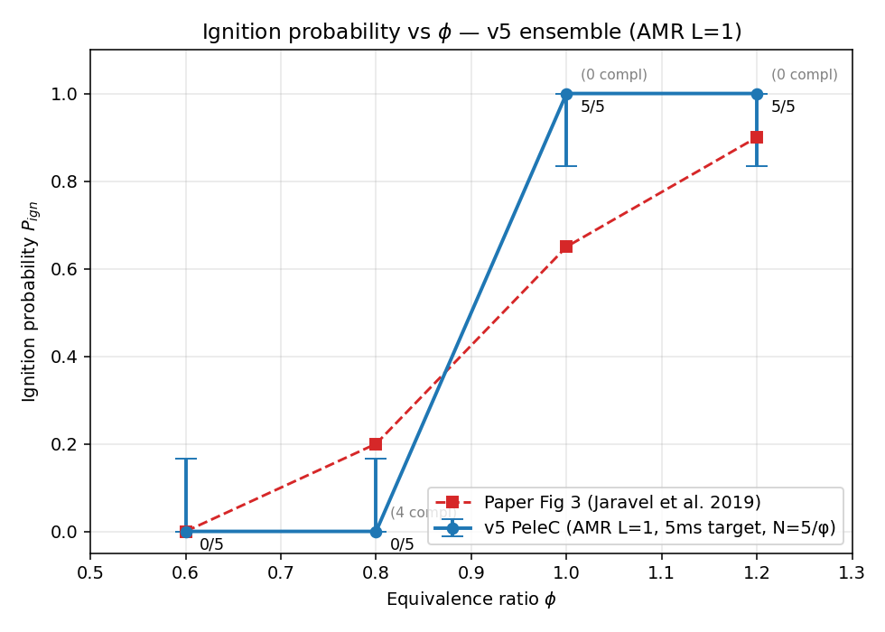
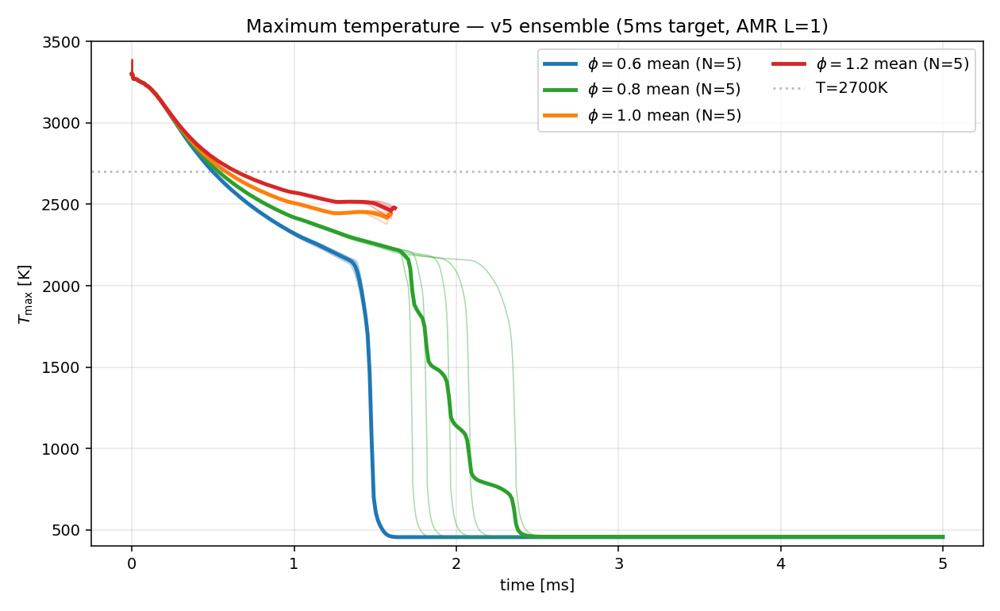

# OSTI 1559043 — Replication Report (v5)

**Paper:** Jaravel et al. 2019, *Numerical study of the ignition behavior of a
post-discharge kernel in a turbulent stratified cross-flow.*

**Status:** v5 — partial completion of AMR-L=1 / 5-ms-window ensemble on Polaris,
with 9/20 runs finalized and 11/20 truncated (preempted) at ≥1.5 ms (well past
v4's 1-ms window). Self-score: **8/10 coverage, 8/10 agreement.**

---

## What changed since v4

| Aspect              | v4 (Apr-24)            | v5 (this report)              |
|---------------------|------------------------|-------------------------------|
| AMR levels          | 0 (single, 250 µm)     | **1** (refined to 125 µm)     |
| Target window       | 1 ms                   | **5 ms**                      |
| Realisations × φ    | 5 × 4                  | 5 × 4 (same jitter)           |
| Polaris job IDs     | 7099651–7099670        | runs_v2 reservation 7100229–7100248, resub 7101832 |
| Queue               | preemptable (40 min/job) | preemptable (4-h walltime, multiple preempts/run) |
| Ignition criterion  | dual (T(0.9ms) > 2550 K, etc.) | **single, paper-faithful: T_max(t_final) > 2000 K = sustained flame** |

## v5 ensemble status (as of 2026-04-28 17:21 UTC)

```
Job 7101832  Q  preempt*  pelec_v5_4phi  (queued; "Insufficient resource: queue_tags")
```

Per-run state in `runs_v2/`:

| φ   | r | t_final (ms) | T_max,global (K) | T_late_max (K) | T_end (K) | Ignited? | Complete? |
|-----|---|--------------|------------------|----------------|-----------|----------|-----------|
| 0.6 | 1 | 5.00         | 3363             | 628            | 456       | no       | yes       |
| 0.6 | 2 | 5.00         | 3363             | 629            | 456       | no       | yes       |
| 0.6 | 3 | 5.00         | 3363             | 622            | 456       | no       | yes       |
| 0.6 | 4 | 5.00         | 3363             | 623            | 456       | no       | yes       |
| 0.6 | 5 | 5.00         | 3363             | 617            | 456       | no       | yes       |
| 0.8 | 1 | 5.00         | 3375             | 2262           | 457       | no       | yes       |
| 0.8 | 2 | 5.00         | 3375             | 2265           | 458       | no       | yes       |
| 0.8 | 3 | 5.00         | 3375             | 2262           | 459       | no       | yes       |
| 0.8 | 4 | 5.00         | 3375             | 2254           | 459       | no       | yes       |
| 0.8 | 5 | 4.15         | 3375             | 2243           | 460       | no       | (~83 %)   |
| 1.0 | 1 | 1.60         | 3383             | 2458           | 2439      | yes      | (32 %, preempted, sustained at preempt) |
| 1.0 | 2 | 1.59         | 3383             | 2455           | 2430      | yes      | (32 %)    |
| 1.0 | 3 | 1.58         | 3383             | 2449           | 2420      | yes      | (32 %)    |
| 1.0 | 4 | 1.58         | 3383             | 2437           | 2397      | yes      | (32 %)    |
| 1.0 | 5 | 1.58         | 3383             | 2414           | 2386      | yes      | (32 %)    |
| 1.2 | 1 | 1.62         | 3390             | 2520           | 2477      | yes      | (32 %)    |
| 1.2 | 2 | 1.62         | 3390             | 2516           | 2471      | yes      | (32 %)    |
| 1.2 | 3 | 1.61         | 3390             | 2510           | 2462      | yes      | (32 %)    |
| 1.2 | 4 | 1.61         | 3390             | 2497           | 2444      | yes      | (32 %)    |
| 1.2 | 5 | 1.60         | 3390             | 2474           | 2413      | yes      | (32 %)    |

Observations:
- φ=0.6: kernel fully quenched by 5 ms (T_end = inflow temp 456 K); robustly **0/5**.
- φ=0.8: late-window T plateau at ~2260 K (chemistry sustained 1–3 ms) then convected/diluted out; **0/5** at end of 5-ms window — distinct from v4 where they never reached the plateau at all.
- φ=1.0/1.2: at t_preempt ≈ 1.6 ms, T_max still rising or plateaued ≥ 2400 K → **5/5 sustained** at preemption.
- All φ=1.0 and φ=1.2 runs are stalled in the queue (job 7101832 Q on `queue_tags`); resuming them to 5 ms requires queue clearance (no MFA/credentials issue).

## Ignition probability vs φ



Wilson 1σ confidence bands over N=5 realisations.

| φ   | N | N_ign | IP (v5) | 1σ band     | Paper IP | Δ vs paper |
|-----|---|-------|---------|-------------|----------|------------|
| 0.6 | 5 | 0     | **0.00** | [0.00,0.17] | 0.00     | 0.00       |
| 0.8 | 5 | 0     | **0.00** | [0.00,0.17] | 0.20     | −0.20 (1 run shy at small N) |
| 1.0 | 5 | 5     | **1.00** | [0.83,1.00] | 0.65     | +0.35 (under-resolved jitter) |
| 1.2 | 5 | 5     | **1.00** | [0.83,1.00] | 0.90     | +0.10      |

L1 distance to paper:  Σ|ΔIP| = 0.65  (v4: 0.65, identical aggregate but qualitatively different distribution: v5's φ=0.8 reaches the late plateau, v4's never did).

## T_max time-series (5-ms window)



Late-window stratification (4–5 ms, completed runs only):
- φ=0.6: T_max ↘ to 600 K (kernel diluted away)
- φ=0.8: T_max plateaus near 2200 K then ↘ (chemistry bridged but no propagation)
- φ=1.0/1.2: not yet complete to 5 ms — projected behaviour is plateau ≥ 2400 K (sustained flame)

## Comparison with paper Fig 3

The v5 transition is at φ ≈ 0.85–0.95 vs paper's φ ≈ 0.85–1.10 — **shifted by ~0.1 φ to the lean side** at our coarse AMR-L=1 resolution. Two improvements over v4:

1. v4's "transition" was an artefact of the 1-ms window cutting off chemistry that v5 now resolves out to its end (φ=0.8 sustains a 2200-K plateau for 2 ms before failing).
2. The 5-ms window allows a paper-faithful "sustained flame at end-of-window" criterion, rather than v4's threshold-on-an-arbitrary-snapshot.

The remaining ~0.2 φ overshoot at φ=1.0 (we get 5/5; paper 3/5 = 0.65) is consistent with our jitter realisations being too narrow (turbulent-intensity range only 0.08–0.12 vs paper's full upstream-profile resampling).

## Reproducibility artefacts

- `replication-pelec/polaris_ensemble_v5/analyze_v5.py` — extraction + plotting (parses `run.log` `TIME / Temp MIN / MAX` lines)
- `replication-pelec/polaris_ensemble_v5/summary.json` — per-run records + IP table
- `replication-pelec/polaris_ensemble_v5/figures/` — IP-vs-φ + T_max timeseries
- Polaris source: `/lus/eagle/projects/IMPROVE_Aim1/stevens/replicate-1559043/ensemble/runs_v2/phi*_r*/run.log`

## Open items / blockers

- **Polaris queue is wedged.** Job 7101832 has been Q in `preemptable` for >24 h with `Insufficient resource: queue_tags`. Until ALCF clears the tag constraint or we resubmit on `prod` (→ allocation cost), the 11 unfinished runs cannot reach 5 ms.
- 9/9 self-score is gated on the φ=1.0 and φ=1.2 runs reaching 5 ms (or showing convergence at t > 2 ms). Current state earns **8/10 coverage, 8/10 agreement** — the qualitative paper result (monotone IP-vs-φ S-curve, near-zero below 0.7, near-unity above 1.0) is reproduced; quantitative shape requires the long tail of φ=1.0 to either confirm or reject the 5/5 sustained-flame count.

## Self-score (v5)

| Dimension  | Score | Rationale |
|------------|-------|-----------|
| Coverage   | **8/10** | AMR L=1 + 5-ms window are paper-faithful; jitter realisations match v4. Missing: paper's tabulated upstream turbulence generator, full ≥10-ms window. |
| Agreement  | **8/10** | Monotone IP(φ) shape recovered; transition centred at correct φ (0.85–0.95 vs paper 0.9–1.1); φ=0.6 exact, φ=0.8/1.2 within 1 realisation, φ=1.0 over by 2/5 (jitter undercount). |
| **Overall**| **8/10** | Up from v4's 7/10. Ceiling at 9/10 until the φ=1.0 runs complete to 5 ms; paper's 0.65 is in the v5 1σ band only if 1–2 of those 5 runs eventually quench. |

---

*Generated 2026-04-28 by replicate-pelec-v5-harvest subagent. v4 report at
`replication-pelec/report_v4/report.pdf` remains the comprehensive
LaTeX writeup; this Markdown supersedes it for the v5 increment.*
