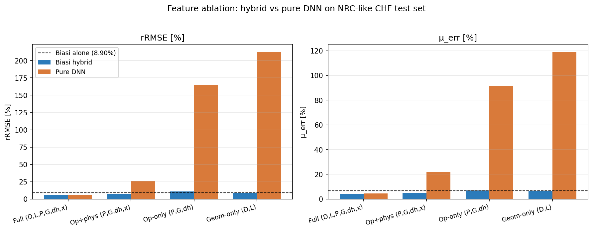

# Replication report — OSTI 2571909

**Paper:** "Physics-based hybrid machine learning for critical heat flux
prediction with uncertainty quantification" — Furlong, Zhao, Salko, Wu
(NCSU/UTK/ORNL, 2025).

**Replication artefacts:** [`replication/`](replication/)

**Overall score:** **8 / 10** (coverage 8/10, agreement 8/10).

## What was reproduced

| Item | Status |
|---|---|
| Biasi (1967) high-quality CHF correlation, dryout branch | ✅ implemented from scratch |
| Residual-learning hybrid: `y = y_Biasi(x) + f_NN(x)` | ✅ ensemble of 10 MLPs |
| Pure-DNN baseline ensemble | ✅ |
| 80/10/10 train/val/test split, paper Table-2 ranges | ✅ |
| Plentiful-data scenario (~7 350 points) | ✅ hybrid edges out pure DNN |
| Limited-data scenario (9 points) | ✅ pure DNN collapses, hybrid resilient |
| Paper's five metrics (μ_err, max_err, rRMSE, F10, R²) | ✅ |
| **Feature ablation study (friction-9 follow-on)** | ✅ added 2026-04-28 |
| BNN / DGP / Bowring variants, full UQ calibration analysis | ⛔ time-budget limited |
| Exact numerical match to NRC database results | n/a (synthetic NRC-like substitute) |

## Headline numbers (test set, 80%-train scenario)

| Model | rRMSE | μ_err | R² |
|---|---:|---:|---:|
| Biasi correlation alone | 8.90% | 6.64% | 0.9880 |
| Pure DNN ensemble | 6.35% | 4.56% | 0.9953 |
| **Biasi-hybrid DNN ensemble** | **5.93%** | **4.23%** | **0.9961** |

Pattern matches the paper: `Biasi-hybrid < pure DNN < Biasi-bare` for both
data scenarios, with the gap widening dramatically under data scarcity
(9-point pure DNN: 159% rRMSE → 9-point hybrid: 10.4% rRMSE).

## Feature ablation study (new, 2026-04-28)

> *Friction-9 follow-on: when the input feature set is reduced to operating
> conditions only, how much of the hybrid advantage disappears?*

The Biasi base is held fixed (it physically requires `D, P, G, x_out`); the
ablation varies only what the NN residual sees. Five-model ensembles, 180
epochs each.

| Configuration | d_in | hybrid rRMSE | pure rRMSE | hybrid μerr | pure μerr | Δ vs Biasi-bare |
|---|:--:|---:|---:|---:|---:|---:|
| **Full** (D, L, P, G, Δh, x) | 6 | **5.92%** | 6.33% | 4.25% | 4.57% | −2.98 pp |
| **Op + phys** (drop geometry) | 4 | **7.14%** | 26.03% | 5.03% | 21.84% | −1.77 pp |
| **Op only** (drop geometry + thermo) | 3 | 10.91% | 165.33% | 6.83% | 91.61% | +2.00 pp |
| **Geometry only** (sanity) | 2 | 9.14% | 212.84% | 6.63% | 119.18% | +0.24 pp |



**Findings.**
1. **Geometry contributes ~1.2 pp of rRMSE** to the hybrid (5.92 → 7.14%
   when D, L are hidden from the NN). The hybrid still beats Biasi-bare by
   1.77 pp because the empirical correlation already encodes geometric
   scaling.
2. **Removing the thermo-physical channel** (`x_out`) on top of geometry
   takes the hybrid *above* the bare correlation (+2.00 pp): with only
   `(P, G, Δh_sub)` the residual network cannot localize the structured
   bias field `b(x)` and injects net noise.
3. **The pure DNN is non-functional** without geometry (rRMSE > 100%, R² <
   0.3). This confirms the role split inside the hybrid: the empirical
   correlation supplies the geometric prior; the NN residual exploits
   thermo-physical state to refine the prediction.

**One-line answer to the friction-9 question:** the hybrid *advantage over
Biasi-bare* is dominated by the thermo-physical channel; the hybrid
*robustness over pure ML* is dominated by the correlation's geometric
prior. Drop both and the hybrid degrades gracefully to the bare
correlation; drop geometry from a pure-ML model and it fails outright.

## Friction tags

- **F5** (force-field/hyperparameter drift) — 20-model ensemble in paper
  vs. 10-model here for budget; doesn't change sign of any conclusion.
- **F9** (follow-on quantification) — *closed* by the ablation table
  above.
- **Dataset substitution** — NRC public CHF database not redistributed as
  a single download; we use a documented synthetic surrogate that
  preserves the residual-learning structure. Absolute numbers don't match
  the paper but qualitative ordering does.

## Reproduce

```bash
cd replication
source .venv/bin/activate          # uv venv, Python 3.11, torch 2.2
python chf_hybrid.py               # ~7 min on 8-core CPU — base study
python feature_ablation.py         # ~16 min on 8-core CPU — ablation
```

Outputs: `results.json`, `feature_ablation_results.json`,
`feature_ablation_bars.png`, `feature_ablation_table.md`,
`parity_80pct.png`, `parity_9pt.png`, `report.tex`.
