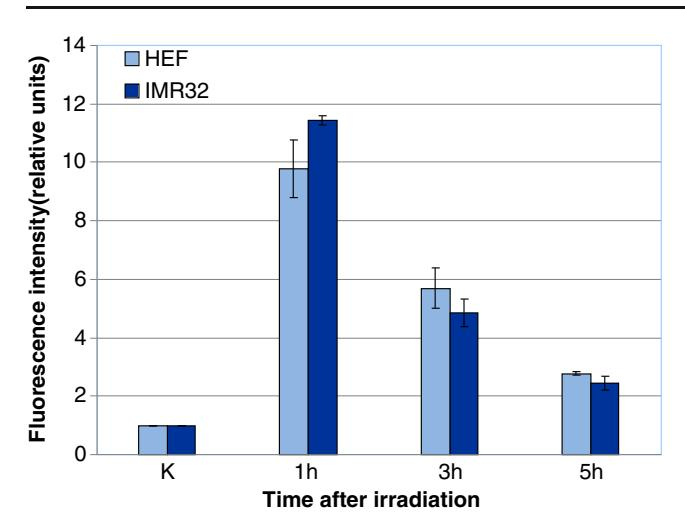
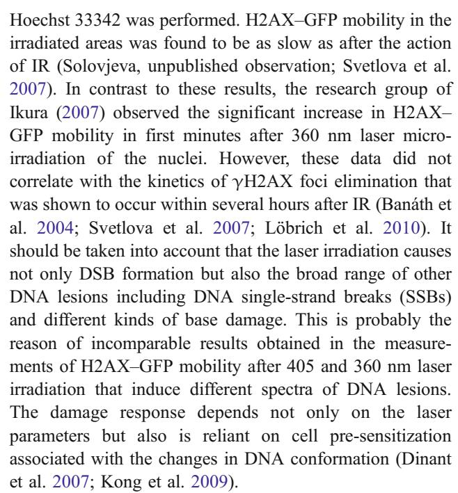
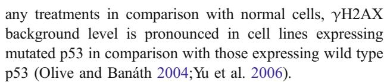
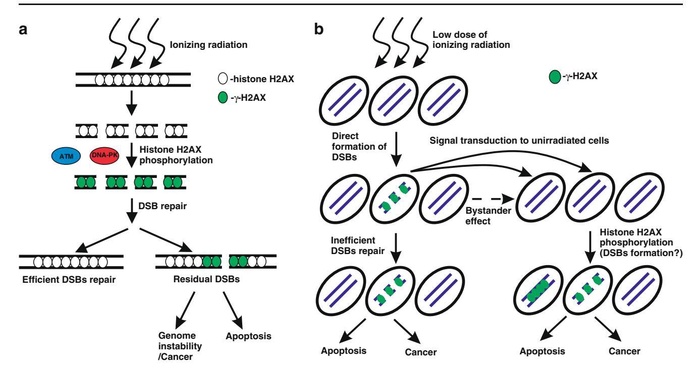

# REVIEW

# H2AX phosphorylation at the sites of DNA double-strand breaks in cultivated mammalian cells and tissues

Denis V. Firsanov & Liudmila V. Solovjeva & Maria P. Svetlova

Received: 17 March 2011 /Accepted: 10 June 2011 / Published online: 25 June 2011 # Springer-Verlag 2011

Abstract A sequence variant of histone H2A called H2AX is one of the key components of chromatin involved in DNA damage response induced by different genotoxic stresses. Phosphorylated H2AX (γH2AX) is rapidly concentrated in chromatin domains around DNA double-strand breaks (DSBs) after the action of ionizing radiation or chemical agents and at stalled replication forks during replication stress. γH2AX foci could be easily detected in cell nuclei using immunofluorescence microscopy that allows to use γH2AX as a quantitative marker of DSBs in various applications. H2AX is phosphorylated in situ by ATM, ATR, and DNA-PK kinases that have distinct roles in different pathways of DSB repair. The γH2AX serves as a docking site for the accumulation of DNA repair proteins, and after rejoining of DSBs, it is released from chromatin. The molecular mechanism of γH2AX dephosphorylation is not clear. It is complicated and requires the activity of different proteins including phosphatases and chromatinremodeling complexes. In this review, we summarize recently published data concerning the mechanisms and kinetics of γH2AX loss in normal cells and tissues as well as in those deficient in ATM, DNA-PK, and DSB repair proteins activity. The results of the latest scientific research of the low-dose irradiation phenomenon are presented including the bystander effect and the adaptive response estimated by γH2AX detection in cells and tissues.

Keywords Phosphorylation . Histone H2AX . Dephoshorylation . DNA double-strand breaks

D. V. Firsanov : L. V. Solovjeva : M. P. Svetlova (\*) Institute of Cytology, Russian Academy of Sciences, 4 Tikhoretsky ave.,

St. Petersburg 194064, Russia e-mail: svetlma@mail.ru

## Introduction

DNA double-strand breaks (DSBs) are the most dangerous lesions induced by a variety of treatments including ionizing radiation (IR), radiomimetic drugs, and lasers' action. DSB elimination is determinated by DSB repair system efficiency and is crucial for cell survival. Unsuccessful DSB repair leads to the appearance of chromosomal aberrations in mitosis and potentially could induce cancer. Extensive studies have explored the mechanisms of DSB repair that include non-homologous end-joining (NHEJ) and homologous recombination (HR). DSB repair pathways compete with each other, and the choice between them is dependent on the expression of specific protein factors and the cell cycle phase. The studies of sensitivity to IR of different mutant vertebrate cell lines have led to a conclusion that NHEJ pathway plays a dominant role in DSB repair during G1-early S phase, but could operate during the whole cell cycle, while HR is preferentially used in late S-G2 phase (Takata et al. [1998](#page-14-0); Shrivastav et al. [2008](#page-13-0)). It has been shown, using fluorescent reporter assay for the study of DSB repair induced by endonuclease, that the input of NHEJ in human cells is higher than HR during the whole cell cycle. NHEJ activity increases from G1 to G2/M stage, and HR is absent in G1, most active in S, and decreases while cells progress to G2/M stage (Mao et al. [2008](#page-12-0)).

H2AX is a variant of histone H2A in mammalian cells. The appearance of phosphorylated form of this histone, called γH2AX, is one of the earliest events involved in DNA damage response (DDR) to different genotoxic stresses that induce DSBs. The members of phosphotidylinositol 3-kinase family (PI3) ATM and DNA-PK are activated in response to DNA DSB induction by IR and phosphorylate proteins involved in cell cycle arrest and DNA repair (Rogakou et al. [1998;](#page-13-0) Yang et al. [2003](#page-14-0); Kurz

and Lees-Miller [2004\)](#page-12-0). H2AX is phosphorylated by these kinases on serine 139 within minutes after IR. The phosphorylated form of this histone spreads in both directions from DSB and occupies megabase chromatin domains (Rogakou et al. [1998](#page-13-0); Rogakou et al. [1999;](#page-13-0) Redon et al. [2002;](#page-13-0) Sedelnikova et al. [2003\)](#page-13-0). DSBs induced during S phase after the action of agents inhibiting replication like UV, hydroxyurea, or topoisomerase poisons require activation of ATR kinase for H2AX phosphorylation at the sites of stalled replication forks (Ward and Chen [2001;](#page-14-0) Ward et al. [2004](#page-14-0)). Chemical and environmental agents that do not induce DSBs also could lead to H2AX phosphorylation. For example, the treatment of cells with chemical potent carcinogen benz[a]pyrene leads to formation of covalent DNA adducts that induce H2AX phosphorylation in ATM-, ATR-, and DNA-PK-dependent manner (Yan et al. [2011](#page-14-0)). H2AX phosphorylation could be induced in DNA in the absence of DSBs by hyperthermia (Hunt et al. [2007\)](#page-12-0). Heatinduced γH2AX foci are ATM- or DNA-PK-dependent and are observed in all phases of cell cycle, but the precise mechanisms involved in foci formation are unknown (Takahashi et al. [2010](#page-13-0)).

Irradiation of tumor tissues and the use of drugs that directly produce DSBs or induce replication stress are widely applied for cancer therapy (reviewed recently by Redon et al. [2010](#page-13-0)). Therefore, the study of responses to replication stress and IR is extremely important for the development of new pathways in cancer therapy.

γH2AX could be detected in damaged cells using different kinds of techniques: flow cytometry, immunoblotting, and immunofluorescence microscopy. Since the discovery of H2AX phosphorylation in response to DSB induction by the group of Bonner (Rogakou et al. [1998\)](#page-13-0), a lot of studies were dedicated to elucidate the role of this posttranslational modification in coordination of DSB repair. It has been found using immunofluorescence microscopy with specific antibodies that γH2AX serves as a platform to recruit various repair and cell cycle proteins. After the action of IR, discrete nuclear γH2AX foci colocalize with MRE11/RAD50/NBS1(MRN complex), 53BP1, MDC1, BRCA1, and RAD51 proteins (Paull et al. [2000;](#page-13-0) Stewart et al. [2003](#page-13-0); Schultz et al. [2000](#page-13-0); Fernandez-Capetillo et al. [2003;](#page-12-0) Xie et al. [2007](#page-14-0)). The γH2AX could also serve to hold broken DNA ends together and thus facilitate their rejoining (Bassing and Alt [2004\)](#page-11-0).

It was shown that the kinetics of γH2AX induction and its release from chromatin correlated with the rate of DSB rejoining allowing therefore to use γH2AX as a sensitive marker of DSB repair (Rothkamm and Löbrich [2003](#page-13-0); Löbrich et al. [2005](#page-12-0)). However, the observation that H2AX−/− animals revealed only mild defects in DDR and DSB repair indicated that H2AX-independent mechanisms of DSBs repair could also exist (Bassing et al. [2002;](#page-11-0) Celeste et al. [2003\)](#page-11-0). The phenomenon of mild defect of DSB repair in the absence of H2AX could be explained by the fact that H2AX is not absolutely needed for the concentration of recognition factors MRN and ATM at the damaged sites (Yuan and Chen [2010\)](#page-14-0). H2AX-independent DSB recognition is possibly involved in a minor pathway of DSB rejoining that possesses low efficiency and explains moderate genomic instability of H2AX−/− mice. The main pathway of DSB repair is γH2AX-dependent, and γH2AX could likely have a role in modulating DNA repair in both subpathways —HR and NHEJ (Bassing et al. [2002](#page-11-0); Shrivastav et al. [2008\)](#page-13-0). On the other hand, γH2AX formation could be non-stringently associated with the induction of DSBs in DNA. γH2AX foci formation in the absence of DSBs was observed during cell senescence induced by the inhibition of histone deacetylase by sodium butyrate that is followed by the activation of p21 or p16, specific proteins induced in senescent cells. As it was proposed by the authors, such pseudo-DDR could serve for the protection of senescent cells from entering mitosis (Pospelova et al. [2009\)](#page-13-0). In this review, we discuss the available data concerning the mechanisms of H2AX phosphorylation/dephosphorylation in the presence of classical DDR and the kinetics of γH2AX elimination from the chromatin of cultivated mammalian cells and tissues after the induction of DSBs.

#### Protein kinases involved in H2AX phosphorylation

PI3-like kinases including ATM, ATR, and DNA-PK could be involved in histone H2AX phosphorylation at DSBs. H2AX located in chromatin domains around IRinduced DSBs is phosphorylated by ATM and DNA-PK, but the levels of phosphorylation detected by different research groups in mouse and human cell lines deficient either in ATM or DNA-PK significantly differ. ATM is recruited to DSBs and activated by MRE11-RAD50- NBS1 (MRN) DSB recognition complex (Berkovich et al. [2007](#page-11-0)). In the absence of DSBs, ATM is inactive and composed as a dimer, after IR it is autophosphorylated at serines 367, 1893, and 1981, then the dimer dissociates and its subunits are activated (Iijima et al. [2008\)](#page-12-0). The results of Burma and coworkers ([2001](#page-11-0)) established ATM as a major kinase involved in H2AX phosphorylation in mouse embryonic fibroblasts after IR action. In fibroblasts derived from ATM−/− mouse, only low level of phosphorylation evidently due to DNA-PK action could be detected. No difference in γH2AX induction was observed between normal mouse lung fibroblasts and DNA-PKdeficient SCID mouse fibroblasts, but γH2AX induction was lower in ATM−/− cells of immortalized cell line in comparison with ATM+/+ revertant cells suggesting the

predominant role of ATM in H2AX phosphorylation (Takahashi et al. [2010\)](#page-13-0).

Stiff and coworkers ([2004\)](#page-13-0) reported that the similar number of γH2AX foci was induced by IR in human and mouse embryonic fibroblasts lacking either ATM or DNA-PK in comparison with control cell lines, but the kinetics of γH2AX release was delayed in DNA-PK−/− cell line M059J derived from human malignant glioma. Normal phosphorylation kinetics was observed after irradiation of cells defective either in ATM (immortalized AT5BI cell line) or DNA-PK (M059J line) (Wang et al. [2005\)](#page-14-0), suggesting that ATM and DNA-PK could entirely substitute each other in the induction of H2AX phosphorylation.

γ-Irradiation of HeLa cells with downregulated DNA-PKcs via siRNA resulted in decreased DSB rejoining measured by comet assay and H2AX phosphorylation. The level of H2AX phosphorylation in irradiated ATMdeficient human cells of AT5BIVA line was only slightly lower than in HeLa cells and largely abolished after treatment with specific inhibitor of DNA-PK (An et al. [2010\)](#page-11-0). These results have led the authors to suggest that DNA-PK plays the dominant role in H2AX phosphorylation in response to DNA damage.

It has been shown that in irradiated mouse, B lymphocytes ATM and DNA-PK collaborate in phosphorylation of downstream targets Kap-1, Chk2, Chk1, p53 and SMC1 (Callén et al. [2009\)](#page-11-0). It is evident that both ATM and DNA-PK could act redundantly in the phosphorylation of H2AX after IR, and the discrepancy in results obtained by different research groups could be at least partially explained by variations in expression level of these kinases in the cell lines used for the studies.

Whereas ATM is activated by DNA DSBs induced by irradiation in any phase of the cell cycle, ATR activation occurs at DNA damages associated with DNA replication. γH2AX is an indicator of one end DSBs arised at stalled replication forks initiated by replication inhibitors like hydroxyurea (HU) or UV. ATR phosphorylates H2AX at the sites of blocked replication forks to initiate DSB repair and activate CHK1 kinase to prevent cell cycle progression (Ward and Chen [2001](#page-14-0)). RPA protein is associated with the stretches of single-stranded DNA (ssDNA) at stalled replication forks. ATR-interacting protein (ATRIP) binds to RPA-coated ssDNA and thus allows ATR to bind DNA at the sites of blocked replication. ATR is the major kinase activated in response to replication stress, and its activation and recruitment to HU-blocked replication forks are facilitated by the members of mitogen-activated protein kinase family ERK1 and ERK2 kinases (Wei et al. [2011\)](#page-14-0).

The resolution of stalled replication forks and the release of γH2AX are promoted by the action of methnase, a protein that methylates histone H3 at lysines 4 and 36, causing chromatin modifications associated with decondensed chromatin structure (De Haro et al. [2010](#page-11-0)). Chk1 activity is absolutely needed for the completion of repair of stalled replication forks. Chk1 depletion leads to the apoptosis of cells released from exposure to replication inhibitors. Nevertheless, a subset of Chk1-depleted cells is not associated with apoptosis after replication stress, and the elevated level of γH2AX in these cells could persist for a long time at the sites of unresolved forks, but does not facilitate the entry of cells in mitosis (Gagou et al. [2010](#page-12-0)).

ATM, ATR, and DNA-PK kinases cooperate with each other in response to IR and replication stress. ATR could be activated not only at the sites of stalled replication forks, but is also involved in response to IR in S and G2 phases of the cell cycle (Jazayeri et al. [2006;](#page-12-0) Shiotani and Zou [2009\)](#page-13-0). The ends of DSBs in these cells could be resected via ATM and Artemis-dependent action that leads to ssDNA formation followed by ATR activation that contributes to H2AX phosphorylation. ATR activation and γH2AX foci formation at late time after IR were observed also in ATM/DNA-PK inhibitor-treated G2 cells, suggesting that in the absence of ATM, DSB end resection could occur, however slowly and inefficiently (Löbrich et al. [2010\)](#page-12-0). ATM and DNA-PK could be phosphorylated by ATR kinase after the action of UV and participate in cell response to replication stress (Yajima et al. [2009](#page-14-0)). In the absence of ATR, γH2AX foci are formed in mouse fibroblasts in S phase at stalled replication forks due to the contribution of ATM and DNA-PK, but the actual input of each of these kinases in this salvage pathway is not established (Chanoux et al. [2009\)](#page-11-0).

# Mechanisms of γH2AX induction and dephosphorylation during DSB repair

Histone H2AX is phosphorylated in chromatin domains 2– 30 Mb in size surrounding DSBs within minutes after the action of IR (Rogakou et al. [1999](#page-13-0)). H2AX is a replacement histone that is incorporated in chromatin not exclusively in S phase as the other core histones. Therefore, it could be supposed that phosphorylated H2AX is directly incorporated in chromatin around IR-induced DSBs in case it possesses high mobility. The incorporation of H2AX tagged with green fluorescent protein (GFP) in chromatin of irradiated and unirradiated cells measured using fluorescence redistribution after photobleaching assay (FRAP) was found to be equally slow, indicating that phosphorylation events occur in chromatin in situ rather than by histone exchange (Svetlova et al. [2007](#page-13-0)).

The number of γH2AX foci as well as the total fluorescence intensity of γH2AX foci per cell reach maximum at 30–60 min after irradiation and after that gradually decline (Fig. [1](#page-3-0)). 53BP1 is concentrated in chromatin surrounding DSBs along with γH2AX and could

Fig. 1 Kinetics of γH2AX elimination in human cells after IR measured by flow cytometry. Human embryonic fibroblasts (HEF) and cells of human neuroblastoma cell line IMR32 were irradiated at the dose 6 Gy, after formaldehyde fixation and immunostaining with rabbit primary antibodies to γH2AX followed by FITC-conjugated anti-rabbit IgG the cells were subjected to flow cytometry analysis, and the median fluorescence intensity was measured for each time point after IR. Median fluorescence intensity values for each cell line were normalized to the median values obtained for unirradiated cells (K). The experiments were repeated three times and error bars represent one standard error

be used also as a reliable marker of DSBs. The identical kinetics of 53BP1 and γH2AX foci induction and release was demonstrated in irradiated human cells (Purrucker et al. [2010\)](#page-13-0).

Two mechanisms were proposed for the release of phosphorylated H2AX from chromatin of irradiated cells: direct dephosphorylation of γH2AX in situ by phosphatases and dephosphorylation by replacement of γH2AX molecules with unmodified H2AX (Svetlova et al. [2007](#page-13-0)). The study of the kinetics of γH2AX foci formation and elimination in Chinese hamster lung fibroblasts has shown that 5 h after irradiation with the dose 1 Gy approximately 20% of the maximal number of foci could be detected (Svetlova et al. [2007](#page-13-0)). Analysis of H2AX–GFP exchange using FRAP has demonstrated that 5 h after 1 Gy 50% of initial fluorescence in the bleached spot of the nucleus is recovered consistent with the view that significant fraction of γH2AX could be released by exchange with unphosphorylated H2AX, and γH2AX dephosphorylation occurs after its removal from chromatin into the nucleoplasm. However, the rate of H2AX exchange at local sites in the vicinity of DSBs could be much higher than the rate of its global exchange in the nucleus. DSB formation could be detected in limited nuclear compartments by the action of lasers with wavelengths 800, 405, and 360 nm (Dinant et al. [2007\)](#page-11-0). To observe the kinetics of histone exchange after the induction of DSBs located more densely in limited area of the nucleus, 405 nm laser microirradiation of living Chinese hamster cells expressing H2AX–GFP and sensitized by

Chromatin-remodeling complexes play an important role in the organization of the main DNA metabolic processes and could control H2AX exchange in the vicinity of DSBs. Tip60-remodeling complex has multiple functions in DSB repair. DSB induction destabilizes nucleosomes in chromatin that leads to the recruitment of p400 SWI/SNF ATPase, Tip60 histone acetyltransferase, and RNF8 or UBC13 proteins that acetylate and ubiquitinate histone H2AX before its phosphorylation by protein kinases (Ikura et al. [2007](#page-12-0); Xu et al. [2010b\)](#page-14-0). Tip60 binds ATM and DNA-PK and participates in their activation at DSBs (Squatrito et al. [2006\)](#page-13-0). The expression of Tip60 is required for MRN recognition complex recruitment to DSBs and the effectivity of HR of DSBs (Chailleux et al. [2010\)](#page-11-0). Drosophila Tip60 acetylates phosphorylated histone H2Av and promotes its exchange with an unmodified H2Av in vitro (Kusch et al. [2004\)](#page-12-0). Tip60 together with Rvb1 protein, a subunit of various remodeling complexes, increased the amount and persistence of γH2AX after UV and after the action of topoisomerase II inhibitor etoposide that could induce DSBs in DNA (Jha et al. [2008](#page-12-0)).

As shown in Fig. 1, normal human fibroblasts and cells of neuroblastoma cell line IMR32 have very similar kinetics of γH2AX elimination during 5 h after IR. The expression of Tip60 in IMR32 cells is seven times higher than in human fibroblasts, suggesting that the modulation of Tip60 level does not influence γH2AX induction and its release from chromatin.

Yeast INO80 complex directly binds phosphorylated histone H2A through its subunits Nhp10 or Arp4 and is related to NHEJ process (Morrison et al. [2004](#page-12-0)). Mammalian INO80 complex is recruited within 5 min to the sites of

laser-induced DSBs, colocalizes with γH2AX, and retains for several hours in the irradiated area (Kashiwaba et al. [2010\)](#page-12-0). Unlike in yeast, ARP8 subunit of INO80 complex is required for its accumulation at the sites of damage both in H2AX+/+ or H2AX−/− mouse embryonic fibroblasts. The mechanism of INO80 action is unknown, and it remains to be elucidated whether INO80 or some other remodeling complexes could be associated with H2AX exchange after IR.

It has been shown that several phosphatases are involved in γH2AX dephosphorylation during DSB repair. γH2AX is dephosphorylated in vitro and in vivo by phosphatase PP2A (Chowdhury et al. [2005\)](#page-11-0). PP2A catalytic subunit colocalizes with γH2AX in DNA damage foci, and PP2A silencing slows down the kinetics of γH2AX elimination. The effect of PP2A has been shown to be independent of PI3-like kinases. The treatment of human fibroblasts with forskolin, an activator of adenylate cyclase, decreases the spread of H2AX phosphorylation around IR-induced DSBs possibly due to the activation of PP2A by protein kinase A that is in its turn activated by adenylate cyclase (Solovjeva et al. [2009](#page-13-0)). These results conflict with those obtained by Nakada and coworkers ([2008](#page-13-0)) who have found that γH2AX dephosphorylation is PP4-dependent, and the PP2A effect on γH2AX release is minimal. PP4 phosphatase dephosphorylates ATR-mediated γH2AX induced at blocked replication forks (Chowdhury et al. [2008\)](#page-11-0). Wip1 and PP6 phosphatases also can directly dephosphorylate γH2AX during DSB repair and contribute to the recovery of damaged chromatin structure (Douglas et al. [2010](#page-11-0); Macůrek et al. [2010;](#page-12-0) Moon et al. [2010\)](#page-12-0).

It is interesting to note that some PP2A-like phosphatase family proteins (PP2A, PP6) interact with DNA-PK complex and promote DNA-PK activity (Douglas et al. [2001;](#page-11-0) Douglas et al. [2010](#page-11-0)). It could be suggested that DNA-PK plays a previously unknown role in DDR, i.e., could be involved in the recruitment of multiple phosphatases to chromatin domains containing DSBs and thus regulate the level of γH2AX dephosphorylation and cell release from G2/M checkpoint. It is possible that distinct phosphatase complexes could target γH2AX molecules located at different distances from DSB sites or could be associated with DSBs in chromatin domains of different complexity or could operate in certain cell cycle phases (Douglas et al. [2010\)](#page-11-0). There is no data directly confirming this suggestion. For example, it has been shown that γH2AX elimination in the skin of DNA-PK-deficient SCID mice is significantly inhibited in comparison with normal mice (Koike et al. [2008b\)](#page-12-0), but it is not evident whether this inhibition is a result of impaired phosphatase recruitment.

The alternative mechanism of γH2AX elimination regulated by DNA-PK was described recently. DNA-PK was shown to affect γH2AX dephosphorylation after IR through its downstream target Akt kinase (An et al. [2010](#page-11-0)). DNA-PK phosphorylates and activates Akt, which in its turn phosphorylates and inactivates GSK3β protein acting as a negative regulator of γH2AX elimination after IR. Thus, it is possible that the release of phosphorylated H2AX during DSB repair after IR could occur by different pathways in mammalian cells: by histone exchange, by direct involvement of phosphatases recruited by DNA-PK and indirect DNA-PK action via Akt/GSK3β signal pathway.

## Localization of γH2AX foci in the context of chromatin

Chromatin of interphase nuclei is composed of heterochromatin regions packaged with high density and associated with silenced genes and structurally loose regions known as euchromatin and associated with actively transcribed genes. After the action of radiation, DSBs could be induced in chromatin compartments of various densities. During last years, the distribution of γH2AX foci in the context of chromatin in cultivated mammalian cells was studied by several groups of researchers using fluorescence microscopy.

In some of the studies, the preferential localization of γH2AX foci in euchromatin was shown. γH2AX foci were absent from the chromatin area containing heterochromatin markers HP1α or trimethylated lysine 9 of histone H3 (H3K9me3) in MCF7 human cells (Cowell et al. [2007\)](#page-11-0). γH2AX was less expressed within the territory of human chromosome #18 poor of active genes in comparison with chromosome #19 that is the most gene rich (Falk et al. [2008\)](#page-12-0).

Some studies revealed that γH2AX foci could be located in the chromatin of different complexity. No correlation was found in human MCF7 cells between the fluorescence intensities of IR-induced γH2AX and H3K9me3 foci associated with DAPI-dense area of constitutive heterochromatin or histone H3 trimethylated at lysine 27 foci known as a hallmark of facultative heterochromatin (Solovjeva et al. [2007\)](#page-13-0). The study of distribution of γH2AX foci in the chromatin of Chinese hamster cells stably expressing GFP–H2AX has shown that γH2AX foci are mainly located in chromatin regions with low- and medium-GFP density, and rarely in high-GFP density chromatin, suggesting that H2AX phosphorylation could occur both in eu- and heterochromatin (our unpublished observation). In transcriptional reporter system, endonuclease-induced DSBs led to transcriptional silencing (Shanbhag et al. [2010](#page-13-0)). A moderate to strong negative correlation was found between fluorescence signals from IR-induced γH2AX foci and sites of BrUTP incorporation (Solovjeva et al. [2007](#page-13-0)) suggesting that at least a part of DSBs is located in euchromatin domains where transcription was silenced during DSB processing.

Heavy ion irradiation was used to introduce DSBs locally in dense heterochromatic regions (chromocenters)

of mouse embryonic fibroblasts (Jakob et al. [2011\)](#page-12-0). H2AX was phosphorylated initially within chromocenters, but during 20 min after ion irradiation, γH2AX foci were moving to the chromatin of lower density at the periphery of chromocenters. This relocation of chromatin regions containing γH2AX to the borders of chromocenters explains the lack of γH2AX foci in dense heterochromatin and confirms observations made previously by other groups of researchers after the use of IR.

High-magnification transmission electron microscopy (TEM) was used for the visualization of gold-labeled DSB repair proteins in cortical neurons of brain tissue samples of mice at different time points after IR (Rübe et al. [2011b](#page-13-0)). TEM imaging allowed visualizing gold-labeled proteins in the context of local chromatin density that could be detected due to variations in electron absorption. This approach gave possibility to measure DSB-rejoining kinetics in eu- and heterochromatin by calculating gold particles associated with Ku70, the key player of NHEJ. DSBs in euchromatin were rejoined very fast by NHEJ, while slower DSB repair kinetics was observed in heterochromatin. Surprisingly, it was shown that γH2AX, 53BP1, and MDC1 proteins were located exclusively in dense chromatin area, colocalized with H3K9me3, the most chracteristic mark for heterochromatin, but never colocalized with acetylated H3 that marked euhromatin domains. These observations suggest that γH2AX, 53BP1, and MDC1 assembly occurs only in heterochromatin.

The detection of IR-induced γH2AX in heterochromatin area using TEM is in accordance with the model proposed by Goodarzi and coworkers [\(2008](#page-12-0)) for the role of ATM in DSB repair. The model suggests that >75% of DSBs could be repaired in ATM-independent manner by NHEJ factors. ATM-signaling proteins like H2AX, 53BP1, and MRN complex are needed only for the repair of DSBs associated with heterochromatin, and local relaxation of heterochromatin is provided via ATM-dependent phosphorylation of KAP-1 protein involved in heterochromatin structure formation. The data obtained on mouse brain sections using TEM are not in accordance with those obtained on cultivated mammalian cells by conventional immunofluorescence technique with the use of different fixation procedures and less microscope resolution. Further insight is required to specify the reason of dissimilarity in results obtained by different approaches.

## Kinetics of H2AX phosphorylation/dephosphorylation in cultivated mammalian cells

Unirradiated cells could contain some amount of γH2AX foci due to endogenous damage. The cells of tumor cell lines express higher endogenous level of γH2AX without

H2AX is rapidly phoshorylated at the sites of DSBs after the action of IR. γH2AX foci could be detected in cell nuclei 3 min after IR, and their number reaches maximum within 30 min (Rogakou et al. [1998](#page-13-0)). The total number of γH2AX foci correlates with the total number of DSBs (Rogakou et al. [1998;](#page-13-0) Rothkamm and Löbrich [2003](#page-13-0)). The size of γH2AX foci in the nuclei 3 min after IR is smaller than that after 15 min, and the number of foci is not changed in the period 30–60 min after IR (Rogakou et al. [1999](#page-13-0)). It has been shown that the decrease of γH2AX foci number per cell after IR correlates with the rejoining of DSBs measured by pulse field gel electrophoresis (PFGE) (Löbrich et al. [2010\)](#page-12-0). The signal for γH2AX dephosphorylation is triggered obviously by DSB rejoining, but it is unknown whether γH2AX disappears immediately when DSB ends are sealed, or some period of time is needed for γH2AX elimination from the foci and restoration of native chromatin structure after completion of DSB repair.

After 1 h after IR γH2AX dephosphorylation goes down slowly and is represented by two consequent waves of γH2AX loss. The most part of γH2AX foci is eliminated within 4–5 h after IR that corresponds to the fast wave of γH2AX dephosphorylation. Approximately 50% of maximum γH2AX level observed 1 h after IR in the dose 1– 2 Gy is eliminated within 3 h, and 75% is eliminated within 5 h in primary human fibroblasts and immortalized Chinese hamster cells (Nazarov et al. [2003](#page-13-0); Svetlova et al. [2007;](#page-13-0) Solovjeva et al. [2009](#page-13-0)) (Fig. [1\)](#page-3-0). Almost complete γH2AX loss could be estimated by extrapolation of these data, and it corresponds to 7–8 h. The remaining rare foci are released very slowly and disappear in normal cells after 1–4 days (Löbrich et al. [2010\)](#page-12-0).

Two waves of γH2AX elimination were observed in human primary thyrocytes and normal bronchial epithelial cells after 1 Gy of IR. Within 5 h after the treatment, approximately 50% of foci were eliminated, and at 24 h, only 5–9% of foci retained. The fraction of cells with residual foci was higher in thyrocytes in comparison with bronchial epithelial cells (Galleani et al. [2009\)](#page-12-0). Several studies revealed the elevated number of γH2AX foci in normal human senescent cells. The number of spontaneous and residual γH2AX foci after IR increased on late passages in human fibroblasts (Endt et al. [2011](#page-11-0)). The fibroblasts obtained from Werner syndrome patients characterized by premature aging retained more residual γH2AX foci after IR in comparison with fibroblasts from healthy donors of the same age. In accordance with this observation, the rate of recruitment of repair proteins to DSBs was significantly lower in Werner syndrome cell lines

as well as in normal fibroblasts at high number of population doublings (Sedelnikova et al. [2008\)](#page-13-0). The increase of endogenous level of persistent DSBs and sustained IR-induced DSB repair were detected in human hematopoietic stem/progenitor cells with advancing donor age indicating alteration of DSB repair capacity (Rübe et al. [2011a\)](#page-13-0).The lower efficiency of DSB repair may play a role in physiological and pathological aging via the influence on genome stability.

γH2AX kinetics is compromised in cells deficient in DSB repair proteins. The higher amount of γH2AX foci was observed up to 1 h in stable clone of MCF10A human breast epithelial cells deficient in Ku70 protein (Vandersickel et al. [2010\)](#page-14-0), but the difference in foci number in comparison with control cells disappeared at later time points. This was probably an indication of the deficiency of fast of NHEJ component (D-NHEJ) operating in the early post-irradiation time and utilizing Ku, DNA-PK, and LigIV/XRCC4 proteins. In the absence of D-NHEJ, the backup component of NHEJ is slow operating through the use of PARP1, LigIII, and H1. It was shown using PFGE that the fast component of DSB repair in Ku70 knockout mutants of chicken cells was compromised (Iliakis [2009\)](#page-12-0). ATM-deficient cells cannot repair 15% of γH2AX foci that are successfully eliminated in the slow wave of repair in normal cells, and DNA ligase IV-deficient cells have more severe defect in γH2AX elimination than ATM-deficient cells (Löbrich et al. [2010\)](#page-12-0).

Rad21 expression level is important for IR-induced cell response. Impaired DSB repair via HR was found in embryonic fibroblasts (MEF) obtained from heterozygous Rad21+/− mice. Rad21 is a subunit of cohesin complex that mediates sister chromatid cohesion and is involved in DDR after IR. The elimination of IR-induced γH2AX foci in Rad21+/− MEF 4 h after IR at the dose 10 Gy was delayed (Xu et al. [2010a](#page-14-0)).

It was shown that γH2AX release after IR was faster in radioresistant tumor and normal mouse cell lines, but was slower in radiosensitive ones (Olive and Banáth [2004\)](#page-13-0). In p53-wild type human cervical cell lines, γH2AX elimination half-times after IR were less than in p53-deficient cell lines. The substantial amount of γH2AX was found in some of p53-deficient cell lines 24 h after IR, and the fraction of cells containing γH2AX foci correlated with radiation sensitivity measured as clonogenic-surviving fraction of cells. Using neutral comet assay, the persistence of DSBs at the late time points after IR was not detected in this study probably due to the sensitivity limit of the method. However, the possibility that residual γH2AX foci may not be associated with the physical breaks could not be excluded (Banáth et al. [2004\)](#page-11-0).

IR produces DSBs that differ in their structure from simple to complex. Some DSBs are induced incidentally close to each other or clustered with other types of radiation damage, such as base damage or SSBs. Twenty to thirty percent of DSBs produced by low-LET radiation are of complex type and are found side by side with the other types of damage (Nikjoo et al. [2001\)](#page-13-0). It is suggested that some of these clusters could lead to the appearance of long-living γH2AX foci that are detected 24 h or later after IR, and either represent actual unrepairable DSBs or rejoined DSBs with unrestored chromatin structure (Fig. [2\)](#page-7-0).

Rad51 protein plays an essential role in HR in mammalian cells. In yeast, RAD51 foci colocalize with persistent DSBs that cannot be repaired. Rad51 and modificated by SUMO histone variant H2AZ are required for the fixation of persistent DSBs to nuclear periphery (Kalocsay et al. [2009](#page-12-0)). The majority of γH2AX foci in mammalian cells overlapped with Rad51 foci at 24 h after IR, but relocalization of γH2AX to nuclear periphery was not noticed (Sak et al. [2005\)](#page-13-0). Rad51 tagged with GFP was used for the analysis of living human cervical carcinoma cells that retained γH2AX foci 24 h after the treatment with different chemical agents that induced direct DSBs or other kinds of damage that led to replication stress (Banáth et al. [2010](#page-11-0)). The fraction of cells that retained γH2AX and Rad51 foci correlated with the fraction of cells that lost clonogenicity. It should be noted that the majority, but not all cells containing Rad51–GFP, failed to form colonies, and at the same time most but not all cells lacking Rad51 foci formed colonies. Nevertheless, the authors suggest that cells containing residual γH2AX foci are more likely apoptotic that allows using them as biomarkers of response to damaging agents. Further studies are needed to confirm directly that all cells containing residual γH2AX foci 24 h after IR are preapoptotic or apoptotic.

# H2AX phosphorylation after low doses of IR

The effects of low-dose irradiation are the subject of intensive research. During their life, human beings undergo low doses of IR that come from natural sources and medical procedures, that is why the health risks from low doses of IR are of concern. People are getting the major part of radiation from its natural sources like building materials, cosmic rays, and some others that produce more than 80% of annual effective dose in millisievert calculated from the absorbed dose in gray taking into account tissue-weighting factors. The levels of natural radiation background vary within wide limits (tenfold or more). The average effective dose that person receives from natural radiation background estimated in the report of the United Nations Scientific Committee on the Effects of Atomic Radiation [\(1972](#page-12-0)) is about 2.4 mSv per year. Besides the natural sources of IR, people often are exposed to radiation during medical

Fig. 2 γH2AX release from IR-irradiated cells. a Effect of relatively high IR doses (higher than 10 mGy). After IR action, H2AX histone is rapidly phosphorylated by ATM kinase or, in the absence of ATM, by DNA-PK at the sites of DSBs. γH2AX serves as a docking site for recruitment of DNA repair enzymes. The γH2AX level reaches its maximum at 30–60 min after IR, and after that, γH2AX gradually decreases from chromatin. Twenty-four hours after IR, a small population of cells containing γH2AX foci can still be observed. These foci presumably represent unrepairable DSBs of "complex

structure". Persistent DSBs lead to apoptosis or increase the potential risk of cancer in irradiated tissues. b Effect of low IR doses (less than 10 mGy). DDR is not fully activated after low-dose IR, and DSB repair is inefficient. γH2AX is induced in unirradiated neighboring cells due to the signal transduction from directly irradiated cells (bystander effect). The nature of signaling is not understood, and it has not been shown yet whether γH2AX foci in bystander cells represent physical DSBs

procedures such as chest and dental X-ray screening or computed tomography. For example, the up-to-date effective dose estimates for diagnostic X-ray dental screening and chest computer tomography provided by RadiologyInfo web site (retrieved from [http://www.radiologyinfo.org\)](http://www.radiologyinfo.org) are 0.005 and 7 mSv. These doses are comparable to natural background radiation one experiences in 1 day and 2 years correspondingly. DSBs are the most dangerous DNA lesions caused by IR; that is why the study of effects of low doses of IR on mammalian cells is very important.

The strong correlation has been found between the induction of DSBs after IR measured by PFGE and the formation of γH2AX foci analyzed by immunofluorescence indicating that each γH2AX focus represents a separate DSB (Rothkamm and Löbrich [2003](#page-13-0)). Interestingly, it was shown that after IR action, the kinetics of γH2AX foci loss was strongly dependent on the dose, and the efficiency of DSB repair became lower with the decrease of IR dose. The dose 1 mGy corresponded to the threshold level below which cells failed to eliminate γH2AX foci, and the number of foci did not change during several days after the treatment. The failure to eliminate γH2AX most likely reflects the deficiency of DSB repair due to inability of cells to induce DDR, although the inability to perform some steps of molecular mechanism of γH2AX dephosphorylation after the completion of DSB repair cannot be excluded. Delayed γH2AX foci elimination was found in T lymphocytes irradiated in vitro at the dose of 5 mGy with 40% of foci persisting 24 h after IR (Beels et al. [2010\)](#page-11-0). In vivo evidence for DSB repair deficiency after low-dose IR was presented for three different mice tissues after whole-body irradiation at the dose of 10 mGy (Grudzenski et al. [2010\)](#page-12-0). In contrast to these results, it was shown using life imaging of human cells expressing YFP-53BP1 that marked the sites of DSBs that the efficiency of 53BP1 foci loss did not differ in the dose range 5 mGy–1 Gy (Asaithamby and Chen [2009](#page-11-0)). The differences in low-dose effects obtained by estimating the number of YFP-53BP1 foci in living cells and the number of γH2AX foci in fixed cells are not clear, and further studies are needed to specify the threshold levels of DSB repair efficiency in the cell lines used by these groups of researchers.

Biological effects of low-dose irradiation are of great interest in relation to the induction of cancer and genetic

abnormalities. Several dose–response models for IR were evaluated. The linear no-threshold (LNT) model postulates that any dose of radiation is potentially harmful and extrapolates the effects of high doses of IR to low-dose range [National Council on Radiation Protection & Measurements (NCRP) [2001\]](#page-13-0). LNT model is generally accepted by NCRP and health agencies in spite of the fact that the epidemiological data on the effects of low-level radiation are sometimes contradictory. There is no convincing evidence of any health effects on humans at radiation doses below 100 mSv (Tubiana et al. [2009\)](#page-14-0). The high rate of thyroid cancer in children that were exposed to Chernobylrelated radiation in 1986 has been reported (Moysich et al. [2002](#page-12-0)). The children from irradiated fathers-liquidators evidently exposed to relatively high radiation doses reveal the increased level of chromosome aberrations compared to the control ones (Agadzhanian and Suskov [2010\)](#page-11-0). There is no statistically reliable data on the increasing rates of other types of cancer besides thyroid in people exposed to low doses of radiation after this accident. It should be taken into account that both cancer and genetic damages may be caused not only by the action of low-dose irradiation, but also by many other reasons. Our knowledge on the effects of low-dose irradiation are far from complete, and recent accident at Fukushima nuclear plant has shown that the studies of the long-term consequences of irradiation on human life are extremely important. If we accept LNT dose–response relationship, even very small doses of radiation could result in increased risk to human health.

The threshold model alternate LNT model and is based on the assumption that the effects of low doses are not dangerous below the certain threshold. In the recently published papers, the strong evidence is presented that LNT model is inconsistent with epidemiological data and the results of experimental studies (Hooker et al. [2004;](#page-12-0) Tubiana et al. [2009](#page-14-0); Kuikka [2009\)](#page-12-0).

The adaptive response model postulates that low-dose IR induces adaptive protection against DNA damage triggering DNA repair mechanisms and could be beneficial for cells (Bonner [2003](#page-11-0)). Adaptive response phenomenon was demonstrated on cellular and tissue levels. The decreased number of IR-induced chromosome aberrations was observed after pre-irradiation of embryonic human fibroblasts with a low dose of IR (Ishii and Misonoh [1996\)](#page-12-0). Low-dose, lowdose-rate γ-ray irradiation of human lymphoblastoid cells facilitated I-SceI-induced single DSB repair by HR pathway (Yatagai et al. [2008\)](#page-14-0). The adaptive response could be observed not only after pre-irradiation, but also after cell pretreatment with some chemicals. The efficiency of DSB repair measured by the number of γH2AX foci after low doses (10 mGy) of irradiation was increased in human fibroblasts after pretreatment with H2O2 at appropriate concentration (such as 10 μM) that produced SSBs and base damages, but did not produce DSBs (Grudzenski et al. [2010\)](#page-12-0). The same concentration of H2O2 did not affect the foci number after higher doses of IR. It could be suggested that the activation of base excision repair (BER) after SSB induction by H2O2 leads to the formation of chromatin structure accessible not only for BER enzymes but also for repair proteins that promote the repair of DSBs adjacent to SSBs. ATR-Chk1 pathway is activated after SSB induction, and the cross-talk between ATM and ATR pathways could not be excluded as it has been demonstrated after the action of some agents (Jazayeri et al. [2006](#page-12-0)).

#### Radiation-induced bystander effect

The phenomenon of bystander effect (BE) means that the effects of radiation could occur in the absence of direct exposure of cells to radiation. The signals from irradiated cells are transmitted to unirradiated cells and therefore increase the general effect of radiation. BE could have an impact on the estimation of risks of exposure to IR and cancer radiotherapy. Although BE has been well described, its mechanisms remain unclear. The phenomenon could be observed at high doses as well as at low doses of radiation (Nikjoo and Khvostunov [2003\)](#page-13-0). The increased number of apoptotic cells after α-particle microbeam action on tissues was registered 1 mm away from the damage (Belyakov et al. [2005\)](#page-11-0). It was proposed that the existence of intercellular gap junctions, secretion of soluble factors, oxidative metabolism could regulate BE (Azzam et al. [2003\)](#page-11-0). BE could explain the effect of hyper-radiosensitivity, i.e., the reduced survival fraction of cells after the action of doses less than 50 cGy. In cell cultures, BE is produced after the incubation of unirradiated cells with conditioned media from the irradiated culture. The estimation of the number of γH2AX foci indicated that BE was not pronounced in confluent fibroblasts in comparison with cycling cells (Nuta and Darroudi [2008\)](#page-13-0). Non-IR BE was registered in HeLa cells grown in medium containing BrdU and Hoechst 33342 and irradiated with UVA. This effect measured by γH2AX and 53BP1 foci formation was observed first in S-phase cells and at later time points was registered also in non-S-phase cells (Dickey et al. [2009\)](#page-11-0).

BE in cell culture depleted of Dicer and characterized by decreased levels of miRNA was the same as in the control cell line indicating that miRNA did not represent the signal transmitted by irradiated cells (Dickey et al. [2011](#page-11-0)). Interestingly, BE was induced after the addition of media from malignant and senescent cells to non-treated normal cells. It was found that conditioned media from these cells contained elevated levels of cytokines. The addition of some of cytokines like the growth factor TGF-b and nitric oxide to normal cells induced BE (Dickey et al. [2009\)](#page-11-0). All

these data allow to propose a hypothesis that BE could be induced by signaling molecules released from cells after different kinds of genotoxic stresses including radiation from different sources and the action of various chemical agents that produce DNA damage (Sokolov et al. [2007\)](#page-13-0).

## H2AX phosphorylation in mice tissues after genotoxic stresses

Despite the numerous data concerning the dynamics of histone γ-H2AX formation and elimination after IR in cells proliferating in culture, not so much is known about its dynamics in distinct mammalian tissues, and the data reported are sometimes contradictory. The background H2AX phosphorylation in the absence of IR can be observed in the cells of proliferating tissues and the highest level of background H2AX staining is in S-phase cells. γH2AX expression was studied in unirradiated skin of mice at different times after the birth. H2AX in hair follicle cells was phosphorylated in ATM- and DNA-PK-independent manner, the level of phosphorylation changed during a hair cycle and was dependent on time passed after the birth (Koike et al. [2007\)](#page-12-0). This possibly means that H2AX is phosphorylated in follicles during S-phase at blocked replication forks due to spontaneous DNA damage, and this phosphorylation is ATR-dependent as it was shown for cultivated mammalian cells. On the contrary, the results obtained on thin sections of unirradiated mice tissues including brain, lung, heart, and small intestine have shown that they are almost completely negative for γH2AX (Rübe et al. [2008](#page-13-0)).

The kinetics of γH2AX formation and elimination in mammalian tissues is tissue-specific and differs from that in cell cultures. It was observed about three decades ago that the radiosensitivity of different mice tissues measured by alkaline elution coupled with a microfluorometric determination of DNA strand break formation varied remarkably. At 10 min after whole-body irradiation, the maximal amount of breaks was found in bone marrow and the lowest amount in intestine (Meyn and Jenkins [1983](#page-12-0)). The rapid phosphorylation of H2AX after IR with the dose 30 Gy was observed in thymus and testis, and in the epithelium cells of villi in intestine, the level of H2AX phosphorylation was less pronounced (Yoshida et al. [2003](#page-14-0)). The variations in the rate of γH2AX formation between mouse ear, liver, and kidney have been shown after IR, suggesting that DNA damage response is tissue-dependent (Koike et al. [2008a\)](#page-12-0). It should be noted, however, that no data is available on the content of histone H2AX in mouse tissues, and some differences in the level of histone could influence the extent of phosphorylated H2AX. The halftime of γH2AX loss from irradiated cells from mouse spleen, bone marrow, and cerebellum varied from 5.2 to 7.6 h, while in testis the half-time of γH2AX loss was only 2 h, suggesting different ability of these tissues to repair DSBs (Olive and Banáth [2004](#page-13-0)).

The detailed analysis of DSB repair kinetics in different types of cells in the seminiferous tubules of testis in mice after whole-body irradiation was performed by Rübe and coworkers ([2011c](#page-13-0)). It has been shown that various types of spermatogenic cells express different DSB repair markers. A dose-dependent induction of γH2AX foci was observed in round spermatids, but in elongated spermatids and spermatogonia stem cells (SSC), γH2AX foci were not formed. 53BP1 protein foci were induced in SSC, but were not formed in round and elongated spermatides. The impaired repair capacity was observed in SSC and round spermatids. Round spermatids showed highly increased γH2AX foci level at 5, 24, and 48 h after IR in comparison with normal somatic cells in lung, kidney, and brain. 53BP1 foci number in SSC at 0.5 h after IR was lower than the number of corresponding foci in somatic tissue cells, but higher at 24 and 48 h after IR. The comparison of kinetics of 53BP1 or γH2AX foci elimination in male germ cells of DNA-PK-deficient SCID and normal mice have shown that DSB repair in SSC is DNA-PK-dependent and DSB repair in round spermatids is DNA-PK-independent suggesting the involvement of other DSB repair pathways in this type of spermatogenic cells.

Rapid formation of γH2AX was found in embryonic mouse brain, the maximum of γH2AX foci was formed with similar efficiency 1 h after irradiation in neuronal precursor cells and neurons. In neurons, γH2AX was completely eliminated at 24 h after IR, but in neuronal precursor cells, the residual γH2AX foci were still observed 24 h after IR, and all of these cells demonstrated characteristic features of apoptosis (Nowak et al. [2006\)](#page-13-0). During the analysis of γH2AX foci formation in utero of γirradiated mouse one-cell stage or two-cell stage embryos, a delayed phosphorylation of H2AX was observed, suggesting that this process is inefficient in early stage embryos (Adiga et al. [2007](#page-11-0)).

Earlier we reported the significant differences in γH2AX formation and elimination between mouse heart and kidney after IR estimated by counting γH2AX-positive cells (Gavrilov et al. [2006](#page-12-0)). The delayed kinetics of γH2AX elimination in mouse cardiomyocytes after whole-body X-ray irradiation with the dose of 3 Gy was observed. At 23 h after IR, the number of γH2AX-positive nuclei represented ∼50% of maximal number of foci observed 20 min after IR. In renal epithelium, the kinetics of γH2AX foci formation and elimination was different: maximum of γH2AX-positive cells was detected at 40 min after IR, and at 23 h, their number did not differ from the control. The other group of researchers did not observe any difference in γH2AX loss between the heart

and other tissues (brain, lung, heart, small intestine, and blood lymphocytes) in normal mice by counting γH2AX foci per cell (Rübe et al. [2008](#page-13-0)). The discrepancy between these results is not clear and probably could be explained by different sensitivity of methodological approaches.

The efficiency of γH2AX foci formation and elimination after IR was analyzed in mice lacking ATM or DNA-PK. The most pronounced defect of γH2AX foci elimination was observed in different organs of SCID mice, and less defect was found in mice with ataxia-telangiectasia in comparison with repair-proficient mice that correlated with the repair capacity of these mouse strains (Rübe et al. [2008\)](#page-13-0). Koike and coworkers ([2008b\)](#page-12-0) showed that DNA-PK-dependent γH2AX formation occurred in spleen, γH2AX elimination was DNA-PK-dependent in kidney, liver, skin, and spleen, suggesting that mechanisms regulating the kinetics of H2AX phosphorylation/dephosphorylation are organ-specific.

The analysis of γH2AX induction after fractionated whole-body irradiation with the dose 2 Gy in mice has shown that the significant number of DSBs remains unrepaired after each fraction of IR that leads to gradual accumulation of unrepaired lesions in the course of irradiation, and the total extent of residual DNA damage is dependent on DSB repair capacity (Rübe et al. [2010\)](#page-13-0).

The effect of low-dose irradiation of mice correlated with that obtained using cultivated cells (Grudzenski et al. [2010](#page-12-0)). The similar numbers of γH2AX- and 53BP1 positive nuclei were observed in mouse heart, intestine, and kidney at 10 min and 72 h after whole-body irradiation with low dose (10 mGy). It means that the efficient response to IR in tissues could be accomplished only over the certain threshold number of DSBs induced in genome of separate cells. At low-dose irradiation under this threshold level of IR, the repair of DSBs is inefficient, and the breaks persist for a long time. The significant agedependent increase in the frequency of γH2AX foci not associated with telomere disfunction has been registered in senescent tissues indicating that aging occurs with the accumulation of DSBs (Wang et al. [2009](#page-14-0)).

The increased levels of γH2AX foci were observed not only in cancer cell lines but also in premalignant tissues and solid tumors (colon tubular adenocarcinoma, breast ductal adenocarcinoma, ovary adenocarcinoma, hepatoblastoma, and Wilms' tumor) (Sedelnikova and Bonner [2006](#page-13-0)), suggesting that γH2AX could be used as a marker for tumorigenesis and predisposition of cancer (Bonner et al. [2008\)](#page-11-0). The induction of γH2AX could be observed in tissues adjacent to tumors due to the signals transmitted from tumors through the gap junctions linking this phenomenon with BE registered after IR. Besides that, the mouse tumors could induce γH2AX formation in highly proliferative tissues distant from implanted tumors. The elevated levels of DSBs measured by γH2AX formation and non-DSB damages were found in gastrointestinal tract tissues, skin, and hair follicles after subcutaneous injection of tumor fragments. The increased level of blood cytokines in tumor-bearing mice suggested that cytokines could serve as inducers of DNA damage in tissues distant from tumor sites (Redon et al. [2010\)](#page-13-0).

## Concluding remarks

Phosphorylated H2AX is one of the key players in DDR to different genotoxic stresses, and it is induced very quickly at the sites of DSBs after IR and at stalled replication forks during replication stress. The method of immunofluorescent detection of γH2AX focus formation is much more sensitive than other methods of detecting DSBs in cells and tissues and is widely used in experimental research and cancer prognosis. γH2AX prevents separation of DNA ends at DSB and contributes to the recruitment of repair proteins and activation of ATM- or ATR-dependent checkpoints. After its maximal induction in the cell nuclei, γH2AX is gradually dephosphorylated. In this review, the data concerning the mechanisms of γH2AX dephosphorylation are summarized. γH2AX release is a complicated process, dephosphorylation by phosphatases as well as histone exchange are thought to be involved in it. It has been shown that several phosphatases are responsible for γH2AX dephosphorylation, but whether their role is redundant or one of them plays the most essential role remains to be elucidated. Small amount of γH2AX foci is not eliminated during a long time after the action of radiation and possibly leads to apoptosis and cell senescence. What is the nature of these foci, do they represent complex damages composed of DSBs and non-DSB lesions or the sites of rejoined DSBs where chromatin did not yet restore the normal structure?

DNA repair status of cells influences significantly γH2AX foci loss. The kinetics of γH2AX elimination in normal and repair-deficient cells and tissues is exemplified in the review. The evidence of organ-specific H2AX phosphorylation after IR is presented, but our knowledge on the pathways underlying the control of phosphorylation/ dephosphorylation in different tissues is still incomplete.

The cellular response to very low doses of ionizing radiation is of especial interest because it was found that the repair response after low-dose irradiation is less efficient than after high doses. The nature of this phenomenon and the fate of the cells with unrepaired DNA damage are unknown. The numerous data confirm the existence of BE of radiation in different cell types and tissues, however, the mechanism of BE is poorly understood. The effect induces a response that could cause gene instability in cells

neighboring the damaged ones and underlie cancer. What is the nature of the signal transmitted by damaged cells to undamaged ones? The important goal of the future research is to answer all these questions. The data available at present are obtained mainly after the action of low LET irradiation on living cells or animals, and molecular mechanisms of H2AX phosphorylation/dephosphorylation induced by other kinds of genotoxic stresses remain to be elucidated.

Acknowledgments This work was supported by the grant from the Program of the Russian Academy of Sciences "Molecular and Cell Biology" and the grant from the Russian Foundation for Basic Research 10-04-00807a.

Conflict of interest The authors declare that they have no conflict of interest.

#### References

- Adiga SK, Toyoshima M, Shimura T, Takeda J, Uematsu N, Niwa O (2007) Delayed and stage specific phosphorylation of H2AX during preimplantation development of γ-irradiated mouse embryos. Reproduction 133(2):415–422
- Agadzhanian AV, Suskov II (2010) Genomic instability in children born after the Chernobyl nuclear accident (in vivo and in vitro studies). Genetika 46(6):834–843
- An J, Huang YC, Xu QZ, Zhou LJ, Shang ZF, Huang B, Wang Y, Liu XD, Wu DC, Zhou PK (2010) DNA-PKcs plays a dominant role in the regulation of H2AX phosphorylation in response to DNA damage and cell cycle progression. BMC Mol Biol 11:18
- Asaithamby A, Chen DJ (2009) Cellular responses to DNA doublestrand breaks after low-dose gamma-irradiation. Nucleic Acids Res 37(12):3912–3923
- Azzam EI, de Toledo SM, Little JB (2003) Oxidative metabolism, gap junctions and the ionizing radiation-induced bystander effect. Oncogene 22(45):7050–7057
- Banáth JP, Klokov D, MacPhail SH, Banuelos CA, Olive PL (2010) Residual gammaH2AX foci as an indication of lethal DNA lesions. BMC Cancer 10:4
- Banáth JP, Macphail SH, Olive PL (2004) Radiation sensitivity, H2AX phosphorylation, and kinetics of repair of DNA strand breaks in irradiated cervical cancer cell lines. Cancer Res 64(19):7144– 7149
- Bassing CH, Alt FW (2004) H2AX may function as an anchor to hold broken chromosomal DNA ends in close proximity. Cell Cycle 3 (2):149–153
- Bassing CH, Chua KF, Sekiguchi J, Suh H, Whitlow SR, Fleming JC, Monroe BC, Ciccone DN, Yan C, Vlasakova K, Livingston DM, Ferguson DO, Scully R, Alt FW (2002) Increased ionizing radiation sensitivity and genomic instability in the absence of histone H2AX. Proc Natl Acad Sci USA 99(12):8173–8178
- Beels L, Werbrouck J, Thierens H (2010) Dose response and repair kinetics of gamma-H2AX foci induced by in vitro irradiation of whole blood and T-lymphocytes with X- and gamma-radiation. Int J Radiat Biol 86(9):760–768
- Belyakov OV, Mitchell SA, Parikh D, Randers-Pehrson G, Marino SA, Amundson SA, Geard CR, Brenner DJ (2005) Biological effects in unirradiated human tissue induced by radiation damage up to 1 mm away. Proc Natl Acad Sci USA 102 (40):14203–14208

- Berkovich E, Monnat RJ Jr, Kastan MB (2007) Roles of ATM and NBS1 in chromatin structure modulation and DNA double-strand break repair. Nat Cell Biol 9(6):683–690
- Bonner WM (2003) Low-dose radiation: thresholds, bystander effects, and adaptive responses. Proc Natl Acad Sci USA 100(9):4973– 4975
- Bonner WM, Redon CE, Dickey JS, Nakamura AJ, Sedelnikova OA, Solier S, Pommier Y (2008) γH2AX and cancer. Nat Rev Cancer 8(12):957–967
- Burma S, Chen BP, Murphy M, Kurimasa A, Chen DJ (2001) ATM phosphorylates histone H2AX in response to DNA double-strand breaks. J Biol Chem 276(45):42462–42467
- Callén E, Jankovic M, Wong N, Zha S, Chen HT, Difilippantonio S, Di Virgilio M, Heidkamp G, Alt FW, Nussenzweig A, Nussenzweig M (2009) Essential role for DNA-PKcs in DNA double-strand break repair and apoptosis in ATM-deficient lymphocytes. Mol Cell 34 (3):285–297
- Celeste A, Difilippantonio S, Difilippantonio MJ, Fernandez-Capetillo O, Pilch DR, Sedelnikova OA, Eckhaus M, Ried T, Bonner WM, Nussenzweig A (2003) H2AX haploinsufficiency modifies genomic stability and tumor susceptibility. Cell 114(3):371–383
- Chailleux C, Tyteca S, Papin C, Boudsocq F, Puget N, Courilleau C, Grigoriev M, Canitrot Y, Trouche D (2010) Physical interaction between the histone acetyl transferase Tip60 and the DNA double-strand breaks sensor MRN complex. Biochem J 426 (3):365–371
- Chanoux RA, Yin B, Urtishak KA, Asare A, Bassing CH, Brown EJ (2009) ATR and H2AX cooperate in maintaining genome stability under replication stress. J Biol Chem 284(9):5994–6003
- Chowdhury D, Keogh MC, Ishii H, Peterson CL, Buratowski S, Lieberman J (2005) gamma-H2AX dephosphorylation by protein phosphatase 2A facilitates DNA double-strand break repair. Mol Cell 20(5):801–809
- Chowdhury D, Xu X, Zhong X, Ahmed F, Zhong J, Liao J, Dykxhoorn DM, Weinstock DM, Pfeifer GP, Lieberman J (2008) A PP4-phosphatase complex dephosphorylates gamma-H2AX generated during DNA replication. Mol Cell 31(1):33–46
- Cowell IG, Sunter NJ, Singh PB, Austin CA, Durkacz BW, Tilby MJ (2007) gammaH2AX foci form preferentially in euchromatin after ionising-radiation. PLoS One 2(10):e1057
- De Haro LP, Wray J, Williamson EA, Durant ST, Corwin L, Gentry AC, Osheroff N, Lee SH, Hromas R, Nickoloff JA (2010) Metnase promotes restart and repair of stalled and collapsed replication forks. Nucleic Acids Res 38(17):5681–5691
- Dickey JS, Baird BJ, Redon CE, Sokolov MV, Sedelnikova OA, Bonner WM (2009) Intercellular communication of cellular stress monitored by gamma-H2AX induction. Carcinogenesis 30 (10):1686–1695
- Dickey JS, Zemp FJ, Altamirano A, Sedelnikova OA, Bonner WM, Kovalchuk O (2011) H2AX phosphorylation in response to DNA double-strand break formation during bystander signalling: effect of microRNA knockdown. Radiat Prot Dosimetry 143(2–4):264– 269
- Dinant C, de Jager M, Essers J, van Cappellen WA, Kanaar R, Houtsmuller AB, Vermeulen WJ (2007) Activation of multiple DNA repair pathways by sub-nuclear damage induction methods. J Cell Sci 120(15):2731–2740
- Douglas P, Moorhead GB, Ye R, Lees-Miller SP (2001) Protein phosphatases regulate DNA-dependent protein kinase activity. J Biol Chem 276(22):18992–18998
- Douglas P, Zhong J, Ye R, Moorhead GB, Xu X, Lees-Miller SP (2010) Protein phosphatase 6 interacts with the DNA-dependent protein kinase catalytic subunit and dephosphorylates gamma-H2AX. Mol Cell Biol 30(6):1368–1381
- Endt H, Sprung CN, Keller U, Gaipl U, Fietkau R, Distel LV (2011) Detailed analysis of DNA repair and senescence marker kinetics

- over the life span of a human fibroblast cell line. J Gerontol A Biol Sci Med Sci. doi:[10.1093/gerona/glq197.](http://10.1093/gerona/glq197)
- Falk M, Lukásová E, Kozubek S (2008) Chromatin structure influences the sensitivity of DNA to gamma-radiation. Biochim Biophys Acta 1783(12):2398–2414
- Fernandez-Capetillo O, Celeste A, Nussenzweig A (2003) Focusing on foci: H2AX and the recruitment of DNA-damage response factors. Cell Cycle 2(5):426–427
- Gagou ME, Zuazua-Villar P, Meuth M (2010) Enhanced H2AX phosphorylation, DNA replication fork arrest, and cell death in the absence of Chk1. Mol Biol Cell 21(5):739–752
- Galleani J, Miranda C, Pierotti MA, Greco A (2009) H2AX phosphorylation and kinetics of radiation-induced DNA double strand break repair in human primary thyrocytes. Thyroid 19 (3):257–264
- Gavrilov B, Vezhenkova I, Firsanov D, Solovjeva L, Svetlova M, Mikhailov V, Tomilin N (2006) Slow elimination of phosphorylated histone γ-H2AX from DNA of terminally differentiated mouse heart cells in situ. Biochem Biophys Res Commun 347 (4):1048–1052
- Goodarzi AA, Noon AT, Deckbar D, Ziv Y, Shiloh Y, Löbrich M, Jeggo PA (2008) ATM signaling facilitates repair of DNA double-strand breaks associated with heterochromatin. Mol Cell 31(2):167–177
- Grudzenski S, Raths A, Conrad S, Rübe CE, Löbrich M (2010) Inducible response required for repair of low-dose radiation damage in human fibroblasts. Proc Natl Acad Sci USA 107 (32):14205–1410
- Hooker AM, Bhat M, Day TK, Lane JM, Swinburne SJ, Morley AA, Sykes PJ (2004) The linear no-threshold model does not hold for low-dose ionizing radiation. Radiat Res 162(4):447–452
- Hunt CR, Pandita RK, Laszlo A, Higashikubo R, Agarwal M, Kitamura T, Gupta A, Rief N, Horikoshi N, Baskaran R, Lee JH, Löbrich M, Paull TT, Roti Roti JL, Pandita TK (2007) Hyperthermia activates a subset of ataxia-telangiectasia mutated effectors independent of DNA strand breaks and heat shock protein 70 status. Cancer Res 67(7):3010–3017
- Iijima K, Ohara M, Seki R, Tauchi H (2008) Dancing on damaged chromatin: functions of ATM and the RAD50/MRE11/NBS1 complex in cellular responses to DNA damage. J Radiat Res (Tokyo) 49(5):451–464
- Ikura T, Tashiro S, Kakino A, Shima H, Jacob N, Amunugama R, Yoder K, Izumi S, Kuraoka I, Tanaka K, Kimura H, Ikura M, Nishikubo S, Ito T, Muto A, Miyagawa K, Takeda S, Fishel R, Igarashi K, Kamiya K (2007) DNA damage-dependent acetylation and ubiquitination of H2AX enhances chromatin dynamics. Mol Cell Biol 27(20):7028–7040
- Iliakis G (2009) Backup pathways of NHEJ in cells of higher eukaryotes: cell cycle dependence. Radiother Oncol 92(3):310– 315
- United Nations Scientific Committee on the Effects of Atomic Radiation (UNSCEAR) (1972) Ionizing radiation: levels and effects. Report to the general assembly with annexes, v. I, New York: United Nations
- Ishii K, Misonoh J (1996) Induction of radio-adaptive response by low-dose X-irradiation on chromosome aberrations in human embryonic fibroblasts. Physiol Chem Phys Med NMR 28(2):83– 90
- Jakob B, Splinter J, Conrad S, Voss KO, Zink D, Durante M, Löbrich M, Taucher-Scholz G. (2011) DNA double-strand breaks in heterochromatin elicit fast repair protein recruitment, histone H2AX phosphorylation and relocation to euchromatin. Nucleic Acids Res. doi:[10.1093/nar/gkr230](http://dx.doi.org/10.1093/nar/gkr230)
- Jazayeri A, Falck J, Lukas C, Bartek J, Smith GC, Lukas J, Jackson SP (2006) ATM- and cell cycle-dependent regulation of ATR in response to DNA double-strand breaks. Nat Cell Biol 8(1):37–45

- Jha S, Shibata E, Dutta A (2008) Human Rvb1/Tip49 is required for the histone acetyltransferase activity of Tip60/NuA4 and for the downregulation of phosphorylation on H2AX after DNA damage. Mol Cell Biol 28(8):2690–2700
- Kalocsay M, Hiller NJ, Jentsch S (2009) Chromosome-wide Rad51 spreading and SUMO-H2A.Z-dependent chromosome fixation in response to a persistent DNA double-strand break. Mol Cell 33 (3):335–343
- Kashiwaba S, Kitahashi K, Watanabe T, Onoda F, Ohtsu M, Murakami Y (2010) The mammalian INO80 complex is recruited to DNA damage sites in an ARP8 dependent manner. Biochem Biophys Res Commun 402(4):619–625
- Koike M, Mashino M, Sugasawa J, Koike A (2007) Dynamic change of histone H2AX phosphorylation independent of ATM and DNA-PK in mouse skin in situ. Biochem Biophys Res Commun 363(4):1009–1012
- Koike M, Mashino M, Sugasawa J, Koike A (2008a) Histone H2AX phosphorylation independent of ATM after X-irradiation in mouse liver and kidney in situ. J Radiat Res (Tokyo) 49 (4):445–449
- Koike M, Sugasawa J, Yasuda M, Koike A (2008b) Tissue-specific DNA-PK-dependent H2AX phosphorylation and gamma-H2AX elimination after X-irradiation in vivo. Biochem Biophys Res Commun 376(1):52–55
- Kong X, Mohanty SK, Stephens J, Heale JT, Gomez-Godinez V, Shi LZ, Kim JS, Yokomori K, Berns MW (2009) Comparative analysis of different laser systems to study cellular responses to DNA damage in mammalian cells. Nucleic Acids Res 37(9):e68
- Kuikka JT (2009) Low-dose radiation risk and the linear no-threshold model. Int J Low Radiat 6(2):157–163
- Kurz E, Lees-Miller S (2004) DNA damage-induced activation of ATM and ATM-dependent signaling pathways. DNA Repair 3(8–9):889– 900
- Kusch T, Florens L, Macdonald WH, Swanson SK, Glaser RL, Yates JR 3rd, Abmayr SM, Washburn MP, Workman JL (2004) Acetylation by Tip60 is required for selective histone variant exchange at DNA lesions. Science 306(5704):2084–2087
- Löbrich M, Rief N, Kühne M, Heckmann M, Fleckenstein J, Rübe C, Uder M (2005) In vivo formation and repair of DNA doublestrand breaks after computed tomography examinations. Proc Natl Acad Sci USA 102(25):8984–8989
- Löbrich M, Shibata A, Beucher A, Fisher A, Ensminger M, Goodarzi AA, Barton O, Jeggo PA (2010) gammaH2AX foci analysis for monitoring DNA double-strand break repair: strengths, limitations and optimization. Cell Cycle 9(4):662–669
- Macůrek L, Lindqvist A, Voets O, Kool J, Vos HR, Medema RH (2010) Wip1 phosphatase is associated with chromatin and dephosphorylates gammaH2AX to promote checkpoint inhibition. Oncogene 29(15):2281–2291
- Mao Z, Bozzella M, Seluanov A, Gorbunova V (2008) DNA repair by nonhomologous end joining and homologous recombination during cell cycle in human cells. Cell Cycle 7(18):2902–2906
- Meyn RE, Jenkins WT (1983) Variation in normal and tumor tissue sensitivity of mice to ionizing radiation-induced DNA strand breaks in vivo. Cancer Res 43(12 Pt 1):5668–5673
- Moon SH, Nguyen TA, Darlington Y, Lu X, Donehower LA (2010) Dephosphorylation of gammaH2AX by WIP1: an important homeostatic regulatory event in DNA repair and cell cycle control. Cell Cycle 9(11):2092–2096
- Morrison AJ, Highland J, Krogan NJ, Arbel-Eden A, Greenblatt JF, Haber JE, Shen X (2004) INO80 and gamma-H2AX interaction links ATP-dependent chromatin remodeling to DNA damage repair. Cell 119(6):767–775
- Moysich KB, Menezes RJ, Michalek AM (2002) Chernobyl-related ionising radiation exposure and cancer risk: an epidemiological review. Lancet Oncol 3(5):269–279

- Nakada S, Chen GI, Gingras AC, Durocher D (2008) PP4 is a gamma H2AX phosphatase required for recovery from the DNA damage checkpoint. EMBO Rep 9(10):1019–1026
- National Council on Radiation Protection & Measurements (NCRP) (2001) Evaluation of the linear-nonthreshold dose-response model for ionizing radiation. Report No 136, Bethesda, Maryland: NCRP
- Nazarov IB, Smirnova AN, Krutilina RI, Svetlova MP, Solovjeva LV, Nikiforov AA, Oei SL, Zalenskaya IA, Yau PM, Bradbury EM, Tomilin NV (2003) Dephosphorylation of histone gamma-H2AX during repair of DNA double-strand breaks in mammalian cells and its inhibition by calyculin A. Radiat Res 160(3):309–317
- Nikjoo H, Khvostunov IK (2003) Biophysical model of the radiationinduced bystander effect. Int J Radiat Biol 79(1):43–52
- Nikjoo H, O'Neill P, Wilson WE, Goodhead DT (2001) Computational approach for determining the spectrum of DNA damage induced by ionizing radiation. Radiat Res 156(5 Pt 2):577–583
- Nowak E, Etienne O, Millet P, Lages CS, Mathieu C, Mouthon MA, Boussin FD (2006) Radiation-induced H2AX phosphorylation and neural precursor apoptosis in the developing brain of mice. Radiat Res 165(2):155–164
- Nuta O, Darroudi F (2008) The impact of the bystander effect on the low-dose hypersensitivity phenomenon. Radiat Environ Biophys 47(2):265–274
- Olive PL, Banáth JP (2004) Phosphorylation of histone H2AX as a measure of radiosensitivity. Int J Radiat Oncol Biol Phys 58 (2):331–335
- Paull TT, Rogakou EP, Yamazaki V, Kirchgessner CU, Gellert M, Bonner WM (2000) A critical role for histone H2AX in recruitment of repair factors to nuclear foci after DNA damage. Curr Biol 10(15):886–895
- Pospelova TV, Demidenko ZN, Bukreeva EI, Pospelov VA, Gudkov AV, Blagosklonny MV (2009) Pseudo-DNA damage response in senescent cells. Cell Cycle 8(24):4112–4118
- Purrucker JC, Fricke A, Ong MF, Rübe C, Rübe CE, Mahlknecht U (2010) HDAC inhibition radiosensitizes human normal tissue cells and reduces DNA double-strand break repair capacity. Oncol Rep 23(1):263–269
- Redon C, Pilch D, Rogakou E, Sedelnikova O, Newrock K, Bonner W (2002) Histone H2A variants H2AX and H2AZ. Curr Opin Genet Dev 12(2):162–169
- Redon CE, Dickey JS, Nakamura AJ, Kareva IG, Naf D, Nowsheen S, Kryston TB, Bonner WM, Georgakilas AG, Sedelnikova OA (2010) Tumors induce complex DNA damage in distant proliferative tissues in vivo. Proc Natl Acad Sci USA 107 (42):17992–17997
- Rogakou EP, Boon C, Redon C, Bonner WM (1999) Megabase chromatin domains involved in DNA double-strand breaks in vivo. J Cell Biol 146(5):905–916
- Rogakou EP, Pilch DR, Orr AH, Ivanova VS, Bonner WM (1998) DNA double-stranded breaks induce histone H2AX phosphorylation on serine 139. J Biol Chem 273(10):5858–5868
- Rothkamm K, Löbrich M (2003) Evidence for a lack of DNA doublestrand break repair in human cells exposed to very low X-ray doses. Proc Natl Acad Sci USA 100(9):5057–5062
- Rübe CE, Fricke A, Wendorf J, Stützel A, Kühne M, Ong MF, Lipp P, Rübe C (2010) Accumulation of DNA double-strand breaks in normal tissues after fractionated irradiation. Int J Radiat Oncol Biol Phys 76(4):1206–1213
- Rübe CE, Fricke A, Widmann TA, Fürst T, Madry H, Pfreundschuh M, Rübe C (2011a) Accumulation of DNA damage in hematopoietic stem and progenitor cells during human aging. PLoS One 6(3): e17487
- Rübe CE, Grudzenski S, Kühne M, Dong X, Rief N, Löbrich M, Rübe C (2008) DNA double-strand break repair of blood lymphocytes and normal tissues analysed in a preclinical mouse model:

- implications for radiosensitivity testing. Clin Cancer Res 14 (20):6546–6555
- Rübe CE, Lorat Y, Schuler N, Schanz S, Wennemuth G, Rübe C (2011b) DNA repair in the context of chromatin: new molecular insights by the nanoscale detection of DNA repair complexes using transmission electron microscopy. DNA Repair (Amst) 10 (4):427–437
- Rübe CE, Zhang S, Miebach N, Fricke A, Rübe C (2011c) Protecting the heritable genome: DNA damage response mechanisms in spermatogonial stem cells. DNA Repair 10(2):159–168
- Sak A, Stueben G, Groneberg M, Böcker W, Stuschke M (2005) Targeting of Rad51-dependent homologous recombination: implications for the radiation sensitivity of human lung cancer cell lines. Br J Cancer 92(6):1089–1097
- Schultz LB, Chehab NH, Malikzay A, Halazonetis TD (2000) p53 binding protein 1(53BP1) is an early participant in the cellular response to DNA double-strand breaks. J Cell Biol 151(7):1381– 1390
- Sedelnikova OA, Bonner WM (2006) γ-H2AX in cancer cells. Cell Cycle 5(24):2909–2913
- Sedelnikova OA, Horikawa I, Redon C, Nakamura A, Zimonjic DB, Popescu NC, Bonner WM (2008) Delayed kinetics of DNA double-strand break processing in normal and pathological aging. Aging Cell 7(1):89–100
- Sedelnikova OA, Pilch DR, Redon C, Bonner WM (2003) Histone H2AX in DNA damage and repair. Cancer Biol Ther 2(3):233– 235
- Shanbhag NM, Rafalska-Metcalf IU, Balane-Bolivar C, Janicki SM, Greenberg RA (2010) ATM-dependent chromatin changes silence transcription in cis to DNA double-strand breaks. Cell 141 (6):970–981
- Shiotani B, Zou L (2009) Single-stranded DNA orchestrates an ATMto-ATR switch at DNA breaks. Mol Cell 33(5):547–558
- Shrivastav M, De Haro LP, Nickoloff JA (2008) Regulation of DNA double-strand break repair pathway choice. Cell Res 18(1):134–147
- Sokolov MV, Dickey JS, Bonner WM, Sedelnikova OA (2007) gamma-H2AX in bystander cells: not just a radiation-triggered event, a cellular response to stress mediated by intercellular communication. Cell Cycle 6(18):2210–2212
- Solovjeva LV, Pleskach NM, Firsanov DV, Svetlova MP, Serikov VB, Tomilin NV (2009) Forskolin decreases phosphorylation of histone H2AX in human cells induced by ionizing radiation. Radiat Res 171(4):419–424
- Solovjeva LV, Svetlova MP, Chagin VO, Tomilin NV (2007) Inhibition of transcription at radiation-induced nuclear foci of phosphorylated histone H2AX in mammalian cells. Chromosome Res 15 (6):787–797
- Squatrito M, Gorrini C, Amati B (2006) Tip60 in DNA damage response and growth control: many tricks in one HAT. Trends Cell Biol 16(9):433–442
- Stewart GS, Wang B, Bignell CR, Taylor AM, Elledge SJ (2003) MDC1 is a mediator of the mammalian DNA damage checkpoint. Nature 421(6926):961–966
- Stiff T, O'Driscoll M, Rief N, Iwabuchi K, Löbrich M, Jeggo PA (2004) ATM and DNA-PK function redundantly to phosphorylate H2AX after exposure to ionizing radiation. Cancer Res 64 (7):2390–2396
- Svetlova M, Solovjeva L, Nishi K, Nazarov I, Siino J, Tomilin N (2007) Elimination of radiation-induced gamma-H2AX foci in mammalian nucleus can occur by histone exchange. Biochem Biophys Res Commun 358(2):650–654
- Takahashi A, Mori E, Su X, Nakagawa Y, Okamoto N, Uemura H, Kondo N, Noda T, Toki A, Ejima Y, Chen DJ, Ohnishi K, Ohnishi T (2010) ATM is the predominant kinase involved in the phosphorylation of histone H2AX after heating. J Radiat Res (Tokyo) 51(4):417–422

- Takata M, Sasaki MS, Sonoda E, Morrison C, Hashimoto M, Utsumi H, Yamaguchi-Iwai Y, Shinohara A, Takeda S (1998) Homologous recombination and non-homologous end-joining pathways of DNA double-strand break repair have overlapping roles in the maintenance of chromosomal integrity in vertebrate cells. EMBO J 17(18):5497–5508
- Tubiana M, Feinendegen LE, Yang C, Kaminski JM (2009) The linear no-threshold relationship is inconsistent with radiation biologic and experimental data. Radiology 251(1):13–22
- Vandersickel V, Depuydt J, Van Bockstaele B, Perletti G, Philippe J, Thierens H, Vral A (2010) Early increase of radiation-induced γH2AX foci in a human Ku70/80 knockdown cell line characterized by an enhanced radiosensitivity. J Radiat Res (Tokyo) 51(6):633–641
- Wang C, Jurk D, Maddick M, Nelson G, Martin-Ruiz C, von Zglinicki T (2009) DNA damage response and cellular senescence in tissues of aging mice. Aging Cell 8(3):311–323
- Wang H, Wang M, Wang H, Böcker W, Iliakis G (2005) Complex H2AX phosphorylation patterns by multiple kinases including ATM and DNA-PK in human cells exposed to ionizing radiation and treated with kinase inhibitors. J Cell Physiol 202(2):492–502
- Ward IM, Chen J (2001) Histone H2AX is phosphorylated in an ATRdependent manner in response to replicational stress. J Biol Chem 276(51):47759–47762
- Ward IM, Minn K, Chen J (2004) UV-induced ataxia-telangiectasiamutated and Rad3-related (ATR) activation requires replication stress. J Biol Chem 279(11):9677–9680
- Wei F, Xie Y, He L, Tao L, Tang D (2011) ERK1 and ERK2 kinases activate hydroxyurea-induced S-phase checkpoint in MCF7 cells by mediating ATR activation. Cell Signal 23(1):259–268
- Xie A, Hartlerode A, Stucki M, Odate S, Puget N, Kwok A, Nagaraju G, Yan C, Alt FW, Chen J, Jackson SP, Scully R (2007) Distinct roles of chromatin-associated proteins MDC1 and 53BP1 in mammalian double-strand break repair. Mol Cell 28(6):1045–1057

- Xu H, Balakrishnan K, Malaterre J, Beasley M, Yan Y, Essers J, Appeldoorn E, Tomaszewski JM, Vazquez M, Verschoor S, Lavin MF, Bertoncello I, Ramsay RG, McKay MJ (2010a) Rad21-cohesin haploinsufficiency impedes DNA repair and enhances gastrointestinal radiosensitivity in mice. PLoS One 5 (8):e12112
- Xu Y, Sun Y, Jiang X, Ayrapetov MK, Moskwa P, Yang S, Weinstock DM, Price BD (2010b) The p400 ATPase regulates nucleosome stability and chromatin ubiquitination during DNA repair. J Cell Biol 191(1):31–43
- Yajima H, Lee KJ, Zhang S, Kobayashi J, Chen BP (2009) DNA double-strand break formation upon UV-induced replication stress activates ATM and DNA-PKcs kinases. J Mol Biol 385 (3):800–810
- Yan C, Lu J, Zhang G, Gan T, Zeng Q, Shao Zh, Duerksen-Hughes PJ, Yang J (2011) Benzo[a]pyrene induces complex H2AX phosphorylation patterns by multiple kinases including ATM, ATR, and DNA-PK. Toxicol In Vitro 25(1):91–99
- Yang J, Yu Y, Hamrick HE, Duerksen-Hughes PJ (2003) ATM, ATR and DNA-PK: initiators of the cellular genotoxic stress responses. Carcinogenesis 24(10):1571–1580
- Yatagai F, Suzuki M, Ishioka N, Ohmori H, Honma M (2008) Repair of I-SceI induced DSB at a specific site of chromosome in human cells: influence of low-dose, low-dose-rate gamma-rays. Radiat Environ Biophys 47(4):439–444
- Yoshida K, Yoshida SH, Shimoda C, Morita T (2003) Expression and radiation-induced phosphorylation of histone H2AX in mammalian cells. J Radiat Res (Tokyo) 44(1):47–51
- Yu T, MacPhail SH, Banáth JP, Klokov D, Olive PL (2006) Endogenous expression of phosphorylated histone H2AX in tumors in relation to DNA double-strand breaks and genomic instability. DNA Repair 5(8):935–946
- Yuan J, Chen J (2010) MRE11-RAD50-NBS1 complex dictates DNA repair independent of H2AX. J Biol Chem 285(2):1097–1104

