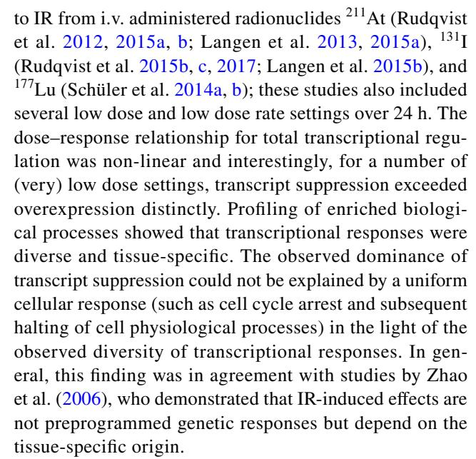
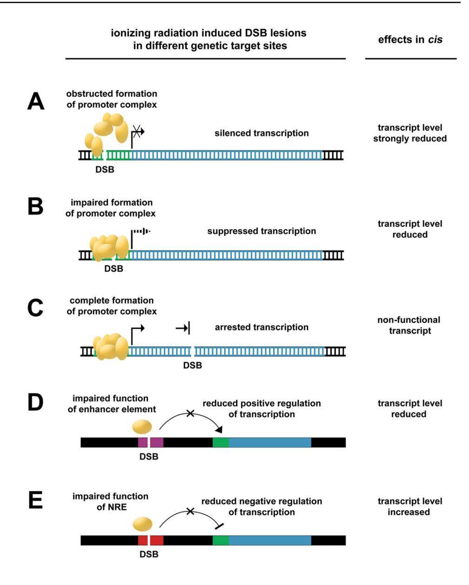

#### **CONTROVERSIAL ISSUE**

# **The IRI‑DICE hypothesis: ionizing radiation‑induced DSBs may have a functional role for non‑deterministic responses at low doses**

**Britta Langen1  [·](http://orcid.org/0000-0002-3713-6169) Khalil Helou2 · Eva Forssell‑Aronsson1,[3](http://orcid.org/0000-0002-7558-4368)**

Received: 7 November 2018 / Accepted: 2 June 2020 / Published online: 24 June 2020 © The Author(s) 2020

#### **Abstract**

Low-dose ionizing radiation (IR) responses remain an unresolved issue in radiation biology and risk assessment. Accurate knowledge of low-dose responses is important for estimation of normal tissue risk in cancer radiotherapy or health risks from occupational or hazard exposure. Cellular responses to low-dose IR appear diverse and stochastic in nature and to date no model has been proposed to explain the underlying mechanisms. Here, we propose a hypothesis on IR-induced doublestrand break (DSB)-induced cis efects (IRI-DICE) and introduce DNA sequence functionality as a submicron-scale target site with functional outcome on gene expression: DSB induction in a certain genetic target site such as promotor, regulatory element, or gene core would lead to changes in transcript expression, which may range from suppression to overexpression depending on which functional element was damaged. The DNA damage recognition and repair machinery depicts threshold behavior requiring a certain number of DSBs for induction. Stochastically distributed persistent disruption of gene expression may explain—in part—the diverse nature of low-dose responses until the repair machinery is initiated at increased absorbed dose. Radiation quality and complexity of DSB lesions are also discussed. Currently, there are no technologies available to irradiate specifc genetic sites to test the IRI-DICE hypothesis directly. However, supportive evidence may be achieved by developing a computational model that combines radiation transport codes with a genomic DNA model that includes sequence functionality and transcription to simulate expression changes in an irradiated cell population. To the best of our knowledge, IRI-DICE is the frst hypothesis that includes sequence functionality of diferent genetic elements in the radiation response and provides a model for the diversity of radiation responses in the (very) low dose regimen.

**Keywords** Low-dose response · DNA double-strand break · Cis efects · Transcription · Target theory

| * Britta Langen britta.langen@gu.se                      |
|-------------------------------------------------------------|
| Khalil Helou khalil.helou@oncology.gu.se                 |
| Eva Forssell-Aronsson eva.forssell_aronsson@radfys.gu.se |

- 1 Department of Radiation Physics, Institute of Clinical Sciences, Sahlgrenska Cancer Center, Sahlgrenska Academy, Sahlgrenska University Hospital, University of Gothenburg, SE-413 45 Gothenburg, Sweden
- 2 Department of Oncology, Institute of Clinical Sciences, Sahlgrenska Cancer Center, Sahlgrenska Academy, Sahlgrenska University Hospital, University of Gothenburg, SE-413 45 Gothenburg, Sweden
- 3 Department of Medical Physics and Biomedical Engineering, Sahlgrenska University Hospital, SE-413 45 Gothenburg, Sweden

#### **Abbreviations**

| 131I      | Iodine-131                                   |
|-----------|----------------------------------------------|
| 177Lu     | Lutetium-177                                 |
| 211At     | Astatine-211                                 |
| ATM       | Ataxia telangiectasia mutated (protein)      |
| DISC      | Double-strand break-induced silencing in cis |
| DNAPK     | DNA protein kinase                           |
| DSB       | DNA double-strand break                      |
| IR        | Ionizing radiation                           |
| IRI-DICE  | Ionizing radiation-induced DSB-induced cis   |
|           | efects                                       |
|           |                                              |
|           |                                              |
| kb        | Kilobase(s)                                  |
| LET       | Linear energy transfer                       |
| LMDS      | Locally multiply damaged sites               |
| lncRNA    | Long non-coding RNA                          |
| LNT Mb | Linear no-threshold (model) Megabase(s)   |
| NRE       | Negative regulatory element                  |
| RNAPII    | RNA polymerase II                            |

## **Background**

Radiation biology distinguishes between deterministic and stochastic responses, in principle depending on the absorbed dose level and biological endpoint under investigation (Little et al. [2009\)](#page-5-0). The basic understanding of radiation responses is built on target theory that describes the relationship between absorbed dose and ionization events ('hits') in the DNA macromolecule. DNA is understood as the critical site ('target') for protracting damage that, ultimately, gives rise to health efects (Timofeef-Ressovky et al. [1935;](#page-6-0) Elkind and Whitmore [1967;](#page-5-1) Alper [1979](#page-5-2); Osborne et al. [2000\)](#page-6-1). In this classical paradigm, DNA double-strand breaks (DSBs) are considered a severe (relevant) lesion, as opposed to single-strand breaks or other lesion types that are assumed to undergo (basically) error-free repair. In a simplifed view, if the overall damage burden exceeds the capacity of the DNA repair machinery, cell cycle arrest is initiated to allow for extensive repair. Arrest and repair can result in fully recovered cells, recovered cells with silent or severe mutations, or cells undergoing apoptosis (Hall and Giaccia [2006\)](#page-5-3). In the (very) low dose regimen, responses to ionizing radiation (IR) are more diverse and difcult to predict and, in particular, the relationship between absorbed dose, DNA damage, and health risk is an ongoing topic of debate. Low-dose radiation research is subject to the intrinsic dilemma that a low-dose stressor causes responses at low frequency and (generally) low intensity. This necessitates large data cohorts to demonstrate the causality between exposure and efect and to diferentiate the efect (frequency) from the natural background frequency.

The linear no-threshold (LNT) model has been suggested for estimating stochastic efects in the (very) low dose regimen by extrapolation (National Research Council [2006;](#page-6-2) ICRP [2007](#page-5-4); UNSCEAR [2008\)](#page-6-3). Originally, the LNT model was developed for the purpose of radiation protection and only to be used when no data is available—meaning void of the claim to describe biological radiation responses. Nevertheless, mostly owed to the fact that epidemiological data on low-dose efects are scarce and composed of diferent endpoints and exposure conditions, there is an ongoing debate of the applicability of the LNT model for risk estimation (National Research Council [2006;](#page-6-2) Preston et al. [2013;](#page-6-4) Calabrese [2017](#page-5-5); Mothersill and Seymour [2014](#page-5-6); ICRP [2005;](#page-5-7) Tubiana [2005](#page-6-5)). This controversy is further fueled by the lack of omics data that could describe genome-wide responses to low-dose radiation beyond the focus on DNA damage and repair and related hallmarks.

In recent years, our group has contributed a host of transcriptomic data to the knowledge base on tissue responses

There is a need for a hypothesis on the observed response diversity in the (very) low dose regimen to advance the scientifc process on the matter of low-dose risk assessment. Based on the discovery of how DSB induction afects transcript expression (Shanbhag et al. [2010;](#page-6-14) Shanbhag and Greenberg [2010\)](#page-6-15), the threshold behavior of DNA damage repair (Shanbhag et al. [2010;](#page-6-14) Huen and Chen [2010](#page-5-11); Ismail et al. [2005](#page-5-12)), and our fndings on diversity of cellular responses at (very) low dose and low dose rate (Langen et al. [2013,](#page-5-8) [2015a](#page-5-9), [b](#page-5-10); Rudqvist et al. [2012,](#page-6-6) [2015a,](#page-6-7) [b](#page-6-8), [c,](#page-6-9) [2017](#page-6-10); Schüler et al. [2014a](#page-6-11), [b\)](#page-6-12), we propose a mechanistic model that introduces DNA sequence functionality to target theory to describe the diversity of radiation responses in the (very) low dose regimen.

## **Hypothesis to explain low‑dose response diversity: IRI‑DICE**

In a pioneer study, Shanbhag and colleagues showed that DSB production reduced transcript levels using a specifc damage induction and reporter construct: DSBs were induced in the vicinity of a specifc promoter resulting in suppression of transcription of the promoter-controlled gene which was termed double-strand break-induced silencing in cis (DISC) (Shanbhag et al. [2010;](#page-6-14) Shanbhag and Greenberg [2010\)](#page-6-15). Moreover, transcriptional arrest also occurs in actively transcribed genes (by RNA polymerase II (RNAPII)) if the DSB lesion lies in the gene core independent of promotor disruption (Pankotai et al. [2012;](#page-6-16) Kim et al. [2016](#page-5-13); Iannelli et al. [2017](#page-5-14)). In this case, inhibition of elongation and reinitiation do not appear to be mediated by the DSB lesion itself, but through DNA protein kinase (DNAPK) activity involving the proteasome-dependent pathway (Pankotai et al. [2012](#page-6-16); Iannelli et al. [2017](#page-5-14)).

Furthermore, a repressive cis efect (from a DSB in a given gene) has also been demonstrated for closely proximal genes (up to 100 kilobases (kb) distance), while distal genes [one megabase (Mb) distance] were basically unafected (Iannelli et al. [2017](#page-5-14)).

DSB lesions are a hallmark of IR-induced damage. It can be assumed that the efect resulting from a DSB lesion is independent of the cause of damage if the DSBs from different sources present the same features and lesion complexity. Based on the molecular mechanism DISC described by Shanbhag and colleagues (Shanbhag et al. [2010;](#page-6-14) Shanbhag and Greenberg [2010](#page-6-15)) and supported by other groups (Pankotai et al. [2012;](#page-6-16) Kim et al. [2016](#page-5-13); Iannelli et al. [2017](#page-5-14)), we postulate that IR-induced DSB-induced cis efects (IRI-DICE) impair not only the structural integrity of the DNA, but also the functional integrity of the transcriptome and, ultimately, afect cellular processes. We hypothesize that IRI-DICE manifests particularly in the (very) low dose regimen since the DSB burden is below the induction threshold of the DNA damage recognition and repair machinery in contrast to higher absorbed dose (Shanbhag and Greenberg [2010](#page-6-15); Huen and Chen [2010](#page-5-11); Ismail et al. [2005](#page-5-12)). We reason that the stochastic distribution of IRI-DICE across the genome results in stochastic disruption of gene expression, which contributes to the diversity of radiation responses observed at (very) low doses. (It should be noted that track-structure and genome organization may strongly increase the probability of a lesion to occur in a certain location in relation to a prior lesion.)

Furthermore, the IRI-DICE model expands on target theory and introduces DNA sequence functionality as a genetic target site within the DNA macromolecule: the promoter region, regulatory elements, and gene core constitute genetic elements which, if damaged, would give rise to diferent functional outcomes. IRI-DICE could result in somewhat suppressed, strongly suppressed, completely suppressed (silenced), or even increased transcript expression, depending on which functional element was hit (Fig. [1](#page-3-0)). (Transcript increase, however, is considered less frequent due to the relatively short sequence length of negative regulatory elements (NREs) compared with the other genetic elements.) Accordingly, the outcome of IRI-DICE is thought to depend on the sequence length of diferent genomic target sites and the respective probability of being hit. Subsequently, if a gene product is not synthesized in the physiologically required concentration (at a given time) due to impaired transcription, the resulting cellular responses can be as manifold as the functions of genes expressed in a given cell type. In general, the impact of IRI-DICE on transcriptional integrity would also depend on whether the lesion occurred in an actively transcribed or inactive gene, i.e. the latter having no immediate cis efect. In this theoretic framework, epigenetic gene regulation (DNA compaction vs. accessibility) would constitute another factor that could infuence the manifestation and frequency IRI-DICE and add to the complexity of low-dose radiation efects.

IRI-DICE may explain, in part, the stochastic nature of cellular responses observed in the (very) low dose regimen. Regarding increased absorbed dose levels, we reason that IRI-DICE would also occur initially, however, without lasting consequence: activation of Ataxia Telangiectasia Mutated (ATM) exhibits a threshold that correlates with the number of induced DSBs (Huen and Chen [2010;](#page-5-11) Ismail et al. [2005\)](#page-5-12) and accordingly, initiation of (accurate) DNA repair would restore transcript expression. This reasoning is further supported by a study on DSB repair after X-ray irradiation, which demonstrated a higher frequency of persisting DSB lesions at a very low absorbed dose as opposed to an increased absorbed dose where less DSB lesions persisted (Rothkamm and Löbrich [2003](#page-6-17)).

### **Discussion**

#### **IRI‑DICE and radiation quality**

The frequency and persistence of IRI-DICE is expected to depend on radiation type, energy, and—notably, but not exclusively—the LET value. For a given absorbed dose, the ratio of hit vs. non-hit cell fractions and the probability of multiple hits within one cell difer between radiation types. For α-particle exposure in the micro- to milli-Gy range (mean absorbed dose), for instance, only a very small fraction of the cell population is hit by α-particles and would be subjected to (clustered) DNA damage. X-ray irradiation at the same absorbed dose would result in a higher fraction of hit cells and a higher probability of multiple (non-clustered) lesions within one cell, yet with a lower ratio of DSB compared with other lesion types. In context with the threshold behavior of the DNA damage recognition and repair machinery, the reconstitution of gene expression would be less likely for irradiation settings that lead to only a few DSB lesions per cell.

The fraction of protein-coding genes in mammalian genomes is relatively low with an estimate of less than 2% of genomic material (International Human Genome Sequencing Consortium [2001](#page-5-15)). Applying this gene-centric paradigm, a DSB in a relevant IRI-DICE target would only occur in approximately one out of 50 randomly distributed ionization events. This low ratio challenges the relevance that IRI-DICE would have for (very) low dose radiation responses if most DSBs were induced in sequences that have no function to be disrupted. However, various studies have demonstrated the correlation of long non-coding RNA (lncRNA) with human diseases, challenging the concept that vast regions of genomic material are without function

**Fig. 1** Illustrated IRI-DICE hypothesis showing the relation between DSB location and efect on transcript expression. The promoter region (green) is a DNA sequence where several proteins (orange) bind to form a promoter complex that regulates transcription (**a**–**c**). Inhibition of complex formation due to an ionizing radiation-induced DSB lesion results in strongly suppressed transcription (**a**), while improper binding due to DSB lesion can result in reduced transcription (**b**). In the gene core (blue), a DSB would not result in silencing of transcription, but in shortened and impaired messenger RNA (**c**). DSBs in regulatory elements can also afect transcript levels: a DSB in an enhancer sequence (purple) (**d**) or negative regulatory element (NRE, red) (**e**) can impair binding of transcription factors (orange) and have a negative or positive efect on transcription, respectively. Black arrows indicate activity or positive action; hashed arrow indicates reduced activity; bars indicate arrest or negative action; crosses indicate inhibition

or physiological relevance (Mattick [2004;](#page-5-16) Wilusz et al. [2009](#page-6-18); Kung et al. [2013](#page-5-17); Marchese et al. [2017\)](#page-5-18). Moreover, the ENCODE (Encyclopedia of DNA Elements) project has supplied mounting evidence that over 80% of non-coding regions have at least one functional activity in one cell type (ENCODE Project Consortium [2012](#page-5-19)). It should be noted that 'functional activity' in this regard has been contested since the method detected primarily 'chemical activity' instead of endpoints with 'biological function' (Eddy [2012](#page-5-20); Ford Doolittle [2013](#page-5-21); Palazzo and Gregory [2014](#page-6-19)). Nevertheless, these regions have also been shown to underlie evolutionary selection (ENCODE Project Consortium [2012\)](#page-5-19), which does support the claim of functional relevance even if the mechanisms have not yet been elucidated. Other work also indicates that a sharp distinction between coding and non-coding elements in terms of functionality may not be

adequate when non-coding RNA can be derived from introns and exons of protein-coding and non-protein-coding genes (Mattick [2004](#page-5-16)). In addition, transcriptional ripple efects have been observed across the genomic landscape that afect expression kinetics in other regions beyond promotors and regulatory elements (Ebisuya [2008\)](#page-5-22). Taken together with a suppressive cis efect on proximal genes (Iannelli et al. [2017\)](#page-5-14), it is theoretically possible that a DSB induced in these non-coding regions may also constitute an IRI-DICE event with a cis efect on adjacent protein-coding genes. Alternatively, functional elements in the large non-coding regions of the genome (coding e.g., lncRNA) could be directly disrupted by a DSB similar to an IRI-DICE event (in a proteincoding gene). In either case, the probability of DSB-induced disruptive cis events greatly increases in the light of genomic sequence functionality beyond protein-coding genes.

Another important aspect regarding radiation quality is the complexity of DSB lesions. DSB damage can range from individual lesion sites to clustered damage (so-called locally multiply damaged sites, LMDS), which depends on the microdosimetric properties and can difer substantially between diferent radiation types and energies (Goodhead [1994](#page-5-23); Ward [1994\)](#page-6-20). It has been shown that damage complexity not only afects repair fdelity but also repair kinetics where more complex lesions persist longer than simple DSB sites (Pinto et al. [2005](#page-6-21); Hable et al. [2012\)](#page-5-24). Accordingly, not only the frequency of IRI-DICE would depend on radiation type and energy, but also the duration of transcript suppression, as clustered damage would persist longer than simple DSB lesion sites. For instance, complex DNA damage from α-particles would persist longer than the same lesion burden (i.e., number of DSB lesion sites) induced by X-ray irradiation. This would imply that radiation-induced DSB damage would not only have a functional efect on gene expression, but that physical radiation parameters would introduce a temporal dimension of how long that functional efect would persist.

### **Approaches to test IRI‑DICE**

The IRI-DICE hypothesis ofers a mechanistic model for the diversity and non-deterministic occurrence of cellular responses to (very) low absorbed dose. Technical advances in the quantifcation of DSB lesions have been made with e.g., BLESS, i-BLESS, BLISS, END-Seq or Break-Seq (Crosetto et al. [2013;](#page-5-25) Biernacka et al. [2018;](#page-5-26) Yan et al. [2017](#page-6-22); Mirzazadeh et al. [2018](#page-5-27); Canela et al. [2016;](#page-5-28) Hofman et al. [2015\)](#page-5-29). These methods allow for DSB detection with an improved spatial resolution that could be used to differentiate between lesions in the promotor region, regulatory elements, or the gene core. DSB location could then be correlated to single-cell transcriptional data of the same gene and thus support or reject the hypothesized IRI-DICE outcome (cf*.* Fig. [1\)](#page-3-0). Unfortunately, while improved DSB detection is available, the localized irradiation of a specifc genetic target site poses a limitation to experimental testing. So-called microbeam irradiations can be performed with sub-micron precision (Bigelow et al. [2009](#page-5-30)), but the beam diameter achieved to date is still too large to target a specifc site in the DNA. Irradiation using radionuclides would theoretically be possible with specifc DNA sequence-targeting molecules labeled with a radionuclide that only emits electrons with very low energy; however, to our knowledge, such compounds are not available at present. Hence, hypothesis testing with radionuclides or external beams is currently not available and would require major research and development eforts in the future.

A computational model may provide supportive evidence for the IRI-DICE hypothesis, but would necessitate a highly detailed chromatin model. The cell-type-specifc model would need to be based on—most notably, but not exclusively—the nuclear distribution (i.e., size and localization) of protein-coding and non-coding genes, of actively transcribed or silenced genes, and of respective regulatory elements. The relative sequence length of functional sites would be an approximation of the probability to disrupt normal transcript expression of a given gene. Epigenetic regulation could be modeled as a binary multiplier (silencing or activation represented as zero or one). This genetic target site-specifc model could then be used in Monte Carlo simulations of particle traversal and distribution of ionization events within a certain chromatin volume. To relate computational results to irradiation experiments, the simulation would also need to model tissues in vivo or cell cultures in vitro. Ultimately, this approach would yield the probability of DSB production in a certain gene and, according to the IRI-DICE hypothesis, the probability of observing a persistent increase or decrease in transcript expression. The in silico data should then be matched with experiments where a certain chromatin volume in the nucleus would be irradiated with a microbeam at (very) low absorbed dose. (While a genetic element cannot be targeted with current microbeam technology, it would limit the distribution of DSBs across the genome and thus reduce statistical complexity.) Immediately afterward, the cells would be subjected to single-cell transcriptional analysis and the data compared with unirradiated controls. This approach, however, bears critical limitations: for one, statistically large data cohorts would be needed from in vitro experiments, which poses a challenge to the throughput of microbeam irradiation and single-cell transcriptional analysis; for the other, genes function as a network, and transcriptional efects in one gene may cause a transcriptional response in another gene. Hence, data analysis (both in vitro and in silico) would need to consider transcriptional down-stream efects as confounders. It may thus be highly difcult to test the hypothesis until irradiation technologies are developed that allow DSB induction in specifc genetic target sites.

# **Concluding remarks**

The IRI-DICE hypothesis provides a working model for the study of non-deterministic responses in the (very) low dose regimen by linking the stochastic occurrence of DSBs in a genetic target site to a functional efect on transcript expression. Furthermore, IRI-DICE suggests that DNA sequence functionality needs to be considered in an expansion of target theory for (very) low dose exposure and that functional elements are implemented in computational models in the future.

**Acknowledgements** Open access funding provided by University of Gothenburg. The presented work was kindly supported by grants from the Swedish Research Council (Grant no. 21073), the Swedish Cancer Society (Grant no. 3427), BioCARE—a National Strategic Research Program at the University of Gothenburg, the Swedish Radiation Safety Authority, the Swedish state under the agreement between the Swedish government and the county councils (the ALF-agreement, ALFGBG-725031), the King Gustav V Jubilee Clinic Cancer Research Foundation, the Sahlgrenska University Hospital Research Funds, and the Assar Gabrielsson Cancer Research Foundation.

**Author contributions** BL conceived of and developed the hypothesis and drafted the manuscript. KH and EFA contributed to the hypothesis and helped to draft the manuscript. All authors read and approved the fnal manuscript.

#### **Compliance with ethical standards**

#### **Conflict of interest** None.

**Open Access** This article is licensed under a Creative Commons Attribution 4.0 International License, which permits use, sharing, adaptation, distribution and reproduction in any medium or format, as long as you give appropriate credit to the original author(s) and the source, provide a link to the Creative Commons licence, and indicate if changes were made. The images or other third party material in this article are included in the article's Creative Commons licence, unless indicated otherwise in a credit line to the material. If material is not included in the article's Creative Commons licence and your intended use is not permitted by statutory regulation or exceeds the permitted use, you will need to obtain permission directly from the copyright holder. To view a copy of this licence, visit <http://creativecommons.org/licenses/by/4.0/>.

## **References**

- Alper T (1979) Cellular radiobiology. Cambridge University Press, Cambridge
- Biernacka A, Zhu Y, Skrzypczak M, Forey R, Pardo B et al (2018) I-BLESS is an ultra-sensitive method for detection of DNA double-strand breaks. Commun Biol 1:181
- Bigelow A, Garty G, Funayama T, Randers-Pehrson G, Brenner D, Geard C (2009) Expanding the question-answering potential of single-cell microbeams at RARAF, USA. J Radiat Res 50(Suppl A):A21–A28
- Calabrese EJ (2017) The threshold vs LNT showdown: dose rate fndings exposed faws in the LNT model part 1. The Russell-Muller debate Environ Res 154:435–451
- Canela A, Sridharan S, Sciascia N, Tubbs A, Meltzer P, Sleckman BP, Nussenzweig A (2016) DNA breaks and end resection measured genome-wide by end sequencing. Mol Cell 63:898–911
- Crosetto N, Mitra A, Silva MJ, Bienko M, Dojer N et al (2013) Nucleotide-resolution DNA double-strand break mapping by next-generation sequencing. Nat Methods 10:361–365
- Ebisuya M (2008) Ripples from neighbouring transcription. Nat Cell Biol 10:1106–1113
- Eddy SR (2012) The C-value paradox, junk DNA and ENCODE. Curr Biol 22:R898–R899
- Elkind MM, Whitmore GF (1967) The Radiobiology of Cultured Mammalian Cells. Gordon & Breach Science Publishers, New York
- ENCODE Project Consortium (2012) An integrated encyclopedia of DNA elements in the human genome. Nature 489:57–74

- Ford Doolittle W (2013) Is junk DNA bunk? A critique of ENCODE. Proc Natl Acad Sci USA 110:5294–5300
- Goodhead DT (1994) Initial events in the cellular efects of ionizing radiations: clustered damage in DNA. Int J Radiat Biol 65:7–17
- Hable V, Drexler GA, Brüning T, Burgdorf C, Greubel C, Derer A, Seel J, Strickfaden H, Cremer T, Friedl AA, Dollinger G (2012) Recruitment kinetics of DNA repair proteins Mdc1 and Rad52 but not 53BP1 depend on damage complexity. PLoS ONE 7:e41943
- Hall EJ, Giaccia AJ (2006) Radiobiology for the radiologist. Lippincott William and Wilkins, Philadelphia
- Hofman EA, McCulley A, Haarer B, Arnak R, Feng W (2015) Breakseq reveals hydroxyurea-induced chromosome fragility as a result of unscheduled confict between DNA replication and transcription. Genome Res 25:402–412
- Huen MS, Chen J (2010) ATM creates a veil of transcriptional silence. Cell 141:924–926
- Iannelli F, Galbiati A, Capozzo I, Nguyen Q, Magnuson B et al (2017) A damaged genome's transcriptional landscape through multilayered expression profling around in situ-mapped DNA doublestrand breaks. Nat Commun 8:15656
- International Human Genome Sequencing Consortium (2001) Initial sequencing and analysis of the human genome. Nature 409(6822):860–921
- ICRP (2005) Low-dose extrapolation of radiation-related cancer risk. ICRP Publication 99. Ann. ICRP 35 (4)
- ICRP (2007) The 2007 recommendations of the international commission on radiological protection. ICRP Publication 103. Ann. ICRP 37 (2-4)
- Ismail IH, Nyström S, Nygren J, Hammarsten O (2005) Activation of ataxia telangiectasia mutated by DNA strand break-inducing agents correlates closely with the number of DNA double strand breaks. J Biol Chem 280:4649–4655
- Kim J, Sturgill D, Tran AD, Sinclair DA, Oberdoerfer P (2016) Controlled DNA double-strand break induction in mice reveals postdamage transcriptome stability. Nucleic Acids Res 44(7):e64
- Kung JT, Colognori D, Lee JT (2013) Long noncoding RNAs: past, present, and future. Genetics 193:651–669
- Langen B, Rudqvist N, Parris TZ, Schüler E, Helou K, Forssell-Aronsson E (2013) Comparative analysis of transcriptional gene regulation indicates similar physiologic response in mouse tissues at low absorbed doses from intravenously administered 211At. J Nucl Med 54:990–998
- Langen B, Rudqvist N, Parris TZ, Schüler E, Spetz J, Helou K, Forssell-Aronsson E (2015a) Transcriptional response in normal mouse tissues after i.v. (211)At administration—response related to absorbed dose, dose rate, and time. EJNMMI Res 5:1
- Langen B, Rudqvist N, Parris TZ, Helou K, Forssell-Aronsson E (2015b) Circadian rhythm infuences genome-wide transcriptional responses to (131)I in a tissue-specifc manner in mice. EJNMMI Res 5:75
- Little MP, Wakeford R, Tawn EJ, Boufer SD, Berrington de Gonzalez A (2009) Risks associated with low doses and low dose rates of ionizing radiation: why linearity may be (almost) the best we can do. Radiology 251:6–12
- Marchese FP, Raimondi I, Huarte M (2017) The multidimensional mechanisms of long noncoding RNA function. Genome Biol 18:206
- Mattick JS (2004) RNA regulation: a new genetics? Nat Rev Genet 5:316–323
- Mirzazadeh R, Kallas T, Bienko M, Crosetto N (2018) Genome-wide profling of DNA double-strand breaks by the BLESS and BLISS methods. Methods Mol Biol 1672:167–194
- Mothersill C, Seymour C (2014) Implications for human and environmental health of low doses of ionising radiation. J Environ Radioact 133:5–9

- National Research Council (2006) Health Risks from Exposure to Low Levels of Ionizing Radiation: BEIR VII Phase 2. The National Academies Press, Washington, DC. [https://www.nap.edu/catal](https://www.nap.edu/catalog/11340/health-risks-from-exposure-to-low-levels-of-ionizing-radiation) [og/11340/health-risks-from-exposure-to-low-levels-of-ionizing](https://www.nap.edu/catalog/11340/health-risks-from-exposure-to-low-levels-of-ionizing-radiation)[radiation](https://www.nap.edu/catalog/11340/health-risks-from-exposure-to-low-levels-of-ionizing-radiation)
- Osborne JC, Miller JH Jr, Kempner ES (2000) Molecular mass and volume in radiation target theory. Biophys J 78:1698–1702
- Palazzo AF, Gregory TR (2014) The case for junk DNA. PLoS Genet 10:e1004351
- Pankotai T, Bonhomme C, Chen D, Soutoglou E (2012) DNAPKcsdependent arrest of RNA polymerase II transcription in the presence of DNA breaks. Nat Struct Mol Biol 19(3):276–282
- Pinto M, Prise KM, Michael BD (2005) Evidence for complexity at the nanometer scale of radiation-induced DNA DSBs as a determinant of rejoining kinetics. Radiat Res 164:73–85
- Preston RJ, Boice JD Jr, Brill AB, Chakraborty R, Conolly R, Hofman FO, Hornung RW, Kocher DC, Land CE, Shore RE, Woloschak GE (2013) Uncertainties in estimating health risks associated with exposure to ionising radiation. J Radiol Prot 33:573–588
- Rothkamm K, Löbrich M (2003) Evidence for a lack of DNA doublestrand break repair in human cells exposed to very low X-ray doses. Proc Natl Acad Sci USA 100:5057–5062
- Rudqvist N, Parris TZ, Schüler E, Helou K, Forssell-Aronsson E (2012) Transcriptional response of BALB/c mouse thyroids following in vivo astatine-211 exposure reveals distinct gene expression profles. EJNMMI Res 2:32
- Rudqvist N, Spetz J, Schüler E, Parris TZ, Langen B, Helou K, Forssell-Aronsson E (2015a) Transcriptional response in mouse thyroid tissue after 211At administration: efects of absorbed dose, initial dose-rate and time after administration. PLoS ONE 10:e0131686
- Rudqvist N, Spetz J, Schüler E, Langen B, Parris TZ, Helou K, Forssell-Aronsson E (2015b) Gene expression signature in mouse thyroid tissue after (131)I and (211)At exposure. EJNMMI Res 5:59
- Rudqvist N, Schüler E, Parris TZ, Langen B, Helou K, Forssell-Aronsson E (2015c) Dose-specifc transcriptional responses in thyroid tissue in mice after (131)I administration. Nucl Med Biol 42:263–268
- Rudqvist N, Spetz J, Schüler E, Parris TZ, Langen B, Helou K, Forssell-Aronsson E (2017) Transcriptional response to 131I exposure of rat thyroid gland. PLoS ONE 12:e0171797
- Schüler E, Rudqvist N, Parris TZ, Langen B, Helou K, Forssell-Aronsson E (2014a) Transcriptional response of kidney tissue after 177Lu-octreotate administration in mice. Nucl Med Biol 41:238–247

- Schüler E, Rudqvist N, Parris TZ, Langen B, Spetz J, Helou K, Forssell-Aronsson E (2014b) Time- and dose rate-related efects of internal (177)Lu exposure on gene expression in mouse kidney tissue. Nucl Med Biol 41:825–832
- Shanbhag NM, Greenberg RA (2010) Neighborly DISCourse: DNA double strand breaks silence transcription. Cell Cycle 9:3635–3636
- Shanbhag NM, Rafalska-Metcalf IU, Balane-Bolivar C, Janicki SM, Greenberg RA (2010) ATM-dependent chromatin changes silence transcription in cis to DNA double-strand breaks. Cell 141:970–981
- Timofeef-Ressovky NW, Zimmer KG, Delbrück M (1935) Über die natur der genmutation und der genstruktur. nachrichten von der gesellschaft der wissenschaften zu göttingen mathematischephysikalische klasse. Fachgruppe VI Biologie 1:189–245
- Tubiana M (2005) Dose-efect relationship and estimation of the carcinogenic efects of low doses of ionizing radiation: the joint report of the académie des sciences (Paris) and of the académie nationale de médicine. Int J Radiat Oncol Biol Phys 63:317–319
- UNSCEAR (2008) Efects of Ionizing Radiation. Volume I: Report to the General Assembly, Scientifc Annexes A and B. UNSCEAR 2006 Report. United Nations Scientifc Committee on the Efects of Atomic Radiation. United Nations, New York. [https://www.unscear.org/docs/publications/2006/UNSCE](https://www.unscear.org/docs/publications/2006/UNSCEAR_2006_Report_Vol.I.pdf) [AR\\_2006\\_Report\\_Vol.I.pdf](https://www.unscear.org/docs/publications/2006/UNSCEAR_2006_Report_Vol.I.pdf)
- Ward JF (1994) The complexity of DNA damage: relevance to biological consequences. Int J Radiat Biol 66:427–432 **(Review)**
- Wilusz JE, Sunwoo H, Spector DL (2009) Long noncoding RNAs: functional surprises from the RNA world. Genes Dev 23:1494–1504
- Yan WX, Mirzazadeh R, Garnerone S, Scott D, Schneider MW et al (2017) BLISS is a versatile and quantitative method for genomewide profiling of DNA double-strand breaks. Nat Commun 8:15058
- Zhao W, Chuang EY, Mishra M, Awwad R, Bisht K, Sun L, Nguyen P, Pennington JD, Wang TJ, Bradbury CM, Huang L, Chen Z, Bar-Sela G, Robbins ME, Gius D (2006) Distinct efects of ionizing radiation on in vivo murine kidney and brain normal tissue gene expression. Clin Cancer Res 12:3823–3830

**Publisher's Note** Springer Nature remains neutral with regard to jurisdictional claims in published maps and institutional afliations.

