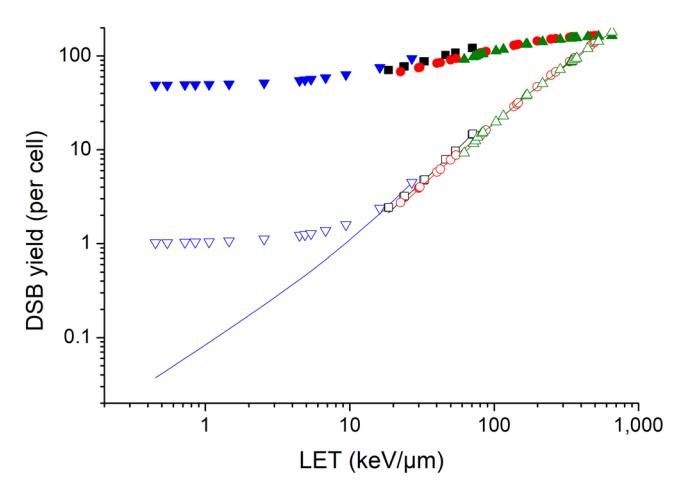
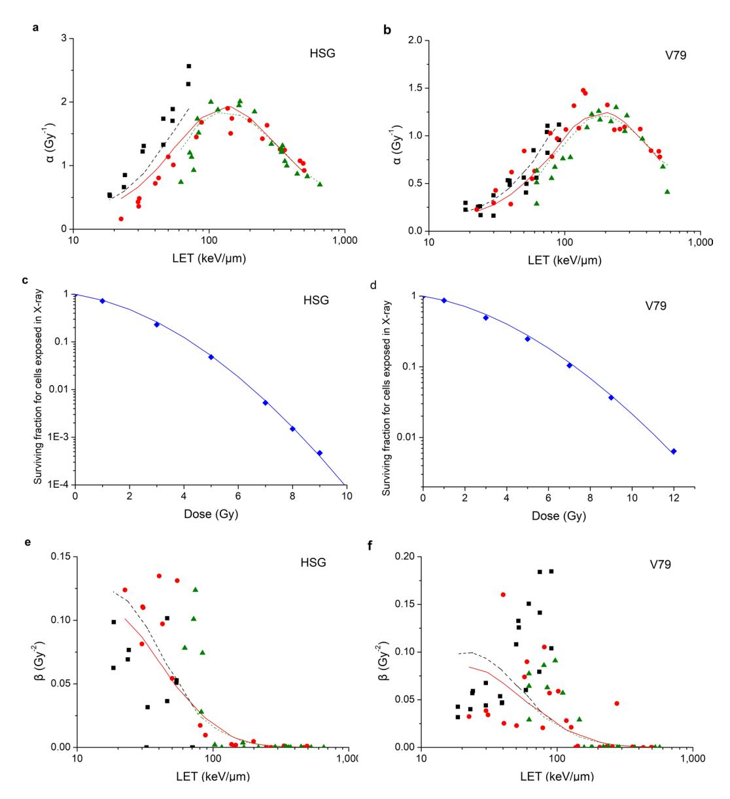
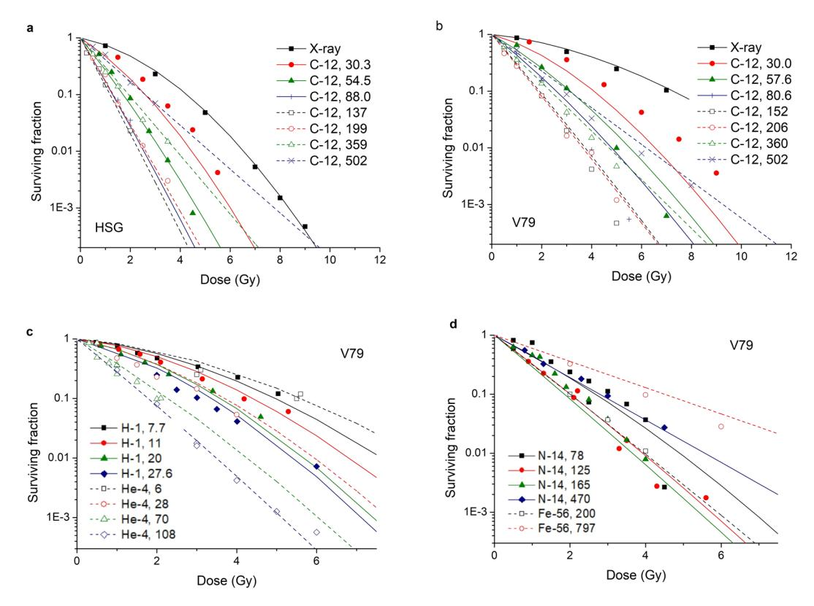
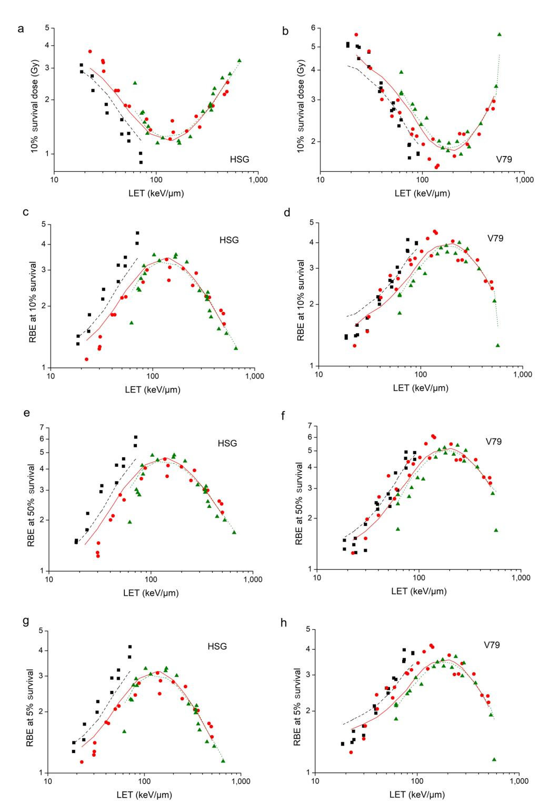
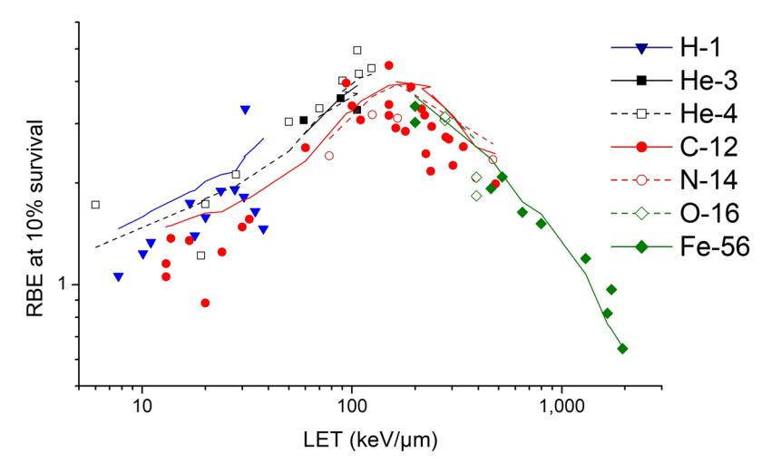
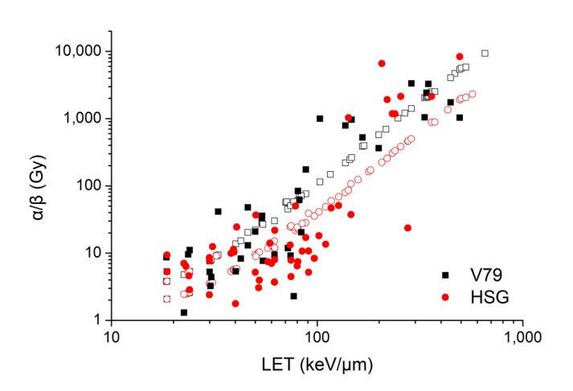
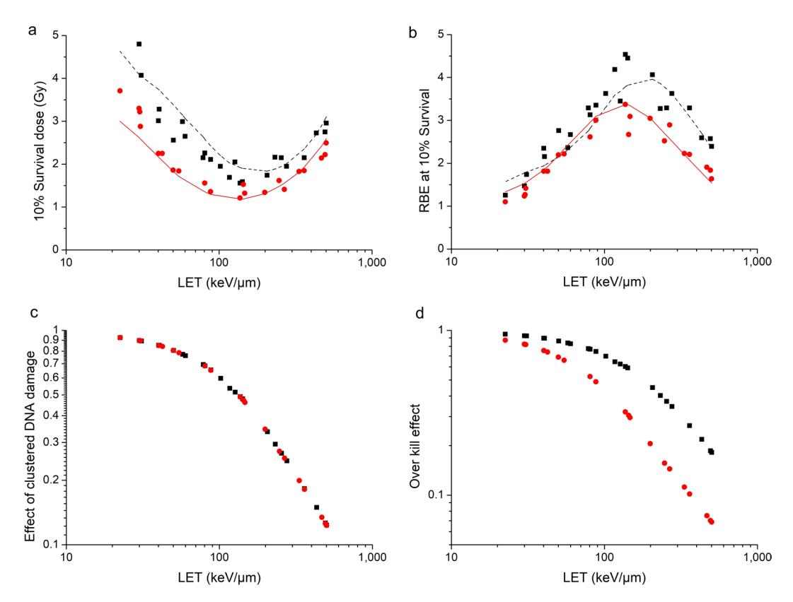

# **OPEN**

Received: 11 May 2018 Accepted: 24 July 2018

Published: xx xx xxxx

# **Modelling of Cellular Survival Following Radiation-Induced DNA Double-Strand Breaks**

**WenjingWang1,2, Chunyan Li1,3, RuiQiu1,2, YizhengChen1,2, ZhenWu1,3, Hui Zhang1,2 & Junli Li1,2**

**A mechanistic model of cellular survival following radiation-induced DNA double-strand breaks (DSBs) was proposed in this study. DSBs were assumed as the initial lesions in the DNA of the cell nucleus induced by ionizing radiation. The non-homologous end-joining (NHEJ) pathway was considered as the domain pathway of DSB repair in mammalian cells. The model was proposed to predict the relationship between radiation-induced DSBs in nucleus and probability of cell survival, which was quantitatively described by two input parameters and six ftting parameters. One input parameter was the average number of primary particles which caused DSB, the other input parameter was the average number of DSBs yielded by each primary particle that caused DSB. The ftting parameters were used to describe the biological characteristics of the irradiated cells. By determining the ftting parameters of the model with experimental data, the model is able to estimate surviving fractions for the same type of cells exposed to particles with diferent physical parameters. The model further revealed the mechanism of cell death induced by the DSB efect. Relative biological efectiveness (RBE) of charged particles at diferent survival could be calculated with the model, which would provide reference for clinical treatment.**

Cellular response towards ionizing irradiation, especially cell death induced by ionizing irradiation has gained signifcant and wide interest since ionizing irradiation being used in cancer treatment. Clonogenic survival is an important endpoint to measure the cellular response towards ionizing irradiation. For many years, experimental studies on clonogenic cell killing attributed to ionizing irradiation have been conducted and published. Based on the experimental data, a number of models of clonogenic cell survival curve have been proposed to predict the relationship between energy deposition in cells and probability of cell survival.

Te target theory was the initial exploration of the relationship between energy deposition in cells and probability of cell survival, which was of great signifcance for later theories. Based on the dual radiation action theory and molecular theory, the linear quadratic (LQ) mode[l1](#page-10-0)[,2](#page-10-1) was proposed. Te LQ model is the most frequently used method to quantitatively describe the response to ionizing irradiation, which dominates in clinical radiotherapy for many years[3](#page-10-2) . In recent advances such as stereotactic radiotherapy (SRT), the target is delivered a few fractions of very large dose per fraction. For improving descriptions of high dose survival responses, diferent models have been proposed, such as the Padé Linear Quadratic (PLQ) mode[l4](#page-10-3)[–6](#page-10-4) , the Universal Survival Curve (USC) model[7](#page-10-5) and the Linear-Quadratic-Linear (LQL) mode[l8](#page-10-6) , which were proved to be theoretically well-founded and useful in clinical applications at high doses as well as medium and low doses[9](#page-10-7) . Tese models are phenomenological models, which are in good agreement with experimental data. However, the mechanistic drivers of radiation response have not been sufciently revealed in these models. Te model with ftting parameters obtained from experimental data only allows to calculate cell survival for specifc radiation used in the experiment.

Advanced radiotherapy techniques which make use of protons and carbon ions have also been widely used recently[10,](#page-10-8)[11.](#page-10-9) As experimental studies only allow to calculate cell survival for specifc irradiation conditions, a number of models have been proposed to predict cell survival for mixed beams with the concept of relative biological efectiveness (RBE) of protons and carbon ions to photons[12](#page-10-10). Besides the phenomenological mixed beam model[13,](#page-10-11) mechanism models have been proposed, such as the local efect model (LEM)[14](#page-10-12)[–16,](#page-10-13) and the microdosimetric kinetic model (MKM[\)17](#page-10-14)[,18.](#page-10-15) Te mixed beam models are in good agreement with experimental data

Department of Engineering Physics, Tsinghua University, Beijing, China. 2 Key Laboratory of Particle & Radiation Imaging (Tsinghua University), Ministry of Education, Beijing, China. 3 Nuctech Company Limited, Beijing, China. Correspondence and requests for materials should be addressed to R.Q. (email: [qiurui@mail.tsinghua.edu.cn\)](mailto:qiurui@mail.tsinghua.edu.cn)

and have been clinically applied  $^{19-22}$ . To predict the RBE of protons and carbon ions more accurately, some other approaches have been proposed as well  $^{23-25}$ . The mechanistic drivers of radiation response have been discussed in the mechanism models. The models allow to predict the relationship between physical parameters of radiation and probability of cell survival.

To characterize cellular response towards ionizing irradiation at the molecular and cellular level, such as radiation-induced DNA damage, DNA damage repair, chromosome aberration formation and consequent cell death, several mechanistic models have been proposed too. The mechanistic models include the repair-misrepair-fixation (RMF) model proposed by Stewart *et al.*26, the biophysical analysis of cell death and chromosome aberrations (BIANCA) model proposed by Ballarini *et al.*27-29, the mechanistic modelling of DNA repair and cellular survival following radiation-induced DNA damage proposed by Stephen *et al.*30,31, etc.

DSBs induced by deposition of energy from the radiation in the DNA within the nucleus play a central part in chromosomal aberrations and cell killing attributed to radiation exposure at the molecular and cellular level32. To predict the relationship between radiation-induced DSBs in the nucleus and probability of cell survival, a mechanistic model of cellular survival following radiation-induced DSBs was proposed in this study. The proposed model has two input parameters and six fitting parameters. The input parameters of the model are the average number of primary particles which caused DSB and the average number of DSBs yielded by each primary particle that caused DSB. The fitting parameters are used to describe the biological characteristics of the irradiated cells. With the fitting parameters obtained from experimental data, the model allows to estimate surviving fractions for the same type of cell exposed to different particles at different linear energy transfer (LET).

#### Methods

**Yield of radiation-induced DSBs.** The best fits to the experimental data of dose response of radiation-induced DSBs were obtained by linear regression analysis. It indicated that for most of the radiation-induced DSBs, the two strand breaks (SBs) of each DSB were induced by the same primary particle. Therefore the average number of radiation-induced DSBs per cell, *N*, is given by:

$$N = Y \times D \tag{1}$$

where Y is the DSB yield per cell per Gy, and D (Gy) is the radiation dose to the nucleus.

For a cell nucleus with radius R ( $\mu$ m) and density  $\rho$  (g/cm3), the number of primary particle passing through the nucleus, n, can be derived by the LET (keV/ $\mu$ m):

$$n = \frac{\pi R^2 \times D \times \rho}{LET \times 1.602 \times 10^{-19}} \times 10^{-18}$$
 (2)

Therefore, the DSB yield per cell per primary particle,  $\lambda$ , can be derived by:

$$\lambda = \frac{N}{n} \tag{3}$$

DSBs are assumed as the initial lesions in the DNA of the nucleus caused by ionizing radiation, therefore the primary particles which caused no DSB have made no contribution to cell death. By assuming that the number of DSBs yielded by a primary particle is Poisson-distributed, the probability of a primary particle passing through a cell nucleus without causing any DSB can be calculated with:

$$P(X=0) = \frac{\lambda^0}{0!} e^{-\lambda} = e^{-\lambda}$$
(4)

The following equations can be derived then:

$$n_p = n(1 - e^{-\lambda}) = \frac{YD}{\lambda}(1 - e^{-\lambda})$$
(5)

$$\lambda_p = \frac{\lambda}{1 - e^{-\lambda}} \tag{6}$$

where  $n_p$  is the average number of primary particles that cause DSB, and  $\lambda_p$  is the average number of DSBs yielded by each primary particle that causes DSB.

In this study, the yield of DSBs induced by ionizing radiation was calculated with the fast Monte Carlo damage simulation (MCDS) software, which has been widely used to simulate DNA damage induced by ionizing radiation. The allowed particle types include electron, H-1, He-3, He-4, C-12, N-14, O-16, Ne-20 and Fe-5633,34. DSB yield per cell per Gy, Y, and DSB yield per cell per primary particle,  $\lambda$ , were directly obtained with MCDS. Then  $n_p$  could be calculated with equation (5), and  $\lambda_p$  could be calculated with equation (6).

**Repair of DSBs.** In mammalian cells, the two most important types of DSB repair processes are the homologous recombination repair (HRR) pathway and the nonhomologous end-joining (NHEJ) pathway12. As the NHEJ pathway is the dominating pathway of DSB repair, and the probability that DSB being repaired correctly by HRR pathway is considerable high, only the NHEJ pathway was considered as having made contribution to cell death in the model. Each DSB has two DSB ends. Each DSB end may undergo one of four transformations: (a) it may be joined with the other end from the same DSB, (b) it may be joined with a DSB end from a different DSB induced

by the same primary particle, (c) it may be joined with a DSB end from a DSB induced by a different primary particle, and (d) it may be left without being joined with any DSB end.

A DSB is assumed to be formed if two SSBs are produced on opposite strands within a certain distance, whose typical value is 10 bp. A cluster was assumed to be formed if there are two or more DSBs within a certain distance, whose typical distance is 25 bp. Therefore if there are two or more DSBs within 10 bp, over kill effect of high LET radiation should be considered. If there are two or more DSBs between 10 bp and 25 bp, effect of clustered DNA damage should be considered. If the distance between two DSBs is longer than 25 bp, they could be considered as two simple DSBs. Same as dose response of radiation-induced DSBs, the relationship between radiation dose and number of DNA fragments shorter than 30 bp induced by radiation is linear as well35,36. It indicates that both the clustered DNA damage effect and the over kill effect of high LET radiation depend mainly on the DSB distribution on the track of the primary particles other than the interaction among DSBs induced by different primary particles. Therefore both of the effects depend mainly on the average number of DSBs yield by each primary particle that caused DSB, that is,  $\lambda_p$  according to equation (6).

In order to be repaired correctly by NHEJ pathway, each DSB end should:

(a) not be joined with a DSB end from a DSB induced by a different primary particle. By assuming that the primary particles distribute randomly, the probability that a DSB end do not be joined with a DSB end from a DSB induced by a different primary particle30 is given by:

$$P_{interaction} = \frac{1 - e^{-\eta(\lambda_p)n_p}}{\eta(\lambda_p)n_p}$$
(7)

where  $\eta(\lambda_p)n_p$ , the average probability of a DSB end being joined with a DSB end from a DSB induced by a different primary particle, is proportional to the average number of primary particles which caused DSB,  $n_p$ , and related to the average number of DSBs yielded by each primary particle that cause DSB,  $\lambda_p$ . The relationship between  $\eta(\lambda_p)$  and  $\lambda_p$  is assumed as:

$$\begin{cases} \eta(\lambda_p) = \eta_{\lambda_p \to \infty} - \frac{\eta_{\lambda_p \to \infty} - \eta_{\lambda_p \to 1}}{\lambda_p} \\ \lim_{\eta_{\lambda_p \to 1}} \eta(\lambda_p) = \eta_{\lambda_p \to 1} \\ \lim_{\eta_{\lambda_p \to \infty}} \eta(\lambda_p) = \eta_{\lambda_p \to \infty} \end{cases}$$

$$(8)$$

Equation (7) quantitatively describes the interaction of DSBs induced by different primary particles.

(b) not be joined with a DSB end from a different DSB induced by the same primary particle. By assuming that a primary particle generates DSBs randomly on its track, the probability is given by:

$$P_{track} = \frac{1 - e^{-\xi \lambda_p}}{\xi \lambda_p} \tag{9}$$

where  $\xi \lambda_p$ , the average probability of a DSB end being joined with a DSB end from a different DSB induced by the same primary particle, is proportional to  $\lambda_p$ .

Equation (9) quantitatively describes the effect of clustered DNA damage.

(c) be joined with the other end from the same DSB correctly. The average probability is assumed to be  $\mu_x$ . It quantitatively describes the fidelity of NHEJ pathway.

To sum up, the probability of a DSB being correctly repaired is:

$$P_{correct} = \mu_{x} P_{interaction} P_{track} = \mu_{x} \left( \frac{1 - e^{-\xi \lambda_{p}}}{\xi \lambda_{p}} \right) \left( \frac{1 - e^{-\eta (\lambda_{p}) n_{p}}}{\eta (\lambda_{p}) n_{p}} \right)$$
(10)

Considering over kill effect, not all of the DSBs induced by radiation have made contribution to cell death. Similar with the effect of clustered DNA damage from equation (9), the probability of a DSB having made contribution to cell death is given by:

$$P_{contribution} = \frac{1 - e^{-\zeta \lambda_p}}{\zeta \lambda_p} \tag{11}$$

The sensitivity of an error repair is assumed to be  $\mu_y$ . Therefore the average number of lethal event,  $N_{death}$ , can be calculated as:

$$N_{death} = \mu_{y} N \times P_{contribution} \times 1 - P_{correct}$$
 (12)

that is

$$N_{death} = \mu_{y} N \times \left( \frac{1 - e^{-\zeta \lambda_{p}}}{\zeta \lambda_{p}} \right) \times \left( 1 - \mu_{x} \left( \frac{1 - e^{-\xi \lambda_{p}}}{\xi \lambda_{p}} \right) \left( \frac{1 - e^{-\eta(\lambda_{p})n_{p}}}{\eta(\lambda_{p})n_{p}} \right) \right)$$
(13)

**Cell survival curve.** The number of lethal event in a cell nucleus is assumed to be Poisson-distributed with an average number  $N_{death}$ , therefore the cell survival S can be calculated as:

$$-lnS = N_{death} \tag{14}$$

that is

$$S = \exp\left[-\mu_{y} \mathbf{N} \times \left(\frac{1 - e^{-\zeta \lambda_{p}}}{\zeta \lambda_{p}}\right) \times \left(1 - \mu_{x} \left(\frac{1 - e^{-\xi \lambda_{p}}}{\xi \lambda_{p}}\right) \left(\frac{1 - e^{-\eta(\lambda_{p})n_{p}}}{\eta(\lambda_{p})n_{p}}\right)\right)\right]$$
(15)

Equation (7) could be Taylor expanded as:

$$P_{interaction} = \frac{1 - e^{-\eta(\lambda_p)n_p}}{\eta(\lambda_p)n_p} = 1 - \frac{1}{2}\eta(\lambda_p)n_p + O(\eta(\lambda_p)n_p)$$
(16)

When the number of primary particles which caused DSB,  $n_p$ , is small enough, the remainder term  $O(\eta(\lambda_p)n_p)$  could be omitted. Therefore by substituting equation (1) and equation (16) into equation (15), the cell survival curve with the same form as the LQ model could be derived.

$$-lnS = \alpha D + \beta D^2 \tag{17}$$

where

$$\alpha = Y \times \left( \frac{1 - e^{-\zeta \lambda_p}}{\zeta \lambda_p} \right) \times \left( 1 - \mu_x \left( \frac{1 - e^{-\xi \lambda_p}}{\xi \lambda_p} \right) \right) \times \mu_y$$
(18)

$$\beta = \frac{1}{2} \eta \left( \lambda_p \right) \frac{Y}{\lambda_p} \times Y \times \left( \frac{1 - e^{-\zeta \lambda_p}}{\zeta \lambda_p} \right) \times \left( \frac{1 - e^{-\xi \lambda_p}}{\xi \lambda_p} \right) \times \mu_x \mu_y \tag{19}$$

It shows that for a specific cell, one or more DSBs induced by single primary particle and their interactions, including the DNA clustered damage effect and the over kill effect, contribute to  $\alpha$  term of the LQ model. The interaction among DSBs induced by different primary particles, which depends mainly on the number of primary particles causing DSB, contributes to  $\beta$  term of the LQ model.

#### Results

**Yield of radiation-induced DSB.** The experimental data of cell survival curves were from the PIDE database37, in which the published results of *in-vitro* cell survival experiments were collected. In this study, experimental data of HSG cell and V79 cell were used since there are many published studies based on HSG cell and V79 cell. The content of DNA in the human nucleus was set to 6 Gbp, and the content of DNA in the nucleus of Chinese hamster was set to 5.6 Gbp in the calculations with MCDS. Figure 1 shows the results of human cells exposed to proton, He-3 ion, C-12 ion, and Ne-20 ion. It shows that both the DSB yield per Gy, Y, and the DSB yield per track,  $\lambda$ , increase with LET. According to equation (2), when the dose is constant, the number of primary particles passing through the cell nucleus is inversely proportional to LET, therefore, DSB yield per track changes much more quickly with LET.

With the  $\bar{Y}$  and  $\bar{\lambda}$  obtained with MCDS,  $n_p$  and  $\lambda_p$  were calculated with equation (5) and equation (6). Figure 1 shows the difference between  $\lambda$  and  $\lambda_p$  For proton at LET below 10 keV/ $\mu$ m, the DSB yield per track increases quickly with LET, however, the average number of DSBs induced by each primary particle that causes DSB increases quite slowly and it is slightly higher than one, which is similar with photons. It may be an explanation why biological effectiveness of low LET proton is similar with or slightly higher than photons. The difference between  $\lambda$  and  $\lambda_p$  is negligible for high-LET radiations.

**Model parameter fitting.** The parameters of the model were obtained by fitting the experimental data of survival curves of HSG cell (54 cell survival curves) and V79 cell (52 cell survival curves) from Furusawa *et al.* in 200038. Table 1 shows the parameters of the model for HSG cell and V79 cell.

Firstly  $\mu_{\infty}$ ,  $\mu_{\gamma}$ ,  $\zeta$  and  $\xi$  were obtained with the experimental data of  $\alpha$  values as well as the calculated  $n_p$  and  $\lambda_p$  Consequently the modelled data of  $\alpha$  values could be obtained with equation (18). Comparison between observed  $\alpha$  values from cell survival experiments and modelled  $\alpha$  values in this study is shown in Fig. 2a,b. It indicates that the modelled  $\alpha$  values are in good agreement with the observed  $\alpha$  values. The correlation coefficient is  $R^2 = 0.7755$  for HSG cell while  $R^2 = 0.8522$  for V79 cell.

Then, with the  $\mu_x$ ,  $\mu_y$ ,  $\zeta$  and  $\xi$  obtained above as well as the experimental data of cell survival in X-ray,  $\eta_{\lambda p \to 1}$  was obtained with equation (15). Consequently, the modelled data of surviving fractions could also be obtained. The survival curves for HSG cell and V79 cell exposed in X-ray are shown in Fig. 2c,d. It indicates that the modelled data agree well with the experimental data. The correlation coefficient is  $R^2 = 0.9991$  for HSG cell while  $R^2 = 0.9986$  for V79 cell.

Finally with the  $\mu_x$ ,  $\mu_y$ ,  $\zeta$ ,  $\xi$  and  $\eta_{\lambda p \to 1}$  obtained above,  $\eta_{\lambda p \to \infty}$  was obtained with the experimental data of  $\beta$  values. Consequently, the modelled data of  $\beta$  values could be obtained with equation (19). Comparison between

**Figure 1.** Yield of radiation-induced DSB of human cells. Solid points represent DSB yield per Gy, Y, of human cells irradiated with proton( ), He-3 ion (■), C-12 ion ( ) and Ne-20 ion ( ). Hollow points with the same color represent DSB yield per track, λ. Solid lines with the same color represent the number of DSBs yielded by each primary particle that causes DSB, *λp*.

| Parameter | HSG            | V79            |
|-----------|----------------|----------------|
| μx        | 0.9817±0.0056  | 0.9568±0.0236  |
| μy        | 0.0891±0.0068  | 0.0300±0.0177  |
| ζ         | 0.1025±0.0065  | 0.0412±0.0209  |
| ξ         | 0.0572±0.0027  | 0.0608±0.0381  |
| ηλp→1     | (7.26±0.04)E-4 | (9.78±0.10)E-4 |
| ηλp→∞     | 0.0022±0.0001  | 0.0065±0.0001  |

**Table 1.** Parameters of the cell survival model following radiation-induced DSBs for HSG cell and V79 cell. Te values are presented as best ft parameters ± one standard deviation ftting uncertainty.

observed β values from cell survival experiments and modelled β values in this study is shown in Fig. [2e,f.](#page-5-0) It indicates that the variation trend of modelled and observed β values with LET are in agreement. Te correlation coefcient is R2=0.2008 for HSG cell while R2=0.1477 for V79 cell. Te correlation coefcients are small and it may be attributed to two factors. One factor is that the experimental data of β values are relatively scattered for radiation at LET less than 100 keV/μm. Te other factor is that the diference between α values and β values is about 2 orders of magnitude for radiation at LET larger than 100keV/μm, therefore, the contribution of β values to cell survival could hardly be shown in experimental data.

**Surviving Fraction calculation with the model.** With the model and the parameters obtained above, cell survival for HSG cell and V79 cell irradiated by C-12 ion at diferent LET could be calculated. Comparison between experimental data of cell survival and the modelled values in this study is shown in Fig. [3a,b.](#page-6-0) It shows that the modelled values are in good agreement with the experimental data not only at low LET, but also at high LET. Te correlation coefcient is R2=0.9808 for HSG cell while R2=0.9192 for V79 cell.

For the same cell type, the model is able to calculate the surviving fraction not only for the particle types used in model parameter ftting, but also for diferent types of particles at diferent LET. Taking V79 cells as an example, the comparison between other experimental data of diferent particles at diferent LET and the modelled surviving fractions was shown in Fig. [3c,d.](#page-6-0) It can be seen that the modelled values are in good agreement with the experimental values.

**RBE calculation with the model.** In recent years, advanced radiotherapy techniques which make use of protons and carbon ions have been widely applied. Besides the advantage of a sharp Bragg peak with a steep dose fallof downstream, there is an enhanced RBE for heavy charged particles. RBE depends not only on the physical parameters of the irradiation but also on the biological parameters of the irradiated biological system[12](#page-10-10), which presents the challenge of estimating the RBE precisely. Te model is able to calculate RBE for the same type of irradiated cells. It allows not only to calculate RBE at diferent cell survivals, but also to predict RBE for diferent types of particles at diferent LET.

With the model parameters obtained in Table [1](#page-4-1), the modelled data of 10% survival dose were calculated. Comparison between observed values from cell survival experiments and modelled values is shown in Fig. [4a,b.](#page-7-0) It shows that the modelled values are in good agreement with observed values. Te correlation coefcient is R2=0.8608 for HSG cell while R2=0.8914 for V79 cell. Consequently, the modelled data of RBE at 10% survival

**Figure 2.** Comparison between observed values from cell survival experiments (■ He-3 ion, C-12 ion, Ne-20 ion, X-ray) and modelled values in this study (line with the same color as points) for HSG cell and V79 cell. (**a**) is the comparison between observed α values and modelled α values for HSG cell and (**b**) is for V79 cell. (**c**) is the survival curve for HSG cell exposed in X-ray and (**d**) is for V79 cell exposed in X-ray. (**e**) is the comparison between observed β values and modelled β values for HSG cell and (**f**) is for V79 cell.

were calculated. Comparison between observed values from cell survival experiments and modelled values is shown in Fig. [4c,d.](#page-7-0) It shows that the modelled values are also in good agreement with observed values. Te correlation coefcient is R2=0.8291 for HSG cell while R2=0.8785 for V79 cell.

According to Fig. [2,](#page-5-0) the modelled α and β values are in good agreement with the experimental data. According to Fig. [3,](#page-6-0) the modelled surviving fractions are in good agreement with the experimental data as well. Terefore, the model is able to calculate RBE at a diferent survival. Comparison between observed values of RBE at 50% survival and RBE at 5% survival from cell survival experiments and modelled values is shown in Fig. [4e–h.](#page-7-0) It shows that the modelled values are in good agreement with observed values. Te correlation coefcient of RBE at 50% survival and RBE at 5% survival for HSG cell is R2=0.7997 and R2=0.8306 respectively. Te correlation coefcient of RBE at 50% survival and RBE at 5% survival for V79 cell is R2=0.8735 and R2=0.8491 respectively.

Te model is also able to calculate the RBE values for the same type of cells irradiated by diferent particles at diferent LET. Taking V79 cells as an example, the comparison of the modelled RBE values at 10% survival and the RBE values from other experimental data is shown in Fig. [5.](#page-8-0) Te experimental data of cell survival curves for V79 cells irradiated by charged particles were from the PIDE databas[e37.](#page-10-30)Te correlation coefcient is R2=0.7620. It can be seen that the trend of modelled RBE changing with LET is good agreement with the trend of experimental data for the same type of cell irradiated by diferent particles at diferent LET.

**Figure 3.** Comparison between experimental data of cell surviving fractions (points) and modelled data of cell surviving fractions in this study (lines). (a) is the comparison between experimental data and modelled data for HSG cell irradiated by C-12 ion at different LET and X-ray. (b) is for V79 cell irradiated by C-12 ion at different LET and X-ray. (c) is for V79 cell irradiated by H-1 ion41,42 and He-4 ion43-45. (d) is for V79 cell irradiated by N-14 ion43,44,46 and Fe-56 ion47.

**Biological parameters of different cell types.** The model is able to reflect the biological parameters of the irradiated cells, such as the  $\alpha/\beta$  ratio, the cluster DNA damage effect and the over kill effect. The ratio  $\alpha/\beta$  in the LQ model was regarded as an indicator of cellular repair capacity by some researchers39,40. According to equation (18) and equation (19), the  $\alpha/\beta$  ratio can be calculated with:

$$\alpha/\beta = \frac{Y \times \left(\frac{1 - e^{-\zeta \lambda_{p}}}{\zeta \lambda_{p}}\right) \times \left(1 - \mu_{x} \left(\frac{1 - e^{-\xi \lambda_{p}}}{\xi \lambda_{p}}\right)\right) \times \mu_{y}}{\frac{1}{2} \eta \left(\lambda_{p}\right) \frac{Y}{\lambda_{p}} \times Y \times \left(\frac{1 - e^{-\zeta \lambda_{p}}}{\zeta \lambda_{p}}\right) \times \left(\frac{1 - e^{-\xi \lambda_{p}}}{\xi \lambda_{p}}\right) \times \mu_{x} \mu_{y}} = \frac{1 - \mu_{x} \left(\frac{1 - e^{-\xi \lambda_{p}}}{\xi \lambda_{p}}\right)}{\frac{1}{2} \mu_{x} \eta \left(\lambda_{p}\right) \frac{Y}{\lambda_{p}}}$$

$$(20)$$

For photon and low-LET irradiation,  $\lambda p \rightarrow 1$  the  $\alpha/\beta$  ratio is mainly attributed to the fidelity of NHEJ pathway and the interaction of DSBs induced by different primary particles. However, for charged particles at higher LET, the  $\alpha/\beta$  ratio is mainly attributed to  $Y/\lambda p$ , the number of primary particles which caused DSB per unit dose. It may be an explanation why cell sensitivity has less effect on cell killing for charged particles than photons.

Figure 6 shows the  $\alpha/\beta$  ratio for HSG cells and V79 cells irradiated by different charged particles at different LET. The solid points are experimental data ( $\beta \neq 0$ ) from Furusawa *et al.*, and the open points are modelled results. The  $\alpha/\beta$  ratio increases quickly with LET, which is mainly attributed to two factors. One factor is that the  $\alpha$  value increases with LET because of the cluster DNA damage effect, the other factor is that the number of primary particles delivering unit dose to the nucleus decreases with LET so that the interaction of DSBs induced by different primary particles decreases. For radiation at LET larger than  $100 \, \text{keV}/\mu\text{m}$ , the interaction among different primary particles is vanishingly small and the difference between  $\alpha$  values and  $\beta$  values is above 2 orders of magnitude, therefore, the contribution of  $\beta$  values to cell survival could hardly be shown in experimental data.

The model is able to reflect the cluster DNA damage effect and the over kill effect on the irradiated cells as well. For HSG cells and V79 cells exposed to C-12 ions, the comparison of 10% survival dose as well as the comparison of RBE at 10% survival is shown in Fig. 7a,b. HSG cells are more sensitive than V79 cells when irradiated by X-ray. The 10% survival dose of X-ray for HSG cells is 4.08 Gy (obtained from experimental data of cell survival curve), and the 10% survival dose of X-ray for V79 cells is 7.07 Gy. When irradiated by C-12 ions with different LET, the difference between 10% survival dose for HSG cells and that for V79 cells decreases with the LET, while the difference of RBE values is subtle when LET is lower than  $100\,\text{keV}/\mu\text{m}$ , and the difference is relatively obvious when LET is higher than  $100\,\text{keV}/\mu\text{m}$ . It could be explained by the cluster DNA damage effect and the over kill effect.

**Figure 4.** Comparison between observed RBE values from cell survival experiments (■ He-3 ion, C-12 ion, Ne-20 ion) and modelled values in this study (line with the same color as points) for HSG cell and V79 cell. (**a**) is the comparison between observed values of 10% survival dose and modelled values for HSG cell and (**b**) is for V79 cell. (**c–h**) are comparisons between observed RBE values at 10%, 50% and 5% surviving fractions and modelled values for HSG cell and V79 cell.

Figure [7c,d](#page-9-0) are comparisons of efect of clustered DNA damage calculated with equation ([9\)](#page-2-1) as well as over kill efect calculated with equation ([11](#page-2-2)) between HSG cells and V79 cells irradiated by C-12 ions. It can be seen that the cluster damage efect of HSG cells and V79 cells is consistent, while the over kill efect of HSG cells is more obvious than that of V79 cells. Terefore, when LET is less than 100 keV/μm, cluster DNA damage efect

**Figure 5.** Comparison of RBE at 10% survival for V79 cells irradiated by charged particles. Te points are observed RBE for H-1[41](#page-11-3),[42](#page-11-4)[,45](#page-11-6), He-3[41,](#page-11-3) He-4[43](#page-11-5)[–45,](#page-11-6)[48–](#page-11-10)[51](#page-11-11), C-1[239,](#page-11-1)[47,](#page-11-9)[49,](#page-11-12)[52–](#page-11-13)[57](#page-11-14), N-14[43](#page-11-5),[44](#page-11-7),[46](#page-11-8), O-16[55](#page-11-15) and Fe-56[47](#page-11-9),[55](#page-11-15) ion, and the lines with the same color are modelled values.

**Figure 6.** Comparison of experimental data of α/β ratio for HSG cells ( ) and V79 cells (■) and modelled results (open points with the same color).

dominates, RBE diference between HSG cells and V79 cells is not signifcant. When LET is larger than 100keV/ μm, over kill efect dominates gradually, and the RBE diference between HSG cells and V79 cells becomes greater.

#### **Discussion**

A mechanistic model of cellular survival following radiation-induced DSBs has been proposed to predict the relationship between radiation-induced DSBs in cell nucleus and probability of cell survival. It was assumed that DSBs were the initial lesions in the DNA of the nucleus induced by ionizing radiation and NHEJ was the main pathway of DSB repair in mammalian cells. Te efect of DNA clustered damage and the over kill efect were considered in the model. As only NHEJ pathway is considered in the proposed model and HRR pathway is not considered, the model is suitable to cell phases when NHEJ pathway domains.

Tere were two input parameters in the proposed model, the average number of primary particles which caused DSB and the average number of DSBs yielded by each primary particle that caused DSB. Te former was used to describe the contribution of interaction among DSBs induced by diferent primary particles. Te latter was used to describe the contribution of DSBs induced by single primary particle and their interactions, including the cluster DNA damage efect and the over kill efect. Tere were six ftting parameters used to describe the biological characteristics of the irradiated cells, which could be obtained with experimental data. By determining the ftting parameters with experimental data, the model allowed to estimate surviving fractions for the same type of cell exposed to diferent particles at diferent LET, and then to estimate the RBE at diferent survival. Te model further revealed the mechanism of cell death induced by the DSB efect, as well as refected the biological parameters of the irradiated cells.

Firstly, the contribution of DSBs to α term and β term of the LQ model was discussed. Since dose response of DSB induced by radiation is linear, one or more DSBs induced by single primary particle and their interactions

**Figure 7.** Clustered DNA damage efect as well as over kill efect on HSG cells ( ) and V79 cells (■) irradiated by C-12 ions. (**a**) is the comparison of 10% survival dose between HSG cells and V79 cells and (**b**) is the comparison of RBE at 10% survival. Te points are experimental data and the lines with the same color are modelled values. (**c**) is the comparison of efect of clustered DNA damage calculated with equation ([9](#page-2-1)). (**d**) is the comparison of over kill efect calculated with equation ([11](#page-2-2)).

contribute to α term of the LQ model. Te interaction among DSBs induced by diferent primary particles, which depends mainly on the number of primary particles which cause DSB, contributes to β term of the LQ model. Terefore the cell survival curve is in agreement with the LQ model for low-LET radiations. However, for high-LET radiations, when delivering the same dose to the nucleus as low-LET radiations, the number of primary particles causing DSB is much smaller, and the contribution of interaction among DSBs induced by diferent primary particles to cell death would be vanishingly small, therefore the cell survival curve is in agreement with the exponential model.

Secondly, the efect of clustered DNA damage and the efect of over kill on cell death were quantitatively described. Both the clustered DNA damage efect and the over kill efect depend on the average number of DSBs induced by single primary particle that causes DSB. Te primary particles passing through the nucleus without causing any DSB are considered as having made no contribution to cell death. For protons at LET below 10 keV/ μm, the DSB yield per track increases quickly with LET, however, the average number of DSBs induced by each primary particle that causes DSB increases quite slowly and it is slightly higher than one, which is similar with photons. It may be an explanation why biological efectiveness of low-LET protons is similar with or slightly higher than photons. In the LET range from 100 to 200 keV/μm, the contribution of the over kill efect is not obvious, and the contribution of the clustered DNA damage efect is dominated, therefore the RBE is much larger. When LET is higher than 200 keV/μm, the contribution of the over kill efect is gradually obvious, and fnally exceeds the contribution of the cluster DNA damage efect, therefore the RBE decreases gradually.

Tirdly, the ratio α/β, which was regarded the as an indicator of cellular repair capacity by some researchers, was quantitatively described in the model. Te α/β ratio increases quickly with LET, which is mainly attributed to two factors. One factor is that the α value increases with LET because of the cluster DNA damage efect, the other factor is that the number of primary particles delivering unit dose to the nucleus decreases with LET so that the interaction of DSBs induced by diferent primary particles decreases. For radiations at LET larger than 100keV/ μm, the interaction among diferent primary particles is vanishingly small and the diference between α values and β values is above 2 orders of magnitude, therefore the contribution of β values to cell survival could hardly be shown in experimental data.

Finally, the RBE of charged particles could be calculated with the proposed model. On the one hand, the model with parameters determined by the experimental data allowed to estimate surviving fractions of the same type of cell irradiated by diferent particles at diferent LET. Consequently it allowed to estimate the RBE of charged particles; on the other hand, because the trend of modelled α and β values changing with LET is in good agreement with the experimental data, the model applies not only to the estimation of RBE at 10% survival, but also to the estimation of RBE at a diferent survival such as 5%, which provides reference for larger dose segmentation in the clinical treatment.

In conclusion, we have developed a mechanistic model of cellular survival following radiation-induced DSBs to predict the relationship between radiation-induced DSBs in cell nucleus and probability of cell survival. Te model further revealed the mechanism of cell death induced by the DSB efect. It has the power to refect the biological parameters of the irradiated cells as well. Cellular survival afer irradiation and RBE of charged particles could be calculated with the proposed model, which would provide reference for clinical treatment.

## **References**

- 1. Kellerer, A. M. & Rossi, H. H. A generalized formulation of dual radiation action. *Radiat. Res.* **75**, 471–488 (1978).
- 2. Chadwick, K. H. & Leenhouts, H. P. A molecular theory of cell survival. *Phys. Med. Biol* **18**, 78 (1973).
- 3. Unkel, S., Belka, C. & Lauber, K. On the analysis of clonogenic survival data: statistical alternatives to the linear-quadratic model. *Radiat. Oncol.* **11**, 11–22 (2016).
- 4. Belkic´, D. Parametric analysis of time signals and spectra from perspectives of quantum physics and chemistry. *Adv. Quantum. Chem.* **61**, 145–260 (2011).
- 5. Belkic´, D. & Belkic´, K. Padé-Froissart exact signal-noise separation in nuclear magnetic resonance spectroscopy. *J. Phys. B* **44**, 125003 (2011).
- 6. Belkic´, D. & Belkic´, K. High-resolution signal processing in magnetic resonance spectroscopy for early cancer diagnostics. *Adv Quantum Chem* **62**, 245–347 (2011).
- 7. Park, C., Papiez, L., Zhang, S., Story, M. & Timmerman, R. D. Universal survival curve and single fraction equivalent dose: useful tools in understanding potency of ablative radiotherapy. *Int. J. Radiat. Oncol. Biol. Phys.* **70**, 847–852 (2008).
- 8. Scholz, M. & Kraf, G. Calculation of heavy ion inactivation probabilities based on track structure, X-ray sensitivity and target size. *Radiat. Prot. Dosim.* **52**, 29–33 (1994).
- 9. Andisheh, B. *et al*. A Comparative Analysis of Radiobiological Models for Cell Surviving Fractions at High Doses. *Technology in Cancer Research & Treatment.* **12**, 183–192 (2013).
- 10. Schulz-Ertner, D. & Tsujii, H. Particle radiation therapy using proton and heavier ion beams. *J. Clin. Oncol.* **25**, 953–964 (2007).
- 11. Kamada, T. *et al*. Carbon ion radiotherapy in Japan: an assessment of 20 years of clinical experience. *Lancet Oncol.* **16**, e93–100 (2015).
- 12. Karge, C. P. & Peschke, P. RBE and related modeling in carbon-ion therapy. *Phys. Med. Biol.* **63**, 01TR02 (35pp) (2018).
- 13. Kanai, T. *et al*. Irradiation of mixed beam and design of spread-out Bragg peak for heavy-ion radiotherapy. *Radiat. Res.* **147**, 78–85 (1997).
- 14. Scholz, M. & Kraf, G. Track structure and the calculation of biological efects of heavy charged particles. *Adv. Space Res.* **18**, 5–14 (1996).
- 15. Scholz, M. Calculation of RBE for normal tissue complications based on charged particle track structure. *Bull. Cancer Radiother.* **83**, 50–54 (1996).
- 16. Scholz, M., Kellerer, A. M., Kraf-Weyrather, W. & Kraf, G. Computation of cell survival in heavy ion beams for therapy. *Radiat. Environ. Biophys.* **36**, 59–66 (1997).
- 17. Hawkins, R. B. A microdosimetric-kinetic theory of the dependence of the RBE for cell death on LET. *Med. Phys.* **25**, 1157–1170 (1998).
- 18. Hawkins, R. B. A microdosimetric-kinetic model for the efect of non-Poisson distribution of lethal lesions on the variation of RBE with LET. *Radiat. Res.* **160**, 61–69 (2003).
- 19. Inaniwa, T. *et al*. Treatment planning for a scanned carbon beam with a modifed microdosimetric kinetic model. *Phys. Med. Biol.* **55**, 6721–6737 (2010).
- 20. Inaniwa, T. *et al*. Reformulation of a clinical-dose system for carbon-ion radiotherapy treatment planning at the National Institute of Radiological Sciences, Japan. *Phys. Med. Biol.* **60**, 3271–3286 (2015).
- 21. Krämer, M. & Scholz, M. Treatment planning for heavy-ion radiotherapy: calculation and optimization of biologically efective dose. *Phys. Med. Biol.* **45**, 3319–3330 (2000).
- 22. Elsässer, T., Krämer, M. & Scholz, M. Accuracy of the local efect model for the prediction of biologic efects of carbon ion beams *in vitro and in iivo*. *Int. J. Radiat. Oncol.* **71**, 866–872 (2008).
- 23. Zhao, L., Mi, D., Hu, B. & Sun, Y. A generalized target theory and its applications. *Sci. Rep.* **5**, 14568 (2015).
- 24. Verkhovtsev, A., Surdutovich, E. & Solov'yov, A. V. Multiscale approach predictions for biological outcomes in ion-beam cancer therapy. *Sci. Rep.* **6**, 27654 (2016).
- 25. Abolfath, R. *et al*. A model for relative biological efectiveness of therapeutic proton beams based on a global ft of cell survival data. *Sci. Rep.* **7**, 8340 (2017).
- 26. Carlson, D. J., Stewart, R. D., Semenenko, V. A. & Sandison, G. A. Combined use of Monte Carlo DNA damage simulations and deterministic repair models to examine putative mechanisms of cell killing. *Radiat. Res.* **169**, 447–459 (2008).
- 27. Ballarini, F., Altieri, S., Bortolussi, S., Carante, M. & Giroletti, E. The BIANCA model/code of radiation-induced cell death: application to human cells exposed to diferent radiation types. *Radiat. Environ. Biophys.* **53**, 525–533 (2014).
- 28. Carante, M. P. *et al*. Modelling radiation-induced cell death: role of diferent levels of DNA damage clustering. *Radiat. Environ. Biophys.* **54**, 305–16 (2015).
- 29. Carante, M. P., Aimè, C., James, J., Cajiao, T. & Ballarini, F. BIANCA, a biophysical model of cell survival and chromosome damage by protons, C-ions and He-ions at energies and doses used in hadrontherapy. *Phys. Med. Biol*. **63**, 075007 (14pp) (2018).
- 30. McMahon, S. J., Schuemann, J., Paganetti, H. & Prise, K. M. Mechanistic Modelling of DNA Repair and Cellular Survival Following Radiation-Induced DNA Damage. *Sci. Rep* **6**, 33290 (2016).
- 31. McMahon, S. J., McNamara, A. L., Schuemann, J., Paganetti, H. & Prise, K. M. A general mechanistic model enables predictions of the biological efectiveness of diferent qualities of radiation. *Sci. Rep.* **7**, 10790 (2017).
- 32. Prise, K. M., Schettino, G., Folkard, M. & Held, K. D. New insights on cell death from radiation exposure. *Lancet Oncol.* **6**, 520–528 (2005).
- 33. Hsiao, Y. & Stewart, R. D. Monte Carlo simulation of DNA damage induction by x-rays and selected radioisotopes. *Phys. Med. Biol.* **53**, 233–244 (2008).
- 34. Stewart, R. D. *et al*. Efects of Radiation Quality and Oxygen on Clustered DNA Lesions and Cell Death. *Radiat. Res.* **176**, 587–602 (2011).
- 35. Baioccol, G. *et al*. Te origin of neutron biological efectiveness as a function of energy. *Sci. Rep.* **6**, 34033 (2016).
- 36. Friedland, W. *et al*. Comprehensive track-structure based evaluation of DNA damage by light ions from radiotherapy-relevant energies down to stopping. *Sci. Rep.* **7**, 45161 (2017).
- 37. Friedrich, T., Scholz, U., Elsässer, T., Durante, M. & Scholz, M. Systematic analysis of RBE and related quantities using a database of cell survival experiments with ion beam irradiation. *Radiat. Res.* **54**, 494–514 (2013).

- 38. Furusawa, Y. *et al*. Inactivation of aerobic and hypoxic cells from three diferent cell lines by accelerated 3He-, 12C- and 20Ne-Ion beams. *Radiat. Res.* **154**, 485–96 (2000).
- 39. Weyrather, W. K., Ritter, S., Scholz, M. & Kraf, G. RBE for carbon track-segment irradiation in cell lines of difering repair capacity. *Int. J. Radiat. Biol.* **75**, 1357–1364 (1999).
- 40. Suzuki, M., Kase, Y., Yamaguchi, H., Kanai, T. & Ando, K. Relative biological efectiveness for cell-killing efect on various human cell lines irradiated with heavy-ion medical accelerator in Chiba (HIMAC) carbon-ion beams. *Int. J. Radiat. Oncol. Biol. Phys.* **48**, 241–250 (2000).
- 41. Folkard, M. *et al*. Inactivation of V79 cells by low-energy protons, deuterons and helium-3 ions. *Int. J. Radiat. Biol.* **69**, 729–738 (1996).
- 42. Belli, M. *et al*. RBE-LET relationships for cell inactivation and mutation induced by low energy protons in V79 cells: further results at the LNL facility. *Int. J. Radiat. Biol.* **74**, 501–509 (1998).
- 43. Tilly, N., Brahme, A., Carlsson, J. & Glimelius, B. Comparison of cell survival models for mixed LET radiation. *Int. J. Radiat. Biol.* **75**, 233–243 (1999).
- 44. Tacker, J., Stretch, A. & Stephens, M. A. Mutation, inactivation of cultured mammalian cells exposed to beams of accelerated heavy ions II. Chinese hamster V79 cells. *Int. J. Radiat. Biol.* **36**, 137–148 (1979).
- 45. Prise, K. M., Folkard, M. & Davies, S. Te irradiation of V79 mammalian cells by protons with energies below 2 MeV. Part II. Measurement of oxygen enhancement ratios and DNA damage. *Int J Radiat Biol* **58**, 261–277 (1990).
- 46. Stenerlöw, B., Petterson, O. A., Essand, M., Blomquist, E. & Carlsson, J. Irregular variations in radiation sensitivity when the linear energy transfer is increased. *Radiother. Oncol.* **36**, 133–142 (1995).
- 47. Hirayama, R. *et al*. Contributions of direct and indirect actions in cell killing by high-LET radiations. *Radiat. Res.* **171**, 212–218 (2009).
- 48. Raju, M. R., Eisen, Y. & Carpenter, S. Radiobiology of α particles. *Radiat. Res.* **128**, 204–9 (1991).
- 49. Bird, R. P. & Burki, H. J. Survival of synchronized Chinese hamster cells exposed to radiation of diferent linear-energy transfer. *Int. J. Radiat. Biol.* **27**, 105–120 (1975).
- 50. Cox, R., Tacker, J. & Goodhead, D. T. Inactivation and mutation of cultured mammalian cells by aluminium characteristic ultrasof X-rays. II. Dose-responses of Chinese hamster and human diploid cells to aluminium X-rays and radiations of diferent LET. *Int J Radiat Biol* **31**, 561–576 (1977).
- 51. Hall, E. J., Gross, W. & Dvorak, R. F. Survival curves and age response functions for Chinese hamster cells exposed to X-rays or high-LET alpha-particles. *Radiat. Res.* **52**, 88–98 (1972).
- 52. Belli, M. *et al*. Efectiveness of monoenergetic and spread-out Bragg peak carbon-ions for inactivation of various normal and tumour human cell lines. *Radiat. Res.* **49**, 597–607 (2008).
- 53. Aoki, M., Furusawa, Y. & Yamada, T. LET dependency of heavy-ion induced apoptosis in V79 cells. *Radiat. Res.* **41**, 163–175 (2000).
- 54. Böhrnsen, G., Weber, K. J. & Scholz, M. Measurement of biological efects of high-energy carbon ions at low doses using a semiautomated cell detection system. *Int. J. Radiat. Biol.* **78**, 259–266 (2002).
- 55. Wulf, H. *et al*. Heavy-ion effects on mammalian cells: inactivation measurements with different cell lines. *Radiat. Res.* **104**, S122–S134 (1985).
- 56. Scholz, M. Efects of ion radiation on cells and tissues. *Adv. Ploymer. Science* **162**, 95–155 (2003).
- 57. Zhou, G. *et al*. Protective efect of melatonin against low- and high-LET irradiation. *Radiat. Res.* **47**, 175–181 (2006).

#### **Acknowledgements**

The research was supported by the National Key Projects of Research and Development of China (2016YFC0904600). Te authors appreciate support for this paper by the Collaborative Innovation Center of Public Safety.

# **Author Contributions**

W.W. developed and implemented the model and drafed the manuscript, based on discussions with C.L., R.Q., Y.C., Z.W., H.Z. and J.L. All authors reviewed the fnal manuscript.

## **Additional Information**

**Competing Interests:** Te authors declare no competing interests.

**Publisher's note:** Springer Nature remains neutral with regard to jurisdictional claims in published maps and institutional afliations.

**Open Access** This article is licensed under a Creative Commons Attribution 4.0 International License, which permits use, sharing, adaptation, distribution and reproduction in any medium or format, as long as you give appropriate credit to the original author(s) and the source, provide a link to the Creative Commons license, and indicate if changes were made. Te images or other third party material in this article are included in the article's Creative Commons license, unless indicated otherwise in a credit line to the material. If material is not included in the article's Creative Commons license and your intended use is not permitted by statutory regulation or exceeds the permitted use, you will need to obtain permission directly from the copyright holder. To view a copy of this license, visit [http://creativecommons.org/licenses/by/4.0/.](http://creativecommons.org/licenses/by/4.0/)

© Te Author(s) 2018