## **OPEN**

# **Stochastic multicellular modeling of x-ray irradiation, DNA damage induction, DNA free-end misrejoining and cell death**

**Jake C. Forster1,2\*, Michael J. J. Douglass2,3, Wendy M. Phillips2,3 & Eva Bezak2,4**

**The repair or misrepair of DNA double-strand breaks (DSBs) largely determines whether a cell will survive radiation insult or die. A new computational model of multicellular, track structure-based and pO2-dependent radiation-induced cell death was developed and used to investigate the contribution to cell killing by the mechanism of DNA free-end misrejoining for low-LET radiation. A simulated tumor of 1224 squamous cells was irradiated with 6 MV x-rays using the Monte Carlo toolkit Geant4 with low-energy Geant4-DNA physics and chemistry modules up to a uniform dose of 1Gy. DNA damage including DSBs were simulated from ionizations, excitations and hydroxyl radical interactions along track segments through cell nuclei, with a higher cellular pO2 enhancing the conversion of DNA radicals to strand breaks. DNA free-ends produced by complex DSBs (cDSBs) were able to misrejoin and produce exchange-type chromosome aberrations, some of which were asymmetric and lethal. A sensitivity analysis was performed and conditions of full oxia and anoxia were simulated. The linear component of cell killing from misrejoining was consistently small compared to values in the literature for the linear component of cell killing for head and neck squamous cell carcinoma (HNSCC). This indicated that misrejoinings involving DSBs from the same x-ray (including all associated secondary electrons) were rare and that other mechanisms (e.g. unrejoined ends) may be important. Ignoring the contribution by the indirect efect toward DNA damage caused the DSB yield to drop to a third of its original value and the cDSB yield to drop to a tenth of its original value. Track structure-based cell killing was simulated in all 135306 viable cells of a 1mm3 hypoxic HNSCC tumor for a uniform dose of 1Gy.**

One of the tasks of radiobiological modeling is to predict whether a cell that received ionizing radiation will ultimately die from the initial radiation-induced DNA damage, broadly consisting of DNA double-strand breaks (DSBs), single-strand breaks, modifed bases and modifed sugars. Cell death (defned by the loss of replicative potential) afer irradiation mainly occurs in the form of mitotic catastrophe, meaning it results from, or follows, aberrant mitosis[1–](#page-16-0)[3](#page-16-1) . Tis occurs when a chromosome aberration (CA) is present that is "asymmetric", preventing a large amount of the genetic material from being replicated.

Tis paper presents a new computational model of CA production and cell death from ionizing radiation. First, some background is provided on the mechanism of CA production by DSB misrepair and the relationship between CAs and cell death. Other computational models of radiation-induced CAs and cell death in the literature are reviewed and a gap is identifed that will be addressed by the current model.

#### **Mechanism of CA Production by DSB Misrepair**

CAs are formed by the misrepair of DSBs. Each DSB causes a break in a chromosome, producing two DNA free-ends (a.k.a. "sticky" ends). Unrelated (incongruent) DNA free-ends produced by diferent DSBs can be misrejoined (illegitimate/incorrect reunion or exchange), resulting in an exchange-type CA[4](#page-16-2)[–7](#page-16-3) . A DSB can also have both ends lef unrejoined, resulting in a terminal deletion, or have one end misrejoined and the other end lef unrejoined (an incomplete exchange) (Fig. [1\)](#page-1-0)[8](#page-16-4) .

1 Department of Nuclear Medicine, South Australia Medical Imaging, The Queen Elizabeth Hospital, Woodville South, SA, 5011, Australia. 2 Department of Physics, University of Adelaide, Adelaide, SA, 5005, Australia. 3 Department of Medical Physics, Royal Adelaide Hospital, Adelaide, SA, 5000, Australia. 4 Cancer Research Institute and School of Health Sciences, University of South Australia, Adelaide, SA, 5001, Australia. \*email: [Jake.Forster@sa.gov.au](mailto:Jake.Forster@sa.gov.au)

**Figure 1.** DSB misrepair can be in the form of complete exchanges, incomplete exchanges and terminal deletions.

"Simple" exchange-type CAs are those that are possible with just two DSBs (Fig. [2](#page-2-0)[\)9](#page-16-5) . If the two DSBs are on diferent chromosomes, a symmetric translocation or a dicentric (plus an acentric fragment) can form. Two DSBs on opposite arms of a chromosome can give rise to a centric ring (plus an acentric fragment) or a pericentric inversion. If the two DSBs are on the same arm, an acentric ring (plus an interstitial deletion) or a paracentric inversion can occur. A plethora of "complex" exchange-type CAs are possible with three or more DSBs on two or more chromosomes.

Of the simple exchange-type CAs, dicentrics and rings (centric and acentric) are asymmetric. Since they cause a large amount of the genetic material to be lost at the next mitosis, they are unstable (lethal). On the other hand, symmetric translocations and inversions (pericentric and paracentric) are symmetric and stable (non-lethal). Large deletions due to unrejoined ends are also lethal.

Te main repair pathway for DSBs in all cell cycle phases for mammalian cells is canonical-non-homologous end-joining (c-NHEJ)[6,](#page-16-6)[10–](#page-16-7)[12](#page-16-8). Tere are two types of c-NHEJ in G0/G1: one fast (2–4 hrs) and one slow (>8 hrs). Te fast one is resection-independent and the slow one is resection-dependent (and Artemis-dependent). Te slow one is more error prone. For example, in G1 human cells, resection-independent and resection-dependent c-NHEJ repaired 80% and 20% of DSBs, respectively, but each was responsible for half of the misrejoinings afer a 7Gy dose of 90 kV x-rays[13.](#page-16-9) In G2, resection-independent c-NHEJ is active but not resection-dependent c-NHEJ. Te slow repair pathway in G2 is homologous recombination (HR), which is error-free. HR is also active in S. Tere is also the alternative-NHEJ (alt-NHEJ) pathway, which involves enzymatically-driven resection. Tis is slow and error-prone (similar to resection-dependent c-NHEJ), but does not seem to contribute to repair in G0/ G1-phase human cells (though it does appreciably in mice)[10.](#page-16-7)

Since DNA free-ends must spatio-temporally co-localize to either rejoin or misrejoin, it appears that the slowness of resection-dependent c-NHEJ and alt-NHEJ is what makes them more error-prone than resection-independent c-NHEJ, which is fast: the DNA free-ends have more time to move away from their initial location (possibly with Brownian motio[n14\)](#page-16-10) and meet incongruent DNA free-ends. It follows that a misrejoining is more likely to occur if the DSBs are initially closer together.

Te complexity of a DSB appears to afect the choice of repair pathway. Complex DSBs are repaired by slow pathways and simple DSBs by fast pathway[s15](#page-16-11)[,16,](#page-16-12) though it is unclear why this is the case[11,](#page-16-13)[17.](#page-16-14) Accordingly, DNA free-ends from complex DSBs are more likely to be misrejoined.

Te average number of CAs per cell, *Nca*, is typically linear-quadratic with dos[e4](#page-16-2)[,7](#page-16-3) :

$$N_{ca} = \alpha_{ca}D + \beta_{ca}D^2 \tag{1}$$

Te linear component receives contributions from misrejoinings involving DSBs produced by the same primary (e.g. the same x-ray, including all associated secondary electrons) and from terminal deletions. Te quadratic component corresponds to misrejoinings involving DSBs produced by two diferent primaries (thus it depends on dose rate and fractionation).

Let *f*≤1 be the fraction of lethal CAs, so the average number of lethal CAs per cell is:

$$N_{lca} = fN_{ca} \tag{2}$$

If the fraction of lethal CAs is independent of dose and lethal CAs are Poisson distributed in cells (the latter assumption may become less valid with increasing dos[e18\)](#page-16-15), the surviving fraction from lethal CAs is:

$$S_{lca} = e^{-N_{lca}} \tag{3}$$

$$=e^{-f(\alpha_{ca}D+\beta_{ca}D^2)} \tag{4}$$

$$= e^{-\alpha_{\text{killing}(lca)}D - \beta_{\text{killing}(lca)}D^2}$$
(5)

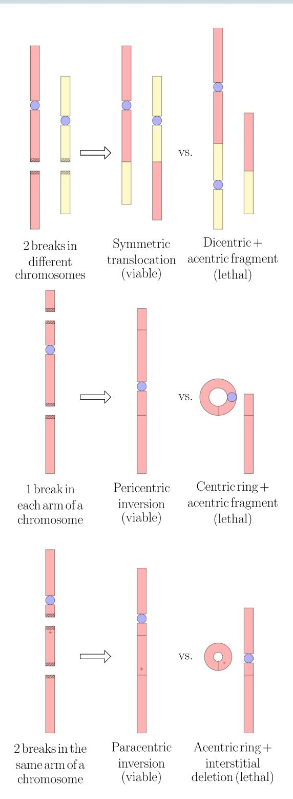

**Figure 2.** Simple exchange-type CAs. Complete exchanges are shown.

Tus the surviving fraction inherits the linear-quadratic dependence from the CA yiel[d2](#page-16-16) . Te linear-quadratic model generally provides a good ft to experimental data from a clonogenic cell survival assay for doses up to about 10Gy per fractio[n19.](#page-16-17)

It is important to emphasise that *Slca* is the contribution to the surviving fraction from the mechanism of lethal CA-driven mitotic catastrophe. While this appears to be the main mechanism of radiation-induced cell death for mammalian cell[s1](#page-16-0)[–3](#page-16-1) , there is evidence for additional sources of cell death. Sensitivity to apoptosis is ofen reduced in cancer compared to normal tissue[20](#page-16-18), but apoptosis may be an important contributor to radiosensitvity in some tumor[s1](#page-16-0) . Apoptosis can occur in response to DNA damag[e21](#page-16-19)[,22](#page-16-20). In addition, damage to mitochondria (which can be enhanced by gold nanoparticles) can trigger cell death by apoptosis[23.](#page-16-21) Tere are also non-targeted efects such as bystander efects, wherein irradiated cells release harmful signals that are received by other cells[24.](#page-16-22) In the approximation that the diferent mechanisms contribute independently (i.e. no synergistic or antagonistic efects), the overall surviving fraction is given by the product of all the contributions:

$$S = S_{lca}S_2S_3... (6)$$

Macroscopic cell death is the convolution of many microscopic processes. By modeling a single microscopic process such as the production of CAs, its contribution to cell death can be investigated in isolation.

### **Computational Models of Radiation-Induced CAs and Cell Death**

Deterministic models of DSB repair and misrepair in the literature includ[e25–](#page-16-23)[27](#page-16-24). Tere are also stochastic models, which stochastically generate a spatial distribution of DSBs in the nucleus (e.g. from Monte Carlo track structure) and then simulate the fate of each individual DSB using stochastic methods. Te model in the current work is stochastic. Examples of stochastic models in the literature include the model by Henthorn *et al*. [28](#page-16-25), Friedland and Kundrát's model[29](#page-16-26),[30](#page-16-27), "BIophysical ANalysis of Cell death and chromosome Aberrations" (BIANCA[\)31–](#page-16-28)[33](#page-16-29) and Brenner's model[34.](#page-16-30)

Brenner's model simulated track segments using the Monte Carlo code PROTON. A track was generated and then a cell nucleus was randomly superimposed over the track to score a segment of the track in the nucleus. Tis was repeated for a number of tracks (a certain number of tracks were expected to pass through the nucleus for a given dose), then it was assumed 1 in 1500 ionizations produced a DSB. Te model simulated time-dependent difusion and distant-dependent interaction of the DSBs to form exchange-type CAs, in competition with faithful DSB repair.

Te BIANCA model simulated cluster lesions (CLs), which were efectively DSBs whose free-ends were able to misrejoin, in a single cell nucleus. For sparsely-ionizing photons, the CLs were placed at random in the nucleus. For protons and alphas, there was an expected number of nucleus traversals (based on dose) and an expected number of CLs from each traversal (based on LET). Line segments representing traversals were randomly simulated through the nucleus and CLs were randomly distributed along the line segments. For higher LETs, some of the CLs were placed radially with respect to the line segments to account for high-energy secondary electrons. Proximity-based misrejoining of the DNA free-ends from CLs was simulated. Te nucleus contained interphase chromosome territories and chromosome-arm domains, making it possible to determine the types of CAs produced (e.g. dicentrics, centric rings, etc.).

Friedland and Kundrát's model simulated Monte Carlo tracks through a single cell nucleus using the code PARTRAC (PARticle TRACks) and superimposed the tracks with a multiscale DNA target model to generate DNA damage. Spatio-temporal motion of DNA free-ends was simulated in addition to mechanistic modeling of NHEJ to achieve DSB repair and misrepair. Te types of CAs produced were identifable due to modeling of chromosome territories in the nucleus. Te model by Henthorn *et al*. also simulated DNA free-end motion with mechanistic modeling of c-NHEJ. Te DSBs were generated from Monte Carlo tracks simulated in Geant[435–](#page-17-0)[37](#page-17-1) using Geant4-DN[A38](#page-17-2)[–40,](#page-17-3) using a spatial clustering approach. Chromosome territories were not modeled.

Compared with these other stochastic models, the current model has two unique properties: (i) Monte Carlo tracks were simulated through a multicellular tumor volume (as opposed to a single cell nucleus) and (ii) variable partial pressures of oxygen (pO2) were simulated in cells. A multicellular tumor of head and neck squamous cell carcinoma (HNSCC) was irradiated with tracks using the Monte Carlo toolkit Geant4 (version 10.4[\)35](#page-17-0)[–37.](#page-17-1) Te physics and chemistry modules of Geant4-DN[A38](#page-17-2)[–40](#page-17-3) were used to accurately simulate low-energy physical interactions and the chemical tracks from water radiolysis. Te tracks through cell nuclei were translated into spatial distributions of DNA damage, including DSBs, by spatially clustering the direct and indirect events into simulated DNA volumes. Te DNA damage from the tracks was subject to the cellular pO2: a higher pO2 enhances the conversion of DNA radicals to strand breaks. Proximity-based DNA free-end misrejoining was simulated. Cell death was then predicted from the presence of lethal CAs.

Te purpose of this work was two-fold. First, to present new stochastic modeling of radiation-induced CA production and cell killing, that befts a diferent purpose than other models in the literature. Namely, the simulation of a multicellular tumor and variable pO2 conditions makes this model uniquely apt to be used as part of a radiotherapy model, i.e., a model that predicts the outcome of a radiotherapy treatment to a tumor. Radiotherapy models ofen take the approach of simulating each individual cell in the tumor, but they typically simulate the radiation effect using the Linear-Quadratic equation or a variant thereof[41–](#page-17-4)[53.](#page-17-5) Greater model accuracy and utility may be achieved by instead simulating the radiation efect starting from Monte Carlo track structure. Radiotherapy models may play an important role in testing hypoxia-targeting treatments, radiotherapy planning and treatment individualization in the future. Te second aim of this work was to use the model to investigate the contribution of DNA free-end misrejoining to CA production and cell death by low-LET radiation for HNSCC.

#### **Methods**

**Model methods.** A computational model was developed in-house to simulate a dose fraction to a multicellular tumor of HNSCC, followed by DNA damage induction, DNA free-end misrejoining and cell death from misrejoining. Te fowchart in Fig. [3](#page-4-0) summarises the components of the model, which are described in more detail below.

**Tumor cell placement in 3D.** A cubic volume of side length 0.2mm was flled with 1224 non-overlapping cells (a density of 1.53 × 108 cells/cm3 , which is tumor-mimeti[c54](#page-17-6)) using a previously developed algorithm (Fig. [4A](#page-5-0))[55](#page-17-7),[56](#page-17-8). Te cells were ellipsoid-shaped with random orientations, major axis lengths from 14 to 20 *μ*m and

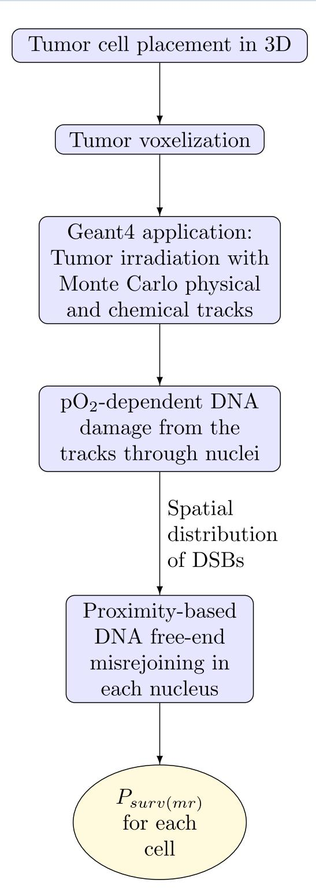

**Figure 3.** Basic fowchart of the model. *Psurv*( ) *mr* is the probability of cell survival by the mechanism of misrejoining.

remaining axis lengths of at least 14 *μ*m (cell volumes 1437 to 2053 *μ*m3 ), representative of FaDu HNSCC cells[57.](#page-17-9) Cells contained a concentric nucleus that occupied 8% of the cellular volume (nuclear volumes 115 to 164 *μ*m3 [\)58.](#page-17-10)

**Tumor voxelization.** In order to import the multicellular tumor (1224 cells) into Geant4 (version 10.4[\)35–](#page-17-0)[37,](#page-17-1) it was frst voxelized. Voxels were cubic volumes of side length 2 *μ*m representing either nucleus, cytoplasm or intercellular material (Fig. [4B](#page-5-0)). Voxelization was performed using an algorithm written in Matlab (R2016b, MathWorks Inc., Natick, MA). Te distance from the center of a voxel to the center of a cell was used to determine

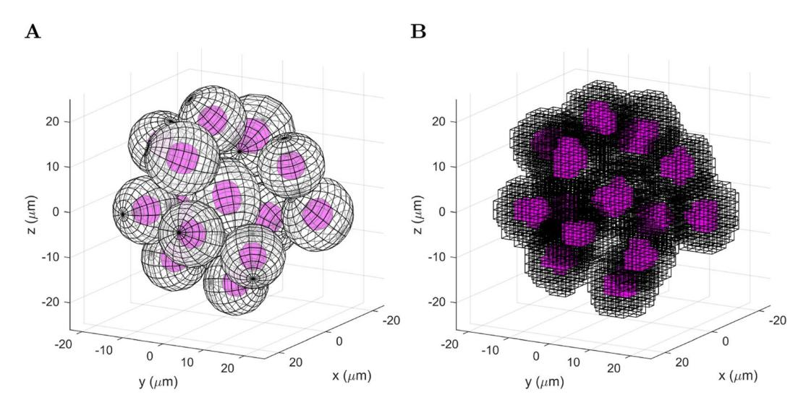

**Figure 4.** Example of a multicellular tumor with a small number of cells for demonstration. **(A)** Randomized ellipsoidal cells containing nuclei. **(B)** The corresponding voxel representation, showing nucleus and cytoplasm voxels

whether the center of the voxel was located within the nucleus or cytoplasm of the cell (accounting for the ellipsoid shape and the orientation). Voxels were assigned as nucleus or cytoplasm based on this criteria.

For the cubic volume of side length 0.2 mm, there were  $100 \times 100 \times 100 = 10^6$  voxels. Two 3D arrays of size  $100 \times 100 \times 100$  called *voxelType* and *voxelCell* were introduced. The element  $\vec{i} = (i, j, k)$  of these arrays (where i, j and k took integer values from 0 to 99) corresponded to the voxel whose center had spatial coordinates:

$$\overrightarrow{X} = -99 + 2\overrightarrow{i}(\mu \mathbf{m}) \tag{7}$$

The *voxelType* array contained the flag identifying the voxel type (0 for intercellular, 1 for nucleus and 2 for cytoplasm) and *voxelType* contained the flag identifying the cell that the voxel belonged to (0 for intercellular voxels, 1–1224 for nucleus and cytoplasm voxels).

**Tumor irradiation with monte carlo track structure.** The voxelized multicellular tumor (1224 cells) was imported into Geant4 as follows. A cubic volume (soon to accommodate the tumor) of side length 0.2 mm was placed in Geant4 and divided into  $100 \times 100 \times 100$  voxels using "nested parametersiation". Nucleus, cytoplasm and intercellular materials were defined equivalent to "G4\_WATER" (required to use Geant4-DNA38-40) with density  $1 \text{ g/cm}^3$ . The voxels were then assigned to nucleus, cytoplasm or intercellular material using the *voxelType* array.

X-rays with an energy distribution from a 6 MV linac model developed in the Philips Pinnacle treatment planning system were fired from a square  $4.2\,\mathrm{mm}\times4.2\,\mathrm{mm}$  source with parallel beam, placed  $1.3\,\mathrm{cm}$  from the tumor (Fig. 5). The tumor was encased in water to achieve a uniform dose to tumor (see Results; Section: sec:res-sens). Relative to the beam direction, there was  $1.3\,\mathrm{cm}$  of water in front of the tumor to achieve electronic equilibrium in the tumor (for 6 MV x-rays the mean electron energy is  $\sim$ 2 MeV, which has a range of  $\sim$ 1 cm in liquid water using the continuous slowing down approximation59), 2 mm of water either side of the tumor for lateral scattering and 1 mm of water behind the tumor to provide back scatter medium (MV x-rays mostly scatter forward).

Geant4-DNA physics models, which accurately simulate physical interactions down to eV energies, were used to simulate electron interactions in the tumor for electron energies <1 MeV (the models were not defined  $\ge 1$  MeV). The Livermore physics list (which is low-energy but not as low as Geant4-DNA) was used in the tumor for electron energies  $\ge 1$  MeV and for photon and positron interactions (Table 1). Outside the tumor, Livermore physics was used exclusively (there was no need to simulate very low-energy physics outside of the tumor) (Table 2). For physical interactions in nucleus voxels that deposited  $\ge 10.79$  eV (the ionization energy for liquid water), the spatial coordinates of the interaction were recorded, along with the flag identifying the cell in which it took place (using voxelCell). The total energy deposited in each voxel was also recorded.

Geant4-DNA chemistry was used to simulate water radiolysis following Geant4-DNA physics, but only inside nucleus voxels to save computation time (Fig. 6). \*OH was the only species that contributed to indirect DNA damage, neglecting the minor contributions from hydrogen atoms and solvated electrons  $^{60,61}$ . It was assumed that \*OH molecules interacted (were scavenged) after 2.5 ns of diffusion. This corresponded to an \*OH scavenging capacity of  $4 \times 10^8$  s-1, and a root-mean-square displacement of 6.48 nm with the \*OH diffusion coefficient of  $2.8 \times 10^{-9}$  m² s-1 used in Geant4-DNA chemistry, which are mimetic of the cellular environment  $^{62-67}$ . When the virtual time of the chemistry simulation reached 2.5 ns, for each \*OH molecule inside a nucleus voxel, the spatial coordinates of the \*OH were recorded (taken to be the position of an \*OH interaction) along with the flag identifying the cell it was located in (using *voxelCell*). The chemistry simulation was ended after a virtual time of 2.5 ns to save computation time.

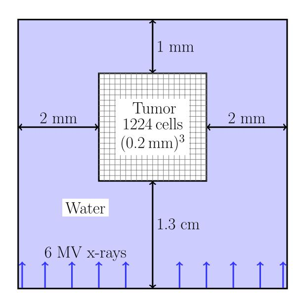

**Figure 5.** Irradiation set-up in Geant4. Te voxelized multicellular tumor is encased in water.

| Particle | Interaction            | Energy rangea     | Model                          |
|----------|------------------------|-------------------|--------------------------------|
|          | multiple scattering    | ≥1 MeV            | Urban                          |
|          | elastic scattering     | (7.4 eV, 1MeV)    | DNA Champion                   |
|          | ionization             | ≥1 MeV            | Møller-Bhabha                  |
|          |                        | [10 keV, 1MeV)    | DNA Born                       |
|          |                        | [11 eV, 10 keV)   | DNA Emfetzoglou                |
| e−       | excitation             | [10 keV, 1MeV)    | DNA Born                       |
|          |                        | [8 eV, 10 keV)    | DNA Emfetzoglou                |
|          | vibrational excitation | (7.4 eV, 100 eV)  | DNA Sanche                     |
|          | attachment             | (7.4 eV, 11.2 eV) | DNA Melton                     |
|          | electron solvation     | ≤7.4 eV           | DNA one step thermalization |
|          | bremsstrahlung         |                   | Livermore                      |
|          | Compton                |                   | Livermore                      |
|          | photoelectric efect    |                   | Livermore                      |
| γ        | conversion             |                   | Livermore                      |
|          | Rayleigh scattering    |                   | Livermore                      |
|          | multiple scattering    |                   | Urban                          |
|          | ionization             |                   | Møller-Bhabha                  |
| e+       | bremsstrahlung         |                   | Seltzer-Berger                 |
|          | annihilation           |                   |                                |

**Table 1.** Physics interactions simulated in the tumor. a Energies relevant to this application with 6 MV x-rays. Active for all relevant energies if not specifed.

**DNA damage induction algorithm.** A spatial distribution of DNA damage including DSBs, single-strand breaks, modifed bases and modifed sugars was generated in each tumor cell nucleus from the track structure, using an algorithm that was described previously[68](#page-17-16). Briefy, the algorithm spatially clustered the physical interactions that deposited ≥10.79 eV (direct events) and • OH interactions (indirect events) in the nucleus into cylindrical volumes representing 10 base-pair segments of DNA. Direct events on DNA and its frst hydration layer and indirect events on DNA produced DNA sugar radicals and base radicals, some of which were subsequently converted to strand breaks with pO2-dependent probabilities (the radiochemical oxygen efect; see[68](#page-17-16) for more detail on how this was modeled). Two or more strand breaks within 10 base-pairs constituted a DSB. If two DSBs were separated by less than 10 undamaged base-pairs, they were classifed as the same DSB. Tus DSBs acquired a multiplicity. Te DNA damage induction algorithm was compared with experimental data and other theoretical codes i[n68.](#page-17-16) Only the spatial distributions of DSBs were used hence.

Note that the chemical stage of the Geant4-DNA chemistry simulation was ended at 2.5ns in the current work. In the previous wor[k68,](#page-17-16) in which the DNA damage induction algorithm was developed and verifed, the chemical

| Particle         | Interaction         | Energy range a | Model         |
|------------------|---------------------|---------------------------|---------------|
|                  | multiple scattering |                           | Urban         |
| e -   | ionization          | ≥100 keV                  | Møller-Bhabha |
| 6                |                     | <100 keV                  | Livermore     |
|                  | bremsstrahlung      |                           | Livermore     |
| $\gamma^{\rm b}$ |                     |                           |               |
| e +b  |                     |                           |               |

**Table 2.** Physics interactions simulated outside of the tumor. aEnergies relevant to this application with 6 MV x-rays. Active for all relevant energies if not specified. bSame as in the tumor (Table 1).

stage was continued to 1  $\mu$ s. As a result, the relatively small number of  ${}^{\bullet}$ OH molecules formed during the chemical stage (by the reaction  $e_{aq}^- + H_2O_2 \rightarrow OH^- + {}^{\bullet}$ OH, as opposed to during the physicochemical stage) were neglected in the current work. This was predicted to have a negligible effect on the DSB yield, since these  ${}^{\bullet}$ OH molecules are typically formed away from the electron track and thus rarely contribute to clusters of damage (e.g. DSBs).

The DNA damage induction algorithm includes a parameter which may be interpreted as the volume proportion of DNA in the nucleus (DNA volume for short). The DNA damage yields, including the DSB yield, were scaled down according to this parameter. This meant that a fraction of the DSBs within the whole nucleus volume were removed from each cell, chosen at random and irrespective of DSB complexity. Estimates in the literature of the DNA volume in yeast cells vary from 0.3 to  $2\%^{69}$ . In the current work, the DNA volume was adjusted to achieve realistic DSB yields. Experiments in the literature indicate that the DSB yield increases linearly with dose in the clinically relevant dose range <100 Gy and is generally 20–40/cell/Gy for mammalian haploid cells7,70–73. For low-LET radiation and human HNSCC cell lines (*in vitro*) in particular, Saker *et al.*74, using colocalization of  $\gamma$ H2AX and 53BP1 foci, measured an average of 36 DSBs/cell after 1 Gy with 200 kV x-rays for UTSCC15, FaDuDD and UTSCC14. El-Awady *et al.*75 with 220 kV x-rays measured a DSB yield of approximately 20/cell/Gy for SCC4451 using graded-field gel electrophoresis. We adjusted the DNA volume to achieve these yields. The current work includes a sensitivity analysis (see Section: Simulations performed) using DSB yields of approximately 20, 30 and 40/cell/Gy, which were achieved with DNA volumes of 13.3%, 20% and 26.7%, respectively (see Discussion for a possible reason for the high DNA volumes).

**DNA free-end misrejoining and cell death.** In our simulation, DNA free-ends from complex DSBs (cDSBs) were able to participate in misrejoining events. To obtain a cDSB yield that was approximately 10% of the DSB yield (and therefore similar to the CL yields in the BIANCA model for x-rays, e.g. 4.0/Gy/cell for a monolayer-shaped fibroblast and 3.1/Gy/cell for a lymphocyte33), cDSBs were defined as DSBs with >15 elementary damages (strand breaks, modified bases and modified sugars).

The probability of a misrejoining,  $P_{mr}$ , between two incongruent free-ends was modeled as a negative exponential function of the initial distance, d, between the two cDSBs that produced them (note that a negative exponential was used in the BIANCA model and the simulated CA yields for low-LET radiation achieved good agreement with experimental data for a monolayer-shaped fibroblast and a lymphocyte33):

$$P_{mr} = e^{-d/r_0}, (8)$$

where  $r_0$  is the characteristic interaction distance, which was an adjustable parameter (e.g.  $^{33}$  used values of 0.7  $\mu$ m for a monolayer-shaped fibroblast and 0.8  $\mu$ m for a lymphocyte in BIANCA). The parameter  $r_0$  was included in the sensitivity analysis (see Section: Simulations performed).

For a nucleus containing N cDSBs (cDSB1, cDSB2, ..., cDSBN), misrejoining was simulated as follows (similar to the method used in the BIANCA model33) (Fig. 7): The first free-end of cDSB1 had a chance (with probability  $P_{mr}$ ) to misrejoin with the first free-end of cDSB2, then with the second free-end of cDSB2. Then the second free-end of cDSB1 had a chance to misrejoin with the first free-end of cDSB2, then with the second free-end of cDSB3, then with the second free-end of cDSB3, and so on. In general, each free-end of cDSBi had a chance to misrejoin with each free-end of cDSBi+1, cDSBi+2, ..., cDSBN (i.e. each combination of free-ends was tried only once). Successful misrejoinings removed free-ends from the "pool" of candidates.

To predict cell death from misrejoinings, the following assumptions were made:

- 1. No terminal deletions: cDSBs with both ends unrejoined at the end of the simulation were assumed to rejoin faithfully (correctly).
- 2. No incomplete exchanges: For cDSBs with only one end misrejoined at the end of the simulation, it was assumed the other end misrejoined with the same cDSB as the first, or if that cDSB has no free ends, with the other available end in the misrejoining "chain" (e.g. if cDSB1 and cDSB2 each have an end misrejoined with an end from cDSB3, then the remaining end of cDSB1 was assumed to misrejoin with the remaining end of cDSB2). However, this was not counted toward the total number of misrejoinings.
- 3. If two cDSBs misrejoined both of their ends together explicitly during the simulation, the second misrejoining was not counted (it was assumed, from the previous assumption).

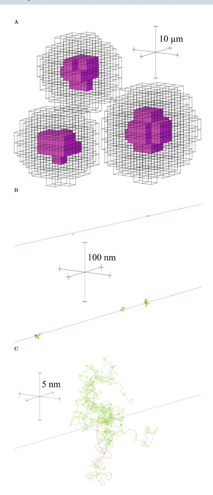

**Figure 6.** Visualization of a few cells irradiated with 1 MeV electrons. (**A**) The electron tracks are not drawn, but their passage through cell nuclei is dotted by  ${}^{\bullet}$ OH tracks (green) (Geant4-DNA chemistry was only simulated in nucleus voxels). The three scale bars are mutually orthogonal and each 10  $\mu$ m long. (**B**) A closer view (100 nm scale bars) shows the  ${}^{\bullet}$ OH tracks generated sporadically along the electron tracks (magenta). (**C**) A closer view again (5 nm scale bars) shows  ${}^{\bullet}$ OH tracks in more detail, depicting 2.5 ns of diffusion by Brownian motion. Images were created using the Fukui Renderer DAWN (Drawer for Academic WritiNgs), version 3.90b, Satoshi Tanaka *et al.* https://geant4.kek.jp/tanaka/DAWN/About\_DAWN.html.

With these assumptions in place, each counted misrejoining independently had a 50% chance of resulting in an asymmetric exchange-type CA and thus causing cell death (Supplementary Methods). Accordingly, the probability of cell survival from misrejoining,  $P_{surv(mr)}$ , was related to the total number of counted misrejoinings,  $N_{mr}$ , by (similar to Brenner's model34):

for 
$$i = 1 \to N$$
; for  $j = (i + 1) \to N$ 

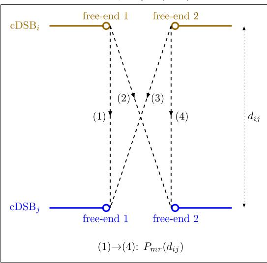

**Figure 7.** Schematic of the stochastic, proximity-based DNA free-end misrejoining algorithm. A successful misrejoining event removed two free-ends from the pool. N is the total number of cDSBs,  $d_{ij}$  is the initial distance between cDSBi and cDSBj,  $P_{mr}(d_{ij})$  is the probability of a misrejoining between a free end of cDSBi and a free-end of cDSBj.

$$P_{surv(mr)} = 0.5^{N_{mr}} \tag{9}$$

In the sensitivity analysis (see Section: Simulations performed), values other than 0.5 were also considered for the probability that a misrejoining was non-lethal,  $P_{nlmr}$ , in which case:

$$P_{surv(mr)} = (P_{nlmr})^{N_{mr}} \tag{10}$$

**Simulations performed.** Sensitivity analysis. Doses to the tumor (1224 cells) of up to 1 Gy were simulated with track structure (1 mGy, 3 mGy, 10 mGy, 30 mGy, 60 mGy, 0.1 Gy, 0.3 Gy, 0.5 Gy, 0.7 Gy and 1 Gy). For each dose, DNA damage induction and DNA free-end misrejoining were simulated in all 1224 cells under conditions of full oxia ( $pO_2$  of 760 mmHg) and anoxia ( $pO_2$  of 0 mmHg). The number of DSBs per cell vs dose and the number of cDSBs per cell vs dose were fit (in Matlab) to:

$$N_{\rm DSB} = m_{\rm DSB}D \tag{11}$$

$$N_{\rm cDSB} = m_{\rm cDSB} D \tag{12}$$

The number of misrejoinings per cell vs dose was fit to:

$$N_{mr} = \alpha_{mr}D + \beta_{mr}D^2 \tag{13}$$

If  $\alpha_{mr} < 0$ , the fit was reperformed to:

$$N_{mr} = \beta_{mr} D^2 \tag{14}$$

The mean probability of cell survival from misrejoining was fit to:

$$P_{surv(mr)} = e^{-\alpha_{\text{killing}(mr)}D - \beta_{\text{killing}(mr)}D^2}$$
(15)

If  $\alpha_{\mathrm{killing}(\mathit{mr})} <$  0, the fit was reperformed to:

$$P_{\text{surv}(mr)} = e^{-\beta_{\text{killing}(mr)}D^2} \tag{16}$$

The oxygen enhancement ratios (OERs) for DSB and cDSB induction were obtained by:

$$OER_{DSB} = \frac{m_{DSB}(pO_2 \text{ of } 760 \text{ mmHg})}{m_{DSB}(pO_2 \text{ of } 0 \text{ mmHg})}$$
(17)

$$OER_{cDSB} = \frac{m_{cDSB}(pO_2 \text{ of } 760 \text{ mmHg})}{m_{cDSB}(pO_2 \text{ of } 0 \text{ mmHg})}$$
(18)

The surviving fraction from misrejoining after a dose of 2 Gy,  $SF_{2(mr)}$ , was obtained by extrapolation using the fit for  $P_{surv(mr)}$ . The OER for cell killing by misrejoining was measured as:

$$OER_{killing(mr)} = \frac{D_{10}(pO_2 \text{ of } 0 \text{ mmHg})}{D_{10}(pO_2 \text{ of } 760 \text{ mmHg})}$$
(19)

where the dose to achieve 10% survival,  $D_{10}$ , was obtained by extrapolation using the fit for  $P_{surv(mr)}$ . A sensitivity analysis was performed for the model parameters DSB yield  $\in$  {20.1, 30.1, 40.2}/cell/Gy,  $r_0 \in$  {0.5, 0.7, 0.9}  $\mu$ m and  $P_{nlmr} \in \{0.25, 0.5, 0.75\}$ , using the endpoints OERDSB, OERcDSB,  $\alpha_{mr}$ ,  $\beta_{mr}$ ,  $\alpha_{killing(mr)}$ ,  $\beta_{killing(mr)}$ ,  $\beta_{killing(mr)}$ ,  $\beta_{killing(mr)}$ ,  $\beta_{killing(mr)}$ ,  $\beta_{killing(mr)}$ ,  $\beta_{killing(mr)}$ ,  $\beta_{killing(mr)}$ ,  $\beta_{killing(mr)}$ ,  $\beta_{killing(mr)}$ ,  $\beta_{killing(mr)}$ ,  $\beta_{killing(mr)}$ ,  $\beta_{killing(mr)}$ ,  $\beta_{killing(mr)}$ ,  $\beta_{killing(mr)}$ ,  $\beta_{killing(mr)}$ ,  $\beta_{killing(mr)}$ ,  $\beta_{killing(mr)}$ ,  $\beta_{killing(mr)}$ ,  $\beta_{killing(mr)}$ ,  $\beta_{killing(mr)}$ ,  $\beta_{killing(mr)}$ ,  $\beta_{killing(mr)}$ ,  $\beta_{killing(mr)}$ ,  $\beta_{killing(mr)}$ ,  $\beta_{killing(mr)}$ ,  $\beta_{killing(mr)}$ ,  $\beta_{killing(mr)}$ ,  $\beta_{killing(mr)}$ ,  $\beta_{killing(mr)}$ ,  $\beta_{killing(mr)}$ ,  $\beta_{killing(mr)}$ ,  $\beta_{killing(mr)}$ ,  $\beta_{killing(mr)}$ ,  $\beta_{killing(mr)}$ ,  $\beta_{killing(mr)}$ ,  $\beta_{killing(mr)}$ ,  $\beta_{killing(mr)}$ ,  $\beta_{killing(mr)}$ ,  $\beta_{killing(mr)}$ ,  $\beta_{killing(mr)}$ ,  $\beta_{killing(mr)}$ ,  $\beta_{killing(mr)}$ ,  $\beta_{killing(mr)}$ ,  $\beta_{killing(mr)}$ ,  $\beta_{killing(mr)}$ ,  $\beta_{killing(mr)}$ ,  $\beta_{killing(mr)}$ ,  $\beta_{killing(mr)}$ ,  $\beta_{killing(mr)}$ ,  $\beta_{killing(mr)}$ ,  $\beta_{killing(mr)}$ ,  $\beta_{killing(mr)}$ ,  $\beta_{killing(mr)}$ ,  $\beta_{killing(mr)}$ ,  $\beta_{killing(mr)}$ ,  $\beta_{killing(mr)}$ ,  $\beta_{killing(mr)}$ ,  $\beta_{killing(mr)}$ ,  $\beta_{killing(mr)}$ ,  $\beta_{killing(mr)}$ ,  $\beta_{killing(mr)}$ ,  $\beta_{killing(mr)}$ ,  $\beta_{killing(mr)}$ ,  $\beta_{killing(mr)}$ ,  $\beta_{killing(mr)}$ ,  $\beta_{killing(mr)}$ ,  $\beta_{killing(mr)}$ ,  $\beta_{killing(mr)}$ ,  $\beta_{killing(mr)}$ ,  $\beta_{killing(mr)}$ ,  $\beta_{killing(mr)}$ ,  $\beta_{killing(mr)}$ ,  $\beta_{killing(mr)}$ ,  $\beta_{killing(mr)}$ ,  $\beta_{killing(mr)}$ ,  $\beta_{killing(mr)}$ ,  $\beta_{killing(mr)}$ ,  $\beta_{killing(mr)}$ ,  $\beta_{killing(mr)}$ ,  $\beta_{killing(mr)}$ ,  $\beta_{killing(mr)}$ ,  $\beta_{killing(mr)}$ ,  $\beta_{killing(mr)}$  $SF_{2(mr)}$  and  $OER_{killing(mr)}$ 

Simulations were performed on the Phoenix supercomputer (University of Adelaide, Adelaide, Australia). To irradiate the tumor (1224 cells) with tracks to a uniform dose of 1 Gy required 637 runs of  $5 \times 10^7$  x-rays each. Each run required 5 cores sharing 30 GB of memory for 1.25 hours (4000 core hours total). The amount of resources required to run the the DNA damage induction algorithm was non-linear with dose. For a dose of 1 Gy, the DNA damage algorithm required 1 core with 35 GB for 8 hours, followed by 5 cores sharing 110 GB for 32 hours, once for full oxia and once for anoxia (328 core hours total). For a dose of 0.7 Gy, it used 1 core with 25 GB for 3 hours, followed by 5 cores sharing 50 GB for 13 hours, once for full oxia and once for anoxia (29 core hours total). The misrejoining algorithm required almost no resources.

**Isolation of direct-type effects.** To investigate the contributions from direct-type and indirect effects, DNA damage induction and DNA free-end misrejoining were repeated for each dose without including the indirect effect of DNA damage induction (i.e. •OH interactions with DNA). A DSB yield of 30.1/Gy/cell, r0 of 0.7 μm and Pnlmr of 0.5 were used. Without the indirect (\*OH) events, the DNA damage algorithm required approximately half as many core hours and GB of memory.

**1Gy dose delivered to HNSCC tumor of volume 1mm3.** The voxelized tumor (the cubic volume of side length 0.2 mm containing 1224 cells) was replicated 125 times to form a cubic volume of side length 1 mm3 containing  $1224 \times 125 = 153000$  cells. A previously developed model for cellular HNSCC tumor growth with angiogenesis 55,76 was used to generate a connected network of blood vessels through the 1 mm³ tumor and then assign each cell with a pO2 according to its proximity to blood vessels (chronic hypoxia).

The relevant model parameters were the relative vascular volume (RVV), the blood oxygenation ( $p_0$ ) and the distance from a vessel to the onset of necrosis (necrosis distance, ND). While HNSCC can have RVV from 2-10%,  $p_0$  from 20–100 mmHg and ND from 80–300  $\mu$ m77, a typical HNSCC is very hypoxic, requiring these parameters to take values near their lower limits 76. In order to achieve a typical HNSCC oxygenation (see Results; Section: 1 Gy dose delivered to HNSCC tumor of volume 1 mm3), an RVV of 2.1%,  $p_0$  of 30 mmHg and ND of 130  $\mu$ m were

The same physical and chemical tracks through the original 1224 cells from 1 Gy dose were used for all 125 "copies" of the (0.2 mm)3 tumor. The positions that were occupied by viable cells (as opposed to necrotic cells or blood vessel units) and their pO2 values differed between copies. Stochastic DNA damage induction and subsequent DNA free-end misrejoining were simulated for each viable (non-necrotic) cell in each copy. While the spatial distributions of direct and indirect events in nuclei were the same between copies, the DNA targets were moved each time, affecting which direct and indirect events hit the DNA. Furthermore, the same event on DNA may have produced a DNA radical on the sugar moiety one time and on a base the next. Most importantly, a higher cellular pO2 made it more likely for a DNA radical to be converted to a strand break. For all of these reasons, the spatial distribution of DSBs in each nucleus was different between copies.

For the 1 mm3 tumor of HNSCC, bivariate frequency distributions were generated of (i) the cellular pO2 and the number of DSBs in the nucleus, (ii) the cellular pO2 and the number of cDSBs in the nucleus, (iii) the cellular pO2 and the number of misrejoinings in the nucleus and (iv) the cellular pO2 and the cell survival probability from misrejoining.

The DNA damage algorithm required 1 core with 35 GB for 8 hours, followed by 5 cores sharing 110 GB for 32 hours for each of the 125 copies (20,008 core hours in total).

**Sensitivity analysis.** Variation with dose of the number of DSBs per cell, the number of cDSBs per cell, the number of misrejoinings per cell and the mean cell survival probability from misrejoining, under full oxia and anoxia, are shown in Fig. 8. These results were obtained using a DSB yield of 30.1/Gy/cell,  $r_0$  of 0.7  $\mu$ m and  $P_{nlrm}$ of 0.5. The number of misrejoinings per cell and the cell survival probability from misrejoining were mostly quadratic with dose under full oxia ( $\alpha_{mr}=0.02~{\rm Gy^{-1}}$  and  $\beta_{mr}=0.37~{\rm Gy^{-2}};~\alpha_{{\rm killing}(mr)}=0.02~{\rm Gy^{-1}}$  and  $\beta_{\mathrm{killing}(mr)} = 0.17~\mathrm{Gy^{-2}}$ ) and purely quadratic under anoxia ( $\beta_{mr} = 0.03~\mathrm{Gy^{-2}}$ ;  $\beta_{\mathrm{killing}(mr)} = 0.02~\mathrm{Gy^{-2}}$ ).

The results of a sensitivity analysis for the parameters DSB yield,  $r_0$  and  $P_{nlrm}$  are presented in Tables 3–5, respectively. The amount of misrejoining and hence cell killing increased with increasing DSB yield and  $r_0$  while the amount of cell killing decreased with increasing  $P_{nlm}$ , as expected. Note that misrejoining and cell killing consistently had small linear components (i.e. the  $\alpha_{mr}$  and  $\alpha_{\text{killing}(mr)}$  values). Also consistently observed were

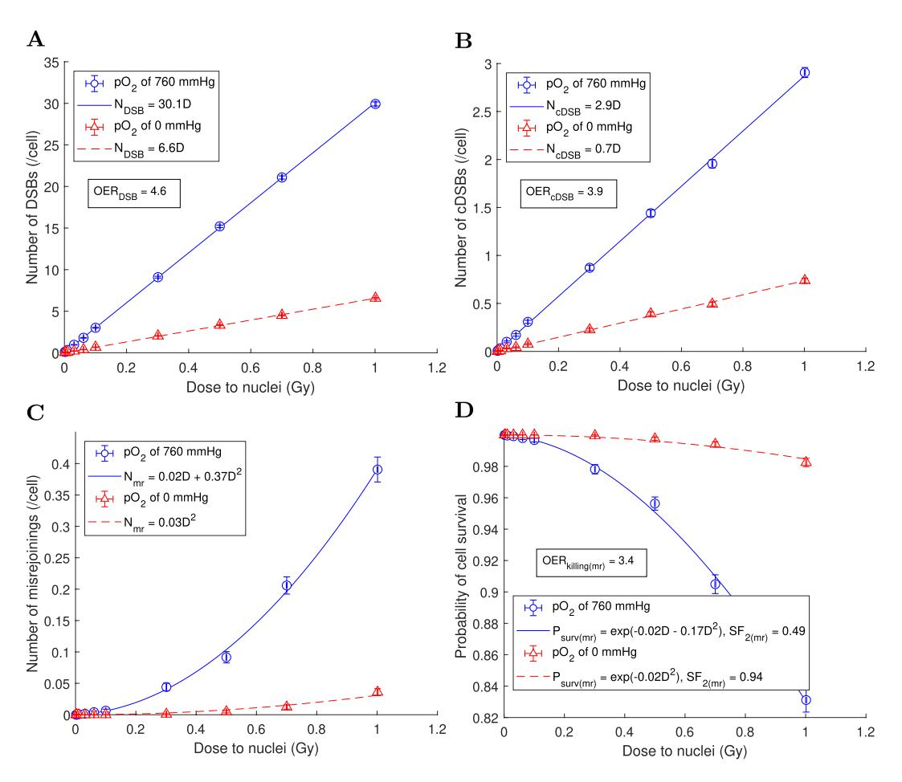

**Figure 8.** Variation with dose of the mean values of cell endpoints, obtained using a DSB yield of 30.1/Gy/cell,  $r_0$  of 0.7  $\mu$ m and  $P_{nlrm}$  of 0.5. (**A**) Number of DSBs per cell vs dose. (**B**) Number of cDSBs per cell vs dose. (**C**) Number of misrejoinings per cell vs dose. (**D**) Cell survival probability from misrejoining vs dose. The mean values for n=1224 cells were plotted with error bars equal to the SEM.

| DSB/cDSB yields a (/Gy/ cell) under full oxia | OER DSB | OER cDSB | $lpha_{mr}(\mathrm{Gy^{-1}})/eta_{mr}(\mathrm{Gy^{-2}})$ under full oxia (anoxia) b,c | $lpha_{	ext{killing}(mr)} (Gy^{-1})/eta_{	ext{killing}(mr)} (Gy^{-2})$ under full oxia (anoxia) d,e | SF 2(mr) under full oxia (anoxia) f,e | $\mathrm{OER}_{\mathrm{killing}(mr)}^{\mathrm{g,e}}$ |
|-------------------------------------------------------------------|--------------------|---------------------|--------------------------------------------------------------------------------------------------|----------------------------------------------------------------------------------------------------------------|-------------------------------------------------------------------|------------------------------------------------------|
| 20.1/1.9                                                          | 4.6                | 3.9                 | 0h/0.19 (0h/0.01)                                                                                | 0i/0.09 (0i/0.01)                                                                                              | 0.70 (0.97)                                                       | 3.6                                                  |
| 30.1/2.9                                                          | 4.6                | 3.9                 | 0.02/0.37 (0 h /0.03)                                                                 | 0.02/0.17 (0 i /0.02)                                                                               | 0.49 (0.94)                                                       | 3.4                                                  |
| 40.2/3.9                                                          | 4.6                | 4.0                 | 0.07/0.56 (0.00/0.04)                                                                            | 0.04/0.25 (0.00/0.02)                                                                                          | 0.34 (0.92)                                                       | 3.6                                                  |

**Table 3.** Effects of varying the DSB yield. aUsing the slopes of the fits  $N_{DSB} = m_{DSB}D$  and  $N_{cDSB} = m_{cDSB}D$ . bFit to  $N_{mr} = \alpha_{mr}D + \beta_{mr}D^2$ . cUsing  $r_0 = 0.7~\mu\text{m}$ . dFit to  $P_{surv(mr)} = e^{-\alpha_{killing(mr)}D - \beta_{killing(mr)}D^2}$ . cUsing  $r_0 = 0.7~\mu\text{m}$  and  $P_{nlmr} = 0.5$ . fUsing the fit to  $P_{surv(mr)}$  and extrapolating to 2 Gy. gUsing OERkilling(mr) =  $D_{10}(\text{pO}_2 \text{ of 0 mmHg})$ , where  $D_{10}$  was obtained by extrapolating the fit to  $P_{surv(mr)}$ . bThe fit gave  $P_{nlmr} = P_{nr} = P_{nr} = P_{nr} = P_{nr} = P_{nr} = P_{nr} = P_{nr} = P_{nr} = P_{nr} = P_{nr} = P_{nr} = P_{nr} = P_{nr} = P_{nr} = P_{nr} = P_{nr} = P_{nr} = P_{nr} = P_{nr} = P_{nr} = P_{nr} = P_{nr} = P_{nr} = P_{nr} = P_{nr} = P_{nr} = P_{nr} = P_{nr} = P_{nr} = P_{nr} = P_{nr} = P_{nr} = P_{nr} = P_{nr} = P_{nr} = P_{nr} = P_{nr} = P_{nr} = P_{nr} = P_{nr} = P_{nr} = P_{nr} = P_{nr} = P_{nr} = P_{nr} = P_{nr} = P_{nr} = P_{nr} = P_{nr} = P_{nr} = P_{nr} = P_{nr} = P_{nr} = P_{nr} = P_{nr} = P_{nr} = P_{nr} = P_{nr} = P_{nr} = P_{nr} = P_{nr} = P_{nr} = P_{nr} = P_{nr} = P_{nr} = P_{nr} = P_{nr} = P_{nr} = P_{nr} = P_{nr} = P_{nr} = P_{nr} = P_{nr} = P_{nr} = P_{nr} = P_{nr} = P_{nr} = P_{nr} = P_{nr} = P_{nr} = P_{nr} = P_{nr} = P_{nr} = P_{nr} = P_{nr} = P_{nr} = P_{nr} = P_{nr} = P_{nr} = P_{nr} = P_{nr} = P_{nr} = P_{nr} = P_{nr} = P_{nr} = P_{nr} = P_{nr} = P_{nr} = P_{nr} = P_{nr} = P_{nr} = P_{nr} = P_{nr} = P_{nr} = P_{nr} = P_{nr} = P_{nr} = P_{nr} = P_{nr} = P_{nr} = P_{nr} = P_{nr} = P_{nr} = P_{nr} = P_{nr} = P_{nr} = P_{nr} = P_{nr} = P_{nr} = P_{nr} = P_{nr} = P_{nr} = P_{nr} = P_{nr} = P_{nr} = P_{nr} = P_{nr} = P_{nr} = P_{nr} = P_{nr} = P_{nr} = P_{nr} = P_{nr} = P_{nr} = P_{nr} = P_{nr} = P_{nr} = P_{nr} = P_{nr} = P_{nr} = P_{nr} = P_{nr} = P_{nr} = P_{nr} = P_{nr} = P_{nr} = P_{nr} = P_{nr} = P_{nr} = P_{nr} = P_{nr} = P_{nr} = P_{nr} = P_{nr} = P_{nr} = P_{nr} = P_{nr} = P_{nr} = P_{nr} = P_{nr} = P_{nr} = P_{nr} = P_{nr} = P_{nr} = P_{nr} = P_{nr} = P_{nr} = P_{$ 

OERcDSB < OERDSB and OERkilling(mr) < OERDSB. For the remainder of the results, a DSB yield of 30.1/Gy/cell,  $r_0$  of 0.7  $\mu$ m and  $P_{nlrm}$  of 0.5 were used.

For the 1 Gy irradiation, the dose to the tumor was uniform to within 1% (Fig. 9A) and the dose to nuclei (n = 1224) was approximately normally distributed with a mean and standard deviation of  $1.00 \pm 0.06$  Gy (Fig. 9B).

Frequency distributions of the number of DSBs in nuclei, the number of cDSBs in nuclei, the number of misrejoinings in nuclei and the cell survival probability from misrejoining, under full oxia and anoxia, are shown in Fig. 10 for the 1 Gy dose.

Figure 11 provides information about the complexity of the DSBs induced under full oxia and anoxia. While there were fewer DSBs under anoxia, the DSBs were on average more complex in terms of the number of

| $r_0 (\mu \mathrm{m})$ | $\alpha_{mr} (\mathrm{Gy^{-1}})/\beta_{mr} (\mathrm{Gy^{-2}})$ under full oxia (anoxia) a | $lpha_{	ext{killing}(mr)} (	ext{Gy}^{-1})/eta_{	ext{killing}(mr)} (	ext{Gy}^{-2})$ under full oxia (anoxia) b,c | SF 2(mr) under full oxia (anoxia) d,c | OER killing(mr) e,c |
|------------------------|------------------------------------------------------------------------------------------------------|----------------------------------------------------------------------------------------------------------------------------|-------------------------------------------------------------------|--------------------------------|
| 0.5                    | 0.01/0.17 (0 f /0.01)                                                                     | 0.01/0.08 (0g/0.01)                                                                                                        | 0.71 (0.97)                                                       | 3.5                            |
| 0.7                    | 0.02/0.37 (0f/0.03)                                                                                  | 0.02/0.17 (0g/0.02)                                                                                                        | 0.49 (0.94)                                                       | 3.4                            |
| 0.9                    | 0.04/0.54 (0f/0.04)                                                                                  | 0.03/0.24 (0g/0.02)                                                                                                        | 0.36 (0.92)                                                       | 3.4                            |

**Table 4.** Effects of varying the characteristic interaction distance,  $r_0$  (from Eq. 8). A DSB yield of 30.1/Gy/cell (cDSB yield of 2.9/Gy/cell) under full oxia was used. aFit to  $N_{mr} = \alpha_{mr}D + \beta_{mr}D^2$ . bFit to  $P_{surv(mr)} = e^{-\alpha_{killing(mr)}D^-\beta_{killing(mr)}D^2}$ . cUsing  $P_{nlmr} = 0.5$ . dUsing the fit to  $P_{surv(mr)}$  and extrapolating to 2 Gy. eUsing OER  $_{killing(mr)} = D_{10}$  (pO $_2$  of 0 mmHg)/ $D_{10}$  (pO $_2$  of 760 mmHg), where  $D_{10}$  was obtained by extrapolating the fit to  $P_{surv(mr)}$ . eThe fit gave  $-0.01 \lesssim \alpha_{mr} < 0$ , so the fit was reperformed to  $N_{mr} = \beta_{mr}D^2$ . gThe fit gave  $-0.01 < \alpha_{killing(mr)} < 0$ , so the fit was reperformed to  $P_{surv(mr)} = e^{-\beta_{killing(mr)}D^2}$ .

| $P_{nlmr}$ | $\alpha_{\text{killing}(mr)}$ (Gy -1 )/ $\beta_{\text{killing}(mr)}$ (Gy -2 ) under full oxia (anoxia) a | SF 2(mr) under full oxia (anoxia) b | OER killing(mr) c |
|------------|-------------------------------------------------------------------------------------------------------------------------------------------|-----------------------------------------------------------|------------------------------|
| 0.25       | 0.03/0.25 (0 d /0.02)                                                                                                          | 0.35 (0.91)                                               | 3.3                          |
| 0.5        | 0.02/0.17 (0 d /0.02)                                                                                                          | 0.49 (0.94)                                               | 3.4                          |
| 0.75       | 0.01/0.09 (0 d /0.01)                                                                                                          | 0.69 (0.97)                                               | 3.4                          |

**Table 5.** Effects of varying the probability that a misrejoining was non-lethal,  $P_{nlmr}$  (from Eq. 10). A DSB yield of 30.1/Gy/cell (cDSB yield of 2.9/Gy/cell) under full oxia and  $r_0$  of 0.7 μm were used. aFit to  $P_{surv(mr)} = e^{-\alpha_{killing(mr)}D^{-\beta_{killing(mr)}D^{-\beta_{killing(mr)}D^{-\beta_{killing(mr)}D^{-\beta_{killing(mr)}D^{-\beta_{killing(mr)}D^{-\beta_{killing(mr)}D^{-\beta_{killing(mr)}D^{-\beta_{killing(mr)}D^{-\beta_{killing(mr)}D^{-\beta_{killing(mr)}D^{-\beta_{killing(mr)}D^{-\beta_{killing(mr)}D^{-\beta_{killing(mr)}D^{-\beta_{killing(mr)}D^{-\beta_{killing(mr)}D^{-\beta_{killing(mr)}D^{-\beta_{killing(mr)}D^{-\beta_{killing(mr)}D^{-\beta_{killing(mr)}D^{-\beta_{killing(mr)}D^{-\beta_{killing(mr)}D^{-\beta_{killing(mr)}D^{-\beta_{killing(mr)}D^{-\beta_{killing(mr)}D^{-\beta_{killing(mr)}D^{-\beta_{killing(mr)}D^{-\beta_{killing(mr)}D^{-\beta_{killing(mr)}D^{-\beta_{killing(mr)}D^{-\beta_{killing(mr)}D^{-\beta_{killing(mr)}D^{-\beta_{killing(mr)}D^{-\beta_{killing(mr)}D^{-\beta_{killing(mr)}D^{-\beta_{killing(mr)}D^{-\beta_{killing(mr)}D^{-\beta_{killing(mr)}D^{-\beta_{killing(mr)}D^{-\beta_{killing(mr)}D^{-\beta_{killing(mr)}D^{-\beta_{killing(mr)}D^{-\beta_{killing(mr)}D^{-\beta_{killing(mr)}D^{-\beta_{killing(mr)}D^{-\beta_{killing(mr)}D^{-\beta_{killing(mr)}D^{-\beta_{killing(mr)}D^{-\beta_{killing(mr)}D^{-\beta_{killing(mr)}D^{-\beta_{killing(mr)}D^{-\beta_{killing(mr)}D^{-\beta_{killing(mr)}D^{-\beta_{killing(mr)}D^{-\beta_{killing(mr)}D^{-\beta_{killing(mr)}D^{-\beta_{killing(mr)}D^{-\beta_{killing(mr)}D^{-\beta_{killing(mr)}D^{-\beta_{killing(mr)}D^{-\beta_{killing(mr)}D^{-\beta_{killing(mr)}D^{-\beta_{killing(mr)}D^{-\beta_{killing(mr)}D^{-\beta_{killing(mr)}D^{-\beta_{killing(mr)}D^{-\beta_{killing(mr)}D^{-\beta_{killing(mr)}D^{-\beta_{killing(mr)}D^{-\beta_{killing(mr)}D^{-\beta_{killing(mr)}D^{-\beta_{killing(mr)}D^{-\beta_{killing(mr)}D^{-\beta_{killing(mr)}D^{-\beta_{killing(mr)}D^{-\beta_{killing(mr)}D^{-\beta_{killing(mr)}D^{-\beta_{killing(mr)}D^{-\beta_{killing(mr)}D^{-\beta_{killing(mr)}D^{-\beta_{killing(mr)}D^{-\beta_{killing(mr)}D^{-\beta_{killing(mr)}D^{-\beta_{killing(mr)}D^{-\beta_{killing(mr)}D^{-\beta_{killing(mr)}D^{-\beta_{killing(mr)}D^{-\beta_{killing(mr)}D^{-\beta_{killing(mr)}D^{-\beta_{killing(mr)}D^{-\beta_{killing(mr)}D^{-\beta_{killing(mr)}D^{-\beta_{killing(mr)}D^{-\beta_{killing(mr)}D^{-\beta_{killing(mr)}D^$ 

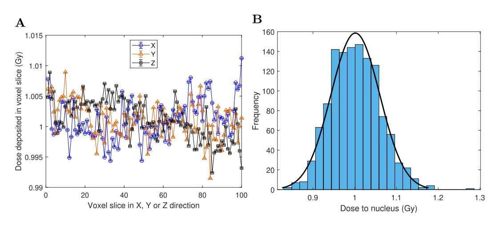

**Figure 9.** 1 Gy dose delivered to the tumor (1224 cells) with track structure. (**A**) Spatial dose profiles, using voxel slices in the X, Y and Z directions. The mean dose for  $n = 10^4$  voxels in a voxel slice was plotted with vertical error bars equal to the SEM (which were smaller than the markers). (**B**) Frequency distribution of dose to nuclei (n = 1224), with a normal distribution fit overlaid.

elementary damages (strand breaks, modified bases and modified sugars). Given how cDSBs were defined (DSBs with >15 elementary damages), this is consistent with OER  $_{\rm cDSB} <$  OER  $_{\rm DSB}$ . Almost all DSBs had unit multiplicity (98.3% of DSBs under full oxia and 99.6% of DSBs under anoxia).

**Isolation of direct-type effects.** If DNA damage from the indirect effect was not simulated, the DSB yield was reduced to approximately a third of its original value and the cDSB yield was reduced to a tenth of its original value (Table 6).

**1Gy dose delivered to HNSCC tumor of volume 1 mm³.** A 1 mm³ tumor was generated (Fig. 12A) with a cellular  $pO_2$  distribution (Fig. 12B) characteristic of HNSCC 76: the mean cellular  $pO_2$  was 9.4 mmHg, the median cellular  $pO_2$  was 8.2 mmHg, the HP10 (proportion of viable cells with  $pO_2$  < 10 mmHg) was 58%, the HP5 was 34%, the HP2.5 was 20%, the HP1 was 11% and the necrotic volume was 9.4%.

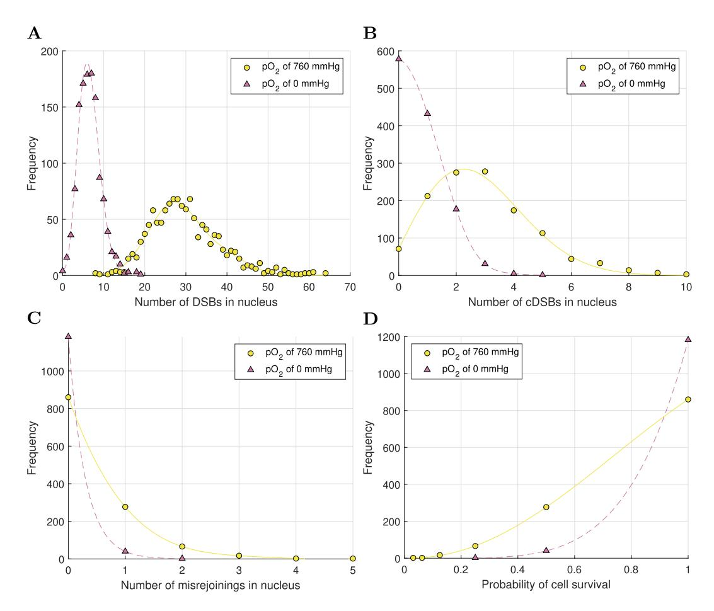

**Figure 10.** Frequency distributions of cell endpoints in *n*=1224 cells for 1Gy dose, under full oxia and anoxia. (**A**) Number of DSBs in nuclei. (**B**) Number of cDSBs in the nuclei. (**C**) Number of misrejoinings in the nuclei. (**D**) Cell survival probability from misrejoining.

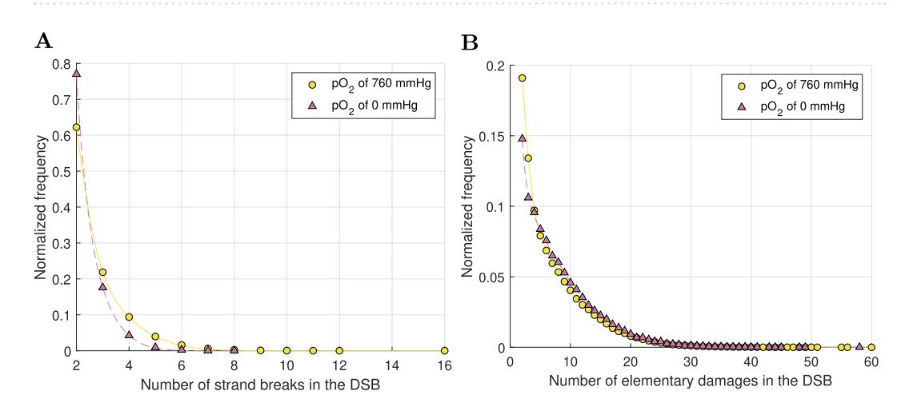

**Figure 11.** Frequency distributions of DSB properties for 1Gy dose, under full oxia and anoxia. (**A**) Number of strand breaks in DSBs. (**B**) Number of elementary damages (strand breaks, modifed bases and modifed sugars) in DSBs. Te total number of DSBs in 1224 cells was *n*=187518 under full oxia and *n*=40886 under anoxia. Te frequency distributions were normalized for ease of comparison between full oxia and anoxia.

Figure [13](#page-15-0) shows, for 1Gy dose, bivariate frequency distributions of the cellular pO2 and the number of DSBs in the nucleus, the cellular pO2 and the number of cDSBs in the nucleus, the cellular pO2 and the number of misrejoinings in the nucleus and the cellular pO2 and the cell survival probability from misrejoining.

|                     | DSB/cDSB yields (/Gy/cell) under full oxia | OER DSB | OER cDSB |
|---------------------|--------------------------------------------|--------------------|---------------------|
| $D^a + I^b$         | 30.1/2.9                                   | 4.6                | 3.9                 |
| D a only | 12.3/0.3                                   | 2.6                | 2.2                 |

**Table 6.** The impact of neglecting the indirect effect. aDirect-type effects. bIndirect effect.

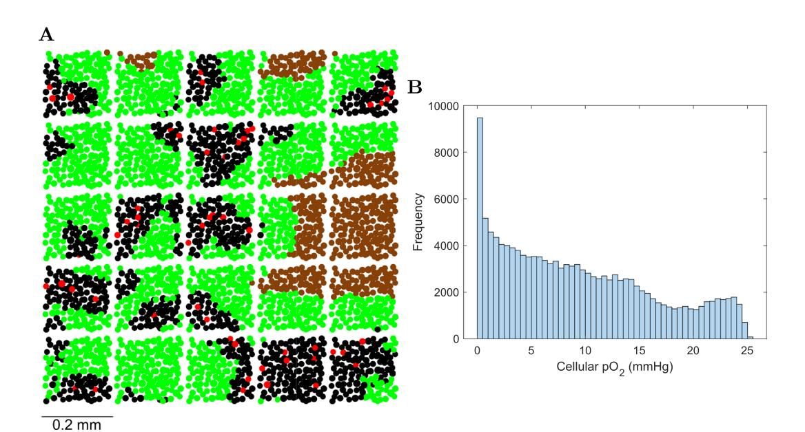

**Figure 12.** 1 mm³ tumor of HNSCC. (**A**) Section (thickness 20  $\mu$ m) showing blood vessel units (red), normoxic cells (pO2 > 10 mmHg) (black) located near the blood vessels, hypoxic cells (pO2  $\leq$  10 mmHg) (green) located further from the blood vessels and necrotic cells (brown) located further than  $ND=130~\mu$ m from a blood vessel. It can be seen how the 1 mm³ tumor was constructed by replicating the (0.2 mm)³ tumor. (**B**) Frequency distribution of pO2 for viable (non-necrotic) cells (n=135306) in the 1 mm³ tumor of HNSCC.

#### Discussion

DNA free-end misrejoining and its contribution to cell killing for MV x-rays was investigated. The linear components of misrejoining ( $\alpha_{killing}$ ) and cell killing from misrejoining ( $\alpha_{killing}$ ) were consistently small in the sensitivity analysis. For example, for a DSB yield of 30.1/Gy/cell,  $r_0$  of 0.7  $\mu$ m and  $P_{nlmr}$  of 0.5,  $\alpha_{killing}$  was 0.02 Gy-1 under full oxia (and zero under anoxia). For comparison, a typical  $\alpha_{killing}$  for HNSCC is 0.3 Gy-141,78-82. This indicated that (i) misrejoinings involving DSBs from the same primary were a very rare occurrence, which is in agreement with deterministic modeling by Carlson *et al.*26, and (ii) other mechanisms may be chiefly responsible for the linear components of CA production and cell killing by low-LET radiation for HNSCC. Unrejoined DNA free-ends (terminal deletions and incomplete exchanges) are likely candidates. It has been estimated that approximately 5% of DSBs end up as either terminal deletions or incomplete exchanges for low-LET radiation8.

On the other hand, the quadratic components of misrejoining ( $\beta_{mr}$ ) and cell killing from misrejoining ( $\beta_{killing(mr)}$ ) were consistently large in the sensitivity analysis. For the aforementioned combination of {DSB yield,  $r_0$ ,  $P_{nlmr}$ },  $\beta_{killing(mr)}$  was  $0.17~{\rm Gy}^{-2}$  under full oxia ( $0.02~{\rm Gy}^{-2}$  under anoxia), whereas a typical value of  $\beta_{killing}$  for HNSCC is  $0.03~{\rm Gy}^{-2}$  41.78–83. This indicates that too much misrejoining was simulated (which makes the small linear component of cell killing by misrejoining look even smaller). Consistent with this notion, the SF2(mr) under full oxia was already 49% without simulating terminal deletions and incomplete exchanges as sources of cell killing.

The amount of misrejoining could be reduced by decreasing the model parameter  $r_0$  below 0.5  $\mu$ m. However, this may not be optimal, since the BIANCA model obtained good results for the CA yields in a monolayer-shaped fibroblast using an  $r_0$  of 0.7  $\mu$ m and in a lymphocyte using an  $r_0$  of 0.8  $\mu$ m33. Alternatively, misrejoining could be reduced by increasing the size of the nuclei. This may be well advised given that large DNA volumes from 13.3 to 26.7% were required to obtain DSB yields from 20 to 40/Gy/cell (for reference, estimates of the DNA volume in yeast cells vary from 0.3 to 2%69). Increasing the nucleus volume would require a proportional decrease in the DNA volume to obtain the same DSB yield. However, a large DNA volume was also encountered in the computational model by Henthorn *et al.*28. Their model, like the current one, used a spatial clustering approach to predict DNA damage. They required the sensitive fraction of the nucleus to be 15% to achieve a realistic DSB yield.

It is also possible that some misrejoinings were counted that should not have been. If a group of  $N \ge 3$  breaks involved N explicitly simulated misrejoinings (the maximum number), a value of  $N_{mr} = N$  was mistakenly used

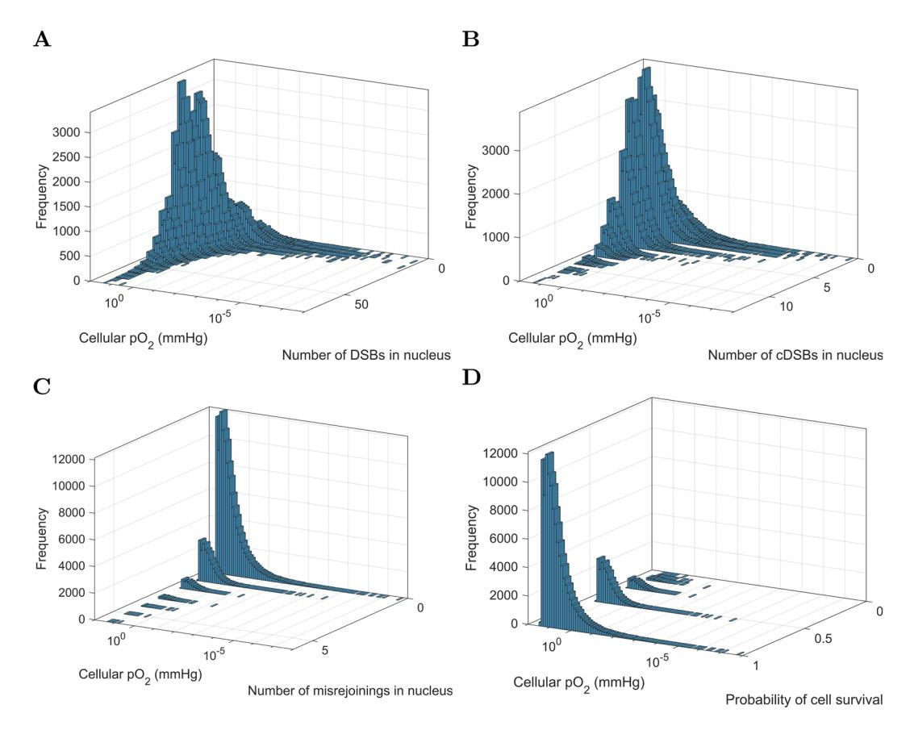

**Figure 13.** Bivariate frequency distributions of cellular  $pO_2$  and cell endpoints in n=135306 viable cells of the 1 mm³ HNSCC tumor for 1 Gy dose. (**A**) Cellular  $pO_2$  and the number of DSBs in the nucleus. (**B**) Cellular  $pO_2$  and the number of misrejoinings in the nucleus. (**D**) Cellular  $pO_2$  and the cell survival probability from misrejoining.

in Eq. 9 (or Eq. 10) for the cell survival probability; the true probability in this case is obtained by using a value of  $N_{mr}=N-1$  (Supplementary Methods). However, for the largest dose simulated (1 Gy), only 1.7% of cells (22/1224 cells) under full oxia (and no cells under axoia) contained 3 or more misrejoinings (Fig. 10C). Therefore, these erroneous cases could not have contributed appreciably to the current results. This oversight will be rectified in future iterations of the model. It is expected to be important for simulating high dose fractions and high-LET proton and carbon beams, which are planned for future work.

A limitation of the model was the assumption of no incomplete exchanges and no terminal deletions. There would be greater cell killing if these mechanisms were accounted for. Another limitation was that a negative exponential function was used to model the probability of misrejoining (Eq. 8). This was an approximation of complex DSB repair processes (e.g. c-NHEJ), which involve cascades of a large number of DNA repair proteins13. Additionally, there can be DNA damage from non-targeted effects24, which were not considered. The model also neglected cell death by apoptosis, when apoptosis is not a consequence of lethal CA-driven mitotic catastrophe1,21–24.

This work presented a new stochastic model of radiation-induced CA production and cell death that addressed a gap in the literature. Rather than focusing on simulating a complex DNA target model (e.g. Friedland and Kundrát's model $^{29,30}$ , the BIANCA model $^{31-33}$ ), or the motion of DNA free-ends (Friedland and Kundrát, the model by Henthorn *et al.* 28, Brenner's model $^{34}$ ), or mechanistic modeling of NHEJ (Henthorn *et al.*, Friedland and Kundrát), the current model uniquely simulated Monte Carlo track structure through a multicellular tumor volume, and converted the physical and chemical tracks in nuclei into DNA damage in a pO2-dependent fashion. These are important developments toward a spatio-temporal, multicellular, track structure-based radiotherapy model $^{55,76}$ .

#### Conclusion

The current work achieved the stochastic simulation of (i) x-ray irradiation of a multicellular tumor, (ii)  $pO_2$ -dependent DNA damage induction from the tracks, (iii) proximity-based DNA free-end misrejoining and (iv) cell death from misrejoining. The model was used to investigate the contribution of misrejoining to cell killing in isolation for MV x-rays. A sensitivity analysis was conducted for the model parameters DSB yield, characteristic interaction distance and probability that a misrejoining was non-lethal. As an application, DNA damage and misrejoining were simulated in 135306 viable cells in a 1 mm3 hypoxic HNSCC tumor for a uniform

dose of 1Gy. Te near absence of linear components of misrejoining and cell killing from misrejoining suggests that terminal deletions and incomplete exchanges may be important mechanisms for the linear components of CA production and cell killing by low-LET radiation for HNSCC, under the assumptions of the current model.

Received: 10 April 2019; Accepted: 19 November 2019;

Published: xx xx xxxx

#### **References**

- 1. Wouters, B. G. Cell death afer irradiation: how, when and why cells die. In: Joiner, M. C. & van der Kogel, A. editors. Basic clinical radiobiology. 4th ed. Boca Raton: CRC Press; p. 27–40 (2009).
- 2. Cell survival curves. In: Hall EJ, Giaccia AJ, editors. Radiobiology for the radiologist. 7th ed. Philadelphia: Wolters Kluwer Health; p. 41–42 (2011).
- 3. Cornforth, M. N. & Bedford, J. S. A quantitative comparison of potentially lethal damage repair and the rejoining of interphase chromosome breaks in low passage normal human fbroblasts. *Radiat Res.* **111**(3), 385–405 (1987).
- 4. Cornforth, M. N. Perspectives on the formation of radiation-induced exchange aberrations. *DNA Repair (Amst).* **5**(9–10), 1182–1191, <https://doi.org/10.1016/j.dnarep.2006.05.008>(2006).
- 5. Sasaki, M. S. Advances in the biophysical and molecular bases of radiation cytogenetics. *Int J Radiat Biol.* **85**(1), 26–47, [https://doi.](https://doi.org/10.1080/09553000802641185) [org/10.1080/09553000802641185](https://doi.org/10.1080/09553000802641185) (2009).
- 6. Durante, M. *et al*. From DNA damage to chromosome aberrations: joining the break. *Mutat Res.* **756**(1–2), 5–13, [https://doi.](https://doi.org/10.1016/j.mrgentox.2013.05.014) [org/10.1016/j.mrgentox.2013.05.014](https://doi.org/10.1016/j.mrgentox.2013.05.014) (2013).
- 7. Molecular mechanisms of DNA and chromosome damage and repair. In: Hall, E. J. & Giaccia, A. J., editors. Radiobiology for the radiologist. 7th ed. Philadelphia: Wolters Kluwer Health; p. 25–34 (2011).
- 8. Loucas, B. D. & Cornforth, M. N. Te LET dependence of unrepaired chromosome damage in human cells: a break too far? *Radiat Res.* **179**(4), 393–405,<https://doi.org/10.1667/RR3159.2> (2013).
- 9. Sachs, R. K., Chen, A. M. & Brenner, D. J. Review: proximity efects in the production of chromosome aberrations by ionizing radiation. *Int J Radiat Biol.* **71**(1), 1–19 (1997).
- 10. Löbrich, M. & Jeggo, P. A Process of Resection-Dependent Nonhomologous End Joining Involving the Goddess Artemis. *Trends Biochem Sci.* **42**(9), 690–701,<https://doi.org/10.1016/j.tibs.2017.06.011>(2017).
- 11. Schipler, A. & Iliakis, G. DNA double-strand-break complexity levels and their possible contributions to the probability for errorprone processing and repair pathway choice. *Nucleic Acids Res.* **41**(16), 7589–7605,<https://doi.org/10.1093/nar/gkt556> (2013).
- 12. Le Guen, T., Ragu, S., Guirouilh-Barbat, J. & Lopez, B. S. Role of the double-strand break repair pathway in the maintenance of genomic stability. *Mol Cell Oncol.* **2**(1), e968020,<https://doi.org/10.4161/23723548.2014.968020> (2015).
- 13. Biehs, R. *et al*. DNA Double-Strand Break Resection Occurs during Non-homologous End Joining in G1 but Is Distinct from Resection during Homologous Recombination. *Mol Cell.* **65**(4), 671–684.e5, <https://doi.org/10.1016/j.molcel.2016.12.016>(2017).
- 14. Jakob, B., Splinter, J., Durante, M. & Taucher-Scholz, G. Live cell microscopy analysis of radiation-induced DNA double-strand break motion. *Proc Natl Acad Sci USA* **106**(9), 3172–3177,<https://doi.org/10.1073/pnas.0810987106> (2009).
- 15. Reynolds, P. *et al*. Te dynamics of Ku70/80 and DNA-PKcs at DSBs induced by ionizing radiation is dependent on the complexity of damage. *Nucleic Acids Res.* **40**(21), 10821–10831, <https://doi.org/10.1093/nar/gks879> (2012).
- 16. Li, Y., Reynolds, P., O'Neill, P. & Cucinotta, F. A. Modeling damage complexity-dependent non-homologous end-joining repair pathway. *PLoS One.* **9**(2), e85816, <https://doi.org/10.1371/journal.pone.0085816> (2014).
- 17. Liang, Y. *et al*. Relative biological efectiveness for photons: implication of complex DNA double-strand breaks as critical lesions. *Phys Med Biol.* **62**(6), 2153–2175, <https://doi.org/10.1088/1361-6560/aa56ed>(2017).
- 18. Shuryak, I., Loucas, B. D. & Cornforth, M. N. Straightening Beta: Overdispersion of Lethal Chromosome Aberrations following Radiotherapeutic Doses Leads to Terminal Linearity in the Alpha-Beta Model. *Front Oncol.* **7**, 318, [https://doi.org/10.3389/](https://doi.org/10.3389/fonc.2017.00318) [fonc.2017.00318](https://doi.org/10.3389/fonc.2017.00318) (2017).
- 19. Brenner, D. J. Te linear-quadratic model is an appropriate methodology for determining isoefective doses at large doses per fraction. *Semin Radiat Oncol.* **18**(4), 234–239, <https://doi.org/10.1016/j.semradonc.2008.04.004> (2008).
- 20. Hanahan, D. & Weinberg, R. A. Hallmarks of cancer: the next generation. *Cell.* **144**(5), 646–674, [https://doi.org/10.1016/j.](https://doi.org/10.1016/j.cell.2011.02.013) [cell.2011.02.013](https://doi.org/10.1016/j.cell.2011.02.013) (2011).
- 21. Roos, W. P. & Kaina, B. DNA damage-induced cell death: from specifc DNA lesions to the DNA damage response and apoptosis. *Cancer Lett.* **332**(2), 237–248,<https://doi.org/10.1016/j.canlet.2012.01.007> (2013).
- 22. Roos, W. P. & Kaina, B. DNA damage-induced cell death by apoptosis. *Trends Mol Med.* **12**(9), 440–450, [https://doi.org/10.1016/j.](https://doi.org/10.1016/j.molmed.2006.07.007) [molmed.2006.07.007](https://doi.org/10.1016/j.molmed.2006.07.007) (2006).
- 23. Kodiha, M., Wang, Y. M., Hutter, E., Maysinger, D. & Stochaj, U. Of to the organelles - killing cancer cells with targeted gold nanoparticles. *Teranostics.* **5**(4), 357–370, <https://doi.org/10.7150/thno.10657>(2015).
- 24. Wang, R., Zhou, T., Liu, W. & Zuo, L. Molecular mechanism of bystander efects and related abscopal/cohort efects in cancer therapy. *Oncotarget.* **9**(26), 18637–18647,<https://doi.org/10.18632/oncotarget.24746>(2018).
- 25. Besserer, J. & Schneider, U. A track-event theory of cell survival. *Z Med Phys.* **25**(2), 168–175, [https://doi.org/10.1016/j.](https://doi.org/10.1016/j.zemedi.2014.10.001) [zemedi.2014.10.001](https://doi.org/10.1016/j.zemedi.2014.10.001) (2015).
- 26. Carlson, D. J., Stewart, R. D., Semenenko, V. A. & Sandison, G. A. Combined use of Monte Carlo DNA damage simulations and deterministic repair models to examine putative mechanisms of cell killing. *Radiat Res.* **169**(4), 447–459, [https://doi.org/10.1667/](https://doi.org/10.1667/RR1046.1) [RR1046.1](https://doi.org/10.1667/RR1046.1) (2008).
- 27. Stewart, R. D. Two-lesion kinetic model of double-strand break rejoining and cell killing. *Radiat Res.* **156**(4), 365–378 (2001).
- 28. Henthorn, N. T. *et al*. In Silico Non-Homologous End Joining Following Ion Induced DNA Double Strand Breaks Predicts Tat Repair Fidelity Depends on Break Density. *Sci Rep.* **8**(1), 2654,<https://doi.org/10.1038/s41598-018-21111-8>(2018).
- 29. Friedland, W. & Kundrát, P. Chromosome aberration model combining radiation tracks, chromatin structure, DSB repair and chromatin mobility. *Radiat Prot Dosimetry.* **166**(1–4), 71–74,<https://doi.org/10.1093/rpd/ncv174> (2015).
- 30. Friedland, W. & Kundrát, P. Track structure based modelling of chromosome aberrations afer photon and alpha-particle irradiation. *Mutat Res.* **756**(1–2), 213–223,<https://doi.org/10.1016/j.mrgentox.2013.06.013>(2013).
- 31. Tello Cajiao, J. J., Carante, M. P., Bernal Rodriguez, M. A. & Ballarini, F. Proximity efects in chromosome aberration induction: Dependence on radiation quality, cell type and dose. *DNA Repair (Amst).* **64**, 45–52, <https://doi.org/10.1016/j.dnarep.2018.02.006> (2018).
- 32. Carante, M. P., Aimè, C., Cajiao, J. J. T. & Ballarini, F. BIANCA, a biophysical model of cell survival and chromosome damage by protons, C-ions and He-ions at energies and doses used in hadrontherapy. *Phys Med Biol.* **63**(7), 075007, [https://doi.](https://doi.org/10.1088/1361-6560/aab45f) [org/10.1088/1361-6560/aab45f](https://doi.org/10.1088/1361-6560/aab45f) (2018).
- 33. Tello Cajiao, J. J., Carante, M. P., Bernal Rodriguez, M. A. & Ballarini, F. Proximity efects in chromosome aberration induction by low-LET ionizing radiation. *DNA Repair (Amst).* **58**, 38–46,<https://doi.org/10.1016/j.dnarep.2017.08.007> (2017).
- 34. Brenner, D. J. Track structure, lesion development, and cell survival. *Radiat Res.* **124**(1 Suppl), S29–S37 (1990).

- 35. Allison, J. *et al*. Recent developments in Geant4. *Nucl Instrum Methods Phys Res A.* **835**, 186–225, [https://doi.org/10.1016/j.](https://doi.org/10.1016/j.nima.2016.06.125) [nima.2016.06.125](https://doi.org/10.1016/j.nima.2016.06.125) (2016).
- 36. Allison, J. *et al*. Geant4 developments and applications. *IEEE Trans Nucl Sci.* **53**(1), 270–278, [https://doi.org/10.1109/](https://doi.org/10.1109/TNS.2006.869826) [TNS.2006.869826](https://doi.org/10.1109/TNS.2006.869826) (2006).
- 37. Agostinelli, S. *et al*. ea. GEANT4 - A simulation toolkit. *Nucl Instrum Methods Phys Res A.* **506**(3), 250–303, [https://doi.org/10.1016/](https://doi.org/10.1016/S0168-9002(03)01368-8) [S0168-9002\(03\)01368-8](https://doi.org/10.1016/S0168-9002(03)01368-8) (2003).
- 38. Bernal, M. A. *et al*. Track structure modeling in liquid water: A review of the Geant4-DNA very low energy extension of the Geant4 Monte Carlo simulation toolkit. *Phys Med.* **31**(8), 861–874, <https://doi.org/10.1016/j.ejmp.2015.10.087>(2015).
- 39. Incerti, S. *et al*. Comparison of GEANT4 very low energy cross section models with experimental data in water. *Med Phys.* **37**(9), 4692–4708, <https://doi.org/10.1118/1.3476457> (2010).
- 40. Incerti, S. *et al*. Te Geant4-DNA project. *Int J Model Simul Sci Comput.* **1**(2), 157–178,<https://doi.org/10.1142/S1793962310000122> (2010).
- 41. Harriss-Phillips, W. M., Bezak, E. & Potter, A. Stochastic predictions of cell kill during stereotactic ablative radiation therapy: Do hypoxia and reoxygenation really matter? *Int J Radiat Oncol Biol Phys.* **95**(4), 1290–1297,<https://doi.org/10.1016/j.ijrobp.2016.03.014> (2016).
- 42. Marcu, L. G. & Marcu, D. Te efect of targeted therapy on recruited cancer stem cells in a head and neck carcinoma model. *Cell Prolif*. **50**(6),<https://doi.org/10.1111/cpr.12380>(2017).
- 43. Lindblom, E., Dasu, A., Beskow, C. & Toma-Dasu, I. High brachytherapy doses can counteract hypoxia in cervical cancer-a modelling study. *Phys Med Biol.* **62**(2), 560–572, <https://doi.org/10.1088/1361-6560/aa520f> (2017).
- 44. Kocher, M. *et al*. Computer simulation of cytotoxic and vascular efects of radiosurgery in solid and necrotic brain metastases. *Radiother Oncol.* **54**(2), 149–156 (2000).
- 45. Harting, C., Peschke, P. & Karger, C. P. Computer simulation of tumour control probabilities afer irradiation for varying intrinsic radio-sensitivity using a single cell based model. *Acta Oncol.* **49**(8), 1354–1362, <https://doi.org/10.3109/0284186X.2010.485208.> (2010).
- 46. Kempf, H., Bleicher, M. & Meyer-Hermann, M. Spatio-Temporal Dynamics of Hypoxia during Radiotherapy. *PLoS One.* **10**(8), e0133357,<https://doi.org/10.1371/journal.pone.0133357>(2015).
- 47. Powathil, G. G., Munro, A. J., Chaplain, M. A. & Swat, M. Bystander efects and their implications for clinical radiation therapy: Insights from multiscale in silico experiments. *J Teor Biol.* **401**, 1–14,<https://doi.org/10.1016/j.jtbi.2016.04.010> (2016).
- 48. Paul-Gilloteaux, P. *et al*. Optimizing radiotherapy protocols using computer automata to model tumour cell death as a function of oxygen difusion processes. *Sci Rep.* **7**(1), 2280,<https://doi.org/10.1038/s41598-017-01757-6> (2017).
- 49. Stamatakos, G., Antipas, V. P. & Ozunoglu, N. K. A patient-specifc *in vivo* tumor and normal tissue model for prediction of the response to radiotherapy. *Methods Inf Med.* **46**(3), 367–375,<https://doi.org/10.1160/ME0312>(2007).
- 50. Gago-Arias, A., Sánchez-Nieto, B., Espinoza, I., Karger, C. P. & Pardo-Montero, J. Impact of different biologically-adapted radiotherapy strategies on tumor control evaluated with a tumor response model. *PLoS One.* **13**(4), e0196310, [https://doi.](https://doi.org/10.1371/journal.pone.0196310) [org/10.1371/journal.pone.0196310](https://doi.org/10.1371/journal.pone.0196310) (2018).
- 51. Crispin-Ortuzar, M., Jeong, J., Fontanella, A. N. & Deasy, J. O. A radiobiological model of radiotherapy response and its correlation with prognostic imaging variables. *Phys Med Biol.* **62**(7), 2658–2674,<https://doi.org/10.1088/1361-6560/aa5d42> (2017).
- 52. Carlson, D. J., Keall, P. J., Loo, B. W. Jr., Chen, Z. J. & Brown, J. M. Hypofractionation results in reduced tumor cell kill compared to conventional fractionation for tumors with regions of hypoxia. *Int J Radiat Oncol Biol Phys.* **79**(4), 1188–1195, [https://doi.](https://doi.org/10.1016/j.ijrobp.2010.10.007) [org/10.1016/j.ijrobp.2010.10.007](https://doi.org/10.1016/j.ijrobp.2010.10.007) (2011).
- 53. Chvetsov, A. V. *et al*. Teoretical efectiveness of cell survival in fractionated radiotherapy with hypoxia-targeted dose escalation. *Med Phys.* **44**(5), 1975–1982, <https://doi.org/10.1002/mp.12177> (2017).
- 54. Del Monte, U. Does the cell number 10(9) still really ft one gram of tumor tissue? *Cell Cycle.* **8**(3), 505–506, [https://doi.org/10.4161/](https://doi.org/10.4161/cc.8.3.7608) [cc.8.3.7608](https://doi.org/10.4161/cc.8.3.7608) (2009).
- 55. Forster, J. C., Douglass, M. J., Harriss-Phillips, W. M. & Bezak, E. Development of an in silico stochastic 4D model of tumor growth with angiogenesis. *Med Phys.* **44**(4), 1563–1576,<https://doi.org/10.1002/mp.12130>(2017).
- 56. Douglass, M. J. J. Development of an Integrated Stochastic Radiobiological Model for Electromagnetic Particle Interactions in a 4D Cellular Geometry [PhD Dissertation]. University of Adelaide. *School of Chemistry and Physics* (2014).
- 57. Vlad, R. M., Alajez, N. M., Giles, A., Kolios, M. C. & Czarnota, G. J. Quantitative ultrasound characterization of cancer radiotherapy efects *in vitro*. *Int J Radiat Oncol Biol Phys.* **72**(4), 1236–1243,<https://doi.org/10.1016/j.ijrobp.2008.07.027> (2008).
- 58. Huber, M. D. & Gerace, L. Te size-wise nucleus: nuclear volume control in eukaryotes. *J Cell Biol.* **179**(4), 583–584, [https://doi.](https://doi.org/10.1083/jcb.200710156) [org/10.1083/jcb.200710156](https://doi.org/10.1083/jcb.200710156) (2007).
- 59. Berger, M. J., Coursey, J. S. & Zucker M. A. Chang J. ESTAR, PSTAR, and ASTAR: Computer Programs for Calculating Stopping-Power and Range Tables for Electrons, Protons, and Helium Ions (version 1.2.3),<http://physics.nist.gov/Star> (2005).
- 60. Cadet, J., Davies, K. J., Medeiros, M. H., Di Mascio, P. & Wagner, J. R. Formation and repair of oxidatively generated damage in cellular DNA. *Free Radic Biol Med.* **107**, 13–34,<https://doi.org/10.1016/j.freeradbiomed.2016.12.049> (2017).
- 61. Onal, A. M., Lemaire, D. G., Bothe, E. & Schulte-Frohlinde, D. Gamma-radiolysis of poly(A) in aqueous solution: efciency of strand break formation by primary water radicals. *Int J Radiat Biol.* **53**(5), 787–796 (1988).
- 62. Chapman, J. D., Reuvers, A. P., Borsa, J. & Greenstock, C. L. Chemical radioprotection and radiosensitization of mammalian cells growing *in vitro*. *Radiat Res.* **56**(2), 291–306 (1973).
- 63. Shiina, T. *et al*. Induction of DNA damage, including abasic sites, in plasmid DNA by carbon ion and X-ray irradiation. *Radiat Environ Biophys.* **52**(1), 99–112,<https://doi.org/10.1007/s00411-012-0447-4> (2013).
- 64. Guo, Q. *et al*. How far can hydroxyl radicals travel? An electrochemical study based on a DNA mediated electron transfer process. *Chem Commun (Camb).* **47**(43), 11906–11908,<https://doi.org/10.1039/c1cc14699h>(2011).
- 65. Chu, B. C. & Orgel, L. E. Nonenzymatic sequence-specifc cleavage of single-stranded DNA. *Proc Natl Acad Sci USA* **82**(4), 963–967 (1985).
- 66. Dreyer, G. B. & Dervan, P. B. Sequence-specifc cleavage of single-stranded DNA: oligodeoxynucleotide-EDTA X Fe(II). *Proc Natl Acad Sci USA* **82**(4), 968–972 (1985).
- 67. Roots, R. & Okada, S. Estimation of life times and difusion distances of radicals involved in x-ray-induced DNA strand breaks of killing of mammalian cells. *Radiat Res.* **64**(2), 306–507 (1975).
- 68. Forster, J. C., Douglass, M. J. J., Phillips, W. M. & Bezak, E. Monte Carlo Simulation of the Oxygen Efect in DNA Damage Induction by Ionizing Radiation. *Radiat Res.* **190**(3), 248–261,<https://doi.org/10.1667/RR15050.1>(2018).
- 69. Milo, R. & Phillips, R. Cell biology by the numbers. 1st ed. New York: Garland Science (2015).
- 70. Karlsson, K. H., Radulescu, I., Rydberg, B. & Stenerlöw, B. Repair of radiation-induced heat-labile sites is independent of DNA-PKcs, XRCC1 and PARP. *Radiat Res.* **169**(5), 506–512,<https://doi.org/10.1667/RR1076.1>(2008).
- 71. Pinto, M., Prise, K. M. & Michael, B. D. Quantifcation of radiation induced DNA double-strand breaks in human fbroblasts by PFGE: testing the applicability of random breakage models. *Int J Radiat Biol.* **78**(5), 375–388, [https://doi.](https://doi.org/10.1080/09553000110110941) [org/10.1080/09553000110110941](https://doi.org/10.1080/09553000110110941) (2002).
- 72. Prise, K. M. *et al*. A review of dsb induction data for varying quality radiations. *Int J Radiat Biol.* **74**(2), 173–184 (1998).
- 73. Rothkamm, K. & Löbrich, M. Evidence for a lack of DNA double-strand break repair in human cells exposed to very low x-ray doses. *Proc Natl Acad Sci USA* **100**(9), 5057–5062,<https://doi.org/10.1073/pnas.0830918100> (2003).

- 74. Saker, J. *et al*. Inactivation of HNSCC cells by 90Y-labeled cetuximab strictly depends on the number of induced DNA double-strand breaks. *J Nucl Med.* **54**(3), 416–423,<https://doi.org/10.2967/jnumed.111.101857> (2013).
- 75. El-Awady, R. A., Dikomey, E. & Dahm-Daphi, J. Radiosensitivity of human tumour cells is correlated with the induction but not with the repair of DNA double-strand breaks. *Br J Cancer.* **89**(3), 593–601, <https://doi.org/10.1038/sj.bjc.6601133> (2003).
- 76. Forster, J. C., Douglass, M. J. J., Harriss-Phillips, W. M. & Bezak, E. Simulation of head and neck cancer oxygenation and doubling time in a 4D cellular model with angiogenesis. *Sci Rep.* **7**(1), 11037,<https://doi.org/10.1038/s41598-017-11444-1>(2017).
- 77. Forster, J. C., Harriss-Phillips, W. M., Douglass, M. J. & Bezak, E. A review of the development of tumor vasculature and its efects on the tumor microenvironment. *Hypoxia (Auckl).* **5**, 21–32,<https://doi.org/10.2147/HP.S133231> (2017).
- 78. Qi, X. S., Yang, Q., Lee, S. P., Li, X. A. & Wang, D. An estimation of radiobiological parameters for head-and-neck cancer cells and the clinical implications. *Cancers (Basel).* **4**(2), 566–580,<https://doi.org/10.3390/cancers4020566>(2012).
- 79. Altman, M. B. *et al*. Validation of Temporal Optimization Efects for a Single Fraction of Radiation *In Vitro*. *Int J Radiat Oncol Biol Phys.* **75**(4), 1240–1246,<https://doi.org/10.1016/j.ijrobp.2009.06.076> (2009).
- 80. Stuschke, M. & Tames, H. D. Hyperfractionated radiotherapy of human tumors: overview of the randomized clinical trials. *Int J Radiat Oncol Biol Phys.* **37**(2), 259–267 (1997).
- 81. Stuschke, M., Budach, V., Budach, W., Feldmann, H. J. & Sack, H. Radioresponsiveness, sublethal damage repair and stem cell rate in spheroids from three human tumor lines: comparison with xenograf data. *Int J Radiat Oncol Biol Phys.* **24**(1), 119–126 (1992).
- 82. Courdi, A., Bensadoun, R. J., Gioanni, J. & Caldani, C. Inherent radio sensitivity and split-dose recovery in plateau-phase cultures of 10 human tumour cell lines. *Radiother Oncol.* **24**(2), 102–107 (1992).
- 83. Bentzen, S. M. & Joiner, M. C. Te linear-quadratic approach in clinical practice. In: Joiner, M. C., van der Kogel, A. editors. Basic clinical radiobiology. 4th ed. Boca Raton: CRC Press; p. 122 (2009).

#### **Acknowledgements**

Tis work was supported with supercomputing resources provided by the Phoenix HPC service at the University of Adelaide.

#### **Author contributions**

J.F. conceptualized and developed the model, acquired and analyzed the data and wrote the bulk of the manuscript. M.D., W.P. and E.B. provided supervision, input to the manuscript and revisions of the manuscript.

#### **Competing interests**

Te authors declare no competing interests.

#### **Additional information**

**Supplementary information** is available for this paper at<https://doi.org/10.1038/s41598-019-54941-1>.

**Correspondence** and requests for materials should be addressed to J.C.F.

**Reprints and permissions information** is available at [www.nature.com/reprints.](http://www.nature.com/reprints)

**Publisher's note** Springer Nature remains neutral with regard to jurisdictional claims in published maps and institutional afliations.

**Open Access** This article is licensed under a Creative Commons Attribution 4.0 International License, which permits use, sharing, adaptation, distribution and reproduction in any medium or format, as long as you give appropriate credit to the original author(s) and the source, provide a link to the Creative Commons license, and indicate if changes were made. Te images or other third party material in this article are included in the article's Creative Commons license, unless indicated otherwise in a credit line to the material. If material is not included in the article's Creative Commons license and your intended use is not permitted by statutory regulation or exceeds the permitted use, you will need to obtain permission directly from the copyright holder. To view a copy of this license, visit [http://creativecommons.org/licenses/by/4.0/.](http://creativecommons.org/licenses/by/4.0/)

© Te Author(s) 2019