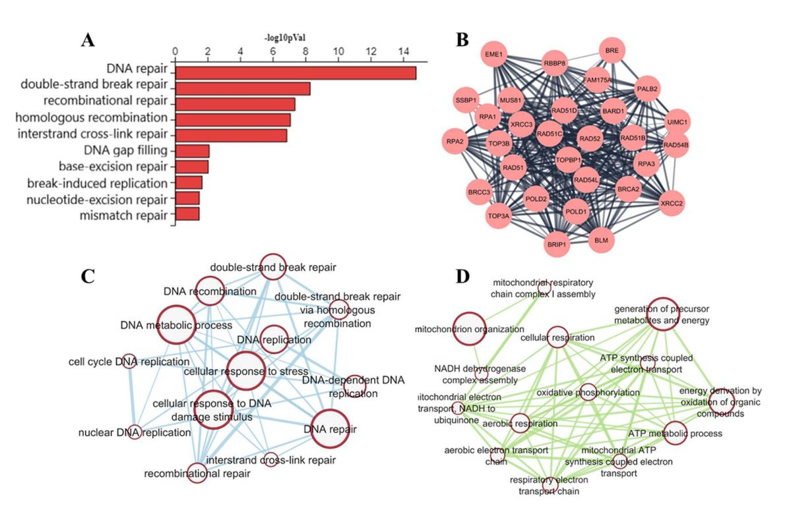
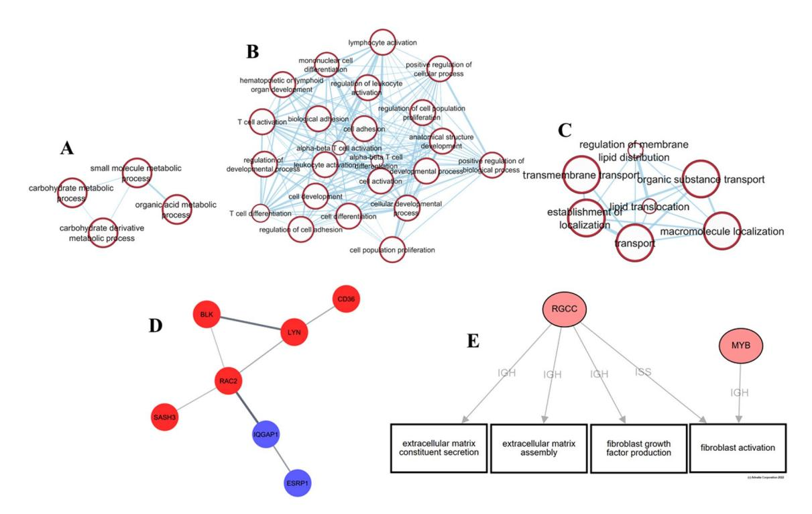
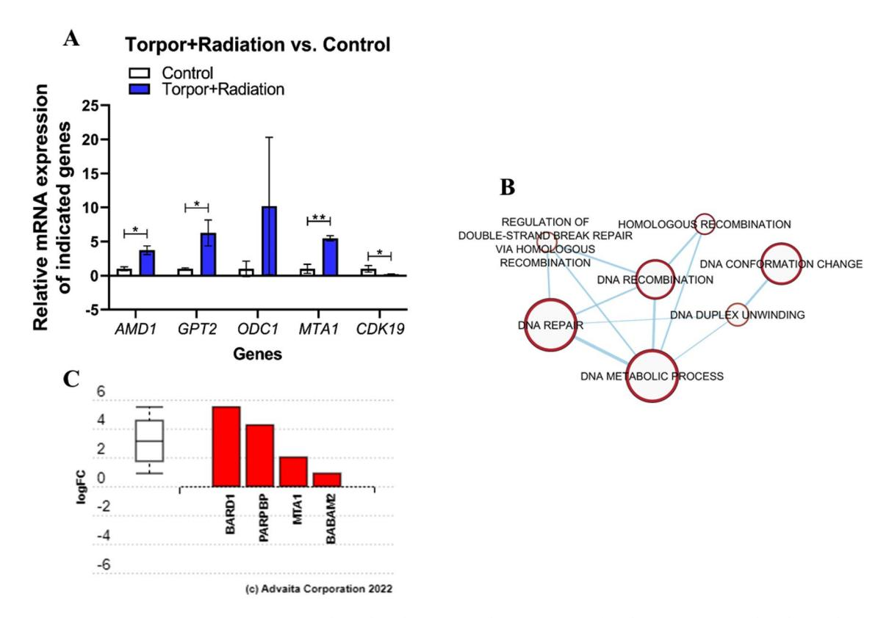
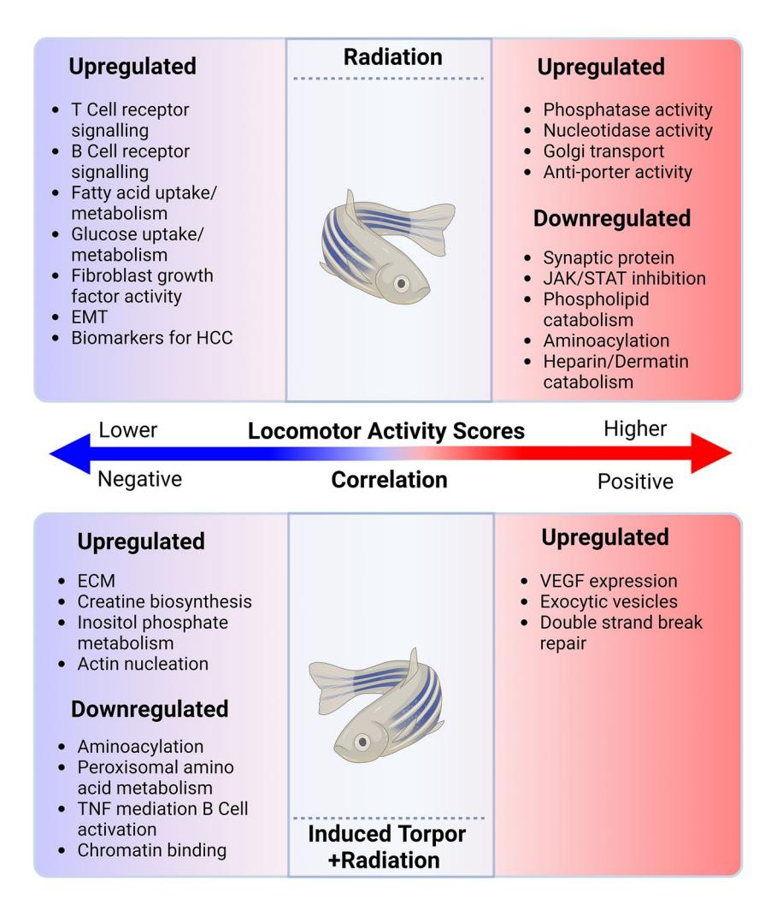
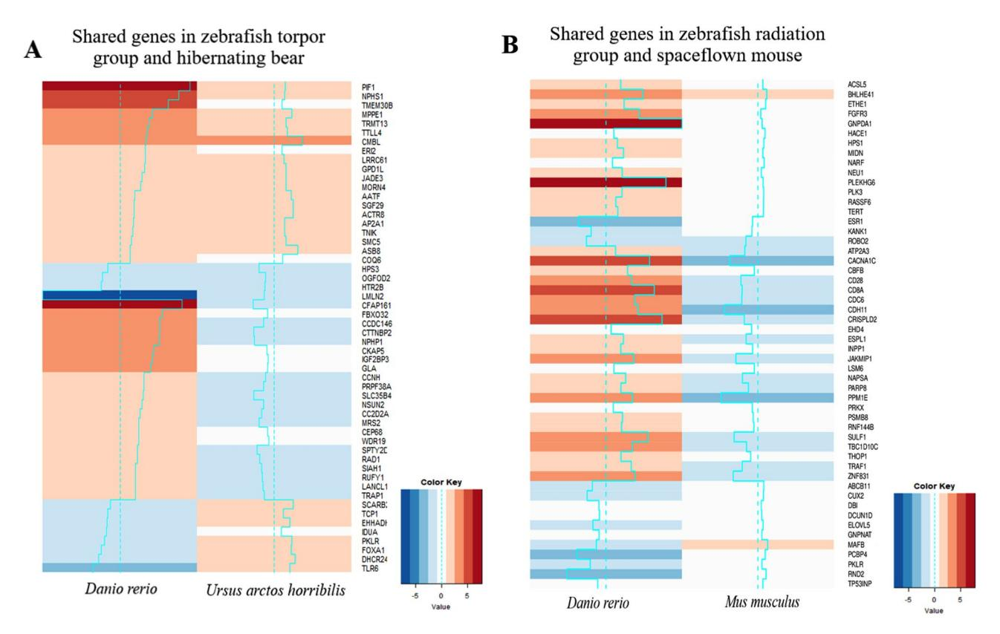
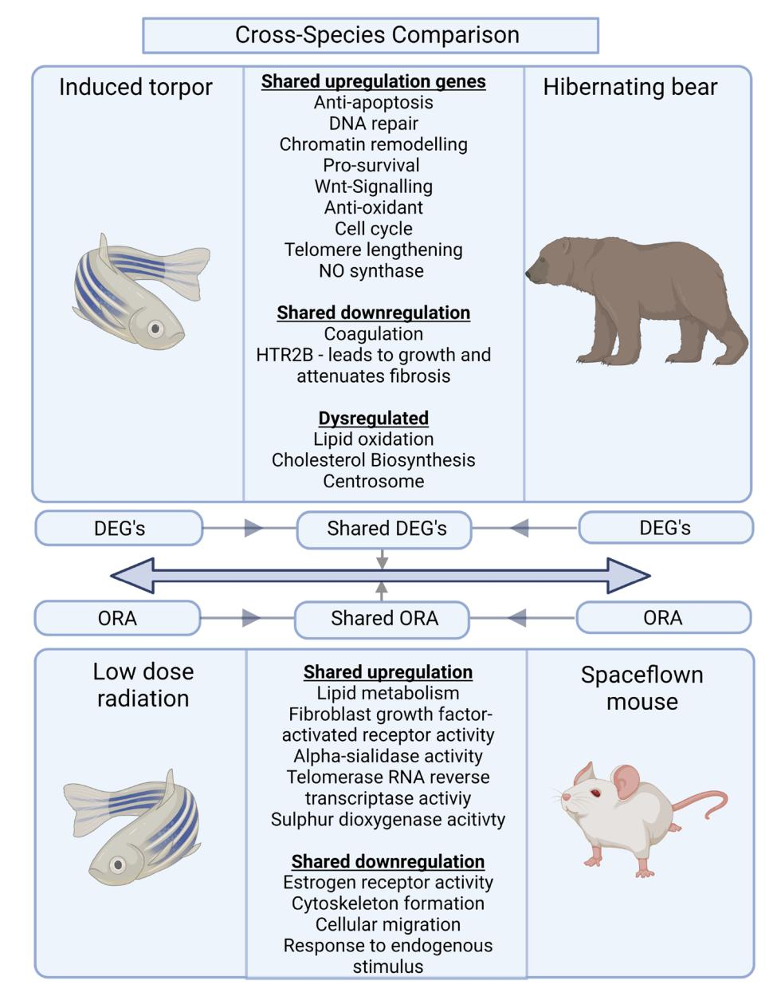

## **OPEN**

# **Investigating the efects of chronic low‑dose radiation exposure in the liver of a hypothermic zebrafsh model**

**Thomas Cahill1 , WillianAbraham da Silveira2,3, Ludivine Renaud4 , Hao Wang1 , Tucker Williamson5 , Dongjun Chung6 , Sherine Chan5,7, Ian Overton8 & Gary Hardiman1,4**\*

**Mankind's quest for a manned mission to Mars is placing increased emphasis on the development of innovative radio-protective countermeasures for long-term space travel. Hibernation confers radioprotective efects in hibernating animals, and this has led to the investigation of synthetic torpor to mitigate the deleterious efects of chronic low-dose-rate radiation exposure. Here we describe an induced torpor model we developed using the zebrafsh. We explored the efects of radiation exposure on this model with a focus on the liver. Transcriptomic and behavioural analyses were performed. Radiation exposure resulted in transcriptomic perturbations in lipid metabolism and absorption, wound healing, immune response, and fbrogenic pathways. Induced torpor reduced metabolism and increased pro-survival, anti-apoptotic, and DNA repair pathways. Coupled with radiation exposure, induced torpor led to a stress response but also revealed maintenance of DNA repair mechanisms, pro-survival and anti-apoptotic signals. To further characterise our model of induced torpor, the zebrafsh model was compared with hepatic transcriptomic data from hibernating grizzly bears (***Ursus arctos horribilis***) and active controls revealing conserved responses in gene expression associated with anti-apoptotic processes, DNA damage repair, cell survival, proliferation, and antioxidant response. Similarly, the radiation group was compared with space-fown mice revealing shared changes in lipid metabolism.**

#### **Abbreviations**

DEA Diferential expression analysis DEG Diferentially expressed genes

DRC DNA repair capacity DDR DNA damage response ECM Extracellular matrix

EMT Epithelial mesenchymal transition

ETC Electron transport chain

FC Fold change

GIT Gastrointestinal tract HSC Hepatic stellate cells

IACUC Institutional Animal Care and Use Committee

LDR Low dose radiation

MUSC Medical University of South Carolina

School of Biological Sciences and Institute for Global Food Security, Queens University Belfast, Belfast BT9 5DL, UK. 2 School of Health, Science and Wellbeing, Department of Biological Sciences, Science Centre, Stafordshire University, Leek Road, Stoke‑On‑Trent ST4 2DF, UK. 3 International Space University, 1 Rue Jean‑Dominique Cassini, 67400 Illkirch‑Grafenstaden, France. 4 Department of Medicine, Medical University of South Carolina, Charleston, SC 29425, USA. 5 Department of Drug Discovery and Biomedical Sciences, Medical University of South Carolina, Charleston, SC 29425, USA. 6 Department of Biomedical Informatics, The Ohio State University, Columbus, OH 43210, USA. 7 JLABS at the Children's National Research and Innovation Campus, Washington, DC 20012, USA. 8 Patrick G Johnston Centre for Cancer Research, Queen's University Belfast, Belfast BT9 7AE, UK. \*email: G.Hardiman@qub.ac.uk

NAFLD Non-alcoholic fatty liver disease ORA Over-representation analysis ROS Reactive oxygen species TCA Tricarboxylic acid VLDL Very low-density lipid

As we enter a new era of space exploration that will be defned by manned interplanetary travel, as detailed in the Artemis programm[e1](#page-14-0) , we must develop innovative countermeasures against the adverse efects of microgravity and radiatio[n2](#page-14-1)[–4](#page-14-2) . Te concept of using synthetic torpor is gaining attention given the observation that the use of torpor in nature provides resistance to bone and muscle atrophy during disuse, as seen in the yellow-bellied marmot and the hibernating brown bear. Tis suggests a role for torpor in preventing these adverse outcomes in the microgravity environmen[t5](#page-14-3)[,6](#page-14-4) . However, little is known about the genetic mechanisms that regulate such specifc adaptations, and replicating these may prove challenging. Tis study focuses on replicating one of the most fundamental and conserved aspects of torpor: hypometabolism, considered to be the main contributor to radioprotection. Tere already exists compelling evidence of torpor conferring radio-protective efects[7](#page-14-5)[,8](#page-14-6) , highlighted in experiments involving Balb/c mice undergoing therapeutic hypothermia following a large dose of radiation that led to increased survival times, compared with controls[9](#page-14-7) . Similarly, the use of AMP to induce a hypometabolic state in mice was found to decrease radio-sensitivity[10](#page-14-8). However, additional work is needed to defne the molecular mechanisms behind this conferred radioprotection.

Natural torpor describes a change in physiology characterised by a hypometabolic state normally facilitated by a coordinated reduction in body temperature, heart rate, locomotion, respiration, and brain activit[y11](#page-14-9)[,12](#page-14-10). Heterothermic animals that utilise torpor tend to do so in either a daily fashion where torpor bouts last less than 24 h (daily torpor) or in consecutive or continuous bouts, ofen referred to as hibernatio[n13.](#page-14-11) Torpor is ofen considered a stress response, as the reduction in metabolic rate is exploited to conserve energy during cold periods or food scarcity and its use has been found to increase survival rates during harsh times[14.](#page-14-12) Furthermore, it is thought that a reduction in respiration and perfusion along with a decrease in hemoglobin oxygen unloading during hibernation results in reduced cellular oxygen supply, as hypoxia-related genes are upregulated during hibernatio[n15.](#page-14-13) It has been suggested that this reduction in oxygen concentration provides radio-protective efects by limiting the generation of ROS in what's known as the 'oxygen efect', in the same way that hypoxia confers radio-resistance to tumour[s16](#page-14-14). Tere may be value in exploiting ectotherms in further characterising this response as zebrafsh (*Danio rerio*) body temperature, and thus metabolic rate can be easily managed through changes in ambient temperatures. Additionally, zebrafsh acclimated at 18 °C have shown reduced oxygen consumptio[n17](#page-14-15), and hypoxia-related genes have also been found to be upregulated in other ectothermic animals such as the crucian carp during cold acclimatisation in both hypoxic and normoxic conditions[18.](#page-14-16) Furthermore, zebrafsh ofer an attractive low-cost experimental model due to their ease of maintenance, rapid development, genetic similarity to humans (~70%), and the availability of a high-quality reference genome[19,](#page-14-17)[20.](#page-14-18)

Te liver plays a central role in carbohydrate and lipid metabolism, detoxifcation, immunity, and bile formation, and preserving liver health will play a vital role in maintaining astronaut health during long-term space trave[l21](#page-14-19). However, spacefight results in physical and pathological changes to the liver as evidenced in rodent studies exposed to short-duration fight (13 days) revealing morphological changes in the liver involving a reduction in mas[s22.](#page-14-20) Others report a decrease in Kupfer cells[23](#page-14-21), diminished levels of cytochrome P-45[024](#page-14-22) glutathione[25](#page-14-23), and cholestero[l26.](#page-14-24) Studies have also shown that the liver of mice exposed to both radiation or spacefight have increased pro-fbrogenic markers involving genes that regulate stellate cell activation and epithelial-to-mesenchymal transition (EMT)[27,](#page-14-25)[28.](#page-14-26) Moreover, the discovery that lipid droplets accumulate in mice's liver afer spacefight points to spacefight as a risk factor for non-alcoholic fatty liver disease (NAFLD) (3). Data from mice livers exposed to low-dose radiation (30–120 mGy) and collected 60 weeks afer irradiation also suggest that dysfunction in lipid metabolism is a long-term efec[t29](#page-14-27). Similarly, changes in insulin sensitivity following spacefight results in sub-clinical diabetic phenotypes[30](#page-14-28) and analysis of hepatic transcriptomes in space-fown mice identifed increased expression of genes involved in the oxidative stress respons[e31,](#page-14-29) fatty acid and glucose metabolism, ribosome function, protein folding, and the adaptive immune respons[e32.](#page-14-30)

We wanted to explore transcriptomic events that may regulate the radioprotective efects of a hypothermic/ hypometabolic state in the liver. Terefore, we exploited the ectothermic nature of zebrafsh to establish various experimental and control groups with reduced body temperatures/metabolism and radiation exposure (0.3 Gy) to simulate the amount of radiation that would be experienced on a journey to Mars. Melatonin was used as a sedative, which has been shown to promote a sleep-like state in zebrafsh by reducing locomotor activity and elevating arousal threshol[d33.](#page-14-31) In addition, it is a potent antioxidant, shown to have radioprotective efects[34](#page-14-32) and its use has been recorded to improve the severity of NAFLD[35](#page-14-33) and diabetes[36.](#page-14-34) In this study, we utilized melatonin to decrease locomotion and investigated its therapeutic potential against the efects of radiation exposure. We previously used this hypometabolism+melatonin model (induced torpor) to demonstrate a reduction in activity and the expression of metabolic genes in the gastrointestinal tract (GIT). We also observed an increase in protein maintenance genes, as well as in anti-apoptotic, proliferative, and pro-survival signalling. On the other hand, our results showed that exposure to low-dose radiation caused DNA damage, oxidative stress, glucocorticoid signalling, and cell cycle arrest. When irradiated under induced/synthetic torpor, radiation-induced stress signals were observed, however, the increase in anti-apoptotic, mitogenic, and pro-survival signals were all maintained, suggesting radio-protective efects[37](#page-14-35). Here we report our fndings in the context of hepatic health. Our results show that low-dose radiation leads to changes in genes involved in cell death, lipid metabolism and transport, the immune system, and the extracellular matrix. Additionally, like that observed in the GIT, the results from the induced torpor group show an increase in gene expression of pro-survival, proliferative, anti-apoptotic, and

**Figure 1.** (**A**) Enriched biological processes related to DNA repair pathways including homologous recombination (GO:0000725), base excision repair (GO:0006284), nucleotide excision repair (GO:0006289) and mismatch repair (GO:0006298). (**B**) A protein interaction network generated using STRING of genes diferentially expressed in the Homologous recombination pathway (KEGG: 03440[\)39](#page-14-37). (**C**) Enrichment map cluster of upregulated gene sets relating to DNA repair processes. (**D**)Enrichment map cluster of downregulated metabolic processes.

DNA repair genes. We explored the role of melatonin as a potential therapeutic for the lipid dysregulation that occurs afer exposure to low dose radiation and performed a cross-species comparison of the zebrafsh groups with space fown mice and hibernating bear to characterise the utility of the zebrafsh models.

#### **Results**

**Induced Torpor in zebrafsh activates DNA repair and mitogenic pathways.** To characterise the efects of an induced-torpor-like state on the zebrafsh liver, diferential expression analysis (DEA) was carried out on the induced-torpor group vs control (18.5-mel vs 28.5-Ctrl). Tis revealed 1986 upregulated and 765 downregulated genes (FC±1.5, *q*≤0.1) (Supplementary Table S4) that were then subject to over-representation (ORA) and impact analyses performed (Supplementary Tables S5, S6). Analysis of upregulated genes revealed cell cycle-related processes (GO:0051301, GO:0000280) involving cyclins (*CycA, CycE)* and cyclin-dependent kinases (*CDK1),* along with chromosome maintenance genes (*Mcm2, Mcm4, and Mcm5*). Additionally, while the zebrafsh were acclimatised to reduced temperatures, it is understood that cold stress can result in oxidative stress that can damage DNA[38.](#page-14-36) Here, we observed increased DNA damage response processes including p53 signalling (KEGG: 04115[\)39,](#page-14-37) comprised of genes involved in DNA damage sensing (*ATR),* mitotic checkpoint (*Chek1* and *Chek2),* and a cell cycle arrest (*CDKN1C)*. Hence, multiple DNA repair pathways were also upregulated (shown in Fig. [1](#page-2-0)A,C) including, DNA mismatch repair (KEGG: 03430[\)39](#page-14-37) (Figure S2), nucleotide excision repair (KEGG: 03420[\)39](#page-14-37) (Figures S3), base excision repair (KEGG: 03410)[39](#page-14-37) (Figure S4) and the homologous recombination pathways (KEGG: 03440[\)39](#page-14-37) presented in Figure S5, showing upregulation of genes involved in recognition of double-strand breaks, strand invasion, displacement, and ligation. A protein interaction network containing these genes is presented in Fig. [1B](#page-2-0). We also note the upregulation of a sirtuin family member (*SIRT6)* which stimulates homologous/non-homologous repair at double-strand break[s40.](#page-14-38)

It has previously been established that energy reserves, measured by a hepatosomatic index, were found to increase in zebrafsh acclimated at 18° C, suggesting decreased energy use at lower temperature[s17.](#page-14-15) Consistently, ORA of downregulated genes revealed several metabolic processes (Fig. [1](#page-2-0)D, Supplementary Table S5) including oxidative phosphorylation (PW:0000034), electron transport chain (ETC) (M39417), glycolysis, gluconeogenesis (M39474), and lipid metabolism including cholesterol metabolism (M39853), Leptin signalling (M39491), and Peroxisomes (M6391). Te FOXA2 and FOX3 transcription factor network gene set was also signifcantly perturbed. *FOXA2* regulates aerobic glycolysi[s41,](#page-14-39) in line with increased hepatic carbohydrate concentrations found at lower temperatures[17](#page-14-15) while *FOXA3* is important for glucose metabolism and lipid biosynthesi[s42.](#page-14-40) Similarly, the ribosome pathway (M189) and translation GO term (GO:0006412) were downregulated suggesting the conservation of biochemical energy[43](#page-14-41). Furthermore, immune-related TNF and IL-1 signalling pathways were enriched

**Figure 2.** (**A**) Enrichment map of genes upregulated in response to radiation showing GO terms related to carbohydrate metabolism. (**B**) GO terms upregulated in response to radiation, showing enrichment of several immune-related processes such as lymphocyte, leucocyte, and T cell activation (generated using Enrichment map). (**C**)Enrichment map of genes upregulated in response to radiation showing changes in lipid transport. (**D**) Protein interaction map generated using STRING of genes from the GO term of immune efector process GO term (GO:0002699) (red) with genes from the response to fbroblast growth factor (GO:0071774) (blue). (**E**) iPathwayGuide network constructed with genes from the Immune processes GO term and BP terms related to ECM and fbroblast activation.

consistent with suppression of innate and adaptive immunity as seen in hibernating animals[44](#page-14-42),[45](#page-15-0), as well as JNK activated MAPK pathway which regulates the response to various stressor[s46](#page-15-1).

To explore tissue-specifc responses to the induced torpor-like state we performed a cross-comparison of diferentially expressed genes (DEGs) in the liver with those previously reported in the GI[T37](#page-14-35). ORA of the shared upregulated genes (378, FC+1.5, *q* 0.1) (Supplementary Table S7) revealed enrichment of the cell cycle, spliceosome, DNA damage response and DNA repair pathways including DNA mismatch repair and nucleotide excision repair. Also upregulated was the *FOXM1* transcription factor network pathway, which is induced in a ROS or hypoxia-dependent manner to initiate proliferation, suppress apoptosis, and promote survival in response to stressors[47](#page-15-2),[48.](#page-15-3) Given these links to hypoxia, we investigated hypoxia-related genes in both tissues. We found upregulation of *hif1al* (*q*=0.006) in the liver and the upregulation of *hif1aa* in both the liver and GIT (*q*=0.08 & 0.02, respectively). We also observed a signifcant downregulation of the *PHD3* gene (*EGLN3,* FC −1.89, *q*=0.01) involved in HIF hydroxylation and degradation. ORA of the shared downregulated genes (261, FC −1.5, *q*=0.1) (Supplementary Table S7) revealed shared downregulation of metabolic processes including glycolysis, gluconeogenesis, pyruvate metabolism, tricarboxylic acid cycle (TCA) cycle, peroxisome pathway, and the ETC, which is central to oxidative phosphorylation.

**Low dose radiation causes a robust change in the expression of immune response genes in zebrafsh liver.** Exposure to low dose radiation (LDR) during inter-planetary travel is one of the major challenges to maintaining health during spacefight. To determine the efects of 0.32 Gy of gamma radiation on the zebrafsh liver we performed DEA on the radiation compared with the control group (28.5-rad vs 28.5-Ctrl) (Supplementary Table S8) and carried out ORA and impact analysis on the DEGs (Supplementary Table S9 & S10). Upregulated genes (542, FC+1.5, *q*≤0.1) revealed cell death-related pathways such as necroptosis (KEGG: 04217, KEGG: 04216, GO:0048102)[39.](#page-14-37) Tis was accompanied by the wound healing response (GO:0009611 GO:0042060) (shown in Fig. [2\)](#page-3-0), and involved the upregulation of a plasminogen activator, *Plau*. Lipid transport and metabolism were also perturbed (GO:0006869, GO:0016042, Fig. [2](#page-3-0)C), along with the PPAR signalling pathway involving *FABP2*, *CD36*, and *SLC27A4*, consistent with studies demonstrating spacefight-induced lipid accumulation in the liver[32](#page-14-30). Similarly, the results suggest disturbed liver function with upregulation of *ABCC4,* which functions in bile acid secretion. Carbohydrate metabolism which is known to be upregulated in response to stress[49](#page-15-4) was also enriched in contrast to the induced torpor group (GO:0044262, GO:1901135, Fig. [2](#page-3-0)A), which involved upregulation of the glycolic enzyme gene *PFKFB3*. Immune-related GO terms were also upregulated including, immune cell activation (GO:0046649), diferentiation (GO:0002292), proliferation (GO:0032943), and cell adhesion (GO:0007159) (shown in Fig. [2](#page-3-0)B). Furthermore, fbrogenic GO terms were upregulated such as fbroblast growth factor (GO:0071774) and fbroblast activation (GO:0072537). Tis was supplemented by the extracellular matrix (ECM) receptor interaction pathway involving the upregulation of collagen and laminin genes (*COL6A2, LAMB4*) that comprise the ECM, as well as cell adhesion with laminin and integrin genes (*ITGB4, LAMB4*), indicative of cell remodelling.

Liver fbrogenesis is mediated in an immune and infammatory-dependent manner[50](#page-15-5) whereby TGF-β stimulates EMC production by initiating the epithelial-mesenchymal transition (EMT) of hepatocytes leading to the acquisition of mesenchymal properties capable of producing ECM protein[s51.](#page-15-6) Tese results showed enrichment of TGF-β secretion (GO:0038044) and cytoskeleton organisation (GO:0051493, GO:0051125, GO:0110053), suggesting cell remodelling associated with epithelial-mesenchymal plasticity. Using STRING, we identifed protein interactions between *RAC2,* from immune efector process GO term (GO:0002699) and *IQGAP1* from the response to fbroblast growth factor GO term (GO:0071774) as seen in Fig. [2](#page-3-0)D. *RAC2* is involved in cell polarity while *IQGAP2* interacts with cell adhesion molecules, and signalling molecules involved in cell morphology and motility. Additionally, network analysis with genes involved in the immune process and GO terms involved in ECM and fbroblast activation suggest that *RGCC* and *MYB* play roles in linking these processes. Downregulated GO terms (159, FC -1.5, *q*≤0.1) included cell growth (GO:0016049), carbohydrate metabolism (GO:0005975), and cell and neuron morphogenesis (GO:0035239, GO:0048812, GO:0048858).

Again, a comparison was made between DEGs of the LDR groups of the liver (FC± 1.5, *q* ≤ 0.1) and GIT (FC±1.5, *q*≤0.4) to look for shared responses (Supplementary Table S11). Performing ORA on genes revealed shared upregulation of cell cycle checkpoints GO terms (PW:0000096, PW:0000385) as well as in lipid metabolism (GO:0006629), ABC and sodium-glucose transporters (M11911, PW:0000561), and the renin-angiotensin system (M17636).

**Induced torpor+radiation leads to a mixed phenotype.** To determine whether an induced torporlike state would be protective against LDR we exposed an induced torpor group to 0.32 Gy of gamma radiation and compared transcriptomic responses with the control group (18.5-mel-rad vs 28.5-Ctrl) (*q*≤0.4) (Supplementary Table S12). Te resulting 473 DEGs were subjected to ORA and impact analysis (Supplementary Table S13 & S14). Similar to the radiation group we observed upregulation of GO terms including a response to ionising radiation (GO:0010212), DNA damage checkpoints (GO:0000077), and cell cycle arrest (GO:0045930). Tis involved the upregulation of a CDK inhibitor (*CDKN1C)* and the downregulation of *CDK19*, which was validated with qPCR (*p*=0.05) (Fig. [3\)](#page-5-0). Changes to the circadian rhythm GO term (GO:0007623) involved the upregulation of *PER2, NR1D1,* and the downregulation of *PER3;* consistent with previous work relating radiation exposure to alterations in the circadian rhythm[52](#page-15-7). Developmental GO terms of the liver (GO:0001889) and hepatobiliary system (GO:0061008) were enriched as well as the positive regulation of bile acid biosynthetic and metabolic processes (GO:1904,253) indicating perturbed liver function. Te results also indicate an increase in carbohydrate metabolism (GO:0044262), including upregulation of *GALK1* and enrichment of acetyl-CoA metabolism (GO:0006084)*.*

However, results much like that of the induced torpor-only group were present. We noted the enrichment of GO terms related to cell division (GO:0051301, GO:0000082, GO:0044770, GO:0051304), including Aurora B and Aurora A signalling pathways (M7963, M14, M242), which are important for chromosomal segregatio[n43](#page-14-41). Likewise, several DNA repair-related processes (GO:0006281) were upregulated (Fig. [3](#page-5-0)B) involving the expression of *BABAM2, MTA1,* and *PARPBP* genes (Fig. [3](#page-5-0)C). Te qPCR analysis of the *MTA1* gene also showed a signifcant increase in the expression of *MTA1* (*p*=0.0022) (Fig. [3](#page-5-0)A) in the torpor+radiation group compared to the control. Additionally, the hypoxia-related FOXM1 transcription factor network (M176) was enriched. Furthermore, the results also point to the biosynthesis and metabolism of polyamines such as spermidine and putrescine that involve upregulation of *AMD1* and *OCD1.* Te quantifcation of *AMD1* by qPCR confrmed a signifcant increase in expression in the torpor+radiation group compared to the control group (*p*=0.012, Fig. [3](#page-5-0)). Q-PCR of *ODC1* showed a trend towards an increase in expression, although the results were not signifcant (*p*=0.309, Fig. [3\)](#page-5-0). Te ORA of the downregulated genes showed GO terms related to protein translation and folding in the endoplasmic reticulum (GO:0043038, GO:0034975), as well as mitochondrial membrane genes (GO:005741, GO:0031968).

A direct comparison of DEGs between the torpor+ radiation and the radiation-only group (*q* ≤ 0.4) was made to determine unique and shared responses (Supplementary Table S15). It revealed shared upregulation of 195 genes, most of which played a role in the positive and negative regulation of the cell cycle (GO:0140014 GO:0045841), as well as polyamine metabolism and DNA repair (GO:0070531). Next, 85 downregulated DEGs were shared which were involved in protein synthesis (GO:0043038). Four genes were upregulated in the radiation group and downregulated in the torpor+radiation group which suggests increased innate immune signalling (*RSAD2*), an anti-infammatory gene (*IKBKE*) the expression of which is stimulated by pro-infammatory ligands such as TNFα, IL-1β, IFN-γ and LPS[53](#page-15-8), a PPARγ activator (*EDF1*) and a cyclin gene (*CCNP*). Genes upregulated in the torpor+radiation group and downregulated in the radiation group were a kinesin (*KIF25*), and a pyruvate dehydrogenase phosphatases subunit (*PDP1*), (Supplementary Table S16).

A comparison of liver genes with those of the GIT (Supplementary Table S17) showed a shared upregulation of the circadian rhythm pathway (M95), amino acid metabolism (M39570), signs of both cell cycle arrest (GO: 0033048, GO: 0051784) and cell division (GO: 0051301). Analysis of the shared downregulated genes indicates a shared decrease in TCA cycle activity.

**Temperature and melatonin meta‑analysis.** To dissect the transcriptomic efects of temperature and melatonin we performed a systems-level meta-analysis. First, a gene-wise comparison was made with the DEGs

**Figure 3.** (**A**) Gene expression in the induced torpor+radiation (18.5-mel-rad) group compared to that in the control (28.5-Ctrl) group. Te fgure shows the relative increase in AMD1 (*p*=0.012), *GTP1* (*p*=0.034), *ODC1* (*p*=0.309), and *MTA1* (*p*=0.0022) expression compared to the control. *ODC1* shows a trend towards increased expression in the torpor+radiation group vs control (28.5-Ctrl). *CDK19* shows decreased expression compared to the control group (*p*=0.05) \**p*≤0.05 and \*\*≤0.01. (**B**) Enrichment map showing that genes related to DNA repair-related biological processes such as homologous recombination are upregulated relative to the control group. (**C**) Bar plot showing diferential expression of DNA repair process genes in induced torpor+radiation vs control. *BARD1* and *PARPBP* show strong upregulation in the induced torpor+radiation condition.

of the temperature+radiation group (Supplementary Table S18)(*q*≤0.4), with the radiation group (*q*≤0.1)(18.5 rad vs 28.5-rad) to fnd temperature-mediated efects. Te comparison found 390 DEGs unique to the temperature+radiation group taken to refect the efects of temperature (Supplementary Table S19). Te ORA of the 215 upregulated DEGs in this group indicates that the temperature was leading to the changes observed in mitosis and the cell cycle (GO: 0000280, GO: 1903047) (Table S18). Downregulated genes suggest temperature dependent changes in the TCA cycle (1,270,121), mitochondrial-related genes (GO: 0098798, GO: 0005743), and translational GO terms (M14691) as expected (Table S20).

We next sought to dissect the efects of melatonin from the model through a gene-wise comparison, performed with the DEGs in the temperature+melatonin-radiation group and the temperature+radiation group (18.5-mel-rad vs 18.5-rad) (q≤0.4), focusing on those that were found to be unique to the 18.5-mel-rad group afer comparison (Supplementary Table S21). ORA results from the 161 DEGs unique to the temperature+melatonin-radiation group were further fltered by comparisons with ORA results from the radiation group and those defned as temperature-driven changes (temperature+radiation vs radiation, Table S20) (Supplementary Table S22). Tus, it's considered that melatonin is leading to increased acetyl-CoA metabolism (GO: 0006637), nucleoside monophosphate metabolism (GO: 0009162), axon regeneration (GO: 0031103), and spindle organisation (GO: 0051294). Downregulated genes were involved in DNA damage checkpoints (GO: 2000003), midbrain morphogenesis (GO: 1904693), the negative regulation of T cell proliferation/morphogenesis (GO: 0045620), and tight junctions (GO: 0061689).

**Phenotypic end point analysis.** Behavioural studies of zebrafsh acclimated at 18 °C have previously found a decrease in locomotion[54](#page-15-9). Tis was supported in our previous work showing that acclimation at 18 °C with the addition of melatonin also led to reductions in locomotion as determined by activity scores in comparison to control groups[37](#page-14-35). Tese activity scores were generated by tracking the active swimming time, velocity, and time spent by the zebrafsh at the bottom or the upper part of the beaker where higher activity scores represent a more balanced use of space, with more frequent movement between the bottom and upper part of the beaker, whereas lower activity scores indicate less movement and more time sent at the bottom of the beaker. We performed a phenotypic end-point analysis by determining the correlation of activity score and DEGs in both the radiation and torpor+radiation groups. First, normality tests of the rlogged DEGs in the radiation group

**Figure 4.** Genes correlated with locomotor activity scores in the radiation and torpor+radiation groups. Tis schematic shows that increased activity scores in the radiation group are correlated to an upregulation of genes involved in biological processes such as nucelotidase activity, Golgi transport and phagocytosis, and a downregulation of growth, endocytosis, aminoacylation and heparin catabolism related genes. Genes correlated with lower activity scores in the group are associated with immune-related processes such as hemopoiesis, mononuclear cell diferentiation, and B cells receptor signalling. In the torpor+radiation group genes correlated with higher activity scores are associated with VEGF expression, exocytic vesicles, and double strand break repair. Genes correlated with decreased activity are correlated with ECM, actin nucleation, creatine biosynthesis and inositol phosphate and a downregulation of genes involved in aminoacylation, amino acid metabolism, B cell receptor activation and chromatin binding. Created with BioRender.com.

revealed 650 normally distributed genes and 38 not normally distributed genes (Supplementary Table S23). Normality tests on the torpor+radiation DEGs revealed 437 normally distributed genes and 36 non-normally distributed genes (Supplementary Table S24). QQ plots of these genes can be seen in Figure S6. Spearman's correlation analysis of the remaining 38 non-normally distributed radiation genes and 36 Torpor+radiation genes revealed no correlation. Pearson's correlation analysis of normally distributed radiation genes found a correlation of 68 genes with the activity scores, 12 of which showed a positive correlation while 56 were negatively/ inversely correlated with activity scores. Eleven genes in the torpor+radiation group were correlated, 3 were positively correlated while the remaining eight were negatively correlated. Gene expression values were reappended to the correlated genes (Supplementary Table S25 & S26) and used for ORA analysis (Supplementary Table S27 & S28), the results of which are summarised in Fig. [4](#page-6-0).

In the radiation group, ORA of genes positively correlated with locomotor activity suggests roles in diacylglycerol diphosphate/phosphatidate phosphatase activity (*PLPP5*), nucleotidase activity (*NT5DC1*), Golgi transport (*SLC35E1, GOLM2*), and anti-porter activity (*SLC35E1*). While ORA of the downregulated genes suggests decreased aminoacylation (*GARS1*), a structural synaptic gene (*DLG1*), heparin/dermatan sulfate catabolism (*IDUA*), JAK/STAT inhibition (*SOCS2*), and phospholipid catabolism (*PLBD2*). On the other hand, genes inversely correlated with activity scores point to the upregulation of genes involved in B cell and T cell receptor signalling (*MALT1, PTPN6, NFATC2, MAP4K1, REL),* EMT (*ITGB4*), fbroblast growth factor activity (*KLB*), fatty acid uptake/metabolism (*FABP2, SUGCT, LTA4H*), glucose utilisation (*GNPDA1, NEUROD1, SCGN, SLC2A12, SH2D3A, PIK3C2G*), DNA repair (*BARD1*), and gene biomarkers for hepatocellular carcinoma (HCC) (*HELLS, PIWIL2, TROAP*). Similarly, in the torpor+radiation group, upregulated genes positively correlated with activity suggest increased docking of exocytic vesicles (*EXOC1*)*,* double-strand break repair (*BABAM2*), and downregulation of *VEGF* expression (*MAP3K6*). Genes that were negatively correlated or related to decreased activity indicate upregulation of the ECM (*VWA5B2),* creatine biosynthesis (*GATM),* inositol phosphate metabolism *(INPP1),* and actin nucleation *(CORO1B*), suggesting cytoskeleton remodelling. Downregulated genes were involved in aminoacylation *(IARS1),* peroxisomal amino acid metabolism *(LONP2),* chromatin binding *(CRAMP1)* and TNF-mediated B cell activation *(TNFSF13B)* indicating a muted immune response (Fig. [4](#page-6-0)).

**Comparison of induced torpor in zebrafsh with hibernating grizzly bear reveals shared responses.** We sought to explore any shared responses between our hypometabolic model in the zebrafsh with that seen during the natural hypometabolic state during torpor of a hibernating animal. Tus, a cross-comparison was performed with DEGs from the zebrafsh-induced torpor group (vs control) and those generated from hibernating grizzly bear liver vs control, (Supplementary Table S29). We identifed 54 shared genes (*q*≤0.1) shown in Fig. [5](#page-8-0)A (Supplementary Table S30) and summarised in Fig. [6](#page-9-0). Twenty of these genes were upregulated, four were downregulated, and the rest were dysregulated between the groups.

We noted the shared upregulation of *AATF,* which is involved in inhibiting p53-mediated induction of apoptotic genes afer DNA damage suggesting shared anti-apoptotic pathways[55](#page-15-10). DNA repair genes were also shared, including *ACTR8* which plays a role in ssDNA synthesis during double-strand breaks during homologous recombinatio[n56](#page-15-11)[,57.](#page-15-12) Similarly, a structural maintenance complex gene, *SMC5,* with roles in homologous recombination, was also upregulate[d58](#page-15-13) as well as *PIF1*, a DNA synthesis stimulator during break-induced replicatio[n59](#page-15-14). Other genes upregulated in both datasets were involved in chromatin remodelling including (*SGF29)*, which has been implicated in promoting cell survival under ER stres[s60,](#page-15-15) as well as, *JADE3*, with a role in histone acetylation found to be induced by Wnt/β-catenin signalling[61.](#page-15-16) Interestingly, we also found shared upregulation of *TNIK*, involved in the activation of Wnt-signalling and known to promote proliferation or diferentiation[62](#page-15-17). We also report upregulation of *COQ6* in both datasets, involved in the biosynthesis of coenzyme Q10, a potent antioxidant shown in zebrafsh to protect against ROS-induced apoptosi[s63.](#page-15-18) Genes downregulated in both species included *HPS3*, a gene involved in dense granule formation with a role in coagulation that could help prevent blood clotting at reduced temperatures[63](#page-15-18). Similarly, *HTR2B* was downregulated: its experimental antagonism has been shown to attenuate fbrosis during liver injury[64](#page-15-19).

A comparison of the shared biological processes (shown in Supplementary Table S31, *p*<0.05) suggested the shared negative regulation of ROS generation (GO: 1903427) and positive regulation of nitric oxide synthase (GO: 0051000). Cell cycle processes were also returned showing shared meiotic cell cycle checkpoint (GO: 0033313), protein localization to kinetochore (GO: 0034501), and processes related to telomere lengthening (GO: 0032210, GO: 1904356, GO: 0010833). We also observed an over-representation of processes linked to cell projection assembly (GO: 0030031, GO: 0120031, GO: 0060271) and calcitonin family receptor signalling pathway (GO: 0097646).

**Low dose radiation in zebrafsh compared with space fown mouse liver.** Finally, we wanted to compare the response to radiation in the zebrafsh with that of space fown mouse liver using the NASA Genelab database (GLDS-47). Te space fown mouse data had 220 DEGs (*q*≤0.4) (Supplementary Table S32), again examined using ORA (*q*≤0.4, Supplementary Table S33). A cross-comparison was used to fnd shared genes (Supplementary Table S34, Fig. [5](#page-8-0)B), which were also subject to ORA (Table Supplementary S35). It revealed 52 shared orthologues and the shared upregulation of genes involved in fbroblast growth factor-activated receptor activity *(FGFR3)* (GO:0005007), suggesting radiation-induced fbrogenesis, and *NEU1* involved in cell migration. Te mice also showed the upregulation of sulphur dioxygenase activity (*ETHE1*) (GO:0050313), consistent with spacefight-induced changes to sulphur metabolism[65](#page-15-20). On the contrary, shared downregulated genes include *ROBO2,* which is involved in hepatic stellate cell activation, and *KANK1,* which is involved in cytoskeleton formation. A comparison of the upregulated ORA results found shared GO terms involved in cellular lipid catabolic processes (GO:0044242), while shared downregulated results involved a response to endogenous stimulus (GO:0071495), as summarised in Fig. [6](#page-9-0).

#### **Discussion**

**Melatonin as a modulator of lipid metabolism.** Te liver plays a central role in lipid homeostasis in regulating the uptake, metabolism, redistribution, and excretion of fatty acids. For instance, upon ingestion and absorption from the lumen of the small intestine, dietary fatty acids that are not assimilated into adipose or muscle tissue are re-esterifed to triglyceride and taken up by the liver from chylomicrons in the plasma. Tese can then be stored in intracellular lipid droplets, transferred to peripheral tissue via VLDL (very low-density lipid) particles, or processed back to fatty acids for energy release through β-oxidation in the mitochondria of hepatocytes. Additionally, fatty acids can be generated from glucose via de novo lipogenesis[66](#page-15-21). However, dysregulation of lipid metabolism is associated with insulin resistanc[e67](#page-15-22), diabetes[67](#page-15-22), and NAFLD, a disease encompassing lipid accumulation, nonalcoholic steatohepatitis, fbrosis, and cirrhosis[68](#page-15-23). Dysregulation of lipid homeostasis has been a well-documented response to the spacefight environment, with studies showing lipid droplet accumulation[28](#page-14-26), and transcriptional changes in genes involved in lipid localization/transport and lipid/fatty acid metabolism[32](#page-14-30).

**Figure 5.** (**A**) Comparison of zebrafsh torpor and hibernating bear genes. A heat map of the 54 shared genes between the zebrafsh torpor group and the hibernating bear showing their direction of expression relative to the active controls (**B**) Heat map of the 52 shared genes between the zebrafsh radiation group and the space fown mouse liver showing their direction of expression (red=upregulated, blue=downregulated).

Further studies show elevated levels of ALT and AST[69](#page-15-24), which indicate liver damage and are ofen used to aid diagnosis of NAFLD.

Our results from low dose radiation exposure in the zebrafsh suggest that exposure led to increased lipid metabolism, transport, and accumulation with increased expression of genes such as *LIPH, ABCA2,* and *FABP2* in the liver. Similarly, we observed an elevated expression of *SCARB1*, which mediates cholesterol efux. Te enrichment of fbroblast growth factor might indicate a fbrotic phenotype. Hence, the results highlight the potential for LDR in increasing the risk of NAFLD-associated symptoms, representing a signifcant stumbling block to maintaining hepatic health in astronauts. Lipids are the preferred energy source in fat-storing hibernating animals that undergo periods of hyperphagia before entering torpor when triglycerides are then mobilised from fat stores to the bloodstream for energy. Tis process leads to seasonal hyperlipidemia and hypercholesterolemia, which in humans are risk factors for atherosclerosis or thrombosis. Observations suggest that torpor may be protective against the adverse efects of lipid dysregulation, given that these periods of altered lipid homeostasis do not lead to adverse outcomes. For example, hibernating brown bears undertake long bouts of torpor that leads to limited potential for excreting excess cholesterol. However, they employ mechanisms for advoiding the adverse efects of lipid dysregulation including increased levels of a cardio-protective HDL (*HDL2b*), a re-esterifcation process to recycle cholesterol, and increased anti-oxidant capabilities to negate oxidative damage from peroxidatio[n70](#page-15-25). Although, it is unclear if the dysregulation of lipids during spacefight would interfere with lipid utilisation during torpor, or whether lipid utilisation during torpor would compound the adverse efects of spacefight. Tis brings into question the suitability of lipid as the main energy source for space travel. In addition, the feasibility of astronauts gaining the amount of weight that would be needed to sustain a torpor-facilitated trip to Mars has also been called into question, and thus alternative energy sources need to be considered. Melatonin has modulatory efects on lipid metabolism, with studies showing that melatonin treatment reduced serum cholesterol, hypertriglyceridemia, hyperinsulinemia, liver lipid content, and has shown utility in the treatment of diabetes and NAFLD[71.](#page-15-26) So its use might prove benefcial in ameliorating the adverse efects of spacefight. Our data points to a temperature-driven downregulation of metabolic pathways, including pyruvate metabolism and the TCA cycle. However, when combined with radiation, we see the characteristic upregulation of lipid transport and metabolism. *Conversely,* when reduced temperatures are combined with melatonin treatment, we observe a downregulation of lipid metabolic genes, as seen when these processes were dysregulated in the cross-species comparison in Fig. [6](#page-9-0). When radiation is added, only lipid biosynthesis is upregulated. While the results suggest that melatonin treatment under hypometabolic conditions might reduce radiation-associated lipid dysregulation

**Figure 6.** Comparison of our zebrafsh radiation group vs space fown mouse and the zebrafsh induced torpor group vs hibernating bear. Te results between the zebrafsh radiation model and the space fown mouse show shared upregulation of genes involved in sulphur dioxygenase activity, telomerase RNA reverse transcriptase, alpha-sialidase activity, and fbroblast growth factor receptor activity. Shared downregulated genes included the estrogen receptor (*ESR1*), and genes involved in cytoskeleton formation and cellular migration. Additionally, shared biological processes included lipid metabolism and response to endogenous stimuli. Comparison of the torpor group versus the hibernating bear showed shared upregulation of anti-apoptotic genes, DNA repair genes, pro-survival genes, antioxidant genes, and Wnt signaling. Shared downregulated genes included anticoagulant genes, while dysregulated genes were involved in lipid oxidation and cholesterol synthesis. Furthermore, shared BP included a response to ROS, cell cycle checkpoints, telomere lengthening, and nitric oxide synthase. Created with BioRender.com.

by regulating lipid metabolism we recognise that further work is needed to characterise and establish the viability of alternative modes of metabolism under hypometabolic states.

**Hypo‑metabolic state confers an anti‑apoptotic phenotype.** Te suppression of apoptosis and increase in pro-survival signalling are key characteristics of the phenotype observed in the hypometabolic groups of the zebrafsh GIT and liver. Furthermore, the shared upregulation of *AATF* with the hibernating bear suggests a conserved anti-apoptotic mechanism. For instance, the protein product of *AATF* forms a complex with p53 and BRCA1 to activate cell cycle arrest genes, leading to a cell state favouring survival over apoptosis and allowing more time for repair[72](#page-15-27). Tis anti-apoptotic phenotype has also been observed in hibernating squirrels with studies reporting an upregulation of anti-apoptotic genes during torpor (*Bcl-2, Bcl-xL, Mcl-1,* and *BI-1*) [73.](#page-15-28) A further survival advantage might be conferred through polyamine generation, which was indicated in the induced torpor and torpor+radiation groups through the upregulation of *AMD1* and *OCD1.* Tese genes promote polyamine biosynthesis, decreased levels of which are associated with increased apoptosi[s74.](#page-15-29) To continue, the liver and GIT also shared enrichment of the FOXM1 transcription factor network. Tis has been shown to positively regulate the anti-apoptotic gene *Bcl-2*[75](#page-15-30)[–77](#page-15-31) with additional *FOXM1-*knockdown studies demonstrating its efcacy in promoting survival in human cells afer irradiation[78](#page-15-32). Interestingly, *FOXM1* is upregulated in a *HIF-1* dependent manne[r79](#page-15-33)[–81](#page-15-34) and the induction of the hypoxia response is known to increase expression of pro-survival genes[82,](#page-15-35) suppress apoptosis[83](#page-15-36), and increase proliferation[84](#page-15-37) which are some of the key phenotypes represented in the results. Although our cross-species comparison did not return shared upregulation of *HIF-1*, increased *HIF-1* has previously been reported in the liver of bears, squirrels, and bats during hibernation, implying a widely conserved response in hibernation[85](#page-15-38),[86](#page-15-39). It may also be plausible to suggest that cold-tolerant species beneft from the upregulation of the hypoxia pathways in response to reduced oxygen, which is achieved and maintained by the reduced metabolic rate to prevent oxygen starvation.

**DNA repair in the induced torpor model of zebrafsh.** In this paper, we report that the induced torpor model in zebrafsh saw an increase in DNA repair processes, including DNA mismatch repair, nucleotide base excision repair, and homologous recombination. Tis included the upregulation of a sirtuin gene (*SIRT6*), which has a role in DNA repair and promoting longevity[87](#page-15-40),[88](#page-15-41). Reduced temperatures may have led to an increase in oxidative stress that, in turn, has led to DNA damage. Consistently, results for the torpor+radiation group also showed an upregulation of DNA repair processes. However, given that irradiation occurred 2 days afer the initiation of the torpor protocol, prior temperature-induced DNA processes may have preconditioned the cells to radiation stress. Tis radio-protective preconditioning efect has been evidenced previously in human cells by Lisowka et al., who observed a hypothermia-activated DNA damage response (DDR) that remedied later insult by reducing the number of chromosomal aberrations afer irradiatio[n89.](#page-15-42) Temperature-related changes in DNA repair processes have also been shown to be efective in remedying ischemic stress in human clinical trials. For instance, a randomised trial sought to determine if therapeutic hypothermia could treat hypoxic-ischemic encephalopathy in infants: a condition characterised by hypoxic stress that leads to chromosomal aberrations, the number of which correlate with disease severity. Te results revealed that reduction of the neonates' body temperatures to 33–34 °C for 72 h following perinatal asphyxia resulted in a statistically signifcant reduction in the number of chromosomal aberrations compared to the control group, likely through the upregulation of DNA repair genes[90.](#page-16-0) Tis is supported by studies in mice demonstrating that mice preconditioned with sub-lethal ischemia before more severe ischemia can increase ischemic tolerance through induction of DNA repair mechanisms[91](#page-16-1). To continue, when observing hibernating animals, transcriptomic studies of the liver in hibernating 13-lined ground squirrels (*Ictidomys tridecemlineatus*) also found enrichment of genes involved in double-strand break repair with upregulation of genes such as *DDX11* that were correlated with colder body temperature[s92.](#page-16-2) Similar observations were made by Jenson et al., who reported DNA repair-related GO terms in the liver of hibernating grizzly bears (*Ursus arctos horribilis*) involving serval DNA repair (e.g. *BABAM2, BRCA2, DCLRE1A*). Although they were not enriched in the adipose or muscle tissue suggesting a tissues-specifc respons[e6](#page-14-4) . When comparing hepatic responses in the zebrafsh torpor group with results of the hibernating bear, however, we discovered a shared upregulation of DNA repair genes involved in homologous recombination, which might suggest a conserved response to hypothermia in promoting cold resistance.

**Utilisation of partial EMT during torpor may ofer radio‑protective efects.** Epithelial cells are diferentiated, polarised cell types attached to a basal membrane by hemidesmosomes and are held together at tight junctions, adherens junctions and desmosomes. During EMT cells lose polarity with degradation of the connections to basal membrane and cell–cell junctions and reorganisation of the ECM, ultimately producing cells with stem-like qualities[93](#page-16-3). Tere are three types of EMT, which play important roles in development (type I), tissue regeneration (type II), and for malignant growth and metastasis (type III)[94](#page-16-4). Type II EMT is stimulated post-injury to generate new tissue, involving activation of an immune response that produces infammatory signalling molecules, such as secretion of TGF-β. TGF-β activates mesenchymal cells, such as HSCs and fbroblast cells to produce ECM proteins such as collagens to form fbrotic tissue which acts as a scafold to guide cell migration[95](#page-16-5). It can also initiate EMT of hepatocytes to acquire a mesenchymal phenotyp[e96.](#page-16-6) When wound healing is complete, infammatory signals subside but chronic insult can lead to accumulation of fbrotic tissue that impacts liver structure and can lead to liver dysfunction associated with the development of NAFLD, cirrhosis, or cancer[97,](#page-16-7)[98.](#page-16-8) Our results for zebrafsh exposed to LDR show upregulation of genes involved in EMT, an immune response, and genes involved in fbroblast activity. Tis might suggest immune-mediated activation of a fbrotic type II EMT programme in a wound healing response to radiation-induced damage. Consistently, Wang, S. et al*.* studied the response to 6 Gy radiation in mice liver at 6–10 weeks post-irradiation fnding an increase in fbrosis at 10 weeks, post-irradiation. Tey found an increase in liver progenitor cells at 6 & 10 weeks, and an increase in expression of pro-fbrogenic cytokine (TGF-β) at 6 weeks, along with an increased markers for activated HSC's (α-SMA) and EMT (s100a4, N-cadherin, and collagen α1) at 6 & 10 weeks post-irradiation. Moreover, they show a role for the hedgehog signally pathway in generating the fbrotic phenotyp[e27.](#page-14-25) Jonscher et al., reported a similar trend, revealing that mice exposed to 2 weeks of spacefight experienced profbrogenic markers in the liver involving an increase in *Lepr*, which can promote myofbroblastic HSC transition, as well as, *PAI-1* and TGF-β receptor subunits (Tgfr1, 2 & 3)[28](#page-14-26). Additionally, Tian et al. found increased profbrotic lesions in air spaces and blood vessels in the lung of 13-day spacefight-exposed mice[99.](#page-16-9)

Interestingly, a partial/reversible EMT has been observed in lung tissue of hibernating animals, evidenced in a study of Syrian hamster (*Mesocricetus auratus*) lungs that followed EMT markers throughout diferent stages of hibernation. Tey found high expression levels of *TGF-β*, collagen, and smooth muscle actin during early torpor which returned to normal afer torpor[100](#page-16-10). Similarly, a study on the brains of thirteen-lined ground squirrels observed decreased epithelial markers (E-Cadherin) and an increase in EMT markers such as vimentin and *Sox2* which were restored to pre-entry expression levels at the arousal stage. Te expression of miRNA families (mir-200 & mir-182) known to control EMT was also correlated with the expression of EMT markers, further supporting the reversible regulation of EMT between the torpor and active state[s78](#page-15-32). In concurrence, DEA of the hibernating bear compared with active controls revealed upregulation of ECM-related genes such as collagen (*COL4A4, COL17A1*) which have been shown to promote EMT in response to TGF-β[101](#page-16-11). Similarly, the downregulation of laminin (*LAMB1*), which forms a complex with integrins to promote cell adhesion[102,](#page-16-12) may facilitate EMT. To continue, the torpor group also displayed markers of EMT with the upregulation of collagen genes (*COL4A4, COL17A1*) and matrix metalloproteinase (*MMP17*) as well as the downregulation of protocadherin genes (*PCDH12, PCDH17*) and plakophilin 2 (*PKP2*). We know that the immune system plays an important role in fbrotic development[103,](#page-16-13) however, immune activity is regularly reported to be downregulated during hibernatio[n45.](#page-15-0) Hence, immune regulation during torpor might be protective against a fbrotic phenotype. In support of this view, a striking observation made by Andres–Mateos et al., in a study of skeletal muscle in thirteenlined ground squirrels found that muscle injury did not increase fbrotic tissue levels during hibernation despite the presence of infammation. Tey also found that muscle regeneration occurred post-hibernation without the presence of fbrotic tissue[104.](#page-16-14) Furthermore, a study that examined the efects of ischemic reperfusion injury in the liver of mice found that hypothermia improved ischemic reperfusion injury and improved hepatocellular function by attenuating an infammatory immune respons[e105.](#page-16-15) We also observed downregulated immune processes in the induced torpor and torpor+radiation groups, in contrast to the radiation-only group. In addition, we note the shared downregulation of *HTR2B* between the torpor group and the hibernating bear, which has been shown to prevent fbrosis when inhibite[d64.](#page-15-19) However, further work is needed to determine whether these models evaded fbrotic development. Furthermore, what is interesting is that DNA repair processes and an anti-apoptotic phenotype have also been associated with EMT (reviewed further by Chakraborty et al[.106\)](#page-16-16). Hence, it may have a role in generating the pattern of gene expression reported here. Additionally, hypoxia has been implicated in promoting EMT[107](#page-16-17),[108](#page-16-18). Terefore, epithelial plasticity may be exploited in the liver during torpor/hypothermia as a mechanism of imparting resistance to stress, but further work should be conducted to test this hypothesis.

**Radiation exposure may impact zebrafsh behaviour.** Behavioural analysis previously showed a reduction in locomotion in fsh subjected to reduced temperatures with the addition of a sedative (melatonin)[37](#page-14-35). Here, we correlated gene expression data with the behavioural data from the radiation and torpor+radiation groups to draw inferences on gene expression that link to a phenotypic end-point. We note that genes correlated with low activity irradiated zebrafsh were involved in a B cell and T cell-mediated immune response that was accompanied by upregulation of genes involved in fbroblast activity and EMT. We also note the correlation of genes involved in the use of glucose and lipids, which might indicate an increase in energy use that is consistent with an energy-expensive stress response. Tis is in line with previous work, linking increased immune responses in zebrafsh with decreased locomotor activity and is indicative of sickness behaviou[r50,](#page-15-5)[109](#page-16-19) which in zebrafsh presents as lethargy and decreased social or exploratory behaviour[110](#page-16-20). Moreover, work by Cantabella et al. also showed that chronic exposure to low dose radiation reduced locomotion in zebrafs[h111](#page-16-21). Interestingly, fsh with lower activity scores in the torpor+radiation group show a correlation with downregulated genes involved in B cell activation suggesting a diminished immune response.

**Further work.** We found that the induced torpor group appears to increase mitogenic signals. Cells with increased proliferative rates typically become more radio-sensitive due to the vulnerability of DNA to damage during replication. However, it is unclear whether in our model the rate of proliferation is above basal levels or whether increased proliferative signals are needed to maintain cell viability without increasing proliferation against a background of reduced metabolism. Further work might seek to defne proliferation rates and mutation rates given the potential for mutagenesis. We also note that epithelial plasticity, including EMT may play a role in torpor-like states and further work is needed to determine how EMT signalling might exacerbate or ameliorate radiation-induced fbrosis in the liver. Moreover, the literature points to hypoxia/cold-tolerant species that use a reduction of metabolism to avoid oxygen starvation and the induction of a hypoxia response. Future eforts could aim to defne whether targeting hypoxia pathways can enable a conferred stress resilience. Additional work might also seek to defne the relationship between the reduction in metabolism and the acceptable reduction in oxygen content without damage in human cell lines or organoids. Similarly, it would be interesting to defne the relationship between this response and the suggested increase in DNA repair capacity, measuring DNA damage relative to gene expression level and level of stressors.

#### **Conclusion**

We investigated the mechanism through which a synthetic/induced torpor protects against radiation exposure using a systems biology approach. We found that induced torpor led to a reduction in metabolic genes and increased pro-survival signalling including proliferative and anti-apoptotic biomarkers that may infuence cell fate decisions to avoid cell death. We also observed an increase in DNA repair genes. An increase in DNA repair mechanisms before the stress exposure may act as a bufer to further insult through pre-conditioning. Additionally, we observed that these protective mechanisms are present under induced torpor with radiation, suggesting maintenance of these mechanisms during periods of stress. Furthermore, we note markers of EMT

| Group                           | Key          | Sample (N) | Radiation (cGy) | Water temperature (°C) | Melatonin (µM) |
|---------------------------------|--------------|------------|-----------------|------------------------|----------------|
| Control                         | 28.5-Ctrl    | 6          | 0               | 28.5                   | 0              |
| Melatonin                       | 28.5-mel     | 6          | 0               | 28.5                   | 24             |
| Temperature                     | 18.5-Ctrl    | 6          | 0               | 18.5                   | 0              |
| Temperature+melatonin           | 18.5-mel     | 6          | 0               | 18.5                   | 24             |
| Radiation                       | 28.5-rad     | 6          | 32.64           | 28.5                   | 0              |
| Temperature+radiation           | 18.5-rad     | 6          | 32.64           | 18.5                   | 24             |
| Temperature+melatonin+radiation | 18.5-mel-rad | 6          | 32.64           | 18.5                   | 24             |

**Table 1.** Experimental groups showing the group names, key, sample number per condition, values of radiation exposure, ambient water temperature, and melatonin treatment.

in both the hypometabolic and the radiation group. It was found that the EMT profle in the radiation group was accompanied by immune-related GO terms that could mediate a more fbrotic response. On the other hand, it is possible that an EMT- like programme that does not involve immune regulation imparts stem-like traits that may have a role in stress resilience. Further work will explore the prospect of exploiting induced torpor as a radio-protectant, representing a potential therapeutic strategy to mitigate cellular damage during space travel and in clinical medicine.

#### **Methods**

**Zebrafsh husbandry.** We obtained strain AB *Danio rerio* (zebrafsh) from the Zebrafsh International Resource Centre. Adult zebrafsh were housed at a maximum density of 6 fsh per 1 L glass beaker in an incubator at 28.5 °C with a light cycle of 14 h ON (light) and 10 h OFF (dark). Tey were maintained and crossed following standard housing methods. Lids were used to prevent fsh mortality from jumping out of the beaker while also allowing air fow. Fish were fed Gemma Micro 300 standard diet every other day (Skretting, Westbrook, ME, USA) in the morning and remaining debris was aspirated from the beaker 20 min afer feeding. Moreover, to increase water life support capability, 75% of the water was changed daily using reservoir water (Reverse Osmosis water supplemented with Instant Ocean salts, sodium bicarbonate and Stress Coat, maintained at pH 7.4). Te beakers used to house fsh were cleaned and autoclaved before use. All procedures were performed per Te Medical University of South Carolina (MUSC), Institutional Animal Care and Use Committee (IACUC) guidelines (IACUC-2018-00278). All animals were treated with regard for alleviation of sufering. In addition, these procedures followed the ARRIVE guideline[s112.](#page-16-22)

**Development of the induced torpor model and radiation protocol.** Several experimental groups were used to assess the value of induced torpor as a countermeasure to radiation, detailed in Table [1](#page-12-0). First, a control group was maintained at an ambient temperature of 28.5 °C (28.5-Ctrl). Second, a melatonin group (28.5 mel) was established that received 24 µM of melatonin daily (10 days) to reduce locomotion and arousal. When replacing 75% of water daily, we added a mixture of saline water and melatonin to maintain levels of melatonin, protecting against loss due to metabolism and degradatio[n113.](#page-16-23) Melatonin was purchased from Sigma-Aldrich (St. Louis, MI, USA) with≥98% purity, maintained at−20 °C in powder and dissolved in DMSO before use. Ten, a reduced temperature group (18.5-Ctrl) was acclimatised to 18.5 °C to decrease their metabolism. Ambient temperatures were reduced in weekly decrements of 2.5 °C, over 4 weeks to avoid thermal shock[114](#page-16-24). Next, the induced torpor group (18.5-mel) was acclimatised to 18.5 °C and administered 24 µM of melatonin. Again, afer 4-week acclimatisation, melatonin was added for 10 days. Subsequently, we established a low dose radiation group (28.5-rad), exposing them to a total whole-body dose of 32.68 cGy. Te zebrafsh were anaesthetised with 0.02% tricaine prior to radiation exposure and placed one at a time in 60 mm×15 mm Petri dishes in water on top of a 3-inch spacer ready for irradiation. Radiation exposure occurred for 6 s at 163.40 cGy/min resulting in total exposure of 16.34 cGy, which occurred on both the 2nd and 8th day of the experimental timeline. Irradiation was carried out at MUSC in accordance with IACUC-2018-00278, using the Shepherd Model 143–68, Serial Number 8020 irradiator (JL Shepherd and Associates, San Fernando, CA, USA), with a Caesium 137 radiation source. Afer radiation exposure, fsh were placed in a temporary tank free of tricaine to recover and then transferred back into the main tank with other fsh from the same experimental group. An induced torpor group with reduced temperatures and melatonin was also subject to radiation exposure (18.5-mel-rad). Te fsh were sacrifced on the 10th day of the experimental timeline (starting at the end of the acclimatisation protocol). See Fig. [1](#page-2-0) Cahill et al.[37](#page-14-35) for the diagram representing the experimental timeline.

**RNA extraction and sequencing.** Total mRNA was extracted from liver tissue from the control group (28.5-Ctrl, *n*=2), radiation group (28.5-rad, *n*=3), temperature+melatonin (induced torpor) group (18.5 mel, *n*=2), temperature+radiation group (18.5-rad, *n*=3) and torpor+radiation group (18.5-mel-rad, *n*=4) zebrafsh using the Qiagen miRNeasy Mini kit (Qiagen, Hilden, Germany). To prepare mRNA-Seq libraries the TruSeq RNA Sample Prep Kit (Illumina, San Diego, CA, USA) was utilised; 100 ng of total input liver RNA was used in accordance with the manufacturer's protocol. High throughput RNA sequencing (RNAseq) was performed at the Queen's University Belfast, Genomics Core Technology Unit on an Illumina Next SEQ 500 instrument with the mRNA library sequenced to a minimum depth of 50 million reads using a SE50 strategy.

**RNA‑seq data processing and diferential expression.** FastQ[C115](#page-16-25) was used to assess sequence quality, and to identify over-represented sequences and low-quality reads for which Cutadapt was subsequently used[116](#page-16-26). Next, the STAR aligne[r117](#page-16-27) was used with align the reads to the zebrafsh genome (GRCz11), and subsequently HTSeq[118](#page-16-28) was used to extract read counts per transcript. DESeq2[119](#page-16-29) was utilised to determine the DEG of the experimental groups in comparison with the control group. An identity plot was produced to show sample-sample distances (Supplementary Fig. S8). Tresholds were applied to the DEG using their absolute fold change (linear FC of±1.5, or log2FC of±0.58) and an FDR adjusted *p*-value (*q*≤0.1), calculated using the Benjamini–Hochberg procedur[e120.](#page-16-30) Ensembl human orthology[121](#page-16-31) was exploited, appending human orthologs to corresponding zebrafsh gene IDs, to leverage the better annotation of human genes, as demonstrated by Huf et al*.* [122](#page-16-32).

**Pathway analysis.** Over-representation analysis (ORA) was performed in ToppFunn[123](#page-16-33) with orthologous human gene symbols to defne enriched gene ontologies and KEGG pathway[s39](#page-14-37) taking either up or downregulated genes as input. Te pathway impact analyses were performed using iPathwayGuide (Advaita Bioinformatics, Ann Arbor, MI, USA)[124](#page-16-34) to take advantage of a topology-based approach that considers the type, function, position, and interaction between genes in each pathway to help reduce false positives. Finally, STRIN[G125](#page-16-35) was exploited to generate protein interaction networks, and g:Profle[r126](#page-16-36) was used in conjunction with EnrichmentMa[p127](#page-16-37) to generate GO term clusters using Cytoscape v3.9.1[128](#page-16-38).

**Phenotypic end‑point analysis.** Phenotypic end-point analysis was performed on the radiation and torpor+radiation groups to determine the correlation between DEGs and activity scores (determined previously in Table S1 of Cahill et al.[37](#page-14-35)) in each group. Briefy, GraphPad Prism 8.4.3(San Diego, CA, USA) was used to assess the normality of normalised rlog counts from DEGs with the Shapiro-Wilks test. Correlation analysis was then performed using Pearson's correlation statistics on normally distributed gene counts against activity scores in each group, while Spearman's correlation test was performed on those not normally distributed. Expression values were reappended to those genes that were found to be positively or inversely correlated with activity scores (*p*<0.05) and were gene number permitted. ORA was performed on those genes using Toppfun.

**Model validation.** To validate our model of induced torpor and the low dose radiation protocol we compared it with hibernating versus active *Ursus arctos horribilis* (grizzly bear), as well as space fown versus ground control mice. Transcriptomic data from the liver of six active and hibernating bears was obtained from Genbank BioProject PRJNA413091. Similarly, transcriptomic data from the liver of 14 space fown and 14 ground control 16-week-old female C57BL/6 J mice were obtained from NASA's GeneLab repository (GLDS-47). DEGs were generated for these datasets following the pipeline described in Sect. 2.4. Human orthologs were added to the respective bear or mouse gene IDs using Ensembl orthology and impact analysis was performed in Advaita's IPathwayGuide, as described above. To characterise the models, a meta-analysis was carried out between the DEGs from the liver of the zebrafsh torpor group and the liver of hibernating grizzly bears, as well as on the space-fown mice and the radiation group of the zebrafsh.

**Experimental validation.** Briefy, a total of 0.1 µg of RNA from 2 biological replicates from the control (28.5-ctrl) and Torpor+radiation (18.5-mel-rad) groups were used in the synthesis of cDNA, using the iScript Reverse Transcription Supermix (Bio-Rad) (4 µl), and Iscript Reverse transcriptase (1 µl) and nuclease-free water to give a total volume of 20 µl. Te reaction protocol is described in Supplementary Table S1. Next, two technical replicates of 2.4 ng (2.4 µl) of cDNA were used in the quantifcation of gene expression performed using SYBR Green qPCR (10 µl) (TermoFisher, Waltham, MA, USA) on a Roche LightCycler 480 Instrument II (Roche Diagnostics, Rotkreuz, Switzerland). Forward and reverse primers designed using Primer-Blast[129](#page-16-39) (Supplementary Table S2) were added to the reaction (1.6 µl). Primers are not exon junction spanning, however, DNAase treatment was carried out on RNA before cDNA conversion. Ten, 6 µl was added to give a total reaction volume of 20 µl. Te qPCR thermocycler protocol is described in Supplementary Table S3. Te relative induction of gene mRNA expression was then calculated using *actn2b* expression as a reference gene for normalisation, and values for the experimental group (18.5-mel-rad) were compared with values from the control group (28.5-ctrl). T-tests were performed to test for signifcance and results were plotted using GraphPad Prism 8.4.3 (San Diego, CA, USA).

**Institutional review board statement.** Tis study was carried out in strict accordance with the recommendations in the Guide for the Care and Use of Laboratory Animals of the National Institutes of Health. Te procedures described were executed at and with approval of Medical University of South Carolina following the guidelines of the American Association for Laboratory Animal Science (IACUC) under the approved document IACUC-2018-00278.

#### **Data availability**

Te data supporting the fndings of this study are openly available in NCBI Gene Expression Omnibus and are accessible through GEO Series accession number GSE200212 at [https://www.ncbi.nlm.nih.gov/geo/query/acc.](https://www.ncbi.nlm.nih.gov/geo/query/acc.cgi?acc=GSE200212) [cgi?acc=GSE200212.](https://www.ncbi.nlm.nih.gov/geo/query/acc.cgi?acc=GSE200212) Te following secure token has been created to allow review of the GSE200212 record while it remains in private status: knmfgyksfmtlwv.

Received: 8 August 2022; Accepted: 22 December 2022

### **References**

- 1. Dunbar, B. *What is Artemis?* <https://www.nasa.gov/what-is-artemis> (2019).
- 2. Cahill, T. & Hardiman, G. (Wiley Online Library, 2020).
- 3. McDonald, J. T. *et al.* NASA genelab platform utilized for biological response to space radiation in animal models. *Cancers* **12**, 381 (2020).
- 4. Juhl, O. J. *et al.* Update on the efects of microgravity on the musculoskeletal system. *npj Microgravity* **7**, 1–15 (2021).
- 5. Wojda, S. J. *et al.* Yellow-bellied marmots (Marmota faviventris) preserve bone strength and microstructure during hibernation. *Bone* **50**, 182–188 (2012).
- 6. Jansen, H. T. *et al.* Hibernation induces widespread transcriptional remodeling in metabolic tissues of the grizzly bear. *Commun. Biol.* **2**, 1–10 (2019).
- 7. Cerri, M. *et al.* Hibernation for space travel: Impact on radioprotection. *Life Sci. Space Res. (Amst)* **11**, 1–9. [https://doi.org/10.](https://doi.org/10.1016/j.lssr.2016.09.001) [1016/j.lssr.2016.09.001](https://doi.org/10.1016/j.lssr.2016.09.001) (2016).
- 8. Musacchia, X., Volkert, W. & Barr, R. Radioresistance in hamsters during hypothermic depressed metabolism induced with helium and low temperatures. *Radiat. Res.* **46**, 353–361 (1971).
- 9. Wang, Y. *et al.* Te protective role of therapeutic hypothermia in the 10 Gy irradiated Balb/C mice. *Chin. J. Radiol. Health* **26**, 642–646 (2017).
- 10. Ghosh, S., Indracanti, N., Joshi, J., Ray, J. & Indraganti, P. K. Pharmacologically induced reversible hypometabolic state mitigates radiation induced lethality in mice. *Sci. Rep.* **7**, 1–14 (2017).
- 11. Heldmaier, G. & Ruf, T. Body temperature and metabolic rate during natural hypothermia in endotherms. *J. Comp. Physiol. B.* **162**, 696–706 (1992).
- 12. Barnes, B. M. Freeze avoidance in a mammal: Body temperatures below 0 C in an arctic hibernator. *Science* **244**, 1593–1595 (1989).
- 13. Ruf, T. & Geiser, F. Daily torpor and hibernation in birds and mammals. *Biol. Rev.* **90**, 891–926 (2015).
- 14. Turbill, C., Bieber, C. & Ruf, T. Hibernation is associated with increased survival and the evolution of slow life histories among mammals. *Proc. R. Soc. B: Biol. Sci.* **278**, 3355–3363 (2011).
- 15. Storey, K. B. Mammalian hibernation. *Hypoxia*, 21–38 (2003).
- 16. Boulefour, W. *et al.* A review of the role of hypoxia in radioresistance in cancer therapy. *Med. Sci. Monitor: Int. Med. J. Exp. Clin. Res.* **27**, e934116–e934111 (2021).
- 17. Vergauwen, L., Knapen, D., Hagenaars, A., De Boeck, G. & Blust, R. Assessing the impact of thermal acclimation on physiological condition in the zebrafsh model. *J. Comp. Physiol. B.* **183**, 109–121 (2013).
- 18. Rissanen, E., Tranberg, H. K., Sollid, J., Nilsson, G. R. E. & Nikinmaa, M. Temperature regulates hypoxia-inducible factor-1 HIF-1 in a poikilothermic vertebrate, crucian carp (*Carassius carassius*). *J. Exp. Biol.* **209**, 994–1003 (2006).
- 19. Avdesh, A. *et al.* Regular care and maintenance of a zebrafsh (Danio rerio) laboratory: An introduction. *JoVE (J. Vis. Exp.)*, e4196 (2012).
- 20. Roth, G. S. *et al.* Biomarkers of caloric restriction may predict longevity in humans. *Science* **297**, 811–811 (2002).
- 21. Nguyen, P. *et al.* Liver lipid metabolism. *J. Anim. Physiol. Anim. Nutr.* **92**, 272–283 (2008).
- 22. Baqai, F. P. *et al.* Efects of spacefight on innate immune function and antioxidant gene expression. *J. Appl. Physiol.* **106**, 1935–1942 (2009).
- 23. Racine, R. N. & Cormier, S. M. Efect of spacefight on rat hepatocytes: A morphometric study. *J. Appl. Physiol.* **73**, S136–S141 (1992).
- 24. Rabot, S. *et al.* Variations in digestive physiology of rats afer short duration fights aboard the US space shuttle. *Dig. Dis. Sci.* **45**, 1687–1695 (2000).
- 25. Mao, X. *et al.* Biological and metabolic response in STS-135 space-fown mouse skin. *Free Radic. Res.* **48**, 890–897 (2014).
- 26. Merrill, A. Jr., Wang, E., Jones, D. & Hargrove, J. Hepatic function in rats afer spacefight: Efects on lipids, glycogen, and enzymes. *Am. J. Physiol.-Regul., Integr. Comp. Physiol.* **252**, R222–R226 (1987).
- 27. Wang, S. *et al.* Potential role of Hedgehog pathway in liver response to radiation. *PLoS ONE* **8**, e74141 (2013).
- 28. Jonscher, K. R. *et al.* Spacefight activates lipotoxic pathways in mouse liver. *PLoS ONE* **11**, e0152877 (2016).
- 29. Lysek-Gladysinska, M. *et al.* Long-term efects of low-dose mouse liver irradiation involve ultrastructural and biochemical changes in hepatocytes that depend on lipid metabolism. *Radiat. Environ. Biophys.* **57**, 123–132 (2018).
- 30. Tobin, B. W., Uchakin, P. N. & Leeper-Woodford, S. K. Insulin secretion and sensitivity in space fight: Diabetogenic efects. *Nutrition* **18**, 842–848 (2002).
- 31. Avti, P. *et al.* Low dose gamma-irradiation diferentially modulates antioxidant defense in liver and lungs of Balb/c mice. *Int. J. Radiat. Biol.* **81**, 901–910 (2005).
- 32. Beheshti, A. *et al.* Multi-omics analysis of multiple missions to space reveal a theme of lipid dysregulation in mouse liver. *Sci. Rep.* **9**, 1–13 (2019).
- 33. Zhdanova, I. V. *et al.* Melatonin treatment for age-related insomnia. *J. Clin. Endocrinol. Metab.* **86**, 4727–4730 (2001).
- 34. Reiter, R. J., Tan, D.-X., Herman, T. S. & Tomas, C. R. Jr. Melatonin as a radioprotective agent: A review. *Int. J. Radiat. Oncol. Biol. Phys.* **59**, 639–653 (2004).
- 35. Pakravan, H. *et al.* Te efects of melatonin in patients with nonalcoholic fatty liver disease: a randomized controlled trial. *Adv. Biomed. Res.* **6** (2017).
- 36. Delpino, F. M., Figueiredo, L. M. & Nunes, B. P. Efects of melatonin supplementation on diabetes: A systematic review and meta-analysis of randomized clinical trials. *Clin. Nutr.* **40**, 4595–4605 (2021).
- 37. Cahill, T. *et al.* Induced torpor as a countermeasure for low dose radiation exposure in a zebrafsh model. *Cells* **10**, 906 (2021).
- 38. Lu, D.-L. *et al.* Reduced oxidative stress increases acute cold stress tolerance in zebrafsh. *Comp. Biochem. Physiol. A: Mol. Integr. Physiol.* **235**, 166–173 (2019).
- 39. Kanehisa, M., Sato, Y., Kawashima, M., Furumichi, M. & Tanabe, M. KEGG as a reference resource for gene and protein annotation. *Nucleic Acids Res.* **44**, D457–D462 (2016).
- 40. Onn, L. *et al.* SIRT6 is a DNA double-strand break sensor. *Elife* **9**, e51636 (2020).
- 41. Wang, P. *et al.* FoxA2 inhibits the proliferation of hepatic progenitor cells by reducing PI3K/Akt/HK2-mediated glycolysis. *J. Cell. Physiol.* **235**, 9524–9537 (2020).
- 42. Liu, C. *et al.* FOXA3 induction under endoplasmic reticulum stress contributes to non-alcoholic fatty liver disease. *J. Hepatol.* **75**, 150–162 (2021).
- 43. Albert, B. *et al.* A ribosome assembly stress response regulates transcription to maintain proteome homeostasis. *eLife* **8**, 45002 <https://doi.org/10.7554/eLife.45002> (2019).
- 44. Sahdo, B. *et al.* Body temperature during hibernation is highly correlated with a decrease in circulating innate immune cells in the brown bear (Ursus arctos): A common feature among hibernators?. *Int. J. Med. Sci.* **10**, 508 (2013).

- 45. Bouma, H. R. *et al.* Blood cell dynamics during hibernation in the European Ground Squirrel. *Vet. Immunol. Immunopathol.* **136**, 319–323 (2010).
- 46. Qi, M. & Elion, E. A. MAP kinase pathways. *J. Cell Sci.* **118**, 3569–3572 (2005).
- 47. Xia, L. *et al.* Te TNF-α/ROS/HIF-1-induced upregulation of FoxMI expression promotes HCC proliferation and resistance to apoptosis. *Carcinogenesis* **33**, 2250–2259 (2012).
- 48. Xia, L. M. *et al.* Transcriptional up-regulation of FoxM1 in response to hypoxia is mediated by HIF-1. *J. Cell. Biochem.* **106**, 247–256 (2009).
- 49. Tappy, L. Basics in clinical nutrition: Carbohydrate metabolism. *e-SPEN Eur. e-J. Clin. Nutr. Metabol.* **5**, e192–e195 (2008).
- 50. Xu, R., Zhang, Z. & Wang, F.-S. Liver fbrosis: Mechanisms of immune-mediated liver injury. *Cell. Mol. Immunol.* **9**, 296–301 (2012).
- 51. Caja, L., Bertran, E., Campbell, J., Fausto, N. & Fabregat, I. Te transforming growth factor-beta (TGF-β) mediates acquisition of a mesenchymal stem cell-like phenotype in human liver cells. *J. Cell. Physiol.* **226**, 1214–1223 (2011).
- 52. Gundel, A., Polyakov, V. & Zulley, J. Te alteration of human sleep and circadian rhythms during spacefight. *J. Sleep Res.* **6**, 1–8 (1997).
- 53. Patel, M. N. *et al.* Hematopoietic IKBKE limits the chronicity of infammasome priming and metafammation. *Proc. Natl. Acad. Sci.* **112**, 506–511 (2015).
- 54. McClelland, G. B., Craig, P. M., Dhekney, K. & Dipardo, S. Temperature-and exercise-induced gene expression and metabolic enzyme changes in skeletal muscle of adult zebrafsh (Danio rerio). *J. Physiol.* **577**, 739–751 (2006).
- 55. Iezzi, S. & Fanciulli, M. Discovering Che-1/AATF: A new attractive target for cancer therapy. *Front. Genet.* **6**, 141 (2015).
- 56. Sun, J. *et al.* Distinct roles of ATM and ATR in the regulation of ARP8 phosphorylation to prevent chromosome translocations. *Elife* <https://doi.org/10.7554/eLife.32222>(2018).
- 57. van Attikum, H., Fritsch, O. & Gasser, S. M. Distinct roles for SWR1 and INO80 chromatin remodeling complexes at chromosomal double-strand breaks. *Embo. J.* **26**, 4113–4125. <https://doi.org/10.1038/sj.emboj.7601835> (2007).
- 58. Murray, J. M. & Carr, A. M. Smc5/6: A link between DNA repair and unidirectional replication?. *Nat. Rev. Mol. Cell Biol* **9**, 177–182. <https://doi.org/10.1038/nrm2309> (2008).
- 59. Wilson, M. A. *et al.* Pif1 helicase and Polδ promote recombination-coupled DNA synthesis via bubble migration. *Nature* **502**, 393–396. <https://doi.org/10.1038/nature12585> (2013).
- 60. Schram, A. W. *et al.* A dual role for SAGA-associated factor 29 (SGF29) in ER stress survival by coordination of both histone H3 acetylation and histone H3 lysine-4 trimethylation. *PLoS ONE* **8**, e70035 (2013).
- 61. Li, M., You, L., Xue, J. & Lu, Y. Ionizing radiation-induced cellular senescence in normal, non-transformed cells and the involved DNA damage response: A mini review. *Front. Pharmacol.* **9**, 522 (2018).
- 62. Mahmoudi, T. *et al.* Te kinase TNIK is an essential activator of Wnt target genes. *EMBO J.* **28**, 3329–3340 (2009).
- 63. Heeringa, S. F. *et al.* COQ6 mutations in human patients produce nephrotic syndrome with sensorineural deafness. *J. Clin. Investig.* **121**, 2013–2024 (2011).
- 64. Ebrahimkhani, M. R. *et al.* Stimulating healthy tissue regeneration by targeting the 5-HT2B receptor in chronic liver disease. *Nat. Med.* **17**, 1668–1673 (2011).
- 65. Kurosawa, R. *et al.* Impact of spacefight and artifcial gravity on sulfur metabolism in mouse liver: Sulfur metabolomic and transcriptomic analysis. *Sci. Rep.* **11**, 1–12 (2021).
- 66. Alves-Bezerra, M. & Cohen, D. E. Triglyceride metabolism in the liver. *Compr. Physiol.* **8**, 1 (2017).
- 67. Kovacs, P. & Stumvoll, M. Fatty acids and insulin resistance in muscle and liver. *Best Pract. Res. Clin. Endocrinol. Metab.* **19**, 625–635 (2005).
- 68. Musso, G., Gambino, R. & Cassader, M. Recent insights into hepatic lipid metabolism in non-alcoholic fatty liver disease (NAFLD). *Prog. Lipid Res.* **48**, 1–26 (2009).
- 69. Vinken, M. Hepatology in space: Efects of spacefight and simulated microgravity on the liver. *Liver International* (2022).
- 70. Giroud, S. *et al.* Hibernating brown bears are protected against atherogenic dyslipidemia. *Sci. Rep.* **11**, 1–16 (2021).
- 71. Sun, H., Huang, F.-F. & Qu, S. Melatonin: A potential intervention for hepatic steatosis. *Lipids Health Dis.* **14**, 1–6 (2015).
- 72. Kaiser, R. W., Erber, J., Höpker, K., Fabretti, F. & Müller, R.-U. AATF/Che-1—An RNA binding protein at the nexus of DNA damage response and ribosome biogenesis. *Front. Oncol.* **10**, 919 (2020).
- 73. Rouble, A. N., Hefer, J., Mamady, H., Storey, K. B. & Tessier, S. N. Anti-apoptotic signaling as a cytoprotective mechanism in mammalian hibernation. *PeerJ* **1**, e29 (2013).
- 74. Pegg, A. E. Functions of polyamines in mammals. *J. Biol. Chem.* **291**, 14904–14912 (2016).
- 75. Korver, W., Roose, J. & Clevers, H. Te winged-helix transcription factor Trident is expressed in cycling cells. *Nucleic Acids Res.* **25**, 1715–1719 (1997).
- 76. Laoukili, J. *et al.* FoxM1 is required for execution of the mitotic programme and chromosome stability. *Nat. Cell Biol.* **7**, 126–136 (2005).
- 77. Jiang, L., Wang, P., Chen, L. & Chen, H. Down-regulation of FoxM1 by thiostrepton or small interfering RNA inhibits proliferation, transformation ability and angiogenesis, and induces apoptosis of nasopharyngeal carcinoma cells. *Int. J. Clin. Exp. Pathol.* **7**, 5450 (2014).
- 78. Lee, Y.-J., Bernstock, J. D., Klimanis, D. & Hallenbeck, J. M. Akt Protein Kinase, miR-200/miR-182 expression and epithelialmesenchymal transition proteins in hibernating ground squirrels. *Front. Mol. Neurosci.* **11**, 22 (2018).
- 79. Tang, C. *et al.* Transcriptional regulation of FoxM1 by HIF-1α mediates hypoxia-induced EMT in prostate cancer. *Oncol. Rep.* **42**, 1307–1318 (2019).
- 80. Bai, C., Liu, X., Qiu, C. & Zheng, J. FoxM1 is regulated by both HIF-1α and HIF-2α and contributes to gastrointestinal stromal tumor progression. *Gastric Cancer* **22**, 91–103.<https://doi.org/10.1007/s10120-018-0846-6> (2019).
- 81. Dai, J. *et al.* Smooth muscle cell-specifc FoxM1 controls hypoxia-induced pulmonary hypertension. *Cell. Signal.* **51**, 119–129 (2018).
- 82. Chacko, S. M. *et al.* Hypoxic preconditioning induces the expression of prosurvival and proangiogenic markers in mesenchymal stem cells. *Am. J. Physiol. Cell Physiol.* **299**, C1562–C1570 (2010).
- 83. Erler, J. T. *et al.* Hypoxia-mediated down-regulation of Bid and Bax in tumors occurs via hypoxia-inducible factor 1-dependent and-independent mechanisms and contributes to drug resistance. *Mol. Cell. Biol.* **24**, 2875–2889 (2004).
- 84. Grayson, W. L., Zhao, F., Bunnell, B. & Ma, T. Hypoxia enhances proliferation and tissue formation of human mesenchymal stem cells. *Biochem. Biophys. Res. Commun.* **358**, 948–953 (2007).
- 85. Morin Jr, P. & Storey, K. B. Cloning and expression of hypoxia-inducible factor 1α from the hibernating ground squirrel, Spermophilus tridecemlineatus. *Biochimica et Biophysica Acta (BBA)-Gene Structure and Expression* **1729**, 32–40 (2005).
- 86. Jansen, H. T. *et al.* Hibernation induces widespread transcriptional remodeling in metabolic tissues of the grizzly bear. *Commun. Biol.* **2**, 336.<https://doi.org/10.1038/s42003-019-0574-4> (2019).
- 87. Liao, C.-Y. & Kennedy, B. K. SIRT6, oxidative stress, and aging. *Cell Res.* **26**, 143–144 (2016).
- 88. Kanf, Y. *et al.* Te sirtuin SIRT6 regulates lifespan in male mice. *Nature* **483**, 218–221 (2012).
- 89. Lisowska, H. *et al.* Hypothermia modulates the DNA damage response to ionizing radiation in human peripheral blood lymphocytes. *Int. J. Radiat. Biol.* **94**, 551–557. <https://doi.org/10.1080/09553002.2018.1466206> (2018).

- 90. Gane, B. D., Nandhakumar, S., Bhat, V. & Rao, R. Efect of therapeutic hypothermia on chromosomal aberration in perinatal asphyxia. *J. Pediatr. Neurosci.* **11**, 25 (2016).
- 91. Lan, J. *et al.* Inducible repair of oxidative DNA lesions in the rat brain afer transient focal ischemia and reperfusion. *J. Cereb. Blood Flow Metab.* **23**, 1324–1339. <https://doi.org/10.1097/01.Wcb.0000091540.60196.F2> (2003).
- 92. Gillen, A. E. *et al.* Liver transcriptome dynamics during hibernation are shaped by a shifing balance between transcription and rNA stability. *Front. Physiol.* 716 (2021).
- 93. Kalluri, R. EMT: when epithelial cells decide to become mesenchymal-like cells. *J. Clin. Investig.* **119**, 1417–1419 (2009).
- 94. Rout-Pitt, N., Farrow, N., Parsons, D. & Donnelley, M. Epithelial mesenchymal transition (EMT): A universal process in lung diseases with implications for cystic fbrosis pathophysiology. *Respir. Res.* **19**, 1–10 (2018).
- 95. Dongre, A. & Weinberg, R. A. New insights into the mechanisms of epithelial–mesenchymal transition and implications for cancer. *Nat. Rev. Mol. Cell Biol.* **20**, 69–84 (2019).
- 96. Zeisberg, M. *et al.* Fibroblasts derive from hepatocytes in liver fbrosis via epithelial to mesenchymal transition. *J. Biol. Chem.* **282**, 23337–23347 (2007).
- 97. Bataller, R. & Brenner, D. A. Liver fbrosis. *J. Clin. Investig.* **115**, 209–218 (2005).
- 98. Nallagangula, K. S., Nagaraj, S. K., Venkataswamy, L. & Chandrappa, M. Liver fbrosis: a compilation on the biomarkers status and their signifcance during disease progression. *Future Science OA* **4**, FSO250 (2017).
- 99. Tian, J., Pecaut, M. J., Slater, J. M. & Gridley, D. S. Spacefight modulates expression of extracellular matrix, adhesion, and profbrotic molecules in mouse lung. *J. Appl. Physiol.* **108**, 162–171 (2010).
- 100. Talaei, F. *et al.* Reversible remodeling of lung tissue during hibernation in the Syrian hamster. *J. Exp. Biol.* **214**, 1276–1282 (2011).
- 101. Shintani, Y., Maeda, M., Chaika, N., Johnson, K. R. & Wheelock, M. J. Collagen I promotes epithelial-to-mesenchymal transition in lung cancer cells via transforming growth factor–β signaling. *Am. J. Respir. Cell Mol. Biol.* **38**, 95–104 (2008).
- 102. Petz, M., Tem, N., Huber, H., Beug, H. & Mikulits, W. L. enhances IRES-mediated translation of laminin B1 during malignant epithelial to mesenchymal transition. *Nucleic Acids Res.* **40**, 290–302 (2012).
- 103. Wick, G. *et al.* Te immunology of fbrosis: Innate and adaptive responses. *Trends Immunol.* **31**, 110–119 (2010).
- 104. Andres-Mateos, E. *et al.* Impaired skeletal muscle regeneration in the absence of fbrosis during hibernation in 13-lined ground squirrels. *PLoS ONE* **7**, e48884 (2012).
- 105. Xiao, Q. *et al.* Mild hypothermia pretreatment protects against liver ischemia reperfusion injury via the PI3K/AKT/FOXO3a pathway. *Mol. Med. Rep.* **16**, 7520–7526 (2017).
- 106. Chakraborty, S. *et al.* Integration of EMT and cellular survival instincts in reprogramming of programmed cell death to anastasis. *Cancer Metastasis Rev.* **39**, 553–566 (2020).
- 107. Saxena, K., Jolly, M. K. & Balamurugan, K. Hypoxia, partial EMT and collective migration: Emerging culprits in metastasis. *Transl. Oncol.* **13**, 100845 (2020).
- 108. Hapke, R. Y. & Haake, S. M. Hypoxia-induced epithelial to mesenchymal transition in cancer. *Cancer Lett.* **487**, 10–20 (2020).
- 109. Kirsten, K., Soares, S. M., Koakoski, G., Kreutz, L. C. & Barcellos, L. J. G. Characterization of sickness behavior in zebrafsh. *Brain Behav. Immun.* **73**, 596–602 (2018).
- 110. Johnson, R. W. Te concept of sickness behavior: A brief chronological account of four key discoveries. *Vet. Immunol. Immunopathol.* **87**, 443–450 (2002).
- 111. Cantabella, E. *et al.* Revealing the increased stress response behavior through transcriptomic analysis of adult zebrafsh brain afer chronic low to moderate dose rates of ionizing radiation. *Cancers* **14**, 3793 (2022).
- 112. Du Sert, N. P. *et al.* Reporting animal research: Explanation and elaboration for the ARRIVE guidelines 2.0. *PLoS Biol* **18**, e3000411 (2020).
- 113. Cavallo, A. & Hassan, M. Stability of melatonin in aqueous solution. *J. Pineal Res.* **18**, 90–92 (1995).
- 114. Malek, R. L., Sajadi, H., Abraham, J., Grundy, M. A. & Gerhard, G. S. Te efects of temperature reduction on gene expression and oxidative stress in skeletal muscle from adult zebrafsh. *Comp. Biochem. Physiol. C: Toxicol. Pharmacol.* **138**, 363–373. [https://](https://doi.org/10.1016/j.cca.2004.08.014) [doi.org/10.1016/j.cca.2004.08.014](https://doi.org/10.1016/j.cca.2004.08.014) (2004).
- 115. Andrews, S. (Babraham Bioinformatics, Babraham Institute, Cambridge, United Kingdom, 2010).
- 116. Martin, M. Cutadapt removes adapter sequences from high-throughput sequencing reads. *EMBnet. J.* **17**, 10–12 (2011).
- 117. Dobin, A. *et al.* STAR: ultrafast universal RNA-seq aligner. *Bioinformatics* **29**, 15–21. [https://doi.org/10.1093/bioinformatics/](https://doi.org/10.1093/bioinformatics/bts635) [bts635](https://doi.org/10.1093/bioinformatics/bts635) (2013).
- 118. Anders, S., Pyl, P. T. & Huber, W. HTSeq–a Python framework to work with high-throughput sequencing data. *Bioinformatics* **31**, 166–169.<https://doi.org/10.1093/bioinformatics/btu638> (2015).
- 119. Love, M. I., Huber, W. & Anders, S. Moderated estimation of fold change and dispersion for RNA-seq data with DESeq2. *Genome Biol.* **15**, 550 (2014).
- 120. Benjamini, Y. & Hochberg, Y. Controlling the false discovery rate: A practical and powerful approach to multiple testing. *J. Roy. Stat. Soc.: Ser. B (Methodol.)* **57**, 289–300 (1995).
- 121. Yates, A. *et al.* Ensembl 2016. *Nucleic Acids Res.* **44**, D710–D716 (2016).
- 122. Huf, M., da Silveira, W. A., Carnevali, O., Renaud, L. & Hardiman, G. Systems analysis of the liver transcriptome in adult male zebrafsh exposed to the plasticizer (2-Ethylhexyl) phthalate (DEHP). *Sci. Rep.* **8**, 2118. [https://doi.org/10.1038/s41598-018-](https://doi.org/10.1038/s41598-018-20266-8) [20266-8](https://doi.org/10.1038/s41598-018-20266-8) (2018).
- 123. Chen, J., Bardes, E. E., Aronow, B. J. & Jegga, A. G. ToppGene Suite for gene list enrichment analysis and candidate gene prioritization. *Nucleic Acids Res.* **37**, W305–W311 (2009).
- 124. Draghici, S. *et al.* A systems biology approach for pathway level analysis. *Genome Res.* **17**, 1537–1545 (2007).
- 125. Szklarczyk, D. *et al.* STRING v10: Protein–protein interaction networks, integrated over the tree of life. *Nucleic Acids Res.* **43**, D447–D452. <https://doi.org/10.1093/nar/gku1003> (2014).
- 126. Nishimura, Y. *et al.* Pharmacological profling of zebrafsh behavior using chemical and genetic classifcation of sleep-wake modifers. *Front. Pharmacol.* **6**, 257 (2015).
- 127. Merico, D., Isserlin, R., Stueker, O., Emili, A. & Bader, G. D. Enrichment map: a network-based method for gene-set enrichment visualization and interpretation. *PLoS ONE* **5**, e13984 (2010).
- 128. Shannon, P. *et al.* Cytoscape: A sofware environment for integrated models of biomolecular interaction networks. *Genome Res.* **13**, 2498–2504 (2003).
- 129. Ye, J. *et al.* Primer-BLAST: A tool to design target-specifc primers for polymerase chain reaction. *BMC Bioinformatics* **13**, 1–11 (2012).

#### **Author contributions**

Conceptualisation, T.C., W.A.d.S., L.R., S.C. and G.H.; methodology, T.C., W.A.D.S., L.R., T.W., H.W., I.O. and G.H..; sofware, T.C., W.A.d.S., L.R., T.W. and G.H.; sample collection, L.R. and T.W.; validation, T.C., W.A.d.S., L.R., H.W., I.O. and G.H..; formal analysis, T.C., W.A.d.S., L.R., D.C., I.O. and G.H.; investigation, T.C., W.A.d.S., L.R. and G.H.; resources, I.O., S.C., D.C., G.H.; data curation, T.C., I.O., G.H; writing—original draf preparation, T.C.; writing—review and editing, T.C., W.A.d.S., L.R., T.W., H.W., D.C., I.O., S.C., G.H.; visualisation, T.C., W.A.d.S., L.R., T.W., D.C., I.O., S.C., G.H.; supervision, I.O., S.C., G.H.; project administration, G.H.; funding acquisition, W.A.d.S., L.R., S.C. and G.H. All authors have read and agreed to the published version of the manuscript.

#### **Funding**

Tis research was funded by NASA EPSCoR, 521192MUHARDIMANS. GH Acknowledges support from National Institute of Health (NIH) U54MD010706, U01DA045300 and QUB start-up funds. TC was supported by an NI Department for the Economy (DfE) Research Studentship.

#### **Competing interests**

G.H. is a founder of Altomics Datamation Ltd. and a member of its scientifc advisory board. SC is CEO and a founder of Neuroene Terapeutics. Te other authors declare that they have no competing interests.

### **Additional information**

**Supplementary Information** Te online version contains supplementary material available at [https://doi.org/](https://doi.org/10.1038/s41598-022-26976-4) [10.1038/s41598-022-26976-4](https://doi.org/10.1038/s41598-022-26976-4).

**Correspondence** and requests for materials should be addressed to G.H.

**Reprints and permissions information** is available at [www.nature.com/reprints.](www.nature.com/reprints)

**Publisher's note** Springer Nature remains neutral with regard to jurisdictional claims in published maps and institutional afliations.

**Open Access** Tis article is licensed under a Creative Commons Attribution 4.0 International License, which permits use, sharing, adaptation, distribution and reproduction in any medium or format, as long as you give appropriate credit to the original author(s) and the source, provide a link to the Creative Commons licence, and indicate if changes were made. Te images or other third party material in this article are included in the article's Creative Commons licence, unless indicated otherwise in a credit line to the material. If material is not included in the article's Creative Commons licence and your intended use is not permitted by statutory regulation or exceeds the permitted use, you will need to obtain permission directly from the copyright holder. To view a copy of this licence, visit<http://creativecommons.org/licenses/by/4.0/>.

© Te Author(s) 2023