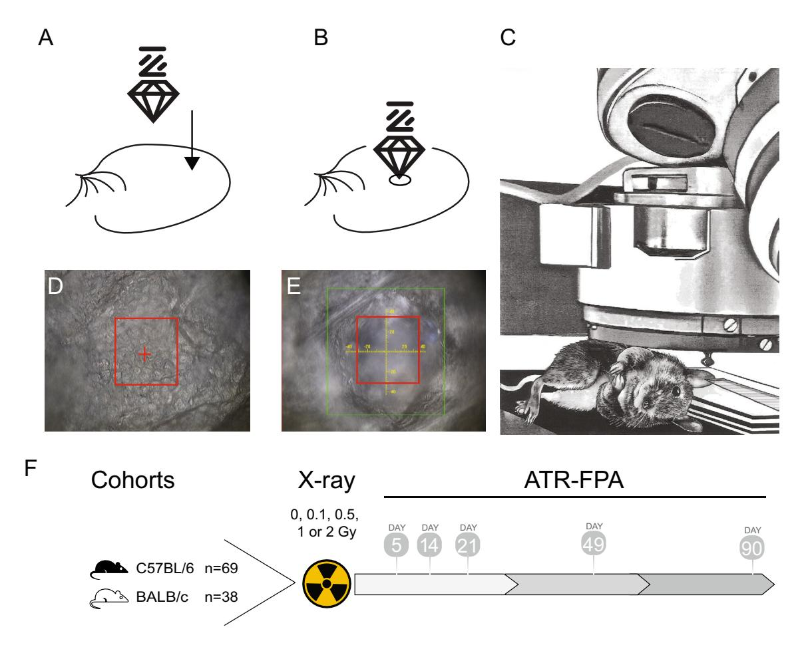
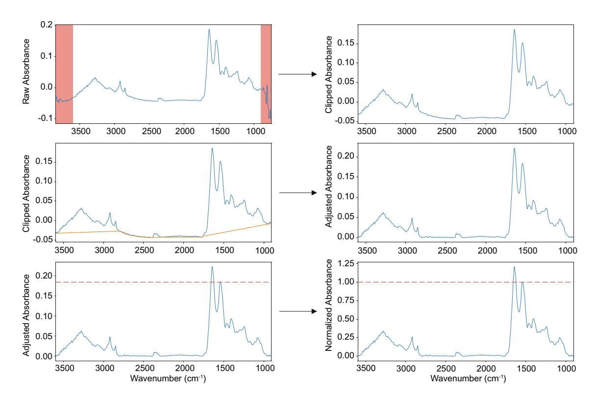
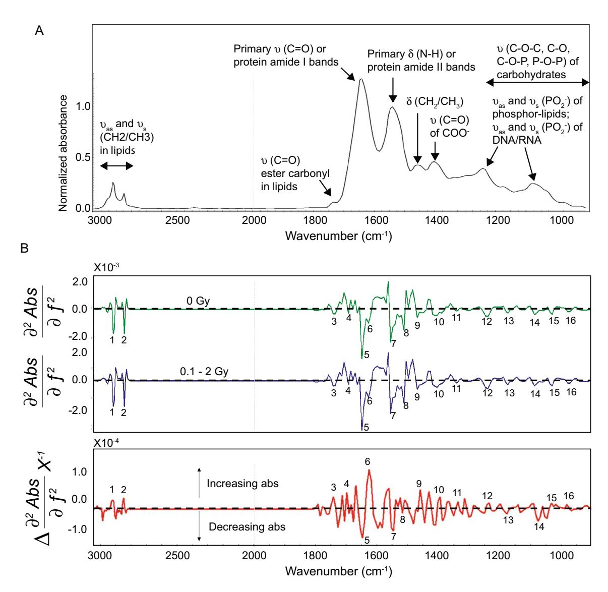
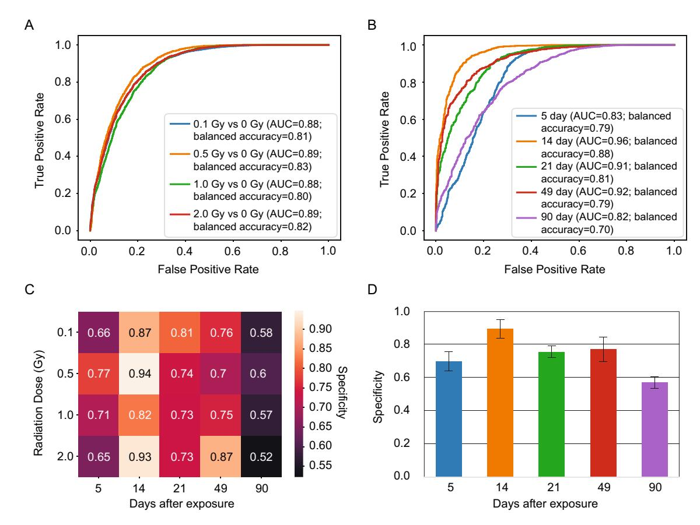

# **Lawrence Berkeley National Laboratory**

# **LBL Publications**

# **Title**

Long-Term, Non-Invasive Detection of Low-Dose Ionizing Radiation Exposure

# **Permalink**

<https://escholarship.org/uc/item/6vr4g1hs>

# **Journal**

ECS Meeting Abstracts, MA2024-01(41)

# **ISSN**

2151-2043

# **Authors**

Inman, Jamie Wu, Yulun Chen, Liang [et al.](https://escholarship.org/uc/item/6vr4g1hs#author)

# **Publication Date**

2024-08-09

## **DOI**

10.1149/ma2024-01412349mtgabs

# **Copyright Information**

This work is made available under the terms of a Creative Commons Attribution License, available at<https://creativecommons.org/licenses/by/4.0/>

Peer reviewed

# **OPEN**

# **Long‑term, non‑invasive FTIR detection of low‑dose ionizing radiation exposure**

**Jamie L. Inman1,7, Yulun Wu2,3,7, Liang Chen4 , Ella Brydon1 , DhrubaGhosh4,6, Kenneth H. Wan1 , Jared De Chant5 , Lieselotte Obst‑Huebl5 , Kei Nakamura5 , Corie Y. Ralston4 , Susan E. Celniker1 , Jian‑Hua Mao1 , Peter H. Zwart4 , Hoi‑Ying N. Holman4**\***, Hang Chang1**\***, James B. Brown2,3**\* **& Antoine M. Snijders1**\*

**Non-invasive methods of detecting radiation exposure show promise to improve upon current approaches to biological dosimetry in ease, speed, and accuracy. Here we developed a pipeline that employs Fourier transform infrared (FTIR) spectroscopy in the mid-infrared spectrum to identify a signature of low dose ionizing radiation exposure in mouse ear pinnae over time. Mice exposed to 0.1 to 2Gy total body irradiation were repeatedly measured by FTIR at the** *stratum corneum* **of the ear pinnae. We found signifcant discriminative power for all doses and time-points out to 90 days after exposure. Classifcation accuracy was maximized when testing 14 days after exposure (specifcity> 0.9 with a sensitivity threshold of 0.9) and dropped by roughly 30% sensitivity at 90 days. Infrared frequencies point towards biological changes in DNA conformation, lipid oxidation and accumulation and shifts in protein secondary structure. Since only hundreds of samples were used to learn the highly discriminative signature, developing human-relevant diagnostic capabilities is likely feasible and this non-invasive procedure points toward rapid, non-invasive, and reagent-free biodosimetry applications at population scales.**

Biological indicators of human exposure to ionizing radiation are pertinent to screen large numbers of people potentially exposed to radiation, e.g. afer a nuclear accident or a radiological attack. Te current gold standard in radiation biodosimetry uses cytogenetic measurements of chromosomal abnormalities in metaphases of cultured lymphocytes[1](#page-9-0)[–3](#page-9-1) . Tis method has played an important role in estimating radiation dose in atomic-bomb survivors in Hiroshima and Nagasaki, Japan[4](#page-10-0) , individuals exposed afer the Chernobyl nuclea[r5](#page-10-1)[–7](#page-10-2) , and in the Fukushima Daiichi accident[2](#page-9-2),[8,](#page-10-3)[9](#page-10-4) . Biochemical biomarkers of radiation exposure have been developed as an alternative or supplementary method for detecting radiation exposur[e10](#page-10-5). Tey include transcriptomic and proteomic biomarkers that are activated as part of the damage response pathways afer radiation exposure including DNA repair, cell cycle functions and apoptosi[s11.](#page-10-6) However, there are several limitations including the relatively long processing time of cytogenetic based dosimetry (from days to one week), the need for invasive blood collections and the limited sensitivity in the low dose radiation range (<1 Gy). To facilitate epidemiological studies, alternative approaches are needed that non-invasively detect radiation exposures at doses well below 1 Gy and at time points that are weeks to months afer radiation exposure.

A main challenge of risk assessment for persons potentially exposed to ionizing radiation is in measuring the biochemical changes non-invasively and in real-time. To this end, we chose skin as our target as it is readily accessible in a way that blood and internal organs are not. Te cutaneous radiation response to high doses of radiation consists of a characteristic temporal pattern depending on radiation quality, absorbed dose, dose rate and individual sensitivity. Clinical acute reactions include erythema, changes in pigment levels and depilation followed by desquamation and ulceration at extremely high doses. At the molecular level, the production of

1 Biological Systems and Engineering Division, Lawrence Berkeley National Laboratory, 1 Cyclotron Rd, Berkeley, CA 94720, USA. 2 Environmental Genomics and Systems Biology Division, Lawrence Berkeley National Laboratory, 1 Cyclotron Rd, Berkeley, CA 94720, USA. 3 Department of Statistics, University of California, Berkeley, CA 94720, USA. 4 Molecular Biophysics and Integrated Bioimaging Division, Lawrence Berkeley National Laboratory, 1 Cyclotron Rd, Berkeley, CA 94720, USA. 5 Accelerator Technology and Applied Physics Division, Lawrence Berkeley National Laboratory, 1 Cyclotron Rd, Berkeley, CA 94720, USA. 6 Present address: Paul G. Allen School of Computer Science and Engineering, University of Washington, Seattle, USA. 7 These authors contributed equally: Jamie L. Inman and Yulun Wu. \*email: hyholman@lbl.gov; hchang@lbl.gov; jbbrown@lbl.gov; amsnijders@lbl.gov

cytokines immediately afer radiation induced tissue damage mediates cell–cell communications and activates repair mechanisms including late-stage fbrosis. Te immediate cytokine response patterns (hours to days afer exposure) have been used as radiation biomarkers to estimate dose and time afer exposure. Our study examines in live mouse ear pinnae low dose radiation where no gross acute reactions are detectable nor is fbrosis observed over time. Tus, more sensitive detection methods are required for non-invasive real-time detection.

It has been established that damage to biomolecules proteins, lipids or nucleic acids and formation of reactive small molecules are reliable reporters for ionizing radiation induced efect[s12](#page-10-7)[–16.](#page-10-8) Various techniques have been used to detect these damages, such as but not limited to chemiluminescence-based HPLC or GC-mass spectrometry for detection of lipid peroxidation[17–](#page-10-9)[20](#page-10-10), GC-mass spectrometry or enzyme-linked immunosorbent assay (ELISA) for detecting DNA damages[21](#page-10-11),[22,](#page-10-12) fow cytometry for detecting DNA damage[s23](#page-10-13)[,24](#page-10-14) or cell cycle perturbations[25](#page-10-15),[26,](#page-10-16) label or label-free mass spectrometry for profling protein modifcations[27](#page-10-17)–[30](#page-10-18). Many studies have demonstrated the capability of Raman spectroscopy and Fourier transform infrared (FTIR) spectroscopy to detect changes in DNA, lipid, protein and carbohydrates in exposed samples[31–](#page-10-19)[39](#page-10-20). Long term radiotherapeutic changes in plasma have been shown by FTIR on patient-derived samples[40](#page-10-21). In addition, a number of noninvasive spectroscopy-based methods for radiation biodosimetry purposes have been explored. For example, in vivo electron paramagnetic resonance biodosimetry has been used for biodosimetry in nail[41](#page-10-22),[42](#page-10-23), hai[r43](#page-10-24) and teet[h44.](#page-10-25) Raman and photoluminescence (PL) spectroscopy were used to study radiation efects on human hair samples[45](#page-10-26). Here we use the FTIR spectroscopy imaging approach to non-invasively detect and track simultaneously changes in the composition and molecular structure of the various cellular components in the ear pinnae of living mice post exposure.

FTIR spectroscopy is one of the most sensitive analytical tools for detecting changes in composition and molecular structure in biological systems. Many common biomolecules such as proteins, lipids, carbohydrates, and nucleic acids as well as metabolites have distinct infrared-active vibrational modes that produce fngerprintlike absorption spectral features in the mid-infrared regio[n46,](#page-10-27)[47.](#page-11-0) Tese spectral features are specifc to the functional groups in the molecule and therefore their composition and structure. In the last 20 years, a number of studies have demonstrated the potential of FTIR imaging as a diagnostic tool for the analysis of disease states of cells and tissues[48–](#page-11-1)[57](#page-11-2) and for detecting radiation-induced changes in various cellular components[15](#page-10-28),[32](#page-10-29),[58](#page-11-3)[–60](#page-11-4). FTIR can be performed in transmission, refection (transfection), or attenuated total refection (ATR) confgurations. Te millimeters-thick skin of the mouse ear pinnae attenuated most of the incident infrared light for transmission measurements while not sufciently refective for refection measurements. We selected the versatile FTIR-ATR confguration in which the sampling path length is independent of the sample thickness.

We describe novel FTIR-ATR biomarkers which, when incorporated into a statistical machine learning model, can detect exposures to X-ray radiation down to 0.1 Gy at 90 days post exposure. Importantly, only hundreds of measurements on mice were needed to train this model, indicating the feasibility of developing analogs for use in human populations.

#### **Materials and methods Animal preparation**

C57BL6/J and BALB/cJ mice were obtained from Jackson Laboratories and acclimated at Lawrence Berkeley National Laboratory (LBNL) for 2 weeks prior to total body irradiation (TBI) X-ray treatment at 9–12 weeks of age. Mice were housed on a 12 h light–dark cycle in standard micro-isolator cages on hardwood chips (Sani Chips; P.J. Murphy Forest Products) with enrichment consisting of crinkle cut naturalistic paper strands. Mice were maintained on ad libitum PicoLab Rodent Diet 20 (5053) and water supply with environmental humidity of 54.3% (±10%) and temperature of 21.9 °C (±2%). All mice were negative for all of the following pathogens: MHV, Sendai, PVM, M. pulmonis, TMEV(GDVII), Reo-3, Parvo, EDIM, LCM and Ectromelia. Te study was carried out in strict accordance with the Guide for the Care and Use of Laboratory Animals of the National Institutes of Health. Te Animal Welfare and Research Committee at LBNL approved the animal use protocol and this manuscript complies with the ARRIVE guidelines 2.0. Our study cohort consisted of 107 mice including 69 C57BL/6 J and 38 BALB/cJ mice (Table S1). A total of 505 spectral maps were acquired at diferent dosages (0, 0.1, 0.5, 1, and 2 Gy) and days (5, 14, 21, 49 and 90 days) (Table S2). Mice within a cage were identifed by ear punches to the contralateral (right) ear. Mice were randomly assigned to exposure groups and no mice were excluded from the study. Mice were exposed to X-ray radiation or sham, using a Precision X-ray Inc XRAD320 320 kVp X-ray machine, operated at 300 kVp, 2 mA (dose rate of 196 mGy/min). Mice were contained in a plastic holder and irradiated on a rotating stage. Dosimetry was performed using a RadCal ion chamber (Radcal 10X6-0.18). Te transverse dose profle was measured using EBT3 radiochromic flms with the collimator fully open and showed that within the radius of 110 mm, the dose profle was uniform within 4% (standard deviation) across the feld (Fig. S1).

#### **Hyperspectral infrared imaging of animals**

An overview of the FTIR-ATR hyperspectral (HS) imaging setup is shown in Fig. [1.](#page-3-0) A Hyperion FTIR microscope with a linear x–y–z translation stage equipped with a VERTEX 70 V spectrometer, a 128×128 pixel focal plane array (FPA) detector and stabilized visible and infrared lighting was used for hyperspectral image acquisition. Mice were anesthetized with ketamine (100–125 mg/kg) and xylazine (10–12.5 mg/kg) and the lef ear pinnae was immobilized on a stack of glass slides on the x–y–z translation stage using micropore tape (3 M). Te ear was positioned under the ATR objective on the stack of microscope slides and immobilized using micropore tape. A fat portion of the ear with cuboidal epithelium in the center region of the ear was identifed for measurement (Fig. [1D](#page-3-0)). Care was taken to avoid vasculature and uneven surfaces. An optical bright-feld image was captured prior to lifing the stage for the ear sample to make contact with the germanium crystal to collect FTIR-ATR-FPA

**Figure 1.** Experimental overview. (**A**) Diagram of immobilized mouse ear with germanium crystal above it. (**B**) Diagram of crystal during measurement. (**C**) Sketch of an animal under the microscope. (**D**) Phase contrast image of outermost layer of *stratum corneum* prior to measurement. (**E**) Phase contrast image of deformation of the *stratum corneum* caused by germanium crystal afer measurement. (**F**) Two strains of mice C57BL/6J (n=69) and BALB/cJ (n=38) totaling 107 mice were generated for the study. All mice were treated with total body irradiation (TBI) of either 0, 0.1, 0.5, 1 or 2 Gy at 9–12 weeks of age. At 5-, 14-, 21-, 49- and 90-days post TBI, mice were anesthetized, and measurements of ear pinnae were collected with our FTIR-ATR-FPA system.

spectra. Afer each measurement, a picture of the ear deformation by the crystal was captured (Fig. [1E](#page-3-0)) and the mice were returned to their cages and monitored as they recovered from anesthesia.

OPUS/ATR Sofware package was used to control the x–y–z sample stage and the FPA detector for automatic registration of ATR spectra. All measurements were conducted using the Bruker Opus 8.7 SP2 sofware package. HS infrared image data were recorded in ATR mode using the liquid nitrogen cooled 128×128 FPA detector and a 20×ATR objective with a numerical aperture of 0.6. Each image consisted of 16,384 spectra. Each spectrum corresponded to the co-addition of 128 interferograms at a nominal resolution of 8 cm–1 with 4096 data points over the infrared spectral range of 3900–900 cm–1. By combining the 20×ATR objective with the 128×128 FPA detector, the area of image was found to be~64×64 um2 , yielding a pixel size of~0.5 um, consistent with those reported in literature[61](#page-11-5).

To measure non-invasively the skin of mice response to radiation post treatment, we calibrated a FTIR-ATR monitoring setup with a germanium crystal objective for ATR measurements coupled to a Focal Plane Array (FPA) detector. During the FTIR-ATR measurements, the ear skin of each live mouse was in direct contact with the germanium ATR element in the objective (Fig. [1](#page-3-0)A–E). Te germanium has a higher refractive index (n1=4.1) than skin (n2=1.5–1.7). When the infrared light with a particular incident angle traveled through the germanium of high refractive index to the skin of low refractive index, almost all the infrared light was refected back into the germanium, except for a small amount of the infrared light that escaped the germanium crystal and penetrated the sample as an evanescent wave with a small penetration distance beyond the crystal and was absorbed by skin. For our mid-infrared germanium element experimental setup, the wavelength-dependent penetration depth dp of the evanecent wave where the wave amplitude has decreased to 1/e (i.e.~37%) of its maximum value was~0.2–0.65 μm. Since the light penetrates beyond the dp, the spectral information recorded were expected to be two to three times deeper[62](#page-11-6),[63](#page-11-7). Te absorbance was translated into the FTIR spectrum of skin at each pixel of the FPA detector, and each spectrum was recorded as an independent, spatially resolved FTIR spectrum.

#### **Hyperspectral infrared image data quality control**

We developed an FTIR-ATR data preprocessing pipeline on a set of 3D infrared spectral maps with fxed spatial dimension (128 × 128 pixel). We removed pixels with low quality spectra from the analysis. Note that poor quality spectra can emerge from a variety of sources, such as partial occlusion of the image by water vapor or droplets. Pixels in a given pixel pool (a segment of the image, or a collection of pixels acquired via clustering analysis) were removed if the ratio of amide signal-to-noise was below 200 and/or the ratio of the amide signal and the CO2 signal between 2300 and 2400 cm–1 were below 1[548.](#page-11-1) For each image where more than 100 pixels were selected afer this procedure, we further ranked the selected pixels by the spectra variations in the noise signature range (the lower the better) and preserved only the top 100 pixels. Te remaining pixels composed the dataset for downstream analysis.

#### **PacMap outlier removal**

To identify potential outliers, we made use of the PacMap algorithm[64](#page-11-8) to embed pixels in a low-dimensional space. We made use of the 1500 to 1700 cm−1 range, which contains the most dominant spectral bands in our classifcation analyses. A 2D scatter plot of the resulting embedding was created, revealing a well-defned manifold where over 99% of the pixels were located (Fig. S2). Consequently, an accepted/rejected mask was generated for each ATR image, facilitating further downstream analysis without the interference of outliers. A cursory analysis of these accepted/rejected masks did not indicate any specifc spatial patterns on the detector where outliers were present, indicating random technical variation. Te PacMap mask performed on par a simple selection of the central portions of images.

#### **Classifcation and statistical analysis**

Te hyperspectral image dataset was split into a training set consisting of 290 samples: 68 control (0 Gy) and 222 treated (0.1, 0.5, 1, 2 Gy), and an independent testing set consisting of 215 samples: 49 control and 166 treated (Table S2). Our classifcation models were established at the pixel level on all training samples and evaluated at the pixel and sample level in the testing set.

Te classifcation methods used in this study include classical linear or kernel-based linear algorithms – logistic regression and support vector machines, and deep neural networks. Classical machine learning algorithms were implemented with scikit-learn (version 1.0.2) and deep learning algorithms were implemented with PyTorch (version 1.13.0). For logistic regression, two diferent regularizations are employed, where L2 regularization benefts efciency and L1 regularization grants better interpretability. For deep neural networks, we use 1D-CNN as our primary approach and fully-connected feedforward neural network as a contrast method. At pixel level, prior study has proposed using 1D-CNN in diferent domain[s65](#page-11-9)[–68,](#page-11-10) which generally outperform classical machine learning methods, due to the fact that a more abundant training set can be established at pixel level allowing higher parameter depth and more sophisticated modeling techniques. For the same reason, we found out using principal component analysis was not necessary as models did not overft on training data without dimensional reduction. Evidently, the penalization coefcient that produced the best result on testing set for L1 regularization zeroes out only 1 input feature. However, simpler linear approaches such as LASSO logistic regression provide better interpretability since each model parameter is directly linked to one hyperspectral feature. Furthermore, LASSO has more theoretical guarantees such as almost-sure uniqueness given continuously-distributed features[69](#page-11-11) and sign consistency even if solutions are not unique. Hence, we used LASSO logistic regression to select wavenumbers that possess high signals with respect to radiation.

#### **Results and discussion**

#### **Murine skin FTIR‑ATR spectroscopic image collection after ionizing radiation exposure**

Our cohort included two genetically diferent mouse strains, C57BL/6 J and BALB/cJ, to avoid developing a radiation signature that was strain specifc. Measurements were performed under anesthesia and the lef inner ear pinnae was positioned under the ATR-FPA objective (Fig. [1](#page-3-0)). Given that epidermal cells in the ear pinnae range in size from 10 to 30 µm, with an average diameter of~15 µm, our data set included biosignatures from up to 25 cells per image.

#### **FTIR‑ATR spectroscopic image pretreatment pipeline**

To reduce variance and remove redundant information, we developed a fve-step procedure on hyperspectral images, including three spectra-level processing steps (range clipping, rubber-band baseline correction, peak normalization) and two pixel-level processing steps (dead pixel flling, median flter denoising). An example of the spectra-level pretreatment is shown in Fig. [2](#page-5-0).

Te pipeline included the following steps: (1) Spectra range clipping: for each pixel in the 3D map, the wavenumbers between [3600, 900] was kept to eliminate the high-variance present at the outer ends of spectral data; (2) Dead pixel flling: dead pixels, i.e. pixels in the spectral map with signifcantly lower signal or even no signal (usually due to instrument error), were removed using mean fltering with 5 × 5 spatial kernel; (3) Denoise: median flter with 5×5 spatial kernel was applied; (4) Baseline correction: baseline was established using rubber band ftting on manual control points, and then subtracted from original spectral dat[a48](#page-11-1)[,70;](#page-11-12) (5) Peak normalization: the baseline corrected spectral data was further normalized to the highest absorbance point in Amide II regio[n48.](#page-11-1)

**Figure 2.** Hyperspectral image processing pipeline. Example of the procedure for quality control and normalization on hyperspectral images (range clipping, rubber-band baseline correction, peak normalization).

#### FTIR peaks (wavenumbers) associated with radiation exposure

Data from the FTIR-ATR spectroscopic image processing pipeline were represented with their mean spectra from the irradiated (0.1–2 Gy) and the control (0 Gy) mice. They were transformed to second derivative spectra using the Savitzsky-Golay (SG) numerical algorithm at 3 points and 5 polynomials for more detailed analysis.

We first examined the major spectral features of the murine ear skin. An inspection of the broad features of the mean spectra from the *stratum corneum* of ears of the irradiated and control mice showed negligible changes and they are nearly superimposed (Fig. 3A). They both show typical infrared spectral absorption features of biomolecule bands in the amide I region (1700–1600 cm-1) and amide II region (1590–1480 cm-1) region, attributable to the vibrations of peptide bonds (C=O and C=N stretching, and of N=H bending modes respectively). Other major features included the symmetric and asymmetric stretching vibrations of CH2 and CH3 groups of lipids in the 3050–2840 cm-1 spectral region. Further overlapping bands ascribable to fatty acids and esters were detected in the 1750–1690 cm-1 region. Complex peaks between 1500 and 1300 cm-1were dominated by bending modes of > CH2 and > CH3 groups present both in amino acid side chains and in fatty acids. In the 1300–900 cm-1 spectral region we observed overlapping absorption peaks resulting from carbohydrates as well as phosphodiester, phosphate functional groups. The  $v_{as}$  and  $v_s PO_2^-$  stretching vibrations occurring at ~1240 cm-1 and at ~1085 cm-1 respectively suggested the absorption of O=P=O linkages of the polynucleotide chains in DNA and RNA. RNA showed specific absorptions at ~1120 cm-1 (ribose C=O stretching), and ~998 cm-1 (uracil ring stretching), while DNA exhibits peaks at ~1020 (deoxyribose C=O stretching), and ~964 cm-1 (DNA backbone motions).

We then examined the second derivative spectra in the same spectral region (Fig. 3B) and searched for specific spectral features associated with radiation exposure. Unlike the mean spectra, the impact of baseline shift (a common challenge in biological samples) on the second derivative spectrum was minimal, while the signal quality was enhanced, peak position was accurate, and the undesirable spectral features contributed by the broadband absorption constituents were eliminated. This improvement allowed us to accurately quantify the second derivative peak intensity through peak-to-peak calculation. The difference in the second derivative spectra was used for making a biochemical comparison between the irradiated and the control mice, and to infer important infrared frequencies of biomolecules which can be measured objectively (Fig. 3). Note that a characteristic feature of a second derivative spectrum is that its negative band with a minimum is at the same frequency as the maximum on the original (or zero order derivative) spectrum. The second derivative peak intensity was calculated as the intensity at the minimum. Inspection of the difference in second derivative spectrum shows notable spectral changes associated with DNA damages, lipid oxidation and accumulation, and post-translational protein modifications.

Our analysis identified sixteen best candidate biomarkers (Table 1), indicating DNA conformation changes, lipid, and protein effects. Comparative analysis of second derivative spectra revealed a small shift of the O–P–O asymmetric stretching band from ~ 1236 cm $^{-1}$  (0 Gy) to ~ 1240 cm $^{-1}$  (0.1–2 Gy) as the intensity increases, suggesting that the phosphate groups were less hydrogen bonded and that the DNA conformation transition from the predominant B-form to the A-DNA  $^{32,71,72}$ . Local conformational changes could be associated with the damage

**Figure 3.** Spectral features and second derivative spectra. (**A**) Major spectral features of the murine ear skin annotated with specific biomolecules. (**B**) The mean second derivative spectra of *stratum corneum* from the control 0 Gy (green) and 0.1 to 2 Gy exposed (blue) (26,296 pixels from 274 samples) , and their difference spectrum (red). Mean spectra from the irradiated and control mouse ears in the 3050–900 cm $^{-1}$  region were transformed to second derivative spectra (3-point Savitsky-Golay smoothing, polynomial order 5). Labeled peaks are assigned in Table 1. The difference spectrum was multiplied by -1 for the ease of visualization purpose.

such as the formation of pyrimidine dimers or DNA-DNA and DNA-protein cross-links72,73. In addition, analysis of the CH2 and CH3 stretching region (3050-2800 cm-1) and bending modes, and the fatty acids and ester carbonyl region (1750–1690 cm-1) in the second derivative spectra of the 0.1–2 Gy group revealed increases in the peak intensity of the CH2, CH3 stretching modes at 2923 cm-1 and at 2852 cm-1; CH2, CH3 bending modes at ~ 1458 cm-1, and ester carbonyl band at 1740 cm-1. However, there were no detectable shifts in the CH2 and CH3 bands. The increase in peak intensity implies lipid accumulation and increased lipid metabolism. Another important observation was oxidative damage to lipids, noted by an increase in peak intensity at 972 cm-1, assigned to the trans (C=C) bonds, and at 1402 cm-1, assigned to carbonyl groups formed during lipid oxidation59, This is further supported by the shift of the ester carbonyl band from 1735 to 1743 cm-1 in the 0.1–2 Gy group relative to the 0 Gy group. Lastly, we observed several protein effects. The second derivative spectra of the 0 Gy and the 0.1-2 Gy groups showed that a significant fraction of the stratum corneum protein is composed of random coils disordered secondary structure (~1648 cm-1), and to a lesser degree beta-sheet structure (1691 cm-1, 1626 cm-175-77. The difference in spectrum showed that in the 0.1-2 Gy treated group of mice decreased the relative abundance of random coils disordered secondary structure in the stratum corneum while increasing the betasheet structures. The decreased intensity of amide II at ~ 1553 cm-1, bands assigned to tyrosine (~ 1518 cm-1), bands contributed by serine, threonine, and tyrosine (~1172 cm-1) and phosphorylated proteins (~1083 cm-1) suggested the sensitivity of *stratum corneum* proteins to low dose radiation.

| Peak number | Approximate absorption peak (cm–1) | Intensity (up/down), Shif (L-R) | ΔIntensity (× 10–4) | Assignment                                                                                                |  |
|-------------|------------------------------------|---------------------------------|---------------------|-----------------------------------------------------------------------------------------------------------|--|
| 1           | 2922                               |                                 | 0.3                 | υas(C–H) of saturated methylene> CH2 in lipids, proteins                                                  |  |
| 2           | 2851                               |                                 | 0.4                 | υs(C–H) of saturated methylene> CH2 in lipids, proteins                                                   |  |
| 3           | 1743                               |                                 | 0.5                 | υ(C=O) of acyl groups in saturated esters like triacylglycerol                                            |  |
| 4           | 1691                               |                                 | 0.2                 | υ(C=O) and υ(C–N) of Amide I in proteins (aide I); β-turns                                                |  |
| 5           | 1648                               |                                 | 1.1                 | υ(C=O) and υ(C–N) of Amide I in proteins; random coils                                                    |  |
| 6           | 1626                               |                                 | 1.5                 | υ(C=O) and υ(C–N) of Amide I in proteins (aide I); β-sheets                                               |  |
| 7           | 1553                               |                                 | 0.9                 | d(N–H) and υ(C–N) of Amide II in proteins                                                                 |  |
| 8           | 1518                               |                                 | 0.3                 | Tyrosine ring stretching vibrations (–C–C/–C=C)                                                           |  |
| 9           | 1458                               |                                 | 0.8                 | δ(C–H) of CH3, CH2 in proteins, lipids                                                                    |  |
| 10          | 1402                               |                                 | 0.6                 | υ(COO– ) in proteins, lipids                                                                           |  |
| 11          | 1336                               |                                 | 0.3                 | δ(C–H) of CH2 side chains in proteins                                                                     |  |
| 12          | 1236                               |                                 | 0.2                 | υas(O–P–O) of nucleic acids, phosphorylated proteins, phospholipids                                    |  |
| 13          | 1172                               |                                 | 0.1                 | υ(–CH2OH) coupled with δ(–C–O–) and υ(–C–O–) of the υ(–C–OH) groups of serine, threonine, and tyrosine |  |
| 14          | 1083                               |                                 | 0.5                 | υs(O–P–O) of nucleic acids, phosphorylated proteins, phospholipids                                     |  |
| 15          | 1024                               |                                 | 0.1                 | υ(C–O) of carbohydrate side chains of proteins                                                            |  |
| 16          | 972                                |                                 | 0.1                 | trans C=C bonds                                                                                           |  |

**Table 1.** Infrared frequencies and assignment of the major infrared absorption bands in the FTIR-ATR-FPA spectra from the irradiated and control mice. All assignments were from literature as cited in the main text.

#### **PacMap characterizes data manifold based on distinct spectra signatures**

PacMap on spectral data ranging from 1500 to 1700 cm–1 produced a well-defned manifold, which categorizes the data based on the distinct forms of the Amide-I and Amide-II peak (Methods, Fig. S2). Interestingly, only a handful of observed pixels deviate from the manifold, suggesting a minimal presence of outliers and no evident partition into subclusters. Tere is, however, a notable contrast in the spectra distribution throughout the manifold for various doses (Fig. S2). Te lack of defnitive separation of subclusters within the Amide-I and Amide-II range mandates the exploration of other regions for dose diferentiation, and the application of supervised learning procedures.

#### **Predicting ionizing radiation exposure using machine learning models**

We next asked whether we can use the spectral features to distinguish irradiated mice from unirradiated mice. A variety of machine learning models of diferent complexity were used for the task of predicting pixel-level and sample-level radiation exposures. Ordered by complexity from lowest to highest, the models included in our analysis are: (1) Logistic Regression (LASSO, Ridge), (2) Support Vector Machines and (3) Deep Neural Networks (Fully-Connected, Convolutional). We tested these models on pixel pools fltered by two diferent region selection approaches – center region and PacMap region. Te center region approach composed the pixel pool with pixels in the 21 × 21 center region of each image. Afer pretreatment and quality control, a total of 26,310 pixels from 274 samples in the training pool (Tables S3 and S4) and 18,774 pixels from 200 samples in the testing pool (Table S5) were selected for the center region. No pixels were selected from 16 training samples and 15 testing samples. Tese samples were removed from downstream classifcation analysis. Te PacMAP region approach composed the pixel pool with pixels passing the PacMap outlier removal procedure. Afer pretreatment and quality control, 26,778 pixels from 274 samples in the training pool and 19,710 pixels from 201 samples in the testing pool were selected for the PacMap region. No pixels were selected from 16 training samples and 14 testing samples, which were excluded from downstream classifcation analysis.

For classifcation, spectra values from range [900–1800] and [2800–3050] were selected as input features. Sample-level predictions were acquired based on the majority vote of corresponding pixel-level predictions. For the center region pixel pool, all models tested in the experiments reached pixel-level and sample-level accuracies above 85% in the testing cohort, among which one-dimensional Deep Convolutional Neural Network (1D-CNN) showed the best overall classifcation capacity with 94.00% sample-level accuracy (Table [2\)](#page-8-0). Compared to a fully-connected NN, CNN was able to resist overftting noticeably better in our experiments. Similar to the center region, classifcation on the PacMap region reached pixel-level and sample-level accuracies above 85% in the testing cohort, among which 1D-CNN showed the best overall classifcation capacity with 92.00% samplelevel accuracy (Table [2\)](#page-8-0), which is calculated over 3520 unirradiated pixels from 39 samples and 15,254 irradiated pixels from 161 samples. For balanced accuracy and ROC curve, see the section below.

#### **Signatures exhibit fat dose–response relationships**

Interestingly, the testing accuracy did not scale with radiation dose, and the identifed signatures of exposure were of similar predictive power for each radiation exposure group (Fig. [4A](#page-8-1)). We attempted to distinguish doses

|                                | Center region pixels |              | PacMap selected pixels |              |
|--------------------------------|----------------------|--------------|------------------------|--------------|
| Models                         | Pixel-level          | Sample-level | Pixel-level            | Sample-level |
| LASSO-logistic regression      | 86.81%               | 87.00%       | 86.58%                 | 86.83%       |
| Ridge-logistic regression      | 89.20%               | 90.50%       | 88.59%                 | 89.76%       |
| Support vector machine         | 87.67%               | 87.00%       | 87.51%                 | 87.80%       |
| Fully connected neural network | 85.25%               | 88.50%       | 85.32%                 | 86.83%       |
| Convolutional neural network   | 88.82%               | 94.00%       | 89.29%                 | 91.22%       |

**Table 2.** Model comparison of radiation exposure prediction using center region and PacMapregion at the pixel- and sample-level.

**Figure 4.** Hyperspectral image-based classifcation of radiation exposure. (**A**) Te receiver operating characteristic (ROC) curves of predictions from center region 1D-CNN, stratifed by diferent radiation levels. (**B**) Te receiver operating characteristic (ROC) curves of predictions from center region 1D-CNN, stratifed by diferent days afer radiation exposure. (**C**) Ear ATR-FPA FTIR per-day per-radiation dose specifcity with sensitivity threshold at 0.9. While specifcity drops afer day 21, the results are still far above random guessing (0.33 corresponds to a balanced accuracy of 0.66, p-value<0.001). (**D**) Bar plot of specifcity (at 90% sensitivity) across days afer exposure. Te height of each bar is the mean across doses. Error bars correspond to one SD across doses.

in a multi-class classifcation problem but found little power to do so with any of the models deployed (Fig. S3). Strong discriminative power for the event of radiation exposure, but not the dose in a range from 0.1 to 2 Gy is consistent with the presence of a threshold-like dose response relationship.

#### **Persistence of signatures of low dose ionizing radiation exposure over time**

We found statistically signifcant discriminative power for all doses and all tested time-points out to 90 days. Our minimum balanced accuracy for the binary classifcation task identifying individuals exposed to any dose occurs at 90 days and at the maximum tested dose of 2 Gy (Balanced Accuracy~66%, p-value<0.001). Across all doses, classifcation is weakest at 5 days and 90 days, the earliest and latest time points (Fig. [4B](#page-8-1)). Detectability peaks at 14 days, where accuracy is nearly deterministic (Balanced Accuracies~98%, Fig. [4C](#page-8-1) and D). We found a strong dependence on time-since-dose, detectability peaking at 14 days when cells derived from the basal stem cells of the epidermis afer radiation exposure are expected to have reached the *stratum corneum*, and gradually dropping down to a balanced accuracy of~75% by 90 days. Te gradual drop of of detectability of our signature is likely the result of turn-over of skin epithelium and hair. However, the reduced signal at 5 days post exposure is more interesting and is consistent with a model wherein the components of our signature derive from emergent processes of host physiology, and not immediate changes in chemistry as a result of radiation exposure. Tis nonlinear relationship with time afer exposure is consistent with a model wherein a process is induced by radiation exposure, peaks somewhere around 14 days, with the system state returning closer to normal, but remaining biochemically altered and distinct out to at least 90 days.

In summary, we found that a 1D-CNN is capable of detecting signatures of low dose ionizing radiation exposure from epidermal tissues in situ for up to 90 days afer exposure. We note that although 1D-CNN achieved the best classifcation performance on the testing sets, linear models such as logistic regression exhibited comparable performance and have advantages: the optimization process is faster and feature importance (importance of wavenumbers) can be easily acquired. Tese traits may be desirable to enable insights into the biochemistry captured by our classifcation signatures.

#### **Discussion**

Tis is the frst study, to our knowledge, that reports non-invasive mid-infrared biomolecular changes of radiation exposure monitored over time in living animals. We were able to track the evolving signature of the insult in three cohorts of mice providing powerful insights into biological adaptations. We used the ATR-FPA-FTIR system to record these changes in the *stratum corneum* of the mouse ear pinnae afer radiation exposure. Te epidermis of the ear pinnae is a stratifed epithelium maintained by stem cells of the basal layer, the *stratum basale*. In mice, epidermal stem cells produce daughter cells that diferentiate through the layers of the skin and end up at the surface of the *stratum corneum* in 8–10 day[s78.](#page-11-20) Tus, our method captures persistent changes in the tissue over roughly ten cycles of epidermal tissue turnover in the ear pinnae.

Te FTIR-ATR spectra were recorded non-invasively at the surface of the ear pinnae and these spectra enabled us to measure how radiation exposure afected the cell composition and structures of macromolecules, such as proteins, lipids, carbohydrates and nucleic acids. Over the time we monitored the mice, the *stratum corneum* was replaced multiple times afording us insights into persistent changes arising from the stem cells of the basal layer as well as changes in the tissue microenvironment. FTIR-ATR spectrum derived from this real-time and label-free approach could be one of the most chemical information-rich and concise ways to complement the whole "-omic" of a cell, and as such, for the development of global biomarkers representing stress-and-adaptive response by diferent classes of biomolecules in the *stratum corneum* and epidermal stem cell populations.

We report that FTIR-ATR imaging coupled to statistical machine learning models is capable of distinguishing irradiated from control mice at doses as low as 0.1 Gy for as long as 90 days. Tis non-invasive procedure points toward future applications of deployable imaging devices for biodosimetry at population scales – a potentially valuable tool for radiobiology, epidemiology, and monitoring. Further, because only hundreds of samples were required to learn highly discriminative signatures, developing human-relevant diagnostic capabilities is likely feasible, e.g., generating samples from individuals undergoing radiotherapy by imaging distal (non-target) tissues subject to the low dose regime.

Of particular interest is the ever-improving interpretability of infrared measurements. As demonstrated in Table [1](#page-7-0) and Fig. [3,](#page-6-0) the biochemistry that underlies spectral shifs upon irradiation is increasingly well-understood. Future experiments including mass spectrometry and chromatography will further enable the "inversion" of the infrared signals to map spectral peaks onto specifc biochemical analytes – opening the door to non-invasive, reagent free diagnostics for a host of biomedical conditions and applications.

#### **Data availability**

Data sets and code generated during the current study are available from the corresponding authors on request. Data are located on a secure server at LBNL.

Received: 24 November 2023; Accepted: 7 March 2024

## **References**

- 1. Lee, Y. *et al.* Validation of the dicentric chromosome assay for radiation biological dosimetry in South Korea. *J. Radiat. Res.* **60**(5), 555–563 (2019).
- 2. Suto, Y. *et al.* Biodosimetry of restoration workers for the Tokyo Electric Power Company (TEPCO) Fukushima Daiichi nuclear power station accident. *Health Phys.* **105**(4), 366–373 (2013).
- 3. *Cytogenetic Analysis for Radiation Dose Assessment*. In *International Atomic Energy Agency* (2001).

- 4. Awa, A. Analysis of chromosome aberrations in atomic bomb survivors for dose assessment: Studies at the Radiation Efects Research Foundation from 1968 to 1993. *Stem Cells* **15**(Suppl 2), 163–173 (1997).
- 5. Nugis, V. Y., Filushkin, I. V. & Chistopolskij, A. S. Retrospective dose estimation using the dicentric distribution in human peripheral lymphocytes. *Appl. Radiat. Isot.* **52**(5), 1139–1144 (2000).
- 6. Sevan'kaev, A. V. *et al.* Novel data set for retrospective biodosimetry using both conventional and FISH chromosome analysis afer high accidental overexposure. *Appl. Radiat. Isot.* **52**(5), 1149–1152 (2000).
- 7. Sevan'kaev, A. V. *et al.* A cytogenetic follow-up of some highly irradiated victims of the Chernobyl accident. *Radiat. Prot. Dosimetry* **113**(2), 152–161 (2005).
- 8. Lee, J. K. *et al.* Cytogenetic biodosimetry for Fukushima travelers afer the nuclear power plant accident: No evidence of enhanced yield of dicentrics. *J. Radiat. Res.* **53**(6), 876–881 (2012).
- 9. Suto, Y. Review of cytogenetic analysis of restoration workers for Fukushima Daiichi nuclear power station accident. *Radiat. Prot. Dosimetry* **171**(1), 61–63 (2016).
- 10. Abend, M. *et al.* Early molecular markers for retrospective biodosimetry and prediction of acute health efects. *J. Radiol. Prot.* **42**(1), 010503 (2022).
- 11. Escalona, M. B., Ryan, T. L. & Balajee, A. S. Current developments in biodosimetry tools for radiological/nuclear mass casualty incidents. *Environ. Adv.* **9**, 100265 (2022).
- 12. Kempner, E. S. Damage to proteins due to the direct action of ionizing radiation. *Q. Rev. Biophys.* **26**(1), 27–48 (1993).
- 13. Spotheim-Maurizot, M. & Davidkova, M. Radiation damage to DNA in DNA-protein complexes. *Mutat. Res.* **711**(1–2), 41–48 (2011).
- 14. Reisz, J. A. *et al.* Efects of ionizing radiation on biological molecules–mechanisms of damage and emerging methods of detection. *Antioxid. Redox Signal.* **21**(2), 260–292 (2014).
- 15. Abdelrazzak, A. B. & El-Bahy, G. S. FT-IR spectroscopic investigation of ionizing radiation-induced damage in the small intestine of whole-body irradiated rats. *Vib. Spectrosc.* **99**, 146–150 (2018).
- 16. Zheng, Y. *et al.* Ionizing radiation damage and repair from 3D-genomic perspective. *Trends Genet.* **39**(1), 1–4 (2023).
- 17. Miyazawa, T. *et al.* Determination of phospholipid hydroperoxides using luminol chemiluminescence–high-performance liquid chromatography. *Methods Enzymol.* **233**, 324–332 (1994).
- 18. Yamamoto, Y. Chemiluminescence-based high-performance liquid chromatography assay of lipid hydroperoxides. *Methods Enzymol.* **233**, 319–324 (1994).
- 19. Su, L. J. *et al.* Reactive oxygen species-induced lipid peroxidation in apoptosis, autophagy, and ferroptosis. *Oxid. Med. Cell Longev.* **2019**, 5080843 (2019).
- 20. Moore, K. & Roberts, L. J. 2nd. Measurement of lipid peroxidation. *Free Radic. Res.* **28**(6), 659–671 (1998).
- 21. Dizdaroglu, M. Te use of capillary gas chromatography-mass spectrometry for identifcation of radiation-induced DNA base damage and DNA base-amino acid cross-links. *J. Chromatogr.* **295**(1), 103–121 (1984).
- 22. Borrego-Soto, G., Ortiz-Lopez, R. & Rojas-Martinez, A. Ionizing radiation-induced DNA injury and damage detection in patients with breast cancer. *Genet. Mol. Biol.* **38**(4), 420–432 (2015).
- 23. Lee, Y. *et al.* Development of a high-throughput gamma-H2AX assay based on imaging fow cytometry. *Radiat. Oncol.* **14**(1), 150 (2019).
- 24. Milner, A. E., Vaughan, A. T. & Clark, I. P. Measurement of DNA damage in mammalian cells using fow cytometry. *Radiat. Res.* **110**(1), 108–117 (1987).
- 25. Potter, A. J. *et al.* Flow cytometric analysis of the cell cycle phase specifcity of DNA damage induced by radiation, hydrogen peroxide and doxorubicin. *Carcinogenesis* **23**(3), 389–401 (2002).
- 26. Lonati, L. *et al.* Radiation-induced cell cycle perturbations: A computational tool validated with fow-cytometry data. *Sci. Rep.* **11**(1), 925 (2021).
- 27. Bernevic, B. *et al.* Degradation and oxidation postmortem of myofbrillar proteins in porcine skeleton muscle revealed by high resolution mass spectrometric proteome analysis. *Int. J. Mass Spectrom.* **305**(2), 217–227 (2011).
- 28. Bollineni, R., Fedorova, M. & Hofmann, R. Identifcation of carbonylated peptides by tandem mass spectrometry using a precursor ion-like scan in negative ion mode. *J. Proteomics* **74**(11), 2351–2359 (2011).
- 29. Guo, J. & Prokai, L. To tag or not to tag: A comparative evaluation of immunoafnity-labeling and tandem mass spectrometry for the identifcation and localization of posttranslational protein carbonylation by 4-hydroxy-2-nonenal, an end-product of lipid peroxidation. *J. Proteomics* **74**(11), 2360–2369 (2011).
- 30. Augustyniak, E. *et al.* Validation of protein carbonyl measurement: A multi-centre study. *Redox Biol.* **4**, 149–157 (2015).
- 31. Ravi, J. *et al.* FTIR markers of methionine oxidation for early detection of oxidized protein therapeutics. *Eur. Biophys. J.* **40**(3), 339–345 (2011).
- 32. Gault, N. & Lefaix, J. L. Infrared microspectroscopic characteristics of radiation-induced apoptosis in human lymphocytes. *Radiat. Res.* **160**(2), 238–250 (2003).
- 33. Cestelli Guidi, M. *et al.* In vivo skin leptin modulation afer 14 MeV neutron irradiation: A molecular and FT-IR spectroscopic study. *Anal. Bioanal. Chem.* **404**(5), 1317–1326 (2012).
- 34. Lasalvia, M. *et al.* Raman spectroscopy for the evaluation of the radiobiological sensitivity of normal human breast cells at diferent time points afer irradiation by a clinical proton beam. *Analyst* **144**(6), 2097–2108 (2019).
- 35. Meade, A. D. *et al.* Vibrational spectroscopy in sensing radiobiological efects: Analyses of targeted and non-targeted efects in human keratinocytes. *Faraday Discuss.* **187**, 213–234 (2016).
- 36. Harder, S. J. *et al.* Raman spectroscopy identifes radiation response in human non-small cell lung cancer xenografs. *Sci. Rep.* **6**(1), 21006 (2016).
- 37. Maguire, A. *et al.* Analyses of ionizing radiation efects in vitro in peripheral blood lymphocytes with Raman spectroscopy. *Radiat. Res.* **183**(4), 407–416 (2015).
- 38. Ciobanu, C. *et al.* Exploring the use of Raman spectroscopy and covariate-adjusted multivariate analysis for the detection of irradiated blood. *Radiat. Res.* **199**(4), 396–405 (2023).
- 39. Meade, A. D. *et al.* Fourier transform infrared microspectroscopy and multivariate methods for radiobiological dosimetry. *Radiat. Res.* **173**(2), 225–237 (2010).
- 40. Medipally, D. K. R. *et al.* Monitoring radiotherapeutic response in prostate cancer patients using High throughput FTIR spectroscopy of liquid biopsies. *Cancers (Basel)* **11**(7), 925 (2019).
- 41. Flood, A. B. *et al.* Benefts and challenges of in vivo EPR nail biodosimetry in a second tier of medical triage in response to a large radiation event. *Radiat. Prot. Dosimetry* **199**(14), 1539–1550 (2023).
- 42. Swarts, S. G. *et al.* Developments in biodosimetry methods for triage with a focus on X-band electron paramagnetic resonance in vivo fngernail dosimetry. *Health Phys.* **115**(1), 140–150 (2018).
- 43. Kudynski, R., Kudynska, J. & Buckmaster, H. A. Te decay constant for irradiated human hair using EPR spectroscopy. *Appl. Radiat. Isot.* **45**(6), 645–650 (1994).
- 44. Draeger, E. *et al.* In vivo verifcation of electron paramagnetic resonance biodosimetry using patients undergoing radiation therapy treatment. *Int. J. Radiat. Oncol. Biol. Phys.* <https://doi.org/10.1016/j.ijrobp.2023.11.029> (2023).
- 45. Lam, S. E. *et al.* Raman and photoluminescence spectroscopy analysis of gamma irradiated human hair. *Sci. Rep.* **11**(1), 7939 (2021).
- 46. Parker, E. S. *Applications of Infrared Spectroscopy in Biochemistry, Biology and Medicine* Vol. 601 (Plenum Press, 1971).

- 47. Mantsch, H. H. A. D. C. *Infrared Spectroscopy of Biomolecules* (Wiley-Liss, 1996).
- 48. Chen, L. *et al.* Synchrotron infrared measurements of protein phosphorylation in living single PC12 cells during neuronal differentiation. *Anal. Chem.* **84**(9), 4118–4125 (2012).
- 49. Birarda, G. *et al.* Synchrotron infrared imaging of advanced glycation endproducts (AGEs) in cardiac tissue from mice fed high glycemic diets. *Biomed. Spectrosc. Imaging* **2**(4), 301–315 (2013).
- 50. Bellisola, G. & Sorio, C. Infrared spectroscopy and microscopy in cancer research and diagnosis. *Am. J. Cancer Res.* **2**(1), 1–21 (2012).
- 51. Wong, P. T. *et al.* Infrared spectroscopy of exfoliated human cervical cells: Evidence of extensive structural changes during carcinogenesis. *Proc. Natl. Acad. Sci. U. S. A.* **88**(24), 10988–10992 (1991).
- 52. Diem, M., Boydston-White, S. & Chiriboga, L. infrared spectroscopy of cells and tissues: Shining light onto a novel subject. *Appl. Spectrosc.* **53**(4), 148A-161A (1999).
- 53. Wood, B. R., Tait, B. & McNaughton, D. Fourier-transform infrared spectroscopy as a tool for detecting early lymphocyte activation: A new approach to histocompatibility matching. *Hum. Immunol.* **61**(12), 1307–1314 (2000).
- 54. Holman, H. Y. *et al.* IR spectroscopic characteristics of cell cycle and cell death probed by synchrotron radiation based Fourier transform IR spectromicroscopy. *Biopolymers* **57**(6), 329–335 (2000).
- 55. Sahu, R. & Mordechai, S. Fourier transform infrared spectroscopy in cancer detection. *Future Oncol.* **1**(5), 635–647 (2005).
- 56. Holman, H. Y. *et al.* Mid-infrared refectivity of experimental atheromas. *J. Biomed. Opt.* **13**(3), 030503 (2008).
- 57. Oleszko, A. *et al.* Application of FTIR-ATR spectroscopy to determine the extent of lipid peroxidation in plasma during haemodialysis. *Biomed. Res. Int.* **2015**, 245607 (2015).
- 58. Perromat, A. *et al.* Fourier transform IR spectroscopic appraisal of radiation damage in *Micrococcus luteus*. *Biopolymers* **72**(4), 207–216 (2003).
- 59. Santos, A. L. *et al.* Efects of UV radiation on the lipids and proteins of bacteria studied by mid-infrared spectroscopy. *Environ. Sci. Technol.* **47**(12), 6306–6315 (2013).
- 60. Ricciardi, V. *et al.* An FTIR microspectroscopy ratiometric approach for monitoring X-ray irradiation efects on SH-SY5Y human neuroblastoma cells. *Appl. Sci.* **10**(8), 2974 (2020).
- 61. Ewing, A. V. & Kazarian, S. G. Infrared spectroscopy and spectroscopic imaging in forensic science. *Analyst* **142**(2), 257–272 (2017).
- 62. Mirabella, F. M. Jr. Strength of interaction and penetration of infrared radiation for polymer flms in internal refection spectroscopy. *J. Polym. Sci. Polym. Phys. Ed.* **21**(11), 2403–2417 (1983).
- 63. Chan, K. L. & Kazarian, S. G. Attenuated total refection Fourier transform infrared imaging with variable angles of incidence: A three-dimensional profling of heterogeneous materials. *Appl. Spectrosc.* **61**(1), 48–54 (2007).
- 64. Wang, Y. *et al.* Understanding how dimension reduction tools work: An empirical approach to deciphering t-SNE, UMAP, TriMap, and PaCMAP for data visualization. *J. Mach. Learn. Res.* **22**(1), 201 (2021).
- 65. Hu, W. *et al.* Deep convolutional neural networks for hyperspectral image classifcation. *J. Sens.* **2015**, 258619 (2015).
- 66. Jin, X. *et al.* Classifying wheat hyperspectral pixels of healthy heads and fusarium head blight disease using a deep neural network in the wild feld. *Remote Sens.* **10**(3), 395 (2018).
- 67. Wu, N. *et al.* Discrimination of chrysanthemum varieties using hyperspectral imaging combined with a deep convolutional neural network. *Molecules* **23**(11), 2831 (2018).
- 68. Slavkovikj, V. et al. Hyperspectral image classifcation with convolutional neural networks. In *Proc. of the 23rd ACM International Conference on Multimedia*, 1159–1162 (Association for Computing Machinery, 2015).
- 69. Tibshirani, R. *Te Lasso Problem and Uniqueness* (Carnegie Mellon University, 2018).
- 70. Holman, H.-Y.N. *et al.* Real-time chemical imaging of bacterial activity in bioflms using open-channel microfuidics and synchrotron FTIR spectromicroscopy. *Anal. Chem.* **81**(20), 8564–8570 (2009).
- 71. Sofnska, K. *et al.* Molecular spectroscopic markers of DNA damage. *Molecules* **25**(3), 561 (2020).
- 72. Kemmink, J. *et al.* Conformational changes in the oligonucleotide duplex d(GCGTTGCG) x d(CGCAACGC) induced by formation of a cis-syn thymine dimer. A two-dimensional NMR study. *Eur. J. Biochem.* **162**(1), 37–43 (1987).
- 73. Le Dréau, Y. *et al.* Study of jojoba oil aging by FTIR. *Anal. Chim. Acta* **642**(1–2), 163–170 (2009).
- 74. Merle, C., Laugel, C. & Baillet-Gufroy, A. Efect of UVA or UVB irradiation on cutaneous lipids in flms or in solution. *Photochem. Photobiol.* **86**(3), 553–562 (2010).
- 75. Barth, A. Infrared spectroscopy of proteins. *Biochim. Biophys. Acta* **1767**(9), 1073–1101 (2007).
- 76. Kong, J. & Yu, S. Fourier transform infrared spectroscopic analysis of protein secondary structures. *Acta Biochim. Biophys. Sin. (Shanghai)* **39**(8), 549–559 (2007).
- 77. Yang, H. *et al.* Obtaining information about protein secondary structures in aqueous solution using Fourier transform IR spectroscopy. *Nat. Protoc.* **10**(3), 382–396 (2015).
- 78. Potten, C. S., Safill, R. & Maibach, H. I. Measurement of the transit time for cells through the epidermis and stratum corneum of the mouse and guinea-pig. *Cell Tissue Kinet.* **20**(5), 461–472 (1987).

#### **Acknowledgements**

We would like to thank Cerise Bennett for contributing the artistic rendering and technical help. Tis research is based upon work supported in part by the Ofce of the Director of National Intelligence (ODNI), Intelligence Advanced Research Projects Activity (IARPA) under Targeted Evaluation of Ionizing Radiation EXposure (TEI-REX) program contract 20008-D2021-2107310008. Te views and conclusions contained herein are those of the authors and should not be interpreted as necessarily representing the ofcial policies, either expressed or implied, of ODNI, IARPA, or the U.S. Government. Te U.S. Government is authorized to reproduce and distribute reprints for governmental purposes notwithstanding any copyright annotation therein.

#### **Author contributions**

J.L.I., A.M.S., J.B.B., H.Y.H. and Y.W. wrote the main manuscript text. Y.W., D.G., H.C., J.B.B., P.Z., and H.Y.H. performed data analysis Y.W., J.L.I., A.M.S., H.Y.H., P.Z., J.D. and J.B.B. prepared fgures and tables. J.L.I., E.B., L.C., K.H.W., and A.M.S. performed the experiments. J.D., K.N., and L.O-H. performed dosimetry for the experiments. H.Y.H., A.M.S., S.E.C., J.H.M., H.C., J.B.B., C.R. and J.L.I. designed the experiments. S.E.C. and A.M.S. received funding. All authors reviewed the manuscript.

#### **Competing interests**

Te authors declare no competing interest.

## **Additional information**

**Supplementary Information** Te online version contains supplementary material available at [https://doi.org/](https://doi.org/10.1038/s41598-024-56491-7) [10.1038/s41598-024-56491-7](https://doi.org/10.1038/s41598-024-56491-7).

**Correspondence** and requests for materials should be addressed to H.-Y.N.H., H.C., J.B.B. or A.M.S.

**Reprints and permissions information** is available at [www.nature.com/reprints.](www.nature.com/reprints)

**Publisher's note** Springer Nature remains neutral with regard to jurisdictional claims in published maps and institutional afliations.

**Open Access** Tis article is licensed under a Creative Commons Attribution 4.0 International License, which permits use, sharing, adaptation, distribution and reproduction in any medium or format, as long as you give appropriate credit to the original author(s) and the source, provide a link to the Creative Commons licence, and indicate if changes were made. Te images or other third party material in this article are included in the article's Creative Commons licence, unless indicated otherwise in a credit line to the material. If material is not included in the article's Creative Commons licence and your intended use is not permitted by statutory regulation or exceeds the permitted use, you will need to obtain permission directly from the copyright holder. To view a copy of this licence, visit<http://creativecommons.org/licenses/by/4.0/>.

© Te Author(s) 2024