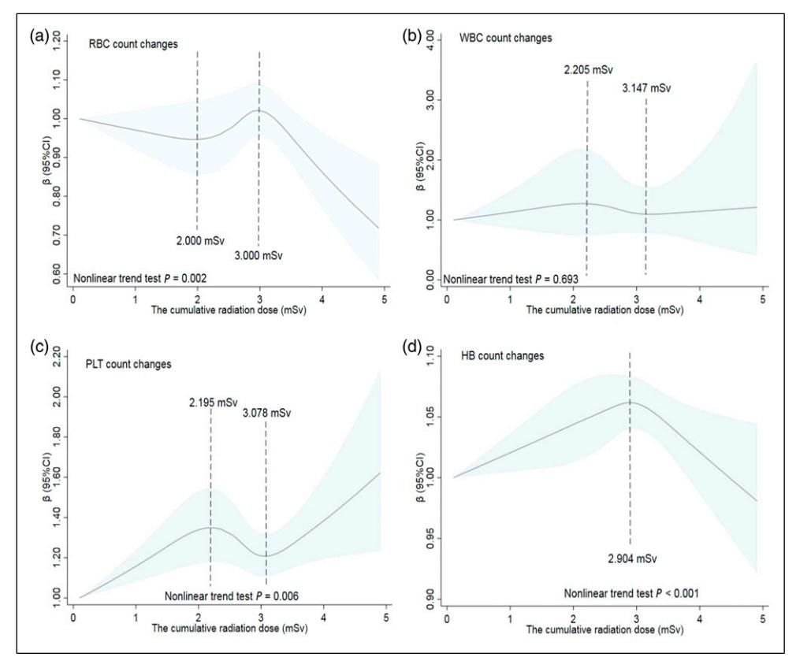

# Dose-Response Effects of Low-Dose Ionizing Radiation on Blood Parameters in Industrial Irradiation Workers

Dose-Response:
An International Journal
April-June 2022:1-9
© The Author(s) 2022
Article reuse guidelines:
sagepub.com/journals-permissions
DOI: 10.1177/15593258221105695
journals.sagepub.com/home/dos

**\$**SAGE

Jia-jia Guo1, Ning Liu1, Zheng Ma2, Zi-jun Gong1, Yue-lang Liang1, Qi Cheng1, Xin-guang Zhong2, and Zhen-jiang Yao1

#### **Abstract**

While previous studies have focused on the health effects of occupational exposure of radiations on medical radiation workers, few have analyzed the dose-response relationship between low radiation doses and changes in blood parameters. Even fewer studies have been conducted on industrial worker populations. Using a prospective cohort study design, this study collected health examination reports and personal dose monitoring data from 705 industrial irradiation workers who underwent regular physical examinations at Dongguan Sixth People's Hospital. The dose-response effects of low-dose ionizing radiation on blood parameters were assessed using a generalized linear model and restricted cubic spline model. Red blood cell counts decreased then increased, before decreasing again with increasing ionizing radiation. This was in contrast to the curve of the total platelet count after irradiation. Additionally, a radiation dose of 2.904 mSv was the turning point for the nonlinear curve of hemoglobin count changes. In conclusion, long-term, low-dose ionizing radiation affects blood cell levels in industrial irradiation workers. There is a nonlinear dose-response relationship between red blood cell, platelet, and hemoglobin counts and the cumulative radiation dose. These findings should alert radiation workers to seek preventive medical treatment before the occurrence of any serious hematopoietic disease.

#### **Keywords**

blood cell count, red blood cell, platelet, hemoglobin, industrial irradiation workers, low-dose ionizing radiation

#### Introduction

Ionizing radiation from accidental exposure or radiotherapy can negatively affect human health by causing thyroid disease, ocular lens damage, cancer induction, hematopoietic system invasion, and leukemia. The human hematopoietic system is highly sensitive to ionizing radiation, damage to the hematopoietic system often occurs early and can have significant effects when ionizing radiation exceeds the body's tolerable dose. Blood cell counts are used to evaluate the effect of ionizing radiation on the hematopoietic system, which is a method widely adopted in the field.

The effect of ionizing radiation on the hematopoietic system of occupational radiation workers has received widespread attention due to the high exposure risk of occupational populations. However, most studies are limited to the qualitative aspects of radiation outcomes or medical radiation workers, with very few studies on the dose-response of low-

Received 4 December 2021; accepted 17 May 2022

#### **Corresponding Author:**

Xin-guang Zhong, The Sixth People's Hospital of Dongguan, Dongguan, Guangdong 532008, China.

Email: zxgcdc@qq.com

Zhen-jiang Yao, School of Public Health, Guangdong Pharmaceutical University, 283 Jianghai Avenue, Haizhu District, Guangzhou 510310, China.

Email: 497345240@qq.com

Department of Epidemiology and Health Statistics, School of Public Health, Guangdong Pharmaceutical University, Guangzhou, China

&lt;sup>2 The Sixth People's Hospital of Dongguan, Dongguan, China

dose ionizing radiation on blood parameters. A prospective cohort study found a significantly increased risk of acute myeloid leukemia and acute lymphoblastic leukemia after exposure to cumulative doses of ionizing radiation of <100 mSv in childhood (age <21 years). Another study reported an association between protracted low-dose radiation exposure and leukemia mortality in radiation-monitored workers (INWORKS).8 Moreover, a study of medical staff found that ionizing radiation increased the rate of micronuclei in peripheral blood lymphocytes and chromosomal aberrations and decreased antioxidants, thereby, increasing the risk of cancer development. 9,10 In the early stage, we confirmed the correlation between the cumulative radiation dose and platelet (PLT) counts among medical radiation workers. 11 Therefore, we conducted this study to explore whether low-dose ionizing radiation exposure is equally related to changes in blood parameters among industrial irradiation workers, as well as whether there is a dose-response relationship between cumulative radiation dose and changes in these blood parameters.

### **Materials and Methods**

# Subjects

This study prospectively analyzed industrial irradiation workers who underwent regular occupational health checkups at the Sixth People's Hospital of Dongguan City from November 2015 to June 2019. This was a population of people who were exposed to ionizing radiation during radioactive occupational activities in industrial irradiation workplaces. Industrial irradiation is mainly used as an effective method for sterilizing items for medical or laboratory purposes. The radiation source can be Cobalt-60, a synthetic radioisotope that emits  $\gamma$ -rays. Alternatively, an electron beam machine produces electrons of high energy (β-rays). All workers worked < 8 h/day, with 2–4 weeks rest per year. Their health status was actively monitored, including blood parameters, other suspected risk factors, and demographic characteristics such as sex, age, length of service, smoking habits, occupation, and follow-up time. The personal dose was monitored passively and the data were stored in the Guangdong Chronic Disease Control Hospital.

We enrolled industrial irradiation workers with a baseline age >18 years who maintained personal dosimeters and did not exceed the occupational exposure limits established by the *International Commission on Radiological Protection* (ICRP)12 during the study period (cumulative individual dose equivalent 0–100 mSv over 5 years). Subjects with a history of hematopoiesis, cancer, recent infection, history of acetylsalicylic acid or antibiotics, pregnancy during the study period, and incomplete clinical and laboratory information were excluded before follow-up.

## Measurement of Cumulative Radiation Dose

Personal dose was monitored and evaluated according to the Methods of Personal Dose Monitoring for Radiation Workers. 12 An FJ-427AI microcomputer thermoluminescent dosimeter was used to detect thermoluminescent dosimeters (TLD)-wafer-LIF (Mg, Cu, and P) as a detector worn on the left chest of the study subject and record the radiation dose. When the workers left the workplace with non-sealed radioactive substances at the end of the operation, they were asked to monitor the radioactive surface contamination of personal body surface, clothing, and protective equipment as required, and address contamination when found and maintain records and files of all such incidents. It was recommended that the annual effective dose for radiation workers should be less than 20 mSv, and the cumulative dose equivalent for individuals should be 0-100 mSv over 5 years. 12

Due to the loss of dose monitoring data for multiple individuals, we used nominal doses of the average dose from the same year in the same occupation to supplement the missing data but excluded subjects with less than one year of service. The cumulative radiation dose was calculated using a job exposure matrix. 13,14 According to the quartile range of cumulative radiation dose, we divided the patients into four exposure dose groups, with the lowest radiation dose group used as the control group.

### Measurement of Blood Parameters

All study participants underwent regular occupational health examinations, including blood sample collection. Blood samples were collected at least twice during the study period for each participant, and the interval between samples did not exceed 2 years. The study subjects were seated quietly and kept comfortable during the physical examination by an experienced and uniformly trained laboratory physician of the hospital. Their blood samples (1–2 mL) were collected in an EDTA anticoagulated blood collection tube and the time and volume of the blood drawn was recorded. These samples were then sent for examination.

We collected hematological parameter data, including red blood cell (RBC), white blood cell (WBC), PLT, and hemoglobin (HB) counts using an automatic blood cell analyzer. The scope of blood routine analysis referred to the following standards, RBCs were calculated as:  $4.0-5.8\times10^{12}/L$  in men and  $3.5-5.1\times10^{12}/L$  in women; HB was 120-175 g/L in men and 110-150 g/L in women; WBC and PLT counts, regardless of sex, were calculated from the reference:  $4.0-9.5\times10^9/L$  and  $100-350\times10^9/L$ , respectively. The peripheral blood test is a necessary component of occupational health examination; therefore, the test results are uniform, highly sensitive, and rarely missed.

# Statistical Analyses

Blood parameters and individual dose monitoring data were collected and their relationship was analyzed using the Stata 16.1 statistical software. The mean  $\pm$  standard deviation ( $\bar{x} \pm s$ ) was used to describe the quantitative normal data, while the median and quartile (M(IQR)) was used to describe the nonnormal data. Comparisons between 2 groups were conducted using a two-sided Student's t-test; those between three or more groups were assessed using one-way analysis of variance. If the variances were unequal, a nonparametric test was used. With hematological parameters as dependent variables and continuously varying cumulative radiation doses as independent variables, generalized linear models were used to analyze correlates when the results from the dose group and hematological parameters were nonlinear. After adjusting for significant single factor variables such as sex, baseline age, length of service, and smoking habit, the restricted cubic spline model at the 1st, 25th, 50th, 75th, and 95th percentiles was used to analyze the dose-response relationship. 15,16 A two-sided significance level of .05 was adopted in all analyses.

#### **Results**

# Study Population Characteristics

In total, 705 industrial irradiation workers (498 men and 207 women) were enrolled in this study. The mean follow-up time was  $1.51 \pm .61$  years, the median age at baseline was 29 years

with a range of 25–33 years, and the length of service at baseline was 2.13 years with a range of 1.19–3.56 years. The workers were predominantly male (70.64%) and mostly nonsmokers (64.96%). The cumulative radiation dose range was .101–4.908 mSv for the participant cohort, which was divided into four groups according to the quartile range. 11,17,18 Thus, the groups were: .101–1.417 mSv, 1.417–2.585 mSv, 2.585–2.903 mSv, and 2.903–4.908 mSv.

Tables 1 and 2 summarize the blood parameters characteristics of the study population at the time of study entry. The differences in the distribution of RBC, WBC, and HB counts across sex, age, length of service, and smoking habits in the test population were not statistically significant (P > .05). Although RBC counts decreased more in women than in men, WBC counts decreased more rapidly in workers with >1 year of service than in those with 0-1 year of service. Moreover, the increase in HB counts was greater in smokers than in nonsmokers. The distribution of PLT counts among different baseline ages was statistically significant (P < .05), with the highest change of 12.20  $(-9.90-30.90) \times 10^{9}/L$  observed in the 25–30 years age group, while the lowest change of .95 (-15.85-24.90) × 109/L observed in the <25 years age group. In addition, changes in blood cell counts were significantly different between the cumulative radiation dose groups, except for WBCs (P < .05). As radiation dose increased, changes in both PLT and HB counts decreased first and then increased. In the four dose groups, PLT and HB counts showed the

Table I. Characteristics of Red Blood Cell and White Blood Cell Counts in Radiation Workers (M(IQR)).

| Variable                  | Grouping    | All (n = 705)            | Changes in the Peripheral Complete Blood Count |                       |                |                             |                       |       |  |
|---------------------------|-------------|--------------------------|------------------------------------------------|-----------------------|----------------|-----------------------------|-----------------------|-------|--|
|                           |             |                          | RBC (10 12 /L)                      | t/F/Z/χ 2a | P a | WBC (10 9 /L)    | t/F/Z/χ 2b | $P^b$ |  |
| Sex                       | Male        | 498 (70.64)              | .00 (1620)                                     | -1.301                | .194           | I0 (8060)                   | -I.440                | .150  |  |
|                           | Female      | 207 (29.36)              | 02 (17 <del>-</del> .13)                       |                       |                | 30 (-1.10 <del>-</del> .70) |                       |       |  |
| Baseline age (years)      | <25         | 160 (22.70)              | .01 (1419)                                     | .860                  | .459           | $20 \ (-1.0080)$            | .059                  | .996  |  |
| <b>3 u</b> ,              | 25-30       | 255 (36.17)              | .00 (1619)                                     |                       |                | 20(-1.0070)                 |                       |       |  |
|                           | 30-35       | 151 (21. <del>4</del> 2) | 02 (1915)                                      |                       |                | 10 (8060) ^      |                       |       |  |
|                           | >35         | 139 (19.72)              | 02 (1722)                                      |                       |                | 20 (8050)                   |                       |       |  |
| Length of service (years) | 0-1         | 137 (19.43)              | 03 (1813)                                      | .870                  | .458           | 04 (8580)                   | 1.190                 | .312  |  |
| Ç ,                       | 1-2         | 190 (26.95)              | 02 (1719)                                      |                       |                | 20 (-1.0070)                |                       |       |  |
|                           | 2-4         | 221 (31.35)              | .02 (1518)                                     |                       |                | 20 (-1.0060)                |                       |       |  |
|                           | >4          | 157 (22.27)              | 01(1321)                                       |                       |                | 19 (9050) °      |                       |       |  |
| Smoking habits            | Yes         | 247 (35.04)              | .02 (1422)                                     | <b>989</b>            | .323           | 10 (8070)                   | -1.263                | .207  |  |
|                           | No          | 458 (64.96)              | 02 (1717)                                      |                       |                | 20 (9060)                   |                       |       |  |
| Cumulative dose (mSv)     | .101-1.417  | 159 (22.55)              | .04 (1623)                                     | 4.100                 | .007*          | 20 (-I.0060)                | .350                  | .788  |  |
|                           | 1.417-2.585 | 236 (33.48)              | 04 (20 <del>-</del> .14)                       |                       |                | 24 (90 <del>-</del> .63)    |                       |       |  |
|                           | 2.585-2.903 | 194 (27.52)              | .02 (1022)                                     |                       |                | 10 (90 <del>-</del> .70)    |                       |       |  |
|                           | 2.903-4.908 | 116 (16.45)              | 02 (18 <del>-</del> .16)                       |                       |                | 10 ( <del>9</del> 070)      |                       |       |  |

Note: "\*" = P < .05.

&quot;t" = the statistical value of the Student's t-test; "F" = the statistical value of one-way analysis of variance; "Z" = the statistical value of the rank-sum test; " $\chi^2$ " = the statistical value of the Kruskal-Wallis test; "a" = Red blood cell characteristics of the study population; "b"=White blood cells characteristics of the study population.

**Table 2.** Characteristics of Platelet and Hemoglobin Counts in Radiation Workers (M(IQR)).

|                           |                                                         |                                                          | Changes in the Peripheral Complete Blood Count                                           |                                  |        |                                                                                 |                                  |                |  |
|---------------------------|---------------------------------------------------------|----------------------------------------------------------|------------------------------------------------------------------------------------------|----------------------------------|--------|---------------------------------------------------------------------------------|----------------------------------|----------------|--|
| Variable                  | Grouping                                                | All (n = 705)                                            | PLT (10 9 /L)                                                                 | t/F/Z/χ 2c | P°     | HB (g/L)                                                                        | t/F/Z/χ 2d | P d |  |
| Sex                       | Male Female                                          | 498 (70.64) 207 (29.36)                               | 9.15 (-10.10-28.10) 6.60 (-14.20-30.90)                                               | 397                              | .691   | 1.60 (-3.30-6.90) .40 (-4.30-5.60)                                           | −I.732                           | .083           |  |
| Baseline age (years)      | <25 25–30 30–35 >35                            | 160 (22.70) 255 (36.17) 151 (21.42) 139 (19.72) | .95 (-15.85-24.90) 12.20 (-9.90-30.90) 7.50 (-8.40-31.00) 8.40 (-6.90-26.70)    | 2.870                            | .036*  | .30 (-3.80-5.40) 1.30 (-4.10-6.80) .60 (-4.30-6.90) 2.50 (-2.60-7.10)  | 3.581                            | .310           |  |
| Length of service (years) | 0-I I-2 2-4 >4                                 | 137 (19.43) 190 (26.95) 221 (31.35) 157 (22.27) | 7.30 (-9.70-26.50) 10.30 (-11.00-29.90) 6.70 (-16.50-30.20) 10.50 (-6.60-26.20) | 1.040                            | .375   | 1.70 (-3.70-6.90) 2.00 (-3.70-6.90) .80 (-4.70-6.20) 1.00 (-2.70-6.60) | .770                             | .511           |  |
| Smoking habits            | Yes No                                               | 247 (35.04) 458 (64.96)                               | 11.90 (-10.70-28.30)                                                                     | 159                              | .874   | 2.50 (-2.20-6.70) .55 (-4.20-6.30)                                           | -I.606                           | .109           |  |
| Cumulative dose (mSv)     | .101–1.417 1.417–2.585 2.585–2.903 2.903–4.908 | 159 (22.55) 236 (33.48) 194 (27.52) 116 (16.45) | -6.20 (-26.30-15.20) 12.45 (-6.60-28.15) 12.85 (-7.30-31.00) 9.45 (-4.10-33.75) | 12.620                           | <.001* | -1.20 (-6.30-4.30) .20 (-4.10-5.30) 4.30 (60-9.30) .30 (-3.80-5.90)    | 15.000                           | <.001*         |  |

Note: "\*" = P < .05.

most change in the 2.585–2.903 mSv dose group, with 12.85 (-7.30–31.00) ×  $10^9$ /L and 3.60 (-.60–9.30) ×  $10^9$ /L, respectively.

# Correlation of Blood Cell Count with Cumulative Radiation Dose

A generalized linear model was used to evaluate the correlation of blood cell count with cumulative radiation dose. Analysis of PLT counts in the low radiation exposure group was adjusted for confounding factors such as sex, baseline age, length of service, and smoking habits. Using the lowest dose group .100–1.417 mSv as a control, the results showed no difference in the in RBC counts among 2.585–2.903 mSv group and 2.903-4.908 mSv group except for the 1.417-2.585 mSv group. Industrial irradiation workers exposed to 1.417–2.585 mSv doses presented RBC counts ( $\beta = -.067$ , 95% CI: -.119–.015, P < .05) that were significantly lower than those in the control group exposed to .101–1.417 mSv. We did observe a statistical difference between the changes in PLT counts (P < .05). The change in PLT counts for each dose group was  $\beta = 15.932, 95\%$  CI: 8.929–22.934 for the 1.417-2.585 mSv group,  $\beta = 17.195, 95\%$  CI: 9.973-24.417for the 2.585–2.903 mSv group, and  $\beta$  = 21.062, 95% CI: 12.821–29.303 for the 2.903–4.908 mSv group. In addition, the HB counts between the dose groups were statistically significant and first increased and then decreased as dose exposure increased. The 1.417-2.585 mSv dose group was 5.383 times (95% CI: 3.732–7.034) higher than that in the lowest dose group, and the 2.903-4.908 mSv dose group was 1.922 times (95% CI: .037-3.806) higher than that in the control group. Table 3 summarizes the findings from these analyses.

# Dose-Response Relationship between Cumulative Radiation Dose and Tested Blood Parameters

After adjusting for univariate meaningful variables (P <.05), such as age when analyzing changes in PLT counts. A restricted cubic spline model with 5 nodes at the 1st, 25th, 50th, 75th, and 95th percentiles of cumulative dose was selected for analysis. The results in Figure 1 show that there was a nonlinear dose-response relationship between the cumulative radiation dose and blood cell counts for all industrial irradiation workers. The changes in RBC counts initially decreased, then increased, and finally decreased with increasing cumulative effective dose; it appeared as a wavy correlation (P = .002; Figure 1(a)). Doses of 2.000 mSv and 3.000 mSv were the two inflection points of RBC count changes. Figures 1(b) and (c) show a nonlinear dose-response relationship between the cumulative radiation dose and changes in WBC and PLT counts, even though the nonlinear trend was statistically significant for PLT (P = .006) but not for WBC (P = .693). Changes in PLT counts showed an upward trend in the dose groups <2.195 mSv and >3.078 mSv, and a downward trend in the range of 2.195-3.078 mSv. Additionally, the change in the HB counts in all industrial irradiation workers peaked at a

&quot;t" = the statistical value of the Student's t-test; "F" = the statistical value of one-way analysis of variance; "Z" = the statistical value of the rank-sum test; "z" = the statistical value of the Kruskal-Wallis test; "c" = Platelets characteristics of the study population; "d" = Hemoglobin characteristics of the study population.

Table 3. A Generalized Linear Model for the Multiple Factor Analysis of Blood Cell Count Changes in 705 Radiation Workers.

| Blood Parameter          | Variable        | Grouping        | SE    | Z      | Р      | β      | 95% CI          |  |
|--------------------------|-----------------|-----------------|-------|--------|--------|--------|-----------------|--|
| RBC (10 9 /L) | Cumulative dose | .101–1.417 mSv  |       |        |        |        | Reference       |  |
| , ,                      |                 | 1.417-2.585 mSv | .027  | -2.520 | .012*  | 067    | <b>119015</b>   |  |
|                          |                 | 2.585-2.903 mSv | .028  | .340   | .733   | .009   | 045– $.064$     |  |
|                          |                 | 2.903-4.908 mSv | .032  | -1.660 | .098   | 052    | 11 <b>4</b> 010 |  |
| PLT (10 9 /L) | Age (years)     | <25             |       |        |        |        | Reference       |  |
|                          | <b>3 4</b> ,    | 25-30           | 3.472 | 1.680  | .094   | 5.822  | 982 - 12.626    |  |
|                          |                 | 30–35           | 3.918 | 1.270  | .204   | 4.976  | -2.703-12.657   |  |
|                          |                 | >35             | 4.031 | 1.850  | .065   | 7.447  | 454-15.349      |  |
|                          | Cumulative dose | .101-1.417 mSv  |       |        |        |        | Reference       |  |
|                          |                 | 1.417-2.585 mSv | 3.573 | 4.460  | <.001* | 15.932 | 8.929-22.934    |  |
|                          |                 | 2.585-2.903 mSv | 3.685 | 4.670  | <.001* | 17.195 | 9.973-24.417    |  |
|                          |                 | 2.903-4.908 mSv | 4.205 | 5.010  | <.001* | 21.062 | 12.821-29.303   |  |
| HB (g/L)                 | Cumulative dose | 0.101-1.417 mSv |       |        |        |        | Reference       |  |
| (6 )                     |                 | 1.417-2.585 mSv | .808  | 2.080  | <.037* | 1.681  | .098-3.264      |  |
|                          |                 | 2.585-2.903 mSv | .842  | 6.390  | <.001* | 5.383  | 3.732-7.034     |  |
|                          |                 | 2.903-4.908 mSv | .962  | 2.000  | <.046* | 1.922  | .037–3.806      |  |

Note: "\*" indicates P < .05.

**Figure 1.** The restricted cubic spline model of dose-response relationship between the cumulative effective ionizing radiation dose and blood cell counts of industrial irradiation workers. The solid line represents the generalized linear model value and the shading indicates the 95% confidence intervals for the changes in (a) red blood cell, (b) white blood cell, (c) platelet, and (d) hemoglobin counts.

radiation dose of 2.904 mSv (Figure 1(d)). The overall curve was positively correlated in a dose range <2.904 mSv and negatively correlated in a dose range

>2.904 mSv; the nonlinear trend test of the dose-response curve for changes in HB counts was statistically significant (P < .001).

# Discussion

# Effect of Ionizing Radiation on Industrial Irradiation worker Blood Parameters

Occupational radiation injury is characterized by hematopoietic tissue injury, in which abnormalities in WBC, RBC, and PLT counts are common.[19](#page-7-15) Indeed, different degrees of changes in the blood cells of industrially irradiated workers exposed to different doses of ionizing radiation in this study. Hematopoietic syndrome has been observed in both animals and humans after whole-body radiation,[20](#page-7-16) including hematopoietic syndrome caused by myelodysplastic diseases and chronic myeloid leukemia.[21](#page-7-17)[,22](#page-7-18) A study on peripheral blood cells of nuclear power workers showed that the total number of WBC, neutrophils (NE), lymphocytes (LY), and HB in the ionizing radiation group was significantly lower than that in the non-exposed group (P < .05).[23](#page-7-19) Taqi et al. reported that long-term exposure to X-rays in diagnostic radiographers reduced the mean volume of neutrophils, monocytes, and erythrocytes and increased erythrocyte, HB, and erythrocyte pressure products.[24](#page-8-0) Moreover, studies from Iran showed that the differences in RBC and WBC counts from radiation workers before and after exposure were statistically significant, whereas that in PLT counts was not.[25](#page-8-1) In general, although epidemiological and experimental data are limited, many studies have shown that ionizing radiation damages the hematopoietic system and alters hematological parameters, which is consistent with the results of our study.[26](#page-8-2)

# Effects of Cumulative Radiation Dose and Other Factors on Blood Parameters

As shown in [Tables 1](#page-2-0)–[3,](#page-4-0) the RBC, PLT, and HB counts in the cumulative dose groups were significantly different from one another (P < .05), with sex, age, length of service, and smoking habits showing different degrees of influence on the blood parameters. The RBC counts in this study initially decreased, then increased, and further decreased again in response to the cumulative radiation range. Mature erythroid progenitor cells in the bone marrow are extremely sensitive to radiation damage and can lead to extensive red cell death.[27](#page-8-3) Previous studies have reported that after total body irradiation, the erythrocyte count in mice first decreased and then recovered,[28,](#page-8-4)[29](#page-8-5) which was consistent with our findings in industrial workers exposed to low-dose ionizing radiation. After the inclusion of univariate meaningful confounding factors, PLT and HB counts first increased and then decreased with increasing radiation dose. This was due to long-term low-dose ionizing radiation exposure, which led to hematopoietic tissue damage in radiation workers. Not only is the number of hematopoietic stem cells reduced but also the function of proliferation impaired.[30](#page-8-6) The study of the hematological response model reported that[31,](#page-8-7)[32](#page-8-8) long-term low-dose ionizing radiation can inhibit hematopoiesis, suggesting that only a few years of exposure can affect hematological parameters. In general, RBC status and the amount of HB are affected by sex.[33,](#page-8-9)[34](#page-8-10) In this study, the blood counts in males were generally higher than those in females; however, these differences were not significant (P > .05). A study from the National Institute of Radiological Protection of the Chinese Center for Disease Control and Prevention found that age can affect RBC counts, with people over 40 having significantly fewer RBCs than those under 40.[35](#page-8-11) We found that the length of service had no significant effect on blood cell count (P > .05) in industrial radiation workers, suggesting that the change in peripheral hemogram results was not obvious among different worker age groups. This may be due to the adaptive response of radiation workers over time or the biological effects of dynamic changes in cell damage and repair and was consistent with the reports of some scholars both at home and abroad.[36](#page-8-12)-[38](#page-8-13) Some studies have reported that cigarette smoke can have acute effects on endothelial cells, PLT and leukocyte function, and vessel wall damage.[39](#page-8-14),[40](#page-8-15) Conversely, we found no statistical differences in blood cell count among industrial irradiation workers with different smoking habits in this study. Differences between study findings may be related to the sample size; however, further research is needed to confirm if this is the case. It is also worth mentioning that the results of the Tangshan study showed that the type and dose of radiation the radiation workers were exposed to differed among different job types, as did the blood profiles.[41](#page-8-16) This suggests that we can explore the correlation between the type of work and the health of radiation workers in the future. Thus, the peripheral blood profiles of workers exposed to long-term low-dose ionizing radiation may be affected by a variety of factors, consistent with the human epidemiological and clinical findings that low-dose ionizing radiation and individual health effects are influenced by demographics, genetics, radiation components, sources, lifestyle, and other environmental exposures.[26](#page-8-2)

# Dose-Response Relationship between Changes in Blood Parameters and Cumulative Radiation Dose

Overall, the RBC, PLT, and HB levels of industrial irradiation workers were related to the cumulative radiation dose, with multivariate analysis supporting this relationship. This finding was consistent with that of our previous study on medical radiation workers[11](#page-7-7); the RBC count peaked at a radiation dose of 2.000 mSv and then started to decrease at 3.000 mSv [\(Figure 1A](#page-4-1)). A study on mice found that erythrocyte number significantly decreased after gamma radiation at different doses (2.5 and 5.0 Gy) and the recovery from the radioactivity began on day 7; however, it did not return to normal values even by the end of the experiment.[42](#page-8-17) Dose-response studies in bone marrow have

shown that erythroid progenitor cells are highly sensitive to radiation. One of the major systemic effects leading to radiation lethality includes the inhibitory effect of radiation on hematopoiesis, which is observed at doses as low as 1‒ 2 Gy.[43](#page-8-18) The restricted cubic spline models showed that the changes in WBC and PLT counts were nonlinear; they initially increased, then decreased, and further increased as the cumulative radiation dose increased ([Figure 1B and 1C](#page-4-1)). The first increase may be a stress response, with the subsequent decrease an adaptive compensatory response in industrial workers who have been exposed to low but longterm doses of radiation. The final observed increase may be a precursor of blood cell release or refractory diseases such as chronic granulocytic leukemia. Otsuka et al. showed that bone marrow cells, erythrocytes, and PLTs in mice that were pre-irradiated with a low dose of X rays recovered earlier after stimulated irradiation than those in irradiated mice alone, but no leukocytes were observed. This study suggested that low-dose pre-irradiation triggered differentiation toward bone marrow hematopoiesis with significant proliferation of hematopoietic progenitor cells and corresponding bone marrow cells, as well as increased numbers of RBCs and PLT in peripheral blood profiles.[44](#page-8-19) Another study conducted in CD2F1 mice showed that after wholebody irradiation with 3–5 Gy of γ-rays, blood cell counts decreased, and remained below the baseline for 28‒42 days. Early multipotential progenitor cells in the bone marrow of mice were more sensitive to low-dose irradiation than spleen and thymus cells, and hematopoietic cell injury was induced by whole-body irradiation (.5 Gy) from day 1 until the end of our research (e.g., day 42 after radiation). Radiation-induced decreases in bone marrow stem cell factors and increases in circulating pro-inflammatory factors in mice may be responsible for the enhanced sensitivity in hematopoietic progenitor cells to radiation.[45](#page-8-20) Additionally, RBC and HB counts were shown to be more sensitive to low-dose ionizing radiation than WBC counts.[46](#page-8-21) However, with the increase of the cumulative dose, the counts of radiologists such as RBC, WBC, PLT, and HB were significantly decreased, which was partially different from our study.[41](#page-8-16) Overall, changes in RBC counts occurred earliest, with a typical turning point at a radiation dose of 2.000 mSv, which was well below the ICRP limit.[12](#page-7-8) This result prompted us to focus on how the lowest range of radiation doses affects blood profiles.

Few studies have examined the dose-response relationship between low-dose ionizing radiation and hematological parameters in industrial irradiation workers. Moreover, the most informative low-dose radiation studies to date have provided little evidence of a relationship between mortality from non-malignant diseases and radiation exposure doses.[47](#page-8-22) A study from Japan[48](#page-8-23) found a nonlinear dose-response relationship between radiation dose and leukemia with the risk of overdose persisting 55 years after radiation exposure, especially in patients with acute myeloid leukemia. In addition, other studies have shown that occupational exposure in nuclear industry workers, radioactive researchers, and airline flight personnel amongst others can induce cancer.[49](#page-8-24) Therefore, there are many areas where the biological effects of low-dose ionizing radiation deserve further study.[50](#page-8-25)

# Strengths and Limitations

This study is a prospective cohort study using microcomputerized pyroelectric dosimeters worn on the workers' chests to record accurate individual radiation doses. We relied on occupational health examinations of workers who were eligible for free special medical services; therefore, there was little selection bias. Furthermore, experimental blood collection and testing operations were performed by professional physicians according to strict standards, reducing the occurrence of random or significant errors. Finally, the individual dose monitoring data of the cohort lifestyle and sociodemographic factors, including special confounding factors, were recorded at the Guangdong Chronic Disease Control Hospital.

Our study has some limitations. For example, the analysis of confounding factors was incomplete and lacked information on medications, socioeconomic status, exercise, and other environmental exposures that could lead to underestimation or overestimation of the correlation of lowdose radiation and blood cell levels. Furthermore, lagged effects due to early occupational exposure could alter hematological parameters; however, these effects were expected to be very small. The sample size of this study was not large due to geographical and temporal limitations, and additional subjects could be included in the future to validate the results of this study.

# Conclusions

Long-term occupational exposure to low-dose radiation affects blood cell levels of industrially irradiated workers, with RBC, PLT, and HB counts showing varying degrees of nonlinear changes as the cumulative radiation dose increases. This study suggests that hematological parameters could function as biomarkers for sensitivity to low-dose ionizing radiation. In addition, understanding the doseresponse relationship between radiation dose and blood cell count alerts workers to seek preventive medical care before the development of serious hematopoietic disorders. Moreover, the relevant departments whose workers are exposed to ionizing radiation should develop further standardized radiation protection requirements, improve equipment, and improve the working environment.

#### Acknowledgments

The authors are grateful to all the study participants.

# Declaration of Conflicting Interests

The author(s) declared no potential conflicts of interest with respect to the research, authorship, and/or publication of this article.

#### Funding

The author(s) received no financial support for the research, authorship, and/or publication of this article.

## Ethics Approval and Consent to Participate

All participants provided informed consent for inclusion before participating in the study, which was conducted in accordance with the Declaration of Helsinki, and the protocol was approved by the Ethics Committee of the Sixth People's Hospital of Dongguan City (No. Z2020-006).

#### ORCID iD

Jia-jia Guo <https://orcid.org/0000-0001-8056-9181> Zhen-jiang Yao <https://orcid.org/0000-0002-2156-7896>

#### References

- 1. Behjati S, Gundem G, Wedge DC, et al. Mutational signatures of ionizing radiation in second malignancies. Nat Commun. 2016; 7:12605.
- 2. Grant EJ, Cologne JB, Sharp GB, et al. Bioavailable serum estradiol may alter radiation risk of postmenopausal breast cancer: A nested case-control study. Int J Rad Biol. 2018;94(2): 97-105.
- 3. Hong JY, Han K, Jung JH, Kim JS. Association of exposure to diagnostic low-dose ionizing radiation with risk of cancer among youths in South Korea. JAMA Netw Open. 2019;2(9): e1910584.
- 4. Richardson DB, Cardis E, Daniels RD, et al. Site-specific solid cancer mortality after exposure to ionizing radiation: A cohort ttudy of workers (INWORKS). Epidemiol. 2018; 29(1):31-40.
- 5. Seo S, Lee D, Seong KM, et al. Radiation-related occupational cancer and its recognition criteria in South Korea. Ann Occup Environ Med. 2018;30:9.
- 6. Brown KR, Rzucidlo E. Acute and chronic radiation injury. J Vasc Surg. 2011;53(1 Suppl):15s-21s.
- 7. Little MP, Wakeford R, Borrego D, et al. Leukaemia and myeloid malignancy among people exposed to low doses (<100 mSv) of ionising radiation during childhood: A pooled analysis of nine historical cohort studies. Lancet Haematol. 2018;5(8): e346-e358.
- 8. Leuraud K, Richardson DB, Cardis E, et al. Ionising radiation and risk of death from leukaemia and lymphoma in radiationmonitored workers (INWORKS): An international cohort study. Lancet Haematol. 2015;2(7):e276-281.
- 9. Siama Z, Zosang-Zuali M, Vanlalruati A, Jagetia GC, Pau KS, Kumar NS. Chronic low dose exposure of hospital workers to ionizing radiation leads to increased micronuclei frequency and

- reduced antioxidants in their peripheral blood lymphocytes. Int J Radiat Biol. 2019;95(6):697-709.
- 10. Saberi A, Salari E, Latifi SM. Cytogenetic analysis in lymphocytes from radiation workers exposed to low level of ionizing radiation in radiotherapy, CT-scan and angiocardiography units. Mutat Res. 2013;750(1-2):92-95.
- 11. Liu N, Peng Y, Zhong X, et al. Effects of exposure to low-dose ionizing radiation on changing platelets: A prospective cohort study. Environ Health Prev Med. 2021;26(1):14.
- 12. ICRP Publication 105. Radiation protection in medicine. Ann ICRP. 2007;37(6):1-63.
- 13. Choi S, Kang D, Park D, Lee H, Choi B. Developing asbestos job exposure matrix using occupation and industry specific exposure data (1984-2008) in Republic of Korea. Saf Health Work. 2017;8(1):105-115.
- 14. Ilar A, Klareskog L, Saevarsdottir S, et al. Occupational exposure to asbestos and silica and risk of developing rheumatoid arthritis: Findings from a Swedish population-based casecontrol study. RMD Open. 2019;5(2):e000978.
- 15. Lee DH, Keum N, Hu FB, et al. Predicted lean body mass, fat mass, and all cause and cause specific mortality in men: Prospective US cohort study. BMJ. 2018;362:k2575.
- 16. Bhaskaran K, Dos-Santos-Silva I, Leon DA, Douglas IJ, Smeeth L. Association of BMI with overall and cause-specific mortality: A population-based cohort study of 36 million adults in the UK. Lancet Diabetes Endocrinol. 2018;6(12): 944-953.
- 17. Fil`ı M, Trocme E, Herrspiegel C, Seregard S, Stalhammar G. Effect of plaque brachytherapy dose and dose rate on risk for disease-related mortality in 1238 patients with choroidal melanoma. Br J Ophthalmol. 2021;105(1):57-62.
- 18. Ohira T, Shimura H, Hayashi F, et al. Absorbed radiation doses in the thyroid as estimated by UNSCEAR and subsequent risk of childhood thyroid cancer following the Great East Japan Earthquake. J Radiat Res. 2020;61(2):243-248.
- 19. Suryavanshi S, Sharma D, Checker R, et al. Amelioration of radiation-induced hematopoietic syndrome by an antioxidant chlorophyllin through increased stem cell activity and modulation of hematopoiesis. Free Radic Biol Med. 2015;85: 56-70.
- 20. Billings PC, Romero-Weaver AL, Kennedy AR. Effect of gender on the radiation sensitivity of murine blood cells. Gravit Space Res. 2014;2(1):25-31.
- 21. Gault N, Verbiest T, Badie C, Romeo PH, Bouffler S. Hematopoietic stem and progenitor cell responses to low radiation doses - implications for leukemia risk. Int J Rad Biol. 2019; 95(7):892-899.
- 22. Radivoyevitch T, Sachs RK, Gale RP, et al. Defining AML and MDS second cancer risk dynamics after diagnoses of first cancers treated or not with radiation. Leukemia. 2016;30(2): 285-294.
- 23. Su YW, Wang JY, Zhang Y, et al. Effect of low dose ionizing radiation on peripheral blood cells of radiation workers in nuclear power industry. Zhonghua Lao Dong Wei sheng Zhi Ye Bing Za Zhi. 2020;38(8):633-635. [In Chinese].

24. Taqi AH, Faraj KA, Zaynal SA. The effect of long-term X-ray exposure on human lymphocyte. J Biomed Phys Eng. 2019;9(1): 127-132.

- 25. Hosseinabadi MB, Khanjani N, Samaei SE, Nazarkhani F. Effect of long-term occupational exposure to extremely low-frequency electromagnetic fields on proinflammatory cytokine and hematological parameters. Int J Rad Biol. 2019;95(11):1573-1580.
- 26. Tang FR, Loganovsky K. Low dose or low dose rate ionizing radiation-induced health effect in the human. J Environ Radioact. 2018;192:32-47.
- 27. Peslak SA, Wenger J, Bemis JC, et al. Sublethal radiation injury uncovers a functional transition during erythroid maturation. Exp Hematol. 2011;39(4):434-445.
- 28. Ben-Ishay Z, Yoffey JM. Ultrastructural studies of erythroblastic islands of rat bone marrow. 3. Effects of sublethal irradiation. Lab Invest. 1974;30(3):320-332.
- 29. Imai Y, Nakao I. In vivo radiosensitivity and recovery pattern of the hematopoietic precursor cells and stem cells in mouse bone marrow. Exp Hematol. 1987;15(8):890-895.
- 30. Shao L, Luo Y, Zhou D. Hematopoietic stem cell injury induced by ionizing radiation. Antioxid Redox Signal. 2014;20(9): 1447-1462.
- 31. Akushevich IV, Veremeyeva GA, Dimov GP, et al. Modeling hematopoietic system response caused by chronic exposure to ionizing radiation. Rad Environ Biophys. 2011;50(2):299-311.
- 32. Akushevich IV, Veremeyeva GA, Dimov GP, et al. Modeling deterministic effects in hematopoietic system caused by chronic exposure to ionizing radiation in large human cohorts. Health Phys. 2010;99(3):322-329.
- 33. Grau M, Cremer JM, Schmeichel S, Kunkel M, Bloch W. Comparisons of blood parameters, red blood cell deformability and circulating nitric oxide between males and females considering hormonal contraception: A longitudinal gender study. Front Physiol. 2018;9:1835.
- 34. Kobayashi T, Shiba T, Kinoshita A, Matsumoto T, Hori Y. The influences of gender and aging on optic nerve head microcirculation in healthy adults. Sci Rep. 2019;9(1):15636.
- 35. Tian XL, Lu X, Lyu YM, Zhao H, Liu QJ, Tian M. Analysis of red blood cells and their components in medical workers with occupational exposure to low-dose ionizing radiation. Dose Response. 2022;20(1):1–9.
- 36. Attar M, Molaie Kondolousy Y, Khansari N. Effect of high dose natural ionizing radiation on the immune system of the exposed residents of Ramsar Town, Iran. Iran J Allergy Asthma Immunol. 2007;6(2):73-78.
- 37. Li K, Chen Y, Li X, et al. Alteration of cytokine profiles in uranium miners exposed to long-term low dose ionizing radiation. Sci World J 2014;2014:216408.

- 38. Hrycek A, Czernecka-Micinska A, K ´ łucinski P, Badowski R. ´ Peripheral blood lymphocytes and selected serum interleukins in workers operating X-ray equipment. Toxicol Lett. 2002;132(2): 101-107.
- 39. Mobarrez F, Antoniewicz L, Bosson JA, Kuhl J, Pisetsky DS, Lundback M. The effects of smoking on levels of endothelial progenitor cells and microparticles in the blood of healthy volunteers. PLoS One. 2014;9(2):e90314.
- 40. Antoniewicz L, Bosson JA, Kuhl J, et al. Electronic cigarettes increase endothelial progenitor cells in the blood of healthy volunteers. Atherosclerosis 2016;255:179-185.
- 41. Qian QZ, Cao XK, Liu HY, et al. Analysis of hemogram of radiation workers in Tangshan, China. J Clin Lab Anal. 2016; 30(5):682-688.
- 42. Nimker S, Sharma K, Saraswathy R, Chandna S. Delineating the effects of ionizing radiation on erythropoietic lineageimplications for radiation biodosimetry. Health Phys. 2019; 116(5):677-693.
- 43. Ploemacher RE, van Os R, van Beurden CA, Down J. Murine haemopoietic stem cells with long-term engraftment and marrow repopulating ability are more resistant to gamma-radiation than are spleen colony forming cells. Int J Rad Biol. 1992;61(4): 489-499.
- 44. Otsuka K, Koana T, Tomita M, Ogata H, Tauchi H. Rapid myeloid recovery as a possible mechanism of whole-body radioadaptive response. Rad Res. 2008;170(3):307-315.
- 45. Li X, Cui W, Hull L, Smith JT, Kiang JG, Xiao M. Effects of low-to-moderate doses of gamma radiation on mouse hematopoietic system. Rad Res. 2018;190(6):612-622.
- 46. Heydarheydari S, Haghparast A, Eivazi MT. A novel biological dosimetry method for monitoring occupational radiation exposure in diagnostic and therapeutic wards: From radiation dosimetry to biological effects. J Biomed Phys Eng. 2016;6(1): 21-26.
- 47. Vrijheid M, Cardis E, Ashmore P, et al. Mortality from diseases other than cancer following low doses of ionizing radiation: Results from the 15-country study of nuclear industry workers. Int J Epidemiol. 2007;36(5):1126-1135.
- 48. Hsu WL, Preston DL, Soda M, et al. The incidence of leukemia, lymphoma and multiple myeloma among atomic bomb survivors: 1950-2001. Rad Res. 2013;179(3):361-382.
- 49. Brenner DJ, Doll R, Goodhead DT, et al. Cancer risks attributable to low doses of ionizing radiation: Assessing what we really know. Proc Nat Acad Sci USA. 2003;100(24): 13761-13766.
- 50. Vaiserman A, Koliada A, Zabuga O, Socol Y. Health impacts of low-dose ionizing radiation: Current scientific debates and regulatory issues. Dose Response. 2018;16(3):1–27.