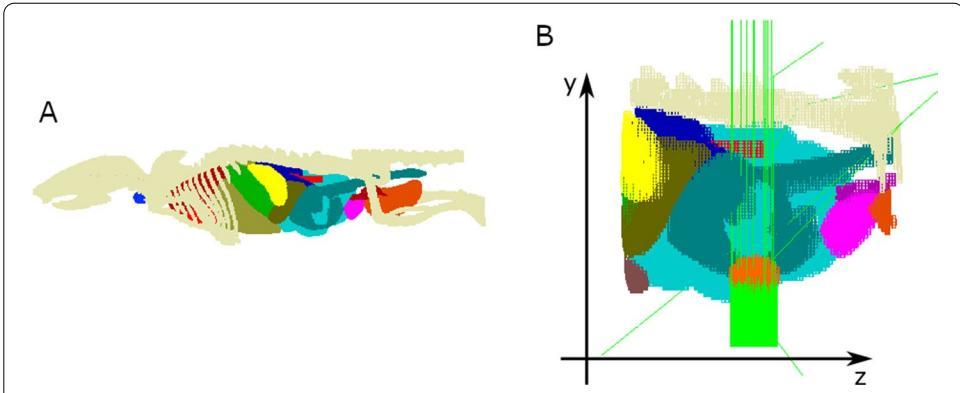
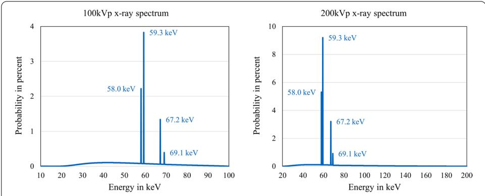
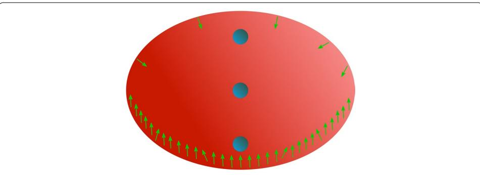
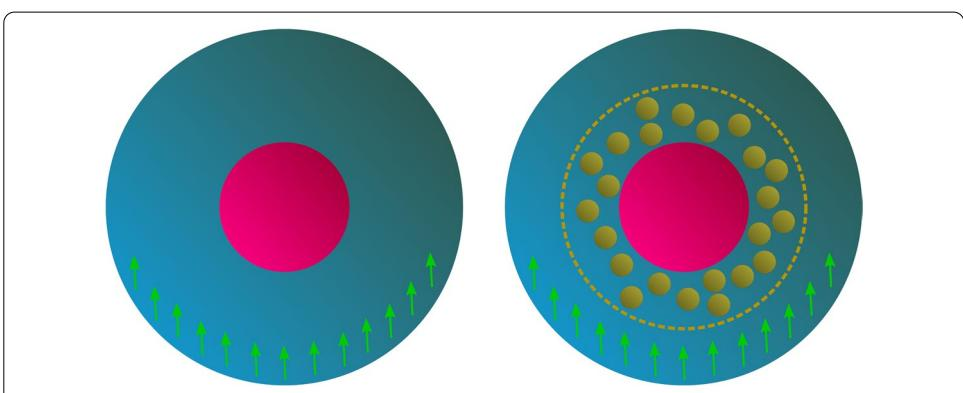
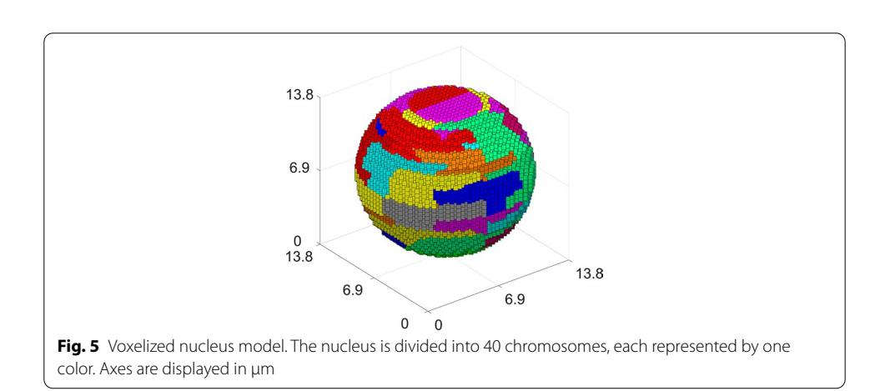
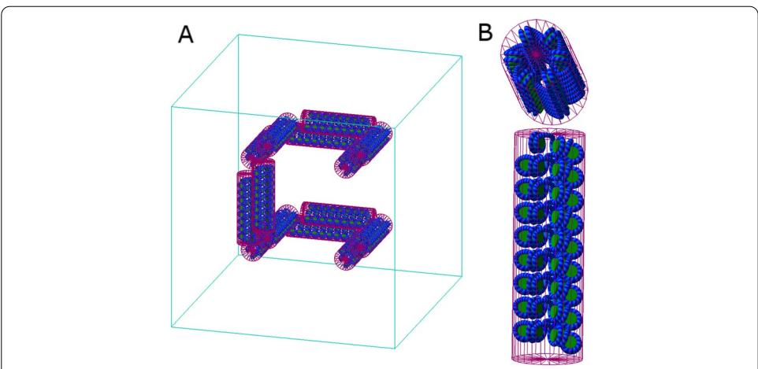
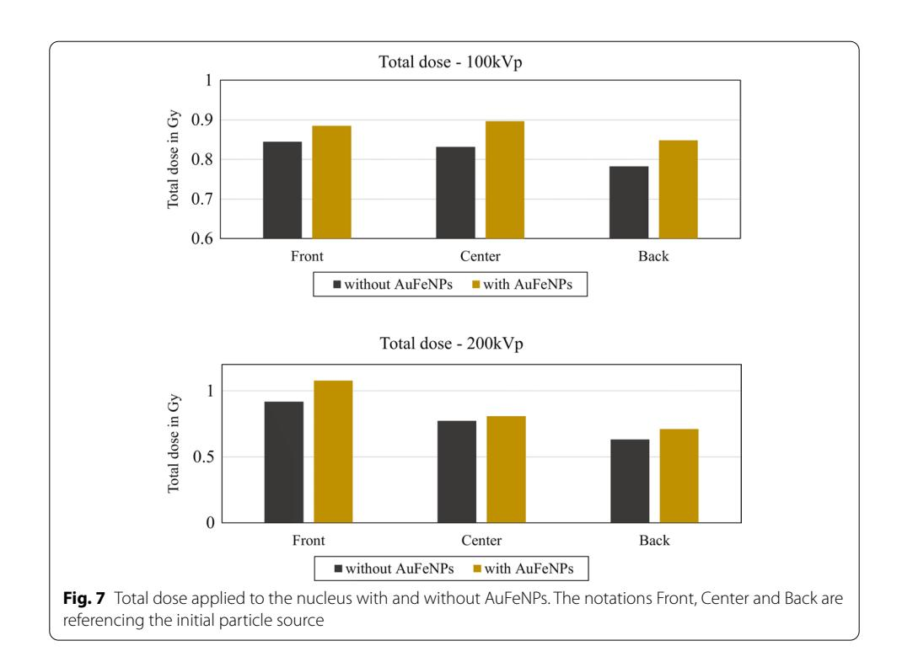
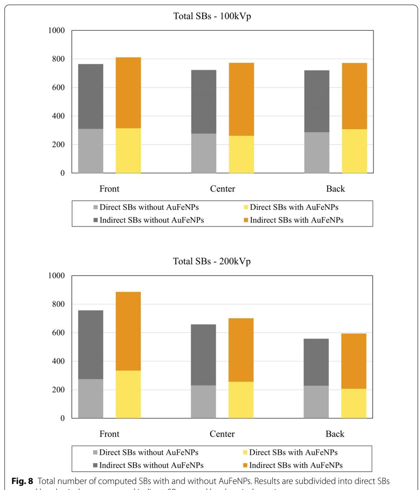
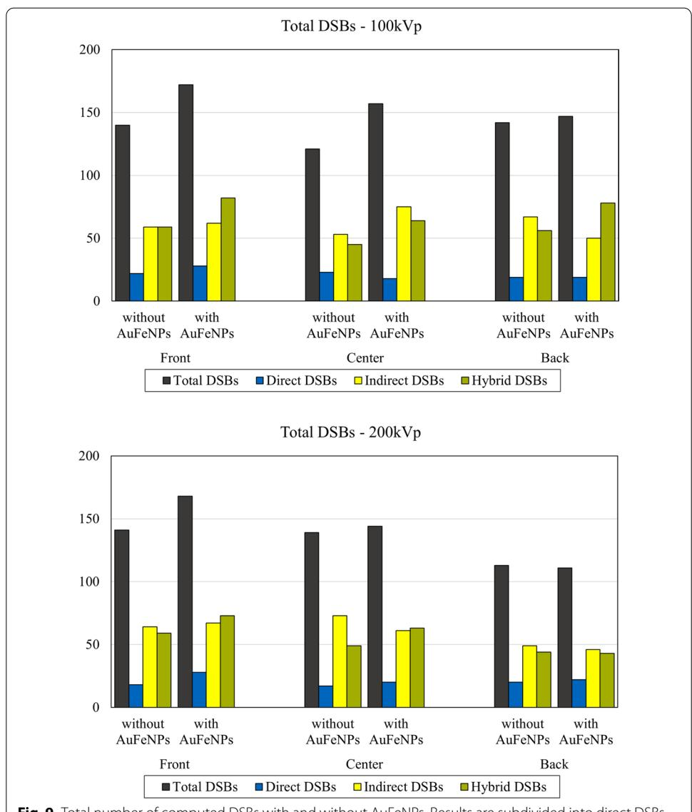
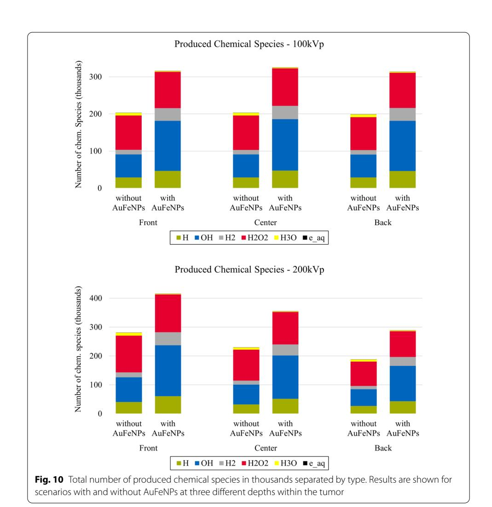

**Open Access RESEARCH**

# Multi‑scale Monte Carlo simulations of gold nanoparticle‑induced DNA damages for kilovoltage X‑ray irradiation in a xenograft mouse model using TOPAS‑nBio

\*Correspondence: klapproth@mytum.de; jschuemann@mgh.harvard.edu; wli@helmholtz-muenchen.de Center for Translational Cancer Research Technische Universität München (TranslaTUM), Klinikum rechts der Isar, Munich, Germany Institute of Radiation Medicine, Helmholtz Zentrum München, German Research Center for Environmental Health (GmbH), Munich, Germany 3 Physics Division, Department of Radiation Oncology,

Massachusetts General Hospital, Boston, MA, USA Full list of author information is available at the end of the

article

# **Abstract**

**Background:** Gold nanoparticles (AuNPs) are considered as promising agents to increase the radiosensitivity of tumor cells. However, the biological mechanisms of radiation enhancement efects of AuNPs are still not well understood. We present a multi-scale Monte Carlo simulation framework within TOPAS-nBio to investigate the increase of DNA damage due to the presence of AuNPs in mouse tumor models.

**Methods:** A tumor was placed inside a voxel mouse model and irradiated with either 100-kVp or 200-kVp X-ray beams. Phase spaces were employed to transfer particles from the macroscopic (voxel) scale to the microscopic scale, which consists of a cell geometry including a detailed mouse DNA model. Radiosensitizing efects were calculated in the presence and absence of hybrid nanoparticles with a Fe2O3 core surrounded by a gold layer (AuFeNPs). To simulate DNA damage even for very small energy tracks, Geant4-DNA physics and chemistry models were used on microscopic scale.

**Results:** An AuFeNP-induced enhancement of both dose and DNA strand breaks has been established for diferent scenarios. Produced chemical radicals including hydroxyl molecules, which were assumed to be responsible for DNA damage through chemical reactions, were found to be signifcantly increased. We further observed a dependency of the results on the location of the cells within the tumor for 200-kVp X-ray beams.

**Conclusion:** Our multi-scale approach allows to study irradiation-induced physical and chemical efects on cells. We showed a potential increase in cell radiosensitization caused by relatively small concentrations of AuFeNPs. Our new methodology allows the individual adjustment of parameters in each simulation step and therefore can be used for other studies investigating the radiosensitizing efects of AuFeNPs or AuNPs in living cells.

**Keywords:** Monte Carlo simulation, Nanoparticles, Radiosensitization, Radiation therapy, Geant4, TOPAS, TOPAS-nBio

© The Author(s), 2021. **Open Access** This article is licensed under a Creative Commons Attribution 4.0 International License, which permits use, sharing, adaptation, distribution and reproduction in any medium or format, as long as you give appropriate credit to the original author(s) and the source, provide a link to the Creative Commons licence, and indicate if changes were made. The images or other third party material in this article are included in the article's Creative Commons licence, unless indicated otherwise in a credit line to the material. If material is not included in the article's Creative Commons licence and your intended use is not permitted by statutory regulation or exceeds the permitted use, you will need to obtain permission directly from the copyright holder. To view a copy of this licence, visit [http://](http://creativecommons.org/licenses/by/4.0/) [creativecommons.org/licenses/by/4.0/.](http://creativecommons.org/licenses/by/4.0/) The Creative Commons Public Domain Dedication waiver [\(http://creativecommons.org/publi](http://creativecommons.org/publicdomain/zero/1.0/) [cdomain/zero/1.0/\)](http://creativecommons.org/publicdomain/zero/1.0/) applies to the data made available in this article, unless otherwise stated in a credit line to the data.

Klapproth *et al. Cancer Nano (2021) 12:27* Page 2 of 18

# **Background**

Te optimization of radiotherapy is a wide and thoroughly studied feld. A major limitation of external beam radiation therapy is the fact that it cannot be applied without harming healthy normal tissue around the tumor. One promising approach to reduce healthy tissue toxicity is the local enhancement of the radiation dose within the tumor using radiosensitizers, such as gold nanoparticles (AuNPs). AuNPs are among the most investigated nanomaterials for medical application, due to their favorable biocompatibility and their potential use as a contrast agent (Dai et al. [2017;](#page-15-0) Chen et al. [2016;](#page-15-1) Xin et al. [2017](#page-17-0)). Te radiosensitizing efect of AuNPs is partially based on their potential to release high numbers of secondary electrons upon irradiation, which has been shown to be especially potent for kilovoltage photon beams around 100 kVp. In this energy range, the dose enhancement is mostly caused by secondary electrons with low energy such as Auger electrons with a limited range (Lechtman and Pignol [2017\)](#page-16-0). Because of the highly localized efects of the radiosensitization and the possibility of AuNPs to accumulate also in healthy tissues, reliable targeting agents such as antibodies are important to make AuNP-based therapies applicable in clinical practice (Schuemann et al. [2016](#page-17-1)).

Sensitization efects of AuNPs can be studied via Monte Carlo simulations by computing the dose enhancement efect caused by AuNPs in appropriate scenarios. However, it is still not possible to precisely calculate the impact of a single AuNP on its direct microenvironment, although multiple studies have been dedicated to this topic (Li et al. [2014](#page-16-1), [2020;](#page-16-2) Lin et al. [2014;](#page-16-3) Sung et al. [2016;](#page-17-2) Rabus et al. [2019](#page-16-4); Haume et al. [2018\)](#page-16-5). When it comes to scenarios with multiple AuNPs, a frequently used approach was the employment a local efect model (LEM)-based estimation (Kraft et al. [1999](#page-16-6)). Tese models usually calculate the enhancement of the efectiveness of irradiation through the addition of multiple AuNPs by extrapolating radial dose enhancements obtained from MC simulations with a single AuNP. Although they add additional assumptions and uncertainties, LEMs were commonly used to describe the dose enhancement efect of multiple AuNPs, since MC simulations on their own have been shown to underestimate the efects of radiation when compared to experimental results (McMahon et al. [2011\)](#page-16-7). One reason for that is probably the lack of chemical interactions in MC simulations, which usually only compute the efects of physical interactions with a focus on secondary electrons (Kuncic and Lacombe [2018\)](#page-16-8). Chemical radicals produced by water radiolysis have, however, been shown to play a signifcant role in the radiosensitizing efects of AuNPs (Xie et al. [2015;](#page-17-3) Rosa et al. [2017\)](#page-17-4).

In this study, we introduce a multi-scale method to directly compute the DNA damage induction of ionized radiation with and without nanoparticles with a gold surface using TOPAS-nBio (Schuemann et al. [2019a](#page-17-5)). TOPAS-nBio is a radiobiology focused extension to TOPAS (Perl et al. [2012](#page-16-9)), which is a user friendly Monte Carlo toolkit based on Geant4 (Agostinelli et al. [2003](#page-15-2)). TOPAS-nBio includes a chemistry interface that employs an updated version of Geant4-DNA water radiolysis models, which were applied in our nano-scale cell simulations (Karamitros et al. [2014;](#page-16-10) Ramos-Mendez et al. [2018](#page-16-11)). Rudek et al. ([2019](#page-17-6)) already observed AuNP-induced dose enhancement assuming these models. Te efect on DNA damage in a detailed human nucleus model was investigated by Zhu et al. ([2020a\)](#page-17-7). We aim to build on both results to gain a better Klapproth et al. Cancer Nano (2021) 12:27 Page 3 of 18

understanding of the radiosensitization effect of AuNPs in tumor cells by introducing a new methodology of simulating according preclinical in vivo experiments.

Our calculations were performed in three steps: mouse model, tumor and cell. On the macro-scale, a voxel mouse model including a mammary gland tumor was irradiated by an X-ray beam. Phase spaces were employed to move between the scales until detailed DNA damage could be calculated in a nano-scale cell model.

#### Materials and methods

All MC simulations were carried out in TOPAS v3.2 for Linux machines and Geant4 v10.5p1. For reproducibility, all developed extensions and parameter files were made generally accessible via Github (Link: https://github.com/AKlapproth/MultiScale\_AuNP\_TOPAS). Simulations were performed in three major steps: mouse model, tumor and cell. The particles were transferred from one step to the next via phase space files. These files take a snapshot of all tracks passing a given surface and include all the necessary information for each scored track to be recreated in the next stage of our simulations. The information included were particle type, energy, location and momentum at the time of scoring. The initial beam spectra were calculated with SpecCalc employing the parameters from the small animal radiation research platform (SARRP) device to simulate a realistic experimental setup (Wong et al. 2008).

For mouse model and tumor simulations, the standard Geant4 electromagnetic physics list option 3 was used. It is focused on electron, hadron and ion tracking outside a magnetic field and the most accurate standard model for medical applications in the micrometer range or above (Physics Lists EM constructors in Geant4 10.4 2021; Allison et al. 2016). The use of more accurate physics lists on these scales would have caused an immense increase in computation time with no significant benefit. This is because most of the low energy tracks, which are the most time-consuming to simulate, occur in locations, where they have no effect on the outcome. For the cell simulations, we applied a combination of two more accurate physics lists to make the outcome on the nanometer scale as accurate as possible. The exact physics setup in the cells is explained in the subsection "Cells".

The nanoparticles, which were used in the cell simulations, were hybrid nanoparticles. While their surface consists of a 1-nm-thick gold layer, they feature an  $Fe_2O_3$  core with a diameter of 2nm, adding up to an overall diameter of 4nm. We selected these nanoparticles to describe an experimental setup that was conducted for theranostic purposes (Kang et al. 2020). The iron oxide core offers advantages for both therapy and diagnostics, since it enables the gold- $Fe_2O_3$  hybrid nanoparticles (AuFeNPs) to be detectable via MRI scans.

## Mouse model

The voxel model of a 21 g mouse developed by Xie and Zaidi (2013) was used and embedded in a  $120 \times 120 \times 160~\text{mm}^3$  box filled with air (cf. Fig. 1A). The model consists of  $200 \times 200 \times 512$  cubical voxels with a border length of  $200~\mu\text{m}$ . A new TOPAS extension was developed that allows the insertion of an ellipsoid shaped tumor at any location inside the model. Normal tissue, skin and air in the defined area is then replaced by tumor tissue. In case the tumor extends outside the body, exposed tumor tissue is

Klapproth *et al. Cancer Nano (2021) 12:27* Page 4 of 18

covered by a layer of skin with a thickness of one voxel. For this work, a tumor with diameters 5 mm× 4 mm× 5 mm was planted near the left hind leg to simulate a mammary gland carcinoma. Diferent materials were defned for each component of the model, either a predefned material available in Geant4 or water with an adjusted density (cf. Table [1\)](#page-3-0). Te respective densities were chosen according to previous studies with this mouse model (Xie and Zaidi [2013](#page-17-9)). Since the tumor consisted of water in the following simulation steps due to limitations in the availability of physics parameters for subcell scale simulations, standard G4\_WATER material was used for the tumor in this step as well to ensure consistency. Two diferent types of kVp photon beams were used for the simulated treatment, both based on the radiation source used in the SARRP, when set to either 100 kVp or 200 kVp. Te respective photon spectra were calculated with the SpekCalc toolkit and are shown in Fig. [2](#page-4-1) (Poludniowski et al. [2009](#page-16-14)). Particle tracks originated from a fat, circular particle source placed 20 cm below (i.e., shifted along the y-axis) the tumor center. Its diameter was set to 5 mm, according to the tumor's X- and Z-diameters (cf. Fig. [1](#page-4-0)B). All particles entering the tumor were scored in a phase space fle and multiplied 750 times, which means for each particle scored during the simulation 750 entries were made in the phase space fle, each with the same particle type and energy. To increase variance each duplicated particle was positioned on a randomly generated point on the tumor surface, while its momentum was rotated accordingly around the center. Particles that still possessed the initial momentum along the y-axis

**Table 1** Defnition of materials in the mouse model simulations

| Body part       | G4 material          | Density in g/cm3 |  |
|-----------------|----------------------|------------------|--|
| Air             | G4_AIR               | 1.205 × 10−3     |  |
| Normal tissue   | G4_TISSUE_SOFT_ICRP  | 1.03             |  |
| Skeleton        | G4_BONE_COMPACT_ICRU | 1.85             |  |
| Heart           | G4_WATER             | 1.06             |  |
| Lung            | G4_LUNG_ICRP         | 1.04             |  |
| Liver           | G4_WATER             | 1.05             |  |
| Stomach         | G4_WATER             | 1.04             |  |
| Kidney          | G4_WATER             | 1.05             |  |
| Small intestine | G4_WATER             | 1.04             |  |
| Spleen          | G4_WATER             | 1.06             |  |
| Bladder         | G4_WATER             | 1.04             |  |
| Testes          | G4_TESTIS_ICRP       | 1.04             |  |
| Skin            | G4_SKIN_ICRP         | 1.09             |  |
| Gallbladder     | G4_WATER             | 1.03             |  |
| Brain           | G4_BRAIN_ICRP        | 1.04             |  |
| Thyroid         | G4_WATER             | 1.05             |  |
| Pancreas        | G4_WATER             | 1.05             |  |
| Vas deferens    | G4_WATER             | 1.04             |  |
| Large intestine | G4_WATER             | 1.04             |  |
| Airway          | G4_AIR               | 1.205 × 10−3     |  |
| Blood           | G4_WATER             | 1.00             |  |
| Tumor           | G4_WATER             | 1.00             |  |

For each body part, either the regarding Geant4 Material or G4\_WATER with an adjusted density was applied

Klapproth *et al. Cancer Nano (2021) 12:27* Page 5 of 18

**Fig. 1** Sketch of the voxel model simulations. **A** Displays a visualization of the implemented mouse model, where each color represents a diferent organ. **B** Shows the approach of the simulations. The source consists of parallel photon beams (displayed in green) and is aimed directly at the mammary gland tumor (displayed in orange). The coordinate system has been added for orientation, not to mark the actual origin of the simulation geometry

**Fig. 2** X-ray photon spectra. The 100-kVp spectrum ranges from 10 to 100 keV with a bin size of 0.05 keV and the 200-kVp spectrum from 20 to 200 keV with bin size 0.1 keV. The energy for each created particle is chosen randomly based on the percentages defned by the respective spectrum. Both spectra possess the same four intensity peaks

were assigned a random position on the tumor surface at its bottom or Y-Minus side. All other particles were rotated randomly around the y-axis going through the tumor center.

## **Tumor**

For simulations inside the tumor the entire geometry setup consisted of water to ensure consistency throughout the simulation steps. An ellipsoidal water phantom with diameters of 5 mm× 4 mm× 5 mm was defned as the tumor. Spheres with a diameter of 100 µm were placed at 3 diferent positions inside the tumor to represent cellular regions of interest (cf. Fig. [3](#page-5-1)). For each of the spheres, all particles entering the volume were scored in a second phase space fle.

Parameters were chosen to emulate a mammary carcinoma in a xenograft mouse model. A popular cell line for this purpose is 4T1 mouse tumor cells. Since they tend to metastasize in the mammary gland, when transplanted on another location, and show some similarities to human mammary carcinomas, they are an ideal choice for Klapproth *et al. Cancer Nano (2021) 12:27* Page 6 of 18

**Fig. 3** Sketch of the tumor simulations. The particle source, which is shown in green, is the phase space fle recorded during the mouse model simulation. Most particles enter the tumor with their initial momentum without previous interaction, but particles can enter from any direction. Cell-sized spheres are defned at three diferent positions. All particles entering a cell are stored in their respective phase space

**Fig. 4** Sketch of the cell simulations. The cytoplasm is shown in blue, the nucleus in pink, and photons in green. Separate simulations are performed for each cell in the presence and absence of AuFeNPs. The nucleus includes a detailed cell model, where direct and indirect SSBs and DSBs are calculated

mammary xenograft tumors (Pulaski and Ostrand-Rosenberg [2001\)](#page-16-15). 4T1 cells are triple-negative breast cancer cells, which means they test negative for both the expression of estrogen receptors, progesterone receptors and an overexpression of the HER2 protein. Patients with triple-negative breast cancer usually have a relatively poor prognosis, since the tumors do not respond to many commonly used treatment methods (Foulkes et al. [2010\)](#page-16-16). Tese tumor cells are therefore of high interest regarding new and optimized treatment methods (Takai et al. [2016\)](#page-17-10).

## **Cells**

Cells were built as spheres with a diameter of 20 µm and a nucleus diameter of 13.8 µm according to parameters of 4T1 tumor cells (cf. Fig. [4](#page-5-2)) (Oelze et al. [2004](#page-16-17)). Te nucleus was placed at the center of the cell and flled with DNA using a model based on the human DNA model published by Zhu et al. ([2020a](#page-17-7), [b](#page-17-11)). Te model was modifed to conform to the male mouse genome by adjusting the voxel count, voxel size and the number of chromatin fbers per voxel. Te resulting nucleus has a diameter of 13.8 µm and each chromosome contains a realistic number of base pairs. Te voxels and base pairs per chromosome can be found in Table [2,](#page-6-0) and a sketch of the resulting nucleus structure Klapproth *et al. Cancer Nano (2021) 12:27* Page 7 of 18

**Table 2** Number of voxels and base pairs per chromosome (Source of genome data: Genome Reference Consortium [\(https://www.ncbi.nlm.nih.gov/genome/52](https://www.ncbi.nlm.nih.gov/genome/52)))

| Chromosome ID | Voxels | Base pairs in Mbp |
|---------------|--------|----------------------|
| 1 & 2         | 922    | 195.6                |
| 3 & 4         | 859    | 182.2                |
| 5 & 6         | 755    | 160.1                |
| 7 & 8         | 738    | 156.5                |
| 9 & 10        | 716    | 151.9                |
| 11 & 12       | 706    | 149.7                |
| 13 & 14       | 686    | 145.5                |
| 15 & 16       | 610    | 129.4                |
| 17 & 18       | 587    | 124.5                |
| 19 & 20       | 616    | 130.7                |
| 21 & 22       | 576    | 122.2                |
| 23 & 24       | 566    | 120.0                |
| 25 & 26       | 568    | 120.5                |
| 27 & 28       | 589    | 124.9                |
| 29 & 30       | 491    | 104.1                |
| 31 & 32       | 463    | 98.20                |
| 33 & 34       | 448    | 95.02                |
| 35 & 36       | 428    | 90.78                |
| 37 & 38       | 290    | 61.51                |
| X             | 806    | 171.0                |
| Y             | 430    | 91.20                |

in Fig. [5.](#page-6-1) Te nuclear model is voxelized and possesses the same structural hierarchy as the human model. Te DNA double helix consists of half-cylindrical base volumes and quarter-cylindrical sugar-phosphate backbone volumes surrounded by a hydration shell. Te DNA is wrapped around the cylindrical histone protein complex, building the nucleosome. Each chromatin fber is in turn made up of 51 nucleosomes connected to each other by nucleotide pairs and arranged to form a helix (cf. Fig. [6](#page-7-0)B). 15.15 kilo base pairs of DNA are included in each chromatin fber, which were placed in each voxel along two space-flling 3D Hilbert curves with one iteration (Lieberman-Aiden et al. Klapproth *et al. Cancer Nano (2021) 12:27* Page 8 of 18

**Fig. 6** TOPAS visualization depicting voxel structure. **A** Displays one voxel including 14 fbers, which are placed alongside two parallel frst-order 3D Hilbert space-flling curves. **B** Provides a closer look at one fber from two diferent angles. Visible elements are histones (green) and hydration shells for each DNA helix (blue)

[2009](#page-16-18); McNamara et al. [2018](#page-16-12)), as illustrated in Fig. [6A](#page-7-0). Figure [6B](#page-7-0) provides a more detailed depiction of each fber and how the DNA double helix is wrapped around the histones. Te nucleus consists of 24,464 cubical voxels with a border length of 3.833 µm, which are divided into 40 chromosomes. All in all, the nucleus includes around 5.19 Giga base pairs of DNA.

Te phase spaces from the tumor simulation were used as source. Each particle's distance to the cell center was reduced to 10 µm, while its momentum, particle type and energy stayed unchanged. Particles were then multiplied 100 times, which means for each particle scored during the tumor simulation, 100 particles originated in the respective cell simulations. To increase variance, position and momentum were rotated randomly around the y-axis going through the cell, while the other parameters remained unchanged. All simulations were performed twice, once without AuFeNPs and once with 1 Mio AuFeNPs placed randomly around the nucleus with a maximum distance of 100 nm (cf. Fig. [4](#page-5-2)). Tis results in an AuFeNP concentration of around 0.225% by weight in relation to the cell. Te cytoplasm and nucleus consist of water in the simulations, so the Geant4-DNA-based physics and chemistry lists (Incerti et al. [2018\)](#page-16-19), which simulate the full particle track structure and are part of TOPAS-nBio, could be used in these regions. Te standard G4\_WATER material was used in all regions of the nucleus except the DNA backbone where the density of water was adjusted to 1.407 g/cm3 (Smialek et al. [2013](#page-17-12)). Due to limitations in available cross sections in Geant4-DNA, the Geant4 Livermore physics model was applied in gold and Fe2O3. Production cut and electromagnetic range were both set to 10 eV and 1 MeV and the cut for electrons was defned as 0.1 nm. To achieve the combination of two diferent models two regions were defned, one containing all AuFeNPs and one all other parts within the cell. Te simulation switched between the two electromagnetic physics models depending on the region a particle traversed. Accordingly, only physics interactions (condensed histories) were tracked and generated inside AuFeNPs, while in the rest of the cell (water) we also simulated the propagation of chemical species.

Klapproth et al. Cancer Nano (2021) 12:27 Page 9 of 18

For the computation of DNA damage based on our track structure simulations, we chose standard assumptions and parameters used in previous Monte Carlo studies (Ramos-Mendez et al. 2018; Rudek et al. 2019; Lampe et al. 2018; Meylan et al. 2017; Sakata et al. 2019). Direct damage was only produced by interactions in the DNA backbone including the adjacent hydration shells. Indirect damage was only produced in the DNA backbone. If at least 17.5 eV (Rudek et al. 2019; Lampe et al. 2018; Sakata et al. 2019) of deposited energy caused by physical interactions in a single back bone including its hydration shell was scored during one history, it was considered as a direct strand break (SB). The chemistry model was applied according to the work of Zhu et al. (2020a) with a chemical stage time of 1.0 ns. Six different particle types that are included in the standard Geant4-DNA chemistry extension were quantified, namely hydrogen radicals  $(H\cdot)$ , molecular hydrogen  $(H_2)$ , hydrogen peroxide  $(H_2O_2)$ , hydronium  $(H_3O^+)$ , solvated electrons (eaa) and the hydroxyl group (OH), which includes hydroxide (OH-) and hydroxyl radicals (·OH). Chemical species produced inside DNA regions were immediately killed to emulate that no water radiolysis occurs there. H, ead and ·OH diffusing into DNA regions were also immediately terminated. Only OH radicals that had just entered the DNA backbone were able to induce an indirect SB with a probability of 40% (Meylan et al. 2017; Sakata et al. 2019).

Damage was estimated in form of direct and indirect single-strand breaks (SSBs) and double-strand breaks (DSBs). Direct damage is caused by physical interactions and indirect damage by chemical radicals. Two SBs that occur on opposing DNA strands with a distance of 10 or fewer base pairs were defined as a DSB. When scored, DSBs were classified depending on the types of their underlying SBs into direct DSBs (two direct SBs) indirect DSBs (two indirect SBs) and hybrid DSBs (one of each). The results were displayed in the standard DNA damage (SDD) data format (Schuemann et al. 2019b). In addition, the number of produced chemical species was counted and classified by type.

## **Results**

Our simulation results show that the cell depth as well as the presence of AuFeNPs affects the simulation results. The exact values of the results and the respective standard deviations can be found in Additional file 1: Tables S1–S12.

As shown in Fig. 7, the dose applied to the nucleus is increased in scenarios, where AuFeNPs are present for each cell location inside the tumor. The position itself also plays a role for the results, as the dose decreases the further back a cell lies in relation to the particle source. This location effect was only significant for simulations with 200-kVp photons.

The SB count shows the same behavior and is increased in simulations including AuFeNPs around the nucleus and decreases with increasing depth only for 200-kVp photons (cf. Fig. 8). Indirect SBs generally account for around twice the number of direct SBs, which conforms to previous findings (Zhu et al. 2020a). Notably, the dose and damage increase was observed in all scenarios, although the concentration of AuFeNPs was relatively low in comparison to previous AuNP studies (Sung et al. 2017; Sung and Schuemann 2018).

Klapproth *et al. Cancer Nano (2021) 12:27* Page 10 of 18

In accordance with the proportion between direct and indirect SBs, indirect and hybrid DSBs outweigh direct DSBs in all simulations (cf. Fig. [9\)](#page-11-0). A clear shift in DSBtype ratios depending on AuFeNP presence or cell location could not be detected.

Te efect of AuFeNPs is especially prominent when examining the count of produced chemical species for diferent scenarios (cf. Fig. [10](#page-12-0)). A clear enhancement in the presence of AuFeNPs can be observed for each investigated location and photon spectrum. Te increase of total numbers is mainly attributed to the very high enhancement ratios of OH and H2. However, not all chemical radical counts are increased, when adding AuFeNPs. Te count of H3O particles and eaq decrease signifcantly (cf. Table [3\)](#page-12-1). We exclusively considered ·OH for the scoring of indirect DNA damages, as hydroxyl radicals are generally considered to be the mediator of much of the induced DNA damage (Balasubramanian et al. [1998\)](#page-15-4). Terefore, the increase of produced OH radicals is especially relevant and directly connected to the observed increase in indirect DNA damage. Analogically to the already mentioned results, we also observe an overall decrease of produced chemical species as a function of depth for 200-kVp photons.

# **Discussion**

We successfully developed a method for multi-scale simulations of mouse tumor irradiations in radiobiological experiments, from large scale (mouse model) to small scale (DNA). Tis is a major step away from LEM-based models, allowing for a better understanding and more accurate modeling of in vivo experiments. Tis was in part achieved by accounting for realistic efects on the radiation feld of tumors within the mouse geometry and by including chemical reactions that are induced by radiolysis.

In our simulations, we detected an enhancement of deposited energy and chemical radicals produced by water radiolysis in simulations including AuFeNPs, resulting Klapproth *et al. Cancer Nano (2021) 12:27* Page 11 of 18

caused by physical processes, and indirect SBs caused by chemical reactions

in increased DNA damage. Te overall trends of the results agree with previous studies, indicating validity of this new, multi-scale methodology (Ramos-Mendez et al. [2018](#page-16-11); Rudek et al. [2019](#page-17-6); Zhu et al. [2020a,](#page-17-7) [b](#page-17-11)). When irradiated, the depth of a cell inside the tumor afects the dose that is applied to its nucleus. Tis naturally also afects the amount of DNA damage, which is illustrated by the number of strand breaks. Te addition of gold nanoparticles causes a small but signifcant increase in both direct and indirect strand breaks, which is caused by secondary electrons and their adjunctive chemical species. However, some limitations have to be kept in mind with regard to the results.

In the MC simulations, many physical, chemical and biological parameters were used, and these parameters are mostly evaluated from experimental data, and they are subject to large uncertainties. Te physical parameters such as cross sections for electrons have an uncertainty of 5% at the lower energy of 1 keV, 17–20% uncertainty at very low energy Klapproth *et al. Cancer Nano (2021) 12:27* Page 12 of 18

**Fig. 9** Total number of computed DSBs with and without AuFeNPs. Results are subdivided into direct DSBs caused by physical interactions, indirect DSBs caused by chemical reactions and hybrid DSBs caused by one physical and one chemical reaction

of 100 eV in water (Tomson and Kawrakow [2011](#page-17-17)). In contrast, the chemical and biological parameters are mostly derived from in vitro cellular and molecular experimental reactions and radiobiological efects, and they compose even larger uncertainties (Zhu et al. [2020b](#page-17-11)).

In the present study, we did not perform a detailed uncertainty analysis of the results of SSBs, DSBs and chemical species shown in Figs. [7,](#page-9-0) [8,](#page-10-0) [9,](#page-11-0) [10](#page-12-0). Such an analysis would require signifcant further work on parameters analysis as performed in the work of Zhu et al. However, as Zhu et al. found out, the threshold energy of 17.5 eV used in this study and the probability of radicals for generating an indirect damage, account for most of the uncertainty of SSBs and DBSs. Zhu et al. ([2020b](#page-17-11)) estimated diferences of up to 34% and 16% for SSB and DSB yields, respectively, caused by all Klapproth *et al. Cancer Nano (2021) 12:27* Page 13 of 18

| Type | 100 kVp |        |       | 200 kVp |        |       |
|------|---------|--------|-------|---------|--------|-------|
|      | Front   | Center | Back  | Front   | Center | Back  |
| H    | 1.615   | 1.645  | 1.592 | 1.506   | 1.603  | 1.590 |
| OH   | 2.165   | 2.232  | 2.194 | 2.053   | 2.176  | 2.115 |
| H2   | 2.784   | 2.944  | 2.893 | 2.689   | 2.820  | 2.753 |
| H2O2 | 1.061   | 1.094  | 1.072 | 1.026   | 1.052  | 1.061 |
| H3O  | 0.295   | 0.268  | 0.306 | 0.230   | 0.303  | 0.345 |
| eaq  | 0.593   | 0.467  | 0.553 | 0.423   | 0.375  | 0.5   |

Each value is the number of produced chemical species in simulations with AuFeNPs divided by the respective number without AuFeNPs

the parameters used in TOPAS-nBio. Tese uncertainties are applicable to our work as well.

Te major limitation for the simulations is the lack of models for chemical interactions inside and on the surface of AuFeNPs. Tis means that each chemical track Klapproth *et al. Cancer Nano (2021) 12:27* Page 14 of 18

encountering an AuFeNP is instantly eliminated (i.e., equivalent to reacting with the AuFeNP without consequence) and can no longer produce DNA damage. Rudek et al. found that AuNPs could thus lead to a reduction of availability of chemical species when modeled with track structure MC codes (Rudek et al. [2019](#page-17-6)). Tis is a considerable discrepancy between simulations and reality, where interactions between chemical radicals and gold atoms exist and can cause downstream reactions. Cheng et al. ([2012](#page-15-5)) detected an enhancement of chemical activity around AuNPs that could not only be explained by water radiolysis caused by X-rays. Tey attributed this efect to the activation of gold atoms on the surface of AuNPs by superoxides. In addition, there are still no reliable models for the surface chemistry of gold layered nanoparticles themselves, which have been shown to enhance reactive oxygen species (ROS) production (Pan et al. [2009](#page-16-22); Liu et al. [2014](#page-16-23); Sicard-Roselli et al. [2014](#page-17-18); Seo et al. [2017](#page-17-19)). Possible charge accumulations in the AuFeNPs and their surface could further afect the reactions or infuence which species are attracted (or repelled) by the AuFeNPs. Another factor to consider regarding in vivo studies is the nanoparticle coating necessary for targeting and biocompatibility. Xiao et al [\(2011\)](#page-17-20) showed that such coatings can decrease the radiosensitization efect of AuNPs signifcantly. Such coatings can further impact the chemical reactions around the GNPs.

Another limitation is the currently available physics models of Geant4-DNA, which do not yet include cross sections for gold. Tus, standard Livermore models were employed, which show good accuracy for keV electrons, but show limitations below the 100 eV range (Sakata et al. [2018\)](#page-17-21). Te detected efect of AuFeNPs was narrow and no increase in the fraction of SBs involved in DSBs was detectable, which might be expected due to the agglomeration of damaging events around the nanoparticles. A possible reason might be the distance of AuFeNPs to regions that contain DNA and thus are relevant for the results, due to the relatively low concentration of DNA inside the nucleus. Tere was still a defnite AuFeNP-related increase in SBs, dose and chemical species detected for all depths, which is in agreement with previous results (Ramos-Mendez et al. [2018;](#page-16-11) Rudek et al. [2019](#page-17-6)). Te release of additional physics models will be a big help in improving and validating simulation results for the physical efects of AuFeNPs.

Te next important step will be the validation of simulation results in biological experiments. As the study of Zhu et al. ([2020b\)](#page-17-11) showed, simulations are sensitive to the chosen parameters and physics models. Experimental data will therefore play a crucial role in deciding which simulation parameters can accurately describe observed phenomena. Te output in form of SSBs and DSBs can be used to compare cell survival outcomes from in vitro experiments and in vivo studies with mice. Te described multi-scale approach can further be used to investigate the efect of AuFeNPs at the involved scales and on the efciency of AuFeNP-enhanced radiotherapy.

# **Conclusions**

In this work, a new Monte Carlo-based method was established to simulate radiationinduced DNA damages in AuNP or AuFeNP-assisted radiotherapy. Tis multi-scale approach covers the whole range of preclinical in vivo studies and can therefore be valuable for parameter optimization and analyzing results in clinical cancer radiotherapy settings in the future. Including the AuFeNPs in the simulation geometry, as Klapproth *et al. Cancer Nano (2021) 12:27* Page 15 of 18

opposed to using a LEM-based approach, utilizes the ongoing increase in both processing power of computers and advancement of Monte Carlo models to produce more accurate and traceable results. Te detailed nucleus model allows direct counting and classifcation of SSBs and DSBs and the output in the SDD format makes the results comparable to similar studies and experimental data (Schuemann et al. [2019b](#page-17-14)). Te results show that even low concentrations of gold can cause a noticeable increase in DNA damage after kV irradiations and highlights the importance of taking chemical interactions into account.

Te inclusion of the tumor as a separate step allows the consideration of tumor heterogeneity in future studies. It is well known that the tumor landscape can differ vastly for diferent locations of the same tumor, with changing AuFeNP uptake and penetration, cell type, radiosensitivity and microenvironment (Alfonso and Berk [2019;](#page-15-6) Dagogo-Jack and Shaw [2018](#page-15-7); Marusyk and Polyak [2010;](#page-16-24) Zhivotovsky et al. [1999\)](#page-17-22). Tese efects can be taken into account, for example, by including diferent SB probabilities for diferent cell locations or adjusting repair parameters, when calculating cell survivability.

Tis methodology is not restricted to X-ray or metal nanoparticle studies. It can be easily adjusted to cover all investigations of radiation-induced DNA damage. Te inclusion of a complete mouse model enables dosimetry applications in organs of interest. Human cell studies can be performed by replacing the mouse model with a phantom displaying the respective area of interest, adjusting cell size, and replacing the mouse DNA model with the already established human equivalent (Zhu et al. [2020a](#page-17-7)). Te kVp photon beam may be replaced by any other radiation source supported by TOPAS, e.g., MV photon beams (LINAC) or proton beams for studies with or without nanoparticles. Tis work can be used as a template for future multi-scale radiation studies in diferent settings.

#### **Abbreviations**

AuNP: Gold nanoparticle; AuFeNP: Gold-Fe2O3 hybrid nanoparticle; LEM: Local efect model; RBE: Relative biological efectiveness; SARRP: Small animal radiation research platform; SB: Strand break; SSB: Single-strand break; DSB: Doublestrand break; SDD: Standard DNA damage; ROS: Reactive oxygen species.

## **Supplementary Information**

The online version contains supplementary material available at [https://doi.org/10.1186/s12645-021-00099-3.](https://doi.org/10.1186/s12645-021-00099-3)

**Additional fle 1: Table S1.**Simulation results and standard deviations - 100 kVp, front cell, without AuFeNPs. **Table S2.** Simulation results and standard deviations - 100 kVp, front cell, with AuFeNPs. **Table S3.** Simulation results and standard deviations - 100 kVp, center cell, without AuFeNPs. **Table S4.** Simulation results and standard deviations - 100 kVp, center cell, with AuFeNPs. **Table S5.** Simulation results and standard deviations - 100 kVp, back cell, without AuFeNPs. **Table S6.** Simulation results and standard deviations - 100 kVp, back cell, with AuFeNPs. **Table S7.** Simulation results and standard deviations - 200 kVp, front cell, without AuFeNPs. **Table S8.** Simulation results and standard deviations - 200 kVp, front cell, with AuFeNPs. **Table S9.** Simulation results and standard deviations - 200 kVp, center cell, without AuFeNPs. **Table S10.** Simulation results and standard deviations - 200 kVp, center cell, with AuFeNPs. **Table S11.** Simulation results and standard deviations - 200 kVp, back cell, without AuFeNPs. **Table S12.** Simulation results and standard deviations - 200 kVp, back cell, with AuFeNPs.

## **Acknowledgements**

We want to thank José Ramos-Méndez for his much-appreciated input regarding water radiolysis simulations.

## **Authors' contributions**

The study was designed by AK, JS and WL. The manuscript was written by AK, JS and WL with substantial revisions of GM and SS. TX designed and provided the mouse model and contributed valuable comments. All authors read and approved the fnal manuscript.

Klapproth *et al. Cancer Nano (2021) 12:27* Page 16 of 18

#### **Funding**

This study was supported by DFG grant (SFB824/3, STA1520/1-1), Technische Universität München (TUM) within the DFG funding program Open Access Publishing. The TUM Graduate School Internationalization Grant fnancially supported Alexander Klapproth's research stay at the Massachusetts General Hospital, Boston. Jan Schuemann was in part supported by the National Institutes of Health (NIH)/National Cancer Institute (NCI), grant no. R01 CA187003.

#### **Availability of data and materials**

All data generated or analyzed during this study are included in this published article and its supplementary information. All developed extensions and parameter fles necessary for replication are available in the Github repository, [\(https://](https://github.com/AKlapproth/MultiScale_AuNP_TOPAS) [github.com/AKlapproth/MultiScale\\_AuNP\\_TOPAS\)](https://github.com/AKlapproth/MultiScale_AuNP_TOPAS).

## **Declarations**

## **Ethics approval and consent to participate**

Not applicable.

#### **Consent for publication**

Not applicable.

#### **Competing interests**

The authors declare that they have no competing interests.

#### **Author details**

Center for Translational Cancer Research Technische Universität München (TranslaTUM), Klinikum rechts der Isar, Munich, Germany. 2 Institute of Radiation Medicine, Helmholtz Zentrum München, German Research Center for Environmental Health (GmbH), Munich, Germany. 3 Physics Division, Department of Radiation Oncology, Massachusetts General Hospital, Boston, MA, USA. 4 Harvard Medical School, Boston, MA, USA. 5 Division of Nuclear Medicine and Molecular Imaging, Geneva University Hospital, Geneva, Switzerland. 6 Institute of Radiation Medicine, Fudan University, Shanghai, China.

Received: 30 May 2021 Accepted: 12 October 2021

## **References**

Agostinelli S, Allison J, Amako K, Apostolakis J, Araujo H, Arce P, Asai M, Axen D, Banerjee S, Barrand G, Behner F, Bellagamba L, Boudreau J, Broglia L, Brunengo A, Burkhardt H, Chauvie S, Chuma J, Chytracek R, Cooperman G, Cosmo G, Degtyarenko P, Dell'Acqua A, Depaola G, Dietrich D, Enami R, Feliciello A, Ferguson C, Fesefeldt H, Folger G, Foppiano F, Forti A, Garelli S, Giani S, Giannitrapani R, Gibin D, Gómez Cadenas JJ, González I, Gracia Abril G, Greeniaus G, Greiner W, Grichine V, Grossheim A, Guatelli S, Gumplinger P, Hamatsu R, Hashimoto K, Hasui H, Heikkinen A, Howard A, Ivanchenko V, Johnson A, Jones FW, Kallenbach J, Kanaya N, Kawabata M, Kawabata Y, Kawaguti M, Kelner S, Kent P, Kimura A, Kodama T, Kokoulin R, Kossov M, Kurashige H, Lamanna E, Lampén T, Lara V, Lefebure V, Lei F, Liendl M, Lockman W, Longo F, Magni S, Maire M, Medernach E, Minamimoto K, Mora de Freitas P, Morita Y, Murakami K, Nagamatu M, Nartallo R, Nieminen P, Nishimura T, Ohtsubo K, Okamura M, O'Neale S, Oohata Y, Paech K, Perl J, Pfeifer A, Pia MG, Ranjard F, Rybin A, Sadilov S, Di Salvo E, Santin G, Sasaki T, Savvas N, Sawada Y et al (2003) Geant4-a simulation toolkit. Nucl Instrume Methods Phys Res Sect A Accelerators Spectrometers Detect Assoc Equip 506(3):250–303. [https://doi.org/10.1016/S0168-9002\(03\)01368-8](https://doi.org/10.1016/S0168-9002(03)01368-8)

Alfonso JCL, Berk L (2019) Modeling the efect of intratumoral heterogeneity of radiosensitivity on tumor response over the course of fractionated radiation therapy. Radiat Oncol 14(1):88. <https://doi.org/10.1186/s13014-019-1288-y>

Allison J, Amako K, Apostolakis J, Arce P, Asai M, Aso T, Bagli E, Bagulya A, Banerjee S, Barrand G, Beck BR, Bogdanov AG, Brandt D, Brown JMC, Burkhardt H, Canal P, Cano-Ott D, Chauvie S, Cho K, Cirrone GAP, Cooperman G, Cortés-Giraldo MA, Cosmo G, Cuttone G, Depaola G, Desorgher L, Dong X, Dotti A, Elvira VD, Folger G, Francis Z, Galoyan A, Garnier L, Gayer M, Genser KL, Grichine VM, Guatelli S, Guéye P, Gumplinger P, Howard AS, Hřivnáčová I, Hwang S, Incerti S, Ivanchenko A, Ivanchenko VN, Jones FW, Jun SY, Kaitaniemi P, Karakatsanis N, Karamitros M, Kelsey M, Kimura A, Koi T, Kurashige H, Lechner A, Lee SB, Longo F, Maire M, Mancusi D, Mantero A, Mendoza E, Morgan B, Murakami K, Nikitina T, Pandola L, Paprocki P, Perl J, Petrović I, Pia MG, Pokorski W, Quesada JM, Raine M, Reis MA, Ribon A, Ristić Fira A, Romano F, Russo G, Santin G, Sasaki T, Sawkey D, Shin JI, Strakovsky II, Taborda A, Tanaka S, Tomé B, Toshito T, Tran HN, Truscott PR, Urban L, Uzhinsky V, Verbeke JM, Verderi M, Wendt BL, Wenzel H, Wright DH, Wright DM, Yamashita T, Yarba J, Yoshida H (2016) Recent developments in geant4. Nucl Instrum Methods Phys Res Sect A Accelerators Spectrometers Detect Assoc Equip 835:186–225. <https://doi.org/10.1016/j.nima.2016.06.125>

Balasubramanian B, Pogozelski WK, Tullius TD (1998) Dna strand breaking by the hydroxyl radical is governed by the accessible surface areas of the hydrogen atoms of the DNA backbone. Proc Natl Acad Sci U S A 95(17):9738–43. <https://doi.org/10.1073/pnas.95.17.9738>

- Chen G, Roy I, Yang C, Prasad PN (2016) Nanochemistry and nanomedicine for nanoparticle-based diagnostics and therapy. Chem Rev 116(5):2826–85.<https://doi.org/10.1021/acs.chemrev.5b00148>
- Cheng NN, Starkewolf Z, Davidson RA, Sharmah A, Lee C, Lien J, Guo T (2012) Chemical enhancement by nanomaterials under x-ray irradiation. J Am Chem Soc 134(4):1950–3. <https://doi.org/10.1021/ja210239k>
- Dagogo-Jack I, Shaw AT (2018) Tumour heterogeneity and resistance to cancer therapies. Nat Rev Clin Oncol 15(2):81–94. <https://doi.org/10.1038/nrclinonc.2017.166>
- Dai Y, Xu C, Sun X, Chen X (2017) Nanoparticle design strategies for enhanced anticancer therapy by exploiting the tumour microenvironment. Chem Soc Rev 46(12):3830–3852.<https://doi.org/10.1039/c6cs00592f>

Klapproth *et al. Cancer Nano (2021) 12:27* Page 17 of 18

Foulkes WD, Smith IE, Reis-Filho JS (2010) Triple-negative breast cancer. N Engl J Med 363(20):1938–48. [https://doi.org/10.](https://doi.org/10.1056/NEJMra1001389) [1056/NEJMra1001389](https://doi.org/10.1056/NEJMra1001389)

- Haume K, de Vera P, Verkhovtsev A, Surdutovich E, Mason NJ, Solovyov AV (2018) Transport of secondary electrons through coatings of ion-irradiated metallic nanoparticles. Eur Phys J D 72(6):116. [https://doi.org/10.1140/epjd/](https://doi.org/10.1140/epjd/e2018-90050-x) [e2018-90050-x](https://doi.org/10.1140/epjd/e2018-90050-x)
- Incerti S, Kyriakou I, Bernal MA, Bordage MC, Francis Z, Guatelli S, Ivanchenko V, Karamitros M, Lampe N, Lee SB, Meylan S, Min CH, Shin WG, Nieminen P, Sakata D, Tang N, Villagrasa C, Tran HN, Brown JMC (2018) Geant4-dna example applications for track structure simulations in liquid water: a report from the geant4-DNA project. Med Phys. [https://](https://doi.org/10.1002/mp.13048) [doi.org/10.1002/mp.13048](https://doi.org/10.1002/mp.13048)
- Kang MS, Lee SY, Kim KS, Han DW (2020) State of the art biocompatible gold nanoparticles for cancer theragnosis. Pharmaceutics.<https://doi.org/10.3390/pharmaceutics12080701>
- Karamitros M, Luan S, Bernal MA, Allison J, Baldacchino G, Davidkova M, Francis Z, Friedland W, Ivantchenko V, Ivantchenko A, Mantero A, Nieminem P, Santin G, Tran HN, Stepan V, Incerti S (2014) Difusion-controlled reactions modeling in geant4-dna. J Comput Phys 274:841–882.<https://doi.org/10.1016/j.jcp.2014.06.011>
- Kraft G, Scholz M, Bechthold U (1999) Tumor therapy and track structure. Radiat Environ Biophys 38(4):229–37. [https://](https://doi.org/10.1007/s004110050163) [doi.org/10.1007/s004110050163](https://doi.org/10.1007/s004110050163)
- Kuncic Z, Lacombe S (2018) Nanoparticle radio-enhancement: principles, progress and application to cancer treatment. Phys Med Biol 63(2):02–01.<https://doi.org/10.1088/1361-6560/aa99ce>
- Lampe N, Karamitros M, Breton V, Brown JMC, Kyriakou I, Sakata D, Sarramia D, Incerti S (2018) Mechanistic dna damage simulations in geant4-dna part 1: a parameter study in a simplifed geometry. Phys Med 48:135–145. [https://doi.](https://doi.org/10.1016/j.ejmp.2018.02.011) [org/10.1016/j.ejmp.2018.02.011](https://doi.org/10.1016/j.ejmp.2018.02.011)
- Lechtman E, Pignol JP (2017) Interplay between the gold nanoparticle sub-cellular localization, size, and the photon energy for radiosensitization. Sci Rep 7(1):13268.<https://doi.org/10.1038/s41598-017-13736-y>
- Li W, Müllner M, Greiter M, Bissardon C, Xie W, Schlatll H, Oeh U, Li J, Hoeschen C (2014) Monte Carlo simulations of dose enhancement around gold nanoparticles used as X-ray imaging contrast agents and radiosensitizers. In: SPIE medical imaging, vol. 9033, p. 90331. SPIE, Bellingham <https://doi.org/10.1117/12.2043687>
- Li WB, Belchior A, Beuve M, Chen YZ, Di Maria S, Friedland W, Gervais B, Heide B, Hocine N, Ipatov A, Klapproth AP, Li CY, Li JL, Multhof G, Poignant F, Qiu R, Rabus H, Rudek B, Schuemann J, Stangl S, Testa E, Villagrasa C, Xie WZ, Zhang YB (2020) Intercomparison of dose enhancement ratio and secondary electron spectra for gold nanoparticles irradiated by x-rays calculated using multiple monte carlo simulation codes. Phys Med 69:147–163. [https://doi.org/10.](https://doi.org/10.1016/j.ejmp.2019.12.011) [1016/j.ejmp.2019.12.011](https://doi.org/10.1016/j.ejmp.2019.12.011)
- Lieberman-Aiden E, van Berkum NL, Williams L, Imakaev M, Ragoczy T, Telling A, Amit I, Lajoie BR, Sabo PJ, Dorschner MO, Sandstrom R, Bernstein B, Bender MA, Groudine M, Gnirke A, Stamatoyannopoulos J, Mirny LA, Lander ES, Dekker J (2009) Comprehensive mapping of long-range interactions reveals folding principles of the human genome. Science 326(5950):289–93. <https://doi.org/10.1126/science.1181369>
- Lin Y, McMahon SJ, Scarpelli M, Paganetti H, Schuemann J (2014) Comparing gold nano-particle enhanced radiotherapy with protons, megavoltage photons and kilovoltage photons: a monte carlo simulation. Phys Med Biol 59(24):7675– 89. <https://doi.org/10.1088/0031-9155/59/24/7675>
- Liu R, Wang Y, Yuan Q, An D, Li J, Gao X (2014) The au clusters induce tumor cell apoptosis via specifcally targeting thioredoxin reductase 1 (trxr1) and suppressing its activity. Chem Commun (Camb) 50(73):10687–90. [https://doi.org/10.](https://doi.org/10.1039/c4cc03320e) [1039/c4cc03320e](https://doi.org/10.1039/c4cc03320e)
- Marusyk A, Polyak K (2010) Tumor heterogeneity: causes and consequences. Biochim Biophys Acta 1805(1):105–17. <https://doi.org/10.1016/j.bbcan.2009.11.002>
- McMahon SJ, Hyland WB, Muir MF, Coulter JA, Jain S, Butterworth KT, Schettino G, Dickson GR, Hounsell AR, O'Sullivan JM, Prise KM, Hirst DG, Currell FJ (2011) Nanodosimetric efects of gold nanoparticles in megavoltage radiation therapy. Radiother Oncol 100(3):412–6.<https://doi.org/10.1016/j.radonc.2011.08.026>
- McNamara AL, Ramos-Mendez J, Perl J, Held K, Dominguez N, Moreno E, Henthorn NT, Kirkby KJ, Meylan S, Villagrasa C, Incerti S, Faddegon B, Paganetti H, Schuemann J (2018) Geometrical structures for radiation biology research as implemented in the topas-nbio toolkit. Phys Med Biol 63(17):175018.<https://doi.org/10.1088/1361-6560/aad8eb>
- Meylan S, Incerti S, Karamitros M, Tang N, Bueno M, Clairand I, Villagrasa C (2017) Simulation of early dna damage after the irradiation of a fbroblast cell nucleus using geant4-dna. Sci Rep 7(1):11923. [https://doi.org/10.1038/](https://doi.org/10.1038/s41598-017-11851-4) [s41598-017-11851-4](https://doi.org/10.1038/s41598-017-11851-4)
- Oelze ML, O'Brien JWD, Blue JP, Zachary JF (2004) Diferentiation and characterization of rat mammary fbroadenomas and 4t1 mouse carcinomas using quantitative ultrasound imaging. IEEE Trans Med Imaging 23(6):764–71. [https://](https://doi.org/10.1109/tmi.2004.826953) [doi.org/10.1109/tmi.2004.826953](https://doi.org/10.1109/tmi.2004.826953)
- Pan Y, Leifert A, Ruau D, Neuss S, Bornemann J, Schmid G, Brandau W, Simon U, Jahnen-Dechent W (2009) Gold nanoparticles of diameter 1.4 nm trigger necrosis by oxidative stress and mitochondrial damage. Small 5(18):2067–76. <https://doi.org/10.1002/smll.200900466>
- Perl J, Shin J, Schumann J, Faddegon B, Paganetti H (2012) Topas: an innovative proton monte carlo platform for research and clinical applications. Med Phys 39(11):6818–37.<https://doi.org/10.1118/1.4758060>
- Physics Lists EM constructors in Geant4 10.4 (2021)<https://geant4.web.cern.ch/node/1731>.
- Poludniowski G, Landry G, Deblois F, Evans PM, Verhaegen F (2009) Spekcalc: a program to calculate photon spectra from tungsten anode x-ray tubes. Phys Med Biol 54(19):433–438. <https://doi.org/10.1088/0031-9155/54/19/N01>
- Pulaski BA, Ostrand-Rosenberg S (2001) Mouse 4t1 breast tumor model. Curr Protoc Immunol Chapter 20:20–2. [https://](https://doi.org/10.1002/0471142735.im2002s39) [doi.org/10.1002/0471142735.im2002s39](https://doi.org/10.1002/0471142735.im2002s39)
- Rabus H, Gargioni E, Li WB, Nettelbeck H, Villagrasa C (2019) Determining dose enhancement factors of high-z nanoparticles from simulations where lateral secondary particle disequilibrium exists. Phys Med Biol 64(15):155016. [https://](https://doi.org/10.1088/1361-6560/ab31d4) [doi.org/10.1088/1361-6560/ab31d4](https://doi.org/10.1088/1361-6560/ab31d4)
- Ramos-Mendez J, Perl J, Schuemann J, McNamara A, Paganetti H, Faddegon B (2018) Monte carlo simulation of chemistry following radiolysis with topas-nbio. Phys Med Biol 63(10):105014. <https://doi.org/10.1088/1361-6560/aac04c>

Klapproth *et al. Cancer Nano (2021) 12:27* Page 18 of 18

Rosa S, Connolly C, Schettino G, Butterworth KT, Prise KM (2017) Biological mechanisms of gold nanoparticle radiosensitization. Cancer Nanotechnol 8(1):2.<https://doi.org/10.1186/s12645-017-0026-0>

- Rudek B, McNamara A, Ramos-Mendez J, Byrne H, Kuncic Z, Schuemann J (2019) Radio-enhancement by gold nanoparticles and their impact on water radiolysis for x-ray, proton and carbon-ion beams. Phys Med Biol 64(17):175005. <https://doi.org/10.1088/1361-6560/ab314c>
- Sakata D, Kyriakou I, Okada S, Tran HN, Lampe N, Guatelli S, Bordage MC, Ivanchenko V, Murakami K, Sasaki T, Emfetzoglou D, Incerti S (2018) Geant4-DNA track-structure simulations for gold nanoparticles: the importance of electron discrete models in nanometer volumes. Med Phys 45(5):2230–2242.<https://doi.org/10.1002/mp.12827>
- Sakata D, Lampe N, Karamitros M, Kyriakou I, Belov O, Bernal MA, Bolst D, Bordage MC, Breton V, Brown JMC, Francis Z, Ivanchenko V, Meylan S, Murakami K, Okada S, Petrovic I, Ristic-Fira A, Santin G, Sarramia D, Sasaki T, Shin WG, Tang N, Tran HN, Villagrasa C, Emfetzoglou D, Nieminen P, Guatelli S, Incerti S (2019) Evaluation of early radiation DNA damage in a fractal cell nucleus model using geant4-DNA. Phys Med 62:152–157. [https://doi.org/10.1016/j.ejmp.](https://doi.org/10.1016/j.ejmp.2019.04.010) [2019.04.010](https://doi.org/10.1016/j.ejmp.2019.04.010)
- Schuemann J, Berbeco R, Chithrani DB, Cho SH, Kumar R, McMahon SJ, Sridhar S, Krishnan S (2016) Roadmap to clinical use of gold nanoparticles for radiation sensitization. Int J Radiat Oncol Biol Phys 94(1):189–205. [https://doi.org/10.](https://doi.org/10.1016/j.ijrobp.2015.09.032) [1016/j.ijrobp.2015.09.032](https://doi.org/10.1016/j.ijrobp.2015.09.032)
- Schuemann J, McNamara AL, Ramos-Mendez J, Perl J, Held KD, Paganetti H, Incerti S, Faddegon B (2019a) Topas-nbio: an extension to the topas simulation toolkit for cellular and sub-cellular radiobiology. Radiat Res 191(2):125–138. <https://doi.org/10.1667/RR15226.1>
- Schuemann J, McNamara AL, Warmenhoven JW, Henthorn NT, Kirkby KJ, Merchant MJ, Ingram S, Paganetti H, Held KD, Ramos-Mendez J, Faddegon B, Perl J, Goodhead DT, Plante I, Rabus H, Nettelbeck H, Friedland W, Kundrat P, Ottolenghi A, Baiocco G, Barbieri S, Dingfelder M, Incerti S, Villagrasa C, Bueno M, Bernal MA, Guatelli S, Sakata D, Brown JMC, Francis Z, Kyriakou I, Lampe N, Ballarini F, Carante MP, Davidkova M, Stepan V, Jia X, Cucinotta FA, Schulte R, Stewart RD, Carlson DJ, Galer S, Kuncic Z, Lacombe S, Milligan J, Cho SH, Sawakuchi G, Inaniwa T, Sato T, Li W, Solov'yov AV, Surdutovich E, Durante M, Prise KM, McMahon SJ (2019b) A new standard dna damage (sdd) data format. Radiat Res 191(1):76–92.<https://doi.org/10.1667/RR15209.1>
- Seo SJ, Jeon JK, Han SM, Kim JK (2017) Reactive oxygen species-based measurement of the dependence of the coulomb nanoradiator efect on proton energy and atomic z value. Int J Radiat Biol 93(11):1239–1247. [https://doi.org/10.](https://doi.org/10.1080/09553002.2017.1361556) [1080/09553002.2017.1361556](https://doi.org/10.1080/09553002.2017.1361556)
- Sicard-Roselli C, Brun E, Gilles M, Baldacchino G, Kelsey C, McQuaid H, Polin C, Wardlow N, Currell F (2014) A new mechanism for hydroxyl radical production in irradiated nanoparticle solutions. Small 10(16):3338–46. [https://doi.org/10.](https://doi.org/10.1002/smll.201400110) [1002/smll.201400110](https://doi.org/10.1002/smll.201400110)
- Smialek MA, Jones NC, Hofmann SV, Mason NJ (2013) Measuring the density of dna flms using ultraviolet-visible interferometry. Phys Rev E Stat Nonlin Soft Matter Phys 87(6):060701.<https://doi.org/10.1103/PhysRevE.87.060701>
- Sung W, Schuemann J (2018) Energy optimization in gold nanoparticle enhanced radiation therapy. Phys Med Biol 63(13):135001.<https://doi.org/10.1088/1361-6560/aacab6>
- Sung W, Jung S, Ye SJ (2016) Evaluation of the microscopic dose enhancement for nanoparticle-enhanced auger therapy. Phys Med Biol 61(21):7522–7535. <https://doi.org/10.1088/0031-9155/61/21/7522>
- Sung W, Ye SJ, McNamara AL, McMahon SJ, Hainfeld J, Shin J, Smilowitz HM, Paganetti H, Schuemann J (2017) Dependence of gold nanoparticle radiosensitization on cell geometry. Nanoscale 9(18):5843–5853. [https://doi.org/10.1039/](https://doi.org/10.1039/c7nr01024a) [c7nr01024a](https://doi.org/10.1039/c7nr01024a)
- Takai K, Le A, Weaver VM, Werb Z (2016) Targeting the cancer-associated fbroblasts as a treatment in triple-negative breast cancer. Oncotarget 7(50):82889–82901. <https://doi.org/10.18632/oncotarget.12658>
- Thomson RM, Kawrakow I (2011) On the monte carlo simulation of electron transport in the sub-1 kev energy range. Med Phys 38(8):4531–4. <https://doi.org/10.1118/1.3608904>
- Wong J, Armour E, Kazanzides P, Iordachita I, Tryggestad E, Deng H, Matinfar M, Kennedy C, Liu Z, Chan T, Gray O, Verhaegen F, McNutt T, Ford E, DeWeese TL (2008) High-resolution, small animal radiation research platform with x-ray tomographic guidance capabilities. Int J Radiat Oncolo Biol Phys 71(5):1591–1599. [https://doi.org/10.1016/j.ijrobp.](https://doi.org/10.1016/j.ijrobp.2008.04.025) [2008.04.025](https://doi.org/10.1016/j.ijrobp.2008.04.025)
- Xiao F, Zheng Y, Cloutier P, He Y, Hunting D, Sanche L (2011) On the role of low-energy electrons in the radiosensitization of DNA by gold nanoparticles. Nanotechnology 22(46):465101. <https://doi.org/10.1088/0957-4484/22/46/465101>
- Xie T, Zaidi H (2013) Monte carlo-based evaluation of s-values in mouse models for positron-emitting radionuclides. Phys Med Biol 58(1):169–82. <https://doi.org/10.1088/0031-9155/58/1/169>
- Xie WZ, Friedland W, Li WB, Li CY, Oeh U, Qiu R, Li JL, Hoeschen C (2015) Simulation on the molecular radiosensitization efect of gold nanoparticles in cells irradiated by x-rays. Phys Med Biol 60(16):6195–212. [https://doi.org/10.1088/](https://doi.org/10.1088/0031-9155/60/16/6195) [0031-9155/60/16/6195](https://doi.org/10.1088/0031-9155/60/16/6195)
- Xin Y, Yin M, Zhao L, Meng F, Luo L (2017) Recent progress on nanoparticle-based drug delivery systems for cancer therapy. Cancer Biol Med 14(3):228–241. <https://doi.org/10.20892/j.issn.2095-3941.2017.0052>
- Zhivotovsky B, Joseph B, Orrenius S (1999) Tumor radiosensitivity and apoptosis. Exp Cell Res 248(1):10–7. [https://doi.org/](https://doi.org/10.1006/excr.1999.4452) [10.1006/excr.1999.4452](https://doi.org/10.1006/excr.1999.4452)
- Zhu H, McNamara AL, McMahon SJ, Ramos-Mendez J, Henthorn NT, Faddegon B, Held KD, Perl J, Li J, Paganetti H, Schuemann J (2020a) Cellular response to proton irradiation: a simulation study with topas-nbio. Radiat Res 194(1):9–21. <https://doi.org/10.1667/RR15531.1>
- Zhu H, McNamara AL, Ramos-Mendez J, McMahon SJ, Henthorn NT, Faddegon B, Held KD, Perl J, Li J, Paganetti H, Schuemann J (2020b) A parameter sensitivity study for simulating DNA damage after proton irradiation using topas-nbio. Phys Med Biol 65(8):085015.<https://doi.org/10.1088/1361-6560/ab7a6b>

# **Publisher's Note**

Springer Nature remains neutral with regard to jurisdictional claims in published maps and institutional afliations.