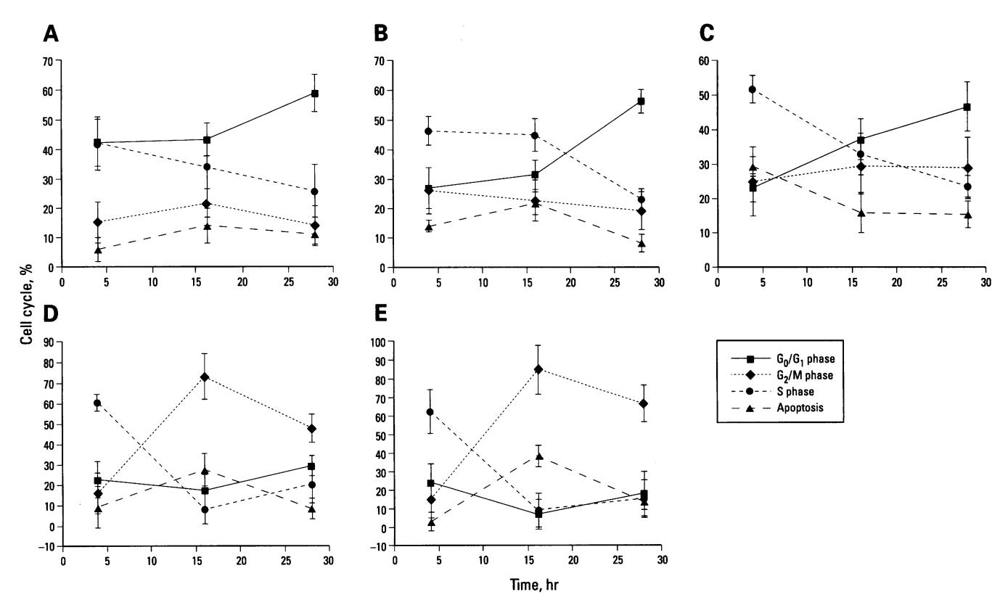
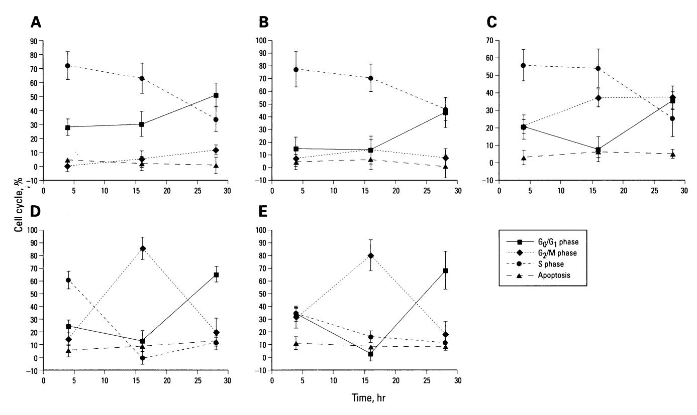

# DNA-dependent Protein Kinase Does Not Play a Role in Adaptive Survival Responses to Ionizing Radiation

Eric Odegaard, Chin-Rang Yang, and David A. Boothman

Department of Human Oncology and University of Wisconsin Comprehensive Cancer Center, University of Wisconsin–Madison, Madison, Wisconsin

We previously demonstrated that exposure of certain human tumor cells to very low chronic doses of ionizing radiation led to their enhanced survival following exposure to subsequent high doses of radiation. Survival enhancement due to these adaptive survival responses (ASRs) ranged from 1.5-fold to 2.2-fold in many human tumor cells. Furthermore, we showed that ASRs result from altered G1 checkpoint regulation, possibly mediated by overexpression of cyclin D1, proliferating cell nuclear antigen (PCNA), and the X-ray induction of cyclin A. Because cyclin D1 and PCNA proteins are components of many DNA synthetic and repair processes in the cell, we tested the hypothesis that preexposure of cells to low doses of ionizing radiation enabled activation of the DNA repair machinery needed for survival recovery after high-dose radiation. We examined the role of DNA break repair in ASRs using murine cells deficient (i.e., severe combined immunodeficiency [SCID] cells) or proficient (i.e., parental mouse strain [CB-17] cells) in DNA-dependent protein kinase catalytic subunit (DNA-PKcs) expression and DNA double-strand break repair. DNA-PKcs is a nuclear serine/threonine protein kinase that is activated by DNA breaks and plays a key role in double-strand break repair. DNA-PKcs also phosphorylates several nuclear DNA-binding regulatory transcription factor proteins (e.g., Sp1 and p53), which suggests that DNA-PKcs may play a role in regulating transcription, replication, and recombination as well as DNA repair, after radiation. Therefore, we exposed confluent SCID or CB-17 cells to low priming doses of ionizing radiation (i.e., 5 cGy) and compared the survival responses of primed cells to those of unprimed cells after an equitoxic highdose challenge. Low-dose-primed SCID or CB-17 cells demonstrated 2-fold enhanced survival after a high-dose challenge compared to that of unprimed control cells. These data suggest that expression of the catalytic subunit of DNA-PKcs (expressed in CB-17 not SCID cells) and the presence of active double-strand break repair processes (active in CB-17, deficient in SCID cells) do not play a major role in ASRs in mammalian cells. Furthermore, we present data that suggest that DNA-PKcs plays a role in the regulation of the G2/M cell cycle checkpoint following extremely high doses of ionizing radiation. — Environ Health Perspect 106(Suppl 1):301-305 (1998). http://ehpnet1.niehs.nih.gov/docs/1998/Suppl-1/301-305odegaard/abstract.html

Key words: adaptive survival responses, DNA-dependent protein kinase, X rays, SCID mice, DNA double-strand break repair

#### Introduction

Adaptive survival responses (ASRs) are observed when cells become resistant to cytotoxic agents after previous exposure to low doses of the same (1-4) or different

agents. ASRs have been observed in many cell types, including neoplastic (4) and normal (5–7) human cells, but the mechanism(s) underlying the emergence of such

This paper is based on a presentation at The Third BELLE Conference on Toxicological Defense Mechanisms and the Shape of Dose–Response Relationships held 12–14 November 1996 in Research Triangle Park, NC. Manuscript received at *EHP* 7 March 1997; accepted 13 May 1997.

This study was funded by grant DE-FG0293ER61707-06 to D.A. Boothman from the U.S. Department of Energy. The authors are grateful to all Boothman laboratory personnel for their many intriguing discussions of the data presented in this paper. We are also grateful to the U.S. Department of Energy for its continued and consistent support of our research on the mechanisms underlying adaptive survival responses in human cells.

Address correspondence to Dr. D.A. Boothman, Department of Human Oncology and University of Wisconsin Comprehensive Cancer Center, K4/626 Clinical Science Center, 600 Highland Avenue, University of Wisconsin–Madison, Madison, WI 53792. Telephone: (608) 262-4970. Fax: (608) 263-8613. E-mail: boothman@humonc.wisc.edu.

Abbreviations used: ASRs, adaptive survival responses; CB-17, parental mouse strain; DNA-PKcs, DNA-dependent protein kinase catalytic subunit; PBS, phosphate-buffered saline; PCNA, proliferating cell nuclear antigen; pRB, retinoblastoma protein; RCPs, retinoblastoma control proteins; SCID, severe combined immunodeficiency.

damage-induced resistance phenotypes remains obscure.

We recently found that ASRs were regulated by altered G1 cell-cycle checkpoint events occurring at an A point in which the involvement of cyclin A was suggested (4). We discovered that elevated proliferating cell nuclear antigen (PCNA) and cyclin D1 levels correlated in human cells with the ability of the cell to demonstrate ASRs (4). The fact that cells primed with low doses of ionizing radiation appeared to enter the cell cycle earlier after release by low-cell density than untreated confluent control cells confirmed that altered G1 cell-cycle checkpoint regulation controlled ASRs (4). Although we demonstrated that such ASRs were the specific result of new gene transcription and translation, we also demonstrated that the DNA binding of many common transcription factors (including Sp1, retinoblastoma control proteins (RCPs), p53, nuclear factor-κB, egr-1, AP-1, Oct-1, CREB, GRE, AP-2, and AP-3) remained unchanged in untreated, primed (i.e., low-dose irradiated), or high-dose challenged human cells that demonstrated highly efficient ASRs (8).

After characterizing ASRs in various human cancer cells after exposure to ionizing radiation (4,8,9), we decided to use model cell systems to explore the mechanisms behind ASRs. Since DNA doublestrand break repair is probably the single most important determinant in radiation sensitivity, we explored the role of the DNA-dependent protein kinase catalytic subunit (DNA-PKcs) in ASRs by comparing severe combined immunodeficiecy (SCID) cells, which do not express DNA-PKcs protein, and parental mouse strain (CB-17) cells, which express normal levels of the DNA double-strand break repair component [C-R Yang et al., unpublished data; (10)]. Our data indicate that DNA-PKcs plays no role in ASRs since low-dose ionizing radiation-induced resistance was apparent in both cell lines. Further cell cycle analyses using flow cytometry did reveal, however, that DNA-PKcs plays a role in G2/M cell-cycle checkpoint responses after very high-dose ionizing radiation exposures. Major differences between SCID and CB-17 cells in the overall number of cells in G2/M and differences in the length of time that damaged cells delayed in G2/M following ionizing radiation were observed. These data suggest a dual role for DNA-PKcs in repair and cell-cycle regulation.

### **Materials and Methods**

#### **Cell Culture Conditions**

Fibroblast cell lines derived from an SCID mouse and the corresponding CB-17, from which SCID mice were derived, were provided by M. Brown (Stanford University, Stanford, CA) (10). Both cell lines were grown in Dulbecco's Modified Eagle's medium, supplemented with 10% fetal bovine serum, penicillin 6-k (100 U/ml), and streptomycin sulfate (50 U/ml) in a 10% CO2-90% air atmosphere at 37°C. Analyses of these cell lines indicated that both express mutant p53 protein (i.e., high levels of p53 protein were found in the nucleus of each cell and DNA binding as measured by DNA band shift analyses was not observed), both express the retinoblastoma protein (pRb), and each cell line exhibits high levels of unphosphorylated Ku70-Ku80 heterodimeric DNA endbinding activity. SCID cells did not express DNA-PKcs enzyme activity or protein levels (or at least expressed levels that were not detected by either assay) (C-R Yang et al., in preparation).

#### Cell Irradiation and Clonogenic Survival Assessments

SCID and CB-17 cells were plated onto 100-mm2 tissue culture dishes and fed every third day until confluent, with both sets of cells obtaining an 85 to 90% arrest in G0/G1, as determined by flow cytometry (4,11,12). The cell lines did not vary significantly in their doubling times or plating efficiencies, and each cell line demonstrated approximately 42% efficiency in plating. Once confluent, low-dose (priming) or high-dose (challenging) ionizing radiation exposures were applied using a Phillips X-ray generator as described (13,14). For low-dose priming exposures, cells were treated with 5 cGy at 24-hr intervals if multiple priming doses were used. In a previous report (4) we demonstrated that a single priming dose of ionizing radiation was equivalent to repeated multiple priming doses. Cells (primed or unprimed) were also exposed to a high-dose challenge to yield equitoxic survival (i.e., approximately 10% survival in nonadapted cells). As expected, we found that SCID cells were much more sensitive to ionizing radiation than CB-17 cells. A dose of 250 cGy to SCID cells was equivalent in terms of clonogenic survival to a 500-cGy dose to CB-17 cells. Four hours after exposure cells were trypsinized, serially diluted in 5-fold increments, and plated on 60-mm2 tissue culture dishes for clonogenic survival assessment. After 14 days of growth, cells were rinsed twice with phosphate-buffered saline (PBS) and stained with a 0.2% crystal violet solution in methanol. Colony-forming ability was then scored by counting normal-appearing colonies (i.e., those containing 100 or more normal-appearing cells) as previously described by Boothman et al. (14), with error values indicating the standard deviation for each group. Experiments were conducted three times and duplicate cultures from each manipulation were obtained for each experiment.

## Flow Cytometry

Cells were treated with or without various doses of ionizing radiation as described above. For flow cytometric analyses, cells were washed twice with ice-cold PBS (150 mM NaCl, 50 mM KH2PO4, pH 7.4), trypsinized, and washed with a Tris/saline solution (10 mM Tris [pH 7.0] and 50 mM NaCl). Cells were then fixed in 90% ethanol-Tris/saline and stored at 4°C for up to 7 days. Samples were prepared for cell-cycle analyses by washing once with phosphate-citric acid buffer (0.2 M Na2HPO4 and 0.1 M citric acid [pH 7.8]) and staining with a solution containing 0.2% NP-40, RNase A (7,000 U/ml), and 33 µg/ml propidium iodide for 10 min. In our studies the phosphate citric acid wash has been a critical step for accurate assessment of apoptotic cell populations (15). Stained nuclei were analyzed for DNA-propidium fluorescence using a Becton Dickinson FACScan (Becton Dickinson, San Jose, CA) at a laser setting of 36 mW and an excitation wavelength of 488 nM. Resulting DNA distributions were analyzed for the proportion of cells in apoptosis and for cells in G0/G1, S, and G2/M phases of the cell cycle. Both SCID and CB-17 cells were 100% diploid at the beginning and end of each experiment, and in each case over 7000 events or cells were modeled using the program Modfit (Verity Software House, Topsham, ME). To visualize alterations in cell-cycle distributions, supralethal doses of ionizing radiation (i.e., 10-15 Gy) were used. Experiments were conducted three times and duplicate cultures from each manipulation were obtained in each experiment.

#### Results

#### **Survival Assessments**

When treated with low priming doses of ionizing radiation (5 cGy), both SCID and CB-17 cells demonstrated greater survival (125  $\pm$  9% and 137  $\pm$  15%, respectively) than those in unirradiated cultures (Table 1). This increase in colony-forming ability was highly reproducible in these two cell lines and has been observed with all cell lines that subsequently demonstrate ASRs to ionizing radiation (4,8,9). The plating efficiencies (-42%) and growth rates of each unirradiated cell line were very similar.

Both SCID and CB-17 cells also demonstrated efficient ASRs following to either one or two low-dose priming exposures of ionizing radiation. As expected, unprimed SCID or CB-17 cells treated with approximately equitoxic high challenging doses of ionizing radiation (i.e., 250 cGy for

**Table 1.** Role of DNA-PKcs expression in adaptive survival responsesa.

| Treatment b                                                    | % Survival (colony-forming ability) c |                                     |
|---------------------------------------------------------------------------|--------------------------------------------------|-------------------------------------|
|                                                                           | CB-17 (expresses DNA-PKcs)                    | SCID (does not express DNA-PKcs) |
| Untreated, 0.0 cGy                                                        | 100 ± 5                                          | 100 ± 1                             |
| Low-dose primed, 5 cGy                                                    | 137 ± 15                                         | 125 ± 9                             |
| 2×primed, 2×5 cGy                                                         | $58 \pm 2$                                       | 90 ± 11                             |
| Challenged, 250 cGy SCID; 500 cGy CB-17                                   | 12 ± 5                                           | 9 ± 1                               |
| Primed then challenged, 5 cGy, 250 cGy SCID, 500 cGY CB-17                | $22 \pm 3$                                       | 21 ± 3                              |
| 2×primed d then challenged, 5 cGy, 250 cGy SCID, 500 cGY CB-17 | $20 \pm 7$                                       | $18 \pm 6$                          |

\*SCID cells do not express the DNA-PKcs required for DNA double-strand break repair, whereas CB-17 cells express the protein and are competent at double-strand break repair. Therefore, SCID cells are deficient in double-strand break repair and V(D)J rejoining, whereas CB-17 cells are proficient at both. \*SCID and CB-17 cells were grown to confluence arrest using the multiple feeding schedule described in "Materials and Methods," and in Boothman et al. (23). Cells were then mock irradiated or treated with low-dose priming exposures of ionizing radiation (i.e., 5 cGy) or high-dose challenging exposures (i.e., 250 cGy for SCID, 500 cGy for CB-17). \*Colony-forming ability was measured using the trypsinization-serial dilution method as described in Boothman et al. (14). Only colonies with 100 or more normal-appearing cells were scored as a viable colony and presumed to be clonal. \*Dual priming doses of ionizing radiation (i.e., 2×5 cGy) were used to compare the effects with single-primed cells. Single priming was as efficient at producing ASRs as the multiple priming dose of ionizing radiation described in previous reports (4,9).

SCID, 500 cGy for CB-17) demonstrated similar surviving fractions (approximately 9–12% survival) (Table 1). Exposure of CB-17 cells to a high-dose challenge of irradiation resulted in 12 ± 5% survival. CB-17 cells demonstrated a nearly 2-fold increase in survival (i.e., 22% ± 3%) after exposure to 5 cGy priming and a subsequent high-dose challenge (Table 1). Interestingly, CB-17 cells exposed to two priming doses followed by a high-dose challenge also demonstrated a 2-fold increase in survival (20% ± 7%) compared to cells receiving only a high-dose challenge. It is not clear why CB-17 cells demonstrated low survival following two priming doses of ionizing radiation alone (58 ± 2%), yet still demonstrated efficient ASRs (Table 1).

SCID cells treated with a high dose of equitoxic, ionizing irradiation (250 cGy) showed similar survival levels (i.e., 9±1%) to those demonstrated for CB-17 cells (Table 1). SCID cells exposed to one priming dose (5 cGy) followed by a high-dose challenge of ionizing radiation showed 21±3% survival. Cells receiving

two priming doses followed by a high-dose challenge showed  $18\% \pm 6\%$  survival, indicating that as with CB-17 cells one priming dose of ionizing radiation was equivalent to multiple doses of radiation in terms of establishing ASRs. Unlike CB-17 cells, SCID cells demonstrated only a slight decrease in survival (i.e.,  $90 \pm 11\%$ ) after two priming doses (Table 1).

To investigate the possibility that ASRs were the result of altered cell-cycle distribution or cell viability between cell types [other than minor fluctuations in the G0/G1 portion of the cell cycle as previously described (4)], we analyzed cell-cycle population differences in primed or unprimed confluent SCID or CB-17 cells 4 to 30 hr after a high-dose challenge of ionizing radiation (250 cGy for SCID, 500 cGy for CB-17). Analyses of multiple experiments in which confluence-arrested SCID or CB-17 cells were treated with various doses of ionizing radiation revealed no measurable differences between unirradiated and irradiated cells (regardless of dose) in the cell cycle (i.e., cells in  $G_0/G_1$ , S,

 $G_2/M$ , and the overall percentage of apoptotic cells) when cells were maintained in confluence arrest (data not shown). Both unirradiated and irradiated populations (24 hr posttreatment) were 90% in  $G_0/G_1$  under the conditions of our experiments. We are currently examining longer time points after radiation to ascertain if more dramatic cell-cycle changes occur; however, results similar to those described here were previously published (4,9).

## Role of DNA-PKcs in Cell-cycle Regulation after Ionizing Radiation

In an attempt to determine the effect of DNA-PKcs expression (and therefore the presence or absence of double-strand break repair) on cell cycle regulation after ionizing radiation exposure, log-phase SCID and CB-17 cells were treated with various doses of X-rays; samples were taken at 4, 16, and 28 hr. Changes in cell-cycle distribution were then monitored by flow cytometry, as described in "Materials and Methods." The data in Figure 1A to E (for CB-17) and Figure 2A to E (for SCID) indicate that

Figure 1. Cell cycle regulation in CB-17 mouse cells, which express normal levels of the DNA-dependent DNA-PKcs after various doses of ionizing radiation. Log-phase CB-17 mouse cells, which express normal levels of DNA-PKcs, were plated at low densities. Twenty-four hours later, cells were irradiated with various doses of ionizing radiation and allowed to grow. Changes in cell-cycle distribution were monitored using flow cytometry as described in "Materials and Methods." Doses of ionizing radiation to which CB-17 cells were exposed were as follows: (A) 0.0 Gy; (B) 2.5 Gy; (C) 5.0 Gy; (D) 10 Gy; and (E) 15 Gy (1 Gy is equivalent to 100 cGy, the units used in the text). At certain data points, error bars were smaller than the symbol used.

Figure 2. Cell cycle regulation in SCID mouse cells, which lack expression of the DNA-PKcs, after various doses of ionizing radiation. Log-phase SCID mouse cells, which lack the expression of DNA-PKcs, were plated at low densities. Twenty-four hours after plating, cells were irradiated with various doses of ionizing radiation and allowed to grow. Cell cycle distribution effects were monitored using flow cytometry as described in "Materials and Methods." Doses of ionizing radiation to which the SCID cells were exposed as follows: (A) 0.0 Gy, (B) 2.5 Gy; (C) 5.0 Gy; (D) 10 Gy; and (E) 15 Gy (1 Gy is equivalent to 100 cGy, the units used in the text). At certain data points, error bars were smaller than the symbol used.

SCID cells (which lack DNA-PKcs expression) arrest only transiently in G2/M after ionizing radiation, particularly at higher doses (> 1000 cGy) of ionizing radiation. In contrast CB-17 cells (which express normal levels of DNA-PKcs) demonstrated efficient (>60%) and a more prolonged (>30 hr) G2/M cell-cycle checkpoint, particularly at the higher doses (> 1000 cGy) of ionizing radiation. No apparent G0/G1 arrest was observed in CB-17 cells (Figure 1D, 1E) at the higher doses of irradiation as observed in SCID cells (Figure 2D, 2E), probably because of the rather potent G2/M cell cycle arrest and because both cell lines express mutant p53 levels. These data are consistent with the lack of G1 cell-cycle checkpoint function of mutant p53 in various human and rodent cells (16-18). The S phase population of both cell types was reduced at these higher doses of radiation (Figure 1D, 1E and Figure 2D, 2E) consistent with cellcycle progression and subsequent arrest at G2/M. These data indicate not only that the expression of DNA-PKcs is involved in double-strand break repair, but that DNA

break repair may play a role in the  $G_2/M$  cell-cycle checkpoint. Although there were only slight changes in apoptosis within and between cell lines, additional experiments currently are being performed to examine later time points that may indicate a role for DNA-PKcs in the regulation of apoptosis.

### **Discussion**

Our data demonstrate that the DNA double-strand break repair protein, DNA-PKcs, does not play a major role in adaptive survival responses in mammalian cells. SCID cells, which lack expression of DNA-PKcs [(10,19,20); Yang et al., in preparation], demonstrated efficient and pronounced (2-fold) ASR-mediated increased resistance to ionizing radiation due to prior 5 cGy priming. Our data demonstrate that a single low dose of ionizing radiation can induce ASRs in mouse cells and that multiple priming doses are not necessarily required. These data are consistent with our previous results (4,9).

Although DNA-PKcs does not play a role in ASRs, it may play a role in the

G2/M cell-cycle checkpoint similar to the recently described role of the human mutL homologue protein in this cell-cycle checkpoint (21). Data in Figures 1 and 2 demonstrate that genetically matched, irradiated cells (i.e., CB-17 cells that express DNA-PKcs and SCID cells that lack this protein) differ significantly in the extent and length of time spent in the G2/M checkpoint following very high doses of ionizing radiation (i.e., 10 Gy). Only a small proportion of SCID cells demonstrated a very transient G2/M cell-cycle arrest, whereas a much larger proportion of CB-17 cells appeared to delay much longer at this cell-cycle checkpoint. Assuming that SCID and CB-17 cells received the same initial DNA damage (10,19), (i.e., cells were treated with equitoxic doses of X rays), the difference in cell-cycle regulation at this checkpoint could be a major determinant in overall cell sensitivity to ionizing radiation. The persistent presence of DNA double-strand breaks and the lack of cell-cycle blockage at the G2/M cell-cycle checkpoint before chromosome segregation would be

disastrous to cell viability in SCID cells. It should be noted, however, that this phenomenon was only observed at very high doses of ionizing radiation. Later time points may be needed to observe difference among these cells at lower doses.

According to conventional theory, the presence of double-strand breaks is thought to lead to G2/M cell-cycle checkpoint arrest. In the case of SCID cells, however, the data indicate the possible existence of DNA double-strand break tolerance that would be

sufficient to explain the dramatic decrease in cell survival of these cells compared to that for their genetically matched partner, CB-17 cells. Our data indicate the possibility of a prominent role for DNA-PKcs in the G2/M cell-cycle checkpoint, which may exist to allow repair before mitotic segregation. Further experimentation is under way to explore links between DNA-PKcs, its absence, and/or apoptosis. We speculate that SCID cells may be similar to preapoptotic cells, in which DNA-PKcs is cleaved

by radiation- or DNA damage-induced apoptotic proteases (22). The lack of expression of DNA-PKcs in SCID cells may, therefore, predispose the cell for commitment to undergo an apoptotic death. Therefore, DNA-PKcs may not only be involved in double-strand break repair and cell-cycle regulation; it actually may be a pivotal player as an apoptotic protector against programmed cell-death responses that occur after ionizing radiation.

#### REFERENCES

- 1. Wolff S, Jostes R, Cross FT, Hui TE, Afzal V, Wiencke JK. Adaptive response of human lymphocytes for the repair of radoninduced chromosomal damage. Mutat Res 250:299-306 (1991).
- Wolff S. Adaptation to ionizing radiation induced by prior
- exposure to very low doses. Chin Med J 107:425–430 (1994). Wolff S, Afzal V, Jostes RF, Wiencke JK. Indications of repair of radon-induced chromosome damage in human lymphocytes: an adaptive response induced by low doses of X-rays. Environ
- Health Perspect 101:73-77 (1993).
  4. Boothman DA, Meyers M, Odegaard E, Wang M. Altered G1 checkpoint control determines adaptive survival responses to ionizing radiation. Mutat Res 358:143–154 (1996).
- Shadley JD, Dai GQ. Cytogenetic and survival adaptive responses in G1 phase human lymphocytes. Mutat Res 265:273–281 (1992).
- Shadley JD, Dai G. Evidence that the adaptive response of human lymphocytes to ionizing radiation acts on lethal damage in nonaberrant cells. Mutat Res 301:171–176 (1993).
- Shadley JD. Chromosomal adaptive response in human lymphocytes. Radiat Res 138:S9-S12 (1994)
- Boothman DA, Odegaard E, Sahijdak WM, Meyers M, Yang C-Y. Lack of transcription factor alterations following ultra-low doses of ionizing radiation. In: Congress Proceedings, Radiation Research 1895-1995 (Hagen U, Harder D, Jung H, Streffer C, eds). Vol 2: Congress Lectures. Wurzburg, Germany:Deutsche Rontgeugesellschaft Deutsche Gesellschaft fur Biophysik Gemeinschaftsauschub Strahlemfor schung (GAST), 1995;676–681.
- 9. Meyers M, Shea R, Seabury H, Petrowski A, McLaughlin WP, Lee I, Lee SW, Boothman DA. Role of X-ray-induced genes and proteins in adaptive survival responses. In: Low Dose Irradiation and Biological Defense Mechanisms (Sugahara T, Sagan LA, Aoyama T, eds). Amsterdam: Elsevier Science, 1992;263-266.
- 10. Kirchgessner CU, Patil CK, Evans JW, Cuomo CA, Fried LM, Carter T, Oettinger MA, Brown JM. DNA-dependent kinase (p350) as a candidate gene for the murine SCID defect. Science 267:1178–1183 (1995).
- 11. Boothman DA, Bouvard I, Hughes EN. Identification and characterization of X-ray-induced proteins in human cells. Cancer Res 49:2871-2878 (1989).
- Boothman DA, Trask DK, Pardee AB. Inhibition of potentially lethal DNA damage repair in human tumor cells by betalapachone, an activator of topoisomerase I. Cancer Res 49:605–612 (1989).

- 13. Boothman DA, Pardee AB. Inhibition of radiation-induced neoplastic transformation by beta-lapachone. Proc Natl Acad Sci USA 86:4963-4967 (1989).
- 14. Boothman DA, Greer S, Pardee AB. Potentiation of halogenated pyrimidine radiosensitizers in human carcinoma cells by beta-lapachone (3,4-dihydro-2,2-dimethyl-2*H*-naphtho[1,2b]pyran-5,6-dione), a novel DNA repair inhibitor. Cancer Res 47:5361–5366 (1987).
- 15. Planchon SM, Wuerzberger S, Frydman B, Witiak DT, Hutson P, Church DR, Wilding G, Boothman DA. Beta-lapachone-mediated apoptosis in human promyelocytic leukemia (HL-60) and human prostate cancer cells: a p53-independent response. Cancer Res 55:3706-3711 (1995).
- 16. Nelson WG, Kastan MB. DNA strand breaks: the DNA template alterations that trigger p53-dependent DNA damage response pathways. Mol Cell Biol 14:1815-1823 (1994)
- 17. Kastan MB, Zhan Q, el Diery W, Carrier F, Jacks T, Walsh WV, Plunkett BS, Vogelstein B, Fornace AJ. A mammalian cell cycle checkpoint pathway utilizing p53 and GADD45 is defective in ataxia-telangiectasia. Cell 71:587-597 (1992).
- 18. Lane DP. p53, guardian of the genome. Nature (Lond) 358:15–16 (1992)
- 19. Kirchgessner CU, Tosto LM, Biedermann KA, Kovacs M, Araujo D, Stanbridge EJ, Brown JM. Complementation of the radiosensitive phenotype in severe combined immunodeficient mice by human chromosome 8. Cancer Res 53:6011-6016 (1993)
- 20. Chen YR, Lees-Miller SP, Tegtmeyer P, Anderson CW. The human DNA-activated protein kinase phosphorylates simian virus 40 T antigen at amino- and carboxy-terminal sites. J Virol 65:5131-5140 (1991).
- 21. Davis TW, Wilson-Van Patten C, Meyers M, Kunugi KA, Reznikoff C, Cuthill S, Acharya S, Garces C, Koi M, Boland CR et al. Defective expression of the hmlh1 DNA mismatch repair protein alters  $G_2/M$  cell cycle checkpoint arrest following ionizing radiation. Cancer Res (in press).
- 22. Casciola-Rosen LA, Anhalt GJ, Rosen A. DNA-dependent protein kinase is one of a subset of autoantigens specifically cleaved early during apoptosis. J Exp Med 182:1625-1634 (1995).
- 23. Boothman DA, Lee SW, Trask DK, Dou Q-P, Hughes EN. X-ray inducible genes and proteins in human cells. In: UCLA Symposia on Molecular and Cellular Biology (Wallace SS, Painter RB, eds). Ionizing Radiation Damage to DNA: Molecular Aspects. New York: Wiley-Liss, 1990;309–317.