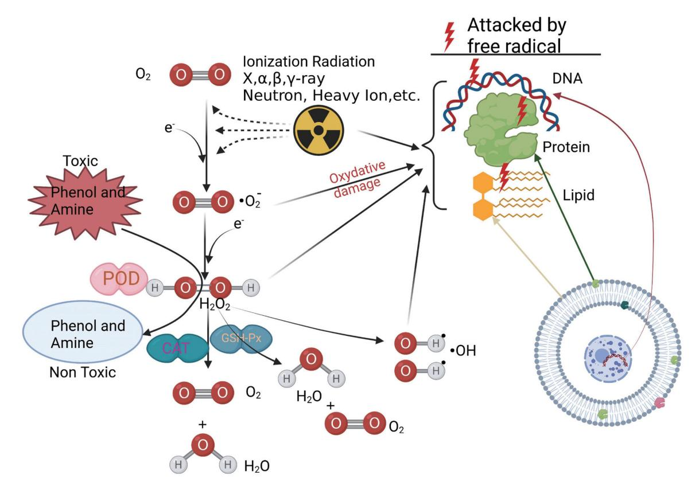
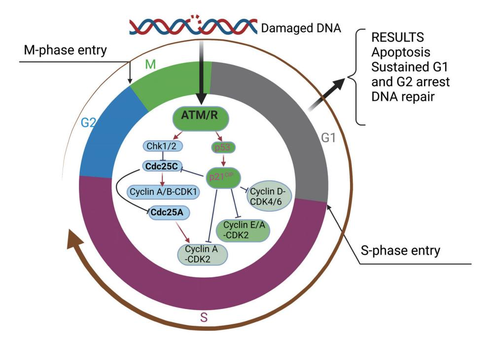

DOI: [10.14218/ERHM.2021.00020](https://doi.org/10.14218/ERHM.2021.00020)

# **Review Article**

# **The Role of DNA Damage Induced by Low/High Dose Ionizing Radiation in Cell Carcinogenesis**

Chengyou Jia1, Qiang Wang2, Xinhuang Yao3 and Jianshe Yang2,3,4[\\*](https://orcid.org/0000-0001-7069-6072)

*1Shanghai Research Center for Thyroid Diseases, Shanghai Tenth People's Hospital, Tongji University School of Medicine, Shanghai, China; 2Gansu Medical College, Pingliang, China; 3Third Affiliated Hospital of the Chinese University of Hong Kong, Shenzhen, China; 4Department of Nuclear Medicine, Shanghai Tenth People's Hospital, Tongji University, Shanghai, China*

**Received:** April 25, 2021 | **Revised:** May 14, 2021 | **Accepted:** June 07, 2021 | **Published:** June 21, 2021

# **Abstract**

Cell damage caused by ionizing radiation is very complex, and has generalities and specificities regarding different ionizing radiation types, characters and radiating methods. These specificities have a complicated molecular mechanism and result in various radiobiological responses; however, the details remain unclear. Ionizing radiation can impair biological macromolecules in cells, such as DNA, RNA, signal proteins. Moreover, different radiation doses, as well as linear energy transfer (LET), cause various effects. Cells show a certain adaptive response to low-dose ionizing radiation (LDIR) when they receive a secondary larger dose of radiation. By contrast, high-dose or LET ionizing radiation can lead a much more serious attack on macromolecules, especially to the molecules involved in gene mutations, DNA single strand breaks (SSBs), DNA double strand breaks (DSBs) and DNA damage repair responses. Under extreme conditions, such as space radiation during a space mission, a large amount of abnormally repaired DNA may vastly affect the cell signal transduction pathway, initiate apoptosis, uncontrolled cell proliferation, and even carcinogenesis. In this mini-review, the molecular mechanism of carcinogenesis induced by high-dose and LET ionizing radiation in cell lifespan is elucidated.

#### **Introduction**

With the wide application of nuclear energy in industry, energy and military fields, ionizing radiation influences human beings more and more. Especially after the nuclear power plant leakage due to the earthquake in Fukushima, Japan, radiation threat to life has become a hot topic again.**[1](#page-5-0)** The molecular mechanism of ionizing radiation damage has long been the focus of radiobiology, cell biology, cancer, biophysics and radiation protection. The atoms in ionization and excitation status, or molecules produced by ionizing radiation are unstable and thereafter rapidly transform into

**Keywords:** Cancer; Mechanism; DNA damage; Linear energy transfer; Ionizing radiation.

**Abbreviations:** LDIR, low dose ionizing radiation; HDIR, high dose ionizing radiation; LET, linear energy transfer; SSB, single-strand break; DSB, double-strand break; ROS, reactive oxygen species.

\***Correspondence to:** Jianshe Yang, Department of Nuclear Medicine, Shanghai Tenth People's Hospital, Tongji University, Shanghai 200072, China. ORCID: [https://orcid.](https://orcid.org/0000-0001-7069-6072) [org/0000-0001-7069-6072.](https://orcid.org/0000-0001-7069-6072) Tel: +86-21-66302721, Fax: +86-21-6630-2721, E-mail: [yangjs@impcas.ac.cn](mailto:yangjs@impcas.ac.cn)

**How to cite this article:** Jia C, Wang Q, Yao X, Yang J. The Role of DNA Damage Induced by Low/High Dose Ionizing Radiation in Cell Carcinogenesis. *Explor Res Hypothesis Med* 2021;6(4):177–184. doi: 10.14218/ERHM.2021.00020.

free radicals and neutral molecules that result in complex chemical changes. The structure of biomolecules in cells maintain the normal function of cells, and thus the effect of ionizing radiation on cells shows a similar pattern. Ionizing radiation exists everywhere all the time; however, the exact molecular mechanism between ionizing radiation and cells remains unclear. In this minireview, the cellular effects of different ionizing radiation doses and linear energy transfer (LET, meaning the energy deposition at a given distance through the path of penetrating rays) are discussed. In conclusion, low dose ionizing radiation (LDIR) can induce an adaptive response of cells. High dose ionizing radiation (HDIR) generally causes DNA and RNA damage, cell signal transduction changes and carcinogenesis. High LET radiation exhibits a higher potential for inducing cell damage and eventually results in carcinogenesis. We expect that further exploration will help reveal the interactive mechanism between ionizing radiation and cells, and provide suggestions for better protection from radiation. A summary of the ionizing radiation works are in [Table 1](#page-1-0).

#### **LDIR-induced cells elicit an adaptive response**

LDIR can enhance the resistance of cells to HDIR, and thus reduce

**Table 1. Comparison of LDIR with HDIR in terms of their biological response and clinical applications**

| Radiobiological effect                              | Radiation type                    | LDIR (with low LET)    | HDIR (with high LET) |
|-----------------------------------------------------|-----------------------------------|------------------------|----------------------|
| Dose range                                          |                                   | ≤0.2 Gy                | >0.2 Gy              |
| Biological effects (including clinical application) |                                   | Adaptive response      | Carcinogenesis       |
|                                                     |                                   | Harmful effect         | Radiotherapy         |
| Lesions                                             | Signal transduction abnormalities | weak                   | strong               |
|                                                     | ROS inducing                      | weak                   | strong               |
|                                                     | DNA damage (SSB, DSB)             | weak                   | strong               |
|                                                     | miRNA damage                      | weak                   | strong               |
| Outcome                                             |                                   | No more harmful impact | Bi-lateral outcomes  |

LDIR, low dose ionizing radiation; HDIR, high dose ionizing radiation; LET, linear energy transfer; SSB, single strand break; DSB, double strand break; ROS, reactive oxygen species

the secondary multiple effects on chromosome distortion and DNA damage. This process is called the "adaptive response".**[2](#page-5-1)[,3](#page-5-2)** Its molecular mechanism involves signal transduction, the role of reactive oxygen species (ROS) and the excitatory effect of DNA repair.

#### **LDIR-induced signal transduction abnormalities**

Intracellular signal transduction is a complex process affected by various factors. Normal cell growth, proliferation and differentiation, and physiological functions are modulated by strict signal conditioning. LDIR is a special extracellular stimulation factor and can induce the phosphorylation and ethylation of intracellular and extracellular signal transduction proteins. Thus, LDIR can affect gene transcription and expression, and can result in cell structure and functional changes that involve cell growth, proliferation and differentiation.**[4–](#page-5-3)[7](#page-5-4)** Though the mechanism of ionizing radiation on the cell signal transduction pathway that leads to abnormal cell proliferation regulation is not fully understood, it was recently found that intracellular signal transduction molecules, such as Protein kinase C (PKC), protein kinase A (PKA), receptor tyrosine kinase (RTK), exhibited better function after exposure.

PKC is the main component of the cell signal transduction pathway, which plays an important role in the adaptive response of LDIR.**[8](#page-5-5)–[10](#page-5-6)** PKC can not only catalyze the phosphorylation of Ca2+ channels on plasma membrane, promote the influx of Ca2+ channels, increase the concentration of Ca2+ in cytoplasm, but can also catalyze the phosphorylation of Ca2+ ATP enzyme in sarcoplasmic reticulum. This can make calcium ions enter the sarcoplasmic reticulum and decrease the concentration of Ca2+ in the cytoplasm to regulate various physiological activities that are dependent on Ca2+ and to maintain a dynamic balance. In the signal transduction pathway of the PKC system, the receptor binds to the first messenger molecule to activate the GQ protein on the membrane. Thereafter, the GQ protein decomposes phosphatidylinositol 4, 5-diphosphatase (PIP2) into diacylglycerol (DAG) and a second messenger called inositol 1, 4, 5-triphosphatase (IP3) to activate phosphatase Cβ (PLC). DAG coactivates PKC, with PS and Ca2+, and thus causes a series of target protein phosphorylations that include serine residues or threonine residues.**[11–](#page-5-7)[13](#page-5-8)** Previous studies showed that DAG, PKC and other signals exposed to LDIR were significantly activated, and thus changed the downstream signal transduction pathway and induced apoptosis. Other studies have found that PKC may be involved in the signal transduction process of radiation-induced apoptosis/survival of tumor cells, as well as the different initiation pathways that may be related to the subtypes of PKC.**[14,](#page-5-9)[15](#page-5-10)**

The PKA signal pathway is usually composed of hormone receptor G protein and cAMP kinase A, and influences the gene transcription process. It has been reported that ionizing radiation can activate the cAMP response elements to activate downstream PKA, and thus change gene transcription in the nucleus.**[16](#page-5-11)** Cho *et al.***[17](#page-5-12)** used lung cancer cells to inhibit gamma-ray-induced DNA damage repair by promoting the degradation of X-ray repair cross complementing 1 (XRCC1) ubiquitin proteasome that is dependent on the exchange protein activated by cAMP (Epac). Other studies have shown that PKA, in cooperation with other substances, inhibits tumor growth after radiation exposure *in vitro* and *in vivo*. **[18,](#page-5-13)[19](#page-5-14)** In conclusion, the function of the PKA signaling pathway in radiation-exposed cells is complex, which may be due to the complexity of cell damage caused by ionizing radiation.

Receptor tyrosine kinase is a large family of receptors on the surface of cells. They are usually composed of epidermis growth factor (EGF) receptor, platelet derived growth factor (PDGF) receptor, vascular endothelial growth factor (VEGF) receptor and so on. Once the signal molecule binds to the extracellular domain of the receptor, the two monomer receptor molecules form two dimers on the cell membrane, and the tail of the two receptor intracellular domains contact each other and facilitate tyrosine phosphorylation in the tail. The resulting signal complexes initiate a variety of different signal transduction pathways and expand information to activate a series of intracellular biochemical reactions or integrate different information to introduce synthetic reactions, such as cell proliferation. In recent years, some reports have mentioned the positive effect of ionizing radiation on RTK. For example, Tamaishi *et al.***[20](#page-5-15)** irradiated mutated 549 cells with 0.1 Gy gamma rays to induce the P2Y6 receptor to activate extracellular signal-regulated kinase. The whole process depends on the activation of EGFR. However, in the wild type 549 cell line, ionizing radiation can lead to overexpression of VEGF in cells alone.**[21](#page-5-16),[22](#page-5-17)** This is very interesting, but further demonstrates the easy interaction between radiation exposure and mutant genes. Dadrich *et al.***[23](#page-5-18)** treated mechanical cells and endothelial cells with a certain dose of irradiation and fibroblasts to produce PDGF, autocrine and paracrine signals, and finally directly or indirectly promoted cell proliferation.

# **LDIR-induced ROS in cells**

ROS, hydrogen peroxide (H2O2), hydroxyl radical (-OH), *etc.,***[24](#page-5-19),[25](#page-5-20)** can be produced by ionizing radiation. These substances can not

**Fig. 1. The process of active oxygen metabolism in cells by irradiation. Reactive oxygen species (ROS), hydrogen peroxide (H**2**O**2**), hydroxyl radical (·OH) can be produced by ionizing radiation.** These substances can not only attack the cell membrane and organelles, but can also destroy proteins, membrane phospholipids and nucleic acids, resulting in cell death or apoptosis.

only attack cell membrane and organelles, but can also destroy protein, membrane phospholipid and nucleic acid, resulting in cell death or apoptosis. ROS is related to ionizing radiation damage,**[26](#page-6-0)** which promotes radiation damage to a certain extent. Fang *et al.***[27](#page-6-1)** proved that the accumulation of ROS in cells may lead to radiosensitization. However, during the long-term evolution, cells formed a mature antioxidant enzyme system to reduce oxidative damage. There are many enzymes in the cells that can destroy ROS, which are mainly composed of superoxide dismutase (SOD), catalase (CAT), ascorbate peroxide (APX) and glutathion peroxidase (GPX).**[28,](#page-6-2)[29](#page-6-3)** The activity of copper and zinc SOD in *Chironomus larvae* irradiated with low dose gamma rays also presented three to four times higher than that of the control. However, the activities of GR and GPX showed a downward trend. Eken *et al.***[30](#page-6-4)** found that the monthly absorbed dose of 0.10–3.8 mGy radiation can significantly enhance the activities of copper and zinc SOD and GPX, while the CAT and MDA level were significantly lower than those in the control group. LDIR can cause changes in the activities of several different enzymes and may be due to the difference of cell type, irradiation time and spatial construct of enzymes.**[31](#page-6-5)** All these complexities are elucidated in [Figure 1](#page-2-0).

#### **DNA repair under LDIR**

The adaptive response induced by LDIR is mainly associated with DNA damage repair hormone modulated by ataxia telangiectasia mutated (ATM) phosphorylation. ATM is an important gene that can detect and initiate DNA damage repair in normal cells. ATM protein kinase can activate the DNA repair cascade signal after cells are exposed to radiation.**[32](#page-6-6)** It has been reported that ATM plays an important role in activating apoptosis and downstream elements of DNA repair, such as p53 and Chk1. Bardelle *et al.***[33](#page-6-7)** found that ATM will be activated in irradiated cells, resulting in the phosphorylation of many downstream target proteins and the regulation of various damage response pathways, include the change of cell cycle checkpoint ([Fig. 2\)](#page-3-0).**[34](#page-6-8),[35](#page-6-9)** More experiments provide evidence that the p53 gene response induced by ionizing radiation damage is modulated by ATM.**[36](#page-6-10)[,37](#page-6-11)** Activated ATM can phosphorylate serine kinase, stabilize p53 and significantly increase p53 concentration. Thus, p21CIP gene expression can both activate or inhibit downstream signal transduction.**[38](#page-6-12)** During this process, ATP release is tightly related to this process. For example, van Gisbergen *et al.***[39](#page-6-13)** found the increase of intracellular ATP in human lung cancer 549 cells that were irradiated by gamma rays with a total dose of 2.0Gy. Beishline *et al.***[40](#page-6-14)** compared the expression of mitochondrial genes in GM 13740 (Leigh syndrome) and GM 15036 (normal subjects) irradiated with X-ray (dose range from 0 to 4 Gy) for 24 h, and found that the gene expression level was associated with the radiation dose and time. The above process may occur under different irradiation conditions, which is necessary to explore how common the radiation effect is and to possibly clarify its mechanism. In addition, there are other genes related to ionizing radiation, such as H2AXCDKN1A, P53, pChk2, Cdc25C, etc., which can be differentially affected by ionizing radiation in terms of their expression level and subsequent responses ([Fig. 2\)](#page-3-0).**[41](#page-6-15)–[43](#page-6-16)**

**Fig. 2. The pathway of checkpoint controls by ATM in the cell cycle.** The adaptive response induced by LDIR is mainly associated with DNA damage repair hormone which is modulated by ataxia telangiectasia mutated (ATM) phosphorylation. ATM can detect and initiate DNA damage repair in normal cells. ATM protein kinase can activate the DNA repair cascade signal after cells are exposed to radiation.

## **HDIR-induced DNA strand break**

DNA damage caused by ionizing radiation mainly includes changes of nuclear acids, glycosylation, DNA single-strand breaks (SSBs), DNA double-strand breaks (DSBs) and DNA cross-linkages.**[44–](#page-6-17)[47](#page-6-18)** HDIR can initially cause damage and glycosylation of the DNA. The change of DNA stability will result in the destruction of the internal structure. DNA strand breaks are the main lesions of HDIR whereby the SSBs damage gradually replaces the DSBs damage as the LET increases and exceeds the adaptive threshold.**[48](#page-6-19)** The dynamic repair of human liver cancer SMMC-7721 and normal liver L02 cells was observed at and after 24 h exposed to radiation. The results showed that the effect of high LET on the DNA DSBs of SMMC-7721 and L02 cells was much greater than that of SSBs. In the same laboratory, they used γ-rays produced by 60Co to irradiate SMMC-7721 and used the early chromosomal condensation technique induced by Calyculin-A to study chromosome damage. The results showed that there was a linear relationship between chromatid breaks and radiation dose in the G2 phase. There was also a strong correlation between the fragmentation of the chromatid and cell viability.**[49](#page-6-20)** In addition, different radiation particles have different radiation damage effects.

#### **Possible molecular mechanisms of DNA repair**

DNA is the control center of all life activities in the cell, but DNA is not static. It is well known that many factors, including ionizing radiation, can change the DNA structure and influence its functions. DNA damage may be fatal, or affect the growth, proliferation and differentiation of normal cells. Cells evolute the capacity of protective repair in order to reduce the risk of pernicious gene mutation. These protective repairs mainly rely on cell cycle regulation. When the DNA structure changes, some molecules can be identified and repaired to prevent DNA damage. Here, the damage checkpoint is activated to recognize these changes, and appropriate signal pathways begin to protect the integrity of the genome. This series of processes is called DNA damage repair.**[50](#page-6-21),[51](#page-6-22)** There are many types of DNA damage repair processes related to ionizing radiation, including excision repair, recombinant repair and SOS reactions. Several genes can initiate DNA repair. For example, ATM, located on human chromosome 11q22-23, is an important gene to identify and repair DNA damage. It is involved in many complex cell cycle checkpoints like G1 to S, S and G2 to M. ATM mediates intermolecular interaction activations and parasitic corresponding cytokines through signal transduction pathways and then regulates the cell cycle [\(Fig. 2](#page-3-0)). Given successfully repaired DNA damage, cells will survive and complete normal proliferation and differentiation. As for severe DNA damage, which is difficult to fix, the cells can activate the checkpoint and initiate the apoptosis pathway. Simple DNA damage caused by LDIR can generally be repaired and have function recovered. However, HDIR is a kind of higher denaturation, which can lead to DNA DSBs,**[52](#page-6-23),[53](#page-6-24)** which is a very severe lesion that is difficult to be repaired and eventually develops into cancer. Yang *et al.***[48](#page-6-19)** observed the dynamic repair process of normal human hepatocytes 48 hours after gamma-ray irradiation and found that DSBs and SSBs increased with an increasing irradiation dose, and that the amount of DSBs was much greater than that of SSBs. After 24 hours of culture, both DSBs and SSBs were repaired to a certain extent. About 50% of the stained haplotypes and up to 15% of the allochromatic DNA breaks were repaired. However, the isochromatid breaks were difficult to repair, although this population was relatively small.

Ionizing radiation can induce homologous recombination of alleles, which is unusual in mammalian cells. Radiation-induced DSBs tend to lead to non-homologous end joining (NHEJ) repairment, which is an important factor in the formation of chromosomal abnormalities and gene mutations, and can further induce mutations and malignant transformations.**[54](#page-6-25)**

Base excision repair (BER) is a principle approach to repair DNA damage.**[55](#page-6-26)[,56](#page-6-27)** A great deal of evidence shows that DNA damage caused by ionizing radiation or intrinsic ROS can be repaired by base excision.**[57](#page-6-28)** Miné-hattab *et al.***[58](#page-6-29)** found that the key enzyme in the process of BER is DNA glycosylenzyme, which can remove damaged bases by breaking the N-sugar bond between the base and the deoxyribose residue. The initiation mechanism varies with repair time, but its processes mainly include site recognition, anuria or pyrimidine (AP) processing incision, DNA synthesis and DNA junction. Chromatin recombinant repair is an important dynamic repair process.**[59](#page-6-30),[60](#page-6-31)** d'Ari R**[61](#page-6-32)** irradiated U87MG and A549 cells in which Amir-vectors, Amir-XRCC2, Amir-XRCC4 were stably expressed with different doses. It was found that inhibition of the NHEJ protein XRCC4 and homologous recombinant protein XRCC2 could improve the sensitivity of tumor cells to LDIR *in vitro* and *in vivo*. It has thus been suggested that recombinant repair plays an important role in cells. For example, in emergency conditions, DNA DSBs can cause a cell SOS response, genomic instability and cell death.**[62](#page-6-33)** Some studies have shown that the SOS response of cells is different. For example, *Escherichia coli***[63](#page-6-34)** and *Bacillus subtilis* (Bacillussubtilis) over-killed by ionizing radiation showed differences in SOS response, with the SOS reaction more obvious with an increase of radiation dose. In addition, the cell cycle checkpoint was emptied and suppressed by cyclin, in which case the ionizing radiation damaged DNA was repaired.**[64](#page-7-0)[–66](#page-7-1)**

#### **Ionizing radiation induces carcinogenesis**

Oncogenes and tumor suppressors are pairs of converse-function genes related to cell life activity in normal eukaryotic cells. Cancerous cells are highly associated with these pairs of genes. The activation of proto-oncogene is caused by point mutations or chromosome shifts, while the inactivation of tumor suppressor genes is caused by mutation, deletion and insertion.**[67,](#page-7-2)[68](#page-7-3)** In general, the change of single proto-oncogene or tumor suppression genes cannot possibly induce cell carcinogenesis, however, the accumulated mutations of multiple cell proliferation-related genes can unavoidably induce such disastrous results. Unfortunately, this can ultimately lead to a disorder of the cell proliferation control system and finally to cancer.**[69](#page-7-4)** The carcinogenic mechanism by ionizing radiation exposure remains unclear to date due to the various influencing factors. Briefly, the genetic changes caused by ionizing radiation mainly arise from large DNA segment deletions, and hence prevent gene changes and effectively reduce carcinogenesis.**[43](#page-6-16)** HDIR is often considered to be the cause of cell carcinogenesis. For example, ionizing radiation leads to structural changes of some signal transduction proteins, the formation of spontaneous dimerization and further phosphorylation, resulting in the continuous activation of downstream signals and the proliferation of malignant cells. Radiation can lead to the deletion of the extracellular domain of normal EGFR. In the absence of the corresponding ligand,**[70](#page-7-5),[71](#page-7-6)** it can be transformed into an ErbB tumor protein dimer through selfbinding, which can induce abnormal cell proliferation. In addition, the lack of cell checkpoint gene p53 can lead to the disappearance of the DNA damage checkpoint,**[72–](#page-7-7)[74](#page-7-8)** which will result in cell carcinogenesis. Normally, the concentration of Cyclin p53 in cells is very low because it is very unstable and can degrade rapidly.**[75](#page-7-9)** While under stress, the expression of p53 gene increases, similar to HDIR conditions. When the p53 G1 checkpoint is abnormally modulated, the damaged DNA can replicate and continue to mutate and recombine. This process can subsequently transmit to the progeny cells and eventually lead to deformed cells. In addition, p53 induces p21 CIP protein to inhibit the mitosis of the cell cycle B-CDK1 complex, resulting in G2 phase arrest.**[76](#page-7-10)[–78](#page-7-11)** However, in fact, LDIR also plays a role in inducing**[79,](#page-7-12)[80](#page-7-13)** the continuous activation and inhibition of some special cycle genes related to cell proliferation. Bong *et al.***[81](#page-7-14)** irradiated AKR/J mice with IDIR and HDIR to explore the difference in gene expression. Their microarray results showed that the expression of tumor related genes CDS1, Itga 4, Myc and Itgb 1 gene were up-regulated. This implied that the radiation exposure impacted the gene expression level effectively,

# **Ionizing radiation effects on microRNA**

Hundreds of microRNAs are highly conserved non-coding RNA, which can change protein expression and regulate a variety of cell processes, including the control of development time, cell proliferation, apoptosis,**[82](#page-7-15)** and tumor and cell stress response. In the case of DNA injury, miRNAs can activate apoptosis**[83](#page-7-16)** and block the cell cycle.**[84](#page-7-17)** Thus, this process can directly and indirectly activate the tumor suppression target gene p53. With the deepening knowledge of radiology research and the maturity of advanced radiotherapy technology, it has been found that radiation dose also has an effect on RNA.**[85](#page-7-18)** In daily life, the expression of miRNA can be ignored under LDIR because it generally does not have acute or chronic side effects. However, the significant expression level change of miRNA under HDIR needs to be empharsized.**[86](#page-7-19)** A study showed that 1.25 Gy X-ray irradiation in radiotherapy significantly upregulates the expression of miRNA.**[87](#page-7-20)**

#### **Perspective**

We must realize that radiation always surrounds us all the time and everywhere. LDIR has an adaptive response, which can be further applied to radiation protection. Meanwhile, the HDIR and high LET ionizing radiation have bi-direction radiobiological effects, which can potentially induce carcinogenesis and can be used for radiotherapy for most solid tumors with limited metastasis. Elucidating the detailed mechanisms regarding how radiation particles interact with the body at the microscopic and macroscopic level is the main task in the present and future works, especially for those studies that examine what and how radiation particles induce cancers and are affected by radiotherapy.

## **Conclusion**

Cell damage caused by ionizing radiation has made remarkable progress both at macro and micro level. However, radiobiological effects are highly different for various types of radiation. Even when the same kind of cells are exposed to different ionizing radiation, the mechanism of action may be very different. Studies have shown that radiation can cause cancer, but can also treat cancer. Research in this field has opened up a new way to solve the problem of cancer. Elucidating the molecular mechanism of cell damage caused by ionizing radiation will make this field a gamechanging development. Different radiation types induce different effective damages. For example, light and X-ray are the most common types of ionizing radiation, and a very low dose can have a limited effect on the human body. HDIR may initially lead to DNA base changes and glycosylation damage, which can affect the stability of DNA and result in damage to the internal structure of DNA. DNA strand breaks are the main lesion type of HDIR. As LET increases and exceeds the adaptive threshold, SSBs will gradually replace DSBs, which is a very serious lesion due to the high risk of carcinogenesis.

# **Acknowledgments**

We express thanks to Dr. Xigang Jing, associate professor of Medical College Wisconsin, USA, for his expert opinions in radiobological physiology.

#### **Funding**

This work was supported by the Special Fund for Economic and Scientific Development in Longgang District, Shenzhen City, Guangdong Province (No. LGKCYLWS2020043).

# **Conflict of interest**

The authors have no conflicts of interest to declare.

# **Author contributions**

Study design (YJS), interpretation of data and writing (JCY, WQ, YXH and YJS), critical revision and funding (YJS). All authors have made a significant contribution to this study and have approved the final manuscript.

# **References**

- [1] Akabayashi A, Hayashi Y. Mandatory evacuation of residents during the Fukushima nuclear disaster: an ethical analysis. J Public Health (Oxf) 2012;34(3):348–351. doi[:10.1093/pubmed/fdr114.](https://doi.org/10.1093/pubmed/fdr114)
- [2] Murley JS, Baker KL, Miller RC, Darga TE, Weichselbaum RR, Grdina DJ. SOD2-mediated adaptive responses induced by low dose ionizing radiation via TNF signaling and amifostine. Free Radic Biol Med 2011;51(10):1918–1925. doi[:10.1016/j.freeradbiomed.2011.08.032.](https://doi.org/10.1016/j.freeradbiomed.2011.08.032)
- [3] Chen Y, Zhang H, Zhou HJ, Ji W, Min W. Mitochondrial redox signaling and tumor progression. Cancers (Basel) 2016;8(4):40. doi[:10.3390/](https://doi.org/10.3390/cancers8040040) [cancers8040040.](https://doi.org/10.3390/cancers8040040)
- [4] Trosko JE, Chang CC, Upham BL, Tai MH. Low dose ionizing radiation: induction of differential intracellular signaling possibly affecting intercellular communication. Radiat Environ Biophys 2005;44(1):3–9. doi[:10.1007/s00411-005-0269-8.](https://doi.org/10.1007/s00411-005-0269-8)
- [5] Liu Z, Li T, Zhu F, Deng S, Li X, He Y. Regulatory roles of miR-22/Redd1 mediated mitochondrial ROS and cellular autophagy in ionizing radiation-induced BMSC injury. Cell Death Dis 2019;10(3):227. doi[:10.1038/](https://doi.org/10.1038/s41419-019-1373-z) [s41419-019-1373-z.](https://doi.org/10.1038/s41419-019-1373-z)
- [6] Hu ZP, Kim YM, Sowa MB, Robinson RJ, Gao X, Metz TO, *et al*. Metabolomic response of human skin tissue to low dose ionizing radiation. Mol Biosyst 2012;8(7):1979–1986. doi[:10.1039/c2mb25061f](https://doi.org/10.1039/c2mb25061f).
- [7] Pannkuk EL, Laiakis EC, Authier S, Wong K, Fornace AJ Jr. Gas chromatography/mass spectrometry metabolomics of urine and serum from nonhuman primates exposed to ionizing radiation: impacts on the tricarboxylic acid cycle and protein metabolism. J Proteome Res 2017;16(5):2091–2100. doi[:10.1021/acs.jproteome.7b00064](https://doi.org/10.1021/acs.jproteome.7b00064).
- [8] Hu B, Shen B, Su Y, Geard CR, Balajee AS. Protein kinase C epsilon is

- involved in ionizing radiation induced bystander response in human cells. Int J Biochem Cell Biol 2009;41(12):2413–2421. doi:[10.1016/j.](https://doi.org/10.1016/j.biocel.2009.06.012) [biocel.2009.06.012.](https://doi.org/10.1016/j.biocel.2009.06.012)
- [9] Rastogi S, Hwang A, Chan J, Wang JYJ. Extracellular vesicles transfer nuclear Abl-dependent and radiation-induced miR-34c into un-irradiated cells to cause bystander effects. Mol Biol Cell 2018;29(18):2228–2242. doi[:10.1091/mbc.E18-02-0130](https://doi.org/10.1091/mbc.E18-02-0130).
- [10] Dashzeveg N, Yogosawa S, Yoshida K. Transcriptional induction of protein kinase C delta by p53 tumor suppressor in the apoptotic response to DNA damage. Cancer Lett 2016;374(1):167–174. doi[:10.1016/j.can](https://doi.org/10.1016/j.canlet.2016.02.012)[let.2016.02.012.](https://doi.org/10.1016/j.canlet.2016.02.012)
- [11] Eke I, Makinde AY, Aryankalayil MJ, Sandfort V, Palayoor ST, Rath BH, *et al*. Exploiting radiation-induced signaling to increase the susceptibility of resistant cancer cells to targeted drugs: AKT and mTOR inhibitors as an example. Mol Cancer Ther 2018;17(2):355–367. doi[:10.1158/1535-](https://doi.org/10.1158/1535-7163.MCT-17-0262) [7163.MCT-17-0262.](https://doi.org/10.1158/1535-7163.MCT-17-0262)
- [12] Sautin Y, Takamura N, Shklyaev S, Nagayama Y, Ohtsuru A, Namba H, *et al*. Ceramide-induced apoptosis of human thyroid cancer cells resistant to apoptosis by irradiation. Thyroid 2000;10(9):733–740. doi[:10.1089/](https://doi.org/10.1089/thy.2000.10.733) [thy.2000.10.733](https://doi.org/10.1089/thy.2000.10.733).
- [13] Morad SAF, Cabot MC. Pancreatic Cancer and Sphingolipids. In: Hannun Y, Luberto C, Mao C, Obeid L. (eds). Bioactive Sphingolipids in Cancer Biology and Therapy. Springer, Cham 2015; pp. 211–233. doi[:10.1007/978-3-319-20750-6\\_10](https://doi.org/10.1007/978-3-319-20750-6_10).
- [14] Rotem-Dai N, Oberkovitz G, Abu-Ghanem S, Livneh E. PKCeta confers protection against apoptosis by inhibiting the pro-apoptotic JNK activity in MCF-7 cells. Exp Cell Res 2009;315(15):2616–2623. doi:[10.1016/j.](https://doi.org/10.1016/j.yexcr.2009.06.004) [yexcr.2009.06.004](https://doi.org/10.1016/j.yexcr.2009.06.004).
- [15] Rosato B, Ranieri D, Nanni M, Torrisi MR, Belleudi F. Role of FGFR2b expression and signaling in keratinocyte differentiation: sequential involvement of PKCδ and PKCα. Cell Death Dis 2018;9(5):565. doi[:10.1038/s41419-018-0509-x.](https://doi.org/10.1038/s41419-018-0509-x)
- [16] Deng X, Elzey BD, Poulson JM, Morrison WB, Ko SC, Hahn NM, *et al*. Ionizing radiation induces neuroendocrine differentiation of prostate cancer cells in vitro, in vivo and in prostate cancer patients. Am J Cancer Res 2011;1(7):834–844.
- [17] Cho EA, Juhnn YS. The cAMP signaling system inhibits the repair of γ-ray-induced DNA damage by promoting Epac1-mediated proteasomal degradation of XRCC1 protein in human lung cancer cells. Biochem Biophys Res Commun 2012;422(2):256–262. doi:[10.1016/j.](https://doi.org/10.1016/j.bbrc.2012.04.139) [bbrc.2012.04.139.](https://doi.org/10.1016/j.bbrc.2012.04.139)
- [18] Tortora G, Ciardiello F. Protein kinase A as target for novel integrated strategies of cancer therapy. Ann N Y Acad Sci 2002;968:139–147. doi[:10.1111/j.1749-6632.2002.tb04332.x](https://doi.org/10.1111/j.1749-6632.2002.tb04332.x).
- [19] Fu W, Nelson TS, Santos DF, Doolen S, Gutierrez JJP, Ye N, *et al*. An NPY Y1 receptor antagonist unmasks latent sensitization and reveals the contribution of protein kinase A and EPAC to chronic inflammatory pain. Pain 2019;160(8):1754–1765. doi[:10.1097/j.pain.0000000000001557](https://doi.org/10.1097/j.pain.0000000000001557).
- [20] Tamaishi N, Tsukimoto M, Kitami A, Kojima S. P2Y6 receptors and ADAM17 mediate low-dose gamma-ray-induced focus formation (activation) of EGF receptor. Radiat Res 2011;175(2):193–200. doi[:10.1667/](https://doi.org/10.1667/rr2191.1) [rr2191.1](https://doi.org/10.1667/rr2191.1).
- [21] Rohrer Bley C, Orlowski K, Furmanova P, McSheehy PM, Pruschy M. Regulation of VEGF-expression by patupilone and ionizing radiation in lung adenocarcinoma cells. Lung Cancer 2011;73(3):294–301. doi[:10.1016/j.lungcan.2011.01.010](https://doi.org/10.1016/j.lungcan.2011.01.010).
- [22] Broggini-Tenzer A, Sharma A, Nytko KJ, Bender S, Vuong V, Orlowski K, *et al*. Combined treatment strategies for microtubule stabilizing agentresistant tumors. J Natl Cancer Inst 2015;107(4):dju504. doi[:10.1093/](https://doi.org/10.1093/jnci/dju504) [jnci/dju504](https://doi.org/10.1093/jnci/dju504).
- [23] Dadrich M, Nicolay NH, Flechsig P, Bickelhaupt S, Hoeltgen L, Roeder F, *et al*. Combined inhibition of TGFβ and PDGF signaling attenuates radiation-induced pulmonary fibrosis. Oncoimmunology 2015;5(5):e1123366. doi[:10.1080/2162402X.2015.1123366.](https://doi.org/10.1080/2162402X.2015.1123366)
- [24] Sun J, Chen Y, Li M, Ge Z. Role of antioxidant enzymes on ionizing radiation resistance. Free Radic Biol Med 1998;24(4):586–593. doi[:10.1016/](https://doi.org/10.1016/S0891-5849(97)00291-8) [S0891-5849\(97\)00291-8.](https://doi.org/10.1016/S0891-5849(97)00291-8)
- [25] Heervä E, Lavonius M, Jaakkola, Minn H, Ristamäki R. Overall survival and metastasis resections in patients with metastatic colorectal cancer using electronic medical records. J Gastrointest Cancer 2018;49(3):245–251. doi[:10.1007/s12029-017-9927-8.](https://doi.org/10.1007/s12029-017-9927-8)

- [26] Robello E, Bonetto JG, Puntarulo S. Cellular oxidative/antioxidant balance in γ-irradiated brain: an update. Mini Rev Med Chem 2016;16(12):937–946. doi[:10.2174/1389557516666160611021840](https://doi.org/10.2174/1389557516666160611021840).
- [27] Fang Y, He J, Janssen HLA, Wu J, Dong L, Shen XZ. Peroxiredoxin 1, restraining cell migration and invasion, is involved in hepatocellular carcinoma recurrence: PRDX1 inhibit HCC migration and invasion. J Dig Dis 2018;19(3):155–169. doi[:10.1111/1751-2980.12580.](https://doi.org/10.1111/1751-2980.12580)
- [28] Ariyoshi K, Miura T, Kasai K, Akifumi N, Fujishima Y, Yoshida MA. Radiation-induced bystander effect in large Japanese field mouse (Apodemus speciosus) embryonic cells. Radiat Environ Biophys 2018;57(3):223–231. doi[:10.1007/s00411-018-0743-8.](https://doi.org/10.1007/s00411-018-0743-8)
- [29] Paithankar JG, Raghu SV, Patil RK. Levels and fluxes in enzymatic antioxidants following gamma irradiation are inadequate to confer radiation resistance in Drosophila melanogaster. Mol Biol Rep 2018;45(5):1175– 1186. doi:[10.1007/s11033-018-4270-0](https://doi.org/10.1007/s11033-018-4270-0).
- [30] Eken A, Aydin A, Erdem O, Akay C, Sayal A, Somuncu I. Induced antioxidant activity in hospital staff occupationally exposed to ionizing radiation. Int J Radiat Biol 2012;88(9):648–653. doi:[10.3109/09553002.201](https://doi.org/10.3109/09553002.2012.702295) [2.702295.](https://doi.org/10.3109/09553002.2012.702295)
- [31] Zheng RL, Huang ZY. Free Radical Biology. 3rd edition. Higher Education Press, Beijing; 2007.
- [32] Yarden RI, Metsuyanim S, Pickholtz I, Shabbeer S, Tellio H, Papa MZ. BRCA1-dependent Chk1 phosphorylation triggers partial chromatin disassociation of phosphorylated Chk1 and facilitates S-phase cell cycle arrest. Int J Biochem Cell Biol 2012;44(11):1761–1769. doi[:10.1016/j.](https://doi.org/10.1016/j.biocel.2012.06.026) [biocel.2012.06.026.](https://doi.org/10.1016/j.biocel.2012.06.026)
- [33] Bardelle C, Boros J. ATM kinase inhibitors: HTS cellular imaging assay using Cellomics™ ArrayScan VTI Platform. Methods Mol Biol 2017;1599:57–70. doi[:10.1007/978-1-4939-6955-5\\_5](https://doi.org/10.1007/978-1-4939-6955-5_5).
- [34] Evdokimova VN, Gandhi M, Nikitski AV, Bakkenist CJ, Nikiforov YE. Nuclear myosin/actin-motored contact between homologous chromosomes is initiated by ATM kinase and homology-directed repair proteins at double-strand DNA breaks to suppress chromosome rearrangements. Oncotarget 2018;9(17):13612–13622. doi:[10.18632/on](https://doi.org/10.18632/oncotarget.24434)[cotarget.24434](https://doi.org/10.18632/oncotarget.24434).
- [35] Chastain PD 2nd, Brylawski BP, Zhou YC, Rao S, Chu H, Ibrahim JG, *et al*. DNA damage checkpoint responses in the S Phase of synchronized diploid human fibroblasts. Photochem Photobiol 2015;91(1):109–116. doi[:10.1111/php.12361](https://doi.org/10.1111/php.12361).
- [36] Agnoletto C, Brunelli L, Melloni E, Pastorelli R, Casciano F, Rimondi E, *et al*. The anti-leukemic activity of sodium dichloroacetate in p53 mutated/null cells is mediated by a p53-independent ILF3/p21 pathway. Oncotarget 2015;6(4):2385–2396. doi[:10.18632/oncotarget.2960.](https://doi.org/10.18632/oncotarget.2960)
- [37] Hatano K, Kumar B, Zhang Y, Coulter JB, Hedayati M, Mears B, *et al*. A functional screen identifies miRNAs that inhibit DNA repair and sensitize prostate cancer cells to ionizing radiation. Nucleic Acids Res 2015;43(8):4075–4086. doi[:10.1093/nar/gkv273](https://doi.org/10.1093/nar/gkv273).
- [38] Nishimaki N, Tsukimoto M, Kitami A, Kojima S. Autocrine regulation of γ-irradiation-induced DNA damage response via extracellular nucleotides-mediated activation of P2Y6 and P2Y12 receptors. DNA Repair (Amst) 2012;11(8):657–665. doi[:10.1016/j.dnarep.2012.05.005.](https://doi.org/10.1016/j.dnarep.2012.05.005)
- [39] van Gisbergen MW, Voets AM, Biemans R, Hoffmann RF, Drittij-Reijnders MJ, Haenen GRMM, *et al*. Distinct radiation responses after in vitro mtDNA depletion are potentially related to oxidative stress. PLoS One 2017;12(8):e0182508. doi[:10.1371/journal.pone.0182508](https://doi.org/10.1371/journal.pone.0182508).
- [40] Beishline K, Kelly CM, Olofsson BA, Koduri S, Emrich J, Greenberg RA, *et al*. Sp1 facilitates DNA double-strand break repair through a nontranscriptional mechanism. Mol Cell Biol 2012;32(18):3790–3799. doi[:10.1128/MCB.00049-12](https://doi.org/10.1128/MCB.00049-12).
- [41] Hilmi K, Jangal M, Marques M, Zhao T, Saad A, Zhang C, *et al*. CTCF facilitates DNA double-strand break repair by enhancing homologous recombination repair. Sci Adv 2017;3(5):e1601898. doi:[10.1126/sci](https://doi.org/10.1126/sciadv.1601898)[adv.1601898.](https://doi.org/10.1126/sciadv.1601898)
- [42] Arnoult N, Karlseder J. Complex interaction between the DNAdamage response and mammalian telomeres. Nat Struct Mol Biol 2015;22(11):859–866. doi[:10.1038/nsmb.3092](https://doi.org/10.1038/nsmb.3092).
- [43] Kuo CY, Li X, Stark JM, Shih HM, Ann DK. RNF4 regulates DNA double-strand break repair in a cell cycle-dependent manner. Cell Cycle 2016;15(6):787–798. doi[:10.1080/15384101.2016.1138184](https://doi.org/10.1080/15384101.2016.1138184).
- [44] Tabocchini MA, Campa A, Dini V. DNA and cellular effects of charged particles. Health Phys 2012;103(5):547–555. doi[:10.1097/](https://doi.org/10.1097/HP.0b013e3182609a3e)

- [HP.0b013e3182609a3e](https://doi.org/10.1097/HP.0b013e3182609a3e).
- [45] Shikazono N, Noguchi M, Fujii K, Urushibara A, Yokoya A. The yield, processing, and biological consequences of clustered DNA damage induced by ionizing radiation. J Radiat Res 2009;50(1):27–36. doi[:10.1269/jrr.08086](https://doi.org/10.1269/jrr.08086).
- [46] Ushigome T, Shikazono N, Fujii K, Watanabe R, Suzuki M, Tsuruoka C, *et al*. Yield of single- and double-strand breaks and nucleobase lesions in fully hydrated plasmid DNA films irradiated with high-LET charged particles. Radiat Res 2012;177(5):614–627. doi:[10.1667/rr2701.1.](https://doi.org/10.1667/rr2701.1)
- [47] Jing XG, Li WJ, Yang JS, Wang ZZ, Wei W. Radiobiological response of cells exposed to radiations with different LET (in Chinese). Nuclear Physics Review 2009;26(3):259–262. doi[:10.11804/NuclPhys](https://doi.org/10.11804/NuclPhysRev.26.03.259)-[Rev.26.03.259.](https://doi.org/10.11804/NuclPhysRev.26.03.259)
- [48] Yang JS, Li WJ, Wei HP, Gao QX, Zhao J. G2 chromosome aberration of human hepatoma cells exposed to low LET irradiation measured by PCC technique (in Chinese). Journal of Gansu Sciences 2004;16(4):37– 41. doi:[10.16468/j.cnki.issn1004-0366.2004.04.011.](https://doi.org/10.16468/j.cnki.issn1004-0366.2004.04.011)
- [49] Wang Q, Xiao Z, Lin Z, Zhou J, Chen W, Jie W, *et al*. Autophagy influences the low-dose hyper-radiosensitivity of human lung adenocarcinoma cells by regulating MLH1. Int J Radiat Biol 2017;93(6):600–606. doi[:10.](https://doi.org/10.1080/09553002.2017.1286052) [1080/09553002.2017.1286052](https://doi.org/10.1080/09553002.2017.1286052).
- [50] Zhou BB, Elledge SJ. The DNA damage response: putting checkpoints in perspective. Nature 2000;408(6811):433–439. doi:[10.1038/35044005](https://doi.org/10.1038/35044005).
- [51] Kubo N, Noda SE, Takahashi A, Yoshida Y, Oike T, Murata K, *et al*. Radiosensitizing effect of carboplatin and paclitaxel to carbon-ion beam irradiation in the non-small-cell lung cancer cell line H460. J Radiat Res 2015;56(2):229–238. doi[:10.1093/jrr/rru085.](https://doi.org/10.1093/jrr/rru085)
- [52] Tsuruoka C, Furusawa Y, Anzai K, Okayasu R, Suzuki M. Rejoining kinetics of G1-PCC breaks induced by different heavy-ion beams with a similar LET value. Mutat Res 2010;701(1):47–51. doi:[10.1016/j.mrgen](https://doi.org/10.1016/j.mrgentox.2010.04.020)[tox.2010.04.020.](https://doi.org/10.1016/j.mrgentox.2010.04.020)
- [53] Villagrasa C, Meylan S, Gonon G, Gruel G, Giesen U, Bueno M, *et al*. Geant4-DNA simulation of DNA damage caused by direct and indirect radiation effects and comparison with biological data. EPJ Web Conf 2017;153:04019. doi:[10.1051/epjconf/201715304019.](https://doi.org/10.1051/epjconf/201715304019)
- [54] Popanda O, Seibold P, Nikolov I, Oakes CC, Burwinkel B, Hausmann S, *et al*. Germline variants of base excision repair genes and breast cancer: a polymorphism in DNA polymerase gamma modifies gene expression and breast cancer risk. Int J Cancer 2013;132(1):55–62. doi[:10.1002/](https://doi.org/10.1002/ijc.27665) [ijc.27665.](https://doi.org/10.1002/ijc.27665)
- [55] Patrono C, Sterpone S, Testa A, Cozzi R. Polymorphisms in base excision repair genes: Breast cancer risk and individual radiosensitivity. World J Clin Oncol 2014;5(5):874–882. doi[:10.5306/wjco.v5.i5.874](https://doi.org/10.5306/wjco.v5.i5.874).
- [56] Kuno T, Matsubara N, Tsuda S, Kobayashi M, Hamanaka M, Yamagishi D, *et al*. Alterations of the base excision repair gene MUTYH in sporadic colorectal cancer. Oncol Rep 2012;28(2):473–480. doi[:10.3892/](https://doi.org/10.3892/or.2012.1836) [or.2012.1836.](https://doi.org/10.3892/or.2012.1836)
- [57] Liang XX, Qian L, Huang RF. Label-free and ultrasensitive electrochemiluminescence detection of oxidative DNA damage using DNA repair enzyme. Electrochimica Acta 2019;312:313–319. doi[:10.1016/j.elec](https://doi.org/10.1016/j.electacta.2019.05.013)[tacta.2019.05.013.](https://doi.org/10.1016/j.electacta.2019.05.013)
- [58] Miné-hattab J, Recamier V, Izeddin I, Rothstein R, Darzacq X. Multiscale tracking reveals scale-dependent chromatin dynamics after DNA damage. Mol Biol Cell 2017;28(23):3323–3332. doi:[10.1091/mbc.E17-](https://doi.org/10.1091/mbc.E17-05-0317) [05-0317](https://doi.org/10.1091/mbc.E17-05-0317).
- [59] Yang C, Zang W, Ji Y, Li T, Yang Y, Zheng X. Ribosomal protein L6 (RPL6) is recruited to DNA damage sites in a poly (ADP-ribose) polymerasedependent manner and regulates the DNA damage response. J Biol Chem 2019;294(8):2827–2838. doi[:10.1074/jbc.RA118.007009.](https://doi.org/10.1074/jbc.RA118.007009)
- [60] Srivastava P, Sarma A, Chaturvedi CM. Targeting DNA repair with PNKP inhibition sensitizes radioresistant prostate cancer cells to high LET radiation. PLoS One 2018;13(1):e0190516. doi[:10.1371/journal.](https://doi.org/10.1371/journal.pone.0190516) [pone.0190516](https://doi.org/10.1371/journal.pone.0190516).
- [61] d'Ari R. The SOS system. Biochimie 1985;67(3-4):343–347. doi[:10.1016/](https://doi.org/10.1016/s0300-9084(85)80077-8) [s0300-9084\(85\)80077-8](https://doi.org/10.1016/s0300-9084(85)80077-8).
- [62] Simmons LA, Goranov AI, Kobayashi H, Davies BW, Yuan DS, Grossman AD, *et al*. Comparison of responses to double-strand breaks between Escherichia coli and Bacillus subtilis reveals different requirements for SOS induction. J Bacteriol 2009;191(4):1152–1161. doi:[10.1128/](https://doi.org/10.1128/JB.01292-08) [JB.01292-08.](https://doi.org/10.1128/JB.01292-08)
- [63] Prada Medina CA, Aristizabal Tessmer ET, Quintero Ruiz N, Serment-

- Guerrero J, Fuentes JL. Survival and SOS response induction in ultraviolet B irradiated *Escherichia coli* cells with defective repair mechanisms. Int J Radiat Biol 2016;92(6):321–328. doi[:10.3109/09553002.](https://doi.org/10.3109/09553002.2016.1152412) [2016.1152412.](https://doi.org/10.3109/09553002.2016.1152412)
- [64] Dutta A, Yang C, Sengupta S, Mitra S, Hegde ML. New paradigms in the repair of oxidative damage in human genome: mechanisms ensuring repair of mutagenic base lesions during replication and involvement of accessory proteins. Cell Mol Life Sci 2015;72(9):1679– 1698. doi[:10.1007/s00018-014-1820-z](https://doi.org/10.1007/s00018-014-1820-z).
- [65] Dhawan A, Kaveh K, Kohandel M, Sivaloganathan S. Stochastic model for tumor control probability: effects of cell cycle and (a)symmetric proliferation. Theor Biol Med Model 2014;11:49. doi[:10.1186/1742-](https://doi.org/10.1186/1742-4682-11-49) [4682-11-49](https://doi.org/10.1186/1742-4682-11-49).
- [66] Wingett D, Long A, Kelleher D, Magnuson NS. pim-1 proto-oncogene expression in anti-CD3-mediated T cell activation is associated with protein kinase C activation and is independent of Raf-1. J Immunol 1996;156(2):549–557.
- [67] Engelman JA, Lee RJ, Karnezis A, Bearss DJ, Webster M, Siegel P, *et al*. Reciprocal regulation of neu tyrosine kinase activity and caveolin-1 protein expression in vitro and in vivo. Implications for human breast cancer. J Biol Chem 1998;273(32):20448–20455. doi:[10.1074/](https://doi.org/10.1074/jbc.273.32.20448) [jbc.273.32.20448](https://doi.org/10.1074/jbc.273.32.20448).
- [68] Ma YY, Tao HQ. Microribonucleic acids and gastric cancer. Cancer Sci 2012;103(4):620–625. doi[:10.1111/j.1349-7006.2011.02185.x](https://doi.org/10.1111/j.1349-7006.2011.02185.x).
- [69] Hong KJ, Hsu MC, Hung WC. RECK impedes DNA repair by inhibiting the erbB/JAB1/Rad51 signaling axis and enhances chemosensitivity of breast cancer cells. Am J Cancer Res 2015;5(8):2422–2430.
- [70] Prasetyanti PR, Capone E, Barcaroli D, D'Agostino D, Volpe S, Benfante A, *et al*. ErbB-3 activation by NRG-1β sustains growth and promotes vemurafenib resistance in BRAF-V600E colon cancer stem cells (CSCs). Oncotarget 2015;6(19):16902–16911. doi:[10.18632/on](https://doi.org/10.18632/oncotarget.4642)[cotarget.4642](https://doi.org/10.18632/oncotarget.4642).
- [71] Roh JL, Park JY, Kim EH. XI-011 enhances cisplatin-induced apoptosis by functional restoration of p53 in head and neck cancer. Apoptosis 2014;19(11):1594–1602. doi[:10.1007/s10495-014-1026-8.](https://doi.org/10.1007/s10495-014-1026-8)
- [72] Cavalloni G, Peraldo-Neia C, Sassi F, Chiorino G, Sarotto I, Aglietta M, *et al*. Establishment of a patient-derived intrahepatic cholangiocarcinoma xenograft model with KRAS mutation. BMC Cancer 2016;16:90. doi:[10.1186/s12885-016-2136-1](https://doi.org/10.1186/s12885-016-2136-1).
- [73] asaki T, Yamada S, Guo X, Tanimoto A, Wang KY, Nabeshima A, *et al*. Apoptosis signal-regulating kinase 1 deficiency attenuates vascular injury-induced neointimal hyperplasia by suppressing apoptosis in smooth muscle cells. Am J Pathol 2013;182(2):597–609. doi[:10.1016/j.ajpath.2012.10.008.](https://doi.org/10.1016/j.ajpath.2012.10.008)
- [74] Puzio-Kuter AM. The role of p53 in metabolic regulation. Genes Cancer 2011;2(4):385–391. doi:[10.1177/1947601911409738](https://doi.org/10.1177/1947601911409738).
- [75] Roda D, Castillo J, Telechea-Fernández M, Gil A, López-Rodas G, Franco L, *et al*. EGF-induced acetylation of heterogeneous nuclear ribo-

- nucleoproteins is dependent on KRAS mutational status in colorectal cancer cells. PLoS One 2015;10(6):e0130543. doi:[10.1371/journal.](https://doi.org/10.1371/journal.pone.0130543) [pone.0130543](https://doi.org/10.1371/journal.pone.0130543).
- [76] Shvero A, Hilly O, Bubis G, Hamzany Y, Koren R, Rath-Wolfson L. Expression of topoisomerase II-α protein in salivary gland tumors. Mol Clin Oncol 2017;7(6):1064–1068. doi:[10.3892/mco.2017.1463.](https://doi.org/10.3892/mco.2017.1463)
- [77] Wan R, Wu J, Baloue KK, Crowe DL. Regulation of the Nijmegen breakage syndrome 1 gene NBS1 by c-myc, p53;and coactivators mediates estrogen protection from DNA damage in breast cancer cells. Int J Oncol 2013;42(2):712–720. doi:[10.3892/ijo.2012.1757.](https://doi.org/10.3892/ijo.2012.1757)
- [78] Duport P, Jiang H, Shilnikova NS, Krewski D, Zielinski JM. Database of radiogenic cancer in experimental animals exposed to low doses of ionizing radiation. J Toxicol Environ Health B Crit Rev 2012;15(3):186– 209. doi:[10.1080/10937404.2012.659136](https://doi.org/10.1080/10937404.2012.659136).
- [79] Pawel DJ. U.S. Environmental protection agency radiogenic risk projections: uncertainty analysis. Health Phys 2013;104(1):26–40. doi:[10.1097/HP.0b013e31826119ed](https://doi.org/10.1097/HP.0b013e31826119ed).
- [80] Raabe OG. Concerning the health effects of internally deposited radionuclides. Health Phys 2010;98(3):515–536. doi:[10.1097/](https://doi.org/10.1097/HP.0b013e3181c20e25) [HP.0b013e3181c20e25](https://doi.org/10.1097/HP.0b013e3181c20e25).
- [81] Bong JJ, Kang YM, Shin SC, Choi SJ, Lee KM, Kim HS. Differential expression of thymic DNA repair genes in low-dose-rate irradiated AKR/J mice. J Vet Sci 2013;14(3):271–279. doi[:10.4142/jvs.2013.14.3.271.](https://doi.org/10.4142/jvs.2013.14.3.271)
- [82] Ochodnicka-Mackovicova K, Bahjat M, Maas C, van der Veen A, Bloedjes TA, de Bruin AM, *et al*. The DNA damage response Regulates RAG1/2 expression in pre-B cells through ATM-FOXO1 signaling. J Immunol 2016;197(7):2918–2929. doi[:10.4049/jimmunol.1501989.](https://doi.org/10.4049/jimmunol.1501989)
- [83] Yan SJ, Lee YF, Ting HJ, Liu NC, Liu S, Lin SJ, *et al*. Deficiency in TR4 nuclear receptor abrogates Gadd45a expression and increases cytotoxicity induced by ionizing radiation. Cell Mol Biol Lett 2012;17(2):309– 322. doi:[10.2478/s11658-012-0012-9](https://doi.org/10.2478/s11658-012-0012-9).
- [84] Zhu S, Fisher LA, Bessho T, Peng A. Protein phosphatase 1 and phosphatase 1 nuclear targeting subunit-dependent regulation of DNAdependent protein kinase and non-homologous end joining. Nucleic Acids Res 2017;45(18):10583–10594. doi:[10.1093/nar/gkx686.](https://doi.org/10.1093/nar/gkx686)
- [85] Sun Y, Hawkins PG, Bi N, Dess RT, Tewari M, Hearn JWD, *et al*. Serum microRNA signature predicts response to high-dose radiation therapy in locally advanced non-small cell lung cancer. Int J Radiat Oncol Biol Phys 2018;100(1):107–114. doi:[10.1016/j.ijrobp.2017.08.039.](https://doi.org/10.1016/j.ijrobp.2017.08.039)
- [86] Abend M, Badie C, Quintens R, Kriehuber R, Manning G, Macaeva E, *et al*. Examining radiation-induced *in vivo* and *in vitro* gene expression changes of the peripheral blood in different laboratories for biodosimetry purposes: first RENEB gene expression study. Radiat Res 2016;185(2):109–123. doi[:10.1667/RR14221.1.](https://doi.org/10.1667/RR14221.1)
- [87] Liu Z, Liang X, Li X, Liu X, Zhu M, Gu Y, *et al*. MiRNA-21 functions in ionizing radiation-induced epithelium-to-mesenchymal transition (EMT) by downregulating PTEN. Toxicol Res (Camb) 2019;8(3):328– 340. doi:[10.1039/c9tx00019d.](https://doi.org/10.1039/c9tx00019d)