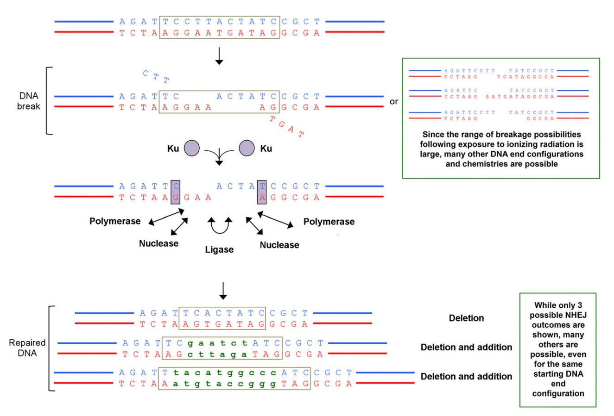

# Radiation Dose Does Matter: Mechanistic Insights into DNA Damage and Repair Support the Linear No-Threshold Model of Low-Dose Radiation Health Risks

James R. Duncan1, Michael R. Lieber2, Noritaka Adachi3, and Richard L. Wahl1

1Mallinckrodt Institute of Radiology, Washington University School of Medicine, St. Louis, Missouri; 2USC Norris Comprehensive Cancer Center, University of Southern California Keck School of Medicine, Los Angeles, California; and 3Yokohama City University, Yokohama, Japan

See the associated article on page 1017.

The Siegel et al. commentary (1) calls for reassessing the risks of low-dose exposure to ionizing radiation. It contends that when the National Academy of Sciences committee prepared its Biologic Effects of Ionizing Radiation (BEIR VII) report (2), they ''erred in the interpretation of their selected literature.'' This commentary is the most recent in a series of articles (3,4) that challenge the BEIR VII committee's conclusion ''that the linear no-threshold model (LNT) provided the most reasonable description of the relation between low-dose exposure to ionizing radiation and the incidence of solid cancers that are induced by ionizing radiation.'' More specifically, this most recent commentary asserts that the BEIR VII report placed undue emphasis on a single in vitro study of radiogenic chromosomal damage (5). The commentary reexamines data from that study and suggests that chromosomal dicentric formation ''appear(s) more supportive of a threshold.'' We respectfully disagree and believe that the conclusions in the BEIR VII report were valid in 2006 and remain so.

Pages 245–246 of the BEIR VII report provided a detailed case against a low-dose threshold (2). Foremost is the linearity of the dose response after higher dose (.100 mSv) exposures. This highlights the need for a comprehensive model that explains how increases in exposure to low-linear energy transfer radiation lead to increases in cancer risk and incorporates the expanding knowledge of the molecular mechanisms that account for this linear relationship. The importance of mechanistic modeling warrants emphasis because without insight into the underlying mechanisms, one might argue that as the cancer risk for exposing an individual to exactly 334.57 mGy has not been thoroughly tested, the risks of that exposure are completely unknown, even though models suggest that this exposure is capable of causing multiple DNA double-strand breaks (DSBs) per cell. The BEIR VII report appropriately acknowledged the limitations of using a single model

Received May 16, 2018; revision accepted May 21, 2018.

For correspondence or reprints contact: James R. Duncan, Mallinckrodt Institute of Radiology, 510 S. Kingshighway, St. Louis, MO 63110.

E-mail: [JRDuncan@wustl.edu](mailto:JRDuncan@wustl.edu)

Published online May 31, 2018.

COPYRIGHT © 2018 by the Society of Nuclear Medicine and Molecular Imaging. DOI: 10.2967/jnumed.118.210252

to describe the dose response for all types of cancer and varying dose rates. Our expanding knowledge regarding the genetic basis of human cancer means that the modeling process is further complicated by the varying genetic backgrounds of the exposed individuals (6). Although we acknowledge that every model simplifies the system it represents, there remains a need for a comprehensive, yet comprehensible, model that reconciles the available epidemiologic and molecular biology data.

### MECHANISTIC MODEL FOR RADIATION-INDUCED NEOPLASTIC TRANSFORMATION

The model proposed in the BEIR VII report has 4 basic components (Table 1). The Siegel et al. commentary and other recent challenges to the LNT model refrain from challenging the first and last steps. Rather, the challenges focus on the relationship between low-linear energy transfer radiation and the fate of cells that survive the exposure but possess DNA mutations. In arguing for a threshold, that commentary and the other recent articles (1,3,4) suggest 2 possibilities: first, they argue that humans have DNA damage response systems that routinely repair DSBs without altering the DNA sequence. Second, they insist that humans possess systems that faithfully detect and remove cells harboring DNA mutations. However, as delineated in the BEIR VII report (2), a threshold requires processes that leave no cells harboring DNA mutations. Siegel et al.'s logic suggests DNA repair is 100% faithful or every mutated cell is removed. Anything less, leaves a finite probability of carcinogenesis that increases with the number of surviving but mutated cells.

### DNA DAMAGE RESPONSE AND THE FIDELITY OF DNA REPAIR

Evidence of DNA damage after radiation exposure and the immediate downstream manifestations of that damage was a major component of the BEIR VII report. The topic was also recently reviewed by Manning and Rothkamm (7). The misrepair of DSBs leads to dicentric chromosomes (2,5,7). Misrepair of DSBs also leads to translocations, which can be detected by fluorescence in situ hybridization (2,7,8). The molecular pathways involved in the DNA damage response have been elucidated in considerable detail, and that research identified phosphorylation of histone H2AX as a biomarker capable of detecting DSBs (2,7,9–11). The BEIR VII committee reviewed a 2003 study by Rothkamm and Lobrich that

TABLE 1 Form of the Dose–Response for Radiation Tumorigenesis (*2*)

| Step | Description*                                                                                                                      |
|------|-----------------------------------------------------------------------------------------------------------------------------------|
| 1    | Increasing exposure leads to linear increase in number of electron tracks, which increases probability of biologic effect (2). |
| 2    | DNA DSBs are most concerning biologic effect (2,7,9–11).                                                                          |
| 3    | Cellular response to DSBs often leads to cells that survive the damage but contain DNA mutations (2,5–7,8,12,16).              |
| 4    | DNA mutations lead to cancer initiation and progression in humans (2,6).                                                          |

\*Only an abbreviated reference list is provided. The BEIR VII report provides a more comprehensive list that was current as of 2006.

detected DNA DSBs using immunofluorescence (9). The committee reported that ''the yield of DSBs as a function of dose is linear down to as low as 2 mGy'' (2). Lobrich and others have since used this technique to study DSBs in lymphocytes obtained from patients who underwent CT and fluoroscopic procedures (10,11). Those and other studies have found linear increases in DSBs at the doses and dose rates used for medical imaging.

In this commentary (1), Siegel et al. acknowledge this work but maintain that ''subsequent repair or removal of the DNA doublestrand-breaks back to background levels have been demonstrated in patients within 24 h after a CT scan.'' We recently challenged a similar claim (12) and believe that Siegel et al. continue to misinterpret the extensive literature regarding the fidelity of the various DNA repair pathways (2,13).

FIGURE 1. Overview of nonhomologous end joining (*13*). Schematic of a DNA DSB and its repair by NHEJ (top). Ku70–Ku80 heterodimer (Ku) binds to ends of DSB and improves subsequent binding by NHEJ polymerase, nuclease, and ligase complexes. These enzymes can act on ends of DSB in any order to resect and add nucleotides. Multiple rounds of resection and addition are possible. Nuclease and polymerase activities at each of the 2 DNA ends appear to be independent. Microhomology between the 2 DNA ends—present (dashed boxes), or newly created when polymerases add nucleotides in template-independent manner—is often used to guide end joining. The process is error-prone and can result in diverse DNA sequences at the repair junction (bottom). Although NHEJ is also less commonly capable of joining 2 DNA ends without nucleotide loss from either DNA end and without any addition, ends of radiation-induced DSBs are not amenable to direct ligation but rather require end-processing by nucleases or polymerases. Nucleotide additions are depicted in green lowercase. (Adapted with permission of (*13*).)

The BEIR VII report concisely summarized the state of knowledge for DNA damage and repair (2). More recent reviews confirm and extend that understanding of the DNA damage response pathways (13). Briefly, nonhomologous end joining (NHEJ) and homologous recombination (HR) are the primary pathways for repairing DSBs. As illustrated in Figure 1, NHEJ is error prone but can occur during any phase of the cell cycle. HR allows error-free repair because it uses the sequence found in the sister chromatid as a template. However, HR is restricted to the S and G2 phases of dividing cells. Most DSBs caused by ionizing radiation will be repaired by NHEJ, and this process leaves permanent information scars in the genome at greater than 90% of DSBs.

When confronted with this evidence, Siegel et al. previously argued that ''misrepair, including residual mutations, does not entail increased cancer risk'' (14). They suggest that the error rate for NHEJ may be dose-dependent and cite a study that compared endogenous DSBs against those produced by ionizing radiation (15). Siegel et al. failed to acknowledge that this study also reported ''although the rate and fidelity of repair of endogenous DSBs are optimized, the ensuing low level of errors can account for an important fraction of oncogenic events in humans, notably to the inactivation of ts (tumor suppressor) genes, which are the usual targets in premalignant lesions in the genesis of carcinomas'' (15). Again, a threshold can exist only if cellular and higher level processes leave absolutely no cells harboring DNA mutations.

### REMOVAL OF CELLS WITH DAMAGED DNA

The DNA damage repair pathway includes 2 divergent pathways, cell loss via apoptosis or repair via the mechanisms described above (2,13,16). The current consensus is that apoptosis is favored with severe damage whereas minor damage typically results in cell survival and NHEJ repair that leaves information scars (13,16).

The commentary argues that DNA damage occurring by various mechanisms such as reactive oxygen species ''results in frequent production of genetic mutations, but clinical cancer development in intact organisms is usually prevented by adaptive protective responses.'' The key term, usually, has been highlighted for emphasis. If cellular and higher level processes reliably detected and removed mutated cells, cancer would be a nonissue. Although multiple processes might combine to mitigate the impact of cells harboring carcinogenic mutations, they clearly are not 100% effective as there remains a large mutational burden in human cancers (17).

## SUMMARY

Every scientific theory can be debated, and indeed theories should be reassessed when new and compelling contradictory evidence arises. However, the linear no-threshold model remains the best, and certainly the most conservative, means of estimating the risk of exposing humans to varied levels of ionizing radiation. When considering the risks at low levels of exposure, the BEIR VII report rightfully shifted from an epidemiologic to a mechanistic approach. The BEIR VII report also appropriately considered and rejected the possibility of a threshold. With improved methods of DNA sequencing, additional insights into low-dose radiation effects could be pursued. The risk of cancer after most every medical imaging study is almost certainly extremely small and effectively dwarfed by the risks of a missed critical/actionable diagnosis. Thus, we concur that adequate radiation must be used to acquire diagnostic images. However, the available data indicate that a small risk of irreversible DNA damage does exist to exposure to relatively low-dose radiation and must be considered, especially in an era when patients undergo multiple low-, and cumulatively, high-dose imaging studies during their lives.

#### DISCLOSURE

James R. Duncan reports personal fees from Bayer HealthCare LLC, Institute for Healthcare Improvement, and Ascension Health and other from Novation and Washington State Hospital Association, all of which are outside the submitted work. Richard L. Wahl reports consulting fees from Nihon Medi Physics and from Clarity Pharmaceuticals Inc; research grants from White Rabbit AI and Actinium Pharmaceuticals; and travel reimbursement from Siemens Medical and GE Medical, all of which are outside the submitted work. These relationships are managed by the Washington University Conflict of Interest Committee. No other potential conflict of interest relevant to this article was reported.

#### REFERENCES

- 1. Siegel JA, Greenspan BS, Maurer AH, et al. The BEIR VII estimates of low-dose radiation health risks are based on faulty assumptions and data analyses: a call for reassessment. J Nucl Med. 2018;59:1017–1019.
- 2. National Research Council (U.S.). Committee to Assess Health Risks from Exposure to Low Level of Ionizing Radiation. Health Risks from Exposure to Low Levels of Ionizing Radiation: BEIR VII Phase 2. Washington, D.C.: National Academies Press; 2006.
- 3. Siegel JA, Pennington CW, Sacks B. Subjecting radiologic imaging to the linear no-threshold hypothesis: a non sequitur of non-trivial proportion. J Nucl Med. 2017;58:1–6.
- 4. Siegel JA, Sacks B, Pennington CW, Welsh JS. Dose optimization to minimize radiation risk for children undergoing CT and nuclear medicine imaging is misguided and detrimental. J Nucl Med. 2017;58:865–868.
- 5. Lloyd DC, Edwards AA, Leonard A, et al. Chromosomal aberrations in human lymphocytes induced in vitro by very low doses of X-rays. Int J Radiat Biol. 1992; 61:335–343.
- 6. Vogelstein B, Kinzler KW. The Genetic Basis of Human Cancer. 2nd ed. New York, N.Y.: McGraw-Hill; 2002.
- 7. Manning G, Rothkamm K. Deoxyribonucleic acid damage-associated biomarkers of ionising radiation: current status and future relevance for radiology and radiotherapy. Br J Radiol. 2013;86:20130173.
- 8. Bhatti P, Yong LC, Doody MM, et al. Diagnostic X-ray examinations and increased chromosome translocations: evidence from three studies. Radiat Environ Biophys. 2010;49:685–692.
- 9. Rothkamm K, Lobrich M. Evidence for a lack of DNA double-strand break repair in human cells exposed to very low x-ray doses. Proc Natl Acad Sci USA. 2003;100:5057–5062.
- 10. L ¨obrich M, Rief N, Kuhne M, et al. In vivo formation and repair of DNA doublestrand breaks after computed tomography examinations. Proc Natl Acad Sci USA. 2005;102:8984–8989.
- 11. Beels L, Bacher K, De Wolf D, Werbrouck J, Thierens H. gamma-H2AX foci as a biomarker for patient X-ray exposure in pediatric cardiac catheterization: are we underestimating radiation risks? Circulation. 2009;120:1903–1909.
- 12. Duncan JR, Lieber MR, Adachi N, Wahl RL. DNA repair after exposure to ionizing radiation is not error-free [letter]. J Nucl Med. 2018;59:348.
- 13. Pannunzio NR, Watanabe G, Lieber MR. Nonhomologous DNA end joining for repair of DNA double-strand breaks. J Biol Chem. December 14, 2017 [Epub ahead of print].
- 14. Siegel JA, Sacks B, Pennington CW, Welsh JS. Reply: DNA repair after exposure to ionizing radiation is not error-free [reply]. J Nucl Med. 2018;59:349.
- 15. Vilenchik MM, Knudson AG. Endogenous DNA double-strand breaks: production, fidelity of repair, and induction of cancer. Proc Natl Acad Sci USA. 2003;100: 12871–12876.
- 16. Roos WP, Thomas AD, Kaina B. DNA damage and the balance between survival and death in cancer biology. Nat Rev Cancer. 2016;16:20–33.
- 17. Tomasetti C, Li L, Vogelstein B. Stem cell divisions, somatic mutations, cancer etiology, and cancer prevention. Science. 2017;355:1330–1334.