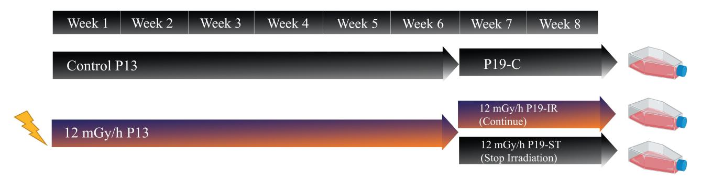
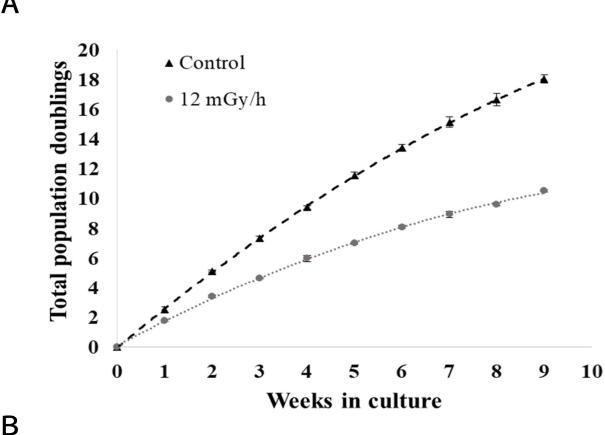
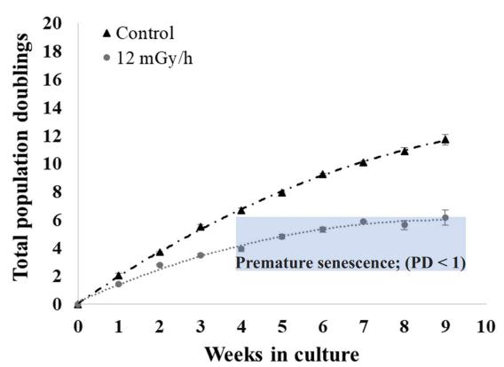
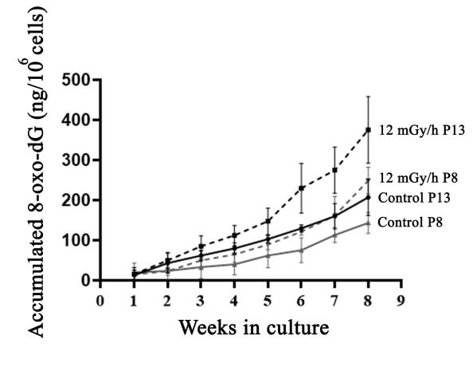
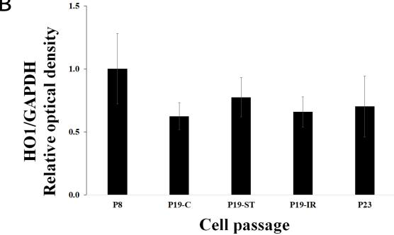
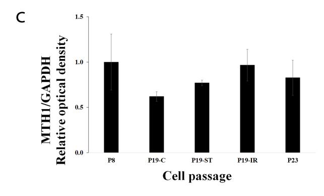
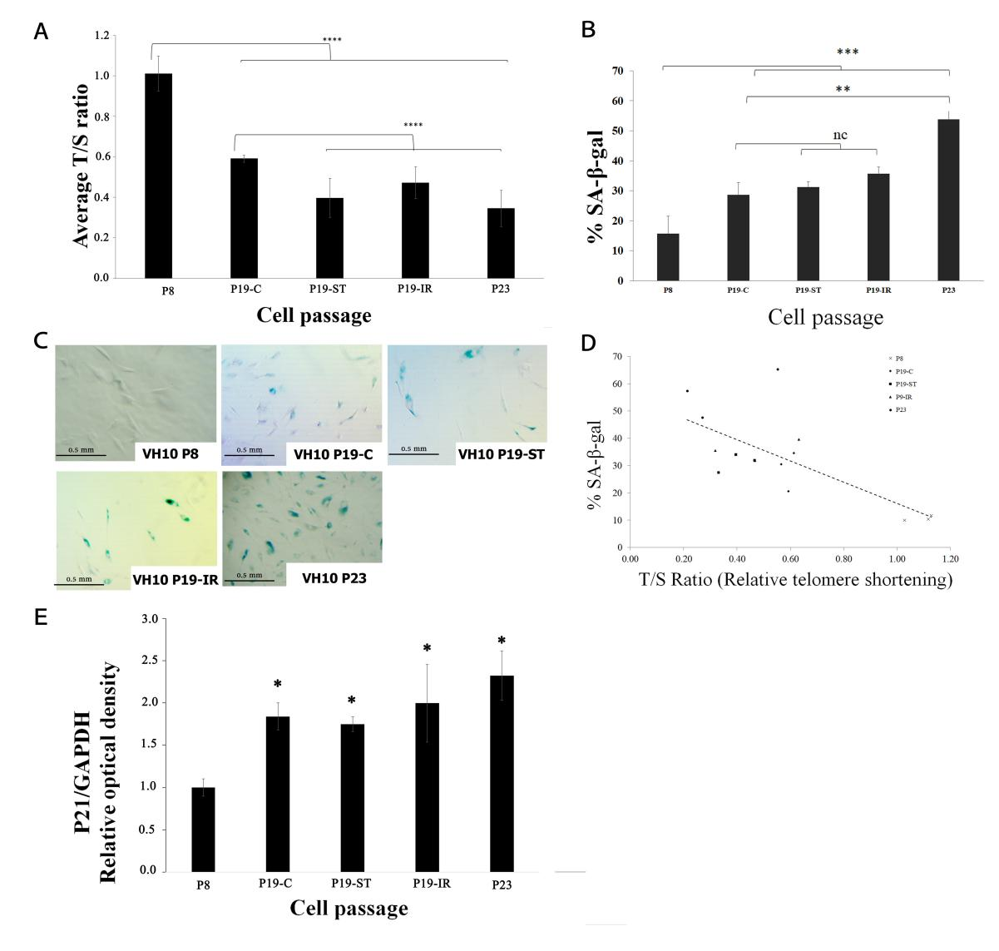
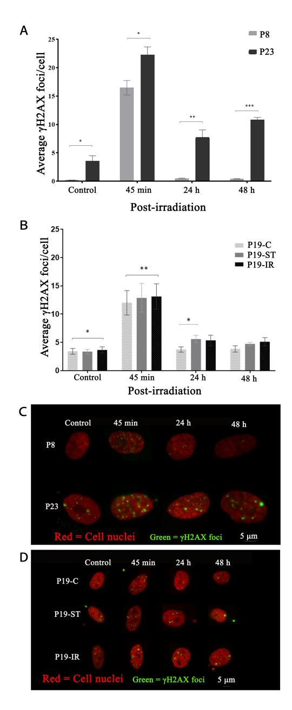
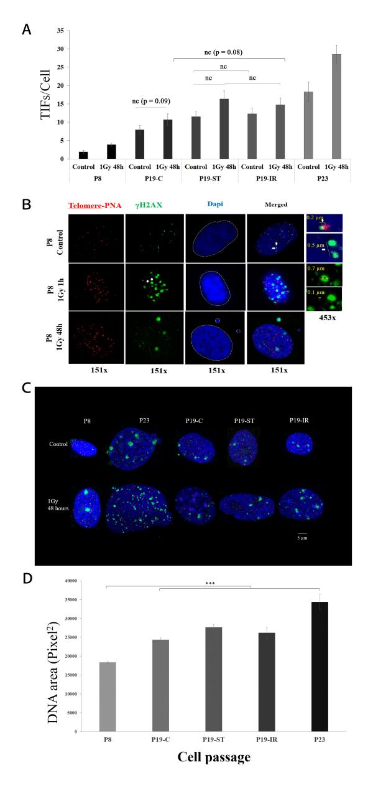

*Original Research*

## **[Oxidative Stress Le](https://www.imrpress.com/journal/FBL)vels and DNA Repair Kinetics in Senescent Primary Human Fibroblasts Exposed to Chronic Low Dose [Rate of Ionizing](https://doi.org/10.31083/j.fbl2811296) Radiation**

Traimate Sangsuwan1 , Ali Pour Khavari1 , Evelina Blomberg1 , Tajanena Romell1 , Paulo Roberto D'auria Vieira De Godoy1 , Mats Harms-Ringdahl1 , Siamak Haghdoost1*,*2*,*3*,*\*

Academic Editor: Isabelle Testard

Submitted: 15 June 2023 Revised: 9 September 2023 Accepted: 13 September 2023 Published: 24 November 2023

#### **Abstract**

**Background**: Exposure to low dose rate (LDR) radiation may accelerate aging processes. Previously, we identified numerous LDRinduced pathways involved in oxidative stress (OS) and antioxidant systems, suggesting that these pathways protect against premature senescence (PS). This study aimed to investigate if there are differences between young replicative senescent (RS) and PS cells considering DNA repair kinetics, OS, and DNA damage localized in the telomeres. **Methods**: We established PS cells by culturing and passaging young primary fibroblasts exposed to LDR. Then, RS cells were established by culturing and passaging young fibroblasts until they stopped proliferating. Senescence was characterized by analyzing telomere length and senescence-associated *β*-galactosidase (SA-*β*gal) staining. DNA damage and repair were evaluated with *γ*H2AX foci formation; telomere identification was carried out using the fluorescence *in situ* hybridization (FISH) probe; and oxidative stress was assessed by measuring 8-oxo-dG in the medium. **Results**: The data indicate the following: young cells have a better ability to cope with LDR-induced oxidative stress; RS and PS have higher steady-state levels of DNA damage; RS have slower DNA repair kinetics; and PS/RS have elevated levels of telomeric DNA damage. **Conclusion**: Our main conclusion is that PS and RS differ regarding DNA repair kinetics and SA-*β*-gal levels.

**Keywords:** radiation; chronic radiation; low dose rate; premature senescence; replicative senescence; DNA repair; radiotherapy; oxidative stress; hMTH1; telomere length; extracellular 8-oxo-dG

## **1. Introduction**

Cellular senescence is involved in organism aging and tumor control, and substantial progress has been made in defining the mechanisms involved [1,2]. There is also a significant amount of experimental data suggesting that endogenous, as well as exogenous production of reactive oxygen species (ROS)—for example from exposure to acute ionizing radiation—contributes to se[ne](#page-12-0)[sc](#page-12-1)ence [3]; however, there is limited knowledge about the mechanism of premature senescence (PS) induced by chronic irradiation.

Senescence, as defined by Hayflick and Moorhead, occurs when cells remain viable but lose prolif[er](#page-12-2)ative capability irreversibly after being cultured for a period of time [4], signifying that normal human diploid cells have a finite number of population doublings. The characteristics of senescent cells include growth arrest, expression of lysosomal beta-galactosidase (SA-*β*-gal; senescence-associated *β*[-](#page-12-3)galactosidase) [5], release of inflammatory cytokines and chemokines (senescence-associated secretory phenotype or SASP) [6], resistance to apoptosis [7], and persistent DNA damage [8]. It was suggested that radiotherapy can accelerate cellular sen[es](#page-12-4)cence leading to premature aging and age-related diseases, e.g., cardiovascular diseases (CVD) [9,10]. Previous studies have shown that the exposed populations, for example in Hiroshima and Nagasaki, have a significantly increased risk of CVD [11]. Since then, a series of epidemiological studies on low- and moderate-dose whole[bo](#page-12-5)[dy](#page-12-6) irradiation and the risk of CVD have been published [12,13]. A recent study on the Japanese atomic bomb survivors "Life Span Study" confir[ms](#page-12-7) a linear dose–response for mortality from CVD [14]. The role of radiation-induced premature senescence in vascular endothelial cells was pro[pos](#page-12-8)[ed a](#page-12-9)s a possible mechanism by which radiation exposure leads to CVD [15–17].

Progress has been made in defining the mechanisms that contribute to senescence [1,2,18], including the involvement of [ROS](#page-13-0) [and](#page-13-1) DNA damage [3]. It was shown that growth arrest at the G1 phase is initiated by DNA damage that signals the upregulation of CDKN1A/p21CIP1/WAF1, activation of p53, and consequent[ly](#page-12-0) [u](#page-12-1)[pre](#page-13-2)gulation of the p21. Reduction of phosphorylated retinob[la](#page-12-2)stoma (Rb) protein and upregulation of CDKN2A/p16INK4A and p21 have also been related to the growth arrest of senescent cells [19,20]. Previously, we have shown that exposure of cells to chronic

1Department of Molecular Biosciences, The Wenner-Gren Institute, Stockholm University, SE-10691 Stockholm, Sweden

2CIMAP/ARIA team, University of Caen Normandy, 14000 Caen, France

3Advanced Resource Center for HADrontherapy in Europe (ARCHADE), 14000 Caen, France

\*Correspondence: siamak.haghdoost@su.se (Siamak Haghdoost)

low dose rates (LDRs) of ionizing radiation may accelerate the senescence process (premature senescence) of primary human endothelial cells (HUVEC), as well as primary human fibroblasts [9,17]. We applied a proteomic approach and found that chronic radiation induces senescence through the induction of ROS, which results in DNA damage, activating the p53/p21 pathway [9], and inhibiting the PI3K/Akt/mTOR [p](#page-12-5)[athw](#page-13-1)ay P [17]. ROS may accelerate the senescence process (premature senescence) [3], not only through the production of DNA damage [21] but also by the formation of oxidized nucleo[tid](#page-12-5)es in the nucleotide pool (oxidized dNTP) [22]. O[xidi](#page-13-1)zed dNTP can be incorporated into newly synthesized DNA and induce m[uta](#page-12-2)tions, as well as senescence [23]. Oxidative stress [may](#page-13-3) also down-regulate telomerase activity, enhance telomere erosion [24], and promote telome[re](#page-13-4) shortening which is one of the hallmarks of senescent cells. Telomeres are complexes composed of shelteri[ng](#page-13-5) proteins and TTAGGG repeats at the ends of eukaryotic chromosomes [25,26]. Due to th[e m](#page-13-6)echanism of replication, telomeres are shortened at each cell division [27]. After a certain number of cell divisions, the 3*′* overhang becomes too short and the cells may recognize very short telomeres as DNA d[ama](#page-13-7)[ge](#page-13-8), probably as double-strand breaks (DSB), triggering cell cycle arrest that results in r[epl](#page-13-9)icative senescent (RS) [28]. The T-loop of telomeres with sheltering proteins builds a structure preventing telomeric DNA from being recognized by the DNA repair machinery as DNA damage [29]. Additionally, it was shown that repression of DNA r[epai](#page-13-10)r gene expression is associated with cellular senescence [30]. It is not clear whether DNA DSBs observed in the senescent cells are induced directly by DNA lesions or [ar](#page-13-11)e due to very short telomere lengths that the cells recognize as DNA damage. The hypotheses of the present investigati[on](#page-13-12) are: (A) young cells (low passage) can deal with the ROS induced by LDR more effectively than middle-aged cells due to higher levels of antioxidants; (B) PS and RS cells accumulate more DNA damage in their telomeres compared to young cells; and (C) young cells have faster DNA repair kinetics than middle-aged, PS and RS. The present investigation aims: (A) to elucidate the differences in DNA repair kinetics for young, middle-aged, and senescent cells, as well as for cells that have entered senescence prematurely in response to LDR ionizing radiation; (B) to establish oxidative stress response in terms of the amount of 8-oxo-dG in the medium for LDR-irradiated young and middle-aged cells; and (C) to investigate if the DNA damages observed in the PS cells are accumulated in the telomeres. To address these aims, experiments were performed using the different passages of primary human fibroblasts corresponding to young, middle-aged, and senescent cells. Telomere length, total numbers of population doublings, expression of P21 protein, and levels of SA-*β*-gal-positive cultured cells were used for the characterization of senescent cells and numbers of *γ*H2AX foci as an indicator of DSB. The levels of 8-oxo-dG in the cell culture medium and expression of heme oxygenase 1 (HO1) and human MutT homolog 1 (hMTH1) [31] were determined as markers of oxidative stress. This study was part of a PhD thesis (https://www.dissertations.se/dissertation/c618950e3a/).

## **2. Methods**

### *2.1 Cell Culture*

[In the present investigation, we used human dip](https://www.dissertations.se/dissertation/c618950e3a/)loid primary fibroblasts VH10 cells which was a gift from Prof. Leon Mullenders, Department of Radiation Genetics and Chemical Mutagenesis, Leiden Medical University, the Netherlands. Different passages of VH10 cells were cultured in 12 mL of Dulbecco's modified minimum essential medium (Sigma-Aldrich, Darmstadt, Germany) supplemented with 10% bovine serum (Sigma-Aldrich) and 1% penicillin-streptomycin (Sigma-Aldrich). The cells were validated and tested negative for mycoplasma. The cells were cultured in a humidified cell culture incubator at 37 °C and 5% CO2. Cells were re-seeded after trypsinization every week (Sigma-Aldrich) and cultured at 5 *×* 105 cells in T75 cell culture flasks. The number of population doublings (PDs) for each time interval of 7 days was calculated from:

PD = ln (N1/N0)/ln2, where N0 is the number of cells seeded and N1 is the number of cells counted at the end of the time interval (day 7).

Further, the growth rate kinetics for the cells were established based on the accumulated number of population doublings each week. According to our previous results [32], we divided cells into three groups based on their senescence status: (1) "young cells" with passage number 13 or less (long telomere length (T/S ratio of 1), low SA-*β*-gal activity and high population doubling relative to P23); (2) ["sen](#page-13-13)escent cells" with passage number 20 or above (short telomere length compared with P8 (T/S ratio of 30%), a high percentage of SA-*β*-gal-positive cells and no population doubling); and (3) "middle-aged cells" with passage number between 13 and 19 (telomere length (T/S ratio of 60% of P8), SA-*β*-gal activity between P13 and P19, and few population doublings (1 or less)).

### *2.2 Chronic Irradiation*

To establish the growth rate kinetics under chronic irradiation, a cell culture incubator equipped with a custommade 137Cs source [9,32,33] was used for the exposure of the cells to 12 mGy/h. The experiment was started by seeding 5 *×* 105 cells at passage 8 (P8, young cells) or passage 13 (P13, middle-aged cells). The P13 cells were exposed to chronic radiation [a](#page-12-5)[t 1](#page-13-13)[2 m](#page-13-14)Gy/h and we found that after 6 weeks of exposure, they stopped proliferating (PD *<*1). Sham-treated control cells were subjected to the same procedures as irradiated cells. The cells were counted and reseeded at regular intervals (every 7 days). P13 cells irradiated for 6 weeks (Fig. 1) were regarded as premature senes-

**Fig. 1. The experimental design for establishing premature senescent cells: P19-C, non-irradiated control; P19-ST, 6 weeks chronically irradiated P13 cells with 2 weeks recovery time; and P19-IR, 6 weeks chronically irradiated P13 cells with a further 2 weeks incubation under chronic irradiation.**

cence (PS). The PS cells were then divided into 2 parts: (1) transferred to a cell culture incubator without irradiation for 2 weeks to mimic recovery after irradiation (P19- ST) and (2) continued irradiation for an additional 2 weeks (P19-IR). In parallel, non-irradiated cell culture was used as a control for middle-aged cells (P19-C). After 2 weeks, these three groups of cells, as well as cultures of young (*>*9 passages) and senescent cells (passage *<*22) were prepared for telomere length quantification, SA-*β*-gal staining, analysis of DNA repair kinetics, and for colocalization analysis of DNA damage in telomeres. Trypan blue exclusion assay was performed to establish cell viability and cell culture medium was stored at –20 °C for determination of 8-oxodG.

### *2.3 DNA Repair Kinetics*

To establish DNA repair kinetics, young, middleaged, and senescent cells were irradiated acutely with 1 Gy at a dose rate of 0.75 Gy/min using GammaCell® 40 irradiator (Ottawa, ON, Canada) available at Stockholm University, Stockholm, Sweden. In a different set of experiments, P19 cells—P19-C, P19-IR (LDR exposed), and P19- ST (LDR exposed) (see above)—were also exposed to 1 Gy acute gamma irradiation at a dose rate of 0.75 Gy/min.

The DNA repair kinetics of the young, premature senescent, and senescent cells were established using *γ*H2AX foci formation. Briefly, one day before acute irradiation, the cells were trypsinized and 1.5 *×* 104 cells were transferred to a small Petri dish (35 mm) with 3 mL complete medium and a sterile coverslip on the bottom. The cells were then kept in a cell culture incubator at 37 °C, allowing them to attach to the coverslip. Following exposure of the cells to 1 Gy, the levels of *γ*H2AX foci were determined at 45 min, 24 h, or 48 h post-irradiation in order to establish DNA repair kinetics. For detection of *γ*H2AX foci, the cells were fixed using 3% paraformaldehyde (Sigma-Aldrich) with 2% sucrose (Sigma-Aldrich, Darmstadt, Germany) for 10 min at room temperature, followed by permeabilization with 0.2% Triton X-100 (Sigma-Aldrich) for 2.5 min at room temperature. The cells were then washed with PBS three times before incubating for 1 h at 37 °C with the primary antibody anti-phospho-H2AX (Millipore, Billerica, MA, USA) in PBS supplemented with 2% Bovine Serum Fraction V albumin (BSA-V) (1:800). The cells were then washed quickly with PBS, followed by 30 min incubation at 37 °C with goat anti-mouse IgG, FITCconjugated (Sigma-Aldrich,) secondary antibody in PBS supplemented with 2% BSA-V. Following a washing step, the cells were stained with 4*′* ,6-diamidino-2-phenylindole, DAPI (Sigma-Aldrich) in PBS for 10 min. The coverslips were then removed from the Petri dish, mounted on a microscope slide using Vectashield® Antifade Mounting Medium (Vector Laboratories, Peterborough, UK), and sealed. Slides were analyzed using a Nikon Eclipse E800 fluorescence microscope at 100*×* magnification. Images of a minimum of 50 cells were taken using a CCD camera (CoolCube1, Metasystems, Altlussheim, Germany) and ISIS software version 2.3 (Metasystems, Altlussheim, Germany). The number of total foci per nucleus was analyzed using Image-J,version 1.4u (LOCI, University of Wisconsin, Madison, WI, USA). The total number of foci per cell was counted and the mean and standard deviation for each time point and treatment were calculated.

### *2.4 Western Blot Analysis*

Cells were prepared for Western blot analysis using our previously published protocol [34]. Briefly, the cells were lysed in Laemmli buffer with proteinase inhibitor (Roche Diagnostics GmbH, Mannheim, Germany). After quantification of protein in the lysates with Protein Assay Reagent (Thermo Scientific, Rock[ford](#page-13-15), IL, USA), 10 µg protein per sample was loaded in a NuPAGE 4–12% Bis–

Tris gel (Invitrogen, Waltham, MA, USA) for electrophoresis. The proteins were then transferred from the gel onto a Nitrocellulose membrane (Thermo Scientific) overnight at 30 V (4 °C) using XCell SureLock™ Mini-Cell System (Invitrogen, Waltham, Massachusetts, United States).

The unspecific binding sites on the membrane were then blocked by incubating the membrane in LI-COR blocking buffer (LI-COR, Cambridge, UK) for 90 min. The membrane was washed three times with Tris-buffered saline containing 0.05% Tween (TBST). Following the washing steps, the membrane was incubated with primary antibodies overnight at 4 °C followed by washing steps and secondary antibody incubation (anti-mouse conjugated with IRDye® Infrared Dyes (LI-COR)) before detection of the secondary antibody signals with Odyssey imaging system and quantification of protein bands with Image Studio version 5.2 software (LI-COR, Cambridge, Milton, Cambridge CB4 0WS, United Kingdom). The primary antibodies used were as follows: HO1 (1:1000, from rabbit, Novusbio, Centennial, CO, USA); P21 (1:1000, from mouse, Cell Signaling Technology, Inc., Danvers, MA, USA); hMTH1 (1:1000, from rabbit, Novusbio, Centennial, CO, USA ); and GAPDH (1:10,000, from mouse, Sigma, Saint Louis, MO, USA).

### *2.5 Telomere Fluorescence in Situ Hybridization (Telomere FISH)*

To investigate if *γ*H2AX foci were localized in the telomeres, we co-stained cells with *γ*H2AX (as above) and telomere probes and analyzed using confocal microscopy. For detailed information about the telomere FISH protocol, see reference [35]. Briefly, cells were fixed and permeabilized as mentioned above. To block unspecific binding sites, the coverslips with cells were incubated in ABDIL solution (please see reference [35] for details) with 5% bovine serum albumin [\(BS](#page-13-16)A, Sigma-Aldrich) for 2 hr at 37 °C. Following this step, the cells were incubated with primary antiphospho-histone H2AX (ser-139) mouse monoclonal antibody (Millipore, Billerica, [MA](#page-13-16), USA) at 1:800 dilution in ABDIL solution containing 2% BSA (Sigma-Aldrich) at 37 °C for 1 h. Following incubation, the cells were washed three times with washing solution (PBS (Sigma-Aldrich) with 0.1% Tween-20 (Sigma-Aldrich)). The cells were then incubated with secondary goat anti-mouse IgG FITC conjugated (Sigma-Aldrich) in ABDIL solution and 2% BSA (Sigma-Aldrich) at 37 °C for 30 min in a dark chamber. The cells were washed three times with PBS (Sigma-Aldrich) and then treated with 2% paraformaldehyde for 10 min at room temperature and washed twice with MilliQ water.

The cells were dehydrated by incubating the slides for 3 min in 70%, followed by 90% and finally 99% ethanol (Absolut finsprit, Malmö, Sweden)/water solutions. The slides were then kept at room temperature for 20 min. The telomere probe, PNA, was prepared in a hybridization solution provided by the company (Alexa 647-OO- ccctaaccctaaccctaa, Panagene, South Korea) at a concentration of 200 nM. The solution was then heated to 90 °C for 5 min and applied on slides, which were then incubated first at 85 °C for 10 min and then overnight at 37 °C in a humidified chamber. Following overnight incubation, the slides were washed two times with a washing solution containing 70% formamide (Sigma-Aldrich) and 10 mM Tris-HCl at pH 7.5, and three times with a washing solution containing 50 mM Tris-HCL (Sigma-Aldrich) pH 7.5, 150 mM NaCl (Sigma-Aldrich), and 0.8% Tween-20.

The nuclei were stained with DAPI for 10 min. The coverslips were then quickly rinsed with MilliQ water and dehydrated by increasing concentrations of ethanol as described above. The dried coverslips were mounted with Vectashield and sealed with nail polish. The slides were stored at 4 °C until imaging with a microscope was performed. The imaging was performed using a Zeiss LSM 800 (Zeiss Group, Oberkochen, Baden-Württemberg, Germany) microscope equipped with an AiryScan detector and a laser for AlexaFluor-647 (Panagene, South Korea). The detector gain was set to 800–950 V and the digital gain to 1 in super-resolution mode. The signals of AlexaFluor-647 from the labeled telomeres were captured with 4% excitation power of a 650 nm laser, and five images (z-stacks, confocal) were captured in unidirectional frame scanning mode with 2048 *×* 2048 pixels. The images were saved in TIFF format and processed by Airyscan using Zen Black software (version 2.3, Zeiss Group, Jena, Germany). The signals were analyzed using the Fiji-ImageJ JACoP and Colocalization Finder plugins [36]. For quantification of *γ*H2AX foci repair kinetics, the single focal plane images were processed as described in the above section, while for studying colocalization of telomeres and *γ*H2AX foci, confocal images were processed. [Usi](#page-13-17)ng confocal images, we could visualize very small foci.

### *2.6 SA-β-galactosidase Staining*

SA-*β*-gal staining was performed according to the protocol of Dimri *et al*. [5]. One day before staining, the cells were cultured in 6-well plates at 20,000 cells per well. Each sample was prepared as a duplicate and each experiment was repeated three times. The cells were washed twice in PBS (Sigma-Aldrich), [a](#page-12-4)nd fixed at room temperature for 10 min in PBS containing 2% formaldehyde (Sigma-Aldrich), and 0.2% glutaraldehyde (Sigma-Aldrich). The cells were washed with PBS (Sigma-Aldrich), and stained with SA-*β*-gal staining solution assay (Sigma-Aldrich) overnight at 37 °C. Prior to scoring with the microscope, the samples were washed with PBS and then with distilled water. Around 500 cells in each sample were scored and then the percentage of SA-*β*-gal-positive cells (blue-green cytoplasm) was determined.

Genomic DNA was extracted from cells at different passages using the DNeasy® Blood & Tissue kit (Qiagen, Hilden, Germany). The relative telomere length was determined based on a previously described method [37] with some minor modifications. Briefly, 40 ng DNA was mixed with 2  $\mu$ L of 5× HOT FIREPol® Evagreen, qPCR Supermix (Solid Biodyne, Estonia), 800 nM telomere primers, or 400 nM 36B4 (gene accession number RPLP0) primer for single gene control. The primer sequences were: *TEL*-forward  $5' \rightarrow 3'$  GGTTTTTGAGGGTGAGGGT-GAGGGTGAGGGT and TEL-reverse  $5' \rightarrow 3'$ TCCCGACTATCCCTATCCCTATCCCTATC-CCTA. The 36B4 gene [37] was used as a control gene using the following primer sequences; forward  $5' \rightarrow 3'$ CAGCAAGTGGGAAGGTGTAATCC and reverse  $5' \rightarrow 3'$ CCCATTCTATCATCAACGGGTACAA.

For the calculation of telomere length, the ratio of telomere length versus the single standard gene expression (T/S) based on the  $2^{-\Delta \Delta Ct}$  method described by Cawthon and coworkers was applied [37] and the Light Cycler® 480 SW version 1.5.1 software (Roche, Basel, Switzerland) was used to calculate  $C_t$  values.

### 2.8 Detection of Extracellular 8-oxo-dG in the Media

For the detection of 8-oxo-dG in the medium, a modified competitive enzyme-linked immunosorbent assay (ELISA) method was applied. The method was set up and described by us previously [38,39]. Firstly, the samples were pre-purified using a Bond Elute column to remove compounds that can cross-react with the primary antibody used in the ELISA method. The pre-purification step was performed two times. For the detection of 8-oxo-dG, 1 mL medium was used and processed following the protocol provided by the company Health Biomarkers Sweden AB, Stockholm, Sweden. All samples were analyzed in triplicate and the concentration of 8-oxo-dG was calculated based on a standard curve covering concentration ranges of 8-oxo-dG from 0.05 to 10 ng/mL. The concentration of 8-oxo-dG was expressed as ng per one million cells.

### 2.9 Statistical Analysis

For each endpoint studied, at least three independent experiments were performed. The Student's *t*-test was used to determine the *p*-values to compare results for irradiated and un-irradiated cells. Plotted results represent the average of experiments and bars correspond to standard error or standard deviation (indicated in the figure legends). A *p*-value lower than 0.05 was chosen to indicate a significant difference. The effect and interaction of the three factors—weeks in culture, exposure (to 12 mGy/h and no exposure), and the age (P8 and P13) on population doubling and 8-oxo-dG—were investigated by three-way ANOVA statistical analysis with Tukey post-hoc test. The analysis was

performed on the data sets to examine which of the three factors show an effect and between which factors interaction can be observed.

### 3. Results

#### 3.1 Population Doublings

The number of population doublings (PDs) of the P8 control cells (Fig. 2A) was about 2.5  $\pm$  0.30 per week initially and then gradually decreased to 1.86  $\pm$  0.40 after 6 weeks and to  $1.15 \pm 0.30$  per week after 8–9 weeks (P17– P18), resulting in a total of 18.05  $\pm$  0.25 PDs within 9 weeks. Chronically irradiated P8 cells (12 mGy/h) had a slightly lower PD during the first week (1.8  $\pm$  0.10), which gradually decreased to  $1.1 \pm 0.05$  after 6 weeks and reached  $0.95 \pm 0.10$  after 9 weeks, resulting in a total of 11.52  $\pm$ 0.05 PDs within 9 weeks. For P13 cells (Fig. 2B), the corresponding number of PDs of non-irradiated control cells was initially  $2.05 \pm 0.25$  per week, then gradually decreased to  $1.3 \pm 0.1$  after 6 weeks and to  $0.80 \pm 0.20$  after 9 weeks in culture, a total of  $11.70 \pm 0.40$  PDs within 9 weeks. Meanwhile, the numbers for chronically irradiated P13 were 1.40  $\pm$  0.05 PD initially, decreasing to 0.50  $\pm$  0.37 PD after 6 weeks, and  $0.50 \pm 0.20$  after 9 weeks of irradiation, resulting in a total of  $6.17 \pm 0.50$  PDs within 9 weeks. In comparison with the corresponding controls, the time-dependent reductions of PD were significantly greater for P13 than for P8 after 8 weeks (p = 0.04) and 9 weeks (p = 0.02)of exposure, indicating that radiation affects the proliferation of P13 more than the proliferation of P8. Three-way ANOVA (Supplementary Table 1) analysis also showed a significant effect of interaction between treatment (exposure to 12 mGy/h dose) and age of the cells (treatment  $\times$ age) on PD. At passage 18 (Fig. 2B), the PD of the nonirradiated P13 cells was calculated to be 1.5 times per week, while the corresponding irradiated cells had less than one doubling per week, indicating that irradiated cells entered senescence prematurely (stress-induced senescence status). In the present project, P13 cells irradiated chronically for 6 weeks were chosen as premature senescent (PS).

# 3.2 Study of Oxidative Stress Response by Determination of 8-oxo-dG in Cell Culture Medium

In order to compare the oxidative stress response between P8 and P13 cells, the cells were exposed to a chronic low dose rate of ionizing radiation for 8 weeks as described in the materials and methods. Then, the weekly levels of 8-oxo-dG in the cell culture media from irradiated and nonirradiated cells were analyzed. The slopes of the curves shown in Fig. 3A were calculated using linear regression as estimates of average increments of 8-oxo-dG per million cells and week. This comparison showed that the irradiated P13 cells produced significantly (p = 0.035) larger amounts of 8-oxo-dG compared to the irradiated P8 cells (on average  $27 \pm 7$  and  $45 \pm 10$  ng/ $10^6$  cells per week, respectively) and that the non-irradiated P13 cells produced signifi-

**MR Press** 

**Fig. 2. Pupulation doublings of P8 and P13 cells under chronic exposure to 12 mGy/h.** (A) Young cells, passage 8 (P8); and (B) middle-aged cells, passage 13 (P13) with (•••● •••) and without (- ▲-) exposure to chronic 12 mGy/h. Each data point is an average calculated from three independent experiments. Error bars indicate standard errors.

icantly (*p* = 0.045) larger amounts than the non-irradiated P8 cells (on average 26 *±* 5 and 16 *±* 4 ng/106 cells per week, respectively). Results from the three-way ANOVA (**Supplementary Table 2**) analysis were consistent with these results and showed that there was a significant effect of interaction between the treatment (exposure or no exposure) and age of the cells (treatment *×* age) on the 8-oxo-dG levels.

Additionally, we analyzed the expression of 2 proteins involved in oxidative stress, HO1, and hMTH1. The results are summarised in Fig. 3B,C. The results on HO1 (Fig. 3B) indicate no differences in the expression of HO1 among P19-C, P19 IR, P19 ST, and P23. However, compared with P8, a generally lower expression of HO1 was found in P19- C, P19-ST, P19-IR, an[d](#page-5-1) P23. The results in Fig. 3C,i[nd](#page-5-1)icate a slightly, *p* = 0.09, decreased level of hMTH1 expression in non-irradiated P19-C compared to P8 cells. The expressions were increased in the exposed P19-ST and P19-IR cells as compared with P19-C. The levels of hM[TH](#page-5-1)1 were similar in P8, P19-IR and P23.

**Fig. 3. Oxidatve stress levels of the young, middle aged and senescent cells.** Radiation induced extracellular 8-oxo-dG in the P8 and P13 cells (A) and the levels and the expressions of (B) HO1 and (C) hMTH1 proteins in the different passages of the cells used in the study. The solid lines in Fig. 3A are non-irradiated control cells, and the dash lines are cells exposed at 12 mGy/h. The values are presented as mean *±* standard error, n = 3.

*3.3 Characterization of Senesce[nc](#page-5-1)e by Analysing Telomere Length, P21 Expression, and SA-β-gal Staining*

The 6-week chronically irradiated P13 (P19-ST, P19- IR, and control non-irradiated P19-C cells), as well as RS (P23) and young cells (P8) were prepared for telomere length quantification, SA-*β*-gal staining and expression of P21. The results of telomere length quantification by Real-Time PCR are presented in Fig. 4A. The data on telomere length were expressed relative to the telomere length of young cells (here P8) and indicated that the telomere lengths of the cells were significantly shortened when the cells reached P19 and P23. Moreover, P19-ST and P19-IR had significantly shorter telomeres in comparison with P19-C, indicating that 6 weeks of chronic irradiation speeds up the process of telomere shortening and senescence in VH10 cells.

The results of SA- $\beta$ -gal staining are presented in Fig. 4B. The results showed a significantly elevated percentage of SA- $\beta$ -gal-positive cells in P23 (~55%) as compared with P8 cells ( $\sim$ 15%). The levels of SA- $\beta$ -galpositive cells were slightly (non-significantly) increased in the P19-ST, P19-IR, and P19-C as compared with P8 cells. Five representative pictures of SA- $\beta$ -gal-positive cells (captured with a light microscope) in different cell passages are presented in Fig. 4C. A negative linear correlation (using Pearson correlation coefficient analysis) between SA- $\beta$ -gal-positive cells and telomere lengths was found (Fig. 4D), r = -0.717. Additionally, the expression of P21 in the cells was investigated to check the growth arrest. The results are summarised in Fig. 4E and show that the expression of P21 was significantly lower in P8 cells than in the P19-C, P19-ST, P19-IR, and P23 cells indicating that the levels of the growth-arrested cells were significantly higher in P19s and P23 cells than in P8 cells.

# 3.4 DNA Repair Kinetics of Young and Senescent Cells Using $\gamma H2AX$ Foci Assay

 $\gamma \rm H2AX$  foci have been considered as a surrogate marker of DNA double-strand breaks (DSBs) [40]. In the present investigation, VH10 cells at different passages (P8, P19-C, P19-ST, P19-IR, and P23) were irradiated acutely by 1 Gy gamma radiation to induce DSBs. The levels of  $\gamma \rm H2AX$  foci were investigated in the cell nuclei at different time points (from 45 min up to 48 h) after acute irradiation.

The results are summarized in Fig. 5A,B. The results presented in Fig. 5A show that P8 VH10 cells have low steady-state levels of  $\gamma \rm H2AX$  foci ( $\sim\!0.20\pm0.05$ ). Exposure to 1 Gy gamma radiation increased  $\gamma \rm H2AX$  foci to  $\sim\!17\pm2$  per cell at 45 min post-irradiation incubation, and then after 24 h of repair time, the levels of  $\gamma \rm H2AX$  foci returned to steady-state levels ( $\sim\!0.3\pm0.1$ ). The P23 cells had  $\sim\!3.5\pm1.3$   $\gamma \rm H2AX$  foci before irradiation, and exposure to 1 Gy gamma radiation resulted in  $\sim\!22\pm2$  foci per cell at 45 min post-irradiation incubation and  $\sim\!10\pm1$  foci remained after 24, as well as 48 h. The data indicate that RS cells have high steady-state levels of DSBs and that they repair the DSBs at a slower rate than the young P8 VH10 cells.

DNA DSB repair kinetics were also established for the PS cells, LDR-irradiated P19-ST and P19-IR, and their non-irradiated control cells, P19-C. The results are presented in Fig. 5B. Comparing the formation and repair of DSBs between the P19 cell types, no significant differences were observed. However, all the P19 cells had slightly elevated  $\gamma$ H2AX foci before irradiation (3.5  $\pm$  0.5), and the remain-

ing levels of  $\gamma$ H2AX foci after 24 and 48 h of exposure were ~4.5  $\pm$  0.7 foci. The results indicate that: (a) PS cells (P19-ST and P19-IR) have almost the same DNA repair kinetics as their control cells (P19-C); (b) P19 cells may have a DNA repair kinetics that is similar to P8. Representative microscopy pictures of  $\gamma$ H2AX foci levels before and after irradiation by 1 Gy are presented in Fig. 5C,D.

### 3.5 Analysis of Colocalization of $\gamma$ H2AX and Telomeres

Next, we wanted to investigate if the elevated  $\gamma H2AX$  foci in the premature and senescent cells before irradiation and 48 h after 1 Gy irradiation were localized in the telomeric area. We exposed all the cells to 1 Gy acute radiation and investigated the levels of  $\gamma H2AX$  foci which were located in the telomeres by co-staining the telomeres and the  $\gamma H2AX$  foci using a Zeiss LSM 800 microscope equipped with an AiryScan detector at the microscope core facility of Stockholm University. The results are presented in Fig. 6A and expressed as telomere dysfunction-induced  $\gamma H2AX$  foci (TIF) per cell as defined previously [41]. Based on diameter size, the foci were divided into 2 groups: more than 1  $\mu m$  were considered "big foci" and less than 1  $\mu m$  considered "small foci", as previously described [42].

By measuring the diameter of  $\gamma$ H2AX foci in the telomeres, we found that the big  $\gamma$ H2AX foci were not localized in the telomeres, neither in the non-irradiated cells nor 48 h after 1 Gy radiation. The diameter of  $\gamma$ H2AX foci in the telomeres was less than 0.4 µm. These colocalized telomere/\gammaH2AX foci were considered telomere dysfunction-induced foci (TIFs) [41]. The results on TIF summarized in Fig. 6A and Table 1 and some representative examples of images presented in Fig. 6B,C-indicated that the level of TIFs increased with the increasing age of the cells in most of the cells, both spontaneously (in P19-C), and by LDR irradiation (LDR-irradiated P19-ST and P19-IR controls), as well as 48 h after acute 1 Gy irradiation. The exception was the levels of TIFs in P19-ST and P19-IR which were similar. The levels of TIFs were increased significantly in the irradiated P19-C and P23 cells as compared with irradiated P8 cells. The overall results indicated that the cells accumulate TIFs as a function of age. Exposure to LDR also significantly increased the levels of TIFs in P19-ST and P19-IR cells (please see Table 1), which were exposed to LDR but not exposed to 1 Gy acute. Slightly increased levels of TIFs were observed in the 1 Gy irradiated P19-ST (p = 0.09) and P19-IR (p < 0.05), as compared with irradiated P19-C cells. In summary, the results indicate that the levels of TIFs increased in the RS and PS as compared with their corresponding controls.

We also observed that the size of the nuclei was changed by the age of the cells. The data in Fig. 6D showed the average size of the nuclei in the cells. The results are presented as pixel areas of DNA stained by DAPI and indicate a significantly larger nucleus in the senescent cells than in the young P8 cells (p < 0.001). However, no significant

**Fig. 4. The levels of senescent cells in different passages of VH10 cells analyzed by different methods.** (A) T/S ratio analysis by realtime PCR. The telomere length of P8 cells (the longest) was used as a reference to normalize the telomere lengths of the replicative and premature senescence cells, P23 and P19, respectively. (B) The percentage of SA-*β*-gal-positive cells in different passages of irradiated and non-irradiated VH10 cells in culture. (C) Examples of the SA-*β*-gal-positive cells in green were taken with light microscopy. (D) Analysis of the correlation (Pearson correlation coefficient) between the percentage of SA-*β*-gal-positive cells and the T/S ratio. (E) The expression of P21 protein in P8, P19-C, P19-ST, P19-IR, and P23 cells. The values in Fig. 4 (A, B, and E) are presented as mean *±* standard error, n = 3. \*\*\*\*: *p <* 0.0001, \*\*\*: *p <* 0.001, \*\*: *p <* 0.01 \*: *p <* 0.05 and nc: no significant change.

changes in the size of the nucleus were observed comparing premature senescent cells, P19-ST and P19-IR, with P19-C control cells.

### **4. Discussion**

Accumulation of senescent cells is thought to be involved in tissue aging [43]. Cellular senescence is characterized by a permanent cell cycle arrest in parallel with specific metabolic, morphological, and transcriptional changes. Although loss of cell proliferation is limiting the viability of organs and tiss[ues](#page-13-24), the senescent cell is still functional and can sustain organ function for a significant length of time. This [is](#page-7-0) a remarkable mechanism of evolution that balances the fate of the biological clock and leads to the optimization of the life span of organs to benefit the organism. However, conditions that induce premature senescence will inevitably shorten the viability of tissues and organs, and could shorten the life span of the organism [44]. The literature also reports on a variety of other beneficial effects of senescent cells, e.g., they contribute to wound-healing [45], improve insulin secretion and delay diabetes [46], exert tumor suppressive activity both by prolifera[tio](#page-13-25)n arrest and by activating immune response [47,48] and contribute to embryonic development [49].

**Table 1.** *p***-values based on comparison of the TIFs in Fig. 6A.**

|                                    |                              |          | Table 1. p-values based on comparison of the TIFs in Fig. 6A. |                              |                            |
|------------------------------------|------------------------------|----------|---------------------------------------------------------------|------------------------------|----------------------------|
| Sample                             |                              |          | Sample                                                        | Average                      | p values                   |
|                                    | Average ± SE                 |          |                                                               |                              |                            |
| P8 Control P8 Control           | 1.91 ± 0.45 1.91 ± 0.45   | VS VS | P8 1 Gy 48 h P19-C Control                                 | 3.88 ± 0.42 7.95 ± 1.13   | p < 0.01 p < 0.0001     |
| P8 Control                         | 1.91 ± 0.45                  | VS       | P19-IR Control                                                | 12.32 ± 1.52                 | p < 0.0001                 |
| P8 Control                         | 1.91 ± 0.45                  | VS       | P19-ST Control                                                | 11.55 ± 1.29                 | p < 0.0001                 |
| P8 Control                         | 1.91 ± 0.45                  | VS       | P23 Control                                                   | 18.27 ± 2.72                 | p < 0.0001                 |
| P8 1 Gy 48 h                       | 3.88 ± 0.42                  | VS       | P19-C 1 Gy 48 h                                               | 10.71 ± 1.58                 | p < 0.001                  |
| P8 1 Gy 48 h                       | 3.88 ± 0.42                  | VS       | P19-IR 1 Gy 48 h                                              | 14.75 ± 1.91                 | p < 0.0001                 |
| P8 1 Gy 48 h                       | 3.88 ± 0.42                  | VS       | P19-ST 1 Gy 48 h                                              | 16.33 ± 2.26                 | p < 0.0001                 |
| P8 1 Gy 48 h                       | 3.88 ± 0.42                  | VS       | P23 1 Gy 48 h                                                 | 28.55 ± 2.55                 | p < 0.0001                 |
| P19-C Control                      | 7.95 ± 1.13                  | VS       | P19-C 1 Gy 48 h                                               | 10.71 ± 1.58                 | nc (p = 0.09)              |
| P19-C Control                      | 7.95 ± 1.13                  | VS       | P19-IR Control                                                | 12.32 ± 1.52                 | p < 0.05                   |
| P19-C Control                      | 7.95 ± 1.13                  | VS       | P19-ST Control                                                | 11.55 ± 1.29                 | p < 0.05                   |
| P19-C Control                      | 7.95 ± 1.13                  | VS       | P23 Control                                                   | 18.27 ± 2.72                 | p < 0.0001                 |
| P19-C 1 Gy 48 h P19-C 1 Gy 48 h | 10.71 ± 1.58                 | VS VS | P19-IR 1 Gy 48 h P19-ST 1 Gy 48 h                          | 14.75 ± 1.91                 | nc ( p = 0.08) p < 0.05 |
| P19-C 1 Gy 48 h                    | 10.71 ± 1.58                 | VS       | P23 1 Gy 48 h                                                 | 16.33 ± 2.26                 | p < 0.0001                 |
| P19-IR Control                     | 10.71 ± 1.58                 | VS       | P19-IR 1 Gy 48 h                                              | 28.55 ± 2.55                 | nc (p = 0.16)              |
| P19-IR Control                     | 12.32 ± 1.52 12.32 ± 1.52 | VS       | P19-ST Control                                                | 14.75 ± 1.91 11.55 ± 1.29 | nc (p = 0.35)              |
| P19-IR Control                     | 12.32 ± 1.52                 | VS       | P23 Control                                                   | 18.27 ± 2.72                 | p < 0.05                   |
| P19-IR 1 Gy 48 h                   | 14.75 ± 1.92                 | VS       | P19-ST 1 Gy 48 h                                              | 16.33 ± 2.26                 | nc (p = 0.03)              |
| P19-IR 1 Gy 48 h                   | 14.75 ± 1.92                 | VS       | P23 1 Gy 48 h                                                 | 28.55 ± 2.55                 | p < 0.001                  |
| P19-ST Control                     | 11.55 ± 1.29                 | VS       | P19-ST 1 Gy 48 h                                              | 16.33 ± 2.26                 | p < 0.05                   |
|                                    |                              |          |                                                               |                              |                            |

nc, no significant change; TIF, telomere dysfunction-induced γH2AX foci.

P19-IR control and P19-ST control were exposed only to LDR.

The majority of results on studies related to radiationinduced senescence are based on radiotherapy using high doses and high dose rates where a significant amount of DNA damage is produced within a short time leading to activation of the DNA damage response, permanent cell cycle arrest/senescence and/or apoptosis [50,51]. Notably, studies investigating the effects of chronic LDR exposure on cellular and organism aging are few and thus interesting to explore. In the current study, we used a cell culture incubator with a cesium source with lo[w ac](#page-13-26)[tiv](#page-14-0)ity placed below the incubator, capable of delivering different dose rates by shielding and adjusting the distance from the source in the incubator where the cells are cultured. In the present experimental design, the cells received a constant 12 mGy/h during growth, taking about 83 h to deliver 1 Gy to cells. One Gy leads to approximately 40 DSBs. At 12 mGy/h, about 1 DSB is produced every 2 h reducing the risk for repair errors due to the interaction of multiple DSBs. This scenario mimics radiation exposure of organisms that are living in the contaminated area where they are chronically exposed to LDR.

We have previously shown that low doses (in the mGy range) and low dose rates (in the range of 1 to 30 mGy/h) of gamma radiation are potent inducers of oxidative stress [31,52]. It was also shown by other researchers that exposure of mice to repeated low-dose radiation may lead to radiation-adaptive response and tolerance to higher toxic doses. The suggested mechanism includes the induction of [RO](#page-13-27)[S. T](#page-14-1)he response of the cells to certain levels of elevated ROS leads to the expression of antioxidant proteins and increased protection levels (adaptive response) as a consequence [53]. However, when ROS chronically elevated to high levels, the antioxidant levels may not be sufficient to neutralize the excessive levels of ROS, thereby resulting in redox homeostasis imbalance and modification of biomolecu[les](#page-14-2) including DNA and dNTP.

Previously, we showed that premature senescence could be induced by chronic LDR gamma radiation in primary human fibroblasts, as well as in primary human endothelial (HUVEC) cells [9,16,32]. By applying RNA-seq and proteome analysis, we showed that several key pathways such as PI3K/Akt/mTOR, IGFBP5 signaling, elevated oxidative stress in parallel with activation of immune response, and cytoskeletal [re](#page-12-5)[org](#page-13-28)[ani](#page-13-13)zation were involved in stress-induced premature senescence [9,15–17].

In order to find out if young and middle-aged primary fibroblasts respond differently to radiation exposure in terms of oxidative stress and prolif[er](#page-12-5)[ati](#page-13-0)[on r](#page-13-1)ates, we ex-

**Fig. 5. DNA repair kinetics of the young, premature senescence (PS) and replicative senescent (RS) cells exposed to 1 Gy.** (A,B) DNA repair kinetics based on the *γ*H2AX foci assay in young P8, middle-aged P19-C, premature senescent P19-ST/P19- IR, and senescent P23 cells after exposure to 1 Gy of gamma radiation. The *γ*H2AX foci were visualized at 45 min, 24, and 48 h post-irradiation. Each bar represents the average of the total numbers of *γ*H2AX foci from three individual experiments, and the error bars represent mean *±* standard error. (C,D) Representative images were taken by fluorescence microscopy: *γ*H2AX-staining in green and nuclei in red. \*\*\*: *p <* 0.001, \*\*: *p <* 0.01 and \*: *p <* 0.05.

posed them to the LDR for 9 weeks. The results are presented in Fig. 2B and indicate that chronic irradiation slows down the PD of the middle-aged cells (P13) by 50% at week

**Fig. 6. Telomeric DNA damage and nucleaus size of the young, PS and RS cells.** (A) The levels of telomere dysfunction-induced foci (TIFs) in young, premature senescent, and replicative senescent cells, in the LDR-irradiated control cells (cell exposed to LDR but not to 1 Gy acute) and in the LDR-irradiated cells exposed to 1 Gy, 48 h after the exposure, nc indicates a *p*-value *>* 0.05, no significant change, otherwise, the *p*-values are *<*0.05; (B,C) are examples of nuclei (in blue) stained for *γ*H2AX (green) and telomeres (red) before and after irradiation and in the Fig. 6C, examples of big and small foci, and TIF are shown; and (D) the bars show the average size of the nuclei *±* standard error presented as pixel area of DNA stained by DAPI. \*\*\*: *p <* 0.001 and nc: [no](#page-9-1) significant change.

9, from 11.70 *±* 0.4 (without irradiation) to 6.17 *±* 0.5 (with radiation), while in the parallel experiment, where young P8 cells were irradiated (Fig. 2A), the PD decreased by 40%,

from  $18.05 \pm 0.25$  to  $11.52 \pm 0.05$ . The relative decreases for P13 were significantly higher than for P8 at 9 weeks (p = 0.02) of exposure, indicating that radiation affects the PD of P13 more than that of P8. The three-way ANOVA analysis (Supplementary Table 1) strengthens the results and indicates that the interaction of the two factors radiation treatment × age of the cells (P8 and P13) have a significant effect on PD. This could be due to several reasons. First, the young cells may have an antioxidant system that can neutralize ROS more effectively than that of middle-aged cells, as shown in Fig. 3B, in which the levels of HO1 seem to be higher in P8 cells than in P19s and P23. HO1 is one of the downstream of Nrf2, the main regulator of the antioxidant system [54]. Lower antioxidant levels lead to elevated ROS in the cells that can damage DNA and other biomolecules which may halt cell division rate [55]. The results on the levels of extracellular 8-oxo-dG (Fig. 3) also showed that young P8 cells produced significantly (p = 0.003) less 8oxo-dG when exposed to 12 mGy/h (27  $\pm$  7 ng/106 cells per week) compared to the middle-aged P13 cells (45  $\pm$  10  $ng/10^6$  cells per week). This indicates that P8 cells have a more effective antioxidant system, inhibiting the reaction of ROS with cellular biomolecules including DNA and dNTP, and keeping their normal physiological functions. The three-way ANOVA analysis (Supplementary Table 2) indicates that the two factors "radiation  $\times$  age" of the cells have significant effects on the extracellular 8-oxo-dG.

During LDR exposure, ROS are produced and can react with dNTP in the cytoplasm, producing different mutagenic modified dNTP such as 8-oxo-dGTP. A protein called hMTH1 dephosphorylates 8-oxo-dGTP to 8-oxo-dGMP, and then to 8-oxo-dG, which can be released from the cells to the extracellular environment to avoid the induction of mutation during replication [56]. Additionally, hMTH1 is a multifunctional protein involved in cell cycle arrest and PS [22]. Next, we wanted to investigate the level of hMTH1 in the PS and RS cells. The results presented on P19-ST cells in Fig. 3B, and P19-ST/P19-IR in Fig. 3C indicate that the levels of hMTH1 are not significantly changed by cell age or LDR exposure, although a non-significant decrease of both HO1 and hMTH1 were observed in P19-C and P23 cells. One explanation is that we measured only expression levels of hMTH1 and HO1, not the activity levels, and perhaps LDR exposure change the activity of the proteins. Another explanation is that other antioxidants that are more effective in neutralizing ROS than HO1 have been expressed by the cells due to several weeks of LDR exposure. The more effective antioxidants significantly reduce the levels of ROS which can cause no change in the levels of HO1 and hMTH1 in the LDR-exposed cells.

Furthermore, exposure to chronic oxidative stress from LDR exposure can lead to a more extensive telomere length shortening than that of corresponding LDR-non-irradiated control cells, thus slowing down the growth. The results presented in Fig. 4A indicate that telomere lengths

in P23 cells are significantly shorter than in young P8 cells. Furthermore, LDR-irradiated P13 cells (P19-ST and P19-IR) have significantly shorter telomere lengths than the corresponding control (P19-C). Very short telomeres can be recognized by the cells as DNA damage which can lead to activation of DNA damage response and cell cycle arrest and thus lower PD. The data indicate that exposure to chronic oxidative stress induces telomere shortening which may slow down or/and inhibit proliferation [57]. A linear relationship was indicated between telomere shortening and the percentage of the SA- $\beta$ -gal-positive cells (Fig. 4D, r: – 0.717) indicating that both telomere length measurements and SA- $\beta$ -gal are good markers of senescence.

Given that acute gamma radiation of 1 Gy induces 30– 40 DSBs and 1000 single-strand breaks (SSBs) in total, 12 mGy/h will lead to approximately 8-9 DSBs and 200-300 single-strand breaks per cell per day and after 6 weeks of exposure, a total number of about 350 DSBs and 10,000 SSBs per cell have been induced. Due to the random distribution of DNA damage by ionizing radiation, some of the DNA damage will end up in the telomeres. As the repair of DNA damage generally is slower in senescent cells due to lower expression levels of DNA repair proteins [30] than in young cells (as shown in Fig. 5A,B), the steady-state level of DNA damage may be higher in the telomeres of senescent cells and lead to activation of DNA damage signaling and probably cell cycle arrest [21]. The results presented in Fig. 5B show that only a small fraction of  $\gamma$ H2AX foci which have a size of approximately 0.2 µm ends up in the telomeres. Small  $\gamma$ H2AX foci may be indicative of single-strand breaks [21,58]. It was shown that SSBs induced by exposure of cells to  $H_2O_2$  can lead to  $\gamma H2AX$ . H2O2 is known to induce SSBs in cells [59]. In parallel, non-DSB oxidative clustered DNA lesions (OCDLs) formed from a mixture of closely located abasic sites, oxypurines, oxypyrimidines, and SSBs can also lead to phosphorylation of H2AX [60,61] via ATM and ATR activation [40]. Unlike ATM, ATR is activated by a broad spectrum of DNA damage in addition to DSBs, such as SSBs [62]. Although, in the present report, we did not address the nature of the DNA damage or  $\gamma$ H2AX in the telomeres, we propose that the small size  $\gamma$ H2AX foci detected in the telomeres of the senescent cells may be SSBs.

One of the important questions that we intended to answer in the present project was if RS and PS have similar characteristics. Using the same experimental design as previously published [9,15,17,32], we exposed the P13 cells to LDR ionizing radiation for 6 weeks. One of the characteristics of senescence is that the cells are permanently/irreversibly arrested in the cell cycle. To confirm the irreversibility, following exposure to LDR, the cells were divided into two cell culture flasks, one was kept for 2 weeks in an incubator without radiation, allowing the cells to recover from the radiation effect (P19-ST). The cells in the other flask were kept under the same conditions as the

first flask but in the incubator with continuous irradiation (P19-IR). The experimental design is important because by comparing the LDR effects between the P19-IR and P19-ST cells, we could investigate if the results obtained (effects of LDR exposure) are irreversible.

The results presented in Fig. 4A showed that P19-C, P19-ST, P19-IR, and P23 cells have significantly shorter telomere lengths as compared with P8 cells, confirming that telomere shortening is a marker of cellular aging. Notably, the P19-ST and P19-IR have also [sh](#page-7-0)orter telomere lengths than the P19-C control, indicating that LDR exposure (P19- ST and P19-IR cells) can result in telomere shortening and cause PS through induction of ROS and oxidative stress as a consequence [32]. Increased levels of ROS by LDR will lead to oxidative base damages and single-strand breaks in DNA, part of which can be localized in the telomeres, resulting in telomere shortening [63].

Consideri[ng S](#page-13-13)A-*β*-gal results (Fig. 4B), significant elevated levels of SA-*β*-gal were found in P23 and P19s cells as compared with P8 cells but no differences were found between the P19-ST/P19-IR and [the](#page-14-11) P19-C cells. The results indicate different mechanisms of PS co[mp](#page-7-0)ared with RS. It was reported by another research group that the characteristics of PS and RS might be different considering SA-*β*-gal activity [64]. Later on, it was also shown that cells arrested in G1, e.g., extended incubation of the cells at high density, have an increased SA-*β*-gal activity [65]. Additionally, it was reported that the majority of PS cells (induced by doxorubicin[\) w](#page-14-12)ere arrested in the G2/M phase, while the majority of the RS cells were arrested in the G1 phase [66]. Ionizing radiation is well-known to indu[ce G](#page-14-13)2/M phase arrest [67]. Taken together, the higher levels of SA-*β*-gal active cells which are observed in the P23 population can be explained by the fact that PS and RS cells are arres[ted](#page-14-14) in the different cell cycle phases and thus have different SA-*β*-gal [acti](#page-14-15)vities.

It was reported that prolonged overexpression of P53, RB, P16,or P21 is sufficient to induce senescence [68]. In the present investigation, the P21 expression was determined as a marker of senescence. The results presented in Fig. 4E showed that P21 expressions were elevated in P19-C, P19-ST, P19-IR, and P23 cells as compar[ed](#page-14-16) with the levels of that in the P8 cells. The results indicate that P21 is upregulated in all senescent cells and LDR exposure has no [ef](#page-7-0)fects on the expression of P21. One explanation is that the level of P21 is already two folds upregulated and leveled off in the P19-C cells and the addition of LDR exposure (in P19-ST and P19-IR) cannot result in an additional increase of the P21 expression. P21 can induce and maintain the senescence condition of a cell [69].

Further, we exposed the cells acutely to 1 Gy and established their DNA repair kinetics using the *γ*H2AX foci assay. The results in Fig. 5A showed that P8 cells repaired all the DSBs (*γ*H2AX foci) induced by [rad](#page-14-17)iation within 24 h, while P23 cells had remaining *γ*H2AX 24 and 48 h after exposure. Except for the slightly higher number of foci at 24 h after 1 Gy in P19-C compared with P19-ST cells, we observed no significant differences between P19-ST, P19- IR, and P19-C 24 h or 48 h after 1 Gy irradiation, indicating that the LDR exposure has no effect on DNA repair kinetics of the cells. Notably, a significant increase of TIFs was also observed in P19-ST and P19-IR control cells that were exposed to only LDR as compared with P19-C nonexposed cells, indicating that the LDR exposure increases DNA damage in telomeres and causes telomere shortening. As mentioned above, this could be due to elevated ROS production of LDR, leading to induction of DNA damage and accumulation of the damages in the telomeres, which can result in premature senescence [63,70]. Interestingly, the P19-ST cells seem to accumulate significantly more DNA damage in the telomeres 48 h following acute exposure to 1 Gy (Fig. 6A) as compared with corresponding P19-C cells. Comparison of the results on DN[A r](#page-14-11)[epa](#page-14-18)ir kinetics (Fig. 5B) with the numbers of *γ*H2AX foci localized in the telomeres (Fig. 6A) shows that P19-C, P19-ST, and P19-IR cells have si[mil](#page-9-1)ar repair kinetics and can repair DNA damage induced by 1 Gy elsewhere in the genome with the si[mil](#page-9-0)ar kinetics. Additionally, the results in Fig. 5B showed that the non-ir[ra](#page-9-1)diated P19-C and the LDR-exposed P19-IR and P19-ST cells have accumulated almost four *γ*H2AX foci before exposure to 1 Gy acute. Perhaps, these cells have been adapted to LDR exposure by expressi[ng](#page-9-0) several DNA repair proteins. When the cells are exposed to 1 Gy acute, they can quickly use the DNA repair protein reservoir and repair the DNA damage. This can explain why the P19-C, P19-ST, and P19-IR cells have similar repair kinetics. Elevated levels of DNA damage have frequently been observed in senescent cells [71] as a result of either a direct attack on DNA by ROS [72] or by telomere shortening.

Once the telomeres are shortened beyond a critical level, the proteins [tha](#page-14-19)t form the Shelterin complex are unable to associa[te w](#page-14-20)ith the telomeric sequence and can no longer perform their role in capping the end of the chromosome. Therefore, the length is a major limiting factor in the function of telomeres. Interestingly, a decreased expression of DNA repair genes in senescent cells was reported, which may explain the accumulation of DNA damage in RS cells [30] but less is known about the accumulation of DNA damage and DNA repair kinetics of LDR-induced PS. The data indicate that elevated ROS levels in the RS, in parallel with a decreased expression of DNA repair genes and a less e[ffec](#page-13-12)tive antioxidant system, may lead to an increased accumulation of DNA damage in RS.

We also found that senescent cells have a significantly larger nucleus size than the young cells (Fig. 4D). Nuclear enlargement was observed in senescent—glioma cells, primary astrocytes, and human fibroblasts [73–75]—and is suggested to be mediated by MAP kinases [74]. Although nuclear enlargement and alteration in nuclea[r s](#page-7-0)tructure do

not appear to be a universal phenotype for senescence, the data suggest that nuclear enlargement may be an additional characteristic of cellular senescence [76].

## **5. Conclusions**

In conclusion, our results showed that 6 weeks of chronic oxidative stress from expo[sure](#page-14-21) to LDR initiates P13 cells to enter PS. The PS was confirmed by determining telomere length and comparing it with control nonirradiated cells. We also showed that: (a) the baseline levels of *γ*H2AX were lower in the young cells as compared with RS or all PS cells, and LDR exposure had no significant effect on that; (b) the young cells repaired DSB in terms of *γ*H2AX induced by 1 Gy faster than the RS, and PS cells (P19-ST and P19-IR) had similar DNA repair kinetics as corresponding control. The results indicate different mechanisms involved in PS and RS, and LDR had no effects on the kinetics; (c) as compared to middle-aged cells, young cells coped with oxidative stress of chronic irradiation more effectively; (d) PS and RS cells showed significantly elevated levels of TIFs and significant increments of TIFs were observed in the LDR exposed cells (not exposed to 1 Gy acute); and (e) LDR had no significant effects on cell age, which was indicated by HO1 and P12 levels. We also observed that the telomeres of PS (P19-ST and P19-IR) and RS (P23) cells contain small size *γ*H2AX foci, not the big foci, indicating that the DNA damages that are accumulated in telomeres may be SSBs rather than DSBs. Finally, our data indicate that the characteristics of premature and replicative senescence overlap in some extents, e.g., telomere length and TIFs, but differ in DNA repair kinetics, size of nucleus, and SA-*β*-gal levels.

### **Availability of Data and Materials**

The data are available upon request.

## **Author Contributions**

Conceptualization: TS, APK, EB, TR, PRG, SH and MHR; methodology: TS, APK, EB, TR, PRG; resources: SH and MHR ;writing and Original Draft Preparation: TS, APK, EB, TR, PRG SH and MHR; Critical review and Editing: TS, APK, EB, TR, PRG, SH and MHR; Supervision: SH and PRG. All authors read and approved the final manuscript. All authors have participated sufficiently in the work and agreed to be accountable for all aspects of the work.

## **Ethics Approval and Consent to Participate**

Not applicable.

### **Acknowledgment**

We would like to thank The Swedish Radiation Safety Authority for the economic support, associate professor Siv Osterman Golkar for valuable discussion, and our student Leo Westerberg for technical help with analyzing telomere lengths.

## **Funding**

This work was supported by The Swedish Radiation Safety Authority, SSM.

## **Conflict of Interest**

The authors declare no conflicts of interest.

## **Supplementary Material**

Supplementary material associated with this article can be found, in the online version, at https://doi.org/10. 31083/j.fbl2811296.

### **References**

- [1] Ben-Porath I, Weinberg RA. The signals [and pathways activat](https://doi.org/10.31083/j.fbl2811296)[ing cellular senes](https://doi.org/10.31083/j.fbl2811296)cence. The International Journal of Biochemistry & Cell Biology. 2005; 37: 961–976.
- [2] Bartkova J, Rezaei N, Liontos M, Karakaidos P, Kletsas D, Issaeva N, *et al*. Oncogene-induced senescence is part of the tumorigenesis barrier imposed by DNA damage checkpoints. Nature. 2006; 444: 633–637.
- [3] Lu T, Finkel T. Free radicals and senescence. Experimental Cell Research. 2008; 314: 1918–1922.
- [4] Hayflick L. The limited in vitro lifetime of human diploid cell strains. Experimental Cell Research. 1965; 37: 614–636.
- [5] Dimri GP, Lee X, Basile G, Acosta M, Scott G, Roskelley C, *et al*. A biomarker that identifies senescent human cells in culture and in aging skin in vivo. Proceedings of the National Academy of Sciences of the United States of America. 1995; 92: 9363– 9367.
- [6] Coppé JP, Desprez PY, Krtolica A, Campisi J. The senescenceassociated secretory phenotype: the dark side of tumor suppression. Annual Review of Pathology. 2010; 5: 99–118.
- [7] Hampel B, Malisan F, Niederegger H, Testi R, Jansen-Dürr P. Differential regulation of apoptotic cell death in senescent human cells. Experimental Gerontology. 2004; 39: 1713–1721.
- [8] Rodier F, Coppé JP, Patil CK, Hoeijmakers WAM, Muñoz DP, Raza SR, *et al*. Persistent DNA damage signalling triggers senescence-associated inflammatory cytokine secretion. Nature Cell Biology. 2009; 11: 973–979.
- [9] Yentrapalli R, Azimzadeh O, Barjaktarovic Z, Sarioglu H, Wojcik A, Harms-Ringdahl M, *et al*. Quantitative proteomic analysis reveals induction of premature senescence in human umbilical vein endothelial cells exposed to chronic low-dose rate gamma radiation. Proteomics. 2013; 13: 1096–1107.
- [10] Tabasso AFS, Jones DJL, Jones GDD, Macip S. Radiotherapy-Induced Senescence and its Effects on Responses to Treatment. Clinical Oncology (Royal College of Radiologists (Great Britain)). 2019; 31: 283–289.
- [11] Preston DL, Shimizu Y, Pierce DA, Suyama A, Mabuchi K. Studies of mortality of atomic bomb survivors. Report 13: Solid cancer and noncancer disease mortality: 1950-1997. Radiation Research. 2003; 160: 381–407.
- [12] Little MP. A review of non-cancer effects, especially circulatory and ocular diseases. Radiation and Environmental Biophysics. 2013; 52: 435–449.
- [13] Muirhead CR, O'Hagan JA, Haylock RGE, Phillipson MA, Willcock T, Berridge GLC, *et al*. Mortality and cancer incidence following occupational radiation exposure: third analysis of the National Registry for Radiation Workers. British Journal of Cancer. 2009; 100: 206–212.
- [14] Kreuzer M, Auvinen A, Cardis E, Hall J, Jourdain JR, Laurier D, *et al*. Low-dose ionising radiation and cardiovascular diseases–

- Strategies for molecular epidemiological studies in Europe. Mutation Research. Reviews in Mutation Research. 2015; 764: 90– 100.
- [15] Ebrahimian T, Le Gallic C, Stefani J, Dublineau I, Yentrapalli R, Harms-Ringdahl M, *et al*. Chronic Gamma-Irradiation Induces a Dose-Rate-Dependent Pro-inflammatory Response and Associated Loss of Function in Human Umbilical Vein Endothelial Cells. Radiation Research. 2015; 183: 447–454.
- [16] Rombouts C, Aerts A, Quintens R, Baselet B, El-Saghire H, Harms-Ringdahl M, *et al*. Transcriptomic profiling suggests a role for IGFBP5 in premature senescence of endothelial cells after chronic low dose rate irradiation. International Journal of Radiation Biology. 2014; 90: 560–574.
- [17] Yentrapalli R, Azimzadeh O, Sriharshan A, Malinowsky K, Merl J, Wojcik A, *et al*. The PI3K/Akt/mTOR pathway is implicated in the premature senescence of primary human endothelial cells exposed to chronic radiation. PLoS ONE. 2013; 8: e70024.
- [18] Campisi J. Aging, cellular senescence, and cancer. Annual Review of Physiology. 2013; 75: 685–705.
- [19] Adams PD. Healing and hurting: molecular mechanisms, functions, and pathologies of cellular senescence. Molecular Cell. 2009; 36: 2–14.
- [20] Beauséjour CM, Krtolica A, Galimi F, Narita M, Lowe SW, Yaswen P, *et al*. Reversal of human cellular senescence: roles of the p53 and p16 pathways. The EMBO Journal. 2003; 22: 4212–4222.
- [21] von Zglinicki T, Pilger R, Sitte N. Accumulation of single-strand breaks is the major cause of telomere shortening in human fibroblasts. Free Radical Biology & Medicine. 2000; 28: 64–74.
- [22] Rai P, Onder TT, Young JJ, McFaline JL, Pang B, Dedon PC, *et al*. Continuous elimination of oxidized nucleotides is necessary to prevent rapid onset of cellular senescence. Proceedings of the National Academy of Sciences of the United States of America. 2009; 106: 169–174.
- [23] Rai P, Young JJ, Burton DGA, Giribaldi MG, Onder TT, Weinberg RA. Enhanced elimination of oxidized guanine nucleotides inhibits oncogenic RAS-induced DNA damage and premature senescence. Oncogene. 2011; 30: 1489–1496.
- [24] Kurz DJ, Decary S, Hong Y, Trivier E, Akhmedov A, Erusalimsky JD. Chronic oxidative stress compromises telomere integrity and accelerates the onset of senescence in human endothelial cells. Journal of Cell Science. 2004; 117: 2417–2426.
- [25] Bernadotte A, Mikhelson VM, Spivak IM. Markers of cellular senescence. Telomere shortening as a marker of cellular senescence. Aging. 2016; 8: 3–11.
- [26] Meyne J, Ratliff RL, Moyzis RK. Conservation of the human telomere sequence (TTAGGG)n among vertebrates. Proceedings of the National Academy of Sciences of the United States of America. 1989; 86: 7049–7053.
- [27] Chan SRWL, Blackburn EH. Telomeres and telomerase. Philosophical Transactions of the Royal Society of London. Series B, Biological Sciences. 2004; 359: 109–121.
- [28] Takai H, Smogorzewska A, de Lange T. DNA damage foci at dysfunctional telomeres. Current Biology. 2003; 13: 1549– 1556.
- [29] de Lange T. Shelterin-Mediated Telomere Protection. Annual Review of Genetics. 2018; 52: 223–247.
- [30] Collin G, Huna A, Warnier M, Flaman JM, Bernard D. Transcriptional repression of DNA repair genes is a hallmark and a cause of cellular senescence. Cell Death & Disease. 2018; 9: 259.
- [31] Sangsuwan T, Haghdoost S. The nucleotide pool, a target for low-dose gamma-ray-induced oxidative stress. Radiation Research. 2008; 170: 776–783.
- [32] Loseva O, Shubbar E, Haghdoost S, Evers B, Helleday T, Harms-Ringdahl M. Chronic Low Dose Rate Ionizing Radiation

- Exposure Induces Premature Senescence in Human Fibroblasts that Correlates with Up Regulation of Proteins Involved in Protection against Oxidative Stress. Proteomes. 2014; 2: 341–362.
- [33] Manesh SS, Deperas-Kaminska M, Fotouhi A, Sangsuwan T, Harms-Ringdahl M, Wojcik A, *et al*. Mutations and chromosomal aberrations in hMTH1-transfected and non-transfected TK6 cells after exposure to low dose rates of gamma radiation. Radiation and Environmental Biophysics. 2014; 53: 417–425.
- [34] Godoy PRDV, Pour Khavari A, Rizzo M, Sakamoto-Hojo ET, Haghdoost S. Targeting NRF2, Regulator of Antioxidant System, to Sensitize Glioblastoma Neurosphere Cells to Radiation-Induced Oxidative Stress. Oxidative Medicine and Cellular Longevity. 2020; 2020: 2534643.
- [35] Cesare AJ, Heaphy CM, O'Sullivan RJ. Visualization of Telomere Integrity and Function In Vitro and In Vivo Using Immunofluorescence Techniques. Current Protocols in Cytometry. 2015; 73: 12.40.1–12.40.31.
- [36] Bolte S, Cordelières FP. A guided tour into subcellular colocalization analysis in light microscopy. Journal of Microscopy. 2006; 224: 213–232.
- [37] Cawthon RM. Telomere measurement by quantitative PCR. Nucleic Acids Research. 2002; 30: e47.
- [38] Haghdoost S, Czene S, Näslund I, Skog S, Harms-Ringdahl M. Extracellular 8-oxo-dG as a sensitive parameter for oxidative stress in vivo and in vitro. Free Radical Research. 2005; 39: 153–162.
- [39] Haghdoost S, Maruyama Y, Pecoits-Filho R, Heimburger O, Seeberger A, Anderstam B, *et al*. Elevated serum 8-oxo-dG in hemodialysis patients: a marker of systemic inflammation? Antioxidants & Redox Signaling. 2006; 8: 2169–2173.
- [40] Löbrich M, Shibata A, Beucher A, Fisher A, Ensminger M, Goodarzi AA, *et al*. gammaH2AX foci analysis for monitoring DNA double-strand break repair: strengths, limitations and optimization. Cell Cycle (Georgetown, Tex.). 2010; 9: 662–669.
- [41] Nakamura AJ. Methods for the assessment of telomere status. Methods in Molecular Biology (Clifton, N.J.). 2013; 965: 233– 242.
- [42] Sollazzo A, Brzozowska B, Cheng L, Lundholm L, Haghdoost S, Scherthan H, *et al*. Alpha Particles and X Rays Interact in Inducing DNA Damage in U2OS Cells. Radiation Research. 2017; 188: 400–411.
- [43] Calcinotto A, Kohli J, Zagato E, Pellegrini L, Demaria M, Alimonti A. Cellular Senescence: Aging, Cancer, and Injury. Physiological Reviews. 2019; 99: 1047–1078.
- [44] Kubben N, Misteli T. Shared molecular and cellular mechanisms of premature ageing and ageing-associated diseases. Nature Reviews. Molecular Cell Biology. 2017; 18: 595–609.
- [45] Demaria M, Ohtani N, Youssef SA, Rodier F, Toussaint W, Mitchell JR, *et al*. An essential role for senescent cells in optimal wound healing through secretion of PDGF-AA. Developmental Cell. 2014; 31: 722–733.
- [46] Helman A, Klochendler A, Azazmeh N, Gabai Y, Horwitz E, Anzi S, *et al*. p16(Ink4a)-induced senescence of pancreatic beta cells enhances insulin secretion. Nature Medicine. 2016; 22: 412–420.
- [47] Collado M, Serrano M. The senescent side of tumor suppression. Cell Cycle (Georgetown, Tex.). 2005; 4: 1722–1724.
- [48] Collado M, Serrano M. Senescence in tumours: evidence from mice and humans. Nature Reviews. Cancer. 2010; 10: 51–57.
- [49] Muñoz-Espín D, Cañamero M, Maraver A, Gómez-López G, Contreras J, Murillo-Cuesta S, *et al*. Programmed cell senescence during mammalian embryonic development. Cell. 2013; 155: 1104–1118.
- [50] Chen Z, Cao K, Xia Y, Li Y, Hou Y, Wang L, *et al*. Cellular senescence in ionizing radiation (Review). Oncology Reports. 2019; 42: 883–894.

- [51] Xu J, Liu D, Zhao D, Jiang X, Meng X, Jiang L, *et al*. Role of low-dose radiation in senescence and aging: A beneficial perspective. Life Sciences. 2022; 302: 120644.
- [52] Shakeri Manesh S, Sangsuwan T, Pour Khavari A, Fotouhi A, Emami SN, Haghdoost S. MTH1, an 8-oxo-2'-deoxyguanosine triphosphatase, and MYH, a DNA glycosylase, cooperate to inhibit mutations induced by chronic exposure to oxidative stress of ionising radiation. Mutagenesis. 2017; 32: 389–396.
- [53] Phan N, De Lisio M, Parise G, Boreham DR. Biological effects and adaptive response from single and repeated computed tomography scans in reticulocytes and bone marrow of C57BL/6 mice. Radiation Research. 2012; 177: 164–175.
- [54] Hammad M, Raftari M, Cesário R, Salma R, Godoy P, Emami SN, *et al*. Roles of Oxidative Stress and Nrf2 Signaling in Pathogenic and Non-Pathogenic Cells: A Possible General Mechanism of Resistance to Therapy. Antioxidants (Basel, Switzerland). 2023; 12: 1371.
- [55] Goodarzi AA, Block WD, Lees-Miller SP. The role of ATM and ATR in DNA damage-induced cell cycle control. Progress in Cell Cycle Research. 2003; 5: 393–411.
- [56] Haghdoost S, Sjölander L, Czene S, Harms-Ringdahl M. The nucleotide pool is a significant target for oxidative stress. Free Radical Biology & Medicine. 2006; 41: 620–626.
- [57] Levy MZ, Allsopp RC, Futcher AB, Greider CW, Harley CB. Telomere end-replication problem and cell aging. Journal of Molecular Biology. 1992; 225: 951–960.
- [58] Katsube T, Mori M, Tsuji H, Shiomi T, Wang B, Liu Q, *et al*. Most hydrogen peroxide-induced histone H2AX phosphorylation is mediated by ATR and is not dependent on DNA doublestrand breaks. Journal of Biochemistry. 2014; 156: 85–95.
- [59] Dahm-Daphi J, Sass C, Alberti W. Comparison of biological effects of DNA damage induced by ionizing radiation and hydrogen peroxide in CHO cells. International Journal of Radiation Biology. 2000; 76: 67–75.
- [60] Sharma V, Collins LB, Chen TH, Herr N, Takeda S, Sun W, *et al*. Oxidative stress at low levels can induce clustered DNA lesions leading to NHEJ mediated mutations. Oncotarget. 2016; 7: 25377–25390.
- [61] Venkatachalam G, Surana U, Clément MV. Replication stressinduced endogenous DNA damage drives cellular senescence induced by a sub-lethal oxidative stress. Nucleic Acids Research. 2017; 45: 10564–10582.
- [62] Zou L, Elledge SJ. Sensing DNA damage through ATRIP recognition of RPA-ssDNA complexes. Science (New York, N.Y.). 2003; 300: 1542–1548.
- [63] Oikawa S, Tada-Oikawa S, Kawanishi S. Site-specific DNA damage at the GGG sequence by UVA involves acceleration of telomere shortening. Biochemistry. 2001; 40: 4763–4768.

- [64] Lee BY, Han JA, Im JS, Morrone A, Johung K, Goodwin EC, *et al*. Senescence-associated beta-galactosidase is lysosomal betagalactosidase. Aging Cell. 2006; 5: 187–195.
- [65] Yegorov YE, Akimov SS, Hass R, Zelenin AV, Prudovsky IA. Endogenous beta-galactosidase activity in continuously nonproliferating cells. Experimental Cell Research. 1998; 243: 207– 211.
- [66] Bielak-Zmijewska A, Wnuk M, Przybylska D, Grabowska W, Lewinska A, Alster O, *et al*. A comparison of replicative senescence and doxorubicin-induced premature senescence of vascular smooth muscle cells isolated from human aorta. Biogerontology. 2014; 15: 47–64.
- [67] Ree AH, Stokke T, Bratland A, Patzke S, Nome RV, Folkvord S, *et al*. DNA damage responses in cell cycle G2 phase and mitosis–tracking and targeting. Anticancer Research. 2006; 26: 1909–1916.
- [68] McConnell BB, Starborg M, Brookes S, Peters G. Inhibitors of cyclin-dependent kinases induce features of replicative senescence in early passage human diploid fibroblasts. Current Biology: CB. 1998; 8: 351–354.
- [69] Englund DA, Jolliffe A, Aversa Z, Zhang X, Sturmlechner I, Sakamoto AE, *et al*. p21 induces a senescence program and skeletal muscle dysfunction. Molecular Metabolism. 2023; 67: 101652.
- [70] Hewitt G, Jurk D, Marques FDM, Correia-Melo C, Hardy T, Gackowska A, *et al*. Telomeres are favoured targets of a persistent DNA damage response in ageing and stress-induced senescence. Nature Communications. 2012; 3: 708.
- [71] d'Adda di Fagagna F. Living on a break: cellular senescence as a DNA-damage response. Nature Reviews. Cancer. 2008; 8: 512–522.
- [72] Passos JF, Von Zglinicki T. Oxygen free radicals in cell senescence: are they signal transducers? Free Radical Research. 2006; 40: 1277–1283.
- [73] Mitsui Y, Schneider EL. Increased nuclear sizes in senescent human diploid fibroblast cultures. Experimental Cell Research. 1976; 100: 147–152.
- [74] Kobayashi Y, Sakemura R, Kumagai A, Sumikawa E, Fujii M, Ayusawa D. Nuclear swelling occurs during premature senescence mediated by MAP kinases in normal human fibroblasts. Bioscience, Biotechnology, and Biochemistry. 2008; 72: 1122– 1125.
- [75] Yoon KB, Park KR, Kim SY, Han SY. Induction of Nuclear Enlargement and Senescence by Sirtuin Inhibitors in Glioblastoma Cells. Immune Network. 2016; 16: 183–188.
- [76] Mehta IS, Figgitt M, Clements CS, Kill IR, Bridger JM. Alterations to nuclear architecture and genome behavior in senescent cells. Annals of the New York Academy of Sciences. 2007; 1100: 250–263.

