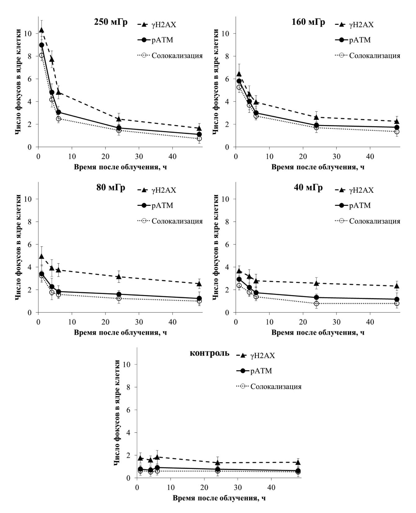

DOI:10.33266/1024-6177-2024-69-1-15-19

**А.К. Чигасова1, 2, 3, М.В. Пустовалова1, 4, А.А. Осипов2 , С.А. Корнева5 , П.С. Еремин6 , Е.И. Яшкина1, 2, М.А. Игнатов1, 2, Ю.А. Федотов1, 2, Н.Ю. Воробьева1, 2, А.Н. Осипов1, 2**

# **ПОСТРАДИАЦИОННЫЕ ИЗМЕНЕНИЯ КОЛИЧЕСТВА ФОКУСОВ ФОСФОРИЛИРОВАННЫХ БЕЛКОВ H2AX И AТМ В МЕЗЕНХИМАЛЬНЫХ СТВОЛОВЫХ КЛЕТКАХ ЧЕЛОВЕКА, ОБЛУЧЕННЫХ РЕНТГЕНОВСКИМ ИЗЛУЧЕНИЕМ В МАЛЫХ ДОЗАХ**

- 1Федеральный медицинский биофизический центр им. А.И. Бурназяна ФМБА России, Москва
- 2Федеральный исследовательский центр химической физики им. Н.Н. Семенова РАН, Москва 3Институт биохимической физики им. Н.М. Эмануэля РАН, Москва
- 4Московский физико-технический институт (национальный исследовательский университет), Московская область, Долгопрудный
  - 5Московский государственный университет им. М.В.Ломоносова, Москва

Контактное лицо: Наталья Юрьевна Воробьева, e-mail: nuv.rad@mail.ru

#### **РЕФЕРАТ**

Цель: Изучение закономерностей изменений количества фокусов фосфорилированных белков репарации двунитевых разрывов ДНК H2AX (*γ*Н2АХ) и AТМ (pAТМ) в культивируемых мезенхимальных стволовых клетках (МСК) человека через 1‒48 ч после воздействия рентгеновского излучения в дозах 40, 80, 160 и 250 мГр.

Материал и методы: В работе использовали первичную культуру МСК человека, полученную из коллекции ООО «БиолоТ» (Россия). Облучение клеток проводили на рентгеновской биологической установке РУБ РУСТ-М1 (Россия), оснащенной двумя рентгеновскими излучателями, при мощности дозы 40 мГр/мин, напряжении 100 кВ, токе трубки 0,8 мА, фильтре 1,5 мм Al, и температуре 4 °C. Для количественной оценки фокусов *γ*Н2АХ и pAТМ было проведено иммуноцитохимическое окрашивание с использованием антител к *γ*Н2АХ и pAТМ соответственно. Статистический анализ полученных данных проводился с использованием пакета статистических программ Statistica 8.0 (StatSoft). Для оценки значимости различий выборок использовали *t*-критерия Стьюдента. Результаты: В ходе проведенных исследований было показано, что кинетики изменений количества фокусов *γ*H2AX после облучения в дозах 160 и 250 мГр и малых (40‒80 мГр) дозах существенно отличаются. В отличие от существенного (на 50‒60 %) снижения количества фокусов *γ*H2AX, наблюдаемого через 6 ч после облучения в дозах 160 и 250 мГр, после облучения в малых дозах значимого снижения фокусов *γ*H2AX в эту временную точку не наблюдалось. Анализ солокализации фокусов *γ*H2AX с фокусами pATM свидетельствует о том, что механизмы поддержания высокого количества фокусов *γ*H2AX через 24‒48 ч после облучения в малых дозах являются АТМ независимыми. Выдвинута гипотеза, объясняющая феномен поддержания количества фокусов *γ*Н2AХ через 24‒48 ч после облучения в малых дозах репликативным стрессом, обусловленным стимуляцией пролиферации на фоне гиперпродукции свободных радикалов, в результате чего происходит дополнительное образование двунитевых разрывов ДНК и фосфолирирование Н2AХ киназой ATR.

**Ключевые слова:** *мезенхимальные стволовые клетки, γH2AX, pAТМ, двунитевые разрывы ДНК, рентгеновское излучение, малые дозы*

**Для цитирования:** Чигасова А.К., Пустовалова М.В., Осипов А.А., Корнева С.А., Еремин П.С., Яшкина Е.И., Игнатов М.А., Федотов Ю.А., Воробьева Н.Ю., Осипов А.Н. Пострадиационные изменения количества фокусов фосфорилированных белков h2ax и aтм в мезенхимальных стволовых клетках человека, облученных рентгеновским излучением в малых дозах // Медицинская радиология и радиационная безопасность. 2024. Т. 69. № 1. С. 15–19. DOI:10.33266/1024-6177-2024-69-1-15-19

DOI:10.33266/1024-6177-2024-69-1-15-19

**A.K. Chigasova1, 2, 3, M.V. Pustovalova1, 4, A.A. Osipov2 , S.A. Korneva5 , P.S. Eremin6 , E.I. Yashkina1, 2, M.A. Ignatov1, 2,Yu.A. Fedotov1, 2, N.Yu. Vorobyeva1, 2, A.N. Osipov1, 2**

# **Post-Radiation Changes in The Number of Phosphorylated H2ax and Atm Protein Foci in Low Dose X-Ray Irradiated Human Mesenchymal Stem Cells**

A.I. Burnazyan Federal Medical Biophysical Center, Moscow, Russia N.N. Semenov Federal Research Center for Chemical Physics, Moscow, Russia Institute of Biochemical Physics, Moscow, Russia Moscow Institute of Physics and Technology, Moscow region, Dolgoprudny, Russia M.V. Lomonosov Moscow State University, Moscow, Russia National Medical Research Center of Rehabilitation and Balneology, Moscow, Russia

Contact person: N.Yu. Vorobyeva, e-mail: nuv.rad@mail.ru

6Национальный медицинский исследовательский центр реабилитации и курортологии Минздрава России, Москва

#### **ABSTRACT**

<u>Aim:</u> To study the patterns of changes in the number of foci of phosphorylated DNA double-strand break repair proteins H2AX (γH2AX) and ATM (pATM) in cultured human mesenchymal stem cells (MSCs) 1–48 hours after exposure to X-ray radiation at doses of 40, 80, 160 and 250 mGy.

Material and methods: We used the primary culture of human MSCs, obtained from the collection of LLC "BioloT" (Russia). Cells were irradiated using a RUB RUST-M1 X-ray biological unit (Diagnostika-M LLC, Moscow, Russia) equipped with two X-ray emitters at a dose rate of 40 mGy/min (voltage of 100 kV, an anode current of 8 mA, and a 1.5 mm Al filter) and 4 °C temperature. To quantify the yield of  $\gamma$ H2AX and pATM foci immunocytochemical staining was carried out with the use of  $\gamma$ H2AX and pATM antibody respectively. Statistical analysis of the obtained data was carried out using the statistical software package Statistica 8.0 (StatSoft). To assess the significance of differences between samples, Student's t-test was used.

Results: It was shown that the kinetics of changes in the number of  $\gamma$ H2AX foci after irradiation at doses of 160 and 250 mGy and low (40–80 mGy) doses are significantly different. In contrast to the significant (50–60 %) decrease in the number of  $\gamma$ H2AX foci observed 6 hours after irradiation at doses of 160 and 250 mGy, after irradiation at low doses, no significant decrease in  $\gamma$ H2AX foci was observed at this time point. Analysis of the colocalization of  $\gamma$ H2AX foci with pATM foci indicates that the mechanisms for maintaining a high number of  $\gamma$ H2AX foci 24–48 hours after low-dose irradiation are ATM independent. A hypothesis has been put forward to explain the phenomenon of maintaining the number of  $\gamma$ H2AX foci 24–48 hours after irradiation in low doses by replicative stress caused by stimulation of proliferation against the background of hyperproduction of free radicals, resulting in additional formation of DNA double-strand breaks and phosphorylation of H2AX by ATR kinase.

Keywords: mesenchymal stem cells, yH2AX, pATM, DNA double-strand breaks, X-ray radiation, low doses

**For citation:** Chigasova AK, Pustovalova MV, Osipov AA, Korneva SA, Eremin PS, Yashkina EI, Ignatov MA, Fedotov YuA, Vorobyeva NYu, Osipov AN. Post-Radiation Changes in The Number of Phosphorylated H2AX and ATM Protein Foci in Low Dose X-Ray Irradiated Human Mesenchymal Stem Cells. Medical Radiology and Radiation Safety. 2024;69(1):15–19. (In Russian). DOI:10.33266/1024-6177-2024-69-1-15-19

#### Введение

В настоящее время наиболее хорошо исследованным и охарактеризованным типом клеток, используемым в регенеративной медицине, являются мультипотентные мезенхимные стволовые (стромальные) клетки (МСК). МСК описывают в литературе как субстратзависимые фибробластоподобные клетки, обладающие клоногенными свойствами и способностью к самоподдержанию [1, 2]. Они экспрессируют определенный набор поверхностных маркеров, большинство которых являются общим с фибробластами [3], обладают мультипотентностью и, при соответствующей индукции, способны дифференцироваться в ортодоксальных направлениях (остео-хондро- и адипогенном) [2]. При определенных условиях МСК способны также дифференцироваться в эндотелиальном, миогенном, нейрональном направлениях [4, 5].

В клинической практике клеточная терапия нередко сопровождается различными рентгеновскими диагностическими процедурами, во время которых происходит облучение тканей в малых дозах (до 100 мГр). Несмотря на уже большое количество работ по изучению влияния облучения в малых дозах на МСК [6], до сих пор остается много вопросов. В частности, недостаточно изучены особенности репарации критических повреждений ДНК-двунитевых разрывов (ДР). ДР составляют относительно небольшую часть радиационно-индуцированных повреждений ДНК, но именно они являются основным триггером, определяющим дальнейшую судьбу клетки. Клеточный ответ на воздействие ионизирующего излучения напрямую зависит от числа накопленных ДР ДНК и может включать такие процессы, как остановка клеточного цикла, активация процессов репарации ДНК и запуск программ клеточной гибели или старения [7–9].

В клетках млекопитающих после распознавания ДР ДНК происходят пространственно-локализованные процессы множественной модификации гистоновых белков, ведущие к изменению конформационной структуры хроматина и обеспечивающие условия для работы ферментов репарации. Среди наиболее изученных — фосфорилирование корового гистона H2AX по серину-139, осуществляемое киназами ATM (ataxia telangiectasia mutated), ATR (ataxia telangiectasia and Rad3-related) и

DNA-PK (DNA-dependent protein kinase), которые относятся к семейству фосфоинозитид-3-киназ [10]. При этом формируются динамические микроструктуры, получившие название фокусов фосфорилированного гистона Н2АХ (γН2АХ) и состоящие из нескольких тысяч копий этого белка [7]. Необходимо отметить, что при физиологических условиях основной киназой, фосфорилирующей Н2АХ вокруг ДР, индуцированных ионизирующим излучением, является ATM [11, 12], в то время как ATR отвечает преимущественно за процессинг ДР, образующихся в результате коллапса репликативных вилок [13, 14], а DNA-РКсs осуществляет быстрое фосфорилирирование Н2АХ в экстремальных условиях [15]. После распознавания ДР киназа АТМ активируется путем аутофосфорилирования по серину-1981 [16]. АТМ также является центральной киназой, фосфорилирующей ключевые белки (Chk1, Chk2, Rad17, NBS1, BRCA1, BLM, SMC1, 53BP1, MDC1, p53, MDM2 и т.д.), вовлеченные в формирование клеточного отклика на воздействие ионизирующего излучения: задержка клеточного цикла, репарация, клеточная гибель [17, 18].

Ранее нами были изучены закономерности ATM зависимого фосфорилирования гистона H2AX в МСК во временном диапазоне от 5 мин до 4 ч после облучения рентгеновским излучением в малых дозах [19].

Цель работы: изучение закономерностей изменений количества фокусов фосфорилированных белков H2AX и ATM в культивируемых МСК человека через 1–48 ч после воздействия рентгеновского излучения в дозах 40, 80, 160 и 250 мГр.

#### Материал и методы

### Культура клеток и условия культивирования

В работе использовали первичную культуру МСК из жировой ткани человека 5–6 пассажа, полученную из коллекции ООО «БиолоТ» (Россия). Для экспериментов клетки культивировали в среде DMEM (1 г/л глюкозы) (Thermo Fisher Scientific, США), содержащей 10 % эмбриональной сыворотки крупного рогатого скота (Thermo Fisher Scientific, США) в стандартных условиях СО2-инкубатора (37 °C, 5 % СО2) в течение 3 пассажей, со сменой среды один раз в три дня.

### Облучение

Облучение клеток проводили на рентгеновской биологической установке РУБ РУСТ-М1 (Россия), оснащенной двумя рентгеновскими излучателями, при мощности дозы 40 мГр/мин, напряжении 100 кВ, токе излучателя 0,8 мА, фильтре 1,5 мм Аl, и температуре 4°С (для охлаждения использовались термогранулы LAB ARMOR BEADS). Погрешность отпускаемой дозы не превышала 15 %. После облучения клетки инкубировали в стандартных условиях  $\mathrm{CO}_2$  инкубатора (37 °C, 5 %  $\mathrm{CO}_2$ ) в течение 1–48 ч.

## Иммуноцитохимический анализ

Клетки на покровных стеклах фиксировали параформальдегидом (4 %-ный раствор в фосфатно-солевом буфере, рН 7,4) в течение 20 мин при комнатной температуре, после чего дважды промывали фосфатно-солевым буфером (рН 7,4). Пермеабилизировали 0,3 % Тритон-Х100 в фосфатно-солевом буфере (рН 7,4), содержащем 2 % бычьего сывороточного альбумина для блокирования неспецифического связывания. Слайды инкубировали с первичными антителами (кроличьи моноклональные антитела к белку уН2АХ (Merck-Millipore, США) в разведении 1/200 и мышиные моноклональные антитела к фосфорилированному по серину-1981 белку ATM (Merck-Millipore, США) в разведении 1/200 в фосфатно-солевом буфере (рН 7,4), содержащем 1 % бычьего сывороточного альбумина, в течение 1 ч при комнатной температуре. Затем слайды промывали фосфатно-солевым буфером (рН 7,4) и инкубировали при комнатной температуре в течение 1 ч с вторичными антителами IgG (H+L), конъюгированными с флуорохромами (антитела козы к белкам мыши, конъюгированные с Alexa Fluor 488 (Life Technologies, США), в разведении 1/600 и антитела козы к белкам кролика, конъюгированные с Alexa Fluor 555 (Merck-Millipore, США), в разведении 1/600) в фосфатно-солевом буфере (рН 7,4), содержащем 1 % бычьего сывороточного альбумина. Для окраски ДНК и предотвращения фотовыцветания использовали содержащую DAPI заключающую среду ProLong Gold (Life Technologies, США). Визуализацию, документирование и обработку иммунноцитохимических микроизображений осуществляли на люминесцентном микроскопе Nikon Eclipse Ni-U (Nikon, Япония), оснащенным видеокамерой высокого разрешения ProgRes MFcool (Jenoptik AG, Германия) с использованием наборов светофильтров UV-2E/C (возбуждение 340-380 нм и эмиссия 435-485 нм), B-2E/C (возбуждение 465-495 нм и эмиссия 515-555 нм) и Y-2E/С (возбуждение 540-580 нм и эмиссия 600-660 нм). Анализировали не менее 200 клеток на точку. Количество фокусов подсчитывали вручную.

#### Статистический анализ

Статистический анализ полученных данных проводился с использованием пакета статистических программ Statistica 8.0 (StatSoft). Для оценки значимости различий выборок использовали t-критерия Стьюдента. Результаты исследований представлены как среднее арифметическое результатов трех независимых экспериментов  $\pm$  стандартная погрешность среднего ( $M\pm SEM$ ).

## Результаты и обсуждение

Результаты исследования кинетик изменения количества фокусов  $\gamma$ H2AX, рАТМ и их солокализации в культивируемых МСК человека после облучения в дозах 40, 80, 160 и 250 мГр представлены на рис. 1. Было

показано, что через 1 ч после облучения в дозе 250 мГр наблюдается статистически значимое (p<0,001) увеличение количества фокусов уН2АХ, после чего в течение последующих 5 ч происходит уменьшение их количества до ~ 50 % от числа, наблюдаемого в точке максимума. В целом, кинетика изменений количества фокусов уН2АХ в МСК после облучения в дозе 250 мГр сходна с характером изменений числа уН2АХ, полученным на фибробластах человека, облученных рентгеновским излучением в той же дозе [20]. Уменьшение дозы до 160 мГр отражается на кинетике процесса: снижение количества фокусов уН2АХ происходит более медленно и через 6 ч после облучения остается уже ~ 60 % фокусов от количества регистрируемого через 1 ч после облучения. Дальнейшее снижение дозы рентгеновского излучения до 40 и 80 мГр (диапазон малых доз) приводит к тому, что количество фокусов уН2АХ статически достоверно не уменьшается через 6 ч после облучения (рис. 1). Более того, количество фокусов уН2АХ остается повышенным вплоть до 48 ч после облучения.

Результаты анализа фокусов фосфорилированной киназы ATM (рATM) и их солокализации с фокусами  $\gamma$ H2AX свидетельствуют о том, что через 1 ч после облучения в дозе 250 мГр количество фокусов рATM, солокализованных с фокусами  $\gamma$ H2AX, составляло почти 80 % от количества фокусов  $\gamma$ H2AX (рис. 1). Затем через 4—48 ч после облучения этот показатель снижается до 45–60 %. Обращает на себя внимание тот факт, что фокусы рATM, как правило, солокализованы с  $\gamma$ H2AX. В то время как фокусы  $\gamma$ H2AX часто несолокализованы с рATM. То есть в этих случаях фосфорилирование H2AX происходит без участия ATM другими киназами (ATR или DNA-PK).

После облучения в дозах 80 и 40 мГр максимум активности ATM наблюдался через 1 ч (65 % солокализации), после чего через 24—48 ч отмечалось снижение солокализованных с  $\gamma$ H2AX фокусов pATM до 40 % (80 мГр) и 35 % (40 мГр) (рис. 1). Это свидетельствует о том, механизмы поддержания высокого количества фокусов  $\gamma$ H2AX через 24—48 ч после облучения в малых дозах являются ATM независимыми.

В качестве гипотезы, объясняющей феномен полдержания высокого количества фокусов уН2АХ через 24-48 ч после облучения в малых дозах, можно предположить дополнительное фосфолирирование Н2АХ киназой ATR. Эта киназа активируется преимущественно в фазе S в ответ на коллапс репликативных вилок или появление фрагментов однонитевой ДНК в процессе эксцизионной репарации нуклеотидов [21]. В отличие от ATR, активность ATM в фазе S существенно не меняется, а спонтанное фосфорилирование АТМ наблюдается редко [22]. Одновременная гиперпродукция свободных радикалов, часто наблюдаемая после воздействия ионизирующего излучения в малых дозах [23, 24], и стимуляция пролиферации МСК может приводить к репликативному стрессу и генерации вторичных метаболических ДР. Феномен стимуляции пролиферации малыми дозами рентгеновского излучения (50 и 75 мГр) был показан ранее для МСК костного мозга крыс [25]. В пользу выдвинутой гипотезы говорит и факт снижения активности АТМ через 24–48 ч после облучения. Важно отметить, что ДР, возникающие в результате коллапса репликативных вилок, репарируются путем медленного, но более корректного механизма гомологичной рекомбинации [26] и поэтому, в целом, представляют меньшую опасность для дальнейшей судьбы клетки, по сравнению с радиационно-индуцированными ДР.

Рис. 1. Кинетики изменений количества фокусов фосфорилированных белков Н2AX (*γ*Н2AХ) и АТМ (*р*АТМ) и их солокализизации в ядрах мезенхимальных стволовых клеток человека через 1‒48 ч после воздействия рентгеновского излучения в разных дозах

Fig. 1. Kinetics of changes in the number of phosphorylated H2AX (*γ*H2AX) and ATM (*p*ATM) protein foci their colocalization in the nuclei of human mesenchymal stem cells 1-48 hours after X-ray exposure at different doses

### **Заключение**

В ходе проведенных исследований было показано, что кинетики изменений количества фокусов *γ*H2AX после облучения в средних (160 и 250 мГр) и малых (40‒ 80 мГр) дозах существенно отличаются. В отличие от существенного (на 50‒60 %) снижения количества фокусов *γ*H2AX, наблюдаемого через 6 ч после облучения в дозах 160 и 250 мГр, после облучения в малых дозах значимого снижения фокусов *γ*H2AX в эту временную точку не наблюдалось. Анализ солокализации фокусов *γ*H2AX с фокусами pATM свидетельствует о том, что механизмы поддержания высокого количества фокусов *γ*H2AX через 24‒48 ч после облучения в малых дозах являются АТМ независимыми. Выдвинута гипотеза, объясняющая феномен поддержания количества фокусов *γ*Н2AХ через 24‒48 ч после облучения в малых дозах репликативным стрессом, обусловленным стимуляцией пролиферации на фоне гиперпродукции свободных радикалов, в результате чего происходит дополнительное образование ДР и фосфорирование Н2AХ киназой ATR.

### СПИСОК ИСТОЧНИКОВ / REFERENCES

- 1. Mastrolia I., Foppiani E.M., Murgia A., Candini O., Samarelli A.V., Grisendi G., et al. Challenges in Clinical Development of Mesenchymal Stromal/Stem Cells: Concise Review. Stem. Cells. Transl. Med. 2019;8;11:1135-1148. doi: 10.1002/sctm.19-0044.
- 2. Andrzejewska A., Lukomska B., Janowski M. Concise Review: Mesenchymal Stem Cells: From Roots to Boost. Stem. Cells. 2019;37;7:855- 864. doi: 10.1002/stem.3016.
- 3. Smolinska A., Bzinkowska A., Rybkowska P., Chodkowska M., Sarnowska A. Promising Markers in the Context of Mesenchymal Stem/ Stromal Cells Subpopulations with Unique Properties. Stem. Cells. Int. 2023;2023:1842958. doi: 10.1155/2023/1842958.
- 4. Zuk P.A., Zhu M., Mizuno H., Huang J., Futrell J.W., Katz A.J., et al. Multilineage Cells from Human Adipose Tissue: Implications for Cell-Based Therapies. Tissue Engineering. 2001;7;2:211-228. doi: 10.1089/107632701300062859.
- 5. Oswald J., Boxberger S., Jorgensen B., Feldmann S., Ehninger G., Bornhauser M., et al. Mesenchymal Stem Cells Can Be Differentiated into Endothelial Cells in Vitro. Stem. Cells. 2004;22;3:377-84. doi: 10.1634/stemcells.22-3-377.
- 6. Пустовалова М.В., Грехова А.К., Осипов А.Н. Мезенхимальные стволовые клетки: эффекты воздействия ионизирующего излучения в малых дозах // Радиационная биология. Радиоэкология. 2018. Т.58, № 4. С. 352-362. doi: 10.1134/s086980311804015x. [Pustovalova M.V., Grekhova A.K., Osipov A.N. Mesenchymal Stem Cells: Effects of Exposure to Ionizing Radiation in Low Doses. *Radiatsionnaya Biologiya. Radioekologiya* = Radiation Biology. Radioecology. 2018;58;4:352-362. doi: 10.1134/s086980311804015x (In Russ.)].
- 7. Bushmanov A., Vorobyeva N., Molodtsova D., Osipov A.N. Utilization of DNA Double-Strand Breaks for Biodosimetry of Ionizing Radiation Exposure. Environmental Advances. 2022;8. doi: 10.1016/j. envadv.2022.100207.
- 8. Osipov A., Chigasova A., Yashkina E., Ignatov M., Fedotov Y., Molodtsova D., et al. Residual Foci of DNA Damage Response Proteins in Relation to Cellular Senescence and Autophagy in X-Ray Irradiated Fibroblasts. Cells. 2023;12;8. doi: 10.3390/cells12081209.
- 9. Belov O., Chigasova A., Pustovalova M., Osipov A., Eremin P., Vorobyeva N., et al. Dose-Dependent Shift in Relative Contribution of Homologous Recombination to DNA Repair after Low-LET Ionizing Radiation Exposure: Empirical Evidence and Numerical Simulation. Curr. Issues Mol. Biol. 2023;45;9:7352-73. doi: 10.3390/cimb45090465.
- 10. Georgoulis A., Vorgias C., Chrousos G., Rogakou E. Genome Instability and γH2AX. International Journal of Molecular Sciences. 2017;18;9. doi: 10.3390/ijms18091979.
- 11. Burma S., Chen B.P., Murphy M., Kurimasa A., Chen D.J. ATM Phosphorylates Histone H2AX in Response to DNA Double-Strand Breaks. J. Biol. Chem. 2001;276;45:42462-7. doi: 10.1074/jbc.C100466200.
- 12. Stiff T., O'Driscoll M., Rief N., Iwabuchi K., Lobrich M., Jeggo P.A. ATM and DNA-PK Function Redundantly to Phosphorylate H2AX after Exposure to Ionizing Radiation. Cancer Res. 2004;64;7:2390-6.
- 13. Zhou B.B., Elledge S.J. The DNA Damage Response: Putting Checkpoints in Perspective. Nature. 2000;408;6811:433-439. doi: 10.1038/35044005.
- 14. O'Driscoll M., Ruiz-Perez V.L., Woods C.G., Jeggo P.A., Goodship J.A. A Splicing Mutation Affecting Expression of Ataxia-Telangiecta-

- sia and Rad3-Related Protein (Atr) Results in Seckel Syndrome. Nature Genetics. 2003;33;4:497-501. doi: 10.1038/ng1129.
- 15. Reitsema T., Klokov D., Banath J.P., Olive P.L. DNA-PK Is Responsible for Enhanced Phosphorylation of Histone H2AX under Hypertonic Conditions. DNA Repair (Amst). 2005;4;10:1172-1181. doi: 10.1016/j. dnarep.2005.06.005.
- 16. Shibata A., Jeggo P.A. ATM's Role in the Repair of DNA Double-Strand Breaks. Genes. 2021;12;9. doi: 10.3390/genes12091370.
- 17. Lee J.H., Paull T.T. Activation and Regulation of ATM Kinase Activity in Response to DNA Double-Strand Breaks. Oncogene. 2007;26;56:7741-7748. doi: 10.1038/sj.onc.1210872.
- 18. Kurz E.U., Lees-Miller S.P. DNA Damage-Induced Activation of ATM and ATM-Dependent Signaling Pathways. DNA Repair (Amst). 2004;3;8-9:889-900. doi: 10.1016/j.dnarep.2004.03.029.
- 19. Osipov A.N., Pustovalova M., Grekhova A., Eremin P., Vorobyova N., Pulin A., et al. Low Doses of X-Rays Induce Prolonged and ATM-Independent Persistence of GammaH2AX foci in Human Gingival Mesenchymal Stem Cells. Oncotarget. 2015;6;29:27275-87. doi: 10.18632/ oncotarget.4739.
- 20. Грехова А.К., Еремин П.С., Осипов А.Н., Еремин И.И., Пустовалова М.В., Озеров И.В. и др. Замедленные процессы образования и деградации фокусов γН2ax в фибробластах кожи человека, подвергшихся воздействию рентгеновского излучения в малых дозах // Радиационная биология Радиоэкология. 2015;55(4):395- 401. doi: 10.7868/s0869803115040037. [Grekhova A.K., Eremin P.S., Osipov A.N., Eremin I.I., Pustovalova M.V., Ozerov I.V., et al. Slow Processes of Formation and Degradation of γH2ax Foci in Human Skin Fibroblasts Exposed to Low-Dose X-Ray Radiation. *Radiatsionnaya Biologiya. Radioekologiya* = Radiation Biology. Radioecology. 2015;55;4:395-401. doi: 10.7868/s0869803115040037. (In Russ.)].
- 21. Biswas H., Makinwa Y., Zou Y. Novel Cellular Functions of ATR for Therapeutic Targeting: Embryogenesis to Tumorigenesis. International Journal of Molecular Sciences. 2023;24;14. doi: 10.3390/ ijms241411684.
- 22. Suzuki K., Okada H., Yamauchi M., Oka Y., Kodama S., Watanabe M. Qualitative and Quantitative Analysis of Phosphorylated ATM Foci Induced by Low-Dose Ionizing Radiation. Radiat Res. 2006;165;5:499- 504. doi: 10.1667/RR3542.1.
- 23. Large M., Reichert S., Hehlgans S., Fournier C., Rodel C., Rodel F. A Non-Linear Detection of Phospho-Histone H2AX in EA.hy926 Endothelial Cells Following Low-Dose X-Irradiation Is Modulated by Reactive Oxygen Species. Radiat Oncol. 2014;9:80. doi: 10.1186/1748- 717X-9-80.
- 24. Baulch J.E., Craver B.M., Tran K.K., Yu L., Chmielewski N., Allen B.D., et al. Persistent Oxidative Stress in Human Neural Stem Cells Exposed to Low Fluences of Charged Particles. Redox Biology. 2015;5:24-32. doi: 10.1016/j.redox.2015.03.001.
- 25. Liang X., So Y.H., Cui J., Ma K., Xu X., Zhao Y., et al. The Low-Dose Ionizing Radiation Stimulates Cell Proliferation Via Activation of the MAPK/ERK Pathway in Rat Cultured Mesenchymal Stem Cells. Journal of Radiation Research. 2011;52;3:380-386.
- 26. Petermann E., Helleday T. Pathways of Mammalian Replication Fork Restart. Nature Reviews Molecular Cell Biology. 2010;11;10:683-687. doi: 10.1038/nrm2974.

**Конфликт интересов.** Авторы заявляют об отсутствии конфликта интересов. **Финансирование.** Исследования выполнены при поддержке РНФ (проект № 23-14-00078).

**Участие авторов.** Cтатья подготовлена с равным участием авторов. **Поступила:** 20.10.2023. Принята к публикации: 27.11.2023.

**Conflict of interest.** The authors declare no conflict of interest.

**Financing.** The research was carried out with the support of the RNF (project No. 23-14-00078).

**Contribution.** Article was prepared with equal participation of the authors. **Article received:** 20.10.2023. Accepted for publication: 27.11.2023.