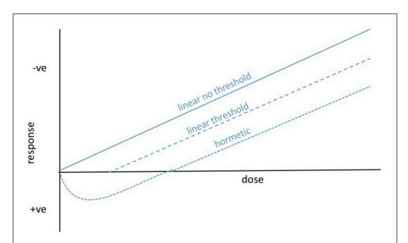
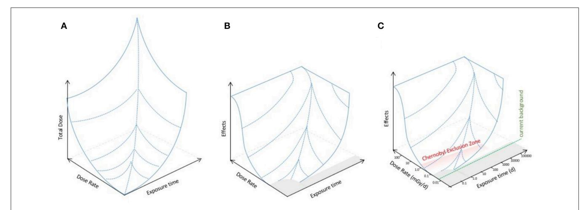

# [An Extended Dose–Response Model](http://journal.frontiersin.org/article/10.3389/fenvs.2017.00006/abstract) for Microbial Responses to Ionizing Radiation

[Eleni Siasou](http://loop.frontiersin.org/people/392101/overview)1 \*, [David Johnson](http://loop.frontiersin.org/people/31944/overview)2 and [Neil J. Willey](http://loop.frontiersin.org/people/202600/overview) 1

*1 Centre for Research in Biosciences, University of the West of England, Bristol, UK, 2 Institute of Biological and Environmental Sciences, University of Aberdeen, Aberdeen, UK*

An understanding of the environmental toxicology of ionizing radiation (IR) is needed because nuclear power production is expanding and there is increasing pressure to build nuclear waste repositories. The effects of IR in the environment have long been investigated but there have been fewer studies involving environmental microbiology than its importance to key ecosystems services demands. Here, we highlight some unique aspects of the relationship between microbes and IR and use them to suggest an extended dose–response model. At high doses, IR causes DNA damage and oxidative stress but some microbes have a remarkable capacity for DNA repair and are tolerant of oxidative stress. Not only is significant radioresistance increasingly being reported for microbes, but some microbes are even radiotrophic. The stressful radiative environment of the early Earth might help explain the existence of these traits, which challenge the assumptions of current dose response models for IR. We suggest that a perspective that takes into account these traits plus both dose and dose rate can be used to model an "effects landscape" that might provide insights for the environmental toxicology of IR to microbes. This might help to predict the effects of IR on key ecosystem processes and also be useful in understanding the environmental toxicology of IR in general.

Keywords: ionizing radiation, microorganisms, environmental toxicology, dose–response model, ecosystem processes

#### Edited by:

*Rajeshwar P. Sinha, Banaras Hindu University, India*

#### Reviewed by:

*Lianzhen Li, Yantai Institute of Coastal Zone Research (CAS), China Eman Saed Swelam, Cairo University, Egypt*

#### \*Correspondence:

*Eleni Siasou [e.siasou@gmail.com](mailto:e.siasou@gmail.com)*

#### Specialty section:

*This article was submitted to Environmental Toxicology, a section of the journal Frontiers in Environmental Science*

Received: *15 November 2016* Accepted: *20 January 2017* Published: *03 February 2017*

#### Citation:

*Siasou E, Johnson D and Willey NJ (2017) An Extended Dose–Response Model for Microbial Responses to Ionizing Radiation. Front. Environ. Sci. 5:6. doi: [10.3389/fenvs.2017.00006](https://doi.org/10.3389/fenvs.2017.00006)*

# INTRODUCTION

Nuclear power is seen as a low-carbon alternative to fossil fuel-derived energy but its use brings potential for both chronic and acute inputs of radionuclides to the environment. Although a variety of levels of radioactivity occurs naturally, accidental releases of short and long-lived radionuclides into the environment are an emotive and, given a globally expanding nuclear industry, topical issue. Further, the vast majority of nuclear waste ever generated is currently kept in temporary storage so there is significant pressure to construct permanent nuclear waste repositories for high level radioactive waste in particular [\(Sanders and Sanders, 2016\)](#page-5-0). The effects of IR on microorganisms in the near-environment of waste repositories can be very important to their functioning and its effects further afield can be important to understanding the impacts that any IR entering the environment might have. Studies have, for several decades, investigated the ecological impacts that releases of radionuclides to the environment can have on a range of plants and animals (e.g., [Geras'kin, 2016\)](#page-4-0) and also explored the effects of low doses in various microorganisms [\(Paul et al., 2012;](#page-5-1) Tomac and Yeannes, [2012;](#page-5-2) [Mesquita et al., 2013;](#page-5-3) [Xavier et al., 2014\)](#page-5-4) but their impact on soil and root-associated microorganisms, and the key ecosystem processes they regulate, is less well understood. One of the most important sources of data on the environmental impacts of accidental releases of IR is the Chernobyl "Exclusion Zone" (CEZ), which has served as a natural laboratory since the accident in April 1986. Investigations at this site have paid less attention to the effects of IR on microbes than on many other groups of organisms, but laboratory experiments reveal complex responses of microorganisms to IR, particularly the mechanisms that enable some microbes to resist damage. In addition, analysis of natural variation in radioactivity is providing insights into how low doses of radiation affect mutation rates and evolution [\(Møller and Mousseau, 2013\)](#page-5-5).

This article highlights progress in the environmental toxicology of IR for microorganisms using three themes; the effects of IR on microbial DNA and redox poise, the adaptive responses of microbial populations to IR, and the implications for key ecosystem processes of IR effects on microorganisms. It is suggested that the major challenge for understanding the environmental toxicology of microbial response to IR is to integrate these three themes. To achieve this the current understanding of the responses of individual species of microorganisms to IR needs to be complemented by a greater focus on community-level and functional responses of microorganisms to IR. This is necessary for understanding the effects of IR on microbially-mediated plant-soil feedbacks and biogeochemical cycling. To facilitate such a synthesis, a new perspective on dose–response is proposed for investigating the toxicological impacts of IR, for which microorganisms provide a unique test but which might also be useful for other organisms.

## DNA DAMAGE AND OXIDATIVE STRESS IN MICROBES DURING EXPOSURE TO IR

High dose exposure of living cells to IR causes significant changes to essential biomolecules, such as DNA, and can trigger oxidative stress resulting in mutations and other defects. Eukaryotic and prokaryotic models have been used to study the effects of high dose IR on DNA damage and repair mechanisms. This has revealed distinct types of DNA damage by IR; single strand breaks, double strand breaks, and radiation-induced bystander effects [\(Han and Yu, 2010\)](#page-4-1). Unusually for living cells, some bacteria are radioresistant because they have significant capacity to repair IR-induced DNA damage and to minimize IR-induced oxidative stress—a processs thought to be mediated by the accumulation of manganese complexes that prevent protein oxidation [\(Daly, 2009\)](#page-4-2). IR-resistant bacteria are, increasingly, being isolated and sequenced from a variety of environments [\(Singh et al., 2013;](#page-5-6) [Kim et al., 2015;](#page-5-7) [Srinivasan et al., 2015;](#page-5-8) Deng et al., [2016;](#page-4-3) [Ruiz-González et al., 2016\)](#page-5-9).

The proportion of microbial communities that are radioresistant is unknown, and this makes it difficult to predict the impact of accidental releases of IR on ecosystems. In soils, exposure to UV radiation, which is non-ionizing but can also cause DNA damage and oxidative stress, can affect microbial community composition and decomposition [\(Wang et al., 2015\)](#page-5-10), which suggests that resistance to damaging radiation is not ubiquitous. At low chronic doses of IR, such as those that occur in radioactively contaminated environments, there is currently a particular lack of toxicological consensus about the effects of IR on organisms. On the one hand, mechanistic calculations show that direct oxidative stress is not likely to be caused by chronic low doses of radiation [\(Smith et al., 2012\)](#page-5-11) whilst some field studies suggest chronic low doses of IR affect the fitness of, for example, small mammals [\(Lehmann et al., 2016\)](#page-5-12). It has even been suggested that variation in naturally-occurring levels of radioactivity can affect immune function, mutation, and disease in animals and plants [\(Møller and Mousseau, 2013\)](#page-5-5). For microbes in particular, there is significant scope for improving our understanding of environmental toxicology of IR at chronic low doses, with estimates of the occurrence of radioresistance perhaps being particularly important.

# ADAPTATION OF MICROBIAL POPULATIONS TO RADIOACTIVE ENVIRONMENTS

Microbial populations often have rapid growth rates and mixed gene swapping abilities that enable them to evolve rapidly and adapt to environmental challenges [\(DeLong, 2012\)](#page-4-4). There are examples of microbial species, such as Deinococcus radiodurans and Cryptococcus neoformans, that are adapted to highly radioactive environments [\(Cox and Battista, 2005;](#page-4-5) Zivanovic et al., [2009\)](#page-5-13) and of melanin synthesizing fungi that have a greater ability to tolerate radioactivity than those that do not (Dadachova and Casadevall, [2008\)](#page-4-6). Selection experiments have found that irradiation of Escherichia coli cells (up to 50 rounds) led to highly radio-resistant populations, and their genomic sequences unveiled nine genes prone to mutations [\(Harris et al., 2009;](#page-4-7) [Byrne et al., 2014\)](#page-4-8). The roles of these nine genes include copying and repairing DNA sequences, decreasing the damage caused by reactive oxygen species (ROS), and manufacturing the molecular wall that shields the cells. When specific mutations from the evolved population of E.coli (radio-resistant to repair genes) were inserted into original repair genes, the cells developed resistance, and in contrast, the evolved radio-resistant E.coli cells became less resistant to radiation upon insertion of the original genes. In natural ecosystems, in which microorganisms are subjected to a plethora of parameters that affect their evolution [\(DeLong, 2012;](#page-4-4) [Denef and Banfield, 2012\)](#page-4-9), various exposure times and doses of IR have probably triggered the evolution of resistance to IR in some populations and it is also clear that some microorganisms can adapt to utilize IR in contaminated environments.

#### ECOSYSTEM PROCESSES AND THE EFFECTS OF IR ON MICROORGANISMS

As the main drivers for litter decomposition and nutrient cycling, microorganisms play key roles in ecosystem processes, and they also form widespread symbioses with plants (e.g., mycorrhizal fungi and N fixing bacteria) that are crucial for plant growth, nutrition and fitness. There is evidence that the rate of litter decomposition has decreased in the CEZ, which can lead to increased risk of fire and re-release of contaminated material to the atmosphere [\(Mousseau et al.,](#page-5-14) [2014\)](#page-5-14). Mycorrhizal fungi can affect the uptake of radionuclides by plants [\(Vinichuk et al., 2013\)](#page-5-15), but the impact of IR on the diversity and function of the fungi themselves is poorly studied, despite their ecological importance. The extent of colonization of plant roots by arbuscular mycorrhizal fungi can be reduced in response to radioactivity [\(Jones et al., 2004,](#page-4-10) [Kothamasi et al., 2016\)](#page-5-16). Radiation exposure also affects other soil microorganisms with key roles in ecosystem functioning: the sensitivity of ammonia oxidizing bacteria to gamma radiation appears to be associated with the lack of re-establishment of trees in contaminated soils [\(Shah et al., 2013\)](#page-5-17). These studies suggest that exposure to IR has potential for wide-ranging impacts on ecosystem functioning. There is, however, no overall framework to help clarify the environmental toxicology of IR effects on microorganisms.

# AN EXTENDED DOSE–RESPONSE MODEL OF THE EFFECTS OF IONIZING RADIATION

#### Microorganisms and the Linear Non-threshold Dose–Response Model

Humans have been the focus of radiological protection for many decades and it is only in recent years that legislation to protect flora and fauna has begun to develop [\(ICRP, 2007\)](#page-5-18). The International Commission for Radiological Protection (ICRP) in 1977 and 1991 concluded that if humans were adequately protected from the effects of IR then other organisms would be too [\(ICRP, 1977,](#page-5-19) [1991\)](#page-5-20). ICRP 103 [\(ICRP, 2007\)](#page-5-18) recognized the importance of protecting the environment and introduced the concept of reference animals and plants. This concept acknowledges that there may be some differences between the effects of IR on a range of organisms but excludes microbes. The Miami Consenus Symposium 2015 derived seven statements to address the ecological effects of radiation on populations and ecosystems and yet there has been scant focus on radiological protection for microorganisms [\(Bréchignac et al., 2016\)](#page-4-11). This is important when the recent data outlined above suggests that the effects of IR on microbial populations is not the same as the effects on populations of other organisms.

The assumption of a linear non-threshold (LNT) dose response to IR (**[Figure 1](#page-2-0)**) has, since its inception, underpinned radiological protection of humans and is widely assumed when discussing other organisms, including reference animals and plants. However, there are generally thresholds in effects of naturally occurring environmental stressors on organisms because homeostatic systems provide a buffer against low intensity variation (cf. [Willey, 2016\)](#page-5-21). For microorganisms, in which the effects of IR are most appropriately discussed at the population or community level, the existence of radioresistant populations of bacteria and fungi suggest that thresholds for effects might be particularly important (**[Figure 1](#page-2-0)**) but they have seldom been tested. Further, there are clearly microorganisms that are not only resistant to low level exposure to IR but are adapted to take advantage of it, which is likely to produce a

FIGURE 1 | Possible dose–response curves for ionizing radiation and microorganisms. For radiological protection purposes, especially for humans, the linear non-threshold response is general assumed. For most organisms, and particularly for microorganisms living at current background and for which population and community effects might be of most relevance, we hypothesize that there are thresholds below which significant effects are not observed. In fact, the survival of some microorganisms at high dose rates of IR and the capture of energy from IR by others, suggests that hormetic dose responses are also possible.

hormetic dose response (**[Figure 1](#page-2-0)**). These phenomena suggest that, at least for some microorganisms, our understanding of the environmental toxicology of IR could be improved by extending the LNT model.

For humans the LNT dose–response has a long history of successful use in radiological protection because it is simple and conservative. It assumes that effects are a product of total dose received and that there is no dose that does not produce an effect. It has frequently been pointed out that both of these assumptions can be questioned scientifically. For the first, given that biological systems take time to react to environmental insult, there are short-term high dose rates at which even relatively small total doses can produce effects. The corollary of this is that there are low dose rates which, if delivered for protracted periods, ultimately provide large total doses but have no effects because organisms can adjust to them. The effects of IR are, therefore, a product not just of total dose but also of dose rate. As regards the second assumption, on the early Earth the background β/γ radiation was several times higher than it is at present [\(Karam and Leslie, 1999\)](#page-5-22), and before the formation of the ozone layer the effects of UV-B and UV-C (which at its shortest wavelengths is weakly ionizing) were significant. Mean global current background ionizing radiation dose rates are approximately 3 mGy y−1 which is the lowest background dose rate to which life has ever been exposed. Given the ancient history and adaptability of archaea, bacteria and fungi in particular, and the presence of extant radioresistant microbes, it is appropriate to suggest that there are low dose rates to which they at least are resistant and that have no effects. We suggest, therefore, that both total dose and dose rate should be considered in dose–response models for use in environmental toxicology and that it is appropriate to suggest that there is a threshold for effects on microorganisms.

#### Extending the Linear Non-threshold Dose–Response

Several theoretical improvements, ultimately based on "target theory," of the LNT model have been suggested (e.g., Manabe et al., [2015;](#page-5-23) [Seong et al., 2016\)](#page-5-24). These models aimed to provide better descriptions of the relationship between dose and effect, with the model of Manabe et al. in particular emphasizing the importance of dose-rate dependence at low doses by summing low dose and high dose components. Although not necessarily more useful for the purposes of radiological protection than the LNT dose–response, such improvements seem likely to more nearly reflect the relationship between dose and effect.

We propose, however, that given that both dose and dose rate are relevant to the effects produced, effects should be modeled as, mathematically, a function of them. Thus, effects might be described by a three dimensional landscape dependent on both total dose and dose rate (**[Figure 2A](#page-3-0)**). This is a conceptual framework widely used, for example, to describe the effects of two interlinked factors (energy and chemical conditions) on protein conformation [\(Hartl and Hayer-Hartl, 2009\)](#page-4-12). The recent mathematical advances in describing dose–response (e.g., [Manabe et al., 2015;](#page-5-23) [Seong et al., 2016\)](#page-5-24) might provide a basis for establishing which functions might be appropriate for a mathematical model of the landscape. An alternative, however, might be gathering or collating data informed by the parameters of the landscape perspective in order to provide an empirical description of it. For microorganisms, the landscape perspective we propose predicts that there might be a no effects area (i.e., a threshold for effects) at low doses, and a maximum of effects at particularly high dose rates because there are dose rates known to be sterilizing (**[Figure 2B](#page-3-0)**). Effects of IR in the environmental toxicology literature are frequently discussed as a product of either "low dose" or "high dose." We suggest that this binary division is simplistic and should be replaced with a landscape of effects whose topology should be, by mathematical and/or empirical methods, the focus of environmental toxicology research for microorganisms at least.

# Implications for the Environmental Toxicology of Microorganisms

Investigations to probe the topology of an IR effects landscape are likely to be particularly important for microorganisms. For investigations of effects the early conditions for life, which for at least its first 2.5 billion years was entirely microbial, are relevant. Microbial interactions with UV were a significant factor in early evolution, and the effects of UV are often linked to those of IR [\(Evans, 1991\)](#page-4-13). The primary effects of UV on organisms occur because some key biomolecules, primarily DNA and proteins, strongly absorb radiation in the UV range which can result in their structural alteration and photoionization. DNA damage from the absorption of UV likely provoked the evolution of early DNA repair mechanisms. Together with the existence of radioresistant microorganisms, this suggests that there is likely to be, at a population level at least, a no-effects threshold for DNA damage on the effects landscape because microorganisms must be able to cope with it. As far as oxidative stress is concerned, the ionization energy for water is such that only UV radiation with a wavelength below 100 nm is ionizing. UV radiation with

FIGURE 2 | An extended dose–response model for the effects of IR on microorganisms. (A) The total dose produced by the product of dose rate and exposure time to IR (log10 axes). (B) A conceptual landscape for the effects of IR on microorganisms assuming that there is not a direct linear relationship between exposure and effects but that there are thresholds in both dose rate and exposure time below which there are no significant effects, and that at high dose rates there are effects that microorganisms have particular difficulty in adapting to. The gray area represents the no effects region and in some instances perhaps even a positive effects region. There is a ceiling on effects because there are very high doses of IR that are sterilizing, i.e., kill essentially all microorganisms. (C) Potential relationship of the effects landscape to IR in the environment. Given the evolutionary exposure to higher background radiation than exists now, plus exposure to UV and to other stressors it is likely that current background has no significant effects on microorganisms, and perhaps that a dose rate somewhat above current background has no effect. At Chernobyl, the highest dose rates during the accident clearly had significant effects and subsequently in the CEZ (shown in red) the highest doses are in the range where effects are possible but for microorganisms, and many other organisms, the precise relationship between the exposures in the CEZ and the effects landscape are not yet clear.

this wavelength is not a significant proportion of UV currently arriving at the Earth's surface but it has been more significant in the past [\(Cockell, 2002\)](#page-4-14).

UV's oxidative effects are, however, primarily produced by photoactivated and photoionised biomolecules reacting with water to produce ROS [\(Pattinson and Davies, 2006\)](#page-5-25) rather than by direct radiolysis of water. The amount of oxidizing radicals from UV to which ancient microbes had to adapt is orders of magnitude greater than those produced by IR-induced radiolysis at doses likely to occur in the environment [\(Smith et al.,](#page-5-11) [2012\)](#page-5-11), so we hypothesize that a threshold for oxidative effects IR exists for microorganisms because they are pre-adapted to withstand the limited oxidizing effects of IR at environmentally relevant dose rates. This suggests that there are doses, including chronic low doses, which are unlikely to have adverse effects on at least some microbial populations. The key ecosystem processes that microbes regulate are sensitive to changes in population structure, and the existence of radioresistance in some microbes might increase the variation in microbial response, so investigations at these dose rates might be important for understanding the environmental toxicology of IR.

At the high dose rate/total dose part of the effects landscape, direct damage of DNA becomes pronounced because double stranded DNA breaks, which are a frequent result of exposure to IR, are generally difficult for organisms to repair with high fidelity. As DNA repair takes time, there comes a point where the rate of DNA damage is fatal, producing a shelf on the effects landscape. D. radiodurans is an extreme example how some microorganisms can reconstitute a genome fractured by IR but many other microbes are not so radioresistant, supporting the need to better describe the topology of this part of the effects landscape (**[Figure 2](#page-3-0)**). This suggests that high doses of IR, including high doses during accidents, might have significant effects on the structure of microbial populations. Extremely high doses may be fatal to some microbial populations, and thus be sterilizing, but high doses might also lead in some instances to a change microbial population structure. Overall, a simple linear dose–response perspective is unlikely to be useful for understanding the effects of IR on microbial populations and hence on key ecosystem processes.

#### CONCLUSION

Until an effects landscape model is properly conceptualized and tested for the effects of IR on microorganisms, it is unlikely that it will be possible to make good predictions of the effects of IR on microorganisms, at species and population levels, and therefore on key ecosystem processes. Such knowledge will lead to better predictive understanding of how accidental releases of radionuclides affect the natural environment and the ecosystem services it provides. Microbes provide a unique opportunity to test all aspects of such a model, including the possibility of adaptation at the population during significant exposure to IR, which could have implications not just for microorganisms but also for flora, fauna, and ecosystems.

# AUTHOR CONTRIBUTIONS

ES conceived the overall rationale and wrote the paper. NW and DJ contributed to writing the paper. NW and ES developed the extended response model.

#### ACKNOWLEDGMENTS

ES and NW are supported through the TREE consortium that is funded by the Natural Environment Research Council of the UK, Radioactive Waste Management Ltd., and the Environment Agency of England.

#### REFERENCES

- Bréchignac, F., Oughton, D., Mays, C., Barnthouse, L., Beasley, J. C., Bonisoli-Alquati, A., et al. (2016). Addressing ecological effects of radiation on populations and ecosystems to improve protection of the environment against radiation: agreed statements from a Consensus Symposium. J. Environ. Radioact. 158–159, 21–29. doi: [10.1016/j.jenvrad.2016.03.021](https://doi.org/10.1016/j.jenvrad.2016.03.021)
- Byrne, R. T., Klingele, A. J., Cabot, E. L., Schackwitz, W. S., Martin, J. A., Martin, J., et al. (2014). Evolution of extreme resistance to ionizing radiation [via genetic adaptation of DNA repair.](https://doi.org/10.7554/eLife.01322) Elife 3:e01322. doi: 10.7554/eLife. 01322
- Cockell, C. S. (2002). "The ultra-violat radiation environment of Earth and Mars: past and present," in Astrobiology: The Quest for the Conditions of Life, eds G. Horneck and C. Baumstark-Khan (Berlin: Springer), 219–232.
- Cox, M. M., and Battista, J. R. (2005). Deinococcus radiodurans - the consummate survivor. Nat. Rev. Microbiol. 3, 882–892. doi: [10.1038/nrmicro1264](https://doi.org/10.1038/nrmicro1264)
- Dadachova, E., and Casadevall, A. (2008). Ionizing radiation: how fungi cope, adapt, and exploit with the help of melanin. Curr. Opin. Microbiol. 11, 525–531. doi: [10.1016/j.mib.2008.09.013](https://doi.org/10.1016/j.mib.2008.09.013)
- Daly, M. J. (2009). A new perspective on radiation resistance based on Deinococcus radiodurans. Nat. Rev. Microbiol. [7, 237–245. doi: 10.1038/nrmicro](https://doi.org/10.1038/nrmicro2073) 2073
- DeLong, E. F. (2012). Microbial microevolution in the wild. Science 336, 422–424. doi: [10.1126/science.1221822](https://doi.org/10.1126/science.1221822)

- Denef, V. J., and Banfield, J. F. (2012). In situ evolutionary rate measurements show ecological success of recently emerged bacterial hybrids. Science 336, 462–466. doi: [10.1126/science.1218389](https://doi.org/10.1126/science.1218389)
- Deng, W., Yang, Y., Gao, P., Chen, H., Wen, W., and Sun, Q. (2016). Radiationresistant Micrococcus luteus SC1204 and its proteomics change upon gamma irradiation. Curr. Microbiol. 72, 767–775. doi: [10.1007/s00284-016-1015-y](https://doi.org/10.1007/s00284-016-1015-y)
- Evans, H. (1991). "The mutagenic effects of ultraviolet and ionizing radiation," in Photobiology: The Science and Its Applications, ed E. Riklis (New York, NY: Springer), 83–95.
- Geras'kin, S. A. (2016). Ecological effects of exposure to enhanced levels of ionizing radiation. J. Env. Radioac. 162–163, 347–357. doi: [10.1016/j.jenvrad.2016.06.012](https://doi.org/10.1016/j.jenvrad.2016.06.012)
- Han, W., and Yu, K. N. (2010). "Ionizing radiation, DNA double strand break and mutation," in Advances in Genetic Research, ed K. V. Urbano (New York, NY: Nova Science Publishers), 1–13.
- Harris, D. R., Pollock, S. V., Wood, E. A., Goiffon, R. J., Klingele, A. J., Cabot, E. L., et al. (2009). Directed evolution of ionizing radiation resistance in Escherichia coli. J. Bacteriol. 191, 5240–5252. doi: [10.1128/JB.00502-09](https://doi.org/10.1128/JB.00502-09)
- Hartl, F. U., and Hayer-Hartl, M. (2009). Converging concepts of protein folding in vitro and in vivo. Nat. Struc. Mol. Biol. 16, 574–581. doi: [10.1038/nsmb.1591](https://doi.org/10.1038/nsmb.1591)
- Jones, H. E., West, H. M., Chamberlain, P. M., Nisha, R. P., Beresford, N. A., and Crout, N. M. J. (2004). Effects of gamma irradiation on Holcus lanatus (Yorkshire fog grass) and associated soil microorganisms. J. Environ. Radioact. 74, 57–71. doi: [10.1016/j.jenvrad.2004.01.027](https://doi.org/10.1016/j.jenvrad.2004.01.027)

- ICRP (1977). Recommendations of the International Commission on Radiological Protection. Oxford: Pergamon Press. ICRP Publication 26. Ann. ICRP1 (3).
- ICRP (1991). 1990 Recommendations of the International Commission on Radiological Protection. Oxford: Pergamon Press. ICRP Publication 60. Ann. ICRP 21 (1-3).
- ICRP (2007). 2007 Recommendations of the International Commission on Radiological Protection. Oxford: Pergamon Press. ICRP Publication 103. Ann. ICRP 37 (2-3).
- Karam, P. A., and Leslie, S. A. (1999). Calculations of background betagamma radiation dose through geologic time. Health Phys. 77, 662–667. doi: [10.1097/00004032-199912000-00010](https://doi.org/10.1097/00004032-199912000-00010)
- Kim, M. K., Srinivasan, S., Back, C.-G., Joo, E. S., Lee, S.-Y., and Jung, H.-Y. (2015). Complete genome sequence of Deinococcus swuensis, a bacterium resistant to radiation toxicity. Mol. Cell Toxicol. 11, 315–321. doi: [10.1007/s13273-015-0031-5](https://doi.org/10.1007/s13273-015-0031-5)
- Kothamasi, D., Wannijn, J., van Hees, M., Nauts, R., van Gombel, A., Vanhoudt, N., et al. (2016). Rhizophagus irregularis MUCL 41833 can colonize and improve P uptake of Plantago lanceolata after exposure to gamma ionizing radiation in root organ culture. Mycorrhiza 26, 257–262. doi: [10.1007/s00572-015-0664-1](https://doi.org/10.1007/s00572-015-0664-1)
- Lehmann, P., Boratynski, Z., Mappes, T., Mousseau, T. A., and Møller, A. P. ´ (2016). Fitness costs of increased cataract frequency and cumulative radiation dose in natural mammalian populations from Chernobyl. Sci. Rep. 6:19974. doi: [10.1038/srep19974](https://doi.org/10.1038/srep19974)
- Manabe, Y., Wada, T., Tsunoyama, Y., Nakajima, H., Nakamura, I., and Bando, M. (2015). Whack-A-Mole model: towards a unified description of biological effects caused by radiation exposure. J. Phys. Soc. Jpn. 84:044002. doi: [10.7566/jpsj.84.044002](https://doi.org/10.7566/jpsj.84.044002)
- Mesquita, N., Portugal, A., Pinar, G., Loureiro, J., Coutinho, A. P., Trovao, J., et al. (2013). Flow cytometry as a tool to assess the effects of gamma radiation on the viability, growth and metabolic activity of fungal spores. Int. Biodeter. Biodegr. 84, 250–257. doi: [10.1016/j.ibiod.2012.05.008](https://doi.org/10.1016/j.ibiod.2012.05.008)
- Møller, A. P., and Mousseau, T. A. (2013). The effects of natural variation in background radioactivity on humans, animals and other organisms. Biol. Rev. Camp. Philos. Soc. 88, 226–254. doi: [10.1111/j.1469-185X.2012.00249.x](https://doi.org/10.1111/j.1469-185X.2012.00249.x)
- Mousseau, T. A., Milinevsky, G., Kenney-Hunt, J., and Møller, A. P. (2014). Highly reduced mass loss rates and increased litter layer in radioactively contaminated areas. Oecologia 175, 429–437. doi: [10.1007/s00442-014-2908-8](https://doi.org/10.1007/s00442-014-2908-8)
- Pattinson, D. I., and Davies, M. J. (2006). "Actions of ultraviolet light on cellular structures," in Cancer: Cell Structures, Carcinogens and Genomic Instability, ed L. P. Bignold (Birkhäuser: Verlag), 131–157.
- Paul, A., Dziallas, C., Zwirnmann, E., Gjessing, E. T., and Grossart, H.-P. (2012). UV irradiation of natural organic matter (NOM): impact on organic carbon and bacteria. Aquat. Sci. 74, 443–454. doi: [10.1007/s00027-011-0239-y](https://doi.org/10.1007/s00027-011-0239-y)
- Ruiz-González, M. X., Czirják, G. Á., Genevaux, P., Møller, A. P., Mousseau, A., and Heeb, P. (2016). Resistance of feather-associated bacteria to intermediate levels of ionizing radiation near Chernobyl. Sci. Rep. 6:22969. doi: [10.1038/srep22969](https://doi.org/10.1038/srep22969)
- Sanders, M. C., and Sanders, C. E. (2016). A world's dilemma 'upon which the sun never sets' – The nuclear waste management strategy (part I): Western European Nation States and the United States of America. Prog. Nucl. Energ. 90, 69–97. doi: [10.1016/j.pnucene.2016.02.012](https://doi.org/10.1016/j.pnucene.2016.02.012)

- Seong, K. M., Seo, S., Lee, D., Kim, M.-J., Lee, S.-S., Park, S., et al. (2016). Is the linear no- threshold dose-response paradigm still necessary for the assessment of health effects of low dose radiation? J. Korean Med. Sci. 31, S10–S23. doi: [10.3346/jkms.2016.31.S1.S10](https://doi.org/10.3346/jkms.2016.31.S1.S10)
- Shah, V., Shah, S., Mackey, H., Kambhampati, M., Collins, D., Dowd, S. E., et al. (2013). Microbial community in the soil determines the forest recovery post-exposure to gamma irradiation. Environ. Sci. Technol. 47, 11396–11402. doi: [10.1021/es400923k](https://doi.org/10.1021/es400923k)
- Singh, H., Kim, H., Song, H., Joe, M., Kim, D., Bahn, Y. S., et al. (2013). A novel radiation-resistant strain of Filobasidium sp. isolated from the West Sea of Korea. J. Microbiol. Biotechnol. 23, 1493–1499. doi: [10.4014/jmb.1305.05054](https://doi.org/10.4014/jmb.1305.05054)
- Smith, J. T., Willey, N. J., and Hancock, J. T. (2012). Low dose ionizing radiation produces too few reactive oxygen species to directly affect antioxidant concentrations in cells. Biol. Lett. 8, 594–597. doi: [10.1098/rsbl.2012.0150](https://doi.org/10.1098/rsbl.2012.0150)
- Srinivasan, S., Kim, M. K., Joo, E. S., Lee, S.-Y., Lee, D. S., and Jung, H.-Y. (2015). Complete genome sequence of Rufibacter sp DG31D, a bacterium resistant to gamma and UV radiation toxicity. Mol. Cell Toxicol. 11, 415–421. doi: [10.1007/s13273-015-0044-0](https://doi.org/10.1007/s13273-015-0044-0)
- Tomac, A., and Yeannes, M. I. (2012). Gamma radiation effect on quality changes in vacuum-packed squid (Illex argentinus) mantle rings during refrigerated (4–5◦C) storage. Food Sci. Technol. 47, 1550–1557. doi: [10.1111/j.1365-2621.2012.03005.x](https://doi.org/10.1111/j.1365-2621.2012.03005.x)
- Vinichuk, M., Mårtensson, A., Ericsson, T., and Rosén, K. (2013). Effect of arbuscular mycorrhizal (AM) fungi on 137Cs uptake by plants grown on different soils. J. Eniron. Radioac. 115, 151–156. doi: [10.1016/j.jenvrad.2012.08.004](https://doi.org/10.1016/j.jenvrad.2012.08.004)
- Wang, J., Liu, L., Wang, X., and Chen, Y. (2015). The interaction between abiotic photodegradation and microbial decomposition under ultraviolet radiation. Glob. Change Biol. 21, 2095–2104. doi: [10.1111/gcb.12812](https://doi.org/10.1111/gcb.12812)
- Willey, N. (2016). Environmental Plant Physiology. New York, NY: Garland Scientific.
- Xavier, M. L., Dauber, C., Mussio, P., Delgado, E., Maquieira, A., Soria, A., et al. (2014). Use of mild irradiation doses to control pathogenic bacteria on meat trimmings for production of patties aiming at provoking minimal changes in quality attributes. Meat Sci. [98, 383–391. doi: 10.1016/j.meatsci.2014.](https://doi.org/10.1016/j.meatsci.2014.06.037) 06.037
- Zivanovic, Y., Armengaud, J., Lagorce, A., Leplat, C., Guérin, P., Dutertre, M., et al. (2009). Genome analysis and genome-wide proteomics of Thermococcus gammatolerans, the most radioresistant organism known amongst the Archaea. Genome Biol. 10:R70. doi: [10.1186/gb-2009-10-6-r70](https://doi.org/10.1186/gb-2009-10-6-r70)
- **Conflict of Interest Statement:** The authors declare that the research was conducted in the absence of any commercial or financial relationships that could be construed as a potential conflict of interest.

Copyright © 2017 Siasou, Johnson and Willey. This is an open-access article distributed under the terms of the [Creative Commons Attribution License \(CC BY\).](http://creativecommons.org/licenses/by/4.0/) The use, distribution or reproduction in other forums is permitted, provided the original author(s) or licensor are credited and that the original publication in this journal is cited, in accordance with accepted academic practice. No use, distribution or reproduction is permitted which does not comply with these terms.