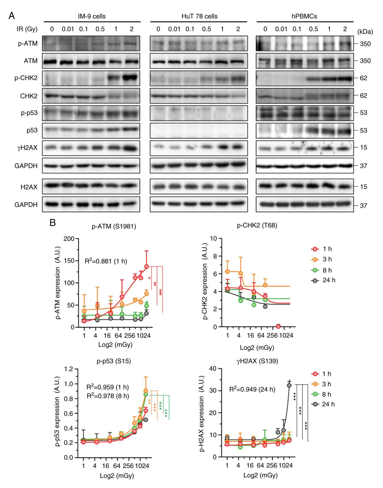
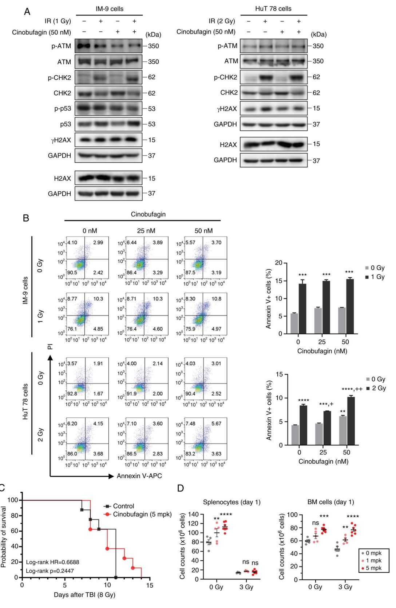
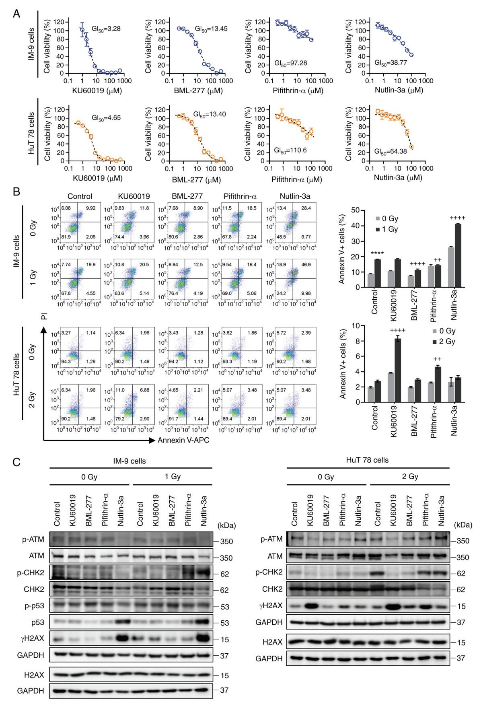
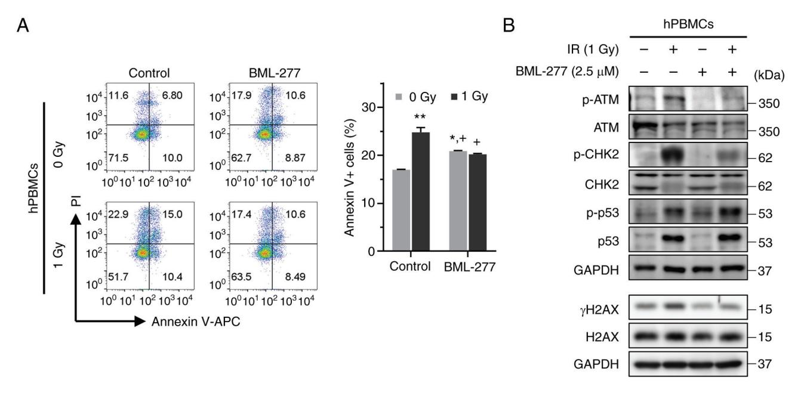

# **Predictive DNA damage signaling for low‑dose ionizing radiation**

JEONG‑IN PARK1 , SEUNG‑YOUN JUNG1 , KYUNG‑HEE SONG1 , DONG‑HYEON LEE1,2, JIYEON AHN1 , SANG‑GU HWANG1 , IN‑SU JUNG1 , DAE‑SEOG LIM3 and JIE‑YOUNG SONG1

1 Division of Radiation Biomedical Research, Korea Institute of Radiological and Medical Sciences, Seoul 01812, Republic of Korea; 2 Department of Life Science, Hanyang University, Seoul 04763, Republic of Korea; 3 Department of Biotechnology, CHA University, Seongnam, Gyeonggi‑do 13488, Republic of Korea

Received October 31, 2023; Accepted April 17, 2024

DOI: 10.3892/ijmm.2024.5380

**Abstract.** Numerous studies have attempted to develop biological markers for the response to radiation for broad and straightforward application in the field of radiation. Based on a public database, the present study selected several molecules involved in the DNA damage repair response, cell cycle regulation and cytokine signaling as promising candidates for low‑dose radiation‑sensitive markers. The HuT 78 and IM‑9 cell lines were irradiated in a concentration‑dependent manner, and the expression of these molecules was analyzed using western blot analysis. Notably, the activation of ataxia telangiectasia mutated (ATM), checkpoint kinase 2 (CHK2), p53 and H2A histone family member X (H2AX) significantly increased in a concentration‑dependent manner, which was also observed in human peripheral blood mononuclear cells. To determine the radioprotective effects of cinobufagin, as an ATM and CHK2 activator, an *in vivo* model was employed using sub‑lethal and lethal doses in irradiated mice. Treatment with cinobufagin increased the number of bone marrow cells in sub‑lethal irradiated mice, and slightly elongated the survival of lethally irradiated mice, although the differ‑ ence was not statistically significant. Therefore, KU60019, BML‑277, pifithrin‑α, and nutlin‑3a were evaluated for their ability to modulate radiation‑induced cell death. The use of BML‑277 led to a decrease in radiation‑induced p‑CHK2 and γH2AX levels and mitigated radiation‑induced apop‑ tosis. On the whole, the present study provides a novel approach for developing drug candidates based on the profiling of biological radiation‑sensitive markers. These markers hold promise for predicting radiation exposure and assessing the associated human risk.

*Correspondence to:* Dr Jie‑Young Song, Division of Radiation Biomedical Research, Korea Institute of Radiological and Medical Sciences, 75 Nowon‑ro, Nowon‑gu, Seoul 01812, Republic of Korea E‑mail: immu@kirams.re.kr

*Key words:* radiation, DNA damage, cinobufagin, BML‑277, checkpoint kinase 2

## **Introduction**

Radiotherapy is one of the most effective cancer treatment modalities. Of note, ~50% of all patients with cancer receive radiotherapy as part of their therapeutic regimen (1). Ionizing radiation (IR) is a potent tool for eradicating cancer cells by causing direct DNA damage, including single‑strand breaks, double‑strand breaks (DSBs), DNA crosslinks and DNA‑protein crosslinks. Additionally, it induces indirect effects through the generation of reactive oxygen and nitrogen species (2,3).

However, IR is toxic to normal cells, causing cellular damage and undesired side‑effects. Moreover, as the use of radiation for disease diagnosis or non‑destructive inspection is increasing, it is necessary to develop a radiosensitive marker capable of early detection over a wide range of radiation doses. Previous studies have focused on understanding the signaling pathways involved in the radiation response and identifying potential targets as radiation response modifiers. Accumulating evidence has substantiated the involvement of several genes, notably CDKN1A, GADD45A, BTG2, BBC3, PCNA, SESN1, IER5, GDF15 and PLK3 (4). The majority of IR‑responsive proteins detected in mammals are associated with cellular processes, such as DNA repair, apoptosis, signal transduction and oxidative stress. The DNA damage response and repair processes occur at an early stage following IR, followed by cell cycle arrest, apoptosis, or cell senescence (5,6). In addition, it is well known that IR can induce pro‑ and anti‑inflammatory effects, prompting several studies to analyze cytokine/chemokine responses using radia‑ tion biodosimetry (7‑9). Nevertheless, radiation responses are highly variable and are dependent on the dose and time of IR exposure, cell and tissue specificity, and inter‑individual variability. While genomic and proteomic approaches provide numerous candidate biomarkers and insight into the elucida‑ tion of radiation‑induced cellular responses, replicable and on‑site‑applicable individual biodosimetry markers have not yet been developed.

The present study aimed to investigate the potential of several biomolecules involved in DNA damage repair (DDR) and the immune response as sensitive biomarkers for exposure. Additionally, the present study evaluated their chemical regula‑ tors as radiation response modifiers. A total of 16 proteins were selected based on published findings(8,10), and four candidates were identified based on the following criteria: i) Detection in the low‑dose IR range; ii) concentration‑dependent response; and iii) applicability to blood samples. These results indicate that DDR proteins display a concentration‑dependent associa‑ tion with low‑dose IR, and their simultaneous evaluation may assist in estimating the time of IR exposure.

## **Materials and methods**

*Cells, cell culture and reagents.* The IM‑9 (cat. no. CCL‑159) and HuT 78 (cat. no. TIB‑161) human lymphoma cell lines were purchased from ATCC, and the cell lines were authenticated by Cosmo Genetech using short tandem repeat analysis. Human peripheral blood mononuclear cells (hPBMCs; cat. no. 70025) were obtained from Stemcell Technologies, Inc. According to the Enforcement Rule of the Bioethics and Safety Act in Korea (Article 33, no. 1), research studies that use these cells are IRB‑exempt, as these cell lines are commercially avail‑ able human‑derived materials that do not identify the personal information of donors. The manufacturer also stipulates that the cells be collected according to the IRB‑approved consent form and protocols.

The IM‑9, HuT 78, and hPBMCs cells were cultured in RPMI‑1640 (Welgene, Inc.) supplemented with 10% FBS (Welgene, Inc.), penicillin (100 units/ml; Welgene, Inc.) and streptomycin (100 µg/ml; Welgene, Inc.). These cells were incubated in a humidified incubator at 37˚C in a 5% CO2 atmosphere. Cinobufagin, KU60019, BML‑277, pifithrin‑α and nutlin‑3a were purchased from Selleck Chemicals. All compounds were dissolved in DMSO (Sigma‑Aldrich; Merck KGaA), ensuring that the final concentration of DMSO did not exceed 0.1% (v/v). For the control experiments, DMSO diluted in phosphate‑buffered saline (PBS; Welgene, Inc.) was administered. Primary antibodies against phosphory‑ lated (p‑)ataxia telangiectasia mutated (ATM; cat. no. 4526), ATM (cat. no. 2873), checkpoint kinase 2 (CHK2; cat. no. 2662) and p‑p53 (cat. no. 9284) were obtained from Cell Signaling Technology, Inc.; γH2A histone family member X (γH2AX; cat. no. sc‑101696), p53 (cat. no. sc‑126) and GAPDH (cat. no. sc‑365062) antibodies were from Santa Cruz Biotechnology, Inc.; p‑CHK2 (cat. no. ab278548) and H2AX (cat. no. ab11175) antibodies were from Abcam. Horseradish peroxidase (HRP)‑conjugated secondary antibodies against anti‑rabbit (cat. no. 31460) and anti‑mouse (cat. no. 31430) were purchased from Thermo Fisher Scientific, Inc.

*Radiation.* The HuT 78 and IM‑9 cells were irradiated at 12 points with concentrations ranging from 0 to 2 Gy, and the cells were harvested at various time points within 0.5 to 72 h following exposure to radiation. The cells were exposed to radi‑ ation using a 137Cs γ‑source Biobeam 8000 (Gamma‑Service Medical GmbH), which was installed in 2008, at a dose rate of 3.5 Gy/min. Additionally, 137Cs gamma LDI‑KCCH 137 irradiator with a dose rate of 0.1 cGy/min was employed.

*Animal experiments.* For the animal experiments, a total of 66 healthy 5‑week‑old female C57BL/6 mice weighing 16.1‑18.3 g, obtained from Orient Bio Inc., were housed under specific pathogen‑free conditions in microisolator cages, with laboratory chow and water provided *ad libitum*. Animal health and behavior were monitored twice per day. The mice (5 animals per cage) were housed in a room maintained at a relative humidity of 60±10% and a temperature of 20±2˚C with a 12‑h light/dark cycle. For the survival assay, 32 mice were randomly assigned to four groups (n=8 per group) as follows: i) The control group (non‑irradiated mice injected with PBS); ii) the Cino 5 mpk (non‑irradiated mice injected with 5 mg/kg cinobufagin); iii) the IR group (whole‑body irradiated mice injected with PBS); and iv) the IR + Cino 5 mpk group (whole‑body irradiated mice injected with 5 mg/kg cinobufagin). The end point of the experiment was set when all mice in the group irradiated with the lethal dose (8 Gy) died, and on day 14, all mice in the irradiated groups finally died. It is known that C57BL/6 mice die due to an acute radiation response when they are whole‑body irradiated with ≥6 Gy of radiation (11). The mice in the non‑irradiated group that did not die at all at this point were euthanized the following day (day 15) by injecting CO2gas into the chamber at a rate of 30% per min. The death of the animals was determined by obser‑ vation over a period of 10 min and the absence of breathing and a heartbeat. The survival of the mice was observed at least twice a day, and euthanasia was planned for mice in a moribund state; however, no mice were found in this state. For immunological analysis, 34 mice were randomly assigned to six groups as follows: i) The control group (non‑irradiated mice injected with PBS, n=5); ii) the Cino 1 mpk (non‑irra‑ diated mice injected with 1 mg/kg cinobufagin, n=5); iii) the Cino 5 mpk (non‑irradiated mice injected with 5 mg/kg cinobufagin, n=7); iv) the IR (whole‑body irradiated mice injected with PBS, n=5); v) the IR + Cino 1 mpk (whole‑body irradiated mice injected with 1 mg/kg cinobufagin, n=5); and vi) the IR + Cino 5 mpk (whole‑body irradiated mice injected with 5 mg/kg cinobufagin, n=7). No mice died 24 h following irradiation, and up to 0.5 ml of blood was collected into EDTA tubes (BD Biosciences) via the abdominal aorta vein from the mice anesthetized with alfaxalone (80 mg/kg; Jurox Pty Ltd.) and rompun (10 mg/kg; Elanco Animal Health Korea Co., Ltd.) in a non‑survival procedure. No mice woke up from the anesthesia following blood collection. Complete blood counts were measured using a VETSCAN HM5 hematology analyzer (Abaxis, Inc.). Each mouse had their entire body irradiated using 3 or 8 Gy Co60 γ‑irradiation (2 Gy/min). Cinobufagin was intraperitoneally administered 24 h prior to irradiation. All euthanasia was performed with the mice under deep anes‑ thesia or in a conscious state by injecting CO2 gas into the chamber at a rate of 30% per min. All animal experiments were approved by the Institutional Animal Care and Use Committee of the Korea Institute of Radiological and Medical Sciences (KIRAMS 2021‑0083).

*Bone marrow (BM) cell and splenocyte preparation.* BM cells form the femurs were harvested by flushing the BM cavities using a 26‑gauge needle and a 10 cc syringe filled with the ice‑cold PBS until the flow turned white. Splenic cells were obtained by gentle pressure‑dissociation of spleen using PBS. The harvested cells were passed through a 100‑mm sterile cell strainer and pelleted. Cells were re‑suspended in PBS and viable cells were counted using Trypan blue exclu‑ sion assay. Briefly, an equal volume of 0.4% trypan blue solution (Gibco; Thermo Fisher Scientific, Inc.) was added

to the cell suspension, incubated for 1 min at room tempera‑ ture, and immediately loaded into a hemocytometer. The unstained viable cells were then counted under a microscope (IX73; Olympus Corporation).

*Western blot analysis.* A buffer containing 50 mM Tris‑HCl (pH 7.4), 1% NP‑40, 150 mM NaCl, 1 mM EDTA, 1 mM PMSF, 1 µg/ml aprotinin, 1 mM Na3VO4 and 1 mM NaF was prepared and used to lyse cells. All chemicals used to make buffers were purchased from Sigma‑Aldrich; Merck KGaA. The extracted protein was quantified using Bio‑Rad Protein Assay Dye Reagent Concentrate (Bio‑Rad Laboratories, Inc.), and 25 µg protein were then equally loaded onto a 6‑15% PAGE‑gel. Following transfer to nitrocellulose membranes (Cytiva), the membranes were cut according to the size of the protein to be detected to identify various proteins. The membranes were blocked for 1 h with 3% bovine serum albumin (GenDEPOT; cat. no. A0100) in Tris‑buffered saline buffer containing 0.1% Tween‑20 (0.1% TBS‑T buffer) and then a specific primary antibody was bound to it. Primary anti‑ bodies diluted 1:1,000 in blocking solution were incubated with the membranes overnight at 4˚C or incubated for 2 h at room temperature. The membranes were incubated with the specific peroxidase‑conjugated secondary antibodies diluted 1:2,000 in 0.1% TBS‑T buffer at room temperature for 1 h. The protein bands of interest were visualized using an ECL detection system (Cytiva) and detected using the Amersham Imager 600 (Cytiva). ImageJ software, version 1.53 h (National Institutes of Health), was used for image processing. Representative images from three or more experiments are shown.

*ELISA.* Commercially available ELISA kits were used to confirm the expression of target molecules. The following products were used: Human p‑ATM, p‑CHK2, p‑p53 and p‑H2AX (RayBiotech).

*Cell viability assay.* The cells were seeded in 96‑well plates (1x104 cells/well), and were treated with 2‑fold serial dilutions of the compounds used in the present study for 24 h. Cell viability was measured using a Cell Counting Kit‑8 (CCK‑8) purchased from Dojindo Laboratories, Inc., according to the manufacturer's instructions. The absorbance was measured at 450 nm using a microplate reader (Multiskan EX; Thermo Fisher Scientific, Inc.). The GI50 value, which is the concentra‑ tion of the test compound required to inhibit total cell growth by 50%, was calculated.

*Annexin V‑PI staining.* Apoptosis was evaluated by measuring the proportion of Annexin V‑positive cells. The cells were labeled with allophycocyanin‑conjugated Annexin‑V and prop‑ idium iodide in binding buffer (BD Biosciences) according to the manufacturer's instructions. Subsequently, they were analyzed using a FACS Cube 6 (Sysmex Corporation). At minimum of 10,000 events per sample were acquired. The percentage of Annexin V‑allophycocyanin‑positive cells was determined using FlowJo software version 7.2.5 (Tree Star Inc.).

*Statistical analysis.* The data are presented as the mean ± standard error of the mean (SEM). Statistically significant differences between groups were analyzed using an unpaired

Student's t‑test (two‑tailed) or analysis of variance and Tukey's post‑hoc test with GraphPad Prism software (version 9.0; Dotmatics). For survival analysis, the Kaplan‑Meier with the log‑rank (Mantel‑Cox) test was performed to compare differences among curves. A P‑value <0.05 was considered to indicate a statistically significant difference (P<0.05).

## **Results**

*Expression of DDR signaling molecules following low‑dose radiation.* To develop radiosensitive biological markers for radiation exposure, the present study analyzed the expression levels of DDR proteins in human B‑lymphoblastoid IM‑9 cells, T‑lymphocyte HuT 78 cells and hPBMCs. The phosphoryla‑ tion of ATM, CHK2, p53 and H2AX exhibited a radiation concentration‑dependent increase in the IM‑9 cells. However, ATM activation was absent in the HuT 78 cells. Additionally, p53 expression was not observed in the HuT 78 cells harboring mutant p53 [p.Arg196Ter(c.586C>T)] (Fig. 1A). To confirm the reproducibility of this cellular response in blood, western blot analysis and ELISA were performed using the hPBMCs. Similar to the aforementioned results, IR increased ATM, CHK2, p53, and γH2AX expression, and most notably, CHK2 phosphorylation (Fig. 1A). In addition, the phosphorylation of ATM and p53 increased in a concentration‑dependent manner at an early time point, while the γH2AX levels signifi‑ cantly increased at 24 h post‑irradiation (Fig. 1B). However, CHK2 activation remained undetectable in the irradiated hPBMCs. It is unknown why this result occurred, and further research is needed. These results indicate that ATM, p53, CHK2, and H2AX respond to low‑dose radiation in a dose‑dependent manner.

*Evaluation of the radioprotective effects of cinobufagin.*  Considering that the levels of DDR signaling molecules increase in response to radiation and can serve as radia‑ tion‑responsive markers, the objective of the present study was to identify agents capable of functioning as radioprotectors by modulating this signaling pathway. Cinobufagin, an active ingredient of *Venenum bufonis*, has been shown to increase ATM and CHK2 levels, leading to G2/M phase arrest and apoptosis (12).

Cinobufagin alone increased the expression of the total forms of ATM and CHK2. However, IR increased ATM and CHK2 phosphorylation in HuT 78 cells, and the expression of these molecules was further increased following combined treatment with cinobufagin. Notably, cinobufagin did not attenuate the IR‑induced expression of γH2AX, a DNA DSB marker (Fig. 2A). In order to evaluate the effects of cino‑ bufagin and IR on cell death, Annexin V/PI staining was analyzed using FACS. Given the higher radioresistance of p53 mutant‑type HuT 78 cells than that of p53 wild‑type IM‑9 cells in our preliminary study (data not shown), both cell lines were exposed to various doses of 1 or 2 Gy radiation. The number of Annexin V‑positive apoptotic cells significantly increased following radiation treatment in both cell lines. While cinobufagin did not reduce the radiation‑induced apoptosis of IM‑9 cells, it is worth nothing that 25 nM cino‑ bufagin slightly inhibited the radiation‑induced apoptosis of HuT 78 cells (Fig. 2B).

Figure 1. Expression levels of DNA damage repair proteins following IR. (A) IM‑9, HuT 78 cells and hPBMCs were exposed to the indicated doses of radiation for 24 h. Representative western blots are shown. (B) hPBMCs were treated with the indicated doses of radiation for the indicated periods of time. Samples were analyzed using ELISA. Data represented the mean ± SD of three independent experiments and were fitted with non‑linear regression using asymmetrical sigmoidal, five‑parameter curves. IR, ionizing radiation; hPBMCs, human peripheral blood mononuclear cells; ATM, ataxia telangiectasia mutated; CHK2, checkpoint kinase 2; H2AX, H2A histone family member X. \* P<0.05, \*\*P<0.01 and \*\*\*P<0.001 determined using two‑way ANOVA.

To further determine the radioprotective efficacy of cinobufagin *in vivo*, the mice were administered cinobufagin at 24 h before a lethal dose of 8 Gy irradiation. As shown in Fig. 2C, the survival rate of the mice injected intra‑ peritoneally with 5 mpk cinobufagin was 37.5%, whereas all the control mice died by day 11. In similar studies, when

Figure 2. Radioprotective effects of cinobufagin. (A) IM‑9 and HuT 78 cells were treated with or without 50 nM of cinobufagin for 1 h, then irradiated with the indicated dose of radiation and incubated for 24 h. The expression levels of ATM, CHK2, p53 and H2AX phosphorylation were evaluated using western blotting. (B) IM‑9 and HuT 78 cells were treated with or without cinobufagin (25 or 50 nM) for 1 h prior to irradiation with the indicated radiation doses for 24 h. The cells were analyzed for Annexin V/PI staining using flow cytometry. Representative bar graphs show the mean ± SEM of three independent experiments; \*\*P<0.01 and \*\*\*P<0.001 compared with the control, + P<0.05 and ++P<0.01 compared with the irradiated control. (C) Cinobufagin or the vehicle (1.1% DMSO in PBS) were administrated intraperitoneally 24 h prior to total body radiation (8 Gy) on C57BL/6 mice (n=8 mice/group) and survival was observed for 15 days after exposure. (D) Cinobufagin or the vehicle were administrated intraperitoneally 24 h prior to total body radiation (3 Gy) on C57BL/6 mice (n=5 mice/group). The spleen (left panel) and BM (right panel) were harvested at 24 h following radiation, and the number of splenocytes and BM cells were counted by Trypan blue exclusion. Data shown are the mean ± SEM. Statistical significance was represented for each control group (\*\*P<0.01, \*\*\*P<0.001, \*\*\*\*P<0.0001). ns, not significat; IR, ionizing radiation; TBI, total body irradiation; ATM, ataxia telangiectasia mutated; CHK2, checkpoint kinase 2; H2AX, H2A histone family member X.

C57BL/6 mice had their entire body irradiated with 7.6 to 8.45 Gy, death began at 6 to 10 days, which is consistent with the findings presented herein (11,13‑16). The mortality rate of the mice following whole‑body irradiation is affected by the strain and age of the mice. C57BL/6 (LD50/30=630.3±4.1 rad) mice are relatively more resistant to radiation than BALB/c (LD50/30=500.1±6.9 rad) mice. Additionally, younger mice are more sensitive to radiation (17). Notably, in the present study, although the cinobufagin‑treated mice died at 14 days following irradiation, this difference was not statistically significant. In order to investigate the protective effects of cinobufagin on hematopoietic cells, the mice were adminis‑ tered a sub‑lethal dose of 3 Gy radiation, and spleen and BM cells were harvested at 24 h post‑irradiation. Treatment with cinobufagin led to a concentration‑dependent increase in the number of splenocytes when administered alone; however, it failed to augment the splenocyte counts in response to irradiation (Fig. 2D). Nevertheless, cinobufagin increased the proliferation rate of splenocytes in both the control and irradiated mice (Fig. S1A). By contrast, the number of BM cells increased in both the cinobufagin‑alone and cinobufagin‑plus‑irradiation groups. The results of periph‑ eral blood cell counts revealed that the numbers of red blood cells and platelets remained unaltered following treatment with cinobufagin or irradiation. Conversely, treatment with cinobufagin decreased the number of white blood cells, particularly lymphocytes and neutrophils (Fig. S1B). These results collectively suggest that cinobufagin exerts a mild, but not significant, radioprotective effect.

*Effects of DDR modulators on radiation exposure.* The ATM and CHK2 activator, cinobufagin, did not exhibit significant radioprotective activity. Therefore, other compounds that modulate DDR‑related molecules were investigated for their radioprotective effects. In order to determine the optimal concentration of the drugs in subsequent experiments, cell viability was measured using CCK‑8 assay. KU60019 (an ATM inhibitor) exhibited GI50 (µM) values of 3.28 for the IM‑9 cells and 4.65 for the HuT 78 cells. The GI50 values for BML‑277, a CHK2 inhibitor, were 13.45 µM (IM‑9 cells) and 13.40 µM (HuT 78 cells). Pifithrin‑α, a p53 inhibitor, exhib‑ ited GI50 values of 97.28 and 110.6 µM in the two cell lines, respectively. The p53 activator, nutlin‑3a, exhibited GI50 values of38.77 µM in the IM‑9 cells and 64.38 µM in the HuT 78 cells (Fig. 3A). The viability of the cells following treatment with cinobufagin is shown in Fig. S1C.

In order to evaluate the radioprotective effects of these compounds, Annexin V/PI staining was performed. As shown in Fig. 3B, BML‑277 and pifithrin‑α significantly decreased the number of radiation‑induced Annexin V‑positive apoptotic IM‑9 cell. On the other hand, radiation‑induced apoptotic cell death was not observed in the HuT 78 cells, despite irradiation at a radiation dose twice as high as that in IM‑9 cells; thus, the inhibition of radiation‑induced apoptosis by BML‑277 was not shown. Moreover, pifithrin‑α led to an increase in radia‑ tion‑induced apoptosis, indicating that it has a radiosensitizing effect rather than a radioprotective effect in the HuT 78 cells. Similarly, combined treatment with nutlin‑3a or KU60019 with irradiation significantly increased the apoptosis of the IM‑9 cells and HuT 78 cells, respectively.

Western blot analysis was performed to examine the expression of DDR proteins induced by irradiation and the test compounds. The ATM inhibitor, KU60019, exhibited contrasting results in both cell lines as regards γH2AX expression and apoptosis, suggesting a dependence on the p53 status. Treatment with BML‑277 decreased radiation‑induced CHK2 phosphorylation and γH2AX expression. Compounds designed to inhibit or activate p53 increased radiation‑induced CHK2 phosphorylation in both cell lines, while failing to reduce the increased level of γH2AX by radiation (Fig. 3C). In summary, these results suggest that BML‑277 attenuates radiation‑induced cell death by inhibiting CHK2 activation, with a more potent effect in the presence of p53.

*Radioprotective effects of BML‑277 in hPBMCs.* To evaluate whether BML‑277 can mitigate the radiation‑induced apop‑ tosis of and DDR in hPBMCs, the cells were treated with BML‑277 24 h prior to irradiation. As shown in Fig. 4A, exposure to a radiation dose of 1 Gy significantly increased the population of Annexin V‑positive cells. Nonetheless, pre‑treatment with BML‑277 significantly reduced the number of radiation‑induced apoptotic cells compared to treatment with radiation alone. In addition, BML‑277 effectively suppressed the radiation‑induced CHK2 phos‑ phorylation and γH2AX expression (Fig. 4B). Consequently, the observation of the radioprotective efficacy of BML‑277 in hPBMCs raises the expectations of promising outcomes in future *in vivo* studies.

## **Discussion**

The use of radiation is gradually increasing for various purposes, such as medical diagnoses, treatment, industrial applications and scientific research. Therefore, it is natural for the public to express concerns regarding accidents and health risks caused by radiation exposure. The preparation of countermeasures against such risks remains a constant task (18,19). Numerous studies have demonstrated that high radiation doses can damage various cellular components and induce genomic instability, leading to carcinogenesis (20‑23). However, unlike the deleterious consequences of high‑dose radiation, low‑dose radiation does not produce distinct biological responses and a dose‑response association has not yet been established. Radiation dosimetry is an important research field for rapidly obtaining complete information on absorbed doses, exposure times and countermeasures (24). As a result, studies have been conducted in an aim to develop reliable biomarkers for assessing radiation exposure. These biomarkers can address the limitations of traditional, non‑specific and variable assays, which include blood counts, electron paramagnetic resonance, somatic mutation and cytogenic assays (25,26).

The present study aimed to develop a biomarker that could detect a wide range of radiation doses, particularly those <100 mGy. The toxic effects of radiation result in energy deposition in normal tissues, including immune cells. Among the various adverse effects of radiation, the induction of DNA DSB is considered the most toxic lesion in lymphocytes. Blood sample analysis, with easy sampling, revealed the rapid development of hematopoietic syndrome

Figure 3. Protective effects of DNA damage repair modulators against IR‑induced cell death. (A) Cells were serially diluted with the indicated compounds and treated for 24 h, and cell viability was then measured using CCK‑8 assay. Data shown are the means ± SEM of three independent experiments. (B) IM‑9 and HuT78 cells were treated with or without KU60019 (ATM inhibitor, 2.5 µM), BML‑277 (CHK2 inhibitor, 2.5 µM), pifithrin‑α (p53 inhibitor, 5 µM) and nutlin‑3a (p53 activator, 10 µM) 24 h prior to irradiation. Cells were analyzed for Annexin V binding and for PI uptake using flow cytometry. Representative bar graphs show the mean ± SEM of three independent experiments; \*\*\*\*P<0.0001 vs. control, ++P<0.01 and ++++P<0.0001 vs. irradiated control. (C) Under the same experimental conditions as in (B), the expression levels of ATM, CHK2, p53 and H2AX phosphorylation were evaluated using western blotting. GAPDH was used as a loading control. ATM, ataxia telangiectasia mutated; CHK2, checkpoint kinase 2; H2AX, H2A histone family member X.

Figure 4. Radioprotective effects of BML-277 in hPBMCs. (A) hPBMCs were treated with or without BML-277 (2.5  $\mu$ M) for 24 h following 1 Gy of radiation. The cells were analyzed for Annexin V binding and for PI uptake using flow cytometry. Representative bar graphs show the mean  $\pm$  SEM of three independent experiments; \*P<0.05 and \*\*P<0.01 compared with the control. \*P<0.05 vs. the irradiated control. (B) The expression of ATM, CHK2, p53 and H2AX phosphorylation were evaluated using western blotting. IR, ionizing radiation; hPBMCs, human peripheral blood mononuclear cells; ATM, ataxia telangiectasia mutated; CHK2, checkpoint kinase 2; H2AX, H2A histone family member X.

in patients exposed to total body irradiation of 1-2 Gy, which is characterized by a decline in the hematopoietic compartment (27). Similar to other hematopoietic cells, lymphocytes are particularly sensitive to radiation-induced cell death. Therefore, B- and T-lymphocytes have been used for screening radiation-responsive biological markers. The present study selected 16 proteins (ATM, CHK2, p53, NBS1, BRCA1, H2AX, CHK1, ERK, p53, EGFR, IL-1α, MIF, MCP1, GDF-15, IL-7, and MIP1α) and measured their dose- and time-dependent expression changes using western blot analyses (data were partially shown). In contrast to DDR and signaling molecules, cytokine expression was detected in only four out of six cases at 24 h following irradiation, and therefore, cytokines were excluded from the study due to significant fluctuations and delayed responses (Fig. S2). Instead, a concentration-dependent increase was observed in DDR-associated molecules, including ATM, CHK2, p53 and γH2AX in lymphocytes and hPBMCs within 24 h following exposure to low-dose radiation. Herein, the specific approach focused on radiation-induced phosphorylation changes in lymphocytes, as both the amount and activity of the corresponding proteins are key factors in assessing the radiation response. ATM kinase is a member of the PI3K-like protein kinase family, and plays extensive roles in DNA damage response signaling (28). DNA damage leads to the activation of ATM kinase activity and the phosphorylation of numerous downstream targets, including p53 and CHK2 (29). ATM activation triggers cell cycle checkpoints, causing arrests and delays in the G1, S and G2 phases (30). Efforts to develop ATM inhibitors have aimed at combatting cancer treatment resistance and enhancing radiation sensitivity (31). Given the aforementioned panel of markers, the radioprotective activity of each modulator was investigated. First, cinobufagin was selected as a candidate radioprotector as it may activate the ATM-CHK2 signaling pathway, which promotes DNA repair (32). Several studies have demonstrated that cinobufagin exerts anti-inflammatory (33), anti-bacterial (34), antitumor (35,36) and immune-enhancing effects (37,38). However, its clinical application is restricted by rapid metabolism and cardiotoxicity. Cinobufagin, consistent with previous findings on immune cell activation, such as lymphocyte proliferation, increases cytokine production, and the activation of macrophage phagocytosis (38), exhibiting mild radioprotective effects by increasing the number of splenocytes and BM cells. Nevertheless, further investigations are required, as cinobufagin has predominantly demonstrated anticancer and apoptosis-inducing effects rather than immunostimulatory or anti-radiation effects. By contrast, the ATM inhibitor, KU60019, had no effect on radiation-induced DNA damage. While DDR inhibitors are being developed as radiation sensitizers, it was expected that a DDR activator would function as a protective agent; however, the effect was not significant. Accurately predicting the degree of radiation-induced DNA damage, the maximum activation duration of DDR-related molecules, and the effects of interfering drugs is evidently challenging.

CHK2 remains inactive in the absence of DNA damage, becoming phosphorylated and activated by ATM following exposure to IR (39-41). In response to DNA damage, CHK2 initiates repair processes and cell cycle arrest until the damaged DNA is repaired. Mitotic delay is widely considered to provide time for DDR prior to the onset of mitosis (42). Following irradiation, CHK2 prevents the entry of a subset of G2 cells with DNA damage into mitosis (43). Previous studies have demonstrated that the inhibition of CHK2 results in radioprotection by reducing p53-mediated cell death (44-46). In addition,

increased survival was previously observed in CHK2-deficient mice exposed to total body radiation, in contrast to CHK2 wild-type mice (47). These findings are in accordance with the results of the present study, wherein the CHK2 inhibitor, BML-277, inhibited apoptosis and reduced γH2AX expression in lymphocyte cell lines and hPBMCs. Notably, neither an activator nor an inhibitor of p53 exerted radioprotective effects. The critical role of p53 in cell cycle arrest, DNA repair, survival, senescence and apoptosis in response to DNA damage from various stressors is well-known (48,49). However, owing to its low expression levels in normal cells attributed to its rapid turnover and involvement in a complex network of diverse signaling processes, the temporal regulation of p53 can be easily disrupted. Therefore, further carefully designed studies are warranted.

In conclusion, the findings of the present study demonstrate that ATM, CHK2, p53 and yH2AX can serve as predictive markers for low-dose IR. While each of these molecules is well-known, their collective application as a biomarker panels is useful in radiation biodosimetry. Furthermore, the CHK2 inhibitor, BML-277, provided the most efficient radiation protection by reducing radiation-induced DNA damage. Notably, the maintenance of DDR appears to be well-controlled in individuals exposed to low-dose radiation or daily radiation levels, such as radiation workers and residents residing near nuclear power plants. Consequently, the potential radioprotective or immunostimulant effects of substances regulating these biomarkers may be challenging to observe. Nevertheless, these substances hold promise as protective agents for individuals with a compromised immune status due to disease or for cancer patients subject to high-dose radiation, warranting further evaluation for their efficacy.

## Acknowledgements

Not applicable.

#### **Funding**

The present study was supported by the National Research Foundation of Korea (grant no. NRF-2020R1A2C1007138) and the Korea Institute of Radiological and Medical Sciences (grant nos. 50538-2023 and 50531-2023) funded by the Korean government, Ministry of Science and ICT.

#### Availability of data and materials

The datasets used and/or analyzed during the current study are available from the corresponding author on reasonable request.

### **Authors' contributions**

JIP, SYJ and JYS were involved in the design of the study. ISJ and JYS were involved in the conception of the study. JIP, DHL, KHS and SYJ were involved in all the biological experiments and in data analysis. JA, SGH, DSL, SYJ and JYS were involved in discussions regarding the data. JIP, SYJ and JYS were involved in the writing of the manuscript. JIP and SYJ confirm the authenticity of all the raw data. All authors have read and agreed to the published version of the manuscript.

## Ethics approval and consent to participate

All animal experiments were approved by the Institutional Animal Care and Use Committee of the Korea Institute of Radiological and Medical Sciences and reported in accordance with the ARRIVE (Animal Research: Reporting of *In Vivo* Experiments) guidelines (KIRAMS 2021-0083, March 2, 2022).

## Patient consent for publication

Not applicable.

## **Competing interests**

The authors declare that they have no competing interests.

#### References

- Moding EJ, Kastan MB and Kirsch DG: Strategies for optimizing the response of cancer and normal tissues to radiation. Nat Rev Drug Discov 12: 526-542, 2013.
- 2. Wang JS, Wang HJ and Qian HL: Biological effects of radiation on cancer cells. Mil Med Res 5: 20, 2018.
- 3. Wang H, Mu X, He H and Zhang XD: Cancer radiosensitizers. Trends Pharmacol Sci 39: 24-48, 2018.
- 4. Sokolov M and Neumann R: Effects of low doses of ionizing radiation exposures on stress-responsive gene expression in human embryonic stem cells. Int J Mol Sci 15: 588-604, 2014.
- 5. Nowsheen S and Yang ES: The intersection between DNA damage response and cell death pathways. Exp Oncol 34: 243-254, 2012.
- Xu J, Liu D, Zhao D, Jiang X, Meng X, Jiang L, Yu M, Zhang L and Jiang H: Role of low-dose radiation in senescence and aging: A beneficial perspective. Life Sci 302: 120644, 2022.
- Ossetrova NI and Blakely WF: Multiple blood-proteins approach for early-response exposure assessment using an in vivo murine radiation model. Int J Radiat Biol 85: 837-850, 2009.
- 8. Zhang M, Yin L, Zhang K, Sun W, Yang S, Zhang B, Salzman P, Wang W, Liu C, Vidyasagar S, *et al*: Response patterns of cytokines/chemokines in two murine strains after irradiation. Cytokine 58: 169-177, 2012.
- 9. Mathias D, Mitchel RE, Barclay M, Wyatt H, Bugden M, Priest ND, Whitman SC, Scholz M, Hildebrandt G, Kamprad M and Glasow A: Low-dose irradiation affects expression of inflammatory markers in the heart of ApoE -/- mice. PLoS One 10: e0119661, 2015.
- Marchetti F, Coleman MA, Jones IM and Wyrobek AJ: Candidate protein biodosimeters of human exposure to ionizing radiation. Int J Radiat Biol 82: 605-639, 2006.
- 11. Gu J, Chen YZ, Zhang ZX, Yang ZX, Duan GX, Qin LQ, Zhao L and Xu JY: At what dose can total body and whole abdominal irradiation cause lethal intestinal injury among C57BL/6J mice? Dose Response 18: 1559325820956783, 2020.
- 12. Pan Z, Zhang X, Yu P, Chen X, Lu P, Li M, Liu X, Li Z, Wei F, Wang K, *et al*: Cinobufagin induces cell cycle arrest at the G2/M phase and promotes apoptosis in malignant melanoma cells. Front Oncol 9: 853, 2019.
- 13. Grahn D and Hamilton KF: Genetic variation in the acute lethal response of four inbred mouse strains to whole body X-irradiation. Genetics 42: 189-198, 1957.
- Soto-Pantoja DR, Ridnour LA, Wink DA and Roberts DD: Blockade of CD47 increases survival of mice exposed to lethal total body irradiation. Sci Rep 3: 1038, 2013.
- 15. Li L, Xiao R, Wang Q, Rong Z, Zhang X, Zhou P, Fu H, Wang S and Wang Z: SERS detection of radiation injury biomarkers in mouse serum. RSC Adv 8: 5119-5126, 2018.
- 16. Ito Y, Kinoshita M, Yamamoto T, Sato T, Obara T, Saitoh D, Seki S and Takahashi Y: A combination of pre- and post-exposure ascorbic acid rescues mice from radiation-induced lethal gastrointestinal damage. Int J Mol Sci 14: 19618-19635, 2013.
- Nunamaker EA, Artwohl JE, Anderson RJ and Fortman JD: Endpoint refinement for total body irradiation of C57BL/6 mice. Comp Med 63: 22-28, 2013.

- 18. Mettler FA: Medical effects and risks of exposure to ionising radiation. J Radiol Prot 32: N9‑N13, 2012.
- 19. Seo S, Lee D, Seong KM, Park S, Kim SG, Won JU and Jin YW: Radiation‑related occupational cancer and its recognition criteria in South Korea. Ann Occup Environ Med 30: 9, 2018.
- 20. Allan JM and Travis LB: Mechanisms of therapy‑related carci‑ nogenesis. Nat Rev Cancer 5: 943‑955, 2005.
- 21. Little JB: Radiation carcinogenesis. Carcinogenesis 21: 397‑404, 2000.
- 22. Barcellos‑Hoff MH and Nguyen DH: Radiation carcinogenesis in context: How do irradiated tissues become tumors? Health Phys 97: 446‑457, 2009.
- 23. Huang L, Snyder AR and Morgan WF: Radiation‑induced genomic instability and its implications for radiation carcinogen‑ esis. Oncogene 22: 5848‑5854, 2003.
- 24. Obrador E, Salvador‑Palmer R, Villaescusa JI, Gallego E, Pellicer B, Estrela JM and Montoro A: Nuclear and radiological emergencies: biological effects, countermeasures and biodosim‑ etry. Antioxidants (Basel) 11: 1089, 2022.
- 25. Turtoi A, Brown I, Oskamp D and Schneeweiss FHA: Early gene expression in human lymphocytes after gamma‑irradiation‑a genetic pattern with potential for biodosimetry. Int J Radiat Biol 84: 375‑387, 2008.
- 26. Brengues M, Paap B, Bittner M, Amundson S, Seligmann B, Korn R, Lenigk R and Zenhausern F: Biodosimetry on small blood volume using gene expression assay. Health Phys 98: 179‑185, 2010.
- 27. Dainiak N: Hematologic consequences of exposure to ionizing radiation. Exp Hematol 30: 513‑528, 2002.
- 28. Shiloh Y and Ziv Y: The ATM protein kinase: Regulating the cellular response to genotoxic stress, and more. Nat Rev Mol Cell Biol 14: 197‑210, 2013.
- 29. Goodarzi AA, Noon AT, Deckbar D, Ziv Y, Shiloh Y, Löbrich M and Jeggo PA: ATM signaling facilitates repair of DNA double‑strand breaks associated with heterochromatin. Mol Cell 31: 167‑177, 2008.
- 30. Helleday T, Petermann E, Lundin C, Hodgson B and Sharma RA: DNA repair pathways as targets for cancer therapy. Nat Rev Cancer 8: 193‑204, 2008.
- 31. Jackson SP and Bartek J: The DNA‑damage response in human biology and disease. Nature 461: 1071‑1078, 2009.
- 32. Niu J, Wang J, Zhang Q, Zou Z and Ding Y: Cinobufagin‑induced DNA damage response activates G2/M checkpoint and apoptosis to cause selective cytotoxicity in cancer cells. Cancer Cell Int 21: 446, 2021.
- 33. Li Y, Lin J, Xiao J, Li Z, Chen JS, Wei L and Wang X: Therapeutic effects of co‑Venenum bufonis oral liquid on radiation‑induced esophagitis in rats. Exp Anim 69: 354‑362, 2020.
- 34. Xie S, Spelmink L, Codemo M, Subramanian K, Pütsep K, Henriques‑Normark B and Olliver M: Cinobufagin modulates human innate immune responses and triggers antibacterial activity. PLoS One 11: e0160734, 2016.
- 35. Peng P, Lv J, Cai C, Lin S, Zhuo E and Wang S: Cinobufagin, a bufadienolide, activates ROS‑mediated pathways to trigger human lung cancer cell apoptosis in vivo. RSC Adv 7: 25175‑25181, 2017.
- 36. Niu T, Zhao L, Lin X, Cai Y, Chen S, Wang M, Zhou L, Ding H and Yu X: Cinobufagin, a bufadienolide from traditional Chinese medicine Bufo bufo gargarizans CANTOR, inhibits PC3 cell growth in vitro and in vivo. J Tradit Chin Med Sci 6: 175‑183, 2019.

- 37. Wu SC, Yi PF, Guo X, Zhang LY, Xu DX, Fu YX, Cui ZQ, Shen HQ, Wei XB and Fu BD: Cinobufagin enhances the protec‑ tive efficacy of formalin‑inactivated Salmonella typhimurium vaccine through Th1 immune response. Microb Pathog 99: 264‑270, 2016.
- 38. Yu Y, Wang H, Meng X, Hao L, Fu Y, Fang L, Shen D, Yu X and Li J: Immunomodulatory effects of cinobufagin on murine lymphocytes and macrophages. Evid Based Complement Alternat Med 2015: 835263, 2015.
- 39. Matsuoka S, Huang M and Elledge SJ: Linkage of ATM to cell cycle regulation by the Chk2 protein kinase. Science 282: 1893‑1897, 1998.
- 40. Hirao A, Kong YY, Matsuoka S, Wakeham A, Ruland J, Yoshida H, Liu D, Elledge SJ and MakTW: DNA damage‑induced activation of p53 by the checkpoint kinase Chk2. Science 287: 1824‑1827, 2000.
- 41. Melchionna R, Chen XB, Blasina A and McGowan CH: Threonine 68 is required for radiation‑induced phosphorylation and activation of Cds1. Nat Cell Biol 2: 762‑765, 2000.
- 42. Sancar A, Lindsey‑Boltz LA, Unsal‑Kaçmaz K and Linn S: Molecular mechanisms of mammalian DNA repair and the DNA damage checkpoints. Annu Rev Biochem 73: 39‑85, 2004.
- 43. Rainey MD, Black EJ, Zachos G and Gillespie DAF: Chk2 is required for optimal mitotic delay in response to irradia‑ tion‑induced DNA damage incurred in G2 phase. Oncogene 27: 896‑906, 2008.
- 44. Nguyen TNT, Saleem RSZ, Luderer MJ, Hovde S, Henry RW and Tepe JJ: Radioprotection by hymenialdisine‑derived checkpoint kinase 2 inhibitors. ACS Chem Biol 7: 172‑184, 2012.
- 45. Zahmatkesh MH, Hosseinimehr SJ and Mahdiuni H: Role of CHK2 inhibitors in the cellular responses to ionizing radiation. Mini Rev Med Chem 14: 812‑818, 2014.
- 46. Arienti KL, Brunmark A, Axe FU, McClure K, Lee A, Blevitt J, Neff DK, Huang L, Crawford S, Pandit CR, *et al*: Checkpoint kinase inhibitors: SAR and radioprotective properties of a series of 2‑arylbenzimidazoles. J Med Chem 48: 1873‑1885, 2005.
- 47. Takai H, Naka K, Okada Y, Watanabe M, Harada N, Saito S, Anderson CW, Appella E, Nakanishi M, Suzuki H, *et al*: Chk2‑deficient mice exhibit radioresistance and defective p53‑mediated transcription. EMBO J 21: 5195‑5205, 2002.
- 48. Jung SY, Park JI, Jeong JH, Song KH, Ahn J, Hwang SG, Kim J, Park JK, Lim DS and Song JY: Receptor interacting protein 1 knockdown induces cell death in liver cancer by suppressing STAT3/ATR activation in a p53‑dependent manner. Am J Cancer Res 12: 2594‑2611, 2022.
- 49. Joerger AC and Fersht AR: The p53 pathway: Origins, inactiva‑ tion in cancer, and emerging therapeutic approaches. Annu Rev Biochem 85: 375‑404, 2016.

Copyright © 2024 Park et al. This work is licensed under a Creative Commons Attribution-NonCommercial-NoDerivatives 4.0 International (CC BY-NC-ND 4.0) License.