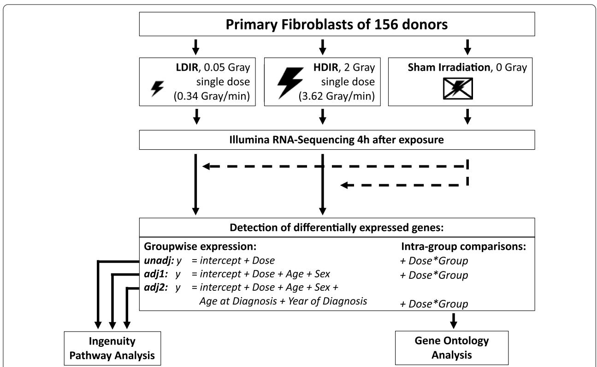
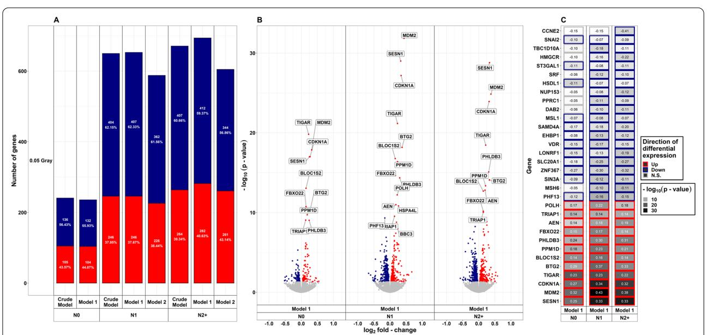
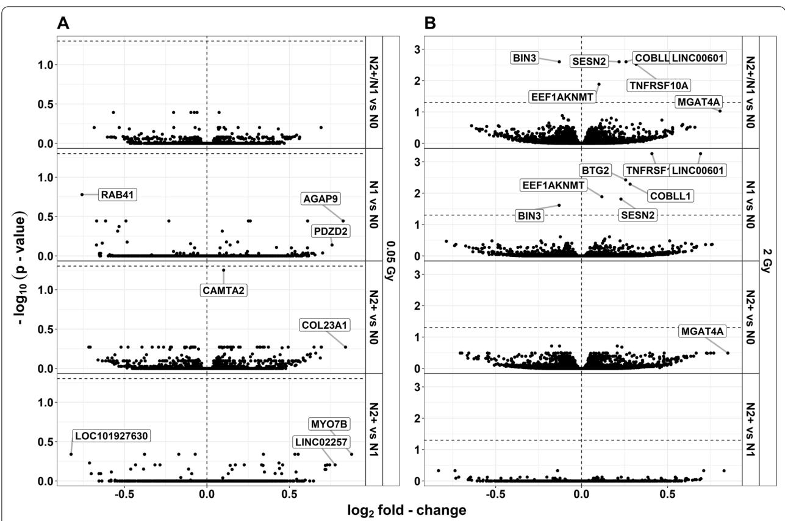
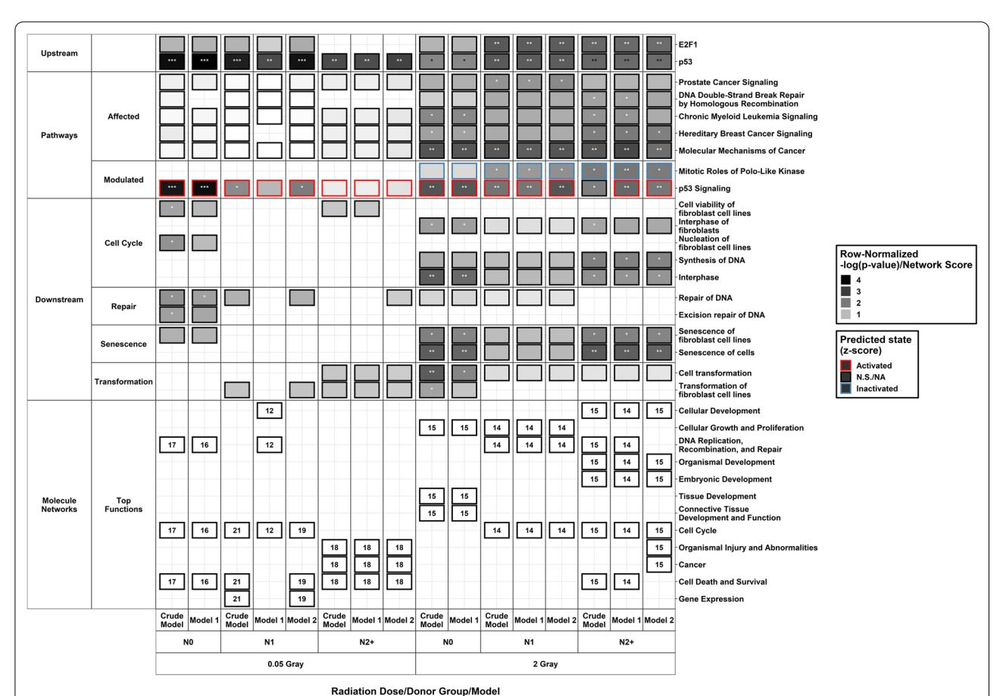
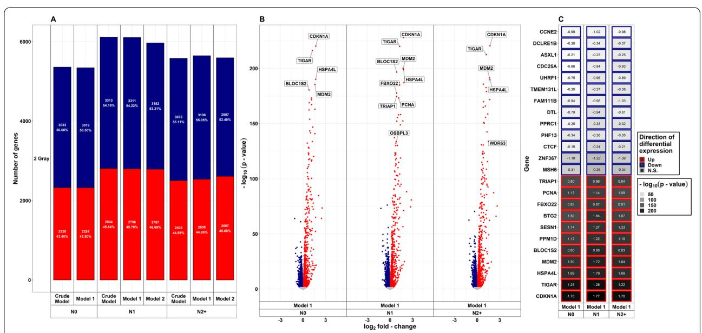

# **RESEARCH ARTICLE**

**Open Access** 

# Radiation-response in primary fibroblasts of long-term survivors of childhood cancer with and without second primary neoplasms: the KiKme study

Caine Lucas Grandt1,2, Lara Kim Brackmann1, Alicia Poplawski3, Heike Schwarz1, Willempje Hummel-Bartenschlager1, Thomas Hankeln4, Christiane Kraemer4, Federico Marini3, Sebastian Zahnreich5, Iris Schmitt5, Philipp Drees6, Johanna Mirsch7, Desiree Grabow8, Heinz Schmidberger5, Harald Binder9, Moritz Hess9, Danuta Galetzka5 and Manuela Marron1\*

## Abstract

**Background:** The etiology and most risk factors for a sporadic first primary neoplasm in childhood or subsequent second primary neoplasms are still unknown. One established causal factor for therapy-associated second primary neoplasms is the exposure to ionizing radiation during radiation therapy as a mainstay of cancer treatment. Second primary neoplasms occur in 8% of all cancer survivors within 30 years after the first diagnosis in Germany, but the underlying factors for intrinsic susceptibilities have not yet been clarified. Thus, the purpose of this nested case–control study was the investigation and comparison of gene expression and affected pathways in primary fibroblasts of childhood cancer survivors with a first primary neoplasm only or with at least one subsequent second primary neoplasm, and controls without neoplasms after exposure to a low and a high dose of ionizing radiation.

**Methods:** Primary fibroblasts were obtained from skin biopsies from 52 adult donors with a first primary neoplasm in childhood (N1), 52 with at least one additional primary neoplasm (N2 $\pm$ ), as well as 52 without cancer (N0) from the KiKme study. Cultured fibroblasts were exposed to a high [2 Gray (Gy)] and a low dose (0.05 Gy) of X-rays. Messenger ribonucleic acid was extracted 4 h after exposure and Illumina-sequenced. Differentially expressed genes (DEGs) were computed using *limma* for R, selected at a false discovery rate level of 0.05, and further analyzed for pathway enrichment (right-tailed Fisher's Exact Test) and (in-) activation ( $z \ge |z|$ ) using *Ingenuity Pathway Analysis*.

**Results:** After 0.05 Gy, least DEGs were found in N0 (n = 236), compared to N1 (n = 653) and N2+ (n = 694). The top DEGs with regard to the adjusted *p*-value were upregulated in fibroblasts across all donor groups (*SESN1*, *MDM2*, *CDKN1A*, *TIGAR*, *BTG2*, *BLOC1S2*, *PPM1D*, *PHLDB3*, *FBXO22*, *AEN*, *TRIAP1*, and *POLH*). Here, we observed activation of **p53 Signaling** in N0 and to a lesser extent in N1, but not in N2+. Only in N0, DNA (excision-) repair (involved genes: *CDKN1A*, *PPM1D*, and *DDB2*) was predicted to be a downstream function, while molecular networks in N2+ were associated with cancer, as well as injury and abnormalities (among others, downregulation of *MSH6*, *CCNE2*, and *CHUK*). After 2 Gy, the number of DEGs was similar in fibroblasts of all donor groups and genes with the highest absolute log2

&lt;sup>1 Leibniz Institute for Prevention Research and Epidemiology, BIPS, Achterstraße 30, 28359 Bremen, Germany Full list of author information is available at the end of the article

\*Correspondence: sec-epi@leibniz-bips.de

Grandt *et al. Molecular Medicine (2022) 28:105* Page 2 of 19

fold-change were upregulated throughout (*CDKN1A, TIGAR, HSPA4L*, *MDM2*, *BLOC1SD2*, *PPM1D*, *SESN1*, *BTG2*, *FBXO22*, *PCNA*, and *TRIAP1*). Here, the *p53 Signaling-*Pathway was activated in fbroblasts of all donor groups. The *Mitotic Roles of Polo Like Kinase-*Pathway was inactivated in N1 and N2+. *Molecular Mechanisms of Cancer* were afected in fbroblasts of all donor groups. *P53* was predicted to be an upstream regulator in fbroblasts of all donor groups and *E2F1* in N1 and N2+. Results of the downstream analysis were *senescence* in N0 and N2+, *transformation of cells* in N0, and no signifcant efects in N1. Seven genes were diferentially expressed in reaction to 2 Gy dependent on the donor group (*LINC00601*, *COBLL1*, *SESN2*, *BIN3*, *TNFRSF10A*, *EEF1AKNMT*, and *BTG2*).

**Conclusion:** Our results show dose-dependent diferences in the radiation response between N1/N2+and N0. While mechanisms against genotoxic stress were activated to the same extent after a high dose in all groups, the radiation response was impaired after a low dose in N1/N2+, suggesting an increased risk for adverse efects including carcino‑ genesis, particularly in N2+.

**Keywords:** Pathway analysis, Diferential gene expression, RNA-Seq, Radiation experiment, Radiation response, High dose, Low dose, NGS

## **Introduction**

Malignant neoplasms or any neoplasm in the central nervous system occurring in children and adolescents before the age of 20 years are defned as childhood cancer (IARC [2016\)](#page-17-0). Despite extensive research on this topic, risk factors for sporadic childhood cancer remain largely unknown (Tun et al. [2017](#page-18-0)). Inherited genetic predispositions only account for 10% of childhood cancer cases (Saletta et al. [2015](#page-18-1)). Such predispositions can afect pathways that are needed for radiation-response in the course of treatment for the frst primary neoplasm (Saletta et al. [2015](#page-18-1); Vogelstein et al. [2004](#page-18-2)). Genotoxic cancer therapies using cytostatic drugs and ionizing radiation (IR) in high doses [HDIR,≥2 Gray (Gy)] during radiation therapy are established risk factors for the development of second primary neoplasms later in life (Spector et al. [2015](#page-18-3); Tukenova et al. [2011](#page-18-4); Scholz-Kreisel et al. [2018](#page-18-5); Travis et al. [2012;](#page-18-6) Ron et al. [1988](#page-18-7); Inskip et al. [2016;](#page-17-1) Meadows et al. [1980](#page-18-8); Tucker et al. [1991\)](#page-18-9). Young age at exposure is an additional and important risk factor for iatrogenic second primary neoplasms (Hodgson et al. [2017](#page-17-2)). Of all survivors of a frst primary neoplasm occurring before the age of 15 years in Germany, 8% develop a second primary neoplasm within 30 years of the frst diagnosis (Scholz-Kreisel et al. [2018\)](#page-18-5). Since the incidence and survival rates of childhood cancer are increasing worldwide, the number of second primary neoplasms is expected to increase as well (Scholz-Kreisel et al. [2018;](#page-18-5) Kutanzi et al. [2016](#page-17-3); Kaatsch et al. [2017](#page-17-4)). Contrary to the established cancer risk associated with exposure to HDIR, the carcinogenic potential of low doses of IR (LDIR,<0.1 Gy) is still being discussed and controversial (Inskip et al. [2016](#page-17-1); Spycher et al. [2015](#page-18-10); Cardarelli et al. [2018](#page-17-5); Sutou [2018](#page-18-11); Ji et al. [2019](#page-17-6); Luckey [1982;](#page-17-7) Graupner et al. [2017](#page-17-8); Ma et al. [2013;](#page-17-9) Velegzhaninov et al. [2015\)](#page-18-12). In children, studies suggest elevated leukemia risk in association with diagnostic applications of LDIR, such as computed tomography (Berrington de Gonzalez et al. [2016;](#page-17-10) Little et al. [2018\)](#page-17-11). Despite the potential risk not being fully understood, LDIR are increasingly used in medical diagnostics (Smith-Bindman et al. [2008](#page-18-13); Linet et al. [2012\)](#page-17-12). In Germany, diagnostic applications account for about 41% of total radiation deposited in organs per person and year (1.6 of 3.9 millisievert) (Claudia Hachenberger et al. [2016](#page-17-13)). Also, in radiation therapy, the unwanted but inevitable exposure to LDIR outside the primary radiation beam is regarded as an additional risk factor for second primary neoplasms besides the impact of HDIR deposited within the tumor volume (Diallo et al. [2009\)](#page-17-14).

Irrespective its dosage, exposure to IR causes a variety of cellular responses primarily based on the potent induction of deoxyribonucleic acid (DNA) damage (Nikitaki et al. [2016](#page-18-14)). On the cellular level, radiation-induced DNA damage activates complex signaling cascades of DNA repair, cell cycle regulation, apoptosis, senescence, and immunogenic responses (Mavragani et al. [2016](#page-17-15)). Te induction of these signaling pathways is dosedependent (Graupner et al. [2017;](#page-17-8) Velegzhaninov et al. [2015](#page-18-12); Ghandhi et al. [2015](#page-17-16); Tilton et al. [2016;](#page-18-15) Helm et al. [2020](#page-17-17)), whereby signaling pathways for the inactivation of cells by apoptosis or premature senescence predominate after HDIR (Sokolov et al. [2015](#page-18-16); Ding et al. [2005\)](#page-17-18). Such mechanisms of radiation-response can be measured by changes in gene expression (Wahba et al. [2016\)](#page-18-17) and ribonucleic acid (RNA)-sequencing has shown to be a potent and precise method for transcriptome analysis, replacing probe-based tools such as microarrays (Kukurba et al. [2015](#page-17-19)). Studies that examined the molecular response to IR via transcriptome analysis have been conducted using vastly diferent cell types, irradiation doses, time points of extraction of messenger RNA (mRNA), and sequencing-methods depending on their research intent (Sokolov et al. [2015;](#page-18-16) Ding et al. [2005;](#page-17-18) Ray et al. [2012;](#page-18-18) Yunis et al. [2012](#page-18-19); Warters et al. [2009;](#page-18-20) Stecca et al. [1998](#page-18-21)). In a previous Grandt *et al. Molecular Medicine (2022) 28:105* Page 3 of 19

work, we have reported the downregulation of *Cell cycle checkpoint control protein RAD9A* (*RAD9A* and *Cyclin Dependent Kinase Inhibitor 1A* (*CDKN1A*) in non-irradiated (Victor et al. [2013a\)](#page-18-22) and irradiated [1 Gy, (Weis et al. [2011](#page-18-23))] fbroblasts of former childhood cancer patients with at least one second primary neoplasm (N2+), compared to former childhood cancer patients with a frst primary neoplasm only (N1). Both of these genes are associated with the cellular response and repair of radiation-induced DNA damages. Tese fndings indicate a compromised radiation-response in N2+that might be associated with an increased risk to their second primary malignancies. Additionally, we hypothesize that former childhood cancer patients show diferences in the transcriptional radiation-response in their skin fbroblasts compared to those of cancer-free controls (N0). To date, changes in gene expression induced by IR have not been examined and results have not been compared between N1 and N2+using next-generation sequencing and subsequent pathway analysis.

Te present study aimed to unravel molecular mechanisms of susceptibilities to sporadic cancer in early childhood and therapy-associated second primary neoplasms related to the genotoxic radiation-response. For this purpose, we explored gene expression profles using Illumina-based next-generation sequencing and *Ingenuity Pathway Analysis* (*IPA*) in N1 (n=52), N2+(n=52), and N0 (n=52) after exposure to a low and a high dose of IR.

# **Design, participants, and methods Study design and participants**

Te KiKme study is a nested case–control study with emphasis on the interplay between hereditary dispositions, cellular reaction to IR, risk for sporadic childhood cancer, as well as therapy-related second primary neoplasms. From 2013 to 2019, 591 participants were included in the study. Te study population, data collection, and strategies for recruitment were described elsewhere (Marron et al. [2021](#page-17-20)). For the experiments in this project, primary skin fbroblasts, obtained from skin biopsies of 156 participants from the KiKme-study, were used (Table [1](#page-3-0)). Former childhood cancer patients registered in the German Childhood Cancer Registry (Scholz-Kreisel et al. [2018](#page-18-5)) provided the basis for the recruitment of cancer patients (52 with at least one second primary neoplasm and 52 with frst primary neoplasms only). Participants had to be at least 18 years old and diagnosed with one frst primary neoplasm in childhood. Te frst primary neoplasm had to be one of the three most common childhood cancers, including leukemia, lymphoma, or a tumor of the central nervous system. Te second primary neoplasm had to occur at an anatomic site potentially exposed during radiation therapy, such as thyroid carcinoma, breast cancer, skin carcinoma, malignant melanoma, leukemia, or ependymomas and choroid plexus tumors (Dracham et al. [2018\)](#page-17-21). In addition, 52 cancer-free controls were recruited from patients undergoing an elective surgery unrelated to cancer at the Department of Orthopedic Surgery at the University Medical Center Mainz. One long-term childhood cancer survivor with at least one second primary neoplasm, one without a second primary neoplasm, and one cancer-free control were matched according to age at sampling, as well as sex, and then processed as triplets. Te long-term cancer survivors of a triplet were also matched according to the tumor entity as well as the age at and year of diagnosis of the frst primary neoplasm.

## **Samples and experiments**

Te acquisition of biosamples, the establishment of primary fbroblasts, radiation experiments, RNA extraction and processing, as well as the analysis for diferentially expressed genes (DEGs) have been described in depth elsewhere (Marron et al. [2021;](#page-17-20) Brackmann et al. [2020](#page-17-22)). In summary, fbroblasts were obtained via skin biopsies from former childhood cancer patients as a 3 mm punch biopsy from the inside of the cubital region. Samples from cancer-free controls were taken from the scar region of the surgery. Primary fbroblasts were expanded from biopsies for 14–15 days and cryopreserved. For radiation experiments, cells were thawed, cultured, and synchronized in G1 by confuency. An overview of the experimental workfow is provided as Fig. [1.](#page-4-0) Cells were exposed at room temperature to a dose of 2 Gy with 140 kilovolt X-rays at a dose rate of 3.62 Gy per minute or to 0.05 Gy with 50 kilovolt X-rays at a dose rate of 0.34 Gy per minute using the D3150 X-ray Terapy System (Gulmay Medical Ltd, Byfeet, UK). Tis was achieved by reducing voltage to 50 kilovolt and a source-to-target distance of 30 cm. Tus, exposure times were 0.55 and 0.15 min for HDIR and LDIR, respectively. Sham-irradiated cells were kept at the same conditions in the radiation device control room. Cells from matched triplets were cultivated and treated simultaneously to prevent batch efects within groups. mRNA was extracted four hours after radiation exposure. In previous work, we showed the highest number of DEGs in fbroblasts at this time point during an overall observational period of 15 min to 24 h postexposure to IR (Brackmann et al. [2020](#page-17-22)). For mRNA-sequencing (RNA-Seq), libraries were processed on a HiSeq2500 instrument (Illumina, San Diego, California, USA) set to high-output mode. Singleend reads with a length of 50 base pairs were generated using *TruSeq Single Read Cluster Kit v3* (Illumina, San Grandt *et al. Molecular Medicine (2022) 28:105* Page 4 of 19

**Table 1** Description of participants (N=156; n=52 per donor group)

|                                                           | Donors with at least one second primary neoplasm | Donors with a frst primary neoplasm | Cancer-free controls |  |  |
|-----------------------------------------------------------|-----------------------------------------------------|----------------------------------------|----------------------|--|--|
| Female, %                                                 | 51.92                                               |                                        |                      |  |  |
| Median age at sampling [Interquartile Range (IQR)], years | 32.00 (28.00–38.20)                                 | 32.50 (28.00–38.20)                    | 33.00 (27.80–38.00)  |  |  |
| Median age at frst neoplasm (IQR), years                  | 8.00 (4.00–11.20)                                   | 8.00 (3.75–12.00)                      | –                    |  |  |
| Median age at second neoplasm (IQR), years                | 23.00 (17.00–30.00)                                 | –                                      | –                    |  |  |
| First neoplasm                                            |                                                     |                                        |                      |  |  |
| Hodgkin lymphomas                                         | 18                                                  | 18                                     | –                    |  |  |
| Lymphoid leukaemias                                       | 18                                                  | 18                                     | –                    |  |  |
| Intracranial and intraspinal embryonal tumours            | 5                                                   | 5                                      | –                    |  |  |
| Non-Hodgkin lymphomas (except Burkitt lymphoma)           | 4                                                   | 4                                      | –                    |  |  |
| Acute myeloid leukaemias                                  | 3                                                   | 3                                      | –                    |  |  |
| Chronic myeloproliferative diseases                       | 1                                                   | 1                                      | –                    |  |  |
| Burkitt lymphoma                                          | 1                                                   | 1                                      | –                    |  |  |
| Ependymomas and choroid plexus tumour                     | 1                                                   | 1                                      | –                    |  |  |
| Astrocytomas                                              | 1                                                   | 1                                      | –                    |  |  |
| Second neoplasm                                           |                                                     |                                        |                      |  |  |
| Skin carcinomas                                           | 25                                                  | –                                      | –                    |  |  |
| Thyroid carcinomas                                        | 17                                                  | –                                      | –                    |  |  |
| Acute myeloid leukaemias                                  | 3                                                   | –                                      | –                    |  |  |
| Breast Cancer                                             | 2                                                   | –                                      | –                    |  |  |
| Malignant melanomas                                       | 2                                                   | –                                      | –                    |  |  |
| Lymphoid leukaemias                                       | 2                                                   | –                                      | –                    |  |  |
| Ependymomas and choroid plexus tumour                     | 1                                                   | –                                      | –                    |  |  |
| Third neoplasm                                            |                                                     |                                        |                      |  |  |
| No third neoplasm                                         | 49                                                  | 52                                     | 52                   |  |  |
| Other specifed intracranial and intraspinal neoplasms     | 2                                                   | –                                      | –                    |  |  |
| Renal carcinomas                                          | 1                                                   | –                                      | –                    |  |  |

Diego, California, USA) and *TruSeq SBS Kit v3* (Illumina, San Diego, California, USA). Base calling was performed by *Real-Time Analysis* (Version 1.8.4) and the resulting data were converted into FASTQ format using *bcl2fastq* (Version 1.8.4, Illumina, San Diego, California, USA).

## **Processing of RNA‑Seq data**

To detect DEGs and conduct pathway analysis, RNA-Seq data were processed (Marron et al. [2021\)](#page-17-20). First, *Trimmomatic* was employed to clean adapter sequences from the raw reads (Bolger et al. [2014\)](#page-17-23). Here, a quality of less than 3 was defned as the threshold to remove bases. Te reads with an average quality less than 15 over 4 bases were trimmed. Processed reads were aligned to the human reference genome (GRCh38) using *STAR* [STAR\_2.6.0c, Dobin et al. [2013](#page-17-24)]. Te number of aligned reads per gene (seen as equal to the expression per gene), was quantifed using *FeatureCounts* (Liao et al. [2014](#page-17-25)). Data were then normalized using the *voom* method (Law et al. [2014\)](#page-17-26).

## **Analysis of diferential gene expression**

DEGs dependent on radiation dose were detected using linear models implemented in the *limma* package (Ritchie et al. [2015\)](#page-18-24), accounting for the individual donor as block variable, as well as the factors *donor group* and *radiation dose*. Te diferential gene expression after irradiation was computed by comparing measurements of fbroblasts of each participant with measurements after sham-irradiation (e.g., counts of transcripts in cells of each individual after 0 Gy versus counts after 2 Gy; Additional fles [1,](#page-14-0) [2\)](#page-15-0). Diferential expression was detected using three diferent models: (1) crude model, (2) considering age and sex (model 1), and (3) considering age, sex, age at and year of diagnosis of the frst neoplasm, and tumor type (model 2). Te latter was used in analysis with N1 and N2+data only. *P*-values were computed for the interaction between the efect of radiation and donor group, as well as the efect of radiation alone. Genes with a *p*-value adjusted at a false discovery rate [FDR, Benjamini–Hochberg procedure (Benjamini et al. [1995](#page-17-27))] below 0.05 were fagged as signifcant for further Grandt *et al. Molecular Medicine (2022) 28:105* Page 5 of 19

**Fig. 1 Experimental workfow.** Primary fbroblasts of all donors were processed as matched triplets consisting of a donor with a frst primary neoplasm only, a donor with a second primary neoplasm and a cancer-free control. The triplets were exposed to a low dose of ionizing radiation (LDIR, 0.05 Gray), a high dose of ionizing radiation (HDIR, 2 Gray), or were sham-irradiated (0 Gray). mRNA was extracted 4 h after exposure, Illumina-sequenced, and processed for the investigation of diferentially expressed genes for each donor with regard to the regulation/level in sham-irradiated cells (dashed arrows). Diferentially expressed genes as a result of groupwise-expression models were further subjected to *Ingenuity Pathway Analysis* and resulting gene-sets of the intra-group comparisons were analyzed for over-representation using the Gene Ontology via ConsensusPathDB

analyses. Since multiple pair-wise comparisons were calculated, *p*-values from the separate analysis for each donor group have to be regarded as explorative.

# **Quantitative real‑time reverse‑transcriptase polymerase chain reaction (qRT‑PCR)**

Total RNAs were prepared from treated and untreated fbroblast cultures using the Nucleo Spin RNA Plus Kit from Macherey–Nagel (Düren, Germany). 2 µg of the RNA samples were reversely transcribed into complementary DNA using the SuperScript IV First-Strand random hexamer Synthesis System (Invitrogen, Waltham, United States). Exon-spanning forward and reverse primers were designed with Primer-BLAST (Ye et al. [2012](#page-18-25)) or purchased from Qiagen (Hilden, Germany), depending on the availability of primers at Qiagen (Additional fle [3a](#page-15-1)). Transcripts of the *TATA-Box Binding Protein* gene were used as endogenous reference gene control. Each 10 µl reaction volume contained 25 ng complementary DNA or DNA template in 5 µl Sybr-Green Master Mix (Biozym), 2 µl ribonuclease-free PCR graded water (MN), and 1 µl each of forward and reverse primer (10 µM). All reactions were performed in triplicate and two stages, with one cycle of 95 °C for 10 min (frst stage) and 45 cycles of 94 °C for 10 s, 10 s at the primer-specifc melting temperature, and 72 °C for 10 s (second stage) using the LightCycler 480II Roche. Amplifcation qualities were assayed using melting curves and agarose gel analysis. Te qRT-PCR amplifcation efciency was calculated using the LinReg program (Ruijter et al. [2009](#page-18-26)) and the cycle threshold values were corrected using the mean amplifcation efciency. Relative quantifcation was carried out with the comparative cycle threshold method using the endogenous control gene and the control at 0 Gy for calibration.

Grandt *et al. Molecular Medicine (2022) 28:105* Page 6 of 19

# **Ingenuity pathway and gene ontology analysis**

Pathway analyses were conducted via *IPA* [Content Version 57662101, QIAGEN Inc., 2020, (Krämer et al. [2014](#page-17-28))]. As input, lists of DEGs and the corresponding gene-wise *p*-values (adjusted with the FDR procedure), as well as the log2 fold-change (LFC) retrieved from the analysis of diferential expression were used. Te cutof for the FDR was set to 0.05. Te settings for *IPA* were selected as *experimentally observed data in human fbroblasts and commercial fbroblast cell lines* (Additional fle [4\)](#page-15-2). In *IPA*, Fisher's Exact Test is employed to compute the signifcance of the overlap of a list of DEGs and a gene list, representing a pathway. Negative logarithms (-log) of the resulting *p*-values are reported by *IPA* and a value of at least 1.3 (≙ *p*-value=0.05) after Benjamini– Hochberg correction was regarded as *signifcant* here. Such pathways were marked as *afected*. (In-) activation z-score threshold was set to z≥|2| (Krämer et al. [2014](#page-17-28)). Te z-score indicates pathway activation or inactivation by comparing given expressional directions of pathway components with information from the data set entered for analysis. If z≥|2|, a pathway was marked as *modulated*. Moreover, pathways with a negative z-score≤−2 were marked as *inactivated*, pathways with a z-score≥2 were marked as *activated*. Te ratio, calculated as the number of DEGs (k) per number of postulated genes in the pathway in *IPA* database (K), was documented as well. For some pathways, z-score calculation was not possible [z=Not a number (NaN)]. Tis was either because of insufcient data in the *IPA* database (lack of information on "expected direction of diferential expression") or the information provided by our data was not sufcient. For these pathways, either activity prediction is not useful due to its circular or multi-cellular nature, or data are not sufcient for proper calculation of the z-score. Te complete output from the *IPA* analyses can be found in Additional fle [5](#page-15-3). For all experiments, molecular networks from *IPA* were extracted. For the sake of legibility, only networks with a network score>10 were included into the main body of this work, as all data sets showed only 1–2 networks with a score of this magnitude, with the next networks per donor group and dose combination reaching scores in the range of 1–6. Te full list can be found in Additional fle [5](#page-15-3)d. *IPA* was also employed to predict upstream regulators. Tese are transcription factors that are likely to have induced the DEGs and the direction of diferential expression. Again, Fisher's Exact Test was used to calculate a *p*-value for the signifcance of overlap of DEGs and genes, known to be regulated by a specifc transcription factor. As described above, a z-score for the prediction of the activation state was calculated where applicable by *IPA*. Tis method was also applied for the prediction of downstream functions and diseases (Additional fle [5c](#page-15-3)). As with pathway analyses, results from upstream and downstream analyses were adjusted using the Benjamini–Hochberg procedure to adjust for FDR. All results of the pathway analyses for model 1 are displayed in heat maps in Additional fle [6.](#page-15-4) A comparison of diferential expression values of genes per donor group and treatment in the analyzed pathways was also plotted as heat maps (Additional fle [7](#page-15-5)). In all analyzed pathways, the molecule activity prediction of *IPA* was used (Additional fle [8\)](#page-15-6). Moreover, genes found in the *IPA* network analysis were displayed in a heat map, as well (Additional fle [9\)](#page-15-7). To account for even small efects in the interaction of radiation and donor group, results of the interaction analysis were fltered for the top 50 genes per donor group comparison with regard to the *p*-value irrespective of the signifcance threshold. Tese gene sets were then analyzed for over-representation using the ConsensusPathDB [Additional fle [5](#page-15-3)e, (Kamburov et al. [2012](#page-17-29))] against the gene background provided in Additional fle [5f](#page-15-3). Te resulting Gene Ontology (GO) terms were then summarized as well as displayed in tree maps using REVIGO (Supek et al. [2011](#page-18-27)) with an allowed semantic similarity of 0.9 and organism set to *Homo sapiens* (Additional fle [10](#page-15-8)a and b). Moreover, we fltered the genes per comparison for those within the 0.01% lowest *p*-values of each respective data set, a *p*-value<0.15, or LFC>|0.75|. For additional sensitivity analyses, DEGs and subsequent *IPA* analyses were also computed for data (1) stratifed by sex and adjusted for age (Additional fle [11](#page-15-9)) and (2) after exclusion of self-reported non-Caucasian participants (n=1) prior to computing DEGs using model 1 (Additional fle [12](#page-16-0)). In addition to that, we repeated the *IPA* analyses using only genes showing absolute changes larger than 20% compared to the expression levels after 0 Gy (Additional fle [13\)](#page-16-1).

## **Results**

## **Study participants**

Primary fbroblasts of 156 donors were analyzed (52 N0, 52 N1, and 52 N2+; Table [1\)](#page-3-0). Te median age of participants was 32.0 and 32.5 years at sampling for long-term survivors of childhood cancer with at least one second primary neoplasm and without, respectively (interquartile range (IQR): 28.0–38.2 years) and 33.0 years (IQR: 27.8–38.0 years) for cancer-free controls. In each donor group, 27 (51.92%) of the participants were female. For long-term childhood cancer survivors, the median age at diagnosis for the frst primary neoplasm was 8.0 years (IQRsecond primary neoplasm: 4.0–11.2 years, IQRfrst primary neoplasm: 3.8–12.0 years). Te median age at diagnosis for the second primary neoplasm was 23.0 years (IQR: 17.0–30.0 years).

Grandt *et al. Molecular Medicine (2022) 28:105* Page 7 of 19

## **Diferential gene expression after exposure to LDIR**

In fbroblasts of all donor groups and for all adjustment models (crude model/model 1/model 2), more genes were down- than upregulated after exposure to LDIR (Fig. [2a](#page-6-0)). Te total number of DEGs was about three times higher in both, N2+(model 1: 694) and N1 (model 1: 653), compared to N0 (model 1: 236). A detailed list of DEGs after LDIR is provided in Additional fle [1a](#page-14-0). Te amount of DEGs was similar across adjusted models for each group of donors. Less than half of all DEGs were upregulated across all three groups in all adjustment models in reaction to LDIR (Fig. [2a](#page-6-0)). N0 showed the highest fraction of upregulated genes (44.07%, model 1), albeit the lowest amount (n=104, model 1) of total upregulated genes, followed by N2+(40.63%, model 1), and N1 (37.67%, model 1) after LDIR. Compared to female N1 and N2+and male N0, male N1 and N2+showed a larger number of DEGs after LDIR (Additional fle [11a](#page-15-9)). Tese were mostly centered at the *p*-value threshold of signifcance. Te top genes with regard to the *p*-value in the main analysis were diferentially expressed in all groups nevertheless (Additional fle [11](#page-15-9)b). Te removal of self-reported non-Caucasian participants did not change the results of the diferential expression analysis after LDIR (Additional fle [12](#page-16-0)a). Moreover, upregulated genes after LDIR showed higher peaks concerning the -log(*p*-value) in the volcano plots (Fig. [2](#page-6-0)b). Only upregulated genes showed a *p*-value< 10–10 across donor groups after LDIR. Te top 10 genes with regard to *p*-value after LDIR are shown stratifed by donor group and LFC-direction in Fig. [2c](#page-6-0). All of the highest-ranking upregulated genes were present in all groups after LDIR. Across these top-ranking genes that were downregulated, *mutS homolog 6* (*MSH6*), *Disabled homolog 2* (*DAB2*), *Peroxisome proliferatoractivated receptor gamma coactivator-related protein 1* (*PPRC1*), *Nucleoporin 153* (*NUP*153*)*, *Serum response factor* (*SRF*), *3-hydroxy-3-methyl-glutaryl-coenzyme A reductase* (*HMGCR*), and *TBC1 Domain Family Member 10A* (*TBC1D10A*) were observed to be only downregulated in N1 and N2+. *Cyclin E2* (*CCNE2*) was only downregulated in N2+. Nevertheless, qPCR conducted on *MSH6* for a subsample (n=6 per group) did not confrm diferential expression after LDIR (Additional fle [3](#page-15-1)b). In a previous work within the collective of the KiKme study [n=2 per group, (Brackmann et al. [2020](#page-17-22))], we showed that across groups *Mouse double minute 2 (MDM2*) is upregulated after LDIR (Additional fle [3](#page-15-1)c).

Analysis for interactions of the efect of radiation dose and donor group was used to identify genes showing a diferential reaction to radiation exposure between donor groups. Only one gene showed a diferential reaction after exposure to LDIR: Comparing N2+and N0,

**Fig. 2 Summarized results on diferential gene expression after 0.05 Gray.** Diferentially expressed genes in irradiated compared to sham-irradiated fbroblasts from donors with a frst primary neoplasm only (N1), donors with at least one second primary neoplasm (N2+), and cancer-free controls (N0) 4 h after exposure to 0.05 Gray (false discovery rate adjusted *p*-value<0.05). The data are presented for the crude model, model 1 (considering age at sampling and sex), and model 2 [considering age at sampling, sex, age at and year of diagnosis of the frst neoplasm, and tumor type (not applicable for N0 data)]. In total, 14,756 genes were detected in the samples. Shown are **A** the proportion of up- and downregulated genes stratifed by dose, group, and model, **B** volcano plots for the results of model 1, and **C** top 10 genes with regard to *p*-value, stratifed by direction of log2 fold-change

Grandt *et al. Molecular Medicine (2022) 28:105* Page 8 of 19

*Calmodulin binding transcription activator 2* (*CAMTA2*) was upregulated with a borderline signifcant *p*-value [LFC: 0.101, *p*-value=0.056 (crude model)] after LDIR (Table [2](#page-8-0)). All genes that were diferentially expressed after LDIR in more than one donor group showed the same direction of diferential expression (Additional fles [1](#page-14-0)b and [2b](#page-15-0)). Comparing fbroblasts of cancer survivors with N0, *member RAS oncogene family* (*RAB41*), *CAMTA2*, *POZ/BTB and AT hook containing zinc fnger 1* (*PATZ1*), *receptor interacting serine/threonine kinase 1* (*RIPK1*), *speedy/RINGO cell cycle regulator family member E3* (*SPDYE3*), and *zinc fnger protein 226* (*ZNF226*) were of interest based on the extended criteria after LDIR (Table [2,](#page-8-0) Fig. [3a](#page-9-0)). Comparing N1 with N2+, nine genes of interest were observed after LDIR: *ADNP antisense RNA 1* (*ADNP-AS1*), *ALG9 alpha-1,2-mannosyltransferase* (*ALG9*), *clustered mitochondria homolog pseudogene 3* (*CLUHP3*), *deleted in lymphocytic leukemia 2* (*DLEU2*), uncharacterized *LOC101927630*, *myosin VIIB* (*MYO7B*), *transcription factor CP2* (*TFCP2*), *Transforming growth factor beta-induced anti-apoptotic factor 1* (*TIAF1*), and *long intergenic non-protein coding RNA 2257* (*LINC02257*). Due to multiple occurrences of identical *p*-values, fltering for the top 50 genes with regard to the *p*-value per donor group comparison for the use in GO enrichment analysis resulted in more than 50 genes in two instances (n=82 for N1/N2+vs. N0 and n=55 for N1 vs. N0). All of these were used in the GO analyses.

## **Functional analysis of DEGs after exposure to LDIR**

Te over-representation analysis resulted in distinct GO terms for all comparisons of interactions between radiation dose and donor group and can be found in Additional fles [5](#page-15-3)e and [10](#page-15-8)b. Noteworthy, N2+compared to N0 showed a large cluster of seven GO terms subsumed under the term *tRNA methylation*. Comparing N1/ N2+with N0, *stem cell diferentiation* and *xenobiotic transport* (including *ion transport*) were the largest clusters of GO terms (three terms each).

Data of DEGs per donor group, radiation dose, and adjustment model were used for upstream analyses in *IPA* (Fig. [4,](#page-10-0) Additional fle [5b](#page-15-3)). We observed *Tumor protein p53* (*p53*) as a common predicted upstream regulator in fbroblasts of all donor groups after LDIR (Additional fle [5](#page-15-3)a). N2+and N0 showed *E2F Transcription Factor 1* (*E2F1*) to be an additional upstream regulator after LDIR, which was not signifcant after correction for false discovery.

Correspondingly, pathway analysis showed that *p53 Signaling* was afected and activated after LDIR, however only in N0 (crude model and model 1) and N1 (crude model and model 2), but not in N2+(Fig. [4](#page-10-0), Additional fle [5b](#page-15-3)). Here, *Proliferating cell nuclear antigen*  *(PCNA*) and *Tumor Protein P53 Inducible Nuclear Protein 1* (*TP53INP1*) were not diferentially expressed in N2+, *P53-Induced Death Domain Protein 1* (*PIDD1*), and *B-cell lymphoma 2* (*BCL2*) only in N0 (Additional fle [7](#page-15-5)b). Using only DEGs with an LFC higher than |0.25|, *p53 Signaling* was not activated in any donor group and only afected in all donor groups and models but N1, model 1 (Additional fle [13\)](#page-16-1). In this analysis, *Cyclins and Cell Cycle Regulation* and *Estrogen-mediated S-phase Entry* were inactivated in all models of N2+. In the sensitivity analysis *Molecular Mechanisms of Cancer* were only afected in N2+after LDIR. Downstream functions in reaction to LDIR for N0 were predicted by *IPA* as well (Fig. [4](#page-10-0), Additional fle [5c](#page-15-3)). Tese were *Cell viability of fbroblast cell lines* [*CDKN1A*, *DNA Polymerase Eta* (*POLH*), and *Breast Cancer Gene 2, DNA repair associated* (*BRCA2*)]*, Nucleation of fbroblast cell lines* (*CDKN1A* and *BRCA2*)*, Excision repair of DNA* [*CDKN1A* and *DNA damage-binding protein 2* (*DDB2*)], and *Repair of DNA* (*CDKN1A*, *PPM1D*, and *DDB2*). Except the latter, all of these were only present in data of the crude model, whereas *Repair of DNA* was also found in model 1.

In each donor group and adjustment model, one network with a score over 10 was identifed by *IPA* in the data from the LDIR treatment (Fig. [4,](#page-10-0) Additional fles [5d](#page-15-3) and [9\)](#page-15-7). Te annotated functions of the network in N0 were *Cell Cycle*, *Cell Death and Survival*, and *DNA Replication, Recombination, and Repair* in the crude model and model 1. For N1, annotations in the crude model and model 2 were *Cell Cycle, Cell Death and Survival*, and *Gene Expression* after LDIR. In model 1, the network included *Cell Cycle, Cellular Development,* and *DNA Replication, Recombination, and Repair* after LDIR. For N2+, top diseases and functions were *Cancer*, *Cell Death and Survival*, and *Organismal Injury and Abnormalities* for all models. Together, we observed a trend towards the activation of cell cycle control and DNA repair in N0 and cell death- and cancer-associated signaling pathways in N2+following LDIR.

## **Diferential gene expression after exposure to HDIR**

As in treatment with LDIR, there were more downregulated than upregulated DEGs in fbroblasts of all donor groups after exposure to HDIR (Fig. [5a](#page-11-0), Additional fle [1a](#page-14-0)). Te total number of DEGs was slightly higher in N2+and N1 compared to N0 in all adjustment models and the number of DEGs per group difered only slightly between adjustment models after HDIR. As with reaction to LDIR, upregulated genes after HDIR showed lower *p-*values compared to downregulated genes (Fig. [5](#page-11-0)b, model 1 only). In detail, only upregulated genes showed a *p-*value in the range of 10–75 to 10–275 in all donor groups. Grandt *et al. Molecular Medicine (2022) 28:105* Page 9 of 19

**Table 2** Overview of genes for the analysis of interactions between the efect of the radiation dose and the donor group

|        | Gene      | Genename                                                                       | N2+/N1 vs. N0 |         | N1 vs. N0 |               | N2+vs. N0 |           | N2+vs. N1      |                  |
|--------|-----------|--------------------------------------------------------------------------------|---------------|---------|-----------|---------------|-----------|-----------|----------------|------------------|
|        |           |                                                                                | FDR           | LFC     | FDR       | LFC           | FDR       | LFC       | FDR            | LFC              |
| 0.05   | RAB41     | RAB41, member RAS oncogene family                                              | 0.404         | − 0.567 | 0.166     | − 0.757       | –         | –         | –              | –                |
| Gray   | CAMTA2    | Calmodulin binding transcription activator 2                                   | 0.404         | 0.074   | –         | –             | 0.056     | 0.101     | -              |                  |
|        | PATZ1     | POZ/BTB and AT hook containing zinc fnger 1                                    | 0.404         | − 0.077 | –         | –             | –         | –         | –              | –                |
|        | RIPK1     | Receptor interacting serine/threonine kinase 1                                 | 0.404         | − 0.060 | –         | –             | –         | –         | –              | –                |
|        | SPDYE3    | Speedy/RINGO cell cycle regulator family member E3                             | 0.404         | − 0.202 | –         | –             | –         | –         | –              | –                |
|        | ZNF226    | Zinc fnger protein 226                                                         | 0.404         | − 0.097 | –         | –             | –         | –         | –              | –                |
|        | AGAP9     | ArfGAP with GTPase domain, ankyrin repeat and PH domain 9                   | –             | –       | 0.359     | 0.826         | –         | –         | –              | –                |
|        | PDZD2     | PDZ domain containing 2                                                        | –             | –       | 0.727     | 0.758         | –         | –         | –              | –                |
|        | COL23A1   | Collagen type XXIII alpha 1 chain                                              | –             | –       | -         | –             | 0.536     | 0.840     | –              | –                |
|        | ADNP-AS1  | ADNP antisense RNA 1                                                           | –             | –       | –         | –             | –         | –         | 0.457          | 0.533            |
|        | ALG9      | ALG9 alpha-1,2-mannosyltransferase                                             | –             | –       | –         | –             | –         | –         | 0.457          | -0.171           |
|        | CLUHP3    | Clustered mitochondria homolog pseudogene 3                                    | –             | –       | –         | –             | –         | –         | 0.457          | 0.553            |
|        | DLEU2     | Deleted in lymphocytic leukemia 2 LOC101927630 Uncharacterized LOC101927630 | – –        | – –  | – –    | – –        | – –    | – –    | 0.457 0.457 | -0.378 -0.824 |
|        | MYO7B     | Myosin VIIB                                                                    | –             | –       | –         | –             | –         | –         | 0.457          | 0.877            |
|        | TFCP2     | Transcription factor CP2                                                       | –             | –       | –         | –             | –         | –         | 0.457          | -0.071           |
|        | TIAF1     | TGFB1-induced anti-apoptotic factor 1                                          | –             | –       | –         | –             | –         | –         | 0.457          | 0.342            |
|        | LINC02257 | Long intergenic non-protein coding RNA 2257                                    | –             | –       | –         | –             | –         | –         | 0.624          | 0.777            |
| 2 Gray | LINC00601 | Long intergenic non-protein coding RNA 601                                     | 0.003         | 0.552   | 0.001     | 0.692         | –         | –         | –              | –                |
|        | COBLL1    | Cordon-bleu WH2 repeat protein like 1                                          | 0.003         | 0.258   | 0.005     | 0.282         | –         | –         | –              | –                |
|        | SESN2     | Sestrin 2                                                                      | 0.003         | 0.218   | 0.015     | 0.229         | 0.193     | 0.208     | –              | –                |
|        | BIN3      | Bridging integrator 3                                                          | 0.003         | −0.130  | 0.024     | − 0.131 0.193 |           | -0.128    | –              | –                |
|        | TNFRSF10A | TNF receptor superfamily member 10a                                            | 0.003         | 0.317   | 0.001     | 0.409         | –         | –         | –              | –                |
|        | EEF1AKNMT | eEF1A lysine and N-terminal methyltransferase                                  | 0.013         | 0.101   | 0.013     | 0.118         | –         | –         | –              | –                |
|        | MGAT4A    | alpha-1,3-mannosyl-glycoprotein 4-beta-N-acetylglu‑ cosaminyltransferase A  | 0.093         | 0.805   | 0.427     | 0.760         | 0.324     | 0.851     | –              | –                |
|        | CTPS2     | CTP synthase 2                                                                 | 0.130         | − 0.113 | –         | –             | –         | –         | –              | –                |
|        | BTG2      | BTG anti-proliferation factor 2                                                | 0.157         | 0.173   | 0.004     | 0.256         | –         | –         | –              | –                |
|        | ZNF598    | Zinc fnger protein 598                                                         | 0.157         | − 0.105 | –         | –             | –         | –         | –              | –                |
|        | IP6K3     | Inositol hexakisphosphate kinase 3                                             | –             | –       | 0.339     | − 0.787       | –         | –         | –              | –                |
|        | PDZD2     | PDZ domain containing 2                                                        | –             | –       | 0.434     | 0.755         | –         | –         | –              | –                |
|        | ADAMTS17  | ADAM metallopeptidase with thrombospondin type 1 motif 17                   | –             | –       | –         | –             | –         | –         | 0.469          | − 0.833          |
|        | DUOXA1    | Dual oxidase maturation factor 1                                               | –             | –       | –         | –             | 0.324     | 0.750     | 0.472          | 0.828            |
|        | EDARADD   | EDAR associated death domain                                                   | –             | –       | –         | –             | 0.324     | 0.769     | –              | –                |
|        | HAS3      | Hyaluronan synthase 3                                                          | –             | –       | –         | –             | –         | –         | 0.469          | 0.711            |
|        |           | LOC100505622 Uncharacterized LOC100505622                                      | –             | –       | –         | –             | –         | –         | 0.469          | − 0.737          |
|        | TSEN54    | tRNA splicing endonuclease subunit 54                                          | –             | –       | –         | –             | 0.193     | − 0.175 – |                | –                |
|        | ZNF2      | Zinc fnger protein 2                                                           | –             | –       | –         | –             | –         | –         | 0.469          | − 0.140          |

Genes were selected if their *p-*value was among the top 0.01% of that data set, *p-*value<0.15, or log2 fold-change>|0.75| Data adjusted for age at sampling and sex (model 1) are shown. Genes with *p-*value<0.05 adjusted for false discovery rate (FDR) are presented in bold text N2+=fbroblasts of donors with a frst primary neoplasm in childhood and at least one second primary neoplasm, N1=fbroblasts of donors with a frst primary neoplasm in childhood, N0=fbroblasts of cancer-free controls; LFC= log2 fold-change

Grandt *et al. Molecular Medicine (2022) 28:105* Page 10 of 19

**Fig. 3 Summarized results on interaction efects.** Results of analysis for diferentially expressed genes in irradiated compared to sham-irradiated fbroblasts from donors with a frst primary neoplasm only (N1), donors with at least one second primary neoplasm (N2+), and cancer-free controls (N0) 4 h after exposure to **A** 0.05 Gray and **B** 2 Gray including the interaction of group status and radiation dose. The data are presented for model 1 (considering age at sampling and sex). The highlighted genes were selected based on the data structure of each comparison, to highlight top-ranking genes: if their *p*-value was among the top 0.01% of that data set,p-value <0.15, and/or log2 fold-change>|0.75|. Dashed horizontal lines indicate the signifcance threshold of the adjusted *p*-value<0.05

All of the highest-ranking up- and downregulated genes were found in all groups after HDIR (Fig. [5c](#page-11-0), model 1 only). Here, qRT-PCR conducted for *PCNA* for a subsample (n=6 per group) did confrm diferential expression after HDIR for N1 (Additional fle [3](#page-15-1)b). Also, the upregulation of *CDKN1A* and *MDM2* across all groups in the present study has been previously confrmed by us using qRT-PCR [(Brackmann et al. [2020](#page-17-22)), Additional fle [3c](#page-15-1)]. Neither stratifying for sex, nor the prior removal of self-reported non-Caucasian participants did change the results of the diferential expression main analysis for exposure to HDIR. Contrary to the reaction to LDIR, several genes were diferentially expressed when comparing the response to HDIR between donor groups (Table [2](#page-8-0), Fig. [3b](#page-9-0), Additional fle [1b](#page-14-0)). *Bridging integrator 3* (*BIN3*), *cordon-bleu WH2 repeat protein like 1* (*COBLL1*), *eukaryotic translation elongation factor 1 alpha lysine and N-terminal methyltransferase* (*EEF1AKNMT*), *long intergenic non-protein coding RNA 601* (*LINC00601*), *sestrin 2*

(*SESN2*), and *Tumor necrosis factor receptor superfamily member 10a* (*TNFRSF10A*) were diferentially expressed comparing fbroblasts of both cancer groups to N0 after HDIR (model 1). Additionally, *BTG Anti-Proliferation Factor 2* (*BTG2*) was diferentially expressed comparing N1 to N0 (model 1). As with the gene expression after LDIR, the general direction of the gene expression after HDIR in genes that were commonly diferentially expressed in more than one donor group, was identical (Additional fles [1](#page-14-0)b and [2b](#page-15-0)). Te additional fltering for non-signifcant genes with a *p-*value smaller than 0.15, the 0.01% lowest *p-*values of the respective data, or with an LFC larger than |0.75|, found fve genes of interest for the comparison of cancer survivor groups after HDIR: *ADAM metallopeptidase with thrombospondin type 1 motif 17* (*ADAMTS17*), *dual oxidase maturation factor 1* (*DUOXA1*), *hyaluronan synthase 13* (*HAS3*), the uncharacterized locus *LOC100505622,* and *zinc fnger protein 2* (*ZNF2*) (Table [2](#page-8-0), Fig. [3b](#page-9-0)).

Grandt *et al. Molecular Medicine (2022) 28:105* Page 11 of 19

**Fig. 4 Results of Ingenuity Pathway Analysis**. Overview of afected (false discovery rate adjusted at *p*-value<0.05) and (in-) activated pathways (|z|≥2), predicted upstream efectors, downstream biofunctions and diseases, and observed molecular networks after irradiation with a low (0.05 Gray) or a high dose (2 Gray) ordered by *p*-value. For molecular networks, the network score instead of a *p*-value and no z-score was calculated by *Ingenuity Pathway Analysis* and is given inside the tiles. For each combination of dose, model, and donor group, the top functions of the network with a score>10 is presented, except for N2+after 2 Gray, where two networks had a score above 10 in all models. On the right-hand side, the functions associated with the networks are shown. \**p*-value<0.05, \*\**p*-value<0.01, \*\*\**p*-value<0.001. Model 1: considering age at sampling and sex, model 2: considering age at sampling, sex, age at and year of diagnosis of the frst neoplasm, and tumor type (not used with data from N0), N0=fbroblasts of cancer-free controls, N1=fbroblasts of childhood-cancer survivors, N2+ =fbroblasts of childhood-cancer survivors with at least one second primary neoplasm

# **Functional analysis of DEGs after exposure to HDIR**

Comparing reaction to HDIR between donor groups, analysis for GO term enrichment resulted in several group-specifc diferences (Additional fles [5](#page-15-3)e and [10b](#page-15-8)). Comparing the reaction of N0 to N1 and N2+, the largest GO term clusters were *regulation of signal transduction* and *DNA damage response signal transduction by p53 class mediator* after HDIR. Comparing N0 and N1, the largest cluster (8 terms) was *signal transduction in response to DNA damage* and comparing N0 with N2+the largest cluster (2 terms) was *DNA methylation*. Te comparison between the cancer groups (N1 and N2+) resulted in two GO terms (*transporter complex* and *cation channel complex*).

Fibroblasts of all donor groups had *p53* as a predicted upstream regulator in reaction to HDIR (Fig. [4](#page-10-0), Additional fle [5](#page-15-3)a) in the main analysis. Moreover, *E2F1* was predicted to be an upstream regulator in all adjustment models of N1 and N2+after HDIR. In the sensitivity analysis using an LFC threshold of |0.25|, *p53* was predicted to be an active upstream regulator with a z-score>2 for all models of N0 and N1, but not N2+(Additional fle [13\)](#page-16-1). Additionally, *MYB Proto-Oncogene Like 2* (*MYBL2*), *Lin-9 homolog* (*LIN9*), Chromobox homolog 7 (*CBX7*), and *H2.0 Like Homeobox* (*HLX*) were inactivated, *Bromodomain Containing 7* (*BRD7*) was an activated upstream regulator for all donor groups and all models after HDIR, based on the *IPA* prediction. Only Grandt *et al. Molecular Medicine (2022) 28:105* Page 12 of 19

**Fig. 5 Summarized results on diferential gene expression after 2 Gray**. Diferentially expressed genes in irradiated compared to sham-irradiated fbroblasts from donors with a frst primary neoplasm only (N1), donors with at least one second primary neoplasm (N2+), and cancer-free controls (N0) 4 h after exposure to 2 Gray (false discovery rate adjusted *p*-value<0.05). The data are presented for the crude model, model 1 (considering age at sampling and sex), and model 2 [considering age at sampling, sex, age at and year of diagnosis of the frst neoplasm, and tumor type (not applicable for N0 data)]. In total, 14,756 genes were detected in the samples. Shown are **A** the proportion of up- and downregulated genes stratifed by dose, group, and model, **B** volcano plots for the results of model 1, and **C** top 10 genes with regard to *p*-value, stratifed by direction of log2 fold-change

in all models of N2+*Jun Proto-Oncogene* (*JUN*) was an active upstream regulator.

In the pathway analysis of the main analysis, *p53 Signaling* was found to be afected after HDIR. Contrary to LDIR, it was afected in all groups and models. Moreover, it was activated in all groups and models except N2+(crude model) after HDIR. Te *Mitotic Role of Polo-Like Kinase pathway* was inactivated in all donor groups, but not afected in any model for N0. Here, *STE20-like serine/threonine-protein kinase* (*SLK*) and *Checkpoint kinase 2* (*CHEK2*) were only downregulated in all models of N1 and N2+(Additional fle [7a](#page-15-5)). In the sensitivity analysis, *p53 Signaling* was activated in both models for N0 and afected in all models of N1 and N2+(Additional fle [13](#page-16-1)). Here, the *Mitotic Role of Polo-Like Kinase* pathway was inactivated in all models of all groups. Moreover, only in the sensitivity analysis, *Cyclins and Cell Cycle Regulation*, *Kinetochore Metaphase Signaling Pathway*, and *Estrogen-mediated S-phase entry* were inactivated in all models of all donor groups after HDIR. In the main analysis, there were fve pathways where z-score calculation was not possible by *IPA* that were afected in at least one group. Te *Molecular Mechanisms of Cancer* pathway was afected in all donor groups and models. *Chronic Myeloid Leukemia Signaling* was afected in N2+(crude model and model 1), *Hereditary Breast Cancer Signaling* in all models of N0 and N2+, *Prostate Cancer Signaling* in all models for N1, and *DNA Double-Strand Break Repair by Homologous Recombination* in N2+(crude model and model 1) after HDIR.

In the analysis for downstream diseases and bio functions (Fig. [4,](#page-10-0) Additional fle [5](#page-15-3)c), senescence (*senescence of cells* and *senescence of fbroblast cell lines*) showed a trend toward activation, *interphase* [(N0: *interphase* and *interphase of fbroblasts* (both, crude model and model 1), N2+: *interphase* (all models) and *interphase of fbroblasts* (crude model)] toward inactivation after HDIR. In N0, transformation (*cell transformation* and *transformation of fbroblast cell lines*) showed a trend toward inactivation. *Synthesis of DNA* was found in N2+(all models) with a trend toward inactivation in N0 and N2+after HDIR. *Repair of DNA* was found to be a downstream function in N0 and N1, though not signifcant.

Following HDIR*,* associated functions for the network in N0 across all adjustments were *Cellular Development*, *Cellular Growth and Proliferation*, and *Connective Tissue Development and Function* (Fig. [4,](#page-10-0) Additional fles [5d](#page-15-3) and [9\)](#page-15-7). In N1, networks for both adjustment models showed associated functions to be *Cell Cycle*, *Cell Death and Survival* and *Cellular Development* after HDIR. In N2+, we observed two networks for model 1 and model 2. For Grandt *et al. Molecular Medicine (2022) 28:105* Page 13 of 19

both adjustment models, associated functions for the frst respective network were *Cellular Development, Embryonic Development,* and *Organismal Development* in N2+. Te second network in N2+difered and was *Cell Cycle*, *Cell Death and Survival,* and *Cellular Development* for model 1 and *Cell Cycle, Cellular Development,* and *DNA Replication, Recombination, and Repair* for model 2.

## **Discussion**

In the present nested case–control study we examined and compared the gene expression and associated pathways in primary skin fbroblasts of childhood cancer survivors without or with a subsequent second primary neoplasm and of cancer-free controls after exposure to diferent doses of IR. Our results revealed alterations in the response to a low and a high dose of IR in fbroblasts of former childhood cancer patients compared to cancerfree controls. Te *IPA*-analysis of upstream regulators, molecular networks, and predicted downstream-efects supported these fndings and indicate impaired protection and higher vulnerability to the genotoxic impact of IR in former childhood cancer patients. In particular, compromised DNA repair and cell cycle-regulation may foster the development of therapy-associated second primary neoplasm already after exposure to low doses of radiation.

# **Exposure to LDIR**

*P53 Signaling* is the most prominent pathway activated by genotoxic stress, e.g., shown after irradiation of whole blood with a variety of doses and dose rates (Ghandhi et al. [2015\)](#page-17-16). Furthermore, the predicted downstream activities are in line with previous fndings on the response to LDIR (Ding et al. [2005\)](#page-17-18). In our data, activity prediction in N0 and N1 was similar: cell cycle progression, apoptosis, and DNA repair were increased with cell survival being inactivated. Tis pathway not being afected in any model for N2+and being only weakly afected in N1 is an important fnding for the personalized risk assessment of the application of LDIR in diagnostics.

Results from pathway analysis were further supported by the corresponding molecular networks and their attributed functions and diseases, where N0 and N1 had *DNA Repair* as associated function, while only N2+included *Cancer*. After LDIR, a key molecule among others (*PGR, PCNA, TP53INP1 IL15, HSPA8, SOD1, CHUK, IRF1, CDC6, CCNE2*) in the network of N0 was *DDB2*, with important functions for (excision-) repair and cell fate decision (Sugasawa et al. [2019](#page-18-28); Stoyanova et al. [2009\)](#page-18-29). Additionally, the downstream functions *Excision Repair* and *Repair of DNA* were only found for N0. Tis implies, that if an insufcient or no apoptotic response occurs, induced genomic mutations may be transmitted to following generations carrying a potential carcinogenic risk by inducing resistance and increased DNA damage tolerance. Multiple exposures to LDIR could then amplify this efect (Martin et al. [2010](#page-17-30)).

We additionally hypothesize that the high diference in number of DEGs following LDIR between N0 and N1/ N2+may implicate an undirected reaction in N1 and N2+, including expression of genes without necessity for radiation-response, while N0 react in a more precise manner. Interestingly, after stratifying by sex, this was found only in male N1 and N2+, whereas the number of DEGs in female N1 and N2+was similar to those in male and female N0 after LDIR. Sex-specifc diferences in radiation-response have been proposed before (Alsbeih et al. [2016\)](#page-17-31). Nevertheless, further research is needed to elaborate on such diferences in fbroblasts of childhood cancer survivors after LDIR.

## **Exposure to HDIR**

After HDIR, our most important fnding was that *p53 Signaling* was afected and activated in all models of N1 and N0 but not activated in the crude model or N2+. When we applied a 20% LFC-threshold, only N0 showed activation of this pathway. Te inactivation of the *Mitotic Roles of Polo-Like Kinase* pathway after HDIR in N1 and N2+was in line with a radiation-induced G1 arrest as Polo-like kinases are, amongst others, responsible for G1/S-transition (Zitouni et al. [2014\)](#page-18-30). A notable diference to N0 was the upregulation of *Heat shock protein 90-α* (*Hsp90α*) after HDIR in N2+and N1 donors that has been previously described in various pathological conditions (Zuehlke et al. [2015](#page-18-31)) and stabilization of the Pololike kinase 1. Future eforts are needed to investigate this signal in detail in order to validate our fndings. *Molecular Mechanisms of Cancer* was afected in all donor groups after HDIR and cell survival was inactivated via the radiation-triggered activation of the *nuclear factor 'kappa-light-chain-enhancer' of activated B-cells* (*NF-kB*), a well-documented mechanism (Pordanjani et al. [2016](#page-18-32)). In N1 and N0, cell cycle progression was inactivated and apoptosis was activated after HDIR. Remarkably, we observed an inverse response to HDIR in N2+that was mediated by the up-regulation of *RAC-alpha serine/threonine-protein kinase 1* (*AKT1*). Te diferent isoforms of the proto-oncogene *AKT* promote radiation resistance by fostering DNA repair, survival, and proliferation (Sahlberg et al. [2014;](#page-18-33) Hollander et al. [2011\)](#page-17-32). Here, activation of cell cycle progression and inactivation of apoptosis may lead to accumulation of DNA-damage that is subsequently carried on in further cellular generations.

Grandt *et al. Molecular Medicine (2022) 28:105* Page 14 of 19

## **Comparison of the reactions to LDIR and HDIR**

In reaction to LDIR, a limited subset of genes has been found to be consistently upregulated by other studies, like *CDKN1A* (Sokolov et al. [2015](#page-18-16)), which is activated in a *p53*-dependent manner and plays a pivotal role in cell cycle arrest (Sokolov et al. [2015;](#page-18-16) Maier et al. [2016](#page-17-33)). Kabacik et al. ([2011\)](#page-17-34) proposed a set of genes to be positively associated with the radiation response after 2, 4, and 24 h, following HDIR (2 and 4 Gy) in cultured lymphocytes and peripheral whole blood, among them *PCNA, Sestrin 1* (*SESN1)*, *Growth arrest and DNAdamage-inducible protein GADD45 alpha* (*GADD45A*), *CDKN1A*, *Cyclin G1* (*CCNG1)*, *Ferredoxin Reductase* (*FDXR*), *BCL2 Binding Component 3* (*BBC3*), and *MDM2*. Te results for the upregulation of these genes after LDIR or HDIR were confrmed in the present work for all donor groups. Comparing the prediction of pathway-specifc downstream activity of *p53 Signaling*, results were similar between LDIR and HDIR: After both treatments, activation of apoptosis and downregulation of cell survival was inferred. However, *Cell Cycle Progression* was activated after LDIR and inactivated after HDIR, which may be rooted in the cellular efort to rather repair than induce apoptosis after the lower genotoxic insult that LDIR entails compared to HDIR.

## **Interactions between radiation dose and donor groups**

*CAMTA2*, the only gene with a borderline signifcant *p*-value when comparing group-specifc diferential expression in reaction to LDIR (comparing N2+and N0, crude model) has been shown to be involved in cancer (Luan et al. [2019](#page-17-35)), stress reaction across species (Mollet et al. [2016](#page-18-34)), and cardiac hypertrophy (Song et al. [2006](#page-18-35)). Te genes diferentially expressed after HDIR (N2+/N1 vs. N0 and N1 vs. N0) were associated to regulation of apoptosis [*TNFRSF10A*, (Pan et al. [1997](#page-18-36))], survival in chronic lymphocytic leukemia [*COBLL1*, (Plešingerová et al. [2018;](#page-18-37) Plesingerova et al. [2017](#page-18-38))], prevention of accumulation of reactive oxygen species [*SESN2*, (Wang, et al. [2019](#page-18-39))], cell growth/proliferation, heat shock response, and tumorigenesis [*EEF1A1* (also known as *METTL13*), which is methylated by *EEF1AKNMT* (Vera et al. [2014](#page-18-40); Liu et al. [2019\)](#page-17-36)].

#### **Strengths and limitations**

To the best of our knowledge, this is the frst study that examined the genome-wide transcriptome response to IR in primary fbroblasts of a large group of former childhood cancer patients compared to cancer-free controls. Moreover, the participants were carefully matched for sex, age at sampling, as well as age at and type of frst cancer diagnosis to account for the largest sources of variation. In addition, cases were matched by year of diagnosis to account for diferences in treatment. Following our previous work, we used fbroblasts from skin biopsies, that were collected from a large, well-defned pool of cell donors [n=156, (Marron et al. [2021\)](#page-17-20)]. Unlike other studies, we chose to not use commercial cell lines (Velegzhaninov et al. [2015](#page-18-12); Ding et al. [2005](#page-17-18); Mezentsev et al. [2011;](#page-18-41) Hou et al. [2015](#page-17-37); Ghandhi et al. [2008](#page-17-38); Jen et al. [2005\)](#page-17-39). Although commercial cell lines may be well researched, they do not adequately depict intrinsic individual biological variability. Terein also lies a limitation, as this unknown variation might have infuenced our results. Our study controlled for this with the aforementioned careful matching of subjects, accounting for variation in the R software package *limma*, and adjustment of diferential expression for factors that introduce most variation, such as age and sex. Despite other cell types being more accessible, such as lymphocytes via venipuncture, we chose fbroblasts to perform our radiation experiments on, because survival and cultivation of lymphocytes without immortalization by Epstein-Barr virus transformation is very limited (Neitzel [1986](#page-18-42)). Additionally, untransformed fbroblasts keep an intact cell cycle that may provide a more complete analysis of gene expression, even in confuency. Moreover, as some of our participating long-term childhood cancer survivors have received bone marrow transplants, blood samples would have contained foreign blood cells of the bone marrow donors (Victor et al. [2013b](#page-18-43)). Tis would have precluded analysis of germline mutations, which was our main aim. Finally, pathways were analyzed using *IPA*. Tis steadily updated and curated database allows the analysis of complex RNA-sequencing data. It gives insight beyond expression of single genomic features by incorporating measurements and inferring further information from the transcriptional patterns provided. Moreover, we conducted sensitivity analyses, such as the exclusion of self-reported non-Caucasian participants, which did not change the results of this study after LDIR or HDIR. Tis came unsurprisingly, as to date there is no data that reports on disparities in radiation-response based on ethnicity. Despite the strengths mentioned, important issues for radiation carcinogenesis such as systemic or non-targeted radiation efects like the bystander efect or genomic instability (Mavragani et al. [2016\)](#page-17-15) were not addressed in our work. We aimed to provide initial results for future studies by using primary cells and performing radiation experiments in vitro. It was essential to examine basic cellular events before accounting for highly complex intercellular or systemic efects. As this is an important factor for radiation-related adverse efects and carcinogenesis, we aim to address these important issues in future works for tissues, cellular networks, and diferent cell types, with particular regard for an Grandt et al. Molecular Medicine (2022) 28:105 Page 15 of 19

involvement of the immune response/system (Mavragani et al. 2016; El-Saghire et al. 2013). As the design of the study allowed only the inclusion of long-term cancer survivors, aggressive tumor entities with high mortality rates could not be taken into account. However, most cancers share constitutive characteristics, such as autonomous and unlimited proliferation, evasion of cell death, or invasion of normal tissues (Spector et al. 2015). This work investigated the impact of two different radiation doses at a single time point post-exposure. A low and a high dose were chosen to simulate clinically relevant exposure during radiologic examinations or radiation therapy, respectively (Pearce et al. 2012; Seidlitz et al. 2017). Even though gene expression patterns after LDIR show a dynamic transient response within 24 h post-radiation (Albrecht et al. 2012; Berglund et al. 2008), we (Brackmann et al. 2020) and others (Yunis et al. 2012; Chaudhry et al. 2012) observed the highest amount of DEGSs at 3-4 h after irradiation compared to sham-irradiated cells and we hence chose this time point of analysis for our investigations. Although dose rate effects at the transcriptome level are known for radiation exposures, such studies usually compare acute and very protracted irradiations. The latter is usually performed at dose rates of a few mGy per minute for several hours until the desired cumulative dose is reached. In the present study, however, both exposure scenarios with very short irradiation times represent acute exposures. Thus, the difference in absolute dose is expected to dominate the impact on the transcriptome, but the influence of varying dose rates between HDIR and LDIR cannot be ruled out. In irradiation experiments with human lymphocytes, different dose rates (1.03 Gy/min vs. 3.1 Gy/min) had no effect on activation of *p53 signaling* at the same cumulative doses (Ghandhi et al. 2015).

## **Conclusion**

In this study, we report alterations in the radiation-response in primary fibroblasts of former childhood cancer patients compared to cancer-free donors that were most pronounced in reaction to a low dose of IR in long-term survivors which developed a subsequent second primary neoplasm. Mechanisms directed against genotoxic stress were activated to the same extent after a high dose in all donor groups. However, the radiation response was impaired after a low dose in fibroblast of childhood cancer survivors. This suggests an increased risk for adverse effects by accumulation of DNA-damage following genotoxic insult that may subsequently lead to carcinogenesis, particularly in fibroblasts of donors with at least one second primary neoplasm. This work provides the foundation for further projects and facilitates

guided validatory works on the proposed differences in molecular mechanisms coping with IR.

#### **Abbreviations**

ADAMTS17: ADAM metallopeptidase with thrombospondin type 1 motif 17; ADNP-AS1: ADNP antisense ribonucleic acid 1; AKT1: RAC-alpha serine/threonine-protein kinase 1: ALG9: ALG9 alpha-1.2-mannosyltransferase: BBC3: BCL2 binding component 3; BCL2: B-cell lymphoma 2; BIN3: Bridging integrator 3; BRCA2: Breast cancer gene 2, deoxyribonucleic acid repair associated: BRD7: Bromodomain containing 7; BTG2: BTG anti-proliferation factor 2; CAMTA2: Calmodulin binding transcription activator 2; CBX7: Chromobox homolog 7; CCNE2: Cyclin E2; CCNG1: Cyclin G1; CDC6: Cell division cycle 6; CDKN1A: Cyclin Dependent Kinase Inhibitor 1A; CLUHP3: Clustered mitochondria homolog pseudogene 3; CHEK2: Checkpoint kinase 2; CHUK: Inhibitor of nuclear factor kappa-B kinase subunit alpha; COBLL1: Cordon-bleu WH2 repeat protein-like 1; DAB2: Disabled homolog 2; DDB2: Deoxyribonucleic acid damage-binding protein 2; DEG: Differentially expressed genes; DLEU2: Deleted in lymphocytic leukemia 2; DNA: Deoxyribonucleic acid; DUOXA1: Dual oxidase maturation factor 1: E2F1: E2F transcription factor 1: EEF1AKNMT: Eukarvotic translation elongation factor 1 alpha lysine and N-terminal methyltransferase; FDR: False discovery rate; FDXR: Ferredoxin reductase; GADD45A: Growth arrest and deoxyribonucleic acid-damage-inducible protein GADD45 alpha; GO: Gene ontology; Gy: Gray; HAS3: Hyaluronan synthase 3; HDIR: High dose of ionizing radiation; HLX: H2.0 like homeobox; HMGCR: 3-Hydroxy-3-methyl-glutarylcoenzyme A reductase; HSPA8: Heat shock protein family A (Hsp70) member 8: Hsp90g: Heat shock protein 90-g: IL15: Interleukin 15: IPA: Ingenuity pathway analysis; IQR: Interquartile range; IR: Ionizing radiation; IRF1: Interferon regulatory factor 1; JUN: Jun proto-oncogene, AP-1 transcription factor subunit; LDIR: Low dose of ionizing radiation; LFC: Log2 fold-change; LIN9: Lin-9 homolog; LINC00601: Long intergenic non-protein coding ribonucleic acid 601; LINC02257: Long intergenic non-protein coding ribonucleic acid 2257; MDM2: Mouse double minute 2; mRNA: Messenger ribonucleic acid; MSH6: MutS homolog 6; MYBL2: MYB proto-oncogene like 2; MYO7B: Myosin VIIB; NO: Fibroblasts of cancer-free controls; N1: Fibroblasts of donors with a first primary neoplasm in childhood; N2+: Fibroblasts of donors with a first primary neoplasm in childhood and at least one second primary neoplasm: NaN: Not a number; ncRNA: Non-coding ribonucleic acid; NF-kB: Nuclear factor 'kappa-light-chain-enhancer' of activated B-cells; NUP153: Nucleoporin 153; p53: Tumor protein 53; PATZ1: POZ/BTB and AT hook containing zinc finger 1; PCNA: Proliferating cell nuclear antigen; PGR: Progesterone receptor; PIDD1: P53-induced death domain protein 1; POLH: Deoxyribonucleic acid polymerase eta; PPM1D: Protein phosphatase, Mg2+/MN2+ dependent 1D; PPRC1: Peroxisome proliferator-activated receptor gamma coactivator-related protein 1; qPCR: Quantitative real-time polymerase chain reaction; RAB41: Member RAS oncogene family; RAD9A: Cell cycle checkpoint control protein RAD9A; RIPK1: Receptor interacting serine/threonine kinase 1; RNA: Ribonucleic acid; RNA-Seq: Messenger ribonucleic acid-sequencing; SESN1: Sestrin 1; SESN2: Sestrin 2; SLK: STE20-like serine/threonine-protein kinase; SOD1: Superoxide dismutase 1; SPDYE3: Speedy/RINGO cell cycle regulator family member E3; SRF: Serum response factor; TBC1D10A: TBC1 domain family member 10A; TFCP2: Transcription factor CP2; TIAF1: Transforming growth factor betainduced anti-apoptotic factor 1; TNFRSF10A: Tumor necrosis factor receptor superfamily member 10a; TP53INP1: Tumor protein P53 inducible nuclear protein 1; ZNF2: Zinc finger protein 2; ZNF226: Zinc finger protein 226.

#### **Supplementary Information**

The online version contains supplementary material available at https://doi.org/10.1186/s10020-022-00520-6.

Additional file 1. All results of the differential gene expression analyses. AF1a. Complete list of differentially expressed genes. Model 1 considers age at sampling and sex; model 2 considers age at sampling, sex, age at and year of first diagnosis, and tumor type (not used with data from cancer-free controls). Abbreviations: Gy = Gray, N0 = fibroblasts of cancer-free controls, N1 = fibroblasts of childhood-cancer survivors, N2+ = fibroblasts of childhood-cancer survivors with at least one second primary neoplasm, FDR = p-value adjusted for false discovery rate. AF1b.

Grandt et al. Molecular Medicine (2022) 28:105 Page 16 of 19

Differential expression computed with the interaction of radiation and donor group. The comparison-column refers to the donor groups that were compared in the analysis for interactions of the effect of radiation dose and donor group to identify genes showing a differential reaction to radiation exposure between donor groups. Abbreviations: Gy = Gray, N0 = fibroblasts of cancer-free controls, N1 = fibroblasts of childhood-cancer survivors, N2 + = fibroblasts of childhood-cancer survivors with at least one second primary neoplasm, FDR = p-value adjusted for false discovery rate.

**Additional file 2.** Comparisons of FDR and LFC across donor groups. Comparison of differential expression (DE) and its direction between donor groups.

Additional file 3. Primer for and results of qRT-PCR. AF3a. Constructed and purchased primer sequences for the qPCR. AF3b. Log10 relative expression measured in quantitative polymerase reverse transcriptase chain reaction (gRT-PCR) for selected genes compared to TATA-Box Binding Protein (TBP), stratified by group (each n = 6, three replicates per individuals) and radiation dose. Significance stars imply the p-value thresholds of two-sided t-tests after adjustment for false discovery rate (\* p-value < 0.05. \*\* p-value < 0.01, \*\*\* p-value < 0.001). N0 = fibroblasts of cancer-free controls, N1 = fibroblasts of childhood-cancer survivors, N2 + = fibroblastsof childhood-cancer survivors with at least one second primary neoplasm. AF3c. Log10-relative expression measured in quantitative polymerase reverse transcriptase chain reaction (qRT-PCR) for mouse double minute 2 (MDM2) and Cyclin Dependent Kinase Inhibitor 1A (CDKN1A) compared to TATA-Box Binding Protein (TBP). Data adapted from Brackmann et al. 2020, coloured by group (each n = 2, three replicates per individual) and stratified by radiation dose. Significance stars imply the p-value thresholds of two-sided t-tests (\* p-value < 0.05, \*\* p-value < 0.01, \*\*\* p-value < 0.001). N0 = fibroblasts of cancer-free controls, N1 = fibroblasts of childhoodcancer survivors, N2+ = fibroblasts of childhood-cancer survivors with at least one second primary neoplasm.

## Additional file 4. IPA settings.

Additional file 5. All results of IPA and GO analyses. AF5a. Complete list of predicted upstream regulators. Model 1 considers age at sampling and sex; model 2 considers age at sampling, sex, age at and year of first diagnosis, and tumor type (not used with data from cancer-free controls). Abbreviations: Gy = Gray, NO = fibroblasts of cancer-free controls, N1 = fibroblasts of childhood-cancer survivors, N2 + = fibroblasts of childhood-cancer survivors with at least one second primary neoplasm. FDR = p-value adjusted for false discovery rate. AF5b. Complete list of all affected pathways. Model 1 considers age at sampling and sex; model 2 considers age at sampling, sex, age at and year of first diagnosis, and tumor type (not used with data from cancer-free controls). Abbreviations: Gv = Grav, NO = fibroblasts of cancer-free controls, N1 = fibroblasts of childhood-cancer survivors, N2+ = fibroblasts of childhood-cancer survivors with at least one second primary neoplasm, FDR = p-value adjusted for false discovery rate. AF5c. Complete list of all predicted downstream diseases and biofunctions. Model 1 considers age at sampling and sex; model 2 considers age at sampling, sex, age at and year of first diagnosis, and tumor type (not used with data from cancer-free controls). Abbreviations: Gy = Gray, NO = fibroblasts of cancer-free controls, N1 = fibroblastsof childhood-cancer survivors, N2+ = fibroblasts of childhood-cancer survivors with at least one second primary neoplasm, FDR = p-value adjusted for false discovery rate. rate. AF5d. Complete list of all molecular networks. Model 1 considers age at sampling and sex; model 2 considers age at sampling, sex, age at and year of first diagnosis, and tumor type (not used with data from cancer-free controls). Abbreviations: Gv = Grav. N0 = fibroblasts of cancer-free controls, N1 = fibroblasts of childhoodcancer survivors, N2+ = fibroblasts of childhood-cancer survivors with at least one second primary neoplasm. AF5e. Complete list of Gene Ontology (GO) terms for the top 50 genes (with regard to the p-value) from the gene expression models comparing the reaction to treatment based on phenotype, considering age at sampling and sex (model 1). Abbreviations: Gy = Gray, N0 = fibroblasts of cancer-free controls, N1 = fibroblasts of childhood-cancer survivors, N2+ = fibroblasts of childhood-cancer survivors with at least one second primary neoplasm, FDR = p-value adjusted

for false discovery rate. AF5f. List of genes used as background for the Gene Ontology over-representation analysis.

**Additional file 6.** All enriched pathways after 2 Gray. Heat map showing all pathways that were significantly enriched in one of the three donor groups (false discovery rate adjusted p-value < 0.05) in the differential gene expression data after exposure to 2 Gray. Model 1 considers age at sampling and sex, model 2 additionally considers age at and year of diagnosis of the first neoplasm, and tumor type. N0 = fibroblasts of cancer-free controls, N1 = fibroblasts of childhood-cancer survivors, N2+ = fibroblasts of childhood-cancer survivors with at least one second primary neoplasm, \* p-value < 0.05, \*\* p-value < 0.01, \*\*\* p-value < 0.001.

**Additional file 7.** Heat maps for differentially expressed genes in affected/modulated pathways.

**Additional file 8.** Molecule activity prediction using Ingenuity Pathway Analysis

**Additional file 9.** Heat map of genes in relevant molecular networks. Heat map showing all genes and their respective  $\log_2$  fold-change that were associated with molecular networks with a network score > 10 in any of the three donor groups in the differential gene expression data after exposure to 0.05 or 2 Gray. Model 1 considers age at sampling and sex; model 2 considers age at sampling, sex, age at and year of first diagnosis, and tumor type (not used with data from cancer-free controls). Tiles with black frames show genes that were part of the top networks for that dose/group/model combination. N0 = fibroblasts of cancer-free controls, N1 = fibroblasts of childhood-cancer survivors with at least one second primary neoplasm.

Additional file 10. Results of GO over-representation analyses in gene expression models with interaction terms for donor group. AF10a. Heat maps displaying p-value and log2 fold-change of the top 5 genes per radiation dose, the direction of log2 fold-change per group-wise comparison for expression models including group-dose interaction (with regard to p-value). Log $_2$  fold-change values can be found inside the tiles. Only the results for model 1 (considering age at sampling and sex) are displayed. NO = fibroblasts of cancer-free controls, N1 = fibroblasts of donors with a first primary neoplasm, N2+ = fibroblasts of donors with at least one second primary neoplasm. \* p-value < 0.05, \*\* p-value < 0.01, \*\*\* p-value < 0.001 (adjusted for false discovery rate). AF10b. Tree maps displaying clustered top gene ontology terms for the top 50 genes (with regard to *p*-value) for expression models including group-dose interaction (with regard to p-value) for each group-wise comparison. Only the results for model 1 (considering age and sex) are displayed. N0 = fibroblasts of cancer-free controls, N1 = fibroblasts of donors with a first primary neoplasm, N2+ = fibroblasts of donors with at least one second primary neoplasm.

Additional file 11. Results of differential gene expression and pathway analyses stratified by sex. AF11a. Bar charts showing the number and proportion of up- and downregulated genes stratified by dose, donor group, and sex. Differentially expressed genes were computed comparing irradiated to sham-irradiated fibroblasts after exposure to 0.05 and 2 Gray (false discovery rate adjusted p-value < 0.05), considering age at sampling. N0 = fibroblasts of cancer-free controls, N1 = fibroblasts of childhoodcancer survivors, N2+ = fibroblasts of childhood-cancer survivors with at least one second primary neoplasm; \* p-value < 0.05, \*\* p-value < 0.01, \*\*\* p-value < 0.001. AF11b. Upper Half: Volcano plots showing differential expression after 0.05 Gray stratified by donor group and sex, considering age at sampling. Lower Half: Heat map showing top five ranking genes with regard to p-value per group considering age at sampling. N0 = fibroblasts of cancer-free controls, N1 = fibroblasts of childhoodcancer survivors, N2+ = fibroblasts of childhood-cancer survivors with at least one second primary neoplasm; \* p-value < 0.05, \*\* p-value < 0.01, \*\*\* p-value < 0.001. N.S. = not significant (p-value > 0.05). AF11c. Upper Half: Volcano plots showing differential expression after 2 Gray stratified by donor group and sex, considering age at sampling. Lower Half: Heat map showing top five ranking genes with regard to p-value per group considering age at sampling. NO = fibroblasts of cancer-free controls, N1 = fibroblasts of childhood-cancer survivors, N2 + = fibroblasts of childhood-cancer survivors with at least one second primary neoplasm;

Grandt et al. Molecular Medicine (2022) 28:105 Page 17 of 19

p-value < 0.05, \*\* p-value < 0.01, \*\*\* p-value < 0.001. N.S. = not significant (p-value > 0.05). AF11d. Overview of affected (false discovery rate adjusted p-value < 0.05) and (in-) activated pathways ( $|z| \ge 2$ ), predicted upstream effectors, downstream biofunctions and diseases, and observed molecular networks after irradiation with a low (0.05 Gray) or a high dose (2 Gray) ordered by p-value, stratified by sex and considering age at sampling. For molecular networks, the network score instead of a p-value and no z-score was calculated by Ingenuity Pathway Analysis. N0 = fibroblasts of cancerfree controls, N1 = fibroblasts of childhood-cancer survivors, N2+ = fibroblasts of childhood-cancer survivors with at least one second primary neoplasm; \*p-value < 0.05, \*\* p-value < 0.01, \*\*\*p-value < 0.001. AF11e. Heat map showing all pathways from Ingenuity Pathway Analysis that were significantly enriched in one of the three donor groups (false discovery rate adjusted p-value < 0.05) using results from the differential gene expression data stratified by sex and considering age at sampling after exposure to 2 Gray. NO = fibroblasts of cancer-free controls, N1 = fibroblasts of childhood-cancer survivors, N2+ = fibroblasts of childhood-cancer survivors with at least one second primary neoplasm; \* p-value < 0.05, \*\* *p*-value < 0.01, \*\*\* *p*-value < 0.001.

Additional file 12. Results of differential gene expression and pathway analyses after exclusion of self-reported non-Caucasian donors. AF12a. Bar charts showing the proportion of up- and downregulated genes stratified by dose, and donor group after exclusion of self-reported non-Caucasian participants. Differentially expressed genes in irradiated compared to sham-irradiated fibroblasts from N0 = fibroblasts of cancer-free controls, N1 = fibroblasts of childhood-cancer survivors, N2 + = fibroblasts of childhood-cancer survivors with at least one second primary neoplasm. Model 1 considers age at sampling and sex; model 2 considers age at sampling, sex, as well as age at and year of diagnosis of the first neoplasm, and tumor type. AF12b. Overview of affected (false discovery rate adjusted p-value < 0.05) and (in-) activated pathways ( $|z| \ge 2$ ), predicted upstream effectors, downstream biofunctions and diseases, and observed molecular networks after irradiation with a low (0.05 Gray) or a high dose (2 Gray) ordered by p-value, after exclusion of self-reported non-Caucasian participants. For molecular networks, the network score instead of a p-value and no z-score was calculated by Ingenuity Pathway Analysis. Model 1 considers age at sampling and sex. N0 = fibroblasts of cancer-free controls, N1 = fibroblasts of childhood-cancer survivors, N2+ = fibroblasts of childhood-cancer survivors with at least one second primary neoplasm; \* p-value < 0.05, \*\* p-value < 0.01, \*\*\* p-value < 0.001. AF12c. Heat map showing all pathways from Ingenuity Pathway Analysis that were significantly enriched in one of the three donor groups (false discovery rate adjusted p-value < 0.05) in the differential gene expression data after exclusion of self-reported non-Caucasian participants after exposure to 2 Gray. Model 1 considers age at sampling and sex. N0 = fibroblasts of cancer-free controls, N1 = fibroblasts of childhood-cancer survivors. N2+ = fibroblasts of childhood-cancer survivors with at least one second primary neoplasm; \* p-value < 0.05, \*\* p-value < 0.01, \*\*\* p-value < 0.001.

**Additional file 13.** Results of pathway analysis after exclusion of genes with less than 20% up- or downregulation. Overview of affected (false discovery rate adjusted at p-value < 0.05) and (in-) activated pathways ( $|z| \ge 2$ ), predicted upstream effectors, downstream biofunctions and diseases after irradiation with a low (0.05 Gray) or a high dose (2 Gray) ordered by p-value.\* p-value < 0.05, \*\* p-value < 0.01, \*\*\* p-value < 0.001. Model 1: considering age at sampling and sex, model 2: considering age at sampling, sex, age at and year of diagnosis of the first neoplasm, and tumor type (not used with data from N0), N0 = fibroblasts of cancer-free controls, N1 = fibroblasts of childhood-cancer survivors, N2+ = fibroblasts of childhood-cancer survivors with at least one second primary neoplasm.

## Acknowledgements

The authors gratefully acknowledge the assistance from Peter Kaatsch, Franziska Himmelsbach, Cornelia Becker, Ilona Kerenyi, and Marianne Brömmel from the German Childhood Cancer Registry. For his work as the coordinator of the ISIBELa consortium, we thank Peter Scholz-Kreisel. Moreover, we thank Maria Blettner for her contributions to the conceptualization, design, and conduction of this study. We are very thankful for the local support of all participating dermatologists in Germany, Austria, and Switzerland, and Ursula

Disque-Kaiser for the excellent technical laboratory assistance. The authors acknowledge resources and support from the Bioinformatics Core Facility at the University Medical Center Mainz. TH and CK acknowledge the expert technical work of the staff of the Nucleic Acids Core Facility, Faculty of Biology, JGU Mainz. The study would not have been possible without the voluntary collaboration of all participants who participated in the extensive examinations. We further thank Heiko Karle for his help in establishing the method for fibroblast irradiation.

#### **Author contributions**

MM conceptualized the research idea on differential gene expression at different time points after exposure to high and low doses of ionizing radiation and designed the experiments. MM developed the KiKme study and its design as principal investigator. LKB and MM implemented the KiKme study. LKB, IS, DG, and MM conducted the participant recruitment, which was organized and planned by LKB, IS, and MM. Former childhood cancer patients were identified, matched and contacted by the German Childhood Cancer Registry. Doctors responsible for sample drawing (lead by PD) were trained and supervised by MM and HS. The method of fibroblast sampling was established by DG and HS. HSZ takes care of the project's biobank and controls the quality of all biosamples. Cell culture and radiation exposure of primary fibroblasts were established by S7 and DG. IS conducted the work in the laboratory, including the processing of skin biopsies and radiation experiments. LKB and SZ were responsible for the pseudonymization of all biosamples. CK and TH led the RNA-Seq data production team. The analysis pipeline for the project was developed by MM, MH, AP, and HB. Analysis data of biosamples was processed by AP and TH. LKB and WHB were responsible for the data management. CLG, LKB, and AP conducted the statistical analysis. The final analysis of data concerning content and the hypothesis was done by CLG. CLG, LKB, and MM prepared the initial manuscript. AP, DGW, DG, FM, JM, MH, TH, and SZ revised the manuscript critically for important intellectual content, approved the final version, and agreed to be accountable for all aspects of the work in ensuring that questions related to the accuracy or integrity of any part of the work are appropriately investigated and resolved. All authors read and approved the final manuscript.

#### Funding

Open Access funding enabled and organized by Projekt DEAL. The study was funded by the Federal Ministry of Education and Research in Germany under contract No. 02NUK016A, 2NUK042A, 2NUK042B, 2NUK042C, and 2NUK042D and conducted among other research projects as part of the research consortia ISIMEP (Intrinsic radiation sensitivity: Identification, mechanisms and epidemiology, principal investigator: Maria Blettner) and ISIBELa (Intrinsic radiation sensitivity: Identification of biological and epidemiological long-term effects, principal investigators: Maria Blettner and Heinz Schmidberger).

## Availability of data and materials

All data generated or analyzed during this study are included in this published article and its additional information files.

#### **Declarations**

## Ethics approval and consent to participate

We certify that all applicable institutional and governmental regulations concerning the ethical use of human volunteers were followed during this research. Approval by the Ethics Committee of the Medical Association of Rhineland-Palatinate was obtained (no. 837.262.12 (8363-F), no. 837.103.04 (4261), and no. 837.440.03 (4102). Study participants will not undergo any procedures unless they give consent for examinations, collection of samples, subsequent analysis and storage of personal data and collected samples. Study subjects can consent to single components of the study while abstaining from others.

#### Consent for publication

Not applicable.

#### **Competing interests**

The authors declare no competing interests.

Grandt *et al. Molecular Medicine (2022) 28:105* Page 18 of 19

#### **Author details**

Leibniz Institute for Prevention Research and Epidemiology, BIPS, Achter‑ straße 30, 28359 Bremen, Germany. 2 Faculty of Human and Health Sciences, University of Bremen, Bremen, Germany. 3 Institute of Medical Biostatistics, Epi‑ demiology and Informatics (IMBEI), University Medical Center of the Johannes Gutenberg University Mainz, Mainz, Germany. 4 Institute of Organismic and Molecular Evolution, Molecular Genetics and Genome Analysis, Johannes Gutenberg University Mainz, Mainz, Germany. 5 Department of Radiation Oncology and Radiation Therapy, University Medical Center of the Johannes Gutenberg University Mainz, Mainz, Germany. 6 Department of Orthopaedics and Traumatology, University Medical Center of the Johannes Gutenberg University Mainz, Mainz, Germany. 7 Radiation Biology and DNA Repair, Techni‑ cal University of Darmstadt, Darmstadt, Germany. 8 Division of Childhood Cancer Epidemiology, German Childhood Cancer Registry, Institute of Medical Biostatistics, Epidemiology and Informatics (IMBEI), University Medical Center of the Johannes Gutenberg University Mainz, Mainz, Germany. 9 Institute of Medical Biometry and Statistics, Faculty of Medicine and Medical Center, University of Freiburg, Freiburg, Germany.

Received: 21 January 2022 Accepted: 28 July 2022

#### **References**

- Albrecht H, et al. Transcriptional response of ex vivo human skin to ionizing radiation: comparison between low- and high-dose efects. Radiat Res. 2012;177(1):69–83.
- Alsbeih G, et al. Gender bias in individual radiosensitivity and the asso‑ ciation with genetic polymorphic variations. Radiother Oncol. 2016;119(2):236–43.
- Benjamini Y, et al. Controlling the false discovery rate: a practical and power‑ ful approach to multiple testing. J Roy Stat Soc: Ser B (methodol). 1995;57(1):289–300.
- Berglund SR, et al. Transient genome-wide transcriptional response to lowdose ionizing radiation in vivo in humans. Int J Radiat Oncol Biol Phys. 2008;70(1):229–34.
- Berrington de Gonzalez A, et al. Relationship between paediatric CT scans and subsequent risk of leukaemia and brain tumours: assessment of the impact of underlying conditions. Br J Cancer. 2016;114(4):388–94.
- Bolger AM, et al. Trimmomatic: a fexible trimmer for Illumina sequence data. Bioinformatics. 2014;30(15):2114–20.
- Brackmann LK, et al. Comparison of time and dose dependent gene expres‑ sion and afected pathways in primary human fbroblasts after exposure to ionizing radiation. Mol Med. 2020;26(1):85.
- Cardarelli JJ, et al. It is time to move beyond the linear no-threshold theory for low-dose radiation protection. Dose-Response. 2018;16(3):1559325818779651.
- Chaudhry MA, et al. Micro RNA responses to chronic or acute exposures to low dose ionizing radiation. Mol Biol Rep. 2012;39(7):7549–58.
- Claudia Hachenberger AT-S, Löbke-Reinl A, Peter J. Umweltradioaktivität und Strahlenbelastung—Jahresbericht 2016. Bonn: Bundesministerium für Umwelt, Naturschutz, Bau und Reaktorsicherheit (BMUB); 2018 November 2018.
- Diallo I, et al. Frequency distribution of second solid cancer locations in rela‑ tion to the irradiated volume among 115 patients treated for childhood cancer. Int J Radiat Oncol Biol Phys. 2009;74(3):876–83.
- Ding LH, et al. Gene expression profles of normal human fbroblasts after exposure to ionizing radiation: a comparative study of low and high doses. Radiat Res. 2005;164(1):17–26.
- Dobin A, et al. STAR: ultrafast universal RNA-seq aligner. Bioinformatics. 2013;29(1):15–21.
- Dracham CB, et al. Radiation induced secondary malignancies: a review article. Radiat Oncol J. 2018;36(2):85–94.
- El-Saghire H, et al. Gene set enrichment analysis highlights diferent gene expression profles in whole blood samples X-irradiated with low and high doses. Int J Radiat Biol. 2013;89(8):628–38.
- Ghandhi SA, et al. Global gene expression analyses of bystander and alpha particle irradiated normal human lung fbroblasts: synchronous and dif‑ ferential responses. BMC Med Genomics. 2008;1:63.

- Ghandhi SA, et al. Radiation dose-rate efects on gene expression for human biodosimetry. BMC Med Genomics. 2015b;8(1):22.
- Graupner A, et al. Genotoxic efects of high dose rate X-ray and low dose rate gamma radiation in Apc(Min/+) mice. Environ Mol Mutagen. 2017;58(8):560–9.
- Helm JS, et al. Adverse outcome pathways for ionizing radiation and breast cancer involve direct and indirect DNA damage, oxidative stress, infam‑ mation, genomic instability, and interaction with hormonal regulation of the breast. Arch Toxicol. 2020;94(5):1511–49.
- Hodgson D, et al. Breast cancer after childhood, adolescent, and young adult cancer: it's not just about chest radiation. Am Soc Clin Oncol Educ Book. 2017;37:736–45.
- Hollander MC, et al. Akt1 deletion prevents lung tumorigenesis by mutant K-ras. Oncogene. 2011;30(15):1812–21.
- Hou J, et al. Gene profling characteristics of radioadaptive response in AG01522 normal human fbroblasts. PLoS ONE. 2015;10(4): e0123316.
- Inskip PD, et al. Radiation-related new primary solid cancers in the childhood cancer survivor study: comparative radiation dose response and modif‑ cation of treatment efects. Int J Radiat Oncol Biol Phys. 2016;94(4):800–7.
- International Agency for Research on C. International Childhood Cancer Day: Much remains to be done to fght childhood cancer. 2016.
- Jen KY, et al. Identifcation of novel p53 target genes in ionizing radiation response. Cancer Res. 2005;65(17):7666–73.
- Ji K, et al. Research progress on the biological efects of low-dose radiation in China. Dose Response. 2019;17(1):1559325819833488.
- Kaatsch P, Grabow D, Spix C. German Childhood Cancer Registry - Annual Report 2017 (1980-2016). Institute of Medical Biostatistics, Epidemiology and Informatics (IMBEI) at the University Medical Center of the Johannes Gutenberg University Mainz, 2018.
- Kabacik S, et al. Gene expression following ionising radiation: identifcation of biomarkers for dose estimation and prediction of individual response. Int J Radiat Biol. 2011;87(2):115–29.
- Kamburov A, et al. The ConsensusPathDB interaction database: 2013 update. Nucleic Acids Res. 2012;41(D1):D793–800.
- Krämer A, et al. Causal analysis approaches in ingenuity pathway analysis. Bioinformatics. 2014;30(4):523–30.
- Kukurba KR, et al. RNA Sequencing and Analysis. Cold Spring Harb Protoc. 2015;2015(11):951–69.
- Kutanzi KR, et al. Pediatric exposures to ionizing radiation: carcinogenic consid‑ erations. Int J Environ Res Public Health. 2016;13(11):1057.
- Law CW, et al. voom: precision weights unlock linear model analysis tools for RNA-seq read counts. Genome Biol. 2014;15(2):R29.
- Liao Y, et al. featureCounts: an efcient general purpose program for assigning sequence reads to genomic features. Bioinformatics. 2014;30(7):923–30.
- Linet MS, et al. Cancer risks associated with external radiation from diagnostic imaging procedures. CA Cancer J Clin. 2012;62(2):75–100.
- Little MP, et al. Leukaemia and myeloid malignancy among people exposed to low doses (<100 mSv) of ionising radiation during childhood: a pooled analysis of nine historical cohort studies. Lancet Haematol. 2018;5(8):e346–58.
- Liu S, et al. METTL13 methylation of eEF1A increases translational output to promote tumorigenesis. Cell. 2019;176(3):491-504.e21.
- Luan XF, et al. The miR-28–5p-CAMTA2 axis regulates colon cancer progression via Wnt/β-catenin signaling. J Cell Biochem. 2019;122:945.
- Luckey TD. Physiological benefts from low levels of ionizing radiation. Health Phys. 1982;43(6):771–89.
- Ma S, et al. Biological efects of low-dose radiation from computed tomogra‑ phy scanning. Int J Radiat Biol. 2013;89(5):326–33.
- Maier P, et al. Cellular pathways in response to ionizing radiation and their targetability for tumor radiosensitization. Int J Mol Sci. 2016;17(1):102.
- Marron M, et al. Identifcation of genetic predispositions related to ionizing radiation in primary human skin fbroblasts from survivors of childhood and second primary cancer as well as cancer-free controls: protocol for the nested case-control study KiKme. JMIR Res Protoc. 2021;10(11): e32395.
- Martin LM, et al. DNA mismatch repair and the DNA damage response to ion‑ izing radiation: making sense of apparently conficting data. Cancer Treat Rev. 2010;36(7):518–27.
- Mavragani IV, et al. Key mechanisms involved in ionizing radiation-induced systemic efects. A current review. Toxicol Res (camb). 2016;5(1):12–33.

Grandt *et al. Molecular Medicine (2022) 28:105* Page 19 of 19

- Meadows AT, et al. Bone sarcoma as a second malignant neoplasm in children: infuence of radiation and genetic predisposition for the Late Efects Study Group. Cancer. 1980;46(12):2603–6.
- Mezentsev A, et al. Global gene expression responses to low- or high-dose radiation in a human three-dimensional tissue model. Radiat Res. 2011;175(6):677–88.
- Mollet IG, et al. Integrator of stress responses calmodulin binding transcription activator 1 (Camta1) regulates miR-212/miR-132 expression and insulin secretion. J Biol Chem. 2016;291(35):18440–52.
- Neitzel H. A routine method for the establishment of permanent growing lymphoblastoid cell lines. Hum Genet. 1986;73(4):320–6.
- Nikitaki Z, et al. Systemic mechanisms and efects of ionizing radiation: a new 'old' paradigm of how the bystanders and distant can become the play‑ ers. Semin Cancer Biol. 2016;37–38:77–95.
- Pan G, et al. The receptor for the cytotoxic ligand TRAIL. Science. 1997;276(5309):111–3.
- Pearce MS, et al. Radiation exposure from CT scans in childhood and subse‑ quent risk of leukaemia and brain tumours: a retrospective cohort study. The Lancet. 2012;380(9840):499–505.
- Plesingerova H, et al. COBLL1, LPL and ZAP70 expression defnes prognos‑ tic subgroups of chronic lymphocytic leukemia patients with high accuracy and correlates with IGHV mutational status. Leuk Lymphoma. 2017;58(1):70–9.
- Plešingerová H, et al. Expression of COBLL1 encoding novel ROR1 binding partner is robust predictor of survival in chronic lymphocytic leukemia. Haematologica. 2018;103(2):313–24.
- Pordanjani SM, et al. The role of NF-kB inhibitors in cell response to radiation. Curr Med Chem. 2016;23(34):3951–63.
- Ray M, et al. Comparison of low and high dose ionising radiation using topological analysis of gene coexpression networks. BMC Genomics. 2012;13:190.
- Ritchie ME, et al. limma powers diferential expression analyses for RNAsequencing and microarray studies. Nucleic Acids Res. 2015;43(7): e47.
- Ron E, et al. Tumors of the brain and nervous system after radiotherapy in childhood. New Engl J Med. 1988;319(16):1033–9.
- Ruijter JM, et al. Amplifcation efciency: linking baseline and bias in the analy‑ sis of quantitative PCR data. Nucleic Acids Res. 2009;37(6): e45.
- Sahlberg SH, et al. The infuence of AKT isoforms on radiation sensitivity and DNA repair in colon cancer cell lines. Tumor Biol. 2014;35(4):3525–34.
- Saletta F, et al. Genetic causes of cancer predisposition in children and adoles‑ cents. Transl Pediatrics. 2015;4(2):67–75.
- Scholz-Kreisel P, et al. Second malignancies following childhood cancer treatment in Germany from 1980 to 2014. Dtsch Arztebl International. 2018;115(23):385–92.
- Seidlitz A, et al. Practice points for radiation oncology. In: Kerr DJ, Haller DG, van de Velde CJH, Baumann M, editors., et al., Oxford Textbook of Oncol‑ ogy. 3rd ed. Oxford University Press; 2017.
- Smith-Bindman R, et al. Rising use of diagnostic medical imaging in a large integrated health system. Health Afairs (project Hope). 2008;27(6):1491–502.
- Sokolov M, et al. Global gene expression alterations as a crucial constituent of human cell response to low doses of ionizing radiation exposure. Int J Mol Sci. 2015;17(1):55.
- Song K, et al. The transcriptional coactivator CAMTA2 stimulates car‑ diac growth by opposing class II histone deacetylases. Cell. 2006;125(3):453–66.
- Spector LG, et al. Genetic and Nongenetic Risk Factors for Childhood Cancer. Pediatr Clin North Am. 2015;62(1):11–25.
- Spycher BD, et al. Background ionizing radiation and the risk of childhood can‑ cer: a census-based nationwide cohort study. Environ Health Perspect. 2015;123(6):622–8.
- Stecca C, et al. Adaptive response to DNA-damaging agents: a review of potential mechanisms. Biochem Pharmacol. 1998;55(7):941–51.
- Stoyanova T, et al. DDB2 decides cell fate following DNA damage. Proc Natl Acad Sci. 2009;106(26):10690–5.
- Sugasawa K. Chapter four—mechanism and regulation of DNA damage rec‑ ognition in mammalian nucleotide excision repair. In: Zhao L, Kaguni LS, editors. The Enzymes, vol. 45. Academic Press; 2019. p. 99–138.
- Supek F, et al. REVIGO summarizes and visualizes long lists of gene ontology terms. PLoS ONE. 2011;6(7): e21800.

- Sutou S. Low-dose radiation from A-bombs elongated lifespan and reduced cancer mortality relative to un-irradiated individuals. Genes Environ. 2018;40:26.
- Thun MJ, et al. Cancer Epidemiology and Prevention. 2017.
- Tilton SC, et al. Identifcation of diferential gene expression patterns after acute exposure to high and low doses of low-LET ionizing radiation in a reconstituted human skin tissue. Radiat Res. 2016;186(5):531–8.
- Travis LB, et al. Second malignant neoplasms and cardiovascular disease fol‑ lowing radiotherapy. JNCI. 2012;104(5):357–70.
- Tucker MA, et al. Therapeutic radiation at a young age is linked to sec‑ ondary thyroid cancer. The Late Efects Study Group. Cancer Res. 1991;51(11):2885–8.
- Tukenova M, et al. Radiation therapy and late mortality from second sarcoma, carcinoma, and hematological malignancies after a solid cancer in child‑ hood. Int J Radiat Oncol Biol Phys. 2011;80(2):339–46.
- Velegzhaninov IO, et al. Diferential molecular stress responses to low com‑ pared to high doses of ionizing radiation in normal human fbroblasts. Dose Response. 2015;13(1).
- Vera M, et al. The translation elongation factor eEF1A1 couples transcription to translation during heat shock response. Elife. 2014;3:e03164.
- Victor A, et al. Searching for gene expression diferences in primary fbroblasts between patients with one and two neoplasms in childhood. Pediatr Hematol Oncol. 2013a;30(1):33–45.
- Victor A, et al. Searching for gene expression diferences in primary fbroblasts between patients with one and two neoplasms in childhood. Pediatric Hematol Oncol. 2013b;30:1–13.
- Vogelstein B, et al. Cancer genes and the pathways they control. Nat Med. 2004;10(8):789–99.
- Wahba A, et al. Radiation-induced translational control of gene expression. Translation. 2016;5(1):e1265703.
- Wang L-X, et al. Sestrin2: its potential role and regulatory mechanism in host immune response in diseases. Front Immunol. 2019;10(2019).
- Warters RL, et al. Diferential gene expression in primary human skin keratinocytes and fbroblasts in response to ionizing radiation. Radiat Res. 2009;172(1):82–95.
- Weis E, et al. Reduced mRNA and protein expression of the genomic caretaker RAD9A in primary fbroblasts of individuals with childhood and inde‑ pendent second cancer. PLoS ONE. 2011;6(10): e25750.
- Ye J, et al. Primer-BLAST: a tool to design target-specifc primers for polymerase chain reaction. BMC Bioinformatics. 2012;13(1):134.
- Yunis R, et al. Genomic characterization of a three-dimensional skin model fol‑ lowing exposure to ionizing radiation. J Radiat Res. 2012;53(6):860–75.
- Zitouni S, et al. Polo-like kinases: structural variations lead to multiple func‑ tions. Nat Rev Mol Cell Biol. 2014;15(7):433–52.
- Zuehlke AD, et al. Regulation and function of the human HSP90AA1 gene. Gene. 2015;570(1):8–16.

# **Publisher's Note**

Springer Nature remains neutral with regard to jurisdictional claims in pub‑ lished maps and institutional afliations.

#### Ready to submit y your research ? Choose BMC and benefit from:

- **•** fast, convenient online submission
- **•** thorough peer review by experienced researchers in your field
- rapid publication on acceptance
- support for research data, including large and complex data types
- **•** gold Open Access which fosters wider collaboration and increased citations
- **•** maximum visibility for your research: over 100M website views per year

#### **At BMC, research is always in progress.**

**Learn more** biomedcentral.com/submissions

