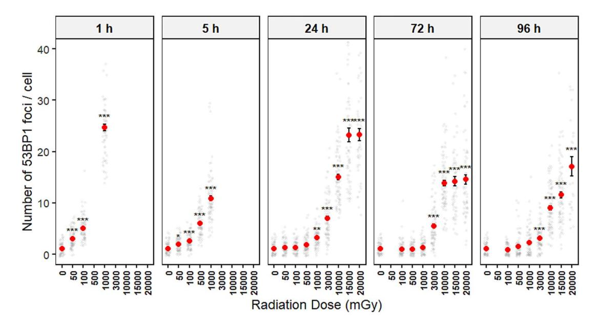
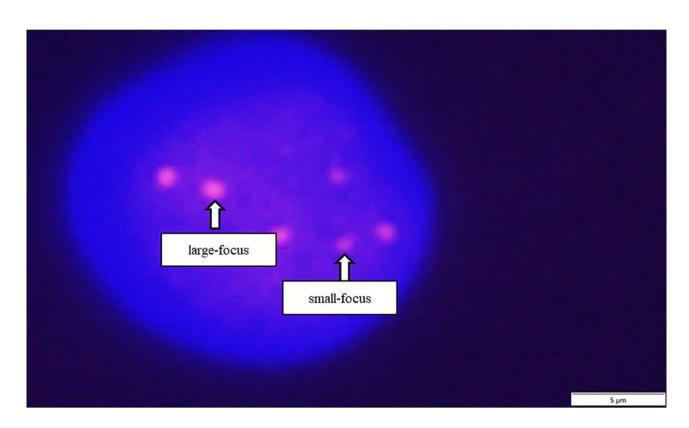
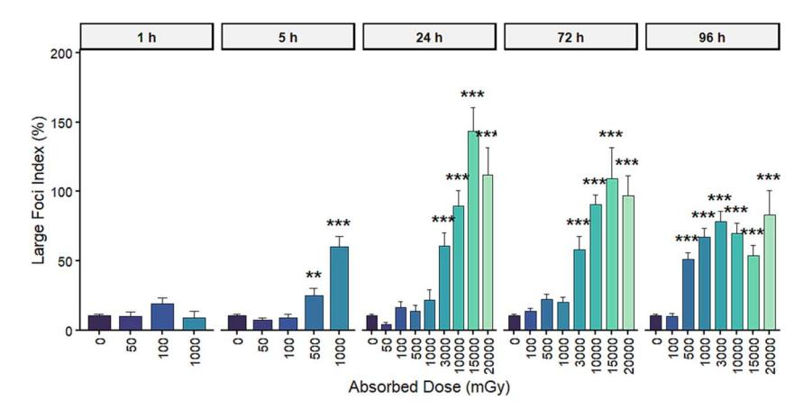

Advance Access Publication: 26 February 2026

# Time-dependent 53BP1 foci kinetics in X-irradiated human hair follicle dermal papilla cells

Daisuke Hanamiya1,2,\*, Reo Etani2,3 and Mitsuaki Ojima2

1Department of Radiology, Nippon Bunri University Medical College, 1727 Ichiki, Oita City, Oita Prefecture 870-0397, Japan

2Doctoral Program in Health Sciences, Oita University of Nursing and Health Sciences, 2944-9 Megusuno, Oita City, Oita Prefecture 870-1201, Japan

3Department of Environmental Health Science, Oita University of Nursing and Health Sciences, 2944-9 Megusuno, Oita City, Oita Prefecture 870-1201, Japan

\*Corresponding author. Department of Radiology, Nippon Bunri University Medical College, 1727 Ichiki, Oita City, Oita Prefecture 870-0397, Japan.

Tel.: +81-97-574-8467; Email: hanamiyads@nbu.ac.jp

(Received 7 November 2025; revised 29 December 2025; accepted 19 January 2026)

#### **ABSTRACT**

We investigated the feasibility of a biological dosimetry method using human hair follicle dermal papilla cells (HFDPCs). Cultured HFDPCs were X-irradiated at doses of 50–20 000 mGy, and 53BP1 foci were analyzed up to 96 h post-irradiation to assess DNA double-strand break repair kinetics and dose–response relationships. Up to 5 h post-irradiation, 53BP1 foci increased in a significant dose-dependent manner from 50 to 1000 mGy. By 24 h, the foci count at 50 mGy returned to background levels, whereas dose dependence persisted at higher doses. Notably, analysis of the focus size revealed that the proportion of large foci (diameter  $\geq 1~\mu$ m) significantly increased at doses  $\geq$  3000 mGy at 24 h. At 96 h post-irradiation, while total focus counts showed limited discrimination, large-foci assessment maintained significant sensitivity for doses as low as 500 mGy). These findings demonstrate that 53BP1 focus counting in HFDPCs allows for dose estimation from 50 mGy at 5 h, while focus size analysis enhances the accuracy for threshold-based estimation of doses  $\geq$  500 mGy up to 96 h. This study provides foundational data demonstrating the potential of HFDPCs for biological dosimetry and medical triage, warranting further validation using intact hair samples.

Keywords: biological dosimetry; 53BP1; human normal dermal papilla cells; ionizing radiation

#### INTRODUCTION

The health effects of radiation exposure in humans are classified as either deterministic or stochastic [1]. Deterministic effects, such as hair loss and cataracts, occur beyond a specific threshold dose, typically estimated at 100 mGy [2]. Probabilistic effects, including cancer, are assumed to increase with dose without a clear threshold. During nuclear disasters, accurately determining exposure doses is crucial for implementing appropriate medical measures. The dose range investigated in this study, from 50 mGy to 20 000 mGy, was selected based on critical benchmarks: 50 mGy corresponds to the Japanese government's designation for the Difficult-to-Return Zone after the Fukushima accident [3], while doses up to 20 000 mGy were documented in the Tokai-mura JCO criticality accident, where immediate clinical interventions like cytokine administration were required [4, 5]. Exposure doses are primarily estimated via personal dosimeters or environmental monitoring, but both can involve significant errors. Therefore, assessing the biological dose using human

samples is essential [6, 7]. The gold standard involves analyzing chromosomal abnormalities in peripheral blood lymphocytes [8-10]. However, these markers disappear within 24 h [10], and blood collection is invasive. Tooth enamel analysis is another option, but it requires highly invasive tooth extraction [11]. As such, this study focused on hair, which can be collected noninvasively [12]. Several studies have reported that traces of oxidative stress remain in hair for extended periods [13, 14]. Among hair follicle cells, dermal papilla cells (DPCs) and matrix cells play key roles in hair formation [15–17]. While matrix cells divide actively and may eliminate damaged cells through checkpoints [18], DPCs are specialized mesenchymal cells that may retain damage signatures more stably. Furthermore, numerous studies have demonstrated that plucked human hairs retain sufficient follicular epithelial structures—including outer root sheath cells and bulge-region stem cell-derived populations—allowing molecular analysis and even cell culture without the need for a skin biopsy [19-23]. When cells are irradiated, hydroxyl radicals generate DNA

double-strand breaks (DSBs) [\[24\]](#page-7-16). 53BP1 (p53-binding protein 1) is a protein that accumulates at these sites to activate repair mechanisms like nonhomologous end joining [[25](#page-7-17), [26\]](#page-7-18). While *γ* -H2AX—another common DSB indicator—returns to background levels within 24 h, 53BP1 remains detectable for extended periods [\[27](#page-7-19), [28\]](#page-7-20). 53BP1 foci are thus widely evaluated as a reliable indicator of long-term DSBs [[29](#page-7-21)]. Crucially, previous studies have shown that 53BP1 foci enlarge over time into 'large foci' after irradiation [[30](#page-7-22), [31](#page-7-23)]. These persistent large foci serve as reliable markers for biological dosimetry even days after exposure [[32\]](#page-7-24). Recent comparative studies [[33](#page-7-25)] and research on DSB dynamics [\[34](#page-7-26), [35\]](#page-7-27) suggest that such enlarged foci reflect complex, difficult-to-repair damage clusters [[36](#page-7-28)]. Furthermore, considering the stochastic nature of radiation damage, international guidelines [[10\]](#page-7-6) and triage models [\[37\]](#page-7-29) emphasize that while low-dose assessment requires large sample sizes, high-dose exposure can be effectively evaluated byfocusing onthese stable markers. The aim ofthis study was to investigate the feasibility of late-phase biological dose assessment using human hair follicle dermal papilla cells (HFDPCs). We analyzed the dose–response relationship and temporal changes in the number and size of 53BP1 foci to establish a foundational framework for hairbased biodosimetry.

#### **METHODS** Cells

HFDPCs, originally isolated from normal human scalp hair follicles, were purchased from PromoCell (Heidelberg, Germany; Cat# C-12071). The HFDPCs were cultured in a specific growth medium (Follicle Dermal Papilla Cell Growth Medium kit, Cat# C-26502, PromoCell) in an incubator at 37◦C with 95% humidity, 20% oxygen and 5% carbon dioxide. To ensure experimental reproducibility and minimize phenotypic drift, all experiments were performed using cells at a population doubling (PD) number of ∼ 15. According to the manufacturer's specifications, the growth performance of these cells is guaranteed for at least 10 PDs under standard culture conditions.

## X-ray irradiation

An MX-160Labo experimental X-ray irradiation device (Mediex Tech Co., Ltd.) was used for X-ray irradiation under the following conditions: tube voltage 160 kV, tube current 3 mA, dose rate 0.662 mGy/min and distance 30 cm. The doses ranged from 50 to 20 000 mGy. Physical dose measurements were verified using thermoluminescent dosimeter elements placed directly inside the culture flasks during irradiation to ensure that the absorbed dose in the cell environment matched the calculated output, with a calibration accuracy of within ± 5%.

## Immunofluorescence staining of 53BP1 foci

Cover glasses coated with cells were washed once with Dulbecco's phosphate-buffered saline (PBS; Invitrogen) and fixed in 4% paraformaldehyde solution at room temperature for 10 min. Both sides of the cover glass were washed with PBS. The cover glass was immersed in 0.5% Triton X-100 (Sigma)/PBS on ice for 5 min and washed with PBS. A total of 100 *μ*l of primary antibody solution (anti-53BP1 rabbit polyclonal antibody, Novus Biologicals, Cat# NB100-304, Lot# 62194-44; 1:1000 dilution in 3% BSA/PBS) was appliedtothe cover glass and incubatedfor 2 h in a 5%CO2 incubator at 37◦C. After washing with PBS, 100 *μ*l of secondary antibody solution (Alexa Fluor 546-conjugated donkey anti-rabbit IgG, Invitrogen, Cat# A10040, Lot# 1833519; 1:500 dilution in 3% BSA/PBS) was applied and incubated for 1 h. After washing, nuclei were counterstained with DAPI (4',6-diamidino-2-phenylindole). 53BP1 foci were observed using a fluorescence microscope (Olympus IX81).

## Analysis of the dose–response relationship and temporal changes in the number of 53BP1 foci

To analyze the dose–response relationship and temporal changes in the low-dose range, HFDPCs were irradiated with X-rays at doses of 50, 100, 500 and 1000 mGy. The number of 53BP1 foci per cell was determined at 1, 5 and 24 h post-irradiation. Assuming that DSBs can remain unrepaired for an extended period after irradiation in the highdose range, HFDPCs were irradiated with X-rays at doses of 3000, 10 000, 15 000 and 20 000 mGy, and the number of 53BP1 foci per cell was determined at 24, 72 and 96 h post-irradiation. Furthermore, to determine how long post-irradiation dose assessment remains feasible, the rate of DSB repair in HFDPCs was calculated using Equation ([1\)](#page-1-0):

DSB repair rate (%) = (IFC – PRFC) /IFC 
$$\times$$
 100, (1)

where IFC = initial focus count (i.e. the number of foci observed 1 h after X-ray irradiation minusthe background count), and PRFC = postrepair focus count (i.e. number of foci minus the background count).

## Analysis of dose–response relationship and temporal changes in 53BP1 focus size

To investigate whether focus size could serve as an indicator for dose assessment, we analyzed the dose–response relationship and temporal changes in focus size. The maximum diameter of each 53BP1 focus was measured from fluorescence images using the measurement function of cellSens Standard software (version 4.1; Evident/Olympus, Tokyo, Japan). To ensure objectivity, a threshold of ≥ 1.0 *μ*m was established to define 'large foci'. This criterion was based on previous benchmarks [\[32,](#page-7-24) [36](#page-7-28)], which demonstrated that enlarged residual 53BP1 foci persist for extended periods and can serve as reliable markers for biological dosimetry.

## Data analysis

Under each condition, 29–325 cells were observed ([Table 1\)](#page-2-0), and the mean number and size of foci per cell were determined to characterize the dose–response relationship. Statistical analyses were performed using R (version 4.5.2). The distribution of foci counts, including large foci, was evaluated for each dose group. Although the Shapiro–Wilk test indicated deviations from normality (*P <* 0.05), which is common for discrete count data and large sample sizes, Dunnett's multiple comparison test was employed as it is robust to such deviations when the number of observations is sufficient (*n* ≥ 29 per group). For all tests, a *P*-value *<* 0.05 was considered statistically significant.

| Summary of 53BP1 focus analysis and large focus index in HFDPCs |
|-----------------------------------------------------------------|
|                                                                 |
|                                                                 |
|                                                                 |
|                                                                 |
| Table 1.                                                        |
|                                                                 |
|                                                                 |

| (mGy) Dose | 1 h Total foci     | 1 h Large index     | 5 h Total foci      | 5 h Large index     | 24 h Total foci     | 24 h Large index     | 72 h Total foci     | 72 h Large index    | 96 h Total foci     | 96 h Large index    |
|---------------|-----------------------|------------------------|------------------------|------------------------|------------------------|-------------------------|------------------------|------------------------|------------------------|------------------------|
| 0             | ± 0.1 (100) 1.2 | ± 2.9 (100) 12.0 | ± 0.1 (100) 1.1  | ± 4.5 (100) 10.0 | ± 0.1 (100) 1.1  | ± 0.9 (100) 2.0   | ± 0.1 (100) 1.1  | ± 0.8 (86) 2.3   | ± 0.1 (100) 1.0  | ± 0.8 (100) 2.0  |
| 50            | ± 0.3 (100) 3.5 | ± 2.6 (195) 12.2 | ± 0.2 (200) 2.4  | ± 3.4 (195) 12.8 | ± 0.1 (184) 1.2  | ± 0.9 (183) 2.5   |                        |                        |                        |                        |
| 100           | ± 0.3 (100) 5.4 | ± 4.2 (195) 18.2 | ± 0.2 (200) 4.3  | ± 3.5 (195) 11.8 | ± 0.1 (200) 1.6  | ± 1.4 (200) 4.0   | ± 0.1 (100) 1.4  | ± 1.6 (100) 5.5  | ± 0.1 (92) 1.1   | ± 1.5 (92) 2.2   |
| 500           |                       |                        | ± 0.4 (300) 15.2 | ± 6.0 (300) 39.5 | ± 0.3 (200) 5.4  | ± 2.2 (200) 13.8  | ± 0.2 (94) 2.1   | ± 3.5 (92) 16.2  | ± 0.2 (85) 1.8   | ± 7.2 (85) 51.1  |
| 1 000         | ± 1.8 (84) 25.4 | ± 8.8 (82) 20.8  | ± 0.6 (200) 18.9 | ± 5.0 (197) 36.6 | ± 0.3 (325) 8.2  | ± 4.1 (325) 60.6  | ± 0.3 (100) 3.5  | ± 4.8 (100) 23.0 | ± 0.2 (178) 2.1  | ± 8.3 (178) 78.4 |
| 3 000         |                       |                        |                        |                        | ± 0.8 (101) 18.8 |                         | ± 0.5 (100) 8.0  |                        | ± 0.4 (100) 5.6  |                        |
| 10 000        |                       |                        |                        |                        | ± 1.6 (93) 36.6  |                         | ± 0.6 (190) 14.3 | ± 4.8 (190) 90.7 | ± 0.8 (100) 10.7 |                        |
| 15 000        |                       |                        |                        |                        | ± 3.2 (70) 45.1  | ± 11.2 143.2 (70) | ± 1.3 (68) 15.7  | ± 8.7 (68) 75.3  | ± 1.1 (89) 12.4  | ± 9.3 109.0 (89) |
| 20 000        |                       |                        |                        |                        | ± 3.5 (51) 55.5  |                         | ± 1.2 (75) 16.0  | ± 6.1 (75) 48.4  | ± 2.0 (29) 14.0  |                        |

Data presentation: All values are expressed as the mean ± standard error of the mean (SEM).

Total foci: Represents the average number of 53BP1 foci detected per nucleus.

Large index: Defined as the number of large 53BP1 foci (diameter ≥ 1.0 *μ*m) per 100 cells. This index was calculated based on the mean value across multiple observation fields for each condition. Parentheses (*n*): Indicates the total number of cells analyzed for the corresponding condition. To ensure statistical reliability, *n* was set to several hundred for low-dose ranges, while at high doses, where radiation effects are more uniform, *n* was maintained at a sufficient level to characterize the response (typically 30–325 cells).

Dashes (—): Indicate that data were not determined for those specific time points or dose levels.

Fig. 1. Kinetics of 53BP1 foci formation and repair after X-ray irradiation. Individual data points (gray circles) represent the number of 53BP1 foci per cell, with at least [100] cells analyzed per condition. Red circles and error bars indicate the mean ± SEM from three independent experiments. Panels show the dose–response at 1, 5, 24, 72 and 96 h post-irradiation. Note that 500 mGy dose was not conducted for the 1 h time point due to the experimental design. Statistical significance compared to 0 mGy was determined by one-way ANOVA followed by Dunnett's test (∗*P <* 0.05, ∗∗*P <* 0.01, ∗∗∗*P <* 0.001).

## **RESULTS** Dose–response relationship of 53BP1 focal spot counts

[Figure 1](#page-3-0) shows the focal spot counts at 1, 5, 24, 72 and 96 h after cells were irradiated with X-rays at doses ranging from 50 to 20 000 mGy. A significant dose-dependent increase inthe number of foci was observed at the early time points (1 and 5 h). Comparing 50 and 1000 mGy at 1 h post-irradiation showed an ∼ 8.2-fold increase in the number of foci, whereas an ∼ 5.7-fold increase was observed at 5 h. At later time points, the statistical significance of these increases became doseand time-dependent. At 24 h, a significant increase of ∼ 21.1-fold was observed from 100 to 15 000 mGy, but no difference was seen between 15 000 and 20 000 mGy. At 72 h, statistically significant differences compared with the control were preserved at doses of 3000 mGy and above. Similarly, at 96 h post-irradiation, significantly elevated focus counts were maintained at doses ≥ 3000 mGy, whereas the differences at lower doses (50–1000 mGy) did not reach statistical significance (see [Supplementary Table SS1](https://academic.oup.com/jrr/article-lookup/doi/10.1093/jrr/rrag005#supplementary-data) for detailed statistical results).

### Time-dependent changes in the number of 53BP1 foci

Below 100 mGy, the number of 53BP1 foci decreased to the background level by 24 h post-irradiation. The DSB repair rate was calculated by subtracting the number of foci observed at 1 h after X-ray irradiation from the background level and setting it as 100% of the number of DSBs. Thus, at 24 h after irradiation, the DSB repair rate was 100% at 50 mGy, 97.3% at 100 mGy and 91.0% at 1000 mGy [\(Table 2\)](#page-4-0). The repair rate decreased in a dose-dependent manner in HFDPCs.

## Dose–response relationship and temporal changes in 53BP1 focus size

[Table 3](#page-5-0) shows the 53BP1 focus size at 1 h after irradiation at a dose of 1000 mGy. The average focus diameter was 0.68 *μ*m, and few foci exceeding 1.0 *μ*m in diameter were observed. To clearly distinguish the initial repair foci from large, persistent foci, this study defined 53BP1 foci with a diameter ≥ 1.0*μ*m as 'large' [\(Fig. 2](#page-4-1)). This threshold was selected based on: (i) the rarity of foci ≥ 1.0 *μ*m at 1 h postirradiation in this dataset, and (ii) previous studies [[32](#page-7-24), [34](#page-7-26), [35\]](#page-7-27) indicating that micron-sized foci reflect complex or residual damage clusters. This parameter was specifically employed to investigate whether focus size could provide distinct dose discrimination at later time points when total focus counts lose sensitivity. At 24 h post-irradiation, the large focus index (the number of large foci per 100 cells) significantly increased in the 3000–15 000 mGy dose range (∗∗∗*P <* 0.001). Notably, at 15 000 mGy, the index reached 143.2%, indicating that nearly all observed cells were positive for large foci, with many containing multiple foci. In the low-dose range (50–500 mGy), the frequency of large foci was comparable to the background. At 72 h postirradiation, high levels of large foci were maintained at 10 000 and 15 000 mGy (90.5% and 109.0%, respectively). Notably, at 96 h postirradiation, statistically significant increases in the large focus index were detected even in the moderate-dose range of 500–3000 mGy (∼51.1–78.4%), which were markedly higherthanthe values observed at the 24-h time point (e.g. 13.8–60.6%). In contrast, at the highest doses (15 000 and 20 000 mGy), the incidence of large foci decreased over time compared with the peak at 24 h. These results indicate that whiletotal focus counts lose discrimination for moderate doses by 96 h,

Table 2. Repair rate of 53BP1 foci 24 h after irradiation

| Dose (mGy) | Initial focus count (IFC) | Post-repair focus count (PRFC) | Repair rate (%) |
|------------|---------------------------|--------------------------------|-----------------|
| 50         | 1.7 ± 1.6                 | 0.0 ± 1.5                      | 100             |
| 100        | 3.7 ± 2.1                 | 0.1 ± 1.0                      | 97.3            |
| 1000       | 23.4 ± 6.0                | 2.1 ± 1.7                      | 91              |

DSB repair rate *(*%*)* = *(*IFC − PRFC*) /*IFC × 100

The repair rate was calculated based on the number of residual foci at 24 h post-irradiation relative to the initial count at 1 h.

IFC (initial focus count): The number of foci observed at 1 h post-irradiation minus the background count.

PRFC (post-repair focus count): The number of foci observed at 24 h post-irradiation minus the background count.

At 24 h post-irradiation, the repair rates were 100% at 50 mGy, 97.3% at 100 mGy and 91.0% at 1000 mGy. The repair rate decreased in a dose-dependent manner, reflecting the persistence of residual foci and incomplete repair of DNA damage at higher radiation doses.

Fig. 2. Representative immunofluorescence images of 53BP1 foci in HFDPCs. Image description: Representative images showing the distribution of 53BP1 foci (red) in human hair follicle dermal papilla cells (HFDPCs) following X-ray irradiation. Focus size classification: small foci: Indicated by white arrows, these represent typical repair sites with diameters consistent with the initial mean of 0.68 ± 0.07 *μ*m. Large foci: Foci with a diameter ≥ 1.0 *μ*m, which become more prominent at later time points and higher doses. Scale bar: The scale bar represents 5 *μ*m.

the large focus index remains a sensitive indicator for doses as low as 500 mGy ([Fig. 3\)](#page-6-2).

#### **DISCUSSION**

# Dose–response relationship and temporal changes in the number of 53BP1 foci

Following irradiation, the number of 53BP1 foci has been shown to increase in a dose-dependent manner [[31](#page-7-23), [32\]](#page-7-24). Consistent with these findings, we observed a significant dose-dependent increase in 53BP1 foci in human hair follicle papilla cells up to 5 h post-irradiation. These results suggestthat dose assessment is possible even at extremely low doses (defined here as ≤ 100 mGy), provided that hair follicle cells are collected within 5 h of exposure. Furthermore, a significant, dose-dependent increase in the number of foci was observed from 1000 to 20 000 mGy even at 96 h post-irradiation. Conversely, at 24 h post-irradiation, no difference in focus number was observed between 15 000 and 20 000 mGy, whereas at 72 h, no significant difference in focus number was observed at doses ≥ 10 000 mGy. At 96 h postirradiation, a difference in focus number was observed at ≥ 1000 mGy. The relevance of these results is discussed below. The introduction of DSBs is a probabilistic event exhibiting variability. Furthermore, the increase in focus number plateaus at high doses [\[38\]](#page-7-30). This suggests that beyond a certain dose threshold, the formation of new DSBs and the progression of repair may reach a saturated state [[39,](#page-7-31) [40](#page-7-32)], potentially resulting in no significant difference in the number of foci that are detectable. Therefore, the present results indicate that using focus count as an indicator has limitations for precise dose discrimination at doses *>* 10 000 mGy. Although precise linear discrimination among doses above 1000 mGy becomes difficult at 96 h due to the loss of clear dose dependence, the persistence of significantly elevated foci compared to the control still allows for threshold-based estimation. This enables the identification of exposures exceeding clinically relevant levels (≥1000 mGy) even in the late phase. This loss of dose dependence is thought to result from a complex array of factors, including focus disappearance due to advancing DNA repair and potential focus reduction due to cell death mechanisms such as apoptosis [\[41,](#page-7-33) [42\]](#page-8-0). Considering the abovementioned fluctuations in focus counts, dose assessment beyond 72 h post-exposure may introduce accuracy errors, thus limiting the reliability of evaluations based solely on focus counts. Furthermore, due to the low frequency of chromosomal aberrations at very low doses (≤100 mGy), counting ∼ 500–1000 cells is recommended to minimize statistical errors. In the high-dose range, by contrast, the frequency of abnormalities is high, suggesting that sufficient statistical precision for triage can be achieved even with∼50–100 cells [[37](#page-7-29)]. Inthis study,the number of cells observed was selectedto balance

Table 3. Measurement results for initial focus size

| Cell no | Size (μm) |      |      |      |         | Average size (μm) |
|---------|-----------|------|------|------|---------|-------------------|
| 1       | 0.95      | 0.51 | 0.55 | 0.65 | 0.47    | 0.63              |
| 2       | 0.82      | 0.78 | 0.61 | 0.77 | 0.83    | 0.76              |
| 3       | 0.69      | 0.58 | 0.97 | 0.42 | –       | 0.67              |
| 4       | 0.80      | 0.57 | 0.64 | 0.67 | 0.52    | 0.64              |
| 5       | 0.83      | 0.81 | 0.68 | 0.80 | 0.79    | 0.78              |
| 6       | 0.45      | 0.51 | 0.82 | 0.74 | 0.57    | 0.62              |
| 7       | 0.64      | 0.67 | 0.66 | 0.89 | 0.76    | 0.72              |
| 8       | 0.70      | 0.74 | 0.91 | 0.52 | 0.86    | 0.75              |
| 9       | 0.64      | 0.73 | 0.61 | 0.57 | 0.77    | 0.66              |
| 10      | 0.53      | 0.55 | 0.77 | 0.58 | 0.57    | 0.60              |
| 11      | 0.78      | 0.67 | 0.74 | 0.78 | 0.71    | 0.74              |
| 12      | 0.83      | 0.68 | 0.74 | 0.51 | 0.57    | 0.67              |
| 13      | 1.16      | 0.64 | 0.62 | 0.78 | 0.76    | 0.79              |
| 14      | 0.60      | 0.70 | 0.65 | 0.84 | 0.55    | 0.67              |
| 15      | 0.74      | 0.73 | 0.58 | 0.66 | 0.58    | 0.66              |
| 16      | 0.82      | 0.77 | 0.66 | 0.65 | 1.02    | 0.78              |
| 17      | 0.57      | 0.59 | 0.79 | 0.48 | 0.57    | 0.60              |
| 18      | 0.45      | 0.65 | 0.76 | 0.63 | 0.65    | 0.63              |
| 19      | 0.60      | 0.51 | 0.60 | 0.45 | 0.66    | 0.56              |
| 20      | 0.40      | 0.70 | 0.80 | 0.59 | 0.81    | 0.66              |
|         |           |      |      |      | Average | 0.68              |
|         |           |      |      |      | SD      | 0.07              |

Measurement of initial 53BP1 focus diameters to establish the threshold for 'large foci'.

Description: To establish a baseline reference for focus size, the diameters of 53BP1 foci were measured in HFDPCs one hour after exposure to 1000 mGy of X-ray irradiation. A total of 99 foci from 20 cells were analyzed.

Statistical summary: The initial foci exhibited a highly uniform size distribution with a mean diameter of 0.68 ± 0.07 *μ*m (mean ± SD).

Definition of large foci: Foci exceeding 1.0 *μ*m were rarely observed at this early time point. Accordingly, the threshold for 'large foci' was set at 1.0 *μ*m, which represents a value more than 4.5 SDs above the initial mean diameter. This stringent criterion ensures that the 'large foci' analyzed in subsequent time points (e.g. 24–96 h) represent a distinct population of enlarged or persistent damage sites.

statistical reliability with practical feasibility. Previous dose assessment studies using lymphocytes and chromosomal abnormalities as indicators could not provide guaranteed precision at ∼ 100 mGy [\[10\]](#page-7-6), with accuracy assured only within 24 h post-exposure. By contrast, the results of this study suggest that using the number of 53BP1 foci in hair follicle cells as an indicator allowsfor dose assessment over a wide range within 24 h of exposure. Furthermore, these data indicate potential for threshold-based dose estimation for exposures ≥ 1000 mGy even 96 h after exposure, which is critical for medical triage. Exposure to ≥ 1000 mGy induces acute radiation syndrome, typically progressing through prodromal, latent and acute phases [[43](#page-8-1), [44](#page-8-2)]. Therefore, medical intervention is recommended when exposure exceeding 1000 mGy is suspected. The results suggest that the proposed method is effective for identifying doses requiring clinical intervention.

# Dose–response relationship and temporal changes in 53BP1 focus size

In this study, the large focus index (defined as the average number of foci ≥ 1.0 *μ*m per cell × 100) was significantly elevated in the dose range of 3000–15 000 mGy at 24 h post-irradiation. Notably, by 96 h post-irradiation, a significant increase in the incidence of large foci was detected even in the moderate-dose range (500–3000 mGy). In this range, the indices at 96 h (∼51.1–78.4%) markedly exceeded the values recorded for the same doses at 24 h (13.8–60.6%). The formation of largefoci is knownto increase in a dose-dependent mannerfollowing irradiation [[32](#page-7-24), [36](#page-7-28)]. However, at the highest dose levels, the large focus index showed a distinct saturation and subsequent decline. Specifically, while the index reached its maximum value of 143.2% at 15 000 mGy (24 h), it exhibited a lower value of 111.9% at 20 000 mGy at the same time point. Furthermore, for both the 15 000 and 20 000 mGy groups, the indices at 96 h showed a reduction compared to their respective 24-h levels. This reduction at extreme doses may reflect the selective loss of heavily damaged cells through apoptosis or other cell death pathways. This is consistent with the known exponential decline in cell survival at high doses [[44](#page-8-2), [45\]](#page-8-3), suggesting that cells with an excessive burden of large foci are preferentially eliminated from the population. Despite this, the large focus index remained high at 3000 mGy in HFDPCs compared to reported values in lymphocytes [\[45\]](#page-8-3), suggesting that HFDPCs could enable dose assessment even at high doses. The observation that large foci continue to increase in the 500–3000 mGy range up to 96 h demonstrates that both the formation and maturation of large foci proceed in a time-dependent manner. Consequently, the large focus index remains a sensitive indicator for doses as low as 500 mGy even in the late phase, where total focus counts typically lose discrimination power. This validates the

Fig. 3. Time-course of large 53BP1 focus formation following X-ray irradiation. The large focus index (defined as the average number of foci ≥ 1.0 *μ*m per cell × 100) was analyzed from 1 to 96 h post-irradiation (0–20 000 mGy). Key findings: At early time points (5 h), the index showed a dose-dependent increase starting from 1000 mGy. By 96 h, large foci remained a sensitive indicator even for moderate doses (500–3000 mGy; 51.1–78.4%), whereas total focus counts typically lose discrimination power. At high doses, the index peaked at 143.2% (15 000 mGy, 24 h) and subsequently declined at 20 000 mGy (111.9%), likely due to the elimination of heavily damaged cells. Statistical analysis: Bars and error bars represent the mean index and standard error of the mean (SEM), respectively. Significant differences compared to the 0 mGy control at each time point are indicated by asterisks (∗∗*P <* 0.01, ∗∗∗*P <* 0.001, Dunnett's test).

use of focus size as a robust complementary parameter for hair-based biodosimetry.

for threshold-based estimation relevant to medical triage using a noninvasive hair-based approach.

#### Future prospects

To explore the practical application potential of this novel biological dose assessment method using hair-derived cells, experimental validation at the animal level is crucial. To date, however, there are no reports of studies investigating the effects of radiation on HFDPCs in animals. Therefore, in future studies, we will irradiate mice, analyze the effects on HFDPCs and compare the results with those from the present study. This approach aimsto enhancethe reliability and reproducibility of the biological dose assessment method using hair-derived cells. Furthermore, a PubMed search for 'radiation biodosimetry' studies over the past decade (2014–2024) identified 61 studies. This revealed ongoing progress in exploring highly sensitive markers and improving approaches, such as analyzing gene expression signatures using transcriptomics [\[46\]](#page-8-4). Our aim is to achieve more accurate radiation dose estimation by constructing a comprehensive dose assessment system that incorporates gene-level analyses.

#### **CONCLUSION**

This study investigated the feasibility of using 53BP1 foci in HFDPCs for biological dosimetry. The results showed that dose assessment is possible for exposures as low as 50 mGy within 5 h post-irradiation. Beyond 24 h, total focus counts allow for threshold-based estimation of doses ≥ 1000 mGy, while monitoring 53BP1 focus size enhances the sensitivity for doses as low as 500 mGy even at 96 h postirradiation. These findings suggest that biological dose assessment using hair-derived cells is a viable and effective approach, particularly

### **ACKNOWLEDGEMENTS**

We would like to express our sincere gratitude to all those who contributed to this research, especially Associate Professor Mitsuaki Ojima of Oita Prefectural University of Health Sciences, for his valuable advice and guidance. The authors also thank FORTE Science Communications ([https://www.forte-science.co.jp/\)](https://www.forte-science.co.jp/) for English language editing.

#### **SUPPLEMENTARY DATA**

[Supplementary data](https://academic.oup.com/jrr/article-lookup/doi/10.1093/jrr/rrag005#supplementary-data) is available at *Journal of Radiation Research* online.

### **CONFLICT OF INTEREST**

The authors declare that there are no conflicts of interest regarding the publication of this article.

## **CONFERENCE PRESENTATION**

This study was presented at the 5th Joint Meeting of the Japan Society of Radiation Safety Management and the Japan Health Physics Society, held in Osaka, Japan.

## **REFERENCES**

[1.](#page-0-8) ICRP. Recommendations of the ICRP Publication 9, Vol. 9. Oxford: Pergamon Press; 1965, 1–53.

- [3.](#page-0-10) Cabinet Office, Government of Japan.*The 23rd Nuclear Emergency Response Headquarters Materials*. [https://www.kantei.go.jp/jp/si](https://www.kantei.go.jp/jp/singi/genshiryoku/dai23/23_06_gensai.pdf) [ngi/genshiryoku/dai23/23\\_06\\_gensai.pdf](https://www.kantei.go.jp/jp/singi/genshiryoku/dai23/23_06_gensai.pdf) (1 March 2025, date last accessed).
- [4.](#page-0-11) Hosoi Y, Kanda R. *Medical Management of Radiation Exposure*. Tokyo: Impress R&D, 2020.
- [5.](#page-0-12) Donnelly EH, Nemhauser JB, Smith JM *et al.* Acute radiation syndrome: assessment and management. *South Med J* 2010; 103:541–6. <https://doi.org/10.1097/SMJ.0b013e3181ddd571>.
- [6.](#page-0-13) Swartz HM, Williams BB, Mercier J. A critical assessment of biodosimetry methods for large-scale incidents. *Health Phys* 2010; 98:95–108. [https://doi.org/10.1097/HP.0b013e3181b8cffd.](https://doi.org/10.1097/HP.0b013e3181b8cffd)
- [7.](#page-0-14) Belyakov O. *Radiobiology of Biodosimetry*. Vienna: International Atomic Energy Agency, 2013.
- [8.](#page-0-15) Bhavani M, Selvan GT, Kaur H *et al.* Dicentric chromosome aberration analysis in Indian laboratories. *Appl Radiat Isot* 2014; 92:85–90. [https://doi.org/10.1016/j.apradiso.2014.06.004.](https://doi.org/10.1016/j.apradiso.2014.06.004)
- [9.](#page-0-16) Abe Y,MiuraT, YoshidaM*et al.*Increase in dicentric chromosome formation after a single CT scan in adults. *Sci Rep* 2015;5:13882.
- [10.](#page-0-17) IAEA. *Cytogenetic Dosimetry: Applications in Preparedness for and Response to Radiation Emergencies*. Vienna: IAEA, 2011.
- [11.](#page-0-18) Romanyukha A, Trompier F, ReyesRA. Q-band EPR dosimetry in tooth enamel. *Radiat Environ Biophys* 2014;53:305–10. [https://](https://doi.org/10.1007/s00411-013-0511-8) [doi.org/10.1007/s00411-013-0511-8.](https://doi.org/10.1007/s00411-013-0511-8)
- [12.](#page-0-19) Takeo M, Toyoshima K, Fujimoto R *et al.* Cyclical dermal micro-niche switching governs mouse zigzag hair. *Nat Commun* 2023;14:4478.
- [13.](#page-0-20) Momcilovi ˇ c B, Prejac J, Vi ´ snjevi ˇ c V´ *et al.* Hair iodine for human iodine status assessment. *Thyroid* 2014;24:1018–26. [https://](https://doi.org/10.1089/thy.2012.0499) [doi.org/10.1089/thy.2012.0499](https://doi.org/10.1089/thy.2012.0499).
- [14.](#page-0-21) Yamaya K, Tsuboi S, Saito H*et al.*Trace elements in blood and hair of healthy subjects. *NMCC Kyodo Riyo Kenkyu Seika Hokokusho* 2012;19:102–8.
- [15.](#page-0-22) Jahoda CA, Oliver RF. The growth of vibrissa dermal papilla cells in vitro. *Br J Dermatol* 1984;111:219–27.
- [16.](#page-0-23) Higgins CA, Chen JC, Cerise JE *et al.* Microenvironmental reprogramming induce de novo human hair-follicle growth. *Proc Natl Acad Sci U S A* 2013;110:19679–84.
- [17.](#page-0-24) Soma T, Tajima M, Kishimoto J. Hair cycle-specific expression of versican in human hair follicles. *J Dermatol Sci* 2002;29:181–90.
- [18.](#page-0-25) Kastan MB, Bartek J. Cell-cycle checkpoints and cancer. *Nature* 2004;432:316–23.
- [19.](#page-0-26) Limat A, French LE, Blal L *et al.* Organotypic cultures of human hair follicle cells. *Br J Dermatol* 1992;127:543–51.
- [20.](#page-0-27) Moll I, Houdek P, Schmidt H *et al.* Plucked hair follicles as a source of living keratinocytes for cell culture. *Arch Dermatol Res* 1996;288:309–14.
- [21.](#page-0-27) Gho CG, Braun JE, Tilli CM *et al.* Human follicular stem cells: their presence in plucked hair. *Br J Dermatol* 2004;150: 860–8.
- [22.](#page-0-27) Yoshikawa N, Takahashi K, Aizawa K *et al.* Characterization of human hair follicle keratinocytes obtained from plucked hairs. *J Dermatol Sci* 2007;46:149–58.

- [23.](#page-0-28) Kloepper JE, Tiede S, Brinckmann J*et al.* Human hair follicle stem cell differentiation is regulated by microenvironmental signals. *Exp Dermatol* 2013;22:532–8.
- [24.](#page-1-1) Bekker-Jensen S, Lukas C, Kitagawa R *et al.* Spatial organization of the mammalian genome surveillance machinery. *J Cell Biol* 2006;173:195–206.
- [25.](#page-1-2) Fradet-Turcotte A, Canny M, Escribano-Díaz C *et al.* 53BP1 is a reader of the DNA-damage-induced H2A Lys 15 ubiquitin mark. *Nature* 2013;499:50–4. <https://doi.org/10.1038/nature12318>.
- [26.](#page-1-3) Chapman JR, Sossick AJ, Boulton SJ *et al.* BRCA1-associated exclusion of 53BP1 from DNA damage sites. *J Cell Sci* 2012;125:3529–34.
- [27.](#page-1-4) Horn S, Barnard S, Rothkamm K. Gamma-H2AX-based dose estimation for whole and partial body radiation exposure. *PLoS One* 2011;6:e25113. [https://doi.org/10.1371/journal.po](https://doi.org/10.1371/journal.pone.0025113) [ne.0025113](https://doi.org/10.1371/journal.pone.0025113).
- [28.](#page-1-5) Djuzenova CS, Zimmermann M, Katzer A *et al.* A prospective study on histone *γ* -H2AX and 53BP1 foci expression. *BMC Cancer* 2015;15:856.
- [29.](#page-1-6) Suzuki K, Kodama S, Watanabe M. Low-dose radiation effects and intracellular signaling pathways. *Yakugaku Zasshi* 2006;126:859–67.
- [30.](#page-1-7) Yamauchi M, Oka Y, Yamamoto M *et al.* Growth of persistent foci essentialfor amplification of G1 checkpoint signaling.*DNA Repair* 2008;7:405–17. [https://doi.org/10.1016/j.dnarep.2007.11.011.](https://doi.org/10.1016/j.dnarep.2007.11.011)
- [31.](#page-1-8) Asaithamby A, Chen DJ. Cellular responses to DNA doublestrand breaks after low-dose *γ* -irradiation. *Nucleic Acids Res* 2009;37:3912–23. [https://doi.org/10.1093/nar/gkp237.](https://doi.org/10.1093/nar/gkp237)
- [32.](#page-1-9) Marková E, Torudd J, Belyaev IY. Long time persistence of residual 53BP1/*γ* -H2AX foci in human lymphocytes. *Int J Radiat Biol* 2011;87:736–45. [https://doi.org/10.3109/09553002.2011.](https://doi.org/10.3109/09553002.2011.577504) 577504.
- [33.](#page-1-10) Schüle S, Hackenbroch C, Beer M *et al.* Ex-vivo dose response characterization of the recently identified EDA2R gene. *Int J Radiat Biol* 2023;99:1584–94. [https://doi.org/10.1080/](https://doi.org/10.1080/09553002.2023.2194402) 09553002.2023.2194402.
- [34.](#page-1-11) Aten JA, Stap J, Krawczyk PM *et al.* Dynamics of DNA doublestrand breaks revealed by clustering. *Science* 2004;303:92–5.
- [35.](#page-1-12) Lorat Y, Timm S, Jakob B *et al.* Clustered DNA damage concentrated in particle tracks. *J Cell Sci* 2013;126:5964–74.
- [36.](#page-1-13) Marková E, Schultz N, Belyaev IY. Kinetics and dose-response of residual 53BP1/*γ* -H2AX foci. *Int J Radiat Biol* 2007;83:319–29.
- [37.](#page-1-14) Swartz HM, Williams BB, Flood AB *et al.* Biodosimetry for the triage of whole body radiation exposure of large populations. *Radiat Prot Dosim* 2014;159:27–34.
- [38.](#page-4-2) Goodhead DT. Saturable repair models of radiation action in mammalian cells. *Radiat Res Suppl* 1985;8:S58–67. [https://doi.o](https://doi.org/10.2307/3583513) [rg/10.2307/3583513.](https://doi.org/10.2307/3583513)
- [39.](#page-4-3) Barquinero JF, Barrios L, Caballín MR *et al.* Establishment and validation of a dose-effect curve for gamma-rays. *Mutat Res* 1995;326:65–9.
- [40.](#page-4-4) Pastwa E, Neumann RD, Mezhevaya K, Winters TA. Repair of radiation-induced DNA double-strand breaks is dependent upon radiation quality. *Radiat Res* 2003;159:251–61.
- [41.](#page-4-5) Belyaev IY, Czene S, Harms-Ringdahl M. Changes in chromatin conformation during radiation-induced apoptosis. *Radiat Res* 2001;156:355–64.

- [42.](#page-4-6) Kosik P, Durdik M, Jakl L *et al.* DNA damage response and preleukemic fusion genes. *Sci Rep* 2020;10:13722.
- [43.](#page-5-1) IAEA, WHO. *Diagnosis and Treatment of Radiation Injuries*. Vienna: IAEA/WHO, 1998.
- [44.](#page-5-2) Hall EJ, Giaccia A. *Radiobiology for the Radiologist*, 7th edn. Philadelphia: Lippincott Williams & Wilkins, 2012.
- [45.](#page-5-3) Sasaki MS, Kondo S, Tanaka K *et al.* Induction of apoptosis by ionizing radiation in human lymphocytes. *Radiat Res* 1992;130:157–63.
- [46.](#page-6-3) Amundson SA. Transcriptomics for radiation biodosimetry: progress and challenges. *Int J Radiat Biol* 2023;99:925–33. [https://doi.org/10.1080/09553002.2021.1928784.](https://doi.org/10.1080/09553002.2021.1928784)