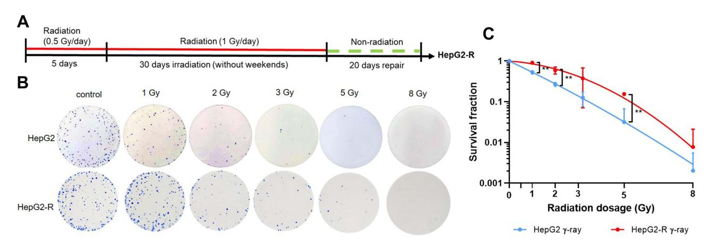
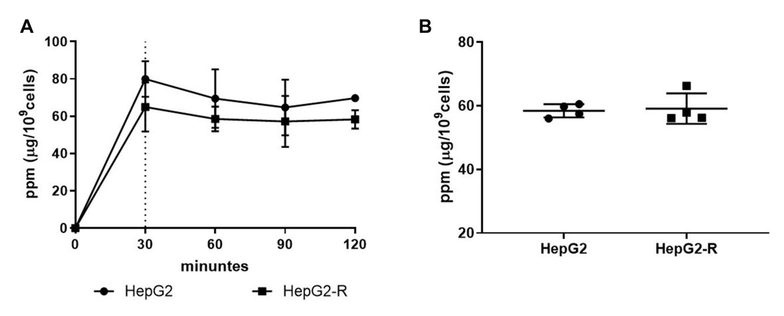
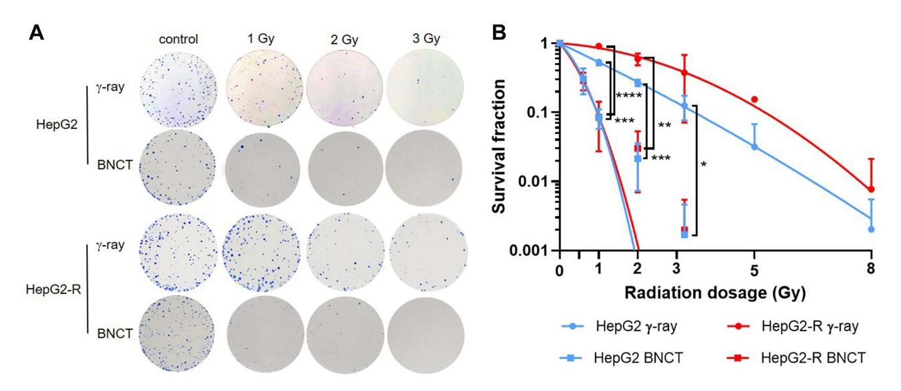
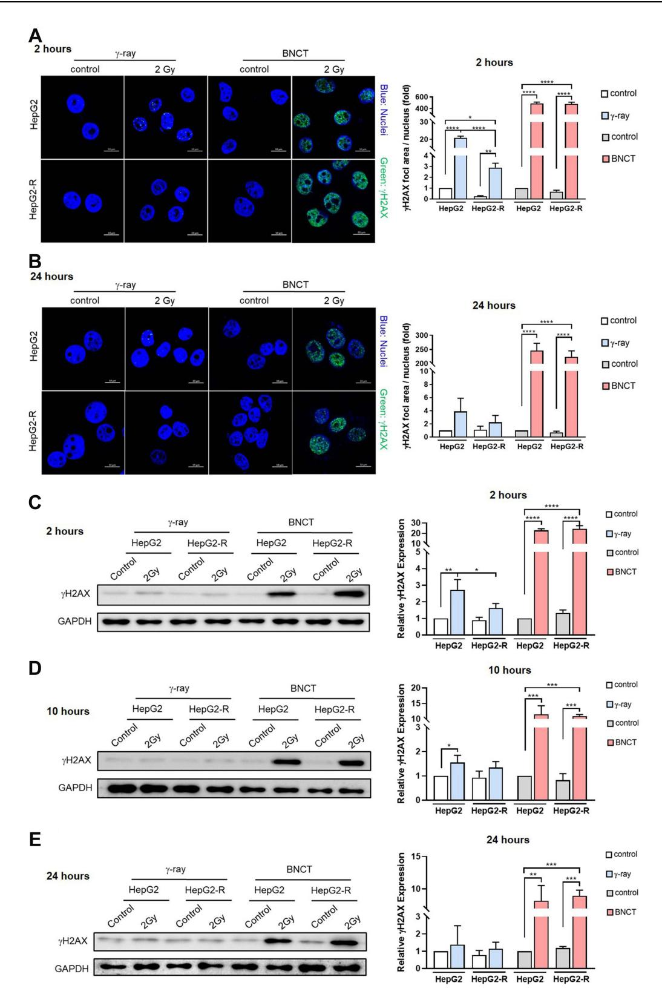
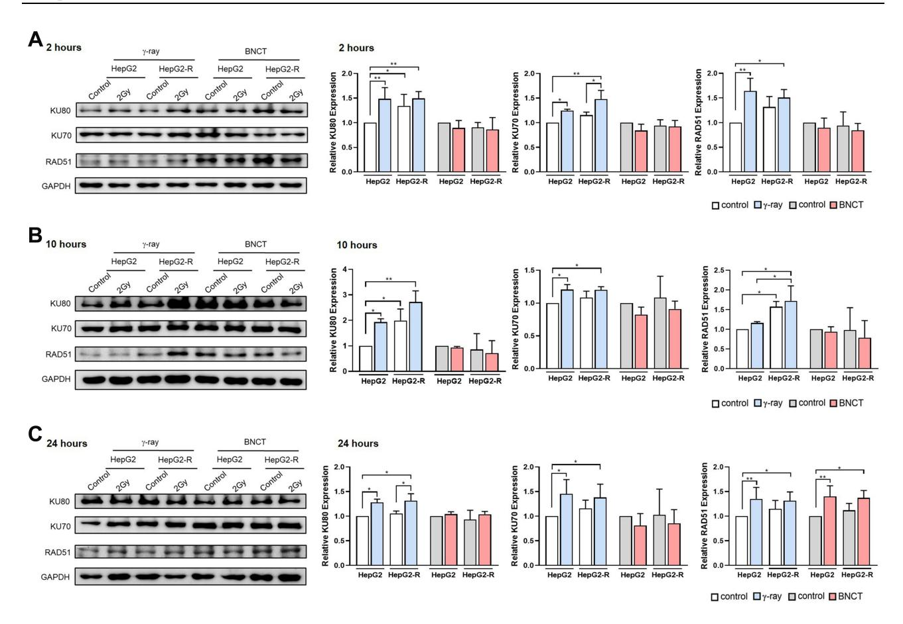
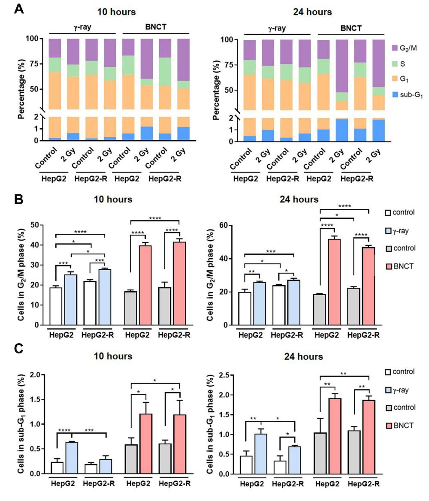
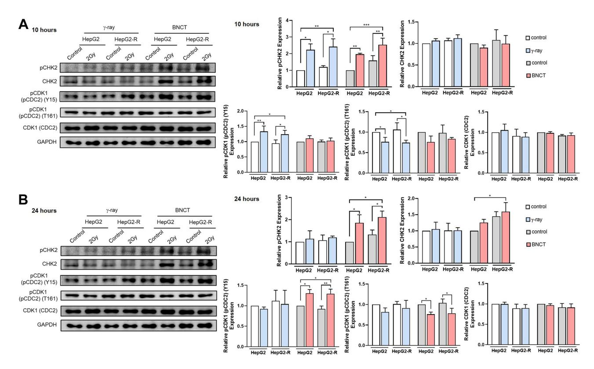
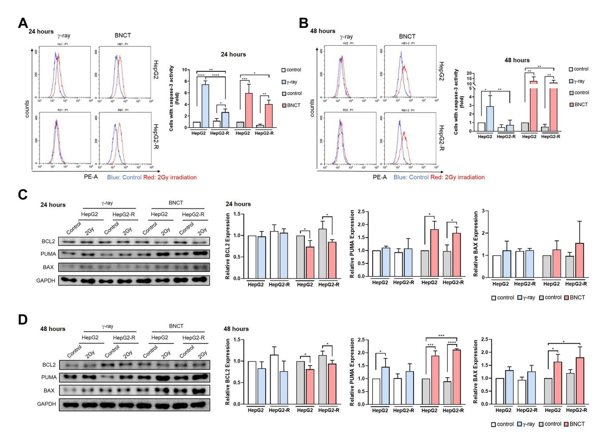
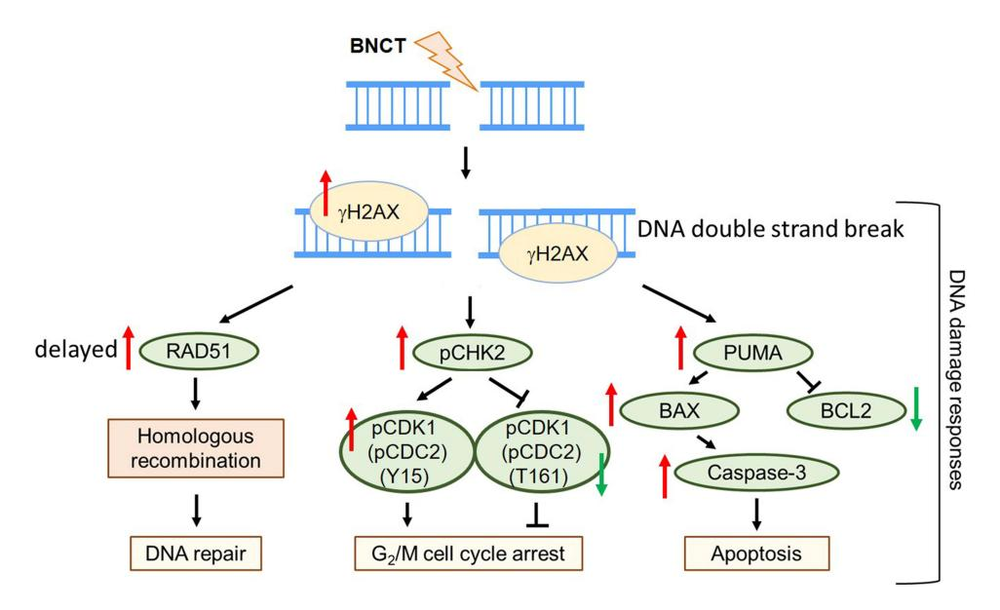

# Boron Neutron Capture Therapy Eliminates Radioresistant Liver Cancer Cells by Targeting DNA Damage and Repair Responses

Chu-Yu Huang 1-3, Zih-Yin Lai 10 1-3, Tzu-Jung Hsu 10 1-3, Fong-In Chou3, Hong-Ming Liu3, Yung-Jen Chuang 10 1-3

1School of Medicine, National Tsing Hua University, Hsinchu, Taiwan; 2Institute of Bioinformatics and Structural Biology, National Tsing Hua University, Hsinchu, Taiwan; 3Nuclear Science and Technology Development Center, National Tsing Hua University, Hsinchu, Taiwan

Correspondence: Yung-Jen Chuang, School of Medicine, National Tsing Hua University, Hsinchu, 300044, Taiwan, Tel +886-3-5742764, Fax +886-3-5715934, Email yjchuang@life.nthu.edu.tw

**Introduction:** For advanced hepatocellular carcinoma (HCC), resistance to conservative treatments remains a challenge. In previous studies, the therapeutic effectiveness and DNA damage responses of boric acid-mediated boron neutron capture therapy (BA-BNCT) in HCC have been demonstrated in animal models and HCC cell line. On the other hand, numerous studies have shown that high linear energy transfer (LET) radiation can overcome tumor resistance. Since BNCT yields a mixture of high and low LET radiation, we aimed to explore whether and how BA-BNCT could eliminate radioresistant HCC cells.

**Methods:** Radioresistant human HCC (HepG2-R) cells were established from HepG2 cells via intermittent irradiation. HepG2 and HepG2-R cells were then irradiated with either  $\gamma$ -ray or neutron radiation of BA-BNCT. Colony formation assays were used to assess cell survival and the relative biological effectiveness (RBE). The expression of phosphorylated H2AX (γH2AX) was also examined by immunocytochemistry and Western blot assays to evaluate the extent of DNA double-strand breaks (DSBs). Finally, the expression levels of DNA damage response-associated proteins were determined, followed by cell cycle analysis and caspase-3 activity analysis. **Results:** Our data demonstrated that under the same dose by  $\gamma$ -ray, BNCT effectively eliminated radioresistant HCC by increasing the number of DNA DSBs (p < 0.05) and impeding their repair (p < 0.05), which verified the high RBE of BNCT. We also found that BNCT resulted in delayed homologous recombination (HR) and inhibited the nonhomologous end-joining (NHEJ) pathway during DNA repair. Markedly, BNCT increased cell arrest (p < 0.05) in the G2/M phase by altering G2 checkpoint signaling and increased PUMA-mediated apoptosis (p < 0.05).

**Conclusion:** Our data suggest that DNA damage and repair responses could affect the anticancer efficiency of BNCT in radioresistant HepG2-R cells, which highlights the potential of BNCT as a viable treatment option for recurrent HCC.

**Keywords:** boron neutron capture therapy, BNCT, hepatocellular carcinoma, HCC, radioresistance, DNA damage, DNA repair responses

#### Introduction

Boron neutron capture therapy (BNCT) is a binary radiotherapeutic modality that combines tumor-targeting boron (10B) drugs and thermal neutron radiation. 10B absorbs thermal neutrons (< 0.5 eV) and results in a nuclear reaction that generates high linear energy transfer (LET) particles, alpha particles (4He) and lithium (7Li) nuclei.¹ The emission range of the high-energy particles is less than 10 μm, which does not exceed the diameter of a single cell. These features allow BNCT to induce tumor-specific damage while sparing the surrounding normal cells.¹,² The effectiveness of BNCT has relied on the accumulation of 10B agents in the tumor cell. The tumor-normal (T/N) ratio of the 10B concentration should be larger than or equal to three to prevent nonspecific damage to normal tissue cells.¹,² To date, boronophenylalanine (BPA) and sodium borocaptate (BSH) are the 10B-containing agents used in BNCT trials. Nonetheless, BPA and BSH are not suitable 10B agents for BNCT in hepatocellular carcinoma (HCC) due to a low T/N ratio and unexpected 10B accumulation in the nearby pancreas.³,⁴ As a breakthrough, Hung et al found that boric acid (BA) may be a suitable 10B-containing agent for BNCT in

HCC, as it can specifically accumulate in liver tumors.5 Furthermore, BA-mediated BNCT (BA-BNCT) for HCC has been demonstrated to have efficacy and safety in animal models of liver cancer.6,7

HCC is the most common liver cancer, with a 20% five-year survival rate, and over 70% of patients have tumor recurrence within five years. HCC is also one of the most difficult-to-treat cancers because most HCC patients are diagnosed at advanced stages with a poor response to the current treatment options. HCC patients are therapy, such as sorafenib and lenvatinib, are low, with a high risk of adverse events. Nonetheless, radiation therapy (RT) is limited by the radiation sensitivity of the liver. Describedly, the radiotoxicity in the surrounding normal tissue may lead to radiation-induced liver disease. Nonetheless of RT can be compromised by radioresistance. Although immunotherapy has emerged as a breakthrough in HCC treatment, there are still some challenges, such as the low response rate, uncertain efficacy, and side effects. Consequently, it is necessary to develop an effective therapy for recurrent advanced HCC.

Several studies have shown that high-LET ionizing particles with higher relative biological effectiveness (RBE) are able to overcome tumor radioresistance toward low-LET X-ray or γ-ray radiation because repair of high-LET-induced damage is difficult for cancer cells. 15–20 Additionally, high-LET and low-LET radiation result in different cellular responses. Kim et al reported that neutron irradiation can result in increased apoptosis, autophagy, and DNA damage in osteosarcoma cells, compared to γ-ray irradiation. 21 Rodriguez et al showed that BNCT and γ-ray induced different DNA damage and repair responses in a poorly differentiated thyroid carcinoma cell line. 22 Inducing extensive DNA damage is the main anticancer mechanism of radiation therapy, which may lead to gene aberrations, rearrangement, and mutations that affect organism functions and threaten survival. 23 To maintain viability and genomic integrity after DNA damage, cells detect DNA lesions and provoke a complex signal transduction pathway, namely, the DNA damage response (DDR). DDR affects the cellular responses to DNA damage, such as DNA repair, and determines cell fate, such as cell cycle arrest and apoptosis. 23–26 These responses may further influence the outcome of radiation therapy.

In the current study, we aimed to explore whether and how BNCT could eliminate radioresistant HCC cells. We first established a low-LET  $\gamma$ -ray radioresistant HCC cell line by continuous low-dose irradiation. We then compared the killing profiles of radioresistant HCC cells by BNCT and  $\gamma$ -ray under the same radiation dose. This study may help to provide more information for the application of BNCT in HCC clinical treatment.

#### **Materials and Methods**

#### Cells and Cell Culture

HepG2, a human hepatocellular carcinoma cell line, was kindly provided by Professor Horng-Dar Wang (Institute of Biotechnology, National Tsing Hua University, Hsinchu, Taiwan), and confirmed as C3A/HepG2 (ATCC No. CRL-10741) by GeneLabs Life Science Corp. (Taipei, Taiwan). In this study, we will refer C3A/HepG2 as HepG2. HepG2 cells were cultured in Dulbecco's modified Eagle's medium (DMEM; Gibco, Grand Island, NY, USA) supplemented with 10% heat-inactivated fetal bovine serum, 100 unit/mL penicillin, 100 µg/mL streptomycin, and 0.25 µg/mL amphotericin B at 37 °C in a humidified incubator with 5% CO2.

# Gamma-Ray Irradiation

 $\gamma$ -ray irradiation was performed in the Tsing Hua Co60 radiation field facility (THCF; Hsinchu, Taiwan) at a dose rate of 0.6 gray (Gy)/min or 1.1 Gy/min with a 1.33 MeV  $\gamma$ -ray energy. The cells were irradiated with 1, 2, 3, 5, and 8 Gy in the colony formation assay and 2 Gy in other experiments. The dose rate and irradiation time were calculated and are shown in Table 1.

#### Radioresistant Cell Line Establishment

The radioresistant establishment protocol was performed as previously described with modifications.27 HepG2 cells were exposed to 0.5 Gy/day of  $\gamma$ -ray for 5 days. Subsequently, the cells were further exposed to 1 Gy daily  $\gamma$ -rays 5 days/week for 30 days. Thereafter, the surviving cells were cultured without irradiation for 20 days. HepG2 cells that were treated with this irradiation protocol were referred to as HepG2-R cells.

| γ-ray Irradiation Dose (Gy) | Irradiation Dose Rate (Gy/Min) | Distance (cm) | Irradiation Time (Sec) |
|-----------------------------|--------------------------------|---------------|------------------------|
| 0.5                         | 0.6                            | 40            | 47                     |
| 1                           | 1.18                           | 30            | 51                     |
| 2                           |                                |               | 102                    |
| 3                           |                                |               | 153                    |
| 5                           |                                |               | 255                    |

8 408

**Table 1** Dose Rates and Irradiation Time of Tsing Hua 60Co Radiation Field

**Note**: distance (cm) is for the distance from radiation source. **Abbreviations**: Gy, gray; min, minute; cm, centimeter; sec, second.

#### Boron Solution

10B-enriched boric acid (BA; 99% 10B) was purchased from Aldrich Inc. (Darmstadt, Germany). The stock BA was prepared at a 6000 μg 10B/mL concentration and stored at 4 °C after being sterilized with a 0.22 μm filter.

#### Boron Uptake Time Course and Quantification

A total of 4×105 cells were seeded in 6 cm culture dishes for 48 hours, and 2 mL medium containing 25 μg 10B/mL BA was added to the cells for 0, 30, 60, 90, and 120 minutes. Then, the cells were collected after washing with 1 mL 4 °C phosphatebuffered saline (PBS) three times. After that, 65% nitric acid (Merck, Darmstadt, Germany) and 30~35% hydrogen peroxide were mixed with the samples in Teflon high-pressure digestion vessels. The samples were dissolved into solution by a microwave digestion system (MLS 1200; Milestone, Italy). The boron concentrations were measured by inductively coupled plasma atomic emission spectroscopy (ICP‒AES; OPTIMA 2000 DV; PerkinElmer Instruments, Norwalk, CT, USA).

A total of 2.4×106 cells were seeded in 10 cm culture dishes and incubated for 48 hours. Six milliliters of medium containing 25 μg 10B/mL BA was added to the cells for 30 minutes. The cells were then washed with 2 mL of 4 °C PBS three times and harvested. Subsequently, the cells were digested and measured for boron concentration following the same process as the boron uptake time course.

#### Neutron Irradiation

Neutron irradiation was performed in Tsing Hua Open-pool Reactor (THOR; Hsinchu, Taiwan) after treating cells with 25 μg 10B/mL BA for 30 minutes. The irradiation setup position of the colony formation assay is shown in [Supplemental](https://www.dovepress.com/get_supplementary_file.php?f=383959.docx) [Figure 1A;](https://www.dovepress.com/get_supplementary_file.php?f=383959.docx) the setup position of the other experiments is shown in [Supplemental Figure 1B.](https://www.dovepress.com/get_supplementary_file.php?f=383959.docx) The physical dose rates of THOR are shown in [Table 2,](#page-2-1) and the irradiation times and radiation doses are shown in [Table 3](#page-3-0).

**Table 2** Dose Rates of Tsing Hua Open-Pool Reactor

| Positions            | Dose Rate (Gy/Min)    |                       |                       |  |
|----------------------|-----------------------|-----------------------|-----------------------|--|
| Components           | 1                     | 2                     | 3                     |  |
| Neutron              | 1.80×10−2             | 9.42×10−3             | 1.80×10−2             |  |
| Gamma                | 3.74×10−2             | 3.01×10−2             | 3.70×10−2             |  |
| 10B(n, α) 7 Li | 3.73×10−3 /ppm 10B | 2.28×10−3 /ppm 10B | 3.76×10−3 /ppm 10B |  |

**Abbreviations**: Gy, gray; min, minute.

| Positions | Total Dose (Gy) | | | | | | | | | | | | | | | | | | |

Table 3 Radiation Dose for Irradiation Time

Abbreviations: Gy, gray; sec, second.

#### Colony Formation Assay

The experimental process followed a previous study with modifications.28 After irradiation, 2000 cells were reseeded in 6-well plates and cultured until the colonies were visible. Then, the colonies were fixed with 95% methanol (Merck, Darmstadt, Germany) and stained with 0.1% crystal violet (Sigma–Aldrich, Steinheim, Germany). Colonies containing more than 50 cells were counted.

D10 is the radiation dose required for reducing the survival fraction to 10%, which was calculated by GraphPad Prism version 8 (San Diego, CA, USA). The RBE was calculated according to the formula:

$$RBE = \frac{D10_{(\gamma-ray)}[Gy]}{D10_{(BNCT)}[Gy]}$$

### Immunocytochemistry (ICC)

The experimental process followed a previous study with modification. 28 Cells were seeded on sterile glass coverslips. At 2 and 24 hours after irradiation, the cells were fixed with 4% paraformaldehyde (PFA; Sigma Aldrich). γH2AX (Ser139; #9718; Cell Signal Technology, Danvers, MA, USA) antibody was diluted in 3% bovine serum albumin (BSA) to a concentration of 1:400, and the cells were incubated with the diluted antibody at 4 °C overnight. The secondary antibody anti-rabbit IgG-DyLight 488 (Jackson, West Grove, PA, USA) was added at a concentration of 1:400, and the cells were incubated for 2 hours at 37 °C in the dark. The nuclei were stained with Hoechst 33342 (Invitrogen, Carlsbad, CA, USA) at a concentration of 1:200 for 15 minutes. Immunofluorescence images were captured by an LSM800 confocal microscope (Zeiss, Oberkochen, Germany).

### Cell Cycle Analysis Assay

The experimental process followed a previous study with modifications.28 Cells were harvested and subjected to a cell cycle analysis assay at 10 and 24 hours after irradiation. BD PharmingenTM 7-amino-actinomycin D (7-AAD) staining solution (559925; BD Biosciences, San Jose, CA, USA) in BD PharmingenTM stain buffer (554656; BD Biosciences) was used for cell staining. Then, 10,000 events were collected by the CytoFlex flow cytometry system (Beckman, Indianapolis, IN, United States). Data were further analyzed by CytExpert (Beckman).

### Caspase-3 Apoptosis Assay

The experimental process followed a previous study with modifications.28 At 24 and 48 hours after irradiation, the cells were harvested and washed twice with 4 °C PBS and stained with PE rabbit anti-active caspase-3 (BD Biosciences). Then, 10,000 events were collected by the CytoFlex flow cytometry system (Beckman). Data were further analyzed by CytExpert (Beckman).

# Western Blot Assay

The experimental process followed a previous study with modifications.28 At 2, 10, 24, and 48 hours after irradiation, cells were harvested and lysed with RIPA lysis buffer (Roche, Indianapolis, IN, USA). Thirty micrograms of protein was

separated by 10% SDS‒PAGE and transferred to PVDF membranes (Millipore, Darmstadt, Germany). The blots were blocked with 3% BSA and incubated with primary antibodies at 4 °C overnight. The blots were then incubated with horseradish peroxidase-conjugated secondary antibodies (GE Healthcare, Buckinghamshire, UK; GeneTex, Irvine, CA, USA) for 2 hours. The protein bands were captured by ImageQuant LAS 4000 mini (GE Healthcare, Chicago, IL, USA). The KU80 (#2180), KU70 (#2180), pCHK2 (Thr68; #4588), CHK2 (#2197), RAD51 (#2662), pCDK1 (CDC2) (Thr161; #9114), pCDK1 (CDC2) (Tyr15; #4539), CDK1 (CDC2) (#9116), BCL2 (#4223), PUMA (#4076), BAX (#2772), and γH2AX (Ser139; #9718) primary antibodies were purchased from Cell Signaling Technology. GAPDH (GTX627408) primary antibodies were purchased from GeneTex.

#### Statistical Analysis

All experimental data are expressed as the mean ± standard deviation (SD). Unpaired, two-tailed Student's *t*-test was used to analyze the survival fraction after the colony formation assay. ICC and caspase-3 apoptosis assay data were normalized to control-treated HepG2 cells. Western blot assay data were normalized to GAPDH and further normalized to the control of HepG2. Two-way analysis of variance (ANOVA) followed by Tukey's honest significant difference post hoc test was used to analyze the fold change to the control of HepG2. The GraphPad Prism version 8 program was used for statistical analysis. *p* < 0.05 was considered statistically significant.

#### **Results**

#### Acquisition of Radioresistance by Intermittent Irradiation

To generate a radioresistant cancer cell line, HepG2 cells were intermittently exposed to 60Co γ-ray. The protocol is shown in [Figure 1A](#page-4-0). Cells were treated with this scheme until reaching a cumulative dose of 32.5 Gy. The resulting cells were referred to as HepG2-R cells. We analyzed the survival fractions of HepG2-R cells at 1, 2, 3, 5, and 8 Gy of 60Co γray irradiation [\(Figure 1B](#page-4-0)). The survival fractions of HepG2-R cells were significantly higher, ranging from 0.91 ± 0.06, 0.59 ± 0.11, and 0.15 ± 0.01 at 1, 2, and 5 Gy, than those of HepG2 cells, 0.54 ± 0.06, 0.27 ± 0.03, and 0.03 ± 0.04, respectively ([Figure 1C](#page-4-0)).

# 10B (Boric Acid) Uptake in HepG2 and HepG2-R Cells

To establish a suitable BNCT program for HepG2 and HepG2-R cells, we examined the 10B (in the form of boric acid) uptake time course of these cells. Cells were treated with 25 μg 10B/mL for 0, 30, 60, 90, and 120 minutes before 10B quantification. The 10B concentration increased at 30 minutes and remained stable until 120 minutes ([Figure 2A\)](#page-5-0). We then repeated the assay four times with a fixed 30-min treatment time point to determine how much 10B accumulated in

**Figure 1** Radioresistance establishment via intermittent irradiation. (**A**) Timeline of radioresistant HepG2-R cell establishment. (**B**) Representative images of the colony formation assay. HepG2 and HepG2-R cells were exposed to 0, 1, 2, 3, 5, and 8 gray (Gy) γ-ray radiation. Colonies were visualized by crystal violet staining. (**C**) The survival fraction after γ-ray irradiation. The red and blue lines represent HepG2-R and HepG2 cells, respectively. At 1, 2, and 5 Gy, the survival fractions of HepG2-R cells were significantly higher than those of HepG2 cells. (\*\**p* < 0.01).

Figure 2  $^{10}$ B (boric acid) uptake in HepG2 and HepG2-R cells. Cells were treated with 25  $\mu$ g  $^{10}$ B/mL boric acid (BA). The round dots represent HepG2 cells, and the square represents HepG2-R cells. (**A**) Time course of  $^{10}$ B uptake. Cells were treated with 25  $\mu$ g  $^{10}$ B/mL BA for 0, 30, 60, 90, and 120 minutes. (**B**) Quantification analysis of  $^{10}$ B uptake. The  $^{10}$ B concentrations were calculated at 30 minutes after treatment.

the cells. As shown in Figure 2B, the  $^{10}B$  concentration was  $58.45 \pm 2.08$  ppm for HepG2 cells and  $59.13 \pm 4.82$  ppm for HepG2-R cells. Based on the results, we chose to treat the cells with 25  $\mu$ g  $^{10}B/mL$  for 30 minutes. Under this condition (at 58.45 ppm of  $^{10}B$ ), we were able to estimate the BNCT irradiation dose for all subsequent experiments and analyses.

#### The Enhanced Anticancer Effect of Radioresistant HepG2-R Cells by BNCT

To explore the effect of BNCT on eliminating HepG2-R cells, we used colony formation assay to examine the survival fraction of HepG2-R cells under the same radiation dose after BNCT and  $\gamma$ -ray irradiation, as shown in Figure 3A. After BNCT, the survival fractions of both cell lines were significantly lower than the survival fractions after  $\gamma$ -ray irradiation, and HepG2-R cells had a significantly higher survival fraction than HepG2 cells (Figure 3B).

The D10 values of HepG2 and HepG2-R cells after  $\gamma$ -ray and BNCT irradiation are shown in Table 4. By using the formula listed in the Table 4 legend, the RBE of BNCT in HepG2 and HepG2-R cells was determined to be 3.675 and

Figure 3 The enhanced anticancer effect of boron neutron capture therapy (BNCT) on radioresistant HepG2-R cells. (**A**) Representative images of the colony formation assay. HepG2 and HepG2-R cells were exposed to 0, 1, 2, and 3 gray (Gy) BNCT and γ-ray irradiation. (**B**) The survival fraction after irradiation. The red and blue lines represent HepG2-R and HepG2 cells, respectively. The round dots represent γ-ray irradiation, and the squares represent BNCT. At 1, 2, and 3 Gy, the survival fractions of HepG2 and HepG2-R cells were significantly lower after BNCT than after γ-ray irradiation. (\*p<0.05, \*\*p<0.01, \*\*\*p<0.001, \*\*\*\*p<0.001).

|         | Radiation Type | D10 (Gy) | Relative Biological Effectiveness (RBE) |
|---------|----------------|----------|-----------------------------------------|
| HepG2   | γ-ray          | 3.496    | 3.675                                   |
|         | BNCT           | 0.9513   |                                         |
| HepG2-R | γ-ray          | 5.749    | 5.972                                   |
|         | BNCT           | 0.9627   |                                         |

**Table 4** The D10 and Relative Biological Effectiveness of HepG2 and HepG2-R

**Notes**: D10 is the radiation dose required for reducing the survival fraction to 10%. RBE is the ratio of given dosage of BNCT relative to γ-ray, leading to the same biological effectiveness. RBE was calculated by the formula: RBE ¼D10ð*γ* rayÞ½Gy�*=*D10ðBNCTÞ½Gy�*:* If RBE is larger than one, indicating that BNCT is allowed to cause a higher biological effect under the same dose of γ-ray.

**Abbreviations**: BNCT, boron neutron capture therapy; Gy, gray.

5.972, respectively. Our data demonstrated that BNCT efficiently eliminated radioresistant HepG2-R cells under the same dose of γ-ray, which implies that BNCT has a higher RBE than γ-ray.

#### BNCT Increased the Number of DNA DSBs and Impeded Their Repair

It has been proposed that BNCT eliminates cancer cells mainly by inducing severe DNA damage in cancer cells.[29](#page-15-5),[30](#page-15-6) We thus investigated whether BNCT induced more DNA double strand breaks (DSB) in HepG2-R cells than γ-ray irradiation. The cells were assayed at 2, 10, and 24 hours post-treatment because prior reports have indicated that the radiation-induced expression of γH2AX, a biomarker of DNA DSBs, reaches its peak level at 30 minutes, undergoes a fast repair phase at 0.5~4 hours, and then proceeds to a slow repair phase at 6~24 hours post-treatment.[31–](#page-15-7)[33](#page-15-8)

At 2 hours post-γ-ray treatment ([Figure 4A](#page-7-0)), the ICC showed that γH2AX expression was significantly lower in HepG2-R cells than in HepG2 cells. Interestingly, BNCT significantly increased γH2AX expression in HepG2-R and HepG2 cells to 480.3 ± 30.33- and 488.3 ± 26.16-fold, respectively.

At 24 hours post-BNCT treatment [\(Figure 4B\)](#page-7-0), the γH2AX expression of HepG2-R and HepG2 cells was significantly increased to 223.2 ± 21.99- and 246.5 ± 25.79-fold, respectively. In contrast, with γ-ray treatment, there was no significant change in either cell line [\(Figure 4B\)](#page-7-0). These data revealed that BNCT effectively induces severe DNA damage in HepG2-R cells regardless of radioresistance.

The Western blot assay showed similar patterns to the ICC assay. At 2 hours post-γ-ray treatment [\(Figure 4C\)](#page-7-0), γH2AX expression in HepG2 cells was significantly higher than that in HepG2-R cells. Strikingly, BNCT significantly increased the γH2AX expression of HepG2 and HepG2-R cells by 22.97 ± 1.45- and 24.35 ± 3.08-fold, respectively. At 10 hours post-γ-ray treatment, the BNCT-induced γH2AX expression in both cell lines remained significantly increased [\(Figure 4D\)](#page-7-0). At 24 hours post-γ-ray treatment ([Figure 4E\)](#page-7-0), we did not observe a significant change in γ-ray irradiationinduced γH2AX expression. In contrast, at 24 hours after BNCT treatment, the increase in γH2AX expression in HepG2- R and HepG2 cells seen at earlier time points was maintained at 8.94 ± 0.88- and 8.17 ± 2.37-fold, respectively.

These data indicated that BNCT increased the number of DNA DSBs and decreased their repair compared to γ-ray irradiation, which indicates that DNA damage responses and repair mechanisms may be involved in the elimination of radioresistant HepG2-R cells by BNCT.

### DNA Repair Defects: BNCT Resulted in Delayed Homologous Recombination and Inhibited the Nonhomologous End-Joining Pathway

Based on the abovementioned findings, we investigated whether and how BNCT and γ-ray treatment altered the DNA DSB repair pathway, homologous recombination (HR) and nonhomologous end-joining (NHEJ) in HepG2-R cells.

At 2 and 10 hours post-γ-ray treatment ([Figure 5A and B](#page-8-0)), the NHEJ-related proteins KU80 and KU70, and the HRrelated protein RAD51 were significantly upregulated in both cell lines. In contrast, we did not observe any significant change in the expression of KU80, KU70, or RAD51 after BNCT irradiation.

Figure 4 Boron neutron capture therapy increased the number of DNA DSBs and impeded their repair. Representative images of  $\gamma$ H2AX foci by immunocytochemistry (ICC) at 2 hours (**A**) and 24 hours (**B**) post-irradiation. The green fluorescence represents  $\gamma$ H2AX, and the blue fluorescence represents nuclei. The quantitative analysis of ICC is expressed as the fold change of  $\gamma$ H2AX fluorescence area/nucleus. The expression level of  $\gamma$ H2AX in HepG2 and HepG2-R cells at 2 hours (**C**), 10 hours (**D**), and 24 hours (**E**) post-irradiation. (\*p<0.05, \*\*p<0.01, \*\*\*p<0.001, \*\*\*\*p<0.001).

**Figure 5** Boron neutron capture therapy resulted in delayed homologous recombination and inhibited the nonhomologous end-joining pathway. Western blot assay for the DNA damage repair-related proteins KU80, KU70, and RAD51 at 2 hours (**A**), 10 hours (**B**), and 24 hours (**C**) post-irradiation. (\**p*<0.05, \*\**p* < 0.01).

At 24 hours post-γ-ray treatment [\(Figure 5C](#page-8-0)), KU80, KU70, and RAD51 expression remained significantly upregulated. Interestingly, the RAD51 expression in HepG2-R and HepG2 cells after BNCT irradiation was significantly increased to 1.37 ± 0.15- and 1.40 ± 0.22-fold that of the control, while KU80 and KU70 expression remained unchanged.

In summary, γ-ray irradiation upregulated both HR- and NHEJ-related pathways, while BNCT did not upregulate the HR pathway (ie, RAD51) until 24 hours post-treatment. These data indicated that DNA DSBs induced by BNCT were mainly repaired by delayed HR repair.

# BNCT Significantly Increased Cell Cycle Arrest in Radioresistant HepG2-R Cells

To maintain genomic integrity and stability after DNA damage, cells may transiently undergo cell cycle arrest to provide an opportunity for DNA repair before entering mitosis.[34](#page-15-9) 7-AAD staining was used to investigate how cell cycle progression was affected after BNCT and γ-ray irradiation ([Figure 6A](#page-9-0)). As expected, cell cycle progression was altered after performing both irradiation methods. Specifically, cells arrested in G2/M and sub-G1 phase were observed after treatment.

For either irradiation method, the G2/M baseline population in the HepG2-R control group was higher than that in the HepG2 control. At 10 hours post-treatment [\(Figure 6B](#page-9-0)), γ-ray irradiation significantly increased the G2/M population of HepG2-R cells, which remained significantly higher than that of HepG2 cells. Notably, BNCT increased the G2/M population of HepG2-R cells to 41.67 ± 1.48%. At 24 hours post-γ-ray treatment, the G2/M population of HepG2-R cells was significantly increased and remained higher than the fraction in HepG2 cells. However, BNCT further increased the G2/M population to 46.85 ± 1.15% in HepG2-R cells and 51.9 ± 1.69% in HepG2 cells.

Figure 6 Boron neutron capture therapy significantly increased cell cycle arrest in radioresistant HepG2-R cells. (A) Cell percentages of different cell cycle phases were assessed by a cell cycle assay using 7-amino-actinomycin D (7-AAD) staining. (B) Quantitative analysis of the cell cycle in the  $G_2/M$  phase. (C) Quantitative analysis of the cell cycle assay for the sub- $G_1$  phase. (\*p<0.05, \*\*p<0.01, \*\*\*\*p<0.001, \*\*\*\*p<0.001).

In terms of the sub- $G_1$  phase, at 10 hours post-treatment (Figure 6C),  $\gamma$ -ray irradiation increased the sub- $G_1$  population in HepG2 cells to a level that was significantly higher than the fraction in HepG2-R cells. Strikingly, BNCT significantly increased the sub- $G_1$  fraction in both HepG2-R and HepG2 cells to  $1.21 \pm 0.23\%$  and  $1.20 \pm 0.29\%$ , respectively. At 24 hours post-treatment (Figure 6C),  $\gamma$ -ray irradiation increased the sub- $G_1$  population to  $1 \pm 0.16\%$  in HepG2 cells, but the fraction was  $0.7 \pm 0.03\%$  in HepG2-R cells. Interestingly, BNCT showed a significant increase in the sub- $G_1$  population in both HepG2-R and HepG2 cells ( $1.87 \pm 0.10\%$  and  $1.92 \pm 0.11\%$ , respectively). Taken together, BNCT significantly increased the  $G_2/M$  and sub- $G_1$  populations in HepG2-R cells.

# BNCT Increased $G_2/M$ Arrest by Altering CHK2 and CDK1 (CDC2) Checkpoint Signaling

CDK1 (previous HGNC symbol: CDC2) and CHK2 are known to play an essential role in the  $G_2$  checkpoint to determine whether the cells enter mitosis or arrest in the  $G_2$  phase.35 We used Western blot assays to investigate the expression profiles of CDK1 (CDC2) and CHK2 at 10 and 24 hours post-treatment.

At 10 hours post-γ-ray treatment ([Figure 7A\)](#page-10-0), pCHK2 (T68) and pCDK1 (pCDC2) (Y15) expression levels were significantly upregulated in both cell lines. In contrast, pCDK1 (pCDC2) (T161) expression was significantly decreased after γ-ray irradiation. Nonetheless, BNCT only significantly upregulated pCHK2 to 2.54 ± 0.39- and 1.97 ± 0.06-fold in HepG2-R and HepG2 cells, respectively.

At 24 hours post-γ-ray treatment [\(Figure 7B\)](#page-10-0), these G2 checkpoint proteins did not show any significant change in either cell line. Interestingly, BNCT significantly upregulated pCHK2 (T68), CHK2, and pCDK1 (CDC2) (Y15) and significantly downregulated pCDK1 (CDC2) (T161) in HepG2-R and HepG2 cells.

In summary, these data revealed that BNCT altered the expression of the G2 checkpoint signaling molecules CDK2 and CDK1 (CDC2) to increase cell cycle arrest in the G2/M phase. We also observed delayed activation of CDK2 and CDK1 (CDC2) after BNCT compared to γ-ray irradiation.

#### PUMA-Mediated Apoptosis Underlies BNCT's Mechanism of Action

In 7-AAD staining, we observed cancer cell arrest at both the G2/M and sub-G1 phases, which is a sign of an apoptotic trend after BNCT irradiation. Therefore, we used PE staining to examine the activity of caspase-3, the key marker for apoptosis.

At 24 hours post-γ-ray treatment ([Figure 8A](#page-11-0)), the fraction of treated cells with caspase-3 activity significantly increased to 7.47 ± 0.63-fold in HepG2 cells, which was significantly higher than the observed increase to 2.68 ± 0.56 fold in HepG2-R cells. In the BNCT group, the cell fraction with active caspase-3 significantly increased to 4.07 ± 0.68 and 5.96 ± 1.53-fold in HepG2-R and HepG2 cells, respectively. At 48 hours post-γ-ray treatment [\(Figure 8B](#page-11-0)), the fraction of cells with active caspase-3 decreased in both cell lines compared to the fractions at 24 hours. Strikingly, BNCT further significantly increased the fraction of cells with active caspase-3 to 11.37 ± 2.03- and 12.93 ± 3.75-fold in HepG2-R and HepG2 cells, respectively.

**Figure 7** Boron neutron capture therapy increased G2/M arrest by altering CHK2 and CDK1 (CDC2) checkpoint signaling. Western blot assay for the G2/M checkpoint regulation-related proteins pCHK2, CHK2, pCDK1 (CDC2) (Y15), pCDK1 (pCDC2) (T161), and CDK1 (CDC2) at 10 hours (**A**) and 24 hours (**B**) post-irradiation. (\**p*<0.05, \*\**p* < 0.01, \*\*\**p*<0.001).

Figure 8 PUMA-mediated apoptosis underlies boron neutron capture therapy's mechanism of action. Caspase-3 activity histograms of the caspase-3 apoptosis assay were generated after PE staining at 24 hours (**A**) and 48 hours (**B**) post-irradiation. The blue line represents the control group, and the red line represents the irradiation group. The quantitative analysis of cell percentages with caspase-3 activity was performed by CytExpert. Western blot assay for apoptosis-related proteins BCL2, PUMA, and BAX at 24 hours (**C**) and 48 hours (**D**) post-irradiation. (\*p<0.05, \*\*p<0.001, \*\*\*\*p<0.0001).

Based on the abovementioned findings, we hypothesized that BNCT may affect the molecular pathway of apoptosis in treated cancer cells. Therefore, Western blot was used to examine the expression profiles of key apoptosis-related proteins.

At 24 hours post-treatment (Figure 8C),  $\gamma$ -ray irradiation did not change BAX, PUMA or BCL2 expression in either cell line. However, BNCT significantly decreased BCL2 expression but significantly increased PUMA expression. At 48 hours post-treatment (Figure 8D),  $\gamma$ -ray irradiation slightly altered BAX, PUMA, and BCL2 expression in both cell lines. In contrast, BNCT sustained a significant downregulation of BCL2 expression. Meanwhile, BNCT significantly increased the PUMA and BAX expression levels.

In summary, these data showed that BNCT upregulated caspase-3 activity and the expression level of PUMA, which indicates that BNCT drives the treated cancer cells toward apoptosis via the PUMA-mediated pathway.

#### Discussion

As one of the most high-risk malignancies, a majority of HCC cases are diagnosed in advanced stages with limited treatment options and poor prognosis.  $^{36}$  For patients receiving radiotherapy, radioresistance is one of the most important challenges in the management of HCC.  $^{12}$  In the present study, we demonstrated the feasibility of BNCT to overcome the radioresistance of HCC. BNCT efficiently eliminated HepG2-R cells, which resisted  $\gamma$ -ray irradiation at the same dose. This finding agrees with other studies that showed that high-LET ionizing particles can eliminate tumors with radioresistance to low-LET radiation.  $^{18-20}$  We determined the RBE of BNCT to be 3.675 in HepG2 cells and 5.972 in HepG2-R cells. RBE

varies with many factors, including not only the type, dosage, and energy of radiation components but also the cell and tissue type and the degree of oxygenation of the cell.[37](#page-15-12) The difference between the RBE of HepG2 and HepG2-R cells indicated that RBE was also affected by the biological properties (ie, radioresistance ability) of the cancer cells. To our knowledge, this study is the first report of RBE for BA-BNCT and the first study to show that RBE can be affected by the radioresistant ability of the cells.

It is known that high-LET radiation-induced DNA damage is more difficult to repair by cancer cells than low-LET radiation-induced DNA damage.[15–](#page-14-14)[17](#page-14-18) We found that BNCT increased the number of DNA DSBs in HepG2-R and impeded their repair, compared to γ-ray irradiation. This is consistent with the finding that high-LET neutron radiation induced more DNA DSBs than low-LET γ-ray radiation, and DNA DSBs are difficult to repair.[21](#page-14-16)

We also demonstrated that BNCT and γ-ray irradiation resulted in different DNA DSB repair pathways. BNCT induced delayed HR and inhibited NHEJ repair, whereas γ-ray irradiation activated both HR and NHEJ. According to the review of Sridharan et al, the choice of radiation-induced DNA DSB repair pathways mainly depends on the radiation quality.[38](#page-15-13) This is because different types of radiation may generate different DNA lesions, and the complexity of DNA damage may trigger varied and altered responses of the repair pathways. Studies have shown that approximately 70% of DNA DSBs induced by low-LET radiation are repaired by NHEJ, and 30% are repaired by HR repair.[39](#page-15-14) The percentage of DNA DSBs repaired by either pathway mainly varies with cell cycle progression.[24](#page-15-15)

In contrast to low-LET radiation, the contribution of HR and NHEJ to repair high-LET-induced DNA DSBs is still not well understood. Recent studies suggested that DNA DSBs induced by high-LET radiation are mainly repaired by HR.[40](#page-15-16) Additionally, several studies suggest that the choice of DNA DSB repair pathway relies on the shifts from NHEJ with low-LET radiation to HR with high-LET radiation[.41–](#page-15-17)[43](#page-15-18) However, other studies indicated that DNA DSBs are mainly repaired by NHEJ.[43,](#page-15-18)[44](#page-15-19) Such variation in the choice of repair pathways may be due to the structure of the DNA DSBs, cell type, and chromatin environment.[45,](#page-15-20)[46](#page-15-21)

In terms of the cell fate decision after BNCT, the decision might be cell type dependent.[47](#page-15-22) Kondo et al and Kinashi et al showed a critical role of NHEJ in mouse embryonic fibroblasts and Chinese hamster ovary CHO-K1 cells.[48](#page-15-23),[49](#page-15-24) In contrast, HR is more important in human thyroid follicular cancer WRO cells and human HCC Huh7 cells,[22,](#page-15-0)[27,](#page-15-3)[28](#page-15-4) which is consistent with our finding that BNCT induced HR but not NHEJ in human HCC HepG2 cells. Additionally, the human melanoma cell line Mel J and murine melanoma B16-F10 cells activated both NHEJ and HR after BNCT.[22](#page-15-0) Our finding thus implies that HR inhibitors may radiosensitize HCC cells to BNCT.

Several reports showed that radioresistant cells increased the fraction of cells arrested in G2/M after irradiation, which could be the cell's strategy to repair DNA damage.[50](#page-15-25) After repairing the damage, cell cycle progression may resume. This agrees with our finding that HepG2-R cells showed more G2/M arrest at 12 hours post-γ-ray irradiation than HepG2 cells, and the fraction of G2/M cells was reduced at 24 hours in both cell lines. These findings indicate that G2/M arrest reduces the therapeutic efficiency and increases the possibility of cancer recurrence. However, the ratio of cell death or arrest in the cell cycle may contribute to the choice of dose and type of therapy.[51](#page-15-26) It is also known that if the damage is unrepairable, the cells will undergo apoptosis. This could explain why HepG2-R cells were eliminated by BNCT even after an extensive increase in G2/M arrest. These findings suggest that G2 checkpoint inhibitors may also be potential radiosensitizers for BNCT.

Of note, in the present study, we observed delayed DNA damage responses after BNCT irradiation, including DNA DSB repair, checkpoint signaling, and apoptosis signaling. The RAD51 expression level increased until 24 hours after BNCT, while the RAD51 expression level increased at 2 hours after γ-ray treatment. Delayed repair phenomena have been reported in several high-LET radiation studies[.52](#page-15-27) From the literature survey, the delayed repair induced by high-LET radiation may be due to the generation of small DNA fragments or clustered DNA lesions.[47](#page-15-22),[53](#page-15-28)[,54](#page-15-29) Consequently, DNA damage repair enzymes cannot bind properly to fragmented, clustered DNA lesion sites, leading to a reduction in repair efficiency[.55](#page-15-30)

In summary, our findings indicate that DNA damage and repair responses underlie the elimination efficiency of radioresistant HCC by BNCT ([Figure 9\)](#page-13-0). In addition, our data suggest that BNCT combine HR inhibitors or G2 checkpoint inhibitors could be a potential strategy for clinical treatment. These findings agreed with various preclinical

Figure 9 Proposed scheme for boron neutron capture therapy-induced DNA damage responses in HCC.

and clinical studies which demonstrated the radiosensitization effect of DNA repair and checkpoint inhibitors.57–62 Although the cancer cell lethality does not translate directly to better outcomes for patients,56 our study implies the potential of BNCT for patients with advanced HCC. It is noteworthy that other mechanism related to radioresistance, such as autophagy,63,64 may also involve in eliminating the radioresistant cells by BNCT. Therefore, further studies are still needed before its clinical application.

#### **Conclusion**

Our study demonstrated the anticancer effect of BNCT on HepG2 cells and radioresistant HepG2-R cells, and determined the RBE of BA-BNCT in HCC. Furthermore, BNCT results in different DNA damage and repair responses, which may lead to the abrogation of radioresistance arising from prior  $\gamma$ -ray radiotherapy (Table 5). Although BNCT has the limitation and radiotoxicity, this study highlights the potential of BA-BNCT as a second-line treatment to manage recurrent HCC with radioresistance. To our knowledge, this is the first report of the RBE of BA-BNCT, which will help to promote BA-BNCT in clinical use for advanced HCC.

**Table 5** The Comparison of the DNA Damage Responses Induced by BNCT and γ-ray

| Gamma Ray (γ-ray) |             |                                       | Boron Neutron Capture Therapy (BNCT |                     |
|-------------------|-------------|---------------------------------------|-------------------------------------|---------------------|
| HepG2             | HepG2-R     |                                       | HepG2                               | HepG2-R             |
| ↓↓ - ↑↑     | ↓ - ↑ | Survival RBE DSB                | ↓↓↓ 3.675 ↑↑↑                 | ↓↓↓ 5.972 ↑↑↑ |
| HR + NHEJ         |             | DNA damage repair                     | Delayed HR, inhibit NHEJ            |                     |
| ↑ ↑↑           | ↑↑ ↑     | G 2 /M arrest Apoptosis | 111 111                          | ↑↑↑ ↑↑↑          |

**Notes**: ↓, decrease; ↑, increase.

Abbreviations: RBE, relative biological effectiveness; DSB, double strand break; HR, homologous recombination; NHEJ, nonhomologous end-joining.

## **Abbreviations**

7-AAD, 7-Amino-Actinomycin D; BA, Boric acid; BA-BNCT, Boric acid-mediated BNCT; BNCT, Boron neutron capture therapy; DDR, DNA damage response; DSB, DNA double strand breaks; Gy, gray; HR, homologous recombination; ICC, Immunocytochemistry; LET, Linear energy transfer; NHEJ, non-homologous end joining; PBS, phosphate-buffered saline; γH2AX, phosphorylated-H2AX; RBE, relative biological effectiveness; THCR, Tsing Hua cobalt-60 radiation field; THOR, Tsing Hua Open-pool Reactor.

#### **Acknowledgments**

The HepG2 cell line was kindly provided by Horng-Dar Wang (Institute of Biotechnology, National Tsing Hua University, Hsinchu, Taiwan). We thank for the support from the confocal imaging core in National Tsing Hua University.

#### **Funding**

This study was supported by Ministry of Science and Technology, Taiwan under Grant No. MOST 110-2311-B-007-005-MY3.

### **Disclosure**

The authors have no conflict of interests to declare.

#### **References**

- 1. Dymova MA, Taskaev SY, Richter VA, Kuligina EV. Boron neutron capture therapy: current status and future perspectives. *Cancer Commun*. [2020;](#page-0-2)40(9):406–421. doi:[10.1002/cac2.12089](https://doi.org/10.1002/cac2.12089)
- 2. Hu K, Yang Z, Zhang L, et al. Boron agents for neutron capture therapy. *Coord Chem Rev*. [2020](#page-0-2);405:213139. doi:[10.1016/j.ccr.2019.213139](https://doi.org/10.1016/j.ccr.2019.213139)
- 3. Suzuki M, Sakurai Y, Hagiwara S, et al. First attempt of boron neutron capture therapy (BNCT) for hepatocellular carcinoma. *Jpn J Clin Oncol*. [2007;](#page-0-3)37(5):376–381. doi:[10.1093/jjco/hym039](https://doi.org/10.1093/jjco/hym039)
- 4. Chou FI, Chung HP, Liu HM, Chi CW, Lui WY. Suitability of boron carriers for BNCT: accumulation of boron in malignant and normal liver cells after treatment with BPA, BSH and BA. *Appl Radiat Isot*. [2009;](#page-0-3)67(7–8 Suppl):S105–S108. doi:[10.1016/j.apradiso.2009.03.025](https://doi.org/10.1016/j.apradiso.2009.03.025)
- 5. Hung YH, Lin YC, Lin YT, et al. Suitability of boric acid as a boron drug for boron neutron capture therapy for hepatoma. *Appl Radiat Isot*. [2020;](#page-1-0)164:109254. doi:[10.1016/j.apradiso.2020.109254](https://doi.org/10.1016/j.apradiso.2020.109254)
- 6. Lin S-Y, Lin C-J, Liao J-W, et al. Therapeutic efficacy for hepatocellular carcinoma by boric acid-mediated boron neutron capture therapy in a rat model. *Anticancer Res*. [2013](#page-1-1);33(11):4799–4809.
- 7. Yang CH, Lin YT, Hung YH, et al. Autoradiographic and histopathological studies of boric acid-mediated BNCT in hepatic VX2 tumor-bearing rabbits: specific boron retention and damage in tumor and tumor vessels. *Appl Radiat Isot*. [2015;](#page-1-1)106:176–180. doi:[10.1016/j.apradiso.2015.08.034](https://doi.org/10.1016/j.apradiso.2015.08.034)
- 8. Forner A, Reig M, Bruix J. Hepatocellular carcinoma. *Lancet*. [2018](#page-1-2);391(10127):1301–1314. doi:[10.1016/S0140-6736\(18\)30010-2](https://doi.org/10.1016/S0140-6736(18)30010-2)
- 9. Benson R, Madan R, Kilambi R, Chander S. Radiation induced liver disease: a clinical update. *J Egypt Natl Canc Inst*. [2016;](#page-1-3)28(1):7–11. doi:[10.1016/j.jnci.2015.08.001](https://doi.org/10.1016/j.jnci.2015.08.001)
- 10. Kim J, Jung Y. Radiation-induced liver disease: current understanding and future perspectives. *Exp Mol Med*. [2017;](#page-1-3)49(7):e359. doi:[10.1038/](https://doi.org/10.1038/emm.2017.85) [emm.2017.85](https://doi.org/10.1038/emm.2017.85)
- 11. Guo J, Li L, Guo B, et al. Mechanisms of resistance to chemotherapy and radiotherapy in hepatocellular carcinoma. *Transl Cancer Res*. [2018](#page-1-4);7 (3):765–781. doi:[10.21037/tcr.2018.05.20](https://doi.org/10.21037/tcr.2018.05.20)
- 12. Fan Q, Yu Y, Zhou Y, Zhang S, Wu C. An emerging role of radiationinduced exosomes in hepatocellular carcinoma progression and radioresistance (Review). *Int J Oncol*. [2022;](#page-1-4)60(4). doi:[10.3892/ijo.2022.5336](https://doi.org/10.3892/ijo.2022.5336)
- 13. Llovet JM, Castet F, Heikenwalder M, et al. Immunotherapies for hepatocellular carcinoma. *Nat Rev Clin Oncol*. [2022;](#page-1-5)19(3):151–172. doi:[10.1038/](https://doi.org/10.1038/s41571-021-00573-2) [s41571-021-00573-2](https://doi.org/10.1038/s41571-021-00573-2)
- 14. Liu Z, Liu X, Liang J, et al. Immunotherapy for hepatocellular carcinoma: current status and future prospects. *Front Immunol*. [2021;](#page-1-5)12:765101. doi:[10.3389/fimmu.2021.765101](https://doi.org/10.3389/fimmu.2021.765101)
- 15. Kanai T, Endo M, Minohara S, et al. Biophysical characteristics of HIMAC clinical irradiation system for heavy-ion radiation therapy. *Int J Radiat Oncol Biol Phys*. [1999](#page-1-6);44(1):201–210. doi:[10.1016/S0360-3016\(98\)00544-6](https://doi.org/10.1016/S0360-3016(98)00544-6)
- 16. Okayasu R. Repair of DNA damage induced by accelerated heavy ions–a mini review. *Int J Cancer*. 2012;130(5):991–1000. doi:[10.1002/ijc.26445](https://doi.org/10.1002/ijc.26445)
- 17. Skarsgard LD. Radiobiology with heavy charged particles: a historical review. *Phys Med*. 1998;14(Suppl 1):1–19.
- 18. Chevalier F, Hamdi DH, Lepleux C, et al. High LET radiation overcomes in vitro resistance to X-rays of chondrosarcoma cell lines. *Technol Cancer Res Treat*. [2019](#page-11-1);18:1533033819871309. doi:[10.1177/1533033819871309](https://doi.org/10.1177/1533033819871309)
- 19. Hirota Y, Masunaga S, Kondo N, et al. High linear-energy-transfer radiation can overcome radioresistance of glioma stem-like cells to low linear-energy-transfer radiation. *J Radiat Res*. 2014;55(1):75–83. doi:[10.1093/jrr/rrt095](https://doi.org/10.1093/jrr/rrt095)
- 20. Nakano T, Suzuki Y, Ohno T, et al. Carbon beam therapy overcomes the radiation resistance of uterine cervical cancer originating from hypoxia. *Clin Cancer Res*. 2006;12(7 Pt 1):2185–2190. doi:[10.1158/1078-0432.CCR-05-1907](https://doi.org/10.1158/1078-0432.CCR-05-1907)
- 21. Kim EH, Kim MS, Lee KH, et al. Effect of low- and high-linear energy transfer radiation on in vitro and orthotopic in vivo models of osteosarcoma by activation of caspase-3 and −9. *Int J Oncol*. [2017;](#page-1-7)51(4):1124–1134. doi:[10.3892/ijo.2017.4102](https://doi.org/10.3892/ijo.2017.4102)

22. Rodriguez C, Carpano M, Curotto P, et al. In vitro studies of DNA damage and repair mechanisms induced by BNCT in a poorly differentiated thyroid carcinoma cell line. *Radiat Environ Biophys.* 2018;57(2):143–152. doi:10.1007/s00411-017-0729-y

- 23. Pilie PG, Tang C, Mills GB, Yap TA. State-of-The-art strategies for targeting the DNA damage response in cancer. *Nat Rev Clin Oncol*. 2019;16 (2):81–104. doi:10.1038/s41571-018-0114-z
- 24. Ciccia A, Elledge SJ. The DNA damage response: making it safe to play with knives. *Mol Cell*. 2010;40(2):179–204. doi:10.1016/j. molcel.2010.09.019
- 25. Goldstein M, Kastan MB. The DNA damage response: implications for tumor responses to radiation and chemotherapy. *Annu Rev Med.* 2015;66:129–143. doi:10.1146/annurev-med-081313-121208
- 26. Lord CJ, Ashworth A. The DNA damage response and cancer therapy. Nature. 2012;481(7381):287-294. doi:10.1038/nature10760
- 27. Shimura T, Noma N, Sano Y, et al. AKT-mediated enhanced aerobic glycolysis causes acquired radioresistance by human tumor cells. *Radiother Oncol.* 2014;112(2):302–307. doi:10.1016/j.radonc.2014.07.015
- 28. Chen KH, Lai ZY, Li DY, Lin YC, Chou FI, Chuang YJ. Analysis of DNA damage responses after boric acid-mediated boron neutron capture therapy in hepatocellular carcinoma. *Anticancer Res.* 2019;39(12):6661–6671. doi:10.21873/anticanres.13881
- 29. Nedunchezhian K, Aswath N, Thiruppathy M, Thirupnanamurthy S. Boron neutron capture therapy - A literature review. *J Clin Diagn Res.* 2016;10 (12):ZE01–ZE04. doi:10.7860/JCDR/2016/19890.9024
- 30. Tai-Ze Yuan SQX, Chao-Nan Q. Boron neutron capture therapy of cancer Critical issues and future prospects. *Thoracic Cancer*. 2019. doi:10.1111/1759-7714.13232
- 31. Mariotti LG, Pirovano G, Savage KI, et al. Use of the gamma-H2AX assay to investigate DNA repair dynamics following multiple radiation exposures. *PLoS One*. 2013;8(11):e79541. doi:10.1371/journal.pone.0079541
- 32. Shibata A, Conrad S, Birraux J, et al. Factors determining DNA double-strand break repair pathway choice in G2 phase. EMBO J. 2011;30 (6):1079–1092. doi:10.1038/emboj.2011.27
- 33. Grudzenski S, Raths A, Conrad S, Rube CE, Lobrich M. Inducible response required for repair of low-dose radiation damage in human fibroblasts. Proc Natl Acad Sci U S A. 2010;107(32):14205–14210. doi:10.1073/pnas.1002213107
- 34. Wang H, Zhang X, Teng L, Legerski RJ. DNA damage checkpoint recovery and cancer development. Exp Cell Res. 2015;334(2):350–358. doi:10.1016/j.yexcr.2015.03.011
- 35. Taylor WR, Stark GR. Regulation of the G2M transition by p53. Oncogene. 2001;20(15):1803-1815. doi:10.1038/sj.onc.1204252
- 36. Li D, Sedano S, Allen R, Gong J, Cho M, Sharma S. Current treatment landscape for advanced hepatocellular carcinoma: patient outcomes and the impact on quality of life. *Cancers*. 2019;11(6):841. doi:10.3390/cancers11060841
- 37. AGENCY IAE. Relative biological effectiveness in ion beam therapy. Tech Rep. 2008;461:1-65.
- 38. Sridharan DM, Asaithamby A, Bailey SM, et al. Understanding cancer development processes after HZE-particle exposure: roles of ROS, DNA damage repair and inflammation. *Radiat Res.* 2015;183(1):1–26. doi:10.1667/RR13804.1
- 39. Blackford AN, Jackson SP. ATM, ATR, and DNA-PK: the trinity at the heart of the DNA damage response. *Mol Cell*. 2017;66(6):801–817. doi:10.1016/j.molcel.2017.05.015
- 40. Yajima H, Fujisawa H, Nakajima NI, et al. The complexity of DNA double strand breaks is a critical factor enhancing end-resection. *DNA Repair*. 2013;12(11):936–946. doi:10.1016/j.dnarep.2013.08.009
- 41. Wang H, Zhang X, Wang P, et al. Characteristics of DNA-binding proteins determine the biological sensitivity to high-linear energy transfer radiation. *Nucleic Acids Res.* 2010;38(10):3245–3251. doi:10.1093/nar/gkq069
- 42. Hada M, Sutherland BM. Spectrum of complex DNA damages depends on the incident radiation. *Radiat Res.* 2006;165(2):223-230. doi:10.1667/rr3498.1
- 43. Okayasu R, Okada M, Okabe A, Noguchi M, Takakura K, Takahashi S. Repair of DNA damage induced by accelerated heavy ions in mammalian cells proficient and deficient in the non-homologous end-joining pathway. *Radiat Res.* 2006;165(1):59–67. doi:10.1667/rr3489.1
- 44. Sridharan DM, Whalen MK, Almendrala D, et al. Increased Artemis levels confer radioresistance to both high and low LET radiation exposures. Radiat Oncol. 2012;7:96. doi:10.1186/1748-717x-7-96
- 45. Zhao L, Bao C, Shang Y, et al. The determinant of DNA repair pathway choices in ionising radiation-induced DNA double-strand breaks. *Biomed Res Int.* 2020;2020:4834965. doi:10.1155/2020/4834965
- 46. Her J, Bunting SF. How cells ensure correct repair of DNA double-strand breaks. J Biol Chem. 2018;293(27):10502–10511. doi:10.1074/jbc. TM118.000371
- 47. Nikitaki Z, Velalopoulou A, Zanni V, et al. Key biological mechanisms involved in high-LET radiation therapies with a focus on DNA damage and repair. Expert Rev Mol Med. 2022;24:e15. doi:10.1017/erm.2022.6
- 48. Kinashi Y, Takahashi S, Kashino G, et al. DNA double-strand break induction in Ku80-deficient CHO cells following boron neutron capture reaction. *Radiat Oncol*. 2011;6:106. doi:10.1186/1748-717x-6-106
- 49. Kondo N, Sakurai Y, Hirota Y, et al. DNA damage induced by boron neutron capture therapy is partially repaired by DNA ligase IV. *Radiat Environ Biophys.* 2016;55(1):89–94. doi:10.1007/s00411-015-0625-2
- 50. Liu C, Nie J, Wang R, Mao W. The cell cycle G2/M block is an indicator of cellular radiosensitivity. *Dose Response*. 2019;17 (4):1559325819891008. doi:10.1177/1559325819891008
- 51. Granada AE, Jimenez A, Stewart-Ornstein J, et al. The effects of proliferation status and cell cycle phase on the responses of single cells to chemotherapy. *Mol Biol Cell*. 2020;31(8):845–857. doi:10.1091/mbc.E19-09-0515
- 52. Cheng L, Brzozowska B, Sollazzo A, et al. Simultaneous induction of dispersed and clustered DNA lesions compromises DNA damage response in human peripheral blood lymphocytes. *PLoS One*. 2018;13(10):e0204068. doi:10.1371/journal.pone.0204068
- 53. Nickoloff JA, Sharma N, Taylor L. Clustered DNA double-strand breaks: biological effects and relevance to cancer radiotherapy. *Genes*. 2020;11 (1). doi:10.3390/genes11010099
- 54. Pang D, Winters TA, Jung M. Radiation-generated short DNA fragments may perturb non-homologous end-joining and induce genomic instability. *J Radiat Res.* 2011;52(3):309–319. doi:10.1269/jrr.10147
- 55. Lynn Harrison ZH, Wallace SS, Wallace SS. In vitro repair of synthetic ionizing radiation-induced multiply damaged DNA sites. *J Mol Biol.* 1999;290:667–684. doi:10.1006/jmbi.1999.2892

56. Cannan WJ, Pederson DS. Mechanisms and consequences of double-strand DNA break formation in chromatin. *J Cell Physiol*. 2016;231(1):3–14. doi:10.1002/jcp.25048

- 57. Elbanna M, Chowdhury NN, Rhome R, Fishel ML. Clinical and preclinical outcomes of combining targeted therapy with radiotherapy. *Front Oncol.* 2021;11:749496. doi:10.3389/fonc.2021.749496
- 58. Yang SH, Kuo TC, Wu H, et al. Perspectives on the combination of radiotherapy and targeted therapy with DNA repair inhibitors in the treatment of pancreatic cancer. *World J Gastroenterol*. 2016;22(32):7275–7288. doi:10.3748/wjg.v22.i32.7275
- 59. King HO, Brend T, Payne HL, et al. RAD51 is a selective DNA repair target to radiosensitize glioma stem cells. *Stem Cell Rep*. 2017;8(1):125–139. doi:10.1016/j.stemcr.2016.12.005
- 60. Cuneo KC, Morgan MA, Sahai V, et al. Dose escalation trial of the Wee1 Inhibitor Adavosertib (AZD1775) in combination with gemcitabine and radiation for patients with locally advanced pancreatic cancer. *J Clin Oncol*. 2019;37(29):2643–2650. doi:10.1200/jco.19.00730
- 61. Kong A, Good J, Kirkham A, et al. Phase I trial of WEE1 inhibition with chemotherapy and radiotherapy as adjuvant treatment, and a window of opportunity trial with cisplatin in patients with head and neck cancer: the WISTERIA trial protocol. BMJ Open. 2020;10(3):e033009. doi:10.1136/bmjopen-2019-033009
- 62. Zhao Y, Foster NR, Meyers JP, et al. A phase I/II study of bortezomib in combination with paclitaxel, carboplatin, and concurrent thoracic radiation therapy for non-small-cell lung cancer: North Central Cancer Treatment Group (NCCTG)-N0321. *J Thorac Oncol.* 2015;10(1):172–180. doi:10.1097/jto.00000000000000383
- 63. Sakaguchi H, Tsuchiya H, Kitagawa Y, et al. NEAT1 confers radioresistance to hepatocellular carcinoma cells by inducing autophagy through GABARAP. *Int J Mol Sci.* 2022;23(2):711. doi:10.3390/ijms23020711
- 64. Peng WX, Wan YY, Gong AH, et al. Egr-1 regulates irradiation-induced autophagy through Atg4B to promote radioresistance in hepatocellular carcinoma cells. *Oncogenesis*. 2017;6(1):e292. doi:10.1038/oncsis.2016.91

#### Journal of Hepatocellular Carcinoma

# Dovepress

#### Publish your work in this journal

The Journal of Hepatocellular Carcinoma is an international, peer-reviewed, open access journal that offers a platform for the dissemination and study of clinical, translational and basic research findings in this rapidly developing field. Development in areas including, but not limited to, epidemiology, vaccination, hepatitis therapy, pathology and molecular tumor classification and prognostication are all considered for publication. The manuscript management system is completely online and includes a very quick and fair peer-review system, which is all easy to use. Visit http://www.dovepress.com/testimonials.php to read real quotes from published authors.

Submit your manuscript here: https://www.dovepress.com/journal-of-hepatocellular-carcinoma-journa