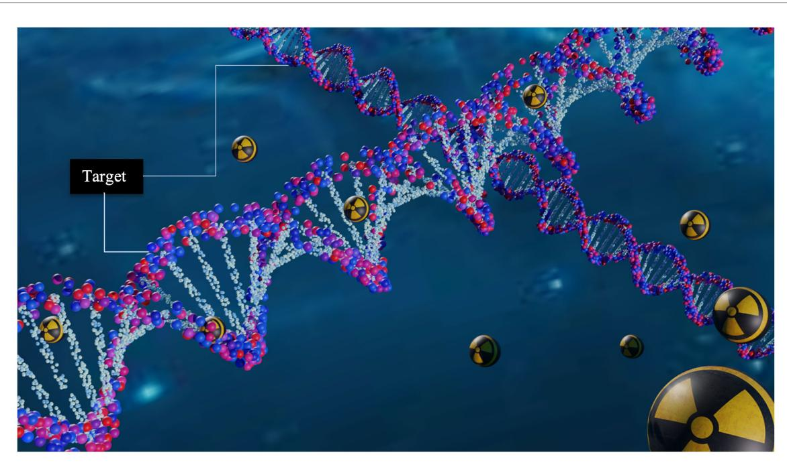
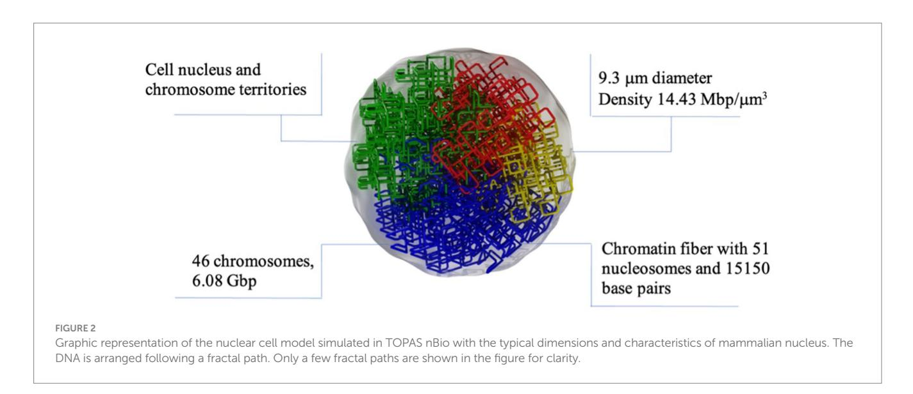
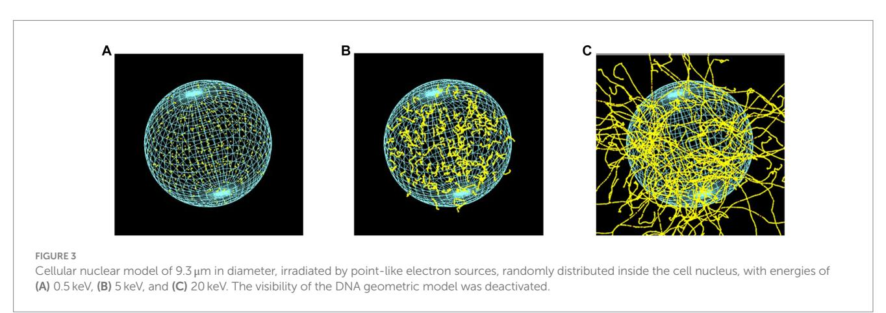
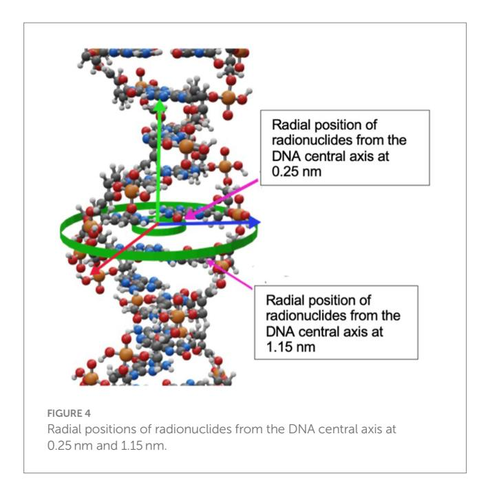
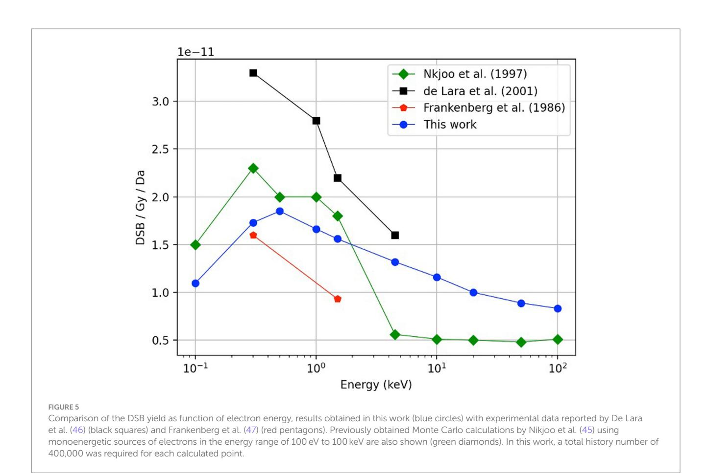

#### OPEN ACCESS

EDITED BY Adriano Duatti, University of Ferrara, Italy

REVIEWED BY Dana Niculae, Horia Hulubei National Institute for Research and Development in Physics and Nuclear Engineering (IFIN-HH), Romania Salvatore Di Maria, Centro de Ciências e Tecnologias Nucleares (C2TN), Portugal

\*CORRESPONDENCE Jhonatan Carrasco-Hernandez [jhonatan.carrasco.h@gmail.com](mailto:jhonatan.carrasco.h@gmail.com)

RECEIVED 06 July 2023 ACCEPTED 13 September 2023 PUBLISHED 28 September 2023

#### CITATION

Carrasco-Hernandez J, Ramos-Méndez J, Padilla-Rodal E and Avila-Rodriguez MA (2023) Cellular lethal damage of 64Cu incorporated in mammalian genome evaluated with Monte Carlo methods.

*Front. Med.* 10:1253746. [doi: 10.3389/fmed.2023.1253746](https://doi.org/10.3389/fmed.2023.1253746)

#### COPYRIGHT

© 2023 Carrasco-Hernandez, Ramos-Méndez, Padilla-Rodal and Avila-Rodriguez. This is an open-access article distributed under the terms of the [Creative Commons Attribution License](http://creativecommons.org/licenses/by/4.0/)  [\(CC BY\)](http://creativecommons.org/licenses/by/4.0/). The use, distribution or reproduction in other forums is permitted, provided the original author(s) and the copyright owner(s) are credited and that the original publication in this journal is cited, in accordance with accepted academic practice. No use, distribution or reproduction is permitted which does not comply with these terms.

# [Cellular lethal damage of 64Cu](https://www.frontiersin.org/articles/10.3389/fmed.2023.1253746/full) [incorporated in mammalian](https://www.frontiersin.org/articles/10.3389/fmed.2023.1253746/full) [genome evaluated with Monte](https://www.frontiersin.org/articles/10.3389/fmed.2023.1253746/full) [Carlo methods](https://www.frontiersin.org/articles/10.3389/fmed.2023.1253746/full)

Jhonatan Carrasco-Hernandez1 \*, José Ramos-Méndez2 , Elizabeth Padilla-Rodal1 and Miguel A. Avila-Rodriguez3

Departamento de Estructura de la Materia, Instituto de Ciencias Nucleares, Universidad Nacional Autónoma de México, Mexico City, Mexico, 2Department of Radiation Oncology, University of California, San Francisco, San Francisco, CA, United States, 3Unidad Radiofarmacia-Ciclotrón, Facultad de Medicina, Universidad Nacional Autónoma de México, Mexico City, Mexico

Purpose: Targeted Radionuclide Therapy (TRT) with Auger Emitters (AE) is a technique that allows targeting specific sites on tumor cells using radionuclides. The toxicity of AE is critically dependent on its proximity to the DNA. The aim of this study is to quantify the DNA damage and radiotherapeutic potential of the promising AE radionuclide copper-64 (64Cu) incorporated into the DNA of mammalian cells using Monte Carlo track-structure simulations.

Methods: A mammalian cell nucleus model with a diameter of 9.3  μm available in TOPAS-nBio was used. The cellular nucleus consisted of double-helix DNA geometrical model of 2.3  nm diameter surrounded by a hydration shell with a thickness of 0.16  nm, organized in 46 chromosomes giving a total of 6.08 giga base-pairs (DNA density of 14.4 Mbp/μm3 ). The cellular nucleus was irradiated with monoenergetic electrons and radiation emissions from several radionuclides including 111In, 125I, 123I, and 99mTc in addition to 64Cu. For monoenergetic electrons, isotropic point sources randomly distributed within the nucleus were modeled. The radionuclides were incorporated in randomly chosen DNA base pairs at two positions near to the central axis of the double-helix DNA model at (1) 0.25  nm off the central axis and (2) at the periphery of the DNA (1.15  nm off the central axis). For all the radionuclides except for 99mTc, the complete physical decay process was explicitly simulated. For 99mTc only total electron spectrum from published data was used. The DNA Double Strand Breaks (DSB) yield per decay from direct and indirect actions were quantified. Results obtained for monoenergetic electrons and radionuclides 111In, 125I, 123I, and 99mTc were compared with measured and calculated data from the literature for verification purposes. The DSB yields per decay incorporated in DNA for 64Cu are first reported in this work. The therapeutic effect of 64Cu (activity that led 37% cell survival after two cell divisions) was determined in terms of the number of atoms incorporated into the nucleus that would lead to the same DSBs that 100 decays of 125I. Simulations were run until a 2% statistical uncertainty (1 standard deviation) was achieved.

Results: The behavior of DSBs as a function of the energy for monoenergetic electrons was consistent with published data, the DSBs increased with the energy until it reached a maximum value near 500  eV followed by a continuous decrement. For 64Cu, when incorporated in the genome at evaluated positions (1) and (2), the DSB were 0.171  ±  0.003 and 0.190  ±  0.003 DSB/decay, respectively. The number of initial atoms incorporated into the genome (per cell) for 64Cu that

would cause a therapeutic effect was estimated as 3,107  ±  28, that corresponds to an initial activity of 47.1  ±  0.4  ×  10−3   Bq.

Conclusion: Our results showed that TRT with 64Cu has comparable therapeutic effects in cells as that of TRT with radionuclides currently used in clinical practice.

KEYWORDS

targeted radionuclide therapy, Auger emitters, DNA, TOPAS-nBio, copper-64

# 1. Introduction

Targeted Radionuclide Therapy (TRT) has shown to be a successful strategy against cancer ([1](#page-8-0)–[3](#page-8-1)). Its success relies on the localized delivery of large amounts of radiation which cause irreversible damage to cancer cells while minimizing the damage to healthy tissue ([4](#page-8-2)). The radiopharmaceuticals used in TRT [\(Figure 1](#page-1-0)) consist of a compound (e.g., hormones, peptides, nucleotides, oligonucleotides, and antibodies) and a high-LET emitting radionuclide that specifically binds to a cell site [\(3\)](#page-8-1).

The most sensitive region to ionizing radiation in the cell is genomic DNA ([5\)](#page-8-3). Radiation energy can be deposited in the DNA through direct action -by ionizing charged particles- or indirect action -by interacting with water radiolysis products like hydroxyl radicals, solvated electrons, and hydrogen atoms [\(6](#page-8-4)). These interaction processes can lead to two types of DNA damage: a single-strand break (SSB) or a double-strand break (DSB), and in the absence of a DNA repair process, derives in cell death through mitotic catastrophe or apoptosis [\(7](#page-8-5)).

Auger emitters (AE) are radionuclides that have aroused a high clinical interest due to their extremely short range, localized dose deposition, and low toxicity when decaying outside the cell nucleus, such as in the cytoplasm [\(8](#page-8-6)); examples of AE include 67Ga, 99mTc, 111In, 123I, 125I, and 64Cu. The AE's have been shown to have a high relative biological effectiveness, similar to the alpha particles at distances shorter than 11nm, which is comparable to the DNA molecule's diameter ([8\)](#page-8-6). Auger electrons are ejected from electron orbitals due to nuclear decay modes such as electron capture or internal conversion [\(9](#page-8-7)). The energy of those electrons can be greater than 25keV, but the yield per decay is very low (~ 0.1). Most electrons have energies less than 5keV and deposit all their energy within a nanometer-micrometer range [\(9\)](#page-8-7). Furthermore, many of the parent radionuclides also emit β-particles or photons that could be suitable for combined therapy and diagnosis ([10\)](#page-8-8).

We can understand the TRT status with AE by analyzing preclinical studies, clinical trials and other novel approaches. In preclinical studies compounds labeled with AE such as [111In]In-BnDTPA-F3, [123I] MST-312, [125I]C5, and [99mTc]C3 have been demonstrated to have a potent cytotoxic effect, intracellular uptake, and DSB induction

FIGURE 1 Schematic representation of targeted radionuclide therapy. Its potential to deliver damage with high specificity is due to the capability of the radiopharmaceutical to incorporate the decaying radionuclide near to DNA molecule.

([11](#page-8-9)–[13](#page-8-10)). In clinical studies the [125I]IUdR and the 125I-labeled murine anti-EGFR mAb showed a biological relapse as well as safe and welltolerated treatments [\(14\)](#page-8-11). A novel approach using [111In]In-DTPA showed no clinical side effects in patients, disease stabilization, and tumor size reduction [\(14,](#page-8-11) [15\)](#page-8-12). In addition, over the past decade a new class of radiopharmaceuticals called theranostics have revolutionized nuclear medicine applications. This option opens the possibility of treatment and medical imaging, heralding a new era in the field.

64Cu is a radionuclide with theranostics potential that has recently generated broad interest ([16](#page-8-13)), and numerous preclinical reports have explored the therapeutic use of 64Cu in experimental mouse models of cancers. For example, Ferrari et al. [\(17](#page-8-14)) studied [64Cu]CuCl2 for glioblastoma 2 (U87MG) in mice, reporting a good response and size reduction in tumors; in some cases, the tumors completely disappeared. Jin et al. ([18](#page-8-15)) evaluated the therapeutic potential of [64Cu] Cu-cyclam-RAFT-c(-RGDfK-)4 in glioblastoma cells in mice. Meanwhile, a new type of therapy that combines 64Cu -based TRT with immunotherapy has been reached, in order to enhance the therapeutic efficacy of a radiopharmaceutical targeting αvβ3 integrin ([64Cu]Cu-DOTA-EB-cRGDfK) [\(19\)](#page-8-16). On the other hand, Qin et al. ([20](#page-8-17)) demonstrated the therapeutic potential of [64Cu]CuCl2 for malignant melanoma in mice; the tumor growth was found to be reduced in models that received [64Cu]CuCl2 treatment. Until recently, only a limited number of clinical studies in humans have been reported using [64Cu]CuCl2 as radiopharmaceutical, mainly to evaluate the biodistribution and radiation dosimetry in healthy subjects and patients ([21,](#page-8-18) [22](#page-8-19)).

Various *in vitro* studies have described the DNA-damage inflicted by 64Cu. Fernandes-Guerreiro et al. [\(23\)](#page-8-20) evaluated the radiobiological effects of the [64Cu]CuCl2 uptake in a panel of PCa cell lines. This study revealed that PCa cells exhibited a higher Cu uptake than non-tumoral cells. Also, they demonstrated that [64Cu]CuCl2 was able to reach the nuclear cell compartment producing significant genotoxicity and cytotoxicity in PC3, which were less efficient than normal cells in repairing the DNA-damage induced by [64Cu]CuCl2. McMillan et al. ([24](#page-8-21)) on the other hand performed survival fraction studies with Chinese hamster ovary (CHO) wild type and DNA repair–deficient xrs5 cells exposed to [64Cu]Cu-ATSM under hypoxic conditions, and by γH2AX foci assays confirmed DSBs and other complex types of chromosomal aberrations, both typical of high-LET radiation, providing strong evidence that [64Cu]Cu-ATSM damages DNA via Auger electrons. More recently, Serban et al. ([25](#page-8-22)) analyzed the DNA-damage and stress responses inflicted in various human normal and tumor cell lines after the exposure to [64Cu]CuCl2. All investigated cells, regardless of their tumoral or normal status, incorporate 64Cu ions similarly, but their fate after exposure was celldependent. They found that an activity concentration of 40MBq/mL of [64Cu]CuCl2 delivers a therapeutic effect in human colon carcinoma cells, but also caused harm to normal fibroblasts, yet lower than tumoral cells. An activity concentration of 20MBq/mL was also able to induce DNA-damage and oxidative stress in colon cancer cells, and even when the therapeutic effect on tumor cells might be partial, the radiotoxicity to normal cells is expected to be lower.

Using computational modeling and experiments, researchers have observed and reported DSB caused by AE like 123I, 125I, 111In, and 99mTc when incorporated into the DNA [\(26–](#page-8-23)[33](#page-8-24)). We have previously estimated the damage that 64Cu, 125I and 111In caused to the DNA through the use of Geant4-DNA and the DBSCAN algorithm, considering the AE radionuclides randomly distributed in the cellular compartments (such as nucleus, cytoplasm and cell surface); the DNA content was also randomly distributed (no geometrical model) within the nucleus [\(34\)](#page-8-25). Thus, 64Cu has not been studied as a source of DSB damage when it is incorporated into the DNA structure. In the present work, we used a DNA geometry model, incorporated the AE 64Cu in two positions within the DNA genome, and calculated the DSB damage as well as the total number of atoms incorporated that would cause a therapeutic effect. The motivation for this research comes from the continuous interest in new radiopharmaceuticals with AE such as the 64Cu. Is our hope these data help estimate the total radioactivity needed for treatments against diseases, such as cancer.

# 2. Materials and methods

## 2.1. DNA nuclear model

The DNA damage was simulated using TOPAS-nBio ([35](#page-8-26)). TOPASnBio is a Monte Carlo track-structure tool built on top of Geant4-DNA ([36](#page-8-27)[–38\)](#page-8-28) for modeling the physical, physicochemical, and chemical stages of radiation interactions in liquid water. TOPAS-nBio combines such processes with an extensive library of geometric cell examples and DNA double helix models. We used a mammalian cell nucleus model of 9.3μm in diameter ([Figure 2\)](#page-3-0) that has been previously used to study the cellular response to proton irradiation; the details can be found in Zhu et al. [\(39\)](#page-8-29). Briefly, Zhu et al. [\(39\)](#page-8-29), studied the DNA response to a 0.5–500MeV proton and its repair processes. The direct DNA damage induced by primary and secondary charged particles within the DNA target was modeled through the physics module TsEmDNAPhysics and the chemical interactions of water radiolysis species which were produced in the pre-chemical and chemical stages were modeled with the chemistry module TsEmDNAChemistry. Also, the MEDRAS model ([40](#page-8-30)) was used to describe the DNA damage repair characteristics and chromosome aberration yields. In this work, we focused on estimating the number of DSB.

The spherical nucleus model consists of a DNA double helix configuration which is organized in base pairs, nucleosomes, chromatin fibers and chromosomal structures. The DNA double helix has a diameter of 2.3nm with a 0.16nm cylindrical hydration shell surrounding the structure. Each base pair consists of a base, a backbone, and the hydration shell. The bases are represented by half of cylinders of 0.5nm radius and 0.34nm thickness, and the backbone is represented as an opposite pair of quarter cylindrical sectors [\(39\)](#page-8-29). The base pairs are rotated by 36 degrees subsequently. The DNA geometry wraps around a cylindrical histone volume to form the nucleosome; then, multiple nucleosomes form a chromatin fiber. The resulting nucleus consists of 46 chromosomes with a total length of 6.08 giga base-pair (Gbp) of DNA. The cellular nucleus model was placed at the center of a cubic volume ("world") with a side length of 15μm.

## 2.2. DNA double strand break scoring

Initial DNA damages within the nucleus, in the form of SSB, may result from either indirect interaction of radiation through radiolytic chemical species with DNA or from direct interaction of radiation with the backbone volume and hydration shell. For modeling indirect

damage, the radiolysis products were simulated by Brownian motion step-by-step. Only interactions between hydroxyl radicals (•OH) and the DNA backbone were assumed to induce indirect strand breaks. That means, each time a hydroxyl radical entered a backbone or hydration shell volume, it was removed from the simulation and a SSB was scored with a probability of 0.13. In order to model the direct damage, strand breaks were formed from the physical interactions between the primary and secondary particles, the DNA backbone and hydration shell. Thus, a SSB was scored if at least 17.5eV of deposited energy was accumulated in a backbone-hydration shell volume.

A DSB was accounted for whenever two SSBs were located on the opposite sides of the DNA double helix, separated by less than 10 base pairs. DSBs were classified into 3 categories depending on their origin: direct DSB, originated from two direct interactions; indirect DSB, originated from two indirect interactions; and hybrid DSB, which comes from one direct interaction and one indirect interaction ([41](#page-8-31), [42](#page-9-0)). No classification of clustered DSB was performed in this work.

## 2.3. Irradiation setup

In order to achieve a statistical uncertainty lower than 2% on the DSB yields, the simulations which use monoenergetic electrons and radionuclides required 400,000 and 200,000 statistically independent histories, respectively. The simulations were performed with parallel computing to decrease CPU time, using the Tochtli Cluster built on CentOS 6.8 Linux operating system.

## 2.3.1. DSB yield verification for monoenergetic electrons

To verify the simulation setup, we calculated the DSB yields produced by the monoenergetic electrons with initial energies within the relevant energy range of AE [\(43,](#page-9-1) [44\)](#page-9-2). The energies ranged between 100eV and 100keV. The cell irradiation setup consisted of isotropic point sources randomly distributed within the cell nucleus -as illustrated in [Figure 3-](#page-3-1) for electrons of 0.5keV, 5keV, and 20keV. DSB, normalized per dose per Dalton, were compared with the calculated data from Nikjoo et al. [\(45\)](#page-9-3) and the measured data from De Lara et al. ([46](#page-9-4)) and Frankenberg et al. ([47](#page-9-5)).

### 2.3.2. Radionuclide incorporated in DNA genome

The internalization of radionuclides into DNA was simulated by placing then radionuclides in one out of two positions along randomly chosen DNA base pairs as it is shown in [Figure 4.](#page-4-0) As depicted, the radionuclides were randomly placed at 0.25nm or at 1.15nm off the central DNA axis. The distance between the radionuclide and the

central axis of DNA was chosen based on experiments of internalization that are reported in the literature, such as: Goz and Walker (48), who used 125I-labeled 5-iodo-2′-deoxyuridine ([125I] IUdR) to achieve separation distances shorter than 1 nm between the iodine atom and the DNA central axis. Similarly, Balagurumoorthy et al. (27) reported internalization distances in the 1.046–1.385 nm range for 123I and 111In, respectively. Karamychev et al. (30) reached a separation distance of 1.13 nm using oligodeoxyribonucleotides (ODNs), and more recently Reissig et al. (32) reported distances between 1.5 nm to 3 nm and the DNA central axis by using 99mTc-labeled pyrene derivatives.

Each radionuclide ( $^{123}$ I,  $^{125}$ I,  $^{111}$ In,  $^{99m}$ Tc, and  $^{64}$ Cu) was simulated for each position configuration in independent simulations. For  $^{64}$ Cu,  $^{123}$ I,  $^{125}$ I, and  $^{111}$ In the complete decay, considering all applicable radioactive emissions (i.e., Auger, IC,  $\beta$ +,  $\beta$ -, and photons), was explicitly simulated with the G4RadiactiveDecay module from Geant4, whereas for  $^{99m}$ Tc only the total electron spectrum (Auger and IC) obtained from Howell ( $^{43}$ ) was simulated. DSB were scored and reported as DSB per decay. The radioactive decays in Geant4 are simulated using data libraries from the Evaluated Nuclear Structure Data File (ENSDF) ( $^{49}$ ).

# 2.4. Initial activity of 64Cu to cause lethal damage

The cell susceptibility to lethal damage by ionization radiation is expressed as the D $_{37}$  value (the radiation dose that leads to 37% of cell survival). The lethal damage that  $^{64}$ Cu causes in cells was estimated in relation to that from  $^{125}$ I. For the  $^{125}$ I, Geselowits et al. (50) quantified the toxicity of radiation of the [ $^{125}$ I]IUdR incorporated in the nucleus of CHO cells in the early S phase. The result was a D $_{37}$  between 40 and 165 decays/cell of  $^{125}$ I, which is consistent with the work of Hofer et al. (52) who reported a mean value of ~100 decays/cell. On the other hand, Humm and Charlton (29) derived the following relationship between the total number of DSB (NDSB) and

the initial number of radioactive atoms  $(N_0)$  attached to DNA base pairs (and hence the activity) which are needed to produce such DSB, as follows:

$$N_0 = \frac{N_{DSB}}{\left(1 - \exp(-\lambda t)\right)(f + 35D)} \tag{1}$$

where  $\lambda$  is the decay constant of the radionuclide; t is the time for the cell to reach one cell division; f is the number of DSB/decay by short-range radioactive emissions ( $\sim$  nm); and the term 35D accounts for the damage to the genome caused by long-range radiation ( $\sim$   $\mu$ m) which is a function of the dose (D) to the nucleus by decay. In this work, we computed NDSB produced by 100 decays/cell of 125I as the reference value to quantify cell susceptibility (see Table 1). Thus, to compute N0 we substitute NDSB=194 DSB in Eq. 1, and the term (f+35D) was taken to be equal to the number of DSB/decay obtained for each nuclide in this work, as we are considering both, short- and long-range radioactive emissions. In Eq. 1, the time t corresponds to the complete cell cycle from G2 to G1, for which a reasonable value of 24h is considered. Thus, to account for the first cell division, N0 was multiplied by 2 (29).

#### 3. Results

# 3.1. DSB yields for monoenergetic electrons

Figure 5 shows the DSB/Gy/Da for monoenergetic electrons as a function of energy (blue solid circles). As shown, the results exhibit an increasing trend starting at an electron energy of  $100\,\mathrm{eV}$  ( $1.10\pm0.02\,\mathrm{DSB/Gy/Da}$ ). Later, the curve reaches a maximum value of  $1.85\pm0.03\,\mathrm{DSB/Gy/Da}$  at  $500\,\mathrm{eV}$ . Finally, the DSB yield decreases monotonically until it reaches  $0.83\pm0.01\,\mathrm{DSB/Gy/Da}$  at  $100\,\mathrm{keV}$ . The calculated data from this work follows a similar trend to the calculated data reported by Nikjoo (1997) (51); and falls within the measured data reported by Frankenberg et al. (47) and de Lara et al. (2001) (46).

## 3.2. DSB yields for radionuclides

Table 1 shows the calculated DSB yields for the radionuclides evaluated in this work, including also previously published data. For  $^{125}\text{I}$ , the DSB/decay decreases from  $1.94\pm0.01$  to  $1.82\pm0.01$  as the AE's separation distance relative to the central axis of the DNA increases. This behavior was consistent with the study performed by Balagurumoorthy et al. (27), who reported that the DSB yields decreased from 1.1 to 0.24 DSB/decay for separation distances from the DNA central axis in a range of  $\sim\!0.7$  to 1.39 nm, respectively, which was achieved through  $[^{125}\text{I}]$  IUdR,  $[^{125}\text{I}]$  IEH, and  $[^{125}\text{I}]$  IBH. Conversely, the DSB yields increased with the separation distance for all the other radionuclides.

The yield of the DSB produced by  $^{64}$ Cu incorporated in the DNA was determined as  $0.171\pm0.003$  DSB/decay for a distance of 0.25 nm from the central DNA axis, and  $0.190\pm0.003$  DSB/decay for a distance of 1.15 nm from the central DNA axis. This result is the lowest yield

TABLE 1 DSB per decay for Auger emitters when incorporated at different distances from the central DNA axis, including 64Cu.

| Radionuclide      | DSB yield (0.25 nm) | DSB yield (1.15 nm) | Data reported (measured)                                                  | Data reported (calculated)        |
|-------------------|---------------------|---------------------|---------------------------------------------------------------------------|--------------------------------------|
| 125 I  | $1.94 \pm 0.01$     | $1.82 \pm 0.01$     | $1.01 \pm 0.13^a, 0.82^b, 0.8^c, 1.1^i, 0.52 \pm 0.01^i, 0.24 \pm 0.03^i$ | $2.41 \pm 0.8^{e}, 1.1 \pm 0.01^{f}$ |
| 123 I  | 1.20 ± 0.01         | $1.24 \pm 0.01$     | $0.62^{\rm b},0.74^{\rm g},0.18\pm0.01^{\rm d}$                           | 1.45°, 0.62°                         |
| 111 In | 1.09 ± 0.01         | 1.15 ± 0.02         | 0.38 c                                                         | $0.97 \pm 0.38^{e}$                  |
| 99m Tc | 0.378 ± 0.003       | 0.535 ± 0.001       | $0.044\pm0.017^{\rm h}$                                                   | 0.86°, 0.43°                         |
| 64 Cu  | 0.171 ± 0.003       | 0.190 ± 0.003       | -                                                                         | -                                    |

&lt;sup>aKrisch and Ley (53).

Balagurumoorthy et al. (27).

compared with the other radionuclides studied in this work, as shown in Table 1.

# 3.3. Initial activity of 64Cu to cause lethal damage

The initial number of atoms to cause lethal damage in a cell of AE relative to  $^{125}$ I was calculated for radionuclides localized at the 0.25 nm distance off the DNA central axis (Figure 4). Table 2 compares our

results with the reported by Humm and Charlton (29) regarding several radionuclides, including 64Cu, and the initial activity per cell (see Section 2.4).

### 4. Discussion

64Cu is a very promising AE for TRT due to its favorable nuclear and chemical properties and high cytotoxicity, which is attributed to the generation of low-energy electrons during its

&lt;sup>bLobachevsky and Martin (31).

&lt;sup>cKaramychev et al. (30).

dBalagurumoorthy et al. (26).

°Ftániková and Böhm (28).

fHumm and Charlton (29).

gMakrigiorgos et al. (54).

hReissig et al. (32).

| TABLE 2 Comparison of the average number of initial atoms and activities per cell to cause lethal damage when the radionuclide is incorporated at 0.25 |
|--------------------------------------------------------------------------------------------------------------------------------------------------------|
| nm off the central axis (a random base par).                                                                                                           |

| Radionuclide | Number of atoms incorporated in the genome, Humm and Charlton (29) | Initial activity per cell (Bq  ×  10−3 ), Humm and Charlton (29) | Number of atoms incorporated in the genome in this work | Initial activity per cell (Bq  ×  10−3 ) in this work |
|--------------|-----------------------------------------------------------------------------|------------------------------------------------------------------------------|---------------------------------------------------------------|----------------------------------------------------------------|
| 125I         | 15,650                                                                      | 2.09                                                                         | 17,416 ± 46                                                   | 2.32 ± 0.01                                                    |
| 123I         | 380                                                                         | 5.54                                                                         | 451 ± 2                                                       | 6.58 ± 0.03                                                    |
| 111In        | –                                                                           | –                                                                            | 1,625 ± 8                                                     | 4.65 ± 0.02                                                    |
| 99mTc        | 490                                                                         | 15.67                                                                        | 1,095 ± 4                                                     | 35.0 ± 0.1                                                     |
| 64Cu         | –                                                                           | –                                                                            | 3,107 ± 28                                                    | 47.1 ± 0.4                                                     |

decay. Nevertheless, the use of 64Cu remains scarce, as there is little evidence of its use on humans to assess its therapeutic potential. Guerreiro et al. ([23\)](#page-8-20) reported using a panel of Prostate Cancer (PCa) cell lines exhibiting a deficient DNA damage repair upon exposure to [64Cu]CuCl2. While Rigui et al. reported a dosimetry study in patients with prostate cancer, showing that the absorbed dose per administered activity was low, they also suggested that clinical trials are needed to evaluate the therapeutic effectiveness of 64Cu. Thus, computational modeling is a more convenient for to estimating the therapeutic effectiveness in the short term. To the best of our knowledge, this is the first paper that reports on the DSB yields per decay incorporated in DNA for 64Cu.

A comparison study using monoenergetic electrons was performed for model verification purposes. [Figure 5](#page-5-1) shows the DSB yields for monoenergetic electrons as a function of energy. The DSB yields follow an increasing behavior starting at an electron energy of 100eV (1.10±0.02 DSB/Gy/Da). The curve reaches a maximum value of 1.85±0.03 DSB/Gy/Da at 500eV. This behavior is expected because electrons with energy in the range of 100–200eV have been reported to be two to four times more effective on inducing a DSB than electrons with energy between 100 and 1,000keV [\(55](#page-9-13)[–57\)](#page-9-14). Finally, the DSB yield decreases monotonically until it reaches 0.83±0.01 DSB/ Gy/Da at 100keV. While our calculated data fell within the available measured data, the comparison with calculated values reported by Nikjoo et al. [\(45\)](#page-9-3) show that our results are lower for the energy range from 0.1 to 4.5keV, but higher for the interval from 4.5 to100 keV. The discrepancies are attributed to the different DNA damage models and cross-section data used from different Monte Carlo engines.

The DSB yield for 64Cu incorporated in the genome was simulated by modeling the AE incorporation to 0.25 and 1.15nm off the DNA central axis and obtaining 0.171±0.003 and 0.190±0.003 per decay, respectively ([Table 1\)](#page-5-0).

As a means of verification of the calculation method, DSB yield calculations were performed for the 125I incorporated in a DNA base pair, and the results were compared with experimental and calculated data available in the literature for this AE, which is considered the gold standard. Our calculation for 125I incorporated in a DNA base pair was 1.94±0.01 (0.25 off the central DNA axis); this value was compared with the data measured by Krisch and Ley [\(53\)](#page-9-11), who performed studies with 125I incorporated into the DNA of bacteriophage in the form of 5-iododeoxyuridine ([125I]IUdR) and obtained 1.01±0.13 per decay of 125I. Humm and Charlton [\(29](#page-8-35)) also obtained a similar value using Monte Carlo simulations. The differences between our result and the reported by Krisch and Ley ([53](#page-9-11)) might be due to the highly packed DNA structure in the cell nucleus model used in this work, which has been shown to be an important factor in the production of DSB's in comparison with oligonucleotide or plasmid DNA fragments ([58](#page-9-15)). Another study elaborated through Monte Carlo simulation, which was carried out by Ftániková and Böhm [\(28](#page-8-37)), obtained a value of 2.41±0.8 DSB per decay for the 125I. This calculation is also consistent with Walika's result, and the differences between our results and the reported by Ftániková and Böhm [\(28](#page-8-37)) could be explained because they ignored the protecting character of histones that act as scavengers for chemical species.

The lethality analysis was performed by applying [Eq. 1](#page-4-1) and the yield of DSB/decay presented in [Table 1.](#page-5-0) The results indicated that the lethality produced by 3,107±28 initial atoms of 64Cu incorporated into DNA is equivalent to that of 17,416±46 initial atoms of the gold standard 125I in a complete cell cycle of 24h. This result corresponds to about 0.18 times fewer initial atoms of 64Cu to achieve the same lethal damage as 125I. The difference in initial atoms to reach the same lethality is mainly due to the longer half-life of 125I (60days) compared with the half-life of 64Cu (12.7h). When we compared with other AE such as 123I, 111In, and 99mTc we observed that the number of initial atoms was less than the required for 64Cu: 451±2, 1,625±8, and 1,095±4, respectively, for the three AE. The differences observed are mainly due to the energies and electron yield per decay of each EA in addition to their half-lives. [Table 2](#page-6-0) compares our calculation of initial atoms and activities and those reported by Humm and Charlton [\(29\)](#page-8-35) for the AE 125I, 123I and 99mTc. The lower values obtained in this work are due to differences in the nuclear cell model, and the DSB yield results from calculations as seen in [Table 1.](#page-5-0)

Regarding the production of 125I, this process is carried out mainly in nuclear reactors; however, this technique presents serious disadvantages due to the long hours of irradiation required, and the production of other radionuclides considered contaminants, such as 126I with a half-life of 13.1days. There are other techniques, such as batch production and continuous systems, however, they also present challenges, such as the low amount of useful 125I or the need for two irradiation systems in the nuclear reactor's core [\(59\)](#page-9-16). On the other hand, many studies have demonstrated the feasibility of the 64Cu production through standardized methods in compact cyclotrons and radiosynthesis modules. The impurities produced after the irradiation of the 64Cu are extremely low; additionally, they can produce an appropriate quantity and high quality of 64Cu, which is suitable for labeling different ligands to be used in therapy and diagnosis ([60](#page-9-17), [61\)](#page-9-18).

To our knowledge, the lethality of the 64Cu upon localization in DNA has not been reported previously. The electron yield (~0.18/ decay) during the decay of 64Cu is lower in comparison to the other radionuclides evaluated in this work, mainly the 125I (~24/decay),

which is consistent with the lower number of DSBs produced when it is incorporated in DNA genome. This apparent disadvantage can be offset by the lower number of initial atoms of 64Cu needed to produce the same lethality compared to 125I ([Table 2](#page-6-0)). On the other hand, most AE must be conjugated to a proper molecule to be incorporated into the vicinity of the DNA and produce cellular toxicity. 64Cu has been extensively studied due to its favorable physical and chemical properties with radiolabeled complexes; it has also been successfully evaluated with a wide variety of biomolecules conjugated with suitable chelators with this positron emitter. However, in recent years, 64Cu in the simple chemical form of copper dichloride [64Cu] CuCl2 (without any radiolabeling process) has been identified as a potential agent for TRT because this element is highly regulated naturally at the cellular level through complex molecularly regulated processes that bind and transport copper to different compartments of the cell and cell nuclei, Beaino et al. [\(62\)](#page-9-19). This fact avoids the need to attach this AE to a specific molecule, thus avoiding the complex process of radiolabeling and the need for expensive target-specific ligands, such as peptides and antibodies, and it would be easy to implement and produce the radiotracer in a suitable form for therapeutic applications. In addition, among the AEs evaluated in this work, apart from 99mTc, 64Cu is the only radionuclide that, due to its radioactive emissions during its decay (including positrons), makes it possible to obtain highquality Positron Emission Tomography (PET) images while producing lethal effects on cells, which provides a considerable advantage.

The main limitation of this study is the estimation of biological effects of the Auger electron emitters incorporated in the DNA structure, without considering the probability of getting inside there. The number of radioactive nuclei reaching a specific molecular target depends on many factors including the affinity of the vector molecule (or radionuclide itself) for the molecular target, the density of the molecular target or specific receptor, and the amount of radioactivity administered. In the specific case of 64Cu, experimental studies performed by Fernandes-Guerreiro et al. [\(23](#page-8-20)) showed that [64Cu]CuCl2 is able to reach the nuclear compartment of various PCa cell lines and non-tumoral cells. The percentage of nuclear uptake was cell-dependent and was in the range of 10 to 40%, however it is unknown which percentage of this activity, if any, is incorporated in the DNA structure. Nevertheless, it is possible to consider other approaches to target the DNA structure using molecular vectors such as oligonucleotides, so our assumption of the radioactive nuclei reaching the DNA structure, or its vicinity, is feasible. The next challenge after being capable of binding AEs to DNA in sufficient quantity to cause lethal damage will be to develop suitable methods to estimate the radiation absorbed dose which is an imperative for targeted radionuclide therapy.

## 5. Conclusion

DNA damage caused by 64Cu incorporated in the genome was quantified in this work through a nuclear mammalian cell model with Monte Carlo track structure simulations. The therapeutic effect of 64Cu, based on the D37 value, suggests the ability of this AE to have a lethal effect when incorporated into the DNA genome. The initial activity per cell calculated to cause lethal damage can be used to estimate the total activity necessary to administer in a group of cells or tissue for TRT. On the other hand, although the initial activity of 64Cu required to obtain lethality is higher than the required by other AEs analyzed in this work, the number of initial atoms to cause lethal damage is 1/5 times less than the required by 125I due to its shorter half- life of 12.7h for 64Cu. Unlike other AE, 64Cu emits positrons which allows for PET imaging and provides lethality for cancer cells, making it an excellent candidate for TRT.

Moreover, it is known that copper, due to its chemical properties, is capable of being internalized in cells and nuclei close to DNA without the need to be attached to a vector molecule, unlike other AE radionuclides that need to be attached to molecules to be able to bind to DNA. This characteristic provides a notable advantage, making its production for TRT simpler than other radiopharmaceuticals. However, more studies are needed to understand the molecular processes responsible for its interaction with the DNA molecule and to verify if 64Cu, in this form, can bind to DNA in a sufficient quantity to cause lethal damage.

Further studies are required to optimize the subsequent application of 64Cu as part of the Targeted Radionuclide Therapy in humans.

# Data availability statement

The original contributions presented in the study are included in the article/supplementary material, further inquiries can be directed to the corresponding author.

## Author contributions

JC-H: Data curation, Formal analysis, Investigation, Methodology, Writing – original draft, Writing – review & editing. JR-M: Conceptualization, Formal analysis, Writing – review & editing. EP-R: Investigation, Methodology, Supervision, Writing – review & editing. MA-R: Conceptualization, Funding acquisition, Resources, Writing – review & editing.

# Funding

This work was supported by UNAM Posdoctoral Program DGAPA-UNAM through a postdoctoral fellowship to JC-H. JR-M was partially funded by NIH/NCI R01 CA187003 (TOPAS-nBio). Thanks to the team that manages the Tochtli-ICN-UNAM cluster, which was used to perform the numerical calculations reported on this work. This work also was supported by the project SECTEI/226/2021.

# Acknowledgments

The authors would like to thank M. D. Brenda Sandoval Meza, who is part of the Translation Area at the Research Division at UNAM, for their support in editing the English-language version of this manuscript.

## Conflict of interest

The authors declare that the research was conducted in the absence of any commercial or financial relationships that could be construed as a potential conflict of interest.

# Publisher's note

All claims expressed in this article are solely those of the authors and do not necessarily represent those of their affiliated organizations, or those of the publisher, the editors and the reviewers. Any product that may be evaluated in this article, or claim that may be made by its manufacturer, is not guaranteed or endorsed by the publisher.

# References

- 1. Eychenne R, Chérel M, Haddad F, Guérard F, Gestin JF. Overview of the most promising radionuclides for targeted alpha therapy: the "hopeful eight". *Pharmaceutics*. (2021) 13:906. doi: [10.3390/pharmaceutics13060906](https://doi.org/10.3390/pharmaceutics13060906)
- 2. O'Donoghue JA, Wheldon TE. Targeted radiotherapy using auger electron emitters. *Phys Med Biol*. (1996) 41:1973–92. doi: [10.1088/0031-9155/41/10/009](https://doi.org/10.1088/0031-9155/41/10/009)
- 3. Pouget JP, Lozza C, Deshayes E, Boudousq V, Navarro-Teulon I. Introduction to radiobiology of targeted radionuclide therapy. *Front Med*. (2015) 2:12. doi: [10.3389/](https://doi.org/10.3389/fmed.2015.00012) [fmed.2015.00012](https://doi.org/10.3389/fmed.2015.00012)
- 4. Bavelaar BM, Lee BQ, Gill MR, Falzone N, Vallis KA. Subcellular targeting of theranostic radionuclides. *Front Pharmacol*. (2018) 9:996. doi: [10.3389/fphar.2018.00996](https://doi.org/10.3389/fphar.2018.00996)
- 5. Nickoloff JA, Sharma N, Taylor L. Clustered DNA double-strand breaks: biological effects and relevance to cancer radiotherapy. *Genes*. (2020) 11:99. doi: [10.3390/](https://doi.org/10.3390/genes11010099) [genes11010099](https://doi.org/10.3390/genes11010099)
- 6. Alizadeh E, Orlando TM, Sanche L. Biomolecular damage induced by ionizing radiation: the direct and indirect effects of low-energy electrons on DNA. *Annu Rev Phys Chem*. (2015) 66:379–98. doi: [10.1146/annurev-physchem-040513-103605](https://doi.org/10.1146/annurev-physchem-040513-103605)
- 7. Olive PL. The role of DNA single-and double-strand breaks in cell killing by ionizing radiation. *Radiat Res*. (1998) 150:S42–51.
- 8. Falzone N, Fernández-Varea JM, Flux G, Vallis KA. Monte Carlo evaluation of auger electron–emitting theranostic radionuclides. *J Nucl Med*. (2015) 56:1441–6. doi: [10.2967/jnumed.114.153502](https://doi.org/10.2967/jnumed.114.153502)
- 9. Ku A, Facca VJ, Cai Z, Reilly RM. Auger electrons for cancer therapy–a review. *EJNMMI Radiopharm Chem*. (2019) 4:1–36. doi: [10.1186/s41181-019-0075-2](https://doi.org/10.1186/s41181-019-0075-2)
- 10. Rösch F, Herzog H, Qaim SM. The beginning and development of the theranostic approach in nuclear medicine, as exemplified by the radionuclide pair 86Y and 90Y. *Pharmaceuticals*. (2017) 10:56. doi: [10.3390/ph10020056](https://doi.org/10.3390/ph10020056)
- 11. Cornelissen B, Waller A, Target C, Kersemans V, Smart S, Vallis KA. 111In-BnDTPA-F3: an auger electron-emitting radiotherapeutic agent that targets nucleolin. *EJNMMI Res*. (2012) 2:9–11. doi: [10.1186/2191-219X-2-9](https://doi.org/10.1186/2191-219X-2-9)
- 12. Pereira E, Do Quental L, Palma E, Oliveira MC, Mendes F, Raposinho P, et al. Evaluation of acridine orange derivatives as DNA-targeted radiopharmaceuticals for auger therapy: influence of the radionuclide and distance to DNA. *Sci Rep*. (2017) 7:1–16. doi: [10.1038/srep42544](https://doi.org/10.1038/srep42544)
- 13. Waghorn PA, Jackson MR, Gouverneur V, Vallis KA. Targeting telomerase with radiolabeled inhibitors. *Eur J Med Chem*. (2017) 125:117–29. doi: [10.1016/j.](https://doi.org/10.1016/j.ejmech.2016.09.028) [ejmech.2016.09.028](https://doi.org/10.1016/j.ejmech.2016.09.028)
- 14. Rebischung C, Hoffmann D, Stefani L, Desruet MD, Wang K, Adelstein SJ, et al. First human treatment of resistant neoplastic meningitis by intrathecal administration of MTX plus 125IUdR. *Int J Radiat Biol*. (2008) 84:1123–9. doi: [10.1080/0955300](https://doi.org/10.1080/09553000802395535) [0802395535](https://doi.org/10.1080/09553000802395535)
- 15. Vallis KA, Reilly RM, Scollard D, Merante P, Brade A, Velauthapillai S, et al. Phase I trial to evaluate the tumor and normal tissue uptake, radiation dosimetry and safety of 111In-DTPA-human epidermal growth factor in patients with metastatic EGFRpositive breast cancer. *Am J Nucl Med Mol Imaging*. (2014) 4:181.
- 16. Gutfilen B, Souza SA, Valentini G. Copper-64: a real theranostic agent. *Drug Des Devel Ther*. (2018) 12:3235–45. doi: [10.2147/DDDT.S170879](https://doi.org/10.2147/DDDT.S170879)
- 17. Ferrari C, Niccoli Asabella A, Villano C, Giacobbi B, Coccetti D, Panichelli P, et al. Copper-64 dichloride as theranostic agent for glioblastoma multiforme: a preclinical study. *BioMed Res. Int.* (2015) 2015:129764. doi: [10.1155/2015/129764](https://doi.org/10.1155/2015/129764)
- 18. Jin ZH, Furukawa T, Degardin M, Sugyo A, Tsuji AB, Yamasaki T, et al. αVβ3 integrin-targeted radionuclide therapy with 64Cu-cyclam-RAFT-c (-RGDfK-) 4Radiotherapy with 64Cu-cyclam-RAFT-c (-RGDfK-) 4. *Mol Cancer Ther*. (2016) 15:2076–85. doi: [10.1158/1535-7163.MCT-16-0040](https://doi.org/10.1158/1535-7163.MCT-16-0040)
- 19. Wen X, Zeng X, Liu J, Zhang Y, Shi C, Wu X, et al. Synergism of 64Cu-labeled RGD with anti-PD-L1 immunotherapy for the long-acting antitumor effect. *Bioconjug Chem*. (2022) 33:2170–9. doi: [10.1021/acs.bioconjchem.2c00408](https://doi.org/10.1021/acs.bioconjchem.2c00408)
- 20.Qin C, Liu H, Chen K, Hu X, Ma X, Lan X, et al. Theranostics of malignant melanoma with 64CuCl2. *J Nucl Med*. (2014) 55:812–7. doi: [10.2967/jnumed.](https://doi.org/10.2967/jnumed.113.133850) [113.133850](https://doi.org/10.2967/jnumed.113.133850)
- 21. Avila-Rodriguez MA, Rios C, Carrasco-Hernandez J, Manrique-Arias JC, Martinez-Hernandez R, García-Pérez FO, et al. Biodistribution and radiation dosimetry of [64Cu] copper dichloride: first-in-human study in healthy volunteers. *EJNMMI Res*. (2017) 7:1–7. doi: [10.1186/s13550-017-0346-4](https://doi.org/10.1186/s13550-017-0346-4)

- 22. Righi S, Ugolini M, Bottoni G, Puntoni M, Iacozzi M, Paparo F, et al. Biokinetic and dosimetric aspects of 64 CuCl 2 in human prostate cancer: possible theranostic implications. *EJNMMI Res*. (2018) 8:1–9. doi: [10.1186/s13550-018-0373-9](https://doi.org/10.1186/s13550-018-0373-9)
- 23. Guerreiro JF, Alves V, Abrunhosa AJ, Paulo A, Gil OM, Mendes F. Radiobiological characterization of 64CuCl2 as a simple tool for prostate cancer theranostics. *Molecules*. (2018) 23:2944. doi: [10.3390/molecules23112944](https://doi.org/10.3390/molecules23112944)
- 24. McMillan DD, Maeda J, Bell JJ, Genet MD, Phoonswadi G, Mann KA, et al. Validation of 64 cu-ATSM damaging DNA via high-LET auger electron emission. *J Radiat Res*. (2015) 56:784–91. doi: [10.1093/jrr/rrv042](https://doi.org/10.1093/jrr/rrv042)
- 25. Serban RM, Niculae D, Manda G, Neagoe I, Dobre M, Niculae DA, et al. Modifications in cellular viability, DNA damage and stress responses inflicted in cancer cells by copper-64 ions. *Front Med*. (2023) 10:1197846. doi: [10.3389/fmed.2023.1197846](https://doi.org/10.3389/fmed.2023.1197846)
- 26. Balagurumoorthy P, Wang K, Adelstein SJ, Kassis AI. DNA double-strand breaks induced by decay of 123I-labeled Hoechst 33342: role of DNA topology. *Int J Radiat Biol*. (2008) 84:976–83. doi: [10.1080/09553000802512568](https://doi.org/10.1080/09553000802512568)
- 27. Balagurumoorthy P, Xu X, Wang K, Adelstein SJ, Kassis AI. Effect of distance between decaying 125I and DNA on auger-electron induced double-strand break yield. *Int J Radiat Biol*. (2012) 88:998–1008. doi: [10.3109/09553002.2012.706360](https://doi.org/10.3109/09553002.2012.706360)
- 28. Ftániková S, Böhm R. Monte Carlo calculations of energy deposition in DNA for auger emitters. *Radiat Prot Dosim*. (2000) 92:269–78. doi: [10.1093/oxfordjournals.rpd.](https://doi.org/10.1093/oxfordjournals.rpd.a033292) [a033292](https://doi.org/10.1093/oxfordjournals.rpd.a033292)
- 29. Humm JL, Charlton DE. A new calculational method to assess the therapeutic potential of auger electron emission. International journal of radiation oncology\* biology\*. *Physics*. (1989) 17:351–60. doi: [10.1016/0360-3016\(89\)90450-1](https://doi.org/10.1016/0360-3016(89)90450-1)
- 30. Karamychev MW, Reed RD, Neumann IG, Panyutin VN. Distribution of DNA strand breaks produced by iodine-123 and indium-111 in synthetic oligodeoxynucleotides. *Acta Oncol*. (2000) 39:687–92. doi: [10.1080/028418600750063730](https://doi.org/10.1080/028418600750063730)
- 31. Lobachevsky PN, Martin RF. DNA breakage by decay of auger electron emitters: experiments with 123I-iodoHoechst 33258 and plasmid DNA. *Radiat Res*. (2005) 164:766–73. doi: [10.1667/RR3469.1](https://doi.org/10.1667/RR3469.1)
- 32. Reissig F, Mamat C, Steinbach J, Pietzsch HJ, Freudenberg R, Navarro-Retamal C, et al. Direct and auger electron-induced, single-and double-strand breaks on plasmid DNA caused by 99mTc-labeled pyrene derivatives and the effect of bonding distance. *PLoS One*. (2016) 11:e0161973. doi: [10.1371/journal.pone.0161973](https://doi.org/10.1371/journal.pone.0161973)
- 33. Sahu SK, Kassis AI, Makrigiorgos GM, Baranowska-Kortylewicz J, Adelstein SJ. The effects of indium-111 decay on pBR322 DNA. *Radiat Res*. (1995) 141:193–8. doi: [10.2307/3579047](https://doi.org/10.2307/3579047)
- 34. Carrasco-Hernández J, Ramos-Méndez J, Faddegon B, Jalilian AR, Moranchel M, Ávila-Rodríguez MA. Monte Carlo track-structure for the radionuclide copper-64: characterization of S-values, nanodosimetry and quantification of direct damage to DNA. *Phys Med Biol*. (2020) 65:155005. doi: [10.1088/1361-6560/ab8aaa](https://doi.org/10.1088/1361-6560/ab8aaa)
- 35. Schuemann J, McNamara AL, Ramos-Méndez J, Perl J, Held KD, Paganetti H, et al. TOPAS-nBio: an extension to the TOPAS simulation toolkit for cellular and sub-cellular radiobiology. *Radiat Res*. (2019) 191:125–38. doi: [10.1667/RR15226.1](https://doi.org/10.1667/RR15226.1)
- 36. Bernal MA, Bordage MC, Brown JMC, Davídková M, Delage E, El Bitar Z, et al. Track structure modeling in liquid water: a review of the Geant4-DNA very low energy extension of the Geant4 Monte Carlo simulation toolkit. *Phys Med*. (2015) 31:861–74. doi: [10.1016/j.ejmp.2015.10.087](https://doi.org/10.1016/j.ejmp.2015.10.087)
- 37. Incerti S, Baldacchino G, Bernal M, Capra R, Champion C, Francis Z, et al. The geant4-DNA project. *Int J Model Simul Sci Comput*. (2010a) 1:157–78. doi: [10.1142/](https://doi.org/10.1142/S1793962310000122) [S1793962310000122](https://doi.org/10.1142/S1793962310000122)
- 38. Incerti S, Ivanchenko A, Karamitros M, Mantero A, Moretto P, Tran HN, et al. Comparison of GEANT4 very low energy cross section models with experimental data in water. *Med Phys*. (2010b) 37:4692–708. doi: [10.1118/1.3476457](https://doi.org/10.1118/1.3476457)
- 39. Zhu H, McNamara AL, McMahon SJ, Ramos-Mendez J, Henthorn NT, Faddegon B, et al. Cellular response to proton irradiation: a simulation study with TOPAS-nBio. *Radiat Res*. (2020) 194:9–21. doi: [10.1667/RR15531.1](https://doi.org/10.1667/RR15531.1)
- 40. McMahon SJ, Prise KM. A mechanistic DNA repair and survival model (Medras): applications to intrinsic radiosensitivity, relative biological effectiveness and dose-rate. *Front Oncol*. (2021) 11:689112. doi: [10.3389/fonc.2021.689112](https://doi.org/10.3389/fonc.2021.689112)
- 41. Schwartz JL, Mustafi R, Beckett MA, Czyzewski EA, Farhangi E, Grdina DJ, et al. Radiation-induced DNA double-strand break frequencies in human squamous cell carcinoma cell lines of different radiation sensitivities. *Int J Radiat Biol*. (1991) 59:1341–52. doi: [10.1080/09553009114551211](https://doi.org/10.1080/09553009114551211)

- 42. Ward JF. The yield of DNA double-strand breaks produced intracellularly by ionizing radiation: a review. *Int J Radiat Biol*. (1990) 57:1141–50. doi: [10.1080/09553009014551251](https://doi.org/10.1080/09553009014551251)
- 43. Howell RW. Radiation spectra for auger-electron emitting radionuclides: report No. 2 of AAPM nuclear medicine task group No. 6. *Med Phys*. (1992) 19:1371–83. doi: [10.1118/1.596927](https://doi.org/10.1118/1.596927)
- 44. Stepanek J, Larsson B, Weinreich R. Auger-electron spectra of radionuclides for therapy and diagnostics. *Acta Oncol*. (1996) 35:863–8. doi: [10.3109/02841869609104038](https://doi.org/10.3109/02841869609104038)
- 45. Nikjoo H, Bolton CE, Watanabe R, Terrissol M, O'Neill P, Goodhead DT. Modelling of DNA damage induced by energetic electrons (100 eV to 100 keV). *Radiat Prot Dosim*. (2002) 99:77–80. doi: [10.1093/oxfordjournals.rpd.a006843](https://doi.org/10.1093/oxfordjournals.rpd.a006843)
- 46. De Lara CM, Hill MA, Jenner TJ, Papworth DA, O'neill P. Dependence of the yield of DNA double-strand breaks in Chinese hamster V79-4 cells on the photon energy of ultrasoft X rays. *Radiat Res*. (2001) 155:440–8. doi: [10.1667/0033-7587\(2001\)155\[0440:DO](https://doi.org/10.1667/0033-7587(2001)155[0440:DOTYOD]2.0.CO;2) [TYOD\]2.0.CO;2](https://doi.org/10.1667/0033-7587(2001)155[0440:DOTYOD]2.0.CO;2)
- 47. Frankenberg D, Goodhead DT, Frankenberg-Schwager M, Harbich R, Bance DA, Wilkinson RE. Effectiveness of 1· 5 keV aluminium K and 0· 3 keV carbon K characteristic X-rays at inducing DNA double-strand breaks in yeast cells. *Int J Radiat Biol Relat Stud Phys Chem Med*. (1986) 50:727–41. doi: [10.1080/09553008614551121](https://doi.org/10.1080/09553008614551121)
- 48. Goz B, Walker KP. The incorporation of 5-Iodo-2′-deoxyuridine into the DNA of HeLa cells and the induction of alkaline phosphatase activity. *Cancer Res*. (1976) 36:4480–5.
- 49. Hauf S, Kuster M, Batič M, Bell ZW, Hoffmann DH, Lang PM, et al. Radioactive decays in Geant4. *IEEE Trans Nucl Sci*. (2013) 60:2966–83. doi: [10.1109/](https://doi.org/10.1109/TNS.2013.2270894) [TNS.2013.2270894](https://doi.org/10.1109/TNS.2013.2270894)
- 50. Geselowitz DA, McManaway ME, Hofer KG, Neumann RD. The cytotoxicity of decays of tritium and iodine-125 incorporated in DNA of mammalian cells. Implications for the low-LET dosimetry of incorporated nuclides. *Radiat Res*. (1995) 142:321–6. doi: [10.2307/3579141](https://doi.org/10.2307/3579141)
- 51. Nikjoo H, O'Neill P, Goodhead DT, Terrissol M. Computational modelling of lowenergy electron-induced DNA damage by early physical and chemical events. *Int J Radiat Biol*. (1997) 71:467–83.

- 52. Hofer KG, van Loon N, Schneiderman MH, Charlton DE. The paradoxical nature of DNA damage and cell death induced by125 I decay. *Radiat Res*. (1992) 130:121–4. doi: [10.2307/3578489](https://doi.org/10.2307/3578489)
- 53. Krisch RE, Ley RD. Induction of lethality and DNA breakage by the decay of iodine-125 in bacteriophage T4. *Int J Radiat Biol Relat Stud Phys Chem Med*. (1974) 25:21–30. doi: [10.1080/09553007414550021](https://doi.org/10.1080/09553007414550021)
- 54. Makrigiorgos GM, Berman RM, Baranowska-Kortylewicz J, Bump E, Humm JL, Adelstein SJ, et al. DNA damage produced in V79 cells by DNA-incorporated iodine-123: a comparison with iodine-125. *Radiat Res*. (1992) 129:309–14. doi: [10.2307/3578031](https://doi.org/10.2307/3578031)
- 55. Hsiao YY, Chen FH, Chan CC, Tsai CC. Monte Carlo simulation of double-strand break induction and conversion after ultrasoft X-rays irradiation. *Int J Mol Sci*. (2021) 22:11713. doi: [10.3390/ijms222111713](https://doi.org/10.3390/ijms222111713)
- 56. Kühne M, Urban G, Frankenberg D, Löbrich M. DNA double-strand break misrejoining after exposure of primary human fibroblasts to CK characteristic X rays, 29 kVp X rays and 60Co γ rays. *Radiat Res*. (2005) 164:669–76. doi: [10.1667/RR3461.1](https://doi.org/10.1667/RR3461.1)
- 57. Pfuhl T, Friedrich T, Scholz M. A double-strand-break model for the relative biological effectiveness of electrons based on ionization clustering. *Med Phys*. (2022) 49:5562–75. doi: [10.1002/mp.15796](https://doi.org/10.1002/mp.15796)
- 58. Walicka MA, Adelstein SJ, Kassis AI. Indirect mechanisms contribute to biological effects produced by decay of DNA-incorporated iodine-125 in mammalian cells in vitro: double-strand breaks. *Radiat Res*. (1998) 149:134–41. doi: [10.2307/3579922](https://doi.org/10.2307/3579922)
- 59. Zeituni C. A., Rostelato M. E., Costa O. L. (2011). *Production of iodine-125 in nuclear reactors: advantages and disadvantages of production in batch or continuous production in cryogenic system*
- 60. Al Rayyes A. H., Ailouti Y. (2013). *Production and quality control of 64 cu from high current Ni target*. World Journal of Nuclear Science and Technology.
- 61. Manrique-Arias JC, Avila-Rodriguez MA. A simple and efficient method of nickel electrodeposition for the cyclotron production of 64Cu. *Appl Radiat Isot*. (2014) 89:37–41. doi: [10.1016/j.apradiso.2014.01.024](https://doi.org/10.1016/j.apradiso.2014.01.024)
- 62. Beaino W, Guo Y, Chang AJ, Anderson CJ. Roles of Atox1 and p53 in the trafficking of copper-64 to tumor cell nuclei: implications for cancer therapy. *J Biol Inorg Chem*. (2014) 19:427–38. doi: [10.1007/s00775-013-1087-0](https://doi.org/10.1007/s00775-013-1087-0)