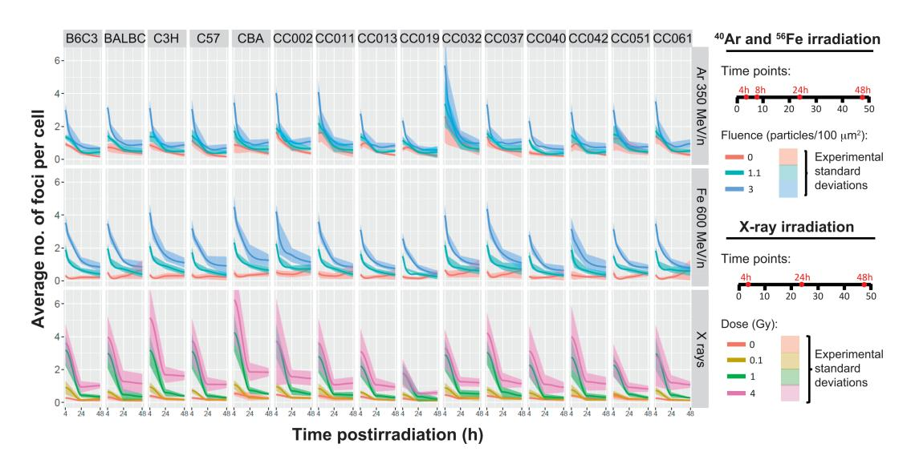
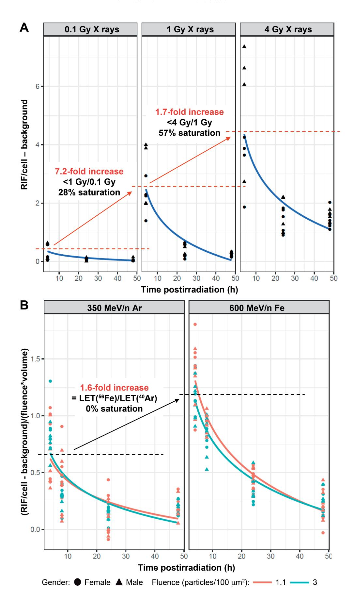
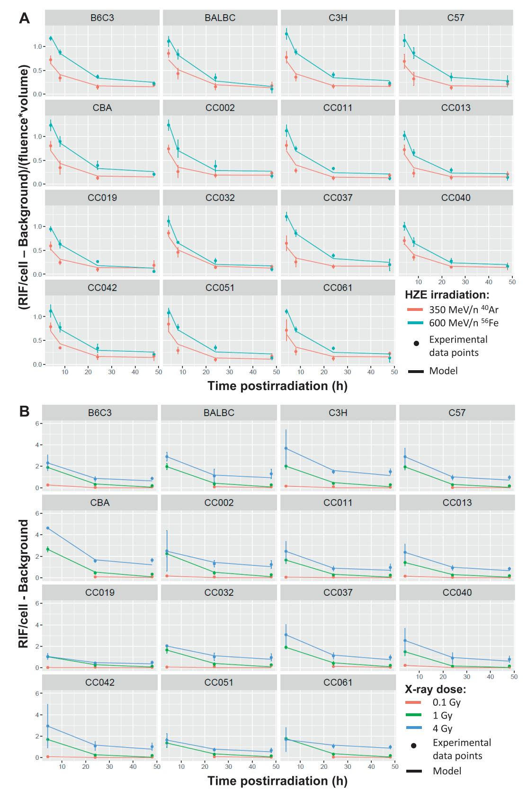
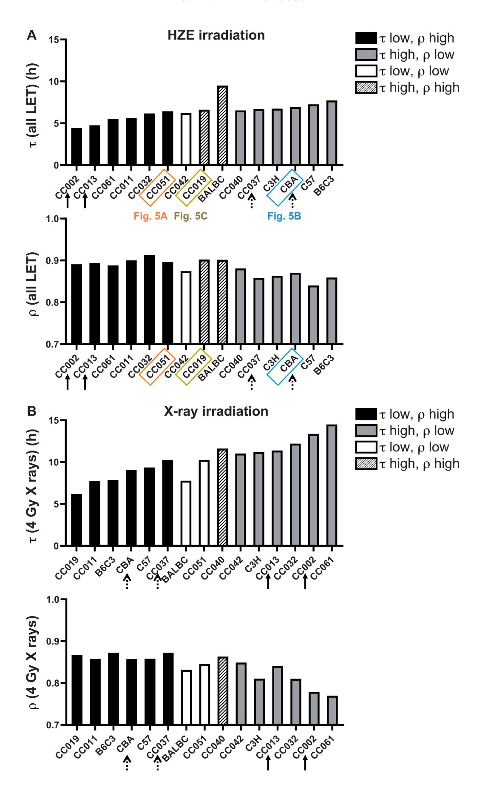
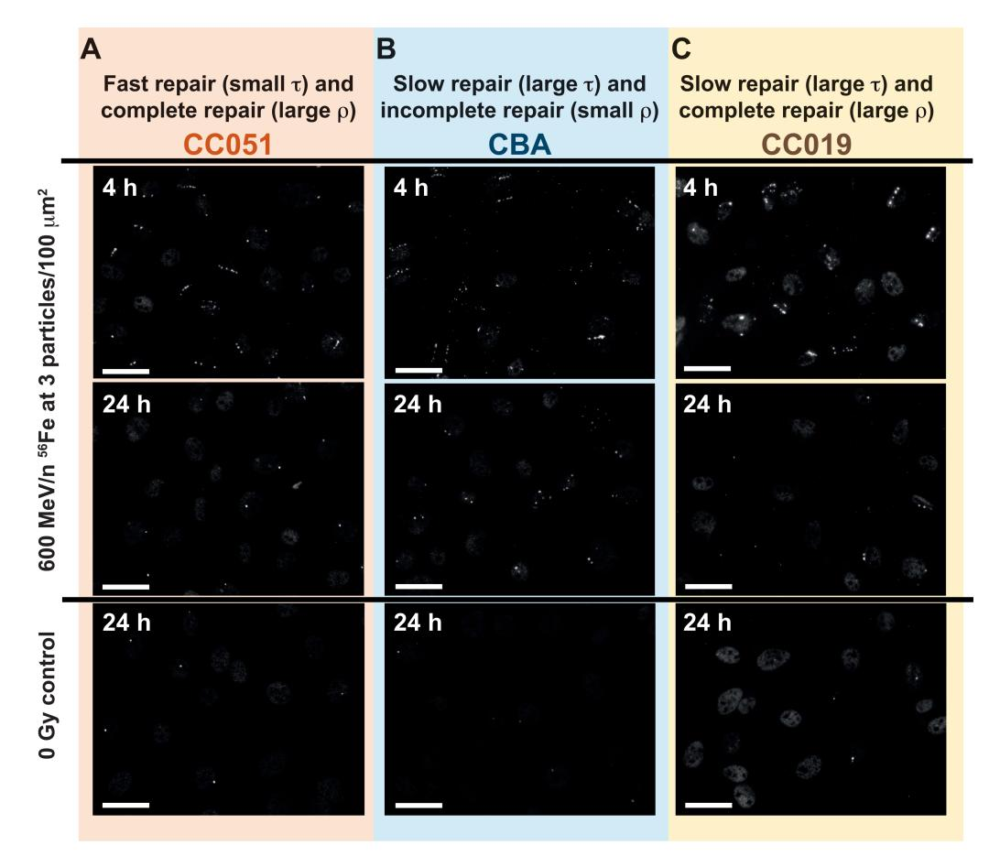
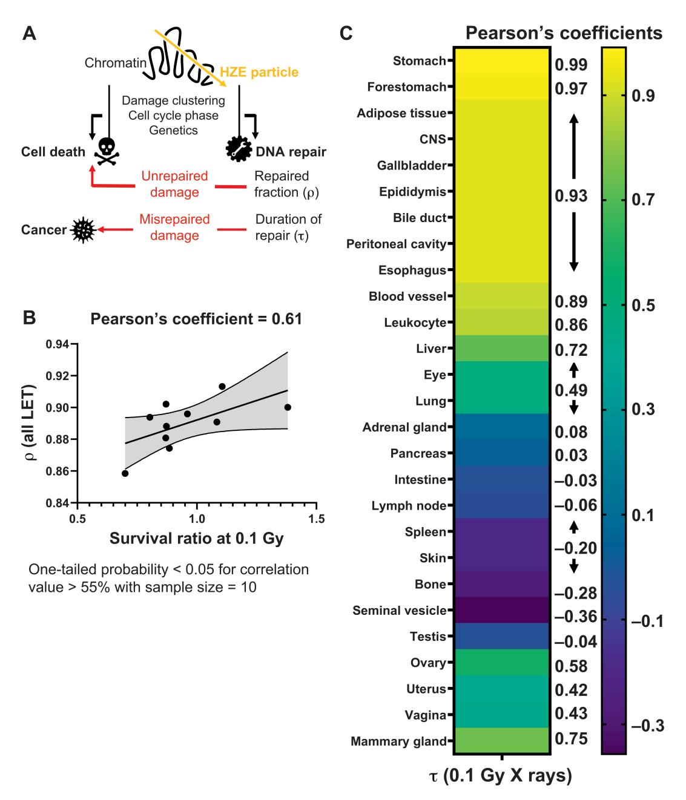

# **53BP1 Repair Kinetics for Prediction of In Vivo Radiation Susceptibility in 15 Mouse Strains**

Authors: Pariset, Eloise, Penninckx, Sébastien, Kerbaul, Charlotte

Degorre, Guiet, Elodie, Macha, Alejandra Lopez, et al.

Source: Radiation Research, 194(5) : 485-499

Published By: Radiation Research Society

URL: https://doi.org/10.1667/RADE-20-00122.1

BioOne Complete (complete.BioOne.org) is a full-text database of 200 subscribed and open-access titles in the biological, ecological, and environmental sciences published by nonprofit societies, associations, museums, institutions, and presses.

Your use of this PDF, the BioOne Complete website, and all posted and associated content indicates your acceptance of BioOne's Terms of Use, available at www.bioone.org/terms-of-use.

Usage of BioOne Complete content is strictly limited to personal, educational, and non - commercial use. Commercial inquiries or rights and permissions requests should be directed to the individual publisher as copyright holder.

BioOne sees sustainable scholarly publishing as an inherently collaborative enterprise connecting authors, nonprofit publishers, academic institutions, research libraries, and research funders in the common goal of maximizing access to critical research.

RADIATION RESEARCH 194, 485–499 (2020) 0033-7587/20 \$15.00 -2020 by Radiation Research Society. All rights of reproduction in any form reserved. DOI: 10.1667/RADE-20-00122.1

# 53BP1 Repair Kinetics for Prediction of In Vivo Radiation Susceptibility in 15 Mouse Strains

Eloise Pariset,a,b Se´bastien Penninckx,c,d Charlotte Degorre Kerbaul,e Elodie Guiet,d Alejandra Lopez Macha,f Egle Cekanaviciute,b Antoine M. Snijders,d Jian-Hua Mao,d Franc¸ois Parise and Sylvain V. Costesb,1

a Universities Space Research Association (USRA), Columbia, Maryland 21046; b Space Biosciences Division, NASA Ames Research Center, Mountain View, California 94035; c Namur Research Institute for Life Science, University of Namur, 5000 Namur, Belgium; d Biological Systems and Engineering Division, Lawrence Berkeley National Laboratory, Berkeley, California 94720; e Universite´ de Nantes, INSERM, CNRS, CRCINA, Nantes, France 44007; and f Blue Marble Space Institute of Science, Seattle, Washington 98154

Pariset, E., Penninckx, S., Degorre Kerbaul, C., Guiet, E., Lopez Macha, A., Cekanaviciute, E., Snijders, A. M., Mao, J-H., Paris, F. and Costes, S. V. 53BP1 Repair Kinetics for Prediction of In Vivo Radiation Susceptibility in 15 Mouse Strains. Radiat. Res. 194, 485–499 (2020).

We present a novel mathematical formalism to predict the kinetics of DNA damage repair after exposure to both lowand high-LET radiation (X rays; 350 MeV/n 40Ar; 600 MeV/n 56Fe). Our method is based on monitoring DNA damage repair protein 53BP1 that forms radiation-induced foci (RIF) at locations of DNA double-strand breaks (DSB) in the nucleus and comparing its expression in primary skin fibroblasts isolated from 15 mice strains. We previously reported strong evidence for clustering of nearby DSB into single repair units as opposed to the classic ''contact-first'' model where DSB are considered immobile. Here we apply this clustering model to evaluate the number of remaining RIF over time. We also show that the newly introduced kinetic metrics can be used as surrogate biomarkers for in vivo radiation toxicity, with potential applications in radiotherapy and human space exploration. In particular, we observed an association between the characteristic time constant of RIF repair measured in vitro and survival levels of immune cells collected from irradiated mice. Moreover, the speed of DNA damage repair correlated not only with radiation-induced cellular survival in vivo, but also with spontaneous cancer incidence data collected from the Mouse Tumor Biology database, suggesting a relationship between the efficiency of DSB repair after irradiation and cancer risk. -2020 by Radiation Research Society

## INTRODUCTION

Identifying biomarkers for individual responses to space radiation exposure is a high priority for upcoming lunar and

1 Address for correspondence: NASA Ames Research Center, Space Biosciences, Moffet Blvd., MS: N288, Room 207, Mountain View, CA 94035; email: Sylvain.V.Costes@nasa.gov.

Mars missions and could enable preventative actions and countermeasures to avoid radiation-induced risks. Due to their extreme penetrability and high potential for DNA damage and cancer incidence (1–3), galactic cosmic rays (GCRs) are the most harmful component of cosmic radiation to which astronauts will be exposed during deep-space exploration missions. It is estimated that missions on lunar and Mars orbit and surface could induce up to 10-fold higher exposure rates to GCRs compared to missions on the International Space Station (ISS) (4). GCRs are intense ionizing radiation emitted from outside of our solar system and composed of 90% protons, 9% helium ions and 1% high-charge and high-energy (HZE) heavy ions, such as 56Fe, 16O, 28Si, 48Ti and 40Ar (5).

The health effect of GCRs is particularly difficult to anticipate as their linear energy transfer (LET) is orders of magnitude higher than any type of radiation on Earth, and they induce non-targeted effects in surrounding unexposed cells, in addition to direct damage in cells traversed by particles. Both low- and high-LET radiation have demonstrated acute and chronic pathophysiology, primarily through DNA damage (6) and oxidative stress (7). In addition to increased cancer risk, exposure to simulated space radiation in animal models has been associated with immune dysfunction (8), central nervous system damage and cognitive deficits (9), cardiovascular defects (10) as well as bone and muscle impairments (11). Thus, to prepare for prolonged deep space exploration it is essential to understand the mechanisms behind ionizing radiationinduced systemic health impairments and to identify biomarkers of radiation responses.

We have previously proposed that the higher relative biological effectiveness (RBE) of HZE particles is due to the unique spatial distribution of the double-strand breaks (DSB) generated along HZE tracks and the active clustering of DSB into single repair domains (12). Previously published results from our group showed that the increased spatial proximity of DSB is responsible for hypersensitivity to high LET due to the higher probability for DSB misrepair

in locations of clustered DSB (13–15). Our DSB coalescence model was confirmed in fibroblast cultures exposed to X rays and HZE particles, isolated from 15 different mouse strains with a panel of 10 Collaborative Cross (CC) mice chosen for their genetic independence (16, 17) and five reference strains (C57BL/6J, BALB/cByJ, B6C3F1/J, C3H/HeMsNrsf and CBA/CaJ) that have already been widely characterized for various radiation phenotypes (18). In the latter work, we characterized the dose and LET dependence of the recruitment of the DNA damage sensing protein 53BP1, localized at DSB sites to form radiationinduced foci (RIF). Many other DSB markers can be used, such as phosphorylated H2AX (19, 20). Previously published studies have emphasized the effect of the cell cycle and the type of fluorescence microscopy implemented for DSB detection, and our group in particular demonstrated the influence of the microscope modality, dose and LET on the size and frequency of detected radiation-induced foci (21). For these reasons, the work presented here focuses on 53BP1, which is a particularly robust DSB marker with consistent expression across species and the entire cell cycle, unlike other markers typically showing high foci background in S phase (22). To collect strong statistics, we also deliberately chose to reduce the microscope resolution to be able to screen millions of skin fibroblast cells in a timely manner by three-dimensional (3D) high-throughput conventional microscopy. Our results showed that multiple DSB can cluster into single RIF as a function of DSB proximity and that DSB clustering is modulated by the local dose in the nucleus that depends both on the total dose and the LET of the particle considered. All 15 mouse strains showed the same dose and LET dependence of DSB clustering into RIF, but strain differences were preserved under various experimental conditions, suggesting that the number and sizes of repair domains were at least partially modulated by the genetics of each strain.

Here we extend this study to model not only the amount of persistent DNA damage at a given time point postirradiation, but also the evolution of DSB repair over time. We use the kinetics of resolution of 53BP1þ RIF as a surrogate biomarker for the kinetics of reparation of DNA damage. We introduce novel kinetic metrics to quantify the efficiency of DSB repair in response to X rays and HZE particles for all 15 mouse strains. We also demonstrate significant correlations between the newly introduced kinetic coefficients and the survival rate of immune cells isolated from 10 irradiated mouse strains, as well as the spontaneous incidence for 27 cancer types in a selection of four different mouse strains. To our knowledge, this study provides one of the most extensive analyses of DNA damage response, covering a large cohort of different mouse strains for both low- and high-LET radiation, and linking in vivo sensitivity data to DSB repair kinetic phenotype to assess the relevance of such markers.

# MATERIALS AND METHODS

Isolation of Primary Fibroblasts from Mouse Ears

The complete cell isolation protocol has been described elsewhere by our group (18). Briefly, mouse ears were collected from a total of 76 animals (Jackson Laboratory, Bar Harbor, ME) with 15 different strains (10 CC strains: CC002, CC011, CC013, CC019, CC032, CC037, CC040, CC042, CC051, CC061; and 5 reference strains: C57BL/6J, BALB/cByJ, B6C3F1/J, C3H/HeMsNrsf, CBA/CaJ) and an average of 3 males and 3 females per strain. Male and female mice, 10–12 weeks old, were euthanized according to IACUC guidelines [Lawrence Berkeley National Laboratory (LBNL; Berkeley, CA); protocol file no. 306002]. Fibroblasts were isolated from mouse ears and cultured at 378C, 5% CO2, 3% O2 in minimum essential medium (MEM) supplemented with 10% v:v fetal bovine serum and 1% v:v penicillin/streptomycin (Gibcot/Thermo Fisher Scientifice Inc., Waltham, MA). At passage 3, fibroblasts were collected in freezing media (90% FBS, 10% DMSO) at 106 cells/ml and stored in liquid nitrogen.

#### In Vitro Irradiation

As described elsewhere (18), irradiations with 350 MeV/n 40Ar (104 keV/lm LET) and 600 MeV/n 56Fe (170 keV/lm LET) were performed at Brookhaven National Laboratory (BNL; Upton, NY), while X-ray irradiation was performed at Lawrence Berkeley National Laboratory (LBNL) using the 160-kVp Faxitront X-ray machine (Lincolnshire, IL). In addition to the nonirradiated control, we studied two irradiation fluences for high-LET irradiation (1.1 and 3 particles/ 100 lm2 , which correspond to doses of 0.18 and 0.50 Gy for 40Ar, and 0.30 and 0.82 Gy for 56Fe, respectively) and three X-ray doses (0.1, 1 and 4 Gy). The dose rate was 1 Gy/min for all conditions. Each condition was duplicated.

Fibroblasts were seeded at 104 cells/well in 96-well plates (IBIDI, Planegg, Germany) and incubated at 378C, 5% CO2 and 3% O2 for 4 days before irradiation. Media was replaced at 2 h prior to irradiation. After irradiation, fibroblasts were fixed in 4% paraformaldehyde (Electron Microscopy Sciences, Hatfield, PA) at 4, 24 and 48 h postirradiation (with an additional time point at 8 h for high-LET irradiation). Plates were sealed and stored at 48C until imaging.

#### Immunostaining and Imaging

Detailed protocols can be found in our previously published work elsewhere (13, 18, 21). Briefly, fibroblasts were permeabilized with 0.1% Tritone X (Sigma-Aldricht LLC, St. Louis, MO) for 20 min and blocked with 3% bovine serum albumin (BSA; Thermo Fisher Scientific) for 60 min. Then, fibroblasts were incubated with rabbit polyclonal anti-53BP1 primary antibody (Bethyl Laboratories Inc., Montgomery, TX) at 1:400 in 3% BSA for 60 min, followed by incubation with Alexa 488 goat anti-rabbit secondary antibody (Thermo Fisher Scientific) at 1:400 in 3% BSA for 60 min. Nuclei were stained with DAPI (Thermo Fisher Scientific) at 1:1,000 in phosphate buffered saline (PBS) for 10 min. Plates were washed twice in 0.1% Tweent 20 (Sigma-Aldrich) between all incubations. The full protocol was performed at room temperature using a programmed liquid handler (MultiFloe FX, BioTekt Instruments Inc., Winooksi, VT).

After staining, a target number of 800 cells per well (13) was imaged using a high-throughput semi-automated microscope developed in-house by our group and the number of foci per nucleus was quantified using an automated algorithm with a wavelet morphological filter, intensity threshold-based sorting, background subtraction and watershed algorithm (18). Statistical analyses were performed using R packages: ggplot2 package (23) for least-square fits; nlme package (24) for Gaussian mixed-effects model fits; and corrplot package (25) for correlation plots.

FIG. 1. Time dependence of average number of foci per cell in response to 0, 1.1 and 3 particles/100 lm2 of 350 MeV/n 40Ar and 600 MeV/n 56Fe, and 0, 0.1, 1 and 4 Gy of X rays. The solid lines indicate the average across 15 mouse strains for each of the four time points after 40Ar and 56Fe irradiation (at 4, 8, 24 and 48h postirradiation) and for each of the four time points after X-ray irradiation (at 4, 24 and 48 h postirradiation). The shaded areas indicate the experimental standard deviation to the mean of average number of foci per cell.

In Vivo Irradiation

The protocol for in vivo irradiation was approved by the Animal Welfare and Research Committee of LBNL (protocol file no. 271004), and described elsewhere (26). Collaborative Cross mice were obtained from the University of North Carolina at Chapel Hill. Mice were weaned at 21 days and breeding was initiated after eight weeks of acclimatization at LBNL. At 12 weeks of age, mice received sham irradiation, or a single acute 0.1 Gy X-ray dose using a Pantak 320 kVp X-ray machine (East Haven, CT), operated at 300 kV and 2 mA with a dose rate of 0.185 Gy/min.

#### Genotyping

DNA extraction was performed using QIAGENt AllPrep DNA/ RNA mini kit (Valencia, CA). Concentration and purity of extracted DNA were assessed from the 260 nm/280 nm and 260 nm/230 nm ratios using a NanoDrop 2000 UV-vis spectrophotometer (Thermo Fischer Scientific). A minimum concentration of 20 ng/ll DNA per sample was shipped to GeneSeekt (Neogent Genomics Inc., Lincoln, NE) for single-nucleotide polymorphism (SNP) analysis using the MegaMouse Universal Genotyping Array (MegaMUGA) platform. MUGA was developed on Illumina Infinium platform in cooperation with Neogen Genomics, Inc. and contains 7851 SNP markers spaced uniformly by approximately ;325 kb across the mouse reference genome. The SNP positions refer to the mouse reference library GRCm38/mm10.

# RESULTS

Comparison of DSB Repair Kinetics in Response to Different LETs and Doses across 15 Mouse Strains

To analyze the kinetics of DSB formation and repair, we irradiated non-immortalized mouse primary skin fibroblasts isolated from 76 animals across 15 different strains (10 CC strains: CC002, CC011, CC013, CC019, CC032, CC037, CC040, CC042, CC051, CC061; and 5 reference strains: C57BL/6J, BALB/cByJ, B6C3F1/J, C3H/HeMsNrsf, CBA/ CaJ) using two different fluences (1.1 and 3 particles/100 lm2 ) of 350 MeV/n 40Ar (104 keV/lm) and 600 MeV/n 56Fe (170 keV/lm), and three different doses (0.1, 1 and 4 Gy) of 160 kVp X rays, in addition to the nonirradiated controls. We quantified the number of 53BP1þ foci per cell for all 15 mouse strain fibroblasts at 4, 24 and 48 h postirradiation, and an additional time point at 8 h for 40Ar and 56Fe particles. Figure 1 represents the average number of foci/cell over time for all 15 strains at the three fluences of 40Ar and 56Fe and at the four doses of X rays.

Even with no exposure to radiation, we observed a background average level of foci/cell, showing that spontaneous foci are constantly formed in the cells. At early time points, the background level of foci was higher for 40Ar background, with 1.11 foci/cell on average across strains at 4 h compared to 0.28 foci/cell and 0.20 foci/cell for 56Fe and X rays, respectively (Fig. 1). This discrepancy may have occurred because 40Ar cells were irradiated earlier than 56Fe and X-ray cells after plating and could have been cycling, leading to significantly higher background DNA damage and repair, as previously reported elsewhere (22, 27).

At later time points, the background level of foci becomes well conserved across strains independent of plating conditions as the confluence reaches 100%. In agreement with our previously published studies (18), we observed that some mouse strains, such as CC032, CC011 and CC002, consistently show higher background foci relative to other strains (Fig. 1), suggesting genetic associations with the baseline clustering of spontaneous DSB. Another characteristic of each strain is the residual amount of DNA damage at 48 h postirradiation. While 0.1 and 1 Gy X-ray doses did not lead to persistent damage at 48 h postirradiation, 40Ar and 56Fe irradiation induced persistent damage in some

strains at 1.1 particles/100 µm² (equivalent to 0.18 Gy for 40Ar and 0.30 Gy for 56Fe) and in all strains at 3 particles/100 µm² (equivalent to 0.50 Gy for 40Ar and 0.82 Gy for 56Fe) (Fig. 1). This suggests that persistent RIF are induced by the higher complexity of DNA damage after high-LET irradiation compared to X-ray irradiation at equivalent doses. Note that at 24 and 48 h after a much higher dose of 4 Gy X rays, high levels of residual RIF are also observed for all strains. However, RIF levels at such high doses are also reflecting other processes in addition to the difficulty in repairing DSB, with cell death and abnormal mitosis being a significant confounding factor (28).

Using the Metric of RIF Number/Track Length in HZE-Irradiated Cells for Comparing Radiation Repair Kinetics between Mouse Strains

To compare the repair kinetics between strains, all RIF/ cell values were background corrected by subtracting the baseline level of foci with no irradiation. For example, Fig. 2A represents the evolution of the corrected RIF numbers over time for the strain C3H/HeMsNrsf at each of the three X-ray doses. Background foci number was estimated using a linear fit with least-square fits method (R statistics package, see Materials and Methods) over the full data separately for each strain, time point and irradiation type, which provides stronger statistical power to the background correction as opposed to simply averaging the number of RIF/cell at 0 Gy. The RIF number at 4 h after 4 Gy X-ray irradiation was excluded from this linear fit because of its non-linear dependence due to DSB clustering, as reported elsewhere previously (18). As an example, C3H/HeMsNrsf shows a saturation of the dose response between 1 and 4 Gy that is twice as large as the saturation between 0.1 and 1 Gy of X rays (Fig. 2A). Indeed, there is a 7.2-fold increase in the number of RIF/cell at 4 h postirradiation for a 10-fold increase in radiation dose between 0.1 and 1 Gy X rays, while there is only a 1.7-fold increase of RIF/cell for a 4fold increase in dose between 1 and 4 Gy X rays.

To compare the outcomes of different HZE irradiation qualities, we have applied another metric that was previously introduced by our group: the average number of RIF per unit length of track traversed by the particle (12). The number of RIF/ $\mu$ m is obtained by normalizing the background-corrected number of RIF/cell by the fluence of the irradiation and the average volume of the irradiated cells

(18). This RIF/µm metric is particularly beneficial for comparing the differences between strains over time and between LETs. An example of the kinetics of RIF/µm is represented for the strain C3H/HeMsNrsf (Fig. 2B) and shows comparable normalization across fluences for both 40Ar and 56Fe irradiation. No saturation was induced by HZE particles: a 1.6-fold increase on average for the number of RIF/µm at 4 h postirradiation between 40Ar and 56Fe irradiation corresponds exactly to the ratio of their respective LETs [170 keV/µm (56Fe)/104 keV/µm (40Ar)]. Notably, no significant difference was observed between males and females in terms of DNA damage response for any of the radiation qualities.

Introducing an Exponential Decay Model of DSB Repair Kinetics

We next modeled the kinetics of DSB repair over time after irradiation using a new model of exponential decay function, with an intercept forced to be proportional to the LET for HZE irradiation and the dose for X rays:

$$\textit{RIF}/\mu\textit{m}(t) = ^{\text{C}}/_{\text{C}_{l}}\textit{LET}.\Big(\rho.\textit{exp}^{\left(-\frac{l}{\tau}\right)} + (1-\rho)\Big), \qquad (1)$$

$$RIF/cell(t) = \frac{\beta_{C_l}.dose.\left(\rho.exp^{\left(-\frac{t}{\tau}\right)} + (1-\rho)\right)}{}, \quad (2)$$

with  $\tau$  being the repair time constant and  $\rho$  the repaired fraction of DSB.  $\alpha$  and  $\beta$  represent the number of DSB generated at time 0 per unit HZE LET and X-ray dose, respectively.  $C_1$  is the number of DSB per RIF, which reflects the amount of clustering at a given dose and LET, depending on the species and cell type. Thus, in our model the factor  $(\alpha/C_1)^*$ LET is the maximum number of RIF at time 0 (RIFmax), which is higher for strains showing less DSB clustering into RIF. In other words, higher RIFmax should lead to quicker resolution of the RIF as there are less DSB on average per RIF to repair and probably a less complex repair process.

For HZE irradiation, the parameter RIF $_{max}$  was obtained for each strain by fitting the repair kinetics of both  $^{40}$ Ar and  $^{56}$ Fe irradiation simultaneously, as the parameters in Eq. (1) should be the same for any LET. The kinetics coefficients  $\rho$  and  $\tau$  were then determined for each strain separately for  $^{40}$ Ar and  $^{56}$ Fe irradiation using a least-square fits method (Fig. 3A). Table 1A shows the Pearson correlation coefficients (with highlighted statistically significant corre-

 $\rightarrow$ 

**FIG. 2.** Time dependence of the normalized number of RIF/cell for the C3H/HeMsNrsf strain in response to (panel A) 0.1, 1 and 4 Gy of X rays, and (panel B) 350 MeV/n 40Ar and 600 MeV/n 56Fe. For X rays, the average number of RIF/cell was corrected to the background level of foci without irradiation (RIF/cell-Bgd). For HZE particles, the corrected number of RIF/cell was normalized by the irradiation fluence and the cell volume (RIF/cell - Bgd)/(fluence\*volume). Each symbol represents an animal and a duplicate (round symbols for females, triangles for males). The lines indicate mean values across all animals at a given time point, dose and radiation quality. At 4 h postirradiation, we report a 7.2-times fold difference between the average levels of normalized RIF/cell at 0.1 Gy vs. 1 Gy X-ray irradiation, 1.7-times fold difference between 1 Gy and 4 Gy X-ray irradiation, and 1.6-times difference between 40Ar and 56Fe irradiation.

| TABLE 1                                                                                                         |
|-----------------------------------------------------------------------------------------------------------------|
| Pearson's Coefficients for Correlations between Kinetic Coefficients of the Proposed Model for 15 Mouse Strains |
| Irradiated with HZE Particles (A) or X Rays (B)                                                                 |

|                                                                        |            | A. HZE particles |                     |                              |                                    |
|------------------------------------------------------------------------|------------|------------------|---------------------|------------------------------|------------------------------------|
|                                                                        | RIFmax     | 40Ar) s (     | 56Fe) s (        | 40Ar) q (                 | 56Fe) q (                       |
| RIFmax 40Ar) s ( 56Fe) s ( 40Ar) q ( q ( 56Fe) | 1          | -0.52 1       | -0.76 0.56 1  | 0.49 0.13 -0.59 1   | 0.10 0.18 -0.31 0.54 1 |
|                                                                        |            | B. X rays        |                     |                              |                                    |
|                                                                        | s (0.1 Gy) | s (1 Gy)         | s (4 Gy)            | q (4 Gy)                     |                                    |
| s (0.1 Gy) s (1 Gy) s (4 Gy) q (4 Gy)                         | 1          | -0.24 1       | -0.08 -0.26 1 | -0.04 -0.06 -0.75 1 |                                    |

Note. Significance is highlighted for P , 0.05, which corresponds to Pearson's coefficients . 0.52 in absolute value for 15 pairs of measurements. Significant negative and positive correlations are indicated in bold face.

lations) for fitted HZE kinetics coefficients compared across all 15 mouse strains. Correlations were considered significant for P values , 0.05, which corresponds to Pearson's coefficients . 0.52 in absolute value for 15 pairs of measurements.

We observed a strong correlation across HZE radiation types both for the repair time constant s and for the repaired fraction q. However, the values of s and q appear to be independent of each other, even for the same radiation type, which indicates that the duration of repair does not determine the final efficiency of repair. In addition, we demonstrate that the parameter RIFmax is anti-correlated with s, which confirms our hypothesis that the higher RIFmax, the less DSB per cluster, the easier the repair and thus the shorter the repair time.

Regarding X-ray irradiation, our group has previously shown a linear dependence of the number of 53BP1þ RIF with dose below 0.1 Gy (13). This result suggests no DSB clustering, and thus a clustering factor Cl set to 1 for 0.1 Gy X ray irradiation. In addition, the number of DSB/Gy of low-LET irradiation [b in Eq. (2)] is predicted to be constant within the same animal species and cell types, and directly proportional to the total amount of DNA in the cells. This value is typically found to be between 25 and 35 DSB/Gy in G1 (12, 22). However, the number of DSB/Gy that are experimentally detected also reflects the resolution of the imaging system being used, and in our case, using highthroughput 3D conventional images, we expect our detection to be significantly lower than the actual value of DSB/Gy.

We determined our DSB/Gy resolution by applying a least-square fit on the parameter b using Eq. (2) for each strain at 0.1 Gy X-ray irradiation, which does not induce any clustering, and found values for b ranging from 7.0 to 12.8 DSB/Gy. Since the same imaging system was used for all mouse strains, and since the number of radiation-induced breaks per Gy only depends on the genome size (29), we forced the b parameter to be equal to the maximum fitted value, i.e., 12.8 DSB/Gy across all strains. Repeating the fit for all strains using the same b parameter we observed that the repaired fraction q was found to be 0.99 for most strains, leading to a simplified kinetic model for RIF repair after 0.1 Gy X-ray irradiation (Fig. 3B):

$$RIF/cell(t) = 1.28 * exp^{\left(-\frac{t}{\tau}\right)}.$$
 (3)

For all other X-ray doses (1 and 4 Gy), the b parameter was also set to 12.8 DSB/Gy. Because the X-ray data only had three time points, the usage of the complete Eq. (2) was not possible to find all parameters. Thus, approximations were made on the parameter q to fit the data, as described below.

First, at 1 Gy X-ray irradiation, we performed an initial evaluation of the parameter q assuming a constant clustering factor equal to 1. Again, all strains fitted best with no residual damage (q ¼ 1), which is in accordance with the kinetic evolution of the RIF number represented for all strains in Fig. 1. Since clustering is known to occur at 1 Gy X-ray irradiation (13), the only parameter we had to fit for 1 Gy was the clustering factor, using the following simplified equation (Fig. 3B):

$$RIF/cell(t) = \frac{\beta_{C_l}exp^{\left(-\frac{t}{\tau}\right)}}{c_l}.$$
 (4)

Parameter approximation was more difficult for 4 Gy X rays, for which there is a residual damage at 48 h postirradiation, with a repaired fraction q dependent on the strain (Fig. 1). In addition, we expect a strain-specific clustering factor Cl to be involved at this dose. Thus, the model has three unknown coefficients: Cl, s and q, but only three time points, leading to a lack of convergence for the fit. To set one parameter, the model assumes the residual damage to be proportional to the remaining RIF level at 48 h. Testing the fit for a range of proportionality factors, we

FIG. 3. Time dependence of the average number of normalized RIF/cell and corresponding fits based on the proposed kinetic model. For each of the 15 strains, the symbols indicate the experimental data points and the solid lines indicate the values generated by our model for (panel A) 40Ar (red) and 56Fe (blue) irradiation, and (panel B) 0.1 Gy (red), 1 Gy (green) and 4 Gy (blue) X-ray irradiation.

concluded that a residual damage equal to a factor of 70% of the remaining RIF/cell at 48 h after 4 Gy X-ray irradiation led to satisfactory fits using the simplified equation (Fig. 3B):

$$RIF(t) = \alpha.exp^{\left(-\frac{t}{\tau}\right)} + 0.7 * RIF(t = 48h), \tag{5}$$

from which we extract the coefficients q and Cl:

$$\rho = \frac{\alpha}{0.8 * RIF(t = 48h) + \alpha} \text{ and } C_l$$

$$= \frac{\beta * dose}{0.8 * RIF(t = 48h) + \alpha}.$$
(6)

While the parameters s were shown to correlate between 40Ar and 56Fe irradiation (Table 1A), there was no correlation between the values of s obtained for 0.1, 1 and 4 Gy X-ray irradiation (Table 1B). This is not surprising regarding the variability of DNA and cellular damage induced by these three different doses: low-dose responses without DSB clustering at 0.1 Gy (30), high-dose responses with DSB clustering at 1 Gy (31) and the same high-dose responses with DSB clustering in addition to cell death at 4 Gy (28), each inducing a different mechanism of repair, associated to a different repair kinetics. While the repaired fraction was shown to be close to 1 experimentally for all strains at 0.1 and 1 Gy X-ray irradiation, the parameter q strongly anti-correlated with s at 4 Gy (Table 1B). Thus, we observed that the efficiency of DSB repair after X-ray irradiation is positively correlated with faster repair kinetics, which is different from responses to HZE radiation, in which s and q are not correlated.

# Classifying 15 Mouse Strains Based on Their DSB Repair Kinetics

We define four classes of kinetic behavior of DSB repairs based on the two introduced kinetic parameters: the speed of repair, characterized by the time constant of repair s (higher s representing slower repair), and the completeness of repair, characterized by the repaired fraction q (higher q modeling more complete repair). Figure 4 classifies all 15 mouse strains used in this study based on their q and s coefficients for exposure to HZE radiation (Fig. 4A) and X rays (Fig. 4B). In both cases, most strains fall into one of the two categories: either slow and incomplete repair (high s, low q) or fast and complete repair (low s, high q). The different classes of responses are illustrated for 56Fe irradiation with a fast and complete repair for CC051 mice (Fig. 5A), a slow and incomplete repair for CBA/CaJ mice (Fig. 5B), and a slow and complete repair for CC019 mice (Fig. 5C).

Interestingly, most strains do not have the same behavior after HZE versus X-ray irradiation (Table 2). They often show a slow and incomplete repair after 4 Gy X-ray irradiation, but a fast and complete repair after HZE irradiation (CC002, CC013, CC032, CC061), or a fast and complete repair after X-ray irradiation but a slow and incomplete repair after HZE irradiation (B6C3F1/J, C57BL/ 6J, CBA/CaJ, CC037). A potential explanation for the difference between X-ray- and HZE-induced DNA damage repair kinetics is the type of pathway involved. While growing evidence indicates that DSB repair in response to low-LET irradiation involves the non-homologous endjoining (NHEJ) pathway (32), the complexity of high-LETinduced DNA damage requires other mechanisms, possibly involving homologous recombination (HR) pathways (33– 35). Thus, deficiency in genes involved in either homologous or non-homologous pathways can specifically affect the efficiency and kinetics of repair for either X-ray- or high-LET-induced DNA damage. For example, based on the value for the repair efficiency coefficient q, BALB/cByJ mice were found to better repair DNA damage induced by HZE particles compared to X rays (Fig. 4, Table 2). Indeed, BALB/cByJ mice were reported to have reduced DNA-PKcs expression, known to be involved in NHEJ pathways, which could predispose them to abnormally detrimental effects of low-LET irradiation (repaired by NHEJ) and lower radiosensitivity to high-LET irradiation (repaired by HR) (36).

Therefore, we collected transcriptomic data of genes encoding for the HR pathway (Brca1, Rad51, Brca2 and Ctip) and for the NHEJ pathway (Xrcc4, Ku70, DNA-PKcs, Xlf, Ku80 and Lig4) in C57BL/6J and C3H/HeMsNrsf mice (37). According to our kinetic-based classification (Fig. 4, Table 2), both C57BL/6J and C3H/HeMsNrsf mice were shown to have slow repair with high residual damage after high-LET irradiation. However, C57BL/6J mice demonstrated faster and more efficient repair in response to X rays compared to C3H/HeMsNrsf mice. Interestingly, the number of transcripts per kilobase million (TPM) was similar in both strains for genes encoding for the HR pathway, with C57/C3H TPM fold change values of 0.81 for Brca1, 1.12 for Rbbp8, 1.22 for Brca2 and 1.26 for Rad51. However, C57BL/6J mice showed higher expression levels of NHEJ-encoding genes compared to C3H/ HeMsNrsf mice, with C57/C3H TPM fold changes of 3 for Xlf, 2.41 for Ku80, 2 for DNA-PKcs and 1.86 for Ku70.

FIG. 4. Classification of the 15 mouse strains based on their DNA damage repair kinetics. Quantification of the repair time constant s and the repairable fraction q in all mouse strains in response to (panel A) HZE and (panel B) X-ray irradiation. Mouse strains are classified into four groups depending on the speed (s) and the efficiency (q) of repair. The three strains shown in Fig. 5 are labeled, and arrows indicate strains with particular SNP expression for HR and NHEJ genes highlighted in Fig. 6.

Downloaded From: https://bioone.org/journals/Radiation-Research on 29 Jan 2025 Terms of Use: https://bioone.org/terms-of-use

!

FIG. 5. Representative images of 53BP1þ foci at 4 h and 24 h after 600 MeV/n 56Fe irradiation at 3 particles/ 100 lm2 and control images without irradiation at 24 h after plating for (panel A) CC051, (panel B) CBA/CaJ and (panel C) CC019. Scale bar ¼ 50 lm.

This suggests an association of faster repair after low-LET irradiation with more NHEJ pathway activation.

We further studied the genomic associations with kinetic responses by genotyping each of the 15 mouse strains for SNP analysis (using the MegaMUGA platform; see Materials and Methods). Our entire genome-wide association study includes several radiation-induced phenotypes, such as the number of RIF per unit dose of radiation, and will be published separately. Here we performed a brief analysis focused on SNPs located in genes associated with the HR and NHEJ pathways to identify any patterns that may follow the kinetic-based classification of the 15 mouse strains (Fig. 6). We have discovered that multiple SNPs for Rad51b, which is a gene that has been shown to be involved in the HR pathway (38), completely separated the strains associated with slow repair kinetics (high s) and low repair efficiency (low q) in response to HZE irradiation (C3H/ HeMsNrsf, CC037, CBA/CaJ, C57BL/6J, B6C3F1/J). On the other hand, strains associated with fast and efficient repair of HZE-induced damage but slow and incomplete repair in response to X rays (CC002, CC013, CC061, CC032) were found to have the same SNPs located in the Nhej1 gene (39). These results suggest that the kinetics of DSB repair after low- and high-LET irradiation are at least

TABLE 2 Classification of the 15 Mouse Strains Based on Their Level of Repair Efficiency (Characterized by the Coefficient q) and Repair Kinetics (Characterized by the Coefficient s) for HZE Particles and X Rays

|                    |                                                  | Repair efficiency (q)   |                           |                                     |                          |  |  |
|--------------------|--------------------------------------------------|-------------------------|---------------------------|-------------------------------------|--------------------------|--|--|
|                    |                                                  | X rays low j HZE low | X rays high j HZE high | X rays low j HZE high            | X rays high j HZE low |  |  |
| Repair kinetics | X rays slow j HZE slow X rays fast j HZE fast | C3H                     | CC011                     | CC051                               | CC040                    |  |  |
| (s)                | X rays slow j HZE fast X rays fast j HZE slow | CC042                   | CC019                     | CC002, CC013, CC032, CC061 BALBC | B6C3, C57, CBA, CC037    |  |  |

|                 |        |            |                | ţ     | ļ     |       |       |       |       |       |       |       |       |     | ᠅     | ÷   |     |      |
|-----------------|--------|------------|----------------|-------|-------|-------|-------|-------|-------|-------|-------|-------|-------|-----|-------|-----|-----|------|
| Pathway         | Gene   | Chromosome | Position (B38) | CC002 | CC013 | CC061 | CC032 | CC011 | CC051 | CC042 | CC019 | BALBC | CC040 | СЗН | CC037 | CBA | C57 | B6C3 |
| HR              | Rad51b | 12         | 79313459       | G     | G     | Α     | Α     | G     | Α     | Α     | Α     | Α     | G     | Α   | Α     | Α   | Α   | Α    |
| HR              | Rad51b | 12         | 79330617       | Т     | Т     | С     | Т     | Т     | С     | Т     | С     | С     | Т     | С   | С     | С   | С   | С    |
| HR              | Rad51b | 12         | 79349660       | T     | T     | G     | Т     | G     | G     | Т     | G     | G     | Т     | G   | G     | G   | G   | G    |
| HR              | Rad51b | 12         | 79451711       | Т     | Т     | С     | С     | С     | С     | С     | С     | С     | Т     | С   | С     | С   | С   | С    |
| HR              | Rad51b | 12         | 79458713       | G     | G     | G     | N     | G     | G     | Н     | G     | Н     | G     | H   | Н     | H   | Н   | H    |
| HR              | Rad51b | 12         | 79478161       | Α     | Α     | G     | G     | Α     | G     | G     | G     | G     | Α     | G   | G     | G   | G   | G    |
| HR              | Rad51b | 12         | 79499820       | С     | С     | Т     | С     | С     | T     | С     | Т     | T     | С     | T   | Т     | T   | T   | T    |
| HR              | Rad51b | 12         | 79531445       | Т     | Т     | С     | С     | Т     | С     | С     | С     | С     | Т     | С   | С     | С   | С   | С    |
| HR              | Rad51b | 12         | 79541295       | Α     | Α     | Α     | Α     | Α     | Α     | Α     | Α     | С     | Α     | С   | С     | С   | С   | С    |
| HR              | Rad51b | 12         | 79606634       | С     | С     | T     | С     | Т     | С     | С     | Т     | T     | С     | T   | T     | T   | T   | T    |
| HR              | Rad51b | 12         | 79648026       | T     | Т     | Т     | Т     | Т     | Т     | Т     | Т     | G     | Т     | G   | G     | G   | G   | G    |
| HR              | Rad51b | 12         | 79776108       | Т     | Т     | T     | Т     | С     | Т     | Т     | T     | С     | Т     | С   | С     | С   | С   | С    |
| HR              | Rad51b | 12         | 79782229       | С     | С     | С     | С     | С     | С     | С     | С     | Т     | С     | T   | Т     | T   | T   | T    |
| HR              | Rad51b | 12         | 79789025       | С     | С     | С     | С     | С     | С     | С     | С     | Т     | С     | T   | Т     | T   | T   | T    |
| HR              | Rad51b | 12         | 79811829       | T     | Т     | Т     | Т     | С     | Т     | Т     | Т     | С     | Т     | С   | С     | С   | С   | С    |
| HR              | Rad51b | 12         | 79827878       | G     | G     | Α     | G     | G     | G     | G     | Α     | Α     | G     | Α   | Α     | Α   | Α   | Α    |
| HR              | Rad51b | 12         | 79845837       | С     | С     | Т     | Т     | С     | T     | Т     | T     | T     | С     | Т   | T     | T   | Т   | T    |
| NHEJ            | Nhej1  | 1          | 74972645       | С     | С     | С     | С     | Т     | Т     | С     | С     | С     | N     | Т   | Т     | Т   | С   | Ξ    |
| NHEJ            | Nhej1  | 1          | 75012441       | Α     | Α     | Α     | Н     | G     | G     | Α     | Α     | Α     | G     | G   | G     | G   | Α   | Н    |
| NHEJ            | Nhej1  | 1          | 75017060       | Α     | Α     | Α     | Α     | Α     | Α     | Α     | Α     | Α     | Α     | Α   | G     | G   | Α   | Α    |
| NHEJ            | Nhej1  | 1          | 75040866       | Α     | Α     | Α     | Α     | Α     | Α     | Α     | Α     | Α     | Α     | Α   | G     | G   | Α   | Α    |
| NHEJ            | Nhej1  | 1          | 75046214       | Α     | Α     | Α     | Н     | Α     | Α     | Α     | Α     | Α     | G     | Α   | G     | G   | Α   | Α    |
| NHEJ            | Nhej1  | 1          | 75053349       | G     | G     | G     | G     | Α     | Α     | G     | G     | G     | G     | Α   | Α     | Α   | G   | Н    |
| τ (all LET)     |        |            |                |       |       |       |       |       |       |       |       |       |       |     |       |     |     |      |
| ρ (all LET)     |        |            |                |       |       |       |       |       |       |       |       |       |       |     |       |     |     |      |
| τ (4 Gy X rays) |        |            |                |       |       |       |       |       |       |       |       |       |       |     |       |     |     |      |
|                 |        |            | Gy X rays)     |       |       |       |       |       |       |       |       |       |       |     |       |     |     |      |
|                 |        | ρ (4       | Gy A lays)     |       |       |       |       |       |       |       |       |       |       |     |       |     |     |      |

FIG. 6. List of SNPs located in the Rad51b gene, involved in the HR pathway, and in the Nhej1 gene, involved in the NHEJ pathway for the 15 mouse strains classified based on the repair time constant (s) and the repaired fraction (q) after irradiation with high-LET particles or 4 Gy X rays. The color code was defined from strains showing two extreme responses: Fast and efficient response to HZE particles and slow and incomplete repair of X-ray-induced damage (CC002); or slow and incomplete response to HZE particles and fast and efficient repair of X-ray-induced damage (CBA/CaJ). Arrows match strains indicated in Fig. 4.

partially driven by the primary mechanism of DSB repair (HR vs. NHEJ), which is in turn associated with the genetic background of the mice.

Associations between In Vitro Measurements of DSB Repair Kinetics and In Vivo Radiation Susceptibility Levels and Spontaneous Cancer Incidence

We evaluated the relevance of our model for DNA damage repair kinetics for predicting in vivo outcomes in the same mouse strains. Two types of in vivo responses were considered: the survival rate of B lymphocytes after whole-body 0.1 Gy X-ray irradiation of 10 CC mouse strains (CC002, CC011, CC013, CC019, CC032, CC037, CC040, CC042, CC051 and CC061) acquired in a larger study conducted at LBNL under the DOE low dose program (see Acknowledgements), and previously published information on the spontaneous incidence of 27 cancer types in four reference mouse strains (B6C3F1/J, CBA/CaJ, C57BL/ 6J and BALB/cByJ) obtained from the Mouse Tumor Biology (MTB) database (40).

As shown in Fig. 7A, cell death is triggered by the unrepaired fraction of DNA damage, because unrepaired DSB lead to cell death during mitosis. Meanwhile, cancer is induced by misrepaired damage, which is more likely to correlate with slow repair kinetics, suggesting difficulty in the repair process. Thus, we propose to compare in vivo Bcell survival collected from irradiated mice to the repaired fraction of DNA damage (q), while cancer incidence is compared to the speed of repair (s). For comparison to in vivo survival rate of mouse B cells, we computed the Pearson correlation coefficient between the repaired fraction q obtained for in vitro irradiation of mouse fibroblasts using high-LET particles, and the proportion of surviving B cells, collected at 24 h after in vivo irradiation, normalized to the baseline level of circulating B cells with no irradiation, across all 10 CC strains. A significant correlation was found, with a Pearson coefficient at 0.61 (Fig. 7B). This suggests that the level of low-dose radiation-induced cell death in blood cells relates to DNA damage repair efficiency measured after exposure to relatively low doses of space radiation components.

Next, we computed the Pearson correlation coefficients between the coefficient s obtained for these four reference mouse strains from the kinetics of DNA damage repair in fibroblasts irradiated in vitro with 0.1 Gy X rays and each of the in vivo spontaneous cancer incidences collected from the MTB database (Fig. 7C). The spontaneous cancer incidence data for four of the reference mouse strains, for which we previously computed the kinetic coefficients, included 27 cancer types with an average of 464 studies for C57BL/6J, 223 studies for CBA/CaJ, 168 studies for BALB/cByJ and 401 studies for B6C3F1/J (40). All cancer incidence values were weighted by the number of animals involved in the respective studies. Note that among all kinetic coefficients, we selected the time constant of repair at 0.1 Gy X rays as a potential biomarker of cancer incidence since it is the irradiation condition that best models the genetic predisposition to having spontaneous misrepaired DSB during

FIG. 7. Kinetic parameters correlate with in vivo data. Panel A: Schematic representation. The parameter q quantifies the fraction of repaired DNA damage, which relates to cell survival, while the parameter s best correlates to the amount of misrepaired damage and subsequent cancer incidence. Panel B: Correlation between the survival rate of mouse B cells at 24 h after in vivo irradiation with 0.1 Gy X rays and the q coefficient obtained from 40Ar and 56Fe data combined for in vitro irradiated mouse fibroblasts, for the same 10 CC strains. Panel C: Pearson's correlation coefficients between the spontaneous cancer incidence data collected for four mouse strains in vivo from the MTB database and the s coefficient obtained from mouse fibroblasts irradiated in vitro with 0.1 Gy X rays.

natural cell division. For cancer types affecting specific male organs (seminal vesicle and testis) or female organs (ovary, uterus, vagina, mammary gland), we considered the s coefficients fitted from data with only male or female animals, respectively. A positive correlation was observed between spontaneous cancer incidence and the characteristic time of repair for most organs and tissues considered (Fig. 7C), confirming a higher probability of misrepair-induced mutations in animals with slower repair kinetics.

#### DISCUSSION

Here we propose a novel mathematical formalism to model the kinetics of repair of radiation-induced DNA damage, based on the experimental results obtained from non-immortalized mouse primary skin fibroblasts derived from 76 different individual mice across 15 strains with equal numbers of males and females. This model was validated in response to both low- and high-LET irradiation, using 160 kVp X rays and two LETs of HZE particles (104 keV/lm 350 MeV/n 40Ar and 170 keV/lm 600 MeV/n 56Fe), by quantifying 53BP1þ RIF between 4 h and 48 h postirradiation in a total number of 5 million skin fibroblast cells.

Our model predicts the exponential decay of the number of RIF over time. It is based on the concept of DSB clustering into repair domains previously introduced by our group (14). In 2004, Aten et al. (41) were the first to provide evidence for the mobility of chromosome domains into clusters of DSB, invalidating the static ''contact-first'' theory where DSB are assumed to be immobile (42, 43). More recently, our group reported RIF movement after Xray irradiation in immortalized human mammary epithelial cells using time-lapse fluorescent microscopy of 53BP1 fused to GFP (15). We then showed that DSB clustering into RIF is a conserved biological property across species, with further observation of nonlinear dose dependency of DNA damage in non-immortalized mouse fibroblasts (18).

Here we report that the amount of 53BP1þ RIF that was imaged experimentally over time is proportional to the Xray dose or HZE LET, and depends on three characteristics of the mouse strain, cell type and irradiation conditions: the clustering factor (average number of DSB per RIF); the speed of repair (inversely proportional to the time constant of the exponential decay of RIF over time, s); and the amount of residual damage after repair (1 – q, defined from the fraction of repaired DSB, q). This formalism recapitulates the interdependence between two processes occurring simultaneously after the induction of DNA damage: DNA repair and DSB clustering. Thus, the number of RIF decreases throughout the process of DNA repair, but it is also modulated by the capacity of the cell to initially cluster DSB into RIF.

In concordance with previously published results, we have also observed that low-LET irradiation below 1 Gy generates DSB randomly in the nucleus and does not cause DSB clustering (13). In this case, represented by 0.1 Gy Xray irradiation in our experiments, we observed complete DSB repair with no residual damage by 48 h postirradiation. Thus, the decay of RIF over time had only a kinetic component, while the number of DSB/RIF remained close to 1 for all strains. For HZE irradiation, we demonstrated that the capacity of clustering, quantified by the initial number of RIF after clustering and before DNA repair, RIFmax, anti-correlates with the speed of repair (Table 1), with higher number of RIF, and thus less DSB per RIF and less complex damage for faster kinetics of repair.

At X-ray doses above 1 Gy, we reported a significant anticorrelation between the speed of DSB repair and the amount of residual DNA damage after repair by 48 h postirradiation. This is expected for NHEJ repair pathways primarily involved in the repair of DSB induced by low-LET irradiation, with complete repair achieved for faster kinetics (44). Unlike X-ray irradiation, no correlation was found between the speed and the efficiency of repair for HZEinduced DNA damage, with fast and incomplete repair, or slow and complete repair observed for some strains. This confirms that different mechanisms of repair, such as homologous recombination, are involved for HZE- versus low-LET-induced DNA damage. Thus, the strength of our model is the ability to recapitulate the kinetics of repair across LETs, independent of the process of repair involved.

In the first part of this project (18), we showed that genetic differences between mouse strains were associated with differences in the number and size of repair domains, across 15 mouse strains for a given LET, dose and fluence. Here we observe that the kinetics of repair is also modulated by genetics, with different speed and completeness of repair depending on the type of radiation, which is likely determined by deficiency in genes involved in either homologous or non-homologous repair pathways, suggesting potential targets for future analysis and validation.

Finally, our work demonstrates significant correlations between the kinetics of DNA repair measured in vitro, and in vivo data of cell survival from whole-body irradiated mice and spontaneous cancer incidence across mouse strains. B-lymphocyte survival levels at 24 h after 0.1 Gy X-ray irradiation showed significant correlation with the repaired fraction of DNA damage in mouse fibroblasts from the same mouse strains irradiated in vitro. This suggests that the persistent number of 53BP1þ RIF found in skin is a surrogate marker for in vivo radiation sensitivity in other tissues, such as circulating immune cells, and that such response is in part modulated by genetic variability as well. Our results expand the scope of recent correlations demonstrated between the persistent level of c-H2AX foci in bronchial cells measured in vitro and the susceptibility to radiation-induced lung cancer in 17 mouse strains in vivo (45). While the level of RIF has been shown to reflect the survival rate in tumor cells in vitro (46, 47), here we demonstrate that it is also a biomarker of cell survival in vivo. In addition, the speed of repair in fibroblasts irradiated with 0.1 Gy of X rays in vitro appeared to correlate with spontaneous cancer incidence of several organs and tissues in vivo, suggesting that radiation-induced kinetics of DNA damage is also correlated with the frequency of spontaneous mutations.

In summary, our results show the benefit of combining information on both clustering and repair processes in a unified model of DNA repair kinetics to better anticipate cellular responses to radiation-induced and spontaneous DNA damage. We demonstrate that our model can be utilized to compare ionizing radiation responses between multiple commonly-used mouse strains, suggest genomic associations that may underlie these differences and reveal correlations between in vivo and in vitro outcomes. We

expect that a similar model could be established and validated to compare ionizing radiation outcomes in other contexts, including human responses to therapeutic or space radiation, using a set of multiple biomarkers complementary to 53BP1þ foci detection, such as additional DNA damage markers, cell death quantification and measurements of radiation-induced radical production.

## ACKNOWLEDGMENTS

This work was supported by the National Aeronautics and Space Administration [grant no. NNJ16HP24I to SVC, Principal Investigator (PI)] and by the Low Dose Scientific Focus Area, Office of Biological and Environmental Research, U.S. Department of Energy [contract no. DE AC02-05CH11231 to G. H. Karpen (PI) and SVC, J-HM and AMS (co-PIs)]. EP is funded by the NASA Human Research Program (no. NNJ16HP24I) and the Translational Research Institute for Space Health (NASA Cooperative Agreement no. NNX16AO69A). SP is funded by the Walloon Region (PROTHERWAL, grant no. 7289). The study was founded by the project MIRRO from Re´gion Pays de la Loire (France) and CG was funded by la Ligue Nationale Contre le Cancer.

Received: May 4, 2020; accepted: August 5, 2020; published online: September 29, 2020

#### REFERENCES

- 1. Alpen EL, Powers-Risius P, Curtis SB, DeGuzman R. Tumorigenic potential of high-Z, high-LET charged-particle radiations. Radiat Res 1993; 136:382–91.
- 2. Cucinotta FA, Durante M. Cancer risk from exposure to galactic cosmic rays: Implications for space exploration by human beings. Lancet Oncol 2006; 7:431–5.
- 3. Asaithamby A, Uematsu N, Chatterjee A, Story MD, Burma S, Chen DJ. Repair of HZE-particle-induced DNA double-strand breaks in normal human fibroblasts. Radiat Res 2008; 169:437–46.
- 4. Nelson GA. Space radiation and human exposures, a primer. Radiat Res 2016; 185:349–58.
- 5. Mewaldt R. Galactic cosmic ray composition and energy spectra. Adv Space Res1994; 14:737–47.
- 6. Santivasi WL, Xia F. Ionizing radiation-induced DNA damage, response, and repair. Antioxid Redox Signal 2014; 21:251–9.
- 7. Azzam EI, Jay-Gerin J-P, Pain D. Ionizing radiation-induced metabolic oxidative stress and prolonged cell injury. Cancer Lett 2012; 327:48–60.
- 8. Crucian BE, Chouker A, Simpson RJ, Mehta S, Marshall G, Smith SM, et al. Immune system dysregulation during spaceflight: potential countermeasures for deep space exploration missions. Frontiers in immunology. 2018; 9: 1437.
- 9. Cekanaviciute E, Rosi, S Costes SV. Central nervous system responses to simulated Galactic Cosmic Rays. Int J Mol Sci 2018; 19: 3669.
- 10. Boerma M, Nelson GA, Sridharan V, Mao X-W, Koturbash I, Hauer-Jensen M. Space radiation and cardiovascular disease risk. World J Cardiol 2015; 7:882.
- 11. Lang T, Van Loon JJ, Bloomfield S, Vico L, Chopard A, Rittweger J, et al. Towards human exploration of space: the THESEUS review series on muscle and bone research priorities. NPJ Microgravity 2017; 3:1–10.
- 12. Costes SV, Ponomarev A, Chen JL, Nguyen D, Cucinotta FA, Barcellos-Hoff MH. Image-based modeling reveals dynamic redistribution of DNA damage into nuclear sub-domains. PLoS Comput Biol 2007; 3:e155.
- 13. Neumaier T, Swenson J, Pham C, Polyzos A, Lo AT, Yang P, et al. Evidence for formation of DNA repair centers and dose-

- response nonlinearity in human cells. Proc Natl Acad Sci U S A 2012; 109:443–8.
- 14. Vadhavkar N, Pham C, Georgescu W, Deschamps T, Heuskin A-C, Tang J, et al. Combinatorial DNA damage pairing model based on X-ray-induced foci predicts the dose and LET dependence of cell death in human breast cells. Radiat Res 2014; 182:273–81.
- 15. Georgescu W, Osseiran A, Rojec M, Liu Y, Bombrun M, Tang J, et al. Characterizing the DNA damage response by cell tracking algorithms and cell features classification using high-content timelapse analysis. PLoS One 2015; 10:e0129438.
- 16. Churchill GA, Airey DC, Allayee H, Angel JM, Attie AD, Beatty J, et al. The Collaborative Cross, a community resource for the genetic analysis of complex traits. Nat Genet 2004; 36:1133–7.
- 17. CC Consortium. The genome architecture of the Collaborative Cross mouse genetic reference population. Genetics 2012; 190:389–401.
- 18. Penninckx S, Cekanaviciute E, Degorre C, Guiet E, Viger L, Lucas S, et al. Dose, LET and strain dependence of radiation-induced 53BP1 foci in 15 mouse strains ex vivo introducing novel DNA damage metrics. Radiat Res 2019; 192:1–12.
- 19. Hagiwara Y, Niimi A, Isono M, Yamauchi M, Yasuhara T, Limsirichaikul S, et al. 3D-structured illumination microscopy reveals clustered DNA double-strand break formation in widespread gammaH2AX foci after high LET heavy-ion particle radiation. Oncotarget 2017; 8:109370.
- 20. Hagiwara Y, Oike T, Niimi A, Yamauchi M, Sato H, Limsirichaikul S, et al. Clustered DNA double-strand break formation and the repair pathway following heavy-ion irradiation. J Radiat Res 2019; 60:69–79.
- 21. Costes SV, Boissiere A, Ravani S, Romano R, Parvin B, Barcellos-Hoff MH. Imaging features that discriminate between foci induced by high-and low-LET radiation in human fibroblasts. Radiat Res 2006; 165:505–15.
- 22. Costes SV, Chiolo I, Pluth JM, Barcellos-Hoff MH, Jakob B. Spatiotemporal characterization of ionizing radiation induced DNA damage foci and their relation to chromatin organization. Mutat Res 2010; 704:78–87.
- 23. Wickham H. ggplot2: Elegant graphics for data analysis. Berlin: Springer; 2016.
- 24. Pinheiro J, Bates D, DebRoy S, Sarkar D. Linear and nonlinear mixed effects models. R package version. 2007; 3:57.
- 25. Wei T, Simko V, Levy M, Xie Y, Jin Y, Zemla J. Package 'corrplot'. Statistician 2017; 56:316–24.
- 26. Snijders AM, Langley S, Mao J-H, Bhatnagar S, Bjornstad KA, Rosen CJ, et al. An interferon signature identified by RNAsequencing of mammary tissues varies across the estrous cycle and is predictive of metastasis-free survival. Oncotarget 2014; 5:4011.
- 27. MacPhail SH, Banath JP, Yu Y, Chu E, Olive PL. Cell cycledependent expression of phosphorylated histone H2AX: reduced expression in unirradiated but not X-irradiated G1-phase cells. Radiat Res 2003; 159:759–67.
- 28. Rave-Frank M, Virsik-Kopp P, Pradier O, Nitsche M, Grunefeld S, Schmidberger H. In vitro response of human dermal fibroblasts to X-irradiation: relationship between radiation-induced clonogenic cell death, chromosome aberrations and markers of proliferative senescence or differentiation. Int J Radiat Biol 2001; 77:1163–74.
- 29. Ward JF. DNA damage produced by ionizing radiation in mammalian cells: Identities, mechanisms of formation, and reparability. Prog Nucleic Acid Res Mol Biol 1988; 35:95–125.
- 30. Truong K, Bradley S, Baginski B, Wilson JR, Medlin D, Zheng L, et al. The effect of well-characterized, very low-dose x-ray radiation on fibroblasts. PloS One 2018; 13:e0190330.
- 31. Ban S, Setlow RB, Bender MA, Ezaki H, Hiraoka T, Yamane M, et al. Radiosensitivity of skin fibroblasts from atomic bomb survivors with and without breast cancer. Cancer Res 1990; 50:4050–5.
- 32. Nagasawa H, Little J, Inkret W, Carpenter S, Raju M, Chen D, et

- al. Response of X-ray-sensitive CHO mutant cells (xrs-6c) to radiation: II. Relationship between cell survival and the induction of chromosomal damage with low doses of alpha particles. Radiat Res 1991; 126:280–8.
- 33. Okayasu R, Okada M, Okabe A, Noguchi M, Takakura K, Takahashi S. Repair of DNA damage induced by accelerated heavy ions in mammalian cells proficient and deficient in the nonhomologous end-joining pathway. Radiat Res 2006; 165:59–67.
- 34. Asaithamby A, Chen DJ. Mechanism of cluster DNA damage repair in response to high-atomic number and energy particles radiation. Mutat Res 2011; 711:87–99.
- 35. Karlsson KH, Stenerlow B. Focus formation of DNA repair proteins in normal and repair-deficient cells irradiated with high-LET ions. Radiat Res 2004; 161:517–27.
- 36. Okayasu R, Suetomi K, Yu Y, Silver A, Bedford JS, Cox R, et al. A deficiency in DNA repair and DNA-PKcs expression in the radiosensitive BALB/c mouse. Cancer Res 2000; 60:4342–5.
- 37. Pfeiffer MJ, Taher L, Drexler H, Suzuki Y, Makalowski W, Schwarzer C, et al. Differences in embryo quality are associated with differences in oocyte composition: a proteomic study in inbred mice. Proteomics 2015; 15:675–87.
- 38. Li X, Heyer W-D. Homologous recombination in DNA repair and DNA damage tolerance. Cell Res 2008; 18:99–113.
- 39. Ahnesorg P, Smith P, Jackson SP. XLF interacts with the XRCC4- DNA ligase IV complex to promote DNA nonhomologous endjoining. Cell 2006; 124:301–13.
- 40. Krupke DM, Begley DA, Sundberg JP, Richardson JE, Neuhauser SB, Bult CJ. The Mouse Tumor Biology Database: a comprehen-

- sive resource for mouse models of human cancer. Cancer Res 2017; 77:e67–e70.
- 41. Aten JA, Stap J, Krawczyk PM, van Oven CH, Hoebe RA, Essers J, et al. Dynamics of DNA double-strand breaks revealed by clustering of damaged chromosome domains. Science 2004; 303:92–5.
- 42. Nikiforova MN, Stringer JR, Blough R, Medvedovic M, Fagin JA, Nikiforov YE. Proximity of chromosomal loci that participate in radiation-induced rearrangements in human cells. Science 2000; 290:138–41.
- 43. Soutoglou E, Dorn JF, Sengupta K, Jasin M, Nussenzweig A, Ried T, et al. Positional stability of single double-strand breaks in mammalian cells. Nat Cell Biol 2007; 9:675–82.
- 44. Singh P, Aggarwal LM, Parry SA, Raman MJ. Radiation dosimetry and repair kinetics of DNA damage foci in mouse pachytene spermatocyte and round spermatid stages. Mutagenesis 2018; 33:231–9.
- 45. Ochola DO, Sharif R, Bedford JS, Keefe TJ, Kato TA, Fallgren CM, et al. Persistence of gamma-H2AX foci in bronchial cells correlates with susceptibility to radiation associated lung cancer in mice. Radiat Res 2018; 191:67–75.
- 46. Banath JP, Klokov D, MacPhail SH, Banuelos CA, Olive PL. Residual gammaH2AX foci as an indication of lethal DNA lesions. BMC Cancer 2010; 10:4.
- 47. Klokov D, MacPhail SM, Banath JP, Byrne JP, Olive PL. Phosphorylated histone H2AX in relation to cell survival in tumor cells and xenografts exposed to single and fractionated doses of Xrays. Radiother Oncol 2006; 80:223–9.