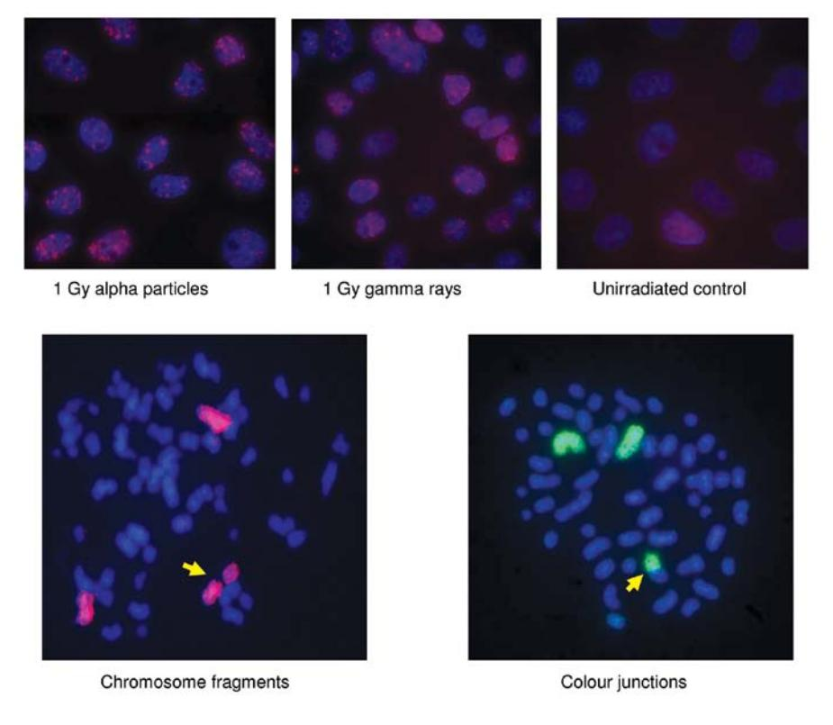
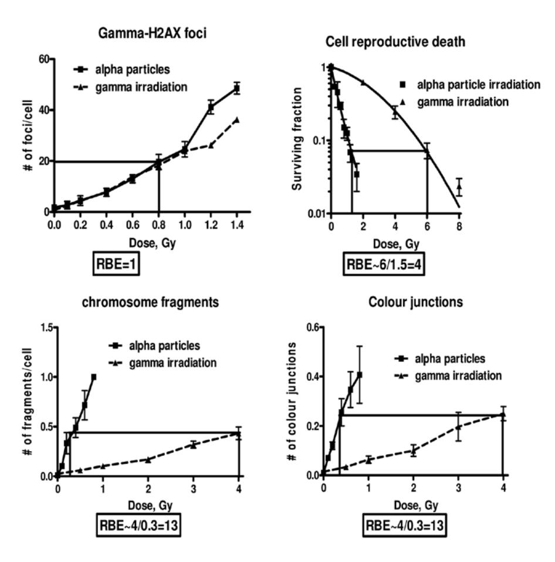

# **Relative biological effectiveness of high linear energy transfer α-particles for the induction of DNA-double-strand breaks, chromosome aberrations and reproductive cell death in SW-1573 lung tumour cells**

NICOLAAS A.P. FRANKEN1 , SUZANNE HOVINGH1 , ROSEMARIE TEN CATE1 , PRZEMEK KRAWCZYK2 , JAN STAP2 , RON HOEBE2 , JACOB ATEN2 and GERRIT W. BARENDSEN1,2

1 Department of Radiation Oncology, Laboratory for Experimental Oncology and Radiobiology (LEXOR), Centre for Experimental Molecular Medicine, and 2 Department of Cell Biology and Histology, Academic Medical Centre, University of Amsterdam, 1100 DE Amsterdam, The Netherlands

Received October 7, 2011; Accepted November 3, 2011

DOI: 10.3892/or.2011.1604

**Abstract.** Ionizing radiation-induced foci (IRIF) of DNA repair-related proteins accumulated at DNA double-strand break (DSB) sites have been suggested to be a powerful biodosimetric tool. However, the relationship between IRIF induction and biologically relevant endpoints, such as cell death and formation of chromosome rearrangements is less clear, especially for high linear energy transfer (LET) radiation. It is thus not sufficiently established whether IRIF are valid indicators of biological effectiveness of the various radiation types. This question is more significant in light of the recent advancements in light ion-beam and radionuclide therapy. Dose-effect relationships were determined for the induction of DNA-DSBs, chromosome aberrations and reproductive cell death in cultured SW-1573 cells irradiated with γ-rays from a Cs-137 source or with α-particles from an Am-241 source. Values of relative biological effectiveness (RBE) of the high LET α-particles were derived for these effects. DNA-DSB were detected by scoring of γ-H2AX foci, chromosome aberrations by fragments and translocations using premature chromosome condensation and cell survival by colony formation. Analysis of dose-effect relations was based on the linear-quadratic model. Except for the survival curves, for other effects no significant contribution was derived of the quadratic term in the range of doses up to 2 Gy of γ-rays. Calculated RBE values

*Correspondence to:* Dr Nicolaas A.P. Franken, Department of Radiation Oncology, Laboratory for Experimental Oncology and Radiobiology (LEXOR), Centre for Experimental Molecular Medicine, University of Amsterdam, P.O. Box 22700, 1100 DE Amsterdam, The Netherlands

E-mail: n.a.franken@amc.uva.nl

*Key words:* relative biological effectiveness, α-particles, γ-irradiation, DNA-double-strand break, chromosome aberrations, cell reproductive death

derived for the linear component of dose-effect relations for γ-H2AX foci, cell reproductive death, chromosome fragments and colour junctions are 1.0±0.3, 14.7±5.1, 15.3±5.9 and 13.3±6.0, respectively. RBE values calculated at a certain biological effect level are 1, 4, 13 and 13, respectively. The RBE values derived from the LQ model are preferred as they are based on clinically relevant doses. The results show that with low LET radiation only a small fraction of the numerous DNA-DSBs yield chromosome damage and reproductive cell death. It is concluded that many of the chromosomal aberrations detected by premature chromosome condensation do not cause reproductive cell death. Furthermore, RBE values for DNA-DSB detectable by γ-H2AX foci shortly after irradiation, provide no information relevant to applications of high LET radiation in radiotherapy. The RBE values of chromosome aberrations assessed by premature chromosome condensation are close to the value for reproductive cell death. This suggests possible relevance to assess RBE values for radiotherapy with high LET ions.

## **Introduction**

The mechanisms by which ionizing radiation produces chromosome aberrations and reproductive death in mammalian cells are insufficiently elucidated to design optimal cancer treatments with high linear energy transfer (LET) radiations, because this requires quantitative information about relevant values of the relative biological effectiveness (RBE). This applies to external radiotherapy with light ion beams and the application of α-particle emitters for targeted radionuclide therapy (1-6). Many investigations of radiobiological effectiveness on a variety of endpoints have aimed at predicting responses of tumours and normal tissues to radiation treatments (7). Assays based on cellular responses, in particular clonogenic survival of cultured cells derived from tumours in patients, have not yet yielded consistent correlations with clinical results.

Among the many types of DNA damage that are induced by ionizing radiation in mammalian cells, DNA double strand breaks (DSBs) are generally recognized as the major initial lesions that can result in chromosome aberrations and impairment of the reproductive integrity which are relevant in clinical radiotherapy. However, a direct causal relationship between these effects cannot be inferred, because of the much larger number of DNA-DSBs produced by a dose of 1 Gy of low LET ionizing radiation compared to the numbers of induced chromosome aberrations or cell reproductive death (8). A large majority of the induced DSBs is known to be repaired by non-homologous end joining (NHEJ) or homologous recombination (HR), but characteristics of the mechanisms by which the minority of DSBs yield biological damage are still the subject of research studies (9). Furthermore, the strong dependence of the frequencies of chromosome aberrations and cell inactivation on the LET of ionizing particles, with maximum values of the relative biological effectiveness (RBE) in the range from 5-20 compared to γ-rays, is not observed for DNA-DSBs (10-13). In a review by Prise *et al* (14) the RBE values of high LET radiation, i.e. LETs in the range of 50-200 keV/µm, are between 1-2, although at low doses of 1-5 Gy data were not considered sufficiently accurate. New methods of DNA-DSB detection, also applied in our studies, can provide more accurate data in the range of low doses of 1-5 Gy (15-18).

Several explanations for the discrepancy between the DSB induction and other biologically-relevant endpoints have been suggested. First, is that the linear term in the dose-effect relations is due to the interaction of two DNA DSBs produced by the same particle within distances of about 1 µm or less (19,20). Support for this hypothesis has been obtained from the recently reported dynamics of DNA-DSBs, revealed by the assessment of clustering of chromosome domains damaged by high LET α-particles (21-23). Second, it has been shown that DSBs induced by high LET radiations are highly complex, require extensive end processing, are slowly repaired and might therefore be more genotoxic (10,11,13).

DNA-DSBs were visualized by immunodetection of histone H2AX phosphorylation, resulting in γ-H2AX, which expands through the chromatin on both sides of a DSB. Due to the localization of DNA-DSB along the straight tracks of the high LET α-particles, the probability of clustering and interaction is higher than for low LET radiations. In these clusters genomic rearrangements might be facilitated. With low LET radiations, for the same absorbed dose in the nuclei of cells, fewer clusters of chromosome domains containing γ-H2AX (γ-H2AX-CD) were observed. Thus the proximity of DNA-DSBs within distances of less than about 1 µm as a result of high LET radiations might cause the high RBE values for chromosome aberrations. DNA damage recognition proteins localized along tracks of high LET ions have also been studied for Fe ions, showing slow repair (24).

It is important to note that not all chromosome aberrations cause cell reproductive death and therefore the RBE values for these two effects might be different. If all chromosome breaks detected by the premature chromosome condensation technique (PCC) were to cause cell reproductive death, mammalian cells would be more sensitive to inactivation by at least a factor 5 (8). Moreover, cells in clones from irradiated cells frequently show chromosome aberrations that do not completely impair unlimited proliferation (25). Evidently, only a fraction of the chromosome aberrations cause cell reproductive death. Thus lethal aberrations might be induced with a higher or lower RBE by high LET radiations, but little information on these differences has been reported. In a recent study the observation is made that RBE values ranging between 2 and 30 have been reported in studies applying premature chromosome condensation (PCC) and fluorescence *in situ* hybridization (FISH) (24). These considerations imply that it is clearly of interest to assess quantitatively the RBE for the induction γ-H2AX representing DNA-DSBs and to compare the RBE values with corresponding RBE values for chromosome aberrations and cell clonogenic inactivation. In the present communication we report results of studies designed to assess quantitatively the RBE for the induction of γ-H2AX foci and compare these values with RBE values for chromosome aberrations and cell inactivation induced by the same low doses. An important feature of the method applying premature chromosome condensation is that treated cells to be studied do not have to proceed to mitosis, which may involve selection of cells with lesser damage (26,27). Assessment of clonogenecity requires much longer culture times. Recently it has been shown that this method combined with fluorescence *in situ* hybridization can be applied directly to biopsy cultures and biopsies derived from cervical cancer patient which make clinical application of this technique possible (28,29).

## **Materials and methods**

*Cell culture.* The human squamous cell lung carcinomaderived line SW-1573 was grown at 37˚C as monolayer in 75-cm2 tissue culture flasks (Costar) in Leibowitz-15 medium (L-15; Gibco-BRL Life Technologies, Breda, The Netherlands) supplemented with 10% heat-inactivated fetal bovine serum and 2 mM glutamine, 100 U/ml penicillin and 100 µg/ml streptomycin (Gibco), at an atmosphere of 0% CO2. The doubling time of the cells during exponential growth is 22-24 h (30-32). Cells were irradiated in a plateau phase and immediately used either for DNA-DSB detection, clonogenic assay or premature chromosome condensation metaphase preparation. Cell cycle distribution was monitored by flow cytometry and at the time of irradiation over 90% of the cells were in G0+G1 phase. For irradiation with γ-rays cells are grown in 3-cm diameter culture dishes. For the α-particle irradiation cells were cultured in custom made dishes with 2 µm thick mylar bottoms and 3 cm diameter (33,34).

*Irradiation.* Plateau phase cell cultures were exposed to γ-radiation from an Am-241 source or γ-rays from a Cs-137 source. The 11 MBq Am-241 α-source was located at a distance of 50 mm underneath the dishes and the particles passed through 50 mm of helium and the thin mylar bottom of the culture dishes before entering the cells perpendicular to the bottom of the dishes with about 4 MeV energy and a residual range of 25 µm in tissue. The mean LET of particles reaching the cells is 130 keV/µm. The dose rate was measured with a custom made ionization chamber as described in earlier publications (33,34). The length of α-particle paths in cell nuclei was about 5 μm. The average dose rate cell nucleus was 0.20 Gy/min. Doses of up to 1.6 Gy were used for determining survival, 1.4 Gy for γ-H2AX foci numbers and of up to 0.8 Gy for determining chromosomal aberrations.

The dose rate of the Cs-137 source used was 0.6 Gy/min. For induction of γ-H2AX foci, chromosome aberrations and cell reproductive death doses of up to respectively 1.4, 4.0 and 8.0 Gy were used.

*Clonogenic assay.* Directly after irradiation cells were trypsinized and replated for clonogenic survival assay in appropriate cell numbers in 6-well macroplates (35). Subsequently, cells were incubated for 10 days. Surviving colonies were fixated and stained with glutaraldehyde-crystal violet solution and counted. Survival curves were analysed using SPSS, Inc. (Chicago, IL, USA) statistical software by means of fit of data by weighted linear regression, according to the linearquadratic formula: S(D)/S(0) = exp-(αD + βD2 ) (36-38).

*Chromosomal aberrations.* Chromosomal aberrations were studied in prematurely condensed chromosomes (PCCs). For induction of PCCs, 80 nM of calyculin A was added for 1h immediately after irradiation (39). Visualization of chromosomes was accomplished by fluorescent *in situ* hybridization (FISH). Cells were harvested, treated with hypotonic KCl solution (0.075 M) for 20 min and fixed in methanol/acetic acid (3:1). Finally the cell suspension was dropped on precleaned slides and air-dried. PCC spreads were hybridized to whole chromosome-specific FITC labeled probes for chromosome 2 (Metasystems) using a previously described method (40,41). Slides were counterstained with DAPI (2.5 µg/ml) and embedded in antifade solution (Vectashield, Vector Laboratories, Burlingame, CA, USA).

The SW-1573 cells contain between 60 and 67 chromosomes. To study the relationship between the yield of exchanges and radiation doses, chromosome 2 was selected (40,42). This chromosome exhibits no spontaneous exchanges and three copies of chromosome 2 were present in over 95% of the metaphases studied. According to the chromosome length measurements the relative lengths of chromosomes 2 are 7.8±0.6% of the complete genome (40,43). Slides were examined using a fluorescence microscope (Axioskop 2 MOT, Zeiss, Jena, Germany) equipped with suitable filter block to detect the painted chromosomes (FITC and DAPI for total DNA) in one image. For each dose 200-400 PCCs were scored. The induction of colour junctions and chromosome fragments of painted chromosomes was scored according to the method described by Tucker *et al* (44). An exchange between a fragment of a painted chromosome and a fragment of an unpainted chromosome was scored as a colour junction. Rejoining of two identically painted chromosome fragments without a centromere was scored as fragment.

*Detection of γ-H2AX by immunohistochemistry and scoring.* To detect γ-H2AX foci which are formed at sites of DNA-DSBs, cells were grown on plastic coverslips. The coverslips (22x22 mm) were sterilized with alcohol and were placed in 60-mm cell culture dishes. The cells were reseeded at a density of 2.5x105 cells in cell culture dishes containing sterile coverslips and were grown until a confluent layer was obtained. The cells were then irradiated. For α-particle irradiation the cover slips were placed on a dish with a mylar bottom with the cells facing the mylar as previously described (45).

After irradiation, cells were washed with PBS and fixated in PBS containing 2% paraformaldehyde for 15 min. After three further washes in PBS cells were treated with TNBS (PBS containing 0.1% Triton X-100 and 1% FCS) for 30 min.

Primary antibodies used were mouse monoclonal antiγ-H2AX diluted 1:100 in TNBS. Permeabilized cells were incubated with 50 µl primary antibody under a parafilm strip for 90 min at room temperature. Cells were then washed with PBS for about 5 min and the parafilm strip was removed. After this, cells were washed 2 times with TNBS. Secondary antibodies used were G anti-mouse Cy3 also diluted 1:100 in TNBS.

Cells on coverslips were incubated with 50 µl secondary antibody under a parafilm strip for 30 min at room temperature. Cells were then washed 3 times with TNBS for about 5 min and the parafilm strip was removed at the first wash. Nuclei were stained with DAPI (2.5 µg/ml) and subsequently embedded in Vectashield.

Digital image analysis was performed to determine the number of γ-H2AX IRIF (ionizing radiation induced foci). Fluorescent photomicrographs of γ-H2AX foci were obtained using Qmips and RGB view software. Stack images of cells were obtained using a Leica DM RA HC Upright microscope equipped with a CCD camera. Stack images of 100 cells/ sample were taken using ImagePro Plus software. One stack image consists of 40 slices with a 200 nm interval between the slices along the z-axis. Images were then processed and the number of foci in cells was scored using custom made software (21,23).

All experiments were carried out in triplicate, independently from each other. Numbers of foci in unirradiated control cells were subtracted from numbers in irradiated samples. S-phase cells were excluded as an EDU (Invitrogen, Eugene, OR, USA) staining was used to mark these cells.

# **Results**

Examples of ionizing radiation induced γ-H2AX foci and chromosomal aberrations after α-particle radiation and γ-radiation are depicted in Fig. 1. Dose survival curves, frequencies of chromosome fragments, colour junctions and induction of γ-H2AX in SW-1573 cells after α-particle and γ-rays irradiation are presented in Fig. 2. From these data the linear and quadratic parameters were derived by analysis with the formula S(D)/S(0) = exp-(αD + βD2 ) for cell survival curves and F(D) = αD + βD2 for the induction of DSBs, chromosome fragments and colour junctions. Except for cell survival curves after γ-irradiation, the values of the quadratic parameter, β, for DSB induction, chromosome fragments and colour junction formation were not significantly different from zero. Therefore, the data were analysed as linear functions of the dose. For survival only the values of α were considered for evaluation and discussion. These values are summarized in Τable I. The calculated RBE values for induction of γ-H2AX foci, cell reproductive death, chromosome fragments and colour junctions derived from the values of α of the linear quadratic model were 1.0±0.3, 14.7±5.1, 15.3±5.9 and 13.3±6.0 respectively. In Fig. 2 the RBE values 1, 4, 13 and 13 respectively were obtained. These numbers are calculated at a certain biological effect level and thus somewhat different from the other values. The RBE values derived from the LQ model are preferred as they are based on clinically relevant doses.

Figure 1. Top panels: γ-H2AX foci (DNA-DSB) in SW-1573 cells after 1 Gy α-particle irradiation (left) 1 Gy of γ-irradiation (middle) and unirradiated control (right). Lower panel: examples of scored chromosomal fragments and colour junctions.

Figure 2. Number of γ-H2AX foci (DNA-DSB), radiation dose survival curves, and frequency of chromosome fragments and colour junctions for SW-1573 cells after ◼, α-particle irradiation and ▲, γ-irradiation. Calculated RBE values at the indicated effect levels for DNA-DSBs, cell reproductive death, chromosome fragments and colour junctions are 1, 4, 13 and 13 respectively. The calculated RBE values based on the LQ model are presented in Τable I.

Table I. Values of the linear component, α, of the LQ model for survival curves, chromosomal fragments, colour junctions and DNA DSBs of SW-1573 cells after α-particle irradiation and γ-irradiation.

|                        | α-particle irradiation Gy-1 | γ-irradiation Gy-1 | RBE value |
|------------------------|--------------------------------|-----------------------|-----------|
| γ-H2AX foci (DNA DSBs) | 25±8.2                         | 25±3.0                | 1.0±0.3   |
| Survival               | 2.2±0.38                       | 0.15±0.045            | 14.7±5.1  |
| Chromosomal fragments  | 16.8±4.5                       | 1.1±0.31              | 15.3±5.9  |
| Colour junctions       | 9.2±3.2                        | 0.69±0.2              | 13.3±6.0  |

The chromosomal fragments, chromosomal translocations were determined in chromosome 2 and the α-values are corrected for the DNA content of the complete genome. The values of α are calculated according to F(D) = αD + βD2 (37,38).

### **Discussion**

In the range of doses applied in the present study the survival curve of cells irradiated with α-particles is an exponential function of the dose, while for the other types of responses dose-effect relations are linear within the limits of accuracy for both types of radiation. Therefore only the parameters of the linear terms will be compared. To measure the induction of chromosome aberrations, we applied premature chromosome condensation (PCC) - a method that does not require the treated cells to proceed through mitosis, which may select for cells with less damage (27-29).

The value of α for induction of DNA-DSBs (Table I) is evidently much larger than the corresponding value for cell inactivation, leading to the conclusion that only a small fraction of the DNA-DSBs (about 1% of DSBs induced by γ-rays and about 10% by α-particles), are involved in cell death.

The frequencies of chromosome aberrations shown in Table I are for α radiation as well as for γ-radiation at least a factor 4 larger than the corresponding value for cell reproductive death. This suggests that many of these aberrations are either repaired or do not cause complete impairment of the reproductive capacity of these cells. It is generally observed that colonies arising from cells surviving after irradiation are smaller as compared to unirradiated cells, indicating that their genomes might be damaged, although their reproductive potential is not eliminated (25). From earlier published analyses of cell survival curves derived for different particles in relation to LET, it was suggested that a contribution to the linear term is due to potentially lethal damage (PLD) (11,12). The present results are compatible with this suggestion.

Though there is a clear correlation between cell reproductive death and the induction of chromosomal aberrations assessed by PCC, a direct causal relationship between these effects cannot yet be inferred, because the repair occurring after irradiation might act differently for the two radiation types (46). Further studies of RBE values for cells at different time intervals post irradiation will yield information on this problem. The RBE value of 14.6 for cell reproductive death is similar to values in the range of 5 to 15 published for many other lines of cultured cells (47). The RBE of 1 derived for the induction of DNA-DSBs is consistent with published results obtained with other methods at higher doses as summarised by Prise *et al* (46). However, Prise *et al* (46) observed a significant contribution of the quadratic parameter β for DNA-DSBs measured by the filter elution technique in the dose-effect curves at large doses of X-rays (46,47) and a linear-quadratic relationship for X-rays was demonstrated.

The final conclusion from the present results is that assessment of the amount of DNA-DSBs in cells does not provide information about the effectiveness of high LET radiations in the treatment of cancer. Yoshikawa *et al* (9) already concluded that H2AX foci in tumour cells have no correlation with their radiosensitivities. On the other hand, the RBE values for induction of chromosome aberrations are quite similar to the value for cell reproductive death. This suggests that the relatively rapid method of PCC-FISH applied to biopsies from cancers in patient might yield relevant information on the effectiveness of high LET radiation in radiotherapy.

#### **Acknowledgements**

We would like to thank Ms. Maria Bozarova for technical assistance. We acknowledge the Maurits and Ms. Anna de Kock and the Nijbakker Morra foundations for sponsoring the fluorescence microscopes with software to study chromosomal aberrations and γ-H2AX foci. The Dutch Cancer Foundation (UVA 2008-4019) and the Stichting Vanderes are acknowledged for personnel financial support.

## **References**

- 1. Mulford DA, Scheinberg DA and Jurcic JG: The promise of targeted (alpha)-particle therapy. J Nucl Med 46 (Suppl 1): S199-S204, 2005.
- 2. Zalutsky MR: Targeted alpha-particle therapy of microscopic disease: providing a further rationale for clinical investigation. J Nucl Med 47: 1238-1240, 2006.
- 3. Dale RG, Jones B and Cárabe-Fernández A: Why more needs to be known about RBE effects in modern radiotherapy (Review). Appl Radiat Isot 67: 387-392, 2009.
- 4. Sgouros G, Roeske JC, McDevitt MR, Palm S, Allen BJ, Fisher DR, Brill AB, Song H, Howell RW and Akabani G: SNM MIRD Committee: Bolch WE, Brill AB, Fisher DR, Howell RW, Meredith RF, Sgouros G, Wessels BW, Zanzonico PB: MIRD Pamphlet No. 22 (abridged): radiobiology and dosimetry of alphaparticle emitters for targeted radionuclide therapy. J Nucl Med 51: 311-328, 2010.
- 5. Okada T, Kamada T, Tsuji H, Mizoe JE, Baba M, Kato S, Yamada S, Sugahara S, Yasuda S, Yamamoto N, Imai R, Hasegawa A, Imada H, Kiyohara H, Jingu K, Shinoto M and Tsujii H: Carbon ion radiotherapy: clinical experiences at National Institute of Radiological Science (NIRS). J Radiat Res (Tokyo) 51: 355-364, 2010.

- 6. Vandersickel V, Mancini M, Slabbert J, Marras E, Thierens H, Perletti G and Vral A: The radiosensitizing effect of Ku70/80 knockdown in MCF10A cells irradiated with X-rays and p(66)+Be(40) neutrons. Radiat Oncol 5: 30, 2010.
- 7. Begg AC: Predicting response to radiotherapy: evolutions and revolutions (Review). Int J Radiat Biol 85: 825-836, 2009.
- 8. Bedford JS: Sublethal damage, potentially lethal damage, and chromosomal aberrations in mammalian cells exposed to ionizing radiations. Int J Radiat Oncol Biol Phys 21: 1457-1469, 1991.
- 9. Yoshikawa T, Kashino G, Ono K and Watanabe M: Phosphorylated H2AX foci in tumor cells have no correlation with their radiation sensitivities. J Radiat Res 50: 151-160, 2009.
- 10. Barendsen GW: The relationships between RBE and LET for different types of lethal damage in mammalian cells: biophysical and molecular mechanisms (Review). Radiat Res 139: 257-270, 1994.
- 11. Barendsen GW: RBE-LET relationships for different types of lethal radiation damage in mammalian cells: comparison with DNA dsb and an interpretation of differences in radiosensitivity. Int J Radiat Biol 66: 433-436, 1994.
- 12. Barendsen GW: Sublethal damage and DNA double strand breaks have similar RBE-LET relationships: evidence and implications. Int J Radiat Biol 63: 325-330, 1993.
- 13. Barendsen GW: Parameters of linear-quadratic radiation doseeffect relationships: dependence on LET and mechanisms of reproductive cell death. Int J Radiat Biol 71: 649-655, 1997.
- 14. Prise KM, Pinto M, Newman HC and Michael BD: A review of studies of ionizing radiation-induced double-strand break clustering (Review). Radiat Res 156: 572-576, 2001.
- 15. Goodhead DT, Thacker J and Cox R: Weiss Lecture: Effects of radiations of different qualities on cells: molecular mechanisms of damage and repair (Review). Int J Radiat Biol 63: 543-556, 1993.
- 16. Kitajima S, Nakamura H, Adachi M, Ijichi K, Yasui Y, Saito N, Suzuki M, Kurita K and Ishizaki K: AT cells show dissimilar hypersensitivity to heavy-ion and X-rays irradiation. J Radiat Res 51: 251-255, 2010.
- 17. Leatherbarrow EL, Harper JV, Cucinotta FA and O'Neill PL: Induction and quantification of gamma-H2AX foci following low and high LET-irradiation. Int J Radiat Biol 82: 111-118, 2006.
- 18. Vandersickel V, Depuydt J, Van Bockstaele B, Perletti G, Philippe J, Thierens H and Vral A: Early increase of radiation-induced γH2AX foci in a human Ku70/80 knockdown cell line characterized by an enhanced radiosensitivity. J Radiat Res 51: 633-641, 2010.
- 19. Barendsen GW: Influence of radiation quality on the effectiveness of small doses for induction of reproductive death and chromosome aberrations in mammalian cells (Review). Int J Radiat Biol 36: 49-63, 1997.
- 20. Pinto M, Prise KM and Michael BD: Evidence for complexity at the nanometer scale of radiation-induced DNA DSBs as a determinant of rejoining kinetics. Radiat Res 164: 73-85, 2005.
- 21. Aten JA, Stap J, Krawczyk PM, van Oven CH, Hoebe RA, Essers J and Kanaar R: Dynamics of DNA double-strand breaks revealed by clustering of damaged chromosome domains. Science 303: 92-95, 2004.
- 22. Ludwików G, Xiao Y, Hoebe RA, Franken NA, Darroudi F, Stap J, Van Oven CH, Van Noorden CJ and Aten J: Induction of chromosome aberrations in unirradiated chromatin after partial irradiation of a cell nucleus. Int J Radiat Biol 78: 239-247, 2002.
- 23. Stap J, Krawczyk PM, van Oven CH, Barendsen GW, Essers J, Kanaar R and Aten JA: Induction of linear tracks of DNA double-strand breaks by alpha-particle irradiation of cells. Nat Methods 5: 261-266, 2008.
- 24. Ritter S and Durante M: Heavy-ion induced chromosomal aberrations: a review. Mutat Res 701: 38-46, 2010.
- 25. Westra A and Barendsen GW: Proliferation characteristics of cultured mammalian cells after irradiation with sparsely and densely ionizing radiations. Int J Radiat Biol 11: 477-485, 1966.
- 26. Gotoh E, Asakawa I and Kosaka H: Inhibition of protein serine/ threonine phosphatases directly induces premature chromosome condensation in mammalian somatic cells. Biomed Res 16: 63-68, 1995.
- 27. Suzuki M: The PCC assay can be used to predict radiosensitivity in biopsy cultures irradiated with different types of radiation. Oncol Rep 16: 1293-1299, 2006.
- 28. Coco-Martin JM and Begg AC: Detection of radiation-induced chromosome aberrations using fluorescence in situ hybridization in drug-induced premature chromosome condensations of tumour cell lines with different radiosensitivities. Int J Radiat Biol 71: 265-273, 1997.

- 29. Darroudi F, Bergs JW, Bezrookove V, Buist MR, Stalpers LJ and Franken NAP: PCC and COBRA-FISH a new tool to characterize primary cervical carcinomas: to assess hall-marks and stage specificity. Cancer Lett 287: 67-74, 2010.
- 30. Franken NA, van Bree C, Streefkerk J, Kuper I, Rodermond H, Kipp J, Haveman J and Barendsen G: Radiosensitization by iodo-deoxyuridine in cultured SW-1573 human lung tumor cells: Effects on α and β of the linear-quadratic model. Oncol Rep 4: 1073-1076, 1997.
- 31. Franken NA, van Bree C, Veltmaat MA, Ludwików G, Kipp J and Barendsen G: Increased chromosome exchange frequencies in iodo-deoxyuridine-sensitized human SW-1573 cells after γ-irradiation. Oncol Rep 6: 59-63, 1999.
- 32. Franken NA, van Bree C, Veltmaat MA, Rodermond HM, Haveman J and Barendsen GW: Radiosensitization by bromodeoxyuridine and hyperthermia: analysis of linear and quadratic parameters of radiation survival curves of two human tumor cell lines. J Radiat Res 42: 179-190, 2001.
- 33. Barendsen GW: Dose-survival curves of human cells in tissue culture irradiated with alpha-, beta-, 20-kV. x- and 200-kV. x-radiation. Nature 193: 1153-1155, 1962.
- 34. Barendsen GW: Impairment of the proliferative capacity of human cells in culture by alpha-particles with differing linearenergy transfer. Int J Radiat Biol 8: 453-466, 1964.
- 35. Franken NA, Rodermond HM, Stap J, Haveman J and van Bree C: Clonogenic assay of cells in vitro. Nat Protoc 1: 2315-2319, 2006.
- 36. Barendsen GW: Dose fractionation, dose rate and iso-effect relationships for normal tissue responses (Review). Int J Radiat Oncol Biol Phys 8: 1981-1997, 1982.
- 37. Barendsen GW, van Bree C and Franken NAP: Importance of cell proliferative state and potentially lethal damage repair on radiation effectiveness: implications for combined tumor treatments (Review). Int J Oncol 19: 257-256, 2001.
- 38. Franken NA, van Bree C, Kipp JBA and Barendsen GW: Modification of potentially lethal damage in irradiated Chinese hamster V79 cells after incorporation of halogenated pyrimidines. Int J Radiat Biol 72: 101-109, 1997.
- 39. Bergs JW, Franken NAP, ten Cate R, van Bree C and Haveman J: Effects of cisplatin and gamma-irradiation on cell survival, the induction of chromosomal aberrations and apoptosis in SW-1573 cells. Mutat Res 594: 148-154, 2006.
- 40. Franken NA, Ruurs P, Ludwików G, van Bree C, Kipp JB, Darroudi F and Barendsen GW: Correlation between cell reproductive death and chromosome aberrations assessed by FISH for low and high doses of radiation and sensitization by iodo-deoxyuridine in human SW-1573 cells. Int J Radiat Biol 75: 293-299, 1999.
- 41. Bergs JW, ten Cate R, Haveman J, Medema JP, Franken NA and van Bree C: Chromosome fragments have the potential to predict hyperthermia-induced radio-sensitization in two different human tumor cell lines. J Radiat Res 49: 465-472, 2008.
- 42. Castro Kreder N, van Bree C, Franken NAP and Haveman J: Colour junctions as predictors of radiosensitivity: X-irradiation combined with gemcitabine in a lung carcinoma cell line. J Cancer Res Clin Oncol 129: 597-603, 2003.
- 43. Castro Kreder N, van Bree C, Franken NAP and Haveman J: Chromosome aberrations detected by FISH and correlation with cell survival after irradiation at various dose-rates and after bromodeoxyuridine radiosensitization. Int J Radiat Biol 78: 203-210, 2002.
- 44. Tucker JD, Morgan WF, Awa AA, Bauchinger M, Blakey D, Cornforth M, Littlefield LG, Natarajan AT and Shasserre C: A proposed system for scoring structural aberrations detected by chromosome painting. Cytogenet Cell Genet 68: 211-221, 1995.
- 45. Franken NA, ten Cate R, Krawczyk PM, Stap J, Haveman J, Aten J and Barendsen GW: Comparison of RBE values of high LET α-particles for the induction of DNA-DSBs, chromosome aberrations and cell reproductive death. Radiat Oncol 6: 64, 2011.
- 46. Prise KM, Davies S and Michael BD: The relationship between radiation-induced DNA double-strand breaks and cell kill in hamster V79 fibroblasts irradiated with 250 kVp X-rays, 2.3 MeV neutrons or 238Pu alpha-particles. Int J Radiat Biol 52: 893-902, 1987.
- 47. Prise KM, Folkard M, Davies S and Michael BD: Measurement of DNA damage and cell killing in Chinese hamster V79 cells irradiated with aluminum characteristic ultrasoft X-rays. Radiat Res 117: 489-499, 1989.