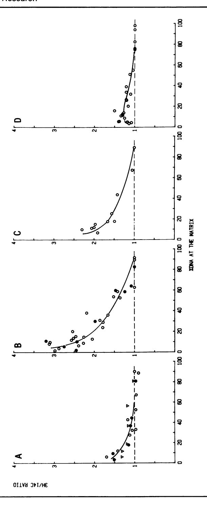
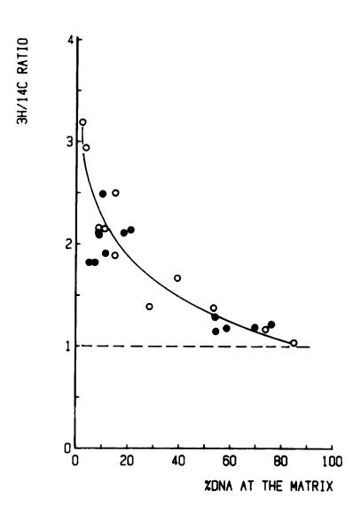
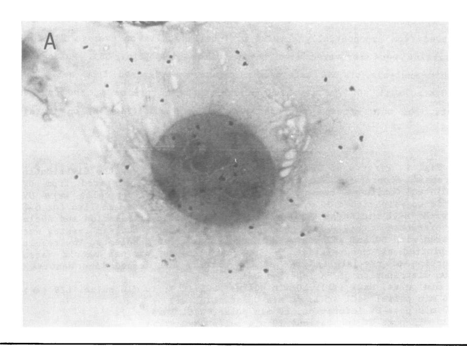
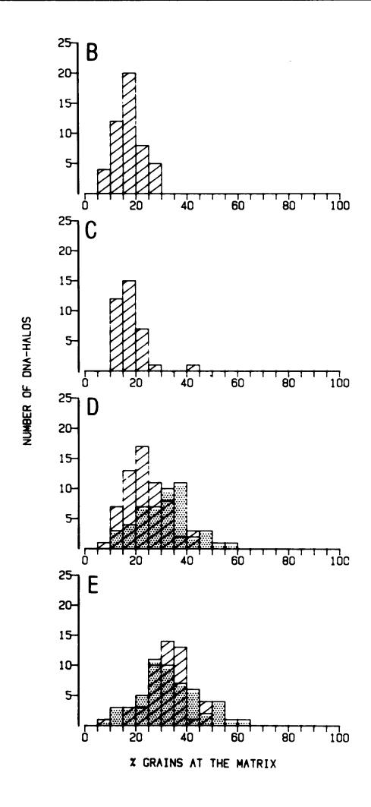
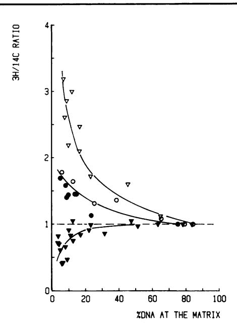
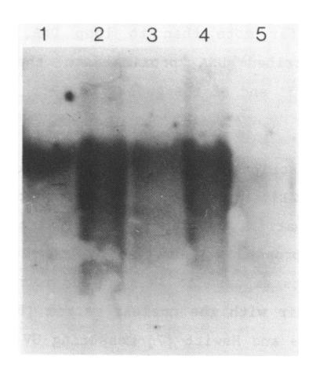

Nuclear matrix associated DNA is preferentially repaired in normal human fibroblasts, exposed to a low dose of ultraviolet light but not in Cockayne's syndrome fibroblasts

L.H.F.Mullenders1.2, A.C.van Kesteren van Leeuwen1, A.A.van Zeeland1' and A.T.Natarajanl'2

1Department of Radiation Genetics and Chemical Mutagenesis, State University of Leiden, Wassenaarseweg 72, 2333 AL Leiden and 2J.A.Cohen Institute, Inter-university Research Institute for Radiopathology and Radiation Protection, Leiden, The Netherlands

Received July 27, 1988; Revised and Accepted October 20, 1988

#### ABSTRACTS

In this study we addressed the questions as to whether repair is confined to the nuclear matrix compartment, analogous to replication and transcription and how repair events are distributed in DNA loops associated with the nuclear matrix. Pulse labelling of ultraviolet (254 nm) irradiated confluent human fibroblasts revealed that repair was preferentially located in nuclear matrix associAted DNA in cells exposed to 5 J/m2. However, in cells exposed to 30 J/m1 repair approached a random distribution. The non-random distribution of repair label at 5 J/ma was most pronounced directly after irradiation and gradually changed to a more random distribution within two hours after treatment. The results of pulsechase experiments exclude the possibility of transient binding of repair sites to the matrix and favour the model of preferential repair of DNA sequences permanently associated with the nuclear matrix. Pronounced differences in distribution pattern of repair events in DNA loops were found among normal and UV-sensitive cell lines exposed to 5 J/ma. Repair in nuclear matrix associated DNA was 1.7 fold more efficient than in loop DNA in -'ormal and xeroderma pigmentosum group D cells and over 3 fold in xeroder;i pigmentosum group C cells. In Cockayne's syndrome fibroblasts repair in nuclear matrix DNA was found to be 2 fold less efficient than in loop DNA. This heterogeneity in distribution of repair correlates well with preferential removal of pyrimidine dimers from transcriptionally active DNA in normal and xeroderma pigmentosum group C cells and its absence in Cockayne's syndrome cells as recently reported by Mayne et al., 1988. The results suggest that Cockayne's syndrome cells have a defect in excision of UW-damage from transcriptionally active genes located proximal to the nuclear matrix. Xeroderma pigmentosum group C cells may possess a defect in DNA repair associated with chromatin regions outside transcriptionally active DNA.

#### INTRODUCTION

The organization of the eukaryotic genome into series of loops by specific attachment to the nuclear matrix or scaffold has been implicated in functional compartimentalization of the nucleus (1,2]. Although the nature of nuclear matrix associated DNA is poorly understood, there is increasing evidence that regulatory elements are situated at or near points of attachment of DNA loops to the nuclear matrix (3,4,5]. Such an organization is thought to facilitate processes which occur proximal to the nuclear

matrix i.e. replication and transcription by an efficient reduction of the search volume for regulatory factors [2]. In principle, the DNA loop organization of the genome could also facilitate the repair of DNA damage via a mechanism analogous to that of replication with DNA reeling through matrix bound repair complexes. Alternatively, damaged sites are brought into the matrix compartment in order to become repaired.

Studies undertaken to elucidate the role of the nuclear matrix in processing ultraviolet light induced damage in human cells have led to conflicting results. McCready and Cook (6] concluded from autoradiographic analysis of nucleoids that UV-induced repair synthesis is localized at the nuclear matrix. Harless and Hewitt (7], employing the same methodology found a preferential occurrence of repair label at the matrix, but only at low UV-dose. Using a biochemical approach, we found no evidence for nuclear matrix associated repair synthesis following a relatively high UV-dose (30 J/m2) [8]. Interpretations concerning the biological relevance of nonrandom distribution of repair events are complicated by heterogeneity in distribution and repair of damage within the genome [see for review 9]. In human cells pyrimidine dimers are preferentially removed from active genes [10,11] and repair is significantly faster in the transcribed strand of the dihydrofolate reductase gene than in the non-transcribed strand [10]. Active genes are found to be proximal to the nuclear matrix and therefore a preferential occurrence of repair events at the nuclear matrix could reflect the preferential repair of active genes instead of transient binding of repair sites. Direct evidence for this possibility comes from studies with xeroderma pigmentosum group C cells. The preferential repair of nuclear matrix associated DNA in these cells as reported previously [12], reflects the preferential repair of DNA sequences permanently associated with the nuclear matrix and most likely of transcriptionally active DNA [11,13].

In this study, we have performed a detailed analysis of the distribution of repair events to elucidate the role of the nuclear matrix in UV-induced repair synthesis. The distribution of repair events in DNA loops was investigated in different types of human fibroblasts using biochemical and single cell analysis, several UV-doses and different extraction procedures for preparation of DNA-nuclear matrix complexes. In cells exposed to 30 J/m2, no distinct preferential repair of nuclear matrix associated DNA was found consistent with results reported previously (8]. The preferential repair of nuclear matrix associated DNA observed in cells exposed to low dose of ultraviolet light (5 J/mz) is related to preferential repair of DNA permanently associated with the nuclear matrix. The heterogeneity in distribution of repair label at the level of DNA-loops among the various human cell lines suggests that this DNA is identical to transcriptionally active DNA.

## MATERIALS AND METHODS

## Cell culture and prelabelling of the cells

Diploid normal human, xeroderma pigmentosum and Cockayne's syndrome fibroblasts were cultured in Ham's F10 medium supplemented with 152 fetal calf serum and antibiotics in a 2.5Z COa atmosphere.

Twenty-four hours after the cells were split (1:3) 0.1 uCi/ml (14C] thymidine (50 uCi/mmol) was added to the medium and the cells were grown for 60 h in this medium. The medium was replaced by fresh label-free medium and the cells were allowed to grow for at least 2 weeks to become confluent. The following primary human fibroblasts have been used in this study: normal human cells (VH25), xeroderma pigmentosum cells belonging to complementation group C (XPITE and XP8CA) or complementation group D (XP3NE), Cockayne's syndrome cells (CS3BE).

### UV-irradiation and post-UV incubation of cells

Before UV-irradiation or addition of the pulse label, cells were incubated for 30 min in medium containing 10 mM hydroxyurea (HU). After removal of the medium, cells were irradiated with a Philips T.U.V. lamp (predominantly 254 nm) at a dose rate of 0.21 J/m2/s. Pulse labelling was achieved with 50 uCi/ml ['H]thymidine (80 Ci/mmol, Amersham) for 10 min or with 10 uCi/ml [2H]thymidine for 2 h. in the presence of HU. Cells treated identically with the omission of irradiation served as controls to estimate the amount of replicative DNA synthesis in the presence of HU. Incorporation in these non-irradiated confluent cells in the presence HU did not exceed 7Z of the label incorporated by irradiated cells. In chase experiments, UV-irradiated cells were pulse labelled with 50 uCi/ml ['H] thymidine for 7.5 min washed two times with label-free medium containing 10-s H thymidine and incubated for either 7.5 min or 67.5 min in the same medium before nuclear lysates were prepare4.

#### Preparation and analysis of nuclear lvsates

The incorporation of ['H]thymidine was terminated by rinsing the cells with ice-cold 0.1Z Triton X-100, 10 mM NaCl, SMs Tris-HCl, pH 8.0. Nuclei were collected by centrifugation and nuclear lysates were prepared by either high salt or low salt extraction. In the first procedure nuclei were

resuspended in 10 mM NaCl, 25 mM Tris-HC1, pH 8.0 and an equal volume of 4 M NaCl in Tris-HCl buffer was added. Samples of nuclear lysates were incubated with increasing concentrations of DNAse I (2-12 ug/ml) and analysed in neutral sucrose gradients as described previously (14]. In the low salt procedure, nuclear lysates were prepared as described by Keppel [15] with minor modifications. Nuclei were resuspended in 10 mM NaCl, 0.25 mM spermidine, 25 mM Tris-HCl, pH 8.0 and lithium diiodosalicylate (LIS) was added to a final concentration of 25 mM. After 10 min at room temperature, the nuclear lysate was centrifuged for 10' at 2000 g and the pellet was washed once and resuspended in 100 mM NaCl, 25 mM Tris-HCl, pH 8.0. After DNAse I digestion, samples of the nuclear lysate were analysed in neutral sucrose gradients containing 100 mM NaCl. The polypeptide composition of DNA-nuclear matrix complexes prepared by 2M NaCl or LIS extraction was very similar except that the extraction of histones in the low salt treatment was less complete (data not shown).

# Analysis of nuclear matrix associated DNA and loop DNA

Nuclei prepared from 4\*C-prelabelled confluent fibroblasts were lysed by the high salt procedure. The nuclear lysate was incubated with DNAse I (10 or 12 Aug/ml) for 15 min in the presence of 5 mM MgCl2. A sample of the nuclear lysate treated identically with omission of DNAse 1 served as a control. The digestion was terminated by addition of EDTA (final concentration 20 mM) and the nuclear lysate was centrifuged for 20 min at 8000 rpm in a Sorvall HB-4 rotor. The pellet consisting of nuclear matrices with remaining DNA was washed once with 2 M NaCl, 25 mM Tris-HCl, pH 8.0. The supernatant including the wash volume was precipitated with 2 vol of alcohol. The nuclear matrix fraction as well as the pellet obtained after centrifugation of the supernatant were digested with 50 ug/ml proteinase-K in 0.52 SDS, 150 mM NaCl, 1 mM EDTA, 10 mM Tris-HCl pH 8.0. DNA was further purified by double phenol extraction and restricted with Eco Rl. Based on radioactivity, equivalent amounts (about 10 ug per sample) of matrix associated DNA and supernatant DNA were subjected to electrophoresis in neutral 12 agarose gels and after Souther blotting hybridized to a '2Plabelled DNA-probe.

#### Preparation and autoradiography of DNA halo-matrix structures

Cell cultures on coverslips, preparation of DNA halo-matrix structures, and autoradiography were carried out as described previously (12]. In order to facilitate the detection of S-phase cells we prelabelled the cells for 2 h with 2 uCi/ml ['H]thymidine (5 Ci/mmol) prior to irradiation and pulse labelling with 50 uCi/ml [(H]thymidine (80 Ci/mmol). Autogradiographic slides were analyzed with a Leitz microscope connected to an Artec Model 880 automatic grain counter. The results are reported as the ratio of grains overlying the nuclear matrix region and the whole DNA halo-matrix structure.

#### RESULTS

# 1. Distribution of repair patches in DNA-nuclear matrix complexes: short pulse label experiments

Histone-depleted supercoiled DNA loops anchored to the nuclear matrix can be isolated from nuclei by extraction with 2 M NaCl and subsequent centrifugation in neutral sucrose gradients [16]. The relative position of repair events within DNA loops can be examined by producing random breaks in DNA loops by DNAse I. The probability of a DNA fragment being released from a DNA loop by such breaks will decrease the closer it is situated to an attachment size at the nuclear matrix [14]. Using the high salt extraction procedure, we previously examined the distribution of repair events in DNA-nuclear matrix complexes in human fibroblasts UV-irradiated with 30 J/mz. (8]. Although the initial results pointed towards a random distribution of repair events, a more detailed analysis of the role of the nuclear matrix in Dy-induced repair synthesis by biochemical and single cell analysis exploring several Dy-doses and different extraction procedures was made.

In a series of experiments, confluent human fibroblasts were Dvirradiated with 30 J/m2 and pulse labelled for 5 or 10 min directly after treatment. A small enrichment (1.3 - 1.6 fold) of repair label in nuclear matrix associated DNA was observed when 90Z of the DNA was released from the DNA-nuclear matrix complexes prepared by either low or high salt extraction of nuclei (Fig. lA].

In order to assess the distribution of repair events at a biologically relevant dose, confluent human fibroblasts were UV-irradiated with 5 J/m2 and subsequently pulse labelled for 10 min at various time intervals after UV-treatment. In cells pulse labelled imediately after UV-treatment, repair label was preferentially recovered from nuclear matrix associated DNA regardless whether nuclei were extracted by the high or low salt procedure (Fig. 1B]. The occurrence of preferential repair of nuclei matrix associated DNA appeared to be dependent on the time interval between the irradiation and pulse labelling of the cells (Fig. 1B-D). One hour after

UV-treatment a distinct enrichment of repair label in nuclear matrix associated DNA was still observed, whereas two hours after treatment, the distribution of repair label tended to become similar to the distribution of 14C-prelabelled DNA.

The preferential occurrence of repair label in nuclear matrix associated DNA could be due to transient binding of damaged sites in order to become repaired or to preferential repair of DNA permanently associated with the nuclear matrix. To discriminate between these two possibilities, confluent human fibroblasts were UV-irradiated with 5 J/m², pulse labelled for 7.5 min immediately after treatment and then incubated for either 7.5 min or 67.5 min in medium containing non-radioactive thymidine. Fig. 2 shows that after a 7.5 min chase period, the distribution of repair label in DNA loops was similar to the distribution observed after a 10 min pulse [Fig. 1B]. The non-random distribution of repair label was not substantially altered by the extension of the chase period, although the incorporation of PH-TdR was not completely blocked during the chase period(1.5 fold increase after one hour). The results of the chase experiment are in favour of preferential repair of DNA sequences permanently attached to the nuclear matrix.

To study the possible role of the nuclear matrix in DNA repair at the level of single cells, distributions of grains due to repair synthesis were analyzed in DNA halo-matrix structures (Fig. 3). In structures prepared from exponentially growing prelabelled cells on average 18.1% of the grains were recovered from the matrix region (Fig. 3B). Autoradiographic analysis of DNA halo-matrix structures prepared from cells UV-irradiated with 30 J/m² revealed an enrichment of grains at the nuclear matrix, but only after a very short pulse of 6 min (Fig 3E, on average

Fig. 1. Effects of UV-dose and post-UV incubation on the distribution of repair events in DNA nuclear matrix complexes, prepared from UV-irradiated confluent human fibroblasts. 1-C-prelabelled cells were UV-irradiated with either 30 J/m² (A) or 5 J/m² (B-D), pulse labelled for 5-10 min with 3H-thymidine at various time periods after irradiation and nuclei were extracted with 2 M NaCl or 25 mM LIS. Samples of nuclear lysates were digested with DNAseI and analysed in neutral sucrose gradients. The results are plotted as the relative 3H 1-C ratio at the nuclear matrix versus proportion of pre-labelled DNA at the matrix. The dashed line denotes a random distribution of 3H labelled DNA.

A. 5 min pulse, NaCl (O); 10 min pulse, NaCl (♥); 10 min pulse, LIS (●)

B. 10 min pulse; NaCl (O); 10 min pulse, LIS ( )

C. 60 min post-UV incubation, 10 min pulse, NaCl (0)

D. 120 min post-UV incubation, 10 min pulse, NaCl (O).

Fig. 2. Pulse-chase analysis of the distribution of repair events in DNA-nuclear matrix complexes prepared from UV-irradiated confluent human fibroblasts.  $^{14}$ C-prelabelled cells were UV-irradiated with 5 J/m² and directly pulse labelled with  $^{14}$ H-thymidine for 7.5 min. Cells were washed and incubated for either 7.5 min ( $\bigcirc$ ) or 67.5 min ( $\bigcirc$ ) in medium containing non-radioactive thymidine. Samples were processed and analysed as described in legend of Fig. 1.

Fig. 3. Autoradiographic analysis of the distribution of repair events in DNA halo matrix structures.

- A. Autoradiogram of a DNA halo structure prepared from cells pulse labelled for 10 min directly after UV-irradiation (5 J/m'). In this structure about 35Z of the total grains is localized at the nuclear matrix. B-E. Histograms of grain distributions in DNA halo matrix structures prepared from irradiated and non-irradiated cells. The data are plotted as the relative ratio of grains overlying the nuclear matrix region versus the number of structures.
- B. Cells prelabelled for 2 hours.
- C. Cells irradiated with 30 J/m: and labelled for 120 min.
- D. Cells irradiated with 5 or 30 J/m'm and labelled for 10 amn.
- E. Cells irradiated with 5 or 30 J/W\* and labelled for 6 min.
- D. and E. Dotted area: 5 J/m2; striped area: 30 J/m3.

Fig. 4. Distribution of repair events in DNA-nuclear matrix complexes prepared from normal human, xeroderma pigmentosum and Cockayne's syndrome fibroblasts.  $^{14}$ C-prelabelled confluent cells were UV-irradiated with  $^{5}$ H-thymidine for 2 hours starting directly after irradiation. DNA-nuclear matrix complexes were isolated and processed as described in legend of Fig. 1. Normal human cells ( $^{\circ}$ ); XP-D cells ( $^{\odot}$ ); XP-C cells ( $^{\circ}$ ); CS-cells ( $^{\circ}$ ).

34.1% of the grains at the nuclear matrix region). Extension of the pulse time resulted in distributions of grains very similar to the DNA distribution within the DNA-halo structures: on average 23.6% and 18.7% of the grains were found in the nuclear matrix region following 10 min (Fig. 3D) and 120 min (Fig. 3C) pulse labelling respectively. In DNA halo-matrix structures obtained from cells exposed to 5  $J/m^2$  an enrichment of grain within the nuclear matrix regions was found after pulse labelling for 6 (Fig. 3E, on average 34.1% of the grains) and 10 min (Fig. 3D, on average 32.5% of the grains).

# Distribution of repair patches in DNA-nuclear matrix complexes: 2 hours label experiments

The distribution of repair events in normal cells exposed to 5  $J/m^2$  and labelled 2 hours directly after treatment, showed that nuclear matrix associated DNA was about 1.7 fold enriched in repair label (Fig. 4). In confluent xeroderma pigmentosum cells belonging to complementation group D (XP-D) a distribution very similar to normal cells was found, whereas in

Fig. 5. Localization of the 5' region of the adenosine deaminase gene within DNA loops. DNA nuclear matrix complexes were obtained by 2 H NaCl extraction of nuclei, prepared from 2"C-prelabelled confluent human fibroblasts. After DNAse I digestion (10 ILg/ml: lanes 2 and 3; 12 jig/ml: lanes 4 and 5) matrix associated DNA and loop DNA were isolated and subjected to electrophoresis in a neutral agarose gel. After blotting, the DNA was hybridized to a DNA probe containing upstream and first exon sequences. Lane 1: total DNA; lanes 2 and 3: matrix DNA (17,5Z) of total DNA and loop DNA (82,5Z of total DNA); lanes 4 and 5: matrix DNA (10? of total DNA) and loop DNA (90? of total DNA).

xeroderma pigmentosum cells belonging to complementation group C (XP-C), repair occurred with distinctly higher preference in nuclear matrix associated DNA. In Cockayne's syndrome cells (CS) the opposite result was observed: the DNA-nuclear matrix complex became relatively depleted of repair label as more DNA was released from the complex by DNAse I. it should be noted that in XP-C cells the distribution of repair label following 20 mmn pulse labelling (data not shown) was essentially the same as observed after 2 hours labelling. A similar observation was made in cells exposed to 30 JIm2 (221.

### 3. Southern analysis of matrix associated DNA and loop DNA

In a recent study the removal of pyrimidine dimers in DNA fragments of the adenosine deaminase (ADA) gene in normal, XP-C and CS cells was analysed (11]. In order to correlate those results to the results of repair studies at the level of DNA-nuclear matrix complexes, we investigated the occurrence of ADA sequences in nuclear matrix associated DNA and loop DNA. Fig. 5 shows that the Eco RI-TaqI genomic probe specific for exon 1 as well as 135 bp upstream sequences of the ADA-gene (17] hybridized to nuclear matrix associated DNA far more than to loop DNA, consistent with the localization of transcribed DNA proximal to the nuclear matrix by attachment sites at the 5' end of the genes (18,19].

#### DISCUSSION

DNA synthesis and transcription have been found to be confined to the nuclear matrix [14,20,21]. With regard to compartmentalization of DNA repair at the nuclear matrix, conflicting conclusions have been reported. Using a biochemical approach, we analysed UV-induced repair synthesis in primary human fibroblasts exposed to 30 J/m2 and found no evidence for the association of DNA repair with the nuclear matrix (8]. However, Mc Cready and Cook [6] and Harless and Hewitt (7] measuring UV-induced repair in DNA halo-nuclear matrix structures prepared from immortalized human cells, concluded that DNA repair was confined to the nuclear matrix. The inability to chase the label from the nuclear matrix (6] and the matrix localisation seen even after extended periods of labelling, indicate a permanent rather than transient association of repairing sites with the nuclear matrix.

The results we have presented here, extend our previous analysis and conclusion by being inconsistent with a general mechanism of repair which involves the dynamic binding of repair sites to the nuclear matrix. Employing a high UV-dose (30 J/m2), a 5 min pulse of 2H-TdR in the presence of HU and the biochemical approach, we observed only a 1.5 fold enrichment of repair label in nuclear matrix associated DNA over loop DNA. Considering the very profound enrichment of newly replicated DNA with the matrix (15-20 fold (8,14]), our results suggest that repair synthesis does not proceed via repair enzymes associated with the nuclear matrix. By enzymatic analysis of repair labelled DNA, it could also be shown that the majority of repair events was not completed during the pulse (22]. This virtually rules out the possibility that the repair process is too fast to be trapped at the nuclear matrix by pulse labelling. Furthermore, identical results obtained by two different extraction procedures make it unlikely that the almost random distribution of repair label could simply be attributed to disruption of matrix-associated repair complexes during isolation.

The results of biochemical experiments performed at low UV-dose provide additional evidence for the absence of transiently bound repair sites at the nuclear matrix. Consistent with the data reported by Harless and Hewitt (7], a preferential association of repair label with the nuclear matrix following exposure of cells to 5 J/im was found. However, the finding that repair label approached a random distribution after a short pulse given two hours after irradiation, does not support a general model of repair confined to the nuclear matrix. Instead, the results of the chase experiments favour preferential repair of DNA sequences permanently associated with the nuclear matrix.

The autoradiographic analysis of DNA halo-matrix structures prepared from exponentially growing cells without inhibitor, largely confirmed the biochemical results. An only moderate enrichment of repair label within the nuclear matrix area was observed after short pulses (6 min), which is incompatible with matrix localized repair if one considers the 3-10 min time period necessary to repair a lesion in the absence of inhibitor [23]. In line with the biochemical data, repair label following a 10 min pulse was found to be preferentially localized at the nuclear matrix at 5 J/m2, but approached a more random distribution at 30 J/m1. Thus, our data confirm a dose dependent association of repair with the nuclear matrix, as reported by Harless and Hewitt (7] and also show that the preferential labelling of nuclear matrix merely reflects the preferential repair of DNA permanently associated with the matrix.

Although the nature of nuclear matrix associated DNA is poorly understood, the association of a number of genes at specific sites in the 5' region has been demonstrated (1]. Our results indicate .that this also holds for adenosine deaminase, a housekeeping gene. The preferential localization of repair at the nuclear matrix at 5 J/mz may therefore represent the preferential repair of transcriptionally active DNA. The aberrant distributions of repair label in XP-C and CS cells would then indicate that in XP-C, the residual repair is highly concentrated in active DNA, whereas CS cells are defective in performing an efficient repair of active DNA. Experimental support for this hypothesis comes from the kinetics of removal of pyrimidine dimers from active and inactive DNA sequences in the various cell lines used in this study. In human cells dimers are preferentially removed from the adenosine deaminase gene (ADA) (11] as has been described for the dihydrofolate reductase gene (10]. Despite the low overall level of excision repair, XPITE cells are proficient in removal of dimers from the ADA gene, whereas CS3BE cells remove dimers at slower rate and to a lesser extent (11]. Normal cells are able to remove dimers from inactive sequences, but XPITE cells are not. The results of nuclease sensitivity studies in XP-C cells also point towards preferential repair of active DNA (13]. Although Bohr et al [24] did not find significant repair of the DHFR gene in XP-C cells, we observed a considerable repair of dimers in the DHFR gene in XPITE cells (unpublished results]. Since the non-random distribution of repair label in DNA halo-matrix complexes correlates well with non-random repair of pyrimidine dimers, it is likely that the majority of incorporated label comes from repair of dimers. This is consistent with the observation of Smith [25] that in confluent low dose UV-irradiated human fibroblasts the kinetics of loss of T4 endonuclease V sensitive sites is in good agreement with that of repair synthesis. Short pulse labelling of UV-irradiated cells revealed, that repair label was preferentially located in nuclear matrix associated DNA in cells exposed to 5 J/m1, but not to 30 J/ma. The non-random distribution was most predominant directly after irradiation and very similar to the distribution observed in XP-C cells following extended labelling periods. Preferential repair of nuclear matrix associated DNA only restricted to a short period after UV-treatment, fits in with the concept that in human fibroblasts exposed to a low UV-dose repair of functionally important domains in the genome occurs quickly during a short period after treatment. Repair of potentially lethal damage [26] and UW-inhibited RNA synthesis (27] is almost completed within 2 hours and repair of the transcribed strand of the DHFR gene 'L most pronounced during the first 2 hours after treatment (10]. For the apparent absence of preferential repair of active DNA at 30 J/mZ, two possibilities may be considered. First, the integrity of the DNAnuclear matrix complexes may be affected by the high 1W-dose. This however, is very unlikely, since neither nuclear matrix associated DNA replication nor the characteristic non-random distribution of repair label in XP-C cells was altered by 30 J/m2 treatment (17]. Secondly, the repair of active genes could be impaired by the high 1W-dose. The experiments with XP-C cells at 30 J/m2 show no evidence for this. An obvious explanation for the dose dependent preferential repair of nuclear matrix associated DNA would be, that at 30 J/m2 the repair of active DNA is proceeding at the same rate as inactive DNA due to increase of the rate of repair of inactive DNA. Measurement of repair replication (28] and frequencies of DNA strand breaks generated by inhibition of the repair process (23,29] in 1W-irradiated human fibroblasts indicates, that the number of repair events in the genome overall increases with the dose reaching a maximum level at 20-30 J/m2. It is not unreasonable to assume that in this respect the repair of active DNA is different from bulk DNA, since evidence has been presented that repair

of active DNA is coupled to transcription [10]. Such a repair pathway may saturate at lower UV-doses than pathways involved in the repair of bulk DNA.

### ACKNOWLKDGDIKS

We thank Dr. P.H.M. Lohman for critical reading of the manuscript, Dr. L. Mayne for supplying the Cockayne's syndrome cell strain and Dr. Th.M. Berkvens for supplying the EcoRI-TaqI probe. This work was supported by the association of the University of Leiden with Euratom, contract no. BI6-E-166 NL.

#### References

- 1. Zehnbauer, B.A. and Vogelstein, B. (1985) Bio Essays 2, 52-54.
- 2. Gasser, S.M. and Laemmli, U.K. (1987) Trends in Genetics 3, 16-22.
- 3. Cockerill, P.N. and Garrard, W.T. (1986) Cell 44, 273-282.
- 4. Razin, S.V., Kekelidze, M.G., Lakanidin, E.M. Scherrer, K. and Georgiev, G.P. (1986) Nucl. Acids Res. 14, 8189-8207.
- 5. Dijkwel, P.A., Wenink, P.W. and Poddighe, J. (1986) Nucl. Acids Res. 14, 3241-3249.
- 6. McCready, S.J. and Cook, P.R. (1984) J. Cell Sci. 70, 189-196.
- 7. Harless, J. and Hewitt, R.R. (1987) Mutat. Res. 183, 177-184.
- 8. Mullenders, L.H.F., van Zeeland, A.A. and Natarajan, A.T. (1983) Biochim. Biophys. Acta 740, 428-435.
- 9. Bohr, V.A., Phillips, D.H. and Hanawalt, P.C. (1987) Cancer Res. 47, 6426-6436.
- 10. Mellon, I., Spivak, G. and Hanawalt, P.C. (1987) Cell 51, 241-249.
- 11. Mayne, L.V., Mullenders, L.H.F. and van Zeeland, A.A. (1988) in: Mechanisms and Consequences of DNA damage processing, in press.
- 12. Mullenders, L.H.F., van Kesteren, A.C., Bussmann, C.J.M., van Zeeland, A.A. and Natarajan, A.T. (1986) Carcinogenesis 7, 995-1002.
- 13. Player, A.N. and Kantor, G.J. (1987) Mutat. Res. 184, 169-178.
- 14. Dijkwel, P.A., Mullenders, L.H.F. and Wanka, F. (1979) Nucl. Acids Res. 6, 219-230.
- 15. Keppel, F. (1986) J. Mol. Biol. 187, 15-21.
- 16. Mullenders, L.H.F., van Zeeland, A.A. and Natarajan, A.T. (1983) Mutat. Res. 112, 245-252.
- 17. Berkvens, Th.M., Gerritsen, E.J.A., Oldenburg, M., Breukel, C., Wijnen, J.Th. van Ormondt, H., Vossen, J.M., van der Eb, A.J. and Meera Than, P. (1987) Nucl. Acids Res. 15, 9365-9378.
- 18. Small, D., Nelkin, B. and Vogelstein, B. (1985) Nucl. Acids Res. 13, 2413-2431.
- 19. Dalton, S., Banfield Younghusband, H. and Wells, R.E. (1986) Nucl. Acids Res. 14, 6507-6523.
- 20. Jackson, D.A. and Cook, P.R. (1985) EMBO J. 4, 919-925.
- 21. van Eekelen, C.A. and van Venrooy, W.J. (1981) J. Cell Biol. 88, 554- 563.
- 22. Mullenders, L.H.F., van Zeeland, A.A. and Natarajan, A.T. (1987) J. Cell Sci. Suppl. 6, 243-262.
- 23. Erixon, K. and Ahnstrom, G. (1979) Mutat. Res. 59, 257-271.
- 24. Bohr, V.A., Okumoto, D.S. and Hanawalt, P.C. (1986) Proc. Natl. Acad. Sci. USA 83, 3830-3833.

- 25. Smith, C.A. (1978) DNA Repair mechanisms (Eds. Hanawalt, P.C. and Friedberg, E.C.), Academic Press, New York, 311-314.
- 26. Keyse, S.M. and Tyrrell, R.M. (1987) Carcinogenesis 8, 1251-1256.
- 27. Hayne, L.V. and Lehmann, A.R. (1982) Cancer Res. 42, 1473-1478.
- 28. Edenberg, H.J. and Hanawalt, P.C. (1973) Biochim. Biophys. Acta 324, 206-217.
- 29. Downes, C.S. and Collins, A.R.S. (1982) Nucl. Acids Res. 10, 5357- 5367.