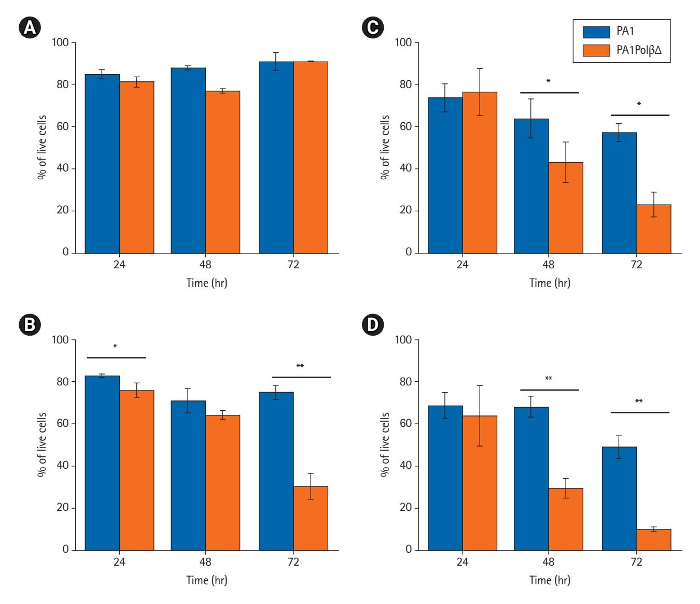
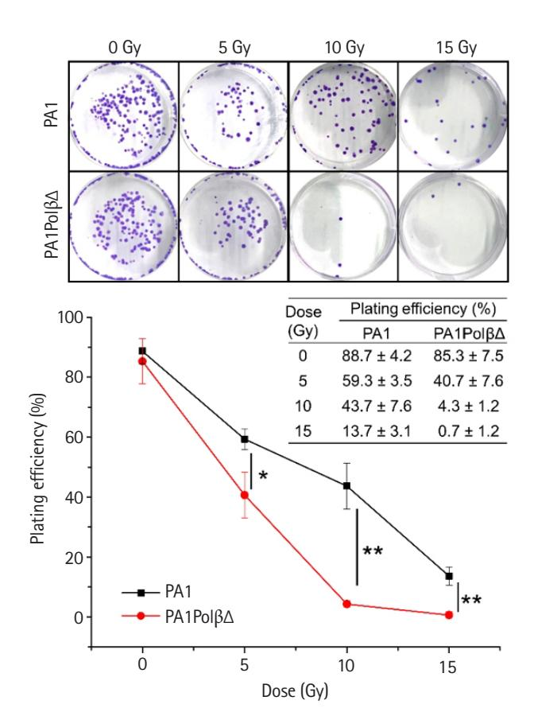
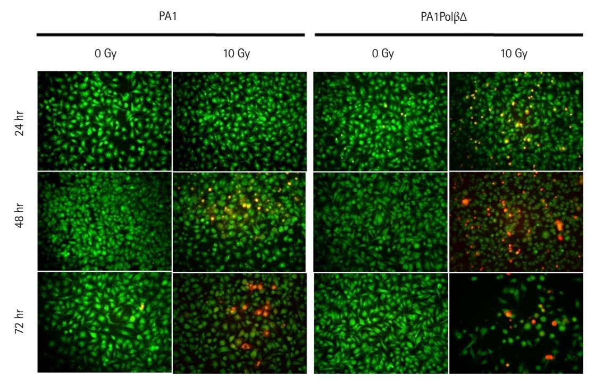
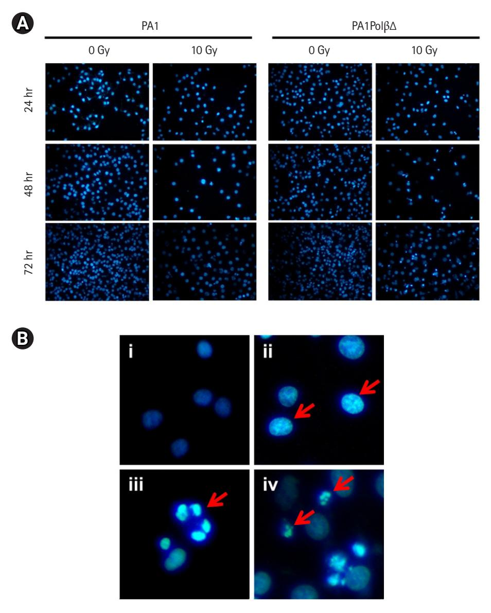
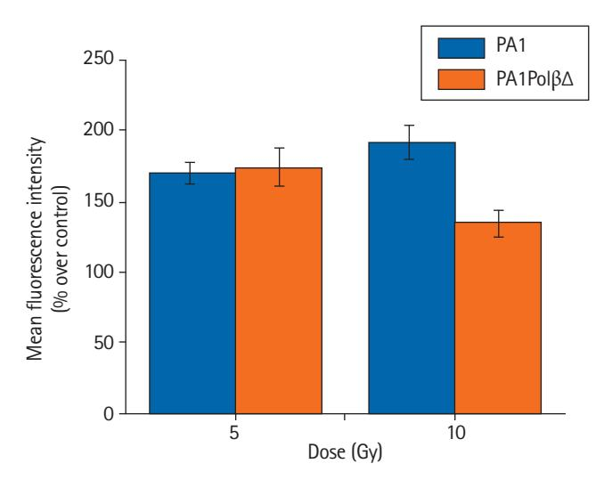
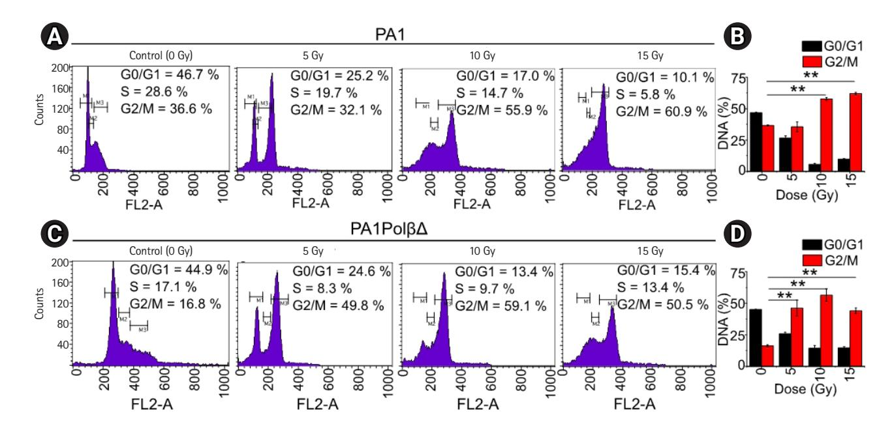
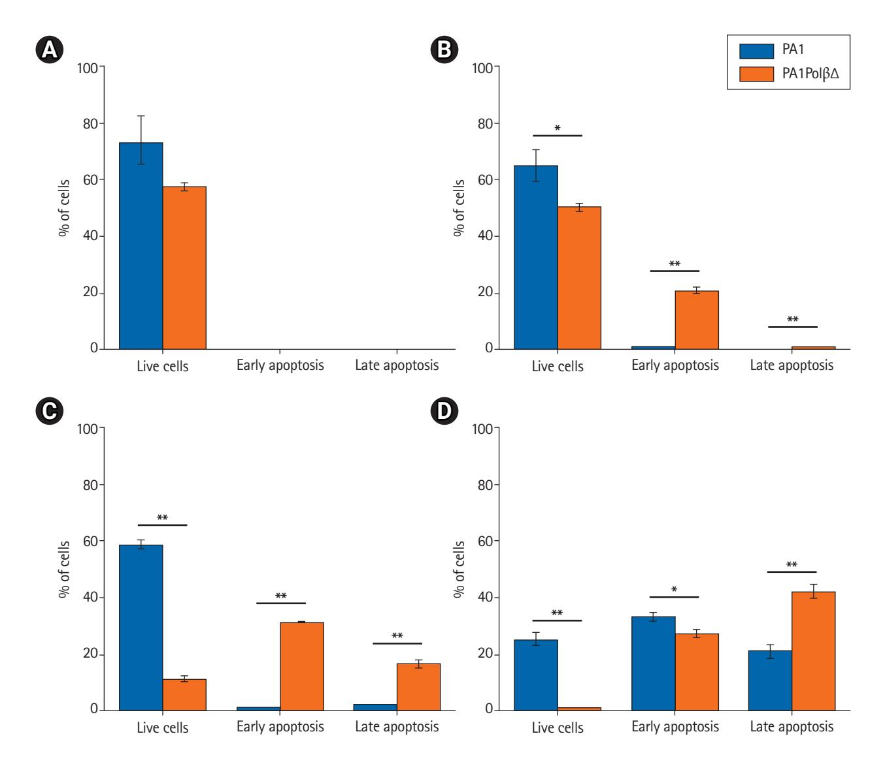
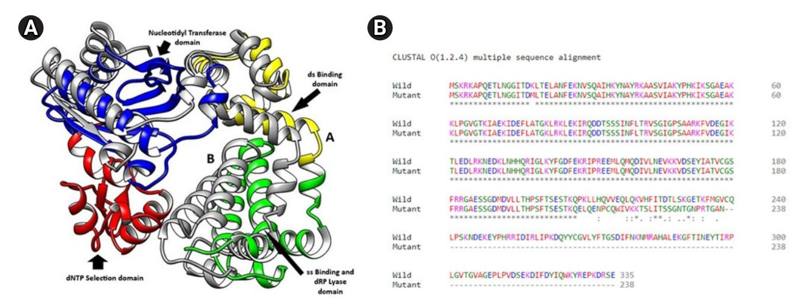
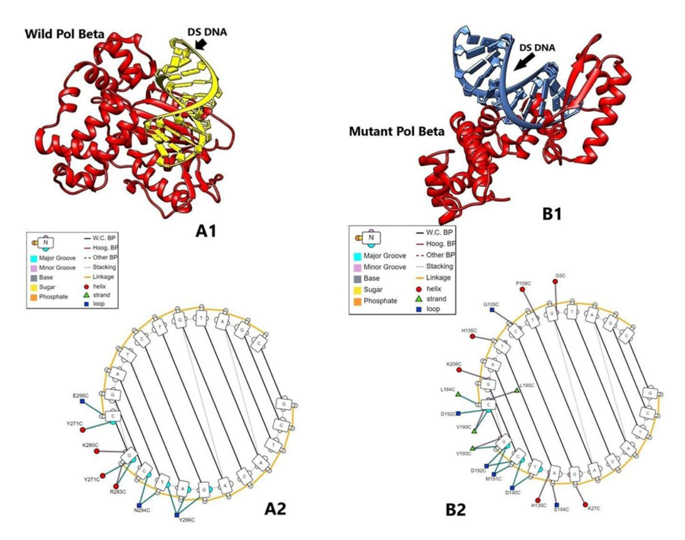

# **Original Article**

pISSN 2234-1900 · eISSN 2234-3156 Radiat Oncol J 2022;40(1):66-78 https://doi.org/10.3857/roj.2021.00689

# **PA1 cells containing a truncated DNA polymerase** β **protein are more sensitive to gamma radiation**

Anutosh Patra1 , Anish Nag2 , Anindita Chakraborty3 , Nandan Bhattacharyya1

Received: July 15, 2021 Revised: December 20, 2021 Accepted: January 5, 2022

#### Correspondence:

Nandan Bhattacharyya Department of Biotechnology, Panskura Banamali College, Panskura R.S., Purba Medinipur, West Bengal 721152, India.

Tel: +91 9434453188 E-mail: bhattacharyya\_nandan@

rediffmail.com ORCID:

https://orcid.org/0000-0001-9926-1304

**Purpose:** DNA polymerase β (Polβ) acts in the base excision repair (BER) pathway. Mutations in DNA polymerase β (Polβ) are associated with different cancers. A variant of Polβ with a 97 amino acid deletion (PolβΔ), in heterozygous conditions with wild-type Polβ, was identified in sporadic ovarian tumor samples. This study aims to evaluate the gamma radiation sensitivity of PolβΔ for possible target therapy in ovarian cancer treatment.

**Materials and Methods:** PolβΔ cDNA was cloned in a GFP vector and transfected in PA1 cells. Stable cells (PA1PolβΔ) were treated with 60Co sourced gamma-ray (0–15 Gy) to investigate their radiation sensitivity. The affinity of PolβΔ with DNA evaluated by DNA protein *in silico* docking experiments. **Results:** The result showed a statistically significant (p < 0.05) higher sensitivity towards radiation at different doses (0–15 Gy) and time-point (48–72 hours) for PA1PolβΔ cells in comparison with normal PA1 cells. Ten Gy of gamma radiation was found to be the optimal dose. Significantly more PA-

1PolβΔ cells were killed at this dose than PA1 cells after 48 hours of treatment via an apoptotic pathway. The *in silico* docking experiments revealed that PolβΔ has more substantial binding potential towards the dsDNA than wild-type Polβ, suggesting a possible failure of BER pathway that results in cell death.

**Conclusion:** Our study showed that the PA1PolβΔ cells were more susceptible than PA1 cells to gamma radiation. In the future, the potentiality of ionizing radiation to treat this type of cancer will be checked in animal models.

**Keywords:** DNA polymerase β, DNA repair, Ovarian epithelial carcinoma, Radiotherapy, Molecular docking simulation

## **Introduction**

Ovarian cancer is the third deadliest gynaecological cancer among women. It is considered to be one of the most challenging conditions of all the gynaecological malignancies due to its poor prognosis at the early stage and its strong resistance to the standard chemotherapeutic treatment regimen. The 80%–90% of all ovarian tumors are sporadic; the rest are hereditary. In the absence of proper detection and treatment, the 5-year survival rate of the sporadic ovarian cancer patient is estimated to be around 25%. If diagnosed and treated in time, the 5-year survival rate can go up to 95%, while cancer has still not shown metastasis outside the ovary [\[1\]](#page-10-0). The treatment procedure for this type of cancer is generally the application of platinum-based common chemotherapeutic agents like carboplatin, or another type of chemotherapy, called a taxane, such as paclitaxel, that however, may not be successful since it often develops resistance against the agents in the patients. It has been reported that up to 25% of patients without tumor and a further 50%–60% with tumors may acquire "platinum resistance" at some point during treatment [\[2\]](#page-10-1).

Copyright © 2022 The Korean Society for Radiation Oncology

This is an Open Access article distributed under the terms of the Creative Commons Attribution Non-Commercial License (http://creativecommons.org/licenses/by-nc/4.0/) which permits unrestricted non-commercial use, distribution, and reproduction in any medium, provided the original work is properly cited.

66 www.e-roj.org

*1 Department of Biotechnology, Panskura Banamali College, West Bengal, India*

*2 Department of Life Sciences, CHRIST (Deemed to be University), Bangalore, India*

*3 UGC DAE, Consortium for Scientific Research, Kolkata Centre, Kolkata, India*

Strategies for overcoming chemo-resistance in ovarian cancer include a combination of chemotherapeutic agents, platinum analogues, novel cytotoxic agents, alternative anti-microtubule agents, alternative target, modulation of apoptotic signaling, etc., however, with their pros and cons [3,4]. In recent years, targeting the DNA repair system and protein has become promising in cancer treatment [5,6].

Base excision repair (BER) is one of the several repair pathways responsible for removing small, non-helix-distorting base lesions from the genome and repairing damaged DNA throughout the cell cycle [7]. The DNA polymerase β (Polβ) is the smallest enzyme of the BER pathway. Several enzymes involved in the BER pathway interact with Polβ like DNA glycosylase, APE, PKNP, FEN1, PARP, XRCC1, [8] etc. In our previous study, we reported an ovarian cancer-specific mutation in the DNA Polβ, with the deletion in exon number 11–13, which could be detectable at an earlier stage of cancer [9]. This mutation was found in the catalytic part of the Polβ. Exon 11 had 29 amino acids in 208–236 nucleotide positions, exon 12 consisted of 21 amino acids in the region of 237–258, and exon 13 had 45 amino acids in position 259–304 nucleotides [\[10\]](#page-11-0).

Ionizing radiation (IR) induces an array of DNA lesions, approximately 10,000 damaged bases, 1,000 single-strand breaks (SSBs) and 40 double-strand breaks (DSBs) are produced per Gy per cell [\[11](#page-11-1)[,12\]](#page-11-2). Oxidative damage induced by IR is commonly corrected by the BER pathway. If such lesions are not corrected, it results in cell death by mitotic catastrophe and apoptosis [\[13](#page-11-3)[-18](#page-11-4)].

Radiation therapy (RT) uses beams of intense energy to kill cancer cells to shrink tumors. Linear accelerators, which produce megavoltage X-rays, are often used in modern days, but protons or other types of energy can also be used. Radiation from the radioisotope 60Co produces stable, dichromatic beams of 1.17 and 1.33 MeV, resulting in average beam energy of 1.25 MeV that plays a useful role in certain applications like Gamma Knife and is still used worldwide [\[19](#page-11-5)]. RT is used at different stages of cancer treatment and for different outcomes. It can be used (1) to alleviate symptoms in advanced, late-stage cancer (2) as the primary treatment for cancer (3) in conjunction with other cancer treatments (4) to shrink a tumor before surgery, or (5) to kill any cancer cells still remaining there even after surgery [\[20](#page-11-6)[-22](#page-11-7)].

The exact molecular mechanism between IR and cells is unclear [\[23\]](#page-11-8). Low doses of radiation generate reactive oxygen species (ROS) like hydrogen peroxide (H2O2), hydroxyl radical (-OH), etc. [\[24](#page-11-9)]. These substances can enter the cell membrane and organelles, destroy protein, membrane phospholipid, and nucleic acid, resulting in cell death or apoptosis. ROS is related to IR damage [\[25\]](#page-11-10), which endorses radiation damage to a certain extent. Low-dose of IR is associated with low risk [\[26](#page-11-11)]. Higher doses of IR mostly caused cell death due to DNA damage by photons or charged particles [\[27\]](#page-11-12). IR also results in indirect ionization, and it happens due to the ionization of water, as the principal constituent of the cell. The other organic molecules in the cell, which forms free radicals, such as hydroxyl (HO•) and alkoxy (RO2•), subsequently damage the DNA [[28](#page-11-13)[,29\]](#page-11-14). Apart from the damages caused by water radiolysis products, cellular damage might involve reactive nitrogen species (RNS) and other species [\[30\]](#page-11-15).

In this backdrop, the mutation was mimicked in the PA1 cell line (derived from ovarian teratocarcinoma cells) along with wild type maintaining heterozygous condition. The effect of IR was studied by evaluating their growth kinetics, ability to form colonies after gamma (γ) radiation treatment, detecting the redox state of the cells after treatment, assessment of cell cycle arrest, and finally quantifying the number of the apoptotic cells. Further, *in silico* molecular docking study was performed to map the mechanism of anti-cancer property of IR.

# **Material and Methods**

### **1. Preparation of stable cell line**

*1) Cloning of mutant Polβ (PolβΔ) into GFP vector*  PolβΔ cDNA was cloned into a GFP vector in HindIII and BamHI site. The insertion of the cDNA was confirmed by restriction digestion and sequencing.

#### *2) Cell line*

PA1 cells were obtained from the National Centre for Cell Science, Pune, India. The stability of the cell line was confirmed by the short tandem repeat (STR) profile by the supplier. Sixteen STR loci were amplified. The STR profile of the tested cell line was found to 100% match with the ATCC STR profile database.

*3) Transfection of PolβΔ in PA1 cells and preparation of stable cell line* 

PA1 cells were cultured in DMEM medium with 10% fetal calf serum (Gibco) and 100 U/mL penicillin and 100 U/mL streptomycin at 37°C in a humidified atmosphere with 5% CO2. Cells were plated at 24 well cell culture plate with 2 × 105 number of cells in each well and allowed to attach for 24 hours before transfection. Five hundred ng of plasmid was transfected to each well using Lipofectamine 2000 reagent (Cat# 11668030; Thermo Fisher, Waltham, MA, USA) as per instruction given in the kit. Transfected cells were selected by G418 (500 μg/mL) containing medium.

Initially, a selective medium was changed a week thrice for 2–3 weeks to remove the debris of the dead cell and allow it to grow transfected cells. The expression of the mutated Polβ protein was

confirmed by western blot analysis using anti-Polβ primary antibody (1:3000 dilution; Novus Biologicals, Centennial, CO, USA). The transfected cell line will be denoted as PA1PolβΔ hereafter.

#### **2.** γ**-irradiation**

Proliferating cells (1 × 106 ) were irradiated with 60Co γ-irradiator (dose rate of 6.85 kGy/hr) at UGC-DAE Consortium for Scientific Research facility, Kolkata Centre, with various doses (0 Gy, 5 Gy, 10 Gy, and 15 Gy).

#### **3. Cell growth analysis**

Both healthy PA1 and PA1PolβΔ cells were seeded at a density of 106 cells in a T25 flask and allowed to grow overnight. The next day, cells were irradiated after 4 hours of serum starvation at mentioned doses. Cells were incubated for 24–72 hours with a complete DMEM medium with 10% FBS, and live cells were counted by the trypan blue dye exclusion method [\[31\]](#page-11-16). Results are expressed as mean ± standard deviation (SD) of three individual experiments.

#### **4. Colony-forming assay**

Cells were irradiated, as mentioned earlier. After treatment, the cells were plated in a six well plate with complete media at a density of 200 cells per well. The cells were allowed to grow for 21 days, and the medium was changed at a frequency of twice per week. The number of colonies was counted by Giemsa dye after fixing colonies [\[32](#page-11-17)]. Results are expressed as mean ± SD of three individual experiments.

#### **5. Acridine orange and propidium iodide dual staining**

PA1 and PA1PolβΔ cells were plated at a density of 5 × 104 in 24 well plates, incubated overnight at 37°C in a CO2 incubator. Cells were treated with the desired dose of γ-radiations after 4 hours of serum starvation and incubated at 37°C for 24, 48, and 72 hours. After incubation, the culture medium was aspirated, and cells were washed with 1X phosphate-buffered saline (PBS) for twice. The cells were stained with equal volumes of acridine orange (AO) and propidium iodide (PI) (20 μM, AO-PI 1:1). The stained cells were kept in the dark for 30 minutes. The cells were washed once with 1X PBS and observed under fluorescence microscopy [\[33](#page-11-18)]. The images were analyzed by ImageJ software (https://imagej.nih.gov/ij/ index.html).

#### **6. Nuclear morphology study**

After RT, the nuclear morphology changes of PA1 and PA1PolβΔ were studied by 4ʹ,6-diamidino-2-phenylindole (DAPI) staining assay [\[34](#page-11-19)] with modifications. In brief, treated cells were allowed to grow in six-well plates in complete media and incubated at 37°C for 24, 48, and 72 hours. After the incubation period, the culture medium was removed and washed twice with PBS. The cells were then fixed with 4% paraformaldehyde, stained with 300 nM DAPI stain solution, incubated in the dark for 5 minutes, and observed under fluorescence microscopy. The images were analyzed by ImageJ software.

#### **7. Detection of ROS**

Intracellular ROS generation upon exposure to γ-radiation in PA1 and PA1PolβΔ cells was quantitated using oxidized DCFDA and flow-cytometry [\[35](#page-11-20)]. The cells were harvested after 2 hours of treatment and re-suspended in PBS. The cells were stained with 20 μM DCFDA and incubated for 30 minutes at 37°C in the dark. The samples were analyzed using a flow cytometer (BD FACSCalibur; BD Biosciences, Erembodegem, Belgium). Approximately 20,000 events were recorded from each sample, and the result was expressed as mean fluorescence intensity (%) over control [36].

#### **8. Cell cycle analysis by flow-cytometry**

The cells were treated with γ-radiation and incubated at 37°C in a CO2 incubator for 48 hours with 5% CO2. Then the cells were harvested (2 × 106 cells) and re-suspended in 1 mL ice-cold PBS, and fixed in 70% ethanol (for 500 µL cell suspension, 4.5 mL of 70% ethanol was used). Next, the cells were incubated at -20°C over the night, and then centrifuged carefully at 200 × g for 15 minutes in order to remove ethanol. Cells were washed with cold PBS for twice, and treated with 20 µL of RNAse (10 mg/mL) for the overnight. Finally, 5 µL of PI (2 mg/mL) was added, and the cells were analyzed in flow-cytometer [37,38] (BD FACSCalibur) with the help of the given software.

#### **9. Apoptosis analysis**

The number of apoptotic cells was quantified using Annexin V FITC/ PI kit by flow-cytometry. Briefly, the cells were treated with γ-radiation and incubated for 48 hours 37°C in a CO2 incubator. After 48 hours, the cells were harvested, washed with cold PBS, adjusted to 1 × 106 cells/mL in 1X binding buffer and stained with Annexin V FITC and PI solution for 15 minutes at room temperature in the dark. Finally, the stained cells were analyzed by flow-cytometry [39].

#### **10. Protein structure modelling**

Nucleotide sequences of the Polβ and PolβΔ were used from our previously published literature [9], provided in Supplementary Table S1. The nucleotide sequences of Polβ and PolβΔ were translated *in silico* by using the Expasy translate tool (https:// [www.expasy.org/\),](www.expasy.org/) [and sequences wer](www.expasy.org/)e aligned by Clustal Omega (https:[//www.ebi.](www.ebi.ac.uk/Tools/msa/clustalo/) [ac.uk/Tools/msa/clustalo/\)](www.ebi.ac.uk/Tools/msa/clustalo/) online server. Further, three-dimensional

structures of the Polβ and PolβΔ (deletion in amino acid residues 208–301) were modeled in the SWISS MODEL server (https://swissmodel.expasy.org/) by using the translated amino acid residues based on the templates PDB ids 1TV9 (human DNA polymerase beta, 2.00 Å, X-ray diffraction) and 6CR3 (ternary complex crystal structure of DNA polymerase beta, 1.95 Å, X-ray diffraction). SWISS MODEL relies on four principal steps to model a protein structure from the available template of the library, namely structural template(s) identification, target sequence and template structure(s) alignment, model-building, and quality evaluation of the built model. It computes the model structure by using an in-house comparative modeling engine ProMod3 [40]. ProMod3 extracts structural information from library templates and models the input amino acid sequence by several advanced tools such as mean force scoring, Monte Carlo, graph-based TreePack algorithm and SCWRL4 techniques. Further, ProMod3 uses the CHARMM22/CMAP force field for parameterization. The quality evaluation of the modeled structures was done by MolProbity, Ramachandran plot, and QMEAN quality estimates.

#### **11. Preparation of ligand proteins**

Three-dimensional structures of proteins, namely human apurinic/ apyrimidinic endonuclease-1 (PDB id 1DE8, 2.95 Å, X-ray diffraction), human 8-oxoguanine glycosylase (PDB id 1EBM, 2.10 Å, X-Ray Diffraction), human endonuclease VIII-like 1 (PDB id 1TDH, 2.10 Å, X-ray diffraction), human T-protein of glycine cleavage system (PDB id 1WSR, 2.00 Å, X-ray diffraction), SSB repair protein XRCC1-N-terminal domain (PDB id 1XNA, Solution NMR), FHA domain of human polynucleotide kinase 3'-phosphatase (PDB id 2BRF, 1.40 Å, X-ray diffraction), human ADP-ribosylhydrolase 3 (PDB id 2FOZ, 1.60 Å, X-ray diffraction), PARP1 (PDB id 2RCW, 2.80 Å, X-ray diffraction), human flap endonuclease FEN1 (PDB id 3Q8K, 2.20 Å, X-ray diffraction) and PARP2 (PDB id 4ZZY, 2.20 Å, X-ray diffraction) from RCSB Protein Data Bank (PDB) (https:[//www.rcsb.](www.rcsb.org/) [org/\). Dow](www.rcsb.org/)nloaded protein structures were optimized for docking by using UCSF Chimera (https:[//www.cgl.ucsf.edu/chimera/\).](www.cgl.ucsf.edu/chimera/)

#### **12. Protein-protein docking**

For protein-protein docking ClusPro 2.0 (https://cluspro.bu.edu/) was used [41]. ClusPro rotates ligands with 70,000 rotations. Each of the rotations is being translated into x,y,z relative to the receptor on a grid. We rotate the ligand with 70,000 rotations. For each rotation, we translate the ligand in x,y,z relative to the receptor on a grid. We choose the translation with the best score from each rotation. Eventually, the best ligand position within 9 Å radius is chosen as the best docking pose. DNA polymerase β wild (WT) & mutant types were used as receptors, and other proteins downloaded from RCSB PDB were used as ligands.

#### **13. Protein-nucleic acid docking**

HDOCK is an open-source server [\(http://hdock.phys.hust.edu.cn/](http://hdock.phys.hust.edu.cn/)) [42] that supports protein–RNA/DNA docking with an intrinsic scoring function. It automatically predicts interactions between receptor-ligand based on template-based and template-free hybrid algorithm. In the present work, initially, the nucleic acid (DNA) sequence 'GCTACAGATCG' was synthesized and geometrically optimized *in silico* by using Biovia Discovery studio software (Dassault Systèmes, Vélizy-Villacoublay, France). Further, a complementary strand was also computed. Both the single-strand and double-stranded DNAs were docked with Polβ and PolβΔ by using HDOCK. Protein-nucleic acid interactions were studied by using DNAproDB web server (https://dnaprodb.usc.edu/index.html).

#### **14. Statistical analyses**

The result was expressed as mean ± SD of three individual experiments. The results for PA1PolβΔ cells were compared against wildtype PA1 cells by unpaired t-test. p-values of less than 0.05 were considered as statistically significant.

# **Results**

After preparation of stable PA1PolβΔ cell line (Supplementary Fig. S1), growth kinetics of PA1PolβΔ cells were determined against different doses of γ-irradiations and results were compared with normal PA1 cells, which contained only wild type DNA Polβ protein.

Cell growth analysis results showed (Fig. 1) that PA1PolβΔ cells are more susceptible to radiation than normal PA1 cells, which contained only wild type Polβ protein. In case of the control cells (0 Gy), no significant difference was obtained between PA1 and PA-1PolβΔ cells after 72 hours of incubation (Fig. 1A). Whereas at a low dose (5 Gy), a significant change in cell growth between PA1 and PA1PolβΔ cells was obtained at 72 hours (Fig. 1B). At higher doses (10 Gy and 15 Gy), the growth of PA1PolβΔ cells was significantly decreased than PA1 cells within 48 hours (Fig. 1A, 1B).

The colony-forming assay results (Fig. 2) also reflected the more susceptibility of PA1PolβΔ cells against radiation than normal PA1 cells. At a higher dose (10 Gy and 15 Gy), significantly less colonies were obtained in the case of PA1PolβΔ cells than the normal one.

AO/PI dual staining assay was performed to assess the cell viability. After treating the cells with 10 Gy of γ-radiation, we observed characteristic morphological changes in the cell nuclei with time, which relate to apoptosis fluorescing orange to red (Fig. 3). The cell bearing green fluorescence after 24 hours in PA1 normal cells which contain wild type Polβ protein, whereas in case of PA-

**Fig. 1.** Cell growth analysis at different irradiation doses by trypan blue dye exclusion method. The irradiation dose is (A) 0 Gy, (B) low dose (5 Gy), (C) higher dose (10 Gy), and (D) higher dose (15 Gy), respectively. The results expressed as mean ± standard deviation of three individual experiments (n = 3), and p < 0.05 considered significant results (\*p < 0.05, \*\* p < 0.001).

1PolβΔ cells which contain both WT Polβ and PolβΔ mutant protein is fluorescing less uniformly than normal PA1 cells. With increasing incubation time (48 hours, 72 hours) after treatment, more cells were turned orange in the case of the PA1PolβΔ cell. However, after the same incubation time, it was found that fewer PA1 cells were turned into an orange indicating PA1 cells are less susceptible to γ-radiation than PA1PolβΔ cells.

DAPI staining was performed after treating the cells at 10 Gy of radiation to monitor the nuclear morphology changes (Fig. 4A). Untreated cells show homogeneous nuclear staining as they comprise live healthy cells with uniformly light blue nuclei. In the case of PA1PolβΔ cells, nuclear blebbing was observed after 24 hours of treatment. After 48 hours, chromatin condensation was observed in most of the cells, along with a few apoptotic bodies. With increasing incubation time (72 hours), more nuclei were fragmented, and apoptotic bodies were observed, indicating the late apoptosis [43] (Fig. 4B). In the case of PA1 normal cells, fewer apoptotic cells were observed than PA1PolβΔ cells, which indicated that PA1 cells were less sensitive to radiation than PA1PolβΔ cells (Fig. 4A).

In the present study, intracellular ROS production was detected using a DCFDA probe in both PA1 and PA1PolβΔ cells. Following the γ-radiation treatment, the flow cytometry revealed that ROS generation was increased in both PA1 and PA1PolβΔ cells at 5 Gy and 10 Gy of doses (Fig. 5). In the case of PA1 cells, the mean fluorescence was increased over non-treated cells (control) by 169.0% ± 8.2%, and 191.9% ± 11.5% for 5 Gy, and 10 Gy of γ-radiation,

**Fig. 2.** Colony-forming assay at different doses of γ-irradiations. The number of colonies is gradually decreased in higher doses. Significantly less colonies were formed in PA1PolβΔ cells (n = 3; \* p < 0.05, \*\* p < 0.001).

respectively. The PA1PolβΔ cells showed 173.7% ± 13.4% increase in mean fluorescence intensity over respective control cells at 5 Gy and 134.5% ± 9.1% at 10 Gy of γ-radiation treatment.

Flow-cytometry was used to test effect of the γ-radiation of cell cycle arrest (Fig. 6). For both cells, a significantly higher amount of cells was found in G2/M phase with an increase dose of radiations. However, in the case of PA1 cells, at the dose of 5 Gy no significant difference was observed in G2/M phase with respect to the control cells. At higher doses significantly more cells were arrested in G2/ M phase. 57.8% ± 1.1%, and 62.0% ± 1.1% at 10 Gy and 15 Gy, respectively, whereas only 36.6% ± 0.4% cells were arrested in G2/M phase in control cells. For PA1PolβΔ cells, 46.2% ± 6.4%, 56.4% ± 5.0%, and 44.1% ± 2.2% cells were arrested in G2/M phase at 5 Gy, 10 Gy, and 15 Gy, respectively. Only 16.2% ± 0.8% of non-treated cells were arrested in G2/M phase, which are significantly lower than all treated cells.

Annexin V-FITC/PI staining is widely used to identify apoptotic cells. Live cells neither stain with Annexin V-FITC, nor with PI. Early apoptotic cells stain with only Annexin V-FITC, late apoptotic cells both stain with Annexin V-FITC and PI as cell membrane lost its integrity. Necrotic cells only stain with PI. In an earlier analysis, we found PA1PolβΔ cells were more susceptible to γ-radiation than PA1 cells. In this experiment, we quantified the % of apoptotic cells (Fig. 7). At 5 Gy, 20.9% ± 0.9% PA1PolβΔ cells were in the early apoptotic (EA) stage, which is significantly higher than PA1

**Fig. 3.** Acridine orange/propidium iodide dual staining assay for cell viability study at 10 Gy at different time after radiation.

**Fig. 4.** (A) Nuclear morphology study by DAPI staining at 10 Gy in different time after radiation. (B) Nuclear morphology study of PA1PolβΔ cells (i) untreated cells (control) after 24 hours, and (ii–iv) treated cells after 24, 48, and 72 hours, respectively, (ii) cytoplasmic blebbing, (iii) chromatin fragmentation, (iv) apoptotic bodies. DAPI, 4',6-diamidino-2-phenylindole.

cells (0.5% ± 0.3%). At 10 Gy of radiations, 31.2% ± 0.2% PA-1PolβΔ cells were in the early apoptotic stage, and 16.5% ± 1.2% cells were in the late apoptotic (LA) phase, which is significantly higher in comparison to PA1 cells (EA, 0.6% ± 0.1%; LA, 2.1% ± 0.3%). At this dose, 58.5% ± 1.9% PA1 cells survived, whereas only 11.3% ± 0.9% of PA1PolβΔ cells were survived, which is significantly less. At 15 Gy of γ-radiation, both cells were found in the apoptotic phase, although PA1PolβΔ cells were significantly higher in the LA phase than PA1 cells.

In the model quality assessment, both the structures from the translated amino acid sequences showed >96% favorable regions in the Ramachandran plots, with the QMEAN score <0.90 (>0.6), as determined by the MolProbility tool of the SWISS MODEL. In the overlaid structures of the wild and mutant proteins (Fig. 8C), the mutant Polβ showed the partial deletion of nucleotidyl and dNTP selection domains (from amino acid residues 211–339) (Fig. 8D).

In general, molecular docking interaction of selected proteins—8-oxoguanine glycosylase, aminomethyltransferase, DNA repair protein XRCC1, polynucleotide kinase 3'-phosphatase, poly(ADP-ribose) glycohydrolase, poly(ADP-ribose)polymerase 1 (PARP 1), flap endonuclease 1, and poly(ADP-ribose)polymerase 2 (PARP 2)—with wild and mutant proteins did not yield any major differences in results (Supplementary Table S2), indicating that sequence deletion might not impact the binding interactions be-

tween the proteins. However, endonuclease 8-like 1 protein showed strong binding potential with the DEL (Δ) (-12.4 kcal/mol) than the wild type (-9.7 kcal/mol) protein (Supplementary Fig. S2). The BER reaction is started after cleaving bases damaged by ROS with endonuclease VIII-like 1 glycosylase [44]. Polβ comes into action after cleaving AP site by APE1 [18]. Relatively strong binding

**Fig. 5.** Generation of reactive oxygen species after 2 hours of γ-radiation treatment. Error bar indicating standard deviation of three individual experiments.

potentiality of the PolβΔ with endonuclease 8-like 1 might lead to higher binding probability PolβΔ than wild type Polβ.

In protein-nucleic acid docking study, we observed that mutant Polβ could strongly bind with double-strand DNA (-303.64 kcal/ mol) when compared with the wild type (-245.74 kcal/mol). The interaction between amino acid residues and nucleic acid bases (A/ T/G/C) for DEL type protein was found as Lys27C-G, Ser104C/ His135C-A, Asp190C-T/C, Met191C-C/G, Asp192C-C/G, Val193C-G [5´GCTACAGATCG3´ strand] and Ile33C-G, Pro108C-T, Gly105C-C, His135C-T, Lys206C-G, Leu194C/Leu195C-C, Asp192C/Val193C-C [3´CGATGTCTAGC5´ strand]. Further, the interaction of wild type protein amino acid residues and DNA bases were found as Tyr296C-T/A/G, Asn294C-C/T, Arg283C/Tyr271C/Lys280C-G [5´GC-TACAGATCG3´ strand] and Glu295C/Tyr271C-C [3´CGATGTCTAGC5´ strand] (Fig. 9). Docking interaction energies with both the proteins and single-strand DNA were found as similar (-285.44 and -272.65 kcal/mol) (Supplementary Fig. S2). PolβΔ has a large deletion of 97 amino acids in the catalytic part of amino acids residues 208–304, which belongs in exons 11–13. Exon 11 has nucleotidyl selection activity; exons 12 and 13 have dNTPs selection activity [45]. Hence deletion of this part may affect polymerizing activity, but single-strand binding and double-strand binding activity are presumed to have remained the same. PolβΔ has better binding potential with dsDNA, probably due to its small size [34].

**Fig. 6.** Cell cycle analysis by flow-cytometry. (A) Analysis of the cell cycle of PA1 cells after 48 hours of γ-radiation treatment. Cells were arrested in the G2/M phase with increasing doses of radiation. (B) The graph showed significantly more cells were arrested in the G2/M phase in the case of 10 Gy and 15 Gy of radiations (n = 3; \*\* p < 0.001). (C) PA1PolβΔ cells after 48 hours of γ-radiation treatment. (D) In the case of the PA1PolβΔ cell cycle, the G2/M phase was arrested in significantly more cells in every dose of radiations (n = 3; \*\* p < 0.001).

**Fig. 7.** Apoptosis analysis by Annexin V-FITC/PI using flow-cytometry after 48 hours of treatment. All results are expressed as mean ± standard deviation three individual experiments, and error bar indicating standard deviation (\* p < 0.05, \*\* p < 0.001). (A) Control cells, i.e., non-treated cells, are mostly live cells. (B) PA1 and PA1PolβΔ cells were treated with a 5 Gy dose. (C) PA1 and PA1PolβΔ cells were treated with a 10 Gy dose. (D) PA1 and PA1PolβΔ cells were treated with a 15 Gy of dose.

## **Discussion and Conclusion**

In our previous study, we found an ovarian cancer-specific mutation in the DNA Polβ, with the deletion in the catalytic domain [9]. This mutated protein (PolβΔ) was co-expressed with wild-type Polβ in heterozygous conditions. Our earlier study also showed that PolβΔ is more sensitive to alkylating agents [46]. In this study, our objective was to find possible use of IR to kill this type of cells selectively by targeting PolβΔ.

PolβΔ has a deletion of 97 amino acids in its catalytic domains, although its double-strand binding site remains intact. DNA PolβΔ lacks one of the three aspartates at position 256 (Asp190, Asp192, and Asp256) necessary for catalysis reaction, which is located at exon 12 [47-49]. Amino acids Tyr271, Phe272, Asn 279, and Arg283 are located in the catalytic domain that has a role in minor groove interaction; thus, maintaining the fidelity of the polymerization are also missing. The fidelity of polymerization will also be affected due to the deletion of exon 13 [50-52]. Each cell has two copies of the Polβ gene. The result of dsDNA Polβ/PolβΔ binding activity showed that PolβΔ has significantly more binding affinity to dsDNA than wild type PolβΔ protein. PolβΔ acts as dominant-negative with wild type Polβ in heterozygous conditions, as the PolβΔ is relatively small in size than wild type Polβ [53]. Polβ is the key enzyme of the BER pathway. As the PolβΔ has double strand binding activity without any catalytic activity, cells containing the PolβΔ leads to failure of BER activity.

**Fig. 8.** (A) Superimposed three-dimensional structures of wild Polβ ("A") and mutant Polβ ("B") proteins as rendered by UCSF Chimera showing various domains. (B) Amino acid sequence alignment of wild and mutant Polβ proteins.

**Fig. 9.** (A1) Wild Polβ protein and double-strand (DS) DNA complex as rendered by UCSF Chimera. (A2) Interaction sites of amino acids of wild Polβ protein and DS DNA as rendered by DNAproDB. (B1) Mutant Polβ protein and DS DNA complex as rendered by UCSF Chimera. (B2) Interaction sites of amino acids of mutant Polβ protein and DS DNA as rendered by DNAproDB.

IR caused various DNA damages like damaged bases, SSBs, and DSBs are produced per gray per cell [11,12]. Such lesions are corrected by different repair pathways. DSBs are produced directly and indirectly by IR, which are the most lethal in nature to the cells. Although DSBs occur in low proportion, one single unrepaired DSB results in cell death [54]. The DSBs can directly trigger cell death or activate DDR, inducing cell cycle arrest and favoring DNA repair. This repair is either error-free, allowing the cell to survive; or be error-prone, leading to cell death [55]. As both PA1 and PA1PolβΔ are similar except PA1PolβΔ expressed both wild type Polβ and PolβΔ protein, it is assumed that both handled DSBs in a similar manner.

Damaged bases induced by oxidative stress following IR are repaired by the BER pathway [13-18]. In BER, damaged bases are excised by DNA glycosylases, resulting in apurinic/apyrimidinic (AP) sites. Subsequently, these AP sites are cleaved by apurinic endonuclease 1 (APE1) or an AP lyase activity, leading to SSBs. SSBs are repaired by the part of the BER pathway called SSB repair [56,57]. XRCC1 comes in the latter step, where it complexes with DNA ligase III. Interaction of XRCC1 and Polβ is required for efficient BER [58]. Long-patch SSB repair involves the removal of a larger DNA segment, which requires several DNA replication factors such as proliferating cell nuclear antigen (PCNA), Pol δ/ǫ, flap endonuclease 1 (FEN1), and DNA ligase I. Concerning SSBs detection, poly-ADP-ribose polymerase (PARP1 or PARP2) is required [16,59-63].

In this study, we found a significant increase in ROS generation in both cells after treatment. IRs cause DNA damage directly or by an indirect effect like generations of ROS [29]. During the cell cycle, the fidelity of DNA replication is ensured by regulated pathways that oversee progression from one phase of the cycle into the next, dependent on DNA damage sensing. Cells must pass two checkpoints during interphase. G1 checkpoint allows entry into chromosomal replication from G1, and G2 checkpoint allows entry into mitosis from G2. Cell cycle analysis results revealed a significant increase in DNA in the G2/M phase for the PA1PolβΔ cells than PA1 cells, indicating a cell cycle arrest in the G2 phase [64]. Cell assesses the integrity of its genome before undergoing division at a cell cycle checkpoint. Damage DNA must be undergoing a DNA repair process. Upon the successful DNA repair, the cell cycle can continue; in case of irreparable errors, cells may undergo apoptosis. As PA1PolβΔ lacks BER function due to the presence of PolβΔ, cell cycle was arrested in G2 checkpoint and finally resulted in cell death via apoptosis.

In conclusion, we found that 10 Gy of γ-radiation is the optimal dose, as it killed significantly more PA1PolβΔ cells than PA1 after 48 hours of treatment. We also found that at this dose PA1PolβΔ cells are undergoing an apoptotic pathway. Similar types of PolβΔ mutations are reported in ovarian and other cancers, where mutated Polβ expressed with wild type Polβ in heterozygous conditions. This *in-vitro* study of the ionization radiation may have possibility to use as a treatment option of this type of cancer that will be checked in the animal model.

# **Conflict of Interest**

No potential conflict of interest relevant to this article was reported.

## **Acknowledgements**

This study is funded by UGC-DAE Kolkata Center, India (No. UGC-DAE-CSR-KC/CRS/19/RB-05/1048/1060, Date: 10.05.2019). AP is also thankful to UGC-DAE Kolkata Center for his fellowship, and instrumentations facility. We are thankful to Mr. Kanak Kanti Bera, Smt. Anindita Dutta and Ms. Sharmi Mukherjee, and Indranil Choudhuri for their help rendered.

## **Supplementary Materials**

Supplementary materials can be found via https://doi.org/10.3857/ roj.2021.00689.

## **References**

- 1. [Siegel RL, Miller KD, Jemal A. Cancer statistics, 2020. CA Cancer J](https://doi.org/10.3322/caac.21590) [Clin 2020;70:7–30.](https://doi.org/10.3322/caac.21590)
- 2. O'Toole S, O'Leary J. Ovarian cancer chemoresistance. In: Schwab M, editor. Encyclopedia of cancer. 3rd ed. Heidelberg, Germany: Springer; 2011. p. 2674–76.
- 3. [Agarwal R, Kaye SB. Ovarian cancer: strategies for overcoming](https://doi.org/10.1038/nrc1123) [resistance to chemotherapy. Nat Rev Cancer 2003;3:502–16.](https://doi.org/10.1038/nrc1123)
- 4. [Barnett JC, Alvarez Secord A, Cohn DE, Leath CA 3rd, Myers ER,](https://doi.org/10.1002/cncr.28283) [Havrilesky LJ. Cost effectiveness of alternative strategies for in](https://doi.org/10.1002/cncr.28283)[corporating bevacizumab into the primary treatment of ovarian](https://doi.org/10.1002/cncr.28283)  [cancer. Cancer 2013;119:3653–61.](https://doi.org/10.1002/cncr.28283)
- [5. Gavande NS, VanderVere-Carozza PS, Hinshaw HD, et al. DNA](https://doi.org/10.1016/j.pharmthera.2016.02.003) [repair targeted therapy: the past or future of cancer treatment?](https://doi.org/10.1016/j.pharmthera.2016.02.003)  [Pharmacol Ther 2016;160:65–83](https://doi.org/10.1016/j.pharmthera.2016.02.003).
- 6. Lopez-Camarillo C, Rincon DG, Ruiz-Ga[rcia E, Astudillo-de la](https://doi.org/10.2174/1389203719666180914091537)  [Vega H, Marchat LA. DNA repair proteins as therapeutic targets](https://doi.org/10.2174/1389203719666180914091537)  [in ovarian cancer. Curr Protein Pept Sci 2019;20:316–23.](https://doi.org/10.2174/1389203719666180914091537)
- [7. Liu Y, Prasad R, Beard WA, et al. Coordination of steps in sin](https://www.ncbi.nlm.nih.gov/pubmed/17355977)[gle-nucleotide base excision repair mediated by apurinic/apyrim](https://www.ncbi.nlm.nih.gov/pubmed/17355977)[idinic endonuclease 1 and DNA polymerase beta. J Biol Chem](https://www.ncbi.nlm.nih.gov/pubmed/17355977)  [2007;282:13532–41.](https://www.ncbi.nlm.nih.gov/pubmed/17355977)

- 8. Moor N, Lavrik O. Coordination of DNA base excision repair by protein-protein interactions. In: Mognato M, editor. DNA repair: an update. Rijeka, Croatia: IntechOpen; 2019. p. 9–30.
- 9. Khan[ra K, Panda K, Bhattacharya C, et al. Association between](https://www.ncbi.nlm.nih.gov/pubmed/23144153)  [newly identified variant form of DNA polymerase beta \(Δ208-](https://www.ncbi.nlm.nih.gov/pubmed/23144153) [304\) and ovarian cancer. Cancer Biomark 2012;11:155–60.](https://www.ncbi.nlm.nih.gov/pubmed/23144153)
- 10. B[eard WA, Wilson SH. Structure and mechanism of DNA poly](https://www.ncbi.nlm.nih.gov/pubmed/16464010)[merase Beta. Chem Rev 2006;106:361–82](https://www.ncbi.nlm.nih.gov/pubmed/16464010).
- 11. Ward JF. DNA damage and repair. In: Glass WA, Varma MN, editors. Physical and chemical mechanisms in molecular radiation biology. Boston, MA: Springer; 1991. p. 403–21.
- 1[2. Burkart W, Jung T, Frasch G. Damage pattern as a function of ra](https://doi.org/10.1016/s0764-4469(99)80029-8)[diation quality and other factors. C R Acad Sci III 1999;322:89–](https://doi.org/10.1016/s0764-4469(99)80029-8) [101.](https://doi.org/10.1016/s0764-4469(99)80029-8)
- 1[3. Yang N, Galick H, Wallace SS. Attempted base excision repair of](https://doi.org/10.1016/j.dnarep.2004.04.014)  [ionizing radiation damage in human lymphoblastoid cells pro](https://doi.org/10.1016/j.dnarep.2004.04.014)[duces lethal and mutagenic double strand breaks. DNA Repair](https://doi.org/10.1016/j.dnarep.2004.04.014)  [\(Amst\) 2004;3:1323–34.](https://doi.org/10.1016/j.dnarep.2004.04.014)
- 14. [Vens C, Begg AC. Targeting base excision repair as a sensitization](https://doi.org/10.1016/j.semradonc.2010.05.005)  [strategy in radiotherapy. Semin Radiat Oncol 2010;20:241–9](https://doi.org/10.1016/j.semradonc.2010.05.005).
- 15. [van Loon B, Markkanen E, Hübscher U. Oxygen as a friend and](https://doi.org/10.1016/j.dnarep.2010.03.004)  [enemy: how to combat the mutational potential of 8-oxo-gua](https://doi.org/10.1016/j.dnarep.2010.03.004)[nine. DNA Repair \(Amst\) 2010;9:604–16.](https://doi.org/10.1016/j.dnarep.2010.03.004)
- 1[6. Visnes T, Grube M, Hanna BM, Benitez-Buelga C, Cazares-Korner](https://doi.org/10.1016/j.dnarep.2018.08.015)  [A, Helleday T. Targeting BER enzymes in cancer therapy. DNA Re](https://doi.org/10.1016/j.dnarep.2018.08.015)[pair \(Amst\) 2018;71:118–26](https://doi.org/10.1016/j.dnarep.2018.08.015).
- 17. [Rajaraman P, Bhatti P, Doody MM, et al. Nucleotide excision re](https://doi.org/10.1002/ijc.23779)[pair polymorphisms may modify ionizing radiation-related breast](https://doi.org/10.1002/ijc.23779)  [cancer risk in US radiologic technologists. Int J Cancer](https://doi.org/10.1002/ijc.23779)  [2008;123:2713–6.](https://doi.org/10.1002/ijc.23779)
- 1[8. Krokan HE, Bjoras M. Base excision repair. Cold Spring Harb Per](https://doi.org/10.1101/cshperspect.a012583)[spect Biol 2013;5:a012583.](https://doi.org/10.1101/cshperspect.a012583)
- 1[9. Georg D, Knoos T, McClean B. Current status and future perspec](https://doi.org/10.1118/1.3554643)[tive of flattening filter free photon beams. Med Phys 2011;38:](https://doi.org/10.1118/1.3554643) [1280–93](https://doi.org/10.1118/1.3554643).
- 2[0. Baskar R, Dai J, Wenlong N, Yeo R, Yeoh KW. Biological response](https://doi.org/10.3389/fmolb.2014.00024)  [of cancer cells to radiation treatment. Front Mol Biosci 2014;](https://doi.org/10.3389/fmolb.2014.00024) [1:24.](https://doi.org/10.3389/fmolb.2014.00024)
- 21. [Baskar R, Lee KA, Yeo R, Yeoh KW. Cancer and radiation therapy:](https://doi.org/10.7150/ijms.3635)  [current advances and future directions. Int J Med Sci 2012;](https://doi.org/10.7150/ijms.3635) [9:193–9.](https://doi.org/10.7150/ijms.3635)
- 2[2. Fields EC, McGuire WP, Lin L, Temkin SM. Radiation treatment in](https://doi.org/10.3389/fonc.2017.00177)  [women with ovarian cancer: past, present, and future. Front On](https://doi.org/10.3389/fonc.2017.00177)[col 2017;7:177](https://doi.org/10.3389/fonc.2017.00177).
- 2[3. Jia C, Wang Q, Yao X, Yang J. The role of DNA damage induced by](https://doi.org/10.14218/erhm.2021.00020)  [low/high dose ionizing radiation in cell carcinogenesis. Explor](https://doi.org/10.14218/erhm.2021.00020) [Res Hypothesis Med 2021;6:177–84.](https://doi.org/10.14218/erhm.2021.00020)

- 2[4. Heerva E, Lavonius M, Jaakkola P, Minn H, Ristamaki R. Overall](https://doi.org/10.1007/s12029-017-9927-8)  [survival and metastasis resections in patients with metastatic](https://doi.org/10.1007/s12029-017-9927-8)  [colorectal cancer using electronic medical records. J Gastrointest](https://doi.org/10.1007/s12029-017-9927-8)  [Cancer 2018;49:245–51.](https://doi.org/10.1007/s12029-017-9927-8)
- 25. Robello E, Bonetto JG, Puntarulo S. Cellular [oxidative/antioxidant](https://doi.org/10.2174/1389557516666160611021840)  balance in γ[-irradiated brain: an update. Mini Rev Med Chem](https://doi.org/10.2174/1389557516666160611021840)  [2016;16:937–46.](https://doi.org/10.2174/1389557516666160611021840)
- 2[6. Pollycove M. Radiobiological basis of low-dose irradiation in pre](https://doi.org/10.2203/dose-response.06-112.pollycove)[vention and therapy of cancer. Dose Response 2006;5:26–38.](https://doi.org/10.2203/dose-response.06-112.pollycove)
- 2[7. Khanna KK, Jackson SP. DNA double-strand breaks: signaling, re](https://doi.org/10.1038/85798)[pair and the cancer connection. Nat Genet 2001;27:247–54](https://doi.org/10.1038/85798).
- 2[8. Desouky O, Ding N, Zhou G. Targeted and non-targeted effects of](https://doi.org/10.1016/j.jrras.2015.03.003)  [ionizing radiation. J Radiat Res Appl Sci 2015;8:247–54](https://doi.org/10.1016/j.jrras.2015.03.003).
- 2[9. Santivasi WL, Xia F. Ionizing radiation-induced DNA damage, re](https://doi.org/10.1089/ars.2013.5668)[sponse, and repair. Antioxid Redox Signal 2014;21:251–9.](https://doi.org/10.1089/ars.2013.5668)
- 3[0. Wardman P. The importance of radiation chemistry to radiation](https://doi.org/10.1259/bjr/60186130) [and free radical biology \(The 2008 Silvanus Thompson Memorial](https://doi.org/10.1259/bjr/60186130)  [Lecture\). Br J Radiol 2009;82:89–104.](https://doi.org/10.1259/bjr/60186130)
- 3[1. Strober W. Trypan blue exclusion test of cell viability. In : Coligan](https://doi.org/10.1002/cpim.v124.1)  [JE, Bierer BE, Margulies DH, Shevach EM, Strober W, editors. Cur](https://doi.org/10.1002/cpim.v124.1)[rent protocols in immunology. Hoboken, NJ: John Wiley & Sons](https://doi.org/10.1002/cpim.v124.1)  [Inc.; 2001](https://doi.org/10.1002/cpim.v124.1).
- 32. Munshi A, Hobbs M, Meyn RE. Clonogenic cell survival assay. In: Blumenthal RD, editor. Chemosensitivity. Totowa, NJ: Humana Press; 2005. p. 21–28.
- 33. Liu K, Liu PC, Liu R, [Wu X. Dual AO/EB staining to detect apopto](https://doi.org/10.12659/msmbr.893327)[sis in osteosarcoma cells compared with flow cytometry. Med Sci](https://doi.org/10.12659/msmbr.893327)  [Monit Basic Res 2015;21:15–20.](https://doi.org/10.12659/msmbr.893327)
- 34. [Mandelkow R, Gumbel D, Ahrend H, et al. Detection and quanti](https://doi.org/10.21873/anticanres.11560)[fication of nuclear morphology changes in apoptotic cells by flu](https://doi.org/10.21873/anticanres.11560)[orescence microscopy and subsequent analysis of visualized flu](https://doi.org/10.21873/anticanres.11560)[orescent signals. Anticancer Res](https://doi.org/10.21873/anticanres.11560) 2017;37:2239–44.
- 35. [Eruslanov E, Kusmartsev S. Identification of ROS using oxidized](https://doi.org/10.1007/978-1-60761-411-1_4) [DCFDA and flow-cytometry. Methods Mol Biol 2010;594:57–72.](https://doi.org/10.1007/978-1-60761-411-1_4)
- 3[6. Nag A, Banerjee R, Goswami P, Bandyopadhyay M, Mukherjee A.](https://doi.org/10.4103/2221-1691.319571)  [Antioxidant and antigenotoxic properties of Alpinia galanga,](https://doi.org/10.4103/2221-1691.319571) [Curcuma amada, and Curcuma caesia. Asian Pac J Trop Biomed](https://doi.org/10.4103/2221-1691.319571)  [2021;11:363–74.](https://doi.org/10.4103/2221-1691.319571)
- 3[7. Huschtscha LI, Jeitner TM, Andersson CE, Bartier WA, Tattersall](https://doi.org/10.1006/excr.1994.1131) [MH. Identification of apoptotic and necrotic human leukemic](https://doi.org/10.1006/excr.1994.1131) [cells by flow cytometry. Exp Cell Res 1994;212:161–5.](https://doi.org/10.1006/excr.1994.1131)
- 3[8. Vucic V, Isenovic ER, Adzic M, Ruzdijic S, Radojcic MB. Effects of](https://doi.org/10.1590/s0100-879x2006000200009)  [gamma-radiation on cell growth, cycle arrest, death, and super](https://doi.org/10.1590/s0100-879x2006000200009)[oxide dismutase expression by DU 145 human prostate cancer](https://doi.org/10.1590/s0100-879x2006000200009) [cells. Braz J Med Biol Res 2006;39:227–36.](https://doi.org/10.1590/s0100-879x2006000200009)
- 3[9. Xu J, Zhang G, Tong Y, Yuan J, Li Y, Song G. Corilagin induces](https://www.ncbi.nlm.nih.gov/pubmed/30569134)  [apoptosis, autophagy and ROS generation in gastric cancer cells](https://www.ncbi.nlm.nih.gov/pubmed/30569134)

- [in vitro. Int J Mol Med 2019;43:967–79](https://www.ncbi.nlm.nih.gov/pubmed/30569134).
- 4[0. Studer G, Tauriello G, Bienert S, Biasini M, Johner N, Schwede T.](https://doi.org/10.1371/journal.pcbi.1008667)  [ProMod3-A versatile homology modelling toolbox. PLoS Comput](https://doi.org/10.1371/journal.pcbi.1008667)  [Biol 2021;17:e1008667.](https://doi.org/10.1371/journal.pcbi.1008667)
- 41[. Kozakov D, Hall DR, Xia B, et al. The ClusPro web server for pro](https://doi.org/10.1038/nprot.2016.169)[tein-protein docking. Nat Protoc 2017;12:255–78](https://doi.org/10.1038/nprot.2016.169).
- 4[2. Yan Y, Zhang D, Zhou P, Li B, Huang SY. HDOCK: a web server for](https://doi.org/10.1093/nar/gkx407)  [protein-protein and protein-DNA/RNA docking based on a hybrid](https://doi.org/10.1093/nar/gkx407) [strategy. Nucleic Acids Res 2017;45\(W1\):W365–73.](https://doi.org/10.1093/nar/gkx407)
- 4[3. Parsekar SU, Velankanni P, Sridhar S, et al. Protein binding studies](https://doi.org/10.1039/c9dt04656a)  [with human serum albumin, molecular docking and in vitro cy](https://doi.org/10.1039/c9dt04656a)[totoxicity studies using HeLa cervical carcinoma cells of Cu\(ii\)/](https://doi.org/10.1039/c9dt04656a) [Zn\(ii\) complexes containing a carbohydrazon](https://doi.org/10.1039/c9dt04656a)e ligand. Dalton Trans 2020;49:2947–65.
- 4[4. Hazra TK, Izumi T, Boldogh I, et al. Identification and characteri](https://doi.org/10.1073/pnas.062053799)[zation of a human DNA glycosylase for repair of modified bases](https://doi.org/10.1073/pnas.062053799)  [in oxidatively damaged DNA. Proc Natl Acad Sci U S A 2002;99:](https://doi.org/10.1073/pnas.062053799) [3523–8.](https://doi.org/10.1073/pnas.062053799)
- 4[5. Idriss HT, Al-Assar O, Wilson SH. DNA polymerase beta. Int J Bio](https://www.ncbi.nlm.nih.gov/pubmed/11854030)[chem Cell Biol 2002;34:321–4](https://www.ncbi.nlm.nih.gov/pubmed/11854030).
- 4[6. Khanra K, Chakraborty A, Bhattacharyya N. HeLa cells containing](https://doi.org/10.7314/apjcp.2015.16.18.8177)  [a truncated form of DNA polymerase beta are more sensitized to](https://doi.org/10.7314/apjcp.2015.16.18.8177)  [alkylating agents than to agents inducing oxidative stress. Asian](https://doi.org/10.7314/apjcp.2015.16.18.8177)  [Pac J Cancer Prev 2015;16:8177–86.](https://doi.org/10.7314/apjcp.2015.16.18.8177)
- 4[7. Starcevic D, Dalal S, Sweasy JB. Is there a link between DNA poly](https://doi.org/10.4161/cc.3.8.1062)[merase beta and cancer? Cell Cycle 2004;3:998–1001](https://doi.org/10.4161/cc.3.8.1062).
- 48. [Lang T, Maitra M, Starcevic D, Li SX, Sweasy JB. A DNA poly](https://www.ncbi.nlm.nih.gov/pubmed/15075389)[merase beta mutant from colon cancer cells induces mutations.](https://www.ncbi.nlm.nih.gov/pubmed/15075389)  [Proc Natl Acad Sci U S A 2004;101:6074–9.](https://www.ncbi.nlm.nih.gov/pubmed/15075389)
- 4[9. Iwanaga A, Ouchida M, Miyazaki K, Hori K, Mukai T. Functional](https://www.ncbi.nlm.nih.gov/pubmed/10556592)  [mutation of DNA polymerase beta found in human gastric can](https://www.ncbi.nlm.nih.gov/pubmed/10556592)[cer: inability of the base excision repair in vitro. Mutat Res 1999;](https://www.ncbi.nlm.nih.gov/pubmed/10556592) [435:121–8.](https://www.ncbi.nlm.nih.gov/pubmed/10556592)
- 5[0. Sweasy JB, Lang T, Starcevic D, et al. Expression of DNA poly](https://www.ncbi.nlm.nih.gov/pubmed/16179390)[merase {beta} cancer-associated variants in mouse cells results](https://www.ncbi.nlm.nih.gov/pubmed/16179390)  [in cellular transformation. Proc Natl Acad Sci U S A 2005;102:](https://www.ncbi.nlm.nih.gov/pubmed/16179390) [14350–5](https://www.ncbi.nlm.nih.gov/pubmed/16179390).
- 51. [Dong Z, Zhao G, Zhao Q, et al. A study of DNA polymerase beta](https://www.ncbi.nlm.nih.gov/pubmed/12126515)  [mutation in human esophageal cancer. Zhonghua Yi Xue Za Zhi](https://www.ncbi.nlm.nih.gov/pubmed/12126515)

- [2002;82:899–902.](https://www.ncbi.nlm.nih.gov/pubmed/12126515)
- 5[2. Lang T, Dalal S, Chikova A, DiMaio D, Sweasy JB. The E295K DNA](https://doi.org/10.1128/mcb.01883-06)  [polymerase beta gastric cancer-associated variant interferes](https://doi.org/10.1128/mcb.01883-06) [with base excision repair and induces cellular transformation.](https://doi.org/10.1128/mcb.01883-06)  [Mol Cell Biol 2007;27:5587–96](https://doi.org/10.1128/mcb.01883-06).
- 5[3. Bhattacharyya N, Banerjee S. A variant of DNA polymerase beta](https://www.ncbi.nlm.nih.gov/pubmed/9294209)  [acts as a dominant negative mutant. Proc Natl Acad Sci U S A](https://www.ncbi.nlm.nih.gov/pubmed/9294209) [1997;94:10324–9](https://www.ncbi.nlm.nih.gov/pubmed/9294209).
- 5[4. Radford IR. The level of induced DNA double-strand breakage](https://doi.org/10.1080/09553008514551051)  [correlates with cell killing after X-irradiation. Int J Radiat Biol](https://doi.org/10.1080/09553008514551051)  [Relat Stud Phys Chem Med 1985;48:45–54.](https://doi.org/10.1080/09553008514551051)
- 5[5. Jalal S, Earley JN, Turchi JJ. DNA repair: from genome mainte](https://doi.org/10.1158/1078-0432.ccr-11-0761)[nance to biomarker and therapeutic target. Clin Cancer Res 2011;](https://doi.org/10.1158/1078-0432.ccr-11-0761) [17:6973–84.](https://doi.org/10.1158/1078-0432.ccr-11-0761)
- 5[6. Begg AC, Stewart FA, Vens C. Strategies to improve radiotherapy](https://doi.org/10.1038/nrc3007)  [with targeted drugs. Nat Rev Cancer 2011;11:239–53](https://doi.org/10.1038/nrc3007).
- 5[7. Fortini P, Dogliotti E. Base damage and single-strand break repair:](https://doi.org/10.1016/j.dnarep.2006.10.008)  [mechanisms and functional significance of short- and long](https://doi.org/10.1016/j.dnarep.2006.10.008)[patch repair subpathways. DNA Repair \(Amst\) 2007;6:398–409](https://doi.org/10.1016/j.dnarep.2006.10.008).
- 5[8. Dianova II, Sleeth KM, Allinson SL, et al. XRCC1-DNA polymerase](https://www.ncbi.nlm.nih.gov/pubmed/15141024)  [beta interaction is required for efficient base excision repair. Nu](https://www.ncbi.nlm.nih.gov/pubmed/15141024)[cleic Acids Res 2004;32:2550–5](https://www.ncbi.nlm.nih.gov/pubmed/15141024).
- 5[9. Carter RJ, Parsons JL. Base excision repair, a pathway regulated](https://doi.org/10.1128/mcb.00030-16)  [by posttranslational modifications. Mol Cell Biol 2016;36:1426–](https://doi.org/10.1128/mcb.00030-16) [37](https://doi.org/10.1128/mcb.00030-16).
- 60. [Limpose KL, Corbett AH, Doetsch PW. BERing the burden of dam](https://doi.org/10.1016/j.dnarep.2017.06.007)[age: pathway crosstalk and posttranslational modification of](https://doi.org/10.1016/j.dnarep.2017.06.007)  [base excision repair proteins regulate DNA damage manage](https://doi.org/10.1016/j.dnarep.2017.06.007)[ment. DNA Repair \(Amst\) 2017;56:51–64.](https://doi.org/10.1016/j.dnarep.2017.06.007)
- 61. [Jacobs AL, Schar P. DNA glycosylases: in DNA repair and beyond.](https://doi.org/10.1007/s00412-011-0347-4)  [Chromosoma 2012;121:1–20.](https://doi.org/10.1007/s00412-011-0347-4)
- 62. [Dizdaroglu M. Oxidatively induced DNA damage and its repair in](https://doi.org/10.1016/j.mrrev.2014.11.002)  [cancer. Mutat Res Rev Mutat Res 2015;763:212–45.](https://doi.org/10.1016/j.mrrev.2014.11.002)
- 6[3. Wallace SS. Base excision repair: a critical player in many games.](https://doi.org/10.1016/j.dnarep.2014.03.030)  [DNA Repair \(Amst\) 2014;19:14–26](https://doi.org/10.1016/j.dnarep.2014.03.030).
- 64. [Biau J, Chautard E, Verrelle P, Dutreix M. Altering DNA repair to](https://doi.org/10.3389/fonc.2019.01009)  [improve radiation therapy: specific and multiple pathway target](https://doi.org/10.3389/fonc.2019.01009)[ing. Front Oncol 2019;9:1009.](https://doi.org/10.3389/fonc.2019.01009)