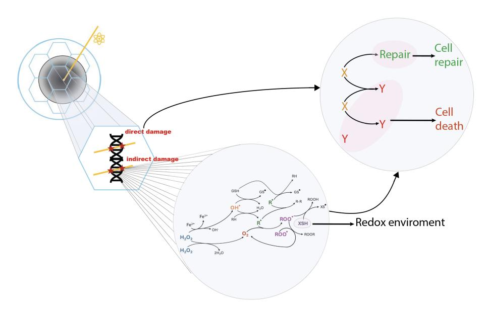
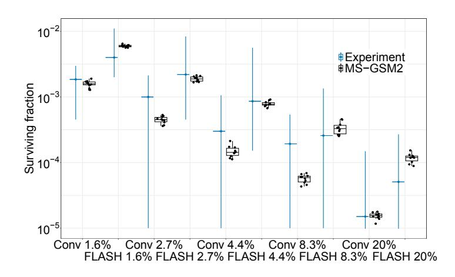
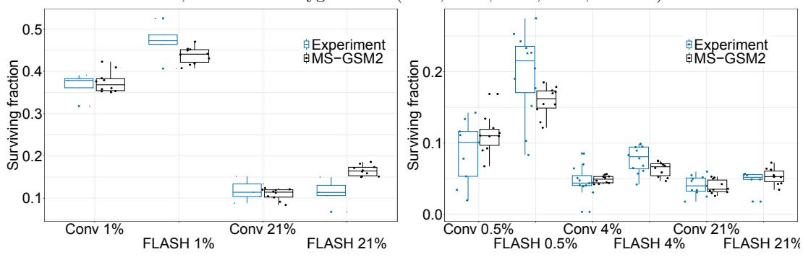
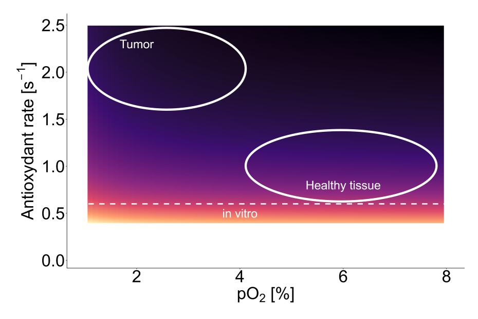

# A multiscale radiation biophysical stochastic model describing the cell survival response at ultra-high dose rate

Marco Battestini1,<sup>2</sup> , Marta Missiaggia2,<sup>3</sup> , Sara Bolzoni1,<sup>2</sup> , Francesco G. Cordoni2,4,a,<sup>∗</sup> and Emanuele Scifoni2,a

Abstract. Ultra-high dose-rate (UHDR) radiotherapy, characterized by an extremely high radiation delivery rate, represents one of the most recent and promising frontier in radiotherapy. UHDR radiotherapy, addressed in the field as FLASH radiotherapy, is a disruptive treatment modality with several benefits, including significantly shorter treatment times, unchanged effectiveness in treating tumors, and clear reductions in side effects on normal tissues. While the benefits of UHDR irradiation have been well highlighted experimentally, the biological mechanism underlying the FLASH effect is still unclear and highly debated. Nonetheless, to effectively use UHDR radiotherapy in clinics, understanding the driving biological mechanism is paramount. Since the concurrent involvement of multiple scales of radiation damage has been suggested, we developed the MultiScale Generalized Stochastic Microdosimetric Model (MS-GSM<sup>2</sup> ), a multi-stage extension of the GSM2, which is a probabilistic model describing the time evolution of the DNA damage in an irradiated cell nucleus. The MS-GSM<sup>2</sup> can investigate several chemical species combined effects, DNA damage formation, and time evolution. We demonstrate that the MS-GSM<sup>2</sup> can predict various in-vitro UHDR experimental results across various oxygenation levels, radiation types, and energies. The MS-GSM<sup>2</sup> can accurately describe the empirical trend of dose and dose rate-dependent cell sensitivity over a wide range, consistently describing multiple aspects of the FLASH effect and reproducing the main evidence from the in-vitro experimental data. Our model also proposes a consistent explanation for the differential outcomes observed in normal tissues and tumors, in-vivo and in-vitro.

#### 1. Introduction

A current frontier in the treatment of cancer is undoubtely the so-called FLASH radiotherapy, a revolutionary radiation therapy technique based on the ultra-high dose rate (UHDR) irradiation, i.e., a faster beam delivery (total irradiation time < 100 ms and a mean dose rate of the total irradiation > 40 Gy/s for a single high dose, usually higher than 10 Gy) compared to conventional (Conv) irradiation (dose rate of 0.03 - 0.1 Gy/s) [\[Vozenin et al., 2022,](#page-12-0) [Limoli and Vozenin, 2023\]](#page-11-0). The peculiarity of this novel approach is that it allows to significantly reduce the side effects to healthy tissues [\[Vozenin et al.,](#page-12-1) [2019,](#page-12-1) [Montay-Gruel et al., 2017,](#page-11-1) [Montay-Gruel et al., 2019,](#page-11-2) [Loo et al., 2017\]](#page-11-3), with the same tumor efficacy [\[Favaudon et al., 2014\]](#page-10-0). This phenomenon is known as the FLASH effect, and it has been showed on in-vitro cells [\[Adrian et al., 2020,](#page-10-1) [Tessonnier et al., 2021,](#page-11-4) [Tinganelli et al., 2022a\]](#page-12-2), on animals [\[Vozenin](#page-12-1) [et al., 2019,](#page-12-1) [Montay-Gruel et al., 2017,](#page-11-1) [Montay-Gruel et al., 2019,](#page-11-2) [Loo et al., 2017,](#page-11-3) [Montay-Gruel et al.,](#page-11-5) [2021,](#page-11-5) [Diffenderfer et al., 2020,](#page-10-2) [Cunningham et al., 2021,](#page-10-3) [Tinganelli et al., 2022b,](#page-12-3) [Sørensen et al., 2022\]](#page-11-6) and also on humans [\[Bourhis et al., 2019\]](#page-10-4). From a clinical point of view [\[Daugherty et al., 2023\]](#page-10-5), FLASH radiotherapy allows to improve the quality of radiotherapy treatment significantly.

Despite clear experimental evidence supporting the FLASH effect, highlighting the benefits of the UHDR irradiations, the biological mechanism underlying the FLASH effect is still unclear and highly debated [\[Limoli and Vozenin, 2023\]](#page-11-0). In recent years, several tentative hypotheses [\[Spitz et al.,](#page-11-7) [2019,](#page-11-7) [Labarbe et al., 2020,](#page-11-8) [Wardman, 2020,](#page-12-4) [Zhou, 2020,](#page-12-5) [Pratx and Kapp, 2020,](#page-11-9) [Ramos-M´endez et al.,](#page-11-10) [2020,](#page-11-10) [Zakaria et al., 2020,](#page-12-6) [Abolfath et al., 2020,](#page-10-6) [Petersson et al., 2020\]](#page-11-11) have been proposed to explain the FLASH effect [\[Friedl et al., 2022\]](#page-11-12), many of which have been considered implausible following further experimental evidence, e.g. [\[Pratx and Kapp, 2020,](#page-11-9) [Ramos-M´endez et al., 2020\]](#page-11-10). None have yet been

- † <sup>1</sup> Department of Physics, via Sommarive 14, 38123, Trento, Italy
- † <sup>2</sup> Trento Institute for Fundamental Physics and Application (TIFPA), via Sommarive 15, 38123, Trento, Italy
- † <sup>3</sup> Department of Radiation Oncology, University of Miami Miller School of Medicine, 33136, Miami FL, USA
- † <sup>4</sup> Department of Civil, Environmental and Mechanical Engineering, via Mesiano 77, 38123, Trento, Italy
- † a equal contribution
- † ∗ corresponding author

<span id="page-1-0"></span>

Figure 1: Schematic representation of the MS-GSM<sup>2</sup> workflow.

able to explain it fully.

However, what has emerged from all these efforts is that multiple scales of radiation damage action should be— involved [\[Weber et al., 2022a\]](#page-12-7). The crucial role of chemical environment and of the redox system has been underlined [\[Labarbe et al., 2020,](#page-11-8) [Weber et al., 2022a,](#page-12-7) [Wardman, 2020,](#page-12-4) [Favaudon et al., 2022\]](#page-10-7).

Over the last years, a plethora of mechanistic models have been proposed and developed [\[Labarbe](#page-11-8) [et al., 2020,](#page-11-8) [Abolfath et al., 2020,](#page-10-6) [Liew et al., 2021,](#page-11-13) [Petersson et al., 2020,](#page-11-11) [Abolfath et al., 2023,](#page-10-8) [Zhu](#page-12-8) [et al., 2021,](#page-12-8) [Spitz et al., 2019,](#page-11-7) [Hu et al., 2021,](#page-11-14) [Alanazi et al., 2020,](#page-10-9) [Zakaria et al., 2020,](#page-12-6) [Pratx and Kapp,](#page-11-9) [2020\]](#page-11-9). Most such models have been based on the hypothesis of a single driving mechanism and they can only partially reproduce the experimental data, suggesting some limits in their capability to explain and predict the mechanism of the effect of the FLASH effect. Instead,We hypothesize that the FLASH biological effect is due to a interplay of various spatio-temporal scales, as suggested by [\[Weber et al.,](#page-12-7) [2022a\]](#page-12-7).

In this context, we develop the MultiScale Generalized Stochastic Microdosimetric Model (MS-GSM<sup>2</sup> ), a multi-stage extension of the Generalized Stochastic Microdosimetric Model (GSM<sup>2</sup> ) [\[Cordoni](#page-10-10) [et al., 2021,](#page-10-10) [Cordoni et al., 2022b,](#page-10-11) [Cordoni et al., 2022a,](#page-10-12) [Cordoni, 2023b,](#page-10-13) [Missiaggia et al., 2024,](#page-11-15) [Battestini](#page-10-14) [et al., 2023\]](#page-10-14). The GSM<sup>2</sup> is a stochastic Markov model that describes the formation and repair of radiation-induced DNA damages in a cell nucleus. The GSM<sup>2</sup> can reproduce in-vitro cell survival data for conventional irradiation for different particles [\[Missiaggia et al., 2024,](#page-11-15) [Cartechini et al., 2024\]](#page-10-15). This work aims to establish a general mathematical framework seamlessly integrating various stochastic spatial and temporal scales to study the combined effects of multiple chemical species and the formation and progression of DNA damage within the UHDR regime. These scales range from the nearly instantaneous ionization of biological tissue to the rapid chemical environment contributing to DNA damage formation and, ultimately, to the slow biological repair processes determining a cell's fate. The hypothesis that UHDR modifies the chemical environment to induce a reduction of indirect damage yield, with a consequent tissue sparing. The reduction of DNA damage is supported by experimental evidence, [\[Tessonnier et al., 2021,](#page-11-4) [Cooper et al., 2022,](#page-10-16) [Wanstall et al., 2024\]](#page-12-9). In this work, we fulfill the development and validation of MS-GSM<sup>2</sup> [\[Battestini et al., 2023\]](#page-10-14). We first include the reduction of radiation-induced DNA damage owing to lower oxygen concentration, a well-documented effect in radiobiologywith a strong interplay with the radiation quality of the beam [\[Scifoni et al., 2013\]](#page-11-16). Unlike existing models, the MS-GSM<sup>2</sup> explicitly incorporates oxygen concentration through a term in the system of differential equations that govern its time-dependent evolution influenced by environmental reactions. Further, we significantly restructure and enhance the chemical reaction network previously considered in [\[Labarbe et al., 2020\]](#page-11-8). The water radiolysis reactions, which occur during the heterogeneous chemical stage, thus at faster time scales than those of organic chemical species, which are the main species of interest in the present framework, are now included through a parametrization process using the Monte Carlo toolkit TRAX-CHEM [\[Boscolo](#page-10-17) [et al., 2018\]](#page-10-17). Consequently, we derive a chemical network of ten reactions, represented by five ordinary differential equations (ODEs) that describe the chemical environment. The influence of radiation is

integrated into the chemical network, characterized by stochastic random arrival times. Ultimately, the chemical environment is modeled using piecewise deterministic ODEs with random jumps in amplitude at random intervals. This captures the stochastic nature of radiation energy deposition in time and space. This chemical reaction network is then coupled to the Markov model as outlined by GSM<sup>2</sup>, incorporating DNA damage repair mechanisms, culminating in a comprehensive multi-scale stochastic mathematical model.

We develop a versatile mathematical model capable of describing the intricate mechanisms underlying the FLASH effect while maintaining flexibility for predictive modeling, being, ultimately, its purpose dedicated to replicate experimental outcomes. We implement such a model by an efficient coupling of *Stochastic Simulation Algorithm* (SSA) to describe the radiation random arrival times and the Markov model with the solution of the ODE. This approach provides accurate predictions and ensures swift implementation of a complex system. We successfully replicate the main *in-vitro* cell-survival UHDR experimental data from the main studies available in literature [Adrian et al., 2020, Tessonnier et al., 2021, Tinganelli et al., 2022a], encompassing a diverse spectrum of particle types, energies, delivered doses and physiological conditions. The accuracy of our predictions across this extensive range of physical, chemical, and biological conditions provides compelling evidence supporting that the MS-GSM² grasps all the physics behind the potential mechanism underlying the FLASH effect. Supported by the *in-silico* prediction of the MS-GSM², we eventually propose that the different redox environment between tumor and healthy tissue is at the origin of the differential effect seen on the two different tissues.

#### Results

The model

The GSM<sup>2</sup> [Cordoni et al., 2021, Cordoni et al., 2022b] is a Markov model that generalizes the standard Poisson statistics for the number of radiation-induced DNA damages [Cordoni et al., 2022a, Cordoni, 2023a]. Specifically, the GSM<sup>2</sup> encompasses the randomness of radiation energy deposition, DNA damage formation, and the temporal repair of these damages within a singular framework. The GSM<sup>2</sup> is considerably extended in the present work to include the effect of UHDR into the model via a suitable chemical reaction network, developing a multi-stage tool, the MS-GSM<sup>2</sup>. In the following paragraphs, we outline the mathematical framework of MS-GSM<sup>2</sup>, dividing the model's components into stages, from the rapid physical stage to the slow biological stage. The basic idea of the model is also schematized in Figure 1.

The physical stage We describe a cell nucleus using a cylinder of radius  $R_N = 8 \,\mu\text{m}$  (xy-plane) and length  $2R_N$  (z-direction), divided into  $N_d = 52$  cubic domains. The absorbed dose of every energy deposition event z is distributed on the  $N_d$  domains of the xy plane of the cell nucleus, according to the Amorphous Track (AT) model described in [Scholz and Kraft, 1996]. The AT model hypothesizes that the energy deposition by a particle has cylindrical symmetry, characterized by a uniform energy distribution over a circle with radius  $R_c$  centered on the impact point, and decreases proportionally to  $r^{-2}$ , where r is the distance from the impact point. Beyond a certain distance  $R_p$ , no energy is deposited, i.e.

$$D(r) = \begin{cases} \frac{1}{\pi R_c^2} \left( \frac{\text{LET}}{\rho(1 + 2\ln(R_p/R_c))} \right) & r \le R_c, \\ \frac{1}{\pi r^2} \left( \frac{\text{LET}}{\rho(1 + 2\ln(R_p/R_c))} \right) & r \in [R_c, R_p], \end{cases}$$
(1)

where LET is the linear energy transfer, which characterizes the radiation quality, and  $\rho$  is the water density. In this study,  $R_p$  is defined as the radius at which 80% of the dose is deposited by the track, referred to as  $R_{80}$  [Weber et al., 2022a, Battestini et al., 2023]. This approximation neglects the residual extension of the dose until the maximum distance allowed to the secondary electrons propagation, which is spread along a broader circular crown. The impact position of the primary particles is sampled randomly from a uniform distribution on a circle of radius  $R_N + R_{80}$  on the xy-plane. The energy deposited in each domain is then calculated, demonstrating the stochastic nature of energy deposition, as different impact points result in varying amounts of energy being deposited in the cell nucleus and, consequently, in each domain.

All of the energy deposition events up to the end of the irradiation, i.e.,  $T_{irr} = D/\dot{D}$ , where D is the imparted macroscopic dose, and  $\dot{D}$  is the mean dose rate, are calculated obtaining the total number of simulated particles. The elapsed time  $\tau$  between two consecutive deposition events is sampled from an exponential distribution, which depends on the dose rate and the mean energy deposited in a single event.

Lastly, in this work, we generalize the dose-delivery simulation to describe any time structure. In particular, in the case of ions, we consider a unique pulse described by a macroscopic dose prescription D and an overall mean dose rate  $\dot{D}$ , and we simulate the discrete energy deposition events of this pulse, according to the previous description. On the contrary, for electrons, according to the experimental dose delivery time structure, we simulate irradiation characterized by a sequence of an integer number of pulses, identified by a dose-per-pulse and a pulse time, interspersed with pauses, defined by a pulse repetition frequency. As before, we sample the energy deposition events for each pulse.

The chemical stage We consider a chemical reaction network of nine reactions described by five ODEs. The derived system is a severe optimization of the one proposed in [Labarbe et al., 2020], on the one hand by simplifying some equations, cutting away some negligible reactions, and on the other hand by adjusting some reaction constants, among all of those listed in Sections S.1 and S.2 of [Labarbe et al., 2020].

In particular, in [Labarbe et al., 2020], the reactions involving only chemical species derived from the water radiolysis, such as  $e_{aq}^-$ ,  $OH^{\bullet}$ ,  $H^{\bullet}$ ,  $H_2$ ,  $O_2^{\bullet-}$ , have much lower rates than both the reactions between these species with organic molecules, and those between organic species alone. Indeed, it is possible to neglect these types of reactions, thus separating the two timescales: a faster one which we assume to be instantaneous, i.e., the early heterogeneous stage of water radiolysis that is incorporated through the production terms as described by G-values of chemical species in the system of equations, i.e., the number of chemical species produced per 100 eV of energy absorbed by the medium, and that of the reactions involving the various organic chemical species, such as RH, R $^{\bullet}$ , ROO $^{\bullet}$ , vitamin E, thiols and their derivatives, described explicitly by the reaction rates. It is worth stressing that the latter species is the one which we directly link to the radiation-induced damage formation. In this way, we obtain, for each domain  $d=1,\ldots,52$ , the following system

<span id="page-3-0"></span>
$$\begin{cases}
\frac{d}{dt}[\mathcal{O}_{2}]^{d}(t) &= k_{1} \cdot [\mathcal{R}^{\bullet}]^{d}(t) \cdot [\mathcal{O}_{2}]^{d}(t) + k_{2} \cdot [\mathcal{R}OO^{\bullet}]^{d}(t) \cdot [\mathcal{R}OO^{\bullet}]^{d}(t) + k_{3} \cdot \frac{[\mathcal{C}at]}{k_{m} + [\mathcal{H}_{2}\mathcal{O}_{2}]^{d}(t)} \cdot [\mathcal{H}_{2}\mathcal{O}_{2}]^{d}(t), \\
\frac{d}{dt}C_{\mathcal{H}_{2}\mathcal{O}_{2}}^{d}(t) &= k_{4} \cdot [Fe^{2+}] \cdot [\mathcal{H}_{2}\mathcal{O}_{2}]^{d}(t) - 2k_{3} \cdot \frac{[\mathcal{C}at]}{k_{m} + [\mathcal{H}_{2}\mathcal{O}_{2}]^{d}(t)} \cdot [\mathcal{H}_{2}\mathcal{O}_{2}]^{d}(t) + G_{\mathcal{H}_{2}\mathcal{O}_{2}}\rho\dot{z}^{d}, \\
\frac{d}{dt}C_{\mathcal{O}\mathcal{H}^{\bullet}}^{d}(t) &= -k_{5} \cdot [\mathcal{R}\mathcal{H}] \cdot [\mathcal{O}\mathcal{H}^{\bullet}]^{d}(t) + k_{4} \cdot [Fe^{2+}] \cdot [\mathcal{H}_{2}\mathcal{O}_{2}]^{d}(t) - k_{6} \cdot [\mathcal{X}\mathcal{S}\mathcal{H}] \cdot [\mathcal{O}\mathcal{H}^{\bullet}]^{d}(t) + G_{\mathcal{O}\mathcal{H}^{\bullet}}\rho\dot{z}^{d}, \\
\frac{d}{dt}[\mathcal{R}^{\bullet}]^{d}(t) &= k_{5} \cdot [\mathcal{R}\mathcal{H}] \cdot [\mathcal{O}\mathcal{H}^{\bullet}]^{d}(t) - k_{1} \cdot [\mathcal{R}^{\bullet}]^{d}(t) \cdot [\mathcal{O}_{2}]^{d}(t) - k_{7} \cdot [\mathcal{X}\mathcal{S}\mathcal{H}] \cdot [\mathcal{R}^{\bullet}]^{d}(t) + \\
-2k_{8} \cdot [\mathcal{R}^{\bullet}]^{d}(t) \cdot [\mathcal{R}^{\bullet}]^{d}(t) + G_{\mathcal{R}^{\bullet}}\rho\dot{z}^{d}, \\
\frac{d}{dt}[\mathcal{R}\mathcal{O}\mathcal{O}^{\bullet}]^{d}(t) &= k_{1} \cdot [\mathcal{R}^{\bullet}]^{d}(t) \cdot [\mathcal{O}_{2}]^{d}(t) - k_{9} \cdot [\mathcal{X}\mathcal{S}\mathcal{H}] \cdot [\mathcal{R}\mathcal{O}\mathcal{O}^{\bullet}]^{d}(t) - 2k_{2} \cdot [\mathcal{R}\mathcal{O}\mathcal{O}^{\bullet}]^{d}(t) \cdot [\mathcal{R}\mathcal{O}\mathcal{O}^{\bullet}]^{d}(t), \\
\frac{d}{dt}[\mathcal{R}\mathcal{O}\mathcal{O}^{\bullet}]^{d}(t) &= k_{1} \cdot [\mathcal{R}^{\bullet}]^{d}(t) \cdot [\mathcal{O}_{2}]^{d}(t) - k_{9} \cdot [\mathcal{X}\mathcal{S}\mathcal{H}] \cdot [\mathcal{R}\mathcal{O}\mathcal{O}^{\bullet}]^{d}(t) - 2k_{2} \cdot [\mathcal{R}\mathcal{O}\mathcal{O}^{\bullet}]^{d}(t) \cdot [\mathcal{R}\mathcal{O}\mathcal{O}^{\bullet}]^{d}(t), \\
\frac{d}{dt}[\mathcal{R}\mathcal{O}\mathcal{O}^{\bullet}]^{d}(t) &= k_{1} \cdot [\mathcal{R}\mathcal{O}\mathcal{O}^{\bullet}]^{d}(t) \cdot [\mathcal{R}\mathcal{O}\mathcal{O}^{\bullet}]^{d}(t) - 2k_{2} \cdot [\mathcal{R}\mathcal{O}\mathcal{O}^{\bullet}]^{d}(t), \\
\frac{d}{dt}[\mathcal{R}\mathcal{O}\mathcal{O}^{\bullet}]^{d}(t) &= k_{1} \cdot [\mathcal{R}\mathcal{O}\mathcal{O}^{\bullet}]^{d}(t) \cdot [\mathcal{R}\mathcal{O}\mathcal{O}^{\bullet}]^{d}(t) - 2k_{2} \cdot [\mathcal{R}\mathcal{O}\mathcal{O}^{\bullet}]^{d}(t), \\
\frac{d}{dt}[\mathcal{R}\mathcal{O}\mathcal{O}^{\bullet}]^{d}(t) &= k_{1} \cdot [\mathcal{R}\mathcal{O}\mathcal{O}^{\bullet}]^{d}(t) \cdot [\mathcal{O}\mathcal{O}^{\bullet}]^{d}(t), \\
\frac{d}{dt}[\mathcal{R}\mathcal{O}\mathcal{O}^{\bullet}]^{d}(t) &= k_{1} \cdot [\mathcal{R}\mathcal{O}\mathcal{O}^{\bullet}]^{d}(t) - k_{2} \cdot [\mathcal{R}\mathcal{O}\mathcal{O}^{\bullet}]^{d}(t), \\
\frac{d}{dt}[\mathcal{O}\mathcal{O}^{\bullet}]^{d}(t) &= k_{1} \cdot [\mathcal{R}\mathcal{O}\mathcal{O}^{\bullet}]^{d}(t) - k_{2} \cdot [\mathcal{R}\mathcal{O}\mathcal{O}^{\bullet}]^{d}(t), \\
\frac{d}{dt}[\mathcal{O}\mathcal{O}^{\bullet}]^{d}(t) &= k_{1} \cdot [\mathcal{O}\mathcal{O}^{\bullet}]^{d}(t) - k_{2} \cdot [\mathcal{O}\mathcal{O}^{\bullet}]^{d}(t), \\
\frac{d}{dt}[\mathcal{O}\mathcal{O}^{\bullet}]^{d}(t) &= k_{1} \cdot [\mathcal{O}\mathcal{O}^{\bullet}]^{d}(t) - k_{2}$$

where  $[H_2O_2]^d(t) = \frac{C_{H_2O_2}^d(t)}{1 + \frac{K_{H_2O_2}}{|H^+|}}$  and  $[OH^{\bullet}]^d(t) = \frac{C_{OH^{\bullet}}^d(t)}{1 + \frac{K_{OH^{\bullet}}}{|H^+|}}$ , that describe the acid-base equilibria, in analogy

to [Labarbe et al., 2020],  $\rho$  is the water density, while  $G_{\xi}$  are the G-values, according to TRAX-CHEM simulations [Boscolo et al., 2018, Boscolo et al., 2020], computed at 1  $\mu s$ . Overall, we have a system of 260 ODEs.

As previously mentioned, we update the values of some reaction constants within the ranges we found in the literature to describe the experiments better, as shown in the next section. In particular, in this work, we consider  $k_1 = 10^8 (mol/l)^{-1} \cdot s^{-1}$  (typical range of  $[10^6, 10^{10}](mol/l)^{-1} \cdot s^{-1}$  [Labarbe et al., 2020, Spitz et al., 2019, Neta et al., 1990, Epp et al., 1976, Michael et al., 1986]),  $k_2 = 10^5 (mol/l)^{-1} \cdot s^{-1}$  (typical range of  $[10^3, 10^5](mol/l)^{-1} \cdot s^{-1}$  [Labarbe et al., 2020, Riahi et al., 2010]), and  $k_9 = 10^2 (mol/l)^{-1} \cdot s^{-1}$  [Spitz et al., 2019, Wardman, 2020]. With this last modification, we include the scavenging role of GSH to take into account the elimination of ROO• from the environment, which had been partially neglected in [Labarbe et al., 2020], according to [Wardman, 2020, Tan et al., 2023]. Additionally, the terms  $\dot{z}$  represent the local energy deposition within the domain, as outlined in the preceding section. Specifically, the terms  $\dot{z}$  are characterized by random impulses in both time and magnitude, which depict the stochastic nature of the time delivery structure.

Table S1 of the SI Appendix reports the reaction rate constants' values and the chemical species' initial concentrations considered in this work.

The bio-chemical stage In the biochemical stage, the deposition of radiation energy and the chemical environment are interconnected with the yield of biological damage.

The peculiarity of the  $GSM^2$  is that it overcomes the usual assumptions of a Poissonian distribution of the number of radiation-induced DNA damage, which limits the possible predictions of biological endpoints, as demonstrated in [Missiaggia et al., 2024]. The  $GSM^2$  assumes the possibility of generation

of two types of DNA damage, the lethal lesion Y, i.e., irreparable damage, leading to cell inactivation, and sub-lethal lesion X, i.e., repairable damage, where Y and X are two  $\mathbb{N}$ -valued random variables.

A protracted dose-rate term  $\dot{d}$  modulates the energy deposition events and subsequent lesion creation [Cordoni et al., 2021]. The next treatment made several generalizations regarding the creation of DNA damage. The average damage yield consequent to an energy deposition z is calculated as

$$\kappa \left( \text{LET}, [O_2] \right) z = \frac{\text{DSB}(\text{LET})}{\text{OER}\left( \text{LET}, [O_2] \right)} z. \tag{3}$$

Above, DSB(LET) is the analytical formula representing the average yield of damage obtained via track-structure simulations in [Kundrát et al., 2020], whereas OER (LET,  $[O_2]$ ) represents the Oxygen Enhancement Ratio (OER), i.e., the ratio of doses giving the same biological effect in the presence of a given concentration of oxygen  $[O_2]$  as compared to the full oxygenation (normoxia), characterizes a well-documented experimental phenomenon in radiation biophysics where damage fixation increases at higher oxygen concentrations, leading to enhanced radiation lethality. The OER is described in [Scifoni et al., 2013, Epp et al., 1972] as

<span id="page-4-0"></span>
$$OER(LET, [O_2]) = \frac{K_{O_2} \cdot \frac{K_{LET} \cdot M + LET^{\gamma}}{K_{LET} + LET^{\gamma}} + [O_2]}{K_{O_2} + [O_2]},$$
(4)

where M represents the maximum effect,  $K_{O_2}$  is the flex point for  $[O_2]$ , as outlined in  $[Epp \ et \ al., 1972]$ ,  $K_{\text{LET}}$  denotes the flex point for LET, that is, the average energy deposited per unit path length, which characterizes the radiation quality of the ionizing particle, and  $\gamma$  is an additional fitted parameter, as emphasized in [Scifoni et al., 2013]. To consider the impact of the chemical environment, the damage yield is divided into a direct contribution, which describes the lesions formed immediately from energy deposition regardless of the chemical environment, and an *indirect contribution* resulting from the action of radicals and other molecular species. We assume that following an energy deposition event z, on average, a proportion  $(1-q)\kappa$  (LET,  $[O_2]$ ) yield a direct damage. In contrast, the remaining  $q\kappa$  (LET,  $[O_2]$ ) will yield and indirect damage. These proportions are again calculated using the formulas given in Kundrát et al., 2020]. Being the direct damage independent of the chemical environment, we describe the number of induced lesions with a Poisson random variable of average  $(1-q)\kappa$  (LET,  $[O_2]$ ) z. Regarding indirect damages, we assume that the number of such damages depends on the chemical environment and the irradiation pattern. We assume that the concentration of peroxyl radical [ROO•] is directly linked to the number of indirect damage created, so we describe this process with a Poisson random variable of average  $q\kappa$  (LET,  $[O_2]$ )  $\varrho \int_0^t [R\bar{O}O^{\bullet}](s) ds$ . This quantity is normalized in such a way to obtain the same average of damage yield computed with track-structure simulations in [Kundrát et al., 2020] at standard conditions, i.e., conventional irradiation and 21 % O<sub>2</sub>. At the same time, it decreases as the oxygenation level decreases and the dose rate increases. Additional information about this can be found in the SI Appendix.

Overall, the damage yield creation can be summarized by the following network

$$X \xrightarrow{\dot{d}} \begin{cases} X + Z_{X;\text{dir}} & \text{with probability} \quad 1 - q \in [0, 1], \\ X + Z_{X;\text{indir}} & \text{with probability} \quad q \in [0, 1], \end{cases}$$
 (5)

<span id="page-4-1"></span>where  $Z_{X;\text{dir}}$  and  $Z_{X;\text{indir}}$  are two Poisson random variables, with average, respectively,  $\kappa$  (LET,  $[O_2]$ ) z and  $\kappa$  (LET,  $[O_2]$ )  $\varrho$   $\int_0^t [R\bar{O}O^{\bullet}](s) ds$ . These two processes will be described via two unitary Poisson jump processes  $P_{\text{dir}}^{(c,d)}$  and  $P_{\text{indir}}^{(c,d)}$ , respectively. A completely analogous argument has been used to form lethal lesions Y, with the function  $\kappa$  substituting by  $\lambda = 10^{-3}\kappa$ .

The formulation described above offers a comprehensive overview of the process of radiation-induced damage formation, distinguishing between direct and indirect lesions. It introduces for the first time an explicit dependency on the chemical environment through the OER formulation (4) and explicitly incorporates radicals' impact on damage yield. Consequently, as the pattern of radiation energy deposition significantly influences this factor, the formulation enables us to depict the dual dependency of damage yield on oxygenation and the presence of organic radicals, demonstrating a sparing effect at progressively higher dose rates, as shown experimentally by [Cooper et al., 2022, Wanstall et al., 2024].

The biological stage It is possible to describe the state of the system at time t considering two random variables (Y(t), X(t)), i.e., the number of lethal and sub-lethal lesions at time t, respectively. In particular,

a sub-lethal lesion can undergo three different pathways,

<span id="page-5-1"></span>
$$X \xrightarrow{a} Y$$
,  $X \xrightarrow{r} \emptyset$ ,  $X + X \xrightarrow{b} Y$ , (6)

where a is the rate of the evolution of a sub-lethal lesion to a lethal one, b describes the rate of pairwise interaction of two sub-lethal lesions, while r represents the repair rate, with  $\emptyset$  the ensemble of healthy cells. More details about the mathematical framework of this model can be found in [Cordoni et al., 2021, Cordoni et al., 2022b]. These processes are described by  $P_h^{(c,d)}$ , with  $h \in \{a,b,r\}$ , that are independent unitary Poisson jump-processes acting on a single domain, [Weinan et al., 2019].

In the end, we obtained the following system of equations for the MS-GSM<sup>2</sup> for each domain  $d = 1, ..., N_d$ ,

<span id="page-5-0"></span>
$$\begin{cases} Y^{(c,d)}(t) &= P_a^{(c,d)} \left( \int_0^t aX^{(c,d)}(s)ds \right) + P_b^{(c,d)} \left( \int_0^t bX^{(c,d)}(s)(X^{(c,d)}(s) - 1)ds \right) + \\ &+ Z_{Y;\text{dir}}^{(c,d)} P_{Y;\text{dir}}^{(c)} \left( (\dot{d}\,t) + Z_{Y;\text{indir}}^{(c,d)} P_{Y;\text{indir}}^{(c,d)} \left( \varrho \int_0^t [R\bar{O}O^{\bullet}](s)\,ds \right) , \\ X^{(c,d)}(t) &= -P_a^{(c,d)} \left( \int_0^t aX^{(c,d)}(s)ds \right) - P_r^{(c,d)} \left( \int_0^t rX^{(c,d)}(s)ds \right) + \\ &- 2P_b^{(c,d)} \left( \int_0^t bX^{(c,d)}(s)(X^{(c,d)}(s) - 1)ds \right) + Z_{X;\text{dir}}^{(c,d)} P_{X;\text{dir}}^{(c)} \left( \dot{d}\,t \right) + \\ &+ Z_{X;\text{indir}}^{(c,d)} P_{X;\text{indir}}^{(c,d)} \left( \varrho \int_0^t [R\bar{O}O^{\bullet}](s)\,ds \right) , \end{cases}$$

$$\begin{cases} \frac{d}{dt} \xi^d(t) &= f_{\xi^d} \left( \xi^d(t) \right) + G_{\xi^d} \rho \dot{z}^d , \end{cases}$$

$$(7)$$

where the last equation represents the random ODE system (2) describing the chemical environment. The first two equations in (7) is a pathwise description in terms of jump-type *Stochastic Differential Equations* (SDE) of the processes (6) and (5); a similar pathwise formulation of the GSM<sup>2</sup>, with no explicit chemical environment formulation, has also been derived in [Cordoni, 2023b], we refer to [Weinan et al., 2019, Chapter 13].

We emphasize that the enhancements in this work render the MS-GSM<sup>2</sup> highly flexible and comprehensive, enabling the examination of various scenarios: physically, it accommodates any radiation dose-delivery complex time structure, type, and energy without simplification on the dose rate structures as done in all the existing mechanistic models where an average macroscopic dose rate is mostly assumed; chemically, it considers all chemical and environmental conditions, such as oxygenation and scavenger concentrations; biologically, it describes multiple effects, from well-established ones like the oxygen effect on DNA damage fixation during conventional irradiation, to widely debated ones like the sparing effect seen at UHDR regimes across various cell lines. The final biological endpoint predicted is the cell survival probability, defined as

$$\mathbb{P}\left(\lim_{t\to\infty} \left(Y^{(c,1)}(t),\dots,Y^{(c,N_d)}(t)\right) = \mathbf{0}\right),\tag{8}$$

allowing a strict validation as in the following.

<span id="page-5-2"></span>Validation of the MS-GSM<sup>2</sup> on in-vitro UHDR experimental data

To stress MS-GSM² validity and predictive power, the model predictions have been compared with all available experimental data at UHDR for different oxygenation. Such experimental data are of broadly different types, using all the parameters (oxygenation, time structure, doses, radiation quality, etc., as reported in the original publications Figure 2a shows the comparison between the experimental cell survival fractions of prostate cancer cell line DU145 [Adrian et al., 2020] (in blue) and MS-GSM² prediction (in black). The horizontal axis lists different conditions, not to scale, reporting the different levels of oxygenation (1.6%, 2.7%, 4.4%, 8.3%, 20.0%  $O_2$ ) as indicated in the original publication, for electron at 10 MeV in Conv (mean dose rate of 14 Gy/min) and UHDR (mean dose rate of 600 Gy/s) irradiations of 18 Gy. In particular, the dose was delivered with an integer number of pulses, a pulse time of 3.5  $\mu$ s, and a pulse repetition frequency of 200 Hz in the case of Conv irradiation, while with an integer number of pulses, a dose-per-pulse of 3 Gy, and a pulse repetition frequency of 200 Hz at UHDR regime. The experimental irradiation structure has been incorporated within the MS-GSM² framework. As illustrated in Figure 2a, the MS-GSM² encompasses the OER effect, evidenced by the elevated cell survival fraction at reduced oxygen concentrations for both conventional and FLASH irradiation, as well as the FLASH sparing effect distinguishing the conventional and UHDR regimes.

Figure 2b reports the survival fractions of human lung epithelial cells A549 (experimental [Tessonnier et al., 2021] results (in blue) plotted against MS-GSM<sup>2</sup> prediction (in black)), at hypoxia and normoxia conditions (1.0% and 21.0% O<sub>2</sub>), for Conv and UHDR irradiations of 8 Gy, in the case of helium ions

<span id="page-6-0"></span>

(a) DU145 cell survival in the case of 10 MeV electrons irradiation, at 18 Gy for both Conv (14 Gy/min) and FLASH (600 Gy/s) dose rates, for different oxygenations (1.6%, 2.7%, 4.4%, 8.3%, 20% O2).



(b) A549 cell survival in the case of 4.5 keV/µm helium ions irradiation, at 8 Gy for both Conv (0.12 Gy/s) and FLASH (205.13 Gy/s) dose rates, for different oxygenations (1%, 21% O2). (c) CHO-K1 cell survival in the case of 13 keV/µm carbon ions irradiation, at 7.5 Gy for both Conv (0.6 Gy/s) and FLASH (70 Gy/s) dose rates, for different oxygenations (0.5%, 4%, 21% O2).

Figure 2: Comparison of the MS-GSM<sup>2</sup> results with experimental data.

impinging the cells at a LET of 4.5 keV/µm. In particular, the dose was delivered with a mean dose rate of 0.12 Gy/s for Conv, with a mean dose rate of 205.13 Gy/s.

Figure [2c](#page-6-0) shows the comparison of survival fractions of Chinese hamster ovary cells CHO-K1, between the MS-GSM<sup>2</sup> prediction (in black) and the experiment [\[Tinganelli et al., 2022a\]](#page-12-2) (in blue), at different oxygen concentrations (0.5%, 4.0%, 21.0% O2). Carbon ion irradiation has been performed for both Conv (mean dose rate of 0.6 Gy/s) and UHDR (mean dose rate of 70 Gy/s) irradiations of 7.5 Gy, in the case of carbon ions of 13 keV/µm.

Figure [2](#page-6-0) highlights how the MS-GSM<sup>2</sup> can describe the trend of the experimental data at different oxygenation levels in terms of oxygenation and sparing at different dose rates and for different radiation quality.

For each of these experiments, we calibrated the biological parameters of our model, i.e., a, b, and r, on the experimental points at standard conditions, i.e., for conventional irradiation and normoxia, that is 21% oxygenation. The MS-GSM<sup>2</sup> has completely predicted all the other results. We discuss details regarding the calibration procedure in the SI Appendix.

Translation to in-vivo: in-silico evidence on a new mechanism for the differential effect

Figure [3](#page-7-0) reports the combined action of oxygenation and antioxidant environment on the emergence of the FLASH effect for electron irradiation. In particular, the color map distribution describes the relative variation of the surviving probability for UHDR irradiation with respect to the conventional one, i.e. (ln SConv − ln SF LASH)/ ln SConv, as a function of the environmental oxygen (in the x-axis) and the

<span id="page-7-0"></span>

Figure 3: Perspective analysis of the impact of the chemical environment on the emergence of the FLASH effect for electron irradiation. Relative change in cell survival between Conv and UHDR irradiation. Light colors correspond to a high differential effect, while dark colors correspond to a low differential effect. in-vitro, in-vivo - healthy tissue, and in-vivo - tumor regions are highlighted in white.

rate of antioxidants (in the y-axis), i.e., the product between the concentration of a chemical species and the reaction constant. We obtained this by repeating the simulation of the irradiation with electrons for several levels of antioxidant concentrations and at different oxygen conditions and considering the same physical and biological parameters that we used for [\[Adrian et al., 2020\]](#page-10-1). In particular, light colors correspond to a high differential effect between conventional and UHDR irradiation, while dark colors correspond to a low differential effect.

### Discussion

Results reported in Section [1](#page-5-2) show that MS-GSM<sup>2</sup> can describe the empirical trend on a wide range of dose and dose rate values, particle type, and energy, ranging from electrons to carbon ions and environmental oxygen conditions, from severe hypoxia (0.5% O2) to normoxia (21% O2). This is achievable due to the remarkable flexibility and comprehensiveness of the model, which simultaneously encompasses various physical, chemical, and biological aspects across different spatial and temporal scales. In particular, temporally, the MS-GSM<sup>2</sup> can span from 10<sup>−</sup><sup>6</sup> to 10<sup>0</sup> s with the chemical stage and up to 10<sup>5</sup> s for the DNA damage evolution. Spatially, the MS-GSM<sup>2</sup> can describe the physical and chemical events that occur between 10<sup>−</sup><sup>6</sup> − 10<sup>−</sup><sup>5</sup> m, up to the macroscopic scale for biology. Everything that happens below these spatial and temporal scales is, however, taken into account by the MS-GSM<sup>2</sup> because it is parameterized through a track-structure Monte Carlo approach, for example, to estimate the DNA damage yield in standard conditions, or using an analytical approach, e.g., the amorphous track model for the calculation of the spatial dose distribution. Extensions to include explicit descriptions beyond these temporal and spatial scales are under investigation. However, as demonstrated for electrons, protons, and carbon ions, [\[Baikalov et al., 2023,](#page-10-22) [Thompson et al., 2023,](#page-11-23) [Weber et al., 2022b\]](#page-12-11), the early stage recombination is supposed to play a minor role.

As mentioned in the previous section, the GSM<sup>2</sup> parameters have been consistently calibrated to normoxic conditions during conventional irradiation; all other experimental data points are entirely predicted. We want to underline the remarkable potential of the MS-GSM<sup>2</sup> , which can predict the sparing effect that occurs at FLASH regime, seen as the rise of the cell survival curves compared to the conventional irradiation, for several levels of oxygenation, from 0.5% to 21% O2, different radiation qualities, i.e., electrons, helium, and carbon ions, and, finally, different dose levels, as shown in Figure [2.](#page-6-0) Currently, there are no other mechanistic models capable of simultaneously incorporating all these effects and, consequently, reproducing all the main in-vitro experimental data at UHDR regime, i.e., [\[Adrian](#page-10-1) [et al., 2020,](#page-10-1) [Tessonnier et al., 2021,](#page-11-4) [Tinganelli et al., 2022a\]](#page-12-2).

A key advantage of the MS-GSM<sup>2</sup> is its ability to account explicitly for the actual temporal structure of dose delivery. Optimizing the physical parameters for the clinical application of FLASH irradiation presents significant challenges due to the various parameters affecting the radiation's temporal structure, such as micro- and macro-pulses, repetition frequency, and dose-per-pulse. Existing models, which rely solely on the average approximation of the beam structure, may face a significant limitation due to the current uncertainty regarding which parameters are most influential in the emergence of the FLASH sparing effect. The MS-GSM<sup>2</sup> can go beyond these parameterizations, encompassing in a unique framework the actual temporal structure of the radiation, i.e., the one experienced by the cell. A clear example of this is the fact that we can describe both the irradiation with electrons, which is characterized by a series of pulses interspersed with pauses [\[Adrian et al., 2020\]](#page-10-1), and the irradiation with ions, which occurs with a single macro pulse [\[Tessonnier et al., 2021,](#page-11-4) [Tinganelli et al., 2022a\]](#page-12-2).

A very interesting aspect arises from Figure [2a,](#page-6-0) namely the fact that the survival level at 1.6 % O<sup>2</sup> for conventional irradiation is comparable with those at 2.7 % O<sup>2</sup> for UHDR irradiation. This means that the rise of the surviving fraction in the case of FLASH irradiation, due to the reduction of indirect damage caused by the higher recombination of organic radicals, can have the same biological effect of a reduction of oxygenation. Environmental oxygen appears to play a crucial role in the emergence of the FLASH effect. As equation [\(2\)](#page-3-0) indicates, oxygen is essential for producing organic radicals. However, it is important to note that this effect is not directly related to oxygen depletion. In the initial years of FLASH mechanistic investigations, the prevailing hypothesis was proposing a transient hypoxia induced by oxygen depletion [\[Petersson et al., 2020\]](#page-11-11). Still, this hypothesis has been widely discredited by both theoretical calculations [\[Boscolo et al., 2021\]](#page-10-23) and experimental evidence [\[Jansen et al., 2021,](#page-11-24) [Cao et al.,](#page-10-24) [2021\]](#page-10-24).

Another crucial point from Figure [2](#page-6-0) is that the sparing effect, i.e., the increase in cell survival at UHDR, is visible for every oxygenation level. In particular, the FLASH effect is also visible at 21% O<sup>2</sup> condition, e.g., for electrons irradiation, as in Figure [2a](#page-6-0) or, in general, in [\[Adrian et al., 2020,](#page-10-1) [Adrian et al.,](#page-10-25) [2021\]](#page-10-25), but also in the case of carbon ions, as in Figure [2c.](#page-6-0) In contrast, in the case of in-vivo experiments, the FLASH effect occurs only in hypoxia conditions, while it was not observed at physiologic conditions (4-8% O2). In addition, unlike what happens in-vivo, in the case of in-vitro measurements, the sparing effect occurs in both healthy and tumor cells. These two aspects highlight how, most likely, the FLASH effect in-vivo is described by the action of at least two combined effects: a protective effect depending on the dose rate, and another effect modulating its magnitude, depending on the redox environment. Indeed, as already mentioned previously, we hypothesize that the sparing effect for UHDR irradiation, which is also visible in-vitro, is due to the different recombination of organic radicals, which decreases the toxicity of the cellular environment, and therefore, the action of indirect action of the radiation on the formation of DNA damages, as recently suggested by an experiment on plasmid [\[Wanstall et al., 2024\]](#page-12-9). At the same time, we speculate that the action of the redox environment, particularly the presence of antioxidants such as thiols, is the basis for the differential effect between healthy and tumor tissue observed for invivo experiments. This second mechanism, which may result in leveling out the magnitude of the DNA damage reduction, is much more complex than the mechanism underlying the sparing effect, which occurs on an intra-cellular level and results in a variation of the indirect DNA damage yield. This latter one may involve a more macroscopic regulation of the redox environment in-vivo compared to in-vitro.

Through the MS-GSM<sup>2</sup> , we can detail what happens at the cellular level. To describe what happens in-vivo, what should happen is that there should be no differences in normoxia between conventional and UHDR irradiation and, at the same time, that there should be no sparing effect in the case of tumor tissues. We hypothesize that the chemical environment, and in particular the redox environment, is crucial to explain the FLASH effect at the in-vivo level. It is believed that there is a difference in the cellular chemical environment between in-vitro and in-vivo, due to, for example, higher concentrations of antioxidants or, more generally, to the different ability to remove toxic chemical species from the cellular environment. From Figure [3,](#page-7-0) it is evident that in the in-vitro setting, the cellular environment exists within a gradient region where the differential effect between conventional and UHDR irradiation is observed. However, transitioning from in-vitro to in-vivo, particularly increasing the antioxidant concentration, there are instances where a sparing effect is not consistently present. In particular, we can identify the two regions for healthy and cancer tissues, where there is a gradient of the effect, or there is no effect, respectively, also considering that [O2]tumor < [O2]healthy. Indeed, we can distinguish these two areas, e.g., due to the different concentrations of glutathione (GSH) between normal tissue and tumor [\[Michael P. Gamcsik and Colvin, 2012\]](#page-11-25). We also hypothesize that the gradient of the sparing effect of the in-vitro region explains both the fact that the FLASH effect is observed with different magnitude for the various cell lines and that it emerges for both healthy and cancer cells, e.g., as in [\[Adrian et al., 2021\]](#page-10-25). From this Figure [3,](#page-7-0) it is also possible to appreciate how, for a given level of antioxidants, the sparing

effect decreases as the oxygen concentration increases, in agreement with the experiment predictions, e.g., [\[Tinganelli et al., 2022a\]](#page-12-2). Therefore, we hypothesize that the varying responses of normal and tumor tissues are attributable to distinct redox environments. Given that various tissues and tumors may possess differing concentrations of antioxidants, which are seldom quantified, our hypothesis could account for the inconsistent experimental observations regarding the FLASH effect. Moreover, our analysis suggests a more intricate role than solely oxygenation, which has been the main focus of the community for the past five years. Indeed, our findings indicate that many parameters contribute to the emergence of the sparing effect. For instance, a lower antioxidant level, typically observed in in-vitro cells, requires a reduced dose to trigger a sparing effect. Conversely, as antioxidant levels increase, as seen in healthy tissue or even more so in tumors, a significantly higher dose is necessary to induce the effect. This aligns with experimental observations, where in-vitro studies demonstrate a pronounced effect at lower doses (around 8 Gy), in contrast to in-vivo experiments that require doses exceeding 10 Gy.

We thus provided a novel mathematical framework, able from one side to reproduce the in-vitro data at UHDR and to suggest a consistent picture explaining the most relevant features related to the FLASH observations. Among the novel possibilities enabled by this work is applying the MS-GSM<sup>2</sup> to investigate specific collections of in-vivo data. A major step forward is exploiting the present tool to facilitate the clinical translation of the FLASH radiation therapy. Indeed, the MS-GSM<sup>2</sup> , in principle, can straightforwardly be used to enable FLASH treatment planning through a specific biologically-driven optimization of the plan, including organ volume effects, such as in [\[Battestini et al., 2022\]](#page-10-26).

## Material and Methods

## Model parameters

Table S1 reports the values of all model parameters, e.g., the reaction rate constants and the initial concentrations of the chemical species considered in our simulation. In contrast,e the fitted biological rates are reported in Table S2 of the SI Appendix.

#### Computational information and data analyses

All the simulations, the data fitting, and analyses reported in this work were performed using Julia, described in detail in the SI Appendix.

#### Data, Materials, and Software Availability

The raw data supporting the conclusions of this article will be made available by the authors without undue reservation.

#### Acknowledgment

This work has been partially supported by the INFN CSN5 project FRIDA, and partially funded by the European Union under NextGenerationEU PRIN 2022 PNRR Prot P2022TX4FE. Walter Tinganelli and Olga Sokol are gratefully acknowledged for providing the raw data from their experiment. Rudi Labarbe, Joao Seco, Sergei Vinogradov, and Amitava Adhikary are thanked for fruitful discussions.

- <span id="page-10-8"></span>[Abolfath et al., 2023] Abolfath, R., Baikalov, A., Fraile, A., Bartzsch, S., Sch¨uler, E., and Mohan, R. (2023). A stochastic reaction–diffusion modeling investigation of flash ultra-high dose rate response in different tissues. Frontiers in Physics, 11.
- <span id="page-10-6"></span>[Abolfath et al., 2020] Abolfath, R., Grosshans, D., and Mohan, R. (2020). Oxygen depletion in flash ultra-high-dose-rate radiotherapy: A molecular dynamics simulation. Medical physics, 47(12):6551–6561.
- <span id="page-10-25"></span>[Adrian et al., 2021] Adrian, G., Konradsson, E., Beyer, S., Wittrup, A., Butterworth, K. T., McMahon, S. J., Ghita, M., Petersson, K., and Ceberg, C. (2021). Cancer cells can exhibit a sparing flash effect at low doses under normoxic in vitro-conditions. Frontiers in Oncology, 11.
- <span id="page-10-1"></span>[Adrian et al., 2020] Adrian, G., Konradsson, E., Lempart, M., B¨ack, S., Ceberg, C., and Petersson, K. (2020). The flash effect depends on oxygen concentration. The British Journal of Radiology, 93(1106):20190702. PMID: 31825653.
- <span id="page-10-9"></span>[Alanazi et al., 2020] Alanazi, A., Meesungnoen, J., and Jay-Gerin, J.-P. (2020). A Computer Modeling Study of Water Radiolysis at High Dose Rates. Relevance to FLASH Radiotherapy. Radiation Research, 195(2):149–162.
- <span id="page-10-22"></span>[Baikalov et al., 2023] Baikalov, A., Abolfath, R., Sch¨uler, E., Mohan, R., Wilkens, J. J., and Bartzsch, S. (2023). Intertrack interaction at ultra-high dose rates and its role in the flash effect. Frontiers in Physics, 11:1215422.
- <span id="page-10-14"></span>[Battestini et al., 2023] Battestini, M., Missiaggia, M., Attili, A., Tommasino, F., La Tessa, C., Cordoni, F. G., and Scifoni, E. (2023). Across the stages: a multiscale extension of the generalized stochastic microdosimetric model (ms-gsm2) to include the ultra-high dose rate. Frontiers in Physics, 11.
- <span id="page-10-26"></span>[Battestini et al., 2022] Battestini, M., Schwarz, M., Kr¨amer, M., and Scifoni, E. (2022). Including volume effects in biological treatment plan optimization for carbon ion therapy: Generalized equivalent uniform dose-based objective in trip98. Frontiers in Oncology, 12:555.
- <span id="page-10-17"></span>[Boscolo et al., 2018] Boscolo, D., Kr¨amer, M., Durante, M., Fuss, M., and Scifoni, E. (2018). Trax-chem: A pre-chemical and chemical stage extension of the particle track structure code trax in water targets. Chemical Physics Letters, 698:11–18.
- <span id="page-10-19"></span>[Boscolo et al., 2020] Boscolo, D., Kr¨amer, M., Fuss, M. C., Durante, M., and Scifoni, E. (2020). Impact of target oxygenation on the chemical track evolution of ion and electron radiation. International Journal of Molecular Sciences, 21(2).
- <span id="page-10-23"></span>[Boscolo et al., 2021] Boscolo, D., Scifoni, E., Durante, M., Kr¨amer, M., and Fuss, M. C. (2021). May oxygen depletion explain the flash effect? a chemical track structure analysis. Radiotherapy and Oncology, 162:68–75.
- <span id="page-10-4"></span>[Bourhis et al., 2019] Bourhis, J., Sozzi, W. J., Jorge, P. G., Gaide, O., Bailat, C., Duclos, F., Patin, D., Ozsahin, M., Bochud, F., Germond, J. F., Moeckli, R., Vozenin, and C., M. (2019). Treatment of a first patient with flashradiotherapy. Radiother Oncol, 139:18–22.
- <span id="page-10-24"></span>[Cao et al., 2021] Cao, X., Zhang, R., Esipova, T. V., Allu, S. R., Ashraf, R., Rahman, M., Gunn, J. R., Bruza, P., Gladstone, D. J., Williams, B. B., et al. (2021). Quantification of oxygen depletion during flash irradiation in vitro and in vivo. International Journal of Radiation Oncology\* Biology\* Physics, 111(1):240–248.
- <span id="page-10-15"></span>[Cartechini et al., 2024] Cartechini, G., Missiaggia, M., Scifoni, E., La Tessa, C., and Cordoni, F. G. (2024). Integrating microdosimetric in vitro rbe models for particle therapy into topas mc using the microdosimetry-based modeling for rbe assessment (monas) tool. Physics in Medicine & Biology, 69(4):045005.
- <span id="page-10-16"></span>[Cooper et al., 2022] Cooper, C. R., Jones, D., Jones, G. D., and Petersson, K. (2022). FLASH irradiation induces lower levels of DNA damage ex vivo, an effect modulated by oxygen tension, dose, and dose rate. British Journal of Radiology, 95(1133):20211150.
- <span id="page-10-10"></span>[Cordoni et al., 2021] Cordoni, F., Missiaggia, M., Attili, A., Welford, S., Scifoni, E., and La Tessa, C. (2021). Generalized stochastic microdosimetric model: The main formulation. Physical Review E, 103(1):012412.
- <span id="page-10-18"></span>[Cordoni, 2023a] Cordoni, F. G. (2023a). On the emergence of the deviation from a poisson law in stochastic mathematical models for radiation-induced dna damage: A system size expansion. Entropy, 25(9):1322.
- <span id="page-10-13"></span>[Cordoni, 2023b] Cordoni, F. G. (2023b). A spatial measure-valued model for radiation-induced dna damage kinetics and repair under protracted irradiation condition. arXiv preprint arXiv:2303.14784.
- <span id="page-10-12"></span>[Cordoni et al., 2022a] Cordoni, F. G., Missiaggia, M., La Tessa, C., and Scifoni, E. (2022a). Multiple levels of stochasticity accounted for in different radiation biophysical models: from physics to biology. International Journal of Radiation Biology, pages 1–16.
- <span id="page-10-11"></span>[Cordoni et al., 2022b] Cordoni, F. G., Missiaggia, M., Scifoni, E., and La Tessa, C. (2022b). Cell survival computation via the generalized stochastic microdosimetric model (gsm2); part i: The theoretical framework. Radiation Research, 197(3):218–232.
- <span id="page-10-3"></span>[Cunningham et al., 2021] Cunningham, S., McCauley, S., Vairamani, K., Speth, J., Girdhani, S., Abel, E., Sharma, R. A., Perentesis, J. P., Wells, S. I., Mascia, A., and Sertorio, M. (2021). Flash proton pencil beam scanning irradiation minimizes radiation-induced leg contracture and skin toxicity in mice. Cancers, 13(5).
- <span id="page-10-5"></span>[Daugherty et al., 2023] Daugherty, E., Mascia, A., Zhang, Y., Lee, E., Xiao, Z., Sertorio, M., Woo, J., McCann, C., Russell, K., Levine, L., Sharma, R., Khuntia, D., Bradley, J., Simone II, C., Perentesis, J., and Breneman, J. (2023). Flash radiotherapy for the treatment of symptomatic bone metastases (fast-01): Protocol for the first prospective feasibility study. JMIR Res Protoc, 12:e41812.
- <span id="page-10-2"></span>[Diffenderfer et al., 2020] Diffenderfer, E. S., Verginadis, I. I., Kim, M. M., Shoniyozov, K., Velalopoulou, A., Goia, D., Putt, M., Hagan, S., Avery, S., Teo, K., Zou, W., Lin, A., Swisher-McClure, S., Koch, C., Kennedy, A. R., Minn, A., Maity, A., Busch, T. M., Dong, L., Koumenis, C., Metz, J., and Cengel, K. A. (2020). Design, implementation, and in vivo validation of a novel proton flash radiation therapy system. International Journal of Radiation Oncology\*Biology\*Physics, 106(2):440–448.
- <span id="page-10-20"></span>[Epp et al., 1976] Epp, E., Weiss, H., and Ling, C. (1976). Irradiation of cells by single and double pulses of high intensity radiation: oxygen sensitization and diffusion kinetics. Current topics in radiation research quarterly, 11(3):201—250.
- <span id="page-10-21"></span>[Epp et al., 1972] Epp, E. R., Weiss, H., Djordjevic, B., and Santomasso, A. (1972). The Radiosensitivity of Cultured Mammalian Cells Exposed to Single High Intensity Pulses of Electrons in Various Concentrations of Oxygen. Radiation Research, 52(2):324–332.
- <span id="page-10-0"></span>[Favaudon et al., 2014] Favaudon, V., Caplier, L., Monceau, V., Pouzoulet, F., Sayarath, M., Fouillade, C., and et al. (2014). Ultrahigh dose-rate flash irradiation increases the differential response between normal and tumor tissue in mice. Sci Transl Med, 6(245):245ra93.
- <span id="page-10-7"></span>[Favaudon et al., 2022] Favaudon, V., Labarbe, R., and Limoli, C. L. (2022). Model studies of the role of oxygen in the

- flash effect. Medical Physics, 49(3):2068–2081.
- <span id="page-11-12"></span>[Friedl et al., 2022] Friedl, A. A., Prise, K. M., Butterworth, K. T., Montay-Gruel, P., and Favaudon, V. (2022). Radiobiology of the flash effect. Medical Physics, 49(3):1993–2013.
- <span id="page-11-14"></span>[Hu et al., 2021] Hu, A., Qiu, R., Wu, Z., Zhang, H., Li, W. B., and Li, J. (2021). A Computational Model for Oxygen Depletion Hypothesis in FLASH Effect. Radiation Research, 197(2):175 – 183.
- <span id="page-11-24"></span>[Jansen et al., 2021] Jansen, J., Knoll, J., Beyreuther, E., Pawelke, J., Skuza, R., Hanley, R., Brons, S., Pagliari, F., and Seco, J. (2021). Does flash deplete oxygen? experimental evaluation for photons, protons, and carbon ions. Medical physics, 48(7):3982–3990.
- <span id="page-11-22"></span>[Kundr´at et al., 2020] Kundr´at, P., Friedland, W., Becker, J., Eidem¨uller, M., Ottolenghi, A., and Baiocco, G. (2020). Analytical formulas representing track-structure simulations on dna damage induced by protons and light ions at radiotherapy-relevant energies. Scientific Reports, 10(1):15775.
- <span id="page-11-8"></span>[Labarbe et al., 2020] Labarbe, R., Hotoiu, L., Barbier, J., and Favaudon, V. (2020). A physicochemical model of reaction kinetics supports peroxyl radical recombination as the main determinant of the flash effect. Radiotherapy and Oncology, 153:303–310.
- <span id="page-11-13"></span>[Liew et al., 2021] Liew, H., Mein, S., Dokic, I., Haberer, T., Debus, J., Abdollahi, A., and Mairani, A. (2021). Deciphering time-dependent dna damage complexity, repair, and oxygen tension: a mechanistic model for flash-dose-rate radiation therapy. International Journal of Radiation Oncology\* Biology\* Physics, 110(2):574–586.
- <span id="page-11-0"></span>[Limoli and Vozenin, 2023] Limoli, C. L. and Vozenin, M.-C. (2023). Reinventing radiobiology in the light of flash radiotherapy. Annual Review of Cancer Biology, 7(1):1–21.
- <span id="page-11-3"></span>[Loo et al., 2017] Loo, B., Schuler, E., Lartey, F., Rafat, M., King, G., Trovati, S., Koong, A., and P, M. (2017). Delivery of ultra-rapid flash radiation therapy and demonstration of normal tissue sparing after abdominal irradiation of mice. Int J Radiat Oncol Biol Phys, 98(2).
- <span id="page-11-19"></span>[Michael et al., 1986] Michael, B. D., Davies, S., and Held, K. D. (1986). Ultrafast Chemical Repair of DNA Single and Double Strand Break Precursors in Irradiated V79 Cells, pages 89–100. Springer US, Boston, MA.
- <span id="page-11-25"></span>[Michael P. Gamcsik and Colvin, 2012] Michael P. Gamcsik, Mohit S. Kasibhatla, S. D. T. and Colvin, O. M. (2012). Glutathione levels in human tumors. Biomarkers, 17(8):671–691. PMID: 22900535.
- <span id="page-11-15"></span>[Missiaggia et al., 2024] Missiaggia, M., Cordoni, F. G., Scifoni, E., and Tessa, C. L. (2024). Cell Survival Computation via the Generalized Stochastic Microdosimetric Model (GSM2); Part II: Numerical Results. Radiation Research, 201(2):104–114.
- <span id="page-11-2"></span>[Montay-Gruel et al., 2019] Montay-Gruel, P., Acharya, M., Petersson, K., Alikhani, L., Yakkala, C., Allen, B., and et al. (2019). Long-term neurocognitive benefits of flash radiotherapy driven by reduced reactive oxygen species. Proc Natl Acad Sci USA, 116(22):10943–10951.
- <span id="page-11-5"></span>[Montay-Gruel et al., 2021] Montay-Gruel, P., Acharya, M. M., Gon¸calves Jorge, P., Petit, B., Petridis, I. G., Fuchs, P., Leavitt, R., Petersson, K., Gondr´e, M., Ollivier, J., Moeckli, R., Bochud, F., Bailat, C., Bourhis, J., Germond, J.-F., Limoli, C. L., and Vozenin, M.-C. (2021). Hypofractionated flash-rt as an effective treatment against glioblastoma that reduces neurocognitive side effects in mice. Clin Cancer Res, 27(3):775–784.
- <span id="page-11-1"></span>[Montay-Gruel et al., 2017] Montay-Gruel, P., Petersson, K., Jaccard, M., Boivin, G., Germond, J., Petit, B., and et al. (2017). Irradiation in a flash: Unique sparing of memory in mice after whole brain irradiation with dose rates above 100gy/s. Radiother Oncol, 124(3):365–369.
- <span id="page-11-18"></span>[Neta et al., 1990] Neta, P., Huie, R. E., and Ross, A. B. (1990). Rate Constants for Reactions of Peroxyl Radicals in Fluid Solutions. Journal of Physical and Chemical Reference Data, 19(2):413–513.
- <span id="page-11-11"></span>[Petersson et al., 2020] Petersson, K., Adrian, G., Butterworth, K., and McMahon, S. J. (2020). A quantitative analysis of the role of oxygen tension in flash radiation therapy. International Journal of Radiation Oncology\* Biology\* Physics, 107(3):539–547.
- <span id="page-11-9"></span>[Pratx and Kapp, 2020] Pratx, G. and Kapp, D. S. (2020). Corrigendum: A computational model of radiolytic oxygen depletion during flash irradiation and its effect on the oxygen enhancement ratio (2019 phys. med. biol. 64 185005). Physics in Medicine & Biology, 65(10):109501.
- <span id="page-11-10"></span>[Ramos-M´endez et al., 2020] Ramos-M´endez, J., Dom´ınguez-Kondo, N., Schuemann, J., McNamara, A., Moreno-Barbosa, E., and Faddegon, B. (2020). Let-dependent intertrack yields in proton irradiation at ultra-high dose rates relevant for flash therapy. Radiation Research, 194(4):351–362.
- <span id="page-11-20"></span>[Riahi et al., 2010] Riahi, Y., Cohen, G., Shamni, O., and Sasson, S. (2010). Signaling and cytotoxic functions of 4-hydroxyalkenals. American Journal of Physiology-Endocrinology and Metabolism, 299(6):E879–E886. PMID: 20858748.
- <span id="page-11-17"></span>[Scholz and Kraft, 1996] Scholz, M. and Kraft, G. (1996). Track structure and the calculation of biological effects of heavy charged particles. Advances in Space Research, 18(1):5–14.
- <span id="page-11-16"></span>[Scifoni et al., 2013] Scifoni, E., Tinganelli, W., Weyrather, W. K., Durante, M., Maier, A., and Kr¨amer, M. (2013). Including oxygen enhancement ratio in ion beam treatment planning: model implementation and experimental verification. Physics in Medicine & Biology, 58(11):3871.
- <span id="page-11-7"></span>[Spitz et al., 2019] Spitz, D. R., Buettner, G. R., Petronek, M. S., St-Aubin, J. J., Flynn, R. T., Waldron, T. J., and Limoli, C. L. (2019). An integrated physico-chemical approach for explaining the differential impact of flash versus conventional dose rate irradiation on cancer and normal tissue responses. Radiotherapy and Oncology, 139:23–27.
- <span id="page-11-6"></span>[Sørensen et al., 2022] Sørensen, B. S., Sitarz, M. K., Ankjærgaard, C., Johansen, J. G., Andersen, C. E., Kanouta, E., Grau, C., and Poulsen, P. (2022). Pencil beam scanning proton flash maintains tumor control while normal tissue damage is reduced in a mouse model. Radiotherapy and Oncology, 175:178–184.
- <span id="page-11-21"></span>[Tan et al., 2023] Tan, H. S., Teo, K. B. K., Dong, L., Friberg, A., Koumenis, C., Diffenderfer, E., and Zou, J. W. (2023). Modeling ultra-high dose rate electron and proton flash effect with the physicochemical approach. Physics in Medicine & Biology, 68(14):145013.
- <span id="page-11-4"></span>[Tessonnier et al., 2021] Tessonnier, T., Mein, S., Walsh, D. W., Schuhmacher, N., Liew, H., Cee, R., Galonska, M., Scheloske, S., Sch¨omers, C., Weber, U., Brons, S., Debus, J., Haberer, T., Abdollahi, A., Mairani, A., and Dokic, I. (2021). Flash dose rate helium ion beams: First in vitro investigations. International Journal of Radiation Oncology\*Biology\*Physics, 111(4):1011–1022.
- <span id="page-11-23"></span>[Thompson et al., 2023] Thompson, S. J., Prise, K. M., and McMahon, S. J. (2023). Investigating the potential contribution of inter-track interactions within ultra-high dose-rate proton therapy. Physics in Medicine & Biology, 68(5):055006.

- <span id="page-12-2"></span>[Tinganelli et al., 2022a] Tinganelli, W., Sokol, O., Quartieri, M., Puspitasari, A., Dokic, I., Abdollahi, A., Durante, M., Haberer, T., Debus, J., Boscolo, D., Voss, B., Brons, S., Schuy, C., Horst, F., and Weber, U. (2022a). Ultra-high dose rate (flash) carbon ion irradiation: dosimetry and first cell experiments. *International Journal of Radiation Oncology\*Biology\*Physics*, 112(4):1012–1022.
- <span id="page-12-3"></span>[Tinganelli et al., 2022b] Tinganelli, W., Weber, U., Puspitasari, A., Simoniello, P., Abdollahi, A., Oppermann, J., Schuy, C., Horst, F., Helm, A., Fournier, C., and Durante, M. (2022b). Flash with carbon ions: Tumor control, normal tissue sparing, and distal metastasis in a mouse osteosarcoma model. *Radiotherapy and Oncology*, 175:185–190.
- <span id="page-12-1"></span>[Vozenin et al., 2019] Vozenin, M., De Fornel, P., Petersson, K., Favaudon, V., Jaccard, M., Germond, J., and et al. (2019). The advantage of flash radiotherapy confirmed in mini-pig and cat cancer patients. Clin Cancer Res, 25(1):35–42.
- <span id="page-12-0"></span>[Vozenin et al., 2022] Vozenin, M.-C., Bourhis, J., and Durante, M. (2022). Towards clinical translation of flash radiotherapy. *Nature Reviews Clinical Oncology*, 19(12):791–803.
- <span id="page-12-9"></span>[Wanstall et al., 2024] Wanstall, H. C., Korysko, P., Farabolini, W., Corsini, R., Bateman, J. J., Rieker, V., Hemming, A., Henthorn, N. T., Merchant, M. J., Santina, E., Chadwick, A. L., Robertson, C., Malyzhenkov, A., and Jones, R. M. (2024). Vhee flash sparing effect measured at clear, cern with dna damage of pbr322 plasmid as a biological endpoint. Scientific reports., 14(1).
- <span id="page-12-4"></span>[Wardman, 2020] Wardman, P. (2020). Radiotherapy using high-intensity pulsed radiation beams (flash): A radiation-chemical perspective. *Radiation Research*, 194(6):607–617.
- <span id="page-12-7"></span>[Weber et al., 2022a] Weber, U. A., Scifoni, E., and Durante, M. (2022a). Flash radiotherapy with carbon ion beams. Medical Physics, 49(3):1974–1992.
- <span id="page-12-11"></span>[Weber et al., 2022b] Weber, U. A., Scifoni, E., and Durante, M. (2022b). Flash radiotherapy with carbon ion beams. Medical Physics, 49(3):1974–1992.
- <span id="page-12-10"></span>[Weinan et al., 2019] Weinan, E., Li, T., and Vanden-Eijnden, E. (2019). Applied stochastic analysis, volume 199. American Mathematical Soc.
- <span id="page-12-6"></span>[Zakaria et al., 2020] Zakaria, A. M., Colangelo, N. W., Meesungnoen, J., Azzam, E. I., Plourde, M.-E., and Jay-Gerin, J.-P. (2020). Ultra-High Dose-Rate, Pulsed (FLASH) Radiotherapy with Carbon Ions: Generation of Early, Transient, Highly Oxygenated Conditions in the Tumor Environment. Radiation Research, 194(6):587–593.
- <span id="page-12-5"></span>[Zhou, 2020] Zhou, G. (2020). Mechanisms underlying flash radiotherapy, a novel way to enlarge the differential responses to ionizing radiation between normal and tumor tissues. *Radiation Medicine and Protection*, 1(1):35–40.
- <span id="page-12-8"></span>[Zhu et al., 2021] Zhu, H., Li, J., Deng, X., Qiu, R., Wu, Z., and Zhang, H. (2021). Modeling of cellular response after flash irradiation: a quantitative analysis based on the radiolytic oxygen depletion hypothesis. *Physics in Medicine & Biology*, 66(18):185009.

#### Appendix

 $Model\ parameters$ 

Table 1: Chemical stage parameters

<span id="page-12-12"></span>

| Parameters  | Value/Range                          | Reference                                                                |
|-------------|--------------------------------------|--------------------------------------------------------------------------|
| $k_1$       | $5 \cdot 10^7 \ (M \cdot s)^{-1}$    | [Labarbe et al., 2020, Spitz et al., 2019]                               |
|             |                                      | [Neta et al., 1990, Epp et al., 1976, Michael et al., 1986]              |
| $k_2$       | $10^4 \ (M \cdot s)^{-1}$            | [Labarbe et al., 2020, Riahi et al., 2010]                               |
| $k_3$       | $6.62 \cdot 10^7 \ (M \cdot s)^{-1}$ | [Labarbe et al., 2020]                                                   |
| $k_4$       | $10^3 \ (M \cdot s)^{-1}$            | [Labarbe et al., 2020]                                                   |
| $k_5$       | $10^9 \ (M \cdot s)^{-1}$            | [Labarbe et al., 2020]                                                   |
| $k_6$       | $10^{10} (M \cdot s)^{-1}$           | [Labarbe et al., 2020]                                                   |
| $k_7$       | $4.62 \cdot 10^4 \ (M \cdot s)^{-1}$ | [Labarbe et al., 2020]                                                   |
| $k_8$       | $5 \cdot 10^7 \ (M \cdot s)^{-1}$    | [Labarbe et al., 2020]                                                   |
| $k_9$       | $10^2 \ (M \cdot s)^{-1}$            | [Spitz et al., 2019, Wardman, 2020]                                      |
| $[O_2]_0$   | 0-21 %                               | [Adrian et al., 2020, Tessonnier et al., 2021, Tinganelli et al., 2022a] |
| [RH]        | 1 M                                  | [Labarbe et al., 2020]                                                   |
| [cat]       | $0.08 \cdot 10^{-6} M$               | [Labarbe et al., 2020]                                                   |
| $[Fe^{2+}]$ | $8.9 \cdot 10^{-7} M$                | [Labarbe et al., 2020]                                                   |
| [XSH]       | $6.5 \cdot 10^{-3} M$                | [Labarbe et al., 2020]                                                   |

Table 2: Fitted biological rates

| Experiment                                                                | Reference                                                                        | $\mathbf{a} [1/h]$   | <b>b</b> $[1/h]$                                               | $\mathbf{r}$ $[1/h]$ |
|---------------------------------------------------------------------------|----------------------------------------------------------------------------------|----------------------|----------------------------------------------------------------|----------------------|
| DU145, e <sup>-</sup><br>A549, <sup>4</sup> He<br>CHO-K1, <sup>12</sup> C | [Adrian et al., 2020]<br>[Tessonnier et al., 2021]<br>[Tinganelli et al., 2022a] | $4.70 \cdot 10^{-3}$ | $1.83 \cdot 10^{-2}$ $1.34 \cdot 10^{-2}$ $2.43 \cdot 10^{-2}$ | 3.23<br>4.51<br>3.68 |

In Table [1,](#page-12-12) we report all the values of the chemical parameters used in our simulations of the system of Ordinary Differential Equations (ODEs) in Eq. (2) and the corresponding references.

In Table [1,](#page-12-12) we show the biological rates obtained by comparing the results of MS-GSM<sup>2</sup> with the experimental data. In particular, the first line corresponds to the results in Figure 2a, the second line to Figure 2b, the third line to Figure 2c.

Computational information and data analyses

## <span id="page-13-0"></span>Algorithm 1 MS-GSM<sup>2</sup>

```
1: Notation:
```

35: end the system.

```
h1+4(d−1)(x, ξ) = rxd
                                 , h2+4(d−1)(x, ξ) = axd
                                                         , h3+4(d−1)(x, ξ) = bxd
                                                                                (x
                                                                                  d − 1),
             h4+4(d−1)(x, ξ) = ρ(ξ
                                d
                                  ), h1+4Nd
                                             (x, ξ) = ˙d , h(x, ξ) :=
                                                                   1+4
                                                                    X
                                                                      Nd
                                                                    i=1
                                                                         hi(x, ξ).
2: start with an initial chemical environment ξ(t) = ξ0, biological system X(t) = Y (t) = 0 and initial
   time t = 0;
3: set Ti = 0, for i = 1, . . . , 1 + 4Nd;
4: while t < T do
5: for all hi
               , i = 1, . . . , 1 + 4Nd do
6: generate a random number Ri ∼ U(0, 1) and set Ui
                                                           := log 1
                                                                 Ri
                                                                    ;
7: compute τi solving
                                    Z t+τi
                                     t
                                          hi(X(s), ξs)ds = Si − Ti
                                                                 .
           We use the convention that if hi(X(t), ξs) = 0, then τi = ∞;
8: end for
9: select τ := min(i=1,...,1+4Nd) τi
                                   ;
10: select the corresponding rate hi at which the minimum is attained;
11: solve the chemical system for ξ in the time interval [t, t + τ ];
12: for all hi
               , i = 1, . . . , 1 + 4Nd do
13: set
                                    Ti = Ti +
                                             Z t+τ
                                              t
                                                   hi(X(s), ξs)ds ,
14: update t = t + τ ;
15: if i = 1 + 4(d − 1), for some d = 1, . . . , Nd, then
16: update X(t) = X(t) − 1, Y (t) = Y (t) and ξ(t) = ξ(t);
17: else if i = 2 + 4(d − 1), for some d = 1, . . . , Nd, then
18: update X(t) = X(t) − 1, Y (t) = Y (t) + 1 and ξ(t) = ξ(t);
19: else if i = 3 + 4(d − 1), for some d = 1, . . . , Nd, then
20: update X(t) = X(t) − 2, Y (t) = Y (t) + 1 and ξ(t) = ξ(t);
21: else if i = 4 + 4(d − 1), for some d = 1, . . . , Nd, then
22: simulate Z
                       (c,d)
                       Y ;i
                           and Z
                                 (c,d)
                                 X;i
                                     ;
23: update X(t) = X(t) + Z
                                    (c,d)
                                    X;i
                                        , Y (t) = Y (t) + Z
                                                         (c,d)
                                                         Y ;i
                                                             and ξ(t) = ξ(t);
24: else if i = 4Nd, then
25: simulate the position where the track hits;
26: compute the total specific energy deposition z according to microdosimetric spectra;
27: for d = 1 to Nd do
28: compute the specific energy deposition z
                                                       d according to an amorphous track model;
29: simulate Z
                          (c,d)
                          Y ;d
                               and Z
                                     (c,d)
                                    X;d
                                         according to equation (??);
30: update X(t) = X(t) + Z
                                       (c,d)
                                       X;d
                                           , Y (t) = Y (t) + Z
                                                            (c,d)
                                                            Y ;d
                                                                 and ξ(t) = ξ(t) + Gξρzd
                                                                                       ;
31: end for
32: end if
33: end for
34: end while
```

All the simulations, the data fitting, and analyses reported in the main text were performed using Julia. In Algorithm 1, we show the stepwise construction of the MS-GSM<sup>2</sup>, that is based on a Stochastic Simulation Algorithm (SSA) [Weinan et al., 2019]. It allows us to solve the system in Eq. (7).

We use a Rosenbrock method, in particular the Rodas4 solver of the DifferentialEquations.jl package, for the numerical integration of the chemical system of ODEs, described in Eq. (2), that is coupled with the parameters reported in Table 1, and with all initial conditions set to zero, except to the oxygen, as shown in Table 1. This assumption is because while oxygen is an environmental chemical species, all the others are directly produced by radiation or the reactions between chemical species.

For the comparison of the MS-GSM² results with the *in vitro* experiments, shown in Figure 2, we optimize the biological rates, reported in Table 1, on experimental data at standard conditions, i.e., conventional irradiation, and normoxia (21% O<sub>2</sub>). In particular, we use a cross-entropy method to obtain the best combination of a, b, and r rates, allowing us to describe all the experimental points. We start from an interval  $[l_j, u_j]$  of possible realistic values for these biological rates  $j \in a, b, r$ , i.e.  $a \in [10^{-3}, 10^{-1}]$  1/h,  $b \in [10^{-3}, 10^{-1}]$  1/h, and  $r \in [2.0, 5.0]$  1/h. We randomly sample  $10^3$  values of  $\log a$ ,  $\log b$ , and  $\log r$  from uniform distributions  $[\log l_j, \log u_j]$ . We compute the normalized mean square error, i.e. NMSE = mean  $\left((S_{exp} - S_{MS-GSM^2})^2/S_{exp}\right)$ , as proposed in [?], and we consider the best 50 values, that we call NMSE<sub>50</sub>. We calculate the biological rates  $l_{j,min}$  (min (NMSE<sub>50</sub>)) and  $u_{j,max} = j$  (max (NMSE<sub>50</sub>)), with  $j \in a, b, r$ . We consider the new intervals, i.e.  $[\log l_{j,min}, \log u_{j,max}]$ , and we repeat N-times the previous procedure, selecting, in the end, the best combination of a, b, and r.

As discussed in the main text, the creation process of indirect DNA damages is described by a Poisson random variable of average  $\kappa_I$  (LET,  $[O_2]$ ,  $[ROO^{\bullet}]_t$ ) =  $\kappa$  (LET,  $[O_2]$ )  $\varrho \int_0^t [ROO^{\bullet}](s) \, ds$ . The modulation term  $\varrho \int_0^t [ROO^{\bullet}](s) \, ds$  of DNA lesions is normalized to 1, on average over the nucleus, to be consistent with the DNA damage yield at standard conditions [Kundrát et al., 2020], i.e., conventional irradiation and 21 %  $O_2$ . At the same time, it naturally decreases as the oxygenation level decreases and the dose rate increases, in such a way that the average damage yield  $\kappa$  (LET,  $[O_2]$ ,  $[ROO^{\bullet}]_t$ ) is in agreement with the Oxygen Enhancement Ratio (OER) formulation [Scifoni et al., 2013, Epp et al., 1972] for conventional irradiation.