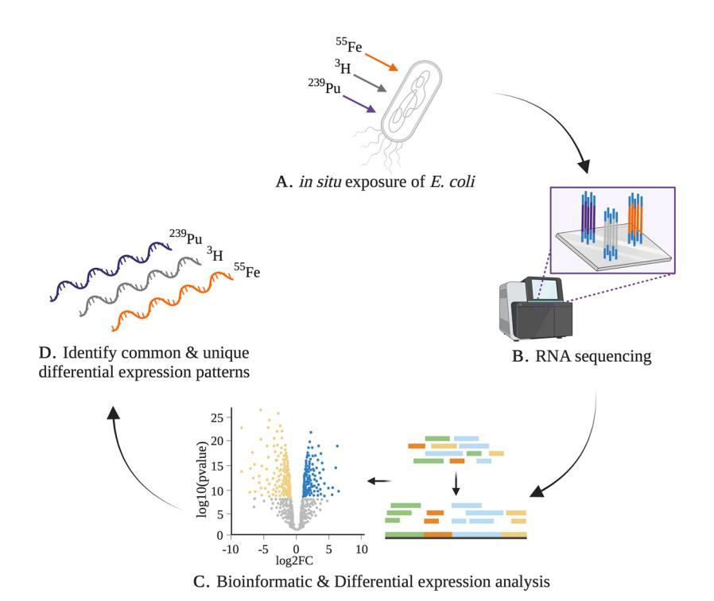
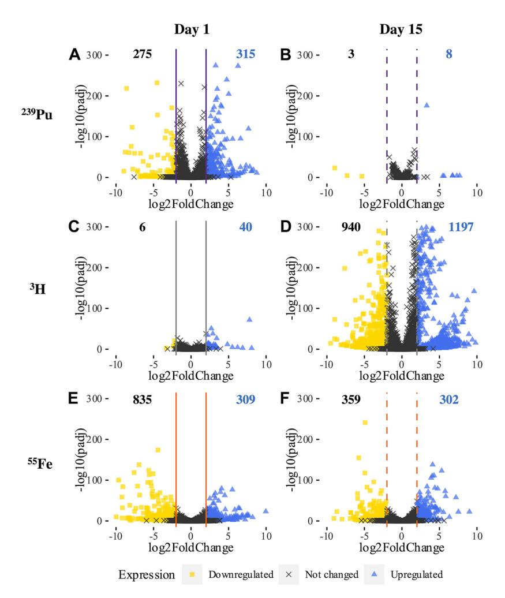
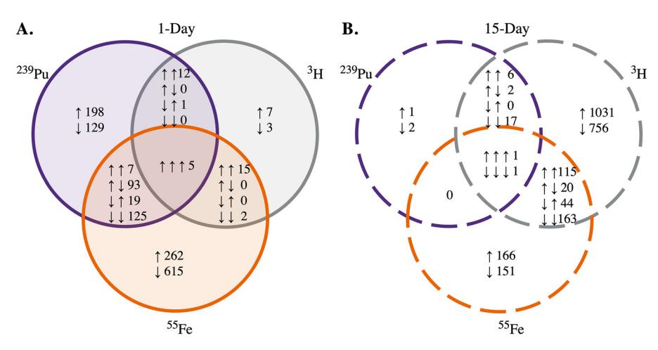
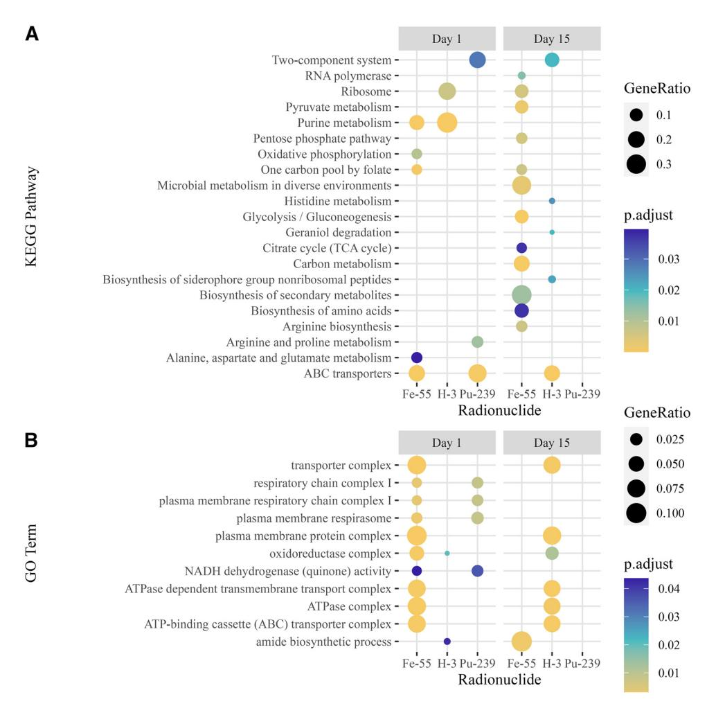
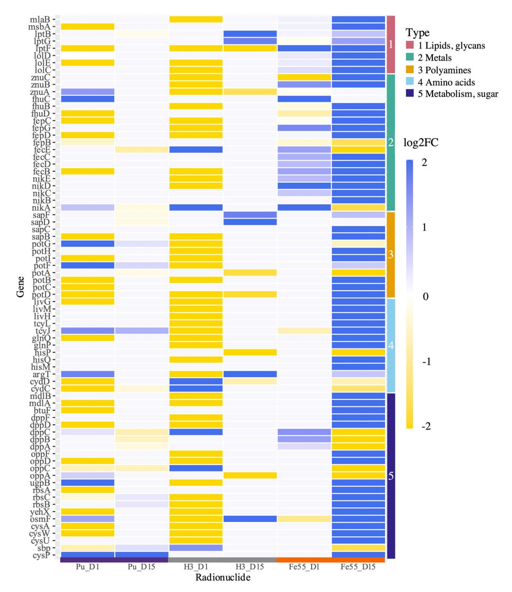
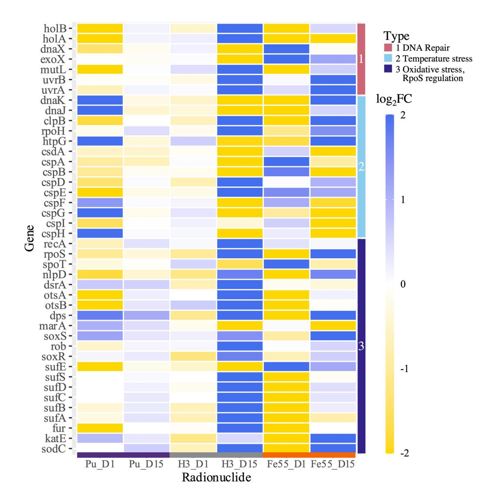
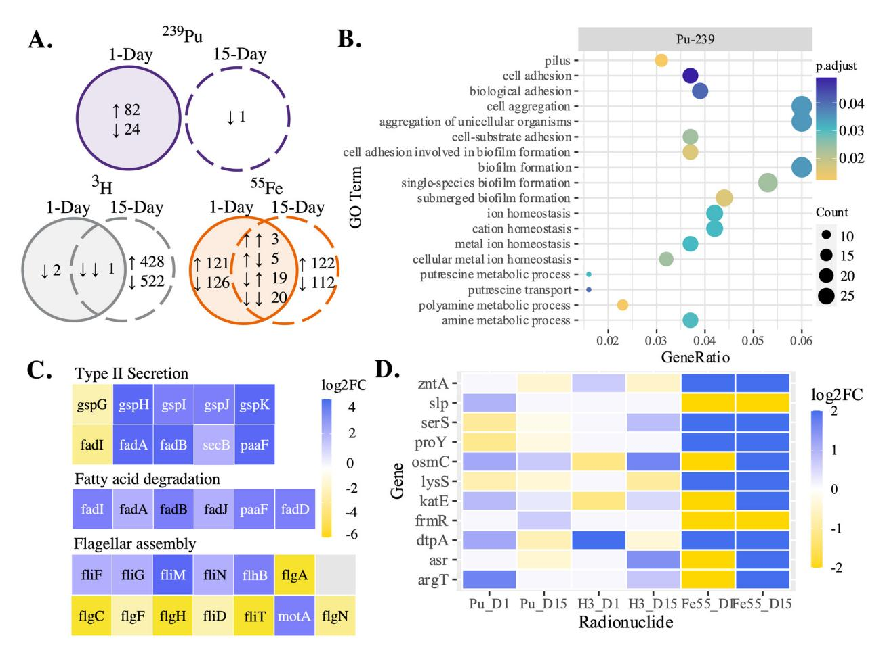

# Global Transcriptional Response of *Escherichia coli* Exposed *In Situ* to Different Low-Dose Ionizing Radiation Sources

Molly Wintenberg, a Lisa Manglass, b,c Nicole E. Martinez, b Mark Blennera,d

- aDepartment of Chemical and Biomolecular Engineering, Clemson University, Clemson, South Carolina, USA
- bDepartment of Environmental Engineering and Earth Sciences, Clemson University, Clemson, South Carolina, USA
- Department of Physics and Engineering, Francis Marion University, Florence, South Carolina, USA
- dDepartment of Chemical and Biomolecular Engineering, University of Delaware, Newark, Delaware, USA

ABSTRACT Characterization of biological and chemical responses to ionizing radiation by various organisms is essential for potential applications in bioremediation, alternative modes of detecting nuclear material, and national security. Escherichia coli DH10eta is an optimal system to study the microbial response to low-dose ionizing radiation at the transcriptional level because it is a well-characterized model bacterium and its responses to other environmental stressors, including those to higher radiation doses, have been elucidated in prior studies. In this study, RNA sequencing with downstream transcriptomic analysis (RNA-seq) was employed to characterize the global transcriptional response of stationaryphase E. coli subjected to 239Pu, 3H (tritium), and 55Fe, at an approximate absorbed dose rate of 10 mGy day-1 for 1 day and 15 days. Differential expression analysis identified significant changes in gene expression of E. coli for both short- and long-term exposures. Radionuclide source exposure induced differential expression in E. coli of genes involved in biosynthesis pathways of nuclear envelope components, amino acids, and siderophores, transport systems such as ABC transporters and type II secretion proteins, and initiation of stress response and regulatory systems of temperature stress, the RpoS regulon, and oxidative stress. These findings provide a basic understanding of the relationship between low-dose exposure and biological effect of a model bacterium that is critical for applications in alternative nuclear material detection and bioremediation.

**IMPORTANCE** Escherichia coli strain DH10 $\beta$ , a well-characterized model bacterium, was subjected to short-term (1-day) and long-term (15-day) exposures to three different *in situ* radiation sources comprised of radionuclides relevant to nuclear activities to induce a measurable and identifiable genetic response. We found *E. coli* had both common and unique responses to the three exposures studied, suggesting both dose rate- and radionuclide-specific effects. This study is the first to provide insights into the transcriptional response of a microorganism in short- and long-term exposure to continuous low-dose ionizing radiation with multiple *in situ* radionuclide sources and the first to examine microbial transcriptional response in stationary phase. Moreover, this work provides a basis for the development of biosensors and informing more robust doseresponse relationships to support ecological risk assessment.

**KEYWORDS** RNA-seq, stationary phase, radioactivity, radionuclides, environmental stress

There has been increasing interest in using biological and chemical responses of various organisms to ionizing radiation for applications in bioremediation, nuclear security, food safety, and crop breeding, with some of this interest motivated by a changing nuclear climate (1, 2). The characterization of the effects of nuclear material on key environmental species has a central role in developing alternative, potentially clandestine, modes of detection using biological systems, informing dose-response relationships to

**Editor** Steven J. Hallam, University of British Columbia

**Copyright** © 2023 Wintenberg et al. This is an open-access article distributed under the terms of the Creative Commons Attribution 4.0 International license.

Address correspondence to Mark Blenner, blenner@udel.edu.

The authors declare no conflict of interest.

Received 1 August 2022 Accepted 11 January 2023 Published 13 February 2023 support ecological risk assessment, and in bioremediation of contaminated environments. Realistic exposure scenarios, such as in situ exposure to radionuclides relevant to the nuclear fuel cycle, weapons development, and enrichment activities, can provide insight into the response of environmental microorganisms.

The effects of high doses (i.e., grays [Gy]) of ionizing radiation on microorganisms, such as DNA damage ([3](#page-17-2)[–](#page-17-3)[5\)](#page-17-4), oxidative stress ([6](#page-17-5), [7](#page-17-6)), and apoptosis ([5](#page-17-4), [7,](#page-17-6) [8\)](#page-17-7) are well understood. However, the effects of lower doses (i.e., milligrays), particularly low linear energy transfer (LET) radiation, are poorly understood ([5,](#page-17-4) [8](#page-17-7)[–](#page-17-8)[10](#page-17-9)) as responses and repair pathways are more nuanced. "Low" in the context of this work refers generally to dose and rose rates not anticipated meaningfully impact cellular function. Understanding the biological response of microbial systems subjected to low, environmentally relevant dose rates of ionizing radiation would support a better understanding of the fundamental science underlying new detection, dose-response relationships, and bioremediation applications. Moreover, studying radiation-induced responses at different points within the stationary phase with multiple types of emitters would provide a larger picture of microbial response and be more relevant to the majority population of cells in the environment [\(11](#page-17-10)).

Escherichia coli is an ideal system to study the microbial transcriptional response to low-dose ionizing radiation because it is well characterized with an annotated genome ([12\)](#page-17-11) and responses to other types of stress, such as nutrient starvation [\(13](#page-17-12), [14](#page-17-13)), oxidative stress ([15](#page-17-14), [16\)](#page-17-15), envelope stress ([17](#page-17-16)), and temperature changes ([18](#page-17-17)[–](#page-17-18)[20\)](#page-18-0), are known. Previous studies have used E. coli as a model system to characterize the biological effects of high doses of ionizing radiation ([21](#page-18-1), [22](#page-18-2)) on DNA damage [\(23](#page-18-3)[–](#page-18-4)[25](#page-18-5)), oxidative stress ([26](#page-18-6)), and transcription [\(27\)](#page-18-7).

This work employs exposure of E. coli to radionuclides relevant to nuclear fuel cycle and enrichment activities in situ. This, combined with gene expression analysis, seeks to improve understanding of microbial response to low doses of ionizing radiation. The preferred metrics for quantifying exposure of biota to ionizing radiation are the absorbed dose and absorbed dose rate, where the absorbed dose is the average energy imparted to matter by ionizing radiation, per unit mass, with units of grays (Gy), where 1 Gy is equivalent to 1 J kg21. The target absorbed dose rate of ;10 mGy day21 for this experiment is consistent with the highest Department of Energy dose rate guideline for radiation protection of the environment [\(9](#page-17-8)) and is comparable to dose rates observed at some sites with legacy contamination ([28](#page-18-8)). Although the referenced DOE guidelines do not specifically address microorganisms, and our dose rates are approximate, we consider them to be representative of a "low dose rate," particularly as a recent National Academies report concerning low-dose radiation research defined, in the context of humans, low doses to be below 100 mGy and low dose rates to be less than 5 mGy h21 [\(29\)](#page-18-9).

The radionuclides considered, namely, 239Pu, (half-life [t1/2] = 24,110 years), tritium ( 3H) (t1/2 = 12.3 years), and 55Fe (t1/2 = 2.7 years), decay by alpha emission, beta emission, and electron capture, respectively. These radionuclides make interesting comparisons because of the type and energy of radiations emitted as well as being of interest in nuclear sensing applications. 3H and 55Fe are both common nuclear activation products and 239Pu is a fissile nuclide that can be made into a fission weapon or thermonuclear weapon "trigger" [\(7](#page-17-6), [30,](#page-18-10) [31](#page-18-11)). Tritium is a pure beta emitter, meaning it has no other associated emissions. 55Fe emits electrons and characteristic X rays of similar energy to that of the tritium beta emission. 239Pu primarily emits alpha particles, with lesser frequencies of X rays, gamma rays, and electrons [\(32](#page-18-12)); note that no radionuclide is a "pure" X-ray or alpha emitter. Of the radionuclides relevant to nuclear activities, these three were chosen because of the similarity in energy emission between 3H and 55Fe as well as the chemical similarity of iron and plutonium; this along with the different radiations emitted make interesting comparisons when considering in situ radionuclides [\(33](#page-18-13)).

Ultimately, the goal of this work was to characterize the response of E. coli to low-

FIG 1 Overview of (A) radiological exposure scenarios of 239Pu, 3 H, and 55Fe with stationary-phase E. coli using (B) RNA-seq and (C) differential expression analysis to (D) identify unique transcriptional signatures of radiation exposure. The figure was made with BioRender.

dose ionizing radiation. To do so, an RNA sequencing approach with downstream transcriptomic analysis (RNA-seq) was used to investigate the global transcriptional response of stationary-phase E. coli DH10b exposed in situ to 239Pu, 3H, or 55Fe for 1 day and 15 days. Differential expression analysis revealed significant changes in gene expression of E. coli at the two times studied with the three radionuclide sources. These exposures induced differential expression of E. coli genes involved in biosynthesis pathways of nuclear envelope components, amino acids, and siderophores, transport systems such as ABC transporters and type II secretion proteins, and initiation of stress response and regulatory systems of temperature stress, the RpoS regulon, and oxidative stress. The results and analysis presented here provide new insights into the transcriptional response of a model bacterium to in situ low-dose ionizing radiation exposure.

## RESULTS

Experimental approach to in situ exposure. To begin characterization of the stationary-phase bacterial response to low-dose ionizing radiation, E. coli DH10b was subjected to continuous exposure to 239Pu, 3H, or 55Fe for 15 days [\(Fig. 1\)](#page-2-0). Stationary-phase cells were used to represent the majority of cells within a communal environment [\(11\)](#page-17-10). Growth of E. coli was monitored with optical density measurements at 600 nm (OD600) throughout the 15-day study (see Fig. S1A in the supplemental material). Gene expression levels of mRNA isolated from irradiated and nonirradiated E. coli were measured at 1 day and 15 days through RNA sequencing (RNA-seq) and downstream transcriptomic analysis. Illumina sequencing was performed on 30 RNA samples and generated ;508 million reads in total (Table S1). The E. coli K-12 reference genome served as the framework for read alignment and transcript mapping. Gene abundance estimates were used in pairwise comparisons of 239Pu-, 3H-, or 55Fe-treated samples and nonirradiated controls (Fig. S2) to determine differential expression based on a generalized linear model utilizing a negative binomial distribution. Pairwise comparison of 55Fe and a stable iron control should provide radiological effects of radioiron and decouple

**FIG 2** Volcano plots displaying the global transcriptional response of *E. coli* after 1 day (solid line) or 15 days (dashed line) of exposure to (A and B)  $^{239}$ Pu, (C and D)  $^{3}$ H, or (E and F)  $^{55}$ Fe sources are represented by the Benjamin-Hochberg adjusted *P* value (padj) compared to the  $|\log_2 FC|$ . Differential expression significance was set with the statistical parameters adjusted *P* value (padj) of <0.05 and  $|\log_2 FC| > 2$ , with reference expression baseline set to the nonirradiated control. Genes upregulated, downregulated, and not significantly changed by treatment are represented by blue triangles, yellow squares, and black X's, respectively.

chemical effects by control reference gene expression. Moreover, without a stable analog, nonirradiated *E. coli* serves as the reference for pairwise comparisons to  $^{239}$ Pu. Genes were determined to be differentially expressed if the absolute value of the  $\log_2$  fold change ( $|\log_2 FC|$ ) was >2 and had an adjusted *P* value of <0.05.

Overlapping and unique global transcriptional responses characterize in situ exposure of *E. coli*. Significant change in gene expression was induced in *E. coli* for all radiological exposures considered. The global transcriptional responses of *E. coli* following 1 day and 15 days of individual radionuclide exposures are shown with volcano plots in Fig. 2, and the numbers of differentially expressed genes are displayed within the plots. Whole-transcriptome analysis with multiple time points in stationary phase demonstrates response dynamics, as the transcriptional response of *E. coli* to each type of radionuclide varied with time. Exposure to 239Pu induced a moderate change in gene expression in *E. coli* after 1 day but a minimal change after 15 days (Fig. 2A and B), with 590 (13.8% coding DNA sequences [CDSs]) and 11 (0.3% CDSs) differentially expressed genes at 1 day and 15 days, respectively. The opposite response pattern was observed for *E. coli* with exposure to 3H, with extensive differential expression induced after 15 days and a considerably smaller change following 1 day (Fig. 2C and D) with 2,137 (49.9% CDSs) and 46 (1.1% CDSs) differentially expressed genes, respectively.

FIG 3 Specific transcriptomic responses of E. coli induced by exposure to a single radionuclide source. Results are displayed in the Venn diagrams. The numbers of differentially expressed genes in E. coli following (A) 1 day or (B) 15 days of irradiation with 239Pu, 3 H, or 55Fe are colored in purple, gray, and orange, respectively. Unions represent genes differentially expressed by more than one radionuclide.

E. coli exposed to 55Fe exhibited the largest change in gene expression with respect to a stable iron chloride control after a single day of irradiation and a moderate change following 15 days ([Fig. 2E](#page-3-0) and [F](#page-3-0)). One day of exposure to 55Fe induced differential expression of 1,144 (26.7% CDSs) genes in E. coli, whereas 15 days of exposure induced 661 (15.4% CDSs) genes. Unlike with the other two radionuclides studied, the numbers of genes upregulated in E. coli irradiated by 55Fe were equivalent after 1 day and 15 days.

Differentially expressed genes were sorted for uniqueness by the specific radionuclide to which they were exposed and illustrated by Venn diagrams ([Fig. 3A](#page-4-0) and [B\)](#page-4-0) to identify potential radionuclide-discriminating responses or commonly induced responses. The numbers of upregulated and downregulated genes (represented by arrows in [Fig. 3](#page-4-0)) in E. coli following exposure to 239Pu (purple), 3 H (gray), or 55Fe (orange) for 1 day [\(Fig. 3A](#page-4-0)) and 15 days ([Fig. 3B](#page-4-0)) are shown in the Venn diagrams. Differential expression analysis revealed exposure to a single source induced unique expression of several genes after 1 day and 15 days. Moreover, other genes were differentially expressed by more than one radionuclide, as seen in the unions of the Venn diagrams, indicating common responses in E. coli to the absorbed dose rate studied.

Overrepresentation analysis of differentially expressed genes identified key pathways induced by in situ exposure. Functional annotations and enrichment analyses of differential expression results were performed to give biological context to differentially expressed genes. Overrepresentation analysis of differentially expressed genes was performed with clusterProfiler [\(34,](#page-18-14) [35\)](#page-18-15) using KEGG pathways ([36\)](#page-18-16) for E. coli to identify pathways significantly changed by irradiation. Comparison of enriched pathways by different radionuclide exposures was made with the compareCluster function [\(34\)](#page-18-14). Results of this analysis indicate key similarities and differences in the response of E. coli to the three different radiological exposures and the two times studied ([Fig. 4A\)](#page-5-0). Significant pathways in E. coli induced by irradiation were determined via overrepresentation analysis through calculation of a Benjamini-Hochberg adjusted P value and applying a cutoff for significance of ,0.05 [\(Fig. 4A](#page-5-0)). Several of pathways in E. coli were significantly overrepresented by more than one radionuclide. Purine metabolism (eco00230) was overrepresented following 1 day of either 55Fe or 3 H exposure. ABC transporters (eco02010) were also overrepresented in E. coli after 1 day of either 55Fe or 239Pu exposure and 15 days of 3 H exposure. Exposure to 55Fe induced several pathways in E. coli related to carbohydrate metabolism, such as glycolysis/gluconeogenesis (eco00010), the citrate cycle (eco00020), and the pentose phosphate pathway (eco00030).

Overrepresentation analysis of differentially expressed genes annotated with GO

**FIG 4** (A) Dot plot displays of KEGG pathways enriched in *E. coli* following 1 day or 15 days of 55Fe, 3H, or 239Pu irradiation identified by overrepresentation analysis; (B) dot plot displays of GO terms significantly overrepresented in *E. coli* following 1 day or 15 days of 55Fe, 3H, or 239Pu irradiation identified by overrepresentation analysis. The color gradient displays the adjusted enrichment *P* value (p.adjust), and the size of the dots denotes the gene ratio of significantly annotated genes to the total number of genes within the pathway.

terms was also performed with clusterProfiler using the enrichGO function for *E. coli* to identify GO terms significantly changed by irradiation. Key similarities and differences between radionuclides were identified (Fig. 4B). Genes differentially expressed by both 1 day of exposure to 55Fe and 15 days of exposure to 3H mapped to several overrepresented GO terms for transporter complex, plasma membrane complex, oxidoreductase complex, ATPase-dependent transmembrane complexes, and ABC transporters (Fig. 4B). A single day of exposure to either 239Pu or 55Fe induced similar changes in gene expression in *E. coli* with overrepresented GO terms of respiratory chain complex I, NADH dehydrogenase activity, and plasma membrane respirasome respiratory chain complex I (Fig. 4B).

Common changes in central and energy metabolism were observed for all radionuclide exposures. KEGG pathway and GO overrepresentation analyses of differentially expressed genes in *E. coli* demonstrate significant changes in gene expression to carbohydrate and energy metabolism following exposure to  $^{3}$ H or  $^{55}$ Fe and not  $^{239}$ Pu (Table 1). Of the 9 key enzymes in gluconeogenesis, five of them were significantly upregulated in *E. coli* exposed to  $^{55}$ Fe and moderately upregulated ( $|\log_2 FC| > 1.6$ ) by  $^{3}$ H exposure for 15 days. Genes encoding enzymes in the citric acid cycle (tricarboxylic acid [TCA]) were significantly downregulated after 1 day of  $^{55}$ Fe exposure but upregulated by 15 days of  $^{3}$ H exposure. Similar expression patterns were observed with

TABLE 1 Select differentially expressed genes involved in carbohydrate and energy metabolism in E. coli following 1 day and 15 days of exposure to a 239Pu, 3 H, or 55Fe source

|                                | Product name                                                   | Fold change under radionuclidea |        |        |        |       |        |  |
|--------------------------------|----------------------------------------------------------------|---------------------------------|--------|--------|--------|-------|--------|--|
| Gene ID                        |                                                                | 239Pu                           |        | 3 H |        | 55Fe  |        |  |
|                                |                                                                | Day 1                           | Day 15 | Day 1  | Day 15 | Day 1 | Day 15 |  |
| Gluconeogenesis                |                                                                |                                 |        |        |        |       |        |  |
| pgi                            | Glucose-6-phosphate isomerase                                  |                                 |        |        | 1.87   |       | 2.29   |  |
| fbp                            | Fructose-1,6-bisphosphatase 1                                  |                                 | 20.19  |        | 1.77   |       | 2.33   |  |
| fbaB                           | Fructose-bisphosphate aldolase class I                         | 2.16                            | 0.43   | 21.04  | 1.55   | 24.43 |        |  |
| fbaA                           | Fructose-bisphosphate aldolase class II                        | 20.85                           |        |        | 2.38   |       | 2.54   |  |
| gapA                           | Glyceraldehyde-3-phosphate dehydrogenase A                     | 1.09                            |        | 1.33   | 20.78  | 2.39  | 2.93   |  |
| pgk                            | Phosphoglycerate kinase                                        | 20.84                           |        |        | 3.05   |       | 1.45   |  |
| gpmA                           | 2,3-Bisphosphoglycerate-dependent phosphoglycerate mutase   | 20.92                           |        | 20.73  | 3.15   |       | 0.88   |  |
| gpmM                           | 2,3-Bisphosphoglycerate-independent phosphoglycerate mutase | 21.00                           |        |        | 1.80   | 2.37  | 1.64   |  |
| eno                            | Enolase                                                        | 20.54                           |        |        | 1.36   |       | 2.43   |  |
| TCA cycle                      |                                                                |                                 |        |        |        |       |        |  |
| frdA                           | Fumarate reductase flavoprotein subunit                        | 22.40                           |        |        | 4.43   | 22.49 |        |  |
| frdB                           | Fumarate reductase iron-sulfur protein                         |                                 |        |        | 4.48   | 23.13 |        |  |
| mdh                            | Malate dehydrogenase                                           | 2.06                            |        |        | 20.43  | 22.32 | 1.25   |  |
| mqo                            | Malate:quinone oxidoreductase                                  | 2.55                            | 20.24  |        | 0.51   | 22.60 |        |  |
| Pentose phosphate pathway      |                                                                |                                 |        |        |        |       |        |  |
| tktB                           | Transketolase 2                                                | 1.07                            | 0.75   | 21.39  | 3.83   | 23.91 | 3.50   |  |
| tktA                           | Transketolase 1                                                |                                 | 20.38  |        | 20.47  | 2.51  | 2.02   |  |
| talB                           | Transaldolase B                                                | 0.48                            |        |        | 2.83   | 1.44  | 3.60   |  |
| talA                           | Transaldolase A                                                | 2.38                            | 0.71   | 20.90  | 3.48   | 24.14 | 3.12   |  |
| fbaB                           | Fructose-bisphosphate aldolase class I                         | 2.16                            | 0.43   | 21.04  | 1.55   | 24.43 |        |  |
| Oxidative phosphorylation      |                                                                |                                 |        |        |        |       |        |  |
| nuoA                           | NADH:quinone oxidoreductase subunit A                          | 2.70                            |        |        | 22.42  |       |        |  |
| nuoE                           | NADH:quinone oxidoreductase subunit E                          | 22.47                           |        |        | 5.62   | 22.77 |        |  |
| sdhA                           | Succinate:quinone oxidoreductase, FAD binding protein       | 24.13                           |        |        | 7.96   | 25.24 |        |  |
| atpA                           | ATP synthase F1 complex subunit alpha                          |                                 | 21.01  | 0.80   | 22.20  |       | 3.20   |  |
| Nitrogen and sulfur metabolism |                                                                |                                 |        |        |        |       |        |  |
| narG                           | Nitrate reductase A subunit alpha                              | 22.10                           |        | 2.08   | 4.68   |       |        |  |
| napA                           | Periplasmic nitrate reductase subunit NapA                     | 22.38                           |        |        | 3.25   | 23.84 |        |  |
| gltB                           | Glutamate synthase subunit GltB                                |                                 | 20.76  |        | 22.37  | 2.85  |        |  |

aAbsence of a number represents an adjusted P value of .0.05.

components in the pentose phosphate pathway, where key genes, such as those encoding transketolase 2, transaldolase A, phosphopentomutase, and fructose-bisphosphate aldolase class II, were upregulated by 15 days of 3 H or 55Fe exposure and downregulated by 1 day of 55Fe exposure.

A similar pattern of changes in expression holds for thiamine metabolism, with downregulation of genes by 1 day of 239Pu or 55Fe exposure in E. coli and upregulation with 15 days of 3H exposure. Genes involved oxidative phosphorylation were also differentially expressed in E. coli following exposure to 9 mGy day21 of 239Pu, 3H, or 55Fe exposure. NADH quinone oxidoreductase subunits, succinate quinone oxidoreductases, and ATP synthase F1 complex subunits were differentially expressed in irradiated E. coli [\(Table 1\)](#page-6-0). Nitrogen and sulfur metabolism genes were similarly differentially expressed in irradiated E. coli. Nitrate reductase subunits and glutamate synthase subunits were highly upregulated by 15 days of 3H exposure and downregulated in E. coli by 1 day of 239Pu or 55Fe exposure as displayed in [Table 1.](#page-6-0)

Differential expression and pathway analyses also revealed changes in expression of genes involved in amino acid biosynthesis and degradation pathways [\(Table 2\)](#page-7-0). Several genes involved in valine, leucine, and isoleucine degradation (eco00280) and

TABLE 2 Select differentially expressed genes involved in amino acid metabolism in E. coli following 1 day and 15 days of exposure to 239Pu, 3 H, or 55Fe

| Gene ID |                                                    | Fold change under indicated radionuclidea |        |        |        |       |        |  |
|---------|----------------------------------------------------|-------------------------------------------|--------|--------|--------|-------|--------|--|
|         |                                                    | 239Pu                                     |        | 3 H |        | 55Fe  |        |  |
|         | Product name                                       | Day 1                                     | Day 15 | Day 1  | Day 15 | Day 1 | Day 15 |  |
| paaF    | 2,3-Dehydroadipyl-CoA hydratase                    |                                           |        | 4.18   |        |       |        |  |
| fadB    | Multifunctional enoyl-CoA hydratase                | 1.25                                      | 0.29   |        | 3.89   | 21.44 |        |  |
| fadJ    | 3-Hydroxyacyl-CoA dehydrogenase FadJ               | 2.22                                      | 0.58   |        | 2.34   |       |        |  |
| fadI    | 3-Ketoacyl-CoA thiolase FadI                       | 1.17                                      | 0.49   | 1.42   | 3.88   | 21.04 |        |  |
| fadA    | 3-Ketoacyl-CoA thiolase                            | 0.82                                      |        | 0.08   | 2.77   | 20.66 | 0.96   |  |
| scpA    | Methylmalonyl-CoA mutase                           | 23.61                                     |        |        | 3.55   | 21.05 | 1.81   |  |
| ldcC    | Lysine decarboxylase 2                             | 0.87                                      |        | 22.79  |        |       | 2.19   |  |
| cadA    | Lysine decarboxylase 1                             |                                           |        |        |        |       | 23.47  |  |
| patA    | Putrescine aminotransferase                        |                                           | 0.69   |        |        |       | 6.47   |  |
| hisI    | Bifunctional phosphoribosyl-AMP cyclohydrolase     | 23.21                                     |        |        | 5.36   | 23.43 |        |  |
| hisA    | Isomerase                                          | 22.74                                     |        |        | 4.44   | 22.07 |        |  |
| hisH    | Imidazole glycerol phosphate synthase subunit HisH | 28.97                                     | 6.75   |        | 6.61   |       |        |  |
| hisF    | Imidazole glycerol phosphate synthase subunit HisF | 22.50                                     |        |        | 4.49   | 23.29 |        |  |
| hisB    | Imidazoleglycerol-phosphate dehydratase            | 20.75                                     | 3.38   |        | 2.10   |       | 3.49   |  |
| hisC    | Histidinol-phosphate aminotransferase              | 22.11                                     |        |        | 4.85   | 22.08 |        |  |
| hisD    | Histidinol dehydrogenase                           | 22.51                                     | -      |        | 6.11   | 22.29 | -      |  |

aAbsence of a number represents an adjusted P value of .0.05.

others involved in lysine degradation (eco00310) were significantly upregulated by 15 days of 3H exposure. Histidine metabolism (eco00340) genes were also upregulated in E. coli by 15 days of 3 H exposure and downregulated by 1 day of 239Pu or 55Fe exposure.

Genes in biosynthesis pathways of the nuclear envelope components such as lipopolysaccharide, O-antigen nucleotide sugars, and peptidoglycan were differentially expressed in E. coli following exposure to 3H or 55Fe (Fig. S3). Similarly, as observed with other processes, genes within these pathways were upregulated by 3H after 15 days of exposure and downregulated by 1 day of exposure to 55Fe.

Radionuclide exposure modified transport, signaling, and regulatory systems in E. coli. Bacterial transport and regulatory systems were found to be significantly changed in irradiated E. coli by overrepresentation analysis ([Fig. 4\)](#page-5-0). Several genes encoding components of these systems, including ABC transporters, two-component system (TCS), and the phosphotransferase system (PTS), were differentially expressed. Significant changes in expression of genes involved in ABC transport systems for lipid, amino acid, polyamine, peptide, metal ion, and sugar ABC transporters were found in irradiated E. coli compared to nonirradiated E. coli ([Fig. 5](#page-8-0)). ABC transporter genes were mostly downregulated in E. coli after exposure to 239Pu or 55Fe for 1 day but were upregulated after 15 days of exposure to 3H and are displayed within the heat map. Polyamine transporter genes for putrescine and spermidine were differentially expressed by E. coli exposed to 3 H or 55Fe. Metal ion and complex transporters for nickel (nikABCDE), iron III (fhuBCD), ferric citrate (fecBCDE), and zinc (znuABC), were all upregulated after 15 days exposure to 3 H but downregulated in E. coli by 1 day of 239Pu or 55Fe exposure.

Several genes encoding components of other bacterial transport, stimulus, and communication systems of PTS and TCS were differentially expressed (Fig. S4). Phosphotransferase genes encoding phosphotransferase enzymes for fructose (fruABK), mannose (manXYZ), and glucose (ptsG), were downregulated in E. coli by 1 day of exposure to 55Fe and upregulated by 15 days of exposure to 3 H (Fig. S4). Genes that have roles in the TCS, such as sensor histidine kinases (envZ, baeS, kdpD, zraS, and cpxA), the corresponding response regulators (baeR, zraR, and cpxR), the DNA-binding transcriptional dual regulator (ompR), and outer membrane porins (ompCF), were upregulated by 3 H after 15 days of exposure and downregulated by 1 day of exposure to 239Pu or 55Fe (Fig. S4). The opposite expression was found for phoQ, representing sensor histidine kinases.

Siderophore biosynthesis, more specifically enterobactin biosynthesis, was induced

FIG 5 Heat map displaying differential expression of genes involved in various ABC transport systems as denoted by the vertical color bar. The jlog2 FCj values of upregulated and downregulated genes are shown in blue and yellow, respectively.

in E. coli by 1 day of 239Pu exposure [\(Table 3\)](#page-9-0). Enterobactin biosynthesis consists of 7 genes in E. coli K-12, and following 1 day of exposure to 239Pu, 6 genes were upregulated (jlog2 FCj . 1.7) and one, entF, was downregulated in E. coli. Long-term exposure to 3H caused the opposite response. As expected in the presence of iron, exposure to a 55Fe source did not result in significant changes in gene expression compared to a stable iron control.

In situ exposure initiated stress responses in irradiated E. coli. Differential expression analysis revealed the expression of genes with key roles in combating general, oxidative, osmotic, and temperature stress in addition to others involved in DNA repair mechanisms in E. coli were significantly changed by exposure to the sources studied ([Fig. 6\)](#page-10-0). The heat map displays downregulation of two oxidative stress genes, sodC and katE, in response to 1 day of 55Fe exposure but subsequent upregulation of the genes following 15 days of exposure to 55Fe and 3H. Other markers of oxidative stress

TABLE 3 Enterobactin genes were differentially expressed in E. coli after 1 day and 15 days of exposure to 239Pu or 3 H

| GeneID | Product name                                    | Fold change under indicated radionuclide sourcea |        |        |        |       |        |  |  |
|--------|-------------------------------------------------|--------------------------------------------------|--------|--------|--------|-------|--------|--|--|
|        |                                                 | 239Pu                                            |        | 3 H |        | 55Fe  |        |  |  |
|        |                                                 | Day 1                                            | Day 15 | Day 1  | Day 15 | Day 1 | Day 15 |  |  |
| entC   | Isochorismate synthase EntC                     | 2.41                                             |        |        | 23.09  |       | 20.99  |  |  |
| entB   | Enterobactin synthase component B               | 1.97                                             | 20.82  |        | 23.24  |       | 4.48   |  |  |
| entA   | 2,3-Dihydro-2,3-dihydroxybenzoate dehydrogenase | 1.97                                             | 21.01  | 0.70   | 22.45  |       | 0.70   |  |  |
| entD   | Phosphopantetheinyl transferase EntD            | 3.15                                             | 20.48  |        | 25.79  | 21.35 |        |  |  |
| entE   | 2,3-Dihydroxybenzoate-AMP ligase                | 1.70                                             | 20.48  |        | 22.42  |       | 0.94   |  |  |
| entF   | Apo-serine activating enzyme                    | 22.77                                            |        |        | 5.12   | 23.20 |        |  |  |
| entH   | Proofreading thioesterase                       | 1.91                                             | 21.17  | 0.76   | 23.40  |       |        |  |  |

aAbsence of a number represents an adjusted P value of .0.05.

positively regulated by OxyR, including iron-sulfur cluster assembly proteins, DNAbinding transcriptional dual regulator (encoded by fur), and an iron-binding and storage protein (encoded by dps), were significantly downregulated after 1 day of exposure to 55Fe but upregulated after 15 days of 3H exposure. Several genes (rpoS, spoT, nlpD, dsrA, otsAB, and dts) controlled by the sigma factor RpoS that play a role in the global and osmotic stress responses were differentially expressed following exposure to 55Fe and 3H ([Fig. 6\)](#page-10-0).

Indicators of cold and heat shock were also expressed. The cold shock protein genes cspH and cspG were upregulated by 1 day of exposure to 239Pu and downregulated by 15 days of 55Fe or 3H ([Fig. 6\)](#page-10-0). Other cold shock protein genes (cspB, cspF, and cspG) were downregulated in E. coli by both 1 day and 15 days of exposure to 3H. Key genes involved in heat shock response, including the high-temperature protein G gene htpG and heat shock protein chaperone genes dnaKJ ([37\)](#page-18-17), were significantly upregulated following exposure to 1 day of 239Pu and 15 days of 55Fe. Differential expression analysis provided some suggestion of DNA strand break repair with significant changes in genes that play a role in repair pathways ([Fig. 6\)](#page-10-0). These genes, consisting of genes coding for excision nuclease subunits A and B (uvrA and uvrB, respectively), DNA mismatch repair protein (mutL), exonuclease X (exoX), and three subunits of DNA polymerase III (dnaX, holA, and holB), were differentially expressed.

Unique responses to a single radionuclide can discriminate between sources. Differential expression analysis identified genes in irradiated E. coli significantly changed from nonirradiated controls by a single radionuclide for the three different radionuclide sources considered [\(Fig. 7A\)](#page-11-0). E. coli exposed to a 239Pu source revealed a moderate change in gene expression after 1 day of irradiation but negligible change after 15 days, with 106 genes (1.9% CDSs) and 1 gene (0.018% CDSs) uniquely differentially expressed, respectively [\(Fig. 7A,](#page-11-0) top). Responses induced by exposure to 1 day of 239Pu are broad with significant changes in gene expression of membrane proteins, fimbrial proteins, amino acid biosynthesis enzymes, and metal ion transporters. The gene encoding the regulatory protein RecA was downregulated by 1 day of exposure to 239Pu. Overrepresentation analysis revealed GO terms corresponding to genes involved in biofilm formation, cell adhesion and aggregation, metal ion homeostasis, and putrescine and polyamine metabolic processes were significantly changed by 239Pu exposure [\(Fig. 7B](#page-11-0)). After 15 days of exposure to 239Pu, only a single gene, ynbA, encoding CDP-alcohol phosphatidyltransferase domain-containing protein YnbA, was downregulated.

The change in gene expression in E. coli exposed to 3H was considerably higher after 15 days of continuous irradiation than after 1 day, with 950 (17.11% CDSs) and 2 (0.036% CDSs) uniquely differentially expressed genes, respectively [\(Fig. 7A](#page-11-0)). Only a single gene, psiE, was commonly differentially expressed at both times studied as represented by the union of the Venn diagram. The transcriptional response of E. coli induced by exposure to 3H for 15 days showed broad differential expression of polyketide biosynthesis components, the type II secretion system (T2SS), and fatty acid degradation ([Fig. 7C](#page-11-0)). Flagellar assembly genes were also significantly changed in E. coli

FIG 6 Heat map displaying select differentially expressed genes in E. coli exposed to 1 day and 15 days of 239Pu, 3 H, or 55Fe that are components of the stress response denoted by the vertical color bar types. The jlog2 FCj values of upregulated and downregulated genes are shown in blue and yellow, respectively.

treated with 3H for 15 days, reflected by the upregulation of five genes and downregulation of 9 others.

Exposure of E. coli to 55Fe for 1 day and 15 days induced moderate change in gene expression, with 247 (4.4% CDSs) and 234 (4.2% CDSs) genes being uniquely differentially expressed [\(Fig. 7A](#page-11-0)). Unlike responses observed in E. coli exposed to 239Pu or 3H, exposure to 55Fe induced differential expression of 47 genes at both 1 day and 15 days. These functions of these genes were broad, with upregulation of genes encoding transporters and tRNA ligases for serine and lysine and downregulation of a gene encoding an osmotically inducible peroxiredoxin, ABC transporters, and DNA-binding transcriptional repressor ([Fig. 7D](#page-11-0)). Stress response genes for acid shock, starvation, and peroxide stress were also differentially expressed in E. coli exposed to 55Fe for 1 day and 15 days.

## DISCUSSION

Understanding the biological response of environmental species to nuclear material is critical for the development of new detection methods and establishing proper dose-response relationships. Analysis of the transcriptional response of E. coli DH10b

**FIG 7** Unique response of *E. coli*. (A) Venn diagrams represent the number of differentially expressed genes in *E. coli* following 1 day and 15 days of exposure. (B) A dot plot displays GO terms uniquely enriched in *E. coli* following 1 day of 239Pu exposure as identified by overrepresentation analysis. The gene ratio represents the ratio of the number of significantly annotated genes over the total number in the term. (C) Select genes differentially expressed in *E. coli* by 3H exposure that encode components of T2SS, fatty acid degradation, and flagellar assembly. (D) A heat map displays select genes differentially expressed in *E. coli* following exposure to 55Fe, with color denoting the |log2 FC|.

subjected *in situ* to exposure to 239Pu, 3H, and 55Fe for 1 day and 15-days provides a fundamental characterization of the effects of low-dose ionizing radiation on a model bacterium for the first time. *E. coli* was an ideal system to study the effects of low-dose ionizing radiation because it is well characterized (12, 16, 38) and previous work with radiation provides comparison with different sources and much higher dose rates (15, 21, 22, 25). Differential expression analysis revealed key similarities and differences in the gene expression of *E. coli* with three radionuclide sources and two times studied (Fig. 2 and 3).

The numbers of differentially expressed genes in *E. coli* varied among the three sources studied, despite similarities in average dose rates and exposure times. 239Pu exposure immediately induced stress on *E. coli* (Fig. 2A and B), 3H had a slower, delayed response (Fig. 2C and D), and 55Fe triggered similar levels of transcriptional activation at each time point studied (Fig. 2D and E). We surmise that the variation in transcriptional response is due to a combination of radiological (e.g., type or types of radiation emitted) and chemical (e.g., how the source is distributed within the culture) properties of the sources studied, although this requires further exploration. Prior studies have shown that 239Pu can bind to cell surfaces, interact with cells similarly to other heavy metals, and likely remain external to the cell without scavenging or addition of a chelator (39–42). The large initial transcriptional change is presumably due to major stress induced by the presence of 239Pu within the growth medium and possible sorption to the surface of the cells. The alpha particles emitted from 239Pu will deposit their

energy densely, along a short path, suggesting that 239Pu sorbed to the surface of the cell could cause comparatively more stress than the other sources studied. In other words, the dose rate experienced locally (i.e., the microdosimetry) in cells from 239Pu is likely higher than the average dose rate across the entire culture. After the initial drastic response, E. coli appeared to adapt to the stress of 239Pu exposure and persisted in the 15-day data. Tritium can produce localized damage after incorporation into cells by substituting with hydrogen atoms and interacting with cellular material [\(43\)](#page-18-21), although 3H will distribute uniformly in the culture without preference for which hydrogen it exchanges with. Tritium emits a low-energy beta particle, which will deposit energy much less densely than an alpha particle. We speculate the more homogeneous distribution of energy deposition at the average dose rate considered was not large enough to produce a measurable change after a single day of 3H exposure, but accumulation of these interactions over a longer period of time, like 15 days, was likely the cause of large-scale gene activation. Consistent changes in differential expression observed in E. coli treated with 55Fe compared to a stable iron counterpart over time indicate possible uptake and incorporation of iron via known binding sites and pathways ([44](#page-18-22)). The resulting differential expression in E. coli reflects additional changes induced by 55Fe exposure over the stable control were constant over time.

Genes encoding components of carbohydrate metabolism ([Table 1](#page-6-0)), the nuclear envelope, ABC transporters ([Fig. 5\)](#page-8-0), regulatory systems (see Fig. S4 in the supplemental material), siderophore biosynthesis [\(Table 3](#page-9-0)), and stress response pathways [\(Fig. 6](#page-10-0)) were differentially expressed in E. coli by more than one radionuclide. Several of these genes were upregulated by E. coli exposed to 15 days of 3H but downregulated by 1 day of exposure to 239Pu or 55Fe compared to corresponding nonirradiated E. coli. Common changes in gene expression with broad functions could indicate a general response to the dose rate studied [\(Fig. 3](#page-4-0) and [4](#page-5-0)), and unique changes reveal radionuclide source-specific responses ([Fig. 7\)](#page-11-0).

Central carbohydrate metabolism is critical for cellular processes, and microorganisms adapt to environmental shifts and modified growth requirements by altering expression of metabolic genes ([14](#page-17-13)). Differential expression analysis revealed expression changes in key carbohydrate metabolism genes in irradiated E. coli compared to nonirradiated E. coli [\(Fig. 4](#page-5-0), [Table 1,](#page-6-0) and [Table 2\)](#page-7-0). The upregulation of genes encoding gluconeogenesis enzymes in E. coli exposed to 55Fe or 3H for 15 days suggests the exposed samples have a higher biosynthetic burden, which requires gluconeogenesis under glucose-limited conditions [\(11](#page-17-10), [45\)](#page-18-23) [\(Table 1\)](#page-6-0). The transition from exponential growth to stationary phase often results in the downregulation of TCA components, and downregulation of corresponding genes suggests 55Fe exposure could have heightened the response [\(46,](#page-18-24) [47](#page-18-25)) ([Table 1\)](#page-6-0). Oxidative phosphorylation is a metabolic pathway used by bacteria to acquire energy and during stationary phase influences survival [\(48,](#page-18-26) [49\)](#page-18-27). Long-term 3H exposure induced upregulation of nearly all genes within the pathway, whereas short-term 55Fe exposure had an opposite response, indicating another route for energy production in 3H-treated E. coli [\(Table 1\)](#page-6-0).

Limited nutrient availability in long-term stationary-phase cells can lead to amino acids serving as energy sources [\(50](#page-18-28)). Upregulation of several amino acid degradation pathways of lysine, valine, leucine, and isoleucine suggests possible breakdown of amino acids for energetic resources in E. coli exposed to 3H for 15 to days [\(Table 2\)](#page-7-0). Moreover, similar exposure caused increased gene expression in E. coli of histidine biosynthesis genes, whose transcriptional regulation is triggered by amino acid starvation ([51,](#page-18-29) [52](#page-18-30)). Long-term exposure to radiation in stationary phase possibly increased amino acid starvation in 3H-treated E. coli. Short-term 239Pu and 55Fe exposure downregulated these genes; however, 1-day cultures would not necessarily be under starvation conditions and require biosynthesis of histidine. Similar responses to increased amino acid starvation are not observed in long-term exposures to the other two radionuclide sources studied. It is possible that accumulation of 55Fe from long-term exposure induces alternative response mechanisms that are not reflective of amino acid starvation. Also,

the lack of response in E. coli to 239Pu long-term exposure suggests possible adaptation to any induced stress or perceived stasis as the expression data indicate no significant changes in gene expression from the nonirradiated control levels.

The nuclear envelope plays a critical role in cellular homeostasis by responding to intrinsic and environmental stress in stationary-phase cells ([53,](#page-18-31) [54](#page-18-32)). Previous studies have demonstrated the role of the nuclear envelope in combating stress caused by radiation exposure ([55,](#page-18-33) [56](#page-18-34)). Upregulation of biosynthesis pathways of nuclear envelope components, peptidoglycan and lipopolysaccharides (LPSs), in addition to precursor molecules, O antigen and nucleotide sugars, by exposure to 3H in comparison to nonirradiated E. coli could indicate an adaptive response to radiation exposure to maintain homeostasis (Fig. S3). A previous study determining the effects of styrene on E. coli also found possible repair to the cell envelope through differential expression of similar nuclear envelope genes induced by 3H exposure [\(57\)](#page-18-35). Differential expression analysis suggests biosynthesis of external and middle interior sections of the nuclear envelope but not the inner membrane in 3H-treated E. coli, with upregulation of glycerophospholipid metabolism genes and downregulation of fatty acid degradation genes after 15 days ([Fig. 7C\)](#page-11-0).

Enterobactin, a siderophore, is produced by E. coli to mediate iron transfer [\(58](#page-18-36)) and has been shown as a possible mechanism for the uptake of plutonium in E. coli [\(28\)](#page-18-8). Exposure to 1 day of 239Pu induced upregulation of six enterobactin genes in E. coli ([Table 3](#page-9-0)) required for synthesis, suggesting possible uptake of 239Pu by E. coli, which is consistent with observations in previous studies ([28](#page-18-8)). These results may also suggest E. coli generated enterobactin to obtain other metals in order to combat initial stress induced by 239Pu exposure. In a similar study where E. coli was subjected to a different heavy metal, palladium, the same enterobactin genes were downregulated [\(59\)](#page-18-37). Enterobactin synthesis genes were downregulated in 3 H-treated E. coli after 15 days, indicating no measurable increase in gene expression compared to nonirradiated E. coli. Unsurprisingly, at either time analyzed, 55Fe exposure did not significantly change gene expression of enterobactin biosynthesis genes in E. coli as the control provided an equal amount of additional iron.

Bacteria have several strategies using signaling and cellular processes to control expression profiles in response to environmental changes and stress. The TCS is a predominant strategy consisting of histidine kinases and corresponding response regulators to sense and respond to environmental fluctuations by changing gene expression ([60,](#page-19-0) [61](#page-19-1)), and in E. coli K-12, the TCS has been demonstrated to respond to nuclear envelope stress and metal sensing ([62,](#page-19-2) [63\)](#page-19-3). Osmotic stress, envelope stress, and high-zinclevel histidine kinase and cognate regulator genes were upregulated in E. coli following 15 days of 3H but were downregulated by 1 day of 239Pu or 55Fe exposure (Fig. S4). Increased transcription of TCSs could indicate a response by E. coli to combat stress induced by radiation as it would when subjected to osmotic and envelope stress [\(17\)](#page-17-16), high concentrations of metals ([63\)](#page-19-3), or ethanol stress ([62\)](#page-19-2). Downregulation of a DNAbinding transcriptional activator and cognate histidine kinase pair, BasR and BasS, that responds to iron starvation [\(63](#page-19-3)) in 55Fe-treated E. coli, suggests repression of these genes. Secretion systems, including T2SS, play an important role in cellular communication ([64\)](#page-19-4) with numerous global functions of environmental adaptation, nutrients acquisition, and transport of folded proteins from the periplasm in Gram-negative bacteria [\(65,](#page-19-5) [66](#page-19-6)). Tritium exposure upregulated several general secretion pathway protein genes in E. coli after 15 days ([Fig. 7C](#page-11-0)); however, general secretory or twin arginine targeting pathway genes that secrete proteins through the inner membrane were downregulated ([67\)](#page-19-7). These complex results suggest 3H exposure induces a transcriptional response of Gsp in E. coli but no measurable transcriptional increase of protein export genes.

The ATP binding cassette (ABC) transporter superfamily of proteins transports numerous nutrients and other molecules, such as heavy metal chelates, amino acids, and polysaccharides, across the membrane in E. coli [\(68](#page-19-8), [69\)](#page-19-9). Differential expression analysis of E. coli exposed to 239Pu, 3H, or 55Fe found significant changes in expression

of genes coding for lipopolysaccharide (LPS), polyamine, amino acid, peptide, sugar, and metal ion ABC transporters [\(Fig. 4](#page-5-0) and [5](#page-8-0)). The upregulation of genes involved in the export of external components, such as LPS, heme, siderophores, and lipoproteins, in 3H-treated E. coli aligns with increased gene expression of equivalent biosynthesis pathways. Putrescine and spermidine, common polyamines, and ABC transporters were upregulated in E. coli by exposure to 15 days of 3H and 1 day of 239Pu and downregulated by 15 days of exposure to 55Fe [\(Fig. 5](#page-8-0) and [Fig. 7B](#page-11-0) and [C](#page-11-0)). Polyamines have several physiological functions in nucleic acid biosynthesis, response to oxidative stress, and cell growth ([70\)](#page-19-10) and are also used in response mechanisms to acid- and pHinduced stress. The transport of extracellular polyamines in response to radiation exposure could indicate a response to mediate fluctuations in environmental conditions or oxidative stress ([71,](#page-19-11) [72\)](#page-19-12). Moreover, upregulation of these components following 1 day of 239Pu exposure indicates the immediate stress of the presence of 239Pu on E. coli.

ABC transport importers of nutrients, such as sugars, amino acids, and ions, were also induced in irradiated E. coli [\(Fig. 5\)](#page-8-0). The upregulation of genes encoding monosaccharide transporters for ribose, galactofuranose, and glycerol 3-phosphate in 3Htreated E. coli suggests transport of extracellular energy sources in a glucose-limited environment after 15 days of exposure. Tritium exposure induced upregulation of glutamine and histidine transporters in E. coli after 15 days. Upregulation of nitrogen cycling components such as nitrate reductase and glutamate synthase [\(Table 1](#page-6-0)) by 15 days of 3H exposure, but downregulation in short-term 239Pu and 55Fe exposures, indicates an underlying effect on nitrogen cycling to accommodate the stress of long-term low-dose radiation exposure. The trend is also observed in branched-chain amino acids ([Table 2\)](#page-7-0) that are involved in nitrogen regulation [\(73](#page-19-13)). Arginine transporters were upregulated in E. coli, indicating a response to stress induced by exposure to 1 day of 239Pu. A previous study found similar upregulation of arginine, histidine, and glutamine transporters in E. coli subjected to another heavy metal, palladium [\(59](#page-18-37)). Similarly, increased transcript levels of the metal, iron, and zinc transporters FecBCD, FhuBD, and ZnuABC ([74\)](#page-19-14), respectively, in irradiated E. coli compared to nonirradiated E. coli ([Fig. 5](#page-8-0)) indicate a possible requirement for iron and zinc after 15 days. Downregulation of transporter genes in E. coli exposed to 239Pu or 55Fe could suggest minimal uptake of these molecules initially.

Another form of active transport, PTS, catalyzes both transport and phosphorylation via phosphoenolpyruvate (PEP) of various hexoses, such as glucose and amino sugars ([75,](#page-19-15) [76\)](#page-19-16), and has been demonstrated to be activated in E. coli during nutrient and oxidative stresses ([13](#page-17-12), [77\)](#page-19-17). Downregulation of PTS genes (Fig. S4) suggests 55Fe-treated E. coli did not have a nutritional requirement for extracellular sugars compared to E. coli grown with an equimolar stable counterpart after initial exposure; however, upregulation of the same genes after 15 days of 55Fe and 3H exposure indicates a need to transport extracellular sugars in a glucose-limited environment. Additional sequencing of earlier time points in future studies may indicate if these genes were also differentially expressed in E. coli by 239Pu exposure between 1 day and 15 days that our data set did not capture.

Exposure to the radionuclides studied altered transcript levels of oxidative, osmotic, temperature, and general stress response genes in E. coli [\(Fig. 6\)](#page-10-0); however, gene expression was not dominated by stress responses as observed at higher dose rates ([1](#page-17-0), [8\)](#page-17-7). Oxidative stress is a common outcome of radiation exposure at higher doses and is induced following the production of reactive oxygen species through radiolysis ([5](#page-17-4), [15](#page-17-14), [78](#page-19-18), [79](#page-19-19)). The mechanisms to combat radiation-induced oxidative stress are well characterized in microorganisms [\(55](#page-18-33), [80,](#page-19-20) [81\)](#page-19-21). Genetic indicators of these mechanisms of a single superoxide dismutase (SOD) and a single catalase were initially downregulated in E. coli after short-term exposure to a 3H or 55Fe source but upregulated following long-term exposure [\(Fig. 6\)](#page-10-0). These findings lack evidence to suggest overwhelming radiation induced superoxide or peroxide production since the majority of the genetic regulatory response to combat them, involving other SOD and catalase genes ([82,](#page-19-22) [83\)](#page-19-23),

was not by genes significantly expressed in irradiated E. coli. Similar genes were also upregulated by E. coli subjected to stress induced by palladium, which suggests a correlation of response of long-term low-dose radiation exposure to heavy metal exposure ([59](#page-18-37)). Upregulation of the transcriptional regulator OxyR and regulated genes ([82](#page-19-22), [84\)](#page-19-24) following 15 days of 3H exposure ([Fig. 6](#page-10-0)) could suggest possible increase and subsequent detoxification of peroxides in 3H-treated E. coli through OxyR regulation but no significant changes in 239Pu- or 55Fe-treated E. coli.

Induction of a global stress response regulated by RpoS, a sigma factor, permits cells to increase resistance to stress by regulating genes to repair damage or return to cellular homeostasis [\(38\)](#page-18-18). Previous studies have demonstrated accumulation of RpoS E. coli in the stationary phase ([85\)](#page-19-25), upon stress or nutrient deprivation [\(16\)](#page-17-15), or with oxidative stress induced by radiation exposure ([21,](#page-18-1) [86\)](#page-19-26). Differential expression analysis of irradiated E. coli revealed the levels of expression of several RpoS-mediated genes were significantly changed from those of their nonirradiated counterparts [\(Fig. 6\)](#page-10-0). The initial downregulation of rpoS and an upstream outer membrane protein gene, nlpD, containing an internal promoter for the two genes [\(87\)](#page-19-27) in E. coli by 1 day of 3H and 55Fe exposure and subsequent upregulation following 15 days of exposure indicate accumulation of the transcription factor and presence of the global stress response. There may be a collaborating system of signaling starvation conditions using the molecule (p)ppGpp, guanosine pentaphosphate, which upon increase also increases the transcription and translation of rpoS ([88](#page-19-28)[–](#page-19-29)[90\)](#page-19-30). Previous studies have also demonstrated the effects of (p)ppGpp on global transcription in E. coli during general and amino acid starvation [\(91](#page-19-31), [92\)](#page-19-32). Key genes in the biosynthesis of (p)ppGpp, spoT, and gpp [\(16](#page-17-15), [93](#page-19-33)) were initially upregulated in E. coli following 1 day of 55Fe exposure [\(Fig. 6](#page-10-0)), suggesting the signaling pathway was initially induced by 55Fe.

Low-temperature- and high-osmolarity-induced stress can induce RpoS independent of (p)ppGpp regulation in stationary-phase E. coli [\(16](#page-17-15), [20](#page-18-0)). Expression of the otsAB operon is vital for survival of stationary-phase E. coli in high osmolarity or following cold shock ([19](#page-17-18), [20\)](#page-18-0). Upregulation of genes within the operon and an outer membrane protein A gene in E. coli following 15 days of 3H exposure and downregulation by a single day of 239Pu and 55Fe exposure [\(Fig. 6](#page-10-0)) suggest possible osmotic stress was induced alongside RpoS-mediated global stress response in E. coli by 3H and not by 239Pu or 55Fe. Genes encoding cold shock, chaperone, and heat shock proteins that were differentially expressed in E. coli by exposure to a 239Pu, 55Fe, or 3H source [\(Fig. 6\)](#page-10-0) have also been shown to play a part in stress tolerance of bacteria and importance during cold and heat shock response ([18,](#page-17-17) [94\)](#page-19-34). Previous studies have shown induction of key heat shock proteins in bacteria subjected to gamma radiation [\(22,](#page-18-2) [95](#page-19-35)). Changes in the gene expression of these genes could indicate an adaptive response or tolerance to stress in irradiated E. coli compared to the nonirradiated counterpart ([96\)](#page-19-36).

DNA damage and repair are common in microorganisms following radiation exposure, especially with higher doses of ionizing radiation ([3,](#page-17-2) [5,](#page-17-4) [25,](#page-18-5) [97](#page-19-37)). External stressors, such as styrene [\(57](#page-18-35)) and hydrogen peroxide [\(98\)](#page-19-38), have been found to induce DNA damage in E. coli. Differential expression analysis provided some evidence of DNA strand break repair in E. coli, with moderate changes in genes with roles in repair pathways [\(Fig. 6](#page-10-0)). However, unlike with higher doses, there is minimal evidence for radiation-induced DNA strand breaks due to downregulation of repair genes in E. coli following 1 day of 239Pu or 55Fe exposure. Exposure to 15 days of 3H upregulated some repair genes; however, entire pathways used to repair different types of DNA breaks ([3](#page-17-2), [5](#page-17-4)) were not significantly overexpressed compared to nonirradiated E. coli.

In conclusion, the results and analysis presented in this study provide new insights to the transcriptional response of a model bacterium to in situ low-dose ionizing radiation exposure. The transcriptional response was broad, with significant changes in expression of genes encoding biosynthesis pathways of nuclear envelope components, amino acids, and siderophores, transport systems such as ABC transporters and type II secretion proteins, and initiation of stress response and regulatory systems of temperature

stress, the RpoS regulon, and oxidative stress. The transcriptional profile of *E. coli* gained from this analysis expands the limited understanding of the effects of low-dose ionizing radiation on microorganisms and establishes fundamental science required for potential applications in bioremediation and development of biological sensing systems.

#### **MATERIALS AND METHODS**

Bacterial strain, media, and in situ exposure. Escherichia coli DH10 \( \text{(New England Biolabs)} \) was cultivated in M9 minimal medium (99) supplemented with 0.5% glucose (Sigma-Aldrich), 1% thiamine hydrochloride (Spectrum), and 1% (wt/vol) Casamino Acids (Bacto) at 28°C and with shaking at 215 rpm in the presence or absence of a radionuclide source for the duration of the 15-day period of this study. Components were added in this order: (i) 100 mL of M9, (ii) the radionuclide source, and (iii) overnight E. coli culture (see Fig. S1A in the supplemental material). Radionuclides in solution were added once at the beginning of the period of study to 100 mL of M9 in 250-mL baffled flasks to achieve final activity concentrations that would yield an approximate absorbed dose rate of 10 mGy day-1. Target radionuclide medium concentrations were calculated based on simplified approximations of the absorbed dose rate, assuming homogeneous, consistent distribution of the radionuclides in the medium. That is, the absorbed dose rate was calculated as the rate of energy of the major particle(s) emitted (National Nuclear Data Center) from the radionuclides relative to the mass of the medium (32). There is acknowledged uncertainty here as different radionuclides will distribute differently within the culture over the duration of the experiment, and this approximation does not account for particles that escape the medium (i.e., "edge effects" where a particle deposits its energy in the glass of the flask, for example, rather than in the culture), but we consider this a reasonable point of reference to initiate comparisons. Note that the dose rate from  $^{55}\mbox{Fe}$  was calculated based on electron emissions.

 $^{239}$ Pu in 0.01 mM HCl in-house stock was added to culture flasks to achieve a concentration of  $\sim$ 50 ppb ( $\sim$ 0.12 kBq mL $^{-1}$ ). Tritium as tritiated water (HTO) (Perkin Elmer) was added to achieve a final activity concertation of  $\sim$ 0.3 ppb ( $\sim$ 0.11 MBq mL $^{-1}$ ). Finally,  $^{55}$ FeCl $_3$  in 0.5 M HCl (Perkin Elmer) was added for a final activity concentration of  $\sim$ 2 ppb ( $\sim$ 0.18 MBq mL $^{-1}$ ).

Single colonies of *E. coli* cells were grown overnight in 3 mL of M9. Following radionuclide addition to the growth medium, overnight cultures, adjusted to an  $OD_{600}$  of 0.1, were added to each sample flask. Nonirradiated control groups were prepared as described above but without radionuclide source addition. Stable 2.47  $\mu$ M FeCl3 in 0.5 M HCl control was utilized (2 ppb) for comparison with the radioactive iron counterpart. Although plutonium does not have a stable isotope, the low mass concentration is not anticipated to result in chemically induced effects. Independent biological triplicate flasks were used for the radionuclide and control groups. Growth of *E. coli* was monitored with  $OD_{600}$  measurements throughout the 15-day study (Fig. S1B). Cultures were incubated for sampling at 28°C and shaking at 215 rpm for 15 days, and samples for downstream sequencing analysis were removed at 1 day and 15 days.

**Total RNA isolation and rRNA depletion.** *E. coli* cultures grown with and without radionuclide source addition were harvested after 1 day and 15 days and normalized to an  $OD_{600}$  of 1.0 to obtain a cell density of  $5.0 \times 10^7$  CFU mL $^{-1}$ . Cells were stabilized by incubation with 1 mL of RNAprotect bacterial reagent (Qiagen) for 10 min at room temperature. Following incubation, samples were centrifuged at  $5,500 \times g$  for 6 min at room temperature, and the supernatant was decanted. Pellets were flash-frozen with liquid nitrogen and stored at  $-80^{\circ}$ C.

Total RNA was extracted from biological triplicates of 1-day and 15-day irradiated and nonirradiated samples according to the manufacturer's instructions of the RNeasy Protect bacterial minikit (Qiagen) with an on-column DNase I digestion for 20 min. Cell pellets were lysed in 200  $\mu$ L 5 mg mL $^{-1}$  lysozyme (Sigma) in 10 mM Tris-hydrochloride (Sigma)–1 mM EDTA (Becton Dickinson) (pH 8.0) at room temperature for 10 min. RNA was eluted in 35 mL of molecular-grade water, flash-frozen in liquid nitrogen, and stored at –80°C. If the concentration was low, the eluent was reapplied to the spin column, incubated for 10 min at room temperature, and reprocessed. The total RNA concentration, purity, and quality were quantified on a Qubit 4 fluorometer (Invitrogen), Bioanalyzer 2100 (Agilent Technologies), and NanoDrop 2000 spectrophotometer (Thermo Scientific), respectively.

rRNA was depleted from 239Pu- and 55Fe-irradiated samples as well as nonirradiated control samples using the Ribo-Zero rRNA removal kit for bacteria (Illumina) according to the manufacturer's instructions. Tritium and stable FeCl3 samples were depleted of rRNA using the manufacturer's instructions for the Ribominus Bacteria 2.0 transcriptome isolation kit (Invitrogen), followed by ethanol precipitation. Two different kits were used as Ribo-Zero was discontinued by the manufacturer before we completed our study. Quality control of depleted samples followed the same protocols as described for total RNA.

**Library preparation and RNA sequencing.** The TruSeq stranded mRNA library prep kit was used for cDNA library preparation following the low-sample LS protocol as previously described (100). Library concentration, quality, and size were verified through KAPA (Roche) validation, Qubit (Invitrogen), and a high-sensitivity DNA chip (Agilent Technologies) on an Agilent Bioanalyzer 2100 before and after sample pooling. Libraries were pooled in equimolar amounts. Samples were sequenced on a NextSeq550 highoutput v.2 platform (Illumina) with 300 cycles for  $2 \times 150$ -bp paired-end reads.

**Bioinformatic analysis of RNA-seq data.** Raw strand-specific reads were demultiplexed and quality checked, and adapters were trimmed by Trim Galore using Cutadapt (v.2.8) commands (101, 102). Computational resources were provided by the Palmetto Cluster. Reads were checked for quality using fastQC (v.0.11.8) (103). Paired-end reads were aligned to the RefSeq annotation of *E. coli* K-12 MG1655

(RefSeq [GCF\\_000005845.2\)](https://www.ncbi.nlm.nih.gov/assembly/GCF_000005845.2) with HISAT2 (v.2.2.1) ([104\)](#page-20-0). Transcripts were assembled using Stringtie (v.1.3.3) with genome-guided mapping following SAMtools (v.1.4) conversion [\(105](#page-20-1)[–](#page-20-2)[107](#page-20-3)). Count tables were generated with tximport (v.1.20.0) using Stringtie output. DESeq2 (v.1.35.0) was used to determine differential expression from each data set ([108\)](#page-20-4). Parameters of log2 fold change from nontreated controls of .2 and an adjusted Wald test P value of ,0.05 were used as criteria for differential expression.

Filtered data sets were analyzed to find genes whose expression was differentially expressed by only a single isotope using jVenn software [\(109](#page-20-5)). Differentially expressed genes from all data sets were compared to identify unique genes. Gene identifiers and log2 fold changes for unique data sets were then input into an R script of UNC's Pathview pathway mapper [\(110\)](#page-20-6) for mapping of genes to E. coli pathways against Kyoto Encyclopedia of Genes and Genomes (KEGG) annotation eco ([36](#page-18-16), [111](#page-20-7)). Commands from clusterProfiler (v.4.0.2) were used to perform overrepresentation analysis of differential expression data with enrichGO for Gene Ontology (GO) and enrichKEGG for KEGG pathways ([34,](#page-18-14) [35\)](#page-18-15).

Data availability. RNA-seq data sets for this study have been deposited in the GEO database under accession no. [GSE208658.](https://www.ncbi.nlm.nih.gov/geo/query/acc.cgi?acc=GSE208658)

### SUPPLEMENTAL MATERIAL

Supplemental material is available online only.

FIG S1, PDF file, 1.3 MB.

FIG S2, PDF file, 0.01 MB.

FIG S3, PDF file, 0.2 MB.

FIG S4, PDF file, 0.2 MB.

TABLE S1, DOCX file, 0.02 MB.

## ACKNOWLEDGMENTS

This material is based upon work supported by the Defense Threat Reduction Agency under award no. HDTRA1-17-0002. The Clemson University Genomics and Bioinformatics Facility is supported by grants P20GM109094 and P20GM139767 and Institutional Development Awards (IDeA) from the National Institute of General Medical Sciences of the National Institutes of Health.

We acknowledge the assistance of the Clemson University Genomics and Bioinformatics Facility and staff for services and facilities provided.

## REFERENCES

- 1. Siasou E, Johnson D, Willey NJ. 2017. An extended dose-response model for microbial responses to ionizing radiation. Front Environ Sci 5. [https://](https://doi.org/10.3389/fenvs.2017.00006) [doi.org/10.3389/fenvs.2017.00006.](https://doi.org/10.3389/fenvs.2017.00006)
- 2. Anonymous. 2018. Nuclear posture review: February 2018. Office of the Secretary of Defense [https://media.defense.gov/2018/Feb/02/2001872886/-](https://media.defense.gov/2018/Feb/02/2001872886/-1/-1/1/2018-NUCLEAR-POSTURE-REVIEW-FINAL-REPORT.PDF) [1/-1/1/2018-NUCLEAR-POSTURE-REVIEW-FINAL-REPORT.PDF.](https://media.defense.gov/2018/Feb/02/2001872886/-1/-1/1/2018-NUCLEAR-POSTURE-REVIEW-FINAL-REPORT.PDF)
- 3. Simmons LA, Goranov AI, Kobayashi H, Davies BW, Yuan DS, Grossman AD, Walker GC. 2009. Comparison of responses to double-strand breaks between Escherichia coli and Bacillus subtilis reveals different requirements for SOS induction. J Bacteriol 191:1152–1161. [https://doi.org/10](https://doi.org/10.1128/JB.01292-08) [.1128/JB.01292-08](https://doi.org/10.1128/JB.01292-08).
- 4. Chang PW, Zhang QM, Takatori K, Tachibana A, Yonei S. 2005. Increased sensitivity to sparsely ionizing radiation due to excessive base excision in clustered DNA damage sites in Escherichia coli. Int J Radiat Biol 81:115–123. <https://doi.org/10.1080/09553000500103009>.
- 5. Hall EJ, Giaccia AJ. 2006. Radiobiology for the radiologist. Lippincott Williams & Wilkins, Philadelphia, PA.
- 6. Frey HE, Pollard EC. 1966. Ionizing radiation and bacteria: nature of the effect of irradiated medium. Radiat Res 28:668–676. [https://doi.org/10](https://doi.org/10.2307/3571994) [.2307/3571994](https://doi.org/10.2307/3571994).
- 7. Kiefer J. 1990. Biological radiation effects. Springer, Berlin, Germany.
- 8. NRC. 2006. Committee to Assess Health Risks from Exposure to Low Level of Ionizing Radiation. Health risks from exposure to low levels of ionizing radiation: BEIR VII Phase 2. National Academies Press, Washington, DC.
- 9. Department of Energy. 2002. DOE-STD-1153–2002 D. A graded approach for evaluating radiation doses to aquatic and terrestrial biota. Department of Energy, Washington, DC.
- 10. Hall EJ, Metting N, Puskin J, Ron E. 2009. Low dose radiation epidemiology: what can it tell us? Radiat Res 172:134–138. [https://doi.org/10.1667/](https://doi.org/10.1667/RR1777.1) [RR1777.1](https://doi.org/10.1667/RR1777.1).

- 11. Kolter R, Siegele DA, Tormo A. 1993. The stationary phase of the bacterial life cycle. Annu Rev Microbiol 47:855–874. [https://doi.org/10.1146/annurev](https://doi.org/10.1146/annurev.mi.47.100193.004231) [.mi.47.100193.004231](https://doi.org/10.1146/annurev.mi.47.100193.004231).
- 12. Blattner FR, Plunkett G, III, Bloch CA, Perna NT, Burland V, Riley M, Collado-Vides J, Glasner JD, Rode CK, Mayhew GF, Gregor J, Davis NW, Kirkpatrick HA, Goeden MA, Rose DJ, Mau B, Shao Y. 1997. The complete genome sequence of Escherichia coli K-12. Science 277:1453–1462. [https://doi.org/10.1126/science.277.5331.1453.](https://doi.org/10.1126/science.277.5331.1453)
- 13. Flores S, Flores N, de Anda R, González A, Escalante A, Sigala JC, Gosset G, Bolívar F. 2005. Nutrient-scavenging stress response in an Escherichia coli strain lacking the phosphoenolpyruvate:carbohydrate phosphotransferase system, as explored by gene expression profile analysis. J Mol Microbiol Biotechnol 10:51–63. <https://doi.org/10.1159/000090348>.
- 14. Kao KC, Tran LM, Liao JC. 2005. A global regulatory role of gluconeogenic genes in Escherichia coli revealed by transcriptome network analysis. J Biol Chem 280:36079–36087. <https://doi.org/10.1074/jbc.M508202200>.
- 15. Messner KR, Imlay JA. 1999. The identification of primary sites of superoxide and hydrogen peroxide formation in the aerobic respiratory chain and sulfite reductase complex of Escherichia coli. J Biol Chem 274: 10119–10128. [https://doi.org/10.1074/jbc.274.15.10119.](https://doi.org/10.1074/jbc.274.15.10119)
- 16. Battesti A, Majdalani N, Gottesman S. 2011. The RpoS-mediated general stress response in Escherichia coli. Annu Rev Microbiol 65:189–213. <https://doi.org/10.1146/annurev-micro-090110-102946>.
- 17. Macritchie DM, Raivio TL. 29 July 2009. Envelope stress responses. EcoSal Plus 2009. [https://journals.asm.org/doi/10.1128/ecosalplus.5.4.7.](https://journals.asm.org/doi/10.1128/ecosalplus.5.4.7)
- 18. Graumann PL, Marahiel MA. 1996. Some like it cold: response of microorganisms to cold shock. Arch Microbiol 166:293–300. [https://doi.org/10](https://doi.org/10.1007/s002030050386) [.1007/s002030050386.](https://doi.org/10.1007/s002030050386)
- 19. Hengge-Aronis R, Klein W, Lange R, Rimmele M, Boos W. 1991. Trehalose synthesis genes are controlled by the putative sigma factor encoded by rpoS and are involved in stationary-phase thermotolerance in Escherichia

- coli. J Bacteriol 173:7918–7924. [https://doi.org/10.1128/jb.173.24.7918-7924](https://doi.org/10.1128/jb.173.24.7918-7924.1991) [.1991](https://doi.org/10.1128/jb.173.24.7918-7924.1991).
- 20. Kandror O, DeLeon A, Goldberg AL. 2002. Trehalose synthesis is induced upon exposure of Escherichia coli to cold and is essential for viability at low temperatures. Proc Natl Acad Sci U S A 99:9727–9732. [https://doi](https://doi.org/10.1073/pnas.142314099) [.org/10.1073/pnas.142314099.](https://doi.org/10.1073/pnas.142314099)
- 21. Byrne RT, Chen SH, Wood EA, Cabot EL, Cox MM. 2014. Escherichia coli genes and pathways involved in surviving extreme exposure to ionizing radiation. J Bacteriol 196:3534–3545. <https://doi.org/10.1128/JB.01589-14>.
- 22. Caillet S, Millette M, Dussault D, Shareck F, Lacroix M. 2008. Effect of gamma radiation on heat shock protein expression of four foodborne pathogens. J Appl Microbiol 105:1384–1391. [https://doi.org/10.1111/j](https://doi.org/10.1111/j.1365-2672.2008.03891.x) [.1365-2672.2008.03891.x](https://doi.org/10.1111/j.1365-2672.2008.03891.x).
- 23. Saloua KS, Sonia G, Pierre C, Leon S, Darel HJ. 2014. The relative contributions of DNA strand breaks, base damage and clustered lesions to the loss of DNA functionality induced by ionizing radiation. Radiat Res 181: 99–110. <https://doi.org/10.1667/RR13450.1>.
- 24. van der Schans GP, Bleichrodt JP, Blok J. 1973. Contribution of various types of damage to inactivation of a biologically-active double-stranded circular DNA by gamma-radiation. Int J Radiat Biol Relat Stud Phys Chem Med 23:133–150. [https://doi.org/10.1080/09553007314550151.](https://doi.org/10.1080/09553007314550151)
- 25. Puig J, Knodlseder N, Quera J, Algara M, Guell M. 2021. DNA damage protection for enhanced bacterial survival under simulated low Earth orbit environmental conditions in Escherichia coli. Front Microbiol 12:789668. [https://doi.org/10.3389/fmicb.2021.789668.](https://doi.org/10.3389/fmicb.2021.789668)
- 26. Lim S, Jung J-H, Blanchard L, de Groot A. 2019. Conservation and diversity of radiation and oxidative stress resistance mechanisms in Deinococcus species. FEMS Microbiol Rev 43:19–52. [https://doi.org/10.1093/femsre/](https://doi.org/10.1093/femsre/fuy037) [fuy037](https://doi.org/10.1093/femsre/fuy037).
- 27. Pollard EC, Davis SA. 1970. The action of ionizing radiation on transcription (and translation) in several strains of Escherichia coli. Radiat Res 41: 375–399. [https://doi.org/10.2307/3572884.](https://doi.org/10.2307/3572884)
- 28. Manglass L, Wintenberg M, Blenner M, Martinez N. 2021. Pu-239 accumulation in E. coli and P putida grown in liquid cultures. Health Phys 121:484–493. [https://doi.org/10.1097/HP.0000000000001455.](https://doi.org/10.1097/HP.0000000000001455)
- 29. National Academies of Sciences, Engineering, and Medicine. 2022. Leveraging advances in modern science to revitalize low-dose radiation research in the United States. National Academies Press, Washington, DC.
- 30. Eckerman K, Endo A. 2008. ICRP Publication 107. Nuclear decay data for dosimetric calculations. Ann ICRP 38:7–96. [https://doi.org/10.1016/j.icrp](https://doi.org/10.1016/j.icrp.2008.10.004) [.2008.10.004.](https://doi.org/10.1016/j.icrp.2008.10.004)
- 31. Harley JH. 1980. Plutonium in the environment—a review. J Radiat Res 21:83–104. <https://doi.org/10.1269/jrr.21.83>.
- 32. National Nuclear Data Center. 2022. NuDat 3.0. National Nuclear Data Center. [https://www.nndc.bnl.gov/nudat/.](https://www.nndc.bnl.gov/nudat/)
- 33. Jensen MP, Gorman-Lewis D, Aryal B, Paunesku T, Vogt S, Rickert PG, Seifert S, Lai B, Woloschak GE, Soderholm L. 2011. An iron-dependent and transferrin-mediated cellular uptake pathway for plutonium. Nat Chem Biol 7:560–565. <https://doi.org/10.1038/nchembio.594>.
- 34. Wu T, Hu E, Xu S, Chen M, Guo P, Dai Z, Feng T, Zhou L, Tang W, Zhan L, Fu X, Liu S, Bo X, Yu G. 2021. clusterProfiler 4.0: a universal enrichment tool for interpreting omics data. Innovation (Camb) 2:100141. [https://doi](https://doi.org/10.1016/j.xinn.2021.100141) [.org/10.1016/j.xinn.2021.100141.](https://doi.org/10.1016/j.xinn.2021.100141)
- 35. Yu G, Wang LG, Han Y, He QY. 2012. clusterProfiler: an R package for comparing biological themes among gene clusters. OMICS 16:284–287. [https://doi.org/10.1089/omi.2011.0118.](https://doi.org/10.1089/omi.2011.0118)
- 36. Kanehisa M, Goto S. 2000. KEGG: Kyoto Encyclopedia of Genes and Genomes. Nucleic Acids Res 28:27–30. [https://doi.org/10.1093/nar/28.1.27.](https://doi.org/10.1093/nar/28.1.27)
- 37. Kim S, Kim Y, Suh DH, Lee CH, Yoo SM, Lee SY, Yoon SH. 2020. Heat-responsive and time-resolved transcriptome and metabolome analyses of Escherichia coli uncover thermo-tolerant mechanisms. Sci Rep 10:17715. <https://doi.org/10.1038/s41598-020-74606-8>.
- 38. van Elsas JD, Semenov AV, Costa R, Trevors JT. 2011. Survival of Escherichia coli in the environment: fundamental and public health aspects. ISME J 5:173–183. [https://doi.org/10.1038/ismej.2010.80.](https://doi.org/10.1038/ismej.2010.80)
- 39. Pardo R, Herguedas M, Barrado E, Vega M. 2003. Biosorption of cadmium, copper, lead and zinc by inactive biomass of Pseudomonas putida. Anal Bioanal Chem 376:26–32. <https://doi.org/10.1007/s00216-003-1843-z>.
- 40. Manglass LM, Wintenberg M, Vogel C, Blenner M, Martinez NE. 2021. Accumulation of radio-iron and plutonium, alone and in combination, in Pseudomonas putida grown in liquid cultures. J Radiol Prot 41. [https://](https://doi.org/10.1088/1361-6498/ac2f86) [doi.org/10.1088/1361-6498/ac2f86.](https://doi.org/10.1088/1361-6498/ac2f86)
- 41. Boggs MA, Jiao Y, Dai Z, Zavarin M, Kersting AB. 2016. Interactions of plutonium with Pseudomonas sp. strain EPS-1W and its extracellular polymeric

- substances. Appl Environ Microbiol 82:7093–7101. [https://doi.org/10.1128/](https://doi.org/10.1128/AEM.02572-16) [AEM.02572-16.](https://doi.org/10.1128/AEM.02572-16)
- 42. Neu MP, Icopini GA, Boukhalfa H. 2005. Plutonium speciation affected by environmental bacteria. Radiochim Acta 93:705–714. [https://doi.org/10](https://doi.org/10.1524/ract.2005.93.11.705) [.1524/ract.2005.93.11.705](https://doi.org/10.1524/ract.2005.93.11.705).
- 43. Scandalios JG (ed). 2004. Encyclopedia of molecular cell biology and molecular medicine. Wiley-VCH, Weinheim, Germany.
- 44. Andrews SC, Robinson AK, Rodríguez-Quiñones F. 2003. Bacterial iron homeostasis. FEMS Microbiol Rev 27:215–237. [https://doi.org/10.1016/](https://doi.org/10.1016/S0168-6445(03)00055-X) [S0168-6445\(03\)00055-X.](https://doi.org/10.1016/S0168-6445(03)00055-X)
- 45. Bertin Y, Deval C, de la Foye A, Masson L, Gannon V, Harel J, Martin C, Desvaux M, Forano E. 2014. The gluconeogenesis pathway is involved in maintenance of enterohaemorrhagic Escherichia coli O157:H7 in bovine intestinal content. PLoS One 9:e98367. [https://doi.org/10.1371/journal](https://doi.org/10.1371/journal.pone.0098367) [.pone.0098367.](https://doi.org/10.1371/journal.pone.0098367)
- 46. Bergholz TM, Wick LM, Qi W, Riordan JT, Ouellette LM, Whittam TS. 2007. Global transcriptional response of Escherichia coli O157:H7 to growth transitions in glucose minimal medium. BMC Microbiol 7:97. [https://doi](https://doi.org/10.1186/1471-2180-7-97) [.org/10.1186/1471-2180-7-97.](https://doi.org/10.1186/1471-2180-7-97)
- 47. Smith A, Kaczmar A, Bamford RA, Smith C, Frustaci S, Kovacs-Simon A, O'Neill P, Moore K, Paszkiewicz K, Titball RW, Pagliara S. 2018. The culture environment influences both gene regulation and phenotypic heterogeneity in Escherichia coli. Front Microbiol 9:1739. [https://doi.org/10.3389/](https://doi.org/10.3389/fmicb.2018.01739) [fmicb.2018.01739.](https://doi.org/10.3389/fmicb.2018.01739)
- 48. Monternier PA, Fongy A, Hervant F, Drai J, Collin-Chavagnac D, Rouanet JL, Roussel D. 2015. Skeletal muscle phenotype affects fasting-induced mitochondrial oxidative phosphorylation flexibility in cold-acclimated ducklings. J Exp Biol 218:2427–2434. [https://doi.org/10.1242/jeb.122671.](https://doi.org/10.1242/jeb.122671)
- 49. Huang L, Huang L, Zhao L, Qin Y, Su Y, Yan Q. 2019. The regulation of oxidative phosphorylation pathway on Vibrio alginolyticus adhesion under adversities. Microbiologyopen 8:e00805. [https://doi.org/10.1002/mbo3](https://doi.org/10.1002/mbo3.805) [.805](https://doi.org/10.1002/mbo3.805).
- 50. Zampieri M, Horl M, Hotz F, Muller NF, Sauer U. 2019. Regulatory mechanisms underlying coordination of amino acid and glucose catabolism in Escherichia coli. Nat Commun 10:3354. [https://doi.org/10.1038/s41467](https://doi.org/10.1038/s41467-019-11331-5) [-019-11331-5.](https://doi.org/10.1038/s41467-019-11331-5)
- 51. Neidhardt FC, Umbarger HE. 1996. Chemical composition of Escherichia coli, p 3–16. In Neidhardt FC, Curtiss R III, Ingraham JL, Lin ECC, Low KB, Magasanik B, Reznikoff WS, Riley M, Schaechter M, Umbarger HE (ed), Escherichia coli and Salmonella typhimurium: cellular and molecular biology. American Society for Microbiology, Washington, DC.
- 52. Kulis-Horn RK, Persicke M, Kalinowski J. 2014. Histidine biosynthesis, its regulation and biotechnological application in Corynebacterium glutamicum. Microb Biotechnol 7:5–25. [https://doi.org/10.1111/1751-7915](https://doi.org/10.1111/1751-7915.12055) [.12055.](https://doi.org/10.1111/1751-7915.12055)
- 53. Mitchell AM, Silhavy TJ. 2019. Envelope stress responses: balancing damage repair and toxicity. Nat Rev Microbiol 17:417–428. [https://doi.org/10](https://doi.org/10.1038/s41579-019-0199-0) [.1038/s41579-019-0199-0.](https://doi.org/10.1038/s41579-019-0199-0)
- 54. Huisman GW, Siegele M, Zambrano M, Kolter R. 1996. Morphological and physiological changes during stationary phase, p 1672–1682. In Neidhardt FC, Curtiss R, III, Ingraham JL, Lin ECC, Low KB, Magasanik B, Reznikoff WS, Riley M, Schaechter M, Umbarger HE (ed), Escherichia coli and Salmonella: cellular and molecular biology, 2nd ed. American Society for Microbiology Press, Washington, DC.
- 55. Reisz JA, Bansal N, Qian J, Zhao W, Furdui CM. 2014. Effects of ionizing radiation on biological molecules—mechanisms of damage and emerging methods of detection. Antioxid Redox Signal 21:260–292. [https://doi](https://doi.org/10.1089/ars.2013.5489) [.org/10.1089/ars.2013.5489](https://doi.org/10.1089/ars.2013.5489).
- 56. Corre I, Niaudet C, Paris F. 2010. Plasma membrane signaling induced by ionizing radiation. Mutat Res 704:61–67. [https://doi.org/10.1016/j.mrrev](https://doi.org/10.1016/j.mrrev.2010.01.014) [.2010.01.014.](https://doi.org/10.1016/j.mrrev.2010.01.014)
- 57. Machas M, Kurgan G, Abed OA, Shapiro A, Wang X, Nielsen D. 2021. Characterizing Escherichia coli's transcriptional response to different styrene exposure modes reveals novel toxicity and tolerance insights. J Ind Microbiol Biotechnol 48:kuab019. [https://doi.org/10.1093/jimb/kuab019.](https://doi.org/10.1093/jimb/kuab019)
- 58. Rajendran N, Marahiel MA. 1999. Multifunctional peptide synthetases required for nonribosomal biosynthesis of peptide antibiotics, p 195–220. In Barton D, Nakanishi K, Meth-Cohn O (ed), Comprehensive natural products chemistry. Pergamon, Oxford, United Kingdom.
- 59. Joudeh N, Saragliadis A, Schulz C, Voigt A, Almaas E, Linke D. 2021. Transcriptomic response analysis of Escherichia coli to palladium stress. Front Microbiol 12:741836. [https://doi.org/10.3389/fmicb.2021.741836.](https://doi.org/10.3389/fmicb.2021.741836)

- 60. Liu C, Sun D, Zhu J, Liu W. 2019. Two-component signal transduction systems: a major strategy for connecting input stimuli to biofilm formation. Front Microbiol 9:3279. [https://doi.org/10.3389/fmicb.2018.03279.](https://doi.org/10.3389/fmicb.2018.03279)
- 61. Capra EJ, Laub MT. 2012. Evolution of two-component signal transduction systems. Annu Rev Microbiol 66:325–347. [https://doi.org/10.1146/](https://doi.org/10.1146/annurev-micro-092611-150039) [annurev-micro-092611-150039](https://doi.org/10.1146/annurev-micro-092611-150039).
- 62. Mizuno T. 1997. Compilation of all genes encoding two-component phosphotransfer signal transducers in the genome of Escherichia coli. DNA Res 4:161–168. [https://doi.org/10.1093/dnares/4.2.161.](https://doi.org/10.1093/dnares/4.2.161)
- 63. Choudhary KS, Kleinmanns JA, Decker K, Sastry AV, Gao Y, Szubin R, Seif Y, Palsson BO. 2020. Elucidation of regulatory modes for five two-component systems in Escherichia coli reveals novel relationships. mSystems 5:e00980-20. [https://doi.org/10.1128/mSystems.00980-20.](https://doi.org/10.1128/mSystems.00980-20)
- 64. Pena RT, Blasco L, Ambroa A, Gonzalez-Pedrajo B, Fernandez-Garcia L, Lopez M, Bleriot I, Bou G, Garcia-Contreras R, Wood TK, Tomas M. 2019. Relationship between quorum sensing and secretion systems. Front Microbiol 10:1100. <https://doi.org/10.3389/fmicb.2019.01100>.
- 65. Nivaskumar M, Francetic O. 2014. Type II secretion system: a magic beanstalk or a protein escalator. Biochim Biophys Acta 1843:1568–1577. <https://doi.org/10.1016/j.bbamcr.2013.12.020>.
- 66. Green ER, Mecsas J. 2016. Bacterial secretion systems: an overview. Microbiol Spectr 4:10.1128/microbiolspec.VMBF-0012-2015. [https://doi](https://doi.org/10.1128/microbiolspec.VMBF-0012-2015) [.org/10.1128/microbiolspec.VMBF-0012-2015](https://doi.org/10.1128/microbiolspec.VMBF-0012-2015).
- 67. Korotkov KV, Sandkvist M, Hol WG. 2012. The type II secretion system: biogenesis, molecular architecture and mechanism. Nat Rev Microbiol 10:336–351. [https://doi.org/10.1038/nrmicro2762.](https://doi.org/10.1038/nrmicro2762)
- 68. Cuthbertson L, Kos V, Whitfield C. 2010. ABC transporters involved in export of cell surface glycoconjugates. Microbiol Mol Biol Rev 74: 341–362. [https://doi.org/10.1128/MMBR.00009-10.](https://doi.org/10.1128/MMBR.00009-10)
- 69. Beis K. 2015. Structure and mechanism of ABC transporters. Biochem Soc Trans 43:889–893. [https://doi.org/10.1042/BST20150047.](https://doi.org/10.1042/BST20150047)
- 70. Chattopadhyay MK, Tabor H. 2013. Polyamines are critical for the induction of the glutamate decarboxylase-dependent acid resistance system in Escherichia coli. J Biol Chem 288:33559–33570. [https://doi.org/10](https://doi.org/10.1074/jbc.M113.510552) [.1074/jbc.M113.510552](https://doi.org/10.1074/jbc.M113.510552).
- 71. Khan AU, Di Mascio P, Medeiros MH, Wilson T. 1992. Spermine and spermidine protection of plasmid DNA against single-strand breaks induced by singlet oxygen. Proc Natl Acad Sci U S A 89:11428–11430. [https://doi](https://doi.org/10.1073/pnas.89.23.11428) [.org/10.1073/pnas.89.23.11428.](https://doi.org/10.1073/pnas.89.23.11428)
- 72. Shah P, Swiatlo E. 2008. A multifaceted role for polyamines in bacterial pathogens. Mol Microbiol 68:4–16. [https://doi.org/10.1111/j.1365-2958](https://doi.org/10.1111/j.1365-2958.2008.06126.x) [.2008.06126.x](https://doi.org/10.1111/j.1365-2958.2008.06126.x).
- 73. Reitzer L. 2003. Nitrogen assimilation and global regulation in Escherichia coli. Annu Rev Microbiol 57:155–176. [https://doi.org/10.1146/annurev.micro](https://doi.org/10.1146/annurev.micro.57.030502.090820) [.57.030502.090820.](https://doi.org/10.1146/annurev.micro.57.030502.090820)
- 74. Moussatova A, Kandt C, O'Mara ML, Tieleman DP. 2008. ATP-binding cassette transporters in Escherichia coli. Biochim Biophys Acta 1778: 1757–1771. <https://doi.org/10.1016/j.bbamem.2008.06.009>.
- 75. Kundig W, Ghosh S, Roseman S. 1964. Phosphate bound to histidine in a protein as an intermediate in a novel phospho-transferase system. Proc Natl Acad Sci U S A 52:1067–1074. [https://doi.org/10.1073/pnas.52.4](https://doi.org/10.1073/pnas.52.4.1067) [.1067](https://doi.org/10.1073/pnas.52.4.1067).
- 76. Deutscher J, Francke C, Postma PW. 2006. How phosphotransferase system-related protein phosphorylation regulates carbohydrate metabolism in bacteria. Microbiol Mol Biol Rev 70:939–1031. [https://doi.org/10](https://doi.org/10.1128/MMBR.00024-06) [.1128/MMBR.00024-06.](https://doi.org/10.1128/MMBR.00024-06)
- 77. Rungrassamee W, Liu X, Pomposiello PJ. 2008. Activation of glucose transport under oxidative stress in Escherichia coli. Arch Microbiol 190: 41–49. <https://doi.org/10.1007/s00203-008-0361-y>.
- 78. Desouky OS, Ding N, Zhou G. 2015. Targeted and non-targeted effects of ionizing radiation. J Radiat Res Appl Sci 8:247–254. [https://doi.org/10](https://doi.org/10.1016/j.jrras.2015.03.003) [.1016/j.jrras.2015.03.003.](https://doi.org/10.1016/j.jrras.2015.03.003)
- 79. Azzam EI, Jay-Gerin JP, Pain D. 2012. Ionizing radiation-induced metabolic oxidative stress and prolonged cell injury. Cancer Lett 327:48–60. <https://doi.org/10.1016/j.canlet.2011.12.012>.
- 80. Bruckbauer ST, Minkoff BB, Yu D, Cryns VL, Cox MM, Sussman MR. 2020. Ionizing radiation-induced proteomic oxidation in Escherichia coli. Mol Cell Proteomics 19:1375–1395. <https://doi.org/10.1074/mcp.RA120.002092>.
- 81. Shukla M, Chaturvedi R, Tamhane D, Vyas P, Archana G, Apte S, Bandekar J, Desai A. 2007. Multiple-stress tolerance of ionizing radiation-resistant bacterial isolates obtained from various habitats: correlation between stresses. Curr Microbiol 54:142–148. [https://doi.org/10.1007/s00284-006](https://doi.org/10.1007/s00284-006-0311-3) [-0311-3](https://doi.org/10.1007/s00284-006-0311-3).

- 82. McCord JM, Fridovich I. 1969. Superoxide dismutase. an enzymic function for erythrocuprein (hemocuprein). J Biol Chem 244:6049–6055. [https://doi](https://doi.org/10.1016/S0021-9258(18)63504-5) [.org/10.1016/S0021-9258\(18\)63504-5.](https://doi.org/10.1016/S0021-9258(18)63504-5)
- 83. Chiang SM, Schellhorn HE. 2012. Regulators of oxidative stress response genes in Escherichia coli and their functional conservation in bacteria. Arch Biochem Biophys 525:161–169. [https://doi.org/10.1016/j.abb.2012](https://doi.org/10.1016/j.abb.2012.02.007) [.02.007.](https://doi.org/10.1016/j.abb.2012.02.007)
- 84. Altuvia S, Weinstein-Fischer D, Zhang A, Postow L, Storz G. 1997. A small, stable RNA induced by oxidative stress: role as a pleiotropic regulator and antimutator. Cell 90:43–53. [https://doi.org/10.1016/s0092-8674\(00\)80312-8](https://doi.org/10.1016/s0092-8674(00)80312-8).
- 85. Hengge-Aronis R. 2002. Signal transduction and regulatory mechanisms involved in control of the sigma(S) (RpoS) subunit of RNA polymerase. Microbiol Mol Biol Rev 66:373–395. [https://doi.org/10.1128/MMBR.66.3](https://doi.org/10.1128/MMBR.66.3.373-395.2002) [.373-395.2002](https://doi.org/10.1128/MMBR.66.3.373-395.2002).
- 86. Ivanova AB, Glinsky GV, Eisenstark A. 1997. Role of rpoS regulon in resistance to oxidative stress and near-UV radiation in delta oxyR suppressor mutants of Escherichia coli. Free Radic Biol Med 23:627–636. [https://doi](https://doi.org/10.1016/s0891-5849(97)00013-0) [.org/10.1016/s0891-5849\(97\)00013-0.](https://doi.org/10.1016/s0891-5849(97)00013-0)
- 87. Lange R, Hengge-Aronis R. 1994. The cellular concentration of the sS subunit of RNA polymerase in Escherichia coli is controlled at the levels of transcription, translation, and protein stability. Genes Dev 8:1600–1612. [https://doi.org/10.1101/gad.8.13.1600.](https://doi.org/10.1101/gad.8.13.1600)
- 88. Durfee T, Hansen AM, Zhi H, Blattner FR, Jin DJ. 2008. Transcription profiling of the stringent response in Escherichia coli. J Bacteriol 190: 1084–1096. [https://doi.org/10.1128/JB.01092-07.](https://doi.org/10.1128/JB.01092-07)
- 89. Traxler MF, Chang DE, Conway T. 2006. Guanosine 3',5'-bispyrophosphate coordinates global gene expression during glucose-lactose diauxie in Escherichia coli. Proc Natl Acad Sci U S A 103:2374–2379. [https://](https://doi.org/10.1073/pnas.0510995103) [doi.org/10.1073/pnas.0510995103.](https://doi.org/10.1073/pnas.0510995103)
- 90. Traxler MF, Summers SM, Nguyen HT, Zacharia VM, Hightower GA, Smith JT, Conway T. 2008. The global, ppGpp-mediated stringent response to amino acid starvation in Escherichia coli. Mol Microbiol 68:1128–1148. [https://doi.org/10.1111/j.1365-2958.2008.06229.x.](https://doi.org/10.1111/j.1365-2958.2008.06229.x)
- 91. Gummesson B, Shah SA, Borum AS, Fessler M, Mitarai N, Sorensen MA, Svenningsen SL. 2020. Valine-induced isoleucine starvation in Escherichia coli K-12 studied by spike-in normalized RNA sequencing. Front Genet 11:144. <https://doi.org/10.3389/fgene.2020.00144>.
- 92. Traxler MF, Zacharia VM, Marquardt S, Summers SM, Nguyen H-T, Stark SE, Conway T. 2011. Discretely calibrated regulatory loops controlled by ppGpp partition gene induction across the 'feast to famine' gradient in Escherichia coli. Mol Microbiol 79:830–845. [https://doi.org/10.1111/j](https://doi.org/10.1111/j.1365-2958.2010.07498.x) [.1365-2958.2010.07498.x](https://doi.org/10.1111/j.1365-2958.2010.07498.x).
- 93. Potrykus K, Cashel M. 2008. (p)ppGpp: still magical? Annu Rev Microbiol 62:35–51. <https://doi.org/10.1146/annurev.micro.62.081307.162903>.
- 94. Keto-Timonen R, Hietala N, Palonen E, Hakakorpi A, Lindstrom M, Korkeala H. 2016. Cold shock proteins: a minireview with special emphasis on Csp-family of enteropathogenic Yersinia. Front Microbiol 7:1151. <https://doi.org/10.3389/fmicb.2016.01151>.
- 95. Ruiz-Gonzalez MX, Czirjak GA, Genevaux P, Moller AP, Mousseau TA, Heeb P. 2016. Resistance of feather-associated bacteria to intermediate levels of ionizing radiation near Chernobyl. Sci Rep 6:22969. [https://doi](https://doi.org/10.1038/srep22969) [.org/10.1038/srep22969](https://doi.org/10.1038/srep22969).
- 96. Morse ML, Smith DS. 1987. Cold-shock modification of the oxygen enhancement ratio of Escherichia coli cells. Int J Radiat Biol Relat Stud Phys Chem Med 52:171–175. <https://doi.org/10.1080/09553008714551591>.
- 97. Robbins-Manke JL, Zdraveski ZZ, Marinus M, Essigmann JM. 2005. Analysis of global gene expression and double-strand-break formation in DNA adenine methyltransferase- and mismatch repair-deficient Escherichia coli. J Bacteriol 187:7027–7037. [https://doi.org/10.1128/JB.187.20.7027-7037.2005.](https://doi.org/10.1128/JB.187.20.7027-7037.2005)
- 98. Imlay JA, Chin SM, Linn S. 1988. Toxic DNA damage by hydrogen peroxide through the Fenton reaction in vivo and in vitro. Science 240: 640–642. <https://doi.org/10.1126/science.2834821>.
- 99. Maniatis T, Fritsch EF, Sambrook J. 1982. Molecular cloning: a laboratory manual. Cold Spring Harbor Laboratory Press, Cold Spring Harbor, NY.
- 100. Bojanovic K, D'Arrigo I, Long KS. 2017. Global transcriptional responses to osmotic, oxidative, and imipenem stress conditions in Pseudomonas putida. Appl Environ Microbiol 83:e03236-16. [https://doi.org/10.1128/](https://doi.org/10.1128/AEM.03236-16) [AEM.03236-16](https://doi.org/10.1128/AEM.03236-16).
- 101. Krueger F. 2021. Trim Galore. [https://github.com/FelixKrueger/TrimGalore.](https://github.com/FelixKrueger/TrimGalore)
- 102. Martin M. 2011. Cutadapt removes adapter sequences from high-throughput sequencing reads. EMBnetjournal 17:10–12. [https://doi.org/10.14806/](https://doi.org/10.14806/ej.17.1.200) [ej.17.1.200](https://doi.org/10.14806/ej.17.1.200).
- 103. Andrews S. 2010. FastQC: a quality control tool for high throughput sequence data. <http://www.bioinformatics.babraham.ac.uk/projects/fastqc>.

- 104. Kim D, Langmead B, Salzberg SL. 2015. HISAT: a fast spliced aligner with low memory requirements. Nat Methods 12:357–360. [https://doi.org/10](https://doi.org/10.1038/nmeth.3317) [.1038/nmeth.3317.](https://doi.org/10.1038/nmeth.3317)
- 105. Pertea M, Kim D, Pertea GM, Leek JT, Salzberg SL. 2016. Transcript-level expression analysis of RNA-seq experiments with HISAT, StringTie and Ballgown. Nat Protoc 11:1650–1667. [https://doi.org/10.1038/nprot.2016](https://doi.org/10.1038/nprot.2016.095) [.095](https://doi.org/10.1038/nprot.2016.095).
- 106. Pertea M, Pertea GM, Antonescu CM, Chang TC, Mendell JT, Salzberg SL. 2015. StringTie enables improved reconstruction of a transcriptome from RNA-seq reads. Nat Biotechnol 33:290–295. [https://doi.org/10.1038/nbt](https://doi.org/10.1038/nbt.3122) [.3122.](https://doi.org/10.1038/nbt.3122)
- 107. Li H, Handsaker B, Wysoker A, Fennell T, Ruan J, Homer N, Marth G, Abecasis G, Durbin R, Genome Project Data Processing Subgroup. 2009.

- The Sequence Alignment/Map format and SAMtools. Bioinformatics 25: 2078–2079. [https://doi.org/10.1093/bioinformatics/btp352.](https://doi.org/10.1093/bioinformatics/btp352)
- 108. Love MI, Huber W, Anders S. 2014. Moderated estimation of fold change and dispersion for RNA-seq data with DESeq2. Genome Biol 15:550. <https://doi.org/10.1186/s13059-014-0550-8>.
- 109. Bardou P, Mariette J, Escudie F, Djemiel C, Klopp C. 2014. jvenn: an interactive Venn diagram viewer. BMC Bioinformatics 15:293. [https://doi.org/](https://doi.org/10.1186/1471-2105-15-293) [10.1186/1471-2105-15-293](https://doi.org/10.1186/1471-2105-15-293).
- 110. Luo W, Brouwer C. 2013. Pathview: an R/Biocondutor package for pathway-based data integration and visualization. Bioinformatics 29:1830–1831. [https://doi.org/10.1093/bioinformatics/btt285.](https://doi.org/10.1093/bioinformatics/btt285)
- 111. Kanehisa M. 2019. Toward understanding the origin and evolution of cellular organisms. Protein Sci 28:1947–1951. <https://doi.org/10.1002/pro.3715>.