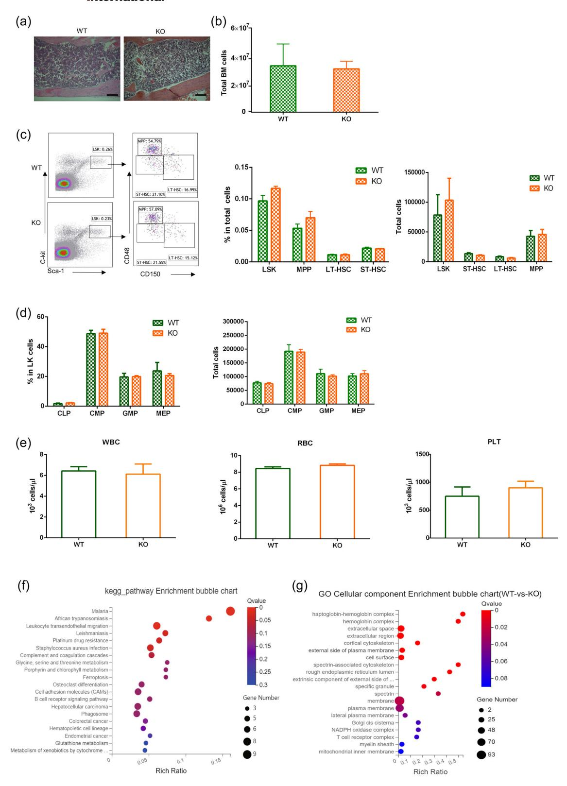
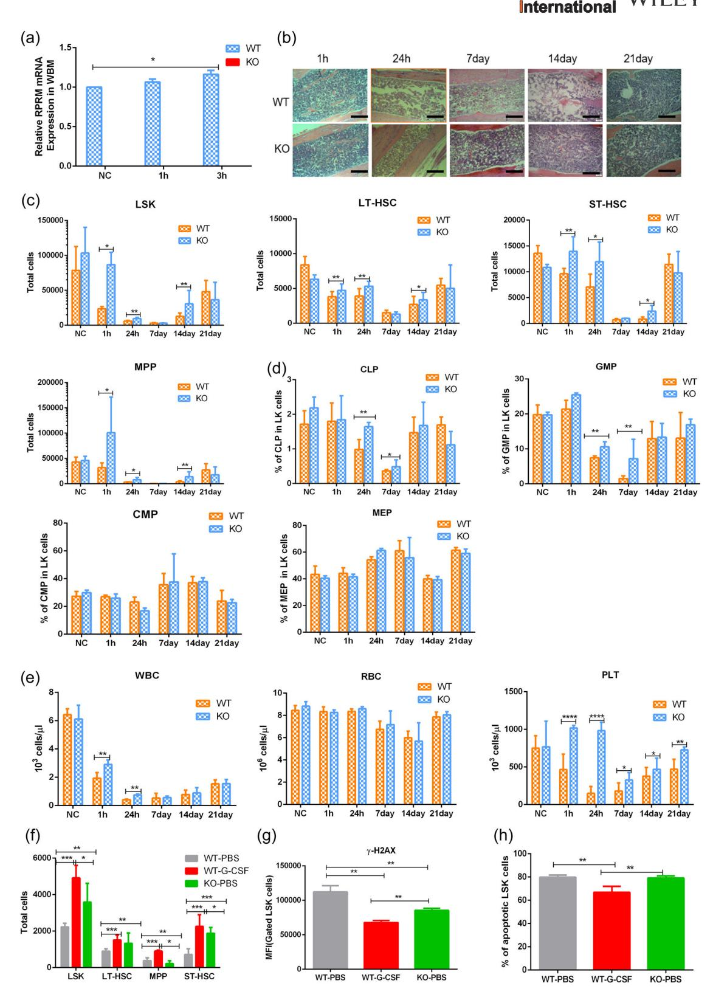
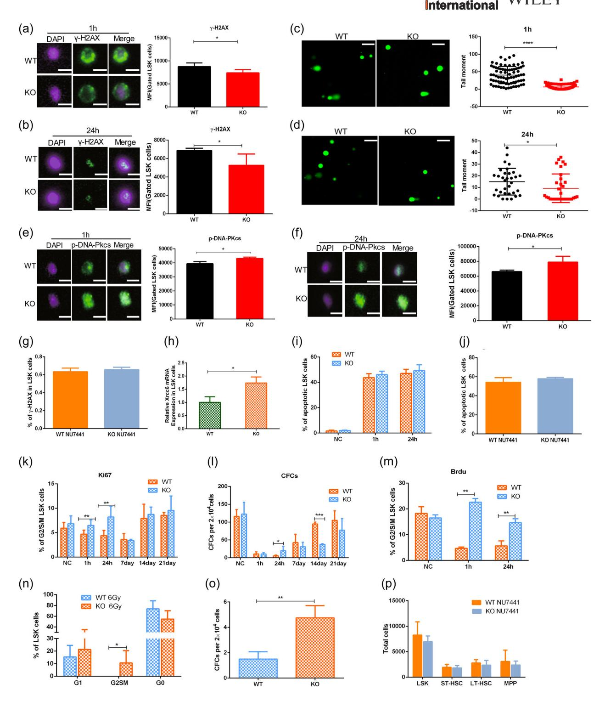
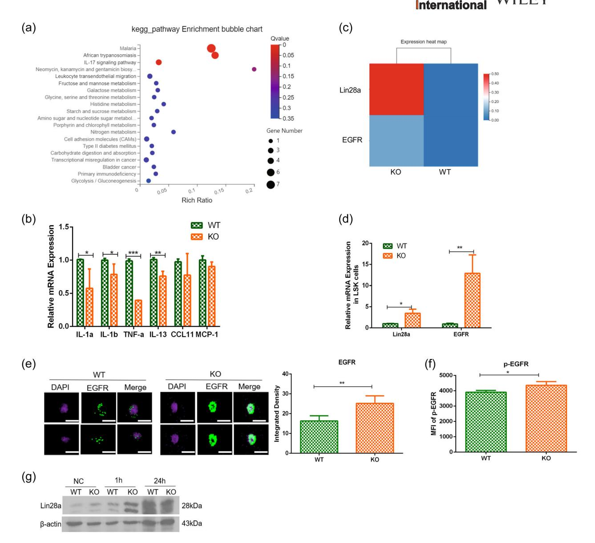
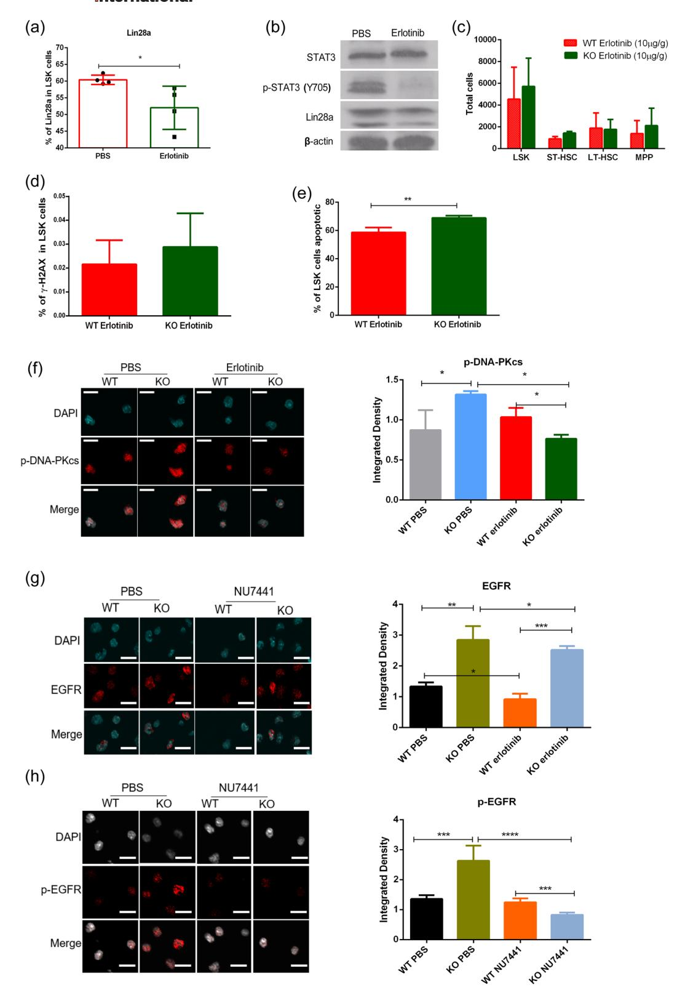
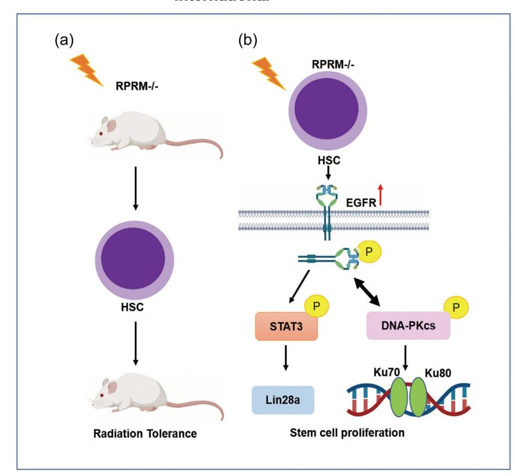

#### DOI: 10.1002/cbin.11900

#### RESEARCH ARTICLE

# RPRM deletion preserves hematopoietic regeneration by promoting EGFR‐dependent DNA repair and hematopoietic stem cell proliferation post ionizing radiation

Zixuan Li1,2,3 | Zhou Zhou1,2 | Shuaiyu Tian3 | Kailu Zhang3 | Gangli An3 | Yarui Zhang1,2 | Renyuxue Ma3 | Binjie Sheng3 | Tian Wang1,2,3 | Hongying Yang1,2 | Lin Yang1,2,3

#### Correspondence

Hongying Yang, School of Radiation Medicine and Protection, Suzhou Medical College of Soochow University, Suzhou, Jiangsu, China. Email: [yanghongying@suda.edu.cn](mailto:yanghongying@suda.edu.cn)

Lin Yang, Cyrus Tang Hematology Center, Soochow University, Suzhou, Jiangsu, China. Email: [yanglin@suda.edu.cn](mailto:yanglin@suda.edu.cn)

#### Funding information

Six Talent Peaks Project in Jiangsu Province, Grant/Award Number: SWYY‐CXTD‐010; Natural Science Foundation of China, Grant/Award Number: 81872431 and U1632270; Natural Science Foundation of the Jiangsu Higher Education Institutions of China, Grant/Award Number: 19KJD320003; National Key R&D Program of China, Grant/Award Number: 2016YFC1303403; Priority Academic Program Development of Jiangsu Higher Education Institutions, the Collaborative Innovation Major Project, Grant/Award Number: XYXT‐ 2015304

#### Abstract

Reprimo (RPRM), a target gene of p53, is a known tumor suppressor. DNA damage induces RPRM, which triggers p53‐dependent G2 arrest by inhibiting cyclin B1/Cdc2 complex activation and promotes DNA damage‐induced apoptosis. RPRM negatively regulates ataxia‐telangiectasia mutated by promoting its nuclear‐cytoplasmic translocation and degradation, thus inhibiting DNA damage. Therefore, RPRM plays a crucial role in DNA damage response. Moreover, the loss of RPRM confers radioresistance in mice, which enables longer survival and less severe intestinal injury after radiation exposure. However, the role of RPRM in radiation‐induced hematopoietic system injury remains unknown. Herein, utilizing a RPRM‐knockout mouse model, we found that RPRM deletion did not affect steady‐state hematopoiesis in mice. However, RPRM knockout significantly alleviated radiation‐induced hematopoietic system injury and preserved mouse hematopoietic regeneration in hematopoietic stem cells (HSCs) against radiation‐induced DNA damage. Further mechanistic studies showed that RPRM loss significantly increased EGFR expression and phosphorylation in HSCs to activate STAT3 and DNA‐PKcs, thus promoting HSC DNA repair and proliferation. These findings reveal the critical role of RPRM in radiation‐induced hematopoietic system injury, confirming our hypothesis that RPRM may serve as a novel target for radiation protection.

#### KEYWORDS

DNA repair, EGFR, hematopoietic stem cells (HSCs), ionizing radiation, RPRM

Abbreviations: ATM, ataxia‐telangiectasia mutated; BrdU, bromodeoxyuridine; BSA, bovine serum albumin; DDR, DNA damage response; DSB, double‐stand break; G‐CSF, granulocyte colony stimulating factor; HSCs, hematopoietic stem cells; KO, knockout; LK cells, Lin‐ c‐Kit+ Sca‐1‐; LT‐HSCs, long‐term HSCs; MPPs, multipotent progenitors; NHEJ, nonhomologous end joining; PBS, phosphate‐buffered saline; RT, room temperature; SPF, specific pathogen free; ST‐HSCs, short‐term HSCs; TBI, total body irradiation; WT, wild‐type.

This is an open access article under the terms of the Creative Commons Attribution‐NonCommercial‐NoDerivs License, which permits use and distribution in any medium, provided the original work is properly cited, the use is non‐commercial and no modifications or adaptations are made. © 2022 The Authors. Cell Biology International published by John Wiley & Sons Ltd on behalf of International Federation of Cell Biology.

2158 | [wileyonlinelibrary.com/journal/cbin](https://onlinelibrary.wiley.com/journal/10958355) Cell Biol Int. 2022;46:2158–2172.

1 State Key Laboratory of Radiation Medicine and Protection, Soochow University, Suzhou, Jiangsu, China

2 School of Radiation Medicine and Protection, Suzhou Medical College of Soochow University/Collaborative Innovation Center of Radiation Medicine of Jiangsu Higher Education Institutions, Soochow University, Suzhou, Jiangsu, China

3 Cyrus Tang Medical Institute, Collaborative Innovation Center of Hematology, Soochow University, Suzhou, Jiangsu, China

## 1 | INTRODUCTION

Radiation‐induced hematopoietic syndrome, which is characterized by hematopoietic failure, can be caused by exposure to total body irradiation (TBI) at 2–6 Gy. Due to the depletion of hematopoietic stem cells (HSCs) after TBI, radiation‐induced leukopenia and thrombopenia cannot be ameliorated; thus, opportunistic infections and hemorrhaging in vital organs occur, leading to severe sickness and even death (López & Martín, [2011](#page-13-0)). Thus, protecting HSCs against radiation‐induced cell death using radioprotectors or radiomitigators and replenishing HSCs through HSC transplantation are the appropriate and effective strategies to prevent and mitigate radiation‐induced hematopoietic syndrome (Waselenko et al., [2004](#page-14-0)). Although HSC transplantation has been demonstrated to be the most effective therapy for radiation‐induced hematopoietic syndrome, it is impractical to use this strategy when nuclear mass‐casualty events occur. Therefore, the development of radioprotectors and radiomitigators are essential. Since the life‐long hematopoiesis of mammals relies heavily on HSCs, the restoration of self‐renewal potential, proliferation, and differentiation after radiation exposure of the rare radiosensitive cell population in the bone marrow (BM) is the key for developing radioprotectors and radiomitigators (Mendelson & Frenette, [2014](#page-13-1)). The loss of HSCs after exposure to ionizing radiation (IR) originates from IR‐induced DNA damage (Block et al., [2004](#page-13-2); Chan et al., [2002](#page-13-3); Davis et al., [2014\)](#page-13-4); however, the regulatory mechanism underlying DNA repair in HSCs remains poorly elucidated, and a deeper understanding of the response of HSCs to DNA damage is highly urgent and beneficial.

Reprimo (RPRM), one of the three members of the RPRM gene family, is a candidate tumor suppressor gene (Figueroa et al., [2017](#page-13-5); Ohki et al., [2000;](#page-13-6) Saavedra et al., [2015\)](#page-14-1). RPRM downregulation due to promoter hypermethylation has been found to be associated with the progression of malignant tumors, including breast and gastric cancers, as well as human blood cancers such as pediatric myeloid leukemia. Thus, RPRM has been proposed as a potential biomarker for early cancer detection (Shao et al., [2012](#page-14-2); Tao et al., [2015](#page-14-3); Wichmann et al., [2016;](#page-14-4) Xu et al., [2012](#page-14-5); Sapari et al., [2012\)](#page-14-6). Moreover, RPRM overexpression suppresses the cell proliferation, colony formation, migration, and invasion of cancer cells (Figueroa et al., [2017](#page-13-5); Ohki et al., [2000;](#page-13-6) Saavedra et al., [2015](#page-14-1)). In addition to its potential role in cancer development and progression, accumulating evidence indicates that RPRM plays important roles in DNA damage response (DDR). Indeed, RPRM was first identified from X‐irradiated mouse embryonic fibroblasts, indicating that it can be induced by DNA damage (Ohki et al., [2000\)](#page-13-6). Upon induction, the RPRM protein can trigger p53‐dependent G2 arrest (Figueroa et al., [2017;](#page-13-5) Ohki et al., [2000;](#page-13-6) Saavedra et al., [2015\)](#page-14-1). Furthermore, we previously discovered that RPRM negatively regulates the ataxia‐telangiectasia mutated (ATM) by promoting its nuclear‐cytoplasmic translocation and degradation and inhibits DNA damage repair. Using an established RPRM‐knockout mouse model, we also demonstrated that loss of RPRM confers radioresistance to mice which manifests as longer survival and less severe intestinal injury after radiation exposure, indicating that RPRM may be a potential target for radiation protection (Zhang et al., [2021\)](#page-14-7). However, it remains unclear whether RPRM plays any role in radiation‐induced hematopoietic syndrome and how it affects DNA repair in HSCs.

This study evaluated the protective effect of RPRM knockout against radiation‐induced hematopoietic system injury in mice and how it enhances the repair of radiation‐induced DNA damage and HSC proliferation by activating STAT3 and DNA‐PKcs.

# 2 | MATERIALS AND METHODS

## 2.1 | Animal experiments

All animal procedures were approved by the Ethics Committee of Soochow University. All animal experiments were performed in adherence with Soochow University Medical Experimental Animal Care Guidelines in accordance with the National Animal Ethical Policies of China. RPRM− /− knockout (KO) C57BL/6 mice were established in our lab and their wild‐type (WT) littermates were raised under specific pathogen free (SPF) conditions at the SPF animal facility of Soochow University Experimental Animal Center. All mice were matched by biological variables such as age (6–8 weeks old), sex, and weight and randomly divided into different experimental groups. For the irradiated group, mice were anesthetized and whole body irradiated with a X‐RAD320ix X‐ray machine (320 kVp, PXi) at a dose rate of 2.0 Gy/min.

## 2.2 | Antibodies and reagents

Mouse Lineage Antibody BV421, BV510/FITC/PE rat anti‐mouse c‐kit (CD117) antibody, FITC anti‐mouse CD48 antibody, APC anti‐ mouse CD150 (SLAM) antibody, APC anti‐mouse CD16/32 antibody, and PE anti‐mouse CD34 antibody were purchased from BioLegend (BioLegend). Mouse lineage antibody APC, Alexa Fluor‐488 goat anti‐ rabbit immunoglobulin G (IgG) secondary antibody, and Ki67‐APC were purchased from BD (BD Biosciences). FITC anti‐mouse CD127 (IL‐7Rα) antibody, Lin28a anti‐mouse antibody, γ‐H2AX‐PE, and p‐EGFR (Tyr1068) were purchased from Cell Signaling Technology. p‐DNA‐PKcs (Thr2609) antibody (Novus Biological) was purchased from Novus Biological. Erlotinib and NU7441 were from Selleck. Granulocyte colony stimulating factor (G‐CSF) was purchased from Novoprotein.

## 2.3 | Flow cytometry

Flow cytometric analyses were performed on a Beckman Coulter (Gallios). Hematopoietic system staining was carried out as described previously (Yamashita et al., [2015\)](#page-14-8). For staining antigens expressed on cell membranes, cells were washed once with cold phosphate‐ buffered saline (PBS) and stained with antibody (1:100) for 20 min at 4°C in the dark. For analysis of p-EGFR (Tyr1068), p-DNA-PKcs (Thr2609), and Lin28a levels, cells were fixed with 4% paraformaldehyde (PFA) for 10 min and permeabilized with 1% saponin (Thermo Fisher Scientific) and 1% bovine serum albumin (BSA) in PBS. Cells were then incubated with primary antibody (1:100) for 60 min at 4°C, washed with PBS, and stained with Alexa Fluor-488 goat anti-rabbit IgG secondary antibody (1:100; BD Biosciences) for 1 h at room temperature (RT). For analysis of Ki67-APC and γ-H2AX-PE, cells were fixed with 4% PFA for 10 min and permeabilized with 1% saponin and 1% BSA in PBS, then stained with antibody (1:100) for 30 min at RT. 7-AAD (BD Biosciences) was used to exclude dead cells.

## 2.4 | Quantitative real-time PCR

The LSK (Lin-Sca-1+c-Kit+) cells were separated from mouse BM and total RNA was extracted using an RNA isolation reagent kit (Omega Bio-tek, Inc.). cDNA was generated by reverse transcription of the total RNA with random primers and a reverse transcription kit (Thermo Fisher Scientific) in a total reaction volume of  $20\,\mu$ l. Quantitative RT-PCR was performed using a SYBR PCR Array kit (Thermo Fisher Scientific). Quantification was determined by the delta Ct method, and transcript levels of target genes were normalized with glyceraldehyde 3-phosphate dehydrogenase.

The primers used in this study are listed as follows:

| Gene   | Forward primer             | Reverse primer              |
|--------|----------------------------|-----------------------------|
| Ccl11  | GAATCACCAACAACA GATGCAC | ATCCTGGACCCACTT CTTCTT   |
| il-13  | CCTGGCTCTTGCTT GCCTT    | GGTCTTGTGTGATGTT GCTCA   |
| TNF-α  | GACGTGGAACTGGCA GAAGAG  | TTGGTGGTTTGTGAG TGTGAG   |
| RPRM   | CTGGCCCTGGGAC AAAGAC    | TCAAAACGGTGTCACG GATGT   |
| IL-1α  | AAGTCTCCAGGGCAGA GAGG   | AGTCAGGAACTTTGGC CATCT   |
| il-1β  | TGCCACCTTTTGACAG TGATG  | TGTGCTGCTGCGAGA TTTGA    |
| MCP-1  | GAGGACAGATGTGGTG GGTTT  | AGGAGTCAACTCAGCTTT CTCTT |
| Lin28a | GGCATCTGTAAGTGGTT CAACG | CCCTCCTTGAGGCTT CGGA     |
| EGFR   | GCCATCTGGGCCAAAG ATACC  | GTCTTCGCATGAA- TAGGCCAAT |
| Xrcc6  | ATGTCAGAGTGGGAGT CCTAC  | TCGCTGCTTATGATCTT ACTGGT |
| GAPDH  | AGGTCGGTGTGAACGG ATTTG  | TGTAGACCATGTAGTTG AGGTCA |

## 2.5 | Colony-forming cell assay

The colony-forming cell assay was performed to assess the colony-forming ability of BM cells. Briefly,  $2 \times 10^4$  BM cells were plated in a 35-mm Petri dish, and cultured in MethoCult medium (Stem Cell Technologies) at 37°C and 5% CO2 for 7 days. Colonies were then examined and counted.

## 2.6 | Cell cycle assay

Mouse LSK cells were fixed with 4% PFA for 10 min followed by staining with Ki67 antibody (1:100; BD Biosciences) for 30 min at RT. They were then washed with PBS and stained with 7-AAD. Flow cytometric analyses were performed using a Beckman Coulter (Gallios; Beckman).

## 2.7 | Immunofluorescence microscopy

LSK cells from irradiated mice were separated using flow cytometry. The cells were fixed with 4% PFA for 10 min at RT, blocked with 1% saponin and 5% BSA in PBS for 1 h, and incubated overnight at 4°C in a buffer containing p-DNA-PKcs (Thr2609) antibody (1:50), p-EGFR (Tyr1068) antibody (1:800), and EGFR antibody (1:1000), respectively. The cells were then washed twice with PBS, incubated with secondary antibody (Alexa Fluor® 647 donkey anti-rabbit IgG [H+L], 1:500) for 1 h at RT followed by washing twice with PBS. Images were acquired using a confocal fluorescence microscope (Olympus, FV3000). Integrated intensity was quantified using Fiji software (ImageJ).

#### 2.8 | RNA sequence analysis

LSK cells were separated from mice aged 6-8 weeks 1 h after 4 Gy irradiation (n = 3/group) and sorted by flow cytometry using a FACSAria III system (BD Biosciences). Subsequent transcriptome sequencing was commissioned by Beijing Genomics Institute (China).

#### 2.9 | Alkaline comet assay

LSK cells were separated from mice 1 and 24 h after 4 Gy X-irradiation, respectively. The comet assay was performed using a CometAssay kit (Abcam). Cells were resuspended in CometAssay Agarose and spread on CometSlides that were then immersed in Lysis Solution for 60 min at 4°C in the dark. Alkaline electrophoresis was performed at 1 V/cm for 15–30 min. The slides were rinsed three times in water for 2 min. After the last water rinse, the slides were immersed in cold 70% ethanol for 5 min. The slides were then

removed and allowed to air dry. Once the agarose and slides were completely dry, 1X Vista Green DNA Dye diluted by TE Buffer (10 mM Tris, pH 7.5, 1 mM ethylenediaminetetraacetic acid) (100 µl/ well) was added and incubated at RT for 15 min. The slides were viewed using a confocal fluorescence microscope (Olympus, FV3000). Data was analyzed by Comet Scoring Freeware.

## 2.10 | Bromodeoxyuridine (BrdU) and DAPI (4′,6‐diamidino‐2‐phenylindole) assay

Mice were treated with bromodeoxyuridine (100 mg/kg; Sigma‐ Aldrich). After 24 h, LSK cells were separated and fixed with 4% PFA for 10 min and treated with DNase for 1 h at 37°C, followed by staining with BrdU antibody (1:100; BioLegend) for 30 min at RT. They were then washed with PBS and stained with DAPI. Flow cytometric analyses were performed using a Beckman Coulter.

## 2.11 | Statistical analysis

Statistical analyses were performed using Student's t tests (GraphPad Prism 6.01, GraphPad, Inc.). A p < .05 was considered statistically significant.

## 3 | RESULTS

## 3.1 | RPRM is dispensable for steady‐state hematopoiesis in adult mice

To explore the role of RPRM in radiation‐induced hematopoietic syndrome, we first investigated whether RPRM knockout affected hematopoiesis. The hematopoietic systems of both RPRM+/+ (WT) and RPRM−/− (KO) mice were analyzed. Posthematoxylin and eosin staining, no significant difference was observed in the morphology of femur BM between KO and WT mice (Figure [1a](#page-4-0) and Figure S1A). There was no significant difference in the number of total BM cells (Figure [1b](#page-4-0) and Figure S1B). Furthermore, although RPRM knockout tended to decrease the total number of LSK cells, which are highly enriched with HSCs, long‐term HSCs (LT‐HSCs), short‐term HSCs (ST‐HSCs), and multipotent progenitors (MPPs), the reduction did not reach statistical significance. The total number and proportion of LSK, LT‐HSCs, ST‐HSCs, and MPPs among LSKs remained almost unchanged when the RPRM gene was deleted (Figure [1c](#page-4-0) and Figure S1C). Additionally, no obvious alterations were observed in the proportion and number of CMP, GMP, MEP, and CLP in the absence of RPRM (Figure [1d](#page-4-0) and Figure S1D). Finally, no statistically significant difference was found in the white blood cell (WBC), red blood cell (RBC), and platelet (PLT) between WT and KO mice (Figure [1e](#page-4-0) and Figure S1E). Moreover, there was no significant difference in the percentage and absolute number of LSK, LT‐HSC, ST‐HSC, MPP, myeloid precursor cells, lymphoid precursor cells, T, B, and myeloid cells in BM when mice were 1, 2, 3, 4, 5, 6, and 7 M. Additionally, the number of RBC, WBC, and PLT cells in peripheral blood of WT and KO mice at these ages was similar (Figure [1b](#page-4-0)–d, Figure S1B–D, Figure S2, and Figure S3). Therefore, the loss of RPRM did not have an obvious effect on the development of HSCs. To further confirm this result, LSK cells from male KO mice were separated, and RNA sequence analysis was performed. No significant changes were observed in the expression of genes associated with HSCs compared with those from WT mice (Figure [1f,g\)](#page-4-0). Thus, these results suggest that RPRM is indispensable in achieving a steady‐ state hematopoietic system in adult mice.

# 3.2 | RPRM knockout protects mice against radiation‐induced hematopoietic system injury

RPRM expression can be induced by IR (Ohki et al., [2000](#page-13-6); Zhang et al., [2021\)](#page-14-7). Moreover, our previous results showed that RPRM‐ knockout mice were more radioresistant and survived longer than WT mice after exposure to X‐ray irradiation (Zhang et al., [2021\)](#page-14-7). The hematopoietic systems of RPRM KO mice were thus analyzed at different time points following irradiation to explore the potential role of RPRM in radiation‐induced hematopoietic system injury. First, we confirmed the induction of RPRM expression by X‐irradiation in WT mice but not in KO mice (Figure [2a](#page-5-0)). Next, by analyzing the morphology of the femur BM, we found that KO mice had more cells in the BM cavity and showed less severe BM structural damage up to 14 days after exposure to 4‐Gy X‐radiation than did WT mice. Interestingly, on the 14th day after irradiation, the difference between male WT and KO mice was greater than that in female mice (Figure [2b](#page-5-0) and Figure S4A). Moreover, the number of male WT mice LSKs dramatically decreased 1 h postirradiation, while that of male KO mice did not significantly reduce until 24 h postirradiation and was still significantly greater than that of WT mice. By 7 days post‐IR, there was no difference between WT and KO mice. However, KO mice had more LSK cells 14 days after IR, although this trend disappeared by 21 days postirradiation. These data suggested that RPRM knockout slowed radiation‐induced LSK depletion in mice and accelerated its recovery. The number of ST‐HSC, LT‐HSC, and MPP cells showed similar changing patterns, implying that RPRM knockout protected mice against ST‐HSC, LT‐ HSC, and MPP depletion and facilitated their recovery after exposure to IR. This protective effect of RPRM deficiency was also observed in female KO mice, yet it was not as big although not to the extent as that observed in male KO mice (Figure [2c](#page-5-0) and Figure S4B). In addition, the percentage of CLP and GMP in the BM was higher in KO mice than that in WT mice within 7 days postirradiation, though there was no significant difference in the percentage of CMP and MEP between WT and KO mice before and after irradiation (Figure [2d](#page-5-0) and Figure S4C). Furthermore, radiation significantly reduced the number of WBCs, but male KO mice still had more WBCs than those in WT mice 1 and 24 h postirradiation. Unlike WT mice, which showed a significant reduction in PLT numbers 1 and 24 h postirradiation, KO

FIGURE 1 RPRM is dispensable for the hematopoiesis in adult male mice. Male RPRM+/+ (WT) and RPRM-/- (KO) mice aged 6–8 weeks were used to analyze the hematopoietic system (*n* = 6/group). (a) Hematoxylin and eosin staining of bone marrow sections from male WT and KO mice. Scale bar, 100 µm. (b) Flow cytometric analysis of total BM cells. (c) Flow cytometric analysis of the total cells and proportions of LSK (Lin-c-kit+Sca-1+), ST-HSC (Lin-c-kit+Sca-1+CD48-CD150-), and MPP (Lin-c-kit+Sca-1+CD48+CD150-) in WT and KO mice. (d) The total cells and proportions of CLP (Lin-IL-7R-c-kitmidSca-1mid), CMP (Lin-c-kit+Sca-1-IL-7R-CD16/32-CD34-), and MEP (Lin-c-kit+Sca-1-IL-7R-CD16/32-CD34-) in WT and KO mice. (e) Analysis of RBCs, WBCs, and PLTs in the peripheral blood of mice using a five-class hematology analyzer. (f, g) LSK cells were separated from male KO and WT mice, and RNA sequence analysis was performed (*n* = 3 mice/group). HSC, hematopoietic stem cells; KO, knockout; PLT, platelet; RBC, red blood cell; WBC, white blood cell; WT, wild-type

FIGURE 2 (See caption on next page)

mice did not exhibit an obvious reduction until 7 days postirradiation and had statistically more PLTs than those in WT mice at all time points postirradiation (Figure [2e\)](#page-5-0). Interestingly, the protective effect of RPRM knockout on the number of WBCs and PLTs in female mice was minimal (Figure S4D). RBCs were the least affected by irradiation in both female and male mice, and no significant difference in their number between WT and KO mice was observed (Figure [2e](#page-5-0) and Figure S4D). These results show that the protective effect of RPRM knockout on HSCs after radiation was stronger in male mice than in female mice. This may be related to estrogen that has been found to affect radiation injury and inhibit RPRM expression (Buchegger et al., [2017](#page-13-7); Fucic & Gamulin, [2011;](#page-13-8) Malik et al., [2010\)](#page-13-9).

Additionally, since IR increases the levels of G‐CSF in the blood of irradiated mice (Kiang et al., [2010\)](#page-13-10), and administration of G‐CSF can promote the survival of irradiated mice (Kiang et al., [2014](#page-13-11)). Therefore, we also compared the effect of RPRM deletion and G‐CSF on radiation‐induced damage in HSCs. As shown in Figure [2f](#page-5-0)–h, G‐CSF treatment dramatically increases the number of LSK, LT‐HSC, ST‐HSC, and MPP cells and decreases DNA damage and apoptosis in LSKs. Although RPRM deletion did not achieve the same protective effect as G‐CSF treatment, it still significantly preserved the HSCs in irradiated mice and reduced DNA damage in LSKs, RPRM deletion and G‐CSF even showed similar protective effects on LT‐HSC. All these findings indicate that RPRM may play a crucial role in the injury and recovery of the hematopoietic system following irradiation.

# 3.3 | RPRM deletion enhances the repair of radiation‐induced DNA damage in LSKs and promotes their proliferation

We have previously revealed that RPRM is a critical negative player in DNA damage repair (Zhang et al., [2021](#page-14-7)). Therefore, we explored whether RPRM knockout would affect DNA damage repair in the LSKs of mice after irradiation. As shown in Figure [3a,b](#page-7-0), the levels of γ‐H2AX, a widely used DNA double‐stand break (DSB) marker, were significantly lower in the LSKs of male KO mice than in those of male WT mice at 1 and 24 h post‐IR. To further confirm that RPRM deletion may reduce DNA DSBs in KO LSKs after exposure to IR, we performed a comet assay and found that the tail moment of the LSK cells of male RPRM−/− mice was markedly reduced than that of the LSKs of male WT mice at 1 and 24 h postirradiation (Figure [3c,d](#page-7-0)), indicating that RPRM knockout significantly decreased DNA damage in LSKs after IR. However, it seemed that RPRM deletion had a less significant effect on the LSKs of female mice. The LSKs of female KO mice showed a trend of reduction in γ‐H2AX levels 24 h after IR compared with those of female WT mice (Figure S5A–B), and the significantly shorter tail moment of the LSK cells of female KO mice was clearly observed at only 1 h but not 24 h after irradiation (Figure S5C–D). These data further show that the protective effect of RPRM knockout on irradiated LSK cells is stronger in male mice than in female mice. This warrants further study on the mechanism underlying the gender difference in the radioprotective effect of RPRM deletion. Despite the reduced protective effect in female mice, these data suggest that RPRM deletion may reduce DNA damage in the LSKs of irradiated mice, which could be due to more efficient DNA repair.

Since HSCs are largely quiescent, they repair DNA DSBs mainly through the nonhomologous end‐joining (NHEJ) repair mechanism (Mohrin et al., [2010](#page-13-12)). Thus, DNA repair in HSCs is facilitated when DNA‐PK‐dependent NHEJ is promoted (de Laval et al., [2013\)](#page-13-13). Therefore, we determined the activation of DNA‐PKcs and found that compared with RPRM+/+ LSK cells, RPRM−/− LSK cells displayed increased levels of p‐DNA‐PKcs 1 and 24 h after irradiation (Figure [3e,f](#page-7-0)), suggesting an elevated DNA repair capability with RPRM deletion. In agreement with this, the significant reduction in γ‐H2AX levels in the LSK cells of KO mice 24 h post IR compared with those of WT mice disappeared when administrating NU7441, a selective DNA‐PKcs inhibitor, before X‐irradiation (Figure [3g\)](#page-7-0). Besides, the expression of Xrcc6 was increased in RPRM‐deleted LSK cells (Figure [3h](#page-7-0)), which may also facilitate NHEJ repair pathway.

It has been reported that overexpression of RPRM enhances DNA damage‐induced apoptosis, and knockdown of RPRM causes an inverse effect. However, using flow cytometric analysis, we did not observe any significant difference in the number of apoptotic LSKs between WT and KO mice after irradiation without (Figure [3i](#page-7-0) and Figure S5E) and with NU7441 administration (Figure [3j](#page-7-0)). This suggested that ameliorating the decrease in the number of LSK cells after irradiation in KO mice may not be associated with apoptosis. Instead, at 1 and 24 h after irradiation, we found that the proliferation and clonal formation ability of LSK cells was stronger in KO mice than those in WT mice (Figure [3k,l](#page-7-0)). This was in accordance with the results shown in Figure [2c,d](#page-5-0) that 24 h after irradiation, the number and percentage of WBCs, PLTs, CLP, and GMP are higher in KO mice than those in WT mice. The proliferation of LSK cells was further detected by BrdU incorporation assay at 1 and 24 h after irradiation, and the results showed that the proliferation ability of LSK cells deficient in RPRM was stronger than that of WT LSKs after radiation exposure (Figure [3m\)](#page-7-0). However, by 7 days and longer time after

FIGURE 2 RPRM knockout significantly protects against hematopoietic system injury in male mice following irradiation. Male mice were whole body X‐irradiated with a dose of 4 Gy, and the hematopoietic systems were detected at different time points after irradiation (\*\*\*\*p < .0001, \*\*\*p < .001, \*\*p < .01, \*p < .05). (a) The expression levels of RPRM in the LSK cells and WBM of WT and KO mice 1 and 3 h after irradiation. (b) The morphology of the femur bone marrow of WT and KO mice at different times (1 and 24 h, 7, 14, and 21 days) after X‐irradiation (n = 3/group). Scale bar, 100 µm. (c) The total number of LSK, ST‐HSC, LT‐HSC, and MPP cells in WT and KO mice at different times after irradiation (n = 5 mice/group). (d) Flow cytometric analysis on the percentage of myeloid and lymphoid precursor cells, CMP, GMP, and MEP in KO and WT mice at different time points after radiation (n = 5 mice/group). (e) The number of WBCs, PLTs, and RBCs in the peripheral blood of WT and KO mice at different time points after irradiation (n = 5 mice/group). (f–h) Comparison of the protective effects of G‐CSF (2 μg/20 g) and RPRM knockout on HSCs. G‐CSF was administrated before X‐irradiation with a dose of 4 Gy; 24 h after IR, LSK, LT‐HSC, MPP, and ST‐HSC cells, γ‐H2AX expression level, and LSK cell apoptosis were determined by flow cytometry (n = 4 mice/group). G‐CSF, granulocyte colony stimulating factor; MPP, multipotent progenitor; KO, knockout; WT, wild‐type

FIGURE 3 (See caption on next page)

irradiation, the difference in the proliferation and colony‐forming ability of the LSK cells between KO and WT mice disappeared and even reversed (Figure [3k,l,](#page-7-0) Figure S5F–G). This could be due to the strong recovery of LSK cells in WT mice after exposed to 4 Gy X‐rays. Thus, when exposed to a higher dose, the LSK cells in WT mice may not recover very well. Not unexpectedly, 7 days after 6 Gy X‐irradiation, the proliferation and clonogenic ability of LSK cells in KO mice were significantly higher than those in WT mice (Figure [3n,o](#page-7-0) and Figure S5H), confirming the protective effect of RPRM knockout on LSK cells. All these data indicated that the protective effect of RPRM deletion on LSKs after exposure to IR was due to enhanced self‐renewal and proliferation of HSCs but not reduced apoptosis. Furthermore, with NU7441 administration, we observed no significant difference in the number of LSK, ST‐HSC, LT‐HSC, and MPP cells between WT and KO mice (Figure [3p\)](#page-7-0), indicating that NU7441 eliminated the protective effect of RPRM deletion on mouse LSK cells. Thus, it was confirmed that the protective effect of RPRM deletion against IR‐induced LSK damage is regulated by DNA‐PKcs, which are essential for DNA repair.

# 3.4 | The protective effect of RPRM deletion on HSCs after irradiation may involve inflammation response and STAT3‐Lin28a pathway

To further explore the protective effect of RPRM deletion in mice against radiation‐induced hematopoietic system injury, RNA sequencing of LSK cells separated 1 h after irradiation was performed. The results shown in the Kyoto Encyclopedia of Genes and Genomes pathway enrichment bubble chart indicate that the levels of inflammatory factors were downregulated in KO mice compared with WT mice (Figure [4a](#page-9-0)). RT‐qPCR was then carried out to verify the results of RNA sequencing, and it was confirmed that the expression levels of IL‐1α, IL‐1β, tumor necrosis factor‐α, and IL‐13 in LSK cells from KO mice were significantly reduced 1 h after irradiation compared with those from WT mice, although there were no significant changes in CCL11 and MCP in LSKs between WT and KO mice (Figure [4b\)](#page-9-0). This indicated that KO mice had less inflammation following irradiation than did WT mice. The RNA sequencing and RT‐qPCR results also showed that EGFR and Lin28a expression increased markedly in the LSK cells of KO mice compared with that of WT mice after irradiation (Figure [4c,d](#page-9-0)). Lin28 is an RNA‐ binding protein that is highly expressed in embryonic stem cells and is very important for the growth and survival of HSCs (Yuan et al., [2012,](#page-14-9) [2013\)](#page-14-10). EGFR positively regulates Lin28a expression (Yuan et al., [2012](#page-14-9)). Therefore, we also measured the expression of EGFR and Lin28a at the protein level. Using flow cytometry, we found that the expression levels of EGFR and p‐EGFR in the LSK cells of KO mice increased significantly 1 h after irradiation compared with those of WT mice (Figure [4e,f](#page-9-0)). These results suggest that EGFR expression increased at both protein and transcriptional levels. Using western blot, we observed that Lin28a expression increased more significantly in whole BM cells of KO mice than in those from WT mice 1 h after irradiation (Figure [4g](#page-9-0)). These results suggest that the EGFR‐STAT3‐Lin28a pathway may be involved in the protective effect of RPRM deletion on HSCs after IR.

# 3.5 | RPRM deletion‐induced EGFR elevation after irradiation promotes HSC proliferation through Lin28a and facilitates HSC DNA repair through DNA‐PKcs

To confirm the involvement of the EGFR‐Lin28a pathway in the protective effect of RPRM knockout on HSCs after irradiation, we treated mice with erlotinib, a selective EGFR inhibitor, before 4‐Gy X‐irradiation. Using flow cytometry and western blotting, we found that Lin28a expression in the LSK cells of KO mice decreased dramatically 6 h after irradiation combined with erlotinib treatment (Figure [5a,b](#page-10-0)). Moreover, the level of p‐STAT3 (Tyr705) was also significantly downregulated in erlotinib‐treated KO mice (Figure [5b\)](#page-10-0), consistent with a previous report that EGFR inhibition abolished Lin28a expression in mesenchymal stem cells induced by the extracellular domain of epithelial cell adhesion molecule through inhibiting STAT3 phosphorylation (Yuan et al., [2013\)](#page-14-10). As a result, 24 h after irradiation, no significant difference was observed in the number of LSK, ST‐HSC, LT‐HSCs, and MPP cells between KO and WT mice with erlotinib treatment (Figure [5c\)](#page-10-0), suggesting that erlotinib eliminated the protective effect of RPRM deletion. These data indicated that RPRM knockout may promote HSC survival through the EGFR‐Lin28a pathway.

In addition to its regulation of Lin28a, EGFR plays a crucial role in repairing DNA DSBs through DNA‐PKcs, which explains why EGFR is an important determinant of radioresistance in many cancers (Kuan et al., [2019](#page-13-14); Rodemann et al., [2007](#page-14-11)). Since we had observed elevated DNA‐PKcs activation and a stronger DNA repair ability in the LSK

FIGURE 3 RPRM knockout enhances HSC proliferation and DNA damage repair in male mice after radiation. (a–b) The expression levels of γ‐H2AX in the LSK cells of male WT and KO mice 1 and 24 h after 4 Gy irradiation (n = 5/group). Scale bar, 10 µm. (c–d) LSK cells were sorted 1 and 24 h after irradiation. The DNA damage in LSKs was determined using a comet electrophoresis kit (n = 3/group). Details of the protocol used are described in the Section [2.](#page-1-0) Scale bar, 50 µm. Scale bar, 10 µm. (e–f) p‐DNA‐PKcs expression levels were determined in the LSK cells of WT and KO mice 1 and 24 h after irradiation (n = 5/group) by imaging flow cytometry. Scale bar, 10 µm. (g) Mice were irradiated with NU7441 (10 mg/kg) before X‐irradiation. After 24 h, the expression level of γ‐H2AX was determined by flow cytometry (n = 5/group). (h) The expression of Xrcc6 in LSKs. (i) Annexin and 7‐AAD were used to determine LSK cell apoptosis in WT and KO mice 1 and 24 h after 4 Gy irradiation (n = 5/group). (j) Mice were administrated with NU7441 (10 mg/kg) before X‐irradiation. After 24 h, LSK cell apoptosis was determined by flow cytometry (n = 5/group). (k) Ki67 and 7‐AAD were used to determine the cell cycle of LSK cells in WT and KO mice at different time points (1 and 24 h, 7, 14, and 21 days) after 4 Gy irradiation (n = 5/group). (l) Comparison of the cloning ability of bone marrow cells of WT and KO mice at different times after radiation (n = 5/group). (m) BrdU and DAPI were used to determine the cell cycle distribution of LSK cells from WT and KO mice at different time points (1 and 24 h) after 4 Gy irradiation (n = 5/group). (n–o) The cell cycle distribution of LSK cells and the colony formation of bone marrow cells of WT and KO mice 7 days after 6Gy irradiation (n = 5/group). (p) Mice were administrated with NU7441 (10 mg/kg) before X‐irradiation. After 24 h, the total LSK, ST‐HSC, LT‐HSC, and MPP cells were determined by flow cytometry (n = 5/group) (\*\*\*\*p < .0001, \*\*\*p < .001, \*\*p < .01, \*p < .05). BrdU, bromodeoxyuridine; HSC, hematopoietic stem cell; KO, knockout; MPP, multipotent progenitor; WT, wild type

FIGURE 4 RPRM deletion upregulates the expression levels of EGFR and Lin28a in LSKs after radiation. (a, b) LSK cells from mice were sorted 1 h after irradiation. RNA sequencing and qPCR were performed to verify the expression of various inflammatory cytokines (n = 3/group). (c, d) The expression levels of EGFR and Lin28a in the LSK cells of WT and KO mice 1 h after irradiation (n = 3/group). (e, f) The expression levels of EGFR and p‐EGFR detected in the LSK cells of WT and KO mice 1 h after irradiation (n = 4/group). Scale bar, 10 µm. (g) Changes in the expression of Lin28a in the whole bone marrow cells of WT and KO mice 1 and 24 h after irradiation (n = 3/group) (\*\*\*p < .001, \*\*p < .01, \*p < .05). KO, knockout; qPCR, quantitative PCR; WT, wild‐type

cells from KO mice (Figure [3\)](#page-7-0), we hypothesized that EGFR induced by RPRM deletion played a critical role in DNA repair. We found that the reduced γ‐H2AX levels in the LSK cells of KO mice, compared with those of WT mice, disappeared with erlotinib treatment, and the trend even reversed (Figure [5d\)](#page-10-0). Meanwhile, RPRM KO mice showed a significantly higher level of LSK apoptosis than that in WT mice (Figure [5e](#page-10-0)), which contrasted the lack of significant difference in LSK apoptosis between KO and WT mice without EGFR inhibitor treatment (Figure [3e\)](#page-7-0). Moreover, treatment with erlotinib significantly reduced the levels of p‐DNA‐PKcs in LSKs from irradiated KO mice, while it did not have a similar effect on those from irradiated WT mice, resulting in a lower level of p‐DNA‐PKcs in the LSK cells from KO mice than in those from WT mice after treatment with erlotinib (Figure [5f\)](#page-10-0). This implied that the enhanced DNA repair ability of mouse LSK cells by RPRM deletion disappeared when EGFR was inhibited.

Previous studies have shown that inhibiting DNA‐PKcs abrogates the interactions between EGFR and DNA‐PKcs and EGFR‐mediated radioresistance in nonsmall‐cell lung cancer cells (Javvadi et al., [2012\)](#page-13-15). To determine whether EGFR and DNA‐PKcs formed a feedback loop, we treated mice with NU7441 before irradiation and determined the expression levels of EGFR and p‐EGFR in LSK cells 1 h after irradiation. The results showed that NU7441 treatment significantly decreased EGFR expression in the LSK cells from both KO and WT

FIGURE 5 The protective effects of RPRM deficiency on HSCs is dependent on EGFR. (a) The effect of erlotinib, a selective inhibitor of EGFR, on the expression of Lin28a in the LSK cells of KO mice 6 h after 4‐Gy X‐irradiation (n = 4/group). (b) The effect of erlotinib on the expression levels of p‐STAT3 (Tyr705) and Lin28a in the whole bone marrow cells of KO mice 6h after 4‐Gy X‐irradiation (n = 4/group). (c–e) The effects of erlotinib on the total number of LSK, ST‐HSC, LT‐HSC, and MPP cells, the levels of γ‐H2AX and apoptosis in the LSK cells of WT and KO mice 24 h after X‐irradiation with a dose of 4 Gy. The expression of was determined by flow cytometry (n = 5/group). (f) The effect of erlotinib on the levels of p‐DNA‐PKcs in the LSK cells of WT and KO mice 24 h after X‐irradiation with a dose of 4 Gy (n = 4/group). Scale bar, 25 µm. (g, h) The effects of NU7441, a selective inhibitor of DNA‐PKcs, on the levels of EGFR and p‐EGFR in the LSK cells of WT and KO mice 1 h after 4 Gy irradiation (n = 4/group). Scale bar, 25 µm (\*\*\*\*p < .0001, \*\*\*p < .001, \*\*p < .01, \*p < .05). KO, knockout; MPP, multipotent progenitor; WT, wild‐type

mice (Figure [5g](#page-10-0)). However, while NU7441 treatment did not cause any changes in the levels of p‐EGFR in the LSK cells of WT mice, it significantly reduced p‐EGFR expression levels in the LSK cells of KO mice (Figure [5h\)](#page-10-0). These data suggest that the increased DNA‐PKcs activation by RPRM knockout also affects EGFR activation.

Taken together, these results indicate that the protective effect of RPRM deletion on mouse LSK cells is regulated through EGFR, STAT3 and DNA‐PKc activiation.

## 4 | DISCUSSION

To date, there is limited information on RPRM. Nonetheless, RPRM is known as a tumor suppressor gene, and its downregulation due to the hypermethylation of its promoter can be detected in the early stages of many cancers including pediatric myeloid leukemia (Shao et al., [2012](#page-14-2); Tao et al., [2015;](#page-14-3) Wichmann et al., [2016;](#page-14-4) Xu et al., [2012](#page-14-5)). Additionally, as a DNA damage‐ induced gene, RPRM plays an important role in DDR (Ohki et al., [2000](#page-13-6); Zhang et al., [2021\)](#page-14-7). In particular, we have shown that IR‐induced RPRM promotes the nuclear–cytoplasmic translocation and degradation of ATM, resulting in impaired DNA repair (Zhang et al., [2021](#page-14-7)). This suggests that RPRM is a critical determining factor of radiosensitivity. As a matter of fact, when RPRM was knocked out, mice survived longer and displayed less severe intestinal injury after exposure to X‐radiation (Zhang et al., [2021](#page-14-7)). Here, we further demonstrated that loss of RPRM protected mice against radiation‐induced hematopoietic system injury, confirming the hypothesis that RPRM may serve as a potential target for radiation protection.

Although the expression of the RPRM gene shows low tissue specificity, it is expressed at a very low level in the BM and blood

([https://www.proteinatlas.org/ENSG00000177519-RPRM/](https://www.proteinatlas.org/ENSG00000177519-RPRM)tissue). This may explain our found that RPRM deficiency did not affect steady‐state hematopoiesis in mice. This is in contrast to the report that reprimo‐like (rprml), another Reprimo gene family member, was essential for blood development in embryonic zebrafish (Stanic et al. [2019\)](#page-14-12). However, after IR exposure, RPRM was induced in the BM and HSCs, and its deletion better preserved hematopoiesis in mice through its protective effect on HSCs. Compared with irradiated WT mice, the absolute number of HSCs and whole BM cells in irradiated RPRM knockout mice was significantly greater, indicating that RPRM knockout can protect HSCs from radiation‐induced damage. However, there was no obvious difference in the number of HSCs between KO and WT mice by 7 days after irradiation, and the cloning ability of HSCs in WT mice was even stronger than that in KO mice. Nevertheless, after exposure to 6‐Gy X‐radiation, the HSCs of KO mice showed much stronger proliferation and cloning ability than those of WT mice, indicating a failure of recovery in WT mice at this dose. Thus, the protective effect of RPRM deletion against

radiation‐induced hematopoietic injury was demonstrated. Interestingly, we also observed a gender difference in this protective effect, i.e., RPRM deletion displayed a greater protective effect in male mice than in female mice. This may be due to the repression of RPRM by estrogen (Malik et al., [2010](#page-13-9)). But further investigation needs to be carried out to explore the detailed underlying mechanism. Despite of this limitation, these results demonstrated that RPRM may play a crucial role in hematopoietic system injury following irradiation.

DNA repair is critical for the response of HSCs to genotoxic stresses such as radiation. Quiescent HSCs rely on the fast but error‐ prone NHEJ mechanism to repair DNA DSBs (Mohrin et al., [2010;](#page-13-12) Shao et al., [2012\)](#page-14-2). Herein, we demonstrated that RPRM knockout promotes DNA damage repair by enhancing DNA‐PKcs activation and Xrcc6 expression after irradiation, which are two core proteins of NHEJ pathway (Lieber et al., [1997](#page-13-16)). The increase in these two important components of NHEJ machinery in turn facilitated DNA repair and suppressed DNA damage in HSCs (West et al., [1998\)](#page-14-13), leading to reduced DNA damage in HSCs, which is eliminated by DNA‐PKcs inhibition. This suggested that RPRM deletion protected HSCs by promoting the NHEJ repair machinery. Along with our previous finding that RPRM negatively regulates ATM (Zhang et al., [2021](#page-14-7)), this result confirms the importance of RPRM in DDR. In addition to promoting DNA repair, RPRM deletion enhanced the self‐renewal and proliferation of HSCs, which also contributed to the protective effect of RPRM deletion on HSCs after exposure to irradiation. All these findings warrant more intensive investigation to elucidate the underlying mechanisms. Interestingly, although RPRM overexpression has been found to slow down cell growth and promote DNA damage‐induced cell apoptosis, and knockdown of RPRM reversed these effects (Ooki et al., [2013\)](#page-13-17), we did not observe reduced apoptosis in the HSCs of KO mice after irradiation compared with those of WT mice. This suggested that the protective effect of RPRM deletion on HSCs against radiation‐induced damage did not involve apoptosis. IR not only causes nuclear DNA damage but also damages organelles such as mitochondria. IR destroys the aerobic respiratory chain of mitochondria, causing oxidative stress, eventually leading to apoptosis (Tan et al., [2020](#page-14-14); Wang & Zhou, [2020\)](#page-14-15). At the same time, radiation damages the DNA encoding aerobic respiratory chain proteins, affects the production of ATP in aerobic respiration, and poses a threat to cell survival (Chang et al., [2021](#page-13-18)). Therefore, it is also of great significance to study the effect of RPRM deletion on radiation‐induced mitochondria damage and repair in HSCs (Wang et al., [2021](#page-14-16); Zhou et al., [2019\)](#page-14-17).

In addition to promoting DNA‐PKcs activation and increasing Xrcc6 expression, our study suggested that RPRM deletion increased the expression levels of EGFR and p‐EGFR in irradiated HSCs. Although it is still unclear how RPRM regulated the expression of EGFR and its phosphorylation, which needs further study, these results are in agreement with a recent report that EGFR regulates DNA repair in HSCs following irradiation via activation of DNA‐PKcs (Fang et al., [2020](#page-13-19)). Interestingly, our results also suggested that EGFR and DNA‐PKcs formed a feedback loop to regulate DNA repair since inhibiting DNA‐PKcs activation could significantly downregulate the expression of EGFR and p‐EGFR confirming the reciprocal relationship between DNA‐PKc phosphorylation and EGFR‐mediated radiation response (Javvadi et al., [2012](#page-13-15)).

FIGURE 6 Schematic diagram of the protective roles of RPRM in IR‐induced damage in HSCs. (a) RPRM knockout increases the radiation tolerance of HSCs. (b) The expression levels of EGFR and p‐EGFR in the LSK cells of RPRM knockout mice are upregulated soon after irradiation. On the one hand, upregulated EGFR promotes DNA damage repair in HSCs after irradiation via the DNA‐PKcs. On the other hand, EGFR promotes the proliferation of HSCs by regulating p‐STAT3 and Lin28a expression. HSC, hematopoietic stem cell

Our study also suggests that RPRM deletion promotes HSC survival through the EGFR‐STAT3‐Lin28a pathway. EGFR kinase directly phosphorylates STAT3 (Park et al., [1996](#page-14-18)), and the dimers formed by two phosphorylated STAT3s translocate into the nucleus and activate the transcription of its downstream genes (Levy & Darnell, [2002\)](#page-13-20). In particular, phosphorylated STAT3 can directly bind to the Lin28a promoter to enhance its expression (Guo et al., [2013](#page-13-21)), which facilitates the growth and survival of HSCs (Yuan et al., [2012](#page-14-9), [2013](#page-14-10)). Therefore, following EGFR inhibition using erlotinib, the expression levels of p‐STAT3 and Lin28a were reduced, leading to the disappearance of the protective effect of RPRM knockout on HSCs. Collectively, we showed that in the early stages following irradiation, RPRM deletion induced the upregulation of EGFR expression and promoted the phosphorylation of EGFR, which in turn promoted the activation of DNA‐PKcs and the STAT3‐Lin28a signaling pathway, resulting in more efficient DNA damage repair and better survival of HSCs. The relationship between RPRM and EGFR in HSCs remains unclear and will be the focus of our future research.

#### 5 | CONCLUSION

Our research shows that RPRM deletion does not affect hematopoiesis in mice but protects mice against radiation‐induced hematopoietic system injury mainly through its protective effects on HSCs. Mechanistically, RPRM knockout significantly promotes the DNA repair, proliferation, and survival of HSCs via upregulating p‐EGFR, p‐DNA‐PKcs, p‐STAT3 (Tyr705), and Lin28a expression levels shortly after irradiation (Figure [6a,b\)](#page-12-0).

#### AUTHOR CONTRIBUTIONS

Zixuan Li: data curation; formal analysis; methodology; project administration; resources; validation; writing—original draft; writing —review and editing. Zhou Zhou: methodology; resources. Shuaiyu Tian: methodology. Kailu Zhang: methodology. Gangli An: methodology. Yarui Zhang: methodology. Renyuxue Ma: methodology. Binjie Sheng: methodology. Tian Wang: methodology. Hongying Yang: data curation; formal analysis; funding acquisition; investigation; project administration; resources; supervision; visualization; writing—review and editing. Lin Yang: conceptualization; data curation; formal analysis; funding acquisition; investigation; methodology; project administration; resources; software; supervision; validation; visualization; writing—original draft; writing—review and editing.

#### ACKNOWLEDGMENTS

This work was supported by the Natural Science Foundation of China (Grant No. 81872431 and U1632270), the National Key R&D Program of China (2016YFC1303403), Priority Academic Program Development of Jiangsu Higher Education Institutions, the Collaborative Innovation Major Project (Grant No. XYXT‐2015304), the Six Talent Peaks Project in Jiangsu Province (No. SWYY‐ CXTD‐010), the Natural Science Foundation of the Jiangsu Higher Education Institutions of China (General Program, Grant No. 19KJD320003).

#### CONFLICT OF INTEREST

The authors declare no conflict of interest.

#### ETHICS STATEMENT

All animal studies were approved by the Animal Care and Use Committee of Soochow University. Soochow University Medical Experimental Animal Care Guidelines in accordance with the National Animal Ethical Policies of China were comply with in all mouse experiments (Approval No. ZL 2019 1 0405248.9).

#### DATA AVAILABILITY STATEMENT

The data that support the findings of this study are available from the corresponding author upon reasonable request.

#### ORCID

Lin Yang <http://orcid.org/0000-0002-4028-9801>

#### REFERENCES

- Block, W. D., Yu, Y., Merkle, D., Gifford, J. L., Ding, Q., Meek, K., & Lees‐ Miller, S. P. (2004). Autophosphorylation‐dependent remodeling of the DNA‐dependent protein kinase catalytic subunit regulates ligation of DNA ends. Nucleic Acids Research, 32(14), 4351–4357. <https://doi.org/10.1101/gad.1015202>
- Buchegger, K., Riquelme, I., Viscarra, T., Ili, C., Brebi, P., Huang, T. H., & Roa, J. C. (2017). Reprimo, a potential p53‐dependent tumor suppressor gene, is frequently hypermethylated in estrogen receptor α‐positive breast cancer. International Journal of Molecular Sciences, 18(8), 1525. <https://doi.org/10.3390/ijms18081525>
- Chan, D. W., Chen, B. P., Prithivirajsingh, S., Kurimasa, A., Story, M. D., Qin, J., & Chen, D. J. (2002). Autophosphorylation of the DNA‐dependent protein kinase catalytic subunit is required for rejoining of DNA double‐strand breaks. Genes and Development, 16(18), 2333–2338. <https://doi.org/10.1101/gad.1015202>
- Chang, X., Lochner, A., Wang, H. H., Wang, S., Zhu, H., Ren, J., & Zhou, H. (2021). Coronary microvascular injury in myocardial infarction: Perception and knowledge for mitochondrial quality control. Theranostics, 11(14), 6766–6785. [https://doi.org/10.7150/thno.](https://doi.org/10.7150/thno.60143) [60143](https://doi.org/10.7150/thno.60143)
- de Laval, B., Pawlikowska, P., Petit‐Cocault, L., Bilhou‐Nabera, C., Aubin‐ Houzelstein, G., Souyri, M., Pouzoulet, F., Gaudry, M., & Porteu, F. (2013). Thrombopoietin‐increased DNA‐PK‐dependent DNA repair limits hematopoietic stem and progenitor cell mutagenesis in response to DNA damage. Cell Stem Cell, 12(1), 37–48. [https://doi.](https://doi.org/10.1016/j.stem.2012.10.012) [org/10.1016/j.stem.2012.10.012](https://doi.org/10.1016/j.stem.2012.10.012)
- Davis, A. J., Chen, B. P., & Chen, D. J. (2014). DNA‐PK: A dynamic enzyme in a versatile DSB repair pathway. DNA Repair, 17, 21–29. [https://](https://doi.org/10.1016/j.dnarep.2014.02.020) [doi.org/10.1016/j.dnarep.2014.02.020](https://doi.org/10.1016/j.dnarep.2014.02.020)
- Fang, T., Zhang, Y., Chang, V. Y., Roos, M., Termini, C. M., Signaevskaia, L., Quarmyne, M., Lin, P. K., Pang, A., Kan, J., Yan, X., Javier, A., Pohl, K., Zhao, L., Scott, P., Himburg, H. A., & Chute, J. P. (2020). Epidermal growth factor receptor‐dependent DNA repair promotes murine and human hematopoietic regeneration. Blood, 136, 441–454. [https://](https://doi.org/10.1182/blood.2020005895) [doi.org/10.1182/blood.2020005895](https://doi.org/10.1182/blood.2020005895)
- Figueroa, R. J., Carrasco‐Avino, G., Wichmann, I. A., Lange, M., Owen, G. I., Siekmann, A. F., Corvalán, A. H., Opazo, J. C., & Amigo, J. D. (2017). Reprimo tissue‐specific expression pattern is conserved between zebrafish and human. PLoS One, 12, e0178274. [https://doi.org/10.](https://doi.org/10.1371/journal.pone.0178274) [1371/journal.pone.0178274](https://doi.org/10.1371/journal.pone.0178274)
- Fucic, A., & Gamulin, M. (2011). Interaction between ionizing radiation and estrogen: What we are missing? Medical Hypotheses, 77(6),

- 966–969. <https://doi.org/10.1016/j.mehy.2011.08.021>. [https://](https://www.proteinatlas.org/ENSG00000177519-RPRM/tissue) [www.proteinatlas.org/ENSG00000177519-RPRM/tissue](https://www.proteinatlas.org/ENSG00000177519-RPRM/tissue)
- Guo, L., Chen, C., Shi, M., Wang, F., Chen, X., Diao, D., Hu, M., Yu, M., Qian, L., & Guo, N. (2013). Stat3‐coordinated Lin‐28–let‐7–HMGA2 and miR‐200–ZEB1 circuits initiate and maintain oncostatin M‐driven epithelial–mesenchymal transition. Oncogene, 32, 5272–5282. <https://doi.org/10.1038/onc.2012.573>
- Javvadi, P., Makino, H., Das, A. K., Lin, Y. F., Chen, D. J., Chen, B. P., & Nirodi, C. S. (2012). Threonine 2609 phosphorylation of the DNA‐ dependent protein kinase is a critical prerequisite for epidermal growth factor receptor‐mediated radiation resistance. Molecular Cancer Research, 10(10), 1359–1368. [https://doi.org/10.1158/](https://doi.org/10.1158/1541-7786) [1541-7786](https://doi.org/10.1158/1541-7786)
- Kiang, J. G., Jiao, W., Cary, L. H., Mog, S. R., Elliott, T. B., Pellmar, T. C., & Ledney, G. D. (2010). Wound trauma increases radiation‐induced mortality by activation of iNOS pathway and elevation of cytokine concentrations and bacterial infection. Radiation Research, 173(3), 319–332. <https://doi.org/10.1667/RR1892.1>
- Kiang, J. G., Zhai, M., Liao, P. J., Bolduc, D. L., Elliott, T. B., & Gorbunov, N. V. (2014). Pegylated G‐CSF inhibits blood cell depletion, increases platelets, blocks splenomegaly, and improves survival after whole‐body ionizing irradiation but not after irradiation combined with burn. Oxidative Medicine and Cellular Longevity, 2014, 481392. <https://doi.org/10.1155/2014/481392>
- Kuan, I. I., Lee, C. C., Chen, C. H., Lu, J., Kuo, Y. S., & Wu, H. C. (2019). The extracellular domain of epithelial cell adhesion molecule (EpCAM) enhances multipotency of mesenchymal stem cells through EGFR–LIN28 –LET7 signalling. Journal of Biological Chemistry, 294(19), 7769–7786. [https://doi.org/10.1074/jbc.RA](https://doi.org/10.1074/jbc.RA119.007386) [119.007386](https://doi.org/10.1074/jbc.RA119.007386)
- Levy, D. E., & Darnell, J. E. Jr. (2002). Stats: Transcriptional control and biological impact. Nature Reviews Molecular Cell Biology, 3(9), 651–662. <https://doi.org/10.1038/nrm909>
- Lieber, M. R., Grawunder, U., Wu, X., & Yaneva, M. (1997). Tying loose ends: Roles of Ku and DNA‐dependent protein kinase in the repair of double‐strand breaks. Current Opinion in Genetics & Development, 7(1), 99–104. [https://doi.org/10.1016/s0959-437x\(97\)80116-5](https://doi.org/10.1016/s0959-437x(97)80116-5)
- López, M., & Martín, M. (2011). Medical management of the acute radiation syndrome. Reports of Practical Oncology and Radiotherapy, 16(4), 138–146. <https://doi.org/10.1016/j.rpor.2011.05.001>
- Malik, S., Jiang, S., Garee, J. P., Verdin, E., Lee, A. V., O'Malley, B. W., Zhang, M., Belaguli, N. S., & Oesterreich, S. (2010). Histone deacetylase 7 and FoxA1 in estrogen‐mediated repression of RPRM. Molecular and Cellular Biology, 30(2), 399–412. [https://doi.org/10.](https://doi.org/10.1128/MCB.00907-09) [1128/MCB.00907-09](https://doi.org/10.1128/MCB.00907-09)
- Mendelson, A., & Frenette, P. S. (2014). Hematopoietic stem cell niche maintenance during homeostasis and regeneration. Nature Medicine (New York, NY, United States), 20, 833–46. [https://doi.org/10.1038/](https://doi.org/10.1038/nm.3647) [nm.3647](https://doi.org/10.1038/nm.3647)
- Mohrin, M., Bourke, E., Alexander, D., Warr, M. R., Barry‐Holson, K., Le Beau, M. M., Morrison, C. G., & Passegué, E. (2010). Hematopoietic stem cell quiescence promotes error‐prone DNA repair and mutagenesis. Cell Stem Cell, 7(2), 174–185. [https://doi.org/10.1016/](https://doi.org/10.1016/j.stem.2010.06.014) [j.stem.2010.06.014](https://doi.org/10.1016/j.stem.2010.06.014)
- Ohki, R., Nemoto, J., Murasawa, H., Oda, E., Inazawa, J., Tanaka, N., & Taniguchi, T. (2000). Reprimo, a new candidate mediator of the p53‐ mediated cell cycle arrest at the G2 phase. Journal of Biological Chemistry, 275, 22627–22630. [https://doi.org/10.1074/jbc.C0](https://doi.org/10.1074/jbc.C000235200) [00235200](https://doi.org/10.1074/jbc.C000235200)
- Ooki, A., Yamashita, K., Yamaguchi, K., Mondal, A., Nishimiya, H., & Watanabe, M. (2013). DNA damage‐inducible gene, reprimo functions as a tumor suppressor and is suppressed by promoter methylation in gastric cancer. Molecular Cancer Research, 11(11), 1362–1374. <https://doi.org/10.1158/1541-7786>

- Park, O. K., Schaefer, T. S., & Nathans, D. (1996). In vitro activation of Stat3 by epidermal growth factor receptor kinase. Proceedings of the National Academy of Sciences of the United States of America, 93(24), 13704–13708. <https://doi.org/10.1073/pnas.93.24.13704>
- Rodemann, H. P., Dittmann, K., & Toulany, M. (2007). Radiation‐induced EGFR‐signaling and control of DNA‐damage repair. International Journal of Radiation Biology, 83, 781–791. [https://doi.org/10.1080/](https://doi.org/10.1080/09553000701769970) [09553000701769970](https://doi.org/10.1080/09553000701769970)
- Saavedra, K., Valbuena, J., Olivares, W., Marchant, M. J., Rodríguez, A., Torres‐Estay, V., Carrasco‐Avino, G., Guzmán, L., Aguayo, F., Roa, J. C., & Corvalán, A. H. (2015). Loss of expression of reprimo, a p53‐induced cell cycle arrest gene, correlates with invasive stage of tumor progression and p73 expression in gastric cancer. PLoS One, 10(5), e0125834. <https://doi.org/10.1371/journal.pone.0125834>
- Sapari, N. S., Loh, M., Vaithilingam, A., & Soong, R. (2012). Clinical potential of DNA methylation in gastric cancer: A meta‐analysis. PLoS One, 7, e36275.
- Shao, L., Feng, W., Lee, K. J., Chen, B. P., & Zhou, D. (2012). A sensitive and quantitative polymerase chain reaction‐based cell free in vitro non‐ homologous end joining assay for hematopoietic stem cells. PLoS One, 7(3), e33499. <https://doi.org/10.1371/journal.pone.0033499>
- Stanic, K., Reig, G., Figueroa, R. J., Retamal, P. A., Wichmann, I. A., Opazo, J. C., Owen, G. I., Corvalán, A. H., Concha, M. L., & Amigo, J. D. (2019). The Reprimo gene family member, reprimo‐like (rprml), is required for blood development in embryonic zebrafish. Scientific Reports, 9(1), 7131. [https://doi.org/10.1038/s41598-019-](https://doi.org/10.1038/s41598-019-43436-8) [43436-8](https://doi.org/10.1038/s41598-019-43436-8)
- Tan, Y., Mui, D., Toan, S., Zhu, P., Li, R., & Zhou, H. (2020). SERCA overexpression improves mitochondrial quality control and attenuates cardiac microvascular ischemia‐reperfusion injury. Molecular Therapy. Nucleic Acids, 22, 696–707. [https://doi.org/10.1016/j.](https://doi.org/10.1016/j.omtn.2020.09.013) [omtn.2020.09.013](https://doi.org/10.1016/j.omtn.2020.09.013)
- Tao, Y. F., Li, Z. H., Wang, N. N., Fang, F., Xu, L. X., & Pan, J. (2015). tp53‐ dependent G2 arrest mediator candidate gene, Reprimo, is down‐ regulated by promoter hypermethylation in pediatric acute myeloid leukemia. Leukemia and Lymphoma, 56, 2931–2944. [https://doi.org/](https://doi.org/10.3109/10428194.2015.1011157) [10.3109/10428194.2015.1011157](https://doi.org/10.3109/10428194.2015.1011157)
- Wang, J., & Zhou, H. (2020). Mitochondrial quality control mechanisms as molecular targets in cardiac ischemia‐reperfusion injury. Acta Pharmaceutica Sinica B, 10(10), 1866–1879. [https://doi.org/10.](https://doi.org/10.1016/j.apsb.2020.03.004) [1016/j.apsb.2020.03.004](https://doi.org/10.1016/j.apsb.2020.03.004)
- Wang, Y., Jasper, H., Toan, S., Muid, D., Chang, X., & Zhou, H. (2021). Mitophagy coordinates the mitochondrial unfolded protein response to attenuate inflammation‐mediated myocardial injury. Redox Biology, 45, 102049. <https://doi.org/10.1016/j.redox.2021.102049>
- Waselenko, J. K., MacVittie, T. J., Blakely, W. F., Pesik, N., Wiley, A. L., Dickerson, W. E., Tsu, H., Confer, D. L., Coleman, C. N., Seed, T., Lowry, P., Armitage, J. O., Dainiak, N., & Strategic National Stockpile Radiation Working, G. (2004). Strategic National Stockpile Radiation Working Group. Medical management of the acute radiation syndrome: Recommendations of the Strategic National Stockpile Radiation Working Group. Annals of Internal Medicine, 140(12), 1037–1051. <https://doi.org/10.7326/0003-4819-140-12-200406150-00015>

- West, R. B., Yaneva, M., & Lieber, M. R. (1998). Productive and nonproductive complexes of Ku and DNA‐dependent protein kinase at DNA termini. Molecular and Cellular Biology, 18(10), 5908–5920. <https://doi.org/10.1128/MCB.18.10.5908>
- Wichmann, I. A., Zavala, K., Hoffmann, F. G., Vandewege, M. W., Corvalán, A. H., Amigo, J. D., Owen, G. I., & Opazo, J. C. (2016). Evolutionary history of the reprimo tumor suppressor gene family in vertebrates with a description of a new reprimo gene lineage. Gene, 591, 245–54. <https://doi.org/10.1016/j.gene.2016.07.036>
- Xu, M., Knox, A. J., Michaelis, K. A., Kiseljak‐Vassiliades, K., Kleinschmidt‐ DeMasters, B. K., Lillehei, K. O., & Wierman, M. E. (2012). Reprimo (RPRM) is a novel tumor suppressor in pituitary tumors and regulates survival, proliferation, and tumorigenicity. Endocrinology, 153, 2963–73. <https://doi.org/10.1210/en.2011-2021>
- Yamashita, M., Nitta, E., & Suda, T. (2015). Aspp1 preserves hematopoietic stem cell pool integrity and prevents malignant transformation. Cell Stem Cell, 17, 23–34. [https://doi.org/10.](https://doi.org/10.1016/j.stem.2015.05.013) [1016/j.stem.2015.05.013](https://doi.org/10.1016/j.stem.2015.05.013)
- Yuan, J., Nguyen, C. K., Liu, X., Kanellopoulou, C., & Muljo, S. A. (2012). Lin.28b reprograms adult bone marrow hematopoietic progenitors to mediate fetal‐like lymphopoiesis. Science, 335(6073), 1195–1200. <https://doi.org/10.1126/science.1216557>
- Yuan, J., Nguyen, C. K., Liu, X., Kanellopoulou, C., & Muljo, S. A. (2013). The Lin28b‐let‐7‐Hmga2 axis determines the higher self‐renewal potential of fetal haematopoietic stem cells. Nature Cell Biology, 15(8), 916–925. <https://doi.org/10.1038/ncb2783>
- Zhang, Y., Ou, G., Ye, Z., Zhou, Q. C., Li, M., & Yang, H. (2021). RPRM negatively regulates ATM levels involving its phosphorylation mediated by CDK4/CDK6. BioRxiv. [https://doi.org/10.1101/2021.](https://doi.org/10.1101/2021.11.10.468148) [11.10.468148](https://doi.org/10.1101/2021.11.10.468148)
- Zhou, H., Zhu, P., Wang, J., Toan, S., & Ren, J. (2019). DNA‐PKcs promotes alcohol‐related liver disease by activating Drp1‐related mitochondrial fission and repressing FUNDC1‐required mitophagy. Signal Transduction and Targeted Therapy, 4, 56. [https://doi.org/10.1038/](https://doi.org/10.1038/s41392-019-0094-1) [s41392-019-0094-1](https://doi.org/10.1038/s41392-019-0094-1)

## SUPPORTING INFORMATION

<https://doi.org/10.1002/cbin.11900>

Additional supporting information can be found online in the Supporting Information section at the end of this article.

How to cite this article: Li, Z., Zhou, Z., Tian, S., Zhang, K., An, G., Zhang, Y., Ma, R., Sheng, B., Wang, T., Yang, H., & Yang, L. (2022). RPRM deletion preserves hematopoietic regeneration by promoting EGFR‐dependent DNA repair and hematopoietic stem cell proliferation post ionizing radiation. Cell Biology International, 46, 2158–2172.