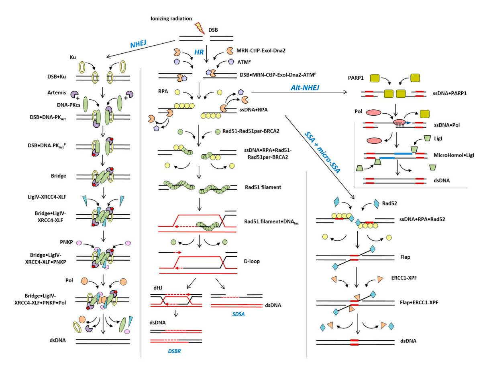
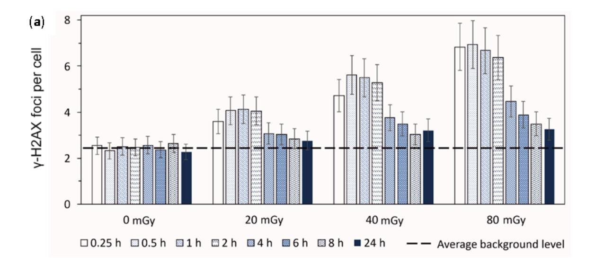
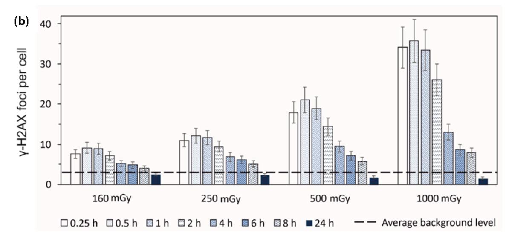
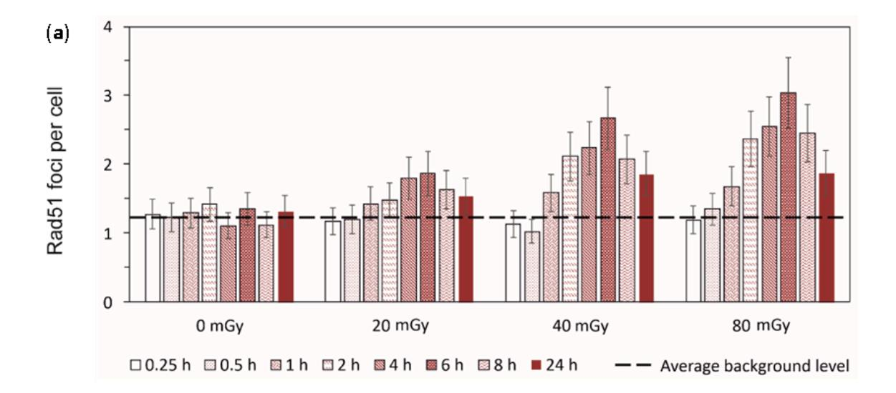
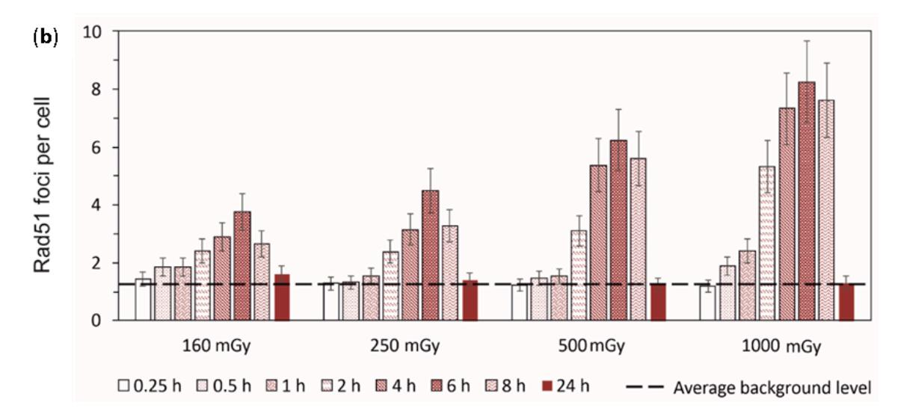
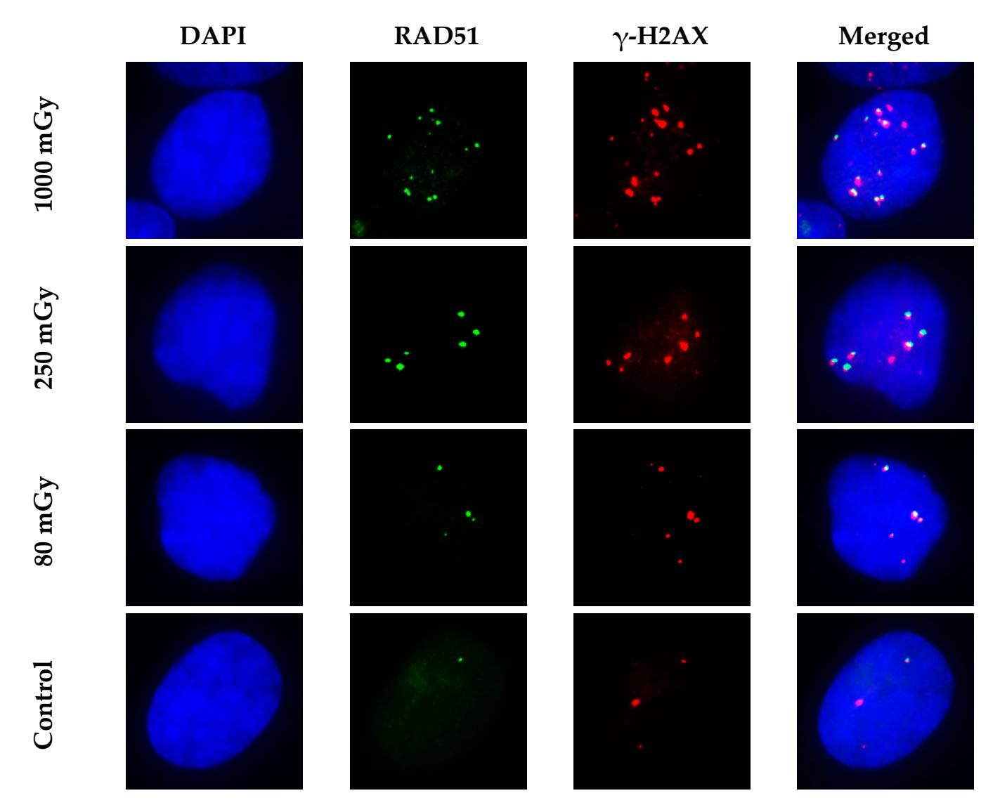
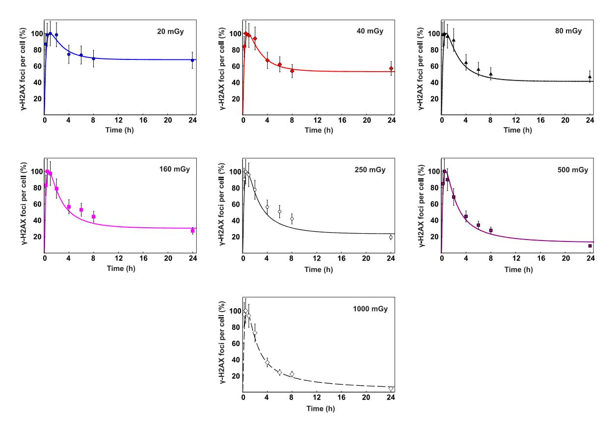
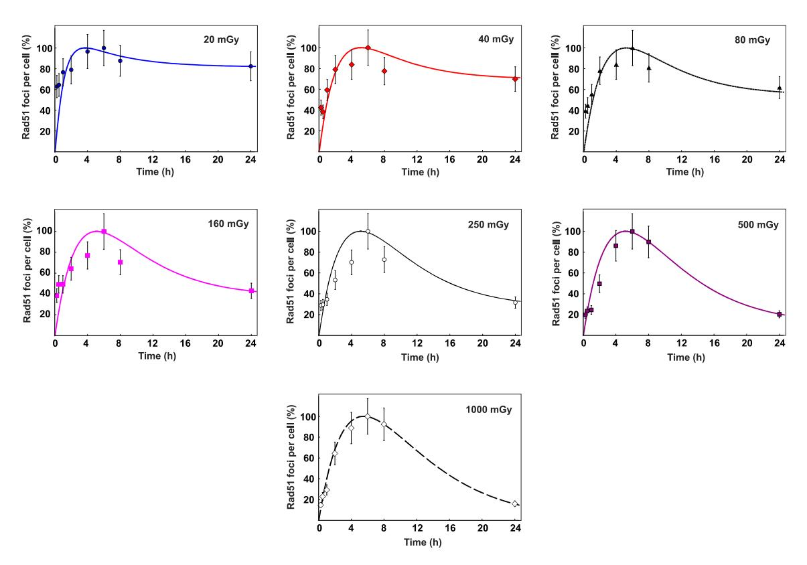
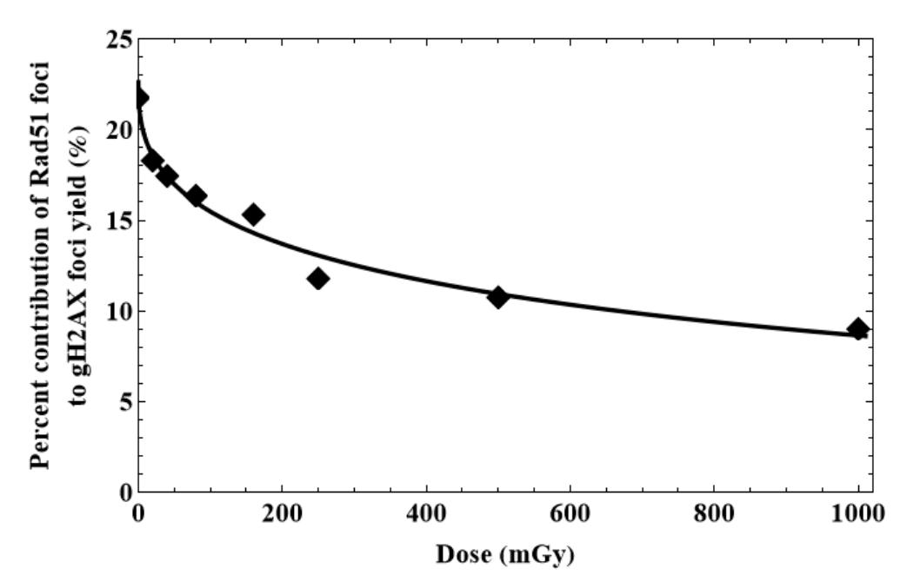
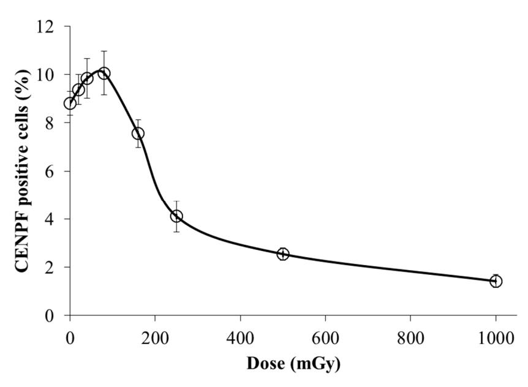

*Article*

# **Dose-Dependent Shift in Relative Contribution of Homologous Recombination to DNA Repair after Low-LET Ionizing Radiation Exposure: Empirical Evidence and Numerical Simulation**

**Oleg Belov 1,2,3 [,](https://orcid.org/0000-0002-9429-3793) Anna Chigasova 4,5, Margarita Pustovalova 6,7, Andrey Osipov 4 , Petr Eremin 8 , Natalia Vorobyeva 4,6 and Andreyan N. Osipov 1,4,6,7,[\\*](https://orcid.org/0000-0001-5921-9056)**

- 1 Joint Institute for Nuclear Research, 6 Joliot-Curie St., 141980 Dubna, Russia; oleg.belov@jinr.int
- Institute of Biomedical Problems, Russian Academy of Sciences, 76A Khoroshevskoye Shosse, 123007 Moscow, Russia
- 3 Institute of System Analysis and Management, Dubna State University, 19 Universitetskaya St., 141980 Dubna, Russia
- 4 N.N. Semenov Federal Research Center for Chemical Physics, Russian Academy of Sciences, 119991 Moscow, Russia; annagrekhova1@gmail.com (A.C.); a-2-osipov@yandex.ru (A.O.); nuv.rad@mail.ru (N.V.)
- 5 Emanuel Institute for Biochemical Physics, Russian Academy of Sciences, 119334 Moscow, Russia
- 6 State Research Center—Burnasyan Federal Medical Biophysical Center of Federal Medical Biological Agency (SRC—FMBC), 123098 Moscow, Russia; pustovalova.mv@mipt.ru
- 7 School of Biological and Medical Physics, Moscow Institute of Physics and Technology, 141700 Dolgoprudny, Russia
- 8 FSBI "National Medical Research Center for Rehabilitation and Balneology", Ministry of Health of Russia, 121099 Moscow, Russia; ereminps@gmail.com
- **\*** Correspondence: aosipov@fmbcfmba.ru; Tel.: +7-915-437-3245

**Abstract:** Understanding the relative contributions of different repair pathways to radiation-induced DNA damage responses remains a challenging issue in terms of studying the radiation injury endpoints. The comparative manifestation of homologous recombination (HR) after irradiation with different doses greatly determines the overall effectiveness of recovery in a dividing cell after irradiation, since HR is an error-free mechanism intended to perform the repair of DNA doublestrand breaks (DSB) during S/G2 phases of the cell cycle. In this article, we present experimentally observed evidence of dose-dependent shifts in the relative contributions of HR in human fibroblasts after X-ray exposure at doses in the range 20–1000 mGy, which is also supported by quantitative modeling of DNA DSB repair. Our findings indicate that the increase in the radiation dose leads to a dose-dependent decrease in the relative contribution of HR in the entire repair process.

**Keywords:** DNA double-strand breaks; ionizing radiation; DNA repair pathways; homologous recombination; mathematical modeling

## **1. Introduction**

Ionizing radiation (IR) affects the DNA structure by inducing various types of damage, of which DNA double-strand breaks (DSB) are considered to be the most deleterious examples [\[1,](#page-19-0)[2\]](#page-19-1). DSBs are considered to be critical DNA lesions because their misrepair can lead to severe mutations, oncogenesis, cell death or senescence [\[3\]](#page-19-2). In this regard, the selection of an optimal repair pathway is crucial to the cell in terms of achieving a final outcome [\[4\]](#page-19-3). Non-homologous end joining (NHEJ) and homologous recombination (HR) are two major DSB repair pathways present in mammalian and human cells. NHEJ fuses the two broken ends with little regard for homology, leading to deletions and other rearrangements [\[5\]](#page-19-4). In contrast, HR typically copies the missing information from the sister

**Citation:** Belov, O.; Chigasova, A.; Pustovalova, M.; Osipov, A.; Eremin, P.; Vorobyeva, N.; Osipov, A.N. Dose-Dependent Shift in Relative Contribution of Homologous Recombination to DNA Repair after Low-LET Ionizing Radiation Exposure: Empirical Evidence and Numerical Simulation. *Curr. Issues Mol. Biol.* **2023**, *45*, 7352–7373. [https://doi.org/10.3390/](https://doi.org/10.3390/cimb45090465) [cimb45090465](https://doi.org/10.3390/cimb45090465)

Academic Editor: Hironori Yoshino

Received: 28 July 2023 Revised: 6 September 2023 Accepted: 7 September 2023 Published: 9 September 2023

**Copyright:** © 2023 by the authors. Licensee MDPI, Basel, Switzerland. This article is an open access article distributed under the terms and conditions of the Creative Commons Attribution (CC BY) license [\(https://](https://creativecommons.org/licenses/by/4.0/) [creativecommons.org/licenses/by/](https://creativecommons.org/licenses/by/4.0/) 4.0/).

chromatid into the break site, resulting in the exact reconstitution of the original sequence. In the last few decades, at least three alternative pathways of DSB repair were suggested to be operational following the ionizing radiation exposure. These distinct pathways, namely single-strand annealing (SSA), microhomology-mediated end-joining (MMEJ) and alternative end-joining (Alt-EJ), are distinguished based on the amount of DNA sequence complementarity used to align DNA ends [\[6\]](#page-19-5).

Revealing the mechanistic nature of DSB repair pathways and evaluating their manifestation in response to different radiation doses aims to improve our understanding of the deleterious effects of ionizing radiation and our ability to predict them [\[7](#page-19-6)[,8\]](#page-19-7). The development of our predictive capabilities impacts the accuracy of radiotherapy and radiation-induced cancer risk estimations, as well as being relevant to health issues in people living in areas with high background radiation and future manned space exploration, as astronauts can be exposed to complex radiation fields.

One of the initial events involved in the complex process of DNA repair from DSBs is the phosphorylation of the core histone H2AX by kinases of the PIKK families (phosphatidylinositol 3 kinase-related kinases) ATM, ATR and DNA-PKcs in the flanking regions of DSBs of chromatin [\[9\]](#page-19-8). Dynamic microstructures containing thousands of copies of the phosphorylated histone H2AX (γ-H2AX), which are called "foci" in the literature, are easily visualized using immunocytochemical staining [\[10–](#page-19-9)[12\]](#page-19-10). The analysis of γH2AX foci provides information regarding the number of DNA repair sites derived from DSBs, their distribution over the nuclear volume, and their impact on the kinetics of repair. However, it is equally important to evaluate not only changes in the total number of DSBs, but also the proportion of DSBs repaired via the HR error-free pathway. For this purpose, the analysis of the foci associated with the key HR protein Rad51 is most often used [\[13\]](#page-19-11).

Computational and mathematical modeling associated with cancer radiotherapy and radiation risk assessments have been undertaken for decades, and they proceed along with the new biophysics phenomena that have been identified [\[14](#page-19-12)[–18\]](#page-19-13). Along with the modeling of radiation risk itself, there are a series of models designed to understand the kinetics of radiation-induced DNA damage repair and associated secondary cancer risk. Combining the numerical simulation with experimental methods allows us to identify new mechanistic properties involved in the DNA repair process, which are hardly accessible to experimental studies, but could be important in terms of providing a detailed understanding of the variety of outcomes induced by ionizing radiation.

One of the intriguing tasks potentially being solved by combining the experimental measurements with simulation techniques is the activation of specific DSB pathways following low-dose radiation exposure. Currently, there are many works devoted to changes in the number of DNA damage foci present in mammalian cells irradiated at low doses [\[19–](#page-19-14)[22\]](#page-19-15). However, the issue of DSB repair efficiency after low-dose radiation exposure remains one of the controversial topics of present-day radiation biology.

The current study aims to perform the experimental probing of the relative contribution of the HR pathway to DSB repair, which is induced via X-ray exposure in the dose range from 20 to 1000 mGy, with the subsequent numerical evaluation of γ-H2AX foci considered to be the main DSB repair marker.

## **2. Materials and Methods**

*2.1. Experimental Study*

2.1.1. Cell Culture

The studies were performed using a human skin fibroblast culture (Cell Applications, San Diego, CA, USA, Cat.no. 106K-05a). Cells were cultured at 37 ◦C and 5% CO2 in a standard DMEM culture medium with a high glucose content (4.5 g/L) (Thermo Fisher Scientific, Waltham, MA, USA) supplemented with 2 mmol/L of L-glutamine (Thermo Fisher Scientific, Waltham, MA, USA), 100 U/mL of penicillin, 100 µg/mL of streptomycin (Thermo Fisher Scientific, Waltham, MA, USA) and 10% fetal bovine serum (Thermo Fisher Scientific, Waltham, MA, USA). Fibroblasts were then plated on 4-centimeter-squared

coverslips in 35-millimeter Petri dishes (SPL Lifesciences, Pocheon-City, Gyeonggi-Do, Republic of Korea) with a density of 104 cells/cm2 . Next, 3–5 passages of cells in the phase of exponential growth (cell population density ~60–70%) were used to perform the experiments.

## 2.1.2. Irradiation

The cells were irradiated using the RUB RUST-M1 X-irradiator (Diagnostika-M LLC, Moscow, Russia), which was equipped with two X-ray emitters, at a dose rate of 40 mGy/min and voltage of 100 kV, current of 0.8 mA, using a 1.5-millimeter Al filter and at a temperature of 4 ◦C (LAB ARMOR BEADS thermal granules were used for cooling). The error in the exposure dose was estimated to be within 15%. After irradiation, cells were incubated under the standard conditions of a CO2 incubator (37 ◦C, 5% CO2) for 0.25–24 h.

## 2.1.3. Immunocytochemistry

Cells were fixed on coverslips in 4% paraformaldehyde in PBS (pH 7.4) for 15 min at room temperature, followed by two PBS rinses (pH 7.4) and permeabilization in 0.3% Triton-X100 (in PBS, pH 7.4) supplemented with 2% bovine serum albumin (BSA) to block non-specific antibody binding. To perform immunocytochemical staining, the slides were incubated for 1 h at room temperature with a primary mouse monoclonal antibody against γH2AX (dilution 1: 200, 05-636-I clone JBW301, Merck-Millipore, Burlington, VT, USA) and rabbit polyclonal antibody against Rad51 (dilution 1:200, ABE257, Merck-Millipore, Burlington, VT, USA) or CENPF (dilution dilution 1:200, ab5, Abcam, Waltham, MA, USA) in PBS (pH 7.4) containing 1% BSA. After rinses with PBS, cells were incubated for 1 h at room temperature with the goat anti-mouse Alexa Fluor 488 conjugated secondary antibodies IgG (H + L) (Life Technologies, Carlsbad, SA, USA), with a dilution of 1: 600 and goat anti-rabbit rhodamine conjugated antibodies (Merck-Millipore, Burlington, VT, USA), with a dilution of 1:400 in PBS (pH 7.4) with 1% BSA. ProLong Gold medium (Life Technologies, Carlsbad, SA, USA) was used with DAPI to perform DNA counter-staining and for the prevention of photo fading. Cells were viewed and imaged using a Nikon Eclipse Ni-U microscope (Nikon, Tokyo, Japan) equipped with a high definition ProgRes MFcool camera (Jenoptik AG, Jena, Germany). The filter sets UV-2E/C (340–380-nanometer excitation and 435–485-nanometer emission), B-2E/C (465–495-nanometer excitation and 515–555-nanometer emission) and Y-2E/C (540–580-nanometer excitation and 600–660 nanometer emission) were used. At least 200 cells were analyzed to determine each data point. γ-H2AX and Rad51 foci were counted through manual scoring and using DARFI software [\(https://github.com/varnivey/darfi;](https://github.com/varnivey/darfi) accessed on 19 September 2016).

#### 2.1.4. Statistical Analysis

Statistical analysis of the data was conducted using the Statistica 8.0 software (StatSoft, Tulsa, OK, USA). The results were presented as the means of three independent experiments ± standard error (*SE*).

#### *2.2. Evaluating the Percentage Contribution of HR to DSB Repair*

In order to evaluate the percentage contribution of HR to the repair process, the quantitative model of radiation-induced DSB repair was used [\[23\]](#page-20-0). The model consisted of five main parts. The first part evaluated the initial yield of radiation-induced DSBs. The other parts were the quantitative models of NHEJ, HR, SSA and Alt-EJ repair pathways, as shown in Figure [1.](#page-3-0) To simulate the processing of DNA lesions by repair enzymes, the mass-action chemical kinetics approach was used.

Figure 1. Pathways for DSB repair in mammalian and human cells.

The kinetics of DSB induction and repair were simulated as follows:

$$\frac{dN_0}{dt} = \alpha(L)\frac{dD}{dt}N_{ir} - V_{\text{NHEJ}} - V_{\text{HR}} - V_{\text{SSA}} - V_{\text{micro-SSA}} - V_{\text{Alt-EJ}}$$
(1)

where  $N_0 = N_{\rm ncDSB} + N_{\rm cDSB}$ ;  $V_{\rm NHEJ}$ ,  $V_{\rm HR}$ ,  $V_{\rm SSA}$ ,  $V_{\rm micro-SSA}$ , and  $V_{\rm Alt-EJ}$  are the terms characterizing the elimination of DSBs by the NHEJ, HR, SSA, micro-SSA, and Alt-EJ repair pathways, respectively. The details of these terms are given in Equation (A4) of Appendix B. In Equation (1),  $N_{ir}$  is the fraction of irreparable DSBs, which corresponds to the level of  $\gamma$ -H2AX foci remaining in the cell 24 h post-irradiation. The rate of initial DSB induction was calculated as  $dN_0/dt = \alpha(L)dD/dt$ , using the same method that is used in [24–26]. Here, D is the dose of ionizing radiation (Gy), and  $\alpha(L)$  is the slope coefficient of linear dose dependence, which describes the DSB induction per unit of dose (Gy $^{-1}$  per cell).

Enzymatic interactions that occurred in the course of repair were simulated as follows: within the NHEJ pathway, the stage of Ku binding to a DSB was represented by the kinetic equation below

$$[DSB] + [Ku] \underset{K_{-1}}{\longleftrightarrow} [DSB \bullet Ku], \tag{2}$$

where quantities in brackets denote time-dependent intracellular concentrations of repair complexes, and K values with an appropriate subscript are used to represent the dimensional reaction rate-constants. Here, [DSB] is the number of DSBs that undergo binding by Ku, and [DSB $\bullet$ Ku] is the level of the resulting intermediate complex.

The stage of the recruitment of the DNA-dependent protein kinase catalytic subunit (DNA-PKcs) and Artemis to a DSB site was described as

$$[DSB \bullet Ku] + [DNA-PKcs] \underset{K_{-2}}{\longleftarrow} [DSB \bullet DNA-PK_{Art}], \tag{3}$$

In this kinetic equation, [DNA-PK] denotes a complex of Ku and DNA-PKcs. Art indicates that the mentioned intermediate complex is formed in the presence of Artemis.

The autophosphorylation of DNA-PKcs was represented by

$$[DSB \bullet DNA-PK_{Art}] \xrightarrow{K_3} [DSB \bullet DNA-PK_{Art}^P], \tag{4}$$

where the superscript P defines the phosphorylated DNA-PK product.

The subsequent end-bridging process was described as a junction of two  $[DSB_{NHEJ} \bullet DNA-PK_{Art}^P]$  constructs formed at the previous repair stage.

$$[DSB \bullet DNA-PK_{Art}^{P}] + [DSB \bullet DNA-PK_{Art}^{P}] \xleftarrow{K_{4}} [Bridge], \qquad (5)$$

Here, the [Bridge] intermediate complex characterizes the final product of the reaction.

The further assembly of the NHEJ repair complex promotes the recruitment of LigIV with its associated factors XRCC4 and XLF, as well as the subsequent involvement of the polynucleotide kinase phosphatase (PNKP) with a break site.

$$[Bridge] + [LigIV-XRCC4-XLF] \underset{K_{-5}}{\longleftarrow} [Bridge \bullet LigIV-XRCC4-XLF], \qquad (6)$$

$$[\text{Bridge} \bullet \text{LigIV-XRCC4-XLF}] + [\text{PNKP}] \xleftarrow{K_6} [\text{Bridge} \bullet \text{LigIV-XRCC4-XLF} \bullet \text{PNKP}]. \quad (7)$$

The final step of the NHEJ pathway implying the recruitment of a polymerase was denoted as follows:

$$[\text{Bridge} \bullet \text{LigIV-XRCC4-XLF} \bullet \text{PNKP}] + [\text{Pol}] \xleftarrow{K_7} [\text{Bridge} \bullet \text{LigIV-XRCC4-XLF} \bullet \text{PNKP} \bullet \text{Pol}] \xrightarrow{K_8} [\text{dsDNA}] + [\text{LigIV-XRCC4-XLF}] + [\text{Pol}] + [\text{PNKP}] + [\text{DNA-PKcs}] + [\text{Ku}]. \tag{8}$$

In this consideration, after gap filling and ligation are finalized, it was accepted that the repair complexes dissociated, leaving the recovered double-stranded DNA (dsDNA).

The first stages of HR associated with the action of MRN, its co-factors (CtlP, ExoI, Dna2) and ATM were described in the model as follows:

$$[DSB] + [MRN-CtIP-ExoI-Dna2] \underset{P_{-1}}{\longleftarrow} [DSB \bullet MRN-CtIP-ExoI-Dna2], \qquad (9)$$

$$[ATM] \xrightarrow{P_2} [ATM^P], \tag{10}$$

$$[DSB \bullet MRN-CtIP-ExoI-Dna2] + [ATM^P] \xrightarrow{P_3} [DSB \bullet MRN-CtIP-ExoI-Dna2 \bullet ATM^P] \xrightarrow{P_4}$$

$$\xrightarrow{P_4} [ssDNA] + [MRN-CtIP-ExoI-Dna2] + [ATM^P],$$
(11)

where the MRN (Mre11-Rad50-Nbs1) complex interacting with other repair factors is considered to be a single complex, and superscript P defines the phosphorylated species.

The involvement of the replication protein A (RPA) in eliminating the secondary structure of DNA and protecting single-stranded regions from other enzymatic activities was denoted by

$$[ssDNA] + [RPA] \underset{P_{-5}}{\longleftarrow} [ssDNA \bullet RPA]. \tag{12}$$

The next HR step associated with formation of Rad51 filament was described via the following kinetic equation:

$$[ssDNA \bullet RPA] + [Rad51-Rad51par-BRCA2] \xrightarrow{P_6} [ssDNA \bullet RPA \bullet Rad51-Rad51par-BRCA2] \xrightarrow{P_7} [Rad51 filament] + [RPA],$$

$$(13)$$

where the Rad51par abbreviation denotes five biologically important Rad51 paralogs (Rad51B, Rad51C, Rad51D, XRCC2 and XRCC3), and [Rad51 filament] defines the [ssDNA•Rad51-Rad51par-BRCA2] complex.

The formation of a displacement loop (D-loop) and two methods of its subsequent resolution were represented as follows:

$$[Rad51 \ filament] + [DNA_{inc}] \xrightarrow{P_8} [Rad51 \ filament \bullet DNA_{inc}] \xrightarrow{P_9} \\ \xrightarrow{P_9} [D\text{-loop}] + [Rad51\text{-Rad51par-BRCA2}],$$
 (14)

$$[D-loop] \xrightarrow{P_{10}} [dHJ] \xrightarrow{P_{11}} [dsDNA] + [DNA_{inc}], \tag{15}$$

$$[\text{D-loop}] \xrightarrow{P_{12}} [\text{dsDNA}] + [\text{DNA}_{inc}], \tag{16}$$

where [DNA $_{inc}$ ] is the incoming DNA duplex, [Rad51 filament  $\bullet$ DNA $_{inc}$ ] complex is assumed to contain Rad54 protein, and dHJ is the double Holiday junction.

The SSA pathway was given as the below set of kinetics equations. The first step assuming interaction with Rad52 was denoted by

$$[ssDNA \bullet RPA] + [Rad52] \underset{Q_{-1}}{\longleftarrow} [ssDNA \bullet RPA \bullet Rad52], \tag{17}$$

where the [ssDNA •RPA] complex is the same as that shown in Equation (12).

The junction between Rad52 heptamer rings and each ssDNA termini that allowed the formation of a flapped structure is represented as follows:

$$[ssDNA \bullet RPA \bullet Rad52] + [ssDNA \bullet RPA \bullet Rad52] \xrightarrow{Q_2} [Flap] + [RPA].$$
 (18)

The cutting of the flapped ends by the ERCC1-XPF endonuclease and final ligation of a damaged site with LigIII complex were simulated via

$$[\text{Flap}] + [\text{ERCC1-XPF}] \xleftarrow{Q_3} [\text{ssDNA} \bullet \text{RPA} \bullet \text{Rad} 52 [\text{Flap} \bullet \text{ERCC1-XPF}] \xrightarrow{Q_4} [\text{dsDNA}_{\text{nicks}}] + [\text{Rad} 52] + [\text{ERCC1-XPF}], \tag{19}$$

$$[dsDNA_{nicks}] + [LigIII] \xrightarrow{Q_5} [ssDNA \bullet RPA \bullet Rad52 [dsDNA_{nicks} \bullet LigIII] \xrightarrow{Q_6} [dsDNA] + [LigIII]. \tag{20}$$

Here, Rad52 and ERCC1-XPF are assumed to dissociate from the processing site.

The simulation of the alternative end-joining pathways was based on the hypothesis suggesting two different Ku-independent repair mechanisms [27]. The first of these mechanisms was represented by MMEJ, which was sometimes considered to be an independent end-joining mechanism distinct from the other pathways. Meanwhile, experimental evidence suggested that this type of repair represented a specific subclass of the SSA pathway known as micro-SSA [28,29]. On the basis of these considerations, in our model, rejoining via MMEJ was simulated as the additional part of DSBs, which followed the SSA pathway.

To simulate the Alt-EJ pathway, an additional mechanistic explanation was proposed. According to the recent hypothesis, Alt-EJ required activity of MRX complex and possibly exhibited the same initiation steps as HR [27]. Therefore, the initial stages of Alt-EJ was

described by Equations (9)–(11). After the production of ssDNA, the activity of PARP1 recruited to the DSB site was characterized by Equation (21).

$$[ssDNA] + [PARP1] \underset{R_{-1}}{\longleftarrow} [ssDNA \bullet PARP1].$$
 (21)

The kinetics of microhomology production via polymerase activity was simulated via

$$[ssDNA \bullet PARP1] + [Pol] \xrightarrow{R_2} [ssDNA \bullet Pol] + [PARP1],$$
 (22)

$$[ssDNA \bullet Pol] \xrightarrow{R_2} [MicroHomol] + [Pol].$$
 (23)

In Equation (23), [MicroHomol] denotes the yield of microhomology.

The final step of Alt-EJ was believed to rely on LigI activity [27]. In the model, this stage was represented as follows:

$$[\text{MicroHomol}] + [\text{LigI}] \xrightarrow[R_{-4}]{R_{4}} [\text{MicroHomol} \bullet \text{LigI}] \xrightarrow{R_{5}} [\text{dsDNA}] + [\text{LigI}]. \tag{24}$$

The kinetics of the induction of  $\gamma$ -H2AX foci was simulated by summing up all active forms of DNA-PKcs and ATM, which were considered in the model, which was similar to the method used in [24]

$$V_{\gamma - \text{H2AX}+} = \frac{K_9 [\text{Sum}] [\text{H2AX}]}{K_{10} + [\text{Sum}]},$$
 (25)

where [H2AX] is the level of the histone variant H2AX and

$$[Sum] = [DSB \bullet DNA-PK_{Art}^{P}] + [Bridge] + [Bridge \bullet LigIV-XRCC4-XLF] +$$

$$+ [Bridge \bullet LigIV-XRCC4-XLF \bullet PNKP] + [Bridge \bullet LigIV-XRCC4-XLF \bullet PNKP \bullet Pol] +$$

$$+ [DSB \bullet MRN-CtIP-ExoI-Dna2 \bullet ATM^{P}]. \tag{26}$$

The mechanism of  $\gamma$ -H2AX foci dephosphorylation was assumed to be proportional to the amount of repaired DNA, as well as its spontaneous decay with the corresponding rate constants  $K_{11}$  and  $K_{12}$ .

$$V_{\gamma - \text{H2AX}-} = K_{11}[\text{dsDNA}] + K_{12}[\gamma - \text{H2AX}].$$
 (27)

To describe the interactions between repair enzymes and their substrates, the mass-action chemical kinetics approach was used. The details of the application of this approach to simulate the dynamic change in the intracellular concentrations of main repair complexes, as well as the model equations and their parameters, are described in Appendices A–C.

The evaluation of the percentage contribution of HR to DSB repair was performed via the calculated time-courses of  $\gamma$ -H2AX and Rad51 foci for the particular dose of X-rays. The HR contribution to PHR was evaluated as the following ratio:

$$P_{\rm HR} = 100 \times \overline{y_9} / \overline{x_{14}}, \tag{28}$$

where  $\overline{y_9}$  and  $\overline{x_{14}}$  are the mean numbers of Rad51 and  $\gamma$ -H2AX foci, respectively, counted via a 24-h simulation period.

To obtain a dependence of PHR on the X-ray dose, the ODE system was run using a sufficiently small dose step equal to 0.1 mGy within the range 0–1000 mGy. This simulation procedure yielded a curve of PHR (*D*) dependence that was expressed by the following formula:

$$P_{\rm HR}(D) = 100 \times \overline{y_9(D)} / \overline{x_{14}(D)}.$$
 (29)

#### **3. Results**

#### *3.1. Experimental Results*

In Figure [2,](#page-8-0) γ-H2AX foci yields are shown, as scored at 0.25–24 h after exposure to different doses of X-rays ranging from 20 to 1000 mGy. Foci yields scored in cells exposed to 500 mGy and 1000 mGy tend to peak at 0.25–1.0 h, while exposure to doses of 20–250 mGy resulted in maximum levels of foci being found at 0.25–2.0 h. At a point closer to 4 h after exposure, the signal of γ-H2AX sharply decreased with time due to the completion of the fast DSB repair being a feature of NHEJ. Then, up to 24 h after exposure, the slow DSB repair occurred, which was typically associated with complex DSBs being repaired via the HR pathway.

It is noteworthy that 24 h after exposure to 40–80 mGy, the level of γ-H2AX foci does not drop to the control values, indicating a slowdown in the DSB repair kinetics following low doses of ionizing radiation. On the other hand, 24 h after exposure to 500 mGy and 1000 mGy, the observed levels of γ-H2AX foci were slightly below those of the control values. A possible explanation is that the exposure to low and moderate doses of ionizing radiation affects cell proliferation in an opposite manner. Low doses stimulate cell proliferation, while relatively high doses lead to their reduction.

One of the sources of DNA DSBs used in the proliferation of cells is the collapse of replication forks in the S phase of the cell cycle [\[30\]](#page-20-6). The repair of DSBs induced in this process follows the HR pathway [\[30](#page-20-6)[,31\]](#page-20-7). The histone H2AX in the S phase is mainly phosphorylated by the ATR kinase [\[32](#page-20-8)[,33\]](#page-20-9). As a consequence, the percentage of cells in the S phase contributes to the average amount of γ-H2AX foci in asynchronous cell populations. This process leads to the overestimation of the γ-H2AX foci level in cells exposed to low doses and the underestimation of its presence in cells irradiated with moderate doses. The observed pattern generally meets the previous findings obtained using human fibroblasts and mesenchymal stromal cells exposed to X-rays [\[34,](#page-20-10)[35\]](#page-20-11).

To estimate the contribution of HR to the entire process of DNA DSB repair, we analyzed changes in the level of radiation-induced Rad51 foci, which are the key markers of HR (Figure [3\)](#page-9-0). A statistically significant increase in the number of Rad51 foci was observed 2 h after irradiation, reaching its maximum values by 6 h. After 6 h, a decrease in the number of Rad51 foci was indicated. Finally, at 24 h after irradiation, the level of foci dropped down to the control values in cells exposed to 160–1000 mGy and remained higher than the control values in cells irradiated with doses of 40 mGy and 80 mGy.

Figure [4](#page-10-0) illustrates RAD51 and γ-H2AX foci and the co-localization of RAD51 foci with γ-H2AX foci in normal human skin fibroblasts at 6 h (maximum values of RAD51 foci) after X-ray irradiation with doses of 80, 250, and 1000 mGy. Dose-dependent increases in the number of foci of both proteins, as well as a perfect co-localization of RAD51 foci with γ-H2AX foci, are clearly seen on the microscopic images shown in Figure [4.](#page-10-0)

**Figure 2.** Experimentally measured time-courses of  $\gamma$ -H2AX foci remaining in normal human skin fibroblasts after exposure to (**a**) 20 mGy, 40 mGy, or 80 mGy and (**b**) 160 mGy, 250 mGy, 500 mGy or 1000 mGy of X-rays in comparison to background levels used as control ( $\pm SE$ ).

#### 3.2. Percent Contribution of HR to DSB Repair

To confirm the DSB repair model validity of radiation doses in the range of 20–1000 mGy, the calculated time-courses of  $\gamma$ -H2AX and Rad51 foci were compared to the experimental data of normal human skin fibroblasts exposed to X-rays at doses of 20, 40, 80, 160, 250, 500 and 1000 mGy. The results of comparison are shown in Figures 5 and 6, which depict kinetics of these foci in the range 0–24 h after irradiation.

Although the exposure to doses of 20–250 mGy results in relatively low absolute levels of  $\gamma$ -H2AX, the entire repair process does not seem to occur faster than in the case of higher considered doses. The proportion of  $\gamma$ -H2AX foci observed after exposure to 20–250 mGy remains elevated for a period similarly long to that following the exposure to the doses of 500–1000 mGy. We hypothesize that the observed pattern of DSB repair occurs due to the preferential activation of HR pathway, which takes longer to eliminate the damage.

**Figure 3.** Experimentally measured time-courses of Rad51 foci remaining in normal human skin fibroblasts after exposure to (a) 20 mGy, 40 mGy or 80 mGy and (b) 160 mGy, 250 mGy 500 mGy or 1000 mGy of X-rays in comparison to background levels used as control ( $\pm SE$ ).

Interestingly, following the exposure to doses of 160 mGy and above, the levels of  $\gamma$ -H2AX foci remaining 24 h after irradiation were lower than the background value. This finding suggests that DSBs normally induced as a consequence of non-radiation factors can undergo a more effective elimination if cells enter the process of radiation-induced DSB repair. It could also be expected that in cells that have successfully completed the repair of a certain portion of radiation-induced DSBs, the background levels of  $\gamma$ -H2AX foci can be suppressed compared to non-irradiated cells for at least a residual period after exposure.

Overall, the juxtaposition of the simulated and experimentally measured data affirms the validity of the suggested DSB repair model used for relatively low radiation doses, enabling the calculation of time-courses of  $\gamma$ -H2AX and Rad51 foci within the full dose range of interest (0–1000 mGy) to obtain a continuous dependence of  $P_{HR}$  on D.

**Figure 4.** Representative images of RAD51 and  $\gamma$ -H2AX foci and their co-localization at 6 h post-irradiation. Fibroblasts were irradiated, and RAD51 and  $\gamma$ -H2AX were immunofluorescently labeled as described in Materials and Methods section. Nuclei were counter-stained with DAPI, as shown in blue in first column of images. RAD51 and  $\gamma$ -H2AX foci are shown in green and red, respectively. Images in the last column were produced by merging all three channels, and they show the co-localization patterns of RAD51 and  $\gamma$ -H2AX.

The results yielding the percentage contribution of HR to DSB repair are shown in Figure 7. The general pattern of HR involvement in the DSB repair is characterized by a near-exponentially decreasing function, which is supposed to depend on the cell line, type of ionizing radiation and other factors. The dependence of HR on different factors requires more detailed examination.

*Curr. Issues Mol. Biol.* **2023**, *45* 7363 *Curr. Issues Mol. Biol.* **2023**,*45* 7362

**Figure 5.** Time-courses of γ-H2AX foci remaining in normal human skin fibroblasts after exposure to different doses of X-rays. The curves are the calculated results; the symbols are the experimental data (±*SE*). The data are normalized based on the maximum number of foci observed within the **Figure 5.** Time-courses of γ-H2AX foci remaining in normal human skin fibroblasts after exposure to different doses of X-rays. The curves are the calculated results; the symbols are the experimental data (±*SE*). The data are normalized based on the maximum number of foci observed within the 24-h period.

## *3.3. Dose-Dependent Changes in the S/G2-Phase Cell Fractions*

DNA repair via HR predominantly occurs in the S/G2 phases of the cell cycle. Therefore, to ensure the correct interpretation of the obtained results, it was important to estimate the changes in the proportion of cells in the S/G2 phases in the irradiated cell populations. For this purpose, we used immunohistochemical analysis of a protein marker of cells in S/G2 phases—Centromere protein F (CENPF). This protein, being a component of the nuclear matrix during G2 phase, has been used as a marker of S/G2 cells [\[36](#page-20-12)[,37\]](#page-20-13). Its synthesis commences in the early S phase and ceases in the M phase, with a peak at the G2 phase [\[37\]](#page-20-13).

The results presented in Figure [8](#page-13-0) show that exposure to low doses (20–80 mGy) of X-rays leads to a slight increase in the proportion of CENPF-positive cells. However, these changes are not statistically significant (*p* > 0.05). In contrast, irradiation at doses of 250, 500 and 1000 mGy leads to significant 2.15 (*p* = 0.004), 3.69 (*p* = 0.0003) and 6.93 (*p* = 0.0002) fold decreases in the proportion of CENPF positive cells, respectively. In general, after irradiation at doses of 160–1000 mGy, the pattern of change in the proportions of S/G2 phase fibroblasts is characterized by a near-exponentially decreasing function. The obtained results are in good agreement with dose-dependent changes in the relative contribution of HR in irradiated cells.

**Figure 6.** Time-courses of Rad-51 foci remaining in normal human skin fibroblasts after exposure to different doses of X-rays. The curves are the calculated results; the symbols are the experimental data ( $\pm SE$ ). The data are normalized based on maximum number of foci observed within the 24-h period.

**Figure 7.** Dependence of the percentage contribution of HR to DSB repair on the radiation dose  $(P_{HR}(D))$ . The curve line is fitted; the symbols are the experimental data.

**Figure 8.** Dose-dependent changes in the S/G2-phase cell fractions (CENPF positive cells) 24 h after the irradiation of fibroblasts. Data are means  $\pm$  SE of the three independent experiments.

#### 4. Discussion

Our study reveals distinct patterns of  $\gamma$ -H2AX and Rad51 foci dynamics following the application of low and moderate doses of X-rays. We identified several parameters of the foci dynamics, which demonstrate different regularities in response to low and moderate doses, including periods of reaching peak levels of  $\gamma$ -H2AX foci, numbers of  $\gamma$ -H2AX and Rad51 foci remaining 24 h post-irradiation compared to control levels. All of these characteristics of DNA DSB repair demonstrate a pronounced dose-dependent shift. Within the dose steps selected for use in the analysis, the dose-dependent shift associated with reaching peak levels of  $\gamma$ -H2AX foci is observed between 250 and 500 mGy. The doses triggering the levels of remaining  $\gamma$ -H2AX and Rad51 foci appeared to be within the ranges of 80—500 mGy and of 80—160 mGy, respectively.

The juxtaposition of our results with other findings [38] suggests another confirmation of a dose-dependent shift in the activity of DNA repair systems, at least with regard to the repair of radiation-induced DSBs. On one hand, the number of DSBs increases linearly with the radiation dose, and the entire cell response depends on the correctness of DNA repair. Our results show that relatively low doses of low-LET ionizing radiation lead to a higher contribution of the error-free repair via the HR pathway. Since HR takes longer than NHEJ, low-dose-mediated activation of DNA repair mechanisms may not only protect DNA from the immediate damage, but also result in prolonged adaptive responses, protecting the cell from future oxidative insults (such as high-dose radiation), as is confirmed in [38–44]. The observed shift to error-free HR allows the restoration of the genome with maximum fidelity.

The mechanistic nature of the relative contribution of HR at low doses remains under debate. Nevertheless, our results support one of the possible scenarios of engagement of this repair pathway in the response to low doses of low-LET ionizing radiation [45]. According to these findings, error-prone pathways, including NHEJ, Alt-EJ and SSA, are partly or completely suppressed and likely only operate when HR fails to process the damage. An increase in the dose of low-LET radiation leads to the suppression of HR via mechanisms that remain to be identified, while the contribution of NHEJ increases and becomes the first choice. The decrease in the fraction of cells in the  $\rm S/G2$  phases after irradiation at doses of 250–1000 mGy, as shown in our work, suggests that the simplest mechanism used to reduce the contribution of HR with increasing radiation dose is the cell cycle arrest in  $\rm G1/S$  phase. It is believed that HR is primarily active in the  $\rm S/G2$  phase of the

cell cycle, as HR requires a sister chromatid to perform template-based repair [\[46–](#page-20-17)[48\]](#page-20-18). Thus, a simple mechanistic decrease in the portion of S/G2 cells should also lead to a decrease in the relative HR contribution to DNA DSB repair. However, to prove this assumption, additional research is needed to address the role played by HR proteins in cell cycle regulation, including the analysis of this regulation in low-dose radiation-exposed cells. To determine if the HR contribution in DNA DSB repair is directly affected by radiation doses, the analysis should be restricted to S/G2 cells. The overall strategy for the future research in this direction should elucidate whether the proportion of the cells with the cell cycle arrest is really comparable to the proportion of cells in which the direct effect of radiation on the HR-capacity is seen. Our study was limited to a radiation dose of 1 Gy, while the model in [\[45\]](#page-20-16) postulates that DNA end resection remains active, showing signs of suppression only above 20 Gy. Therefore, the increased engagement of error-prone Alt-EJ and SSA under conditions of persisting resection and partially suppressed HR can only be identified through the simulation approach.

Considering that there are plenty of well-established findings regarding the strong compensatory power of the DBS repair in eukaryotes, it is incorrect to assume that the radiation effects associated with the DSB removal follow linear dose dependence. Even the mechanistic nature of the assembly of DSB repair super-complexes in response to the appearance of radiation-induced lesions reflects the non-linear kinetics of this process, which may blur the resulting outcome within a certain dose range. It may also suggest that genotoxicity and late risks associated with the quality of DSB repair after exposure to low-LET radiation can cross some radiation dose threshold.

**Author Contributions:** Conceptualization, A.N.O. and O.B.; methodology, A.C. and O.B.; software, A.C. and O.B.; validation, A.C. and O.B.; formal analysis, O.B., A.C., M.P. and A.O.; investigation, O.B., A.C., M.P., A.O., P.E. and N.V.; resources, A.N.O.; data curation, A.C. and O.B.; writing—original draft preparation, O.B.; writing—review and editing, A.N.O.; visualization, A.C., A.O. and O.B.; supervision, A.N.O.; project administration, A.N.O.; funding acquisition, A.N.O. All authors have read and agreed to the published version of the manuscript.

**Funding:** This research was funded by Russian Science Foundation, grant number 23-14-00078.

**Institutional Review Board Statement:** Not applicable.

**Informed Consent Statement:** Not applicable.

**Data Availability Statement:** Not applicable.

**Acknowledgments:** The authors would like to thank Daria Molodtsova for her help with preparing and editing the manuscript.

**Conflicts of Interest:** The authors declare no conflict of interest.

### **Appendix A. Details the DSB Repair Model**

The initial yield of DSBs, denoted as (*N*0), was calculated as

$$\frac{dN_0}{dt} = \alpha(L)\frac{dD}{dt},\tag{A1}$$

where *D* is the radiation dose (Gy), and *α*(*L*) = *a* exp(−*bL*) is the slope coefficient of linear dose dependence, which describes DSB induction per unit of dose (Gy−1 per cell). Parameters *a* and *b* used in this equation are presented in Appendix [C.](#page-17-0) The particular details of parameter evaluation, as well as the simulation of each repair pathway, can be found in [\[23\]](#page-20-0).

The dynamic change in the intracellular concentrations of the main repair complexes is expressed via the following differential equation:

$$\frac{dX}{dt} = V_{+}(X_{i}, N_{0}) - V_{-}(X_{i}, N_{0}), \tag{A2}$$

where *Xi* (*i* = 1, . . . , *n*) is the intracellular level of the *i*-th repair complex, *t* is time, and the functions *V*+ and *V*− are the complex accumulation and degradation, respectively. The dimensionless form of the system of ordinary differential equations (ODE) referred to the simulation of NHEJ, HR, SSA and two alternative repair pathways, as well as its parameters and initial conditions, which are presented in Appendices [B](#page-15-0) and [C.](#page-17-0) In the present study, the ODE system was solved using the fourth-order Runge–Kutta method. The integration time-step is denoted as 10−10 s in order to satisfy the fastest reactions being simulated in the model.

In order to simulate DSB rejoining in the asynchronous cell culture, we set a model cell cycle distribution similar to the distribution of HF19 cells observed in [\[49\]](#page-20-19), where 40% of cells were in G0/G1, <10% were in S phase and 50% were in G2/M. Assuming that S-phase cells include two equal sub-fractions of early S and late S cells, the final distribution was set as follows: 45% of cells are in the G0/G1 and early S phases, and 55% of cells are in the late S and G2/M phases. Based on the data discussed in [\[26,](#page-20-2)[28,](#page-20-4)[50,](#page-20-20)[51\]](#page-20-21), the model provides the following pathways for the repair of non-clustered and clustered DSBs: In G0/G1 and early S phases, non-clustered DSBs are likely to follow rejoining via NHEJ, while the limited number of complex DSBs may undergo PARP1-dependent Alt-EJ. The other pathways are assumed to be unavailable or masked by NHEJ in these phases. In the late S and G2/M phases, non-clustered DSBs may follow NHEJ and be a substrate for SSA and micro-SSA pathways. The clustered DSBs are suggested to proceed through HR, SSA and Alt-EJ. Finally, in our calculations, the models of corresponding repair mechanisms are processed based on the following scheme:

$$G_0/G_1$$
, and early S  $\left\{ egin{array}{ll} 0.45 \ TN_{ncDSB} 
ightarrow \ NHEJ, \\ 0.45 \ TN_{cDSB} 
ightarrow \ Alt-EJ, \end{array} 
ight.$  (A3) late S and  $G_2/M \left\{ egin{array}{ll} 0.55 \ TN_{ncDSB} 
ightarrow \ NHEJ, \ SSA, \\ 0.55 \ TN_{cDSB} 
ightarrow \ HR, \ SSA, \ Alt-EJ, \end{array} 
ight.$ 

where 0.45 and 0.55 represent the fractions of cells in the G0/G1 and early S, as well as in the late S and G2/M, phases, respectively; *N*ncDSB and *N*cDSB represent amounts of nonclustered and clustered DSBs; and *T* represents the total size of the exponentially growing cell culture set to be 105 cells, as mentioned in [\[49\]](#page-20-19). The model accounts for the cell cycle dependence of the repair pathways by initiating the computation procedure with the levels of *N*ncDSB and *N*cDSB parameters based on the cell cycle distribution of the cell culture used in the experiment.

## **Appendix B. Equations of the Model**

The dynamic change in the levels of NHEJ repair complexes and γ-H2AX foci is described by the following system of ordinary differential equations:

$$\begin{split} \frac{dn_0}{d\tau} &= \alpha(L) \frac{dD}{dt} N_{ir} - n_0 (k_1 x_1 + p_1 y_1) + k_{-1} x_2 + p_{-1} y_2, \\ \frac{dx_2}{d\tau} &= k_1 N_0 x_1 - x_2 (k_{-1} + k_2 x_3) + k_{-2} x_4, \\ \frac{dx_4}{d\tau} &= k_2 x_2 x_3 - x_4 (k_3 + k_{-2}), \\ \frac{dx_5}{d\tau} &= k_3 x_4 - k_4 x_5^2 + k_{-4} x_6, \\ \frac{dx_8}{d\tau} &= k_{-6} x_{10} + k_5 x_6 x_7 - x_8 (k_{-5} + k_6 x_9), \\ \frac{dx_{10}}{d\tau} &= k_{-7} x_{12} + k_6 x_8 x_9 - x_{10} (k_{-6} + k_7 x_{11}), \\ \frac{dx_{12}}{d\tau} &= k_7 x_{10} x_{11} - x_{12} (k_8 + k_{-7}), \\ \frac{dx_{13}}{d\tau} &= k_8 x_{12} + p_{12} y_{14} + p_{11} y_{15} + q_6 z_8 + r_5 w_7, \\ \frac{dx_{14}}{d\tau} &= \frac{k_9 (x_5 + x_6 + x_8 + x_{10} + x_{12}) \cdot x_{15}}{k_{10} + x_5 + x_6 + x_8 + x_{10} + x_{12}} - k_{11} x_{13} - k_{12} x_{14}. \end{split}$$

The initial conditions of this system of wild-type cells are as follows:  $n_0(0) = \alpha(L)D$ ,  $x_2(0) = x_4(0) = x_5(0) = x_6(0) = x_8(0) = x_{10}(0) = x_{12}(0) = x_{13}(0) = x_{14}(0) = 0$ . The values of variables  $x_1$ ,  $x_3$ ,  $x_7$ ,  $x_9$ ,  $x_{11}$  and  $x_{15}$  are set to be constant and equal to  $x_1$ .

In Equation (A4),  $n_0$  is the scaled number of radiation-induced DBSs;  $N_{ir}$  is the nondimensional fraction of irreparable DSBs;  $x_1$ ,  $x_3$ ,  $x_7$ ,  $x_9$  and  $x_{11}$  are scaled intracellular concentrations of the Ku, DNA-PKcs, LigIV-XRCC4-XLF, PNK and Pol enzymes, respectively;  $x_2$ ,  $x_4$ ,  $x_5$ ,  $x_6$ ,  $x_8$ ,  $x_{10}$ ,  $x_{12}$  and  $x_{13}$ , are normalized intracellular concentrations of intermediate complexes represented by [DSB•Ku], [DSB•DNA-PKArt], [DSB•DNA-PKArt], [Bridge], [Bridge •LigIV-XRCC4-XLF], [Bridge •LigIV-XRCC4-XLF•PNKP], [Bridge •LigIV-XRCC4 -XLF $\bullet$ PNKP $\bullet$ Pol] and [dsDNA];  $x_{14}$ ,  $x_{15}$  and  $y_{5}$  are the scaled levels of the  $\gamma$ -H2AX foci, histone variant H2AX and [DSB • MRN-CtIP-ExoI-Dna2 • ATMP] complex that contribute to the fluorescent signal upon the measurement of  $\gamma$ -H2AX foci induction;  $y_{15}$ ,  $z_8$  and  $w_5$  are the concentrations of the [dHJ], [dsDNAnicks•LigIII] and [MicroHomol•LigI], respectively; and  $k_i$  is the scaled rate constants. The variables of the model are normalized based on Ku total cellular level:  $n_0 = N_0/X_1$ ,  $x_i = X_i/X_1$ ,  $y_i = Y_i/X_1$ ,  $z_i = Z_i/X_1$  and  $w_i = W_i/X_1$ . In molar concentration, this level was  $X_1 = N/(N_A V_{nucl}) = 9.19 \times 10^{-7} M$ , where  $N = 400\,000$  is the number of Ku molecules per cell [52],  $N_A$  is the Avogadro constant and  $V_{nucl} = 7.23 \times 10^{-13}$  L is an average volume of the cell nucleus in human fibroblasts [53]. In this consideration,  $x_1 = 1$ .

The kinetics of the HR repair complexes is described by the following system of ordinary differential equations:

$$\frac{dy_{2}}{d\tau} = p_{1}n_{0}y_{1} - y_{2}(p_{-1} + p_{3}y_{4}) + p_{-3}y_{5},$$

$$\frac{dy_{4}}{d\tau} = p_{2}y_{3} - y_{4}(p_{-2} + p_{3}y_{2}) + y_{5}(p_{4} + p_{-3}),$$

$$\frac{dy_{5}}{d\tau} = p_{3}y_{2}y_{4} - y_{5}(p_{4} + p_{-3}),$$

$$\frac{dy_{6}}{d\tau} = p_{4}y_{5} - y_{6}(p_{5}y_{7} + r_{1}w_{1}) + p_{-5}y_{8} + r_{-1}w_{2},$$

$$\frac{dy_{8}}{d\tau} = p_{-6}y_{10} + p_{5}y_{6}y_{7} - y_{8}(p_{-5} + p_{6}y_{9} + q_{1}z_{1}) + q_{-1}z_{2},$$

$$\frac{dy_{10}}{d\tau} = p_{6}y_{8}y_{9} - y_{10}(p_{7} + p_{-6}),$$

$$\frac{dy_{11}}{d\tau} = p_{7}y_{10} - p_{8}y_{11}y_{12} + p_{-8}y_{13},$$

$$\frac{dy_{13}}{d\tau} = p_{8}y_{11}y_{12} - y_{13}(p_{9} + p_{-8}),$$

$$\frac{dy_{13}}{d\tau} = p_{9}y_{13} - y_{14}(p_{10} + p_{12}),$$

$$\frac{dy_{15}}{d\tau} = p_{10}y_{14} - p_{11}y_{15}.$$
(A5)

The initial conditions of this system for wild-type cells are as follows:  $y_2(0) = y_4(0) = y_5(0) = y_6(0) = y_8(0) = y_{10}(0) = y_{11}(0) = y_{13}(0) = y_{14}(0) = y_{15}(0) = 0$ . The values of  $y_1$ ,  $y_3$ ,  $y_7$ ,  $y_9$  and  $y_{12}$  variables are set to be constant and equal to  $x_1$ .

In Equation (A5),  $y_1$ ,  $y_3$ ,  $y_4$ ,  $y_7$  and  $y_9$  are scaled intracellular concentrations of the MRN, ATM, ATMP, RPA and Rad51-Rad51par-BRCA2 complexes, respectively;  $y_{12}$  is the normalized level of incoming homologous sequence designated as [DNAinc];  $y_2$ ,  $y_5$ ,  $y_6$ ,  $y_8$ ,  $y_{10}$ ,  $y_{11}$ ,  $y_{13}$ ,  $y_{14}$  and  $y_{15}$  are the normalized intracellular concentrations of the [DSB $\bullet$ MRN-CtIP-ExoI-Dna2], [DSB $\bullet$ MRN-CtIP-ExoI-Dna2 $\bullet$ ATMP], [ssDNA], [ssDNA $\bullet$ RPA], [ssDNA $\bullet$ RPA $\bullet$ Rad51-Rad51par-BRCA2], [Rad51 filament], [Rad51 filament  $\bullet$ DNAinc], [D-loop] and [dHJ] intermediate complexes, respectively; and  $p_i$  are scaled rate constants. The variables are also normalized based on the Ku total cellular level as  $y_i = Y_i/X_1$ .

The dimensionless forms of the equations used in the SSA model are represented as follows:

$$\frac{dz_{2}}{d\tau} = q_{1}y_{8}z_{1} - z_{2}(q_{-1} + q_{2}z_{2}^{2}), 
\frac{dz_{3}}{d\tau} = q_{2}z_{2}^{2} - q_{3}z_{3}z_{4} + q_{-3}z_{5}, 
\frac{dz_{5}}{d\tau} = q_{3}z_{3}z_{4} - z_{5}(q_{4} + q_{-3}), 
\frac{dz_{6}}{d\tau} = q_{4}z_{5} - q_{5}z_{6}z_{7} + q_{-5}z_{8}, 
\frac{dz_{8}}{d\tau} = q_{5}z_{6}z_{7} - z_{8}(q_{6} + q_{-5}).$$
(A6)

The initial conditions of this system for wild-type cells are as follows:  $z_2(0) = z_3(0) = z_5(0) = z_6(0) = z_8(0) = 0$ . The values of variables  $z_1$ ,  $z_4$  and  $z_7$  are set to be constant and equal to  $x_1$ .

In Equation (A6),  $z_1$ ,  $z_4$  and  $z_7$  are scaled cellular levels of Rad52, ERCC1-XPF and LigIII enzymes, respectively;  $z_2$ ,  $z_3$ ,  $z_5$ ,  $z_6$  and  $z_8$  are scaled intracellular concentrations of the [ssDNA •RPA•Rad52], [Flap], [Flap•ERCC1-XPF], [dsDNAnicks] and [dsDNAnicks• LigIII] intermediate complexes, respectively; and  $q_i$  is the scaled rate constants. The variables are also normalized based on Ku total cellular level as  $z_i = Z_i/X_1$ .

The kinetics of the Alt-EJ intermediate complexes is described by the following system of ordinary differential equations:

$$\frac{dw_2}{d\tau} = r_1 w_1 y_6 - w_2 (r_2 + r_{-1}), 
\frac{dw_4}{d\tau} = r_2 w_2 w_3 - r_3 w_4, 
\frac{dw_5}{d\tau} = r_3 w_4 - r_4 w_5 w_6 + r_{-4} w_7, 
\frac{dw_7}{d\tau} = r_4 w_5 w_6 - w_7 (r_5 + r_{-4}).$$
(A7)

The initial conditions of this system for wild-type cells are as follows:  $w_2(0) = w_4(0) = w_5(0) = w_7(0) = 0$ . The values of  $w_1$ ,  $w_3$  and  $w_6$  variables are set to be constant and equal to  $x_1$ .

In Equation (A4),  $w_1$ ,  $w_3$  and  $w_6$  are scaled cellular levels of PARP1, Pol and LigI, respectively;  $w_2$ ,  $w_4$ ,  $w_5$  and  $w_7$  are scaled intracellular concentrations of the [ssDNA  $\bullet$ PARP1], [ssDNA  $\bullet$ Pol], [MicroHomol] and [MicroHomol $\bullet$ LigI] intermediate complexes, respectively; and  $r_i$  is the scaled rate constants. The variables are also normalized based on Ku total cellular level as  $w_i = W_i/X_1$ .

#### Appendix C. Parameters of the Model

The dimensionless parameters of Equation (A4) are  $k_1 = K_1X_1/K_8$ ,  $k_{-1} = K_{-1}/K_8$ ,  $k_2 = K_2X_1/K_8$ ,  $k_{-2} = K_{-2}/K_8$ ,  $k_3 = K_3/K_8$ ,  $k_4 = K_4X_1/K_8$ ,  $k_{-4} = K_{-4}/K_8$ ,  $k_5 = K_5X_1/K_8$ ,  $k_{-5} = K_{-5}/K_8$ ,  $k_6 = K_6X_1/K_8$ ,  $k_{-6} = K_{-6}/K_8$ ,  $k_7 = K_7X_1/K_8$ ,  $k_{-7} = K_{-7}/K_8$ ,  $k_8 = K_8/K_8 = 1$ ,  $k_9 = K_9/K_8$ ,  $k_{10} = K_{10}/X_1$ ,  $k_{11} = K_{11}/K_8$  and  $k_{12} = K_{12}/K_8$ .  $K_8$  is the rate of final NHEJ process resulting in the production of the repaired dsDNA and the unwinding of all repair factors. The reason for the selection of this constant as a scaling factor is the assumed independence of this parameter on possible variations due to the competition of repair pathways at earlier stages. This assumption is mainly important in terms of performing future modifications to the model, when rate constants of early stages are planned to connect with the damage complexity.

The scaled reaction rates in Equation (A5) are  $p_1 = P_1 X_1/K_8$ ,  $p_{-1} = P_{-1}/K_8$ ,  $p_2 = P_2/K_8$ ,  $p_3 = P_3 X_1/K_8$ ,  $p_{-3} = P_{-3}/K_8$ ,  $p_4 = P_4/K_8$ ,  $p_5 = P_5 X_1/K_8$ ,  $p_{-5} = P_{-5}/K_8$ ,  $p_6 = P_6 X_1/K_8$ ,  $p_{-6} = P_{-6}/K_8$ ,  $p_7 = P_7/K_8$ ,  $p_8 = P_8 X_1/K_8$ ,  $p_{-8} = P_{-8}/K_8$ ,  $p_9 = X_1/K_8$ ,  $p_{10} = P_{10}/K_8$ ,  $p_{11} = P_{11}/K_8$  and  $p_{12} = P_{12}/K_8$ . The scaling factors  $X_1$  and  $X_8$  are chosen to perform parameter normalization.

The scaled reaction rates in Equation (A6) are  $q_1 = Q_1 X_1/K_8$ ,  $q_{-1} = Q_{-1}/K_8$ ,  $q_2 = Q_2 X_1/K_8$ ,  $q_3 = Q_3 X_1/K_8$ ,  $q_{-3} = Q_{-3}/K_8$ ,  $q_4 = Q_4/K_8$ ,  $q_5 = Q_5 X_1/K_8$ ,  $q_{-5} = Q_{-5}/K_8$  and  $q_6 = Q_6/K_8$ . In this case, the same factors  $X_1$  and  $K_8$  are used for scaling rate constants.

The scaled reaction rates in Equation (A7) are *r*1 = *R*1*X*1/*K*8, *r*−1 = *R*−1/*K*8, *r*2 = *R*2*X*1/*K*8, *r*3 = *R*3/*K*8, and *r*4 = *R*4*X*1/*K*8, *r*−4 = *R*−4/*K*8 and *r*5 = *R*5/*K*8. As in the other models, the same scaling factors *X*1 and *K*8 are chosen to perform parameter normalization.

The majority of the rate constants of enzymatic reactions were determined by fitting the corresponding model curves produced using Equations (A4)–(A7) to the experimental data regarding the kinetics of different stages of DSB repair. Other parameters characterizing the regularities of DSB induction were directly obtained from experimental measurements reviewed in the literature. For some of the parameters used, a dependence of their values on radiation dose is introduced. The functions representing these parameters are also shown in Table [A1.](#page-19-16)

In order to estimate *α*(*L*), we used three sets of experimental data regarding DSB induction in GM38 and GM57 lines of human skin fibroblasts within the LET values ranging from 0.2 to 440 keV/µm [\[54–](#page-21-2)[56\]](#page-21-3). The total DSB yield measured in these studies as Gy−1 per 109 bp was recalculated to Gy−1 per cell, taking into account the fact that a diploid human cell in G1 phase contains about 5 × 109 bp of DNA [\[54\]](#page-21-2). The experimental data were approximated using the exponential function *α*(*L*) = *a* exp(−*bL*) to obtain a continuous function within the stated LET range. The parameters of the function given in Table [A1](#page-19-16) were evaluated by adjusting the curve for *α*(*L*) to fit the results of the above-mentioned experimental measurements.

**Table A1.** Parameters of the model.

| Parameter | Value                                              | Parameter | Value                                          |
|-----------|----------------------------------------------------|-----------|------------------------------------------------|
| a         | 27.5                                               | P−5       | 8.82 × 10−5 h −1                            |
| b         | 2.43 × 10−3                                        | P6        | 1.87 × 105 M−1 h −1                         |
| K1        | 11.05 M−1 h −1                                  | P−6       | 1.55 × 10−3 h −1                            |
| K−1       | 6.6×10−4 h −1                                   | P7        | 21.36 h−1                                      |
| K2        | −21.42/D1.82 ) M−1 h −1 18.83 × (1.09 − e | P8        | 1.20 × 104 M−1 h −1                         |
| K−2       | 5.26 × 10−1 h −1                                | P−8       | 2.49 × 10−4 h −1                            |
| K3        | 1.86 M−1 h −1                                   | P9        | 6.16×10−6/D2.68 −1 − D0.03 h 1.11 × e |
| K4        | −12.70 D0.09 M−1 h −1 1.20 + 4.48 × 105 e | P10       | 7.20 × 10−3 h −1                            |
| K−4       | 3.86 × 10−4 h −1                                | P11       | 6.06 × 10−4 h −1                            |
| K5        | 15.24 M−1 h −1                                  | P12       | 2.76 × 10−1 h −1                            |
| K−5       | 8.28 h−1                                           | Q1        | 7.80 × 103 M−1 h −1                         |
| K6        | 18.06 M−1 h −1                                  | Q−1       | 1.71 × 10−4 h −1                            |
| K−6       | 1.33 h−1                                           | Q2        | 3.00 × 104 M−1 h −1                         |
| K7        | 2.73 × 105 M−1 h −1                             | Q3        | 6.00 × 103 M−1 h −1                         |
| K−7       | 3.20 h−1                                           | Q−3       | 6.06 × 10−4 h −1                            |
| K8        | 5.52 × 10−1 h −1                                | Q4        | 1.66 × 10−6 h −1                            |
| K9        | 1.66 × 10−1 h −1                                | Q5        | 8.40 × 104 M−1 h −1                         |
| K10       | 1.93 × 10−7/Nir M                               | Q−5       | 4.75 × 10−4 h −1                            |
| K11       | 7.50 × 10−2 h −1                                | Q6        | 11.58 h−1                                      |
| K12       | 11.10 h−1                                          | R1        | 2.39 × 103 M−1 h −1                         |
| P1        | 1.75 × 103 M−1 h −1                             | R−1       | 12.63 h−1                                      |
| P−1       | 1.33 × 10−4 h −1                                | R2        | 4.07 × 104 M−1 h −1                         |

| Parameter | Value                                                                          | Parameter | Value                  |  |
|-----------|--------------------------------------------------------------------------------|-----------|------------------------|--|
| P2        | 7.21 h−1                                                                       | R3        | 9.82 h−1               |  |
| P3        | 1.37 × 104 M−1 h −1                                                         | R4        | 1.47 × 105 M−1 h −1 |  |
| P−3       | 2.34 h−1                                                                       | R4        | 12.30 h−1              |  |
| P4        | 5.52 × 10−2 h −1                                                            | R−4       | 2.72 h−1               |  |
| P5        | 1.20 × 105 M−1 h −1                                                         | R5        | 1.65 × 10−1 h −1    |  |
| Nirrep    | −2.48 D2.02 −5.43 D0.76  − 0.11 e , D < 1 0.12 e 0.01, D ≥ 1 |           |                        |  |

**Table A1.** *Cont.*

## **References**

- 1. Jeggo, P.A.; Löbrich, M. DNA double-strand breaks: Their cellular and clinical impact? *Oncogene* **2007**, *26*, 7717–7719. [\[CrossRef\]](https://doi.org/10.1038/sj.onc.1210868) [\[PubMed\]](https://www.ncbi.nlm.nih.gov/pubmed/18066083)
- 2. Bushmanov, A.; Vorobyeva, N.; Molodtsova, D.; Osipov, A.N. Utilization of DNA double-strand breaks for biodosimetry of ionizing radiation exposure. *Environ. Adv.* **2022**, *8*, 100207. [\[CrossRef\]](https://doi.org/10.1016/j.envadv.2022.100207)
- 3. Ackerson, S.M.; Romney, C.; Schuck, P.L.; Stewart, J.A. To Join or Not to Join: Decision Points Along the Pathway to Double-Strand Break Repair vs. Chromosome End Protection. *Front. Cell Dev. Biol.* **2021**, *9*, 708763. [\[CrossRef\]](https://doi.org/10.3389/fcell.2021.708763) [\[PubMed\]](https://www.ncbi.nlm.nih.gov/pubmed/34322492)
- 4. Her, J.; Bunting, S. How cells ensure correct repair of DNA double-strand breaks. *J. Biol. Chem.* **2018**, *293*, 10502–10511. [\[CrossRef\]](https://doi.org/10.1074/jbc.TM118.000371)
- 5. Li, Y.; Zhang, H.; Merkher, Y.; Chen, L.; Liu, N.; Leonov, S.; Chen, Y. Recent advances in therapeutic strategies for triple-negative breast cancer. *J. Hematol. Oncol.* **2022**, *15*, 121. [\[CrossRef\]](https://doi.org/10.1186/s13045-022-01341-0)
- 6. Sallmyr, A.; Tomkinson, A. Repair of DNA double-strand breaks by mammalian alternative end-joining pathways. *J. Biol. Chem.* **2018**, *293*, 10536–10546. [\[CrossRef\]](https://doi.org/10.1074/jbc.TM117.000375) [\[PubMed\]](https://www.ncbi.nlm.nih.gov/pubmed/29530982)
- 7. Vitor, A.C.; Huertas, P.; Legube, G.; de Almeida, S.F. Studying DNA Double-Strand Break Repair: An Ever-Growing Toolbox. *Front. Mol. Biosci.* **2020**, *7*, 24. [\[CrossRef\]](https://doi.org/10.3389/fmolb.2020.00024)
- 8. Rich, T.; Allen, R.; Wyllie, A. Defying death after DNA damage. *Nature* **2000**, *407*, 777–783. [\[CrossRef\]](https://doi.org/10.1038/35037717)
- 9. Kinner, A.; Wu, W.; Staudt, C.; Iliakis, G. γ-H2AX in recognition and signaling of DNA double-strand breaks in the context of chromatin. *Nucleic Acids Res.* **2008**, *36*, 5678–5694. [\[CrossRef\]](https://doi.org/10.1093/nar/gkn550)
- 10. Raavi, V.; Perumal, V.; Paul, S.F.D. Potential application of γ-H2AX as a biodosimetry tool for radiation triage. *Mutat. Res./Rev. Mutat. Res.* **2021**, *787*, 108350. [\[CrossRef\]](https://doi.org/10.1016/j.mrrev.2020.108350) [\[PubMed\]](https://www.ncbi.nlm.nih.gov/pubmed/34083048)
- 11. Rothkamm, K.; Barnard, S.; Moquet, J.; Ellender, M.; Rana, Z.; Burdak-Rothkamm, S. DNA damage foci: Meaning and significance. *Environ. Mol. Mutagen.* **2015**, *56*, 491–504. [\[CrossRef\]](https://doi.org/10.1002/em.21944)
- 12. Osipov, A.; Chigasova, A.; Yashkina, E.; Ignatov, M.; Fedotov, Y.; Molodtsova, D.; Vorobyeva, N.; Osipov, A.N. Residual Foci of DNA Damage Response Proteins in Relation to Cellular Senescence and Autophagy in X-Ray Irradiated Fibroblasts. *Cells* **2023**, *12*, 1209. [\[CrossRef\]](https://doi.org/10.3390/cells12081209)
- 13. Tsvetkova, A.; Ozerov, I.V.; Pustovalova, M.; Grekhova, A.; Eremin, P.; Vorobyeva, N.; Eremin, I.; Pulin, A.; Zorin, V.; Kopnin, P.; et al. γH2AX, 53BP1 and Rad51 protein foci changes in mesenchymal stem cells during prolonged X-ray irradiation. *Oncotarget* **2017**, *8*, 64317–64329. [\[CrossRef\]](https://doi.org/10.18632/oncotarget.19203)
- 14. Smirnova, O.; Cucinotta, F. Dynamical modeling approach to risk assessment for radiogenic leukemia among astronauts engaged in interplanetary space missions. *Life Sci. Space Res.* **2018**, *16*, 76–83. [\[CrossRef\]](https://doi.org/10.1016/j.lssr.2017.12.002) [\[PubMed\]](https://www.ncbi.nlm.nih.gov/pubmed/29475522)
- 15. Talemi, S.; Kollarovic, G.; Lapytsko, A.; Schaber, J. Development of a robust DNA damage model including persistent telomereassociated damage with application to secondary cancer risk assessment. *Sci. Rep.* **2015**, *5*, 13540. [\[CrossRef\]](https://doi.org/10.1038/srep13540) [\[PubMed\]](https://www.ncbi.nlm.nih.gov/pubmed/26359627)
- 16. Stewart, R. Two-lesion kinetic model of double-strand break rejoining and cell killing. *Radiat. Res.* **2001**, *156*, 365–378. [\[CrossRef\]](https://doi.org/10.1667/0033-7587(2001)156[0365:TLKMOD]2.0.CO;2)
- 17. Sachs, R.; Hahnfeld, P.; Brenner, D. The link between low-LET dose-response relations and the underlying kinetics of damage production/repair/misrepair. *Int. J. Radiat. Biol.* **1997**, *72*, 351–374. [\[PubMed\]](https://www.ncbi.nlm.nih.gov/pubmed/9343102)
- 18. Lea, D.E. *Actions of Radiations on Living Cells*; University Press: Cambridge, UK, 1946.
- 19. Chai, W.; Kong, Y.; Escalona, M.B.; Hu, C.; Balajee, A.S.; Huang, Y. Evaluation of Low-dose Radiation-induced DNA Damage and Repair in 3D Printed Human Cellular Constructs. *Health Phys.* **2023**, *125*, 175–185. [\[CrossRef\]](https://doi.org/10.1097/HP.0000000000001709)
- 20. Pustovalova, M.; Astrelina, T.A.; Grekhova, A.; Vorobyeva, N.; Tsvetkova, A.; Blokhina, T.; Nikitina, V.; Suchkova, Y.; Usupzhanova, D.; Brunchukov, V.; et al. Residual γH2AX foci induced by low dose X-ray radiation in bone marrow mesenchymal stem cells do not cause accelerated senescence in the progeny of irradiated cells. *Aging* **2017**, *9*, 2397–2410. [\[CrossRef\]](https://doi.org/10.18632/aging.101327)
- 21. Jakl, L.; Marková, E.; Koláriková, L.; Belyaev, I. Biodosimetry of Low Dose Ionizing Radiation Using DNA Repair Foci in Human Lymphocytes. *Genes* **2020**, *11*, 58. [\[CrossRef\]](https://doi.org/10.3390/genes11010058)
- 22. Osipov, A.N.; Pustovalova, M.; Grekhova, A.; Eremin, P.; Vorobyova, N.; Pulin, A.; Zhavoronkov, A.; Roumiantsev, S.; Klokov, D.Y.; Eremin, I. Low doses of X-rays induce prolonged and ATM-independent persistence of γH2AX foci in human gingival mesenchymal stem cells. *Oncotarget* **2015**, *6*, 27275–27287. [\[CrossRef\]](https://doi.org/10.18632/oncotarget.4739)

23. Belov, O.; Krasavin, E.; Lyashko, M.; Batmunkh, M.; Sweilam, N. A quantitative model of the major pathways for radiationinduced DNA double-strand break repair. *J. Theor. Biol.* **2015**, *366*, 115–130. [\[CrossRef\]](https://doi.org/10.1016/j.jtbi.2014.09.024)

- 24. Cucinotta, F.A.; Pluth, J.M.; Anderson, J.A.; Harper, J.V.; O'Neill, P. Biochemical kinetics model of DSB repair and induction of gamma-H2AX foci by non-homologous end joining. *Radiat. Res.* **2008**, *169*, 214–222. [\[CrossRef\]](https://doi.org/10.1667/RR1035.1) [\[PubMed\]](https://www.ncbi.nlm.nih.gov/pubmed/18220463)
- 25. Taleei, R.; Weinfeld, M.; Nikjoo, H. Single strand annealing mathematical model for double strand break repair. *J. Mol. Eng. Syst. Biol.* **2012**, *1*, 1–10. [\[CrossRef\]](https://doi.org/10.7243/2050-1412-1-1)
- 26. Taleei, R.; Nikjoo, H. Biochemical DSB-repair model for mammalian cells in G1 and early S phases of the cell cycle. *Mutat. Res. -Genet. Toxicol. Environ. Mutagen.* **2013**, *756*, 206–212. [\[CrossRef\]](https://doi.org/10.1016/j.mrgentox.2013.06.004) [\[PubMed\]](https://www.ncbi.nlm.nih.gov/pubmed/23792210)
- 27. Decottignies, A. Alternative end-joining mechanisms: A historical perspective. *Front. Genet.* **2013**, *4*, 48. [\[CrossRef\]](https://doi.org/10.3389/fgene.2013.00048)
- 28. Decottignies, A. Microhomology-mediated end joining in fission yeast is repressed by Pku70 and relies on genes involved in homologous recombination. *Genetics* **2007**, *176*, 1403–1415. [\[CrossRef\]](https://doi.org/10.1534/genetics.107.071621) [\[PubMed\]](https://www.ncbi.nlm.nih.gov/pubmed/17483423)
- 29. Salles, D.; Mencalha, A.; Ireno, I.; Wiesmuller, L.; Abdelhay, E. BCR-ABL stimulates mutagenic homologous DNA double-strand break repair via the DNA-end-processing factor CtIP. *Carcinogenesis* **2011**, *32*, 27–34. [\[CrossRef\]](https://doi.org/10.1093/carcin/bgq216) [\[PubMed\]](https://www.ncbi.nlm.nih.gov/pubmed/20974687)
- 30. Gelot, C.; Magdalou, I.; Lopez, B.S. Replication stress in Mammalian cells and its consequences for mitosis. *Genes* **2015**, *6*, 267–298. [\[CrossRef\]](https://doi.org/10.3390/genes6020267) [\[PubMed\]](https://www.ncbi.nlm.nih.gov/pubmed/26010955)
- 31. Kim, K.P.; Mirkin, E.V. So similar yet so different: The two ends of a double strand break. *Mutat. Res./Fundam. Mol. Mech. Mutagen.* **2018**, *809*, 70–80. [\[CrossRef\]](https://doi.org/10.1016/j.mrfmmm.2017.06.007)
- 32. Ward, I.M.; Chen, J. Histone H2AX is phosphorylated in an ATR-dependent manner in response to replicational stress. *J. Biol. Chem.* **2001**, *276*, 47759–47762. [\[CrossRef\]](https://doi.org/10.1074/jbc.C100569200)
- 33. Firsanov, D.V.; Solovjeva, L.V.; Svetlova, M.P. H2AX phosphorylation at the sites of DNA double-strand breaks in cultivated mammalian cells and tissues. *Clin. Epigenetics* **2011**, *2*, 283–297. [\[CrossRef\]](https://doi.org/10.1007/s13148-011-0044-4)
- 34. Sorokin, M.; Kholodenko, R.; Grekhova, A.; Suntsova, M.; Pustovalova, M.; Vorobyeva, N.; Kholodenko, I.; Malakhova, G.; Garazha, A.; Nedoluzhko, A.; et al. Acquired resistance to tyrosine kinase inhibitors may be linked with the decreased sensitivity to X-ray irradiation. *Oncotarget* **2017**, *9*, 5111–5124. [\[CrossRef\]](https://doi.org/10.18632/oncotarget.23700)
- 35. Grekhova, A.K.; Pustovalova, M.V.; Eremin, P.S.; Ozerov, I.V.; Maksimova, O.A.; Gordeev, A.V.; Vorobyeva, N.Y.; Osipov, A.N. Evaluation of the Contribution of Homologous Recombination in DNA Double-Strand Break Repair in Human Fibroblasts after Exposure to Low and Intermediate Doses of X-ray Radiation. *Biol. Bull.* **2020**, *46*, 1496–1502. [\[CrossRef\]](https://doi.org/10.1134/S1062359019110037)
- 36. Bee, L.; Fabris, S.; Cherubini, R.; Mognato, M.; Celotti, L. The efficiency of homologous recombination and non-homologous end joining systems in repairing double-strand breaks during cell cycle progression. *PLoS ONE* **2013**, *8*, e69061. [\[CrossRef\]](https://doi.org/10.1371/journal.pone.0069061)
- 37. Varis, A.; Salmela, A.L.; Kallio, M.J. Cenp-F (mitosin) is more than a mitotic marker. *Chromosoma* **2006**, *115*, 288–295. [\[CrossRef\]](https://doi.org/10.1007/s00412-005-0046-0)
- 38. Tharmalingam, S.; Sreetharan, S.; Brooks, A.L.; Boreham, D.R. Re-evaluation of the linear no-threshold (LNT) model using new paradigms and modern molecular studies. *Chem. Biol. Interact.* **2019**, *301*, 54–67. [\[CrossRef\]](https://doi.org/10.1016/j.cbi.2018.11.013)
- 39. Boreham, D.R.; Dolling, J.A.; Somers, C.; Quinn, J.; Mitchel, R.E.J. The adaptive response and protection against heritable mutations and fetal malformation. *Dose-Response* **2006**, *4*, 317–326. [\[CrossRef\]](https://doi.org/10.2203/dose-response.06-104.Boreham)
- 40. Murley, J.S.; Baker, K.L.; Miller, R.C.; Darga, T.E.; Weichselbaum, R.R.; Grdina, D.J. SOD2-mediated adaptive responses induced by low-dose ionizing radiation via TNF signaling and amifostine. *Free Radic. Biol. Med.* **2011**, *51*, 1918–1925. [\[CrossRef\]](https://doi.org/10.1016/j.freeradbiomed.2011.08.032)
- 41. Ojima, M.; Eto, H.; Ban, N.; Kai, M. Radiation-induced bystander effects induce radioadaptive response by low-dose radiation. *Radiat. Prot. Dosim.* **2011**, *146*, 276–279. [\[CrossRef\]](https://doi.org/10.1093/rpd/ncr169)
- 42. Plews, M.; Simon, S.L.R.; Boreham, D.R.; Parchaliuk, D.; Wyatt, H.; Mantha, R.; Frost, K.; Lamoureux, L.; Stobart, M.; Czub, S.; et al. A radiation-induced adaptive response prolongs the survival of prion-infected mice. *Free Radic. Biol. Med.* **2010**, *49*, 1417–1421. [\[CrossRef\]](https://doi.org/10.1016/j.freeradbiomed.2010.07.025)
- 43. Taylor, K.; Lemon, J.A.; Boreham, D.R. Radiation-induced DNA damage and the relative biological effectiveness of 18F-FDG in wild-type mice. *Mutagenesis* **2014**, *29*, 279–287. [\[CrossRef\]](https://doi.org/10.1093/mutage/geu016)
- 44. Veeraraghavan, J.; Natarajan, M.; Herman, T.S.; Aravindan, N. Low-dose γ-radiation-induced oxidative stress response in mouse brain and gut: Regulation by NFκB-MnSOD cross-signaling. *Mutat. Res.-Genet. Toxicol. Environ. Mutagen.* **2011**, *718*, 44–55. [\[CrossRef\]](https://doi.org/10.1016/j.mrgentox.2010.10.006)
- 45. Mladenova, V.; Mladenov, E.; Stuschke, M.; Iliakis, G. DNA Damage Clustering after Ionizing Radiation and Consequences in the Processing of Chromatin Breaks. *Molecules* **2022**, *27*, 1540. [\[CrossRef\]](https://doi.org/10.3390/molecules27051540)
- 46. Ayala-Zambrano, C.; Yuste, M.; Frias, S.; Garcia-de-Teresa, B.; Mendoza, L.; Azpeitia, E.; Rodríguez, A.; Torres, L. A Boolean network model of the double-strand break repair pathway choice. *J. Theor. Biol.* **2023**, *573*, 111608. [\[CrossRef\]](https://doi.org/10.1016/j.jtbi.2023.111608)
- 47. Shibata, A.; Jeggo, P.A. DNA Double-strand Break Repair in a Cellular Context. *Clin. Oncol.* **2014**, *26*, 243–249. [\[CrossRef\]](https://doi.org/10.1016/j.clon.2014.02.004)
- 48. Wu, Q.; Xu, Y.; Xu, D. Repair pathway choice for double-strand breaks. *Essays Biochem.* **2020**, *64*, 765–777. [\[CrossRef\]](https://doi.org/10.1042/EBC20200007)
- 49. Anderson, J.; Harper, J.; Cucinotta, F.; O'Neill, P. Participation of DNA-PKcs in DSB Repair after Exposure to High- and Low-LET Radiation. *Radiat. Res.* **2010**, *174*, 195–205. [\[CrossRef\]](https://doi.org/10.1667/RR2071.1)
- 50. Moore, S.; Stanley, F.; Goodarzi, A. The repair of environmentally relevant DNA double strand breaks caused by high linear energy transfer irradiation—No simple task. *DNA Repair* **2014**, *17*, 64–73. [\[CrossRef\]](https://doi.org/10.1016/j.dnarep.2014.01.014)
- 51. Bennardo, N.; Cheng, A.; Huang, N.; Stark, J. Alternative-NHEJ Is a Mechanistically Distinct Pathway of Mammalian Chromosome Break Repair. *PLoS Genetics* **2008**, *4*, e1000110. [\[CrossRef\]](https://doi.org/10.1371/journal.pgen.1000110)

52. Neal, J.A.; Meek, K. Choosing the right path: Does DNA-PK help make the decision? *Mutat. Res./Fundam. Mol. Mech. Mutagen.* **2011**, *711*, 73–86. [\[CrossRef\]](https://doi.org/10.1016/j.mrfmmm.2011.02.010)

- 53. Dos Santos, M.; Villagrasa, C.; Clairand, I.; Incerti, S. Influence of the DNA density on the number of clustered damages created by protons of different energies. *Nucl. Instrum. Methods Phys. Res. Sect. B Beam Interact. Mater. At.* **2013**, *298*, 47–54. [\[CrossRef\]](https://doi.org/10.1016/j.nimb.2013.01.009)
- 54. Rydberg, B. Clusters of DNA damage induced by ionizing radiation: Formation of short DNA fragments. 2. Experimental detection. *Radiat. Res.* **1996**, *145*, 200–209. [\[CrossRef\]](https://doi.org/10.2307/3579175)
- 55. Lobrich, M.; Cooper, P.; Rydberg, B. Non-random distribution of DNA double-strand breaks induced by particle irradiation. *Int. J. Radiat. Biol.* **1996**, *70*, 493–503. [\[CrossRef\]](https://doi.org/10.1080/095530096144680)
- 56. Hoglund, E.; Blomquist, E.; Carlsson, J.; Stenerlow, B. DNA damage induced by radiation of different linear energy transfer: Initial fragmentation. *Int. J. Radiat. Biol.* **2000**, *76*, 539–547. [\[CrossRef\]](https://doi.org/10.1080/095530000138556)

**Disclaimer/Publisher's Note:** The statements, opinions and data contained in all publications are solely those of the individual author(s) and contributor(s) and not of MDPI and/or the editor(s). MDPI and/or the editor(s) disclaim responsibility for any injury to people or property resulting from any ideas, methods, instructions or products referred to in the content.