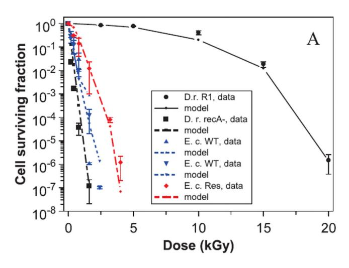
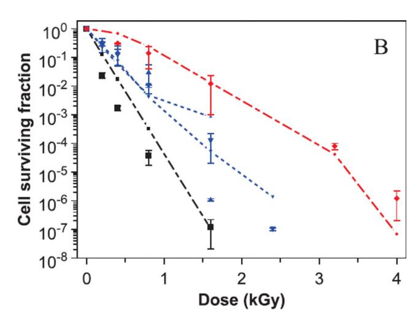
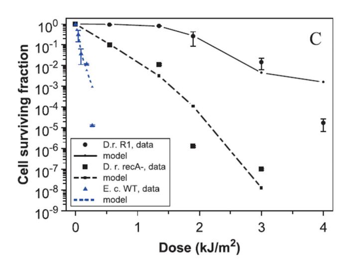
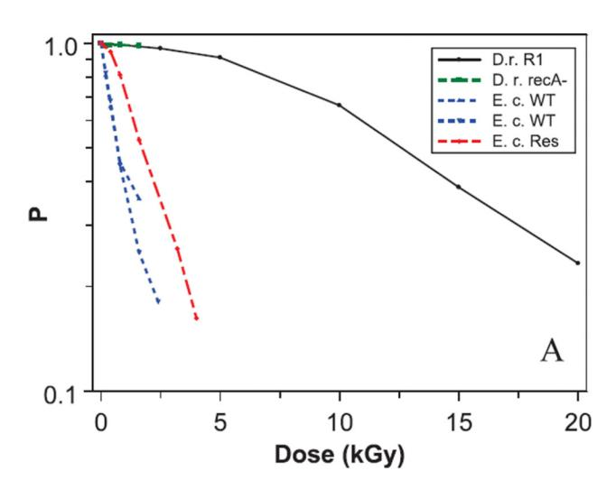
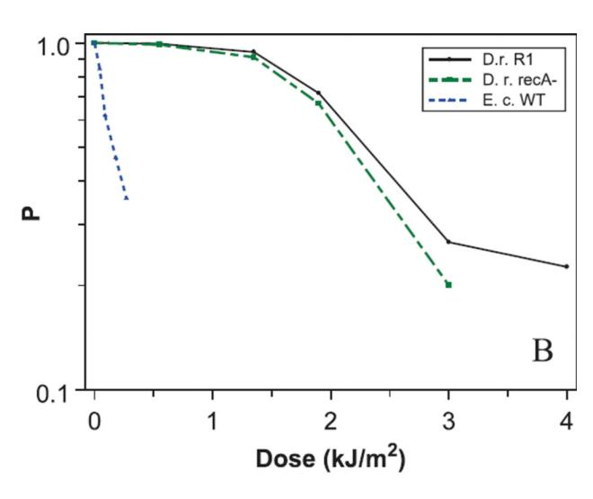
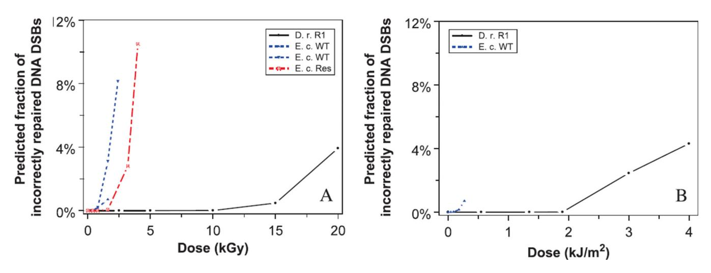
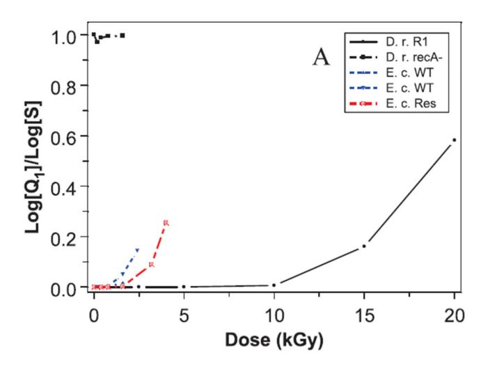
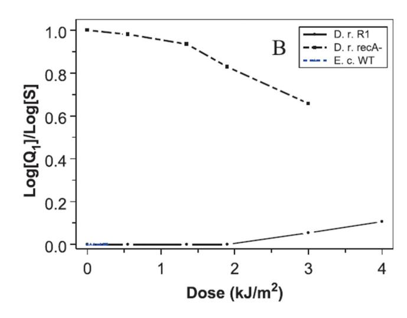
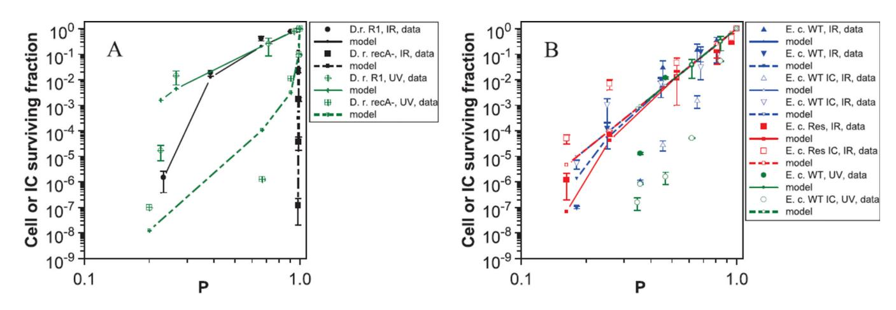

Published in final edited form as: Radiat Res. 2012 July ; 178(1): 17–24.

# **Mechanistic Analysis of the Contributions of DNA and Protein Damage to Radiation-Induced Cell Death**

**Igor Shuryak** and **David J. Brenner**1

Center for Radiological Research, Columbia University Medical Center, New York, New York

# **Abstract**

Protein oxidation can contribute to radiation-induced cell death by two mechanisms: (1) by reducing the fidelity of DNA repair, and (2) by decreasing cell viability directly. Previously, we explored the first mechanism by developing a mathematical model and applying it to data on Deinococcus radiodurans. Here we extend the model to both mechanisms, and analyze a recently published data set of protein carbonylation and cell survival in D. radiodurans and Escherichia coli exposed to gamma and ultraviolet radiation. Our results suggest that similar cell survival curves can be produced by very different mechanisms. For example, wild-type E. coli and DNA doublestrand break (DSB) repair-deficient recA- D. radiodurans succumb to radiation doses of similar magnitude, but for different reasons: wild-type E. coli proteins are easily oxidized, causing cell death even at low levels of DNA damage, whereas proteins in recA- D. radiodurans are well protected from oxidation, but DSBs are not repaired correctly even when most proteins are intact. Radioresistant E. coli mutants survive higher radiation doses than the wild-type because of superior protection of cellular proteins from radiogenic oxidation. In contrast, wild-type D. radiodurans is much more radioresistant than the recA-mutant because of superior DSB repair, whereas protein protection in both strains is similar. With further development, the modeling approach presented here can also quantify the causes of radiation-induced cell death in other organisms. Enhanced understanding of these causes can stimulate research on novel radioprotection strategies.

# **INTRODUCTION**

Recent evidence suggests that oxidative damage to proteins may play a more important role in radiation-induced cell death than previously thought (1–4). There are at least two mechanisms by which protein oxidation can contribute to cell death: (1) by reducing the efficiency/fidelity of DNA repair and (2) by reducing cell viability directly. The first mechanism causes synergistic interactions between damage to DNA and proteins: as radiation dose increases, DNA damage accumulates, while the ability to repair it correctly decreases due to oxidation of sensitive sites on DNA repair-related proteins and consequent alteration/reduction of their functionality. In two previous studies (5, 6) we explored this scenario by developing a simple mechanistic mathematical model of radiation-induced oxidative stress and DNA repair and applied it to data on cell survival of the radiationresistant bacterium Deinococcus radiodurans exposed to gamma and high-LET radiations. The second mechanism involves radiation-induced oxidation of proteins needed for DNA replication, cell cycle progression, and essential metabolic reactions, which can affect cell survival directly.

© 2012 by Radiation Research Society.

1Address for correspondence: Center for Radiological Research, Columbia University Medical Center, 630 West 168th St., New York, NY 10032; djb3@columbia.edu.

Here, we extend our model formalism to include both mechanisms, and use it to analyze a data set on several bacterial strains (Deinococcus radiodurans, wild-type and DNA repairdeficient mutants, and Escherichia coli, wild-type and radioresistant mutants) exposed to ionizing gamma radiation (IR) and ultraviolet radiation (UV), recently published by Krisko and Radman (4). This data set is very useful for distinguishing between the contributions of DNA and protein damage to radiogenic cell death because it contains measurements of oxidative damage to proteins (protein carbonylation) at each radiation dose/type for each studied organism. In addition, IR or UV irradiated E. coli cells were infected with unirradiated λ bacteriophages, and the surviving fraction of bacteriophage infective centers (IC) was recorded as a function of radiation dose to the host cells (4). This set of experiments was specifically designed to clarify the effects of radiogenic protein damage on cell function: because bacteriophage DNA was not irradiated and, therefore, not damaged directly by radiation, infective centers survival presumably depended mainly on the functioning of irradiated host E. coli proteins.

Applying a simple mechanistic mathematical model, such as the one presented here, to these data can provide enhanced understanding of the major causes of radiation-induced cell death. The contributions of DNA damage, interactions of DNA damage with protein damage, and the direct effects of protein damage on cell survival can be quantified for each organism, and the dependences of these processes on radiation type and dose can be assessed. Interpretation of the results of this analysis may serve as guidance for future experiments, involving not only the bacteria studied in the data set used here, but also other organisms. Such experiments could potentially lead to the discovery of novel radioprotection strategies.

# **METHODS**

#### **Data Set**

In the data set published by Krisko and Radman (4), which we chose to analyze here, two strains of D. radiodurans were used: wild-type (R1), which is known for its resistance to ionizing radiation and many other cytotoxic agents (1–3, 7–18), and a mutant lacking recA function (recA-), which is deficient in DNA double-strand break (DSB) repair (8, 19). Three strains of E. coli were used: wild-type (MG1655), and radioresistant mutants (CB1000 and CB2000) that were generated by selection in the laboratory after multiple exposures to ionizing radiation (20). The data for CB1000 and CB2000 are quite similar, so we combined them for convenience and labeled them by the abbreviation Res. As mentioned previously, both wild-type and Res E. coli cells were infected with unirradiated λ bacteriophages, which generated surviving fractions of bacteriophage infective centers (4).

## **Model Used**

A simplified expression for cell surviving fraction (S) following an acute radiation dose D was previously derived [Eq. (3) in ref. (6)] based on our model of radiation-induced oxidative stress and DNA damage in D. radiodurans [Eqs. (7) and (9) in ref. (5)], which is repeated below:

$$S = \exp[-c_8 D \exp[-k_{23} \exp[-k_1 D]]] \quad (1)$$

Here, c8 is the number of DNA DSBs induced per unit of radiation dose (D). It is assumed that within the biologically relevant dose range (up to several kilogray for bacteria) the dose dependence of DSB induction is linear (13). The parameter k23 is the cellular DSB repair capacity. It is dependent on the time available for repair and on other factors such as culture

conditions and stage of growth (e.g., exponential phase compared to stationary phase), and represents the maximum efficiency/fidelity of DSB repair under the given set of conditions.

The constant  $k_1$  is the parameter for DSB-repair-related protein inactivation by radiation. The term  $\exp[-k_1 D]$  in Eq. (1) represents the fraction of DSB-repair-related protein function remaining after irradiation. Reduction of this fraction with increasing dose can represent complete or partial inactivation of the relevant proteins as well as modification of their activity so that they can no longer mediate correct DSB repair. These processes can occur as a result of oxidation (e.g., carbonylation) of sensitive sites in the protein structure by radiation-induced reactive oxygen species (ROS).

For simplicity, to limit the number of adjustable parameters in the model, we consider DSBs to be the main type of radiation-induced DNA damage responsible for cell death. Of course, it is known that other processes, such as radiation-induced activation of dormant viruses and mobile DNA sequences (21), and non-DSB clustered DNA lesions (22), also contribute.

We assume that the measured protein carbonylation values F(D) from the data set analyzed here (4) are good predictors of damage to proteins important for DSB repair and cell survival. The relationship between F(D) and the fraction F(D)0 of important proteins remaining undamaged after irradiation can be described by the following simple expression:

$$P=1 - [F(D) - F(0)/[F_{\text{max}} - F(0)]$$
 (2)

R(0) is the carbonylation level in unirradiated samples and  $F_{max}$  represents the predicted carbonylation level at which all sensitive sites on the target proteins have been damaged, so that when  $R(D) = F_{max}$ , P = 0.  $F_{max}$  is a rough measure of the sensitivity of the target cell's proteome to radiation-induced damage.

Equation (2) allows experimentally measured data on radiogenic protein damage to be directly incorporated into our cell survival model in a simple way. Therefore, we replace the approximation  $\exp[-k_1 D]$  in Eq. (1) with P. After making this substitution into Eq. (1) and changing the notation to a more convenient one where  $c_8$  is renamed  $K_{dam}$  and  $k_{23}$  is renamed  $K_{rep}$ , we derive the following expression for the effects of protein carbonylation on cell survival through reduction in DSB repair fidelity (Q1):

$$Q_1 = \exp[-K_{dam}D\exp[-K_{rep}P]]$$
 (3)

At low radiation doses  $F(D) \sim F(0)$ , so  $P \sim 1$ , that is DSBs are repaired with maximum fidelity for the given cell type and culture conditions, and so  $Q_1$  decreases with dose with an exponential slope of  $\sim K_{dam} \exp[-K_{rep}]$ . At high radiation doses  $F(D) \sim F_{max}$ , so  $P \sim 0$ , that is DSB repair is strongly compromised, and so  $Q_1$  decreases with dose with a steeper exponential slope of  $\sim K_{dam}$ .

As mentioned above, in addition to reducing DSB repair fidelity, protein carbonylation can affect cell survival directly, for example by damaging proteins needed for DNA replication, cell cycle progression, and essential metabolic reactions. These effects are represented by the following expression:

$$\mathbf{Q}_2 = P^X \quad (4)$$

Here the parameter X is a measure of the sensitivity of cell survival to alteration/loss of protein function that occurs due to radiogenic protein carbonylation.

Combining the effects of protein carbonylation on DNA repair (Q1) with direct effects on cell survival (Q2) generates the following equation for cell surviving fraction (S):

$$S = Q_1 Q_2$$
 (5)

## **Model Fitting Procedure and Parameter Estimation**

Equation(5) which predicts cell survival (S) based on radiation dose D and measured protein carbonylation F(D), was fitted to cell survival data from Krisko and Radman (4) for each cell type described above (i.e., D. radiodurans R1 and recA-, E. coli wild-type and Res) exposed to ionizing gamma radiation and ultraviolet radiation.

The data on λ bacteriophage infective centers in E. coli were fitted by the expression for Q2 only, from Eq. (4) (i.e., assuming Q1 = 1). The rationale for this simplification was that the infective centers data were generated by infecting irradiated E. coli cells with unirradiated bacteriophages as described above, and the surviving fraction of bacteriophage infective centers in irradiated compared to unirradiated hosts was assumed to depend only on host protein integrity after irradiation. Of course, the possibility of some indirect radiationinduced damage to bacteriophage DNA cannot be excluded in these experiments. For example, a high concentration of ROS may still be present in irradiated bacterial cells at the time of bacteriophage infection, and these ROS can damage bacteriophage DNA. More experiments would be needed to investigate how extensive and important such indirect DNA damage could be. Before such information is available, we believe that modeling this effect would be premature and unnecessarily complicate the model without enhancing its predictive potential.

Fitting of the model to the data was performed using a customized random-restart simulated annealing algorithm implemented in the FORTRAN programming language by minimizing the squared differences between natural logarithms of the data points and corresponding model predictions. Logarithms were used to give more weight to small surviving fractions (e.g., 0.1, 0.01), which typically determine survival curve shape to a greater extent than surviving fractions near 1. Inverse variance fitting was performed. When error bars were not available for certain data points, the variance was assumed to be equal to the point estimate.

To constrain the model and limit the number of adjustable parameters, an effort was made to fix as many parameters as possible at values suggested by the analyzed data set or by literature sources, and to keep parameter values in common for the different studied organisms and endpoints. The parameter for cellular proteome sensitivity to radiationinduced carbonylation (Fmax ) was fixed at 8.5 nmol carbonyls/mg protein for all strains of D. radiodurans and E. coli, and for λ bacteriophage infective centers data. This value was suggested by the data because measured carbonylation began to saturate at similar levels (4). Varying this parameter within a plausible range of 8–10 nmol/mg led to some compensatory changes in the best-fit values of the other parameters. However, these changes did not alter any of the main conclusions discussed below.

As suggested by published results, the yield of DNA DSBs induced by ionizing gamma radiation per unit dose (Kdam) was fixed at 10 kGy−1 for all strains of D. radiodurans (R1 and recA-) and E. coli (wild-type and Res) (13). For UV radiation, Kdam was freely adjustable, but its value was kept in common for all studied bacterial strains. This is consistent with the finding that the yields of UV-induced bipyrimidine photoproducts, some of which are subsequently converted into DSBs due to collapse of replication forks or from excision repair of two closely spaced photoproducts on opposite DNA strands, were similar

for *D. radiodurans* and *E. coli* (9).  $K_{dam}$  was not applicable to  $\lambda$  bacteriophage infective centers data because the bacteriophages were not irradiated.

Preliminary fits to the data suggested that the cellular DSB repair capacity ( $K_{rep}$ ) could be kept in common for D. radiodurans R1, and both wild-type and Res E. coli strains. This was done to limit the number of adjustable parameters.  $K_{rep}$  was set to zero for D. radiodurans recA- because this mutant strain is known to be strongly deficient in ability to correctly repair DSBs (8, 19). For  $\lambda$  bacteriophage infective centers data,  $K_{rep}$  was not applicable.

Only two values were allowed for the parameter for cell survival sensitivity to protein carbonylation (*X*): one value for *D. radiodurans* R1 and recA- strains for both ionizing and ultraviolet radiation, and another value for all ionizing and ultraviolet radiation exposed *E. coli* strains and infective centers.

Statistical uncertainties around the best-fit parameter values were estimated by generating multiple synthetic data sets by assuming the normal distribution, and using the data points and error bars [provided in ref. (4)], or setting a variance equal to the data point estimate when error bars were not available. This technique allowed 95% confidence intervals (CIs) to be generated for each adjustable parameter. Those parameters which were fixed at values determined by the analyzed data set or by literature sources were excluded from this analysis.

In summary, the model was quite simple, with a maximum of only 4 parameters ( $F_{max}$ ,  $K_{dam}$ ,  $K_{rep}$ , X). One of these parameters ( $F_{max}$ ) was fixed at a set value, and the other three were not freely adjustable in all cases due to the restrictions described earlier, such as keeping a given parameter in common for different types of data. The parameter interpretations, along with their best-fit values and uncertainty estimates, are provided in Table 1.

#### **RESULTS**

#### **Cell Survival Curves**

The bacterial strains studied by Krisko and Radman (4) differ greatly in radiosensitivity and survival curve shape (Fig. 1). Wild-type *D. radiodurans* R1 is well-known for its resistance to ionizing radiation (IR) and ultraviolet radiation (UV), and its survival curve after high-dose-rate exposure is characterized by a broad shoulder (7–9, 12, 17, 19, 21). The mutant *D. radiodurans* recA- strain, which is severely compromised in its ability to correctly repair DNA DSBs, is killed by much lower radiation doses than the wild-type, and its survival curve generally lacks a shoulder (8, 19).

Wild-type *E. coli* is almost as sensitive to ionizing radiation as *D. radiodurans* recA-, and is even more sensitive than *D. radiodurans* recA- to ultraviolet radiation (4). The radioresistant strains of *E. coli* (labeled Res here), which were isolated following multiple cycles of ionizing radiation exposure (20), survive higher ionizing radiation doses than wild-type *E. coli*, but are not as resistant as *D. radiodurans* R1. Both wild-type and radioresistant *E. coli* strains have survival curves without substantial shoulders.

The model predictions of cell survival based on radiation dose and protein carbonylation are consistent with the data for all analyzed bacterial strains exposed to ionizing and ultraviolet radiation (Fig. 1). The best-fit parameters are shown in Table 1. Model-based interpretations of the data are discussed below.

## **Protein Oxidation**

Analysis of protein carbonylation data reported by Krisko and Radman (4) confirms that in D. radiodurans cellular proteins are well protected from IR- and UV-induced oxidation (Fig. 2). In the wild-type R1 strain, the fraction of undamaged proteins important for DNA repair fidelity and cell survival (P) remains high up to 10 kGy of ionizing radiation and 2 kJ/m2 of ultraviolet radiation. In the mutant recA- strain, the degree of protein protection is essentially the same as for the R1 strain after ultraviolet radiation, and most likely is the same for ionizing radiation (a direct comparison here was not possible because protein carbonylation was measured only up to 1.6 kGy for the recA- strain). These findings are consistent with the intuitive expectation that the recA- strain is deficient only in DNA repair, but has the normal set of antioxidant mechanisms that protect D. radiodurans proteins from oxidation.

In E. coli, P declines rapidly (essentially exponentially) with dose at much lower doses of ionizing radiation and ultraviolet radiation than in D. radiodurans (Fig. 2). This suggests that antioxidant protective mechanisms are much less efficient in E. coli than in D. radiodurans. In the radioresistant strains of E. coli, these mechanisms have apparently been enhanced compared with the wild-type strain. Therefore, the decline in P with dose is slower for the Res strains than for the wild-type strain.

## **Model-Based Mechanistic Interpretations**

The model fit to the Krisko and Radman (4) data suggests that the maximum DSB repair capacity (parameter Krep ) may be similar in D. radiodurans R1 and in all E. coli strains (Table 1). The major differences in radiosensitivity between these bacteria (Fig. 1) can be attributed to two factors: (1) differences in sensitivity to protein carbonylation (parameter X, Table 1), and (2) to differences in the ability to protect cellular proteins from carbonylation (i.e., the dose dependence of P, Fig. 2).

These seemingly counterintuitive results imply that when proteins are mainly undamaged (i.e., P ~ 1), DSBs are repaired with high fidelity in all analyzed bacteria, except for the DSB repair-deficient D. radiodurans recA- strain. However, as protein damage accumulates and P is reduced, DSB repair fidelity declines and the fraction of incorrectly repaired DSBs increases. In wild-type E. coli this occurs at comparatively low doses of IR or UV. For radioresistant E. coli, larger doses are needed to produce similar effects, and even larger doses are needed for D. radiodurans R1 (Fig. 3).

Importantly, the model fit allows the contributions of the following effects to cell killing to be quantified: (1) interactions between DNA and protein damage [Q1, Eq. (3)], and (2) direct effects of protein damage [Q2, Eq. (4)]. The results for all analyzed bacterial strains (and λ bacteriophage infective centers) are shown in Table 2 and Fig. 4. In D. radiodurans R1, cell death up to 15 kGy of IR and for all tested UV doses is mainly due to direct effects of protein carbonylation (Q2). Only at the highest IR dose of 20 kGy does the synergistic interaction between protein and DNA damage (Q1) begin to play a strong role in cell death. In contrast, in the DSB repair-deficient D. radiodurans recA- strain, cell death is dominated by DNA damage (Q1) at all IR and UV doses studied. In both wild-type and radioresistant E. coli strains, and in unirradiated λ bacteriophages grown in irradiated E. coli cells, radiationinduced death occurs mainly through the direct effects of protein carbonylation (Q2). These conclusions can also be visualized when survival is plotted as a function of P (Fig. 5), rather than as a function of radiation dose.

# **DISCUSSION**

Our analysis suggests that the major causes of radiation-induced cell death differ among the organisms studied and depend on both radiation type and radiation dose (Table 2). Wildtype D. radiodurans R1 appears to correctly repair DNA damage and survive as long as its proteins are well protected from oxidation. However, when the radiation dose becomes sufficient to overwhelm antioxidant protective mechanisms and proteins become damaged, DNA repair fidelity and cell survival decline. The DNA repair-deficient recA- strain protects its proteins as well as the R1 strain, but begins to die at radiation doses that are not large enough to cause heavy protein damage because it is unable to repair the accumulating DNA damage.

For E. coli, a different interpretation is suggested: DNA repair in this organism may, in principle, be as good as in D. radiodurans, but important proteins are poorly protected from radiogenic oxidation. Consequently, severe protein oxidation kills E. coli cells (and prevents replication of unirradiated bacteriophages that infect such cells) at relatively low radiation doses before accumulation of DNA damage has a chance to play a substantial role.

Genetic analysis of the radioresistant strains of E. coli, which were selected in the laboratory by repeated cycles of irradiation and exponential growth of the survivors, revealed multiple mutations in genes involved in DNA repair, protein turnover, and various other pathways, as well as prophage deletion (20). The experiments of Krisko and Radman (4) with the same strains show a marked difference in radiation-induced protein carbonylation between the radioresistant and wild-type E. coli [Fig. S3 in Supplementary Information of ref. (4)]. Future research is needed to clarify which genetic mechanisms cause these effects. Our model suggests that the radioresistant E. coli strains are able to protect their proteins from oxidation better than the wild-type strain, and that this difference in protein protection is a sufficient explanation for the inter-strain differences in radiosensitivity. Of course, this finding does not exclude smaller contributions of other effects, such as some enhancement of DNA repair in the radioresistant strains.

It is important to note that P, which is a measure of the percentage of cellular proteins damaged by irradiation, is not the only factor that may contribute to cell death resulting from protein damage. Cellular radiosensitivity may also depend on the total amount of DNA repair proteins present in the cell. For example, a cell that has a large excess of DNA repair proteins may have enough functional proteins left available for correct DNA repair even if a large percentage of the proteins present before exposure have been inactivated by radiation. In contrast, in a cell that has a bare minimum of DNA repair proteins, repair would be strongly compromised if a substantial percentage of these proteins are inactivated by radiation. However, radiation-induced protein oxidation may produce proteins that have not been completely inactivated, but have acquired abnormal function. These abnormal proteins can compete with normal proteins and carry out incorrect DNA repair. Consequently, even a cell with an excess of repair proteins may suffer death from the effects of malfunctioning oxidized proteins. The same arguments may apply to proteins involved in other crucial cell functions. Until the specific proteins most sensitive to radiogenic damage have been identified, a general measure of protein damage such as P is the most useful predictor of the protein damage-related component of cell death.

Our analysis shows that although D. radiodurans recA- and E. coli strains have similarlooking exponential survival curves, the predicted underlying mechanisms of cell death are very different: DNA damage in D. radiodurans recA- and protein damage in E. coli (Table 2). This suggests that neither the shape of the survival curve (e.g., exponential or

shouldered), nor the radiation dose at which cell death occurs (e.g., high or low D37 ), are sufficiently good predictors of the major causes of cell death.

It is premature to extrapolate our results, or the model formalism in its current form, to organisms other than the bacteria discussed here. To our knowledge, there are, unfortunately, no data sets on mammalian cells, which would be as powerful as the Krisko and Radman (4) data for differentiating between the contributions of DNA and protein damage to cell death. There are plenty of good studies of radiation-induced DNA damage in mammalian cells at doses of several grays (22), but studies of protein carbonylation in mammalian cells at such doses are scarce and limited. However, there is evidence that substantial protein carbonylation compared with baseline levels occurs in mammalian cells at radiation doses < 10 Gy (23, 24). Also, at relatively low radiation doses, when the majority of cellular proteins remain undamaged, some specific sensitive proteins, which are important for DNA repair or other functions may be damaged considerably. More research on radiogenic protein damage in mammalian systems is needed to clarify its role in cell death. Once better data sets on mammalian cells (which contain information on both cell survival and protein damage at each radiation dose) become available, mathematical models constructed by further development of the concepts described here can assist in the task of quantifying the contribution of protein damage in cell death. If the contribution is found to be substantial, development of new strategies for radioprotection/radiosensitization by modulation of radiogenic protein damage could be possible.

# **Acknowledgments**

This work was supported through NIAID grant U19-AI67773.

# **REFERENCES**

- 1. Daly MJ. A new perspective on radiation resistance based on Deinococcus radiodurans. Nat Rev Microbiol. 2009; 7(3):237–245. [PubMed: 19172147]
- 2. Daly MJ, Gaidamakova EK, Matrosova VY, Kiang JG, Fukumoto R, Lee DY, et al. Small-molecule antioxidant proteome-shields in Deinococcus radiodurans. PLoS ONE. 2010; 5(9):e12570. [PubMed: 20838443]
- 3. Daly MJ, Gaidamakova EK, Matrosova VY, Vasilenko A, Zhai M, Leapman RD, et al. Protein oxidation implicated as the primary determinant of bacterial radioresistance. PLoS Biol. 2007; 5(4):e92. [PubMed: 17373858]
- 4. Krisko A, Radman M. Protein damage and death by radiation in Escherichia coli and Deinococcus radiodurans. Proc Natl Acad Sci USA. 2010; 107(32):14373–14377. [PubMed: 20660760]
- 5. Shuryak I, Brenner DJ. A model of interactions between radiation-induced oxidative stress, protein and DNA damage in Deinococcus radiodurans. J Theor Biol. 2009; 261(2):305–317. [PubMed: 19679136]
- 6. Shuryak I, Brenner DJ. Effects of radiation quality on interactions between oxidative stress, protein and DNA damage in Deinococcus radiodurans. Radiat Environ Biophys. 2010; 49(4):693–703. [PubMed: 20574841]
- 7. Blasius M, Sommer S, Hubscher U. Deinococcus radiodurans: what belongs to the survival kit? Crit Rev Biochem Mol Biol. 2008; 43(3):221–238. [PubMed: 18568848]
- 8. Minton KW. Repair of ionizing-radiation damage in the radiation resistant bacterium Deinococcus radiodurans. Mutat Res. 1996; 363(1):1–7. [PubMed: 8632774]
- 9. Slade D, Radman M. Oxidative Stress Resistance in Deinococcus radiodurans. Microbiol Mol Biol Rev. 2011; 75(1):133–191. [PubMed: 21372322]
- 10. Battista JR, Earl AM, Park MJ. Why is Deinococcus radiodurans so resistant to ionizing radiation? Trends Microbiol. 1999; 7(9):362–365. [PubMed: 10470044]

11. Brim H, Osborne JP, Kostandarithes HM, Fredrickson JK, Wackett LP, Daly MJ. Deinococcus radiodurans engineered for complete toluene degradation facilitates Cr(VI) reduction. Microbiology. 2006; 152(Pt 8):2469–2477. [PubMed: 16849809]

- 12. Daly MJ. Modulating radiation resistance: Insights based on defenses against reactive oxygen species in the radioresistant bacterium Deinococcus radiodurans. Clin Lab Med. 2006; 26(2):491– 504. [PubMed: 16815462]
- 13. Daly MJ, Gaidamakova EK, Matrosova VY, Vasilenko A, Zhai M, Venkateswaran A, et al. Accumulation of Mn(II) in Deinococcus radiodurans facilitates gamma-radiation resistance. Science. 2004; 306(5698):1025–1028. [PubMed: 15459345]
- 14. Ghosal D, Omelchenko MV, Gaidamakova EK, Matrosova VY, Vasilenko A, Venkateswaran A, et al. How radiation kills cells: survival of Deinococcus radiodurans and Shewanella oneidensis under oxidative stress. FEMS Microbiol Rev. 2005; 29(2):361–375. [PubMed: 15808748]
- 15. Lange CC, Wackett LP, Minton KW, Daly MJ. Engineering a recombinant Deinococcus radiodurans for organopollutant degradation in radioactive mixed waste environments. Nat Biotechnol. 1998; 16(10):929–933. [PubMed: 9788348]
- 16. Sukhi SS, Shashidhar R, Kumar SA, Bandekar JR. Radiation resistance of Deinococcus radiodurans R1 with respect to growth phase. FEMS Microbiol Lett. 2009
- 17. Zahradka K, Slade D, Bailone A, Sommer S, Averbeck D, Petranovic M, et al. Reassembly of shattered chromosomes in Deinococcus radiodurans. Nature. 2006; 443(7111):569–573. [PubMed: 17006450]
- 18. Zimmermann H, Schafer M, Schmitz C, Bucker H. Effects of heavy ions on inactivation and DNA double strand breaks in Deinococcus radiodurans R1. Adv Space Res. 1994; 14(10):213–216. [PubMed: 11539954]
- 19. Repar J, Cvjetan S, Slade D, Radman M, Zahradka D, Zahradka K. RecA protein assures fidelity of DNA repair and genome stability in Deinococcus radiodurans. DNA Repair. 2010; 9(11):1151– 1161. [PubMed: 20817622]
- 20. Harris DR, Pollock SV, Wood EA, Goiffon RJ, Klingele AJ, Cabot EL, et al. Directed evolution of ionizing radiation resistance in Escherichia coli. J Bacteriol. 2009; 191(16):5240–5252. [PubMed: 19502398]
- 21. Pasternak C, Ton-Hoang B, Coste G, Bailone A, Chandler M, Sommer S. Irradiation-induced Deinococcus radiodurans genome fragmentation triggers transposition of a single resident insertion sequence. PLoS Genet. 2010; 6(1) e1000799.
- 22. Stewart RD, Yu VK, Georgakilas AG, Koumenis C, Park JH, Carlson DJ. Effects of radiation quality and oxygen on clustered DNA lesions and cell death. Radiat Res. 2011; 176(5):587–602. [PubMed: 21823972]
- 23. Lee JH, Park JW. Oxalomalate regulates ionizing radiation-induced apoptosis in mice. Free Radic Biol Med. 2007; 42(1):44–51. [PubMed: 17157192]
- 24. Manda K, Ueno M, Moritake T, Anzai K. alpha-Lipoic acid attenuates x-irradiation-induced oxidative stress in mice. Cell Biol Toxicol. 2007; 23(2):129–137. [PubMed: 17094020]

**FIG. 1.**

The data and best-fit model predictions for cell survival of different strains of D. radiodurans and E. coli after exposure to ionizing radiation (panels A and B) and UV radiation (panel C). Panel B is a magnification of the low-dose region of panel A. Error bars on the data points represent standard deviations, and the model predictions corresponding to the data points are represented by points. Lines connecting the predicted points are shown for convenience only. The two sets of predictions for E. c. wild-type correspond to two different experiments. The abbreviations used are: IC = λ bacteriophage infective centers. D. r. R1 = D. radiodurans R1 (wild-type). D. r. recA- = D. radiodurans strain lacking recA function (deficient in DNA DSB repair). E. c. WT = E. coli MG1655 (wild-type). E. c. Res = E. coli radioresistant strains CB1000 and CB2000 (pooled data).

**FIG. 2.** The fraction (P) of proteins important for DNA repair and cell survival, remaining undamaged after exposure to ionizing radiation (panel A) and UV radiation (panel B), in different strains of D. radiodurans and E. coli. The values of P were calculated by Eq. (2) in the main text using measured protein carbonylation values F(D) reported in ref. (4) and Fmax = 8.5 nmol carbonyls/mg protein (Table 1 and the main text). The abbreviations used are: IC = λ bacteriophage infective centers. D. r. R1 = D. radiodurans R1 (wild-type). D. r. recA- = D. radiodurans strain lacking recA function (deficient in DNA DSB repair). E. c. WT = E. coli MG1655 (wild-type). E. c. Res = E. coli radioresistant strains CB1000 and CB2000 (pooled data).

**FIG. 3.** Model predictions for the effects of increasing doses of ionizing radiation (panel A) and UV radiation (panel B) on the fraction of incorrectly repaired radiation-induced DNA DSBs in different strains of D. radiodurans and E. coli. These predictions are generated by the expression exp[−Krep P] [Eq. (3) in the main text]. The abbreviations used are: IC = λ bacteriophage infective centers. D. r. R1 = D. radiodurans R1 (wild-type). D. r. recA- = D. radiodurans strain lacking recA function (deficient in DNA DSB repair). E. c. WT = E. coli MG1655 (wild-type). E. c. Res = E. coli radioresistant strains CB1000 and CB2000 (pooled data).

**FIG. 4.** Model predictions for the contribution of interactions between DNA and protein damage (Q1) to cell death caused by ionizing radiation (panel A) and UV radiation (panel B) in different strains of D. radiodurans and E. coli. The abbreviations used are: IC= λ bacteriophage infective centers. D. r. R1 = D. radiodurans R1 (wild-type). D. r. recA- = D. radiodurans strain lacking recA function (deficient in DNA DSB repair). E. c. WT = E. coli MG1655 (wild-type). E. c. Res = E. coli radioresistant strains CB1000 and CB2000 (pooled data).

**FIG. 5.** A summary of survival data and best-fit model predictions for different strains of D. radiodurans (panel A), and E. coli and λ bacteriophage infective centers (panel B), for both ionizing radiation and UV radiation. Survival is displayed as a function of the predicted fraction (P) of proteins important for DNA repair and cell survival remaining undamaged after exposure to radiation. The abbreviations used are: IC = λ bacteriophage infective centers. D. r. R1 = D. radiodurans R1 (wild-type). D. r. recA- = D. radiodurans strain lacking recA function (deficient in DNA DSB repair). E. c. WT = E. coli MG1655 (wildtype). E. c. Res = E. coli radioresistant strains CB1000 and CB2000 (pooled data).

Shuryak and Brenner

# **TABLE 1**

The Best-Fit Model Parameter Values

|                                      |                   |                           |                          | $K_{dam}$                                                                                       |                      |                              |
|--------------------------------------|-------------------|---------------------------|--------------------------|-------------------------------------------------------------------------------------------------|----------------------|------------------------------|
| Organism                             | Survival endpoint | $F_{max}$                 | γ radiation              | Survival endpoint $F_{max}$ $\gamma$ radiation UV radiation                                     | $K_{rep}$            | X                            |
| D. radiodurans recA-                 | Cells             | 8.50 a nmol/mg | $10.0^{a}{\rm kGy^{-1}}$ | 8.50 2 nmol/mg $10.0^{2}$ kGy -1 $3.99 (3.7, 4.2)^{b}$ m 2 /kJ | $0^{a}$              | 3.88 (3.4, 5.3) b |
| D. radiodurans R1                    | Cells             |                           |                          |                                                                                                 | $13.9 (6.7, 19)^{b}$ |                              |
| E. coli MG1655, CB1000, CB2000 Cells | Cells             |                           |                          |                                                                                                 |                      | $6.76 (6.1, 8.0)^{b}$        |
|                                      | Infective centers | 1                         | I                        | I                                                                                               | I                    |                              |

Notes. The organisms are those studied in ref. (4) and described in the main text. The parameter interpretations are:  $F_{max}$  = cellular proteome sensitivity to radiation-induced carbonylation;  $K_{dam}$  = yield of DNA DSBs per unit of radiation dose for each radiation type ( $\gamma$  radiation or ultraviolet);  $K_{ICD}$  = cellular DSB repair capacity; X = cell (or infective centers) survival sensitivity to protein carbonylation. Details are described in the main text.

 $\ensuremath{^{\mbox{\scriptsize a}}}$  Parameter fixed at a value based on the data or on literature sources.

 $^{b}95\%$  confidence intervals are listed in parentheses.

Page 15

Shuryak and Brenner

**TABLE 2** 

Interpretation of the Major Causes of Cell Death for the Different Organisms Studied

|                                |                                           | 2    | Radiation                                         |                            |                                                                                    |
|--------------------------------|-------------------------------------------|------|---------------------------------------------------|----------------------------|------------------------------------------------------------------------------------|
| Organism                       | Endpoint                                  | Type | Type Doses                                        | Cell survival              | Cell survival Major cause of cell death                                            |
| D. radiodurans R1              | Cell survival                             | λ    | 0-15 kGy                                          | 1.0-0.019                  | 1.0-0.019 Direct effects of protein damage (Q 2 )                       |
|                                |                                           | UV   | $0-4 \text{ kJ/m}^2$                              | $1.0{-}1.7\times10^{-5}$   |                                                                                    |
|                                |                                           | ٨    | $20  \mathrm{kGy}$                                | $1.5\times10^{-6}$         | $1.5 \times 10^{-6}$ Interactions between DNA and protein damage (Q 1 ) |
| D. radiodurans recA-           |                                           | ~    | 0-1.6 kGy                                         | $1.0 - 1.2 \times 10^{-7}$ | $1.0-1.2 \times 10^{-7}$ DNA damage $(Q_1)^*$                                      |
|                                |                                           | UV   | $0-3 \text{ kJ/m}^2$                              | $1.0{-}1.0\times10^{-7}$   |                                                                                    |
| E. coli MG1655, CB1000, CB2000 | Cell survival, infective centers survival | ٨    | 0-4 kGy                                           | $1.0-1.0 \times 10^{-7}$   | $1.0-1.0 \times 10^{-7}$ Direct effects of protein damage (Q 2 )        |
|                                |                                           | UV   | UV $0-0.36 \text{ kJ/m}^2 1.0-1.6 \times 10^{-7}$ | $1.0-1.6 \times 10^{-7}$   |                                                                                    |

Notes. A "major cause of cell death" was defined as a contribution of 50% or more to the logarithm of cell survival (i.e., log[Q1]/log[S] or log[Q2]/log[S] 20.5).

Page 16

\*For the DNA repair-deficient D. radiodurans recA- strain the parameter for cellular DSB repair capacity Krep=0, and so the term Q1 is determined exclusively by accumulation of DNA damage and not by protein damage [Eq. (3)].