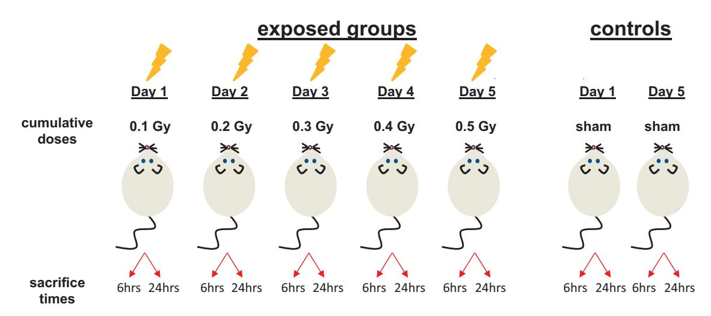
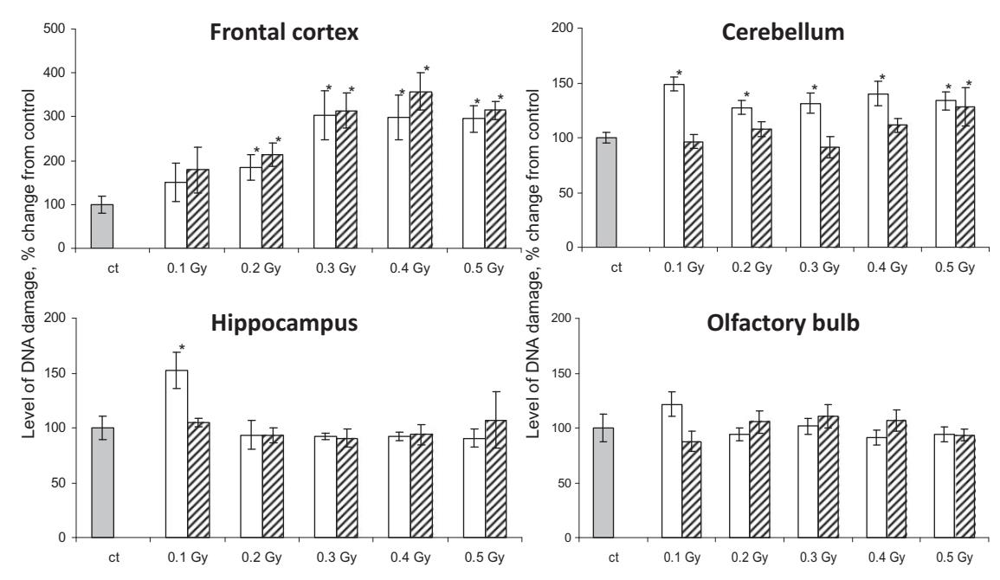
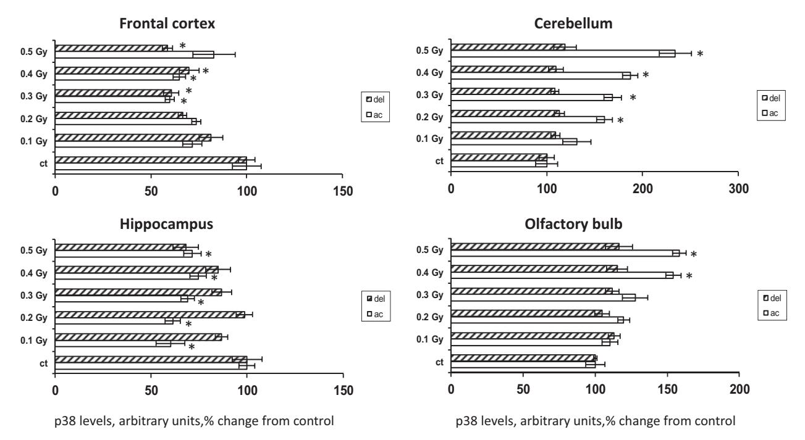
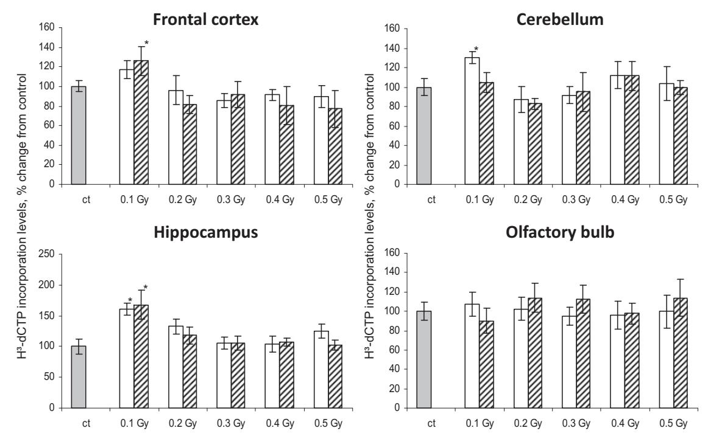
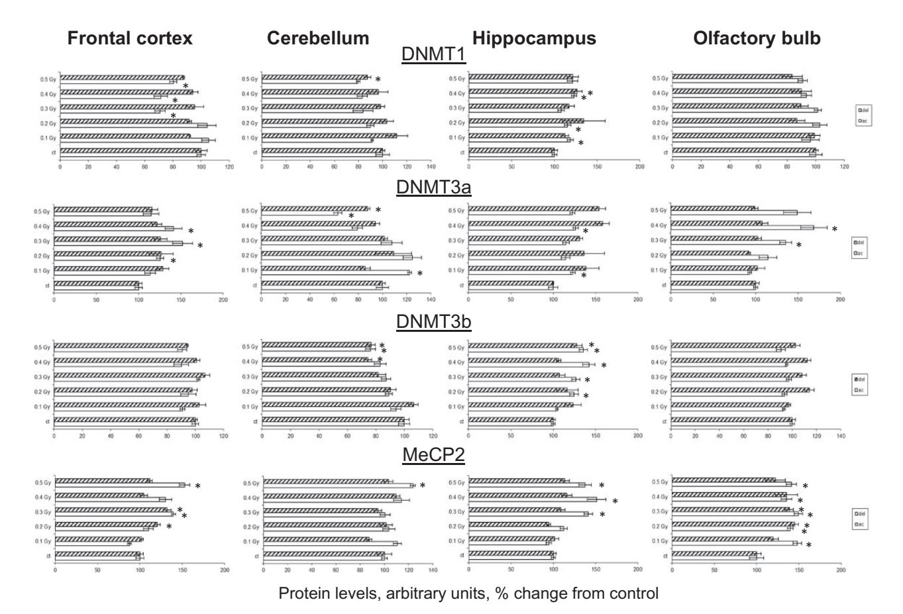
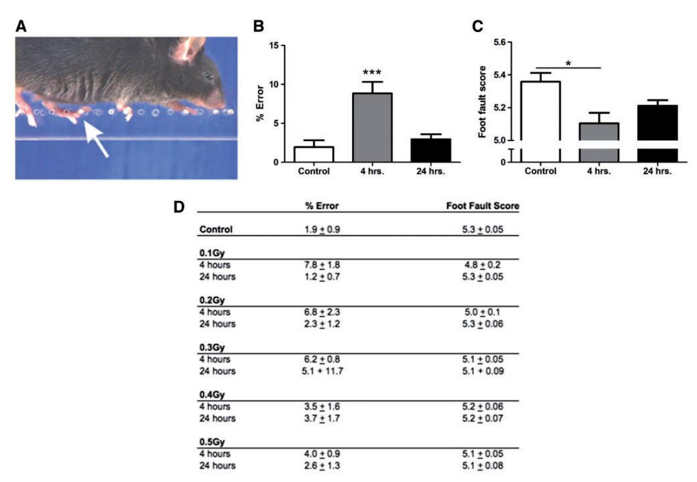
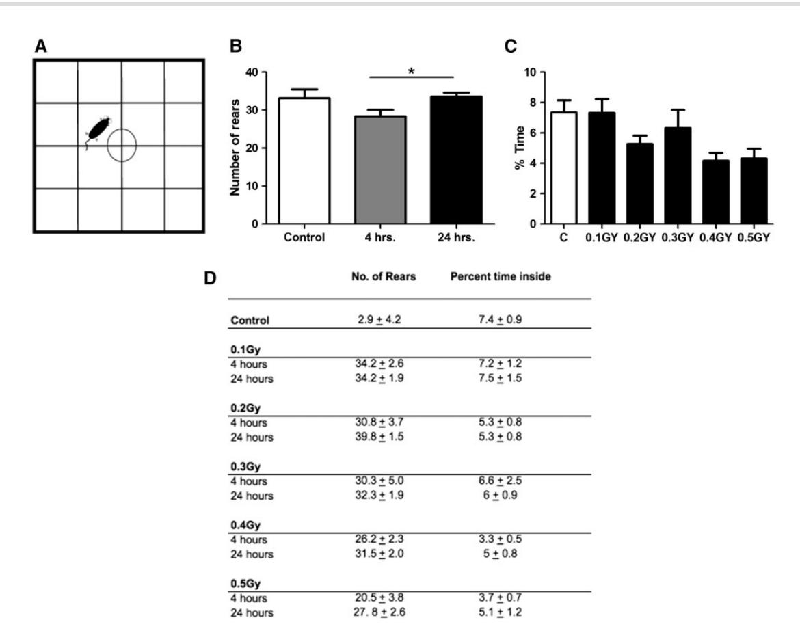

doi: 10.1093/eep/dvw025 Research article

RESEARCH ARTICLE

# Fractionated low-dose exposure to ionizing radiation leads to DNA damage, epigenetic dysregulation, and behavioral impairment

Igor Koturbash1,†, Nafisa M. Jadavji2 , Kristy Kutanzi1 , Rocio Rodriguez-Juarez1 , Dmitry Kogosov1 , Gerlinde A.S. Metz2,3 and Olga Kovalchuk1,3,\*

1 Department of Biological Sciences, University of Lethbridge, Lethbridge, AB, Canada T1K3M4, 2 Department of Neuroscience, University of Lethbridge, Lethbridge, AB, Canada T1K3M4 and 3 Alberta Epigenetics Network, Calgary, AB, Canada

## Abstract

Studies of Fractionated Exposure to Low Doses of Ionizing Radiation (FELDIR) has become of increasing importance to clinical interventions. Its consequences on DNA damage, physical, and mental health have been insufficiently investigated, however. The goal of this study was to determine the effects of FELDIR on the brain using a mouse model. We addressed the levels of DNA damage, global genomic methylation, and DNA methylation machinery in cerebellum, frontal lobe, olfactory bulb and hippocampal tissues, as well as behavioral changes linked to FELDIR exposure. The results reveal increased levels of DNA damage, as reflected by increased occurrence of DNA Strand Breaks (SBs) and dysregulation of stress-response kinase p38. FELDIR also resulted in initial loss of global genomic methylation and altered expression of methyltransferases DNMT1 (down-regulation) and DNMT3a (up-regulation), as well as methyl-binding protein MeCP2 (up-regulation). FELDIR-associated behavioral changes included impaired skilled limb placement on a ladder rung task, increased rearing activity in an open field, and elevated anxiety-like behaviors. The said alterations showed significant dose and tissue specificity. Thus, FELDIR represents a critical impact on DNA integrity and behavioral outcomes that need to be considered in the design of clinical intervention studies.

Key words: low-dose ionizing radiation; DNA damage; epigenetics; behavioral impairment

## Introduction

While the effects of high doses of ionizing radiation have been widely studied and are well understood, the effects and mechanisms of the response to low doses of IR remain obscure. However, studies devoted to low doses of radiation nowadays have become of great importance. First, there is a worldwide increase in the number of people who are receiving low and fractionated doses of IR exposure

Received 4 August 2016; revised 25 October 2016; accepted 27 October 2016

VC The Author 2017. Published by Oxford University Press.

This is an Open Access article distributed under the terms of the Creative Commons Attribution Non-Commercial License (http://creativecommons.org/ licenses/by-nc/4.0/), which permits non-commercial re-use, distribution, and reproduction in any medium, provided the original work is properly cited. For commercial re-use, please contact journals.permissions@oup.com

\*Correspondence address. Department of Biological Sciences, University of Lethbridge, Lethbridge, AB, Canada T1K3M4. E-mail: olga.kovalchuk@uleth.ca

Present address: Department of Environmental and Occupational Health, Fay W. Boozman College of Public Health, University of Arkansas for Medical Sciences, Little Rock, AR 72205, USA

during the diagnostic procedures or as a result of occupational exposure. Second, whereas the doses of 1Gy and higher are characterized by the direct correlation between the dose of radiation and the damage caused by exposure (the higher dose – the more damage), no such correlation has been described for low-dose exposures [\[1–3](#page-10-0)]. Moreover, the studies based on transcriptome profiling report different genes to be involved in response to low (10 cGy) and high (2Gy) doses of radiation exposure [\[4](#page-10-0)].

Of particular interest are the effects of low doses of radiation on the brain. Numerous studies showed a number of adverse effects of IR on brain, such as severe functional and morphological changes in brain tissue [[5\]](#page-10-0), affected vascularization [\[6\]](#page-10-0), decreases in hippocampal proliferation and neurogenesis [\[7](#page-10-0)], debilitating cognitive decline, and learning and memory deficits [\[8](#page-10-0), [9\]](#page-10-0). The previous studies from our lab have shown affected cellular proliferation upon chronic exposure to LDIR in the mouse hippocampal tissue and altered signaling in both the hippocampus and frontal lobe [[10\]](#page-10-0). However, effects of fractionated low doses of IR on selective brain regions remain underinvestigated.

Recent studies address the role of epigenetic effectors in cellular response to ionizing radiation, which can be represented as a loss or increase in global genomic methylation, dysregulation of DNA methyltransferases and methyl-binding proteins [\[11–14](#page-10-0)]. These repercussions can lead to transcriptional reactivation (or silencing suppression) of numerous genes, which is correlated with the loss of global DNA methylation, as well as suppression of other genes via the reactivation of methyl-binding proteins; MeCP2 in particular.

Moreover, studies have reported the involvement of epigenetic machinery in various processes in the normal brain and in response to different stresses. DNA methylation has been implicated in regulation of memory formation [\[15,](#page-10-0) [16](#page-10-0)], synaptic plasticity [[15\]](#page-10-0) and neurotransmission [[17](#page-10-0)]. DNMT1, which is DNA methyltransferase with predominantly methylation maintenance function, has been reported to contribute to delayed ischemic brain injury [[18\]](#page-10-0). Methyl-binding protein, MeCP2, was suggested to be a key player in the maintenance of the function of mature neurons [\[19](#page-10-0)], as well as in feeding behavior, aggression, and response to stress [\[20\]](#page-10-0). The absence or the loss of function of MeCP2 has been characterized by the autism spectrum disorder known as Rett syndrome [[19\]](#page-10-0).

Epigenetic mechanisms are recognized as possible effectors/ mediators of the cell/tissue response to ionizing radiation [\[12–14\]](#page-10-0). DNA methylation has been shown to be affected by both high [\[21](#page-11-0)] and low doses [\[11](#page-10-0)] of ionizing radiation. Studies have shown that global genomic hypomethylation can occur after acute or fractionated exposure to low doses of IR [\[11\]](#page-10-0). This is usually paralleled with the dysregulation of DNA methylation protein machinery and altered histone modifications [[11](#page-10-0), [21](#page-11-0)].

The goal of this study was to determine the effects of FELDIR on selective brain tissues: cerebellum, frontal cortex, hippocampus, and olfactory bulb. Using a mouse model, we have evaluated both cellular events (levels of DNA damage and programmed cell death) and epigenetic effectors (levels of global DNA methylation, methyltransferases, and methyl-binding proteins). In parallel to these measurements, a battery of behavioral tests including skilled movement, anxiety-like behaviors, and motor activity was performed to gain insights into radiation-induced functional changes.

# Materials and methods

## Animal model and irradiation protocol

In this study, we examined the molecular changes in the brain of C57BL/6 male mice following in vivo whole-body irradiation exposure. Handling and care of animals were in strict accordance with the recommendations of the Canadian Council for Animal Care and Use. Animals were kept in a virus-free facility at the University of Lethbridge in a temperature-controlled room with a 12 h light/dark cycle, housed 3 per cage and given food and water ad libitum. The procedures were approved by the University of Lethbridge Animal Welfare Committee.

The sixty days old animals were randomly assigned to control (n ¼ 8) and treatment groups (n ¼ 60) ([Fig. 1\)](#page-2-0). At Day 1 of the experiment, sixty animals received a whole body exposure to 0.1 Gy of X rays (5cGy/s, 90 kV, 5 mA). Four hours after exposure, six animals were randomly chosen for behavioral tests. After completion of the test, the animals were humanely euthanized (6 h upon exposure to radiation). Twenty-two hours after exposure (Day 2 of the experiment), another six mice were randomly chosen for behavioral tests. Twenty-four hours after radiation treatment, these six mice were humanely euthanized. At the same time, the remaining forty-eight animals were exposed to 0.1 Gy of X rays (cumulative dose of 0.2 Gy). Previously described procedures were repeated on Days 3, 4, 5 and 6 of the experiment. The control mice were sham treated. Sham treatments were very important. Since the study was designed to analyze the effects of fractionated low-dose radiation on the animal brain and behavior, we carefully controlled for handling stress. All animals were handled and treated in the same fashion by the same person. For irradiations or sham treatments, each animal was placed in a small vented plastic container 10-5-5 cm and placed into the irradiator. In the sham-treated group, Xrays were turned off, but in the irradiated groups, X-rays were turned on. This allowed us to control for the effects of handling. Half of the control animals (n ¼ 4) were euthanized on Day 1 of the experiment. The second half of the animals (n ¼ 4) was euthanized at the last, Day 6, of the experiment.

Brain tissues, including frontal cortex, olfactory bulb, hippocampus, and cerebellum, were sampled upon euthanization, snap-frozen in liquid nitrogen, and stored at 80 C for further analysis.

## DNA damage analysis

Total DNA was prepared from frontal cortex, olfactory bulb, hippocampal, and cerebellar tissues using Qiagen DNAeasyTM Kit (Qiagen, Valencia, CA) according to the protocol of the manufacturer. A modification of the random oligonucleotide-primed synthesis assay (ROPS) was utilized to identify the presence of DNA-strand breaks in high molecular weight DNA [\[22](#page-11-0)]. Heat denaturation (95C) separates these 3--OH DNA fragments that are present in the high molecular weight DNA into single-strand fragments and subsequently re-associates them by cooling. This random re-association of DNA strands results in the formation of primarily single-stranded DNA fragments primed usually by their own tails or by other DNA fragments. Further, fragments serve as random primers, and the excess of DNA serves as a template for Klenow fragment. DNA was denatured by exposure at 95C for 5 min and then immediately chilled on ice. The mixture contained 0.5 mg heat-denatured DNA, 0.05 ml 3 H]dCTP (57.4 Ci/mmol) (Perkin-Elmer, Boston, MA), 0.05 mM concentrations of each dGTP, dATP, and dTTP, 0.6 mM dCTP, 10 mM Tris-HCl (pH 7.5), 5 mM MgCl2, 7.5 mM DTT, and 0.5 U Klenow polymerase (New England Biolabs, Beverly, MA) in a total volume of 25 ml. Incubation for 30 min at room temperature was subsequently followed by the addition of an equal volume of 12.5 mM EDTA to stop the reaction. Then samples were applied on Whatman DE-81 ion-exchange filters (Whatman

Figure 1: experimental design. At Day 1 of the experiment, 60 animals received a whole body exposure to 0.1 Gy of X-rays. Six hours after exposure, six animals were randomly chosen and sacrificed. Twenty-four hours after the initial exposure (Day 2), another group of six randomly chosen animals was sacrificed. The rest of the animals (48) received a subsequent exposure to 0.1 Gy of X rays (a cumulative dose of 0.2 Gy). The above-mentioned procedures were repeated until the cumulative dose of 0.5 Gy of X-rays was reached. Two hours prior to sacrifice animals underwent behavioral testing. Acute—animals that were sacrificed 6 h after exposure to ionizing radiation. Delayed—animals that were sacrificed 24 h after exposure to ionizing radiation. 0.1 Gy, 0.2 Gy, 0.3 Gy, 0.4 Gy, 0.5 Gy—cumulative dose of exposure to ionizing radiation at the time of sacrifice. Control animals were sham treated—they were placed in the irradiation machine by X-rays were turned off

International Ltd, Maidstone, UK) and subsequently washed three times with sodium phosphate buffer (pH 7.0) at room temperature. Excess of sodium phosphate was removed by an extra rinse with distilled water. The filters were dried for 30 min and processed using a scintillation counter (Beckman LS 5000CE, Fullerton, CA). The results were presented as the percent difference in [3 H] dCTP incorporation relative to control values.

## DNA methylation analysis

Total DNA was prepared from frontal lobe, olfactory bulb, hippocampal, and cerebellar tissues using Qiagen DNAeasyTM Kit (Qiagen, Valencia, CA) according to the protocol of the manufacturer. A well-recognized [3 H]dCTP-based extension assay was utilized to evaluate the level of global DNA methylation [[23](#page-11-0)]. An amount of 0.5 mg of genomic DNA was digested with an excess of methylation-sensitive HpaII restriction endonuclease (20 U) (New England Biolabs, Beverly, MA) at 37C for 16 h. The second aliquot of undigested DNA (0.5 mg) served as a background control. Then, a reaction of single nucleotide extension was performed in a reaction mixture (a total volume of 25 ml) containing 0.5 mg DNA, 1X PCR buffer II, 1.0 mM MgCl2, 0.25 U AmpliTaq DNA polymerase, and 0.05 ml of [3 H]dCTP (57.4 Ci/mmol) (Perkin-Elmer, Boston, MA). The reaction mixture was incubated at 56C for 1 h. Samples were subsequently applied to Whatman DE-81 ion-exchange filters (Whatman International Ltd, Maidstone, UK) and washed 3 times with 0.5 M sodium phosphate buffer (pH 7.0) at room temperature. Excess of sodium phosphate was removed by an extra rinse with distilled water. The filters were dried for 30 min and processed using a scintillation counter (Beckman LS 5000CE; Fullerton, CA). The [3 H]dCTP incorporation into DNA was expressed as Mean Disintegrations per Minute (DPM) per mg of DNA after subtraction of the DPM incorporation in the undigested samples (basal level).

## Western immunoblotting

Western immunoblotting for DNMT1, DNMT3a, DNMT3b, MeCP2, and p38 was conducted using frontal lobe, olfactory bulb, hippocampal, and cerebellar tissues. Tissue samples were sonicated in 0.2–0.4 ml of ice-chilled 1% Sodium Dodecyl Sulphate (SDS) and subsequently boiled for 10 min. Tissue homogenates were quantified using protein assay reagents from BioRad (Hercules, CA). Equal amounts of protein (10–25 mg) were separated by SDS-PolyAcrylamide Gel Electrophoresis (PAGE) in slab gels of 8 and 12% polyacrylamide, made in triplicates, and transferred to PVDF membranes (Amersham, Baie d'Urfe´, QC). Membranes were incubated with antibodies against DNMT1 (1:1000, Abcam, Cambridge, MA), DNMT3a, DNMT3b (1:500, Abgent, San Diego, CA), MeCP2 (1:1000, Abcam, Cambridge, MA), p38 (1:500, Cell Signaling/New England Biolabs Ltd, Pickering, ON), and Actin (1:1000, Abcam, Cambridge, MA). Antibody binding was revealed by incubation with horseradish peroxidaseconjugated secondary antibodies (Amersham, Baie d'Urfe´, QC) and the ECL Plus immunoblotting detection system (Amersham, Baie d'Urfe´, QC). Chemiluminescence was detected by Biomax MR films (Eastman Kodak, New Haven, CT). Unaltered PVDF membranes were stained with Coomassie Blue (BioRad, Hercules, CA) and the intensity of the Mr 50 000 protein band was assessed as a loading control. Signals were quantified using NIH ImageJ 1.63 Software and normalized to both Actin and the Mr 50 000 protein which gave consistent results (values relative to Actin are plotted).

## Behavioral tests

#### Skilled walking task

Ladder rung walking task apparatus: The ladder rung task was adapted from the ladder rung walking task used previously in rat [\[24\]](#page-11-0) and mouse studies [\[25](#page-11-0)]. The ladder rung apparatus was composed of two Plexiglas walls (69.5 cm - 15 cm). Each wall contained 121 holes 0.20 cm diameter, spaced 0.5 cm apart, and located 1 cm apart from the bottom edge of the wall [\(Fig. 6A\)](#page-8-0). The holes could be filled with 8 cm long metal bars, diameter 0.10 cm in any pattern. The walls were spaced 5 cm apart to allow for passage of a mouse but prevent it from turning around. The entire apparatus was placed atop two standard mouse housing cages, 17 cm above the ground. The first tub served as a neutral start location and the goal tub was the animal's home cage.

Testing: Two test sessions were performed at 4h and 24h after radiation exposure. Each test session consisted of 3 trials during which the animals' performance was videotaped. Each trial required the animal to cross the length of the ladder to reach the home cage placed at the end of the apparatus

Video taping and analysis: The ladder rung walking performance was video-recorded from a lateral perspective [24]. The camera was positioned at a slight ventral angle, so that both sides and the paw positions could be recorded simultaneously from a ventral view. The tapes were analyzed frame-by-frame for quantitative and qualitative analysis. Quantitative analysis was based on the number of errors in each crossing. Based on the limb placement scoring system (see below), an error was defined as a limb placement that involved missing the rung or slipping off the rung (score of 0, 1 or 2 points according to the scale). The mean number of errors per step of each fore- and hind limb was calculated and averaged for three trials.

The qualitative analysis of forelimb and hind limb placements was performed using a foot fault scoring system developed earlier [24]. Consecutive steps were analyzed, excluding the last step before a pause and the first step after a pause. The last stepping cycle at the end of the ladder rung apparatus was also excluded from scoring. Limb placement was scored by categorizing the placement of the limb on a rung and the limb protrusion between rungs when a miss occurred by using a 7catergory scale [24]: Total miss, a score of 0 given when the limb completely missed the rung. Deep slip, a score of 1 given as the limb was initially placed on the rung, but then slipped off when weight bearing and caused the limb to fall in-between rungs. Slight slip, a score of 2 given as the limb was placed on a rung, but slipped off when weight bearing without causing a fall that interrupted walking. Replacement, a score of 3 given as the limb was placed on a rung, but withdrawn before weight bearing and placed on another rung. Correction, a score of 4 given when the limb aiming for one rung, it placed on another rung without touching the first one. Alternatively, a score of 4 was given when the limb was repositioned on the same rung. Partial placement, a score of 5 given as the limb was placed on the rung with either the wrist or digits of the forelimb or the heel and toes of the hind limb. Correct placement, a score of 6 given with a correct placement with the mid-portion of the palm weight bearing [24].

#### Open field task

Open field apparatus: The open field box, measuring 25  $\times$  25  $\times$ 10 cm, was made of opaque black Plexiglas (Fig. 7A). The bottom of the box was divided into 16 zones (6  $\times$  3 cm) using white masking tape.

Testing: Each mouse was individually placed in the middle of the open field box and video recorded for 5 min. Open field testing took place at 4 and 24 h after exposure. After testing of each mouse was completed, the floor of the box was cleaned with a disinfectant.

Video analysis. Video recordings were scored for rearing behavior, activity (number of fields entered), novel fields entered and % time spent in the center and outside fields. Entered fields were scored when more than 50% of the animal's body crossed a subdivision of the open field.

Video recording procedures: Video recording in all tasks was performed using a Sony ZR70 portable digital video camera. The shutter speed was set at 1/1000 s. Tapes were analyzed frameby-frame on a Sony Mini DV player. The testing setup was illuminated by a white light source. In addition, the skilled reaching apparatus was also illuminated by a one-arm cold light source (Schott, Germany).

## Statistical analysis

Statistical analyses of DNA damage and protein levels (Student's t-test with Bonferroni correction for multiple comparisons) were performed using the MS Excel 2007 software package. Each exposure group was compared to the corresponding control group. To counteract the problem of multiple comparisons we used Bonferroni correction, whereby the Bonferroni correction tests each individual hypothesis at a significance level of  $\alpha/m$ , whereby m is the number of comparisons. Hence, comparing five doses to control (testing five hypotheses) with a desired  $\alpha = 0.05$ , then the Bonferroni correction would test each individual hypothesis at  $\alpha = 0.05/5 = 0.01$  (http://mathworld.wolf ram.com/BonferroniCorrection.html). The difference between the groups was considered significant if the  $\alpha$ -value was less

Statistical analysis of behavioral data was performed using a SPSS software package 11.5 (SPSS Inc., Chicago, IL, 2002). The results were subject to one-way analyses of variance (ANOVA). These data were further investigated by comparing means and variances between groups using Tukey's honestly significant difference (HSD) post-hoc analysis. In all statistical analyses, a P value of less than or equal to 0.05 was considered significant. All data are presented as mean +/- standard error of the mean.

#### **RESULTS**

## Analysis of DNA-strand breaks in brain after fractionated exposure to low-dose ionizing radiation

Ionizing radiation is a known DNA damaging agent that can lead to formation of DNA SBs. In our previous studies, we have reported elevated levels of DNA SBs after chronic/fractionated exposure to low doses of ionizing radiation in a number of organs and tissues [11-14]. That is why we have decided, as an initial step of this study, to evaluate the DNA SBs status upon fractionated exposure to 0.5 Gy of IR in the four selected brain tissues: frontal cortex, olfactory bulb, hippocampus, and cerebellum.

For that purpose, we utilized an adapted random oligonucleotide-primed synthesis assay (ROPS) [14, 23, 26], which is based on the ability of Klenow polymerase to initiate ROPS from the re-annealed 3'-OH ends of single-stranded DNA. In brief, heat denaturation separates 3'-OH DNA fragments into single-strand fragments. Subsequent cooling randomly reassociates DNA strands with the further formation of singlestranded DNA fragments. They are usually being primed by their own tails or by other DNA fragments. These fragments serve as random primers, while the excess DNA provides a template for Klenow fragment polymerase to incorporate [3H]labeled dNTPs.

We found that all four studied brain tissues showed significantly different levels of DNA SBs formation in response to fractionated exposure to 0.5 Gy of IR (Fig. 2). The most pronounced changes were detected in the murine frontal lobe tissue. Since Day 2 of the experiment (cumulative dose of 0.2 Gy), a significant increase in DNA SBs 6 h after exposure to IR was observed in comparison with the control group (1.85-fold, P = 0.027, Student's t-test). This increase showed a progression tendency throughout the remaining treatment time (up to 3-fold, P < 0.05,

Figure 2: levels of DNA damage in murine brain tissues after fractionated exposure to low doses of ionizing radiation (as measured by ROPS). Grey bars—control (sham-treated) animals, white bars—acute (6 h) after exposure, dashed bars—delayed (24 h) after exposure. \*P < 0.01

Student's t-test; Days 3-6). Analysis of frontal cortex DNA 24 h after treatment revealed residual SBs starting Day 3 of the experiment (2.1-fold, P = 0.005, Student's t-test; a cumulative dose of 0.2 Gy). Interestingly, residual SBs at the 24 h time-point disclosed the same progression pattern as the acute SBs that were formed at the 6 h time-point with the increase of DNS SBs up to 3.5-fold (P < 0.05, Student's t-test). This finding suggests a possible accumulation of DNA damage in the frontal cortex. Elevated levels of these unrepaired DNA SBs in the frontal lobe tissue before exposure to IR at Days 2-5 can possibly explain the progression trend towards an increase of the DNA SBs in the murine frontal cortex throughout the time of the experiment.

Exposure to fractionated ionizing radiation led to significantly elevated levels of DNA-strand breaks in the murine cerebellum tissue already 6 h after the first (initial) dose of 0.1 Gy (1.5-fold increase, P < 0.005, Student's t-test). Every next exposure (Days 2-5 of the experiment) led to significant increases in DNA damage 6 h after exposure to radiation (1.3- to 1.4-fold increase, P < 0.005, Student's t-test); however, no significant dosedependent differences were detected throughout the time of experiment. Interestingly, contrary to observed changes in the frontal cortex, all the acute damage was eliminated within the next twenty four hours, independent of cumulative dose until Day 6. At this time-point (a cumulative dose of 0.5 Gy), a statistically significant increase in the levels of DNA damage in the cerebellar tissue was detected at both 6 and 24 h after exposure (1.3-fold increase at both timepoints, P < 0.005, Student's t-test).

Response of the murine hippocampal tissue to the initial exposure of  $0.1\,\mathrm{Gy}$  was quite similar to that of the cerebellum and resulted in a strong, statistically significant elevation of DNA SBs (1.5-fold increase, P=0.013, Student's t-test). However, no residual damage was detected 24 h after the treatment. All the subsequent exposures to IR did not result in any significant changes in the levels of DNA SBs. Despite that, a remarkable trend towards a decrease in strand breaks from Day 2 and up to Day 5 has to be acknowledged. At this time, the average level of DNA SBs was lower than the background (Fig. 2).

Exposure to 0.1Gy of IR also resulted in a slight, nonsignificant increase in the levels of DNA SBs in the olfactory bulb. Every next treatment with IR also did not result in any significant changes. We also did not note any particular trend, as far as the levels of SBs were slightly varied compared to the background control without showing any tendency.

## p38 as a stress-responding kinase in the murine selective brain tissues

IR is a DNA damaging agent and certainly a stress factor. Adequate response to the stress is determinant of survival. One of the most important players in the organismal/tissue response to such genotoxic stress as IR is p38, also known as mitogen-activated protein kinase 14 (MAPK14). This kinase exerts its effects on stress response via targeting such processes as cell differentiation, growth inhibition, and apoptosis [27-29].

In order to characterize involvement of p38 in the cellular response to FELDIR, we have performed an immunoblotting assay. We have found that two out of four analyzed tissues (cerebellum and olfactory bulb) have shown significant upregulation of p38. This up-regulation was dynamic and directly correlated with the cumulative dose of exposure to IR. Interestingly, this up-regulation of p38 was detected only in the acute groups (6 h after treatment). No significant changes in p38 levels were detected 24 h after exposure throughout the experiment; neither in cerebellar nor in olfactory bulb tissues (Fig. 3). These data are in a good agreement with the previously published activation of p38 in response to genotoxic stress and IR, in particular [27, 30].

Quite surprisingly, two remaining tissues—frontal cortex and hippocampus-revealed a down-regulation of p38 in response to FELDIR. Interestingly, significant suppression of p38 in the murine hippocampus was detected only in the acute group of animals; however, the trend towards suppression of p38 among the hippocampi in the delayed group of animals was noticed. Fractionated exposure to 0.5 Gy of IR led to a significant

Figure 3: levels of mitogen-activated protein kinase 14 (p38) in murine brain tissues after fractionated exposure to 0.5 Gy of ionizing radiation. Lysates from murine brain tissues were immunoblotted using antibodies against p38 and actin. White bars—acute (6 h) after exposure, dashed bars—delayed (24 h) after exposure. \*\*P < 0.01

down-regulation of p38 in the mouse frontal lobe. This downregulation was detected at both time-points-6 and 24 h after treatment and displayed negative dynamics from Days 1 to 3 of the experiment, with a subsequent plateau observed till Day 6 of the experiment (Fig. 3).

## Analysis of global DNA methylation in the selected brain tissues after fractionated exposure to ionizing radiation

Acute exposures to LDIR were noted to result in global hypomethylation [11, 31]. To test whether FELDIR can target DNA methylation patterns in selective brain regions, we measured the levels of global cytosine DNA methylation in the frontal cortex, olfactory bulb, hippocampal, and cerebellar tissues of control and irradiated animals at 6 and 24 h. For that purpose, we have used the well-established HpaII-based cytosine extension assay [13, 14, 21, 32, 33]. This assay is based on the ability of a methylation-sensitive restriction enzyme Hpa II to cleave the CCGG sequences in the case of unmethylated internal cytosine residue on both strands. After the cleavage, Hpa II leaves a 5'guanine overhang that can be further used for the subsequent single nucleotide extension with the labeled [3H]dCTP. The degree of incorporation of  $[^3H]dCTP$  opposite the exposed guanine is directly proportional to the number of cleaved (thus unmethylated) CpG sites and inversely proportional to the levels of global methylation (the higher is methylation, the less incorporation of [3H]dCTP). The vast majority of the frequently occurring HpaII tetranucleotide recognition sequences are constitutively methylated in vivo. Taking that into account, an increase in cleavage at these sites is indicative of genome-wide hypomethylation.

We have found that the initial dose of 0.1 Gy led to a significant loss of global genomic methylation in the murine cerebellum and hippocampus 6 h after exposure, 1.35- and 1.5-folds, correspondingly (P < 0.05, Student's t-test). Slight insignificant hypomethylation was also detected in the frontal cortex (1.2fold). Interestingly, 24 h upon treatment levels of DNA methylation in the cerebellum returned to the background level, whereas loss of global genomic methylation in the hippocampus (1.6-fold) remained unchanged. Quite surprisingly, we have found a slight but significant (1.25-fold, P < 0.05), Student's ttest) hypomethylation pattern in the frontal cortex 24 h after treatment. Subsequent exposures to FELDIR revealed insignificant but visible trends towards hypermethylation in the frontal lobe starting at Day 2 of the experiment. No further changes were found in the hippocampal and cerebellar tissues. Intriguingly, fractionated exposure to 0.5 Gy of IR did not lead to any significant changes in DNA methylation in the olfactory bulb at either 6 or 24 h after exposure (Fig. 4).

## Fractionated exposure of selected brain tissues to low-dose ionizing radiation leads to the dysregulation of DNA-methyltransferase and methyl-binding proteins

Having observed significant tissue-selective response in global DNA methylation patterns in the murine brain upon FELDIR, we proceeded with the analysis of the possible mechanisms of this phenomenon. DNA methyltransferases—DNMT1, DNMT3a, and DNMT3b-are the three main functional enzymes that are responsible for setting and maintaining DNA methylation patterns in mammalian cells. These enzymes have different abilities to catalyze maintenance and de novo methylation [34]. Their deregulation may result in alterations of DNA methylation. Previous publications suggest that FELDIR can potentiate gross perturbations in the DNA methylation machinery, including dysregulation of DNA-methyltransferases [11]. Thereafter, we addressed the fractionated low-dose radiation-induced changes in the expression levels of maintenance (DNMT1) and de novo (DNMT3a and DNMT3b) methyltransferases of the

Figure 4: levels of global genomic methylation in murine brain tissues after fractionated exposure to ionizing radiation. Grey bars—control (sham treated) animals, white bars—acute (6 h) after exposure, dashed bars—delayed (24 h) after exposure. \*\*P < 0.01

murine frontal cortex, olfactory bulb, hippocampal, and cerebellar tissues.

We found that three out of four tested brain regions—frontal lobe, cerebellum, and olfactory bulb—revealed an overall tendency towards the down-regulation of the maintenance methyltransferase DNMT1 following treatment, with the most pronounced changes starting to appear at Day 3 of the experiment. In contrast, hippocampal tissue responded to the fractionated exposure of low-dose radiation by a slight but significant up-regulation of DNMT1 over the course of the experiment [\(Fig. 5](#page-7-0)).

In contrast with DNMT1, positive dynamics of the de novo methyltransferase DNMT3a expression levels upon X-ray exposure were found in the frontal lobe, hippocampus, and olfactory bulb. Intriguingly, following the significant up-regulation of DNMT3a in the cerebellum during Day 1 of the experiment (0.1 Gy), we have found pronounced down-regulation of DNMT3a methyltransferase during the next 2 days of the experiment.

Another de novo methyltransferase—DNMT3b—was upregulated in hippocampus and had upregulation tendency in the olfactory bulb, while no significant changes were seen in the cerebellar and frontal lobe tissues [\(Fig. 5](#page-7-0)).

Aside from DNA-methyltransferases, there is another group of proteins—the methyl-binding proteins—which are involved in the process of methylation. The most abundant and wellstudied among them is MeCP2. This protein is crucially important for interactions with the methylated DNA, and is known to be involved into methylation-mediated chromatin remodeling and gene silencing [[35,](#page-11-0) [36](#page-11-0)]. We have found up-regulation of MeCP2 in all four selected brain regions in response to fractionated exposure to low-dose radiation. This up-regulation varied from 1.2-fold in the cerebellum and up to 1.5-fold in the frontal cortex, hippocampus, and olfactory bulb [\(Fig. 5\)](#page-7-0).

### Behavioral outcomes of radiation exposure

#### Ladder rung walking task

Number of placement errors: Animals tested 4 h (8.84% þ 1.49) after exposure made significantly more errors than animals tested 24 h (2.96% þ 0.65) and controls (1.94% 6 0.89) after exposure [\(Fig. 6B;](#page-8-0) F(2,46) ¼ 10.67, P 0.01).

Foot fault scoring: Animals tested 4 h (5.10 6 0.16) after exposure had a significantly lower foot fault score than control animals (5.36 6 0.054) after exposure ([Fig. 6C;](#page-8-0) F(2,18)¼5.79, P 0.05). There was no difference between animals tested at the 24-h time point.

## Open field task

Rearing: There was a significant difference in the number of rears animals testing 4 h versus 24 h after exposure to radiation [\(Fig. 7B;](#page-9-0) F(2,59) ¼ 3.60, P 0.05).

Activity: No differences were observed in activity.

Novel fields entered: No differences were observed in the number of novel fields entered.

Time spent in center: There was an overall difference between the amount of time (seconds) animals spent in the center of the open field when compared to the amount of exposure they received (F(5,56) ¼ 2.52, P 0.05). There was no difference between exposure doses.

Time spent in outside fields: No differences were observed in time spent in outside fields.

# Discussion

The importance of studies evaluating the effects of LDIR has become increasingly recognized. In particular, emphasis has been placed on the consequences of FELDIR, in regard to the evergrowing number of people undergoing diagnostic procedures, as well as the rising incidence of occupational exposure. The

Figure 5: levels of DNA methyltransferases and MeCP2 in murine brain tissues after fractionated exposure to ionizing radiation (0.1–0.5 Gy). White bars—acute (6 h) after exposure, dashed bars—delayed (24 h) after exposure.\* \*P < 0.01

goal of this study was to determine the effects of FELDIR on the selective brain tissues. Using a murine model, we have evaluated the levels of DNA damage, tightly correlated with DNA methylation and DNA methyltransferases profile in the cerebellar, frontal cortex, olfactory bulb, and hippocampal tissues, with accompanying behavioral changes that indicated motoric and emotional disturbances.

One of the most important outcomes of this study is that single or continuous, equally delivered exposure to the same genotoxic stress can mediate different responses in the selective brain tissues. Fractionated exposure to 0.5 Gy of IR resulted in a progressive increase and accumulation of DNA damage in the frontal cortex; time-dependent (6 h after exposure) and dose-independent DNA damage in the cerebellum, and an adaptive response-like reaction in hippocampal and olfactory bulb tissues. These differences may be explained by different cell composition of the analyzed regions of brain, their functions and sensitivity to genotoxic stress. This diversification in levels and patterns of DNA SBs formation in selective brain tissues might further help to distinguish the nature of late consequences of exposure to LDIR, originate their location and, perhaps, prevent their occurrence.

It is known that cells, exposed to low doses can not detect damage efficiently, thus respond by increasing programmed death [3]. Despite the observed significant pattern of increased DNA SBs in all four analyzed brain tissues, fractionated exposure to 0.5 Gy of IR resulted in tissue-selective regulation of one of the most important stress-response kinases—p38. Paradigmal response to a wide range of cellular stresses/stimuli

results in activation of p38 mitogen-activated protein kinase and subsequent apoptosis [29, 37]. However, this response was detected only in two out of four brain tissues—cerebellum and olfactory bulb. Increased levels of programmed cell death in cerebellum correlate with the data obtained from the Ladder Rung Walking Task Test, where the exposed animals have shown the trend for more errors with their forelimbs when compared to control. Interestingly, 6 h after exposure to IR animals were prone for more hind limb errors than animals tested 24 h after exposure, which is congruent with the elevated levels of p38 6 h after exposure and unchanged levels of p38 at the 24h time-point. These impairments in skilled walking, as reflected by reduced fore- and hind limb placement accuracy, might be related to radiation-induced neuronal dysfunction or neuronal loss in motor areas of the brain. For example, radiation could disrupt implicit motor learning processes or reflex modulation in response to radiation-induced neuronal loss in the cerebellum [38-40], or to changes in neurotransmitter release, such as glutamate [41] or dopamine [42].

The noteworthy down-regulation of p38, observed in the murine frontal cortex and hippocampus, could have several explanations. Recent studies report the possibility of DNAdamaging agent-mediated p38 inhibition-dependent apoptosis in some normal and cancerous cells [43, 44]. Also, MK2, a known substrate of p38 in response to IR [45], has been recognized as having a negative impact on programmed cell death events [46]. Thus, the observed down-regulation of p38 in frontal lobe and hippocampus would subsequently lead to enhanced apoptosis. Inhibition of p38 has been also correlated with the

Figure 6: ladder rung walking task. (A) photograph of a mouse performing the ladder rung walking task. The arrow highlights a foot fault score of 5 points in the left hind limb. (B) Number of foot placement errors. (C) Foot fault scores in control animals and mice at 4 and 24 h after radiation, and (D) table with open field activity data. Note that animals 4 h after radiation showed elevated error counts and reduced foot fault scores. Asterisks indicate significance: \*P < 0.05 compared with 24 h (B) and \*\*\*P < 0.01 compared with control animals (C)

neuroprotective function in ischemic brain [[47\]](#page-11-0), as well as with increased synaptic plasticity [[48](#page-11-0)]. Both these events can be accepted as protective or compensatory mechanisms.

In parallel with the observed elevated DNA damage and p38 mediated programmed cell death, FELDIR was also found to significantly target epigenetic machinery in all four analyzed brain regions. On one hand, exposure to an initial dose of 0.1 Gy of IR led to the significant loss of global genomic methylation in three out of four analyzed tissues: frontal cortex, cerebellum, and hippocampus. By Day 2 of the experiment, levels of DNA methylation in these tissues returned to background levels. No further significant changes of DNA methylation were detected upon any of the subsequent treatments. Proper maintenance of DNA methylation requires appropriate functioning of DNA methyltransferases [\[49\]](#page-11-0). It is also known that methylation machinery can respond to IR exposure by reactivation, thus contributing to stability of the genomic methylation patterns [\[14\]](#page-10-0). In our study, we have detected decreased DNMT1 expression in three brain tissues after FELDIR. On the other hand, we have found increased expression of DNMT3a in three tissues and MeCP2 in all four brain regions. Taking into account that another requirement for maintaining normal patterns of DNA methylation is the adequate cooperative interaction between the methyltransferases [[50](#page-11-0)] and methyl-binding proteins [\[51\]](#page-11-0), we conclude that the observed dysregulation of DNMTs and MeCP2 is a protective mechanism.

However, the surprising absence of permanent hypomethylation can also be explained by post-stress, locus-specific hypermethylation, which could potentially mask the global genomic hypomethylation patterns. Elevated levels of MeCP2 detected in all four brain tissues in response to IR might support this assumption, as far as MeCP2 selectively binds to methylated DNA. Interestingly, recent studies report the association of DNA hypermethylation status with elevated levels of DNMT3a and MeCP2 [\[51](#page-11-0)]. Observed in this study, IR exposure-mediated upregulation of DNMT1 in the hippocampal tissue might be correlated with the previously reported regulation of miniature neurotransmission via DNA methylation [\[17](#page-10-0)].

An interesting phenomenon was observed in the frontal cortex where the decreased levels of DNMT1 were paralleled by increased levels of DNMT3a in a mirror-like pattern ([Fig. 5\)](#page-7-0). This finding supports the idea that methyltransferases, commonly accepted as 'de novo'—DNMT3a, in particular—under stress conditions, can compensate the temporal lack of DNMT1 and participate as maintenance methyltransferases [\[50](#page-11-0)]. The drastic increase in DNMT3a in the olfactory bulb, paralleled by slight changes in DNMT1, could suggest aberrant methylation of generally unmethylated GC-rich DNA domains. Intriguingly, we have not found any major repercussions regarding DNMT3b, aside from in the hippocampal tissue. Recognizable involvement of DNMT1 and DNMT3a, as well as slight changes in DNMT3b, was recently reported in the rat brain after administration of a low folate diet [\[51](#page-11-0)]. Taking this into consideration, we may draw the conclusion that methyltransferase DNMT3b is not crucial for brain response to FELDIR.

Another interesting outcome of this study is the general brain response to up-regulate methyl-binding protein MeCP2 in response to IR. MeCP2 solely establishes affinity to methylated DNA and is responsible for the repression of transcription. At the same time, levels of some gene products were found to be reduced in the absence of MeCP2 [[52\]](#page-11-0). Recently, MeCP2 has been proposed to maintain and stabilize gene expression patterns in

Figure 7: open field activity. (A) Schematic illustration of a mouse exploring the open field arena. (B) Number of rearing movements (vertical activity). (C) The percent amount of time spent in the centre fields in control animals and mice 4 and 24 h after different doses of radiation, and (D) table with open field activity data. Note that animals 24 after radiation showed increased rearing (vertical) activity compared with 4 h after radiation exposure. Asterisks indicate significance: \*P < 0.05 compared with animals radiated after 4 h

mature neurons [[19](#page-10-0)]. In this respect, we suppose that substantial increase of MeCP2 levels in all four affected brain tissues might have a protective effect that is directed towards regulation of gene expression in neurons.

Aside from the observed radiation-induced motor impairment, each of the brain regions assessed in the present study might be involved in causing changes in exploratory activity. Enhanced general locomotor activity has been related to compromised hippocampal function [[53](#page-11-0), [54\]](#page-11-0), loss of olfactory bulb neurons [\[55](#page-11-0)], as well as lesions to the cerebellum [\[56\]](#page-12-0) and frontal cortex [[57\]](#page-12-0). It is also likely that transcriptional changes in areas other than assessed in the present study might be directly linked to the changes in locomotor and skilled motor performance.

Along with direct actions on brain function, it is possible that radiation treatment altered motor performance through modifications in endocrine system function. For example, stressful experiences may result in enhanced horizontal and vertical exploration [\[58](#page-12-0)] and disturbed skilled walking [\[59](#page-12-0), [60\]](#page-12-0). Moreover, animals exposed to 0.4 and 0.5Gy displayed reduced exploration of the slightly aversive, brightly illuminated centre fields of the open field. Reduced exploration of centre fields is usually thought to indicate enhanced anxiety [[61,](#page-12-0) [62\]](#page-12-0). Altogether, radiation-induced alterations of open field behavior indicate modulation of hypothalamic–pituitary–adrenal (HPA) axis activity, stress response, and elevated emotional state in animal exposed to 0.4 and 0.5 Gy.

Overall, this is a pioneer paper wherein we have conducted an initial behavioral analysis using well-established tests. In the future, we will conduct an in-depth analysis of the causal relationships among gene expression, methylome, neuroanatomy, and behavior. Further, radiation effects were analyzed in this study by comparing molecular and behavioral outcomes in directly exposed and sham-treated animals. In all cases, animals were placed into the irradiation chamber, but X-rays were not turned on for the sham groups. These handing and treatment procedures may have caused stress, but the effects were leveled by the sham treatment. To control for this variable, all animals were handled and treated in the same fashion by the same person. Each animal was placed in a small, vented plastic container and placed into the irradiator. In the sham-treated group, Xrays were turned off, but in the irradiated groups, X-rays were turned on. Here, we did not include any unhandled/intact animals, which may be viewed as a certain limitation of the study. In the future, it may be interesting to study the cumulative effects of handling stress and irradiation, and to analyze radiation- and sham treatment-induced effects in comparison with untreated and unhandled animals.

Further, this study did not intend to compare the effects of a single dose of 0.5 Gy of X-rays to the dose accumulated in a fractionated manner, because we aimed to analyze the dynamics of the changes induced by the application of subsequent irradiation doses and recovery. This may constitute another study limitation, since without this comparison our results may be only discussed in the context of the accumulation of damage, not in terms of possible fractionation sparing/recovery, as seen in classic radiobiology. A recent study by Mariotti et al. [[63\]](#page-12-0) reported higher damaging effects of two split over single doses, a 'negative recovery', albeit at two fractions and higher doses than the current paper. Moreover, it would be even more important to include groups exposed to single doses of 0.2, 0.3, 0.4, and 0.5 Gy of X-rays, to compare fractionated vs. acute exposures at each dose level.

Furthermore, this present study has analyzed radiation effects in male mice. Recent studies have shown that radiation effects are, in fact, more profound in females than in males [\[64,](#page-12-0) [65](#page-12-0)]. Therefore, it would be prudent to analyze the effects of fractionated, low-dose radiation as a function of animal sex.

In conclusion, we have shown that fractionated exposure to low doses of ionizing radiation results in evident changes in different regions of the murine brain. These changes were represented as increased levels of DNA damage and an altered methylome (including global genomic methylation, methyltransferase machinery, and methyl-binding protein). The changes were tissue and dose specific and were paralleled by, or could potentially lead to, observed functional alterations. Future studies are much needed to fully appreciate the behavioral and neuroanatomical outcomes and their underlying molecular mechanisms upon fractionated exposure to ionizing radiation. Although the present study offers initial experimental evidence only, it will serve as a roadmap for future analysis and its future potential for clinical relevance will warrant further attention.

# Acknowledgements

We are grateful to Dr. Bryan Kolb for stimulating discussions, critical reading of the manuscript and constructive suggestions. We thank Karen Dow-Kazal and Charlotte Holmes for animal care, Andrey Golubov and James Meservy for the critical reading of the manuscript. K.K. was a recipient of Her Majesty Queen Elizabeth, NSERC, AHFMR, and Keith and Hope Graduate Scholarships. This research was supported by the Natural Sciences and Engineering Research Council of Canada (Dr. Gerlinde Metz), and Natural Sciences and Engineering Research Council of Canada and Canadian Institutes for Health Research (Dr. Olga Kovalchuk). Igor Koturbash is supported by the National Institute of Health Center of Biological Research Excellence, Grant no. 1P20GM109005; NIH/UAMS Clinical and Translational Science Award UL1TR000039 and KL2TR000063, the Arkansas Biosciences Institute, the major research component of the Arkansas Tobacco Settlement Proceeds Act of 2000, and the National Space Biomedical Research Institute through the National Aeronautics and Space Administration NCC 9-58, Grant no. RE03701.

Conflict of interest statement. None declared.

# References

- 1. Mothersill C, Seymour C. Radiation-induced bystander effects: past history and future directions. Radiat Res 2001;155: 759–67.
- 2. Mothersill C, Seymour CB, Joiner MC. Relationship between radiation-induced low-dose hypersensitivity and the bystander effect. Radiat Res 2002;157:526–32.

- 3. Joiner MC. Induced radioresistance: an overview and historical perspective. Int J Radiat Biol 1994;65:79–84.
- 4. Lowe XR, Bhattacharya S, Marchetti F, Wyrobek A. Early brain response to low-dose radiation exposure involves molecular networks and pathways associated with cognitive functions, advanced aging and Alzheimer's disease. Radiat Res 2009;171: 53–65.
- 5. Limoli CL, Giedzinski E, Rola R, Otsuka S, Palmer TD, Fike JR. Radiation response of neural precursor cells: linking cellular sensitivity to cell cycle checkpoints, apoptosis and oxidative stress. Radiat Res 2004;161:17–27.
- 6. Brown WR, Thore CR, Moody DM, Robbins ME, Wheeler K. Vascular damage after fractionated whole-brain irradiation in rats. Radiat Res 2005;164:662–8.
- 7. Wojtowicz JM. Irradiation as an experimental tool in studies of adult neurogenesis. Hippocampus 2006;16:261–6.
- 8. Monje ML, Mizumatsu S, Fike JR, Palmer TD. Irradiation induces neural precursor-cell dysfunction. Nat Med 2002;8: 955–62.
- 9. Monje ML, Palmer T. Radiation injury and neurogenesis. Curr Opin Neurol 2003;16:129–34.
- 10.Silasi G, Diaz-Heijtz R, Besplug J, Rodriguez-Juarez R, Titov V, Kolb B, Kovalchuk O. Selective brain responses to acute and chronic low-dose X-ray irradiation in males and females. Biochem Biophys Res Commun 2004;325:1223–35.
- 11.Pogribny I, Koturbash I, Tryndyak V, Hudson D, Stevenson SM, Sedelnikova O, Bonner W, Kovalchuk O. Fractionated low-dose radiation exposure leads to accumulation of DNA damage and profound alterations in DNA and histone methylation in the murine thymus. Mol Cancer Res 2005;3:553–61.
- 12.Koturbash I, Kutanzi K, Hendrickson K, Rodriguez-Juarez R, Kogosov D, Kovalchuk O. Radiation-induced bystander effects in vivo are sex specific. Mutat Res 2008;642:28–36.
- 13.Koturbash I, Loree J, Kutanzi K, Koganow C, Pogribny I, Kovalchuk O. In vivo bystander effect: cranial X-irradiation leads to elevated DNA damage, altered cellular proliferation and apoptosis, and increased p53 levels in shielded spleen. Int J Radiat Oncol Biol Phys 2008;70:554–62.
- 14.Koturbash I, Rugo RE, Hendricks CA, Loree J, Thibault B, Kutanzi K, Pogribny I, Yanch JC, Engelward BP, Kovalchuk O et al. Irradiation induces DNA damage and modulates epigenetic effectors in distant bystander tissue in vivo. Oncogene 2006;25:4267–75.
- 15.Miller CA, Campbell SL, Sweatt JD. DNA methylation and histone acetylation work in concert to regulate memory formation and synaptic plasticity. Neurobiol Learn Mem 2008;89: 599–603.
- 16.Miller CA, Sweatt JD. Covalent modification of DNA regulates memory formation. Neuron 2007;53:857–69.
- 17.Nelson ED, Kavalali ET, Monteggia LM. Activity-dependent suppression of miniature neurotransmission through the regulation of DNA methylation. J Neurosci 2008;28:395–406.
- 18.Endres M, Meisel A, Biniszkiewicz D, Namura S, Prass K, Ruscher K, Lipski A, Jaenisch R, Moskowitz MA, Dirnagl U et al. DNA methyltransferase contributes to delayed ischemic brain injury. J Neurosci 2000;20:3175–81.
- 19.Bird A. The methyl-CpG-binding protein MeCP2 and neurological disease. Biochem Soc Trans 2008;575–83.
- 20.Fyffe SL, Neul JL, Samaco RC, Chao HT, Ben-Shachar S, Moretti P, McGill BE, Goulding EH, Sullivan E, Tecott LH et al. Deletion of Mecp2 in Sim1-expressing neurons reveals a critical role for MeCP2 in feeding behavior, aggression, and the response to stress. Neuron 2008;59:947–58.

- 21.Koturbash I, Boyko A, Rodriguez-Juarez R, McDonald RJ, Tryndyak VP, Kovalchuk I, Pogribny IP, Kovalchuk O. Role of epigenetic effectors in maintenance of the long-term persistent bystander effect in spleen in vivo. Carcinogenesis 2007;28: 1831–8.
- 22.Basnakian AG, James SJ. A rapid and sensitive assay for the detection of DNA fragmentation during early phases of apoptosis. Nucleic Acids Res 1994;22:2714–5.
- 23.Pogribny I, Yi P, James Sj. A sensitive new method for rapid detection of abnormal methylation patterns in global DNA and within CpG islands. Biochem Biophys Res Commun 1999; 262:624–8.
- 24.Metz GA, Whishaw IQ. Cortical and subcortical lesions impair skilled walking in the ladder rung walking test: a new task to evaluate fore-and hindlimb stepping, placing, and co-ordination. J Neurosci Methods 2002;115:169–79.
- 25.Farr TD, Liu L, Colwell KL, Whishaw IQ, Metz GA. Bilateral alteration in stepping pattern after unilateral motor cortex injury: a new test strategy for analysis of skilled limb movements in neurological mouse models. J Neurosci Methods 2006;153:104–13.
- 26.Kovalchuk O, Ponton A, Filkowski J, Kovalchuk I. Dissimilar genome response to acute and chronic low-dose radiation in male and female mice. Mutat Res 2004;550:59–72.
- 27.Zarubin T, Han J. Activation and signaling of the p38 MAP kinase pathway. Cell Res 2005;15:11–8.
- 28.Hui L, Bakiri L, Stepniak E, Wagner EF. p38alpha: a suppressor of cell proliferation and tumorigenesis. Cell Cycle 2007;6: 2429–33.
- 29.Han J, Sun P. The pathways to tumor suppression via route p38. Trends Biochem Sci 2007;32:364–71.
- 30.Koturbash I, Zemp FJ, Kutanzi K, Luzhna L, Loree J, Kolb B, Kovalchuk O. Sex-specific microRNAome deregulation in the shielded bystander spleen of cranially exposed mice. Cell Cycle 2008;7:1658–67.
- 31.Tawa R, Kimura Y, Komura J, Miyamura Y, Kurishita A, Sasaki MS, Sakurai H, Ono T. Effects of X-ray irradiation on genomic DNA methylation levels in mouse tissues. J Radiat Res 1998;39:271–8.
- 32.Raiche J, Rodriguez-Juarez R, Pogribny I, Kovalchuk O. Sexand tissue-specific expression of maintenance and de novo DNA methyltransferases upon low dose X-irradiation in mice. Biochem Biophys Res Commun 2004;325:39–47.
- 33.Pogribny I, Raiche J, Slovack M, Kovalchuk O. Dose-dependence, sex-and tissue-specificity, and persistence of radiationinduced genomic DNA methylation changes. Biochem Biophys Res Commun 2004;320:1253–61.
- 34.Goll MG, Bestor TH. Eukaryotic cytosine methyltransferases. Annu Rev Biochem 2005;74:481–514.
- 35.Jaenisch R, Bird A. Epigenetic regulation of gene expression: how the genome integrates intrinsic and environmental signals. Nat Genet 2003;33:245–54.
- 36.Hendrich B, Tweedie S. The methyl-CpG binding domain and the evolving role of DNA methylation in animals. Trends Genet 2003;19:269–77.
- 37.Zhang S, Liu H, Liu J, Tse CA, Dragunow M, Cooper GJ. Activation of activating transcription factor 2 by p38 MAP kinase during apoptosis induced by human amylin in cultured pancreatic beta-cells. FEBS J 2006;273:3779–91.
- 38.Watson M, McElligott JG. Cerebellar norepinephrine depletion and impaired acquisition of specific locomotor tasks in rats. Brain Res 1984;296:129–38.
- 39.Pijpers A, Winkelman BH, Bronsing R, Ruigrok TJ. Selective impairment of the cerebellar C1 module involved in rat hind

- limb control reduces step-dependent modulation of cutaneous reflexes. J Neurosci 2008;28:2179–89.
- 40.Matsumura M, Sadato N, Kochiyama T, Nakamura S, Naito E, Matsunami K, Kawashima R, Fukuda H, Yonekura Y. Role of the cerebellum in implicit motor skill learning: a PET study. Brain Res Bull 2004;63:471–83.
- 41.Andine P, Axelsson R, Jacobson I. The effect of anosmia on MK-801-induced behaviour in mice. Neurosci Lett 1995;190: 113–6.
- 42.Lanser MG, Ellenbroek BA, Zitman FG, Heeren DJ, Cools AR. The role of medial prefrontal cortical dopamine in spontaneous flexibility in the rat. Behav Pharmacol 2001;12:163–71.
- 43.Cappellini A, Tazzari PL, Mantovani I, Billi AM, Tassi C, Ricci F, Conte R, Martelli AM. Antiapoptotic role of p38 mitogen activated protein kinase in Jurkat T cells and normal human T lymphocytes treated with 8-methoxypsoralen and ultraviolet-A radiation. Apoptosis 2005;10:141–52.
- 44.Kurosu T, Takahashi Y, Fukuda T, Koyama T, Miki T, Miura O. \*p38 MAP kinase plays a role in G2 checkpoint activation and inhibits apoptosis of human B cell lymphoma cells treated with etoposide. Apoptosis 2005;10:1111–20.
- 45.Manke IA, Nguyen A, Lim D, Stewart MQ, Elia AE, Yaffe MB. MAPKAP kinase-2 is a cell cycle checkpoint kinase that regulates the G2/M transition and S phase progression in response to UV irradiation. Mol Cell 2005;17:37–48.
- 46.Reinhardt HC, Aslanian AS, Lees JA, Yaffe MB. p53-deficient cells rely on ATM-and ATR-mediated checkpoint signaling through the p38MAPK/MK2 pathway for survival after DNA damage. Cancer Cell 2007;11:175–89.
- 47.Barone FC, Irving EA, Ray AM, Lee JC, Kassis S, Kumar S, Badger AM, Legos JJ, Erhardt JA, Ohlstein EH et al. Inhibition of p38 mitogen-activated protein kinase provides neuroprotection in cerebral focal ischemia. Med Res Rev 2001;21:129–45.
- 48.Pickering M, Cumiskey D, O'Connor JJ. Actions of TNF-alpha on glutamatergic synaptic transmission in the central nervous system. Exp Physiol 2005;90:663–70.
- 49.Li E, Bestor TH, Jaenisch R. Targeted mutation of the DNA methyltransferase gene results in embryonic lethality. Cell 1992;69:915–26.
- 50.Liang G, Chan MF, Tomigahara Y, Tsai YC, Gonzales FA, Li E, Laird PW, Jones PA. Cooperativity between DNA methyltransferases in the maintenance methylation of repetitive elements. Mol Cell Biol 2002;22:480–91.
- 51.Pogribny IP, Karpf AR, James SR, Melnyk S, Han T, Tryndyak VP. Epigenetic alterations in the brains of Fisher 344 rats induced by long-term administration of folate/methyldeficient diet. Brain Res 2008;1237:25–34.
- 52.Chang Q, Khare G, Dani V, Nelson S, Jaenisch R. The disease progression of Mecp2 mutant mice is affected by the level of BDNF expression. Neuron 2006;49:341–8.
- 53.Flores G, Silva-Gomez AB, Ib anez O, Quirion R, Srivastava LK. ~ Comparative behavioral changes in postpubertal rats after neonatal excitotoxic lesions of the ventral hippocampus and the prefrontal cortex. Synapse 2005;56:147–53.
- 54.Bardgett ME, Baum KT, O'Connell SM, Lee NM, Hon JC. Effects of risperidone on locomotor activity and spatial memory in rats with hippocampal damage. Neuropharmacology 2006;51: 1156–62.
- 55.Otmakhova NA, Gurevich EV, Katkov YA, Nesterova IV, Bobkova NV. Dissociation of multiple behavioral effects between olfactory bulbectomized C57Bl/6J and DBA/2J mice. Physiol Behav 1992;52:441–8.

- 56.Bobee S, Mariette E, Tremblay-Leveau H, Caston J. Effects of early midline cerebellar lesion on cognitive and emotional functions in the rat. Behav Brain Res 2000;112:107–17.
- 57.Lacroix L, Broersen LM, Weiner I, Feldon J. The effects of excitotoxic lesion of the medial prefrontal cortex on latent inhibition, prepulse inhibition, food hoarding, elevated plus maze, active avoidance and locomotor activity in the rat. Neuroscience 1998;84:431–42.
- 58.Katz RJ, Roth KA, Carroll BJ. Acute and chronic stress effects on open field activity in the rat: implications for a model of depression. Neurosci Biobehav Rev 1981;5:247–51.
- 59.Metz GA. Stress as a modulator of motor system function and pathology. Rev Neurosci 2007;18:209–22.
- 60.Metz GA, Schwab ME, Welzl H. The effects of acute and chronic stress on motor and sensory performance in male Lewis rats. Physiol Behav 2001;72:29–35.
- 61.Simon P, Dupuis R, Costentin J. Thigmotaxis as an index of anxiety in mice. Influence of dopaminergic transmissions. Behav Brain Res 1994;61:59–64.

- 62.Stefanski R, Pałejko W, Kostowski W, Płaznik A. The compari- son of benzodiazepine derivatives and serotonergic agonists and antagonists in two animal models of anxiety. Neuropharmacology 1992;31:1251–8.
- 63.Mariotti LG, Pirovano G, Savage KI, Ghita M, Ottolenghi A, Prise KM, Schettino G. Use of the gamma-H2AX assay to investigate DNA repair dynamics following multiple radiation exposures. PLoS One 2013;8:e79541.
- 64.Kovalchuk A, Mychasiuk R, Muhammad A, Hossain S, Ilnytskyy S, Ghose A, Kirkby C, Ghasroddashti E, Kovalchuk O, Kolb B. Liver irradiation causes distal bystander effects in the rat brain and affects animal behaviour. Oncotarget 2016;7:4385–98.
- 65.Kovalchuk A, Mychasiuk R, Muhammad A, Hossain S, Ilnytskyy Y, Ghose A, Kirkby C, Ghasroddashti E, Kolb B, Kovalchuk O. Profound and sexually dimorphic effects of clinically-relevant low dose scatter irradiation on the brain and behavior. Front Behav Neurosci 2016;10:84.