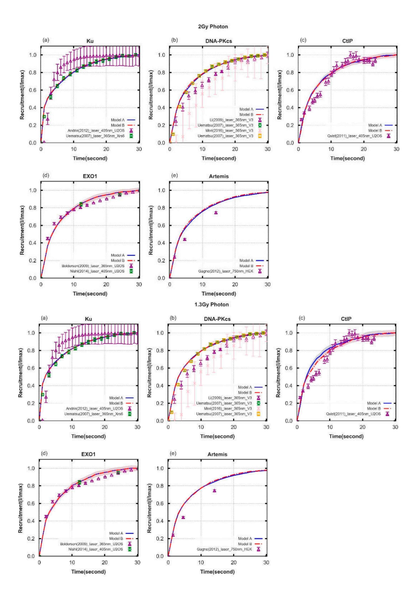

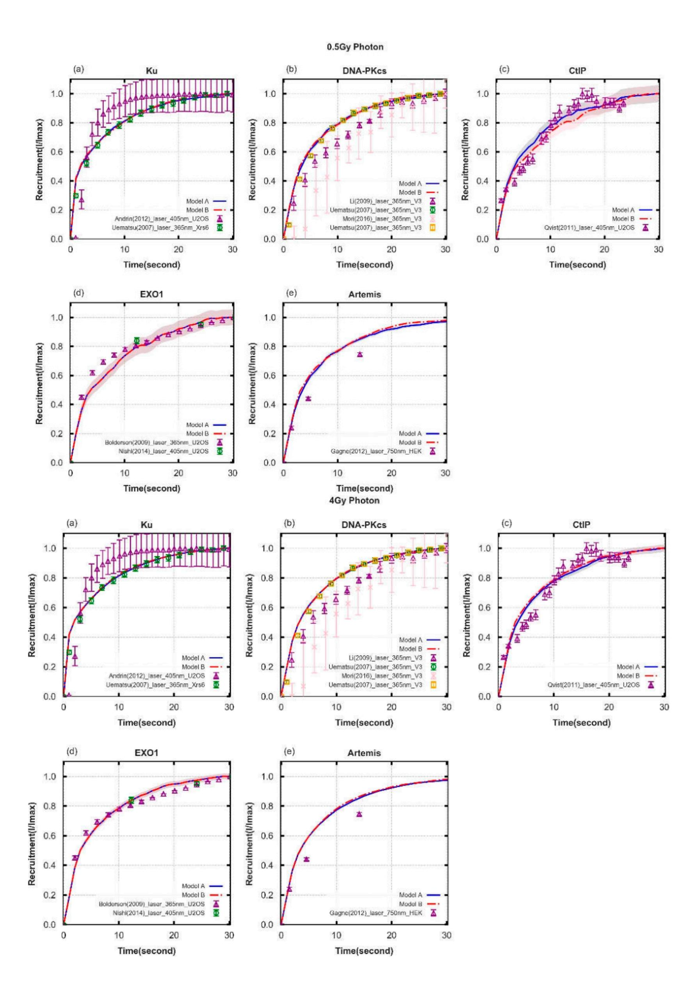

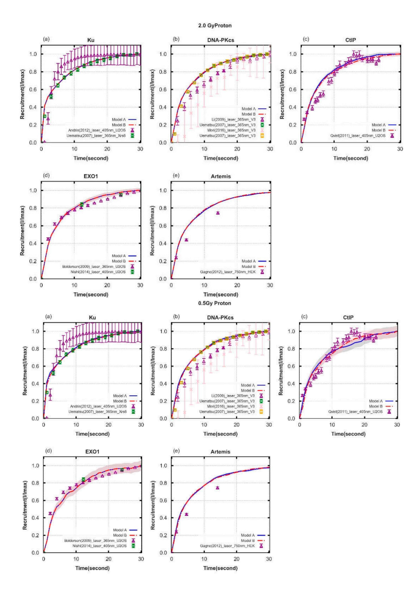

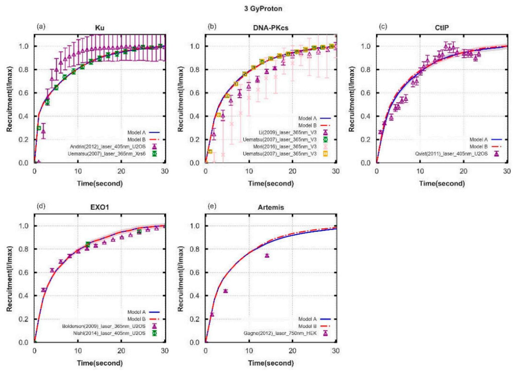

Figure S1. Comparison of the recruitment kinetics of 8 types of irradiationapplied on the normal tissue cellssimulated in Models A, and B.Figure A1(a)-(d)are results for photons with 0.5, 1.3, 2and 4Gy doses; (e)-(h) are results for protons with 0.5, 2and3Gydoses.

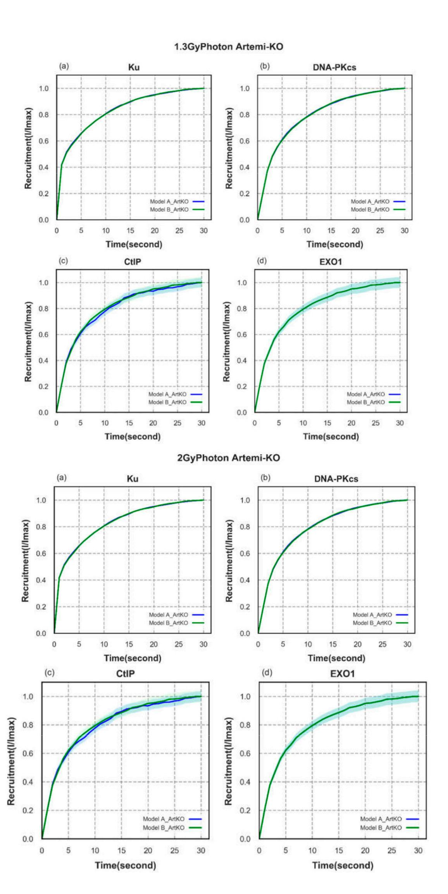

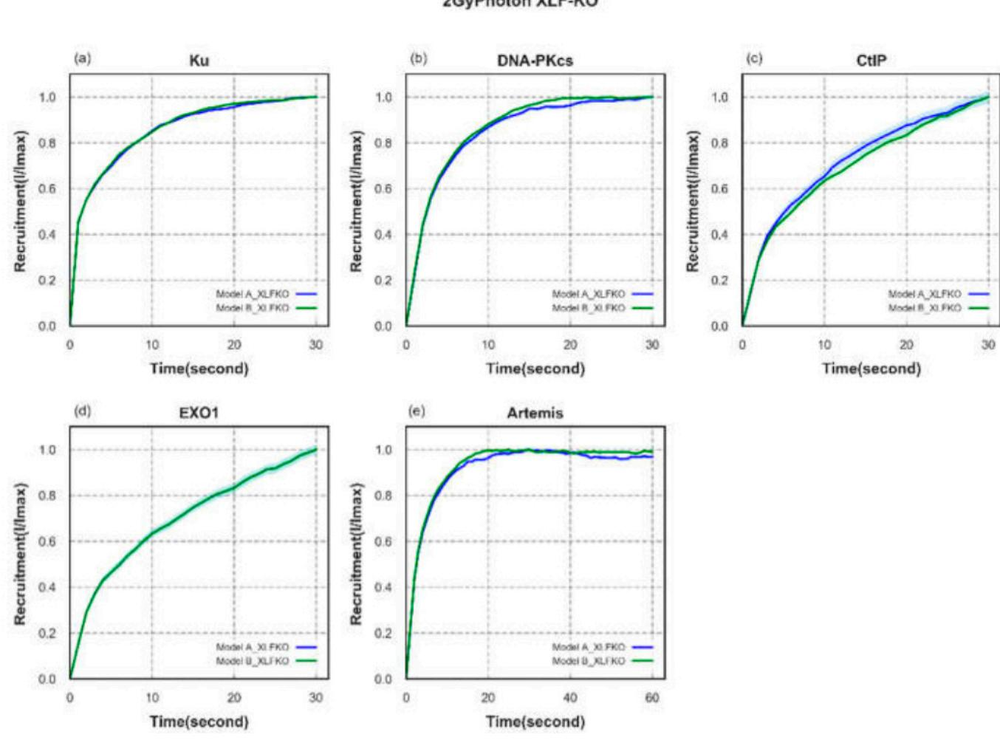

Figure S2. The recruitment kinetics of Arteims-deficient and XLF-deficient cell system corresponding to the repair kinetics in Figure 7.

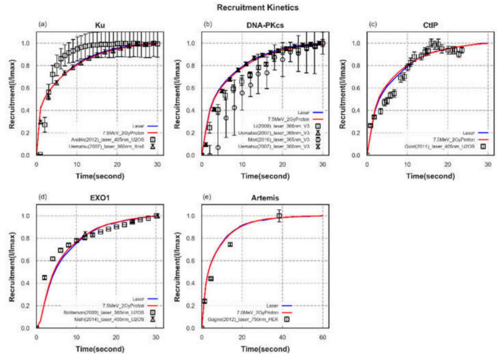

Figure S3. Recruitment kinetics of proteins when irradiated with laser and 4Gy proton(7.5MeV).Each DSB is scored as occurring within heterochromatin or euchromatin. The exact proportion of the genome comprising of either form of chromatin compaction varies within the literature.

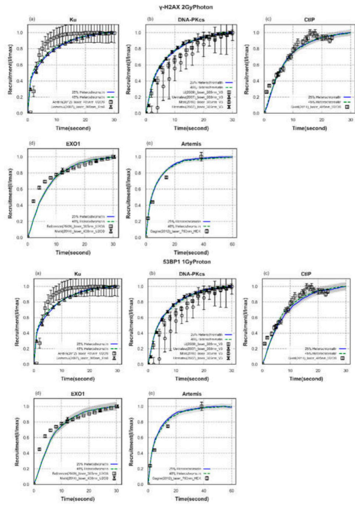

Figure S4.The recruitment kinetics of "Parallel" pathway assigned with 25% and 48% heterochromatin (forced to recruit DNA-PKcs only, and euchromatin is forced to recruit CtIP) under 2Gy photon/1Gy 1.7keV/um proton irradiation,corresponding to the repair kinetics in Figure 6.

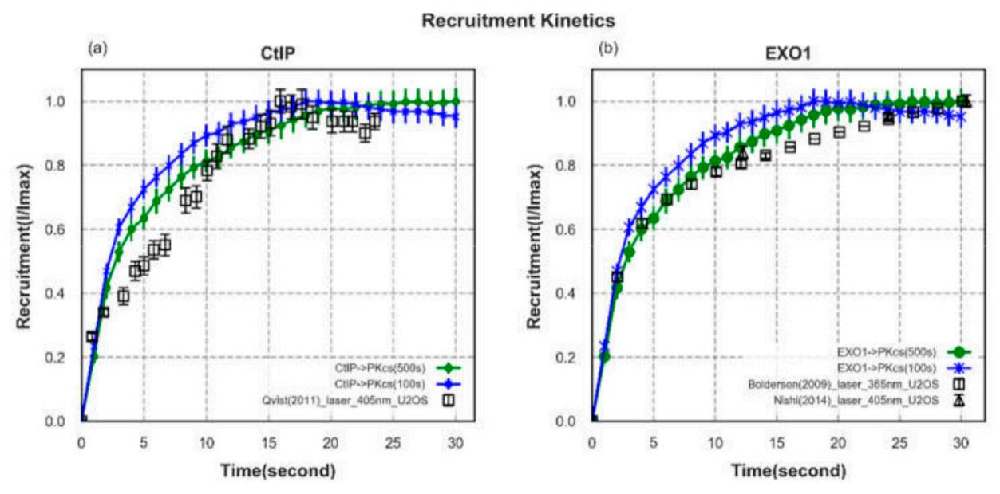

Figure S5.The recruitmentkinetics of CtIP and EXO1 with 2 different time components when loading Artemis:PKcscomparing with experimentaldata.

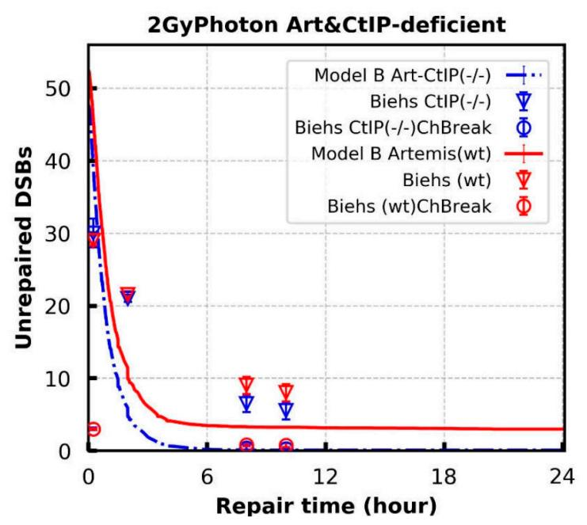

Figure S6.Comparison of unrepaired DSBs in Model B (lines) with the number of γ-H2AX foci obtained from experiments (symbols)for Artemis&CtIP -deficient and wild-type cell lines exposed to 2 Gy X-rays.

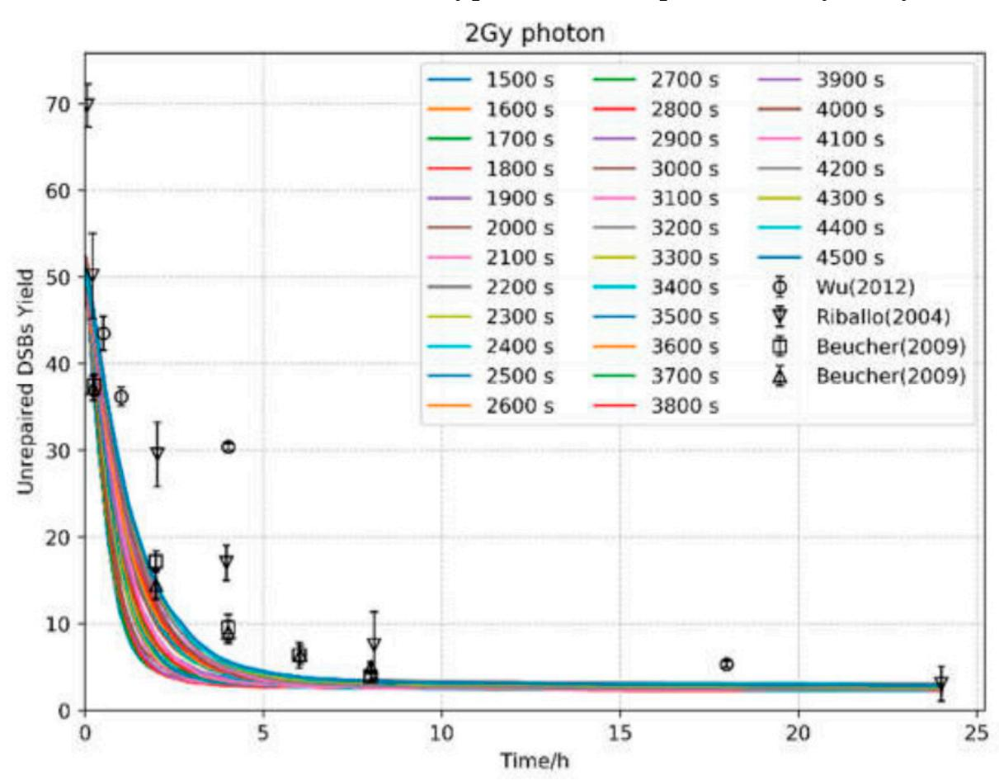

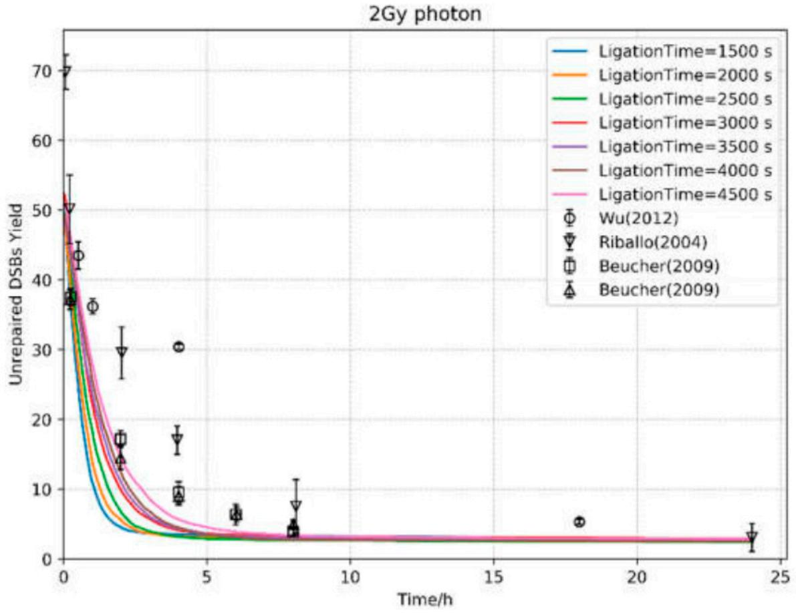

Figure S7.Comparison of unrepaired DSBs in Model B with different ligation time in steps of 100s (from 1500 up to 4500s) exposed to 2 Gy X-rays.

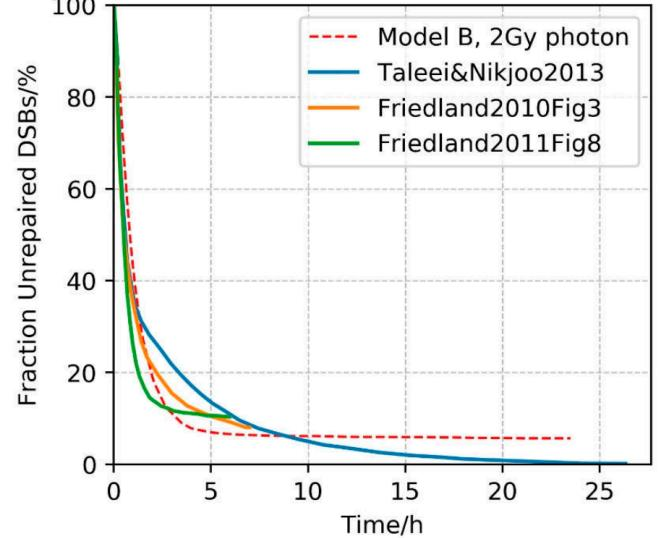

Figure S8.Comparison against three other models of NHEJ published in literature. e include here comparison against three other models of NHEJ published in literature (Nikjoo et al, 2013,http://dx.doi.org/10.1016/j.mrgentox.2013.06.004; Friedland et al, 2011, doi:10.1093/rpd/ncq383; Friedland et al, 2011. doi:10.1016/j.mrfmmm.2011.01.003). The model by Friedland et al. focuses on developing a model of c-NHEJ, which, in light of the work done by the Jeggo group, we would now classify as resection-independent. The model by Nikjoo et al. expands this by additionally including the mechanisms of MMEJ and chromatinrelaxation. The aim of this research was to develop a model that incorporates the specific mechanisms of resection-dependent NHEJ along with resection-independent NHEJ in G0/G1, whilst maintaining an acceptable fit to literature data. Here we see agreement between model B and other published models.

Table S1. Summary of goodness-of-fit metrics for recruitment kinetics between "Parallel" pathway (A) and "Entwined" pathway (B) and experimental data from literature.

| Protein                         | Publication                      | DF | $\chi^2/\mathrm{DF}^*$ |        |  |
|---------------------------------|----------------------------------|----|------------------------|--------|--|
| riotem                          | ruoncation                       | Dr | A                      | В      |  |
| Ku70/80                         | Andrin <i>et al. fig.8</i> [69]  | 28 | 0.046                  | 0.042  |  |
|                                 | Uematsu et al. fig. 2c [53]      | 14 | 4.068                  | 4.426  |  |
|                                 | Li et al. fig. 2 [70]            | 14 | 10.980                 | 12.266 |  |
| DNA-                            | Uematsu <i>et al. fig.2</i> [53] | 14 | 5.439                  | 6.836  |  |
| PKcs                            | Mori et al. fig.3 [71]           | 14 | 2.295                  | 2.430  |  |
|                                 | Uematsu et al. fig. 1d [53]      | 14 | 5.272                  | 6.548  |  |
| CtIP                            | Qvist et al. fig.5d [42]         | 23 | 6.452                  | 7.423  |  |
| EVOI                            | Bolderson et al. fig.1b [72]     | 12 | 6.28e8                 | 1.29e9 |  |
| EXO1                            | Nishi <i>et al. fìg.6g</i> [41]  | 2  | 0.579                  | 0.728  |  |
| Artemis                         | Gagne <i>et al</i> . [43]        | 4  | 11.962                 | 13.778 |  |
| Ov                              | Overall Statistics of Sum (min)  |    | 21.334                 | 24.401 |  |
| Overall Statistics of Sum (max) |                                  |    | 6.28e8                 | 1.29e9 |  |

Table S2. Summary of goodness-of-fit metrics metrics (χ2/DF) for repair kinetics between Models A, B, and experimentaldata setsfrom foci data.

| Experiments                             |             |                                   |         | Simul         | Simulations |  |
|-----------------------------------------|-------------|-----------------------------------|---------|---------------|-------------|--|
|                                         |             |                                   | DF      | Chi-square/DF |             |  |
| γ-Ι-                                    | I2AX for no | rmal cell lines                   | A       |               |             |  |
| 4 Gy proton/7.5 MeV                     | NHLF        | Fig 3c. from Wu et al [49]        | 3       | 637.080       | 742.569     |  |
| 3 Gy proton/32 MeV                      | MEF         | Fig 2c. from Oeck et al [73]      | 4       | 11.040        | 8.451       |  |
| 3 Gy proton/187 MeV                     | MEF         | Fig 2c from Oeck et al [73]       | 4       | 98.701        | 9.653       |  |
| 2 Gy proton/7.5 MeV                     | NHLF        | Fig 3b. from Wu <i>et al</i> [49] | 3       | 27.349        | 45.649      |  |
| 0.5 Gy proton/7.5 MeV                   | NHLF        | Fig 3a. from Wu <i>et al</i> [49] | 3       | 17.739        | 57.578      |  |
| 4 Gy photon                             | NHLF        | Fig 3c. from Wu et al [49]        | 3       | 444.767       | 35.572      |  |
| 2 Gy photon                             | NHLF        | Fig 3b. from Wu <i>et al</i> [49] | 3       | 254.912       | 520.904     |  |
| 2 Gy photon                             | MCR-5       | Fig 1b. from Riballo et al [32]   | 5       | 10.042        | 8.700       |  |
| 2 Gy photon                             | C2906       | Fig 2a. from Beucher et al [50]   | 4       | 69.384        | 7.331       |  |
| 2 Gy photon                             | MEF         | Fig 2b. from Beucher et al [50]   | 4       | 48.538        | 6.285       |  |
| 1.3 Gy photon                           | 1BR3        | Fig 2a. from Beucher et al [50]   | 3       | 32.335        | 23.886      |  |
| 0.5Gy photon                            | NHLF        | Fig 3a. from Wu <i>et al</i> [49] | 3       | 21.296        | 25.647      |  |
| 0.5Gy photon                            | MEF         | Fig.5a from Ahmed et al [44]      | 4       | 2.382         | 2.181       |  |
| 0.5Gy photon                            | Sertoli     | Fig.2b from Ahmed et al [44]      | 3       | 9.612         | 13.876      |  |
| Average                                 |             |                                   | 118.780 | 107.734       |             |  |
| γ-H2AX for Artemis-deficient cell lines |             |                                   | A       | В             |             |  |
| 2 Gy photon                             | MEF         | Fig 2b. from Beucher et al [50]   | 4       | 9.910         | 15.389      |  |
| 2 Gy photon                             | CJ179       | Fig 2a. from Beucher et al [50]   | 4       | 8.149         | 12.409      |  |
| 2 Gy photon                             | CJ179       | Fig 1b. from Riballo et al [32]   | 5       | 29.432        | 25.388      |  |
| 1.3 Gy photon                           | CJ179       | Fig 1c. from Riballo et al [32]   | 3       | 147.481       | 70.994      |  |
| Average                                 |             |                                   |         | 48.743        | 31.045      |  |
| γ-H2AX for XLF-deficient cell lines     |             |                                   |         | A             | С           |  |
| 2 Gy photon                             | 2BN         | Fig 2a. from Beucher et al [50]   | 4       | 67.566        | 64.544      |  |

Table S3. Linear regression(Unrepaired DSBs=a\*LET+b) through the data shown in Figure 5. R2is the coefficient of determination. The simulated results of ModelsAand Bare repeated 120 times.

|                      | a               | b               | $\mathbb{R}^2$ |
|----------------------|-----------------|-----------------|----------------|
| Model A              | 0.320±0.025     | 8.953±0.188     | 0.985          |
| Model B              | $0.038\pm0.008$ | $1.549\pm0.067$ | 0.941          |
| Chaudhary et al [52] | 0.083±0.042     | 3.014±0.334     | 0.789          |

Table S4. Details for the experimental data used in this work.

| Group                 | Publication                       |                       | Cell    | Statistics Type | n* |
|-----------------------|-----------------------------------|-----------------------|---------|-----------------|----|
|                       |                                   | IR                    |         | in literature   | *  |
| Ku70/80               | Andrin et al. Fig. 8 [69]         | 405 nm laser          | U2OS    | SEM*            | 30 |
|                       | Uematsu et al. Fig. 2c [53]       | 365 nm laser          | Xrs6    | SD*             | 10 |
| DNA-PKcs              | Li et al. Fig. 2 [70]             | 365 nm laser          | V3      | SD              | 10 |
|                       | Uematsu et al. Fig. 2 [53]        | 365 nm laser          | V3      | SD              | 10 |
|                       | Mori et al. Fig. 3 [71]           | 365 nm laser          | V3      | SD              | 3  |
|                       | Uematsu et al. Fig. 1d [53]       | 365 nm laser          | V3      | SD              | 10 |
| CtIP                  | Qvist et al. Fig. 5d [42]         | 405 nm laser          | U2OS    | SD              | 12 |
| EVOI                  | Bolderson et al. Fig. 1b [72]     | 365 nm laser          | U2OS    | SD              | 3  |
| EXO1                  | Nishi et al. Fig. 6g [41]         | 405 nm laser          | U2OS    | SEM             | 3  |
| Artemis               | Gagne et al. Fig. 9c [43]         | 750 nm laser          | HEK     | SEM             | 8  |
| Normal tissue         | Fig 3c. from Wu <i>et al</i> [49] | 4 Gy proton/7.5 MeV   | NHLF    | SEM             | 3  |
|                       | Fig 2c. from Oeck et al [73]      | 3 Gy proton/32 MeV    | MEF     | SD              | 3  |
|                       | Fig 2c from Oeck et al [73]       | 3 Gy proton/187 MeV   | MEF     | SD              | 3  |
|                       | Fig 3b. from Wu <i>et al</i> [49] | 2 Gy proton/7.5 MeV   | NHLF    | SEM             | 3  |
|                       | Fig 3a. from Wu <i>et al</i> [49] | 0.5 Gy proton/7.5 MeV | NHLF    | SEM             | 3  |
|                       | Fig 3c. from Wu et al [49]        | 4 Gy photon           | NHLF    | SEM             | 3  |
|                       | Fig 3b. from Wu et al [49]        | 2 Gy photon           | NHLF    | SEM             | 3  |
|                       | Fig 1b. from Riballo et al [32]   | 2 Gy photon           | MCR-5   | SEM             | 3  |
|                       | Fig 1b. from Riballo et al [32]   | 2 Gy photon           | HSF2    | SEM             | 3  |
|                       | Fig 2a. from Beucher et al [50]   | 2 Gy photon           | C2906   | SEM             | 3  |
|                       | Fig 2b. from Beucher et al [50]   | 2 Gy photon           | MEF     | SEM             | 3  |
|                       | Fig 2a. from Beucher et al [50]   | 1.3 Gy photon         | 1BR3    | SEM             | 3  |
|                       | Fig 3a. from Wu <i>et al</i> [49] | 0.5Gy photon          | NHLF    | SEM             | 3  |
|                       | Fig.5a from Ahmed et al [44]      | 0.5Gy photon          | MEF     | SD              | 3  |
|                       | Fig.2b from Ahmed et al [44]      | 0.5Gy photon          | Sertoli | SD              | 3  |
| Artemis- deficient | Fig 2b. from Beucher et al [50]   | 2 Gy photon           | MEF     | SEM             | 3  |
|                       | Fig 2a. from Beucher et al [50]   | 2 Gy photon           | CJ179   | SEM             | 3  |
|                       | Fig 1b. from Riballo et al [32]   | 2 Gy photon           | CJ179   | SEM             | 3  |
|                       | Fig 1c. from Riballo et al [32]   | 1.3 Gy photon         | CJ179   | SEM             | 3  |
| XLF-deficient         | Fig 2a. from Beucher et al [50]   | 2 Gy photon           | 2BN     | SEM             | 3  |