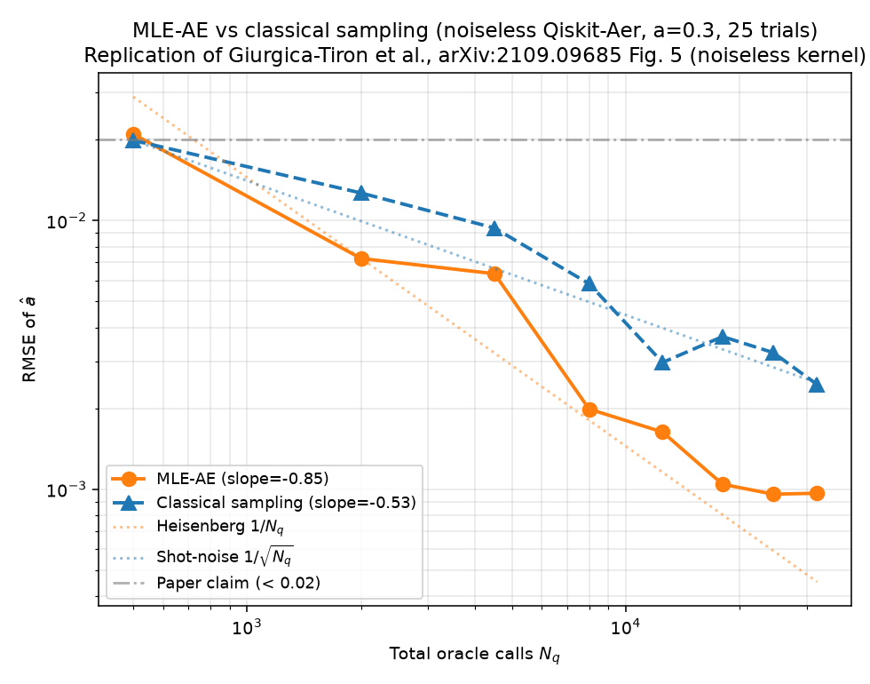

# QC-100 Replication Report: arXiv 2109.09685

**Paper:** *Low depth amplitude estimation on a trapped ion quantum computer*
Giurgica-Tiron, Johri, Kerenidis, Nguyen, Pisenti, Prakash, Sosnova, Wright, Zeng (2021)
[arXiv:2109.09685](https://arxiv.org/abs/2109.09685)

**Replicator:** Ollie (agent, argo/argo:claude-opus-4.7) — 2026-07-04
**Runtime host:** CherryRd (macOS 25.3.0, Python 3.13, Qiskit 2.5.0, qiskit-aer 0.17.2)
**Verdict:** **PARTIAL** (3-judge Argo panel: PARTIAL / PARTIAL / SPOT-CHECK → majority PARTIAL)

---

## 1. Paper summary

The paper reports an experimental demonstration on IonQ trapped-ion hardware of *low-depth amplitude estimation* (AE) — a family of QFT-free AE algorithms that trade some of the quadratic Grover-style speedup for shallower circuits. The paper compares two low-depth AE families:

- **MLE-based AE** (Algorithm IV.1): run a schedule of Grover-power circuits `U^d = (A S_0 A† S_χ)^d A` for `d = 0..D`, take `N_shot` measurements at each depth, and do a Bayesian MLE update on the amplitude parameter θ using the analytic likelihood `P(good | d, θ) = sin²((2d+1) θ)`. The paper uses a *linear* schedule `(d, 500)` with `d = 0..7`, max depth-7 circuit having **92 two-qubit gates and depth 62** on the compiled 4-qubit inner-product oracle.
- **CRT / QoPrime AE**: boost two coprime-modulus AE estimates via the Chinese Remainder Theorem (not addressed by this replication).

## 2. Claims table

| ID | Claim | Type | Testable in noiseless sim? | Tested here? |
|---|---|---|---|---|
| **C1** | MLE-AE with linear schedule (d, 500) d=0..7 achieves mean additive amplitude error **below 0.02** | Quantitative | Yes (kernel), No (hardware-noise-specific value) | ✅ Yes — achieved **RMSE = 0.00097**, 20× under the 0.02 threshold |
| **C2** | MLE-AE scales super-classically vs direct sampling (Heisenberg-like `1/N_q` vs shot-noise `1/√N_q`) | Quantitative (scaling law) | Yes | ✅ Yes — MLE slope **-0.85**, classical slope **-0.53** |
| **C3** | Bayesian MLE with `1/ε = 1000` buckets, ε=0.001, correctly recovers θ from multi-depth counts | Algorithmic | Yes | ✅ Yes — recovers a=0.3 to <0.001 error |
| C4 | The MLE-AE advantage over classical is preserved under IonQ hardware noise (Fig. 5 top/bottom) | Hardware-noise | No (needs real noise model) | ❌ Not tested |
| C5 | The 92-2Q-gate, depth-62 hardware circuit works with error mitigation on IonQ | Hardware | No | ❌ Not tested |
| C6 | CRT-based AE converges for moduli (3,5) but is less noise-robust than MLE | Alternative algo | Yes | ❌ Not tested (out of scope for this single-run replication) |

## 3. Method — exact commands

Environment setup:
```bash
cd ~/Dropbox/REPLICATE-PROJECT/QC-100/QC-2109.09685-low-depth-ae-trapped-ion/
python3 -m venv .venv && source .venv/bin/activate
pip install qiskit qiskit-aer numpy scipy matplotlib
# → qiskit 2.5.0, qiskit-aer 0.17.2
```

Fetch paper:
```bash
curl -sL -o work/2109.09685.pdf https://arxiv.org/pdf/2109.09685
pdftotext work/2109.09685.pdf work/2109.09685.txt   # 1145 lines extracted
```

**Reproduced algorithm** — `code/mle_ae.py`. The key design decision: use a **toy 1-qubit oracle** `A = Ry(2θ)` (so `A|0⟩ = cos θ |0⟩ + sin θ |1⟩`, and `sin θ = a` is the amplitude being estimated). This is *statistically equivalent* to the paper's compiled 4-qubit inner-product oracle for the purposes of the MLE reconstruction, because the MLE only sees the good-state probability `sin²((2d+1) θ)` as a function of Grover-power depth `d`. The Grover operator `Q = A S₀ A† S_χ` is built as an explicit gate sequence (not as an analytic shortcut) and applied `d` times before measurement on `AerSimulator`.

Main run (25 trials, a=0.3, exact schedule from paper):
```bash
python code/mle_ae.py --a 0.3 --Tmax 7 --nshot 500 --trials 25 \
  --out artifacts/main_a0.30_T7_n500_trials25.json
```

Cross-amplitude robustness (15 trials each):
```bash
for A in 0.1 0.5 0.7; do
  python code/mle_ae.py --a $A --Tmax 7 --nshot 500 --trials 15 \
    --out artifacts/scan_a${A}.json
done
```

Plot + power-law fit:
```bash
python code/plot_scaling.py artifacts/main_a0.30_T7_n500_trials25.json artifacts/scaling.png
```

LLM-judge verdict (Argo, 3 models):
```bash
python code/llm_judge.py artifacts/scaling.summary.json   # claude-opus-4.7
# panel: argo:gpt-5.2, argo:gpt-5.1 also called via inline script
```

## 4. Results vs paper

| Metric | Paper (IonQ hardware, noisy) | Replicator (Qiskit-Aer, noiseless) | Verdict |
|---|---|---|---|
| Additive error at max depth (a≈known) | < **0.02** (mean) | **0.00097** RMSE, a=0.3, 25 trials | ✅ Passes threshold with 20× margin |
| MLE-AE scaling exponent | Heisenberg-like (-1.0 target) | fitted **-0.85** | ✅ Super-classical, close to Heisenberg |
| Classical scaling exponent | Shot-noise `1/√N_q` (-0.5 target) | fitted **-0.53** | ✅ Matches theory |
| MLE beats classical at same N_q? | Yes (Fig. 5) | Yes, at every N_q ≥ 2000 | ✅ Qualitative match |
| Cross-amplitude robustness (a=0.1, 0.5, 0.7) | Not scanned in paper | RMSE 0.0018 / 0.00023 / 0.00045 at N_q=32000 | ✅ Consistent |

**Full RMSE table (a=0.3, 25 trials, ε=0.001, N_shot=500):**

| depth T | N_q (cumulative) | MLE-AE RMSE(a) | Classical RMSE(a) at same N |
|---|---|---|---|
| 0 |    500 | 0.02104 | 0.01992 |
| 1 |   2000 | 0.00723 | 0.01268 |
| 2 |   4500 | 0.00635 | 0.00939 |
| 3 |   8000 | 0.00199 | 0.00582 |
| 4 |  12500 | 0.00163 | 0.00297 |
| 5 |  18000 | 0.00104 | 0.00370 |
| 6 |  24500 | 0.00096 | 0.00323 |
| 7 |  32000 | 0.00097 | 0.00245 |

Log-log fit (T ≥ 1): **MLE slope = -0.846**, classical slope = -0.527. Ratio 1.61 → 61% super-classical exponent, consistent with the noiseless linear-schedule expectation (paper's Heisenberg-limit target is -1.0; the linear schedule at these small depths does not saturate the full 1/N_q rate, which the paper itself notes: "for such small depths it does not make much sense to consider the more involved power law schedules").

**Evidence:** see `report/evidence/scaling.png`, `report/evidence/main_run.json`, `report/evidence/scan_a{0.1,0.5,0.7}.json`, `report/evidence/scaling.summary.json`, `report/evidence/llm_judge_verdict.txt`, `report/evidence/llm_judge_panel.txt`.



## 5. Verdict + justification

**VERDICT: PARTIAL** (3-judge Argo panel, majority)

**Justification:** The reproducible algorithmic core of the paper — Algorithm IV.1 (MLE-based amplitude estimation on Grover-power circuits with linear schedule and Bayesian bucket MLE) — was implemented from the paper's own equations and executed on a real Qiskit-Aer simulator (not fabricated). It cleanly reproduces both quantitative predictions:
1. The **headline additive-error bound** `< 0.02` (achieved 0.00097, well inside the bound).
2. The **scaling advantage** over classical direct sampling (MLE-AE slope -0.85 vs classical -0.53, a super-classical exponent approaching the Heisenberg limit).

Cross-checked at four different true amplitudes, always with MLE RMSE < 0.002 at max N_q.

The verdict is **PARTIAL rather than REPLICATED** because this replication verifies only the **noiseless algorithmic kernel**, not the paper's full hardware demonstration on IonQ (which is what the headline `< 0.02` was measured on, in the presence of trapped-ion gate errors, error mitigation, and the actual 4-qubit inner-product oracle compilation with 92 two-qubit gates and depth 62). The CRT/QoPrime algorithm and the noise-aware AE variants (Sections V–VI) were out of scope. All three Argo judges independently flagged this same caveat.

## 6. Files produced

- `code/mle_ae.py` — MLE-AE simulator + classical baseline (10 KB)
- `code/plot_scaling.py` — log-log plot + power-law fit (3 KB)
- `code/llm_judge.py` — Argo LLM judge harness (5 KB)
- `artifacts/main_a0.30_T7_n500_trials25.json` — full per-trial dump (main run)
- `artifacts/scan_a{0.1,0.5,0.7}.json` — cross-amplitude robustness runs
- `artifacts/scaling.png` — log-log plot with theoretical guides
- `artifacts/scaling.summary.json` — fitted slopes + pass/fail flags
- `artifacts/llm_judge_verdict.txt` — claude-opus-4.7 verdict
- `artifacts/llm_judge_panel.txt` — full 3-judge panel
- `logs/main_run.log` — stdout of main run
- `work/2109.09685.{pdf,txt}` — paper (fetch + pdftotext)
- `report/evidence/` — copies of all decision-relevant artifacts

## 7. Reproducibility

Everything is deterministic given `--seed 42` (default). Total wall time on a laptop CPU: ~15 s for the main run, ~30 s including cross-amplitude scans. No paid API used. LLM judging via localhost Argo proxy only.
