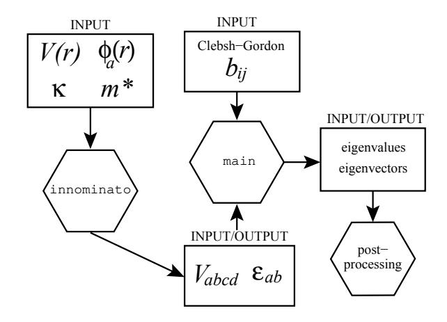
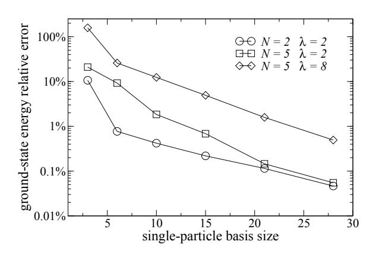
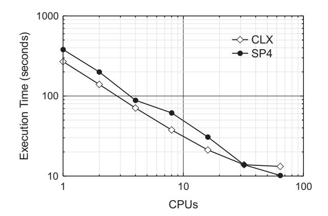
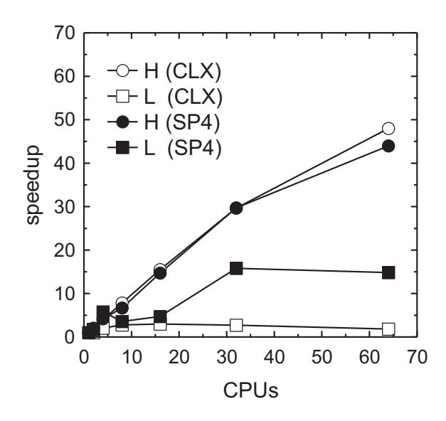
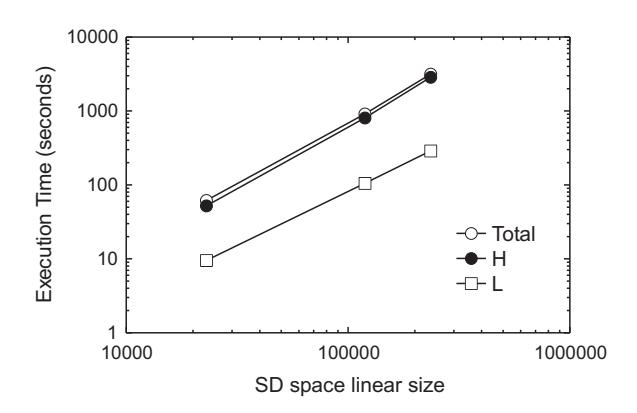
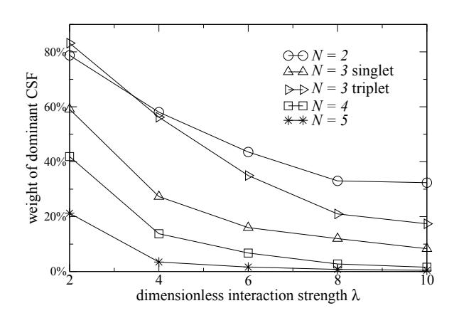
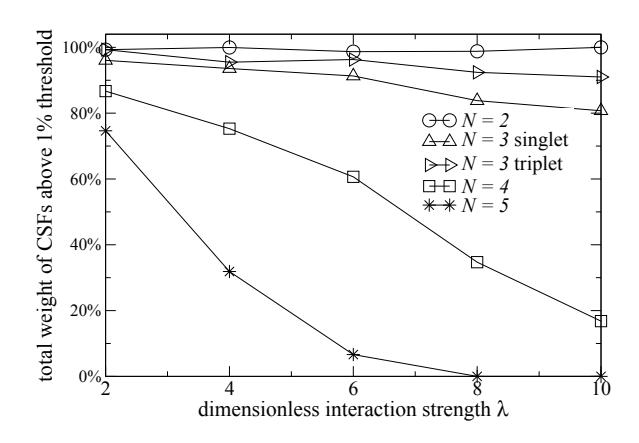
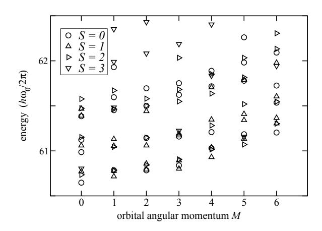

### Full configuration interaction approach to the few-electron problem in artificial atoms

Massimo Rontani,1,\* Carlo Cavazzoni,1,2 Devis Bellucci,1,3 and Guido Goldoni1,3

1CNR-INFM National Research Center on nanoStructures and bioSystems at Surfaces (S3), Modena, Italy

2CINECA, Via Magnanelli 6/3, 40033 Casalecchio di Reno BO, Italy

3Dipartimento di Fisica, Università degli Studi di Modena e Reggio Emilia, Via Campi 213/A, 41100 Modena MO, Italy

(Dated: April 5, 2018)

We present a new high-performance configuration interaction code optimally designed for the calculation of the lowest energy eigenstates of a few electrons in semiconductor quantum dots (also called artificial atoms) in the strong interaction regime. The implementation relies on a singleparticle representation, but it is independent of the choice of the single-particle basis and, therefore, of the details of the device and configuration of external fields. Assuming no truncation of the Fock space of Slater determinants generated from the chosen single-particle basis, the code may tackle regimes where Coulomb interaction very effectively mixes many determinants. Typical strongly correlated systems lead to very large diagonalization problems; in our implementation, the secular equation is reduced to its minimal rank by exploiting the symmetry of the effective-mass interacting Hamiltonian, including square total spin. The resulting Hamiltonian is diagonalized via parallel implementation of the Lanczos algorithm. The code gives access to both wave functions and energies of first excited states. Excellent code scalability in a parallel environment is demonstrated; accuracy is tested for the case of up to eight electrons confined in a two-dimensional harmonic trap as the density is progressively diluted up to the Wigner regime, where correlations become dominant. Comparison with previous Quantum Monte Carlo simulations in the Wigner regime demonstrates power and flexibility of the method.

Keywords: configuration interaction; correlated electrons; artificial atoms; Wigner crystal

#### I. INTRODUCTION

Semiconductor quantum dots1,2,3,4 (QDs) are nanometer sized regions of space where free carriers are confined by electrostatic fields. Typically, the confining field may be provided by compositional design (e.g., the QD is formed by a small gap material embedded in a larger-gap matrix) or by gating an underlying two-dimensional (2D) electron gas. Different techniques lead to nanometer size QDs with different shapes and strengths of the confinement. As the typical de Broglie wavelength in semiconductors is of the order of 10 nm, nanometer confinement leads to a discrete energy spectrum, with energy splittings ranging from fractions to several tens of meV.

The similarity between semiconductor QDs and natural atoms, ensuing from the discreteness of the energy spectrum, is often pointed out.5,6,7,8,9 Shell structure7,8,10 and correlation effects9,11,12 are among the most striking experimental demonstrations. More recently, the interest in new classes of devices has fuelled investigations of QDs which are coupled by quantum tunneling.13 In addition to their potential for promising applications, these systems extend the analogy between natural and artificial atoms to the molecular realm (for a review of both theoretical and experimental work see Ref. 14).

Maybe the most prominent feature of *artificial* atoms is the possibility of a fine control of a variety of parameters in the laboratory. The nature of ground and excited fewelectron states has been shown to vary with artificially tunable quantities such as confinement potential, density, magnetic field, inter-dot coupling. 1,4,9,14,15,16,17 Such flexibility allows for envisioning a vast range of appli-

cations in optoelectronics (single-electron transistors, 18 lasers, 19,20 micro-heaters and micro-refrigerators based on thermoelectric effects21), life sciences, 22,23 as well as in several quantum information processing schemes in the solid-state environment. 24,25,26

Almost all QD-based applications rely on (or are influenced by) electronic correlation effects, which are prominent in these systems. The dominance of interaction in artificial atoms and molecules is evident from the multitude of strongly correlated few-electron states measured or predicted under different regimes: Fermi liquid, Wigner molecule (the precursor of Wigner crystal in 2D bulk), charge and spin density wave, incompressible state reminescent of fractional quantum Hall effect in 2D (for reviews see Refs. 14,16).

It is important to understand where the dominant correlation effects arise from. In QDs the "external" confinement potential originates either from band mismatch or from the self-consistent field (SCF) due to doping charges. In both cases, the total field modulation which confines a few free carriers is smooth and can often be approximated by a parabolic potential in two dimensions. Therefore, the single-particle (SP) energy gaps of the free carrier states are uniform in a broad energy range. This is in contrast with natural atoms, where the electron confinement is provided by the singular nuclear potential. Furthermore, while the kinetic energy term scales as  $r_s^{-2}$ ,  $r_s$  being the dimensionless parameter measuring the average distance between electrons, the Coulomb energy scales as  $r_s^{-1}$ . Contrary to natural atoms, in semiconductor QDs the Coulomb-to-kinetic-energy ratio can be rather large (even larger than one order of magnitude), the smaller the carrier density the larger the ratio. This causes Coulomb correlation to severely mix many different SP configurations, or Slater determinants (SDs). Therefore, we expect that any successful robust computational strategy in QDs, if flexible enough to address different correlation regimes, must not rely on truncation of the Fock space of SDs obtained by filling a given SP basis with N electrons.

The theoretical understanding of QD electronic states in a vaste class of devices is based on the envelope function and effective mass model.[27](#page-15-27)[,28](#page-15-28) Here, changes in the Bloch states, the eigenfunctions of the bulk semiconductor, brought about by "external" potentials other than the perfect crystal potential, are taken into account by a slowly varying (envelope) function which multiplies the fast oscillating periodic part of the Bloch states. This decoupling of fast and slow Fourier components of the wave function is valid provided the modulation of the external potential is slow on the scale of the lattice constant. Then, the theory allows for calculating such envelope functions from an "effective" Schr¨odinger equation where only the external potentials appear, while the unperturbed crystalline potential enters as a renormalized electron mass, i.e. the "effective" value m∗ replaces the free electron mass. Therefore, SP states can be calculated in a straightforward way once compositional and geometrical parameters are known. This approach was proved to be remarkably accurate by spectroscopy experiments for weakly confined QDs;[13](#page-15-13)[,16](#page-15-16) for strongly confined systems, such as certain classes of self-assembled QDs, atomistic methods might be necessary.[29](#page-16-0)

Several different theoretical approaches have been employed in the solution of the few-electron, fully interacting effective-mass Hamiltonian of the QD system[14](#page-15-14)[,16](#page-15-16)

$$H = \sum_{i}^{N} H_0(i) + \frac{1}{2} \sum_{i \neq j} \frac{e^2}{\kappa |\mathbf{r_i} - \mathbf{r_j}|},$$
 (1)

with

$$H_0(i) = \frac{1}{2m^*} \left[ \boldsymbol{p} - \frac{e}{c} \boldsymbol{A}(\boldsymbol{r}) \right]^2 + V(\boldsymbol{r}).$$
 (2)

Here, N is the number of free conduction band electrons (or free valence band holes) localized in the device "active" area, e, m∗ , and κ are respectively the carrier charge, effective mass, and static relative dielectric constant of the host semiconductor, r is the position of the electron, p is its canonically conjugated momentum, A(r) is the vector potential associated with an external magnetic field. The effective potential V (r) describes the carrier confinement due to the electrostatic interaction with the environment. We ignore the (usually small) Zeeman term coupling spin with magnetic field; this small perturbation can always be added a posteriori.

The eigenvalue problem associated to the Hamiltonian [\(1\)](#page-1-0) has been tackled mainly via Hartree-Fock (HF) method, density functional theory, configuration interaction (CI), and quantum Monte Carlo (QMC) (for reviews see Refs. [1](#page-15-1)[,4](#page-15-4)[,14](#page-15-14)[,16](#page-15-16)). Each method has its own merits and drawbacks; mean-field methods, for example, are simple and may treat a large number of carriers, a common situation in many experimental situations. On the other hand, CI and QMC methods allow for the treatment of Coulomb correlation with arbitrary numerical precision, and, therefore, represent the natural choice for studies interested in strongly correlated (low density or high magnetic field) regimes which are nowadays attainable in very high quality samples. In addition, CI is a straightforward approach with respect to QMC, and gives access to both ground and lowest excited states at the same time and with comparable accuracy, which allows for the calculation of various response functions to be directly compared with experiments. The main limitations within the CI approach, when applied to the strongly correlated regimes attainable in artificial atoms, are that truncation of the Fock space — one of the standard procedures in traditional CI methods of quantum chemistry (the so-called CI with singles, doubles, etc.[30](#page-16-1)[,31](#page-16-2)[,32](#page-16-3)[,33](#page-16-4)[,34](#page-16-5)[,35](#page-16-6)) — generally gives large errors or even qualitatively wrong results, and that the Fock space dimension grows exponentially with N.

Here we present a newly developed CI code[36](#page-16-7) with performances comparable to QMC calculations for a broad range of electron densities, covering the transition from liquid to solid electron phases. The implementation is independent of the SP orbital basis and, therefore, of the details of the device. We do not assume any truncation of the Fock space of SDs generated from the chosen SP basis [full-CI[30](#page-16-1)[,31](#page-16-2)[,32](#page-16-3)[,33](#page-16-4)[,34](#page-16-5)[,35](#page-16-6) (FCI)]. The large eigenvalue problem is reduced to its minimal size by exploiting the symmetry of the effective-mass interacting Hamiltonian [\(1\)](#page-1-0), including square total spin (S 2 ).[37](#page-16-8) The resulting Hamiltonian, which represents the Coulomb interaction in the many-electron basis, is diagonalized via a parallel version of the Lanczos algorithm.

The motivation for developing a new code, instead of using CI codes already available in the computational quantum chemistry literature, was the difficulty of handling such codes, optimized for traditional ab initio applications, to treat effective or model problems such as a few electrons in artificial atoms. Therefore, our code has been developed entirely from scratch and specifically designed for quantum dot applications. One peculiar feature is that it builds the whole Hamiltonian in the many-electron basis and it stores it in computer memory (see Sec. [II\)](#page-2-0). This procedure presently constitutes a limitation with respect to state-of-the-art CI algorithms[30](#page-16-1)[,31](#page-16-2)[,32](#page-16-3)[,33](#page-16-4)[,34](#page-16-5)[,35](#page-16-6)[,38](#page-16-9)[,39](#page-16-10)[,40](#page-16-11)[,41](#page-16-12)[,42](#page-16-13)[,43](#page-16-14)[,44](#page-16-15)[,45](#page-16-16)[,46](#page-16-17)[,47](#page-16-18)[,48](#page-16-19)[,49](#page-16-20)[,50](#page-16-21)[,51](#page-16-22)[,52](#page-16-23)[,53](#page-16-24)[,54](#page-16-25)[,55](#page-16-26)[,56](#page-16-27)[,57](#page-16-28)[,58](#page-16-29)

of Quantum Chemistry based on the direct technique, which avoids the storage of the Hamiltonian (cf. Sec. [VII\)](#page-11-0). The implementation of the direct CI algorithm is left to future work.

In order to demonstrate the effectiveness of our code, we present a benchmark calculation in the strongly correlated regime par excellence, namely the crossover region between Fermi liquid and Wigner crystallization, and we compare results with available QMC data. Since the FCI code gives access to both wave functions and energies of the first excited states, we analize the signatures of crystallization in the excitation spectrum. We also discuss the performance of the algorithm in a parallel environment.

The paper is organized as follows: First the general code structure is illustrated (Sec. II), then possible SP bases and related convergence problems are considered (Sec. III). Section IV analyzes the code performance in a parallel environment. A benchmark physical application in demanding correlation regimes is considered in Sec. V, where results are compared with QMC and CI data taken from literature. Section VI discusses the peculiar features of the excitation spectrum in the strongly correlated regime. Finally, some general considerations are addressed (Sec. VII), followed by the concluding section VIII. Appendix A reviews the construction of the many-electron Hilbert space and related issues, while Appendix B provides the explicit expression of the 2D Coulomb matrix elements for the so-called Fock-Darwin SP orbitals.

#### II. CODE STRUCTURE

The interacting Hamiltonian (1) can be written in second quantized form59 on the basis of a complete and orthonormal set of SP orbitals  $\{\phi_a(\mathbf{r})\}$ :

$$\mathcal{H} = \sum_{ab\sigma} \varepsilon_{ab} \, c_{a\sigma}^{\dagger} c_{b\sigma} + \frac{1}{2} \sum_{abcd} \sum_{\sigma\sigma'} V_{abcd} \, c_{a\sigma}^{\dagger} c_{b\sigma'}^{\dagger} c_{c\sigma'} c_{d\sigma}. \tag{3}$$

Here  $c_{a\sigma}^{\dagger}$   $(c_{a\sigma})$  creates (destroys) an electron in the spinorbital  $\phi_a(r)\chi_{\sigma}(s)$ ,  $\chi_{\sigma}(s)$  is the spinor eigenvector of the spin z-component with eigenvalue  $\sigma$   $(\sigma=\pm 1/2)$ , the label a stands for a certain set of orbital quantum numbers,  $\varepsilon_{ab}$  and  $V_{abcd}$  are the one- and two-body matrix elements, respectively, of the Hamiltonian (1). The latter are defined as follows:

$$\varepsilon_{ab} = \int d\mathbf{r} \, \phi_a^*(\mathbf{r}) \, H_0(\mathbf{r}) \, \phi_b(\mathbf{r}), \tag{4a}$$

$$V_{abcd} = \int d\mathbf{r} \int d\mathbf{r}' \, \phi_a^*(\mathbf{r}) \, \phi_b^*(\mathbf{r}')$$

$$\times \frac{e^2}{\kappa |\mathbf{r} - \mathbf{r}'|} \, \phi_c(\mathbf{r}') \, \phi_d(\mathbf{r}). \tag{4b}$$

The adopted FCI strategy to find the ground- and excited-state energies and wave functions of N interacting electrons, described by the Hamiltonian (1) or (3), proceeds in three separate steps:

step 1 A specific set of  $N_{\rm SP}$  single-particle orbitals,  $\{\phi_a(r)\}$ , is chosen.  $N_{\rm SP}$  should be large enough to guarantee as much completeness of the SP space as possible. The parameters  $\varepsilon_{ab}$  and  $V_{abcd}$  for a given device [Eqs. (4)] are computed numerically only once, and then stored on disk. In case  $\phi_a(r)$  is an eigenfunction of the SP Hamiltonian (2) the matrix  $\varepsilon_{ab}$  acquires a diagonal form,  $\varepsilon_{ab} = \varepsilon_a \delta_{ab}$ . In a few

(but important) cases, the SP orbitals are eigenfunctions of a particularly simple SP Hamiltonian  $H_0$ , and analytic expressions for  $\varepsilon_{ab}$  and  $V_{abcd}$  can be derived; one example is discussed in Sec. III A.

step 2 The many-electron Hilbert (Fock) space is built up. The N-electron wave function,  $|\Psi_N\rangle$ , is expanded as a linear combination of configurational state functions34,35,60,61 (CSFs),  $|\psi_i\rangle$ , namely primitive combinations of SDs which are simultaneously eigenvectors of the spatial symmetry group of Hamiltonian (1), the square total spin  $S^2$ , and the projection of the spin along the z-axis  $S_z$ :

$$|\Psi_N\rangle = \sum_i a_i |\psi_i\rangle. \tag{5}$$

On such a basis set, the matrix representation of the Hamiltonian (3) acquires a block diagonal form, where each block is identified by a different irreducible representation of the spatial and spin symmetry group (the latter is labeled by  $S^2$ ,  $S_z$ ). The algorithm for building the whole set of CSFs starting from the SP basis set is described in detail in App. A; here we are only concerned with the fact that CSFs are linear combination of SDs,  $|\Phi_j\rangle$ , obtained by filling in, in all possible ways consistent with symmetry requirements, the  $2N_{\rm SP}$  spinorbitals with N electrons:

$$|\psi_i\rangle = \sum_j b_{ij} |\Phi_j\rangle,$$
 (6)

the  $b_{ij}$ 's being the Clebsch-Gordan coefficients. These do not depend on the device, and can be calculated once (see App. A) and stored on disk.

step 3 Hamiltonian matrix elements in the CSF representation are calculated. Since several CSFs  $|\psi_i\rangle$  may consist of different linear combinations of the same SDs  $|\Phi_j\rangle$ , it is convenient to compute and store once and for all the non-null matrix elements of Hamiltonian (3) between all possible SDs,  $\langle \Phi_j | \mathcal{H} | \Phi_{j'} \rangle$ ; subsequently, the matrix elements between CSFs,  $\langle \psi_i | \mathcal{H} | \psi_{i'} \rangle$ , can be simply evaluated using the coefficients  $b_{ij}$  previously stored:

$$\langle \psi_i | \mathcal{H} | \psi_{i'} \rangle = \sum_{jj'} b_{ij}^* b_{i'j'} \langle \Phi_j | \mathcal{H} | \Phi_{j'} \rangle.$$
 (7)

Then, the secular equation

$$(\mathcal{H} - E_N \mathcal{I}) |\Psi_N\rangle = 0, \tag{8}$$

where  $\mathcal{I}$  is the identity operator, is solved by means of the Lanczos package ARPACK,62 designed to handle the eigenvalue problem of large size sparse matrices. Eventually, eigenenergies  $E_N$  and eigenvectors  $a_i$  are found and saved, ready for post-processing (wave function analysis, computation of charge density, pair correlation functions, response functions, etc).

FIG. 1: Pictorial synopsis of the  ${\tt DONRODRIGO}$  suite of FCI codes.

step 1-3 are implemented in the suite of programs DONRODRIGO,36 named after the characters of Alessandro Manzoni's literary masterpiece I promessi sposi. Each step corresponds to a different high-level routine, providing maximum code flexibility. Specifically, step 1 is an independent program on its own, the INNOMINATO code: The idea is that, to describe different QD devices, it is sufficient to modify only the form of the confinement potential, V(r), and field components appearing in the SP Hamiltonian (2). Indeed, the confinement potential and the SP basis set only affect parameters  $\varepsilon_{ab}$ and  $V_{abcd}$ . Such parameters are passed, as input data, to step 2-3 (cf. Fig. 1) which constitute the core of the main program, and do not depend on the form of the SP Hamiltonian and basis set. step 2-3 are by far the most intensive computational parts and are parallelized via the MPI interface: the Hamiltonian matrix elements  $\langle \Phi_i | \mathcal{H} | \Phi_{i'} \rangle$  are distributed among all processors. Only non-null elements are allocated in local memory, and the parallel version of ARPACK routine is used for diagonalization. Matrix element computation is optimized by implementing a binary representation for CSFs: each CSF corresponds to a couple of 64-bit integers, where each bit represent the occupation of a SP orbital (App. A2), and highly efficient bit-per-bit logical operations are used to determine the sign of the matrix element, depending on the anti-commuting behavior of fermionic operators. An example is given in Sec. A3 of the Appendix.

Figure 1 is the graphical synopsis of the interface between codes belonging to the suite DONRODRIGO, including post-processing routines, which actually consitute a rich collection of codes capable of calculating experimentally accessible quantities and response functions. Presently, we have already implemented wave function analysis, computation of charge density and pair correlation functions, 9,14,15,63 dynamical form factor, 15 purely electronic Raman excitation spectrum, 12,15 single-electron excitation transport spectrum, 13,63 spectral den-

sity weight (one-particle Green's function),  $^{13,64,65}$  relaxation time of excited states via acoustic phonon emission.  $^{66,67}$ 

#### III. SINGLE PARTICLE BASIS

So far, in applications, among all possible SP basis sets  $\{\phi_a(\mathbf{r})\}$  we chose the eigenfunctions of the SP Hamiltonian  $H_0(\mathbf{r})$ . In this section we review the two most common cases.

#### A. Fock-Darwin states

Two common classes of QD devices are the so-called "planar" and "vertical" QDs. Planar QDs are obtained starting from a quantum well semiconductor heterostructure, where conduction electrons are free to move in the plane parallel to the interfaces, therefore realizing a two dimensional electron gas. The second step is to deposit electrodes on top of the structure, which laterally deplete the electron gas forming a puddle of carriers, i.e., the dot. By appropriate engineering the top gates, more than one QD can also be formed, coupled by quantum mechanical tunneling. Vertical QDs are included in cylindrical mesa pillars built by laterally etching a quantum well or a heterojunction. Recommendation of tunnel coupled QDs can be obtained starting from coupled quantum wells or heterojunctions.

In the above devices, the in-plane confinement is much weaker than the confinement in the underlying quantum well or heterojunction. It is commonly accepted16 that the confinement potential for the above devices is accurately described by

$$V(\mathbf{r}) = \frac{1}{2} m^* \omega_0^2 (x^2 + y^2) + V(z), \tag{9}$$

where  $\omega_0$  is the natural frequency of a 2D harmonic trap and V(z) describes the profile of a single or multiple quantum well along the growth axis z. The eigenfunctions of the Hamiltonian (2), with the potential given by (9) and possibly a homogeneous static magnetic field applied parallel to z, are of the type

$$\phi_{nmi}(\mathbf{r}) = \varphi_{nm}(x, y)\chi_i(z), \tag{10}$$

namely the motion is decoupled between the x-y plane and the z axis. Here, the  $\varphi_{nm}$ 's, known as Fock-Darwin orbitals (see below), are eigenfunctions of the in-plane part of the SP Hamiltonian with eigenvalues

$$\varepsilon_{nm} = \hbar\Omega \left(2n + |m| + 1\right) - \hbar\omega_c/2,\tag{11}$$

n and m being respectively the radial and azimuthal quantum numbers  $(n=0,1,2,\ldots m=0,\pm 1,\pm 2,\ldots),$   $\Omega=(\omega_0^2+\omega_c^2/4)^{1/2},$   $\omega_c=eB/m^*c,$  B being the magnetic field, and the  $\chi_i(z)$ 's  $(i=1,2,3,\ldots)$  are eigenfunctions of the confinement potential along z. At zero field the

FIG. 2: Shell structure of the SP Fock-Darwin energy spectrum, and associated degeneracies. Each shell corresponds to the energy  $\hbar\omega_0(N_{\rm shell}+1)$ , where  $N_{\rm shell}=2n+|m|$  is fixed, and (n,m) are the radial and azimuthal quantum numbers, respectively. The degeneracy of each shell (not taking into account the spin) is  $N_{\rm shell}+1$ .

Fock-Darwin energies (11) display a characteristic shell structure, the orbital degeneracy increasing linearly with the shell number (Fig. 2).

The explicit expression of Fock Darwin orbitals is

$$\varphi_{nm}(\rho,\vartheta) = \ell^{-(|m|+1)/4} \sqrt{\frac{n!}{\pi (n+|m|)!}} \rho^{|m|} e^{-(\rho/\ell)^2/2}$$

$$\times L_n^{|m|} \left[ (\rho/\ell)^2 \right] e^{-im\vartheta}, \qquad (12)$$

where  $(\rho, \vartheta)$  are polar coordinates and  $L_n^{|m|}(\xi)$  is a Generalized Laguerre Polynomial. The typical lateral extension is given by the characteristic dot radius  $\ell = (\hbar/m^*\omega_0)^{1/2}$ ,  $\ell$  being the mean square root of  $\rho$  on the Fock-Darwin ground state  $\varphi_{00}$ .

In usual applications only the first one or two confined states along z are important, since the localization in the growth direction is much stronger than in the plane,  $^{9,13,14,15}$  and it is often possible to assume a mirror symmetry with respect to the plane crossing the origin,  $^{13}$  V(z) = V(-z). In the above simple model the spatial symmetry group of the device,  $D_{\infty h}$ , is abelian and therefore SDs (CSFs) transforming according to its irreducible representations may be straightforwardly built.  $^{68}$  The presence of a vertical magnetic field makes the system chiral and reduces the symmetry to  $C_{\infty h}$ .

The most obvious advantage for choosing as SP basis orbitals the eigenfunctions of the SP Hamiltonian itself is that they represent a natural and simple starting point with regards to the physics of the problem, allowing for both fast convergence in SP space and easy symmetrization of many-electron wave functions. Besides, in the two dimensional case Coulomb matrix elements are known analytically (cf. App. B), while in the three di-

mensional case [Eq. (9)] one can limit the effort of a six dimensional integral evalutation to only a three dimensional numerical integration, two variables being along the z-axis and one along the radial relative coordinate, respectively, after transformation to cylindrical coordinates in the in-plane center-of-mass frame. Therefore, the evalutation of the Coulomb integrals (4b) is easily feasible — the serial version of the INNOMINATO routine contributes a negligible part to the total computation time — and makes the usage of Fock-Darwin orbitals in the QD context competitive with the implementation, e.g., of a gaussian basis.  $^{69,70}$ 

#### B. Numerical single particle states

Exploiting spatial symmetry and nearly parabolic For example, confinemente is not always possible. self-assembled QDs grown by the Stranski-Krastanov mechanism in strained materials, like in several III-V materials71, grow in highly non symmetric shapes. Another case where symmetry is lost is by application of a magnetic field with arbitrary direction. 63,72,73 In both cases, the no analytic solutions are available. In these unfavorable cases we solve in a completely numerical way the SP Schrödinger equation and obtain Coulomb matrix elements via Fourier transformation of (4b) in the reciprocal space (for more details see Ref. 73). Note that the Coulomb integrals in (4b) become complex as far as the field is tilted with respect to the z axis. In this general case the algorithm is computationally demanding already at the SP level, requiring extensive code parallelization.

#### C. A test case — Convergence issues

In order to assess quantitatively both completeness and convergence rates for the Fock-Darwin SP basis, we set up a test case, which we will systematically refer to in the remainder of the paper. We therefore consider N electrons in a 2D harmonic trap [Eq. (9) with V(z)=0] as the density is progressively reduced, namely the lateral dimension  $\ell$  increases as N is kept fixed. This test case is a significant benchmark since: (i) path integral QMC calculations are available,  $^{74,75,76}$  providing "exact" data concerning energies and wave functions of the ground state; (ii) as far as  $\ell$  increases, the dot goes progressively into a strong correlation regime, which is more and more demanding with respect to the size of the many-electron space needed; (iii) the model is simple and the parameters of Eqs. (4) may be computed analytically.

We measure the strength of correlation by means of the dimensionless parameter  $^{74}$   $\lambda = \ell/a_{\rm B}^*$   $[a_{\rm B}^* = \hbar^2 \kappa/(m^*e^2)]$  is the effective Bohr radius of the dot], which is the QD analog to the density parameter  $r_s$  in extended systems. As a rough indication, consider that for  $\lambda \approx 2$  or lower the electronic ground state is liquid, while well above  $\lambda = 8$  electrons form a "crystallized" phase, reminescent of the

FIG. 3: Relative error of the ground state energy for the test case defined in Sec. III C, as a function of the size of the SP basis, for different values of the number of electrons, N, and the dimensionless interaction strength,  $\lambda$ , for a two dimensional harmonic trap. The reference values are taken from Refs. 75.76.

Wigner crystal in the bulk. In the latter phase electrons are localized in space and arrange themselves in a geometrically ordered configuration such that electrostatic repulsion is minimized.74

In Fig. 3 we study the completeness of the SP basis, plotting the relative error of the ground state energy, as a function of the basis size, in different correlation regimes. The "exact" reference values are taken to be the QMC data, 75,76 and the calculated values correspond to adding successive Fock-Darwin orbital shells of increasing energy to the SP basis (for a total amount of 3, 6, 10, 15, 21, 28 orbitals, respectively). We see that, in the liquid phase  $(\lambda = 2)$ , a basis made of 15 orbitals is sufficient to guarantee a precision of one part over one hundred. The error, however, depends sensitively on N: the smaller the electron number, the higher the precision. The reason is that, since the confinement potential is soft, electrons tend to move towards the outer QD region as N increases, and therefore higher energy orbital shells are needed to build wave functions with larger lateral extension. A basis made of 21 orbitals, however, is enough to obtain a similar precision for both two- and five-electron ground states (around 0.1%). Figure 3 also shows that, as we move towards the high correlation regime, i.e., as  $\lambda$  increases, the error rapidly increases if the SP basis size is kept fixed. For example, when  $\lambda = 8$  the error for the N=5 ground state using 21 orbitals is about 2\%, an order-of-magnitude larger than for the liquid regime at  $\lambda = 2$ . Therefore,  $\lambda$  turns out to be a crucial parameter for the convergence of the SP basis.

## IV. CODE PARALLELIZATION AND PERFORMANCES

Since the main program of DONRODRIGO (here referred to as DONRODRIGO itself) is the most computationally intensive part of the suite (cf. Sec. II), it has been parallelized to take advantage of parallel architectures. In this section the parallelization strategies and the results of parallel benchmark are discussed.

As anticipated in Sec. II, the code has been parallelized using the message passing paradigm based on MPI interface. This choice has been guided both by the possibility of having a portable code, that could run from small departmental clusters to large supercomputers, and, most of all, by the possibility of using the PARPACK library, namely the parallel version of the ARPACK library62 used in the scalar code to solve the eigenproblem, which in turn uses MPI. The package is designed to compute a few eigenvalues and eigenvectors of a general square matrix, and it is most appropriate for sparse matrices (see the ARPACK user guide62). The algorithm reduces to a Lanczos process (the Implicitly Restarted Lanczos Method) in the present case of a symmetric matrix, and only requires the action of the matrix on a vector. For a comparative analysis of the algorithm and its performances with regards to other methods see Ref. 77.

Specifically, DONRODRIGO has been parallelized as follows: In the first part of the code the matrix elements of the Hamiltonian  $\langle \psi_i | \mathcal{H} | \psi_{i'} \rangle$  to be computed are distributed to the available processes, which then compute all the elements in parallel. Once the distributed Hamiltonian matrix has been built, the eigenvalues and eigenvectors are computed using the PARPACK library. Note that in the computation of the Hamiltonian no communication is needed between processors. The PARPACK library manages the communications between processors by its own, and the calling code DONRODRIGO has only to handle the distribution of data as required by the PARPACK itself. Together with the data distribution, PARPACK requires that the user writes a few parallel support subroutines. Specifically, the computation of the product between the Hamiltonian matrix and a vector is needed. Within this scheme both data and computations are distributed among all processes, and then the parallel version of DONRODRIGO scales as the number of processors, in terms of both wallckock time and local memory allocation.

To evaluate the performance of the code a benchmark has been run on two parallel machines, with very different architectures: a Linux cluster (CLX, equipped with IBM x335, PIV 3.06 GHz, dual processor nodes and Myricom interconnection) and an IBM AIX parallel supercomputer (SP4, equipped with p690 nodes, containing 32 Power4 1.3 GHz processors each, and IBM "Federation" high performance switch interconnections).

The test case chosen for the benchmark is the problem of N=4 and N=5 electrons in a 2D harmonic trap (see Sec. III C), with  $N_{\rm SP}=36$ . Requirements of

| S | subspace size | non-null $\langle \psi_i   \mathcal{H}   \psi_{i'} \rangle$ |
|---|------------------|-------------------------------------------------------------|
| 0 | 8018             | 3338976                                                     |
| 1 | 11461            | 7090087                                                     |
| 2 | 3493             | 709953                                                      |

TABLE I: Subspace dimensions and non-null matrix elements for the M=0 sector of the N=4 problem with  $N_{\rm SP}=36$ .

FIG. 4: Overall execution time of DONRODRIGO on CLX and SP4, as a function of the number of processors, for a test case with N=4,  $N_{\rm SP}=36$ , M=0,  $N_{\rm SD}=22972$ . The size and number of non-null matrix elements  $\langle \psi_i | \mathcal{H} | \psi_{i'} \rangle$  of each subspace is given in Table I.

such test in terms of memory and computations are far from typical needs of our most demanding applications (see, e.g., Refs. 64,65 and Sec. V). A first small test calculation has been chosen where the effect of communications over the computations is maximized. It is the case of the M=0 subspace for N=4, where the initial SD space with linear size  $N_{\rm SD}=22972$ , corresponding to  $S_z=0$ , is rearranged giving three CSF subspaces for S=0,1,2. The sizes and numbers of non-null matrix elements  $\langle \psi_i | \mathcal{H} | \psi_{i'} \rangle$  are given in Table I. The job is small enough to run on a single processor. Even if communications between processes dominate, nevertheless the execution time (Fig. 4) displays a good scalability up to 64 processors on both machines, giving the user a large flexibility in the choice of the number of processors.

The speedup (see Fig. 5) of the computation of the Hamiltonian elements (H) scales almost linearly as expected, since there are no communications but those used to collect the data. For 64 processors the speedup shown in Fig. 5 is sublinear because the data distribution across processors turns out to be unbalanced, since the size of the job becomes unrealistically small. The computation of the eigenvalues and eigenvectors (L) for this test case is much less expensive than the computation of the Hamiltonian (roughly 1:10), and its scalability (especially on CLX) is very small, since the execution time is already

FIG. 5: Speedup vs number of CPUs (ratio of the execution time when running on one processor to the time when using x CPUs) on CLX and SP4, for the computation of the Hamiltonian elements (H), including I/O, and for the computation of eigenvalues and eigenvectors using PARPACK libraries (L), respectively. Same test case as in Fig. 4.

| S   | subspa | ce size | non-null $\langle \psi_i   \mathcal{H}   \psi_{i'} \rangle$ |                           |  |  |  |
|-----|--------|---------|-------------------------------------------------------------|---------------------------|--|--|--|
|     | M = 9  | M = 0   | M = 9                                                       | M = 0                     |  |  |  |
| 1/2 | 63077  | 123418  | 72197095                                                    | $1.889862\!\cdot\!10^{8}$ |  |  |  |
| 3/2 | 46062  | 91896   | 46136336                                                    | $1.118364{\cdot}10^{8}$   |  |  |  |
| 5/2 | 9896   | 20370   | 2507738                                                     | 6212517                   |  |  |  |

TABLE II: Subspace dimensions and non-null matrix elements for the M=0 and M=9 sectors of the N=5 Hilbert space with  $N_{\rm SP}=36$ .

very small on one processor.

In order to evaluate the parallel performance as the computational load of jobs increases, we consider two additional test jobs for N=5, corresponding, in order of increasing computational load, to M = 9 and M = 0, respectively. In both cases DONRODRIGO rearranges the SD space into three CSF subspaces corresponding to S = 1/2, 3/2, 5/2, respectively. The size of each CSF subspace and the number of non-null Hamiltonian matrix elements is given in Table II. In Fig. 6 the execution time on eight SP4 CPUs for the three jobs mentioned above is displayed as a function of the job size. The execution time as a function of the linear size of the SD space scales roughly as a power law, with exponent close to two. Note that both the computation of the Hamiltonian matrix (H) and the solution of the eigenproblem (L) have similar behavior. This is possible because the Lanczos method is applied, which scales with a lower exponent than a direct diagonalization method. The ratio between the eigenproblem part (L) and the Hamiltonian part (H) slowly decreases as the size of the system increases. This implies that the parallelism becomes progressively more

FIG. 6: Execution time on 8 SP4 CPUs vs SD space linear size for selected jobs (see text and Table II). The three lines refer to the overall execution time (Total), the time spent to compute Hamiltonian matrix elements (H), including I/O, and that to compute eigenvalues and eigenvectors using PARPACK libraries (L).

effective as the system size increases, since part H displays a better speedup than part L when the number of processors increases (cf. Fig. 5).

#### V. TWO-DIMENSIONAL QUANTUM DOT IN VERY STRONG CORRELATION REGIMES

In  $_{
m this}$ section demonstrate the we of DONRODRIGO in treating the and reliability few-electron problem in QDs for our test case (cf. Sec. IIIC). There have been many CI calculations for few-electron QDs in different geometries and conditions. 5,9,11,12,13,14,15,63,64,65,69,70,72,78,79,80,81,82,83,84,85,8 Here we consider N electrons in a 2D harmonic trap, as the density is progressively diluted, namely going from a Fermi liquid behavior (small  $\lambda$ ) to a Wigner molecule regime (large  $\lambda$ ). Such a case is particularly interesting since it is the object of a querelle between different theoretical methods (HF,123 QMC,74 CI93) about what value of  $\lambda$  corresponds to the onset of "crystallization" and what the spin polarization of the six-electron ground state is (see the introduction of Ref. 93 for a discussion of the physics behind this problem).

A complete analysis of the physics emerging from our results is beyond the aim of this paper. In this section we just focus on the convergence and accuracy of ground state energies, for different N and Hilbert space sectors, in a wide range of  $\lambda$ . A possible source of confusion in the above querelle is the fact that different authors use different conventions to identify density values, like  $\lambda^{74,76,95,96}$  or  $r_s^{93,123}$  or other. Therefore, it is not always clear which energy values, taken from different papers, should be compared. Here we consider path integral QMC data  $^{74,75,76}$  for  $2 \le N \le 8$  and  $2 \le \lambda \le 10$  and CI data obtained from a cutoff procedure applied to the SD

|        | $\lambda$ | M             | S             | SP set di                  | mensi | on                  | Ref. 74,75             | Ref. 76    |
|--------|-----------|---------------|---------------|----------------------------|-------|---------------------|------------------------|------------|
|        |           |               |               | 21 28                      | 3     | 36                  |                        |            |
|        | 2         | 0             | $\frac{0}{2}$ | 3.7338 3.73 4.1437 4.14 |       | 7295                |                        |            |
| 2      | 4         | 0             | 0             | 4.1437 4.14                |       | $\frac{1427}{8502}$ |                        | 4.893(7)   |
| Ш      |           | 1             | 2             |                            |       | 1203                |                        | 5.118(8)   |
| $\sim$ | 6         | 0 1        | $\frac{0}{2}$ |                            |       | $7850 \\ 9910$      |                        |            |
|        | 8         | 0             | 0             | 6.6185 6.61                |       | 6185                |                        |            |
|        | 10        | 0             | 0             | 6.7873 6.78                |       | $\frac{7873}{3840}$ |                        |            |
|        | 10        | 1             | 2             |                            |       | 5286                |                        |            |
|        |           |               |               | 21                         |       | 36                  |                        |            |
|        | 2         | 1             | 1 3           | 8.17 8.32               |       | $\frac{1671}{3224}$ | 8.16(3) 8.37(1)     |            |
| က      | 4         | 1             | 1             | 11.0                       | 46 11 | .043                | 11.05(1)               | 11.055(8)  |
| II     |           | 0             | 3             | 11.0                       |       | .053                | 11.05(2)               | 11.050(10) |
| $\geq$ | 6         | $\frac{1}{0}$ | 1             | 13.4 13.4               |       | 3.467 3.438      | 13.43(1)               |            |
|        | 8         | 1             | 1             | 15.6                       |       | 5.634               | ì                      |            |
|        | 10        | 0             | 3             | 15.5 17.6               |       | 7.630               | 15.59(1)               |            |
|        | 10        | 0             | 3             | 17.6 17.6               |       | 7.588               | 17.60(1)               |            |
|        |           |               |               | 21                         |       | 36                  |                        |            |
|        | 2         | $\frac{0}{2}$ | 2             |                            |       | 3.626               | 13.78(6)               |            |
|        |           | 0             | 0             |                            | 13    | 3.771 3.848      |                        |            |
|        |           | 2             | 4             |                            |       | 1.256               | 14.30(5)               | 10.101(6)  |
|        | 4         | 0             | 2             |                            |       | 0.035 $0.146$       | 19.15(4)               | 19.104(6)  |
| 4      |           | 2 2           | $\frac{0}{4}$ |                            | 19    | $0.170 \\ 0.359$    | 19.42(1)               | 19.34(1)   |
| П      | 6         | 0             | 2             | 23.6                       |       | 3.598               | 23.62(2)               | 13.04(1)   |
| $\geq$ | -         | 0             | $\frac{1}{0}$ | 23.6                       | 91 23 | 3.650               | Ì                      |            |
| لنا    |           | 2             | 4             | 23.8                       |       | 36 36            | 23.790(12)             |            |
|        | 8         | 0             | 2             | 27.6                       |       | 7.675               | 27.72(1)               |            |
|        |           | 0             | 0             | 27.7                       | 02 27 | .699                | ` ′                    |            |
|        | 10        | 0             | 2             |                            |       | .429                | 27.823(11) 31.48(2) |            |
|        | 10        | 0             | 0             |                            | 31    | .441                | . ,                    |            |
|        |           | 2             | 4             |                            | 31    | 553                 | 31.538(12)             |            |

TABLE III: Comparison between FCI ground-states energies 5.500000000000000000000000000000000000

space95,96 for N=3,4 and  $2\leq\lambda\leq20$ . Note that the extreme values of density and N considered here cannot be reached simultaneously, since they are well beyond the limits of FCI calculations performed until now for QDs. For example, the lower density limit for the N=6 CI calculation of Ref. 93 was  $\lambda\approx3.5$ , while Mikhailov95,96 considered a large density range but only up to N=4.

with gray background.

In Tables III and IV we compare our FCI results for ground state energies, for  $2 \le \lambda \le 10$  and  $2 \le N \le 8$  and different values of S and M, with QMC data taken from Refs. 74,75,76. The energies are given in units of  $\hbar\omega_0$ . Progressively larger sets of SP orbitals are consid-

|          | λ        | M             | S             | SP se            | et dime          | ension           | Ref. 74,75           | Ref. 76              |
|----------|----------|---------------|---------------|------------------|------------------|------------------|----------------------|----------------------|
|          |          |               |               | 21               | 28               | 36               |                      |                      |
|          | <b>2</b> | 1             | 1             | 20.36            | 20.34            | 20.33            | 20.30(8)             |                      |
|          |          | 2             | 3             | 20.64 $20.92$    | 20.62 $20.90$    | 20.61 $20.90$    | 20.71(8)             |                      |
|          |          | 0             | 5             | 21.15            | 21.13            | 21.13            | 21.29(6)             |                      |
|          | 4        | 1 2           | 1             | 29.01 $29.21$    | 28.96 $29.11$    | 28.94 $29.10$    | 29.09(6) 29.15(6) | 29.01(2) 29.12(2) |
| ಬ        |          | 0             | 5             | 29.44            | 29.31            | 29.30            | 29.22(7)             | 29.33(2)             |
| ll l     | 6        | 1             | 1             |                  |                  | 36.22            | 36.26(4)             |                      |
| $\geq$   |          | 2             | 3 5        |                  |                  | $36.34 \\ 36.42$ | 36.35(4) 36.44(3) |                      |
|          |          |               |               | 28               | 32               | 36               |                      |                      |
|          | 8        | 1             | 1             | 42.98            | 42.80            | 42.77            | 42.77(4)             |                      |
|          |          | 2 0        | 3 5        | $43.04 \\ 43.01$ | 42.91 $42.93$    | 42.86 $42.88$    | 42.82(2) 42.86(4) |                      |
|          | 10       | 1             | 1             |                  |                  | 48.84            | 48.76(2)             |                      |
|          |          | $\frac{1}{2}$ | 3             |                  |                  | 48.91 $48.93$    | 48.78(3)             |                      |
|          |          | 0             | 5             |                  |                  | 48.91            | 48.79(2)             |                      |
|          |          |               |               | 21               | 28               | 36               |                      |                      |
|          | 2        | 0 $1$         | 0 2           | $28.03 \\ 28.36$ |                  | 27.98 $28.30$    |                      |                      |
|          |          | 0             | $\frac{2}{4}$ | 28.54            |                  | 28.48            |                      |                      |
|          |          | 0             | 6             | 28.98            | 10.77            | 28.93            |                      | 40.50(4)             |
|          | 4        | 0 $1$         | 0             | 40.74 $40.96$    | 40.54            | 40.45            |                      | 40.53(1) $40.62(2)$  |
|          |          | 0             | 4             | 41.06            | 40.71            | 40.66            |                      | 40.69(2)             |
| ) =      | 6        | 0             | 6             | 41.29            | 40.88 51.35   | 40.85 51.02   |                      | 40.83(4)             |
| -        | 3        | 0             | 4             |                  | 51.38            | 51.15            |                      |                      |
| <        |          | 0             | 6             | 26               | 51.46            | 51.25            |                      |                      |
|          | 8        | 0             | 0             | 26 61.44      | 28 61.35      | 36 60.64      |                      |                      |
|          | 0        | 1             | 2             | 61.53            | 61.37            | 60.71            | 60.37(2)             |                      |
|          |          | 0             | 4 6        | $61.43 \\ 61.47$ | $61.32 \\ 61.38$ | 60.73 $60.80$    | 60.42(2)             |                      |
|          | 10       | 0             | 0             | 01.11            | 31.00            | 69.74            | 00.12(2)             |                      |
|          | -        | 0             | 4             |                  |                  | 69.81            |                      |                      |
| $\equiv$ |          | 0             | 6             | 15               | 21               | 69.86            |                      |                      |
| <u>~</u> | 4        | 3             | 7             | 57.02            | 55.20            |                  |                      |                      |
| Ш        | -#       | 0             | 5             | 56.53            | 54.93            |                  |                      | 53.93(5)             |
| $\geq$   |          | 1             | 3             | 56.55 $56.60$    | 54.78 $54.69$    |                  |                      | 53.80(2)             |
| 7        |          | 2             | 1             | 50.00            | 54.68            |                  |                      | 53.71(2)             |
|          |          |               |               | 15               | 21               |                  |                      |                      |
| $\infty$ | 2        | 0             | 2             |                  | 47.14            |                  | 46.5(2)              |                      |
|          |          | 0             | $\frac{0}{4}$ |                  | 47.26 $47.58$    |                  | 46.9(3)              |                      |
|          |          | 0             | 6 8        |                  | 48.19 $48.48$    |                  | 47.4(3) 48.3(2)   |                      |
|          | 4        | 0             | 2             | 73.54            | 70.48            |                  | 40.3(4)              | 68.44(1)             |
| >        |          | 0             | 0             | 73.63            | 70.57            |                  | 00.0(0)              | 68.52(2)             |
| I        |          | 0             | 4 6        | 73.72 $74.17$    | 70.65 $70.73$    |                  | 68.3(2) 68.5(2)   |                      |
|          |          | 0             | 8             | 74.15            | 70.83            |                  | 69.2(1)              |                      |
|          |          | 1 1        | $\frac{0}{2}$ | 73.44 73.44   |                  |                  |                      | 68.44(1)             |

TABLE IV: Same comparison as in Table III for  $5 \le N \le 8$  electrons.

ered. Note that, contrary to available QMC energies, which only refer to different values of S, here in addition we are able to assign values of M. QMC data for a given value of S are compared with FCI data with M corresponding to the lowest energy for the same value of S. For  $2 \leq N \leq 5$  we find an almost perfect agreement between FCI and QMC data in the full range of  $\lambda$ ; in several cases FCI results are slightly lower in energy than corresponding QMC data. Since the FCI calcula-

FIG. 7: Weight of the CSF with the largest probability in the linear expansion of the interacting ground state, in a two dimensional harmonic trap, as a function of the dimensionless interaction strength  $\lambda$ , defined in the main text, for different values of the number of electrons, N. Note that, for N=3, since there is a crossing in energy between singlet and triplet lowest-energy states in the range  $4<\lambda<6$ , both states are depicted.

tion takes into account all possible SDs that can be made from a given SP orbital set, the accuracy of the calculation solely depends on the size of the SP basis. In this regard, we note that a SP basis with  $N_{\rm SP}=21$  is large enough to achieve full convergence of results, at least for  $N \leq 4$ . For N = 5, a good compromise is  $N_{\rm SP} = 28$ (Table IV). For  $N \geq 6$ , the larger  $\lambda$ , the larger the required  $N_{\rm SP}$  to achieve convergence. For N=6 we were able to obtain well converged results in the full  $\lambda$  range only using  $N_{\rm SP}=36$ . The agreement is excellent up to  $\lambda \approx 8$  (the slight discrepancy between FCI and QMC) data is five parts per thousand for  $\lambda = 8$ ). For N > 7we were only able to use  $N_{\rm SP}=21$ , and of course the FCI-QMC discrepancy gets worse. However, even in this case, the agreement between FCI and QMC data is at least qualitatively correct. In fact, FCI and QMC agree on the value of S for the absolute ground state. Indeed, a wrong prediction for S would be a typical indication of bad convergence.

The above discussion shows that: (i) FCI gives results with accuracy comparable to that of QMC (and in addition provides the wave function of both ground and excited states) (ii) FCI calculation becomes more demanding as  $\lambda$  (and N, of course) increases.

To gain a deeper insight into point (ii), we analyzed the ground state wave function for different values of  $\lambda$  and N, focusing on the CSF with the largest weight in the FCI linear expansion (5) of the interacting wave function. Figure 7 shows that the weight of the dominant CSF dramatically decreases as either  $\lambda$  or N increase. For example, at  $\lambda=2$ , the dominant CSF weight changes from  $\approx 80\%$  for N=2 to  $\approx 20\%$  for N=5. The weight

loss is even more dramatic as  $\lambda$  increases: e.g., for  $N \geq 4$  the decrease is larger than one order of magnitude as  $\lambda$  goes from 2 to 10. This trend clearly illustrates the evolution between two limiting cases: as  $\lambda \to 0$ , the dot turns into a non-interacting system, and just one CSF is the exact eigenstate of the ideal Fermi gas, with weight equal to 100%. What CSF is the ground state is dictated by the Aufbau principle, according to which the lowest-energy SP orbitals are filled in with N electrons. As  $\lambda \to \infty$ , the system evolves into the limit of complete crystallization: electrons are perfectly localized in space, therefore the SP basis, and consequently the CSF basis, turn out to be extremely ineffective in representing the Wigner molecule, unless one uses a special SP basis of localized gaussians, or similar kinds of orbitals.

The loss of weight shown in Fig. 7 depends of course on the chosen SP basis. Therefore we expect that, by means of a proper unitary transformation of SP orbitals, like that provided by a self-consistent HF calculation, weights of dominant CSFs will be in general larger than those shown in Fig. 7. However, except for a shift of weight values, the above discussion will not be qualitatively affected. Note that past experience in HF calculations showed that convergence of the HF self-consistent cycle is not necessarily achieved at low densities. 125

Figure 7 also shows that the triplet ground state, for N=3, is relatively less affected by interaction than the singlet ground state (see also Fig. 8), namely less CSFs are needed for the triplet than for the singlet in the FCI linear expansion (5) of the wave function. The reason is that in the triplet exchange interaction is sufficient to keep electrons far apart as Coulomb repulsion between electrons increases; the same effect can be obtained for the singlet only in virtue of a deeper correlation hole around each electron. Such behavior is obtained by mixing more CSFs, namely the singlet increases its correlation with respect to the triplet.

Not only the dominant CSF loses weight as  $\lambda \to \infty$ , but also more and more CSFs are needed to build up the exact wave function. This is illustrated by Fig. 8. where we show the sum of weights of "significant" CSFs as a function of  $\lambda$  and for different values of N. Here by "significant CSF" we mean a configuration  $|\psi_i\rangle$  whose weight  $|a_i|^2$  is larger than 1% [cf. Eq. (5)]. Figure 8 clearly demonstrates that, as  $\lambda$  increases, the set of significant CSFs is progressively emptied. From such result we infer that, in regimes of strong correlation, only the full CI approach is a reliable algorithm. Therefore, cutoff procedures like those of Ref. 93, where the full space of SDs is filtered and truncated by considering the kinetic energy per single SD, are potentially dangerous in strong correlation regimes where they might not be able to warrant convergence.  $^{126}$ 

This is illustrated in Table V, where we compare CI results obtained via two different algorithms. The first column in Table V shows ground state energies, for  $2 \leq \lambda \leq 20$  and N=3,4, obtained from FCI DONRODRIGO runs. Here  $N_{\rm SP}=55$  was considered, and no cutoff pro-

FIG. 8: Total weight of CSFs whose probability in the linear expansion of the ground state is larger than 1% as a function of the dimensionless interaction strength  $\lambda$  for different values of N. The system is the same as in Fig. 7.

|        |    |   | _ | Ī          | 1           |
|--------|----|---|---|------------|-------------|
|        | λ  | M | S | DONRODRIGO | Refs. 95,96 |
|        | 2  | 1 | 1 | 8.1633     | 8.1651      |
|        |    | 0 | 3 | 8.3217     | 8.3221      |
|        | 4  | 1 | 1 | 11.0423    | 11.0422     |
|        |    | 0 | 3 | 11.0527    | 11.0527     |
| 3      | 6  | 1 | 1 | 13.4666    | 13.4658     |
|        |    | 0 | 3 | 13.4380    | 13.4373     |
| $\geq$ | 8  | 1 | 1 | 15.6344    | 15.6334     |
| ш      |    | 0 | 3 | 15.5948    | 15.5938     |
|        | 10 | 1 | 1 | 17.6293    | 17.6279     |
|        |    | 0 | 3 | 17.5877    | 17.5863     |
|        | 15 | 1 | 1 | 22.1127    |             |
|        |    | 0 | 3 | 22.0754    |             |
|        | 20 | 1 | 1 | 26.1184    |             |
|        |    | 0 | 3 | 26.0863    |             |
|        | 2  | 0 | 2 | 13.6195    | 13.6180     |
|        |    | 2 | 4 | 14.2544    | 14.2535     |
|        | 4  | 0 | 2 | 19.0335    | 19.0323     |
|        |    | 2 | 4 | 19.3578    | 19.3565     |
| 4      | 6  | 0 | 2 | 23.5975    | 23.5958     |
|        |    | 2 | 4 | 23.8041    | 23.8025     |
| $\geq$ | 8  | 0 | 2 | 27.6715    | 27.6696     |
| _ ¬    |    | 2 | 4 | 27.8222    | 27.8203     |
|        | 10 | 0 | 2 | 31.4148    | 31.4120     |
|        |    | 2 | 4 | 31.5352    | 31.5323     |
|        | 15 | 0 | 2 | 39.8197    | 39.8163     |
|        |    | 2 | 4 | 39.9054    | 39.8970     |
|        | 20 | 0 | 2 | 47.3443    | 47.4002     |
|        |    | 2 | 4 | 47.4153    | 47.4013     |
|        |    | _ | _ |            |             |

TABLE V: Comparison between different CI calculations for N=3,4. FCI ground-state energies (units of  $\hbar\omega_0$ ) from DONRODRIGO were obtained using a SP basis set corresponding to the first ten lowest-energy Fock-Darwin shells (55 orbitals) and no truncation of the many-electron space. Results taken from Refs. 95,96 were obtained considering a larger number of SP orbitals but with a cutoff procedure on the kinetic energy per single SD. S is given in units of 1/2.

cedure was implemented. The second column collects data taken from Refs. 95,96. In those papers  $N_{\rm SP} > 55$ but only certain SDs are retained, namely those whose kinetic energy per single SD is smaller than a certain cutoff. For example, in Ref. 95 the largest size of the SD space with N = 4, S = 1, M = 0 (S = 2, M = 2) considered was 24348 (8721) while in our calculation was 67225 (15659). The comparison between the two sets of data gives excellent agreement, since results systematically have at least four significant digits identical (energies in the second column tend to have a slightly lower energy due to the larger  $N_{\rm SP}$  which could be used for such a small number of electrons). However, there is one important exception, namely at very low density ( $\lambda = 20$ , N=4, S=1, M=0), where our result is 47.34 against 47.40. This can be explained by the loss of angular correlation once one truncates the SD space as it is done in Ref. 95.

## VI. NORMAL MODES OF THE WIGNER MOLECULE

In order to illustrate the wealth of information provided by the FCI method with respect to QMC techniques, in this section we give an example of excitation spectrum calculation. In fact, the access to excited states is a difficult task for QMC calculations, which routinely focus on ground-state properties. 16 Nevertheless, the knowledge of excited-state energies and wave functions is of the utmost interest from both the theoretical and experimental points of view. Indeed, several useful dynamical response functions can be computed from excited states. Moreover, many experimental techniques allow nowadays to access QD excitation spectrum, such as single-electron non-linear tunneling experiments, 13,122 far-infrared spctroscopy, inelastic light scattering. 12 In addition, the theoretical analysis of the energy spectrum gives a precious insight into QD physics.

Figure 9 displays our FCI results for the low-energy region of the excitation spectrum of a six-electron quantum dot in the Wigner regime ( $\lambda=8$ ), for different values of the total orbital angular momentum and spin multiplicities. The plot of the lowest energies as a function of the angular momentum is known as *yrast line* in nuclear physics, 16 and provides several hints on the crystallized electron phase.

We see from Fig. 9 that the ground state is the non-degenerate spin singlet state with M=0, which is found to be the lowest-energy state in the whole range  $0 \le \lambda \le 10$ . The absence of any level crossing as the density is progressively diluted (i.e.  $\lambda$  increases) implies that the crystallization process evolves in a continuos manner, consistently with the finite-size character of the system. Nevertheless, several features of Fig. 9 demonstrate the formation of a Wigner molecule in the dot.

First, the three possible spin multiplets other than S = 0, namely S = 1, 2, 3, lie very close in energy to

FIG. 9: Excitation energies of a six-electron quantum dot in the Wigner regime ( $\lambda=8$ ) for different values of the total orbital angular momentum, M, and total spin, S. Energies are in units of  $\hbar\omega_0$ .

the ground state. In general, at the lowest energies for any given M, several spin multiplets in Fig. 9 appear as almost degenerate.

The overall behavior is well explained by invoking electron crystallization. In the Wigner limit, the Hamiltonian of the system turns into a classical quantity, since the kinetic energy term in it may be neglected with respect to the Coulomb term. Therefore, only commuting operators (the electron positions) appear in the Hamiltonian. In this regime the spin, which has no classical counterpart, becomes irrelevant: 109 spin-dependent energies show a tendency to degeneracy. This can also be understood in the following way: if electrons sit at some lattice sites with unsubstatial overlap of their localized wave functions, then the total energy must not depend on the relative orientation of neighboring spins.

Note also that the proximity of the four possible spin multiplets at the lowest energies occurs for both M=0 and for M=5. Such a period of five units on the M axis identifies a magic number,  $^{5,127}$  whose origin is brought about by the internal spatial symmetry of the interacting wave function.  $^{128}$  In fact, when electrons form a stable Wigner molecule, they arrange themselves into a five-fold symmetry configuration, where charges are localized at the corners of a regular pentagon plus one electron at the center.  $^{15,129,130}$ 

A second distinctive signature of crystallization is the appearance of rotational bands,  $^{127}$  which we identify in Fig. 9 as those bunches of levels, separated by energy gaps of about  $0.2\hbar\omega_0$ , that increase monotonically as M increases. We are able to distinguish in Fig. 9 at least three bands, where each band is composed of different spin multiplets. Such bands are called "rotational" since they can be identified with the quantized levels  $E_{\rm rot}(M)$ 

of a rigid two-dimensional top, given by the formula

$$E_{\rm rot}(M) = \frac{\hbar^2}{2I}M^2,$$

where I is the moment of inertia of the top. 127 These excitations may be thought of as the "normal modes" of the Wigner molecule rotating as a whole in the xy plane around the vertical symmetry axis parallel to z.

#### VII. DISCUSSION

In the previous sections we demonstrated that DONRODRIGO is a flexible and well performing code, suitable to treat strongly-correlated few-electron problems in quantum dots to the same degree of accuracy as QMC calculations. With respect to the latter, the FCI method also provides full access to excited states.

A major achievement of DONRODRIGO is the independence of core routines from both Hamiltonian and SP basis. Differently from other CI codes, the SP basis is not optimized by a SCF calculation, before the actual FCI calculation. Of course the FCI results are independent from the SP basis, but the question arises whether a proper SP basis could improve the efficiency of the FCI calculation, at the time cost of a preliminary SCF calculation. However, the usage of non self-consistent SP orbitals does not seem to be a serious drawback, since DONRODRIGO was designed to treat a wide range of different correlation regimes, especially those for which SCF calculations are not expected to converge. An example of the latter circumstance is the case of very large dots  $(\lambda \text{ large})$ . Of course in such regime a large SP basis and a full CI diagonalization are both necessary requirements (see discussion in Secs. III and V). Another major advantage is the code simple and transparent structure, which allowed for easy parallelization and straightforward coding of post-processing routines.

Although very efficient also in highly correlated regimes and with very good scaling properties in parallel architectures, our code still lacks some smartnesses of pre-existing quantum chemistry CI codes. major drawback is the requirement of large amounts of memory, since, for each Hilbert space sector, all matrix elements  $\langle \Phi_j | \mathcal{H} | \Phi_{j'} \rangle$  are stored (cf. Sec. II). An alternative strategy is given by so-called direct  $methods, \substack{30,31,32,33,34,35, 38,39,40, 41,42,43, 44,45,46,47,48,49,50,51,52,53,54,55,56,57,58}$ where required matrix elements are computed on the fly during each step of recursive diagonalization of the many-electron Hamiltonian. The latter approach constitutes an interesting direction for future work, together with possible interfaces with other CI codes.

#### VIII. CONCLUSION

We presented a new high performance full CI code specifically designed for quantum dot applications. With respect to previous CI codes, DONRODRIGO is powerful enough to treat demanding correlation regimes with the same degree of accuracy as QMC method. In addition, the code provides full information about ground and excited states, its only limitation being the number of electrons. Its flexible structure allows for inclusion of different device geometries and external fields, plus easy post-processing code development.

DONRODRIGO is available, upon request and the basis of scientific collaboration, http://www.s3.infm.it/donrodrigo.

#### ACKNOWLEDGMENTS

Andrea Bertoni and Filippo Troiani contributed in a relevant way to the implementation of the SP basis in an arbitrary magnetic field. We acknowledge valuable discussions with Stefano Corni. This paper is supported by MIUR-FIRB RBAU01ZEML, miur-cofin 2003020984, INFM Supercomputing Project 2004 and 2005 (Iniziativa Trasversale INFM per il Calcolo Parallelo), Italian Ministry of Foreign Affairs (Ministero degli Affari Esteri, Direzione Generale per la Promozione e la Cooperazione Culturale).

#### APPENDIX A: CONFIGURATIONAL STATE **FUNCTIONS**

In this Appendix we illustrate how CSFs are built. The method is straightforward, namely one writes the  $\hat{S}^2$  operator in a suitable matrix form and diagonalizes it numerically, storing the eigenvectors (the Clebsch-Gordan coefficients  $b_{ij}$ ) once and for all. This approach is mentioned for example in Ref. 60, together with other possible strategies. However, it turns out that the approach is non standard for actual CI code implementations35. and we summarize here the algorithm for completeness. By means of simple examples we show how it is implemented in DONRODRIGO, following Slater. 68 In this section we distinguish operators from eigenvalues by means of the "hat" symbol.

#### 1. Building the configurational state function space

Let us consider a SP basis made of  $N_{\rm SP}$  orbitals. The corresponding SDs are built occupying such orbitals with N electrons in all possible ways, taking the two possible spin orientations into account.  $N_{\rm SD} = \binom{2N_{\rm SP}}{N}$  is the total number of SDs so obtained; each SD is trivially associated with an eigenvalue of  $\hat{S}_z$ . Note that many SDs may be associated to the same value of  $S_z$ . The SD set  $|\Phi_i\rangle \equiv |i\rangle, i = 1, 2, \dots, N_{\rm SD}$  constitutes a basis for both operators  $\hat{S}_z$  and  $\hat{\mathcal{H}}$ . Therefore, the energy eigenvalues can be obtained by diagonalization of

$$\langle j, S_{zj} | \hat{\mathcal{H}} | i, S_{zi} \rangle$$
  $i, j = 1, \dots, N_{\text{SD}}.$  (A1)

If  $S_{zi} \neq S_{zj}$  the matrix element (A1) is zero, i.e.,  $\hat{\mathcal{H}}$  is block diagonal in the different  $S_z$  sectors. Since both operators  $\hat{S}_z$  and  $\hat{S}^2$  commute with the Hamiltonian, as well as with each other, it is also possible to build a Fock space whose basis vectors are simultaneously eigenstates of operators  $\hat{S}_z$  and  $\hat{S}^2$ . In this new basis,  $\hat{\mathcal{H}}$  has a block diagonal representation, labelled by  $(S_z, S)$ , with dimensions of the blocks smaller than in the previous case. Below we show how one can find simultaneous eigenstates of both  $\hat{S}_z$  and  $\hat{S}^2$ .

The search of the eigenstates of  $\hat{S}^2$  starting from those of  $\hat{S}_z$  can be traced to that of a unitary transformation

$$|i\rangle \to \widetilde{|i\rangle},$$
 (A2)

where  $|i\rangle$  are eigenstates of  $\hat{S}_z$  and  $|i\rangle$  of  $\hat{S}_z$  and  $\hat{S}^2$  simultaneously. It is possible to represent the vectors of the second basis on those of the first through a suitable linear combination with (Clebsch-Gordan) coefficients  $b_{ij}$ ,

$$\widetilde{|i\rangle} = \sum_{j=1}^{N_{\rm SD}} b_{ij} |j\rangle,$$
 (A3)

under the unitariness condition

$$\sum_{i=1}^{N_{\rm SD}} b_{ij}^* b_{lj} = \delta_{il}. \tag{A4}$$

The problem of finding the Clebsch-Gordan coefficients can be greatly reduced by considering only the spins of singly occupied orbitals, which, in general, are much less than the total number of electrons. This is based on the following property: the SDs with only empty or doubly occupied orbitals are eigenstates of  $\hat{S}^2$  with S=0. To see this, consider the identity  $(\hbar=1)$ 

$$\hat{S}^2 = (\hat{S}_x + i\hat{S}_y)(\hat{S}_x - i\hat{S}_y) + \hat{S}_z^2 - \hat{S}_z,$$
 (A5)

which does not depend on N. Furthermore, let  $|\uparrow\rangle \equiv \hat{c}^{\dagger}_{\uparrow}|0\rangle$  and  $|\downarrow\rangle \equiv \hat{c}^{\dagger}_{\downarrow}|0\rangle$  denote the spinors related to a generic orbital. Then the following relations hold:

$$\begin{split} & (\hat{S}_x - i\hat{S}_y) \mid \uparrow \rangle = \mid \downarrow \rangle \,, \\ & (\hat{S}_x + i\hat{S}_y) \mid \downarrow \rangle = \mid \uparrow \rangle \,, \\ & (\hat{S}_x - i\hat{S}_y) \mid \downarrow \rangle = 0, \\ & (\hat{S}_x + i\hat{S}_y) \mid \uparrow \rangle = 0, \\ & \hat{S}_z \mid \uparrow \rangle = 1/2 \mid \uparrow \rangle \,, \\ & \hat{S}_z \mid \downarrow \rangle = -1/2 \mid \downarrow \rangle \,. \end{split}$$

The operator  $(\hat{S}_x - i\hat{S}_y)$  is a step-down operator: when acting on a given SD, the result is a sum of SDs each

having one of the original up spins turned down. For example,

$$(\hat{S}_x - i\hat{S}_y) |\uparrow\uparrow\downarrow\rangle = |\downarrow\uparrow\downarrow\rangle + |\uparrow\downarrow\downarrow\rangle, \tag{A6}$$

where  $|\uparrow\uparrow\downarrow\rangle \equiv \hat{c}^{\dagger}_{a\uparrow}\hat{c}^{\dagger}_{b\uparrow}\hat{c}^{\dagger}_{c\downarrow}|0\rangle$ . Analogously, the operator  $(\hat{S}_x+i\hat{S}_y)$  is a step-up operator, turning  $\downarrow$  spins into  $\uparrow$  spins. The above operators in second quantized form, for just one orbital, are:

$$\begin{split} (\hat{S}_x + i\hat{S}_y) &\equiv \hat{S}^+ = \hat{c}_\uparrow^\dagger \hat{c}_\downarrow, \\ (\hat{S}_x - i\hat{S}_y) &\equiv \hat{S}^- = \hat{c}_\downarrow^\dagger \hat{c}_\uparrow, \\ \hat{S}_z &= 1/2 \left[ \hat{c}_\uparrow^\dagger \hat{c}_\uparrow - \hat{c}_\downarrow^\dagger \hat{c}_\downarrow \right]. \end{split}$$

We now consider two electrons on the same orbital. The corresponding SD,  $\hat{c}_{\uparrow}^{\dagger}\hat{c}_{\downarrow}^{\dagger}|0\rangle$ , is an eigenstate of  $\hat{S}_z$  with  $S_z=0$ . To see that it is also an eigenstate of  $\hat{S}^2$  with S=0 it is sufficient to apply (A5) using the definition of  $\hat{S}^+$  and  $\hat{S}^-$ . One verifies immediately that

$$\hat{S}^{+}\hat{S}^{-}\hat{c}_{\uparrow}^{\dagger}\hat{c}_{\uparrow}^{\dagger}|0\rangle = \hat{c}_{\uparrow}^{\dagger}\hat{c}_{\downarrow}\hat{c}_{\uparrow}^{\dagger}\hat{c}_{\uparrow}\hat{c}_{\uparrow}^{\dagger}\hat{c}_{\uparrow}^{\dagger}|0\rangle = 0. \tag{A7}$$

In the general case, N electrons are distributed over  $N_{\rm SP}$  orbitals, so that  $N \leq 2N_{\rm SP}$ . The operator  $\hat{\bf S}$  is

$$\hat{\mathbf{S}} = \hat{\mathbf{S}}(1) + \hat{\mathbf{S}}(2) + \ldots + \hat{\mathbf{S}}(N_{\mathrm{SP}}),\tag{A8}$$

where  $\hat{\mathbf{S}}(a) \equiv [\hat{S}_x(a), \hat{S}_y(a), \hat{S}_z(a)]$  acts on the a-th orbital. Therefore, we can write

$$\hat{S}^2 = \sum_{a,b=1}^{N_{\rm SP}} \hat{c}_{b\uparrow}^{\dagger} \hat{c}_{b\downarrow} \hat{c}_{a\downarrow}^{\dagger} \hat{c}_{a\uparrow} + \hat{S}_z^2 - \hat{S}_z. \tag{A9}$$

Again, we ask whether a generic SD, which is eigenstate of  $\hat{S}_z$  with some orbitals a doubly occupied or otherwise empty, is also eigenstate of  $\hat{S}^2$ . The answer is affirmative, since, in the term  $\hat{S}^+\hat{S}^-$  explicited in Eq. (A9), when first  $\hat{S}^-$  acts on the SD, it destroys a spin  $\uparrow$  in the full a-th orbital and creates a spin  $\downarrow$  on the same orbital; the total contribution of  $\hat{S}^+\hat{S}^-$ , however, is zero, since the a-th orbital is already occupied by a spin  $\downarrow$  electron. Therefore, it is proved that the SD is eigenstate of  $\hat{S}^2$  with S=0.

#### 2. Examples

Let us consider the case of SDs having some singly occupied orbitals. For definiteness, let us focus on the example N=4 and  $N_{\rm SP}=4$   $(a=0,\ldots,3)$ , with two electrons in orbital 0, zero in 2, and one in each orbital 1 and 3, with opposite spin:

$$|i_1\rangle = \hat{c}_{0\uparrow}^{\dagger} \hat{c}_{0\downarrow}^{\dagger} \hat{c}_{1\uparrow}^{\dagger} \hat{c}_{3\downarrow}^{\dagger} |0\rangle.$$
 (A10)

The operator  $\hat{S}_z$ , explicitly, is

$$\hat{S}_z = \frac{1}{2} \sum_{a=0}^{3} \left( \hat{c}_{a\uparrow}^{\dagger} \hat{c}_{a\uparrow} - \hat{c}_{a\downarrow}^{\dagger} \hat{c}_{a\downarrow} \right). \tag{A11}$$

Evidently,  $\hat{S}_z |i_1\rangle = 0 |i_1\rangle$ . The goal is to build linear combinations of SDs, including  $|i_1\rangle$ , that are eigenstates of  $\hat{S}^2$ . To this aim one needs to identify all the SDs which couple to  $|i_1\rangle$  through the operator  $\hat{S}^2$  and represent  $\hat{S}^2$ in this set. In the present case, it is sufficient to consider only SDs with  $S_z = 0$ . It is possible to establish a priori what these SDs are since they differ from  $|i_1\rangle$  only for the spin orientation of the electrons on the same singly occupied orbitals (1 and 3 in the present example), while the doubly occupied or empty orbitals (0 and 2, respectively) remain unchanged. This is evident from Eq. (A9), using similar arguments as above; for a formal proof see, e.g., Ref. 35. This way, starting from  $|i_1\rangle$ , we build the equivalence class S (of which  $|i_1\rangle$  is the representative) of all SDs having the same doubly occupied and empty orbitals, and differing only in the spin configurations of same singly occupied orbitals, with the same value of  $S_z$ . In our example, the only other SD belonging to  $\mathcal{S}$  is

$$|i_2\rangle = \hat{c}_{0\uparrow}^{\dagger} \hat{c}_{0\downarrow}^{\dagger} \hat{c}_{1\downarrow}^{\dagger} \hat{c}_{3\uparrow}^{\dagger} |0\rangle.$$
 (A12)

The idea is that we only need to find the Clebsch-Gordan coefficients of the SDs belonging to the same equivalence class  $\mathcal{S}$ . In this way we reduce the problem to the vectorial sum of n angular momenta of value 1/2, where n is the number of unpaired electrons, and usually  $n \ll N$ . We approach this problem by first writing down  $\hat{S}^2$  as a matrix, and then diagonalizing it numerically: the eigenvectors are the requested Clebsch-Gordan coefficients. In the case considered above, the two elements belonging to  $\mathcal{S}$  are

$$|\uparrow\downarrow\rangle, \qquad |\downarrow\uparrow\rangle, \tag{A13}$$

where according to the above prescription we only refer to the spins of singly occupied orbitals, 1 and 3, as indicated. On this basis, the matrix form of  $\hat{S}^2$ , using Eq. (A9), is

$$\begin{pmatrix} 1 & 1 \\ 1 & 1 \end{pmatrix}, \tag{A14}$$

whose eigenvalues correspond to the singlet (S=0) and triplet (S=1) states. The corresponding eigenvectors provide us the desired Clebsch-Gordan coefficients  $b_{ij}$ , i, j = 1, 2 [cf. Eq. (A3)]. Specifically, the eigenstates of  $\hat{S}^2$  obtained from the SDs belonging to the equivalence class  $\mathcal{S}$  are:

$$\widetilde{|i_1\rangle} = \frac{1}{\sqrt{2}}|i_1\rangle + \frac{1}{\sqrt{2}}|i_2\rangle \qquad (S=1),$$
 (A15)

$$\widetilde{|i_2\rangle} = \frac{1}{\sqrt{2}}|i_1\rangle - \frac{1}{\sqrt{2}}|i_2\rangle \qquad (S=0).$$
 (A16)

Note that, for the triplet state S=1, there are other CSFs degenerate in energy with  $S_z=\pm 1$ , namely  $|\uparrow\uparrow\rangle$ 

and  $|\downarrow\downarrow\rangle$  (incidentally, the CSFs with  $S=\pm n$  are always single SDs). Such CSFs are redundant in applications and are ignored by DONRODRIGO. In general, the subspace diagonalization with  $S_z=0$  (or  $S_z=1/2$  if n is odd) provides all spin eigenvalues allowed by symmetry. Such sectors are the only ones considered by the code.

As another example, let us consider the case with  $N_{\rm SP}=15$  (the SP orbital index runs from 0 to 14) and n=3 singly occupied orbitals (N can be, of course, much larger). Let us now focus on a given SD, e.g.,

$$\hat{c}_{0\uparrow}^{\dagger}\hat{c}_{0\downarrow}^{\dagger}\hat{c}_{3\uparrow}^{\dagger}\hat{c}_{5\uparrow}^{\dagger}\hat{c}_{7\uparrow}^{\dagger}\hat{c}_{7\downarrow}^{\dagger}\hat{c}_{14\downarrow}^{\dagger}\left|0\right\rangle$$

(N=7). The above SD corresponds to a state with two doubly occupied orbitals (0 and 7), two singly occupied orbitals with spin up (3 and the 5), one singly occupied orbital with spin down (14). In DONRODRIGO a SD is uniquely identified by a couple of 8-byte integers in binary representation. The first (second) integer labels the spin-up (-down) orbitals: each of the 64 bits represents a SP orbital; if a bit is set to 1 then the orbital is occupied by one electron. Therefore, the above SD is coded as

$$\begin{smallmatrix} 0 & 1 & 2 & 3 & 4 & 5 & 6 & 7 & 8 & 9 & 10 & 11 & 12 & 13 & 14 \\ 1 & 0 & 0 & 1 & 0 & 1 & 0 & 1 & 0 & 0 &$$

The corresponding equivalence class  $\mathcal{S}$  uniquely associated to (A17) is coded as

$$\begin{array}{cccccccccccccccccccccccccccccccccccc$$

where the first integer labels the singly occupied orbitals: if a bit is set to 1 then the orbital is occupied by one electron. The second integer represents doubly occupied orbitals, using the same convention.

Independently from the number of doubly occupied orbitals, it will be sufficient to solve the equivalent Clebsch-Gordan problem for the following three determinants,

$$|\uparrow\uparrow\downarrow\rangle |\downarrow\uparrow\uparrow\uparrow\rangle |\uparrow\downarrow\uparrow\rangle, \tag{A19}$$

where the first ket,  $|\uparrow\uparrow\downarrow\rangle$ , represents (A17). Note that for all kets  $S_z=1/2$ . Therefore, we need to diagonalize  $\hat{S}^2$ — a  $3\times 3$  matrix — as we did with (A14). One obtains 3 eigenvalues, 1/2,1/2,3/2, and the associated Clebsch-Gordan eigenvectors. Eventually, the equivalence class (A18) is associated with an additional index labelling the pertinent Clebsch-Gordan eigenspace (in this case, either the quadruplet or one of the two doublets). These two entities — the equivalence class (A18) and the latter multiplet index — identify the CSFs.

More generally, a N-electron SD,  $|i\rangle$ , with n' electrons in doubly occupied orbitals and n in singly occupied orbitals (n+n'=N), is uniquely associated with an equivalence class  $S_i$ . The class  $S_i$  is the same for all and only

| M | S = 0  | S = 1   | S=2    | S = 3 | $N_{ m SD}$ | $\mathcal{S}_i$ |
|---|--------|---------|--------|-------|-------------|-----------------|
| 0 | 661300 | 1131738 | 568896 | 97976 | 2459910     | 190380          |
| 1 | 656476 | 1123952 | 564697 | 97221 | 2442346     | 189000          |
| 2 | 643242 | 1100391 | 552661 | 95043 | 2391337     | 185624          |
| 3 | 621112 | 1062496 | 532877 | 91493 | 2307978     | 179728          |
| 4 | 591897 | 1011245 | 506545 | 86741 | 2196428     | 172093          |
| 5 | 555754 | 949079  | 474285 | 80960 | 2060078     | 162429          |
| 6 | 514945 | 877805  | 437690 | 74407 | 1904847     | 151662          |

TABLE VI: Partitioning of the SD space into CSF subspaces for selected values of the total orbital angular momentum M. We consider N=6 and a SP basis made of Fock-Darwin orbitals corresponding to the first 8 shells ( $N_{\rm SP}=36$ ). S is the total spin,  $N_{\rm SD}$  is the dimension of the SD space, and  $S_i$  is the number of equivalence classes from which CSFs are built.

those SDs which differ from  $|i\rangle$  for the spin orientation of the n electrons, keeping  $S_z$  constant. DONRODRIGO scans the whole SD space  $\{|i\rangle\}_i$  exhaustively  $(i=1,\ldots,N_{\rm SD})$ , rearranging it as a set of different equivalence classes  $\mathcal{S}_i$ . Within each class  $\mathcal{S}_i$ , the problem is now equivalent to the vectorial sum of n spins, the maximum possible value of n (S) being N (N/2). For large values of n, where the solution of matrices like (A14) is not possible by simple analytical methods,  $\hat{S}^2$  is diagonalized by a standard numerical routine. In such a way Clebsch-Gordan coefficients up to n=15 (corresponding to a 6435  $\times$  6435 matrix) were obtained and stored. By means of associating each class  $\mathcal{S}_i$  with all possible multiplet indices, all CSFs are built.

Asan example taken from an actual application, 64,65,109 we consider the reduction of the many-electron Hilbert space in our test case (Sec. IIIC) of a 2D harmonic trap with N = 6. Truncating the SP basis to the first 8 shells of Fock-Darwin orbitals  $(N_{\rm SP}=36)$ , we first reduce the SD space in blocks corresponding to different values of the total orbital angular momentum, M (see Table VI). Focusing on M=0, the dimension of the SD space corresponding to  $S_z = 0$  is  $N_{SD} = 2459910$ . From such starting point DONRODRIGO extracts 190380 equivalence classes, allowing to build a CSF space divided in singlet (S = 0,dimension 661300), triplet (S = 1, dimension 1131738), quintuplet (S = 2, dimension 568896), and septuplet (S=3 dimension 97976) sectors, respectively. The sum of sector dimensions is equal to  $N_{\rm SD}$ . Table VI is a larger list of CSF subspaces partitioning the initial SD space for different values of M.

#### 3. Computing matrix elements

Since any state may be written as a linear combination of CSFs  $|\psi_i\rangle$ , any matrix element of the generic operator  $\hat{O}$  is a linear combination of the matrix elements  $\langle \psi_i | \hat{O} | \psi_{i'} \rangle$ . Such elements in turn are computed by ex-

panding the CSFs on the SD basis  $|\Phi_i\rangle$  [Eq. (7)]:

$$\langle \psi_i | \hat{O} | \psi_{i'} \rangle = \sum_{jj'} b_{ij}^* b_{i'j'} \langle \Phi_j | \hat{O} | \Phi_{j'} \rangle. \tag{A20}$$

The usage of the binary representation of SDs, as in Eq. (A17), allows for extremely efficient bit-per-bit operations when evaluating matrix elements. Consider, e.g., the matrix element

$$\langle \Phi_f | c_{a\uparrow}^{\dagger} c_{b\downarrow}^{\dagger} c_{c\downarrow} c_{d\uparrow} | \Phi_i \rangle,$$
 (A21)

which might represent a term in the Coulomb interaction. The ket

$$c_{a\uparrow}^{\dagger}c_{b\downarrow}^{\dagger}c_{c\downarrow}c_{d\uparrow}|\Phi_{i}\rangle$$
 (A22)

will differ from  $|\Phi_i\rangle$  at most in the occupancy of one orbital with spin up and one with spin down. Translated into the binary representation, this implies that in either the spin-up or -down integers identifying the ket (A22), a couple of bits at most will be swapped with respect to  $|\Phi_i\rangle$ , their values being changed from (01) to (10) or vice versa (or no change at all). The matrix element (A21) will differ from zero only if the ket (A22) is equal to  $|\Phi_f\rangle$ , but for the sign: this is efficiently checked by performing a bit-per-bit xor operation between the same-spin integers representing  $|\Phi_i\rangle$  and  $|\Phi_f\rangle$ , respectively. Only if the number of resulting bits set to true (after the xor operation per each spin) is equal to 0 or 2, the matrix element (A21) may be non null. Eventually, the sign of (A21) is determined by counting how many bits set to 1 occur between those swapped. With those and similar tricks all types of matrix elements are easily evaluated.

The above procedure is especially advantageous for post-processing,  $^{9,12,13,14,15,63,64,65,66,67,109}$  since the evalutation of various matrix elements is particularly transparent and simple once physical operators are expressed in their second quantized form.

# APPENDIX B: COULOMB MATRIX ELEMENTS OF FOCK-DARWIN STATES FOR THE 2D HARMONIC TRAP

We report, for the sake of completeness, the explicit expressions of the Coulomb matrix elements  $V_{abcd}$  referred to Fock-Darwin orbitals (Sec. IIIA), which have been used in the calculations of few-electron states in a 2D harmonic trap presented in the this paper (Sec. V). For a full derivation see Refs. 131,132.

Since each Fock-Darwin orbital [Eq. (12)] is identified by the radial and azimuthal quantum numbers n and m, respectively, the generic Coulomb matrix element is identified by eight indices:  $V_{n_1m_1,n_2m_2,n_3m_3,n_4m_4}$ . Among such indices, only seven are independent, in virtue of total orbital angular momentum conservation. The explicit

expression is:

$$\begin{split} V_{n_{1}m_{1},n_{2}m_{2},n_{3}m_{3},n_{4}m_{4}} &= \delta_{m_{1}+m_{2},m_{3}+m_{4}} \frac{e^{2}}{\kappa \ell} \\ &\times \left[ \prod_{i=1}^{4} \frac{n_{i}!}{(n_{i}+|m_{i}|)!} \right]^{1/2} \sum_{(4)j=0}^{n} \frac{(-1)^{j_{1}+j_{2}+j_{3}+j_{4}}}{j_{1}!j_{2}!j_{3}!j_{4}!} \\ &\times \prod_{l=1}^{4} \binom{n_{l}+|m_{l}|}{n_{l}-j_{l}} 2^{-G/2-1/2} \sum_{(4)\ell=0}^{\gamma} \delta_{\ell_{1}+\ell_{2},\ell_{3}+\ell_{4}} \\ &\times \prod_{t=1}^{4} \binom{\gamma_{t}}{\ell_{t}} (-1)^{\gamma_{2}+\gamma_{3}-\ell_{2}-\ell_{3}} \Gamma(\Lambda/2+1) \\ &\times \Gamma([G-\Lambda+1]/2) \,. \end{split} \tag{B1}$$

Here,  $\Gamma(\xi)$  denotes the Gamma function and we use the following conventions:

(i) The shorthand

$$\sum_{(4)j=0}^{n} \equiv \sum_{j_{1}=0}^{n_{1}} \sum_{j_{2}=0}^{n_{2}} \sum_{j_{3}=0}^{n_{3}} \sum_{j_{4}=0}^{n_{4}}$$

has been used.

(ii) The  $\gamma$ 's are defined as:

$$\gamma_{1} = j_{1} + j_{4} + (|m_{1}| + m_{1})/2 + (|m_{4}| - m_{4})/2, 
\gamma_{2} = j_{2} + j_{3} + (|m_{2}| + m_{2})/2 + (|m_{3}| - m_{3})/2, 
\gamma_{3} = j_{2} + j_{3} + (|m_{2}| - m_{2})/2 + (|m_{3}| + m_{3})/2, 
\gamma_{4} = j_{1} + j_{4} + (|m_{1}| - m_{1})/2 + (|m_{4}| + m_{4})/2.$$

(iii) G and  $\Lambda$  are defined as:

$$G = \gamma_1 + \gamma_2 + \gamma_3 + \gamma_4,$$
  
 $\Lambda = \ell_1 + \ell_2 + \ell_3 + \ell_4.$ 

- \* Electronic address: rontani@unimore.it; URL: http://www.nanoscience.unimo.it/max\_index.html
- 1 L. Jacak, P. Hawrylak, and A. Wójs, *Quantum dots* (Springer, Berlin, 1998).
- 2 D. Bimberg, M. Grundmann, and N. N. Ledentsov, *Quantum dot heterostructures* (Wiley, Chichester, 1998).
- 3 U. Woggon, Optical properties of semiconductor quantum dots (Springer, Berlin, 1997).
- 4 T. Chakraborty, Quantum dots - A survey of the properties of artificial atoms (North-Holland, Amsterdam, 1999).
- 5 P. A. Maksym and T. Chakraborty, Phys. Rev. Lett. **64**, 108 (1990).
- 6 M. A. Kastner, Phys. Today **46**, 24 (1993).
- 7 R. Ashoori, Nature (London) **379**, 413 (1996).
- 8 S. Tarucha, D. G. Austing, T. Honda, R. J. van der Hage, and L. P. Kouwenhoven, Phys. Rev. Lett. 77, 3613 (1996).
- 9 M. Rontani, G. Goldoni, and E. Molinari, in New directions in mesoscopic physics (towards nanoscience), edited by R. Fazio, V. F. Gantmakher, and Y. Imry (Kluwer, Dordrecht, 2003), vol. 125 of NATO Science Series II: Physics and Chemistry, p. 361.
- 10 M. Rontani, F. Rossi, F. Manghi, and E. Molinari, Appl. Phys. Lett. **72**, 957 (1998).
- 11 G. W. Bryant, Phys. Rev. Lett. **59**, 1140 (1987).
- 12 C. P. García, V. Pellegrini, A. Pinczuk, M. Rontani, G. Goldoni, E. Molinari, B. S. Dennis, L. N. Pfeiffer, and K. W. West, Phys. Rev. Lett. 95, 266806 (2005).
- 13 M. Rontani, S. Amaha, K. Muraki, F. Manghi, E. Molinari, S. Tarucha, and D. G. Austing, Phys. Rev. B 69, 85327 (2004).
- 14 M. Rontani, F. Troiani, U. Hohenester, and E. Molinari, Solid State Commun. 119, 309 (2001), special Issue on Spin Effects in Mesoscopic Systems.
- 15 M. Rontani, G. Goldoni, F. Manghi, and E. Molinari,

- Europhys. Lett. **58**, 555 (2002).
- 16 S. M. Reimann and M. Manninen, Rev. Mod. Phys. **74**, 1283 (2002).
- 17 G. Goldoni, F. Troiani, M. Rontani, D. Bellucci, E. Molinari, and U. Hohenester, in *Quantum Dots: Fundamentals, Applications, and Frontiers*, edited by B. A. Joyce, P. Kelires, A. Naumovets, and D. D. Vvedensky (Springer, 2005), vol. 190 of *NATO Science Series II: Mathematics, Physics and Chemistry*, p. 269.
- 18 H. Grabert and M. H. Devoret, Single charge tunneling: Coulomb blockade phenomena in nanostructures (Plenum, New York, 1992), vol. 294 of NATO ASI series B: physics.
- Y. Arakawa and H. Sakaki, Appl. Phys. Lett. 40, 939 (1982).
- N. Kirstaedter, N. N. Ledentsov, M. Grundmann, D. Bimberg, V. M. Ustinov, S. S. Ruvimov, M. V. Maximov, P. S. Kopev, Z. I. Alferov, U. Richter, et al., Electron. Lett. 30, 1416 (1994).
- 21 H. L. Edwards, Q. Niu, G. A. Georgakis, and A. L. de Lozanne, Phys. Rev. B **52**, 5714 (1995).
- 22 X. Michalet, F. F. Pinaud, L. A. Bentolila, J. M. Tsay, S. Doose, J. J. Li, G. Sundaresan, A. M. Wu, S. S. Gambhir, and S. Weiss, Science 307, 538 (2005).
- 23 R. E. Bailey, A. M. Smith, and S. Nie, Physica E 25, 1 (2004).
- 24 D. Loss and D. P. DiVincenzo, Phys. Rev. A **57**, 120 (1998).
- 25 F. Troiani, U. Hohenester, and E. Molinari, Phys. Rev. B 62, RC2263 (2000).
- 26 E. Biolatti, R. C. Iotti, P. Zanardi, and F. Rossi, Phys. Rev. Lett. 85, 5647 (2000).
- 27 G. Bastard, Wave mechanics applied to semiconductor heterostructures (Les Editions de Physique, Les Ulis, France, 1998).
- 28 P. Y. Yu and M. Cardona, Fundamentals of semiconduc-

- tors (Springer, Berlin, 1996).
- 29 L.-W. Wang and A. Zunger, Phys. Rev. B **59**, 15806 (1999).
- 30 C. W. Bauschlicher, S. R. Langhoff, and P. R. Taylor, Adv. Chem. Phys. **77**, 103 (1990).
- 31 K. Raghavachari and J. B. Anderson, J. Phys. Chem. **100**, 12960 (1996).
- 32 I. Shavitt, Mol. Phys. **94**, 3 (1998).
- 33 C. D. Sherril and H. F. Schaefer, Advances in Quantum Chemistry 34, 143 (1999).
- 34 F. Jensen, Introduction to computational chemistry (Wiley, Chichester, 1999).
- 35 T. Helgaker, P. Jørgensen, and J. Olsen, Molecular electronic-structure theory (Wiley, Chichester, 2000).
- 36 DONRODRIGO is available, upon request and on the basis of scientific cooperation, at http://www.s3.infm.it/donrodrigo.
- The only CI calculation in QDs exploting  $S^2$  symmetry we are aware of is Ref. 133.
- 38 B. Roos, Chem. Phys. Lett. **15**, 153 (1972).
- 39 P. E. M. Siegbahn, Chem. Phys. Lett. **109**, 417 (1984).
- 40 P. J. Knowles and N. C. Handy, Chem. Phys. Lett. **111**, 315 (1984).
- 41 C. W. Bauschlicher, Theo. Chim. Acta **71**, 263 (1987).
- 42 J. Olsen, B. O. Roos, P. Jørgensen, and H. J. A. Jensen, J. Chem. Phys. **89**, 2185 (1988).
- 43 P. J. Knowles and N. C. Handy, J. Chem. Phys. **91**, 2396 (1989).
- 44 R. J. Harrison, J. Chem. Phys. **94**, 5021 (1991).
- 45 R. Caballol and J. P. Malrieu, Chem. Phys. Lett. **188**, 543 (1992).
- 46 A. Povill, R. Caballol, J. Rubio, and J. P. Malrieu, Chem. Phys. Lett. **209**, 126 (1993).
-  $^{47}\,$  T. Sakai and K. Tanaka, Theo. Chim. Acta  $\bf 85,\,451$  (1993).
- 48 J. P. Daudey, J. L. Heully, and J. P. Malrieu, J. Chem. Phys. **99**, 1240 (1993).
- 49 P. G. Szalay and R. J. Bartlett, J. Chem. Phys. **103**, 3600 (1995).
-  $^{50}$  M. Hanrath and B. Engels, Chem. Phys.  $\mathbf{225},\,197$  (1997).
- 51 F. Stephan and W. Wenzel, J. Chem. Phys. **108**, 1015 (1998).
- 52 N. Ben Amor and D. Maynau, Chem. Phys. Lett. **286**, 211 (1998).
- 53 P. Stampfuß, W. Wenzel, and H. Keiter, J. Comp. Chem. 20, 1559 (1999).
- 54 P. Stampfuß, K. Hamacher, and W. Wenzel, J. Mol. Struct. **506**, 99 (2000).
- 55 R. Ansaloni, G. L. Bendazzoli, S. Evangelisti, and E. Rossi, Comp. Phys. Commun. 128, 496 (2000).
- 56 H. Lischka, R. Shepard, R. M. Pitzer, I. Shavitt, M. Dallos, T. Muller, P. G. Szalay, M. Seth, G. S. Kedziora, S. Yabushita, et al., Phys. Chem. Chem. Phys. 3, 664 (2001).
- 57 J. Ivanic, J. Chem. Phys. **119**, 9364 (2003).
- 58 P. Stampfuß and W. Wenzel, J. Chem. Phys. **122**, 024110 (2005).
- 59 L. D. Landau and E. M. Lifshitz, Quantum mechanics -Non relativistic theory (Pergamon Press, Oxford, 1958).
- 50 R. Pauncz, Spin eigenfunctions – Construction and use (Plenum Press, New York, 1979).
- 61 R. McWeeny, Methods of molecular quantum mechanics (Academic Press, London, 1992).
- 62 R. B. Lehoucq, K. Maschhoff, D. C. Sorensen, and C. Yang, ARPACK computer code (1997), available at

- http://www.caam.rice.edu/software/ARPACK/.
- 63 D. Bellucci, M. Rontani, F. Troiani, G. Goldoni, and E. Molinari, Phys. Rev. B 69, RC201308 (2004).
- 64 M. Rontani and E. Molinari, Phys. Rev. B **71**, 233106 (2005).
- M. Rontani and E. Molinari, Jp. J. Appl. Phys. 45 (2006), available as cond-mat/0507688.
- 66 A. Bertoni, M. Rontani, G. Goldoni, F. Troiani, and E. Molinari, Appl. Phys. Lett. 85, 4729 (2004).
- 67 A. Bertoni, M. Rontani, G. Goldoni, and E. Molinari, Phys. Rev. Lett. **95**, 066806 (2005).
- 68 J. C. Slater, Quantum theory of molecules and solids, Vol. 1 (McGraw-Hill, New York, 1963).
- 69 M. Braskén, M. Lindberg, D. Sundholm, and J. Olsen, Phys. Rev. B **61**, 7652 (2000).
- 70 S. Corni, M. Braskén, M. Lindberg, J. Olsen, and D. Sundholm, Phys. Rev. B **67**, 45313 (2003).
- B. R. Bennett, B. V. Shanabrook, P. M. Thibado, L. J. Whitman, and R. Magno, J. Cryst. Growth 175/176, 888 (1997).
- 72 D. Bellucci, M. Rontani, G. Goldoni, F. Troiani, and E. Molinari, Physica E 22, 482 (2004).
- 73 D. Bellucci, F. Troiani, G. Goldoni, and E. Molinari, Phys. Rev. B **70**, 205332 (2004).
- 74 R. Egger, W. Häusler, C. H. Mak, and H. Grabert, Phys. Rev. Lett. **82**, 3320 (1999).
- 75 R. Egger, W. Häusler, C. H. Mak, and H. Grabert, Phys. Rev. Lett. **83**, E462 (1999).
- 76 B. Reusch and R. Egger, Europhys. Lett. **64**, 84 (2003).
  - 7 R. B. Lehoucq and J. A. Scott (1996), preprint MCS-P547-1195, Argonne National Laboratory, available at ftp://info.mcs.anl.gov/pub/tech\_reports/reports/P547.ps.Z.
- 78 U. Merkt, J. Huser, and M. Wagner, Phys. Rev. B 43, 7320 (1991).
- 79 D. Pfannkuche, V. Gudmundsson, and P. A. Maksym, Phys. Rev. B **47**, 2244 (1993).
- 80 P. Hawrylak, Phys. Rev. Lett. **71**, 3347 (1993).
- 81 A. H. MacDonald and M. D. Johnson, Phys. Rev. Lett. 70, 3107 (1993).
- 82 S.-R. E. Yang, A. H. MacDonald, and M. D. Johnson, Phys. Rev. Lett. **71**, 3194 (1993).
- 83 J. J. Palacios, L. Martín-Moreno, G. Chiappe, E. Louis, and C. Tejedor, Phys. Rev. B 50, 5760 (1993).
- 84 D. Pfannkuche and S. E. Ulloa, Phys. Rev. Lett. **74**, 1194 (1995).
- 85 A. Wojs and P. Hawrylak, Phys. Rev. B **53**, 10841 (1996).
- 86 P. A. Maksym, Phys. Rev. B **53**, 10871 (1996).
- 87 N. A. Bruce and P. A. Maksym, Phys. Rev. B **61**, 4718 (2000).
- 88 L. P. Kouwenhoven, T. H. Oosterkamp, M. W. S. Danoesastro, M. Eto, D. G. Austing, T. Honda, and S. Tarucha, Science 278, 1788 (1997).
- 89 M. Eto, Jpn. J. Appl. Phys. **36**, 3924 (1997).
- 90 T. Ezaki, N. Mori, and C. Hamaguchi, Phys. Rev. B **56**, 6428 (1997).
- 91 E. Goldmann and S. R. Renn, Phys. Rev. B **60**, 16611 (1999).
- 92 C. E. Creffield, W. Häusler, J. H. Jefferson, and S. Sarkar, Phys. Rev. B **59**, 10719 (1999).
- 93 S. M. Reimann, M. Koskinen, and M. Manninen, Phys. Rev. B **62**, 8108 (2000).
- 94 M. Manninen, M. Koskinen, S. M. Reimann, and B. Mottelson, Eur. Phys. J. D **16**, 381 (2001).
- 95 S. A. Mikhailov, Phys. Rev. B **66**, 153313 (2002).

- 96 S. A. Mikhailov, Phys. Rev. B 65, 115312 (2002).
- 97 S.-R. E. Yang and A. H. MacDonald, Phys. Rev. B 66, R041304 (2002).
- 98 A. D. Güçlü, Q. F. Sun, H. Guo, and R. Harris, Phys. Rev. B **66**, 195327 (2002).
- 99 A. D. Güçlü, J.-S. Wang, and H. Guo, Phys. Rev. B 68, 035304 (2003).
- 100 M.-C. Cha and S.-R. E. Yang, Phys. Rev. B **67**, 205312 (2003).
- M. B. Tavernier, E. Anisimovas, F. M. Peeters, B. Szafran, J. Adamowski, and S. Bednarek, Phys. Rev. B 68, 205305 (2003).
- 102 C. Yannouleas and U. Landman, Phys. Rev. B **68**, 035326 (2003).
- 103 M.-H. Chung, Phys. Rev. B **70**, 113302 (2004).
- E. Anisimovas, A. Matulis, M. B. Tavernier, and F. M. Peeters, Phys. Rev. B 69, 075305 (2004).
- 105 B. Szafran, F. M. Peeters, S. Bednarek, and J. Adamowski, Phys. Rev. B **69**, 125344 (2004).
- 106 B. Szafran, F. M. Peeters, and S. Bednarek, Phys. Rev. B 70, 205318 (2004).
- 107 M. Korkusiński, P. Hawrylak, M. Ciorga, M. Pioro-Ladrière, and A. S. Sachrajda, Phys. Rev. Lett. 93, 206806 (2004).
- M. Manninen, S. M. Reimann, M. Koskinen, Y. Yu, and M. Toreblad, Phys. Rev. Lett. **94**, 106405 (2005).
- M. Rontani, C. Cavazzoni, and G. Goldoni, Computer Physics Commun. 169, 430 (2005).
- J. J. Palacios and P. Hawrylak, Phys. Rev. B 51, 1769 (1995).
- J. H. Oh, K. J. Chang, G. Ihm, and S. J. Lee, Phys. Rev. B 53, R13264 (1996).
- 112 H. Imamura, P. A. Maksym, and H. Aoki, Phys. Rev. B 53, 12613 (1996).
- 113 H. Imamura, H. Aoki, and P. A. Maksym, Phys. Rev. B 57, R4257 (1998).
- 114 H. Imamura, P. A. Maksym, and H. Aoki, Phys. Rev. B 59, 5817 (1999).
- Y. Tokura, D. G. Austing, and S. Tarucha, J. Phys.: Condens. Matter 11, 6023 (1999).

-  $^{116}$  Y. Tokura, S. Sasaki, D. G. Austing, and S. Tarucha, Physica E  ${\bf 6},\,676$  (2000).
- 117 L. Martín-Moreno, L. Brey, and C. Tejedor, Phys. Rev. B 62, R10633 (2000).
- 118 H. Hu and S. Das Sarma, Physical Review A **64**, 042312 (2001).
- 119 A. Harju, S. Siljamäki, and R. M. Nieminen, Phys. Rev. Lett. 88, 226804 (2002).
- 120 D. Jacob, B. Wunsch, and D. Pfannkuche, Phys. Rev. B 70, R081314 (2004).
- 121 B. Wunsch, D. Jacob, and D. Pfannkuche, Physica E 26, 464 (2005).
- 122 T. Ota, M. Rontani, S. Tarucha, Y. Nakata, H. Z. Song, T. Miyazawa, T. Usuki, M. Takatsu, and N. Yokoyama, Phys. Rev. Lett. 95, 236801 (2005).
- 123 C. Yannouleas and U. Landman, Phys. Rev. Lett. **82**, 5325 (1999).
- F. Pederiva, C. J. Umrigar, and E. Lipparini, Phys. Rev. B 62, 8120 (2000).
- 125 M. Rontani, F. Rossi, F. Manghi, and E. Molinari, Phys. Rev. B **59**, 10165 (1999).
- 126 Indeed, authors of Ref. 93 were not able to investigate the full  $\lambda$  range since they used a serial CI code with strong power and memory limitations.
- 127 M. Koskinen, M. Manninen, B. Mottelson, and S. M. Reimann, Phys. Rev. B **63**, 205323 (2001).
- 128 W. Y. Ruan, Y. Y. Liu, C. G. Bao, and Z. Q. Zhang, Phys. Rev. B **51**, 7942 (1995).
- 129 F. Bolton and U. Rössler, Superlatt. Microstruct. 13, 139 (1993).
- 130 V. M. Bedanov and F. M. Peeters, Phys. Rev. B 49, 2667 (1994).
- E. Anisimovas and A. Matulis, J. Phys.: Condens. Matter 10, 601 (1998).
- M. Rontani, Ph.D. thesis, University of Modena and Reggio Emilia, Via Campi 213A 41100 Modena Italy (1999), available at http://www.nanoscience.unimo.it.
- A. Wensauer, M. Korkusiński, and P. Hawrylak, Solid State Commun. 130, 115 (2004).