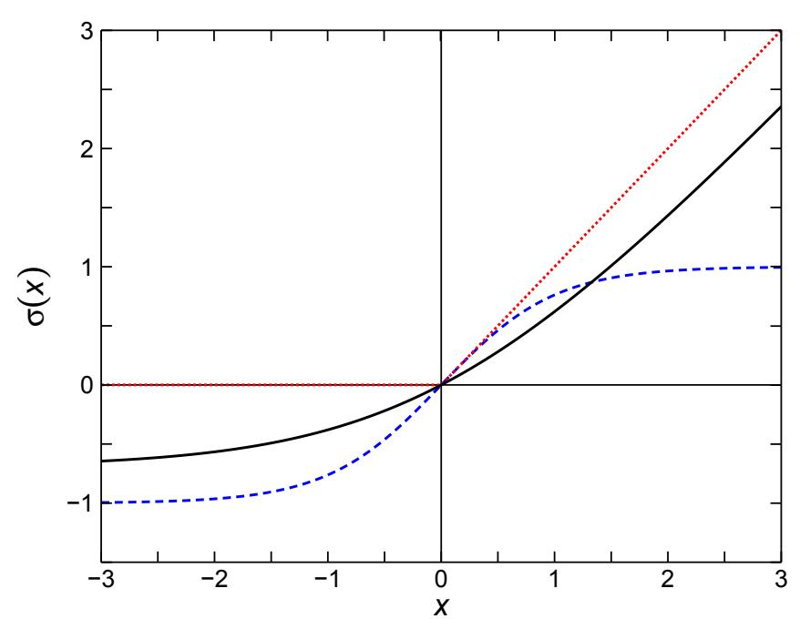
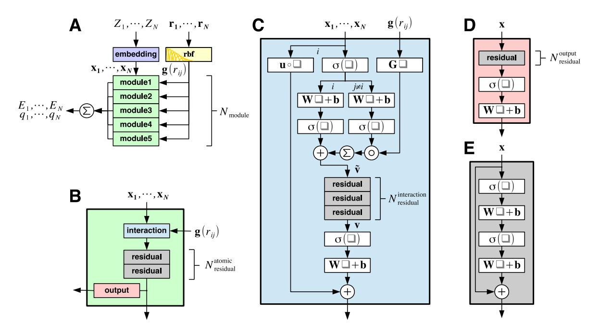
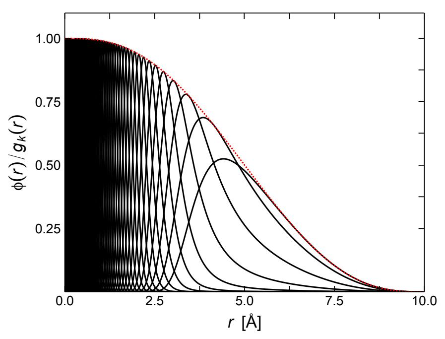
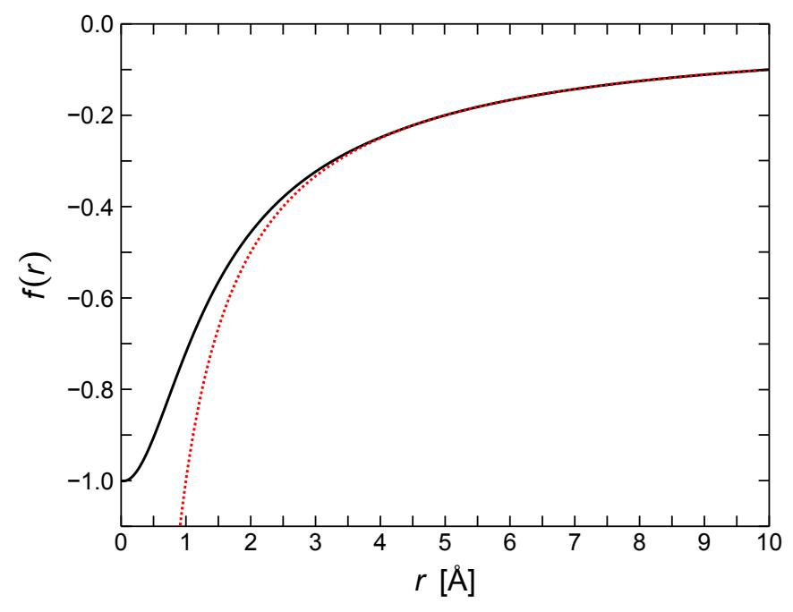
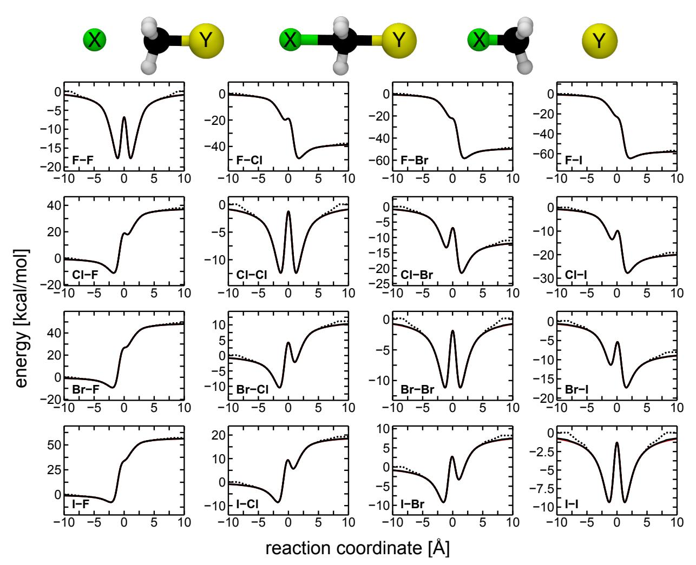
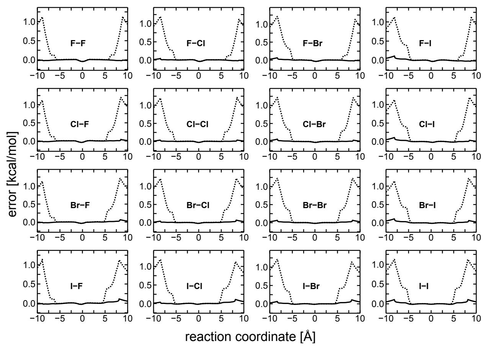
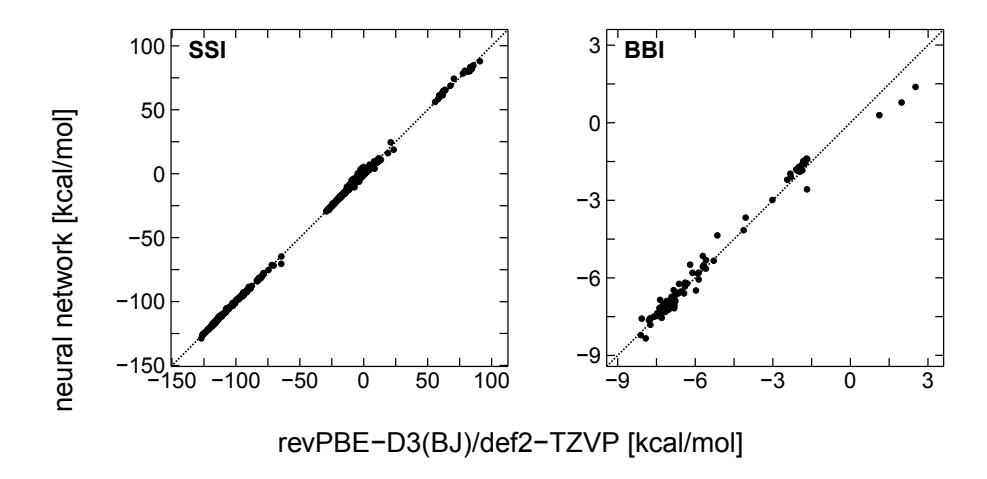
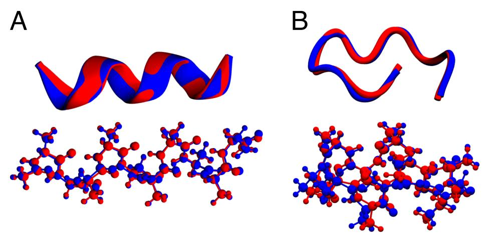
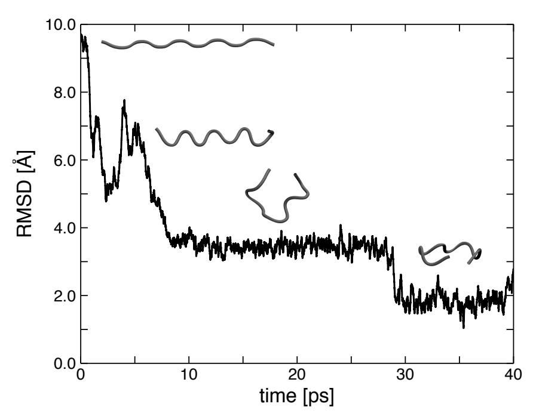

# PHYSNET: A NEURAL NETWORK FOR PREDICTING ENERGIES, FORCES, DIPOLE MOMENTS AND PARTIAL CHARGES

#### Oliver T. Unke\*

Department of Chemistry University of Basel Basel, Switzerland oliver.unke@unibas.ch

#### Markus Meuwly\*

Department of Chemistry University of Basel Basel, Switzerland m.meuwly@unibas.ch

March 29, 2019

#### **ABSTRACT**

In recent years, machine learning (ML) methods have become increasingly popular in computational chemistry. After being trained on appropriate ab initio reference data, these methods allow to accurately predict the properties of chemical systems, circumventing the need for explicitly solving the electronic Schrödinger equation. Because of their computational efficiency and scalability to large datasets, deep neural networks (DNNs) are a particularly promising ML algorithm for chemical applications. This work introduces PhysNet, a DNN architecture designed for predicting energies, forces and dipole moments of chemical systems. PhysNet achieves state-of-the-art performance on the QM9, MD17 and ISO17 benchmarks. Further, two new datasets are generated in order to probe the performance of ML models for describing chemical reactions, long-range interactions, and condensed phase systems. It is shown that explicitly including electrostatics in energy predictions is crucial for a qualitatively correct description of the asymptotic regions of a potential energy surface (PES). PhysNet models trained on a systematically constructed set of small peptide fragments (at most eight heavy atoms) are able to generalize to considerably larger proteins like deca-alanine (Ala10): The optimized geometry of helical Ala10 predicted by PhysNet is virtually identical to ab initio results (RMSD = 0.21 Å). By running unbiased molecular dynamics (MD) simulations of Ala10 on the PhysNet-PES in gas phase, it is found that instead of a helical structure, Ala10 folds into a "wreath-shaped" configuration, which is more stable than the helical form by 0.46 kcal mol-1 according to the reference ab initio calculations.

 $\textbf{\textit{Keywords}}$  PhysNet · Computational chemistry · Neural network · Machine learning · Potential energy surface · Molecular dynamics

## 1 Introduction

As was stated by Dirac already in 1929, 1 the Schrödinger equation (SE) in principle contains all that is necessary to describe the whole of chemistry. Unfortunately, the SE can only be solved in closed form for the simplest systems, hence computational and numerical methods have been devised to find approximate solutions. However, even with these approximations, solving the electronic SE is computationally demanding and, depending on the accuracy required and the approximations used, is only tractable for a limited number of atoms. 2

For this reason, machine learning (ML) methods have become increasingly popular in recent years in order to circumvent the solution of the SE altogether. Such approaches give a computer the ability to learn patterns in data without being explicitly programmed3 and have been used in the past to estimate properties of unknown compounds or structures after being trained on a reference dataset. 4-7 Of particular interest in this context is the energy E, as the forces derived from it can be used to drive molecular dynamics (MD) simulations. Since the Hamiltonian of a chemical system is uniquely determined by the external potential, which in turn depends on a set of nuclear charges  $\{Z_i\}$  and atomic positions

\*to whom correspondence should be addressed

 $\{\mathbf{r}_i\}$ , all information necessary to determine E is contained in  $\{Z_i, \mathbf{r}_i\}$ . Hence, there must exist an exact mapping  $f: \{Z_i, \mathbf{r}_i\} \mapsto E$ , which is usually referred to as a potential energy surface (PES).

Artificial neural networks (NNs)8-14 are a particular class of ML algorithms proven to be general function approximators 15,16 and thus ideally suited to learn a representation of the PES. For small systems, PESs based on NNs have been designed in the spirit of a many-body expansion, 17–19 but these approaches scale poorly for large systems, because they typically involve a large number of individual NNs (one for each term in the many-body expansion). An alternative approach, known as high-dimensional neural network (HDNN), 20 decomposes the total energy of a chemical system into atomic contributions and uses a single NN (or one for each element) for the energy prediction. It relies on the chemically intuitive assumption that the contribution of an atom to the total energy depends mainly on its local environment.

Two variants of HDNNs can be distinguished: One is "descriptor-based", also referred to as Behler-Parrinello networks, 20 for which the environment of an atom is encoded in a hand-crafted descriptor, 21–24 which is used as input of a multi-layer feed-forward NN. Examples for this kind of approach are ANI25 and TensorMol. 26 In the second "message-passing" variant, nuclear charges and Cartesian coordinates are used as input and a deep neural network (DNN) is used to exchange information between individual atoms, such that a meaningful representation of their chemical environments is learned directly from the data. This approach was first introduced by the DTNN 28 and has since been refined in other DNN architectures, for example SchNet29 or HIP-NN. 30 While both types of HDNN perform well, the message-passing variant was found to be able to adapt better to the training data and usually achieves a better performance. 31

This work introduces PhysNet, a HDNN of the message-passing type designed based on physical principles. It is shown that PhysNet improves upon or matches state-of-the-art performance on the QM9,  $^{32}$  MD17,  $^{33}$  and ISO17  $^{29}$  benchmark data sets. Further, two new benchmark datasets are presented: The first set contains structures probing the PES of  $S_N2$  reactions of methyl halides with halide anions. Capturing the correct long-range physics is particularly challenging for this dataset due to the presence of strong charge-dipole interactions. By comparing different variants of PhysNet, it is demonstrated that the explicit inclusion of electrostatics in the energy prediction is important for correctly describing asymptotic regions of the PES.

The second dataset contains structures for small protein-like compounds (consisting of at most eight heavy atoms) and clusters with water molecules. Available benchmark datasets cover conformational and chemical degrees of freedom, but they usually do not probe many-body intermolecular interactions, which are important in the description of condensed phase systems. Due to their biological importance, proteins in aqueous solution are a particularly relevant system of this kind. However, even small proteins contain hundreds of atoms, which makes *ab initio* reference calculations for them prohibitively expensive. Fortunately, it is possible to construct a predictive ML model for large molecules by training it only on smaller molecules that are structurally similar. These so-called "amons" can be readily constructed by considering a large molecule as chemical graph, generating all possible connected subgraphs with a fixed number of heavy atoms and saturating the resulting structures with hydrogen atoms. Due to the fact that most proteins are comprised of only 20 different amino acids, many bonding patterns are shared between proteins and a comparatively small number of amons is sufficient to cover all possibilities.

It is shown that a PhysNet model trained on this data is able to accurately predict interaction energies of common sidechain-sidechain and backbone-backbone interactions in proteins. The model also generalizes to considerably larger molecules than it was trained on: When an ensemble  $^{35}$  of PhysNet models is used to optimize the geometry of helical deca-alanine (Ala10), the results are almost indistinguishable from a structure optimized at the reference DFT level of theory (RMSD = 0.21 Å). By running unbiased MD simulations on the PhysNet-PES, a "wreath-shaped" configuration of Ala10 is found, which, according to *ab initio* calculations, is as stable as the helical form in gas phase (the wreath-shaped form is even slightly lower in energy by 0.46 kcal mol $^{-1}$ ).

In section 2, the PhysNet architecture and the process used for generating the reference data for  $S_{\rm N}2$  reactions and solvated protein fragments is described in detail. The performance of PhysNet on these datasets and other commonly used quantum chemical benchmarks is reported in section 3. Further, the generalization capabilities of the model are explored by applying it to  $Ala_{10}$ . Finally, the results are discussed and summarized in section 4.

## 2 Methods

In section 2.1, the building blocks of PhysNet and its complete architecture are described. Further, the procedure used for training PhysNet on reference data (how the neural network parameters are fitted) is described in section 2.2. Because currently available benchmark datasets do not cover chemical reactions or many-body intermolecular

interactions (as exhibited by condensed phase systems), two additional sets of reference data for  $S_{\rm N}2$  reactions and solvated protein fragments were constructed and their generation is detailed in section 2.3.

#### 2.1 Neural network

The basic building block of every fully-connected NN are so-called dense layers. They take an input vector  $\mathbf{x} \in \mathbb{R}^{n_{\text{in}}}$  and output a vector  $\mathbf{y} \in \mathbb{R}^{n_{\text{out}}}$  based on the transformation

$$y = Wx + b \tag{1}$$

where  $\mathbf{W} \in \mathbb{R}^{n_{\mathrm{out}} \times n_{\mathrm{in}}}$  and  $\mathbf{b} \in \mathbb{R}^{n_{\mathrm{out}}}$  are parameters and  $n_{\mathrm{in}}$  and  $n_{\mathrm{out}}$  denote the dimensionality of input and output vectors, respectively. Note that a single dense layer can only represent a linear transformation from input to output. In order to model arbitrary non-linear relationships, at least two dense layers need to be stacked and combined with a (non-linear) activation function  $\sigma$ , i. e.

$$y = W_2 \sigma (W_1 x + b_1) + b_2$$
 (2)

Throughout this work, the notation  $\sigma(\mathbf{x})$  means that a scalar function  $\sigma$  is applied to a vector  $\mathbf{x}$  entrywise, i.e.  $\sigma(\mathbf{x}) = [\sigma(x_1) \cdots \sigma(x_{n_{\mathrm{in}}})]^\mathsf{T}$ .

Two dense layers combined according to Eq. 2 can already approximate any (non-linear) mapping between input x and output y, provided that the first ("hidden") layer is "wide" enough (contains sufficiently many neurons) and an appropriate activation function  $\sigma$  is used. 15 Many different choices for  $\sigma$  are possible, 36 for example, popular activation functions include  $\tanh(x)$  15 or  $\max(0,x)$ . 37 In this work, the shifted softplus function 29 given by  $\sigma(x) = \log(e^x + 1) - \log(2)$  is used (see Fig. 1).

Figure 1: Popular activation functions  $\sigma(x)$ . The solid black line shows the shifted softplus activation used in this work, the dotted black line shows  $\max{(0,x)}$  and the dashed blue line shows  $\tanh(x)$ . Note that  $\max{(0,x)}$  is not differentiable at x=0, which causes problems when continuous derivatives of the NN output are of interest, and  $\tanh(x)$  saturates for large |x|, which makes training deep neural networks difficult.

While *shallow* neural networks composed of just two dense layers (Eq. 2) are already capable of approximating arbitrary functions, 36 *deep* neural networks composed of more than two layers were shown to be exponentially more parameter efficient in their approximation capability. 38

In this work, several reusable building blocks are combined in a modular fashion to form a deep neural network architecture, which predicts atomic contributions to properties (such as energy) of a chemical system composed of

N atoms based on atomic features  $\mathbf{x}_i \in \mathbb{R}^F$  (here, F denotes the dimensionality of the feature space). The features simultaneously encode information about nuclear charge Z and local atomic environment of each atom i and are constructed by iteratively refining an initial representation depending solely on  $Z_i$  through coupling with the feature vectors  $\mathbf{x}_j$  of all atoms  $j \neq i$  within a cut-off radius  $r_{\text{cut}}$ .

In the following, the individual building blocks of the neural network and important underlying concepts are described in more detail. The complete architecture is schematically represented in Fig. 2. Note that for the remainder of this section, superscripts l are used to denote features or parameters of layer l. All models are implemented in the TensorFlow l framework.

Figure 2: A: Overview over the PhysNet architecture. The input nuclear charges  $Z_i$  of N atoms are transformed to feature vectors  $\mathbf{x}_i \in \mathbb{R}^F$  via an embedding layer (purple, Eq. 3) and passed iteratively through a stack of  $N_{\text{module}}$ modular building blocks (green). From the input Cartesian coordinates  $\mathbf{r}_i$ , all pairwise distances within a cut-off radius  $r_{\rm cut}$  are calculated and expanded in a set of K radial basis functions (rbf, yellow, Eq. 7) forming the entries of the vectors  $\mathbf{g}(r_{ij}) \in \mathbb{R}^K$ , which are additional inputs to each module. The output of all modules is summed to form the final atom-wise predictions of the neural network, e.g. atomic energy contributions  $E_i$  and partial charges  $q_i$  (Eq. 10). B: Structure of a modular building block. Each module transforms its input through an interaction block (blue) followed by  $N_{
m residual}^{
m atomic}$  residual blocks (grey). The computation then splits into two branches: One branch transforms the input further through an output block (red) to form the module output, whereas the other branch passes the transformed input directly to the next module in the hierarchy. C: Interaction block. After passing through the activation function  $\sigma$ , the incoming features of the central atom i and neighbouring atoms j split paths and are further refined through separate non-linear dense layers. The attention mask  $\mathbf{Gg}(r_{ij})$  selects features of atoms j based on their distance to atom i and adds them to its features in order to compute the proto-message  $\tilde{\mathbf{v}}$  (Eq. 6), which is refined through  $N_{\mathrm{residual}}^{\mathrm{interaction}}$ residual blocks (grey) to the message v. After an additional activation and linear transformation, v, which represents the interactions between atoms, is added to the gated feature representations  $\mathbf{u} \circ \mathbf{x}$  (Eq. 5). **D**: Output block. An output block passes its input through  $N_{\rm residual}^{\rm output}$  residual blocks (grey) and a dense layer (with linear activation) to compute the final output of a module (Eq. 9). **E**: Pre-activation residual block. Each residual block refines its input by adding a residual computed by a two-layer neural network (Eq. 4). However, note that the usual order of dense layers and activations is reversed, which allows unrestricted gradient flow when training the neural network. 40 The values of the hyperparameters ( $N_{\text{module}}$ ,  $N_{\text{residual}}^{\text{atomic}}$ ,  $N_{\text{residual}}^{\text{interaction}}$ ,  $N_{\text{residual}}^{\text{output}}$ , ...) used in this work are given in Table 1.

**Embedding layer** An embedding is a mapping from a discrete object to a vector of real numbers. For example, word embeddings 41 find wide spread use in the field of natural language processing, where semantically similar words are mapped such that they appear close to each other in the embedding space. In this work, atomic numbers  $Z \in \mathbb{N}$  are mapped to embeddings  $\mathbf{e}_Z \in \mathbb{R}^F$ , where the entries of the embedding vectors  $\mathbf{e}_Z$  are parameters. The embedding layer

initializes the atomic features of an atom with nuclear charge Z to the corresponding embedding vector  $\mathbf{e}_Z$  (Eq. 3).

$$\mathbf{x}_i^0 = \mathbf{e}_{Z_i} \tag{3}$$

The output of the embedding layer is passed to a stack of  $N_{\rm module}$  modules sharing the same composition, but not parameters.

**Module** Each module in the stack (except for the first one, which receives its input from the embedding layer) takes the output of the previous module and couples the features  $\mathbf{x}_i$  of each atom i with the features  $\mathbf{x}_j$  of all atoms j within the cut-off distance  $r_{\text{cut}}$  through an interaction block. The features are then further refined atom-wise through  $N_{\text{residual}}^{\text{atomic}}$  residual blocks. Subsequently, the computation splits into two branches: One branch passes the atomic features onwards to the next module in the stack (if present) without further modification, whereas the other branch passes the features to an output block, which computes the module's contribution to the final prediction. The split into two branches helps to decouple the feature representations passed between modules from the prediction task at hand.

**Residual block** The ability of a neural network to model arbitrary functions should always increase, or at least remain the same, when the depth (i.e. the amount of dense layers stacked on top of each other) is increased, as additional layers could in principle always reduce to the identity mapping and should therefore never decrease the performance. However, this is not observed in practice: As neural networks get deeper, they become increasingly difficult to train because of the vanishing gradients problem, 42 which leads to a degradation of their performance. In order to alleviate this, it was proposed to add shortcut connections to the neural network architecture that skip one or several layers, creating a so-called residual block. 43

Since their first introduction, the design of residual blocks was further refined to allow completely unhindered gradient flow through all layers of a neural network.  $^{40}$  It was shown that stacking these so-called pre-activation residual blocks allows successfully training neural networks more than 1000 layers deep.  $^{40}$  In this work, pre-activation residual blocks are used extensively to refine the atomic features according to

$$\mathbf{x}_{i}^{l+2} = \mathbf{x}_{i}^{l} + \mathbf{W}^{l+1}\sigma\left(\mathbf{W}^{l}\sigma(\mathbf{x}_{i}^{l}) + \mathbf{b}^{l}\right) + \mathbf{b}^{l+1}$$
(4)

where  $\mathbf{x}_i^l$  and  $\mathbf{x}_i^{l+2}$  are input and output features, respectively, and  $\mathbf{W}^l, \mathbf{W}^{l+1} \in \mathbb{R}^{F \times F}$  and  $\mathbf{b}^l, \mathbf{b}^{l+1} \in \mathbb{R}^F$  are parameters.

**Interaction block** In order to predict properties that depend on the environment of an atom i, it is important to model interactions with its surrounding atoms j in a chemically and physically meaningful manner. In doing so, it is crucial that all known invariances of the property of interest are respected: For example, the energy of a molecular system is known to be invariant with respect to translation, rotation and permutation of equivalent atoms. 21 Further, since it is a valid assumption that most (but not all) chemical interactions are inherently short-ranged, 24 it is meaningful to introduce a cut-off radius  $r_{cut}$ , such that only interactions within the local environment of an atom are considered. Apart from encoding chemical knowledge directly in the modelling of interactions, this approach has the important computational advantage of making predictions scale linearly with system size.

Based on these design principles, the feature vector  $\mathbf{x}$  of an atom is refined by interacting with its local environment through a "message"  $\mathbf{v} \in \mathbb{R}^F$  according to

$$\mathbf{x}_{i}^{l+1} = \mathbf{u}^{l} \circ \mathbf{x}_{i}^{l} + \mathbf{W}^{l} \sigma(\mathbf{v}_{i}^{l}) + \mathbf{b}^{l}$$
(5)

where  $\mathbf{u}^l, \mathbf{b}^l \in \mathbb{R}^F$  and  $\mathbf{W}^l \in \mathbb{R}^{F \times F}$  are parameters and 'o' denotes the Hadamard (entrywise) product (see Fig. 2C). The gating vector  $\mathbf{u}$ , inspired by the gated recurrent unit, 44 allows individual entries of the feature vector to be damped or reinforced during the update. The final message  $\mathbf{v}$  used in Eq. 5 is obtained by passing a proto-message  $\tilde{\mathbf{v}}$  through  $N_{\mathrm{residual}}^{\mathrm{interaction}}$  residual blocks (Eq. 4), where  $\tilde{\mathbf{v}}$  is given by

$$\tilde{\mathbf{v}}_{i}^{l} = \sigma \left( \mathbf{W}_{\mathbf{I}}^{l} \sigma(\mathbf{x}_{i}^{l}) + \mathbf{b}_{\mathbf{I}}^{l} \right) + \sum_{j \neq i} \mathbf{G}^{l} \mathbf{g}(r_{ij}) \circ \sigma \left( \mathbf{W}_{\mathbf{J}}^{l} \sigma(\mathbf{x}_{j}^{l}) + \mathbf{b}_{\mathbf{J}}^{l} \right)$$
(6)

and  $\mathbf{W_I}^l, \mathbf{W_J}^l \in \mathbb{R}^{F \times F}, \mathbf{b_I}^l, \mathbf{b_J}^l \in \mathbb{R}^F$  and  $\mathbf{G}^l \in \mathbb{R}^{F \times K}$  are parameters and  $r_{ij}$  denotes the Euclidean distance between atoms i and j. The vector  $\mathbf{g}(r_{ij}) = [g_1(r_{ij}) \cdots g_K(r_{ij})]^\mathsf{T}$  is composed of the values of K radial basis functions of the form

$$g_k(r_{ij}) = \phi(r_{ij}) \cdot \exp\left(-\beta_k \left(\exp(-r_{ij}) - \mu_k\right)^2\right)$$
(7)

where  $\mu_k, \beta_k \in \mathbb{R}_{>0}$  are parameters that specify centre and width of  $g_k(r_{ij})$ , respectively, and  $\phi(r_{ij})$  is a smooth cut-off function given by 45

$$\phi(r_{ij}) = \begin{cases} 1 - 6\left(\frac{r_{ij}}{r_{\text{cut}}}\right)^5 + 15\left(\frac{r_{ij}}{r_{\text{cut}}}\right)^4 - 10\left(\frac{r_{ij}}{r_{\text{cut}}}\right)^3 & r_{ij} < r_{\text{cut}} \\ 0 & r_{ij} \ge r_{\text{cut}} \end{cases}$$
(8)

that ensures continuous behaviour when an atom enters or leaves the cut-off sphere. The vector  $\mathbf{G}^l\mathbf{g}(r_{ij}) \in \mathbb{R}^F$  takes the role of a learnable attention mask  $^{46}$  that selects different features based on the pairwise distance  $r_{ij}$  between atoms. Note that the Gaussian in Eq. 7 takes  $\exp(-r_{ij})$  instead of  $r_{ij}$  as its argument, which biases attention masks towards a functional form that decays exponentially with  $r_{ij}$  (see Fig. 3). Such a bias is meaningful for a chemical system, as it entails the physical knowledge that bound state wave functions in two-body systems decay exponentially. Since only pairwise distances are used in Eq. 6, the output of an interaction block is automatically translationally and rotationally invariant, while the commutative property of summation ensures permutational invariance.  $^{47}$ 

Figure 3: Radial basis functions. Shown are the cutoff-function  $\phi(r)$  (dotted red curve, Eq. 8) along with K=64 radial basis functions  $g_k(r)$  (solid black curves, Eq. 7) with a fixed  $\beta_k=\left(2K^{-1}\left(1-\exp(-r_{\rm cut})\right)\right)^{-2}$  and values of  $\mu_k$  equally spaced between  $\exp(-r_{\rm cut})$  and 1 with  $r_{\rm cut}=10$  Å. Note that for larger r, the basis functions automatically become wider even though all  $g_k(r)$  share the same width parameter  $\beta_k$ .

**Output block** Each output block passes the atomic features through  $N_{\text{residual}}^{\text{output}}$  additional residual blocks and computes the output  $\mathbf{y}_i^m \in \mathbb{R}^{n_{\text{out}}}$  of module m for atom i by a linear transformation of the activated features according to

$$\mathbf{y}_{i}^{m} = \mathbf{W}_{\text{out}}^{m} \sigma(\mathbf{x}_{i}^{l}) + \mathbf{b}_{\text{out}}^{m}$$
(9)

where  $\mathbf{W}_{\mathrm{out}}^m \in \mathbb{R}^{F \times n_{\mathrm{out}}}$  and  $\mathbf{b}_{\mathrm{out}}^m \in \mathbb{R}^{n_{\mathrm{out}}}$  are parameters. How many entries the output vector  $\mathbf{y}_i^m$  has depends on how many atomic properties are predicted at once. In this work, two variants are considered: The first version predicts atomic energy contributions along with atomic partial charges (i.e.  $\mathbf{y}_i^m = [E_i^m \ q_i^m]^\mathsf{T}$  and  $n_{\mathrm{out}} = 2$ ), whereas the second version predicts just atomic energy contributions (i.e.  $\mathbf{y}_i^m = [E_i^m]$  and  $n_{\mathrm{out}} = 1$ ). In principle, other properties could be predicted as well.

Final prediction The final atomic properties yi are obtained by summing the contributions of the individual modules according to

$$\mathbf{y}_{i} = \mathbf{s}_{Z_{i}} \circ \left(\sum_{m=1}^{N_{\text{module}}} \mathbf{y}_{i}^{m}\right) + \mathbf{c}_{Z_{i}}$$
(10)

where sZ, cZ ∈ R nout are learnable element-specific scale and shift parameters depending on the nuclear charge Zi of atom i. The scaling and shifting of the output decouples the values of other parameters from the numeric range of target properties, which depends mainly on the chosen system of units. Element-specific (instead of global) parameters are motivated by a previous observation indicating that atomic properties of distinct elements can span vastly different ranges. [24](#page-19-10)

The final prediction for the total energy of a system of interest composed of N atoms is obtained by summation of the atomic energy contributions Ei :

$$E = \sum_{i=1}^{N} E_i \tag{11}$$

A potential shortcoming of Eq. [11](#page-6-1) is the fact that all long-range interactions contributing to E beyond the cut-off radius rcut cannot be properly accounted for. As long as rcut is chosen sufficiently large, this is not an issue. However, in order to account for electrostatic interactions which decay with the inverse of the distance, a large cut-off would be necessary and reduce the computational efficiency of the model. Fortunately, their functional form is known and they can be explicitly included when computing E. Other types of long-range interactions for which the functional form is also known analytically, for example dispersion corrections like DFT-D3, [48](#page-20-17) can be included as well.

Because of the shortcomings of Eq. [11,](#page-6-1) for a PhysNet model that also predicts atomic partial charges, E is calculated by

$$E = \sum_{i=1}^{N} E_i + k_e \sum_{i=1}^{N} \sum_{j>i}^{N} \tilde{q}_i \tilde{q}_j \chi(r_{ij}) + E_{D3}$$
(12)

instead, where ED3 is the DFT-D3 dispersion correction, [48](#page-20-17) ke is Coulomb's constant, q˜i and q˜j are corrected partial charges (see Eq. [14\)](#page-6-2) of atoms i and j, and χ(rij ) is given by

$$\chi(r_{ij}) = \phi(2r_{ij}) \frac{1}{\sqrt{r_{ij}^2 + 1}} + (1 - \phi(2r_{ij})) \frac{1}{r_{ij}}$$
(13)

where φ(rij ) is the cut-off function given by Eq. [8.](#page-5-2) Here, χ(rij ) smoothly interpolates between the correct r −1 ij dependence of Coulomb's law at long-range and a damped term at small distances to avoid the singularity at rij = 0 (see Fig. [4\)](#page-7-2). The corrected partial charges q˜i are obtained from the partial charges qi predicted by the neural network (Eq. [9\)](#page-5-0) according to

$$\tilde{q}_i = q_i - \frac{1}{N} \left( \sum_{j=1}^N q_j - Q \right) \tag{14}$$

where Q is the total charge of the system. As neural networks are a purely numerical algorithm, it is not guaranteed *a priori* that the sum of all predicted atomic partial charges qi is equal to the total charge Q (although the result is usually very close when the neural network is properly trained), so a correction scheme like Eq. [14](#page-6-2) is necessary to guarantee charge conservation.

It should be pointed out that the summation over all atom pairs when evaluating the long-range interactions in Eq. [12](#page-6-3) makes the evaluation of E scale quadratically with system size. Fortunately, various schemes to recover linear scaling are described in the literature, e.g. Ewald summation[49](#page-20-18) or cut-off methods [50](#page-20-19), and can be applied without modification.

Note that the concept of augmenting a neural network potential with long range interactions is not novel and was first proposed in [[51\]](#page-20-20). However, most previous works use a separately trained neural network to predict atomic partial charges, [26,](#page-19-12)[51](#page-20-20) in contrast to the present work, which uses a single neural network to learn both, atomic energy contributions and partial charges (see Eqs. [9](#page-5-0) and [10\)](#page-6-0). Aside from computational advantages (only a single neural network needs to be trained and evaluated), shared feature representations in such "multi-task learning" are believed to increase the generalization capabilities (transferability) of a model. [52–](#page-20-21)[54](#page-20-22)

Apart from allowing the computation of long-range electrostatic interactions, the partial charges q˜i can also be used to predict the electric dipole moment p of a structure according to

$$\mathbf{p} = \sum_{i=1}^{N} \tilde{q}_i \mathbf{r}_i \tag{15}$$

Figure 4: Coulomb interaction. The dotted red curve shows the correct  $\frac{1}{r}$  dependence of Coulomb's law, whereas the solid black curve shows  $\chi(r)$  (see Eq. 13) for  $r_{\rm cut}=10$  Å. Note that for  $r>\frac{r_{\rm cut}}{2}$ , both curves are identical by construction.

where  $\mathbf{r}_i$  are the Cartesian coordinates of atom i. The ability to predict  $\mathbf{p}$  is useful for example for the calculation of infrared spectra. 55,56

Finally, analytical derivatives of E (see Eqs. 11 and 12) with respect to the Cartesian coordinates  $\{\mathbf{r}_1,\ldots,\mathbf{r}_N\}$  of the atoms, for example in order to derive the forces  $\mathbf{F}_i$  acting on each atom i, are readily obtained by reverse mode automatic differentiation. 57

**Hyperparameters** The PhysNet architecture can be tuned by hyperparameters that control width and depth of the neural network (see Fig. 2). While it would be possible to optimize hyperparameters for individual learning tasks, for example via a grid search, it was found that this is not necessary for good performance. For simplicity, all models used in this work share the same architecture with the hyperparameters summarized in Table 1, unless specified otherwise.

Table 1: Hyperparameters of all models used in this work (unless specified otherwise).

| hyperparameter                             | value | significance                                               |
|--------------------------------------------|-------|------------------------------------------------------------|
| $\overline{F}$                             | 128   | dimensionality of feature space                            |
| K                                          | 64    | number of radial basis functions                           |
| $N_{ m module}$                            | 5     | number of stacked modular building blocks                  |
| $N_{ m residual}^{ m atomic}$              | 2     | number of residual blocks for atom-wise refinements        |
| $N_{\text{residual}}^{\text{interaction}}$ | 3     | number of residual blocks for refinements of proto-message |
| $N_{ m residual}^{ m output}$              | 1     | number of residual blocks in output blocks                 |
| $r_{ m cut}$                               | 10 Å  | cut-off radius for interactions in the neural network      |

#### 2.2 Training

Before the training of a neural network starts, its parameters need to be initialized. All entries of the embedding vectors  $\mathbf{e}_Z$  are initialized with random values uniformly distributed between  $-\sqrt{3}$  and  $\sqrt{3}$  (such that they have unit expected variance) and the weight matrices  $\mathbf{W}, \mathbf{W}_{\mathbf{I}}$  and  $\mathbf{W}_{\mathbf{J}}$  are initialized to random orthogonal matrices with entries scaled

such that their variance corresponds to the value recommended in the Glorot initialization scheme. 42 The entries of all bias vectors  $\mathbf{b}$ ,  $\mathbf{b_I}$ ,  $\mathbf{b_J}$ ,  $\mathbf{b_{out}}$  and matrices  $\mathbf{G}$  and  $\mathbf{W_{out}}$  are initialized to zero, whereas the entries of the gating vectors  $\mathbf{u}$  are initialized to one. The centres  $\mu_k$  of the of the radial basis functions are set to K equally spaced values between  $\exp(-r_{\text{cut}})$  and 1 and their widths  $\beta_k$  are initialized to  $\left(2K^{-1}\left(1-\exp(-r_{\text{cut}})\right)\right)^{-2}$  (see Fig. 3).

After initialization, the parameters of the neural network are optimized by minimizing a loss function  $\mathcal{L}$  using AMSGrad 58 with a learning rate of  $10^{-3}$  (other hyperparameters of the optimizer are set to the default values recommended in [58]) and a batch size of 32 randomly chosen reference structures. For predicting energies without long-range augmentation (Eq. 11) the loss function is

$$\mathcal{L} = w_E \left| E - E^{\text{ref}} \right| + \frac{w_F}{3N} \sum_{i=1}^{N} \sum_{\alpha=1}^{3} \left| -\frac{\partial E}{\partial r_{i,\alpha}} - F_{i,\alpha}^{\text{ref}} \right| + \mathcal{L}_{\text{nh}}$$
 (16)

whereas when energies and charges are predicted (Eq. 11), the loss function is

$$\mathcal{L} = w_E \left| E - E^{\text{ref}} \right| + \frac{w_F}{3N} \sum_{i=1}^{N} \sum_{\alpha=1}^{3} \left| -\frac{\partial E}{\partial r_{i,\alpha}} - F_{i,\alpha}^{\text{ref}} \right| + w_Q \left| \sum_{i=1}^{N} q_i - Q^{\text{ref}} \right| + \frac{w_p}{3} \sum_{\alpha=1}^{3} \left| \sum_{i=1}^{N} q_i r_{i,\alpha} - p_{\alpha}^{\text{ref}} \right| + \mathcal{L}_{\text{nh}}$$

$$(17)$$

Here,  $E^{\rm ref}$  and  $Q^{\rm ref}$  are reference energy and total charge,  $p_{\alpha}^{\rm ref}$  are the Cartesian components of the reference dipole moment  ${\bf p}^{\rm ref}$ ,  $F_{i,\alpha}^{\rm ref}$  are the Cartesian components of the reference force  ${\bf F}_i^{\rm ref}$  acting on atom i and  $r_{i,\alpha}$  is the  $\alpha$ th Cartesian coordinate of atom i. The energy prediction E is given either by Eq. 11 or Eq. 12, depending on which variant of PhysNet is used.

The weighting hyperparameters  $w_E, w_F, w_Q$  and  $w_p$  determine the relative contribution of the individual error terms to the loss term. Note that the numeric ranges of the error terms (and therefore their contribution to  $\mathcal{L}$ ) also depend on the chosen system of units. For simplicity, weighting hyperparameters are not optimized for individual learning tasks and instead always set to  $w_E = w_Q = w_p = 1$  and  $w_F = 10^2$  (when all quantities are measured in atomic units). The higher relative weight of force errors is motivated by the fact that forces alone determine the dynamics of a chemical system and accurate force predictions are therefore most important for MD simulations. Note that for datasets where any of the reference quantities used in Eqs. 16 and 17 are not available, the corresponding weight is set to zero.

The term  $\mathcal{L}_{nh}$  is a "non-hierarchicality penalty", inspired by a similar regularization method introduced in [30], given either by

$$\mathcal{L}_{\rm nh} = \frac{\lambda_{\rm nh}}{N} \sum_{i=1}^{N} \sum_{m=2}^{N_{\rm module}} \frac{(E_i^m)^2}{(E_i^m)^2 + (E_i^{m-1})^2}$$
(18)

or

$$\mathcal{L}_{\rm nh} = \frac{\lambda_{\rm nh}}{N} \sum_{i=1}^{N} \sum_{m=2}^{N_{\rm module}} \frac{1}{2} \left[ \frac{(E_i^m)^2}{(E_i^m)^2 + (E_i^{m-1})^2} + \frac{(q_i^m)^2}{(q_i^m)^2 + (q_i^{m-1})^2} \right]$$
(19)

depending on which variant of PhysNet is used, and  $\lambda_{nh}$  is the corresponding regularization hyperparameter. The  $\mathcal{L}_{nh}$  term penalizes when the predictions of individual modules do not decay with increasing depth in the hierarchy. Since deeper feature representations of atoms capture increasingly higher-order interactions, such a regularization is motivated by the fact that higher-order terms in many-body expansions of the energy are known to decay rapidly in magnitude. For simplicity,  $\lambda_{nh}$  is not tuned for individual learning tasks and instead always set to  $10^{-2}$ .

During training, an exponential moving average of all parameter values is kept using a decay rate of 0.999. Overfitting is prevented using early stopping: 59 After every epoch (one pass over all reference structures in the training set), the loss function is evaluated on a validation set of reference structures using the parameters obtained from the exponential moving average. After training, the model that performed best on the validation set is selected. Since the validation set is used indirectly during the training procedure, the performance of the final models (see section 3) is always measured on a separate test set.

Note that only true quantum mechanical observables, such as total energy, forces or dipole moments, are used as reference when training the neural network (see Eqs. 16 and 17). While it would also be possible to train directly on atomic energies and partial charges obtained using a decomposition method, 60–63 such schemes are essentially arbitrary and it is unclear whether the corresponding decompositions are meaningful. Further, it is not always guaranteed that the

quantities obtained from such methods vary smoothly when the molecular geometry changes, which makes it difficult for a neural network to learn them. By only relying on quantum mechanical observables, the model automatically learns to perform a smooth decomposition in a data-driven way.

### 2.3 Dataset generation

In the following, the generation of two new benchmark datasets is described, which probe chemical reactivity, long-range electrostatics, and many-body intermolecular interactions.

 $S_N 2$  reactions The  $S_N 2$  reactions dataset probes chemical reactions of the kind  $X^- + H_3C-Y \to X-CH_3 + Y^-$  and contains structures for all possible combinations of  $X,Y \in \{F,Cl,Br,I\}$ . The reactions of methyl halides with halide anions are a prototypical examples for chemical reactions and have been studied extensively both experimentally  $^{64-68}$  and theoretically.  $^{69-74}$  It consists of different geometries for the high-energy transition regions, ion-dipole bound state complexes and long-range (>10 Å) interactions of  $CH_3X$  molecules with  $Y^-$  ions. The dataset also includes various structures for several smaller molecules that can be formed in fragmentation reactions, such as  $CH_3X$ , HX, CHX or  $CH_2X^-$  with  $X \in \{F,Cl,Br,I\}$ , as well as geometries for  $H_2$ ,  $CH_2$ ,  $CH_3^+$  and XY interhalogen compounds for all possible combinations of  $X,Y \in \{F,Cl,Br,I\}$ . In total, the dataset provides reference energies, forces, and dipole moments for  $452\,709$  structures calculated at the DSD-BLYP-D3(BJ)/def2-TZVP level of theory.  $^{48,75-77}$ 

Different conformations for each species present in the  $S_N2$  reactions dataset were sampled by running MD simulations at a temperature of 5000 K with a time step of 0.1 fs using the Atomic Simulation Environment (ASE). 78 The necessary forces were obtained with the semi-empirical PM7 method 79 implemented in MOPAC2016. 80 Structures were saved every 10 steps and for each of them, reference energies, forces and dipole moments were calculated at the DSD-BLYP-D3(BJ)/def2-TZVP 48,75-77 level of theory using the ORCA 4.0.1 code. 81,82 The DSD-BLYP functional is one of the best performing double hybrid methods in the GMTKN55 benchmark. 83 All MD simulations were started from the PM7-optimized geometries. For the reaction complexes [XCH3Y]-, MD simulations were randomly started either from the respective van der Waals complexes, or, in order to better sample the transition regions, from the transition state (calculated with PM7) of the respective reaction. Further, long-range interactions were sampled by choosing a random conformation from the CH3X MD simulations and randomly placing an ion Y- in the vicinity of the CH3X molecule such that its distance to any other atom is at most 16 Å. Table 2 lists the number of conformations for each species.

Table 2: Number of structures for each species present in the  $S_{\rm N}2$  reactions dataset.

|                                     |        |                     | ı.    |                      |       |
|-------------------------------------|--------|---------------------|-------|----------------------|-------|
| species                             | count  | species             | count | species              | count |
| [FCH 3 Cl] -  | 44 501 | $\mathrm{CH_{3}I}$  | 3500  | HCl                  | 3500  |
| $[FCH_3Br]^-$                       | 44501  | $CH_3^+$            | 3500  | $_{ m HBr}$          | 3500  |
| $[FCH_3I]^-$                        | 44501  | $\mathrm{CH_2F^-}$  | 3500  | HI                   | 3500  |
| $[ClCH_3Br]^-$                      | 44501  | $\mathrm{CH_2Cl^-}$ | 3500  | $F_2$                | 2000  |
| $[ClCH_3I]^-$                       | 44501  | $\mathrm{CH_2Br}^-$ | 3500  | FCl                  | 2000  |
| $[BrCH_3I]^-$                       | 44501  | $\mathrm{CH_2I^-}$  | 3500  | FBr                  | 2000  |
| $[FCH_3F]^-$                        | 24801  | $\mathrm{CH}_2$     | 3500  | $_{ m FI}$           | 2000  |
| [ClCH 3 Cl] − | 24801  | CHF                 | 3500  | $Cl_2$               | 1999  |
| $[BrCH_3Br]^-$                      | 24801  | CHCl                | 3500  | ClBr                 | 2000  |
| $[ICH_3I]^-$                        | 24801  | CHBr                | 3500  | ClI                  | 2000  |
| $\mathrm{CH_{3}F}$                  | 3500   | CHI                 | 3500  | $\mathrm{Br}_2$      | 2000  |
| $\mathrm{CH_{3}Cl}$                 | 3500   | $\mathrm{H}_2$      | 3500  | $\operatorname{BrI}$ | 2000  |
| CH 3 Br                  | 3500   | HF                  | 3500  | $I_2$                | 2000  |

**Solvated protein fragments** The solvated protein fragments dataset probes many-body intermolecular interactions between "protein fragments" and water molecules, which are important for the description of many biologically relevant condensed phase systems. It contains structures for all possible "amons" (hydrogen-saturated covalently bonded fragments) of up to eight heavy atoms (C, N, O, S) that can be derived from chemical graphs of proteins containing the 20 natural amino acids connected via peptide bonds or disulfide bridges. For amino acids that can occur in different charge states due to (de-)protonation (i.e. carboxylic acids that can be negatively charged or amines that can be positively charged), all possible structures with up to a total charge of  $\pm 2e$  are included. These structures are augmented with solvated variants containing a varying number of water molecules such that the total number of heavy atoms does not

exceed 21. The dataset also contains randomly sampled dimer interactions of protein fragments, as well as structures of pure water with up to 40 molecules. For all included structures, several conformations sampled with MD simulations at 1000 K are included. In total, the dataset contains reference energies, forces and dipole moments for 2 731 180 structures calculated at the revPBE-D3(BJ)/def2-TZVP level of theory. \(^{48,76,77,84}\) On average, the structures contain 21 atoms (with a maximum of 120 atoms) and consist of 63% hydrogen, 19% carbon, 12% oxygen, 5% nitrogen, and 1% sulfur atoms.

The different structures in the dataset were constructed as follows: All amons with up to eight heavy atoms (C, N, O, S) were constructed according to the method described in [34] for all possible chemical graphs of proteins containing the 20 natural amino acids connected via peptide bonds or disulfide bridges. For amons derived from amino acids that can occur in different charge states due to (de-)protonation, variants for all charge states are included. This results in 2307 different molecules. In order to sample interactions with solvent molecules, the amon structures were augmented by randomly placing up to 20 water molecules in their vicinity, such that the total number of heavy atoms does not exceed 21. This results in 29 991 additional structures. Further, other intermolecular interactions were sampled by generating all possible dimers from amons with up to 3 heavy atoms, resulting in 867 possible combinations. Important interactions between different amino acids were included by adding sidechain-sidechain and backbone-backbone complexes from the BioFragment Database (3480 structures). Further, interactions in pure water were sampled by constructing water clusters with up to 21 molecules. Each water cluster is complemented by a variant with an additional proton, as well as with a variant lacking one proton in order to sample the different possible charge states of water. This results in 24 additional structures.

All structures were optimized using the semi-empirical PM7 method 79 implemented in MOPAC2016. 80 Starting from the optimized geometry, 100 different conformations for each structure were sampled by running MD simulations (at the same level of theory) at a temperature of 1000 K with a time step of 0.1 fs using the ASE. 78 Structures were saved every 10 steps and for each of them, reference energies, forces and dipole moments were calculated at the revPBE-D3(BJ)/def2-TZVP48,76,77,84 level of theory using the ORCA 4.0.1 code. 81,82 The revPBE functional is one of the best performing GGA functionals in the GMTKN55 benchmark. 83

While this initial data already covers many different chemical situations, it is not guaranteed that the contained structures cover chemical and configurational space sufficiently well to account for all situations that might be relevant in MD simulations. For this reasons, the initial dataset was iteratively augmented using an adaptive sampling method: 86,87 An ensemble 35 of three PhysNet models trained (see section 2.2) on the initial dataset is used to run MD simulations and all structures for which their predictions deviate by more than a threshold value (here 1 kcal mol-1) are saved. Discrepancies in the predictions are a strong indicator that the dataset used for training the models does not contain sufficient information for a particular conformation. 86,87 For each structure saved in this process, energies, forces and dipole moments were calculated with the reference *ab initio* method and added to the dataset. Afterwards, the models were retrained and the sampling process repeated. In total, the dataset was adaptively augmented in this way for four times, after which significant deviations between the predictions were found to be rare. Finally, energies, forces and dipole moments were calculated with the reference method for 10 000 structures of 40 water molecules in a spherical arrangement (obtained by running MD simulations with PM7, see above) to include training examples similar to bulk phase water. The final dataset contains data for 2 731 180 structures.

#### 3 Results

In this section, PhysNet is applied to various quantum-chemical datasets that all probe different aspects of chemical space (i.e. chemical and/or conformational degrees of freedom). Apart from the well-established benchmarks QM9, 32 MD17, 33 and ISO17, 29 the model is also applied to the two new datasets introduced in section 2.3.

QM9 The QM9 dataset  $^{32}$  is a widely used benchmark for the prediction of several properties of molecules in equilibrium. It consists of geometric, energetic, electronic, and thermodynamic properties for  $\approx 134 k$  small organic molecules made up of H, C, O, N, and F atoms. These molecules correspond to the subset of all species with up to nine heavy atoms (C, O, N, and F) out of the GDB-17 chemical universe database. 88 All properties are calculated at the B3LYP/6-31G(2df,p) level of theory. About 3k molecules within QM9 fail a geometric consistency check or are difficult to converge  $^{32}$  and are commonly removed from the dataset.  $^{27,29,30,89}$  Since the QM9 contains only equilibrium geometries, the benchmark probes just chemical (but no conformational) degrees of freedom.

Table 3 compares the performance for predicting the energy on the pruned QM9 dataset ( $\approx$ 131k structures) of various models published in the literature with PhysNet. Results for PhysNet are averaged over five independent runs using the same training set. The performance of PhysNet can be further improved by *bagging*: 35 While a single PhysNet model

already improves upon the state-of-the-art, an ensemble of five PhysNet models (PhysNet-ens5) brings the error down even further.

Table 3: Mean absolute errors in kcal mol-1 for energy predictions on the QM9 dataset for several models reported in the literature and different training set sizes. Results for PhysNet are averaged over five independent runs, whereas PhysNet-ens5 is the performance of an ensemble 35 of five PhysNet models. Best results are shown in bold.

| $N_{ m train}$ + $N_{ m valid}$ | enn-s2s-ens5 27 | DTNN 28 | SchNet 29 | HIP-NN 30 | PhysNet | PhysNet-ens5 |
|---------------------------------|----------------------------|--------------------|----------------------|----------------------|---------|--------------|
| 110 426                         | 0.33                       | _                  | 0.31                 | 0.26                 | 0.19    | 0.14         |
| 100000                          | -                          | 0.84               | 0.34                 | 0.26                 | 0.19    | 0.14         |
| 50000                           | _                          | 0.94               | 0.49                 | 0.35                 | 0.30    | 0.24         |

MD17 The MD17 dataset  $^{33}$  is a collection of structures, energies and forces from *ab initio* MD simulations of eight small organic molecules. All trajectories are calculated at a temperature of 500 K and a resolution of 0.5 fs using the PBE+vdW-TS  $^{90,91}$  electronic structure method. The datasets range in size from 150k to almost 1M conformations and cover energy ranges between 20 to 48 kcal mol $^{-1}$  and force components between 266 to 570 kcal mol $^{-1}$  Å $^{-1}$ . The task is to predict energies (and forces) using a separate model for each molecule. Since each task is limited to a single molecule, the MD17 benchmark probes only conformational (an no chemical) degrees of freedom.

Table 4 compares the performance of various ML models published in the literature on the MD17 benchmark with PhysNet. Results for PhysNet are averaged over five independent runs using the same training set and their ensemble prediction 35 is also reported (PhysNet-ens5). When comparing different models, it should be noted that they use different subsets of the available data for training: DTNN 28 and HIP-NN 30 are trained on energies only, GDML 33 is trained on forces only, and SchNet and PhysNet are trained on energies and forces. 29 PhysNet-ens5 matches or even improves upon state-of-the-art performance for all molecules in at least one category (energy or forces).

**ISO17** The ISO17 dataset 29 consists of short MD trajectories of 127 isomeric molecules with the composition  $C_7O_2H_{10}$  drawn randomly from the largest set of isomers in QM9. Each trajectory samples 5k conformations at a resolution of 1 fs. In total, the dataset contains 635k structures, for which energies and forces, calculated at the PBE+vdW-TS 90,91 level of theory, are reported. The task is to predict energies (and forces) for two different scenarios: In the first variant (known molecules / unknown conformations), the training set contains  $\approx$ 80% of all molecules and conformations (400k structures for training 4k structures for validation) and the task is to predict the remaining  $\approx$ 20% of conformations for the same subset of molecules present in the training set (101k structures). Thus, the first variant tests the generalization capabilities of the model for unknown conformations of previously seen molecules. In the second, more challenging variant (unknown molecules / unknown conformations), the training set remains the same, but the task is to predict all 5k conformations of the  $\approx$ 20% of molecules not present in the training set (130k structures). Here, generalization capabilities of the model are tested for unknown conformations of unknown molecules. Both variants of the ISO17 benchmark probe chemical and conformational degrees of freedom.

Table 5 compares the performance of SchNet29 to the average performance of five PhysNet models, as well as their ensemble prediction35 (PhysNet-ens5) for the two variants of the ISO17 benchmark. While for the first variant of the benchmark (known molecules / unknown conformations), PhysNet achieves state-of-the-art performance on both energies and forces, for the second variant (unknown molecules / unknown conformations), PhysNet improves upon SchNet only for force predictions, but performs slightly worse for energies. This is likely due to the higher relative weight of force data during the training process (see section 2.2) and it is possible that the results on energy could be improved by tuning the corresponding weighting hyperparameters.

 $\mathbf{S}_{\mathrm{N}}\mathbf{2}$  reactions This benchmark dataset was newly generated for the present work, for a detailed description of the dataset, see section 2.3. The task is to predict energies, forces and dipole moments using a single model for all structures contained in the dataset, testing the generalization capabilities of the model across chemical and conformational degrees of freedom, chemical reactions, and challenging long-range intermolecular interactions.

Table 6 lists the performance of PhysNet with and without explicit long-range electrostatic interactions (see Eqs. 12 and 11). All models were trained on 400k structures with 5k structures used for validation. The results in each case are averaged over five independent runs and the performance of ensembles  $^{35}$  of five PhysNet models is also reported. Because of the partial charge correction scheme (see Eq. 14), the total charge is always predicted exactly. However, for completeness, the error for the prediction of total charge (in e) using the uncorrected partial charges is also given.

Table 4: Mean absolute errors for predictions of energy (in kcal  $mol^{-1}$ ) and forces (in kcal  $mol^{-1}$  Å $^{-1}$ ) for molecules in the MD17 dataset for several models reported in the literature. All models utilize a combined 50k structures for training and validation, but using different reference data: DTNN and HIP-NN are trained on energies only,  $^{28,30}$  GDML is trained on forces only,  $^{92}$  and SchNet and PhysNet are trained on energies and forces.  $^{29}$  Results for PhysNet are averaged over five independent runs, whereas PhysNet-ens5 is the performance of an ensemble  $^{35}$  of five PhysNet models. The best results in each category are shown in bold.

| performance of a   |                              | DTNN 28 | HIP-NN 30 | GDML 33 | SchNet 29 | PhysNet | PhysNet-ens5 |
|--------------------|------------------------------|--------------------|----------------------|--------------------|----------------------|---------|--------------|
| Aspirin            | energy                       | _                  | _                    | 0.13               | 0.12                 | 0.12    | 0.12         |
|                    | forces                       | _                  |                      | 0.02               | 0.33                 | 0.06    | 0.04         |
| Benzene            | energy                       | 0.04               | 0.06                 | 0.07               | 0.07                 | 0.07    | 0.07         |
| Delizene           | forces                       | _                  | _                    | 0.24               | 0.17                 | 0.15    | 0.14         |
| Ethanol            | energy                       |                    | _                    | 0.05               | 0.05                 | 0.05    | 0.05         |
| Emanoi             | forces                       | _                  | _                    | 0.09               | 0.05                 | 0.03    | 0.02         |
| Malonaldehyde      | energy                       | 0.19               | 0.09                 | 0.08               | 0.08                 | 0.07    | 0.07         |
| Maionaluchyue      | forces                       | _                  | _                    | 0.09               | 0.08                 | 0.04    | 0.03         |
| Naphthalene        | energy                       | _                  | _                    | 0.12               | 0.11                 | 0.12    | 0.12         |
| таришанне          | forces                       | _                  | _                    | 0.03               | 0.11                 | 0.04    | 0.03         |
| Salicylic acid     | energy                       | 0.41               | 0.20                 | 0.11               | 0.10                 | 0.11    | 0.11         |
| Sancyne aciu       | forces                       | _                  | _                    | 0.03               | 0.19                 | 0.04    | 0.03         |
| Toluene            | energy                       | 0.18               | 0.14                 | 0.09               | 0.09                 | 0.10    | 0.10         |
| Totache            | forces                       | _                  | _                    | 0.05               | 0.09                 | 0.03    | 0.03         |
| Uracil             | energy                       | _                  | _                    | 0.11               | 0.10                 | 0.10    | 0.10         |
| Oracii             | forces                       | _                  | _                    | 0.03               | 0.11                 | 0.03    | 0.03         |
| total count of bes | total count of best in class |                    | 0                    | 6                  | 6                    | 6       | 11           |

Table 5: Mean absolute errors for predictions of energy (in kcal  $\text{mol}^{-1}$ ) and forces (in kcal  $\text{mol}^{-1}$  Å-1) for the two variants of the ISO17 benchmark. PhysNet is compared with the performance of SchNet. 29 Results for PhysNet are averaged over five independent runs, whereas PhysNet-ens5 is the performance of an ensemble 35 of five PhysNet models. Best results are shown in bold.

|                       |        | SchNet 29 | PhysNet          | PhysNet-ens5 |
|-----------------------|--------|----------------------|------------------|--------------|
| known molecules /     | energy | 0.36                 | <b>0.10</b> 0.12 | 0.10         |
| unknown conformations | forces | 1.00                 |                  | 0.08         |
| unknown molecules /   | energy | <b>2.40</b> 2.18     | 2.94             | 2.86         |
| unknown conformations | forces |                      | 1.38             | <b>1.13</b>  |

Table 6: Mean absolute errors for predictions of energy (in kcal  $\mathrm{mol}^{-1}$ ), forces (in kcal  $\mathrm{mol}^{-1}$  Å $^{-1}$ ) and dipole moments (in D) for the  $\mathrm{S_N2}$  reactions dataset for PhysNet with and without long-range augmentation (see Eqs. 11 and 12). Results for PhysNet are averaged over five independent runs, whereas PhysNet-ens5 is the performance of an ensemble  $^{35}$  of five models. The best results in each category are shown in bold. Note that because of the partial charge correction scheme (see Eq.14), total charge is always predicted exactly. However, for completeness, the error for the prediction of total charge (in e) using the uncorrected partial charges is also reported.

|        | PhysNet without long-range | PhysNet-ens5 without long-range | PhysNet with long-range | PhysNet-ens5 with long-range |
|--------|----------------------------|---------------------------------|-------------------------|------------------------------|
| energy | 0.071                      | 0.070                           | 0.009                   | 0.009                        |
| forces | 0.035                      | 0.032                           | 0.012                   | 0.009                        |
| dipole | _                          | _                               | 0.0044                  | 0.0042                       |
| charge | _                          | _                               | 0.00023                 | 0.000 19                     |

The model without explicit inclusion of long-range interactions (Eq. 11) performs significantly worse. This is to be expected, as for this dataset, ion-dipole interactions, which decay with the square of the distance, play an important role for determining the overall energy. As their influence extends well beyond the cut-off distance  $r_{\rm cut}$  (here 10 Å), a model without long-range augmentation cannot properly account for them. This effect is also seen in Fig. 5, which shows minimum energy paths (MEPs) for all  $S_N 2$  reactions of the kind  $X^- + H_3C-Y \rightarrow X-CH_3 + Y^-$  covered in the dataset (all possible combinations X-Y with  $X,Y \in \{F,Cl,Br,I\}$ ) along the reaction coordinate defined by the distance difference  $r_{\rm CY} - r_{\rm CX}$ . While PhysNet including explicit long-range interactions (Eq. 12) is able to reproduce the reference energies accurately across the whole range of values of the reaction coordinate, the NN without long-range interactions (Eq. 11) shows qualitatively wrong asymptotic behaviour (see Figs. 5 and 6). A correct description of the asymptotics is crucial for quantitative predictions of reaction rates with MD simulations, as errors can strongly influence the maximum impact parameter for collisions at which a reaction is still possible. Including the long-range behaviour in the functional form of an ML model has been used previously in the construction of PESs with kernel ridge regression and has the additional advantage that less reference data is needed in asymptotic regions. 93 Note that the MEPs calculated with the reference *ab initio* method are not included in the training data.

**Solvated protein fragments** For a detailed description of the dataset, see section 2.3. The task is to predict all properties (energy, forces and dipole moments) using a single model, which tests the generalization capabilities across chemical and conformational degrees of freedom in gas and solution phase, proton transfer reactions and challenging many-body intermolecular interactions.

Table 7 lists the performance of five PhysNet models (including long-range interactions, see Eq. 12) and their ensemble 35 prediction (PhysNet-ens5). All models were trained on 2560k structures with 100k structures used for validation. Because the solvated protein fragments dataset contains structures with widely different numbers of atoms (up to 120), the MAE for energy predictions per atom is also reported.

Table 7: Mean absolute errors for predictions of energy and energy per atom (in kcal  $mol^{-1}$ ), forces (in kcal  $mol^{-1}$ )  $\mathring{A}^{-1}$  and dipole moments (in D) for the solvated protein fragments dataset. Results for PhysNet are averaged over five independent runs, whereas PhysNet-ens5 is the performance of an ensemble 35 of five PhysNet models. The best results in each category are shown in bold. Note that because of the charge correction scheme (see Eq.14), total charge is always predicted exactly. However, for completeness, the error for the prediction of total charge (in e) using the uncorrected partial charges is also reported.

|             | PhysNet | PhysNet-ens5 |
|-------------|---------|--------------|
| energy      | 1.03    | 0.95         |
| energy/atom | 0.054   | 0.050        |
| forces      | 0.88    | 0.72         |
| dipole      | 0.060   | 0.054        |
| charge      | 0.004   | 0.003        |

Figure 5: Minimum energy paths (MEPs) for  $S_N 2$  reactions of the kind  $X^- + H_3C-Y \to X-CH_3 + Y^-$  along the reaction coordinate defined by the distance difference  $r_{\rm CY} - r_{\rm CX}$ , calculated using the PhysNet-ens5 model with (solid black line) and without (dotted black line) explicit long-range interactions. The solid red line (mostly occluded by the solid black line) depicts the MEP calculated using the reference method. Each panel shows a different combination X-Y with X, Y  $\in$  {F, Cl, Br, I} (y-axes are scaled individually for each combination to increase visibility). The model including long-range interactions in its functional form (Eq. 12) is virtually identical to the reference method for all values of the reaction coordinate (apart from small deviations in the asymptotics), whereas the model without long-range interactions (Eq. 11) shows qualitatively wrong asymptotic behaviour (see also Fig. 6 for a comparison of prediction errors between both models).

Figure 6: Energy prediction errors for minimum energy paths (MEPs) of  $S_N 2$  reactions of the kind  $X^- + H_3C-Y \rightarrow X-CH_3 + Y^-$  along the reaction coordinate defined by the distance difference  $r_{\rm CY} - r_{\rm CX}$ . The PhysNet-ens5 models with (solid black line) and without (dotted black line) explicit long-range interactions are compared. Each panel shows a different combination X-Y with X, Y  $\in$  {F, Cl, Br, I}. The model without long-range interactions displays significant errors ( $\approx 1 \text{ kcal mol}^{-1}$ ) in the asymptotic regions of the PES.

Since non-covalent interactions play a crucial rule for the structure of large systems like proteins, PhysNet-ens5 was also used to predict interaction energies for sidechain-sidechain interactions (SSIs, 3380 structures) and backbone-backbone interactions (BBIs, 100 structures) in the BioFragment Database and compared to values calculated at the reference revPBE-D3(BJ)/def2-TZVP level of theory. For each case, interaction energies were determined by subtracting monomer energies from the energy of the complex. The predictions of PhysNet-ens5 correlate well with the reference values ( $R^2 > 0.99$ , see Fig. 7) and have mean absolute errors of 0.28 kcal mol $^{-1}$  and 0.21 kcal mol $^{-1}$  for the SSI and BBI complexes, respectively. Note that although complexes from the BioFragment Database are included in the solvated protein fragments dataset (see section 2.3), the reference data contains only total energies and models were therefore never directly trained to reproduce interaction energies. Despite this fact, PhysNet is able to learn a meaningful decomposition of the total energy into intramolecular and intermolecular contributions and predict interaction energies accurately.

In order to test whether predictions also generalize to larger molecules, deca-alanine (Ala10), which is a widely used model system to study protein folding dynamics,  $^{94}$  is considered as a test case. Starting from a previously published helical structure of Ala10 (capped with an acetylated N-terminus and amidated C-terminus),  $^{95}$  its geometry was optimized with the BFGS algorithm  $^{96}$  using PhysNet-ens5, as well as revPBE-D3(BJ)/def2-TZVP to determine the necessary energy gradients. The energies (relative to free atoms) of the optimized structures are -11339.49 kcal mol $^{-1}$  and -11317.05 kcal mol $^{-1}$  for the *ab initio* method and PhysNet-ens5, respectively, which corresponds to a relative prediction error of about 0.20%. Although PhysNet-ens5 predicts the optimized structure to be about 0.207 kcal mol $^{-1}$  atom $^{-1}$  less stable than the *ab initio* method, both optimized geometries are structurally almost indistinguishable (RMSD = 0.21 Å, see Fig. 8A). This result is remarkable, considering that the "protein fragments"

Figure 7: Correlation of interaction energies for structures in the BioFragment Database 85 (left: SSI, right: BBI) predicted by PhysNet-ens5 with values obtained from *ab initio* calculations (revPBE-D3(BJ)/def2-TZVP). In both cases, the predictions correlate well with the reference data (SSI:  $R^2 = 0.9997$ , BBI:  $R^2 = 0.9922$ ).

in the solvated proteins dataset contain at most eight heavy atoms (see section 2.3), whereas  $Ala_{10}$  consists of 54 heavy atoms (109 atoms in total).

Figure 8: Optimized structures of (A) helical  $Ala_{10}$  and (B) wreath-shaped  $Ala_{10}$  in Cartoon representation (top) and as ball-and-stick model (bottom). The structures obtained using PhysNet-ens5 (red) and the reference revPBE-D3(BJ)/def2-TZVP method (blue) are superimposed in order to highlight differences (A: RMSD = 0.21~Å, B: RMSD = 0.52~Å).

As a final test, the folding of  $Ala_{10}$  was investigated by running unbiased Langevin dynamics 97 with the  $ASE^{78}$  at a temperature of 300 K and using a time step of 0.1 fs. The necessary forces were obtained from the predictions of PhysNet-ens5. Starting from the optimized structure of stretched  $Ala_{10}$ , the simulation was run for a total of  $400\,000$  time steps (40 ps). After about 30 ps of simulation,  $Ala_{10}$  folds into a wreath-shaped structure (see Fig. 8B), in which it remains for the remainder of the simulation.

In order to determine whether the PES explored during the dynamics is representative of the PES computed using the reference method, the energy of 20 structures sampled at 2 ps intervals along the trajectory was evaluated with PhysNetens5 and revPBE-D3(BJ)/def2-TZVP. On average, the prediction error for these structures is  $0.233 \text{ kcal mol}^{-1} \text{ atom}^{-1} (0.23\% \text{ relative error})$ , with minimum and maximum errors of  $0.072 \text{ kcal mol}^{-1} \text{ atom}^{-1} (0.07\% \text{ relative error})$  and  $0.405 \text{ kcal mol}^{-1} \text{ atom}^{-1} (0.39\% \text{ relative error})$ , respectively. Finally, to determine whether the wreath-shaped

conformation obtained at the end of the trajectory is a local minimum on the  $Ala_{10}$  PES, its geometry was optimized with BFGS using PhysNet-ens5, as well as revPBE-D3(BJ)/def2-TZVP to determine the necessary energy gradients. The energies (relative to free atoms) of the optimized structures are -11339.95 kcal  $mol^{-1}$  and -11337.07 kcal  $mol^{-1}$  for the *ab initio* method and the PhysNet-ens5, respectively (which corresponds to a relative error of about 0.03%). While both optimized geometries are structurally similar (RMSD = 0.52 Å, see Fig. 8B), the PhysNet-ens5 predicts the wreath-shaped geometry to be more stable than the helical form by about 0.184 kcal  $mol^{-1}$  atom-1, whereas according to the *ab initio* method, both structures have almost the same energy (the wreath-shaped geometry is still more stable, but only by about 0.004 kcal  $mol^{-1}$  atom-1). The RMSD of  $Ala_{10}$  with respect to the optimized wreath-shaped structure along the trajectory is shown in Fig. 9.

Figure 9: RMSD of  $Ala_{10}$  with respect to the optimized wreath-shaped geometry (see Fig. 8B) over the course of a 40 ps MD trajectory computed with PhysNetens5. Cartoon representations of the structure for representative snapshots along the trajectory are shown as well.

One of the attractive future prospects of ML-based PESs is the possibility that they become accurate and computationally efficient alternatives33 to empirical force fields (FFs). Such FFs are parametrized, empirical functions to describe chemical and biological systems and their parameters are fitted to a combination of experimental (e.g. X-ray structures, infrared spectroscopy, or hydration free energies) and computer-generated data (e.g. partial charges). 98 From this perspective, it is instructive to consider the question whether an empirical FF yields similar results as PhysNet-ens5 when compared to ab initio values. For this, the energy of 20 structures sampled along the trajectory (see above) was evaluated with the CHARMM program99 using the CHARMM36 all atom FF.100 In addition, the helical and wreath-shaped structures were (re)optimized using the FF and compared to those obtained from PhysNet-ens5 and revPBE-D3(BJ)/def2-TZVP. For both FF-optimized structures, the RMSD is 0.29 Å with respect to the structures obtained from revPBE-D3(BJ)/def2-TZVP, which is comparable to RMSDs of 0.21 Å and 0.52 Å for the helical and wreath-shaped structures obtained using PhysNet-ens5 (see above). To allow a meaningful comparison between FF and ab initio energies, all values are taken relative to those of the optimized wreath-shaped structure (the minimum energy according to revPBE-D3(BJ)/def2-TZVP). On average, the FF energies differ by 0.430 kcal mol-1 atom-1 from the revPBE-D3(BJ)/def2-TZVP reference values, which is approximately a factor of 2 larger than energies from PhysNet-ens5 (0.233 kcal mol-1 atom-1). Given the faster evaluation time of an empirical FF (by a factor of  $\approx 10-100$ ), this performance appears to be acceptable. It should be noted that the standard CHARMM36-FF does not contain refinements such as multipolar interactions 101,102 or polarization effects, 103 which can increase the accuracy of FFs, but also make them less computationally efficient.

# 4 Discussion and Conclusion

In the present work, the PhysNet neural network architecture was introduced and tested on several common quantumchemical benchmark datasets. It matches or improves state-of-the-art performance of machine learning models for all tested benchmarks, in some cases decreasing the error of previously published models between 50–90%. While kernelbased approaches like GDML[33](#page-20-2) (or its successor sGDML[92](#page-22-8)) achieve similar or sometimes even better performance on some benchmarks like MD17, kernel-based methods have the disadvantage that the computational cost of evaluating them scales linearly with training set size. The cost of evaluating PhysNet on the other hand is independent of the amount of data used for training and only depends on the chosen architecture. For this reason, neural network based models are better suited for constructing PESs that are transferable between many different chemical systems and require large amounts of training data (see for example the solvated protein fragments benchmark).

Two new datasets were introduced that address chemical situations not covered in other published datasets, namely chemical reactivity and many-body intermolecular interactions important for condensed phase systems. It was demonstrated that incorporating physical knowledge into the model (e.g. electrostatic contributions) can be crucial for its predictive quality.

While optimized helical structures of Ala10 using the PhysNet-PES (trained on the solvated protein fragments dataset) and the reference *ab initio* method are almost identical (see Fig. [8A](#page-16-1)), the relative error in the energy prediction of PhysNet-ens5 is about an order of magnitude larger than for the wreath-shaped structure of Ala10 (see Figure [8B](#page-16-1)). A possible explanation for this discrepancy could be the large dipole moment of helical protein structures due to the cumulative effect of the individual dipole moments of carbonyl groups aligned along the helix axis. [104](#page-22-20) The electric field associated with a large dipole moment likely leads to strong polarization effects, which potentially influence the total energy substantially. While polarization effects can be captured implicitly by PhysNet due to its ability to assign environment-dependent partial charges to atoms, it is likely that the structures included in the training data do not contain sufficient information to describe the cumulative polarization effects of multiple aligned dipole moments. A larger dataset of reference structures including helical motifs would likely be needed for a proper description of such phenomena.

In summary, PhysNet is able to accurately predict energies and forces for a wide range of structures across chemical and conformational degrees of freedom and different datasets. For SN2 reactions of methyl halides with halide anions, it was shown that including long-range electrostatic interactions explicitly in the model significantly improves the qualitative shape of the predicted PES close to and beyond the cut-off radius. Further, it was shown that PhysNet can distinguish between intra- and intermolecular contributions in SSIs and BBIs of proteins in a meaningful manner. When trained on a large set of small reference structures, the PhysNet model is able to generalize to larger structures like Ala10 with similar structural motifs. This result suggests that with a systematically constructed set of small reference structures, it is possible to build a transferable model applicable to a wide range of chemical systems. However, some large-scale effects, for example strong electric fields due to multiple aligned microscopic dipole moments, might not be properly accounted for when training only on small molecules.

# Acknowledgments

The authors acknowledge financial support from the Swiss National Science Foundation (NCCR-MUST and Grant No. 200021-7117810) and the University of Basel.

## Dataset and code availability

The SN2 reactions [105](#page-22-21) and the solvated protein fragments [106](#page-22-22) datasets are available from <www.quantum-machine.org> or directly from [[105,](#page-22-21)[106\]](#page-22-22). The code for training PhysNet models is freely available from [https://github.com/](https://github.com/MeuwlyGroup/PhysNet) [MeuwlyGroup/PhysNet](https://github.com/MeuwlyGroup/PhysNet).

# References

- [1] Dirac, P. A. M. *Proc. R. Soc. Lond. A* 1929, *123*, 714–733.
- [2] Pople, J. A. *Angew. Chem. Int. Ed. Engl.* 1999, *38*, 1894–1902.
- [3] Samuel, A. L. *IBM J. Res. Dev.* 2000, *44*, 206–226.

- [4] Rupp, M.; Tkatchenko, A.; Müller, K.-R.; Von Lilienfeld, O. A. *Phys. Rev. Lett.* 2012, *108*, 058301.
- [5] Montavon, G.; Rupp, M.; Gobre, V.; Vazquez-Mayagoitia, A.; Hansen, K.; Tkatchenko, A.; Müller, K.-R.; Von Lilienfeld, O. A. *New J. Phys.* 2013, *15*, 095003.
- [6] Hansen, K.; Montavon, G.; Biegler, F.; Fazli, S.; Rupp, M.; Scheffler, M.; Von Lilienfeld, O. A.; Tkatchenko, A.; Müller, K.-R. *J. Chem. Theory Comput.* 2013, *9*, 3404–3419.
- [7] Hansen, K.; Biegler, F.; Ramakrishnan, R.; Pronobis, W.; Von Lilienfeld, O. A.; Müller, K.-R.; Tkatchenko, A. *J. Phys. Chem. Lett.* 2015, *6*, 2326–2331.
- [8] McCulloch, W. S.; Pitts, W. *Bull. Math. Biophys.* 1943, *5*, 115–133.
- [9] Kohonen, T. *Neural Netw.* 1988, *1*, 3–16.
- [10] Abdi, H. *J. Biol. Syst.* 1994, *2*, 247–281.
- [11] Bishop, C. M. *Neural Networks for Pattern Recognition*; Oxford university press, 1995.
- [12] Clark, J. W. *Scientific Applications of Neural Nets*; Springer, 1999; pp 1–96.
- [13] Ripley, B. D. *Pattern Recognition and Neural Networks*; Cambridge university press, 2007.
- [14] Haykin, S. S.; Haykin, S. S.; Haykin, S. S.; Haykin, S. S. *Neural Networks and Learning Machines*; Pearson Upper Saddle River, NJ, USA:, 2009; Vol. 3.
- [15] Gybenko, G. *Math. Control Signals Syst.* 1989, *2*, 303–314.
- [16] Hornik, K. *Neural Netw.* 1991, *4*, 251–257.
- [17] Manzhos, S.; Carrington Jr, T. *J. Chem. Phys.* 2006, *125*, 084109.
- [18] Manzhos, S.; Carrington Jr, T. *J. Chem. Phys.* 2007, *127*, 014103.
- [19] Malshe, M.; Narulkar, R.; Raff, L.; Hagan, M.; Bukkapatnam, S.; Agrawal, P.; Komanduri, R. *J. Chem. Phys.* 2009, *130*, 184102.
- [20] Behler, J.; Parrinello, M. *Phys. Rev. Lett.* 2007, *98*, 146401.
- [21] Behler, J. *J. Chem. Phys.* 2011, *134*, 074106.
- [22] Khorshidi, A.; Peterson, A. A. *Comput. Phys. Commun.* 2016, *207*, 310–324.
- [23] Artrith, N.; Urban, A.; Ceder, G. *Phys. Rev. B* 2017, *96*, 014112.
- [24] Unke, O. T.; Meuwly, M. *J. Chem. Phys.* 2018, *148*, 241708.
- [25] Smith, J. S.; Isayev, O.; Roitberg, A. E. *Chem. Sci.* 2017, *8*, 3192–3203.
- [26] Yao, K.; Herr, J. E.; Toth, D. W.; Mckintyre, R.; Parkhill, J. *Chem. Sci.* 2018, *9*, 2261–2269.
- [27] Gilmer, J.; Schoenholz, S. S.; Riley, P. F.; Vinyals, O.; Dahl, G. E. Neural Message Passing for Quantum Chemistry. International Conference on Machine Learning. 2017; pp 1263–1272.
- [28] Schütt, K. T.; Arbabzadah, F.; Chmiela, S.; Müller, K. R.; Tkatchenko, A. *Nat. Commun.* 2017, *8*, 13890.
- [29] Schütt, K.; Kindermans, P.-J.; Felix, H. E. S.; Chmiela, S.; Tkatchenko, A.; Müller, K.-R. SchNet: A Continuousfilter Convolutional Neural Network for Modeling Quantum Interactions. Advances in Neural Information Processing Systems. 2017; pp 991–1001.
- [30] Lubbers, N.; Smith, J. S.; Barros, K. *J. Chem. Phys.* 2018, *148*, 241715.

- [31] Schütt, K. T.; Gastegger, M.; Tkatchenko, A.; Müller, K.-R. *arXiv preprint arXiv:1806.10349* 2018,
- [32] Ramakrishnan, R.; Dral, P. O.; Rupp, M.; Von Lilienfeld, O. A. *Sci. Data* 2014, *1*, 140022.
- [33] Chmiela, S.; Tkatchenko, A.; Sauceda, H. E.; Poltavsky, I.; Schütt, K. T.; Müller, K.-R. *Sci. Adv.* 2017, *3*, e1603015.
- [34] Huang, B.; von Lilienfeld, O. A. *arXiv preprint arXiv:1707.04146* 2017,
- [35] Breiman, L. *Mach. Learn.* 1996, *24*, 123–140.
- [36] Chen, T.; Chen, H. *IEEE Trans. Neural Netw. Learn. Syst.* 1995, *6*, 911–917.
- [37] Hahnloser, R. H.; Sarpeshkar, R.; Mahowald, M. A.; Douglas, R. J.; Seung, H. S. *Nature* 2000, *405*, 947.
- [38] Eldan, R.; Shamir, O. The Power of Depth for Feedforward Neural Networks. Conference on Learning Theory. 2016; pp 907–940.
- [39] Abadi, M. et al. TensorFlow: Large-Scale Machine Learning on Heterogeneous Systems. 2015; [http://](http://tensorflow.org/) [tensorflow.org/](http://tensorflow.org/), Software available from tensorflow.org.
- [40] He, K.; Zhang, X.; Ren, S.; Sun, J. Identity Mappings in Deep Residual Networks. European Conference on Computer Vision. 2016; pp 630–645.
- [41] Mikolov, T.; Sutskever, I.; Chen, K.; Corrado, G. S.; Dean, J. Distributed Representations of Words and Phrases and their Compositionality. Advances in Neural Information Processing Systems. 2013; pp 3111–3119.
- [42] Glorot, X.; Bengio, Y. Understanding the Difficulty of Training Deep Feedforward Neural Networks. Proceedings of the Thirteenth International Conference on Artificial Intelligence and Statistics. 2010; pp 249–256.
- [43] He, K.; Zhang, X.; Ren, S.; Sun, J. Deep Residual Learning for Image Recognition. Proceedings of the IEEE Conference on Computer Vision and Pattern Recognition. 2016; pp 770–778.
- [44] Cho, K.; Van Merriënboer, B.; Gulcehre, C.; Bahdanau, D.; Bougares, F.; Schwenk, H.; Bengio, Y. *arXiv preprint arXiv:1406.1078* 2014,
- [45] Ebert, D. S.; Musgrave, F. K.; Peachey, D.; Perlin, K.; Worley, S. *Texturing & Modeling: A Procedural Approach*; Morgan Kaufmann, 2003.
- [46] Mnih, V.; Heess, N.; Graves, A.; Koray, K. Recurrent Models of Visual Attention. Advances in Neural Information Processing Systems. 2014; pp 2204–2212.
- [47] O'Connor, A. *Commun. Math. Phys.* 1973, *32*, 319–340.
- [48] Grimme, S.; Antony, J.; Ehrlich, S.; Krieg, H. *J. Chem. Phys.* 2010, *132*, 154104.
- [49] Darden, T.; York, D.; Pedersen, L. *J. Chem. Phys.* 1993, *98*, 10089–10092.
- [50] Steinbach, P. J.; Brooks, B. R. *J. Comput. Chem.* 1994, *15*, 667–683.
- [51] Artrith, N.; Morawietz, T.; Behler, J. *Phys. Rev. B* 2011, *83*, 153101.
- [52] Thrun, S. Is learning the n-th thing any easier than learning the first? Advances in Neural Information Processing Systems. 1996; pp 640–646.
- [53] Caruana, R. *Mach. Learn.* 1997, *28*, 41–75.
- [54] Baxter, J. *J. Artif. Intell. Res.* 2000, *12*, 149–198.
- [55] Gastegger, M.; Behler, J.; Marquetand, P. *Chem. Sci.* 2017, *8*, 6924–6935.

- [56] Nebgen, B.; Lubbers, N.; Smith, J. S.; Sifain, A. E.; Lokhov, A.; Isayev, O.; Roitberg, A. E.; Barros, K.; Tretiak, S. *J. Chem. Theory Comput.* 2018, *14*, 4687–4698.
- [57] Baydin, A. G.; Pearlmutter, B. A.; Radul, A. A.; Siskind, J. M. *J. Mach. Learn. Res.* 2018, *18*, 1–43.
- [58] Reddi, S. J.; Kale, S.; Kumar, S. On the convergence of ADAM and beyond. International Conference on Learning Representations. 2018.
- [59] Prechelt, L. *Neural networks: Tricks of the trade*; Springer, 2012; pp 53–67.
- [60] Hirshfeld, F. L. *Theor. Chim. Acta* 1977, *44*, 129–138.
- [61] Blanco, M.; Martín Pendás, A.; Francisco, E. *J. Chem. Theory Comput* 2005, *1*, 1096–1109.
- [62] Francisco, E.; Martín Pendás, A.; Blanco, M. *J. Chem. Theory Comput* 2006, *2*, 90–102.
- [63] Mitoraj, M. P.; Michalak, A.; Ziegler, T. *J. Chem. Theory Comput* 2009, *5*, 962–975.
- [64] Tanaka, K.; Mackay, G.; Payzant, J.; Bohme, D. *Can. J. Chem.* 1976, *54*, 1643–1659.
- [65] O'Hair, R. A.; Davico, G. E.; Hacaloglu, J.; Dang, T. T.; DePuy, C. H.; Bierbaum, V. M. *J. Am. Chem. Soc.* 1994, *116*, 3609–3610.
- [66] Li, C.; Ross, P.; Szulejko, J. E.; McMahon, T. B. *J. Am. Chem. Soc.* 1996, *118*, 9360–9367.
- [67] DeTuri, V. F.; Hintz, P. A.; Ervin, K. M. *J. Phys. Chem. A* 1997, *101*, 5969–5986.
- [68] Angel, L. A.; Ervin, K. M. *J. Am. Chem. Soc.* 2003, *125*, 1014–1027.
- [69] Deng, L.; Branchadell, V.; Ziegler, T. *J. Am. Chem. Soc.* 1994, *116*, 10645–10656.
- [70] Hu, W.-P.; Truhlar, D. G. *J. Am. Chem. Soc.* 1995, *117*, 10726–10734.
- [71] Glukhovtsev, M. N.; Pross, A.; Radom, L. *Journal of the American Chemical Society* 1996, *118*, 6273–6284.
- [72] Lee, I.; Kim, C. K.; Sohn, C. K.; Li, H. G.; Lee, H. W. *J. Chem. Phys. A* 2002, *106*, 1081–1087.
- [73] Liu, S.; Hu, H.; Pedersen, L. G. *J. Phys. Chem. A* 2010, *114*, 5913–5918.
- [74] Stei, M.; Carrascosa, E.; Kainz, M. A.; Kelkar, A. H.; Meyer, J.; Szabó, I.; Czakó, G.; Wester, R. *Nat. Chem.* 2016, *8*, 151.
- [75] Kozuch, S.; Gruzman, D.; Martin, J. M. *J. Phys. Chem. C* 2010, *114*, 20801–20808.
- [76] Grimme, S.; Ehrlich, S.; Goerigk, L. *J. Comput. Chem.* 2011, *32*, 1456–1465.
- [77] Weigend, F.; Ahlrichs, R. *Phys. Chem. Chem. Phys.* 2005, *7*, 3297–3305.
- [78] Larsen, A. H. et al. *J. Phys. Condens. Matter* 2017, *29*, 273002.
- [79] Stewart, J. J. *J. Mol. Model.* 2013, *19*, 1–32.
- [80] Stewart, J. J. P. MOPAC2016. 2016; <http://openmopac.net/>, Stewart Computational Chemistry, Colorado Springs, CO, USA.
- [81] Neese, F. *Wiley Interdiscip. Rev. Comput. Mol. Sci.* 2012, *2*, 73–78.
- [82] Neese, F. *Wiley Interdiscip. Rev. Comput. Mol. Sci.* 2018, *8*, e1327.
- [83] Goerigk, L.; Hansen, A.; Bauer, C.; Ehrlich, S.; Najibi, A.; Grimme, S. *Phys. Chem. Chem. Phys.* 2017, *19*, 32184–32215.

- [84] Zhang, Y.; Yang, W. *Phys. Rev. Lett.* 1998, *80*, 890.
- [85] Burns, L. A.; Faver, J. C.; Zheng, Z.; Marshall, M. S.; Smith, D. G.; Vanommeslaeghe, K.; MacKerell Jr, A. D.; Merz Jr, K. M.; Sherrill, C. D. *J. Chem. Phys.* 2017, *147*, 161727.
- [86] Behler, J. *J. Phys. Condens. Matter* 2014, *26*, 183001.
- [87] Behler, J. *Int. J. Quantum Chem.* 2015, *115*, 1032–1050.
- [88] Ruddigkeit, L.; Van Deursen, R.; Blum, L. C.; Reymond, J.-L. *J. Chem. Inf. Model.* 2012, *52*, 2864–2875.
- [89] Faber, F. A.; Hutchison, L.; Huang, B.; Gilmer, J.; Schoenholz, S. S.; Dahl, G. E.; Vinyals, O.; Kearnes, S.; Riley, P. F.; von Lilienfeld, O. A. *J. Chem. Theory Comput.* 2017, *13*, 5255–5264.
- [90] Perdew, J. P.; Burke, K.; Ernzerhof, M. *Phys. Rev. Lett.* 1996, *77*, 3865.
- [91] Tkatchenko, A.; Scheffler, M. *Phys. Rev. Lett.* 2009, *102*, 073005.
- [92] Chmiela, S.; Sauceda, H. E.; Müller, K.-R.; Tkatchenko, A. *arXiv preprint arXiv:1802.09238* 2018,
- [93] Unke, O. T.; Meuwly, M. *J. Chem. Inf. Model.* 2017, *57*, 1923–1931.
- [94] Hazel, A.; Chipot, C.; Gumbart, J. C. *J. Chem. Theory Comput.* 2014, *10*, 2836–2844.
- [95] Park, S.; Khalili-Araghi, F.; Tajkhorshid, E.; Schulten, K. *J. Chem. Phys.* 2003, *119*, 3559–3566.
- [96] Fletcher, R. *Practical Methods of Optimization*; John Wiley & Sons, 2013.
- [97] Langevin, P. *C. R. Acad. Sci. Paris.* 1908, *146*, 530–533.
- [98] Mackerell, A. D. 2004, *25*, 1584–1604.
- [99] Brooks, B. R.; Bruccoleri, R. E.; Olafson, B. D.; States, D. J.; Swaminathan, S. a.; Karplus, M. *J. Chem. Comp.* 1983, *4*, 187–217.
- [100] Best, R. B.; Zhu, X.; Shim, J.; Lopes, P. E.; Mittal, J.; Feig, M.; MacKerell Jr, A. D. *J. Chem. Theory Comput.* 2012, *8*, 3257–3273.
- [101] Stone, A. *Chem. Phys. Lett.* 1981, *83*, 233–239.
- [102] Kramer, C.; Gedeck, P.; Meuwly, M. *J. Comput. Chem.* 2012, *33*, 1673–1688.
- [103] Lamoureux, G.; MacKerell Jr, A. D.; Roux, B. *J. Chem. Phys.* 2003, *119*, 5185–5197.
- [104] Hol, W. G. J.; Van Duijnen, P. T.; Berendsen, H. J. C. *Nature* 1978, *273*, 443–446.
- [105] Unke, O. T.; Meuwly, M. SN2 reactions dataset. Zenodo, 2019; <http://doi.org/10.5281/zenodo.2605341>.
- [106] Unke, O. T.; Meuwly, M. Solvated protein fragments dataset. Zenodo, 2019; [http://doi.org/10.5281/](http://doi.org/10.5281/zenodo.2605372) [zenodo.2605372](http://doi.org/10.5281/zenodo.2605372).