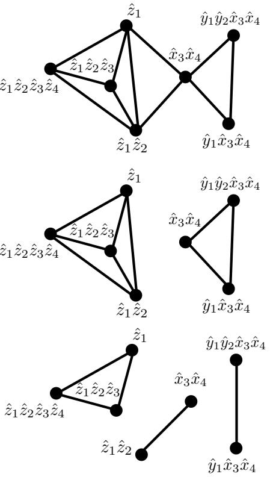
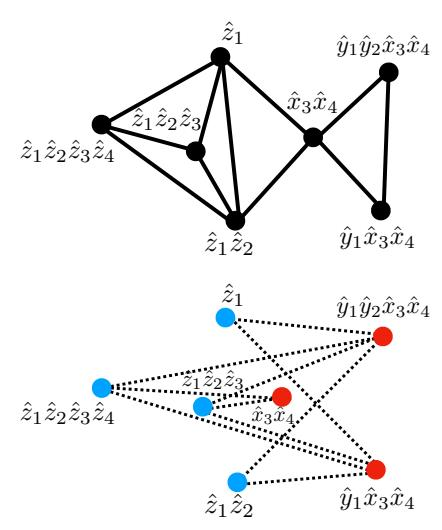
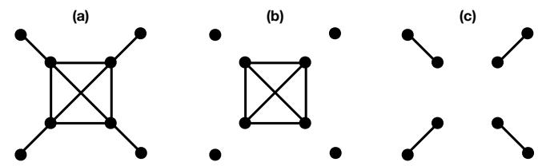

# Measurement Optimization in the Variational Quantum Eigensolver Using a Minimum Clique Cover

Vladyslav Verteletskyia,b,c, Tzu-Ching Yenb, and Artur F. Izmaylova,b\*

a Department of Physical and Environmental Sciences,
University of Toronto Scarborough, Toronto, Ontario,
M1C 1A4, Canada; bChemical Physics Theory Group,
Department of Chemistry, University of Toronto, Toronto, Ontario,
M5S 3H6, Canada; cDepartment of Quantum Field Theory,
Taras Shevchenko National University of Kyiv, Kyiv, 03022, Ukraine
(Dated: March 27, 2020)

Solving the electronic structure problem using the Variational Quantum Eigensolver (VQE) technique involves measurement of the Hamiltonian expectation value. Current hardware can perform only projective single-qubit measurements, and thus, the Hamiltonian expectation value is obtained by measuring parts of the Hamiltonian rather than the full Hamiltonian. This restriction makes the measurement process inefficient because the number of terms in the Hamiltonian grows as  $O(N^4)$  with the size of the system, N. To optimize VQE measurement one can try to group as many Hamiltonian terms as possible for their simultaneous measurement. Single-qubit measurements allow one to group only the terms commuting within corresponding single-qubit subspaces or qubit-wise commuting. We found that qubit-wise commutativity between the Hamiltonian terms can be expressed as a graph and the problem of the optimal grouping is equivalent of finding a minimum clique cover (MCC) for the Hamiltonian graph. The MCC problem is NP-hard but there exist several polynomial heuristic algorithms to solve it approximately. Several of these heuristics were tested in this work for a set of molecular electronic Hamiltonians. On average, grouping qubit-wise commuting terms reduced the number of operators to measure three times compared to the total number of terms in the considered Hamiltonians.

## I. INTRODUCTION

The variational quantum eigensolver (VQE) method[1–6] is currently the most practical scheme for solving the electronic structure problem on current and near-future universal quantum computers. This method involves iterative optimization of the electronic energy

$$E_e(\mathbf{R}) = \min_{|\Psi(\mathbf{R})\rangle} \langle \Psi(\mathbf{R}) | \hat{H}_e(\mathbf{R}) | \Psi(\mathbf{R}) \rangle$$
 (1)

using both quantum and classical computers. Here,  $\mathbf{R}$  is the studied nuclear configuration,  $\hat{H}_e(\mathbf{R})$  is the electronic Hamiltonian, and  $|\Psi(\mathbf{R})\rangle$  is the electronic wavefunction. In VQE, the quantum computer obtains Hamiltonian expectation values for trial wavefunctions suggested by the classical computer, while the minimization process is done on the classical computer.

At a more detailed level, the quantum computer (QC) does not work with  $\hat{H}_e(\mathbf{R})$  but rather with its qubit counterpart  $(\hat{H}_q)$  obtained from the second quantized version of  $\hat{H}_e(\mathbf{R})$ . [7–12] To obtain the expectation values for  $\hat{H}_q$ , QC creates a quantum state of an artificial qubit system  $|\Psi_q\rangle$  that emulates  $|\Psi(\mathbf{R})\rangle$  and performs projective measurements on  $|\Psi_q\rangle$ . A typical system qubit Hamiltonian has the form

$$\hat{H}_q = \sum_I C_I \, \hat{P}_I,\tag{2}$$

where  $C_I$  are numerical coefficients, and  $\hat{P}_I$  are Pauli "words", products of Pauli operators of different qubits

$$\hat{P}_I = \prod_{i=1}^N \hat{\sigma}_i^{(I)},\tag{3}$$

 $\hat{\sigma}_i^{(I)}$  is one of the  $\hat{x},\hat{y},\hat{z}$  Pauli operators or identity  $\hat{e}$  for the  $i^{\text{th}}$  qubit. The number of qubits N is equal to the number of spin-orbitals used in the second quantized form of  $\hat{H}_e$ , and the total number of Pauli words in  $\hat{H}_q$  scales as  $N^4$  due to the two-electron integral component of  $\hat{H}_e$  in second quantization.

Measuring the whole qubit Hamiltonian [Eq. (2)] is not currently technologically possible in this setup. This is quite different from the quantum simulator model, where the Hamiltonian of the system of interest is modelled by another tuneable quantum system which is amenable to eigen-spectrum measurements.[13, 14] Instead, within VQE, only single-qubit operators  $\hat{\sigma}_i$  can be measured. Due to projective nature of these measurements one can determine eigenvalues of operators that share the same tensor product eigen-basis. For example, for a two-qubit system, results of  $\hat{z}_1$ ,  $\hat{z}_2$ , and  $\hat{z}_1\hat{z}_2$  measurement can be obtained by measuring  $\hat{z}_1$  and  $\hat{z}_2$  because for all these operators product states  $\{|\uparrow\uparrow\rangle, |\uparrow\downarrow\rangle, |\downarrow\uparrow\rangle, |\downarrow\downarrow\rangle\}$  are eigenstates of single-qubit operators (e.g.  $\hat{z}_1 |\uparrow\downarrow\rangle = +1 |\uparrow\downarrow\rangle$ , and  $\hat{z}_2 |\uparrow\downarrow\rangle = -1 |\uparrow\downarrow\rangle$ ). However,  $\hat{x}_1$ ,  $\hat{x}_2$ , and  $\hat{x}_1\hat{x}_2$  would require a separate set of measurements. Interestingly, even though operators  $\hat{z}_1\hat{z}_2$  and  $\hat{x}_1\hat{x}_2$  commute and share the common system of eigenstates, they cannot be measured at the same time using single-qubit projective measurements. The problem is that their common eigenstates do

\* artur.izmaylov@utoronto.ca

not have a simple tensor product form in this case, instead they are entangled superpositions in both  $\hat{z}_i$  or  $\hat{x}_i$  single-qubit eigen-bases,  $\{(|\uparrow\uparrow\rangle \pm |\downarrow\downarrow\rangle)/\sqrt{2}, (|\uparrow\downarrow\rangle \pm |\downarrow\uparrow\rangle)/\sqrt{2}\}.$ 

Most of  $\sim N^4$  terms in  $\hat{H}_q$  do not share one tensor product basis (TPB),[15] moreover, as we will show later there is no unique partitioning to groups of terms sharing TPB. This poses a question of how to minimize the number of groups whose terms can be measured simultaneously. Here, we address this problem by reformulating it as a minimum clique cover (MCC) problem for a graph representation of the system Hamiltonian. Previously, there were other attempts to address this problem either using variance estimates[3] or searching for optimal TPB sharing group partitioning by inspection.[15] However, it seems that their systematic application to Hamiltonians with thousands of terms can be problematic. Recently, graph based techniques similar to ours have been implemented in the Rigetti's pyQuil set of programs, [16] but no systematic description of their performance can be found in the literature. Thus, in this work we discuss the connection of the grouping problem with graph-based techniques and assess the performance of both Rigetti's algorithms and our developments on a set of qubit Hamiltonians for small molecules with up to 36 qubits and 53 thousands of terms.

The rest of the paper is organized as follows. Section II A provides the connection between the grouping of terms based on shared TPB and the MCC problem. Then, we discuss multiple heuristic approaches to MCC in Sec. II B. Section III illustrates performance of the considered heuristic approaches on a set of qubit Hamiltonians. Section IV concludes with a summary of main results.

#### II. THEORY

# A. Simultaneously measurable fragments

To formalize the condition of two terms  $\hat{P}_I = \prod_i \hat{\sigma}_i$  and  $\hat{P}_J = \prod_i \hat{\sigma}'_i$  sharing TPB, it is useful to introduce qubit-wise commutativity as a zero value of qubit-wise commutator

$$[\hat{P}_I, \hat{P}_J]_{qw} = \begin{cases} 0, & \text{if } [\hat{\sigma}_i, \hat{\sigma}_i'] = 0 \ \forall i \\ 1, & \text{otherwise} \end{cases}$$
 (4)

Thus,  $[\hat{P}_I, \hat{P}_J]_{qw}$  is zero only if all one-qubit operators in  $\hat{P}_I$  commute with their counterparts in  $\hat{P}_J$ . Clearly, if  $\hat{P}_I$  and  $\hat{P}_J$  qubit-wise commuting (QWC) then they commute in the normal sense  $[\hat{P}_I, \hat{P}_J] = 0$ . The opposite is not true, a simple example is  $[\hat{x}_1\hat{x}_2, \hat{y}_1\hat{y}_2] = 0$  but  $[\hat{x}_1\hat{x}_2, \hat{y}_1\hat{y}_2]_{qw} \neq 0$ .

To partition the qubit Hamiltonian  $\hat{H}_q$  into groups of terms sharing TPB, it is necessary and sufficient to group

terms that mutually QWC,

$$\hat{H}_q = \sum_n \hat{A}_n, \ \hat{A}_n = \sum_I C_I^{(n)} \hat{P}_I^{(n)},$$
 (5)

$$[\hat{P}_I^{(n)}, \hat{P}_J^{(n)}]_{\text{qw}} = 0. {(6)}$$

Partitioning of the  $\hat{H}_q$  in Eq. (5) allows one to measure all Pauli words within each  $\hat{A}_n$  group in a single set of N one-qubit measurements. For every qubit, it is known from the form of  $\hat{A}_n$ , what Pauli operator needs to be measured. The advantage of this scheme is that it requires only single-qubit measurements, which are technically easier than multi-qubit measurements. The disadvantage of this scheme is that the Hamiltonian may require to measure too many  $\hat{A}_n$  terms separately. A natural question arises: how to obtain the optimal grouping of terms to minimize the number of the  $\hat{A}_n$  groups?

This question is nontrivial because the QWC relation is not the equivalence relation in the algebraic sense and thus does not provide a unique non-overlapping partitioning to equivalence classes. To see this, let us recall that for the equivalence relation  $\sim$  between elements of any set  $\{a,b,c,...\}$  we need to have three conditions: 1)  $a\sim a$ , 2) if  $a\sim b$  then  $b\sim a$ , and 3) if  $a\sim b$  and  $b\sim c$  then  $a\sim c$ . If these conditions are satisfied the set can be split into non-overlapping unique subsets whose elements are all equivalent to each other. Unfortunately, only conditions 1) and 2) are satisfied for the QWC relation, which is not enough for the equivalence relation. Indeed, violation of (3) by QWC is easy to see on the following example:  $[\hat{x}_1, \hat{y}_2]_{\rm qw} = 0$  and  $[\hat{y}_2, \hat{z}_1]_{\rm qw} = 0$  but that does not lead to  $[\hat{x}_1, \hat{z}_1]_{\rm qw} = 0$ .

Yet, the two conditions that are satisfied for the QWC relation are enough to represent the QWC relation as graph edges between the Pauli words of the Hamiltonian. As a simple illustration one can consider the following model Hamiltonian

$$\hat{H} = \hat{z}_1 + \hat{z}_1 \hat{z}_2 + \hat{z}_1 \hat{z}_2 \hat{z}_3 + \hat{z}_1 \hat{z}_2 \hat{z}_3 \hat{z}_4 + \hat{x}_3 \hat{x}_4 + \hat{y}_1 \hat{x}_3 \hat{x}_4 + \hat{y}_1 \hat{y}_2 \hat{x}_3 \hat{x}_4,$$
 (7)

whose QWC graph is given in Fig. 1. To determine how many terms can be measured simultaneously, one needs to obtain groups of mutually QWC terms. In the graph representation, this means finding fully-connected subgraphs or *cliques*. To optimize the measurement process we are interested in the minimum number of cliques (Fig. 1, middle panel)

$$\hat{H} = \hat{A}_1 + \hat{A}_2 
\hat{A}_1 = \hat{z}_1 + \hat{z}_1 \hat{z}_2 + \hat{z}_1 \hat{z}_2 \hat{z}_3 + \hat{z}_1 \hat{z}_2 \hat{z}_3 \hat{z}_4$$
(8)

$$\hat{A}_2 = \hat{x}_3 \hat{x}_4 + \hat{y}_1 \hat{x}_3 \hat{x}_4 + \hat{y}_1 \hat{y}_2 \hat{x}_3 \hat{x}_4. \tag{9}$$

It is easy to see that there are other solutions to the clique

cover problem (Fig. 1, lower panel)

$$\hat{H} = \hat{A}_1' + \hat{A}_2' + \hat{A}_3' \tag{10}$$

$$\hat{A}_1' = \hat{z}_1 \hat{z}_2 + \hat{z}_1 \hat{z}_2 \hat{z}_3 + \hat{z}_1 \hat{z}_2 \hat{z}_3 \hat{z}_4 \tag{11}$$

$$\hat{A}_2' = \hat{z}_1 + \hat{x}_3 \hat{x}_4 \tag{12}$$

$$\hat{A}_3' = \hat{y}_1 \hat{x}_3 \hat{x}_4 + \hat{y}_1 \hat{y}_2 \hat{x}_3 \hat{x}_4. \tag{13}$$

This solution contains larger number of cliques and thus is non-optimal.

The problem of finding the minimum number of cliques covering the graph is known as the minimum clique cover (MCC) problem. It is NP-hard in general, and its decision version is NP-complete. [17] Therefore, we will focus on approximate polynomial approaches to MCC.

FIG. 1. Graph representation of QWC terms in the Hamiltonian Eq. (7) (upper panel), minimum clique cover of the graph (middle panel), non-minimum clique cover of the graph (lower panel).

#### B. Solving the minimum clique cover problem

Two approaches to solving the MCC problem are considered in this work: 1) through mapping to a graph coloring problem and 2) through employing a maximum clique search and removal. Both approaches involve solving NP-hard problems but they give rise to several intuitive heuristics. Here we present short rational for the connection of MCC to the two approaches which are followed by descriptions of heuristics.

#### 1. Graph coloring

The MCC problem for a given graph G can be mapped to a coloring problem for a complement graph  $\bar{G}$  (see Fig. 2). The coloring problem searches for the minimum number of colors that are needed to color  $\bar{G}$  vertices so that any two connected vertices do not share the same color. The minimum number of colors (i.e. the chromatic number  $\chi(\bar{G})$  is equal to the minimum number of cliques in G. Each clique corresponds to vertices of  $\bar{G}$  colored with the same color. Indeed, all G vertices of the same color are disconnected and hence form a clique in G. Proving that the color based cover is optimal can be easily done by leading to contradiction. Assuming that there is a clique cover that has a fewer number of cliques than  $\chi(\bar{G})$ , one can obtain coloring of  $\bar{G}$  that contains fewer colors than  $\chi(\bar{G})$  by coloring all vertices of a single clique in one color because they are disconnected in  $\bar{G}$ .

FIG. 2. Graph representation of QWC terms in the Hamiltonian Eq. (7) (upper panel), the complementary graph and its coloring (lower panel), the chromatic number is 2 which corresponds to 2 cliques.

To solve the graph coloring problem, the sequential vertex coloring algorithm is applied, which proceeds as follows. Given the ordering of vertices  $v_1, v_2, ..., v_n$ , vertex  $v_1$  is colored with color 1, k=1. To color a subsequent vertex, a set of colors of its neighbors is considered. If the set contains all k colors, then color k+1 is assigned to the vertex, and k is increased by 1. In case if not all k colors are present in the set of colors for neighbors, the lowest available color is chosen to color the vertex.

This algorithm does not produce the minimum number of colors, however, its complexity is polynominal with the number of graph vertices. The resulting number of colors k depends on the ordering of vertices in the algorithm input, which led to development of heuristics to produce a lower number of colors.[18] We tested seven ordering heuristics found in previous works:

Greedy Coloring (GC): This algorithm uses the sequence of vertices corresponding to OpenFermion ordering of Pauli words in qubit Hamiltonian generation. We label this algorithm GC because it is equivalent in formulation to the "greedy" procedure in the group\_experiment pyQuil routine.[16]

Largest First (LF): This algorithm puts the vertices of  $\bar{G}$  in the non-increasing degree order.[19]

Smallest Last (SL): The vertex with the smallest degree in  $\bar{G}$  is placed at the end of the list as  $v_n$ , where n is the number of vertices in  $\bar{G}$ . A vertex at the  $i^{\text{th}}$  position in the list is the one with the smallest degree in the graph  $\bar{G} - \{v_n, v_{(n-1)}, ..., v_{(i+1)}\}$ .[20]

DSATUR: The largest degree vertex of  $\bar{G}$  is assigned a color first. Then the order is established dynamically by coloring the vertex that is adjacent to the largest number of colored vertices (such a vertex is referred to as the most saturated).[21]

Recursive Largest First (RLF): The vertex with the largest degree in  $\bar{G}$  is colored with color 1. The set of uncolored vertices is split into two subsets:  $N_0$  including vertices that are not adjacent to any colored vertex and  $N_1$  containing the rest. Then, in  $N_0$  the vertex with the largest number of neighbors from  $N_1$  is colored with the current color.  $N_0$  and  $N_1$  are updated. This continues until all elements of  $N_0$  are colored. When  $N_0$  is exhausted, current color is increased and the process repeats for the rest of the graph that is uncolored.[22]

Dutton and Brigham technique (DB): Among disconnected pairs of vertices in  $\bar{G}$ , the pair with the biggest number of common neighbors is chosen. Then two vertices are merged in one which is connected to the neighbors of both. The process is repeated until a clique is produced, with each vertex representing a separate color. The vertices that were merged into one vertex of the produced clique are assigned the color of this vertex. [23]

COSINE: This is variation of the DB scheme, where the first pair of disconnected vertices is chosen and merged as in DB. The next pair is made of the vertex obtained during the merger and a disconnected vertex which has the biggest number of common neighbors with the first vertex in the pair. When there is no vertex that is disconnected from the current one, a new pair is chosen. Merging of pairs repeats until there are no more disconnected vertices. This process produces a clique and vertices that were merged into one vertex of the produced clique are assigned the color of the merged vertex. [24]

Formally, GC and LF have O(e+n) computational scaling, where n and e are the number of vertices and edges in  $\bar{G}$ , respectively. Vertices of the graphs originating from the QWC property of molecular Hamiltonians have relatively low degrees, therefore, those of their complementary graphs are quite high and practically  $e \sim n^2$ . In general, RLF has cubic complexity in n, while for graphs with  $k \cdot e \sim n^2$ , its complexity is quadratic in n.[22] For graphs studied in this work,  $k \cdot e \sim n^3$ , and thus, RLF's complexity is  $O(n^3)$ . DSATUR, DB, and COSINE have  $O(n^3)$  computational scaling.

#### 2. Maximum clique search and removal

Repeating steps of searching for the maximum clique and removing it from the graph gives an approximate solution for MCC. Figure 3 illustrates that even if the maximum clique search is done exactly, which is an NP-hard problem, the obtained solution does not necessarily form the minimum clique cover. The first heuristic in this cate-

FIG. 3. A graph example (a) where the maximum clique search and removal produces a larger clique cover (b) than the minimum clique cover (c).

gory uses an improvement on the Bron-Kerbosch the maximum clique search algorithm by Tomita et al. [25], which is available as the FindClique procedure in Wolfram Mathematica. [26] Another heuristic algorithm is the polynomial Ramsey algorithm, [27] implemented in the Python NetworkX library and used in the group\_experiment pyQuil routine [16]. We will refer to these two algorithms as BKT and Ramsey, respectively.

#### III. NUMERICAL STUDIES AND DISCUSSION

To assess the heuristics we apply them to a set of small molecule Hamiltonians obtained using the STO-3G and 6-31G bases (see Tables I and II). Details of generating these Hamiltonians are given in Supplementary Material. Some of these systems were used previously to illustrate performance of quantum computing techniques. [15, 28, 29].

Table I summarizes results of the QWC partitioning obtained using different heuristics. The number of  $\hat{A}_n$  groups is 3 to 5 times fewer than the number of Pauli words in qubit Hamiltonians. To test heuristics further, sizes of the first three Hamiltonians allowed us to examine up to 100,000 different randomly generated vertex orderings for graph coloring algorithms. There were no fewer clique cover numbers found for those orderings than the minimal ones reported in the Table I.

On average, the difference between various methods does not exceed approximately 10% of the total number of cliques (see Table I). Therefore, it is reasonable to use an approach that has the lowest computational cost and performs well overall. LF performance was superior to the other techniques in both the number of produced cliques and execution time. Thus we used LF for solution of the MCC problem for larger Hamiltonians and for exploring clique statistics (see Table II). Even though all heuristics except BKT are polynomial in scaling, DB,

TABLE I. The total number of Hamiltonian terms (Total) and the number of QWC groups produced by different heuristics for systems with up to 1100 terms. The STO-3G basis has been used for all Hamiltonians unless specified otherwise. BK and JW denote the Bravyi-Kitaev and Jordan-Wigner fermion-qubit transformations.

| Systems            | N  | Total | GC  | LF  | SL  | DSATUR | RLF | DB  | COSINE | Ramsey | BKT |
|--------------------|----|-------|-----|-----|-----|--------|-----|-----|--------|--------|-----|
| $H_2$ (BK)         | 4  | 15    | 3   | 3   | 3   | 3      | 3   | 3   | 3      | 3      | 3   |
| LiH (Parity)       | 4  | 100   | 25  | 25  | 25  | 25     | 25  | 25  | 25     | 25     | 25  |
| $H_2O$ (6-31G, BK) | 6  | 165   | 36  | 34  | 34  | 34     | 34  | 34  | 34     | 38     | 34  |
| $BeH_2$ (BK)       | 14 | 666   | 175 | 172 | 172 | 172    | 172 | 172 | 176    | 190    | 175 |
| $BeH_2$ (JW)       | 14 | 666   | 218 | 208 | 204 | 210    | 203 | 208 | 211    | 225    | 216 |
| $H_2O$ (BK)        | 14 | 1086  | 320 | 313 | 316 | 315    | 311 | 313 | 308    | 322    | 319 |
| $H_2O$ $(JW)$      | 14 | 1086  | 355 | 322 | 322 | 329    | 322 | 326 | 331    | 360    | 348 |

TABLE II. Comparison of LF results for Bravyi-Kitaev (BK) and Jordan-Wigner (JW) transformed Hamiltonians: the number of cliques (Cliques), their maximum size (Max Size) and standard deviation of their size distribution (STD). The total number of Hamiltonian terms (Total) is almost everywhere the same for JW and BK; for the last two systems, JW numbers are in parenthesis.

| Systems                   | N          | Total         |         | $_{\mathrm{BK}}$ |     | JW      |          |     |
|---------------------------|------------|---------------|---------|------------------|-----|---------|----------|-----|
|                           | 1 <b>V</b> | Total         | Cliques | Max Size         | STD | Cliques | Max Size | STD |
| BeH 2 / STO-3G | 14         | 666           | 172     | 22               | 3.7 | 208     | 57       | 5.1 |
| $H_2O$ / STO-3G           | 14         | 1086          | 313     | 21               | 3.3 | 322     | 57       | 4.4 |
| $NH_3$ / STO-3G           | 16         | 3609          | 1271    | 26               | 2.1 | 1201    | 80       | 3.3 |
| $N_2$ / STO-3G            | 20         | 2951          | 1178    | 36               | 2.9 | 1187    | 138      | 4.8 |
| $BeH_2 / 6-31G$           | 26         | 9204          | 2983    | 110              | 3.9 | 2720    | 255      | 5.8 |
| $H_2O / 6-31G$            | 26         | 12732         | 3878    | 81               | 3.8 | 3719    | 255      | 5.4 |
| $NH_3 / 6-31G$            | 30         | 52758 (52806) | 14924   | 73               | 3.3 | 14907   | 353      | 4.1 |
| $N_2 / 6-31G$             | 36         | 34639 (34583) | 11538   | 114              | 3.6 | 12399   | 530      | 5.5 |

COSINE, and Ramsey spent almost two orders of magnitude longer times for 14-qubit  $\rm H_2O$  than other algorithms, and therefore could not be recommended for use in larger Hamiltonians. The only other scheme that sometimes outperforms LF and may not be too computationally expensive is RLF. In all systems larger than 6 qubits, the GC algorithm that uses an OpenFermion ordering of Pauli words can be easily improved by switching to other orders (e.g. LF, SL, or LRF).

Application of the LF heuristic to larger Hamiltonians in Table II demonstrates higher than or equal to three-fold reduction of the number of cliques compare to the total number of terms independent of the type of the fermion-qubit mapping. The main difference between cliques in the JW and BK transformations is in distributions of their sizes. Maximum size  $\hat{A}_n$  groups for the JW transformed Hamiltonians is almost three times greater in size than those for the BK transformed Hamiltonians. Similar trend can be observed for the standard deviations of clique sizes with an approximate ratio of one and a half between JW and BK transformed Hamiltonians.

#### IV. CONCLUSIONS

We have introduced and studied a new method for partitioning of the qubit Hamiltonian in the VQE approach to the electronic structure problem. The main idea of our approach is to represent the Hamiltonian as a graph where every vertex corresponds to a single Pauli word

and the edges are connecting the terms that are qubit-wise commuting. In this representation, the problem of grouping terms that can be measured simultaneously by single-qubit measurement is equivalent to finding a fully connected subgraphs (cliques). To obtain optimal partitioning the number of groups should be the fewest. This is well-known problem in discrete math, the minimum clique cover problem. We benchmarked few heuristic polynomial algorithms to approximately solve this NP-hard problem and found that the number of qubit-wise commuting groups can be reduced three times from the total number of the Hamiltonian terms.

The difference in numbers of groups produced by different algorithms did not exceed 10%, therefore fastest algorithms, LF and RLF, are generally recommended. Considering the growth of the number of Hamiltonian terms,  $O(N^4)$ , with the number of qubits N, the scalings of LF and RLF algorithms are  $O(N^8)$  and  $O(N^{12})$ , respectively. No significant difference in the number of groups was observed between corresponding Hamiltonians obtained by the BK and JW transformations. Numerical simulations revealed that the number of qubit-wise commuting groups is proportional to the number of Pauli words which grows as  $O(N^4)$ . Thus, to treat large systems one needs to introduce further improvements in the measurement preprocessing.

Since the submission of this paper to arXiv, several new proposals addressing the measurement problem were put forward.[30–34] The main difference between the current approach and the subsequent ones is the complexity of

pre-measurement unitary transformations. The current approach involves only one-qubit unitary rotations, while those in Refs. [\[30](#page-5-22)[–34\]](#page-5-23) employ multi-qubit transformations. This makes the current approach especially well suited for low-depth circuits. As shown in Refs. [\[31–](#page-5-24)[33\]](#page-5-25), multi-qubit transformations can reduce the scaling of the number of measurable groups, but for the price of introducing additional multi-qubit gates.

## SUPPLEMENTARY MATERIAL

Details of generating the Hamiltonians for the systems presented in Tables [I](#page-4-1) and [II](#page-4-2) are given in Supplementary Material.

## ACKNOWLEDGEMENT

A.F.I. is grateful to Alan Aspuru-Guzik, Max Radin, Nicholas Rubin, and Matthew Harrigan for useful discussions and helpful suggestions. A.F.I. acknowledges financial support from Zapata Computing, Inc., the Natural Sciences and Engineering Research Council of Canada, the Mitacs Globalink Program, and the Google Quantum Research Program.

- [1] M. H. Yung, J. Casanova, A. Mezzacapo, J. McClean, L. Lamata, A. Aspuru-Guzik, and E. Solano, Sci. Rep. 4, 714 (2014).
- [2] A. Peruzzo, J. McClean, P. Shadbolt, M.-H. Yung, X.-Q. Zhou, P. J. Love, A. Aspuru-Guzik, and J. L. O'Brien, Nat. Commun. 5, 4213 (2014).
- [3] J. R. McClean, J. Romero, R. Babbush, and A. Aspuru-Guzik, N. J. Phys. 18[, 023023 \(2016\).](http://dx.doi.org/10.1088/1367-2630/18/2/023023)
- [4] D. Wecker, M. B. Hastings, and M. Troyer, [Phys. Rev.](http://dx.doi.org/10.1103/PhysRevA.92.042303) A 92[, 042303 \(2015\).](http://dx.doi.org/10.1103/PhysRevA.92.042303)
- [5] J. Olson, Y. Cao, J. Romero, P. Johnson, P.-L. Dallaire-Demers, N. Sawaya, P. Narang, I. Kivlichan, M. Wasielewski, and A. Aspuru-Guzik, arXiv.org (2017), [1706.05413v2.](http://arxiv.org/abs/1706.05413v2)
- [6] S. McArdle, S. Endo, A. Aspuru-Guzik, S. Benjamin, and X. Yuan, arXiv.org (2018), [1808.10402v1.](http://arxiv.org/abs/1808.10402v1)
- [7] P. Jordan and E. Wigner, Z. Phys. 47[, 631 \(1928\).](http://dx.doi.org/10.1007/BF01331938)
- [8] S. B. Bravyi and A. Y. Kitaev, [Ann. Phys.](http://dx.doi.org/10.1006/aphy.2002.6254) 298, 210 [\(2002\).](http://dx.doi.org/10.1006/aphy.2002.6254)
- [9] J. T. Seeley, M. J. Richard, and P. J. Love, [J. Chem.](http://dx.doi.org/10.1063/1.4768229) Phys. 137[, 224109 \(2012\).](http://dx.doi.org/10.1063/1.4768229)
- [10] A. Tranter, S. Sofia, J. Seeley, M. Kaicher, J. McClean, R. Babbush, P. V. Coveney, F. Mintert, F. Wilhelm, and P. J. Love, [Int. J. Quantum Chem.](http://dx.doi.org/10.1002/qua.24969) 115, 1431 (2015).
- [11] K. Setia and J. D. Whitfield, [J. Chem. Phys.](http://dx.doi.org/10.1063/1.5019371) 148, 164104 [\(2018\).](http://dx.doi.org/10.1063/1.5019371)
- [12] V. Havl´ıˇcek, M. Troyer, and J. D. Whitfield, [Phys. Rev.](http://dx.doi.org/10.1103/PhysRevA.95.032332) A 95[, 032332 \(2017\).](http://dx.doi.org/10.1103/PhysRevA.95.032332)
- [13] J. I. Cirac and P. Zoller, Nat. Phys. 8[, 264 \(2012\).](http://dx.doi.org/10.1038/nphys2275)
- [14] J. Argello-Luengo, A. Gonzlez-Tudela, T. Shi, P. Zoller, and J. I. Cirac, arXiv.org (2018), [1807.09228.](http://arxiv.org/abs/1807.09228)
- [15] A. Kandala, A. Mezzacapo, K. Temme, M. Takita, M. Brink, J. M. Chow, and J. M. Gambetta, [Nature](http://dx.doi.org/10.1038/nature23879) 549[, 242 \(2017\).](http://dx.doi.org/10.1038/nature23879)
- [16] Rigetti Computing, "pyQuil 1.9," (2018), http://docs.rigetti.com/en/1.9/qpu.html.
- [17] R. M. Karp, in [Complexity of Computer Computations.](http://dx.doi.org/10.1007/978-1-4684-2001-2_9) [The IBM Research Symposia Series](http://dx.doi.org/10.1007/978-1-4684-2001-2_9), edited by R. Miller, J. Thatcher, and J. Bohlinger (Springer, Boston, MA, 1972) p. 85103.
- [18] D. D. Werra, in [Computational Graph Theory. Computing](http://dx.doi.org/10.1007/978-3-7091-9076-0_10) [Supplementum](http://dx.doi.org/10.1007/978-3-7091-9076-0_10), Vol. 7, edited by G. Tinhofer, E. Mayr, H. Noltemeier, and M. M. Syslo (Springer, Vienna, 1990) pp. 191–208.

- [19] D. J. A. Welsh, Comput. J. 10[, 8586 \(1967\).](http://dx.doi.org/10.1093/comjnl/10.1.85)
- [20] D. W. Matula, G. Marble, and J. D. Isaacson, in [Graph](http://dx.doi.org/10.1016/b978-1-4832-3187-7.50015-5) [Theory and Computing](http://dx.doi.org/10.1016/b978-1-4832-3187-7.50015-5), edited by R. C. Read (Academic Press, 1972) pp. 109 – 122.
- [21] D. Brlaz, [Commun. ACM](http://dx.doi.org/10.1145/359094.359101) 22, 251256 (1979).
- [22] F. T. Leighton, J. Res. Natl. Bur. Stand. 84, 489 (1979).
- [23] R. D. Dutton and R. C. Brigham, [Comput. J.](http://dx.doi.org/10.1093/comjnl/24.1.85) 24, 8586 [\(1981\).](http://dx.doi.org/10.1093/comjnl/24.1.85)
- [24] A. Hertz, [J. Comb. Theory](http://dx.doi.org/10.1016/0095-8956(90)90078-e) 50, 231240 (1990).
- [25] E. Tomita, A. Tanaka, and H. Takahashi, [Theor. Comput.](http://dx.doi.org/10.1016/j.tcs.2006.06.015) Sci. 363[, 2842 \(2006\).](http://dx.doi.org/10.1016/j.tcs.2006.06.015)
- [26] Wolfram Research, Inc., Mathematica, Version 12.0, Champaign, IL (2019).
- [27] R. Boppana and M. M. Halldrsson, [BIT Numer. Math](http://dx.doi.org/10.1007/bf01994876) 32[, 180196 \(1992\).](http://dx.doi.org/10.1007/bf01994876)
- [28] C. Hempel, C. Maier, J. Romero, J. McClean, T. Monz, H. Shen, P. Jurcevic, B. P. Lanyon, P. Love, R. Babbush, A. Aspuru-Guzik, R. Blatt, and C. F. Roos, [Phys. Rev.](http://dx.doi.org/ 10.1103/PhysRevX.8.031022) X 8[, 031022 \(2018\).](http://dx.doi.org/ 10.1103/PhysRevX.8.031022)
- [29] I. G. Ryabinkin, T.-C. Yen, S. N. Genin, and A. F. Izmaylov, J. Chem. Theory Comput. 14, 6317 (2018).
- [30] A. Jena, S. Genin, and M. Mosca, arXiv.org , arXiv:1907.07859 (2019).
- [31] T.-C. Yen, V. Verteletskyi, and A. F. Izmaylov, arXiv.org , arXiv:1907.09386 (2019).
- [32] A. F. Izmaylov, T.-C. Yen, R. A. Lang, and V. Verteletskyi, J. Chem. Theory Comput. 16, 1055 (2020).
- [33] W. J. Huggins, J. McClean, N. Rubin, Z. Jiang, N. Wiebe, K. B. Whaley, and R. Babbush, arXiv.org , arXiv:1907.13117 (2019).
- [34] P. Gokhale, O. Angiuli, Y. Ding, K. Gui, T. Tomesh, M. Suchara, M. Martonosi, and F. T. Chong, arXiv.org , arXiv:1907.13623 (2019).

## SUPPLEMENTARY MATERIAL: HAMILTONIAN DETAILS

H2 molecule: One- and two-electron integrals in the canonical restricted Hartree–Fock (RHF) molecular orbitals basis for R(H-H)=1.5 ˚A, were used in the Bravyi– Kitaev (BK) transformation to produce the corresponding qubit Hamiltonian. Spin-orbitals were alternating in the

order  $\alpha$ ,  $\beta$ ,  $\alpha$ , ....

LiH molecule: We will consider the LiH molecule at R(Li-H)=3.2~Å, it has a 6-qubit Hamiltonian containing 118 Pauli words. It was generated using the parity fermion-to-qubit transformation. Spin-orbitals were arranged as "first all alpha then all beta" in the fermionic form; since there are 3 active molecular orbitals in the problem, this leads to 6-qubit Hamiltonian.

This qubit Hamiltonian has  $3^{rd}$  and  $6^{th}$  stationary qubits, which allows one to replace the corresponding  $\hat{z}$  operators by their eigenvalues,  $\pm 1$ , thus defining the different "sectors" of the original Hamiltonian. Each of these sectors is characterized by its own 4-qubit effective Hamiltonian. The ground state lies in the  $z_3=-1, z_6=1$  sector; the corresponding 4-qubit effective Hamiltonian  $(\hat{H}_{\rm LiH})$  has 100 Pauli terms.

 $H_2O$  molecule: 6- and 26-qubit Hamiltonians were generated for this system in the 6-31G basis, and the 14-qubit Hamiltonian was generated using the STO-3G basis. The geometry for all Hamiltonians was chosen to be  $R(\mathrm{O-H}) = 0.75$  Å and  $\angle HOH = 107.6^{\circ}$  The 14- and 26-qubit Hamiltonians were obtained in OpenFermion using both JW and BK transformations without any

modifications, while for the 6-qubit Hamiltonian we used several qubit reduction techniques detailed below.

Complete active space (4,4) electronic Hamiltonians at different O–H distances were converted to the qubit form using the BK transformation grouping spin-orbitals as "first all alpha than all beta". The resulting 8-qubit Hamiltonians contained 185 Pauli terms.  $4^{\text{th}}$  and  $8^{\text{th}}$  qubits were found to be stationary; the ground state solution is located in the  $z_3=1, z_7=1$  subspace. By integrating out  $z_3$  and  $z_7$ , a 6-qubit reduced Hamiltonian with 165 terms was derived.

 $N_2$  molecule: The BK and JW transformations of the electronic Hamiltonian in the 6-31G and STO-3G bases produced 36- and 20-qubit Hamiltonians by OpenFermion,  $R({\rm N-N})=1.1~{\rm \AA}.$ 

 $BeH_2$  molecule: The BK and JW transformations of the fermionic Hamiltonians in the 6-31G and STO-3G bases produced 26- and 14-qubit Hamiltonians by Open-Fermion, R(Be-H)=1.4~Å, collinear geometry.

 $NH_3$  molecule: The BK and JW transformations of the fermionic Hamiltonian in the 6-31G and STO-3G bases produced 30- and 16-qubit Hamiltonians by OpenFermion,  $\angle HNH = 107^{\circ}$  and R(N-H) = 1.0 Å.