CONTENTS

# Finite-temperature transport in one-dimensional quantum lattice models

and M. Znidariˇc ˇ 1

C. Generalized hydrodynamics [23](#page-22-0)

B. Bertini,1 F. Heidrich-Meisner,2 C. Karrasch,3 T. Prosen,1 R. Steinigeweg,4 1Physics Department, Faculty of Mathematics and Physics, University of Ljubljana, Ljubljana, Slovenia 2 Institute for Theoretical Physics, Georg-August-Universit¨at G¨ottingen, D-37077 G¨ottingen, Germany 3Technische Universit¨at Braunschweig, Institut f¨ur Mathematische Physik, Mendelssohnstraße 3, D-38106 Braunschweig, Germany 4Department of Physics, University of Osnabr¨uck, D-49069 Osnabr¨uck, Germany

(Dated: October 28, 2020)

The last decade has witnessed an impressive progress in the theoretical understanding of transport properties of clean, one-dimensional quantum lattice systems. Many physically relevant models in one dimension are Bethe-ansatz integrable, including the anisotropic spin-1/2 Heisenberg (also called spin-1/2 XXZ chain) and the Fermi-Hubbard model. Nevertheless, practical computations of, for instance, correlation functions and transport coefficients pose hard problems from both the conceptual and technical point of view. Only due to recent progress in the theory of integrable systems on the one hand and due to the development of numerical methods on the other hand has it become possible to compute their finite temperature and nonequilibrium transport properties quantitatively. Most importantly, due to the discovery of a novel class of quasilocal conserved quantities, there is now a qualitative understanding of the origin of ballistic finite-temperature transport, and even diffusive or super-diffusive subleading corrections, in integrable lattice models. We shall review the current understanding of transport in one-dimensional lattice models, in particular, in the paradigmatic example of the spin-1/2 XXZ and Fermi-Hubbard models, and we elaborate on state-of-the-art theoretical methods, including both analytical and computational approaches. Among other novel techniques, we discuss matrix-product-states based simulation methods, dynamical typicality, and, in particular, generalized hydrodynamics. We will discuss the close and fruitful connection between theoretical models and recent experiments, with examples from both the realm of quantum magnets and ultracold quantum gases in optical lattices.

|  |                                                           |    | 1. GHD results for Drude weights                   | 25 |
|--|-----------------------------------------------------------|----|----------------------------------------------------|----|
|  | I. Introduction                                           | 2  | 2. GHD results for diffusion constants             | 26 |
|  | II. Linear-response theory                                | 7  | IV. Theoretical and computational methods          | 27 |
|  | A. Framework                                              | 7  | A. Low-energy theory                               | 28 |
|  | B. Ballistic versus diffusive transport in the context of |    | 1. Field theory                                    | 28 |
|  | current correlations                                      | 10 | 2. Semiclassical approach                          | 29 |
|  | C. Time evolution of inhomogeneous densities              | 12 | B. Exact diagonalization                           | 29 |
|  | 1. Generalized Einstein relations                         | 12 | 1. Formal expressions evaluated in ED              | 29 |
|  | 2. Diffusion                                              | 13 | 2. Role of boundary conditions, symmetries and     |    |
|  |                                                           |    | choice of ensemble                                 | 30 |
|  | III. Exploiting integrability                             | 15 | 3. Pitfalls                                        | 31 |
|  | A. Role of local and quasilocal conserved charges         | 15 | C. Dynamical quantum typicality                    | 32 |
|  | 1. Lower bound on spin Drude weight at high               |    | D. Microcanonical Lanczos method                   | 33 |
|  | temperature                                               | 17 | E. Finite-temperature matrix product state methods | 34 |
|  | 2. Lower bounds on spin diffusion constant at high        |    | F. Quantum Monte Carlo                             | 35 |
|  | temperature                                               | 17 |                                                    |    |
|  | B. Bethe Ansatz                                           | 18 | V. Open quantum systems                            | 36 |
|  | 1. Bethe Equations                                        | 18 | A. Non-equilibrium steady-state driving            | 36 |
|  | 2. Thermodynamic Bethe Ansatz                             | 19 | B. Lindblad master equation                        | 37 |
|  | 3. Drude weights from TBA                                 | 22 | 1. Infinite-temperature magnetization driving      | 39 |
|  |                                                           |    |                                                    |    |

| 2. Solving the Lindblad equation                    | 40 |
|-----------------------------------------------------|----|
| VI. Transport in the spin-1/2 XXZ chain             | 42 |
| A. The model                                        | 43 |
| B. Thermal transport                                | 43 |
| C. Spin transport: Drude weight                     | 44 |
| 1. Free fermions, Bethe ansatz at T = 0             | 45 |
| 2. Mazur bounds                                     | 45 |
| 3. Bethe ansatz at T > 0, GHD                       | 45 |
| 4. Numerical approaches                             | 45 |
| D. Spin transport: Finite frequencies               | 46 |
| 1. ∆ > 1                                            | 47 |
| 2. ∆ < 1                                            | 48 |
| 3. ∆ = 1                                            | 49 |
| E. Open quantum systems                             | 49 |
| F. Open questions                                   | 49 |
| VII. Transport in the Hubbard chain                 | 51 |
| A. Thermal conductivity                             | 52 |
| B. Charge conductivity                              | 52 |
| C. Spin conductivity                                | 53 |
| VIII. Beyond integrable systems                     | 54 |
| A. Universal description of the low-energy behavior | 55 |
| B. Absence of Drude weights                         | 55 |
| C. Frequency-dependence of the conductivity         | 56 |
| D. DC conductivity and diffusion constant           | 57 |
| E. Special cases and outlook                        | 58 |
| IX. Far-from-equilibrium transport                  | 59 |
| A. Spreading of density perturbations               | 59 |
| B. Bipartitioning Protocols                         | 60 |
| X. Overview over experiments                        | 62 |
| A. Quantum magnets                                  | 62 |
| B. Ultracold quantum gases in optical lattices      | 64 |
| XI. Summary and Outlook                             | 66 |
| Acknowledgments                                     | 67 |
| References                                          | 67 |

# I. INTRODUCTION

The physics of strongly-correlated quantum systems in one dimension (1d) has long attracted the interest of theoreticians [\(Cazalilla](#page-68-0) et al., [2011;](#page-68-0) [Giamarchi, 2004;](#page-69-0) [Guan](#page-70-0) [et al.](#page-70-0), [2013;](#page-70-0) [Sch¨onhammer, 2004\)](#page-75-0) because of its intriguing properties. For instance, quantum fluctuations can have a particularly pronounced effect in 1d, leading to the absence of finite-temperature phase transitions and to the breakdown of Landau's Fermi liquid theory, rendering 1d unique in many regards. A particularly appealing aspect of many-body physics in one dimension is the existence of exact solutions for a subset of microscopic models, including both systems in the continuum such as the Gaudin-Yang model and the Lieb-Liniger gas, and lattice models such as the spin-1/2 XXZ chain and the Fermi-Hubbard chain. For the aforementioned models, versions of the Bethe ansatz are exploited in order to arrive at such solutions, and these are considered instances of integrable (quantum) models.[1](#page-1-1)

Because of the wide range of available theoretical approaches, there is the appealing ambition of developing a full theoretical understanding of these systems, both quantitative and qualitative. Moreover, many quasi-1d materials from, e.g., quantum magnetism, are, to a good approximation, described by relatives of the integrable spin-1/2 Heisenberg or the Fermi-Hubbard chain. Ultracold quantum gases [\(Bloch](#page-67-0) et al., [2008\)](#page-67-0) provide another avenue for the experimental study of 1d systems, ranging from degenerate quantum gases in the continuum [see, e.g., [\(Hofferberth](#page-70-1) et al., [2007;](#page-70-1) [Kinoshita](#page-71-0) et al., [2004,](#page-71-0) [2006;](#page-71-1) [Langen](#page-72-0) et al., [2015;](#page-72-0) Liao [et al.](#page-72-1), [2010;](#page-72-1) [Paredes](#page-73-0) et al., [2004\)](#page-73-0)) to fermionic or bosonic lattice gases (see, e.g., [\(Cheneau](#page-68-1) et al., [2012;](#page-68-1) [Kaufman](#page-71-2) et al., [2016;](#page-71-2) [Ronzheimer](#page-74-0) [et al.](#page-74-0), [2013;](#page-74-0) [Salomon](#page-74-1) et al., [2019;](#page-74-1) [Vijayan](#page-76-0) et al., [2020;](#page-76-0) Xia [et al.](#page-76-1), [2014\)](#page-76-1)], including also realizations of Heisenberg Hamiltonians [\(Fukuhara](#page-69-1) et al., [2013a](#page-69-1)[,b;](#page-69-2) Hild [et al.](#page-70-2), [2014\)](#page-70-2). A renewed interest in 1d systems originates from the fields of nonequilibrium dynamics in closed quantum systems [for a review, see [\(Calabrese](#page-68-2) et al., [2016;](#page-68-2) [D'Alessio](#page-68-3) et al., [2016;](#page-68-3) [Eisert](#page-69-3) et al., [2015;](#page-69-3) [Gogolin and](#page-70-3) [Eisert, 2015;](#page-70-3) [Polkovnikov](#page-73-1) et al., [2011;](#page-73-1) [Rigol](#page-74-2) et al., [2008\)](#page-74-2)] and many-body localization [for a review, see [\(Abanin](#page-66-2) [et al.](#page-66-2), [2019a;](#page-66-2) [Altman and Vosk, 2015;](#page-67-1) [Nandkishore and](#page-73-2) [Huse, 2015\)](#page-73-2)], where 1d systems are the play- and testing ground for new concepts, novel phase transitions, or farfrom-equilibrium dynamics. Due to the integrability of some 1d systems, one can systematically study the transition between integrability and quantum-chaotic behavior [see [\(D'Alessio](#page-68-3) et al., [2016;](#page-68-3) [Essler and Fagotti, 2016;](#page-69-4) [Vidmar and Rigol, 2016\)](#page-76-2) and references therein].

One of the most generic nonequilibrium situations is steady-state transport. This question has a very rich history. It was Joseph Fourier who in 1807 presented his manuscript to the French Academy, describing heat transport in terms of the diffusion equation [\(Fourier, 1822\)](#page-69-5). The work was groundbreaking in several ways [\(Narasimhan, 1999\)](#page-73-3). Prior to that, physicists were trying to understand heat conduction in terms of the complicated motion of the constituent particles but Fourier changed the mindset by suggesting an effective continuum description in terms of a partial differential equation. Fourier's law (or its extensions to other conserved quantities, such as Fick's law, Ohm's law, etc.) states that the energy current j (E) is proportional to the temperature gradient and to the inverse of the system's length[2](#page-1-2) L. Empirically, it holds in real materials. However, the microscopic origin of such normal, i.e., diffusive

1 The notion of integrability in quantum systems will be commented on below.

2 As we will deal with lattice Hamiltonians, we will use L for de-

transport is, even today, not entirely understood. Particularly in low-dimensional systems, one often finds that simple Hamiltonian systems do not obey Fourier's law – instead, transport is anomalous with a nontrivial powerlaw scaling of the current, j (E) ∼ 1/Lγ . Understanding under what conditions one gets normal transport is one of the main challenges of theoretical physics [\(Bonetto](#page-67-2) et al., [2000;](#page-67-2) [Buchanan, 2005\)](#page-68-4).

In classical systems, this question has been studied since Fermi, Pasta, Ulam and Tsingou's work on equilibration in anharmonic chains [\(Dauxois, 2008;](#page-68-5) [Fermi](#page-69-6) [et al.](#page-69-6), [1955\)](#page-69-6), which eventually led to the birth of the theory of classical Hamiltonian chaos. One would naively expect integrable systems to be ballistic conductors, i.e., exhibiting a zero bulk resistivity, while chaotic ones should display diffusion; this is rooted in the existence of extra conservation laws, which may prevent currents from decaying. Such a distinction, however, is not as clearcut as one might think. While no rigorous conclusions have been reached yet [for reviews, see [\(Benenti](#page-67-3) et al., [2020;](#page-67-3) [Dhar, 2008;](#page-69-7) [Lepri](#page-72-2) et al., [2003\)](#page-72-2)], explicit examples demonstrate that even systems without classical chaos can display a wide spectrum of transport types.

In the quantum domain, the situation is even more interesting. There has been significant progress over the last years in understanding transport in 1d quantum lattice systems, thanks to both analytical and numerical work. Due to the large number of studies since the latest overview articles appeared [\(Heidrich-Meisner](#page-70-4) et al., [2007;](#page-70-4) [Zotos, 2002,](#page-76-3) [2005;](#page-76-4) [Zotos and Prelovˇsek, 2004\)](#page-77-0), there is a clear need for a comprehensive survey of the state-of-theart of this field. The aim of the present review is to give an overview over the transport properties of 1d quantum lattice models at finite temperatures, to describe the established results, to identify open questions, and to point out future directions. Specifically, we are interested in lattice systems in the thermodynamic limit, including examples of integrable and nonintegrable cases.

We stress that the field was by no means only driven by theoretical questions, but equally importantly, also by experiments on quantum magnets [\(Hess, 2008,](#page-70-5) [2019;](#page-70-6) [Sologubenko](#page-75-1) et al., [2007b\)](#page-75-1), which show that lowdimensional quantum magnets typically feature significant contributions from magnetic excitations to the thermal conductivity. Moreover, experiments with ultracold atomic gases in optical lattices can investigate transport properties of well [\(Brown](#page-68-6) et al., [2019;](#page-68-6) [Guardado-Sanchez](#page-70-7) [et al.](#page-70-7), [2020;](#page-70-7) [Nichols](#page-73-4) et al., [2019;](#page-73-4) [Ronzheimer](#page-74-0) et al., [2013;](#page-74-0) [Schneider](#page-74-3) et al., [2012;](#page-74-3) Xia [et al.](#page-76-1), [2014\)](#page-76-1).

The universal features of 1d quantum systems at low temperatures are well captured by a universal Tomonaga-Luttinger low-energy theory, which can be solved using bosonization (see [Giamarchi \(2004\)](#page-69-0) and [Sch¨onhammer](#page-75-0) [\(2004\)](#page-75-0) for a review). This reflects the general failure of the Landau quasiparticle description and accounts for the phenomenon of spin-charge separation. Moreover, many numerical tools work particularly well in the one-dimensional case, such as the density-matrixrenormalization group (DMRG) technique and its relatives [\(Schollw¨ock, 2005,](#page-75-2) [2011;](#page-75-3) [White, 1992\)](#page-76-5). As a consequence, many of the equilibrium properties of onedimensional quantum systems are well understood. Despite the power of such methods, there are, nevertheless, open questions and limitations. When deriving the universal low-energy theory, it is not straightforward to capture nontrivial conservation laws inherited from the microscopic lattice models, and a description of the transport properties therefore remains a challenging task. Numerical methods often suffer from limitations in the accessible time scales and system sizes, rendering the calculation of dc transport coefficients a particulary difficult problem.

A number of specific 1d Hamiltonians allow for exact solutions via Bethe-ansatz techniques [\(Bethe, 1931\)](#page-67-4). These include the anisotropic spin-1/2 Heisenberg, its anisotroic extension, the spin-1/2 XXZ chain [\(Taka](#page-76-6)[hashi, 1999\)](#page-76-6), and the Fermi-Hubbard chain [\(Essler](#page-69-8) et al., [2005\)](#page-69-8), which serve as paradigmatic models of 1d quantum physics. For concreteness and because of its significance within the scope of the review, let us detail the Hamiltonian of the anisotropic Heisenberg chain. It can be written as H = P r hr,r+1 with

$$h_{r,r+1} = J(s_r^{\mathbf{x}} s_{r+1}^{\mathbf{x}} + s_r^{\mathbf{y}} s_{r+1}^{\mathbf{y}} + \Delta s_r^{\mathbf{z}} s_{r+1}^{\mathbf{z}}).$$
 (1)

Here, s x,y,z r are spin-1/2 operators at site r (~ = 1), J is the exchange coupling constant, and ∆ parametrizes the exchange anisotropy. We choose J > 0, i.e., an antiferromagnetic coupling, unless stated otherwise. The spin-1/2 XXZ chain is gapless for |∆| ≤ 1 and features a gapped charge-density wave phase for ∆ > 1. By using a Jordan-Wigner transformation [\(Giamarchi, 2004\)](#page-69-0), the model can be mapped to a system of spinless lattice fermions c (†) r :

$$h_{r,r+1} = \frac{J}{2} c_r^{\dagger} c_{r+1} + \text{h.c.} + J\Delta \left( n_r - \frac{1}{2} \right) \left( n_{r+1} - \frac{1}{2} \right).$$
 (2)

The limit ∆ = 0 corresponds to free fermions and can thus be solved analytically by a simple Fourier transform from real to (quasi)momentum space. Because of this mapping, the spin-1/2 XXZ chain is often considered to be one of the simplest models of interacting (spinless) fermions.

While the aforementioned Bethe-ansatz methods provide access to the eigenenergies, excitations [\(Essler](#page-69-8) et al., [2005;](#page-69-8) [Orbach, 1958\)](#page-73-5), thermodynamics [see, e.g., [\(Gaudin,](#page-69-9) [1971;](#page-69-9) [Kl¨umper, 1993;](#page-71-3) [Kl¨umper and Johnston, 2000;](#page-71-4)

noting the number of sites as well, with the understanding that the lattice spacing is set to unity.

Takahashi, 1971, 1973, 1999)], and even response functions [see, e.g., (Caux and Maillet, 2005; Klauser *et al.*, 2011)] of such Hamiltonians (Schollwöck *et al.*, 2004), the exact calculation of transport coefficients is a very difficult task and has remained controversial for decades.

The notion of integrability is not unambiguously defined in quantum physics (Caux and Mossel, 2011). Within the scope of this review, we will exclusively deal with examples of Bethe-ansatz integrable models that possess an infinite number of local conservation laws. These are primarily the spin-1/2 XXZ chain and the 1d Fermi-Hubbard model. The nonintegrable models that are covered here emerge from these integrable models via adding perturbations that are expected to break all non-trivial conservation laws, such as (generic) spin-1/2 ladders, chains with a staggered magnetic field, frustrated spin chains, or dimerized spin chains.

The following discussion is based on the description of transport within linear-response theory, which relates transport coefficients to current autocorrelation functions via Kubo formulae. At zero temperature T=0, the transport coefficients of clean systems are well understood (Kohn, 1964; Scalapino et al., 1993; Shastry and Sutherland, 1990): in gapless phases, we deal with ideal metals and hence a divergent dc conductivity. This divergence is captured via the so-called Drude weight, the prefactor of a  $\delta$ -singularity in the real part of the conductivity. At T=0, the presence or absence of such a singularity simply distinguishes metallic behavior from insulators, respectively, and therefore, in this limit, integrability of the microscopic model is not relevant for the existence of nonzero Drude weights.

An intriguing property of integrable models with regard to their transport properties is that they can be *ideal finite-temperature* conductors despite the presence of two-body interactions. This connection was comprehensively worked out in seminal papers (Castella *et al.*, 1995; Zotos *et al.*, 1997; Zotos and Prelovšek, 1996) and is explained by the presence of nontrivial conservation laws preventing current autocorrelation functions from decaying to zero. This is reflected by a nonzero finite-temperature Drude weight in the corresponding transport coefficient.3 Similarly, one can view this as a quantum-quench problem: Imagine a current is induced in a ring at finite temperature by applying and then turning off a force. If there is an overlap with conserved quantities, then the

induced current will never decay, not even in the thermodynamic limit (Mierzejewski et al., 2014). Therefore, there is an intimate connection to the intensely debated topic of thermalization and relaxation in closed quantum many-body systems (D'Alessio et al., 2016; Eisert et al., 2015; Essler and Fagotti, 2016; Gogolin and Eisert, 2015; Polkovnikov et al., 2011; Vidmar and Rigol, 2016).

The existence of a finite-temperature Drude weight is trivial in a system of free fermions (or bosons) such as the spin-1/2 XX chain. In an ordinary metal and in the Drude model, a finite Drude weight arises in the limit of a diverging relaxation time In a Fermi liquid, this occurs in the limit of  $T \to 0$ , where the quasi-particle lifetime becomes infinite, provided there are no impurities.

In some famous cases of integrable interacting models, the conservation laws relevant for ballistic transport properties are easy to identify (Grabowski and Mathieu, 1995): For thermal transport in the spin-1/2 XXZ chain, the total energy current  $\mathcal{J}^{(\mathrm{E})}$  itself is conserved, rendering both the transport coefficients for energy and thermal transport divergent. The conservation of  $\mathcal{J}^{(\mathrm{E})}$  is also sufficient to prove that  $spin\ transport$  is ballistic at any finite magnetization  $m_z = 2\langle S^z \rangle/L \neq 0$  where  $S^z = \sum_r s_r^z$  (Zotos  $et\ al.$ , 1997). For thermal transport in spin-1/2 XXZ chains at zero magnetization, the energy Drude weight4 was computed from Bethe-ansatz methods (Klümper and Sakai, 2002; Sakai and Klümper, 2003; Zotos, 2017).

For spin transport and at zero magnetization (either in the canonical or grand-canonical ensemble), the problem turned out to be much harder and has evolved into one of the key open questions in the theory of low-dimensional quantum systems. While a first Bethe-ansatz calculation (Zotos, 1999) indicated nonzero spin Drude weights in a wide parameter range, consistent with exact diagonalization (Heidrich-Meisner et al., 2003; Narozhny et al., 1998; Zotos and Prelovšek, 1996), the actual relevant conservation laws were not known until 2011. Exact diagonalization was often argued to be inconclusive due to the small accessible system sizes (Sirker et al., 2009, 2011) while the Bethe-ansatz results from (Zotos, 1999) were challenged as well: The calculation of the spin Drude weight cannot be done in the same rigorous manner as for the energy Drude weight, and qualitatively different results were obtained from another Bethe-ansatz calculation using different assumptions (Benz et al., 2005). Therefore, the questions of whether or not the spin Drude weight was finite in the spin-1/2 XXZ chain at  $m_z = 0$ and how to compute it quantitatively attracted the attention of theoreticians using a wide range of methods such as Quantum Monte Carlo (Alvarez and Gros, 2002c;

&lt;sup>3 We note that in this review, the term 'transport coefficient' refers to the entire frequency-dependent object, including potential zero-frequency singularities such as the Drude weight. Note further that a nonzero Drude weight does not exclude the existence of nonzero and nondivergent zero-frequency contributions stemming from the regular part (see (Spohn, 2012) for a review and referencs therein). This is, in fact, a generic situation in normal fluids in the continuum.

&lt;sup>4 Throughout this review, we use the term energy Drude weight instead of thermal Drude weight.

| Transport channel                                             | $m_z$       | $0 \leq \Delta < 1$ | $\Delta = 1$ | $\Delta > 1$ |
|---------------------------------------------------------------|-------------|---------------------|--------------|--------------|
| Energy Drude weight $\mathcal{D}_{\mathrm{w}}^{(\mathrm{E})}$ | $0, \neq 0$ | > 0                 | > 0          | > 0          |
| Spin Drude weight $\mathcal{D}_{\mathrm{w}}^{(\mathrm{S})}$   | 0           | > 0                 | 0            | 0            |
| Spin Drude weight $\mathcal{D}_{\mathrm{w}}^{(\mathrm{S})}$   | <b>≠</b> 0  | > 0                 | > 0          | > 0          |

TABLE I Overview of the different finite-temperature Drude weights of the antiferromagnetic spin-1/2 XXZ chain whose different behaviors will be covered in this review: the spin Drude weight  $\mathcal{D}_{\rm w}^{\rm (S)}$  and the energy Drude weight  $\mathcal{D}_{\rm w}^{\rm (E)}$  as a function of magnetization  $m_z=2\sum_r \langle s_r^{\rm z}\rangle/L$  and model parameters, where  $\Delta$  is the exchange anisotropy. The actual definitions for the Drude weights will be given in Sec. II and the theoretical predictions are covered in Secs. III and VI.

Grossjohann and Brenig, 2010; Heidarian and Sorella, 2007), field theory (Fujimoto and Kawakami, 2003; Sirker et al., 2009, 2011), density-matrix-renormalization-group simulations at finite temperatures (Karrasch et al., 2012, 2013b), dynamical typicality (Steinigeweg et al., 2014a), DMRG simulations of open quantum systems (Prosen and Žnidarič, 2009; Žnidarič, 2011), and more recently, generalized hydrodynamics (GHD) (Bulchandani et al., 2018; Ilievski and De Nardis, 2017b). GHD is a hydrodynamic description valid for general Bethe-ansatz integrable models developed in (Bertini et al., 2016; Castro-Alvaredo et al., 2016) [see also the recent review (Doyon, 2019c)].

The question of finiteness of the finite-temperature spin Drude weight in the gapless regime ( $|\Delta| < 1$ ) of the spin-1/2 XXZ chain has been resolved in 2011 (Prosen, 2011b; Prosen and Ilievski, 2013) by the discovery of the so-called quasilocal charges which were derived, quite unexpectedly, from an exact solution of a boundary-driven many-body Lindblad master equation. These conserved quantities are fundamentally different from the previously known local conserved charges derived from the algebraic Bethe ansatz since they break spin-reversal symmetry. This can be interpreted as a consequence of the dissipative, non-time-reversal invariant setup that they are derived from. Soon after, the quasilocal charges have been extended to periodic (or more generally, twisted) boundary conditions (Pereira et al., 2014; Prosen, 2014c), and generalized to a one-parameter family (Prosen and Ilievski, 2013). The existence of these hitherto unknown quasilocal charges quantitatively explained the results of numerical simulations and qualitatively confirms the TBA result (Zotos, 1999). Remarkably, the lower bound to the spin Drude weight agrees exactly with recent analytical results for the spin Drude weight based on GHD (Ilievski and De Nardis, 2017b) and the thermodynamic Bethe ansatz (Urichuk et al., 2019; Zotos, 1999). Table I summarizes the Drude weights that will be covered in this review for the spin-1/2 XXZ chain.

Apart from the issue of Drude weights, there are equally interesting questions concerning diffusion and

finite-frequency behavior.5 In the gapless regime of the spin-1/2 XXZ chain ( $|\Delta| < 1$ ), a regular diffusive subleading contribution to transport was advocated for by (Sirker et al., 2009, 2011) while a pseudogap structure in the low-frequency window was suggested in (Herbrych et al., 2012). In the regime  $|\Delta| > 1$ , anomalous low-frequency properties were observed on finite systems (Prelovšek et al., 2004), while most studies indicate a nonzero de spin conductivity and thus a finite diffusion constant (Karrasch et al., 2014b; Prosen and Žnidarič, 2009; Steinigeweg and Brenig, 2011; Steinigeweg and Gemmer, 2009; Žnidarič, 2011). Remarkably, diffusion in integrable systems has been recently explained within the GHD framework, also yielding a quantitative prediction for the diffusion constant (De Nardis et al., 2018; Gopalakrishnan and Vasseur, 2019). Moreover, numerical evidence for superdiffusive spin transport with a dynamical exponent of z = 3/2 at the Heisenberg point  $\Delta = 1$  has been found in (Ljubotina et al., 2019a, 2017) and self-consistently explained within GHD (Bulchandani et al., 2020; De Nardis et al., 2019b, 2020b; Gopalakrishnan and Vasseur, 2019). This is the same exponent as in the Kardar-Parisi-Zhang universality class (Kardar et al., 1986) leading to the actively investigated question of whether this scenario is realized in the spin-1/2 Heisenberg chain and possibly other systems with SU(2)-symmetric exchange (De Nardis et al., 2019b; Dupont and Moore, 2020; Ljubotina et al., 2019a, 2017; Spohn, 2020a; Weiner et al., 2020).

While much of the research concentrated on the linear-response regime of the spin-1/2 XXZ chain, current activities have evolved into a number of interesting directions. An immediate goal (Jin et al., 2015; Karrasch, 2017b; Karrasch et al., 2016, 2014a, 2017) is to establish a complete picture for the linear-response transport in the Fermi-Hubbard chain, which is perhaps the second equally important integrable lattice model with regards to experimental realizations.

Next, also having real materials in mind, another important question is how robust transport properties are against perturbations. This has triggered much research into nonintegrable models [see, e.g., (Alvarez and Gros, 2002a; Heidrich-Meisner et al., 2002, 2003, 2004b; Huang et al., 2013; Jung et al., 2006; Jung and Rosch, 2007; Prosen, 1999; Rabson et al., 2004; Saito et al., 1996; Steinigeweg et al., 2015, 2016b; Zotos, 2004; Zotos and Prelovšek, 1996) and further references mentioned in Sec. VIII]. In this regime, numerical methods play a crucial role. While the expectation is that nonintegrable models should exhibit diffusive transport at finite temperature, demonstrating this in an exact manner or

 $^5$  The range of possible transport types – ballistic, diffusive, superdiffusive, subdiffusive – will be introduced in Sec. II.B, see also Fig. 1.

in numerical simulations is a challenging task. Significant progress has been made with modern computational methods that allow one to obtain diffusion constants at least at high temperatures (Karrasch et al., 2014b; Steinigeweg et al., 2015, 2016b; Žnidarič, 2011). The generic description of nonintegrable models at low temperatures results from extensions of Tomonaga-Luttinger low-energy theories for gapless systems (Sirker et al., 2009, 2011) or field theories for gapped situations (Damle and Sachdev, 2005; Sachdev and Damle, 1997). Moreover, nonintegrable models in 1d may still possess long-lived dynamics and hydrodynamic tails and it is by no means obvious that diffusion is the only possible scenario [see, e.g., (De Nardis et al., 2020b; Medenjak et al., 2019) for recent work].

In the discussion of nonintegrable models, we exclude systems with disorder (Abanin et al., 2019a; Altman and Vosk, 2015; Gopalakrishnan and Parameswaran, 2020; Luitz and Lev, 2017; Nandkishore and Huse, 2015). Many-body lattice systems with disorder are believed to host both ergodic and many-body localized phases [see also the recent discussion in (Abanin et al., 2019b; Panda et al., 2019; Sierant et al., 2020; Suntajs et al., 2019)]. The transport properties of the ergodic phase are quite interesting and there is a number of studies (Agarwal et al., 2015; Žnidarič et al., 2016) that claim the existence of a subdiffusive regime within the ergodic phase. This result, however, is still controversial (Bera et al., 2017; Barišić et al., 2016; Steinigeweg et al., 2016a). Nevertheless, the ergodic phase of disordered models is often considered a generic example of a thermalizing phase with diffusive transport (then obviously excluding the putative subdiffusive regime).

Moreover, there has been a fervent activity concerning the studies of more general forms of transport. For instance, manifestly nonequilibrium situations with inhomogeneous density profiles are intensely investigated (Aschbacher and Pillet, 2003; Bertini et al., 2016; Castro-Alvaredo et al., 2016; Gobert et al., 2005; Jesenko and Žnidarič, 2011; Karrasch et al., 2013c; Lancaster and Mitra, 2010; Langer et al., 2009, 2011; Ljubotina et al., 2017; Ruelle, 2000; Steinigeweg et al., 2017b), partially also because such initial conditions can be realized with both quantum magnets (Montagnese et al., 2013; Otter et al., 2009) and quantum gases (Fukuhara et al., 2013a,b; Ronzheimer et al., 2013; Schneider et al., 2012). In addition, there is a growing interest in using insights from CFT and AdS/CFT correspondence for the description of such nonequilibrium situations (Bernard and Doyon, 2012; Bhaseen et al., 2015; Dubail et al., 2017).

For both the description of transport in the linearresponse regime and for nonequilibrium situations, GHD has been established as a powerful theoretical framework for Bethe-ansatz integrable quantum lattice models (Bertini *et al.*, 2016; Castro-Alvaredo *et al.*, 2016). The approach allows to compute Drude weights (Ilievski and De Nardis, 2017b), diffusion constants (De Nardis et al., 2018) and can provide the full temperature dependence of both quantities. Moreover, subleading corrections to transport coefficients can be extracted such as diffusive or superdiffusive corrections in the presence of a Drude weight (Agrawal et al., 2020). Most importantly, GHD often allows for developing an intuition and interpretation as it is based on a kinetic theory of the characteristic excitations of integrable models. While GHD is a recent development, it will be prominently featured throughout the review.

Furthermore, we will complement the picture emerging from linear-response theory or closed quantum system simulations with insights from studies of open-quantum systems. In our context, these are long pieces of spin or Fermi-Hubbard chains coupled to an environment via boundary driving. The theoretical description is based on quantum master equations, and the Lindblad equation is the most commonly employed starting point. The boundary-driving terms can be used to induce a temperature or magnetization difference across the region of interest. The focus is on the steady state that can be close or far away from equilibrium and is referred to as a nonequilibrium steady state (NESS). While there are methods to solve such set-ups exactly for free systems (Prosen, 2008, 2010) and statements about the existence and uniqueness of the steady state (Evans, 1977; Frigerio, 1977; Spohn, 1977), one frequently needs to resort to numerical methods, in particular when dealing with interacting systems. Time-dependent DMRG has emerged as a useful solver and comparably large systems sizes are studied (Prosen and Žnidarič, 2009). The scaling behavior of the NESS current with system size allows to characterize transport as diffusive, ballistic or super(sub)diffusive and is therefore a very valuable complementary approach. For instance, the notion of superdiffusive dynamics in the spin-1/2 Heisenberg chain was first established from open-quantum system simulations (Žnidarič, 2011). One can also extract diffusion constants which in certain limiting cases should agree with the results from linear-response theory (Żnidarič, 2019). Open-quantum system simulations were extensively used to investigate transport in spin-1/2 XXZ chains, the Fermi-Hubbard chain, and spin-ladders, to name but a few examples [see, e.g., (Katzer et al., 2020; Mejia-Monasterio and Wichterich, 2007; Mendoza-Arenas et al., 2015, 2013b; Michel et al., 2003, 2008; Prosen and Žnidarič, 2012; Saito et al., 1996; Xu et al., 2019; Žnidarič, 2013b)].

As with any review article, choices regarding the scope, topics, and focus need to be made. This review will not discuss transport in mesoscopic systems, transport in systems with disorder, or in continuum models. Out of the wide range of transport theory in lattice models, here, we emphasize certain Hamiltonians, results from Bethe ansatz, the role of the newly discovered quasilocal charges, results from GHD, from a range of numeri-

cal methods, and a comparison between linear-response theory and open-quantum systems. Field-theoretical approaches are very important in the field, yet a full coverage of the technical aspects and its predictions are beyond the scope of this work and the reader is referred to recent reviews (Sirker, 2020) and the original literature for more details. The same goes for a wide range of results for nonintegrable models, Floquet systems [see, e.g., (Lange et al., 2018b; Lenarcic et al., 2018a,b)], transport in disordered systems, and many nonequilibrium studies that will not be covered in full detail.

This review is organized as follows. First, we introduce the calculations of transport coefficients within linear-response theory in Sec. II. Then, we discuss how non-trivial conservation laws can constrain the dynamics of current correlations, approaches based on Bethe ansatz, and generalized hydrodynamics in Sec. III. In Sec. IV, we cover recent developments in theoretical and numerical methods, which are intimately intertwined with the progress in the theory of finite-temperature transport. The introductory sections are concluded by Sec. V that discusses open-quantum systems. The readers who are familiar with the theoretical background and the methods can immediately jump to Secs. VI – X, which cover specific models and results.

We will extensively discuss the properties of the spin-1/2 XXZ chain and stress the importance of local and quasilocal conservation laws in Sec. VI. Moreover, we will provide an overview over the established results and the open questions for the Hubbard chain in Sec. VII, while Sec. VIII is devoted to transport in nonintegrable systems. Section IX covers examples of far-from-equilibrium transport.

Finally, we will provide a brief overview over key experimental results in Sec. X. Besides experiments investigating the steady-state thermal conductivity in quantum magnets, these also include measuring spin diffusion using NMR methods and a more recent approach, namely the driving of spin currents in quantum magnets via the Seebeck effect (Hirobe et al., 2017). In parallel, ultracold quantum gases have emerged as an additional platform to investigate transport in one-dimensional lattice models [see, e.g., (Hild et al., 2014; Ronzheimer et al., 2013; Vijayan et al., 2020; Xia et al., 2014)]. A major result is the first observation of ballistic nonequilibrium mass transport in a 1d integrable model of strongly interacting bosons (Ronzheimer et al., 2013).

The theoretical progress in characterizing the different spin-transport regimes in the spin-1/2 XXZ chain that include ballistic transport (i.e., finite Drude weights), diffusive and superdiffusive dynamics have stimulated very recent experiments with both quantum magnets and quantum gases. A neutron-scattering study carried out in the high-temperature regime on KCuF3 reports evidence for superdiffusive spin dynamics that is consistent with the Kardar-Parisi-Zhang behavior (Scheie et al., 2020).

A nonequilibrium optical-lattice experiment using  $^{7}$ Li atoms has investigated the crossover from ballistic transport to superdiffusion and diffusion in the same model as a function of  $\Delta$  (Jepsen *et al.*, 2020).

#### **II. LINEAR-RESPONSE THEORY**

In most studies of transport in interacting 1d lattice quantum systems, the linear response is the dominant approach. In the context of this review, one reason is that much of the focus has been on ballistic transport in integrable models which can be characterized by the so-called Drude weight, naturally appearing in linear response theory. One appealing aspect of linear-response theory is that correlation functions, in terms of which transport coefficients are expressed, and specifically their Fourier transformations (i.e., spectral functions) are readily accessible in various scattering experiments.

#### A. Framework

We are interested in the transport of conserved quantities. Specifically, we consider extensive quantities Q which (i) are conserved, [Q, H] = 0, and (ii) are expressed as a sum of local terms  $q_r$  whose support is localized around the site r,  $Q = \sum_{r} q_{r}$ . These quantities are often referred to as "conserved charges". If Q is not conserved, one cannot, in the strict sense, speak about transport because Q is not just transported from one place to another, but is also locally generated. To be concrete, we will often refer to a typical local Hamiltonian  $H = \sum_{r} h_{r,r+1}$ , with  $h_{r,r+1}$  given in Eq. (1), i.e., the spin-1/2 XXZ chain. We shall focus on the two most local conserved quantities that are connected to global symmetries of the model: energy  $q_r = h_{r,r+1}$  stems from the invariance under time translations, while conservation of magnetization or spin  $q_r = s_r^z$  is due to the U(1) symmetry associated with rotations around the z axis. For spin and energy, we have  $Q = S^z = \sum_r s_r^z$  and Q = H, respectively.

The definition of the corresponding local current  $j_r^{(Q)}$ , where the superscript labels the conserved quantity Q, follows from requiring the validity of a continuity equation and Heisenberg's equation of motion. For instance, take the total magnetization  $S_{[l,l']}^z := \sum_{r=l}^{l'} s_r^z$  of a chain subsection with indices  $\{l, l+1, \ldots, l'\}$ . The time derivative of  $S_{[l,l']}^z$  should be given by the difference of local spin currents  $j_r^{(S)}$  flowing at the section's edge,

$$\frac{\mathrm{d}S_{[l,l']}^z}{\mathrm{d}t} + j_{l'}^{(\mathrm{S})} - j_{l-1}^{(\mathrm{S})} = 0, \qquad (3)$$

&lt;sup>6 For simplicity and in order to be consistent with the bulk of the literature in the field, we use the labels S and E for spin and energy, respectively.

which together with Heisenberg's equation of motion  $\dot{S}^z{}_{[l,l']}=\mathrm{i}[H,S^z_{[l,l']}]$  naturally leads to the identification

$$j_r^{(S)} := i[s_r^z, h_{r,r+1}]$$

$$= J(s_r^x s_{r+1}^y - s_r^y s_{r+1}^x).$$
(4)

Similarly, energy conservation leads to the energy current  $j_r^{(\mathrm{E})}$  defined as

$$\begin{split} j_r^{(\mathrm{E})} &:= \mathrm{i}[h_{r-1,r}, h_{r,r+1}] \\ &= J[\Delta(j_{r-1}^{(\mathrm{S})} s_{r+1}^{\mathrm{z}} + s_{r-1}^{\mathrm{z}} j_r^{(\mathrm{S})}) - j_{r-1,r+1}^{(\mathrm{S})} s_r^{\mathrm{z}}], \end{split}$$

where the explicit expression is again written for the XXZ model (1), and a two-index spin current is  $j_{r-1,r+1}^{(S)} := J(s_{r-1}^x s_{r+1}^y - s_{r-1}^y s_{r+1}^x)$ . We note that the continuity equation (3) does not uniquely define the current; one can always add a divergence-free operator (e.g., a constant). This ambiguity does not affect the dc-conductivity, yet it may affect the finite-frequency behavior. While energy and spin currents can be defined microscopically, a definition of "heat" requires an excursion into thermodynamics [see, e.g., (Ashcroft and Mermin, 1976)], which is beyond the scope of this review.

Before writing down the linear-response expressions, let us give a simple classical example that illustrates their general form. Let us assume that we are following a particle with a coordinate x(t) and are interested in the variance  $\Sigma^2 := \langle x^2(t) \rangle$ , where the average can be taken over different realizations of the stochastic trajectory x(t) (or, e.g., the distribution of positions). Kinematics gives  $x(t) = \int_0^t v(t_1) \mathrm{d}t_1$  and therefore, the variance becomes  $\int_0^t \int_0^t \langle v(t_1)v(t_2)\rangle \mathrm{d}t_1 \mathrm{d}t_2$ . Provided the process becomes stationary at long times and  $\langle v(t)\rangle \to 0$ , the correlation function will depend only on the time difference,  $\langle v(t_1)v(t_2)\rangle = \langle v(t_2-t_1)v(0)\rangle$ , leading to  $\Sigma^2 \to \int_0^t 2(t-\tau)\langle v(\tau)v(0)\rangle \mathrm{d}\tau$  in the long-time limit. If in addition the correlation function decays to zero for large  $\tau$  (which is assumed at this point but may not necessarily happen for a specific model), one finally gets

$$\Sigma^2 \stackrel{t \to \infty}{\longrightarrow} 2Dt$$
,  $D := \int_0^\infty \langle v(\tau)v(0)\rangle d\tau$ . (6)

The interpretation is very simple: the diffusion constant of the coordinate is given by an integral of an autocorrelation function of a "coordinate current" — the velocity. This is the spirit of all linear-response formulae for transport coefficients and rests on simple kinematics or, equivalently, on the continuity equation for a conserved quantity. As we shall see, the same type of kinematic relation (an equality of the 2nd moment of the spatial autocorrelation function and the integral of the current autocorrelation function) holds also in lattice systems (see Sec. II.C.1). One remark is that the above derivation is exact because it involves the full non-equilibrium process v(t), while in linear response, the validity is limited to small (gradients of) driving fields.

Linear-response theory deals with the response of a system to an additional perturbation in the Hamiltonian. It sprouted up from studies conducted in the 1950s that connected equilibrium correlation functions and nonequilibrium properties, leading to the fluctuation-dissipation relation obtained by (Callen and Welton, 1951) and to Green-Kubo type formulae for transport coefficients obtained in (Green, 1952, 1954) and (Kubo, 1957) [for an early review, see (Zwanzig, 1965)].

The frequency-dependent conductivity  $\mathcal{L}_{QQ}(\omega)$  is defined via a Fourier-space proportionality  $\mathcal{J}^{(Q)}(\omega) = \mathcal{L}_{QQ}(\omega)\mathcal{F}_{Q}(\omega)$ , where  $\mathcal{F}_{Q}(t) = 1/(2\pi)\int_{-\infty}^{\infty}\mathcal{F}_{Q}(\omega)\mathrm{e}^{-\mathrm{i}\omega t}\mathrm{d}t$  is the driving field and  $\mathcal{J}^{(Q)}(\omega)$  is the extensive current, which in a lattice model is  $\mathcal{J}^{(Q)}(\omega) := \int_{-\infty}^{\infty}\mathcal{J}^{(Q)}(t)\mathrm{e}^{\mathrm{i}\omega t}\mathrm{d}t$  with

$$\mathcal{J}^{(\mathbf{Q})}(t) := \sum_{r} j_r^{(\mathbf{Q})}(t) \tag{7}$$

being a sum of local currents at lattice sites r. Note that here and in the following, we use the Heisenberg picture, i.e.,  $\mathcal{J}^{(Q)}(t) := \mathrm{e}^{\mathrm{i} H t} \mathcal{J}^{(Q)} \mathrm{e}^{-\mathrm{i} H t}$ . One can think of the spin conductivity in the XXZ chain as a concrete example. In this case,  $Q = S^z = \sum_r s_r^z$ , and the role of the driving field is played by the gradient of the magnetic field. For the spin conductivity, we will use the following notation throughout this review:

$$\sigma(\omega) := \mathcal{L}_{SS}(\omega). \tag{8}$$

Calculating the lowest-order response of the current operator to a Hamiltonian perturbation that consists of a linearly increasing potential corresponding to a homogeneous field F, or, equivalently, the linear perturbation of an equilibrium initial density operator, one gets the conductivity7

$$\mathcal{L}_{QQ}(\omega) = \beta \lim_{t \to \infty} \lim_{L \to \infty} \int_0^t e^{i\omega\tau} \frac{K_{\mathcal{J}^{(Q)}\mathcal{J}^{(Q)}}(\tau)}{L} d\tau, \quad (9)$$

$$K_{AB}(t) := \frac{1}{\beta} \int_0^\beta \langle B A(t + i\lambda) \rangle d\lambda,$$

where  $K_{AB}(t)$  is the so-called Kubo (or canonical) correlation function with the bracket denoting the canonical average,  $\langle \bullet \rangle := \operatorname{tr}(\mathrm{e}^{-\beta H} \bullet)/Z$ ,  $Z := \operatorname{tr}(\mathrm{e}^{-\beta H})$ , and  $\beta = 1/T$  ( $k_{\mathrm{B}} = 1$ ). The conductivity  $\mathcal{L}_{\mathrm{QQ}}(\omega)$  has a standard form, being a Fourier transformation of the correlation function in Eq. (9).

The Kubo correlation function  $K_{AB}(t)$  is real (Kubo, 1957) for Hermitian A and B and therefore,  $\mathcal{L}_{\mathrm{QQ}}(\omega)$  is complex,  $\mathcal{L}_{\mathrm{QQ}}(\omega) := \mathcal{L}'_{\mathrm{QQ}}(\omega) + \mathrm{i}\,\mathcal{L}''_{\mathrm{QQ}}(\omega)$ , where

 $^7$  For a concise derivation, see (Kubo, 1957) and for a more pedagogical exposition, see (Kubo  $et\ al.,\ 1991;\ Pottier,\ 2010).$ 

 $\mathcal{L}'_{\mathrm{QQ}}(\omega) = \mathcal{L}'_{\mathrm{QQ}}(-\omega)$  and  $\mathcal{L}''_{\mathrm{QQ}}(\omega) = -\mathcal{L}''_{\mathrm{QQ}}(-\omega)$  (as well as  $\mathcal{L}''_{\mathrm{QQ}}(\omega > 0) \geq 0$ ). In the context of the electrical conductivity, where Q is the electrical charge,  $\mathcal{L}_{\mathrm{QQ}}(\omega)$  is often called the optical conductivity because it can be probed with light-reflectivity measurements.8 The order of limits in Eq. (9) is important: if one takes the wrong order, taking the limit  $t \to \infty$  first, one will probe the edge/finite-size effects instead of bulk physics.

In the classical limit  $\hbar \to 0$ , or in the high-temperature limit  $\beta \to 0$ , the Kubo correlation function goes to a classical correlation function,  $K_{AB}(t) \to \langle B \, A(t) \rangle$  and therefore, one gets a classical expression for the conductivity  $\mathcal{L}_{\mathrm{QQ}}(\omega) = \lim_{t \to \infty} \lim_{L \to \infty} \frac{\beta}{L} \int_0^t \mathrm{e}^{\mathrm{i}\omega \tau} \langle \mathcal{J}^{(\mathrm{Q})} \, \mathcal{J}^{(\mathrm{Q})}(\tau) \rangle \mathrm{d}\tau$ . The zero-frequency conductivity at infinite temperature  $T \to \infty$  is therefore

$$\lim_{\beta \to 0} \frac{\mathcal{L}_{QQ}(0)}{\beta} = \lim_{t \to \infty} \lim_{L \to \infty} \frac{1}{L} \int_0^t \langle \mathcal{J}^{(Q)} \mathcal{J}^{(Q)}(\tau) \rangle d\tau, \quad (10)$$

This infinite-temperature limit will frequently be referred to in this review. Instead of the Kubo correlation  $K_{\mathcal{J}^{(\mathbb{Q})}\mathcal{J}^{(\mathbb{Q})}}(t)$ , one can also express Eq. (9) in terms of other types of correlation functions. For instance, one has the relation (Pottier, 2010)  $K_{AB}(\omega) = 2/(\beta\omega)\,\xi_{AB}(\omega)$  with the spectral function  $\xi_{AB}(t) := 1/2\,\langle [A(t),B] \rangle$ . Because  $K_{\mathcal{J}^{(\mathbb{Q})}\mathcal{J}^{(\mathbb{Q})}}(t)$  is real and even,  $K_{\mathcal{J}^{(\mathbb{Q})}\mathcal{J}^{(\mathbb{Q})}}(\omega)$  is real as well and can be written as  $K_{\mathcal{J}^{(\mathbb{Q})}\mathcal{J}^{(\mathbb{Q})}}(\omega) = 2\int_0^\infty \cos{(\omega t)}K_{\mathcal{J}^{(\mathbb{Q})}\mathcal{J}^{(\mathbb{Q})}}(t)\mathrm{d}t$ . Such a "one-sided" Fourier transformation is exactly what is needed for  $\mathcal{L}'_{\mathbb{Q}\mathbb{Q}}(\omega)$  in Eq. (9), resulting in the real part of the conductivity

$$\mathcal{L}'_{QQ}(\omega) = \frac{i}{\omega} \int_0^\infty \lim_{L \to \infty} \frac{\sin(\omega \tau)}{L} \langle [\mathcal{J}^{(Q)}(\tau), \mathcal{J}^{(Q)}] \rangle d\tau,$$
(11)

where we have used that  $\xi_{\mathcal{J}^{(Q)}\mathcal{J}^{(Q)}}(t)$  is odd and performed the limit  $t \to \infty$ . Similarly,  $K_{AB}(\omega) = (1 - e^{-\beta\omega})/(\beta\omega) C_{AB}(\omega)$ , where  $C_{AB}(t) := \langle A(t)B \rangle$ , leading to equivalent expressions

$$\mathcal{L}'_{QQ}(\omega) = \frac{1 - e^{-\beta\omega}}{\omega} \int_0^\infty \lim_{L \to \infty} \frac{\operatorname{Re}(e^{i\omega\tau} \langle \mathcal{J}^{(Q)}(\tau) \mathcal{J}^{(Q)} \rangle)}{L} d\tau$$
$$= \frac{2 \operatorname{th}(\frac{\beta\omega}{2})}{\omega} \int_0^\infty \lim_{L \to \infty} \frac{\cos(\omega\tau)}{L} \operatorname{Re} \langle \mathcal{J}^{(Q)}(\tau) \mathcal{J}^{(Q)} \rangle d\tau.$$
(12)

The imaginary part  $\mathcal{L}''_{QQ}(\omega)$  can be obtained using Kramers-Kronig (Plemelj-Sokhotski) relations (Stone and Goldbart, 2009) or the fluctuation-dissipation theorem.

If H conserves the total number of particles, so does the current  $\mathcal{J}^{(\mathrm{Q})}$ , and therefore, the same expression holds also for a grandcanonical average with the density operator  $\rho \sim \mathrm{e}^{-\beta(H-\mu N)}$ . In case the average current is not zero,  $\langle \mathcal{J}^{(\mathrm{Q})} \rangle \neq 0$ , which, for instance, happens if the total momentum is conserved, one has to take the connected correlation function or work in an ensemble with zero total momentum. For a detailed discussion and definition of corresponding connected correlation functions, we refer to (Bonetto  $et\ al.$ , 2000; Lepri  $et\ al.$ , 2003).

The linear-response formulae for the specific case of energy transport are somewhat trickier to derive as there is no obvious microscopic driving potential (Zwanzig, 1965) [see also, e.g., (Gemmer et al., 2006) for studies in concrete systems], such as, e.g., the magnetic or electric field for magnetization or particle transport. The driving force is the gradient of the inverse temperature which is a thermodynamic quantity and not a microscopic one. This is connected to the fact that the Hamiltonian, whose expectation value is the energy, is itself the generator of dynamics and therefore plays a special role in thermodynamics. Nevertheless, one can, for instance, identify a perturbation "Hamiltonian" that is equivalent to a thermal perturbation, ultimately leading to the same Green-Kubo type expression (Luttinger, 1964; Pottier, 2010) as for the generic conductivity  $\mathcal{L}_{QQ}(\omega)$  discussed above. Defining the energy-transport coefficient  $\kappa(\omega) = \beta \mathcal{L}_{\text{EE}}(\omega)$  as the proportionality factor of the energy current,  $\mathcal{J}^{(E)}(\omega) = -\kappa(\omega)\nabla T(\omega)$  (at vanishing expectation value of the particle current), one gets

$$\kappa(\omega) = \beta \mathcal{L}_{\text{EE}}(\omega) = \lim_{t \to \infty} \lim_{L \to \infty} \beta^2 \int_0^t e^{i\omega\tau} \frac{K_{\mathcal{J}^{(E)}\mathcal{J}^{(E)}}(\tau)}{L} d\tau.$$
(13)

The difference compared to the conductivity given in Eq. (9) is an additional factor of  $\beta = 1/T$  stemming from the fact that  $\kappa$  is the proportionality factor between current and  $\nabla T$  instead of  $\nabla T/T$ .

In general, one can also have nonzero cross-transport coefficients, in which case one has to deal with the whole Onsager matrix  $\tilde{\mathcal{L}}$  has the correct symmetry,  $^{10}$  one has to be careful (Mahan, 1990; Pottier, 2010) with the choice of driving forces  $\mathcal{F}_{Q}$  which are equal to gradients of intensive quantities obtained by entropy derivatives. One way is to start from the entropy production rate  $\mathrm{d}s/\mathrm{d}t = \sum_{Q} \mathcal{J}^{(Q)} \mathcal{F}_{Q}/L$  from which one can identify currents  $\mathcal{J}^{(Q)}$  and corresponding forces  $\mathcal{F}_{Q}$ . To linear order, the relations between currents and forces take the form

$$\mathcal{J}^{(Q)} = \sum_{Q'} \tilde{\mathcal{L}}_{QQ'} \mathcal{F}_{Q'}. \tag{14}$$

&lt;sup>8 Energy scales of correlated electrons in most materials are of the order of electron volts (coinciding with visible light), the magnetic-field strength is negligible, and the penetration depth of light in a conductor  $\sim 1/\sqrt{\omega\mu_0\mathcal{L}_{\rm QQ}}~(\approx 2-20\,\mathrm{nm})$  is larger than the lattice spacing ( $\approx 0.5\,\mathrm{nm}$ ) such that one probes the zero-wavevector limit of  $F(k\to0)$  described by  $\mathcal{L}_{\rm QQ}(\omega)$ .

&lt;sup>9 Note that  $\mathcal{L}$  and  $\tilde{\mathcal{L}}$  differ by a factor of  $\beta$ .

&lt;sup>10 For a time-reversal invariant system and observables with the same parity under time reversal,  $\tilde{\mathcal{L}}$  is symmetric.

Since the entropy production rate is  $\sum_{Q,Q'} \tilde{\mathcal{L}}_{QQ'} \mathcal{F}_{Q} \mathcal{F}_{Q'}$ , the Onsager matrix has to be positive semidefinite,  $\tilde{\mathcal{L}} \geq 0$ . Using Hamiltonian linear-response theory,  $\tilde{\mathcal{L}}_{QQ'}$  are given by the Kubo correlation function  $K_{\mathcal{J}^{(Q)}\dot{A}_{Q}}$ , where  $A_{Q}$  is the operator coupled to  $\mathcal{F}_{Q}$ . For instance, one has  $\dot{A}_{E} = T\mathcal{J}^{(E)}$  and  $\mathcal{F}_{E} = \nabla(\frac{1}{T})$  for energy transport and  $\dot{A}_{S} = T\mathcal{J}^{(S)}$  and  $\mathcal{F}_{S} = -\nabla(\frac{b}{T})$  for spin transport (b is the magnetic field), so that zero-frequency transport coefficients can be written as

$$\tilde{\mathcal{L}}_{QQ'} = \int_0^\infty \lim_{L \to \infty} \frac{K_{\mathcal{J}^{(Q)}\mathcal{J}^{(Q')}}(t)}{L} d\tau.$$
 (15)

In the uncoupled case, i.e.,  $\tilde{\mathcal{L}}_{ES} \equiv 0$ , one has  $\kappa = \tilde{\mathcal{L}}_{EE}/T^2$  and  $\sigma = \tilde{\mathcal{L}}_{SS}/T$ , recovering the previous expressions (13) and (9).

The conductivity satisfies various sum rules – formulae expressing moments of  $\mathcal{L}_{\mathrm{QQ}}(\omega)$  in terms of correlation functions (or derivatives thereof) at t=0. They are mostly useful in phenomenological theories as well as in experiments because they represent rigorous constraints on  $\mathcal{L}_{\mathrm{QQ}}(\omega)$ , for instance, on the large-frequency behavior. For their form see, e.g., (Pottier, 2010). A particularly simple example is

$$\int_{-\infty}^{\infty} d\omega \lim_{\beta \to 0} \frac{\mathcal{L}_{QQ}(\omega)}{\beta} = \pi \lim_{L \to \infty} \frac{\text{tr}[\mathcal{J}^{(Q)}\mathcal{J}^{(Q)}(t=0)]}{L Z_0}.$$
(16)

For sum rules for the thermal conductivity  $\kappa(\omega)$  see, e.g., (Shastry, 2006).

Linear response is limited to sufficiently small driving fields. While the range of validity of linear response is system-specific, let us briefly comment on the validity of perturbation theory used in its derivation. One can argue (Kubo et al., 1991) that linear response should not work since the microscopic evolution is, in general, unstable against perturbations. This applies, in particular, to the limit  $t \to \infty$  needed to evaluate the conductivity. The point is rather subtle: it is true that for generic observables and initial (pure) states, perturbation theory will fail, yet nevertheless, in the linear-response regime we are interested in smooth observables and very specific states - the equilibrium density matrices. A perturbation will change microscopic dynamics and potentially even make it chaotic, but this very same chaoticity also guarantees that at long times, the system will locally self-thermalize such that the density matrix will change little. In short, a generic system with good thermalization properties is microscopically unstable but macroscopically stable (Dorfman, 1999).

# B. Ballistic versus diffusive transport in the context of current correlations

In this section, we discuss the small-frequency behavior of transport coefficients. This is of special importance be-

cause the limit  $\omega \to 0$  probes the slowest long-wavelength modes that are often of a hydrodynamic nature (note that we also implicitly take momentum  $k \to 0$ , preceding frequency  $\omega \to 0$ ). Here and in Sec. II.C.1, we exclusively focus on the case of spin transport,  $\sigma(\omega) = \mathcal{L}_{\rm SS}(\omega)$ .

Of particular interest is the real part of the conductivity  $\sigma(\omega)$ , the imaginary part being zero,  $\sigma''(0) = 0$ , due to the symmetry  $\sigma''(\omega) = -\sigma''(-\omega)$ . It can happen that  $\sigma'(\omega \to 0)$  diverges. To this end, it is useful to decompose  $\sigma'(\omega)$  into a singular and a regular part,

$$\sigma'(\omega) := 2\pi \,\mathcal{D}_{\mathbf{w}}^{(S)} \,\delta(\omega) + \sigma_{\text{reg}}(\omega) \,, \tag{17}$$

where the prefactor  $\mathcal{D}_{w}^{(S)}$  is called the Drude weight (Kohn, 1964; Scalapino *et al.*, 1992). We use the symbol  $\mathcal{D}_{w}^{(S)}$  to distinguish it from the diffusion constant  $D^{(S)}$ . In older literature, it is often called spin stiffness (Shastry and Sutherland, 1990). Alternatively, using Kramers-Kronig relations, one can see that  $\sigma''(\omega \to 0) = \lim_{\epsilon \to 0} \frac{2\omega}{\omega^2 + \epsilon^2} \mathcal{D}_{w}^{(S)}$  and therefore,  $\mathcal{D}_{w}^{(S)} = \lim_{\omega \to 0^{+}} \frac{\omega}{2} \sigma''(\omega)$ .

To get an idea of the typical behavior of  $\sigma(\omega)$ , it is instructive to have a look at the simple Drude model of conduction (Ashcroft and Mermin, 1976). The original Drude model consists of classical charged particles that are accelerated by the electric field and damped by a force proportional to their velocity. One gets  $\sigma(\omega) = \frac{\sigma_0}{1-\mathrm{i}\omega\tau},$  where  $\tau$  is the relaxation (damping) time and  $\sigma_0 := ne^2 \tau/m$ , with m being the mass and n the carrier density.12 The real part is therefore  $\sigma'(\omega) = \frac{\sigma_0}{1+\omega^2\tau^2}$ , while the imaginary part is  $\sigma''(\omega) = \frac{\sigma_0 \omega \tau}{1 + \omega^2 \tau^2}$ . At finite  $\tau$ , one has diffusive transport with a Lorentzian  $\sigma'(\omega)$  corresponding to an exponential decay of the autocorrelation function  $C_{\mathcal{J}^{(\mathrm{S})}.\mathcal{J}^{(\mathrm{S})}}(t)\sim \mathrm{e}^{-t/ au}$  . In the limit of no relaxation,  $\tau \to \infty$ ,  $\sigma'$  diverges as  $\sim \tau$  at its peak at  $\omega = 0$ , resulting in a nonzero Drude singularity  $\sigma'(\omega \to 0) \to 2\pi \mathcal{D}_{\rm w}^{\rm (S)} \delta(\omega)$ , with  $\mathcal{D}_{\rm w}^{\rm (S)} = ne^2/(2m)$ . In the opposite limit of fast relaxation,  $\tau \to 0$ , where the autocorrelation function is  $C_{\mathcal{J}(S),\mathcal{J}(S)}(t) \sim \delta(t)$ , one gets a broad "white noise" conductivity  $\sigma(\omega) = \text{const.}$ 

The definition of the Drude weight by Eq. (17) is per se not unique. namely, for a physicist the Dirac delta function means just a singularity without specifying its type, with different possible representations. The singularity can be characterized with a scaling exponent  $\alpha$  as,

$$\sigma'(\omega \to 0) \sim |\omega|^{\alpha}$$
. (18)

We shall use a self-consistent convention where the singularity with  $\alpha = -1$  (like in the Drude model in the

&lt;sup>11 To this end, we make use of the mapping of spin-1/2 degrees of freedom to spinless fermions via the Jordan-Wigner transformation.

 $^{12}$  In good conductors at room temperature,  $\tau\sim 10^{-14}\,\rm s,$  corresponding to a mean-free path of a few lattice spacings.

limit of zero relaxation) is put into the Dirac delta, while weaker (integrable) singularities with  $-1 < \alpha < 0$  are retained in  $\sigma_{\rm reg}$ . Note that in systems with a bounded local Hilbert space (or in an unbounded one at finite energy density) the singularity cannot be stronger than  $1/|\omega|$ . That is, if one splits the correlation function

$$C'_{\mathcal{J}^{(S)}\mathcal{J}^{(S)}}(t) := \frac{\operatorname{Re}\langle \mathcal{J}^{(S)}(t)\mathcal{J}^{(S)}\rangle}{L}$$

$$= \frac{\langle \mathcal{J}^{(S)}(t)\mathcal{J}^{(S)}\rangle + \langle \mathcal{J}^{(S)}(-t)\mathcal{J}^{(S)}\rangle}{2L}$$
(19)

as  $C'_{\mathcal{J}^{(\mathrm{S})}\mathcal{J}^{(\mathrm{S})}}(t) := \bar{C}'_{\mathcal{J}^{(\mathrm{S})}\mathcal{J}^{(\mathrm{S})}} + \tilde{C}'_{\mathcal{J}^{(\mathrm{S})}\mathcal{J}^{(\mathrm{S})}}(t)$  into the average  $\bar{C}'_{\mathcal{J}^{(\mathrm{S})}\mathcal{J}^{(\mathrm{S})}} := \lim_{t \to \infty} \frac{1}{t} \int_0^t C'_{\mathcal{J}^{(\mathrm{S})}\mathcal{J}^{(\mathrm{S})}}(\tau) \mathrm{d}\tau$  and an oscillating part  $\tilde{C}'_{\mathcal{J}^{(\mathrm{S})}\mathcal{J}^{(\mathrm{S})}}(t)$ , the Green-Kubo formula (11) gives

$$\sigma'(\omega) = \beta \pi \bar{C}'_{\mathcal{J}^{(S)}\mathcal{J}^{(S)}} \delta(\omega) + \frac{2 \operatorname{th}(\frac{\beta \omega}{2})}{\omega} \int_{0}^{\infty} \cos \omega \tau \, \tilde{C}'_{\mathcal{J}^{(S)}\mathcal{J}^{(S)}}(\tau) \, d\tau.$$
(20)

Comparing with Eq. (17), we see that

$$\mathcal{D}_{\mathbf{w}}^{(\mathbf{S})} = \frac{\beta}{2} \, \bar{C}_{\mathcal{J}^{(\mathbf{S})} \mathcal{J}^{(\mathbf{S})}}^{\prime} \,. \tag{21}$$

 $\sigma'(\omega)$  can now be used to classify transport, originally used at zero temperature (Scalapino *et al.*, 1992, 1993; Shastry and Sutherland, 1990). Since the Drude weight  $\mathcal{D}_{w}^{(S)}$  in Eq. (21) trivially vanishes in the high-temperature limit  $\beta \to 0$ , a suitable quantity for the classification of transport is not  $\mathcal{D}_{w}^{(S)}$  itself but rather the quantity

$$\tilde{\mathcal{D}}_{w}^{(S)} := \frac{\mathcal{D}_{w}^{(S)}}{\beta} \,. \tag{22}$$

If  $\tilde{\mathcal{D}}_{w}^{(S)} \neq 0$ , i.e.,  $\alpha = -1$ , one speaks of an ideal conductor, which we will refer to as ballistic transport. If  $\tilde{\mathcal{D}}_{w}^{(S)} = 0$ , one can distinguish three situations, see Fig. 1: (i) if  $0 < \sigma_{reg}(0)/\beta < \infty$ , i.e.,  $\alpha = 0$ , the system is a normal, diffusive conductor; (ii) if  $\sigma_{reg}(\omega \to 0)/\beta \to \infty$ , i.e.,  $-1 < \alpha < 0$ , one has superdiffusion; (iii) if  $\sigma_{reg}(0)/\beta = 0$ , i.e.,  $\alpha > 0$ , one has subdiffusive transport (including the extreme case of localization). If  $\tilde{\mathcal{D}}_{w}^{(S)} \neq 0$ , the transport types (i)-(iii) must be understood as subleading corrections to ballistic transport.

In the case (i) above one obtains a finite diffusion constant. While  $\sigma_{\rm reg}(\omega)$  is a microscopic quantity, this is not the case for the diffusion constant and one has to define it in terms of an appropriate phenomenological macroscopic relation. A common way is via Fick's law,

$$\mathcal{J}^{(S)} = -D^{(S)} \nabla S^z \,, \tag{23}$$

where  $D^{(S)}$  is the spin-diffusion constant. We can express it with  $\sigma_{\text{reg}}(\omega \to 0)$  using Eqs. (14) and (15). At fixed

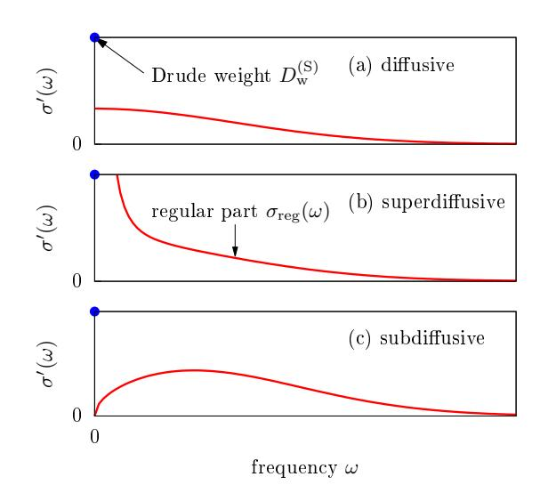

FIG. 1 (Color online) Sketch of the three different scenarios that one can envision for the behavior of the regular part of optical conductivity  $\sigma_{\rm reg}(\omega)$  (solid lines) at finite temperature. The point at  $\omega=0$  indicates the Drude weight, which may coexist with a nonzero regular part.

T, we namely also have  $\mathcal{J}^{(\mathrm{S})} = -\mathcal{L}_{\mathrm{SS}} \nabla(b)/T$ , which, after equating it with Fick's law, gives the spin-diffusion constant

$$D^{(S)} = \frac{\sigma_{\text{reg}}(0)}{\partial S^z / \partial b}, \qquad (24)$$

where b is the magnetic field. The denominator is equal to the static spin susceptibility,  $\frac{\partial S^z}{\partial b} := \chi = \frac{\beta}{L} [\langle (S^z)^2 \rangle - \langle S^z \rangle^2]$ , which is, at infinite temperature, equal to  $\chi = \beta/4$ , and in turn, the diffusion constant at infinite T is

$$D^{(S)} = 4 \lim_{t \to \infty} \lim_{L \to \infty} \frac{1}{L} \int_0^t \langle \mathcal{J}^{(S)} \mathcal{J}^{(S)}(\tau) \rangle d\tau.$$
 (25)

We stress that Eq. (25) holds in the case of a vanishing Drude weight only.

The Drude weight can also be connected to the sensitivity of the spectrum to a threading flux  $\phi$ , in essence probing the sensitivity to boundary conditions. This was originally used for the ground state (Kohn, 1964) and extended to finite T in (Castella  $et\ al.$ , 1995), leading to

$$\mathcal{D}_{w}^{(S)} = \frac{1}{L} \sum_{\alpha} p_{\alpha} \frac{1}{2} \left. \frac{d^{2} E_{\alpha}}{d\phi^{2}} \right|_{\phi=0}, \qquad (26)$$

where  $E_{\alpha}$  are eigenenergies and  $p_{\alpha} := e^{-\beta E_{\alpha}}/Z$  are the Boltzmann weights. Completely analogous Drude weights can be defined for transport of other quantities as well.

A finite Drude weight implies that the current autocorrelation function exhibits a plateau at long times. Such a nonzero plateau is typically an indication of a conserved

quantity. Indeed, it is intuitively clear that a conserved operator that has a nonzero overlap with the current operator causes a plateau in the current autocorrelation function. The argument can be formalized in the form of the so-called Mazur (in)equality, first studied in (Mazur, 1969; Suzuki, 1971), that bounds the time-averaged autocorrelation  $\bar{C}'$  by constants of motion. One has

$$\bar{C}'_{\mathcal{J}^{(\mathrm{S})}\mathcal{J}^{(\mathrm{S})}} \ge \sum_{n} \frac{1}{L} \frac{\langle \mathcal{J}^{(\mathrm{S})} Q_n \rangle^2}{\langle Q_n^2 \rangle},$$
 (27)

where the sum runs over Hermitian constants of motion  $Q_n$ ,  $[Q_n, H] = 0$ , that are chosen to be orthogonal,  $\langle Q_n Q_m \rangle \propto \delta_{nm}$ . The equality in (27) holds if the sum is over (a complete set of) all  $Q_n$ . The bracket is a standard canonical average. However, if one wants to bound the Kubo autocorrelation function, one uses the Kubo-Mori (Mori, 1965) (also called Bogoliubov) inner product  $K_{\mathcal{J}^{(S)}Q_n}(0)$  as defined in Eq. (9). Mazur's inequality (27), together with Eq. (20), can be used to bound the Drude weight from below (Zotos  $et\ al.$ , 1997),

$$\mathcal{D}_{\mathbf{w}}^{(S)} \ge \frac{\beta}{2} \lim_{L \to \infty} \sum_{n} \frac{1}{L} \frac{\langle \mathcal{J}^{(S)} Q_n \rangle^2}{\langle Q_n^2 \rangle}.$$
 (28)

We remark that simply using a complete set of eigenstate projectors as  $Q_n$  in Eq. (28) of course does not work because the right hand side is zero since the sum is exponentially small in L. The important conserved quantities are (quasi)local conserved  $Q_n$  for which overlaps are not necessarily exponentially small.

For anomalous superdiffusive transport, the Drude weight is zero but the decay of the autocorrelation function is slow, resulting in a diverging diffusion constant  $D^{(S)}$ . We note that in such anomalous cases, the application of the linear-response formula is in practice not straightforward (Kundu *et al.*, 2009; Wu and Berciu, 2010).

Above, we discussed the effect of exact conservation laws, captured via Mazur's inequality. Weakly violated or approximately conserved quantities may also affect the long-time decay of current autocorrelation functions [see, e.g., (Rosch, 2006) for a discussion].

## C. Time evolution of inhomogeneous densities

#### 1. Generalized Einstein relations

Another widely used approach to study transport (we again focus exclusively on the spin case) is to prepare a non-equilibrium initial state

$$\rho \neq \rho_{\rm eq}$$
(29)

and to follow the dynamics of expectation values

$$\langle \delta s_r^{\mathbf{z}}(t) \rangle = \operatorname{tr}[\rho(t) \, \delta s_r^{\mathbf{z}}],$$
 (30)

where  $\rho(t)=e^{-iHt}\rho\,\mathrm{e}^{iHt}$  is the unitary time evolution in an isolated quantum system governed by H and  $\delta s_r^z=s_r^z-\langle s_r^z\rangle_\mathrm{eq}$  measures the deviation of the local density  $s_r^z$  from its value  $\langle s_r^z\rangle_\mathrm{eq}$  at equilibrium. In such a situation, a large variety of different initial states can be prepared: They can be mixed or pure, entangled or nonentangled, close to or far away from equilibrium, e.g., as resulting from sudden quenches or from joining two semi-infinite chains at different equilibrium [see Sec. IX.B]. Various initial profiles can be realized as well: They can be spatially localized, domain walls, staggered, etc. We stress that the situations considered in this subsection are not necessarily limited to the linear-response regime and are therefore more general.

A general strategy to analyze the dynamical behavior is given by the spatial variance

$$\Sigma^{2}(t) = \sum_{r} \frac{\langle \delta s_{r}^{z}(t) \rangle}{\langle \delta S^{z} \rangle} r^{2} - \left[ \frac{\langle \delta s_{r}^{z}(t) \rangle}{\langle \delta S^{z} \rangle} r \right]^{2}$$
 (31)

with the time-independent sum  $\langle \delta S^z \rangle = \sum_r \langle \delta s_r^z(t) \rangle$ , i.e.,  $\sum_r \langle \delta s_r^z(t) \rangle / \langle \delta S^z \rangle = 1$  is properly normalized, and we assume  $\langle \delta s_r^z(t) \rangle > 0$ . Thus, the spatial variance yields information on the overall width of the profile. In the case that diffusive dynamics is realized at *all* times,

$$\frac{\mathrm{d}}{\mathrm{d}t}\Sigma^{2}(t) = 2D^{(\mathrm{S})}.$$
 (32)

Here, the quantity  $D^{(S)}$  is a time- and space-independent diffusion constant.

In general, the spatial variance in Eq. (31) is unrelated to the linear-response functions discussed in the previous sections. However, a relation can be derived if the initial state  $\rho$  is close enough to the equilibrium state  $\rho_{\rm eq}$ . To this end, consider the specific non-equilibrium state

$$\rho \propto \exp\left[-\beta \left(H - \varepsilon \sum_{r} p_r \, s_r^z\right)\right],$$
(33)

i.e., a thermal state of the Hamiltonian H but now with an additional potential  $\sum_r p_r s_r^z$  of strength  $\varepsilon$ . As shown by Kubo (Kubo *et al.*, 1991), Eq. (33) can be expanded in  $\varepsilon$  as

$$\rho = \rho_{\rm eq} \left[ 1 + \varepsilon \int_0^\beta d\beta' \sum_r p_r \, e^{\beta' H} \, \delta s_r^{\rm z} \, e^{-\beta' H} + \mathcal{O}(\varepsilon^2) \right]. \tag{34}$$

If  $\varepsilon$  is a sufficiently small parameter, the expansion can be truncated to linear order. Using this truncation, the expectation values  $\langle \delta s_r^{\rm z}(t) \rangle$  become

$$\langle \delta s_r^{\mathbf{z}}(t) \rangle = \varepsilon \, \beta \, \sum_{r'} p_{r'} \, K_{\delta s_{r'}^{\mathbf{z}} \delta s_r^{\mathbf{z}}}(t) \,.$$
 (35)

Assuming that  $\langle \delta s_r^{\rm z}(t) \rangle$  remains negligibly small at the boundary of the lattice, the time derivative of the spatial

variance can be written in the form (Bohm and Leschke, 1992; Steinigeweg et al., 2009b; Yan et al., 2015)

$$\frac{\mathrm{d}}{\mathrm{d}t}\Sigma^{2}(t) = 2D^{(\mathrm{S})}(t),$$
 (36)

where the time-dependent diffusion constant is given by the relation

$$D^{(S)}(t) = \frac{\beta}{\chi} \int_0^t dt' K_{\mathcal{J}^{(S)}\mathcal{J}^{(S)}}(t')$$
 (37)

with the static susceptibility

$$\chi = \beta K_{\delta S^z \delta S^z}. \tag{38}$$

As mentioned above, one has  $\chi/L=\beta/4$  for the specific case of high temperatures.

Equation (37) is a generalized Einstein relation as it holds for any time t. In particular, in the long-time limit  $t \to \infty$ , it simplifies to the usual Einstein relation, if the current autocorrelation function decays sufficiently fast to zero,

$$\lim_{t \to \infty} D^{(S)}(t) = D^{(S)} = \frac{\sigma_{dc}}{\chi/L},$$
 (39)

where  $\sigma_{\rm dc}$  is the dc conductivity as obtained from linear response theory, i.e., Eq. (39) is identical to Eq. (24). Therefore, the existence of  $\sigma_{\rm dc}$  implies a diffusive scaling of the spatial variance in time, at least for the specific initial state  $\rho$  in Eq. (33) with a small parameter  $\varepsilon$ . However, it is worth pointing out that the requirement of a strictly mixed state can be relaxed by employing the concept of typicality (see Sec. IV.C).

Since the generalized Einstein relation is neither restricted to the limit of large times nor to the case of diffusion, it allows one to investigate both different time scales and different types of transport. For example, it predicts a ballistic scaling  $D^{(\mathrm{S})}(t) \propto t$  and  $\Sigma^2(t) \propto t^2$  at short times  $t \ll \tau$ , before a diffusive scaling  $D^{(\mathrm{S})}(t) = D^{(\mathrm{S})}$  and  $\Sigma^2(t) \propto t$  may finally set in at intermediate times  $t > \tau$ . Remarkably, it also captures the influence of a Drude weight  $\mathcal{D}_{\mathrm{w}}^{(\mathrm{S})} > 0$ . A finite Drude weight  $\mathcal{D}_{\mathrm{w}}^{(\mathrm{S})} > 0$  implies a ballistic scaling

$$D^{(\mathrm{S})}(t) \propto \frac{\mathcal{D}_{\mathrm{w}}^{(\mathrm{S})}}{\chi/L} t$$
 (40)

and  $\Sigma^2(t) \propto t^2$  at large times.

Finally, we remark that a power-law scaling of

$$\Sigma^2(t) \propto t^{\alpha'} \tag{41}$$

indicates subdiffusion for  $0 < \alpha' < 1$  and superdiffusion for  $1 < \alpha' < 2$  (see Fig. 2). Due to the generalized Einstein relation in Eq. (37), such a power-law scaling in time also implies that the frequency dependence of the conductivity  $\sigma'(\omega)$  is given by the power law (Dyre *et al.*,

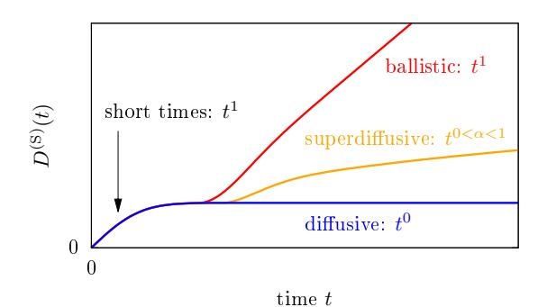

FIG. 2 (Color online) Sketch of different scenarios for the time-dependent diffusion constant  $D^{(\mathrm{S})}(t)$ : ballistic, superdiffusive, and diffusive (top to bottom). The behavior in the short-time limit is always ballistic, the typical exponents in the long-time dynamics are indicated as  $t^1$ ,  $t^{\alpha}$  (0 <  $\alpha$  < 1), and  $t^0$ , respectively.

2009; Luitz and Lev, 2017; Maass  $et\ al.$ , 1991; Stachura and Kneller, 2015)

$$\sigma'(\omega) \propto \int_0^\infty dt \, e^{i\omega t} \, t^{\alpha'-2} \propto |\omega|^{1-\alpha'},$$
 (42)

i.e., Eq. (18) with  $\alpha = 1 - \alpha'$ .

#### 2. Diffusion

While the spatial variance in Eq. (31) is a useful quantity to study transport, it yields no information beyond the overall width of a profile. In particular, in order to draw reliable conclusions on the existence of diffusion, it is necessary to require the full spatial dependence of a profile to be described by the diffusion equation. In one dimension and for a discrete lattice, the diffusion equation reads

$$\frac{\mathrm{d}\langle \delta s_r^{\mathrm{z}}(t) \rangle}{\mathrm{d}t} = D^{\mathrm{(S)}} \left[ \langle \delta s_{r-1}^{\mathrm{z}}(t) \rangle - 2 \langle \delta s_r^{\mathrm{z}}(t) \rangle + \langle \delta s_{r+1}^{\mathrm{z}}(t) \rangle \right], \tag{43}$$

where  $D^{(S)}$  again denotes a time- and space-independent diffusion constant and the right-hand side can be viewed as a discretized version of the Laplacian  $\partial^2/\partial r^2$ . It is important to note that Eq. (43) is a phenomenological description for the expectation values  $\langle s_r^{\rm z}(t) \rangle$  and their irreversible relaxation towards equilibrium. A rigorous justification is still a challenge to theory (Bonetto et al., 2000; Buchanan, 2005; Casati et al., 1984; Dhar, 2008; Lepri et al., 2003; Ljubotina et al., 2017; Michel et al., 2005; Steinigeweg et al., 2017a,b). Within such a description and in the following discussion, one does not need to specify the initial state in detail, however, note that this statistical description is often discussed in the context of correlation functions (Forster, 1990; Kadanoff and Martin, 1963; Steiner et al., 1976). We stress that the diffusion in Eq. (43) is a statistical process starting

at time t=0 and occurring between individual lattices sites, i.e., it implicitly assumes a mean-free time  $\tau=0$  and a mean-free path l=0. Since  $\tau>0$  and l>0 in specific models, it can only hold when the density profile has become sufficiently broad. In terms of the density modes discussed below, statistical behavior is thus restricted to sufficiently small momenta.

For a local injection at some site r', i.e.,  $\langle \delta s^{\mathbf{z}}_{r=r'}(0) \rangle \neq 0$  and  $\langle \delta s^{\mathbf{z}}_{r\neq r'}(0) \rangle = 0$ , the solution of Eq. (43) reads

$$\frac{\langle \delta s_r^{\rm z}(t) \rangle}{\langle \delta S^z \rangle} = \exp(-2D^{\rm (S)}t) I_{r-r'}(2D^{\rm (S)}t) , \qquad (44)$$

where  $I_r(t)$  is the modified Bessel function of the first kind and order r. This lattice solution can be well approximated by the corresponding continuum solution

$$\frac{\langle \delta s_r^z(t) \rangle}{\langle \delta S^z \rangle} = \frac{1}{\sqrt{2\pi} \Sigma(t)} \exp\left[-\frac{(r-r')^2}{2 \Sigma^2(t)}\right],\tag{45}$$

where the spatial variance  $\Sigma^2(t)=2\,D^{(\mathrm{S})}\,t$  has been introduced in the previous section. Thus,

$$\langle \delta s_{r=r'}^{\rm z}(t) \rangle \propto \frac{1}{\Sigma(t)} \propto \frac{1}{\sqrt{t}} \,.$$
 (46)

Obviously, since the diffusion equation is a linear differential equation, the general solution can be constructed as a superposition of  $\delta$  injections at different positions.

At this point, it is certainly instructive to provide a link to correlation functions. To this end, consider the specific initial state  $\rho$  in Eq. (33) with coefficients  $p_{r=r'} \neq 0$  and  $p_{r\neq r'} = 0$ . For  $\varepsilon$  sufficiently small, the expectation values  $\langle \delta s_r^z(t) \rangle$  become

$$\langle \delta s_r^{\rm z}(t) \rangle = \varepsilon \,\beta \, p_{r'} \, K_{\delta s_{r'}^{\rm z} \delta s_r^{\rm z}}(t) \,.$$
 (47)

For high temperatures,  $K_{\delta s_r^z/\delta s_r^z}(0) \propto \delta_{r,r'}$ , and in the case of diffusion,  $\langle \delta s_r^z(t) \rangle$  satisfies Eqs. (44) and (45) (Steinigeweg *et al.*, 2017b).

Coming back to the general case, it is often convenient to study diffusion not only in real space but also in the space of lattice momenta (reciprocal space)

$$q = \frac{2\pi k}{L}, \quad k = 0, \dots, L - 1.$$
 (48)

Note that the lattice spacing is set to one. The quasimomentum representation is particularly useful, since a discrete Fourier transform

$$\langle \delta s_q^{\rm z}(t) \rangle = \frac{1}{\sqrt{L}} \sum_r e^{\mathrm{i}qr} \langle \delta s_r^{\rm z}(t) \rangle$$
 (49)

decouples the diffusion equation in Eq. (43). Hence, after this transformation, it becomes the simple rate equation

$$\frac{\mathrm{d}\langle \delta s_q^{\mathrm{z}}(t)\rangle}{\mathrm{d}t} = -\tilde{q}^2 D^{(\mathrm{S})} \langle \delta s_q^{\mathrm{z}}(t)\rangle, \qquad (50)$$

where the momentum dependence  $\tilde{q}^2 = 2(1 - \cos q)$  may be approximated as  $\tilde{q}^2 \approx q^2$  for sufficiently small q. The solution of Eq. (50) is obviously an exponential decay of the form (Steiner *et al.*, 1976)

$$\frac{\langle \delta s_q^z(t) \rangle}{\langle \delta s_q^z(t=0) \rangle} = e^{-\tilde{q}^2 D^{(\mathrm{S})} t} \,. \tag{51}$$

Thus, the general solution of the diffusion equation can also be written as a superposition of exponential decays at different momenta. For instance, the Bessel solution in Eq. (44) can be written in the form

$$\frac{\langle \delta s_r^{\mathbf{z}}(t) \rangle}{\langle \delta S^{\mathbf{z}} \rangle} = \frac{1}{L} \sum_q e^{-\mathrm{i}q(r-r')} e^{-\tilde{q}^2 D^{(\mathrm{S})} t} . \tag{52}$$

This form makes it particularly clear when the Gaussian in Eq. (45) is a good approximation: Quasimomentum q must be sufficiently dense, i.e., L must be sufficiently large and in addition, time t must be sufficiently long.

As Fourier modes  $\langle \delta s^{\rm z}_q(t) \rangle$  decay exponentially in the case of diffusion, their spectral representation

$$\langle \delta s_q^{\mathbf{z}}(\omega) \rangle = \int_0^\infty \mathrm{d}t \, e^{\mathrm{i}\omega t} \, \langle \delta s_q^{\mathbf{z}}(t) \rangle$$
 (53)

becomes a Lorentzian of the form (Kadanoff and Martin, 1963)

$$\operatorname{Re}\left[\frac{\langle \delta s_q^z(\omega) \rangle}{\langle \delta s_q^z(t=0) \rangle}\right] = \frac{\tilde{q}^2 D^{(S)}}{(\tilde{q}^2 D^{(S)})^2 + \omega^2}$$
(54)

with the sum rule

$$\int_{-\infty}^{\infty} d\omega \operatorname{Re}\left[\frac{\langle \delta s_q^{z}(\omega) \rangle}{\langle \delta s_q^{z}(t=0) \rangle}\right] = \pi.$$
 (55)

This Lorentzian line shape occurs for all momenta (and frequencies), which reflects the fact that the diffusion equation in Eq. (43) assumes a mean-free path l=0 (and mean free time  $\tau=0$ ). However, if l and  $\tau$  are finite, a Lorentzian line shape can only occur in the hydrodynamic limit where momentum and frequency are both sufficiently small.

Eventually, it is instructive to discuss correlation functions again. Focusing on the specific initial state  $\rho$  in Eq. (33), starting from Eq. (47), and assuming translation invariance of H, it is straightforward to show that

$$\langle s_q^{\rm z}(t) \rangle = \varepsilon \, p_{r'} \, \chi_q(t)$$
 (56)

with the correlation function

$$\chi_q(t) = \beta K_{\delta s_q^z \delta s_{-q}^z}(t). \tag{57}$$

Therefore, in the case of diffusion, the correlation function  $\chi_q(t)$  is an exponential and the real part of its Fourier transform  $\chi_q(\omega)$  is a Lorentzian.

Remarkably, the continuity equation in momentum space,

$$\frac{\mathrm{d}s_q^{\mathrm{z}}(t)}{\mathrm{d}t} = (e^{\mathrm{i}q} - 1)\,\mathcal{J}_q^{\mathrm{(S)}}(t)\,,\tag{58}$$

allows to relate  $\chi_q(t)$  to the correlation function

$$\sigma_q(t) = \beta K_{\mathcal{J}_q^{(S)} \mathcal{J}_{-q}^{(S)}}(t). \tag{59}$$

In the time domain, this relation reads

$$\sigma_q(t) = -\frac{1}{\tilde{q}^2} \frac{\mathrm{d}^2 \chi_q(t)}{\mathrm{d}t^2} \tag{60}$$

and, as a function of frequency, it becomes

$$\operatorname{Re} \sigma_q(\omega) = \frac{\omega^2}{\tilde{q}^2} \operatorname{Re} \chi_q(\omega). \tag{61}$$

Therefore, if the dynamics is diffusive, the Lorentzian in Eq. (54) implies

$$\operatorname{Re}\left[\frac{\sigma_q(\omega)}{\chi_q(t=0)}\right] = \frac{D^{(\mathrm{S})}\,\omega^2}{(\tilde{q}^2D^{(\mathrm{S})})^2 + \omega^2}\,. \tag{62}$$

In the limit of small momentum, one thus obtains the Einstein relation

$$\lim_{q \to 0} \operatorname{Re} \left[ \frac{\sigma_q(\omega)}{\chi_q(t=0)} \right] = D^{(S)}. \tag{63}$$

Note that no frequency dependence is left as the meanfree time is assumed to be  $\tau=0$ . This broad conductivity also results in the Drude model of conduction discussed before.

To summarize this section, Fig. 3 sketches diffusion in (a) time t and real space r, (b) time t and momentum space q, and (c) frequency  $\omega$  and momentum space q.

#### III. EXPLOITING INTEGRABILITY

In this section, we will see how integrability affects the finite-temperature transport properties. We will stress the important role played by local and quasilocal conservation laws, showing that they can lead to ballistic transport. Specifically, in Sec. III.A, we will show that a systematic construction of quasilocal charges provides lower bounds for Drude weights and diffusion constants. In Secs. III.B and III.C, we will describe methods to obtain closed-form analytical predictions for these quantities. In particular, Sec. III.B.3 reports on the predictions for spin and energy Drude weights obtained using the Thermodynamic Bethe Ansatz (TBA) formalism, whereas Sec. III.C gives an introduction to GHD and describes its predictions for the Drude weights and diffusion constants of all conserved charges. Most of the ideas will be exemplified in the paradigmatic case of the spin-1/2 XXZ chain.

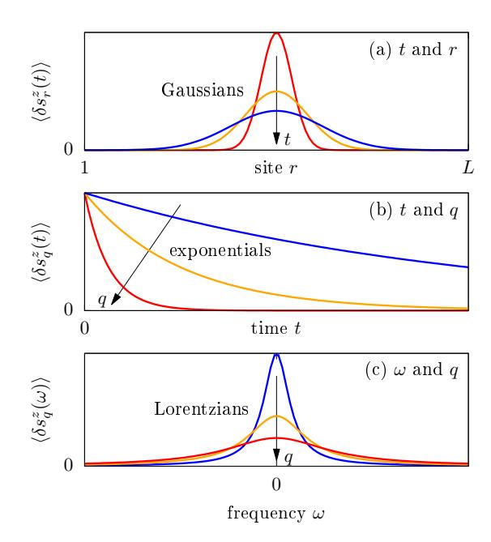

FIG. 3 (Color online) Sketch of the diffusive spreading of a spin-density perturbation as a function of (a) time t and real space r, (b) time t and momentum space q, and (c) frequency  $\omega$  and momentum space q.

We remark that Secs. III.B.1 and III.B.2 give a rather detailed introduction to Bethe ansatz and TBA and serve to establish a coherent formalism to express both the TBA results for transport coefficients and GHD. The reader not interested in technical aspects should skip these subsections and go directly to Secs. III.B.3 and III.C.

# A. Role of local and quasilocal conserved charges

Quantum integrability is based on the existence of two key objects (Faddeev, 2016; Korepin et al., 2005). The first one is the R-matrix, which can be understood as an abstract unitary scattering operator  $\tilde{R}_{j,l}(\lambda)$  acting over a pair of local finite-dimensional physical Hilbert spaces,  $\mathcal{H}_j \simeq \mathcal{H}_l \simeq \mathbb{C}^d$ . The R-matrix depends on a free (complex) spectral parameter  $\lambda$  and satisfies the celebrated Yang-Baxter equation. The second key object is the Lax operator  $L_{j,a}(\lambda)$ , which acts on a pair of Hilbert spaces that are in principle different: the local Hilbert space  $\mathcal{H}_j$  and the so-called "auxiliary" space  $V_a$  of dimension  $N_a$ , which can be finite or infinite. These two spaces carry the physical and auxiliary representation of the quantum symmetry of the problem, respectively. This symmetry

is concisely expressed via the so-called RLL relation, 13

$$\check{R}_{j,l}(\mu)L_{j,a}(\lambda + \frac{\mu}{2})L_{l,a}(\lambda - \frac{\mu}{2}) 
= L_{j,a}(\lambda - \frac{\mu}{2})L_{l,a}(\lambda + \frac{\mu}{2})\check{R}_{j,l}(\mu).$$
(64)

The RLL equation is another form of the Yang-Baxter relation. For a given  $\check{R}_{j,l}(\mu)$ , one can construct the two-site local Hermitian operator

$$h_{j,j+1} = \frac{\mathrm{d}}{\mathrm{d}\lambda} \check{R}_{j,j+1}(\lambda) \big|_{\lambda=0}, \tag{65}$$

which gives the Hamiltonian density  $(H = \sum_{j=1}^{L} h_{j,j+1})$  of the corresponding integrable model, where periodic boundary conditions can be assumed for simplicity.

A critical consequence of integrability is the existence of an extensive number of local conserved quantities, which are generated via logarithmic derivatives

$$Q_n = \frac{\mathrm{d}^n}{\mathrm{d}\lambda^n} \log \tau(\lambda) \big|_{\lambda = \lambda_0} \tag{66}$$

of the "fundamental transfer matrix", an operator over  $\bigotimes_j \mathcal{H}_j \simeq (\mathbb{C}^d)^{\otimes L}$  defined as follows

$$\tau(\lambda) = \operatorname{tr}_0 L_{1,0}(\lambda) L_{2,0}(\lambda) \cdots L_{L,0}(\lambda). \tag{67}$$

Here,  $L_{j,0}(\lambda)$  is the Lax operator in the fundamental representation, where the auxiliary space is isomorphic to the local physical space. At the special point  $\lambda = \lambda_0$ , the Lax operator  $L_{j,0}(\lambda)$  degenerates to a permutation operator  $L_{j,0}(\lambda_0) = P_{j,0}$ , acting as  $P |\psi\rangle \otimes |\phi\rangle = |\phi\rangle \otimes |\psi\rangle$ . This property is instrumental for showing that  $Q_n = \sum_{l=1}^L q_l^{(n)}$  are in fact extensive sums of local densities  $q_l^{(n)}$ . The conservation law property  $[H, \tau(\lambda)] \equiv [H, Q_k] \equiv 0$  is then a simple consequence of the RLL relation Eq. (64), and similarly, the involution property  $[\tau(\lambda), \tau(\mu)] \equiv [Q_j, Q_k] \equiv 0$  follows from another form of Yang-Baxter equation. In fact, one can fix normalization such that  $H = Q_1$ .

This construction applies, for example, to the paradigmatic example of the spin-1/2 XXZ chain. In this case, the local Hilbert space is  $\mathcal{H}_j = \mathbb{C}^2$  and  $\check{R}_{j,l}(\lambda)$  is the standard 6-vertex R-matrix (Baxter, 1982). Using the parametrization

$$\Delta = \cos(\eta),\tag{68}$$

the general Lax operator can be written as

$$L_{j,a}(\lambda, s) = \frac{2\sin\eta}{\sin\lambda} \left( S_a^+ s_j^- + S_a^- s_j^+ \right) + \cos(\eta S_a^z) \mathbb{1} + 2(\cot\lambda) \sin(\eta S_a^z) s_j^z, \quad (69)$$

where the local spin operators  $s_j^{\alpha}=(1/2)\sigma_j^{\alpha},\ \alpha\in\{+,-,z\}$ , act over the local physical space while  $S_a^{+,-,z}$ 

span an irreducible highest-weight representation of the q-deformed angular momentum algebra  $(q=e^{i\eta})$   $SU_q(2)$ . This representation depends on a free (complex) parameter  $s\in\mathbb{C}$  and is generically infinite-dimensional

$$S_a^z = \sum_{n=0}^{\infty} (s-n) |n\rangle \langle n|,$$

$$S_a^+ = \sum_{n=1}^{\infty} \frac{\sin n\eta}{\sin \eta} |n-1\rangle \langle n|,$$

$$S_a^- = \sum_{n=1}^{\infty} \frac{\sin(2s-n+1)\eta}{\sin \eta} |n\rangle \langle n-1|.$$
(70)

However, either (i) for half-integer spin  $s \in \frac{1}{2}\mathbb{Z}$  or (ii) for any  $s \in \mathbb{C}$  but root-of-unity anisotropies  $\eta = \pi \ell/m$  ( $\ell, m$  coprime integers) the above irrep truncates to a finite dimension:  $N_a = 2s + 1$  or  $N_a = m$ , respectively. In this case, the sums above run up to  $n = N_a - 1$ . One can thus define a general family of commuting transfer matrices

$$\tau(\lambda, s) = \operatorname{tr}_a L_{1,a}(\lambda, s) L_{2,a}(\lambda, s) \cdots L_{L,a}(\lambda, s), \quad (71)$$

satisfying  $[H, \tau(\lambda, s)] = 0$  for all  $\lambda, s$ , again as a consequence of (64), while clearly  $\tau(\lambda, 0) \equiv \tau(\lambda)$ .

For every fixed s, the transfer matrix  $\tau(\lambda, s)$  generates the following sequence of additional conserved charges

$$Q_{n,s} = \frac{\mathrm{d}^n}{\mathrm{d}\lambda^n} \log \tau(\lambda, s) \big|_{\lambda = \eta/2}. \tag{72}$$

Therefore, one can argue that the sequence of local charges  $Q_n$  stemming from the fundamental transfer matrix Eq. (67) is "not complete" and is not sufficient to describe the statistical mechanics of integrable models. Indeed, (Ilievski et al., 2015) showed that, for s > 1/2, the charges (72) are linearly independent from the family of local charges  $Q_{n,s} \equiv Q_{n,1/2}$  and are "essentially local". More formally, for any size L, a generic charge  $Q = Q_{n,s}$  in the family (72) can be written as an extensive series  $Q = \sum_r \sum_{l=1}^L q_{l,r}$  of r-site local densities  $q_{l,r}$  with exponentially decaying vector norm (i.e.,  $\langle [q_{l,r}]^2 \rangle < Ce^{-r/\xi}$  for some fixed  $C, \xi > 0$ ). This property, called quasilocality, implies extensivity in the sense  $0 < \lim_{L \to \infty} \langle Q^2 \rangle / L < \infty$ . Note that Eq. (72) provides a full set of charges for  $|\Delta| \geq 1$ , while for  $|\Delta| < 1$  one can establish a one-to-one correspondence between the known (quasi)local charges and the string excitations using the so-called string-charge duality (Ilievski et al., 2016b).

All the charges  $Q_{n,s}$  generated by unitary representations of  $SU_q(2)$  are even under a generic  $\mathbb{Z}_2$  'particle-hole' symmetry of the model, e.g., in the case of the spin-1/2 XXZ chain, under the spin-reversal (spin-flip) transformation  $F = \prod_{l=1}^L \sigma_l^x$ ,  $FQ_{n,s} = Q_{n,s}F$ . However, the spin current  $\mathcal{J}^{(\mathbb{S})}$  is odd,  $\mathcal{J}^{(\mathbb{S})}F = -F\mathcal{J}^{(\mathbb{S})}$ , and hence  $\langle \mathcal{J}^{(\mathbb{S})}Q_{n,s}\rangle = 0$ . In other words, irrespective of the temperature, these charges cannot contribute to the Mazur bound Eq. (28) at vanishing magnetization.

&lt;sup>13 RLL stands for R-matrix - Lax Matrix - Lax Matrix

Nevertheless, one can explore non-unitary representations of the symmetry algebra  $SU_q(2)$  to search for charges that are not invariant under spin-reversal using the general relation  $F\tau(\lambda,s)F^{-1}=\tau(\pi-\lambda,s)^{\rm T}$ . For root-of-unity anisotropies  $\eta=\pi\ell/m$  ( $\ell,m$  coprime integers), this procedure leads to an additional family of quasilocal conserved charges that are non-Hermitian and odd under spin reversal (Prosen, 2014c). They can be expressed as

$$Z(\lambda) = \frac{\sin(\lambda)^2}{2\eta \sin(\eta)} \,\partial_s \tau(\lambda, s)|_{s=0} - \frac{\sin(\lambda) \cos(\lambda)}{\sin(\eta)} \,S^z, \tag{73}$$

where  $\lambda$  lies inside the analyticity strip  $\mathcal{S}=\{\lambda\in\mathbb{C}; |\mathrm{Re}\,\lambda-\frac{\pi}{2}|<\frac{\pi}{2m}\}$  and  $S^z=\sum_{r=1}^L s_r^z$  denotes the total magnetization in the z direction.

# 1. Lower bound on spin Drude weight at high temperature

Since the quasilocal charges generated from non-unitary representations are not spin-reversal invariant, they have a non-vanishing overlap with the spin current and may contribute to the Mazur bound. For example, in the high-temperature regime  $(\beta \to 0)$ , the overlap is also extensive,  $\langle Z(\lambda)\mathcal{J}^{(\mathrm{S})}\rangle = iL/4$ , yielding a finite contribution to Eq. (28). However, the  $Z(\lambda)$  are not mutually orthogonal and their overlaps are given by the following analytic kernel

$$K(\lambda, \mu) = \lim_{L \to \infty} \frac{\langle Z(\bar{\lambda})^{\dagger} Z(\mu) \rangle}{L}$$
$$= -\frac{\sin(\lambda)\sin(\mu)\sin((m-1)(\lambda+\mu))}{2\sin^2(\eta)\sin(m(\lambda+\mu))}$$

while  $\langle Z(\lambda)Z(\mu)\rangle\equiv 0$ . The Mazur bound for the spin-Drude weight generally follows (Ilievski and Prosen, 2013) from finding an extremum of the nonnegative action

$$\mathcal{S}[f] := \lim_{t \to \infty} \lim_{L \to \infty} \frac{1}{L} \langle (B_{L,t}[f])^{\dagger} B_{L,t}[f] \rangle \ge 0, \qquad (74)$$

with respect to an unknown function  $f(\lambda)$ . Here, we introduced

$$B_{L,t}[f(\lambda)] := \frac{1}{t} \int_0^t ds \, \mathcal{J}^{(S)}(s) - \int_{\mathcal{S}} d^2 \lambda \, f(\lambda) Z(\lambda). \tag{75}$$

The variation  $\delta S/\delta f(\lambda) = 0$  results in the Fredholm equation of the first kind on a two-dimensional (complex) domain  $\mathcal{S}$ 

$$\int_{\mathcal{S}} d^2 \mu K(\lambda, \mu) f(\mu) = \langle Z(\lambda) j^{(S)} \rangle, \qquad (76)$$

which for the spin-1/2 XXZ chain with  $\Delta = \cos(\pi \ell/m)$  yields

$$f(\lambda) = \frac{m \sin^2(\pi/m)}{i\pi |\sin \lambda|^4}.$$
 (77)

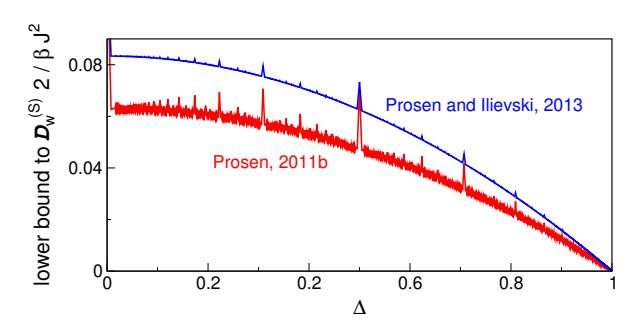

FIG. 4 (Color online) Lower bound for the spin Drude weight  $\mathcal{D}_{w}^{(S)}$  of the spin-1/2 XXZ chain according to Eq. (78), as obtained in (Prosen and Ilievski, 2013), and another lower bound for  $\mathcal{D}_{w}^{(S)}$ , as obtained earlier in (Prosen, 2011b). Both bounds exhibit a pronounced fractal-like (i.e., nowhere continuous) dependence on the anisotropy parameter  $\Delta$ .

This in turn results in the following rigorous lower bound for the leading coefficient in the high-temperature expansion of the Drude weight  $\tilde{\mathcal{D}}_{\mathbf{w}}^{(S)}$  in  $\beta$ , defined as

$$\tilde{\mathcal{D}}_{w}^{(S)} = \lim_{\beta \to 0} \frac{\mathcal{D}_{w}^{(S)}}{\beta} \ge \frac{1}{2} \int_{\mathcal{S}} d\lambda^{2} f(\lambda) \langle Z(\lambda) j_{0}^{(S)} \rangle 
= \frac{1}{16} \frac{\sin^{2} (\pi \ell/m)}{\sin^{2} (\pi/m)} \left( 1 - \frac{m}{2\pi} \sin \left( \frac{2\pi}{m} \right) \right).$$
(78)

Note that the r.h.s. of (78) is a nowhere continuous function of  $\Delta$  whose graph is a fractal set. The dependence on  $\Delta$  is illustrated in Fig. 4.

We refer the reader to Sec. VI for a detailed discussion of the saturation of this bound and to (Matsui, 2020) for an explanation of why the natural non-quasilocal extension of the quasilocal charges given in Eq. (72) cannot improve the bound. A more comprehensive review on quasilocal charges can be found in (Ilievski et al., 2016a), whereas the extension of Drude weights and quasilocal charges to integrable periodically driven (Floquet) systems is given in (Ljubotina et al., 2019b).

# 2. Lower bounds on spin diffusion constant at high temperature

In typical integrable models, e.g., the spin-1/2 XXZ chain for  $|\Delta| \geq 1$  or the 1d Fermi-Hubbard model, the spin or charge Drude weight vanishes at zero magnetization  $m_z = 2\langle S^z \rangle/L = 0$  or in the half-filled sector  $\rho = N/L = 1/2$ , respectively. However, moving slightly away from half filling, one typically obtains a finite Drude weight. More precisely, calling  $\delta$  the small deviation from either zero magnetization or half filling, one observes a Drude-weight scaling as  $\mathcal{D}_{\rm w}^{(Q)} \propto \delta^2$ . At first sight, this seems to exclude the onset of spin diffusion: a finite Drude weight implies a diverging diffusion constant. Nevertheless, for large L, the Hilbert-space sector at  $\delta = 0$  dominates over all sectors with  $\delta \neq 0$ .

Therefore, one may argue that, after performing a careful (grand)canonical average, the two effects compensate each other giving rise to a finite spin- or charge-diffusion constant in the thermodynamic limit.

In fact, this argument can be justified rigorously by studying the Mazur bound for the dynamical susceptibility in a double-scaling limit,  $L \to \infty$  and  $t \to \infty$  with  $L/t > v_{\rm LR}$ , giving rise to a universal lower bound on the diffusion constant  $D^{(Q)}$  in terms of the curvature of the Drude weight  $\mathcal{D}_{\rm w}^{(Q)}(\beta,\delta)$  around  $\delta=0$ : (Medenjak et al., 2017) [see also (Spohn, 2018)]. For spin transport, one obtains:

$$D^{(\mathrm{S})}(\beta) \ge \frac{1}{8\beta v_{\mathrm{LR}} \chi(\beta) f_1(\beta)} \frac{\partial^2}{\partial \delta^2} \mathcal{D}_{\mathrm{w}}^{(\mathrm{S})}(\beta, \delta) \Big|_{\delta=0}, \quad (79)$$

where  $v_{LR}$  is the Lieb-Robinson velocity (Lieb and Robinson, 1972), and

$$f_1(\beta) = \lim_{L \to \infty} \frac{1}{2L} \frac{\partial^2}{\partial \delta^2} F_L(\beta, \delta)|_{\delta=0}$$
 (80)

is a second derivative of the free-energy density at zero magnetization, while  $\chi(\beta)$  is the static susceptibility  $\chi(\beta)/\beta = \lim_{L\to\infty} \langle (S^z)^2 \rangle - (\langle S^z \rangle)^2/L$ . The inequality holds in general, even for a nonintegrable system, if there exist conserved quantities which would make Drude weights nonvanishing away from the symmetric Hilbert-space sector  $\delta=0$ . However, for integrable systems with a well-understood quasiparticle content, such as the spin-1/2 XXZ chain, the inequality can be further refined by decomposing the contribution to the diffusion constant in terms of the curvatures of the Drude weight contributions associated to independent Bethe-ansatz quasiparticle species (see Sec. III.C.1). In this case, the velocity  $v_{\rm LR}$  can be replaced by the corresponding dressed quasiparticle velocity (Ilievski et al., 2018).

One can approach lower bounds on diffusion constants from another angle. In the same way as for the Mazur bound Eq. (28) suggests that a non-vanishing high-temperature Drude weight is connected to the existence of linearly extensive — i.e., proportional to the volume — (quasi)local charges, one might argue that a non-vanishing high-temperature diffusion constant suggests the existence of conserved charges which are quadratically extensive. Indeed, for any locally interacting lattice system, the existence of an almost conserved operator Q which has an overlap with any current operator  $j_r^{(Q')}$ , associated with some charge Q', leads to a rigorous bound on high-temperature diffusion constants (Prosen, 2014b) associated with that current. In other words,

$$D^{(Q')}(\beta \to 0) \ge \frac{|Q^j|^2}{8v_{\rm LR}q},$$
 (81)

where we used that the commutator [H,Q] only contains boundary terms,  $0 < q := \lim_{L \to \infty} \langle Q^2 \rangle / L^2 < \infty$ , and  $Q^j := \lim_{L \to \infty} \langle j_r^{(Q')} Q \rangle$  is finite.

This gives, e.g., nontrivial lower bounds for spin-diffusion constants in the spin-1/2 Heisenberg chain as well as for spin- and charge-diffusion constants for the 1d Fermi-Hubbard model. The bound has been recently generalized and formalized within the method of "hydrodynamic projections" in (Doyon, 2019a) (cf. Sec. III.C.1), where similar ideas were also used to provide bounds on anomalous (e.g., superdiffusive) transport, i.e., to estimate the dynamical exponents.

#### B. Bethe Ansatz

Here, we consider an important subclass of integrable models: those treatable by the collection of techniques grouped under the name of Bethe ansatz. The key property of these models is that their energy eigenstates can be expressed as scattering states of stable quasiparticles (Essler et al., 2005; Faddeev, 2016; Korepin et al., 2005). This gives direct access to their energy spectrum and, more generally, to their thermodynamic properties. Although the stable quasiparticles of integrable models generically undergo nontrivial scattering processes, integrability ensures that every scattering process can always be decomposed into a sequence of two-particle scatterings.

Focusing on the paradigmatic example of the spin-1/2 XXZ chain, we will introduce the central equations of Bethe ansatz — the Bethe equations — which give access to all possible eigenstates of the systems. Then, we will explain how to take their thermodynamic limit, arriving at the so called thermodynamic Bethe ansatz (TBA) description (Takahashi, 1999), where one characterizes the eigenstates in terms of "densities" of quasiparticles. Finally, we will recall some results for the energy and spin Drude weight obtained using TBA.

#### 1. Bethe Equations

There are two known routes to diagonalize the Hamiltonian using Bethe Ansatz. The first one consists in writing an ansatz many-body wave-function in real (coordinate) space. This is the original method introduced in (Bethe, 1931) and is now known as coordinate Bethe ansatz. The second, more recent, route consists of constructing a basis of eigenstates of the fundamental transfer matrix (67) for all values of the spectral parameter  $\lambda$  (cf. Sec. III.A). This is always possible since transfer matrices with different spectral parameters commute. Since the Hamiltonian is proportional to the logarithmic derivative of the transfer matrix (cf. the discussion after (67)), these states are also eigenstates of H. The latter route, called algebraic Bethe ansatz, is more powerful: it gives direct insights into the conservation laws of the system and correlation functions (Essler et al., 2005; Faddeev, 2016; Korepin *et al.*, 2005). For the sake of brevity, we do not describe such approaches in detail but only report the final results (we refer the reader interested in the derivations to the aforementioned references).

The Bethe-ansatz procedure yields the eigenstates of the system parametrized by a set of (generically complex) numbers  $\{\lambda_j\}$  called rapidities and obtained by solving a set of non-linear algebraic equations. For example, in the case of the spin-1/2 XXZ chain, the eigenstates with magnetization L/2-N are parametrized by the solutions  $\{\lambda_j\}_{j=1}^N$  of

$$\left[\frac{\sinh(\lambda_j + i\eta/2)}{\sinh(\lambda_j - i\eta/2)}\right]^L = -\prod_{k=1}^N \left[\frac{\sinh(\lambda_j - \lambda_k + i\eta)}{\sinh(\lambda_j - \lambda_k - i\eta)}\right], (82)$$

for  $j=1,\ldots,N$ . These are the illustrious Bethe equations, first found in (Bethe, 1931) for  $\Delta=1$  and then in (Orbach, 1958) for generic  $\Delta$ .

All Bethe-ansatz integrable models produce sets of nonlinear, coupled, algebraic equations of this form. In some cases, however, one needs to repeat the procedure multiple times before finding the eigenstates of the Hamiltonian. This produces multiple sets of equations similar to Eq. (82), involving different sets of rapidities, which are coupled together. This procedure is known as nested Bethe ansatz and is necessary, e.g., for the Fermi-Hubbard model. For simplicity, we restrict the discussion to the non-nested case in our presentation.

The eigenvalues of quasimomentum14 and the Hamiltonian in the eigenstate parametrized by  $\{\lambda_i\}_{i=1}^N$ 

$$P = \left[ \sum_{k=1}^{N} p(\lambda_k, \frac{1}{2}) \right] \mod 2\pi, \quad E = \sum_{k=1}^{N} e(\lambda_k) + e_0 L, \quad (83)$$

where we set  $p(\lambda, s) = i \log \left[ \sinh(\lambda - i\eta s) / \sinh(\lambda + i\eta s) \right]$ ,  $e(\lambda) = -\sin \eta / 2 \partial_{\lambda} p(\lambda, \frac{1}{2})$  and  $e_0 = \Delta/4$ . An expression similar to the one for the energy holds for higher local (and quasilocal) conservation laws (72). In particular, in the eigenvalue of  $Q_{n,s}$  the function  $e(\lambda)$  is replaced by  $q_n(\lambda, s) = (-\sin \eta / 2)^n \partial_{\lambda}^n p(\lambda, s)$  while the constant shift  $e_0$  is replaced by 0.

The Bethe equations might be viewed as convoluted quantization conditions for the momenta (or better the "rapidities") of a gas of quasiparticles confined in a finite volume L. However, one should be careful with such an interpretation as the solutions to these equations are generically complex: this is a common feature of many Bethe-ansatz integrable models.

To understand the distribution of the roots in the complex plane, it is useful to look at the solutions for  $L \to \infty$  and fixed N (Essler *et al.*, 2005; Takahashi, 1999). In this

case, any  $\mathrm{Im}[\lambda_j] \neq 0$  causes the l.h.s. to either go to infinity or to 0. Requiring the r.h.s. to do the same forces the solutions to follow ordered patterns in the complex plane known as "strings". Strings can be interpreted as stable bound states formed by the elementary particles (Essler et al., 2005) and appear in all Bethe-ansatz integrable models with complex rapidities, but their specific form depends on the model and on the values of its parameters. Specifically, in the spin-1/2 XXZ chain, the string-structure depends on whether  $\eta$  is real ( $|\Delta| < 1$ ) or imaginary ( $|\Delta| > 1$ ). For instance, for  $\eta \in \mathbb{R}$ , we have strings of the form (Takahashi, 1999)

$$\lambda_{\alpha,a}^{k} = \lambda_{\alpha}^{k} + i\frac{\eta}{2}(n_{k} + 1 - 2a) + i\frac{\pi}{4}(1 - \nu_{k}) + \delta_{\alpha,a}^{k}, \quad (84)$$

where  $\lambda_{\alpha}^{k} \in \mathbb{R}$  is called "string center",  $k = 1, ..., N_{s}$  is called "string type",  $\alpha = 1, ..., M_{k}$  labels different strings of the same type, and  $a = 1, ..., n_{k}$  labels rapidities in the same string. Finally, the "string deviations"  $\delta_{\alpha,a}^{k}$  are exponentially small in L.

The number  $N_s$  of type of strings, the "length"  $n_k$  of the k-th string, and its "parity"  $v_k$  depend on  $\eta$  in a discontinuous way: they change drastically depending on whether  $\eta/\pi$  is rational. For example, for  $\eta = \pi/m$ , we have  $N_s = m$ ,  $n_k = (k-1)(1-\delta_{k,m})+1$ , and  $v_k = 1-2\delta_{k,m}$ . A similar parameterisation of strings can be performed also for  $i\eta \in \mathbb{R}$  and more generally, for other Bethe-ansatz integrable models (Takahashi, 1999).

# 2. Thermodynamic Bethe Ansatz

For small numbers N of rapidities, the Bethe equations can be easily solved on a computer [see, e.g., (Hagemans, 2007; Shevchuk, 2012). For a full classification of the solutions of Eq. (82), this is feasible for for  $N \leq L = 10$ . However, this procedure becomes quickly impractical when N and L increase. In particular, to study the thermodynamic limit —  $N,L \rightarrow \infty$  with finite N/L — a brute force numerical solution of the equations is unfeasible and some analytical treatment becomes unavoidable. The standard approach — known as thermodynamic Bethe ansatz (TBA) — is based on the crucial assumption that the solutions to Eq. (82) continue to follow the string patterns even at finite density (Bethe, 1931; Takahashi, 1971), i.e., when N is not fixed but goes to infinity with L. Although this assumption usually called *string hypothesis* — does not strictly hold for all states in large but finite systems, it is believed to describe exactly the thermodynamic properties of all Bethe-ansatz integrable models. In particular, (Tsvelick and Wiegmann, 1983) proved the self consistency of the string hypothesis for the spin-1/2 XXZ chain at finite temperature. A more rigorous alternative to the string hypothesis exists (Klümper, 1992; Klümper, 1993; Suzuki and Inoue, 1987) and is often referred to as quantum

 $^{14}$  On the chain, the quasimomentum operator is defined as  $-i\log\Pi$  (H acts as the one-site-shift operator).

|          | $ \Delta  < 1$                                                                                           |                           | $ \Delta  \ge 1$                                                                                                             |  |
|----------|----------------------------------------------------------------------------------------------------------|---------------------------|------------------------------------------------------------------------------------------------------------------------------|--|
| Λ        | $\infty$                                                                                                 |                           | $\pi/2$                                                                                                                      |  |
| f(x;n;v) | $\left[ \int v \arctan \left[ \frac{\tanh x}{\left[ \tan \frac{n\gamma}{2} \right]^{v}} \right] \right]$ | $n\gamma\notin\mathbb{Z}$ | $\left[ \tan \left( \frac{\tan x}{\tanh \frac{n\gamma}{2}} \right) + \pi \left( \frac{x}{\pi} + \frac{1}{2} \right) \right]$ |  |
| 2        | 0 [                                                                                                      | $n\gamma\in\mathbb{Z}$    | $\left[\tanh\frac{n_I}{2}\right] \cap \pi = 2$                                                                               |  |

TABLE II Auxiliary function f(x; n; v) for the spin-1/2 XXZ chain for  $\Delta = \cos \eta$ . We defined  $\gamma \equiv |\eta|$ .

transfer-matrix approach. Even though this approach is very powerful, it is generically less versatile than TBA (currently most of the results have been found for thermal states). Importantly, the two approaches have been proven to give an equivalent description of the thermodynamic properties of the spin-1/2 XXZ chain at finite temperatures (Klümper, 1992; Kuniba et al., 1998).

Embracing the string hypothesis and multiplying together all Bethe equations referring to particles in the same string one arrives at a set of equations — known as Bethe-Takahashi equations — for the real string centers [cf. Eq. (84)]. These equations can readily be viewed as quantization conditions for the momenta of the original particles and all their bound states and are most commonly expressed in "logarithmic form" (taking  $-i\log[\cdot]$  of both sides). In particular, the Bethe-Takahashi equations for the spin-1/2 XXZ chain read as (Takahashi, 1999)

$$L\theta_{j}(\lambda_{\alpha}^{j}) - \sum_{k=1}^{N_{s}} \sum_{\gamma=1}^{M_{k}} \Theta_{jk}(\lambda_{\alpha}^{j} - \lambda_{\gamma}^{k}) = 2\pi I_{\alpha}^{(j)}, \qquad (85)$$

where the "quantum numbers"  $I_{\alpha}^{(j)}$  are integer (half-odd integers) for odd (even)  $L-M_j$  (also their allowed ranges depend on  $\{M_j\}$ ) and the string centres  $\lambda_{\alpha}^j$  lie in the symmetric interval  $[-\Lambda,\Lambda] \subset \mathbb{R}$  while the smooth functions  $\theta_j(x)$  and  $\Theta_{ij}(x)$  can be expressed as

$$\theta_{j}(x) = f(x; n_{j}, v_{j}),$$

$$\Theta_{ij}(x) = f(x; |n_{i} - n_{j}|, v_{i}v_{j}) + f(x; n_{i} + n_{j}, v_{i}v_{j})$$

$$\stackrel{\min(n_{i}, n_{j}) - 1}{+ 2\sum_{k=1}} f(x; |n_{i} - n_{j}| + 2k, v_{i}v_{j}).$$
(87)

Both  $\Lambda$  and the form of the auxiliary function f(x; n; v) depend on whether  $|\Delta| < 1$  or  $|\Delta| \ge 1$ ; their form is reported in Table II.

Furthermore, by substituting the string hypothesis in the expectation value of the energy density [see Eq. (83)], we have

$$E = \sum_{k=1}^{N_s} \sum_{\gamma=1}^{M_k} e_k(\lambda_{\gamma}^k) + e_0 L, \tag{88}$$

where  $e_k(\lambda) \equiv -\operatorname{sgn}(\Delta+1)[\sqrt{|\Delta^2-1|}/2]\partial_\lambda\theta_k(\lambda)$  are known as "bare energies". We see that the energy of an eigenstate is obtained by summing up the bare

energies of all quasiparticles characterizing it. A similar expression holds for higher conservation laws.

The set  $\{I_{\alpha}^{(j)}\}$  is in one-to-one correspondence with the set of string centres (or "particle rapidities")  $\{\lambda_{\alpha}^{(j)}\}$  and can be used to specify the state of the system, much like momentum occupation numbers in free systems. We note in passing that the correspondence between  $\{I_{\alpha}^{(j)}\}$  and the solutions of the Bethe equations has been used to prove the combinatorial completeness of Bethe ansatz for the XXZ chain (Kirillov, 1983; Kirillov and Liskova, 1997) and for the Fermi-Hubbard model (Essler *et al.*, 1991). The correspondence is explicitly established by introducing the "counting functions"

$$z_j(x|\{\lambda_{\alpha}^{(j)}\}) \equiv \theta_j(x) - \frac{1}{L} \sum_{k=1}^{N_s} \sum_{\gamma=1}^{M_k} \Theta_{jk}(x - \lambda_{\gamma}^k).$$
 (89)

These functions are monotonic in x and, by definition, satisfy  $z_j(\lambda_\gamma^{(k)}|\{\lambda_\alpha^{(j)}\}) = 2\pi I_\gamma^{(k)}/L$  (this is just a rewriting of (85)). There exist, however, some holes  $\{\bar{\lambda}_\gamma^j\} \not\subset \{\lambda_\alpha^{(j)}\}$  such that  $z_j(\bar{\lambda}_\gamma^j|\{\lambda_\alpha^{(j)}\}) = 2\pi J_\gamma^{(j)}/L$  with  $\{J_\alpha^{(j)}\}$  integers (or half-odd integers) in the allowed range to be quantum numbers but not appearing in  $\{I_\alpha^{(j)}\}$  (they can be thought of as empty slots).

In the thermodynamic limit, both particle and hole rapidities become dense in  $[-\Lambda, \Lambda]$  (differences of neighboring rapidities scale like  $L^{-1}$ ) and it is convenient to switch to a coarse grained description of the system in terms of their densities  $\{\rho_j(\lambda)\}$  and  $\{\rho_j^h(\lambda)\}$  (h stands for "hole"). It is easy to verify that  $2\pi\sigma_j(\rho_j(\lambda)+\rho_j^h(\lambda))=\lim_{L\to\infty}\partial_\lambda z_j(\lambda|\{\lambda_\alpha^{(j)}\})$ , where the sign  $\sigma_j=\{\pm 1\}$  accounts for strings where  $z_j(x|\{\lambda_\alpha^{(j)}\})$  is monotonically decreasing (they occur for  $|\Delta|<1$ ) (Takahashi, 1999). Computing the derivative explicitly, we find the so called thermodynamic Bethe-Takahashi equations

$$\rho_j^t(\lambda) \equiv \rho_j(\lambda) + \rho_j^h(\lambda) = \sigma_j a_j(\lambda) - \sum_{k=1}^{N_s} \sigma_j T_{jk} * \rho_k(\lambda).$$
 (90)

Here, we introduced the driving  $a_j(\lambda) = (1/2\pi)\partial_\lambda\theta_j(\lambda)$ , and the kernel  $T_{jk}(\lambda) = (1/2\pi)\partial_\lambda\Theta_{jk}(\lambda)$  (encoding all information about the interactions), while \* denotes the convolution  $f*g(x) = \int_{-\Lambda}^{\Lambda} \mathrm{d}y f(x-y)g(y)$ . Equations (90) fix the densities of holes in terms of

Equations (90) fix the densities of holes in terms of the densities of particles. In other words, for each state, they provide the densities  $\rho_j^t(\lambda)$  of "rapidity slots" (called "vacancies") that can be occupied by a particle. Due to the interactions, the density of slots depends on the state [cf. the second term on the r.h.s. of Eq. (90)]. Integral equations of this form are very common in TBA. In the following, we will find many instances of these equations with the same kernel but different driving functions.

We remark that, even though each eigenstate of the Hamiltonian corresponds to a set of densities  $\{\rho_i(\lambda)\}$ ,

the correspondence is generically not one-to-one: in a large finite volume L, there are approximately  $\exp[Ls[\rho]]$  eigenstates of the Hamiltonian corresponding to the same set of densities  $\{\rho_j(\lambda)\}$ , where the functional  $s[\rho] = \sum_k \int \mathrm{d}\lambda (\rho_k^t \log \rho_k^t - \rho_k \log \rho_k - \rho_k^h \log \rho_k^h)$  is known as the Yang-Yang entropy density. This fact is often referred to by saying that the densities of rapidities specify a "macrostate" of the system, as opposed to a single eigenstate of the Hamiltonian that is called "microstate".

The densities of rapidities in principle allow one to compute the expectation values of all local operators in the thermodynamic limit. In practice, however, explicit expressions are known only for few classes of observables (see also Sec. III.C). A relevant example is that of local (and quasilocal) conserved-charge densities. Specifically, considering the density of the generic charge Q, we have

$$q[\rho] = \sum_{k=1}^{N_s} \int d\lambda \, q_k(\lambda) \rho_k(\lambda), \tag{91}$$

where the set of functions  $q_k(\lambda)$  specifies the charge and it is often called "bare charge". For example, the energy density is obtained by replacing  $q_k(\lambda)$  with  $e_k(\lambda)$  and adding the constant shift  $e_0$ . Moreover, setting  $q_k(\lambda) = q_{n,k}(s,\lambda)$  for some appropriate  $q_{n,k}(s,\lambda)$ , one reproduces the density of higher conservation laws (72). In particular, for the densities  $q_n[\rho]$  of the higher local conserved charges (66), we have  $q_k(\lambda) = q_{n,k}(\lambda) = (-\operatorname{sgn}(\Delta+1)[\sqrt{|\Delta^2-1|}/2]\partial_\lambda)^{n+1}\theta_k(\lambda)$ .

TBA can also be used to analyze excitations over macrostates. Let us take a large finite volume L and consider the system in one of the microstates corresponding to the densities  $\{\rho_j(\lambda)\}$ . Injecting an extra string of type j and rapidity  $\lambda$  induces a change in the expectation values of the conserved charges

$$Lq[\rho] \mapsto Lq[\rho] + q_j^d(\lambda).$$
 (92)

Due to the presence of interactions,  $\{q_j^d(\lambda)\}$  differ from the bare charges of Eq. (91) and are commonly referred to as "dressed charges". Specifically, given a set of bare charges  $\{q_j(\lambda)\}$ , one can find the corresponding dressed charges through the following integral equation

$$\partial_{\lambda} q_{j}^{d}(\lambda) = \partial_{\lambda} q_{j}(\lambda) - \sum_{k=1}^{N_{s}} \sigma_{k} \left[ T_{jk} * \vartheta_{k} \partial_{\lambda} q_{k}^{d} \right](\lambda), \quad (93)$$

where we introduced the "filling" function

$$\vartheta_j(\lambda) \equiv \frac{\rho_j(\lambda)}{\rho_j^t(\lambda)}.$$
 (94)

Even though the momentum is only conserved modulo  $2\pi$ , a dressed momentum is well defined as long as  $p_j^d(\lambda) < 2\pi$ . In particular, since the bare charge related to the momentum is  $\theta_j(\lambda)$  [cf. Eq. (83)], the dressed momentum fulfills  $\partial_{\lambda}p_j^d(\lambda) = 2\pi\sigma_j\rho_j^t(\lambda)$ . This can be established comparing the equation for the dressed momentum

with Eq. (90) and allows us to express the group velocity of the excitation  $(\lambda, j)$  as

$$v_j^d(\lambda) = \frac{\partial_{\lambda} e_j^d(\lambda)}{\partial_{\lambda} p_j^d(\lambda)} = \frac{\partial_{\lambda} e_j^d(\lambda)}{2\pi \sigma_j \rho_j^t(\lambda)}.$$
 (95)

In other words,  $2\pi\sigma_j\rho_j^t(\lambda)v_j^d(\lambda)$  fulfills Eq. (93) with  $\partial_{\lambda}e_j(\lambda)$  as a driving. In addition to the dressed charge, we can associate another "dressed" quantity, sometimes called the "effective charge", to each quasilocal conservation law (and also to the momentum). For a given bare charge  $q_j(\lambda)$ , we define the associated effective charge  $q_j^{\text{eff}}(\lambda)$  as the solution of the following Eq. (96), which has  $q_j(\lambda)$  as its driving term,

$$q_j^{\text{eff}}(\lambda) = q_j(\lambda) - \sum_{k=1}^{N_s} \sigma_k \left[ T_{jk} * \vartheta_k q_k^{\text{eff}} \right] (\lambda).$$
 (96)

Note that in this case, one directly "dresses" the charge and not its derivative and hence dressed and effective charges do not coincide. We have, however,  $\partial_{\lambda}(q_{j}^{\mathrm{d}}(\lambda)) = (\partial_{\lambda}q_{j}(\lambda))^{\mathrm{eff}}$  such that we can equivalently express (95) as  $v_{j}^{d}(\lambda) = (\partial_{\lambda}e_{j}(\lambda))^{\mathrm{eff}}/(\partial_{\lambda}p_{j}(\lambda))^{\mathrm{eff}}$ . This formulation is used in a large portion of the GHD literature.

In closing, we remark that, even though here we assumed the system to be in an eigenstate of the Hamiltonian, the TBA description can be used also for some (stationary) mixed states. This is true every time a generalized microcanonical representation applies (Essler and Fagotti, 2016; Vidmar and Rigol, 2016). In essence, this means that the expectation values of all local observables in the mixed state can be reproduced, in the thermodynamic limit, by expectation values in a single, appropriately chosen eigenstate of the Hamiltonian. For example, the densities corresponding to a generalized Gibbs state  $\rho_{\text{GGE}} \propto \exp[\sum_n \beta_n Q_n]$  can be found minimising the "generalized free energy"  $f[\rho] = \sum_n \beta_n q_n[\rho] - s[\rho]$ , which yields the following integral equations (Yang and Yang, 1969)

$$\log \eta_{j}(\lambda) = \sum_{n} \beta_{n} q_{n,j}(\lambda) + \sum_{k=1}^{N_{s}} \sigma_{k} T_{kj} * \log[1 + \eta_{k}^{-1}](\lambda) , \quad (97)$$

where we introduced the function

$$\eta_j(\lambda) \equiv \frac{\rho_j^h(\lambda)}{\rho_j(\lambda)} = \frac{1}{\vartheta_j(\lambda)} - 1.$$
(98)

These equations, together with Eq. (90), completely fix the densities of the generalized Gibbs state. Note that, if  $\{\rho_j(\lambda)\}$  and  $\{\rho_j^h(\lambda)\}$  solve Eqs. (90) and (97), the generalized free energy can be written compactly as

$$f = \frac{e_0}{T} - \sum_{k=1}^{N_s} \sigma_k \int_{-\Lambda}^{\Lambda} d\lambda \ a_k(\lambda) \log \left[ 1 + \frac{\rho_k(\lambda)}{\rho_k^h(\lambda)} \right]. \tag{99}$$

We also remark that the derivatives of  $\log \eta_k(\lambda)$  with respect to the "chemical potentials"  $\beta_n$  are related to the dressed quantities. Indeed, comparing Eqs. (93) and (97) we find  $\partial_{\beta_n} \log \eta_k(\lambda) = -\operatorname{sgn}(\Delta+1)[\sqrt{|\Delta^2-1|}/2]\partial_{\lambda}q_{n-1,k}^d(s,\lambda)$ . In order to find the explicit form of  $q_{n,k}(\lambda)$ , we use the explicit form of  $q_{n,k}(\lambda)$  reported after Eq. (91).

# 3. Drude weights from TBA

As an application of the TBA formalism, here we present the calculation of certain Drude weights. We remark that the calculation of generic Drude weights remained unfeasible for a long time even in Bethe-ansatz integrable models. Indeed, Drude weights are expressed in terms of dynamical correlations and the calculation of the latter falls outside the compass of standard Betheansatz techniques. In some cases, however, it has been possible to relate Drude weights to simple spectral or thermodynamic properties that can be efficiently determined using TBA. In particular, here we briefly review Zotos's calculations of the energy (Zotos, 2017) and spin (Zotos, 1999) Drude weights for the spin-1/2 XXZ chain with  $\Delta = \cos(\pi/m)$  at finite temperature T. The results for the energy Drude weight are directly generalized to any  $\Delta$  while those for the spin Drude have been extended to  $\Delta = \cos(\pi \ell/m)$  with coprime integers  $\ell$  and m(Urichuk et al., 2019) [see Sec. III.C.1 for a discussion].

Let us begin by considering the case of the energy Drude weight, which, as we shall see, is considerably simpler. The crucial observation (Zotos et al., 1997) is that in the spin-1/2 XXZ chain, the total energy current  $\mathcal{J}^{(\mathrm{E})} = \sum_r j_r^{(\mathrm{E})}$  [see Eq. (5)] is itself a conserved quantity. In particular, in our notation,  $\mathcal{J}^{(\mathrm{E})}$  coincides with  $Q_2$  [see Eq. (66)]. This means that one can define a generalized Gibbs ensemble including such a current as a charge, i.e.,  $\rho_{GGE} \propto e^{-\beta H - \xi \mathcal{J}^{(\mathrm{E})}}$ , and compute its root densities following the last paragraph of the Sec. III.B.2. In particular, the free-energy density  $f_\xi$  of this state takes the form (99) where the densities of rapidities fulfill Eqs. (90) and (97) with  $\beta_1 = \beta$ ,  $\beta_2 = \xi$ , and  $\beta_{n \geq 3} = 0$ . The Drude weight is then straightforwardly evaluated as [see Eq. (21)]

$$\mathcal{D}_{w}^{(E)} = \frac{\beta^{2}}{2L} \langle (\mathcal{J}^{(E)})^{2} \rangle = -\frac{\beta^{3}}{2} \partial_{\xi}^{2} f_{\xi} \big|_{\xi=0}.$$
 (100)

Note that this identity has been first used in (Klümper and Sakai, 2002) to compute the energy Drude weight within the quantum transfer-matrix approach. The results are shown in Fig. 5. Subsequently, Zotos found the explicit result from TBA by combining Eqs. (90) and (97). Using some straightforward identities among TBA functions [see, e.g., (Urichuk et al., 2019)], the final ex-

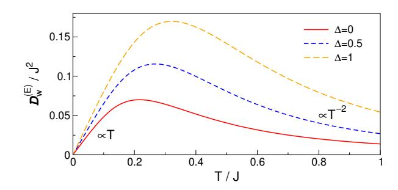

FIG. 5 (Color online) Exact results for the energy Drude weight of the spin-1/2 XXZ chain given in Eq. (1) at zero magnetization. The data is taken from (Klümper and Sakai, 2002).

pression can be written as

$$\mathcal{D}_{w}^{(E)} = \frac{\beta^{2}}{2} \sum_{k=1}^{N_{s}} \int_{-\Lambda}^{\Lambda} d\lambda \frac{\rho_{k}^{t}(\lambda) (e_{k}^{\text{eff}}(\lambda))^{2} (v_{k}^{d}(\lambda))^{2}}{(1 + \eta_{k}(\lambda)) (1 + \eta_{k}^{-1}(\lambda))}, \quad (101)$$

where  $e_k^{\text{eff}}(\lambda) = -2\pi \text{sgn}(\Delta+1)[\sqrt{|\Delta^2-1|}/2]\sigma_k\rho_k^t(\lambda)$  is the effective energy and  $v_k^d(\lambda)$  the group velocity of the dressed excitations [cf. (95)]. The same method can be used to find higher cumulants of  $\mathcal{J}^{(E)}$  (Urichuk *et al.*, 2019; Zotos, 2017).

The complication arising when considering the spin Drude weight is that the total spin current, as opposed to the total energy current, is not conserved. The calculation, however, can still be performed avoiding the explicit evaluation of correlation functions. The idea is to consider the system in a large finite volume L, to introduce a finite magnetic flux  $L\phi$  through the chain, and to compute the Drude weight using the finite-T Kohn formula (26), i.e., in terms of the second derivative of the energy density with respect to the magnetic flux. The insertion of a magnetic flux can be easily treated in Bethe ansatz and results in a phase ("twist")  $e^{i\phi L}$  multiplying the r.h.s. of (82). For  $L\phi$  finite in the thermodynamic limit (i.e., when  $L\phi$  does not scale with the volume), the twist modifies the position of the rapidities of the strings only at sub-leading orders. This leads to

$$\lambda_{\alpha,L}^{j}(\phi) = \lambda_{\alpha,\infty}^{j} + \frac{g_{1,j}(\lambda_{\alpha,\infty}^{j},\phi)}{L} + \frac{g_{2,j}(\lambda_{\alpha,\infty}^{j},\phi)}{L^{2}}, (102)$$

where we neglected  $O(L^{-3})$  and introduced the subscripts  $L/\infty$  to label rapidities in finite and infinite volume, respectively. The  $\phi$ -dependent functions  $g_{1,j}(x,\phi)$  and  $g_{2,j}(x,\phi)$  fulfill some integral equations determined through a 1/L expansion of the Bethe-Takahashi equations (85). Plugging (102) into Eq. (88), one can determine the second derivative of the energy density with respect to the twist in the thermodynamic limit and hence the Drude weight. This method has been introduced in (Fujimoto and Kawakami, 1998) for the calculation of the charge Drude weight in the Fermi-Hubbard model

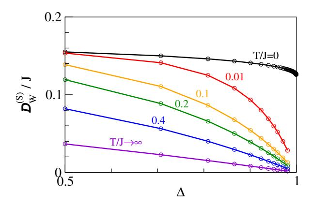

FIG. 6 (Color online) TBA results for the spin Drude weight  $\mathcal{D}_{\rm w}^{\rm (S)}$  of the spin-1/2 XXZ chain versus  $\Delta$  for different temperatures T (measured in units of J) from (Zotos, 1999).

and has been applied in (Zotos, 1999) for the spin-1/2 XXZ chain. In the case of the XXZ chain, the result can be cast into the following form

$$\mathcal{D}_{w}^{(S)} = \frac{\beta}{2} \sum_{k=1}^{N_s} \int_{-\Lambda}^{\Lambda} d\lambda \frac{\rho_k^t(\lambda) (n_k^{\text{eff}}(\lambda))^2 (v_k^d(\lambda))^2}{(1 + \eta_k(\lambda))(1 + \eta_k^{-1}(\lambda))}, \quad (103)$$

where  $n_k^{\text{eff}}(\lambda) = 2\pi\sigma_k \rho_k^t(\lambda) \partial_\phi g_{1,k}(\lambda)$  fulfills the dressing equation (96) by replacing  $n_k^{\text{eff}}(\lambda) \to q_k^{\text{eff}}(\lambda)$  with driving  $n_k$ , thus replacing  $q_k(\lambda)$  by  $n_k$  in Eq. (96) [cf. Eq. (84) for the definition of  $n_k$ ]. The temperature dependence of  $\mathcal{D}_{\mathbf{w}}^{(\mathbf{S})}$  is illustrated in Fig. 6.

As we will see in Sec. III.C, GHD provides a general framework for computing Drude weights in TBA formalism. In particular, both Eq. (101) and Eq. (103) are special cases of the generic GHD result Eq. (116), which describes the Drude weights of all conserved charges.

## C. Generalized hydrodynamics

The theory of generalized hydrodynamics concerns the evolution of integrable systems initially prepared in a state  $\rho_0$  that is spatially inhomogeneous and then let to evolve unitarily with a homogeneous Hamiltonian. The main idea is that at large times, the expectation values of local observables become slowly varying functions of x and t. This is much like the situation observed in the case of homogeneous quantum quenches [see, e.g., (Eisert et al., 2015; Essler and Fagotti, 2016; Gogolin and Eisert, 2015)]: initially the expectation values of local observables display fast oscillations but the latter dephase away for large times and expectation values become stationary even in the presence of a coherent unitary evolution. In the slow, late-time, regime, it is reasonable to expect that the expectation values can be described by a quasistationary state, namely

$$\operatorname{tr}\left[\mathcal{O}_{x}e^{-iHt}\rho_{0}e^{iHt}\right] \stackrel{t\gg\tau_{0}}{\sim} \operatorname{tr}\left[\mathcal{O}_{x}\rho_{\mathrm{st}}(x,t)\right],$$
 (104)

where H is the Hamiltonian of the system,  $\mathcal{O}_x$  is a generic observable localized around the point x,  $\rho_{\rm st}(x,t)$  is the density matrix describing the quasi-stationary state (retaining a slow space-time dependence), and  $\tau_0$  is the timescale for local relaxation. In general, the x-dependence in Eq. (104) is nontrivial for large but *finite* times, while it is typically washed away at infinite times. Think, for example, of the free expansion of a gas released from a trap: the density of the gas vanishes for all x at infinite times, corresponding to an x-independent  $\lim_{t\to\infty} \rho_{\rm st}(x,t)$ . There are some cases, however, where nontrivial effects of the problem's inhomogeneity persist even at infinite times. In that case, one can explicitly take the infinite-time limit of Eq. (104) turning it into an exact statement. An example is the so-called bipartitioning protocol where one suddenly joins together two systems that are initially in different stationary states (see Sec. IX.B).

The state  $\rho_{\rm st}(x,t)$  in Eq. (104) has been termed locally quasi-stationary state (LQSS) in (Bertini and Fagotti, 2016). Specifically, it was argued that, at the leading order in time,  $\rho_{\rm st}(x,t)$  is a generalized Gibbs state constructed with the charges of the Hamiltonian that controls the unitary time evolution and (x,t)-dependent chemical potentials. Note that the time scale at which the simplification (104) arises — often referred to as Euler time scale — is much larger than the local relaxation time scale  $\tau_0$ . This means that, at fixed (x,t),  $\rho_{\rm st}(x,t)$  is homogeneous, stationary, and admits a "microcanonical" representation in terms of a TBA representative eigenstate, or, equivalently, of a set of densities of rapidities  $\{\rho_k(\lambda,x,t)\}$ . Determining such space-time dependent functions is the central problem of the theory.

A macroscopic number of constraints on these functions are obtained by considering the expectation values of the continuity equations of all local and quasilocal conserved charges from Eq. (72), namely

$$\partial_t q_x^{(n)}(t) + j_x^{(n)}(t) - j_{x-1}^{(n)}(t) = 0, \quad x = 1, \dots, L, \quad (105)$$

where  $q_x^{(n)}$  is the density of charge  $Q_n$  and  $j_x^{(n)}$  its current.15 Here and in the following, we suppress the additional index s, keeping only the generic index n for conserved charges. Assuming the validity of Eq. (104), one obtains that, to leading order in time, the expectation value of (105) reads as

$$\partial_t \operatorname{tr}\left[q_0^{(n)}\rho_{\mathrm{st}}(x,t)\right] + \partial_x \operatorname{tr}\left[j_0^{(n)}\rho_{\mathrm{st}}(x,t)\right] = 0.$$
 (106)

We remark that this equation is already in the thermodynamic limit and, moreover, on its r.h.s., there are

 $^{15}$  We here simplify the notation introduced in Sec. II by writing  $j_x^{(n)}$  instead of  $j_x^{(Q_n)}.$ 

sub-leading corrections of  $\mathcal{O}(t^{-b})$  with b > 0. As shown in (Bertini *et al.*, 2016; Castro-Alvaredo *et al.*, 2016), the constraint (106) is sufficient to fix the densities of rapidities to leading order in time. Specifically, Eq. (106) is equivalent to the following continuity equation for the densities of rapidities

$$\partial_t \rho_k(\lambda, x, t) + \partial_x (v_k^d(\lambda, x, t) \rho_k(\lambda, x, t)) = 0.$$
 (107)

Here,  $v_k^d(\lambda,x,t)$  is the group velocity of dressed excitations on the state  $\rho_{\rm st}(x,t)$ . The physical interpretation of this equation is straightforward: to leading order in time, the dynamics of  $\{\rho_k(\lambda,x,t)\}$  can be described as if they were quasimomentum distributions for  $N_s$  species of free classical particles moving in a density-dependent background. Indeed, the only effect of the interaction is a dressing of the group velocity. These classical particles can be thought of as an "asymptotic" version of the stable modes characterizing Bethe-ansatz integrable models. Indeed, for very large times and distances, the modes loose all phase information and behave like classical particles.

The crucial step in passing from Eq. (106) to Eq. (107) makes use of the following expression for the expectation value of generic currents on the macrostate  $\{\rho_n(\lambda)\}$ 

$$j^{Q}[\rho] = \sum_{k=1}^{N_s} \int d\lambda \, q_k(\lambda) v_k^d(\lambda) \rho_k(\lambda), \qquad (108)$$

where  $q_k(\lambda)$  is the bare charge of the associated density (c.f. Eq. (91)). This form has been originally proposed for relativistic integrable quantum-field theories with diagonal scattering (Castro-Alvaredo et al., 2016) — through a crossing-symmetry argument — and for the spin-1/2 XXZ chain (Bertini et al., 2016) — through a semiclassical argument. Initially, however, its validity could only be established numerically (Bertini et al., 2016; Ilievski and De Nardis, 2017a) or for some special currents (Bertini et al., 2016; Urichuk et al., 2019). The numerical accuracy of (108) and its model-independent form triggered a fervent activity aimed at proving it rigorously (Borsi et al., 2020; Fagotti, 2017; Vu and Yoshimura, 2019; Yoshimura and Spohn, 2020) for all Bethe-ansatz integrable models. This endeavour has been concluded by (Pozsgay, 2020), who reports a complete proof of (108) in the framework of the quantum-inverse scattering method. This proof encompasses all Yang-Baxter integrable lattice systems. In particular, this includes all Bethe-ansatz integrable lattice models (nested or not) such as the spin-1/2 XXZ chain and the one-dimensional Fermi-Hubbard model. Finally, we remark that the form (108) for the expectation values of currents has been shown to hold also for certain integrable classical field theories (Bastianello et al., 2018; Bulchandani et al., 2019; Cao et al., 2019; Doyon, 2019b; Spohn, 2020b).

The simplification introduced by Eq. (107) is remarkable: to determine the late-time properties of an inte-

grable quantum many-body system, one does not need to solve the many-body Schrödinger equation but an immensely simpler system of differential equations. After discretizing the rapidity, these equations can be treated by standard methods for initial-value partial differential equations (Møller and Schmiedmayer, 2020), by "characteristics" (Bulchandani, 2017; Doyon et al., 2017) or by "molecular dynamics" (Doyon et al., 2018), i.e., by simulating the dynamics of the classical gas whose rapidity distributions obey Eq. (107). There is, however, a remaining nontrivial step to make before a solution can be obtained: one has to find the right initial conditions for  $\{\rho_k(\lambda, x, t)\}$ . This problem has not yet been solved for all initial states  $\rho_0$  but only for a number of particular choices (Bulchandani et al., 2017, 2018; Caux et al., 2019; Doyon et al., 2017). Importantly, some of these choices give a good characterization of experimentallyaccessible initial configurations. This has been explicitly demonstrated in two recent cold-atom experiments (Malvania et al., 2020; Schemmer et al., 2019), which have shown that GHD describes accurately the dynamics of nearly integrable 1D Bose gases in all accessible interaction regimes.

Let us now focus on the most popular initial configuration accessible with GHD: the bipartitioning protocol, i.e., the time evolution of an initial state composed of the tensor product of two different homogeneous states  $\rho_0\sim\rho_{\rm L}\otimes\rho_{\rm R}$  (see Sec. IX.B). As mentioned before, since in this case, we can explicitly take the infinite-time limit, Eq. (107) becomes exact. The solution is a function of the scaling variable  $\zeta=x/t$ , usually termed "ray", and can be "implicitly" written as (Bertini et~al.,~2016; Castro-Alvaredo et~al.,~2016)

$$\vartheta_k(\lambda,\zeta) = [\eta_k^{\mathrm{L}}(\lambda) - \vartheta_k^{\mathrm{R}}(\lambda)] \Theta[v_k^d(\lambda,\zeta) - \zeta] + \vartheta_k^{\mathrm{R}}(\lambda), \quad (109)$$

where  $\Theta(x)$  is the step-function and  $\vartheta_k^{\mathrm{L/R}}(\lambda)$  characterize the homogeneous GGE emerging at infinite distance from the junction on the left and on the right, respectively. 16 This solution is implicit because  $v_k^d(\lambda,\zeta)$  depends itself on  $\vartheta_k(\lambda,\zeta)$ . The explicit result is obtained by formulating an initial guess for  $v_k^d(\lambda,\zeta)$  and iterating Eqs. (109), (90), and (96) until convergence is reached (this is typically achieved in less than ten steps). This protocol has been used for studying nonlinear transport in integrable quantum many-body systems on the lattice (Bertini *et al.*, 2016; Bertini and Piroli, 2018; Bertini *et al.*, 2018b; Collura *et al.*, 2018; De Luca *et al.*, 2017; Gruber and Eisler, 2019; Mazza *et al.*, 2018; Piroli *et al.*, 2017) as well as

 $^{16}$  We assumed that  $\rho_{\rm L/R}$  have cluster decomposition properties. Namely, they satisfy  $\lim_{|x-y|\to\infty} \langle O_1(x)O_2(y)\rangle_{\rm L/R} = \langle O_1(x)\rangle_{\rm L/R} \langle O_2(y)\rangle_{\rm L/R}$  where the operators  $O_i(x)$  are local (i.e, they act trivially far away from the site  $x_i$ ) and  $\langle O(x)\rangle_{\rm L/R} \equiv {\rm tr}[O(x)\rho_{\rm L/R}].$ 

on the continuum (Bertini et al., 2019; Castro-Alvaredo et al., 2016; Mestyán et al., 2019). Moreover, it has also been used for analysing the dynamics of entanglement in inhomogeneous situations (Alba, 2018; Alba et al., 2019; Bertini et al., 2018a; Mesty $\tilde{\rm A}$ jn and Alba, 2020). Next, in Sec. III.C.1, we will discuss how this protocol can be used for computing Drude weights.

In concluding this brief review of GHD, we must mention that Eq. (107) does not represent an end point: there are currently many ongoing efforts to extend its range of applicability. First of all, the equation furnishes only a leading-order-in-time characterization, or, more precisely, describes the system for large times t and lengthscales  $x \sim t$ . In analogy with ordinary hydrodynamics, however, one would expect GHD to describe the asymptotic behavior of the system also on other lengthscales, for example, the diffusive one where  $x \sim \sqrt{t}$ . This can be achieved by finding the sub-leading corrections in t to Eq. (107). In particular, in Sec. III.C.2, we will briefly discuss a correction, recently identified in (De Nardis et al., 2018), which is able to describe diffusive behaviors. Currently, however, a systematic method to find all sub-leading corrections to Eq. (107) has been devised only in the noninteracting case (Fagotti, 2017, 2020). Another active research strand is to extend Eq. (107) to the case in which the time evolution is determined by a spatially inhomogeneous or time-dependent Hamiltonian, where space and time variations are slow. In particular, (Doyon and Yoshimura, 2017) presented an extension valid in the case of a system confined to a slowly varying trapping potential, (Bastianello et al., 2019) considered the case of position-dependent Hamiltonian parameters, and (Bastianello and De Luca, 2019) studied the effects of time-dependent magnetic fields. Finally, there are ongoing efforts to describe the evolution of the initial-state correlations under (107) (Ruggiero et al., 2020).

# 1. GHD results for Drude weights

Drude weights can be computed within GHD following two different approaches that, crucially, give coinciding results. Both approaches give access to the most general Drude weight

$$\mathcal{D}_{\mathbf{w}}^{(n,m)} = \frac{\beta}{2} \lim_{t \to \infty} \frac{1}{t} \sum_{r} \int_{-t/2}^{t/2} ds \left\langle j_r^{(n)}(s) j_0^{(m)}(0) \right\rangle^{\mathbf{c}}$$
$$= \frac{\beta}{2} \lim_{t \to \infty} \sum_{r} \text{Re}[\left\langle j_r^{(n)}(t) j_0^{(m)}(0) \right\rangle^{\mathbf{c}}], \qquad (110)$$

where  $\langle \cdot \rangle^{\rm c}$  denotes the connected expectation value in a (grand-canonical) Gibbs Ensemble  $\rho_{\rm GE} \propto \exp[-\beta H + \sum_i \lambda_i O_i]$  (the sum in the exponent of  $\rho_{\rm GE}$  runs over all conserved U(1) charges  $O_i$  of the system like the total particle number, magnetization, etc). In Eq. (110), n and m can label two different conserved charges. In the

case n=m, one recovers the usual "diagonal" Drude weight of the charge  $Q_n$ . All results, however, can be directly extended to the case of expectation values in more general GGEs. Note that (i) in order to treat all charges on the same footing, we divided the energy Drude weight by  $\beta$  and (ii) the correlation function in (110) is not the Kubo correlation used in Eq. (9). In the limit  $t \to \infty$ , the two expressions, however, can be shown to coincide under mild assumptions (Ilievski and Prosen, 2013).17

The first approach, proposed in (Bulchandani et al., 2017; Ilievski and De Nardis, 2017b), evaluates the Drude weight using the following formulation. One considers a bipartitioning protocol that connects two halves of the system (left "L" and right "R") initially prepared in the following different GGEs

$$\rho_{\rm GGE,L/R} \propto \exp[-\beta H + \sum_{i} \mu_i N_i \pm (\beta_m/2) Q_m], (111)$$

where  $Q_m$  is the m-th conserved charge of the system. In this setting, one can compute  $\mathcal{D}_{\mathbf{w}}^{(n,m)}$  as follows (Vasseur et~al.,~2015)

$$\mathcal{D}_{\mathbf{w}}^{(n,m)} = \lim_{\beta_m \to 0} \lim_{t \to \infty} \frac{\beta}{2t\beta_m} \operatorname{tr}[j_0^{(n)} e^{-iHt} \rho_0 e^{iHt}], \quad (112)$$

where  $\rho_0 \sim \rho_{\rm GGE,L} \otimes \rho_{\rm GGE,R}$ . Using Eq. (108) one can express this relation in terms of TBA quantities as

$$\mathcal{D}_{\mathbf{w}}^{(n,m)} = \frac{\beta}{2} \sum_{k=1}^{N_s} \int d\zeta \int_{-\Lambda}^{\Lambda} d\lambda \, q_{n,k}(\lambda) \frac{\partial [v_k^d(\lambda,\zeta)\rho_k(\lambda,\zeta)]}{\partial \beta_m} \bigg|_{\beta_m = 0},$$
(113)

where  $q_{n,k}(\lambda)$  are the bare charges corresponding to  $Q_n$ . The second approach, introduced in (Doyon and Spohn, 2017), computes the Drude weight using "hydrodynamic projections". The idea is to write the Drude weight in the form Eq. (110) and expand it in the basis of conserved charges (appropriately orthogonalised). More precisely, one views

$$\sum_{r} \langle j_r^{(n)}(t) j_0^{(n)}(0) \rangle^{c} \equiv (j^{(n)} | j^{(m)}), \tag{114}$$

as a scalar product in the space of local operators and assumes that the only contributions surviving at infinite times are coming from the overlap with conserved-charge densities

$$\lim_{t \to \infty} (j^{(n)}|j^{(m)}) = \sum_{k,k'} (j^{(n)}|q^{(k)}) [\mathfrak{C}^{-1}]_{kk'} (q^{(k')}|j^{(m)}) \quad (115)$$

&lt;sup>17 Interestingly, for integrable models,  $\lim_{t\to\infty}\sum_r \left\langle j_r^{(n)}(t)j_0^{(n)}(0)\right\rangle^c$  turns out to be real. This implies that the Drude weight can also be defined using a "asymmetric" integration, namely  $\mathcal{D}_{\mathbf{w}}^{(n,m)} = \frac{\beta}{2}\lim_{t\to\infty}\frac{1}{t}\sum_r\int_0^t\mathrm{d}s\left\langle j_r^{(n)}(s)j_0^{(m)}(0)\right\rangle^c$ .

where we defined  $\mathfrak{C}_{nm} = (q^{(n)}|q^{(m)})$ . This reasoning is similar in spirit to that leading to the Mazur bound but it is carried out directly in the thermodynamic limit. In general, this approach can be used to compute the asymptotic behavior (large t large x) of dynamical correlation functions in generic inhomogeneous situations (Doyon, 2018).

The quantities appearing in Eq. (115) are all directly computed within GHD and lead to the following final result

$$\mathcal{D}_{\mathbf{w}}^{(n,m)} = \frac{\beta}{2} \sum_{k=1}^{N_s} \int_{-\Lambda}^{\Lambda} \frac{\rho_k^t(\lambda) (v_k^d(\lambda))^2 q_{n,k}^{\text{eff}}(\lambda) q_{m,k}^{\text{eff}}(\lambda)}{(1 + \eta_k(\lambda))(1 + \eta_k^{-1}(\lambda))}, \quad (116)$$

where  $v_k^d(\lambda)$  and  $q_{m,k}^{\rm eff}(\lambda)$  are the group velocity of excitations and the effective charge in the Gibbs state, respectively (i.e., with densities of rapidities obtained from solving (90) and (97) with all Lagrange multipliers vanishing but  $\beta$  and  $\mu$ ). Remarkably, as shown in (Doyon and Spohn, 2017), this expression agrees with that obtained from Eq. (113) if one plugs in the implicit solution (109) of the GHD equation for the bibartitioning protocol and takes the derivative explicitly.

Three generic features of Eq. (116) are: (i) it is symmetric under the exchange of n and m, in accord with Onsager reciprocal relations; (ii) the Drude weight is obtained by summing up "elementary Drude weights" (the integrand of (116)) for each quasiparticle in the system; (iii) the Drude weight of a certain quantity vanishes when the associated effective charges vanish. This happens, for example, in the case of the spin transport in the spin-1/2 XXZ chain with  $|\Delta| \geq 1$  at zero magnetization and for the charge transport in the Fermi-Hubbard model at half filling.

The expression Eq. (116) holds for all TBA solvable models. Its generalization to the nested case has been first reported in (Ilievski and De Nardis, 2017a) and, again, corresponds to a sum of elementary Drude weights for each type of quasiparticle in the system. In particular, we see that Eq. (116) agrees with the special cases (101) and (103) discussed in the previous section once one restores the trivial  $\beta$  factor in the energy Drude weight. Moreover, the nested generalization of Eq. (116) reproduces the result of (Fujimoto and Kawakami, 1998) for the charge Drude weight in the Fermi-Hubbard model. This follows by a direct comparison between Eqs. (5) and (7) of (Ilievski and De Nardis, 2017a) and Eq. (35) of (Fujimoto and Kawakami, 1998), nonetheless, to the best of our knowledge, it has not been noticed in the literature. The main point is to note that  $\xi_c(k), \xi_{sk}(\lambda), \xi_{bk}(\lambda)$ in (Fujimoto and Kawakami, 1998) are exactly the "effective electron charges" for the Fermi-Hubbard chain [cf. Eqs. (A46) in the supplemental material of (Ilievski and De Nardis, 2017a). In other words, they fulfill the nested generalization of the dressing equations (96) with driving terms respectively given by  $\xi_c^0(k) = 1, \xi_{sk}^0(\lambda) =$ 

 $0, \xi_{bk}^0(\lambda) = 2k$  [cf. Eqs. (15)–(17) and Eqs. (29)–(31) in (Fujimoto and Kawakami, 1998)].

#### 2. GHD results for diffusion constants

In order to access the diffusive regime, one needs to identify the leading corrections to Eq. (106), going beyond the Euler scale. A scheme to achieve this goal based on two main assumptions — has been proposed in (De Nardis et al., 2018) [see also (De Nardis et al., 2019a; Gopalakrishnan et al., 2018; Gopalakrishnan and Vasseur, 2019)]. The first assumption is that for large t, the system can be characterised using hydrodynamics also on lengthscales  $x \sim \sqrt{t}$ . Namely, one assumes that local observables are still described by a slowly varying quasi-stationary state  $\rho_{\rm st}(x,t)$ . This state, however, cannot be interpreted as a space-time dependent GGE anymore, but it has contributions proportional to the spatial derivatives of the Lagrange multipliers. Under this assumption, Eq. (106) continues to hold also to the first sub-leading order. The expectation values of the currents, however, are no longer given by Eq. (108) and include corrections written in terms of spatial derivatives of the densities of rapidities. Specifically, they can be written as (De Nardis et al., 2019a)

$$\operatorname{tr}\left[j_{n,0}\rho_{\mathrm{st}}(x,t)\right] = \sum_{k=1}^{N_s} \int d\lambda \, q_{n,k}(\lambda) v_k^d(\lambda) \rho_k(\lambda, x, t)$$
$$-\frac{1}{2} \int d\lambda d\mu \sum_{k,k'=1}^{N_s} q_{n,k}(\lambda) \mathfrak{D}_{k,k'}(\lambda, \mu) \partial_x \rho_{k'}(\mu, x, t), \quad (117)$$

where the kernel  $\mathfrak{D}_{k,k'}(\lambda,\mu)$  depends on  $\{\rho_k(\mu,x,t)\}$ . This kernel is related to the diffusion (Onsager) matrix defined as18

$$D_{n,m} = \sum_{r} \int_{-\infty}^{\infty} dt \left( \langle j_r^{(n)}(t) j_0^{(m)}(0) \rangle^c - \frac{2}{\beta} \mathcal{D}_{w}^{(n,m)} \right)$$
(118)

as follows (De Nardis et al., 2018)

$$D_{n,m} = \sum_{p} \int d\lambda d\mu \sum_{k,k'=1}^{N_s} q_{n,k}(\lambda) \mathfrak{D}_{k,k'}(\lambda,\mu) q_{p,k'}(\lambda) \mathfrak{C}_{p,m}$$
(119)

where the first sum is over all the conserved charges of the system and the matrix  $\mathfrak{C}_{p,m}$  has been introduced below Eq. (115). Note that it is always possible to add a "derivative term"  $\propto o_x - o_{x-1}$  to a charge density (where  $o_x$  is a local operator), without modifying

Note that (118) does not coincide with the Onsager matrix given in Eq. (15) as in the latter we used Kubo correlation functions. Once again, however, the two matrices can be shown to coincide under mild assumptions (Ilievski and Prosen, 2013).

the total charge. This introduces an ambiguity in the definition of charge densities beyond the leading order [see (Fagotti, 2020) for more details]. In particular, the kernel  $\mathfrak{D}_{k,k'}(\lambda,\mu)$  depends on the specific choice of the densities of charges while the Onsager matrix is invariant (De Nardis et~al., 2019a). The simple relation (119) is obtained by taking charges and currents to be scalar under  $\mathcal{PT}$ -symmetry (De Nardis et~al., 2019a). Finally, we remark that corrections similar to Eq. (117), i.e., depending on the spatial derivatives of the densities of rapidities, appear in the expectation values of all local observables with kernels that are generically unknown.

The explicit TBA expression for Eq. (118) in models with a single species of quasiparticles has been determined in (De Nardis *et al.*, 2018) through an expansion in finite-temperature form factors19. In particular, it has been shown that Eq. (118) is fully determined by form factors involving two particle-hole excitations. The expression for an arbitrary number of quasiparticles species has later been presented in (De Nardis *et al.*, 2019a) and reads as

$$D_{n,m} = \int \frac{\mathrm{d}\mu_{1} \,\mathrm{d}\mu_{2}}{2} \sum_{k,k'=1}^{N_{s}} \left\{ \frac{\rho_{k}^{h}(\mu_{1})}{1 + \eta_{k}(\mu_{1})} \frac{\rho_{k'}^{h}(\mu_{2})}{1 + \eta_{k'}(\mu_{2})} \right.$$

$$\times \left( \frac{T_{k',k}^{\mathrm{eff}}(\mu_{2},\mu_{1}) q_{n,k'}^{\mathrm{eff}}(\mu_{2})}{\sigma_{k'} \rho_{k'}^{t}(\mu_{2})} - \frac{T_{k,k'}^{\mathrm{eff}}(\mu_{1},\mu_{2}) q_{n,k}^{\mathrm{eff}}(\mu_{1})}{\sigma_{k} \rho_{k}^{t}(\mu_{1})} \right)$$

$$\times \left( \frac{T_{k',k}^{\mathrm{eff}}(\mu_{2},\mu_{1}) q_{m,k'}^{\mathrm{eff}}(\mu_{2})}{\sigma_{k'} \rho_{k'}^{t}(\mu_{2})} - \frac{T_{k,k'}^{\mathrm{eff}}(\mu_{1},\mu_{2}) q_{m,k}^{\mathrm{eff}}(\mu_{1})}{\sigma_{k} \rho_{k}^{t}(\mu_{1})} \right)$$

$$\times \left| v_{k}^{d}(\mu_{1}) - v_{k'}^{d}(\mu_{2}) \right| \right\}, \tag{120}$$

where both the effective charges  $q_{n,k}^{\text{eff}}(\lambda)$  and the "effective scattering kernel"  $T_{k,k'}^{\text{eff}}(\lambda,\mu)$  fulfill (96) with driving functions given by  $q_{n,k}(\lambda)$  and  $T_{k,k'}(\lambda-\mu)$  ( $T_{k,k'}^{\text{eff}}(\lambda,\mu)$  for fixed values of its "second" arguments k' and  $\mu$ ), respectively. We note that, to obtain the result (120), De Nardis, Bernard, and Doyon conjectured a general form for the kinematical poles for finite-density form factors: this represents the second main assumption of (De Nardis et al., 2018).

Equation (120) can be interpreted by realizing that, at the diffusive scale, the conserved modes of interacting integrable models, i.e., the quasiparticles, do not follow exactly free classical trajectories. As a consequence of the scattering, they perform a noisy motion around the classical trajectories with a variance that grows as  $\sqrt{t}$ . Such a noisy motion is responsible for the diffusive behavior (De Nardis et al., 2019a; Gopalakrishnan et al., 2018; Gopalakrishnan and Vasseur, 2019). This

simple argument can be refined to obtain a quantitative prediction in agreement with Eq. (120) in the linear-response regime (Gopalakrishnan  $et\ al.$ , 2018). Moreover, in accordance with this interpretation, Eq. (120) vanishes for noninteracting models. Finally, we mention that a non-trivial check of (120) has recently been presented in (Doyon, 2019a; Medenjak  $et\ al.$ , 2019) where the equation has been re-obtained using the hydrodynamic projection method.

Including the "diffusive correction" Eq. (117) in the expectation value of the currents, the continuity equation for the space-time-dependent densities of rapidities takes the following Navier-Stokes form (De Nardis  $et\ al.$ , 2018)

$$\partial_{t}\rho_{k}(\lambda, x, t) + \partial_{x}(v_{k}^{d}(\lambda, x, t)\rho_{k}(\lambda, x, t)) =$$

$$+ \frac{1}{2}\partial_{x} \left[ \int d\mu \sum_{k'=1}^{N_{s}} \mathfrak{D}_{k,k'}(\lambda, \mu)\partial_{x}\rho_{k'}(\mu, x, t) \right].$$
 (121)

Of particular interest for this review is the case of the spin-1/2 XXZ chain with  $|\Delta| > 1$  for small perturbations around a zero-magnetization ( $m_z = 0$ ) equilibrium state. In this case, Eq. (121) leads to the following heat-like equation for the profile m(x,t) of the magnetization density (De Nardis et al., 2019a)

$$\partial_t m_z(x,t) = D^{(S)} \partial_x^2 m_z(x,t), \qquad (122)$$

where the spin-diffusion constant is given by the following sum over the "elementary diffusion constants" of different quasiparticles

$$D^{(S)} = \sum_{k=1}^{N_s} \int_{-\pi/2}^{\pi/2} d\mu \frac{\rho_k^h(\mu)}{1 + \eta_k(\mu)} |v_k^d(\mu)| \mathcal{W}_k^2, \qquad (123)$$

Here, the rapidity-independent coefficient  $W_k$  reads as (De Nardis *et al.*, 2019b)

$$W_k = \lim_{k' \to \infty} \frac{T_{k',k}^{\text{eff}}(\mu, \lambda)}{\rho_{k'}^t(\mu)} = \frac{1}{2T\chi(\beta)} \partial_{\delta} n_k^{\text{eff}}, \qquad (124)$$

where  $n_k^{\text{eff}}$  is the effective magnetization [cf. Eq. (84) for the definition of  $n_k$  and Eq. (96) for that of effective charges], T is the temperature,  $\chi(\beta)$  the static susceptibility, and  $\delta$  a small deviation from zero magnetization.

As shown in (De Nardis *et al.*, 2019b), substituting (124) into (123) and performing a few manipulations, one obtains an expression for the diffusion constant which has the same form as the right hand side of the bound (79) but involves a modified spin Drude weight.

## IV. THEORETICAL AND COMPUTATIONAL METHODS

While integrable systems as such in principle allow for analytically exact solutions, computing the current autocorrelation functions that enter into the Kubo formalism

&lt;sup>19 In this context, the term "form factor" indicates the matrix element of a local operator between two Hamiltonian eigenstates.

is a formidable task and no complete and general solution from Bethe-ansatz techniques exists so far. Moreover, for non-integrable models, one needs to resort to mostly numerical methods or universal low-energy descriptions such as bosonization.

We will concentrate the discussion on the specifics of the spin-1/2 XXZ chain for concreteness and will point out aspects that are important for the theoretical treatment of other models whenever necessary.

# A. Low-energy theory

# 1. Field theory

The low-energy excitations of a large class of 1d models are not fermionic quasiparticles but collective (bosonic) modes, forming the so-called Tomonaga-Luttinger liquid (TLL) [\(Giamarchi, 2004;](#page-69-0) [Sch¨onhammer, 2004\)](#page-75-0). The lowenergy theory can be solved using bosonization, and the corresponding bosonic low-energy field theory takes the form (for one fermionic species)

$$H = \frac{v}{2} \int dx \left[ \Pi^2 + (\partial_x \phi)^2 \right], \qquad (125)$$

where Π is the conjugate momentum of the bosonic field φ with the commutation relation [φ(x), Π(y)] = iδ(x−y). The TLL parameter K, which usually appears as a prefactor 1/K2 in front of the second term, has already been absorbed via a canonical transformation of the fields. For multiple species, such as is the case for the Hubbard chain, the low-energy Hamiltonian is a sum of independent Luttinger liquids. For the Hubbard chain, these describe collective charge and spin excitations.

For integrable systems, both K and the spin velocity v are known from Bethe ansatz. For example, for the spin-1/2 XXZ chain, one obtains [see, e.g., [\(Essler and](#page-69-34) [Konik, 2005\)](#page-69-34)]

$$K = \frac{\pi}{2} \frac{1}{\pi - \arccos(\Delta)}, \ v = J \frac{\pi}{2} \frac{\sqrt{1 - \Delta^2}}{\arccos \Delta}.$$
 (126)

The current operators associated with the spin density ∼ ∂xφ and with the energy density of the Tomonaga-Luttinger liquid Hamiltonian take the form [\(Giamarchi,](#page-69-0) [2004;](#page-69-0) [Heidrich-Meisner](#page-70-14) et al., [2002\)](#page-70-14)

$$\mathcal{J}^{(\mathrm{S})} = -v\sqrt{\frac{K}{\pi}} \int dx \,\Pi, \ \mathcal{J}^{(\mathrm{E})} = -v^2 \int dx \,\Pi \partial_x \phi, \ (127)$$

and are both strictly conserved. The corresponding Drude weights read

$$\mathcal{D}_{w}^{(S)} = \frac{Kv}{2\pi}, \quad \mathcal{D}_{w}^{(E)} = \frac{\pi}{6}vT.$$
 (128)

If a certain microscopic model falls into the TLL universality class, the low-energy behavior of various correlation functions, such as the momentum distribution or the local density of states, is determined by Eq. [\(125\)](#page-27-2). Transport properties, however, are nonuniversal: On the microscopic level of lattice Hamiltonians, they depend on integrability and the model parameters. In contrast, all gapless spin chains fall into the TLL universality class and at low T map to Eq. [\(125\)](#page-27-2), which by virtue of Eq. [\(128\)](#page-27-3) describes a ballistic conductor [\(Giamarchi,](#page-69-35) [1991,](#page-69-35) [1992\)](#page-69-36). Information about the microscopic origin of the integrability and on the conserved charges is thus lost by going to the continuum limit. The information on integrability is, in principle, contained in relations between the irrelevant operators that are discarded in the process. Accounting for these relations in the calculation of transport coefficients in a systematic manner is technically very hard and has not been accomplished yet.

In order to describe transport beyond the purely ballistic case, one needs to resort to a more generic low-energy Hamiltonian. The RG irrelevant corrections to Eq. [\(125\)](#page-27-2) which are most important in this context are given by umklapp scattering and band curvature:

$$H_{\rm u} = \lambda_{\rm u} \int dx \cos\left(4\sqrt{\pi K}\phi\right)$$

$$H_{\rm b} = \int dx \left[\lambda_{+}(\partial_{x}\phi_{L})^{2}(\partial_{x}\phi_{R})^{2} + \lambda_{-}(\partial_{x}\phi_{L})^{4} + \lambda_{-}(\partial_{x}\phi_{R})^{4}\right],$$
(129)

where φ = φL +φR, and the prefactors λu,+,− are known for integrable systems [\(Lukyanov, 1998\)](#page-72-32). In an extension of earlier works [\(Giamarchi and Schulz, 1988\)](#page-69-37) and [\(Giamarchi, 1992\)](#page-69-36), the influence of these terms was studied via a finite-T bosonic self-energy perturbation theory [\(Sirker](#page-75-7) et al., [2009,](#page-75-7) [2011\)](#page-75-8). This leads to a purely diffusive form of the optical spin conductivity

$$\sigma(q,\omega) = \frac{Kv}{\pi} \frac{i\omega}{[1+b(T)]\omega^2 - [1+c(T)]v^2q^2 + 2i\gamma(T)\omega}, \tag{130} \label{eq:sigma}$$

whose real part takes a Lorentzian form in the longwavelength limit q → 0:

$$\operatorname{Re} \sigma(\omega) = \frac{Kv}{\pi} \frac{2\gamma(T)}{[1 + b(T)]^2 \omega^2 + 4\gamma(T)^2}.$$
 (131)

The coefficients b(T) and c(T) as well as the decay rate γ(T) are functions of v, K, λu,+,− with γ, b, c(T → 0) → 0. In the zero-temperature limit, Eq. [\(131\)](#page-27-4) recovers the expression for D (S) w from Eq. [\(128\)](#page-27-3). The Drude weight contribution to the conductivity at finite T, however, is missed and can at present only be accounted for by hand [\(Sirker](#page-75-8) et al., [2011\)](#page-75-8) using a memory-matrix approach [see, e.g., [\(Rosch and Andrei, 2000\)](#page-74-25)].

Other exceptions to Luttinger-liquid universality are, e.g., real-time, real-space correlators, which already for free lattice fermions are governed by high-energy excitations. Further insights can be gained from nonlinear TLL theory [\(Imambekov](#page-71-35) et al., [2012\)](#page-71-35).

The above-mentioned bosonic self-energy perturbation-theory approach (Sirker  $et \ al., \ 2011)$ can also be used to compute the density correlation function. One finds that, at long times, the density autocorrelations are governed by a diffusive term  $\sim \sqrt{\gamma/t}$ , which is consistent with numerical tDMRG data (Karrasch et al., 2015b), but disagrees with earlier field-theory predictions (Narozhny, 1996). The formalism was subsequently extended to incorporate the effects of nonlinear Luttinger liquids at finite temperature (Karrasch et al., 2015b). While the integrability of a system drastically affects the long-time behavior of the global current autocorrelation function (i.e., the Drude weight), one does not expect a similar influence on the density-density correlations of local density operators such as  $s_r^z$ . Thus, there is no need to incorporate conserved quantities by hand, and field-theoretical approaches can be used to determine the long-time behavior of these quantities at low energies (Karrasch et al., 2015b; Sirker et al., 2011).

# 2. Semiclassical approach

Damle and Sachdev introduced a semiclassical picture of thermally excited particles to compute the lowtemperature behavior of the integrable, gapped, quantum O(3) non-linear sigma model (Damle and Sachdev, 1998; Sachdev and Damle, 1997) as well as of the Sine-Gordon field theory (Damle and Sachdev, 2005). The former describes the low-energy behavior of integer-S(i.e., gapped) quantum spin chains in the limit of large S, for which the work of Damle and Sachdev predicts a zero Drude weight (Sachdev and Damle, 2000) and diffusive dynamics with a conductivity that at low temperatures diverges as  $\sigma_{\rm dc} \propto 1/\sqrt{T}$ . The methodology was subsequently extended into various directions; e.g., a hybrid semiclassical-DMRG framework was developed (Moca et al., 2017) and out-of-equilibrium setups were studied (Bertini et al., 2019; Werner et al., 2019).

The range of validity of the semiclassical approach was investigated both for the Sine-Gordon model as well as for integer-S spin chains by comparing with DMRG or GHD results (Bertini  $et\ al.$ , 2019; De Nardis  $et\ al.$ , 2019b; Moca  $et\ al.$ , 2017; Werner  $et\ al.$ , 2019). The current belief is that semiclassics give the correct qualitative prediction for the low-temperature limit.

## B. Exact diagonalization

Exact diagonalization (ED) has been a major work horse in the numerical analysis of finite-temperature transport properties (Heidrich-Meisner et al., 2003; Herbrych et al., 2011; Karrasch et al., 2013b; Narozhny et al., 1998; Rabson et al., 2004; Zotos and Prelovšek, 1996).

The entire spectrum and all eigenstates are computed and therefore, practically any observable or correlation function can be extracted. However, there is the obvious limitation that only small system sizes can be accessed. For the spin-1/2 XXZ chain, routinely, the Hamiltonian can be diagonalized for  $L \sim 20$  sites by exploiting translational invariance (see (Sandvik, 2013) for the implementation of U(1) and discrete symmetries in ED). Accessing  $L \sim 24$  is possible with some effort (Heidrich-Meisner et al., 2006) for spin-1/2 chains. For the Hubbard chain, the larger local Hibert space of four states further restricts the accessible system sizes, which can be overcome by using, e.g., dynamical typicality as described in Sec. IV.C. Technically, one needs to properly account for the fermionic statistics, which is important for correlation functions, yet a standard and well-known aspect of the numerical treatment of fermionic systems.

## 1. Formal expressions evaluated in ED

We illustrate the main aspects for the example of the thermal and the spin conductivity in the spin-1/2 XXZ chain. The relevant expressions result from Eq. (12) by expanding the thermal expectation values in a basis of many-body eigenstates  $|n\rangle$ , which we understand to be taken from a subspace with fixed total magnetization  $S^z$ . Strictly speaking, by doing so, we work with a finite system and hence take  $t\to\infty$  first and  $L\to\infty$  next. We will first discuss the expressions and then comment on this conceptual aspect below. Note that one can either work in a canonical ensemble, i.e., fixed  $S^z$ . In this case, the sums in the following expressions run over all eigenstates from that subspace. Alternatively, one can carry out a grandcanonical average over all values of  $S^z$ . Then, the sums have to be understood as:

$$\sum_{n} \to \sum_{S^z} \sum_{n(S^z)}, \tag{132}$$

where the second sum runs over all eigenstates in the subspace with fixed  $S^z$ .

Foe the spin conductivity, we obtain the generic situation that both the Drude weight  $\mathcal{D}_{w}^{(S)}$  and the regular part  $\sigma'(\omega)$  can be nonzero in finite systems:

$$\mathcal{D}_{w}^{(S)} = \frac{\langle -T_{kin} \rangle}{2L} - \frac{1}{TL} \sum_{\substack{n,n' \\ E_n \neq E_{n'}}} p_n \frac{|\langle n|\mathcal{J}^{(S)}|n'\rangle|^2}{E_n - E_{n'}}$$
 (133)

$$\sigma'(\omega) = \frac{1}{TL} \frac{1 - e^{-\beta \omega}}{\omega} \times \sum_{\substack{n,n' \\ E_n \neq E_{n'}}} p_n \frac{|\langle n|\mathcal{J}^{(S)}|n'\rangle|^2}{E_n - E_{n'}} \delta(\omega - (E_n - E_{n'}))$$
(134)

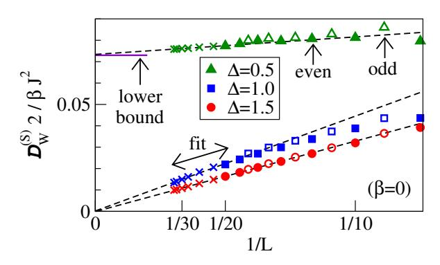

FIG. 7 (Color online) Finite-size scaling of the spin Drude weight  $\mathcal{D}_{w}^{(S)}$  in the high-temperature limit  $\beta=0$ , as presented in (Steinigeweg et al., 2014a, 2015): Crosses indicate DQT data while other symbols indicate ED data. Similar ED data can be found in, e.g., (Heidrich-Meisner et al., 2003; Herbrych et al., 2011; Karrasch et al., 2013b; Rabson et al., 2004; Zotos and Prelovšek, 1996).

where  $p_n = e^{-\beta E_n}/Z$  in the canonical case and  $p_n = e^{-\beta E_n - \beta b S^z}/Z$  in the grand-canonical case, and Z is the partition function.  $T_{\rm kin}$  is the kinetic energy, which for the spin-1/2 XXZ chain from Eq. (1) contains all terms but those proportional to  $s_r^z s_{r+1}^z$ .

In a 1d system, the Drude weight can also be obtained from the diagonal matrix elements of the current operator plus contributions from degenerate subspaces:

$$\mathcal{D}_{w}^{(S)} = \frac{1}{2TL} \sum_{\substack{n,n' \\ E_n = E_{n'}}} p_n |\langle n | \mathcal{J}^{(S)} | n' \rangle|^2, \qquad (135)$$

which results from the absence of any superfluid density in a 1d system at finite temperatures (Zotos et~al., 1997). Equations (133) and (135) are identical (i) at  $\beta=0$  or (ii) at  $\beta>0$  in the thermodynamic limit. Practically, they are already indistinguishable at sufficiently high temperatures for the accessible system sizes  $L\lesssim 20$  (Heidrich-Meisner et~al., 2003; Mukerjee and Shastry, 2008).

An example for ED data for the spin Drude weight of the XXZ chain is shown in Fig. 7; the data was obtained in a grand-canonical ensemble using periodic boundary conditions. These results will be discussed further in Sec. VI. Here, we note that for  $\beta = 0$  and, e.g., commensurate points  $\Delta = \cos(\pi/3) = 1/2$ , the convergence seems fast and indeed yields agreement with other methods such as the lower bound from Prosen and Ilievski (2013) tDMRG (see the discussion in Sec. VI.C.4) or TBA (Urichuk et al., 2019; Zotos, 1999). A recent Bethe-ansatz-based calculation (Klümper and Sakai, 2019) of the spin Drude weight for commensurate values such as m = 3, 4, 5, 6 in  $\Delta = \cos(\pi/m)$  observes increasingly large finite-size effects at lower temperatures. One should realize, though, that this calculation extracts the Drude weight from a set of rapidities, which is different from grand- or canonical ensemble used in exact diagonalization. Therefore,

no quantitative insight on the finite-size dependencies of other methods can be gained from (Klümper and Sakai, 2019).

For thermal transport (or any transport channel for which the current is exactly conserved), the expression for the associated Drude weight can be further simplified from the form of Eq. (135) resulting in

$$\mathcal{D}_{\mathbf{w}}^{(\mathbf{E})} = \frac{1}{2T^2L} \sum_{n} p_n \langle n | (\mathcal{J}^{(\mathbf{E})})^2 | n \rangle.$$
 (136)

This quantity exhibits the same mild finite-size dependencies as, e.g., the specific heat (Alvarez and Gros, 2002a). For instance, for L=20, the ED data agree well with the exact solution for  $\mathcal{D}_{\rm w}^{(\rm E)}$  down to  $T\gtrsim 0.1J$  (Heidrich-Meisner et~al.,~2002).

As an alternative to the aforementioned expressions, one can also extract the spin Drude weight from the average curvature of many-body eigenstates in systems with twisted boundary conditions parametrized via  $\phi$  (Kohn, 1964):

$$\mathcal{D}_{\mathbf{w}}^{(S)} = \frac{1}{2L} \sum_{n} p_n \left. \left( \frac{\partial^2 E_n(\phi)}{\partial \phi^2} \right) \right|_{\phi=0} . \tag{137}$$

This has the advantage that only eigenenergies need to be evaluated but a numerical differentiation is required.

# 2. Role of boundary conditions, symmetries and choice of ensemble

The choice of the boundary conditions, symmetries and the ensemble can all affect the finite-size data and their convergence to the  $L \to \infty$  limit.

For systems with periodic boundary conditions, one observes weight in  $\sigma'(\omega)$  in a frequency window  $\omega < 1/L$ for certain values of the anisotropy  $\Delta$  (Herbrych *et al.*, 2012; Naef and Zotos, 1998). Similarly, for systems with open boundary conditions, the Drude weight is exactly zero for finite L, but there exist precursor peaks in  $\sigma'(\omega)$ at small frequencies that move towards  $\omega = 0$  as L increases (Brenes et al., 2018; Rigol and Shastry, 2008). These observations suggest subtleties in extracting  $\mathcal{D}_{\mathbf{w}}^{(S)}$ from finite-size data at exactly zero frequency. A useful strategy is to work with twisted boundary conditions (also inspired by Kohn's expression (137)) and a finite nonzero twist angle. This reduces the symmetries of the problem (see the discussion below) and the convergence with respect to L can be accelerated (Sánchez and Varma, 2017).

The choice of the ensemble for the computation of the Drude weight can matter as well. Specifically, states appearing in the sum over n in, e.g., Eq. (135), can either be chosen from a single subspace with a fixed  $S^z$  (canonical approach) or an average over all  $S^z$  (grandcanonical version). For concreteness, we focus on the case of a vanishing external magnetic field, corresponding to a vanishing

average  $\langle S^z \rangle = 0$ . For very large systems, one expects these different ensembles to yield the same result, which is confirmed in numerical simulations (Karrasch *et al.*, 2013b; Sánchez and Varma, 2017), yet on finite systems, the differences can be significant. For instance, at  $\Delta = 0$ , the grandcanonical version converges faster to the  $L = \infty$  result, while close to  $\Delta = 1$ , the convergence of canonical data seems to be faster (Herbrych *et al.*, 2012; Karrasch *et al.*, 2013b).

Symmetry constraints on the matrix elements of  $\langle n|\mathcal{J}^{(S)}|m\rangle$  play another important role and are at the root of some of the aforementioned finite-size dependencies. For instance, in the  $S^z = 0$  subspace (L even) that is symmetric under spin inversion  $Z^{\dagger}s_r^{\mathbf{z}}Z = -s_r^{\mathbf{z}}$ , all diagonal matrix elements vanish identically, i.e.,  $\langle n|\mathcal{J}^{(S)}|n\rangle =$ 0 since the spin current is antisymmetric under Z. One can extend this to show that there is no contribution from the  $S^z = 0$  subspace on finite systems with L even and incommensurate values of  $\Delta \neq \cos(\pi \ell/m)$  at all (Sánchez and Varma, 2017). Therefore, in a canonical evaluation of  $\mathcal{D}_{\mathbf{w}}^{(S)}$ , the leading contribution in small  $S^z$  comes from odd L and  $S^z = 1/2$  (Herbrych et al., 2012). Interestingly, for commensurate  $\Delta = \cos(\pi \ell/m)$ , degeneracies appear for  $L \ge L_{\min} = 2m$  (Sánchez and Varma, 2017), implying that for certain values of  $\Delta$  and small L, essential contributions to  $\mathcal{D}_{\mathbf{w}}^{(S)}$  are missed. Because of the sum rule, these contributions must sit at small frequencies on smaller system sizes, and therefore, a rather intricate, size-dependent transfer of weight from low- to zero-frequency occurs (see (Naef and Zotos, 1998) for an early discussion). A comprehensive discussion of symmetry constraints on the matrix elements of the spin current and an analysis of contributions of degenerate and nondegenerate subspaces can be found in (Mukerjee and Shastry, 2008; Narozhny et al., 1998) and, in particular, in (Sánchez and Varma, 2017).

Obviously, a theory for the finite-size dependencies of the Drude weight would be highly desirable. An interpretation was put forward in (Steinigeweg et al., 2013) [see also (Prosen, 1999)]: the Drude weight [see Eq. (135)], up to degeneracies, measures the spread of diagonal matrix elements of current operators in eigenstates and is thus a measure of how closely this observable obeys the eigenstate thermalization hypothesis (ETH) (D'Alessio et al., 2016) already on finite systems. On general grounds, one therefore expects an exponential decrease with system size for nonintegrable models [consistent with many ED studies, see, e.g., (Heidrich-Meisner et al., 2004b; Prosen, 1999; Zotos and Prelovšek, 1996), which obey ETH, and a power-law dependence for integrable models. These qualitative expectations for the L-dependence of the Drude weight are supported in most cases for system sizes larger than a crossover length scale (Steinigeweg et al., 2013).

The calculation of the regular part requires some strat-

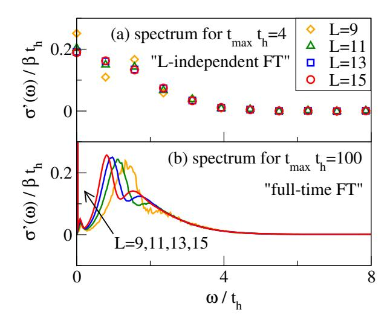

FIG. 8 (Color online) Frequency dependence of the charge conductivity in the Fermi-Hubbard chain at  $U/t_{\rm h}=16$  and  $\beta=0$  and at half filling, as obtained from Fourier-transforming real-time data which uses (a) short times that are L-independent,  $t_{\rm max}\,t_{\rm h}=4$ , and (b) long times,  $t_{\rm max}\,t_{\rm h}=100$  (Jin et al., 2015). See Sec. VII and Eq. (178) for the definition of the Hamiltonian.

egy to deal with the  $\delta$  functions such as broadening or binning procedures when working directly in frequency space. The finite system size sets a lower bound on the accessible frequency range below which finite-size effects dominate. At low temperatures, a conservative estimate is  $\omega \gtrsim 1/L$  while at high temperatures, much lower frequencies can be accessed due to the dominant contributions from dense portions of the many-body spectrum.

#### 3. Pitfalls

Let us now discuss the subtle point of the order of limits that was taken, i.e.,  $L \to \infty$  after  $t \to \infty$ , opposite to what is formally required. This is born out of the desire to operate with a closed expression for Drude weights rather than having to compute time-dependent quantities first and then carry out the limits. In fact, there is no known way of expressing the Drude weight other than introducing a discrete set of eigenstates and hence going to infinite t at finite t first.

In ED, this approach is unavoidable, since system sizes are finite by definition. What could go wrong? One might be worried about mistaking a nonintegrable system for a ballistic conductor, since every finite system with discrete lattice translation invariance can have nonzero finite-T Drude weights in the spin, charge or energy channel. Thus, a careful finite-size analysis is required to deal with this. In those cases for which exact or accepted results for the Drude weight are known (such as free systems or the energy Drude weight of the spin-1/2 XXZ

chain) increasing system size in ED data leads to systematic convergence to the correct result. This observation lends confidence to the reliability of the analysis of finite-size trends. Care must be taken in the vicinity of integrable points including limiting cases of free particles such as the spin-1/2 XX chain, where the generic expectation is that microscopic physics will only unveil itself once very large systems are reached. Thus, the ED analysis of nonintegrable points better commences from points deep in the nonintegrable regime (Heidrich-Meisner et al., 2004b).

Another pitfall can arise in the analysis of finite-frequency contributions, either from real-time data or directly in frequency space. A conservative approach is to only consider data that are L-independent, thus discarding the long times and low-frequency regime. An example is illustrated in the upper panel of Fig. 8; if the Fourier transformation is cut off at a short time scale, convergence in L can be achieved. The Fourier transformation of long-time data (lower panel) shows significant finite-size effects at small frequencies (Jin  $et\ al.$ , 2015; Prelovšek  $et\ al.$ , 2004).

# C. Dynamical quantum typicality

The concept of quantum typicality essentially states that a single pure state  $|\psi\rangle$  can have the same properties as the ensemble density matrix  $\rho$  (Gemmer and Mahler, 2003; Goldstein *et al.*, 2006; Popescu *et al.*, 2006). To be specific, here we look at the expectation value of an observable A, i.e.,

$$tr[\rho(t)A] = \langle \psi(t)|A|\psi(t)\rangle + \varepsilon \tag{138}$$

(Bartsch and Gemmer, 2009; Reimann, 2007), where  $\varepsilon$  is a negligibly small correction (as discussed below in more detail). If  $|\psi\rangle = |n\rangle$  is a single eigenstate with energy  $E_n$  and  $\rho = \rho_{\rm mc}$  the microcanonical ensemble in an energy shell  $E \approx E_n$ , then Eq. (138) becomes the diagonal part of the well-known eigenstate thermalization hypothesis (ETH)

$$\operatorname{tr}[\rho_{\mathrm{mc}}A] = \langle n|A|n\rangle + \varepsilon$$
 (139)

(Deutsch, 1991; Rigol et al., 2008; Srednicki, 1994). Even though the ETH is an assumption, there is solid evidence that it holds for local few-body observables in nonintegrable many-body systems (D'Alessio et al., 2016; Nand-kishore and Huse, 2015). However, in contrast to ETH, Eq. (138) is a mathematically rigorous statement if  $|\psi\rangle$  is essentially drawn at random from a sufficiently large Hilbert space (Bartsch and Gemmer, 2009; Reimann, 2007). In fact, the idea of using random states  $|\psi\rangle$  has a long history (Alben et al., 1975; De Raedt and De Vries, 1989; Jaklič and Prelovšek, 1994) and is at the basis of various numerical approaches to the density

of states (Hams and De Raedt, 2000), thermodynamic quantities (De Vries and De Raedt, 1993; Sugiura and Shimizu, 2012, 2013; Wietek et al., 2019), equilibrium correlation functions (Elsayed and Fine, 2013; Iitaka and Ebisuzaki, 2003; Rousochatzakis et al., 2019; Steinigeweg et al., 2014a, 2016b), non-equilibrium processes (Endo et al., 2018; Monnai and Sugita, 2014; Richter et al., 2019c), as well as ETH (Steinigeweg et al., 2014c). In this review, we focus on the case of equilibrium correlation functions.

Using the idea of quantum typicality and considering, e.g., the canonical ensemble  $\rho \propto e^{-\beta H}$ , the equilibrium autocorrelation function of an operator A can be written as (Elsayed and Fine, 2013; Iitaka and Ebisuzaki, 2003; Steinigeweg et al., 2014a, 2016b)

$$\operatorname{Re}\langle A(t)A\rangle = \operatorname{Re}\langle \psi|A(t)A|\psi\rangle + \varepsilon$$
 (140)

with the pure state

$$|\psi\rangle = \frac{\sqrt{\rho} |\Phi\rangle}{\sqrt{\langle\Phi|\rho|\Phi\rangle}}, \ \rho \propto e^{-\beta H},$$
 (141)

where the reference pure state  $|\Phi\rangle$  reads

$$|\Phi\rangle = \sum_{k} c_k |k\rangle. \tag{142}$$

Here,  $|k\rangle$  can be any (orthonormal) basis, e.g., it can be the common eigenbasis of symmetries. In the basis considered, the complex coefficients  $c_k$  must be chosen according to the unitary invariant Haar measure (Bartsch and Gemmer, 2009), i.e.,  $\operatorname{Re} c_k$  and  $\operatorname{Im} c_k$  have to be drawn at random from a Gaussian distribution with zero mean.  $^{20}$  Assuming A to be a local operator in real space (or a low-degree polynomial in L), the statistical error  $\varepsilon$ in Eq. (140) is bounded from above by  $\varepsilon < \mathcal{O}(1/\sqrt{\mathrm{dim}_{\mathrm{eff}}})$ , where  $\dim_{\text{eff}} = \text{tr}[e^{-\beta(H-E_0)}]$  is the partition function with the ground-state energy  $E_0$ . At  $\beta = 0$ , dimeff = dim. Thus,  $\epsilon$  decreases exponentially fast as L is increased and eventually vanishes for  $L \to \infty$ . At  $\beta \neq 0$ ,  $\epsilon$  can still be expected to decrease exponentially but less quickly. The accuracy of the approximation (140) for finite L is illustrated in Fig. 9 and can be checked in pratice by comparing to the exact correlation function or by comparing the results for two (or more) randomly drawn pure states. For a discussion of the full probability distribution of pure-state expectation values, see (Reimann and Gemmer, 2019).

The central advantage of the r.h.s. of Eq. (140) is that its evaluation can be done without knowing eigenstates and eigenenergies. To this end, it is convenient to introduce the two auxiliary pure states

$$|\Phi_{\beta}(t)\rangle = e^{-\mathrm{i}Ht}\sqrt{\rho}\,|\phi\rangle\,,\ |\varphi_{\beta}(t)\rangle = e^{-\mathrm{i}Ht}A\,\sqrt{\rho}\,|\phi\rangle\ \ (143)$$

 $^{20}$  Note that other types of randomness have been suggested as well (Alben  $et\ al.,\ 1975;$  Iitaka and Ebisuzaki, 2004).

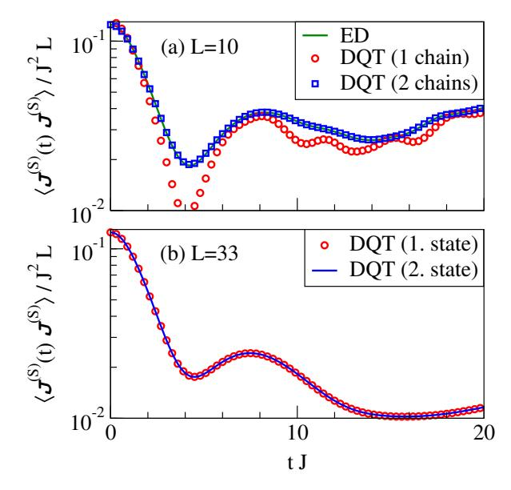

FIG. 9 (Color online) Accuracy of the DQT approximation, illustrated for the spin-current autocorrelation function in the spin-1/2 XXZ chain at the isotropic point  $\Delta=1$  and infinite temperatures  $\beta=0$  (Steinigeweg et al., 2015). (a) ED vs. DQT for a chain (with a total Hilbert-space dimension of dim =  $2^L$ ) and an uncoupled ladder (dim =  $4^L\gg 2^L$ ) with L=10. (b) DQT for L=33 and two randomly drawn pure states. For the behavior of spin-spin correlations see, e.g., (Balz et al., 2018).

and to rewrite Eq. (140) as

$$\operatorname{Re}\langle A(t)A\rangle = \frac{\operatorname{Re}\langle \Phi_{\beta}(t)|A|\varphi_{\beta}(t)\rangle}{\langle \Phi_{\beta}(0)|\Phi_{\beta}(0)\rangle} + \varepsilon \tag{144}$$

(Elsayed and Fine, 2013; Iitaka and Ebisuzaki, 2003; Steinigeweg et al., 2014a, 2016b). Then, the dependence on t and  $\beta$  occurs as a property of pure states only and can be obtained by solving the Schrödinger equation in real and imaginary time, respectively. For this purpose, any forward-iteration scheme can be used such as standard fourth-order Runge-Kutta (Elsayed and Fine, 2013) or more sophisticated Suzuki-Trotter decompositions (De Vries and De Raedt, 1993) and Chebyshev polynomials (Dobrovitski and De Raedt, 2003; Tal-Ezer and Kosloff, 1984; Weiße et al., 2006). Since in these schemes, the required matrix-vector multiplications can be performed without storing (full) matrices in computer memory, they can access long-time dynamics in large Hilbert spaces. For instance, the spin Drude weight of the spin-1/2 XXZ chain with L = 33 (dim =  $2^{33}$ ) (Steinigeweg et al., 2014a) [see Fig. 7] and the charge Drude weight of the Fermi-Hubbard chain with L=16 $(\dim = 2^{32})$  (Jin et al., 2015) have been calculated. Similar to tDMRG (see Sec. IV.E), real-time data can be Fourier-transformed to obtain also information in frequency space (Iitaka and Ebisuzaki, 2003), e.g., the optical conductivity (Steinigeweg et al., 2016b).

Note that recently, dynamical quantum typicality has been combined with numerical linked cluster expansions (Tang *et al.*, 2013) to obtain current autocorrelations in the thermodynamic limit (Richter and Steinigeweg, 2019).

#### D. Microcanonical Lanczos method

The microcanonical Lanczos method (MCLM) (Long  $et\ al.,\ 2003$ ) also works with single pure states drawn at random. Yet, in contrast to the last section, these states are constructed so as to give an accurate approximation to equilibrium expectation values in the microcanonical ensemble, i.e., Eq. (141) becomes

$$|\psi\rangle = \frac{\sqrt{\rho} |\Phi\rangle}{\sqrt{\langle\Phi|\rho|\Phi\rangle}}, \ \rho = \rho_{\rm mc} \propto \sum_{n=1}^{N} |n\rangle\langle n|,$$
 (145)

where  $\rho_{\rm mc}$  is a projector onto an energy shell which (i) is narrow but at the same time (ii) contains sufficiently many energy eigenstates  $N\gg 1$ . Therefore, due to (ii), ETH is not required and typicality arguments can still be applied (Steinigeweg et al., 2014c). Moreover, MCLM has been designed to work directly in frequency space (instead of the time domain discussed before). See (Long et al., 2003) for an extensive discussion of the method.

In the algorithm presented in (Long *et al.*, 2003), a pure state  $|\psi\rangle$  is prepared around a desired energy E by performing a Lanczos procedure on  $K = (H-E)^2$ . Then, the dynamical susceptibility is obtained from

$$\sigma'(\omega) = -\lim_{\eta \to 0} \frac{\operatorname{Im} \left\langle \psi | \mathcal{J}^{(S)} \frac{1}{z - H + E} \mathcal{J}^{(S)} | \psi \right\rangle}{\pi \langle \psi | (\mathcal{J}^{(S)})^2 | \psi \rangle}, \quad (146)$$

where  $z=\omega+i\eta$ , by using, e.g., a continued fraction expansion. The quality of the corresponding results was demonstrated for  $\sigma'(\omega)$  of spin-1/2 XXZ chains (Long et al., 2003). For the extraction of the Drude weight, which cannot be directly resolved in this approach but appears as a contribution at small frequencies  $\omega<1/L$ , an ad-hoc integration over a low-frequency regime needs to be employed.

Since MCLM is a pure-state, Lanczos-based approach, it can access systems of similar size, e.g., for spin-1/2 chains as long as  $L\lesssim 32$  sites are feasible. The approach has been applied to various physical situations, including spin-1/2 chains (Herbrych et al., 2012; Long et al., 2003; Mierzejewski et al., 2011; Okamoto et al., 2018), ladders (Steinigeweg et al., 2016b; Zotos, 2004), spin-1 chains (Karadamoglou and Zotos, 2004), spin-full fermions (Prelovšek et al., 2004), and disordered spin systems (Barišić et al., 2016; Karahalios et al., 2009). Although MCLM has been originally formulated in the frequency domain, carrying out microcanonical calculations in the time domain is also possible (Steinigeweg et al.,

2014c). Moreover, other energy filters than  $K = (H-E)^2$  can be chosen (Yamaji *et al.*, 2018). For reviews on MLCM and other methods in the context of Lanczos diagonalization, see (Jaklič and Prelovšek, 2000; Prelovšek and Bonča, 2013).

# E. Finite-temperature matrix product state methods

The density-matrix renormalization group (DMRG) method was originally devised as a tool to accurately determine static ground-state properties of one-dimensional systems (White, 1992). Later on, the method was extended in various directions, e.g., to access spectral functions, real-time evolutions, or thermodynamics (Schollwöck, 2005). From a modern perspective, all DMRG algorithms can be formulated elegantly if one introduces the concept of matrix product states (MPS) (Schollwöck, 2011),

$$|\psi\rangle = \sum_{\{\sigma_r\}} \text{tr} \left[ M^{\sigma_1} \cdot M^{\sigma_2} \cdots M^{\sigma_L} \right] |\sigma_1 \sigma_2 \dots \sigma_L\rangle, \quad (147)$$

where  $\sigma_r$  denote single-site quantum numbers at the r-th site. The (so-called bond) dimension  $\chi$  of the matrices  $M^{\sigma_l}$  grows exponentially with the amount of entanglement in the state  $|\psi\rangle$ . The idea of a ground-state DMRG calculation is to determine  $M^{\sigma_l}$  variationally for a fixed, small  $\chi$ , which is a well-suited tactic for 1d systems obeying the area law (Eisert et al., 2010).

The above language allows one to deal with pure states and is thus not directly applicable at finite temperatures. In order to access T>0, one can introduce the notion of matrix-product operators, or – equivalently – one can purify the thermal density matrix  $\rho=e^{-\beta H}/Z$  by expressing it as a partial trace over a pure state living in an enlarged Hilbert space,

$$\rho = \operatorname{tr}_{\mathcal{Q}} |\Psi_{\beta}\rangle \langle \Psi_{\beta}|, \tag{148}$$

where auxiliary degrees of freedom Q encode the thermal bath (Barthel, 2013; Barthel *et al.*, 2009; Feiguin and White, 2005; Verstraete *et al.*, 2004). This purification step is not unique, and a simple choice is for the bath to be a copy of the system's degrees of freedom, yet without any unitary dynamics of its own.

The key point is that a purification of the infinite-temperature state  $\rho=1/Z$  can be written down analytically. Again, the representation of this state is not unique and a common choice is to put each physical degree of freedom into a maximally entangled state with its copy in the bath by putting both into a singlet state. A subsequent imaginary time evolution where H acts only on the physical degrees of freedom that is carried out using standard DMRG time-evolution methods can then (in principle) provide a purified version of the thermal state  $\rho$  at any finite temperature. The final thermal expectation values are obtained by taking the trace over

the auxiliary degrees of freedom. Note that imaginary-, real-time evolution as well as the trace operation are all linear, and therefore, we exploit that they can be applied in arbitrary order.

For instance, correlation functions can be obtained via [similar to Eq. (140)]

$$\langle A(t)B\rangle = \langle \Psi_0|e^{-\beta H/2}U(t)^{\dagger}AU(t)Be^{-\beta H/2}|\Psi_0\rangle, (149)$$

where the (matrix product) state  $|\Psi_0\rangle$  purifies  $\rho =$ 1/Z at  $\beta = 0$ . If the Hamiltonian at hand contains only short-ranged interactions, both the real and the imaginary time evolutions appearing in Eq. (149) can be computed straightforwardly (Daley et al., 2004; Vidal, 2004; White and Feiguin, 2004), e.g., by splitting them up into small steps,  $U(t) = \exp(-iHt) =$  $\exp(-iH\delta t)\exp(-iH\delta t)\cdots$ One can then Trotterdecompose the exponentials  $\exp(-iH\delta t)$  into mutually commuting local terms, which can be applied straightforwardly to a MPS (Paeckel et al., 2019; Schollwöck, 2011; Vidal, 2004). Other ways to incorporate finite temperatures within DMRG include a Lindbladian superoperator approach (Zwolak and Vidal, 2004), a transfer-matrix formulation (Sirker and Klümper, 2005), or a probabilistic sampling over pure states (White, 2009).

The crucial step when applying  $e^{-iH\delta t}$  to a given MPS is to truncate the bond dimension by neglecting singular values below a certain threshold. This is the best approximation in the 2-norm of the wavefunction. The discarded weight is the key numerical control parameter; fixing it means fixing the error of the calculation. One usually runs calculations for several different values until physical observables have converged up to a desired accuracy [an example for this is shown in Fig. 10(c)].

If entanglement builds up linearly with time, the bond dimension  $\chi$  grows exponentially and so does the computational effort. This severely limits the accessible time scales (Barthel et~al., 2009). The strengths of time-dependent DMRG (t-DMRG) are that the system size can easily be chosen large enough to be effectively in the thermodynamic limit (due to a finite effective speed of information propagation (Lieb and Robinson, 1972)) and that it is not limited to integrable models or translationally invariant cases.

At finite temperatures, one can exploit the fact that some of the entanglement growth is "unphysically" taking place in  $\mathcal Q$  and can thus be removed (Karrasch et al., 2012, 2013a). Mathematically, the state  $|\Psi_{\beta}\rangle$  appearing in Eq. (148) is not unique but only determined up to an arbitrary unitary rotation, which can be chosen such that the entanglement is minimized. If this unitary is taken as a backward time evolution in  $\mathcal Q$  with an operator  $H_{\mathcal Q}$  that has the same form as H (but acts in  $\mathcal Q$ ), which amounts to replacing U(t) by  $\tilde U(t) = \exp\{-i(H-H_{\mathcal Q})t\}$  in Eq. (149), then the entanglement growth is slowed significantly and larger time scales become accessible. This is illustrated in Fig. 10(a) and (Karrasch et al., 2012,

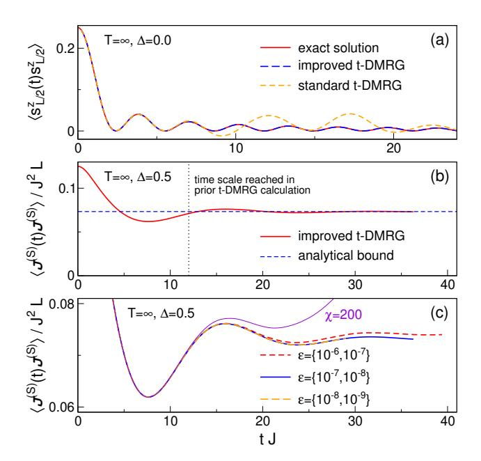

FIG. 10 (Color online) Benchmark of the improved finite-T t-DMRG algorithm for the spin-1/2 XXZ chain (1). (a) Spin autocorrelation function for  $\Delta = 0$  computed using both the standard algorithm (149) and the improved version (U replaced by  $\tilde{U}$ ) with a fixed bond dimension of  $\chi = 60$ . The exact solution is shown as a reference. The data is taken from (Karrasch et al., 2012). (b) Spin current autocorrelation function at  $\Delta = 0.5$  calculated using Eq. (150) with a fixed discarded weight. The data is taken from Karrasch et al., 2015a. Both the analytical result of Prosen and Ilievski, 2013 and the time scale reached in the t-DMRG calculation of Sirker et al., 2009 are shown for comparison. (c) Same as in (b) but for different discarded weights which each differ by one order of magnitude (the two values denote the discarded weight during the two different time evolutions in Eq. (150), see (Kennes and Karrasch, 2016)). Data obtained using a fixed bond dimension of  $\chi = 200$  is shown for comparison.

2013a). It was later shown that the backward time evolution in  $\mathcal{Q}$  appears naturally in an operator-space language (Barthel, 2013; Tiegel et al., 2014). Its form can also be motivated from the fact that  $|\Psi_{\beta}\rangle$  is an eigenstate of  $H-H_{\mathcal{Q}}$  but not of H (Kennes and Karrasch, 2016). Further optimization schemes were discussed in (Barthel, 2013; Karrasch et al., 2013a). A method which in practice allows one to find the minimally entangled representation by iteratively minimizing the second Renyi entropy was presented in (Hauschild et al., 2018).

Moreover, it was suggested (Barthel, 2013) to rewrite  $\langle A(2t)B\rangle = \langle A(t)B(-t)\rangle$  as

$$\langle A(2t)B\rangle = \underbrace{\langle \Psi_0 | e^{-\beta H/2} A \tilde{U}(t)}_{\langle \phi_1 |} \underbrace{\tilde{U}(t) B e^{-\beta H/2} | \Psi_0 \rangle}_{|\phi_2 \rangle}, (150)$$

and to determine the states  $|\phi_{1,2}\rangle$  via separate time evolutions. This again gives access to larger time scales by about a factor of two or less [see Fig. 10(b)].

The so-improved finite-T t-DMRG algorithm can be used to determine Drude weights and diffusion constants by looking at the long-time limit of, e.g., the current correlation function (Karrasch et al., 2012, 2013b, 2015a, 2014a,b) or from local quenches (Karrasch et al., 2014b, 2017) as well as in the bipartitioning protocol (Karrasch, 2017a; Vasseur et al., 2015). The strength of such quenches can be tuned in order to reduce the build-up of entanglement and thus extend the simulation time, and it is observed that certain bipartitioning protocols (see also Sec. IX.B) are the best suited route to determine Drude weights (Karrasch, 2017a). Frequency-resolved quantities can be determined from Fourier transformations (Karrasch et al., 2015a, 2016, 2014a), which can be improved by using so-called linear prediction methods (Barthel *et al.*, 2009).

Another possibility to obtain transport properties on longer time scales is to employ the time-dependent variational principle approach (Haegeman et al., 2011), but the approach has its own advantages (Leviatan et al., 2017) and shortcomings (Kloss et al., 2018). Descendants of 'Lanczos DMRG' methods, which directly yield frequency-dependent quantities (Holzner et al., 2011; Tiegel et al., 2014), are another promising avenue but have not been pursued yet in transport setups. very promising direction has recently been pursued by (Rakovszky et al., 2020). Operators with a local support are evolved in the presence of a bath with a coupling strength  $\Gamma$  that controls dissipation. The diffusion constant is recovered in the limit of  $\Gamma \to 0$  and agreement with previous studies has been observed (Steinigeweg et al., 2014b).

## F. Quantum Monte Carlo

For all spin systems on non-frustrated lattices, quantum Monte Carlo methods, such as the stochastic series expansion (SSE) (Sandvik, 2013; Syljuåsen and Sandvik, 2002), or the cluster methods using loop updates (Evertz et al., 1993) provide essentially exact results for the thermodynamics and static correlations on large systems. Computing frequency-resolved quantities, though, is notoriously difficult due to the ill-defined problem of the analytic continuation from imaginary time to real time. One can avoid the problem by directly computing the response on the imaginary axis and comparing to theoretical predictions expressed in imaginary rather than real time. This method works best at low temperatures, where the set of available Matsubara frequencies  $\omega_{\beta} = 2\pi n/\beta \ (n \in \mathbb{Z})$  is more dense. Therefore, QMC studies of transport in 1d spin systems (Alvarez and Gros, 2002a,b,c; Grossjohann and Brenig, 2010; Heidarian and Sorella, 2007; Louis and Gros, 2003) and Fermi-Hubbard models (Kirchner et al., 1999) are complementary to finite-temperature DMRG, ED, and dynamical typicality. The claims of some of these QMC studies conflict with the bulk of the literature. For instance, both (Kirchner et al., 1999) and (Heidarian and Sorella, 2007) claim evidence of ballistic transport in gapless nonintegrable models. While there has not been any systematic comparison between QMC data and other numerical methods (which is hampered by the different temperature regimes that these methods work in), a generic issue related to the analytical continuation from the imaginary axis to the real–frequency axis arises at low temperatures. Since Matsubara frequencies  $\omega \propto T$ , there is a poor resolution whenever the width of a peak in the spectral feature is smaller than  $k_BT$ .

The statistical errors in QMC calculations are typically larger for higher-order correlation functions and it is therefore preferable (Alvarez and Gros, 2002a,c; Grossjohann and Brenig, 2010) to work with two-site correlation functions instead of directly evaluating current-current correlations (Heidarian and Sorella, 2007). At finite momentum q and frequency  $\omega_n$ , one can relate the dynamical conductivity  $\sigma_q(\omega_n)$  given by (Alvarez and Gros, 2002c)

$$\sigma_q(\omega_n) = \frac{\langle -T_{\rm kin} \rangle - J_q^{\rm (S)}(\omega_n)}{\omega_n}$$
 (151)

to the dynamical spin susceptibility  $S_q(\omega_n)$  via

$$\langle -T_{\rm kin} \rangle - J_q^{\rm (S)}(\omega_n) = \frac{\omega_n^2}{\tilde{q}^2} S_q(\omega_n).$$
 (152)

Note that, compared to Eq. (61), there is a minus sign, due to imaginary time. The expressions entering here are:

$$J_q^{(S)}(\omega_n) = \frac{1}{L} \int_0^\beta e^{i\omega_n \tau} \langle \mathcal{J}_q^{(S)}(\tau) \mathcal{J}_{-q}^{(S)}(0) \rangle d\tau , \quad (153)$$

$$S_q(\omega_n) = \frac{1}{L} \int_0^\beta e^{i\omega_n \tau} \langle S_q^z(\tau) S_{-q}^z(0) \rangle d\tau , \qquad (154)$$

where  $\tau$  is imaginary time.

The strategy pursued in (Alvarez and Gros, 2002a,c) is to fit the numerical data to a phenomenological ansatz (see (Alvarez and Gros, 2002c) for details). One notable result of (Alvarez and Gros, 2002a,c) is a Drude weight  $\mathcal{D}_{\rm w}^{\rm (S)}(T)={\rm const.}$  at low temperatures for commensurate points  $\Delta={\rm cos}(\pi/m)$  ( $m=1,2,\ldots$ ) in the gapless phase of the spin-1/2 XXZ chain, in contradiction to the TBA results for the temperature dependence (Zotos, 1999). It thus remains open whether the specific ansatz of (Alvarez and Gros, 2002c) is justified and whether finite temperatures were actually resolved in these QMC studies, which reproduce the zero-temperature Drude weight away from  $\Delta=1$  with excellent accuracy.

Another QMC work (Grossjohann and Brenig, 2010) focused on the spin-1/2 XXX chain and aimed at verifying the field-theoretical prediction of (Sirker *et al.*, 2009,

2011) for the dynamical spin susceptibility  $S_q(\omega_n)$ . Qualitatively, a diffusive form at small wavelength is expected based on the perturbative bosonization analysis of (Sirker et al., 2009), cf. Sec. IV.A. This is consistent with QMC data, yet quantitative deviations for the decay rate  $\gamma$  were reported.

#### V. OPEN QUANTUM SYSTEMS

In this section, we describe methods that use an explicit external driving, such that a system evolves to a nonequilibrium steady state (NESS) (Marro and Dickman, 1999; Schmittmann and Zia, 1995). The NESS describes a time-averaged system's density operator from which one can then evaluate expectation values of observables. A particular emphasis will be put on the boundary-driven Lindblad setting as the most frequently used framework to obtain the NESS.

We note that open quantum systems are sometimes also studied numerically with a unitary time evolution, i.e., the leads are treated on the Hamiltonian level and as finite system. We will not further discuss this approach here, but mention studies that looked at spin chains (Branschädel et al., 2010; Lange et al., 2018a, 2019) or electronic systems (Einhellinger et al., 2012; Heidrich-Meisner et al., 2010; Kirino and Ueda, 2010; Knap et al., 2011) sandwiched between leads. An alternative formulation used in studies of mesoscopic systems, particularly in the absence of interactions, is to describe the system's properties by a scattering matrix and the leads by occupation numbers, leading to Landauer-Büttiker type formulas (Nazarov and Blanter, 2009). Finally, we mention that there exist some settings that are able to produce a NESS within the unitary dynamics. One is the bipartitioning protocol where one prepares two semi-infinite chains in different initial states and then evolves unitary in time [see Sec. IX.B]. Another is to use a Lagrange multiplier to add a current operator to the Hamiltonian, see, e.g., (Antal et al., 1997a).

# A. Non-equilibrium steady-state driving

A canonical way of studying nonequilibrium properties is to induce a NESS using some kind of reservoirs and to measure its properties. In studies of classical systems (Dhar, 2008; Lepri et al., 2003), where many different types of reservoirs are available, this is, in fact, a method of choice to study transport (Derrida, 2007; Marro and Dickman, 1999; Schmittmann and Zia, 1995). Compared to linear-response calculations, no extra care is needed when treating anomalous transport often observed in classical nonintegrable 1D systems, such as, for instance, in the celebrated Fermi-Pasta-Ulam-Tsingou model (Dauxois, 2008; Fermi et al., 1955). Quantum

NESS studies are fewer, one reason being that it is not so easy to construct quantum reservoirs that one can efficiently simulate. As we shall see in this section, the situation has been changing in recent years, with increased research into quantum master equations.

In a one-dimensional system it suffices to use one reservoir at each chain end and, provided they are different, the system will, after a long time, evolve into a NESS  $\rho_{\infty}$ . Once one gets the NESS, the main quantity used to assess the transport is the NESS current  $j_r^{(S)}$ , which is just the expectation value of the current operator. The current is always defined such that the continuity equation holds, and therefore, at sites r, on which the reservoirs act, it must account also for the bath action. In the bulk, though, where the evolution is unitary, the current operator is the standard  $j_r^{(S)}$  obtained from the commutator between  $h_r$  and the local density  $s_r^z$ , see, e.g., Eq. (4), and therefore, the NESS current is  $j^{(S)} = \operatorname{tr}(\rho_{\infty} j_{T}^{(S)})$ . Due to the continuity equation,  $j^{(S)}$  is independent of the lattice site r. Provided one has diffusion the current will scale as  $j^{(S)} = -D^{(S)} \frac{\Delta \mu}{L}$  (i.e., Fourier's, Fick's, or Ohm's law), where  $\Delta \mu$  is the difference in driving potentials,  $^{21}$  and  $D^{(S)}$  a diffusion constant. If the system is not diffusive one will instead have a more general scaling, namely, keeping  $\Delta \mu$  fixed the current will scale with system length L as

$$j^{(S)} \sim \frac{1}{L^{\gamma}}.\tag{155}$$

Depending on  $\gamma$  one has (i) diffusive transport for  $\gamma = 1$ , (ii) ballistic transport for  $\gamma = 0$ , (iii) superdiffusive transport for  $0 < \gamma < 1$ , and (iv) subdiffusive transport for  $\gamma > 1$ . Localization corresponds to  $\gamma \to \infty$ . See (Dhar et al., 2019) for a review of anomalous transport in classical systems. The type of transport can also be recognized from the NESS profile of a conserved density. Similarly as in classical systems, one expects some finite boundary "jumps" close to the location of driving, i.e., an impedance mismatch. Disregarding those, in the bulk, one will have a linear profile for a diffusive system, a flat profile for a ballistic system, and a domain-wall-like profile for an insulator. In short, in order to keep  $i^{(S)}$ constant, local areas with higher resistivity will support higher density gradients, and vice versa. Heuristic profile shapes can also be associated to anomalous  $\gamma$  (Znidarič et al., 2016; Žnidarič, 2011), though it is not clear how universal they are. Assuming a single-exponent scaling (Li and Wang, 2003), these  $\gamma$  are connected to the corresponding dynamical exponents in the context of linear

response functions, see Eq. (41),

$$\alpha' = \frac{2}{\gamma + 1} \,. \tag{156}$$

A crucial question is how to efficiently implement reser-One possibility is to describe the system and the (infinite) reservoirs as one large Hamiltonian system. Then one can derive the evolution equation of the system alone by tracing out the reservoir degrees of freedom. A problem with this approach is that the obtained equations are in general very complicated. For instance, the resulting master equation is nonlocal in time with a complicated memory kernel and in general, is no easier to treat than the original problem (Breuer and Petruccione, 2002). Depending on further approximations one gets a so-called Redfield master equation (Redfield, 1965), which we shall not discuss, or a simpler Lindblad master equation. An exception are quadratic systems (i.e., non-interacting) where the physics is rather simple since quadratic translationally invariant systems display ballistic transport.

A more pragmatic approach is to simply seek an evolution equation for the system's density matrix that is able to describe the NESS situation and which is as simple as possible – meaning that it still obeys all the rules of quantum mechanics. After all, in the thermodynamic limit, the bulk conductivity or transport type should not depend on the details of the driving, provided the dynamics is sufficiently ergodic. While this is seemingly natural, this assumption has to be checked in each individual system, especially in integrable systems. Next, we shall elaborate on such a setting.

#### B. Lindblad master equation

Let us argue for the simplest master equation governing the evolution of the system's density operator. Quantum mechanics is linear and therefore, we require that the evolution of  $\rho(t)$  is also linear, and furthermore, that it maps density operators to density operators. Namely, if  $\rho(0) > 0$ ,  $\rho(t) > 0$  should also hold. Requiring also that a map that is trivially extended to a larger space (i.e., one that acts as an identity on added degrees of freedom) also maps any positive semidefinite operator on that larger space to a positive semidefinite operator, means that such a map should be completely positive and not just positive. Such maps are known as completely positive trace-preserving (CPTP) maps (Alicki and Lendi, 2007). The class of CPTP maps is still too broad a set and therefore, one requires an additional property, namely, that the action of reservoirs is as "random" as possible. In other words, the maps have no memory, i.e., they correspond to a Markovian evolution. Formally, this means that the evolution generated by the linear (super)operator  $\mathcal{L}$  should form a

 $^{21}$  For spin transport  $\Delta\mu$  will be equal to a magnetization difference between chain ends and should not be confused with the chemical potential.

dynamical semigroup: the evolution can be split into smaller steps,  $\rho(t_1+t_2) = e^{\mathcal{L}\cdot(t_1+t_2)}\rho(0) = e^{\mathcal{L}\cdot t_1}e^{\mathcal{L}\cdot t_2}\rho(0)$ . It has been shown that any such evolution in a finite Hilbert space (Gorini *et al.*, 1976) as well as in an infinite one (Lindblad, 1976) can be written in the form of the Lindblad master equation (also LGKS – Lindblad, Gorini, Kossakowski, Sudarshan),

$$\frac{\mathrm{d}}{\mathrm{d}t}\rho(t) = \mathcal{L}(\rho(t)) = \mathrm{i}[\rho(t), H] + \mathcal{L}^{\mathrm{diss}}(\rho(t)), \quad (157)$$

$$\mathcal{L}^{\mathrm{diss}}(\rho) = \sum_{j} [L_{j} \rho, L_{j}^{\dagger}] + [L_{j}, \rho L_{j}^{\dagger}],$$

where  $L_i$  are Lindblad operators that describe the action of reservoirs. Note that the  $L_j$  can be any operators, also non-Hermitian ones. Conversely, a Lindblad master equation with given  $L_i$  and H generates a CPTP map. For a historical account and earlier uses and occurrences of such an equation, see (Chruściński and Pascazio, 2017). In a finite-dimensional Hilbert space, Brouwer's fixed point theorem (Milnor, 1965) guarantees the existence of at least one fixed point. Namely, a continuous map,  $e^{\mathcal{L}t}$  in our case, of a compact convex set (a set of density matrices) on itself has a fixed point,  $\mathcal{L}\rho_{\infty}=0$ . Typically and under certain algebraic conditions on  $L_i$  and H (Evans, 1977; Frigerio, 1977; Spohn, 1977), there is exactly one steady state and, therefore, any initial state converges after long time to that unique NESS,  $\lim_{t\to\infty} e^{\mathcal{L}\cdot t} \rho(0) = \rho_{\infty}$ . Systems described by the Lindblad equation are often called open systems (Alicki and Lendi, 2007; Breuer and Petruccione, 2002), as opposed to closed systems where the evolution is unitary.

Depending on the driving type, one can distinguish the case of global  $L_j$ , see e.g., (Saito, 2003; Saito and Miyashita, 2002; Saito et al., 2000), or that of local  $L_i$ , e.g., (Mejia-Monasterio and Wichterich, 2007; Michel et al., 2003; Steinigeweg et al., 2009a). A somewhat related scheme is that of a stochastic heat bath in which one measures and stochastically resets the boundary spin (Mejia-Monasterio et al., 2005; Mejia-Monasterio and Wichterich, 2007). Another hybrid way to model a bath is by describing it as a lead (with a certain number of lattice sites) that is in addition coupled to a Lindbladian dissipation. For noninteracting leads, one can construct dissipators that thermalize such free systems (Ajisaka et al., 2012; Dzhioev and Kosov, 2011; Guimarães et al., 2016), or model nontrivial spectral properties of the bath (Arrigoni et al., 2013; Brenes et al., 2020c; Schwarz et al., 2016). For a discussion of thermalization properties of such baths, see (Reichental et al.,

One of the simplest choices are local  $L_j$  that act only on the edges of the chain, such that the bulk dynamics is still fully coherent and determined by H (see Fig. 11). This is similar to the way classical nonequilibrium lattice models are driven (Derrida, 2007; Marro and Dickman, 1999; Schmittmann and Zia, 1995), where the bath acts

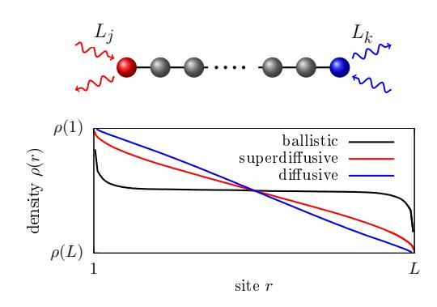

FIG. 11 (Color online) Top: NESS boundary Lindblad driving. Bottom: typical NESS density profiles for diffusive (blue), superdiffusive (red), and ballistic transport (black).

only on the boundary. The resulting locally-driven Lindblad equation is a mathematically sound NESS setting, without any shortcomings such as the violation of positivity at short times encountered in the Redfield equation. Moreover, this setting often allows for the simulation of very large systems (hundreds of spins), and, sometimes, even permits exact solutions. Justifying local  $L_i$ on microscopic grounds is not easy; the standard weakcoupling microscopic derivation (Breuer and Petruccione, 2002) will typically result in nonlocal  $L_i$ . In particular, requiring an exact thermal steady state for equilibrium driving demands nonlocal  $L_i$  (so-called Davies generators (Davies, 1974)) that have to be constructed by diagonalizing each particular H. This is neither practical nor in the spirit of having an effective bath description that is system-independent. From a practical point of view, demanding exact thermal states is anyway too strong as it suffices that one is sufficiently close. For a system possessing good thermalization properties, it should not matter how one drives such a system in the thermodynamic limit. The reason it that, far away from the boundaries, a generic system will anyway self-thermalize and therefore, boundary effects, protruding a finite distance into the system, are expected to cause only subleading corrections. This behavior, however, is not guaranteed in an integrable system (Mendoza-Arenas et al., 2015; Znidarič et al., 2010).

Note that things are different if one studies small systems – there one should pay close attention to thermodynamic details of local Lindblad driving (Barra, 2015) as well as to the fact that quantities such as, e.g., the temperature, might not have a well defined thermodynamic meaning (Hartmann et al., 2004; Kliesch et al., 2014). We remark that one can nevertheless provide a kind of "microscopic" picture also to local  $L_j$ . Hermitian  $L_j$ , such as the dephasing  $L_j \sim s_j^z$ , can be obtained via Gaussian noise (Gardiner and Zoller, 1991), while general  $L_j$  can be, somewhat more artificially, obtained by a continuous non-ideal measurement (Breuer and Petruccione, 2002), or by an instantaneous repeated interaction with

a bath (Attal and Pautrat, 2006; Karevski and Platini, 2009).

# 1. Infinite-temperature magnetization driving

Let us have a closer look at one of the simplest cases of Lindblad driving, where the Lindblad operators act on a single site and induce infinite-temperature spin transport. A one-site driving is given by two Lindblad operators that flip a spin up or down with different probabilities, thereby trying to induce a net magnetization at that site. They are given by

$$L_1 = \sqrt{\Gamma(1+\mu)}s_r^+, \quad L_2 = \sqrt{\Gamma(1-\mu)}s_r^-,$$
 (158)

where  $\Gamma$  is the coupling strength,  $\mu$  the driving strength, and  $s_r^{\pm} = (s_r^{\rm x} \pm i s_r^{\rm y})$ . In the absence of any Hamiltonian, that is, driving a single-site system, they have a unique 1-site steady state  $\rho \sim 1 + \mu 2 s_r^{\rm z}$ , and therefore, they model a bath that tries to induce a magnetization  $+\mu$  at site r, i.e.,  $2 {\rm tr}(s_r^{\rm z} \rho) = \mu$ .

To induce a NESS in a long chain, one uses one such pair of Ls at each chain end. For instance, using  $+\mu$  driving at the left end and  $-\mu$  at the right end results in a NESS with a position-dependent magnetization along the chain and a nonzero spin current (see Fig. 11). Similar Lindblad driving has already been used in early studies (Michel et al., 2004, 2003; Wichterich et al., 2007) and numerous subsequent ones, e.g., (Balachandran et al., 2018; Landi et al., 2014; Mendoza-Arenas et al., 2013a; Popkov et al., 2013; Prosen and Žnidarič, 2009). For  $\mu=0$ , one has a trivial steady state  $\rho\sim 1$ , i.e., an infinite-temperature state, and one can interpret (158) as spin driving at infinite temperature. For non-zero  $\mu$ , the NESS current  $j_r^{(S)}$  is nonzero and is the main observable.

As described in Sec. V.A, the transport type can then be extracted by evaluating the expectation value of the current  $j_r^{(\mathrm{S})}$  and of the magnetization  $s_{r=1,L}^{\mathrm{z}}.$  Due to a "boundary resistance" associated to a particular driving one will typically have boundary jumps in magnetization - the expectation value of  $s_{r=1,L}^{z}$  will not be exactly  $\pm \mu$ . However, the size of such jump is proportional to  $j_r^{(S)}$ and therefore goes to zero in the thermodynamic limit provided the current goes to zero, which is true for subballistic transport. In the thermodynamic limit, the difference in driving potential is therefore simply  $\Delta s^{z} = \mu$ , and furthermore, the current expectation value in the NESS can be evaluated at any site r. From its dependence on L given in Eq. (155), one can therefore extract the transport type, and in the case of diffusion, also the diffusion constant from  $j^{(S)} = -D^{(S)} \frac{\mu}{I}$ .

We note that the Lindblad driving parameters are, in general, not simply related or equal to thermodynamic parameters. For instance, for a 1-site spin driving (158)

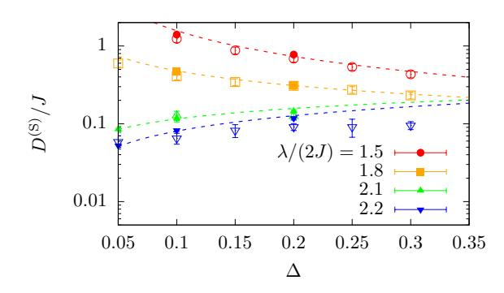

FIG. 12 (Color online) Comparison of results for the spin-diffusion constant  $D^{(\mathrm{S})}$  obtained from NESS simulations (empty symbols) and unitary domain-wall spreading (full symbols) in the spin-1/2 XXZ chain with a quasiperiodic magnetic field of amplitude  $\lambda$ . Details can be found in (Žnidarič and Ljubotina, 2018). Unitary domain-wall spreading is a particular case of a bipartitioning protocol, see Sec. IX.B for details.

and H = 0 one gets a 1-site steady state density operator  $\rho \sim 1 + \mu \sigma^z$  for which the ratio of probabilities of finding the spin in up and down states is  $\frac{1+\mu}{1-\mu}$ . Arguing that this ratio can be equated to  $e^{-\Delta E/\dot{T}}$  given by the equilibrium distribution, where  $\Delta E$  is the energy difference between the up and down states, would incorrectly associate a particular finite T to a given  $\mu$ . At the boundary where the L act, there will be a nontrivial interplay between driving and a nonzero H (boundary effects), causing the state there, in general, not to be thermal. However, far away from the boundaries, one does expect thermalization (at least in non-integrable systems) and therefore, thermodynamic parameters describing local equilibrium can be determined from local observables (Mendoza-Arenas et al., 2015; Žnidarič et al., 2010) [see also (Shirai and Mori, 2018) for an alternative].

An important question is whether the linear-response Green-Kubo type calculation and the NESS one in the limit of small  $\mu$  give the same transport coefficient. This is, in general, a difficult question with no rigorous mathematical connection between the two transport coefficients known in general, either for quantum or for classical systems (Bonetto  $et\ al.$ , 2000). We shall outline one specific result for the spin driving given in Eq. (158).

In the limit of weak driving  $\mu \ll 1$ , one can use perturbation theory to get the NESS linear-response correction to the infinite-temperature equilibrium state  $\sim 1$ . Similar to classical systems (Kundu et~al.,~2009), one can derive a NESS Kubo-like expression (Kamiya and Takesue, 2013; Žnidarič, 2019) for the diffusion constant  $D^{(\rm S)}$  at infinite temperature,

$$D^{(S)} = \lim_{L \to \infty} 4L \int_0^\infty \frac{\text{tr}(j_r^{(S)} j_{r'}^{(S)}(t))}{2^L} dt$$
 (159)

for any r and r', where  $j_r^{(\mathrm{S})}(t) := \mathrm{e}^{\mathcal{L}_0 t} j_r^{(\mathrm{S})}$ , defined with

 $\mathcal{L}_0$  being the equilibrium Liouvillian propagator (i.e.,  $\mathcal{L}$  with  $\mu=0$ ). Although looking similar to the equilibrium Kubo formula Eq. (12), the content is quite different. For instance, the time integral is, due to the dissipative nature of  $\mathcal{L}_0$ , always well defined, even for finite L. Alternatively, the expression can be rewritten as (Žnidarič, 2019)

$$D^{(S)} = L(8\Gamma)^2 \int_0^\infty \frac{\text{tr}(s_L^z s_1^z(t))}{2^L} dt, \qquad (160)$$

where  $s_1^{\mathbf{z}}(t) := e^{\mathcal{L}_0 t} s_1^{\mathbf{z}}$ . The NESS diffusion constant  $D^{(S)}$ is equal to the transfer probability across the chain under evolution by  $\mathcal{L}_0$  that is unitary in the bulk and dissipative at the edges. Even though it looks as if  $D^{(S)}$ depends on  $\Gamma$ , this is not the case. One can show that in the thermodynamic limit, provided the unitary dynamics is perfectly diffusive and all parameters are held fixed (including  $\Gamma$ ), this dependence is exactly compensated by a dissipative decay of  $s_1^{\rm z}(t)$ , resulting in exactly the same diffusion constant as the unitary Green-Kubo approach (Žnidarič, 2019). Quantitative agreement between the Lindblad and the unitary linear response Green-Kubo calculations of the diffusion constant has been verified in chaotic models, for instance, the spin-1/2 XX ladder (Steinigeweg et al., 2014b; Žnidarič, 2013a). Similarly, one can compare the Lindblad approach with the unitary dynamics in an out-of-equilibrium setting. Once again, to have a meaningful comparison one should focus on quantities accessible by both methods, such as the diffusion constant. So far, an extensive comparison has not been performed, however, an example is shown in Fig. 12 for a spin-1/2 XXZ model in the presence of a quasiperiodic potential. Specifically, the figure shows a comparison between the diffusion constant obtained in the Lindblad evolution using a driving as specified in Eq. (158) and that extracted from the domain-wall spreading in a bipartitioning protocol (see Sec. IX.B).

For non-diffusive systems (i.e., for superdiffusive or subdiffusive) the relationship between unitary and NESS approaches is less clear, although usually the same scaling exponent is observed (both for superdiffusive systems, such as the spin-1/2 Heisenberg chain (Ljubotina et al., 2017), as well as for subdiffusive dynamics in a quasiperiodic potential (Varma and Žnidarič, 2019)). It has been also demonstrated (Jin et al., 2020) that for ballistic systems the above Lindblad driving (158) gives the same result as the Landauer-Büttiker formula at infinite temperature. One case, believed to be special, where NESS and unitary dynamics do not agree, is a noninteracting critical model displaying multifractality (Purkayastha et al., 2018; Varma et al., 2017). One should be also aware that in the non-linear response regime, i.e., at large  $\mu$ , one can get a different behavior. An explicit example is the spin-1/2 XXZ chain at maximal driving  $\mu = 1$  (Prosen, 2011a) or close-to-maximal driving (Benenti et al., 2009a,b). It remains to be explored if and how a boundary-driven Lindblad setting can be used to extract the Drude weight or a frequency-dependent conductivity. Using simply a time-periodic driving  $\mu$  in a Markovian Lindblad equation (Floquet Lindblad), see, e.g. (Žnidarič *et al.*, 2011), likely does not give the same information as  $\sigma'(\omega)$ .

Note that the coupling strength  $\Gamma$  introduces an "energy" scale into the system and therefore, the limits of  $\Gamma \to 0$  (or  $\Gamma \to \infty$ ) will typically not commute with either the thermodynamic limit or, for instance, the limit of  $\Delta \to \infty$  in the Heisenberg model. The limit of weak boundary coupling  $\Gamma \to 0$  causes a decoupling of the bulk from the boundary, resulting in a different scaling of current and density with  $\Gamma$  (Prosen, 2011b). This means that weak boundary coupling  $\Gamma \ll 1$  cannot be used to probe bulk transport. Similar caution is required also in the limit of  $\Gamma \to \infty$ , especially if there is any other diverging energy scale with which a scale introduced by  $\Gamma$ can "compete". As an example, if one takes the limit of  $\Delta \to \infty$  in the spin-1/2 XXZ spin chain, then a different behavior of the diffusion constant might be obtained depending on how one scales  $\Gamma$  (Žnidarič, 2011). This is a likely cause of a discrepancy in the value of the diffusion constant at large  $\Delta$  between closed-system Kubo formula calculations (Karrasch et al., 2014b; Steinigeweg et al., 2009a) and the NESS result (Žnidarič, 2011) obtained for a particular coupling-strength scaling  $\Gamma \sim \Delta$ . Namely, in the studies (Karrasch et al., 2014b; Steinigeweg et al., 2009a), the infinite-temperature limit is taken first, and therefore, even at large  $\Delta$ , one has a coupling between all states. The Lindblad setting, by contrast, with its finite (but large  $\Gamma$ ), is closer to the case when one takes the limit  $\Delta \to \infty$  first, i.e., at finite T in the limit  $\Delta \to \infty$ one decouples states with differing number of domainwalls.

#### 2. Solving the Lindblad equation

How does one solve a many-body Lindblad equation? Provided the whole Liouvillian is quadratic (in, e.g., fermionic operators) one can use the so-called 3rd quantization method (Prosen, 2008), simplifying diagonalization of the full  $4^L \times 4^L$  Liouvillian to a diagonalization (Prosen, 2010) of a  $2L \times 2L$  matrix describing decay modes. In some exceptional quadratic (Žnidarič, 2010b) as well as non-quadratic systems [see, e.g., (Ilievski, 2017; Karevski et al., 2013; Popkov and Livi, 2013; Prosen, 2011a, 2014a, 2015; Vanicat et al., 2018)], one can even get a closed matrix-product-operator (MPO) NESS solution.

Numerically, one can use full diagonalization (allowing  $L \approx 10$  for spin-1/2), or an explicit integratation of an exponential set of differential equations [see (Weimer et al., 2019) for an overview]. An alternative approach, often used in atomic, molecular and optical system, is the quantum-trajectory method (Breuer and Petruccione,

2002) that evolves  $|\psi(t)\rangle$  and averages over stochastic jumps to get  $\rho$ . Writing down  $|\psi(t)\rangle$  in full one is again limited to small systems  $L \approx 16$  (Johansson et al., 2012), however, using the MPS ansatz one can extend the available system sizes (Daley, 2014). For large systems, as needed in transport studies, the method of choice is a version of time-dependent DMRG (tDMRG) (Daley et al., 2004; Verstraete et al., 2004; White and Feiguin, 2004; Zwolak and Vidal, 2004), also called time-evolved block decimation (TEBD) method, used to evolve in time  $\rho(t)$ until the NESS is reached. One could also try to avoid time evolution by directly targeting the NESS (i.e., the "ground state" of a non-Hermitian  $\mathcal{L}$ ) using Lanczostype methods (Arnoldi,  $L \approx 15$ ) or again employ the DMRG (Casagrande et al., 2020; Cui et al., 2015). Invariably though, as in time evolution, the bottleneck will be a small gap of  $\mathcal{L}$  (Znidarič, 2015).

The tDMRG for Lindblad equations works by writing the state  $\rho$  in terms of a matrix-product operator ansatz, exactly the same as for pure states (147), the only difference being that the local Hilbert-space dimension in the operator space is the square of the pure-state dimension. For instance, for spin-1/2, it is 4, spanned, for instance, by Pauli matrices and the identity, which are orthogonal with respect to the Hilbert-Schmidt inner product. By discretizing the time evolution into small time steps  $\delta t$  and by using a Trotter-Suzuki decomposition of the time-evolution operator resulting in  $e^{\mathcal{L}\delta t}$ , one propagates some initial density operator, such as  $\rho(0) \sim 1$ , in time until it converges to the NESS. The basic ingredient is a two-site nearest-neighbor transformation, similar to the time evolution of marix-product states (Schollwöck, 2011). Because non-unitary evolution eventually spoils the optimal truncation via Schmidt decomposition, it is worthwhile to occasionally reorthogonalize the state [see, e.g., (Znidarič, 2010a)]. For further implementations by various groups, including opensource codes, see (Al-Assam et al., 2016; Bernier et al., 2018; Brenes et al., 2018; Fishman et al., 2020; Schulz et al., 2018; Volokitin et al., 2019).

In unitary tDMRG simulations of MPS or MPOs (see Sec. IV.E), where one needs to account for the unavoidable entanglement growth, one fixes the discarded weight to a set number. As a consequence, the bond dimension necessary to maintain the same truncation per time step grows as a function of time, generically in an exponential way (Schollwöck, 2011). As a consequence, the accessible time scales are of the order of several  $\mathcal{O}(10/J)$ . The tDMRG simulations for solving Lindblad master equations are, on the other hand, often carried out with a fixed bond dimension. This methodological choice (fixed bond dimension) is motivated by two arguments: First, dissipative dynamics is expected to exhibit a much milder entanglement growth than pure-state simulations, albeit still present [see the discussion in, e.g., (Prosen and Znidarič, 2009). Second, one is not interested in the time

evolution of, e.g., currents as such, but only in the NESS. Since in the cases of interest, the NESS is unique, different initial states should lead to the same NESS. Thus, numerical errors in accounting for the real-time evolution due to working at a fixed bond dimension should, to a certain degree, not prevent the system from converging to the correct NESS. A detailed analysis regarding the role of the discarded weight in tDMRG simulations of Lindblad equations has not been reported in the literature. For instance, it is unclear whether significant truncation errors during the time evolution can possibly spoil the approach to the correct NESS. In the practical analysis of tDMRG simulations of Lindblad systems, one checks the convergence of the NESS current with the bond dimension, as will be illustrated next.

There are two main quantities that determine the efficiency and accuracy of the tDMRG simulations for Lindblad equations. One is the truncation error due to representing the NESS with a finite-bond MPO, the other is the required convergence time to the NESS that is given by the inverse gap of the Lindbladian superoperator  $\mathcal{L}$  from Eq. (157). Note that the Trotter time step should be chosen small enough such that it does not dominate over the truncation error. The size of the truncation error is connected to the operator "entanglement" (Prosen and Pižorn, 2007) of the resulting NESS  $\rho_{\infty} = \sum_{k} \sqrt{\lambda_k} A_k \otimes B_k$  given by the Shannon entropy of the non-negative  $\lambda_k$   $(\sum_k \lambda_k = 1)$  obtained via the operator Schmidt decomposition, for instance, for a symmetric bipartition. If one starts from an identity initial state, which has zero operator entanglement, the operator entanglement will typically monotonically grow with time until it reaches its maximum value once the NESS is reached. Provided the operator entanglement of the NESS is low, the method is efficient as a small bond dimension suffices. For a small magnetization driving  $\mu$ (158), one typically observes the asymptotic scaling

$$\lambda_k \sim \mu^2 L^r / k^p \tag{161}$$

for large k, with some model-dependent power-law exponents r and p. The powers r and p crucially determine the size of the truncation error, and therefore, the required bond dimension  $\chi$ .

An example of the truncation-error analysis for the isotropic spin-1/2 Heisenberg model is shown in Fig. 13. Note that in this case, the NESS spin current (4) scales superdiffusively with  $j^{(\mathrm{S})} \approx \mu \frac{0.39}{\sqrt{L}}$  (Žnidarič, 2011). We evolve with a fixed bond dimension  $\chi$  until the NESS is reached. The spectrum  $\lambda_k$  in the NESS is plotted in Fig. 13. Analyzing its dependence on L and k one gets that the two exponents characterizing the NESS are  $r \approx 1$  and  $p \approx 2$ . At fixed bond dimension  $\chi$ , the discarded probability weight is given by all dropped eigenvalues,  $\sum_{k=\chi}^{\infty} \lambda_k$ , and therefore scales as  $\approx \mu^2 \frac{L}{40\chi}$ , where  $\frac{1}{40}$  is an empirically fitted parameter obtained in

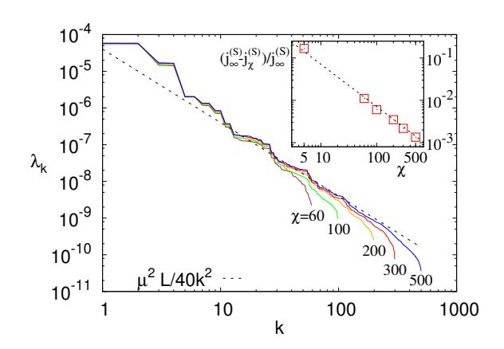

FIG. 13 (Color online) Schmidt spectrum for the NESS of a boundary driven spin-1/2 Heisenberg chain with  $\Delta=1$  and L=64 sites,  $\mu=0.005,$  and MPO bond dimensions  $\chi=60-500.$  The dashed line is the best-fitting asymptotic decay. Inset: Convergence of the NESS current  $j_\chi$  obtained from a fixed- $\chi$  calculation, with the dashed line being the predicted error from the main plot  $\frac{j_\infty-j_\chi}{j_\infty}\approx\frac{L}{90\chi}$  (no fitting parameters).

the main plot of Fig. 13. Since for small  $\mu$ , one has  $\rho_{\infty} \sim \mathbb{1} + \mathcal{O}(\mu)$ , the largest eigenvalue is trivially  $\lambda_0 \approx 1$ . For relative precision, what matters is the ratio of the discarded weight and the first non-trivial eigenvalue  $\lambda_1$ , which is  $\lambda_1 \approx 2.3 \mu^2$  for the data shown. The relative error of the NESS calculated using a finite  $\chi$  can therefore be estimated as  $\approx \frac{L}{90\chi} \left(\frac{1}{90} \approx \frac{1}{2.3\cdot 40}\right)$ . Even though the error of a particular observable, such as the current, could involve some extra factors due to overlaps of Schmidt eigenvectors with the observable, we see in the inset of Fig. 13 that the agreement of the error estimate based only on the Schmidt spectrum with the actual error of the NESS current without any additional fitting parameters is very good.22 For the boundary-driven Heisenberg chain, one therefore has to increase the bond dimension as  $\chi \propto L^{\frac{r}{p-1}} \sim L$  if one wants to keep the error constant. For instance,  $\chi \sim 100$  results in a relative error of about 1\% at L=100. If a slightly larger error of a few percent suffices, and one uses larger  $\chi$ , even systems with close to  $L = 10^3$  sites can be simulated. Such simulations, though, take weeks of CPU time.

The other important parameter is the relaxation time required to converge to the NESS. For the spin-1/2 Heisenberg model, it scales as  $\sim L^3$  (Žnidarič, 2015), and therefore, the complexity of finding the NESS with a fixed precision ( $\chi \sim L$ ) scales as  $L^3 \cdot L \cdot \chi^3 \sim L^7$ . However, in the spin-1/2 Heisenberg chain, it turns out that the spin current actually relaxes on a shorter time-scale

 $\sim L^{1.5}$  (Žnidarič, 2011) and therefore, a fixed-precision NESS current can be obtained in  $\mathcal{O}(L^{5.5})$  steps.

We note that if the Schmidt spectrum  $\lambda_k$  decays slower than  $1/k^2$  (which often happens) the required bond-dimension scaling will be worse, see, e.g., (Prosen and Žnidarič, 2009) for some examples. Nevertheless, at infinite (or sufficiently high) temperature, when the NESS is close to 1 (which is a product operator), the method typically works well since high temperatures are expected to decrease entanglement, especially compared to unitary evolution for which the complexity of  $\rho(t)$  will typically grow exponentially with time, regardless of whether dynamics is chaotic or integrable (Prosen and Žnidarič, 2007). For very slow transport (e.g., strongly subdiffusive dynamics), a long convergence time to the steady state can become a problem, rendering a boundary-driven Lindblad setting less suitable.

The single-site driving described above can be generalized to many sites. That is, one can choose Lindblad operators such that in the absence of H, the steady state on those sites is a thermal state (or any other  $\rho$ ) (Prosen and Žnidarič, 2009; Žnidarič et al., 2010). Such many-site driving is, for instance, required in order to have an efficient coupling to the energy density (being at least a 2-site operator) and therefore, is used to study energy transport (Mendoza-Arenas et al., 2015; Palmero et al., 2019; Prosen and Žnidarič, 2009; Žnidarič, 2011). An exception are weakly-coupled systems (Michel et al., 2003, 2008; Steinigeweg et al., 2009a), for which energy transport is essentially the same as spin transport.

A comparison of Lindblad and other master equations, such as the Redfield one, can be found in, e.g., (Prosen and Zunkovic, 2010; Purkayastha *et al.*, 2016; Wichterich *et al.*, 2007; Xu *et al.*, 2019), and with the Landauer-Büttiker formalism in (Jin *et al.*, 2020).

# VI. TRANSPORT IN THE SPIN-1/2 XXZ CHAIN

Recently, significant progress has been made in the computation of finite-temperature linear-response transport properties of one of the seemingly simplest interacting one-dimensional lattice models, the spin-1/2 XXZ chain.

In this section, we give an overview of the current understanding, more than accounting for its historical development. We are presenting the results in the following order and discuss the relation between them: (i) exact statements, (ii) analytical results involving assumptions, (iii) results from numerical methods. We first discuss results for  $\kappa(\omega)$  and  $\sigma(\omega)$  in the linear-response regime in Secs. VI.B – VI.D and then cover insights from numerical open-quantum system simulations in Sec. VI.E.

In the evolution of the field, (Zotos *et al.*, 1997) plays a seminal role, as it established the first exact lower bounds to the energy and spin Drude weight of the spin-

&lt;sup>22 The current  $j_{\infty}^{(S)} = j_{\chi \to \infty}^{(S)}$  has been estimated using linear extrapolation in  $1/\chi$ .

1/2 XXZ chain. Numerous early exact-diagonalization studies laid out the foundations for much of the future research (see, e.g., (Fabricius and McCoy, 1998; Naef and Zotos, 1998; Narozhny et al., 1998; Zotos and Prelovšek, 1996)). A next milestone is the work by Klümper and Sakai (Klümper and Sakai, 2002; Sakai and Klümper, 2003) who computed the full temperature dependence of the energy Drude weight in the whole parameter range of the model from the quantum transfer-matrix method at zero magnetization. Finite-temperature Bethe-ansatz calculations of the spin Drude weight were carried out in (Benz et al., 2005; Zotos, 1999) using different assumptions (see the discussion in Sec. III.B.3). The significance of the work by Prosen and collaborators (Prosen, 2011b; Prosen and Ilievski, 2013) in proving the existence of nonzero finite-temperature Drude weights at vanishing magnetization was highlighted in Sec. III.A. GHD has very recently emerged as a quite complete theoretical framework for the description of transport in integrable lattice models (Bertini et al., 2016; Castro-Alvaredo et al., 2016) and is thus frequently referred to in the next sections. From the field-theory side, the work by Sirker et al. (Sirker et al., 2009, 2011) played a particularly inspiring role as it established the generic expectation for a gapless model after accounting for umklapp scattering. This can be considered the currently most advanced effective theory for the low-temperature transport of nonintegrable models (Sirker, 2020). For the integrable spin-1/2 XXZ chain, the theory predicts a diffusive form of spin autocorrelations at low T (Karrasch et al., 2015b). For a recent review on transport in this model from the field-theory and Bethe-ansatz perspectives, see (Sirker, 2020).

Many results from numerical methods such as ED, tDMRG, and dynamical typicality were covered in Sec. IV and will be mentioned in the context of the spin-1/2 XXZ chain in this section.

In the context of transport in the spin-1/2 XXZ chain and related models, open quantum systems were studied already in (Michel et al., 2003, 2008; Saito, 2003; Saito et al., 1996), yet acquired a much larger weight and higher reception after the first studies using tDMRG as the solver of the underlying Lindblad equations (Prosen and Žnidarič, 2009; Žnidarič, 2011). Notably, numerical tDMRG solutions of Lindblad equations for transport through spin-1/2 XXZ chains were first in making predictions for superdiffusion in the spin-1/2 Heisenberg chain and provided strong support for diffusive dynamics in the regime of  $\Delta > 1$  (Žnidarič, 2011).

## A. The model

The Hamiltonian governing the spin-1/2 XXZ chain is given in Eq. (1). For our choice of units  $(J>0), \ \Delta>0$  and  $\Delta<0$  correspond to the antiferromagnetic and

ferromagnetic regimes, respectively. By using a Jordan-Wigner transformation (Giamarchi, 2004),

$$s_r^+ = c_r^{\dagger} e^{i\pi \sum_{k=-\infty}^{r-1} n_k}, \ s_r^{\mathbf{z}} = n_r - \frac{1}{2},$$
 (162)

the spin-1/2 XXZ chain can be mapped to a system of spinless lattice fermions  $c_r^{(\dagger)}$ :

$$h_{r,r+1} = \frac{J}{2} c_r^{\dagger} c_{r+1} + \text{h.c.} + J\Delta \left( n_r - \frac{1}{2} \right) \left( n_{r+1} - \frac{1}{2} \right).$$
(163)

The limit  $\Delta=0$  corresponds to free fermions and can thus be solved analytically by a simple Fourier transform from real to (quasi)momentum space.

In this section, we will focus mainly on  $m_z=2\langle s_r^z\rangle=0,^{23}$  which corresponds to zero magnetization (half filling) in the spin (fermion) language. The system is then gapless for  $|\Delta|\leq 1$  and at low energies falls within the Tomonaga-Luttinger-liquid universality class (Giamarchi, 2004). A gap opens for  $|\Delta|>1$ . There, the ground state is two-fold degenerate and exhibits staggered spin order in the antiferromagnetic regime  $\Delta>1$ , while in the ferromagnetic case  $\Delta<-1$ , the system exhibits phase separation. For finite  $0<|m_z|<1$ , the system is a gapless Tomonaga-Luttinger liquid at any  $\Delta$ .

## B. Thermal transport

The energy-current operator, which is given in Eq. (5), is exactly conserved for systems with periodic boundary conditions,  $[H, \mathcal{J}^{(\mathrm{E})}] = 0$  (Huber and Semura, 1969; Niemeijer and van Vianen, 1971; Zotos *et al.*, 1997). Thus, the zero-frequency thermal conductivity is divergent at all temperatures and as a consequence, the Drude weight is nonzero,

$$\mathcal{D}_{w}^{(E)}(T>0) > 0, \quad \kappa_{reg} = 0.$$
 (164)

At  $\Delta=0$ , the XXZ chain maps to free fermions via Eq. (163) and  $\mathcal{D}_{\rm w}^{(\rm E)}$  can be obtained analytically for any T>0:

$$\mathcal{D}_{\mathbf{w}}^{(\mathbf{E})} = \frac{1}{4\pi T^2} \int_{-\pi}^{\pi} \left[ \epsilon_k v_k f(\epsilon_k) \right]^2 e^{\epsilon_k/T} dk \,, \tag{165}$$

where  $\epsilon_k = J\cos(k)$  denotes the single-particle dispersion,  $v_k = \partial_k \epsilon_k$ , and  $f(\epsilon) = 1/(1 + e^{\epsilon/T})$ .

The energy Drude weight of the XXZ chain has been calculated analytically for  $\Delta \neq 0$  and arbitrary temperatures by exploiting the integrability of the system (Klümper and Sakai, 2002; Sakai and Klümper,

&lt;sup>23 We assume translational invariance

2003). Since  $\mathcal{J}^{(E)}$  is a conserved quantity,  $\mathcal{D}_w^{(E)} \sim \langle (\mathcal{J}^{(E)})^2 \rangle$ . This (time-independent) expectation value can be computed from a modified partition function  $\rho \propto \operatorname{tr}[e^{-\beta H + \lambda \mathcal{J}^{(E)}}]$  which serves as a generating functional and which can be determined within a quantum transfer-matrix formalism. One ultimately obtains an expression for  $\mathcal{D}_w^{(E)}$  in terms of a set of nonlinear integral equations. For high and low temperatures, these equations were solved analytically, and the result in the gapless phase  $|\Delta| \leq 1$  reads

$$\mathcal{D}_{w}^{(E)} = \begin{cases} \frac{\pi}{6} vT & T \to 0\\ \frac{1}{128\pi} \left[ 3 + \frac{\sin(3\eta)}{\sin(\eta)} \right] \frac{J^{4}}{T^{2}} & T \to \infty \,, \end{cases}$$
(166)

with v defined in Eq. (126), and  $\Delta = \cos(\eta)$ . The low-T limit agrees with the expression (128) obtained using bosonization (Heidrich-Meisner et~al., 2002). In the gapped regime, one finds  $\mathcal{D}_{\rm w}^{(\rm E)} \sim 1/T^2$  at high T as well as  $\mathcal{D}_{\rm w}^{(\rm E)} \sim e^{-\delta/T}/\sqrt{T}$  at low T, where  $\delta$  is the one-spinon gap in the antiferromagnetic regime  $\Delta > 1$  and the one-magnon gap in the ferromagnetic regime  $\Delta < -1$ . For arbitrary T, the set of nonlinear integral equations can be solved numerically. Results for  $0 \leq \Delta \leq 1$  as well as for  $|\Delta| > 1$  were presented in (Klümper and Sakai, 2002) and in (Sakai and Klümper, 2003), respectively. The temperature dependence of  $\mathcal{D}_{\rm w}^{(\rm E)}$  is shown in Fig. 5 for three values of  $\Delta$ .

It was subsequently shown that for  $|\Delta| < 1$ , the energy Drude weight can also be computed using the thermodynamic Bethe ansatz (Zotos, 2017). On the numerical side,  $\mathcal{D}_{\rm w}^{(\rm E)}$  was calculated via an exact diagonalization of small systems (Alvarez and Gros, 2002a; Heidrich-Meisner et al., 2002). At sufficiently high temperatures, the ED results are in agreement with the exact ones (obtained in the thermodynamic limit).

The energy Drude weight away from zero magnetization was obtained exactly using the quantum-transfer matrix approach (Sakai and Klümper, 2005), TBA (Zotos, 2017) as well as via exact diagonalization (Heidrich-Meisner et al., 2005a; Louis and Gros, 2003) and quantum Monte Carlo simulations (Louis and Gros, 2003). Magnetothermal corrections to the energy Drude weight due to the coupling of the energy to the spin current were addressed in (Heidrich-Meisner et al., 2005a; Louis and Gros, 2003; Psaroudaki and Zotos, 2016; Sakai and Klümper, 2005; Zotos, 2017).

For a discussion of the energy Drude weight in other integrable spin chains, see, e.g., (Ribeiro et al., 2010).

#### C. Spin transport: Drude weight

For the spin Drude weight, the following picture has been established at zero magnetization.  $\mathcal{D}_{w}^{(S)}$  is known

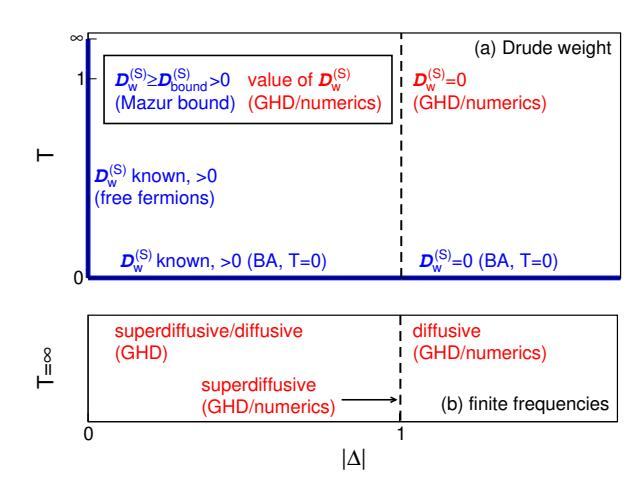

FIG. 14 (Color online) (a) Overview of all known exact results (free fermions, Bethe ansatz (BA) at T=0, and Mazur bounds) as well as predictions obtained using GHD and numerics for the spin Drude weight of the spin-1/2 XXZ chain at zero magnetization. (b) Overview of the high-temperature results for the leading contribution at low but finite frequencies. In the regime  $\Delta < 1$ , this low-frequency contribution is either superdiffusive or diffusive.

exactly in the limit T=0 via the Bethe ansatz (Shastry and Sutherland, 1990) as well as in the limit  $\Delta = 0$ at any T via a mapping to free fermions. At T = 0,  $\mathcal{D}_{\rm w}^{\rm (S)} > 0$  for  $|\Delta| < 1$  and  $\mathcal{D}_{\rm w}^{\rm (S)} = 0$  otherwise. Using the Mazur inequality, one can prove for a dense set of commensurate anisotropies covering the range  $|\Delta| < 1$ that  $\mathcal{D}_{\mathbf{w}}^{(S)}$  is nonzero for any temperature T > 0 (Prosen, 2011b; Prosen and Ilievski, 2013). These are the only exact statements available at  $m_z = 0$ ; they are complemented by various analytical and numerical results. The spin Drude weight can be computed using GHD at T>0 for any  $\Delta$  (Bulchandani et al., 2018; Ilievski and De Nardis, 2017b). For  $|\Delta| < 1$ , the GHD prediction coincides with the lower Mazur bound at infinite temperature (Prosen and Ilievski, 2013) as well as with the result obtained using the thermodynamic Bethe ansatz (Zotos, 1999) at any T > 0 (Urichuk *et al.*, 2019). At  $|\Delta| > 1$ , GHD predicts that the Drude weight vanishes. In addition to these analytical statements, numerical data for the Drude weight is provided by ED, tDMRG, and dynamical typicality [see Sec. VI.C.4].

Away from zero magnetization  $(m_z \neq 0)$ , the Drude weight is finite for any value of T and  $\Delta$ . This follows from the exact Bethe-ansatz calculation at T=0 (Shastry and Sutherland, 1990) as well as from the exact lower Mazur bound (Zotos  $et\ al.$ , 1997), respectively. The Drude weight was also computed numerically (Heidrich-Meisner  $et\ al.$ , 2005a).

We will now discuss the above results in more detail (see also Fig. 14 for a summary).

## 1. Free fermions, Bethe ansatz at $T=0\,$

At  $\Delta=0$ , the spin Drude weight  $\mathcal{D}_{w}^{(S)}$  can be obtained analytically for any  $T\geq 0$  by using the mapping to free fermions. The result is given by (Giamarchi, 2004):

$$\mathcal{D}_{\mathbf{w}}^{(S)} = \frac{1}{4\pi T} \int_{-\pi}^{\pi} \left[ v_k f(\epsilon_k) \right]^2 e^{\epsilon_k/T} dk.$$
 (167)

In the zero-temperature limit, the spin Drude weight can be computed exactly for any  $\Delta$  by evaluating Kohn's formula (26) (Kohn, 1964) via the Bethe ansatz (Shastry and Sutherland, 1990). The result for  $|\Delta| \leq 1$  reads

$$\mathcal{D}_{\mathbf{w}}^{(\mathbf{S})} = \frac{Kv}{2\pi} \,, \tag{168}$$

with K and v given in Eq. (126) for  $m_z=0$ . This agrees with the expression (128) obtained using bosonization. For  $|\Delta| > 1$ , the Drude weight vanishes. Note that Eq. (168) does not approach zero for  $\Delta \nearrow 1$ , and  $\mathcal{D}_{\rm w}^{\rm (S)}$  thus shows a discontinuity at  $\Delta=1$  for T=0.

#### 2. Mazur bounds

Away from zero magnetization (i.e., for  $m_z \neq 0$ ), the spin Drude weight is finite for any value of T and  $\Delta$ . This can be shown by evaluating the Mazur inequality (28) with the energy-current operator as a single conserved local charge  $Q_2 = \mathcal{J}^{(E)}$  that has a nonzero overlap with  $\mathcal{J}^{(S)}$  in the thermodynamic limit. At high T, the bound can be evaluated analytically (Zotos et al., 1997):

$$\mathcal{D}_{\mathbf{w}}^{(S)} \ge \frac{J^2}{T} \frac{\Delta^2 m_z^2}{4} \frac{(1 - m_z^2)}{1 + \Delta^2 (2 + 2m_z^2)} > 0, \qquad (169)$$

which is valid for any value of  $\Delta$ . In the gapless phase at low T and close to  $m_z = 0$ , one can add a Zeeman term  $b \sum_r s_r^z$  to the Hamiltonian (b is the magnetic field) and then use bosonization to obtain (Sirker  $et\ al.$ , 2011)

$$\mathcal{D}_{\mathbf{w}}^{(S)} \ge \frac{Kv}{2\pi} \frac{1}{1 + \frac{\pi^2}{3K} \left(\frac{T}{b}\right)^2} > 0.$$
 (170)

Directly at zero magnetization, the energy-current operator has a vanishing overlap with the spin-current operator and thus does not yield a nonzero contribution to the Mazur inequality (28). This follows from symmetry arguments and can also be seen by setting  $m_z = 0$  in Eq. (169):  $Q_2$  is even under the transformation  $s_r^z \to -s_r^z$ ,  $s_r^\pm \to s_r^\mp$  while  $\mathcal{J}^{(\mathrm{S})}$  is odd, and hence  $\langle Q_2 \mathcal{J}^{(\mathrm{S})} \rangle = 0$ . The same holds true for all other strictly local conserved quantities associated with the integrability of the system. Note that the vanishing of  $\langle Q_2 \mathcal{J}^{(\mathrm{S})} \rangle$  also implies the absence of a magnetothermal correction in the zero-magnetization sector (Louis and Gros, 2003), while this term generally contributes at finite magnetizations.

As discussed in Sec. III.A in detail, an exact lower bound can be derived for zero magnetization as well by using quasilocal conserved charges that do have a nonzero overlap with the spin-current operator (Prosen, 2011b; Prosen and Ilievski, 2013). This bound is given in Eq. (78) and is visualized in Fig. 4 (see also Fig. 15 below); it generally features a fractal dependence on  $\Delta$ . An important question concerns the completeness of this set of charges: a numerical study of finite systems suggests that there are no additional charges beyond the known ones (Mierzejewski et al., 2015).

## 3. Bethe ansatz at T>0, GHD

An exact Bethe-ansatz calculation at finite T using Kohn's formula is hindered by the fact that excited states can only be treated approximately. In (Zotos, 1999), the calculation has been carried out by means of the thermodynamic Bethe ansatz, which, as discussed in Sec. III.B.2, involves the string hypothesis for bound states of magnons. An alternative calculation based on a spinon-antispinon basis was presented in (Benz et al., 2005). The thermodynamic Bethe-ansatz approach predicts that  $\mathcal{D}_{\rm w}^{\rm (S)}(T)$  is finite in the gapless phase and decreases monotonically with T except at the isotropic point  $\Delta=1$  where  $\mathcal{D}_{\rm w}^{\rm (S)}(T>0)=0$ . At low T, one obtains a nontrivial power-law dependence for commensurate values of  $\Delta=\cos(\pi/m), m=1,2,\ldots$ :

$$\mathcal{D}_{\mathbf{w}}^{(\mathbf{S})}(T) = \mathcal{D}_{\mathbf{w}}^{(\mathbf{S})}(T=0) - \text{const.} \times T^{\alpha} \quad \alpha = \frac{2}{m-1}.$$
(171

For  $\Delta=1$ , a second Bethe-ansatz-based calculation (Carmelo *et al.*, 2015) concludes in favor of  $\mathcal{D}_{w}^{(S)}=0$ , in agreement with GHD (Ilievski *et al.*, 2018).

One can show that for commensurate values of  $\Delta = \cos(\ell\pi/m)$  ( $\ell$ , m coprime), the TBA result of (Zotos, 1999) coincides with the GHD prediction (Bulchandani et al., 2018; Ilievski and De Nardis, 2017b) at any temperature (Urichuk et al., 2019). Moreover, it also coincides with the exact lower bound of (Prosen and Ilievski, 2013) at infinite temperature, which is given in Eq. (78) and shown in Fig. 4. In a nutshell,

$$\frac{\mathcal{D}_{\mathbf{w}}^{(S)}|_{\text{TBA}}}{\beta} = \frac{\mathcal{D}_{\mathbf{w}}^{(S)}|_{\text{GHD}}}{\beta} \stackrel{T \to \infty}{=} \tilde{\mathcal{D}}_{\mathbf{w}}^{(S)}|_{\text{bound}}.$$
 (172)

For  $\Delta>1$ , both GHD and a TBA-based analytical calculation (Peres *et al.*, 1999) suggest that the Drude weight vanishes in this regime.

#### 4. Numerical approaches

A variety of numerical methods has been used to compute the spin Drude weight  $\mathcal{D}_w^{(S)}$  in the thermodynamic

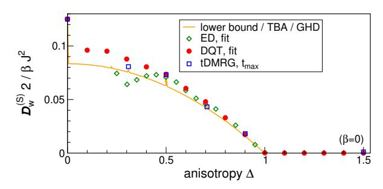

FIG. 15 (Color online) Comparison of different results for the spin Drude weight  $\mathcal{D}_{\rm w}^{({\rm S})}$  in the high-temperature limit  $\beta=0$  at zero magnetization: the lower bound (Prosen and Ilievski, 2013), which is given by Eq. (78) and which at infinite temperature coincides with the TBA result (Pavlis and Zotos, 2020; Urichuk et al., 2019; Zotos, 1999) and the GHD prediction (Bulchandani et al., 2018; Ilievski and De Nardis, 2017a). Moreover, we show ED (Herbrych et al., 2011), DQT (Steinigeweg et al., 2014a, 2015), and tDMRG data (Karrasch et al., 2015a, 2014a). For the latter, the Drude weight is taken as the value of  $\langle \mathcal{J}^{({\rm S})}(t)\mathcal{J}^{({\rm S})}\rangle/L$  at the largest accessible time without any further extrapolation. Note that while the lower bound was only computed for commensurate  $\Delta=\cos(\ell\pi/m)$ , numerical data are also shown away from these points.

limit, such as (i) exact diagonalization, which is limited to small systems  $L \leq 20$  (Heidrich-Meisner et~al., 2003; Herbrych et~al., 2011; Karrasch et~al., 2013b; Narozhny et~al., 1998; Rabson et~al., 2004; Sánchez and Varma, 2017; Zotos and Prelovšek, 1996), (ii) the microcanonical Lanczos method, which is also limited to small  $L \leq 28$  (Long et~al., 2003) (iii) quantum Monte Carlo, which requires an analytical continuation to extract  $\mathcal{D}_{\rm w}^{\rm (S)}$  (Alvarez and Gros, 2002c; Heidarian and Sorella, 2007), (iv) the time-dependent DMRG, where the accessible time scales are bounded by the entanglement growth (Karrasch, 2017a; Karrasch et~al., 2012, 2013b, 2015a, 2014a), and (v) dynamical typicality (Steinigeweg et~al., 2014a, 2015), which is also limited in terms of the system size  $L \leq 36$ .

Figure 15 shows a comparison of tDMRG (Karrasch, 2017a; Karrasch et al., 2012, 2013b, 2015a, 2014a), exact diagonalization (Herbrych et al., 2011; Karrasch et al., 2013b), and dynamical typicality data (Steinigeweg et al., 2014a, 2015) with the lower bound (Prosen and Ilievski, 2013) at infinite temperature. Note that the numerical results are also shown away from commensurate  $\Delta$ . At certain commensurate points such as  $\Delta = 1/2$ , the numerical results and the bound agree very well. For generic values at  $\Delta > 1/2$ , all methods result in larger values than the bound. For  $0 < \Delta < 1/2$  and in particular close to  $\Delta = 0$ , the diagreement is evident and has not been resolved yet (see Secs. IV.B, IV.C, and IV.E for a discussion of the strengths and limitations of the numerical approaches and Sec. VI.E for a discussion of open questions concerning the spin-1/2 XXZ chain).

For  $\Delta>1$ , there are no exact results available for T>0 at zero magnetization. Both GHD and a TBA-based analytical calculation (Peres et~al., 1999) suggest that the Drude weight vanishes in the regime. Numerical studies also point in this direction (Heidrich-Meisner et~al., 2003; Karrasch et~al., 2012; Steinigeweg et~al., 2014a; Zotos and Prelovšek, 1996). In particular, one observes a clean scaling of the Drude weight as  $\mathcal{D}_{\rm w}^{\rm (S)} \propto 1/L$  in systems of finite size. As an example, Fig. 7 shows the scaling found in (Steinigeweg et~al., 2014a, 2015).

At  $\Delta=1$ , exact-diagonalization results indicate a vanishing (Herbrych et~al., 2011) or at best very small Drude weight (Heidrich-Meisner et~al., 2003), with the actual numbers depending on details of the finite-size extrapolation (Karrasch et~al., 2013b; Sánchez and Varma, 2017) [see Sec. IV.B]. Both dynamical typicality (Steinigeweg et~al., 2014a, 2015) and tDMRG (Karrasch et~al., 2012; Kennes and Karrasch, 2016; Sirker et~al., 2009) yield a current correlation function  $\langle \mathcal{J}^{(\mathrm{S})}(t)\mathcal{J}^{(\mathrm{S})}\rangle$  which decays slowly. The DQT data was interpreted in terms of a zero (finite) Drude weight at infinite (finite) temperature; the tDMRG results were interpreted in terms of a finite Drude weight.

The previous discussion focused on infinite temperature, yet the temperature dependence of the Drude weight is also of interest (Alvarez and Gros, 2002c; Benz et al., 2005; Fujimoto and Kawakami, 2003; Heidrich-Meisner et al., 2003; Karrasch et al., 2013b; Zotos, 1999). The verification of the TBA result for the low-T behavior (171) in a numerical calculation has not been accomplished yet (Alvarez and Gros, 2002c; Karrasch et al., 2013b).

# D. Spin transport: Finite frequencies

We recall that it is now established exactly that at zero magnetization, the Drude weight  $\mathcal{D}_{\mathbf{w}}^{(S)}$  is finite for  $\Delta < 1$  at any temperature  $T \geq 0$ . For the regime  $\Delta > 1$ , the current understanding is that  $\mathcal{D}_{\mathbf{w}}^{(S)}$  vanishes. In recent years, there has been substantial progress in understanding the spin transport in the XXZ chain beyond the mere existence of the spin Drude weight. In this section, we summarize results for the regular part of the spin conductivity in the three different regimes  $\Delta > 1$ ,  $\Delta < 1$ , and  $\Delta = 1$ . We focus exclusively on zero magnetization.

As outlined in Sec. II.B, one can envision three different scenarios for the low-frequency behavior: The spin conductivity is (a) diffusive,  $\sigma_{\rm reg}(\omega \to 0) = \sigma_{\rm dc} > 0$ , (b) superdiffusive,  $\sigma_{\rm reg}(\omega) \sim \omega^{\alpha}$  with  $\alpha < 0$ , or (c) subdiffusive,  $\sigma_{\rm reg}(\omega) \sim \omega^{\alpha}$  with  $\alpha > 0$ . This is illustrated in Fig. 1.

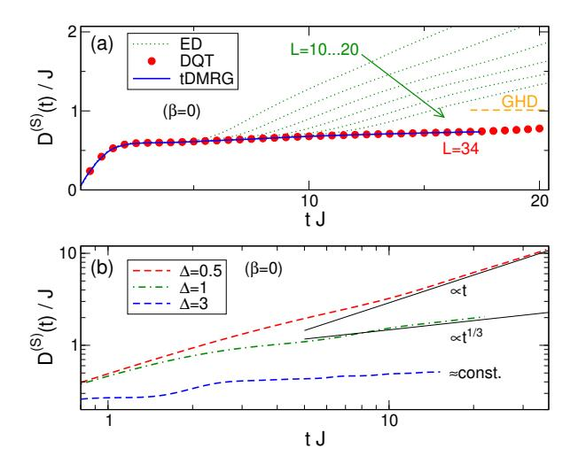

FIG. 16 (Color online) (a) Comparison of different results for the time-dependent diffusion constant D (S)(t) of the spin-1/2 XXZ chain at ∆ = 1.5 in the infinite-temperature limit β = 0: ED [\(Steinigeweg and Gemmer, 2009\)](#page-75-11), DQT [\(Steinigeweg](#page-75-13) [et al.](#page-75-13), [2015\)](#page-75-13), and tDMRG [\(Karrasch](#page-71-11) et al., [2014b\)](#page-71-11). (b) tDMRG data for D (S)(t) at various ∆ (obtained from integrating the current autocorrelation function published in [\(Karrasch](#page-71-45) et al., [2015a,](#page-71-45) [2014a\)](#page-71-16)).

# 1. ∆ > 1

A lower bound for the diffusion constant, which is related to the DC conductivity via Eq. [\(24\)](#page-10-4), was established in [\(Ilievski](#page-71-30) et al., [2018;](#page-71-30) [Medenjak](#page-72-25) et al., [2017\)](#page-72-25) (see Sec. [III.A.2\)](#page-16-1). The diffusion constant is expressed in terms of the magnetization-dependence (i.e., curvature) of the Drude weight, which can be bounded from below using conserved charges. It was shown that the bound is finite for ∆ > 1, which rules out a subdiffusive form of σreg(ω) in this regime [\(Ilievski](#page-71-30) et al., [2018;](#page-71-30) [Medenjak](#page-72-25) et al., [2017\)](#page-72-25). This is an exact result.

One can define a time-dependent diffusion constant D(S)(t), D(S)(t → ∞) = D(S), using the generalized Einstein relation [\(37\)](#page-12-1) via a time integral of the current autocorrelation function [\(Bohm and Leschke, 1992;](#page-67-14) [Steinigeweg and Gemmer, 2009;](#page-75-11) Yan [et al.](#page-76-22), [2015\)](#page-76-22). This quantity was evaluated using GHD at infinite temperature and arbitrary ∆ [\(De Nardis](#page-68-27) et al., [2019a;](#page-68-27) [Gopalakr](#page-70-13)[ishnan and Vasseur, 2019\)](#page-70-13). In the limit of large ∆, the result takes the form

$$\lim_{\Delta \to \infty} \lim_{t \to \infty} D^{(S)}(t) = \lim_{\Delta \to \infty} D^{(S)} \approx 0.42 J, \qquad (173)$$

which is consistent with the non-vanishing lower bound for the diffusion constant from [\(Ilievski](#page-71-30) et al., [2018\)](#page-71-30) and moreover predicts that transport is diffusive and not superdiffusive. Within GHD, the finite-time corrections have the form D(S)(t) = a + b/√ t.

The time-dependent diffusion constant has also been calculated numerically via ED and DQT [\(Steinigeweg](#page-75-11)

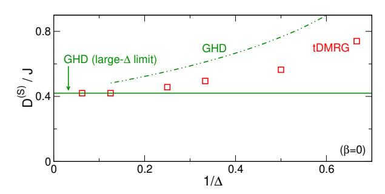

FIG. 17 (Color online) Diffusion constant of the spin-1/2 XXZ chain at infinite temperature as a function of 1/∆ for ∆ > 1. tDMRG results [\(Karrasch](#page-71-11) et al., [2014b\)](#page-71-11) are compared to the GHD prediction for ∆ → ∞, cf. Eq. [\(173\)](#page-46-1), and ∆ < ∞ [\(De Nardis](#page-68-27) et al., [2019a\)](#page-68-27). The tDMRG results close to ∆ = 1 only give a lower bound to the true diffusion constant.

[and Gemmer, 2009;](#page-75-11) [Steinigeweg](#page-75-13) et al., [2015\)](#page-75-13) as well as using tDMRG [\(Karrasch](#page-71-11) et al., [2014b\)](#page-71-11). We show D(S)(t) at infinite temperature for ∆ = 1.5 and ∆ = 3 in Fig. [16\(](#page-46-2)a) and (b), respectively (the curves with ∆ = 0.5, 1 will be discussed below). The system size can be chosen large enough, both within DQT and tDMRG, such that the results are effectively in the thermodynamic limit at the largest time depicted in the figure, which is illustrated explicitly in the case of DQT. This data was interpreted in terms of a finite diffusion constant D(S) = D(S)(t → ∞) and thus regular diffusive transport. In Fig. [17,](#page-46-3) we show a comparison between the GHD prediction for large ∆ and the value of D(S) extracted from the tDMRG data [\(Karrasch](#page-71-11) et al., [2014b\)](#page-71-11); both results agree in the limit ∆ → ∞. The tDMRG results close to ∆ = 1 only give a lower bound to the true diffusion constant.

The time-dependent diffusion constant was also studied via perturbation theory in powers of ∆ under the assumption that the current autocorrelation function decays monotonically in time to zero [\(Steinigeweg, 2011;](#page-75-44) [Steinigeweg and Schnalle, 2010\)](#page-75-45). A good agreement with numerics was found at short and intermediate time scales, where this assumption is well satisfied.

The full frequency-dependent conductivity σreg(ω) was investigated for ∆ > 1 using ED and MCLM [\(Prelovˇsek](#page-74-10) [et al.](#page-74-10), [2004\)](#page-74-10). As illustrated in Fig. [18,](#page-47-1) for system sizes accessible to those methods, σreg(ω) typically has an anomalous form, with strongly reduced spectral weight at small ω in the vicinity of the finite-size spin Drude weight D (S) w and a pronounced shoulder at larger ω. As argued in [\(Prelovˇsek](#page-74-10) et al., [2004\)](#page-74-10), however, the position of this shoulder moves with increasing system size to smaller ω as 1/L, and might eventually take on a simple form with a well-behaved low-frequency part and a finite dc conductivity in the thermodynamic limit. Whether this anomalous form is indeed a spurious effect of small systems or whether it persists for large systems is still an open problem (see the discussion in Sec. [IV.B\)](#page-28-1). Yet, it

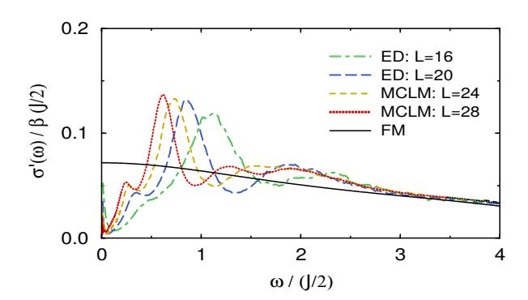

FIG. 18 (Color online) Real part of the optical conductivity  $\sigma(\omega)$  of the spin-1/2 XXZ chain, as obtained in (Prelovšek et al., 2004) from ED and MCLM for  $\Delta=2$  and infinite temperature  $\beta=0$ . The anomalous scaling with system size is still consistent with a well-behaved low-frequency part and a finite dc conductivity in the thermodynamic limit.

is clear that the degree of anomalous behavior substantially depends on the frequency scale or, equivalently, the time scale considered (Jin *et al.*, 2015; Steinigeweg *et al.*, 2016a).

The full frequency-dependent conductivity  $\sigma_{\rm reg}(\omega)$  was also calculated for  $\Delta>1$  via a Fourier transform of finite-time tDMRG data (Karrasch *et al.*, 2014a). It shows a regular diffusive peak at small frequencies as well as contributions for frequencies above the spectral gap.

In addition to the numerous works on current-current correlations, a significant body of works studied density-density correlations as well, either in momentum or real space (Fabricius et al., 1997; Fabricius and McCoy, 1998; Huber and Semura, 1969; Narozhny et al., 1998). This allows one to also study the momentum dependence of the diffusion coefficient. In the context of diffusion, a result from exact and Lanczos diagonalization (Steinigeweg and Brenig, 2011; Steinigeweg et al., 2012) is that the time-dependent susceptibility  $\chi_q(t)$  defined in Eq. (57) decays at small  $\beta$  according to

$$\frac{\mathrm{d}\chi_q(t)}{\mathrm{d}t} = -\tilde{q}^2 D_q^{(\mathrm{S})}(t) \,\chi_q(t) \,. \tag{174}$$

Here, the decay rate  $D_q^{(\mathrm{S})}(t)$  becomes independent of q for small momenta q>0 in a finite lattice and coincides with the time-dependent diffusion coefficient  $D^{(\mathrm{S})}(t)$  in the Einstein relation (37). The number of diffusive momenta was shown to decrease with decreasing temperature, while the diffusion constant increases, as long as temperature is large compared to the gap.

# 2. $\Delta < 1$

The Drude weight has been shown to be finite for any commensurate value of  $\Delta < 1$  with  $\Delta = \cos(\ell \pi/m)$  and is thus conjectured to be finite everywhere. An exact lower

bound for the diffusion constant was also obtained in this regime (Ilievski et al., 2018). It was shown analytically that the bound is finite for commensurate  $\Delta = \cos(\pi/m)$ , which rules out a subdiffusive form of  $\sigma_{\rm reg}(\omega)$  for these parameters. For incommensurate values of  $\Delta$  (i.e., almost everywhere), the lower bound diverges, and transport cannot be diffusive but must be faster than diffusive. Combined with the expectation that the frequencyintegrated conductivity should be continuous everywhere due to sum rules, this hints at the possibility of superdiffusive corrections away from the commensurate points. This conjecture was put onto firmer grounds in (Agrawal et al., 2020). Let us consider a value  $\Delta = \cos(\pi \lambda_{\infty})$ where  $\lambda_{\infty}$  is a generic irrational number. The reasoning uses that  $\lambda_{\infty}$  can be approximated by a series of rational values  $\lambda_m = \ell/m$  with growing denominators m. Using fairly general arguments, one can show that the dc conductivity at infinite temperature can be approximated

$$\sigma_{\rm dc}(\lambda_m) \sim m^{2\alpha/(1-\alpha)}$$
. (175)

Equation (175) describes a subleading correction that, as a function of time, is greater than 1/t and hence diverges logarithmically.

GHD allows one to obtain the exponents associated with the superdiffusive correction (Agrawal et al., 2020): The low-frequency conductivity behaves as  $\sigma(\omega) \propto \omega^{-\alpha}$  with  $\alpha = 1/2$  for generic values of  $\Delta$ . This divergence is cut-off at the rational points, leading to a diffusive correction. Furthermore, a qualitative picture emerges from GHD: the subleading correction arises from scattering of charged quasiparticles off neutral quasiparticles and an interpretation in terms of a Lévy flight has been put forward (Agrawal et al., 2020; Gopalakrishnan et al., 2019).

At low temperatures, a field-theory calculation which incorporates the leading irrelevant umklapp term and accounts for conserved charges via the memory-matrix formalism suggests a diffusive form of the (subleading)  $\sigma_{\rm reg}(\omega)$  (Sirker et al., 2011) (see (Sirker, 2006) for earlier work). This is consistent with earlier results for the generic behavior of a Tomonaga-Luttinger liquid in the presence of umklapp scattering (Giamarchi, 1991), but it is an open question whether field theory away from commensurate values of  $\Delta$  is consistent with the GHD result that subleading correction cannot be diffusive there. The field theory was used to compute the density-density correlation function and a diffusive behavior was found in agreement with tDMRG data (Karrasch et al., 2015b).

The spin conductivity has been computed numerically via various approaches. Using Lanczos diagonalization, it was concluded that  $\sigma_{\rm reg}(\omega) \sim \omega^2$  at low frequencies (Herbrych *et al.*, 2012), which is at odds with the lower bound established in (Ilievski *et al.*, 2018). The Fourier transform of finite-time tDMRG data is consistent with a finite  $\sigma_{\rm reg}(\omega \to 0) = \sigma_{\rm dc} > 0$ , and for certain values

of  $\Delta$  suggests an additional peak structure at larger frequencies (Karrasch *et al.*, 2015a). For completeness, Fig. 16(b) depicts tDMRG results for  $D^{(S)}(t)$  at  $\Delta=0.5$ . One finds that  $D^{(S)}(t)\sim t$  for  $tJ\gtrsim 10$  due to the finite Drude weight. A convincing numerical confirmation of the GHD prediction for the power-law decay of C(t) at generic values of  $\Delta$  towards the Drude weight is still missing.

## 3. $\Delta = 1$

While no exact results are available, the current belief is that the Drude weight vanishes at the isotropic point  $\Delta=1$  in the thermodynamic limit. There is, in principle, the possibility of diffusive transport to occur (Sirker et al., 2009, 2011). However, this scenario has been discussed controversially in the literature and, in contrast to the regime  $\Delta>1$ , there is mounting evidence that diffusion is not realized.

The exact lower bound on the diffusion constant diverges in the limit  $\Delta \to 1$  at infinite temperature (Ilievski et al., 2018), which is indicative of superdiffusion at this point. A divergence was also obtained within the GHD approach, and for  $\Delta \to 1^+$  it was found that (De Nardis et al., 2019a)

$$D^{(\mathrm{S})} = \lim_{t \to \infty} D^{(\mathrm{S})}(t) \propto \frac{1}{\sqrt{\Delta - 1}}.$$
 (176)

The same result has been derived via a GHD-based kinetic picture (Gopalakrishnan and Vasseur, 2019), and the time-dependent diffusion constant was predicted to scale as  $D^{(\mathrm{S})}(t) \propto t^{1/3}$ . This was confirmed in another GHD study (Agrawal *et al.*, 2020), yet without invoking the Kardar-Parisi-Zhang (KPZ) scaling mechanism (Kardar *et al.*, 1986; Ljubotina *et al.*, 2019a, 2017; Spohn, 2020a; Weiner *et al.*, 2020).

This superdiffusive behavior is consistent with finite-time tDMRG data for  $D^{(\mathrm{S})}(t)$  at  $\Delta=1$  [see Fig. 16(b)] as well as with with numerical linked-cluster expansions (Richter et al., 2020; Richter and Steinigeweg, 2019). Signatures of superdiffusion at  $\Delta=1$  were found in the unitary evolution of inhomogeneous initial states (Ljubotina et al., 2017). In particular, for initial states with a magnetization profile of domain-wall type, the profiles at later times collapse after a rescaling of space with the power law  $t^{3/2}$ , which corresponds to  $D^{(\mathrm{S})}(t) \sim t^{1/3}$  (Ljubotina et al., 2017).

The field-theory calculation of (Sirker *et al.*, 2009, 2011) was also carried out directly at  $\Delta=1$ . It predicts diffusive dynamics of density-density correlations in the hydrodynamic regime of small momenta  $q\to 0$  and low frequencies  $\omega\to 0$ , where the diffusion constant scales with temperature as

$$D^{(S)} \propto \frac{\ln T}{T} \,. \tag{177}$$

The possibility of diffusion in the hydrodynamic regime was also scrutinized in quantum Monte-Carlo simulations (Grossjohann and Brenig, 2010), where the bosonization prediction was transformed to imaginary time in order to avoid transformations of Monte-Carlo data to real times. A fit of these QMC data to the bosonization result supports a finite diffusion constant  $D^{(S)}$ . It is presently not fully understood how this can be reconciled with the fact that the lower bound as well as GHD predict superdiffusion at  $\Delta=1$ .

# E. Open quantum systems

Complementary to works on Kubo response functions in closed systems, one can study open quantum systems, in particular, using the Lindblad equation with a driving at the two boundaries of the XXZ chain [cf. Sec. V.B]. For  $\Delta > 1$  and in the case of weak driving, i.e., in the linear-response regime, a linear magnetization profile as well as a spin current scaling as  $\mathcal{J}^{(S)} \propto 1/L$  were observed, which corresponds to diffusion (Michel et al., 2008; Prosen and Žnidarič, 2009; Žnidarič, 2011). In the limit of large  $\Delta$ , the Lindblad approach yields a scaling of the diffusion constant as  $D^{(S)} \propto 1/\Delta$  (Žnidarič, 2011), which is different from  $D^{(S)} = \text{const.}$  as resulting from tDMRG calculations (Karrasch et al., 2014b) and generalized hydrodynamics (De Nardis et al., 2019a; Gopalakrishnan and Vasseur, 2019) [see Fig. 17]. However, an equivalence of the linear-response and the opensystem results is not expected for the particular choice of the system-bath coupling made in (Znidarič, 2011), where  $\Gamma \sim \Delta$ .

At  $\Delta=1$  and high T, the open-system spin current does not scale as  $\mathcal{J}^{(\mathrm{S})}\propto 1/L$  anymore, but is instead found to scale slower according to the power law  $\mathcal{J}^{(\mathrm{S})}\propto 1/\sqrt{L}$ , see Fig. 19. Since the magnetization profile does not show a significant dependence on L, this scaling of the spin current shows the emergence of superdiffusion in the Lindblad approach (Žnidarič, 2011; Žnidarič, 2011), which was the first observation of this behavior in the spin-1/2 Heisenberg chain. This is in agreement with numerics for unitary time evolution (Ljubotina et al., 2017) and with the fact that the lower bound to the diffusion constant diverges for  $\Delta \to 1$  (Ilievski et al., 2018).

#### F. Open questions

As discussed in the previous sections, our theoretical understanding of transport in the spin-1/2 XXZ chain at nonzero temperatures has seen substantial progress during the past decade, due to the combination of various analytical and numerical techniques. Yet, there are certainly many open questions. A few of these questions are

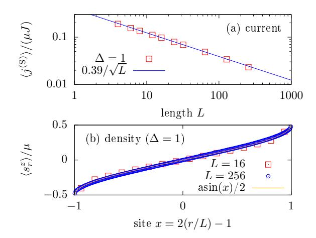

FIG. 19 (Color online) Results from the Lindblad quantum-master equation for simulating spin transport in the spin-1/2 XXZ chain, as obtained in (Žnidarič, 2011) for  $\Delta=1$ . (a) Superdiffusive scaling of the spin current as  $j^{(S)} \propto 1/\sqrt{L}$ . (b): L-independent magnetization profile.

summarized in the following.

One important question is whether or not the exact lower bound for the spin Drude weight  $\mathcal{D}_{w}^{(S)}$  in Eq. (78) is exhaustive for all commensurate values of  $|\Delta| < 1$ . It is now established that at infinite temperature, this lower bound coincides with the TBA (Zotos, 1999) and GHD (Bulchandani et al., 2018; Ilievski and De Nardis, 2017b) results, which are also identical at any T for  $|\Delta| < 1$ (Urichuk et al., 2019). However, a central assumption invoked within the TBA and therefore GHD, which is formulated in the TBA language, is the string hypothesis. It is an interesting open question whether or not GHD can be formulated without resorting to the string hypothesis. Similarly, the question remains whether the spin Drude weight can be computed in a Bethe-ansatz approach without resorting to the string hypothesis. A recent study by Klümper and Sakai (2019) carried out such an alternative calculation without using the string hypothesis. Using a numerical solution of the resulting nonlinear equations for  $\Delta = \cos(\pi/m)$ , results for  $\mathcal{D}_{\mathrm{w}}^{(\mathrm{S})}(T)$  were obtained. These exhibit finite-size effects that become more significant as temperature is lowered. Eventually, the data converge to the TBA results by Zotos (1999) in the thermodynamic limit. These results indicate the potential limitations of finite-size based numerical simulations in accessing the low-temperature dependence of the spin Drude weight.

Moreover, while the possibility of a fractal-like dependence of  $\mathcal{D}_w^{(S)}$  on  $\Delta$  is intriguing, no numerical method will likely be capable to confirm the fractal structure. The sudden drop of  $\mathcal{D}_w^{(S)}$  when going from  $\Delta=0$  to  $\Delta>0$  has not been verified numerically so far. Particularly useful would be a lower bound with finite-size

corrections, which would allow for more reliable extrapolations to the limit of large system sizes as well.

Another important and closely related issue concerns subleading corrections to the spin Drude weight  $\mathcal{D}_{w}^{(S)}$  in the regime  $|\Delta| < 1$ . It is now established from exact lower bounds and GHD that the diffusion constant is finite for commensurate values of  $\Delta$  but diverges away from these points (Agrawal et al., 2020; Ilievski et al., 2018). This rapid change is explained by a significant weight transfer in the low-frequency window as one goes from commensurate values of  $\Delta$  to incommensurate ones; concrete exponents for the divergence of  $\sigma_{\rm reg}(\omega)$  at generic values of  $\Delta < 1$  and  $\Delta = 1$  were obtained from GHD (Agrawal et al., 2020). This results in a more appealing picture as it satisfies the physical expectation of a smooth parameter dependence of at least the integral over the lowfrequency part of  $\sigma_{\rm reg}(\omega)$ . Nevertheless, at least within GHD, the distinction between rational and irrational values again relates to properties of the quasiparticles, and thus the existence of both diffusive and superdiffusive corrections may also rely on Takahashi's string hypothesis. This leads to the same question again: can the string hypothesis be replaced in GHD and what would be the results? A convincing numerical confirmation of the exponents for the subleading correction for generic values of  $\Delta < 1$  is also missing.

Several open questions remain in the regime  $\Delta > 1$  as well. While analytical calculation based on certain assumptions (Carmelo et al., 2015) conclude in favor of  $\mathcal{D}_{\rm w}^{\rm (S)}=0$  at T>0, a strict proof is still missing. An exact lower bound to the diffusion constant was obtained and shown to be finite, ruling out subdiffusion (Ilievski et al., 2018). While substantial evidence has been provided that spin dynamics is diffusive, it still needs to be qualitatively explained why diffusion can occur in integrable systems, where concepts such as chaos, ergodicity, etc. do not apply. It would be interesting to obtain a better numerical estimate for the diffusion constant in the long-time limit, since the deviation from the GHD data in Fig. 17 is most likely related to the finite times reached in the simulations.

Another puzzling issue concerns the notion of a meanfree path. While the quantitative values for the diffusion constant suggest a mean-free path on the order of one lattice site, strong finite-size effects and anomalous scaling to the thermodynamic limit appear anyhow (Prelovšek et al., 2004), which suggests that the mean-free path is not the only length scale involved for a finite system (Steinigeweg et al., 2012). It would be interesting to investigate the behavior of higher-order current correlation functions (Steinigeweg and Prosen, 2013).

At the isotropic point  $\Delta=1$ , transport at infinite temperature is faster than diffusive since the exact lower bound to the diffusion constant diverges for  $\Delta\to 1$  (Ilievski *et al.*, 2018); such a divergence is also observed in

GHD calculations (Agrawal et al., 2020; De Nardis et al., 2019a). Numerical simulations (Prosen and Žunkovič, 2013; Žnidarič, 2011) point to the emergence of superdiffusion. However, the origin and nature of this non-diffusive process is not fully understood yet. First attempts have been undertaken, and there is mounting support for the dynamical exponent of z = 3/2(Ljubotina et al., 2017), consistent with KPZ-scaling (Ljubotina et al., 2019a) further corroborated and discussed in (Bulchandani, 2020; Bulchandani et al., 2019; De Nardis et al., 2020a; Gopalakrishnan and Vasseur, 2019; Spohn, 2020a; Weiner et al., 2020). Whether the KPZ-like scaling persists in other isotropic spin models with or without integrability is currently the object of intense scrutiny (see, e.g., (De Nardis et al., 2019b; Dupont and Moore, 2020)). A recent study concludes that superdiffusion with an exponent of z=3/2 is generally realized in all integrable, Heisenberg-like magnets that are invariant under global non-Abelian continuous symmetry (Ilievski et al., 2020; Krajnik et al., 2020). A first-principle derivation of KPZ scaling for these integrable models (besides predicting the exponent) is still lacking and the possibility of other types of superdiffusion in integrable spin chains cannot be fully ruled out either (Žnidarič, 2013b).

From a methodological point of view, it is unclear how the field-theory prediction of diffusion (Sirker et~al., 2009) and the associated low-T QMC data (Grossjohann and Brenig, 2010) for  $\Delta=1$  can be reconciled with the exact statement that the diffusion constant diverges at high T. Note that GHD also predicts superdiffusion at the isotropic point (Agrawal et~al., 2020; De Nardis et~al., 2019a) and includes more types of excitations such as bound states than what is captured by field theory.

Numerical methods such as ED, DQT, and tDMRG become less useful at low T since the relevant time scales and finite-size effects are known to increase substantially as temperature is reduced from infinity (see the discussion in Secs. IV.B and IV.E).

So far, there is no example for the spin-1/2 XXZ chain for which open system simulations and linear response agree for the actual values of the diffusion constants. It would be interesting to further investigate whether or not agreement between the open-system and the linear-response calculation can be achieved. This is also of fundamental interest, and respective studies may shed light on the differences between the dynamics in isolated and open systems in a much broader context.

A phenomenological picture of transport in the spin-1/2 XXZ chain was developed in (Huber, 2012; Sánchez et al., 2018). The rich phenomenology of transport in the XXZ chain (ballistic with (super)diffusive corrections for  $0 \le \Delta \le 1$ , superdiffusive at  $\Delta = 1$  and diffusive for  $\Delta > 1$ ) partially carries over to other integrable spin models [see, e.g., (Dupont and Moore, 2020; Piroli and Vernier, 2016)]. For instance, the S=1 Zamolodchikov-

Fateev (ZF) model (Zamolodchikov and Fateev, 1980) exhibits a similar transport behavior (Dupont and Moore, 2020) with the exception of extra superdiffusion at  $\Delta=0$ . The exact general necessary and sufficient criteria for superdiffusion to occur are not fully understood, e.g., the role of SU(N) symmetry.

Generally, it is a crucial question if and in how far the rich dynamical behavior of the spin-1/2 XXZ chain is stable against weak integrability-breaking perturbations (Huang et al., 2013; Jung et al., 2006; Jung and Rosch, 2007; Steinigeweg et al., 2016b; Zotos, 2004) [see Sec. VIII]. From a theoretical point of view, this question is challenging, for instance, because conventional perturbation theory starts from a noninteracting problem. From an experimental point of view, this question is vital, because the coupling to environments or other degrees of freedom can never be suppressed completely [see also Sec. X].

## VII. TRANSPORT IN THE HUBBARD CHAIN

The 1d fermionic Hubbard model  $H = \sum_{l} h_{l}$  with

$$h_r = -t_h \sum_{\sigma} \left( c_{r\sigma}^{\dagger} c_{r+1\sigma} + \text{h.c.} \right)$$

$$+U \left( n_{r\uparrow} - \frac{1}{2} \right) \left( n_{r\downarrow} - \frac{1}{2} \right)$$

$$(178)$$

is a more general integrable model than the spin-1/2 XXZ chain as it also includes charge fluctuations. Much less attention has been devoted to computing its finite-temperature transport properties, for either charge, spin, or thermal transport. The main thermodynamic parameters, characterizing transport properties in the Hubbard chain are, besides temperature T, the chemical potential and the magnetic field. These control the filling  $\rho = (N_{\uparrow} + N_{\downarrow})/(2L)$  and the magnetization density  $m_z = (N_{\uparrow} - N_{\downarrow})/L$ . Here, we will mostly assume a canonical situation, where  $\rho$  and m are fixed.

The fermionic Hubbard model possesses a pair of global SU(2) symmetries (Essler et~al., 2005), where one of them, the spin symmetry, is related to transport of magnetization, while the other, the so-called  $\eta$ -spin symmetry, is related to charge conservation and transport of charge. While the integrability of the Hubbard model was shown by coordinate Bethe ansatz already in (Lieb and Wu, 1968), it was only in 1986 when Shastry proposed the Lax operator and the toolbox of algebraic integrability which allowed to explicitly construct an infinite sequence of local conservation laws (Shastry, 1986). These conservation laws allow one to obtain some rigorous results for transport properties.

GHD has also been applied to investigate Drude weights (Fava et al., 2020; Ilievski and De Nardis, 2017a; Ilievski et al., 2018), the emergence of diffusion and superdiffusion as well as KPZ behavior (Fava et al., 2020)

in the Hubbard chain. A comprehensive overview is given in (Fava  $et\ al.,\ 2020$ ).

# A. Thermal conductivity

The energy-current operator  $\mathcal{J}^{(\mathrm{E})}$  is given by (Zotos *et al.*, 1997):

$$\mathcal{J}^{(\mathrm{E})} = \sum_{r,\sigma} t_{\mathrm{h}}^{2} \left[ \left( i c_{r+1\sigma}^{\dagger} c_{r-1\sigma} + \mathrm{h.c.} \right) - \frac{U}{2} \left( j_{r-1\sigma}^{(\mathrm{C})} + j_{r\sigma}^{(\mathrm{C})} \right) \left( n_{r\bar{\sigma}} - \frac{1}{2} \right) \right], \quad (179)$$

where  $j_{r,\sigma}^{(C)}$  is the charge current and  $\bar{\sigma} = \uparrow (\downarrow)$  for  $\sigma = \downarrow (\uparrow)$ . Here, we will restrict the discussion to the case of a vanishing chemical potential and magnetic field and therefore, half filling and zero magnetization. Under these conditions, the energy current does not couple to the charge or spin current and offdiagonal matrix elements in the Onsager matrix of transport coefficients can be ignored (Mahan, 1990). This is equivalent to saying that the Seebeck coefficient, which is proportional to  $\langle \mathcal{J}^{(E)}(t)\mathcal{J}^{(C)}\rangle$ , vanishes identically at half filling at all temperatures (Beni and Coll, 1975), where  $\mathcal{J}^{(C)}$  is the particle current.

Similar to the spin-1/2 XXZ chain, the Hubbard model is a ballistic thermal conductor (Zotos et al., 1997), which is a rigorous statement: While  $\mathcal{J}^{(E)}$  is not conserved, it still has a nonzero overlap with a local conserved quantity  $Q_2$ . This  $Q_2$  is the first nontrivial conserved charge in the Hubbard chain beyond energy E, particle number N and the z-component  $S^z$  of the total spin, and it happens to be quite similar to  $\mathcal{J}^{(E)}$  in structure:  $Q_2$  results from  $\mathcal{J}^{(E)}$  by  $U/2 \to U$ . Consequently, the Mazur inequality (28) provides a nonzero lower bound.

This lower bound to the energy Drude weight was evaluated analytically in (Zotos et al., 1997) for  $T=\infty$ . This expression reads:

$$\mathcal{D}_{w}^{(E)} \ge \frac{\beta^{2}}{2L} \sum_{\sigma} 2\rho_{\sigma} (1 - \rho_{\sigma}) + \frac{U^{4}}{4}$$

$$\times \frac{\left[\sum_{\sigma} 2\rho_{\sigma} (1 - \rho_{\sigma})(2\rho_{-\sigma}^{2} - 2\rho_{-\sigma} + 1)\right]^{2}}{\sum_{\sigma} 2\rho_{\sigma} (1 - \rho_{\sigma})[1 + U^{2}(2\rho_{-\sigma}^{2} - 2\rho_{-\sigma} + 1)]}$$
(180)

where  $\rho_{\sigma}$  is the density of electrons with spin  $\sigma = \uparrow, \downarrow$ . A tDMRG study showed that contributions from other conserved charges  $Q_{n>2}$  with a nonzero overlap with  $\mathcal{J}^{(E)}$  are fairly small for all  $U/t_{\rm h}$  (Karrasch *et al.*, 2016) at infinite temperature and half filling.

The full temperature dependence of the energy Drude weight was computed only recently from both finite-T tDMRG (Karrasch, 2017a; Karrasch *et al.*, 2016) and GHD (Ilievski and De Nardis, 2017a), which are in quantitative agreement. This Drude weight has, for  $U \gg t_{\rm h}$ , two maxima: the low-temperature regime  $T \lesssim \Delta_{\rm Mott}$  is dominated by spin excitations. This part of  $\mathcal{D}_{\rm w}^{\rm (E)}(T)$ 

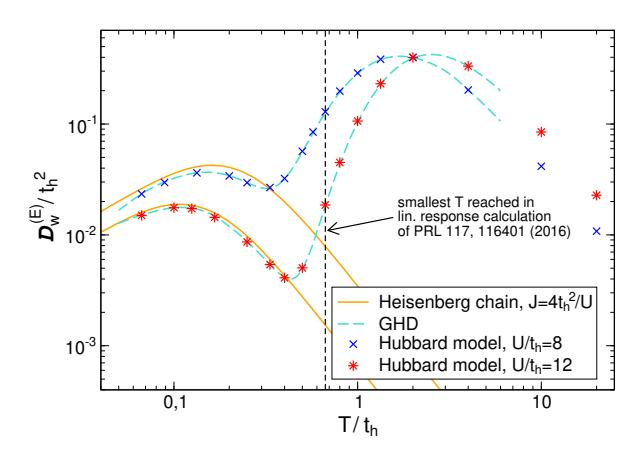

FIG. 20 (Color online) Energy Drude weight of the Fermi-Hubbard chain as a function of temperature computed from finite-T tDMRG (Karrasch, 2017a; Karrasch *et al.*, 2016) and GHD (Ilievski and De Nardis, 2017a).

agrees well with the results for the spin-1/2 Heisenberg chain from (Klümper and Sakai, 2002). At high temperatures, charge contributions are activated and dominate the thermal transport. This behavior is illustrated in Fig. 20. A more complete picture of the various temperature regimes and the relevant contributing excitations is described in (Fava et al., 2020).

Since the energy current is not exactly conserved, there are finite-frequency contributions that were studied in (Karrasch et al., 2016), but a conclusion about the nature of the subleading correction at low frequencies could not be drawn. Other related directions include the thermolelectric response of the model (Peterson et al., 2007; Zemljič and Prelovšek, 2005).

# B. Charge conductivity

The local conserved charges have a nonzero overlap with the charge current away from half filling  $\rho \neq 1/2$ . Using the Mazur inequality (28), one can thus show that charge transport is ballistic, i.e., the charge Drude weight is positive  $\mathcal{D}_{\rm w}^{\rm (C)}>0$  (Garst and Rosch, 2001; Zotos et al., 1997). This is a rigorous statement. At half filling, which corresponds to the most symmetric and thermodynamically dominant sector, the Mazur bound based on the known local charges vanishes. However, this does not imply that the Drude weight necessarily has to be zero.

Nevertheless, some rigorous results have been obtained at half filling. It has been shown in (Carmelo *et al.*, 2018) that for any U>0 and any positive temperature T>0 and within the canonical ensemble where  $N=N_{\uparrow}+N_{\downarrow}-L$  is held fixed (while  $L\to\infty$ ), one has a strict upper bound on the charge Drude weight

$$\mathcal{D}_{\mathbf{w}}^{(\mathbf{C})}|_{\text{canonical}} \le \frac{c'(U)t_{\mathbf{h}}^2}{T}L(2\rho - 1)^2, \qquad (181)$$

which scales as 1/L at half filling  $\rho = 1/2$  since, by including leading finite-size corrections,  $2\rho - 1 = 0 + \mathcal{O}(1/L)$ . Therefore, the r.h.s. of Eq. (181) vanishes in the thermodynamic limit.

One can argue that within the grand-canonical ensemble where the number of electrons fluctuates according to the law of large numbers,

$$\langle (2(N/L) - 1)^2 \rangle_{\text{grand-can}} \propto 1/L,$$
 (182)

this bound is no longer useful. There, instead, one can derive an improved bound which, however, only holds within leading order in 1/T but for any value and sign of U

$$\mathcal{D}_{\rm w}^{\rm (C)}|_{\rm grand-can} \le \frac{c(U)t_{\rm h}^2}{T}(2\rho - 1)^2.$$
 (183)

This bound indicates that  $\mathcal{D}_{\rm w}^{(C)}=0$  if  $\rho=1/2$ , consistent with the GHD result (Ilievski *et al.*, 2018). The full temperature dependence of the charge Drude weight  $\mathcal{D}_{\rm w}^{(C)}$  at  $0<\rho<1/2$  was computed in a recent GHD study (Ilievski and De Nardis, 2017a).

The question of whether or not the charge Drude weight in the half-filled Fermi-Hubbard chain is zero has historically been a controversial topic. Several early studies reported evidence for a finite Drude weight (Fujimoto and Kawakami, 1998; Kirchner et al., 1999). This result was later challenged by Bethe-ansatz studies that emphasized symmetry constraints on the diagonal matrix elements of the charge-current operator (Carmelo et al., 2013, 2018). Numerically, charge transport was studied using exact diagonalization and MCLM (Prelovšek et al., 2004), finite-T tDMRG (Karrasch et al., 2016, 2014a), dynamical typicality (Jin et al., 2015) and tDMRG simulations of open quantum systems (Prosen and Žnidarič, 2012). All these studies agree in so far as they find no evidence for a ballistic contribution. As an example, we show the infinite-temperature Drude weight computed from dynamical typicality in Fig. 21 as a function of system size for several values of  $U/t_h$ . The Drude weight decays with a power-law in 1/L, consistent with the observation for other integrable models [see, e.g., the large  $\Delta$  phase of the spin-1/2 XXZ chain (Heidrich-Meisner et al., 2003; Steinigeweg et al., 2014a)].

A rigorous lower bound using the method of (Medenjak et al., 2017) for the charge-diffusion constant was recently obtained (Ilievski et al., 2018). This bound diverges at half filling, which shows that transport cannot be diffusive. Therefore, the charge transport is similar to the spin transport in the spin-1/2 Heisenberg chain, with presumably no Drude weight in both cases and superdiffusion. Still, the spreading of density perturbations at finite times and in finite systems is indicative of diffusion (Steinigeweg et al., 2017a) (see also Sec. IX.A), leaving reconciling these two observations as an open problem.

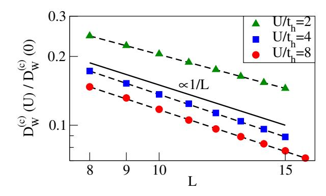

FIG. 21 (Color olnline) Charge Drude weight of the Fermi-Hubbard chain at half filling and infinite temperature versus system size obtained from dynamical typicality (Jin *et al.*, 2015), plotted using a logarithmic scale on both axis.

Using finite-T tDMRG (Karrasch et al., 2014b), an attempt was made to extract the temperature dependence of the dc-conductivity at low temperatures in order to verify field-theoretical predictions from (Damle and Sachdev, 1998; Sachdev and Damle, 1997). The presence of anomalous finite-size effects in  $\sigma'(\omega)$  was pointed out in the MCLM study of (Prelovšek et al., 2004). Both these numerical works and (Jin et al., 2015) argued for a diffusive form of the conductivity, which is at odds with the rigorous results of (Ilievski et al., 2018).

In (Prosen and Žnidarič, 2012), the steady-state master equation with boundary Lindblad reservoirs was used to investigate transport in the Hubbard model. It was argued that transport is diffusive in the TDL (results were reported for  $L \sim 100$ ). Indications for superdiffusion were presented for short systems and large  $U/t_{\rm h}$ , leading to the speculation that the two limit  $U/t_{\rm h} \rightarrow \infty$  and  $L \rightarrow \infty$  may not commute (Prosen and Žnidarič, 2012).

#### C. Spin conductivity

For a non-zero magnetization  $m_z \neq 0$ , the Mazur inequality (28) shows that the spin Drude weight is finite (Zotos *et al.*, 1997).

One can make rigorous statements similar to Eqs. (181) and (183) about spin transport in the attractive Hubbard model U < 0. Specifically, under a partial particle-hole transformation, where  $(c_{l\uparrow}, c_{l\uparrow}^{\dagger}, c_{l\downarrow}, c_{l\downarrow}^{\dagger}) \rightarrow (c_{l\uparrow}, c_{l\uparrow}^{\dagger}, c_{l\downarrow}, c_{l\downarrow})$ , the sign of U changes  $U \rightarrow -U$ , while the spin current(spin Drude weight) maps to charge current(charge Drude weight)and vice versa. At asymptotically high temperatures, the sign of U becomes irrelevant, and we then have a full symmetry between spin and charge transport. For example, at zero magnetization, the leading term in a high-T expansion of the spin Drude weight vanishes. It is believed that  $\mathcal{D}_{\rm w}^{\rm (S)} = 0$  at  $m_z = 0$ .

The full temperature dependence of the spin Drude

weight D (S) w at 0 < mz < 1 was computed in a recent GHD study [\(Ilievski and De Nardis, 2017a\)](#page-71-34). At zero magnetization, GHD predicts D (S) w = 0 [\(Ilievski](#page-71-30) et al., [2018\)](#page-71-30), and, in the same regime, the spin diffusion constant was shown to diverge [\(Ilievski](#page-71-30) et al., [2018\)](#page-71-30). Ballistic spin transport away from mz = 0 was observed numerically in a tDMRG study of the spreading of density wave packets [\(Karrasch, 2017a\)](#page-71-47).

Clarifying the nature of the deviations from diffusion and investigating how exactly the Heisenberg regime is recovered out of the transport properties of the Hubbard chain in the low-temperature regime are open. For instance, the most recent developments of finite-T tDMRG methods have not been exploited yet in order to address these questions again [\(Karrasch, 2017a\)](#page-71-47).

In a recent GHD study, several aspects of spin transport have been explored, including the crossover from the spin-coherent to the spin-incoherent regime and the emergence of superdiffusion at points with non-Abelian symmetry (vanishing chemical potential and/or magnetic field) (Fava [et al.](#page-69-52), [2020\)](#page-69-52).

## VIII. BEYOND INTEGRABLE SYSTEMS

While integrability is particularly appealing because it allows for exact solutions, most systems of relevance for condensed matter physics (experimental or theoretical) do not share this property. In particular, even though the spin-1/2 XXZ chain describes many features of real materials (such as thermodynamics or spectral functions), it cannot describe generic transport. Indeed, the latter is governed by relaxation mechanisms and external scattering off impurities or phonons is unavoidable.

In this section, we assume that the only relevant conserved quantities are energy, particle number and magnetization. Hence we exclude Floquet systems, where energy is not conserved, and unusual or specifically engineered nonintegrable systems that possess a finite number of nontrivial conserved quantities.

Theoretically, there is much interest in the stability of properties of integrable models against adding integrability-breaking perturbations. In classical systems of few particles, the Kolmogorov-Arnold-Moser (KAM) theorem [\(Gutzwiller, 1990\)](#page-70-40) makes a precise statement on this stability whereas there is no such result for quantum systems. Within the wider field of nonequilibrium dynamics in closed quantum systems, the accepted view is that in most cases, any arbitrarily small strength of an integrability breaking term leads to thermalization [\(D'Alessio](#page-68-3) et al., [2016;](#page-68-3) [Vidmar and Rigol, 2016\)](#page-76-2) and diffusive transport. This, however, may not be easy to see in actual numerical simulations. For finite time scales, the perturbed system may very well still remember the existence of now only approximately conserved quantities and exhibit prethermalization behavior [\(Bertini](#page-67-42) et al.,

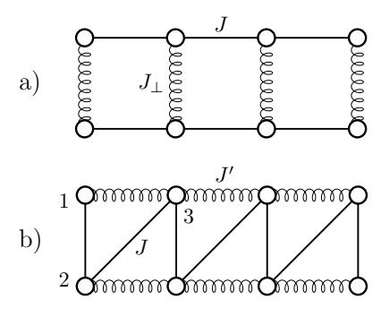

FIG. 22 (a) A spin-1/2 ladder with a coupling strength J and J⊥ along legs and rungs, respectively, and (b) a frustrated chain with a next-nearest-neighbor coupling of strength J 0 .

[2015;](#page-67-42) [Essler](#page-69-54) et al., [2014;](#page-69-54) [Kollar](#page-71-60) et al., [2011;](#page-71-60) [Moeckel](#page-73-41) [and Kehrein, 2008\)](#page-73-41). For transport, there are so far only few studies that explicitly made a connection between prethermalization and a respective behavior in a transport coefficient (see, e.g., the discussion in [\(Nessi and](#page-73-42) [Iucci, 2015\)](#page-73-42)), while a number of studies touched upon the topic (see, e.g., [\(Jung](#page-71-18) et al., [2006;](#page-71-18) [Jung and Rosch,](#page-71-19) [2007\)](#page-71-19)). For sure, the observation of slow dynamics in finite-size simulations is ascribed to weak violations of conservation laws or quasi-localization physics in translational invariant systems [see, e.g., [\(Michailidis](#page-72-47) et al., [2018;](#page-72-47) [Schiulaz and M¨uller, 2014;](#page-74-56) Yao [et al.](#page-76-55), [2016\)](#page-76-55)].

We will concentrate the discussion on nonintegrable models that result from perturbing the spin-1/2 XXZ chain. The choice of the integrability breaking term is motivated by either a particular relevance for experiments (e.g., spin-1/2 Heisenberg ladders), the possibility of obtaining analytical or exact results (e.g., for the spin-1/2 XXZ chain with a staggered magnetic field), or by the desire to obtain the simplest possible cases (e.g., spin-1/2 XX ladders or simple types of short-range interactions). See Fig. [22](#page-53-1) for an illustration of ladders and frustrated chains.

In this section, we will present those statements that describe the majority of those models and will cover selected examples for which there are either particularly convincing numerical or analytical results. Relevant and important results were certainly obtained for many other models that are not covered in detail here. These include spin-S XXZ chains with S > 1/2 [\(Dupont and Moore,](#page-69-12) [2020;](#page-69-12) [Karadamoglou and Zotos, 2004;](#page-71-41) [Richter](#page-74-57) et al., [2019a\)](#page-74-57), Kitaev-Heisenberg chains and ladders [\(Metavit](#page-72-48)[siadis and Brenig, 2017;](#page-72-48) [Metavitsiadis](#page-72-49) et al., [2019;](#page-72-49) [Pi](#page-73-43)[datella](#page-73-43) et al., [2019;](#page-73-43) [Steinigeweg and Brenig, 2016\)](#page-75-50), and Hubbard models with integrability-breaking terms [\(Kar](#page-71-15)rasch [et al.](#page-71-15), [2016;](#page-71-15) [Znidariˇc, 2013a](#page-76-43)[,b\)](#page-76-20). We will here fo- ˇ cus on results obtained via the Kubo formula for closed quantum systems; studies of open quantum systems can be found in [\(Mendoza-Arenas](#page-72-11) et al., [2015;](#page-72-11) [Znidariˇc,](#page-76-43) ˇ [2013a,](#page-76-43)[b\)](#page-76-20).

# A. Universal description of the low-energy behavior

We first turn to the predictions from field theory for the low-temperature behavior. In a generic gapless system, the field theory developed in (Sirker  $et\ al.$ , 2011) provides the generic behavior: a Tomonaga-Luttinger-liquid becomes a diffusive conductor after including sufficiently many umklapp terms (Rosch and Andrei, 2000). As an example for spin transport in a gapless system, we consider a spin-1/2 XXZ chain with a staggered magnetic field of strength h that breaks the integrability. For small values of h, the system is in the Tomonaga-Luttinger-liquid phase and by applying the field theory of (Sirker  $et\ al.$ , 2011) one obtains (Huang  $et\ al.$ , 2013)

$$\sigma_{\rm dc} \propto h^{-2} T^{3-2K} \,, \tag{184}$$

where K is the Luttinger-liquid parameter. Further related studies can be found in (Bulchandani *et al.*, 2020; Szasz *et al.*, 2017).

Another generic insight can be drawn from the fact that at low energy scales, (regular) momentum emerges as an additional approximate conserved quantity due to the mapping to a continuum model. This does not give rise to a finite Drude weight at small but finite temperatures, but causes the dc conductivities of those currents with a finite overlap to momentum to be exponentially large as a function of decreasing temperature (Rosch, 2006; Rosch and Andrei, 2000). These predictions are based on a memory-matrix formalism.

For gapped systems, the semiclassical theory of (Damle and Sachdev, 1998) leads to

$$\sigma_{\rm dc} \propto \frac{1}{\sqrt{T}} \,,$$
 (185)

see Sec. IV.A. This divergence (as  $T \to 0$ ) can be understood from the fact that on the one hand, the density of carriers is exponentially suppressed but on the other hand, this dilution leads to an exponential suppression of scattering as well. The available tDMRG results (Karrasch et al., 2014b) for the Hubbard chain with a nearest-neighbor repulsion and the gapped phase of the integrable spin-1/2 XXZ chain seem more consistent with a 1/T dependence. An outstanding question is to compute  $\sigma_{\rm dc}(T)$  for a spin-1 chain or a spin-1/2 ladder, for which the predictions of (Damle and Sachdev, 2005) were developed.

## B. Absence of Drude weights

Within our working definition of nonintegrable models given above, it is clear that there is no nonzero Mazur bound for Drude weights. Hence, the expectation is that Drude weights vanish at any finite temperature. Note that at zero temperature, any metallic phase has

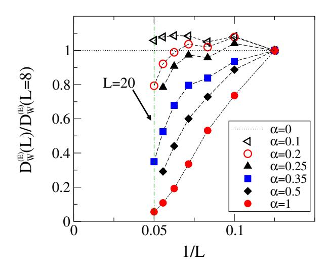

FIG. 23 (Color online) Infinite-temperature energy Drude weight of frustrated spin-1/2 Heisenberg chains computed with exact diagonalization (Heidrich-Meisner  $et\ al.,\ 2003,\ 2004b$ ).

a nonzero Drude weight as long as the system preserves translational invariance (Mastropietro, 2013; Scalapino et al., 1993). This nonzero spin and charge Drude weight results from the fact that the low-energy theory is a gapless Tomonaga-Luttinger liquid with one or two modes and is thus a consequence of the conservation of momentum in the continuum limit. Yet, these zero-temperature Drude weights are not related to the integrability of the microscopic models. A concrete example is the frustrated spin-1/2 Heisenberg chain, which in its gapless phase has a nonzero spin Drude weight at T=0 (Bonča et al., 1994).

Most numerical studies confirm the expectation that spin, charge and energy Drude weights vanish in non-integrable models at any T>0, including, for example, spin-1/2 Heisenberg ladders (Heidrich-Meisner et~al., 2003; Rezania et~al., 2014; Zotos, 2004), frustrated spin-1/2 Heisenberg chains (Heidrich-Meisner et~al., 2004a, 2003, 2004b, 2005b), dimerized spin-1/2 Heisenberg chains (Heidrich-Meisner et~al., 2004a, 2003), spin-1/2 XXZ chains with additional nearest-neighbor interactions  $S^z_\ell S^z_{\ell+2}$  (equivalent to spinless fermions with density-density interactions) (Zotos and Prelovšek, 1996), and spin-1/2 XXZ chains with staggered magnetic fields (Huang et~al., 2013; Steinigeweg et~al., 2015).

In the vicinity of integrable models and on *finite* systems, the Drude weight may still account for most of the weight in the conductivity  $\sigma'(\omega)$  with only a very slow transfer of weight to finite frequencies. A particularly interesting example is the spin-1/2 frustrated Heisenberg chain where the relevant parameter is the ratio  $\alpha = J'/J$  and J(J') are the nearest(next-to-nearest) neighbor ex-

change couplings [see Fig. 22(b)]. The Hamiltonian reads

$$H = J \sum_{r=1}^{L} h_{r,r+1} + J' \sum_{r=1}^{L} h_{r,r+2}, \qquad (186)$$

where we assume periodic boundary conditions. As an example, we show exact-diagonalization data for the energy Drude weight in Fig. 23; specifically, for its leading coefficient  $\tilde{\mathcal{D}}_{\rm w}^{(\rm E)}$  in a 1/T expansion:

$$\mathcal{D}_{\rm w}^{(\rm E)} = \frac{\tilde{\mathcal{D}}_{\rm w}^{(\rm E)}}{T^2} + \dots$$
 (187)

At small values of  $\alpha \lesssim 0.3$  and for the accessible system sizes,  $\tilde{\mathcal{D}}_{w}^{(E)}$  decays only mildy compared to the integrable case and seems to saturate (Alvarez and Gros, 2002a; Heidrich-Meisner et al., 2004b). Upon increasing  $\alpha$ , though, the decrease of  $\tilde{\mathcal{D}}_{w}^{(E)}$  with L becomes faster and is consistent with an exponential decay or at least faster than any power law. The latter is expected from ETH arguments (Steinigeweg et al., 2013) and numerically observed in nonintegrable models far away from integrable limits (Heidrich-Meisner et al., 2004b; Jin et al., 2015; Prosen, 1999; Rabson et al., 2004; Zotos and Prelovšek, 1996).

For the frustrated spin-1/2 chain, there is a theoretical argument that explains why on small system sizes and for small values of  $\alpha \lesssim 0.3$ , the thermal Drude weight still amounts to a substantial fraction of the total spectral weight. It turns out that the energy-current conservation is only violated in next-to-leading order in  $\alpha$  (Jung et al., 2006). Within the memory-matrix formalism, one can then show that current lifetimes are enhanced in the small- $\alpha$  regime.

Other cases in which the proximity to integrable limits can lead to a slow decay of Drude weights on finite systems (or to a slow temporal decay of currentautocorrelations computed with t-DMRG) are certain spin-1/2 dimerized XXZ chains (Karrasch et al., 2013b) and gapped quantum models in large magnetic fields (Langer et al., 2010; Psaroudaki et al., 2014; Stolpp et al., 2019). In the former case, the existence of several integrable limits (vanishing dimerization, zero exchange anisotropy  $\Delta = 0$ , decoupled dimers) has been speculated to give rise to a slow decay of current correlation functions. In the latter case, the application of a longitudinal magnetic field induces a transition into a gapless phase. For spin-1 chains (Psaroudaki et al., 2014), that field-induced phase can be approximately described by an effective spin-1/2 XXZ chain Hamiltonian, explaining the numerically observed large finite-size Drude weights. There is, in none of these examples, any theoretical evidence to believe that the finite-size Drude weights remain nonzero for  $L \to \infty$ . Other claims of nonzero Drude weights in generic spin ladders, frustrated spin chains or dimerized spin chains were either based on a mapping

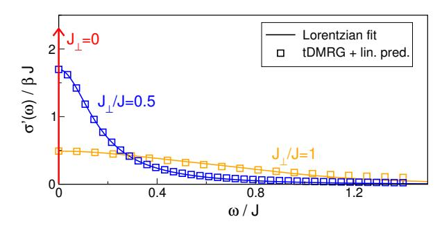

FIG. 24 (Color online) Spin conductivity of a spin-1/2 XX ladder for various rung couplings  $J_{\perp}$  (Karrasch *et al.*, 2015a).

to noninteracting effective theories (Orignac *et al.*, 2003; Saito, 2003) or due to the difficulties involved with interpreting finite-size exact diagonalization (Alvarez and Gros, 2002a) or QMC data (Kirchner *et al.*, 1999).

# C. Frequency-dependence of the conductivity

The simplest picture for the frequency dependence was already given in Sec. II and is based on the Drude model: a Lorentzian whose width is controlled by a single relaxation time. One may wonder whether such a simple structure is possible at all in strongly correlated models in one dimension where there is no Landau quasi-particle picture in the first place.

For infinite temperature, there are many numerical results available. A particularly clear picture emerges for spin-1/2 XX ladders. In that case, the integrable limits are two chains that have only a Drude weight, i.e.,  $\sigma'(\omega) = 2\pi \mathcal{D}_{\rm w}^{({\rm S})} \delta(\omega)$ . The Hamiltonian reads (with  $\Delta=0$  in the  $h_{\rm r}^{\parallel,\perp}$  terms):

$$H = H^{||} + H^{\perp} = J \sum_{\ell=1,2} \sum_{r=1}^{L} h_{\ell;r,r+1}^{||} + J_{\perp} \sum_{r=1}^{L} h_{r}^{\perp} . \tag{188}$$

 $\ell = 1, 2$  labels the two legs of the ladder. Upon coupling the chains with a nonzero  $J_{\perp}$ , the Drude peak is indeed broadened into a Lorentzian. This is illustrated in Fig. 24, obtained from tDMRG (Karrasch et al., 2015a), which agrees with dynamical typicality and perturbation theory (Richter et al., 2020, 2019b; Steinigeweg et al., 2014b). For more complicated models, the situation is less clear based on the numerical data. For instance, in spin-1/2 Heisenberg ladders, there is presumably superdiffusion for  $J_{\perp} = 0$  [see Sec. VI.D.3] and it is not obvious that there exists a single Lorentzian at low frequencies. Numerical results for  $\sigma'(\omega)$  of nonintegrable models are available for spin-1/2 XXZ ladders (Karrasch et al., 2015a), spin-1/2 XXZ chains with a staggered magnetic field (Huang et al., 2013), dimerized spin-1/2 Heisenberg chains (Langer et al., 2011), and interacting

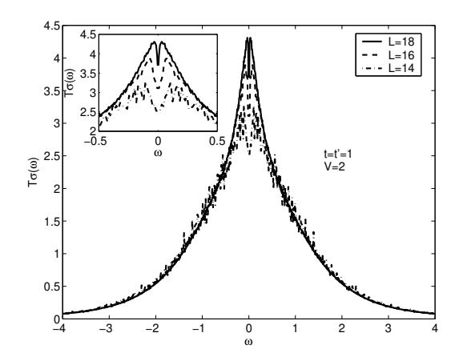

FIG. 25 Real part of the conductivity of a nonintegrable model versus  $\omega$  (in units of t), namely, spinless fermions with a nearest-neighbor repulsion of strength V=2t and an additional next-to-nearest neighbor hopping t'=t, where t is the nearest-neighbor hopping matrix element. The exact-diagonalization data indicates that the low-frequency behavior is incompatible with a simple Lorentzian (see Mukerjee  $et\ al.\ (2006)$  for a discussion). Other examples of a similar shape were reported in Heidrich-Meisner  $et\ al.\ (2005)$  and Zotos (2004). The figures is taken from (Mukerjee  $et\ al.\ (2006)$ ).

spinless fermions with next-to and nearest-neighbor hopping (Mukerjee et al., 2006). The thermal conductivity  $\kappa(\omega)$  was computed numerically for spin-1/2 XXZ chains with a staggered magnetic field (Huang et al., 2013; Steinigeweg et al., 2015).

While a finite dc-limit is enough to classify the system as a normal conductor, there remains the possibility of potential anomalous low-frequency behaviors [see, e.g., (Garst and Rosch, 2001) for a discussion of the mass-imbalanced Hubbard model]. For instance, evidence for such a situation was reported for a nonintegrable model of spinless fermions (Mukerjee et al., 2006), where  $\sigma'(\omega) = a - b\sqrt{\omega} + \ldots$  was observed in numerical data and explained as a hydrodynamic tail. The corresponding  $\sigma'(\omega)$  is shown in Fig. 25. A systematic study of such tails in nonintegrable models for larger systems and a broader class of models remains to be done [see also (Zotos, 2004)], in particular, by making more quantitative contact the predictions of hydrodynamics.

# D. DC conductivity and diffusion constant

We next turn to the available results for the temperature dependence of dc conductivities and diffusion constants and their dependence on model parameters. The latter dependency is relevant to understand the effect of integrability breaking terms (parametrized by a coupling constant  $J_{\rm pert}$ ). The crossover from GHD describing integrable models to regular hydrodynamics in non-

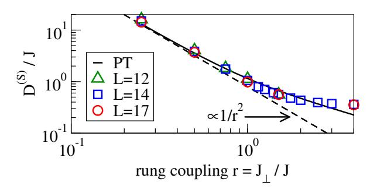

FIG. 26 (Color online) Spin-diffusion constant of the spin-1/2 XX ladder as a function of  $r=J_{\perp}/J$  at infinite temperature, as obtained from dynamical typicality for L=12,14,17 rungs (i.e., 2L sites in the ladder) (Steinigeweg *et al.*, 2014a) and perturbation theory (PT) (Richter *et al.*, 2020), with  $D^{(\mathrm{S})}/J=1/(2\gamma r^2)$  and  $\gamma\approx 0.63$  in the limit of small r with no free parameter.

integrable models has been discussed in (Friedman et al., 2020). Based on Fermi's Golden rule, one generically expects  $D^{(Q)} \propto 1/J_{\rm pert}^2$  and thus a similar scaling for the conductivity (Jung and Rosch, 2007; Steinigeweg et al., 2016b; Zotos, 2004).

We first discuss the infinite-temperature limit and then move on to cover predictions and results for finite temperatures. Numerical results for the diffusion constant - and via Einstein relations - the dc conductivity are available for spin transport in spin-1/2 XX ladders (Steinigeweg et al., 2014b; Žnidarič, 2013a) and thermal transport in spin-1/2 XXZ ladders (Alvarez and Gros, 2002c; Heidrich-Meisner et al., 2003; Karrasch et al., 2015a; Orignac et al., 2003; Saito, 2003; Steinigeweg et al., 2016b; Zotos, 2004) and spin-1/2 chains with staggered magnetic fields (Huang et al., 2013; Steinigeweg et al., 2015) as well as for charge transport in the massimbalanced Fermi-Hubbard chain (Heitmann et al., 2020; Jin et al., 2015) [see also (Garst and Rosch, 2001)].

Figure 26 shows the dependence of the spin-diffusion constant  $D^{(\mathrm{S})}$  on  $J_{\perp}$  for spin-1/2 XX ladders: at small  $J_{\perp}$ ,  $D^{(\mathrm{S})} \propto 1/J_{\perp}^2$  in agreement with perturbation theory (Richter et al., 2020; Steinigeweg et al., 2014b) with a crossover to  $D^{(\mathrm{S})} = \mathrm{const.}$  at large  $J_{\perp} \gg J$ . The latter behavior is typical for systems with a bandstructure (here controlled by  $J_{\perp}$  in the strong dimer limit) at  $T = \infty$  and is also seen in the large  $U/t_{\mathrm{h}}$  regime of the Fermi-Hubbard chain (Jin et al., 2015). A perturbative dependence of diffusion constants on an integrability-breaking parameter was reported for thermal transport in spin ladders as well (Steinigeweg et al., 2016b; Zotos, 2004).

Numerical methods now also give access to a wider temperature range. As an example, we show the thermal conductivity of spin-1/2 XXZ chains with a staggered magnetic field in Fig. 27 (Huang  $et\ al.$ , 2013; Steinigeweg  $et\ al.$ , 2015) [see also (Prosen and Žnidarič, 2009)]. The

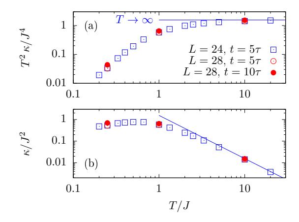

FIG. 27 (Color online) Temperature dependence of the thermal conductivity  $\kappa$  in a Heisenberg chain with a staggered field, as shown in (Steinigeweg *et al.*, 2015) [see also (Huang *et al.*, 2013)].  $\tau$  is the relaxation time, defined as the time at which the current correlation has decayed to a fraction of 1/e (Steinigeweg *et al.*, 2015).

maximum at a temperature  $T \sim \mathcal{O}(J)$  is resolved, while the data indicate a power-law dependence at low T.

## E. Special cases and outlook

We conclude this section by giving a brief account of special cases and ongoing directions.

Local perturbations that act only on one or few sites can behave completely differently from global perturbations that were covered so far. Having in mind that integrable systems possess infinitely long-lived excitations, this is not very surprising: looking at the transmission from one end to the other, an excitation will scatter only once, regardless of the system's length, and therefore, one will have zero bulk resistance and ballistic transport.

Let us take a concrete model, the spin-1/2 XXZ Heisenberg chain, Eq. (1), and a single impurity at the middle of the chain described by  $\frac{h}{2}s_{L/2}^{z}$ , where h is a local magnetic field. Analyzing the distribution of energy spacings between nearest-eigenenergy levels (Brenes et al., 2018; Barišić et al., 2009; Fagotti, 2017; Santos, 2004, 2008; Torres-Herrera and Santos, 2014), one observes level repulsion and agreement with randommatrix theory for a large range of h (in the thermodynamic limit likely for any finite nonzero h), typical of quantum chaotic systems. Studies of spin transport with a boundary-driven Lindblad setting as well as with a linear-response calculation of  $\sigma'(\omega)$  suggest ballistic transport (Brenes et al., 2020b, 2018) [see Fig. 28] (see also (Brenes et al., 2020a)). We note that in order to identify a nonzero Drude weight, one has to carry out a careful finite-size scaling analysis of  $\sigma'(\omega)$  because for open boundary conditions,  $\mathcal{D}_{w}^{(S)}$  gets "transferred" to fi-

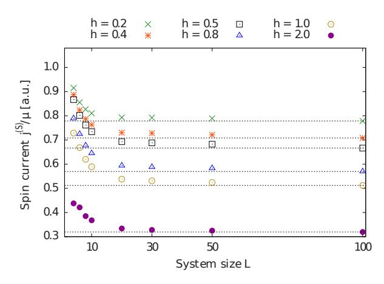

FIG. 28 Dependence of the NESS spin current on system size L for a spin-1/2 XXZ chain ( $\Delta = 0.5$ ) with a single-impurity of strength h. Adapted from (Brenes *et al.*, 2018).

nite frequencies (Rigol et al., 2008), getting a Lorentzian (Cauchy) representation of a Dirac delta function, whose width decreases  $\sim 1/L$  while its height increases as  $\sim L$ . For the case of a spin-S impurity with S>1/2, this was interpreted in (Barišić et al., 2009) and in (Metavitsiadis, 2011; Metavitsiadis et al., 2010) as an "anomalous incoherent" energy and spin transport. One therefore has a "quantum chaotic" system according to the level-spacing statistics but ballistic transport, typically associated with integrability and conserved quantities.

How can one reconcile these two seemingly contradicting findings? In a many-body system, the level spacing is exponentially small in L in the thermodynamic limit. Therefore, starting with eigenstates of the integrable spin-1/2 XXZ chain, even a small local perturbation can, in the thermodynamic limit, cause mixing of close eigenenergies, leading to level repulsion. However, level spacing measures properties on an exponentially small energy scale that can be potentially irrelevant for local physics. For transport, timescales that are polynomial in L are what matters.

A currently intensely investigated question concerns the precise time scale and conditions for hydrodynamics to set in (see, e.g., (Glorioso et al., 2020; Lopez-Piqueres et al., 2020)). This question is not new, yet numerical methods are now in a position to simulate this while novel theoretical concepts from quantum information theory such as entanglement spreading or out-of-time-ordered correlators provide for a novel view onto this problem. In that regime, the system should behave "classically" and be subject to the laws of hydrodynamics (Bohrdt et al., 2017; Karrasch et al., 2014b; Leviatan et al., 2017; Lux et al., 2014; Rakovszky et al., 2018). Recently, a generalized relaxation-time approximation framework has been proposed to study the crossover from generalized hydrodynamics, applicable to integrable systems, to hydrodynamics in a generic model (Lopez-Piqueres et al., 2020). Related efforts address the emergence of hydrodynamics in random unitary circuits [see, e.g., (Nahum *et al.*, 2018; Rakovszky *et al.*, 2018)].

Earlier work studied the emergence of diffusion in Hamiltonian systems with random couplings (Steinigeweg et al., 2007, 2006). In addition to a hydrodynamical description as a generic framework and numerical approaches, a semiclassical method based on the truncated Wigner approximations has recently been developed to study diffusion in spin systems (Wurtz and Polkovnikov, 2020). Finally, the possibility of anomalous transport in nonintegrable models is still of interest and an example of subdiffusion has been reported in systems that conserved dipole and/or higher moments (Feldmeier et al., 2020).

## IX. FAR-FROM-EQUILIBRIUM TRANSPORT

There is a growing interest in the nonequilibrium dynamics induced by initial states with inhomogeneous densities across various branches of theoretical physics. The ensuing dynamics when starting from such initial states is in fact of interest across several disciplines in physics, including condensed matter theory (Liu and Andrei, 2014), quantum field theory (Bernard and Doyon, 2016), AdS/CFT correspondence (Bhaseen et al., 2015), statistical physics (Antal et al., 1997b), and ultracold quantum gases (Ronzheimer et al., 2013; Schneider et al., 2012; Vidmar et al., 2017, 2015).

# A. Spreading of density perturbations

A prototypical nonequilibrium setup is to prepare a local energy-, charge- or spin-density perturbation in an otherwise equilibrated background. Such a "wave packet" can, for instance, be realized via an initial density matrix of the form  $\rho_L(T)\otimes\rho_C\otimes\rho_R(T)$ , where the density matrices  $\rho_{L,R}$  associated with the left and right regions have the standard equilibrium form. The center region can, e.g., be chosen as a thermal density matrix with a different temperature  $T+\Delta T$  in order to model an energy density perturbation.

In Sec. II.C.1, it was discussed that if this initial local perturbation is small ( $\Delta T \to 0$  and the size of the center region C being small in the above example), the time evolution of its variance  $\Sigma(t)$  is strictly related to the time-dependent diffusion constant via Eq. (37) (Bohm and Leschke, 1992; Steinigeweg et al., 2009b; Yan et al., 2015). It implies that at long times,  $\Sigma \sim t$  for ballistic transport and  $\Sigma \sim \sqrt{t}$  for diffusive transport, with the prefactors given by the Drude weight and the diffusion constant, respectively. In the context of this review, the validity of the time-dependent Einstein relation was confirmed numerically for spin, charge, and energy transport

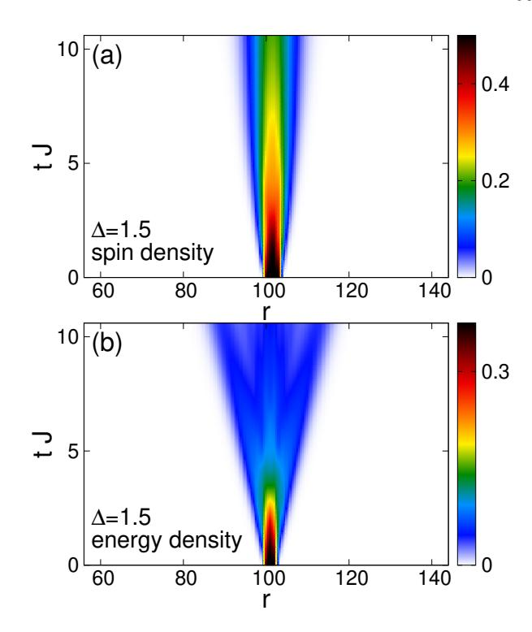

FIG. 29 Densities as a function of time t and position r for a local quench inducing (a) spin dynamics and (b) energy dynamics in the spin-1/2 XXZ chain at  $\Delta=1.5$  at  $T=\infty$ . The dynamics is induced by introducing a local perturbation in the initial state. Adapted from (Karrasch *et al.*, 2014b).

within the spin-1/2 XXZ chain and the Fermi-Hubbard model, by tDMRG (Karrasch  $et\ al.,\ 2017$ ) and dynamical dynamical typicality calculations (Steinigeweg  $et\ al.,\ 2017a,b$ ).

One still expects that the long-time behavior of the variance is of the above-mentioned form ( $\Sigma \sim t$  and  $\Sigma \sim \sqrt{t}$ , respectively), even if one considers the spreading of local perturbations which are not necessarily small. This was first shown for the integrable spin-1/2 XXZ chain as well as for nonintegrable systems at zero temperature using tDMRG (Jesenko and Žnidarič, 2011; Langer et al., 2009, 2011). For instance, it was illustrated that spin propagates ballistically for  $\Delta < 1$  and diffusively for  $\Delta > 1$  in agreement with the zero-temperature behavior of the Drude weight which is finite in the former but vanishes in the latter case (Langer et al., 2009); while energy always propagates ballistically at any  $\Delta$  (Langer et al., 2011).

These studies were extended to finite temperatures and to pure-state dynamics, and the spreading of spin and energy wave packets were studied for the spin-1/2 XXZ chain, for spin ladders, and for the Fermi-Hubbard model (Foster et al., 2011, 2010; Karrasch et al., 2014b, 2017; Richter et al., 2018, 2019b; Steinigeweg et al., 2017b), including the mass-imbalancec case (Heitmann et al., 2020). For instance, one can prepare a spin-polarized central region in a  $T=\infty$  background within the XXZ

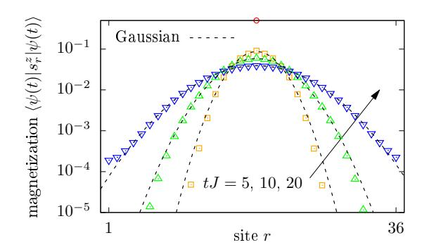

FIG. 30 (Color online) Spatial dependence of magnetization profiles at different times, as obtained in (Steinigeweg et al., 2017b) for a spin-1/2 XXZ chain at  $\Delta=1.5$ , the full Hilbert space of L=36 sites, and a randomly chosen initial pure state with a  $\delta$  peak on top of a many-particle background at high temperatures. These profiles are remarkably well described by Gaussian fits over several orders of magnitude. Similar Gaussian profiles have been found in (Ljubotina et al., 2017).

chain, which leads to a simultaneous propagation of spin and energy densities. In this setup, spin propagates diffusively and energy propagates ballistically for  $\Delta > 1$ , and both quantities propagate ballistically for  $\Delta < 1$ . The typical behavior of the spin and energy density after local quenches of this type is illustrated in Fig. 29 for  $\Delta = 1.5$ . On the time scales accessed in these tDMRG simulations, the variance behaves as  $\Sigma^2 \propto t^{1.2}$  for the spin density and  $\Sigma^2 \propto t^2$  for the energy density (Karrasch et al., 2014b). Similar initial states can be prepared within the Fermi-Hubbard model and could in principle be realized in a cold-atom experiment (Karrasch et al., 2017).

The generic behavior of a diffusive spreading of a local perturbation in nonintegrable models was investigated in (Karrasch et al., 2016; Kim and Huse, 2013; Langer et al., 2009; Leviatan et al., 2017). We mention that solving the problem of the real-time evolution from a state with a few spins flipped compared to a background of full polarization is also of interest in the integrability community as some aspects of the finite-time dynamics can be understood exactly in this case [see, e.g., (Ganahl et al., 2012; Liu and Andrei, 2014)].

Recently, the analysis of the time- and space-dependent densities has been extended beyond just the spatial variance [see, e.g., (Ljubotina et al., 2017; Steinigeweg et al., 2017b)]. For  $\Delta>1$ , as illustrated in Fig. 30, clean Gaussian profiles can be observed and provide another strong evidence of diffusion.

#### **B.** Bipartitioning Protocols

Bipartitioning protocols emerged in the last two decades as a paradigmatic setting to study far-fromequilibrium transport in the context of isolated quantum many-body systems.24 These protocols are very simple: one prepares the two halves of the system in different homogeneous states, then joins them and lets the entire system evolve under the dynamics of a spatially homogeneous Hamiltonian. In formulae, the state of the system at time t is represented as

$$\rho(t) = e^{iHt} (\rho_{\rm L} \otimes \rho_{\rm R}) e^{-iHt} , \qquad (189)$$

where H is the homogeneous Hamiltonian of the entire system and  $\rho_{R/L}$  are the two initial homogeneous states of the two halves. We refer the reader to Fig. 31 for a pictorial illustration of the setting. Relevant examples, extensively studied in the literature, include the sudden junction of two half chains prepared at different temperatures [see, e.g., (Aschbacher and Barbaroux, 2006; Aschbacher and Pillet, 2003; Bertini et al., 2016; Bertini and Piroli, 2018; Bertini et al., 2019; Bhaseen et al., 2015; Biella et al., 2016; Castro-Alvaredo et al., 2014, 2016; Collura and Karevski, 2014; Collura and Martelloni, 2014; De Luca et al., 2015, 2013, 2014; Doyon, 2015; Doyon et al., 2015; Eisler and Zimborás, 2014; Karevski and Schütz, 2019; Karrasch et al., 2013c; Kormos, 2017; Mazza et al., 2018; Mestyán et al., 2019; Nozawa and Tsunetsugu, 2020; Ogata, 2002; Zotos, 2017)] or at different averaged magnetizations (or filling) [see, e.g., (Alba and Heidrich-Meisner, 2014; Antal et al., 2008, 1998, 1999; Bertini et al., 2016; Calabrese et al., 2008; Collura et al., 2018, 2020; De Luca et al., 2017; Eisler et al., 2016; Eisler and Rácz, 2013; Gobert et al., 2005; Hauschild et al., 2015; Lancaster et al., 2010; Lancaster and Mitra, 2010; Ljubotina et al., 2017; Misguich et al., 2017; Piroli et al., 2017; Sabetta and Misguich, 2013; Santos, 2008, 2009; Santos and Mitra, 2011; Vidmar et al., 2017, 2015; Viti et al., 2016)]. We note that the latter kind of bipartitioning protocols, also referred to as "geometric quenches" in the literature (Mossel et al., 2010), can be realized in experiments on the sudden expansion of quantum gases in optical lattices (cf. Sec. X.B).

In the two examples above, the two halves are prepared in homogeneous *stationary* states. This means that a nontrivial time evolution is observed only in a region, "the light cone", expanding from the junction at the maximal allowed speed. In locally-interacting lattice models with a finite-dimensional Hilbert space, this velocity is finite (Lieb and Robinson, 1972). The light-cone region contains information about the "inhomogeneous nature" of the system (see Fig. 31). In general, one can also prepare the two halves in homogeneous, *non-stationary* states generating nontrivial dynamics also away from the junction. Importantly, however, the information about

&lt;sup>24 For a recent and more extended discussion, see also the reviews (Bernard and Doyon, 2016; Vasseur and Moore, 2016) dedicated to the subject.

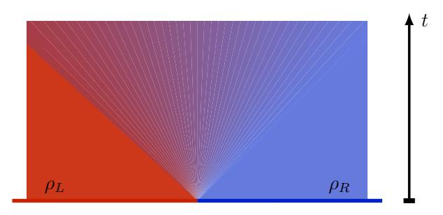

FIG. 31 (Color online) Pictorial representation of a generic bipartitioning protocol. The two halves of the chain are prepared in two different homogeneous states at time t=0. A nonequilibrium region emerges from the junction at the middle and expands at the maximal allowed speed.

the inhomogeneous nature of the system is still contained in a light-cone region expanding from the junction at the maximal speed.

Bipartitioning protocols are appealing because they give a minimal setting in which a genuine NESS, i.e., steady states supporting nontrivial currents, can be observed at infinite times. This has first been analytically observed in noninteracting systems (Antal  $et\ al.$ , 1999), then in conformal field theories (Bernard and Doyon, 2012, 2015), and finally — with the introduction of GHD — in interacting integrable models (Bertini  $et\ al.$ , 2016; Castro-Alvaredo  $et\ al.$ , 2016). On the contrary, for generic systems — at least for those with Hamiltonians invariant either under space-inversion P or time-reversal  $\mathcal{T}$  — currents are seen to vanish in numerical studies (Biella  $et\ al.$ , 2019, 2016; Karrasch  $et\ al.$ , 2013c).

This fact can be explained using the "hydrodynamic picture" discussed in Sec. III.C. Assuming that, at very large times, the expectation values of local observables can be computed in a locally quasi-stationary state, we generically have

$$\lim_{t \to \infty} \operatorname{tr} \left[ j_x^{(Q)} e^{-iHt} \rho_0 e^{iHt} \right] = \operatorname{tr} \left[ j_0^{(Q)} \rho_{\rm st}(x, \infty) \right] \quad (190)$$

for any current  $j_x^{(Q)}$ . For generic systems, we can assume that at the leading order in time  $\rho_{\rm st}(x,t)$  is a Gibbs ensemble with a space-time dependent inverse temperature (and chemical potential if the system enjoys some U(1) symmetry). Generic lattice systems with a P-invariant Hamiltonian have no P-odd charge since momentum is not conserved. This means that if the Hamiltonian is P-symmetric so is the Gibbs state. Noting that  $j_x^{(Q)}$  is P-odd, we then conclude that (190) vanishes. The same reasoning applies for  $\mathcal{T}$ -symmetric systems. On the contrary, for integrable models, the state  $\rho_{\rm st}(x,t)$  is a GGE at each fixed (x,t), and it generically includes parity-odd and time-reversal-odd charges. In this case, the expectation values of the currents are generically nonzero. Note that the above reasoning applies only

in the infinite-time limit. At finite times, the quasistationary state of a non-integrable system is not exactly a space-time dependent Gibbs ensemble: it includes corrections (proportional to gradients of temperature and chemical potentials) that produce non-zero expectation values of the currents. These corrections, however, vanish in the infinite-time limit.

For integrable systems, this argument can be checked by comparing the GHD solution (cf. Eq. (109)) with tDMRG. In particular, note that for bipartitioning protocols, GHD predicts  $\rho_{\rm st}(x,t)$  to become a function of the scaling variable  $\zeta = x/t$  for large times, in agreement with previous observations in the context of noninteracting systems (Antal et al., 1999). This can be understood intuitively noting that an observer moving away from the junction at velocity  $\zeta$  measures quasiparticles coming from the left (right) state if their velocity is larger (smaller) than  $\zeta$ . Since quasiparticles from the left and right state carry different physical information it is natural to expect the result of the measurement to depend on  $\zeta$ . Therefore, when studying bipartitioning protocols, it is customary to view expectation values of physical quantities for large times as functions of  $\zeta$ . As a representative example, in Fig. 32, we report the comparison between GHD and tDMRG for profiles of energy and spin currents as a function of  $\zeta$  for the spin-1/2 XXZ chain for different values of  $\Delta \in [0, 1]$  taken from (Bertini et al., 2016). The upper panel displays the profile of the energy current at infinite times after joining together two chains prepared at different temperature, while the lower panel describes the profile of the spin current at infinite times after connecting two chains prepared in two ferromagnetic states with opposite magnetization. This state is also known as the domain-wall state. From Fig. 32, we clearly see that the current is finite within a light cone propagating from the junction, with a velocity that generically depends on the interaction strength.

The emergence of a nonzero current at infinite times in integrable models signals ballistic transport of the related charge by the stable quasiparticles and corresponds to a finite Drude weight in the linear-response regime. In accordance with the linear-response physics, also when studying bipartitioning protocols, there can be cases where certain currents vanish at infinite times, signalling subballistic transport. Such an inhibition of the transport of specific charges is typically caused by discrete symmetries. For instance, this happens for the transport of spin in the spin-1/2 XXZ chain with  $|\Delta| \geq 1$ , where all local conserved charges are invariant under a  $Z_2$  spin-reversal symmetry except for the total magnetization (Piroli et al., 2017). In this case, considering a bipartitioning protocol that connects together a chain in a certain state with one in its spin-reversed copy (for example, two thermal states at the same temperature yet with opposite magnetization), one finds a vanishing spin current in the infinite-time limit. In particular, the

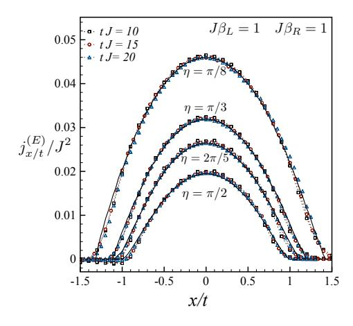

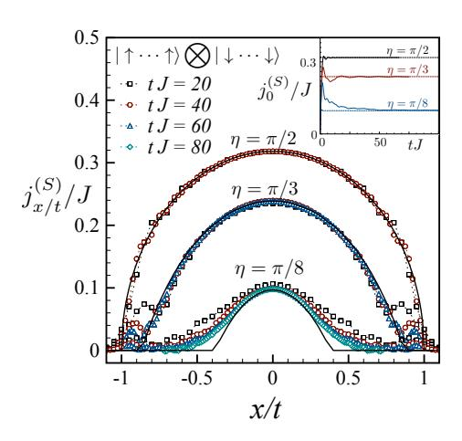

FIG. 32 (Color online) Profiles of the local currents in the spin-1/2 XXZ chain for different values of  $\Delta=\cos(\eta)$  as a function of rescaled position x/t. Symbols denote time-evolving block-decimation data for a chain of length L=60 (top) L=120 (bottom) and different times; full black lines are the GHD predictions. Top: Energy current after the two halves of the system have been initially prepared at inverse temperatures  $\beta_{\rm L}=1$  and  $\beta_{\rm R}=2$ . Bottom: Spin current after the two halves have been prepared in two ferromagnetic states with opposite magnetization. The inset shows the time-dependent approach of  $j_x^{(S)}$  (full colored lines) to the prediction (dashed lines). Figure adapted from (Bertini et al., 2016).

transport of spin has been observed to be diffusive for  $|\Delta| > 1$  and superdiffusive for  $\Delta = 1$  (Ljubotina et~al., 2019a, 2017). The former case is described by GHD with diffusive corrections (De Nardis et~al., 2019a) [see Sec. III.C.2], while a complete theoretical description of the latter is still missing and the problem is currently subject of active research (Agrawal et~al., 2020; Bulchandani, 2020; De Nardis et~al., 2019b, 2020b; Gopalakrishnan and Vasseur, 2019; Medenjak and De Nardis, 2020; Weiner et~al., 2020).

Finally, we note that, even though in generic spin

chains no nontrivial NESS is believed to emerge at infinite times, NESS-like physics can emerge in some intermediate-time window. This is the case of gapless systems subject to "low-temperature" bipartitioning protocols. Namely, these are bipartitioning protocols connecting two thermal states at different temperatures that are both small (Bernard and Doyon, 2016). In this regime, for large intermediate times, the behavior of energy density and current is well described by the Tomonaga-Luttinger liquid theory. The energy current is nonzero in the light-cone region and takes a conformal form (Bernard and Doyon, 2012, 2015). On the other hand, for describing the profiles of generic observables, such as, e.g., the spin current in the gapless phase of the spin-1/2 XXZ chain, it is necessary to keep track of the non-linearities in the dispersion of low-energy modes. One can make progress in this direction by using the framework of nonlinear Tomonaga-Luttinger liquids (Bertini et al., 2018b). For gapless integrable models at low temperatures, this approach reproduces the low-Texpansion of the GHD solution (Bertini and Piroli, 2018; Mestyán et al., 2019).

## X. OVERVIEW OVER EXPERIMENTS

In this final section, we give an account of some of the experimental efforts devoted to investigating transport in either quantum magnets or with ultracold quantum gases. We stress that the survey of the literature cannot be complete and refer the reader to recent reviews, where available (Hess, 2019).

# A. Quantum magnets

While this review focusses on the theoretical developments and results, the field was also strongly driven by experimental results. Most notably, many cupratebased low-dimensional magnets exhibit a contribution from magnetic excitations to the thermal conductivity (see (Hess, 2008, 2019; Sologubenko et al., 2007b) for a review). The values of the thermal conductivity  $\kappa$  can be extremely large, given that these materials are electrical insulators and that they have typically quite complicated structures. Originally, the largest thermal conductivities were reported for spin-ladder materials (Hess et al., 2001; Sologubenko et al., 2000b), yet later on, much purer samples of the spin-chain materials SrCuO2 (Hlubek et al., 2010) and Sr2CuO3 (Hlubek et al., 2012; Kawamata et al., 2008) became available that show higher thermal conductivities (see (Sologubenko et al., 2000a, 2001) for earlier experimental results). Those compounds are good realizations of the isotropic Heisenberg spin-chain model formed by Cu-O-Cu bonds with the exchange coupling being  $J/k_{\rm B} \sim 2000 - 3000\,{\rm K}$  and the coupling between

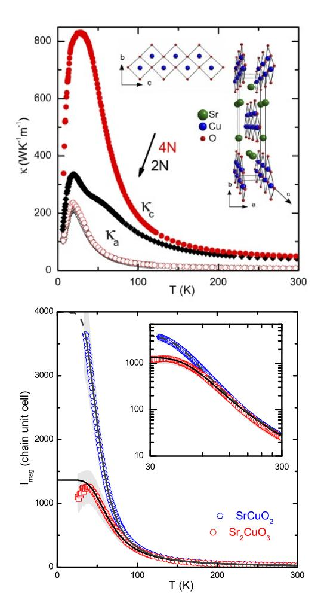

FIG. 33 (Color online) Top: experimental data for the thermal conductivity of SrCuO2 for two sample purities [2N (black curves) and 4N (red curves)]. The high-quality samples (4N) show a remarkably high thermal conductivity  $\kappa_c$  in the crystal direction that is parallel to the spin chains, which is attributed to spin excitations. In the transverse directions, presumably only phonons contribute. From (Hlubek et al., 2010). Bottom: Extracted magnetic mean free paths of spinons, from (Hlubek et al., 2012).

the chains  $\left|\frac{J_{\perp}}{J}\right| \sim 10^{-1}$ . The results for  $\kappa(T)$ , probing energy transport at low temperatures  $(k_{\rm B}T \ll J)$ , are shown in Fig. 33. Considering the complicated struture of these materials, the conductivities are surprisingly large. Other examples of one-dimensional materials that show a similar phenomenology are copper pyrazine dinitrate (Sologubenko *et al.*, 2007a), CaCu2O3 (Hess *et al.*, 2007) and Haldane chains (Sologubenko *et al.*, 2008).

While it is tempting to relate these large conductivities to the integrability of the underlying spin-chain Hamiltonians, a rigorous experimental or theoretical verification of such a connection is very difficult: measuring thermal transport necessarily requires a coupling of phonons to spins and thus a complete theory of thermal transport in such material requires the incorporation of phonons (see (Bartsch and Brenig, 2013; Boulat *et al.*, 2007; Chernyshev and Brenig, 2015; Chernyshev and Rozhkov, 2005, 2016; Gangadharaiah *et al.*, 2010; Louis *et al.*, 2006; Louis and Zotos, 2005; Narozhny, 1996; Rozhkov and Chernyshev, 2005; Shimshoni *et al.*, 2003).

Assuming simple additivity of different contributions to conductivity, one can subtract the phononic contribution by measuring  $\kappa$  in the direction orthogonal to the orientation of spin chains (where only phonons contribute, and whose contribution can be well described (Kawamata et al., 2008) by the Debye model). The resulting magnetic  $\kappa_{\rm mag}$  contribution is then finite despite the ballistic energy transport in the Heisenberg model. This is caused by residual scattering on few magnetic impurities (due to residual impurity of solvents used in the crystal growth), a nonzero interchain coupling and/or due to spinon-phonon scattering. One can even deliberately introduce impurity doping (Kawamata et al., 2008) and study how such disorder reduces transport (Hlubek et al., 2011; Mohan et al., 2014). Precisely accounting for different scattering effects is not easy (Hlubek et al., 2012), however, a picture that seems to account for most experimentally measured features seems to be compatible with a dominant impurity scattering at low temperatures  $(T < 50 \,\mathrm{K})$  while spinon-phonon scattering is the leading term at higher T. One can in fact infer (Sologubenko et al., 2000a) the mean-free path  $l_{\text{mag}}$  of magnetic excitaions (spinons) by using a simple kinetic expression for the conductivity of spinons,  $\kappa_{\text{mag}} = Cvl_{\text{mag}}$ , where C and v are the heat capacity and the velocity of spinons, respectively. The heat capacity of the spin-1/2 Heisenberg model at low T is proportional to T (Takahashi, 1973), leading to  $l_{\rm mag} \propto \kappa_{\rm mag}/k_{\rm B}T$  (see Fig. 33 bottom).

The quasi-2d parent compounds of the  $\mathrm{HT}_C$ s also exhibit a magnon contribution to the thermal conductivity, for instance, in  $\mathrm{La_2CuO_4}$  (Hess et~al., 2003),  $\mathrm{Sr_2CuO_2Cl_2}$  (Hofmann et~al., 2003),  $\mathrm{Ba_2Cu_3O_4Cl_2}$  (Ohno et~al., 2019), or  $\mathrm{Nd_2CuO_4}$  (Jin et~al., 2003). The values are smaller than in their quasi-one dimensional relatives (where  $l_{\mathrm{mag}} \sim 1\,\mu\mathrm{m}$ , see Fig. 33), yet this can partly be ascribed to the dependence of the specific heat on dimensionality.

Thermal transport in quantum magnets cannot only be measured in the steady state, but also using time-resolved methods or at specific finite frequencies. In the context of spin ladders, both the time-domain thermoreflectance method (Hohensee et al., 2014) and fluorescent microthermal imaging technique (Otter et al., 2012, 2009) were used. Moreover, one can induce a heat pulse on one end of a macroscopically large sample and then measure the time-resolved evolution of temperature at its other end (Montagnese et al., 2013). Such techniques can be used to extract electron-phonon coupling strength.

Measuring spin transport is much more difficult: un-

til very recently, the only experiments were indirect ones using NMR (Kühne et al., 2009; Thurber et al., 2001) or muon-spin resonance ( $\mu$ SR) techniques to obtain a relaxation rate (of a nuclear spin in NMR, or muon in  $\mu$ SR) which is given by the spin autocorrelation function. The frequency dependence of the latter can be probed by the magnetic field dependence of the relaxation rate, allowing one to distinguish, e.g., diffusive from ballistic behavior from the tail of the spin autocorrelation function. NMR studies on SrCuO2 found diffusive relaxation (Thurber et al., 2001), while  $\mu$ SR experiments on high-purity samples in found ballistic relaxation (Maeter et al., 2013) (both studies probe  $k_{\rm B}T \ll J$ ).  $\mu {\rm SR}$  measurements on an organic salt (Pratt et al., 2006) or on  $Cu(C_4H_4N_2)(NO_3)_2$  (Xiao et al., 2015) were interpreted in terms of diffusion, while a more recent  $\mu$ SR experiment (Huddart et al., 2020) on [pym-Cu( $NO_3$ )2( $H_2O$ )2] and [Cu(pym)(H2O)4]SiF6·H2O reports ballistic and diffusive dynamics, respectively.25 Recently, the spin-Seebeck effect was exploited to directly induce and measure spin currents in a quasi-1d cuprate material (Hirobe et al., 2017).

We mention that within solid-state NMR, experimental schemes were developed to study spin transport in quasi-1d spin-chain systems after initializing the system in a state with an inhomogeneous magnetization. An example is an apatite crystal in which flourine atoms form chains that can be under an appropriate pulse sequence described by a nearest-neighbor dipolar Hamiltonian (being related to the XX Hamiltonian by a unitary transformation), and with an inter-chain coupling being as small as  $|\frac{J_+}{J}| \sim 0.02$ . A mixed initial state with a boundary imbalance of magnetization can be prepared (exploiting different energy scales of bulk and boundary spins) whose time evolution can then be studied (Kaur and Cappellaro, 2012; Ramanathan  $et\ al.$ , 2011).

Besides experiments with bulk materials, there are novel synthetic one-dimensional structures that may in the future be used to study transport in correlated one-dimensional systems. These include arrays of atoms arranged on various surfaces (metallic, insulating or superconducting), whose properties are in some realizations believed to be related to the physics of spin systems (Khajetoorians et al., 2013; Toskovic et al., 2016).

The prediction of superdiffusive dynamics of the Kardar-Parisi-Zhang type for the spin-1/2 Heisenberg chain has stimulated a recent neutron-scattering study using the well-known quasi-one-dimensional material KCuF3 (Scheie *et al.*, 2020). By studying the regime of high temperatures  $\hbar\omega \ll k_BT$ , the authors report ev-

idence that the data are more consistent with KPZ behavior than diffusive or ballistic dynamics

As a future challenge for theory, the development of efficient numerical methods for the description of transport in electron-phonon systems is desirable. An open question is the applicability of wave-function based methods to the study of transport in spin-phonon systems. Recent advances with DMRG methods using optimized local phonon basis (Zhang et al., 1998) already give access to real-time dynamics in electron-phonon systems (Brockt et al., 2015; Dorfner et al., 2015; Guo et al., 2012; Kloss et al., 2019; Stolpp et al., 2020), calling for extensions to finite temperatures and spin-phonon systems.

# B. Ultracold quantum gases in optical lattices

Ultracold quantum gases provide another promising route to experimentally study the transport properties of low-dimensional many-body systems. In optical lattices, both Fermi- and Bose-Hubbard models can be rather routinely realized (Bloch et al., 2008; Gross and Bloch, 2017). A direct emulation of Heisenberg models or even more generally, spin-1/2 XXZ systems is more difficult: starting from single-bands and contact interactions, these models arise only in the strong-coupling regime of Hubbard models and the degree to which they can be realized with high fidelity depends on the quality of loading processes and state preparation. The fact that here we are interested in finite-temperature properties implies that no particular cooling schemes are needed, unlike in the ongoing efforts to reach the regime of long-range antiferromagnetic correlations in the Fermi-Hubbard model (Boll et al., 2016; Cheuk et al., 2016a,b, 2015; Cocchi et al., 2016; Edge et al., 2015; Greif et al., 2016; Haller et al., 2015; Hart et al., 2015; Hilker et al., 2017; Jördens et al., 2008; Mazurenko et al., 2017; Omran et al., 2015; Parsons et al., 2015, 2016; Salomon et al., 2019; Schneider et al., 2008).

Besides working with the Fermi-Hubbard model, one can also emulate the Heisenberg model in two-component Bose-Hubbard models. Using this route, the decay of a spin-spiral initial state was studied in 1d and 2d Heisenberg systems with a ferromagnetic exchange coupling (Hild et al., 2014). For a 1d system with an isotropic exchange interaction, a diffusice decay of the spin spiral was found. A very recent studied succeded to extends this to the entire range of exchange anisotropies by working with a different atomic species (namely the bosonic isotope 7Li) and by exploiting a specific Feshbach resonance (Jepsen et al., 2020). As a main result, the transition from a ballistic decay at  $\Delta = 0$  to a variety of transport behaviors is reported: superdiffusion for a range of  $0 < \Delta < 1$ , diffusion at  $\Delta = 1$ , and subdiffusive dynamics for  $\Delta > 1$ . These observations are quite different from the linear-response predictions dis-

&lt;sup>25 Both materials are rather perfect realizations of the antiferromagnetic isotropic Heisenberg model with  $J/k_{\rm B}\sim 10-50\,{\rm K}$  and  $|\frac{J_{\perp}}{J}|\lesssim 10^{-3}$ .

cussed in Sec. [VI.C,](#page-43-0) yet the initial spiral state may lead to genuinely nonequilibrium dynamics.

It thus appears that studying the role of integrability directly with Fermi-Hubbard models is the more promising route. Given the rapid emergence of many fermionic quantum-gas microscopes (Boll [et al.](#page-67-58), [2016;](#page-67-58) [Brown](#page-68-6) et al., [2019;](#page-68-6) [Cheuk](#page-68-61) et al., [2016b,](#page-68-61) [2015;](#page-68-62) [Cocchi](#page-68-63) et al., [2016;](#page-68-63) [Edge](#page-69-68) [et al.](#page-69-68), [2015;](#page-69-68) [Greif](#page-70-56) et al., [2016;](#page-70-56) [Guardado-Sanchez](#page-70-7) et al., [2020;](#page-70-7) [Haller](#page-70-57) et al., [2015;](#page-70-57) [Hilker](#page-70-59) et al., [2017;](#page-70-59) [Mazurenko](#page-72-64) [et al.](#page-72-64), [2017;](#page-72-64) [Nichols](#page-73-4) et al., [2019;](#page-73-4) [Omran](#page-73-55) et al., [2015;](#page-73-55) [Parsons](#page-73-56) et al., [2015,](#page-73-56) [2016;](#page-73-57) [Salomon](#page-74-1) et al., [2019\)](#page-74-1), which all work with the two-dimensional Fermi-Hubbard model and which do allow to chop such 2d systems into individual 1d systems (Boll [et al.](#page-67-58), [2016;](#page-67-58) [Salomon](#page-74-1) et al., [2019;](#page-74-1) [Vijayan](#page-76-0) et al., [2020\)](#page-76-0), the finite-temperature transport properties of the 1d Fermi-Hubbard model might be the easiest accessible integrable lattice model. Ultracold quantum gases have some drawbacks: particle numbers (or system sizes) cannot be made arbitrarily large, the systems have a finite life-time and they realize closed quantum systems, i.e., it is not straightforward to couple such a gas to leads (see [\(Brantut](#page-67-59) et al., [2013,](#page-67-59) [2012;](#page-67-60) [Krinner](#page-72-65) et al., [2017;](#page-72-65) [Stadler](#page-75-63) et al., [2012\)](#page-75-63), though). Nevertheless, one could exploit the single-site manipulation and resolution capabilities of quantum-gas microscopes to investigate the spreading of perturbations in the particle or spin density, as suggested in [\(Karrasch, 2017a\)](#page-71-47). Numerical simulations show that it is fairly well possible to resolve the difference between (presumably) diffusive and ballistic dynamics at high temperatures T J on time scales of less than 4/th, where th is the hoppingmatrix element, and thus within the time window of coherent many-body dynamics in such systems [\(Trotzky](#page-76-66) [et al.](#page-76-66), [2012\)](#page-76-66). Such an experiment could directly probe the linear-response regime. A recent experiment addressing spin-charge separation in the 1d Hubbard model utilizes a quite similar protocol to induce spin- and charge dynamics [\(Vijayan](#page-76-0) et al., [2020\)](#page-76-0).

Nonequilibrium mass transport can be investigated in a much more straightforward fashion using optical lattices. In the so-called sudden expansion, an originally trapped quantum gas is released from its confining potential and allowed to expand in a homogeneous and flat optical lattice. This method was used to study the nonequilibrium transport of the 2d Fermi-Hubbard model [\(Schneider](#page-74-3) et al., [2012\)](#page-74-3), the Fermi-Hubbard chain [\(Scherg](#page-74-70) et al., [2018\)](#page-74-70) as well as of bosons in 1d and 2d lattices [\(Ronzheimer](#page-74-0) et al., [2013\)](#page-74-0). In the latter experiment with bosons, an impressive difference between the dynamics of strongly-interacting bosons in 1d versus 2d lattices was observed: in 1d, the sudden expansion is as fast as for noninteracting bosons (assuming the same initial conditions), while in 2d, the cloud expands much slower, more consistent with the notion that interactions should induce scattering and degrade currents (see Fig. [34\)](#page-64-0). The reason for the behavior of such strongly-

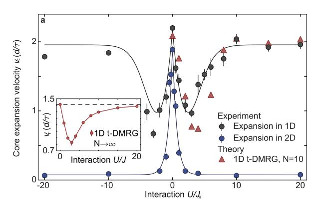

FIG. 34 (Color online) Expansion velocity of a cloud of bosons that are released from a trap into an empty optical lattice. The main panel shows experimental and DMRG data for the expansion velocity as a function of interaction strength U/Jx extracted from the half-width-half-maximum. Jx is the hopping matrix element along the x-direction of the two-dimensional lattice and Jx = J for the one-dimensional case. U is the onsite interaction strength in the Bose-Hubbard model. The inset shows DMRG data for the radial velocity as a function of U/J. Both noninteracting and strongly interacting bosons expand ballistically with the same expansion velocity [\(Ronzheimer](#page-74-0) et al., [2013\)](#page-74-0).

interacting 1d gases lies in their exact mapping onto spinless noninteracting fermions via a Jordan-Wigner transformation [\(Cazalilla](#page-68-0) et al., [2011\)](#page-68-0). Therefore, strongly interacting bosons with densities not exceeding unity realize an integrable model in 1d, equivalent to the spin-1/2 XX chain. Experimentally, integrability can be broken in three ways: (i) coupling 1d systems to a 2d system, (ii) inducing double occupancies in the initial state and (iii) by going to finite interaction strength 0 < U/th < ∞, where the Bose-Hubbard model is nonintegrable. All three cases show clear deviations from the fast and ballistic expansion of hardcore bosons. In cases (i) and (ii), this can be traced back to the breaking of integrability [\(Steinigeweg](#page-75-38) [et al.](#page-75-38), [2014b;](#page-75-38) [Vidmar](#page-76-67) et al., [2013\)](#page-76-67). The dynamics in the 1d Bose-Hubbard model at U/th < ∞ is more involved in this particular experiment as it also involves a quantum quench in the interaction and thus probes the dynamics at different energy densities, depending on U/th [\(Vidmar](#page-76-67) [et al.](#page-76-67), [2013\)](#page-76-67). The experiment [\(Ronzheimer](#page-74-0) et al., [2013\)](#page-74-0) is therefore a clear realization of integrability-protected ballistic mass transport in the spirit of this review, albeit in the nonequilibrium regime (see Sec. [IX.B\)](#page-59-0). Extensions of this approach are possible using quantum-gas microscopes as well, where so far, only the expansion dynamics of two bosons was investigated [\(Preiss](#page-73-58) et al., [2015;](#page-73-58) [Tai](#page-76-68) [et al.](#page-76-68), [2017\)](#page-76-68). More recent experiments studied transport in the two-dimensional Fermi-Hubbard model using the capabilities of quantum-gas microscopes [\(Brown](#page-68-6) [et al.](#page-68-6), [2019;](#page-68-6) [Nichols](#page-73-4) et al., [2019;](#page-73-4) [Vijayan](#page-76-0) et al., [2020\)](#page-76-0). All these studies investigate the interplay of spin- and

charge in transport, with [\(Vijayan](#page-76-0) et al., [2020\)](#page-76-0) focussing on spin-charge separation in one dimension, while [\(Brown](#page-68-6) [et al.](#page-68-6), [2019;](#page-68-6) [Nichols](#page-73-4) et al., [2019\)](#page-73-4) observe diffusion in twodimensional systems.

We note that experiments with ultracold bosons in optical lattices in the strongly interacting regime thus offer a unique and controlled way to study integrability breaking by perturbing around the limit of the spin-1/2 XX chain, resulting then in the 2d XX model or ladders [\(Hauschild](#page-70-44) et al., [2015;](#page-70-44) [Steinigeweg](#page-75-38) et al., [2014b;](#page-75-38) [Vidmar](#page-76-67) et al., [2013\)](#page-76-67). Besides measuring densities, one can further study one-body correlations in such sudden expansions, for which theory predicts a dynamical quasicondensation phenomenon [\(Rigol and Muramatsu, 2004;](#page-74-71) [Vidmar](#page-76-58) et al., [2017\)](#page-76-58) as a result of the emergent eigenstate solution for this nonequilibrium problem [\(Vidmar](#page-76-58) [et al.](#page-76-58), [2017\)](#page-76-58). Remarkably, even this effect, another consequence of integrability in nonequilibrium transport, has been observed experimentally [\(Vidmar](#page-76-59) et al., [2015\)](#page-76-59).

# XI. SUMMARY AND OUTLOOK

This article reviewed the state-of-the-art of the theoretical understanding of transport in translationally invariant one-dimensional quantum lattice models at finite temperatures from the theoretical physics perspective. We discussed, in particular, the important role of integrability and its breaking, focusing primarily on the paradigmatic spin-1/2 XXZ and the Fermi-Hubbard chain as minimal models for spin, charge and energy transport. The progress that has been achieved in recent years for these systems and their theoretical description in general is due to methodological breakthroughs, both in fundamental concepts, such as establishing the existence of quasi-local conservation laws [\(Ilievski](#page-71-26) et al., [2015;](#page-71-26) [Pereira](#page-73-8) et al., [2014;](#page-73-8) [Prosen, 2011b,](#page-74-7) [2014c;](#page-74-9) [Prosen and Ilievski, 2013\)](#page-74-8) and their connection to a complete hydrodynamic description [the so-called generalized hydrodynamics [\(Bertini](#page-67-7) et al., [2016;](#page-67-7) [Castro-](#page-68-11)[Alvaredo](#page-68-11) et al., [2016\)](#page-68-11)], as well as in numerical methods such as, e.g., matrix-product-based techniques [\(Kar](#page-71-47)[rasch, 2017a;](#page-71-47) [Karrasch](#page-71-8) et al., [2012,](#page-71-8) [2013a\)](#page-71-44) or dynamical typicality [\(Steinigeweg](#page-75-9) et al., [2014a,](#page-75-9) [2016b\)](#page-75-14) for utilizing time-evolution methods at finite temperatures for the calculation of transport properties. Establishing timedependent DMRG as a solver of Lindblad master equations [\(Prosen and](#page-74-6) Znidariˇc, [2009\)](#page-74-6) opened up possibilities ˇ for complementary qualitative and quantitative insights from studying open quantum systems [\(Znidariˇc, 2011\)](#page-76-13). ˇ

We may say that the understanding of ballistic transport at high temperatures or even in nonequilibrium states have by now matured. The thermal Drude weight in both the spin-1/2 XXZ chain and the 1d Fermi-Hubbard model were computed as a function of model parameters and temperature [\(Ilievski and De Nardis, 2017a;](#page-71-34) [Karrasch, 2017b;](#page-71-14) [Kl¨umper and Sakai, 2002;](#page-71-7) [Sakai and](#page-74-5) [Kl¨umper, 2003\)](#page-74-5). The exact and complete calculation of magnetothermal corrections involving off-diagonal coefficients and the spin Drude weight at finite magnetizations remains as an open task [\(Heidrich-Meisner](#page-70-37) et al., [2005a;](#page-70-37) [Louis and Gros, 2003;](#page-72-35) [Sakai and Kl¨umper, 2005;](#page-74-50) [Zotos,](#page-76-11) [2017\)](#page-76-11), in particular, for the Fermi-Hubbard model where in principle, three currents can couple. The calculation of all cross-coefficients could be accomplished using the methodology of GHD.

For spin transport in the spin-1/2 XXZ chain, the existence of a finite-temperature Drude weight at both finite and zero magnetization and any value of ∆ [\(Zotos](#page-76-9) et al., [1997\)](#page-76-9) and for zero magnetization at |∆| < 1 is now well established and accepted [\(Pereira](#page-73-8) et al., [2014;](#page-73-8) [Prosen,](#page-74-7) [2011b;](#page-74-7) [Prosen and Ilievski, 2013;](#page-74-8) [Urichuk](#page-76-14) et al., [2019;](#page-76-14) [Zotos, 1999\)](#page-76-12). Its full temperature dependence is accessible as well [\(Ilievski and De Nardis, 2017b;](#page-71-10) [Urichuk](#page-76-14) et al., [2019;](#page-76-14) [Zotos, 1999\)](#page-76-12), yet has not been convincingly computed with numerical methods. The agreement between TBA, GHD, and the lower bound supports the notion of a fractal structure as a function of ∆, yet neither approach is rigorous, involving either Takahashi's string hypothesis or relies on the assumption of knowing all relevant charges. For the spin-1/2 Heisenberg chain, the overwhelming evidence suggests that the spin Drude weight vanishes at finite temperature. The same goes for the regime of ∆ > 1, while in both cases, a rigorous proof is missing.

For those cases that prohibit ballistic transport channels, or when studying subleading corrections, the situation is still much less clear, yet actively studied. Although normal diffusion is the most commonly observed type of non-ballistic transport, both in integrable [\(De Nardis](#page-68-12) et al., [2018\)](#page-68-12) and nonintegrable quantum lattice systems [\(Sirker](#page-75-7) et al., [2009,](#page-75-7) [2011\)](#page-75-8), one often encounters also other types of transport, including, in particular, superdiffusive dynamics [\(Ljubotina](#page-72-4) et al., [2017;](#page-72-4) [Znidariˇc, 2011\)](#page-76-13). Notably, the conjectured KPZ scaling ˇ [\(Ljubotina](#page-72-3) et al., [2019a\)](#page-72-3) [see also [\(Bulchandani, 2020;](#page-68-43) Das [et al.](#page-68-64), [2019;](#page-68-64) [De Nardis](#page-68-44) et al., [2020a;](#page-68-44) [Dupont and](#page-69-12) [Moore, 2020;](#page-69-12) Fava [et al.](#page-69-52), [2020;](#page-69-52) [Ilievski](#page-71-59) et al., [2020;](#page-71-59) [Kra](#page-72-66)[jnik and Prosen, 2020;](#page-72-66) [Weiner](#page-76-15) et al., [2020\)](#page-76-15)] of spincorrelation functions and spin-transport in the isotropic Heisenberg chain and other integrable models of magnetism with non-Abelian symmetries is a particularly pressing question, on which much work is expected in the near future. Another universal option suggested by recent studies is the one of marginally superdiffusive transport characterized by a diffusive exponent and a logarithmic correction [\(De Nardis](#page-68-15) et al., [2020b\)](#page-68-15). The exact nature of subleading corrections in the ballistic regimes of the 1d Fermi-Hubbard model or the exact nature of spin- and charge transport at zero magnetization and filling is much less well understood. In general, a complete qualitative understanding of the emergence of diffusion

in integrable models is still lacking.

Both the now solidly established aspects of spin transport in the spin-1/2 XXZ chain and the open questions on, e.g., superdiffusion and the connection between linear-response behavior and transport in specific farfrom-equilibrium settings have stimulated additional recent experiments using both quasi-one-dimensional materials [\(Scheie](#page-74-19) et al., [2020\)](#page-74-19) and ultracold atoms [\(Jepsen](#page-71-23) [et al.](#page-71-23), [2020\)](#page-71-23). The neutron-scattering study [\(Scheie](#page-74-19) et al., [2020\)](#page-74-19) reports consistency of their data with the KPZ scenario.

For nonintegrable models, we presented examples where the notion of diffusion is soundly supported from approximate analytical methods as well as numerically exact techniques. These include the dimerized spin-1/2 XX ladder [\(Steinigeweg](#page-75-38) et al., [2014b\)](#page-75-38), spin-1/2 chains with a staggered magnetic field [\(Huang](#page-70-16) et al., [2013;](#page-70-16) [Steinigeweg](#page-75-13) et al., [2015\)](#page-75-13), as well as general spin ladders and frustrated chains [\(Karrasch](#page-71-45) et al., [2015a;](#page-71-45) [Steinigeweg](#page-75-14) [et al.](#page-75-14), [2016b;](#page-75-14) [Zotos, 2004\)](#page-76-16). In the latter cases, the longtime dynamics is usually more complex and diffusion is harder to establish. At low energies, field-theoretical studies are strongly suggestive of diffusive dynamics as well [see, in particular, [\(Sirker](#page-75-8) et al., [2011\)](#page-75-8)].

Although the work presented here considers only quantum lattice systems, it is not clear if the transport phenomena are in any fundamental way affected by the quantum nature of the microscopic equation of motions as compared to classical deterministic Hamiltonian dynamics governing classical lattice systems. So far, we see no argument against the conclusion that all the emerging transport phenomena at finite temperatures have analogous counterparts in classical lattice models. An exception might be the putative many-body localization [\(Abanin](#page-66-2) et al., [2019a;](#page-66-2) [Nandkishore and Huse,](#page-73-2) [2015\)](#page-73-2), where temperature is ill-defined. However, both a systematic semiclassical analysis and elucidating the quantum-classical correspondence for transport in manybody lattice systems would be desirable for the future.

The transition between diffusion to types of nondiffusive transport can be expected to be a manifestation of a form of ergodicity breaking. The latter is currently being intensely studied even in translationally invariant, disorder-free settings, prominent examples being the so-called quantum scars in models with constrained dynamics [see, e.g., [\(Bernien](#page-67-61) et al., [2017;](#page-67-61) Lan [et al.](#page-72-67), [2018;](#page-72-67) [Moudgalya](#page-73-59) et al., [2018;](#page-73-59) [Turner](#page-76-69) et al., [2018\)](#page-76-69)]. However, a possible connection to finite-temperature transport in such models has not been investigated. Another interesting set of open questions in relation to ergodicity breaking concerns the connection between spectral statistics, described by random-matrix theory, and transport properties. Since spectral statistics contain information on different time scales, it may happen [\(Brenes](#page-68-29) et al., [2018\)](#page-68-29) that models with a local integrability breaking are ergodic on the Heisenberg time scale, i.e., on time scales

controlled by the inverse mean level spacing, while transport is ballistic on shorter time scales.

# ACKNOWLEDGMENTS

We thank H. De Raedt, J. Gemmer, C. Hess, P. Maass, V. Meden, J. Moore, P. Prelovˇsek, U. Schneider, H. Spohn, and X. Zotos for discussions and for their comments on a previous version of the manuscript. We thank M. Fagotti for valuable discussions and his contributions to this project in its early stages. Furthermore, we acknowledge helpful comments from S. Gopalakrishnan, D. Huse, E. Ilievski, A. Kl¨umper, and L. Santos on a previous version of the manuscript. This work was supported in parts by the Starting Grant No. 679722 and Advanced Grant OMNES No. 694544 of European Research Council (ERC). F.H.-M. and M.Z. are grateful for the hospitality at KITP, where part of this work was performed. This research was supported in part by the National Science Foundation under Grant No. NSF PHY-1748958. C.K. acknowledges support by the Deutsche Forschungsgemeinschaft through the Emmy Noether program (KA 3360/2-1) as well as by 'Nieders¨achsisches Vorab' through 'Quantum- and Nano-Metrology (QUANOMET)' initiative within the project NL-2. R.S. acknowledges support by the DFG - 397067869 (STE 2243/3-1) - within the DFG Research Unit FOR 2692 - 355031190. F. H.- M. was supported by the Deutsche Forschungsgemeinschaft (DFG, German Science Foundation) - 217133147 - via CRC 1073 (project B09). T.P. and M.Z. acknowledge support by Program P1-0402 of Slovenian Research Agency (ARRS). M.Z. acknowledges support by the Grants J1-7279 and J1-1698 of the Slovenian Research Agency (ARRS).

### REFERENCES

Abanin, D. A., E. Altman, I. Bloch, and M. Serbyn (2019a), [Rev. Mod. Phys.](http://dx.doi.org/10.1103/RevModPhys.91.021001) 91, 021001.

Abanin, D. A., J. H. Bardarson, G. D. Tomasi, S. Gopalakrishnan, V. Khemani, S. A. Parameswaran, F. Pollmann, A. C. Potter, M. Serbyn, and R. Vasseur (2019b), [,](https://arxiv.org/abs/1911.04501) [arXiv:1911.04501.](https://arxiv.org/abs/1911.04501)

Agarwal, K., S. Gopalakrishnan, M. Knap, M. M¨uller, and E. Demler (2015), [Phys. Rev. Lett.](http://dx.doi.org/10.1103/PhysRevLett.114.160401) 114, 160401.

Agrawal, U., S. Gopalakrishnan, R. Vasseur, and B. Ware (2020), [Phys. Rev. B](http://dx.doi.org/10.1103/PhysRevB.101.224415) 101, 224415.

Ajisaka, S., F. Barra, C. Mejia-Monasterio, and T. Prosen (2012), [Phys. Rev. B](http://dx.doi.org/10.1103/PhysRevB.86.125111) 86, 125111.

Al-Assam, S., S. R. Clark, and D. Jaksch (2016), ["Tensor](http//www.tensornetworktheory.org) [network theory library, beta version 1.0.13,"](http//www.tensornetworktheory.org) [http//www.](http//www.tensornetworktheory.org) [tensornetworktheory.org](http//www.tensornetworktheory.org).

Alba, V. (2018), [Phys. Rev. B](http://dx.doi.org/10.1103/PhysRevB.97.245135) 97, 245135.

Alba, V., B. Bertini, and M. Fagotti (2019), [SciPost Phys.](http://dx.doi.org/10.21468/SciPostPhys.7.1.005) 7[, 5.](http://dx.doi.org/10.21468/SciPostPhys.7.1.005)

Alba, V., and F. Heidrich-Meisner (2014), [Phys. Rev. B](http://dx.doi.org/ 10.1103/PhysRevB.90.075144) 90, [075144.](http://dx.doi.org/ 10.1103/PhysRevB.90.075144)

- Alben, R., M. Blume, H. Krakauer, and L. Schwartz (1975), [Phys. Rev. B](http://dx.doi.org/10.1103/PhysRevB.12.4090) 12, 4090.
- Alicki, R., and K. Lendi (2007), Quantum Dynamical Semigroups and Applications (Springer-Verlag, Berlin).
- Altman, E., and R. Vosk (2015), [Annu. Rev. Condens. Matter](https://doi.org/10.1146/annurev-conmatphys-031214-014701) [Phys.](https://doi.org/10.1146/annurev-conmatphys-031214-014701) 6, 383.
- Alvarez, J. V., and C. Gros (2002a), [Phys. Rev. Lett.](http://dx.doi.org/ 10.1103/PhysRevLett.89.156603) 89, [156603.](http://dx.doi.org/ 10.1103/PhysRevLett.89.156603)
- Alvarez, J. V., and C. Gros (2002b), [Phys. Rev. B](http://dx.doi.org/ 10.1103/PhysRevB.66.094403) 66, 094403. Alvarez, J. V., and C. Gros (2002c), [Phys. Rev. Lett.](https://doi.org/10.1103/PhysRevLett.88.077203) 88, [077203.](https://doi.org/10.1103/PhysRevLett.88.077203)
- Antal, T., P. L. Krapivsky, and A. R´akos (2008), [Phys. Rev.](http://dx.doi.org/10.1103/PhysRevE.78.061115) E 78[, 061115.](http://dx.doi.org/10.1103/PhysRevE.78.061115)
- Antal, T., Z. R´acz, A. R´akos, and G. M. Sch¨utz (1998), [Phys.](http://dx.doi.org/10.1103/PhysRevE.57.5184) [Rev. E](http://dx.doi.org/10.1103/PhysRevE.57.5184) 57, 5184.
- Antal, T., Z. R´acz, A. R´akos, and G. M. Sch¨utz (1999), [Phys.](http://dx.doi.org/10.1103/PhysRevE.59.4912) [Rev. E](http://dx.doi.org/10.1103/PhysRevE.59.4912) 59, 4912.
- Antal, T., Z. R´acz, and L. Sasv´ari (1997a), [Phys. Rev. Lett.](http://dx.doi.org/10.1103/PhysRevLett.78.167) 78[, 167.](http://dx.doi.org/10.1103/PhysRevLett.78.167)
- Antal, T., Z. R´acz, and L. Sasv´ari (1997b), [Phys. Rev. Lett.](http://dx.doi.org/10.1103/PhysRevLett.78.167) 78[, 167.](http://dx.doi.org/10.1103/PhysRevLett.78.167)
- Arrigoni, E., M. Knap, and W. von der Linden (2013), [Phys.](http://dx.doi.org/ 10.1103/PhysRevLett.110.086403) [Rev. Lett.](http://dx.doi.org/ 10.1103/PhysRevLett.110.086403) 110, 086403.
- Aschbacher, W. H., and J.-M. Barbaroux (2006), [Lett. Math.](https://doi.org/10.1007/s11005-006-0049-7) [Phys.](https://doi.org/10.1007/s11005-006-0049-7) 77, 11.
- Aschbacher, W. H., and C.-A. Pillet (2003), [J. Stat. Phys.](http://dx.doi.org/ 10.1023/A:1024619726273) 112[, 1153.](http://dx.doi.org/ 10.1023/A:1024619726273)
- Ashcroft, N. W., and N. D. Mermin (1976), Solid State Physics (Saunders College Publishing).
- Attal, S., and Y. Pautrat (2006), [Ann. Henri Poincar´e](http://dx.doi.org/10.1007/s00023-005-0242-8) 7, 59. Balachandran, V., G. Benenti, E. Pereira, G. Casati, and D. Poletti (2018), [Phys. Rev. Lett.](http://dx.doi.org/10.1103/PhysRevLett.120.200603) 120, 200603.
- Balz, B. N., J. Richter, J. Gemmer, R. Steinigeweg, and P. Reimann (2018), "Dynamical typicality for initial states with a preset measurement statistics of several commuting observables," in [Thermodynamics in the Quantum](http://dx.doi.org/10.1007/978-3-319-99046-0_17) [Regime: Fundamental Aspects and New Directions](http://dx.doi.org/10.1007/978-3-319-99046-0_17), edited by F. Binder, L. A. Correa, C. Gogolin, J. Anders, and G. Adesso (Springer International Publishing, Cham) pp. 413–433.
- Barra, F. (2015), [Sci. Rep.](https://doi.org/10.1038/srep14873) 5, 14873.
- Barthel, T. (2013), [New J. Phys.](https://doi.org/10.1088%2F1367-2630%2F15%2F7%2F073010) 15, 073010.
- Barthel, T., U. Schollw¨ock, and S. R. White (2009), [Phys.](https://doi.org/10.1103/PhysRevB.79.245101) Rev. B 79[, 245101.](https://doi.org/10.1103/PhysRevB.79.245101)
- Bartsch, C., and W. Brenig (2013), [Phys. Rev. B](http://dx.doi.org/10.1103/PhysRevB.88.214412) 88, 214412. Bartsch, C., and J. Gemmer (2009), [Phys. Rev. Lett.](https://doi.org/10.1103/PhysRevLett.102.110403) 102, [110403.](https://doi.org/10.1103/PhysRevLett.102.110403)
- Bastianello, A., V. Alba, and J.-S. Caux (2019), [Phys. Rev.](http://dx.doi.org/ 10.1103/PhysRevLett.123.130602) Lett. 123[, 130602.](http://dx.doi.org/ 10.1103/PhysRevLett.123.130602)
- Bastianello, A., and A. De Luca (2019), [Phys. Rev. Lett.](http://dx.doi.org/ 10.1103/PhysRevLett.122.240606) 122[, 240606.](http://dx.doi.org/ 10.1103/PhysRevLett.122.240606)
- Bastianello, A., B. Doyon, G. Watts, and T. Yoshimura (2018), [SciPost Phys.](http://dx.doi.org/10.21468/SciPostPhys.4.6.045) 4, 45.
- Baxter, R. J. (1982), Exactly solved models in statistical mechanics (Academic Press).
- Benenti, G., G. Casati, T. Prosen, and D. Rossini (2009a), Europhys. Lett. 85, 37001.
- Benenti, G., G. Casati, T. Prosen, D. Rossini, and M. Znidariˇc (2009b), [Phys. Rev. B](http://dx.doi.org/10.1103/PhysRevB.80.035110) ˇ 80, 035110.
- Benenti, G., S. Lepri, and R. Livi (2020), [Frontiers in Physics](http://dx.doi.org/10.3389/fphy.2020.00292) 8[, 292.](http://dx.doi.org/10.3389/fphy.2020.00292)
- Beni, G., and C. F. Coll (1975), [Phys. Rev. B](https://doi.org/10.1103/PhysRevB.11.573) 11, 573.
- Benz, J., T. Fukui, A. Kl¨umper, and C. Scheeren (2005), [J.](https://doi.org/10.1143/JPSJS.74S.181) [Phys. Soc. Jpn. Suppl.](https://doi.org/10.1143/JPSJS.74S.181) 74, 181.

- Bera, S., G. De Tomasi, F. Weiner, and F. Evers (2017), [Phys. Rev. Lett.](http://dx.doi.org/10.1103/PhysRevLett.118.196801) 118, 196801.
- Bernard, D., and B. Doyon (2012), [J. Phys. A: Math. Theor.](http://stacks.iop.org/1751-8121/45/i=36/a=362001) 45 [\(36\), 362001.](http://stacks.iop.org/1751-8121/45/i=36/a=362001)
- Bernard, D., and B. Doyon (2015), [Ann. Henri Poincar´e](https://doi.org/10.1007/s00023-014-0314-8) 16, [113.](https://doi.org/10.1007/s00023-014-0314-8)
- Bernard, D., and B. Doyon (2016), [J. Stat. Mech. Theor.](http://dx.doi.org/10.1088/1742-5468/2016/06/064005) Exp. 2016[, 064005.](http://dx.doi.org/10.1088/1742-5468/2016/06/064005)
- Bernien, H., S. Schwartz, A. Keesling, H. Levine, A. Omran, H. Pichler, S. Choi, A. S. Zibrov, M. Endres, M. Greiner, V. Vuletic, and M. D. Lukin (2017), [Nature](http://dx.doi.org/10.1038/nature24622) 551, 579.
- Bernier, J.-S., R. Tan, L. Bonnes, C. Guo, D. Poletti, and C. Kollath (2018), [Phys. Rev. Lett.](http://dx.doi.org/ 10.1103/PhysRevLett.120.020401) 120, 020401.
- Bertini, B., M. Collura, J. De Nardis, and M. Fagotti (2016), [Phys. Rev. Lett.](http://dx.doi.org/10.1103/PhysRevLett.117.207201) 117, 207201.
- Bertini, B., F. H. L. Essler, S. Groha, and N. J. Robinson (2015), [Phys. Rev. Lett.](http://dx.doi.org/10.1103/PhysRevLett.115.180601) 115, 180601.
- Bertini, B., and M. Fagotti (2016), [Phys. Rev. Lett.](http://dx.doi.org/10.1103/PhysRevLett.117.130402) 117, [130402.](http://dx.doi.org/10.1103/PhysRevLett.117.130402)
- Bertini, B., M. Fagotti, L. Piroli, and P. Calabrese (2018a), [J. Phys. A: Math. Theor.](http://dx.doi.org/10.1088/1751-8121/aad82e) 51, 39LT01.
- Bertini, B., and L. Piroli (2018), [J. Stat. Mech. Theor. Exp.](http://dx.doi.org/10.1088/1742-5468/aab04b) 2018[, 033104.](http://dx.doi.org/10.1088/1742-5468/aab04b)
- Bertini, B., L. Piroli, and P. Calabrese (2018b), [Phys. Rev.](http://dx.doi.org/ 10.1103/PhysRevLett.120.176801) Lett. 120[, 176801.](http://dx.doi.org/ 10.1103/PhysRevLett.120.176801)
- Bertini, B., L. Piroli, and M. Kormos (2019), [Phys. Rev. B](http://dx.doi.org/10.1103/PhysRevB.100.035108) 100[, 035108.](http://dx.doi.org/10.1103/PhysRevB.100.035108)
- Bethe, H. (1931), [Z. Phys.](http://dx.doi.org/10.1007/BF01341708) 71, 205.
- Bhaseen, M. J., B. Doyon, A. Lucas, and K. Schalm (2015), [Nature Phys.](https://doi.org/10.1038/nphys3320) 11, 509.
- Biella, A., M. Collura, D. Rossini, A. De Luca, and L. Mazza (2019), [Nature Communications](http://dx.doi.org/10.1038/s41467-019-12784-4) 10, 4820.
- Biella, A., A. De Luca, J. Viti, D. Rossini, L. Mazza, and R. Fazio (2016), [Phys. Rev. B](http://dx.doi.org/ 10.1103/PhysRevB.93.205121) 93, 205121.
- Bloch, I., J. Dalibard, and W. Zwerger (2008), [Rev. Mod.](https://doi.org/10.1103/RevModPhys.80.885) [Phys.](https://doi.org/10.1103/RevModPhys.80.885) 80, 885.
- Bohm, M., and H. Leschke (1992), [J. Phys. A: Math. Gen.](http://dx.doi.org/10.1088/0305-4470/25/5/013) 25[, 1043.](http://dx.doi.org/10.1088/0305-4470/25/5/013)
- Bohrdt, A., C. B. Mendl, M. Endres, and M. Knap (2017), [New J. Phys.](http://dx.doi.org/10.1088/1367-2630/aa719b) 19, 063001.
- Boll, M., T. A. Hilker, G. Salomon, A. Omran, J. Nespolo, L. Pollet, I. Bloch, and C. Gross (2016), [Science](http://dx.doi.org/10.1126/science.aag1635) 353, 1257.
- Bonetto, F., J. L. Lebowitz, and L. Rey-Bellet (2000), in [Mathematical Physics 2000](https://doi.org/10.1142/p195) , edited by A. Fokas, A. Grigoryan, T. Kibble, and B. Zegarlinski (Imperial College Press, London).
- Bonˇca, J., J. P. Rodriguez, J. Ferrer, and K. S. Bedell (1994), [Phys. Rev. B](http://dx.doi.org/10.1103/PhysRevB.50.3415) 50, 3415.
- Borsi, M., B. Pozsgay, and L. Pristy´ak (2020), [Phys. Rev. X](http://dx.doi.org/10.1103/PhysRevX.10.011054) 10[, 011054.](http://dx.doi.org/10.1103/PhysRevX.10.011054)
- Boulat, E., P. Mehta, N. Andrei, E. Shimshoni, and A. Rosch (2007), [Phys. Rev. B](https://doi.org/10.1103/PhysRevB.76.214411) 76, 214411.
- Bransch¨adel, A., G. Schneider, and P. Schmitteckert (2010), [Ann. Phys. \(Berlin\)](http://dx.doi.org/ https://doi.org/10.1002/andp.201000017) 522, 657.
- Brantut, J.-P., C. Grenier, J. Meineke, D. Stadler, S. Krinner, C. Kollath, T. Esslinger, and A. Georges (2013), [Science](http://dx.doi.org/ 10.1126/science.1242308) 342[, 713.](http://dx.doi.org/ 10.1126/science.1242308)
- Brantut, J. P., J. Meineke, D. Stadler, S. Krinner, and T. Esslinger (2012), [Science](http://dx.doi.org/10.1126/science.1223175) 337, 1069.
- Brenes, M., J. Goold, and M. Rigol (2020a), [Phys. Rev. B](http://dx.doi.org/10.1103/PhysRevB.102.075127) 102[, 075127.](http://dx.doi.org/10.1103/PhysRevB.102.075127)
- Brenes, M., T. LeBlond, J. Goold, and M. Rigol (2020b), [Phys. Rev. Lett.](http://dx.doi.org/10.1103/PhysRevLett.125.070605) 125, 070605.

- Brenes, M., E. Mascarenhas, M. Rigol, and J. Goold (2018), [Phys. Rev. B](http://dx.doi.org/10.1103/PhysRevB.98.235128) 98, 235128.
- Brenes, M., J. J. Mendoza-Arenas, A. Purkayastha, M. T. Mitchison, S. R. Clark, and J. Goold (2020c), [Phys. Rev.](http://dx.doi.org/ 10.1103/PhysRevX.10.031040) X 10[, 031040.](http://dx.doi.org/ 10.1103/PhysRevX.10.031040)
- Breuer, H.-P., and F. Petruccione (2002), The theory of open quantum systems (Oxford University Press).
- Brockt, C., F. Dorfner, L. Vidmar, F. Heidrich-Meisner, and E. Jeckelmann (2015), [Phys. Rev. B](http://dx.doi.org/10.1103/PhysRevB.92.241106) 92, 241106.
- Brown, P. T., D. Mitra, E. Guardado-Sanchez, R. Nourafkan, A. Reymbaut, C.-D. Hebert, S. Bergeron, A.-M. S. Tremblay, J. Kokalj, D. A. Huse, P. Schauss, and W. S. Bakr (2019), [Science](http://dx.doi.org/ 10.1126/science.aat4134) 363, 379.
- Buchanan, M. (2005), [Nature Phys.](https://doi.org/10.1038/nphys157) 1, 71.
- Bulchandani, V. B. (2017), [J. Phys. A: Math. Theor.](http://dx.doi.org/ 10.1088/1751-8121/aa8c62) 50, [435203.](http://dx.doi.org/ 10.1088/1751-8121/aa8c62)
- Bulchandani, V. B. (2020), [Phys. Rev. B](http://dx.doi.org/ https://doi.org/10.1103/PhysRevB.101.041411) 101, 041411(R).
- Bulchandani, V. B., X. Cao, and J. E. Moore (2019), [J. Phys.](http://dx.doi.org/ 10.1088/1751-8121/ab2cf0) [A: Math. Theor.](http://dx.doi.org/ 10.1088/1751-8121/ab2cf0) 52, 33LT01.
- Bulchandani, V. B., C. Karrasch, and J. E. Moore (2020), [Proc. National Academy of Sciences](http://dx.doi.org/10.1073/pnas.1916213117) 117 (23), 12713.
- Bulchandani, V. B., R. Vasseur, C. Karrasch, and J. E. Moore (2017), [Phys. Rev. Lett.](http://dx.doi.org/10.1103/PhysRevLett.119.220604) 119, 220604.
- Bulchandani, V. B., R. Vasseur, C. Karrasch, and J. E. Moore (2018), [Phys. Rev. B](http://dx.doi.org/10.1103/PhysRevB.97.045407) 97, 045407.
- Calabrese, P., F. H. L. Essler, and G. Mussardo (2016), [Jour](http://dx.doi.org/ 10.1088/1742-5468/2016/06/064001)[nal of Statistical Mechanics: Theory and Experiment](http://dx.doi.org/ 10.1088/1742-5468/2016/06/064001) 2016, [064001.](http://dx.doi.org/ 10.1088/1742-5468/2016/06/064001)
- Calabrese, P., C. Hagendorf, and P. L. Doussal (2008), [J.](http://dx.doi.org/ 10.1088/1742-5468/2008/07/p07013) [Stat. Mech. Theor. Exp.](http://dx.doi.org/ 10.1088/1742-5468/2008/07/p07013) 2008, P07013.
- Callen, H. B., and T. A. Welton (1951), [Phys. Rev.](https://doi.org/10.1103/PhysRev.83.34) 83, 34. Cao, X., V. B. Bulchandani, and H. Spohn (2019), [J. Phys.](http://dx.doi.org/10.1088/1751-8121/ab5019) [A: Math. Theor.](http://dx.doi.org/10.1088/1751-8121/ab5019) 52, 495003.
- Carmelo, J., S.-J. Gu, and P. Sacramento (2013), [Ann. Phys.](http://dx.doi.org/https://doi.org/10.1016/j.aop.2013.09.020) 339[, 484 .](http://dx.doi.org/https://doi.org/10.1016/j.aop.2013.09.020)
- Carmelo, J., S. Nemati, and T. Prosen (2018), [Nucl. Phys.](http://dx.doi.org/ https://doi.org/10.1016/j.nuclphysb.2018.03.011) B 930[, 418 .](http://dx.doi.org/ https://doi.org/10.1016/j.nuclphysb.2018.03.011)
- Carmelo, J. M. P., T. Prosen, and D. K. Campbell (2015), [Phys. Rev. B](http://dx.doi.org/10.1103/PhysRevB.92.165133) 92, 165133.
- Casagrande, H. P., D. Poletti, and G. T. Landi (2020), [,](https://arxiv.org/abs/2009.08200) [arXiv:2009.08200.](https://arxiv.org/abs/2009.08200)
- Casati, G., J. Ford, F. Vivaldi, and W. M. Visscher (1984), [Phys. Rev. Lett.](http://dx.doi.org/10.1103/PhysRevLett.52.1861) 52, 1861.
- Castella, H., X. Zotos, and P. Prelovˇsek (1995), [Phys. Rev.](https://doi.org/10.1103/PhysRevLett.74.972) Lett. 74[, 972.](https://doi.org/10.1103/PhysRevLett.74.972)
- Castro-Alvaredo, O., Y. Chen, B. Doyon, and M. Hoogeveen (2014), [J. Stat. Mech. Theor. Exp.](http://stacks.iop.org/1742-5468/2014/i=3/a=P03011) 2014, P03011.
- Castro-Alvaredo, O. A., B. Doyon, and T. Yoshimura (2016), [Phys. Rev. X](http://dx.doi.org/ 10.1103/PhysRevX.6.041065) 6, 041065.
- Caux, J., and J. Mossel (2011), [J. Stat. Mech. \(2011\), P02023.](http://dx.doi.org/10.1088/1742-5468/2011/02/p02023) Caux, J.-S., B. Doyon, J. Dubail, R. Konik, and T. Yoshimura (2019), [SciPost Phys.](http://dx.doi.org/10.21468/SciPostPhys.6.6.070) 6, 70.
- Caux, J.-S., and J. M. Maillet (2005), [Phys. Rev. Lett.](http://dx.doi.org/ 10.1103/PhysRevLett.95.077201) 95, [077201.](http://dx.doi.org/ 10.1103/PhysRevLett.95.077201)
- Cazalilla, M. A., R. Citro, T. Giamarchi, E. Orignac, and M. Rigol (2011), [Rev. Mod. Phys.](https://doi.org/10.1103/RevModPhys.83.1405) 83, 1405.
- Bariˇsi´c, O. S., J. Kokalj, I. Balog, and P. Prelovˇsek (2016), [Phys. Rev. B](http://dx.doi.org/ 10.1103/PhysRevB.94.045126) 94, 045126.
- Bariˇsi´c, O. S., P. Prelovˇsek, A. Metavitsiadis, and X. Zotos (2009), [Phys. Rev. B](https://doi.org/10.1103/PhysRevB.80.125118) 80, 125118.
- Cheneau, M., P. Barmettler, D. Poletti, M. Endres, P. Schauß, T. Fukuhara, C. Gross, I. Bloch, C. Kollath, and S. Kuhr (2012), [Nature \(London\)](http://dx.doi.org/ 10.1038/nature10748) 481, 484.

- Chernyshev, A. L., and W. Brenig (2015), [Phys. Rev. B](http://dx.doi.org/ 10.1103/PhysRevB.92.054409) 92, [054409.](http://dx.doi.org/ 10.1103/PhysRevB.92.054409)
- Chernyshev, A. L., and A. V. Rozhkov (2005), [Phys. Rev. B](https://doi.org/10.1103/PhysRevB.72.104423) 72[, 104423.](https://doi.org/10.1103/PhysRevB.72.104423)
- Chernyshev, A. L., and A. V. Rozhkov (2016), [Phys. Rev.](http://dx.doi.org/ 10.1103/PhysRevLett.116.017204) Lett. 116[, 017204.](http://dx.doi.org/ 10.1103/PhysRevLett.116.017204)
- Cheuk, L. W., M. A. Nichols, K. R. Lawrence, M. Okan, H. Zhang, E. Khatami, N. Trivedi, T. Paiva, M. Rigol, and M. W. Zwierlein (2016a), [Science](http://dx.doi.org/10.1126/science.aag3349) 353, 1260.
- Cheuk, L. W., M. A. Nichols, K. R. Lawrence, M. Okan, H. Zhang, and M. W. Zwierlein (2016b), [Phys. Rev. Lett.](https://doi.org/10.1103/PhysRevLett.116.235301) 116[, 235301.](https://doi.org/10.1103/PhysRevLett.116.235301)
- Cheuk, L. W., M. A. Nichols, M. Okan, T. Gersdorf, V. V. Ramasesh, W. S. Bakr, T. Lompe, and M. W. Zwierlein (2015), [Phys. Rev. Lett.](https://doi.org/10.1103/PhysRevLett.114.193001) 114, 193001.
- Chru´sci´nski, D., and S. Pascazio (2017), [Open Syst. Inf. Dyn.](http://dx.doi.org/ https://doi.org/10.1142/S1230161217400017) 24[, 1740001.](http://dx.doi.org/ https://doi.org/10.1142/S1230161217400017)
- Cocchi, E., L. A. Miller, J. H. Drewes, M. Koschorreck, D. Pertot, F. Brennecke, and M. K¨ohl (2016), [Phys. Rev.](https://doi.org/10.1103/PhysRevLett.116.175301) Lett. 116[, 175301.](https://doi.org/10.1103/PhysRevLett.116.175301)
- Collura, M., A. De Luca, and J. Viti (2018), [Phys. Rev. B](http://dx.doi.org/10.1103/PhysRevB.97.081111) 97[, 081111.](http://dx.doi.org/10.1103/PhysRevB.97.081111)
- Collura, M., and D. Karevski (2014), [Phys. Rev. B](http://dx.doi.org/10.1103/PhysRevB.89.214308) 89, [214308.](http://dx.doi.org/10.1103/PhysRevB.89.214308)
- Collura, M., A. D. Luca, P. Calabrese, and J. Dubail (2020), [arXiv:2001.04948 \[cond-mat.stat-mech\].](http://arxiv.org/abs/2001.04948)
- Collura, M., and G. Martelloni (2014), [J. Stat. Mech. Theor.](http://dx.doi.org/ 10.1088/1742-5468/2014/08/p08006) Exp. 2014[, P08006.](http://dx.doi.org/ 10.1088/1742-5468/2014/08/p08006)
- Cui, J., J. I. Cirac, and M. C. Ba˜nuls (2015), [Phys. Rev.](http://dx.doi.org/10.1103/PhysRevLett.114.220601) Lett. 114[, 220601.](http://dx.doi.org/10.1103/PhysRevLett.114.220601)
- D'Alessio, L., Y. Kafri, A. Polkovnikov, and M. Rigol (2016), [Adv. Phys.](https://doi.org/10.1080/00018732.2016.1198134) 65, 239.
- Daley, A., C. Kollath, U. Schollw¨ock, and G. Vidal (2004), [J. Stat. Mech.: Theor. Exp.](https://doi.org/10.1088/1742-5468/2004/04/p04005) 2004, P04005.
- Daley, A. J. (2014), [Adv. Phys.](http://dx.doi.org/ 10.1080/00018732.2014.933502) 63, 77.
- Damle, K., and S. Sachdev (1998), [Phys. Rev. B](https://doi.org/10.1103/PhysRevB.57.8307) 57, 8307. Damle, K., and S. Sachdev (2005), [Phys. Rev. Lett.](https://doi.org/10.1103/PhysRevLett.95.187201) 95,
- [187201.](https://doi.org/10.1103/PhysRevLett.95.187201) Das, A., M. Kulkarni, H. Spohn, and A. Dhar (2019), [Phys.](http://dx.doi.org/10.1103/physreve.100.042116)
- Rev. E 100[, 042116.](http://dx.doi.org/10.1103/physreve.100.042116)
- Dauxois, T. (2008), [Phys. Today](http://dx.doi.org/ https://doi.org/10.1063/1.2835154) 61, 55.
- Davies, E. B. (1974), [Comm. Math. Phys.](https://doi.org/10.1007/BF01608389) 39, 91.
- De Luca, A., M. Collura, and J. De Nardis (2017), [Phys.](http://dx.doi.org/10.1103/PhysRevB.96.020403) Rev. B 96[, 020403.](http://dx.doi.org/10.1103/PhysRevB.96.020403)
- De Luca, A., G. Martelloni, and J. Viti (2015), [Phys. Rev.](http://dx.doi.org/10.1103/PhysRevA.91.021603) A 91[, 021603.](http://dx.doi.org/10.1103/PhysRevA.91.021603)
- De Luca, A., J. Viti, D. Bernard, and B. Doyon (2013), [Phys.](http://dx.doi.org/10.1103/PhysRevB.88.134301) Rev. B 88[, 134301.](http://dx.doi.org/10.1103/PhysRevB.88.134301)
- De Luca, A., J. Viti, L. Mazza, and D. Rossini (2014), [Phys.](http://dx.doi.org/10.1103/PhysRevB.90.161101) Rev. B 90[, 161101.](http://dx.doi.org/10.1103/PhysRevB.90.161101)
- De Nardis, J., D. Bernard, and B. Doyon (2018), [Phys. Rev.](http://dx.doi.org/ 10.1103/PhysRevLett.121.160603) Lett. 121[, 160603.](http://dx.doi.org/ 10.1103/PhysRevLett.121.160603)
- De Nardis, J., D. Bernard, and B. Doyon (2019a), [SciPost](http://dx.doi.org/ 10.21468/SciPostPhys.6.4.049) [Phys.](http://dx.doi.org/ 10.21468/SciPostPhys.6.4.049) 6, 49.
- De Nardis, J., S. Gopalakrishnan, E. Ilievski, and R. Vasseur (2020a), [Phys. Rev. Lett.](http://dx.doi.org/ 10.1103/PhysRevLett.125.070601) 125, 070601.
- De Nardis, J., M. Medenjak, C. Karrasch, and E. Ilievski (2019b), [Phys. Rev. Lett.](http://dx.doi.org/ 10.1103/PhysRevLett.123.186601) 123, 186601.
- De Nardis, J., M. Medenjak, C. Karrasch, and E. Ilievski (2020b), [Phys. Rev. Lett.](http://dx.doi.org/ 10.1103/PhysRevLett.124.210605) 124, 210605.
- De Raedt, H., and P. De Vries (1989), [Z. Phys. B](http://dx.doi.org/ 10.1007/BF01313668) 77, 243.
- De Vries, P., and H. De Raedt (1993), [Phys. Rev. B](http://dx.doi.org/ 10.1103/PhysRevB.47.7929) 47, 7929. Derrida, B. (2007), [J. Stat. Mech.](https://doi.org/10.1088/1742-5468/2007/07/P07023) 2007, P07023.
- Deutsch, J. M. (1991), [Phys. Rev. A](https://doi.org/10.1103/PhysRevA.43.2046) 43, 2046.

- Dhar, A. (2008), [Adv. Phys.](https://doi.org/10.1080/00018730802538522) 57, 457.
- Dhar, A., A. Kundu, and A. Kundu (2019), [Frontiers in](http://dx.doi.org/10.3389/fphy.2019.00159) [Physics](http://dx.doi.org/10.3389/fphy.2019.00159) 7, 159.
- Dobrovitski, V. V., and H. A. De Raedt (2003), [Phys. Rev.](http://dx.doi.org/ 10.1103/PhysRevE.67.056702) E 67[, 056702.](http://dx.doi.org/ 10.1103/PhysRevE.67.056702)
- Dorfman, J. R. (1999), An Introduction to Chaos in Nonequilibrium Statistical Mechanics (Cambridge University Press, Cambridge).
- Dorfner, F., L. Vidmar, C. Brockt, E. Jeckelmann, and F. Heidrich-Meisner (2015), [Phys. Rev. B](http://dx.doi.org/10.1103/PhysRevB.91.104302) 91, 104302.
- Doyon, B. (2015), [Nucl. Phys. B](http://dx.doi.org/ https://doi.org/10.1016/j.nuclphysb.2015.01.007) 892, 190 .
- Doyon, B. (2018), [SciPost Phys.](http://dx.doi.org/ 10.21468/SciPostPhys.5.5.054) 5, 54.
- Doyon, B. (2019a), [arXiv:1912.01551 .](https://arxiv.org/abs/1912.01551)
- Doyon, B. (2019b), [J. Math. Phys.](https://doi.org/10.1063/1.5096892) 60, 073302.
- Doyon, B. (2019c), [SciPost. Phys. Lect. Notes](http://dx.doi.org/ 10.21468/SciPostPhysLectNotes.18) 18, [10.21468/SciPostPhysLectNotes.18.](http://dx.doi.org/ 10.21468/SciPostPhysLectNotes.18)
- Doyon, B., J. Dubail, R. Konik, and T. Yoshimura (2017), [Phys. Rev. Lett.](http://dx.doi.org/10.1103/PhysRevLett.119.195301) 119, 195301.
- Doyon, B., A. Lucas, K. Schalm, and M. J. Bhaseen (2015), [J. Phys. A: Math. Theor.](http://dx.doi.org/10.1088/1751-8113/48/9/095002) 48, 095002.
- Doyon, B., and H. Spohn (2017), [SciPost Phys.](http://dx.doi.org/10.21468/SciPostPhys.3.6.039) 3, 039.
- Doyon, B., H. Spohn, and T. Yoshimura (2017), [Nucl. Phys.](http://dx.doi.org/ https://doi.org/10.1016/j.nuclphysb.2017.12.002) B 926[, 570.](http://dx.doi.org/ https://doi.org/10.1016/j.nuclphysb.2017.12.002)
- Doyon, B., and T. Yoshimura (2017), [SciPost Phys.](http://dx.doi.org/ 10.21468/SciPostPhys.2.2.014) 2, 014. Doyon, B., T. Yoshimura, and J.-S. Caux (2018), [Phys. Rev.](http://dx.doi.org/10.1103/PhysRevLett.120.045301) Lett. 120[, 045301.](http://dx.doi.org/10.1103/PhysRevLett.120.045301)
- Dubail, J., J.-M. St´ephan, J. Viti, and P. Calabrese (2017), [SciPost Phys.](http://dx.doi.org/10.21468/SciPostPhys.2.1.002) 2, 002.
- Dupont, M., and J. E. Moore (2020), [Phys. Rev. B](http://dx.doi.org/ 10.1103/PhysRevB.101.121106) 101, [121106.](http://dx.doi.org/ 10.1103/PhysRevB.101.121106)
- Dyre, J. C., P. Maass, B. Roling, and D. L. Sidebottom (2009), [Rep. Prog. Phys.](http://dx.doi.org/10.1088/0034-4885/72/4/046501) 72, 046501.
- Dzhioev, A. A., and D. S. Kosov (2011), [J. Chem. Phys.](http://dx.doi.org/10.1063/1.3658736) 135, [174111.](http://dx.doi.org/10.1063/1.3658736)
- Edge, G. J. A., R. Anderson, D. Jervis, D. C. McKay, R. Day, S. Trotzky, and J. H. Thywissen (2015), [Phys. Rev. A](https://doi.org/10.1103/PhysRevA.92.063406) 92, [063406.](https://doi.org/10.1103/PhysRevA.92.063406)
- Einhellinger, M., A. Cojuhovschi, and E. Jeckelmann (2012), [Phys. Rev. B](http://dx.doi.org/ 10.1103/PhysRevB.85.235141) 85, 235141.
- Eisert, J., M. Cramer, and M. B. Plenio (2010), [Rev. Mod.](http://dx.doi.org/10.1103/RevModPhys.82.277) [Phys.](http://dx.doi.org/10.1103/RevModPhys.82.277) 82, 277.
- Eisert, J., M. Friesdorf, and C. Gogolin (2015), [Nature Phys.](https://doi.org/10.1038/nphys3215) 11[, 124.](https://doi.org/10.1038/nphys3215)
- Eisler, V., F. Maislinger, and H. G. Evertz (2016), [SciPost](http://dx.doi.org/10.21468/SciPostPhys.1.2.014) [Phys.](http://dx.doi.org/10.21468/SciPostPhys.1.2.014) 1, 014.
- Eisler, V., and Z. R´acz (2013), [Phys. Rev. Lett.](https://doi.org/10.1103/PhysRevLett.110.060602) 110, 060602.
- Eisler, V., and Z. Zimbor´as (2014), [New J. Phys.](http://stacks.iop.org/1367-2630/16/i=12/a=123020) 16, 123020. Elsayed, T. A., and B. V. Fine (2013), [Phys. Rev. Lett.](https://doi.org/10.1103/PhysRevLett.110.070404) 110, [070404.](https://doi.org/10.1103/PhysRevLett.110.070404)
- Endo, H., C. Hotta, and A. Shimizu (2018), [Phys. Rev. Lett.](http://dx.doi.org/10.1103/PhysRevLett.121.220601) 121[, 220601.](http://dx.doi.org/10.1103/PhysRevLett.121.220601)
- Essler, F., and M. Fagotti (2016), [J. Stat. Mech.](https://doi.org/10.1088/1742-5468/2016/06/064002) 2016, [064002.](https://doi.org/10.1088/1742-5468/2016/06/064002)
- Essler, F., H. Frahm, F. G¨ohmann, A. Kl¨umper, and V. E. Korepin (2005), The one-dimensional Hubbard model (Cambride University Press).
- Essler, F. H. L., S. Kehrein, S. R. Manmana, and N. J. Robinson (2014), [Phys. Rev. B](http://dx.doi.org/10.1103/PhysRevB.89.165104) 89, 165104.
- Essler, F. H. L., and R. M. Konik (2005), From Fields to Strings: Circumnavigating Theoretical Physics (World Scientific).
- Essler, F. H. L., V. E. Korepin, and K. Schoutens (1991), [Phys. Rev. Lett.](http://dx.doi.org/ 10.1103/PhysRevLett.67.3848) 67, 3848.
- Evans, D. E. (1977), [Commun. Math. Phys.](https://doi.org/10.1007/BF01614091) 54, 293.

- Evertz, H. G., G. Lana, and M. Marcu (1993), [Phys. Rev.](http://dx.doi.org/10.1103/PhysRevLett.70.875) Lett. 70[, 875.](http://dx.doi.org/10.1103/PhysRevLett.70.875)
- Fabricius, K., U. L¨ow, and J. Stolze (1997), [Phys. Rev. B](http://dx.doi.org/ 10.1103/PhysRevB.55.5833) 55[, 5833.](http://dx.doi.org/ 10.1103/PhysRevB.55.5833)
- Fabricius, K., and B. M. McCoy (1998), [Phys. Rev. B](http://dx.doi.org/ 10.1103/PhysRevB.57.8340) 57, [8340.](http://dx.doi.org/ 10.1103/PhysRevB.57.8340)
- Faddeev, L. (2016), in Fifty Years of Mathematical Physics: Selected Works of Ludwig Faddeev (World Scientific) pp. 370–439.
- Fagotti, M. (2017), [J. Phys. A: Math. Gen.](http://dx.doi.org/ 10.1088/1751-8121/50/3/034005) 50, 034005.
- Fagotti, M. (2017), [Phys. Rev. B](http://dx.doi.org/10.1103/PhysRevB.96.220302) 96, 220302.
- Fagotti, M. (2020), [SciPost Phys.](http://dx.doi.org/ 10.21468/SciPostPhys.8.3.048) 8, 48.
- Fava, M., B. Ware, S. Gopalakrishnan, R. Vasseur, and S. A. Parameswaran (2020), [Phys. Rev. B](http://dx.doi.org/10.1103/PhysRevB.102.115121) 102, 115121.
- Feiguin, A. E., and S. R. White (2005), [Phys. Rev. B](https://doi.org/10.1103/PhysRevB.72.220401) 72, [220401.](https://doi.org/10.1103/PhysRevB.72.220401)
- Feldmeier, J., P. Sala, G. de Tomasi, F. Pollmann, and M. Knap (2020), [, arXiv:2004.00635.](https://arxiv.org/abs/2004.00635)
- Fermi, E., J. Pasta, and S. M. Ulam (1955), Tech. Rep. LA-1940 (Los Alamos Scientific Laboratory).
- Fishman, M., S. R. White, and E. M. Stoudenmire (2020), "The itensor software library for tensor network calculations," arXiv:2007.14822, <http//itensor.org>.
- Forster, D. (1990), [Hydrodynamic Fluctuations, Broken Sym](http://dx.doi.org/10.1201/9780429493683)[metry, and Correlation Functions](http://dx.doi.org/10.1201/9780429493683) (Taylor and Francis).
- Foster, M. S., T. C. Berkelbach, D. R. Reichman, and E. A. Yuzbashyan (2011), [Phys. Rev. B](http://dx.doi.org/ 10.1103/PhysRevB.84.085146) 84, 085146.
- Foster, M. S., E. A. Yuzbashyan, and B. L. Altshuler (2010), [Phys. Rev. Lett.](http://dx.doi.org/ 10.1103/PhysRevLett.105.135701) 105, 135701.
- Fourier, J.-B. J. (1822), Th´eorie Analytique de la Chaleur (F. Didot, Paris).
- Friedman, A. J., S. Gopalakrishnan, and R. Vasseur (2020), [Phys. Rev. B](http://dx.doi.org/ 10.1103/PhysRevB.101.180302) 101, 180302.
- Frigerio, A. (1977), [Lett. Math. Phys.](https://doi.org/10.1007/BF00398571) 2, 79.
- Fujimoto, S., and N. Kawakami (1998), [J. Phys. A: Math.](http://stacks.iop.org/0305-4470/31/i=2/a=008) Gen. 31[, 465.](http://stacks.iop.org/0305-4470/31/i=2/a=008)
- Fujimoto, S., and N. Kawakami (2003), [Phys. Rev. Lett.](https://doi.org/10.1103/PhysRevLett.90.197202) 90, [197202.](https://doi.org/10.1103/PhysRevLett.90.197202)
- Fukuhara, T., A. Kantian, M. Endres, M. Cheneau, P. Schauß, S. Hild, C. Gross, U. Schollw¨ock, T. Giamarchi, I. Bloch, and S. Kuhr (2013a), [Nature Phys.](https://doi.org/10.1038/nphys2561) 9, 235.
- Fukuhara, T., P. Schauß, M. Endres, S. Hild, M. Cheneau, I. Bloch, and C. Gross (2013b), [Nature](http://dx.doi.org/10.1038/nature12541) 506, 76.
- Ganahl, M., E. Rabel, F. H. L. Essler, and H. G. Evertz (2012), [Phys. Rev. Lett.](https://doi.org/10.1103/PhysRevLett.108.077206) 108, 077206.
- Gangadharaiah, S., A. L. Chernyshev, and W. Brenig (2010), [Phys. Rev. B](http://dx.doi.org/ 10.1103/PhysRevB.82.134421) 82, 134421.
- Gardiner, C., and P. Zoller (1991), Quantum Noise (Springer, Berlin).
- Garst, M., and A. Rosch (2001), [EPL \(Europhys. Lett.\)](http://dx.doi.org/10.1209/epl/i2001-00382-3) 55, [66.](http://dx.doi.org/10.1209/epl/i2001-00382-3)
- Gaudin, M. (1971), [Phys. Rev. Lett.](http://dx.doi.org/ 10.1103/PhysRevLett.26.1301) 26, 1301.
- Gemmer, J., and G. Mahler (2003), [Eur. Phys. J. B](https://doi.org/10.1140/epjb/e2003-00029-3) 31, 249.
- Gemmer, J., R. Steinigeweg, and M. Michel (2006), [Phys.](https://doi.org/10.1103/PhysRevB.73.104302) Rev. B 73[, 104302.](https://doi.org/10.1103/PhysRevB.73.104302)
- Giamarchi, T. (1991), [Phys. Rev. B](https://doi.org/10.1103/PhysRevB.44.2905) 44, 2905.
- Giamarchi, T. (1992), [Phys. Rev. B](http://dx.doi.org/ 10.1103/PhysRevB.46.342) 46, 342.
- Giamarchi, T. (2004), Quantum Physics in One Dimension (Clarendon Press, Oxford).
- Giamarchi, T., and H. J. Schulz (1988), [Phys. Rev. B](http://dx.doi.org/ 10.1103/PhysRevB.37.325) 37, [325.](http://dx.doi.org/ 10.1103/PhysRevB.37.325)
- Glorioso, P., L. V. Delacretaz, X. Chen, R. M. Nandkishore, and A. Lucas (2020), [, arXiv:2007.13753.](https://arxiv.org/abs/2007.13753)

- Gobert, D., C. Kollath, U. Schollw¨ock, and G. Sch¨utz (2005), [Phys. Rev. E](https://doi.org/10.1103/PhysRevE.71.036102) 71, 036102.
- Gogolin, C., and J. Eisert (2015), [Rep. Prog. Phys](https://doi.org/10.1088/0034-4885/79/5/056001) 79, [056001.](https://doi.org/10.1088/0034-4885/79/5/056001)
- Goldstein, S., J. L. Lebowitz, R. Tumulka, and N. Zangh`ı (2006), [Phys. Rev. Lett.](https://doi.org/10.1103/PhysRevLett.96.050403) 96, 050403.
- Gopalakrishnan, S., D. A. Huse, V. Khemani, and R. Vasseur (2018), [Phys. Rev. B](http://dx.doi.org/10.1103/PhysRevB.98.220303) 98, 220303.
- Gopalakrishnan, S., and S. A. Parameswaran (2020), [Phys.](http://dx.doi.org/ https://doi.org/10.1016/j.physrep.2020.03.003) [Rep.](http://dx.doi.org/ https://doi.org/10.1016/j.physrep.2020.03.003) 862, 1.
- Gopalakrishnan, S., and R. Vasseur (2019), [Phys. Rev. Lett.](http://dx.doi.org/ 10.1103/PhysRevLett.122.127202) 122[, 127202.](http://dx.doi.org/ 10.1103/PhysRevLett.122.127202)
- Gopalakrishnan, S., R. Vasseur, and B. Ware (2019), [Proc.](https://doi.org/10.1073/pnas.1906914116) [Natl. Acad. Sci.](https://doi.org/10.1073/pnas.1906914116) 116, 16250.
- Gorini, V., A. Kossakowski, and E. C. G. Sudarshan (1976), [J. Math. Phys.](https://doi.org/10.1063/1.522979) 17, 821.
- Grabowski, M. P., and P. Mathieu (1995), [Ann. Phys.](https://doi.org/10.1006/aphy.1995.1101) 243, [299.](https://doi.org/10.1006/aphy.1995.1101)
- Green, M. S. (1952), [J. Chem. Phys.](https://doi.org/10.1063/1.1700722) 20, 1281.
- Green, M. S. (1954), [J. Chem. Phys.](https://doi.org/10.1063/1.1740082) 22, 398.
- Greif, D., M. F. Parsons, A. Mazurenko, C. S. Chiu, S. Blatt, F. Huber, G. Ji, and M. Greiner (2016), [Science](https://doi.org/10.1126/science.aad9041) 351, 953. Gross, C., and I. Bloch (2017), Science 357 [\(6355\), 995.](https://doi.org/10.1126/science.aal3837)
- Grossjohann, S., and W. Brenig (2010), [Phys. Rev. B](https://doi.org/10.1103/PhysRevB.81.012404) 81, [012404.](https://doi.org/10.1103/PhysRevB.81.012404)
- Gruber, M., and V. Eisler (2019), [Phys. Rev. B](http://dx.doi.org/10.1103/PhysRevB.99.174403) 99, 174403. Guan, X.-W., M. T. Batchelor, and C. Lee (2013), [Rev. Mod.](http://dx.doi.org/ 10.1103/RevModPhys.85.1633) Phys. 85[, 1633.](http://dx.doi.org/ 10.1103/RevModPhys.85.1633)
- Guardado-Sanchez, E., A. Morningstar, B. M. Spar, P. T. Brown, D. A. Huse, and W. S. Bakr (2020), [Phys. Rev. X](http://dx.doi.org/10.1103/PhysRevX.10.011042) 10[, 011042.](http://dx.doi.org/10.1103/PhysRevX.10.011042)
- Guimar˜aes, P. H., G. T. Landi, and M. J. de Oliveira (2016), [Phys. Rev. E](http://dx.doi.org/ 10.1103/PhysRevE.94.032139) 94, 032139.
- Guo, C., A. Weichselbaum, J. von Delft, and M. Vojta (2012), [Phys. Rev. Lett.](http://dx.doi.org/10.1103/PhysRevLett.108.160401) 108, 160401.
- Gutzwiller, M. C. (1990), Chaos in classical and quantum mechanics (Springer, New York).
- Haegeman, J., J. I. Cirac, T. J. Osborne, I. Piˇzorn, H. Verschelde, and F. Verstraete (2011), [Phys. Rev. Lett.](http://dx.doi.org/ 10.1103/PhysRevLett.107.070601) 107, [070601.](http://dx.doi.org/ 10.1103/PhysRevLett.107.070601)
- Hagemans, R. L. (2007), Dynamics of Heisenberg spin chains, [Ph.D. thesis](https://hdl.handle.net/11245/1.271001) (University of Amsterdam).
- Haller, E., J. Hudson, A. Kelly, D. Cotta, B. Peaudecerf, G. Bruce, and S. Kuhr (2015), [Nature Phys.](https://doi.org/10.1038/nphys3403) 11, 738.
- Hams, A., and H. De Raedt (2000), [Phys. Rev. E](https://doi.org/10.1103/PhysRevE.62.4365) 62, 4365. Hart, R. A., P. M. Duarte, T.-L. Yang, X. Liu, T. Paiva, E. Khatami, R. T. Scalettar, N. Trivedi, D. A. Huse, and
- R. G. Hulet (2015), [Nature \(London\)](https://doi.org/10.1038/nature14223) 519, 211. Hartmann, M., G. Mahler, and O. Hess (2004), [Phys. Rev.](http://dx.doi.org/10.1103/PhysRevLett.93.080402) Lett. 93[, 080402.](http://dx.doi.org/10.1103/PhysRevLett.93.080402)
- Hauschild, J., E. Leviatan, J. H. Bardarson, E. Altman, M. P. Zaletel, and F. Pollmann (2018), [Phys. Rev. B](http://dx.doi.org/10.1103/PhysRevB.98.235163) 98, 235163.
- Hauschild, J., F. Pollmann, and F. Heidrich-Meisner (2015), [Phys. Rev. A](http://dx.doi.org/ 10.1103/PhysRevA.92.053629) 92, 053629.
- Heidarian, D., and S. Sorella (2007), [Phys. Rev. B](http://dx.doi.org/ https://doi.org/10.1103/PhysRevB.75.241104) 75, [241104\(R\).](http://dx.doi.org/ https://doi.org/10.1103/PhysRevB.75.241104)
- Heidrich-Meisner, F., I. Gonz´alez, K. A. Al-Hassanieh, A. E. Feiguin, M. J. Rozenberg, and E. Dagotto (2010), [Phys.](http://dx.doi.org/ 10.1103/PhysRevB.82.205110) Rev. B 82[, 205110.](http://dx.doi.org/ 10.1103/PhysRevB.82.205110)
- Heidrich-Meisner, F., A. Honecker, and W. Brenig (2005a), [Phys. Rev. B](https://doi.org/10.1103/PhysRevB.71.184415) 71, 184415.
- Heidrich-Meisner, F., A. Honecker, and W. Brenig (2007), [Eur. Phys. J. Spec. Topics](https://doi.org/10.1140/epjst/e2007-00369-2) 151, 135.

- Heidrich-Meisner, F., A. Honecker, D. Cabra, and W. Brenig (2004a), [J. Magn. Magn. Mater.](http://dx.doi.org/10.1016/j.jmmm.2003.12.1047) 272-276, 890.
- Heidrich-Meisner, F., A. Honecker, D. C. Cabra, and W. Brenig (2002), [Phys. Rev. B](https://doi.org/10.1103/PhysRevB.66.140406) 66, 140406.
- Heidrich-Meisner, F., A. Honecker, D. C. Cabra, and W. Brenig (2003), [Phys. Rev. B](https://doi.org/10.1103/PhysRevB.68.134436) 68, 134436.
- Heidrich-Meisner, F., A. Honecker, D. C. Cabra, and W. Brenig (2004b), [Phys. Rev. Lett.](https://doi.org/10.1103/PhysRevLett.92.069703) 92, 069703.
- Heidrich-Meisner, F., A. Honecker, D. C. Cabra, and W. Brenig (2005b), [Physica B](https://doi.org/10.1016/j.physb.2005.01.432) 359-361, 1394.
- Heidrich-Meisner, F., A. Honecker, and T. Vekua (2006), [Phys. Rev. B](http://dx.doi.org/ 10.1103/PhysRevB.74.020403) 74, 020403.
- Heitmann, T., J. Richter, T. Dahm, and R. Steinigeweg (2020), [Phys. Rev. B](http://dx.doi.org/10.1103/PhysRevB.102.045137) 102, 045137.
- Herbrych, J., P. Prelovˇsek, and X. Zotos (2011), [Phys. Rev.](https://doi.org/10.1103/PhysRevB.84.155125) B 84[, 155125.](https://doi.org/10.1103/PhysRevB.84.155125)
- Herbrych, J., R. Steinigeweg, and P. Prelovˇsek (2012), [Phys.](https://doi.org/10.1103/PhysRevB.86.115106) Rev. B 86[, 115106.](https://doi.org/10.1103/PhysRevB.86.115106)
- Hess, C. (2008), [Eur. Phys. J. Spec. Topics](https://doi.org/10.1140/epjst/e2007-00363-8) 151, 73.
- Hess, C. (2019), [Phys. Rep.](https://doi.org/10.1016/j.physrep.2019.02.004) 811, 1.
- Hess, C., C. Baumann, U. Ammerahl, B. B¨uchner, F. Heidrich-Meisner, W. Brenig, and A. Revcolevschi (2001), [Phys. Rev. B](https://doi.org/10.1103/PhysRevB.64.184305) 64, 184305.
- Hess, C., B. B¨uchner, U. Ammerahl, L. Colonescu, F. Heidrich-Meisner, W. Brenig, and A. Revcolevschi (2003), [Phys. Rev. Lett.](https://doi.org/10.1103/PhysRevLett.90.197002) 90, 197002.
- Hess, C., H. ElHaes, A. Waske, B. B¨uchner, C. Sekar, G. Krabbes, F. Heidrich-Meisner, and W. Brenig (2007), [Phys. Rev. Lett.](https://doi.org/10.1103/PhysRevLett.98.027201) 98, 027201.
- Hild, S., T. Fukuhara, P. Schauß, J. Zeiher, M. Knap, E. Demler, I. Bloch, and C. Gross (2014), [Phys. Rev. Lett.](https://doi.org/10.1103/PhysRevLett.113.147205) 113, [147205.](https://doi.org/10.1103/PhysRevLett.113.147205)
- Hilker, T. A., G. Salomon, F. Grusdt, A. Omran, M. B. andEugene Demler, I. Bloch, and C. Gross (2017), [Science](http://dx.doi.org/10.1126/science.aam8990) 357[, 484.](http://dx.doi.org/10.1126/science.aam8990)
- Hirobe, D., M. Sato, T. Kawamata, Y. Shiomi, K.-i. Uchida, R. Iguchi, Y. Koike, S. Maekawa, and E. Saitoh (2017), [Nature Phys.](https://doi.org/10.1038/nphys3895) 13, 30.
- Hlubek, N., P. Ribeiro, R. Saint-Martin, S. Nishimoto, A. Revcolevschi, S.-L. Drechsler, G. Behr, J. Trinckauf, J. E. Hamann-Borrero, J. Geck, B. B¨uchner, and C. Hess (2011), [Phys. Rev. B](http://dx.doi.org/ 10.1103/PhysRevB.84.214419) 84, 214419.
- Hlubek, N., P. Ribeiro, R. Saint-Martin, A. Revcolevschi, G. Roth, G. Behr, B. B¨uchner, and C. Hess (2010), [Phys.](https://doi.org/10.1103/PhysRevB.81.020405) Rev. B 81[, 020405.](https://doi.org/10.1103/PhysRevB.81.020405)
- Hlubek, N., X. Zotos, S. Singh, R. Saint-Martin, A. Revcolevschi, B. B¨uchner, and C. Hess (2012), [J. Stat.](http://stacks.iop.org/1742-5468/2012/i=03/a=P03006) [Mech. Theor. Exp.](http://stacks.iop.org/1742-5468/2012/i=03/a=P03006) 2012, P03006.
- Hofferberth, S., I. Lesanovsky, B. Fisher, T. Schumm, and J. Schmiedmayer (2007), [Nature \(London\)](https://doi.org/10.1038/nature06149) 449, 324.
- Hofmann, M., T. Lorenz, K. Berggold, M. Gr¨uninger, A. Freimuth, G. S. Uhrig, and E. Br¨uck (2003), [Phys.](http://dx.doi.org/10.1103/PhysRevB.67.184502) Rev. B 67[, 184502.](http://dx.doi.org/10.1103/PhysRevB.67.184502)
- Hohensee, G. T., R. B. Wilson, J. P. Feser, and D. G. Cahill (2014), [Phys. Rev. B](http://dx.doi.org/ 10.1103/PhysRevB.89.024422) 89, 024422.
- Holzner, A., A. Weichselbaum, I. P. McCulloch, U. Schollw¨ock, and J. von Delft (2011), [Phys. Rev.](http://dx.doi.org/10.1103/PhysRevB.83.195115) B 83[, 195115.](http://dx.doi.org/10.1103/PhysRevB.83.195115)
- Huang, Y., C. Karrasch, and J. E. Moore (2013), [Phys. Rev.](http://dx.doi.org/10.1103/PhysRevB.88.115126) B 88[, 115126.](http://dx.doi.org/10.1103/PhysRevB.88.115126)
- Huber, D. (2012), [Physica B](http://dx.doi.org/ https://doi.org/10.1016/j.physb.2012.07.016) 407, 4274.
- Huber, D. L., and J. S. Semura (1969), [Phys. Rev.](http://dx.doi.org/ 10.1103/PhysRev.182.602) 182, 602. Huddart, B. M., M. Gomilsek, T. J. Hicken, F. L. Pratt, S. J. Blundell, P. A. Goddard, S. J. Kaech, J. L. Manson, and

- T. Lancaster (2020), [, arXiv:2006.13743.](https://arxiv.org/abs/2006.13743)
- Iitaka, T., and T. Ebisuzaki (2003), [Phys. Rev. Lett.](https://doi.org/10.1103/PhysRevLett.90.047203) 90, [047203.](https://doi.org/10.1103/PhysRevLett.90.047203)
- Iitaka, T., and T. Ebisuzaki (2004), [Phys. Rev. E](https://doi.org/10.1103/PhysRevE.69.057701) 69, 057701. Ilievski, E. (2017), [SciPost Phys.](http://dx.doi.org/ 10.21468/SciPostPhys.3.4.031) 3, 031.
- Ilievski, E., and J. De Nardis (2017a), [Phys. Rev. B](http://dx.doi.org/10.1103/PhysRevB.96.081118) 96, [081118.](http://dx.doi.org/10.1103/PhysRevB.96.081118)
- Ilievski, E., and J. De Nardis (2017b), [Phys. Rev. Lett.](https://doi.org/10.1103/PhysRevLett.119.020602) 119, [020602.](https://doi.org/10.1103/PhysRevLett.119.020602)
- Ilievski, E., J. De Nardis, M. Medenjak, and T. Prosen (2018), [Phys. Rev. Lett.](http://dx.doi.org/10.1103/PhysRevLett.121.230602) 121, 230602.
- Ilievski, E., M. Medenjak, and T. Prosen (2015), [Phys. Rev.](http://dx.doi.org/ 10.1103/PhysRevLett.115.120601) Lett. 115[, 120601.](http://dx.doi.org/ 10.1103/PhysRevLett.115.120601)
- Ilievski, E., M. Medenjak, T. Prosen, and L. Zadnik (2016a), J. Stat. Mech. 2016, 064008.
- Ilievski, E., J. D. Nardis, S. Gopalakrishnan, R. Vasseur, and B. Ware (2020), [, arXiv:2009.08425.](https://arxiv.org/abs/2009.08425)
- Ilievski, E., and T. Prosen (2013), [Comm. Math. Phys.](http://dx.doi.org/ 10.1007/s00220-012-1599-4) 318, [809.](http://dx.doi.org/ 10.1007/s00220-012-1599-4)
- Ilievski, E., E. Quinn, J. De Nardis, and M. Brockmann (2016b), Journal of Statistical Mechanics: Theory and Experiment 2016 (6), 063101.
- Imambekov, A., T. L. Schmidt, and L. I. Glazman (2012), [Rev. Mod. Phys.](http://dx.doi.org/ 10.1103/RevModPhys.84.1253) 84, 1253.
- Jakliˇc, J., and P. Prelovˇsek (1994), [Phys. Rev. B](http://dx.doi.org/10.1103/PhysRevB.49.5065) 49, 5065.
- Jakliˇc, J., and P. Prelovˇsek (2000), [Adv. Phys.](http://dx.doi.org/10.1080/000187300243381) 49, 1.
- Jepsen, N., J. Amato-Grill, I. Dimitrova, W. W. Ho, E. Demler, and W. Ketterle (2020), [, arXiv:2005.09549.](https://arxiv.org/abs/2005.09549)
- Jesenko, S., and M. Znidariˇc (2011), [Phys. Rev. B](http://dx.doi.org/10.1103/PhysRevB.84.174438) ˇ 84, 174438. Jin, F., R. Steinigeweg, F. Heidrich-Meisner, K. Michielsen, and H. De Raedt (2015), [Phys. Rev. B](https://doi.org/10.1103/PhysRevB.92.205103) 92, 205103.
- Jin, R., Y. Onose, Y. Tokura, D. Mandrus, P. Dai, and B. C. Sales (2003), [Phys. Rev. Lett.](http://dx.doi.org/ 10.1103/PhysRevLett.91.146601) 91, 146601.
- Jin, T., M. Filippone, and T. Giamarchi (2020), [arXiv:2008.11747 .](https://arxiv.org/abs/2008.11747)
- Johansson, J., P. Nation, and F. Nori (2012), [Comput. Phys.](http://dx.doi.org/ https://doi.org/10.1016/j.cpc.2012.02.021) [Commun.](http://dx.doi.org/ https://doi.org/10.1016/j.cpc.2012.02.021) 183, 1760 .
- J¨ordens, R., N. Strohmaier, K. G¨unter, H. Moritz, and T. Esslinger (2008), [Nature \(London\)](http://dx.doi.org/10.1038/nature07244) 455, 204.
- Jung, P., R. W. Helmes, and A. Rosch (2006), [Phys. Rev.](http://dx.doi.org/ https://doi.org/10.1103/PhysRevLett.96.067202) Lett. 96[, 067202.](http://dx.doi.org/ https://doi.org/10.1103/PhysRevLett.96.067202)
- Jung, P., and A. Rosch (2007), [Phys. Rev. B](http://dx.doi.org/ https://doi.org/10.1103/PhysRevB.76.245108) 76, 245108.
- Kadanoff, L. P., and P. C. Martin (1963), [Ann. Phys.](http://dx.doi.org/ 10.1016/0003-4916(63)90078-2) 24, [419.](http://dx.doi.org/ 10.1016/0003-4916(63)90078-2)
- Kamiya, N., and S. Takesue (2013), [J. Phys. Soc. Jpn.](http://dx.doi.org/10.7566/JPSJ.82.114002) 82, [114002.](http://dx.doi.org/10.7566/JPSJ.82.114002)
- Karadamoglou, J., and X. Zotos (2004), [Phys. Rev. Lett.](http://dx.doi.org/ 10.1103/PhysRevLett.93.177203) 93, [177203.](http://dx.doi.org/ 10.1103/PhysRevLett.93.177203)
- Karahalios, A., A. Metavitsiadis, X. Zotos, A. Gorczyca, and P. Prelovˇsek (2009), [Phys. Rev. B](http://dx.doi.org/https://doi.org/10.1103/PhysRevB.79.024425) 79, 024425.
- Kardar, M., G. Parisi, and Y.-C. Zhang (1986), [Phys. Rev.](http://dx.doi.org/10.1103/PhysRevLett.56.889) Lett. 56[, 889.](http://dx.doi.org/10.1103/PhysRevLett.56.889)
- Karevski, D., and T. Platini (2009), [Phys. Rev. Lett.](http://dx.doi.org/ https://doi.org/10.1103/PhysRevLett.102.207207) 102, [207207.](http://dx.doi.org/ https://doi.org/10.1103/PhysRevLett.102.207207)
- Karevski, D., V. Popkov, and G. M. Sch¨utz (2013), [Phys.](http://dx.doi.org/ 10.1103/PhysRevLett.110.047201) [Rev. Lett.](http://dx.doi.org/ 10.1103/PhysRevLett.110.047201) 110, 047201.
- Karevski, D., and G. Sch¨utz (2019), [SciPost Phys.](http://dx.doi.org/ doi: 10.21468/SciPostPhys.6.6.068) 6, 068.
- Karrasch, C. (2017a), [New J. Phys.](http://stacks.iop.org/1367-2630/19/i=3/a=033027) 19, 033027.
- Karrasch, C. (2017b), [Phys. Rev. B](http://dx.doi.org/ 10.1103/PhysRevB.95.115148) 95, 115148.
- Karrasch, C., J. Bardarson, and J. Moore (2012), [Phys. Rev.](http://dx.doi.org/ https://doi.org/10.1103/PhysRevLett.108.227206) Lett. 108[, 227206.](http://dx.doi.org/ https://doi.org/10.1103/PhysRevLett.108.227206)
- Karrasch, C., J. H. Bardarson, and J. E. Moore (2013a), [New](http://dx.doi.org/ https://doi.org/10.1088/1367-2630/15/8/083031) J. Phys. 15[, 083031.](http://dx.doi.org/ https://doi.org/10.1088/1367-2630/15/8/083031)

- Karrasch, C., J. Hauschild, S. Langer, and F. Heidrich-Meisner (2013b), [Phys. Rev. B](http://dx.doi.org/ https://doi.org/10.1103/PhysRevB.87.245128) 87, 245128.
- Karrasch, C., R. Ilan, and J. E. Moore (2013c), [Phys. Rev.](http://dx.doi.org/ https://doi.org/10.1103/PhysRevB.88.195129) B 88[, 195129.](http://dx.doi.org/ https://doi.org/10.1103/PhysRevB.88.195129)
- Karrasch, C., D. M. Kennes, and F. Heidrich-Meisner (2015a), [Phys. Rev. B](http://dx.doi.org/ https://doi.org/10.1103/PhysRevB.91.115130) 91, 115130.
- Karrasch, C., D. M. Kennes, and F. Heidrich-Meisner (2016), [Phys. Rev. Lett.](http://dx.doi.org/ 10.1103/PhysRevLett.117.116401) 117, 116401.
- Karrasch, C., D. M. Kennes, and J. E. Moore (2014a), [Phys.](http://dx.doi.org/ https://doi.org/10.1103/PhysRevB.90.155104) Rev. B 90[, 155104.](http://dx.doi.org/ https://doi.org/10.1103/PhysRevB.90.155104)
- Karrasch, C., J. E. Moore, and F. Heidrich-Meisner (2014b), [Phys. Rev. B](http://dx.doi.org/ https://doi.org/10.1103/PhysRevB.89.075139) 89, 075139.
- Karrasch, C., R. G. Pereira, and J. Sirker (2015b), [New J.](http://stacks.iop.org/1367-2630/17/i=10/a=103003) Phys. 17[, 103003.](http://stacks.iop.org/1367-2630/17/i=10/a=103003)
- Karrasch, C., T. Prosen, and F. Heidrich-Meisner (2017), [Phys. Rev. B](http://dx.doi.org/ 10.1103/PhysRevB.95.060406) 95, 060406.
- Katzer, M., W. Knorr, R. Finsterh¨olzl, and A. Carmele (2020), [Phys. Rev. B](http://dx.doi.org/10.1103/PhysRevB.102.125101) 102, 125101.
- Kaufman, A. M., M. E. Tai, A. Lukin, M. Rispoli, R. Schittko, P. M. Preiss, and M. Greiner (2016), [Science](http://dx.doi.org/10.1126/science.aaf6725) 353 (6301), [794.](http://dx.doi.org/10.1126/science.aaf6725)
- Kaur, G., and P. Cappellaro (2012), [New J. Phys.](http://stacks.iop.org/1367-2630/14/i=8/a=083005) 14, 083005. Kawamata, T., N. Takahashi, T. Adachi, T. Noji, K. Kudo, N. Kobayashi, and Y. Koike (2008), [J. Phys. Soc. Jpn.](http://dx.doi.org/ 10.1143/JPSJ.77.034607) 77, [034607.](http://dx.doi.org/ 10.1143/JPSJ.77.034607)
- Kennes, D., and C. Karrasch (2016), [Comput. Phys. Com](http://dx.doi.org/ http://dx.doi.org/10.1016/j.cpc.2015.10.019)[mun.](http://dx.doi.org/ http://dx.doi.org/10.1016/j.cpc.2015.10.019) 200, 37 .
- Khajetoorians, A. A., B. Baxevanis, C. H¨ubner, T. Schlenk, S. Krause, T. O. Wehling, S. Lounis, A. Lichtenstein, D. Pfannkuche, J. Wiebe, and R. Wiesendanger (2013), [Science](http://dx.doi.org/ 10.1126/science.1228519) 339, 55.
- Kim, H., and D. A. Huse (2013), [Phys. Rev. Lett.](http://dx.doi.org/10.1103/PhysRevLett.111.127205) 111, [127205.](http://dx.doi.org/10.1103/PhysRevLett.111.127205)
- Kinoshita, T., T. Wenger, and D. S. Weiss (2004), [Science](http://dx.doi.org/ https://doi.org/10.1126/science.1100700) 305[, 1125.](http://dx.doi.org/ https://doi.org/10.1126/science.1100700)
- Kinoshita, T., T. Wenger, and D. S. Weiss (2006), [Nature](http://dx.doi.org/10.1038/nature04693) [\(London\)](http://dx.doi.org/10.1038/nature04693) 440, 900.
- Kirchner, S., H. G. Evertz, and W. Hanke (1999), [Phys. Rev.](http://dx.doi.org/ https://doi.org/10.1103/PhysRevB.59.1825) B 59[, 1825.](http://dx.doi.org/ https://doi.org/10.1103/PhysRevB.59.1825)
- Kirillov, A. N. (1983), Zap. Nauchn. Sem. LOMI 131, 88.
- Kirillov, A. N., and N. A. Liskova (1997), [J. Phys. A: Math.](http://dx.doi.org/ 10.1088/0305-4470/30/4/022) Gen. 30[, 1209.](http://dx.doi.org/ 10.1088/0305-4470/30/4/022)
- Kirino, S., and K. Ueda (2010), [J. Phys. Soc. Jpn.](http://dx.doi.org/10.1143/JPSJ.79.093710) 79, 093710. Klauser, A., J. Mossel, J.-S. Caux, and J. van den Brink (2011), [Phys. Rev. Lett.](http://dx.doi.org/10.1103/PhysRevLett.106.157205) 106, 157205.
- Kliesch, M., C. Gogolin, M. J. Kastoryano, A. Riera, and J. Eisert (2014), [Phys. Rev. X](http://dx.doi.org/10.1103/PhysRevX.4.031019) 4, 031019.
- Kloss, B., Y. B. Lev, and D. Reichman (2018), [Phys. Rev. B](http://dx.doi.org/10.1103/PhysRevB.97.024307) 97[, 024307.](http://dx.doi.org/10.1103/PhysRevB.97.024307)
- Kloss, B., D. R. Reichman, and R. Tempelaar (2019), [Phys.](http://dx.doi.org/10.1103/PhysRevLett.123.126601) [Rev. Lett.](http://dx.doi.org/10.1103/PhysRevLett.123.126601) 123, 126601.
- Kl¨umper, A. (1992), [Ann. Phys.](http://dx.doi.org/ 10.1002/andp.19925040707) 504, 540.
- Kl¨umper, A. (1993), [Z. Phys. B](http://dx.doi.org/ 10.1007/BF01316831) 91, 507.
- Kl¨umper, A., and D. C. Johnston (2000), [Phys. Rev. Lett.](http://dx.doi.org/ 10.1103/PhysRevLett.84.4701) 84[, 4701.](http://dx.doi.org/ 10.1103/PhysRevLett.84.4701)
- Kl¨umper, A., and K. Sakai (2002), [J. Phys. A](http://dx.doi.org/ https://doi.org/10.1088/0305-4470/35/9/307) 35, 2173.
- Kl¨umper, A., and K. Sakai (2019), [, arXiv:1904.11253.](https://arxiv.org/abs/1904.11253)
- Knap, M., W. von der Linden, and E. Arrigoni (2011), [Phys.](http://dx.doi.org/10.1103/PhysRevB.84.115145) Rev. B 84[, 115145.](http://dx.doi.org/10.1103/PhysRevB.84.115145)
- Kohn, W. (1964), [Phys. Rev.](http://dx.doi.org/ https://doi.org/10.1103/PhysRev.133.A171) 133, A171.
- Kollar, M., F. A. Wolf, and M. Eckstein (2011), [Phys. Rev.](http://dx.doi.org/10.1103/PhysRevB.84.054304) B 84[, 054304.](http://dx.doi.org/10.1103/PhysRevB.84.054304)
- Korepin, V. E., N. M. Bogoliubov, and A. G. Izergin (2005), Quantum Inverse Scattering Method and Correlation Func-

- tions (Cambride University Press).
- Kormos, M. (2017), [SciPost Phys.](http://dx.doi.org/ 10.21468/SciPostPhys.3.3.020) 3, 020.
- Krajnik, Z., E. Ilievski, and T. Prosen (2020), [SciPost Phys.](http://dx.doi.org/10.21468/SciPostPhys.9.3.038) 9[, 38.](http://dx.doi.org/10.21468/SciPostPhys.9.3.038)
- Krajnik, Z., and T. Prosen (2020), [J. Stat. Phys.](http://dx.doi.org/10.1007/s10955-020-02523-1) 179, 110. Krinner, S., T. Esslinger, and J.-P. Brantut (2017), [J. Phys.](http://stacks.iop.org/0953-8984/29/i=34/a=343003) [Condens. Matter](http://stacks.iop.org/0953-8984/29/i=34/a=343003) 29, 343003.
- Kubo, R. (1957), [J. Phys. Soc. Jpn.](http://dx.doi.org/ https://doi.org/10.1143/JPSJ.12.570) 12, 570.
- Kubo, R., M. Toda, and N. Hashitsume (1991), Statistical Physics II (Springer, Berlin).
- K¨uhne, H., H.-H. Klauss, S. Grossjohann, W. Brenig, F. J. Litterst, A. P. Reyes, P. L. Kuhns, M. M. Turnbull, and C. P. Landee (2009), [Phys. Rev. B](http://dx.doi.org/10.1103/PhysRevB.80.045110) 80, 045110.
- Kundu, A., A. Dhar, and O. Narayan (2009), [J. Stat. Mech.](http://dx.doi.org/ https://doi.org/10.1088/1742-5468/2009/03/L03001) 2009[, L03001.](http://dx.doi.org/ https://doi.org/10.1088/1742-5468/2009/03/L03001)
- Kuniba, A., K. Sakai, and J. Suzuki (1998), [Nucl. Phys. B](http://dx.doi.org/ https://doi.org/10.1016/S0550-3213(98)00300-9) 525[, 597 .](http://dx.doi.org/ https://doi.org/10.1016/S0550-3213(98)00300-9)
- Lan, Z., M. van Horssen, S. Powell, and J. P. Garrahan (2018), [Phys. Rev. Lett.](http://dx.doi.org/10.1103/PhysRevLett.121.040603) 121, 040603.
- Lancaster, J., E. Gull, and A. Mitra (2010), [Phys. Rev. B](http://dx.doi.org/10.1103/PhysRevB.82.235124) 82[, 235124.](http://dx.doi.org/10.1103/PhysRevB.82.235124)
- Lancaster, J., and A. Mitra (2010), [Phys. Rev. E](http://dx.doi.org/ https://doi.org/10.1103/PhysRevE.81.061134) 81, 061134. Landi, G. T., E. Novais, M. J. de Oliveira, and D. Karevski (2014), [Phys. Rev. E](http://dx.doi.org/10.1103/PhysRevE.90.042142) 90, 042142.
- Lange, F., S. Ejima, and H. Fehske (2018a), [Phys. Rev. B](http://dx.doi.org/10.1103/PhysRevB.97.060403) 97[, 060403.](http://dx.doi.org/10.1103/PhysRevB.97.060403)
- Lange, F., S. Ejima, and H. Fehske (2019), [EPL \(Europhys.](http://dx.doi.org/10.1209/0295-5075/125/17001) Lett.) 125[, 17001.](http://dx.doi.org/10.1209/0295-5075/125/17001)
- Lange, F., Z. Lenarcic, and A. Rosch (2018b), [Phys. Rev. B](http://dx.doi.org/10.1103/PhysRevB.97.165138) 97[, 165138.](http://dx.doi.org/10.1103/PhysRevB.97.165138)
- Langen, T., S. Erne, R. Geiger, B. Rauer, T. Schweigler, M. Kuhnert, W. Rohringer, I. E. Mazets, T. Gasenzer, and J. Schmiedmayer (2015), [Science](http://dx.doi.org/ https://doi.org/10.1126/science.1257026) 348, 207.
- Langer, S., R. Darradi, F. Heidrich-Meisner, and W. Brenig (2010), [Phys. Rev. B](http://dx.doi.org/https://doi.org/10.1103/PhysRevB.82.104424) 82, 104424.
- Langer, S., F. Heidrich-Meisner, J. Gemmer, I. McCulloch, and U. Schollw¨ock (2009), [Phys. Rev. B](http://dx.doi.org/ https://doi.org/10.1103/PhysRevB.79.214409) 79, 214409.
- Langer, S., M. Heyl, I. P. McCulloch, and F. Heidrich-Meisner (2011), [Phys. Rev. B](http://dx.doi.org/https://doi.org/10.1103/PhysRevB.84.205115) 84, 205115.
- Lenarcic, Z., E. Altman, and A. Rosch (2018a), [Phys. Rev.](http://dx.doi.org/ 10.1103/PhysRevLett.121.267603) Lett. 121[, 267603.](http://dx.doi.org/ 10.1103/PhysRevLett.121.267603)
- Lenarcic, Z., F. Lange, and A. Rosch (2018b), [Phys. Rev. B](http://dx.doi.org/ 10.1103/PhysRevB.97.024302) 97[, 024302.](http://dx.doi.org/ 10.1103/PhysRevB.97.024302)
- Lepri, S., R. Livi, and A. Politi (2003), [Phys. Rep.](http://dx.doi.org/10.1016/S0370-1573(02)00558-6) 377, 1.
- Leviatan, E., F. Pollmann, J. H. Bardarson, and E. Altman (2017), [arXiv:1702.08894 .](https://arxiv.org/abs/1702.08894)
- Li, B., and J. Wang (2003), [Phys. Rev. Lett.](http://dx.doi.org/ 10.1103/PhysRevLett.91.044301) 91, 044301.
- Liao, Y.-A., A. S. C. Rittner, T. Paprotta, W. Li, G. B. Partridge, R. G. Hulet, S. K. Baur, and E. J. Mueller (2010), [Nature](http://dx.doi.org/10.1038/nature09393) 467, 567.
- Lieb, E. H., and D. Robinson (1972), [Comm. Math. Phys.](http://dx.doi.org/ https://doi.org/10.1007/BF01645779) 28[, 251.](http://dx.doi.org/ https://doi.org/10.1007/BF01645779)
- Lieb, E. H., and F. Y. Wu (1968), [Phys. Rev. Lett.](http://dx.doi.org/ 10.1103/PhysRevLett.20.1445) 20, 1445. Lindblad, G. (1976), [Comm. Math. Phys.](http://dx.doi.org/ 10.1007/BF01608499) 48, 119.
- Liu, W., and N. Andrei (2014), [Phys. Rev. Lett.](http://dx.doi.org/10.1103/PhysRevLett.112.257204) 112, 257204. Ljubotina, M., M. Znidariˇc, and T. Prosen (2019a), [Phys.](http://dx.doi.org/ 10.1103/PhysRevLett.122.210602) ˇ [Rev. Lett.](http://dx.doi.org/ 10.1103/PhysRevLett.122.210602) 122, 210602.
- Ljubotina, M., M. Znidariˇc, and T. Prosen (2017), [Nat. Com-](http://dx.doi.org/ https://doi.org/10.1038/ncomms16117) ˇ mun. 6[, 16117.](http://dx.doi.org/ https://doi.org/10.1038/ncomms16117)
- Ljubotina, M., L. Zadnik, and T. Prosen (2019b), [Phys. Rev.](http://dx.doi.org/ 10.1103/PhysRevLett.122.150605) Lett. 122[, 150605.](http://dx.doi.org/ 10.1103/PhysRevLett.122.150605)
- Long, M. W., P. Prelovˇsek, S. ElShawish, J. Karadamoglou, and X. Zotos (2003), [Phys. Rev. B](http://dx.doi.org/ https://doi.org/10.1103/PhysRevB.68.235106) 68, 235106.

- Lopez-Piqueres, J., B. Ware, S. Gopalakrishnan, and R. Vasseur (2020), [, arXiv:2005.13546.](https://arxiv.org/abs/2005.13546)
- Louis, K., and C. Gros (2003), [Phys. Rev. B](http://dx.doi.org/10.1103/PhysRevB.67.224410) 67, 224410.
- Louis, K., P. Prelovˇsek, and X. Zotos (2006), [Phys. Rev. B](http://dx.doi.org/https://doi.org/10.1103/PhysRevB.74.235118) 74[, 235118.](http://dx.doi.org/https://doi.org/10.1103/PhysRevB.74.235118)
- Louis, K., and X. Zotos (2005), [Phys. Rev. B](http://dx.doi.org/10.1103/PhysRevB.72.214415) 72, 214415.
- Luitz, D. J., and Y. B. Lev (2017), [Ann. Phys.](http://dx.doi.org/ https://doi.org/10.1002/andp.201600350) 529, 1600350. Lukyanov, S. (1998), [Nucl. Phys. B](http://dx.doi.org/ https://doi.org/10.1016/S0550-3213(98)00249-1) 522, 533.
- Luttinger, J. M. (1964), Phys. Rev. 135, A1505.
- Lux, J., J. M¨uller, A. Mitra, and A. Rosch (2014), [Phys. Rev.](http://dx.doi.org/10.1103/PhysRevA.89.053608) A 89[, 053608.](http://dx.doi.org/10.1103/PhysRevA.89.053608)
- Maass, P., J. Petersen, A. Bunde, W. Dieterich, and H. E. Roman (1991), [Phys. Rev. Lett.](http://dx.doi.org/10.1103/PhysRevLett.66.52) 66, 52.
- Maeter, H., A. A. Zvyagin, H. Luetkens, G. Pascua, Z. Shermadini, R. Saint-Martin, A. Revcolevschi, C. Hess, B. B¨uchner, and H.-H. Klauss (2013), [J. Phys. Condens.](http://dx.doi.org/ https://doi.org/10.1088/0953-8984/25/36/365601) Matter 25[, 365601.](http://dx.doi.org/ https://doi.org/10.1088/0953-8984/25/36/365601)
- Mahan, G. D. (1990), Many-Particle Physics (Plenum Press, New York, London).
- Malvania, N., Y. Zhang, Y. Le, J. Dubail, M. Rigol, and D. S. Weiss (2020), , arXiv:2009.06651.
- Marro, J., and R. Dickman (1999), Nonequilibirum Phase Transitions in Lattice Models (Cambridge University Press, Cambridge).
- Mastropietro, V. (2013), [Phys. Rev. E](http://dx.doi.org/ 10.1103/PhysRevE.87.042121) 87, 042121.
- Matsui, C. (2020), [Journal of Physics A: Mathematical and](http://dx.doi.org/10.1088/1751-8121/ab72ae) Theoretical 53 [\(13\), 134001.](http://dx.doi.org/10.1088/1751-8121/ab72ae)
- Mazur, P. (1969), [Physica \(Amsterdam\)](http://dx.doi.org/ https://doi.org/10.1016/0031-8914(69)90185-2) 43, 533.
- Mazurenko, A., C. S. Chiu, G. Ji, M. F. Parsons, M. Kanasz-Nagy, R. Schmidt, F. Grusdt, E. Demler, D. Greif, and M. Greiner (2017), [Nature](http://dx.doi.org/ https://doi.org/10.1038/nature22362) 545, 462.
- Mazza, L., J. Viti, M. Carrega, D. Rossini, and A. De Luca (2018), [Phys. Rev. B](http://dx.doi.org/10.1103/PhysRevB.98.075421) 98, 075421.
- Medenjak, M., and J. De Nardis (2020), [Phys. Rev. B](http://dx.doi.org/ 10.1103/PhysRevB.101.081411) 101, [081411.](http://dx.doi.org/ 10.1103/PhysRevB.101.081411)
- Medenjak, M., J. De Nardis, and T. Yoshimura (2019), [arXiv:1911.01995 .](https://arxiv.org/abs/1911.01995)
- Medenjak, M., C. Karrasch, and T. Prosen (2017), [Phys.](http://dx.doi.org/ 10.1103/PhysRevLett.119.080602) [Rev. Lett.](http://dx.doi.org/ 10.1103/PhysRevLett.119.080602) 119, 080602.
- Mejia-Monasterio, C., T. Prosen, and G. Casati (2005), [EPL](http://stacks.iop.org/0295-5075/72/i=4/a=520) [\(Europhys. Lett.\)](http://stacks.iop.org/0295-5075/72/i=4/a=520) 72, 520.
- Mejia-Monasterio, C., and H. Wichterich (2007), [Eur. Phys.](http://dx.doi.org/ 10.1140/epjst/e2007-00367-4) [J. Spec. Topics](http://dx.doi.org/ 10.1140/epjst/e2007-00367-4) 151, 113.
- Mendoza-Arenas, J. J., S. Al-Assam, S. R. Clark, and D. Jaksch (2013a), [J. Stat. Mech.](http://dx.doi.org/ https://doi.org/10.1088/1742-5468/2013/07/P07007) 2013, P07007.
- Mendoza-Arenas, J. J., S. R. Clark, and D. Jaksch (2015), [Phys. Rev. E](http://dx.doi.org/ 10.1103/PhysRevE.91.042129) 91, 042129.
- Mendoza-Arenas, J. J., T. Grujic, D. Jaksch, and S. R. Clark (2013b), [Phys. Rev. B](http://dx.doi.org/ https://doi.org/10.1103/PhysRevB.87.235130) 87, 235130.
- Mesty´an, M., B. Bertini, L. Piroli, and P. Calabrese (2019), [Phys. Rev. B](http://dx.doi.org/10.1103/PhysRevB.99.014305) 99, 014305.
- MestyA¡n, M., and V. Alba (2020), [SciPost Phys.](http://dx.doi.org/ 10.21468/SciPostPhys.8.4.055) ˜ 8, 55.
- Metavitsiadis, A. (2011), [Phys. Rev. B](http://dx.doi.org/ 10.1103/PhysRevB.83.054409) 83, 054409.
- Metavitsiadis, A., and W. Brenig (2017), [Phys. Rev. B](http://dx.doi.org/ 10.1103/PhysRevB.96.041115) 96, [041115.](http://dx.doi.org/ 10.1103/PhysRevB.96.041115)
- Metavitsiadis, A., C. Psaroudaki, and W. Brenig (2019), [Phys. Rev. B](http://dx.doi.org/ 10.1103/PhysRevB.99.205129) 99, 205129.
- Metavitsiadis, A., X. Zotos, O. S. Bariˇsi´c, and P. Prelovˇsek (2010), [Phys. Rev. B](http://dx.doi.org/https://doi.org/10.1103/PhysRevB.81.205101) 81, 205101.
- Michailidis, A. A., M. Znidariˇc, M. Medvedyeva, D. A. ˇ Abanin, T. Prosen, and Z. Papi´c (2018), [Phys. Rev. B](http://dx.doi.org/10.1103/PhysRevB.97.104307) 97[, 104307.](http://dx.doi.org/10.1103/PhysRevB.97.104307)
- Michel, M., J. Gemmer, and G. Mahler (2004), [Eur. Phys. J.](http://dx.doi.org/10.1140/epjb/e2005-00014-x) B 42 [\(4\), 555.](http://dx.doi.org/10.1140/epjb/e2005-00014-x)

- Michel, M., M. Hartmann, J. Gemmer, and G. Mahler (2003), [Eur. Phys. J. B](http://dx.doi.org/10.1140/epjb/e2003-00228-x) 34, 325.
- Michel, M., O. Hess, H. Wichterich, and J. Gemmer (2008), [Phys. Rev. B](http://dx.doi.org/10.1103/PhysRevB.77.104303) 77, 104303.
- Michel, M., G. Mahler, and J. Gemmer (2005), [Phys. Rev.](http://dx.doi.org/10.1103/PhysRevLett.95.180602) Lett. 95[, 180602.](http://dx.doi.org/10.1103/PhysRevLett.95.180602)
- Mierzejewski, M., J. Bonˇca, and P. Prelovˇsek (2011), [Phys.](http://dx.doi.org/ 10.1103/PhysRevLett.107.126601) [Rev. Lett.](http://dx.doi.org/ 10.1103/PhysRevLett.107.126601) 107, 126601.
- Mierzejewski, M., P. Prelovˇsek, and T. Prosen (2014), [Phys.](http://dx.doi.org/10.1103/PhysRevLett.113.020602) [Rev. Lett.](http://dx.doi.org/10.1103/PhysRevLett.113.020602) 113, 020602.
- Mierzejewski, M., P. Prelovˇsek, and T. Prosen (2015), [Phys.](http://dx.doi.org/https://doi.org/10.1103/PhysRevLett.114.140601) [Rev. Lett.](http://dx.doi.org/https://doi.org/10.1103/PhysRevLett.114.140601) 114, 140601.
- Milnor, J. W. (1965), Topology from the differentiable viewpoint (The University Press of Virginia, Charlottesville).
- Misguich, G., K. Mallick, and P. L. Krapivsky (2017), [Phys.](http://dx.doi.org/ 10.1103/PhysRevB.96.195151) Rev. B 96[, 195151.](http://dx.doi.org/ 10.1103/PhysRevB.96.195151)
- Moca, C. u. u. u. u. P. m. c., M. Kormos, and G. Zar´and (2017), [Phys. Rev. Lett.](http://dx.doi.org/ 10.1103/PhysRevLett.119.100603) 119, 100603.
- Moeckel, M., and S. Kehrein (2008), [Phys. Rev. Lett.](http://dx.doi.org/10.1103/PhysRevLett.100.175702) 100, [175702.](http://dx.doi.org/10.1103/PhysRevLett.100.175702)
- Mohan, A., N. S. Beesetty, N. Hlubek, R. Saint-Martin, A. Revcolevschi, B. B¨uchner, and C. Hess (2014), [Phys.](http://dx.doi.org/10.1103/PhysRevB.89.104302) Rev. B 89[, 104302.](http://dx.doi.org/10.1103/PhysRevB.89.104302)
- Møller, F. S., and J. Schmiedmayer (2020), [arXiv:2001.02547.](http://arxiv.org/abs/2001.02547)
- Monnai, T., and A. Sugita (2014), [J. Phys. Soc. Jpn.](http://dx.doi.org/ https://doi.org/10.7566/JPSJ.83.094001) 83 (9), [094001.](http://dx.doi.org/ https://doi.org/10.7566/JPSJ.83.094001)
- Montagnese, M., M. Otter, X. Zotos, D. A. Fishman, N. Hlubek, O. Mityashkin, C. Hess, R. Saint-Martin, S. Singh, A. Revcolevschi, and P. H. M. van Loosdrecht (2013), [Phys. Rev. Lett.](http://dx.doi.org/https://doi.org/10.1103/PhysRevLett.110.147206) 110, 147206.
- Mori, H. (1965), [Prog. Theor. Phys.](http://dx.doi.org/ https://doi.org/10.1143/PTP.33.423) 33, 423.
- Mossel, J., G. Palacios, and J.-S. Caux (2010), [J. Stat. Mech.](http://dx.doi.org/ https://doi.org/10.1088/1742-5468/2010/09/L09001) 2010[, L09001.](http://dx.doi.org/ https://doi.org/10.1088/1742-5468/2010/09/L09001)
- Moudgalya, S., N. Regnault, and B. A. Bernevig (2018), [Phys. Rev. B](http://dx.doi.org/ 10.1103/PhysRevB.98.235156) 98, 235156.
- Mukerjee, S., V. Oganesyan, and D. Huse (2006), [Phys. Rev.](http://dx.doi.org/ https://doi.org/10.1103/PhysRevB.73.035113) B 73[, 035113.](http://dx.doi.org/ https://doi.org/10.1103/PhysRevB.73.035113)
- Mukerjee, S., and B. S. Shastry (2008), [Phys. Rev. B](http://dx.doi.org/ 10.1103/PhysRevB.77.245131) 77, [245131.](http://dx.doi.org/ 10.1103/PhysRevB.77.245131)
- Naef, F., and X. Zotos (1998), [J. Phys. C](http://dx.doi.org/ https://doi.org/10.1088/0953-8984/10/12/001) 10, L183.
- Nahum, A., J. Ruhman, and D. A. Huse (2018), [Phys. Rev.](http://dx.doi.org/10.1103/PhysRevB.98.035118) B 98[, 035118.](http://dx.doi.org/10.1103/PhysRevB.98.035118)
- Nandkishore, R., and D. Huse (2015), [Annu. Rev. Condens.](http://dx.doi.org/ https://doi.org/10.1146/annurev-conmatphys-031214-014726) [Matter Phys.](http://dx.doi.org/ https://doi.org/10.1146/annurev-conmatphys-031214-014726) 6, 15.
- Narasimhan, T. (1999), [Rev. Geophys.](http://dx.doi.org/ https://doi.org/10.1007/BF02842327) 37, 151.
- Narozhny, B. N. (1996), [Phys. Rev. B](http://dx.doi.org/ 10.1103/PhysRevB.54.3311) 54, 3311.
- Narozhny, B. N., A. J. Millis, and N. Andrei (1998), [Phys.](http://dx.doi.org/ https://doi.org/10.1103/PhysRevB.58.R2921) Rev. B 58[, R2921.](http://dx.doi.org/ https://doi.org/10.1103/PhysRevB.58.R2921)
- Nazarov, Y. V., and Y. M. Blanter (2009), Quantum Transport: Introduction to Nanoscience (Cambridge University Press, Cambridge).
- Nessi, N., and A. Iucci (2015), [, preprint arXiv:1503.02507.](https://arxiv.org/abs/1503.02507) Nichols, M. A., L. W. Cheuk, M. Okan, T. R. Hartke, E. Mendez, T. Senthil, E. Khatami, H. Zhang, and M. W. Zwierlein (2019), [Science](http://dx.doi.org/ https://doi.org/10.1126/science.aat4387) 363, 383.
- Niemeijer, T., and H. van Vianen (1971), [Phys. Lett. A](http://dx.doi.org/ https://doi.org/10.1016/0375-9601(71)90936-4) 34, [401.](http://dx.doi.org/ https://doi.org/10.1016/0375-9601(71)90936-4)
- Nozawa, Y., and H. Tsunetsugu (2020), [Phys. Rev. B](http://dx.doi.org/ 10.1103/PhysRevB.101.035121) 101, [035121.](http://dx.doi.org/ 10.1103/PhysRevB.101.035121)
- Ogata, Y. (2002), [Phys. Rev. E](http://dx.doi.org/10.1103/PhysRevE.66.066123) 66, 066123.
- Ohno, M., T. Kawamata, M. Akoshima, and Y. Koike (2019), [J. Phys. Soc. Jpn.](http://dx.doi.org/10.7566/JPSJ.88.064708) 88, 064708.

- Okamoto, S., G. Alvarez, E. Dagotto, and T. Tohyama (2018), [Phys. Rev. E](http://dx.doi.org/10.1103/PhysRevE.97.043308) 97, 043308.
- Omran, A., M. Boll, T. A. Hilker, K. Kleinlein, G. Salomon, I. Bloch, and C. Gross (2015), [Phys. Rev. Lett.](http://dx.doi.org/ https://doi.org/10.1103/PhysRevLett.115.263001) 115, [263001.](http://dx.doi.org/ https://doi.org/10.1103/PhysRevLett.115.263001)
- Orbach, R. (1958), [Phys. Rev.](http://dx.doi.org/10.1103/PhysRev.112.309) 112, 309.
- Orignac, E., R. Chitra, and R. Citro (2003), [Phys. Rev. B](http://dx.doi.org/10.1103/PhysRevB.67.134426) 67[, 134426.](http://dx.doi.org/10.1103/PhysRevB.67.134426)
- Otter, M., G. Athanasopoulos, N. Hlubek, M. Montagnese, M. Labois, D. Fishman, F. de Haan, S. Singh, D. Lakehal, J. Giapintzakis, C. Hess, A. Revcolevschi, and P. van Loosdrecht (2012), [Int. J. of Heat and Mass Transfer](http://dx.doi.org/ https://doi.org/10.1016/j.ijheatmasstransfer.2012.01.007) 55, [2531.](http://dx.doi.org/ https://doi.org/10.1016/j.ijheatmasstransfer.2012.01.007)
- Otter, M., V. Krasnikov, D. Fishman, M. Pshenichnikov, R. Saint-Martin, A. Revcolevschi, and P. van Loodsrecht (2009), [J. Magn. Magn. Mater.](http://dx.doi.org/https://doi.org/10.1016/j.jmmm.2008.11.075) 321, 796.
- Paeckel, S., T. K¨ohler, A. Swoboda, S. R. Manmana, U. Schollw¨ock, and C. Hubig (2019), [Annals of Physics](http://dx.doi.org/https://doi.org/10.1016/j.aop.2019.167998) 411[, 167998.](http://dx.doi.org/https://doi.org/10.1016/j.aop.2019.167998)
- Palmero, M., X. Xu, C. Guo, and D. Poletti (2019), [Phys.](http://dx.doi.org/10.1103/PhysRevE.100.022111) Rev. E 100[, 022111.](http://dx.doi.org/10.1103/PhysRevE.100.022111)
- Panda, R. K., A. Scardicchio, M. Schulz, S. R. Taylor, and M. Znidaric (2019), EPL 128[, 67003.](http://dx.doi.org/10.1209/0295-5075/128/67003)
- Paredes, B., A. Widera, V. Murg, O. Mandel, S. F¨olling, I. Cirac, G. V. Shlyapnikov, T. W. H¨ansch, and I. Bloch (2004), [Nature](http://dx.doi.org/ https://doi.org/10.1038/nature02530) 429, 277.
- Parsons, M. F., F. Huber, A. Mazurenko, C. S. Chiu, W. Setiawan, K. Wooley-Brown, S. Blatt, and M. Greiner (2015), [Phys. Rev. Lett.](http://dx.doi.org/10.1103/PhysRevLett.114.213002) 114, 213002.
- Parsons, M. F., A. Mazurenko, C. S. Chiu, G. Ji, D. Greif, and M. Greiner (2016), [Science](http://dx.doi.org/https://doi.org/10.1126/science.aag1430) 353, 1253.
- Pavlis, A., and X. Zotos (2020), [J. Stat. Mech.](http://dx.doi.org/10.1088/1742-5468/ab54bb) 2020, 013101. Pereira, R., V. Pasquier, J. Sirker, and I. Affleck (2014), [J.](http://stacks.iop.org/1742-5468/2014/i=9/a=P09037) [Stat. Mech. Theor. Exp.](http://stacks.iop.org/1742-5468/2014/i=9/a=P09037) 2014, P09037.
- Peres, N. M. R., P. D. Sacramento, D. K. Campbell, and J. M. P. Carmelo (1999), [Phys. Rev. B](http://dx.doi.org/ https://doi.org/10.1103/PhysRevB.59.7382) 59, 7382.
- Peterson, M. R., S. Mukerjee, B. S. Shastry, and J. O. Haerter (2007), [Phys. Rev. B](http://dx.doi.org/ 10.1103/PhysRevB.76.125110) 76, 125110.
- Pidatella, A., A. Metavitsiadis, and W. Brenig (2019), [Phys.](http://dx.doi.org/ 10.1103/PhysRevB.99.075141) Rev. B 99[, 075141.](http://dx.doi.org/ 10.1103/PhysRevB.99.075141)
- Piroli, L., J. De Nardis, M. Collura, B. Bertini, and M. Fagotti (2017), [Phys. Rev. B](http://dx.doi.org/10.1103/PhysRevB.96.115124) 96, 115124.
- Piroli, L., and E. Vernier (2016), [J. Stat. Mech. Theor. Exp.](http://dx.doi.org/10.1088/1742-5468/2016/05/053106) 2016[, 053106.](http://dx.doi.org/10.1088/1742-5468/2016/05/053106)
- Polkovnikov, A., K. Sengupta, A. Silva, and M. Vengalattore (2011), [Rev. Mod. Phys](http://dx.doi.org/ https://doi.org/10.1103/RevModPhys.83.863) 83, 863.
- Popescu, S., A. J. Short, and A. Winter (2006), [Nature Phys.](http://dx.doi.org/https://doi.org/10.1038/nphys444) 2[, 754.](http://dx.doi.org/https://doi.org/10.1038/nphys444)
- Popkov, V., D. Karevski, and G. M. Sch¨utz (2013), [Phys.](http://dx.doi.org/10.1103/PhysRevE.88.062118) Rev. E 88[, 062118.](http://dx.doi.org/10.1103/PhysRevE.88.062118)
- Popkov, V., and R. Livi (2013), [New J. Phys.](http://stacks.iop.org/1367-2630/15/i=2/a=023030) 15 (2), 023030. Pottier, N. (2010), Nonequilibrium Statistical Physics. Linear Irreversible Processes (Oxford University Press, Oxford).
- Pozsgay, B. (2020), [Phys. Rev. Lett.](http://dx.doi.org/ 10.1103/physrevlett.125.070602) 125 (7), 070602.
- Pratt, F. L., S. J. Blundell, T. Lancaster, C. Baines, and S. Takagi (2006), [Phys. Rev. Lett.](http://dx.doi.org/https://doi.org/10.1103/PhysRevLett.96.247203) 96, 247203.
- Preiss, P. M., R. Ma, M. E. Tai, A. Lukin, M. Rispoli, P. Zupancic, Y. Lahini, R. Islam, and M. Greiner (2015), [Science](http://dx.doi.org/ http://doi.org/10.1126/science.1260364) 347[, 1229.](http://dx.doi.org/ http://doi.org/10.1126/science.1260364)
- Prelovˇsek, P., and J. Bonˇca (2013), "Ground State and Finite Temperature Lanczos Methods," in [Strongly Corre](http://dx.doi.org/10.1007/978-3-642-35106-8_1)[lated Systems: Numerical Methods](http://dx.doi.org/10.1007/978-3-642-35106-8_1), edited by A. Avella and F. Mancini (Springer, Berlin, Heidelberg) pp. 1–30.

- Prelovšek, P., S. ElShawish, X. Zotos, and M. W. Long (2004), Phys. Rev. B **70**, 205129.
- Prosen, T. (1999), Phys. Rev. E 60, 3949.
- Prosen, T. (2008), New J. Phys. 10, 043026.
- Prosen, T. (2010), J. Stat. Mech. 2010, P07020.
- Prosen, T. (2011a), Phys. Rev. Lett. 107, 137201.
- Prosen, T. (2011b), Phys. Rev. Lett. 106, 217206.
- Prosen, T. (2014a), Phys. Rev. Lett. 112, 030603.
- Prosen, T. (2014b), Phys. Rev. E 89, 012142.
- Prosen, T. (2014c), Nucl. Phys. B 886, 1177.
- Prosen, T. (2015), J. Phys. A: Math. Theor. 48, 373001.
- Prosen, T., and E. Ilievski (2013), Phys. Rev. Lett. **111**, 057203.
- Prosen, T., and I. Pižorn (2007), Phys. Rev. A 76, 032316.
- Prosen, T., and B. Żunkovič (2013), Phys. Rev. Lett. **111**, 040602.
- Prosen, T., and M. Žnidarič (2009), J. Stat. Mech **2009**, P02035.
- Prosen, T., and M. Žnidarič (2012), Phys. Rev. B 86, 125118.
- Prosen, T., and M. Žnidarič (2007), Phys. Rev. E 75, 015202.
- Prosen, T., and B. Zunkovic (2010), New J. Phys. 12, 025016.
- Psaroudaki, C., J. Herbrych, J. Karadamoglou, P. Prelovšek, X. Zotos, and N. Papanicolaou (2014), Phys. Rev. B 89, 224418.
- Psaroudaki, C., and X. Zotos (2016), J. Stat. Mech.: Theor. Exp. **2016**, 063103.
- Purkayastha, A., A. Dhar, and M. Kulkarni (2016), Phys. Rev. A 93, 062114.
- Purkayastha, A., S. Sanyal, A. Dhar, and M. Kulkarni (2018), Phys. Rev. B 97, 174206.
- Rabson, D. A., B. N. Narozhny, and A. J. Millis (2004), Phys. Rev. B 69, 054403.
- Rakovszky, T., C. W. von Keyserlingk, and F. Pollmann (2020), arXiv:2004.05177.
- Rakovszky, T., F. Pollmann, and C. W. von Keyserlingk (2018), Phys. Rev. X 8, 031058.
- Ramanathan, C., P. Cappellaro, L. Viola, and D. G. Cory (2011), New J. Phys. 13, 103015.
- Redfield, A. G. (1965), in *Advances in Magnetic Resonance*, Advances in Magnetic and Optical Resonance, Vol. 1, edited by J. S. Waugh (Academic Press) pp. 1 – 32.
- Reichental, I., A. Klempner, Y. Kafri, and D. Podolsky (2018), Phys. Rev. B **97**, 134301.
- Reimann, P. (2007), Phys. Rev. Lett. 99, 160404.
- Reimann, P., and J. Gemmer (2019), Phys. Rev. E **99**, 012126.
- Rezania, H., A. Langari, P. H. M. van Loosdrecht, and X. Zotos (2014), Eur. Phys. J. B 87, 173.
- Ribeiro, G. A. P., N. Crampé, and A. Klümper (2010), J. Stat. Mech. Theor. Exp. **2010**, P01019.
- Richter, J., N. Casper, W. Brenig, and R. Steinigeweg (2019a), Phys. Rev. B **100**, 144423.
- Richter, J., F. Jin, H. De Raedt, K. Michielsen, J. Gemmer, and R. Steinigeweg (2018), Phys. Rev. B **97**, 174430.
- Richter, J., F. Jin, L. Knipschild, H. De Raedt, K. Michielsen, J. Gemmer, and R. Steinigeweg (2020), Phys. Rev. E 101, 062133.
- Richter, J., F. Jin, L. Knipschild, J. Herbrych, H. De Raedt, K. Michielsen, J. Gemmer, and R. Steinigeweg (2019b), Phys. Rev. B 99, 144422.
- Richter, J., M. H. Lamann, C. Bartsch, R. Steinigeweg, and J. Gemmer (2019c), Phys. Rev. E **100**, 032124.
- Richter, J., and R. Steinigeweg (2019), Phys. Rev. B **99**, 094419.

- Rigol, M., V. Dunjko, and M. Olshanii (2008), Nature (London) 452, 854.
- Rigol, M., and A. Muramatsu (2004), Phys. Rev. Lett.  $\bf 93$ , 230404.
- Rigol, M., and B. S. Shastry (2008), Phys. Rev. B 77, 161101.
  Ronzheimer, J. P., M. Schreiber, S. Braun, S. S. Hodgman,
  S. Langer, I. P. McCulloch, F. Heidrich-Meisner, I. Bloch,
  and U. Schneider (2013), Phys. Rev. Lett. 110, 205301.
- Rosch, A. (2006), Ann. Phys. 15, 526.
- Rosch, A., and N. Andrei (2000), Phys. Rev. Lett. **85**, 1092. Rousochatzakis, I., S. Kourtis, J. Knolle, R. Moessner, and N. B. Perkins (2019), Phys. Rev. B **100**, 045117.
- Rozhkov, A. V., and A. L. Chernyshev (2005), Phys. Rev. Lett. **94**, 087201.
- Ruelle, D. (2000), J. Stat. Phys. 98, 57.
- Ruggiero, P., P. Calabrese, B. Doyon, and J. Dubail (2020), Phys. Rev. Lett. **124**, 140603.
- Sabetta, T., and G. Misguich (2013), Phys. Rev. B 88, 245114.
- Sachdev, S., and K. Damle (1997), Phys. Rev. Lett. **78**, 943.Sachdev, S., and K. Damle (2000), J. Phys. Soc. Jpn. **69**, 2712.
- Saito, K. (2003), EPL (Europhys. Lett.) 61, 34.
- Saito, K., and S. Miyashita (2002), J. Phys. Soc. Jpn. 71, 2485.
- Saito, K., S. Takesue, and S. Miyashita (1996), Phys. Rev. E **54**, 2404.
- Saito, K., S. Takesue, and S. Miyashita (2000), Phys. Rev. E **61**, 2397.
- Sakai, K., and A. Klümper (2003), J. Phys. A 36, 11617.
- Sakai, K., and A. Klümper (2005), J. Phys. Soc. Jpn. Suppl. 74, 196.
- Salomon, G., J. Koepsell, J. Vijayan, T. A. Hilker, J. Nespolo, L. Pollet, I. Bloch, and C. Gross (2019), Nature **565**, 56.
- Sánchez, R. J., and V. K. Varma (2017), Phys. Rev. B 96, 245117.
- Sánchez, R. J., V. K. Varma, and V. Oganesyan (2018), Phys. Rev. B 98, 054415.
- Sandvik, A. W. (2013), AIP Conf. Proc. 1297, 135.
- Santos, L. F. (2004), J. Phys. A: Math. Gen. 37, 4723.
- Santos, L. F. (2008), Phys. Rev. E 78, 031125.
- Santos, L. F. (2009), J. Math. Phys. 50, 095211.
- Santos, L. F., and A. Mitra (2011), Phys. Rev. E 84, 016206.
  Scalapino, D. J., S. R. White, and S. Zhang (1992),
  Phys. Rev. Lett 68, 2830.
- Scalapino, D. J., S. R. White, and S. Zhang (1993), Phys. Rev. B **47**, 7995.
- Scheie, A., N. E. Sherman, M. Dupont, S. E. Nagler, M. B. Stone, G. E. Granroth, J. E. Moore, and D. A. Tennant (2020), , arXiv:2009.13535.
- Schemmer, M., I. Bouchoule, B. Doyon, and J. Dubail (2019), Phys. Rev. Lett. **122**, 090601.
- Scherg, S., T. Kohlert, J. Herbrych, J. Stolpp, P. Bordia, U. Schneider, F. Heidrich-Meisner, I. Bloch, and M. Aidelsburger (2018), Phys. Rev. Lett. **121**, 130402.
- Schiulaz, M., and M. Müller (2014), AIP Conf. Proc.  $\mathbf{1610}$ , 11.
- Schmittmann, B., and R. K. P. Zia (1995), Statistical Mechanics of Driven Diffusive Systems, C. Domb and J. L. Lebowitz, eds., Phase Transitions and Critical Phenomena, vol. 17 (Academic Press, London).
- Schneider, U., L. Hackermüller, J. P. Ronzheimer, S. Will, S. Braun, T. Best, I. Bloch, E. Demler, S. Mandt, D. Rasch, and A. Rosch (2012), Nature Phys. 8, 213.

- Schneider, U., L. Hackerm¨uller, S. Will, T. Best, I. Bloch, T. A. Costi, R. W. Helmes, D. Rasch, and A. Rosch (2008), [Science](http://dx.doi.org/DOI: 10.1126/science.1165449) 322, 1520.
- Schollw¨ock, U. (2005), [Rev. Mod. Phys.](http://dx.doi.org/ https://doi.org/10.1103/RevModPhys.77.259) 77, 259.
- Schollw¨ock, U. (2011), [Ann. Phys. \(NY\)](http://dx.doi.org/ 10.1016/j.aop.2010.09.012) 326, 96.
- Schollw¨ock, U., J. Richter, D. Farnell, and R. Bishop, Eds. (2004), Integrability of Quantum Chains: Theory and Applications to the Spin-1/2 Chain, Vol. 645 (Springer, Berlin Heidelberg New York).
- Sch¨onhammer, K. (2004), "Luttinger liquids: the basic concepts," in [Strong interactions in low dimensions](http://dx.doi.org/ 10.1007/978-1-4020-3463-3_4), edited by D. Baeriswyl and L. Degiorgi (Springer Netherlands, Dordrecht) pp. 93–136.
- Schulz, M., S. R. Taylor, C. A. Hooley, and A. Scardicchio (2018), [Phys. Rev. B](http://dx.doi.org/10.1103/PhysRevB.98.180201) 98, 180201.
- Schwarz, F., M. Goldstein, A. Dorda, E. Arrigoni, A. Weichselbaum, and J. von Delft (2016), [Phys. Rev. B](http://dx.doi.org/10.1103/PhysRevB.94.155142) 94, [155142.](http://dx.doi.org/10.1103/PhysRevB.94.155142)
- Shastry, B., and B. Sutherland (1990), [Phys. Rev. Lett.](http://dx.doi.org/ https://doi.org/10.1103/PhysRevLett.65.243) 65, [243.](http://dx.doi.org/ https://doi.org/10.1103/PhysRevLett.65.243)
- Shastry, B. S. (1986), [Phys. Rev. Lett.](http://dx.doi.org/ https://doi.org/10.1103/PhysRevLett.56.1529) 56, 1529.
- Shastry, B. S. (2006), [Phys. Rev. B](http://dx.doi.org/ https://doi.org/10.1103/PhysRevB.73.085117) 73, 085117.
- Shevchuk, O. (2012), Classification of States in the XXZ model, [Master's thesis](https://esc.fnwi.uva.nl/thesis/centraal/files/f1072797358.pdf) (University of Amsterdam).
- Shimshoni, E., N. Andrei, and A. Rosch (2003), [Phys. Rev.](http://dx.doi.org/ https://doi.org/10.1103/PhysRevB.68.104401) B 68[, 104401.](http://dx.doi.org/ https://doi.org/10.1103/PhysRevB.68.104401)
- Shirai, T., and T. Mori (2018), [arXiv:1812.09713 .](https://arxiv.org/abs/1812.09713)
- Sierant, P., D. Delande, and J. Zakrzewski (2020), [Phys. Rev.](http://dx.doi.org/ 10.1103/PhysRevLett.124.186601) Lett. 124[, 186601.](http://dx.doi.org/ 10.1103/PhysRevLett.124.186601)
- Sirker, J. (2006), [Phys. Rev. B](http://dx.doi.org/10.1103/PhysRevB.73.224424) 73, 224424.
- Sirker, J. (2020), [SciPost. Lect. Notes](http://dx.doi.org/ 10.21468/SciPostPhysLectNotes.17) 17, 10.21468/SciPost-[PhysLectNotes.17.](http://dx.doi.org/ 10.21468/SciPostPhysLectNotes.17)
- Sirker, J., and A. Kl¨umper (2005), [Phys. Rev. B](http://dx.doi.org/ https://doi.org/10.1103/PhysRevB.71.241101) 71, [241101\(R\).](http://dx.doi.org/ https://doi.org/10.1103/PhysRevB.71.241101)
- Sirker, J., R. G. Pereira, and I. Affleck (2009), [Phys. Rev.](http://dx.doi.org/ :https://doi.org/10.1103/PhysRevLett.103.216602) Lett. 103[, 216602.](http://dx.doi.org/ :https://doi.org/10.1103/PhysRevLett.103.216602)
- Sirker, J., R. G. Pereira, and I. Affleck (2011), [Phys. Rev. B](http://dx.doi.org/ttps://doi.org/10.1103/PhysRevB.83.035115) 83[, 035115.](http://dx.doi.org/ttps://doi.org/10.1103/PhysRevB.83.035115)
- Sologubenko, A. V., K. Berggold, T. Lorenz, A. Rosch, E. Shimshoni, M. D. Phillips, and M. M. Turnbull (2007a), [Phys. Rev. Lett.](http://dx.doi.org/10.1103/PhysRevLett.98.107201) 98, 107201.
- Sologubenko, A. V., E. Felder, K. Gianno, H. R. Ott, A. Vietkine, and A. Revcolevschi (2000a), [Phys. Rev. B](http://dx.doi.org/ https://doi.org/10.1103/PhysRevB.62.R6108) 62, [R6108.](http://dx.doi.org/ https://doi.org/10.1103/PhysRevB.62.R6108)
- Sologubenko, A. V., K. Gianno, H. R. Ott, U. Ammerahl, and A. Revcolevschi (2000b), [Phys. Rev. Lett.](http://dx.doi.org/ https://doi.org/10.1103/PhysRevLett.84.2714) 84, 2714.
- Sologubenko, A. V., K. Gianno, H. R. Ott, A. Vietkine, and A. Revcolevschi (2001), [Phys. Rev. B](http://dx.doi.org/https://doi.org/10.1103/PhysRevB.64.054412) 64, 054412.
- Sologubenko, A. V., T. Lorenz, J. A. Mydosh, A. Rosch, K. C. Shortsleeves, and M. M. Turnbull (2008), [Phys. Rev. Lett.](http://dx.doi.org/10.1103/PhysRevLett.100.137202) 100[, 137202.](http://dx.doi.org/10.1103/PhysRevLett.100.137202)
- Sologubenko, A. V., T. Lorenz, H. R. Ott, and A. Freimuth (2007b), [J. Low Temp. Phys.](http://dx.doi.org/ https://doi.org/10.1007/s10909-007-9317-x) 147, 387.
- Spohn, H. (1977), [Lett. Math. Phys.](http://dx.doi.org/ https://doi.org/10.1007/BF00420668) 2, 33.
- Spohn, H. (2012), Large scale dynamics of interacting particles (Springer Science & Business Media).
- Spohn, H. (2018), [J. Math. Phys.](http://dx.doi.org/ https://doi.org/10.1063/1.5018624) 59, 091402.
- Spohn, H. (2020a), [Journal of Statistical Mechanics: Theory](http://dx.doi.org/ 10.1088/1742-5468/ab712a) [and Experiment](http://dx.doi.org/ 10.1088/1742-5468/ab712a) 2020 (4), 044001.
- Spohn, H. (2020b), [Phys. Rev. E](http://dx.doi.org/ 10.1103/physreve.101.060103) 101, 060103.
- Srednicki, M. (1994), [Phys. Rev. E](http://dx.doi.org/ https://doi.org/10.1103/PhysRevE.50.888) 50, 888.
- Stachura, S., and G. R. Kneller (2015), [J. Chem. Phys.](http://dx.doi.org/ https://doi.org/10.1063/1.4936129) 143, [191103.](http://dx.doi.org/ https://doi.org/10.1063/1.4936129)

- Stadler, D., S. Krinner, J. Meineke, J.-P. Brantut, and T. Esslinger (2012), [Nature](http://dx.doi.org/https://doi.org/10.1038/nature11613) 491, 736.
- Steiner, M., J. Villain, and C. G. Windsor (1976), [Adv. Phys.](http://dx.doi.org/10.1080/00018737600101372) 25[, 87.](http://dx.doi.org/10.1080/00018737600101372)
- Steinigeweg, R. (2011), [Phys. Rev. E](http://dx.doi.org/ 10.1103/PhysRevE.84.011136) 84, 011136.
- Steinigeweg, R., and W. Brenig (2011), [Phys. Rev. Lett.](http://dx.doi.org/ https://doi.org/10.1103/PhysRevLett.107.250602) 107, [250602.](http://dx.doi.org/ https://doi.org/10.1103/PhysRevLett.107.250602)
- Steinigeweg, R., and W. Brenig (2016), [Phys. Rev. B](http://dx.doi.org/ https://doi.org/10.1103/PhysRevB.93.214425) 93, [214425.](http://dx.doi.org/ https://doi.org/10.1103/PhysRevB.93.214425)
- Steinigeweg, R., H.-P. Breuer, and J. Gemmer (2007), [Phys.](http://dx.doi.org/ 10.1103/PhysRevLett.99.150601) [Rev. Lett.](http://dx.doi.org/ 10.1103/PhysRevLett.99.150601) 99, 150601.
- Steinigeweg, R., and J. Gemmer (2009), [Phys. Rev. B](http://dx.doi.org/ https://doi.org/10.1103/PhysRevB.80.184402) 80, [184402.](http://dx.doi.org/ https://doi.org/10.1103/PhysRevB.80.184402)
- Steinigeweg, R., J. Gemmer, and W. Brenig (2014a), [Phys.](http://dx.doi.org/ https://doi.org/10.1103/PhysRevLett.112.120601) [Rev. Lett.](http://dx.doi.org/ https://doi.org/10.1103/PhysRevLett.112.120601) 112, 120601.
- Steinigeweg, R., J. Gemmer, and W. Brenig (2015), [Phys.](http://dx.doi.org/ 10.1103/PhysRevB.91.104404) Rev. B 91[, 104404.](http://dx.doi.org/ 10.1103/PhysRevB.91.104404)
- Steinigeweg, R., J. Gemmer, and M. Michel (2006), [EPL](http://dx.doi.org/ 10.1209/epl/i2006-10118-5) [\(Europhys. Lett.\)](http://dx.doi.org/ 10.1209/epl/i2006-10118-5) 75, 406.
- Steinigeweg, R., F. Heidrich-Meisner, J. Gemmer, K. Michielsen, and H. De Raedt (2014b), [Phys. Rev. B](http://dx.doi.org/ 10.1103/PhysRevB.90.094417) 90[, 094417.](http://dx.doi.org/ 10.1103/PhysRevB.90.094417)
- Steinigeweg, R., J. Herbrych, F. Pollmann, and W. Brenig (2016a), [Phys. Rev. B](http://dx.doi.org/ 10.1103/PhysRevB.94.180401) 94, 180401.
- Steinigeweg, R., J. Herbrych, and P. Prelovˇsek (2013), [Phys.](http://dx.doi.org/10.1103/PhysRevE.87.012118) Rev. E 87[, 012118.](http://dx.doi.org/10.1103/PhysRevE.87.012118)
- Steinigeweg, R., J. Herbrych, P. Prelovˇsek, and M. Mierzejewski (2012), [Phys. Rev. B](http://dx.doi.org/https://doi.org/10.1103/PhysRevB.85.214409) 85, 214409.
- Steinigeweg, R., J. Herbrych, X. Zotos, and W. Brenig (2016b), [Phys. Rev. Lett.](http://dx.doi.org/ https://doi.org/10.1103/PhysRevLett.116.017202) 116, 017202.
- Steinigeweg, R., F. Jin, H. De Raedt, K. Michielsen, and J. Gemmer (2017a), [Phys. Rev. E](http://dx.doi.org/10.1103/PhysRevE.96.020105) 96, 020105.
- Steinigeweg, R., F. Jin, D. Schmidtke, H. De Raedt, K. Michielsen, and J. Gemmer (2017b), [Phys. Rev. B](http://dx.doi.org/10.1103/PhysRevB.95.035155) 95, [035155.](http://dx.doi.org/10.1103/PhysRevB.95.035155)
- Steinigeweg, R., A. Khodja, H. Niemeyer, C. Gogolin, and J. Gemmer (2014c), [Phys. Rev. Lett.](http://dx.doi.org/ https://doi.org/10.1103/PhysRevLett.112.130403) 112, 130403.
- Steinigeweg, R., M. Ogiewa, and J. Gemmer (2009a), [EPL](http://stacks.iop.org/0295-5075/87/i=1/a=10002) [\(Europhys. Lett.\)](http://stacks.iop.org/0295-5075/87/i=1/a=10002) 87, 10002.
- Steinigeweg, R., and T. Prosen (2013), [Phys. Rev. E](http://dx.doi.org/ 10.1103/PhysRevE.87.050103) 87, [050103.](http://dx.doi.org/ 10.1103/PhysRevE.87.050103)
- Steinigeweg, R., and R. Schnalle (2010), [Phys. Rev. E](http://dx.doi.org/ https://doi.org/10.1103/PhysRevE.82.040103) 82, [040103.](http://dx.doi.org/ https://doi.org/10.1103/PhysRevE.82.040103)
- Steinigeweg, R., H. Wichterich, and J. Gemmer (2009b), [EPL](http://stacks.iop.org/0295-5075/88/i=1/a=10004) [\(Europhys. Lett.\)](http://stacks.iop.org/0295-5075/88/i=1/a=10004) 88, 10004.
- Stolpp, J., J. Herbrych, F. Dorfner, E. Dagotto, and F. Heidrich-Meisner (2020), [Phys. Rev. B](http://dx.doi.org/https://doi.org/10.1103/PhysRevB.101.035134) 101, 035134.
- Stolpp, J., S.-S. Zhang, F. Heidrich-Meisner, and C. D. Batista (2019), [Phys. Rev. B](http://dx.doi.org/10.1103/PhysRevB.99.134413) 99, 134413.
- Stone, M., and P. Goldbart (2009), Mathematics for Physics (Cambridge University Press, Cambridge).
- Sugiura, S., and A. Shimizu (2012), [Phys. Rev. Lett.](http://dx.doi.org/ https://doi.org/10.1103/PhysRevLett.108.240401) 108, [240401.](http://dx.doi.org/ https://doi.org/10.1103/PhysRevLett.108.240401)
- Sugiura, S., and A. Shimizu (2013), [Phys. Rev. Lett.](http://dx.doi.org/ https://doi.org/10.1103/PhysRevLett.111.010401) 111, [010401.](http://dx.doi.org/ https://doi.org/10.1103/PhysRevLett.111.010401)
- Suntajs, J., J. Bonˇca, T. Prosen, and L. Vidmar (2019), ˇ [arXiv:1905.06345 .](https://arxiv.org/abs/1905.06345)
- Suzuki, M. (1971), [Physica](http://dx.doi.org/ https://doi.org/10.1016/0031-8914(71)90226-6) 51, 277.
- Suzuki, M., and M. Inoue (1987), [Prog. Theor. Phys.](http://dx.doi.org/10.1143/PTP.78.787) 78, [787.](http://dx.doi.org/10.1143/PTP.78.787)
- Sylju˚asen, O. F., and A. W. Sandvik (2002), [Phys. Rev. E](http://dx.doi.org/ 10.1103/PhysRevE.66.046701) 66[, 046701.](http://dx.doi.org/ 10.1103/PhysRevE.66.046701)
- Szasz, A., R. Ilan, and J. E. Moore (2017), [Phys. Rev. B](http://dx.doi.org/10.1103/PhysRevB.95.085122) 95, [085122.](http://dx.doi.org/10.1103/PhysRevB.95.085122)

- Tai, M. E., A. Lukin, M. Rispoli, R. Schittko, T. Menke, D. Borgnia, P. M. Preiss, F. Grusdt, A. M. Kaufman, and M. Greiner (2017), Nature 546, 519.
- Takahashi, M. (1971), Prog. Theor. Phys. 46, 401.
- Takahashi, M. (1973), Prog. Theor. Phys. 50, 1519.
- Takahashi, M. (1999), Thermodynamics of One-Dimensional Solvable Models (Cambridge University Press).
- Tal-Ezer, H., and R. Kosloff (1984), J. Chem. Phys. 81, 3967.
   Tang, B., E. Khatami, and M. Rigol (2013), Comput. Phys. Commun. 184, 557.
- Thurber, K., A. Hunt, T. Imai, and F. Chou (2001), Phys. Rev. Lett. 87, 247202.
- Tiegel, A. C., S. R. Manmana, T. Pruschke, and A. Honecker (2014), Phys. Rev. B **90**, 060406.
- Torres-Herrera, E. J., and L. F. Santos (2014), Phys. Rev. E 89, 062110.
- Toskovic, R., R. van den Berg, A. Spinelli, I. S. Eliens, B. van den Toorn, B. Bryant, J.-S. Caux, and A. F. Otte (2016), Nature Phys. 12, 656.
- Trotzky, S., Y.-A. Chen, A. Flesch, I. P. McCulloch, U. Schollwöck, J. Eisert, and I. Bloch (2012), Nature Phys. 8, 325.
- Tsvelick, A., and P. Wiegmann (1983), Adv. Phys. **32**, 453. Turner, C. J., A. A. Michailidis, D. A. Abanin, M. Serbyn, and Z. Papić (2018), Nature Phys. **14**, 745.
- Urichuk, A., Y. Oez, A. Klümper, and J. Sirker (2019), Sci-Post Phys. 6, 5.
- Vanicat, M., L. Zadnik, and T. Prosen (2018), Phys. Rev. Lett. **121**, 030606.
- Varma, V. K., C. de Mulatier, and M. Žnidarič (2017), Phys. Rev. E **96**, 032130.
- Varma, V. K., and M. Žnidarič (2019), Phys. Rev. B 100, 085105.
- Vasseur, R., C. Karrasch, and J. E. Moore (2015), Phys. Rev. Lett. **115**, 267201.
- Vasseur, R., and J. E. Moore (2016), J. Stat. Mech. Theor. Exp. **2016**, 064010.
- Verstraete, F., J. J. García-Ripoll, and J. I. Cirac (2004), Phys. Rev. Lett. **93**, 207204.
- Vidal, G. (2004), Phys. Rev. Lett. 93, 040502.
- Vidmar, L., D. Iyer, and M. Rigol (2017), Phys. Rev. X  $\mathbf{7}$ , 021012.
- Vidmar, L., S. Langer, I. P. McCulloch, U. Schneider, U. Schollwöck, and F. Heidrich-Meisner (2013), Phys. Rev. B 88, 235117.
- Vidmar, L., and M. Rigol (2016), J. Stat. Mech. 2016, 064007.
- Vidmar, L., J. P. Ronzheimer, M. Schreiber, S. Braun, S. S. Hodgman, S. Langer, F. Heidrich-Meisner, I. Bloch, and U. Schneider (2015), Phys. Rev. Lett. 115, 175301.
- Vijayan, J., P. Sompet, G. Salomon, J. Koepsell, S. Hirthe, A. Bohrdt, F. Grusdt, I. Bloch, and C. Gross (2020), Science 367, 186.
- Viti, J., J.-M. Stéphan, J. Dubail, and M. Haque (2016), EPL (Europhys. Lett.) 115, 40011.
- Volokitin, V., I. Vakulchyk, E. Kozinov, A. Liniov, I. Meyerov, M. Ivanchenko, T. Laptyeva, and S. Denisov (2019), Journal of Physics: Conference Series 1392, 012061.
- Vu, D.-L., and T. Yoshimura (2019), SciPost Phys. 6, 23.
- Weimer, H., A. Kshetrimayum, and R. Orus (2019), arXiv:1907.07079 .
- Weiner, F., P. Schmitteckert, S. Bera, and F. Evers (2020), Phys. Rev. B **101**, 045115.

- Weiße, A., G. Wellein, A. Alvermann, and H. Fehske (2006), Rev. Mod. Phys. 275, 057701.
- Werner, M. A., C. Moca, O. Legeza, M. Kormos, and G. Zaránd (2019), Phys. Rev. B 100, 035401.
- White, S. (1992), Phys. Rev. Lett. 69, 2863.
- White, S. (2009), Phys. Rev. Lett. 102, 190601.
- White, S. R., and A. E. Feiguin (2004), Phys. Rev. Lett. 93, 076401.
- Wichterich, H., M. J. Henrich, H.-P. Breuer, J. Gemmer, and M. Michel (2007), Phys. Rev. E **76**, 031115.
- Wietek, A., P. Corboz, S. Wessel, B. Normand, F. Mila, and A. Honecker (2019), Phys. Rev. Research 1, 033038.
- Wu, J., and M. Berciu (2010), EPL (Europhys. Lett.) **92**, 30003.
- Wurtz, J., and A. Polkovnikov (2020), Phys. Rev. E  $\mathbf{101}$ , 052120.
- Xia, L., L. A. Zundel, J. Carrasquilla, A. Reinhard, J. M. Wilson, M. Rigol, and D. S. Weiss (2014), Nature Phys. 11, 316.
- Xiao, F., J. S. Möller, T. Lancaster, R. C. Williams, F. L. Pratt, S. J. Blundell, D. Ceresoli, A. M. Barton, and J. L. Manson (2015), Phys. Rev. B 91, 144417.
- Xu, X., J. Thingna, C. Guo, and D. Poletti (2019), Phys. Rev. A 99, 012106.
- Yamaji, Y., T. Suzuki, and M. Kawamura (2018), arXiv:1802.02854 .
- Yan, Y., F. Jiang, and H. Zhao (2015), Eur. Phys. J. B 88, 39.
- Yang, C., and C. Yang (1969), J. Math. Phys. 10, 1115.
- Yao, N. Y., C. R. Laumann, J. I. Cirac, M. D. Lukin, and J. E. Moore (2016), Phys. Rev. Lett. 117, 240601.
- Yoshimura, T., and H. Spohn (2020), SciPost Phys. 9, 040. Zamolodchikov, A. B., and V. A. Fateev (1980), Sov. J. Nucl. Phys. 32, 298.
- Zemljič, M. M., and P. Prelovšek (2005), Phys. Rev. B  $\mathbf{71}$ , 085110.
- Zhang, C., E. Jeckelmann, and S. R. White (1998), Phys. Rev. Lett. 80, 2661.
- Žnidarič, M., and M. Ljubotina (2018), Proc. Natl. Acad. Sci. U.S.A. **115**, 4595.
- Žnidarič, M., A. Scardicchio, and V. K. Varma (2016), Phys. Rev. Lett. 117, 040601.
- Žnidarič, M. (2010a), New J. Phys. 12, 043001.
- Žnidarič, M. (2010b), J. Phys. A: Math. Theor. **43** (41), 415004.
- Žnidarič, M. (2011), Phys. Rev. Lett. 106, 220601.
- Žnidarič, M. (2011), J. Stat. Mech. 2011, P12008.
- Žnidarič, M. (2013a), Phys. Rev. Lett. 110, 070602.
- Znidarič, M. (2013b), Phys. Rev. B 88, 205135.
- Žnidarič, M. (2015), Phys. Rev. E 92, 042143.
- Žnidarič, M. (2019), Phys. Rev. B 99, 035143.
- Žnidarič, M., T. Prosen, G. Benenti, G. Casati, and D. Rossini (2010), Phys. Rev. E 81, 051135.
- Žnidarič, M., B. Žunkovič, and T. Prosen (2011), Phys. Rev. E **84**, 051115.
- Zotos, X. (1999), Phys. Rev. Lett. 82, 1764.
- Zotos, X. (2002), J. Low Temp. Phys. 126, 1185.
- Zotos, X. (2004), Phys. Rev. Lett. 92, 067202.
- Zotos, X. (2005), J. Phys. Soc. Jpn. Suppl. 74, 173.
- Zotos, X. (2017), J. Stat. Mech. 2017, 103101.
- Zotos, X., F. Naef, and P. Prelovšek (1997), Phys. Rev. B  ${\bf 55}$ , 11029.
- Zotos, X., and P. Prelovšek (1996), Phys. Rev. B 53, 983.

Zotos, X., and P. Prelovˇsek (2004), "in: Strong interactions in low dimensions," Chap. 11 (Kluwer Academic Publishers). Zwanzig, R. (1965), [Annu. Rev. Phys. Chem.](https://www.annualreviews.org/doi/abs/10.1146/annurev.pc.16.100165.000435) 16, 67.

Zwolak, M., and G. Vidal (2004), [Phys. Rev. Lett.](http://dx.doi.org/10.1103/PhysRevLett.93.207205) 93, [207205.](http://dx.doi.org/10.1103/PhysRevLett.93.207205)