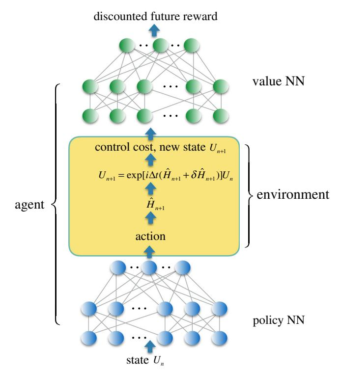
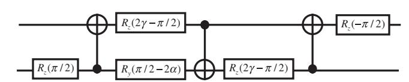
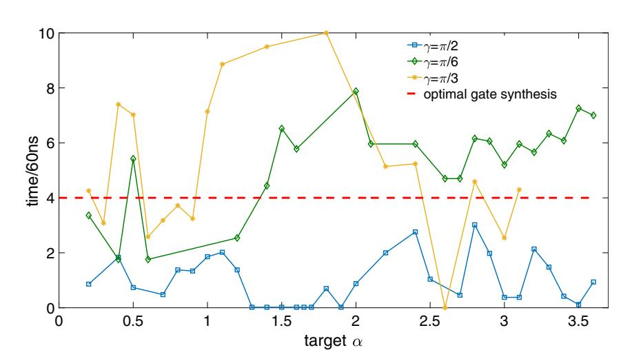
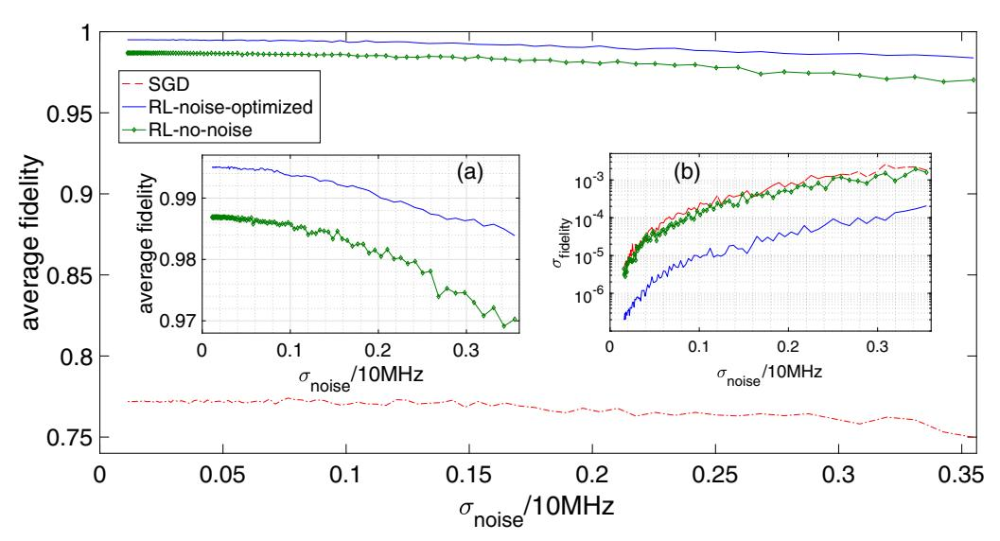

# ARTICLE OPEN

# Universal quantum control through deep reinforcement learning

Murphy Yuezhen Niu 61,2, Sergio Boixo 7, Vadim N. Smelyanskiy and Hartmut Neven 2

Emerging reinforcement learning techniques using deep neural networks have shown great promise in control optimization. They harness non-local regularities of noisy control trajectories and facilitate transfer learning between tasks. To leverage these powerful capabilities for quantum control optimization, we propose a new control framework to simultaneously optimize the speed and fidelity of quantum computation against both leakage and stochastic control errors. For a broad family of two-qubit unitary gates that are important for quantum simulation of many-electron systems, we improve the control robustness by adding control noise into training environments for reinforcement learning agents trained with trusted-region-policy-optimization. The agent control solutions demonstrate a two-order-of-magnitude reduction in average-gate-error over baseline stochastic-gradient-descent solutions and up to a one-order-of-magnitude reduction in gate time from optimal gate synthesis counterparts. These significant improvements in both fidelity and runtime are achieved by combining new physical understandings and state-of-the-art machine learning techniques. Our results open a venue for wider applications in quantum simulation, quantum chemistry and quantum supremacy tests using near-term quantum devices.

npj Quantum Information (2019)5:33; https://doi.org/10.1038/s41534-019-0141-3

## INTRODUCTION

Designed to exert the full computational force of Nature, quantum computers utilize the laws of quantum mechanics to explore the exponential computational space in superposition. A critical step that connects theory to experiment is the careful design of quantum controls to translate each quantum algorithm into a set of analog-control signals that accurately steer the quantum computer around the Hilbert space. The precise choice of these controls ultimately governs the fidelity and speed of each quantum operation.

The fidelity and runtime of quantum gates are crucial measures of quantum gate performance that determine the computational capacity of both near- and long-term quantum devices. Higher gate fidelities lower the resource overhead for fault-tolerant error correction, while shorter runtimes directly extend the limit on quantum circuit depth that is set by the onset of uncorrectable errors caused by noise and dissipation.1

Another key component that determines the practical applications of near-term quantum devices is the universality of the quantum gates realizable by analog controls. For pre-fault-tolerant quantum computers, quantum operations are not limited to a finite gate set otherwise necessary for achieving fault tolerance. Consequently, implementing a high-fidelity and fast quantum gate with one control-pulse sequence instead of a deep circuit through optimal gate synthesis can greatly reduce the resource overhead and expand the feasible computational tasks. As recently demonstrated in refs. 2,3 replacing the standard universal gate set with unrestricted unitary gates reduces the required circuit depth for the near-term experimental demonstration of quantum supremacy by one-order of-magnitude. This improves the quantum computer's computational capacity.

However, a universal control framework that facilitates optimization over major experimental non-idealities under systematic constraints has been lacking, which prevents us from fully leveraging the flexibility of quantum control schemes. On the one hand, quantum computing systems with an ever-growing number of qubits are facing aggravating amounts of stochastic control errors and information leakage. On the other hand, the specific form of system Hamiltonian is limited by the underlying physics of the computing platform and thus unable to directly induce any desired quantum dynamical evolution on demand. Overcoming these challenges is key to reaping the speedups promised by quantum computers.2,4,5

Stochastic control errors can severely perturb the actual control outcomes if they are not well accounted for during control optimizations. But in most cases, the exact model of experimental control errors is unavailable. Traditional methods for improving the control robustness against control errors have centered around closed-loop feedback optimizations,6–9 which necessitates frequent measurements of the quantum system. Since existing experimental measurements are relatively slow and can degrade subsequent gate fidelities, such closed-loop optimization has yet to become practical for near-term devices. The majority of open-loop control optimizations10,11 address robustness through analysis of the control-noise spectrum and control curvature given by the control Hessian, which quickly becomes computationally exorbitant as system size increases.

Undesirable couplings between a quantum computing system and its environment also become inevitable when the system is sufficiently large, which induces information leakage. Such leakage errors prevent the implementation of fast and high-fidelity quantum gates in many platforms, such as superconducting qubits. There are two kinds of leakage errors: coherent

1Department of Physics, Massachusetts Institute of Technology, Cambridge, MA 02139, USA and 2Google, 340 Main Street, Venice Beach, CA 90291, USA Correspondence: Murphy Yuezhen Niu (murphyniu@google.com)

Received: 9 August 2018 Accepted: 14 March 2019

Published online: 23 April 2019

leakage, which is deterministic and reversible, that is caused by direct couplings between the qubit subspace and higher energy subspaces; and incoherent leakage, which is caused by either non-adiabatic transitions during modulation of system Hamiltonians (the non-adiabatic transition away from the qubit subspace results from the coherent quantum evolution of the full system, but in the context of the current study such transition is effectively incoherent because the return transition does not have time to occur) or by photon loss to the environment. Coherent leakage can be further divided into resonant and off-resonant components, depending on whether the frequency components of the control are close to the energy gap separating the qubit subspace from a higher energy subspace (resonant) or not (off-resonant).

The high-dimensional control landscapes of multi-gubit-system quantum control problems in the presence of leakage and control errors are poorly understood due to the lack of appropriate analytic tools and the prohibitive computational cost of numerical approaches. Despite this lack of precise knowledge of control landscape, unsupervised machine learning techniques are able to obtain high-quality and scalable solutions to similar highdimensional continuous-variable optimization in real-world problems. Notably, reinforcement learning (RL) stands out for its usefulness in the absence of labeled data because of its stability against sample noise and its effectiveness in the face of uncertainty and the stochastic nature of underlying physical systems. In RL, a software agent takes sequential actions aiming to maximize a reward function, or a negative cost function, that embodies the target problem. Successful training of an RL agent depends on balancing exploration of unknown territory with exploitation of existing knowledge.

Deep RL techniques 12–14 have revolutionized unsupervised machine learning through novel algorithm designs that provide scalable, data efficient, and robust performance with theoretical guarantees. Further empowered by advanced optimization techniques using deep neural networks, they are able to solve difficult high-dimensional optimization problems that are beyond the reach of classical RL techniques in benchmark tasks such as simulated robotic locomotion and Atari games. 12–14 Although Q-learning, a classical RL technique, has been applied to quantum control problems recently, 15,16 these studies have yet to include practical leakage or control errors.

The difficulty of control optimization increases when the information leakage is taken into account: instead of  $2^n$ -dimensional Hilbert space for an n-qubit system, we have  $2^{2n}$  degrees of freedom to describe an open quantum system with non-zero environmental interaction. This quadratic increase in the dimensionality of the underlying quantum dynamics add additional complexity to the control landscape  $^{17}$  and thus additional difficulty in optimizing the controls. We will show that deep RL techniques are capable of solving harder quantum control problems than previously attempted while also minimizing leakage. The key to leveraging these advanced RL methods is to find an analytic cost function that captures the quantum optimization problem's complete objective.

A comprehensive and computable leakage bound for the given control scheme is one missing piece of a universal control cost function for control optimization of an arbitrary target unitary gate. Although there are experimental proposals for evaluating the gate-independent leakage, 18,19 an analytic leakage bound is needed to enable open-loop control optimization without requiring real-time feedback from measurements. Lack of an explicit leakage bound also limits the generality and universality of existing quantum control solutions. For example, 20–27 study quantum controls over independent single-qubit Hamiltonians, but only for closed systems without leakage. To minimize resonant leakage errors, ref. 28 turns off independent controls over the single-qubit Pauli Z couplings, and refs 1,29–31 turn off single-qubit Pauli X and Y couplings. These hard constraints, however, could

impair the controllable quantum gates' universality, or its controllability: a time-dependent evolution without controls overall independent single-qubit Hamiltonians is no longer sufficient to implement an arbitrary unitary gate. One work, introducing hard constraints makes the optimization problem non-convex, which can substantially increase the optimization difficulty.

We propose a control framework, called Universal control cost Function Optimization (UFO), towards overcoming these fundamental challenges in quantum control by connecting deeper physical knowledge of the underlying quantum dynamics with state-of-the-art RL techniques. Instead of resorting from experimental randomized benchmarking for leakage quantification, 18,19 we derive an analytic leakage bound for a Hamiltonian control trajectory to account for both on- and off-resonant leakage errors. Our leakage bound is based on a perturbation theory within the time-dependent Schrieffer-Wolff transformation (TSWT) formalism33 and on a generalized adiabatic theorem, see Supp. B. The use of TSWT is a higher-order generalization of the derivative canceling method for adiabatic gates,34 where unwanted leakage errors are suppressed to any desired order by adding control Hamiltonians proportional to associated orders of time-derivatives of the dominant system Hamiltonian. We relax hard constraints in control optimization to soft ones in the form of adjustable penalty terms of the cost function, offering more flexibility to an RL agent's control policy while minimizing the meaningful errors from practical non-idealities. Our generic cost function enables a joint optimization over the accumulated leakage errors, violations of control boundary conditions, total gate time, and gate fidelity. Such a framework facilitates time-dependent controls overall independent single-qubit Hamiltonians and two-qubit Hamiltonians, thus achieving full controllability.20–22

We use the UFO cost function as a reward for a continuousvariable policy-gradient RL agent, which is trained by trusted-region policy optimization, 12 to find highest-reward/minimumcost analog controls for a variety of two-qubit unitary gates. We find that applying second-order gradient methods to a policy is superior to simpler approaches like direct gradient descent or differential evolution of the control scheme. We suspect this lies in its ability to leverage non-local features of control trajectories (as demonstrated for example in ref. 17), which becomes crucial when the control landscape is high-dimensional and packed with a combinatorially large number of imperfect saddle points or local optima with vanishing gradients, 35 which is often the case for open quantum systems. 16 Moreover, the calculation of control Hessians is replaced with a model-free second-order method with neural networks to further speed up the optimization process. In comparison, direct gradient descent methods are known to be incapable of rapidly escaping such high-dimensional saddle points.35

We verify the quality and the robustness of our control scheme by evaluating the average fidelity of the noise-optimized control solution under different control-noise model parameters. We compare the performance of our RL-optimized control solution with the optimal gate synthesis. The latter provides the minimum number of required gates from a finite universal gate set for realizing the same unitary transformation. Our RL control solutions achieve up to a one-order-of-magnitude of improvement in gate time over the optimal gate synthesis approach based on the best known experimental gate parameters in superconducting qubits; an order of-magnitude reduction infidelity variance over solutions from both the noise-free RL counterpart and a baseline stochastic gradient descent (SGD) method, and around two orders of-magnitude reduction in average infidelity over control solutions from the SGD method.

#### **RESULTS**

Google's superconducting-qubit architecture that allows tunable qubit-qubit coupling is called the gmon architecture. To the lowest order of approximation, the system Hamiltonian of gmon qubits consists of one-body and nearest-neighbor-two-body terms represented by bosonic creation and annihilation operators,  $\hat{a}_j^\dagger$  and  $\hat{a}_j$ , and bosonic number operator  $\hat{n}_j$ , for the j-th bosonic mode. In the rotating-wave approximation (RWA), with a constant rotation rate chosen as the harmonic frequency of the Josephson junction resonator (see Supp. A), the two-qubit gmon Hamiltonian takes the form:

$$\hat{H}_{RWA}(t) = \frac{\eta}{2} \sum_{j=1}^{2} \hat{n}_{j}(\hat{n}_{j} - 1) + g(t)(\hat{a}_{2}^{\dagger}\hat{a}_{1} + \hat{a}_{1}^{\dagger}\hat{a}_{2}) + \sum_{j=1}^{2} \delta_{j}(t)\hat{n}_{j} + \sum_{i=1}^{2} i f_{j}(t) \left(\hat{a}_{j} e^{-i\varphi_{j}(t)} - \hat{a}_{j}^{\dagger} e^{i\varphi_{j}(t)}\right),$$
(1)

where the time-independent parameter  $\eta$  represents the anharmonicity of the Josephson junction, and the seven time-dependent control parameters are: (1) amplitude  $f_j(t)$  and (2) phase  $\varphi_j(t)$  of the microwave control pulse; (3) qubit detuning  $\delta_j(t)$ , and (4) tunable capacitive coupling or g-pulse g(t). The computational subspace is spanned by the two lowest energy levels of each bosonic mode:  $\mathcal{H}_2 = \operatorname{Span}\{|0\rangle_j, |1_j\rangle\}$ , where  $|n\rangle_j$  represents a Fock state with n excitations in the j-th mode.

An effective control cost function is crucial to efficient control optimization and to guaranteeing the full controllability over the quantum system. We propose a control cost function that includes leakage errors, control constraints, total runtime, and gate infidelity as soft penalty terms that are readily optimizable using RL techniques without compromising system controllability. We illustrate the design of a UFO cost function in the tunable gmon superconducting-qubit architecture.36

A unitary gate is realizable through the control of the timedependent Hamiltonian defined in Eq. (1) according to  $U(T) = \mathbb{T}\left[\exp\left(-i\int_0^T \hat{H}_{RWA}(t)dt\right)\right]$ , with  $\mathbb{T}$  denoting the timeordering operator. The inaccuracy of the controlled two-qubit unitary gate U(T) with respect to a target unitary gate  $U_{\text{target}}$  is measured by the gate infidelity: 1 - F[U(T)] = 1 - (1/16) $\left| {\rm Tr}(U^{\dagger}(T)U_{\rm target}) \right|^2$ , which vanishes only when  $U(T) = U_{\rm target}$ up to a global phase. This definition of control inaccuracy is widely used in quantum control optimization 1,16,20-22,29,30,34 for its modest computational overhead during iterative optimizations. Additionally, diamond distance and average gate infidelity are alternative measures for control inaccuracy. The former provides a better measure of the coherent error but is harder to calculate, and the later can be measured through randomized benchmarking.36 As shown in ref. 37,38 the gate infidelity is related to diamond distance and average gate infidelity. To reduce computational overhead, we choose gate infidelity as the first part of our UFO cost function to penalize the control inaccuracy.

The second part is a penalty term on the accumulated leakage errors derived in Supp. B.2. The last two terms of the control cost function penalize the total runtime T and violation of control boundary conditions. Boundary conditions are chosen to facilitate convenient gate concatenations: microwave pulses and the gpulse should vanish at both boundaries such that the computational bases and the Fock bases coincide. This is enforced by adding  $\sum_{t \in \{0,T\}} [g^2(t) + f^2(t)]$  to the control cost function. Such boundary constraints also help to minimize the errors caused by deviations from the RWA arising from the fast-oscillating nature of the non-RWA terms; see Supp. A for details. We thus obtain the full

UFO cost function:

$$C(\chi, \beta, \gamma, \kappa) = \chi[1 - F[U(T)]] + \beta L_{\text{tot}} + \mu \sum_{t \in \{0, T\}} \left[ g^2(t) + f^2(t) \right] + \kappa T$$
(2)

where  $\chi$  penalizes the gate infidelity,  $\beta$  penalizes leakage errors,  $\mu$  penalizes violation of the boundary constraints, and  $\kappa$  penalizes the total runtime. These hyper-parameters are optimized to achieve satisfactory control outcomes. To apply to quantum computing platforms other than gmon qubits, each term of the UFO cost function can be modified to best describe the optimization target based on the platform's underlying physics.

Leakage error bound

To identify different sources of leakage errors, we decompose Eq.

(1) into three parts: 
$$\hat{H}_{RWA}(t) = \hat{H}_0 + \hat{H}_1(t) + \hat{H}_2(t)$$
, where  $\hat{H}_0 =$ 

$$(\eta/2)\sum\limits_{j=1}^2\hat{n}_j(\hat{n}_j-1)$$
 accounts for the large constant-energy gaps

separating the qubit subspace from higher energy subspaces. It also determines the minimum energy gap  $\Delta$ , separating the qubit subspace from the nearest higher energy subspace. Henceforth, we set the Planck constant h=1 for the convenience of discussion, and the energy scale is measured in units of MHz. The block-diagonal Hamiltonian

$$\begin{split} \hat{H}_{1}(t) &= \sum_{j=1}^{2} \delta_{j}(t) \hat{n}_{j} + i f_{1}(t) \left( |0\rangle_{1} \langle 1|_{1} e^{-i\varphi_{1}(t)} - |1\rangle_{1} \langle 0|_{1} e^{i\varphi_{1}(t)} \right) \otimes \mathbb{I}_{2} \\ &+ i f_{2}(t) \mathbb{I}_{1} \otimes \left( |0\rangle_{2} \langle 1|_{2} e^{-i\varphi_{2}(t)} - |1_{2}\rangle \langle 0|_{2} e^{i\varphi_{2}(t)} \right) \\ &+ g(t) (|1_{1}\rangle |0\rangle_{2} \langle 1_{2} |\langle 0|_{1} + |0\rangle_{1} |1\rangle_{2} \langle 0|_{2} \langle 1|_{1}) \\ &+ 2g(t) (|2\rangle_{1} |1\rangle_{2} \langle 2|_{2} \langle 1|_{1} + |1\rangle_{1} |2\rangle_{2} \langle 1|_{2} \langle 2|_{1}) \end{split}$$

$$(3)$$

accounts for the coupling within the qubit subspace  $\Omega_0 = \text{Span}\{|$ 00, |10i, |01, |11} and within the first excited energy subspace  $\Omega_1 = \text{Span}\{|20\rangle, |21\rangle, |12\rangle, |02\rangle\}, \text{ and the block-off-diagonal}$  $\hat{H}_2(t) = \hat{H}_{\mathsf{RWA}}(t) - \hat{H}_0 - \hat{H}_1(t)$  accounts for the couplings between different energy subspaces.  $\hat{H}_2(t)$  is the culprit behind leakage errors. But, because  $\hat{H}_1(t)$  and  $\hat{H}_2(t)$  both derive from microwave pulses and the g-pulse, one cannot turn off  $\hat{H}_2(t)$  without turning off control over the single-qubit Pauli X and Y unitaries from  $\hat{H}_1(t)$ that are crucial for obtaining full controllability of the gubit system. In order to suppress and evaluate coherent leakage errors induced by  $H_2(t)$ , we adopt a rotated basis given by the TSWT framework, under the assumption that inter-subspace and intrasubspace couplings are much smaller than the energy gap separating different  $|f_i(t)| \sim |\delta_i(t)| \sim |g(t)| \sim \varepsilon \ll \eta \sim \Delta$ , see Supp. B. The effective block-off-diagonal Hamiltonian  $\hat{\mathbb{H}}_{od}(t)$  after the TSWT can thus be suppressed to any chosen order by applying the correct order of TSWT.

There are two independent sources of leakage errors for TSWT-based quantum control that dominate in superconducting-qubit gate controls. The first is the direct coupling leakage caused by the non-zero block-off-diagonal Hamiltonian after the second-order TSWT. The second is the leakage caused by unwanted excitations due to fast modulation of the system Hamiltonian. We derive in Supp. B the following bound for the coherent leakage errors at time T:

$$L_{\text{tot}} = \frac{\left\|\hat{\mathbb{H}}_{\text{od}}(0)\right\|}{\Delta(0)} + \frac{\left\|\hat{\mathbb{H}}_{\text{od}}(T)\right\|}{\Delta(T)} + \int_{0}^{T} \frac{1}{\Delta^{2}(t)} \left\|\frac{d^{2}\hat{\mathbb{H}}_{\text{od}}(t)}{dt^{2}}\right\| dt, \tag{4}$$

where  $\hat{\mathbb{H}}_{\mathrm{od}}(t)$  is of magnitude  $O\Big(rac{arepsilon^3}{\Delta^2}\Big)$  after the second-order TSWT.

In addition to the coherent leakage errors bounded by (4), there also exist incoherent leakage errors due to the violation of adiabaticity from the time-dependent nature of our control quantum dynamics in the off-resonant regime. We derive a generalized adiabatic theorem to bound the non-adiabatic leakage error in Supp. B.2. We show there that such non-adiabatic leakage is not dominant in the off-resonant frequency regime, i.e., (4) accounts for the dominant leakage errors in both the resonant and off-resonant regimes.

# Deep trusted-region reinforcement learning

The control space for the two-qubit quantum gate is parametrized at each time step t by a real valued vector  $\vec{u}(t) =$  $\{f_1, f_2, \varphi_1, \varphi_2, \delta_1, \delta_2, g\}$  specifying 7 amplitudes of the controllable system Hamiltonian. Our use of policy NN is based on a piecewise constant (PWC) representation of control trajectory, which contains around one thousand time steps for each gate-control sequence. Such PWC encoding was previously considered disadvantageous39 for the following reasons: (1) the lack of analytic form of gradient expression can lower the accuracy of the control optimization given the same computational resources; (2) PWC control may introduce unwanted high-frequency components that are detrimental for causing leakage errors. We show with this work that these limitations are largely obviated in reality: (1) the input to experimental quantum control DACs are also PWC signals with time step limited by sample rate and control amplitude accuracy limited by transfer function uncertainties, analytic control function therefore has to be truncated during experimental implementations and suffers from discretization errors not accounted by its original control optimization; (2) control filter design can be easily integrated into the PWC control optimization to guarantee a desired frequency bandwidth of the control-pulse sequence (see Supp. C); and (3) PWC representation can be directly transferred to close-loop system calibration and control optimization to interface directly with control DACs.

Our RL agent is comprised of two neural networks (NNs): one maps a given state containing the information about the simulated unitary gate  $U(t_i)$  at the current step  $t_i$  to the mean and variance of the Gaussian distribution of the proposed control actions  $\vec{u}(t_{i+1})$ . for the next step (the policy NN); the other NN takes the simulated unitary gate  $U(t_i)$  as input to output the predicted reward associated with the current unitary (the value function NN). Notice the salient difference from the on-policy RL utilized in this work differ from previously studied off-policy RL in previous work  $^{15,16}$  is that the control trajectory (embedded in policy NN) is represented independently from the control cost (value function NN). Off-policy RL, such as Q learning,  $^{13}$  on the other hand, uses a single NN to represent both the control trajectory and the associated reward.

Both the policy and value function NN are fully connected three layers NNs of dimension 64, 32, and 32. Intuitively, the first NN, the policy NN encodes the analytic and non-local feature of control solutions. Such encoding, which is traditionally captured by a carefully chosen analytic function, 40 is now represented by a model-independent NN without any prior knowledge of the target cost function. The value function NN encodes the projected future interactions with a stochastic environment and the associated control cost, which is used to adjust the learning rate of the policy NN's gradient descent.

Both of the RL agent's NNs interact with a training environment that evaluates the quantum dynamics under the RL agent's proposed control action and returns the updated unitary gate and the corresponding control cost (as reward); see Fig. 1. Optimization consists of many episodes, each of which contains all the time steps of a complete quantum-control trajectory. The duration of such a sampled control trajectory is determined by the minimum of a predefined runtime upper bound and the time it takes to

**Fig. 1** Overview of the RL implementation: at the iteration time step n+1, the policy NN proposes a control action in the form of the system Hamiltonian  $\hat{H}_{n+1}$ , the training environmenttakes the proposed action and evaluates the Schrödinger equation under a noisy implementation  $\hat{H}_{n+1} + \delta \hat{H}_{n+1}$  for time duration  $\triangle t$  to obtain a new unitary gate  $U_{n+1}$  and calculates the associated cost function, both of which are fed into an RL agent. The policy NN and value NN of the RL agent are updated jointly based on the trajectory of the simulated unitary gate, controlaction and associated control cost

meet a termination condition. In our case, the termination condition is measured by a satisfactory value of the UFO cost function. After sampling a batch of 20,000 episodes, the policy NN is updated to maximize the expected discounted future reward based on the proposed policy variation within the trusted region, and the value function NN is updated to fit the expected discounted future reward based on the newly added samples. A detailed algorithm is presented in refs. 12,41 We found that the control robustness against control errors is significantly improved by simulating experimentally relevant Gaussian fluctuations in the control amplitudes using a stochastic RL training environment. Our discovery differs from recent results in the sampling-based method for obtaining control robustness in that we specifically include optimization over leakage errors in the presence of control fluctuations.

We verified the quality and robustness of our control scheme by evaluating the average fidelity of the noise-optimized control solution under different control-noise model parameters in the next section. There, we compare the performance of our RL-optimized control solution with that of the optimal gate synthesis. The latter provides the minimum number of required gates from a finite universal gate set to realize the same unitary transformation. Our RL control solutions achieve: (1) up to a one-order-of-magnitude of improvement in gate time over the optimal gate synthesis approach based on the best known experimental gate parameters in superconducting qubits; (2) a two-orders-of-magnitude reduction infidelity standard deviation over solutions from both the noise-free RL counterpart and a baseline stochastic gradient descent (SGD) method; and (3) around two-orders-of-

magnitude reduction in average infidelity over control solutions from the SGD method.

Two-gubit gate-control optimization

We now apply the UFO framework to find fast and high-fidelity two-qubit gate controls that are robust against control errors. We define gate-control robustness under a given control-noise model as a bounded deviation of the average gate fidelity  $\overline{F}(\mathcal{E}, U_{\text{target}})$  from an ideal average gate fidelity  $F_{\text{ideal}}$ :

$$|\overline{F}(\mathcal{E}, U_{\text{target}}) - F_{\text{ideal}}| < \varepsilon_0, \text{ for } \varepsilon_0 > 0,$$
 (5)

where the average gate fidelity

$$\overline{F}(\mathcal{E},U_{\mathrm{target}}) = \int\! d\psi \langle \psi | U_{\mathrm{target}}^{\dagger} \mathcal{E} | \psi \rangle \langle \psi | U_{\mathrm{target}} | \psi \rangle$$
 (6)

embodies the quality of the gate-control quantum channel by averaging over the whole state space under a uniform Haar measure, 42 with the trace-preserving quantum operation  $\mathcal E$  accounting for the noisy implementation of a target unitary  $U_{\mathrm{target}}$  see Supp. D for detail. The average gate infidelity is defined accordingly as  $1-\overline{F}(\mathcal E,U)$ .

Such a robustness criterion can be validated for a given control scheme using a number of computational steps that is linear in the total degrees of freedom of control parameters. However, it differs from the canonical definition in optimal control theory, 10,11 where the number of computational steps for the analysis of robustness using control Hessians scales cubically with the control parameters' total degrees of freedom. For special cases, such as closed-system single-qubit control, there exist analytic expressions for the control Hessian. 10,11 But in the current work we choose a more practical definition of robustness that is scalable to multiqubit control problems.

Traditional quantum-control trajectory optimization depends on complete knowledge of the underlying physical model. In contrast, the success and robustness of RL persist with incomplete and potentially flawed modeling. It is often the case in experiments that the exact control error model is unknown. Given partial information about the control error model, can we leverage RL optimization to find robust control solutions against not just one but a set of control error models? In our case, we deployed RL agents, trained by trust-region policy optimization 12 in the OpenAl platform, 43 to find near-optimal control solutions to the UFO cost function described in Eq. (2). We incorporated a pertinent control-noise model for gmon superconducting-gubit Hamiltonian36 into a stochastic training environment. At each time step, amplitude fluctuations sampled from a zero-mean Gaussian distribution with 1 MHz standard deviation, which amounts to around 5% control parameter uncertainty, were added to Hamiltonian parameters that are known to be prone to fluctuation: qubit anharmonicity, qubit detuning amplitudes, microwave control amplitudes, and qubit g-pulse amplitude. See Supp. A for the details. Harnessing the sample-noise resilience of RL optimization, we expected the optimized control to be robust against a family of control-noise models despite being trained under a single model. This was indeed proven to be the case as evidenced by our numerical simulations, see Fig. 4.

$$\mathcal{N}(\alpha, \alpha, \gamma) = \exp\left[i(\alpha\sigma_1^x \sigma_2^x + \alpha\sigma_1^y \sigma_2^y + \gamma\sigma_1^z \sigma_2^z)\right] \tag{7}$$

In gmon superconducting qubits, the energy gap that separates the qubit subspace from the nearest higher energy subspace is  $\Delta$  (s)  $\approx 200$  MHz. We apply control frequency filters (Supp. C) to piecewise constant analog-control signals such that the bandwidth of the proposed Hamiltonian modulation is limited to 10 MHz. Given that our off-diagonal Hamiltonian after the second-order TSWT is of order 100 KHz (Supp. B.1), the first leakage-bound term in Eq. (4),  $\int_0^1 \frac{1}{\Delta^2(s)} \frac{1}{r} \left| \left| \frac{d^2 \hat{\mathbb{H}}_{\text{od}}(s)}{ds^2} \right| \right| ds$ , is of order  $10^{-4}$ , which is close

**Fig. 2** Optimal gate synthesis for realizing unitary gate  $\mathcal{N}(\alpha, \alpha, \gamma)$ 

to the fault-tolerant threshold for leakage error of the near-term surface code. 44 Although the gmon Hamiltonian is fully controllable under our UFO paradigm, we targeted a family of two-qubit gates parametrized by

$$\mathcal{N}(\alpha, \alpha, \gamma) = \exp[i(\alpha\sigma_1^x \sigma_2^x + \alpha\sigma_1^y \sigma_2^y + \gamma\sigma_1^z \sigma_2^z)], \tag{8}$$

where  $\sigma_i^k$  for  $k \in \{x, y, z\}$  is the *j*th qubit's Pauli matrix. Optimal gate synthesis45 provides the optimal decomposition of such unitary transformation into a minimum number of arbitrary single-qubit rotations and CZ gates, yields a depth-seven circuit containing three two-qubit gates and five single-qubit gates, see Fig. 2. This gate family includes the SWAP, ISWAP, CNOT, and CZ gate, the fermionic SWAP gate, and Given's rotation up to single-qubit rotations. Both the fermionic swap gate and Given's rotations are used for realizing Jordan-Wigner transformations in fermionic Hamiltonian simulation. 46-48 Identifying continuous controls that outperform their optimal gate synthesis counterparts for this family of gates thus has far-reaching applications across quantum chemistry and quantum simulation. The UFO cost function's parameters were optimized through a grid search and turned out to be  $\chi = \beta = 10$ ,  $\mu = 0.2$ ,  $\kappa = 0.1$ , values that are applicable to all target gates.

We compared the overall runtime of our noise-optimized control obtained by the RL agent with its optimal gate synthesis counterpart. Based on state-of-the-art experimental implementations, we set the gate time for each single-qubit gate to 20 ns and CNOT to 45 ns. Optimal gate synthesis in Fig. 2 thus has a 215 ns runtime.

The gate times of our noise-optimized control schemes for three different values of  $\gamma$  are shown in Fig. 3. There, different data points for the same  $\gamma$  are obtained by the same RL agent with an adaptive step size in  $\alpha$  to guarantee a constant upper bound on the total optimization time: target gate  $\alpha$  will be increased by one step  $\alpha=\alpha+0.1$ , either when the agent obtains a control solution with a low enough overall cost, or when the optimization time for a given  $\alpha$  exceeds a predefined value. We discovered that it takes significantly less time for an RL agent to learn a new target unitary gate, based on the successful learning of a nearby target, than to learn a new target gate afresh, which provides heuristic evidence for the transfer learning facilitated by RL using a deep NN. The use of an adaptive step size can be replaced by parallel RL agents, each dedicated to a fixed target unitary gate, but that was not the focus of the current study.

Figure 3 shows that an RL optimization provides a one-order-ofmagnitude runtime improvement for the two-qubit gate family parametrized by  $\mathcal{N}(\alpha, \alpha, \pi/2)$  with  $\alpha \in [1.2, 1.7]$  over the optimal gate synthesis. Such significant improvement originates from the decomposition of this two qubit unitary right at the center of this region with  $\alpha = \gamma = \pi/2$  into a direct product of single-qubit unitaries. This demonstrates the hardware efficiency of our control optimization of finding the underlying unitary relations to automatically reduce gate time. In particular, the target unitary gate can be rewritten as  $\mathcal{N}(\alpha, \alpha, \pi/2) = -\exp[i(\alpha\sigma_1^x\sigma_2^x + \alpha\sigma_1^y\sigma_2^y)]$  $\exp\left[-i\frac{\pi}{2}\sigma_1^z\right]\exp\left[-i\frac{\pi}{2}\sigma_2^z\right]$  whose two-qubit entangling part is directly realizable through a time evolution under the gmon Hamiltonian defined in Eq. (1) without detuning or microwave controls:  $\delta_i(t) = f_i(t) = 0$  with  $j \in \{1, 2\}$ . Our RL control optimization is thus able to detect such an inherent regularity, which relates a given system Hamiltonian to the family of target unitary gates that are efficiently implementable. Isolated peaks in the gate time plot

Fig. 3 Gate run time of two-qubit gate family  $\mathcal{N}(\alpha,\alpha,\gamma)$  for  $\gamma=\pi/2$  (blue curve),  $\gamma=\pi/6$  (green curve) and  $\gamma=\pi/3$  (yellow curve). The standard optimal gate synthesis run time for this gate family is around 200 ns, marked by dashed red line. Total leakage errors and gate infidelity are upper bounded by  $O(10^{-4})$  and  $O(10^{-3})$ , respectively, for all cases

Fig. 4 Average fidelities of the optimized quantum control schemes vs the Gaussian control noise variance for the gate  $\mathcal{N}(2.2, 2.2, \pi/2)$ . The blue line represents the performance of the noise-optimized control obtained by an RL agent trained under a noisy environment. The green line marked by diamond shapes represents the performance of the control obtained by an RL agent with a noise-free environment. The red dashed line represents the performance of the control trajectory obtained by SGD. Subplot **a**: zoomed in comparison of the average fidelities of the noise-optimized and noise-free RL control solutions under different values of Gaussian control noise variance. Subplot **b**: comparison of fidelity variances of three different control schemes under different control noise variances  $\sigma_{\text{noise}}$ , where each data point is taken from 60 different control trajectories with control amplitude error at every time step sampled from the Gaussian distribution N(0,  $\sigma_{\text{noise}}$ )

in Fig. 3 are potentially due to control singularities, which suggests the need for further studies into the hardness of the analog-control landscape in the presence of leakage and control errors.

We verified the robustness of the noise-optimized control solution  $\hat{H}_{\text{RWA}}(t)$  from RL by evaluating its average fidelity  $\overline{F}(\mathcal{E}, U_{\text{target}})$  and the standard deviation of the control gate fidelities  $F[U(\hat{H}_{\text{RWA}}(t))]$  under different control-noise instances  $\delta\hat{H}_{\text{RWA}}(t)$  sampled from the same Gaussian distribution  $N(0, \sigma_{\text{noise}})$ :

$$\sigma_{\text{fidelity}} = \sqrt{\mathbb{E}_{\delta \hat{H}_{\text{RWA}}(t) \sim N(0, \sigma_{\text{noise}})} \left( F[U(\hat{H}_{\text{RWA}}(t) + \delta \hat{H}_{\text{RWA}}(t))] - F_{\text{ave}} \right)^2}, \tag{9}$$

$$F_{\text{ave}} = \mathbb{E}_{\delta \hat{H}_{\text{RWA}}(t) \sim N(0, \sigma_{\text{noise}})} F[U(\hat{H}_{\text{RWA}}(t) + \delta \hat{H}_{\text{RWA}}(t))]. \tag{10}$$

We consider a Gaussian family of stochastic control error models: the amplitude fluctuations of control parameters are described by zero-mean Gaussian distributions with a standard deviation  $\sigma_{\text{noise}}$  ranging from 0.1 to 3.5 MHz. The gate-control performance under the noise model with 1 MHz standard deviation is a reasonable indicator for experimental implementations. Nevertheless, the exact value of the standard deviation is hard to determine and can drift over time. The blue curve in Fig. 4 represents the average fidelity of the noise-optimized control by RL, which stays within the range of [99.5%, 98%] under the given noise model parameter range, satisfying our control robustness definition with  $\varepsilon_0 = 0.007$  at  $\sigma_{\text{noise}} = 1$  MHz.

In Fig. 4, we compare noise-optimized control with a noise-free control solution obtained by an RL agent without a stochastic environment, represented by the green curve marked by

diamonds, and with that obtained by a baseline SGD technique using the Adam optimizer, 49 represented by the red dashed lines. For the gradient calculation in each SGD iteration, we utilize the averaged gradient over a minibatch of 10 control trajectories. Each one of these trajectories is added with a perturbation sampled from a zero-mean Gaussian distribution with standard deviation 1 MHz to the original Hamiltonian control variables at the concerned time step. We provide our SGD solver the same amount of optimization wall time as the corresponding RL solvers, which amounts to around 2000 random restarts per target gate.

The noise-optimized control solution manifests up to a one-order-of-magnitude improvement in average gate infidelity over the noise-free control solution using RL, and around two-orders-of-magnitude improvement in average gate infidelity over SGD baseline solutions. Moreover, the sampled fidelity standard deviation of the noise-optimized RL solver is consistently two-orders-of-magnitude lower than that of the two other methods throughout the tested noise model parameter range. This result validates the improved stability of our control solution obtained by a policy-gradient trained RL agent against experimentally relevant Gaussian control-noise models.

The major difference between the baseline SGD approach and our on-policy RL is the model-dependence: SGD relies on the calculation of the gradient of the control cost function while the on-policy RL is model-independent and does not directly utilize the physical models to calculate the gradient of its two neural network. Instead, on-policy RL only requires the calculation of the control cost function at each time step. Because the control cost function is easier to compute than the gradient relevant to SGD, on-policy RL possesses more potential than SGD towards scaling up to many gubits. Our work demonstrates the advantageous performance of RL method over SGD in two-qubit gate-control optimization in face of realistic control errors including leakage and stochastic control fluctuations. However, it remains an open question whether an advantage persists when gradient estimation is computationally inexpensive such that SGD or other gradient based optimization also applies.

## DISCUSSION

We proposed a quantum control framework, UFO, for fast and high-fidelity quantum gate-control optimization. It was applied to an open-loop control optimization through reinforcement learning, in which the control trajectory is encoded by a first neural network (NN) and the control cost function is encoded by a second NN. Robust control solutions were obtained by training both NNs under a stochastic environment mimicking noisy control actuation. We achieved up to one-order-of-magnitude reduction in average gate infidelity over noise-free alternatives and up to a one-order-of-magnitude reduction in gate time over the optimal gate synthesis solution. These improvements are significant, given that the highest gate fidelity in state-of-the-art superconducting-qubit systems is around 99.5%, and that the total computation runtime is limited by decoherence to several microseconds.

Our work opens a new direction for quantum analog-control optimization using RL, where unpredictable control errors and incomplete physical models of environmental interactions are taken into account during the control optimization. Other advanced machine learning techniques are also readily applicable to our control framework. The success of deep RL in Alpha Go14 and robotic control 12,13 suggests that our approach—once generalized to closed-loop control optimization, where system calibration and gate-control optimization are combined into a unified procedure—could further improve the control robustness against systematic and time-correlated errors. More work remains to be done in investigating RL's ability to find control solutions that are robust to other experimental imperfections not yet

considered in this work, including the approximation errors of RWA, 50 the incomplete knowledge about the quantum computing substrate, unwanted coupling with environmental defects, 51 etc. The anaolog control optimization shown in this work can also be combined with gate sequence optimization, such as that discussed in ref. 52 to further optimize the overall quantum circuit fidelity and robustness in face of practical imperfections.

#### **METHODS**

# Reinforcement learning

We use the trusted region policy-gradient method developed by John Shulman et al. 12 as reinforcement learning agent deployed in the OpenAl baseline platform. 42 The source code of the method can be found in https://github.com/joschu/modular\_rl. The optimization of the cost function parameters  $\chi$ ,  $\beta$ ,  $\gamma$ , and  $\kappa$  are performed through grid search between the range of [0,10] with grid step 0.1. The adaptive step size in transfer learning the target unitary control optimization shown in Fig. 3 is  $\delta \alpha = 0.1$ , with maximum wall time per target restricted to 5 hours.

#### **DATA AVAILABILITY**

The data that support the findings of this study are available from Google quantum A.I. lab but restrictions apply to the availability of these data, which were used under license for the current study, and so are not publicly available. Data are, however, available from the authors upon reasonable request and with permission of Google quantum A.I. lab.

#### **ACKNOWLEDGEMENTS**

We thank Charles Neil and Pedram Roushan for helpful discussions on the experimental noise models and detailed control parameters in the gmon superconducting-qubit implementation. M.Y.N. thanks Barry C. Sanders for early discussions on control optimization through reinforcement learning, Isaac L. Chuang for useful comments on the draft, Théophane Weber, Martin McCormick and Lucas Beyer for discussions on reinforcement learning methods. M.Y.N. acknowledges financial support from the Google research internship summer 2017 program during which the majority of the work was performed. M.Y.N. acknowledges support from the Claude E. Shannon Research Assistantship.

## **AUTHOR CONTRIBUTIONS**

M.Y.N, S.B., and V.S. developed the project and theory. M.Y.N. implemented the reinforcement algorithms and numerical studies. All authors contributed to the draft.

# **ADDITIONAL INFORMATION**

**Supplementary information** accompanies the paper on the *npj Quantum Information* website (https://doi.org/10.1038/s41534-019-0141-3).

Competing interests: The authors declare that they have no competing interests.

**Publisher's note:** Springer Nature remains neutral with regard to jurisdictional claims in published maps and institutional affiliations.

## REFERENCES

- 1. Barends, R. et al. Superconducting quantum circuits at the surface code threshold for fault tolerance. *Nature* **508**, 500 (2014).
- Boixo, S. et al. Characterizing quantum supremacy in near-term devices. Nat. Phys. 14. 595 (2018).
- Neill, C. et al. A blueprint for demonstrating quantum supremacy with superconducting qubits. Science 360, 195 (2018).
- 4. Feynman, R. P. Simulating physics with computers. *Int. J. Theor. Phys.* **21**, 467 (1982)
- 5. Grover, L. K. Quantum mechanics helps in searching for a needle in a haystack. *Phys. Rev. Lett.* **79**, 325–328 (1996).
- Dong, D. & Petersen, I. R. Quantum control theory and applications: a survey. IET Control Theory Appl. 4, 2651 (2010).
- 7. Ruschhaupt, A., Chen, X., Alonso, D. & Muga, J. Optimally robust shortcuts to population inversion in two-level quantum systems. *N. J. Phys.* **14**, 093040 (2012).

- **n**pj
  - Lewis, F. L. & Liu, D. Reinforcement learning and approximate dynamic programming for feedback control, vol. 17 (John Wiley & Sons, Hoboken, New Jersey, 2013).
  - Palittapongarnpim, P., Wittek, P., Zahedinejad, E., Vedaie & Sanders, B. C. Learning in quantum control: high-dimensional global optimization for noisy quantum dynamics. *Neurocomputing* 268, 116 (2017).
  - Nagy, Z. K. & Braatz, R. D. Open-loop and closed-loop robust optimal control of batch processes using distributional and worst-case analysis. J. process control 14, 411 (2004).
  - 11. Hocker, D. et al. Characterization of control noise effects in optimal quantum unitary dynamics. *Phy. Rev. A* **90**, 062309 (2014).
  - Schulman, J., Moritz, P., Levine, S., Jordan, M. & Abbeel, P. High-dimensional continuous control using generalized advantage estimation. arXiv:1506.02438 (2015).
  - Mnih, V. et al. Asynchronous methods for deep reinforcement learning. Int. Conf. Mach. Learn. (Eds. Balcan, M. F. & Weinberger, K. Q.) 48, 1928–1937 (2016).
  - Silver, D. et al. Mastering the game of Go with deep neural networks and tree search. Nature 529, 484 (2016).
  - Chen, C. et al. Fidelity-based probabilistic Q-learning for control of quantum systems. IEEE Trans. Neural Netw. Learn. Syst. 25, 920 (2014).
  - Bukov, M. et al. Reinforcement learning in different phases of quantum control. Phys. Rev. X 8, 031086 (2018).
  - Day, A. G. R. et al. Glassy phase of optimal quantum control. Phy. Rev. Lett. 122, 020601 (2019).
  - Wood, C. J. & Gambetta, J. M. Quantification and characterization of leakage errors. Phy. Rev. A 97, 032306 (2018).
  - Wallman, J. J., Barnhill, M. & Emerson, J. Robust characterization of leakage errors. N. J. Phys. 18, 043021 (2016).
  - Khaneja, N. et al. Optimal control of coupled spin dynamics: design of NMR pulse sequences by gradient ascent algorithms. J. Magn. Reson. 172, 296 (2005).
  - Spörl, A. et al. Optimal control of coupled Josephson qubits. Phy. Rev. A 75, 012302 (2007).
  - Chakrabarti, R. & Rabitz, H. Robust control of quantum gates via sequential convex programming. *Int. Rev. Phys. Chem.* 26, 671 (2007).
  - Moore, K., Hsieh, M. & Rabitz, H. On the relationship between quantum control landscape structure and optimization complexity. J. Chem. Phys. 128, 154117 (2008)
  - Montangero, S., Calarco, T. & Fazio, R. Robust optimal quantum gates for Josephson charge qubits. Phy. Rev. Lett. 99, 170501 (2007).
  - Dong, D. et al. Learning robust pulses for generating universal quantum gates. Sci. Rep. 6, 36090 (2016).
  - Huang, C. & Goan, H. Robust quantum gates for stochastic time-varying noise. Phy. Rev. A 95, 062325 (2017).
  - Wu, C., Qi, B., Chen, C. & Dong, D. Robust learning control design for quantum unitary transformations. *IEEE Trans. Cybern.* 47, 4405–4417 (2017).
  - Gambetta, J. M. et al. Analytic control methods for high-fidelity unitary operations in a weakly nonlinear oscillator. *Phys. Rev. A* 83, 012308 (2011).
  - 29. Martinis, J. M. & Geller, M. R. Fast adiabatic qubit gates using only  $\sigma_z$ . Control. Phy. Rev. A **90**, 022307 (2014).
  - Zahedinejad, E., Ghosh, J. & Sanders, B. C. High-fidelity single-shot Toffoli gate via quantum control. *Phy. Rev. Lett.* 114, 200502 (2015).
  - 31. Zahedinejad, E., Ghosh, J. & Sanders, B. C. Designing high-fidelity single-shot three-qubit gates: a machine-learning approach. *Phy. Rev. App.* **6**, 054005 (2016).
  - 32. Stengel, R. F. Optimal Control and Estimation (Dover, New York, 1994).
  - Goldin, Y. & Avishai, Y. Nonlinear response of a Kondo system: perturbation approach to the time-dependent Anderson impurity model. *Phy. Rev. B* 61, 16750 (2000).

- Motzoi, F., Gambetta, J. M., Rebentrost, P. & Wilhelm, F. K. Simple pulses for elimination of leakage in weakly nonlinear qubits. *Phy. Rev. Lett.* 103, 110501 (2009).
- Dauphin, Y. N. et al. Identifying and attacking the saddle point problem in highdimensional non-convex optimization. Adv. Neural Inf. Process. Syst. 27, 2933–2941 (2014).
- Chen, Y. et al. Qubit architecture with high coherence and fast tunable coupling. Phys. Rev. Lett. 113, 220502 (2014).
- Magesan, E., Gambetta, J. M. & Emerson, J. Scalable and robust randomized benchmarking of quantum processes. *Phys. Rev. Lett.* 106, 180504 (2011).
- Sanders, Y. R., Wallman, J. J. & Sanders, B. C. Bounding quantum gate error rate based on reported average fidelity. N. J. Phys. 18, 012002 (2015).
- 39. Willsch, D. et al. Gate-error analysis in simulations of quantum computers with transmon qubits. *Phys. Rev. A* **96**, 062302 (2017).
- Machnes, S. J., Tannor, D., Wilhelm, F. K. & Assémat, E. Gradient optimization of analytic controls: the route to high accuracy quantum optimal control. arXiv:1507.04261 (2015).
- Schulman, J. et al. Trust region policy optimization. In International Conference on Machine Learning 1889–1897, (PMLR, 2015).
- 42. Nielsen, M. A. A simple formula for the average gate fidelity of a quantum dynamical operation. *Phys. Lett. A* **303**, 249 (2002).
- 43. Brockman, G. et al. Openai gym. arXiv:1606.01540 (2016).
- 44. Ghosh, J. & Fowler, A. G. Leakage-resilient approach to fault-tolerant quantum computing with superconducting elements. *Phys. Rev. A* **91**, 020302 (2015).
- Vatan, F. & Williams, C. Optimal quantum circuits for general two-qubit gates. Phys. Rev. A 69, 032315 (2004).
- Wecker, D., Hastings, M. B. & Troyer, M. Progress towards practical quantum variational algorithms. *Phys. Rev. A* 92, 042303 (2015).
- Kivlichan, I. D. et al. Quantum simulation of electronic structure with linear depth and connectivity. Phys. Rev. Lett. 120, 110501 (2018).
- 48. Jiang, Z. et al. Quantum algorithms to simulate many-body physics of correlated fermions. *Phys. Rev. App.* **9**, 044036 (2018).
- Kingma, D. P. & Ba, J. Adam: A method for stochastic optimization. arXiv:1412.6980 (2014).
- Zueco, D., Reuther, G. M., Kohler, S. & Hänggi, P. Qubit-oscillator dynamics in the dispersive regime: analytical theory beyond the rotating-wave approximation. *Phys. Rev. A* 80, 033846 (2009).
- Klimov, P. V. et al. Fluctuations of energy-relaxation times in superconducting qubits. Phys. Rev. Lett. 121, 090502 (2018).
- Fösel, T., Tighineanu, P., Weiss, T. & Marquardt, F. Reinforcement learning with neural networks for guantum feedback. *Phys. Rev. X* 8, 031084 (2018).

adaptation, distribution and reproduction in any medium or format, as long as you give appropriate credit to the original author(s) and the source, provide a link to the Creative Commons license, and indicate if changes were made. The images or other third party material in this article are included in the article's Creative Commons license, unless indicated otherwise in a credit line to the material. If material is not included in the article's Creative Commons license and your intended use is not permitted by statutory regulation or exceeds the permitted use, you will need to obtain permission directly from the copyright holder. To view a copy of this license, visit http://creativecommons.org/licenses/by/4.0/.

© The Author(s) 2019