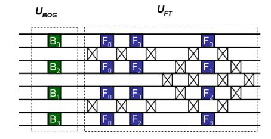
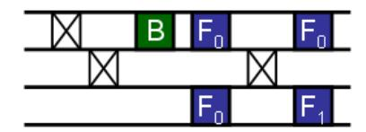

## Quantum circuits for strongly correlated quantum systems

Frank Verstraete, 1 J. Ignacio Cirac, 2 and José I. Latorre3

1Fakultät für Physik, Universität Wien, Boltzmanngasse 5, A-1090 Wien, Austria. 2Max-Planck-Institut für Quantenoptik, Hans-Kopfermann-Str. 1, D-85748 Garching, Germany. 3Dept. ECM, Universitat de Barcelona, Martí i Franquès 1, 08028 Barcelona, Spain. (Dated: May 21, 2018)

In recent years, we have witnessed an explosion of experimental tools by which quantum systems can be manipulated in a controlled and coherent way. One of the most important goals now is to build quantum simulators, which would open up the possibility of exciting experiments probing various theories in regimes that are not achievable under normal lab circumstances. Here we present a novel approach to gain detailed control on the quantum simulation of strongly correlated quantum many-body systems by constructing the explicit quantum circuits that diagonalize their dynamics. We show that the exact quantum circuits underlying some of the most relevant many-body Hamiltonians only need a finite amount of local gates. As a particularly simple instance, the full dynamics of a one-dimensional Quantum Ising model in a transverse field with four spins is shown to be reproduced using a quantum circuit of only six local gates. This opens up the possibility of experimentally producing strongly correlated states, their time evolution at zero time and even thermal superpositions at zero temperature. Our method also allows to uncover the exact circuits corresponding to models that exhibit topological order and to stabilizer states.

PACS numbers: 03.67.-a, 05.10.Cc

Recent advances in Quantum Information has led to novel ways of looking at strongly correlated quantum many-body systems. On the one hand, a great deal of theoretical work has been made in identifying the basic structure of entanglement in low-energy states of manybody Hamiltonians. This has led, for example, to new interpretations of renormalization group ideas in terms of variational methods in classes of quantum states with some very special local structure of entanglement [1, 2, 3], as well as to new methods to study the low energy properties of interesting lattice Hamiltonians. On the other hand, new experimental tools have been developed which should allow us to simulate certain quantum many-body systems, and thus to gain a better understanding of their intriguing properties and potentialities. In particular, the low temperature states corresponding to the Bose-Hubbard model have been prepared using atoms in optical lattices [4, 5], something which has triggered a lot of attention both in the atomic physics and condensed matter physics communities.

In this paper we propose to use a quantum computer (or simulator) in a different way, such that we not only have access to the low energy states but to the whole spectrum for certain quantum many—body problems. Moreover, this allows one to prepare any excited state or thermal state at any temperature, as well as the dynamical evolution of any state for arbitrary times with an effort which does not depend on the time, the temperature, or the degree of excitation. The main idea is to unravel a quantum circuit that transforms the whole Hamiltonian into one corresponding to non—interacting particles. As we will show, this will allow us to achieve the desired goals. Moreover, the new circuit will be ef-

ficient in the sense that the number of gates only grows polynomially with the number of particles. We will give some examples where with current systems of 4 or 8 trapped ions it would be possible to perform a complete simulation of a strongly interacting Hamiltonian.

We should also mention that what we are doing can be interpreted in terms of an extension of the renormalization group ideas [6]. There, one is interested in obtaining a simple effective Hamiltonian which describes the low energy physics of a given problem. This is done by a series of transformations which involve getting rid of high energy modes. In our case, we find a unitary transformation which takes the whole Hamitonian into a simple (non-interacting) one, and thus: (i) we do not loose the physics of the high energy modes in the way; (ii) it can be implemented experimentally. Of course, our method only works exactly for the small set of integrable problems, but very similar approximate transformations can in principle be found for any system whose effective low-energy physics is well described by quasi-particles.

Let us start by considering the consequences of identifying the quantum circuit  $\mathcal{U}_{dis}$  that disentangles a given Hamiltonian  $\mathcal{H}$  acting on n qubits in the following sense:

$$\mathcal{H} = \mathcal{U}_{dis} \ \tilde{\mathcal{H}} \ \mathcal{U}_{dis}^{\dagger} \tag{1}$$

where  $\tilde{\mathcal{H}}$  is a non–interacting Hamitonian which, without loss of generality, can be taken as

$$\tilde{\mathcal{H}} = \sum_{i} \omega_i \sigma_i^z, \tag{2}$$

with  $\sigma_i^z$  Pauli operators. We are interested in the circuits whose size only grows moderately with the number

of qubits. In that case we could: (i) prepare excited eigenstates of  $\mathcal{H}$ , just preparing a product state and then applying  $\mathcal{U}_{dis}$ ; (ii) simulate the time evolution of a state, just by using

$$e^{-it\mathcal{H}} = \mathcal{U}_{dis}e^{-it\tilde{\mathcal{H}}}\mathcal{U}_{dis}^{\dagger} . \tag{3}$$

Since  $e^{-it\tilde{\mathcal{H}}}$  can be simulated using n single–qubit gates, then the whole evolution would require a fixed number of gates, independent of the time t; (iii) similarly, the same circuit will allow to create the thermal state  $\exp(-\beta \mathcal{H}) = \mathcal{U}_{dis} \exp(-\beta \tilde{\mathcal{H}}) \mathcal{U}_{dis}^{\dagger}$  explicitly, just by preparing a product mixed state to start with. This is remarkable, as, in general, there is no known scheme to create thermal states using a (zero-temperature) quantum computer.

The goal is thus, to identify the quantum circuits that disentangle certain kind of Hamiltonians. Here we will consider three kind of Hamiltonians: (i) the XY model; (ii) Kitaev's on the honey-comb lattice; (iii) the ones corresponding to stabilizer states. We will concentrate in detail in the first one, since it gives rise to quantum phase transitions and critical phases, and thus it is perhaps the most interesting among them. Towards the end of the paper we will briefly explain how one can carry out the procedure with the other two.

The circuit  $\mathcal{U}_{dis}$  we shall construct is surprisingly small. For a system of n spins, the total number of gates in the circuit scales as  $n^2$  and the depth of the circuit grows as  $n \log n$ . Then, it seems reasonable to envisage experimental realizations of the quantum circuit  $\mathcal{U}_{dis}$  that will allow to create e.g. the ground state of the Quantum Ising model for any transverse field starting from a trivial product state and acting only with a small number of local gates. The very same circuit would produce excited state, superpositions, time evolution and even thermal states. This is, thus, a quantum algorithm that could be run in a quantum computer to exactly simulate a different quantum system.

The strategy to disentangle the XY Hamiltonian is based in tracing the well-known transformation which solves the model analytically [7, 8]. The path to follow is divided in three steps: we first need to implement the Jordan-Wigner map of spins  $(\sigma)$  into fermions (c), then use the Fourier transform to get fermions in momentum space (b) and, finally, perform a Bogoliubov transformation to completely diagonalize the system in terms of free fermions (a). As we shall discuss in more detail shortly, the first transformation is just a relabeling of degrees of freedom which needs no actual action on the system. The fermions c are just an economical way of carrying along the degrees of freedom that are subsequently Fourier transformed. On the other hand, both the Fourier and Bogoliubov transformations are real actions on the spin degrees of freedom. Thus, the structure of the unitary transformation that takes the free theory

to the original XY system corresponds to

$$\mathcal{U}_{dis} = \mathcal{U}_{FT} \ \mathcal{U}_{Bog} \tag{4}$$

witl

$$\mathcal{H}_{Ising} = \mathcal{H}_1[\sigma] \longleftarrow \mathcal{H}_2[c] \stackrel{\mathcal{U}_{FT}}{\longleftarrow} \mathcal{H}_3[b] \stackrel{\mathcal{U}_{Bog}}{\longleftarrow} \mathcal{H}_4[a] = \tilde{\mathcal{H}}$$
(5

Some of the pieces of the  $\mathcal{U}_{dis}$  transformation may have a very simple form when view as an action on the coefficients of the wave function. The problem is however nontrivial in that the Bogoliubov transformation changes the vacuum and, hence, the problem is different than the one of simulating a fermionic computer with a standard quantum computer [9].

Let us detail the construction of  $\mathcal{U}_{dis}$  for the XY Hamiltonian

$$\mathcal{H}_{XY} = \sum_{i=1}^{n} \left( \frac{1+\gamma}{2} \sigma_i^x \sigma_{i+1}^x + \frac{1-\gamma}{2} \sigma_i^y \sigma_{i+1}^y \right) + \lambda \sum_{i=1}^{n} \sigma_i^z + \frac{1+\gamma}{2} \sigma_1^y \sigma_2^z \dots \sigma_{n-1}^z \sigma_n^y + \frac{1-\gamma}{2} \sigma_1^x \sigma_2^z \dots \sigma_{n-1}^z \sigma_n^x .$$
 (6)

where  $\gamma$  parametrizes the X-Y anisotropy and  $\lambda$  represents the presence of an external transverse magnetic field. The last two terms above are related to the correct mapping of periodic boundary conditions between spins to fermionic degrees of freedom and are often dropped as they are suppressed in the large n limit. These terms can also be substituted with the standard periodic terms  $\sigma_n^x \sigma_1^x$  and  $\sigma_n^y \sigma_1^y$  for the even total spin-up sector and the same terms with opposite sign in the odd sector. The Jordan-Wigner transformation  $c_i = (\prod_{m < i} \sigma_m^z) (\sigma_i^x - i\sigma_i^y)/2$  is designed to transform the spin operators into fermionic modes. This is indeed implemented by the strings of spin operators which, furthermore, cancel on the Hamiltonian leading to

$$\mathcal{H}_{2}[c] = \frac{1}{2} \sum_{i=1}^{n} \left( (c_{i+1}^{\dagger} c_{i} + c_{i}^{\dagger} c_{i+1}) + \gamma (c_{i}^{\dagger} c_{i+1}^{\dagger} + c_{i} c_{i+1}) \right) + \lambda \sum_{i=1}^{n} c_{i}^{\dagger} c_{i} , \quad (7)$$

where  $c_{n+1} = c_1$ , setting periodic boundary conditions, and now  $c_i, c_i^{\dagger}$  are fermionic annihilation and creation operators acting on the vacuum  $|\Omega_c\rangle$  as defined by

$$\{c_i, c_j\} = 0$$
  $\{c_i, c_j^{\dagger}\} = \delta_{ij}$   $c_i |\Omega_c\rangle = 0$ . (8)

Thus, the Jordan-Wigner transformation takes a state of spin 1/2 particles

$$|\psi\rangle = \sum_{i_1 i_2 \dots i_n = 0, 1} \psi_{i_1 i_2 \dots i_n} |i_1, i_2, \dots, i_n\rangle ,$$
 (9)

into a fermionic state

$$|\psi\rangle = \sum_{i_1 i_2 \dots i_n = 0.1} \psi_{i_1 i_2 \dots i_n} (c_1^{\dagger})^{i_1} (c_2^{\dagger})^{i_2} \dots (c_n^{\dagger})^{i_n} |\Omega_c\rangle .$$
 (10)

Figure 1: Structure of the quantum circuit performing the exact diagonalisation of the XY Hamiltonian for 8 sites. The circuit follows the structure of a Bogoliubov transformation followed by a fast Fourier transform. Three types of gates are involved: type-B (responsible for the Bogoliubov transformation and depending on the external magnetic field  $\lambda$  and the anisotropy parameter  $\gamma$ ), type-fSWAP (depicted as crosses and necessary to implement the anticommuting properties of fermions) and type-F (gates associated to the fast Fourier transform). Some initial gates have been eliminated since they only amount to some reordering of initial qubits.

The relevant point to observe is that there is no effect on the coefficients  $\psi_{i_1 i_2 \dots i_n}$ . There are no gates to be implemented on the register in order to reproduce the full dynamics of the system, provided we retain the fact that any further swapping of degrees of freedom will carry a minus sign from now on. This is a remarkable simplification in our construction.

The first non-trivial part of the quantum circuit for the XY Hamiltonian is the one associated to the Fourier transform which must be performed on the fermionic modes

$$b_k = \frac{1}{\sqrt{n}} \sum_{j=1}^n e^{i\frac{2\pi}{n}jk} c_j$$
 ,  $k = -\frac{n}{2} + 1, \dots, \frac{n}{2}$  . (11)

This transformation exploits translational invariance and takes  $H_2[c]$  into a momentum space Hamiltonian  $H_3[b]$ . We here present the construction of this circuit in terms of two-body local for the case where  $n=2^k$ , that is, when a classical fast Fourier transform exists, though the technique has general applicability. The quantum circuit that produces the above result can be constructed in the case of n=8 as shown in Fig. 1.

The circuit contains two types of gates. Every crossing of lines in the classical fast Fourier transformation corresponds to a fermionic swap in the quantum case, that we represent with a crossed box in Fig. 1. The quantum gate for this fermionic SWAP reads

$$U_{SWAP} = \begin{pmatrix} 1 & 0 & 0 & 0 \\ 0 & 0 & 1 & 0 \\ 0 & 1 & 0 & 0 \\ 0 & 0 & 0 & -1 \end{pmatrix}$$
 (12)

Note the minus sign whenever two ocupied modes enter the fermionic SWAP. The  $\mathcal{U}_{FT}$  circuit also makes use of

a second class of gates. Those implement the change of relative phase associated to the Fourier transform. The construction of the explicit gates which are needed are

$$F_k = \begin{pmatrix} 1 & 0 & 0 & 0 \\ 0 & \frac{1}{\sqrt{2}} & \frac{\alpha(k)}{\sqrt{2}} & 0 \\ 0 & \frac{1}{\sqrt{2}} & -\frac{\alpha(k)}{\sqrt{2}} & 0 \\ 0 & 0 & 0 & -\alpha(k) \end{pmatrix} , \tag{13}$$

with  $\alpha(k)=\exp(i2\pi k/n)$ . The fast Fourier classical circuit is of depth  $n\log n$ . The quantum circuit needs further fermionic swaps that makes the total number of gates to grow as  $n^2$ . More precisely, the counting of gates in the circuit goes as follows. For a system of  $n=2^k$  spins, the circuit needs  $2^{k-1}(2^k-1)$  local gates. Only kn of them are site-dependent interacting gates, whereas the rest correspond to fermionic SWAPs needed to ensure the fermionic character of the effective modes handle in the system. Let us note that the periodic boundary conditions present in the system have emerged from a set of initial free modes. It is the action of gates that builds the appropriate boundary property in the system.

Let us note that the way entanglement builds up in the system is made apparent in the circuit in Fig. 1. For instance, when the system is divided in two sets with four contiguous qubits in each one all bipartite entanglement is transmited through four f-SWAP gates. This is the minimum number of gates necessary to generate the known maximum entanglement along time evolutions. Thus, no circuit with less gates relating both half chains could provide an exact solution.

The final step to achieve a full disentanglement of the XY Hamiltonianin corresponds to a Bogoliubov transformation . The momentum-dependent mixture of modes is disentangled using

$$a_{k} = \cos(\theta_{k}/2)b_{k} - i\sin(\theta_{k}/2)b_{-k}^{\dagger}$$

$$\theta_{k} = \arccos\left(\frac{-\lambda + \cos\left(\frac{2\pi k}{n}\right)}{\sqrt{\left(\lambda - \cos\left(\frac{2\pi k}{n}\right)\right)^{2} + \gamma^{2}\sin^{2}\left(\frac{2\pi k}{n}\right)}}\right) 14)$$

This transformation preserves the anticommutation relations. Within the operators  $a_k$ , the original Hamiltonian can now be expressed as

$$\mathcal{H}_4[a] = \sum_{k=-n/2+1}^{n/2} \omega_k a_k^{\dagger} a_k \tag{15}$$

$$\omega_k = \sqrt{\left(\lambda - \cos\left(\frac{2\pi k}{n}\right)\right)^2 + \gamma^2 \sin^2\left(\frac{2\pi k}{n}\right)}$$
(16)

The Hamiltonian is clearly a sum of noninteracting terms and its spectrum is equivalent to the completely local spin 1/2 Hamiltonian  $\tilde{\mathcal{H}} = \sum_i \omega_i \sigma_i^z$ . Let us note that the above Bogoliubov transformation only mixes pairs of

Figure 2: Complete quantum circuit that reproduces all the dynamical properties of the Quantum Ising Hamiltonian in a external magnetic field with four spins. Note that some initial and final reordering gates could be sparsed in an experimental realization.

modes. The precise gate that produces such disentanglement corresponds to

$$B_k = \begin{pmatrix} \cos \theta_k & 0 & 0 & i \sin \theta_k \\ 0 & 1 & 0 & 0 \\ 0 & 0 & 1 & 0 \\ i \sin \theta_k & 0 & 0 & \cos \theta_k \end{pmatrix}$$
 (17)

with  $\theta_k$  given by Eq. (14). This completes the construction of the circuit that underlies the XY-Hamiltonian.

Let us now discuss the simplest non-trivial experiment that can take advantage of the circuit we have constructed. We can take  $\gamma = 1$ , which reduces the system to the quantum Ising chain in a magnetic transverse field  $\lambda$ . This theory exhibits a quantum phase transition for  $\lambda = 1$  in the  $n \to \infty$  limit. Here, instead, we can consider a system of n=4 qubits. Experimentally, the four qubits should be prepared in the initial  $|0000\rangle$  or  $|0001\rangle$ state, depending whether  $\lambda \leq 1$  or  $\lambda > 1$  (different valid variants of the circuit we are presenting change the way the system must be prepared or the angles appearing in the Bogoliubov transformation). Then, the set of gates depicted in the circuit in Fig.2 should be operated with a choice of the parameter  $\lambda$  in the only non-trivial Bogoliubov B gate. To be precise, the angle can be seen to correspond to Eq. 14. We can further suppress unnecessary initial and final fermionic swaps since they just correspond to a relabeling of gubits that can be taken care of without actual actions on the system. Actually, only six gates would be needed to recreate the full dynamics of the Ising model for four qubits! After running the circuit, the state of the system would then be the ground state of the Ising Hamiltonian for that value of the external magnetic field. It would then be possible to measure e.g. the correlator  $\langle \sigma_i^x \sigma_i^x \rangle$ , for all i=1,2,3,4and  $j \neq i$ . This process could be done over a scan of the  $\lambda$ parameter and scan the magnetization  $\langle \sigma^x \rangle$  for any qubit as well as a measure of three- and four-body correlations functions.

We may finally take a larger view on the underlying structure of the circuits we have presented. The basic idea is that those integrable systems whose solutions make use of the Jordan-Wigner transformation will have a unitary circuit that disentangles the dynamics with gates of the type

$$V_{ij} = e^{i\alpha(c_i^{\dagger}c_j + h.c.)}, \quad W_{ij} = e^{i\alpha(c_ic_j + h.c.)}. \quad (18)$$

In our case, the Fourier transform can be written in terms of V-gates, whereas the Bogoliubov transformation needs W-gates. These type of gate can further be expressed in terms of local unitaries because  $V_{ij} = V_{ij}^x V_{ij}^y$  with

$$V_{ij}^x = e^{i\alpha\sigma_i^x \sigma_{i+1}^z \dots \sigma_{j-1}^z \sigma_j^x} \tag{19}$$

$$V_{ij}^y = e^{i\alpha\sigma_i^y \sigma_{i+1}^z \dots \sigma_{j-1}^z \sigma_j^y} , \qquad (20)$$

and, similarly,  $W_{ij} = W_{ij}^x W_{ij}^y$ , with

$$V_{ij}^x = e^{i\alpha\sigma_i^x \sigma_{i+1}^z \dots \sigma_{j-1}^z \sigma_j^x} \tag{21}$$

$$V_{ij}^x = e^{i\alpha\sigma_i^x \sigma_{i+1}^z \dots \sigma_{j-1}^z \sigma_j^x} \tag{22}$$

Then, all these gates can be implemented using B-type, F-type and fermionic SWAP gates, as described previously.

The method we have presented here can be extended to solve other quantum systems of relevance. Let us sketch two specific cases. First, we focus on the 2-dimensional Kitaev Hamiltonian on the honeycomb lattice [10]. That Hamiltonian is particularly interesting because its ground state exhibits nontrivial topological features and can nevertheless be solved exactly using a mapping to free Majorana fermions. The construction of the quantum circuit diagonalizing the Hamiltonian can be constructed in the same way as for the Ising Hamiltonian. The only difference is that, due to the mapping of one spin 1/2 to two fermions or 4 Majorana fermions, ancilla's have to be used in the quantum circuit; but these can again simply be disentangled at the end. A second example of system whose exact circuit can be obtained corresponds to the case of stabilizer states [11]. This class of states is particularly interesting from the point of view of condensed matter theory as it encompasses the toric code state and all the so-called string net states as arising in the context of topological quantum order [12]. The related quantum Hamiltonian is a sum of commuting terms, each term consisting of a product of local Pauli operators. Such a Hamiltonian can always be diagonalized by a quantum circuit only consisting of Clifford operations [13]. In principle, those gates can be highly nonlocal, and in the case of Hamiltonians exhibiting topological quantum order, one can rigorously prove that the quantum circuit has a depth that scales linearly in the size of the system [14]. A nice measure of the complexity of a particular class of stabilizer states would be to characterize the minimal depth of the quantum circuit creating this Hamiltonian.

A more challenging task is to find the quantum circuit that diagonalizes Hamiltonians that can be solved using the Bethe ansatz. As the corresponding models are integrable, a quantum circuit is guaranteed to exist that maps the Hamiltonian to a sum of trivial local terms.

Such a procedure would be very interesting and lead to the possibility of measuringing correlation functions that are very hard to calculate using the Bethe ansatz solution.

In conclusion, we have shown that certain relevant Hamiltonians describing strongly correlated quantum systems can be exactly diagonalized using a finite-depth quantum circuit. We have produced the explicit construction of such a circuit that opens up the possibility of experimental realizations of strongly correlated systems in controlled devices.

Methods. We here illustrate the technique use to construct individual quantum gates in the XY. We consider the example of a fast Fourier transform of four qubits. The explicit transformations of modes in Eq. (11)

$$b_k = \left(c_0 + e^{-i2\pi \frac{2k}{4}}c_2\right) + e^{-i2\pi \frac{k}{4}}\left(c_1 + e^{-i2\pi \frac{2k}{4}}c_3\right)$$
 (23)

where it is made apparent that modes 0 and 2 first mix in the same way as 1 and 3, and then a subsequent mixing takes place. The first step corresponds to

$$c'_{0} = c_{0} + c_{2} c'_{1} = c_{1} + c_{3}$$

$$c'_{2} = c_{0} + e^{-i\pi}c_{2} c'_{3} = c_{1} + e^{-i\pi}c_{3} (24)$$

This the reason why the circuit in Fig. 2 carries two identical gates in the first part of the Fourier transform. Similarly, further mixtures will take place after some fermionic swaps are operated.

To uncover the actual gate needed for the circuit, we consider the wave function made of the modes involve

$$|\psi\rangle \; = \; \sum_{i,j=0,1} A_{ij}' \left(c_0^{'\dagger}\right)^i \left(c_2^{'\dagger}\right)^j |00\rangle$$

$$= \sum_{i,j=0}^{1} A_{ij} \left( c_0^{\dagger} + c_2^{\dagger} \right)^i \left( c_0^{\dagger} + e^{i\pi} c_2^{\dagger} \right)^j |00\rangle . \tag{25}$$

Expanding this last equation and working in the basis  $|00\rangle, |01\rangle, |10\rangle, |11\rangle$ , the coefficients of the wave function are rearrange by the transformation A' = UA with

$$\begin{pmatrix}
1 & 0 & 0 & 0 \\
0 & \frac{1}{\sqrt{2}} & \frac{1}{\sqrt{2}} & 0 \\
0 & \frac{1}{\sqrt{2}} & -\frac{1}{\sqrt{2}} & 0 \\
0 & 0 & 0 & -1
\end{pmatrix}.$$
(26)

-  M. Fannes, B. Nachtergaele, and R. F. Werner. Comm. Math. Phys., 144:443, 1992; F. Verstraete, D. Porras, and J. I. Cirac. Phys. Rev. Lett, 93:227205, 2004
- [2] F. Verstraete and J. I. Cirac. arXiv:cond-mat/0407066v1, 2004.
- [3] G. Vidal, Phys. Rev. Lett. 99, 220405 (2007).
- [4] M. Greiner, O. Mandel, T. Esslinger, T. W. Hansch, I. Bloch, NATURE 415, 39 (2002).
- [5] D. Jaksch, C. Bruder, J. I. Cirac, C. W. Gardiner, P. Zoller, Phys. Rev. Lett 81, 3108 (1998).
- [6] K. G. Wilson. Rev. Mod. Phys., 47:773, 1975.
- [7] P. Jordan and E. Wigner, Z. Phys. 47, 631 (1928).
- [8] E. Lieb, T. Schultz and D. Mattis, Annals of Phys, 16, 407 (1961).
- [9] S. Bravyi and A. Kitaev, Annals of Phys, 298, 210 (2002).
- [10] A. Kitaev, Annals of Phys. **321**, 2 (2006).
- [11] D. Gottesman, Phys.Rev. A 54, 1862 (1996).
- [12] M. Levin and X. G. Wen, Phys. Rev. B, 71, 045110 (2005).
- [13] D. Gottesman, Ph.D. thesis, Caltech, Pasadena, 1997, arXiv:quant-ph/9705052.
- [14] S. Bravyi, M. B. Hastings, and F. Verstraete, Phys. Rev. Lett. 97, 050401 (2006).