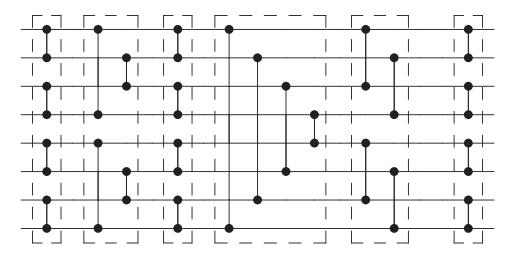

# ARTICLE OPEN

# Improved techniques for preparing eigenstates of fermionic Hamiltonians

Dominic W. Berry1, Mária Kieferová1,2, Artur Scherer1, Yuval R. Sanders 6, Guang Hao Low3, Nathan Wiebe3, Craig Gidney4 and Ryan Babbush5

Modeling low energy eigenstates of fermionic systems can provide insight into chemical reactions and material properties and is one of the most anticipated applications of quantum computing. We present three techniques for reducing the cost of preparing fermionic Hamiltonian eigenstates using phase estimation. First, we report a polylogarithmic-depth quantum algorithm for antisymmetrizing the initial states required for simulation of fermions in first quantization. This is an exponential improvement over the previous state-of-the-art. Next, we show how to reduce the overhead due to repeated state preparation in phase estimation when the goal is to prepare the ground state to high precision and one has knowledge of an upper bound on the ground state energy that is less than the excited state energy (often the case in quantum chemistry). Finally, we explain how one can perform the time evolution necessary for the phase estimation based preparation of Hamiltonian eigenstates with exactly zero error by using the recently introduced qubitization procedure.

npj Quantum Information (2018)4:22; doi:10.1038/s41534-018-0071-5

## INTRODUCTION

One of the most important applications of quantum simulation (and of quantum computing in general) is the Hamiltonian simulation based solution of the electronic structure problem. The ability to accurately model ground states of fermionic systems would have significant implications for many areas of chemistry and materials science and could enable the in silico design of new solar cells, batteries, catalysts, pharmaceuticals, etc. 1,2 The most rigorous approaches to solving this problem involve using the quantum phase estimation algorithm to project to molecular ground states starting from a classically guessed state. 4 Beyond applications in chemistry, one might want to prepare fermionic eigenstates in order to simulate quantum materials including models of high-temperature superconductivity. 6

In the procedure introduced by Abrams and Lloyd, one first initializes the system in some efficient-to-prepare initial state  $|\phi\rangle$  which has appreciable support on the desired eigenstate  $|k\rangle$  of Hamiltonian H. One then uses quantum simulation to construct a unitary operator that approximates time evolution under H. With these ingredients, standard phase estimation techniques invoke controlled application of powers of  $U(\tau) = e^{-iH\tau}$ . With probability  $a_k = |\langle \phi | k \rangle|^2$ , the output is then an estimate of the corresponding eigenvalue  $E_k$  with standard deviation  $\sigma_{E_k} = O((\tau M)^{-1})$ , where M is the total number of applications of  $U(\tau)$ . The synthesis of  $e^{-iH\tau}$  is typically performed using digital quantum simulation algorithms, such as by Lie-Trotter product formulas, truncated Taylor series, or quantum signal processing.

Since the proposal by Abrams and Lloyd,7 algorithms for timeevolving fermionic systems have improved substantially.11–18 Innovations that are particularly relevant to this paper include the use of first quantization to reduce spatial overhead19–24 from O(N) to  $O(\eta \log N)$  where  $\eta$  is number of particles and  $N \gg \eta$  is number of single-particle basis functions (e.g., molecular orbitals or plane waves), and the use of post-Trotter methods to reduce the scaling with time-evolution error from  $O(\text{poly}(1/\epsilon))$  to  $O(\text{poly}(0)(1/\epsilon))^{.24-26}$  The algorithm of ref. 24 makes use of both of these techniques to enable the most efficient first quantized quantum simulation of electronic structure in the literature.

Unlike second quantized simulations which necessarily scale polynomially in N, first quantized simulation offers the possibility of achieving total gate complexity  $O(\text{poly}(\eta)\text{polylog}(N, 1/\epsilon))$ . This is important because the convergence of basis set discretization error is limited by resolution of the electron-electron cusp,27 which cannot be resolved faster than O(1/N) using any single-particle basis expansion. Thus, whereas the cost of refining second quantized simulations to within  $\delta$  of the continuum basis limit is necessarily  $O(\text{poly}(1/\delta))$ , first quantization offers the possibility of suppressing basis set errors as  $O(\text{polylog}(1/\delta))$ , providing essentially arbitrarily precise representations.

In second quantized simulations of fermions the wavefunction encodes an antisymmetric fermionic system, but the qubit representation of that wavefunction is not necessarily antisymmetric. Thus, in second quantization it is necessary that operators act on the encoded wavefunction in a way that enforces the proper exchange statistics. This is the purpose of second quantized fermion mappings such as those explored in refs. 28–34 By contrast, the distinguishing feature of first quantized simulations is that the antisymmetry of the encoded system must be enforced directly in the qubit representation of the wavefunction. This often simplifies the task of Hamiltonian simulation but

complicates the initial state preparation.

1Department of Physics and Astronomy, Macquarie University, Sydney, NSW 2109, Australia; 2Institute for Quantum Computing and Department of Physics and Astronomy, University of Waterloo, Waterloo, ON N2L 3G1, Canada; 3Microsoft Research, Redmond, WA 98052, USA; 4Google Inc., Santa Barbara, CA 93117, USA and 5Present address: Google Inc., Venice, CA 90291, USA

Correspondence: Ryan Babbush (babbush@google.com)

Received: 20 December 2017 Revised: 23 March 2018 Accepted: 4 April 2018

Published online: 02 May 2018

In first quantization there are typically  $\eta$  different registers of size  $\log N$  (where  $\eta$  is the number of particles and N is number of spin-orbitals) encoding integers indicating the indices of occupied orbitals. As only  $\eta$  of the N orbitals are occupied, with  $\eta$   $\log N$  qubits one can specify an arbitrary configuration. To perform simulations in first quantization, one typically requires that the initial state  $|\phi\rangle$  is antisymmetric under the exchange of any two of the  $\eta$  registers. Prior work presented a procedure for preparing such antisymmetric states with gate complexity scaling as  $\tilde{O}(\eta^2)$ .  $^{35,36}$ 

In Section IA we provide a general approach for antisymmetrizing states via sorting networks. The circuit size is  $O(\eta \log^c \eta \log N)$  and the depth is  $O(\log^c \eta \log \log N)$ , where the value of  $c \ge 1$  depends on the choice of sorting network (it can be 1, albeit with a large multiplying factor). In terms of the circuit depth, these results improve exponentially over prior implementations. They also improve polynomially on the total number of gates needed. We also discuss an alternative approach, a quantum variant of the Fisher-Yates shuffle, which avoids sorting, and achieves a size-complexity of  $O(\eta^2 \log N)$  with lower spatial overhead than the sort-based methods.

Once the initial state  $|\phi\rangle$  has been prepared, it typically will not be exactly the ground state desired. In the usual approach, one would perform phase estimation repeatedly until the ground state is obtained, giving an overhead scaling inversely with the initial state overlap. In Section IB we propose a strategy for reducing this cost, by initially performing the estimation with only enough precision to eliminate excited states.

In Section IC we explain how qubitization37 provides a unitary sufficient for phase estimation purposes with exactly zero error (provided a gate set consisting of an entangling gate and arbitrary single-qubit rotations). This improves over proposals to perform the time evolution unitary with post-Trotter methods at cost scaling as  $O(\text{polylog}(1/\epsilon))$ . We expect that a combination of these strategies will enable quantum simulations of fermions similar to the proposal of24 with substantially fewer T gates than any method suggested in prior literature.

## **RESULTS**

Exponentially faster antisymmetrization

Here we present our algorithm for imposing fermionic exchange symmetry on a sorted, repetition-free quantum array target. Specifically, the result of this procedure is to perform the transformation

$$|r_1 \cdots r_\eta\rangle \mapsto \sum_{\sigma \in S_\eta} (-1)^{\pi(\sigma)} |\sigma(r_1, \cdots, r_\eta)\rangle$$
 (1)

where  $\pi(\sigma)$  is the parity of the permutation  $\sigma$ , and we require for the initial state that  $r_p < r_{p+1}$  (necessary for this procedure to be unitary). Although we describe the procedure for a single input  $|r_1 \cdots r_n\rangle$ , our algorithm may be applied to any superposition of such states.

Our approach is a modification of that proposed in refs.  $^{35,36}$ ; namely, to apply the reverse of a sort to a sorted quantum array. Whereas refs.  $^{35,36}$  provide a gate count of  $O(\eta^2(\log N)^2)$ , we can report a gate count of  $O(\eta \log \eta \log N)$  and a runtime of  $O(\log \eta \log \log N)$ .

This section proceeds as follows. We begin with a summary of our algorithm. We then explain the reasoning underlying the key step (Step 4) of our algorithm, which is to reverse a sorting operation on target. Next we discuss the choice of sorting algorithm, which we require to be a sorting network. Then, we assess the cost of our algorithm in terms of gate complexity and runtime and we compare this to previous work in refs. 35,36. Finally, we discuss the possibility of antisymmetrizing without sorting and propose an alternative, though more costly, algorithm based on

the Fisher-Yates shuffle. Our algorithm consists of the following four steps:

- 1. Prepare seed. Let f be a function chosen so that  $f(\eta) \ge \eta^2$  for all  $\eta$ . We prepare an ancillary register called seed in an even superposition of all possible length- $\eta$  strings of the numbers 0, 1, ...,  $f(\eta) 1$ . If  $f(\eta)$  is a power of two, preparing seed is easy: simply apply a Hadamard gate to each qubit.
- Sort seed. Apply a reversible sorting network to seed. Any sorting network can be made reversible by storing the outcome of each comparator in a second ancillary register called record. There are several known sorting networks with polylogarithmic runtime, as we discuss below.
- 3. Delete collisions from seed. As seed was prepared in a superposition of all length- $\eta$  strings, it includes strings with repeated entries. As we are imposing fermionic exchange symmetry, these repetitions must be deleted. We therefore measure seed to determine whether a repetition is present, and we accept the result if it is repetition-free. We prove in Supplementary Materials that choosing  $f(\eta) \ge \eta^2$  ensures that the probability of success is greater than 1/2. We further prove that the resulting state of seed is disentangled from record, meaning seed can be discarded after this step.
- 4. Apply the reverse of the sort to target. Using the comparator values stored in record, we apply each step of the sorting network in reverse order to the sorted array target. The resulting state of target is an evenly weighted superposition of each possible permutation of the original values. To ensure the correct phase, we apply a controlled-phase gate after each swap.

Step 4 is the key step. Having prepared (in Step 1–Step 3) a record of the in-place swaps needed to sort a symmetrized, collision-free array, we undo each of these swaps in turn on the sorted target. We employ a sorting network, a restricted type of sorting algorithm, because sorting networks have comparisons and swaps at a fixed sequence of locations. By contrast, many common classical sorting algorithms (like heapsort) choose locations depending on the values in the list. This results in accessing registers in a superposition of locations in the corresponding quantum algorithm, incurring a linear overhead. As a result, a quantum heapsort requires  $O(\eta^2)$  operations, not  $O(\eta)$ . By contrast, no overhead is required for using a fixed sequence of locations. The implementation of sorting networks in quantum algorithms has previously been considered in refs.  $O(\eta)$ 

Sorting networks are logical circuits that consist of wires carrying values and comparator modules applied to pairs of wires, that compare values and swap them if they are not in the correct order. Wires represent bit strings (integers are stored in binary) in classical sorting networks and qubit strings in their quantum analogs. A classical comparator is a sort on two numbers, which gives the transformation  $(A, B) \mapsto (\min(A, B), \max(A, B))$ . A quantum comparator is its reversible version where we record whether the items were already sorted (ancilla state  $|0\rangle$ ) or the comparator needed to apply a swap (ancilla state  $|1\rangle$ ); see Fig. 1.

The positions of comparators are set as a predetermined fixed sequence in advance and therefore cannot depend on the inputs. This makes sorting networks viable candidates for quantum

$$\begin{array}{cccccccccccccccccccccccccccccccccccc$$

**Fig. 1** The standard notation for a comparator is indicated on the left. Its implementation as a quantum circuit is shown on the right. In the first step, we compare two inputs with values A and B and save the outcome (1 if A > B is true and 0 otherwise) in a single-qubit ancilla. In the second step, conditioned on the value of the ancilla qubit, the values A and B in the two wires are swapped

**Fig. 2** Example of a *bitonic sort* on 8 inputs. The ancillae necessary to record the results as part of implementing each of the comparators are omitted for clarity. Comparators in each dashed box can be applied in parallel for depth reduction

computing. Many of the sorting networks are also highly parallelizable, thus allowing low-depth, often polylogarithmic, performance.

Our algorithm allows for any choice of sorting network. Several common sort algorithms such as the insert and bubble sorts can be represented as sorting networks. However, these algorithms have poor time complexity even after parallelization. More efficient runtime can be achieved, for example, using the bitonic sort,  $^{40,41}$  which is illustrated for 8 inputs in Fig. 2. The bitonic sort uses  $O(\eta \log^2 \eta)$  comparators and  $O(\log^2 \eta)$  depth, thus achieving an exponential improvement in depth compared to common sorting techniques.

Slightly better performance can be obtained using an odd-even mergesort. The asymptotically best sorting networks have depth  $O(\log \eta)$  and complexity  $O(\eta \log \eta)$ , though there is a large constant which means they are less efficient for realistic  $\eta$ . There is also a sorting network with  $O(\eta \log \eta)$  complexity with a better multiplicative constant, though its depth is  $O(\eta \log \eta)$  (so it is not logarithmic).

Assuming we use an asymptotically optimal sorting network, the circuit depth for our algorithm is  $O(\log \eta \log \log N)$  and the gate complexity is  $O(\eta \log \eta \log N)$ . The dominant cost of the algorithm comes from Step 2 and Step 4, each of which have  $O(\eta \log \eta)$  comparators that can be parallelized to ensure the sorting network executes only  $O(\log \eta)$  comparator rounds. Each comparator for Step 4 has a complexity of  $O(\log N)$  and a depth of  $O(\log \log N)$ , as we show in Supplementary Materials. The comparators for Step 2 have complexity  $O(\log N)$  and depth  $O(\log \eta)$ , which is less because  $\eta < N$ . Thus Step 2 and Step 4 each have gate complexity  $O(\eta \log \eta)$  and runtime  $O(\log \eta)$  log log N

The other two steps in our algorithm have smaller cost. Step 1 has constant depth and  $O(\eta \log \eta)$  complexity. Step 3 requires  $O(\eta)$  comparisons because only nearest-neighbor comparisons need be carried out on seed after sorting. These comparisons can be parallelized over two rounds, with complexity  $O(\eta \log \eta)$  and circuit depth  $O(\log \log \eta)$ . Then the result for any of the registers being equal is computed in a single qubit, which has complexity  $O(\eta)$  and depth  $O(\log \eta)$ . Thus the complexity of Step 3 is  $O(\eta \log \eta)$  and the total circuit depth is  $O(\log \eta)$ . We give further details in Supplementary Materials. Thus, our algorithm has an exponential runtime improvement over the proposal in refs.  $^{35,36}$ . We also have a quadratic improvement in gate complexity, which is  $O(\eta)$  for our algorithm but  $O(\eta^2)$  for refs.  $^{35,36}$ .

Our runtime is likely optimal for symmetrization, at least in terms of the  $\eta$  scaling. Symmetrization takes a single computational basis state and generates a superposition of  $\eta$ ! computational basis states. Each single-qubit operation can increase the number of states in the superposition by at most a factor of two, and two-qubit operations can increase the number of states in the superposition by at most a factor of four. Thus, the number of one-and two-qubit operations is at least  $\log_2{(n!)} = O(\eta \log \eta)$ . In our algorithm we need this number of operations between the

registers. If that is true in general, then  $\eta$  operations can be parallelized, resulting in minimum depth  $O(\log \eta)$ . It is more easily seen that the total number of registers used is optimal. There are  $O(\eta \log \eta)$  ancilla qubits due to the number of steps in the sort, but the number of qubits for the system state we wish to symmetrize is  $O(\eta \log N)$ , which is asymptotically larger.

Our quoted asymptotic runtime and gate complexity scalings assume the use of sorting networks that are asymptotically optimal. However, these algorithms have a large constant overhead making it more practical to use an odd-even mergesort, leading to depth  $O(\log^2 \eta \log N)$ . Note that is possible to obtain complexity  $O(\eta \log \eta \log N)$  and number of ancilla qubits  $O(\eta \log \eta)$  with a better scaling constant using the sorting network of ref. 44

Given that the cost of our algorithm is dictated by the cost of sorting algorithms, it is natural to ask if it is possible to antisymmetrize without sorting. Though the complexity and runtime both turn out to be significantly worse than our sortbased approach, we suggest an alternative antisymmetrization algorithm based on the Fisher-Yates shuffle. The Fisher-Yates shuffle is a method for applying to a length-n target array a permutation chosen uniformly at random using a number of operations scaling as  $O(\eta)$ . Our algorithm indexes the positions to be swapped, thereby increasing the complexity to  $\tilde{O}(\eta^2)$ . Briefly put, our algorithm generates a superposition of states as in Step II of ref. 36, then uses these as control registers to apply the Fisher-Yates shuffle to the orbital numbers. The complexity is  $O(n^2 \log N)$ , with a factor of log N due to the size of the registers. We reset the control registers, thereby disentangling them, using  $O(\eta \log \eta)$ ancillae. We provide more details of this approach in Supplementary Materials.

To conclude this section, we have presented an algorithm for antisymmetrizing a sorted, repetition-free quantum register. The dominant cost of our algorithm derives from the choice of sorting network, whose asymptotically optimal gate count complexity and runtime are, respectively,  $O(\eta \log \eta \log N)$  and  $O(\log \eta \log \log N)$ . This constitutes a polynomial improvement in the first case and exponential in the second case over previous work in refs. 35,36. As in ref. 36, our antisymmetrization algorithm constitutes a key step for preparing fermionic wavefunctions in first quantization.

Fewer phase estimation repetitions by partial eigenstate projection rejection

Once the initial state  $|\phi\rangle$  has been prepared, it typically will not be exactly the ground state (or other eigenstate) desired. In the usual approach, one would perform phase estimation repeatedly, in order to obtain the desired eigenstate  $|k\rangle$ . The number of repetitions needed scales inversely in  $\alpha_k = |\langle \varphi | k \rangle|^2$ , increasing the complexity. We propose a practical strategy for reducing this cost which is particularly relevant for quantum chemistry. Our approach applies if one seeks to prepare the ground state with knowledge of an upper bound on the ground state energy  $E_0$ , together with the promise that  $E_0 \le E_0 < E_1$ . With such bounds available, one can reduce costs by restarting the phase estimation procedure as soon as the energy is estimated to be above  $\tilde{E}_0$  with high probability. That is, one can perform a phase estimation procedure that gradually provides estimates of the phase to greater and greater accuracy, for example as in ref. 45 If at any stage the phase is estimated to be above  $\tilde{E}_0$  with high probability, then the initial state can be discarded and re-prepared.

Performing phase estimation within error  $\epsilon$  typically requires evolution time for the Hamiltonian of  $1/\epsilon$ , leading to complexity scaling as  $1/\epsilon$ . This means that, if the state is the first excited state, then an estimation error less than  $E_1 - \tilde{E}_0$  will be sufficient to show that the state is not the ground state. The complexity needed would then scale as  $1/(E_1 - \tilde{E}_0)$ . In many cases, the final error required,  $\epsilon_f$ , will be considerably less than  $E_1 - \tilde{E}_0$ , so the

majority of the contribution to the complexity comes from measuring the phase with full precision, rather than just rejecting the state as not the ground state.

Given the initial state  $|\phi\rangle$  which has initial overlap of  $\alpha_0$  with the ground state, if we restart every time the energy is found to be above  $\tilde{E}_0$ , then the contribution to the complexity is  $1/\left[\alpha_0\left(E_1-\tilde{E}_0\right)\right]$ . There will be an additional contribution to the complexity of  $1/\epsilon_f$  to obtain the estimate of the ground state energy with the desired accuracy, giving an overall scaling of the complexity of

$$O\left(\frac{1}{a_0(E_1 - \tilde{E}_0)} + \frac{1}{\epsilon_f}\right). \tag{2}$$

In contrast, if one were to perform the phase estimation with full accuracy every time, then the scaling of the complexity would be  $O(1/(a_0\epsilon_f))$ . Provided  $a_0(E_1-\tilde{E}_0)>\epsilon_f$ , the method we propose would essentially eliminate the overhead from  $a_0$ .

In cases where  $a_0$  is very small, it would be helpful to apply amplitude amplification. A complication with amplitude amplification is that we would need to choose a particular initial accuracy to perform the estimation. If a lower bound on the excitation energy,  $\tilde{E}_1$ , is known, then we can choose the initial accuracy to be  $\tilde{E}_1 - \tilde{E}_0$ . The success case would then correspond to not finding that the energy is above  $\tilde{E}_0$  after performing phase estimation with that precision. Then amplitude amplification can be performed in the usual way, and the overhead for the complexity is  $1/\sqrt{a_0}$  instead of  $1/a_0$ .

All of this discussion is predicated on the assumption that there are cases where  $a_0$  is small enough to warrant using phase estimation as part of the state preparation process and where a bound meeting the promises of  $\tilde{E}_0$  is readily available. We now discuss why these conditions are anticipated for many problems in quantum chemistry. Most chemistry is understood in terms of mean-field models (e.g., molecular orbital theory, ligand field theory, the periodic table, etc.). Thus, the usual assumption (empirically confirmed for many smaller systems) is that the ground state has reasonable support on the Hartree-Fock state (the typical choice for  $|\phi\rangle$ ). A6-49 However, this overlap will decrease as a function of both basis size and system size. As a simple example, consider a large system composed of n copies of non-interacting subsystems. If the Hartree-Fock solution for the subsystem has overlap of exactly  $a_0^n$ , which is exponentially small in n.

It is literally plain-to-see that the electronic ground state of molecules is often protected by a large gap. The color of many molecules and materials is the signature of an electronic excitation from the ground state to first excited state upon absorption of a photon in the visible range (around 0.7 Hartree); many clear organics have even larger gaps in the UV spectrum. Visible spectrum  $E_1 - E_0$  gaps are roughly a hundred times larger than the typical target accuracy of  $\epsilon_f = 0.0016$  Hartree ("chemical accuracy") (The rates of chemical reactions are proportional to  $e^{-\beta\Delta A}/eta$ where  $\beta$  is inverse temperature and  $\Delta A$  is a difference in free energy between reactants and the transition state separating reactants and products. Chemical accuracy is defined as the maximum error allowable in  $\Delta A$  such that errors in the rate are smaller than a factor of ten at room temperature4). Furthermore, in many cases the first excited state is perfectly orthogonal to the Hartree-Fock state for symmetry reasons (e.g., due to the ground state being a spin singlet and the excited state being a spin triplet). Thus, the gap of interest is really  $E^*-E_0$  where  $E^*=\min_{k>0}E_k$  subject to  $|\langle \varphi|k\rangle|^2>0$ . Often the  $E^*-E_0$  gap is much larger than the  $E_1 - E_0$  gap.

For most problems in quantum chemistry a variety of scalable classical methods are accurate enough to compute upper bounds on the ground state energy  $\tilde{E}_0$  such that  $E_0 \leq \tilde{E}_0 < E^*$ , but not

accurate enough to obtain chemical accuracy (which would require quantum computers). Classical methods usually produce upper bounds when based on the variational principle. Examples include mean-field and Configuration Interaction Singles and Doubles (CISD) methods.50

As a concrete example, consider a calculation on the water molecule in its equilibrium geometry (bond angle of 104.5°, bond length of 0.9584 Å) in the minimal (STO-3G) basis set performed using OpenFermion51 and Psi4.52 For this system,  $E_0 = -75.0104$ Hartree and  $E_1 = -74.6836$  Hartree. However,  $\langle \varphi | 1 \rangle = 0$  and  $E^* =$ -74.3688 Hartree. The classical mean-field energy provides an upper bound on the ground state energy of  $\tilde{E}_0 = -74.9579$ Hartree. Therefore  $E^* - \tilde{E}_0 \approx 0.6$  Hartree, which is about 370 times  $\epsilon_f$ . Thus, using our strategy, for  $\alpha_0 > 0.003$  there is very little overhead due to the initial state  $|\varphi\rangle$  not being the exact ground state. In the most extreme case for this example, that represents a speedup by a factor of more than two orders of magnitude. However, in some cases the ground state overlap might be high enough that this technique provides only a modest advantage. While the Hartree-Fock state overlap in this small basis example is  $a_0 = 0.972$ , as the system size and basis size grow we expect this overlap will decrease (as argued earlier).

Another way to cause the overlap to decrease is to deviate from equilibrium geometries. ^{46,47} For example, we consider this same system (water in the minimal basis) when we stretch the bond lengths to 2.25× their normal lengths. In this case,  $E_0=-74.7505$  Hartree,  $E^*=-74.6394$  Hartree, and  $\alpha_0=0.107$ . The CISD solution provides an upper bound  $\tilde{E}_0=-74.7248$ . In this case,  $E^*-\tilde{E}_0\approx 0.085$  Hartree, about 50 times  $\epsilon_f$ . Since  $\alpha_0>0.02$ , here we speed up state preparation by roughly a factor of  $\alpha_0^{-1}$  (more than an order of magnitude).

# Phase estimation unitaries without approximation

Normally, the phase estimation would be performed by Hamiltonian simulation. That introduces two difficulties: first, there is error introduced by the Hamiltonian simulation that needs to be taken into account in bounding the overall error, and second, there can be ambiguities in the phase that require simulation of the Hamiltonian over very short times to eliminate.

These problems can be eliminated if one were to use Hamiltonian simulation via a quantum walk, as in refs.  $^{53,54}$ . There, steps of a quantum walk can be performed exactly, which have eigenvalues related to the eigenvalues of the Hamiltonian. Specifically, the eigenvalues are of the form  $\pm e^{\pm i \arcsin(E_k/\lambda)}$ . Instead of using Hamiltonian simulation, it is possible to simply perform phase estimation on the steps of that quantum walk, and invert the function to find the eigenvalues of the Hamiltonian. That eliminates any error due to Hamiltonian simulation. Moreover, the possible range of eigenvalues of the Hamiltonian is automatically limited, which eliminates the problem with ambiguities.

The quantum walk of ref. 54 does not appear to be appropriate for quantum chemistry, because it requires an efficient method of calculating matrix entries of the Hamiltonian. That would be expensive for the Hamiltonians of quantum chemistry, but they can be expressed as sums of unitaries, as for example discussed in ref. 25. It turns out that the method called qubitization37 allows one to take a Hamiltonian given by a sum of unitaries, and construct a new operation with exactly the same functional dependence on the eigenvalues of the Hamiltonian as for the quantum walk in refs. 53,54.

Next, we summarize how qubitization works.37 One assumes black-box access to a signal oracle *V* that encodes *H* in the form:

$$(|0\rangle\langle 0|_a \otimes 1_s)V(|0\rangle\langle 0|_a \otimes 1_s) = |0\rangle\langle 0|_a \otimes H/\lambda$$
(3)

where  $|0\rangle_a$  is in general a multi-qubit ancilla state in the computational basis, 1, is the identity gate on the system register and  $\lambda \geq \|H\|$  is a normalization constant. For Hamiltonians given

by a sum of unitaries,

$$H = \sum_{i=0}^{d-1} a_i U_i \quad a_i > 0, \tag{4}$$

one constructs

$$U = (A^{\dagger} \otimes 1) SELECT - U(A \otimes 1), \tag{5}$$

where A is an operator for state preparation acting as

$$A|0\rangle = \sum_{i=0}^{d-1} \sqrt{a_j/\lambda}|j\rangle \tag{6}$$

with  $\lambda = \sum_{j=0}^{d-1} a_j$ , and

$$SELECT - U = \sum_{i=0}^{d-1} |j\rangle\langle j| \otimes U_j.$$
 (7)

For U that is Hermitian, we can simply take V=U. This is the case for any local Hamiltonian that can be written as a weighted sum of tensor products of Pauli operators, since tensor products of Pauli operators are both unitary and Hermitian. More general strategies for representing Hamiltonians as linear combinations of unitaries, as in Eq. (4), are discussed in,55 related to the sparse decompositions first described in.56 If U is not Hermitian, then we may construct a Hermitian V as

$$V = |+\rangle\langle -| \otimes U + |-\rangle\langle +| \otimes U^{\dagger}$$
(8)

where  $|\pm\rangle=\frac{1}{\sqrt{2}}(|0\rangle\pm|1\rangle)$ . The multiqubit ancilla labeled "a" would then include this additional qubit, as well as the ancilla used for the control for SELECT-U. In either case we can then construct a unitary operator called the qubiterate as follows:

$$W = i(2|0\rangle\langle 0|_{a}\otimes 1_{s} - 1)V. \tag{9}$$

The qubiterate transforms each eigenstate  $|k\rangle$  of H as

$$W|0\rangle_{a}|k\rangle_{s} = i\frac{E_{k}}{\lambda}|0\rangle_{a}|k\rangle_{s} + i\sqrt{1 - \left|\frac{E_{k}}{\lambda}\right|^{2}}|0k^{\perp}\rangle_{as}$$
(10)

$$W|0k^{\perp}\rangle_{as} = i\frac{E_k}{\lambda}|0k^{\perp}\rangle_{as} - i\sqrt{1 - \left|\frac{E_k}{\lambda}\right|^2}|0\rangle_a|k\rangle_s \tag{11}$$

where  $|0k^{\perp}\rangle_{as}$  has no support on  $|0\rangle_{a}$ . Thus, W performs rotation between two orthogonal states  $|0\rangle_{a}|k\rangle_{s}$  and  $|0k^{\perp}\rangle_{as}$ . Restricted to this subspace, the qubiterate may be diagonalized as

$$W|\pm k\rangle_{as} = \mp e^{\mp i \arcsin(E_k/\lambda)} |\pm k\rangle_{as}$$
 (12)

$$|\pm k\rangle_{as} = \frac{1}{\sqrt{2}} \left( |0\rangle_a |k\rangle_s \pm |0k^{\perp}\rangle_{as} \right). \tag{13}$$

This spectrum is exact, and identical to that for the quantum walk in refs.  $^{53,54}$ . This procedure is also simple, requiring only two queries to U and a number of gates to implement the controlled-Z operator  $(2|0\rangle\langle 0|_a\otimes 1_s-1)$  scaling linearly in the number of controls.

We may replace the time evolution operator with the qubiterate W in phase estimation, and phase estimation will provide an estimate of  $\operatorname{arcsin}(E_k/\lambda)$  or  $\pi - \operatorname{arcsin}(E_k/\lambda)$ . In either case taking the sine gives an estimate of  $E_k/\lambda$ , so it is not necessary to distinguish the cases. Any problems with phase ambiguity are eliminated, because performing the sine of the estimated phase of W yields an unambiguous estimate for  $E_k$ . Note also that  $\lambda \geq \|H\|$  implies that  $|E_k/\lambda| < 1$ .

More generally, any unitary operation  $e^{if(H)}$  that has eigenvalues related to those of the Hamiltonian would work so long as the function  $f(\cdot): \mathbb{R} \to (-\pi,\pi)$  is known in advance and invertible. One may perform phase estimation to obtain a classical estimate of  $f(E_k)$ , then invert the function to estimate  $E_k$ . To first order, the

error of the estimate would then propagate like

$$\sigma_{E_k} = \left| \left( \frac{df}{dx} \Big|_{x=E_k} \right) \right|^{-1} \sigma_{f(E_k)}. \tag{14}$$

In our example, with standard deviation  $\sigma_{\text{phase}}$  in the phase estimate of W, the error in the estimate is

$$\sigma_{E_k} = \sigma_{\text{phase}} \sqrt{\lambda^2 - E_k^2} \le \lambda \sigma_{\text{phase}} \,.$$
 (15)

Obtaining uncertainty e for the phase of W requires applying W a number of times scaling as 1/e. Hence, obtaining uncertainty e for  $E_k$  requires applying W a number of times scaling as  $\lambda/e$ . For Hamiltonians given by sums of unitaries, as in chemistry, each application of W uses O(1) applications of state preparations and SELECT-U operations. In terms of these operations, the complexities of Section IB have multiplying factors of  $\lambda$ .

#### DISCUSSION

We have described three techniques which we expect will be practical and useful for the quantum simulation of fermionic systems. Our first technique provides an exponentially faster method for antisymmetrizing configuration states, a necessary step for simulating fermions in first quantization. We expect that in virtually all circumstances the gate complexity of this algorithm will be nearly trivial compared to the cost of the subsequent phase estimation. Then, we showed that when one has knowledge of an upper bound on the ground state energy that is separated from the first excited state energy, one can prepare ground states using phase estimation with lower cost. We discussed why this situation is anticipated for many problems in chemistry and provided numerics for a situation in which this trick reduced the gate complexity of preparing the ground state of molecular water by more than an order of magnitude. Finally, we explained how qubitization37 provides a unitary that can be used for phase estimation without introducing the additional error inherent in Hamiltonian simulation.

We expect that these techniques will be useful in a variety of contexts within quantum simulation. In particular, we anticipate that the combination of the three techniques will enable exceptionally efficient quantum simulations of chemistry based on methods similar to those proposed in ref. 24 While specific gate counts will be the subject of a future work, we conjecture that such techniques will enable simulations of systems with roughly a hundred electrons on a million point grid with fewer than a billion T gates. With such low T counts, simulations such as the mechanism of Nitrogen fixation by ferredoxin, explored for quantum simulation in ref. 57 should be practical to implement within the surface code in a reasonable amount of time with fewer than a few million physical qubits and error rates just beyond threshold. This statement is based on the time and space complexity of magic state distillation (usually the bottleneck for the surface code) estimated for superconducting qubit architectures in ref. 58 and in particular, the assumption that with a billion T gates or fewer one can reasonably perform state distillation in series using only a single T factory.

#### Data availability

The data sets generated during and analyzed during the current study are available from the corresponding author on reasonable request. All code is available in the open source library OpenFermion.51

#### **ACKNOWLEDGEMENTS**

The authors thank Matthias Troyer for relaying the idea of Alexei Kitaev that phase estimation could be performed without Hamiltonian simulation. We thank Jarrod

McClean for discussions about molecular excited state gaps. We note that arguments relating the colors of compounds to their molecular excited state gaps in the context of quantum computing have been popular for many years, likely due to comments of Alán Aspuru-Guzik. D.W.B. is funded by an Australian Research Council Discovery Project (Grant No. DP160102426).

## **AUTHOR CONTRIBUTIONS**

D.W.B. proposed the algorithms of Section IA and the basic idea behind Section IB as solutions to issues raised by R.B. M.K., A.S. and Y.R.S. worked out and wrote up the details of Section IA and associated appendices. R.B. connected developments to chemistry simulation, conducted numerics, and wrote Section IB with input from D.W. B. Based on discussions with N.W., G.H.L. suggested the basic idea of Section IC. C.G. helped to improve the gate complexity of our comparator circuits. Remaining aspects of the paper were written by R.B. and D.W.B. with assistance from M.K., A.S. and Y.R.S.

## **ADDITIONAL INFORMATION**

**Supplementary Information** accompanies the paper on the *npj Quantum Information* website (https://doi.org/10.1038/s41534-018-0071-5).

Competing interests: The authors declare no competing interests.

**Publisher's note:** Springer Nature remains neutral with regard to jurisdictional claims in published maps and institutional affiliations.

#### **REFERENCES**

- 1. Mueck, L. Quantum reform. Nat. Chem. 7, 361-363 (2015).
- Mohseni, M. et al. Commercialize quantum technologies in five years. Nature 543, 171–174 (2017).
- Kitaev, A. Y. Quantum measurements and the Abelian Stabilizer Problem. Preprint at http://arxiv.org/abs/quant-ph/9511026 (1995).
- Aspuru-Guzik, A., Dutoi, A. D., Love, P. J. & Head-Gordon, M. Simulated quantum computation of molecular energies. Science 309, 1704 (2005).
- Bauer, B., Wecker, D., Millis, A. J., Hastings, M. B. & Troyer, M. Hybrid quantumclassical approach to correlated materials. Preprint at <a href="http://arxiv.org/abs/1510.03859">http://arxiv.org/abs/1510.03859</a> (2015).
- Jiang, Z., Sung, K. J., Kechedzhi, K., Smelyanskiy, V. N. & Boixo, S. Quantum algorithms to simulate many-body physics of correlated fermions. Preprint at http://arxiv.org/abs/1711.05395 (2017).
- Abrams, D. S. & Lloyd, S. Quantum algorithm providing exponential speed increase for finding eigenvalues and eigenvectors. *Phys. Rev. Lett.* 83, 5162–5165 (1999).
- Berry, D. W., Ahokas, G., Cleve, R. & Sanders, B. C. Efficient quantum algorithms for simulating sparse Hamiltonians. Commun. Math. Phys. 270, 359–371 (2007).
- Berry, D. W., Childs, A. M., Cleve, R., Kothari, R. & Somma, R. D. Simulating Hamiltonian dynamics with a truncated Taylor series. *Phys. Rev. Lett.* 114, 90502 (2015).
- Low, G. H. & Chuang, I. L. Optimal Hamiltonian simulation by quantum signal processing. *Phys. Rev. Lett.* 118, 10501 (2017).
- Ortiz, G., Gubernatis, J., Knill, E. & Laflamme, R. Quantum algorithms for fermionic simulations. *Phys. Rev. A* 64, 22319 (2001).
- Whitfield, J. D., Biamonte, J. & Aspuru-Guzik, A. Simulation of electronic structure Hamiltonians using quantum computers. *Mol. Phys.* 109, 735–750 (2011).
- 13. Hastings, M. B., Wecker, D., Bauer, B. & Troyer, M. Improving quantum algorithms for quantum chemistry. *Quantum Inf. Comput.* **15**, 1–21 (2015).
- Poulin, D. et al. The Trotter step size required for accurate quantum simulation of quantum chemistry. Quantum Inf. & Comput. 15, 361–384 (2015).
- Sugisaki, K. et al. Quantum chemistry on quantum computers: a polynomial-time quantum algorithm for constructing the wave functions of open-shell molecules. J. Phys. Chem. A 120, (6459–6466 (2016).
- Motzoi, F., Kaicher, M. P. & Wilhelm, F. K. Linear and logarithmic time compositions of quantum many-body operators. Phys. Rev. Lett. 119, 160503 (2017).
- Babbush, R. et al. Low-depth quantum simulation of materials. Phys. Rev. X 8, 011044 (2018).
- Kivlichan, I. D. et al. Quantum simulation of electronic structure with linear depth and connectivity. Phys. Rev. Lett. 120, 110501 (2018).
- Boghosian, B. M. & Taylor, W. Simulating quantum mechanics on a quantum computer. *Phys. D.-Nonlinear Phenom.* 120, 30–42 (1998).
- Boghosian, B. M. & Taylor, W. Quantum lattice-gas model for the many-particle Schrödinger equation in d dimensions. *Phys. Rev. E* 57, 54–66 (1998).
- Zalka, C. Efficient simulation of quantum systems by quantum computers. Fortschr. der Phys. 46, 877–879 (1998).

- Kassal, I., Jordan, S. P., Love, P. J., Mohseni, M. & Aspuru-Guzik, A. Polynomial-time quantum algorithm for the simulation of chemical dynamics. *Proc. Natl Acad. Sci.* 105, 18681–18686 (2008).
- 23. Toloui, B. & Love, P. J. Quantum algorithms for quantum chemistry based on the sparsity of the Cl-matrix. Preprint at http://arxiv.org/abs/1312.2579 (2013).
- Kivlichan, I. D., Wiebe, N., Babbush, R. & Aspuru-Guzik, A. Bounding the costs of quantum simulation of many-body physics in real space. *J. Phys. A* 50, 305301 (2017).
- 25. Babbush, R. et al. Exponentially more precise quantum simulation of fermions in second quantization. *New. J. Phys.* **18**, 33032 (2016).
- Babbush, R. et al. Exponentially more precise quantum simulation of fermions in the configuration interaction representation. *Quantum Sci. Technol.* 3, 015006 (2018).
- Kato, T On the eigenfunctions of many-particle systems in quantum mechanics. Commun. Pure Appl. Math. 10, 151–177 (1957).
- 28. Somma, R. D., Ortiz, G., Gubernatis, J. E., Knill, E. & Laflamme, R. Simulating physical phenomena by quantum networks. *Phys. Rev. A.* **65**, 17 (2002).
- Seeley, J. T., Richard, M. J. & Love, P. J. The Bravyi-Kitaev transformation for quantum computation of electronic structure. J. Chem. Phys. 137, 224109 (2012).
- 30. Tranter, A. et al. The Bravyi-Kitaev transformation: properties and applications. *Int. J. Quantum Chem.* **115**, 1431–1441 (2015).
- Bravyi, S., Gambetta, J. M., Mezzacapo, A. & Temme, K. Tapering off qubits to simulate fermionic Hamiltonians. Preprint at http://arxiv.org/abs/1701.08213 (2017).
- 32. Havlíček, V., Troyer, M. & Whitfield, J. D. Operator locality in quantum simulation of fermionic models. *Phys. Rev. A.* **95**, 32332 (2017).
- Setia, K. & Whitfield, J. D. Bravyi-Kitaev superfast simulation of fermions on a quantum computer. Preprint at http://arxiv.org/abs/1712.00446. (2017).
- 34. Steudtner, M. & Wehner, S. Lowering qubit requirements for quantum simulations of fermionic systems. Preprint at https://arxiv.org/abs/1712.07067 (2017).
- 35. Abrams, D. S. Quantum Algorithms. Ph.D. thesis (1994).
- Abrams, D. S. & Lloyd, S. Simulation of many-body fermi systems on a universal quantum computer. *Phys. Rev. Lett.* 79, 4 (1997).
- Low, G. H. & Chuang, I. L. Hamiltonian simulation by qubitization. Preprint at http://arxiv.org/abs/1610.06546 (2016).
- 38. Cheng, S.-T. & Wang, C.-Y. Quantum switching and quantum merge sorting. *IEEE Trans. Circuits Syst. I* **53**, 316–325 (2006).
- Beals, R. et al. Efficient distributed quantum computing. Proc R Soc London A 469. http://rspa.royalsocietypublishing.org/content/469/2153/20120686 (2013).
- Batcher, K. E. Sorting networks and their applications. Commun. Acm. 32, 307–314 (1968).
- 41. Liszka, K. J. & Batcher, K. E. A generalized bitonic sorting network. *Int. Conf. Parallel Process.* 1, 105–108 (1993).
- Ajtai, M, Komlós, J. & Szemerédi, E. An O(n log n) sorting network. In Proceedings of the Fifteenth Annual ACM Symposium on Theory of Computing. STOC '83, 1–9 (ACM: New York. 1983).
- 43. Paterson, M. S. Improved sorting networks with o(logn) depth. Algorithmica 5, 75–92 (1990).
- 44. Goodrich, M. Tin Zig-zag sort: a simple deterministic data-oblivious sorting algorithm running in o(n log n) time. *Proceedings of the Forty-sixth Annual ACM Symposium on Theory of Computing*. STOC '14, 684–693 (ACM: New York, 2014).
- Higgins, B. L., Berry, D. W., Bartlett, S. D., Wiseman, H. M. & Pryde, G. J. Entanglement-free Heisenberg-limited phase estimation. *Nature* 450, 393–396 (2007).
- Wang, H., Kais, S., Aspuru-Guzik, A. & Hoffmann, M. R. Quantum algorithm for obtaining the energy spectrum of molecular systems. *Phys. Chem. Chem. Phys.* 10, 5388–5393 (2008).
- 47. Veis, L. & Pittner, J. Adiabatic state preparation study of methylene. *J. Chem. Phys.* **140**, 1–21 (2014).
- McClean, J. R., Babbush, R., Love, P. J. & Aspuru-Guzik, A. Exploiting locality in quantum computation for quantum chemistry. J. Phys. Chem. Lett. 5, 4368–4380 (2014).
- Babbush, R., McClean, J., Wecker, D., Aspuru-Guzik, A. & Wiebe, N. Chemical basis of Trotter-Suzuki errors in chemistry simulation. *Phys. Rev. A.* 91, 22311 (2015).
- Helgaker, T., Jorgensen, P. & Olsen, J. Molecular Electronic Structure Theory (Wiley, 2002).
- McClean, J. R. et al. OpenFermion: the electronic structure package for quantum computers. Preprint at http://arxiv.org/abs/1710.07629 (2017).
- Parrish, R. M. et al. Psi4 1.1: an open-source electronic structure program emphasizing automation, advanced libraries, and interoperability. J. Chem. Theory Comput. 13, 3185–3197 (2017).
- Childs, A. M. On the relationship between continuous- and discrete-time quantum walk. Commun. Math. Phys. 294, 581–603 (2010).

- 54. Berry, D. W. & Childs, A. M. Black-box hamiltonian simulation and unitary implementation. Quantum Inf. Comput. 12, 29–62 (2012).
- 55. Berry, D. W., Childs, A. M., Cleve, R., Kothari, R. & Somma, R. D. Exponential improvement in precision for simulating sparse Hamiltonians. In Proceedings of the 46th Annual ACM Symposium on Theory of Computing, STOC '14, 283–292 (2014).
- 56. Aharonov, D. & Ta-Shma, A. Adiabatic quantum state generation and statistical zero knowledge. In Proceedings of the thirty-fifth ACM symposium on Theory of computingSTOC '03, 20 (ACM Press, New York, 2003).
- 57. Reiher, M., Wiebe, N., Svore, K. M., Wecker, D. & Troyer, M. Elucidating reaction mechanisms on quantum computers. Proc. Natl Acad. Sci. 114, 7555–7560 (2017).
- 58. Fowler, A. G., Mariantoni, M., Martinis, J. M. & Cleland, A. N. Surface codes: towards practical large-scale quantum computation. Phys. Rev. A. 86, 32324 (2012).

Open Access This article is licensed under a Creative Commons Attribution 4.0 International License, which permits use, sharing,

adaptation, distribution and reproduction in any medium or format, as long as you give appropriate credit to the original author(s) and the source, provide a link to the Creative Commons license, and indicate if changes were made. The images or other third party material in this article are included in the article's Creative Commons license, unless indicated otherwise in a credit line to the material. If material is not included in the article's Creative Commons license and your intended use is not permitted by statutory regulation or exceeds the permitted use, you will need to obtain permission directly from the copyright holder. To view a copy of this license, visit [http://creativecommons.](http://creativecommons.org/licenses/by/4.0/) [org/licenses/by/4.0/](http://creativecommons.org/licenses/by/4.0/).

© The Author(s) 2018