# Efficient networks for quantum factoring

David Beckman ∗ , Amalavoyal N. Chari † , Srikrishna Devabhaktuni ‡ , and John Preskill § California Institute of Technology, Pasadena, CA 91125

# Abstract

We consider how to optimize memory use and computation time in operating a quantum computer. In particular, we estimate the number of memory qubits and the number of operations required to perform factorization, using the algorithm suggested by Shor. A K-bit number can be factored in time of order K 3 using a machine capable of storing 5 K + 1 qubits. Evaluation of the modular exponential function (the bottleneck of Shor's algorithm) could be achieved with about 72 K 3 elementary quantum gates; implementation using a linear ion trap would require about 396 K 3 laser pulses. A proof-of-principle demonstration of quantum factoring (factorization of 15) could be performed with only 6 trapped ions and 38 laser pulses. Though the ion trap may never be a useful computer, it will be a powerful device for exploring experimentally the properties of entangled quantum states.

Typeset using REVTEX

∗beckman@theory.caltech.edu

†chari@cco.caltech.edu

‡dsrikris@cco.caltech.edu

§preskill@theory.caltech.edu

### I. INTRODUCTION AND SUMMARY

Recently, Shor [1] has exhibited a probabilistic algorithm that enables a quantum computer to find a nontrivial factor of a large composite number N in a time bounded from above by a polynomial in  $\log(N)$ . As it is widely believed that no polynomial-time factorization algorithm exists for a classical Turing machine, Shor's result indicates that a quantum computer can efficiently perform interesting computations that are intractable on a classical computer, as had been anticipated by Feynman [2], Deutsch [3], and others [4].

Furthermore, Cirac and Zoller [5] have suggested an ingenious scheme for performing quantum computation using a potentially realizable device. The machine they envisage is an array of cold ions confined in a linear trap, and interacting with laser beams. Such linear ion traps have in fact been built [6], and these devices are remarkably well protected from the debilitating effects of decoherence. Thus, the Cirac-Zoller proposal has encouraged speculation that a proof-of-principle demonstration of quantum factoring might be performed in the reasonably near future.

Spurred by these developments, we have studied the computational resources that are needed to carry out the factorization algorithm using the linear ion trap computer or a comparable device. Of particular interest is the inevitable tension between two competing requirements. Because of practical limitations on the number of ions that can be stored in the trap, there is a strong incentive to minimize the number of qubits in the device by managing memory resources frugally. On the other hand, the device has a characteristic decoherence time scale, and the computation will surely crash if it takes much longer that the decoherence time. For this reason, and because optimizing speed is desirable anyway, there is a strong incentive to minimize the total number of elementary operations that must be completed during the computation. A potential rub is that frugal memory management may result in longer computation time.

One of our main conclusions, however, is that substantial squeezing of the needed memory space can be achieved without sacrificing much in speed. A quantum computer capable of storing 5K + 1 qubits can run Shor's algorithm to factor a K-bit number N in a time of order  $K^3$ . Faster implementations of the algorithm are possible for asymptotically large N, but these require more qubits, and are relatively inefficient for values of N that are likely to be of practical interest. For these values of N, a device with unlimited memory using our algorithms would be able to run only a little better than twice as fast as fast as a device that stores 5K + 1 qubits. Further squeezing of the memory space is also possible, but would increase the computation time to a higher power of K.

Shor's algorithm (which we will review in detail in the next section) includes the evaluation of the modular exponential function; that is, a unitary transformation U that acts on elements of the computational basis as

$$U: |a\rangle_i |0\rangle_o \longmapsto |a\rangle_i |x^a \pmod{N}\rangle_o.$$
 (1.1)

Here N is the K-bit number to be factored, a is an L-bit number (where usually  $L \approx 2K$ ), and x is a randomly selected positive integer less than N that is relatively prime to N;  $|\cdot\rangle_i$  and  $|\cdot\rangle_o$  denote the states of the "input" and "output" registers of the machine, respectively.

Shor's algorithm aims to find the period of this function, the order of  $x \mod N$ . From the order of x, a factor of N can be extracted with reasonable likelihood, using standard results of number theory.

To perform factorization, one first prepares the input register in a coherent superposition of all possible L-bit computational basis states:

$$\frac{1}{2^{L/2}} \sum_{a=0}^{2^{L}-1} |a\rangle_i \ . \tag{1.2}$$

Preparation of this state is relatively simple, involving just L one-qubit rotations (or, for the Cirac-Zoller device, just L laser pulses applied to the ions in the trap). Then the modular exponential function is evaluated by applying the transformation U above. Finally, a discrete Fourier transformation is applied to the input register, and the input register is subsequently measured. From the measured value, the order of  $x \mod N$  can be inferred with reasonable likelihood.

Shor's crucial insight was that the discrete Fourier transform can be evaluated in polynomial time on a quantum computer. Indeed, its evaluation is remarkably efficient. With an improvement suggested by Coppersmith [7] and Deutsch [8], evaluation of the L bit Fourier transform is accomplished by composing L one-qubit operations and  $\frac{1}{2}L(L-1)$  two-qubit operations. (For the Cirac-Zoller device, implementation of the discrete Fourier transform requires L(2L-1) distinct laser pulses.)

The bottleneck of Shor's algorithm is the rather more mundane task of evaluating the modular exponential function, *i.e.*, the implementation of the transformation U in Eq. (1.1). This task demands far more computational resources than the rest of the algorithm, so we will focus on evaluation of this function in this paper. There is a well-known (classical) algorithm for evaluating the modular exponential that involves  $O(K^3)$  elementary operations, and we will make use of this algorithm here.

The main problem that commands our attention is the management of the "scratchpad" space that is needed to perform the computation; that is, the extra qubits aside from the input and output registers that are used in intermediate steps of the computation. It is essential to erase the scratchpad before performing the discrete Fourier transform on the input register. Before the scratchpad is erased, the state of the machine will be of the form

$$\frac{1}{2^{L/2}} \sum_{a} |a\rangle_i |x^a \pmod{N}\rangle_o |g(a)\rangle_s , \qquad (1.3)$$

where  $|g(a)\rangle_s$  denotes the "garbage" stored in the scratchpad. If we were now to perform the discrete Fourier transform on  $|\cdot\rangle_i$ , we would be probing the periodicity properties of the function  $x^a \pmod{N} \otimes g(a)$ , which may be quite different than the periodicity properties of  $x^a \pmod{N}$  that we are interested in. Thus, the garbage in the scratchpad must be erased, but the erasure is a somewhat delicate process. To avoid destroying the coherence of the computation, erasure must be performed as a reversible unitary operation.

In principle, reversible erasure of the unwanted garbage presents no difficulty. Indeed, in his pioneering paper on reversible computation, Bennett [9] formulated a general strategy

for cleaning out the scratchpad: one can run the calculation to completion, producing the state Eq. ([1.3\)](#page-2-0), copy the result from the output register to another ancillary register, and then run the computation backwards to erase both the output register and the scratchpad. However, while this strategy undoubtedly works, it may be far from optimal, for it may require the scratchpad to be much larger than is actually necessary. We can economize on scratchpad space by running subprocesses backwards at intermediate stages of the computation, thus freeing some registers to be reused in a subsequent process. (Indeed, Bennett himself [\[10](#page-47-0)] described a general procedure of this sort that greatly reduces the space memory requirements.) However, for this reduction in required scratchpad space, we may pay a price in increased computation time.

One of our objectives in this paper is to explore this tradeoff between memory requirements and computation time. This tradeoff is a central general issue in quantum computation (or classical reversible computation) that we have investigated by studying the implementation of the modular exponential function, the bottleneck of Shor's factorization algorithm. We have constructed a variety of detailed quantum networks that evaluate the modular exponential, and we have analyzed the complexity of our networks. A convenient (though somewhat arbitrary) measure of the complexity of a quantum algorithm is the number of laser pulses that would be required to implement the algorithm on a device like that envisioned by Cirac and Zoller. We show that if N and x are K-bit classical numbers and a is an L-bit quantum number, then, on a machine with 2K + 1 qubits of scratch space, the computation of x a (mod N) can be achieved with 198L [K2 + O(K)] laser pulses. If the scratch space of the machine is increased by a single qubit, the number of pulses can be reduced by about 6% (for K large), and if K qubits are added, the improvement in speed is about 29%. We also exhibit a network that requires only K + 1 scratch qubits, but where the required number of pulses is of order LK4 .

The smallest composite number to which Shor's algorithm may be meaningfully applied is N=15. (The algorithm fails for N even and for N = p α , p prime.) Our general purpose algorithm (which works for any value of N), in the case N = 15 (or K = 4, L = 8), would require 21 qubits and about 15,000 laser pulses. In fact, a much faster special purpose algorithm that exploits special properties of the number 15 can also be constructed—for what it's worth, the special purpose algorithm could "factor 15" with 6 qubits and only 38 pulses.

The fastest modern digital computers have difficulty factoring numbers larger than about 130 digits (432 bits). According to our estimates, to apply Shor's algorithm to a number of this size on the ion trap computer (or a machine of similar design) would require about 2160 ions and 3 × 1010 laser pulses. The ion trap is an intrinsically slow device, for the clock speed is limited by the frequency of the fundamental vibrational mode of the trapped ions. Even under very favorable conditions, it seems unlikely that more than 104 operations could be implemented per second. For a computation of practical interest, the run time of the computation is likely to outstrip by far the decoherence time of the machine. It seems clear that a practical quantum computer will require a much faster clock speed than can be realized in the Cirac-Zoller design. For this reason, a design based on cavity quantum electrodynamics (in which processing involves excitation of photons rather than phonons) [\[11,12](#page-47-0)] may prove more promising in the long run.

Whatever the nature of the hardware, it seems likely that a practical quantum computer will need to invoke some type of error correction protocol to combat the debilitating effects of decoherence [\[13\]](#page-47-0). Recent progress in the theory of error-correcting quantum codes [\[14](#page-47-0)] has bolstered the hope that real quantum computers will eventually be able to perform interesting computational tasks .

Although we expect that the linear ion trap is not likely to ever become a practical computer, we wish to emphasize that it is a marvelous device for the experimental studies of the peculiar properties of entangled quantum states. Cirac and Zoller [\[5](#page-47-0)] have already pointed out that maximally entangled states of n ions [\[15\]](#page-47-0) can be prepared very efficiently. Since it is relatively easy to make measurements in the Bell operator basis for any pair of entangled ions in the trap[[16](#page-47-0)], it should be possible to, say, demonstrate the possibility of quantum teleportation[[17](#page-47-0)] (at least from one end of the trap to the other).

In Sec. II of this paper, we give a brief overview of the theory of quantum computation and describe Shor's algorithm for factoring. Cirac and Zoller's proposed implementation of a quantum computer using a linear ion trap is explained in Sec. III. Sec. IV gives a summary of the main ideas that guide the design of our modular exponentiation algorithms; the details of the algorithms are spelled out in Sec. V, and the complexity of the algorithms is quantified in Sec. VI. The special case N = 15 is discussed in Sec. VII. In Sec. VIII, we propose a simple experimental test of the quantum Fourier transform. Finally, in Appendix A, we describe a scheme for further improving the efficiency of our networks.

Quantum networks that evaluate the modular exponential function have also been designed and analyzed by Despain [\[18\]](#page-47-0), by Shor[[19\]](#page-48-0) and by Vedral, Barenco, and Ekert [\[20\]](#page-48-0). Our main results are in qualitative agreement with the conclusions of these authors, but the networks we describe are substantially more efficient.

# II. QUANTUM COMPUTATION AND SHOR'S FACTORIZATION ALGORITHM

## A. Computation and physics

The theory of computation would be bootless if the computations that it describes could not actually be carried out using physically realizable devices. Hence it is really the task of physics to characterize what is computable, and to classify the efficiency of computations. The physical world is quantum mechanical. Therefore, the foundations of the theory of computation must be quantum mechanical as well. The classical theory of computation (e.g, the theory of the universal Turing machine) should be viewed as an important special case of a more general theory.

A "quantum computer" is a computing device that invokes intrinsically quantummechanical phenomena, such as interference and entanglement.1 In fact, a Turing machine

1For a lucid review of quantum computation and Shor's algorithm, see[[21\]](#page-48-0).

can simulate a quantum computer to any desired accuracy (and vice versa); hence, the classical theory and the more fundamental quantum theory of computation agree on what is computable [3]. But they may disagree on the classification of *complexity*; what is easy to compute on a quantum computer may be hard on a classical computer.

## B. Bits and qubits

In classical theory, the fundamental unit of information is the *bit*—it can take either of two values, say 0 and 1. All classical information can be encoded in bits, and any classical computation can be reduced to fundamental operations that flip bits (changing 0 to 1 or 1 to 0) conditioned on the values of other bits.

In the quantum theory of information, the bit is replaced by a more general construct—the *qubit*. We regard  $|0\rangle$  and  $|1\rangle$  as the orthonormal basis states for a two-dimensional complex vector space. The state of a qubit (if "pure") can be any normalized vector, denoted

$$c_0|0\rangle + c_1|1\rangle , \qquad (2.1)$$

where  $c_0$  and  $c_1$  are complex numbers satisfying  $|c_0|^2 + |c_1|^2 = 1$ . A classical bit can be viewed as the special case in which the state of the qubit is always either  $c_0 = 1$ ,  $c_1 = 0$  or  $c_0 = 0$ ,  $c_1 = 1$ .

The possible pure states of a qubit can be parametrized by two real numbers. (The overall phase of the state is physically irrelevant.) Nevertheless, only one bit of classical information can be stored in a qubit and reliably recovered. If the value of the qubit in the state Eq. (2.1) is measured, the result is 0 with probability  $|c_0|^2$  and 1 with probability  $|c_1|^2$ ; in the case  $|c_0|^2 = |c_1|^2 = \frac{1}{2}$ , the outcome of the measurement is a random number, and we recover no information at all.

A string of n classical bits can take any one of  $2^n$  possible values. For n qubits, these  $2^n$  classical strings are regarded as the basis states for a complex vector space of dimension  $2^n$ , and a pure state of n qubits is a normalized vector in this space.

### C. Processing

In a quantum computation, n qubits are initially prepared in an algorithmically simple input state, such as

$$|\text{input}\rangle = |0\rangle|0\rangle|0\rangle \dots |0\rangle$$
 (2.2)

Then a unitary transformation U is applied to the input state, yielding an output state

$$|\text{output}\rangle = U|\text{input}\rangle$$
 (2.3)

Finally, a set of commuting observables  $\mathcal{O}_1, \mathcal{O}_2, \mathcal{O}_3, \ldots$  is measured in the output state. The measured values of these observables constitute the outcome of the computation. Since the output state is not necessarily an eigenstate of the measured observables, the quantum computation is not deterministic—rather, the same computation, performed many times, will generate a probability distribution of possible outcomes.

(Note that the observables that are measured in the final step are assumed to be simple in some sense; otherwise the transformation U would be superfluous. Without loss of generality, we may specify that the values of all qubits (or a subset of the qubits) are measured at the end of the computation; that is, the jth qubit  $|\cdot\rangle_j$  is projected onto the "computational basis"  $\{|0\rangle_j$ ,  $|1\rangle_j\}$ .)

To characterize the complexity of a computation, we must formulate some rules that specify how the transformation U is constructed. One way to do this is to demand that U is expressed as a product of elementary unitary transformations, or "quantum gates," that act on a bounded number of qubits (independent of n). In fact, it is not hard to see [22] that "almost any" two-qubit unitary transformation, together with qubit swapping operations, is universal for quantum computation. That is, given a generic  $4 \times 4$  unitary matrix  $\tilde{U}$ , let  $\tilde{U}^{(i,j)}$  denote  $\tilde{U}$  acting on the ith and jth qubits according to

$$\tilde{U}^{(i,j)}: |\epsilon_i\rangle_i |\epsilon_j\rangle_j \longmapsto \tilde{U}_{\epsilon_i\epsilon_j,\epsilon_i'\epsilon_j'} |\epsilon_i'\rangle_i |\epsilon_j'\rangle_j$$
 (2.4)

Then any  $2^n \times 2^n$  unitary transformation U can be approximated to arbitrary precision by a finite string of  $\tilde{U}^{(i,j)}$ 's,

$$U \simeq \tilde{U}^{(i_T, j_T)} \dots \tilde{U}^{(i_2, j_2)} \tilde{U}^{(i_1, j_1)}$$
(2.5)

The length T of this string (the "time") is a measure of the complexity of the quantum computation.

Determining the precise string of  $\tilde{U}^{(i,j)}$ 's that is needed to perform a particular computational task may itself be computationally demanding. Therefore, to have a reasonable notion of complexity, we should require that a conventional computer (a Turing machine) generates the instructions for constructing the unitary transformation U. The complexity of the computation is actually the sum of the complexity of the classical computation and the complexity of the quantum computation. Then we may say that a problem is tractable on a quantum computer if the computation that solves the problem can be performed in a time that is bounded from above by a polynomial in n, the number of qubits contained in the quantum register. This notion of tractability has the nice property that it is largely independent of the details of the design of the machine—that is, the choice of the fundamental quantum gates. The quantum gates of one device can be simulated to polynomial accuracy in polynomial time by the quantum gates of another device.

It is also clear that a classical computer can simulate a quantum computer to any desired accuracy—all that is required to construct the state  $|\text{output}\rangle$  is repeated matrix multiplication, and we can simulate the final measurement of the observables by expanding  $|\text{output}\rangle$  in a basis of eigenstates of the observables. However, the classical simulation may involve matrices of exponentially large size (U is a  $2^n \times 2^n$  matrix), and so may take an exponentially long time. It was this simple observation that led Feynman [2] to suggest that

quantum computers may be able to solve certain problems far more efficiently than classical computers.

#### D. Massive Parallelism

Deutsch [3] put this suggestion in a more tangible form by emphasizing that a quantum computer can exploit "massive quantum parallelism." Suppose we are interested in studying the properties of a function f defined on the domain of nonnegative integers  $0, 1, 2, \ldots, 2^L - 1$ . Imagine that a unitary transformation  $U_f$  can be constructed that efficiently computes f:

$$U_f: |(i_{L-1}i_{L-2}\dots i_1i_0)\rangle_{in}|(00\dots 00)\rangle_{out} \longmapsto |(i_{L-1}i_{L-2}\dots i_1i_0)\rangle_{in}|f(i_{L-1}i_{L-2}\dots i_1i_0)\rangle_{out}.$$
(2.6)

Here  $(i_{L-1}i_{L-2}...i_1i_0)$  is an integer expressed in binary notation, and  $|(i_{L-1}i_{L-2}...i_1i_0)\rangle$  denotes the corresponding basis state of L qubits. Since the function f might not be invertible,  $U_f$  has been constructed to leave the state in the  $|\cdot\rangle_{in}$  register undisturbed, to ensure that it is indeed a reversible operation.

Eq. (2.6) defines the action of  $U_f$  on each of  $2^L$  basis states, and hence, by linear superposition, on all states of a  $2^L$ -dimensional Hilbert space. In particular, starting with the state  $|(00...00)\rangle_{in}$ , and applying single-qubit unitary transformations to each of the L qubits, we can easily prepare the state

$$\left(\frac{1}{\sqrt{2}}|0\rangle + \frac{1}{\sqrt{2}}|1\rangle\right)^{L} = \frac{1}{2^{L/2}} \sum_{i_{L-1}=0}^{1} \dots \sum_{i_{1}=0}^{1} \sum_{i_{0}=0}^{1} |(i_{L-1}i_{L-2}\dots i_{1}i_{0})\rangle_{in} 
\equiv \frac{1}{2^{L/2}} \sum_{x=0}^{2^{L}-1} |x\rangle_{in} ,$$
(2.7)

an equally weighted coherent superposition of all of the  $2^L$  distinct basis states. With this input, the action of  $U_f$  prepares the state

$$|\psi_f\rangle \equiv \frac{1}{2^{L/2}} \sum_{x=0}^{2^L-1} |x\rangle_{in} |f(x)\rangle_{out} .$$
 (2.8)

The highly entangled quantum state Eq. (2.8) exhibits what Deutsch called "massive parallelism." Although we have run the computation (applied the unitary transformation  $U_f$ ) only once, in a sense this state encodes the value of the function f for each possible value of the input variable x. Were we to measure the value of all the qubits of the input register, obtaining the result x = a, a subsequent measurement of the output register would reveal the value of f(a). Unfortunately, the measurement will destroy the entangled state, so the procedure cannot be repeated. We succeed, then, in unambiguously evaluating f for only a single value of its argument.

## E. Periodicity

Deutsch [3] emphasized, however, that certain global properties of the function f can be extracted from the state Eq. (2.8) by making appropriate measurements. Suppose, for example, that f is a periodic function (defined on the nonnegative integers), whose period r is much less than  $2^L$  (where r does not necessarily divide  $2^L$ ), and that we are interested in finding the period. In general, determining r is a computationally difficult task (for a classical computer) if r is large. Shor's central observation is that a quantum computer, by exploiting quantum interference, can determine the period of a function efficiently.

Given the state Eq. (2.8), this computation of the period can be performed by manipulating (and ultimately measuring) only the state of the input register—the output register need not be disturbed. For the purpose of describing the outcome of such measurements, we may trace over the unobserved state of the output register, obtaining the mixed density matrix

$$\rho_{in,f} \equiv \operatorname{tr}_{out}(|\psi_f\rangle\langle\psi_f|) = \frac{1}{r} \sum_{k=0}^{r-1} |\psi_k\rangle\langle\psi_k|, \qquad (2.9)$$

where

$$|\psi_k\rangle = \frac{1}{\sqrt{\mathcal{N}}} \sum_{j=0}^{\mathcal{N}-1} |x = k + rj\rangle_{in}$$
 (2.10)

is the coherent superposition of all the input states that are mapped to a given output. (Here  $\mathcal{N}-1$  is the greatest integer less than  $(2^L-k)/r$ .)

Now, Shor showed that the unitary transformation

$$FT: |x\rangle \longmapsto \frac{1}{2^{L/2}} \sum_{y=0}^{2^{L-1}} e^{2\pi i x y/2^{L}} |y\rangle$$
 (2.11)

(the Fourier transform) can be composed from a number of elementary quantum gates that is bounded from above by a polynomial in L. The Fourier transform can be used to probe the periodicity properties of the state Eq. (2.9). If we apply FT to the input register and then measure its value y, the outcome of the measurement is governed by the probability distribution

$$P(y) = \frac{\mathcal{N}}{2^L} \left| \frac{1}{\mathcal{N}} \sum_{j=0}^{N-1} e^{2\pi i y r j/2^L} \right|^2 . \tag{2.12}$$

This probability distribution is strongly peaked about values of y of the form

$$\frac{y}{2^L} = \frac{\text{integer}}{r} \pm O(2^{-L}) , \qquad (2.13)$$

where the integer is a random number less than r. (For other values of y, the phases in the sum over j interfere destructively.) Now suppose that the period r is known to be less than

2 L/2 . The minimal spacing between two distinct rational numbers, both with denominator less than 2L/2 is O(2−L). Therefore, if we measure y, the rational number with denominator less than 2L/2 that is closest to y/2 L is reasonably likely to be a rational number with denominator r, where the numerator is a random number less than r. Finally, it is known that if positive integers r and s < r are randomly selected, then r and s will be relatively prime with a probability of order 1/ log log r. Hence, even after the rational number is reduced to lowest terms, it is not unlikely that the denominator will be r.

We conclude then (if r is known to be less than 2L/2 ), that each time we prepare the state Eq. ([2.8\)](#page-7-0), apply the FT to the input register, and then measure the input register, we have a probability of order 1/ log log r > 1/ logL of successfully inferring from the measurement the period r of the function f. Hence, if we carry out this procedure a number of times that is large compared to log L, we will find the period of f with probability close to unity.

All that remains to be explained is how the construction of the unitary transformation FT is actually carried out. A simpler construction than the one originally presented by Shor [\[1](#page-47-0)] was later suggested by Coppersmith[[7\]](#page-47-0) and Deutsch [\[8](#page-47-0)]. (It is, in fact, the standard fast Fourier transform, adapted for a quantum computer.) In their construction, two types of elementary quantum gates are used. The first type is a single-qubit rotation

$$U^{(j)}: \begin{pmatrix} |0\rangle_j \\ |1\rangle_j \end{pmatrix} \longmapsto \frac{1}{\sqrt{2}} \begin{pmatrix} 1 & 1 \\ 1 & -1 \end{pmatrix} \begin{pmatrix} |0\rangle_j \\ |1\rangle_j \end{pmatrix} , \qquad (2.14)$$

the same transformation that was used to construct the state Eq. ([2.7\)](#page-7-0). The second type is a two-qubit conditional phase operation

$$V^{(j,k)}(\theta): |\epsilon\rangle_j |\eta\rangle_k \longmapsto e^{i\epsilon\eta\theta} |\epsilon\rangle_j |\eta\rangle_k .$$
 (2.15)

That is, V (j,k) (θ) multiplies the state by the phase e iθ if both the jth and kth qubits have the value 1, and acts trivially otherwise.

It is not difficult to verify that the transformation

$$\widehat{FT} = \left\{ U^{(0)}V^{(0,1)}(\pi/2)V^{(0,2)}(\pi/4) \cdots V^{(0,L-1)}(\pi/2^{L-1}) \right\} \cdots \left\{ U^{(L-3)}V^{(L-3,L-2)}(\pi/2)V^{(L-3,L-1)}(\pi/4) \right\} \cdot \left\{ U^{(L-2)}V^{(L-2,L-1)}(\pi/2) \right\} \cdot \left\{ U^{(L-1)} \right\}$$
(2.16)

acts as specified in Eq. [\(2.11](#page-8-0)), except that the order of the qubits in y is reversed.2 (Here the transformation furthest to the right acts first.) We may act on the input register with FTˆ rather than FT, and then reverse the bits of y after the measurement. Thus, the implementation of the Fourier transform is achieved by composing altogether L one-qubit gates and L(L − 1)/2 two-qubit gates.

Of course, in an actual device, the phases of the V (j,k) (θ) gates will not be rendered with perfect accuracy. Fortunately, the peaking of the probability distribution in Eq. [\(2.12](#page-8-0)) is

2For a lucid explanation, see[[19\]](#page-48-0).

quite robust. As long as the errors in the phases occurring in the sum over j are small compared to  $2\pi$ , constructive interference will occur when the condition Eq. (2.13) is satisfied. In particular, the gates in Eq. (2.16) with small values of  $\theta = \pi/2^{|j-k|}$  can be omitted, without much affecting the probability of finding the correct period of the function f. Thus (as Coppersmith [7] observed), the time required to execute the FT operation to fixed accuracy increases only linearly with L.

#### F. Factoring

The above observations show that a quantum computer can find the prime factors of a number efficiently, for it is well known that factoring can be reduced to the problem of finding the period of a function. Suppose we wish to find a nontrivial prime factor of the positive integer N. We choose a random number x < N. We can efficiently check, using Euclid's algorithm, whether x and N have a common factor. If so, we have found a factor of N, as desired. If not, let us compute the period of the modular exponential function

$$f_{N,x}(a) \equiv x^a \pmod{N} . {(2.17)}$$

The period is the smallest positive r such that  $x^r \equiv 1 \pmod{N}$ , called the *order* of  $x \mod N$ . It exists whenever N and x < N have no common factor.

Now suppose that r is even, and that  $x^{r/2} \not\equiv -1 \pmod{N}$ . Then, since N divides the product  $\left(x^{r/2}+1\right)\left(x^{r/2}-1\right)=x^r-1$ , but does not divide either one of the factors  $\left(x^{r/2}\pm1\right)$ , N must have a common factor with each of  $\left(x^{r/2}\pm1\right)$ . This common factor, a nontrivial factor of N, can then be efficiently computed.

It only remains to consider how likely it is, given a random x relatively prime to N, that the conditions r even and  $x^{r/2} \not\equiv -1 \pmod{N}$  are satisfied. In fact, it can be shown [19,21] that, for N odd, the probability that these conditions are met is at least 1/2, except in the case where N is a prime power  $(N = p^{\alpha}, p \text{ prime})$ . (The trouble with  $N = p^{\alpha}$  is that in this case  $\pm 1$  are the *only* "square roots" of 1 in multiplication mod N, so that, even if r is even,  $x^{r/2} \equiv -1 \pmod{N}$  will always be satisfied.) Anyway, if N is of this exceptional type (or if N is even), it can be efficiently factored by conventional (classical) methods.

Thus, Shor formulated a probabilistic algorithm for factoring N that will succeed with probability close to 1 in a time that is bounded from above by a polynomial in  $\log N$ . To factor N we choose L so that, say,  $N^2 \leq 2^L < 2N^2$ . Then, since we know that  $r < N < 2^{L/2}$  we can use the method described above to efficiently compute the period r of the function  $f_{N,x}$ . We generate the entangled state Eq. (2.8), apply the Fourier transform, and measure the input register, thus generating a candidate value of r. Then, a classical computer is used to find  $gcd(x^{r/2}-1,N)$ . If there is a nontrivial common divisor, we have succeeded in finding a factor of N. If not, we repeat the procedure until we succeed.

Of course, it is implicit in the above description that the evaluation of the function  $f_{N,x}$  can be performed efficiently on the quantum computer. The computational complexity of  $f_{N,x}$  is, in fact, the main topic of this paper.

# G. Outlook

It is widely believed that no classical algorithm can factor a large number in polynomially bounded time (though this has never been rigorously demonstrated). The existence of Shor's algorithm, then, indicates that the classification of complexity for quantum computation differs from the corresponding classical classification. Aside from being an interesting example of an intrinsically hard problem, factoring is also of some practical interest—the security of the widely used RSA public key cryptography scheme [\[23](#page-48-0)] relies on the presumed difficulty of factoring large numbers.

It is not yet known whether a quantum computer can efficiently solve "NP-complete" problems, which are believed to be intrinsically more difficult than the factoring problem. (The "traveling salesman problem" is a notorious example of an NP-complete problem.) It would be of great fundamental interest (and perhaps of practical interest) to settle this question. Conceivably, a positive answer could be found by explicitly exhibiting a suitable algorithm. In any event, better characterizing the class of problems that can be solved in "quantum polynomial time" is an important unsolved problem.

The quantum factoring algorithm works by coherently summing an exponentially large number of amplitudes that interfere constructively, building up the strong peaks in the probability distribution Eq. ([2.12\)](#page-8-0). Unfortunately, this "exponential coherence" is extremely vulnerable to the effects of noise [\[13](#page-47-0)]. When the computer interacts with its environment, the quantum state of the computer becomes entangled with the state of the environment; hence the pure quantum state of the computer decays to an incoherent mixed state, a phenomenon known as decoherence. Just as an illustration, imagine that, after the coherent superposition state Eq. ([2.10\)](#page-8-0) is prepared, each qubit has a probability p << 1 of decohering completely before the FT is applied and the device is measured; in other words, pL of the L qubits decohere, and the state of the computer becomes entangled with 2pL mutually orthogonal states of the environment. Thus, the number of terms in the coherent sum in Eq. ([2.12\)](#page-8-0) is reduced by the factor 2−pL, and the peaks in the probability distribution are weakened by the factor 2−2pL. For any nonzero p, then, the probability of successfully finding a factor decreases exponentially as L grows large.

Interaction with the environment, and hence decoherence, always occur at some level. It seems then, that the potential of a quantum computer to solve hard problems efficiently can be realized only if suitable schemes are found that control the debilitating effects of decoherence. In some remarkable recent developments [\[14\]](#page-47-0), clever error correction schemes have been proposed for encoding and storing quantum information that sharply reduce its susceptibility to noise. Some remaining challenges are: to incorporate error correction into the operation of a quantum network (so that it can operate with high reliability in spite of the effects of decoherence), and to find efficient error-correction schemes that can be implemented in realistic working devices.

### III. THE LINEAR ION TRAP

### A. A realizable device

The hardware for a quantum computer must meet a variety of demanding criteria. A suitable method for storing qubits should be chosen such that: (1) the state of an individual qubit can be controlled and manipulated, (2) carefully controlled strong interactions between distinct qubits can be induced (so that nonlinear logic gates can be constructed), and (3) the state of a qubit can be read out efficiently. Furthermore, to ensure effective operation: (1) the storage time for the qubits must be long enough so that many logical operations can be performed, (2) the machine should be free of imperfections that could introduce errors in the logic gates, and (3) the machine should be well isolated from its environment, so that the characteristic decoherence time is sufficiently long.

Cirac and Zoller [5] proposed an incarnation of a quantum computer that meets these criteria remarkably well and that may be within the grasp of existing technology. In their proposal, ions are collected in a linear harmonic trap. The internal state of each ion encodes one qubit: the ground state  $|g\rangle$  is interpreted as  $|0\rangle$ , and a long-lived metastable excited state  $|e\rangle$  is interpreted as  $|1\rangle$ . The quantum state of the computer in this basis can be efficiently read out by the "quantum jump method" [24]. A laser is tuned to a transition from the state  $|g\rangle$  to a short-lived excited state that decays back to  $|g\rangle$ ; when the laser illuminates the ions, each qubit with value  $|0\rangle$  fluoresces strongly, while the qubits with value  $|1\rangle$  remain dark.

Coulomb repulsion keeps the ions sufficiently well separated that they can be individually addressed by pulsed lasers [6]. If a laser is tuned to the frequency  $\omega$ , where  $\hbar\omega$  is the energy splitting between  $|g\rangle$  and  $|e\rangle$ , and is focused on the the *i*th ion, then Rabi oscillations are induced between  $|0\rangle_i$  and  $|1\rangle_i$ . By timing the laser pulse properly, and choosing the phase of the laser appropriately, we can prepare the *i*th ion in an arbitrary superposition of  $|0\rangle_i$  and  $|1\rangle_i$ . (Of course, since the states  $|g\rangle$  and  $|e\rangle$  are nondegenerate, the relative phase in this linear combination rotates with time as  $e^{-i\omega t}$  even when the laser is turned off. It is most convenient to express the quantum state of the qubits in the interaction picture, so that this time-dependent phase is rotated away.)

Crucial to the functioning of the quantum computer are the quantum gates that induce entanglement between distinct qubits. The qubits must interact if nontrivial quantum gates are to be constructed. In the ion trap computer, the interactions are effected by the Coulomb repulsion between the ions. Because of the mutual Coulomb repulsion, there is a spectrum of coupled normal modes for the ion motion. When an ion absorbs or emits a laser photon, the center of mass of the ion recoils. But if the laser is properly tuned, then when a single ion absorbs or emits, a normal mode involving many ions will recoil coherently (as in the Mössbauer effect).

The vibrational mode of lowest frequency (frequency  $\nu$ ) is the center-of-mass (CM) mode, in which the ions oscillate in lockstep in the harmonic well of the trap. The ions can be laser cooled to a temperature much less than  $\nu$ , so that each vibrational normal mode is very likely to occupy its quantum-mechanical ground state. Now imagine that a laser tuned to the frequency  $\omega - \nu$  shines on the *i*th ion. For a properly timed pulse (a  $\pi$  pulse, or a  $k\pi$  pulse for k odd), the state  $|e\rangle_i$  will rotate to  $|g\rangle_i$ , while the CM oscillator makes a transition from its ground state  $|0\rangle_{\rm CM}$  to its first excited state  $|1\rangle_{\rm CM}$  (a CM "phonon" is produced).

However, the state  $|g\rangle_i|0\rangle_{\text{CM}}$  is not on resonance for any transition, and so is unaffected by the pulse. Thus, with a single laser pulse, we may induce the unitary transformation

$$W_{\text{phon}}^{(i)}: \left\{ \begin{array}{c} |g\rangle_{i}|0\rangle_{\text{CM}} \longmapsto |g\rangle_{i}|0\rangle_{\text{CM}} \\ |e\rangle_{i}|0\rangle_{\text{CM}} \longmapsto -i |g\rangle_{i}|1\rangle_{\text{CM}} \end{array} \right\}$$
(3.1)

This operation removes a bit of information that is initially stored in the internal state of the *i*th ion, and deposits the bit in the CM phonon mode. Applying  $W_{\text{phon}}^{(i)}$  again would reverse the operation (up to a phase), removing the phonon and reinstating the bit stored in ion *i*. However, all of the ions couple to the CM phonon, so that once the information has been transferred to the CM mode, this information will influence the response of ion *j* if a laser pulse is subsequently directed at that ion. By this scheme, nontrivial logic gates can be constructed, as we will describe in more detail below.

An experimental demonstration of an operation similar to  $W_{\text{phon}}^{(i)}$  was recently carried out by Monroe *et al.* [27]. In this experiment, a single  ${}^{9}Be^{+}$  ion occupied the trap. In earlier work, a linear trap was constructed that held 33 ions, but these were not cooled down to the vibrational ground state. The effort to increase the number of qubits in a working device is ongoing.

Perhaps the biggest drawback of the ion trap is that it is an intrinsically slow device. Its speed is ultimately limited by the energy-time uncertainty relation; since the uncertainty in the energy of the laser photons should be small compared to the characteristic vibrational splitting  $\nu$ , the pulse must last a time large compared to  $\nu^{-1}$ . In the Monroe *et al.* experiment,  $\nu$  was as large as 50 MHz, but it is likely to be orders of magnitude smaller in a device that contains many ions.

In an alternate version of the above scheme (proposed by the Pellizzari et al. [12]) many atoms are stored in an optical cavity, and the atoms interact via the cavity photon mode (rather than the CM vibrational mode). In principle, quantum gates in a scheme based on cavity QED could be intrinsically much faster than gates implemented in an ion trap. An experimental demonstration of a rudimentary quantum gate involving photons interacting with an atom in a cavity was recently reported by Turchette et al. [11].

### B. Conditional phase gate

An interesting two-qubit gate can be constructed by applying three laser pulses [5]. After a phonon has been (conditionally) excited, we can apply a laser pulse to the jth ion that is tuned to the transition  $|g\rangle_j|1\rangle_{\rm CM} \longmapsto |e'\rangle_j|0\rangle_{\rm CM}$ , where  $|e'\rangle$  is another excited state (different than  $|e\rangle$ ) of the ion. The effect of a  $2\pi$  pulse is to induce the transformation

$$V^{(j)}: \begin{cases} |g\rangle_{j}|0\rangle_{\mathrm{CM}} \longmapsto |g\rangle_{j}|0\rangle_{\mathrm{CM}} \\ |e\rangle_{j}|0\rangle_{\mathrm{CM}} \longmapsto |e\rangle_{j}|0\rangle_{\mathrm{CM}} \\ |g\rangle_{j}|1\rangle_{\mathrm{CM}} \longmapsto -|g\rangle_{j}|1\rangle_{\mathrm{CM}} \\ |e\rangle_{j}|1\rangle_{\mathrm{CM}} \longmapsto |e\rangle_{j}|1\rangle_{\mathrm{CM}} \end{cases}$$

$$(3.2)$$

Only the phase of the state  $|g\rangle_j|1\rangle_{\rm CM}$  is affected by the  $2\pi$  pulse, because this is the only state that is on resonance for a transition when the laser is switched on. (It would not have

had the same effect if we had tuned the laser to the transition from  $|g\rangle|1\rangle_{\rm CM}$  to  $|e\rangle|0\rangle_{\rm CM}$ , because then the state  $|e\rangle|0\rangle_{\rm CM}$  would also have been modified by the pulse.) Applying  $W_{\rm phon}^{(i)}$  again removes the phonon, and we find that

$$V^{(i,j)} \equiv W_{\text{phon}}^{(i)} \cdot V^{(j)} \cdot W_{\text{phon}}^{(i)} : |\epsilon\rangle_i |\eta\rangle_j \longmapsto (-1)^{\epsilon\eta} |\epsilon\rangle_i |\eta\rangle_j . \tag{3.3}$$

is a conditional phase gate; it multiplies the quantum state by (-1) if the qubits  $|\cdot\rangle_i$  and  $|\cdot\rangle_j$  both have the value 1, and acts trivially otherwise. A remarkable and convenient feature of this construction is that the two qubits that interact need not be in neighboring positions in the linear trap. In principle, the ions on which the gate acts could be arbitrarily far apart.

This gate can be generalized so that the conditional phase (-1) is replaced by an arbitrary phase  $e^{i\theta}$ —we replace the  $2\pi$  pulse directed at ion j by two  $\pi$  pulses with differing values of the laser phase, and modify the laser phase for one of  $\pi$  pulses directed at ion i. Thus, with 4 pulses, we construct the conditional phase transformation  $V^{(i,j)}(\theta)$  defined in Eq. (2.15) that is needed to implement the Fourier transform  $\hat{FT}$ . The L-qubit Fourier transform, then, requiring L(L-1)/2 conditional phase gates and L single-qubit rotations, can be implemented with altogether L(2L-1) laser pulses.

Actually, we confront one annoying little problem when we attempt to implement the Fourier transform. The single-qubit rotations that can be simply induced by shining the laser on an ion are unitary transformations with determinant one (the exponential of an off-diagonal Hamiltonian), while the rotation  $U^{(j)}$  defined in Eq. (2.14) actually has determinant (-1). We can replace  $U^{(j)}$  in the construction of the  $\hat{FT}$  operator (Eq. (2.16)) by the transformation

$$\tilde{U}^{(j)}: \begin{pmatrix} |0\rangle_j \\ |1\rangle_j \end{pmatrix} \longmapsto \frac{1}{\sqrt{2}} \begin{pmatrix} 1 & 1 \\ -1 & 1 \end{pmatrix} \begin{pmatrix} |0\rangle_j \\ |1\rangle_j \end{pmatrix}$$
(3.4)

(which can be induced by a single laser pulse with properly chosen laser phase). However, the transformation  $\tilde{FT}$  thus constructed differs from  $\hat{FT}$  according to

$$\langle y|\tilde{FT}|x\rangle = (-1)^{\operatorname{Par}(y)} \langle y|\hat{FT}|x\rangle$$
 (3.5)

where Par(y) is the parity of y, the number of 1's appearing in its binary expansion. Fortunately, the additional phase Par(y) has no effect on the probability distribution Eq. (2.12), so this construction is adequate for the purpose of carrying out the factorization algorithm.

# C. Controlled $^k$ -NOT gate

The conditional (-1) phase gate Eq. (3.3) differs from a *controlled-NOT* gate by a mere change of basis [5]. The controlled-NOT operation  $C_{[i],j}$  acts as

$$C_{\llbracket i \rrbracket, j} : |\epsilon\rangle_i |\eta\rangle_j \longmapsto |\epsilon\rangle_i |\eta \oplus \epsilon\rangle_j ,$$
 (3.6)

where  $\oplus$  denotes the logical XOR operation (binary addition mod 2). Thus  $C_{[i],j}$  flips the value of the target qubit  $|\cdot\rangle_j$  if the control qubit  $|\cdot\rangle_i$  has the value 1, and acts trivially otherwise. We see that the controlled-NOT can be constructed as

$$C_{[\![i]\!],j} \equiv \left[ \tilde{U}^{(j)} \right]^{-1} \cdot V^{(i,j)} \cdot \tilde{U}^{(j)} = \left[ \tilde{U}^{(j)} \right]^{-1} \cdot W_{\text{phon}}^{(i)} \cdot V^{(j)} \cdot W_{\text{phon}}^{(i)} \cdot \tilde{U}^{(j)}$$
(3.7)

where  $\tilde{U}^{(j)}$  is the single-qubit rotation defined in Eq. (3.4). Since  $\tilde{U}^{(j)}$  (or its inverse) can be realized by directing a  $\pi/2$  pulse at ion j, we see that the controlled-NOT operation can be implemented in the ion trap with altogether 5 laser pulses.

The controlled-NOT gate can be generalized to an operation that has a string of k control qubits; we will refer to this operation as the controlledk-NOT operation. (For k=2, it is often called the Toffoli gate.) Its action is

$$C_{\llbracket i_1, \dots, i_k \rrbracket, j} : |\epsilon_1\rangle_{i_1} \cdots |\epsilon_k\rangle_{i_k} |\epsilon\rangle_j \longmapsto |\epsilon_1\rangle_{i_1} \cdots |\epsilon_k\rangle_{i_k} |\epsilon \oplus (\epsilon_1 \wedge \dots \wedge \epsilon_k)\rangle_j , \qquad (3.8)$$

where  $\land$  denotes the logical AND operation (binary multiplication). If all k of the control qubits labeled  $i_1, \ldots, i_k$  take the value 1, then  $C_{\llbracket i_1, \ldots, i_k \rrbracket, j}$  flips the value of the target qubit labeled j; otherwise,  $C_{\llbracket i_1, \ldots, i_k \rrbracket, j}$  acts trivially. To implement this gate in the ion trap, we will make use of an operation  $V_{\text{phon}}^{(i)}$  that is induced by directing a  $\pi$  pulse at ion i tuned to the transition  $|g\rangle_i|1\rangle_{\text{CM}} \longmapsto |e'\rangle_i|0\rangle_{\text{CM}}$ ; its action is

$$V_{\text{phon}}^{(i)}: \left\{ \begin{array}{c} |g\rangle_{i}|0\rangle_{\text{CM}} \longmapsto & |g\rangle_{i}|0\rangle_{\text{CM}} \\ |e\rangle_{i}|0\rangle_{\text{CM}} \longmapsto & |e\rangle_{i}|0\rangle_{\text{CM}} \\ |g\rangle_{i}|1\rangle_{\text{CM}} \longmapsto -i & |e'\rangle_{i}|0\rangle_{\text{CM}} \\ |e\rangle_{i}|1\rangle_{\text{CM}} \longmapsto & |e\rangle_{i}|1\rangle_{\text{CM}} \end{array} \right\}$$

$$(3.9)$$

The pulse has no effect unless the initial state is  $|g\rangle_i|1\rangle_{\text{CM}}$ , in which case the phonon is absorbed and ion i undergoes a transition to the state  $|e'\rangle_i$ . We thus see that the controlledk-NOT gate can be constructed as [5]

$$C_{[\![i_1,\dots,i_k]\!],j} \equiv \left[\tilde{U}^{(j)}\right]^{-1} \cdot W_{\text{phon}}^{(i_1)} \cdot V_{\text{phon}}^{(i_2)} \cdot V_{\text{phon}}^{(i_k)} \cdot V_{\text{phon}}^{(j)} \cdot V_{\text{phon}}^{(i_k)} \cdot V_{\text{phon}}^{(i_2)} \cdot W_{\text{phon}}^{(i_1)} \cdot \tilde{U}^{(j)} . \quad (3.10)$$

To understand how the construction works, note first of all that if  $\epsilon_1 = 0$ , no phonon is ever excited and none of the pulses have any effect. If  $\epsilon_1 = \epsilon_2 = \cdots = \epsilon_{m-1} = 1$  and  $\epsilon_m = 0$   $(m \leq k)$ , then the first  $W_{\text{phon}}^{(i_1)}$  produces a phonon that is absorbed during the first  $V_{\text{phon}}^{(i_m)}$  operation, reemited during the second  $V_{\text{phon}}^{(i_m)}$  operation, and finally absorbed again during the second  $W_{\text{phon}}^{(i_1)}$ ; the other pulses have no effect. Since each of the four pulses that is on resonance advances the phase of the state by  $\pi/2$ , there is no net change of phase. If  $\epsilon_1 = \epsilon_2 = \cdots = \epsilon_k = 1$ , then a phonon is excited by the first  $W_{\text{phon}}^{(i_1)}$ , and all of the  $V_{\text{phon}}^{(i_m)}$ 's act trivially; hence in this case  $C_{[i_1,\dots,i_k],j}$  has the same action as  $C_{[i_1],j}$ .

We find then, that the controlledk-NOT gate (k = 1, 2, ...) can be implemented in the ion trap with altogether 2k + 3 laser pulses. These gates are the fundamental operations that we will use to build the modular exponential function.3

&lt;sup>3In fact, the efficiency of our algorithms could be improved somewhat if we adopted other fundamental gates that can also be simply implemented with the ion trap. Implementations of some alternative gates are briefly discussed in Appendix A.

### IV. MODULAR EXPONENTIATION: SOME GENERAL FEATURES

In the next section, we will describe in detail several algorithms for performing modular exponentiation on a quantum computer. These algorithms evaluate the function

$$f_{N,x}(a) = x^a \pmod{N} , \qquad (4.1)$$

where N and x are K-bit classical numbers (c-numbers) and a is an L-qubit quantum number (q-number). Our main motivation, of course, is that the evaluation of fN,x is the bottleneck of Shor's factorization algorithm.

Most of our algorithms require a "time" (number of elementary quantum gates) of order K3 for large K. In fact, for asymptotically large K, faster algorithms (time of order K2 log(K) log log(K)) are possible—these take advantage of tricks for performing efficient multiplication of very large numbers[[25](#page-48-0)]. We will not consider these asymptotically faster algorithms in any detail here. Fast multiplication requires additional storage space. Furthermore, because fast multiplication carries a high overhead cost, the advantage in speed is realized only when the numbers being multiplied are enormous.

We will concentrate instead on honing the efficiency of algorithms requiring K3 time, and will study the tradeoff of computation time versus storage space for these algorithms. We will also briefly discuss an algorithm that takes considerably longer (K5 time), but enables us to compress the storage space further.

Finally, we will describe a "customized" algorithm that is designed to evaluate fN,x in the case N = 15, the smallest value of N for which Shor's algortihm can be applied. Unsurprisingly, this customized algorithm is far more efficient, both in terms of computation time and memory use, than our general purpose algorithms that apply for any value of N and x.

### A. The model of computation

A classical computer and a quantum computer: The machine that runs our program can be envisioned as a quantum computer controlled by a classical computer. The input that enters the machine consists of both classical data (a string of classical bits) and quantum data (a string of qubits prepared in a particular quantum state). The classical data takes a definite fixed value throughout the computation, while for the quantum data coherent superpositions of different basis states may be considered (and quantum entanglement of different qubits may occur). The classical computer processes the classical data, and produces an output that is a program for the quantum computer.

The quantum computer is a quantum gate network of the sort described by Deutsch [\[3](#page-47-0)]. The program prepared by the classical computer is a list of elementary unitary transformations that are to be applied sequentially to the input state in the quantum register. (Typically, these elementary transformations act on one, two, or three qubits at a time; their precise form will vary depending on the design of the quantum computer.) Finally, the classical computer calls a routine that measures the state of a particular string of qubits, and the result is recorded. The result of this final measurement is the output of our device.

This division between classical and quantum data is not strictly necessary. Naturally, a c-number is just a special case of a q-number, so we could certainly describe the whole device as a quantum gate network (though of course, our classical computer, unlike the quantum network, can perform irreversible operations). However, if we are interested in how a practical quantum computer might function, the distinction between the quantum computer and the classical computer is vitally important. In view of the difficulty of building and operating a quantum computer, if there is any operation performed by our device that is intrinsically classical, it will be highly advantageous to assign this operation to the classical computer; the quantum computer should be reserved for more important work. (This is especially so since it is likely to be quite a while before a quantum computer's "clock speed" will approach the speed of contemporary classical computers.)

Counting operations: Accordingly, when we count the operations that our algorithms require, we will be keeping track only of the elementary gates employed by the quantum computer, and will not discuss in detail the time required for the classical computer to process the classical data. Of course, for our device to be able to perform efficient factorization, the time required for the classical computation must be bounded above by a polynomial in K. In fact, the classical operations take a time of order K3 ; thus, the operation of the quantum computer is likely to dominate the total computation time even for a very long computation.4

In the case of the evaluation of the modular exponential function fN,x(a), the classical input consists of N and x, and the quantum input is a stored in the quantum register; in addition, the quantum computer will require some additional qubits (initially in the state |0i) that will be used for scratch space. The particular sequence of elementary quantum gates that are are applied to the quantum input will depend on the values of the classical variables. In particular, the number of operations is actually a complicated function of N and x. For this reason, our statements about the number of operations performed by the quantum computer require clarification.

We will report the number of operations in two forms, which we will call the "worst case" and the "average case." Our classical computer will typically compute and read a particular classical bit (or sequence of bits) and then decide on the basis of its value what operation to instruct the quantum computer to perform next. For example, the quantum computer might be instructed to apply a particular elementary gate if the classical bit reads 1, but to do nothing if it reads 0. To count the number of operations in the worst case, we will assume that the classical control bits always assume the value that maximizes the number of operations performed. This worst case counting will usually be a serious overestimate. A much more realistic estimate is obtained if we assume that the classical control bits are

4 Indeed, one important reason that we insist that the quantum computer is controlled by a classical computer is that we want to have an honest definition of computational complexity; if it required an exponentially long classical computation to figure out how to program the quantum computer, it would be misleading to say that the quantum computer could solve a problem efficiently.

random (0 50% of the time and 1 50% of the time). This is how the "average case" estimate is arrived at.

The basic machine and the enhanced machine: Our quantum computer can be characterized by the elementary quantum gates that are "hard-wired" in the device. We will consider two different possibilities. In our "basic machine" the elementary operations will be the single-qubit NOT operation, the two-qubit controlled-NOT operation, and the three-qubit controlled-controlled-NOT operation (or Toffoli gate). These elementary gates are not computationally universal (we cannot construct arbitrary unitary operations by composing them), but they will suffice for our purposes; our machine won't need to be able to do anything else.5 Our "enhanced machine" is equipped with these gates plus two more—a 4-qubit controlled3-NOT gate and a 5-qubit controlled4-NOT gate.

In fact, the extra gates that are standard equipment for the enhanced machine can be simulated by the basic machine. However, this simulation is relatively inefficient, so that it might be misleading to quote the number of operations required by the basic machine when the enhanced machine could actually operate much faster. In particular, Cirac and Zoller described how to execute a controlledk-NOT  $(k \ge 1)$  operation using 2k + 3 laser pulses in the linear ion trap; thus, e.g., the controlled4-NOT operation can be performed much more quickly in the ion trap than if it had to be constructed from controlledk-NOT gates with k = 0, 1, 2.

To compare the speed of the basic machine and the enhanced machine, we must assign a relative cost to the basic operations. We will do so by expressing the number of operations in the currency of laser pulses under the Cirac-Zoller scheme: 1 pulse for a NOT, 5 for a controlled-NOT, 7 for a controlled2-NOT, 9 for a controlled3-NOT, and 11 for a controlled4-NOT. We realize that this measure of speed is very crude. In particular, not all laser pulses are really equivalent. Different pulses may actually have differing frequencies and differing durations. Nevertheless, for the purpose of comparing the speed of different algorithms, we will make the simplifying assumption that the quantum computer has a fixed clock speed, and administers a laser pulse to an ion in the trap once in each cycle.

The case of the (uncontrolled) NOT operation requires special comment. In the Cirac-Zoller scheme, the single qubit operations always are  $2 \times 2$  unitary operations of determinant one (the exponential of an off-diagonal  $2 \times 2$  Hamiltonian). But the NOT operation has determinant (-1). A simple solution is to use the operation  $i \cdot (\text{NOT})$  instead (which does have determinant 1 and can be executed with a single laser pulse). The overall phase (i) has no effect on the outcome of the computation. Hence, we take the cost of a NOT operation to be one pulse.

In counting operations, we assume that the controlledk-NOT operation can be performed on any set of k+1 qubits in the device. Indeed, a beautiful feature of the Cirac-Zoller proposal is that the efficiency of the gate implementation is unaffected by the proximity of the ions. Accordingly, we do not assign any cost to "swapping" the qubits before they enter

&lt;sup>5That is, these operations suffice for evaluation of the modular exponential function. Other gates will be needed to perform the discrete Fourier transform, as described in Sec. II E.

a quantum gate.6

## B. Saving space

A major challenge in programming a quantum computer is to minimize the "scratchpad space" that the device requires. We will repeatedly appeal to two basic tricks (both originally suggested by C. Bennett [9,10]) to make efficient use of the available space.

**Erasing garbage:** Suppose that a unitary transformation F is constructed that computes a (not necessarily invertible) function f of a q-number input b. Typically, besides writing the result f(b) in the output register, the transformation F will also fill a portion of the scratchpad with some expendable garbage g(b); the action of F can be expressed as

$$F_{\alpha,\beta,\gamma}: |b\rangle_{\alpha}|0\rangle_{\beta}|0\rangle_{\gamma} \longmapsto |b\rangle_{\alpha}|f(b)\rangle_{\beta}|g(b)\rangle_{\gamma} , \qquad (4.2)$$

where  $|\cdot\rangle_{\alpha}$ ,  $|\cdot\rangle_{\beta}$ ,  $|\cdot\rangle_{\gamma}$  denote the input, output, and scratch registers, respectively. Before proceeding to the next step of the computation, we would like to clear g(b) out of the scratch register, so that the space  $|\cdot\rangle_{\gamma}$  can be reused. To erase the garbage, we invoke a unitary operation  $COPY_{\alpha,\delta}$  that copies the contents of  $|\cdot\rangle_{\alpha}$  to an additional register  $|\cdot\rangle_{\delta}$ , and then we apply the *inverse*  $F^{-1}$  of the unitary operation F. Thus, we have

$$XF_{\alpha,\beta,\gamma,\delta} \equiv F_{\alpha,\beta,\gamma}^{-1} \cdot COPY_{\alpha,\delta} \cdot F_{\alpha,\beta,\gamma} : |b\rangle_{\alpha}|0\rangle_{\beta}|0\rangle_{\gamma}|0\rangle_{\delta} \longmapsto |b\rangle_{\alpha}|0\rangle_{\beta}|0\rangle_{\gamma}|f(b)\rangle_{\delta} . \tag{4.3}$$

The composite operation XF uses both of the registers  $|\cdot\rangle_{\beta}$  and  $|\cdot\rangle_{\gamma}$  as scratch space, but it cleans up after itself. Note that XF preserves the value of b in the input register. This is necessary, for a general function f, if the operation XF is to be invertible.

Overwriting invertible functions: We can clear even more scratch space in the special case where f is an invertible function. In that case, we can also construct another unitary operation XFI that computes the inverse function  $f^{-1}$ ; that is,

$$XFI_{\alpha,\beta}: |b\rangle_{\alpha}|0\rangle_{\beta} \longmapsto |b\rangle_{\alpha}|f^{-1}(b)\rangle_{\beta}.$$
 (4.4)

or, equivalently,

$$XFI_{\beta,\alpha}: |0\rangle_{\alpha}|f(b)\rangle_{\beta} \longmapsto |b\rangle_{\alpha}|f(b)\rangle_{\beta}.$$
 (4.5)

(XFI), like XF, requires scratchpad space. But since XFI, like XF, leaves the state of the scratchpad unchanged, we have suppressed the scratch registers in Eq. (4.4) and Eq. (4.5).) By composing XF and  $XFI^{-1}$ , we obtain an operation OF that evaluates the function f(b) and "overwrites" the input b with the result f(b):

&lt;sup>6For a different type of hardware, such as the device envisioned by Lloyd, [26], swapping of qubits would be required, and the number of elementary operations would be correspondingly larger.

$$OF_{\alpha,\beta} \equiv XFI_{\beta,\alpha}^{-1} \cdot XF_{\alpha,\beta} : |b\rangle_{\alpha}|0\rangle_{\beta} \longmapsto |0\rangle_{\alpha}|f(b)\rangle_{\beta} . \tag{4.6}$$

(Strictly speaking, this operation does not "overwrite" the input; rather, it erases the input register  $|\cdot\rangle_{\alpha}$  and writes f(b) in a different register  $|\cdot\rangle_{\beta}$ . A genuinely overwriting version of the evaluation of of f can easily be constructed, if desired, by following OF with a unitary SWAP operation that interchanges the contents of the  $|\cdot\rangle_{\alpha}$  and  $|\cdot\rangle_{\beta}$  registers. Even more simply, we can merely swap the labels on the registers, a purely classical operation.)

In our algorithms for evaluating the modular exponentiation function, the binary arithmetic operations that we perform have one classical operand and one quantum operand. For example, we evaluate the product  $y \cdot b \pmod{N}$ , where y is a c-number and b is a q-number. Evaluation of the product can be viewed as the evaluation of a  $function f_y(b)$  that is determined by the value of the c-number y. Furthermore, since the positive integers less than N that are relatively prime to N form a group under multiplication, the function  $f_y$  is an  $function f_y(b) = 1$ . Thus, for  $function f_y(b) = 1$ , we can (and will) use the above trick to overwrite the  $function f_y(b)$  with a new  $function f_y(b)$ .

### C. Multiplexed Adder

The basic arithmetic operation that we will need to perform is addition (mod N)—we will evaluate  $y + b \pmod{N}$  where y is a c-number and b is a q-number. The most efficient way that we have found to perform this operation is to build a  $multiplexed \pmod{N}$  adder.

Suppose that N is a K-bit c-number, that y is a K-bit c-number less than N, and that b is a K-qubit q-number, also less than N. Evaluation of  $y + b \pmod{N}$  can be regarded as a function, determined by the c-number y, that acts on the q-number b. This function can be described by the "pseudo-code"

$$\begin{array}{lll} \text{if } (N-y>b) & ADD & y \; , \\ \\ \text{if } (N-y\leq b) & ADD & y-N \; . \end{array}$$

Our multiplexed adder is designed to evaluate this function. First a comparison is made to determine if the c-number N-y is greater than the q-number b, and the result of the comparison is stored as a "select qubit." The adder then reads the select qubit, and performs an "overwriting addition" operation on the the q-number b, replacing it by either y+b (for N-y>b), or y+b-N (for  $N-y\le b$ ). Finally, the comparison operation is run backwards to erase the select qubit.

Actually, a slightly modified version of the above pseudo-code is implemented. Since it is a bit easier to add a positive c-number than a negative one, we choose to add  $2^K + y - N$  to b for  $N - y \le b$ . The (K + 1)st bit of the sum (which is guaranteed to be 1 in this case), need not be (and is not) explicitly evaluated by the adder.

# D. Enable bits

Another essential feature of our algorithms is the use of "enable" qubits that control the arithmetic operations. Our multiplexed adder, for example, incorporates such an enable qubit. The adder reads the enable qubit, and if it has the value 1, the adder replaces the input q-number b by the sum y + b (mod N) (where y is a c-number). If the enable qubit has the value 0, the adder leaves the input q-number b unchanged.

Enable qubits provide an efficient way to multiply a q-number by a c-number. A K-qubit q-number b can be expanded in binary notation as

$$b = \sum_{i=0}^{K-1} b_i 2^i , \qquad (4.8)$$

and the product of b and a c-number y can be expressed as

$$b \cdot y \pmod{N} = \sum_{i=0}^{K-1} b_i \cdot [2^i y \pmod{N}].$$
 (4.9)

This product can be built by running the pseudo-code:

For 
$$i = 0$$
 to  $K - 1$ , if  $b_i = 1$ ,  $ADD \ 2^i y \pmod{N}$ ; (4.10)

multiplication is thus obtained by performing K conditional mod N additions. Hence our multiplication routine calls the multiplexed adder K times; in the ith call, bi is the enable bit that controls the addition.

In fact, to compute the modular exponential function as described below, we will need conditional multiplication; the multiplication routine will have an enable bit of its own. Our multiplier will replace the q-number b by the product b·y (mod N) (where y is a c-number) if the enable qubit reads 1, and will leave b unchanged if the enable qubit reads 0. To construct a multiplier with an enable bit, we will need an adder with a pair of enable bits—that is, an adder that is switched on only when both enable qubits read 1.

The various detailed algorithms that we will describe differ according to how enable qubits are incorporated into the arithmetic operations. The most straightforward procedure (and the most efficient, in the linear ion trap device of Cirac and Zoller) is that underlying the design of our "enhanced machine." We will see that a multiplexed adder can be constructed from the elementary gates NOT, controlled-NOT and controlled2 -NOT. One way to promote this adder to an adder with two enable bits is to replace each controlledk -NOT by a controlled(k+2)-NOT, where the two enable bits are added to the list of control bits in each elementary gate. We thus construct a routine that performs (multiplexed) addition when both enable bits read 1, and does nothing otherwise. The routine is built from elementary controlledk -NOT gates with k = 4 or less.

In fact, it will turn out that we will not really need to add enable bits to the control list of every gate. But following the above strategy does require controlledk gates for k=0,1,2,3,4. This is how our enhanced machine performs mod N addition with two enable bits (and mod N multiplication with one enable bit).

Because controlled4-NOT and controlled3-NOT gates are easy to implement on the linear ion trap, the above procedure is an efficient way to compute the modular exponential function with an ion trap. However, for a different type of quantum computing hardware, these elementary gates might not be readily constructed. Therefore, we will also consider a few other algorithms, which are built from elementary controlledk-NOT gates for only k = 0, 1, 2. These algorithms for our "basic machine" follow the same general design as the algorithm for the "enhanced machine," except that the controlled3-NOT and the controlled4-NOT gates are expanded out in terms of the simpler elementary operations. (The various algorithms for the basic machine differ in the amount of scratch space that they require.)

#### E. Repeated squaring

One way to evaluate the modular exponential  $x^a \pmod{N}$  is to multiply by x a total of a-1 times, but this would be terribly inefficient. Fortunately, there is a well-known trick, repeated squaring, that speeds up the computation enormously.

If a is an L-bit number with the binary expansion  $\sum_{i=0}^{L-1} a_i 2^i$ , we note that

$$x^{a} = x^{\left(\sum_{i=0}^{L-1} a_{i} 2^{i}\right)} = \prod_{i=0}^{L-1} \left(x^{2^{i}}\right)^{a_{i}} . \tag{4.11}$$

Furthermore, since

$$x^{2^{i}} = \left(x^{2^{i-1}}\right)^{2} , (4.12)$$

we see that  $x^{2^i} \pmod{N}$ , can be computed by squaring  $x^{2^{i-1}}$ . We conclude that  $x^a \pmod{N}$  can be obtained from at most  $2(L-1) \pmod{N}$  multiplications (fewer if some of the  $a_i$  vanish). If ordinary "grade school" multiplication is used (rather than a fast multiplication algorithm), this evaluation of  $x^a \pmod{N}$  requires of order  $L \cdot K^2$  elementary bit operations (where N and x < N are K-bit numbers). Our algorithms for evaluating  $x^a$ , where a is an L-bit q-number and x is a K-bit c-number, are based on "grade school" multiplication, and will require of order  $L \cdot K^2$  elementary quantum gates.

Since x is a c-number, the "repeated squaring" to evaluate  $x^{2^i} \pmod{N}$  can be performed by our classical computer. Once these c-numbers are calculated and stored, then  $x^a \pmod{N}$  can be found by running the pseudo-code

For 
$$i = 0$$
 to  $L - 1$ , if  $a_i = 1$ ,  $MULTIPLY$   $x^{2^i} \pmod{N}$ . (4.13)

Thus, the modular exponential function is obtained from L conditional multiplications. It is for this reason that our mod N multiplier comes equipped with an enable bit. Our modular exponentiation algorithm calls the mod N multiplier L times; in the ith call,  $a_{i-1}$  is the enable bit that controls the multiplication.

#### V. MODULAR EXPONENTIATION IN DETAIL

#### A. Notation

Having described above the central ideas underlying the algorithms, we now proceed to discuss their detailed implementation. We will be evaluating  $x^a \pmod{N}$ , where N is a K-bit c-number, x is a K-bit c-number less than N, and a is an L-bit q-number. For the factorization algorithm, we will typically choose  $L \approx 2K$ .

We will use the ket notation  $|\cdot\rangle$  to denote the quantum state of a single *qubit*, a two-level quantum system. The two basis states of a qubit are denoted  $|0\rangle$  and  $|1\rangle$ . Since most of the *q*-numbers that will be manipulated by our computer will be K qubits long, we will use a shorthand notation for K-qubit registers; such registers will be denoted by a ket that carries a lowercase Greek letter subscript, e.g.,  $|b\rangle_{\alpha}$ , where b is a K-bit string that represents the number  $\sum_{i=0}^{K-1} b_i 2^i$  in binary notation. Single qubits are denoted by kets that carry a numeral subscript, e.g  $|c\rangle_1$ , where c is 0 or 1. Some registers will be L bits long; these will be decorated by asterisk superscripts, e.g.  $|a\rangle_{\alpha}^*$ .

The fundamental operation that our quantum computer performs is the controlledk-NOT operation. This is the (k+1)-qubit quantum gate that acts on a basis according to

$$C_{\llbracket i_1, \dots, i_k \rrbracket, j} : |\epsilon_1\rangle_{i_1} \cdots |\epsilon_k\rangle_{i_k} |\epsilon\rangle_j \longmapsto |\epsilon_1\rangle_{i_1} \cdots |\epsilon_k\rangle_{i_k} |\epsilon \oplus (\epsilon_1 \wedge \dots \wedge \epsilon_k)\rangle_j.$$
 (5.1)

Here, each of  $\epsilon_1, \ldots, \epsilon_k, \epsilon$  takes the value 0 or 1,  $\wedge$  denotes the logical AND operation (binary multiplication) and  $\oplus$  denotes the logical XOR operation (binary addition mod 2). Thus, the gate  $C_{\llbracket i_1,\ldots,i_k \rrbracket,j}$  acts on k "control" qubits labeled  $i_1,\ldots,i_k$  and on one "target qubit" labeled j. If all k of the control qubits take the value 1, then  $C_{\llbracket i_1,\ldots,i_k \rrbracket,j}$  flips the value of the target qubit; otherwise,  $C_{\llbracket i_1,\ldots,i_k \rrbracket,j}$  acts trivially. In order to represent our quantum circuits graphically, we will use Feynman's notation for the controlledk-NOT, shown in Fig. 1. Note that  $C_{\llbracket i_1,\ldots,i_k \rrbracket,j}^{-1} = C_{\llbracket i_1,\ldots,i_k \rrbracket,j}$ , so a computation composed of controlledk-NOT's can be inverted by simply executing the controlledk-NOT's in the reverse order.

As we explained above, our "basic machine" comes with the NOT, controlled-NOT and controlled2-NOT gates as standard equipment. Our enhanced machine is equipped with these fundamental gates and, in addition, the controlled3-NOT and controlled4-NOT gates.

#### B. Addition

From the controlledk-NOT gates, we can build (reversible) arithmetic operations. The basic operation in (classical) computer arithmetic is the full adder. Given two addend bits a and b, and an input carry bit c, the full adder computes the sum bit

$$s = a \oplus b \oplus c \tag{5.2}$$

and the output carry bit

$$c' = (a \wedge b) \vee (c \wedge (a \vee b)). \tag{5.3}$$

The addition that our quantum computer performs always involves adding a c-number to a q-number. Thus, we will use two different types of quantum full adders, distinguished by the value of the classical addend bit. To add the classical bit a = 0, we construct

$$FA(a=0)_{1,2,3} \equiv C_{[1],2}C_{[1,2],3},$$
 (5.4)

which acts on a basis according to

$$FA(a=0)_{1,2,3}: |b\rangle_1|c\rangle_2|0\rangle_3 \longmapsto |b\rangle_1|b\oplus c\rangle_2|b\wedge c\rangle_3.$$
 (5.5)

Here, the string of controlledk -NOT's defining FA is to be read from right to left; that is, the gate furthest to the right acts on the kets first. The operation FA(a = 0) is shown diagramatically in Fig. [2a](#page-49-0), where, in keeping with our convention for operator ordering, the gate on the right acts first; hence, in the diagram, "time" runs from right to left. To add the classical bit a = 1, we construct

$$FA(a=1)_{1,2,3} \equiv C_{[1],2}C_{[1,2],3}C_2C_{[2],3},$$
 (5.6)

(see Fig. [2](#page-49-0)b) which acts as

$$FA(a=1)_{1,2,3}: |b\rangle_1|c\rangle_2|0\rangle_3 \longmapsto |b\rangle_1|b \oplus c \oplus 1\rangle_2|c'=b \lor c\rangle_3.$$
 (5.7)

Eqs. (5.4) and (5.6) provide an elementary example that illustrates the concept of a quantum computer controlled by a classical computer, as discussed in Sec. [IV A](#page-16-0). The classical computer reads the value of the classical bit a, and then directs the quantum computer to execute either FA(0) or FA(1).

As we have already remarked in Sec. [IV C](#page-20-0), to perform modular arithmetic efficiently, we will construct a "multiplexed" full adder. The multiplexed full adder will choose as its classical addend either one of two classical bits a0 and a1, with the choice dictated by the value of a "select qubit" ℓ. That is, if ℓ = 0, the classical addend will be a0, and if ℓ = 1 the classical addend will be a1. Thus the multiplexed full adder operation, which we denote MUXFA′ , will actually be 4 distinct unitary transformations acting on the qubits of the quantum computer, depending on the four possible values of the classical bits (a0, a1). The action of MUXFA′ is

$$MUXFA'(a_0, a_1)_{1,2,3,4}: |\ell\rangle_1 |b\rangle_2 |c\rangle_3 |0\rangle_4 \longmapsto |\ell\rangle_1 |b\rangle_2 |s\rangle_3 |c'\rangle_4;$$

$$(5.8)$$

here s and c ′ are the sum and carry bits defined in Eqs. ([5.2\)](#page-23-0) and (5.3), but where now a ≡ a1 ∧ ℓ ∨ a0 ∧ ∼ℓ = aℓ .

In fact, for a0 = a1, the value of the select qubit ℓ is irrelevant, and MUXFA′ reduces to the FA operation that we have already constructed:

$$MUXFA'(a_0 = 0, a_1 = 0)_{1,2,3,4} \equiv FA(0)_{2,3,4}$$
  
 $MUXFA'(a_0 = 1, a_1 = 1)_{1,2,3,4} \equiv FA(1)_{2,3,4}$ . (5.9)

For  $a_0 = 0$  and  $a_1 = 1$ , MUXFA' adds  $\ell$ , while for  $a_0 = 1$  and  $a_1 = 0$ , it adds  $\sim \ell$ . This is achieved by the construction (Fig. 3)

$$MUXFA'(a_0 = 0, a_1 = 1)_{1,2,3,4} \equiv C_{[2],3}C_{[2,3],4}C_{[1],3}C_{[1,3],4},$$

$$MUXFA'(a_0 = 1, a_1 = 0)_{1,2,3,4} \equiv C_1C_{[2],3}C_{[2,3],4}C_{[1],3}C_{[1,3],4}C_1.$$
(5.10)

(The second operation is almost the same as the first; the difference is that the qubit  $\ell$  is flipped at the beginning and the end of the operation.)

The full adder that we will actually use in our algorithms will be denoted MUXFA (without the '). As noted in Sec. IV D, to perform multiplication and modular exponentiation, we will need a (multiplexed) full adder that is controlled by an enable bit, or a string of enable bits. Thus MUXFA will be an extension of the MUXFA' operation defined above that incorporates enable bits. If all the enable bits have the value 1, MUXFA acts just like MUXFA'. But if one or more enable bit is 0, MUXFA will choose the classical addend to be 0, irrespective of the values of  $a_0$  and  $a_1$ . We will use the symbol  $\mathcal L$  to denote the full list of enable bits for the operation. Thus the action of MUXFA can be expressed as

$$MUXFA(a_0, a_1)_{\parallel \mathcal{L} \parallel, 1, 2, 3, 4} : \quad |\ell\rangle_1 |b\rangle_2 |c\rangle_3 |0\rangle_4 \longmapsto |\ell\rangle_1 |b\rangle_2 |s\rangle_3 |c'\rangle_4; \tag{5.11}$$

here s and c' are again the sum and carry bits defined in Eqs. (5.19) and (5.3), but this time  $a \equiv \mathcal{L} \wedge (a_1 \wedge \ell \vee a_0 \wedge \sim \ell)$ ; that is, it is 0 unless all bits of  $\mathcal{L}$  take the value 1. The list  $\mathcal{L}$  may not include the bits 1, 2, 3, or 4.

In our algorithms, the number of enable bits will be either 1 or 2. Hence, there is a simple way to construct the MUXFA operation on our "enhanced machine" that comes equipped with controlled3-NOT and controlled4-NOT gates. To carry out the construction, we note by inspecting Eq. (5.9,5.10) (or Fig. 3) that  $MUXFA'(a_0, a_1)$  has the form  $MUXFA'(0, 0) \cdot F(a_0, a_1)$ ; thus, by adding  $\mathcal{L}$  to the list of control bits for each of the gates in  $F(a_0, a_1)$ , we obtain an operation that acts as MUXFA' when  $\mathcal{L}$  is all 1's, and adds 0 otherwise. Explicitly, we have

$$MUXFA(a_{0} = 0, a_{1} = 0)_{\llbracket \mathcal{L} \rrbracket, 1, 2, 3, 4} \equiv C_{\llbracket 2 \rrbracket, 3}C_{\llbracket 2, 3 \rrbracket, 4},$$

$$MUXFA(a_{0} = 1, a_{1} = 1)_{\llbracket \mathcal{L} \rrbracket, 1, 2, 3, 4} \equiv C_{\llbracket 2 \rrbracket, 3}C_{\llbracket 2, 3 \rrbracket, 4}C_{\llbracket \mathcal{L} \rrbracket, 3}C_{\llbracket \mathcal{L}, 3 \rrbracket, 4},$$

$$MUXFA(a_{0} = 0, a_{1} = 1)_{\llbracket \mathcal{L} \rrbracket, 1, 2, 3, 4} \equiv C_{\llbracket 2 \rrbracket, 3}C_{\llbracket 2, 3 \rrbracket, 4}C_{\llbracket \mathcal{L}, 1 \rrbracket, 3}C_{\llbracket \mathcal{L}, 1, 3 \rrbracket, 4},$$

$$MUXFA(a_{0} = 1, a_{1} = 0)_{\llbracket \mathcal{L} \rrbracket, 1, 2, 3, 4} \equiv C_{1}C_{\llbracket 2 \rrbracket, 3}C_{\llbracket 2, 3 \rrbracket, 4}C_{\llbracket \mathcal{L}, 1 \rrbracket, 3}C_{\llbracket \mathcal{L}, 1, 3 \rrbracket, 4}C_{1}.$$

$$(5.12)$$

(as indicated in Fig. 4). Here, if  $\mathcal{L}$  is a list of j bits, then  $C_{\llbracket \mathcal{L},1,3 \rrbracket,4}$ , for example, denotes the controlled  $^{(j+2)}$ -NOT with  $\mathcal{L},1,3$  as its control bits. Evidently, Eq. (5.12) is a construction of a multiplexed adder with j enable bits in terms of controlled NOT gates with  $k \leq j+2$ . In particular, we have constructed the adder with two enable bits that we will need, using the gates that are available on our enhanced machine.

The reader who is impatient to see how our algorithms work in detail is encouraged to proceed now to the next subsection of the paper. But first, we would like to dispel any notion that the algorithms make essential use of the elementary controlled3-NOT and controlled4-NOT gates. So let us now consider how the construction of the MUXFA operation can be

modified so that it can be carried out on the basic machine (which is limited to controlledk-NOT gates with  $k \leq 2$ ). The simplest such modification requires an extra bit (or two) of scratch space. Suppose we want to build a MUXFA'' operation with a single enable bit, without using the controlled3-NOT gate. For  $a_0 = a_1$ , the construction in Eq. (5.12) need not be modified; in those cases, the action of the operation is independent of the select bit  $\ell$ , and therefore no controlled3-NOT gates were needed. For  $a_0 \neq a_1$ , controlled3-NOT gates are used, but we note that the control string of these controlled3-NOT gates includes both the enable bit and the select bit. Hence, we can easily eliminate the controlled3-NOT gate  $C_{\llbracket\mathcal{L},1,3\rrbracket,4}$  by using a controlled2-NOT to compute (and store) the logical AND  $(\mathcal{L} \wedge \ell)$  of the enable and select bits, and then replacing the controlled3-NOT by a controlled2-NOT that has the scratch bit as one of its control bits. Another controlled2-NOT at the end of the operation clears the scratch bit. In an equation:

$$MUXFA''(a_0 = 0, a_1 = 1)_{\llbracket \mathcal{L} \rrbracket, 1, 2, 3, 4, 5} \equiv C_{\llbracket \mathcal{L}, 1 \rrbracket, 5}C_{\llbracket 2 \rrbracket, 3}C_{\llbracket 2, 3 \rrbracket, 4}C_{\llbracket 5 \rrbracket, 3}C_{\llbracket 5, 3 \rrbracket, 4}C_{\llbracket \mathcal{L}, 1 \rrbracket, 5},$$

$$MUXFA''(a_0 = 1, a_1 = 0)_{\llbracket \mathcal{L} \rrbracket, 1, 2, 3, 4, 5} \equiv C_1C_{\llbracket \mathcal{L}, 1 \rrbracket, 5}C_{\llbracket 2, 3 \rrbracket, 4}C_{\llbracket 5, 3 \rrbracket, 4}C_{\llbracket 5, 3 \rrbracket, 4}C_{\llbracket \mathcal{L}, 1 \rrbracket, 5}C_1, \quad (5.13)$$

as illustrated in Fig. 5. If the scratch bit  $|\cdot\rangle_5$  starts out in the state  $|0\rangle_5$ , MUXFA'' has the same action as MUXFA, and it returns the scratch bit to the state  $|0\rangle_5$  at the end. By adding yet another bit of scratch space, and another controlled2-NOT at the beginning and the end, we easily construct a MUXFA operation with two enable bits.

At the alternative cost of slightly increasing the number of elementary gates, the extra scratch bit in MUXFA'' can be eliminated. That is, an operation with precisely the same action as MUXFA can be constructed from controlledk-NOT gates with  $k \leq 2$ , and without the extra scratch bit. This construction uses an idea of Barenco et~al. [28], that a controlledk-NOT can be constructed from two controlled(k-1)-NOT's and two controlled2-NOT's (for any  $k \geq 3$ ) by employing an extra bit. This idea differs from the construction described above, because the extra bit, unlike our scratch bit, is not required to be preset to 0 at the beginning of the operation. Hence, to construct the  $C_{\mathbb{L},1,3\mathbb{I},4}$  gate needed in MUXFA, we can use  $|b\rangle_2$  as the extra bit. That is, we may use the Barenco et~al. identity

$$C_{[\![\mathcal{L},1,3]\!],4} = C_{[\![2,3]\!],4}C_{[\![\mathcal{L},1]\!],2}C_{[\![2,3]\!],4}C_{[\![\mathcal{L},1]\!],2}$$

$$(5.14)$$

to obtain, say,

$$MUXFA'''(a_0=0,a_1=1)_{\mathbb{L}^2,1,2,3,4} \equiv C_{\mathbb{L}^2,3}C_{\mathbb{L}^2,3}C_{\mathbb{L}^2,3}C_{\mathbb{L}^2,3}C_{\mathbb{L}^2,3}C_{\mathbb{L}^2,3}C_{\mathbb{L}^2,3}C_{\mathbb{L}^2,3}C_{\mathbb{L}^2,3}C_{\mathbb{L}^2,3}C_{\mathbb{L}^2,3}C_{\mathbb{L}^2,3}C_{\mathbb{L}^2,3}C_{\mathbb{L}^2,3}C_{\mathbb{L}^2,3}C_{\mathbb{L}^2,3}C_{\mathbb{L}^2,3}C_{\mathbb{L}^2,3}C_{\mathbb{L}^2,3}C_{\mathbb{L}^2,3}C_{\mathbb{L}^2,3}C_{\mathbb{L}^2,3}C_{\mathbb{L}^2,3}C_{\mathbb{L}^2,3}C_{\mathbb{L}^2,3}C_{\mathbb{L}^2,3}C_{\mathbb{L}^2,3}C_{\mathbb{L}^2,3}C_{\mathbb{L}^2,3}C_{\mathbb{L}^2,3}C_{\mathbb{L}^2,3}C_{\mathbb{L}^2,3}C_{\mathbb{L}^2,3}C_{\mathbb{L}^2,3}C_{\mathbb{L}^2,3}C_{\mathbb{L}^2,3}C_{\mathbb{L}^2,3}C_{\mathbb{L}^2,3}C_{\mathbb{L}^2,3}C_{\mathbb{L}^2,3}C_{\mathbb{L}^2,3}C_{\mathbb{L}^2,3}C_{\mathbb{L}^2,3}C_{\mathbb{L}^2,3}C_{\mathbb{L}^2,3}C_{\mathbb{L}^2,3}C_{\mathbb{L}^2,3}C_{\mathbb{L}^2,3}C_{\mathbb{L}^2,3}C_{\mathbb{L}^2,3}C_{\mathbb{L}^2,3}C_{\mathbb{L}^2,3}C_{\mathbb{L}^2,3}C_{\mathbb{L}^2,3}C_{\mathbb{L}^2,3}C_{\mathbb{L}^2,3}C_{\mathbb{L}^2,3}C_{\mathbb{L}^2,3}C_{\mathbb{L}^2,3}C_{\mathbb{L}^2,3}C_{\mathbb{L}^2,3}C_{\mathbb{L}^2,3}C_{\mathbb{L}^2,3}C_{\mathbb{L}^2,3}C_{\mathbb{L}^2,3}C_{\mathbb{L}^2,3}C_{\mathbb{L}^2,3}C_{\mathbb{L}^2,3}C_{\mathbb{L}^2,3}C_{\mathbb{L}^2,3}C_{\mathbb{L}^2,3}C_{\mathbb{L}^2,3}C_{\mathbb{L}^2,3}C_{\mathbb{L}^2,3}C_{\mathbb{L}^2,3}C_{\mathbb{L}^2,3}C_{\mathbb{L}^2,3}C_{\mathbb{L}^2,3}C_{\mathbb{L}^2,3}C_{\mathbb{L}^2,3}C_{\mathbb{L}^2,3}C_{\mathbb{L}^2,3}C_{\mathbb{L}^2,3}C_{\mathbb{L}^2,3}C_{\mathbb{L}^2,3}C_{\mathbb{L}^2,3}C_{\mathbb{L}^2,3}C_{\mathbb{L}^2,3}C_{\mathbb{L}^2,3}C_{\mathbb{L}^2,3}C_{\mathbb{L}^2,3}C_{\mathbb{L}^2,3}C_{\mathbb{L}^2,3}C_{\mathbb{L}^2,3}C_{\mathbb{L}^2,3}C_{\mathbb{L}^2,3}C_{\mathbb{L}^2,3}C_{\mathbb{L}^2,3}C_{\mathbb{L}^2,3}C_{\mathbb{L}^2,3}C_{\mathbb{L}^2,3}C_{\mathbb{L}^2,3}C_{\mathbb{L}^2,3}C_{\mathbb{L}^2,3}C_{\mathbb{L}^2,3}C_{\mathbb{L}^2,3}C_{\mathbb{L}^2,3}C_{\mathbb{L}^2,3}C_{\mathbb{L}^2,3}C_{\mathbb{L}^2,3}C_{\mathbb{L}^2,3}C_{\mathbb{L}^2,3}C_{\mathbb{L}^2,3}C_{\mathbb{L}^2,3}C_{\mathbb{L}^2,3}C_{\mathbb{L}^2,3}C_{\mathbb{L}^2,3}C_{\mathbb{L}^2,3}C_{\mathbb{L}^2,3}C_{\mathbb{L}^2,3}C_{\mathbb{L}^2,3}C_{\mathbb{L}^2,3}C_{\mathbb{L}^2,3}C_{\mathbb{L}^2,3}C_{\mathbb{L}^2,3}C_{\mathbb{L}^2,3}C_{\mathbb{L}^2,3}C_{\mathbb{L}^2,3}C_{\mathbb{L}^2,3}C_{\mathbb{L}^2,3}C_{\mathbb{L}^2,3}C_{\mathbb{L}^2,3}C_{\mathbb{L}^2,3}C_{\mathbb{L}^2,3}C_{\mathbb{L}^2,3}C_{\mathbb{L}^2,3}C_{\mathbb{L}^2,3}C_{\mathbb{L}^2,3}C_{\mathbb{L}^2,3}C_{\mathbb{L}^2,3}C_{\mathbb{L}^2,3}C_{\mathbb{L}^2,3}C_{\mathbb{L}^2,3}C_{\mathbb{L}^2,3}C_{\mathbb{L}^2,3}C_{\mathbb{L}^2,3}C_{\mathbb{L}^2,3}C_{\mathbb{L}^2,3}C_{\mathbb{L}^2,3}C_{\mathbb{L}^2,3}C_{\mathbb{L}^2,3}C_{\mathbb{L}^2,3}C_{\mathbb{L}^2,3}C_{\mathbb{L}^2,3}C_{\mathbb{L}^2,3}C_{\mathbb{L}^2,3}C_{\mathbb{L}^2,3}C_{\mathbb{L}^2,3}C_{\mathbb{L}^2,3}C_{\mathbb{L}^2,3}C_{\mathbb{L}^2,3}C_{\mathbb{L}^2,3}C_{\mathbb{L}^2,3}C_{\mathbb{L}^2,3}C_{\mathbb{L}^2,3}C_{\mathbb{L}^2,3}C_{\mathbb{L}^2,3$$

(as in Fig. 6). This identity actually works irrespective of the number of bits in the enable string  $\mathcal{L}$ , but we have succeeded in reducing the elementary gates to those that can implemented on the basic machine only in the case of MUXFA with a single enable bit. To reduce the MUXFA operation with two enable bits to the basic gates, we can apply the same trick again, replacing each controlled3-NOT by four controlled2-NOT's (using, say, the 4th bit as the extra bit required by the Barenco *et al.* construction). We will refer to the resulting operation as MUXFA''''.

Aside from the multiplexed full adder MUXFA, we will also use a multiplexed half adder which we will call MUXHA. The half adder does not compute the final carry bit; it acts according to

$$MUXHA(a_0, a_1)_{\mathbb{L}\mathbb{L},1,2,3}: |\ell\rangle_1 |b\rangle_2 |c\rangle_3 \longmapsto |\ell\rangle_1 |b\rangle_2 |s\rangle_3,$$
 (5.16)

where  $s = a \oplus b \oplus c$ , and  $a = \mathcal{L} \wedge (a_1 \wedge \ell \vee a_0 \wedge \sim \ell)$ . (Note that, since the input qubit b is preserved, the final carry bit is not needed to ensure the reversibility of the operation.) MUXHA is constructed from elementary gates according to

$$MUXHA(a_{0} = 0, a_{1} = 0)_{\llbracket\mathcal{L}\rrbracket,1,2,3} \equiv C_{\llbracket2\rrbracket,3},$$

$$MUXHA(a_{0} = 1, a_{1} = 1)_{\llbracket\mathcal{L}\rrbracket,1,2,3} \equiv C_{\llbracket2\rrbracket,3}C_{\llbracket\mathcal{L}\rrbracket,3},$$

$$MUXHA(a_{0} = 0, a_{1} = 1)_{\llbracket\mathcal{L}\rrbracket,1,2,3} \equiv C_{\llbracket2\rrbracket,3}C_{\llbracket\mathcal{L},1\rrbracket,3},$$

$$MUXHA(a_{0} = 1, a_{1} = 0)_{\llbracket\mathcal{L}\rrbracket,1,2,3} \equiv C_{1}C_{\llbracket2\rrbracket,3}C_{\llbracket\mathcal{L},1\rrbracket,3}C_{1}$$
(5.17)

(see Fig. 7). For a single enable bit, this construction can be carried out on the basic machine. If there are two enable bits, the controlled3-NOT's can be expanded in terms of controlled2-NOT's as described above.

A multiplexed K-bit adder is easily constructed by chaining together (K-1) MUXFA gates and one MUXHA gate, as shown in Fig. 8. This operation, which we denote MADD, depends on a pair of K-bit c-numbers a and a'. MADD (if all enable bits read 1) adds either a or a' to the K-bit q-number b, with the choice determined by the value of the select bit  $\ell$ . (That is, it adds a for  $\ell = 0$  and adds a' for  $\ell = 1$ .) Thus, MADD acts according to:

$$MADD(a, a')_{\mathbb{L}^{2}, \beta, \gamma, 1}: |b\rangle_{\beta} |0\rangle_{\gamma} |\ell\rangle_{1} \longmapsto |b\rangle_{\beta} |s\rangle_{\gamma} |\ell\rangle_{1};$$

$$(5.18)$$

where

$$s = [b + \mathcal{L} \wedge (a' \wedge \ell \vee a \wedge \sim \ell)]_{\text{mod } 2^K} . \tag{5.19}$$

The  $[\cdot]_{\text{mod }2^K}$  notation in Eq. (5.19) indicates that the sum s residing in  $|\cdot\rangle_{\gamma}$  at the end of the operation is only K bits long—MADD does not compute the final carry bit. Since we will not need the final bit to perform addition mod N, we save a few elementary operations by not bothering to compute it. (The MADD operation is invertible nonetheless.)

Transcribed as an equation, Fig. 8 says that MADD is constructed as

$$MADD(a, a')_{\llbracket \mathcal{L} \rrbracket, \beta, \gamma, 1} \equiv MUXHA(a_{K-1}, a'_{K-1})_{\llbracket \mathcal{L} \rrbracket, 1, \beta_{K-1}, \gamma_{K-1}}$$

$$\cdot \left( \prod_{i=0}^{K-2} MUXFA(a_i, a'_i)_{\llbracket \mathcal{L} \rrbracket, 1, \beta_i, \gamma_i, \gamma_{i+1}} \right)$$

$$(5.20)$$

We have skewed the subscript and superscript of  $\Pi$  in Eq. (5.20) to remind the reader that the order of the operations is to be read from right to left—hence the product has the operator with i=0 furthest to the right (acting first). Each MUXFA operation reads the enable string  $\mathcal{L}$ , and, if enabled, performs an elementary (multiplexed) addition, passing its final carry bit on to the next operation in the chain. The two classical bits used by the jth MUXFA are  $a_j$  and  $a'_j$ , the jth bits of the c-numbers a and a'. The final elementary addition is performed by MUXHA rather than MUXFA, because the final carry bit will not be needed.

### C. Comparison

In our algorithms, we need to perform addition mod N of a c-number a and a q-number b. An important step in modular addition is comparison—we must find out whether  $a+b \geq N$ . Thus, our next task is to devise a unitary operation that compares a c-number and a q-number. This operation should, say, flip a target bit if the c-number is greater than the q-number, and leave the target bit alone otherwise.

A conceptually simple way to compare a K-bit c-number a and a K-bit q-number b is to devise an adder that computes the sum of the c-number  $2^K - 1 - a$  and the q-number b. Since the sum is less than  $2^K$  only for a > b, the final carry bit of the sum records the outcome of the comparison. This method works fine, but we will use a different method that turns out to be slightly more efficient.

The idea of our method is that we can scan a and b from left to right, and compare them one bit at a time. If  $a_{K-1}$  and  $b_{K-1}$  are different, then the outcome of the comparison is determined and we are done. If  $a_{K-1}$  and  $b_{K-1}$  are the same, we proceed to examine  $a_{K-2}$  and  $b_{K-2}$  and repeat the procedure, etc. We can represent this routine in pseudo-code as

$$\begin{array}{ll} \text{if } a_{K-1} = 0 : & \left\{ \begin{array}{l} b_{K-1} = 0 \Longrightarrow \mathtt{PROCEED} \\ b_{K-1} = 1 \Longrightarrow b \geq a \ \mathtt{END} \end{array} \right\} \\ \text{if } a_{K-1} = 1 : & \left\{ \begin{array}{l} b_{K-1} = 0 \Longrightarrow b < a \ \mathtt{END} \\ b_{K-1} = 1 \Longrightarrow \mathtt{PROCEED} \end{array} \right\} \\ \text{if } a_{K-2} = 0 : & \left\{ \begin{array}{l} b_{K-2} = 0 \Longrightarrow \mathtt{PROCEED} \\ b_{K-2} = 1 \Longrightarrow b \geq a \ \mathtt{END} \end{array} \right\} \\ \text{if } a_{K-2} = 1 : & \left\{ \begin{array}{l} b_{K-2} = 0 \Longrightarrow b < a \ \mathtt{END} \\ b_{K-2} = 1 \Longrightarrow \mathtt{PROCEED} \end{array} \right\} \\ & \cdot \\ \text{if } a_0 = 0 : & b \geq a \ \mathtt{END} \\ \text{if } a_0 = 1 : & \left\{ \begin{array}{l} b_0 = 0 \Longrightarrow b < a \ \mathtt{END} \\ b_0 = 1 \Longrightarrow b \geq a \ \mathtt{END} \end{array} \right\} \end{array}$$

To implement this pseudo-code as a unitary transformation, we will use enable qubits in each step of the comparison. Once the comparison has "ended," all subsequent enable bits will be switched off, so that the subsequent operations will have no effect on the outcome. Unfortunately, to implement this strategy reversibly, we seem to need a new enable bit for (almost) every step of the comparison, so the comparison operation will fill K-1 bits of scratch space with junk. This need for scratch space is not really a big deal, though. We can immediately clear the scratch space, which will be required for subsequent use anyway.

As in our construction of the adder, our comparison operation is a sequence of elementary quantum gates that depends on the value of the K-bit c-number a. We will call the operation LT (for "less than"). Its action is

$$LT(a)_{\beta,1,\hat{\gamma}}: |b\rangle_{\beta}|0\rangle_{1}|0\rangle_{\hat{\gamma}} \longmapsto |b'\rangle_{\beta}|\ell\rangle_{1}|\mathrm{junk}\rangle_{\hat{\gamma}},$$
 (5.22)

where  $\ell$  takes the value 1 for b < a and the value 0 for  $b \ge a$ . Here the register labeled  $|\cdot\rangle_{\hat{\gamma}}$  is actually K-1 rather than K qubits long. The junk that fills this register has a complicated dependence on a and b, the details of which are not of interest. In passing, the LT operation also modifies the q-number b, replacing it by b'. (b' is almost the negation of b, b with all of its qubits flipped, except that  $b_0$  is not flipped unless  $a_0 = 1$ ). We need not be concerned about this either, as we will soon run the LT operation backwards to repair the damage.

The LT operation is constructed from elementary gates as:

$$LT(a)_{\beta,1,\hat{\gamma}} \equiv \left\{ \text{if } (a_{0} = 1) \ C_{\llbracket\hat{\gamma}_{0},\beta_{0}\rrbracket,1} \ C_{\beta_{0}} \right\}$$

$$\cdot \prod_{i=1}^{K-2} \left\{ \begin{array}{ll} \text{if } (a_{i} = 0) \ C_{\llbracket\hat{\gamma}_{i},\beta_{i}\rrbracket,\hat{\gamma}_{i-1}} \ C_{\beta_{i}} \\ \text{if } (a_{i} = 1) \ C_{\llbracket\hat{\gamma}_{i},\beta_{i}\rrbracket,1} \ C_{\beta_{i}} \ C_{\llbracket\hat{\gamma}_{i},\beta_{i}\rrbracket,\hat{\gamma}_{i-1}} \right\}$$

$$\cdot \left\{ \begin{array}{ll} \text{if } (a_{K-1} = 0) \ C_{\llbracket\beta_{K-1}\rrbracket,\hat{\gamma}_{K-2}} \ C_{\beta_{K-1}} \\ \text{if } (a_{K-1} = 1) \ C_{\llbracket\beta_{K-1}\rrbracket,1} \ C_{\beta_{K-1}} \ C_{\llbracket\beta_{K-1}\rrbracket,\hat{\gamma}_{K-2}} \end{array} \right\}$$

$$(5.23)$$

As usual, the gates furthest to the right act first. We have skewed the subscript and superscript of  $\Pi$  here to indicate that the operator with i=1 is furthest to the left (and hence acts last). The first step of the LT algorithm is different from the rest because it is not conditioned on the value of any "switch." For each of the K-2 intermediate steps  $(i=K-2,K-1,\ldots,1)$ , the switch  $\hat{\gamma}_i$  is read, and if the switch is on, the comparison of  $a_i$  and  $b_i$  is carried out. If  $a_i \neq b_i$ , then the outcome of the comparison of a and b is settled; the value of  $\ell$  is adjusted accordingly, and the switch  $\hat{\gamma}_{i-1}$  is not turned on. If  $a_i = b_i$ , then  $\hat{\gamma}_{i-1}$  is switched on, so that the comparison can continue. Finally, the last step can be simplified, as in Eq. (5.21).

We can now easily construct a comparison operator that cleans up the scratch space, and restores the original value of b, by using the trick mentioned in Sec. IV B—we run LT, copy the outcome  $\ell$  of the comparison, and then run LT in reverse. We will actually want our comparison operator to be enabled by a string  $\mathcal{L}$ , which we can achieve by controlling the copy operation with  $\mathcal{L}$ . The resulting operator, which we call XLT, flips the target qubit if b < a:

$$XLT(a)_{\llbracket\mathcal{L}\rrbracket,\beta,1,2,\hat{\gamma}} \equiv LT(a)_{\beta,2,\hat{\gamma}}^{-1} C_{\llbracket\mathcal{L},2\rrbracket,1} LT(a)_{\beta,2,\hat{\gamma}} : |b\rangle_{\beta}|x\rangle_{1}|0\rangle_{2}|0\rangle_{\hat{\gamma}} \longmapsto |b\rangle_{\beta}|x \oplus y\rangle_{1}|0\rangle_{2}|0\rangle_{\hat{\gamma}}$$

$$(5.24)$$

where y is 1 if b < a and 0 otherwise. We recall that the register  $|\cdot\rangle_{\hat{\gamma}}$  is actually K-1 qubits long, so the XLT routine requires K qubits of scratch space.

### **D.** Addition mod N

Now that we have constructed a multiplexed adder and a comparison operator, we can easily perform addition mod N. First XLT compares the c-number N-a with the q-number b, and switches on the select bit  $\ell$  if a+b < N. Then the multiplexed adder adds either a (for a+b < N) or  $2^K + a - N$  (for  $a+b \ge N$ ) to b. Note that  $2^K + a - N$  is guaranteed to be positive (N and a are K-bit numbers with a < N). In the case where  $2^K + a - N$  is added,

the desired result a + b (mod N) is obtained by subtracting 2K from the sum; that is, by dropping the final carry bit. That is why our MADD routine does not bother to compute this final bit.

We call our mod N addition routine ADDN; it acts as

$$ADDN(a, N)_{\llbracket \mathcal{L} \rrbracket, \beta, 1, \gamma} : |b\rangle_{\beta} |0\rangle_{1} |0\rangle_{\gamma} \\ \longmapsto |b\rangle_{\beta} |\ell \equiv \mathcal{L} \wedge (a + b < N)\rangle_{1} |b + \mathcal{L} \wedge a \pmod{N}\rangle_{\gamma}.$$
 (5.25)

(Here the notation ℓ ≡ L ∧ (a + b < N) means that the qubit ℓ reads 1 if the statement L ∧ (a+b < N) is true and reads 0 otherwise.) If enabled, this operator computes a+b (mod N); if not, it merely copies b. 7 ADDN is constructed from MADD and XLT according to

$$ADDN(a, N)_{\llbracket \mathcal{L} \rrbracket, \beta, 1, \gamma} \equiv MADD(2^K + a - N, a)_{\llbracket \mathcal{L} \rrbracket, \beta, \gamma, 1} \cdot XLT(N - a)_{\llbracket \mathcal{L} \rrbracket, \beta, 1, \gamma}$$
 (5.26)

(see Fig. [9\)](#page-52-0). Note that XLT uses and then clears the K bits of scratch space in the register |·iγ , before MADD writes the mod N sum there.

The ADDN routine can be viewed as the computation of an invertible function (specified by the c-numbers a and N) of the q-number b. (Note that the output of this function is the sum a + b (mod N) and the comparison bit ℓ—the comparison bit is needed to ensure invertibility, since it is possible that b ≥ N). Thus, we can use the trick mentioned in Sec. [IV B](#page-19-0) to devise an "overwriting" version of this function. Actually, since we will not need to know the value of ℓ (or worry about the case b ≥ N), we can save a qubit by modifying the trick slightly.

The overwriting addition routine OADDN is constructed as

$$OADDN(a, N)_{\llbracket \mathcal{L} \rrbracket, \beta, 1, \gamma} \equiv SWAP_{\beta, \gamma} ADDN^{-1}(N - a, N)_{\llbracket \mathcal{L} \rrbracket, \gamma, 1, \beta} \cdot C_{\llbracket \mathcal{L} \rrbracket, 1} ADDN(a, N)_{\llbracket \mathcal{L} \rrbracket, \beta, 1, \gamma}$$

$$(5.27)$$

(see Fig [10\)](#page-53-0), and acts (for b < N) according to

$$\begin{split} OADDN(a,N)_{\llbracket\mathcal{L}\rrbracket,\beta,1,\gamma}: & |b\rangle_{\beta}|0\rangle_{1}|0\rangle_{\gamma} \\ &\longmapsto |b\rangle_{\beta}|\ell \equiv \mathcal{L} \wedge (a+b < N)\rangle_{1}|b+\mathcal{L} \wedge a \pmod{N}\rangle_{\gamma} \\ &\longmapsto |b\rangle_{\beta}|\ell \equiv \mathcal{L} \wedge (a+b \geq N)\rangle_{1}|b+\mathcal{L} \wedge a \pmod{N}\rangle_{\gamma} \\ &\longmapsto |0\rangle_{\beta}|0\rangle_{1}|b+\mathcal{L} \wedge a \pmod{N}\rangle_{\gamma} \\ &\longmapsto |b+\mathcal{L} \wedge a \pmod{N}\rangle_{\beta}|0\rangle_{1}|0\rangle_{\gamma}. \end{split}$$
 (5.28)

Here, in Eq. (5.28), we have indicated the effect of each of the successive operations in Eq. (5.27). We can easily verify that applying ADDN(N −a, N)[[L]],γ,1,β to the second-to-last line

7Thus, if ADDN is not enabled, Eq. (5.25) is valid only for b < N. We assume here and in the following that b < N is satisfied; in the evaluation of the modular exponential function, our operators will always be applied to q-numbers that satisfy this condition.

of Eq. (5.28) yields the preceding line. If the enable string  $\mathcal{L}$  is false, the verification is trivial, for b < N. (It was in order to ensure that this would work that we needed the XLT operation to be enabled by  $\mathcal{L}$ .) When  $\mathcal{L}$  is true, we need only observe that  $N-a+[b+a \pmod N] < N$  if and only if  $a+b \ge N$  (assuming that b < N).

The SWAP operation in Eq. (5.27) is not a genuine quantum operation at all; it is a mere relabeling of the  $|\cdot\rangle_{\beta}$  and  $|\cdot\rangle_{\gamma}$  registers that is performed by the classical computer. We have included the SWAP because it will be convenient for the sum to be stored in the  $|\cdot\rangle_{\beta}$  register when we chain together OADDN's to construct a multiplication operator. We see that OADDN uses and then clears K+1 qubits of scratch space.

## E. Multiplication mod N

We have already explained in Sec. IV D how mod N multiplication can be constructed from  $conditional \mod N$  addition. Implementing the strategy described there, we can construct a conditional multiplication operator MULN that acts according to

$$MULN(a, N)_{\llbracket \mathcal{L} \rrbracket, \beta, \gamma, 1, \delta} : |b\rangle_{\beta} |0\rangle_{\gamma} |0\rangle_{1} |0\rangle_{\delta} \\ \longmapsto |b\rangle_{\beta} |\mathcal{L} \wedge a \cdot b \pmod{N}\rangle_{\gamma} |0\rangle_{1} |0\rangle_{\delta}.$$
 (5.29)

If enabled, MULN computes the product mod N of the c-number a and the q-number b; otherwise, it acts trivially.

We could construct MULN by chaining together K OADDN operators. The first ADDN loads  $a \cdot b_0$ , the second adds  $a \cdot 2b_1$ , the third adds  $a \cdot 2^2b_2$ , and so on. But we can actually save a few elementary operations by simplifying the first operation in the chain. For this purpose we introduce an elementary multiplication operator EMUL that multiplies a c-number a by a single qubit  $b_0$ :

$$EMUL(a)_{\llbracket \mathcal{L} \rrbracket, 1, \gamma} : |b_0\rangle_1 |0\rangle_{\gamma} \longmapsto |b_0\rangle_1 |\mathcal{L} \wedge a \cdot b_0\rangle_{\gamma},$$
 (5.30)

which is constructed according to

$$EMUL(a)_{\llbracket\mathcal{L}\rrbracket,1,\gamma} \equiv \prod_{i=0}^{K-1} \text{ if } (\mathtt{a_i}=\mathtt{1}) \ C_{\llbracket\mathcal{L},1\rrbracket,\gamma_i} \,. \tag{5.31}$$

Now we can construct MULN as

$$MULN(a, N)_{\llbracket \mathcal{L} \rrbracket, \beta, \gamma, 1, \delta} \equiv \prod_{i=1}^{K-1} OADDN(2^{i} \cdot a \pmod{N}, N)_{\llbracket \mathcal{L}, \beta_{i} \rrbracket, \gamma, 1, \delta} \cdot EMUL(a)_{\llbracket \mathcal{L} \rrbracket, \beta_{0}, \gamma}$$
(5.32)

(see Fig. 11). Note that the computation of  $2^i \cdot a \pmod{N}$  is carried out by the classical computer. (It can be done efficiently by "repeated doubling.")

As long as a and N have no common divisor (gcd(a, N) = 1), the operation of multiplying by  $a \pmod{N}$  is invertible. In fact, the multiplicative inverse  $a^{-1} \pmod{N}$  exists, and

MULN(a) is inverted by  $MULN(a^{-1})$ . Thus, we can use the trick discussed in Sec. IV B to construct an overwriting version of the multiplication operator. This operator, denoted OMULN, acts according to

$$OMULN(a, N)_{\llbracket \mathcal{L} \rrbracket, \beta, \gamma, 1, \delta} : |b\rangle_{\beta} |0\rangle_{\gamma} |0\rangle_{1} |0\rangle_{\delta} \\ \longmapsto |\mathcal{L} \wedge a \cdot b \pmod{N} \vee \sim \mathcal{L} \wedge b\rangle_{\beta} |0\rangle_{\gamma} |0\rangle_{1} |0\rangle_{\delta}, \tag{5.33}$$

Note that OMULN acts trivially when not enabled. It can be constructed as

$$OMULN(a, N)_{\llbracket \mathcal{L} \rrbracket, \beta, \gamma, 1, \delta} \equiv XOR_{\llbracket \mathcal{L} \rrbracket, \beta, \gamma} \cdot XOR_{\llbracket \mathcal{L} \rrbracket, \gamma, \beta}$$
$$\cdot MULN^{-1}(a^{-1}, N)_{\llbracket \mathcal{L} \rrbracket, \gamma, \beta, 1, \delta} \cdot MULN(a, N)_{\llbracket \mathcal{L} \rrbracket, \beta, \gamma, 1, \delta}$$
(5.34)

(see Fig. 12). Here, the (conditional) XOR operation is

$$XOR_{\llbracket \mathcal{L} \rrbracket, \alpha, \beta} \equiv \prod_{i=0}^{L-1} C_{\llbracket \mathcal{L}, \alpha_i \rrbracket, \beta_i} : |a\rangle_{\alpha} |b\rangle_{\beta} \longmapsto |a\rangle_{\alpha} |b \oplus (a \wedge \mathcal{L})\rangle_{\beta}$$
 (5.35)

where  $\oplus$  denotes bitwise addition modulo 2. It is easy to verify that, when enabled, OMULN acts as specified in Eq. (5.33); the two XOR's at the end are needed to swap  $|0\rangle_{\beta}$  and  $|a \cdot b \pmod{N}\rangle_{\gamma}$ . To verify Eq. (5.33) when OMULN is not enabled, we need to know that MULN, when not enabled, acts according to

$$MULN(a, N)_{\llbracket \mathcal{L} \neq 1 \rrbracket, \beta, \gamma, 1, \delta} : |0\rangle_{\beta} |b\rangle_{\gamma} |0\rangle_{1} |0\rangle_{\delta} \\ \longmapsto |0\rangle_{\beta} |b\rangle_{\gamma} |0\rangle_{1} |0\rangle_{\delta}.$$
 (5.36)

Though Eq. (5.36) does not follow directly from the defining action of MULN specified in Eq. (5.29), it can be seen to be a consequence of Eq. (5.32,5.28). Note that the computation of  $a^{-1}$  is performed by the classical computer. (This is, in fact, the most computationally intensive task that our classical computer will need to perform.)

We will require the OMULN operator with an enable string  $\mathcal{L}$  that is only a single qubit. Thus the construction that we have described can be implemented on our enhanced machine. So constructed, the OMULN operator uses (and then clears) 2K+1 qubits of scratch space. This amount is all of the scratch space that will be required to compute the modular exponential function.

If we wish to construct OMULN on the basic machine (using controlledk-NOT's with k = 0, 1, 2), there are several alternatives. One alternative (that requiring the fewest elementary gates) is to use two additional qubits of scratch space (2K + 3 scratch qubits altogether). Then, when MULN calls for OADDN with two enable bits, we use one of the scratch qubits to store the logical AND of the two enable bits. Now OADDN with one enable bit can be called instead, where the scratch bit is the enable bit. (See Fig. 13.) When OADDN eventually calls for MUXFA with a single enable bit, we can use the second extra scratch qubit to construct MUXFA'' as in Eq. (5.13) and Fig. 5. Of course, another alternative is to use the Barenco et al. identity Eq. (5.14) repeatedly to expand all the controlled3-NOT and controlled4-NOT gates in terms of controlledk-NOT gates with k = 0, 1, 2. Then we can get by with 2K + 1 bits of scratch space, but at the cost of sharply increasing the number of elementary gates.

### F. Modular exponentiation

The operator EXPN that computes the modular exponentiation operator can now be constructed from the conditional overwriting multiplication operator, as outlined in Sec. IV E. Its action is:

$$EXPN(x, N)_{\alpha, \beta, \gamma, 1, \delta} : |a\rangle_{\alpha}^{*} |0\rangle_{\beta} |0\rangle_{\gamma} |0\rangle_{1} |0\rangle_{\delta} \longmapsto |a\rangle_{\alpha}^{*} |x^{a} \pmod{N}\rangle_{\beta} |0\rangle_{\gamma} |0\rangle_{1} |0\rangle_{\delta}.$$
 (5.37)

(Recall that  $|\cdot\rangle_{\alpha}^*$  denotes a register that is L qubits long; N and x are K-bit c-numbers.) It is constructed as

$$EXPN(x, N)_{\alpha, \beta, \gamma, 1, \delta} \equiv \left(\prod_{i=0}^{L-1} OMULN(x^{2^i} \pmod{N}, N)_{\llbracket \alpha_i \rrbracket, \beta, \gamma, 1, \delta} \right) C_{\beta_0}$$
 (5.38)

(Fig. 14). Note that the  $C_{\beta_0}$  is necessary at the beginning to set the register  $|\cdot\rangle_{\beta}$  to 1 (not 0). The classical computer must calculate each  $x^{2^i}$  and each inverse  $x^{-2^i}$ . The computation of  $x^{-1} \pmod{N}$  can be performed using Euclid's algorithm in  $O(K^3)$  elementary bit operations using "grade school" multiplication, or more efficiently using fast multiplication tricks. Fortunately, only one inverse need be computed—the  $x^{-2^i}$ 's, like the  $x^{2^i}$ 's, are calculated by repeated squaring.

Actually, it is possible to reduce the number of quantum gates somewhat if the NOT and the first OMULN in Eq. (5.38) are replaced by the simpler operation

$$\left(C_{\alpha_0}C_{\llbracket\alpha_0\rrbracket,\beta_0}C_{\alpha_0}\right) \cdot EMUL(x)_{\alpha_0,\beta}. \tag{5.39}$$

It is easy to verify that this operator has the same action on the state  $|a_0\rangle_{\alpha_0}|0\rangle_{\beta}$  as  $OMULN(x, N)_{[\![\alpha_0]\!],\beta,\gamma,1,\delta} \cdot C_{\beta_0}$ . With this substitution, we have defined the EXPN operation whose complexity will be analyzed in the following section.

#### VI. SPACE VERSUS TIME

Now that we have spelled out the algorithms in detail, we can count the number of elementary quantum gates that they use.

#### A. Enhanced machine

We will use the notation

$$[OPERATOR] = [c_0, c_1, c_2, c_3, c_4]$$
(6.1)

to indicate that OPERATOR is implemented using  $c_0$  NOT gates,  $c_1$  controlled-NOT gates,  $c_2$  controlled2-NOT gates,  $c_3$  controlled3-NOT gates, and  $c_4$  controlled4-NOT gates on the enhanced machine, or

$$[OPERATOR] = [c_0, c_1, c_2]$$
 (6.2)

to indicate that OPERATOR is implemented using  $c_0$  NOT gates,  $c_1$  controlled-NOT gates, and  $c_2$  controlled-NOT gates on the basic machine. By inspecting the network constructed in Sec. V, we see that the following identities hold:

$$[EXPN] = (L-1) \cdot \left[OMULN_{[1]}\right] + [EMUL] + [controlled-NOT] + 2 \cdot [NOT];$$

$$\left[OMULN_{[1]}\right] = 2 \cdot \left[MULN_{[1]}\right] + 2 \cdot \left[XOR_{[1]}\right];$$

$$\left[MULN_{[1]}\right] = (K-1) \cdot \left[OADDN_{[2]}\right] + \left[EMUL_{[1]}\right];$$

$$\left[OADDN_{[2]}\right] = 2 \cdot \left[ADDN_{[2]}\right] + \left[controlled^2-NOT\right];$$

$$\left[ADDN_{[2]}\right] = \left[MADD_{[2]}\right] + \left[XLT_{[2]}\right];$$

$$\left[MADD_{[2]}\right] = (K-1) \cdot \left[MUXFA_{[2]}\right] + \left[MUXHA_{[2]}\right];$$

$$\left[XLT_{[2]}\right] = 2 \cdot [LT] + \left[controlled^3-NOT\right].$$

$$(6.3)$$

These equations just say that  $OMULN_{[1]}$ , say, is constructed from 2  $MULN_{[1]}$ 's and 2  $XOR_{[1]}$ 's, and so forth. The subscript  $_{[\cdot]}$  indicates the length of the string of enable bits for each operator. By combining these equations, we find the following expression for the total number of elementary gates called by our EXPN routine:

$$[EXPN] = (L-1) \cdot \left\{ 4(K-1)^{2} \cdot \left[ MUXFA_{[2]} \right] + 4(K-1) \cdot \left[ MUXHA_{[2]} \right] + 8(K-1) \cdot \left[ LT \right] + 4(K-1) \cdot \left[ \text{controlled}^{3} - \text{NOT} \right] + 2(K-1) \cdot \left[ \text{controlled}^{2} - \text{NOT} \right] + 2 \cdot \left[ EMUL_{[1]} \right] + 2 \cdot \left[ XOR_{[1]} \right] \right\} + [EMUL] + [\text{controlled} - \text{NOT}] + 2 \cdot [\text{NOT}].$$
(6.4)

By plugging in the number of elementary gates used by MUXFA, MUXHA, LT, EMUL, and XOR, we can find the number of controlledk-NOT gates used in the EXPN network.

For large K, the leading term in our expression for the number of gates is of order  $LK^2$ . Only the MUXFA and LT operators contribute to this leading term; the other operators make a subleading contribution. Thus

$$[EXPN] = (4LK^2 \cdot [MUXFA_{[2]}] + 8LK \cdot [LT])(1 + O(1/K)).$$
 (6.5)

We will now discuss how this leading term varies as we change the amount of available scratch space, or replace the enhanced machine by the basic machine.

The numbers of elementary gates used by MUXFA and by LT actually depend on the particular values of the classical bits in the binary expansions of  $2^j x^{\pm 2^i} \pmod{N}$  and  $2^K - N + 2^j x^{\pm 2^i} \pmod{N}$ , where  $j = 1, \ldots, K-1$  and  $i = 0, 1, \ldots, L-1$ . We will estimate the number of gates in two different ways. To count the gates in the "worst case," we always assume that the classical bits take values that maximize the number of gates. To count in the "average case," we make the much more reasonable assumption that the classical bits take the value 0 with probability  $\frac{1}{2}$  and take the value 1 with probability  $\frac{1}{2}$ .

For example, in the case of the implementation of  $MUXFA_{[2]}$  on the enhanced machine described in Eq. (5.12), counting the operations yields

$$\begin{aligned}
\left[MUXFA(0,0)_{[2]}\right] &= [0,1,1,0,0], \\
\left[MUXFA(1,1)_{[2]}\right] &= [0,1,2,1,0], \\
\left[MUXFA(0,1)_{[2]}\right] &= [0,1,1,1,1], \\
\left[MUXFA(1,0)_{[2]}\right] &= [2,1,1,1,1], 
\end{aligned} (6.6)$$

and thus

$$\begin{bmatrix} MUXFA_{[2]} \end{bmatrix}^{\text{worst}} = [2, 1, 2, 1, 1], 
\begin{bmatrix} MUXFA_{[2]} \end{bmatrix}^{\text{ave}} = \begin{bmatrix} \frac{1}{2}, 1, \frac{5}{4}, \frac{3}{4}, \frac{1}{2} \end{bmatrix}.$$
(6.7)

That is, the worst case is the maximum in each column, and the average case is the mean of each column. When we quote the number of gates without any qualification, the average case is meant. Similarly, for the LT operation described in Eq. (5.23), we have

$$[LT]^{\text{worst}} = [K, 2, 2K - 3, 0, 0],$$
  

$$[LT]^{\text{ave}} = \left[K - \frac{1}{2}, \frac{3}{2}, \frac{3}{2}K - \frac{5}{2}, 0, 0\right].$$
(6.8)

Note that LT uses no controlled3-NOT or controlled4-NOT gates, and so can be implemented as above on the basic machine.

Now, from Eq. (6.5), we find the leading behavior of the number of gates used by the EXPN routine:

$$[EXPN]_{\text{enhanced},2K+1}^{\text{worst}} = LK^{2} \cdot [16, 4, 24, 4, 4] \cdot (1 + O(1/K)),$$
  

$$[EXPN]_{\text{enhanced},2K+1}^{\text{ave}} = LK^{2} \cdot [10, 4, 17, 3, 2] \cdot (1 + O(1/K)),$$
(6.9)

where the subscript  $_{\text{enhanced},2K+1}$  serves to remind us that this count applies to the enhanced machine with 2K+1 qubits of scratch space. A convenient (though quite crude) "one-dimensional" measure of the complexity of the algorithm is the total number of laser pulses required to implement the algorithm on a linear ion trap, following the scheme of Cirac and Zoller. Assuming 1 pulse for a NOT and 2k+3 pulses for a controlled NOT, k=1,2,3,4, we obtain

$$[EXPN]_{\text{enhanced},2K+1}^{\text{worst pulses}} = 256LK^2 \cdot \left(1 + O(1/K)\right),$$

$$[EXPN]_{\text{enhanced},2K+1}^{\text{ave pulses}} = 198LK^2 \cdot \left(1 + O(1/K)\right). \tag{6.10}$$

(The estimate for the worst case is not obtained directly from Eq. (6.9); instead we assume that MUXFA is always called with the argument  $(a_0 = 1, a_1 = 0)$ —this maximizes the number of pulses required, though it does not maximize the number of controlled2-NOT

gates.) Including the subleading contributions, the count of gates and pulses used by our network in the average case is

$$[EXPN]_{\text{enhanced},2K+1}^{\text{ave}} = (L-1) \cdot [10K^2 - 14K + 4, 4K^2 + 8K - 12, 17K^2 - 36K + 22,$$

$$3K^2 - 3, 2K^2 - 4K + 2] + [2, \frac{1}{2}K + 1, 0, 0, 0],$$

$$[EXPN]_{\text{enhanced},2K+1}^{\text{ave pulses}} = (L-1) \cdot (198K^2 - 270K + 93) + \frac{5}{2}K + 7.$$
(6.11)

By allowing one extra qubit of scratch space, we can reduce the complexity (measured in laser pulses) somewhat. When  $MULN_{[1]}$  calls for  $OADDN_{[2]}$ , we may use a controlled2-NOT to store the AND of the two enable bits in the extra scratch qubit, and then call  $OADDN_{[1]}$  instead, with the scratch bit as the enable bit. The extra controlled2-NOT's that compute and clear the AND bit do not affect the leading behavior of the count of elementary gates. The only effect on the leading behavior is that  $MUXFA_{[2]}$  can be replaced by  $MUXFA_{[1]}$ , for which

$$\begin{bmatrix} MUXFA_{[1]} \end{bmatrix}^{\text{worst}} = [2, 2, 2, 1, 0], 
\begin{bmatrix} MUXFA_{[1]} \end{bmatrix}^{\text{ave}} = \begin{bmatrix} \frac{1}{2}, \frac{5}{4}, \frac{7}{4}, \frac{1}{2}, 0 \end{bmatrix}.$$
(6.12)

Hence we find

$$[EXPN]_{\text{enhanced},2K+2}^{\text{worst}} = LK^{2} \cdot [16, 8, 24, 4, 0] \cdot (1 + O(1/K)),$$
  

$$[EXPN]_{\text{enhanced},2K+2}^{\text{ave}} = LK^{2} \cdot [10, 5, 19, 2, 0] \cdot (1 + O(1/K)),$$
(6.13)

and

$$[EXPN]_{\text{enhanced},2K+2}^{\text{worst pulses}} = 240LK^2 \cdot \left(1 + O(1/K)\right),$$

$$[EXPN]_{\text{enhanced},2K+2}^{\text{ave pulses}} = 186LK^2 \cdot \left(1 + O(1/K)\right). \tag{6.14}$$

The precise count in the average case is

$$[EXPN]_{\text{enhanced},2K+2}^{\text{ave}} = (L-1) \cdot [10K^2 - 14K + 4, 5K^2 + 10K - 14, 19K^2 - 34K + 21,$$

$$2K^2 - 4K + 2, 0] + [2, \frac{1}{2}K + 1, 0, 0, 0],$$

$$[EXPN]_{\text{enhanced},2K+2}^{\text{ave pulses}} = (L-1) \cdot (186K^2 - 238K + 99) + \frac{5}{2}K + 7.$$
(6.15)

Note that, in this version of the algorithm, no controlled4-NOT gates are needed.

#### B. Basic machine

Now we consider the basic machine, first with 2K + 3 bits of scratch space. We use one of our extra scratch bits to combine the enable bits for OADDN as explained above.

The other extra bit is used to replace  $MUXFA_{[1]}$  by the version  $MUXFA_{[1]}''$  given in Eq. (5.13)— $MUXFA_{[1]}''$  uses only the gates available on the basic machine. The new count is

$$\begin{bmatrix} MUXFA''_{[1]} \end{bmatrix}^{\text{worst}} = [2, 2, 4], 
\begin{bmatrix} MUXFA''_{[1]} \end{bmatrix}^{\text{ave}} = \begin{bmatrix} \frac{1}{2}, \frac{7}{4}, \frac{11}{4} \end{bmatrix}.$$
(6.16)

The LT operation need not be modified, as it requires no controlled3-NOT or controlled4-NOT gates. We therefore find

$$[EXPN]_{\text{basic},2K+3}^{\text{worst}} = LK^{2} \cdot [16, 8, 32] \cdot (1 + O(1/K)),$$
  

$$[EXPN]_{\text{basic},2K+3}^{\text{ave}} = LK^{2} \cdot [10, 7, 23] \cdot (1 + O(1/K)),$$
(6.17)

and

$$[EXPN]_{\text{basic},2K+3}^{\text{worst pulses}} = 280LK^2 \cdot \left(1 + O(1/K)\right),$$
  

$$[EXPN]_{\text{basic},2K+3}^{\text{ave pulses}} = 206LK^2 \cdot \left(1 + O(1/K)\right).$$
(6.18)

With the subleading corrections we have in the average case

$$[EXPN]_{\text{basic},2K+3}^{\text{ave}} = (L-1) \cdot [10K^2 - 14K + 4, 7K^2 + 6K - 12, 23K^2 - 42K + 25] + [2, \frac{1}{2}K + 1, 0],$$

$$[EXPN]_{\text{basic},2K+3}^{\text{ave pulses}} = (L-1) \cdot (206K^2 - 278K + 119) + \frac{5}{2}K + 7.$$
(6.19)

We can squeeze the scratch space down to 2K + 2 bits if we replace  $MUXFA''_{[1]}$  by  $MUXFA'''_{[1]}$  given in Eq. (5.15), which does not require an extra scratch bit. The gate count becomes

$$\begin{bmatrix} MUXFA_{[1]}''' \end{bmatrix}^{\text{worst}} = [2, 2, 6], 
\begin{bmatrix} MUXFA_{[1]}''' \end{bmatrix}^{\text{ave}} = \begin{bmatrix} \frac{1}{2}, \frac{5}{4}, \frac{15}{4} \end{bmatrix},$$
(6.20)

so that we now have

$$[EXPN]_{\text{basic},2K+2}^{\text{worst}} = LK^{2} \cdot [16, 8, 40] \cdot (1 + O(1/K)),$$
  

$$[EXPN]_{\text{basic},2K+2}^{\text{ave}} = LK^{2} \cdot [10, 5, 27] \cdot (1 + O(1/K)),$$
(6.21)

and

$$[EXPN]_{\text{basic},2K+2}^{\text{worst pulses}} = 316LK^2 \cdot \left(1 + O(1/K)\right),$$

$$[EXPN]_{\text{basic},2K+2}^{\text{ave pulses}} = 224LK^2 \cdot \left(1 + O(1/K)\right). \tag{6.22}$$

The precise count of gates and pulses in the average case is

$$[EXPN]_{\text{basic},2K+2}^{\text{ave}} = (L-1) \cdot [10K^2 - 14K + 4, 5K^2 + 10K - 14, 27K^2 - 50K + 29] + [2, \frac{1}{2}K + 1, 0],$$

$$[EXPN]_{\text{basic},2K+2}^{\text{ave pulses}} = (L-1) \cdot (224K^2 - 314K + 137) + \frac{5}{2}K + 7. \tag{6.23}$$

To squeeze the scratch space by yet another bit, we must abandon the extra bit used by MULN. We then construct  $MUXFA_{[2]}^{""}$  by expanding the controlled3-NOT and controlled4-NOT gates in terms of controlled2-NOT gates, as discussed in Sec. V B. We find that

$$\begin{bmatrix} MUXFA_{[2]}^{""} \end{bmatrix}^{\text{worst}} = [2, 1, 15], 
\begin{bmatrix} MUXFA_{[2]}^{""} \end{bmatrix}^{\text{ave}} = \begin{bmatrix} \frac{1}{2}, 1, \frac{37}{4} \end{bmatrix};$$
(6.24)

therefore,

$$[EXPN]_{\text{basic},2K+1}^{\text{worst}} = LK^{2} \cdot [16, 4, 76] \cdot (1 + O(1/K)),$$
  

$$[EXPN]_{\text{basic},2K+1}^{\text{ave}} = LK^{2} \cdot [10, 4, 49] \cdot (1 + O(1/K)),$$
(6.25)

and

$$[EXPN]_{\text{basic},2K+1}^{\text{worst pulses}} = 568LK^2 \cdot \left(1 + O(1/K)\right),$$

$$[EXPN]_{\text{basic},2K+1}^{\text{ave pulses}} = 373LK^2 \cdot \left(1 + O(1/K)\right). \tag{6.26}$$

Including the subleading corrections the count in the average case is

$$[EXPN]_{\text{basic},2K+1}^{\text{ave}} = (L-1) \cdot [10K^2 - 14K + 4, 4K^2 + 8K - 12, 49K^2 - 76K + 30] + [2, \frac{1}{2}K + 1, 0],$$

$$[EXPN]_{\text{basic},2K+1}^{\text{ave pulses}} = (L-1) \cdot (373K^2 - 506K + 154) + \frac{5}{2}K + 7.$$
(6.27)

Our results for the average number of gates and pulses are summarized in the following table:

|         | basic     |        | enhanced      |        |  |
|---------|-----------|--------|---------------|--------|--|
| scratch | gates     | pulses | gates         | pulses |  |
| 2K+1    | [10,4,49] | 373    | [10,4,17,3,2] | 198    |  |
|         | [10,5,27] |        | [10,5,19,2,0] | 186    |  |
| 2K+3    | [10,7,23] | 206    |               |        |  |

(6.28)

Each entry in the table is the coefficient of  $LK^2$  (the leading term) in the number of gates or pulses, where the notation for the number of gates is that defined in Eq. (6.1,6.2). Of course, the numbers just represent our best effort to construct an efficient network. Perhaps a more clever designer could do better.

## C. Unlimited Space

The gate counts summarized in Eq. (6.28) provide a "case study" of the tradeoff between the amount of scratch space and the speed of computation. But all of the algorithms described above are quite parsimonious with scratch space. We will now consider how increasing the amount of scratch space considerably allows us to speed things up further.

First of all, recall that our OADDN routine calls the comparison operator LT four times, twice running forwards and twice running in reverse. The point was that we wanted to clear the scratch space used by LT before MADD acted, so that space could be reused by MADD. But if we were to increase the scratch space by K-1 bits, it would not be necessary for LT to run backwards before MADD acts. Instead, a modified OADDN routine could clear the scratch space used by LT and by MADD, running each subroutine only twice (once forward and once backward).

Thus, with adequate space, we can replace Eq. (6.5) with

$$[EXPN] = (4LK^2 \cdot [MUXFA_{[1]}] + 4LK \cdot [LT])(1 + O(1/K)).$$
 (6.29)

Using this observation, we can modify our old network on the enhanced machine (with 2K+2 bits of scratch) to obtain

$$[EXPN]_{\text{enhanced},3K+1}^{\text{ave}} = LK^{2} \cdot [6, 5, 13, 2, 0] \cdot (1 + O(1/K)),$$

$$[EXPN]_{\text{enhanced},3K+1}^{\text{ave pulses}} = 140LK^{2} \cdot (1 + O(1/K)), \qquad (6.30)$$

about 25% faster.

To do substantially better requires much more space. Optimized for speed, our algorithms will never clear the scratch space at intermediate stages of the computation. Instead, EXPN will carry out of order LK additions, filling new space each time a comparison is performed or a sum is computed. Once the computation of  $x^a \pmod{N}$  is complete, we copy the result and then run the computation backwards to clear all the scratch space. But with altogether  $\sim LK \ ADDN$ 's, each involving a comparison and a sum, we fill about  $2LK^2$  qubits of scratch space. Combining the cost of running the gates forward and backward, we have

$$[EXPN] \cdot [EXPN^{-1}] \ = \ \Big(\ 2LK^2 \cdot \Big[MUXFA_{[1]}\Big] + 2LK \cdot [LT]\ \Big) \Big(\ 1 + O(1/K)\ \Big)\ , \quad (6.31)$$

and therefore

$$[EXPN]_{\text{enhanced},\sim 2LK^{2}}^{\text{ave}} = LK^{2} \cdot \left[3, \frac{5}{2}, \frac{13}{2}, 1, 0\right] \cdot \left(1 + O(1/K)\right),$$

$$[EXPN]_{\text{enhanced},\sim 2LK^{2}}^{\text{ave pulses}} = 70LK^{2} \cdot \left(1 + O(1/K)\right), \tag{6.32}$$

another factor of 2 improvement in speed.

For asymptotically large K, further improvements are possible, for we can invoke classical algorithms that multiply K-bit numbers in time less than  $O(K^2)$ . The fastest known, the Schönhage-Strassen algorithm, requires  $O(K \log K \log \log K)$  elementary operations [25]. It thus should be possible to perform modular exponentiation on a quantum computer in a time of order  $LK \log K \log \log K$ . We have not worked out the corresponding networks in detail, or determined the precise scratch space requirements for such an algorithm.

## D. Minimal Space

Now consider the other extreme, where we disregard speed, and optimize our algorithms to minimize space.

Since addition is an invertible operation, it is possible to construct a unitary "overwriting addition" operator that adds a c-number to a q-number and replaces the q number addend with the sum. But the construction of our OADDN operator involved two stages—first we performed the addition without overwriting the input, and then ran the addition routine backwards to erase the input. Thus, our overwriting OADDN routine for adding a K-bit c-number to a K-bit q-number (mod N) required K+1 bits of scratch space.

There is no reason in principle why this scratch space should be necessary (though eliminating it may slow down the computation). In fact, we will show that it is possible to add without using any scratch space at all. Of course, we will still need a comparison bit to perform mod N addition. And there is no obvious way to eliminate the need for a K-bit scratch register that stores partial sums when we multiply. Still, using overwriting addition, we can construct an EXPN operator that requires just K+1 bits of scratch space (compared to 2K+1 in our best previous effort). The price we pay is that the computation slows down considerably.

The key to adding without scratch space is to work from left to right instead of right to left. It is sufficient to see how to add a single-bit c-number  $a_0$  to a K-bit q-number b, obtaining a (K+1)-bit q-number. Of course, if the classical bit is 0, we do nothing. If the classical bit is 1, we perform addition by executing the pseudo-code:

$$\begin{array}{cccccccccccccccccccccccccccccccccccc$$

Thus, the operator

$$ADD(a_0)_{\beta_K,\beta} \equiv \text{ if } (a_0 = 1)$$

$$C_{\beta_0} C_{\lceil\!\lceil \beta_0 \rceil\!\rceil,\beta_1} \dots C_{\lceil\!\lceil \beta_0,\beta_1...\beta_{K-2} \rceil\!\rceil,\beta_{K-1}} C_{\lceil\!\lceil \beta_0,\beta_1...\beta_{K-1} \rceil\!\rceil,\beta_K}$$
(6.34)

has the action

$$ADD(a_0)_{\beta_K,\beta}: |0\rangle_{\beta_K}|b\rangle_{\beta} \longmapsto |(b+a_0)_K\rangle_{\beta_K}|b+a_0\rangle_{\beta}.$$
 (6.35)

It fills the K+1 qubits  $|\cdot\rangle_{\beta_K}|\cdot\rangle_{\beta}$  with the (K+1)-bit sum  $b+a_0$ . To add a K-bit c-number a to the K-bit q-number b, we apply this procedure iteratively. After adding  $a_0$  to b, we add  $a_1$  to the (K-1)-qubit number  $b_{K-1}b_{K-2}\ldots b_2b_1$ , then add  $a_2$  to the (K-2)-qubit

number  $b_{K-1}b_{K-2}...b_3b_2$ , and so on. Thus, the computation of b+a requires in the worst case (a = 111...11) a total number of operations

$$[ADD(a)] = [K, K, K-1, K-2, \dots, 2, 1]; (6.36)$$

that is, K NOT's, K controlled-NOT's, K-1 controlled2-NOT's, ..., 2 controlledK-1-NOT's, and 1 controlledK-NOT. In the average case (where half the bits of a are zero), only half of these gates need to be executed. For the Cirac-Zoller device, figuring 2k+3 laser pulses for a controlledk-NOT with  $k \geq 1$ , and one pulse for a NOT, this translates into  $\frac{1}{6}K(2K^2+15K+19)$  laser pulses for each K-bit addition, in the worst case, or in the average case

$$[ADD]_{\text{no scratch}}^{\text{ave pulses}} = \frac{1}{6}K^3 + \frac{5}{4}K^2 + \frac{19}{12}K.$$
 (6.37)

We can easily promote this operation to a *conditional ADD* with  $\ell$  enable bits by simply adding the enable qubits to the control string of each gate; the complexity then becomes

$$\left[ ADD_{[\ell]} \right]_{\text{no scratch}}^{\text{ave pulses}} = \frac{1}{6} K^3 + \left( \frac{1}{2} \ell + \frac{5}{4} \right) K^2 + \left( \frac{3}{2} \ell + \frac{31}{12} \right) K \,, \quad \ell \ge 1 \,.$$
 (6.38)

We will need to add mod N. But if we can add, we can compare. We can do the comparison of N-a and b by adding  $(2^K-N+a)$  to b; the final carry bit will be 1 only for  $a+b \geq N$ . Thus, we can use the overwriting addition operation ADD in place of LT to fix the value of the select bit, and then use a multiplexed version of ADD to complete the mod N addition. Following this strategy, we construct an overwriting mod N adder that uses just one qubit of scratch space according to

$$OADDN'(a, N)_{\llbracket \mathcal{L} \rrbracket, \beta, \beta_K} \equiv ADD(a)_{\llbracket \mathcal{L} \rrbracket, \beta_K, \beta} \cdot MADD'(N - a, 2^K - a)_{\llbracket \mathcal{L} \rrbracket, \beta_K, \beta} \cdot ADD(2^K - N + a)_{\llbracket \mathcal{L} \rrbracket, \beta_K, \beta} : |0\rangle_{\beta_K} |b\rangle_{\beta} \longmapsto |0\rangle_{\beta_K} |b + \mathcal{L} \wedge a \pmod{N}\rangle_{\beta}.$$

$$(6.39)$$

Here each ADD operation computes a (K+1)-bit sum as above, placing the final carry bit in the qubit  $|\cdot\rangle_{\beta_K}$ ; however MADD' computes a K-bit sum – it is a multiplexed adder that adds N-a if the select bit  $|\cdot\rangle_{\beta_K}$  reads 0, and adds  $2^K-a$  if the select bit reads 1. The construction of MADD' follows the spirit of the construction of MADD described in Sec. VB. In the average case, the number of laser pulses required to implement this OADDN' operation is

$$\left[OADDN'_{[\ell]}\right]_{1 \text{ scratch}}^{\text{ave pulses}} = \frac{7}{12}K^3 + \left(\frac{7}{4}\ell + \frac{33}{8}\right)K^2 + \left(\frac{15}{4}\ell + \frac{169}{24}\right)K. \tag{6.40}$$

The construction of the modular exponentiation operator EXPN from this OADDN' operator follows the construction described in Sec. V. Thus, using the expression for [EXPN] in terms of  $[OADDN_{[2]}]$  implicit in Eq. (6.3), we find that with K+1 qubits of scratch space, the EXPN function can be computed, in the average case, with a number of laser pulses given by

$$[EXPN]_{K+1}^{\text{ave pulses}} = (L-1) \cdot \left(\frac{7}{6}K^4 + \frac{169}{12}K^3 + \frac{83}{6}K^2 - \frac{97}{12}K\right) + \frac{5}{2}K + 7. \tag{6.41}$$

For small values of K (K < 7), fewer pulses are required than for the algorithms described in Sec. VI A and VI B.

**VII.** 
$$N = 15$$

As we noted in Sec. IIF, Shor's factorization algorithm fails if N is even or a prime power  $(N = p^{\alpha}, p \text{ prime})$ . Thus, the smallest composite integer N that can be successfully factored by Shor's method is N = 15. Though factoring 15 is not very hard, it is amusing to consider the computational resources that would be needed to solve this simplest of quantum factoring problems on, say, a linear ion trap.

Appealing to Eq. (6.11), with K=4 and L=2K=8, our "average case" estimate of the number of laser pulses required on a machine with altogether K+L+(2K+1)=21 qubits of storage is 15,284. With 22 qubits of storage, our estimate improves to 14,878 pulses. With another three qubits (25 total), we can use the technique described in Sec. VIC to achieve a further improvement in speed.

Several observations allow us to reduce these resources substantially further. First of all, we notice that, for any positive integer x with x < 15 and gcd(x, 15) = 1 (i.e., for x = 1, 2, 4, 7, 8, 11, 13, 14), we have  $x^4 \equiv 1 \pmod{15}$ . Therefore,

$$x^a = x^{2a_1} \cdot x^{a_0} \; ; \tag{7.1}$$

only the last two bits of a are relevant in the computation of  $x^a$ . Hence, we might as well choose L=2 instead of L=8, which reduces the number of elementary operations required by a factor of about 7. (Even if the value of L used in the evaluation of the discrete Fourier transform is greater than 2, there is still no point in using L>2 in the evaluation of the modular exponential function.)

Second, we can save on storage space (and improve speed) by noting that the overwriting addition routine described in Sec. VID is reasonably efficient for small values of K. For K=4 and L=2, we need 11 qubits of storage and an estimated 1406 laser pulses.

For N=15, the above is the most efficient algorithm we know that actually computes  $x^a$  on the quantum computer. We can do still better if we are willing to allow the classical computer to perform the calculation of  $x^a$ . Obviously, this strategy will fail dismally for large values of K—the classical calculation will require exponential time. Still, if our goal is merely to construct the entangled state

$$\frac{1}{2^{L/2}} \sum_{a} |a\rangle_i |x^a \pmod{N}\rangle_o , \qquad (7.2)$$

while using our quantum computational resources as sparingly as possible, then classical computation of  $x^a$  is the most efficient procedure for small K.

So we imagine that x < 15 with gcd(x, 15) = 1 is randomly chosen, and that the classical computer generates a "lookup table" by computing the four bit number  $x^a \pmod{15}$  for a = 0, 1, 2, 3. The classical computer then instructs the quantum computer to execute a sequence of operations that prepares the state Eq. (7.2). These operations require no scratch space at all, so only L + K = 6 qubits of storage are needed to prepare the entangled state.

The "worst case" (most complex lookup table) is x=7 or x=13. The lookup table for x=7 is:

| a     |       | $7^a \pmod{15}$ |       |       |       |  |
|-------|-------|-----------------|-------|-------|-------|--|
| 0     | 0     | 0               | 0     | 0     | 1     |  |
| 0     | 1     | 0               | 1     | 1     | 1     |  |
| 1     | 0     | 0               | 1     | 0     | 0     |  |
| 1     | 1     | 1               | 1     | 0     | 1     |  |
| $a_1$ | $a_0$ | $b_3$           | $b_2$ | $b_1$ | $b_0$ |  |

(7.3)

An operator

$$EXPN(x = 7, N = 15)_{\alpha,\beta}: |a\rangle_{\alpha}^*|0\rangle_{\beta} \longmapsto |a\rangle_{\alpha}^*|7^a \pmod{15}\rangle_{\beta}$$
(7.4)

that recreates this table can be constructed as

$$EXPN(x,N)_{\alpha,\beta} \equiv C_{\alpha_1}C_{\llbracket\alpha_1,\alpha_0\rrbracket,\beta_1}C_{\alpha_0}C_{\llbracket\alpha_1,\alpha_0\rrbracket,\beta_2}C_{\alpha_1}C_{\llbracket\alpha_1,\alpha_0\rrbracket,\beta_0}C_{\alpha_0}C_{\llbracket\alpha_1,\alpha_0\rrbracket,\beta_3}C_{\beta_2}C_{\beta_0} . \quad (7.5)$$

The two NOT's at the beginning generate a "table" that is all 1's in the  $\beta_0$  and  $\beta_2$  columns, and all 0's in the  $\beta_1$  and  $\beta_3$  columns. The remaining operations fix the one incorrect entry in each row of the table. Thus, we have constructed an EXPN operator with complexity

$$[EXPN(7,15)] = [6,0,4]; (7.6)$$

it can be implemented with 34 laser pulses on the Cirac-Zoller device. Since two additional pulses suffice to prepare the input register in the superposition state

$$\frac{1}{2} \sum_{a=0}^{3} |a\rangle_i \tag{7.7}$$

before EXPN acts, we need 36 laser pulses to prepare the entangled state Eq. (7.2).

The EXPN operator constructed in Eq. (7.5) acts trivially on the input q-number a. Of course, this feature is not necessary; as long as the output state has the right correlations between the  $|\cdot\rangle_{\alpha}^*$  and  $|\cdot\rangle_{\beta}$  registers, we will successfully prepare the entangled state Eq. (7.2). By exploiting this observation, we can achieve another modest improvement in the complexity of EXPN; we see that

$$C_{\llbracket\alpha_1,\alpha_0\rrbracket,\beta_3}C_{\alpha_0}C_{\llbracket\alpha_1,\alpha_0\rrbracket,\beta_0}C_{\alpha_1}C_{\llbracket\alpha_1,\alpha_0\rrbracket,\beta_2}C_{\alpha_0}C_{\llbracket\alpha_1,\alpha_0\rrbracket,\beta_1}C_{\beta_2}C_{\beta_0}. \tag{7.8}$$

applied to the input Eq. (7.7) also produces the output Eq. (7.2), even though it flips the value of  $a_1$ . Compared to Eq. (7.5), we do without the final NOT gate, and hence save one laser pulse. We can do better still by invoking the "custom gates" described in Appendix A; another implementation of the EXPN operator is

$$EXPN'(x,N)_{\alpha,\beta} \equiv C_{\llbracket\overline{\alpha}_1,\alpha_0\rrbracket,\beta_1}C_{\llbracket\overline{\alpha}_1,\overline{\alpha}_0\rrbracket,\beta_2}C_{\llbracket\alpha_1,\overline{\alpha}_0\rrbracket,\beta_0}C_{\llbracket\alpha_1,\alpha_0\rrbracket,\beta_3}C_{\beta_2}C_{\beta_0}.$$
(7.9)

Here,  $C_{\llbracket\overline{\alpha}_1,\overline{\alpha}_0\rrbracket,\beta_2}$ , for example, is a gate that flips the value of qubit  $\beta_2$  if and only if both qubit  $\alpha_1$  and qubit  $\alpha_0$  have the value *zero* rather than one (see Appendix A). Each custom gate in Eq. (7.9) can be implemented with 7 laser pulses. Hence, compared to Eq. (7.5) we save 4 pulses, and the state Eq. (7.2) can be prepared with just 32 pulses.

To complete the task of "factoring 15," it only remains to perform the Fourier transform on the input register and read it out. The measured value, the result of our quantum computation, will be a nonnegative integer  $y < 2^L$  satisfying

$$\frac{y}{2^L} = \frac{\text{integer}}{r} \,, \tag{7.10}$$

where r is the order of  $x \mod N$  (r=4 in the case N=15 and x=7), and the integer takes a random value ranging from 0 to r-1. (Here the probability distribution for y is actually perfectly peaked at the values in Eq. (7.10), because r divides  $2^L$ .) Thus, if we perform the Fourier transform with L=2, the result for y is a completely random number ranging over y=0,1,2,3. (Even so, by reducing y/4 to lowest terms, we succeed in recovering the correct value of r with probability 1/2.)

It is a bit disappointing to go to all the trouble to prepare the state Eq. (7.2) only to read out a random number in the end. If we wish, we can increase the number of qubits L of the input register (though the EXPN operator will still act only on the last two qubits). Then the outcome of the calculation will be a random multiple of  $2^{L-2}$ . But the probability of recovering the correct value of r is still 1/2.

Once we have found r=4, a classical computer calculates  $7^{(4/2)} \pm 1 \equiv 3, 5 \pmod{N}$ , which are, in fact, the factors of N=15. Since the L=2 Fourier transform can be performed using L(2L-1)=6 laser pulses on the ion trap, we can "factor 15" with 38 pulses (not counting the final reading out of the device). For values of x other than 7 and 13, the number of pulses required is even smaller.

#### VIII. TESTING THE FOURIER TRANSFORM

In Shor's factorization algorithm, a periodic function (the modular exponential function) is computed, creating entanglement between the input register and the output register of our quantum computer. Then the Fourier transform is applied to the input register, and the input register is read. In Sec. VII, we noted that a simple demonstration of this procedure (factorization of 15) could be carried out on a linear ion trap, requiring only a modest number of laser pulses.

Here we point out an even simpler demonstration of the principle underlying Shor's algorithm. Consider the function

$$f_K(a) = a \pmod{2^K} . (8.1)$$

Evaluation of this function is very easy, since it merely copies the last K bits of the argument a. A unitary operator  $MOD_{2^K}$  that acts according to

$$MOD_{2^K}: |a\rangle_{\alpha}^*|0\rangle_{\beta} \longmapsto |a\rangle_{\alpha}^*|a \pmod{2^K}\rangle_{\beta}$$
 (8.2)

can be constructed as

$$MOD_{2^K} \equiv C_{\llbracket \alpha_{K-1} \rrbracket, \beta_{K-1}} \cdots C_{\llbracket \alpha_1 \rrbracket, \beta_1} C_{\llbracket \alpha_0 \rrbracket, \beta_0}$$

$$(8.3)$$

(where  $|\cdot\rangle_{\alpha}^*$  is an L-qubit register and  $|0\rangle_{\beta}$  is a K-qubit register). These K controlled-NOT operations can be accomplished with 5K laser pulses in the ion trap. Including the L single qubit rotations needed to prepare the input register, then, the entangled state

$$\frac{1}{2^{L/2}} \sum_{a=0}^{2^{L}-1} |a\rangle_{\alpha}^{*} |a \pmod{2^{K}}\rangle_{\beta}$$
 (8.4)

can be generated with 5K + L pulses.

Now we can Fourier transform the input register (L(2L-1)) pulses), and read it out. Since the period  $2^K$  of  $f_K$  divides  $2^L$ , the Fourier transform should be perfectly peaked about values of y that satisfy

$$y = 2^{L-K} \cdot (\text{integer}) \tag{8.5}$$

Thus,  $y_{K-1}, \ldots, y_1, y_0$  should be identically zero, while  $y_{L-1}, \ldots, y_{K+1}, y_K$  take random values.

The very simplest demonstration of this type (L=2, K=1) requires only three ions. Since  $f_1$  has period 2, the two-qubit input register, after Fourier transforming, should read  $y_1 = \text{random}, y_0 = 0$ . This demonstration can be performed with 13 laser pulses (not counting the final reading out), and should be feasible with current technology.

#### ACKNOWLEDGMENTS

We thank Al Despain, Jeff Kimble, and Hideo Mabuchi for helpful discussions and encouragement. This research was supported in part by DOE Grant No. DE-FG03-92-ER40701, and by Caltech's Summer Undergraduate Research Fellowship program.

### APPENDIX A: CUSTOM GATES

In the algorithms that we have described in this paper, we have used the controlledk-NOT operator as our fundamental quantum gate. Of course, there is much arbitrariness in this choice. For example, instead of the operation  $C_{\llbracket i_1,\ldots,i_k\rrbracket,j}$ , which flips qubit j if and only if qubits  $i_1,\ldots,i_k$  all take the value 1, we could employ a gate that flips qubit j if and only if  $i_1i_2\ldots i_k$  is some other specified string of k bits. This generalized gate, like  $C_{\llbracket i_1,\ldots,i_k\rrbracket,j}$  itself, can easily be implemented on, say, a linear ion trap. We remark here that using such "custom gates" can reduce the complexity of some algorithms (as measured by the total number of laser pulses required).

To see how these generalized gates can be constructed using the ion trap, we note first of all that if we apply an appropriately tuned  $3\pi$  pulse (instead of a  $\pi$  pulse) to the *i*th ion,8 then the operation  $W_{\rm phon}^{(i)}$  defined in Eq. (3.1) is replaced by

$$\tilde{W}_{\text{phon}}^{(i)}: \left\{ \begin{array}{c} |g\rangle_{i}|0\rangle_{\text{CM}} \longmapsto |g\rangle_{i}|0\rangle_{\text{CM}} \\ |e\rangle_{i}|0\rangle_{\text{CM}} \longmapsto i |g\rangle_{i}|1\rangle_{\text{CM}} \end{array} \right\}$$
(A1)

(whose nontrivial action differs by a sign from that of  $W_{\text{phon}}^{(i)}$ ). With  $W_{\text{phon}}^{(i)}$  and  $\tilde{W}_{\text{phon}}^{(i)}$ , we can construct an alternative conditional phase gate

$$\tilde{V}^{(i,\overline{j})} \; \equiv \; W_{\rm phon}^{(i)} \cdot V^{(j)} \cdot \tilde{W}_{\rm phon}^{(i)} : \; |\epsilon\rangle_i |\eta\rangle_j \longmapsto (-1)^{\epsilon \wedge \sim \eta} |\epsilon\rangle_i |\eta\rangle_j \tag{A2}$$

that acts nontrivially only if  $\epsilon = 1$  and  $\eta = 0$ . With an appropriate change of basis, this conditional phase gate becomes

$$C_{\llbracket \tilde{i} \rrbracket, j} \equiv \left[ \tilde{U}^{(j)} \right]^{-1} \cdot V^{(j, \overline{i})} \cdot \tilde{U}^{(j)} = \left[ \tilde{U}^{(j)} \right]^{-1} \cdot W_{\text{phon}}^{(j)} \cdot V^{(i)} \cdot \tilde{W}_{\text{phon}}^{(j)} \cdot \tilde{U}^{(j)} : \\ \left| \epsilon \right\rangle_{i} \left| \eta \right\rangle_{j} \longmapsto \left| \epsilon \right\rangle_{i} \left| \eta \oplus \epsilon \oplus 1 \right\rangle_{j}, \tag{A3}$$

a modified controlled-NOT gate that flips the target qubit if and only if the control qubit reads zero (compare Eq. (3.7)). Like the controlled-NOT gate, then,  $C_{[\vec{k}],j}$  can be implemented with 5 laser pulses. Following the discussion in Sec. III C, it is straightforward to construct a modified controlledk-NOT gate with a specified "custom" control string, for any  $k \geq 1$ .

As a simple illustration of how a reduction in complexity can be achieved by using custom gates, consider the full adder FA(a) defined by Eq. (5.4,5.6) and shown in Fig. 2. We can replace FA(1) by the alternative implementation

$$FA'(a=1)_{1,2,3} \equiv C_{[\![\overline{1}]\!],2}C_{[\![\overline{1},2]\!],3}C_{[\![1]\!],3}$$
 (A4)

(where the  $\overline{i}$  indicates that qubit i must have the value 0 (not 1) for the gate to act nontrivially). This saves one NOT gate, and hence one laser pulse, compared to the implementation in Eq. (5.6). Another example of the use of custom gates is described in Sec. VII.

&lt;sup>8Alternatively, we can implement  $\tilde{W}_{\mathrm{phon}}^{(i)}$  with a  $\pi$  pulse if the laser phase is appropriately adjusted.

# REFERENCES

- [1] P.W. Shor, "Algorithms for quantum computation: Discrete logarithms and factoring," in Proceedings 35th Annual Symposium on Foundations of Computer Science, edited by S. Goldwasser (IEEE Computer Society Press, Los Alamitos, CA, 1994), p. 124.
- [2] R. P. Feynman, Int. J. Theor. Phys. 21, 467 (1982).
- [3] D. Deutsch, Proc. R. Soc. London A 400, 96 (1985); 425, 73 (1989).
- [4] R. Jozsa, Proc. Roy. Soc. London A 435, 563 (1991); D. Deutsch and R. Jozsa, Proc. R. Soc. London A. 439, 553 (1992); A. Berthiaume and G. Brassard, "The quantum challenge to structural complexity theory," in Proceedings of the 7th Annual Structure in Complexity Theory Conference, (IEEE Computer Society Press, Los Alamitos, CA, 1992), p. 132; E. Bernstein and U. Vazirani, "Quantum complexity theory," in Proceedings of the 25th Annual ACM Symposium on the Theory of Computing (Association for Computing Machinery, New York, 1993), p. 11; D. Simon, "On the power of quantum computation," in Proceedings 35th Annual Symposium on Foundations of Computer Science, edited by S. Goldwasser (IEEE Computer Society Press, Los Alamitos, CA, 1994), p. 116.
- [5] J. I. Cirac and P. Zoller, Phys. Rev. Lett 74, 4091 (1995).
- [6] M. G. Raizen, J. M. Gilligan, J. C. Bergquist, W. M. Itano, and D. J. Wineland, Phys. Rev. A 45, 6493 (1992).
- [7] D. Coppersmith, "An approximate Fourier transform useful in quantum factoring," IBM Research Report RC19642 (T. J. Watson Research Center, Yorktown Heights, NY, 1994).
- [8] D. Deutsch (1994), unpublished.
- [9] C. H. Bennett, IBM J. Res. Develop. 17, 525 (1973).
- [10] C. H. Bennett, SIAM J. Comput. 18, 766 (1989).
- [11] Q. A. Turchette, C. J. Hood, W. Lange, H. Mabuchi, and H. J. Kimble, Phys. Rev. Lett. 75, 4710 (1995), [quant-ph/9511008.](http://arxiv.org/abs/quant-ph/9511008)
- [12] T. Pellizzari, S. A. Gardiner, J. I. Cirac, and P. Zoller, Phys. Rev. Lett. 75, 3788 (1995).
- [13] W. G. Unruh, Phys. Rev. A 51, 992 (1995); R. Landauer, "Is quantum mechanically coherent computation useful?," in Proceedings of the Drexel-4 Symposium on Quantum Nonintegrability – Quantum-Classical Correspondence, edited by D. H. Feng and B.-L. Hu (International Press, to appear); I. Chuang, R. Laflamme, P. Shor, and W. Zurek, Science 270, 1635 (1995), [quant-ph/9503007.](http://arxiv.org/abs/quant-ph/9503007)
- [14] P. W. Shor, Phys. Rev. A 52, 2493 (1995); A. R. Calderbank and P. W. Shor, "Good quantum error-correcting codes exist," AT&T Report (1995), [quant-ph/9512032;](http://arxiv.org/abs/quant-ph/9512032) A. Steane, "Multiple particle interference and quantum error correction," Oxford preprint (1995), [quant-ph/9601029](http://arxiv.org/abs/quant-ph/9601029).
- [15] D. M. Greenberger, M. A. Horne, and A. Zeilinger, in Bell's theorem, Quantum Theory and Conceptions of the Universe, edited by M. Kafatos (Kluwer Academic, Dordrecht, 1989), p. 69; N. D. Mermin, Phys. Rev. Lett. 65, 1838 (1990).
- [16] A. Barenco, D. Deutsch, A. Ekert, and R, Jozsa, Phys. Rev. Lett. 74, 4083 (1995), [quant-ph/9503017](http://arxiv.org/abs/quant-ph/9503017).
- [17] C. H. Bennett, G. Brassard, C Cr´epeau, R. Jozsa, A. Peres, and W. K. Wootters, Phys. Rev. Lett. 70, 1895 (1993).

- [18] A. Despain et al., "Quantum networks," in Quantum Computing, JASON Report JSR-95-115 (The MITRE Corporation, McLean, VA, 1996), p. 48.
- [19] P. W. Shor, Polynomial-time algorithms for prime factorization and discrete logarithms on a quantum computer," AT&T Report (1995), [quant-ph/9508027.](http://arxiv.org/abs/quant-ph/9508027)
- [20] V. Vedral, A. Barenco, and A. Ekert, "Quantum networks for elementary arithmetic operations," Oxford preprint (1995), [quant-ph/9511018.](http://arxiv.org/abs/quant-ph/9511018)
- [21] A. Ekert and R. Jozsa, "Shor's quantum algorithm for factorising numbers," to appear in Rev. Mod. Phys. (1996).
- [22] D. P. DiVincenzo, Phys. Rev. A 51, 1015 (1995); T. Sleator and H. Weinfurter, Phys. Rev. Lett. 74, 4087 (1995); D. Deutsch, A. Barenco, and A. Ekert, Proc. Roy. Soc. London A 449, 669 (1995), [quant-ph/9505018](http://arxiv.org/abs/quant-ph/9505018); S. Lloyd, Phys. Rev. Lett. 75, 346 (1995).
- [23] R. L. Rivest, A. Shamir, and L. Adleman, Comm. Assoc. Comput. Mach. 21, 120 (1978).
- [24] W. Nagourney et al., Phys. Rev. Lett. 56, 2797 (1986); J. C. Bergquist et al. Phys. Rev. Lett. 56, 1699 (1986); T. Sauter et al., Phys. Rev. Lett. 56, 1696 (1986).
- [25] D. E. Knuth, The Art of Computer Programming, Vol. 2: Seminumerical Algorithms, 2nd Edition (Addison-Wesley, Reading, MA, 1981), p. 258 ff; A. V. Ahjo, J. E. Hopcroft, and J. D. Ullman, The Design and Analysis of Computer Algorithms, (Addison-Wesley, Reading, MA, 1974), p. 270 ff.
- [26] S. Lloyd, Science 261, 1569 (1993).
- [27] C. Monroe, D. M. Meekhof, B. E. King, W. M. Itano, and D. J. Wineland, Phys. Rev. Lett. 75, 4714 (1995) .
- [28] A. Barenco, C. H. Bennett, R. Cleve, D. P. DiVincenzo, N. Margolus, P. Shor, T. Sleator, J. Smolin, and H. Weinfurter, "Elementary gates for quantum computation," (1995), [quant-ph/9503016](http://arxiv.org/abs/quant-ph/9503016).

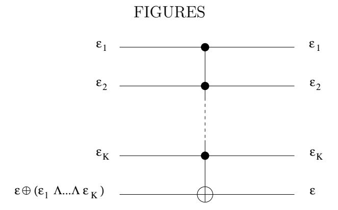

FIG. 1. The controlledk-NOT gate. Input values of the qubits are shown on the right and output values on the left. This gate flips the value of the target qubit if all k control qubits take the value 1; otherwise, the gate acts trivially.

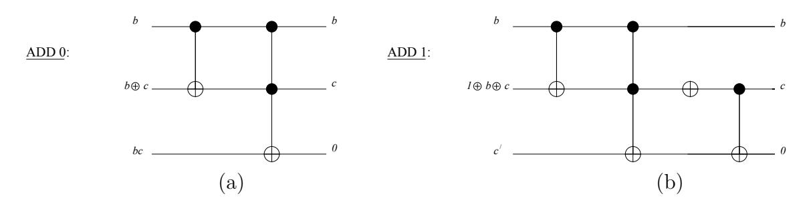

FIG. 2. The full adder FA(a). The order of the gates (here and in all of the following figures) is to be read from right to left. The gate array shown in (a) adds the classical bit a = 0; the second qubit carries the output sum bit and the third qubit carries the output carry bit. The gate array shown in (b) adds the classical bit a = 1.

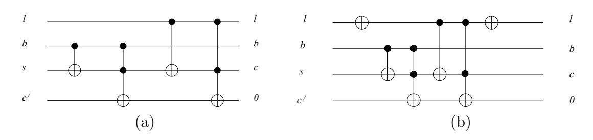

FIG. 3. The multiplexed full adder  $MUXFA'(a_0, a_1)$ . Here  $\ell$  is the select bit that determines whether  $a_0$  or  $a_1$  is chosen as the classical addend. In (a), the case  $a_0 = 0, a_1 = 1$  is shown; the gate array adds the qubit  $\ell$ -which is the same as  $a_0$  for  $\ell = 0$  and  $a_1$  for  $\ell = 1$ . In (b), the case  $a_0 = 1, a_1 = 0$  is shown; the array adds  $\sim \ell$ .

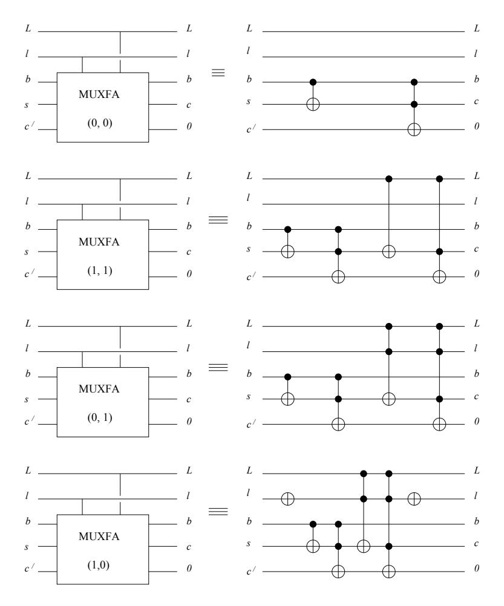

FIG. 4. The multiplexed full adder MUXF A(a0, a1) has a select bit ℓ and an enable string L. If all the bits of L take the value 1, then MUXF A acts in the same way as MUXF A′ defined in Fig. 3. Otherwise, the classical addend is chosen to be 0.

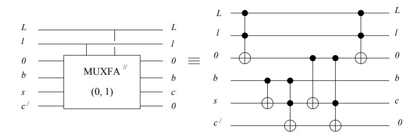

FIG. 5. The multiplexed full adder MUXF A′′(a0, a1) (shown here for a0 = 0, a1 = 1) is a modification of MUXF A that uses an extra bit of scratch space. The first gate stores L ∧ ℓ in the extra scratch qubit, and subsequent gates use this scratch bit as a control bit. The last gate clears the scratch bit. The advantage of MUXF A′′ is that the longest control string required by any gate is shorter by one bit than the longest control string required in MUXF A.

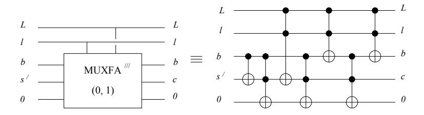

FIG. 6. The multiplexed full adder MUXF A′′′(a0, a1) (shown here for a0 = 0, a1 = 1) uses simpler gates than those required by MUXF A, but unlike MUXF A′′, it does not need an extra scratch bit.

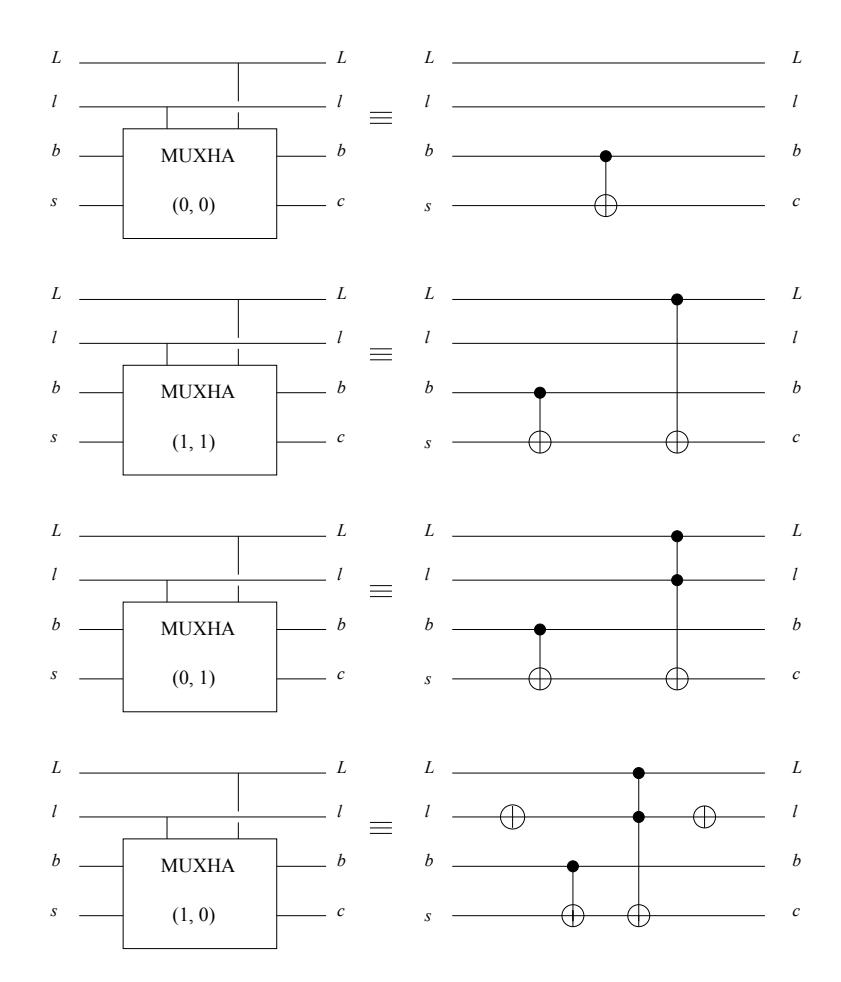

FIG. 7. The multiplexed half adder MUXHA is simpler than MUXF A because it does not compute the output carry bit.

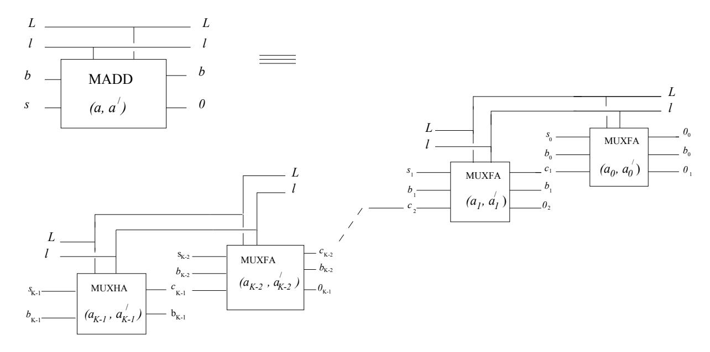

FIG. 8. The multiplexed K-bit adder MADD(a,a') is constructed by chaining together K-1 MUXFA operations and one MUXHA operation. MADD adds a K-bit c-number to an input K-bit q-number and obtains an output K-bit q-number (the final carry bit is not computed). If MADD is enabled, the classical addend is a when the select bit has the value  $\ell=0$  or is a' when  $\ell=1$ . (When MADD is not enabled, the classical addend is a.)

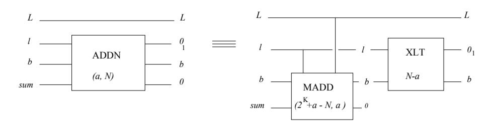

FIG. 9. The mod N addition operator ADDN(a,N) computes  $a+b \pmod N$ , where a is a K-bit c-number and b is a K-bit q-number. When ADDN is enabled, the comparison operator XLT(N-a) flips the value of the select bit to  $\ell=1$  if a+b < N; then the multiplexed adder  $MADD(2^K+a-N,a)$  chooses the c-number addend to be a for  $\ell=1$  and  $2^K+a-N$  for  $\ell=0$ . XLT uses and then clears K-bits of scratch space before MADD writes the mod N sum there.

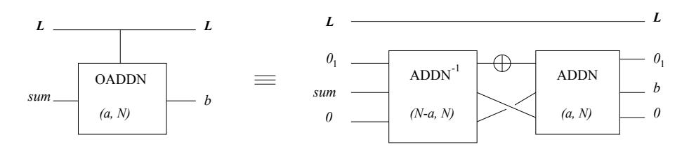

FIG. 10. The *overwriting* mod N addition operator OADDN(a, N) (when enabled) adds the c-number a to the q-number b, and then erases b. The "swapping of the leads" is a classical operation, not a quantum gate. OADDN uses and then clears K+1 bits of scratch space; this scratch space is suppressed on the left side of the figure.

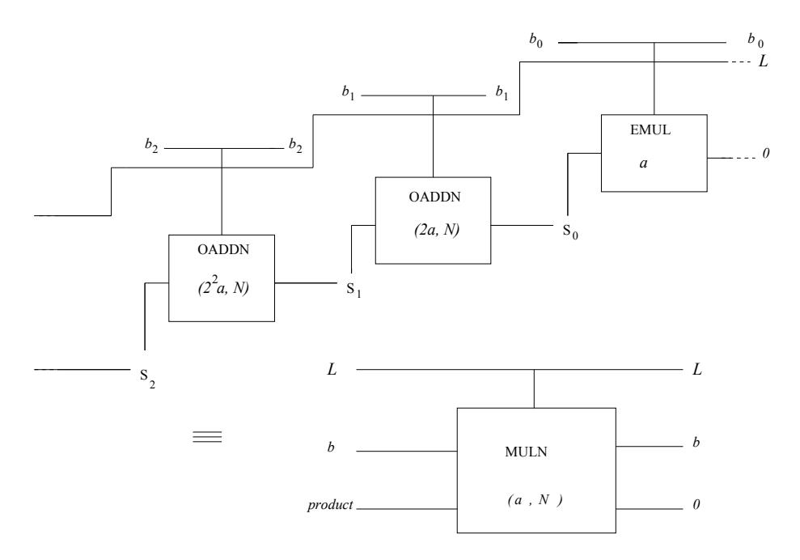

FIG. 11. The mod N multiplication operator MULN(a, N) (when enabled) computes  $a \cdot b \pmod{N}$ , where a is a c-number and b is a q-number; it is constructed by chaining together K-1 OADDN operators and one EMUL operator.

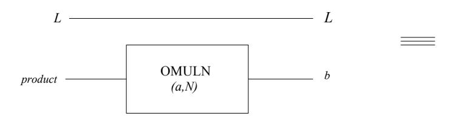

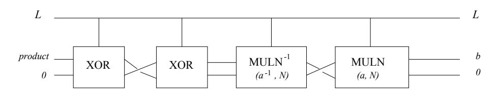

FIG. 12. The overwriting mod N multiplication operator OMULN(a, N) (when enabled) computes  $a \cdot b \pmod{N}$  and then erases the q-number b. The XOR gates at the end (when enabled) swap the contents of the two registers. OMULN uses and then clears 2K + 1 qubits of scratch space, of which only K bits are indicated in the figure.

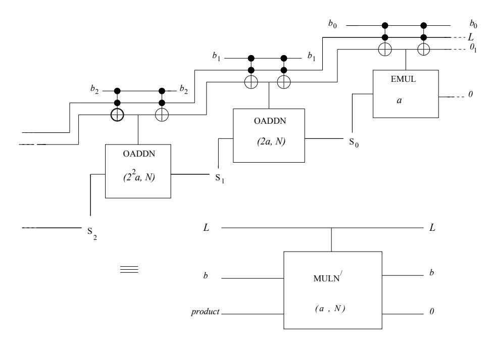

FIG. 13. The modified mod N multiplication routine MULN'(a,N) uses simpler elementary gates than those used by MULN, but MULN' requires an extra bit of scratch space. Instead of calling the OADDN routine with two enable bits, MULN' first stores the AND of the two enable bits in the extra scratch bit. Then OADDN with one enable bit can be called instead, where the scratch bit is the enable bit.

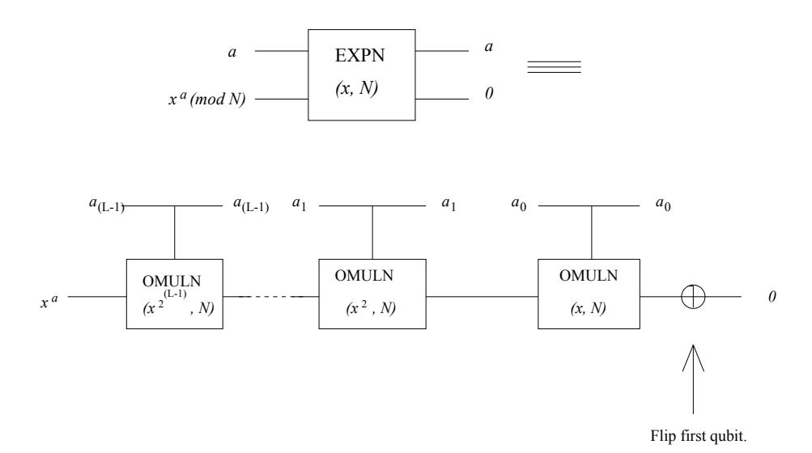

FIG. 14. The mod N exponentiation operator EXPN(x,N) computes  $x^a \pmod{N}$ , where x is a K-bit c-number and a is an L-bit q-number. It is constructed by chaining together L OMULN operators and a NOT. The 2K+1 qubits of scratch space used by EXPN are suppressed in the figure. The first OMULN in the chain can be replaced by a simpler operation, as is discussed in the text.