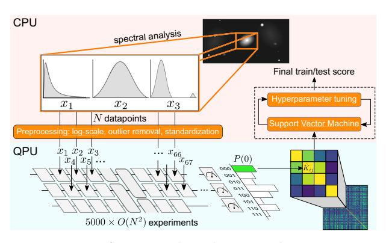
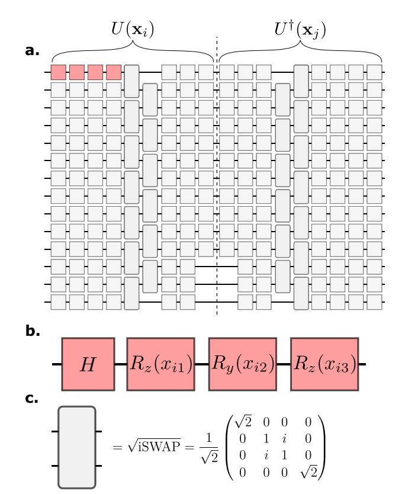
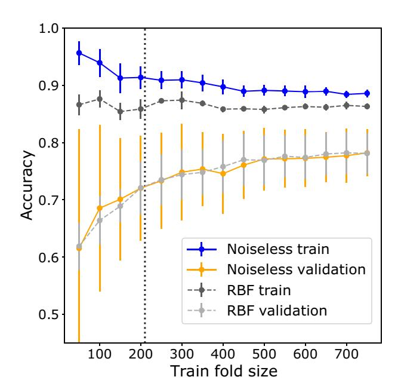
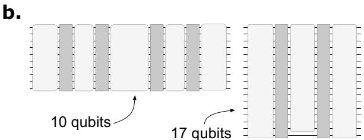
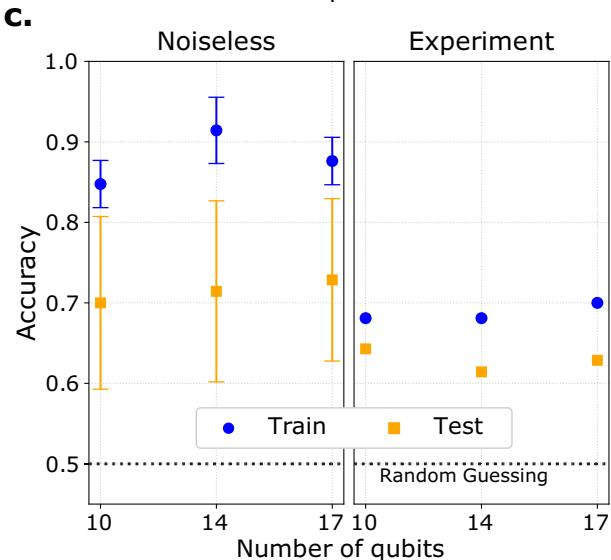

# ARTICLE OPEN

# Machine learning of high dimensional data on a noisy quantum processor

Evan Peters (1,2,3 ), João Caldeira, Alan Ho, Stefan Leichenauer, Masoud Mohseni, Hartmut Neven, Panagiotis Spentzouris, Doug Strain and Gabriel N. Perdue (13)

Quantum kernel methods show promise for accelerating data analysis by efficiently learning relationships between input data points that have been encoded into an exponentially large Hilbert space. While this technique has been used successfully in small-scale experiments on synthetic datasets, the practical challenges of scaling to large circuits on noisy hardware have not been thoroughly addressed. Here, we present our findings from experimentally implementing a quantum kernel classifier on real high-dimensional data taken from the domain of cosmology using Google's universal quantum processor, Sycamore. We construct a circuit ansatz that preserves kernel magnitudes that typically otherwise vanish due to an exponentially growing Hilbert space, and implement error mitigation specific to the task of computing quantum kernels on near-term hardware. Our experiment utilizes 17 qubits to classify uncompressed 67 dimensional data resulting in classification accuracy on a test set that is comparable to noiseless simulation.

npj Quantum Information (2021)7:161; https://doi.org/10.1038/s41534-021-00498-9

## INTRODUCTION

Quantum kernel methods (QKMs)1–4 provide techniques for utilizing a quantum co-processor in a machine learning setting. These methods were recently proven to provide a speedup over classical methods for certain specific input data classes5. They have also been used to quantify the computational power of data in quantum machine learning algorithms and drive the conditions under which quantum models will be capable of outperforming classical ones6. Prior experimental work1,7–11 has focused on artificial or heavily preprocessed data, hardware implementations involving very few qubits, or circuit connectivity unsuitable for noisy intermediate-scale quantum (NISQ)12 processors; recent experimental results show potential for many-qubit applications of QKMs to high energy physics13.

In this work, we extend the method of machine learning based on QKM up to 17 hardware qubits requiring only nearest-neighbor connectivity. We use this circuit structure to prepare a kernel matrix for a classical support vector machine to learn patterns in 67-dimensional supernova data for which competitive classical classifiers fail to achieve 100% accuracy. To extract useful information from a processor without quantum error correction (QEC), we implement error mitigation techniques specific to the QKM algorithm and experimentally demonstrate the algorithm's robustness to some of the device noise. Additionally, we justify our circuit design based on its ability to produce large kernel magnitudes that can be sampled to high statistical certainty with relatively short experimental runs.

We implement this algorithm on the Google Sycamore processor that we accessed through Google's Quantum Computing Service. This machine is similar to the quantum supremacy demonstration Sycamore chip14, but with only 23 qubits active. We achieve competitive results on a nontrivial classical dataset and find intriguing classifier robustness in the face of moderate circuit fidelity. The experiments we design highlight that NISQ

processors are capable of utilizing tens of qubits to succeed at classification tasks, and our results motivate further theoretical work on noisy kernel methods and on techniques for operating on real, high-dimensional data without additional classical preprocessing or dimensionality reduction.

A common task in machine learning is supervised learning, wherein an algorithm consumes datum-label pairs  $(\mathbf{x}, y) \in$  $\mathcal{X} \times \{0,1\}$  and outputs a function  $f: \mathcal{X} \to \{0,1\}$  that ideally predicts labels for seen (training) input data and generalizes well to unseen (test) data. A popular supervised learning algorithm is the Support Vector Machine (SVM)15,16, which is trained on inner products  $\langle \mathbf{x}_i, \mathbf{x}_i \rangle$  in the input space to find a robust linear classification boundary that best separates the data. An important technique for generalizing SVM classifiers to non-linearly separable data is the so-called kernel trick that replaces  $\langle \mathbf{x}_i, \mathbf{x}_i \rangle$  in the SVM formulation by a symmetric positive definite kernel function  $^{17}$   $k(\mathbf{x}_i, \mathbf{x}_i)$ . Since every kernel function corresponds to an inner product on input data mapped into a feature Hilbert space18, linear classification boundaries found by an SVM trained on a high-dimensional mapping correspond to complex, nonlinear functions in the input space.

QKMs can potentially improve the performance of classifiers by using a quantum computer to map input data in  $\mathcal{X} \subset \mathbb{R}^d$  into a high-dimensional complex Hilbert space, potentially resulting in a kernel function that is expressive and challenging to compute classically. It is difficult to know without sophisticated knowledge of the data generation process whether a given kernel is particularly suited to a dataset, but perhaps families of classically hard kernels may be shown empirically to offer performance improvements. In this work, we focus on a non-variational QKM, which uses a quantum circuit  $U(\mathbf{x})$  to map real data into quantum state space according to a map  $\phi(\mathbf{x}) = U(\mathbf{x})|0\rangle$ . The kernel function we employ is then the squared inner product between pairs of mapped input data given by  $k(\mathbf{x}_i, \mathbf{x}_i) = |\langle \phi(\mathbf{x}_i)|\phi(\mathbf{x}_i)\rangle|^2$ ,

&lt;sup>1Institute for Quantum Computing, University of Waterloo, Waterloo, ON N2L 3G1, Canada. 2Department of Applied Mathematics, University of Waterloo, Waterloo, ON N2L 3G1, Canada. 3Fermi National Accelerator Laboratory, Batavia, IL 60510, USA. 4Google Quantum Al, Venice, CA 90291, USA. 5Sandbox@Alphabet, Mountain View, CA 94043, USA. 5email: e6peters@uwaterloo.ca

**n**pj

which allows for more expressive models compared to the alternative choice6  $\langle \phi(\mathbf{x}_i)|\phi(\mathbf{x}_i)\rangle$ .

In the absence of noise, the kernel matrix  $K_{ij} = k(\mathbf{x}_i, \mathbf{x}_j)$  for a fixed dataset can therefore be estimated up to statistical error by using a quantum computer to sample outputs of the circuit  $U^{\dagger}(\mathbf{x}_i)U(\mathbf{x}_j)$  and then computing the empirical probability of the all-zeros bitstring. However, in practice, the kernel matrix  $\hat{K}_{ij}$  sampled from the quantum computer may be significantly different from  $K_{ij}$  due to device noise and readout error. Once  $\hat{K}_{ij}$  is computed for all pairs of input data in the training set, a classical SVM can be trained on the outputs of the quantum computer. An SVM trained on a size-m training set  $\mathcal{T} \subset \mathcal{X}$  learns to predict the class of an input data point  $\mathbf{x}$  according to the decision function:

$$f(\mathbf{x}) = \operatorname{sign}\left(\sum_{i=1}^{m} a_i y_i k(\mathbf{x}_i, \mathbf{x}) + b\right)$$
 (1)

where  $a_i$  and b are parameters determined during the training stage of the SVM. Training and evaluating the SVM on  $\mathcal{T}$  requires an  $m \times m$  kernel matrix, after which each data point  $\mathbf{z}$  in the testing set  $\mathcal{V} \subset \mathcal{X}$  may be classified using an additional m evaluations of  $k(\mathbf{x}_i, \mathbf{z})$  for i=1...m. Figure 1 provides a schematic representation of the process used to train an SVM using quantum kernels.

We used the dataset provided in the Photometric LSST Astronomical Time-series Classification Challenge (PLAsTiCC)19 that simulates observations of the Vera C. Rubin Observatory. The PLAsTiCC data consist of simulated astronomical time series for several different classes of astronomical objects. The time series consist of measurements of flux at six wavelength bands. Here we work on data from the training set of the challenge. To transform the problem into a binary classification problem, we focus on the two most represented classes, 42 and 90, which correspond to types II and la supernovae20, respectively. We perform statistical analysis on the time series data and minor preprocessing to produce 67 features for each event but perform no further dimensionality reduction on these features.

To compute the kernel matrix  $K_{ij} \equiv k(\mathbf{x}_i, \mathbf{x}_j)$  over the fixed dataset, we must run R repetitions of each circuit  $U^{\dagger}(\mathbf{x}_j)U(\mathbf{x}_i)$  to determine the total counts  $v_0$  of the all zeros bitstring, resulting in an estimator  $\hat{K}_{ij} = \frac{v_0}{R}$ . This introduces a challenge since quantum kernels must also be sampled from hardware with low enough statistical uncertainty to recover a classifier with similar performance to noiseless conditions. Since the likelihood of large relative statistical error between K and  $\hat{K}$  grows with decreasing

**Fig. 1 Overview of quantum kernel SVM.** In this experiment, we performed limited data preprocessing that is standard for state-of-the-art classical techniques, before using the quantum processor to estimate the kernel matrix  $\hat{K}_{ij}$  for all pairs of encoded data points  $(\mathbf{x}_i, \mathbf{x}_j)$  in each dataset. We then passed the kernel matrix back to a classical computer to optimize an SVM using cross-validation and hyperparameter tuning before evaluating the SVM to produce a final train/test score.

magnitude of  $\hat{K}$  and decreasing R, the performance of the classifier in the presence of sampling error will degrade when the off-diagonal elements of the kernel matrix are all close to zero. Conversely, it is necessary to implement feature maps that produce inner products that can be resolved above the level of statistical error for a successful hardware-based quantum kernel classifier, and a key goal in circuit design is to balance the requirement of large kernel matrix elements with a choice of mapping that is difficult to compute classically. Another significant design challenge is to construct a circuit that separates data according to class without mapping data so far apart as to lose information about class relationships—an effect sometimes referred to as a curse of dimensionality in classical machine learning.

While a number of QKM feature maps have been proposed 1,21-23, for this experiment we accounted for the above design challenges and the need to accommodate high-dimensional data by mapping data into quantum state space using the quantum circuit shown in Fig. 2. Each local rotation in the circuit is parameterized by a single element of preprocessed input data so that inner products in the quantum state space correspond to a similarity measure for features in the input space. The number of local rotations are constrained to match the dimensionality of the input data (i.e., 67 parameterized gates for 67-dimensional data), but circuit width and depth may be varied without significantly impacting the performance of the classifier in a noiseless setting. This circuit structure resembles hardware-efficient, variational circuits used in machine

**Fig. 2 Circuit diagram for kernel function. a** 14-qubit example of the circuit used for experiments in this work. The dashed line indicates the boundary between  $U(\mathbf{x}_i)$  and  $U^{\dagger}(\mathbf{x}_j)$ , which are run sequentially to sample  $|\langle \phi(\mathbf{x}_j)|\phi(\mathbf{x}_i)\rangle|^2$ . Non-virtual gates occurring at the boundary are contracted for hardware runs. **b** The basic encoding block consists of a Hadamard followed by three single-qubit rotations, each parameterized by a different element of the input data  $\mathbf{x}$  (normalization and encoding constants omitted here). **c** We used the  $\sqrt{\text{iSWAP}}$  entangling gate, a hardware-native two-qubit gate on the Sycamore processor.

learning applications24–26 and consistently results in large magnitude inner products (median  $K \ge 10^{-1}$ ) resulting in estimates for  $\hat{K}$  with very little statistical error. We provide further empirical evidence justifying our choice of circuit in the Supplementary Notes.

## **RESULTS**

#### Dataset selection

We are motivated to minimize the size of  $\mathcal{T} \subset \mathcal{X}$  since the complexity cost of training an SVM on m data points scales as  $\mathcal{O}(m^2)$ . However too small a training sample will result in poor generalization of the trained model, resulting in low quality class predictions for data in the reserved size- $\nu$  test set  $\mathcal{V}$ . We explored this tradeoff by simulating the classifiers for varying train set sizes in CIRQ27 to construct learning curve (Fig. 3) standard in machine learning. We found that our simulated 17-qubit classifier applied to 67-dimensional supernova data was competitive compared to a classical SVM trained using the Radial Basis Function (RBF) kernel on identical data subsets. For hardware runs, we constructed train/ test datasets for which the mean train and k-fold validation scores achieved approximately the mean performance over randomly downsampled data subsets, accounting for the SVM hyperparameter optimization (see "Methods"). The large variance in classifier scores for small test sets means that the performance of the noiseless classifier on a randomly downsampled dataset will differ significantly from the average. To ensure that the hardware performance was not overstated, the final dataset for each choice of qubits was constructed by producing a 1000 × 1000 simulated kernel matrix, repeatedly performing 4-fold cross-validation on a size-280 subset, and then selecting as the train/test set the elements from the fold that resulted in an accuracy closest to the mean validation score over all trials and folds.

**Fig. 3** Learning curve and sample variance. Learning curve for an SVM trained using noiseless circuit encoding on 17 qubits vs. RBF kernel  $k(\mathbf{x}_i, \mathbf{x}_j) = \exp(-\gamma ||\mathbf{x}_i - \mathbf{x}_j||^2)$  with  $\gamma = 0.012$  optimized via adaptive grid search over  $[10^{-5}, 10^{-1}]$ . Points reflect train/test accuracy for a classifier trained on a stratified 10-fold split resulting in a size-x balanced subset of preprocessed supernova data points. Error bars indicate standard deviation over 10 trials of down-sampling, and the dashed line indicates the size m = 210 of the training set chosen for this experiment.

#### Hardware classification and postprocessing

We computed the quantum kernels experimentally using the Google Sycamore processor14 accessed through Google's Quantum Computing Service. At the time of experiments, the device consisted of 23 superconducting qubits with nearest neighbor (grid) connectivity. The processor supports single-qubit Pauli gates with >99% randomized benchmarking28,29 fidelity and  $\sqrt{i \text{SWAP}}$  native entangling gates with cross-entropy benchmarking fidelities30,31 typically >97%.

To test our classifier performance on hardware, we trained a quantum kernel SVM using n qubit circuits for  $n \in \{10, 14, 17\}$  on d = 67 supernova data with balanced class priors using a m = 210, v = 70 train/test split. We performed hardware experiments using a number of error mitigation techniques (described further in Supplementary Methods). Each set of gubits was selected using a heuristic scoring function based on device calibration data, with 17 qubits being the largest number satisfying line connectivity on the device (shown in Supplementary Fig. 3). We found that executing layers of entangling gates in parallel improved performance compared to other schemes of staggered execution. We implemented readout error correction to efficiently approximate the probability of the allzeros bitstring with polynomial overhead32, but we found that readout error correction did not reliably improve classifier performance (see Supplementary Discussion). We determined that 5000 repetitions per circuit were sufficient to mitigate the effects of statistical error, resulting in a total of m(m-1)/2 +  $mv \approx 1.83 \times 10^8$  experiments per number of qubits, requiring approximately 16 h on the quantum processor. Typically the time cost of computing the decision function (Eq. (1)) is reduced to some fraction of mv since only a small subset of training inputs are selected as support vectors33. However, in simulated and hardware experiments we observed that a large fraction (87 and 95%, respectively) of data in  $\mathcal{T}$  were selected as support vectors, likely due to a combination of a complex decision boundary and noise in the calculation of K in the case of the hardware classifier. Figure 4 shows the classifier accuracies for each number of gubits and demonstrates that the performance of the QKM is not restricted by the number of qubits used. Significantly, the QKM classifier performs reasonably well even when observed bitstring probabilities (and therefore  $\hat{K}_{ij}$ ) are suppressed by a factor of 50-70% due to limited circuit fidelity. This is due in part to the fact that the SVM decision function is invariant under scaling transformations  $K \rightarrow rK$  and highlights the noise robustness of QKMs.

### DISCUSSION

Whether and how quantum computing will contribute to machine learning for real-world classical datasets remains to be seen. In this work, we have demonstrated that quantum machine learning at an intermediate scale (10–17 qubits) can work on natural datasets using Google's superconducting quantum computer. In particular, we presented a circuit ansatz capable of processing high-dimensional data from a real-world scientific experiment without dimensionality reduction or significant preprocessing on input data and without the requirement that the number of qubits matches the data dimensionality. We demonstrated classification results that were competitive with noiseless simulation despite hardware noise and lack of QEC. While the circuits we implemented are not candidates for demonstrating quantum advantage, these findings suggest QKMs may be capable of achieving high classification accuracy on near-term devices.

Careful attention must be paid to the impact of shot statistics and kernel element magnitudes when evaluating the performance of QKMs. In the Supplementary Discussion, we present empirical findings for the effects of each of these factors, but this work a.

| Qubits                       | 10       | 14       | 17       |
|------------------------------|----------|----------|----------|
| Depth                        | 35(27)   | 23(17)   | 21(15)   |
| $\sqrt{\text{iSWAP}}$ layers | 8        | 4        | 4        |
| $\sqrt{\text{iSWAP}}$ ct.    | 40       | 28       | 32       |
| 1q rot. ct.                  | 254(174) | 246(162) | 270(170) |

Fig. 4 Experimental implementation and noiseless vs. experimental results. a Parameters for the three circuits implemented in this experiment. Values in parentheses are calculated ignoring contributions due to virtual Z gates. **b** The depth of the each circuit and number of entangling layers (dark gray) scales to accommodate all 67 features of the input data. **c** The test accuracy for hardware QKM is competitive with the noiseless simulations even in the case of relatively low circuit fidelity, across multiple choices of gubit counts (the simulated test accuracies for n = 10, 14 were statistically indistinguishable from optimized RBF performance, similarly to Fig. 3 for n = 17). The presence of hardware noise significantly reduces the ability of the model to overfit the data. Error bars on simulated data represent standard deviation of accuracy for an ensemble of SVM classifiers trained on 10 size-m downsampled kernel matrices and tested on size-v downsampled test sets (no replacement). Dataset sampling errors are propagated to the hardware outcomes but lack of larger hardware training/test sets prevents characterization of generalization error (e.g. using bootstrapping techniques40).

highlights the need for further theoretical investigation under these constraints and motivates further studies on the properties of noisy kernels.

The main open problem is to identify a natural dataset that could lead to beyond classical performance for quantum machine learning. We believe that this can be achieved on datasets that demonstrate correlations that are inherently difficult to represent or store on a classical computer, hence inherently difficult or inefficient to learn/infer on a classical computer. This could include quantum data from simulations of quantum many-body systems near a critical point or solving linear and nonlinear systems of

equations on a quantum computer34,35. The quantum data could be also generated from quantum sensing and quantum communication applications. The software library TensorFlow Quantum (TFQ)36 was recently developed to facilitate the exploration of various combinations of data, models, and algorithms for quantum machine learning. Very recently, a quantum advantage has been proposed for some engineered dataset and numerically validated on up to 30 qubits in TFQ using similar QKMs as described in this experimental demonstration6. These developments in quantum machine learning alongside the experimental results of this work suggest the exciting possibility for realizing quantum advantage with quantum machine learning on near term processors.

#### **METHODS**

## Data preprocessing

The PLAsTiCC data initially consist of time series that are unsuitable for direct analysis on a quantum processor. Each time series can have a different number of flux measurements in each of the six wavelength bands. In order to classify different time series using an algorithm with a fixed number of inputs, we transform each time series into the same set of derived quantities. These include: the number of measurements; the minimum, maximum, mean, median, standard deviation, and skew of both flux and flux error; the sum and skew of the ratio between flux and flux error, and of the flux times squared flux ratio; the mean and maximum time between measurements; spectroscopic and photometric redshifts for the host galaxy; the position of each object in the sky; and the first two Fourier coefficients for each band, as well as kurtosis and skewness. In total, this transformation yields a 67-dimensional vector for each object. To prepare data for the quantum circuit, we convert lognormal-distributed spectral inputs to log scale, and normalize all inputs to  $\left[-\frac{\pi}{2},\frac{\pi}{2}\right]$ . We perform no dimensionality reduction.

## Classifier hyperparameter tuning

Training the SVM classifier in postprocessing required choosing a single hyperparameter C that applies a penalty for misclassification, which can significantly affect the noise robustness of the final classifier (see Supplementary Notes). To determine C without overfitting the model, we performed leave-one-out cross validation  $(LOOCV)^{37,38}$  on  $\mathcal{T}$  to determine  $C_{opt}$  corresponding to the maximum mean LOOCV score (see Supplementary Discussion). We then fixed  $C = C_{opt}$  to evaluate the test accuracy  $\frac{1}{v}\sum_{i=1}^{v} \Pr(f(\mathbf{x}_i) \neq y_i)$  on reserved data points taken from  $\mathcal{V}$ .

#### **DATA AVAILABILITY**

The Photometric LSST Astronomical Time-series Classification Challenge (PLASTICC)19 dataset analyzed in this paper is publicly available. The preprocessed dataset and experimental results are available from the corresponding author on reasonable request.

#### **CODE AVAILABILITY**

The code to preprocess the dataset and analyze the experimental results is available from the corresponding author on reasonable request.

Received: 2 March 2021; Accepted: 20 October 2021; Published online: 11 November 2021

### **REFERENCES**

- Havlícek, V. et al. Supervised learning with quantum-enhanced feature spaces. Nature 567, 209–212 (2019).
- Schuld, M. & Killoran, N. Quantum machine learning in feature hilbert spaces. *Phys. Rev. Lett.* 122, 040504 (2019).
- 3. Kübler, J. M., Muandet, K. & Schölkopf, B. Quantum mean embedding of probability distributions. *Phys. Rev. Res.* **1**, 033159 (2019).
- Schuld, M. Supervised quantum machine learning models are kernel methods. Preprint at https://arxiv.org/abs/2101.11020 (2021).
- Liu, Y., Arunachalam, S. & Temme, K. A rigorous and robust quantum speed-up in supervised machine learning. Nat. Phys. 17, 1013–1017 (2021).

- 6. Huang, H.-Y. et al. Power of data in quantum machine learning. Nat. Commun. 12, 2631 (2021).
- 7. Kusumoto, T., Mitarai, K., Fujii, K., Kitagawa, M. & Negoro, M. Experimental quantum kernel trick with nuclear spins in a solid. npj Quantum Inf. 7, 94 (2021).
- 8. Johri, S. et al. Nearest centroid classification on a trapped ion quantum computer. npj Quantum Inf. 7, 122 (2021).
- 9. Bartkiewicz, K. et al. Experimental kernel-based quantum machine learning in finite feature space. Sci. Rep. 10, 1–9 (2020).
- 10. Blank, C., Park, D. K., Rhee, J.-K. K. & Petruccione, F. Quantum classifier with tailored quantum kernel. npj Quantum Inf. 6, 1–7 (2020).
- 11. Wilson, C. M. et al. Quantum kitchen sinks: an algorithm for machine learning on near-term quantum computers. Preprint at <https://arxiv.org/abs/1806.08321> (2018).
- 12. Preskill, J. Quantum computing in the NISQ era and beyond. Quantum 2, 79 (2018).
- 13. Wu, S. L. et al. Application of quantum machine learning using the quantum variational classifier method to high energy physics analysis at the LHC on IBM quantum computer simulator and hardware with 10 qubits. J. Phys. G: Nucl. Part. Phys. 48, 125003 (2021).
- 14. Arute, F. et al. Quantum supremacy using a programmable superconducting processor. Nature 574, 505–510 (2019).
- 15. Cortes, C. & Vapnik, V. Support-vector networks. Mach. Learn. 20, 273–297 (1995).
- 16. Boser, B. E., Guyon, I. M. & Vapnik, V. N. A training algorithm for optimal margin classifiers. In Proc. Fifth Annual Workshop on Computational Learning Theory 144–152 (ACM, 1992).
- 17. Aizerman, M., Braverman, E. & Rozoner, R. Theoretical foundations of potential function method in pattern recognition learning. Autom. Remote Control 6, 821–837 (1964).
- 18. Aronszajn, N. Theory of reproducing kernels. Trans. Am. Math. Soc. 68, 337–404 (1950).
- 19. Kessler, R. et al. Models and simulations for the photometric lsst astronomical time series classification challenge (PLAsTiCC). Publ. Astron. Soc. Pac. 131, 094501 (2019).
- 20. Clayton, D. D. Principles of Stellar Evolution and Nucleosynthesis 2nd edn (University of Chicago Press, 1983).
- 21. Lloyd, S., Schuld, M., Ijaz, A., Izaac, J. & Killoran, N. Quantum embeddings for machine learning. Preprint at <https://arxiv.org/abs/2001.03622> (2020).
- 22. Schuld, M., Sweke, R. & Meyer, J. J. Effect of data encoding on the expressive power of variational quantum-machine-learning models. Phys. Rev. A 103, 033159 (2021).
- 23. Hubregtsen, T. et al. Training quantum embedding kernels on near-term quantum computers. Preprint at <https://arxiv.org/abs/2105.02276> (2021).
- 24. Kandala, A. et al. Hardware-efficient variational quantum eigensolver for small molecules and quantum magnets. Nature 549, 242–246 (2017).
- 25. Farhi, E. & Neven, H. Classification with quantum neural networks on near term processors Preprint at <https://arxiv.org/abs/1802.06002> (2018).
- 26. Pérez-Salinas, A., Cervera-Lierta, A., Gil-Fuster, E. & Latorre, J. I. Data re-uploading for a universal quantum classifier. Quantum 4, 226 (2020).
- 27. Cirq Developers. CIRQ. <https://doi.org/10.5281/zenodo.4586899> (2020).
- 28. Emerson, J., Alicki, R. & Życzkowski, K. Scalable noise estimation with random unitary operators. J. Phys. B 7, S347–S352 (2005).
- 29. Knill, E. et al. Randomized benchmarking of quantum gates. Phys. Rev. A 77, 012307 (2008).
- 30. Neill, C. et al. A blueprint for demonstrating quantum supremacy with superconducting qubits. Science 360, 195–199 (2018).
- 31. Boixo, S. et al. Characterizing quantum supremacy in near-term devices. Nat.
- Phys. 14, 595–600 (2018). 32. Peters, E., Li, A. C. Y. & Perdue, G. N. Perturbative readout error mitigation for near term quantum computers (2021). Preprint at <https://arxiv.org/abs/2105.08161>
- 33. Schölkopf, B. et al. Learning with Kernels: Support Vector Machines, Regularization, Optimization, and Beyond (MIT Press, 2002).
- 34. Kiani, B. T. et al. Quantum advantage for differential equation analysis. Preprint at
- <https://arxiv.org/abs/2010.15776> (2020). 35. Lloyd, S. et al. Quantum algorithm for nonlinear differential equations. Preprint at <https://arxiv.org/abs/2011.06571> (2020).
- 36. Broughton, M. et al. Tensorflow quantum: a software framework for quantum machine learning. Preprint at <https://arxiv.org/abs/2003.02989> (2020).

- 37. Geisser, S. Predictive Inference: An Introduction (Chapman and Hall/CRC, 2017).
- 38. Pedregosa, F. et al. Scikit-learn: machine learning in Python. J. Mach. Learn. Res. 12, 2825–2830 (2011).
- 39. Hunter, J. D. Matplotlib: a 2D graphics environment. Comput. Sci. Eng. 9, 90–95 (2007).
- 40. Efron, B. & Tibshirani, R. J. An Introduction to the Bootstrap (CRC Press, 1994).

## ACKNOWLEDGEMENTS

We would like to thank the Google Quantum AI team for time on their Sycamore-chip quantum computer. We are thankful to Stavros Efthymiou, Brian Nord, Kostyantyn Kechedzhi, Ping Yeh, Jarrod McClean, Pedram Roushan, and John Platt for helpful discussions and feedback on the manuscript. E.P. is partially supported through Achim Kempf's Google Faculty Award. J.C., G.N.P., and E.P. are partially supported by the DOE/HEP QuantISED program grant HEP Machine Learning and Optimization Go Quantum, identification number 0000240323. Access to the Google QPU was supported under the Fermilab LDRD project FNAL-LDRD-2018-025 "Towards a Quantum Computing Science Center at Fermilab." This manuscript has been authored by Fermi Research Alliance, LLC under Contract No. DE-AC02-07CH11359 with the U.S. Department of Energy, Office of Science, Office of High Energy Physics. Plots were generated using matplotlib39.

## AUTHOR CONTRIBUTIONS

E.P. led the programming and data analysis efforts and wrote most of the initial draft. J.C. processed the dataset and contributed to classical machine learning benchmarks. A.H., S.L., M.M., H.N., P.S., and D.S. all contributed to data analysis and interpretation of results from the quantum processor. D.S. additionally managed operation of the quantum processor for many of the early data taking runs. G.N.P. contributed to the programming and data analysis efforts and coordinated the project as a whole. All authors wrote and revised the final manuscript and the Supplementary Information.

## COMPETING INTERESTS

The authors declare no competing interests.

# ADDITIONAL INFORMATION

Supplementary information The online version contains supplementary material available at [https://doi.org/10.1038/s41534-021-00498-9.](https://doi.org/10.1038/s41534-021-00498-9)

Correspondence and requests for materials should be addressed to Evan Peters.

Reprints and permission information is available at [http://www.nature.com/](http://www.nature.com/reprints) [reprints](http://www.nature.com/reprints)

Publisher's note Springer Nature remains neutral with regard to jurisdictional claims in published maps and institutional affiliations.

Open Access This article is licensed under a Creative Commons Attribution 4.0 International License, which permits use, sharing,

adaptation, distribution and reproduction in any medium or format, as long as you give appropriate credit to the original author(s) and the source, provide a link to the Creative Commons license, and indicate if changes were made. The images or other third party material in this article are included in the article's Creative Commons license, unless indicated otherwise in a credit line to the material. If material is not included in the article's Creative Commons license and your intended use is not permitted by statutory regulation or exceeds the permitted use, you will need to obtain permission directly from the copyright holder. To view a copy of this license, visit [http://creativecommons.](http://creativecommons.org/licenses/by/4.0/) [org/licenses/by/4.0/](http://creativecommons.org/licenses/by/4.0/).

© The Author(s) 2021