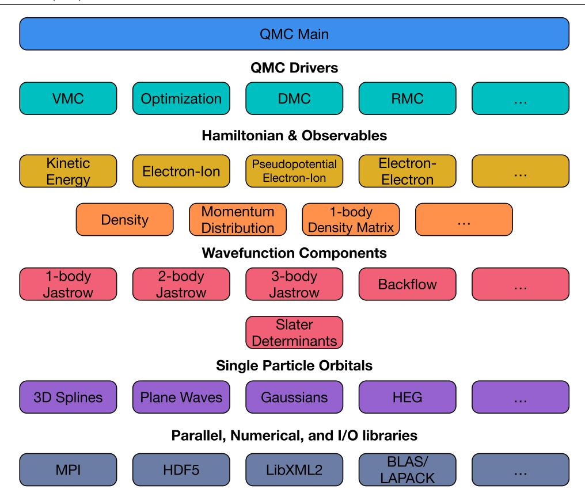
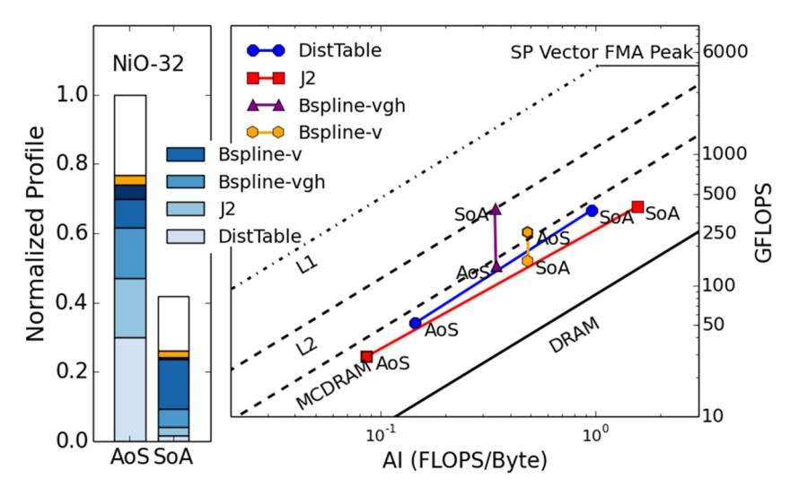
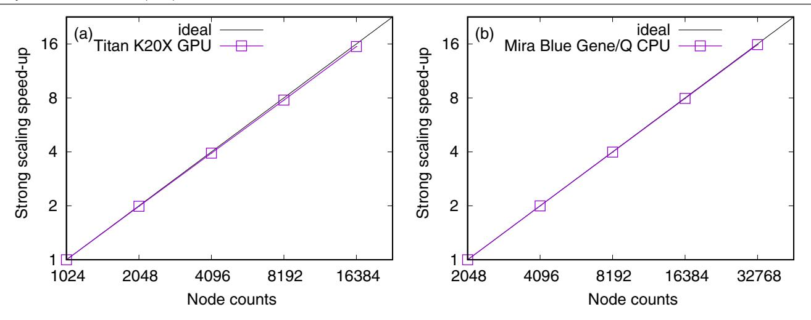
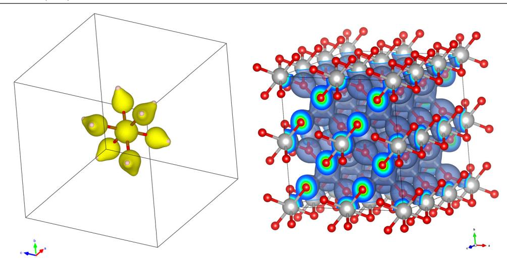
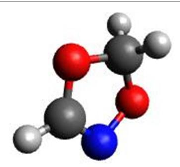
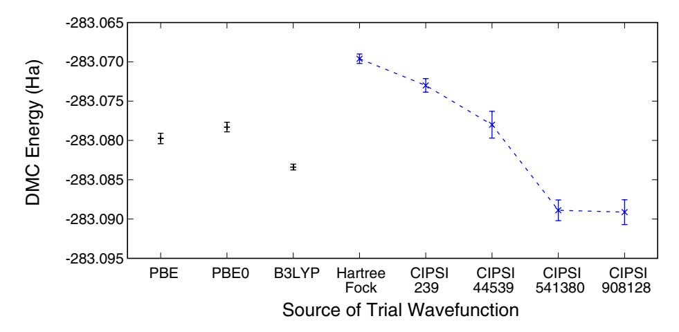
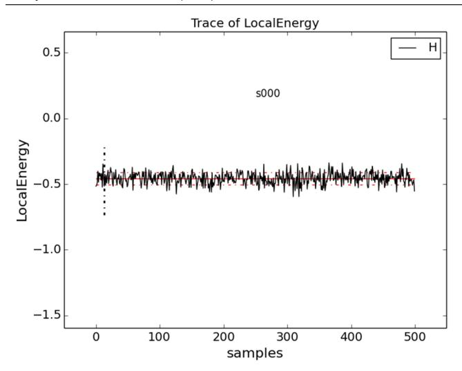
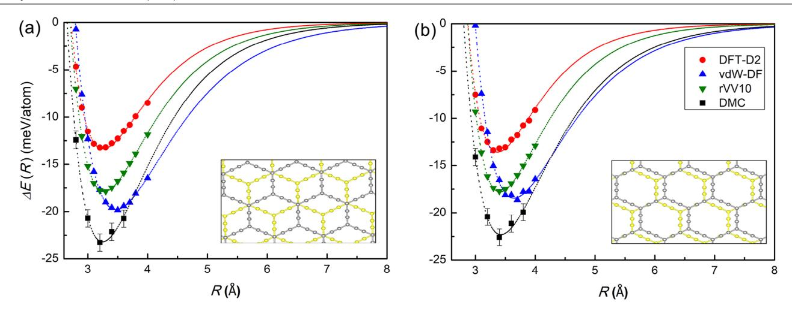
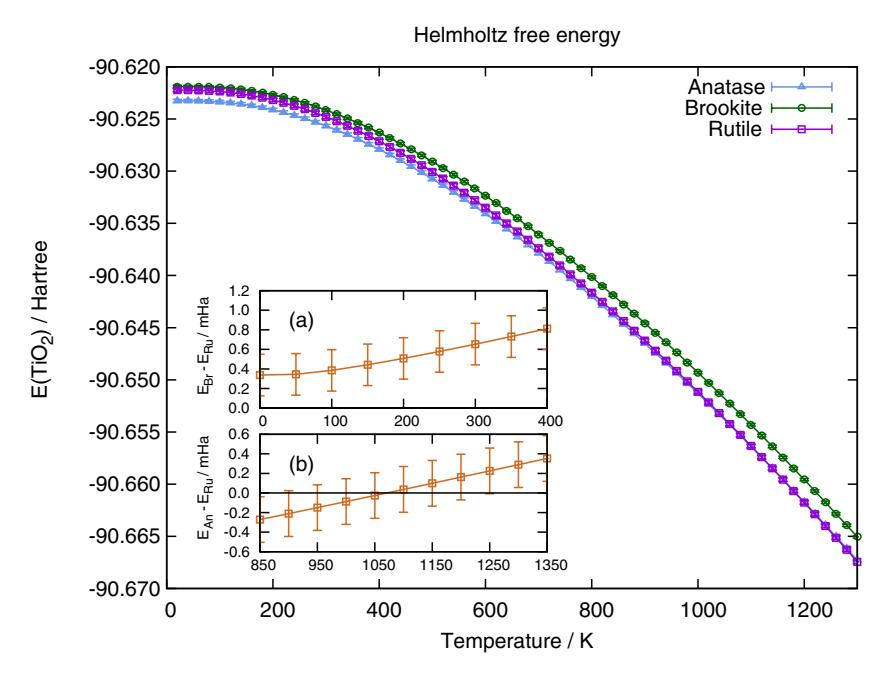
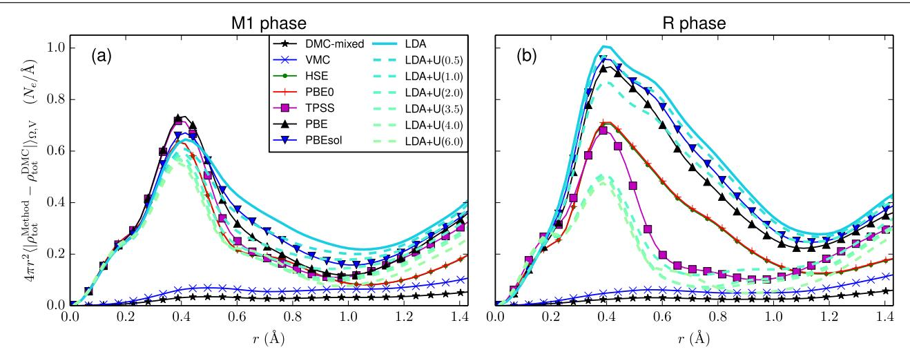

# **QMCPACK : an open source ab initio quantum Monte Carlo package for the electronic structure of atoms, molecules and solids**

Jeongnim Kim, Andrew Baczewski, Todd D. Beaudet, Anouar Benali, M. Chandler Bennett, Mark A. Berrill, Nick S. Blunt, Edgar Josue Landinez Borda, Michele Casula, David M. Ceperley, et al.

# **To cite this version:**

Jeongnim Kim, Andrew Baczewski, Todd D. Beaudet, Anouar Benali, M. Chandler Bennett, et al.. QMCPACK : an open source ab initio quantum Monte Carlo package for the electronic structure of atoms, molecules and solids. Journal of Physics: Condensed Matter, 2018, 30 (19), ff10.1088/1361- 648X/aab9c3ff. ffhal-01886251ff

# **HAL Id: hal-01886251 <https://hal.science/hal-01886251v1>**

Submitted on 31 May 2023

**HAL** is a multi-disciplinary open access archive for the deposit and dissemination of scientific research documents, whether they are published or not. The documents may come from teaching and research institutions in France or abroad, or from public or private research centers.

L'archive ouverte pluridisciplinaire **HAL**, est destinée au dépôt et à la diffusion de documents scientifiques de niveau recherche, publiés ou non, émanant des établissements d'enseignement et de recherche français ou étrangers, des laboratoires publics ou privés.

https://doi.org/10.1088/1361-648X/aab9c3

# QMCPACK: an open source ab initio quantum Monte Carlo package for the electronic structure of atoms, molecules and solids

Jeongnim Kim¹, Andrew D Baczewski², Todd D Beaudet³, Anouar Benali⁴, M Chandler Bennett⁶, Mark A Berrill७, Nick S Blunt³, Edgar Josué Landinez Borda³, Michele Casula¹₀, David M Ceperley¹¹, Simone Chiesa¹¹, Bryan K Clark¹¹, Raymond C Clay Ill², Kris T Delaney¹², Mark Dewing⁵, Kenneth P Esler¹³, Hongxia Hao¹⁴, Olle Heinonen¹⁵, Paul R C Kent¹⊓, 18, Jaron T Krogel¹٩, Ilkka Kylänpää¹٩, Ying Wai Li²₀, M Graham Lopez⁷, Ye Luo⁴,⁵, Fionn D Malone³, Richard M Martin¹¹, Amrita Mathuriya¹, Jeremy McMinis³, Cody A Melton⁶, Lubos Mitas⁶, Miguel A Morales⁶, Eric Neuscamman²¹,²²², William D Parker²³, Sergio D Pineda Flores²¹, Nichols A Romero⁴,⁵, Brenda M Rubenstein¹⁴, Jacqueline A R Shea²¹, Hyeondeok Shin⁵, Luke Shulenburger², Andreas F Tillack²₀, Joshua P Townsend², Norm M Tubman²¹, Brett Van Der Goetz²¹, Jordan E Vincent¹¹, D ChangMo Yang²⁴, Yubo Yang¹¹, Shuai Zhang⁰ and Luning Zhao²¹

- 1 Intel Corporation, Hillsboro, OR 987124, United States of America
- 2 Sandia National Laboratories, Albuquerque, NM 87185, United States of America
- Department of Mechanical and Aerospace Engineering, University of Virginia, Charlottesville, VA 22904, United States of America
- $^{\rm 4}$  Argonne Leadership Computing Facility, Argonne National Laboratory, Argonne, IL 60439, United States of America
- 5 Computational Science Division, Argonne National Laboratory, Argonne, IL 60439, United States of America
- 6 Department of Physics, North Carolina State University, Raleigh, NC 27695, United States of America
- 7 Computer Science and Mathematics Division, Oak Ridge National Laboratory, Oak Ridge, TN 37831, United States of America
- 8 University Chemical Laboratory, Lensfield Road, Cambridge, CB2 1EW, United Kingdom
- 9 Lawrence Livermore National Laboratory, Livermore, CA 94550, United States of America
- 10 Institut de Minéralogie, de Physique des Matériaux et de Cosmochimie (IMPMC), Sorbonne Université, CNRS UMR 7590, IRD UMR 206, MNHN, 4 Place Jussieu, 75252 Paris, France
- 11 Department of Physics, University of Illinois, Urbana, IL 61801, United States of America
- Materials Research Laboratory, University of California, Santa Barbara, CA, 93106, United States of America
- 13 Stone Ridge Technology, Bel Air, MD 21015, United States of America
- 14 Department of Chemistry, Brown University, Providence, RI 02912, United States of America
- 15 Material Science Division, Argonne National Laboratory, Argonne, IL 60439, United States of America
- Northwestern-Argonne Institute for Science and Engineering, Northwestern University, Evanston, IL 60208, United States of America
- 17 Center for Nanophase Materials Sciences, Oak Ridge National Laboratory, Oak Ridge, TN 37831, United States of America
- 18 Computational Sciences and Engineering Division, Oak Ridge National Laboratory, Oak Ridge, TN 37831, United States of America
- 19 Materials Science and Technology Division, Oak Ridge National Laboratory, Oak Ridge, TN 37831, United States of America
- $^{20}$  National Center for Computational Sciences, Oak Ridge National Laboratory, Oak Ridge, TN 37831, United States of America
- 21 Department of Chemistry, University of California, Berkeley, CA 94720, United States of America
- 22 Chemical Sciences Division, Lawrence Berkeley National Laboratory, Berkeley, CA 94720, United States of America

1361-648X/18/195901+29\$33.00

© 2018 IOP Publishing Ltd Printed in the UK

E-mail: kentpr@ornl.gov

Received 15 February 2018, revised 16 March 2018 Accepted for publication 27 March 2018 Published 20 April 2018

#### **Abstract**

QMCPACK is an open source quantum Monte Carlo package for *ab initio* electronic structure calculations. It supports calculations of metallic and insulating solids, molecules, atoms, and some model Hamiltonians. Implemented real space quantum Monte Carlo algorithms include variational, diffusion, and reptation Monte Carlo. QMCPACK uses Slater–Jastrow type trial wavefunctions in conjunction with a sophisticated optimizer capable of optimizing tens of thousands of parameters. The orbital space auxiliary-field quantum Monte Carlo method is also implemented, enabling cross validation between different highly accurate methods. The code is specifically optimized for calculations with large numbers of electrons on the latest high performance computing architectures, including multicore central processing unit and graphical processing unit systems. We detail the program's capabilities, outline its structure, and give examples of its use in current research calculations. The package is available at http://qmcpack.org.

Keywords: quantum Monte Carlo, electronic structure, quantum chemistry

(Some figures may appear in colour only in the online journal)

#### **1. Introduction**

An accurate solution of the many-body Schrödinger equation is a grand challenge for physics and chemistry25. The great difficulty of obtaining accurate yet tractable solutions has led to the development of many complementary methods, each bearing unique approximations, limitations, and assumptions. Today, the electronic structure of periodic condensed matter systems is most commonly obtained using density functional theory (DFT), while for isolated molecules many-body quantum chemical techniques can also be applied [1, 2]. With these techniques, obtaining systematically improvable and increasingly accurate results for general systems is a major challenge. With DFT, the challenge lies in deriving accurate approximations to and constraints on the exact density functional, such as the recent approximate SCAN functional [3]. For this reason, a systematically improvable DFT is a challenging theory and therefore progress is slow. In quantum chemistry, the most accurate methods are systematically improvable but scale poorly with system size. They are not well developed for periodic systems with hundreds of electrons, and, in particular, are not yet suitable for describing metallic states. Other many-body methods, such as GW and dynamical mean-field theory (DMFT), are limited by their approximations. GW is systematically affected by a perturbative treatment of the electron–electron interaction. DMFT, mostly used for 'correlated' electronic systems, suffers from the local nature of its self energy despite being non-pertubative, particularly when applied to low-dimensional systems and/or to systems where a strong Hubbard repulsion is not the only relevant contribution in the interaction.

Quantum Monte Carlo (QMC) methods provide an alternative route to solutions of the many-body Schrödinger equation via stochastic sampling [4]. By sampling the many-body wavefunction or its projection, QMC methods largely avoid the need to perform numerical integrals that scale poorly with system size. Further, QMC methods and implementations generally invoke controllable approximations. Although computationally expensive compared to DFT, QMC methods can be systematically improved and give nearly exact results in some cases. This was most notably performed for the homogeneous electron gas in 1980 [5]. Besides their stochasticity, the key distinctions between QMC and most other electronic structure methods is that (1) for QMC the approximations are few and well specified, and (2) QMC usually requires a 'trial wavefunction' as input. The trial wavefunction is typically constructed from the results of less costly methods, e.g. DFT or small quantum chemical calculation, and improved via subsequent optimization. QMC methods can be directly applied

23 Department of Mathematics and Physics, University of Wisconsin-Parkside, Kenosha, WI 53144, United States of America

24 Center for Superfunctional Materials, Ulsan National Institute of Science and Technology, Ulsan 44919, Republic of Korea

25 This manuscript has been authored by UT-Battelle, LLC under Contract No. DE-AC05- 00OR22725 with the US Department of Energy. The United States Government retains and the publisher, by accepting the article for publication, acknowledges that the United States Government retains a nonexclusive, paid-up, irrevocable, world-wide license to publish or reproduce the published form of this manuscript, or allow others to do so, for United States Government purposes. The Department of Energy will provide public access to these results of federally sponsored research in accordance with the DOE Public Access Plan (http://energy.gov/downloads/doe-publicaccess-plan).

to materials and chemical problems of interest as with any other electronic structure method but also serve as an important validation tool to assess and improve the approximations of less costly methods by providing reference benchmark data.

QMC methods have been applied to isolated molecules as well as insulating, semiconducting, and metallic phases of condensed matter. Complex molecules [6–8], liquids [9], molecular solids [10, 11], solids [12] and defect properties of materials [13–17] have been studied at clamped nuclear geometries. Molecular dynamics calculations driven by QMC nuclear forces, and calculations beyond the Born-Oppenheimer approximation are also possible, e.g. [18–20]. The majority of results have been obtained with approaches that operate in real space, using variational Monte Carlo (VMC) and diffusion Monte Carlo (DMC) [21–26]. Whereas QMC methods that sample the many-body wavefunction in real space have been in use for decades, there are an increasing number of attractive methods that can be implemented in a basis of atomic orbitals, such as auxiliary-field (AFQMC) [27–29], Monte Carlo configuration interaction (MCCI) [30, 31] and full-configuration interaction QMC (FCIQMC) [32]. Both real-space and basis approaches have different strengths and weaknesses. For example, more accurate multiple-projector pseudopotentials and frozen core approaches are readily implemented in AFQMC [33, 34] and FCIQMC, but these methods are generally thought to have a higher computational cost compared to real-space QMC. Most significantly, the increasing diversity of QMC methods with different approximations will enable cross-validation of electronic structure schemes for challenging chemical, physical and materials problems, and help guide improvements in the methodology.

QMCPACK implements a variety of real-space solvers and a complementary, recently developed AFQMC solver. The package is open source and openly developed. QMCPACK is implemented in modern C++, making strong use of object orientated and template-based generic programming techniques to facilitate high modularity, a separation of functionalities, and significant code reuse. A special emphasis has been given to performance, capability, and stability for large production calculations. A state-of-the-art wavefunction optimization algorithm capable of optimizing tens of thousands of parameters enables the most accurate and sophisticated wavefunctions to be utilized [35]. The latest size-consistent algorithms for pseudopotential evaluation [36] and time step [7, 11] are implemented. The code is highly optimized for modern high-performance computer architectures via extensive vectorization, careful consideration of memory layouts and access patterns [37], efficient OpenMP threading, and an implementation for graphics processing units (GPUs) using NVIDIA's CUDA. A significant effort is underway to improve the code for exascale architectures with a single common code base. QMC methods are particularly attractive for these future systems due to the relatively low data movement required. This combination of capabilities and activities helps to distinguish QMCPACK from other QMC codes such as QWALK [38], CASINO [39], CHAMP [40], and TurboRVB [41].

In this article, we give an overview of the features and capabilities of the QMCPACK package. To indicate the future development pathways, we outline a number of challenges for QMC methods, including development of consistent manybody pseudopotentials, the addition of spin-orbit interactions to QMC Hamiltonians, and the challenge of exascale computing.

#### 2. Open source and open development

QMCPACK is open source and distributed under the open source initiative [42] approved University of Illinois/National Center for Supercomputing Applications (NCSA) open source license. The main project website <a href="http://qmcpack.org">http://qmcpack.org</a> links to versioned releases and the development source code. This also includes a substantial manual detailing installation instructions, examples for workstation through to supercomputer installations, and detailed methodology and input parameter descriptions. The source code includes a substantial test framework (>300 tests) including unit and integration tests that are used to help validate the implementation and test new installations.

QMCPACK is also openly developed. The latest source code and updates are coordinated via GitHub, https://github.com/QMCPACK/qmcpack. This site provides version controlled source code, a wiki describing development practices, issue (ticket) tracking, and a contribution review framework (pull request reviews). The project follows the 'git flow' branching and development model.

Contributions from new developers are encouraged and follow exactly the same mechanism as for established developers. For example, the 'finite difference linear response' method [43] was recently contributed and underwent several updates to maximize compatibility with the existing source code. The full discussion history of contributions is also available. The open development process, with full change history available, allows contributions to be clearly identified and credit accurately assigned. The source code change history can be tracked to the earliest days of QMCPACK.

All proposed changes to QMCPACK automatically undergo continuous integration testing which allows the contributions to be run on different architectures and with different software versions than might have been used for development, e.g. different processor manufacturers, GPUs, or compilers. This allows for rapid feedback and reduces risk that significant bugs are introduced.

Development directions are set in part based on requests from users and experience applying QMCPACK to tutorial through to research level problems. Besides contacting the developers directly or using GitHub, a discussion group ('QMCPACK Google group') provides a method to make suggestions or obtain support. For example, requests to interface QMCPACK with additional electronic structure or quantum chemistry packages that will enable new science applications or solve an existing problem will be given priority.

# **3. Code structure**

QMCPACK is architected in a modular and generic structure, aiming to facilitate the maximum reuse of source code and to appropriately abstract key organizational and functional concepts. For example, as detailed below, all the different components of a trial wavefunction utilize a common base class and provide an identical interface to the different QMC methods. This allows any newly contributed wavefunction component to become immediately available to all the QMC methods.

Extensive use is made of C++ generic and template programming to minimize reimplementation of common functionality. For example, the numerical precision is parameterized, with single, double and mixed precision available largely from a single source definition, and widely used functionality such as one- to three-dimensional splines are accessed through a common interface.

In the following we give a high-level outline of the major abstractions and components in the application. In practice and due to the large range of functionality implemented, QMCPACK consists of over 200 classes. To aid developers, the manual (http://docs.qmcpack.org) provides additional guidance while the Doxygen tool is used to produce documentation to help track functionality and interdependencies. Currently this is automatically generated from the latest development source and published at http://docs.qmcpack. org/doxygen/doxy/.

At a high level, QMCPACK consists of the following major abstractions and areas of functionality shown in figure 1.

- (a) QMCMain. The topmost level of the application is responsible for parallel setup and initially parsing the input XML. Each XML section is handed to the appropriate functionality to setup the Hamiltonian or run a QMC calculation. Notably, the input driver persists walkers from section to section. A single QMCPACK input file can therefore describe a single simple VMC run, or considerably more complex and powerful workflows invoking VMC, wavefunction optimization, and production DMC calculations at a range of time steps. The user can choose the appropriate modality for their research.
- (b) QMC Drivers. These implement major QMC methods such as VMC, wavefunction optimization, and reptation. Orbital space methods such as AFQMC, described in section 13, are also implemented here. Due to the levels of abstraction, the drivers have no dependencies on the specifics of the trial wavefunction that are in use.
- (c) Walkers and particles. Classes handle the state information for each walker, including the lists of particles that are updated by the Monte Carlo. Common infrastructure for computing minimum images in periodic boundary conditions is provided here. Walkers carry additional state information depending on the enabled Hamiltonian and observables so that appropriate statistics can be reported.
- (d) Hamiltonians. The Hamiltonian used in QMCPACK is described by the input XML. This enables model system calculations as well as first principles calculations to be performed. Beyond Born–Oppenheimer simulations are

- also supported, with the ionic positions a non-constant part of the Hamiltonian. The kinetic, bare electron–ion, pseudopotential, electron–electron and ion–ion Coulomb terms are implemented at this level.
- (e) Observables. Quantities that are not critical to the evaluation of the Hamiltonian are termed observables and potentially include the density, density matrices, and momentum distribution.
- (f) Wavefunctions. The trial wavefunctions are implemented as a product of different wavefunction components. This includes single and multiple Slater determinants, and one, two, and three-body Jastrow terms. Specialized wavefunctions such as backflow and antisymmetrized geminal product wavefunctions are also implemented here.
- (g) Single particle orbitals. Orbitals from plane-wave, spline, and gaussian basis sets are evaluated for use in e.g. Slater determinant components of the wavefunction. Specialty basis sets are also implemented, e.g. the plane-wave based homogeneous electron gas, and the hybrid augmentedplane wave basis set combining interstitial plane-waves and atomic-core centred spherical harmonic expansions.
- (h) Standard libraries. Where available, standardized implementations and libraries are used for parallelization (MPI), I/O (HDF5, libxml2), linear algebra (BLAS/ LAPACK), and Fourier transforms (FFTW).

# **4. Performance and parallel scaling**

Due to the high computational cost of QMC methods, the QMCPACK implementations have been heavily optimized to obtain a high on-node performance and a high distributed parallel efficiency. Nevertheless, obtaining a highly performing and efficient simulation remains an important responsibility of the user because a considered choice of QMC methods, algorithms, accurate trial wavefunctions, and overall statistics can significantly reduce the computational cost.

Many electronic structure methods obtain high computational efficiency—a high fraction of theoretical floating point performance—via use of dense linear algebra such as matrix multiplication. Real space QMC methods are noteworthy for the relative lack of dense linear algebra and a focus on particlelike operations, such as computing inter-particle distances or evaluating small polynomial functions of particle position. In this regard parts of QMC are similar to a classical molecular dynamics code.

To obtain high on-node performance, QMCPACK's implementations are optimized to vectorize efficiently and to make efficient use of modern memory hierarchies and maximize incache data reuse. For example, while historically QMC codes have tended to avoid recomputing values, for some operations it is now faster to compute properties on the fly. This also reduces the memory requirements of the application. We have recently completed extensive analysis and reimplementation of the core compute kernels of the application, more than doubling the speed of many calculations on modern multicore processors [37]. The performance obtained for several key kernels is shown in figure 2. To improve the computational

**Figure 1.** High-level overview of the structure of QMCPACK. For simplicity many smaller components are not shown. This includes the particle classes, distance tables, and the branching and load balancing classes. The '…' indicate additional high-level functionality is available. Dependencies between components flow from top to bottom, except for the libraries which are used by all component of the application.

**Figure 2.** Computational performance of key kernels in QMCPACK for an NiO 32 atom cell on Intel Knights Landing processors. By using a Structure of Arrays (SoA) layout and improving the implemented algorithms, higher arithmetic intensity (AI) is obtained compared to the Array of Structures (AoS) data layout used exclusively in older versions of QMCPACK. A significantly higher overall performance, measured in GFLOPS, is obtained in the new implementation.

efficiency of the largest calculations with thousands of electrons where the Slater determinant update cost is significant, we have recently proposed a delayed update algorithm that enables increased use of matrix–matrix multiplication [44].

High parallel scalability is determined by exploiting parallelization at two levels. First, on node parallelization is achieved through OpenMP threading, or CUDA on GPUs. This allows common read-only data such as trial wavefunction coefficients to be shared between threads, reducing overall memory usage. Each OpenMP thread updates one or more walkers, and multiple walkers can be assigned to each GPU. The second level of parallelization is obtained via MPI.

**Figure 3.** Parallel scaling of QMCPACK on two architectures for DMC calculations of a NiO 128 atom cell with 1536 valence electrons. Titan nodes have a single GPU each, and these runs used 512 000 total walkers. Each Blue Gene Q node has a 16 core processor, and these runs used 458 752 total walkers.

For simulations with a variable number of QMC walkers, load balancing is performed by default at every step. Asynchronous messaging is used to reduce the time to load balance all the walkers across all the nodes, but in the current implementation a global reduction is still required to compute the ensemble average energy needed for load balancing. As shown in figure 3, even for modest calculations the scalability is sufficient to fully utilize the largest supercomputers. The first level of parallelization within each node reduces the total volume of MPI messaging because the load balancing only needs to be performed at the per-node level. Options to adjust the load balancing frequency and alternative algorithms such as stochastic reconfiguration [45] are available.

#### 5. Real space QMC methods

#### 5.1. Introduction

The main production algorithms in QMCPACK use methods based on Monte Carlo sampling of electron positions in real space to produce highly accurate estimates of the many-body ground-state wavefunction  $|\Phi_0\rangle$  and its associated properties. Note that QMC also has complementary *orbital space*-based approaches that work within second quantization, as described in section 13.

VMC and DMC are the most commonly applied real-space QMC methods. Within VMC, the simplest scheme, Monte Carlo sampling is used to obtain estimates of the energy of a trial wavefunction

$$E_{\rm VMC} = \int \Psi^* \hat{H} \Psi. \tag{1}$$

In DMC, the ground-state wavefunction is obtained by projection of the imaginary time Schrödinger equation

$$-\frac{\partial \Psi}{\partial \beta} = \hat{H}\Psi \tag{2}$$

to long time, where  $\beta = it$  and has units of imaginary time. (Hartree units are used here and throughout, except where

noted.) Crucial to both methods is an accurate trial or guiding wavefunction. Clearly, in VMC the trial wavefunction completely determines the accuracy and statistical efficiency of the result. In DMC it is the nodal surface of the trial wavefunction that determines the accuracy, while the overall trial wavefunction determines the statistical efficiency. The full range of supported trial wavefunctions is described in section 6.

The real-space methods use a Hamiltonian within the Born–Oppenheimer approximation (BOA):

$$\hat{H} = -\frac{1}{2} \sum_{i} \nabla_{i}^{2} + \frac{1}{2} \sum_{i \neq j} \frac{1}{|\mathbf{r}_{i} - \mathbf{r}_{j}|} + \sum_{i,J} v^{eJ}(\mathbf{r}_{i}, \mathbf{R}_{J})$$
(3)

where the lower case indices and positions  $\mathbf{r}_i$  refer to the electrons, and the upper case indices and positions  $\mathbf{R}_I$  refer to the ions. In order, the terms in (3) correspond to the kinetic energy of the electrons, the potential energy of the electrons, and the potential energy due to interactions between electrons and ions. The energy contribution due to the Coulomb interactions of the atoms is constant within the BOA, and is computed by an Ewald sum. Further details are given in section 8

For technical reasons, in the following we will work with the 'importance sampled' Schrödinger equation, which can be obtained from the imaginary time Schrödinger equation by rewriting it in terms of  $f(\mathbf{r}, \beta) = \Psi_T(\mathbf{r})\Psi(\mathbf{r}, \beta)$ .

$$\frac{\partial f}{\partial \tau} = \hat{L}f(\mathbf{r}, \beta) \tag{4}$$

$$= \left[\lambda_e \nabla \cdot (\nabla - \mathbf{F}(\mathbf{r})) - (E_L(\mathbf{r}) - E_T)\right] f(\mathbf{r}, \beta) \tag{5}$$

where  $\Psi_T(\mathbf{r})$  is the trial wavefunction,  $\mathbf{F}(\mathbf{r}) = 2\nabla \log \Psi_T(\mathbf{r})$  is the 'wavefunction force', and  $E_T(\mathbf{r}) = \Psi_T(\mathbf{r})^{-1} \hat{H} \Psi_T(\mathbf{r})$  is the 'local energy'.  $\hat{L}$  is the 'importance-sampled Hamiltonian' operator. To help future discussion, we split  $\hat{L}$  into a 'drift/diffusion' operator  $\hat{K}$  and a 'branching' operator  $\hat{E}$ , given by

$$\hat{K} = \frac{1}{2} \nabla \cdot (\nabla - \mathbf{F}(\mathbf{r})) \tag{6}$$

$$\hat{E} = -\left(E_L(\mathbf{r}) - E_T\right). \tag{7}$$

One advantage of working with the physical Hamiltonian as opposed to an auxiliary problem (as in Kohn–Sham DFT), is that the variational theorem of quantum mechanics holds, which states that for a trial wavefunction  $\Psi_T$ ,

$$E_{\Psi_T} = \frac{\langle \Psi_T | \hat{H} | \Psi_T \rangle}{\langle \Psi_T | \Psi_T \rangle} = \frac{\langle \Psi_T | E_L(\hat{\mathbf{r}}) | \Psi_T \rangle}{\langle \Psi_T | \Psi_T \rangle} \geqslant E_0.$$
 (8)

The strict equality holds if  $\Psi_T$  is the ground-state of  $\hat{H}$ . A corollary is that the variance of the trial wavefunction also obeys the following:

$$\sigma_{\Psi_T}^2 = \frac{\langle \Psi_T | \hat{H}^2 - (E_{\Psi_T})^2 | \Psi_T \rangle}{\langle \Psi_T | \Psi_T \rangle} \geqslant 0. \tag{9}$$

The variational principle is significant, since it gives us a well-defined metric for which wavefunctions are better or worse approximations to the ground state. This can be turned into an actual algorithm by parameterizing families of wavefunction ansatz with parameters  $\mathbf{c}$ . One can then minimize equation (8) with respect to  $\mathbf{c}$  to obtain a best estimate for the state.

# 5.2. Variational Monte Carlo

The oldest approach for dealing with the Schrödinger equation for realistic systems involves writing an approximation for the ground-state wavefunction and evaluating expectation values. There are two ingredients in this procedure: evaluating equation (8) for some set of variational parameters  $\mathbf{c}$ , and then minimizing. The optimization procedure is covered in detail in section 10.

The energy expectation value in equation (8), as well as all physical expectation values, are integrals of a form that are amenable to Metropolis Monte Carlo sampling. Thus, we can evaluate equation (8) (for example) by the following:

$$E_{\Psi_T} = \frac{\int d\mathbf{r} |\Psi_T(\mathbf{r})|^2 E_L(\mathbf{r})}{\int d\mathbf{r} |\Psi_T(\mathbf{r})|^2} = \frac{1}{N_s} \sum_i E_L(\mathbf{r}(t_i)) + \xi.$$
 (10)

 $N_s$  is the number of samples and  $\xi$  is a Gaussian-distributed statistical error whose variance scales like  $1/\sqrt{N_s}$ . We write the sample configurations as  $\mathbf{r}(t_i)$  to emphasize that metropolis Monte Carlo generates samples sequentially via a random walk along a Markov chain. To parallelize the algorithm, multiple independent Markov chains or 'walkers' are used.

5.2.1. Trial moves. QMCPACK supports VMC trial moves with and without drift. This means that the move  $\mathbf{r} \to \mathbf{r}'$  is drawn from the transition probability distribution given by:

$$T(\mathbf{r} \to \mathbf{r}', \tau) = \frac{1}{(4\pi\lambda\tau)^{3N/2}} \exp\left(-\frac{(\mathbf{r}' - \mathbf{r} - 2\lambda\tau\mathbf{F}(\mathbf{r}))^2}{4\lambda\tau}\right). \tag{11}$$

For drift based moves,  $\mathbf{F}(\mathbf{r})$  is taken to be the same wavefunction force as appears in equation (4). For moves without drift,  $\mathbf{F}(\mathbf{r}) = 0$ . In the absence of pathologies in the trial wavefunction, the use of the drift term is almost always more efficient.

In addition to drift or no-drift based moves, the code supports particle-by-particle or all-electron moves. All-electron moves are conceptually the simplest. One proposes the move  $\mathbf{r} \to \mathbf{r}' = \mathbf{r} + \Delta$  by drawing the  $3N_e$  dimensional vector  $\Delta$  from the distribution in equation (11). This move is then accepted or rejected with probability:

$$A(\mathbf{r} \to \mathbf{r}') = \min\left(1.0, \frac{|\Psi_T(\mathbf{r}')|^2}{|\Psi_T(\mathbf{r})|^2} \frac{T(\mathbf{r}' \to \mathbf{r})}{T(\mathbf{r} \to \mathbf{r}')}\right). \quad (12)$$

In contrast, particle-by-particle moves work by iterating sequentially over all electrons. Considering an electron i at position  $\mathbf{r}_i$ . A particle-by-particle move is executed by first drawing a new position for electron i from the following probability distribution.

$$T(\mathbf{r}_{0},...,\mathbf{r}_{i} \to \mathbf{r}'_{i},...,\mathbf{r}_{N_{e}}) = \frac{1}{(4\pi\lambda\tau)^{3/2}}$$

$$\times \exp\left(-\frac{(\mathbf{r}'_{i} - \mathbf{r}_{i} - 2\lambda\tau\mathbf{F}_{i}(\mathbf{r}))^{2}}{4\lambda\tau}\right). \tag{13}$$

Then, the move is accepted or rejected using a similar acceptance probability as in equation (12). Particle-by-particle moves are typically favored over all-electron moves, due to their higher statistical and numerical efficiencies in practice. However, all-electron moves may be competitive for small systems or for sophisticated trial wavefunctions where single particle moves can not be cheaply evaluated numerically.

#### 5.3. Projector Monte Carlo

One can substantially improve upon the accuracy of VMC by using projector Monte Carlo methods such as DMC. The 'projector' is the formal solution of the imaginary time Schrödinger equation  $\hat{G}(\beta) = \exp(-\beta \hat{H})$ , and has the very desirable property that given any trial wavefunction  $|\Psi_T\rangle$  which is non-orthogonal to the ground-state wavefunction, one can obtain the ground-state  $|\Phi_0\rangle$  by the following:

$$\lim_{\beta \to \infty} \hat{G}(\beta) |\Psi_T\rangle = e^{-\beta E_0} |\Phi_0\rangle. \tag{14}$$

For efficiency reasons, we consider the projector  $\tilde{G}(\mathbf{r},\mathbf{r}',\beta)$  associated with the importance sampled Schrödinger equation. For realistic systems, it is exceedingly rare to have exact analytic expressions for the projector. However, we can solve for the Green's function  $\hat{G}(\tau)$  of equation (4) approximately for short times  $\tau$ . Solving the drift/diffusion equations and rate equations independently in the short-time limits, one uses the symmetric Trotter formula:

$$\exp\left(\tau(\hat{A} + \hat{B})\right) = \exp\left(\frac{\tau}{2}\hat{B}\right) \exp\left(\tau\hat{A}\right) \exp\left(\frac{\tau}{2}\hat{B}\right) + O(\tau^2)$$
(15)

to stitch these independent solutions together into an approximate solution for the importance sampled Green's function:

$$\tilde{G}(\mathbf{r}, \mathbf{r}', \tau) = \left\langle \mathbf{r} | \hat{\tilde{G}}(\tau) | \mathbf{r}' \right\rangle = G_{DD}(\mathbf{r}, \mathbf{r}', \tau) G_{B}(\mathbf{r}, \mathbf{r}', \tau) + O(\tau^{2}). \tag{16}$$

 $G_{DD}(\mathbf{r}, \mathbf{r}', \tau)$  is the Green's function for the drift/diffusion operator  $\lambda_e \nabla \cdot (\nabla - \mathbf{F}(\mathbf{r}))$ . Assuming that  $\mathbf{F}(\mathbf{r})$  is slowly varying, its solution is given by:

$$\tilde{G}_{DD}(\mathbf{r}, \mathbf{r}', \tau) = \frac{1}{(4\pi\lambda\tau)^{3N/2}} \exp\left(-\frac{(\mathbf{r}' - \mathbf{r} - 2\lambda\tau\mathbf{F}(\mathbf{r}))^2}{4\lambda\tau}\right). \tag{17}$$

The Green's function for the local energy operator is:

$$\tilde{G}_B(\mathbf{r}, \mathbf{r}', \tau) = P_0 \exp\left(-\frac{1}{2}(E_L(\mathbf{r}) + E_L(\mathbf{r}') - 2E_T)\tau\right). \tag{18}$$

Near the nodes of  $\Psi_T(\mathbf{r})$  and near bare ions, singularities render the 'slowly-varying' approximation used in equation (17) invalid. Improved drift-diffusion projectors have been derived which have been shown to reduce the time step error [46]. QMCPACK implements drift rescaling based on proximity to the nodal surface, following the prescription in [46] for single-electron and all-electron moves. Rescaling based on proximity to bare ions is not yet implemented.

#### 5.4. Diffusion Monte Carlo

Diffusion Monte Carlo works by stochastically simulating the imaginary-time evolution of an initially prepared state  $f(\mathbf{r},0) = |\Psi_T(\mathbf{r})|^2$ . This is done by exploiting the mathematical correspondence between Fokker–Planck equations for the evolution of probability distributions, and Langevin equations describing the stochastic evolution of particle trajectories. To shift to a Langevin picture, we represent an initial state  $f(\mathbf{r},0)$  by an ensemble of  $N_w$  walkers  $\{\mathbf{r}_0(0),\mathbf{r}_1(0),\ldots,\mathbf{r}_{N_w-1}(0)\}$  distributed according to  $f(\mathbf{r},0)$ . Assume each walker also has an associated weight  $w_i(\beta)$  where  $w_i(0)=1.0$ . We consider the action of the short-time Green's function  $\tilde{G}(\mathbf{r},\mathbf{r}',\tau)$  on this distribution.

The action of the drift-diffusion propagator can be simulated with a random drift-diffusion step, given by:

$$\mathbf{r}(\beta + \tau) = \mathbf{r}(\beta) + 2\lambda\tau\mathbf{F}(\mathbf{r}(\beta)) + \sqrt{2\lambda\tau}\boldsymbol{\xi}.$$
 (19)

Here,  $\xi$  is a  $3N_e$  dimensional Gaussian random vector with unit variance. Once a new position generated, the  $G_B(\mathbf{r}, \mathbf{r}', \tau)$  contribution is dealt with by updating the walker weight  $w_i(\beta)$  with the following formula:

$$w(\beta + \tau) = w(\beta)G_B(\mathbf{r}(\beta), \mathbf{r}(\beta + \tau), \tau). \tag{20}$$

Expectation values of local observables  $\mathcal{A}(\mathbf{r})$  over the distribution  $f(\mathbf{r}, \beta)$  are obtained by a weighted average:

$$\langle \mathcal{A} \rangle_f(\beta) = \frac{\sum_{i=0}^{N_w - 1} w_i(\beta) \mathcal{A}(\mathbf{r_i}(\beta))}{\sum_{i=0}^{N_w - 1} w_i(\beta)}.$$
 (21)

Implementing everything discussed up to this point results in 'pure diffusion' Monte Carlo. However, due to the exponential growth/decay of the walker weights with  $\beta$ , the efficiency of this method decays exponentially with the projection time. 'Branching' diffusion Monte Carlo circumvents this problem by implementing equation (20) stochastically through the replication/removal of walkers. For each walker i,  $M_i$  copies of the walker are made after the drift/diffusion step according

to the formula  $M_i = \text{INT}(w_i(\beta + \tau) + \xi)$ , where  $\xi$  is a uniform random number between 0 and 1. The weights of these  $M_i$  walkers are renormalized and the copies then proceed to the next time step. Notice that  $M_i = 0$  implies that the walker is killed.

To avoid a walker population explosion or collapse, practical DMC simulations adjust  $E_T$  dynamically to keep the population finite and stable. In QMCPACK this is achieved using either a variable number of walkers combined with the above population control, or via a fixed walker count scheme ('stochastic reconfiguration' [45]). Both schemes can potentially introduce a 'population control bias' that must be checked and controlled for, particularly for small populations. To minimize or check for bias, the population should be as large as possible, should be allowed to fluctuate significantly, and the simulation run for a long time.

To correctly simulate Fermionic systems and avoid a collapse of the propagated wavefunction to a Bosonic solution, the 'fixed-node approximation' is implemented. This constrains the projected solution to the nodal surface of the trial wavefunction, thereby preserving Fermionicity. Proposed moves that result in a nodal crossing are detected through the change in sign of the wavefunction and are rejected. This is usually the most significant approximation made, and requires accurate trial wavefunctions.

Finally, we note that several important modifications for production calculations: QMCPACK implements the 'small time-step error' algorithm due to Umrigar *et al* [46], where the drift term is modified near wavefunction nodes and effective time step introduced to improve the time step convergence of the algorithm. The recently proposed size-consistent variation [7, 11] is also implemented. This is particularly effective for computing energy differences between very different sized-systems, such as absorption energies or the formation energies of molecular crystals [11].

#### 5.5. Reptation Monte Carlo

Reptation Monte Carlo is constructed by exploiting the Feynman path-integral formulation of Schrödinger's equation [47]. Its primary advantages over DMC are its ability to estimate observables over pure distributions in polynomial time, and lack of population bias and control issues. Consider the ground-state 'partition function':

$$\mathcal{Z}(\beta) = \langle \Psi_T | e^{-\beta \hat{H}} | \Psi_T \rangle. \tag{22}$$

First, we split  $\mathrm{e}^{-\beta\hat{H}}$  into n segments each spanning an imaginary time  $\tau=\beta/n$ . After inserting n+1 position space resolutions of the identity and rewriting the resulting expression in terms of the importance sampled projector, we find that  $\mathcal{Z}(\beta)$  can be written as:

$$\mathcal{Z}(\beta) = \int d\mathbf{r}(t_0) \dots d\mathbf{r}(t_n) \mathcal{P}[X] e^{-\sum_{i=0}^{n-1} L_{DMC}(\mathbf{r}(t_i), \mathbf{r}(t_{i+1}))}$$
(23)

$$\mathcal{P}[X] = |\Psi_T(\mathbf{r}(t_0))|^2 \tilde{G}_{DD}(\mathbf{r}(t_0), \mathbf{r}(t_1)) \dots \tilde{G}_{DD}(\mathbf{r}(t_{n-1}), \mathbf{r}(t_n))$$
(24)

$$L_{\text{DMC}}(\mathbf{r}, \mathbf{r}') = \frac{\tau}{2} \left( E_L(\mathbf{r}) + E_L(\mathbf{r}') - 2E_T \right). \tag{25}$$

X is shorthand for a 'path'  $X = (\mathbf{r}(t_0), \dots, \mathbf{r}(t_n))$ . The reader will recognize  $\mathcal{Z}(\beta)$  as a path integral.  $L_{\text{DMC}}$  is called the 'link action', which when summed over t, gives the action for the path X.  $\mathcal{P}[X]$  is the probability of a walker which is initially distributed according to  $|\Psi_T(\mathbf{r})|^2$  executing the directed random walk from  $\mathbf{r}(t_0)$  to  $\mathbf{r}(t_n)$  along the path X.

All reptation moves in QMCPACK use the 'bounce algorithm' [48]. For proposed moves, the improved propagators described in the DMC section are directly used in reptation. In addition to nodal drift-rescaling, we incorporate the DMC effective time step and energy filtering methods directly into the link-action, which helps to significantly reduce ergodicity problems associated with reptiles getting stuck in low energy regions of configuration space. In the event that reptiles still get stuck, the age of all reptile beads is accumulated. If a bead exceeds some specified age, the entire reptile is forced to propagate for *n* steps without rejection and then re-equilibrate.

Since  $\mathcal{P}[X]$  cancels out of the reptile accept/reject step, any all-electron move which is a valid VMC configuration is supported in RMC. In addition to traditional all-electron moves, QMCPACK also supports reptile proposals which are built from a sequence of  $N_e$  particle-by-particle moves. Reptile moves proposed with these 'particle-by-particle' moves exhibit higher acceptance ratios than the traditional all-electron moves, and are thus favored if memory is available.

Propagation in RMC is supported for all-electron, local, and semi-local pseudopotential Hamiltonians. The fixed-node constraint is enforced by rejecting proposed node crossings and immediately bouncing.

Since the random walk of each reptile is totally independent of other reptiles, RMC is straightforwardly parallelized. In addition to generic MPI parallelization, QMCPACK 's RMC driver is able to place one reptile per OpenMP thread on shared memory systems.

#### 6. Trial wavefunctions

Within QMC methods, the goal of the trial wavefunction is to represent the true Fermionic many-body wavefunction of the studied system as accurately as possible, including all the correlated electron physics. Due to the large number of evaluations of the wavefunction values and derivatives during the Monte Carlo sampling, it is also important that the trial wavefunction be computationally cheap enough and use little enough memory in order to be practical. These are different considerations from those applied in DFT and in the more closely related quantum chemical methods, leading to different preferences.

Several different trial wavefunction forms are implemented in QMCPACK, with varying suitability for solid state and molecular systems, and different trade-offs between accuracy, memory usage, and number of parameters. The most common form is the multi-determinant Slater–Jastrow form section 6.1, where the orbitals in each determinant are evaluated using either real-space splines or a Gaussian basis set

section 6.2. The orbitals are usually obtained from a mean-field method and imported to QMCPACK. The determinantal part ensures that the trial wavefunction is properly antisymmetric with respect to exchange of electron positions, i.e. Fermionic. Additional correlations are incorporated via a symmetric real-space Jastrow factor section 7. The Jastrow factor is usually obtained via optimization entirely within OMCPACK, as described in section 10.

#### 6.1. Multi-determinant Slater-Jastrow form

For the vast majority of molecular and solid-state studies, the trial wavefunction is written as the product of an antisymmetric function and a symmetric Jastrow function

$$\Psi_T = \sum_{i=1}^{M} c_i D_i^{\uparrow} D_i^{\downarrow} e^J, \tag{26}$$

where the N electron trial wavefunction  $\Psi_T$  is expanded in a weighted sum of products of up and down spin determinants, D. These are in turn multiplied by a real-space Jastrow factor, J. When exponentiated, this factor is nodeless and the nodes of the trial wavefunction are therefore purely determined by the determinantal parts. A single product of up-spin and down-spin determinants would correspond to a mean-field or Hartree–Fock starting point. Larger determinantal sums can be obtained, e.g. from multi-configuration self-consistent field quantum chemical calculations, CIPSI section 13.3, or be constructed based on physical or chemical reasoning. Excited states may be constructed by manipulating the occupancy of the Slater determinants in the input, e.g. to create an exciton. Wavefunctions with greater or fewer electrons than the neutral ground state may be similarly prepared to compute electronic affinities or ionization potentials.

Due to the potentially large computational cost in evaluating the trial wavefunction, QMCPACK uses previously computed data and optimized methods to avoid full recomputation wherever effective and practical. For single electron moves, QMCPACK uses the Sherman-Morrison algorithm, as described in [49]. For large calculations with thousands of electrons, the delayed update scheme of [44] is currently being implemented. For calculations with multiple determinants, QMCPACK implements the 'table method' of Clark et al [50]. This exploits the relationship between largely similar determinants to cheaply compute the determinant values while only requiring the full  $N^2$  memory cost of a single determinant. This enables, e.g. molecular calculations that approach or even reach 'chemical accuracy' to be performed [51]. To date, calculations with up to  $O(10^6)$  determinants have been performed (see section 13.3), with larger calculations clearly possible [52].

#### 6.2. Orbitals

The single-particle orbitals in the Slater determinants are generally determined by another electronic structure code and imported into QMCPACK for calculations. QMCPACK has an easily extensible mechanism for adding new ways of

representing single-particle orbitals. This can be particularly useful when addressing model systems or performing specialized tests. For example, QMCPACK supports specialty homogeneous electron gas and plane-wave based wavefunctions, and for work on spherical quantum dots, radial numerical functions [53]. However, by far the most common sources of orbitals are plane-wave based from Quantum Espresso (QE) [54, 55], and Gaussian based from the GAMESS code [56]. Converters from these codes are provided and can straightforwardly be extended to other methodologically related codes.

*6.2.1. B-spline basis sets.* For calculations involving periodic boundary conditions, the standard route is to first perform a DFT calculation using QE and to then import the planewave coefficients into QMCPACK. Finite molecular systems can also be studied by adding a considerable vacuum region. QMCPACK then allows the boundary conditions to be made aperiodic, even for orbitals originally based on plane-waves.

Although the single-particle orbitals can be evaluated directly in the plane-wave basis, this requires evaluating each plane-wave for every orbital and is thus very expensive: the cost grows with the number of plane-waves. For this reason, the single-particle orbitals are usually converted into a uniform 3D B-spline representation in real-space. As implemented, this requires a constant 64 coefficients to be accessed in memory to evaluate each single-particle wavefunction regardless of the size of the underlying basis. These operations are optimized to vectorize very well on current computer architectures, enabling the orbital evaluation to run very efficiently.

The principal downside of a B-spline basis is memory consumption, particularly for large simulation cells. Naively, the memory cost scales as O(*N*2 ). For larger calculations the B-spline tables can easily grow to tens or even hundreds of gigabytes, potentially exceeding available memory. Currently QMCPACK shares the B-spline table among all processors on a node (or GPU), but memory limitations can still constrain the calculations that can be performed. In the case of supercell calculations, QMCPACK can exploit Bloch's theorem to reduce the demand. To save additional memory, the spline coefficients may also be stored in single precision, halving the amount of memory required compared to the full double precision used in the originating plane-wave code. However, memory usage of B-splines remains a problem for large simulation cells.

To further reduce memory costs, QMCPACK can utilize a hybrid basis set composed of radial splines times spherical harmonics near the atoms and B-splines elsewhere in space [57, 58]. This is similar to the augmented plane-wave schemes used by some DFT implementations. The scheme allows for the high frequency components of the trial wavefunction near the atomic nuclei to be represented by a compact radial function and the smoother part of the wavefunction in the interstitial regions to be represented by a much coarser B-spline table. The hybrid basis can reduce memory use by a factor of four to eight compared to the standard B-spline representation while maintaining accuracy. Obtaining the hybrid representation from a plane-wave basis requires an initial computationally costly conversion.

*6.2.2. Gaussian basis sets.* For molecular systems, one typically uses a Gaussian basis set to represent the single-particle orbitals. QMCPACK supports standard quantum chemical basis sets including contractions and for arbitrary angular momenta. Atomic or natural orbitals can therefore be directly imported from standard quantum chemistry codes. Interfaces currently exist to GAMESS [56], quantum package [59], and for packages supporting the MOLDEN format. Interfacing requires converting the output of the intended package to QMCPACK's XML or HDF5 format. For all-electron calculations, a cusp correction scheme is implemented to enforce the electronnuclear cusp.

*6.2.3. Specialized basis sets.* Besides the B-spline and Gaussian basis sets described above, QMCPACK implements several additional specialized basis sets for specific problems. This includes Slater trial orbitals, the homogeneous electron gas, and radial numerical functions for atomic calculations. Due to the flexible internal architecture, orbitals can be expressed in any combination of these functions. For example, in [60], it was proposed to save memory by storing orbitals on different sets of B-spline tables based on their kinetic energy. This scheme did not require any source code modifications.

#### *6.3. Backflow wavefunctions*

Improvement of the nodal surface can be achieved through backflow wavefunctions, complementing the multideterminant route. The formal justification for backflow wavefunctions rests on the homogeneous electron gas and Fermi liquid theory [61]. Backflow appears promising for bulk applications [62], and has also been shown to aid in capturing dynamical correlations in molecular systems when used in conjunction with multideterminant wavefunctions [63].

Backflow wavefunctions are constructed from determinantal wavefunctions as follows. Instead of evaluating the Slater matrix *Mij* = φ*j*(r*i*) at the bare electron coordinates r*i*, we evaluate it at new quasiparticle coordinates *M*˜ *ij* = φ*j*(q*i* ). The 'backflow transformation' from r*i* → q*i* is defined as:

$$\mathbf{q}_{i_{\alpha}} = \mathbf{r}_{i_{\alpha}} + \sum_{\alpha \leqslant \beta} \sum_{i_{\alpha} \neq j_{\beta}} \eta^{\alpha\beta} (|\mathbf{r}_{i_{\alpha}} - \mathbf{r}_{j_{\beta}}|) (\mathbf{r}_{i_{\alpha}} - \mathbf{r}_{j_{\beta}}). \tag{27}$$

In QMCPACK, the ηαβ(*r*) are short-ranged, spherically symmetric functions represented by fully optimizable B-splines. QMCPACK allows for separate optimization of same-spin, opposite-spin, and electron-ion terms. Currently, backflow is fully supported only with single determinant wavefunctions, but it can be used in both bulk and molecular systems.

#### **7. Jastrow factors**

Jastrow factors [64] are included in the trial wavefunction to improve the representation of the many-body wavefunction. This non-negative Bosonic factor is in principle an arbitrary function of all electron and ionic positions, but in practical calculations are most commonly built from functions systematically incorporating one, two, and three-body correlations. Notably, the Jastrow factor can readily satisfy the electron–electron and electron–nucleus cusp conditions [65, 66], which are very slow to converge in the multideterminant expansions commonly used in quantum chemistry. The improved representation of the many-body wavefunction naturally reduces the statistical variance of the local energy and also improves the quality of the DMC projection operator [67, 68], which is useful in the context of timestep and nonlocal pseudopotential localization errors.

The Bosonic ground state for N particles can be written

$$\Psi_R = e^{-J(\mathbf{R})} \tag{28}$$

with J symmetric and where  $\mathbf{R}$  denotes all the particle positions. For fermions, the fixed-node [69, 70] (or fixed-phase [71]) wavefunction that arises from DMC projection has a related form. In this case, a Jastrow wavefunction appears as a prefactor [72] modifying the local structure of the input Fermionic trial wavefunction,  $\Phi_T$  to account for many-body correlations:

$$\Psi_{\rm FN} = e^{-J(\mathbf{R})} \Phi_T(\mathbf{R}). \tag{29}$$

The Jastrow factor can be formally represented in a manybody expansion

$$J = \sum_{\sigma i} u_1(\mathbf{r}_{\sigma i}) + \frac{1}{2} \sum_{\sigma \sigma' ij} u_2(\mathbf{r}_{\sigma i}, \mathbf{r}_{\sigma' j}) + \frac{1}{6} \sum_{\sigma \sigma' \sigma'' ijk} u_3(\mathbf{r}_{\sigma i}, \mathbf{r}_{\sigma' j}, \mathbf{r}_{\sigma'' k}) + \cdots$$
(30)

with each n-body term  $u_n$  being symmetric under particle exchange.

The one-body term is approximated in QMCPACK as a sum over atom-centered s-wave type functions that depend on the local ionic species I

$$u_1(\mathbf{r}_{\sigma i}) = \sum_{I\mu} u_{\sigma I}(|\mathbf{r}_{\sigma i} - \mathbf{r}_{I\mu}|)$$
(31)

with  $r_{I\mu}$  being the position of the  $\mu$ th ion of species I. The dependence on spin is optional.

The two-body term is approximated as a spin-dependent liquid-like factor (the electron-electron term) optionally with a second factor that additionally depends on the ionic coordinates (the electron-electron-ion term)

$$u_{2}(\mathbf{r}_{\sigma i}, \mathbf{r}_{\sigma' j}) = u_{\sigma \sigma'}(|\mathbf{r}_{\sigma i} - \mathbf{r}_{\sigma' j}|) + \sum_{I \mu} u_{\sigma \sigma' I}(|\mathbf{r}_{\sigma i} - \mathbf{r}_{I \mu}|, |\mathbf{r}_{\sigma' j} - \mathbf{r}_{I \mu}|, |\mathbf{r}_{\sigma i} - \mathbf{r}_{\sigma' j}|).$$

$$(32)$$

In each case, the up-up and down-down terms are constrained to be equal.

A wide range of options are available for the one-dimensional electron—ion  $(u_{\sigma I})$  and electron—electron  $(u_{\sigma \sigma'})$  Jastrow correlation functions including B-splines, first and second-order Padé functions, long and short ranged Yukawa functions, and various short-ranged functions suitable for model helium. The most commonly used choice for either correlation function is a one-dimensional cubic B-spline

$$u(r) = \sum_{m=0}^{M} p_m B_3 \left( \frac{r}{r_c/M} - m \right)$$
 (33)

where  $B_3(x)$  denotes a cardinal cubic B-spline function defined on the interval  $x \in [-3, 1)$  (centered at x = -1),  $\{p_n\}$  are the control points, and  $r_c$  is the cutoff radius. The last M control points  $(p_1 \dots p_M)$  comprise the optimizable parameters while  $p_0$  is determined by the cusp condition

$$p_0 = p_2 - \frac{2M}{r_c} \frac{\partial u}{\partial r} \bigg|_{r=0}.$$
 (34)

The Jastrow cutoffs should be selected in the region of non-vanishing density in open boundary conditions. In periodic boundary conditions the cutoffs must be smaller than the simulation cell Wigner–Seitz radius.

The three-body electron-electron-ion correlation function  $(u_{\sigma\sigma'I})$  currently used in QMCPACK is identical to the one proposed in [73]:

$$u_{\sigma\sigma'I}(r_{\sigma I}, r_{\sigma'I}, r_{\sigma\sigma'}) = \sum_{\ell=0}^{M_{el}} \sum_{m=0}^{M_{el}} \sum_{n=0}^{M_{ee}} \gamma_{\ell mn} r_{\sigma I}^{\ell} r_{\sigma'I}^{m} r_{\sigma\sigma'}^{n}$$

$$\times \left(r_{\sigma I} - \frac{r_{c}}{2}\right)^{3} \Theta\left(r_{\sigma I} - \frac{r_{c}}{2}\right)$$

$$\times \left(r_{\sigma'I} - \frac{r_{c}}{2}\right)^{3} \Theta\left(r_{\sigma'I} - \frac{r_{c}}{2}\right). \quad (35)$$

Here  $M_{el}$  and  $M_{ee}$  are the maximum polynomial orders of the electron-ion and electron-electron distances, respectively,  $\{\gamma_{\ell mn}\}$  are the optimizable parameters (modulo constraints),  $r_c$  is a cutoff radius, and  $r_{ab}$  are the distances between electrons or ions a and b. i.e. the correlation function is only a function of the interparticle distances and not a more complex function of the particle positions,  ${\bf r}$ . As indicated by the  $\Theta$  functions, correlations are set to zero beyond a distance of  $r_c/2$  in either of the electron—ion distances and the largest meaningful electron—electron distance is  $r_c$ . This is the highest-order Jastrow correlation function currently implemented.

Today, solid state applications of QMCPACK usually utilize one and two-body B-spline Jastrow functions, with calculations on heavier elements often also using the three-body term described above. While there are not yet any comprehensive comparisons between the different forms of the Jastrow factor in current use, this choice appears to give very similar accuracy to other forms. Experience with atoms and molecules is similar. In the future, should systematic studies find a new form of Jastrow factor to be more efficient or effective, it can be rapidly introduced due to the object oriented nature of the application.

#### 8. Hamiltonian

The Hamiltonian is represented in QMCPACK as a sum of abstract components

$$\hat{H} = \sum_{n} \hat{H}_{n} \tag{36}$$

with each component implemented as a class. The functionality of all Hamiltonian component classes is dictated by a shared base class. The primary shared characteristic of each component is the evaluation of its contribution to the local energy

$$E_L = \sum_n E_{Ln}, \quad E_{Ln} \equiv \Psi_T^{-1} \hat{H}_n \Psi_T. \tag{37}$$

In QMC algorithms, the local energy (as well as other observables) is collected after all Monte Carlo walkers have advanced one step in configuration space.

Possibly uniquely, the Hamiltonian that is solved is specified in the QMCPACK input. This makes QMCPACK suitable for model studies as well as *ab initio* calculations. The most general Hamiltonian that can currently be handled by QMCPACK is non-relativistic with pairwise interactions between quantum (electrons or nuclei) or classical (nuclei only) particles and possibly external fields

$$\hat{H} = \sum_{q} \hat{T}_{q} + \sum_{q \neq q'} \hat{V}_{qq'} + \sum_{qc} \hat{V}_{qc} + \sum_{c \neq c'} V_{cc'} + \sum_{q} \hat{V}_{q}^{\text{ext}} + \sum_{c} V_{c}^{\text{ext}}.$$
(38)

Here *q* and *c* denote the species of quantum and classical particles, respectively.

While non-adiabatic (multiple quantum species) and model-potential (e.g. low-temperature helium) calculations are possible, we focus the remainder of the discussion to the most typical case: electronic structure problems within the Born–Oppenheimer (clamped nuclei) approximation [74]. In this case, the many body Hamiltonian is (in atomic units)

$$\hat{H} = -\frac{1}{2} \sum_{i} \nabla_{i}^{2} + \sum_{i < j} v_{ee}(\mathbf{r}_{i}, \mathbf{r}_{j}) + \sum_{i} \sum_{I\mu} v_{eI}(\mathbf{r}_{i}, \mathbf{r}_{I\mu})$$

$$+ \sum_{I\mu I'\mu'} v_{II'}(\mathbf{r}_{I\mu}, \mathbf{r}_{I'\mu'})$$
(39)

where *i* and *j* sum over electron indices and *I*µ denotes the *μ*th ion with species *I*.

QMCPACK supports all-electron and pseudopotential calculations in both open and periodic boundary conditions. The choice of ion core and boundary conditions affects the potential terms and we now briefly review these forms. For all-electron calculations in open boundary conditions, all of the interaction potential terms are related simply to the bare Coulomb interaction *vC*(*r*) ≡ 1/*r*

$$v_{ee}(\mathbf{r}_{i}, \mathbf{r}_{j}) = v_{C}(|\mathbf{r}_{i} - \mathbf{r}_{j}|)$$

$$v_{eI}(\mathbf{r}_{i}, \mathbf{r}_{I\mu}) = -Z_{I}v_{C}(|\mathbf{r}_{i} - \mathbf{r}_{I\mu}|)$$

$$v_{II'}(\mathbf{r}_{I\mu}, \mathbf{r}_{I'\mu'}) = Z_{I}Z_{I'}v_{C}(|\mathbf{r}_{I\mu} - \mathbf{r}_{I'\mu'}|).$$
(40)

In periodic boundary conditions, the long-ranged part of each potential contributes an infinite number of terms due to the series of image cells filling all of the space.

$$v(|\mathbf{r}_1 - \mathbf{r}_2|) \longrightarrow \sum_{n=0}^{\infty} v(|\mathbf{r}_1 - \mathbf{r}_2 + n^T \mathbf{L}|).$$
 (41)

Sums of this type are evaluated via the Ewald summation technique [75]. An optimized breakup [76] into long and short-ranged contributions is used to minimize computational effort.

With the introduction of semi-local pseudopotentials, the electron–ion term takes the form

$$v_{eI}(\mathbf{r}_{i}, \mathbf{r}_{I\mu}) = v_{loc}(|\mathbf{r}_{i} - \mathbf{r}_{I\mu}|) + \sum_{\ell m} |Y_{\ell m}\rangle \left[v_{\ell}(|\mathbf{r}_{i} - \mathbf{r}_{I\mu}|) - v_{loc}(|\mathbf{r}_{i} - \mathbf{r}_{I\mu}|)\right] \langle Y_{\ell m}|$$
(42)

where all of the non-local channel terms vanish beyond cutoff radii that may be unique to each channel and the local part approaches −*Z*eff/*r* in the long distance limit (*Z*eff is the effective core charge presented by the pseudopotential). The evaluation of the local energy for semi-local pseudopotentials follows the algorithm laid out by Mitas *et al* [77] with a 12-point angular integration used by default.

In DMC calculations, the semi-local potentials are evaluated within the locality approximation [77], or the more recent 't-moves' approximations [36, 78] that restore the variational principle the the DMC algorithm. In particular, the algorithm of [36] restores size-extensivity.

#### **9. Boundary conditions**

QMCPACK accommodates both periodic and open boundary conditions in one, two or three dimensions, including mixed boundary conditions. After the pseudopotential and fixednode approximations in QMC, the choice of boundary conditions imposes another set of approximations onto a system that must be treated with care.

# *9.1. Long-range interactions*

The long-ranged Coulombic interactions of the electrons and ions must be handled with care in order to ensure that the potential energy does not diverge when using periodic boundary conditions. In QMCPACK, the interparticle interactions are computed using an optimized implementation [76] of the well-known strategy of decomposing the interactions into short and long ranged components, and performing sums over the former and latter in real and reciprocal space, respectively [75].

#### *9.2. Twist-averaged boundary conditions*

Bloch's theorem demonstrates how a finite wavefunction can be used to simulate an infinite lattice within periodic boundary conditions by incorporating the following symmetry:

$$\Psi(\mathbf{r}_1 + \mathbf{L}_{\mathbf{m}}, \mathbf{r}_2, \dots, \mathbf{r}_N) = e^{i\mathbf{K}\cdot\mathbf{L}_m}\Psi(\mathbf{r}_1, \mathbf{r}_2, \dots, \mathbf{r}_N)$$
(43)

where K is a vector in reciprocal space, L*m* is a lattice vector of the supercell, and Θ*m* ≡ K · L*m*, is the 'twist angle' [2]. For pure periodic boundary conditions (in which Θ = 0), systems converge slowly to their thermodynamic limit due to shell effects and quantization of momentum [79]. Therefore, to improve convergence speed and accuracy, one should average over many simulations done with different twist angles, a scheme called 'twist-averaged boundary conditions'. In QMCPACK, the averaging is done in post-processing, using e.g. qmca section 14.1 and/or Nexus section 15.

#### 10. Optimization

In all real-space quantum Monte Carlo calculations, optimizing the wavefunction significantly improves both the accuracy and efficiency of computation. However, it is very difficult to directly adopt deterministic minimization approaches due to the stochastic nature of quantities with Monte Carlo. Thanks to major algorithmic improvements, it is now feasible to optimize up to tens of thousands of parameters in a wavefunction for a large solid or molecule. QMCPACK implements multiple optimizers based on the state-of-theart linear method with several techniques, described below, improving its robustness, efficiency and capability.

#### 10.1.The linear method

QMCPACK optimizes trial functions using an implementation of the linear method (LM) [80] that includes modifications to improve stability in the face of variables of greatly differing stiffnesses, facilitate the optimization of excited states, and reducing the memory footprint when optimizing large numbers of variational parameters. The LM is sometime referred to as 'energy minimization', although the approach is more general. The LM gets its name from the way that it employs a linear expansion of the wavefunction,

$$|\Phi\rangle = \sum_{y=0}^{N_{\rm v}} c_y |\Psi^y\rangle,\tag{44}$$

where  $|\Psi^y\rangle$  for  $y \in \{1, 2, 3, ...\}$  is the derivative of the trial function  $|\Psi\rangle$  with respect to its yth variational parameter and  $|\Psi^0\rangle \equiv |\Psi\rangle$ , within an expanded energy expression,

$$E(\vec{c}) = \frac{\langle \Phi | H | \Phi \rangle}{\langle \Phi | \Phi \rangle}.$$
 (45)

Using this linear approximation to how the energy changes with the variational parameters, minimizing E with respect to  $\vec{c}$  can be achieved by solving the generalized eigenvalue problem

$$\sum_{y=0}^{N_{v}} \frac{\langle \Psi^{x} | H | \Psi^{y} \rangle}{\langle \Psi | \Psi \rangle} c_{y} = E \sum_{y=0}^{N_{v}} \frac{\langle \Psi^{x} | \Psi^{y} \rangle}{\langle \Psi | \Psi \rangle} c_{y}$$
 (46)

or, written in matrix-vector notation,

$$\mathbf{H}\ \vec{c} = E\ \mathbf{S}\ \vec{c},\tag{47}$$

the matrix elements for which are evaluated by Monte Carlo integration [81, 82] in direct analogy to how VMC evaluates the energy. If one assumes the improved trial function  $|\Phi\rangle$  is similar to the previous trial function  $|\Psi\rangle$ , which implies that the ratio  $c_x/c_0$  is small for all  $x \in \{1, 2, 3, ...\}$ , then a reasonable approximation to  $|\Phi\rangle$  can be had by replacing  $\mu_x \to \mu_x + c_x/c_0$  for each variational parameter  $\mu_x$  in  $|\Psi\rangle$ . As for other optimization methods that compute an update based

on some local approximation to the target function, such as Newton–Raphson, this process is then repeated until further updates no longer lower the energy.

#### 10.2.Stabilizing the linear method

In practice, it is important to implement an analogue to the trust radius schemes common to Newton–Raphson in order to ensure that the solution of equation (46) does not correspond to an unreasonably long step in variable space, or, put another way, to ensure that the ratio  $c_x/c_0$  is not too large. The LM optimizer in QMCPACK supports two mechanisms for preventing too-large updates: a diagonal shift  $\alpha$  as employed in the original algorithm [80] as well as an overlap-based shift  $\beta$  that becomes important when parameters of greatly different stiffnesses are present. Using these shifts, the Hamiltonian matrix is modified to become

$$\mathbf{H} \to \mathbf{H} + \alpha \mathbf{A} + \beta \mathbf{B},$$
 (48)

where  ${\bf A}$  and  ${\bf B}$  provide stabilization via the original and overlap shifts, respectively. As in the original method, QMCPACK uses  $A_{xy}=\delta_{xy}(1-\delta_{x0})$  and the adjustable shift strength  $\alpha$  to effectively raise the energy along each direction of change while leaving the current wavefunction  $|\Psi^0\rangle=|\Psi\rangle$  unaffected.

While the original shifting scheme has been effective in many cases, it can struggle if two different variational parameters produce wavefunction derivatives of vastly different sizes. For example, imagine a two-variable wavefunction whose overlap matrix evaluates to

$$\mathbf{S} = \begin{bmatrix} 1 & 0 & 0 \\ 0 & 1 & 0 \\ 0 & 0 & 10^6 \end{bmatrix} . \tag{49}$$

Performing the usual  $\vec{\nu} = (\mathbf{S}^{\frac{1}{2}})\vec{c}$  transformation to produce a standard eigenvalue problem (with  $\beta$  set to zero for now) gives us

$$\mathbf{S}^{-\frac{1}{2}}\mathbf{H}\mathbf{S}^{-\frac{1}{2}}\vec{\nu} + \begin{bmatrix} 1 & 0 & 0\\ 0 & \alpha & 0\\ 0 & 0 & \frac{\alpha}{10^6} \end{bmatrix} \vec{\nu} = E\vec{\nu}.$$
 (50)

We see that, if we were to make  $\alpha$  large enough to significantly penalize the second variable direction, the first direction would be penalized so much that it would essentially become a fixed parameter.

The purpose of the overlap shift is to resolve this issue by adding an energy penalty based on the norm of the part of  $\vec{c}$  corresponding to directions orthogonal to the current wavefunction  $|\Psi\rangle$ , which would correctly penalize steps along directions of large derivative norms more than those along directions of small derivative norms. This goal is accomplished by the definitions

$$Q_{xy} = \delta_{xy} - \delta_{x0}(1 - \delta_{y0})S_{0y}$$
 (51)

$$T_{xy} = (1 - \delta_{x0}\delta_{y0}) \left[ \mathbf{Q}^{+} \mathbf{S} \mathbf{Q} \right]_{xy}$$
 (52)

$$\mathbf{B} = \left(\mathbf{Q}^{+}\right)^{-1} \mathbf{T} \mathbf{Q}^{-1} \tag{53}$$

in which Q transforms into a basis in which all update directions are orthogonal to the current wavefunction |Ψ (this transformation is equivalent to that of equation (24) of [81]). T is the overlap matrix in this basis with its first element zeroed out so that the current wavefunction is not penalized. Finally, the inverses of Q and its adjoint transform us back to the basis of the original generalized eigenvalue problem so that the effect of the overlap shift cay be written in the form of equation (48). Note that, in practice, it is not necessary to construct B explicitly, as QMCPACK solves the generalized eigenvalue equation by iterative Krylov subspace expansion, during which the Krylov basis (whose first vector is always |Ψ) is kept orthonormal by the Gram–Schmidt procedure. In this Krylov basis, applying the overlap shift involves merely adding *β* to the diagonal of the subspace Hamiltonian matrix (except, of course, to the first element corresponding to |Ψ). This Krylov approach also has the benefit of ensuring that the overall update is orthogonal to the current wavefunction, which is related to norm-conservation and was found to be desirable by the LM's original developers [80–82].

Although like most trust-radius schemes the optimal choices for *α* and *β* are somewhat heuristic, QMCPACK automatically adjusts them after each iteration of the LM by solving for the updates generated by three different sets of shifts and retaining the shift that gave the best update, as determined by a correlated-sampling comparison of their energies on a fresh sample. For maximum efficiency in regimes where optimization is not difficult but sampling is expensive, QMCPACK retains the ability to run in a single-shift, no-second-sample mode. When running instead in multi-shift mode, we have observed that successful optimizations often result with the simple initial choice of α = β = 1. In principle, however, one might expect α<β to be more effective, because when the *β* shift is filling the role of limiting the update size, *α* is only needed to penalize (hopefully rare) linear dependencies between update directions that *β*, being overlap-based, cannot address.

#### *10.3.Optimizing for excited states*

QMCPACK's current LM optimization engine supports both standard energy minimization and the minimization of a recently introduced [83] excited state target function, Ψ|(ω − *H*ˆ )|Ψ/Ψ|(ω − *H*ˆ )2|Ψ, whose global minimum is the exact energy eigenstate immediately above the targeted energy *ω*. Although this technology is a very recent development and will doubtless evolve in time as the science behind excited state targeting matures, we felt it important to make an early version of it available to the community. Optimization proceeds in much the same way as for a ground state, with the user specifying *ω* and the stabilization shifts *α* and *β* and the LM repeatedly solving generalized eigenvalue equations analogous to equation (46) to generate wavefunction updates. Additional methods for automatically selecting and updating *ω* have been developed [84]. For details into this targeting function and how it is optimized, we refer the reader to the original publication [83].

#### *10.4.Handling large parameter sets*

One important limitation of the LM comes when the number of variational parameters rises to 10000 or more, at which point the contributions to H and S made by each Markov chain become cumbersome to store in memory, especially when running one Markov chain per core on a large parallel system in which per-core memory is limited. QMCPACK currently addresses this memory bottleneck using the blocked LM [35], a recent algorithm that separates the variable space into blocks, estimates the most important variable-change directions within each block, and then uses these directions to construct a reduced and vastly more memory efficient LM eigenvalue problem to generate an update direction in the overall variable space. Like excited state targeting, this is a new feature that can be expected to evolve in time, and has been made openly available to the community in the spirit of rapid dissemination. As of this writing, it has not been widely tested outside of the work in its original publication [35], but in time we expect to have a clearer picture of its capabilities.

#### *10.5.Multi-objective optimization*

QMCPACK also supports optimizing variational parameters based on not only the total energy but also variance. In certain situations, the best target object may not be the energy only but a cost function mixing both energy and variance which reduces to zero when the wavefunction is exact. The cost function can be any linear combination of energy and variance. QMCPACK picks the optimal parameter set corresponding to the minimal value of a quartic function fitting the cost function evaluated on seven shifts by correlated-sampling.

# **11. Observables**

A broad range of observables and estimators are available in QMCPACK. In this section we describe the total number density (density), number density resolved by particle spin (spindensity), spherically averaged pair correlation function (gofr), static structure factor (sk), energy density (energydensity), one body reduced density matrix (dm1b) and force (Forces) estimators. These estimators can be evaluated for the entire run (e.g. all VMC and DMC sections) when added to the Hamiltonian section in the input file, or applied to a specific section. Higher order density matrix quantities for calculating quantum entanglement have also been studied previously, e.g. [85–87].

#### *11.1. Density and spin density*

The particle number density operator is given by

$$\hat{n}_r = \sum_i \delta(\mathbf{r} - \mathbf{r}_i). \tag{54}$$

**Figure 4.** Left: electron density of  $(\text{Fe}(\text{H}_2\text{O})_6)^{2+}$  cluster in a 10 Å box using  $100 \times 100 \times 100$  grid points, based on calculations in [92]. Right: electron density of  $\text{TiO}_2$  in a grid of  $80 \times 80 \times 80$  grid points, based on calculations in [93].

This estimator accumulates the number density on a uniform histogram grid over the simulation cell. The value obtained for a grid cell c with volume  $\Omega_c$  is then the average number of particles in that cell

$$n_c = \int d\mathbf{R} |\Psi|^2 \int_{\Omega_c} d\mathbf{r} \sum_i \delta(\mathbf{r} - \mathbf{r}_i).$$
 (55)

When using periodic boundary conditions, the density will be collected for the cell (or supercell) defined by the simulation. When using non-periodic boundary conditions, a cell has to be defined in order to set a grid. It is then recommended to center the system (molecule) in the middle of the defined cell. The collected data is stored in HDF5 format in a .stat.h5 file. Using Nexus section 15, one can use the qdens tool to extract the data in a \*.xsf format readable with visualization tools such as XCrysDens [88, 89] or VESTA [90]. Examples of density plots are shown in figure 4. Similar to the density, the spin-density estimator can be also collected for each independent spin, as shown and analyzed in [91] for magnetic states in Ti4O7.

#### 11.2. Pair correlation function

The functional form of the species-resolved radial pair correlation function operator is

$$g_{ss'}(r) = \frac{V}{4\pi r^2 N_s N_{s'}} \sum_{i_s=1}^{N_s} \sum_{j_{s'}=1}^{N_{s'}} \delta(r - |\mathbf{r}_{i_s} - \mathbf{r}_{j_{s'}}|). \quad (56)$$

Here  $N_s$  is the number of particles of species s and V is the supercell volume. If s = s', then the sum is restricted so that  $i_s \neq j_s$ .

An estimate of  $g_{ss'}(r)$  is obtained as a radial histogram with a set of  $N_b$  uniform bins of width  $\delta r$ . This can be expressed analytically as

$$\tilde{g}_{ss'}(r) = \frac{V}{4\pi r^2 N_s N_{s'}} \sum_{i=1}^{N_s} \sum_{j=1}^{N_{s'}} \frac{1}{\delta r} \int_{r-\delta r/2}^{r+\delta r/2} dr' \delta(r' - |\mathbf{r}_{si} - \mathbf{r}_{s'j}|),$$
(57)

where the radial position r is restricted to reside at the bin centers  $\delta r/2$ ,  $3\delta r/2$ , ....

#### 11.3. Static structure factor

Let  $\rho_{\mathbf{k}}^e = \sum_j \mathbf{e}^{i\mathbf{k}\cdot\mathbf{r}_j^e}$  be the Fourier space electron density, with  $\mathbf{r}_j^e$  being the coordinate of the jth electron.  $\mathbf{k}$  is a wavevector commensurate with the simulation cell. The static electron structure factor  $S(\mathbf{k})$  can be measured at all commensurate  $\mathbf{k}$  such that  $|\mathbf{k}| \leq (LR\_DIM\_CUTOFF)r_c$ .  $N^e$  is the number of electrons, LR\_DIM\_CUTOFF is the optimized breakup parameter, and  $r_c$  is the Wigner–Seitz radius. It is defined as follows:

$$S(\mathbf{k}) = \frac{1}{N^e} \langle \rho_{-\mathbf{k}}^e \rho_{\mathbf{k}}^e \rangle. \tag{58}$$

#### 11.4. Energy density estimator

An energy density operator,  $\hat{\mathcal{E}}_r$ , satisfies

$$\int \mathrm{d}r \hat{\mathcal{E}}_r = \hat{H},\tag{59}$$

where the integral is over all space and  $\hat{H}$  is the Hamiltonian. In QMCPACK, the energy density is split into kinetic and potential components

$$\hat{\mathcal{E}}_r = \hat{\mathcal{T}}_r + \hat{\mathcal{V}}_r \tag{60}$$

with each component given by

$$\hat{\mathcal{T}}_{r} = \frac{1}{2} \sum_{i} \delta(\mathbf{r} - \mathbf{r}_{i}) \hat{p}_{i}^{2} 
\hat{\mathcal{V}}_{r} = \sum_{i < j} \frac{\delta(\mathbf{r} - \mathbf{r}_{i}) + \delta(\mathbf{r} - \mathbf{r}_{j})}{2} \hat{v}^{ee}(\mathbf{r}_{i}, \mathbf{r}_{j}) 
+ \sum_{i\ell} \frac{\delta(\mathbf{r} - \mathbf{r}_{i}) + \delta(\mathbf{r} - \tilde{\mathbf{r}}_{\ell})}{2} \hat{v}^{eI}(\mathbf{r}_{i}, \tilde{\mathbf{r}}_{\ell}) 
+ \sum_{\ell < m} \frac{\delta(\mathbf{r} - \tilde{\mathbf{r}}_{\ell}) + \delta(\mathbf{r} - \tilde{\mathbf{r}}_{m})}{2} \hat{v}^{II}(\tilde{\mathbf{r}}_{\ell}, \tilde{\mathbf{r}}_{m}).$$
(61)

Here  $\mathbf{r}_i$  and  $\tilde{\mathbf{r}}_\ell$  represent electron and ion positions, respectively,  $\hat{p}_i$  is a single electron momentum operator, and  $\hat{v}^{ee}(\mathbf{r}_i,\mathbf{r}_j)$ ,  $\hat{v}^{el}(\mathbf{r}_i,\tilde{\mathbf{r}}_\ell)$ ,  $\hat{v}^{ll}(\tilde{\mathbf{r}}_\ell,\tilde{\mathbf{r}}_m)$  are the electron–electron, electron–ion, and ion–ion pair potential operators (including non-local pseudopotentials, if present). This form of the energy density is size-consistent, i.e. the partially integrated energy density operators of well separated atoms gives the isolated Hamiltonians of the respective atoms. For periodic systems with twist averaged boundary conditions, the energy density is formally correct only for either a set of supercell k-points that correspond to real-valued wavefunctions, or a k-point set that has inversion symmetry around a k-point having a real-valued wavefunction. For more information about the energy density, see [94].

The energy density can be accumulated on piecewise uniform three dimensional grids in generalized Cartesian, cylindrical, or spherical coordinates. The energy density integrated within Voronoi volumes centered on ion positions is also available. The total particle number density is also accumulated on the same grids by the energy density estimator for convenience so that related quantities, such as the regional energy per particle, can be computed easily.

#### 11.5. One-body density matrix

The N-body density matrix in DMC is  $\hat{\rho}_N = |\Psi_T\rangle\langle\Psi_{FN}|$  (for VMC, substitute  $\Psi_T$  for  $\Psi_{FN}$ ). The one body reduced density matrix (1RDM) is obtained by tracing out all particle coordinates but one:

$$\hat{n}_1 = \sum_n Tr_{R_n} |\Psi_T\rangle \langle \Psi_{\text{FN}}|. \tag{62}$$

In the formula above, the sum is over all electron indices and  $Tr_{\mathbf{R}_n}(*) \equiv \int d\mathbf{R}_n \langle \mathbf{R}_n | * | \mathbf{R}_n \rangle$  with  $\mathbf{R}_n = [\mathbf{r}_1, ..., \mathbf{r}_{n-1}, \mathbf{r}_{n+1}, ..., \mathbf{r}_N]$ . When the sum is restricted over spin up or down electrons, one obtains a density matrix for each spin species. The 1RDM computed by QMCPACK is partitioned in this way.

In real space, the matrix elements of the 1RDM are

$$n_1(\mathbf{r}, \mathbf{r}') = \langle \mathbf{r} | \hat{n}_1 | \mathbf{r}' \rangle = \sum_n \int d\mathbf{R}_n \Psi_T(\mathbf{r}, \mathbf{R}_n) \Psi_{FN}^*(\mathbf{r}', \mathbf{R}_n).$$
(63)

A more efficient and compact representation of the 1RDM is obtained by expanding in single particle orbitals, e.g. from a Hartree–Fock or DFT calculation,  $\{\phi_i\}$ :

$$n_{1}(i,j) = \langle \phi_{i} | \hat{n}_{1} | \phi_{j} \rangle$$

$$= \int d\mathbf{R} \Psi_{FN}^{*}(\mathbf{R}) \Psi_{T}(\mathbf{R}) \sum_{n} \int d\mathbf{r}_{n}' \frac{\Psi_{T}(\mathbf{r}_{n}', \mathbf{R}_{n})}{\Psi_{T}(\mathbf{r}_{n}, \mathbf{R}_{n})} \phi_{i}(\mathbf{r}_{n}')^{*} \phi_{j}(\mathbf{r}_{n}).$$
(64)

The integration over  $\mathbf{r}'$  in equation (64) is inefficient when one is also interested in obtaining matrices involving energetic quantities, such as the energy density matrix [94] or the related and more well known Generalized Fock matrix. For this reason, we compute: [94]

$$n_1(i,j) \approx \int d\mathbf{R} \Psi_{FN}(\mathbf{R})^* \Psi_T(\mathbf{R}) \sum_n \int d\mathbf{r}_n' \frac{\Psi_T(\mathbf{r}_n', \mathbf{R}_n)^*}{\Psi_T(\mathbf{r}_n, \mathbf{R}_n)^*} \phi_i(\mathbf{r}_n)^* \phi_j(\mathbf{r}_n').$$
(65)

#### 11.6. Forces

For all-electron calculations, naïvely estimating the bare Coulomb Hellman–Feynman force with quantum Monte Carlo suffers from a fatal problem: while the expectation value of this estimator is well defined, the  $1/r^2$  divergence causes the variance to be infinite, meaning we can not obtain a meaningful error bar for this quantity. There are several schemes to circumvent this. For all-electron calculations, QMCPACK can currently calculate forces and stress using the Chiesa estimator [95] in both open and periodic boundary conditions. Implementation details and validation of forces in periodic boundary conditions can be found in [96]. In the future, pseudopotential forces will be supported, and methods to reduce the variance of existing estimators are currently being explored.

#### 12. Forward-walking estimators

Forward-walking is a method by which one can sample the pure fixed-node distribution  $\langle \Phi_0 | \Phi_0 \rangle$ . Specifically, one multiplies each walker's DMC mixed estimate for the observable  $\mathcal{O}, \frac{\mathcal{O}(\mathbf{R})\Psi_T(\mathbf{R})}{\Psi_T(\mathbf{R})}$ , by the weighting factor  $\frac{\Phi_0(\mathbf{R})}{\Psi_T(\mathbf{R})}$ . This weighting factor for any walker  $\mathbf{R}$  is proportional to the total number of descendants the walker will have after a sufficiently long projection time  $\beta$ .

To forward-walk on an observable, one declares a generic forward-walking estimator within a Hamiltonian block, and then specifies the observables to forward-walk on and forward-walking parameters.

#### 13. Orbital space QMC methods

#### 13.1. Introduction

In addition to real-space QMC methods, QMCPACK also supports orbital-space QMC approaches for the study of atomic, molecular and solid-state systems. AFQMC is implemented internally, while interfaces to selected configuration interaction (SCI) methods have been developed. [97–100] The starting point of orbital-space approaches is the Hamiltonian in second quantization, typically defined by

$$\hat{H} = \sum_{i,j} h_{ij} \hat{c}_i^{\dagger} \hat{c}_j + \frac{1}{2} \sum_{i,j,k,l} V_{ijkl} \hat{c}_i^{\dagger} \hat{c}_j^{\dagger} \hat{c}_l \hat{c}_k, \tag{66}$$

where  $\hat{c}_i^{\dagger}(\hat{c}_i)$  are the creation (annihilation) operators for spinors associated with a given single particle basis set, with associated one- and two-electron matrix elements given by  $h_{ii}$ 

and *Vijkl*. The choice of the single particle basis along with the calculation of the appropriate Hamiltonian matrix elements must be performed by a separate electronic structure package. The Hamiltonian matrix elements are expected in the *FCIDUMP* format used by codes including Molpro [101], PySCF [102] and VASP [103–105]. The calculations are typically performed on a single particle basis defined by the solution of a Hartree–Fock or DFT calculation. Both finite and periodic calculations are possible.

#### *13.2. Auxiliary-field quantum Monte Carlo (AFQMC)*

The fundamental idea behind AFQMC is identical to that of DMC, namely that the propagation of many-body states in imaginary time leads to the lowest eigenstate of the Hamiltonian with non-zero overlap [27]. In contrast with DMC, AFQMC operates in the Hilbert space of non-orthogonal Slater determinants and uses the Hubbard–Stratonovich transformation [106, 107] to express the short-time approximation of the propagator as an integral over propagators that contain only one-body terms. The application of onebody propagators to walkers in the algorithm (represented by Slater determinants) leads to rotations of the corresponding Slater determinants that define a random walk, similar to the random walk in real-space followed by walkers in DMC [108]. QMCPACK implements the constrained-path algorithm of Zhang and Krakauer with the phaseless approximation [27, 109]. Similar to the algorithm of Zhang and Krakauer, we use importance sampling and force-bias to improve the sampling efficiency of the algorithm. For a complete description of the implemented algorithm, see the lecture notes on AFQMC by Zhang in the open-access book [28] and [29].

The AFQMC implementation in QMCPACK attempts to minimize the memory requirements of the calculation, while increasing the performance of the associated computations. This is done by a combination of: (1) distributed sparse representations of large data structures (e.g. two-electron integrals), (2) efficient use of shared-memory on multi-core architectures, (3) combination of efficient BLAS and sparse-BLAS routines for all major computations, and (4) an efficient distributed algorithm for walker propagation. Notice that the code is able to distribute the work associated with the propagation of a walker over many nodes, enabling access to systems with thousands of basis functions with a full *ab initio* representation. Both single determinant as well as multi-determinant trial wave-functions are implemented. In the case of multi-determinant expansions, both orthogonal as well as non-orthogonal expansions are efficiently implemented. For orthogonal expansions, a fast algorithm based on the Sherman–Morrison–Woodbury formula is implemented which leads to a modest increase in computing time for determinant expansions involving even many thousands of terms.

#### *13.3. Selected CI and CIPSI wavefunction interface*

As discussed previously, a direct path towards improving the accuracy of a QMC calculation is through a better trial

**Figure 5.** The C2O2H3N molecule. The colors red, gray, blue and white correspond to oxygen, carbon, nitrogen, and hydrogen respectively. The geometry is from the heterocyclic rings database [122].

wavefunction. One approach is to use selected CI methods such as CIPSI (configuration interaction using a perturbative selection done iteratively), or the recently developed adaptive sampling CI (ASCI) [99] and heat bath CI (HBCI) [100]. The principle behind selected CI methods was first published in 1955 by Nesbet [97]. The first calculations on atoms were performed by Diner, Malrieu and Claverie [110] in 1967. Many advances have since been made with selected CI techniques, and it has been applied widely to atomic, molecular and periodic systems [111–118]. The method is based on an iterative process during which a wavefunction is improved at each step. During each iteration, the current wavefunction is used in conjunction with the Hamiltonian to find important contributions that will be added to the wavefunction in the next iteration. In most selected CI approaches, the importance of a contribution is determined from a many body perturbation theory estimate. A full description of CIPSI, its algorithms, and results on various systems can be found in [98, 119, 120]. A description of new improvements to selected CI techniques that have been demonstrated with ASCI and HBCI can be found in [99, 100]. The CIPSI method [98, 119–121] is implemented in the *Quantum Package* (QP) code [59] developed by the Caffarel group. QMCPACK does not implement CIPSI, but is able to use output from the QP code via tight integration.

In the following we use the C2O2H3N molecule, figure 5, to illustrate the use of CIPSI to obtain an improved trial wavefunction. The C2O2H3N molecule is part of the cycloreversion of heterocyclic rings database [122], for which the geometry was optimized with DFT using the B3LYP function in a 6–31G basis set. Orbitals are represented within the augccpVTZ basis set. The energetics of this molecule are known to have a strong dependence on the choice of functional in DFT simulations [122]. Diagnostics based on coupled cluster theory (CC) with single, double, and peturbative triple excitations (CCSD(T)) [123] suggest a multireference character [124], a known problem for these techniques [125]. The multireference capability of DMC-CIPSI makes it an ideal tool for treating difficult systems with large static correlations.

The FCI space for C2O2H3N in aug-ccpVTZ is approximately 1088 determinants. Fortunately, using all of these determinants is not necessary to converge a QMC calculation to chemical accuracy. We truncate determinants based on their magnitudes with a user defined threshold ε [119], which allows

**Table 1.** Energies in Hartree of  $C_2O_2H_3N$  as a function of the number of determinants  $N_{\text{det}}$  in the trial wavefunction obtained using CIPSI(E), CIPSI(E + PT2) and DMC. CIPSI(E) is the variational energy, while CIPSI(E + PT2) includes perturbative corrections.

| N det | CIPSI(E)  | CIPSI(E + PT2) | DMC         |
|------------------|-----------|----------------|-------------|
| 1                | -281.6729 | -283.0063      | -283.070(1) |
| 239              | -281.7423 | -282.9063      | -283.073(1) |
| 44 539           | -282.0802 | -282.7339      | -283.078(1) |
| 541 380          | -282.2951 | -282.6772      | -283.088(1) |
| 908 128          | -282.4029 | -282.6775      | -283.089(1) |

**Figure 6.** DMC energy of C2O2H3N using different trial wavefunctions. Using the aug-ccpVTZ basis, wavefunctions are generated from Hartree–Fock, PBE, and hybrid functionals PBE0 and B3LYP. Multideterminant CIPSI trial wavefunctions contain up to 908 128 determinants, as indicated. The dashed line is a guide to the eye and indicates the systematic improvement of the CIPSI wavefunctions.

the wavefunction to be evaluated in QMCPACK with a cost growing as  $\sqrt{N_{\rm det}}$ , where  $N_{\rm det}$  is the number of determinants. Truncation values of  $10^{-3}$ ,  $10^{-4}$ ,  $10^{-5}$  and  $10^{-6}$  result in wavefunctions of 239, 44539, 541380 and 908128 determinants, respectively. For each truncated wavefunction we optimize one, two and three-body Jastrow factors with VMC. To isolate the improvement of the nodal surface when adding determinants from CIPSI, the coefficients of the determinants were not optimized, although this could result in a further improvement in the wavefunctions. DMC results are extrapolated to a zero time-step using time-steps of  $\tau=0.001$ , 0.0008 and 0.0005.

DMC results in table 1 show that the DMC results are converged close to 0.001 Ha, or better than chemical accuracy of 1 kcal mol-1, by around 500 000 determiants. Figure 6 shows the energy as a function of different single-determinant trial wavefunctions as well as multideterminant wavefunctions generated with CIPSI. The latter show a systematic improvement of the nodal surface as a function of the number of determinants. However, it is also interesting to note that in this case the single determinant B3LYP results are quite accurate, highlighting the importance of orbital selection and optimization to improve efficiency [126].

#### 14. Utilities

#### 14.1. Averaging quantities in the MC data

QMCPACK includes the *qmca* Python-based tool to average quantities in the output files and aid in performing statistical

analysis. Given the name of an output file, qmca will compute the average of each quantity in the file. Results of separate simulations can also be aggregated, such as for different twists (twist averaging), multiple steps (autocorrelation analysis) or multiple Jastrow parameters (Jastrow optimization).

In addition to all the quantities computed by QMCPACK, qmca computes the data variance and efficiency. qmca also allows visualizing the evolution of MC quantities over the course of the simulation by a *trace* offering a quick picture of whether the random walk had expected behavior as in example figure 7.

#### 14.2. Wavefunction converters

An important step before running a QMC calculation is to obtain the trial wavefunction from another electronic structure or quantum chemical code and convert it into a format readable by QMCPACK. In addition to the large set of converters available through Nexus, QMCPACK comes with two converters upon compilation. Connections to other codes will be developed on request.

convert4qmc: When compiling QMCPACK, an extra binary called convert4qmc is also created. convert4qmc manages gaussian trial wavefunctions from codes such as GAMESS [127], VSVB [128] or quantum package [59]. convert4qmc handles the conversion of single determinant, multideterminants (CASSCF, CI, CIPSI), numerical and Gaussian basis sets. The output file generated can be either in an XML or HDF5 format. convert4qmc allows the user to add multiple option to the wavefunction such as a Jastrow function

**Figure 7.** Screenshot of qmca trace analysis. The solid black line connects the values of the local energy at each Monte Carlo block (labeled 'samples'). The average value is marked with a horizontal, solid red line. One standard deviation above and below the average are marked with horizontal, dashed red lines. The trace of this run is largely centered around the average with no large-scale oscillations or major shifts, indicating a good quality Monte Carlo run.

(two-body, three-body or Pade), cusp conditions, or limit the number of determinants to include.

*pw2qmcpack*: When using a plane-wave trial wavefunction from the PWSCF code in the QE suite [54, 55], pw2qmcpack.x is used. Source code patches are included with QMCPACK to produce the pw2qmcpack.x binary for specific QE versions, necessary to collect and write the wavefunction in the correct format for QMCPACK.

#### **15. Workflow automation using Nexus**

Completing the research project path from project conception to polished results requires a great amount of computational and researcher effort. Much of the effort stems from the fact that obtaining even single, non-production energies from QMC is a multi-stage process requiring orbital generation (e.g. with a DFT code), orbital file format conversion, Jastrow optimization via VMC, subsequent DMC projection, and later analysis. This process must usually be repeated many times to ensure convergence of the results with respect to system size, *k*-point mesh, B-spline mesh, and DMC timestep, as well as for the different solids or molecules of interest. Often this entire process must be performed first in the validation of pseudopotentials (e.g. via atomic or dimer calculations). As a further complication, the appropriate computational environment—or host computer—can vary with the stage in the chain from small clusters for DFT work, mid-size machines for wavefunction optimization, and sometimes very large supercomputing resources for DMC or AFQMC. Simplifying the management of these processes is of key importance to minimize the full time to solution for QMC.

Scientific workflow automation tools have been used with much success in the electronic structure community to reduce both the burden on the researcher and to reduce the propagation of human error with improved systematization. Packaged with QMCPACK is an automation tool, called Nexus [129], which has been tailored to the computational workflows of QMC. The system handles several steps in the simulation process typically requiring human involvement such as atomic structure manipulation, input file and job submission script generation, batch job monitoring and error detection, selection of optimized wavefunctions, and post-processing of statistical data. Nexus also handles the flow of information between simulations in a workflow chain, such as passing on the relaxed atomic structure, orbital file information, and optimal Jastrow parameters to subsequent simulations that require them. The system is suitable for both exploratory and production QMC calculations spanning multiple machines, including those approaching a high-throughput style.

Nexus is written in Python following an object-oriented approach to allow extensibility to multiple simulation codes and host execution environments. Nexus currently has interfaces to QE [54, 55], GAMESS [56, 127], VASP [103, 104, 130, 131], QMCPACK, and a number of associated post-processing and file conversion tools. Nexus does not require access to the internet or to an installed database to run, instead operating only via the filesystem. Nexus is therefore suitable for the widest range of computer environments. Supported machine environments include standard Linux workstations as well as high performance computers. Explicit support exists for systems at the National Energy Research Scientific Computing Center, the Oak Ridge Leadership Computing Facility, the Argonne Leadership Computing Facility, Sandia National Laboratories high-performance computing resources, the NCSA, the Texas Advanced Computing Center, the Center for Computational Innovations at Rensselaer Polytechnic Institute, and the Leibniz Supercomputing Centre. Variations in the job submission and monitoring environments at each institution necessitate specific extensions to ensure operability across this wide range of resources.

Users interact with Nexus by writing short Python scripts that generally resemble input files. Use of such 'input files' allow the user to spend more time on project design rather than execution and naturally comprise both a record of calculations performed and a means to fully reproduce them. Nexus has been used extensively in summer schools on QMCPACK and recent research papers. An additional benefit of the workflows is the greatly improved ability to reproduce the calculations at a later date, and to speed up related research projects through reuse.

#### **16. Examples**

In the following we give examples of recent applications of QMCPACK to illustrate the insights achievable with the currently implemented QMC algorithms and to highlight use of specific features of the application. A molecular example, where the trial wavefunction is systematically converged using CIPSI is given in section 13.3.

#### *16.1. Black phosphorus*

Black phosphorus (BP) has enormous potential for technological applications because it is layered like graphite and can be exfoliated to form a 2D material that is naturally a semiconductor. There are some technical complications in making devices due to effects such as the degradation of the material when exposed to air or water. *Ab initio* calculations can help understand such processes and act as a laboratory in which to test mitigation strategies. However, the interaction between the BP layers was thought to be dispersive in nature. Noncovalent interactions are a classically difficult case to treat with density functional based approaches, while, QMC has been shown to perform as well as the most accurate quantum chemical methods while also being applicable to extended and larger systems [132–134]. We employed QMCPACK to calculate the interaction between BP layers as well as the bulk material [135]. We found that in one particular arrangement the interaction between the layers was very well reproduced by one van der Waals (vdW)-corrected DFT functional, but as soon as the stacking between the layers was changed, the functional's performance degraded.

In order to understand this phenomenon, we looked at the change in the charge density induced by the presence of nearby layers of BP. Classically, one might expect very little change in the charge density due to a vdW interaction, and this property is rigorously upheld by various vdW-corrected DFT functionals. However, we found a large charge reorganization caused by the presence of nearby BP layers and of a character that was different than that predicted by DFT.

This study took advantage of QMCPACK's ability to handle mixed boundary conditions section 9. For BP monolayers and bilayers, we used periodic boundary conditions parallel to the layers, but open boundary conditions perpendicular to them. Also, we found the interaction energies were very sensitive to finite size effects, and the ability to perform calculation on many different supercells of the material was crucial to determine their exact form. The B-spline representation was used for the orbitals in the trial wavefunctions section 6.2.1. Finally, the ability of the code to evaluate the charge density from the calculation was crucial.

#### *16.2. Bilayer α-graphyne*

Carbon can form two-dimensional sheets of *sp*–*sp*2 -hybridized atoms, *α*-graphyne. Its existence was predicted three decades ago [136] and has recently received a great deal of attention because of its intriguing potential as a new Dirac material [137–139]. Among various available forms of a graphyne-based structures, a bilayer *α*-graphyne consisting of two stacked two-dimensional hexagonal lattices can be energetically stabilized in two different stacking modes (AB and Ab mode) out of a total of six available modes; note that the *α*-graphyne hexagons are much larger than those of graphene. While an AB mode has been predicted to exhibit electronic properties similar to those of an AB bilayer of graphene,

**Table 2.** Equilibrium interlayer distance *R*0 (Å) and binding energies *Eb* (meV/atom) for an Ab and AB bilayer *α*-graphyne using DMC and various vdW-corrected DFT functionals [141]. ∆*EAB*−*Ab* indicates the binding energy difference between AB and Ab *α*-graphyne.

|              | α-graphyne(AB)  |                 | α-graphyne(Ab)  |                 |               |  |
|--------------|-----------------|-----------------|-----------------|-----------------|---------------|--|
| Method       | R0              | Eb              | R0              | Eb              | ∆EAB−Ab       |  |
| DFT-D2       | 3.25            | 13.4            | 3.37            | 13.6            | −0.2          |  |
| vdW-DF       | 3.47            | 19.8            | 3.64            | 18.5            | 1.3           |  |
| rVV10 DMC | 3.27 3.24(1) | 17.9 23.2(2) | 3.41 3.43(2) | 17.8 22.3(3) | 0.1 0.9(4) |  |

Ab-stacked graphyne is expected to possess split Dirac cones at the Fermi level, and its gaps can be opened with and applied electric field normal to the surface [140]. Theoretical predictions of these electronic properties of bilayer graphynes were made by using first-principle DFT methods [140]. However, DFT studies failed to suggest which of the AB and Ab stacking mode is the most energetically stable one because of the approximate description of vdW forces within the noninteracting Kohn–Sham scheme. As seen in table 2, computed interlayer distances and binding energies obtained from DFT calculations are strongly scattered depending on which specific exchange-correlation functional was used.

In order to establish which stacking mode is the most stable one, DMC calculations, that include without any approximations the long-range vdW interactions, were performed to compute the equilibrium interlayer distance and binding energy for Ab and AB bilayer graphyne [141]. DMC equilibrium binding energy for the AB stacking mode (23.2(2) meV/atom) is estimated to be slightly larger than that for Ab stacking mode (22.3(3) meV/atom), which suggests that the AB-stacked bilayer is energetically favored over the Ab stacking mode. In comparing the DMC results with results from vdW-corrected DFT functionals, including the pairwise correction of Grimme (DFT-D2) [142, 143], self-consistent non-local vdW functional (vdW-DF) [144], and simplified non-local vdW-correction (rVV10) [145], it was found that those significantly underestimate the interlayer binding energies for both stacking modes (see figure 8).

It is interesting to find which vdW-corrected DFT functional most accurately describe the weak interlayer vdW interaction in bilayer *α*-graphynes by comparing the DFT results to the DMC ones. As table 2 shows, there is no vdW-corrected DFT functional that achieves good accuracy for both interlayer distance and binding energy. However, the rVV10 functional produces almost identical equilibrium interlayer distances as DMC, and the vdW-DF results for interlayer binding energies and ∆*EAB*−*Ab* are the closest ones to the DMC results for both stacking modes. Therefore, one may conclude that rVV10 can provide well-optimized vdW geometries for low-dimensional carbon allotropes, while vdW-DF gives the best vdW energetics among the various vdW-corrected DFT functionals investigated here.

**Figure 8.** Interlayer binding energy for (a) AB, and (b) Ab stacking mode of a bilayer *α*-graphyne using various DFT XC functionals and DMC as function of interlayer distance *R*. The dotted lines indicate a Morse function fit. Reprinted with permission from [141]. Copyright 2017 American Chemical Society.

**Figure 9.** The Helmholtz free energy of rutile, anatase and brookite as a function of temperature. All the values are shifted by the calculated Helmholtz free energy of anatase at 0K. The energy differences between brookite and rutile at 0–400K, and between anatase and rutile at 450–850K are provided in the insets (a) and (b). The energy of brookite is always larger than that of the other two solids, while the energy of rutile becomes lower than that of anatase at 650 ± 150K. The error bars indicate the statistical uncertainty due to the QMC data used for the 0K energy differences. Reproduced from [93]. © IOP Publishing Ltd. All rights reserved.

### *16.3. Titanium dioxide (TiO2)*

The row 3 and row 4 transition metals are extremely useful elements for a number of applications, ranging from magnetic applications to solar cells and catalysis. The reason for their versatility is the partially filled *d*-shell, which gives rise to a number of oxidation and spin states. The 3*d* electronic states are also rather localized and give rise to relatively strong electronic correlations, especially in the transition metal oxides, such as NiO and TiO2. This has as a consequence that standard computational approaches using density functional theory within the local density approximation (LDA) or the generalized gradient approximation (GGA) are inadequate and frequently give incorrect results.

TiO2 occurs in a variety of polymorphs. Three of those occur naturally: rutile, anatase and brookite. Rutile is the most abundant one and is used as a white pigment as well as an opacifier and an ultraviolet radiation absorber, while anatase is the most photocatalytically active polymorph [146, 147].

In spite of the prevalence and many applications of TiO2, it is very difficult to determine which of the polymorphs is the most stable one. Experimental studies have indicated that rutile is the most stable structure, and anatase and brookite are metastable. However, the enthalpy differences between the polymorphs are very small, of the order of 1 mHa per formula unit, making precise determinations very difficult [148–155].

**Figure 10.** Radial distribution function of absolute total density difference from extrapolated estimator around V atom for various theoretical methods using RRKJ pseudopotentials: (a) M1 phase, and (b) R phase. As a function of increasing U value the LDA + U density tends to an improved accuracy, i.e. as U is increased LDA + U curves get closer to zero. Reprinted figure with permission from [182], Copyright 2017 by the American Physical Society.

Electronic structure calculations using a broad range of local and gradient corrected functionals give anatase as the lowest-energy polymorph, and thereafter brookite and rutile [156, 157], in supposed disagreement with experiments. DFT + U can give the apparent correct ordering of the polymorphs for a sufficiently large U value [158, 159]. Hybrid functionals can also give the correct energetic ordering of the polymorphs, but only using very large fractions of exact exchange [159].

In two recent studies [93, 160], diffusion Monte Carlo calculations were used to examine TiO2 polymorphs with the goal of determining the energetic ordering at zero and finite temperatures. Both studies gave the result that anatase is the most stable polymorph at 0K, with very small energy differences between rutile and brookite. Finite-temperature Helmholtz free energies were then calculated by including phonon contributions based on DFT phonon calculations. The results in both studies were very similar: the finite-temperature contributions from lattice vibrations drove the free energy of the rutile polymorph to be the smallest at temperatures above approximately 650K (see figure 9). These two studies may finally resolve the question of the most stable polymorphs of TiO2: at 0K, anatase is the most stable one, while lattice vibrations drive a transition from anatase to rutile at about 650K.

# *16.4. The Magnéli phase Ti4O7*

Because of its many oxidation states, titanium can form a variety of stoichiometrically different oxides. One particular set are the Magnéli phases with the generic formula Ti2*n*O(2*n*−1). These form ordered crystals with diminishing band gaps with increasing *n*. In particular, Ti4O7 forms a magnetic semiconductor at temperatures below 120K [161, 162]. DFT finds multiple low energy states, but the ordering depends on the functional used.

DMC calculations [91] found the same energetic ordering of the lowest three states as the DFT calculations by Zhong *et al* [163], but with larger energy separations. A detailed examination of the spin densities and local moments on the Ti4+ ions showed that the DFT methods actually gave very good representations of the total moments. However, the orbital alignments were different in DMC, especially in the FM state. This certainly will give rise to different energy differences compared to DFT as the energy differences between the states can rather accurately be attributed to Heisenberg exchange between the magnetic Ti ions, which will differ with the different orbital alignments.

# *16.5. Vanadium dioxide (VO2)*

VO2 has a rich phase diagram which can be exploited in novel device applications. At ambient pressure, the unstrained VO2 undergoes a metal to insulator transition (MIT) at *T*c ≈ 341 K from the low temperature monoclinic M1 phase to the high temperature rutile (R) phase [164–166]. This phase transition has been studied rather extensively, in part due to the on-going debate on the driving mechanism of this MIT. The challenge in describing this material is often related to the representation of electron correlations in this strongly correlated electron material [167–173]. Commonly, experimental studies are accompanied with density functional theory (DFT) calculations for better understanding. Additionally, DFT has been used in isolation to provide insight into the mechanism of the MIT [174–177]. However, the failings of DFT in this context are also well known [178–180]. If functional development led to systematic improvement [181], this should be measurable in both the total energy and the electron density; the two properties that the exact functional must perfectly reproduce.

Recent QMC calculations of VO2 were used as a reference in assessing various DFT formulations [182]. Supercells of 48 atoms were used to model the antiferromagnetic ground state of the M1 and R phases, and a 3 × 3 × 3 grid was used in twist-averaging. The QMC calculations used LDA + U orbitals for the nodes, where the optimized U-value of 3.5 eV was obtained from DMC as the value that minimized the variational DMC energy.

**Table 3.** Values of lattice constant (a), bulk modulus ( $B_0$ ), and cohesive energy ( $E_{\rm coh}$ ) for AFM-II type NiO obtained from a Vinet fit of the equation of state computed using GGA + U and DMC at U = Uopt and a 16-atom type II AFM NiO supercell.

| Method                  | a (Å)    | B 0 (GPa) | E coh (eV/f.u.) |
|-------------------------|----------|----------------------|----------------------------|
| GGA + U                 | 4.234    | 192                  | 8.54                       |
| DMC                     | 4.161(7) | 218(14)              | 9.54(5)                    |
| Experiment a | 4.17     | 145–206              | 9.5                        |

a [184].

**Table 4.** DMC formation energies of a K dopant ( $E_f$ ) NiO under O-rich condition, and optical gap ( $E_g$ ) for NiO and K-doped NiO in a 64-atom supercell [183]. Energies are in eV.

| Method  | $E_f(K)$ | $E_g$ (NiO)  | E g (KNiO) |
|---------|----------|--------------|-----------------------|
| GGA     | 1.9      | 1.4          | 0.7                   |
| GGA + U | 0.6      | 3.6          | 2.9                   |
| DMC     | 1.3(3)   | 5.8(3)       | 4.8(4)                |
|         |          | $5.0(7)^{a}$ |                       |
| Exp.    | _        | 4.323        | $3.7-3.9^3$           |

&lt;sup>a Optical gap calculated in a 128 atoms supercell.

In general, it was observed that the best description of energetics between the structural phases did not correspond to the best accuracy in the charge density. An accurate spin density was found to lead to a correct energetic ordering of the different magnetic states. However, local, semilocal, and meta-GGA functionals tend to erroneously favor demagnetization of the vanadium sites, which can be reconciled in terms of the self-interaction error. The metrics used also revealed the limitations in the description of correlated 3*d*-orbital physics present in currently available functionals. This is evident, e.g. in the density metrics shown in figure 10, where spatial variations in the electron density with respect to DMC reference are shown; the extrapolated estimator is used as the DMC reference.

#### 16.6. NiO and potassium-doped NiO

Nickel oxide is the poster-child for correlated transition metal oxides. It has a simple rocksalt structure and is at low temperatures a Type II antiferromagnetic insulator. Not only is NiO interesting as a prototypical correlated transition metal oxide, but it is typically a *p*-type semiconductor, one of a very small number of *p*-type oxides, because as-deposited NiO typically has a Ni deficiency. Stoichiometric NiO can also be *p*-doped with suitable monovalent elements, e.g. with Li or K. This brings the basic questions of what are the energetics of vacancies or substitutional dopants in NiO, and how do their descriptions in DFT-based calculations differ from those based on QMC?

DMC calculations [183] were performed on 64-atom supercells with a single substitutional K dopant or Ni or O vacancies. DMC results for ground state properties were in very good agreement with experiments, compared to the DFT results (see table 3). There was also a large difference in defect

creation energies, with DFT energies underestimating them table 4. The optical gaps were also underestimated by DFT, as expected. DMC calculations of the optical gap were larger, in fact much larger than experimental values. Calculations of the gap using a 128-atom supercell reduced the gap, but the variance was large enough for this size cell that the reduction of the gap for the larger supercell was not statistically significant. In any case, the gap calculations indicate that finite-size corrections can be significant in DMC gap calculations and also point to the need for improved excited state methodologies in QMC calculations of solids, where the errors are currently larger than for ground states.

#### 16.7. Pseudopotential development and testing

Testing pseudopotentials is an important part of QMC due to (i) the historic challenge of developing accurate pseudopotentials for many-body methods such as QMC and historical reuse of DFT or Hartree–Fock-derived potentials, and (ii) the importance of checking any biases unique to QMC such as the T-moves and locality approximations in DMC. Comparing atomic properties such as ionization potentials, and dimer properties such as bond lengths and binding energies obtained by DMC with experimental or quantum chemical results, provides a robust, inexpensive, and transferable test of pseudopotential quality. Recently, QMCPACK and Nexus [129] were used jointly to validate a collection of newly developed pseudopotentials for the early-row transition metals (Sc–Zn) [190].

DMC calculations were performed for five atomic charge states (ranging from neutral to 4+) and at nine transition metal-oxygen dimer bond lengths for each species. Orbitals were generated with QE using the experimental spin multiplicity within LDA [5, 191] or HSE [192, 193] for atoms and LDA for dimers. Two-body Jastrow functions were optimized at each atomic charge state and at the equilibrium geometry for dimers. Subsequent DMC calculations were performed with both T-moves and the locality approximation to assess the affect of pseudopotential localization errors. This large number of calculations is best handled using workflow software such as Nexus.

The resulting DMC atomic ionization potentials and dimer bond lengths, binding energies and vibration frequencies were compared with prior DMC results using Gaussian-based Hartree-Fock [194-196] pseudopotentials, all electron quantum chemistry results using MRCI [197, 198] and CCSD(T) [199-201] approaches, and experiment. On essential all measures, the various theoretical approaches performed similarly well compared with experiment. The current pseudopotential DMC results were within 0.2 eV of experiment on average for atomic ionization potentials and dimer binding energies, with the T-moves and locality approximation generally agreeing to 0.05 eV for these energy differences. Equilibrium bond lengths were found to be within 0.5% of the experimental values, while the more sensitive vibration frequencies agreed to around 3%. This work as well as subsequent studies have verified the quality of the new potentials

&lt;sup>b [185–188].

c [189].

for QMC studies of transition metal containing systems, but further improvements are desirable section 17.1.

#### 17. Future extensions and challenges

#### 17.1. Pseudopotentials

The atomic core energies scale quadratically with the nuclear charge, Z, while the valence energies stay essentially constant across all chemical elements. The energy fluctuations from the core therefore dominate any QMC calculation and, indeed, the overall cost is  $\propto Z^a$  with a between 5.5 and 6.5 [202, 203]. It is therefore highly desirable to construct an effective, valence-only Hamiltonian with the atomic cores removed. In fact, a related problem is encountered also in one-particle calculations with plane-waves. For that matter, even in many-body calculations with heavy atoms fully correlating the core(s) would eventually dominate the calculations regardless of the employed method.

Pseudopotentials (PPs) and the closely related effective core potentials (ECPs) have been used in condensed matter calculations as well as in basis set quantum chemical calculations for several decades [1]. At the very basic level, the atomic cores and corresponding degrees of freedom are replaced by PPs/ECPs operators that mimic the action of the core states on the valence electrons. Traditional PP/ECP constructions are based on one-particle solutions of the atom and typically involve norm conservation/shape consistency so that the pseudo-orbitals match the true original all-electron orbitals outside some appropriate core radius. Many advances for ECPs/PPs have been proposed that generalize, make more efficient, improve or more accurately reproduce the true atomic properties, e.g. [204-207]. For QMC calculations, one improvement that has been used to improve the transferability has been based on fitting Hartree-Fock or Dirac-Fock energy differences for a set of atomic and ionic excitations. Furthermore, many-body constructions have been suggested by means of reproducing the (correlated) one-particle density matrices beyond a certain radius or by improving upon DFT solution for a given atom using many-body perturbation theory.

Despite all these elaborate and sophisticated efforts, at present, PPs remain a very laborious part of QMC studies. The main reason is that QMC often reaches accuracy *beyond* and sometimes *well beyond* the accuracy of traditional and even currently most advanced PP/ECP constructions. Additional complications come from dealing with the non-locality in the QMC framework that introduces further complications and demands on quality of the trial wavefunctions. As a result, PP/ECP for every element has to be painstakingly retested and benchmarked anew and if the inaccuracies sufficiently bias the valence properties of interest, one has to go back to square one and construct a more accurate PP/ECP. Furthermore, techniques in DFT that use solid state results to improve transferability, e.g. [208], are not practical in QMC because of the

computational cost of the large supercells required to converge finite size errors.

To overcome these highly technical but important barriers it is desirable to develop a new generation of PPs/ECPs based on correlated constructions from the outset, provide high accuracy that would not limit the subsequent QMC results, and also be efficiently used in QMC. In addition, one would like to have flexibility in choosing the core-valence partitioning and transferability not only at ambient (equilibrium) conditions but also at high pressures, non-equilibrium conformations and other broader set of conditions.

The goal is therefore not only to reproduce the properties of the atom within one-particle theory and then hope for best in many-body calculation. Our effort would be focused on reproducing the true many-body properties of the original system(s), i.e. atom(s), in a variety of settings. For this purpose, we plan to derive new generation of PPs/ECPs that would be based on a number of new criteria targeted to uphold its accuracy and fidelity to the true original many-body Hamiltonian. In particular,

- (i) we plan to construct an atomic ECP operator that will match a subset of the many-body spectrum as close as possible to the original atomic Hamiltonian. This will involve a set of states that have the largest weights in molecular, surface, solid or other chemical settings;
- (ii) include more options for multiple core-valence partitioning whenever appropriate;
- (iii) express PPs/ECPs in a simple representations/forms that enable their use with multiple methods ranging from traditional DFT and plane wave-based packages to many-body approaches based on stochastic and explicit expansions in basis set methods;
- (iv) try to capture all of the relevant physics that is feasible at the current state-of-the-art, e.g. impact of correlated cores together with correlated valence, describe relativity with the best available account of correlation, explicit treatment of spin-orbit effects, etc.

Clearly this is an ambitious plan that will require significant effort and time, and as such it is almost a never ending task (since it is almost always possible to slightly improve upon the previous version). Nevertheless, we believe that equally important is the adoption of *new standards*: many-body instead of one-particle framework, testing and benchmarking by a multitude of methods that cross-validate the quality of the PPs/ECPs, and systematic documentation and improvements so that PPs/ECPs can be used without *endless retesting* and *with true many-body quality of the corresponding operators shown upfront*. To-date, explicitly correlated ECPs have been developed for a selection of first and second row elements [209], with future developments for the rest of the periodic table underway.

These developments will be collected on a new community website, http://pseudopotentiallibrary.org, that will be used for storing the data and will also include tests and benchmarks.

The PPs/ECPs will also be available as a part of the QMCPACK package.

#### 17.2. Spin-orbit interaction

Until now, almost all electronic structure QMC calculations have been carried out with spins of individual electrons being fixed, up or down. This is easy to justify for Hamiltonians without explicit spin operators. Such Hamiltonians commute with any spin, so that up or down orientations are conserved and the solution of the many-body problem is therefore confined to the space of spatial coordinates, and spin states are imposed as a symmetry (e.g. a triplet state). Many interesting phenomena involve the interaction between the spin and spatial degrees of freedom, such as the spin—orbit interaction. Recently, dynamic spins as quantum variables has been realized in DMC in order to treat such interactions directly, see [210] and [211]. We plan to implement dynamic spins into QMCPACK, and a brief outline of the necessary changes are outlined below.

In order to implement spin-dependent operators, spin variables need to be introduced as dynamic quantum variables. This requires a change from one-particle orbitals to one-particle spinors

$$\chi_n(\mathbf{r}_i, s_i) = \alpha \varphi_n^{\uparrow}(\mathbf{r}_i) \chi^{\uparrow}(s_i) + \beta \varphi_n^{\downarrow}(\mathbf{r}_i) \chi^{\downarrow}(s_i)$$
 (67)

where the spatial orbitals can be different for the spin up and down channels. The spin functions  $\chi^{\uparrow(\downarrow)}$  take on discrete values in the minimal spin representation, namely  $\chi^{\uparrow}(1/2)=\chi^{\downarrow}(-1/2)=1$  and  $\chi^{\uparrow}(-1/2)=\chi^{\downarrow}(1/2)=0$ . The simplest antisymmetric wavefunction is then a single determinant of the one-particle spinors, rather than the product of spin-up and spin-down determinants. In order to increase the efficiency of sampling the spin degrees of freedom, the spinors will be represented using a continuous (overcomplete) representation

$$\chi^{\uparrow(\downarrow)}(s_i) = e^{\pm is_i} \tag{68}$$

where  $s_i \in (0, 2\pi)$ . These explicitly varying spins result in complex wavefunctions, for which we must abandon the fixed-node approximation that applies to real-valued wavefunctions. By writing the many-body wavefunction in terms of an amplitude and phase  $\Psi = \rho \exp{[i\Phi]}$ , the real part of the Schrödinger equation becomes

$$-\frac{\partial \rho}{\partial \tau} = \left[ -\frac{1}{2} \nabla^2 + V + \frac{1}{2} |\nabla \Phi|^2 + W^{Re} \right] \rho \qquad (69)$$

where  $W^{Re}$  is Re  $[\Psi^{-1}W\Psi]$  and W is any nonlocal operator such as a PP. Since we do not know the exact phase, we approximate it by the use of a trial phase using the fixed-phase approximation [71]. Since  $\rho$  is positive-definite, there is no nodal surface and the DMC algorithm is seemingly the same as for Bosonic ground states with an additional potential provided by the trial phase.

Sampling of the spin variables can be achieved by introducing a spin 'kinetic energy', namely

$$T_{s_i} = -\frac{1}{2\mu_s} \left[ \frac{\partial^2}{\partial s_i^2} + 1 \right] \tag{70}$$

such that it annihilates an arbitrary spinor and does not contribute to the total energy. However, the introduction of this operator modifies the DMC Green's function to include a diffusion and drift term for the spin variables  $\mathbf{S} = (s_1, s_2, \dots, s_N)$ . The  $\mu_s$  is a spin mass, which can be interpreted as a time step for the spin variable propagation.

Once the spins are treated as variables rather than static labels, spin-dependent Hamiltonians can be treated. For the spin-orbit integration, a generalization of the non-local operators used in QMC calculations is necessary. Relativistic quantum chemistry calculations utilize the semi-local form

$$W_{i} = \sum_{\ell} \sum_{j=-|\ell-1/2|}^{\ell+1/2} \sum_{m=-j}^{j} W_{\ell j}(r_{i}) |\ell j m_{j}\rangle \langle \ell j m_{j}| \qquad (71)$$

for fully relativistic PPs that include scalar-relativistic and spin—orbit effects [212]. Utilizing the spin representation introduced above, the contribution from the non-local PP is inherently complex. When evaluating the localization of the PP with the trial wavefunction  $\text{Re}\left[\Psi_T^{-1}W\Psi_T\right]$ , one will encounter terms such as  $\langle\Omega s|\ell jm\rangle$ , where  $\Omega$  is the solid-angle and s is the spin variable for an individual electron. These terms are given as

$$\langle \Omega s | \ell, j = \ell \pm 1/2, m_j \rangle = \pm \sqrt{\frac{\ell \pm m + 1/2}{2\ell + 1}} Y_{\ell, m - 1/2}(\Omega) e^{is} + \sqrt{\frac{\ell \mp m + 1/2}{2\ell + 1}} Y_{\ell, m + 1/2}(\Omega) e^{-is}.$$
(72)

By summing over each electron and ion and taking the real part, one obtains the contribution to the local energy from the complex non-local PP in the locality approximation. As is described in [211], a generalization to the Casula T-moves [36, 78] has been constructed for complex non-local operators such as the relativistic PPs above, and will also be included.

#### 17.3. Adapting to trends in high performance computing

Predicting details about future high performance computing architectures is difficult, but some general trends can be observed that should motivate application design decisions in an effort of increasing forward portability. As Moore's Law and Dennard scaling slow due to physical limitations, recent strategies for gaining performance have largely consisted of increasing the parallel capability of hardware. However, the time and power costs of moving data during program execution also limits the traditional increase in parallelism by scaling out commodity-type nodes and connecting them by a high performance interconnect. As a result, parallelism is being added both at the overall system level as before, and also within the processors by increasing thread count, and within the node by adding specialized compute accelerators

such as GPUs, FPGAs, etc. Besides increasingly complex compute hierarchies, memory is also becoming hierarchical and more complex, e.g. with the addition of non-volatile memory and various types of on-package high-bandwidth memories. Although the traditional memory structure already involved multi-level caches and system RAM, this complexity was almost entirely managed by the hardware controllers and compilers. However, as the memory hierarchy deepens, it could become necessary for the application developer to more actively manage its usage to realize desired performance increases. Adapting to these changes is very important for QMC because the high computational cost often results in the methods being run on the latest supercomputers with the newest architectures.

While QMC methods have considerable natural parallelism that makes maintaining parallel efficiency fairly straightforward on most traditional hardware, the real desire is to reduce the overall time to solution for any given problem of interest. This means that simply mapping more walkers to more available threads does not scale indefinitely for our purposes, and a multifaceted strategy is needed to leverage increasingly complex modern computer architectures. The emergence of GPUbased HPC architectures around half a decade ago indicated that maintaining high performance was no longer 'business as usual'.

In order to take advantage of the massive increase in the number of lightweight threads that were offered by GPUs, the parallel strategy in QMCPACK was re-mapped from walkerbased parallelism to particle-based parallelism. However, as compute accelerators get more powerful with an increasing number of available threads, and more powerful threads have their own vectorization capabilities, additional parallelism must be exploited. For example, so that multiple threads can be assigned to a single particle within each walker when working on compute intensive operations such as the inverse matrix update and Jastrow function calculations. Meanwhile, the natural parallelism present in the Monte Carlo method cannot be abandoned, as it will always be desirable to use more walkers. For this piece of the strategy to continue to be viable, better protocols for equilibration are needed to ensure that the overall time to solution can continue to be reduced.

It is common for HPC application developers to strive for a forward portable design to minimize the effort required in adapting their code to new architectures. With the trend for increasing complexity and a variety of compute and memory architecture configurations, a flexible application design is as important as ever for attaining good 'performance portability'—the ability to run efficiently on significantly different architectures, e.g. conventional processors, GPUs, and potentially even FPGAs.

QMCPACK is being actively developed to adopt to the changing computational landscape. In particular, to (i) run efficiently on systems with fewer 'fat' nodes with deeper heterogeneous compute capabilities as well as systems with a larger number of more homogeneous 'thin' nodes by supporting multiple granularities of computation, (ii) accommodating multiple types of fine-grained multi-threading and vectorization to fully utilize the processors and compute accelerators, and (iii) make effective use of the increasingly complex memory hierarchy. To facilitate this task, simplified 'miniapps' have been developed for real space QMC and AFQMC. These are distributed via https://github.com/ QMCPACK. The miniapps encapsulate the main operations of each method while avoiding the full complexity of the main application and enabling use as testbeds for different programming models and middleware layers that help treat the above complexities. In the long term, we hope for a future C++ standard that provides a migration path to an effective and portable solution.

#### **18. Summary**

We have described the current capabilities of the open source and openly developed QMCPACK quantum Monte Carlo package. The methods implemented enable full many-body electronic structure calculations to be performed for a wide range of molecular to periodic condensed matter systems, including metals, and using either all-electrons or pseudopotentials in the Hamiltonian. By solving the Schrödinger equation using statistical methods, large and complex systems can be studied to unprecedented accuracy, including systems where other electronic structure methods have difficulty.

QMCPACK contains both real space and orbital space quantum Monte Carlo algorithms. Both classes of algorithm involve only limited and well-controlled approximations and can potentially be systematically converged to give near exact results. By virtue of the different approximations and convergence routes involved, these enable cross-validation between the methods and promise to significantly strengthen predictions where very different methodologies agree. The methods are well suited to today's supercomputers and the architectural trends towards exascale computing. Both the parallel scalability and on-node numerical performance of QMCPACK are state of the art, minimizing time to scientific solution. Updates are planned to take full advantage of the trends in high-performance computing in a performance-portable manner. Due to the rapid development in the fundamental quantum Monte Carlo algorithms and methodology, we plan to continue to extend QMCPACK to incorporate the best new methods from the current authors as well as those developed or contributed by the wider quantum Monte Carlo community.

#### **Acknowledgments**

Major support for QMCPACK is currently provided by the US Department of Energy, Office of Science, Basic Energy Sciences, Materials Sciences and Engineering Division, as part of the Computational Materials Sciences Program and Center for Predictive Simulation of Functional Materials. Exascale and performance portability efforts (GL, MD) were supported by the Exascale Computing Project (17-SC-20-SC), a collaborative effort of the US Department of Energy Office of Science and the National Nuclear Security Administration. Previous support has included: the Predictive Theory and Modeling for Materials and Chemical Science program by the US Department of Energy Office of Science, Basic Energy Sciences; 'QMC Endstation' supported by Accelerating Delivery of Petascale Computing Environment at the DOE Leadership Computing Facility at ORNL; Argonne Leadership Computing Facility, which is a US Department of Energy Office of Science User Facility operated under contract DE-AC02-06CH11357; Oak Ridge Leadership Computing Facility, which is a DOE Office of Science User Facility supported under Contract DE-AC05-00OR22725; the Lawrence Berkeley National Laboratory Chemical Sciences Division under US Department of Energy Office of Science contract DE-AC02-05CH11231; 'PetaApps' supported by the US National Science Foundation; and the Materials Computational Center, supported by the US National Science Foundation. Sandia National Laboratories is a multimission laboratory managed and operated by National Technology & Engineering Solutions of Sandia, LLC, a wholly owned subsidiary of Honeywell International Inc., for the US Department of Energys National Nuclear Security Administration under contract DE-NA0003525. The views expressed in the article do not necessarily represent the views of the US Department of Energy or the United States Government.

# **ORCID iDs**

Jeongnim Kim https://orcid.org/0000-0002-0920-4515 Paul R C Kent https://orcid.org/0000-0001-5539-4017 Ye Luo https://orcid.org/0000-0002-5117-2385 Fionn D Malone https://orcid.org/0000-0001-9239-0162 Eric Neuscamman https://orcid.org/0000-0002-4760-8238 William D Parker https://orcid.org/0000-0003-2454-6094 Joshua P Townsend https://orcid.org/0000-0002-1137-3924 D ChangMo Yang https://orcid.org/0000-0002-7476-9838

# **References**

- [1] Martin R M 2004 *Electronic Structure: Basic Theory and Practical Methods* (Cambridge: Cambridge University Press)
- [2] Martin R M, Reining L and Ceperley D M 2016 *Interacting Electrons: Theory and Computational Approaches* (Cambridge: Cambridge University Press)
- [3] Sun J, Ruzsinszky A and Perdew J 2015 *Phys. Rev. Lett.* **115** 036402
- [4] Becca F and Sorella S 2017 *Quantum Monte Carlo Approaches for Correlated Systems* (Cambridge: Cambridge University Press)
- [5] Ceperley D and Alder B 1980 *Phys. Rev. Lett.* **45** 566
- [6] Valsson O and Filippi C 2010 *J. Chem. Theory Comput.* **6** 1275
- [7] Zen A, Sorella S, Gillan M J, Michaelides A and Alfe D 2016 *Phys. Rev.* B **93** 241118
- [8] Coccia E, Varsano D and Guidoni L 2017 *J. Chem. Theory Comput.* **13** 4357
- [9] Morales M A, Gergely J R, McMinis J, McMahon J M, Kim J and Ceperley D M 2014 *J. Chem. Theory Comput.* **10** 2355
- [10] McMinis J, Clay R C, Lee D and Morales M A 2015 *Phys. Rev. Lett.* **114** 105305
- [11] Zen A, Brandenburg J G, Klimes J, Tkatchenko A, Alfe D and Michaelides A 2018 *Proc. Natl Acad. Sci.* **115** 1724
- [12] Shulenburger L and Mattsson T 2013 *Phys. Rev.* B **88** 245117

- [13] Parker W D, Wilkins J W and Hennig R G 2011 *Phys. Status Solidi* b **248** 267
- [14] Hood R Q, Kent P R C and Reboredo F A 2012 *Phys. Rev.* B **85** 134109
- [15] Ertekin E, Wagner L K and Grossman J C 2013 *Phys. Rev.* B **87** 155210
- [16] Santana J A, Krogel J T, Kim J, Kent P R C and Reboredo F A 2015 *J. Chem. Phys.* **142** 164705
- [17] Santana J A, Krogel J T, Kent P R C and Reboredo F A 2017 *J. Chem. Phys.* **147** 034701
- [18] Tubman N M, Kylänpää I, Hammes-Schiffer S and Ceperley D M 2014 *Phys. Rev.* A **90** 042507
- [19] Yang Y, Kylanpaa I, Tubman N M, Krogel J T, Hammes-Schiffer S and Ceperley D M 2015 *J. Chem. Phys.* **143** 124308
- [20] Tubman N M, Yang Y, Hammes-Schiffer S and Ceperley D M 2016 *Recent Progress in Quantum Monte Carlo* (Singapore: World Scientific) ch 3, p 47
- [21] Foulkes W M C, Mitas L, Needs R J and Rajagopal G 2001 *Rev. Mod. Phys.* **73** 33
- [22] Dubeck M, Mitas L and Jureka P 2016 *Chem. Rev.* **116** 5188
- [23] Wagner L K and Ceperley D M 2016 *Rep. Prog. Phys.* **79** 094501
- [24] Benali A *et al* 2017 *Exascale Scientific Applications: Scalability and Performance Portability* ed T P Straatsma (London: CRC Press) p 461
- [25] Rubenstein B 2017 *Variational Methods in Molecular Modeling* (*Molecular Modeling and Simulation*) ed J Wu (Berlin: Springer) p 285
- [26] Saritas K, Mueller T, Wagner L and Grossman J C 2017 *J. Chem. Theory Comput.* **13** 1943
- [27] Zhang S, Carlson J and Gubernatis J E 1997 *Phys. Rev.* B **55** 7464
- [28] Pavarini E, Koch E and Schollwck U 2013 *Emergent Phenomena in Correlated Matter: Autumn School Organized by the Forschungszentrum Julich and the German Research School for Simulation* (Julich: Forschungszentrum Julich)
- [29] Motta M and Zhang S 2017 arXiv:1711.02242
- [30] Greer J C 1995 *J. Chem. Phys.* **103** 1821
- [31] Coe J P and Paterson M J 2012 *J. Chem. Phys.* **137** 204108
- [32] Booth G H, Thom A J W and Alavi A 2009 *J. Chem. Phys.* **131** 054106
- [33] Ma F, Zhang S and Krakauer H 2017 *Phys. Rev.* B **95** 165103
- [34] Purwanto W, Zhang S and Krakauer H 2013 *J. Chem. Theory Comput.* **9** 4825
- [35] Zhao L and Neuscamman E 2017 *J. Chem. Theory Comput.* **13** 2604
- [36] Casula M, Moroni S, Sorella S and Filippi C 2010 *J. Chem. Phys.* **132** 154113
- [37] Mathuriya A, Luo Y, Clay R C III, Benali A, Shulenburger L and Kim J 2017 *Proc. of the Int. Conf. for High Performance Computing, Networking, Storage and Analysis* (New York: ACM) pp 38:1–2
- [38] Wagner L K, Bajdich M and Mitas L 2009 *J. Comput. Phys.* **228** 3390
- [39] Needs R J, Towler M D, Drummond N D and Rios P L 2010 *J. Phys.: Condens. Matter* **22** 023201
- [40] Umrigar C and Filippi C 2018 Cornell Holland *Ab initio* materials package (http://pages.physics.cornell.edu/cyrus/ champ.html)
- [41] Sorella S 2017 TurboRVB quantum Monte Carlo package (http://people.sissa.it/sorella/web/index.html)
- [42] Open Source Initiative 2017 https://opensource.org
- [43] Blunt N S and Neuscamman E 2017 *J. Chem. Phys.* **147** 194101
- [44] McDaniel T, DAzevedo E F, Li Y W, Wong K and Kent P R C 2017 *J. Chem. Phys.* **147** 174107
- [45] Assaraf R, Caffarel M and Khelif A 2000 *Phys. Rev.* E **61** 4566

- [46] Umrigar C, Nightingale M and Runge K 1993 *J. Chem. Phys.* **99** 2865
- [47] Baroni S and Moroni S 1999 *Phys. Rev. Lett.* **82** 4745
- [48] Pierleoni C and Ceperley D M 2005 *ChemPhysChem* **6** 1872
- [49] Fahy S, Wang X W and Louie S G 1990 *Phys. Rev.* B **42** 3503
- [50] Clark B K, Morales M A, McMinis J, Kim J and Scuseria G E 2011 *J. Chem. Phys.* **135** 244105
- [51] Morales M A, McMinis J, Clark B K, Kim J and Scuseria G E 2012 *J. Chem. Theory Comput.* **8** 2181
- [52] Assaraf R, Moroni S and Filippi C 2017 *J. Chem. Theory Comput.* **13** 5273
- [53] Bajdich M, Kent P R C, Kim J and Reboredo F A 2011 *Phys. Rev.* B **84** 075131
- [54] Giannozzi P *et al* 2009 *J. Phys.: Condens. Matter* **21** 395502
- [55] Giannozzi P *et al* 2017 *J. Phys.: Condens. Matter* **29** 465901
- [56] Gordon M S and Schmidt M W 2005 *Theory and Applications of Computational Chemistry: the First Forty Years* (Amsterdam: Elsevier) p 1167
- [57] Esler K P, Cohen R E, Militzer B, Kim J, Needs R J and Towler M D 2010 *Phys. Rev. Lett.* **104** 185702
- [58] Esler K, Kim J, Ceperley D and Shulenburger L 2012 *Comput. Sci. Eng.* **14** 40
- [59] Scemama A 2018 Quantum Package https://github.com/ LCPQ/quantum\_package
- [60] Krogel J T and Reboredo F A 2018 *J. Chem. Phys.* **148** 044110
- [61] Kwon Y, Ceperley D M and Martin R M 1993 *Phys. Rev.* B **48** 12037
- [62] Lopez Rios P, Ma A, Drummond N, Towler M and Needs R 2006 *Phys. Rev.* E **74** 066701
- [63] Seth P, Ros P L and Needs R J 2011 *J. Chem. Phys.* **134** 084105
- [64] Jastrow R 1955 *Phys. Rev.* **98** 1479
- [65] Kato T 1957 *Comm. Pure. Appl. Math.* **10** 151
- [66] Pack R and Brown W 1966 *J. Chem. Phys.* **45** 556
- [67] Grimm R and Storer R 1971 *J. Comput. Phys.* **7** 134
- [68] Kalos M H, Levesque D and Verlet L 1974 *Phys. Rev.* A **9** 2178
- [69] Anderson J B 1975 *J. Chem. Phys.* **63** 1499
- [70] Anderson J B 1976 *J. Chem. Phys.* **65** 4121
- [71] Ortiz G, Ceperley D M and Martin R M 1993 *Phys. Rev. Lett.* **71** 2777
- [72] Holzmann M, Clay R C, Morales M A, Tubman N M, Ceperley D M and Pierleoni C 2016 *Phys. Rev.* B **94** 035126
- [73] Drummond N D, Towler M D and Needs R J 2004 *Phys. Rev.*  B **70** 235119
- [74] Born M and Oppenheimer R 1927 *Ann. Phys.* **389** 457
- [75] Ewald P 1921 *Ann. Phys.* **369** 253
- [76] Natoli V and Ceperley D 1995 *J. Comput. Phys.* **117** 171
- [77] Mitáš L, Shirley E L and Ceperley D M 1991 *J. Chem. Phys.* **95** 3467
- [78] Casula M 2006 *Phys. Rev.* B **74** 161102
- [79] Lin C, Zong F H and Ceperley D M 2001 *Phys. Rev.* E **64** 016702
- [80] Umrigar C J, Toulouse J, Filippi C, Sorella S and Hennig R G 2007 *Phys. Rev. Lett.* **98** 110201
- [81] Toulouse J and Umrigar C J 2007 *J. Chem. Phys.* **126** 084102
- [82] Toulouse J and Umrigar C J 2008 *J. Chem. Phys.* **128** 174101
- [83] Zhao L and Neuscamman E 2016 *J. Chem. Theory. Comput.* **12** 3436
- [84] Shea J A R and Neuscamman E 2017 *J. Chem. Theory. Comput.* **13** 6078
- [85] McMinis J and Tubman N M 2013 *Phys. Rev.* B **87** 081108
- [86] Swingle B, McMinis J and Tubman N M 2013 *Phys. Rev.* B **87** 235112
- [87] Tubman N M and Yang D C 2014 *Phys. Rev.* B **90** 081116
- [88] Kokalj A 1999 *J. Mol. Graph. Model.* **17** 176

- [89] Kokalj A 2003 *Computational Materials Science* **28** 155 (Proc. of the Symp. on Software Development for Process and Materials Design)
- [90] Momma K and Izumi F 2011 *J. Appl. Crystallogr.* **44** 1272
- [91] Benali A, Shulenburger L, Krogel J T, Zhong X, Kent P R and Heinonen O 2016 *Phys. Chem.y Chem. Phys.* **18** 18323
- [92] Song S, Kim M C, Sim E, Benali A, Heinonen O and Burke K 2018 *J. Chem. Theory Comput.* (https://doi. org/10.1021/acs.jctc.7b01196)
- [93] Luo Y, Benali A, Shulenburger L, Krogel J T, Heinonen O and Kent P R 2016 *New J. Phys.* **18** 113049
- [94] Krogel J T, Yu M, Kim J and Ceperley D M 2013 *Phys. Rev.*  B **88** 035137
- [95] Chiesa S, Ceperley D and Zhang S 2005 *Phys. Rev. Lett.* **94** 036404
- [96] Clay R C III, Holzmann M, Ceperley D M and Morales M A 2016 *Phys. Rev.* B **93** 035121
- [97] Nesbet R K 1955 *Proc. R. Soc.* A **230** 312
- [98] Giner M C A E 2013 *Can. J. Chem.* **91** 9
- [99] Tubman N M, Lee J, Takeshita T Y, Head-Gordon M and Whaley K B 2016 *J. Chem. Phys.* **145**
- [100] Holmes A A, Tubman N M and Umrigar C J 2016 *J. Chem. Theory Comp.* **12** 3674
- [101] Werner H J, Knowles P J, Knizia G, Manby F R and Schtz M 2012 *Wiley Interdisciplinary Reviews: Computational Molecular Science* vol 2 (New York: Wiley) p 242
- [102] Sun Q *et al* 2018 *Wiley Interdisciplinary Reviews: Computational Molecular Science* vol 8 (New York: Wiley)
- [103] Kresse G and Furthmuller J 1996 *Comput. Mater. Sci.* **6** 15
- [104] Kresse G and Furthmuller J 1996 *Phys. Rev.* B **54** 11169
- [105] Kresse G and Joubert D 1999 *Phys. Rev.* B **59** 1758
- [106] Hubbard J 1959 *Phys. Rev. Lett.* **3** 77
- [107] Hirsch J E 1983 *Phys. Rev.* B **28** 4059
- [108] Hirsch J E 1985 *Phys. Rev.* B **31** 4403
- [109] Zhang S and Krakauer H 2003 *Phys. Rev. Lett.* **90** 136401
- [110] Diner S, Malrieu J P and Claverie P 1967 *Theor. Chim. Acta* **8** 390
- [111] Stampfuß P and Wenzel W 2005 *J. Chem. Phys.* **122** 024110
- [112] Harrison R J 1991 *J. Chem. Phys.* **94** 5021
- [113] Evangelista F A 2014 *J. Chem. Phys.* **140**
- [114] Engels B, Hanrath M and Lennartz C 2001 *Comput. Chem.* **25** 15
- [115] Roth R 2009 *Phys. Rev.* C **79** 064324
- [116] Illas F, Rubio J, Ricart J M and Bagus P S 1991 *J. Chem. Phys.* **95** 1877
- [117] Zarea C, Tubman N M and Whaley K B 2017 arXiv:1711.04771
- [118] Schriber J B and Evangelista F A 2016 *J. Chem. Phys.* **144**
- [119] Scemama A, Garniron Y, Caffarel M and Loos P F 2018 *J. Chem. Theory Comput.* **14** 1395
- [120] Garniron Y, Scemama A, Loos P F and Caffarel M 2017 *J. Chem. Phys.* **147** 034101
- [121] Scemama A, Applencourt T, Giner E and Caffarel M 2016 *J. Comput. Chem.* **37** 1866
- [122] Yu L J, Sarrami F, OReilly R J and Karton A 2015 *Chem. Phys.* **458** 1
- [123] Szabo A and Ostlund N 1982 *Modern Quantum Chemistry* (New York: Dover)
- [124] Lee T J and Taylor P R 1989 *Int. J. Quantum Chem.* **36** 199–207
- [125] Lehtola S, Tubman N M, Whaley K B and Head-Gordon M 2017 *J. Chem. Phys.* **147** 154105
- [126] Clay R C and Morales M A 2015 *J. Chem. Phys.* **142** 234103
- [127] Schmidt M W *et al* 1993 *J. Comput. Chem.* **14** 1347
- [128] Fletcher G D 2015 *J. Chem. Phys.* **142** 134112
- [129] Krogel J T 2016 *Comput. Phys. Commun.* **198** 154
- [130] Kresse G and Hafner J 1993 *Phys. Rev.* B **47** 558
- [131] Kresse G and Hafner J 1994 *Phys. Rev.* B **49** 14251

- [132] Ganesh P, Kim J, Park C, Yoon M, Reboredo F A and Kent P R C 2014 *J. Chem. Theory Comput.* **10** 5318
- [133] Spanu L, Sorella S and Galli G 2009 *Phys. Rev. Lett.* **103** 196401
- [134] Benali A, Shulenburger L, Romero N A, Kim J and von Lilienfeld O A 2014 J. Chem. Theory Comput. 10 3417
- [135] Shulenburger L, Baczewski A, Zhu Z, Guan J and Tomanek D 2015 Nano Lett. 15 8170
- [136] Baughman R H, Eckhardt H and Kertez M 1987 *J. Chem. Phys.* **87** 6687
- [137] Zhang H, Zhao M, He X, Wang Z, Zhang X and Liu X 2011 J. Phys. Chem. C 115 8845
- [138] Srinivasu K and Ghosh S K 2012 J. Phys. Chem. C 116 5951
- [139] Malko D, Neiss C, Vines F and Görling A 2012 Phys. Rev. Lett. 108 086804
- [140] Leenaerts O, Partoens B and Peeters F M 2013 Appl. Phys. Lett. 103 013105
- [141] Shin H, Kim J, Lee H, Heinonen O, Benali A and Kwon Y 2017 *J. Chem. Theory Comput.* **13** 5639
- [142] Grimme S 2004 J. Comput. Chem. 25 1463
- [143] Grimme S 2006 J. Comput. Chem. 27 1787
- [144] Dion M, Rydberg H, Schröder E, Langreth D C and Lundqvist B I 2004 *Phys. Rev. Lett.* **92** 246401
- [145] Sabatini R, Gorni T and de Gironcoli S 2013 Phys. Rev. B 87 041108
- [146] Diebold U 2003 Surf. Sci. Rep. 48 53
- [147] Hashimoto K, Irie H and Fujishima A 2005 Japan. J. Appl. Phys. 44 8269
- [148] Ranade M R, Navrotsky A, Zhang H Z, Banfield J F, Elder S H, Zaban A, Borse P H, Kulkarni S K, Doran G S and Whitfield H J 2002 Proc. Natl Acad. Sci. USA 99 6476
- [149] Hanaor D A H and Sorrell C C 2011 J. Mater. Sci. 46 855
- [150] Satoh N, Nakashima T and Yamamoto K 2013 *Sci. Rep.* **3** 1959
- [151] Barnard A S and Zapol P 2004 Phys. Rev. B 70 235403
- [152] Barnard A S and Curtiss L A 2005 Nano Lett. 5 1261
- [153] Barnard A S and Xu H 2008 ACS Nano 2 2237
- [154] Hummer D R, Kubicki J D, Kent P R C, Post J E and Heaney P J 2009 *J. Phys. Chem.* C **113** 4240
- [155] Hummer D R, Kubicki J D, Kent P R C and Heaney P J 2013 J. Phys. Chem. C 117 26084
- [156] Muscat J, Swamy V and Harrison N 2002 Phys. Rev. B 65 224112
- [157] Zhu T and Gao S 2014 J. Phys. Chem. C 118 11385
- [158] Arroyo-De Dompablo M E, Morales-Garca A and Taravillo M 2011 J. Chem. Phys. 135 054503
- [159] Curnan M T and Kitchin J R 2015 J. Phys. Chem. C 119 21060
- [160] Trail J, Monserrat B, Ríos P L, Maezono R and Needs R J 2017 Phys. Rev. B 95 121108
- [161] Bartholomew R and Frankl D 1969 Phys. Rev. 187 828
- [162] Inglis A D, Page Y L, Strobel P and Hurd C M 1983 J. Phys. C: Solid State Phys. 16 317
- [163] Zhong X, Rungger I, Zapol P and Heinonen O 2015 Phys. Rev. B 91 115143
- [164] Morin F J 1959 Phys. Rev. Lett. 3 34
- [165] Tselev A, Lukyanchuk I A, Ivanov I N, Budai J D, Tischler J Z, Strelcov E, Kolmakov A and Kalinin S V 2010 Nano Lett. 10 4409
- [166] Huber M A, Plankl M, Eisele M, Marvel R E, Sandner F, Korn T, Schller C, Haglund R F, Huber R and Cocker T L 2016 Nano Lett. 16 1421
- [167] Imada M, Fujimori A and Tokura Y 1998 Rev. Mod. Phys. 70 1039–263
- [168] Zhang Z et al 2017 Phys. Rev. Appl. 7 034008
- [169] Zylbersztejn A and Mott N F 1975 Phys. Rev. B 11 4383
- [170] Eyert V 2002 Ann. Phys. 11 650
- [171] Zhu Z and Schwingenschlögl U 2012 Phys. Rev. B 86 075149
- [172] Nájera O, Civelli M, Dobrosavljević V and Rozenberg M J 2017 Phys. Rev. B 95 035113

- [173] Budai J D et al 2014 Nature 515 535
- [174] Lee S et al 2017 Science 355 371
- [175] Chen Y et al 2017 Nano Lett. 17 2512-6
- [176] Appavoo K, Wang B, Brady N F, Seo M, Nag J, Prasankumar R P, Hilton D J, Pantelides S T and Haglund R F 2014 Nano Lett. 14 1127
- [177] Wang H, Mellan T A, Grau-Crespo R and Schwingenschlögl U 2014 Chem. Phys. Lett. **608** 126
- [178] Zheng H and Wagner L K 2015 Phys. Rev. Lett. 114 176401
- [179] Grau-Crespo R, Wang H and Schwingenschlögl U 2012 Phys. Rev. B 86 081101
- [180] Xiao B, Sun J, Ruzsinszky A and Perdew J P 2014 Phys. Rev. B 90 085134
- [181] Medvedev M G, Bushmarinov I S, Sun J, Perdew J P and Lyssenko K A 2017 Science 355 49
- [182] Kylänpää I, Balachandran J, Ganesh P, Heinonen O, Kent P R C and Krogel J T 2017 *Phys. Rev. Mater.* 1 065408
- [183] Shin H, Luo Y, Ganesh P, Balachandran J, Krogel J T, Kent P R, Benali A and Heinonen O 2017 Phys. Rev. Mater. 1 073603
- [184] Lide D R 1995 CRC Handbook of Chemistry and Physics 75th edn (Boca Raton, FL: CRC Press)
- [185] Sawatzky G A and Allen J W 1984 Phys. Rev. Lett. 53 2339
- [186] Hüfner S, Hulliger F, Osterwalder J and Riesterer T 1984 Solid State Commun. 50 83–6
- [187] Hüfner S and Riesterer T 1986 Phys. Rev. B 33 7267
- [188] Zaanen J, Sawatzky G A and Allen J W 1986 J. Magn. Magn. Mater. 54-7 607-11
- [189] Yang M, Pu H, Zhou Q and Zhang Q 2012 *Thin Solid Films* 520 5884
- [190] Krogel J T, Santana J A and Reboredo F A 2016 Phys. Rev. B 93 075143
- [191] Perdew J P and Zunger A 1981 Phys. Rev. B 23 5048
- [192] Heyd J, Scuseria G E and Ernzerhof M 2003 J. Chem. Phys. 118 8207
- [193] Heyd J, Scuseria G E and Ernzerhof M 2006 J. Chem. Phys. 124 219906
- [194] Hartree D R 1928 Mathematical Proceedings of the Cambridge Philosophical Society vol 24 (Cambridge: Cambridge University Press) p 89
- [195] Fock V 1930 Z. Phys. 61 126
- [196] Roothaan C C J 1951 Rev. Mod. Phys. 23 69
- [197] Werner H and Knowles P J 1988 J. Chem. Phys. 89 5803
- [198] Knowles P J and Werner H J 1988 Chem. Phys. Lett. 145 514
- [199] Raghavachari K, Trucks G W, Pople J A and Head-Gordon M 1989 Chem. Phys. Lett. 157 479
- [200] Bartlett R J, Watts J, Kucharski S and Noga J 1990 Chem. Phys. Lett. 165 513
- [201] Knowles P J, Hampel C and Werner H 1993 *J. Chem. Phys.* **99** 5219
- [202] Ceperley D M 1986 J. Stat. Phys. 43 815
- [203] Hammond B L, Reynolds P J and Lester W A 1987 J. Chem. Phys. 87 1130
- [204] Bachelet G B, Hamann D R and Schluter M 1982 Phys. Rev. B 26 4199
- [205] Bylander D M and Kleinman L 1992 Phys. Rev. B 46 9837
- [206] Vanderbilt D 1990 Phys. Rev. B 41 7892
- [207] Hamann D R 2013 Phys. Rev. B 88 085117
- [208] Schlipf M and Gygi F 2015 Comput. Phys. Commun. 196 36
- [209] Bennett M C, Melton C A, Annaberdiyev A, Wang G, Shulenburger L and Mitas L 2017 J. Chem. Phys. 147 224106
- [210] Melton C A, Zhu M, Guo S, Ambrosetti A, Pederiva F and Mitas L 2016 Phys. Rev. A 93 042502
- [211] Melton C A, Bennett M C and Mitas L 2016 *J. Chem. Phys.* **144** 244113
- [212] Ermler W C, Lee Y S, Christiansen P A and Pitzer K S 1981 Chem. Phys. Lett. 81 70