## ARTICLE OPEN


# Resource-efficient digital quantum simulation of *d*-level systems for photonic, vibrational, and spin-*s* Hamiltonians

Nicolas P. D. Sawaya p<sup>1 \infty</sup>, Tim Menke p<sup>2,3,4</sup>, Thi Ha Kyaw p<sup>5,6</sup>, Sonika Johri<sup>7</sup>, Alán Aspuru-Guzik<sup>5,6,8,9</sup> and Gian Giacomo Guerreschi p<sup>1 \infty</sup>

Simulation of quantum systems is expected to be one of the most important applications of quantum computing, with much of the theoretical work so far having focused on fermionic and spin $\frac{1}{2}$  systems. Here, we instead consider encodings of d-level (i.e., qudit) quantum operators into multi-qubit operators, studying resource requirements for approximating operator exponentials by Trotterization. We primarily focus on spin-s and truncated bosonic operators in second quantization, observing desirable properties for approaches based on the Gray code, which to our knowledge has not been used in this context previously. After outlining a methodology for implementing an arbitrary encoding, we investigate the interplay between Hamming distances, sparsity patterns, bosonic truncation, and other properties of local operators. Finally, we obtain resource counts for five common Hamiltonian classes used in physics and chemistry, while modeling the possibility of converting between encodings within a Trotter step. The most efficient encoding choice is heavily dependent on the application and highly sensitive to d, although clear trends are present. These operation count reductions are relevant for running algorithms on near-term quantum hardware because the savings effectively decrease the required circuit depth. Results and procedures outlined in this work may be useful for simulating a broad class of Hamiltonians on qubit-based digital quantum computers.

npj Quantum Information (2020)6:49; https://doi.org/10.1038/s41534-020-0278-0

#### INTRODUCTION

Simulating quantum physics will likely be one of the first practical applications of quantum computers. In simulating the many body problem, most algorithmic progress so far has focused on systems with binary degrees of freedom, e.g.,  ${\rm spin} \frac{1}{2} \, {\rm systems}^{1,2}$  or fermionic systems<sup>3,4</sup>. The latter case is relevant for simulations of chemical electronic structure<sup>5,6</sup>, nuclear structure<sup>7</sup>, and condensed matter physics<sup>8</sup>. This focus on binary degrees of freedom seems to be a natural development, partly because qubit-based quantum computation is the most widespread model used in theory, experiment, and the nascent quantum industry.

However, for a large subset of quantum physics problems, important roles are played by components that are d-level particles (qudits) with d>2, including bosonic fundamental particles<sup>9</sup>, vibrational modes<sup>10</sup>, spin-s particles<sup>11</sup>, or electronic energy levels in molecules<sup>12</sup> and quantum dots<sup>13</sup>. Accordingly, several qubit-based quantum algorithms were recently developed for efficiently studying some such processes, including nuclear degrees of freedom in molecules<sup>14–18</sup>, the Holstein model<sup>19,20</sup>, and quantum optics<sup>21,22</sup>.

In principle, there are combinatorially many ways to map a quantum system to a set of qubits  $^{23,24}$ . Mapping a d-level system to a set of qubits may be done by assigning an integer to each of the d levels and then performing an integer-to-bit mapping. Some consideration of d-level-to-qubit mappings has been published in the very recent literature, primarily for truncated bosonic degrees of freedom  $^{14,17-21,25}$ , but this is still an unexplored area of theory especially in regards to determining which encodings are optimal for which problem instances. The purpose of this work is both to

provide a complete yet flexible framework for the mappings, and to analyze several encodings (both newly proposed herein and previously proposed) for a widely used set of operations and Hamiltonians. This aids in determining which mappings are more efficient for particular operators and specific hardware, including near-term intermediate-scale quantum (NISQ) devices.

When choosing which encoding to use for a given problem, it is conceptually useful to think in terms of a hardware budget, as shown in Fig. 1. Similar considerations have been studied for fermionic mappings<sup>26</sup>. For near- and intermediate-term hardware, one will often have stringent resource constraints in terms of both gubit count and gate count. Imagine that one plans to perform Hamiltonian simulation for some N-particle system. Using some set of criteria for acceptable error and other parameters, one can in principle work backwards to determine how much of a quantum resource is available for each operation. This quantity would be different for each device. Perhaps one quantum computer would allow for more qubits but another allows for more operations, as in Fig. 1. Because different encodings yield differing resource requirements, considering multiple encodings may be essential for determining whether the available resources are sufficient.

Here we briefly summarize our results for resource comparisons of real Hamiltonian problems, in order to highlight the utility of encoding analyses and to demonstrate the ultimate practical objective of this work. Figure 2 shows the relative two-qubit operation requirements for a set of five prominent physics and chemistry problems (defined in Supplementary Section 6). All comparisons are made within a given Hamiltonian. Our

¹Intel Labs, Santa Clara, CA 95054, USA. ²Department of Physics, Harvard University, Cambridge, MA 02138, USA. ³Research Laboratory of Electronics, Massachusetts Institute of Technology, Cambridge, MA 02139, USA. ⁴Department of Physics, Massachusetts Institute of Technology, Cambridge, MA 02139, USA. ⁵Department of Computer Science, University of Toronto, Toronto, ON M5S 2E4, Canada. ⁵Department of Chemistry, University of Toronto, Toronto, ON M5G 1Z8, Canada. ⁵Intel Labs, Hillsboro, OR 97124, USA. ⁵Vector Institute for Artificial Intelligence, Toronto, ON M5G 1Z8, Canada. <sup>™</sup>email: nicolas. sawaya@intel.com; gian.giacomo.guerreschi@intel.com


<span id="page-1-0"></span>investigations revealed a somewhat rich interplay between qubit counts, operation counts, encodings, and conversions. The difficulty in a priori predicting the optimal encoding scheme suggests that sophisticated compilation procedures, for automatically choosing and converting between multiple encodings, will play a large role in future quantum simulation efforts for *d*-level systems.

We note that the optimal encoding schemes have differing characteristics, all of which are present in Fig. 2. The results for each Hamiltonian can be categorized as one of four scenarios. Scenario A: the optimal choice is either standard binary (SB) only

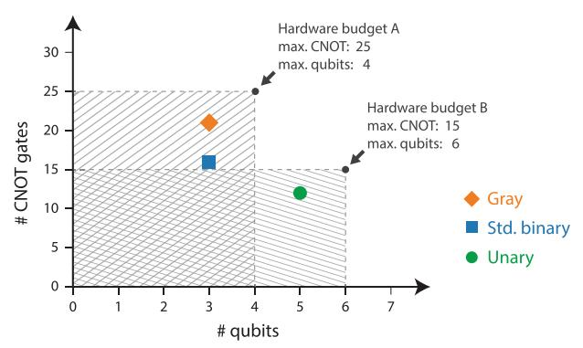

Fig. 1 Especially for near-term noisy quantum hardware, gate counts, and qubit counts will be limited. In principle, these constraints can be used to approximate a hardware budget for a set of hardware and a particular Hamiltonian simulation problem. For example, if one wants to simulate a collection of N bosons on a small quantum computer, the decoherence time and gate errors will constrain the allowed number of gates, while the total number of qubits will constrain the qubit count per boson. In this schematic, we show two arbitrary hardware budgets for Trotterizing the exponential of  $\hat{q}^2$  for one boson with truncation d = 5. In device A, both the Gray and standard binary encodings are satisfactory, but the unary code requires too many qubits. However, because device B allows for more qubits but fewer operations, the unary code is sufficient while the former two encodings require too many operations. This highlights the need for considering multiple encodings, as an encoding that is best for one type of hardware is not necessarily universally superior.

or Gray-only, with no benefit from converting between encodings (Bose-Hubbard d=4: 1D OHO d=4). Scenario B: the optimal choice is to convert between SB and Gray, in order to perform different local operators in different encodings (Heisenberg  $s = \frac{7}{2}$ ; Franck-Condon d=4). Scenarios A and B are notable because they require both the fewest operations and the fewest gubits, as there is no benefit to expanding into the qubit-hungry unary encoding. Scenario C: unary-only is the optimal choice, and saving memory by compacting the data back to Gray or SB is still cheaper than remaining in the latter encodings (Bose–Hubbard d = 10; boson sampling d = 10; Franck Condon d = 10). Scenario D: unary is the optimal encoding, but only if the data remains in high-qubitcount unary for the duration of the calculation (1D OHO d = 10: Heisenberg s = 2). The optimal encoding choice is highly sensitive to both the Hamiltonian class and the truncation value d. This suggests the need to perform an encoding-based analysis for any new digital quantum simulation of d-level particles.

Throughout this work, we study four encoding types: unary (also called one-hot), standard binary, the Gray code, and a new class of encodings we name block unary, all defined in Section Binary encoding. After outlining how to map d-level operators to qubit operators for any arbitrary encoding in Section Mapping d-level matrix operators to gubits, we consider resource counts for most standard local operators used in bosonic and spin-s Hamiltonians in Section Local operators. In Section Conversions between encodings we present circuits for converting between encodings and enumerate their resource counts. Finally, in Section Composite systems we obtain relative resource estimates for various commonly studied Hamiltonians in theoretical physics and chemistry. Conclusions are summarized in Section Discussion. This work highlights how the careful choice of the encoding scheme can greatly reduce the resource requirements when simulating a system of d-level particles or modes.

#### **RESULTS**

Binary encodings

We begin by giving definitions for various integer to binary encodings. In this work, we use the term binary encoding to refer to any code that represents an arbitrary integer as a set of ordered binary numbers, not just the familiar base-two numbering system. These encodings can be used to represent states regardless of the

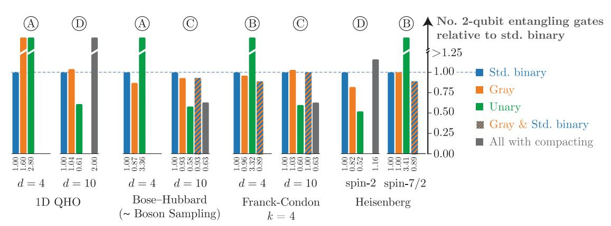

Fig. 2 Using an arbitrary selection of parameters for common physics and chemistry Hamiltonians, we have plotted the comparative computational costs required for first-order Trotterization. Costs are reported in terms of number of two-qubit entangling gates, relative to the cost of standard binary (SB). The three encodings shown here—standard binary, Gray code, and unary—are defined in the text. The five Hamiltonians are the Bose–Hubbard model, one-dimensional quantum harmonic oscillator (QHO), Franck–Condon calculation, boson sampling, and spin-s Heisenberg model. The optimal encodings are sensitive both to the Hamiltonian class and the number of levels *d* (determined by bosonic truncation or by the spin value s). In some cases, it is best to stay in a particular encoding for the duration of the simulation. Other times, it is worth bearing the resource cost of converting between encodings, because it saves on total operations. Still other times, the decision to save operations by converting between encodings will depend on whether available hardware is gate count limited or qubit count limited. Four Scenarios, A through D, are discussed in Section Composite system.

type of system or basis we are considering. For a given encoding enc, each integer I has some qubit (i.e., binary) representation, denoted  $\mathcal{R}^{\text{enc}}(I)$ , which is a bit string on  $N_q$  bits,  $x_{N_q-1}\cdots x_1x_0$ . To specify the value (0 or 1) of a particular bit i in the encoding, we use the notation  $\mathcal{R}^{\text{enc}}(I;i)$ .

**Standard binary**. We refer to the familiar base-two numbering system as the standard binary (SB) encoding, such that an integer *I* is represented by

$$I \mapsto x_0 2^0 + x_1 2^1 + x_2 2^2 + \dots$$
 (1)

This straight-forward mapping has been used for qubit-based quantum simulation of bosons previously  $^{14,17,18}$ . The SB mapping uses  $N_q = \lceil \log_2 d \rceil$  qubits when the range of integers under consideration is  $\{0, 1, 2, ..., d-1\}$ , where  $\lceil \cdot \rceil$  is the ceiling function

**Gray code.** In principle there are combinatorically many one-toone mappings between a set of integers and a set of  $N_a$ -bit strings. One mapping from classical information theory with particularly useful properties is called the Gray code or the reflected binary  $code^{27}$ . Its defining feature is that the Hamming distance  $d_H$ between nearest-integer bit strings is always 1, formally  $\textit{d}_{\textit{H}}(\mathcal{R}^{Gray}(\textit{I}),\mathcal{R}^{Gray}(\textit{I}+\bar{1)})=1.$  The Hamming distance counts the number of mismatched bits between two bit strings. In other words, moving between adjacent integers requires only one bit flip (see Table 1). As will be seen below, this encoding is especially favorable for tridiagonal operators with zero diagonals, since all non-zero elements  $|I\rangle\langle I'|$  then have hamming distance one. As far as we are aware, the Gray code has not been previously proposed for use in the simulation of bosons and other d-level systems on a qubit-based quantum computer. This encoding inspires the possibility of having a specialized encoding for many possible matrix sparsity patterns (for example a code for which  $d_H =$  $d_H(\mathcal{R}^{Gray}(I)\mathcal{R}^{Gray}(I+1))=2$  to be used for pentadiagonal matrices like  $\hat{q}^2$ ), but we do not consider this possibility here. Throughout this work we refer to the SB and Gray codes as compact encodings because they make use of the full Hilbert space of the qubits used.

**Unary encoding.** Mappings that do not use all  $2^{N_q}$  states of the Hilbert space are possible. In the unary encoding (also called *one-hot*<sup>28</sup>, single-excitation subspace<sup>29</sup>, or direct mapping<sup>17</sup>), the number of qubits required is  $N_q = d$ . Therefore, only an exponentially small subspace of the qubits' Hilbert space is used. The relationship between the unencoded and encoded ordered

Table 1. The standard binary (SB), Gray code, and unary encodings. Decimal Gray Unary 0 0000 0000 00000000001 0001 0001 00000000010 2 0010 0011 000000000100 3 0011 0010 00000001000 4 0100 0110 000000010000 5 0101 0111 000000100000 6 0110 0101 000001000000 7 0111 0100 000010000000 8 1000 1100 000100000000 9 1001 001000000000 1101 10 1010 1111 010000000000 11 1011 1110 100000000000 We refer to the SB and Gray codes as compact encodings.

sets is

$$\{0,1,2,3,...\} \mapsto \{...000001,...000010,...000100,...001000,...\}. \eqno(2)$$

Previous proposals for bosonic simulation on a universal quantum computer have used this encoding <sup>17,18,28–30</sup> under different names. The Unary encoding makes less efficient use of quantum memory, but it will become clear below that it usually allows for fewer quantum operations.

**Block unary encoding.** One can interpolate between the two extremes, using less than the full Hilbert space but more of the space than the unary code uses. In some limited instances this allows one to make tunable trade-offs between required qubit counts and required operation counts, which may be especially useful for mapping physical problems to the specific hardware budget of a particular near-term intermediate-scale (NISQ) device. In this work, we introduce a class of such encodings that we call block unary.

The block unary code is parameterized by choosing an arbitrary compact encoding (e.g., SB or Gray code) and a local parameter g that determines the size of each block. It can be viewed as an extension of the unary code, where each digit (block) ranges from 0 to g. Within each block, the local encoding is used to represent the local digit. The number of qubits required is  $N_q = \lceil \frac{d}{g} \rceil \lceil \log_2(g+1) \rceil$ . Examples of the block unary encoding are given in Table 2. We use the notation  $\mathrm{BU}_g^{\mathrm{enc}}$  to define block unary with a particular pair of parameters. For a transition within a particular block, the number of operations is similar to a compact code with d=g+1. For elements that move between different blocks, the transition will be conditional on all qubits in both blocks

**Bitmask subset**. Because some encodings do not make use of the full Hilbert space, it will be useful to define the subset of bits that is necessary to determine each integer I. For a given encoding we call this subset the bitmask subset, denoted C(I) where  $C_I \subseteq \{0, 1, 2, \ldots, N_q - 1\}$ . The bitmask subset for the SB and Gray encodings is always  $C^{\text{SB}}(I) = C^{\text{Gray}}(I) = \{0, 1, 2, \ldots, N_q - 1\}$ , since all  $N_q$  bits must be known to determine the integer value. In the unary encoding, the bitmask subset is simply  $C^{\text{Unary}}(I) = \{I\}$ , because if one knows that bit I is set to 1, then one knows the other bits are 0. In the block unary code, the bitmask subset simply contains the bits that represent the current block. For example, for the Block Unary Gray code with g = 3 (see Table 2),  $C^{\text{BU}[g=3]}(2) = \{0, 1\}$  and  $C^{\text{BU}[g=3]}(3) = \{2, 3\}$ .

**Table 2.** Examples of the block unary SB and block unary Gray encodings.

| Decimal | $BU^SB_{g=3}$ | $BU^Gray_{g=3}$ | $BU^Gray_{g=5}$ | $BU^Gray_{g=7}$ |
|---------|---------------|-----------------|-----------------|-----------------|
| 0       | 00 00 00 01   | 00 00 00 01     | 000 000 001     | 000 001         |
| 1       | 00 00 00 10   | 00 00 00 11     | 000 000 011     | 000 011         |
| 2       | 00 00 00 11   | 00 00 00 10     | 000 000 010     | 000 010         |
| 3       | 00 00 01 00   | 00 00 01 00     | 000 000 110     | 000 110         |
| 4       | 00 00 10 00   | 00 00 11 00     | 000 000 111     | 000 111         |
| 5       | 00 00 11 00   | 00 00 10 00     | 000 001 000     | 000 101         |
| 6       | 00 01 00 00   | 00 01 00 00     | 000 011 000     | 000 100         |
| 7       | 00 10 00 00   | 00 11 00 00     | 000 010 000     | 001 000         |
| 8       | 00 11 00 00   | 00 10 00 00     | 000 110 000     | 011 000         |
| 9       | 01 00 00 00   | 01 00 00 00     | 000 111 000     | 010 000         |
| 10      | 10 00 00 00   | 11 00 00 00     | 001 000 000     | 110 000         |
| 11      | 11 00 00 00   | 10 00 00 00     | 011 000 000     | 111 000         |

<span id="page-3-0"></span>

Mapping d-level matrix operators to qubits Any operator for a d-level system can be written as

$$\hat{A} = \sum_{l,l'=0}^{d-1} a_{l,l'} |l\rangle\langle l'|,\tag{3}$$

where l and l' are integers labelling pairwise orthonormal quantum states. In this work we conceptualize the mappings primarily in terms of Fock-type encodings (or alternatively second quantization encodings) where each  $|l\rangle$  represents one level in the d-level system. However, the mapping procedure is identical to the one used for first quantization operators  $^{19,20}$  that we briefly discuss. When dealing with bosonic degrees of freedom, one must choose an arbitrary level d at which to truncate, since in principle a bosonic mode may have an unbounded particle number. Choosing this cutoff such that truncation error is below a given threshold is an essential step that has been previously studied  $^{18,31,32}$ , although it is beyond the scope of the current work.

In performing a mapping of any d-by-d matrix operator to a sum of Pauli strings, the following approach may be used. For each term in the sum, one first assigns an integer to each level and then uses an arbitrary binary encoding  $\mathcal R$  to encode each integer:

$$|I\rangle\mapsto |\mathcal{R}(I)\rangle = \big|\mathcal{R}(I;N_q-1)\rangle\cdots|\mathcal{R}(I;1)\rangle|\mathcal{R}(I;0)\rangle\mapsto \big|x_{N_q-1}\rangle\cdots|x_0\rangle,\ x_i\in\{0,1\}.$$
 (4

For codes using less than the full Hilbert space of the qubits (e.g., unary and block unary), some qubits can be safely ignored for a given element  $|I\rangle\langle I'|$ . This is because operations on these excluded qubits will not affect the manifold on which the problem is encoded. Therefore, for each element  $|I\rangle\langle I'|$  a mapping needs to consider only the bitmask subsets of the two integers, ignoring other bits. The operator on the qubit space is then

$$|I\rangle\langle I'| \mapsto \bigotimes_{i \in C(I) \cup C(I')} |x_i\rangle\langle x_i'|_i, \tag{5}$$

where  $C(I) \cup C(I')$  is the union of the bitmask subsets of the two integers and the subscripts i denote qubit number. One then converts each qubit-local term  $|x_j\rangle\langle x'|$  to qubit operators using the following four expressions:

$$|0\rangle\langle 1| = \frac{1}{2}(\hat{\sigma}_x + i\hat{\sigma}_y) \equiv \hat{\sigma}^-,$$
 (6)

$$|1\rangle\langle 0| = \frac{1}{2}(\hat{\sigma}_{x} - i\hat{\sigma}_{y}) \equiv \hat{\sigma}^{+}, \tag{7}$$

$$|0\rangle\langle 0| = \frac{1}{2}(I + \hat{\sigma}_z),\tag{8}$$

$$|1\rangle\langle 1| = \frac{1}{2}(I - \hat{\sigma}_z). \tag{9}$$

For a single term in Eq. (3), the result is a sum of Pauli strings,

$$\hat{A} \mapsto \sum_{k}^{P} c_{k} \bigotimes_{j}^{N_{q}} \hat{\sigma}_{kj}, \tag{10}$$

where P is the number of Pauli strings in the sum,  $c_k$  is a coefficient for each Pauli term, and every operator is either a Pauli matrix or the identity:  $\hat{\sigma}_{kj} \in \{\hat{\sigma}_x, \ \hat{\sigma}_y, \ \hat{\sigma}_z\} \cup \{I\}$ . Note that in this work the set of Pauli matrices is defined to exclude the identity.

## Significance of the Hamming distance

It is useful to analyze encoding efficiency based on the Hamming distance between  $\mathcal{R}(I)$  and  $\mathcal{R}(I')$ . The Hamming distance, which we denote  $d_H^{\mathcal{R}}(I,I') \equiv d_H(\mathcal{R}(I),\mathcal{R}(I'))$ , is defined as the number of unequal bits between two bit strings of equal length. The important observation is that, for a given element  $a_{I,I'}|I\rangle\langle I'|$  in

Eq. (3), the average length of the Pauli strings increase as the Hamming distance increases, where length is defined as the number of Pauli operators (excluding identity) in the term. In this subsection, for simplicity we at first assume that the bitmask subset is  $C(I) = \{0, 1, \ldots, N_q - 1\}$ , implying that we are using a compact code such as Gray or SB. But we note that these Hamming distance considerations are relevant to all encodings. In the case of a noncompact encoding, one would consider only the union of the bitmask subsets. To clarify this result, consider the following. For an arbitrary element  $|I\rangle\langle I'|$  written in binary form  $|\mathcal{R}(I)\rangle\langle\mathcal{R}(I')|$ , one performs the following mapping:

$$|x_0\rangle\langle x'|\otimes\cdots\otimes|x_N\rangle\langle x'|\mapsto\frac{1}{2^N}(\hat{a}_0+\hat{b}_0)(\hat{a}_1+\hat{b}_1)\cdots(\hat{a}_N+\hat{b}_N)$$
(11)

where subscripts denote qubit number,  $\hat{a} \in \{\hat{\sigma}_x, I\}$ , and  $\hat{b} \in \{\pm i\hat{\sigma}_y, \pm \hat{\sigma}_z\}$  (according to Eqs. (6) through (9)). Expanding the RHS of Eq. (11) leads to an equation of form (10). For any mismatched qubit j, i.e., any qubit for which  $x_j \neq x'$ , the clause  $(\hat{a}_j + \hat{b}_j)$  contains two Pauli operators. For matched qubits  $(x_j = x')$ , the clause  $(\hat{a}_j + \hat{b}_j)$  instead has one identity and one Pauli operator. Hence more matched bits lead to more identity operators in expression (11), leading to fewer Pauli operators in the final sum of Pauli strings. It follows that the number of non-identity operators can be reduced by having a smaller Hamming distance. This is relevant because Hamiltonians with more Pauli operators require more quantum operations to implement.

Consider the illustrative example of mapping the Hermitian term  $|3\rangle\langle4|+|4\rangle\langle3|$  to a set of qubits. In the SB encoding, Eqs. (6)–(9) yield the following Pauli string representation:

$$\begin{split} |3\rangle\langle 4| + |4\rangle\langle 3| & \stackrel{\text{Std.Binary}}{\longmapsto} |011\rangle\langle 100| + |100\rangle\langle 011| \\ = & \frac{1}{4} (\hat{\sigma}_{x}^{(2)} \hat{\sigma}_{x}^{(1)} \hat{\sigma}_{x}^{(0)} + \hat{\sigma}_{y}^{(2)} \hat{\sigma}_{y}^{(1)} \hat{\sigma}_{x}^{(0)} + \hat{\sigma}_{y}^{(2)} \hat{\sigma}_{x}^{(1)} \hat{\sigma}_{y}^{(0)} - \hat{\sigma}_{x}^{(2)} \hat{\sigma}_{y}^{(1)} \hat{\sigma}_{y}^{(0)}). \end{split}$$

Using the Gray code, the Pauli string instead takes the form

$$\begin{split} |3\rangle\langle 4| + |4\rangle\langle 3| & \stackrel{\mathsf{Gray}}{\longmapsto} |010\rangle\langle 110| + |110\rangle\langle 010| \\ &= \frac{1}{4} (-\hat{\sigma}_{x}^{(2)} \hat{\sigma}_{z}^{(1)} \hat{\sigma}_{z}^{(0)} + \hat{\sigma}_{x}^{(2)} \hat{\sigma}_{z}^{(0)} - \hat{\sigma}_{x}^{(2)} \hat{\sigma}_{z}^{(1)} + \hat{\sigma}_{x}^{(2)}). \end{split} \tag{13}$$

The Hamming distance between  $\mathcal{R}(3)$  and  $\mathcal{R}(4)$  is  $d_H^{\text{SB}}=3$  in the former case and  $d_H^{\text{Gray}}=1$  in the latter. The result is that the Gray code has fewer Pauli operators per Pauli string, meaning that it can be implemented with fewer operations.

## Avoiding superfluous terms in noncompact codes

When implementing local products of operators using noncompact codes (unary or BU), one should multiply operators in the matrix representation before performing the encoding to qubits. If one instead first maps local operators to qubit operators, and then multiplies the operators, superfluous terms may result. For example, when implementing an arbitrary squared operator  $\hat{A}^2$ , one should begin with the matrix representation of  $\hat{A}^2$  instead of squaring the qubit representation of  $\hat{A}$ . To see this, consider the unary encoding of the square of a 3-level matrix operator  $\hat{n}_{d=3}=\operatorname{diag}[0,1,2]\mapsto \frac{3}{2}I-\frac{1}{2}\hat{\sigma}_z^{(1)}-\hat{\sigma}_z^{(2)}$ . If one begins with  $\hat{n}_{d=3}^2=\operatorname{diag}[0,1,4]$ , the encoded operator is

$$\hat{n}_{d=3}^2 = \text{diag}[0, 1, 4] \xrightarrow{\text{Unary }} \frac{5}{2}I - \frac{1}{2}\hat{\sigma}_z^{(1)} - 2\hat{\sigma}_z^{(2)}. \tag{14}$$

If one instead squares the already-encoded Pauli operator for  $\hat{n}_{d=3}$ , this yields

$$\left(\frac{3}{2}I - \frac{1}{2}\hat{\sigma}_{z}^{(1)} - \hat{\sigma}_{z}^{(2)}\right)^{2} = \frac{7}{2}I - \frac{3}{2}\hat{\sigma}_{z}^{(1)} + \hat{\sigma}_{z}^{(1)}\hat{\sigma}_{z}^{(2)} - 3\hat{\sigma}_{z}^{(2)}.$$
 (15)

<span id="page-4-0"></span>Superscripts denote qubit number. Pauli operators (14) and (15) behave identically on the subspace of the unary encoding, although operator (14) is less costly to implement. One might attempt to eliminate superfluous terms after the mapping is complete, but this is likely a hard problem. In principle it may require combinatorial effort to determine which combinations of operators leave the encoding space unaffected. Hence the most prudent strategy is to always perform as much multiplication as possible in the matrix representation. These considerations are irrelevant when using one of the compact encodings.

Trotterization and gate count upper bounds

Hamiltonian simulation often consists of implementing the unitary operator

$$U(\hat{t}) = \exp(-i\hat{H}t) \tag{16}$$

for some user-defined time-independent Hamiltonian  $\hat{H}$ , where t is the evolution time and we have set  $\hbar=1$ . Any Hamiltonian can be expressed as a sum of local Pauli strings such that

$$\hat{H} = \sum_{k} c_k \bigotimes_{j} \hat{\sigma}_{kj} = \sum_{k} \hat{h}_k, \tag{17}$$

which takes the same form as Eq. (10) with the Pauli strings and their coefficients compacted into terms  $\{\hat{h}_k\}$ . In practice, Hamiltonian simulation can be performed using a Suzuki–Trotter decomposition

$$\hat{U}(t) = \exp\left(-it\sum_{k}\hat{h}_{k}\right) \approx \left(\prod_{k}\exp(-i\hat{h}_{k}t/\eta)\right)^{\eta} = \tilde{U}(t),$$
 (18)

where the expression is exact in the limit of large  $\eta$  or small  $t^{1,33}$ . The numerical studies of this work consider the encoding-dependent resource counts for Eq. (18), for a subset of prominent physics problems. We focus on determining the resources required for simulating a single Trotter step.

There are several variations and extensions to the Hamiltonian simulation approach of Eq. (18), including higher-order Suzuki–Trotter methods<sup>33</sup>, the Taylor series algorithm<sup>34</sup>, quantum signal processing<sup>35</sup>, and schemes based on randomization<sup>36,37</sup>. Notably for the current work, recent results suggest that simple first-order Trotterization will have lower error for near- and medium-term hardware<sup>38,39</sup>, even if the other methods are asymptotically more efficient. Since  $\hat{h}_k$  takes a different form

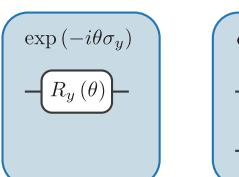

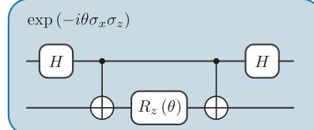

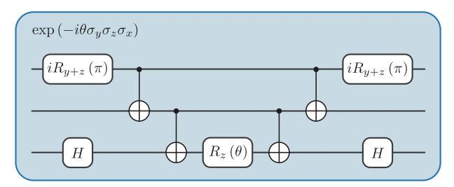

Fig. 3 Canonical quantum circuits used to exponentiate Pauli strings on a universal quantum computer. One needs 2(p-1) two-qubit gates for such an operation, where p is the number of Pauli operators in the term. When a product of many exponentials is used, as in the Suzuk–Trotter procedure, there tends to be significant gate cancellation.

depending on the chosen encoding, the resource counts as well as the error  $|\hat{U}(t) - \tilde{U}(t)|$  will be different. We leave the study of numerical error for future work, as the goal of the current work is to introduce these mappings and to understand some trends in their resource requirements.

Each term  $\exp(-it\hat{h}_k) = \exp(-itc_k \bigotimes_j \hat{\sigma}_{kj})$  may be implemented using the well-known CNOT staircase quantum circuit shown in Fig. 3. If a qubit j is acted on by  $\hat{\sigma}_x$  or  $\hat{\sigma}_y$ , additional single-qubit gates are placed on qubit j as shown in the figure.  $H \equiv iR_{x+z}(\pi)$  denotes the Hadamard gate that changes between the Z- and X-basis, and  $iR_{x+y}(\pi)$  converts between the Z- and Y-basis. To exponentiate a single Pauli string, the number of CNOT (CX) gates required is

$$n_{\rm cx}(p) = 2(p-1),$$
 (19)

where p is the number of Pauli operators ( $\{\hat{\sigma}_x, \hat{\sigma}_y, \hat{\sigma}_z\}$ , excluding I) in the term to be exponentiated.

It is instructive to calculate upper bounds for entangling gate counts. Consider a simple Hermitian term  $a|l\rangle\langle l'|+a^*|l'\rangle\langle l|$  and a single diagonal element  $|l\rangle\langle l'|$ . Here,  $d_H$  denotes  $d_H(\mathcal{R}(l),\mathcal{R}(l'))$ , which will depend on the chosen encoding, and  $d_H=0$  in the case of a diagonal element. We define K as  $|C^{\mathrm{enc}}(l)\cup C^{\mathrm{enc}}(l')|$ , the number of qubits in the relevant bitmask subsets. As we are considering products of two-term sums (Eqs. (6)–(9)), the distribution of Pauli strings can be analyzed in terms of binomial coefficients. In the Supplementary Section 1 we show that

$$n_{\text{cx,UB}}[d_H(I,I'),K] = \frac{1}{2} \sum_{p=2}^{K} 2^{d_H} \binom{K - d_H}{p - d_H} (2p - 2), \tag{20}$$

where  $\it UB$  denotes upper bound and the  $\frac{1}{2}$  factor is not present for diagonal terms. Some resulting upper bounds for particular Hamming distances are

$$\begin{split} n_{\text{CX,UB}}[d_H &= 0, K] = (2^K K - 2(2^K) - 2) \\ n_{\text{CX,UB}}[d_H &= 1, K] = \frac{1}{2}(2^K K - 2^K) \\ n_{\text{CX,UB}}[d_H &= 2, K] = \frac{1}{2}(2^K K). \end{split} \tag{21}$$

Again, the above expressions are for a single Hermitian element pair or a single diagonal term. In practice, because substantial gate cancellation is possible once the quantum circuit has been compiled, these upper bounds are not always directly applicable when choosing an encoding. However, the above expressions may find direct utility in limiting cases, and they demonstrate the basic relationship between Hamming distance, size of the bitmask union, and gate counts. Below, we study a common sparsity pattern, a tridiagonal real matrix operator  $\hat{B}$  with zeros on the diagonal, i.e., with matrix structure  $\langle i|\hat{B}|j\rangle = \sum_k B_k(\delta_{i,k}\delta_{j,k+1} + \delta_{i,k+1}\delta_{j,k})$ . This is the sparsity pattern of several commonly used d-level operators, such as the bosonic position operator  $\hat{q}$ .

In Table 3 we show analytical upper bounds for three different levels of sparsity, derived in Supplementary Section 1. We consider

**Table 3.** Asymptotic upper bound complexity of entangling gate counts, for Trotterizing a matrix exponential of a *d*-level particle.

|                      | $a I\rangle\langle I' +a^* I'\rangle\langle I $ | В̂              | Dense           |
|----------------------|-------------------------------------------------|-----------------|-----------------|
| Unary                | O(1)                                            | O(d)            | $O(d^2)$        |
| Unary<br>Block unary | $O(g\log g)$                                    | $O(dg\log g)$   | $O(d^2g\log g)$ |
| Compact (SB or Gray) | $O(d\log d)$                                    | $O(d^2 \log d)$ | $O(d^2 \log d)$ |

The second column refers to one Hermitian matrix element pair; the third column to a tridiagonal matrix operator  $\hat{B}$  with zeros on the diagonal; the last column to a dense matrix operator. These asymptotic complexities are useful primarily for considering general trends—for smaller values of d, it is best to numerically test all encodings to determine which requires the fewest operations.

<span id="page-5-0"></span>a single Hermitian pair, the  $\hat{B}$  operator with O(d) non-zero entries, and a dense matrix operator with  $O(d^2)$  non-zero entries. In Supplementary Section 1 we show that the upper bound of entangling gate counts for an arbitrary operator on K qubits is  $O(K4^K)$ . Because  $K = \lceil \log_2 d \rceil$  in the compact codes, this means that the compact codes will never require more than  $O(d^2 \log d)$  entangling gates.

An important consequence is that, as the matrix density increases, the comparative advantage of the unary encoding decreases. The compact codes' upper bound both for a  $\hat{B}$  and for a fully dense operator are both  $O(d^2\log d)$ , since this is the maximum upper bound. The unary encoding's upper bound of  $O(d^2)$  for fully dense operator is only slightly lower. And because actual gate counts for various matrix instances will be less than these upper bounds, it appears possible that compact codes might often be superior for dense matrices in both qubit count and gate count. However, because the most commonly used quantum operators tend to have O(d) density, it is likely that unary will most often be superior in gate counts, at least for Hamiltonian simulation. Many exceptions to these trends are shown in Section Local operators.

As a more concrete demonstration of typical operator scaling, we calculated numerical upper bounds for  $\hat{B}$  with increasing d. Qubit counts and upper bounds for  $\hat{B}$  are shown in Fig. 4, as a function of d for different encodings. We first encoded the entire operator  $\hat{B}$  into a sum of Pauli strings before collecting and cancelling terms, leading to some favorable cancellations. Then we applied Eq. (19). There is roughly an inverted relationship between the qubit counts and the operation counts, because sparser encodings like the unary and block unary have smaller bitmask subsets but require more total qubits.

The differing gate count upper bounds between the SB and gray encodings (Fig. 4) are explained by Hamming distances. Because all non-zero terms in  $\hat{B}$  have unity Hamming distance, upper bounds for the Gray code are substantially lower. The other notable trend is that the unary code has lower upper bounds, asymptotically, than the other codes. This can be explained using Eq. (21) by noting that K=2 for any matrix element, while  $K=\lceil\log_2 d\rceil$  for Gray and SB. In other words, K stays constant in the unary encoding, whereas in the compact codes K increases with d. Upper bounds for BU $_{g=3}^{\text{Gray}}$  are between the compact codes and the unary code, as this encoding has an intermediate value of K. Below we will see that, although these trends generally persist, they are less pronounced and less predictable after cancelling of Pauli terms and circuit optimization.

## Diagonal binary-decomposable operators

An important class of operators to consider is those which we call diagonal binary-decomposable (DBD). We define DBD operators as being diagonal matrix operators for which the diagonal entries of the operator ( $\hat{O}$ ) may be expressed as

$$\hat{O}_{l,l} = \sum_{i=1}^{\lceil \log_2 d \rceil} k_i R^{SB}(l;i)$$
 (22)

where  $R^{SB}(l; i) \in \{0, 1\}$ . A common subclass of DBD is the set of diagonal operators containing evenly-spaced entries. We call these diagonal evenly-spaced (DES) operators. An example is the bosonic number operator

$$\hat{n} = \text{diag}[0, 1, 2, 3, \cdots]$$
 (23)

and any linear combination  $a\hat{n}+bl$  where a and b are constants. If  $\log_2 d$  is an integer, then the Pauli operator is simply the base-two numbering system with  $k_i=2^i$ ,

$$\hat{n} = 2^{0} \hat{\sigma}_{z}^{(0)} + 2^{1} \hat{\sigma}_{z}^{(1)} + 2^{2} \hat{\sigma}_{z}^{(2)} + \cdots$$
 (24)

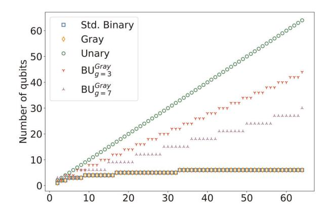

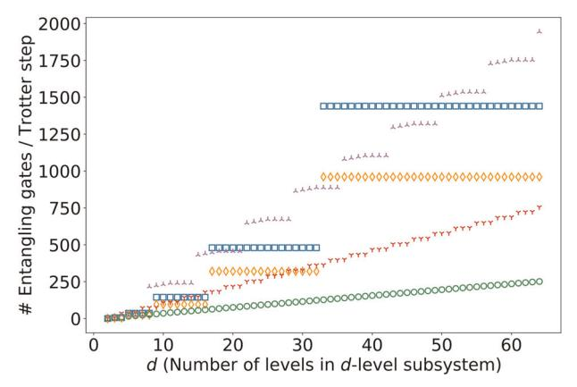

Fig. 4 Numerical upper bounds for resource counts of implementing one Suzuki-Trotter step of a *d*-by-*d* real Hermitian matrix operator  $\hat{B}$ , where  $\hat{B}$  is tridiagonal with zeros on the diagonal. Top:

Qubit counts for mappings considered in this work.  $BU_g^{Gray}$  stands for block unary where g is the size of the block. Asymptotically, the number of qubits scales logarithmically for the SB and Gray encodings, and linearly for the unary and block unary encodings. Bottom: Upper bounds of CNOT operation counts for implementing one Suzuki–Trotter step of  $\hat{B}$ . This is the sparsity pattern of canonical bosonic position and momentum operators as well as the  $S_x$  spin operators in spin-s systems. Upper bounds were calculated by mapping the full operator to a sum of weighted Pauli strings, combining terms, and then using Eq. (19). Notably, encodings with higher qubit counts tend to have lower upper bounds for gate counts, and vice-versa.

The DBD class of operators is notable because, when  $\log_2 d$  is an integer, exactly implementing  $\exp(-i\theta \hat{n})$  requires only  $\log_2 d$  single-qubit rotations and no entangling gates.

An operator for which  $\log_2 d$  is a non-integer will not lead to this favorable only single-qubit decomposition. For example, the  $\hat{S}_z$  operator for a spin-s system is DBD, but the advantage appears for the SB mapping only when d=2s+1 is a power of 2, namely  $s \in \{3/2, 7/2, \dots\}$ . However, for other operators one may simply increase d without changing the simulation result. For example, if one is required to exponentiate a truncated bosonic operator  $\hat{n}$  with at least d=11, it is most efficient simply to implement the SB encodings of  $\hat{n}$  with d=16 instead. A simple example illustrates this point. The standard operator for the bosonic number operator with truncation d=3 is

$$\hat{n}_{d=3} = \text{diag}[0,1,2] \overset{\text{Std.Binary}}{\longmapsto} \frac{3}{4}I + \frac{1}{4}\hat{\sigma}_z^{(0)} - \frac{3}{4}\hat{\sigma}_z^{(0)}\hat{\sigma}_z^{(1)} - \frac{1}{4}\hat{\sigma}_z^{(1)} \qquad (25)$$

while that for d = 4 is

$$\hat{n}_{d=4} = \text{diag}[0, 1, 2, 3] \stackrel{\text{Std.Binary}}{\longmapsto} \frac{3}{2} I + \frac{1}{2} \hat{\sigma}_{z}^{(0)} - \hat{\sigma}_{z}^{(1)}$$
 (26)

<span id="page-6-0"></span>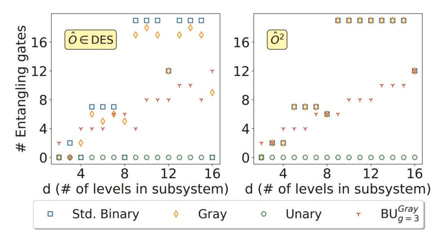

Fig. 5 Entangling gates for a single Suzuki-Trotter step of an arbitrary diagonal evenly-spaces (DES) operator  $\hat{O}$  (left), and its square (right). Gate counts are for optimized quantum circuits. DES operators are a subset of the diagonal binary-decomposable (DBD) operator class. Because it is diagonal, the unary code always requires only single-qubit operations. When  $\log_2 d$  is an integer, the SB code requires no entangling gates and just  $\log_2 d$  single-qubit operations, making it the most efficient encoding (in terms of both qubits and operations). DBD operators are a common operator class, encompassing e.g., the bosonic number operator  $\hat{n}$  and the spin-s operator  $\hat{S}_7$ .

The latter operator (d=4) is composed only of single-qubit operators but the former (d=3) is not. Operations counts for CNOT gates are shown in Fig. 5, where it is clear that the SB mapping is superior when d is a power of 2. The right panel gives gate counts for operators such as  $\hat{n}^2$ , where it is again advangatgeous for d to be a power of 2, although entangling gates are still required. As is also clear from the right panel, the square of a DES or DBD operator is in general not DBD.

## Local operators

Although local d-level operators can in principle contain arbitrary terms and even be entirely dense (i.e., a molecule's electronic energy levels with non-zero transitions between each), in practice there is a small set of sparse bosonic and spin-s operators that are used most often. Here we summarize the set of d-level operators used in this study, where it is conceptually useful to explicitly write down some d-by-d matrix representations.

Bosonic operators can be constructed from the well-known ladder operators  $\hat{a}$  and  $\hat{a}^{\dagger}$ , where (importantly for encoding considerations) all non-zero terms  $|I\rangle\langle I'|$  obey |I-I'|=1. The position operator  $\hat{q}=\frac{1}{\sqrt{2}}(\hat{a}_j^{\dagger}+\hat{a}_j)$  is tridiagonal with zeros on the diagonal:

$$\hat{q} = \frac{1}{\sqrt{2}} \begin{bmatrix} 0 & 1 & 0 & 0 & \dots \\ 1 & 0 & \sqrt{2} & 0 & \dots \\ 0 & \sqrt{2} & 0 & \sqrt{3} & \dots \\ 0 & 0 & \sqrt{3} & 0 & \dots \\ \vdots & \vdots & \vdots & \vdots & \ddots \end{bmatrix}$$
(27)

This means that the square of  $\hat{q}$ , often used in vibrational and bosonic Hamiltonians, is pentadiagonal but with zeros for terms where |I - I'| = 1:

$$\hat{q}^{2} = \frac{1}{2} \begin{bmatrix} 1 & 0 & \sqrt{1 \cdot 2} & 0 & 0 & \dots \\ 0 & 3 & 0 & \sqrt{2 \cdot 3} & 0 & \dots \\ \sqrt{1 \cdot 2} & 0 & 5 & 0 & \sqrt{3 \cdot 4} & \dots \\ 0 & \sqrt{2 \cdot 3} & 0 & 7 & 0 & \dots \\ 0 & 0 & \sqrt{3 \cdot 4} & 0 & 9 & \dots \\ \vdots & \vdots & \vdots & \vdots & \vdots & \ddots \end{bmatrix} . \tag{28}$$

Notably, |I - I'| for non-zero entries is either 0 or 2, making the

Gray code less useful for this operator. The momentum operator  $\hat{p} = \frac{i}{\sqrt{2}}(\hat{a}_{1}^{\dagger} - \hat{a}_{j})$  and its square  $\hat{p}^{2}$  have the same sparsity patterns as  $\hat{q}$  and  $\hat{q}^{2}$ , respectively. The number operator  $\hat{n} = \hat{a}^{\dagger}\hat{a}$  of Eq. (23) is diagonal and DBD, which leads to efficient SB mappings as discussed in Section Diagonal binary-decomposable operators. Finally, we study the two-site bosonic interaction operator

$$\hat{a}_i^{\dagger} \hat{a}_i + \hat{a}_i \hat{a}_i^{\dagger}. \tag{29}$$

In order to consider spin Hamiltonians such as Heisenberg models  $^{11,40}$ , we encode spin-s operators of arbitrary s, where the number of levels is d=2s+1. Matrix elements for transitions  $|I\rangle\langle I'|$  are defined as follows  $^{41}$ 

$$\langle I|\hat{S}_z|I'\rangle = \hbar(s+1-I)\delta_{II'} \tag{30}$$

$$\langle I|\hat{S}_{x}|I'\rangle = \frac{\hbar}{2}(\delta_{I,I'+1} + \delta_{I+1,I'})\sqrt{(s+1)(I+I'-1) - II'}$$
(31)

$$\langle I|\hat{S}_{y}|I'\rangle = \frac{i\hbar}{2} (\delta_{I,I'+1} - \delta_{I+1,I'}) \sqrt{(s+1)(I+I'-1) - II'}$$
(32)

where  $\delta_{\alpha,\beta}$  is the Kronecker delta. The  $\hat{S}_z$  are DBD operators, while  $\hat{S}_x$  and  $\hat{S}_y$  are tridiagonal with zeros on the diagonal, the same sparsity pattern as bosonic  $\hat{p}$  and  $\hat{q}$  operators.

The local operators considered thus far are effectively second quantization operators—each ket tends to correspond to an eigenstate in an isolated d-level system. Also of note is a recently proposed approach  $^{19,20}$  which maps bosons to qubits using the first quantized representation of the quantum harmonic oscillator. The original proposal maps Hermite–Gauss functions, the eigenfunctions of the quantum harmonic oscillator, into a discretized position space. The approximate position operator is defined as

$$\tilde{X}_{FQ} = \sum_{i=0}^{N_x - 1} x_i |x_i\rangle \langle x_i|$$
(33)

and  $N_x$  is the number of discrete position points such that

$$x_i = (i - N_x/2)\Delta, i \in [0, N_x - 1]$$
 (34)

where  $\Delta$  is chosen such that the desired highest-order Hermite–Gauss function is contained within  $(x_0, x_{N_x-1})$ . Advantages and disadvanteges are discussed in the Supplementary Section 5. We raise the possibility of using this approach partly to point out that a  $N_x$ -by- $N_x$  matrix operator may be mapped to

<span id="page-7-0"></span>

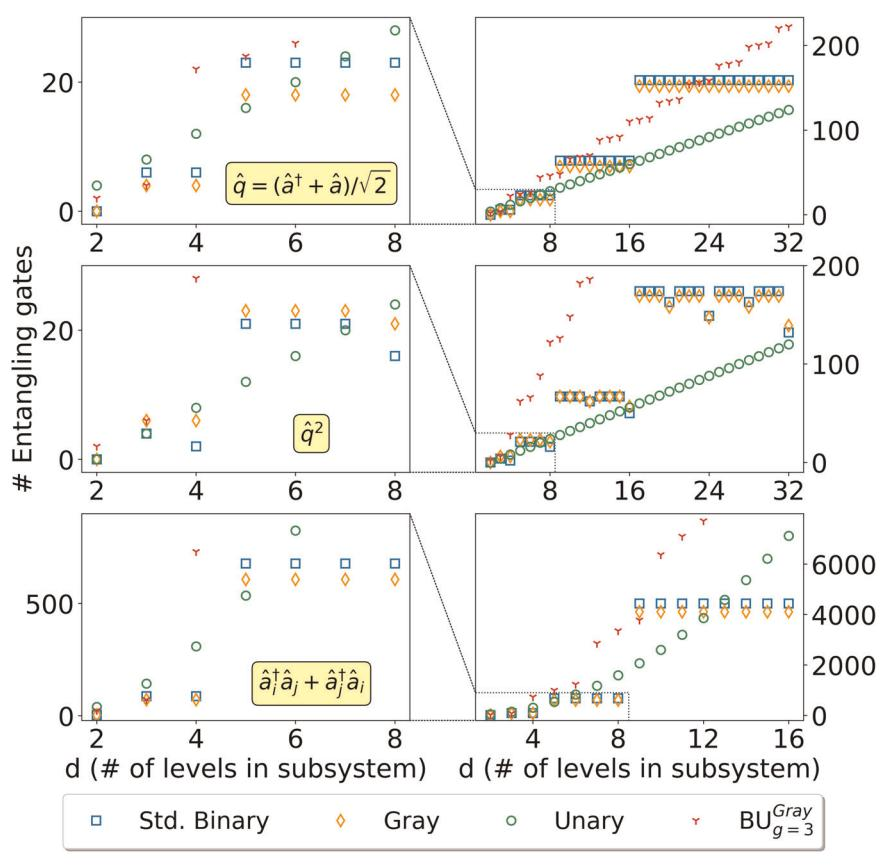

Fig. 6 CNOT gate counts for optimized circuits of the bosonic position operator (first row), position operator squared (second row), and two-site bosonic interaction operator (third row). Plots on the left correspond to enlargements of the dotted boxes in the plots on the right. There are several notable trends and anomalies: **a** Although unary usually requires the fewest operations as d increases, there are several operators for which the Gray or SB code is more efficient than the unary in both qubit and operation count. This occurs most pronouncedly at values such as d = 4, 7, and 8. **b** The Gray code is usually more efficient than SB even after circuit optimization, especially for operators composed of tridiagonal operators (top and bottom rows). **c** The Gray code's advantage is either less pronounced or disappears for  $\hat{q}^2$ , because  $\hat{q}^2$  is a pentadiagonal operator, for which the unity Hamming distance of the Gray code is less useful. **d** The reduction in operation count for  $\hat{q}^2$  at values such as d = 8, 24, or 32 occur because the diagonal of  $\hat{q}^2$  is DBD.

qubits using the exact same procedure as the other operators, with  $N_x$  replacing d. Note that  $\tilde{X}_{\text{FQ}}$  is a DBD operator.

Quantum circuits for approximating the exponential of each operator and for each d were compiled and then optimized using the procedure given in the Supplementary Section 2. The optimization consists of searching for and performing gate cancellations where possible. For instance, two adjacent CNOT gates or two adjacent Hadamard gates will cancel. Entangling gate counts for the optimized circuits of bosonic operators  $\hat{q}$ ,  $\hat{q}^2$ , and  $\hat{a}_i^{\dagger}\hat{a}_j+\hat{a}_i\hat{a}_j^{\dagger}$ . are plotted in Fig. 6. We place significant focus on smaller d values because they tend to be more common in physics simulation, but we note that applications requiring larger d values do exist, for example in vibronic simulations where occupation numbers can approach  $d=70^{18}$ .

Comparing the tridiagonal operator  $\hat{q}$  with the upper bounds given in Fig. 4 demonstrates that the circuit optimization greatly reduces gate count for the compact codes and block unary, often by a factor of 2–3. On the other hand, the unary encoding effectively sees no improvement from optimization, although it remains the code with fewest entangling gates for a large subset of d values.

As was the case in the upper bound calculations, operators built from tridiagonal matrices ( $\hat{q}$  and  $\hat{a}_i^{\dagger}\hat{a}_j + \hat{a}_i\hat{a}_j^{\dagger}$ .) show the Gray encoding outperforming SB, although after optimization the advantage is less pronounced. In contrast, for the pentadiagonal  $\hat{q}^2$ , the Gray code outperforms SB asymptotically, while SB is better for lower d values (and lower d values are likely to be more

common in relevant bosonic Hamiltonian simulations). The changed trend can be explained by noting that the unity Hamming distance of the Gray code is not as advantageous for the sparsity structure of  $\hat{q}^2$ , given in Eq. (28). Also notable is the apparent dip in operation count at d=8, due to the fact that the diagonal of  $\hat{q}^2$  is DBD.

Importantly, when mapping bosonic problems using compact encodings, it is sometimes the case that increasing the truncation value d is beneficial. For instance, suppose one knows one can safely truncate at d=5 for a bosonic problem. When implementing  $\hat{q}^2$ , one would instead simply implement the operator for d=8, as the number of gates decreases while the number of qubits remains the same. Note that this is not possible in spin-s particles, as it would cause leakage to unphysical states.

One of the more intriguing results is that the unary code is often inferior to the Gray or SB encodings. Pronounced examples of this inversion include d=4, 7, 8 for  $\hat{q}$  and d=4 and 8 for  $\hat{q}^2$ , among others. This is notable because, for these values of d, Trotterizing the operator requires both fewer qubit and fewer operations if Gray or SB is used. These results are in contrast to the naively expected trend that there would be a more consistent trade-off between qubit count and operation count. Results for single-particle spin-s operators  $\hat{S}_x$  and  $\hat{S}_z$ , as well as interaction operator  $\hat{S}_z^{(j)}$  are plotted in Fig. 7. Unlike bosonic Hamiltonians, the d values are not simulation parameters but are determined by s in the system we wish to simulate. The trends in spin operators tend to be more unruly than those in the bosonic operators.

<span id="page-8-0"></span>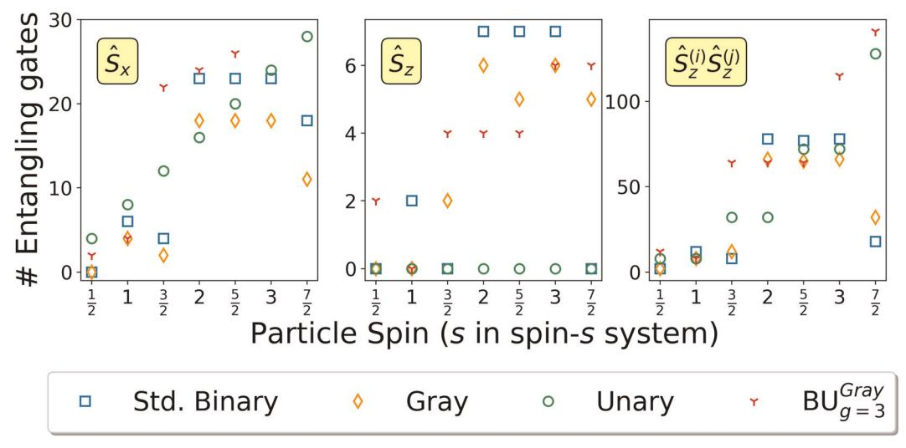

Fig. 7 CNOT gate counts of optimized Suzuki–Trotter circuits, for approximating the exponentials of the spin-s operators shown. There is no clean overall trend for  $\hat{S}_x$  and  $\hat{S}_z^{(i)} \hat{S}_z^{(j)}$  (except that Gray tends to out-perform SB), highlighting the need to study encodings thoroughly for each new use case. Notably, because  $\hat{S}_z$  is diagonal binary-decomposable, for values of  $s = \frac{3}{2}, \frac{7}{2}$  (which are 4- and 8-level system, respectively) the SB code requires both fewest operations and fewest qubits.

Analogous to the bosonic case,  $\hat{S}_z$  is DBD and therefore SB requires only single-qubit gates when d=4, 8 ( $s=\frac{3}{2},\frac{7}{2}$ ) and no entangling gates. For these two values, SB uses both the fewest operations and the fewest qubits (fewer than unary). However, the Gray code is superior to SB for other values of s, the same behavior seen in the general DES matrix of Fig. 5. Because  $\hat{S}_z$  is diagonal, the unary always requires just d single-qubit rotations and no entangling gates. The two-particle operator  $\hat{S}_z^{(i)} \hat{S}_z^{(j)}$  displays similar trends to  $\hat{S}_z$ .

As expected, the Gray code is usually superior to SB for the tridiagonal  $\hat{S}_x$ , because of the unity Hamming distance between nearest levels. Unary is inferior in both gate count and qubit count for most values, a result highlighted earlier in low-d bosonic operators. For both bosonic and spin-s operators, we have until now omitted discussion of the Gray-based block unary encoding with parameter q = 3. There is never a case where this BU mapping is the sole encoding with the lowest entangling gate count. However, at least in principle, there may be limited cases where a particular hardware budget (Fig. 1) dictates the need for a block unary encoding. A necessary condition for even considering the use of  $\mathrm{BU}_{q=3}^{\mathrm{Gray}}$  is that its operation count is less than both compact codes, but more than unary. In such cases ( $\hat{q}$  and  $\hat{a}_i^{\dagger}\hat{a}_{i+\frac{1}{2}}$  + h.c. for d=9;  $\hat{n}^2\sim\hat{O}^2$  in Fig. 5 for several values;  $\hat{S}_z^{(i)}\hat{S}_z^{(j)}$ and  $\hat{S}_z$  for s=2), there may be a particular hardware budget would require this encoding for its particular memory/operation trade-off. Such highly specific hardware budgets seem unlikely to often appear.

Note that the results herein should generally be considered constant-factor savings, because in most relevant systems d does not increase with system size, i.e., with the number of particles. For the simulation of scientifically relevant quantum systems, Hamiltonians are composed of more than one simple operator. For such situations, one may calculate the overall cost within a given encoding, as we do in Section Composite systems. As will be discussed in Section Conversions between encodings, it is often beneficial to Trotterize different parts of the Hamiltonian in different encodings, if the cost difference outweighs the overhead of conversion.

## Conversions between encodings

It is often the case that different terms in a Hamiltonian are more efficiently simulated in different encodings. For example, in the

Bose–Hubbard model, the number operator  $\hat{n}$  is usually more efficient in SB, while the hopping term  $\hat{b}_i^{\dagger}\hat{b}_{i+1}+\text{h.c.}$  is usually more efficient in the Gray encoding (see Fig. 6). Here we show that the cost of converting from one encoding to another is often substantially less than the difference in resource efficiency between two encodings, which means that it can be advantageous to continually be compacting and uncompacting the data. For example, if unary is the most efficient for implementing an operator, one may wish to compact the data between operations to save memory resources, as shown in Fig. 8. In this section we give general quantum circuits and resource counts for converting between all encodings considered in this work.

One can convert between the Gray and SB encodings by applying ( $\lceil \log_2 d \rceil - 1$ ) CNOTs in sequential order<sup>42</sup> as shown in Fig. 9.

Algorithm 1. An algorithm to build a quantum circuit for SB–unary conversion given an arbitrary truncation *d*. For multi-qubit gates, the first argument specifies the control qubit and the successive ones are targets.

```
function stdbin-unary-converter (d)
  K \leftarrow \lceil \log_2 d \rceil
                                                              ▶ Qubit count in SB
  SWAP (K-1,d-1)
                                                      ⊳Move positions of SB bits
  for b \leftarrow K - 2 to 0 do
     SWAP (b,2^{b+1}-1)
  end for
  X(0)
                                                                  ⊳First two gates
  CNOT(1,0)
  for b \leftarrow 1 to K - 1 do
                                                     ⊳SWAP and CNOT gates do
     i_{ctr} = MININUM(2^{b+1} - 1, d - 1)
                                                              ⊳Define 'control' bit
     for L \leftarrow 2^b to (i_{ctr} - 1) do
        CSWAP(i_{ctr,} L, L - 2^b)
     end for
     for L \leftarrow 2^b to (i_{ctr} - 1) do
        CNOT(L,i_{ctr})
     end for
     CNOT(i_{ctr}, i_{ctr} - 2^b)
                                                                  ⊳Last CNOT gate
  end for
end function
```

<span id="page-9-0"></span>

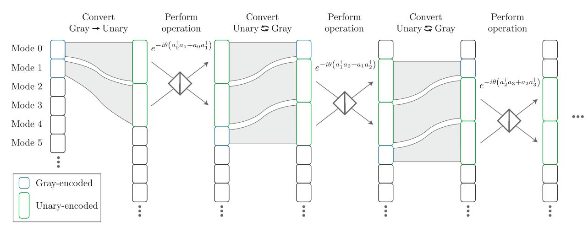

Fig. 8 Schematic showing the utility of swapping between encodings. When extra memory resources are available and the unary code is the most efficient for implementing an operator, one may expand into the unary representation, perform the operation, and then compact the data back to SB or Gray. The example shown here is the bosonic interaction operator  $\hat{a}_i^{\dagger}\hat{a}_{i+1} + \text{h.c.}$ . This operator is present in bosonic Hamiltonians and for digital simulations of beamsplitters. For many values of d, implementing this operator in unary is much cheaper than implementing it in Gray or SB. When this strategy is worth the cost of conversion, the Hamiltonian simulation is in Scenario C discussed in Section Composite Systems. Hence each particle starts with  $\lceil \log_2 d \rceil$  qubits, expands out to d qubits, and then compacts back. Whether this procedure leads to cost savings is heavily dependent on the problem and the parameters.

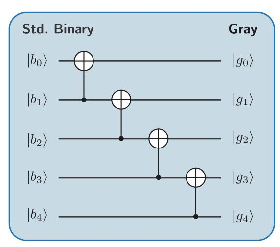

**Fig. 9 Quantum circuit for SB to Gray conversion.** The number of gates required is logarithmic in d.

The conversion between unary and SB is more complex. The conversion may be especially relevant in a future fault-tolerant quantum computing era, when extra quantum resources are available, because the unary encoding becomes more beneficial as d increases and because the conversion cost is significant. Inspired by previous work<sup>43</sup>, in Fig. 10 we show an example case for converting from SB to unary when d = 16. A state is initially encoded in SB using qubits on the left, and the memory space is enlarged to include the number of qubits needed for unary. No ancilla qubits are required. As quantum circuits are reversible, unary-to-SB conversion follows by inversion of the circuit. In Table 4, we provide the converter circuit resource count for a general dlevel truncated quantum system, following Fig. 10. Resource counts assume a decomposition of CSWAP into Clifford+T gates<sup>44</sup>. A general algorithm to build the converter circuit can be seen in the Algorithm 1.  $\lceil \cdot \rceil$  and  $| \cdot |$  are, respectively, the ceiling and floor functions. The validity of the conversion procedure is most easily shown by tracing a single unary state through the reverse algorithm. When d is not a power of 2, modifications are needed. These modifications are already accounted for in Algorithm 1 and example circuits for d=5 and 7 are given in the Supplementary Section 3.

For completeness, we constructed a circuit for converting between SB and block unary, for  $\mathrm{BU}_{g=3}^{\mathrm{SB}}$ , shown in the Supplementary Section 4. We do not further analyze BU conversions, as block unary is expected to have limited utility, and even then it will usually be the case that decoherence times are too low to allow for conversions (see Section Local operators).

### Composite systems

Here we consider resource counts for simulating five physically and chemically relevant Hamiltonian systems. The Hamiltonians correspond to the shifted one-dimensional QHO, the Bose-Hubbard model<sup>9,45,46</sup>, multidimensional molecular Franck–Condon factors<sup>17,18,47</sup>, a spin-s transverse-field Heisenberg model<sup>11,40</sup>, and simulating Boson sampling<sup>48</sup> on a digital quantum computer. The former four systems consist of an arbitrary number of d-level particles. For the Franck-Condon factors, the Duschinsky matrix is assumed to have a constant k = 4 non-zero entries per row. With the exception of the simple QHO, all of these problem classes would benefit from digital quantum simulation, because there are limits to the theoretical and practical questions that can be answered by classical computers. Supplementary Section 6 gives a more thorough overview of these problems. Assuming that d remains constant as the particle number increases, differences in resource counts between mappings are constant-factor savings that are independent of system size.

Using resource counts from the optimized circuits for Trotterizing individual operators and from the circuits for interencoding conversion, we calculated and compared the required two-qubit entangling gate counts for the selected composite Hamiltonians. We considered five encoding schemes: (i) SB-only, (ii) Gray-code-only, (iii) unary-only, (iv) allowing for conversion between SB and Gray, and (v) using all three while compacting to save memory. For (iv) and (v), the reported results include the cost of conversion. To the best of our knowledge, schemes (ii), (iv), and (v) are novel to digital quantum simulation. In Fig. 8, an example of encoding scheme (v) is shown. These encoding schemes do not directly correspond to the 'scenarios' discussed below; the scenarios


<span id="page-10-0"></span>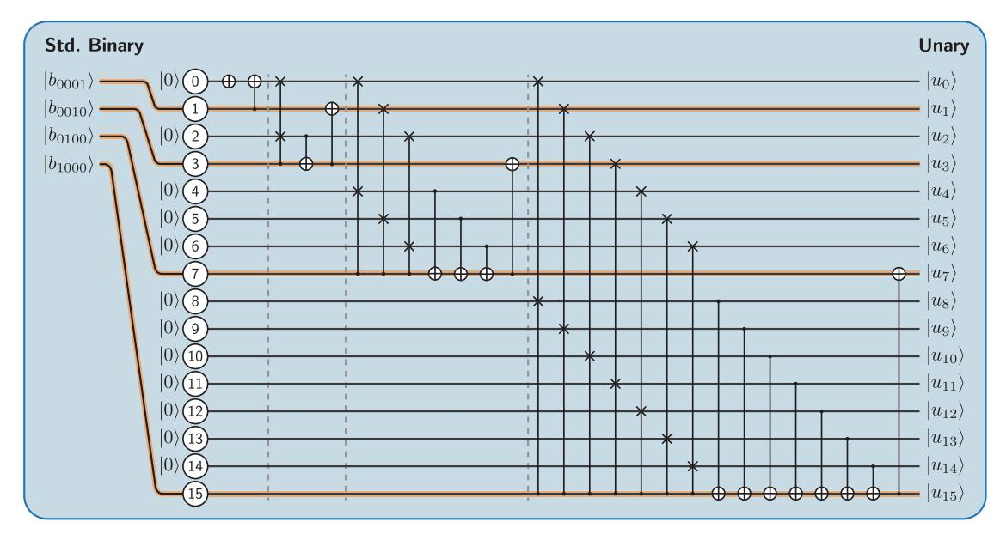

**Fig. 10 Circuit to convert the SB representation into the unary representation.** Every CSWAP is accompanied by a CNOT. Modifications are required when *d* is not a power of two, as discussed in the main text and Supplementary Section 3.

| Table 4.   Resource counts for the SB                                                 | Resource counts for the SB to unary conversion, for arbitrary $\emph{d}$ .                                                                                                                                 |  |  |
|---------------------------------------------------------------------------------------|------------------------------------------------------------------------------------------------------------------------------------------------------------------------------------------------------------|--|--|
| Before Clifford+T decomposition                                                       | After Clifford+T decomposition                                                                                                                                                                             |  |  |
| $n(CNOT) = d - 1$ $n(CSWAP) = d - \lceil \log_2 d \rceil - 1$ $n(\hat{\sigma}_x) = 1$ | $n(CNOT) = 9d - 8\lceil \log_2 d \rceil - 9$ $n(H) = 2d - 2\lceil \log_2 d \rceil - 2$ $n(\hat{\sigma}_x) = 1$ $n(T) = 4d - 4\lceil \log_2 d \rceil - 4$ $n(T^\dagger) = 3d - 3\lceil \log_2 d \rceil - 3$ |  |  |

denote the optimal encoding scheme under different hardware budgets.

The result for (iv), the encoding scheme that combines both the SB and Gray codes, is reported only when it represents an improvement over both SB-only and Gray-only. We give results for (v), which compacts and uncompacts the qubits for unary computations, only when the unary code was the most efficient of the first four encoding schemes. We give all results in terms of resource counts relative to the SB mapping, noting again that the relative resource requirements between encoding schemes are independent of system size (i.e., number of particles or modes).

For some local bosonic operators, the number of entangling gates is not a monotonically increasing function of d. Such operators include  $\hat{n}$ ,  $\hat{n}^2$ , and  $\hat{q}^2$  (Figs. 5 and 6). Our numerics for the composite systems take this into account, increasing the cutoff d if it is beneficial. For instance, if d=5 is a sufficient truncation and we implement  $\hat{q}^2$ , we use resource counts for d=8, because this uses the same number of qubits but fewer operations (Fig. 6). This trick is not possible for the spin-s systems, where d is determined not by a sufficient truncation value but by the nature of the particle itself (its spin s).

A selection of resource comparisons is shown in Fig. 2. We show results from d=4 and 10 because they highlight the variety of rankings that occur, and demonstrate that the best encoding scheme can be highly sensitive to d even within the same Hamiltonian class. Numerical results up to d=16 are given in the Supplementary Section 7.

In terms of which encoding class should be used, the results can be categorized into four scenarios. Scenario A applies when using just one of the compact encodings (SB or Gray) is the best choice. Of the results shown in Fig. 2, the Bose–Hubbard and 1D QHO models for d=4 fit this description. The optimal choice is to stay in one of the compact encodings for the entire calculation, while never using more than  $\log_2 d$  qubits per particle for the calculation.

Scenario B refers to Hamiltonians for which the optimal strategy is to use a compact amount of memory but to allow for conversion between Gray and SB. This includes the Heisenberg model for  $s=\frac{7}{2}$  and the Franck–Condon Hamiltonian for d=4. Because the cost of conversion is very small, this scenario usually implies that at least one of the local operators in the Hamiltonian are optimal in Gray, at least one is optimal in SB, and none are optimal in unary. To take the Heisenberg model with  $s=\frac{7}{2}$  as an example, one can see this is the case by comparing  $\hat{S}_x$  and  $\hat{S}_z^{(i)}\hat{S}_z^{(j)}$  in Fig. 7.

Scenario C applies when unary is the superior encoding and it is still considered the best encoding even if one repeatedly unravels and compacts to preserve memory (as in Fig. 8). This latter trait is important because it means that, even including the substantial cost of SB-to-unary conversion, with a cost of  $\sim 9d$  entangling gates (Table 4), it is still better to convert back and forth between unary and SB/Gray. This is true even when memory constraints require that one stores the information compactly for most of the time. This occurs with d=10 for the Bose–Hubbard, boson sampling, and Franck–Condon Hamiltonians, all of which are bosonic problems.

Scenario D refers to cases where unary is the superior encoding, assuming that the information is not compacted back to SB in order to save memory. This scenario implies that, if one has the qubit space to stay in unary form for the entire calculation, unary is optimal. If one does not have the memory resources for this, it is best to simply perform all operations in Gray and/or SB. The reason for this discrepancy is that the cost of converting binary to unary is substantial, as mentioned above. This scenario applies to the 1D QHO for d=10 as well as the Heisenberg model for s=2.

Results for d values up to 16 are given in the Supplementary Section 7. Note that the novel memory-efficient schemes (ii), (iv), and (v) did not lead to improvements in every case; in a minority of the problem instances we considered, the optimal encoding scheme was to use only SB or only unary. By memory-efficient we mean that the scheme stores the encoded subsystems in  $\lceil \log_2 d \rceil$  qubits, with the possible exception of when they are being operated on. Comparing to the memory-inefficient unary-only

<span id="page-11-0"></span>

scheme, our novel approaches reduced two-qubit entangling gate counts by up to 33%. Compared to the memory-efficient SB-only scheme, we observed gate count reductions of up to 49%. The latter case is more relevant when qubit count is a substantial constraint. These savings are especially important for running algorithms on near-term hardware, since by simply modifying the encoding procedure one can substantially decrease the effective circuit depth.

## DISCUSSION

After introducing a general framework for encoding d-level systems to multi-qubit operators, we have analyzed the utility and trade-offs of several integer-to-bit encodings for qubit-based Hamiltonian simulation. The mappings may be used for Hamiltonians built from subsystems of bosons, spin-s particles, molecular electronic energy levels, molecular vibrational modes, or other dlevel subsystems.

We analyzed the mappings primarily in terms of qubit counts and the number of entangling operations required to estimate the exponential of an operator.

Of the Gray and SB codes, we demonstrated that the Gray code tends to be more efficient for tridiagonal matrix operators, while SB tends to be superior for a common class of diagonal matrix operator. Importantly, we show that converting between encodings within a Suzuki–Trotter step often leads to savings. Notably, although the unary code tends to require more qubits but fewer operations, it is often the case that the SB or Gray code is more efficient both in terms of qubit counts and operation counts. To the best of our knowledge, the Gray code had not been previously used in Hamiltonian simulation.

We compared resource requirements between encodings for the following composite Hamiltonians: the Bose–Hubbard model, one-dimensional quantum harmonic oscillator, vibronic molecular Hamiltonian (i.e., Franck–Condon factors), spin-s Heisenberg model, and boson sampling. The optimal encoding, and whether it was beneficial to interconvert between encodings, was heavily dependent both on the Hamiltonian class and on the truncation level d for the particle. We placed optimal encoding strategies into four different "scenarios," each of which points to a different optimal encoding and simulation strategy. The simulation scenario depends on which encodings require the fewest operations, on whether interconverting between mappings is worth the additional cost, and on qubit memory constraints. The many anomalies in our results highlight the need to perform an analysis of each new class of Hamiltonian simulation problem, determining numerically which simulation strategy is optimal before performing a simulation on real hardware.

There are several directions open for future research. First, there are ways to analyze resource requirements other than enumerating the entangling operations. For long-term error-corrected hardware, estimating T gate count may be most relevant[49.](#page-12-0) Additionally, we assumed all-to-all connectivity in this work, which tends to be a feature of ion trap quantum computers[50.](#page-12-0) But other quantum hardware types require one to consider the topology of the qubit connections and implementation of SWAP gate[s51](#page-12-0), a consideration that would modify the resource counts and may modify some trends observed here.

We envision that the methodology and results of this work will be helpful for both theorists and experimentalists in designing resource efficient approaches to quantum simulation of a broader set of physically and chemically relevant Hamiltonians.

## DATA AVAILABILITY

The data that support the findings of this study are available upon reasonable request.

Received: 13 November 2019; Accepted: 20 April 2020;

## REFERENCES

- 1. Lloyd, S. Universal quantum simulators. Science 273, 1073–1077 (1996).
- 2. Childs, A. M., Maslov, D., Nam, Y., Ross, N. J. & Su, Y. Toward the first quantum simulation with quantum speedup. Proc. Natl Acad. Sci. USA 115, 9456–9461 (2018).
- 3. Abrams, D. S. & Lloyd, S. Simulation of many-body fermi systems on a universal quantum computer. Phys. Rev. Lett. 79, 2586–2589 (1997).
- 4. Bravyi, S. B. & Kitaev, A. Y. Fermionic quantum computation. Ann. Phys. 298, 210–226 (2002).
- 5. Cao, Y. et al. Quantum chemistry in the age of quantum computing. Chem. Rev. 119, 10856–10915 (2019).
- 6. McArdle, S., Endo, S., Aspuru-Guzik, A., Benjamin, S. & Yuan, X. Quantum computational chemistry. Rev. Mod. Phys. 92, 015003 (2020).
- 7. Dumitrescu, E. F. et al. Cloud quantum computing of an atomic nucleus. Phys. Rev. Lett. 120, 210501 (2018).
- 8. Wecker, D. et al. Solving strongly correlated electron models on a quantum computer. Phys. Rev. A 92, 062318 (2015).
- 9. P.A., Matthew, P.B., Fisher, G.G., Weichman & D.S., Fisher Boson localization and the superfluid-insulator transition. Phys. Rev. B 40, 546–570 (1989).
- 10. Wilson, E. B., Decius, J. C. & Cross, P. C. Molecular Vibrations: The Theory of Infrared and Raman Vibrational Spectra (Dover Publications, Mineola, 1980).
- 11. Levitt, M. H. Spin Dynamics: Basics of Nuclear Magnetic Resonance, 2nd edn. (Wiley, 2008).
- 12. Turro, N. J. Modern Molecular Photochemistry (University Science Books, 1991).
- 13. Hong, Y., Wu, Y., Wu, S., Wang, X. & Zhang, J. Overview of computational simulations in quantum dots. Isr. J. Chem. 59, 661–672 (2019).
- 14. Veis, L., Višňák, J., Nishizawa, H., Nakai, H. & Pittner, J. Quantum chemistry beyond born-oppenheimer approximation on a quantum computer: A simulated phase estimation study. Int. J. Quantum Chem. 116, 1328–1336 (2016).
- 15. Joshi, S., Shukla, A., Katiyar, H., Hazra, A. & Mahesh, T. S. Estimating Franck-Condon factors using an NMR quantum processor. Phys. Rev. A 90, 022303 (2014).
- 16. Teplukhin, A., Kendrick, B. K. & Babikov, D. Calculation of molecular vibrational spectra on a quantum annealer. J. Chem. Theory Comput. 15, 4555–4563 (2019).
- 17. McArdle, S., Mayorov, A., Shan, X., Benjamin, S. & Yuan, X. Digital quantum simulation of molecular vibrations. Chem. Sci. 10, 5725–5735 (2019).
- 18. Sawaya, N. P. D. & Huh, J. Quantum algorithm for calculating molecular vibronic spectra. J. Phys. Chem. Lett. 10, 3586–3591 (2019).
- 19. Macridin, A., Spentzouris, P., Amundson, J. & Harnik, R. Electron-phonon systems on a universal quantum computer. Phys. Rev. Lett. 121, 110504 (2018a).
- 20. Macridin, A., Spentzouris, P., Amundson, J. & Harnik, R. Digital quantum computation of fermion-boson interacting systems. Phys. Rev. A 98, 042312 (2018b).
- 21. Sabín, C. Digital quantum simulation of linear and nonlinear optical elements. Quantum Rep. 2, 208–220 (2020).
- 22. Paolo, A. D., Barkoutsos, P. K., Tavernelli, I. & Blais, A. Variational quantum simulation of ultrastrong light-matter coupling. arXiv: [http://arxiv.org/abs/](http://arxiv.org/abs/arXiv:1909.08640) [arXiv:1909.08640](http://arxiv.org/abs/arXiv:1909.08640) (2019).
- 23. Batista, C. D. & Ortiz, G. Algebraic approach to interacting quantum systems. Adv. Phys. 53, 1–82 (2004).
- 24. Wu, L.-A. & Lidar, D. A. Qubits as parafermions. J. Math. Phys. 43, 4506–4525 (2002).
- 25. Somma, R.Ortiz, G.Knill, E. & Gubernatis, J. Quantum simulations of physics problems. arXiv: <http://arxiv.org/abs/arXiv:quant-ph/0304063> (2003).
- 26. Steudtner, M. & Wehner, S. Fermion-to-qubit mappings with varying resource requirements for quantum simulation. N. J. Phys. 20, 063010 (2018).
- 27. Roth, R. Introduction to Coding Theory (Cambridge University Press, 2006).
- 28. Chancellor, N. Domain wall encoding of discrete variables for quantum annealing and QAOA. Quantum Sci. Technol. 4, 045004 (2019).
- 29. Geller, M. R. et al. Universal quantum simulation with prethreshold superconducting qubits: Single-excitation subspace method. Phys. Rev. A 91, 062309 (2015).
- 30. Somma, R. D. Quantum computation, complexity, and many-body physics. arXiv: <http://arxiv.org/abs/arXiv:quant-ph/0512209> (2005).
- 31. Lee, K. S. & Fischer, U. R. Truncated many-body dynamics of interacting bosons: a variational principle with error monitoring. Int. J. Mod. Phys. B 28, 1550021 (2014).
- 32. Woods, M. P., Cramer, M. & Plenio, M. B. Simulating bosonic baths with error bars. Phys. Rev. Lett. 115, 130401 (2015).
- 33. Suzuki, M. Generalized trotter's formula and systematic approximants of exponential operators and inner derivations with applications to many-body problems. Commun. Math. Phys. 51, 183–190 (1976).
- 34. Berry, D. W., Childs, A. M., Cleve, R., Kothari, R. & Somma, R. D. Simulating Hamiltonian dynamics with a truncated taylor series. Phys. Rev. Lett. 114, 090502 (2015).

- <span id="page-12-0"></span>35. Low, G. H. & Chuang, I. L. Optimal hamiltonian simulation by quantum signal processing. Phys. Rev. Lett. 118, 010501 (2017).
- 36. Childs, A. M., Ostrander, A. & Su, Y. Faster quantum simulation by randomization. Quantum 3, 182 (2019a).
- 37. Campbell, E. Random compiler for fast Hamiltonian simulation. Phys. Rev. Lett. 123, 070503 (2019).
- 38. Childs, A. M., Maslov, D., Nam, Y., Ross, N. J. & Su, Y. Toward the first quantum simulation with quantum speedup. Proc. Natl Acad. Sci. USA 115, 9456–9461 (2018b).
- 39. Childs, A. M., Su, Y., Tran, M. C., Wiebe, N. & Zhu, S. A theory of trotter error. arXiv: <http://arxiv.org/abs/arXiv:1912.08854> (2019).
- 40. Lora-Serrano, R. et al. Dilution effects in spin 7/2 systems. the case of the antiferromagnet GdRhIn 5. J. Magn. Magn. Mater. 405, 304–310 (2016).
- 41. Merzbacher, E. Quantum Mechanics, 3rd ed. (John Wiley and Sons, 2004).
- 42. Shukla, V., Singh, O. P., Mishra, G. R. & Tiwari, R. K. Application of CSMT gate for efficient reversible realization of binary to gray code converter circuit. In 2015 IEEE UP Section Conference on Electrical Computer and Electronics (UPCON) (IEEE, 2015).
- 43. Gidney, C. Garbage-free reversible binary-to-unary decoder construction, [https://](https://quantumcomputing.stackexchange.com/questions/5526/garbage-free-reversible-binary-to-unary-decoder-construction) [quantumcomputing.stackexchange.com/questions/5526/garbage-free](https://quantumcomputing.stackexchange.com/questions/5526/garbage-free-reversible-binary-to-unary-decoder-construction)[reversible-binary-to-unary-decoder-construction](https://quantumcomputing.stackexchange.com/questions/5526/garbage-free-reversible-binary-to-unary-decoder-construction) (2019).
- 44. Kim, T. & Choi, B.-S. Efficient decomposition methods for controlled-Rn using a single ancillary qubit. Sci. Rep. 8, 5445 (2018).
- 45. Sachdeva, R., Johri, S. & Ghosh, S. Cold atoms in a rotating optical lattice with nearest-neighbor interactions. Phys. Rev. A 82, 063617 (2010).
- 46. Bloch, I., Dalibard, J. & Zwerger, W. Many-body physics with ultracold gases. Rev. Mod. Phys. 80, 885–964 (2008).
- 47. Huh, J., Guerreschi, G. G., Peropadre, B., Mcclean, J. R. & Aspuru-Guzik, A. Boson sampling for molecular vibronic spectra. Nat. Photonics 9, 615–620 (2015).
- 48. Aaronson, S. & Arkhipov, A. In Research in Optical Sciences (OSA, 2014).
- 49. Gosset, D., Kliuchnikov, V., Mosca, M. & Russo, V. An algorithm for the T-count. arXiv: <http://arxiv.org/abs/arXiv:1308.4134> (2013).
- 50. Figgatt, C. et al. Parallel entangling operations on a universal ion-trap quantum computer. Nature 572, 368–372 (2019).
- 51. Holmes, A., Johri, S., Guerreschi, G. G., Clarke, J. S. & Matsuura, A. Y. Impact of qubit connectivity on quantum algorithm performance. Quantum Sci. Technol. 5, 025009 (2020).

## ACKNOWLEDGEMENTS

A.A.-G., T.H.K., and T.M. acknowledge funding from Intel Research and Dr. Anders G. Frøseth. A.A.-G. also acknowledges support from the Vannevar Bush Faculty Fellowship and the Canada 150 Research Chairs Program.

## AUTHOR CONTRIBUTIONS

N.P.D.S. conceived of and designed the study, developed the theory, and generated and analyzed the data. T.M. developed encoding conversion schemes, analyzed data, and created conceptual figures. T.H.K. developed encoding conversion schemes. S.J. optimized all quantum circuits. A.A.-G. supervised work on encoding conversions. G. G.G. conceived of the encoding conversions section and developed theory. N.P.D.S., G.G.G., T.M., and T.H.K. wrote the manuscript. All authors edited the manuscript.

## COMPETING INTERESTS

The authors declare no competing interests.

# ADDITIONAL INFORMATION

Supplementary information is available for this paper at [https://doi.org/10.1038/](https://doi.org/10.1038/s41534-020-0278-0) [s41534-020-0278-0](https://doi.org/10.1038/s41534-020-0278-0).

Correspondence and requests for materials should be addressed to N.P.D.S. or G.G.G.

Reprints and permission information is available at [http://www.nature.com/](http://www.nature.com/reprints) [reprints](http://www.nature.com/reprints)

Publisher's note Springer Nature remains neutral with regard to jurisdictional claims in published maps and institutional affiliations.

Open Access This article is licensed under a Creative Commons Attribution 4.0 International License, which permits use, sharing, adaptation, distribution and reproduction in any medium or format, as long as you give appropriate credit to the original author(s) and the source, provide a link to the Creative Commons license, and indicate if changes were made. The images or other third party material in this article are included in the article's Creative Commons license, unless indicated otherwise in a credit line to the material. If material is not included in the article's Creative Commons license and your intended use is not permitted by statutory regulation or exceeds the permitted use, you will need to obtain permission directly from the copyright holder. To view a copy of this license, visit [http://creativecommons.](http://creativecommons.org/licenses/by/4.0/) [org/licenses/by/4.0/](http://creativecommons.org/licenses/by/4.0/).

© The Author(s) 2020