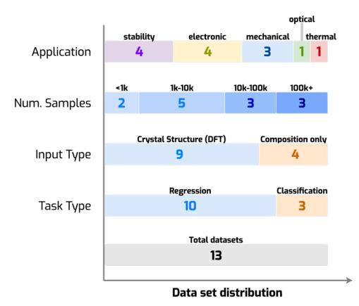
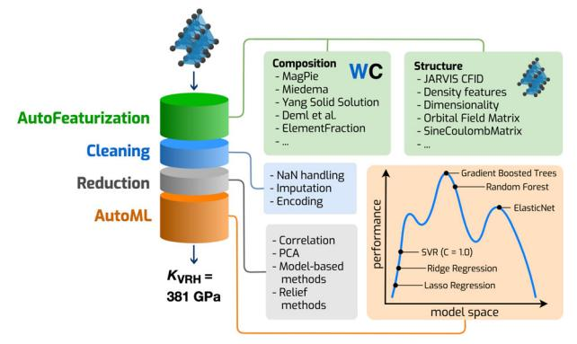
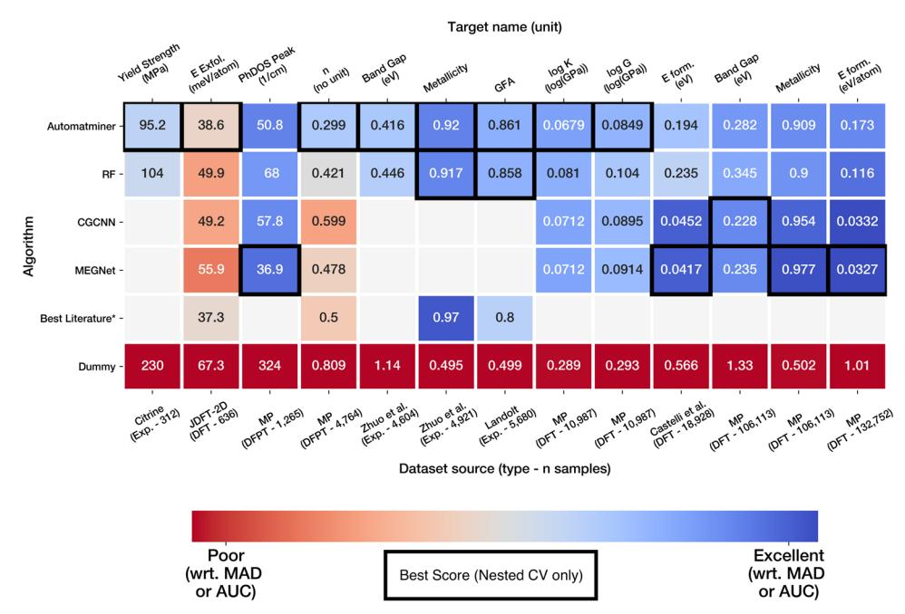
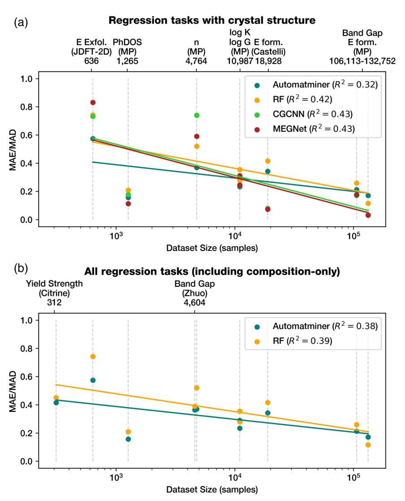

# ARTICLE OPEN

# Benchmarking materials property prediction methods: the Matbench test set and Automatminer reference algorithm

Alexander Dunn 601,2 ⋈, Qi Wang 601, Alex Ganose 1, Daniel Dopp 1,3 and Anubhav Jain 601 ⋈

We present a benchmark test suite and an automated machine learning procedure for evaluating supervised machine learning (ML) models for predicting properties of inorganic bulk materials. The test suite, Matbench, is a set of 13 ML tasks that range in size from 312 to 132k samples and contain data from 10 density functional theory-derived and experimental sources. Tasks include predicting optical, thermal, electronic, thermodynamic, tensile, and elastic properties given a material's composition and/or crystal structure. The reference algorithm, Automatminer, is a highly-extensible, fully automated ML pipeline for predicting materials properties from materials primitives (such as composition and crystal structure) without user intervention or hyperparameter tuning. We test Automatminer on the Matbench test suite and compare its predictive power with state-of-the-art crystal graph neural networks and a traditional descriptor-based Random Forest model. We find Automatminer achieves the best performance on 8 of 13 tasks in the benchmark. We also show our test suite is capable of exposing predictive advantages of each algorithm—namely, that crystal graph methods appear to outperform traditional machine learning methods given ~104 or greater data points. We encourage evaluating materials ML algorithms on the Matbench benchmark and comparing them against the latest version of Automatminer.

npj Computational Materials (2020)6:138; https://doi.org/10.1038/s41524-020-00406-3

#### INTRODUCTION

New functional materials are vital for making fundamental advances across scientific domains, including computing and energy conversion. However, most materials are brought to commercialization primarily by direct experimental investigation, an approach typically limited by 20+ year design processes, constraints in the number of chemical systems that can be investigated, and the limits of a particular researcher's intuition. By leveraging materials big data and advances in machine learning (ML), the emerging field of materials informatics has demonstrated massive potential as a catalyst for materials development, alongside ab initio techniques such as high-throughput density functional theory1,2 (DFT). For example, by using support vector machines to search a space of more than 118k candidate crystal structures, Tehrani et al.3 identified, synthesized, and experimentally validated two superhard carbides. In another study, Cooper et al.4 applied natural language processing (NLP) techniques to assemble 9k photovoltaic candidates from scientific literature; equipped with algorithmic structure-property encodings and a design-to-device data mining workflow, they identified and experimentally realized a high-performing panchromatic absorption dye. These examples are but two of many. The sheer investigative volume and potential research impact of materials data mining has helped brand it as materials 4.05 or the 4th paradigm6 of materials research.

However, the growing role of ML in materials design exposes weaknesses in the materials data mining pipeline: first, there is no systematic method for comparing and selecting materials ML models. Comparing newly published models to existing techniques is crucial for rational ML model design and advancement of the field. Other fields of applied ML have seen rapid advancement in recent years in large part due to the creation and use of

standardized community benchmarks such as ImageNet7 (20,000+ citations) for image classification and the Stanford Question Answering Dataset8 (1400+ citations) for NLP. While there are commonly used datasets for materials problems, e.g., Castelli et al.'s investigation of cubic perovskites9, it is uncommon for two algorithms to be tested against the same dataset and with the same data cleaning procedures. Methods for estimating generalization error (e.g., the train/test split) also vary significantly. Typically, either the predictive error is averaged over a set of crossvalidation folds (CV score)10 or a hold-out test set is used, with the specifics of the split procedure varying between studies. Furthermore, if a model's hyperparameters are tuned to directly optimize one of these metrics, equivalent to trying many models and only reporting the best one, they may significantly misrepresent the true generalization error  $^{10,11}$  (model selection bias). Arbitrary choice of hold-out set can also bias a comparison in favor of one model over another (sample selection bias) 12-14. Thus, the materials informatics community lacks a standard benchmarking method for critically evaluating models. If models cannot be accurately compared, ML studies are difficult to reproduce and innovation suffers.

Moreover, the breadth of materials ML tasks is so large that many models must still be designed and tuned by hand. Although hand-tuned descriptors and ML algorithms can fulfill the urgent need15 for accurate predictions at low computational cost, their design is relatively expensive in terms of human (researcher) time and expertise. The recent explosion16 of descriptors and models has given practitioners a paradox-of-choice, as selecting the optimal descriptors and model for a given task is nontrivial. The consequences of this paradox-of-choice can be that researchers select suboptimal models or spend researcher time retuning existing models for new applications. Simply, the usability of

&lt;sup>1Energy Technologies Area, Lawrence Berkeley National Laboratory, 1 Cyclotron Road, Berkeley, CA 94720, USA. 2Department of Materials Science and Engineering, University of California, 210 Hearst Mining Building, Berkeley, CA 94720, USA. 3Department of Computer Science, University of Kentucky, 329 Rose St., Lexington, KY 40506, USA. ™email: ardunn@lbl.gov; ajain@lbl.gov

**n**pj

materials ML pipelines must be improved15. Thus, an automatic algorithm—which requires no expert domain knowledge to operate yet utilizes knowledge from published literature—could be of great use in prototyping, validating, and analyzing high-fidelity models.

Given the above considerations, a benchmark consisting of the following two parts is needed: (1) a robust set of materials ML tasks and (2) an automatic reference model. The ML tasks must mitigate arbitrarily favoring one model over another. Furthermore, the MoleculeNet17 benchmark (molecular machine learning) has previously demonstrated that a diverse test suite of ML tasks, rather than a single test, is appropriate for nuanced comparisons of chemical ML methods. The ML tasks should contain a variety of datasets such that domain-specific algorithms can compare on specific datasets and general-purpose algorithms can compare across multiple relevant tasks. The second part, the reference algorithm, may serve multiple purposes. First, it might provide a community standard—or baseline—which future innovation in materials ML should aim to surpass. Second, it can act as an entry point into materials informatics for non-domain specialists since it only requires a dataset as input. Finally, it can help to determine which descriptors in the literature are most applicable to a given task or set of tasks.

In this paper, we introduce both these developments—a benchmark test set and a reference algorithm—for application to inorganic, solid state materials property prediction tasks. Matbench, the test suite, is a collection of 13 materials sciencespecific data mining tasks curated to reflect the diversity of modern materials data. Containing both traditional small materials datasets of only a few hundred samples and large datasets of >105 samples from simulation-derived databases, Matbench provides a consistent nested cross-validation18 (NCV) method for estimating regression and classification errors on a range of mechanical, electronic, and thermodynamic material properties. Automatminer, the reference algorithm, is a general-purpose and fully automated machine learning pipeline. In contrast to other published models that are trained to predict a specific property, Automatminer is capable of predicting any materials property given materials primitives (e.g., chemical composition) as input when provided with a suitable training dataset. It does this by performing a procedure similar to a human researcher: by generating descriptors using Matminer's library19 of published materials-specific featurizations, performing feature reduction and data preprocessing, and determining the best machine learning model by internally testing various possibilities on validation data. We test Automatminer on the test suite in order to establish baseline performance, and we present a comparison of Automatminer with published ML methods. Finally, we demonstrate our benchmark capable of distinguishing predictive strengths and weaknesses among ML techniques. We expect both Matbench and Automatminer to evolve over time, although the current versions of these tools are ready for immediate use. As evidence of its usefulness, Kabiraj et al.20 have recently used Automatminer in their research on 2D ferromagnets.

#### **RESULTS**

## Matbench test suite v0.1

The Matbench test suite v0.1 contains 13 supervised ML tasks from 10 datasets. Matbench's data are sourced from various subdisciplines of materials science, such as experimental mechanical properties (alloy strength), computed elastic properties, computed and experimental electronic properties, optical and phonon properties, and thermodynamic stabilities for crystals, 2D materials, and disordered metals. The number of samples in each task ranges from 312 to 132,752, representing both relatively scarce experimental materials properties and comparatively

Fig. 1 Categorical dataset distribution of the 13 machine learning tasks in the Matbench test suite v0.1. Methods of categorization are listed on the left: Application describes the ML target property of the task as it relates to materials, Num. samples describes the number of samples in each task, Input Type describes the materials primitives that serve as input for each task, and Task Type designates the supervised ML task type. Numbers in the bars represent the number of tasks fitting the descriptor above it (e.g., there are 10 regression tasks).

abundant properties such as DFT-GGA21 formation energies. Each task is a self-contained dataset containing a single material primitive as input (either composition or composition plus crystal structure) and target property as output for each sample. To help enforce homogeneity, datasets are precleaned to remove unphysical computed data and task-irrelevant experimental data (see Methods for more details); thus, as opposed to many raw datasets, structured online databases, or a recent materials benchmarking effort by Clement et al.22, Matbench's tasks have already had their data cleaned for input into ML pipelines. We recommend the datasets be used as-is for consistent comparisons between models. To mitigate model and sample selection biases, each task uses a consistent nested cross-validation 18 procedure for error estimation (see Methods). The distribution of datasets with respect to application type, sample count, type of input data, and type of output data is illustrated in Fig. 1; detailed notes on each task can be found in Table 1.

#### Automatminer reference algorithm

At a high level, an Automatminer pipeline can be considered a black box that performs many of the steps typically performed by trained researchers (feature extraction, feature reduction, model selection, hyperparameter tuning). Given only a training dataset, and without further researcher intervention or hyperparameter tuning, Automatminer produces a machine learning model that accepts materials compositions and/or crystal structures and returns predictions. Automatminer can create persistent end-to-end pipelines containing all internal training data, configuration, and the best-found model—allowing the final models to be further inspected, shared, and reproduced.

As shown in Fig. 2, the Automatminer pipeline is composed of four general stages. Although the specific details may depend on the particular Automatminer configuration or preset chosen, the following provides a high-level overview of each stage. In the first stage, autofeaturization, Automatminer generates features using Matminer's featurizer library 19. To check whether a given featurizer is able to produce valid (i.e., not null) descriptors for most of the input data, Automatminer uses a computationally efficient precheck functionality that ensures the featurizer is valid for a threshold percentage (90%) of materials input objects. Should the featurizer fail the precheck, it is not used for feature generation. An example of an invalid behavior would be trying to

| Table 1.   The dataset test suite.                  |                |                                             |         |                     |            |  |  |
|-----------------------------------------------------|----------------|---------------------------------------------|---------|---------------------|------------|--|--|
| Target property (unit)                              | Task type      | Data source                                 | Samples | Structure available | Method     |  |  |
| Bulk modulus (GPa)                                  | Regression     | Materials Project 43–45          | 10,987  | Yes                 | DFT-GGA    |  |  |
| Shear modulus (GPa)                                 | Regression     | Materials Project 43–45          | 10,987  | Yes                 | DFT-GGA    |  |  |
| Band gap (eV)                                       | Regression     | Materials Project 43,44          | 106,113 | Yes                 | DFT-GGA    |  |  |
| Metallicity (binary)                                | Classification | Materials Project 43,44          | 106,113 | Yes                 | DFT-GGA    |  |  |
| Band gap (eV)                                       | Regression     | Zhuo et al. 46                   | 4604    | No                  | Experiment |  |  |
| Metallicity (binary)                                | Classification | Zhuo et al. 46                   | 4921    | No                  | Experiment |  |  |
| Bulk metallic glass formation (binary)              | Classification | Landolt-Bornstein Handbook 28,47 | 5680    | No                  | Experiment |  |  |
| Refractive index (no unit)                          | Regression     | Materials Project 43,44,48       | 4764    | Yes                 | DFPT-GGA   |  |  |
| Formation energy (eV/atom)                          | Regression     | Materials Project 43,44          | 132,752 | Yes                 | DFT-GGA    |  |  |
| Formation energy of Perovskite cell (eV)            | Regression     | Castelli et al. 9                | 18,928  | Yes                 | DFT-GGA    |  |  |
| Freq. at last phonon PhDOS peak (cm -1 ) | Regression     | Materials Project 43,44,49       | 1296    | Yes                 | DFPT-GGA   |  |  |
| Exfoliation energy (meV/atom)                       | Regression     | JARVIS DFT 2D 50                 | 636     | Yes                 | DFT-vDW-DF |  |  |
| Steel yield strength (MPa)                          | Regression     | Citrine Informatics 51           | 312     | No                  | Experiment |  |  |

The test suite contains 13 separate ML tasks spread across 10 datasets. The test suite's datasets are diversified across multiple metrics, including target property, number of samples (representing several orders of magnitude), and method for determining the target property.

**Fig. 2 The AutoML** + **Matminer (Automatminer) pipeline.** The pipeline can be applied to composition-only datasets, structure datasets, and datasets containing electronic bandstructure information. Once fit, the pipeline accepts one or more materials primitives and returns a prediction of a materials property. During autofeaturization, the input dataset is populated with potentially relevant features using the Matminer library. Next, data cleaning and feature reduction stages prepare the feature matrices for input to an AutoML search algorithm. During training, the final stage searches ML pipelines for optimal configurations; during prediction, the best ML pipeline (according to internal validation score) is used to make predictions.

apply a featurizer that is not parameterized for noble gases to crystals or compounds containing those elements. Automatminer next applies each valid featurizer in an error-tolerant fashion, expanding a material primitive into potentially many thousands of features derived from published literature. The next step in the pipeline is the cleaning stage. This prepares the feature matrix for ML by handling errors (e.g., imputing unknown values) and encoding categorical features. The third stage uses one or more dimensionality reduction algorithms (e.g., based on Pearson correlation coefficients  $^{23}$  or principal component analysis  $^{24}$ ) to sequentially reduce the feature vector dimension by, for example, removing redundant or linearly dependent sets of features. Similar multi-layer feature reduction was previously shown by Liu et al.15 to significantly improve ML performance across materials prediction tasks; the exact sequence of dimensionality reduction algorithms is determined by the pipeline preset or by the user. In the Express preset used throughout this work, the sequence includes feature selection via Pearson correlation and treeensemble feature importance (details in Methods). Finally, an AutoML stage prototypes and validates internal ML pipelines, which are entirely agnostic to materials inputs. These internal pipelines as implemented in the TPOT (Tree-based Pipeline Optimization Tool) library25 are directed graphs (trees) with data transformations (operators) representing the nodes of each tree. TPOT's operators can represent any data transformation, including scaling or normalization, dimensionality reduction (e.g., PCA), and various ML estimators and classifiers (e.g., regularized regression, support vector regression, ensemble models, and boosted models). A full list of the TPOT operator space is presented in Supplementary Tables 2 and 3. When training data are input to a TPOT pipeline, the data propagate through each operator until an internal validation loss is computed. TPOT's training begins with a random population of pipelines constructed from a predefined pool of operators. TPOT equates the internal validation loss of an individual pipeline with its fitness for inference and utilizes genetic programming to iteratively evolve more performant pipelines. Over the course of TPOT's training, increasingly fit pipelines are selected for inference. More details are available in Methods and TPOT's original publication25

Each stage of Automatminer can be extensively customized to facilitate end-user needs; for example, pipelines can retain custom features, use single models instead of AutoML, and fine tune feature selection hyperparameters. However, preconfigured pipeline presets are available based on memory, CPU, and time constraints, and no user customization is required to train or predict using materials data when using these presets. In this work, we report results generated using the Express preset, which is designed to run with a maximum AutoML training time of 24 h.

We evaluate Automatminer on the Matbench test suite and provide comparisons with alternative algorithms in Fig. 3. The evaluation is performed using a five-fold Nested Cross Validation (NCV) procedure. In contrast to relying on a single train-test split, in the five-fold NCV procedure, five different train-test sets are created. For each of the five train-test sets, a machine learning model is fit using only the training data and evaluated on the test data. Note that this implies that even for a single type of model (e.g., Automatminer or CGCNN26), a slightly different model will be trained for each of the five splits since the training data differs between splits. The errors from the five different overall runs are averaged to give the overall score. Note that within each of the five runs of this outer loop, the training data portion is generally

Fig. 3 Comparison of machine learning algorithm accuracies on the Matbench v0.1 test suite. See Table 1 for more details of the test sets. Numbers on each square represent either the mean average error (regression) or mean ROC-AUC (classification) of a five-fold nested cross validation (NCV), except for Best Literature scores. Best Literature scores were taken from published literature models33,46,53 evaluated on similar tasks or datasets, often subsets of those in Matbench, and do not use NCV. Colors represent prediction quality (analogous to relative error) with respect to either the dataset target mean average deviation (MAD) for regression or the high/low limits of ROC-AUC (0.5 is equivalent to random, 1.0 is best) for classification; blue and red represent high and low prediction qualities, respectively, with respect to these baselines. Accordingly, red-hued columns indicate more difficult ML tasks where no algorithm has high predictive accuracy when compared to predicting the mean. Red-hued rows therefore indicate poorly performing algorithms across multiple tasks. The best score for each task is outlined with a black box (The Best Literature scores are excluded because they do not use the same testing protocol). To account for variance from choice of NCV split, multiple scores may be outlined if within 1% of the true best score. A comparison with a pure Random Forest (RF) model using Magpie28 and SineCoulombMatrix29 features is provided for reference. Dummy predictor results are also shown for each task. All Automatminer, CGCNN, MEGNet, and RF results were generated using the same NCV test procedure on identical train/test folds; all featurizer (descriptor) fitting, hyperparameter optimization, internal validation, and model selection were done on the training set only. A full breakdown of all error estimation procedures can be found in Methods.

split using an inner cross validation that is used for model selection within the training data, hence the name Nested Cross Validation (in our procedure, an algorithm can make use of the training data, however, it chooses). One advantage of 5-fold nested CV over a traditional train-test split is that each sample in the overall dataset is present as training in four of the splits and as test in one of the splits.

For all tasks, the Automatminer Express preset configuration is used in this work. The Express preset only implements featurizers from Matminer that are broadly applicable (tend to produce valid feature values for almost all compositions and/or crystal structures), are computationally efficient (<2 s/sample), and can be trivially transformed from matrices to vectors for each sample. Express feature reduction typically retains between 20 and 200 features based on a feature importance threshold from a Random Forest27 model. The reduced number of features allows for accelerated evolution of the TPOT genetic algorithm within the Express training time limit of 24 h. Further details can be found in the Methods, Supplementary Tables 1–3, and Supplementary Notes 1 and 2. While other presets are available in Automatminer, we have found that the Express preset generally retains 95% or more of the accuracy of more expensive presets on multiple datascarce tasks (bulk metallic glass classification, experimental band gap regression/classification, exfoliation energy regression) at less than 50% of the computational cost to reach reasonable AutoML convergence. We emphasize that the Automatminer Express preset is a single configuration capable of fitting on all Matbench tasks with no additional input or configuration. We do not modify this preset for different tasks.

Four alternative algorithms are used for comparison. To simulate a control, a Dummy model predicts the mean of the training set (regression) or randomly selects a label in proportion to the distribution of the training set (classification). As a second baseline representing commonly used methods, we employ a Random Forest27 model (RF) using Magpie elemental statistics28 and Sine Coulomb Matrix29 (if structures are present in the dataset) to predict each property. Finally, for tasks containing relaxed structures, we also test against CGCNN26 and MEGNet30, two graph-network algorithms for general-purpose property prediction. It must be emphasized that a goal of Matbench is to minimize arbitrary biases when comparing models. Therefore, the four alternatives and Automatminer all underwent identical error estimation procedures (NCV on identical folds) for each task.

For some Matbench tasks, we were able to find published scores of researcher-optimized machine learning models, which we label as the Best Literature score. However, it should be noted that although these studies report the same error metric (MAE) using similar datasets, the scores do not use identical datasets (e.g., using different data filtering algorithms to remove erroneous or unreliable data points) or the same error estimation procedure (e.g., they do not use nested cross validation and may use different proportions of train and test). Therefore, these scores cannot be directly compared to the algorithms listed above.

All models outperform Dummy on all tasks: the Dummy comparison exhibits errors between 68 and 299% higher than the best model for any task. We next examine which algorithms perform best, with best taken to include scores within 1% of the best NCV score (we find the standard deviation between folds for the same model is typically between 0.5 and 5%). The

Fig. 4 Trends in relative predictive accuracy for all algorithms on the Matbench v0.1 dataset. a Results from the eight Matbench v0.1 regression tasks with crystal structure. Algorithms are segregated by color. For each task-algorithm pair, the mean MAE of the nested CV test folds is divided by the dataset mean average deviation to get the relative error. A relative error of zero represents perfect predictive performance; a relative error of 1.0 is equivalent to predicting the mean of the dataset (as in the Dummy Predictor). The plot is agnostic to target property. A least-squares linear regression line of the same color as the scatter points was fit for each algorithm. Multiple tasks have an identical dataset size but differ in their relative errors (e.g., log10 K and log10 G). b Results for all regression tasks (including those lacking crystal structure data as input) and only showing the two algorithms valid for all such tasks.

Automatminer Express preset has a best NCV score (lowest mean average error, MAE or highest receiver operating characteristic area under curve, ROC-AUC) on 8 of 13 tasks. In particular, Automatminer equals or outperforms the RF pipeline on all tasks except predicting formation energies across the Materials Project. Among the nine structure tasks only, Automatminer and MEGNet both have best scores on four tasks each. CGCNN is the highest performer only for the Materials Project band gap regression task; yet, across the six tasks with more than 104 samples, the MEGNet and CGCNN scores are generally quite close.

Notably, we also find Automatminer has similar errors to scores taken from literature. Although these results are taken directly from published reports which use similar—but not identical datasets and a variety of non-NCV error procedures, it is notable that Automatminer can automatically generate models of roughly similar quality to tediously hand-optimized models. This suggests that similar results as those obtained in the literature can be obtained from a fully automated ML pipeline that requires no researcher tuning or intuition.

Next, we examine how the performance of the various machine learning algorithms varies with the size of the training dataset without regard to the specific task. To do this, we normalize the errors on the various tasks by dividing the mean average error (MAE) by the mean average deviation (MAD) in the dataset. With this normalization, a model that always predicts the average of the dataset will have an error of exactly 1.0. Using least-squares linear regression, we find noticeable inverse trends in the MAE/MAD relative error (Fig. 4) with respect to the log of dataset size. Interestingly, irrespective of the target property, the rates of improvement with increasing dataset size (slope of the lines) are vastly different between algorithms. In Fig. 4a, we plot the trend for structure-based regression tasks only. The graph-network models CGCNN and MEGNet have relatively high errors on tasks with small datasets but improve rapidly as the task's dataset size increases. In contrast, the descriptor-based Automatminer and RF models have lower errors on small datasets, but their rates of improvement are far shallower, and they lose their small data advantage as the data size passes 104 samples. Both graph neural

network approaches have similarly high rates of improvement, which may indicate that the underlying ML algorithms are able to leverage information from large datasets more efficiently than traditional ML (RF) or AutoML. This finding corroborates Schmidt et al.'s prediction16 that universal graph neural networks26,30 will dominate the state-of-the-art on large (>105 samples) materials datasets.

In Fig. 4b, we compare Automatminer against the Random Forest model since these two models are able to make predictions on all regression tasks (both composition-only as well as composition plus structure tasks). In 4b, AutoML's advantage over more conventional techniques narrows as the number of samples increases. Near 105 samples, the AutoML advantage is essentially lost. This phenomenon can be partially explained from the 24-h training time limitation of the Automatminer Express preset. Although the exact pipeline used by the RF model exists in the Express model space, the long training time of each ML pipeline reduces the AutoML search efficiency. Given enough time and computational resources to internally validate and improve its model, it is highly probable the Automatminer Express preset will either find a model equivalent to or superior to the RF model. However, simple ML models (such as the RF we tested) can equal or outperform our AutoML approach if the AutoML search is inefficient in finding the optimal model.

All algorithms exhibit a noisy yet universal trend, which decreases the relative errors as the dataset size increases, even though the underlying task is also changing with size. Such a trend corroborates Zhang and Ling's observations31 based on a survey of materials ML data in published literature, which suggests the relationship between error (constructed using literature CV data and scaled by range rather than mean average deviation) and dataset size can be fit with a decreasing power law. This trend identified by Zhang and Ling is similar to that found in the more structured results we present. However, we additionally find that the rate of improvement differs substantially between more conventional machine learning approaches versus the graph neural network approaches. Furthermore, despite these overall trends, it is clear that the details of the underlying task do matter. For example, the two graph networks (CGCNN and MEGNet) appear to far outperform the two traditional ML algorithms (Random Forest and Automatminer) on the two formation energy prediction tasks. However, they do not outperform the traditional algorithms by as much on the band gap regression task, despite the large-data domain that graph networks excel in. Similarly, while Automatminer outperforms the graph networks on most small datasets, MEGNet decisively outperforms Automatminer for the PhDOS task. The predictive advantage may lie in MEGNet's specific architecture and implementation rather than an inherent advantage of crystal graph neural networks, given CGCNN has higher error than both Automatminer and MEGNet for the PhDOS task.

#### **DISCUSSION**

The reference algorithm and test suite presented above encompass a benchmark that can be used to accelerate development of supervised learning tasks in materials science. Automatminer provides an extensible and universal platform for automated model selection, while Matbench defines a consistent test procedure for unbiased model comparison. Together, Automatminer + Matbench define a performance baseline for machine learning models aiming to predict materials properties from composition or crystal structure. In this section, we address limitations and extensions of both the reference algorithm and the test suite.

Although the Express preset was used to demonstrate Automatminer's performance, the Automatminer pipeline is fully configurable at each stage. To reduce the complexity of developing end-to-end materials ML pipelines, Automatminer provides other preset configurations for varying CPU capabilities. time requirements, and objectives. Each preset defines a specific balance between computational cost and comprehensiveness of ML search. For example, the Debug preset employs only a single computationally inexpensive featurizer (Magpie featurizer19, and a heavily restricted AutoML model space restricted to a two minute training time; similarly, the Debug\_single preset only uses a single predictor (Random Forest) in place of an AutoML algorithm. Other presets exist, which expand on the Express featurizer set using more expensive featurization and longer AutoML optimization times. Generally, we observe diminishing returns on performance with more expensive presets; minor improvements in performance require significant increases in computational time. This is particularly noticeable on small datasets where many ML pipelines can be attempted within the time restriction. For instance, in classifying experimental metallicities, the Express preset improves ROC-AUC a negligible ~0.2% (0.919) on average over Debug (0.917), with the Heavy (most expensive) preset improving only another 0.6% (0.925). Further details on the comparison of presets can be found in the Supplementary Fig. 2 and Supplementary Note 1.

Automatminer may be further improved by including more descriptor techniques in its featurizer sets, especially if those featurizers provide information-dense features at low computational cost. For example, Automatminer does not implement any features for determining 2nd-nearest neighbor coordination, an important structural motif representing medium-range order. Lack of relevant featurizers may also explain the graph networks' advantages in predicting certain thermodynamic properties. Due to the ability of crystal graph networks to effectively convolve site/ bond data, they may more accurately represent 3D chemo-spatial information than traditional descriptors. Future Automatminer development might benefit from using the chemo-spatial data (hidden-layer embeddings) from crystal graph networks as input via transfer learning; similarly, graph-composition networks such as RooSt32, which have demonstrated success in learning hidden representations from stoichiometry alone, may serve as a valuable improvement on Automatminer's current featurizer set. Adding such descriptors to Automatminer is well within its current capabilities, since Automatminer is extensible (with respect to featurizers) by design.

With respect to machine learning models searched by the AutoML library, we find that the majority of AutoML training on materials ML tasks find tree-ensemble methods perform better than the other models in the search space such as k-nearest neighbors, logistic regression, and elastic net regression. On small datasets, we observe tree-ensembles have sufficient model complexity to model material-property relationships more faithfully than regularized linear methods or logistic regression. However, the dominance of tree-ensembles is in part an artifact of the relatively small model search space of Automatminer, which at present does not include nonlinear support vector machine kernels or neural networks. Models with higher complexity, such as deep neural networks, may also improve Automatminer's performance on large datasets. Thus, the AutoML search can be improved by expanding the model space at increasing computational cost. However, regardless of the predefined model space or feature set construction, thoughtfully engineered models such as graph networks or other concepts will likely be able to exceed the baseline AutoML model's performance. An AutoML algorithm is best suited for the rapid prototyping of more complex humantuned models rather than the replacement of architectures designed with human expertise.

In the Matbench benchmark, we use NCV as a one-size-fits-all tool for evaluation, but it is also conceivable that domain-specific methods better estimate the generalization error than NCV. Ren et al.33 use grouped CV to estimate the error of their models for

classifying bulk metallic glasses outside of the chemical systems contained in the training set. The rationale behind grouped CV is that the testing procedure should mimic the real-world application. In the case of bulk metallic glass study, the intended goal of the algorithm was to make predictions in chemical systems where no data points were yet present. However, a randomized train/test split would likely result in selecting some data points from all chemical systems for the training and testing data. Instead, grouped CV will first separate data points by chemical space, and then select an entire chemical space to fall into either the test or training set. This ensures that testing is conducted on chemical spaces for which there is no training data within that chemical space.

Yet, using grouped CV requires a well-defined manner for grouping the data. In the case of bulk metallic glasses, chemical systems are easily identified as natural groups since the goal is to predict data for entirely unexplored chemical systems. For other materials ML tasks, features for grouping may be hidden in subtle structural motifs or nuances of electronic configuration. Leaveone-cluster-out CV (LOCO-CV)34 is one potential variant of grouped CV that aims to automate grouping by k-means clustering. However, the groups are determined by the choice of input features, which poses two fundamental problems with this technique. First, researchers employing different input features will end up with different definitions of groups and thus different testing procedures; this could be corrected if the features used for the grouping procedure were standardized (even if a different set of input features was used for prediction). Second, the input features may not properly capture the most physically relevant grouping; for example, if all input features are based on composition, but the most natural grouping is by a structural feature such as crystal type, then the resulting groups will have less value. Thus, for now it is largely up to researchers to determine the need for using grouped CV and to determine the best grouping strategy. Other strategies34,35 to predict outlier data in the test set may also prove useful.

An improved benchmark could use a specific, distinct error estimation procedure for every task; such a procedure can be determined by domain experts to most accurately represent the real-world use of the algorithm. The ideal benchmark would therefore be a consensus of community tasks, each with an error estimation procedure customized to most accurately reflect the algorithm's true error rate in that particular subfield. We chose NCV as a standard error estimator because there are few such well-agreed-upon procedures for existing materials datasets. Future versions of the benchmark may include error estimation procedures other than NCV.

Matbench is not intended to be a final benchmark but a versioned resource that will grow with the field. The everincreasing volume of data generated from advances in highthroughput experimentation and computation may enable future ML algorithms to predict classes of materials properties that are presently sparse. For example, ab initio defect calculations are presently expensive, but an investigation by Emery and Wolverton36 has demonstrated DFT can generate defect data in promising quantities for future mainstream statistical learning. Advances in high-throughput experimental techniques (such as automated experimentation) also have the possibility to vastly increase the size and scope of materials data; for instance, a recent study37 was able to capture UV-Vis spectroscopy data for more than 179,000 metal oxides. A benchmark must evolve to represent these advancements in materials data production. We expect Matbench to be an evolving representation of materials property prediction tasks, and updated versions of Matbench will be released to reflect emerging areas of research. In a similar fashion, Automatminer is designed to be extensible toward emerging techniques for generating descriptors from compositions, crystal structures, and electronic band structures. As more research is released for converting materials objects to machine-learnable descriptors, we intend on incorporating this knowledge into Automatminer's architecture.

In conclusion, we presented Matbench v0.1, a set of ML tasks aimed at standardizing comparisons of materials property prediction algorithms. We also introduced Automatminer, a fully automated pipeline for predicting materials properties, which we used to set a baseline across the task set. Using Matbench, we compared Automatminer with crystal graph neural network models, a traditional Random Forest model, and a Dummy control model. We find Automatminer's auto-generated models outperform or equal the RF model across all but one task and are more accurate than crystal graph networks on most tasks with ~104 points or fewer. However, crystal graph networks appear to learn better on tasks with larger datasets. Automatminer can be used outside of benchmarking to make predictions automatically and seed research for more specialized, hand-tuned models. We encourage evaluating ML algorithms on the Matbench benchmark and comparing with the latest version of Automatminer.

#### **METHODS**

## Matbench dataset generation and cleaning

Raw data for Matbench v0.1 were obtained by downloading from the original sources. Tabular versions of some datasets are available online through Matminer's dataset retrieval tools. These datasets contain metadata and auxiliary data. In contrast, the final Matbench datasets are curated tasks containing only the materials input objects and target variables, with all extraneous data removed. Unphysical (e.g., negative DFI elastic moduli), highly uncommon or unrepresentative samples (e.g., solid state noble gases) were removed according to a specific per-task procedure. Table 2 describes the resources and steps needed to recreate each dataset from the original source or Matminer version.

#### Evaluation of ML algorithms on Matbench benchmark

Five-fold nested cross validation was used to evaluate each algorithm on every task of the benchmark. The outer test loop of the cross validation used uniformly randomized splits generated with scikit-learn38 K-Fold (random seed 18012019). The splits were identical for each algorithm. Classification tasks used stratified cross validation generated with StratifiedKFold (random seed 18012019) to more accurately represent classification performance with unbalanced numbers of each class label. Within each of the five splits, 80% training + validation data are given to the algorithm to optimize the model internally, and the remaining 20% is used for testing. After predicting on each of the five 20% test splits, the error or AUC is averaged over the five folds. The internal validation and model selection process is dependent on the algorithm.

It is worthwhile to quickly enumerate the limitations of NCV and justify its use. First, NCV is computationally expensive. For k-fold NCV, the traditional hold-out tuning/validation/test procedure must be repeated ktimes. NCV also depends on the choice of internal learning procedure for each fold, an aspect which mimics the selection process used by other resampling methods; thus, even when the test sets are fixed, repeating identical procedures can produce error estimates with high variance36 Several alternative schemes have been proposed which preserve NCV's advantages while attempting to mitigate issues from increased variability and computational cost. One potential improvement is repeated NCV; but even this approach demonstrates large variation of loss estimates across nested CV runs and is even more computationally expensive than NCV40. A promising alternative proposes a smooth analytical alternative to NCV, which would reduce the NCV's computational intensity39. This analytical alternative also reduces the variability introduced by learning set choice using weights determined after the outer CV loop has been fixed. Yet, the analytical alternative relies on critical assumptions, which do not hold for particular models such as support vector machines with noisy observations. Therefore, at this time, NCV is an adequate method for evaluating and comparing models using the Matbench benchmark.

#### Machine learning pipelines

The descriptor-based RF and Automatminer models use Matminer19 to generate all descriptors and have identical data cleaning procedures. The

| Table 2.         Procedures and sources for creating datasets in Matbench v0.1. |                                                     |                                             |                         |                          |  |  |  |
|---------------------------------------------------------------------------------|-----------------------------------------------------|---------------------------------------------|-------------------------|--------------------------|--|--|--|
| Task name                                                                       | Target property (unit)                              | Original source                             | Matminer source dataset | Additional modifications |  |  |  |
| log_kvrh                                                                        | Bulk modulus (GPa)                                  | Materials Project 43–45          | None a       | 1,2,3,6,7                |  |  |  |
| log_gvrh                                                                        | Shear modulus (GPa)                                 | Materials Project 43–45          | None a       | 1,2,3,6,7                |  |  |  |
| mp_gap                                                                          | Band gap (eV)                                       | Materials Project 43,44          | None a       | 1,6,7                    |  |  |  |
| mp_is_metal                                                                     | Metallicity (binary)                                | Materials Project 43,44          | None a       | 1,6,7                    |  |  |  |
| expt_gap                                                                        | Band gap (eV)                                       | Zhuo et al. 46                   | expt_gap                | 8,9,10                   |  |  |  |
| expt_is_metal                                                                   | Metallicity (binary)                                | Zhuo et al. 46                   | expt_gap                | 8,10,11                  |  |  |  |
| glass                                                                           | Bulk metallic glass formation (binary)              | Landolt-Bornstein Handbook 28,47 | glass_ternary_landolt   | 8,12                     |  |  |  |
| dielectric                                                                      | Refractive index (no unit)                          | Materials Project 43,44,48                  | None a       | 1,4,6,7                  |  |  |  |
| mp_e_form                                                                       | Formation energy (eV/atom)                          | Materials Project 43,44          | None a       | 5,6,7                    |  |  |  |
| perovskites                                                                     | Formation energy per Perovskite cell (eV)           | Castelli et al. 9                | castelli_perovskites    | 7                        |  |  |  |
| phonons                                                                         | Freq. at last phonon PhDOS peak (cm -1 ) | Materials Project 43,44,49       | phonon_dielectric_mp    | 1,7                      |  |  |  |
| jdft2d                                                                          | Exfoliation energy (meV/atom)                       | JARVIS DFT 2D 50                 | jarvis_dft_2d           | 7                        |  |  |  |
| steels                                                                          | Steel yield strength (MPa)                          | Citrine Informatics 51           | steel_strength          | 8                        |  |  |  |

Original Source denotes the original work that produced the raw data, which needs not be in tabular form. Matminer source datasets are tabular versions of this raw data, which can be retrieved with Matminer and may apply additional postprocessing or filtering to the original source data. More information on these datasets can be found on Matminer's dataset summary page and in the Matminer source code. Additional modifications are enumerated.

aGenerated using the Materials Project API44 on 4/12/2019.

- (1) Remove entries having a formation energy or energy above the convex hull more than 150 meV.
- (2) Remove entries having  $G_{Voigt}$ ,  $G_{Reuss}$ ,  $G_{VRH}$ ,  $K_{Voigt}$ ,  $K_{Reuss}$ , or  $K_{VRH}$  less than or equal to zero.
- (3) Remove entries failing  $G_{\text{Reuss}} \le G_{\text{VRH}} \le G_{\text{Voigt}}$  or  $K_{\text{Reuss}} \le K_{\text{VRH}} \le K_{\text{Voigt}}$
- (4) Remove entry with refractive index less than 1.
- (5) Remove entries having formation energies greater than 3.0 eV. This operation removes ~1500 1-dimensional crystal structures likely resulting from misconverged DFT structure optimizations of Half-Heuslers present in the Materials Project database as of the generation date.
- (6) Remove entries containing noble gases.
- (7) Remove all columns except structure and the target variable.
- (8) Remove all columns except composition and the target variable.
- (9) Filter according to unique compositions by ensuring no composition has conflicting metallicity.
- (10) Correct erroneous GaAs0.1P0.9 composition from Zhou et al.46 originally aggregated from Kiselyova et al.52.
- (11) Filter according to unique compositions by removing compositions with a range of reported band gap values of more than 0.1 eV. For each remaining composition, select the value closest to the mean of that composition's reported values.
- (12) Filter according to unique compositions, removing compositions with any conflicting bulk metallic glass formation classifications.

Random Forest model uses the SineCoulombMatrix29 featurizer for tasks containing structure and mean, average deviation, range, and max/min statistics on elemental Magpie28 features (implemented as the Magpie preset for the ElementProperty featurizer) for all tasks containing chemical compositions. To handle missing features, the RF pipeline drops features with more than 1% missing values. Remaining samples having missing features are imputed using the mean of the known data. Categorical features were encoded using one-hot encoding. The Random Forest model itself consisted of 500 estimators and no max depth, meaning nodes are expanded until all leaves are pure or contain less than two samples.

Automatminer v1.0.3.20191111 was used for all Automatminer benchmarks. Features were generated according to Automatminer's autofeaturizer Express preset, and a full list of featurizers is available in the Supplementary Table 1. The number of features was reduced (prior to input to TPOT's AutoML pipelines) using two sequential methods. First, for every set of features cross correlated by absolute Pearson coefficients of |R| > 0.95, only the feature with greatest  $R^2$  with respect to the target was retained. Next, a Random Forest ensemble method identifies relevant features by capturing at least 99% of the Gini importance41. Finally, TPOT v.10.1 was used to train and internally validate (five-fold CV within the training data) competing ML pipelines before selecting the model used to make test predictions. TPOT uses an evolutionary algorithm to optimize the hyperparameters in a given model space. In this context, algorithms (e.g., support vector machines, gradient boosted trees) are integrated into their existing hyperparameter grids such that the algorithms are treated essentially as special hyperparameters. Internal TPOT pre and postprocessing steps (such as normalization) are also included in the model space. Rather than determining a set number of generations to evolve the model population, the Automatminer Express preset sets TPOT to evaluate the maximum number of generations of 100 individual pipelines each within 24 h given a maximum evaluation time of 20 min per individual. Individuals were trained and evaluated with 10× parallelism using the n\_jobs Automatminer preset configuration option. A full table of the Automatminer-TPOT model space is described in the Supplementary Tables 2 and 3.

CGCNN and MEGNet models were trained and optimized by splitting the training portion of each outer NCV fold into 75% train and 25% validation portions. Thus, the overall split for each fold is 60% training, 20% validation, and 20% test. Each model is trained in epochs of 128-structure batches by optimizing according to mean squared error loss (regression) or binary cross-entropy (classification). After each epoch, the validation loss is computed with the same scoring functions as the final evaluation: MAE for regression or ROC-AUC for classification (made negative so that higher loss represents worse performance). To prevent overfitting, the training is stopped early when the validation loss does not improve over a period of at least 500 epochs. A full table of hyperparameters for each algorithm is provided in Supplementary Tables 4–7.

Each model's training, validation, and evaluation for each NCV fold were performed on separate groups of compute nodes. Each fold of the RF model and Automatminer were trained and evaluated on a single 24-core Intel Xeon E5-2670 v3 with 64GB RAM (LR4 node). All CGCNN and MEGNet training was performed using one NVIDIA 1080TI GPU using CUDA (accompanied by two Intel Xeon E5-2623 CPUs with 60GB RAM). Workflows were set up and executed using the FireWorks42 software package. Timing data for all model training are shown in Supplementary Fig. 1.

#### **DATA AVAILABILITY**

Instructions for downloading and using the Matbench benchmark can be viewed on the official documentation (https://hackingmaterials.lbl.gov/automatminer/datasets. html). The datasets can also be interactively viewed and examined on the Materials Project MPContribs-ML platform (https://ml.materialsproject.org) as serialized tabular data. The code for retrieving and loading the Matbench datasets can be found in the dataset\_retrieval module of the Matminer code (https://github.com/hackingmaterials/matminer). We also encourage readers to suggest modifications

to the Matbench dataset test suite on the help forum ([https://matsci.org/c/](https://matsci.org/c/matminer) [matminer](https://matsci.org/c/matminer)).

## CODE AVAILABILITY

All versions of the Automatminer code are open source via a BSD-style license and are available through the online repository [\(https://github.com/hackingmaterials/](https://github.com/hackingmaterials/automatminer) [automatminer](https://github.com/hackingmaterials/automatminer)). We note that all the code for running the specific tests in this paper is also present in a subpackage of this repository: [\(https://github.com/hackingmaterials/](https://github.com/hackingmaterials/automatminer/tree/master/automatminer_dev) [automatminer/tree/master/automatminer\\_dev\)](https://github.com/hackingmaterials/automatminer/tree/master/automatminer_dev).

Received: 5 May 2020; Accepted: 14 August 2020; Published online: 15 September 2020

## REFERENCES

- 1. Kohn, W. & Sham, L. J. Self-consistent equations including exchange and correlation effects. Phys. Rev. 140, A1133–A1138 (1965).
- 2. Hohenberg, P. & Kohn, W. Inhomogeneous electron gas. Phys. Rev. 136, B864–B871 (1964).
- 3. Mansouri Tehrani, A. et al. Machine learning directed search for ultraincompressible, superhard materials. J. Am. Chem. Soc. 140, 9844–9853 (2018).
- 4. Cooper, C. B. et al. Design-to-device approach affords panchromatic co-sensitized solar cells. Adv. Energy Mater. 9, 1802820 (2019).
- 5. Jose, R. & Ramakrishna, S. Materials 4.0: materials big data enabled materials discovery. Appl. Mater. Today 10, 127–132 (2018).
- 6. Agrawal, A. & Choudhary, A. Perspective: materials informatics and big data: realization of the "fourth paradigm" of science in materials science. APL Mater. 4, 053208 (2016).
- 7. Deng, J. et al. ImageNet: A large-scale hierarchical image database. In 2009 IEEE Conference on Computer Vision and Pattern Recognition 248–255 (IEEE, 2009).
- 8. Rajpurkar, P., Zhang, J., Lopyrev, K. & Liang, P. SQuAD: 100,000+ Questions for Machine Comprehension of Text. Preprint at <https://arxiv.org/abs/1606.05250> (2016).
- 9. Castelli, I. E. et al. New cubic perovskites for one- and two-photon water splitting using the computational materials repository. Energy Environ. Sci. 5, 9034 (2012).
- 10. Hastie, T., Tibshirani, R. & Friedman, J. H. (eds) in The elements of statistical learning: data mining, inference, and prediction 2nd edn., Chapter 7, pp. 241–249 (Springer, 2009).
- 11. Cawley, G. C. & Talbot, N. L. C. On over-fitting in model selection and subsequent selection bias in performance evaluation. J. Mach. Learn. Res. 11, 2079–2107 (2010).
- 12. Heckman, J. J. Sample selection bias as a specification error. Econometrica 47, 153 (1979).
- 13. Alexander J. Smola, Arthur Gretton, Karsten M. Borgwardt & Bernhard Scholkopf. Correcting sample selection bias by unlabeled data. In NIPS'06 Proc. 19th International Conference on Neural Information Processing Systems 601–608 (2006).
- 14. Miroslav Dud ́ ık, Robert E. Schapire & Steven J. Phillips. Correcting sample selection bias in maximum entropy density estimation. In NIPS'05 Proc. 18th International Conference on Neural Information Processing Systems 323–330 (2005).
- 15. Liu, Y., Zhao, T., Ju, W. & Shi, S. Materials discovery and design using machine learning. J. Materiomics 3, 159–177 (2017).
- 16. Schmidt, J., Marques, M. R. G., Botti, S. & Marques, M. A. L. Recent advances and applications of machine learning in solid-state materials science. Npj Comput. Mater. 5, 83 (2019).
- 17. Wu, Z. et al. MoleculeNet: a benchmark for molecular machine learning. Chem. Sci. 9, 513–530 (2018).
- 18. Stone, M. Cross-validatory choice and assessment of statistical predictions. J. R. Stat. Soc. Ser. B Methodol. 36, 111–147 (1974).
- 19. Ward, L. et al. Matminer: an open source toolkit for materials data mining. Comput. Mater. Sci. 152, 60–69 (2018).
- 20. Kabiraj, A., Kumar, M. & Mahapatra, S. High-throughput discovery of high Curie point two-dimensional ferromagnetic materials. Npj Comput. Mater. 6, 35 (2020).
- 21. Perdew, J. P. & Yue, W. Accurate and simple density functional for the electronic exchange energy: Generalized gradient approximation. Phys. Rev. B 33, 8800–8802 (1986).
- 22. Clement, C. L., Kauwe, S. K. & Sparks, T. D. Benchmark AFLOW data sets for machine learning. Integr. Mater. Manuf. Innov. 9, 153–156 (2020).
- 23. Freedman, D., Pisani, R. & Purves, R. Statistics (international student edition) 4th edn. (W. W. Norton & Company, 2007).
- 24. Hotelling, H. Analysis of a complex of statistical variables into principal components. J. Edu. Psychol. 24, 417–441 (1933).

- 25. Olson, R. S. et al. In Applications of Evolutionary Computation (eds Squillero, G. & Burelli, P.) vol. 9597 pp. 123–137 (Springer International Publishing, 2016).
- 26. Xie, T. & Grossman, J. C. Crystal graph convolutional neural networks for an accurate and interpretable prediction of material properties. Phys. Rev. Lett. 120, 145301 (2018).
- 27. Breiman, L. Random forests. Mach. Learn 45, 5–32 (2001).
- 28. Ward, L., Agrawal, A., Choudhary, A. & Wolverton, C. A general-purpose machine learning framework for predicting properties of inorganic materials. Npj Comput. Mater. 2, 16028 (2016).
- 29. Faber, F., Lindmaa, A., von Lilienfeld, O. A. & Armiento, R. Crystal structure representations for machine learning models of formation energies. Int. J. Quantum Chem. 115, 1094–1101 (2015).
- 30. Chen, C., Ye, W., Zuo, Y., Zheng, C. & Ong, S. P. Graph networks as a universal machine learning framework for molecules and crystals. Chem. Mater. 31, 3564–3572 (2019).
- 31. Zhang, Y. & Ling, C. A strategy to apply machine learning to small datasets in materials science. Npj Comput. Mater. 4, 25 (2018).
- 32. Goodall, R. E. A. & Lee, A. A. Predicting materials properties without crystal structure: Deep representation learning from stoichiometry. Preprint at [https://](https://arxiv.org/abs/1910.00617) [arxiv.org/abs/1910.00617](https://arxiv.org/abs/1910.00617) (2019).
- 33. Ren, F. et al. Accelerated discovery of metallic glasses through iteration of machine learning and high-throughput experiments. Sci. Adv. 4, eaaq1566 (2018).
- 34. Meredig, B. et al. Can machine learning identify the next high-temperature superconductor? Examining extrapolation performance for materials discovery. Mol. Syst. Des. Eng. 3, 819–825 (2018).
- 35. Xiong, Z. et al. Evaluating explorative prediction power of machine learning algorithms for materials discovery using k-fold forward cross-validation. Comput. Mater. Sci. 171, 109203 (2020).
- 36. Emery, A. A. & Wolverton, C. High-throughput DFT calculations of formation energy, stability and oxygen vacancy formation energy of ABO3 perovskites. Sci. Data 4, 170153 (2017).
- 37. Stein, H. S., Soedarmadji, E., Newhouse, P. F., Guevarra, Dan & Gregoire, J. M. Synthesis, optical imaging, and absorption spectroscopy data for 179072 metal oxides. Sci. Data 6, 9 (2019).
- 38. Pedregosa, F. et al. Scikit-learn: machine learning in python. J. Mach. Learn. Res. 12, 2825–2830 (2011).
- 39. Bernau, C., Augustin, T. & Boulesteix, A.-L. Correcting the optimal resamplingbased error rate by estimating the error rate of wrapper algorithms: estimating the error rate of wrapper algorithms. Biometrics 69, 693–702 (2013).
- 40. Krstajic, D., Buturovic, L. J., Leahy, D. E. & Thomas, S. Cross-validation pitfalls when selecting and assessing regression and classification models. J. Cheminforma. 6, 10 (2014).
- 41. Breiman, L., Friedman, J. H., Olshen, R. A. & Stone, C. J. In Classification And Regression Trees 1st edn. (eds Kimmel J. & Cava, A.) Ch. 5 (Chapman & Hall/CRC, 1984).
- 42. Jain, A. et al. FireWorks: a dynamic workflow system designed for highthroughput applications: FireWorks: a dynamic workflow system designed for high-throughput applications. Concurr. Comput. Pract. Exp. 27, 5037–5059 (2015).
- 43. Jain, A. et al. Commentary: The Materials Project: a materials genome approach to accelerating materials innovation. APL Mater. 1, 011002 (2013).
- 44. Ong, S. P. et al. The Materials Application Programming Interface (API): a simple, flexible and efficient API for materials data based on REpresentational State Transfer (REST) principles. Comput. Mater. Sci. 97, 209–215 (2015).
- 45. de Jong, M. et al. Charting the complete elastic properties of inorganic crystalline compounds. Sci. Data 2, 150009 (2015).
- 46. Zhuo, Y., Mansouri Tehrani, A. & Brgoch, J. Predicting the band gaps of inorganic solids by machine learning. J. Phys. Chem. Lett. 9, 1668–1673 (2018).
- 47. Kawazoe, Y., Yu, J.-Z., Tsai, A.-P. & Masumoto, T. Nonequilibrium Phase Diagrams of Ternary Amorphous Alloys (Springer, 1997).
- 48. Petousis, I. et al. High-throughput screening of inorganic compounds for the discovery of novel dielectric and optical materials. Sci. Data 4, 160134 (2017).
- 49. Petretto, G. et al. High-throughput density-functional perturbation theory phonons for inorganic materials. Sci. Data 5, 180065 (2018).
- 50. Choudhary, K., Kalish, I., Beams, R. & Tavazza, F. High-throughput identification and characterization of two-dimensional materials using density functional theory. Sci. Rep. 7, 5179 (2017).
- 51. Conduit, G. & Bajaj, S. Mechanical properties of some steels. [https://citrination.](https://citrination.com/datasets/153092/) [com/datasets/153092/](https://citrination.com/datasets/153092/) (2017).
- 52. Kiselyova, N. N., Dudarev, V. A. & Korzhuyev, M. A. Database on the bandgap of inorganic substances and materials. Inorg. Mater. Appl. Res. 7, 34–39 (2016).
- 53. Choudhary, K., DeCost, B. & Tavazza, F. Machine learning with force-field-inspired descriptors for materials: fast screening and mapping energy landscape. Phys. Rev. Mater. 2, 083801 (2018).

# ACKNOWLEDGEMENTS

This work was intellectually led and funded by the United States Department of Energy, Office of Basic Energy Sciences, Early Career Research Program, which provided funding for A.D., Q.W., A.G., D.D., and A.J. Lawrence Berkeley National Laboratory is funded by the DOE under award DE-AC02-05CH11231. This research used the Lawrencium computational cluster resource provided by the IT Division at the Lawrence Berkeley National Laboratory (Supported by the Director, Office of Science, Office of Basic Energy Sciences, of the U.S. Department of Energy under Contract No. DE-AC02-05CH11231). This research used resources of the National Energy Research Scientific Computing Center (NERSC), a U.S. Department of Energy Office of Science User Facility operated under Contract No. DE-AC02-05CH11231. We thank Samy Cherfaoui of the Electrical Engineering and Computer Science Department at the University of California, Berkeley for code contributions. We also thank Patrick Huck for assistance in hosting the data on the MPContribs platform through the Materials Project.

#### AUTHOR CONTRIBUTIONS

A.D., Q.W., and A.J. conceived the project. A.D., Q.W., D.D., and A.J. designed the dataset test suite. A.D., Q.W., and A.G. implemented the Automatminer codebase. A.D. and Q.W. performed the benchmarking tests. A.D. prepared the manuscript. A.J. supervised the project. All authors reviewed, edited, and approved the manuscript.

## COMPETING INTERESTS

The authors declare no competing interests.

#### ADDITIONAL INFORMATION

Supplementary information is available for this paper at [https://doi.org/10.1038/](https://doi.org/10.1038/s41524-020-00406-3) [s41524-020-00406-3](https://doi.org/10.1038/s41524-020-00406-3).

Correspondence and requests for materials should be addressed to A.D. or A.J.

Reprints and permission information is available at [http://www.nature.com/](http://www.nature.com/reprints) [reprints](http://www.nature.com/reprints)

Publisher's note Springer Nature remains neutral with regard to jurisdictional claims in published maps and institutional affiliations.

Open Access This article is licensed under a Creative Commons Attribution 4.0 International License, which permits use, sharing,

adaptation, distribution and reproduction in any medium or format, as long as you give appropriate credit to the original author(s) and the source, provide a link to the Creative Commons license, and indicate if changes were made. The images or other third party material in this article are included in the article's Creative Commons license, unless indicated otherwise in a credit line to the material. If material is not included in the article's Creative Commons license and your intended use is not permitted by statutory regulation or exceeds the permitted use, you will need to obtain permission directly from the copyright holder. To view a copy of this license, visit [http://creativecommons.](http://creativecommons.org/licenses/by/4.0/) [org/licenses/by/4.0/.](http://creativecommons.org/licenses/by/4.0/)

This is a U.S. government work and not under copyright protection in the U.S.; foreign copyright protection may apply 2020