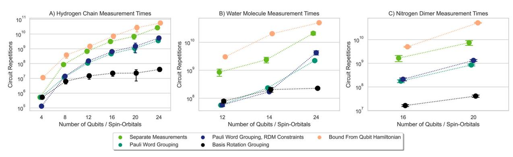
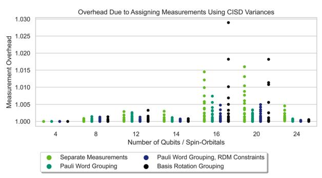
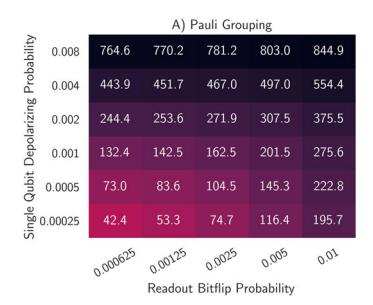
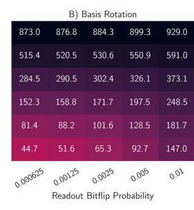
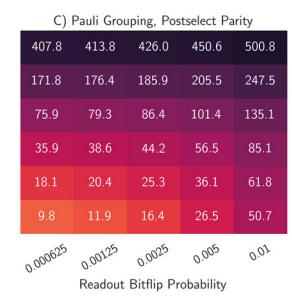
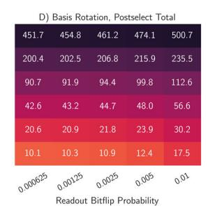
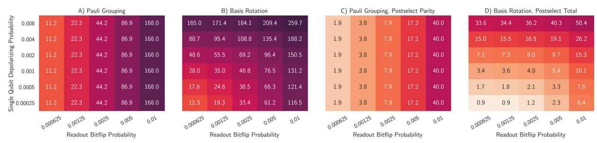
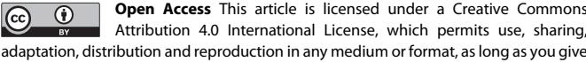

# ARTICLE OPEN

# Efficient and noise resilient measurements for quantum chemistry on near-term quantum computers

William J. Huggins 1,2,3 ⋈, Jarrod R. McClean1, Nicholas C. Rubin1, Zhang Jiang1, Nathan Wiebe1,4,5, K. Birgitta Whaley2,3 and Ryan Babbush 1 1 ⋈

Variational algorithms are a promising paradigm for utilizing near-term quantum devices for modeling electronic states of molecular systems. However, previous bounds on the measurement time required have suggested that the application of these techniques to larger molecules might be infeasible. We present a measurement strategy based on a low-rank factorization of the two-electron integral tensor. Our approach provides a cubic reduction in term groupings over prior state-of-the-art and enables measurement times three orders of magnitude smaller than those suggested by commonly referenced bounds for the largest systems we consider. Although our technique requires execution of a linear-depth circuit prior to measurement, this is compensated for by eliminating challenges associated with sampling nonlocal Jordan–Wigner transformed operators in the presence of measurement error, while enabling a powerful form of error mitigation based on efficient postselection. We numerically characterize these benefits with noisy quantum circuit simulations for ground-state energies of strongly correlated electronic systems.

npj Quantum Information (2021)7:23; https://doi.org/10.1038/s41534-020-00341-7

#### INTRODUCTION

Given the recent progress in quantum computing hardware, it is natural to ask where the first demonstration of a quantum advantage for a practical problem will occur. Since the first experimental demonstration by Peruzzo et al.1, the variational quantum eigensolver (VQE) framework has offered a promising path towards utilizing small and noisy quantum devices for simulating quantum chemistry. The essence of the VQE approach is the use of the quantum device as a coprocessor, which prepares a parameterized quantum wavefunction and measures the expectation value of observables. In conjunction with a classical optimization algorithm, it is possible to then minimize the expectation value of the Hamiltonian as a function of the parameters, arriving at approximations for the wavefunction, energy, and other properties of the ground state 1-8. A growing body of work attempting to understand and ameliorate the challenges associated with using VQE to target nontrivial systems has emerged in recent years9–22. In this article, we address the challenge posed by the large number of circuit repetitions needed to perform accurate measurements and propose a scheme that dramatically reduces this cost. In addition, we explain how our approach to measurement has reduced sensitivity to readout errors and also enables a powerful form of error mitigation.

Within VQE, expectation values are typically estimated by Hamiltonian averaging. Under this approach, the Hamiltonian is decomposed into a sum of operators that are tensor products of single-qubit Pauli operators, commonly referred to as Pauli words. The expectation values of the Pauli words are determined independently by repeated measurement. When measurements are distributed optimally between the Pauli words  $P_{\ell}$ , the total number of measurements M is upper bounded by

$$M \le \left(\frac{\sum_{\ell} |\omega_{\ell}|}{\epsilon}\right)^2$$
, where  $H = \sum_{\ell} \omega_{\ell} P_{\ell}$  (1)

is the Hamiltonian whose expectation value we estimate as  $\Sigma_\ell \omega_\ell \langle P_\ell \rangle$ , the  $\omega_\ell$  are scalars, and  $\varepsilon$  is the target precision3,23. Prior work assessing the viability of VQE has used bounds of this form and concluded that chemistry applications require "a number of measurements which is astronomically large" (quoting from ref. 3).

Several recent proposals attempt to address this obstacle by developing more sophisticated strategies for partitioning the Hamiltonian into sets of simultaneously measurable operators 16-21. We summarize their key findings in Table 1. This work has a similar aim, but we take an approach rooted in a decomposition of the two-electron integral tensor rather than focusing on properties of Pauli words. We quantify the performance of our proposal by numerically simulating the variances of our term groupings to more accurately determine the number of circuit repetitions required for measurement of the ground state energy. This contrasts with the analysis in other recent papers that have instead focused on using the number of separate terms which must be measured as a proxy for this quantity. By that metric, our approach requires a number of term groupings that is linear in the number of qubits—a quartic improvement over the naive strategy and a cubic improvement relative to these recent papers. However, we argue that the number of distinct term groupings alone is not generally predictive of the total number of circuit repetitions required, because it does not consider how the covariances of the different terms in these groupings can collude to either reduce or increase the overall variance. We will show below that our approach benefits from having these covariances conspire in our favor; for the systems considered here, our approach gives up to three orders of magnitude reduction in the total number of measurements, while also providing an empirically observed asymptotic improvement.

Although there are a variety of approaches to simulating indistinguishable fermions with distinguishable qubits24–26, the Jordan–Wigner transformation is the most widely used. This is due

&lt;sup>1Google Quantum AI, Venice, CA 90291, USA. 2Department of Chemistry, University of California, Berkeley, CA 94720, USA. 3Berkeley Quantum Information and Computation Center, University of California, Berkeley, CA 94720, USA. 4Pacific Northwest National Laboratory, Richland, WA 99354, USA. 5Department of Physics, University of Washington, Seattle, WA 98105, USA. ⊠email: whuggins@google.com; ryanbabbush@gmail.com

**Table 1.** A history of ideas reducing the measurements required for estimating the energy of arbitrary basis chemistry Hamiltonians with the variational quantum eigensolver.

| Ref. | Partitioning method             | Circuit sescription  | # of partitions | Gate count      | Depth | Connectivity | Diagonal |
|------|---------------------------------|----------------------|-----------------|-----------------|-------|--------------|----------|
| 2    | Commuting Pauli heuristic       | _                    | $O(N^4)$        | _               | _     | _            | _        |
| 5    | Compatible Pauli heuristic      | Single rotations     | $O(N^4)$        | Ν               | 1     | Any          | No       |
| 23   | n-representability constraints  | Single rotations     | $O(N^4)$        | Ν               | 1     | Any          | No       |
| 21   | Mean-field partitioning         | Fast feed-forward    | $O(N^4)$        | O(N)            | O(N)  | Full         | No       |
| 17   | Compatible Pauli clique cov.    | Single rotations     | $O(N^4)$        | Ν               | 1     | Any          | No       |
| 16   | Counting argument               | Swap networks        | $O(N^3)$        | $O(N^2)$        | O(N)  | Linear       | No       |
| 18   | Commuting Pauli graph color.    | Stabilizer formalism | $O(N^3)$        | _               | -     | Full         | No       |
| 20   | Anticommuting Pauli clique cov. | Pauli evolutions     | $O(N^3)$        | $O(N^2\log(N))$ | -     | Full         | No       |
| 19   | Commuting Pauli clique cover    | Symplectic subspaces | $O(N^3)$        | $O(N^2/\log N)$ | _     | Full         | No       |
| 22   | Commuting Pauli clique cover    | Stabilizer formalism | $O(N^3)$        | $O(N^2)$        | _     | Full         | No       |
| Here | Integral tensor factorization   | Givens rotations     | O(N)            | $N^2/4$         | N/2   | Linear       | Yes      |

Here *N* represents the number of spin orbitals in the basis. Gate counts and depths are given in terms of arbitrary single- or two-qubit gates restricted to the geometry of two-qubit gates specified in the connectivity column. What we mean by compatible Pauli groupings is that the terms can be measured at the same time with only single-qubit rotations prior to measurement. We report whether terms are measured in a diagonal representation as this is important for enabling strategies of error mitigation by postselection. The number of partitions refers to the number of unique term groupings, which can each be measured with a single circuit—thus, this reflects the number of unique circuits required to generate at least one sample of each term in the Hamiltonian. However, we caution that one cannot infer the total number of measurements required from the number of partitions, and often this metric is highly misleading. The overall number of measurements required by the variance of the estimator of the energy. As explained in the first entry of this table, when terms are measured simultaneously one must also consider the covariance of those terms. In some cases, a grouping strategy can decrease the number of partitions but increase the total number of measurements required by grouping terms with positive covariances. Alternatively, strategies such as the third entry in this table actually increase the number of partitions while reducing the number of measurements required overall by lowering the variance of the estimator.

to its simplicity and to the fact that it allows for the explicit construction of a number of useful circuit primitives not available under more sophisticated encodings. These include the Givens rotation network that exactly implements a change of singleparticle basis 16,27-29. A disadvantage of using the Jordan-Wigner transformation is the fact that it maps operators acting on a constant number of fermionic modes to qubit operators with support on up to all N gubits. In the context of measurement, the impact of this nonlocality can be seen by considering a simple model of readout error such as a symmetric bitflip channel. Under this model, a Pauli word with support on N qubits has N opportunities for an error that reverses the sign of the measured value, leading to estimates of expectation values that are exponentially suppressed in N (see section "Error mitigation"). It has recently been shown that techniques based on fermionic swap networks can avoid the overheads and disadvantages imposed by the nonlocality of the Jordan-Wigner encoding in a variety of contexts, including during measurement 16,28,29. Our work will likewise avoid this challenge without leaving the Jordan-Wigner framework, allowing estimation of single- and two-particle fermionic operator expectation values by the measurement of only one- and two-local gubit operators, respectively.

In addition to this reduction in the support of the operators that we measure, our work offers another opportunity for mitigating errors. It has been observed that when one is interested in states with a definite eigenvalue of a symmetry operator, such as the total particle number,  $\eta$ , or the z-component of spin,  $S_{zz}$  it can be useful to have a method that removes the components of some experimentally prepared state with support on the wrong symmetry manifold s-11. Two basic strategies to accomplish this have been proposed. The first of these strategies is to directly and nondestructively measure the symmetry operator and discard those outcomes where the undesired eigenvalue is observed, projecting into the proper symmetry sector by postselection. In order to construct efficient measurement schemes, prior work in this direction has focused on measuring the parities of  $\eta$  and  $S_{zz}$ 

rather than the full symmetry operators  $^{9,11}$ . These proposals involve nonlocal operations that usually require O(N) depth, which may induce further errors during their implementation. The second class of strategies builds upon the foundation of ref.  $^{14}$  and uses additional measurements together with classical postprocessing to calculate expectation values of the projected state without requiring additional circuit depth  $^{8-10}$ , a procedure that can be efficiently applied to the parity of the number operator in each spin sector. In this work, we show how our proposal for measurement naturally leads to the ability to postselect directly on the proper eigenvalues of the operators  $\eta$  and  $S_z$ , rather than on their parities.

## **RESULTS**

# Using Hamiltonian factorization for measurements

The crux of our strategy for improving the efficiency and error resilience of Hamiltonian averaging is the application of tensor factorization techniques to the measurement problem. Using a representation discussed in the context of quantum computing in refs. 29–31, we begin with the factorized form of the electronic structure Hamiltonian in second quantization:

$$H = U_0 \left( \sum_p g_p n_p \right) U_0^{\dagger} + \sum_{\ell=1}^L U_{\ell} \left( \sum_{pq} g_{pq}^{(\ell)} n_p n_q \right) U_{\ell}^{\dagger}, \tag{2}$$

where the values  $g_p$  and  $g_{pq}^{(\ell)}$  are scalars,  $n_p = a_p^\dagger a_p$ , and the  $U_\ell$  are unitary operators that implement a single-particle change of orbital basis. Specifically,

$$U = \exp\left(\sum_{pq} \kappa_{pq} a_p^{\dagger} a_q\right), \quad U a_p^{\dagger} U^{\dagger} = \sum_q \left[e^{\kappa}\right]_{pq} a_q^{\dagger},$$
 (3)

where  $[e^{\kappa}]_{pq}$  is the p,q entry of the matrix exponential of the anti-Hermitian matrix  $\kappa$  that characterizes U.

Numerous approaches that accomplish this goal exist, including the density fitting approximation 32,33, and a double factorization

that begins with a Cholesky decomposition or eigendecomposition of the two-electron integral tensor  $^{29,33-39}$ . In this work, we use such an eigendecomposition and refer readers to the Supplementary Note III and to refs.  $^{29,31}$  for further details. The eigendecomposition step permits discarding small eigenvalues to yield a controllable approximation to the original Hamiltonian. While such low-rank truncations are not central to our approach and would not significantly reduce the number of measurements, doing so would asymptotically reduce L (and thus ultimately, the number of distinct measurement term groupings). Such decompositions have been explored extensively in the context of electronic structure on classical computers on a far wider range of systems than those considered here  $^{34,36,39-42}$ . It has been found that L = O(N) is sufficient for the case of arbitrary basis quantum chemistry, both in the large system and large basis set limits  $^{34}$ . Furthermore, specific basis sets exist where L = 1, such as the plane wave basis or dual basis of ref.  $^{27}$ .

Our measurement strategy, which we shall refer to as Basis Rotation Grouping, is to apply the  $U_\ell$  circuit directly to the quantum state prior to measurement. This allows us to simultaneously sample all of the  $\langle n_p \rangle$  and  $\langle n_p n_q \rangle$  expectation values in the rotated basis. We can then estimate the energy as

$$\langle H \rangle = \sum_{p} g_{p} \langle n_{p} \rangle_{0} + \sum_{\ell=1}^{L} \sum_{pq} g_{pq}^{(\ell)} \langle n_{p} n_{q} \rangle_{\ell}, \tag{4}$$

where the subscript  $\ell$  on the expectation values denotes that they are sampled after applying the basis transformation  $U_\ell$ . The reason that the  $\langle n_p \rangle_\ell$  and  $\langle n_p n_q \rangle_\ell$  expectation values can be sampled simultaneously is because under the Jordan–Wigner transformation,  $n_p = (1+Z_p)/2$ , which is a diagonal qubit operator. In practice, we assume a standard measurement in the computational basis, giving us access to measurement outcomes for all diagonal qubit operators simultaneously. Thus, our approach is able to sample all terms in the Hamiltonian with only L+1=O(N) distinct term groups.

Fortunately, the  $U_{\ell}$  are exceptionally efficient to implement, even on hardware with minimal connectivity. Following the strategy described in ref. 28, and assuming that the system is an eigenstate of the total spin operator, any change of single-particle basis can be performed using  $N^2/4 - N/2$  two-qubit gates and gate depth of exactly N, even with the connectivity of only a linear array of qubits28. This gate depth can actually be improved to N/2 by further parallelizing the approach of ref. 28, making use of ideas that are explained in the context of multiport interferometry in ref. 43. In fact, a further optimization is possible by performing the second matrix factorization discussed in ref. 29. This would result in only  $O(\log^2 N)$  distinct values of the  $g_{pq}^{(\ell)}$  and a gate complexity for implementing the  $U_{\ell}$ , which is reduced to  $O(N\log N)$ ; however, we note that this scaling is only realized in fairly large systems when N is growing towards the thermodynamic (large system) rather than continuum (large basis) limit.

The primary objective of our measurement strategy is to reduce the time required to measure the energy to within a fixed accuracy. Because different hardware platforms have different repetition rates, we focus on quantifying the time required in terms of the number of circuit repetitions. We shall present data for electronic ground states that demonstrate the effectiveness of our Basis Rotation Grouping approach in comparison to three other measurement strategies and the upper bound of Eq. (1). All calculations were performed using the open-source software packages OpenFermion and Psi4 d4.4.5. Specifically, we used exact calculations of the variance of expectation values with respect to the full configuration interaction ground state to determine the number of circuit repetitions required. The calculations presented here are performed for symmetrically stretched hydrogen chains with various bond lengths and numbers of atoms, for a symmetrically stretched water molecule, and for a stretched

nitrogen dimer, all in multiple basis sets. We justify our focus on the electronic ground states here by noting that most variational algorithms for chemistry attempt to optimize ansatz that are already initialized near the ground state. For reference, we provide analogous data calculated with respect to the Hartree–Fock state in Supplementary Table II.

In order to calculate the variance of the estimator of the expectation value of the energy, it is necessary to determine the distribution of measurements between the different term groupings. References3,23 provide a prescription for the optimal choice. They demand that (in the notation of Eq. (1)) each term  $H_{\ell}$  is measured a fraction of the time  $f_{\ell}$  equal to

$$f_{\ell} = \frac{|\omega_{\ell}|\sqrt{1 - \langle H_{\ell} \rangle^2}}{\sum_{j} |\omega_{j}| \sqrt{1 - \langle H_{j} \rangle^2}}.$$
 (5)

In practice, the expectation values in the above expression are not known ahead of time and so the optimal measurement fractions  $f_\ell$  cannot be efficiently and exactly determined a priori. For the purposes of this paper, we approximated the ideal distribution of measurements by first performing a classically tractable configuration interaction singles and doubles (CISD) calculation of the quantities in Eq. (5). We shall show that this approximation introduces a negligible overhead in measurement time for all systems considered in this work. One could also envisage using an adaptive measurement scheme that makes additional measurements based on the observed sample variance, in order to approximate the ideal partitioning of measurement time, such as the one described in ref.  $^{46}$ .

## Circuit repetitions required for energy measurement

In Fig. 1 we plot the number of circuit repetitions for our proposed Basis Rotation Grouping measurement approach (black circles), together with three other measurement strategies and the upper bound based on Eq. (1) for the systems listed in Table 2. The first and most basic alternative strategy is simply to apply no term groupings and measure each Pauli word independently, a strategy we refer to as Separate Measurements (lime green circles). A more sophisticated approach, similar to the one described in ref. 17, is to partition the Pauli words into groups of terms that can be measured simultaneously. In the context of a near-term device, we consider two Pauli words  $P_i$  and  $P_k$  simultaneously measurable if and only if they act with the same Pauli operator on all qubits on which they both act nontrivially. Pauli words that satisfy this condition can be simultaneously measured using only single-qubit rotations and measurement. In order to efficiently partition the Pauli words into groups, we choose to take all of the terms that only contain Z operators as one partition and then account for the remaining Pauli words heuristically by adding them at random to a group until no more valid choices remain before beginning a new group. We refer to this approach as Pauli Word Grouping (teal circles). The final strategy that we compare with preprocesses the Hamiltonian by applying the techniques based on the fermionic marginal (RDM) constraints described in ref. 23, before applying the Jordan-Wigner transformation and using the same heuristic grouping strategy to group simultaneously measurable Pauli words together. We call this latter strategy Pauli Word Grouping, RDM Constraints (dark blue circles).

We refer to the bound of Eq. (1) as being based on the Hamiltonian coefficients and calculate it from the Jordan–Wigner transformed Hamiltonian, (meaning that the  $\omega_\ell$  in Eq. (1) are the coefficients of Pauli words). This bound is indicated by salmon-colored circles in Fig. 1. We note that attempting to calculate a similar bound directly from the fermionic Hamiltonian (meaning that the  $\omega_\ell$  in Eq. (1) would be the coefficients of the terms  $a_p^\dagger a_q$  or  $a_p^\dagger a_q^\dagger a_r a_s$ ) leads to different bounds. These are derived in Supplementary Note I, where they are shown to be substantially

Fig. 1 The number of circuit repetitions required to estimate the ground state energy of various systems using five different measurement strategies. The number of circuit repetitions required to estimate the ground state energy of various systems. From left to right: A hydrogen chains of varying lengths in varying basis sets, B a water molecules in varying basis sets, C a nitrogen dimer in varying basis sets. The specific systems considered are enumerated in Table 2. A target precision corresponding to a  $2\sigma$  error bar of 1.0millihartree is assumed. Calculations performed on systems that require the same number of qubits (spin orbitals) are plotted together in columns. The cost of our proposed measurement strategy appears to have a lower asymptotic scaling than any other method we consider and obtains a speedup of more than an order of magnitude compared to the next best approach for a number of systems.

**Table 2.** List of the molecular systems considered in this work, displayed in order of increasing number of qubits, for each type of system.

| System          | Interatomic spacings (Å) | Basis set | Frozen orbitals | Number of qubits |
|-----------------|--------------------------|-----------|--------------------|------------------|
| H 2  | 0.6, 0.7,1.3             | STO-3G    | None               | 4                |
| H 2  | 0.6, 0.7,1.3             | 6-31G     | None               | 8                |
| H 4  | 0.6, 0.7,1.3             | STO-3G    | None               | 8                |
| H 6  | 0.6, 0.7,1.3             | STO-3G    | None               | 12               |
| H 4  | 0.6, 0.7,1.3             | 6-31G     | None               | 16               |
| H 8  | 0.6, 0.7,1.3             | STO-3G    | None               | 16               |
| H 2  | 0.6, 0.7,1.3             | cc-pVDZ   | None               | 20               |
| H 10 | 0.6, 0.7,1.3             | STO-3G    | None               | 20               |
| H 6  | 0.6, 0.7,1.3             | 6-31G     | None               | 24               |
| H₂O             | 0.8, 0.9,1.5             | STO-3G    | 1                  | 12               |
| H₂O             | 0.8, 0.9,1.5             | STO-3G    | None               | 14               |
| H₂O             | 0.8, 0.9,1.5             | 6-31G     | 1                  | 24               |
| N 2  | 0.9, 1.0,1.6             | STO-3G    | 2                  | 16               |
| N 2  | 0.9, 1.0,1.6             | STO-3G    | None               | 20               |

The hydrogen systems consist of a chain of atoms arranged in a line, with equal interatomic spacing. The interatomic spacing for the water molecules refers to the length of the symmetrically stretched bonds O–H bonds, which are separated by a fixed angle of 104.5°. The active space used for each system has one spatial orbital for every two qubits. A nonzero number of frozen orbitals indicates the number of molecular orbitals fixed in a totally occupied state.

looser for the systems we consider in this work. While one would not measure the fermion operators directly, it is surprising that these bounds would be significantly different. We refer the interested reader to the supplementary information for an analysis and discussion of this phenomenon.

Considering first the hydrogen chain systems in Fig. 1 (left panel, a), we note that our Basis Rotation Grouping approach consistently outperforms the other strategies for simulations with more than four fermionic modes, requiring significantly fewer measurements. Interestingly, while the bounds from the qubit Hamiltonian and other three methods appear to have relative performances that are stable across a variety of system sizes, the Basis Rotation Grouping method appears to have a different

asymptotic scaling, at least for hydrogen chains of increasing length and basis set size. This is likely due to large-scale effects that only manifest when approaching a system's thermodynamic limit (which one approaches particularly quickly for hydrogen chains)47. In Table 3 we quantify this asymptotic scaling by assuming that the dependence of the variance on the number of qubits *N* in the hydrogen chain's Hamiltonian can be modeled by the functional form *aN*b for some constants *a* and *b*, which we fit using a Bayesian analysis described in the table footnote48. By contrast, the data from the minimal basis water molecule (panel B in Fig. 1) shows no benefit in measurement time from our method compared to the heuristic grouping strategies. However, the advantage of our approach becomes significant for that system in larger basis sets, a trend that is also apparent to a lesser extent for the nitrogen dimer (panel C in Fig. 1).

We find that applying the RDM Constraints of ref. 23 to our Pauli Word Grouping strategy (the combination is plotted with dark blue circles in Fig. 1) does not significantly reduce the observed variance, despite the fact that the use of the RDM Constraints have been previously shown to dramatically reduce the bounds on the number of circuit repetitions required23. In Supplementary Note II, we explore the possibility that this is due to the fact that these constraints were applied to minimize a bound of the same form as Eq. (1) that is, however, formulated using the fermionic representation of the Hamiltonian. We present evidence in the Supplementary Note I of the Supplementary information that, in the context of such bounds, the use of the Jordan-Wigner transformed operators leads to surprisingly different results. However, as we show there, we find that the actual variance with respect to the ground state is not substantially changed by applying the same constraints and performing the minimization using the qubit representation of the Hamiltonian.

Earlier we explained that the data presented in Fig. 1 were calculated by distributing the measurements between different term groupings according to Eq. (1) using the variance of each term calculated with a classically efficient CISD approximation to the ground state. Any deviation from the ideal allocation of measurement cycles (obtained by evaluating Eq. (1) with respect to the true ground state) must increase the time required for measurement. In Fig. 2 we present the ratio between the time required with the approximate distribution and the time required under the optimal one for each of the systems treated in the work. We find that impact from this approximation is negligible, with the largest observed increase in measurement time being below 3%. For systems where CISD no longer provides a qualitatively good approximation to the ground state, it would also be possible to

**Table 3.** Bounds and uncertainties resulting from Bayesian inference using a Monte-Carlo approximation with 106 particles for all hydrogen full configuration interaction data48.

| Measurement strategy         | $\langle log\left(a\right)\rangle$ | $\Delta(a)$ | $\langle m{b}  angle$ | σ(b) |
|------------------------------|------------------------------------|-------------|-----------------------|------|
| Bound from qubit Hamiltonian | -6.0                               | 0.3         | 4.90                  | 0.02 |
| Separate Measurements        | -9.3                               | 0.4         | 5.70                  | 0.06 |
| Pauli Word Grouping          | -8.9                               | 0.4         | 4.88                  | 0.06 |
| RDM Constraints              | -10.8                              | 0.4         | 5.63                  | 0.06 |
| Basis Rotation Grouping      | -6.0                               | 0.3         | 2.75                  | 0.01 |

We assume  $\log{(N_{\text{meas}})} = \log{(a)} + \hat{x} + b\log{(N)}$ , where  $\hat{x} \sim \mathcal{N}(0,0.1)$ . We highlight the column containing the mean values of b by using a bold font, as this quantity summarizes the asymptotic scaling of the number of measurements required for a fixed accuracy. The prior distributions are uniform for  $\log{(a)}$  and b over [-15,1] and [1,20] respectively. Here  $\sigma(b)$  is the posterior standard deviation for b and  $\Delta(a)$  is the posterior standard deviation of  $\log{(a)} + \hat{x}$ . RDM Constraints refers to the Pauli Word Grouping approach with the RDM Constraints applied, as in the text. For Bayesian methods to work a likelihood for all data must be computed. Here, we assume additive Gaussian noise, similar to what is customary to justify least-squares fitting, but choose a definite standard deviation. This standard deviation is chosen to be  $\sqrt{0.1}$ , which is chosen to upper bound the observed standard deviation over our data sets for fixed values of N.

Fig. 2 The overhead in measurement time incurred by using a sub-optimal distribution of measurement effort. Specifically, the increase in the time (or the number of circuit repetitions) required to measure the ground state energy to a fixed precision when the measurements are distributed between groups using the variances calculated with the configuration interaction singles and doubles (CISD) approximation rather than the true ground state. For each of the systems and measurement techniques considered in this work, we present the ratio of the time required when using this approximate distribution of measurement repetitions compared with the time required using the optimal distribution, both calculated using Eq. (5) and then applied to the measurement of the actual ground state of the system. We find that using a classically tractable CISD calculation to determine the distribution of measurements between groups results in only a small increase in total measurement time.

calculate the required quantities with a more sophisticated method, such as the density matrix renormalization group algorithm49.

Overall, Fig. 1 speaks for itself in showing that in most cases there is a very significant reduction in the number of measurements required when using our strategy—sometimes by up to three orders of magnitude for even modestly sized systems. Furthermore, these improvements become more significant as system size grows.

# **Error mitigation**

Beyond the reduction in measurement time, our approach also provides two distinct forms of error mitigation. First, it reduces the susceptibility to readout errors by replacing the measurement of *O* (*N*) qubit operators with one- and two-qubit operators. Second, it allows us to perform postselection based on the eigenvalues of the particle number operators in each spin sector. Both properties stem from measuring the Hamiltonian only in terms of density operators in different basis sets.

The first benefit, the reduction in readout errors, is a consequence of only needing to measure expectation values of operators that have support on one or two qubits. Direct measurement of the Jordan–Wigner transformed Hamiltonian using only single-qubit rotations and measurement involves measuring operators with support on O(N) qubits. To demonstrate how reducing the support of the operators helps to mitigate errors, we consider a simple model of measurement error: the independent, single-qubit symmetric bitflip channel. When estimating the expectation value of a Pauli word  $P_{\ell}$  acting on K qubits with a single-qubit bitflip error rate p, a simple Kraus operator analysis shows that  $P_{\ell}$  is modified to

$$\langle P_{\ell} \rangle_{\text{bitflip}} = (1 - 2p)^{K} \langle P_{\ell} \rangle_{\text{true}},$$
 (6)

which means that the noise channel will bias the estimator of the expectation value towards zero by a factor exponential in K. Thus, the determination of expectation values is highly sensitive to the extent of the locality of the  $P_{\ell}$ , a behavior that we expect to persist under more realistic models of readout errors.

One could also accomplish the reduction in the support of the operators that our method achieves by other means. For example, one could measure each of the  $O(N^4)$  terms separately, localizing each one to a single-qubit operator by applying O(N) two-qubit gates. Other schemes have been proposed that simultaneously allow generic two-electron terms to be measured using O(1) qubits each while simultaneously accomplishing the parallel measurement of O(N) terms at a time, at the cost of using  $O(N^2)$  or  $O(N^2\log(N))$  two-qubit gates  $^{16,20,22}$ . One advantage of our approach is that we achieve this reduction in operator support at the same time as the large reduction in the number of measurement repetitions presented in section "Circuit repetitions required for energy measurement" above.

Our approach also enables a second form of error mitigation. Each measurement we prescribe is also simultaneously a measurement of the total particle number operator,  $\eta$ , and of the *z*-component of spin,  $S_z$ . We can therefore reduce the impact of circuit and measurement errors by performing postselection conditioned on a desired combination of quantum numbers for each of these operators. Let P denote the projector onto the corresponding subspace and let  $\rho$  denote the density matrix of our state. We obtain access to the projected expectation value,

$$\langle H \rangle_{\text{proj}} = \frac{\text{Tr}(P\rho H)}{\text{Tr}(P\rho)},$$
 (7)

directly from the experimental measurement record by discarding those data points that fall outside the desired subspace. The remaining data points are used to evaluate the expectation values of the desired Pauli words.

This postselection is efficient in the sense that it requires no additional machinery beyond what we have already proposed. The only cost is a factor of  $\approx 1/{\rm Tr}(P\rho)$  additional measurements. This factor is approximate because discarding measurements with the wrong particle number is likely to lead to a lower observed variance. Specifically, by removing measurements in the wrong particle number sector, we avoid having to average over large fluctuations caused by the energetic effects of adding or removing particles. This, therefore, presents an additional route by which our Basis Rotation Grouping scheme will reduce the number of measurements in practice.

Several recent works have proposed error mitigation strategies that allow for the targeting of specific symmetry sectors. We make **n**pj

a brief comparative review of these here in order to place our work in context. One class of strategies focuses on nondestructively measuring one or more symmetry operators9,11. After performing the measurements and conditioning on the desired eigenvalues, the postmeasurement state becomes PoP/Tr(Po) and the usual Hamiltonian averaging can be performed. These approaches share some features with our strategy in that they also require an additional number of measurements that scale as  $1/\text{Tr}(P\rho)$  and an increased circuit depth. However, they also have some drawbacks that we avoid. Because they separate the measurement of the symmetry operator from the measurement of the Hamiltonian, they require the implementation of relatively complicated nondestructive measurements. As a consequence, existing proposals focus on measuring only the parity of the n and  $S_z$  operators, leading to a strictly less powerful form of error mitigation than the approach we propose. In addition, most errors that occur during or after the symmetry operator measurement are undetectable, including errors incurred during readout.

A different class of approaches avoids the need for additional circuit depth at the expense of requiring more measurements8–10. To understand this, let  $\Pi$  denote the fermionic parity operator and  $P = (1 + \Pi)/2$  the projector onto the +1 parity subspace. Then,

$$\langle H \rangle_{\text{proj}} = \frac{\text{Tr}(P\rho H)}{\text{Tr}(P\rho)} = \frac{\text{Tr}(\rho H) + \text{Tr}(\rho \Pi H)}{1 + \text{Tr}(\rho \Pi)}.$$
 (8)

To construct the projected energy it then suffices to measure the expectation values of the Hamiltonian, the parity operator, and the product of the Hamiltonian and parity operators. A stochastic sampling scheme and a careful analysis of the cost of such an approach reveals that it is possible to use postprocessing to estimate the projection onto the subspace with the correct particle number parity in each spin sector at a cost of roughly  $1/\text{Tr}(P_{\uparrow}P_{\perp}\rho)^2$  (where  $P_{\uparrow}$  and  $P_{\perp}$  are the parity projectors for the two spin sectors)10. Unlike our approach, this class of error mitigation techniques does not easily allow for the projection onto the correct eigenvalues of  $\eta$  and  $S_{z_1}$  owing to the large number of terms required to construct these projection operators. Furthermore, the scaling in the number of additional measurements we described above, already more costly than our approach, is also too generous. This is because the product of the parity operators and the Hamiltonian will contain a larger number nonsimultaneously measurable terms than the same Hamiltonian on its own. Maximum efficiency may require grouping schemes that consider this larger number of term groupings.

The most significant drawback of our method in the context of error mitigation is that the additional time and gates required for the basis transformation circuit lead to additional opportunities for errors. We believe that the reduction in circuit repetitions we have shown makes our method the most attractive choice when it is feasible to use an additional  $O(N^2)$  two-qubit gates during the measurement process. We therefore, focus, on comparing the performance of our strategy with a strategy that requires no additional gates and uses a quantum subspace error mitigation approach that effectively projects onto the correct parity of the number operator on each spin sector9,10. In order to do so, we use the open-source software package Cirq50 to simulate the performance of both strategies for measuring the ground state energy of a chain of six hydrogen atoms symmetrically stretched to 1.3 Å in an STO-3G basis. We take an error model consisting of (i) applying a single-qubit depolarizing channel with some probability to both gubits following each two-gubit gate, and (ii) applying a bitflip channel during the measurement process with some other probability. We report results for a wide range of gate and readout noise levels inspired by the capabilities of state-ofthe-art superconducting and ion trap quantum computers51–54. Specifically, we consider single-qubit depolarizing noise with probabilities ranging from  $2.5 \times 10^{-4}$  to  $8 \times 10^{-3}$  and single-qubit bitflip error probabilities between  $6.25 \times 10^{-4}$  and  $1 \times 10^{-2}$ . Here, we do not consider the effect of a finite number of measurements and instead report the expectation values from the final density matrix.

Figure 3 shows the error in the measurement of the ground state energy for the error-mitigated Basis Rotation Grouping (far right panel) and Pauli Word Grouping (second panel from right) approaches together with the expectation values for both measurement strategies without error mitigation (two left panels). In these calculations, we assumed that the ground state wavefunction under the Jordan-Wigner transformation is prepared without error. Circuit level noise is considered only during the execution of the Givens rotation required for our Basis Rotation Grouping approach. In order to include the impact of our proposed error mitigation strategy on state preparation as well as measurement, we have also carried out calculations including circuit noise during state preparation. The results of these calculations are presented in Fig. 4. Here, we have approximated a realistic state preparation circuit by applying three random basis rotations that compose to the identity to the ground state wavefunction. These state preparation circuits are simulated with the same gate noise as the measurement circuits. This choice is

Fig. 3 The error in the ground state energy of a hydrogen chain using various measurement strategies. We report the error in millihartrees for measurements of the ground state energy of a stretched chain of six hydrogen atoms under an error model composed of single-qubit dephasing noise applied after every two-qubit gate together with a symmetric bitflip channel during readout. We consider single-qubit depolarizing noise with probabilities ranging from  $2.5 \times 10^{-4}$  to  $8 \times 10^{-3}$ , corresponding to two-qubit gate error rates of  $\approx 5 \times 10^{-4}$  to  $1.6 \times 10^{-2}$ . For the measurement noise, we take the single-qubit bitflip error probabilities to be between  $6.25 \times 10^{-4}$  and  $1 \times 10^{-2}$ . From left to right: A The error incurred by a Pauli Grouping measurement strategy involving simultaneously measuring compatible Pauli words in the usual molecular orbital basis. B The error when using our Basis Rotation Grouping scheme, which performs a change of single-particle basis before measurement. C The errors using the same Pauli Word Grouping strategy together with additional measurements and postprocessing, which effectively project the measured state onto a manifold with the correct partities of the total particle number and  $S_z$  were observed. In all panels, we consider the measurement of the exact ground state without any error during state preparation.

Fig. 4 The error in the ground state energy of a hydrogen chain using various measurement strategies and a noisy state preparation step. We report the error in millihartrees for measurements of the ground state energy of a stretched chain of six hydrogen atoms under an error model composed of single-qubit dephasing noise applied after every two-qubit gate together with a symmetric bitflip channel during readout. We consider single-qubit depolarizing noise with probabilities ranging from  $2.5 \times 10^{-4}$  to  $8 \times 10^{-3}$ , corresponding to two-qubit gate error rates of  $\approx 5 \times 10^{-4}$  to  $1.6 \times 10^{-2}$ . For the measurement noise, we take the single-qubit bitflip error probabilities to be between  $6.25 \times 10^{-4}$  and  $1 \times 10^{-2}$ . From left to right: A The error incurred by a Pauli Grouping measurement strategy involving simultaneously measuring compatible Pauli words in the usual molecular orbital basis. B The error when using our Basis Rotation Grouping scheme, which performs a change of single-particle basis before measurement. C The errors using the same Pauli Word Grouping strategy together with additional measurements and postprocessing, which effectively project the measured state onto a manifold with the correct parities of the total particle number and  $S_z$  operators. D Those found when using our basis rotation strategy and postselecting on outcomes where the correct particle number and  $S_z$  were observed. In all panels, for the purpose of approximating a realistic ansatz circuit, three random Givens rotation networks that compose to the identity were simulated acting on the ground state prior to measurement.

motivated by the assumption that low-depth circuits will be required for the successful application of VQE and the expectation that 90 two-qubit gates represent a reasonable lower bound to the size of the circuit for a strongly correlated problem on 12 qubits.

Figures 3 and 4 show that the Pauli Word Grouping and Basis Rotation Grouping approaches to measurement benefit significantly from their respective error mitigation strategies. Despite the fact that our proposed Basis Rotation Grouping technique requires 30 additional two-qubit gates compared to the Pauli Word Grouping approach, we see that the errors remaining after mitigation are comparable in some regimes and are lower for our strategy when noise during a measurement is the dominant error channel (compare the bottom right corners of the two rightmost panels in both figures). Focusing first on Fig. 3, we can see that this is true even when the errors during state preparation are not taken into account. Examining the left two panels of both figures, we can see that even without applying postselection, the locality of our Jordan–Wigner transformed operators leads to a considerable benefit in suppressing the impact of readout errors. In the low-noise regime, we expect the quantity  $1 - tr(P\rho)$  to scale linearly with the number of errors coupling the different symmetry sectors. For an error model dominated by two-qubit gate errors, this quantity should itself scale linearly with the number of twoqubit gates. For all of the simulations presented in this work, we find that  $1 \le \frac{1}{\operatorname{tr}(P\rho)} \le 3$ . This implies that the postselection (or postprocessing) can be performed at a reasonable cost, as discussed above

We note that the absolute errors we find when including noise during state preparation (Fig. 4), even at the lowest noise levels considered here, are larger than the usual target of chemical accuracy (~1 mHa). In practice, an experimental implementation of VQE on nontrivial systems will require the combination of multiple forms of error mitigation. Prior work has shown that error mitigation by symmetry projection combines favorably with proposals to extrapolate expectation values to the zero noise limit11. We expect that such an extrapolation procedure could significantly improve the numbers we present here. Other avenues for potential improvements are also available. For example, one could rely on the error mitigation and efficiency provided by our measurement strategy during the outer loop optimization procedure, before utilizing a richer quantum subspace expansion in an attempt to reduce errors in the ground state energy after determining the optimal ansatz parameters.

#### DISCUSSION

We have presented an improved strategy for measuring the expectation value of the quantum chemical Hamiltonian on nearterm quantum computers. Our approach makes use of wellstudied factorizations of the two-electron integral tensor, in order to rewrite the Hamiltonian in a form that is especially convenient for measuring under the Jordan-Wigner transformation. By doing so, we obtain O(N) distinct sets of terms that must be measured separately, instead of the  $O(N^4)$  required by a naive counting of terms approach. Application to specific molecular systems shows that in practice, we require a much smaller number of repetitions to measure the ground state energy to within a fixed accuracy target. For example, assuming an experimental repetition rate of 10 kHz (consistent with the capabilities of commercial superconducting qubit platforms), a commonly referenced bound based on the Hamiltonian coefficients suggests that approximately 55 days are required to estimate the ground state energy of a symmetrically stretched chain of six hydrogen atoms encoded as a wavefunction on 24 qubits to within chemical accuracy, while our approach requires only 44 min. Our proposed measurement approach also removes the susceptibility to readout error caused by long Jordan-Wigner strings and allows for postselection by simultaneously measuring the total particle number and  $S_z$ operators with each measurement shot.

The tensor factorization that we used to realize our measurement strategy is only one of a family of such factorizations. Future work might explore the use of different factorizations, or even tailor the choice of single-particle bases for measurement to a particular system, by choosing them with some knowledge of the variances and covariances between terms in the Hamiltonian. As a more concrete direction for future work, the data we show in Supplementary Note I, regarding the difference between the bounds when calculated directly from the fermionic operators and the same approach applied to the Jordan–Wigner transformed operators, suggests that the cost estimates for error-corrected quantum algorithms should be recalculated using the qubit Hamiltonian.

For the largest systems we consider in this work, the 24-qubit hydrogen chain and water simulations, and the 20-qubit nitrogen calculations, our numerical results indicate that using our approach results in a speedup of more than an order of magnitude when compared to recent state-of-the-art measurement strategies. Furthermore, we observe a speedup of more than three orders of magnitude compared to the bounds commonly

used to perform estimates in the literature. We also present strong evidence for an asymptotic improvement in our data on hydrogen chains of various sizes. We performed detailed circuit simulations that show that reduction in readout errors combined with the error mitigation enabled by our work largely balances out the requirement for deeper circuits, even when compared against a moderately expensive error mitigation strategy based on the quantum subspace expansion9. We expect that the balance of reduced measurement time and efficient error mitigation provided by our approach will be useful in the application of variational quantum algorithms to more complex molecular systems.

Finally, we note that these techniques will generally be useful for quantum simulating any fermionic system, even those for which the tensor factorization cannot be truncated, such as the Sachdev-Ye-Kitaev model of many-body chaotic dynamics55,56. In that case, L will attain its maximal value of  $N^2$ , and our scheme will require  $N^2+1$  partitions. Likewise, if the goal is to use the basis rotation grouping technique to estimate the fermionic two-particle reduced density matrix rather than just the energy, one would need to measure in all  $O(N^2)$  bases.

In the process of preparing this manuscript, we have become aware of several recent works that employ more sophisticated strategies for grouping Pauli words together or employing a different family of unitary transformations than those we consider to enhance the measurement process17–20. It would be an interesting subject of future work to calculate and compare the number of circuit repetitions required by these approaches.

#### **DATA AVAILABILITY**

The data that support the findings of this study are available from the corresponding author upon reasonable request.

#### **CODE AVAILABILITY**

Much of the code that supports the findings of this study is already available in the OpenFermion library44. The remainder is available from the corresponding author upon reasonable request.

Received: 17 September 2019; Accepted: 17 December 2020; Published online: 05 February 2021

#### **REFERENCES**

- 1. Peruzzo, A. et al. A variational eigenvalue solver on a photonic quantum processor. *Nat. Commun.* **5**, 4213 (2014).
- McClean, J. R., Romero, J., Babbush, R. & Aspuru-Guzik, A. The theory of variational hybrid quantum-classical algorithms. N. J. Phys. 18, 023023 (2016).
- Wecker, D., Hastings, M. B. & Troyer, M. Progress towards practical quantum variational algorithms. Phys. Rev. A 92, 042303 (2015).
- 4. O'Malley, P. J. et al. Scalable quantum simulation of molecular energies. *Phys.*
- Rev. X 6, 31007 (2016).5. Kandala, A. et al. Hardware-efficient variational quantum eigensolver for small
- molecules and quantum magnets. *Nature* **549**, 242 (2017).
- Lee, J., Huggins, W. J., Head-Gordon, M. & Whaley, K. B. Generalized unitary coupled cluster wave functions for quantum computation. *J. Chem. Theory Comput.* 15, 311–324 (2018).
- Parrish, R. M., Hohenstein, E. G., McMahon, P. L. & Martínez, T. J. Quantum computation of electronic transitions using a variational quantum eigensolver. *Phys. Rev. Lett.* 122, 230401 (2019).
- 8. O'Brien, T. E. et al. Calculating energy derivatives for quantum chemistry on a quantum computer. *npj Quantum Inf.* **5**, 113 (2019).
- 9. Bonet-Monroig, X., Sagastizabal, R., Singh, M. & O'Brien, T. Low-cost error mitigation by symmetry verification. *Phys. Rev. A* **98**, 062339 (2018).
- McClean, J. R., Jiang, Z., Rubin, N. C., Babbush, R. & Neven, H. Decoding quantum errors with subspace expansions. *Nat. Commun.* 11, 636 (2020).
- McArdle, S., Yuan, X. & Benjamin, S. Error-mitigated digital quantum simulation. Phys. Rev. Lett. 122, 180501 (2019).

- Temme, K., Bravyi, S. & Gambetta, J. M. Error mitigation for short-depth quantum circuits. Phys. Rev. Lett. 119, 180509 (2017).
- Sagastizabal, R. et al. Experimental error mitigation via symmetry verification in a variational quantum eigensolver. *Phys. Rev. A* 100, 010302 (2019).
- McClean, J. R., Kimchi-Schwartz, M. E., Carter, J. & de Jong, W. A. Hybrid quantumclassical hierarchy for mitigation of decoherence and determination of excited states. *Phys. Rev. A* 95, 042308 (2017).
- Otten, M. & Gray, S. K. Accounting for errors in quantum algorithms via individual error reduction. npi Ouantum Inf. 5, 11 (2019).
- O'Gorman, B., Huggins, W. J., Rieffel, E. G. & Whaley, K. B. Generalized swap networks for near-term quantum computing. Preprint at arXiv https://arxiv.org/ abs/1905.05118 (2019).
- Verteletskyi, V., Yen, T.-C. & Izmaylov, A. F. Measurement optimization in the variational quantum eigensolver using a minimum clique cover. *J. Chem. Phys.* 152, 124114 (2020).
- Jena, A., Genin, S. & Mosca, M. Pauli partitioning with respect to gate sets. Preprint at arXiv https://arxiv.org/abs/1907.07859 (2019).
- Yen, T.-C., Verteletskyi, V. & Izmaylov, A. F. Measuring all compatible operators in one series of single-qubit measurements using unitary transformations. J. Chem. Theory Comput. 16, 2400–2409 (2020).
- Izmaylov, A. F., Yen, T.-C., Lang, R. A. & Verteletskyi, V. Unitary partitioning approach to the measurement problem in the variational quantum eigensolver method. J. Chem. Theory Comput. 16, 190–195 (2020).
- Izmaylov, A. F., Yen, T.-C. & Ryabinkin, I. G. Revising the measurement process in the variational quantum eigensolver: is it possible to reduce the number of separately measured operators? *Chem. Sci.* 10, 3746–3755 (2019).
- Gokhale, P. et al. Minimizing state preparations in variational quantum eigensolver by partitioning into commuting families. Preprint at arXiv http://arxiv.org/ abs/1907.13623 (2019).
- Rubin, N. C., Babbush, R. & McClean, J. Application of fermionic marginal constraints to hybrid quantum algorithms. N. J. Phys. 20, 053020 (2018).
- Setia, K. & Whitfield, J. D. Bravyi-kitaev superfast simulation of electronic structure on a quantum computer. J. Chem. Phys. 148, 164104 (2018).
- Jiang, Z., McClean, J., Babbush, R. & Neven, H. Majorana Loop Stabilizer Codes for Error Mitigation in Fermionic Quantum Simulations. *Phys. Rev. Applied* 12, 064041 (2019).
- Bravyi, S. B. & Kitaev, A. Y. Fermionic quantum computation. *Ann. Phys.* 298, 210–226 (2002).
- Babbush, R. et al. Low-depth quantum simulation of materials. Phys. Rev. X 8, 011044 (2018).
- Kivlichan, I. D. et al. Quantum simulation of electronic structure with linear depth and connectivity. Phys. Rev. Lett. 120, 110501 (2018).
- Motta, M. et al. Low rank representations for quantum simulation of electronic structure. Preprint at arXiv https://arxiv.org/abs/1808.02625 (2018).
- Poulin, D. et al. The trotter step size required for accurate quantum simulation of quantum chemistry. Quantum Inf. Comput. 15, 361–384 (2015).
- Berry, D. W., Gidney, C., Motta, M., McClean, J. R. & Babbush, R. Qubitization of arbitrary basis quantum chemistry leveraging sparsity and low rank factorization. *Quantum* 3, 208 (2019).
- Whitten, J. L. Coulombic potential energy integrals and approximations. J. Chem. Phys. 58, 4496–4501 (1973).
- 33. Aquilante, F. et al. Molcas 7: the next generation. J. Comput. Chem. 31, 224–247 (2010).
- 34. Pedersen, T. B., Aquilante, F. & Lindh, R. Density fitting with auxiliary basis sets from cholesky decompositions. *Theor. Chem. Acc.* **124**, 1–10 (2009).
- Beebe, N. H. & Linderberg, J. Simplifications in the generation and transformation of two-electron integrals in molecular calculations. *Int. J. Quantum Chem.* 12, 683–705 (1977).
- Koch, H., Sánchez de Merás, A. & Pedersen, T. B. Reduced scaling in electronic structure calculations using cholesky decompositions. J. Chem. Phys. 118, 9481–9484 (2003).
- Purwanto, W., Krakauer, H., Virgus, Y. & Zhang, S. Assessing weak hydrogen binding on ca+ centers: an accurate many-body study with large basis sets. J. Chem. Phys. 135, 164105 (2011).
- Mardirossian, N., McClain, J. D. & Chan, G. K.-L. Lowering of the complexity of quantum chemistry methods by choice of representation. J. Chem. Phys. 148, 044106 (2018).
- Peng, B. & Kowalski, K. Highly efficient and scalable compound decomposition of two-electron integral tensor and its application in coupled cluster calculations. J. Chem. Theory Comput. 13, 4179–4192 (2017).
- Røeggen, I. & Wisløff-Nilssen, E. On the Beebe-Linderberg two-electron integral approximation. Chem. Phys. Lett. 132, 154–160 (1986).
- Røeggen, I. & Johansen, T. Cholesky decomposition of the two-electron integral matrix in electronic structure calculations. J. Chem. Phys. 128, 194107 (2008).

- 42. Boman, L., Koch, H. & Sánchez de Merás, A. Method specific cholesky decomposition: coulomb and exchange energies. J. Chem. Phys. 129, 134107 (2008).
- 43. Clements, W. R., Humphreys, P. C., Metcalf, B. J., Kolthammer, W. S. & Walmsley, I. A. Optimal design for universal multiport interferometers. Optica 3, 1460–1465 (2016).
- 44. McClean, J. R. et al. OpenFermion: the electronic structure package for quantum computers. Quantum Sci. Technol. 5, 034014 (2020).
- 45. Parrish, R. M. et al. Psi4 1.1: an open-source electronic structure program emphasizing automation, advanced libraries, and interoperability. J. Chem. Theory Comput. 13, 3185–3197 (2017).
- 46. Huggins, W. J., Lee, J., Baek, U., O'Gorman, B. & Birgitta Whaley, K. A nonorthogonal variational quantum eigensolver. N. J. Phys. 22, 073009 (2020).
- 47. Motta, M. et al. Towards the solution of the many-electron problem in real materials: equation of state of the hydrogen chain with state-of-the-art manybody methods. Phys. Rev. X 7, 031059 (2017).
- 48. Granade, C. E., Ferrie, C., Wiebe, N. & Cory, D. G. Robust online hamiltonian learning. N. J. Phys. 14, 103013 (2012).
- 49. White, S. R. Density matrix formulation for quantum renormalization groups. Phys. Rev. Lett. 69, 2863–2866 (1992).
- 50. The Cirq Developers. Cirq. <https://github.com/quantumlib/Cirq> (2019).
- 51. Kjaergaard, M. et al. Superconducting qubits: current state of play. Annu. Rev. Condens. Matter Phys. 11, 369–395 (2020).
- 52. Bruzewicz, C. D., Chiaverini, J., McConnell, R. & Sage, J. M. Trapped-ion quantum computing: progress and challenges. Appl. Phys. Rev. 6, 021314 (2019).
- 53. Heinsoo, J. et al. Rapid high-fidelity multiplexed readout of superconducting qubits. Phys. Rev. Appl. 10, 034040 (2018).
- 54. Preskill, J. Quantum computing in the NISQ era and beyond. Quantum 2, 79 (2018).
- 55. Kitaev, A. A. Simple model of quantum holography. [http://online.kitp.ucsb.edu/](http://online.kitp.ucsb.edu/online/entangled15/kitaev/) [online/entangled15/kitaev/](http://online.kitp.ucsb.edu/online/entangled15/kitaev/) (2015).
- 56. Babbush, R., Berry, D. W. & Neven, H. Quantum simulation of the Sachdev-Ye-Kitaev model by asymmetric qubitization. Phys. Rev. A 99, 040301 (2019).

### ACKNOWLEDGEMENTS

We thank Dominic Berry for his insight that the techniques of Clements et al.43 can be used to halve the gate depth of the basis rotation circuits presented i[n28.](#page-7-0) K.B.W. was supported by the US Department of Energy, Office of Science, Office of Advanced Scientific Computing Research, Quantum algorithm Teams Program, under contract number DE-AC02-05CH11231.

### AUTHOR CONTRIBUTIONS

W.J.H. and R.B. conceived the idea and cowrote the majority of the paper. W.J.H. performed all numerical simulations except for the Bayesian analysis, which N.W. carried out. W.J.H., J.R.M., N.C.R., Z.J., N.W., K.B.W., and R.B. all participated in discussions that developed the theory and shaped the project.

#### COMPETING INTERESTS

The authors declare no competing interests.

## ADDITIONAL INFORMATION

Supplementary information Supplementary information is available for this paper at [https://doi.org/10.1038/s41534-020-00341-7.](https://doi.org/10.1038/s41534-020-00341-7)

Correspondence and requests for materials should be addressed to W.J.H. or R.B.

Reprints and permission information is available at [http://www.nature.com/](http://www.nature.com/reprints) [reprints](http://www.nature.com/reprints)

Publisher's note Springer Nature remains neutral with regard to jurisdictional claims in published maps and institutional affiliations.

appropriate credit to the original author(s) and the source, provide a link to the Creative Commons license, and indicate if changes were made. The images or other third party material in this article are included in the article's Creative Commons license, unless indicated otherwise in a credit line to the material. If material is not included in the article's Creative Commons license and your intended use is not permitted by statutory regulation or exceeds the permitted use, you will need to obtain permission directly from the copyright holder. To view a copy of this license, visit [http://creativecommons.](http://creativecommons.org/licenses/by/4.0/) [org/licenses/by/4.0/](http://creativecommons.org/licenses/by/4.0/).

© The Author(s) 2021