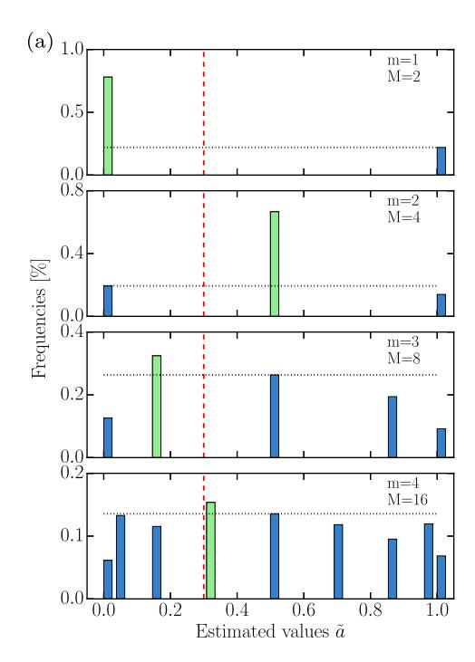
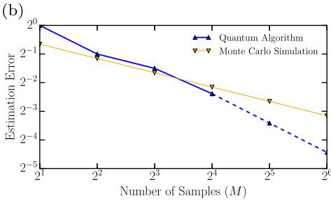
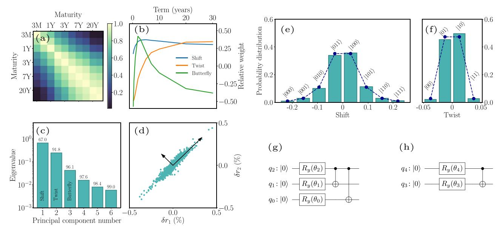
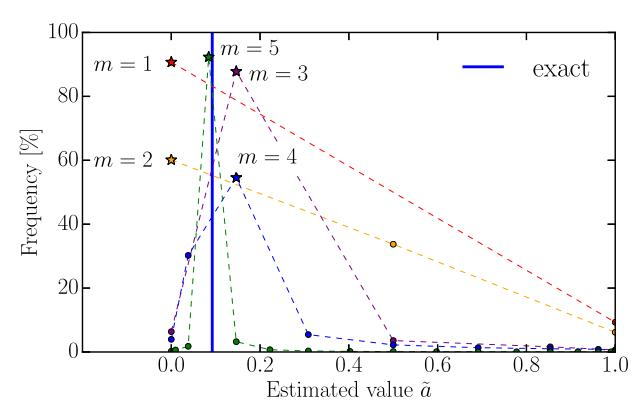
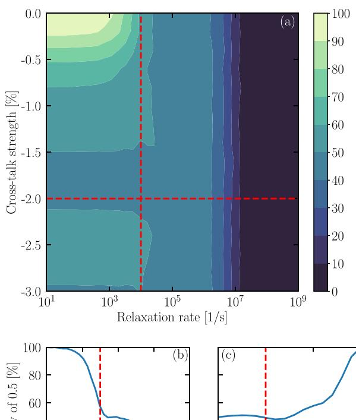
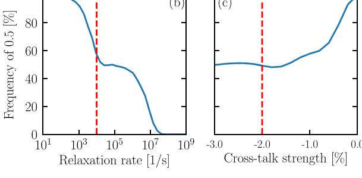

## ARTICLE OPEN

# Quantum risk analysis

Stefan Woerner 101 and Daniel J. Egger 1

We present a quantum algorithm that analyzes risk more efficiently than Monte Carlo simulations traditionally used on classical computers. We employ quantum amplitude estimation to price securities and evaluate risk measures such as Value at Risk and Conditional Value at Risk on a gate-based quantum computer. Additionally, we show how to implement this algorithm and how to trade-off the convergence rate of the algorithm and the circuit depth. The shortest possible circuit depth—growing polynomially in the number of qubits representing the uncertainty—leads to a convergence rate of  $O(M^{-2/3})$ , where M is the number of samples. This is already faster than classical Monte Carlo simulations which converge at a rate of  $O(M^{-1/2})$ . If we allow the circuit depth to grow faster, but still polynomially, the convergence rate quickly approaches the optimum of  $O(M^{-1})$ . Thus, for slowly increasing circuit depths our algorithm provides a near quadratic speed-up compared to Monte Carlo methods. We demonstrate our algorithm using two toy models. In the first model we use real hardware, such as the IBM Q Experience, to price a Treasury-bill (T-bill) faced by a possible interest rate increase. In the second model, we simulate our algorithm to illustrate how a quantum computer can determine financial risk for a two-asset portfolio made up of government debt with different maturity dates. Both models confirm the improved convergence rate over Monte Carlo methods. Using simulations, we also evaluate the impact of cross-talk and energy relaxation errors.

npj Quantum Information (2019)5:15; https://doi.org/10.1038/s41534-019-0130-6

#### INTRODUCTION

Risk management plays a central role in the financial system. Value at risk (VaR), 1 a quantile of the loss distribution, is a widely used risk metric. For example the Basel III regulations require banks to perform stress tests using VaR. 2 A second important risk metric is conditional value at risk (CVaR, sometimes also called expected shortfall), defined as the expected loss for losses greater than VaR. By contrast to VaR, CVaR is more sensitive to extreme events in the tail of the loss distribution.

Monte Carlo simulations are the method of choice to determine VaR and CVaR of a portfolio. They are done by building a model of the portfolio assets and computing the aggregated value for M different realizations of the model input parameters. VaR calculations are computationally intensive as the width of the confidence interval scales as  $O(M^{-1/2})$ . Many different runs are needed to achieve a representative distribution of the portfolio value. Classical attempts to improve the performance are variance reduction or Quasi-Monte Carlo techniques. The first aims at reducing the constants while not changing the asymptotic scaling; whereas, the latter improves the asymptotic behavior, but only works well for low-dimensional problems.

Quantum computers process information using the laws of quantum mechanics.6 This has opened up novel ways of addressing some problems, e.g. in quantum chemistry,7 optimization,8 or machine learning.9 Problems in finance that make use of machine learning may benefit from quantum machine learning.10 A quantum computer may also be used to optimize the risk-return of portfolios and sample from the optimal portfolio.11 Amplitude estimation (AE) is a quantum algorithm used to estimate an unknown parameter and converges as  $O(M^{-1})$ , which is a quadratic speed-up over classical algorithms like Monte Carlo.12

It has already been shown how AE can be used to price financial derivatives with the Black–Scholes model. 13,14

In this article, we extend the use of AE to the calculation of variance, VaR and CVaR of random distributions. Furthermore, we develop methods to implement AE on actual hardware and we discusses how to construct the corresponding quantum circuits to calculate the expected value, variance, VaR and CVaR of random variables. Therefore making AE a powerful tool for risk management and security pricing. We illustrate our algorithm using portfolios made up of debt issued by the United States Treasury (US Treasury). As of December 2016 the US Treasury had 14.5 trillion USD in outstanding marketable debt held by the public.15 This debt is an actively traded asset class with typical daily volumes close to 500 billion USD16 and is regarded as high quality collateral.17 government debt typically lacks some of the more complex features that other types of fixed-income securities have. These features make US Treasuries a highly relevant asset class to study while allowing us to use simple models to illustrate our algorithm. We demonstrate AE on a real quantum computer by approximating the expected value of a very simple portfolio made up of one T-Bill, a short-term debt obligation issued by the US Treasury, analyzed on a single period of a binomial tree. We also show a more comprehensive two-asset portfolio and simulate the presented algorithms assuming a perfect as well as a noisy quantum computer.

#### **RESULTS**

Amplitude estimation, 12 formally introduced in Supplementary Information, allows us to estimate a in the state  $\mathcal{A}|0\rangle_{n+1}=\sqrt{1-a}|\psi_0\rangle_n|0\rangle+\sqrt{a}|\psi_1\rangle_n|1\rangle$  for an operator  $\mathcal{A}$  acting on n+1

1IBM Research - Zurich, Rueschlikon 8803, Switzerland Correspondence: Stefan Woerner (wor@zurich.ibm.com)

Received: 4 July 2018 Accepted: 16 January 2019

Published online: 08 February 2019

qubits. AE uses m additional sampling qubits and Quantum Phase Estimation18 to produce an estimator  $\tilde{a} = \sin^2(y\pi/M)$  of a, where  $y \in \{0, ..., M-1\}$  and M, the number of samples, is  $2^m$ . The estimator  $\tilde{a}$  satisfies

$$|a - \tilde{a}| \le \frac{\pi}{M} + \frac{\pi^2}{M^2} = O(M^{-1}),$$
 (1)

with probability of at least  $8/\pi^2$ . This represents a quadratic speed-up compared to the  $O(M^{-1/2})$  convergence rate of classical Monte Carlo methods.1

To use AE to estimate quantities related to a random variable X we must first represent X as a quantum state. Using n qubits we map X to the interval  $\{0, ..., N-1\}$ , where  $N=2^n$ . X is then represented by the state

$$\mathcal{R}|0\rangle_n = |\psi\rangle_n = \sum_{i=0}^{N-1} \sqrt{p_i}|i\rangle_n \quad \text{with} \quad \sum_{i=0}^{N-1} p_i = 1$$
 (2)

created by the operator  $\mathcal{R}$ . Here  $p_i \in [0, 1]$  is the probability of measuring the state  $|i\rangle_n$  and  $i \in \{0, ..., N-1\}$  is one of the N possible realizations of X. Next, we consider a function  $f:\{0, ..., N-1\} \rightarrow [0, 1]$  and a corresponding operator

$$F: |i\rangle_n |0\rangle \mapsto |i\rangle_n \left(\sqrt{1 - f(i)} |0\rangle + \sqrt{f(i)} |1\rangle\right),\tag{3}$$

for all  $i \in \{0, ..., N-1\}$ , acting on an ancilla qubit. Applying F to  $|\psi\rangle_n|0\rangle$  yields

$$\sum_{i=0}^{N-1} \sqrt{1-f(i)} \sqrt{p_i} |i\rangle_n |0\rangle + \sum_{i=0}^{N-1} \sqrt{f(i)} \sqrt{p_i} |i\rangle_n |1\rangle.$$

With AE we approximate the probability of measuring  $|1\rangle$  in the last qubit, which equals  $\sum_{i=0}^{N-1} p_i f(i) = \mathbb{E}[f(X)]$ . AE can be used to approximate the expected value of a random variable. By choosing f(i) = i/(N-1) we estimate  $\mathbb{E}\left[\frac{X}{N-1}\right]$  and hence  $\mathbb{E}[X]$ . If we choose  $f(i) = i^2/(N-1)^2$  we can efficiently estimate  $\mathbb{E}[X^2]$  and obtain the variance  $\mathrm{Var}(X) = \mathbb{E}[X^2] - \mathbb{E}[X]^2$ .

We now extend this technique to risk measures such as VaR and CVaR. For a given confidence level  $\alpha \in [0, 1]$ ,  $VaR_{\alpha}(X)$  is the smallest value  $x \in \{0, ..., N-1\}$  such that  $\mathbb{P}[X \le x] \ge (1-\alpha)$ . To find  $VaR_{\alpha}(X)$  on a quantum computer, we define the function  $f_i(i) = 1$  if  $i \le l$  and  $f_i(i) = 0$  otherwise, where  $l \in \{0, ..., N-1\}$ . Applying  $F_l$ , the operator corresponding to  $f_l$ , to  $|\psi\rangle_{\alpha}|0\rangle$  produces

$$\sum_{i=l+1}^{N-1} \sqrt{p_i} |i\rangle_n |0\rangle + \sum_{i=0}^{l} \sqrt{p_i} |i\rangle_n |1\rangle. \tag{4}$$

The probability of measuring  $|1\rangle$  for the last qubit is  $\sum_{l=0}^{I} p_{l} = \mathbb{P}[X \leq l]$ . Therefore, with a bisection search over l we find the smallest level  $l_{\alpha}$  such that  $\mathbb{P}[X \leq l_{\alpha}] \geq 1-\alpha$  in at most n steps. The smallest level  $l_{\alpha}$  is equal to  $\mathrm{VaR}_{\alpha}(X)$ . This estimation of  $\mathrm{VaR}_{\alpha}(X)$  has accuracy  $O(M^{-1})$ , i.e. a quadratic speed-up compared to classical Monte Carlo methods (omitting the additional logarithmic complexity of the bisection search).

CVaRa(X) is the conditional expectation of X restricted to {0, ...,  $I_a$ }, where we compute  $I_a = \text{VaR}_a(X)$  as before. To estimate CVaR we apply the operator F corresponding to the function  $f(i) = \frac{i}{I_a} \cdot f_{I_a}(i)$  to  $|\psi\rangle_n |0\rangle$  to create

$$\left(\sum_{i=l_{a}+1}^{N-1} \sqrt{\overline{p_{i}}} |i\rangle_{n} + \sum_{i=0}^{l_{a}} \sqrt{1 - \frac{i}{l_{a}}} \sqrt{\overline{p_{i}}} |i\rangle_{n}\right) |0\rangle 
+ \sum_{i=0}^{l_{a}} \sqrt{\frac{i}{l_{a}}} \sqrt{\overline{p_{i}}} |i\rangle_{n} |1\rangle.$$
(5)

The probability of measuring  $|1\rangle$  for the ancilla, approximated using AE, equals  $\sum_{i=0}^{l_a}\frac{i}{l_a}p_i$ . However, since  $\sum_{i=0}^{l_a}p_i$  does not sum up to one but to  $\mathbb{P}[X \leq l_a]$ , as evaluated during the VaR estimation, we must normalize the probability of measuring  $|1\rangle$ 

to ge

$$\mathsf{CVaR}_{\alpha}(X) = \frac{I_{\alpha}}{\mathbb{P}[X \le I_{\alpha}]} \sum_{i=0}^{I_{\alpha}} \frac{i}{I_{\alpha}} p_{i}. \tag{6}$$

We also multiplied by  $I_{ar}$  otherwise we would estimate  $\text{CVaR}_{a}\left(\frac{X}{l_{a}}\right)$ . Even though we replace  $\mathbb{P}[X \leq I_{a}]$  by an estimation, the error bound on CVaR, see Supplementary Information, still achieves a quadratic speed-up compared to classical Monte Carlo methods.

We have shown how to choose f to calculate the expected value, variance, VaR and CVaR of a random variable X represented by  $|\psi\rangle_n$ . However, we are usually interested in  $\mathbb{E}[f(X)]$  for a more general function  $f\{0,\ldots,N-1\}\to\{0,\ldots,N'-1\}$ ,  $N'=2^{n'}$ ,  $n'\in\mathbb{N}$ , for instance representing some payoff or loss depending on X. In some cases, as shown later, we can adjust F accordingly. In other cases, we can apply a corresponding operator  $|i\rangle_n|0\rangle_{n'}\mapsto |i\rangle_n|f(i)\rangle_{n'}$  and use the previously introduced algorithms on the second register. There exist numerous quantum algorithms for arithmetic operations F(i) as well as tools to translate classical logic into quantum circuits.

## Quantum circuits

We now show how the previously discussed algorithms can be mapped to quantum circuits. We start with the construction of  $|\psi\rangle_n$ , see Eq. (2), representing the probability distribution of X. In general, the best known upper bound for the number of gates required to create  $|\psi\rangle_n$  is  $O(2^n).^{28}$  However, approximations with polynomial complexity in n are possible for many distributions, e.g., log-concave distributions.29

Approximating  $\mathbb{E}[X]$  using AE requires the operator F corresponding to f(x) = x/(N-1), defined in Eq. (3). In general, representing F for the expected value or for the CVaR either requires an exponential  $O(2^n)$  number of gates or additional ancillas to pre-compute the (discretized) function f into qubits, using quantum arithmetic, before applying the rotation.30 The exact number of ancillas depends on the desired accuracy of the approximation of F. Another approach consists of piecewise polynomial approximations of  $f^{31}$ . However, this also implies a significant overhead in terms of the number of ancillas and gates. In the following, we show how to overcome these hurdles by approximating F without ancillas using polynomially many gates, at the cost of a lower—but still faster than classical—rate of convergence. Note that the operator required for estimating VaR is easier to construct and we can always achieve the optimal rate of convergence as discussed later in this section.

Our contribution rests on the fact that an operator mapping  $|x\rangle_n|0\rangle$  to  $|x\rangle_n(\cos(\zeta(x))|0\rangle+\sin(\zeta(x))|1\rangle)$ , for a given polynomial  $\zeta(x)=\sum_{j=0}^k\zeta_jx^j$  of degree k, can be efficiently constructed using multi- controlled Y-rotations. Single qubit operations with n-1 control qubits can be exactly constructed, e.g., using O(n) gates and O(n) ancillas or  $O(n^2)$  gates without any ancillas. They can also be approximated with accuracy  $\epsilon>0$  using  $O(n\log(1/\epsilon))$  gates. For simplicity, we use O(n) gates and O(n) ancillas. Since the binary variable representation of  $\zeta$ , leads to at most  $n^k$  terms, the corresponding operator can be constructed using  $O(n^{k+1})$  gates and O(n) ancillas. An example for a second order polynomial is shown in Supplementary Information.

For every analytic function f, there exists a sequence of polynomials such that the approximation error converges exponentially fast to zero with increasing degree of the polynomials.33 Thus, for simplicity, we assume that f is a polynomial of degree s.

If we can find a polynomial  $\zeta(y)$  such that  $\sin^2(\zeta(y)) = y$ , then we can set y = f(x), and the previous discussion provides a way to construct the operator F. Since the expected value is linear, we may choose to estimate  $\mathbb{E}\left[c\left(f(X)-\frac{1}{2}\right)+\frac{1}{2}\right]$  instead of  $\mathbb{E}[f(X)]$  for a

parameter  $c\in(0,1]$ , and then map the result back to an estimator for  $\mathbb{E}[f(X)]$ . The rationale behind this choice is that  $\sin^2\left(y+\frac{\pi}{4}\right)=y+\frac{1}{2}+O(y^3)$ . Thus, we want to find  $\zeta(y)$  such that  $c\left(y-\frac{1}{2}\right)+\frac{1}{2}$  is sufficiently well approximated by  $\sin^2\left(c\zeta(y)+\frac{\pi}{4}\right)$ . Setting the two terms equal and solving for  $\zeta(y)$  leads to

$$\zeta(y) = \frac{1}{c} \left( \sin^{-1} \left( \sqrt{c \left( y - \frac{1}{2} \right) + \frac{1}{2}} \right) - \frac{\pi}{4} \right), \tag{7}$$

and we choose  $\zeta(y)$  as a Taylor approximation of Eq. (7) around y=1/2. Note that Eq. (7) defines an odd function around y=1/2, and thus the even terms in the Taylor series equal zero. The Taylor approximation of order 2u+1 leads to a maximal approximation error for Eq. (7) of

$$\frac{c^{2u+3}}{2(2u+3)} + O(c^{2u+5}),\tag{8}$$

for all  $y \in [0, 1]$ , as shown in Supplementary Information.

Now we consider the resulting polynomial  $\zeta(f(x))$  of order s(2u+1). The number of gates required to construct the corresponding circuit scales as  $O(n^{s(2u+1)+1})$ . The smallest scenario of interest is s=1 and u=0, i.e., both, f and  $\zeta$ , are linear functions, which leads to a circuit for F where the number of gates scales quadratically with respect to the number of qubits n representing  $|\psi\rangle_n$ .

Thus, using AE to estimate  $\mathbb{E}\left[c\left(f(x)-\frac{1}{2}\right)+\frac{1}{2}\right]$  leads to a maximal error

$$\frac{\pi}{M} + \frac{c^{2u+3}}{2(2u+3)} + O(c^{2u+5} + M^{-2}),\tag{9}$$

where we ignore the higher order terms in the following. Since our estimation uses cf(x), we also need to analyze the scaled error  $c\epsilon$ , where  $\epsilon$ >0 denotes the resulting estimation error for  $\mathbb{E}[f(X)]$ . Setting Eq. (9) equal to  $c\epsilon$  and reformulating it leads to

$$c\epsilon - \frac{c^{2u+3}}{2(2u+3)} = \frac{\pi}{M}.\tag{10}$$

Maximizing the left-hand-side with respect to c, i.e. minimizing the number of required samples M to achieve a target error  $\epsilon$ , results in  $c^*=(2\epsilon)^{1/(2u+2)}$ . Plugging  $c^*$  into Eq. (10) gives

$$2^{\frac{1}{2u+2}} \left( 1 - \frac{1}{2u+3} \right) e^{1 + \frac{1}{2u+2}} = \frac{\pi}{M}. \tag{11}$$

Translating this into a rate of convergence for the estimation error  $\epsilon$  with respect to the number of samples M leads to  $\epsilon = O\left(\frac{2u+2}{2u+3}\right)$ . For u=0, we get  $O(M^{-2/3})$ , which is already better than the classical convergence rate of  $O(M^{-1/2})$ . For increasing u, the convergence rate quickly approaches the optimal rate of  $O(M^{-1})$ .

For the estimation of the expectation we exploited  $\sin^2(y+\frac{\pi}{4})\approx y+\frac{1}{2}$ , for small |y|. For the variance we apply the same idea but use  $\sin^2(y)\approx y^2$ . We employ this approximation to estimate the value of  $\mathbb{E}\Big[f(X)^2\Big]$  and then, together with the estimation for  $\mathbb{E}[f(X)]$ , we evaluate  $\mathrm{Var}(f(X))=\mathbb{E}\Big[f(X)^2\Big]-\mathbb{E}[f(X)]^2$ . The resulting convergence rate is again equal to  $O\Big(M^{-\frac{2u+2}{2u+3}}\Big)$ .

The prévious discussion shows how to build quantum circuits to estimate  $\mathbb{E}[f(X)]$  and Var(f(X)) more efficiently than possible classically. In the following, we extend this to VaR and CVaR.

Suppose the state  $|\psi\rangle_n$  corresponding to the random variable X on  $\{0, ..., N-1\}$  and a fixed  $I \in \{0, ..., N-1\}$ . To estimate VaR, we need an operator  $F_I$  that maps  $|x\rangle_n|0\rangle$  to  $|x\rangle_n|1\rangle$  if  $x \le I$  and to  $|x\rangle_n|0\rangle$  otherwise, for all  $x \in \{0, ..., N-1\}$ . Then, for the fixed I, AE can be used to approximate  $\mathbb{P}[X \le I]$ , as shown in Eq. (5). With (n+1) ancillas, adder-circuits can be used to construct  $F_I$  using O(n) gates, I and the resulting convergence rate is  $O(M^{-1})$ . For a given

level  $\alpha$ , a bisection search can find the smallest  $I_{\alpha}$  such that  $\mathbb{P}[X \leq I_{\alpha}] \geq \alpha$  in at most n steps, and we get  $I_{\alpha} = VaR_{\alpha}(X)$ .

To estimate the CVaR, we apply the circuit  $F_I$  for  $I_\alpha$  to an ancilla qubit and use this ancilla qubit as a control for the operator F used to estimate the expected value, but with a different normalization, as shown in Eq. (5). Based on the previous discussion, it follows that AE can then be used to approximate  $\text{CVaR}_\alpha(X)$  with the same trade-off between circuit depth and convergence rate as for the expected value.

T-Bill on a single period binomial tree

Our first model consists of a zero coupon bond discounted at an interest rate r. See Supplementary Information for an introduction to the financial concepts used in this article. We seek to find the value of the bond today given that in the next time step there might be a  $\delta r$  rise in r. The value of the bond today, with face value  $V_F$ , i.e. the amount of money the bond holder receives when the bond matures, is

$$V = \frac{(1-p)V_F}{1+r+\delta r} + \frac{pV_F}{1+r} = (1-p)V_{low} + pV_{high},$$
 (12)

where p and (1-p) denote the probabilities of a constant interest rate and a rise, respectively. This model is the first step of a binomial tree. Binomial trees can be used to price securities with a path dependency such as bonds with embedded options.34

The simple scenario in Eq. (12) could correspond to a market participant who bought a 1 year T-bill the day before a Federal Open Markets Committee announcement and expects a  $\delta r = 0.25\%$ -points increase of the Federal Funds Rate with a (1-p) = 70% probability and no change with a p = 30% probability.

We show how to calculate the value of the investor's T-bill by running AE on the IBM Q Experience and mapping V to [0, 1] such that  $V_{\text{low}}$  and  $V_{\text{high}}$  correspond to \$0 and \$1, respectively.

Here, we only need a single qubit to represent the uncertainty and the objective and we have  $\mathcal{A}=R_y(\theta_p)$ , a Y-rotation of angle  $\theta_p=2\sin^{-1}(\sqrt{p})$ , and thus,  $\mathcal{A}|0\rangle=\sqrt{1-p}|0\rangle+\sqrt{p}|1\rangle$ .

AE requires applying exponentials of an operator Q derived from A. For the single qubit case  $Q = R_y(2\theta_p)$ . This implies  $Q^i = R_y(j2\theta_p)$ , which allows us to construct the AE circuit efficiently to approximate the parameter  $p = \mathbb{E}[X] = 30\%$ .

Although a single period binomial tree is a very simple model, it is straight-forward to extend it to multi-period multi-nomial trees with path-dependent assets. Thus, it represents the smallest building block for interesting scenarios of arbitrary complexity.

We run several experiments on read quantum hardware in which we apply AE with a different number of evaluation qubits m=1, 2, 3, 4 corresponding to M=2, 4, 8, 16 samples, respectively, to estimate  $p = \mathbb{E}[X]$ . This requires at most five qubits and can be run on the IBM Q 5 Yorktown (ibmqx2) quantum processor.35 Since the success probability of AE is larger than  $8/\pi^2$ we would in principle only need, for instance, 24 repetitions to achieve a success probability of 99.75%.36 However, current quantum hardware introduces additional errors. Therefore, we repeat every circuit 8192 times (i.e., the maximal number of shots in the IBM Q Experience) to get a reliable estimate. We distinguish between the number of repetitions required by the imperfections of the hardware and the convergence rate of our algorithm. We thus consider the 8192 repetitions as a constant overhead, which we ignore when comparing the quantum and classical algorithms. The quantum circuit for m = 3 compiled to the IBM Q 5 quantum processor is illustrated in Fig. 1. The connectivity of the IBM Q 5 quantum processor, shown in Supplementary Information, requires swapping two qubits in the middle of the circuit between the application of the controlled Q operators and the inverse Quantum Fourier Transform. The results of the algorithm are illustrated in Fig. 2a where it can be seen that the most frequent estimator approaches the real value p and how the resolution of

**Fig. 1** AE circuit for the T-Bill problem with m=3. Dashed boxes highlight from left to right: the controlled Q operators, the swap of two qubits, and the inverse Quantum Fourier Transform (QFT). The swap is needed to overcome the limited connectivity of the chip.  $U_2$  and  $U_3$ , formally introduced in Supplementary Information, indicate single qubit rotations where the parameters are omitted. Note that the circuit could be further optimized, e.g., the adjoint CNOT gates at the beginning of the SWAP would cancel out, but we kept them for illustration

**Fig. 2** a Results of running AE on real hardware for m = 1, ..., 4 with 8192 shots each. Therefore, the error bars on the histograms are  $1/\sqrt{8192}$  and not shown. The green bars indicate the probability of the most frequent estimate and the blue bars the probability of the other estimates. The red dashed lines indicate the target value of 30%. The gray dashed lines show the probability of the second most frequent value to highlight the resulting contrast. The possible values are not equally distributed on the x-axis, since AE first returns a number  $y \in \{0, ..., M-1\}$  that is then classically mapped to  $\tilde{a} = \sin^2(\frac{y\pi}{M})$ . **b** Comparison of the convergence of the error of Monte Carlo simulation and our algorithm with respect to the number of samples M. Although the quantum algorithm starts with a larger estimation error, for  $M \ge 16$  ( $m \ge 4$ ) the better convergence rate of the quantum algorithm takes over and the error stays below the Monte Carlo results. The blue solid line shows the error for our real experiments using up to m = 4 evaluation qubits. The blue dashed line shows how the estimation error would further decrease for experiments with m = 5, 6 evaluation qubits, respectively

the algorithm increases with m. The quantum algorithm presented in this paper outperforms the Monte Carlo method already for M=16 samples (i.e. m=4 evaluation qubits), which is the largest scenario we performed on the real hardware, see Fig. 2b. The details of this convergence analysis are discussed in Supplementary Information.

# Two-asset portfolio

We now illustrate how to use our algorithm to calculate the daily risk in a portfolio made up of 1-year US Treasury bills and 2-year US Treasury notes with face values  $V_{F_1}$  and  $V_{F_2}$ , respectively. We chose a simple portfolio in order to put the focus on the AE algorithm applied to VaR. The portfolio is worth

$$V(r_1, r_2) = \frac{V_{F_1}}{1 + r_1} + \sum_{i=1}^{4} \frac{r_c V_{F_2}}{(1 + r_2/2)^i} + \frac{V_{F_2}}{(1 + r_2/2)^4},$$
 (13)

where  $r_c$  is the annual coupon rate, i.e. the annual interest payment that the bondholder receives divided by the face value of the bond, paid every 6 months by the 2-year treasury note and  $r_1$  and  $r_2$  are the yield to maturity of the 1-year bill and 2-year note, respectively.

US Treasuries are usually assumed to be default free. 37 The cash-flows are thus known ex ante and the changes in the interest rates are the primary risk factors. Therefore, a proper understanding of the yield curve, i.e. the yield of bonds versus their maturity, suffices to model the risk in this portfolio. We use the Constant Maturity Treasury (CMT) rates to model the uncertainty in  $r_1$  and  $r_2$ . To calculate the daily risk of our portfolio we study the difference in the CMT rates from 1 day to the next. These differences are highly correlated (as are the initial CMT rates), see Fig. 3a, making it unnecessary to model them all when simulating more complex portfolios. A principal component analysis reveals that the first three principal components, named shift, twist and butterfly account for 96% of the variance, 38,39 see Fig. 3b, c. Therefore, when modeling a portfolio of US Treasury securities it suffices to study the distribution of these three factors. This dimensionality reduction also lowers the amount of resources needed by our quantum algorithm.

To study the daily risk in the portfolio we write  $r_i = r_{i,0} + \delta r_i$  for i = 1, 2, where  $r_{i,0}$  is the yield to maturity observed today and the random variable  $\delta r_i$  follows the historical distribution of the 1 day changes in the CMT rate with maturity i. For our demonstration we set  $V_{F_1} = V_{F_2} = \$100$ ,  $r_{1,0} = 1.8\%$ ,  $r_{2,0} = 2.25\%$ , and  $r_c = 2.5\%$  in Eq. (13). We perform a principal component analysis of  $\delta r_1$  and  $\delta r_2$  and retain only the shift S and twist T components. Figure 3d illustrates the historical data as well as S and  $T_i$  related to  $\delta r_i$  by

$$\begin{pmatrix} \delta r_1 \\ \delta r_2 \end{pmatrix} = \mathbf{W} \begin{pmatrix} S \\ T \end{pmatrix} = \begin{pmatrix} 0.703 & -0.711 \\ 0.711 & 0.703 \end{pmatrix} \begin{pmatrix} S \\ T \end{pmatrix}. \tag{14}$$

The correlation coefficient between shift and twist is -1%. We thus assume them to be independent and fit discrete distributions to each separately. We retained only the first two principal components to illustrate the use of principal component analysis

Fig. 3 Daily change in the CMT rates. **a** Correlation matrix. The high correlation between the rates can be exploited to reduce the dimension of the problem. **b** Shift, Twist, and Butterfly components expressed in terms of the original constant maturity treasury rates. **c** Eigenvalues of the principal components. The numbers show the cumulative explained variance. **d** Historical constant maturity treasury rates (1-year against 2-years to maturity) as well as the resulting principal components: shift (longer vector), and twist (shorter vector). **e** 8-bin histogram of historical shift data (bars) as well as fitted distribution (dashed line). **f** 4-bin histogram of historical twist data (bars) as well as fitted distribution (dashed line). In both cases the labels show the quantum state that will occur with the corresponding probability. **g**, **h** show the quantum circuits used to load the distributions of **e**, **f**, respectively, into the quantum computer

despite the fact that, in this example, there is no dimensionality reduction. Furthermore, this allows us to simulate our algorithm in a reasonable time on classical hardware by keeping the number of required qubits low. We expect that all three components would be retained when running this algorithm on real quantum hardware for larger portfolios.

To model the uncertainty in the quantum computer we use three qubits, denoted by  $q_0$ ,  $q_1$ ,  $q_2$ , to represent the distribution of S, and two, denoted by  $q_3$ ,  $q_4$ , for T. Following Eq. (2), the probability distributions are encoded by the states  $|\psi_S\rangle = \sum_{i=0}^7 \sqrt{p_{i,S}} |i\rangle_3$  and  $|\psi_T\rangle = \sum_{i=0}^3 \sqrt{p_{i,T}} |i\rangle_2$  for S and T, which can thus take eight and four different values, respectively. We use more qubits for S than for T since the shift explains a larger part of the variance. Additional qubits may be used to represent the probability distributions at a higher resolution. The qubits naturally represent integers via binary encoding and we apply the affine mappings

$$S = 0.0626x - 0.2188, (15)$$

$$T = 0.0250y - 0.0375. (16)$$

Here  $x \in \{0, ..., 7\}$  and  $y \in \{0, ..., 3\}$  denote the integer representations of S and T, respectively. Given the almost perfect symmetry of the historical data we fit symmetric distributions to it. The operator  $\mathcal{R}$  that we define prepares a quantum state  $\mathcal{R}|0\rangle_{S}$ , illustrated by the dots in Fig. 3e, f, that represents the distributions of S and T, up to the aforementioned affine mapping.

Next, we show how to construct the operator F to translate the random variables x and y into a portfolio value. Equations (13) through (16) allow us to define the portfolio value V in terms of x and y, instead of  $r_1$  and  $r_2$ . For simplicity, we use a first order approximation

$$\tilde{f}(x,y) = 203.5170 - 13.1896x - 1.8175y \tag{17}$$

of V around the mid points x = 3.5 and y = 1.5. From a financial perspective, the first order approximation  $\tilde{f}$  of V corresponds to studying the portfolio from the point of view of its duration.40

Higher order expansions, e.g. convexity could be considered at the cost of increased circuit depth.

To map the approximated value of the portfolio  $\tilde{f}$  to a function f with target set [0, 1] we compute  $f = \left(\tilde{f} - \tilde{f}_{\min}\right) / \left(\tilde{f}_{\max} - \tilde{f}_{\min}\right)$ , where  $\tilde{f}_{\min} = \tilde{f}(7,3)$  and  $\tilde{f}_{\max} = \tilde{f}(0,0)$ , i.e., the minimum and maximum values  $\tilde{f}$  can take for the considered values of  $x \in \{0, ..., 7\}$  and  $y \in \{0, ..., 3\}$ . This leads to

$$f(x,y) = 1 - 0.1349x - 0.0186y. (18)$$

Polynomial approximations allow us to construct an operator F corresponding to f for a given scaling parameter  $c \in (0, 1]$ .

We simulate the two-asset portfolio assuming an ideal quantum computer for different numbers m of sampling qubits to show the behavior of the accuracy and convergence rate. We repeat this task twice, once for a processor with all-to-all connectivity and once for a processor with a connectivity corresponding to the IBM 20 Tokyo, https://quantumexperience.ng.bluemix.net/qx/ devices, accessed: 2018-05-22. chip, see Supplementary Information. This highlights the overhead imposed by a realistic chip connectivity. For a number  $M = 2^m$  samples, we need a total of m+ 12 qubits for expected value and VaR, and m+ 13 qubits for CVaR. Five of these gubits are used to represent the distribution of the interest rate changes, one qubit is needed to create the state in Eq. (3) used by AE, and six ancillas are needed to implement the controlled Q operator. For CVaR we need one more ancilla for the comparison to the level I. Once the shift and twist distributions are loaded into the quantum computer, using the circuit shown in Fig. 3g, h, we apply the operator F to create the state defined in Eq. (3).

We compare the quantum estimation of risk to the exact 95% VaR level of \$0.288. Based on Eq. (18), this classical VaR corresponds to 0.093, shown by the verticle line in Fig. 4. The quantum estimation of risk rapidly approaches this value as m is increased, Fig. 4. With m = 5 sample qubits the difference between the classical and quantum estimates is 9%. The number of CNOT gates needed to calculate VaR approximately doubles each time a sample qubit is added, see Table 1, i.e. it scales as O(M) with a resulting error of  $O(M^{-1})$ . We find that the connectivity

**Fig. 4** VaR estimated through a simulation of a perfect quantum computer. As the number of sample qubits m is increased the quantum estimated VaR approaches the classical value indicated by the vertical blue line. The dashed lines are intended as guides to the eye. The stars indicate the most probable values

**Table 1.** Summary of the number of CNOT gates to estimate VaR as a function of m for a processor architecture featuring an all-to-all qubit connectivity and an architecture with a qubit connectivity corresponding to the IBM Q 20 Tokyo chip with 20 qubits

|   |    |         | #CX        |                   |          |
|---|----|---------|------------|-------------------|----------|
| m | М  | #qubits | all-to-all | IBM Q 20 Tokyo | Overhead |
| 1 | 2  | 13      | 795        | 1773              | 2.23     |
| 2 | 4  | 14      | 2225       | 4802              | 2.16     |
| 3 | 8  | 15      | 5085       | 11,821            | 2.32     |
| 4 | 16 | 16      | 10,803     | 24,811            | 2.30     |
| 5 | 32 | 17      | 22,235     | 52,096            | 2.34     |

of the IBM Q 20 Tokyo chip increases the number of CNOT gates by a factor 2.3 when compared to a chip with all-to-all connectivity.

Computing the expected value or risk measures for the twoasset portfolio requires a long circuit. However, it suffices for AE to return the correct state with the highest probability, i.e. measurements do not need to yield this state with 100% probability. We now run simulations with errors to investigate how much imperfections can be tolerated before the correct state can no longer be identified.

We study the effect of two types of errors: energy relaxation and cross-talk, where the latter is only considered for two-qubit gates (CNOT gates). We believe this captures the leading error sources. Errors and gate times for single qubit gates are in general an order of magnitude lower than for two-qubit gates. Furthermore, our algorithm requires the same order of magnitude in the number of single and two-qubit gates. Energy relaxation is simulated using a relaxation rate  $\gamma$  such that after a time t each qubit has a probability  $1 - \exp(-\gamma t)$  of relaxing to  $|0\rangle$ . We set the duration of the CNOT gates to 100 ns and assume that the single qubit gates are done instantly and are thus exempt from errors. We also include qubit–qubit cross-talk in our simulation by adding a ZZ error-term in the generator of the CNOT gate

$$\exp\{-i\pi(ZX + \alpha ZZ)/4\}. \tag{19}$$

Typical cross-resonance45 CNOT gate rates are of the order of 5 MHz whilst cross-talk on IBM Q chips are of the order of  $-100 \, \text{kHz}$ .43 We thus estimate a reasonable value of  $\alpha$ , i.e. the strength of the cross-talk, to be -2% and simulate its effect over the range [-3%, 0%].

**Fig. 5** Results from noisy simulation for estimating the expected value of the two-asset portfolio using two evaluation qubits. The perfect simulation returns 0.5 with 100%. This figure shows how the probability of measuring 0.5 decreases with increasing noise: **a** shows the results for both, increasing cross-talk and increasing relaxation rate, **b** shows the result for varying relaxation rate without cross-talk, and **c** shows the result for different cross-talk strengths without relaxation. The dashed red lines indicate the estimated state of the currently available hardware

We illustrate the effect of these errors by computing the expected value of the portfolio. Since the distributions are symmetric around zero and mapped to the interval [0, 1] we expect a value of 0.5, i.e. from one day to the next we do not expect a change in the portfolio value. This simulation is run with m=2 sample qubits since this suffices to exactly estimate 0.5. The algorithm is successful if it manages to identify 0.5 with a probability >50%. With our error model this is achieved for relaxation rates  $\gamma < 10^{-4} \, \mathrm{s}^{-1}$  and cross-talk strength  $|\alpha| < 1\%$ , see Fig. 5a-c, despite the 4383 gates needed. A generous estimation of current hardware capabilities with  $\gamma = 10^{-4} \, \text{s}^{-1}$  (loosely based on  $T_1 = 100 \,\mu\text{s}$ ) and  $\alpha = -2\%$ , shown as red lines in Fig. 5, indicates that this simulation may be possible in the near future as long as other error sources (such as measurement error and unitary errors resulting from improper gate calibrations) are kept under control.

#### DISCUSSION

We developed a quantum algorithm to estimate risk, e.g. for portfolios of financial assets, resulting in a quadratic speed-up compared to classical Monte Carlo methods. The algorithm has been demonstrated on real hardware for a small model and the scalability and impact of noise has been studied using a more complex model and simulation. Our approach is very flexible and

straight-forward to extend to other risk measures, such as semivariance.

More qubits are needed to model realistic scenarios and the errors of actual hardware need to be reduced. Although the quadratic speed-up can already be observed for a small number of samples, more is needed to achieve a practical quantum advantage. In practice, Monte Carlo simulations can be massively parallelized, which pushes the border for a quantum advantage even higher.

Our simulations of the two-asset portfolio show that circuit depth is limited for current hardware. In order to perform the calculation of VaR for the two-asset portfolio on real quantum hardware it is likely that qubit coherence times will have to be increased by several orders of magnitude and that cross-talk will have to be further suppressed.

However, approximating, parallelizing, and decomposing quantum phase estimation is ongoing research and we expect significant improvements in this area not only through hardware, but also algorithms. 46–48 This can help shorten the required circuit depths, and reduce the hardware requirements to achieve a quantum advantage. Circuit depth can also be shortened by using a more versatile set of gates. For instance, the ability to implement SWAP gates directly in hardware would circumvent the need to synthesize them using CNOT gates. 49,50 In addition, techniques such as error mitigation 51 could be applied to cope with the noisy hardware of the near future.

Another question that has only briefly been addressed in this paper is the loading of considered random distributions or stochastic processes. For auto-correlated processes this can be rather costly and needs to be further investigated. Techniques known from classical Monte Carlo, such as importance sampling,52 might be employed here as well to improve the results or reduce the circuit depth.

#### **METHODS**

The code to run real experiment and simulations was written using the Qiskit framework.44 Qiskit also provides access to the used quantum hardware as well as the simulator.

#### Code availability

The code used for amplitude estimation is available open source in  $\it Qiskit$   $\it Aqua$  and some of the mentioned examples are available in  $\it Qiskit$   $\it Finance. ^{53}$ 

#### **DATA AVAILABILITY**

In this work we use the Constant Maturity Treasury rates publicly available from the U.S. Department of the Treasury.54 The data are made up of 1/4, 1/2, 1, 2, 3, 5, 7, 10, 20 and 30 year rates resulting from an interpolation of the daily yield curve obtained from the bid yield of actively traded treasury securities at market close. We only consider periods where all rates are available and ignore the others. In total, we use more than 5000 data points. The data that support the findings of this study are available from the corresponding author upon reasonable request.

### **ACKNOWLEDGEMENTS**

We want to thank Lior Horesh for his insights and the stimulating discussions as well as Shaohan Hu, Steve Wood, and Marco Pistoia for the support with migrating the code to Qiskit Aqua (Finance). IBM, IBM Q, Qiskit, and Qiskit Aqua are trademarks of International Business Machines Corporation, registered in many jurisdictions worldwide. Other product or service names may be trademarks or service marks of IBM or other companies.

# **AUTHOR CONTRIBUTIONS**

All authors researched, collated, and wrote this paper.

#### **ADDITIONAL INFORMATION**

**Supplementary Information** accompanies the paper on the *npj Quantum Information* website (https://doi.org/10.1038/s41534-019-0130-6).

Competing interests: The authors declare no competing interests.

**Publisher's note:** Springer Nature remains neutral with regard to jurisdictional claims in published maps and institutional affiliations.

## **REFERENCES**

- 1. Glasserman, P., Heidelberger, P. & Shahabuddin, P. Efficient Monte Carlo Methods for Value-at-Risk. In *Mastering Risk* **2**, 5–18 (2000).
- 2. Basel Committee on Banking Supervision. Revisions to the basel ii market risk framework (2009). https://www.bis.org/publ/bcbs148.pdf.
- Joy, C., Boyle, P. P. & Tan, K. S. Quasi-monte carlo methods in numerical finance. Manag. Sci. 42, 926–938 (1996).
- Glasserman, P. Monte Carlo Methods in Financial Engineering. (Springer-Verlag, New York, 2003).
- 5. Glasserman, P. & Li, J. Importance sampling for portfolio credit risk. *Manag. Sci.* **51**. 11 (2005).
- Nielsen, M. A. & Chuang, I. L. Quantum Computation and Quantum Information: 10th Anniversary Edition (Cambridge University Press, New York, NY, USA, 2011).
- Peruzzo, A. et al. A variational eigenvalue solver on a photonic quantum processor. Nat. Commun. 5, 4213 (2014).
- 8. Moll, N. et al. Quantum optimization using variational algorithms on near-term quantum devices. *Quantum Sci. Technol.* **3**, 030503 (2018).
- 9. Biamonte, J. et al. Quantum machine learning. Nature 549, 195-202 (2017).
- Orus, R., Mugel, S. & Lizaso, E. Quantum computing for finance: overview and prospects, https://arxiv.org/abs/1807.03890 (2018).
- Rebentrost, P. & Lloyd, S. Quantum computational finance: quantum algorithm for portfolio optimization, https://arxiv.org/abs/1811.03975 (2018).
- Brassard, G., Hoyer, P., Mosca, M. & Tapp, A. Quantum amplitude amplification and estimation. *Contemporary Mathematics* 305, https://doi.org/10.1090/conm/ 305 (2002)
- Black, F. & Scholes, M. The pricing of options and corporate liabilities. J. Political Econ. 81, 637–654 (1973).
- 14. Rebentrost, P., Gupt, B. & Bromley, T. R. Quantum computational finance: Monte carlo pricing of financial derivatives. *Phys. Rev. A.* **98**, 022321 (2018).
- The Bureau of the fiscal service. Monthly statment of the public debt of the united states (2017).
- 16. Federal reserve bank of New York. US Treasury Trading Volume (2016).
- 17. Federal Reserve Bank of New York. Federal reserve collateral guidelines (2018).
- Kitaev, A. Y. Quantum measurements and the Abelian Stabilizer Problem, arXiv:9511026 (1995).
- Abrams, D. S. & Williams, C. P. Fast quantum algorithms for numerical integrals and stochastic processes, arXiv:9908083 (1999).
- Montanaro, A. Quantum speedup of monte carlo methods. Proc. R. Soc. Lond. A: Mathematical, Phys. Eng. Sci. 471, http://rspa.royalsocietypublishing.org/content/ 471/2181/20150301 (2015).
- 21. Vedral, V., Barenco, A. & Ekert, A. Quantum networks for elementary arithmetic operations. *Phys. Rev. A.* **54**, 147–153 (1996).
- 22. Draper, T. G. Addition on a Quantum Computer, arXiv:0008033 (2000).
- Cuccaro, S. A., Draper, T. G., Kutin, S. A. & Moulton, D. P. A new quantum ripplecarry addition circuit, arXiv:0410184 (2004).
- Draper, T. G., Kutin, S. A., Rains, E. M. & Svore, K. M. A logarithmic-depth quantum carry-lookahead adder. *Quantum Inf. Comput.* 6, 351–369 (2006).
- Bhaskar, M. K., Hadfield, S., Papageorgiou, A. & Petras, I. Quantum Algorithms and circuits for scientific computing. *Quantum Inf. Comput.* 16, 197–236 (2015).
- Green, A. S., Lumsdaine, P. L., Ross, N. J., Selinger, P. & Valiron, B. Quipper: a scalable quantum programming language. SIGPLAN Not. 48, 333–342 (2013).
- Green, A. S., Lumsdaine, P. L., Ross, N. J., Selinger, P. & Valiron, B. An introduction to quantum programming in quipper. In *Reversible Computation* (eds Dueck, G. W. & Miller, D. M.) 110–124 (Springer Berlin Heidelberg, Berlin, Heidelberg, 2013).
- 28. Mottonen, M., Vartiainen, J. J., Bergholm, V. & Salomaa, M. M. Transformation of quantum states using uniformly controlled rotations. *Quant. Inf. Comp.* 5, 4 (2004).
- 29. Grover, L. & Rudolph, T. Creating superpositions that correspond to efficiently integrable probability distributions, arXiv:0208112 (2002).
- 30. Mitarai, K., Kitagawa, M. & Fujii, K. Quantum analog-digital conversion, arXiv:1805.11250 (2018).
- 31. Häner, T., Roetteler, M. & Svore, K. M. Optimizing quantum circuits for arithmetic, arXiv:1805.12445 (2018).
- Barenco, A. et al. Elementary gates for quantum computation. Phys. Rev. A 52, 3457–3467 (1995).

- 
  - 33. Trefethen, L. N. L. N. Approximation theory and approximation practice (2013).
  - 34. Black, F., Derman, E. & Toy, W. A one-factor model of interest rates and its application to treasury bond options. Financ. Anal. J. 46, 33–39 (1990).
  - 35. IBM Q 5 Yorktown. [https://github.com/QISKit/qiskit-backend-information/blob/](https://github.com/QISKit/qiskit-backend-information/blob/master/backends/yorktown/V1/README.md) [master/backends/yorktown/V1/README.md](https://github.com/QISKit/qiskit-backend-information/blob/master/backends/yorktown/V1/README.md). Accessed on 22 May 2018.
  - 36. Xu, G., Daley, A. J., Givi, P. & Somma, R. D. Turbulent mixing simulation via a quantum algorithm. AIAA J. 56, 2 (2018).
  - 37. Nippani, S., Liu, P. & Schulman, C. T. Are treasury securities free of default? J. Financ. Quant. Anal. 36, 251–265 (2001).
  - 38. Colin, A., Cubilié, M. & Bardoux, F. A new approach to the decomposition of yield curve movements for fixed income attribution. J. Perform. Measurement 10, 18–28 (2006).
  - 39. Vannerem, P. & Iyer, A. S. Assessing interest rate risk beyond duration shift, twist, butterfly. MSCI Barra Res. Insights, 1–26 [http://citeseerx.ist.psu.edu/viewdoc/](http://citeseerx.ist.psu.edu/viewdoc/download?doi=10.1.1.179.2130&rep=rep1&type=pdf) download?doi=[10.1.1.179.2130&rep](http://citeseerx.ist.psu.edu/viewdoc/download?doi=10.1.1.179.2130&rep=rep1&type=pdf)=rep1&type=pdf (2010).
  - 40. Martellini, L., Priaulet, P. & Priaulet, S. Fixed-Income Securities (John Wiley & Sons Ltd, The Atrium, Southern Gate, England, 2003).
  - 41. Sheldon, S., Magesan, E., Chow, J. M. & Gambetta, J. M. Procedure for systematically tuning up cross-talk in the cross-resonance gate. Phys. Rev. A. 93, 060302 (2016).
  - 42. Gustavsson, S. et al. Improving quantum gate fidelities by using a qubit to measure microwave pulse distortions. Phys. Rev. Lett. 110, 040502- (2013).
  - 43. IBM Q Experience. <https://quantumexperience.ng.bluemix.net/qx/experience> (2016).
  - 44. Qiskit (2019). [https://qiskit.org/.](https://qiskit.org/)
  - 45. Rigetti, C. & Devoret, M. Fully microwave-tunable universal gates in superconducting qubits with linear couplings and fixed transition frequencies. Phys. Rev. B 81, 134507 (2010).
  - 46. Dobšíček, M., Johansson, G., Shumeiko, V. & Wendin, G. Arbitrary accuracy iterative quantum phase estimation algorithm using a single ancillary qubit: a two-qubit benchmark. Phys. Rev. A. 76, 030306 (2007).

- 47. O'Loan, C. J. Iterative phase estimation. J. Phys. A: Math. Theor. 43, 015301 (2010).
- 48. Svore, K. M., Hastings, M. B. & Freedman, M. Faster phase estimation. Quantum Inf. Comput. 14, 306–328 (2014).
- 49. Egger, D. J. et al. Entanglement generation in superconducting qubits using holonomic operations. Phys. Rev. Applied 11, 014017 (2019). [https://link.aps.org/](https://link.aps.org/doi/10.1103/PhysRevApplied.11.014017) [doi/10.1103/PhysRevApplied.11.014017](https://link.aps.org/doi/10.1103/PhysRevApplied.11.014017).
- 50. Sjöqvist, E. Non-adiabatic holonomic quantum computation. New J. Phys. 14, 103035 (2012).
- 51. Kandala, A. et al. Extending the computational reach of a noisy superconducting quantum processor, arXiv:1805.04492 (2018).
- 52. Tokdar, S. T. & Kass, R. E. Importance sampling: a review. Wiley Interdiscip. Rev.: Comput. Stat. 2, 54–60 (2010).
- 53. Qiskit Aqua (2019). <https://qiskit.org/aqua.>
- 54. U.S. Department of the Treasury. Daily treasury yield curve rates (2018).

Open Access This article is licensed under a Creative Commons Attribution 4.0 International License, which permits use, sharing, adaptation, distribution and reproduction in any medium or format, as long as you give appropriate credit to the original author(s) and the source, provide a link to the Creative Commons license, and indicate if changes were made. The images or other third party material in this article are included in the article's Creative Commons license, unless indicated otherwise in a credit line to the material. If material is not included in the article's Creative Commons license and your intended use is not permitted by statutory regulation or exceeds the permitted use, you will need to obtain permission directly from the copyright holder. To view a copy of this license, visit [http://creativecommons.](http://creativecommons.org/licenses/by/4.0/) [org/licenses/by/4.0/.](http://creativecommons.org/licenses/by/4.0/)

© The Author(s) 2019