This is the accepted manuscript made available via CHORUS. The article has been published as:

# Quantum Algorithms to Simulate Many-Body Physics of Correlated Fermions

Zhang Jiang, Kevin J. Sung, Kostyantyn Kechedzhi, Vadim N. Smelyanskiy, and Sergio Boixo

Phys. Rev. Applied **9**, 044036 — Published 26 April 2018

DOI: [10.1103/PhysRevApplied.9.044036](http://dx.doi.org/10.1103/PhysRevApplied.9.044036)

## Quantum algorithms to simulate many-body physics of correlated fermions

Zhang Jiang, 1,2,\* Kevin J. Sung, 3 Kostyantyn Kechedzhi, 1,4 Vadim N. Smelyanskiy, 5 and Sergio Boixo 5 

1 NASA Ames Research Center Quantum Artificial Intelligence Laboratory (QuAIL), Moffett Field, CA 94035, USA 

2 Stinger Ghaffarian Technologies Inc., 7701 Greenbelt Road, Suite 400, Greenbelt, MD 20770, USA 

3 Department of Electrical Engineering and Computer Science University of Michigan, Ann Arbor, MI 48109, USA 

4 USRA, NASA Ames Research Center, Moffett Field, CA 94035 

5 Google, Venice, CA 90291, USA 

(Dated: March 2, 2018)

Simulating strongly correlated fermionic systems is notoriously hard on classical computers. An alternative approach, as proposed by Feynman, is to use a quantum computer. Here, we discuss quantum simulation of strongly correlated fermionic systems using near-term devices. We focus specifically on 2D or linear geometry with nearest neighbor qubit-qubit couplings, typical for superconducting transmon qubit arrays. We improve an existing algorithm to prepare an arbitrary Slater determinant by exploiting a unitary symmetry. We also present a quantum algorithm to prepare an arbitrary fermionic Gaussian state with  $O(N^2)$  gates and O(N) circuit depth. Both algorithms are optimal in the sense that the numbers of parameters in the quantum circuits are equal to those to describe the quantum states. Furthermore, we propose an algorithm to implement the 2-dimensional (2D) fermionic Fourier transformation on a 2D qubit array with only  $O(N^{1.5})$  gates and  $O(\sqrt{N})$  circuit depth, which is the minimum depth required for quantum information to travel across the qubit array. We also present methods to simulate each time step in the evolution of the 2D Fermi-Hubbard model—again on a 2D qubit array—with O(N) gates and  $O(\sqrt{N})$  circuit depth. Finally, we discuss how these algorithms can be used to determine the ground state properties and phase diagrams of strongly correlated quantum systems using the Hubbard model as an example.

#### I. INTRODUCTION

A large class of materials evade description by density functional theory (DFT) [1] due to the effects of strong electron-electron correlations [2, 3]. Simulation of strongly correlated electronic structure and dynamical effects in such materials would allow quantitative prediction of their physical characteristics before fabricating them, which is often costly. This would open the route for designing materials with application-specific characteristics. The properties of strongly correlated fermionic systems remain elusive after many years of intense research. Indeed, solving a general quantum many-body problem without using approximations on a classical computer takes exponential time in the size of problem. One way to avoid this difficulty, as envisioned by Feynman, is to use a quantum computer to simulate quantum systems [4, 5]. In experiments with real materials, one rarely knows for sure the initial states and the underlying Hamiltonians. A quantum computer, however, enables one to prepare the initial state with confidence and to have full control over the Hamiltonian under which the state evolves. We are closer to Feynman's vision with recent advances in quantum computing hardware. It is important to develop simulation algorithms optimized given the limitations of current and near-term quantum hardware, such as locality of qubit-qubit couplings, gate sequences, and mitigation of errors and noise. Significant progress has been made in this direction [6–9]. In this paper we propose several quantum algorithms to simulate correlated fermions

on 2D and linear qubit arrays with nearest-neighbor couplings which are typical for superconducting transmon qubits. We use the Fermi-Hubbard model as an example to demonstrate these algorithms. In this simple model, the superconducting to Mott insulator transition is solely determined by the competition between the hopping and the interaction terms. Solving the Hubbard model allows one to single out this mechanism from other effects such as disorder and long-range interactions in real materials.

The Hubbard model [10] approximates the long-range Coulomb interaction of electrons in a crystal with local on-site interaction. This locality reduces the resources required for simulating the model and makes it a prime candidate for the early applications of quantum simulations [11]. The single-band Fermi-Hubbard model is described by the Hamiltonian,

$$\mathcal{H}_{\text{FH}} = -\sum_{\langle j,k\rangle,\sigma} t_{jk} \left( c_{j,\sigma}^{\dagger} c_{k,\sigma} + \text{h.c.} \right) + U \sum_{j} n_{j,\uparrow} n_{j,\downarrow}$$
$$+ \sum_{j,\sigma} (\epsilon_j - \mu) n_{j,\sigma} - \sum_{j} h_j (n_{j,\uparrow} - n_{j,\downarrow}), \quad (1)$$

where  $c_{j,\sigma}^{\dagger}$   $(c_{j,\sigma})$  is the creation (annihilation) operator for the jth site with spin  $\sigma$  and  $n_{j,\sigma} = c_{j,\sigma}^{\dagger} c_{j,\sigma}$  is the fermion occupation number operator. The first term on the right side of Eq. (1) describes fermions hopping between sites, the second term describes the on-site interactions, and the remaining two terms describe a local potential and a magnetic field. The model demonstrates a wide range of strongly correlated phenomena, including metal-insulator transitions, unconventional Fermi liquids, and a number of inhomogeneous phases. The Fermi-Hubbard model also provides an approximate description

 $* \ zhang.jiang@nasa.gov\\$ 

of materials [\[12\]](#page-15-9) including the cuprate family [\[13\]](#page-15-10) (albeit a multi-band extension of the model is necessary for quantitative correspondence to the materials), which has attracted a lot of interest because of unconventional symmetry breaking phenomena and high-temperature superconductivity [\[14\]](#page-15-11).

The 1-dimensional (1D) Hubbard model was solved by Lieb and Wu in 1968 [\[15\]](#page-15-12); however, full theoretical analysis of 2D Hubbard model requires going beyond the validity of meanfield and perturbation theory arguments and remains an open question. The 2D Hubbard model serves as a canonical microscopic physical model for strongly correlated fermionic systems. In the underdoped region of its phase diagram, multiple orders exist corresponding to a regime of maximum numerical difficulty. Significant numerical progress has been made in the identification of the unconventional Mott-insulator transition and a superconducting phase with d-wave order parameter [\[16,](#page-15-13) [17\]](#page-15-14). Exact numerical diagonalization is limited to ∼20 sites (40 logical qubits) [\[18,](#page-15-15) [19\]](#page-15-16), which is too small for finite size scaling analysis. Approximate methods such as quantum Monte Carlo simulations or many-body theory expansions have been used to simulate systems with hundreds of sites, which allows for extrapolation to the thermodynamic limit. Except at half filling, quantum Monte Carlo methods suffer from sign problems which prevent them from simulating systems at very low temperatures [\[20\]](#page-15-17). Application of the density matrix renormalization group (DMRG) [\[21\]](#page-15-18) to the 2D Hubbard model requires mapping to an effective 1D problem, to which the standard DMRG is applied. Other numerical methods to determine the phase diagrams of the Hubbard model include the dynamical cluster approximation (DCA) [\[22,](#page-15-19) [23\]](#page-15-20) and the density matrix embedding theory (DMET) [\[17,](#page-15-14) [24\]](#page-15-21). These methods can asymptotically approach the exact solution with increasingly larger clusters, however, simulating those clusters requires an exponential amount of computing resources on a classical computer.

To simulate the Fermi-Hubbard model on a quantum computer, one needs to map the fermionic operators to qubit operators. In the second quantization picture, a particular spin orbital being unoccupied or occupied can be represented by the qubit states | 0 i or | 1 i, respectively. To retain the fermionic anticommutation relations, one also needs to account for the parities of qubits corresponding to other spin orbitals, e.g., by using the Jordan-Wigner transformation (JWT) [\[25,](#page-15-22) [26\]](#page-15-23). The two terms in the second line of Eq. [\(1\)](#page-1-1) can be implemented using only single-qubit operators, and the on-site interaction term can be implemented with two-qubit interactions. The hopping terms, however, cannot be implemented straightforwardly in more than one spatial dimension because of the nonlocal parity operators in the JWT. It is of practical importance to reduce the depth of the quantum circuits for these terms with only local qubit interactions [\[9\]](#page-15-6), which is crucial to near-term quantum computers without quantum error correction [\[27,](#page-15-24) [28\]](#page-15-25). We

will always have local qubit interactions in mind, which is a different model from quantum computation with allto-all interactions. The digital quantum simulations we consider here could address low-temperature properties of the Hubbard model which so far remain hard to access with analog simulators [\[29\]](#page-15-26). In addition to simulating unitary dynamics, preparing the ground state is a source of significant overhead in digital quantum simulations. We develop algorithms for state preparations with only locally coupled qubits by adopting the general ideas in Ref. [\[11\]](#page-15-8).

Beyond the Hubbard model there are a growing number of materials showing surprising sensitivity to impurities, it is an open issue to understand and ultimately to control the emergent phases from impurities [\[30\]](#page-15-27). At low temperatures, impurities and disorder can induce a metal-to-insulator transition by localizing the Cooper pairs [\[31,](#page-15-28) [32\]](#page-15-29). Impurities, however, can also induce interesting new phases of strongly correlated matter and help probe the underlying mechanism of exotic states [\[33,](#page-16-0) [34\]](#page-16-1). On the other hand, quantum impurity models are useful for hybrid quantum-classical approaches to strongly correlated materials [\[35\]](#page-16-2), where the quantum computer solves an impurity problem that is determined self-consistently with the help of a classical computer. Our methods work for systems that violate translational symmetries and thus are suited for simulating impurity models.

In this paper, we propose several quantum algorithms to simulate fermionic systems on near-term devices, e.g., on 2D or linear geometry with nearest neighbor qubitqubit couplings. Specifically, we have proposed quantum algorithms to prepare arbitrary fermionic Gaussian states which can be used as a starting point to model correlated quantum states. The same algorithms can also be used to implement arbitrary fermionic transformations with linear input-output relations. We also provide a stateof-the-art algorithm for 2D fermionic Fourier transformation, where the fermionic parity problem is overcome with negligible overhead. Our algorithms open up the possibility of a wealth of experiments to simulate manybody physics, including the Fermi-Hubbard model, in the NISQ era [\[36\]](#page-16-3).

The paper is organized in the following way. In Section [II,](#page-3-0) we review the topic of mapping fermionic operators to qubit operators and introduce notations. In Section [III,](#page-3-1) we improve an existing quantum algorithm in Ref. [\[11\]](#page-15-8) to prepare an arbitrary Slater determinant by exploiting a unitary symmetry. In Section [IV,](#page-5-0) we present an algorithm to prepare an arbitrary fermionic Gaussian state, improving and generalizing an existing method for translationally invariant systems [\[37\]](#page-16-4). Both algorithms in Sections [III](#page-3-1) and [IV](#page-5-0) have been implemented as part of the open-source project OpenFermion [\[38\]](#page-16-5). In Section [V,](#page-7-0) we introduce a quantum algorithm to implement the 2D fermionic Fourier transformation on a 2D qubit array with only O(N1.5 ) gates and O( √ N) circuit depth, a better scaling than methods based on the fermionic SWAP gates [9]. In Section VI, we discuss applications of our quantum algorithms using the Fermi-Hubbard model as an example. In Appendix A, we review the properties of meanfield Hamiltonians that are quadratic in the fermionic creation and annihilation operators and how to diagonalize these Hamiltonians. In Appendix B, we introduce an alternative approach to solve time evolutions of the quantum lattice models, such as the Hubbard model, by using ancilla-assisted fermionic gates. In Appendix C, we discuss fermionic operations based on Hamiltonian evolution. In Appendix D, we briefly review the fermionic SWAP gate. In Appendix E, we discuss how to simulate the 2D Hubbard model with a qubit ladder using the fermionic SWAP gate. In Appendix F, we study the Trotter errors in adiabatic state preparation numerically for small system sizes.

## II. MAPPING FERMIONS TO QUBITS

The first step in solving strongly correlated fermionic systems with a quantum computer is to map the Hilbert space of fermions to the states of qubits. Following Ref. [39], we represent the fermionic Hamiltonian in the second quantization picture using a discrete basis of spin orbitals. A qubit is assigned to each spin orbital; the qubit state  $|0\rangle$  or  $|1\rangle$  denotes an unoccupied or occupied spin orbital, respectively. The fermionic operators satisfying the anticommutation relations can be mapped to qubit operators using either the Jordan-Wigner transformation (JWT) [25, 26], the Bravyi-Kitaev transformation (BKT) [40, 41], or the Ball-Verstraete-Cirac transformation (BVCT) [42–44]. To represent the parities, the JWT requires strings of Pauli operators that act on O(N) qubits, the BKT uses  $O(\log N)$  nonlocal operators, and the VCT requires only O(1) local operators by introducing one ancilla qubit per logical qubit. Although the JWT seems to have the worst scaling, it has the most straightforward form and can be applied to 1D fermionic systems without encountering the parity problem. One way to get around the parity problem in the JWT for systems of higher dimensions is to use fermionic SWAP gates [9, 45]. We will discuss a different approach based on traveling ancilla qubits, which solves the parity problem in the JWT with negligible overhead.

The JWT maps the fermionic creation and annihilation operators to qubit operators as follows:

$$c_j^{\dagger} \mapsto \frac{1}{2} (X_j - iY_j) Z_1 \cdots Z_{j-1},$$
 (2a)

$$c_j \mapsto \frac{1}{2} (X_j + iY_j) Z_1 \cdots Z_{j-1},$$
 (2b)

where X, Y, and Z are the Pauli operators. It assumes an ordering of the qubits and attaches the Pauli-Z operators with smaller indices (the parity) to the raising and lowering operators. A single Slater determinant in the

computational basis (Fock state) takes the form

$$c_{j_1}^{\dagger} \cdots c_{j_{N_f}}^{\dagger} |\operatorname{vac}\rangle \mapsto \left(\prod_{n=1}^{N_f} \frac{X_{j_n} - iY_{j_n}}{2}\right) |0 \cdots 0\rangle, \quad (3)$$

where  $j_1 < j_2 \cdots < j_{N_f}$  and  $|\operatorname{vac}\rangle$  is the vacuum state. The fermionic number operator

$$c_j^{\dagger} c_j \mapsto \frac{1}{4} \left( X_j - i Y_j \right) \left( X_j + i Y_j \right) = \frac{1}{2} \left( I - Z_j \right), \quad (4)$$

where I is the  $2 \times 2$  identify operator. The fermionic hopping term can be realized by a product of Pauli operators (k > j),

$$c_j^{\dagger} c_k \mapsto \frac{1}{4} \left( X_j - i Y_j \right) \left( X_k + i Y_k \right) Z_{j+1} \cdots Z_{k-1} .$$
 (5)

For the case k = j + 1, we have

$$-i(c_j^{\dagger}c_{j+1} - \text{h.c.}) \mapsto \frac{1}{2}(X_jY_{j+1} - Y_jX_{j+1}),$$
 (6a)

$$c_j^{\dagger} c_{j+1} + \text{h.c.} \mapsto \frac{1}{2} (X_j X_{j+1} + Y_j Y_{j+1}),$$
 (6b)

interactions which can be implemented efficiently with superconducting qubits [46]. The hopping terms between orbitals encoded far apart from each other in the Jordan-Wigner transformation, however, are generally hard to implement. In Sections III and IV, we discuss state preparation algorithms that totally avoid such hopping terms. In Section V and Appendix B, we also discuss strategies to implement such terms by introducing ancilla qubits that store the parities.

## III. PREPARING SLATER DETERMINANTS

A Slater determinant can be regarded as an eigenstate of a Hamiltonian quadratic in fermionic creation and annihilation operators, or simply quadratic Hamiltonian. The standard algorithm to prepare Slater determinants was described in Ref. [25] and improved in Ref. [11] using elementary operations called Givens rotations, which are rotations in the plane spanned by two coordinates axes. The circuit depth and implementability can be improved by parallelizing the Givens rotations restricted to neighboring qubits [45]. Here, we present an algorithm that reduces the total number of Givens rotations by exploiting a freedom in the representation of Slater determinants; Python code for this algorithm is available as part of the OpenFermion project [38].

In the second quantization picture, a single Slater determinant takes the form

$$|\Psi_S\rangle = b_1^{\dagger} \cdots b_{N_f}^{\dagger} |\operatorname{vac}\rangle, \qquad b_j^{\dagger} = \sum_{k=1}^{N} Q_{jk} c_k^{\dagger}, \quad (7)$$

where Q is an  $N_f \times N$  matrix satisfying

$$Q^{\dagger}Q = P_S \,, \tag{8}$$

with  $P_S$  the projector (of rank  $N_f$ ) onto the subspace spanned by the single-particle wavefunctions of the occupied spin orbitals (rows of Q). An arbitrary Slater determinant (7) can be prepared by applying a single-particle basis change  $\mathcal{U}$  to an easy-to-prepare determinant in the computational basis (3):

$$|\Psi_S\rangle = \mathcal{U}c_1^{\dagger} \cdot \cdot \cdot c_{N_s}^{\dagger} |\operatorname{vac}\rangle, \quad \mathcal{U}c_i^{\dagger} \mathcal{U}^{\dagger} = b_i^{\dagger}, \quad (9)$$

for  $j=1,2,\ldots,N_f$ . The unitary  $\mathcal{U}$  corresponds to a fermionic Fourier transformation when the rows of Q are orthonormal plane waves. The identity (8) remains true under the transformation  $Q \to VQ$ , where V is an arbitrary  $N_f \times N_f$  unitary matrix. Indeed, the Slater determinant (7) remains the same (up to an overall phase) under the basis transformation V:

$$\left(\prod_{j=1}^{N_f} \sum_{k=1}^{N_f} V_{jk} b_k^{\dagger}\right) |\operatorname{vac}\rangle = \det(V) |\Psi_S\rangle, \qquad (10)$$

where  $\det(V)$  is the determinant of V. The unitary V can be chosen to be composed of a sequence of Givens rotations on neighboring rows of Q that bring the matrix elements in its upper right corner to zeros. A Givens rotation takes the following form in the two relevant coordinate axes:

$$G(\theta, \varphi) = \begin{pmatrix} \cos \theta & -e^{i\varphi} \sin \theta \\ \sin \theta & e^{i\varphi} \cos \theta \end{pmatrix}$$
$$= \begin{pmatrix} \cos \theta & -\sin \theta \\ \sin \theta & \cos \theta \end{pmatrix} \begin{pmatrix} 1 & 0 \\ 0 & e^{i\varphi} \end{pmatrix}, \quad (11)$$

where we have generalized the original definition by allowing complex matrix elements. For example, with N=6 and  $N_f=3$ , we can break V into three Givens rotations,

$$Q \to \begin{pmatrix} * & * & * & * & * & 0 \\ * & * & * & * & * & * \\ * & * & * & *$$

where \* represents an arbitrary matrix element, and the red-colored matrix elements are zeroed out with Givens rotations. This procedure does not change the Slater determinant (10) and no physical operation is required. However, it makes it clear that the number of physical Givens rotations can be reduced and how this can be achieved.

The unitary in Eq. (9) corresponds to a single-particle basis change and can be decomposed into a sequence of Givens rotations [11],

$$\mathcal{U} = \mathcal{G}_1 \mathcal{G}_2 \cdots \mathcal{G}_{N_G} \,. \tag{13}$$

The Givens rotation  $\mathcal{G}(\theta, \varphi)$  acting on the jth and kth spin orbitals takes the form

$$\begin{pmatrix} \mathcal{G}c_j^{\dagger}\mathcal{G}^{\dagger} \\ \mathcal{G}c_k^{\dagger}\mathcal{G}^{\dagger} \end{pmatrix} = G(\theta, \varphi) \begin{pmatrix} c_j^{\dagger} \\ c_k^{\dagger} \end{pmatrix}, \tag{14}$$

where the  $2 \times 2$  matrix  $G(\theta, \varphi)$  is defined in Eq. (11). A Givens rotation of the form (14) can be implemented on a quantum computer using the circuit in Fig. 1 (the two qubits are adjacent in the JWT). The first part of

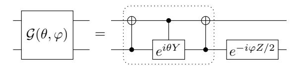

FIG. 1. Quantum circuit for a Givens rotation on neighboring qubits: the part in dotted box represents a rotation between the two states  $|01\rangle$  and  $|10\rangle$ .

the circuit (dotted box) describes to a rotation between the qubit states  $|\hspace{.06cm}10\rangle$  and  $|\hspace{.06cm}01\rangle$  corresponding a rotation in the single-particle subspace of the two spin orbitals; the two qubit states  $|\hspace{.06cm}00\rangle$  and  $|\hspace{.06cm}11\rangle$  corresponding to the unoccupied state and the double-occupied state are unchanged in this step. The fermionic unitary  $\mathcal U$  in Eq. (13) can be represented by a matrix U corresponding to a single-particle basis change, see Appendix A,

$$\mathcal{U} \mathbf{c}^{\dagger} \mathcal{U}^{\dagger} = U \mathbf{c}^{\dagger} , \quad U = G_{N_G} \cdots G_2 G_1 ,$$
 (15)

where  $\mathbf{c}^{\dagger} = (c_1^{\dagger} \cdots c_N^{\dagger})^T$ . The order of the Givens rotations is reversed in Eq. (15) compared to Eq. (13); this is because the matrix G acts directly on the vector of fermionic creation operators in Eq. (14), and it should be placed at the right side of all matrices representing earlier rotations. To perform the transformation in Eq. (9), we require that the first  $N_f$  rows of U be equal to VQ; see also Appendix A. With the example N=6 and  $N_f=3$ , this condition is equivalent to

$$VQU^{\dagger} = \begin{pmatrix} 1 & 0 & 0 & 0 & 0 & 0 \\ 0 & 1 & 0 & 0 & 0 & 0 \\ 0 & 0 & 1 & 0 & 0 & 0 \end{pmatrix} . \tag{16}$$

A sequence of Givens rotations—acting on adjacent columns of VQ (corresponding to neighboring qubits in the JWT)—can achieve this as follows:

$$VQ \to \begin{pmatrix} * & * & * & 0 & 0 & 0 \\ * & * & * & * & * & 0 \\ * & * & * & * & * & * \end{pmatrix} \to \begin{pmatrix} * & * & 0 & 0 & 0 & 0 \\ * & * & * & * & 0 & 0 & 0 \\ * & * & * & * & * & * \end{pmatrix}$$

$$\to \begin{pmatrix} \lambda_1 & 0 & 0 & 0 & 0 & 0 & 0 \\ 0 & * & * & 0 & 0 & 0 & 0 \\ 0 & * & * & * & * & 0 & 0 \end{pmatrix} \to \begin{pmatrix} \lambda_1 & 0 & 0 & 0 & 0 & 0 \\ 0 & \lambda_2 & 0 & 0 & 0 & 0 \\ 0 & 0 & * & * & 0 & 0 & 0 \\ 0 & 0 & \lambda_3 & 0 & 0 & 0 & 0 \end{pmatrix} \to VQU^{\dagger}, \tag{17}$$

where  $\lambda_j$ s are phase factors, i.e.,  $|\lambda_j|=1$ . The redcolored matrix elements are zeroed out in each step; Givens rotations on nonoverlapping columns can be implemented in parallel [45]. The blue colored ones become zeros or phase factors automatically due to the orthonormality of the rows. The phase factors are brought to ones in the last step by single-qubit rotations; this step is unnecessary if the goal is to prepare a single Slater determinant. The total number of Givens rotations needed for the transformation U is

$$N_G = NN_f - N_f(N_f - 1)/2 - N_f(N_f + 1)/2$$
  
=  $(N - N_f)N_f$ , (18)

and the circuit depth is N-1. Our algorithm requires only  $N^2/4$  Givens rotations in the worst case, when  $N_f = N/2$ . In comparison, direct implementations without using the unitary freedom V require more Givens rotations [11, 45]. We also point out that the trick to reduce  $N_G$  by interchanging the roles of particles and holes [11] is no longer needed here, i.e., particles and holes are treated on an equal footing in our algorithm.

In summary, we have described a method to prepare a Slater determinant (7) using two-qubit gates that act only on neighboring qubits. Our method can be achieved in four steps:

- 1. Store the wavefunctions of the occupied orbitals in the rows of the matrix Q,
- 2. Zero out the upper right matrix elements of Q using the freedom  $Q \to VQ$ ,
- 3. Diagonalize VQ using a sequence of Givens rotations as column transformations,
- 4. Find the quantum gates that correspond to the Givens rotations in step 3.

As mentioned above, this algorithm has been implemented as part of the open-source project Open-Fermion [38]. The code takes as input the matrix Q from Eq. (7) describing a Slater determinant and outputs a sequence of elements of the form  $(j,k,\theta,\phi)$ , which describes a Givens rotation of columns j and k. Furthermore, rotations that can be performed in parallel are grouped together. We used the code to verify that the method described here does produce the desired Slater determinant.

## IV. PREPARING FERMIONIC GAUSSIAN STATES

Fermionic Gaussian states [47, 48] can be regarded as a generalization of Slater determinants obtained by relaxing the constraint that the total number of particles be fixed. The celebrated BCS wavefunction [49] for superconductivity is a special case of fermionic Gaussian states. Verstraete et al. [37] demonstrated how to prepare the ground state of a BCS-like Hamiltonian—for 1D translationally invariant systems—using the fermionic fast Fourier transformation and the two-mode Bogoliubov transformation. Recently, superpositions of fermionic Gaussian states were used to approximate low energy states of quantum impurity models [50], which can be useful to a quantum-classical hybrid scheme for correlated materials [35]. Simulating quantum systems with disorder on a quantum computer may also lead to better understanding of and ultimately control over the emergent phases from impurities [30].

Here, we discuss how to prepare an arbitrary fermionic Gaussian state as the ground state of a quadratic Hamiltonian,

$$\mathcal{H} = \sum_{j,k=1}^{N} M_{jk} c_j^{\dagger} c_k + \frac{1}{2} \sum_{j,k=1}^{N} \left( \Delta_{jk} c_j^{\dagger} c_k^{\dagger} + \text{h.c.} \right), \quad (19)$$

where  $M=M^{\dagger}$  and  $\Delta=-\Delta^{T}$  are complex matrices. Python code for this algorithm is available as part of the OpenFermion project [38]. Our method can also be used to implement an arbitrary fermionic Gaussian unitary. In Appendix A, we review the standard approach to bring the Hamiltonian (19) into the diagonal form,

$$\mathcal{H} = \sum_{j=1}^{N} \varepsilon_j b_j^{\dagger} b_j + \text{c-number}, \qquad (20)$$

where  $0 \leq \varepsilon_1 \leq \varepsilon_2 \cdots \leq \varepsilon_N$ , and  $b_j$  and  $b_j^{\dagger}$  are a new set of fermionic operators that satisfy the canonical anti-commutation relations. The new fermionic operators are linear combinations of the original ones:

$$\begin{pmatrix} \mathbf{b}^{\dagger} \\ \mathbf{b} \end{pmatrix} = W \begin{pmatrix} \mathbf{c}^{\dagger} \\ \mathbf{c} \end{pmatrix} = \begin{pmatrix} \mathcal{W} \, \mathbf{c}^{\dagger} \, \mathcal{W}^{\dagger} \\ \mathcal{W} \, \mathbf{c} \, \mathcal{W}^{\dagger} \end{pmatrix} , \qquad (21)$$

where  $(\mathbf{c}^{\dagger} \ \mathbf{c})^T = (c_1^{\dagger} \cdots c_N^{\dagger} \ c_1 \cdots c_N)^T$  and  $(\mathbf{b}^{\dagger} \ \mathbf{b})^T = (b_1^{\dagger} \cdots b_N^{\dagger} \ b_1 \cdots b_N)^T$ . The fermionic Gaussian unitary  $\mathcal{W}$  performs the linear transformation W, and the ground state of the quadratic Hamiltonian (19) is

$$|\Psi_0\rangle = \mathcal{W} |\operatorname{vac}\rangle = \mathcal{U} |\operatorname{vac}\rangle,$$
 (22)

where  $c_j | \operatorname{vac} \rangle = 0$  for j = 1, 2, ..., N, and  $\mathcal{U} = \mathcal{WV}$  for some single-particle basis transformation  $\mathcal{V}$ . The unitary matrix W has the block form

$$W = \begin{pmatrix} W_1^* & W_2^* \\ W_2 & W_1 \end{pmatrix} , (23)$$

where the submatrices satisfy

$$W_1 W_1^{\dagger} + W_2 W_2^{\dagger} = 1, \qquad (24)$$

$$W_1 W_2^T + W_2 W_1^T = 0, (25)$$

with  $\mathbbm{1}$  and  $\mathbbm{0}$  being the  $N \times N$  identify matrix and zero matrix, respectively. We define the  $N \times 2N$  matrix  $W_L = (W_2 \ W_1)$  as the lower half of W; the jth row

of  $W_L$  corresponds to the expansion coefficients of the operator  $b_j$ . The matrix  $W_L$  uniquely determines the transformation W up to an overall phase.

Using elementary matrix manipulations on  $W_L$ , we demonstrate that the Gaussian unitary  $\mathcal{U}$  in Eq. (22) can be broken into a sequence of operations that can be implemented on a quantum computer:

$$\mathcal{U} = \mathcal{B}\mathcal{G}_1 \mathcal{B}\mathcal{G}_2 \mathcal{G}_3 \mathcal{B} \cdots \mathcal{G}_{N_C} \mathcal{B}, \qquad (26)$$

where  $\mathcal{G}_{j}$ s are Givens rotations on adjacent fermionic modes encoded in the JWT and  $\mathcal{B}$  denotes the particle-hole Bogoliubov transformation on the last fermionic mode.

$$\mathcal{B}c_N \mathcal{B}^{\dagger} = c_N^{\dagger} \,, \tag{27}$$

$$\mathcal{B}c_j\mathcal{B}^{\dagger} = c_j, \text{ for } j = 1, 2, \dots, N - 1.$$
 (28)

The transformation  $\mathcal{B}$  does not conserve the total number of particles and is crucial to preparing superpositions of states with different numbers of particles. It can be implemented easily by applying the Pauli-X operator on the last qubit; the parities of the other fermionic modes encoded in the JWT are not affected, which would not be true for any other spin orbital. In the relevant coordinate axes, the matrix representation of the Givens rotation is

$$G = \begin{pmatrix} \cos \theta & -e^{i\varphi} \sin \theta & 0 & 0\\ \frac{\sin \theta}{\theta} & e^{i\varphi} \cos \theta & 0 & 0\\ 0 & 0 & \cos \theta & -e^{-i\varphi} \sin \theta\\ 0 & 0 & \sin \theta & e^{-i\varphi} \cos \theta \end{pmatrix} . \tag{29}$$

The representation of the particle-hole transformation is

$$B = B^{\dagger} = \begin{pmatrix} \mathbb{1} - e_N e_N^T & e_N e_N^T \\ e_N e_N^T & \mathbb{1} - e_N e_N^T \end{pmatrix}, \quad (30)$$

where  $e_N = (0, ..., 0, 1)^T$  is an N-dimensional unit vector. The goal is to find a  $2N \times 2N$  unitary matrix U decomposed into G and B,

$$U = BG_{N_G} \cdots BG_3 G_2 BG_1 B, \qquad (31)$$

such that

$$VW_L U^{\dagger} = \left( \begin{array}{cc} \mathbb{1} \end{array} \right), \tag{32}$$

where V is an arbitrary unitary matrix. The right-hand side of Eq. (32) represents the original annihilation operators  $c_j$ , which corresponds to the vacuum state defined in Eq. (22). We discuss how to bring  $W_L$  to the desired form (32) using an example of four spin orbitals. Following Section III, we use the unitary V as a freedom to zero out some matrix elements on the left side of  $W_L$ ,

$$VW_L = \begin{pmatrix} 0 & 0 & 0 & * & * & * & * & 0 \\ 0 & 0 & * & * & * & * & * & * \\ 0 & * & * & * & * & * & * \\ * & * & * & *$$

where \* represents an arbitrary matrix element and the blue colored matrix element is automatically zeroed out due to Eq. (25). A sequence of elementary operations that brings  $W_L$  to the desired form is

$$VW_{L} \rightarrow \begin{pmatrix} 0 & 0 & 0 & 0 & | & * & * & * & * & * & * & * & * & *$$

The red-colored matrix elements in the fourth column are always zeroed out by the particle-hole transformation B, and the other red-colored matrix elements on the left side are zeroed out by the Givens rotations G. The red-colored elements on the right side become nonzero due to the particle-hole transformation B, and the blue-colored matrix elements are brought to zeros or phase factors automatically by the condition (24) or (25). The phase factors are brought to ones in the last step by single-qubit rotations; this step is unnecessary if  $\mathcal{U}$  is applied to

the vacuum state. The total numbers of Givens rotations and particle-hole transformations are

$$N_G = (N-1)N/2$$
,  $N_B = N$ , (35)

and the circuit depth is at most 2N-1.

In summary, we have described a method to prepare an arbitrary Gaussian state as the ground state of the quadratic Hamiltonian (19) using two-qubit gates that act only on neighboring qubits. Our method can be achieved in four steps:

- 1. Calculate the matrix W using the procedure described in Appendix A,
- 2. Zero out the upper-left matrix elements of  $W_L$  using the freedom  $W_L \to VW_L$  (33),
- 3. Zero out the remaining matrix elements on the left side of  $VW_L$  using the sequence (34),
- 4. Find the quantum gates corresponding to the sequence in step 3.

The procedure described here also applies to the implementation of an arbitrary Gaussian unitary, where one cannot use the unitary freedom V. By rearranging Eq. (32), we have

$$W_{L} = V^{\dagger} \begin{pmatrix} 0 & 1 \end{pmatrix} U = \begin{pmatrix} 0 & 1 \end{pmatrix} \begin{pmatrix} V^{T} & 0 \\ 0 & V^{\dagger} \end{pmatrix} U, \quad (36)$$

where the matrix diag  $(V^T, V^{\dagger})$  corresponds to a basis change and can be decomposed as Givens rotations using the method discussed in Section III.

As mentioned above, this algorithm has also been implemented as part of OpenFermion [38]. The user can specify a quadratic Hamiltonian by inputting the matrices M and  $\Delta$  from Eq. (19). The code then outputs a sequence of operations, each of which describes either a Givens rotation or indicates a particle-hole transformation on the last fermionic mode. The operations that can be performed in parallel are grouped together. Since OpenFermion also contains modules to initialize common Hamiltonian models, it can be used to easily specify, for instance, a meanfield Hamiltonian, and then obtain a circuit that prepares its ground state. We used the code to verify that the method described here does produce the desired ground state.

## V. FERMIONIC FOURIER TRANSFORMATIONS

The fermionic Fourier transformation is a subroutine of many quantum algorithms. It was first introduced for quantum computing purposes in [37]. Recently, Babbush et al. [9] demonstrated that the 2D and 3D fermionic Fourier transformations can be implemented using a 2D qubit array with O(N) depth. Here, we present an algorithm to implement the 2D fermionic Fourier transformation using a 2D qubit array with only  $O(\sqrt{N})$  depth. This amount of depth is required for quantum information to travel across the array, and therefore this scaling is optimal. Our method provides an example where the parity problem in JWTs for more than one spatial dimension can be circumvented with negligible overhead. Our algorithm also works for more general transformations that can be factorized into a product of transforms on each spatial dimension, including Fourier transformations with open-boundary conditions and fermionic

Gaussian unitaries. This algorithm allows one to efficiently prepare the initial states for systems whose ground states are well approximated by the meanfield states, as well as improve the efficiency of measurements.

In Section III, we have demonstrated that any fermionic single-particle basis transformation—including the 1D fermionic Fourier transformation—can be implemented using a 1D qubit chain with  $O(N^2)$  gates and O(N) depth; see also Theorem 7 in Ref. [9]. Using this algorithm as a subroutine, we discuss an algorithm that implements the 2D fermionic Fourier transformation using a 2D qubit array with  $O(N^{1.5})$  gates and  $O(\sqrt{N})$  depth. More generally, our method works for any fermionic single-particle basis transformation  $\mathcal{F}$  (or fermionic Gaussian unitary) that factorizes,

$$\mathcal{F} = \mathcal{F}_x \mathcal{F}_y = \mathcal{F}_y \mathcal{F}_x \,, \tag{37}$$

where the horizontal (vertical) transformation  $\mathcal{F}_x$  ( $\mathcal{F}_y$ ) is a product of commuting terms, each of which only involves spin orbitals in the same row (column). We map the fermionic operators to qubit operators using a snake-shaped JWT in row-major order; see Fig. 2. The trans-

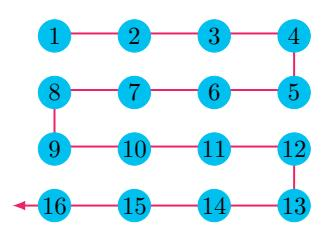

FIG. 2. The fermionic spin orbitals on a  $4\times4$  array are mapped to qubits (blue circles) on an array of the same dimensions using a snake-shaped JWT. The red arrow shows the direction of the JWT, and the qubits are numbered by their order in the JWT. Hopping terms between an odd-numbered row and the row below are called right-closed hopping terms, while those between an even-numbered row and the row below are called left-closed hopping terms.

formation  $\mathcal{F}_x$  on a single row can be implemented with  $O(n_x^2)$  gates and  $O(n_x)$  depth using the algorithm described in Section III, where  $n_x$  is the number of spin orbitals in a single row (number of columns). The vertical transformation  $\mathcal{F}_y$  is much harder to implement with our mapping because of the nonlocal parity operators in the hopping terms, see Eq. (5). This difficulty can be overcome by reordering the fermionic spin orbitals in the JWT using the fermionic SWAP gates; such a strategy allows one to perform the 2D fermionic Fourier transformation using a 2D qubit array with  $O(N^2)$  gates and O(N) depth [9].

We use a different approach that takes full advantage of the 2D qubit interactions. In our scheme, the transformation (37) is realized using the decomposition

$$\mathcal{F} = \mathcal{F}_x \mathcal{F}_y = \mathcal{F}_x \Gamma^{\dagger} \mathcal{F}_y^b \Gamma, \qquad (38)$$

where  $\Gamma = \Gamma^{\dagger}$  is a diagonal unitary matrix in the computational (Pauli-Z) basis with eigenvalues  $\pm 1$ . We will show that  $\Gamma$  can be implemented with O(N) gates and  $O(\sqrt{N})$  depth. The unitary  $\mathcal{F}_y^b$  is implemented by using the Givens rotations without the parity operators attached, see Fig. 1. This is equivalent to using a JWT with column-major order, and the generator of the real Givens rotation takes the form (6a),

$$K_{jk} = \frac{1}{2} (X_j Y_k - Y_j X_k),$$
 (39)

where the qubits j and k are adjacent in one column; we call these operators bare hopping terms. The unitary transformation  $\Gamma$  attaches the corresponding parity operator to the bare hopping terms,

$$\Gamma^{\dagger} K_{jk} \Gamma = K_{jk} Z_{j+1} \cdots Z_{k-1} , \quad k > j , \qquad (40)$$

for any indices j and k adjacent in the same column. Any non-neighboring vertical hopping terms can be derived as (nested) commutators of the nearest-neighbor ones, and their parities are taken care of automatically. Because  $\mathcal{F}_y$  can be decomposed into a product of Givens rotations generated by the vertical hopping terms, we have  $\Gamma^{\dagger}\mathcal{F}_y^b\Gamma=\mathcal{F}_y$ . We denote an arbitrary state in the computational basis with  $|\mathbf{s}\rangle$ , where  $\mathbf{s}=(s_1,s_2,\ldots,s_N)$  is a binary string. The matrix element of the hopping term  $K_{jk}$  with respect to the basis states  $|\mathbf{s}\rangle$  and  $|\mathbf{s}'\rangle$  takes the form

$$\langle \mathbf{s}' | \Gamma^{\dagger} K_{jk} \Gamma | \mathbf{s} \rangle = \gamma_{\mathbf{s}} \gamma_{\mathbf{s}'} \langle \mathbf{s}' | K_{jk} | \mathbf{s} \rangle,$$
 (41)

where  $\gamma_{\mathbf{s}}$  and  $\gamma_{\mathbf{s}'}$  are the corresponding eigenvalues of  $\Gamma$ . Comparing Eq. (40) with Eq. (41), we have

$$\gamma_{\mathbf{s}}\gamma_{\mathbf{s}'} = (-1)^{\sum_{l=j+1}^{k-1} s_l} = (-1)^{\sum_{l=j+1}^{k-1} s_l'},$$
 (42)

for any pair of basis states such that  $\langle \mathbf{s}' | K_{jk} | \mathbf{s} \rangle \neq 0$ . The matrix element  $\langle \mathbf{s}' | K_{jk} | \mathbf{s} \rangle$  is nonzero only when  $s_j \neq s'_j$ ,  $s_k \neq s'_k$ , and  $s_l = s'_l$  for all  $l \neq j, k$ ; the total parity of the qubit j and k also needs to be odd,

$$s_j + s_k = s'_j + s'_k = 1.$$
 (43)

The unitary  $\mathcal{F}_y^b$  on a single column can be implemented with  $O(n_y^2)$  gates and  $O(n_y)$  depth using the bare hopping terms, where  $n_y$  is the number of spin orbitals per column. By parallelizing operations on different rows or columns of qubits, one can implement either  $\mathcal{F}_x$  or  $\mathcal{F}_y^b$  with  $O(N^{1.5})$  gates and  $O(\sqrt{N})$  depth, where  $N = n_x \times n_y$  is the number of spin orbitals. A Slater determinant in the momentum basis can be prepared by applying the transformation  $\mathcal{F}$  to a Slater determinant in the site basis  $|\mathbf{s}\rangle$ ,

$$\mathcal{F}|\mathbf{s}\rangle = \mathcal{F}_x \Gamma^{\dagger} \mathcal{F}_y^b \Gamma|\mathbf{s}\rangle = \gamma_{\mathbf{s}} \mathcal{F}_x \Gamma^{\dagger} \mathcal{F}_y^b |\mathbf{s}\rangle, \qquad (44)$$

where  $\gamma_s = \pm 1$ . The transformation  $\Gamma$  is also useful to simulating the time evolution of fermionic systems, e.g.,

the Fermi-Hubbard model. The hopping terms in each Trotter step can be implemented with O(N) gates and  $O(\sqrt{N})$  circuit depth by using  $\Gamma$ .

To implement  $\Gamma$ , we introduce one ancilla qubit per row to store the parities, see Fig. 4; they are only used to facilitate the implementation of  $\Gamma$  and are disentangled with the system qubits in the end. Initially, the ancilla qubits are located at the right side to all the system qubits, and their states are set to  $|0\rangle$ . In each time step, each ancilla qubit is swapped with the system qubit to the left which allows it to interact with other system qubits. The parity stored in the ancilla qubit is updated by applying the CNOT gate controlled by the same system qubit (now on the right side of the ancilla), see Fig. 3. After the CNOT

$$\begin{vmatrix} a \\ s \end{vmatrix}$$
  $\begin{vmatrix} s \\ a \end{vmatrix}$   $\begin{vmatrix} (a+s) \mod 2 \end{vmatrix}$ 

FIG. 3. The ancilla qubit a is swapped with the system qubit s to its left, and then its state is updated by the CNOT gate.

gate, the ancilla qubits store the total parity of system qubits to their right on the same rows. We apply CZ gates between the ancilla qubits and the system qubits, see Fig. 4; each CZ gate introduces a parity (an overall  $\pm 1$  sign) to the state  $|\,{\bf s}\,\rangle$  in the computational basis. The goal is to find the set of CZ gates, acting on neighboring qubits, such that they put the desired parities to the bare vertical hopping terms. It is instructive to first work out the cases for right-closed and left-closed hopping terms, separately.

In Fig. 4, we plot the CZ gates (dashed lines) that generate the desired parities for the right-closed hopping terms between an odd-numbered row and the row below. We explain how this works for the hopping term between the system qubits 2 and 7. Any two basis states  $|s\rangle$  and

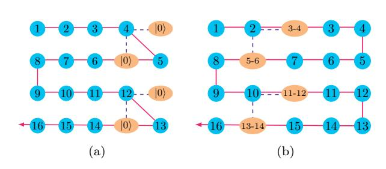

FIG. 4. The ancilla qubits (orange ellipses) store the parity of the system qubits (blue circles), where j-k denotes the parity  $\left(\sum_{l=j}^{k} s_l\right)$  mod 2. The purple dashed lines represent CZ gates between the ancilla and the system qubits for right-closed hopping terms. The CZ gates in Fig. 4a can be omitted because the ancilla states are set to  $|0\rangle$  initially.

 $|\mathbf{s}'\rangle$  corresponding to a nonzero matrix element of the hopping term satisfy  $s_l = s'_l$  for  $l \in \{3, 4, 5, 6\}$ ; therefore, they accumulate the same parity before hitting the two CZ gates involving qubit 2, see Fig. 4b. The states of

the two ancilla qubits involved in these two CZ gates are the same for the two basis states, because the parities of qubits 2 and 7 have not been added to them. After the two CZ gates in Fig. 4b, the two basis states acquire a difference in parity equaling to  $(s_3 + s_4 + s_5 + s_6)$  mod 2, see Fig. 5. To simplify notations, we will neglect mod 2 in dealing with parities hereafter. The two ancilla qubits

$$\begin{array}{c|ccccccccccccccccccccccccccccccccccc$$

FIG. 5. The CZ gates involving one system qubit s and two ancilla qubits a and b: When  $s \neq s'$  and a+b=a'+b' for the two basis states, a parity difference of a+b is introduced. In comparison, no parity difference is introduced when both quantities are the same for the two basis states.

on the first and second rows take different values for  $|\mathbf{s}\rangle$  and  $|\mathbf{s}'\rangle$  after the parities of qubits 2 and 7 are added to them, however, the total parities of the two ancilla qubits are still the same. The subsequent two CZ gates (qubit 1 is involved) do not introduce a parity difference to the two basis states, because both s and a+b are the same for the two basis states. After the ancilla qubits reach the left end, all the right-closed hopping terms get the desired parities from the CZ gates.

In Fig. 6, we plot the CZ gates that introduce the desired parities for the left-closed hopping terms, i.e., those between an even-numbered row and the row below. We

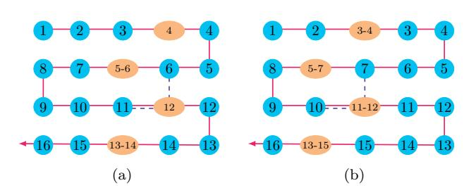

FIG. 6. The purple dashed lines represent CZ gates between the ancilla qubits and the system qubits for left-closed hopping terms.

explain how this works for the hopping term between qubits 6 and 11. Any two basis states  $|\mathbf{s}\rangle$  and  $|\mathbf{s}'\rangle$  corresponding to a nonzero matrix element of the hopping term satisfy  $s_l = s_l'$  for  $l \in \{5, 12\}$ ; therefore, they accumulate the same parities before hitting the two CZ gates in Fig. 6a. These two CZ gates do not introduce a parity difference either, because both the parity of the ancilla qubit and the total parity of the two system qubits are the same for the two basis states, see Eq. (43) and Fig. 7. The ancilla qubit take different values for  $|\mathbf{s}\rangle$  and  $|\mathbf{s}'\rangle$  after the parity of qubit 11 is added to it. As a result, the following two CZ gates (qubits 7 and 10 are involved)

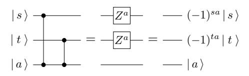

FIG. 7. The CZ gates involving two system qubits s and t and one ancilla qubit a: When  $a \neq a'$  and s+t=s'+t' for the two basis states, a parity difference of s+t is introduced. In comparison, no parity difference is introduced when both quantities are the same.

introduce a parity difference to the two basis states equaling to  $s_7 + s_{10} = s_7' + s_{10}'$ , see Fig. 7. Since the state of the ancilla qubit remains being different for  $|\mathbf{s}\rangle$  and  $|\mathbf{s}'\rangle$ , a parity difference of  $s_8 + s_9 = s_8' + s_9'$  is introduced in the next step. After the ancilla qubits reach the left end, all the left-closed hopping terms get the desired parities from the CZ gates.

We have showed how to introduce the desired parities to the right-closed and the left-closed hopping terms using the CZ gates in Fig. 4 and 6, respectively. The ancilla qubits are brought to interact with system qubits in a particular column at a time, and they store the total parities of all the system qubits in the same row to the right of the current column. We depict the two kinds of CZ gates in Fig. 8 for a single time step, where the system (ancilla) qubits are represented by blue (red) dots. One will not achieve the desired results for both kinds of

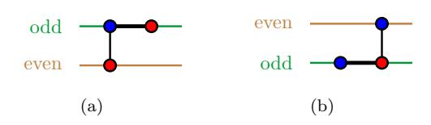

FIG. 8. The CZ gates between system (blue) and ancilla (red) qubits: (a) for right-closed hopping terms (between an odd-numbered row and the row below), e.g., the one involving qubit 2 in Fig. 4b, (b) for left-closed hopping terms (between an even-numbered row and the row below), e.g., the one involving qubits 6 and 11 in Fig. 6a

hopping terms by simply combining the two sets of CZ gates. This is because the CZ gates for the right-closed terms also affect the parities of the left-closed terms, and vice versa.

To circumvent this difficulty, we introduce the CZ gates for a single time step using an example of 6 rows in Fig. 9. In addition to the CZ gates in Fig. 8 for all the right-closed hopping terms, we also introduce a CZ gate between each system qubit and the ancilla qubits below starting from the next odd-numbered row. We show that this set of CZ gates works for both right-closed and left-closed hopping terms. First, we discuss the hopping term between the first and second rows. The CZ gates are divided into three parts in Fig. 9. In the first part, the states of the ancilla qubits are the same for the two ba-

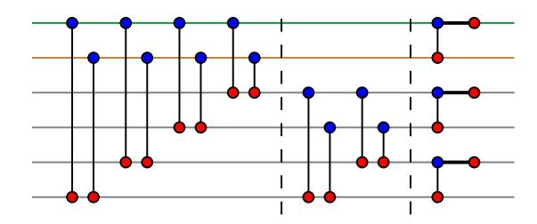

FIG. 9. The CZ gates between the system (blue) and ancilla (red) qubits in a single time step that introduce the desired parities to both the right-closed and the left-closed hopping terms

sis states  $|\mathbf{s}\rangle$  and  $|\mathbf{s}'\rangle$ , and the total parity of the two system qubits in the first and second rows are also the same, see Eq. (43). As a result, the CZ gates in the first part do not introduce parity difference to the two basis states. Neither do the CZ gates in the second part, because they act on qubits that are not involved in the hopping term. The third part is equivalent to the circuit in Fig. 8a. Therefore, this circuit works for any hopping term between the first and second rows.

To show how the same circuit works for the hopping terms between the second and third rows, we rearrange the CZ gates in Fig. 9 into the specific form in Fig. 10. Because all CZ gates commute, these two circuits are equivalent. The first three pairs of CZ gates and the

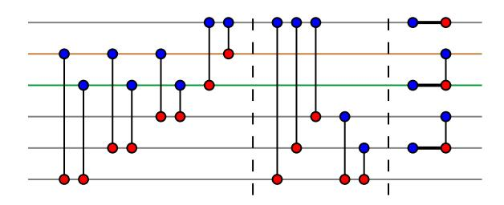

FIG. 10. Quantum circuit to demonstrate the hopping terms between the second and third rows by rearranging the CZ gates in Fig. 9

second part in Fig. 10 do not introduce any parity difference to the two basis states for the same reasons we have discussed before. Neither do the last two CZ gates in the first part, because the total parity of the two ancilla qubits on the second and third rows are the same for the two basis states. The third part of Fig. 10 is equivalent to the circuit in Fig. 8b. Therefore, the same circuit also works for any hopping term between the second and third rows. It is straightforward to verify that the circuit works for any other nearest-neighbor vertical hopping term in this example, see Appendix G. Therein, we also give an argument on why our approach works for systems with any even number of rows (an unused row can be added when the number of rows is odd).

The problem of implementing the circuit in Fig. 9 is that there are many non-local gates in the first and sec-

ond parts, which we replotted in Fig. 11. To deal with

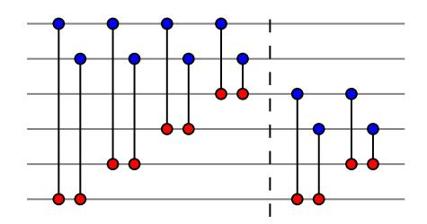

FIG. 11. The first and second parts in Fig. 9

this difficulty, we go to the parity basis of columns by applying the circuit in Fig. 12a to both the system and the ancilla qubits. In this new basis, any system qubit stores

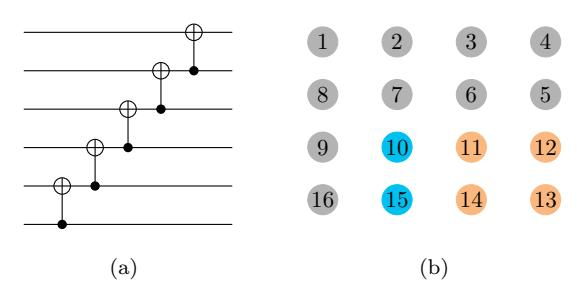

FIG. 12. Parity basis of the columns: (a) the circuit maps the computational basis to the parity basis, (b) the parities stored in system qubit 10 (blue) and the corresponding ancilla (orange)

the total parity of the original system qubits on the same column from the current location to the bottom, e.g., the qubit 10 in Fig. 12b stores the parity  $s_{10} + s_{15}$  in the parity basis of columns. Any ancilla qubit stores the total parity to the lower-left of the corresponding system qubit. e.g., the ancilla qubit corresponding to system qubit 10 in Fig. 12b stores the parity  $s_{11} + s_{12} + s_{13} + s_{14}$ . To find the circuit corresponding to Fig. 11 in the new basis, we first go to the parity basis of the ancilla qubits and keep the system qubits unchanged. With this intermediate basis, the fist four (last two) pairs of CZ gates in Fig. 11 are mapped to the first (second) pair of CZ gates in Fig. 13a. This is because we can combine all CZ gates acting on the same system qubit into a single CZ gate by using an ancilla qubit storing the total parity of the original ancilla qubits. We continue to go to the parity basis of the system qubits, and the circuit in Fig. 13a is mapped to the one in Fig. 13b. This is because the total parity of the first and second (third and fourth) qubits in Fig. 13a is equal to the total parity of the first and third (third and fifth) qubits. In general, we have a CZ gate between the system qubit on each odd-numbered row and the ancilla qubit two rows below and a CZ gate between the system and the ancilla qubits on each odd-numbered row except for the first row. Going the parity basis of the system qubits might seem to be unnecessary, but we will

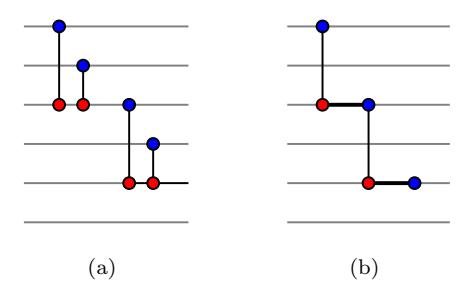

FIG. 13. Equivalent circuits to Fig. 11: (a) the ancilla qubits are in the parity basis and the system qubits are in the original basis, (b) both the system and the ancilla qubits are in the parity basis.

show that it is essential for reducing the circuit depth.

We have showed that the first two parts in Fig. 9 can be implemented with only local CZ gates; however, going to the parity basis requires a sequence of  $O(\sqrt{N})$  gates which increases the circuit depth. One solution is to implement, in parallel, the quantum circuit in Fig. 12a to all columns of system qubits at the beginning. As the ancilla gubits move to the left, they pick up the parities stored in the system qubits. These add up to the desired parities of the ancilla qubits in the parity basis, and no basis transformation are needed when the ancilla qubits move across the system qubits. The circuit in Fig. 13b is implemented in each time step. After the ancilla qubits reach the left end, we go back to the original basis by applying the gates in Fig. 12a, with reversed order, to both the system and the ancilla qubits. We then move the ancilla qubits to the right by reversing the order of the CNOT and the SWAP gates when we moved them to the left. The CZ gates in the last part of Fig. 9 are implemented in each time step. All the ancilla gubits are disentangled with the system gubits when they reach the right end, and the unitary  $\Gamma$  has been implemented on the system qubits. We verify our procedure numerically by using random classical bit strings s and s' for system size up to  $100 \times 100$  and by simulating the actual quantum circuit for system size  $4 \times 4$ .

In summary, the unitary  $\Gamma$  can be implemented with the following four stages:

- 1. Implement the circuit in Fig. 12a for each column of the system qubits,
- 2. Move the ancilla qubits to the left while applying the CZ gates in Fig. 13b,
- 3. Undo the circuit in Fig. 12a for both the system qubits and the ancilla qubits,
- 4. Move the ancilla qubits to the right while applying the CZ gates in the third part of Fig. 9.

Each of the four stages can be implemented with O(N) gates and  $O(\sqrt{N})$  depth; therefore, the whole procedure

takes gates and depth with the same scalings. In comparison,  $\mathcal{F}_x$  or  $\mathcal{F}_y^b$  requires  $O(N^{1.5})$  gates and  $O(\sqrt{N})$  depth to implement. Our quantum algorithm provides an example that the parity problem in simulating 2D fermionic systems can be circumvented with negligible overhead.

#### VI. THE FERMI-HUBBARD MODEL

One way to unravel the intricate physics in strongly correlated materials is to approximate them with idealized model Hamiltonians, such as the Fermi-Hubbard model. The Hubbard model captures many signatures of the physical systems, although it is too simple to describe real materials quantitatively. It has resisted a full solution despite decades of intense analytical and numerical studies. The Hubbard model has a relatively small number of interacting terms, allowing for easy implementation on a quantum computer. The single-band Hubbard model is described by the Hamiltonian

$$\mathcal{H}_{\text{FH}} = -\sum_{\langle j,k \rangle,\sigma} t_{jk} \left( c_{j,\sigma}^{\dagger} c_{k,\sigma} + \text{h.c.} \right) + U \sum_{j} n_{j,\uparrow} n_{j,\downarrow} + \sum_{j,\sigma} (\epsilon_j - \mu) n_{j,\sigma} - \sum_{j} h_j (n_{j,\uparrow} - n_{j,\downarrow}), \quad (45)$$

where the first term represents fermions hopping between sites, the second term represents on-site interactions, the third term is a local potential field, and the last term represents a local magnetic field.

The 2D Hubbard model is widely used as a canonical microscopic model for strongly correlated fermionic systems. It is believed to be a key ingredient in understanding the mechanism behind high-temperature superconductivity [14]. In particular, understanding the physics of the model in the intermediate interaction strength regime  $U/t \sim 4$  in the underdoped region remains an open problem. Multiple orders exist in this region of its phase diagram, see Fig. 14. Even the nature of the ground

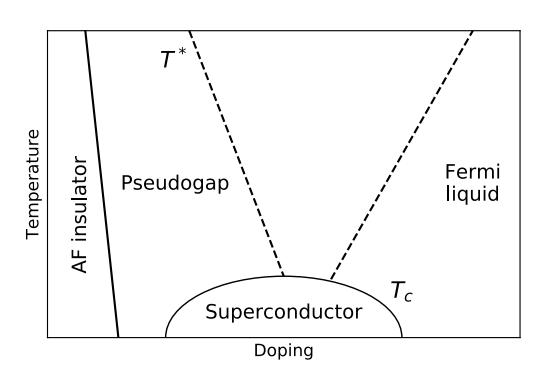

FIG. 14. Phase diagram of the 2D Fermi-Hubbard model: the critical temperature  $T_c$  depends on the value of hole doping, AF stands for antiferromagnet and FL for Fermi liquid.

state remains ambiguous due to the competition between a number of different order parameters [51]. Significant progress has been made in the identification of the unconventional Mott-insulator transition and a superconducting phase with d-wave order parameter [52, 53]. Recently, the antiferromagnet phase of the Fermi-Hubbard model was realized in optical lattices of about 80 sites at a temperature of 1/4 times the tunnelling energy [29]. This region of multiple competing phases is also the most interesting regime from the point of view of modeling materials; therefore, a simulation using even a relatively small quantum computer could provide new qualitative and quantitative insights into the physics of the model [11, 54, 55]. Generalizations of the Hubbard model beyond the single band case and including more complicated lattices could be a route to modeling a wide range of strongly correlated materials. It is also a versatile tool for exploring strongly correlated electron phases [56] in a controlled way. Simulation of the Hubbard model on a quantum computer could allow quantitative analysis of the physical characteristics beyond the phase diagram, such as dynamical effects which could help uncover the deeper physics of the strongly correlated phases in the model.

In order to implement time evolution of the Hubbard model on a quantum computer, we decompose it into a product of available quantum gates based on the Trotter-Suzuki formula [57, 58]; the desired accuracy determines the number of time steps [59, 60]. We have simulated the Trotter error numerically for small system sizes in Appendix F. In each time step, we implement successively the horizontal hopping terms, the vertical hopping terms, and the remaining terms. The two spin states can be mapped to two sublattices of a 2D qubit array; for example, see Fig. 15. The horizontal hopping terms can

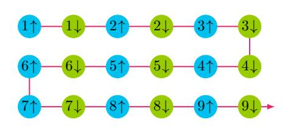

FIG. 15. One way to map the two spin states to qubits on a 2D qubit array using the JWT.

be implemented by bringing qubits corresponding to the same spin states next to each other with the fermionic SWAP gates; for example, one can swap the qubits  $j\uparrow$  with  $j\downarrow$  for odd j in a row to implement some hopping terms, swap back, and then swap  $j\uparrow$  with  $j\downarrow$  for even j in the same row to implement the remaining hopping terms. This step requires O(N) gates and O(1) depth. The vertical hopping terms can be implemented using the method described in Section V; this requires O(N) gates and  $O(\sqrt{N})$  depth. Alternatively, the vertical hopping terms can be implemented using the method described in Appendix B also with O(N) gates and  $O(\sqrt{N})$  depth.

The on-site interaction terms in Eq. (45) are mapped to qubit operators of the form,

$$n_{j\uparrow}n_{j\downarrow} \mapsto \frac{1}{4} \left( I - Z_{j\uparrow} \right) \left( I - Z_{j\downarrow} \right) ,$$
 (46)

which can be implemented using a controlled-phase gate,

$$\exp\left(-i\tau U n_{j\uparrow} n_{j\downarrow}\right) \mapsto \begin{pmatrix} 1 & 0 & 0 & 0\\ 0 & 1 & 0 & 0\\ 0 & 0 & 1 & 0\\ 0 & 0 & 0 & e^{-i\tau U} \end{pmatrix}. \tag{47}$$

The bias term and the magnetic term in the second line of Eq. (45) can be implemented straightforwardly with single-qubit operators. This step requires O(N) gates and O(1) depth. Putting all these steps together, each Trotter step can be simulated with only O(N) quantum gates and  $O(\sqrt{N})$  depth.

Cooper proved that an arbitrarily small attraction between electrons can cause pairing of electrons, leading to a lower energy state than the Fermi energy. As described in the BCS theory by Bardeen, Cooper, and Schrieffer [49], the s-wave pairing wavefunction due to electron-phonon interactions is responsible for conventional superconductivity. The cuprate superconductivity has d-wave symmetry [61, 62], wherein the superconducting wavefunction changes sign upon rotation by 90 degrees. It has been predicted that d-wave pairing underlies high- $T_c$  superconductivity in cuprates [63]; however, the mechanism of this pairing is not completely known. The mean-field Hamiltonian that describes d-wave pairing in the single-band Hubbard model is

$$\mathcal{H}_{DW} = -\sum_{\langle j,k\rangle,\sigma} t_{jk} \left( c_{j,\sigma}^{\dagger} c_{k,\sigma} + c_{k,\sigma}^{\dagger} c_{j,\sigma} \right) - \mu \sum_{j,\sigma} n_{j,\sigma}$$
$$- \sum_{\langle j,k\rangle} \Delta_{jk}^{x^{2}-y^{2}} \left( c_{j\uparrow}^{\dagger} c_{k\downarrow}^{\dagger} - c_{j\downarrow}^{\dagger} c_{k\uparrow}^{\dagger} + \text{h.c.} \right), \quad (48)$$

where the chemical potential term with  $\mu$  regulating the total number of particles, and  $\Delta_{jk}^{x^2-y^2}=\pm\Delta/2$  are the superconducting gaps for the horizontal and vertical directions, respectively. With the mapping in Fig. 15, the pairing term  $c_{j\uparrow}^{\dagger}c_{k\downarrow}^{\dagger}+\text{h.c.}$  can be implemented similarly to the hopping terms.

Assuming translational symmetry and periodic boundary conditions, the ground state of the Hamiltonian (48) can be prepared using the fermionic Fourier transformation,

$$c_{\mathbf{k},\sigma}^{\dagger} = \frac{1}{\sqrt{n_x n_y}} \sum_{j=1}^{n_x n_y} e^{2\pi i (k_x x_j + k_y y_j)} c_{j,\sigma}^{\dagger},$$
 (49)

where  $n_x$   $(n_y)$  is the number of sites in the horizontal (vertical) direction, and  $x_j \in \{1, \ldots, n_x\}$  and  $y_j \in \{1, \ldots, n_y\}$  denote the coordinates of the jth site. The discrete wavevector  $\mathbf{k} = (k_x, k_y)$  satisfies the condition

 $k_x n_x \in \{1, \dots, n_x\}$  and similar for  $k_y$ . In the momentum basis, the Hamiltonian (48) becomes

$$\mathcal{H}_{\rm DW} = \sum_{\mathbf{k},\sigma} \xi_{\mathbf{k}} c_{\mathbf{k},\sigma}^{\dagger} c_{\mathbf{k},\sigma} - \sum_{\mathbf{k}} \Delta_{\mathbf{k}} \left( c_{\mathbf{k}\uparrow}^{\dagger} c_{-\mathbf{k}\downarrow}^{\dagger} + \text{h.c.} \right), \quad (50)$$

where  $-\mathbf{k} \equiv (1 - k_x, 1 - k_y)$  and

$$\xi_{\mathbf{k}} = -2t \left( \cos(2\pi k_x) + \cos(2\pi k_y) \right) - \mu, \qquad (51)$$

$$\Delta_{\mathbf{k}} = \Delta \left( \cos(2\pi k_x) - \cos(2\pi k_y) \right), \tag{52}$$

where  $\mu$  is chosen such that  $\xi_{\mathbf{k}} = 0$  at the Fermi surface. The BCS meanfield ground state of Eq. (50) is

$$|\Psi_{\rm DW}\rangle = \prod_{\mathbf{k}} \left( u_{\mathbf{k}} + v_{\mathbf{k}} c_{\mathbf{k}\uparrow}^{\dagger} c_{-\mathbf{k}\downarrow}^{\dagger} \right) |\operatorname{vac}\rangle,$$
 (53)

$$u_{\mathbf{k}}^2 = \frac{1}{2} \left( 1 + \frac{\xi_{\mathbf{k}}}{\sqrt{\xi_{\mathbf{k}}^2 + |\Delta_{\mathbf{k}}|^2}} \right),$$
 (54)

$$v_{\mathbf{k}}^2 = \frac{1}{2} \left( 1 - \frac{\xi_{\mathbf{k}}}{\sqrt{\xi_{\mathbf{k}}^2 + |\Delta_{\mathbf{k}}|^2}} \right),$$
 (55)

where  $u_{\mathbf{k}} \geq 0$  and  $\operatorname{sgn} v_{\mathbf{k}} = \operatorname{sgn} \Delta_{\mathbf{k}}$ . Inspired by Ref. [37], we prepare the BCS ground state in the site basis by first preparing the ground state in the momentum basis (53) and then applying the 2D Fourier transformation to the two spin states, independently. The ground state in the momentum basis can be prepared by applying a Bogoliubov transformation to the vacuum state:

$$|\Psi_{\rm DW}\rangle = \prod_{\mathbf{k}} \exp\left(\theta_{\mathbf{k}} c_{\mathbf{k}\uparrow}^{\dagger} c_{-\mathbf{k}\downarrow}^{\dagger} - \text{h.c.}\right) |\operatorname{vac}\rangle, \quad (56)$$

where  $\sin \theta_{\mathbf{k}} = v_{\mathbf{k}}$ . The corresponding generator is

$$i\left(c_{\mathbf{k}\uparrow}^{\dagger}c_{-\mathbf{k}\downarrow}^{\dagger} - \text{h.c.}\right) \mapsto \frac{1}{2}\left(X_{\mathbf{k}\uparrow}Y_{-\mathbf{k}\downarrow} + Y_{\mathbf{k}\uparrow}X_{-\mathbf{k}\downarrow}\right), \quad (57)$$

where the qubit corresponding to the spin orbital  $-\mathbf{k}\downarrow$  is put next to that of  $\mathbf{k}\uparrow$  in the JWT. This unitary can be implemented with the quantum circuit in Fig. 16. The

$$e^{-i\theta(XY+YX)/2} = e^{-i\theta Y}$$

FIG. 16. Quantum circuit to implement the Bogoliubov transformation in the BCS state.

fermionic Fourier transformations, different for the two spin states due to the opposite orders in  $\mathbf{k}$ , can be performed using the method described in Section V. The BCS meanfield state with periodic boundary conditions can thus be prepared using  $O(N^{1.5})$  gates and  $O(\sqrt{N})$  circuit depth.

An alternative way to prepare the d-wave mean field state is by introducing the fermionic operators corresponding to the real single-particle wavefunctions,

$$c_{\mathbf{k}+,\sigma}^{\dagger} = \frac{1}{\sqrt{2}} \left( c_{\mathbf{k},\sigma}^{\dagger} + c_{-\mathbf{k},\sigma}^{\dagger} \right), \tag{58}$$

$$c_{\mathbf{k}-,\sigma}^{\dagger} = \frac{-i}{\sqrt{2}} \left( c_{\mathbf{k},\sigma}^{\dagger} - c_{-\mathbf{k},\sigma}^{\dagger} \right). \tag{59}$$

for  $k_1, k_2 \leq 1/2$ . With these operators, the Hamiltonian (50) takes the form,

$$\mathcal{H}_{\text{DW}} = \sum_{k_1, k_2 \le 1/2, \sigma} \xi_{\mathbf{k}} \left( c_{\mathbf{k}+, \sigma}^{\dagger} c_{\mathbf{k}+, \sigma} + c_{\mathbf{k}-, \sigma}^{\dagger} c_{\mathbf{k}-, \sigma} \right)$$

$$- \sum_{k_1, k_2 \le 1/2} \Delta_{\mathbf{k}} \left( c_{\mathbf{k}+\uparrow}^{\dagger} c_{\mathbf{k}+\downarrow}^{\dagger} + c_{\mathbf{k}-\uparrow}^{\dagger} c_{\mathbf{k}-\downarrow}^{\dagger} + \text{h.c.} \right), \quad (60)$$

where the pairing terms are also "diagonalized" as a consequence of the real transformation matrix. Therefore, one can prepare the meanfield ground state by first preparing the Bogoliubov ground state of the spin orbitals  $\mathbf{k}\pm\uparrow$  and  $\mathbf{k}\pm\downarrow$  before performing the same real basis transformation for the two spin states. This method might be more efficient than the one using plane waves by avoiding the phase rotations.

In experiments, it is often the case that open boundary conditions are used. In this case, the horizontal or vertical hopping terms in Eq. (48) correspond to a real triangular matrix with real eigenstates. We use these eigenstates as the single-particle basis states in stead of the plane waves; therefore, the basis transformation matrix is also real. Similar to the case of periodic boundary conditions, the basis states on a 2D array with open boundary conditions can also be decomposed into a product of 1D basis states in each direction. This factorized form allows for efficient implementation of the 2D basis transformation with  $O(N^{1.5})$  gates and  $O(\sqrt{N})$  depth using the method described in Section V. When the Hamiltonian (48) does not satisfy translational symmetry, we can still prepare the meanfield ground state using the method described in Section IV. However, we might not be able to take advantage of the factorized form of the transformation, and it takes  $O(N^2)$  gates and O(N) depth to prepare the meanfield ground state in the worst case.

The ground state of the 2D Fermi-Hubbard Hamiltonian (1) can be prepared by first preparing the meanfield ground state and then slowly interpolating from  $H_{\rm DW}$  to  $H_{\rm FH}$  [18]. Following Ref. [11], we introduce the Hamiltonian

$$\mathcal{H}(s) = (1 - s)\mathcal{H}_{\text{DW}} + s\mathcal{H}_{\text{FH}}$$

$$-\zeta \sum_{\langle j,k \rangle} \Delta_{jk}^{x^{2} - y^{2}} \left( c_{j\uparrow}^{\dagger} c_{k\downarrow}^{\dagger} - c_{j\downarrow}^{\dagger} c_{k\uparrow}^{\dagger} \right) + \text{h.c.}$$

$$-\eta \sum_{\langle \langle j,k \rangle \rangle} i\Delta_{jk}^{xy} \left( c_{j\uparrow}^{\dagger} c_{k\downarrow}^{\dagger} - c_{j\downarrow}^{\dagger} c_{k\uparrow}^{\dagger} \right) + \text{h.c.}, \quad (61)$$

where s slowly changes from 0 to 1 in the adiabatic algorithm and  $\Delta_{jk}^{xy} = \Delta/2$  for  $x_j - x_k = \pm 1$  and  $y_j - y_k = \pm 1$ .

The coefficients  $\zeta$  and  $\eta$  introduce small gaps to avoid quantum fluctuations of the d-wave order parameter and otherwise gapless nodal quasiparticles, respectively.

The initial Hamiltonian  $H_{\rm DW}$  favors a mean field ground state with d-wave symmetry of pairing order parameter. The algorithm proceeds in the following way. We initialize the system in a specific mean field wavefunction of the d-wave type,

$$\mathcal{H}_{\rm DW} | \Psi_{\rm DW}(s=0) \rangle = E_0(s=0) | \Psi_{\rm DW}(s=0) \rangle, (62)$$

and adiabatically deform it to the ground state of the Hubbard model. If the initial wave function does not reflect the symmetry of the Fermi-Hubbard ground state, the adiabatic trajectory will encounter a quantum phase transition. This will manifest as a small spectral gap between the ground state and the excited states at the point of the transition, which vanishes in the thermodynamic limit. If the initial meanfield state reflects the symmetry of the ground state of the Hubbard model, there will be no phase transition and the spectral gap will remain independent of the system size in the course of the evolution. One indication that the phase transition occurred in the course of the evolution is the final state containing excitations above the pairing gap which can be detected by measuring the correlation functions. The controlledphase gate (47) is implemented off-resonantly to achieve the required high fidelity in the Xmon superconducting qubits [28]. The optimal length of the gate translates into the limited strength of the effective interaction corresponding to roughly  $U \sim 10 \mathrm{MHz}$  for the Xmons. For the desired parameter regime  $U \sim 4t$ , an upper bound on the superconducting gap can be inferred from typical values of the order parameters obtained numerically,  $\Delta \lesssim 0.04t \sim 0.01U \sim 0.1 \text{MHz}.$ 

#### VII. SUMMARY

In this paper we have discussed quantum simulation of strongly correlated fermionic systems using qubit arrays. We improved an existing quantum algorithm to prepare an arbitrary Slater determinant [11, 45] by exploiting a unitary symmetry. We also presented a quantum algorithm to prepare an arbitrary fermionic Gaussian state with  $O(N^2)$  gates and O(N) circuit depth. This algorithm—unlike existing ones that rely on translational symmetry—is completely general and is useful for simulating disordered systems and quantum impurity models. Our quantum algorithms are optimal in the sense that the number of parameters in the quantum circuit is equal to that to describe the quantum states. We implemented these algorithms as a part of the opensource project OpenFermion [38].

We also presented an algorithm to implement the 2D fermionic Fourier transformation on a 2D qubit array with  $O(N^{1.5})$  gates and  $O(\sqrt{N})$  circuit depth, both of which scale better than methods based on fermionic

SWAP gates [9]. A crucial step to achieve this optimal scaling is a unitary transformation that attaches the parity operators to the hopping terms; we show that it can be implemented with O(N) gates and  $O(\sqrt{N})$  circuit depth. This provides an example where the parity problem in simulating fermionic systems in more than one spatial dimension can be circumvented with almost no additional cost. Our algorithm can also be used for any 2D transformation that factorizes into horizontal and vertical terms, such as the fermionic Fourier transformation with open boundary conditions.

Using the Fermi-Hubbard model as an example, we discussed how to use our algorithms to find the ground state properties and phase diagrams of strongly correlated systems. We have demonstrated that the d-wave pairing meanfield states of the model can be prepared with  $O(N^{1.5})$  gates and  $O(\sqrt{N})$  depth. We have shown that each Trotter step in the time evolution can be implemented with O(N) gates and  $O(\sqrt{N})$  depth with only local qubit interactions. We discussed how to prepare the ground state of the model by adiabatically evolving the system from the meanfield Hamiltonian to the Hubbard Hamiltonian. The methods that we have developed can also be used for other quantum lattice models that suffer from the negative sign problem, e.g., frustrated spin systems, the t-J model, or lattice gauge theories.

In conclusion, we have shown that physical properties of strongly correlated fermionic systems can be simulated on available 2D qubit arrays with only  $O(N^{1.5})$  gates and  $O(\sqrt{N})$  circuit depth with very little overhead by using the Jordan-Wigner transformation. This result is one more step towards the goal of using quantum computers to investigate correlated quantum systems that are beyond the reach of any classical computer.

#### VIII. ACKNOWLEDGMENTS

The authors would like to acknowledge enlightening and useful discussions with Ryan Babbush, Garnet Kin-Lic Chan, Chunjing Jia, Jarrod McClean, Andre Petukhov, Yaoyun Shi, Norman Tubman, and Fang Zhang. This work is supported by the NASA Advanced Exploration Systems program and NASA Ames Research Center. The research is based in part upon work supported by the Office of the Director of National Intelligence (ODNI). The views and conclusions contained herein are those of the authors and should not be interpreted as necessarily representing the official policies or endorsements, either expressed or implied, of the ODNI or the U.S. Government. The U.S. Government is authorized to reproduce and distribute reprints for Governmental purposes notwithstanding any copyright annotation thereon. K.J.S acknowledges support from NSF Grant No. 1717523. K.K. acknowledges support by NASA Academic Mission Services, contract number NNA16BD14C. All the quantum circuits in this work are plotted using the  $\langle q|pic \rangle$  system developed by Thomas Draper and

- [1] P. Hohenberg and W. Kohn, "Inhomogeneous Electron Gas," [Physical Review](http://dx.doi.org/10.1103/PhysRev.136.B864) 136, B864 (1964).
- [2] J. Quintanilla and C. Hooley, "The strong-correlations puzzle," [Physics World](http://dx.doi.org/10.1088/2058-7058/22/06/38) 22, 32 (2009).
- [3] D. N. Basov, R. D. Averitt, D. van der Marel, M. Dressel, and K. Haule, "Electrodynamics of correlated electron materials," [Reviews of Modern Physics](http://dx.doi.org/10.1103/RevModPhys.83.471) 83, 471 (2011).
- [4] R. P. Feynman, "Simulating physics with computers," [International Journal of Theoretical Physics](http://dx.doi.org/10.1007/BF02650179) 21, 467 [\(1982\).](http://dx.doi.org/10.1007/BF02650179)
- [5] I. Georgescu, S. Ashhab, and F. Nori, "Quantum simulation," [Reviews of Modern Physics](http://dx.doi.org/ 10.1103/RevModPhys.86.153) 86, 153 (2014).
- [6] M. B. Hastings, D. Wecker, B. Bauer, and M. Troyer, "Improving Quantum Algorithms for Quantum Chemistry," [Quantum Info. Comput.](http://dl.acm.org/citation.cfm?id=2685188.2685189) 15, 1 (2015).
- [7] A. Kandala, A. Mezzacapo, K. Temme, M. Takita, M. Brink, J. M. Chow, and J. M. Gambetta, "Hardware-efficient variational quantum eigensolver for small molecules and quantum magnets," [Nature](http://dx.doi.org/10.1038/nature23879) 549, 242 [\(2017\).](http://dx.doi.org/10.1038/nature23879)
- [8] M. Reiher, N. Wiebe, K. M. Svore, D. Wecker, and M. Troyer, "Elucidating reaction mechanisms on quantum computers," [Proceedings of the National Academy](http://dx.doi.org/10.1073/pnas.1619152114) of Sciences 114[, 7555 \(2017\).](http://dx.doi.org/10.1073/pnas.1619152114)
- [9] R. Babbush, N. Wiebe, J. McClean, J. McClain, H. Neven, and G. K.-L. Chan, "Low Depth Quantum Simulation of Electronic Structure," [arXiv:1706.00023](http://arxiv.org/abs/1706.00023) [\(2017\).](http://arxiv.org/abs/1706.00023)
- [10] J. Hubbard, "Electron correlations in narrow energy bands," [Proc. R. Soc. Lond. A](http://dx.doi.org/ 10.1098/rspa.1963.0204) 276, 238 (1963).
- [11] D. Wecker, M. B. Hastings, N. Wiebe, B. K. Clark, C. Nayak, and M. Troyer, "Solving strongly correlated electron models on a quantum computer," [Physical Re](http://dx.doi.org/10.1103/PhysRevA.92.062318)view A 92[, 062318 \(2015\).](http://dx.doi.org/10.1103/PhysRevA.92.062318)
- [12] S. M. Griffin, P. Staar, T. C. Schulthess, M. Troyer, and N. A. Spaldin, "A bespoke single-band Hubbard model material," Phys. Rev. B 93[, 075115 \(2016\).](http://dx.doi.org/10.1103/PhysRevB.93.075115)
- [13] M. S. Hybertsen, E. B. Stechel, M. Schluter, and D. R. Jennison, "Renormalization from density-functional theory to strong-coupling models for electronic states in Cu-O materials," Phys. Rev. B 41[, 11068 \(1990\).](http://dx.doi.org/10.1103/PhysRevB.41.11068)
- [14] E. Dagotto, "Correlated electrons in high-temperature superconductors," [Reviews of Modern Physics](http://dx.doi.org/ 10.1103/RevModPhys.66.763) 66, 763 [\(1994\).](http://dx.doi.org/ 10.1103/RevModPhys.66.763)
- [15] E. H. Lieb and F. Y. Wu, "Absence of Mott transition in an exact solution of the short-range, one-band model in one dimension," [Phys. Rev. Lett.](http://dx.doi.org/10.1103/PhysRevLett.20.1445) 20, 1445 (1968).
- [16] T. Maier, M. Jarrell, T. Pruschke, and J. Keller, "dwave superconductivity in the Hubbard model," [Physical](http://dx.doi.org/10.1103/PhysRevLett.85.1524) [Review Letters](http://dx.doi.org/10.1103/PhysRevLett.85.1524) 85, 1524 (2000).
- [17] B.-X. Zheng and G. K.-L. Chan, "Ground-state phase diagram of the square lattice Hubbard model from density matrix embedding theory," [Physical Review B](http://dx.doi.org/10.1103/PhysRevB.93.035126) 93, [035126 \(2016\).](http://dx.doi.org/10.1103/PhysRevB.93.035126)
- [18] C. J. Jia, B. Moritz, C.-C. Chen, B. S. Shastry, and T. P. Devereaux, "Fidelity study of the superconducting phase diagram in the two-dimensional single-band Hubbard model," Phys. Rev. B 84[, 125113 \(2011\).](http://dx.doi.org/10.1103/PhysRevB.84.125113)

- [19] S. Yamada, T. Imamura, and M. Machida, "16.447 tflops and 159-billion-dimensional exact-diagonalization for trapped fermion-hubbard model on the earth simulator," in [Supercomputing, 2005. Proceedings of the](http://dx.doi.org/10.1109/SC.2005.1) [ACM/IEEE SC 2005 Conference](http://dx.doi.org/10.1109/SC.2005.1) (2005) pp. 44–44.
- [20] M. Troyer and U.-J. Wiese, "Computational Complexity and Fundamental Limitations to Fermionic Quantum Monte Carlo Simulations," [Physical Review Letters](http://dx.doi.org/10.1103/PhysRevLett.94.170201) 94, [170201 \(2005\).](http://dx.doi.org/10.1103/PhysRevLett.94.170201)
- [21] S. R. White, "Density-matrix algorithms for quantum renormalization groups," [Physical Review B](http://dx.doi.org/ 10.1103/PhysRevB.48.10345) 48, 10345 [\(1993\).](http://dx.doi.org/ 10.1103/PhysRevB.48.10345)
- [22] M. H. Hettler, M. Mukherjee, M. Jarrell, and H. R. Krishnamurthy, "Dynamical cluster approximation: Nonlocal dynamics of correlated electron systems," [Physical](http://dx.doi.org/10.1103/PhysRevB.61.12739) Review B 61[, 12739 \(2000\).](http://dx.doi.org/10.1103/PhysRevB.61.12739)
- [23] G. Kotliar, S. Y. Savrasov, K. Haule, V. S. Oudovenko, O. Parcollet, and C. A. Marianetti, "Electronic structure calculations with dynamical mean-field theory," [Reviews](http://dx.doi.org/10.1103/RevModPhys.78.865) [of Modern Physics](http://dx.doi.org/10.1103/RevModPhys.78.865) 78, 865 (2006).
- [24] G. Knizia and G. K.-L. Chan, "Density Matrix Embedding: A Simple Alternative to Dynamical Mean-Field Theory," [Physical Review Letters](http://dx.doi.org/10.1103/PhysRevLett.109.186404) 109, 186404 (2012).
- [25] G. Ortiz, J. E. Gubernatis, E. Knill, and R. Laflamme, "Quantum algorithms for fermionic simulations," [Physi](http://dx.doi.org/10.1103/PhysRevA.64.022319)cal Review A 64[, 022319 \(2001\).](http://dx.doi.org/10.1103/PhysRevA.64.022319)
- [26] J. D. Whitfield, J. Biamonte, and A. Aspuru-Guzik, "Simulation of electronic structure Hamiltonians using quantum computers," [Molecular Physics](http://dx.doi.org/ 10.1080/00268976.2011.552441) 109, 735 [\(2011\).](http://dx.doi.org/ 10.1080/00268976.2011.552441)
- [27] A. A. Houck, H. E. T¨ureci, and J. Koch, "On-chip quantum simulation with superconducting circuits," [Nature](http://dx.doi.org/ 10.1038/nphys2251) Physics 8[, 292 \(2012\).](http://dx.doi.org/ 10.1038/nphys2251)
- [28] R. Barends, A. Shabani, L. Lamata, J. Kelly, A. Mezzacapo, U. L. Heras, R. Babbush, A. G. Fowler, B. Campbell, Y. Chen, Z. Chen, B. Chiaro, A. Dunsworth, E. Jeffrey, E. Lucero, A. Megrant, J. Y. Mutus, M. Neeley, C. Neill, P. J. J. O'Malley, C. Quintana, P. Roushan, D. Sank, A. Vainsencher, J. Wenner, T. C. White, E. Solano, H. Neven, and J. M. Martinis, "Digitized adiabatic quantum computing with a superconducting circuit," Nature 534[, 222 \(2016\).](http://dx.doi.org/ 10.1038/nature17658)
- [29] A. Mazurenko, C. S. Chiu, G. Ji, M. F. Parsons, M. Kan´asz-Nagy, R. Schmidt, F. Grusdt, E. Demler, D. Greif, and M. Greiner, "A cold-atom Fermi-Hubbard antiferromagnet," Nature 545[, 462 \(2017\).](http://dx.doi.org/ 10.1038/nature22362)
- [30] S. Seo, X. Lu, J.-X. Zhu, R. R. Urbano, N. Curro, E. D. Bauer, V. A. Sidorov, L. D. Pham, T. Park, Z. Fisk, and J. D. Thompson, "Disorder in quantum critical superconductors," [Nature Physics](http://dx.doi.org/10.1038/nphys2820) 10, 120 (2013).
- [31] B. Sac´ep´e, T. Dubouchet, C. Chapelier, M. Sanquer, M. Ovadia, D. Shahar, M. Feigel'man, and L. Ioffe, "Localization of preformed Cooper pairs in disordered superconductors," [Nature Physics](http://dx.doi.org/10.1038/nphys1892) 7, 239 (2011).
- [32] S. Kondov, W. McGehee, W. Xu, and B. DeMarco, "Disorder-Induced Localization in a Strongly Correlated Atomic Hubbard Gas," [Physical Review Letters](http://dx.doi.org/ 10.1103/PhysRevLett.114.083002) 114, [083002 \(2015\).](http://dx.doi.org/ 10.1103/PhysRevLett.114.083002)

- [33] J.-X. Zhu, I. Martin, and A. R. Bishop, "Spin and Charge Order around Vortices and Impurities in High-Tc Superconductors," [Physical Review Letters](http://dx.doi.org/10.1103/PhysRevLett.89.067003) 89, 067003 [\(2002\).](http://dx.doi.org/10.1103/PhysRevLett.89.067003)
- [34] B. M. Andersen, P. J. Hirschfeld, A. P. Kampf, and M. Schmid, "Disorder-Induced Static Antiferromagnetism in Cuprate Superconductors," [Physical Review](http://dx.doi.org/10.1103/PhysRevLett.99.147002) Letters 99[, 147002 \(2007\).](http://dx.doi.org/10.1103/PhysRevLett.99.147002)
- [35] B. Bauer, D. Wecker, A. J. Millis, M. B. Hastings, and M. Troyer, "Hybrid Quantum-Classical Approach to Correlated Materials," [Physical Review X](http://dx.doi.org/10.1103/PhysRevX.6.031045) 6, 031045 (2016).
- [36] J. Preskill, "Quantum computing in the NISQ era and beyond," [arXiv:1801.00862 \(2018\).](http://arxiv.org/abs/1801.00862)
- [37] F. Verstraete, J. I. Cirac, and J. I. Latorre, "Quantum circuits for strongly correlated quantum systems," [Phys](http://dx.doi.org/ 10.1103/PhysRevA.79.032316)ical Review A 79[, 032316 \(2009\).](http://dx.doi.org/ 10.1103/PhysRevA.79.032316)
- [38] J. R. McClean, I. D. Kivlichan, D. S. Steiger, Y. Cao, E. S. Fried, C. Gidney, T. H¨aner, V. Havl´ıˇcek, Z. Jiang, M. Neeley, J. Romero, N. Rubin, N. P. D. Sawaya, K. Setia, S. Sim, W. Sun, K. Sung, and R. Babbush, "Open-Fermion: The electronic structure package for quantum computers," [arXiv:1710.07629 \(2017\).](http://arxiv.org/abs/1710.07629)
- [39] B. P. Lanyon, J. D. Whitfield, G. G. Gillett, M. E. Goggin, M. P. Almeida, I. Kassal, J. D. Biamonte, M. Mohseni, B. J. Powell, M. Barbieri, A. Aspuru-Guzik, and A. G. White, "Towards quantum chemistry on a quantum computer," [Nature Chemistry](http://dx.doi.org/ 10.1038/nchem.483) 2, 106 (2010).
- [40] S. B. Bravyi and A. Y. Kitaev, "Fermionic Quantum Computation," [Annals of Physics](http://dx.doi.org/10.1006/aphy.2002.6254) 298, 210 (2002).
- [41] J. T. Seeley, M. J. Richard, and P. J. Love, "The Bravyi-Kitaev transformation for quantum computation of electronic structure," [The Journal of Chemical Physics](http://dx.doi.org/10.1063/1.4768229) 137, [224109 \(2012\).](http://dx.doi.org/10.1063/1.4768229)
- [42] R. C. Ball, "Fermions without fermion fields," [Phys. Rev.](http://dx.doi.org/10.1103/PhysRevLett.95.176407) Lett. 95[, 176407 \(2005\).](http://dx.doi.org/10.1103/PhysRevLett.95.176407)
- [43] F. Verstraete and J. I. Cirac, "Mapping local Hamiltonians of fermions to local Hamiltonians of spins," [Journal](http://dx.doi.org/10.1088/1742-5468/2005/09/P09012) [of Statistical Mechanics: Theory and Experiment](http://dx.doi.org/10.1088/1742-5468/2005/09/P09012) 2005, [P09012 \(2005\).](http://dx.doi.org/10.1088/1742-5468/2005/09/P09012)
- [44] J. D. Whitfield, V. Havl´ıˇcek, and M. Troyer, "Local spin operators for fermion simulations," [Phys. Rev. A](http://dx.doi.org/ 10.1103/PhysRevA.94.030301) 94[, 030301 \(2016\).](http://dx.doi.org/ 10.1103/PhysRevA.94.030301)
- [45] I. D. Kivlichan, J. McClean, N. Wiebe, C. Gidney, A. Aspuru-Guzik, G. K.-L. Chan, and R. Babbush, "Quantum simulation of electronic structure with linear depth and connectivity," [arXiv:1711.04789 \(2017\).](https://arxiv.org/pdf/1711.04789.pdf)
- [46] G. Wendin, "Quantum information processing with superconducting circuits: a review," [Reports on Progress](http://dx.doi.org/10.1088/1361-6633/aa7e1a) in Physics 80[, 106001 \(2017\).](http://dx.doi.org/10.1088/1361-6633/aa7e1a)
- [47] V. Bach, E. H. Lieb, and J. P. Solovej, "Generalized Hartree-Fock theory and the Hubbard model," [Journal](http://dx.doi.org/10.1007/BF02188656) [of Statistical Physics](http://dx.doi.org/10.1007/BF02188656) 76, 3 (1994).
- [48] E. Greplov´a, Quantum Information with Fermionic Gaussian States, [Master's thesis,](http://hdl.handle.net/11858/00-001M-0000-0018-A85F-9) LMU, M¨unchen (2013).
- [49] J. Bardeen, L. N. Cooper, and J. R. Schrieffer, "Microscopic Theory of Superconductivity," [Physical Review](http://dx.doi.org/10.1103/PhysRev.106.162) 106[, 162 \(1957\).](http://dx.doi.org/10.1103/PhysRev.106.162)
- [50] S. Bravyi and D. Gosset, "Complexity of Quantum Impurity Problems," [Communications in Mathematical](http://dx.doi.org/ 10.1007/s00220-017-2976-9) Physics 356[, 451 \(2017\).](http://dx.doi.org/ 10.1007/s00220-017-2976-9)
- [51] B.-X. Zheng, C.-M. Chung, P. Corboz, G. Ehlers, M.-P. Qin, R. M. Noack, H. Shi, S. R. White, S. Zhang, and G. K.-L. Chan, "Stripe order in the underdoped region of the two-dimensional Hubbard model," [arXiv:1701.00054](http://arxiv.org/abs/1701.00054)

- [\(2016\).](http://arxiv.org/abs/1701.00054)
- [52] C. J. Halboth and W. Metzner, "Renormalization-group analysis of the two-dimensional Hubbard model," [Physi](http://dx.doi.org/10.1103/PhysRevB.61.7364)cal Review B 61[, 7364 \(2000\).](http://dx.doi.org/10.1103/PhysRevB.61.7364)
- [53] T. A. Maier, M. Jarrell, T. C. Schulthess, P. R. C. Kent, and J. B. White, "Systematic study of d-wave superconductivity in the 2D repulsive hubbard model," [Physical](http://dx.doi.org/ 10.1103/PhysRevLett.95.237001) Review Letters 95[, 237001 \(2005\).](http://dx.doi.org/ 10.1103/PhysRevLett.95.237001)
- [54] D. S. Abrams and S. Lloyd, "Simulation of many-body Fermi systems on a universal quantum computer," [Phys.](http://dx.doi.org/ 10.1103/PhysRevLett.79.2586) Rev. Lett. 79[, 2586 \(1997\).](http://dx.doi.org/ 10.1103/PhysRevLett.79.2586)
- [55] D. S. Abrams and S. Lloyd, "Quantum algorithm providing exponential speed increase for finding eigenvalues and eigenvectors," [Phys. Rev. Lett.](http://dx.doi.org/10.1103/PhysRevLett.83.5162) 83, 5162 (1999).
- [56] S. Sachdev, "The landscape of the Hubbard model," in [String Theory and Its Applications](http://dx.doi.org/10.1142/9789814350525_0009) (World Scientific, 2012) pp. 559–620.
- [57] H. F. Trotter, "On the product of semi-groups of operators," [Proceedings of the American Mathematical Society](http://dx.doi.org/ 10.1090/S0002-9939-1959-0108732-6) 10[, 545 \(1959\).](http://dx.doi.org/ 10.1090/S0002-9939-1959-0108732-6)
- [58] M. Suzuki, "Generalized Trotter's formula and systematic approximants of exponential operators and inner derivations with applications to many-body problems," [Communications in Mathematical Physics](http://dx.doi.org/10.1007/BF01609348) 51, 183 [\(1976\).](http://dx.doi.org/10.1007/BF01609348)
- [59] R. Babbush, J. McClean, D. Wecker, A. Aspuru-Guzik, and N. Wiebe, "Chemical basis of Trotter-Suzuki errors in quantum chemistry simulation," [Physical Review A](http://dx.doi.org/10.1103/PhysRevA.91.022311) 91[, 022311 \(2015\).](http://dx.doi.org/10.1103/PhysRevA.91.022311)
- [60] D. Poulin, M. B. Hastings, D. Wecker, N. Wiebe, A. C. Doberty, and M. Troyer, "The Trotter Step Size Required for Accurate Quantum Simulation of Quantum Chemistry," [Quantum Info. Comput.](http://dl.acm.org/citation.cfm?id=2871401.2871402) 15, 361 (2015).
- [61] D. A. Wollman, D. J. Van Harlingen, W. C. Lee, D. M. Ginsberg, and A. J. Leggett, "Experimental determination of the superconducting pairing state in YBCO from the phase coherence of YBCO-Pb dc SQUIDs," [Physical](http://dx.doi.org/10.1103/PhysRevLett.71.2134) [Review Letters](http://dx.doi.org/10.1103/PhysRevLett.71.2134) 71, 2134 (1993).
- [62] C. C. Tsuei and J. R. Kirtley, "Pairing symmetry in cuprate superconductors," [Reviews of Modern Physics](http://dx.doi.org/ 10.1103/RevModPhys.72.969) 72[, 969 \(2000\).](http://dx.doi.org/ 10.1103/RevModPhys.72.969)
- [63] D. J. Scalapino, "The case for dx2−y2 pairing in the cuprate superconductors," [Physics Reports](http://dx.doi.org/ 10.1016/0370-1573(94)00086-I) 250, 329 [\(1995\).](http://dx.doi.org/ 10.1016/0370-1573(94)00086-I)
- [64] J. Werschnik and E. K. U. Gross, "Quantum Optimal Control Theory," [arXiv:0707.1883 \(2007\).](http://arxiv.org/abs/0707.1883)
- [65] J.-M. Reiner, M. Marthaler, J. Braum¨uller, M. Weides, and G. Sch¨on, "Emulating the one-dimensional Fermi-Hubbard model by a double chain of qubits," [Physical](http://dx.doi.org/ 10.1103/PhysRevA.94.032338) Review A 94[, 032338 \(2016\).](http://dx.doi.org/ 10.1103/PhysRevA.94.032338)
- [66] J. R. Johansson, P. D. Nation, and F. Nori, "QuTiP 2: A Python framework for the dynamics of open quantum systems," [Computer Physics Communications](http://dx.doi.org/10.1016/j.cpc.2012.11.019) 184, 1234 [\(2013\).](http://dx.doi.org/10.1016/j.cpc.2012.11.019)

## Appendix A: Quadratic Hamiltonians

Hamiltonians that are quadratic in fermionic creation and annihilation operators are important in the meanfield descriptions of many-body quantum systems. The most general form of a quadratic Hamiltonian is

$$\mathcal{H} = \sum_{j,k=1}^{N} \left( M_{jk} - \mu \delta_{jk} \right) c_j^{\dagger} c_k + \frac{1}{2} \sum_{j,k=1}^{N} \left( \Delta_{jk} c_j^{\dagger} c_k^{\dagger} + \text{h.c.} \right), \tag{A1}$$

where  $M=M^\dagger$  and  $\Delta=-\Delta^T$  are complex matrices, and the chemical potential  $\mu$  regulates the total number of particles; hereafter,  $\mu$  will be absorbed into M to simplify notations. We review the standard results on how to bring  $\mathcal H$  into the diagonal form,

$$\mathcal{H} = \sum_{j=1}^{N} \varepsilon_j b_j^{\dagger} b_j + \text{c-number}, \qquad (A2)$$

where  $b_j$  and  $b_j^{\dagger}$  are a new set of fermionic operators that satisfy the canonical anticommutation relations.

When the number of particles is conserved ( $\Delta = 0$ ), the Hamiltonian (A1) takes the form

$$\mathcal{H} = \sum_{j,k=1}^{N} M_{jk} c_j^{\dagger} c_k \,. \tag{A3}$$

The commutator of  $\mathcal{H}$  and a single creation operator is

$$[\mathcal{H}, c_l^{\dagger}] = \sum_{jk} M_{jk} [c_j^{\dagger} c_k, c_l^{\dagger}]$$

$$= \sum_{jk} M_{jk} c_j^{\dagger} \delta_{kl} = \sum_j M_{jl} c_j^{\dagger}. \tag{A4}$$

In matrix form, we have

$$[\mathcal{H}, \mathbf{c}^{\dagger}] = M^{T} \mathbf{c}^{\dagger} = M^{*} \mathbf{c}^{\dagger}, \qquad (A5)$$

where  $\mathbf{c}^{\dagger} = (c_1^{\dagger} \cdots c_N^{\dagger})^T$ . The time evolution under the Hamiltonian  $\mathcal{H}$  takes the form,

$$e^{-i\tau\mathcal{H}}\mathbf{c}^{\dagger}e^{i\tau\mathcal{H}} = e^{-i\tau M^T}\mathbf{c}^{\dagger}.$$
 (A6)

Therefore, the time evolution of the  $2^N \times 2^N$  matrix  $\mathcal{H}$  can be represented by the  $N \times N$  unitary matrix  $e^{-i\tau M^T}$ . The quadratic form (A3) can be diagonalized into the form (A2) by introducing the fermionic operators  $b_j$  and  $b_j^{\dagger}$  such that

$$\mathbf{b}^{\dagger} = U\mathbf{c}^{\dagger}, \qquad UM^{T}U^{\dagger} = \operatorname{diag}(\varepsilon_{1}, \dots, \varepsilon_{N}), \quad (A7)$$

where U is an  $N \times N$  unitary matrix, and the eigenvalues satisfy  $\varepsilon_1 \leq \varepsilon_2 \cdots \leq \varepsilon_N$ . In the  $N_f$ -particle sector, the ground state of the Hamiltonian (A3) corresponds to a Slater determinant with the Q matrix being the first  $N_f$  rows of U, see Eq. (7).

When the number of particles is not conserved, we rewrite the Hamiltonian (A1) in matrix form,

$$\mathcal{H} = \frac{1}{2} \begin{pmatrix} \mathbf{c}^{\dagger} & \mathbf{c} \end{pmatrix} \begin{pmatrix} \Delta & M \\ -M^* & -\Delta^* \end{pmatrix} \begin{pmatrix} \mathbf{c}^{\dagger} \\ \mathbf{c} \end{pmatrix} + \text{c-number}, \text{ (A8)}$$

where the extra constant comes from different ordering of the fermionic operators; the matrix form (A8) is symmetrically ordered, while the form in Eq. (A1) is normal-ordered. The standard way to diagonalize the Hamiltonian (A8) is by solving the Bogoliubov de Gennes equations, which is somewhat cumbersome for numerical implementations. Alternatively, one introduces the Majorana fermion operators,

$$f_j = \frac{1}{\sqrt{2}} (c_j^{\dagger} + c_j), \quad f_{j+N} = \frac{i}{\sqrt{2}} (c_j^{\dagger} - c_j), \quad (A9)$$

for  $j=1,2,\ldots,N,$  which satisfy the anticommutation relations

$$\{f_j, f_k\} = \delta_{jk}, \text{ for } j, k = 1, 2, \dots, 2N.$$
 (A10)

In matrix form, the transformation (A9) reads

$$\mathbf{f} = \Omega \begin{pmatrix} \mathbf{c}^{\dagger} \\ \mathbf{c} \end{pmatrix}, \qquad \Omega = \frac{1}{\sqrt{2}} \begin{pmatrix} \mathbb{1} & \mathbb{1} \\ i\mathbb{1} & -i\mathbb{1} \end{pmatrix}, \qquad (A11)$$

where  $\mathbf{f} = (f_1 \ f_2 \cdots f_{2N})^T$ . The Hamiltonian (A8) can be rewritten in terms of the Majorana fermion operators:

$$\mathcal{H} = \frac{i}{2} \mathbf{f}^T A \mathbf{f} + \text{c-number}, \qquad (A12)$$

where A is a  $2N \times 2N$  real antisymmetric matrix,

$$A = -i\Omega^* \begin{pmatrix} \Delta & M \\ -M^* & -\Delta^* \end{pmatrix} \Omega^{\dagger} \,. \tag{A13}$$

Conversely, any real antisymmetric matrix A corresponds to a quadratic Hamiltonian of the form (A1). The commutator between a single Majorana fermion and the Hamiltonian  $\mathcal{H}$  is

$$[\mathcal{H}, f_l] = \frac{i}{2} \sum_{j \neq k} A_{jk} [f_j f_k, f_l] = i \sum_{j \neq l} A_{jl} f_j.$$
 (A14)

Using the matrix form  $[\mathcal{H}, \mathbf{f}] = -iA\mathbf{f}$ , we have

$$e^{-i\tau\mathcal{H}}\mathbf{f}\,e^{i\tau\mathcal{H}} = e^{-\tau A}\mathbf{f}\,.$$
 (A15)

Therefore, the unitary evolution of the Hamiltonian  $\mathcal{H}$  can be represented by the orthogonal matrix  $e^{-\tau A}$ . The matrix A can be brought into the standard form (equivalent to the Schur form up to a permutation) by an orthogonal transformation R,

$$RAR^T = \begin{pmatrix} 0 & \mathcal{E} \\ -\mathcal{E} & 0 \end{pmatrix}, \quad \mathcal{E} = \operatorname{diag}(\varepsilon_1, \dots, \varepsilon_N), \quad (A16)$$

where  $0 \le \varepsilon_1 \le \varepsilon_2 \cdots \le \varepsilon_N$ . This transformation corresponds to a basis change of the Majorana fermions  $\mathbf{f}' = R\mathbf{f}$ , where the new operators  $\mathbf{f}'$  also satisfy the anticommutation relations (A10). Going back to the picture of creation and annihilation operators, such a basis transformation takes the form,

$$\begin{pmatrix} \mathbf{b}^{\dagger} \\ \mathbf{b} \end{pmatrix} = W \begin{pmatrix} \mathbf{c}^{\dagger} \\ \mathbf{c} \end{pmatrix} , \tag{A17}$$

where (b † b) T = (b † 1 · · · b † N b1 · · · bN ) T and (c † c) T = (c † 1 · · · c † N c1 · · · cN ) T . The unitary matrix W defines a new set of fermionic operators bj and b † j which brings the Hamiltonian [\(A1\)](#page-17-0) to the diagonal form [\(A2\)](#page-17-2). The matrix W is related to R through a basis transformation,

$$W = \Omega^{\dagger} R \,\Omega \,. \tag{A18}$$

It is the starting point of our procedure in Section [IV,](#page-5-0) which prepares the ground state of the Hamiltonian [\(A1\)](#page-17-0) on a quantum computer. In summary, W can be calculated in four steps:

- 1. Write the quadratic Hamiltonian [\(A1\)](#page-17-0) into the matrix form [\(A8\)](#page-17-3),
- 2. Find the real antisymmetric matrix A using the matrix form [\(A8\)](#page-17-3) and Eq. [\(A13\)](#page-17-6),
- 3. Bring A into the standard form [\(A16\)](#page-17-7) using an orthogonal transformation R,
- 4. Calculate the matrix W using R and Eq. [\(A18\)](#page-18-1).

## Appendix B: Ancilla-assisted fermionic gates

In Section [V,](#page-7-0) we discussed how to implement the 2D fermionic Fourier transformation with O(N1.5 ) gates and O( √ N) circuit depth. A crucial ingredient of our method is a unitary that attaches the corresponding parity operators to the bare hopping terms. This allows efficient implementation of both horizontal and vertical hopping terms on a 2D qubit array. The same strategy can be used to simulate Hamiltonian time evolution—again on a 2D qubit array—by Trotterization, where a single time step can be achieved with only O(N) gates and O( √ N) depth. Here, we propose an alternative method to implement the hopping terms in a Trotter step using ancilla qubits to store the parities also with O(N) gates and O( √ N) depth. However, it is less efficient in circuit depth to perform the 2D Fourier transformation compared to the method in Section [V](#page-7-0) due to difficulties in parallelization.

We discuss how to implement the hopping terms on a 2D qubit array using the same example of array size 4×4. The ancilla qubits move horizontally in the array to facilitate vertical hopping terms; see Fig. [17.](#page-18-2) The ancilla qubits are initially at the far left side of the qubit array; the states of those ancilla qubits for the right-closed hopping terms are set to | 0 i, while those for the left-closed hopping terms store the parities of the two corresponding rows, e.g., the ancilla on the second row initially stores the parity Z5-12. The vertical hopping terms are implemented with the parity stored in the ancilla qubits, whose states are updated constantly. For example, the vertical hopping term between qubits 3 and 6 in Fig. [17d](#page-18-3) is

$$\widetilde{K}_{3,6}Z_{4-5} = -\widetilde{K}_{3,6}Z_{3-6},$$
 (B1)

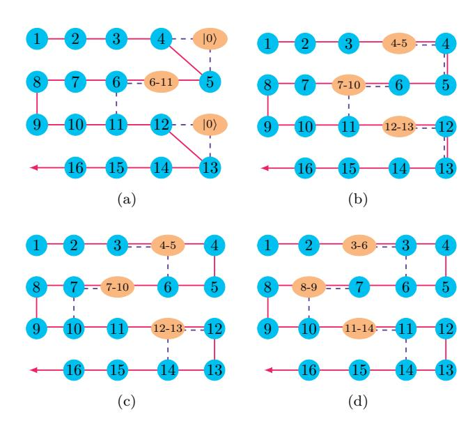

FIG. 17. Implementing the hopping terms on a 4 × 4 qubit array. The red arrow indicates the direction of the JWT and the system qubits (blue circles) are numbered by their order in the JWT. The ancilla qubits (orange ellipses) store the parity information of the system qubits, where j-k denotes the parity Zj-k ≡ Zj · · ·Zk. The purple dashed lines represent quantum gates between neighboring qubits.

where Ke3,6 = (X3X6+Y3Y6)/2 denotes the bare hopping term. The time evolution exp(−iτKe3,6) can be implemented using the second part of the circuit in Fig. [18,](#page-18-4) where the parity stored in the ancilla qubit is attached to the bare hopping term Ke3,6 by the CZ gates; the first

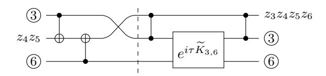

FIG. 18. Quantum circuit to implement the vertical hopping term between qubits 3 and 6.

part of the circuit, corresponding to Fig. [17c,](#page-18-5) updates the parity and swaps the ancilla qubit with system qubit 3. The order of the two parts in Fig. [18](#page-18-4) may be reversed for other hopping terms, e.g., the one between system qubits 7 and 10; see Figs. [17c](#page-18-5) and [17d.](#page-18-3) After the ancilla qubits have swept over the entire rows, they are pushed back in the reverse direction and the same procedure starts over again. The vertical hopping terms require O(N) twoqubit gates to implement for a single Trotter step. The horizontal hopping terms can be implemented straightforwardly as long as the two involved qubits are at the same side of the ancilla qubit (no need to update the parity).

In Appendix [E,](#page-20-0) we discuss how to simulate the 2D Fermi-Hubbard model with qubits on a ladder, i.e., two coupled chains. The basic idea is to use the fermionic SWAP gate to change between the row-major order and the column-major order, so that both the horizontal and vertical couplings can be implemented with only local interactions. This idea has also been proposed by Kivlichan et al. [45], independently. Because such a strategy does not take full advantage of the 2D qubit interactions, the number of gates scales as  $O(N^{1.5})$  which is worse than O(N) by using the methods described above and in Section V.

## Appendix C: Hamiltonian-based fermionic gates

Using methods in quantum optimal control [64], one can prepare desired quantum states by applying sequences of Hamiltonian evolutions to initial states that are easy to prepare. When the fermionic Hamiltonians are quadratic in creation and annihilation operators, one can use their matrix representation to find the optimal control sequences.

As a simple example, we discuss how to prepare the ground state of a hopping Hamiltonian on three orbitals,

$$\mathcal{H}_{J_X} = \frac{1}{\sqrt{2}} \left( c_2^{\dagger} c_1 + c_3^{\dagger} c_2 + \text{h.c.} \right).$$
 (C1)

Besides  $\mathcal{H}_{J_X}$ , we also need  $\mathcal{H}_{J_Z}$  in our control set,

$$\mathcal{H}_{J_Z} = c_1^{\dagger} c_1 - c_3^{\dagger} c_3 \,, \tag{C2}$$

whose ground states are easy to prepare. Using the normal ordered form in Eq. (A3), we have the matrix representations for  $\mathcal{H}_{J_X}$  and  $\mathcal{H}_{J_Z}$ ,

$$J_X = \frac{1}{\sqrt{2}} \begin{pmatrix} 0 & 1 & 0 \\ 1 & 0 & 1 \\ 0 & 1 & 0 \end{pmatrix}, \qquad J_Z = \begin{pmatrix} 1 & 0 & 0 \\ 0 & 0 & 0 \\ 0 & 0 & -1 \end{pmatrix}, \quad (C3)$$

which are the same as the corresponding spin-1 angular momentum operators. Using two rotations along the X-axis and the Z-axis, we have

$$J_X = e^{-i\pi J_Z/2} e^{-i\pi J_X/2} J_Z e^{i\pi J_X/2} e^{i\pi J_Z/2}$$
. (C4)

Using the isomorphism (A6), one can prepare eigenstates of the hopping Hamiltonian  $\mathcal{H}_{J_X}$  by applying  $\mathcal{U}$  to the corresponding eigenstates of  $\mathcal{H}_{J_Z}$ , where

$$\mathcal{U} = \exp\left(-i\pi \mathcal{H}_{J_z}/2\right) \exp\left(-i\pi \mathcal{H}_{J_x}/2\right). \tag{C5}$$

Since  $J_Z$  is diagonal, the eigenstates of  $\mathcal{H}_{J_Z}$  are easy-to-prepare Slater determinants in the computational basis (3).

As a second example, we discuss the permutation of orbitals,

$$\begin{pmatrix} 1 & 2 & 3 \\ 3 & 2 & 1 \end{pmatrix}, \tag{C6}$$

which requires three FSWAP gates on neighboring qubits in the JWT. We show how it can be achieved with a single multi-qubit gate using Hamiltonian evolution by  $\mathcal{H}_{J_X}$ . The matrix powers of  $J_X$  are

$$J_X^2 = \frac{1}{2} \begin{pmatrix} 1 & 0 & 1 \\ 0 & 2 & 0 \\ 1 & 0 & 1 \end{pmatrix}, \qquad J_X^3 = J_X.$$
 (C7)

From Eq. (C7), we can derive the exponential of  $J_X$ ,

$$e^{-i\tau J_X} = 1 - i\sin\tau J_X + (\cos\tau - 1)J_X^2$$
. (C8)

For  $\tau = \pi$ , we have

$$e^{-i\pi J_X} = 1 - 2J_X^2 = -\begin{pmatrix} 0 & 0 & 1\\ 0 & 1 & 0\\ 1 & 0 & 0 \end{pmatrix}$$
. (C9)

Therefore, the unitary that swaps the first orbital with the third orbital equals to

$$\mathcal{F}_{\text{swap}}^{1,3} = \exp\left(-i\pi \sum_{j=1}^{3} c_{j}^{\dagger} c_{j}\right) \exp\left(-i\pi \mathcal{H}_{J_{X}}\right), \quad (C10)$$

where the first term on the right-hand side fixes the extra minus sign in Eq. (C9). The two constituent parts in Eq. (C10) commute to each other, and the fist part can be implemented with only single-qubit gates with the JWT.

## Appendix D: Fermionic SWAP gate

The fermionic swap (FSWAP) gate on two neighboring qubits takes the form [37],

$$F_{\text{swap}}^{q,q+1} = \begin{pmatrix} 1 & 0 & 0 & 0 \\ 0 & 0 & 1 & 0 \\ 0 & 1 & 0 & 0 \\ 0 & 0 & 0 & -1 \end{pmatrix}, \tag{D1}$$

where we use the standard order of basis states  $|00\rangle, |01\rangle, |10\rangle, |11\rangle$ . One way to implement the fermionic SWAP gate is to use the ISWAP gate

ISWAP = 
$$\begin{pmatrix} 1 & 0 & 0 & 0 \\ 0 & 0 & i & 0 \\ 0 & i & 0 & 0 \\ 0 & 0 & 0 & 1 \end{pmatrix} = e^{\frac{i\pi}{2}H_{\text{iswap}}^{q,q+1}},$$
 (D2)

$$H_{\text{iswap}}^{q,q+1} = \frac{1}{2} (X_q X_{q+1} + Y_q Y_{q+1}).$$
 (D3)

To fix the phases in ISWAP, we introduce

$$e^{\frac{i\pi}{4}(Z_q + Z_{q+1})} = \begin{pmatrix} i & 0 & 0 & 0\\ 0 & 1 & 0 & 0\\ 0 & 0 & 1 & 0\\ 0 & 0 & 0 & -i \end{pmatrix},$$
(D4)

which commutes with the ISWAP gate. The fermionic SWAP gate then takes the form  $\,$ 

$$F_{\text{swap}}^{q,q+1} = -ie^{\frac{i\pi}{4}(Z_q + Z_{q+1})} e^{\frac{i\pi}{2}H_{\text{iswap}}^{q,q+1}}.$$
 (D5)

## Appendix E: Simulating the 2D Hubbard model with a qubit ladder

Experimentally, it is often easier to build gubits on a ladder (two coupled chains) than on a 2D lattice. The two spin chains in a ladder can be used to map fermionic modes with two different spin states; see Fig 19. Because there are no hopping terms between the two spin states in the Hubbard model, the quantum state can be mapped using two independent JWTs on the two spin chains. One only needs to implement hopping terms within the chains and interaction terms between corresponding qubits in the two chains. In Ref. [65], the authors discussed physical implementations of analog quantum simulators of the 1D Hubbard model on a qubit ladder. Here, we discuss digital quantum simulation of the 2D Hubbard model using the same architecture. The challenge is to implement both the horizontal and vertical hopping terms with only local qubit operations. We solve this problem by reordering the spin orbitals encoded in the JWT using the fermionic SWAP gate (see Appendix D). Similar ideas have been proposed independently by Kivlichan et al. [45].

We will demonstrate our approach using an example, where the Fermi-Hubbard model on a  $3 \times 3$  lattice is mapped to a qubit ladder of size  $2 \times 9$ , see Fig. 19. The spin-up (down) orbitals are mapped to the upper (lower) chain in the ladder using the JWT. To implement both

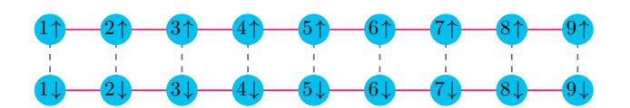

FIG. 19. A  $2\times 9$  qubit ladder (two chains) is used to simulate the 2D Hubbard model on a  $3\times 3$  lattice. The spinup and -down orbitals are mapped to the upper and lower qubit chains, respectively, using two independent JWTs. The solid red lines represent nearest-neighbor interactions between qubits in the same JWT, and a dashed blue line represents ZZ interactions between qubits representing different spin states.

the horizontal and vertical hopping terms, one can switch between row-major and column-major orders.

$$\begin{pmatrix} 1 & 2 & 3 \\ 4 & 5 & 6 \\ 7 & 8 & 9 \end{pmatrix} \xrightarrow{\text{transposition}} \begin{pmatrix} 1 & 4 & 7 \\ 2 & 5 & 8 \\ 3 & 6 & 9 \end{pmatrix} , \tag{E1}$$

which corresponds to the following in-situ transposition of the fermionic orbitals in the JWT:

$$\begin{pmatrix}
1 & 2 & 3 & 4 & 5 & 6 & 7 & 8 & 9 \\
1 & 4 & 7 & 2 & 5 & 8 & 3 & 6 & 9
\end{pmatrix}.$$
(E2)

This permutation can be decomposed into elementary permutations involving only neighboring qubits; see Fig. 20. The pink-colored permutation in Fig. 20 can be implemented using three FSWAP gates involving only

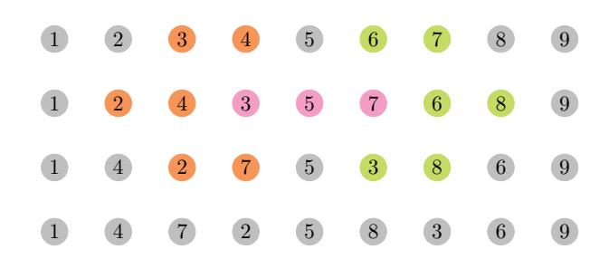

FIG. 20. The in-situ matrix transposition (E2) can be decomposed into elementary fermionic permutations involving only neighboring qubits (time goes from top to bottom). The first line is the initial ordering and the last line is the target ordering. In each line, the qubits plotted with the same bright color are involved in one elementary permutation, and their positions are updated in the next line. The gray qubits remain in the same place. The pink-colored permutation can be implemented with three FSWAP gates involving only neighboring qubits, or by Hamiltonian evolution as described in Appendix C. The rest of the permutations require a single FSWAP gate.

neighboring qubits; in Appendix C, we discuss an alternative approach to implement this permutation using Hamiltonian evolution. The number of two-qubit gates required to implement the in-situ transposition for the two chains is  $N_{\rm trans}=2\times9=18$ . The numbers of two-qubit gates needed for the on-site interaction terms and the hopping terms are  $N_{\rm int}=9$  and  $N_{\rm hop}=2\times2\times6=24$ , respectively. The total number of two-qubit gates needed to simulate a single Trotter step is  $N_{\rm trott}=N_{\rm trans}+N_{\rm int}+N_{\rm hop}=51$ .

To end this Appendix, we consider simulating the 2D Fermi-Hubbard model on a lattice of dimension  $n_x \times n_y$  using a qubit ladder of length  $n_x n_y$ . Without loss of generality, we assume that  $n_y \geq n_x$ . The fermionic orbitals are mapped to qubits in row-major order using the JWT. Implementing the in-situ matrix transposition on the entire chain requires  $O(N^2)$  two-qubit gates and is inefficient. Instead, we can implement the in-situ matrix transposition on orbitals in neighboring rows. This modification allows one to implement all the hopping terms on a lattice with only  $O(N^{1.5})$  two-qubit gates. For example, a single Trotter step can be implemented with 7 constituent operations:

- 1. Implement the horizontal hopping terms and the on-site interaction terms,
- 2. Implement in-situ transpositions on spin orbitals in the 1st and 2nd rows, 3rd and 4th rows, and so on,
- 3. Apply vertical hopping terms between these pairs of rows,
- 4. Undo the in-situ transposition,
- 5. Implement in-situ transposition on spin orbitals in the 2nd and 3rd rows, 4th and 5th rows, and so on,

- 6. Apply vertical hopping terms between these pairs of rows,
- 7. Undo the in-situ transposition.

A single in-situ transposition involving two rows requires  $(n_x-1)n_x/2$  FSWAP gates on neighboring qubits to implement. Because there are  $4(n_y-1)$  in-situ transposition in one Trotter step, the total number of two-qubit gates required for that is  $N_{\rm trans}=2(n_y-1)(n_x-1)n_x=Nn_x-N-2n_x^2+2n_x$ , where  $N=2n_yn_x$  is the total number of spin orbitals. The numbers of two-qubit gates needed for the on-site interaction terms and the hopping terms are  $N_{\rm inter}=N/2$  and  $N_{\rm hop}=2(n_y-1)n_x+2(n_x-1)n_y=2N-2(n_y+n_x)$ , respectively. For square lattices, the total number of two-qubit gates needed for a single Trotter step is  $N_{\rm trott}=N_{\rm trans}+N_{\rm inter}+N_{\rm hop}\simeq N^{3/2}/\sqrt{2}+N/2$ . For example, the total number of two-qubit gates is 275 for 50 spin orbitals on a square lattice of size 5 × 5.

## Appendix F: Numerical study of the Trotter error

One way to prepare strongly correlated quantum states is by adiabatic evolution. On a digital quantum computer, we can simulate the evolution by dividing it into discrete time steps and approximating the Hamiltonian within each time step. Here, we numerically study the errors that arise from using a second-order Trotter formula to simulate adiabatic state preparation for the ground states of the Fermi-Hubbard model.

For simplicity, we only consider the hopping terms:

$$\mathcal{H}_{\text{hop}} = -\sum_{\langle j,k\rangle,\sigma} t_{jk} \left( c_{j,\sigma}^{\dagger} c_{k,\sigma} + \text{h.c.} \right), \quad (F1)$$

and interaction term

$$\mathcal{H}_{\text{int}} = U \sum_{j} n_{j,\uparrow} n_{j,\downarrow} - \mu \sum_{j,\sigma} n_{j,\sigma}.$$
 (F2)

We have introduced a chemical potential term in  $\mathcal{H}_{\mathrm{int}}$  to fix the particle number of the ground state so that it occurs at half filling. Since the ground state of  $\mathcal{H}_{\mathrm{hop}}$  is also half-filled and both  $\mathcal{H}_{\mathrm{hop}}$  and  $\mathcal{H}_{\mathrm{hop}}$  conserve particle number, the particle number stays constant throughout the evolution. To prepare a ground state of  $\mathcal{H}_{\mathrm{int}}$  starting from a ground state of  $\mathcal{H}_{\mathrm{hop}}$ , we apply the time-dependent Hamiltonian

$$\mathcal{H}(s) = (1 - s)\mathcal{H}_{\text{hop}} + s\mathcal{H}_{\text{int}},\tag{F3}$$

where  $s=t/T\in[0,\,1]$  with T being the total evolution time. If we split T into n time steps, then a single Trotter step takes the form

$$e^{-i(1-s)\Delta t \mathcal{H}_{\text{hop}}} e^{-is\Delta t \mathcal{H}_{\text{int}}},$$
 (F4)

where  $\Delta t = T/n$ .

For the purposes of this study, we ignored the issue of approximating the two time-evolution operators in Eq. (F4). We used the parameter settings

$$t_{jk} = 1$$
 for all  $\langle j, k \rangle$ ,  $U = 4$ , and  $\mu = 1$ , (F5)

on 2-dimensional grids of various sizes. We used the open-source package OpenFermion [38] to initialize the Hamiltonians of the Hubbard model and compute their ground states. Then, we used the open-source package QuTiP [66] to compute the exact evolution by the timedependent Hamiltonian (F3), starting with the ground state of  $\mathcal{H}_{hop}$ . We adjusted the total evolution time T until the final state was within the ground space of  $\mathcal{H}_{int}$ , indicating that the evolution was adiabatic. For all the grid sizes we studied, T = 100 was sufficient. Finally, we approximated the evolution using the second-order Trotter formula with various values of n, the number of steps. Higher values of n give a better approximation. For each step size, we recorded the quantum state 20 times throughout the evolution and computed the fidelity of these states with the states from the true adiabatic evolution. The numerical results for grid sizes  $2 \times 2$ ,  $3 \times 2$ , and  $4 \times 2$  are shown in Figs. 21, 22, and 23, respectively.

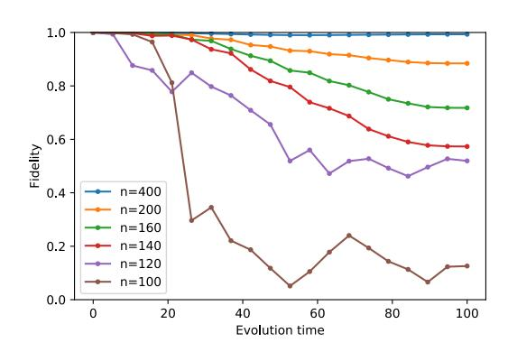

FIG. 21. Fidelity with states from adiabatic evolution for various Trotter step numbers on a 2-by-2 grid

## Appendix G: Rearranged quantum circuits for different hopping terms

In Section V, we provide an algorithm to implement the 2D fermionic Fourier transformation with  $O(N^{1.5})$  gates and  $O(\sqrt{N})$  depth. A crucial step is a unitary transformation  $\Gamma$ , diagonalized in the computation basis, that introduces the desired parities to the bare vertical hopping terms. Therein, we provide a method to implement  $\Gamma$  with O(N) gates and  $O(\sqrt{N})$  depth by introducing one ancilla per row to store the parities of the system qubits. In each time step, the ancilla qubits interact with system qubits in a particular column with the circuit in Fig. 24. The first and second parts of the circuit consist

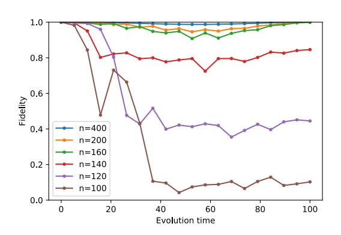

FIG. 22. Fidelity with states from adiabatic evolution for various Trotter step numbers on a 3-by-2 grid

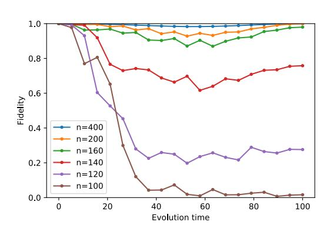

FIG. 23. Fidelity with states from adiabatic evolution for various Trotter step numbers on a 4-by-2 grid

of CZ gates between each system qubit and the ancilla qubits below starting from the next odd-numbered row. This circuit is used to demonstrate the hopping terms between the first and second rows, and a rearranged circuit in Fig. [25](#page-22-3) is used for hopping terms between the second and third rows. Here, we provide the other arrangements of the same circuit for the remaining pairs of rows that are adjacent to each other. The circuit in Fig. [24](#page-22-2) can be transformed into those in Figs. [26](#page-22-4) and [28](#page-23-0) by regrouping neighboring pairs of gates, which can be generalized to any right-closed hopping term for a system with even

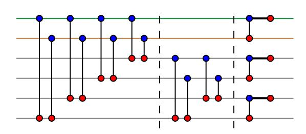

FIG. 24. The CZ gates between the system (blue) and ancilla (red) qubits in a single time step

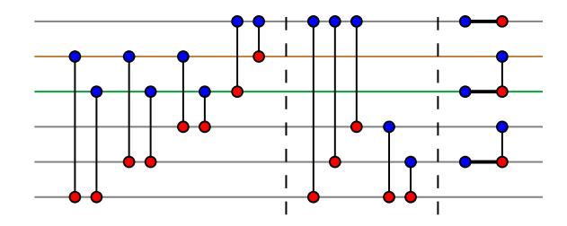

FIG. 25. Rearranged circuit for hopping terms between the second and third rows

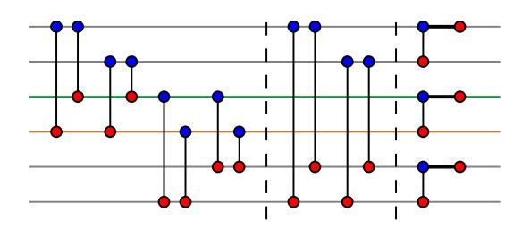

FIG. 26. Rearranged circuit for hopping terms between the third and fourth rows

number of rows. Similarly, the first three pairs of gates and the last two gates in the second part in Fig. [25](#page-22-3) can be regrouped into gates in the corresponding positions in Fig. [27,](#page-22-5) which can also be generalized to any left-closed hopping term for larger system sizes. Each of the remaining gates in Fig. [25](#page-22-3) (except for the third part) involve the first system qubit and an ancilla qubit below; these gates do not affect any left-closed hopping term, either.

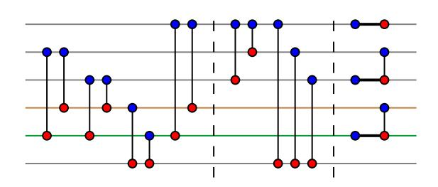

FIG. 27. Rearranged circuit for hopping terms between the fourth and fifth rows

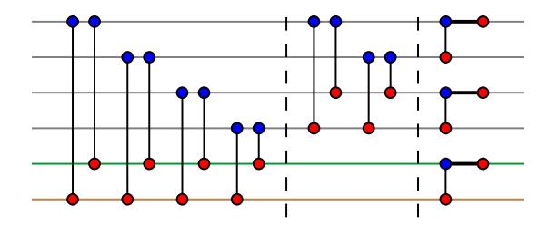

FIG. 28. Rearranged circuit for hopping terms between the fifth and sixth rows