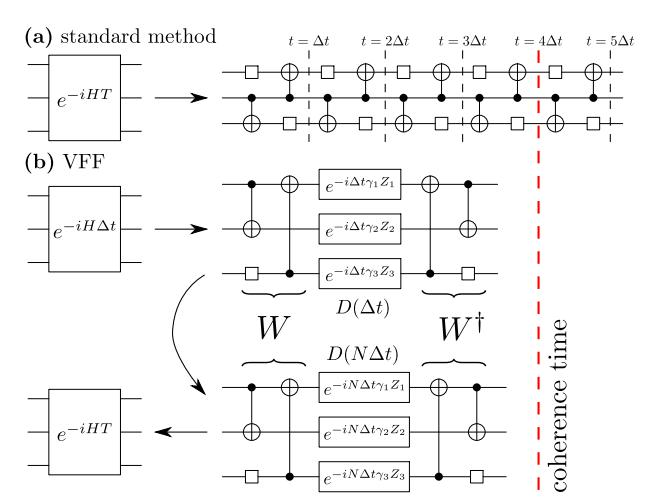
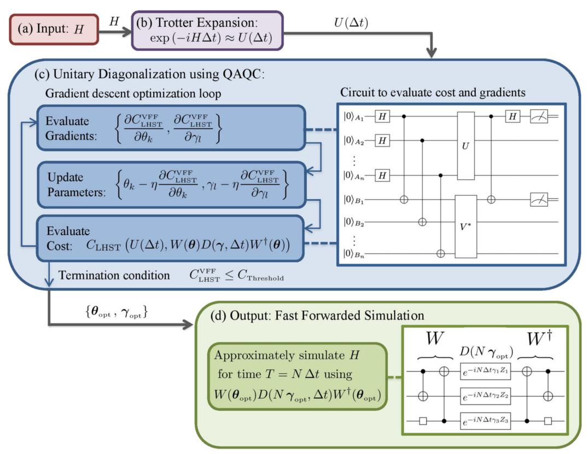
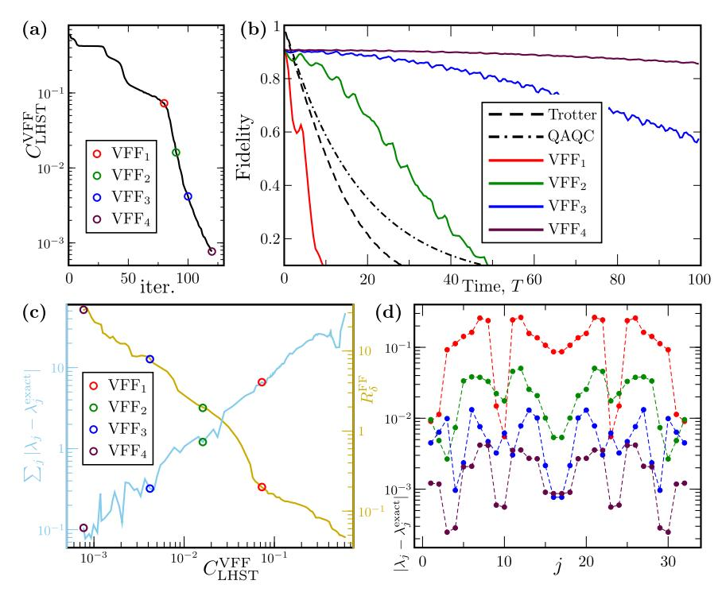
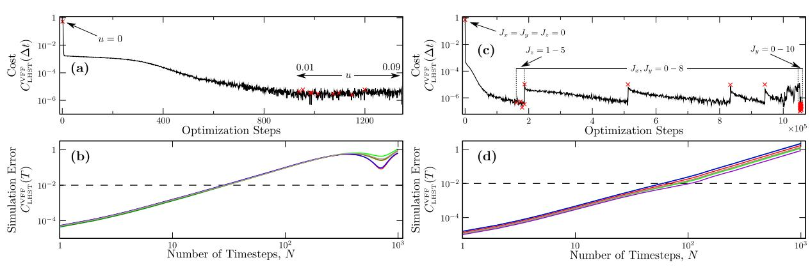
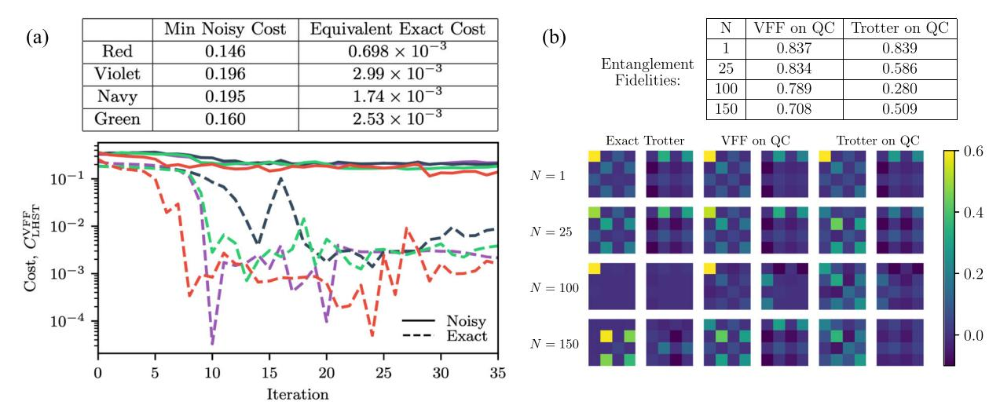
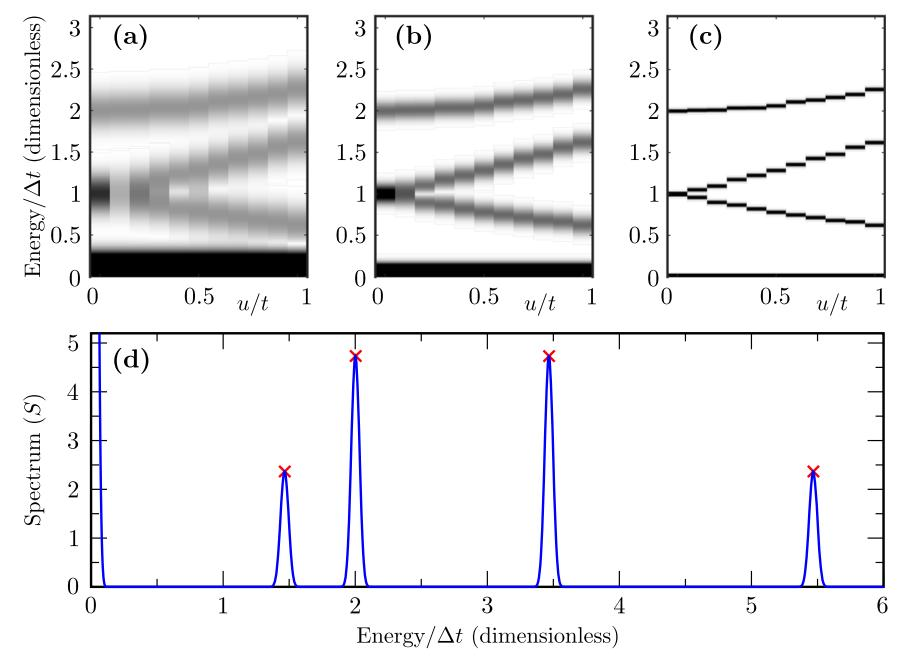

# ARTICLE OPEN

# Variational fast forwarding for quantum simulation beyond the coherence time

Cristina Cîrstoiu (1,2,6), Zoë Holmes 1,3,4,6, Joseph Iosue 1,5, Lukasz Cincio 1, Patrick J. Coles 1 and Andrew Sornborger 3 and Andrew Sornborger 3 and Andrew Sornborger 3 and Andrew Sornborger 3 and Andrew Sornborger 3 and Andrew Sornborger 3 and Andrew Sornborger 3 and Andrew Sornborger 3 and Andrew Sornborger 3 and 3 and 3 and 3 and 3 and 3 and 3 and 3 and 3 and 3 and 3 and 3 and 3 and 3 and 3 and 3 and 3 and 3 and 3 and 3 and 3 and 3 and 3 and 3 and 3 and 3 and 3 and 3 and 3 and 3 and 3 and 3 and 3 and 3 and 3 and 3 and 3 and 3 and 3 and 3 and 3 and 3 and 3 and 3 and 3 and 3 and 3 and 3 and 3 and 3 and 3 and 3 and 3 and 3 and 3 and 3 and 3 and 3 and 3 and 3 and 3 and 3 and 3 and 3 and 3 and 3 and 3 and 3 and 3 and 3 and 3 and 3 and 3 and 3 and 3 and 3 and 3 and 3 and 3 and 3 and 3 and 3 and 3 and 3 and 3 and 3 and 3 and 3 and 3 and 3 and 3 and 3 and 3 and 3 and 3 and 3 and 3 and 3 and 3 and 3 and 3 and 3 and 3 and 3 and 3 and 3 and 3 and 3 and 3 and 3 and 3 and 3 and 3 and 3 and 3 and 3 and 3 and 3 and 3 and 3 and 3 and 3 and 3 and 3 and 3 and 3 and 3 and 3 and 3 and 3 and 3 and 3 and 3 and 3 and 3 and 3 and 3 and 3 and 3 and 3 and 3 and 3 and 3 and 3 and 3 and 3 and 3 and 3 and 3 and 3 and 3 and 3 and 3 and 3 and 3 and 3 and 3 and 3 and 3 and 3 and 3 and 3 and 3 and 3 and 3 and 3 and 3 and 3 and 3 and 3 and 3 and 3 and 3 and 3 and 3 and 3 and 3 and 3 and 3 and 3 and 3 and 3 and 3 and 3 and 3 and 3 and 3 and 3 and 3 and 3 and 3 and 3 and 3 and 3 and 3 and 3 and 3 and 3 and 3 and 3 and 3 and 3 and 3 and 3 and 3 and 3 and 3 and 3 and 3 and 3 and 3 and 3 and 3 and 3 and 3 and 3 and 3 and 3 and 3 and 3 and 3 and 3 and 3 and 3 and 3 and 3 and 3 and 3 and 3 and 3 and 3 and 3 and 3 and 3 and 3 and 3 and 3 and 3 and 3 and 3 and 3 and 3 and 3 and 3 and 3 and 3 and 3 and 3 and 3 and 3 and 3 and 3 and 3 and 3 and 3 and 3 and 3 and 3 and 3 and 3 and 3 and 3 and 3 and 3 and 3 and 3 and 3 and 3 and 3 and 3 and 3 and 3 and 3 and 3 and 3 and 3 and 3 and 3 and 3 and 3 and 3 and 3 and 3 and 3 and 3 and 3 and 3 and 3 and 3

Trotterization-based, iterative approaches to quantum simulation (QS) are restricted to simulation times less than the coherence time of the quantum computer (QC), which limits their utility in the near term. Here, we present a hybrid quantum-classical algorithm, called variational fast forwarding (VFF), for decreasing the quantum circuit depth of QSs. VFF seeks an approximate diagonalization of a short-time simulation to enable longer-time simulations using a constant number of gates. Our error analysis provides two results: (1) the simulation error of VFF scales at worst linearly in the fast-forwarded simulation time, and (2) our cost function's operational meaning as an upper bound on average-case simulation error provides a natural termination condition for VFF. We implement VFF for the Hubbard, Ising, and Heisenberg models on a simulator. In addition, we implement VFF on Rigetti's QC to demonstrate simulation beyond the coherence time. Finally, we show how to estimate energy eigenvalues using VFF.

npj Quantum Information (2020)6:82; https://doi.org/10.1038/s41534-020-00302-0

#### INTRODUCTION

Quantum simulation (QS) was the earliest proposed example of a quantum algorithm that could outcompete the best classical algorithm1. Accelerated QS would impact fields, including chemistry, materials science, and nuclear and high-energy physics. Current approaches include quantum emulation (or analogue QS)2–6, Suzuki–Trotter-based methods7–10, and Taylor expansion-based QSs using linear combinations of unitaries11–13. Quantum emulation and Suzuki–Trotter-based QSs have seen proof-of-principle demonstrations2–6,14, while Taylor expansion-based QSs have the best asymptotic scaling and will likely have application for fault-tolerant quantum computers (QCs) of the future.

In the current noisy intermediate-scale quantum (NISQ) era, variational quantum simulation (VQS) methods are expected to be important. Variational algorithms have been introduced for finding ground and excited states15–18, and for other applications19–22. In addition, some variational algorithms simulate system dynamics23–26. Of the variational dynamical simulation methods, some are based on knowledge of low-lying excited states26, and some are iterative in time23–25. Both approaches have the potential to outperform Suzuki–Trotter-based methods in the NISQ era.

Simulating the dynamics of a quantum system for time T typically requires  $\Omega(T)$  gates so that a generic Hamiltonian evolution cannot be achieved in sublinear time. This result is known as the "no fast-forwarding theorem", and holds both for a typical unknown Hamiltonian27 and for the query model setting28. However, there are particular Hamiltonians that can be fast-forwarded, which means that the quantum circuit depth does not need to grow significantly with simulation time. Hamiltonians that allow fast-forwarding are precisely those that lead to violations of time–energy uncertainty relations and equivalently allow for precise energy measurements27. For example, commuting local Hamiltonians27, quadratic fermionic Hamiltonians27, and continuous-time quantum walks on particular graphs29 can all be fast-forwarded. In addition, ref. 30 exploited the exact solvability

of the transverse Ising model to formulate a quantum circuit for its exact diagonalization, allowing for fast-forwarding. This circuit was used to simulate the Ising model on Cloud QCs31. A subspace-search variational eigensolver was employed in ref. 26; to fast-forward low-lying states in a quantum system. In ref. 32, a Hamiltonian whose diagonalization is constructed out of IQP circuits is shown to give a quantum advantage for the task of energy sampling. More generally, it remains an open problem to determine the precise form for Hamiltonians that do and do not allow fast-forwarding.

Previous results analyze fast-forwarding of Hamiltonians mostly in a computational complexity setting27,28,33,34, in which the asymptotic scaling of the runtime of quantum circuits implementing a large-scale simulation is important. However, near-term devices are constrained to simulating intermediate-scale systems using finite depth circuits. The behavior of an algorithm to simulate large systems and long times may not be indicative of its behavior in smaller scale regimes. Therefore, as discussed further in Supplementary Note 5, whether or not asymptotic fast-forwarding is possible for a particular Hamiltonian has limited impact on the simulations that may be performed using near-term QCs.

The advantage of fast-forwarding, if possible, for near-term QCs is that the simulation time T can be much longer than the coherence time  $\tau$  of the QC performing the simulation. This is because T is just a parameter that is set "by hand" in a fixed-depth quantum circuit26,30. Therefore we ask the following core question: Can we fast forward the evolution of a Hamiltonian beyond the coherence time of a near-term device using a variational algorithm?

In this paper, we introduce a variational, hybrid quantum-classical algorithm that we call variational fast forwarding (VFF). We envision it to be most useful for implementing QSs on near-term, NISQ computers. However, it could also have uses in fault-tolerant QS. It is distinct from SVQS26 in that our method searches for an approximate diagonalization of an entire QS unitary, rather

&lt;sup>1Theoretical Division, Los Alamos National Laboratory, Los Alamos, NM, USA. 2Department of Computer Science, Oxford University, Oxford, UK. 3Information Sciences, Los Alamos National Laboratory, Los Alamos, NM, USA. 4Department of Physics, Imperial College, London, UK. 5QC Ware Corporation, Palo Alto, CA, USA. 6These authors contributed equally: Cristina Cirstoiu, Zoë Holmes. ™email: pcoles@lanl.gov; sornborg@lanl.gov

**Fig. 1 The concept of VFF. a** A Trotterization-based quantum simulation with N=5 timesteps. This simulation runs past the coherence limit of the quantum architecture. **b** A VFF-based quantum simulation. An approximate diagonalization of a short-time simulation is found variationally. Using the eigenvector W and diagonal D unitaries that were learned, an arbitrary length simulation is implemented by modifying the parameters in D. As long as VFF results in few enough gates that the circuit does not exceed the coherence time, longer simulations can be performed than the standard method in **a**.

than for a finite set of low-lying states. Most importantly, we analyze the simulation errors produced by VFF and guarantee a desired accuracy for the simulation once a termination condition is achieved. This is possible due to the operational meaning of our cost function. In contrast, low-energy subspace approaches as in SVQS may not be able to guarantee a desired simulation error, since the cost function (i.e., the energy) does not carry an obvious operational meaning.

The basic idea of VFF is depicted in Fig. 1. The "Results" section presents our main results including an overview of the algorithm, the cost function, error analysis, and implementations of VFF on a simulator and on Rigetti's QC. The "Discussion" section discusses these results, and the "Methods" section elaborates on our ansatz and training methods.

#### **RESULTS**

The VFF algorithm

Overview. Given a Hamiltonian H on a  $d=2^n$  dimensional Hilbert space (i.e., on n qubits) evolved for a short time  $\Delta t$  with the simulation unitary  $e^{-iH\Delta t}$ , the goal is to find an approximation that allows the simulation at later times T to be fast-forwarded beyond the coherence time. Figure 2 schematically shows the VFF algorithm, which consists of the following steps:

- 1. Implement a unitary circuit  $U(\Delta t)$  to approximate  $e^{-iH\Delta t}$ , the simulation at a small timestep.
- 2. Compile  $U(\Delta t)$  to a diagonal factorization  $V=WDW^\dagger\approx e^{-iH\Delta t}$  with circuit depth L.
- 3. Approximately fast-forward the QS at large time  $T = N\Delta t$  using the same circuit of depth  $L: e^{-iHT} \approx WD^N W^{\dagger}$ .

Typically  $U(\Delta t)$  will be a single-timestep Trotterized unitary approximating  $e^{-iH\Delta t}$ . We variationally search for an approximate diagonalization of  $U(\Delta t)$  by compiling it to a unitary with a structure of the form

$$V(\boldsymbol{\alpha}, \Delta t) := W(\boldsymbol{\theta}) D(\boldsymbol{\gamma}, \Delta t) W(\boldsymbol{\theta})^{\dagger}, \tag{1}$$

with  $\mathbf{a} = (\mathbf{\theta}, \mathbf{\gamma})$  being a vector of parameters. Here,  $D(\mathbf{y}, \Delta t)$  is a parameterized unitary composed of commuting unitaries that

encode the eigenvalues of  $U(\Delta t)$ , while  $W(\theta)$  is a parameterized unitary matrix consisting of corresponding eigenvectors. In the "Methods" section, we describe layered structures that provide ansätze for the circuits  $W(\theta)$  and  $D(\gamma, \Delta t)$ , and we detail our gradient-descent optimization methods for training  $\theta$  and  $\gamma$ .

To approximately diagonalize  $U(\Delta t)$ , the parameters  $\mathbf{\alpha} = (\mathbf{\theta}, \mathbf{\gamma})$  are variationally optimized to minimize a cost function  $C_{\text{LHST}}(U(\Delta t), V)$  that can be evaluated using a short-depth quantum circuit called the Local Hilbert–Schmidt Test  $(\text{LHST})^{35}$  shown in Fig. 2c. The compilation procedure we employ to approximate  $U(\Delta t)$  by  $V(\mathbf{\alpha}, \Delta t)$  makes use of the quantum-assisted quantum compiling (QAQC) algorithm35, that was later shown to be robust to quantum hardware noise36. The "Cost function and cost evaluation" section below elaborates on our cost function.

If we can find such an approximate diagonalization for  $U(\Delta t)$  then, for any total simulation time,  $T = N\Delta t$ , we have:

$$e^{-iHT} = \left(e^{-iH\Delta t}\right)^N,\tag{2}$$

$$\approx (U(\Delta t))^N$$
, (3)

$$\approx W(\boldsymbol{\theta})D(\boldsymbol{\gamma},\Delta t)^{N}W(\boldsymbol{\theta})^{\dagger},\tag{4}$$

$$= W(\boldsymbol{\theta}) D(N \boldsymbol{\gamma}, \Delta t) W(\boldsymbol{\theta})^{\dagger}. \tag{5}$$

Hence, a QS for any total time, *T*, may be performed with a fixed-quantum circuit structure as depicted in Fig. 2d. In "Simulation error analysis", we perform an error analysis to investigate how the approximate equalities in Eqs. (3) and (4) affect the overall simulation error.

Cost function and cost evaluation. For the variational compiling step of VFF (shown in Fig. 2c), we employ the cost function  $C_{\text{LHST}}(U,\ V)$  introduced in ref.  $^{35}$ . This is defined as

$$C_{\text{LHST}}(U,V) = 1 - \frac{1}{n} \sum_{i=1}^{n} F_e^{(i)},$$
 (6)

where the  $F_e^{(j)}$  are entanglement fidelities and hence satisfy  $0 \le F_e^{(j)} \le 1$ . Specifically,  $F_e^{(j)}$  is the entanglement fidelity for the quantum channel obtained from feeding into the unitary  $UV^{\dagger}$ , the maximally mixed state on  $\bar{j}$  and then tracing over  $\bar{j}$  at the output of  $UV^{\dagger}$ , where  $\bar{j}$  contains all qubits except for the j-qubit. We elaborate on the form of  $C_{\text{LHST}}(U, V)$  in Supplementary Note 1.

This function has several important properties.

- 1. It is faithful, vanishing if and only if V = U (up to a global phase).
- Nonzero values are operationally meaningful. Namely, CLHST(U, V) upper bounds the average-case compilation error as follows:

$$C_{\text{LHST}}(U,V) \ge \frac{d+1}{nd}(1-\overline{F}(U,V)),$$
 (7)

where  $\overline{F}(U,V)$  is the average fidelity of states acted upon by V versus those acted upon by U, with the average being over all Haar-measure pure states.

- 3. The cost function appears to be trainable, in the sense that it does not have an obvious barren plateau issue (i.e., exponentially vanishing gradient, see refs. 35,37).
- Estimating the cost function is DQC-1 hard and hence it cannot be efficiently estimated with a classical algorithm35.
- 5. There exists a short-depth quantum circuit for efficiently estimating the cost and its gradient.

Regarding the last point, each  $F_e^{(l)}$  term in Eq. (6) is estimated with a different quantum circuit, and then one classically sums them up to compute  $C_{\text{LHST}}(U, V)$ . An example of such a circuit is depicted in Fig. 2c. It involves 2n qubits, with the top (bottom) n qubits denoted A (B). The probability of the 00 measurement

Fig. 2 The VFF algorithm. a An input Hamiltonian is transformed into **b** a gate sequence associated with a single-timestep Trotterized unitary,  $U(\Delta t)$ . **c** The unitary is then variationally diagonalized by fitting a parameterized factorization,  $V(\mathbf{a}, \Delta t) = W(\boldsymbol{\theta})D(\boldsymbol{\gamma}, \Delta t)W^{\dagger}(\boldsymbol{\theta})$ . This variational subroutine employs gradient descent to minimize a cost function  $C_{\text{LHST}}$ , whose gradient is efficiently estimated with a short-depth quantum circuit called the Local Hilbert–Schmidt Test (LHST). The variational loop is exited when a termination condition given by Eq. (18) is reached, which guarantees that a user-defined bound on the average fidelity  $\overline{F}(T)$  is achieved. **d** After the termination condition is reached, the optimal parameters ( $\theta_{\text{opt}}$ ,  $\gamma_{\text{opt}}$ ) are used to implement a fast-forwarded simulation, with the fast-forwarding error growing sublinearly in the simulation time (see Eq. (14)). The fast-forwarding is performed by modifying the parameters of the diagonal unitary,  $D(\gamma_{\text{opt}}, \Delta t) \rightarrow D(N\gamma_{\text{opt}}, \Delta t)$ , producing a quantum simulation unitary,  $W(\theta_{\text{opt}})D(N\gamma_{\text{opt}}, \Delta t)W^{\dagger}(\theta_{\text{opt}})$ .

outcome on qubits  $A_jB_j$  in this circuit is precisely the entanglement fidelity  $F_e^{(j)}$ . Therefore 2n single-qubit measurements are required to compute  $C_{\text{LHST}}(U, V)$ , a favorable scaling compared to, for example, the  $O(n^4)$  measurements that are naively required for  $VQE^{15,38-40}$ . We also remark that  $C_{\text{LHST}}(U, V)$  was recently shown to have noise resilience properties, in that noise acting during the circuit in Fig. 2c tends not to affect the global optimum of this function36.

For simplicity, we will often write our cost function as

$$C_{\mathsf{LHST}}^{\mathsf{VFF}}(T) := C_{\mathsf{LHST}}(U^{\frac{T}{\Delta t}}, V^{\frac{T}{\Delta t}}), \tag{8}$$

with  $U=U(\Delta t)$  and  $V=V(\pmb{\alpha},\ \Delta t)$ , and note that  $C_{\rm LHST}^{\rm VFF}(\Delta t)$  is the quantity that we directly minimize in the optimization loop of VFF.

### Simulation error analysis

Linear scaling in N: In practice, each of the steps in the VFF algorithm above will generate errors. This includes the algorithmic error from the approximate implementation,  $U(\Delta t)$ , of the infinitesimal time evolution operator  $e^{-iH\Delta t}$  and error from the approximate compilation and diagonalization of  $U(\Delta t)$  into  $V(\alpha, \Delta t)$ . These two error sources bound the overall error via the triangle inequality:

$$\epsilon_p^{\mathsf{FF}}(\Delta t) \le \epsilon_p^{\mathsf{TS}}(\Delta t) + \epsilon_p^{\mathsf{ML}}(\Delta t).$$
 (9)

Here,  $\epsilon_p^{\rm FF}(\Delta t)$  is the overall simulation error for time  $\Delta t$ ,  $\epsilon_p^{\rm TS}(\Delta t)$  is the Trotterization error (note that this error may always be reduced using higher-order Trotterizations at the cost of more gates), and  $\epsilon_p^{\rm ML}(\Delta t)$  is the "machine learning" error associated with

the variational compilation step. These quantities are defined as

$$\epsilon_{p}^{\mathsf{FF}}(\Delta t) = ||e^{-iH\Delta t} - V(\boldsymbol{\alpha}, \Delta t)||_{p},$$
(10)

$$\epsilon_p^{\mathsf{TS}}(\Delta t) = ||e^{-iH\Delta t} - U(\Delta t)||_p,$$
(11)

$$\epsilon_n^{\mathsf{MS}}(\Delta t) = ||U(\Delta t) - V(\boldsymbol{a}, \Delta t)||_p,$$
(12)

where  $||M||_p = (\sum_j m_j^p)^{1/p}$  is the Schatten *p*-norm, with  $\{m_j\}$  the singular values of M.

Ültimately, we are interested in fast-forwarding and hence we want to bound  $\epsilon_p^{\rm FF}(T)$  with  $T=N\Delta t$ . For this purpose, we prove a lemma in Supplementary Note 2 stating that

$$||U_1^N - U_2^N||_p \le N||U_1 - U_2||_p, \tag{13}$$

for any two unitaries  $U_1$  and  $U_2$ . Combining this lemma with the triangle inequality in Eq. (9) gives

$$e_p^{\mathsf{FF}}(T) \le N(e_p^{\mathsf{TS}}(\Delta t) + e_p^{\mathsf{ML}}(\Delta t)).$$
 (14)

Equation (14) implies that the overall simulation error scales at worst linearly with the number of timesteps, *N*.

We remark that, for the special case of p=2, Eq. (13) can be reformulated in terms of our cost function as:

$$C_{\text{LHST}}^{\text{VFF}}(T) \lesssim n \ N^2 \ C_{\text{LHST}}^{\text{VFF}}(\Delta t),$$
 (15)

with  $C_{\text{LHST}}^{\text{VFF}}$  given by Eq. (8). The approximation in Eq. (15) holds when the cost function  $C_{\text{LHST}}^{\text{VFF}}(\Delta t)$  is small, which is the case after a successful optimization procedure. See Supplementary Note 2 for

npj

the non-approximate version of Eq. (15). Thus, we find that the VFF cost function scales at worst quadratically in N under fast-forwarding.

Certifiable error and a termination condition: Equation (14) holds for all Schatten norms, but of particular interest for our purposes is the Hilbert–Schmidt norm, p=2, from which we can derive certifiable error bounds on the average-case error. In addition, the operator norm,  $p=\infty$ , quantifies the worst-case error and is often used in the QS literature  $^{41,42}$ . For our numerical implementations ("Implementations" section), we will consider both worst-case and average-case error. On the other hand, for our analytical results presented here, we will focus on average-case error since it is naturally suited to providing a termination condition for the optimization in VFF.

As an operationally meaningful measure of average-case error, we consider the average gate fidelity between the target unitary  $e^{-iHT}$  and the approximate simulation  $V(\boldsymbol{a}, T)$ , arising from the VFF algorithm:

$$\overline{F}(T) = \int_{th} |\langle \psi | V(\mathbf{a}, T)^{\dagger} e^{-iHT} | \psi \rangle|^2 d\psi, \tag{16}$$

where the integral is over all states  $|\psi\rangle$  chosen according to the Haar measure.

In Supplementary Note 2, we show that one can lower bound  $\overline{F}(T)$  based on the value of the VFF cost function,

$$\overline{F}(T) \underset{\approx}{\geq} 1 - \frac{d}{d+1} N^2 \left( \epsilon_{\infty}^{TS}(\Delta t) + \sqrt{nC_{LHST}^{VFF}(\Delta t)} \right)^2. \tag{17}$$

This inequality holds to a good approximation in the limit that  $C_{\text{LHST}}^{\text{VFF}}(\Delta t)$  is small, as is the case after a successful optimization procedure. See Supplementary Note 2 for the exact lower bound on  $\overline{F}(T)$ , from which Eq. (17) is derived.

In addition, Eq. (17) provides a termination condition for the variational portion of VFF. If one has a desired threshold for  $\overline{F}(T)$ , then this threshold can be guaranteed provided that  $C_{\text{LHST}}^{\text{VFF}}(\Delta t)$  is below a certain value. Once  $C_{\text{LHST}}^{\text{VFF}}(\Delta t)$  dips below this value, then the variational portion of VFF can be terminated. Specifically, the termination condition is  $C_{\text{LHST}}^{\text{VFF}}(\Delta t) \leq C_{\text{Threshold}}$ , where

$$C_{\mathsf{Threshold}} pprox rac{1}{n} \left( rac{1}{N} \sqrt{rac{d+1}{d} \left( 1 - \overline{F}(T) 
ight)} - \epsilon_{\infty}^{\mathsf{TS}}(\Delta t) 
ight)^2,$$
 (18)

with the approximation holding when  $C_{\text{LHST}}^{\text{VFF}}(\Delta t)$  is small. Again, for the exact expression for  $C_{\text{Threshold}}$ , see Supplementary Note 2.

## **Implementations**

Here, we present results simulated classically and on quantum hardware. We refer the reader to the "Methods" section for details about our ansatz and optimization methods.

For our results below, it will be convenient, for a given simulation error tolerance  $\delta$ , to define fast-forwarding as the case whenever  $R_{\delta}^{\text{FF}} > 1$ , where

$$R_{\delta}^{\mathsf{FF}} = T_{\delta}^{\mathsf{FF}} / T_{\delta}^{\mathsf{Trot}} \tag{19}$$

is the ratio of the simulation time achievable with VFF,  $T_{\delta}^{\rm FF}$ , to the simulation time achievable with standard Trotterization,  $T_{\delta}^{\rm Trot}$ . We note that  $T_{\delta}^{\rm Trot}$  is a good empirical measure of the coherence time, since it can account for both decoherence and gate infidelity, and hence the condition  $R_{\delta}^{\rm FF} > 1$  intuitively captures the idea of simulation beyond the coherence time.

Comparing VFF to Trotterization and compiled Trotterizations. Here, we compare the performance of VFF to that of two other simulation strategies. One of these strategies is the standard Trotterization approach depicted in Fig. 1a. Another strategy is to first optimally compile the Trotterization step to a short-depth gate sequence, and use this optimal circuit (in place of the

Trotterization step) for the approach in Fig. 1a. We refer to this as the QAQC strategy, since one can use the QAQC algorithm35 to obtain the optimal compilation of the Trotterization step. With the QAQC strategy, when finding the optimal short-depth compilation, we make no assumptions about the structure of the compiled circuit, which is in contrast with Trotterization, where the structure of the circuit is dictated by interactions in the Hamiltonian.

For concreteness, we consider the task of simulating the XY model, defined by the Hamiltonian

$$H_{XY} = -\sum_{i} X^{i} X^{i+1} + Y^{i} Y^{i+1},$$
 (20)

where  $X^i$  and  $Y^i$  are Pauli operators on qubit i. We consider a fivequbit system with open boundary conditions. From the analytical diagonalization of the XY model43, it follows that the ansatz for the diagonal matrix D can be truncated at the first nontrivial term, as described in the "Methods" section (see Eq. (26)).

Figure 3 summarizes our results. Figure 3a shows how the  $C_{LHST}^{VFF}$ cost function is iteratively minimized during the optimization procedure. We selected four approximate diagonalizations corresponding to different cost values denoted by VFFn, n = 1, ..., 4, depicted by colored circles in Fig. 3a. Note that the colors match those used in other panels. Figure 3b compares these diagonalizations with different QS methods: Trotterization (dashed line), QAQC-compiled (dashed-dotted line), and VFF at different stages of optimization. We compare simulated time evolution governed by the XY model and observe how the fidelity decays with evolution time. The fidelity is given by  $\text{Tr}(|\psi(T)\rangle\langle\psi(T)|\rho(T))$ , where  $|\psi(T)\rangle$  is the exact evolved state and  $\rho(T)$  is the state obtained with a noisy simulator. The initial state  $|\psi(0)\rangle$  was chosen randomly such that it has nonvanishing overlap with every eigenstate of the Hamiltonian. The circuits were simulated using a noisy trapped-ion simulator with error model from ref. 44. We took error rates, as specified in their Fig. 14 in ref. 44 and reduced them by a factor of five for clearer demonstration of VFF's capabilities.

Results shown in Fig. 3b indicate that QAQC performed better than Trotterization, which is expected as QAQC optimizes in a circuit space larger than that given by Trotterization. Both approaches give better results than VFF1 (red curve). This confirms the intuition that at early stages of the VFF optimization (large values of  $C_{LHST}^{VFF}$ ), the error of the diagonalization is too big to outperform other methods. As the cost function is decreased, the length of time one can simulate using VFF increases. Indeed, as one can see from the green, blue, and purple curves (which are associated with cost values  $\lesssim 10^{-2}$ ), VFF dramatically outperforms both Trotterization and QAQC.

One can see another important feature in Fig. 3b. For short simulations, Trotterization and QAQC are always more accurate than VFF, no matter how accurate the diagonalization is. That is because for small T, there are just a few timesteps taken by Trotterization and QAQC implementations, and the resulting circuits are shorter than VFF circuits implementing W, D, and  $W^{\dagger}$ . This disadvantage rapidly diminishes since VFF circuits do not grow with T and the only error that impacts the fidelity comes from imperfect diagonalization. On the other hand, Trotter and QAQC circuits grow linearly with T and as a result, fidelity is dominated by noise (and not imperfections in the decomposition).

Figure 3c shows how the fast-forwarding factor  $R_{\delta}^{FF}$  and the error in the eigenvalue approximation (pertinent if VFF is used for eigenvalue estimation as discussed in the "Estimating energy eigenvalue" section) depend on the cost function  $C_{\text{LHST}}^{VFF}$ . The data suggest power-law dependence in both cases. Bringing the cost function down to  $10^{-3}$  allows us to reduce the eigenvalue error <0.1 and reach a fast-forwarding factor of ~30. Note that for VFF to be more efficient than Trotterization ( $R_{\delta}^{FF} > 1$ ), one has to lower the cost function below ~0.04. For this case,  $\delta$  is defined as  $1 - \text{Tr}(|\psi(T)\rangle\langle\psi(T)|\rho(T))$  and we considered  $\delta = 0.2$ . Figure 3d

Fig. 3 Comparing different quantum simulation strategies. a The VFF cost function as it is iteratively minimized. Various quality diagonalizations are indicated in the colored circles. b Simulation fidelity as a function of time simulated. c Summed eigenenergy error and fast-forwarding as a function of the VFF cost. d Eigenenergy errors for the set of diagonalizations.

presents a more detailed analysis of the eigenvalue error, showing how the error of individual eigenvalues is reduced as the cost function is minimized.

Using VFF to fast-forward models across a range of parameters. Here, we show how to use VFF to efficiently find diagonalizations for new models that are nearby in parameter space, from previously diagonalized models.

*Hubbard model*: We applied VFF to Trotterized QS unitaries,  $U(\Delta t) \approx e^{-iH_{\text{Hub}}\Delta t}$ , of the Fermi–Hubbard model

$$H_{\mathsf{Hub}} = -\tau \sum_{i,i,\sigma} \left( c_{i,\sigma}^{\dagger} c_{j,\sigma} + c_{j,\sigma}^{\dagger} c_{i,\sigma} \right) + u \sum_{i=1}^{N} n_{i,\uparrow} n_{i,\downarrow}. \tag{21}$$

Here,  $c_{i,\sigma}^{\dagger}$  and  $c_{i,\sigma}$  are electron creation and annihilation operators (resp.) for spin  $\sigma \in \{\downarrow, \uparrow\}$  at site i and  $n_{i,\sigma} = c_{i,\sigma}^{\dagger} c_{i,\sigma}$  is the electron number operator. The parameters  $\tau$  and u are the hopping strength and on-site interaction (resp.). We studied a two-site, two-qubit Fermi–Hubbard model45, which, after translation via the Jordan-Wigner transform, takes the form

$$H_{\text{Hub},2} = -\tau(X \otimes I + I \otimes X) + uZ \otimes Z. \tag{22}$$

We took  $\tau=1$  for our initial diagonalization, then perturbatively increased u from 0 to 0.1 in increments of 0.01. For  $U(\Delta t)$ , we used a first-order Trotterization of  $\exp(-iH_{\text{Hub},2}\Delta t)$ . We set a threshold for optimization of  $10^{-6}$ . We used a three-layer ansatz for W and a two-layer ansatz for D, which we describe in the "Ansatz" section.

In representative results shown in Fig. 4a, b, we see that, after an initial optimization taking a number of iteration steps, VFF reached the optimization threshold. Then, as we perturbed away from u=0, VFF rapidly found new parameters that diagonalized  $\exp(-iH_{\text{Hub},2}\Delta t)$  to below the cost threshold. For all approximate diagonalizations, for an error tolerance of  $\delta=10^{-2}$ , the simulation error remained below this tolerance for  $T=30\Delta t$ . The diagonalization used nine single-qubit gates and seven two-qubit gates. The Trotterization used two single-qubit gates and one two-qubit gate. Thus, the fast-forwarded simulations used nine single-qubit layers

and seven two-qubit gates, but the equivalent Trotterized simulations used 60 single-qubit gates and 30 two-qubit gates. Thus, VFF gave significant depth compression versus the Trotterized simulations, particularly with respect to entangling gates.

Heisenberg model: Next, we applied VFF to the Heisenberg model,

$$H_{\text{Heis}} = \sum_{i} J_{z} Z^{i} Z^{i+1} + J_{x} X^{i} X^{i+1} + J_{y} Y^{i} Y^{i+1} + h Z^{i},$$
 (23)

where  $X^{j}$ ,  $Y^{j}$ , and  $Z^{j}$  are Pauli spin matrices acting on qubit j, and h,  $J_{x}$ ,  $J_{y}$ , and  $J_{z}$  are parameters.

Here, we took h=1.0 and investigated the model acting on three qubits (whose Hamiltonian we denote  $H_{\rm Heis,3}$ ). We used a first-order Trotterization of  $\exp(-iH_{\rm Heis,3}\Delta t)$ . We set an optimization threshold of  $10^{-6}$  and used a ten-layer ansatz for W and a two-layer ansatz for D. From  $J_z=1.0$  (a noninteracting Hamiltonian), we increased  $J_z$  to 5.0 in increments of 1.0. For these parameter values,  $H_{\rm Heis}$  is an antiferromagnetic classical Ising model.

Next, we kept h = 1.0 and  $J_z = 5.0$  fixed, and increased  $J_x = J_y$  from 0.0 to 8.0 in increments of 2.0. When  $J_x = J_y$ , these are often called XXZ Heisenberg models.

Finally, we kept h = 1.0,  $J_z = 5.0$ ,  $J_x = 8.0$  and varied  $J_y$  from 0.0 to 10.0 in increments of 1.0 (XYZ Heisenberg models).

As may be seen in the representative results plotted in Fig. 4c, d, VFF rapidly found new diagonalizations  $WDW^{\dagger} \approx \exp(-iH_{\text{Heis},3}\Delta t)$  for all models considered. We performed additional searches for diagonalizations of ferromagnetic models  $(J_z, J_x, \text{ and } J_y < 0)$  with similar results. For all approximate diagonalizations, the simulation error remained below an error tolerance of  $\delta = 10^{-2}$ , up to  $T \approx 100\Delta t$ . For this simulation time, each diagonalization used 40 two-qubit gates and 71 single-qubit gates (111 total), whereas each Trotterization used 1200 two-qubit gates and 2500 single-qubit gates (3700 total).

Fig. 4 Finding successive diagonalizations across a range of parameters. a, b VFF of a two-site, two-qubit Hubbard quantum simulation unitary (four-qubit circuit). **a** Optimization error. Here, cost estimates were made with  $n_{\text{samp}} = 10^6$  and  $\Delta t = 0.1$ . We plot  $C_{\text{HST}}^{\text{VFF}}(\Delta t)$  versus optimization step for a sequence of parameters (see text). In this plot, red crosses depict the initial costs for each parameter before optimization. Each optimization was terminated after reaching  $C_{\text{Threshold}} = 10^{-6}$ . After taking some time to diagonalize the initial unitary with u=0, subsequent optimizations took just a few iterations. **b** Simulation error. Here, we plot  $C_{LHST}^{VFF}(T)$  versus N for all u. For this level of optimization, and taking  $T_{\delta}^{\text{Trot}}$  to be one Trotter step, fast-forwardings of ~30 timesteps were achieved. **c**, **d** VFF of a three-qubit Heisenberg quantum simulation unitary (six-qubit circuit). **c** Optimization error. Estimates were made with  $n_{\text{samp}} = 10^6$  and  $\Delta t = 0.1$ . We plot  $C_{\text{LHST}}^{\text{VFF}}(\Delta t)$ versus optimization step for a sequence of parameters (see text). In this plot, red crosses depict the initial costs for each parameter before optimization. Each optimization was terminated after reaching  $C_{\text{Threshold}} = 10^{-6}$ . **d**  $C_{\text{LHST}}^{\text{VFF}}(T)$  versus N plotted for all values of  $J_z$ ,  $J_x$ , and  $J_y$ . Here, fast-forwardings of ~70-100 timesteps were achieved.

VFF implemented on quantum hardware. We implemented VFF on 1+1 qubits (i.e., diagonalizing a random single-qubit unitary) on the Rigetti Aspen-4 QC (Fig. 5). Here, we considered the firstorder Trotterization of the Hamiltonian  $H = \alpha_x \sigma_x + \alpha_y \sigma_y + \alpha_z \sigma_{zz}$ where  $\alpha$  was a randomly chosen unit vector, at the time  $\Delta t = 0.5$ . We used  $W = R_z(\theta_z)R_x(\theta_x)$  and  $D = R_z(\gamma_z)$ . The VFF cost function, as evaluated on the QC with  $n_{\text{samp}} = 10^4$ , was optimized to  $C_{\text{LHST}}^{\text{VFF}}(\Delta t) \approx 10^{-1}$ .

With this system, we investigated how well VFF performed by classically computing the true, noiseless, cost for the parameters found on the Rigetti QC. This true cost converged to two orders of magnitude below the QC-evaluated cost, demonstrating significant robustness of VFF to the noise on the Rigetti QC.

We next simulated single-qubit evolution on the QC by (1) iterating the original Trotterization,  $U(\Delta t)^N$ , and (2) using the VFF diagonalization (5). We then used process tomography to compare the resultant noisy process resulting from the Trotterization, and the process resulting from VFF to the exact process  $U(\Delta t)^N$  calculated classically.

In this single-qubit case, the Trotterized simulation unitary could have been compiled to a circuit with many fewer gates; however, this would not be true for higher-dimensional unitaries and for this reason we did not compile the iterated gate sequence here.

In Fig. 5b, we show that VFF performed much better than the iterated Trotterization, giving a high-fidelity simulation. In these results, the entanglement fidelity between the process implemented using VFF and the exact process remained high until at least  $N_{VFF} = 150$  and never reached a value <0.7. On the other hand, the fidelity of the iterated Trotterization approach was already 0.586 by N = 25.

These results demonstrate that VFF on current QCs can allow for simulations beyond the coherence time. For example, taking an entanglement infidelity of 0.3 as our error tolerance  $\delta$ , it follows from the table in Fig. 5b that we obtained a fast-forwarding beyond the coherence time of at least  $R_{\delta}^{\text{FF}} = 6$ .

Estimating energy eigenvalues. We primarily foresee VFF being used to study the long-time evolution of the observables of a system. But one may also use VFF to reduce the gate complexity of eigenvalue estimation algorithms, such as quantum phase estimation46 or time series analyses47,48. Such algorithms require simulating a Hamiltonian up to time  $T = \mathcal{O}(\frac{1}{\sigma})$  to obtain eigenvalue estimates of accuracy  $\sigma$ . Due to the constant depth circuits produced by VFF, we can therefore reduce the number of gates required for these algorithms by a factor of  $\mathcal{O}(\frac{1}{\sigma})$ , increasing the viability of eigenvalue estimation on noisy QCs.

The eigenvalues of the Hamiltonian simulated via VFF are not directly accessible from the diagonal unitary D, since they are encoded in a set of Pauli operators. However, these can be extracted using the time series analysis in ref. 48. This method does not require large ancillary systems nor large numbers of controlled-unitary operations, and thus is a promising avenue for eigenvalue estimation in the NISQ era.

To demonstrate the practical utility of VFF for eigenvalue estimation, we numerically computed the spectrum of a two-site Hubbard model in Fig. 6a-c and in Fig. 6d, we show eigenenergy estimates for a five-qubit XY model. Specifically, we used a oneclean-qubit (DQC-1) quantum circuit to discretely sample the

$$g(t) = \text{Tr}(|\psi\rangle\langle\psi|\ e^{-iDt}) = \sum_{j} e^{-i\lambda_{j}t},$$
 (24)

where  $|\psi\rangle:=\frac{1}{\sqrt{2}}(|0\rangle+|1\rangle)^{\otimes n}$ , and then used classical time series analysis to estimate the eigenvalues. This is achieved by computing each spectral estimate  $S(\lambda)$  with respect to a discrete number of values for time variable,  $t_i = \{0, ..., t_{\text{max}}\}$  in increments of 0.2Δt. A higher number of discrete points results in a better resolution of  $S(\lambda)$ . The signal processing uncertainty principle constrains the spectral widths (variance in the estimate of  $\lambda$ ) to obey  $\sigma_{\lambda_i} t_{\text{max}} \geq c$ , where c is a constant of order 1. In Fig. 6a-c, we show three examples with successively better optimization and, hence, longer integration times,  $t_{max}$ . We plot eigenenergy estimates of diagonalized two-site Hubbard models with parameters  $\tau = 1$  and  $u \in \{0.0, 0.2, ..., 1.0\}$  ranging from weakly to strongly coupled models.

The time series analysis extracts an estimate for the spectrum of energies corresponding to V, the approximate unitary given by VFF of the target unitary *U*, up to a global phase. The Hoffman–Wielandt theorem49 gives a bound on the total variation distance between spectra of U and V, in terms of the two-norm that in turn is directly related to the VFF cost function. For the concrete bounds we refer to Supplementary Note 3. This illustrates that the estimated spectral differences resulting from classical time series analysis give better approximations to the energy

**Fig. 5 VFF on quantum hardware. a** Training results for single-qubit VFF implemented on the Rigetti Aspen-4 quantum computer. Here, the quantum circuit acted on two qubits, one with a random single-qubit unitary, U, and the second with the diagonal ansatz,  $V = WDW^{\dagger}$ . Optimization was performed using gradient descent of the VFF cost function. Results from four optimizations are shown. The plot shows the cost function evaluated on the QC (solid line) and the true (noiseless) cost function evaluated classically (dashed line), using the parameters found on the Rigetti QC via VFF. The table in **a** provides the optimal noisy cost values from the Rigetti QC and the equivalent true cost value for the given set of optimized parameters. **b** Process tomography for single-qubit VFF implemented on the Rigetti Aspen-4 quantum computer. Real (left) and imaginary (right) parts of the exact, classically computed process matrix of a first-order Trotterized quantum simulation (Exact Trotter) compared with a quantum simulation using an optimal diagonalization from the VFF shown in **a** (VFF on QC) and the first-order Trotterization (Trotter on QC), both computed on the Rigetti QC. The number of timesteps for the simulation are shown to the left. Note that for the VFF simulation, we used the optimization angles corresponding to the best cost from the noisy cost function, i.e., what was actually measured on the QC. To quantify the accuracy of the fast-forwarded simulation, we include a table in **b** containing the entanglement fidelity between the exact unitary and either the noisy process implemented by VFF or Trotterization, respectively, on the Rigetti QC.

**Fig. 6 Estimating energy eigenvalues using VFF.**  $\mathbf{a}$ – $\mathbf{c}$   $S(\lambda)$  estimates from a VFF diagonalization of a two-site Hubbard model with  $u/\tau = \{0.0, ..., 1.0\}$ . Only positive eigenenergies are shown. For each of  $\mathbf{a}$ ,  $\mathbf{b}$ , and  $\mathbf{c}$ , we chose  $t_{\text{max}}$  to be  $T_{10^{-2}}^{\text{FF}}$ , the simulation time achievable with a cost  $<10^{-2}$ , with  $t_{\text{max}}=T_{10^{-2}}^{\text{FF}}=500\Delta t$ ,  $1000\Delta t$ ,  $5000\Delta t$  in  $\mathbf{a}$ ,  $\mathbf{b}$ , and  $\mathbf{c}$ , respectively. The resolution of  $S(\lambda)$  scales inversely with  $T_{10^{-2}}^{\text{FF}}$  causing the width of the spectral peaks to get successively narrower as  $t_{\text{max}}=T_{10^{-2}}^{\text{FF}}$  is increased.  $\mathbf{d}$   $S(\lambda)$  estimate from a VFF diagonalization of a five-qubit Heisenberg XY model. The different spectral heights are due to degenerate eigenvalues (e.g., the multiplicity of the peak at an energy of 2 is twice that at 1.4).

differences of the target Hamiltonian, when decreasing our VFF cost function. In Fig. 3c, d, we provide additional numerical analysis supporting this feature.

#### **DISCUSSION**

We presented a new variational method for QS called VFF. Our results showed that, once a diagonalization is in hand, one could

form an approximate fast-forwarding of the simulation that allowed for QSs beyond the coherence time. We compared VFF simulation fidelities for a range of optimization errors with Trotterized and compiled-Trotterized simulations and showed that, as long as the VFF optimization error was sufficiently small, VFF could indeed fast-forward QSs. For the particular models, ansätze, and thresholds that we studied, we were able to fastforward simulations by factors of ~30 (Hubbard) and ~80 (Heisenberg) simulation timesteps. In addition, a fast-forwarding of a factor of at least six, relative to a Trotterization approach, was found experimentally on Rigetti's quantum hardware. We also explored the use of VFF for simplifying eigenenergy estimates and showed that the variance of eigenenergy estimates is reduced commensurately with the cost function. Essentially, the more accurate the diagonalization step of VFF is (i.e., the lower the cost function value), the longer is the achievable fast-forwarding simulation time and the better the eigenenergy estimate.

A crucial feature of VFF is the operational meaning of its cost function as a bound on average-case simulation error. Hence, any reduction in the cost results in a tighter bound on the simulation error. We used this feature to define a termination condition for the variational portion of VFF, such that once the cost is below a particular value, one can guarantee that the simulation error will be below a desired threshold. This is arguably the most important feature that distinguishes VFF from prior work on SVQS26, whose cost function does not have an obvious meaning in terms of simulation error. In addition, since VFF is not targeting a lowenergy subspace, it is capable of simulating systems at moderate to high-temperature or more dramatic dynamics, such as quenches. The trade-off is that the diagonalization step of VFF can be more difficult than that of SVQS, since one is diagonalizing over the entire space rather than a subspace. This tradeoff will be important to study in future work.

In the NISQ era, the minimum value of the VFF cost function that can be achieved will be limited by quantum hardware noise. On the one hand, this will result in loose bounds on the simulation error obtained from Eq. (17). On the other hand, we have seen from our implementation of VFF on Rigetti's quantum hardware that the true (noiseless) cost is often orders of magnitude lower than the noisy cost, implying that we learned the correct optimal parameters despite the noise. This noise resilience is analogous to analytical and numerical results recently reported in ref. 36. Hence, an important direction of future research would be to tighten our bound Eq. (17) for specific noise models, which would allow for tight simulation error bounds in the presence of noise.

Finally, a possible limitation of the scalability of VFF is the no fast-forwarding theorem, which is stated in a variety of forms 27,28,33, but basically says that there exist some families of Hamiltonians for which asymptotically the number of gates needed for QS must grow roughly in proportion to the simulation time. Thus, VFF may not work for large-scale and/or long-time simulations of these Hamiltonians, perhaps because the circuit depth needed to achieve an accurate diagonalization will be long or perhaps because the cost landscape will be difficult to optimize. Nonetheless, there are many physically interesting Hamiltonians that are fast-forwardable or close to (i.e., perturbations of) models that are known to be fast-forwardable. Moreover, fast-forwardable Hamiltonians can generate highly nonclassical behavior 32. Hence, future work needs to explore the class of Hamiltonians that are approximately fast-forwardable.

### **METHODS**

Ansatz

As with many variational quantum-classical algorithms, it is natural to employ a layered gate structure for  $W(\theta)$  and  $D(\gamma, \Delta t)$ , with the number of layers being a refinement parameter.

Ansatz for D. Let us first consider an ansatz for D. The problem of constructing quantum circuits for diagonal unitaries, D, is equivalent to finding a Walsh series approximation50

$$D = e^{iG} = \prod_{i=0}^{2^{q}-1} e^{i\gamma_{i} \otimes_{k=1}^{n} (Z_{k})^{i_{k}}},$$
(25)

where q=n, G, and  $Z_k$  are diagonal operators with the Pauli operator  $Z_k$  acting on the kth qubit, and  $j_k$  is the kth bit in a bitstring j. Efficient quantum circuits for minimum depth approximations of D may be obtained by resampling the function on the diagonal of G at sequencies lower than a fixed threshold, with q=k and  $k \le n$ . The resampled diagonal takes the same form as Eq. (25), but with q=k. The error after resampling is  $e_k \le \sup_x |G'(x)|/2^k$ , where we have introduced a coordinate along the diagonal, x. While we do not know G, we can assume a particular ansatz for terms to include in the expansion.

In all of our implementations, we use a re-ordering of terms in Eq. (25). Namely, we take

$$D = \prod_{m=0}^{n} \prod_{j \in S_m} e^{j Y_j \bigotimes_{k=1}^{n} (Z_k)^{j_k}},$$
(26)

where  $S_m$  is a set of all indices j such that  $\sum_{k=1}^n J_k = m$ . Note that the l-local terms,  $\bigotimes_{k=1}^n (Z_k)^{j_k}$ ,  $\sum_{k=1}^n j_k = l$ , in Eq. (26) are organized in increasing order. We truncate the above product to a small number (up to l=2) of initial l-local terms. The accuracy of the approximation is controlled by truncating the expansion in Eq. (26). The above expansion may be more suited than Eq. (25) for quantum many-body Hamiltonians. For instance, it is known that the quantum Ising model in a transverse field can be diagonalized exactly by keeping only one-local terms.

Ansatz for W. Let us now consider an ansatz for  $W(\theta)$ . With the Baker–Campbell–Hausdorff formula, we may generate any eigenvector unitary,  $W(\theta)$ , by appropriately interleaving non-commuting unitaries7,35. In general, this requires order  $d^2$  parameterized operations. Here, we briefly discuss two approaches to make its generation tractable.

The first approach is to use a fixed, layered ansatz for  $W(\theta)$ . By alternating sets of single- and two-qubit unitaries, we construct a polynomial number of non-commuting layers capable of generating a rich set of parameterized unitaries. Translational invariance of the system Hamiltonian may be incorporated into the ansatz for  $W(\theta)$ . In this case, all gates in a given layer may be chosen to be the same. As a result, the number of variational parameters is reduced by a factor of n.

Another approach is to employ a randomized ansatz, in which parameterized gates are randomly placed. This approach may be more suitable for irregular Hamiltonians H, where the optimal form of  $W(\theta)$  is not easily deducible from H. The randomized approach may potentially find a shorter  $W(\theta)$  that contains fewer gates, which is beneficial for near-term applications. Reference 19 discusses further details of both methods.

Growing the Ansatz and parameter initialization. We use the method of growing the ansatz in order to mitigate the problem of getting trapped in local minima during the optimization  $^{19,51}$ . This technique can be used with both ansätze mentioned above. The optimization is initiated with a shallow circuit containing only a few variational parameters. After a local minimum is found, we add a resolution of the identity to the ansatz for  $W(\theta)$ . This takes a form of a layer of unitaries (for a layered ansatz) or a smaller block of parameterized gates (for a randomized ansatz) that evaluates to the identity. Adding such structures to  $W(\theta)$  does not change the value of the cost function, but it increases the number of variational parameters. In the enlarged space, local minima encountered in previous steps may be turned into saddle points and the cost function may be further minimized toward the global minimum. The technique of systematically growing the ansatz to improve the quality of the result and mitigate the problem of local minima is described in detail in ref.  $^{19}$ .

In order to approach the issue of initializing the parameters  $\theta$  and  $\gamma$ , we often use a perturbative method  $^{16,52}$ , in which we pretrain these parameters for a slightly different Hamiltonian. Namely, we begin a VFF search for a unitary diagonalization with a known short-depth, readily diagonalizable, unitary. We then modify the Hamiltonian by adding successively perturbed terms in an attempt to guide the previously learned diagonalization from known initial parameters toward an unknown diagonalization of interest.

Ansatz for implementations. General ansatz considerations were discussed above, and now we discuss the specific ansätze used in our implementations. For our implementations, W consists of successive layers, each formed of

three sublayers: (i) an initial sub-layer of single-qubit gates, (ii) a second sub-layer of entangling two-qubit gates acting on neighboring even-odd qubit pairs, and (iii) a third sub-layer of two-qubit gates acting on odd-even qubit pairs. The two-qubit gates are typically CNOTs, but equivalently we have used  $ZZ(\theta) = CNOT(l \otimes R_z(\theta))CNOT$  or  $XX(\theta)$  gates. The layers are appended successively always with a final layer of single-qubit gates.

In addition, our implementations use a set of layers consisting of various commuting operators for D. For the first layer, we use a set of single-qubit Z-rotations,  $R_Z(\gamma)$ , acting on all qubits. The second layer is a set of two-qubit ZZ ( $\gamma$ ) gates acting on all pairs of qubits. The third layer would be a set of three-qubit gates  $Z \otimes Z \otimes Z(\gamma)$  acting on all triplets of qubits. However, for the threshold used, we did not need a third layer for the results in the "Implementations" section.

# Optimization via gradient descent

Gradient-based approaches can improve convergence of variational quantum-classical algorithms53, and the optimizer performance can be further enhanced by judiciously adapting the shot noise for each partial derivative54. Furthermore, the same quantum circuit used for cost estimation can be used for gradient estimation55. Therefore, we recommend a gradient-based approach for VFF, in what follows.

With the ansatz in Eq. (1), we denote the VFF cost function as  $C_{\text{LHST}}^{\text{VFF}} := C_{\text{LHST}}(U, WDW^{\dagger})$ . The partial derivative of this cost function with respect to  $\theta_{k_l}$  a parameter of the eigenvector operator  $W(\theta)$ , is

$$\frac{\partial C_{LHST}^{irr}}{\partial \theta_k} = \frac{1}{2} (C_{LHST}(U, W_+^k DW^\dagger) \\
- C_{LHST}(U, W_-^k DW^\dagger) \\
+ C_{LHST}(U, WD(W_+^k)^\dagger) \\
- C_{LHST}(U, WD(W_-^k)^\dagger)).$$
(27)

The operator  $W_+^k$  ( $W_-^k$ ) is generated from the original eigenvector operator  $W(\theta)$  by the addition of an extra  $\frac{\pi}{2}$  ( $-\frac{\pi}{2}$ ) rotation about a given parameter's rotation axis:

$$W_{\pm}^k := W\left(\boldsymbol{\theta}_{\pm}^k\right) \text{ with } \left(\theta_{\pm}^k\right)_i := \theta_i \pm \frac{\pi}{2} \delta_{i,k}.$$
 (28)

Similarly, the partial derivative with respect to  $\gamma_\ell$ , a parameter of the diagonal operator  $D(\mathbf{y})$ , is

$$\frac{\partial C_{\text{LHST}}^{\text{WF}}}{\partial \gamma_{\ell}} = \frac{1}{2} \left( C_{\text{LHST}} (U, WD_{+}^{\ell} W^{\dagger}) - C_{\text{LHST}} (U, WD_{-}^{\ell} W^{\dagger}) \right)$$
(29)

with

$$D_{\pm}^{\ell} := D(\mathbf{y}_{\pm}^{\ell}) \text{ with } (\mathbf{y}_{\pm}^{\ell})_{i} := \gamma_{i} \pm \frac{\pi}{2} \delta_{i,\ell}. \tag{30}$$

Equation (29) is derived in ref.  $^{35}$  and we derive Eq. (27) in Supplementary Note 4.

Using Eqs. (27) and (29), we can evaluate the gradient of  $C_{\text{LHST}}^{\text{VFF}}$  directly and use a simple gradient-descent iteration

$$\theta_k^{(t+1)} = \theta_k^{(t)} - \eta \frac{\partial C_{\text{LHST}}^{\text{FF}}}{\partial \theta_k},\tag{31}$$

$$\gamma_{\ell}^{(t+1)} = \gamma_{\ell}^{(t)} - \eta \frac{\partial C_{\text{LHST}}^{\text{VFF}}}{\partial \gamma_{\ell}}, \tag{32}$$

to minimize  $C_{1 \text{ HST}}^{\text{VFF}}$ .

#### **DATA AVAILABILITY**

The authors declare that the main data supporting the findings of this study are available within the article and its Supplementary Information files. Extra data sets are available upon request.

Received: 29 October 2019; Accepted: 18 June 2020; Published online: 18 September 2020

### REFERENCES

 Feynman, R. P. Simulating physics with computers. Int. J. Theor. Phys. 21, 467–488 (1982).

- Jaksch, D., Bruder, C., Cirac, J. I., Gardiner, C. W. & Zoller, P. Cold bosonic atoms in optical lattices. *Phys. Rev. Lett.* 81, 3108–3111 (1998).
- Bloch, I., Dalibard, J. & Nascimbène, S. Quantum simulations with ultracold quantum gases. Nat. Phys. 8, 267–276 (2012).
- Islam, R. et al. Onset of a quantum phase transition with a trapped ion quantum simulator. Nat. Commun. 2, 377 (2011).
- Gorman, D. J. et al. Engineering vibrationally assisted energy transfer in a trapped-ion quantum simulator. *Phys. Rev. X* 8, 011038 (2018).
- Kokail, C. et al. Self-verifying variational quantum simulation of lattice models. Nature 569, 355 (2019).
- 7. Lloyd, S. Universal quantum simulators. Science 273, 1073-1078 (1996).
- Abrams, D. S. & Lloyd, S. Simulation of many-body fermi systems on a universal quantum computer. *Phys. Rev. Lett.* 79, 2586–2589 (1997).
- Sornborger, A. T. & Stewart, E. D. Higher-order methods for simulations on quantum computers. *Phys. Rev. A* 60, 1956–1965 (1999).
- Campbell, E. Random compiler for fast hamiltonian simulation. Phys. Rev. Lett. 123, 070503 (2019)
- Childs, A. M. & Wiebe, N. Hamiltonian simulation using linear combinations of unitary operations. *Quantum Info. Comput.* 12, 901–924 (2012).
- Berry, D. W., Childs, A. M., Cleve, R., Kothari, R. & Somma, R. D. Simulating hamiltonian dynamics with a truncated Taylor series. *Phys. Rev. Lett.* 114, 090502 (2015)
- Babbush, R., Berry, D. W. & Neven, H. Quantum simulation of the Sachdev-Ye-Kitaev model by asymmetric qubitization. Phys. Rev. A 99, 040301 (2019).
- Feng, G.-R., Lu, Y., Hao, L., Zhang, F.-H. & Long, G.-L. Experimental simulation of quantum tunneling in small systems. Sci. Rep. 3, 2232 (2013).
- Peruzzo, A. et al. A variational eigenvalue solver on a photonic quantum processor. Nat. Commun. 5, 4213 (2014).
- McClean, J. R., Romero, J., Babbush, R. & Aspuru-Guzik, A. The theory of variational hybrid quantum-classical algorithms. New J. Phys. 18, 023023 (2016).
- Nakanishi, K. M., Mitarai, K. & Fujii, K. Subspace-search variational quantum eigensolver for excited states. *Phys. Rev. Res.* 1, 033062 (2019).
- Higgott, O., Wang, D. & Brierley, S. Variational quantum computation of excited states. Quantum 3, 156 (2019).
- LaRose, R., Tikku, A., O'Neel-Judy, É., Cincio, L. & Coles, P. J. Variational quantum state diagonalization. npj Quantum Inf. 5, 57 (2019).
- Arrasmith, A., Cincio, L., Sornborger, A. T., Zurek, W. H. & Coles, P. J. Variational consistent histories as a hybrid algorithm for quantum foundations. *Nat. Commun.* 10, 3438 (2019).
- 21. Romero, J., Olson, J. P. & Aspuru-Guzik, A. Quantum autoencoders for efficient compression of quantum data. *Quantum Sci. Technol.* **2**, 045001 (2017).
- Anschuetz, E., Olson, J., Aspuru-Guzik, A. & Cao, Y. in International Workshop on Quantum Technology and Optimization Problems, 74–85 (Springer, 2019).
- Li, Y. & Benjamin, S. C. Efficient variational quantum simulator incorporating active error minimization. *Phys. Rev. X* 7, 021050 (2017).
- Endo, S., Sun, J., Li, Y., Benjamin, S. & Yuan, X. Variational quantum simulation of general processes. *Phys. Rev. Lett.* 125, 010501 (2020).
- Yuan, X., Endo, S., Zhao, Q., Li, Y. & Benjamin, S. C. Theory of variational quantum simulation. *Quantum* 3, 191 (2019).
- Heya, K., Nakanishi, K., Mitarai, K. & Fujii, K. Subspace variational quantum simulator. Preprint at https://arxiv.org/abs/1904.08566 (2019).
- Atia, Y. & Aharonov, D. Fast-forwarding of Hamiltonians and exponentially precise measurements. Nat. Commun. 8, 1572 (2017).
- Berry, D. W., Ahokas, G., Cleve, R. & Sanders, B. C. Efficient quantum algorithms for simulating sparse Hamiltonians. Commun. Math. Phys. 270, 359–371 (2007).
- Loke, T. & Wang, J. B. Efficient quantum circuits for continuous-time quantum walks on composite graphs. J. Phys. A 50, 055303 (2017).
- Verstraete, F., Cirac, J. I. & Latorre, J. I. Quantum circuits for strongly correlated quantum systems. *Phys. Rev. A* 79, 032316 (2009).
- Cervera-Lierta, A. Exact Ising model simulation on a quantum computer. Quantum 2, 114 (2018).
- Novo, L., Bermejo-Vega, J. & García-Patrón, R. Quantum advantage from energy measurements of many-body quantum systems. Preprint at https://arxiv.org/abs/ 1912.06608 (2019).
- Childs, A. M. & Kothari, R. Limitations on the simulation of non-sparse Hamiltonians. *Quantum Info. Comput.* 10, 669–684 (2010).
- 34. Balasubramanian, V., DeCross, M., Kar, A. & Parrikar, O. Quantum complexity of time evolu-tion with chaotic hamiltonians. *J. High Energy Phys.* **2020**, 134 (2020).
- 35. Khatri, S. et al. Quantum-assisted quantum compilation. *Quantum* **3**, 140 (2019).
- Sharma, K., Khatri, S., Cerezo, M. & Coles, P. J. Noise resilience of variational quantum compiling. New Journal of Physics 22, 043006 (2020).
- Cerezo, M., Sone, A., Volkoff, T., Cincio, L. & Coles, P. J. Cost-function-dependent barren plateaus in shallow quantum neural networks. Preprint at https://arxiv. org/abs/2001.00550 (2020).

- 38. Verteletskyi, V., Yen, T.-C. & Izmaylov, A. F. Measurement optimization in the variational quantum eigensolver using a minimum clique cover. Preprint at <https://arxiv.org/abs/1907.03358> (2019).
- 39. Gokhale, P. et al. Minimizing State preparations in variational quantum eigensolver by partitioning into commuting families. Preprint at [https://arxiv.org/abs/](https://arxiv.org/abs/1907.13623) [1907.13623](https://arxiv.org/abs/1907.13623) (2019).
- 40. Crawford, O. et al. Efficient quantum measurement of Pauli operators. Preprint at <https://arxiv.org/abs/1908.06942> (2019).
- 41. Wecker, D., Bauer, B., Clark, B. K., Hastings, M. B. & Troyer, M. Gate-count estimates for performing quantum chemistry on small quantum computers. Phys. Rev. A 90, 022305 (2014).
- 42. Poulin, D. et al. The trotter step size required for accurate quantum simulation of quantum chemistry. Quantum Info. Comput. 15, 361–384 (2015).
- 43. Lieb, E., Schultz, T. & Mattis, D. Two soluble models of an antiferromagnetic chain. Ann. Phys. 16, 407–466 (1961).
- 44. Trout, C. J. et al. Simulating the performance of a distance-3 surface code in a linear ion trap. New J. Phys. 20, 043038 (2018).
- 45. Linke, N. M. et al. Measuring the Rényi entropy of a two-site Fermi-Hubbard model on a trapped ion quantum computer. Phys. Rev. A 98, 052334 (2018).
- 46. Kitaev, A. Y. Quantum measurements and the Abelian Stabilizer Problem. Preprint at <https://arxiv.org/abs/quant-ph/9511026> (1995).
- 47. Somma, R., Ortiz, G., Gubernatis, J. E., Knill, E. & Laflamme, R. Simulating physical phenomena by quantum networks. Phys. Rev. A 65, 042323 (2002).
- 48. Somma, R. D. Quantum eigenvalue estimation via time series analysis. New J. Phys. 21, 123025 (2019).
- 49. Hoffman, A. J. & Wielandt, H. W. The variation of the spectrum of a normal matrix. Duke Math. J. 20, 37–39 (1953).
- 50. Welch, J., Greenbaum, D., Mostame, S. & Aspuru-Guzik, A. Efficient quantum circuits for diagonal unitaries without ancillas. New J. Phys. 16, 033040 (2014).
- 51. Grant, E., Wossnig, L., Ostaszewski, M. & Benedetti, M. An initialization strategy for addressing barren plateaus in parametrized quantum circuits. Quantum 3, 214 (2019).
- 52. Garcia-Saez, A. & Latorre, J. I. Addressing hard classical problems with Adiabatically Assisted Variational Quantum Eigensolvers. Preprint at [https://arxiv.org/abs/](https://arxiv.org/abs/1806.02287) [1806.02287](https://arxiv.org/abs/1806.02287) (2018).
- 53. Harrow, A. & Napp, J. Low-depth gradient measurements can improve convergence in variational hybrid quantum-classical algorithms. Preprint at [https://](https://arxiv.org/abs/1901.05374) [arxiv.org/abs/1901.05374](https://arxiv.org/abs/1901.05374) (2019).
- 54. Kübler, J. M., Arrasmith, A., Cincio, L. & Coles, P. J. An adaptive optimizer for measurement-frugal variational algorithms. Quantum 4, 263 (2020).
- 55. Mitarai, K., Negoro, M., Kitagawa, M. & Fujii, K. Quantum circuit learning. Phys. Rev. A 98, 032309 (2018).
- 56. Nielsen, M. A. The entanglement fidelity and quantumerror correction. Preprint at <https://arxiv.org/abs/quant-ph/9606012> (1996).

## ACKNOWLEDGEMENTS

We thank Rolando Somma and Sumeet Khatri for helpful discussions. We thank Rigetti for providing access to its QCs. The views expressed in this paper are those of the authors and do not reflect those of Rigetti. C.C., Z.H., and J.I. acknowledge support from the U.S. Department of Energy (DOE) through a quantum computing program sponsored by the LANL Information Science & Technology Institute. C.C. acknowledges support from the EPSRC National Quantum Technology Hub in Networked Quantum Information Technologies. Z.H. acknowledges support from the EPSRC Centre for Doctoral Training in Controlled Quantum Dynamics. L.C. was supported initially by the U.S. DOE through the J. Robert Oppenheimer fellowship and subsequently by the DOE, Office of Science, Basic Energy Sciences, Materials Sciences and Engineering Division, Condensed Matter Theory Program. P.J.C. and A.S. acknowledge initial support from the DOE ASC Beyond Moore's Law program and subsequent support from LANL's Laboratory Directed Research and Development (LDRD) program.

# AUTHOR CONTRIBUTIONS

The project was conceived by L.C., P.J.C., and A.S. The VFF algorithm was formulated by C.C., Z.H., J.I., L.C., P.J.C., and A.S. The manuscript was written by C.C., Z.H., P.J.C., and A.S. For the analytical results, C.C. and P.J.C. performed the error analysis, P.J.C. derived the termination condition, and Z.H. and A.S. derived the gradient formulas. For the numerical results, L.C. and A.S. performed the simulator implementations, while Z.H. performed the quantum hardware implementations.

# COMPETING INTERESTS

[org/licenses/by/4.0/.](http://creativecommons.org/licenses/by/4.0/)

The authors declare no competing interests.

# ADDITIONAL INFORMATION

Supplementary information is available for this paper at [https://doi.org/10.1038/](https://doi.org/10.1038/s41534-020-00302-0) [s41534-020-00302-0](https://doi.org/10.1038/s41534-020-00302-0).

Correspondence and requests for materials should be addressed to P.J.C. or A.S.

Reprints and permission information is available at [http://www.nature.com/](http://www.nature.com/reprints) [reprints](http://www.nature.com/reprints)

Publisher's note Springer Nature remains neutral with regard to jurisdictional claims in published maps and institutional affiliations.

Open Access This article is licensed under a Creative Commons Attribution 4.0 International License, which permits use, sharing, adaptation, distribution and reproduction in any medium or format, as long as you give appropriate credit to the original author(s) and the source, provide a link to the Creative Commons license, and indicate if changes were made. The images or other third party material in this article are included in the article's Creative Commons license, unless indicated otherwise in a credit line to the material. If material is not included in the article's Creative Commons license and your intended use is not permitted by statutory regulation or exceeds the permitted use, you will need to obtain permission directly from the copyright holder. To view a copy of this license, visit [http://creativecommons.](http://creativecommons.org/licenses/by/4.0/)

This is a U.S. government work and not under copyright protection in the U.S.; foreign copyright protection may apply 2020