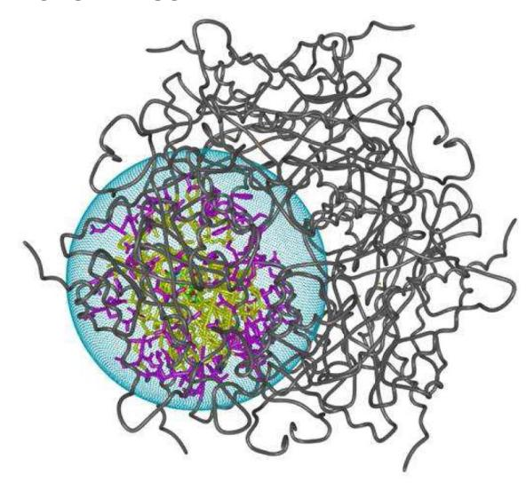
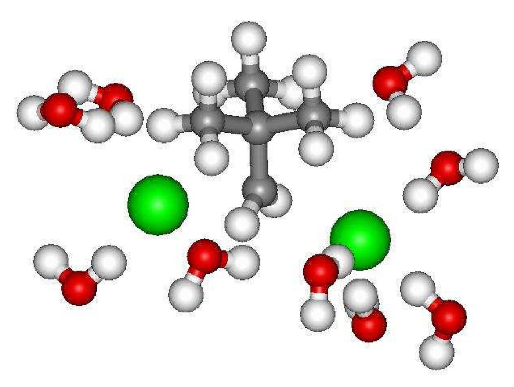
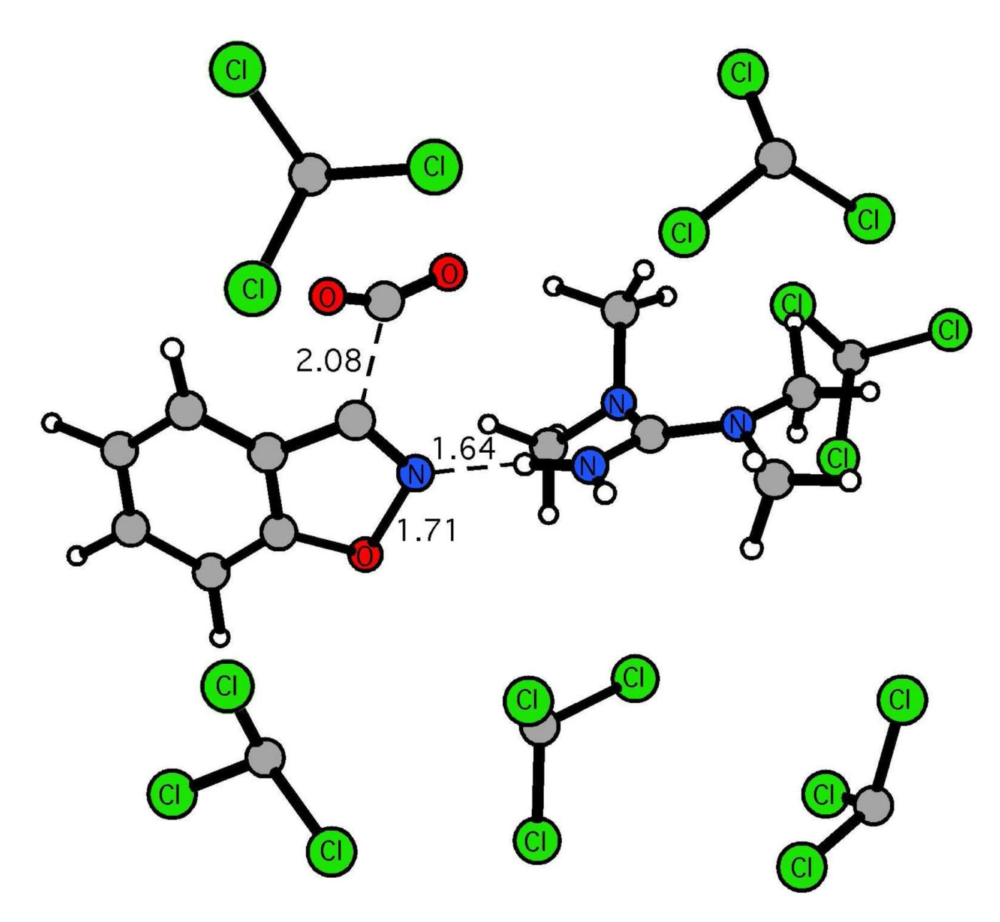
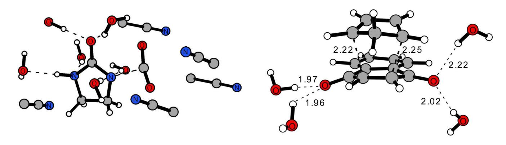
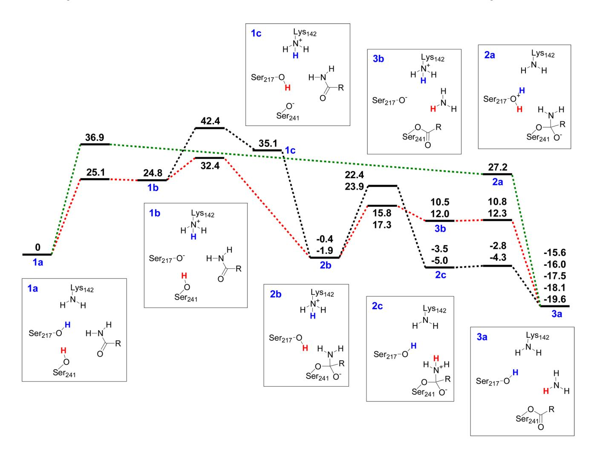
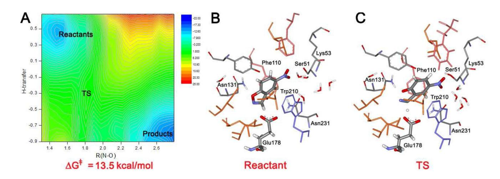
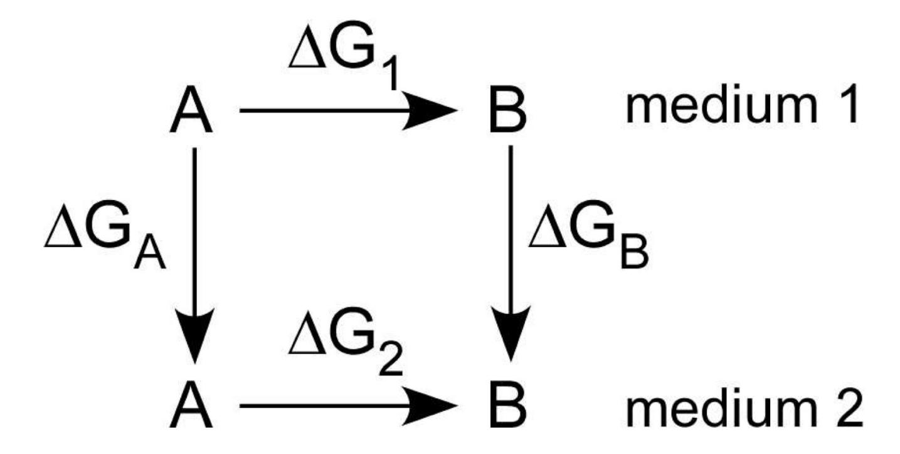

*Acc Chem Res*. Author manuscript; available in PMC 2011 January 19.

Published in final edited form as:

*Acc Chem Res*. 2010 January 19; 43(1): 142–151. doi:10.1021/ar900171c.

# **Advances in QM/MM Simulations for Organic and Enzymatic Reactions**

## **Orlando Acevedo**† and **William L. Jorgensen**‡

†Department of Chemistry and Biochemistry, Auburn University, Auburn, Alabama 36849

‡Department of Chemistry, Yale University, 225 Prospect Street, New Haven, Connecticut 06520-8107

## **Abstract**

#### **CONSPECTUS—**

Application of combined quantum and molecular mechanical (QM/MM) methods focuses on predicting activation barriers and the structures of stationary points for organic and enzymatic reactions. Characterization of the factors that stabilize transition structures in solution and in enzyme active sites provides a basis for design and optimization of catalysts. Continued technological advances allowed expansion from prototypical cases to mechanistic studies featuring detailed enzyme and condensed-phase environments with full integration of the QM calculations and configurational sampling. This required improved algorithms featuring fast QM methods, advances in computing changes in free energies including free-energy perturbation (FEP) calculations, and enhanced configurational sampling. In particular, the present Account highlights development of the PDDG/PM3 semiempirical QM method, computation of multidimensional potentials of mean force (PMF), incorporation of on-the-fly QM in Monte Carlo (MC) simulations, and a polynomial quadrature method for efficient modeling of proton-transfer reactions.

The utility of this QM/MM/MC/FEP methodology is illustrated for a variety of organic reactions including substitution, decarboxylation, elimination, and pericyclic reactions. Comparison with experimental kinetic results on medium effects has verified the accuracy of the QM/MM approach in the full range of solvents from hydrocarbons to water to ionic liquids. Corresponding results from

*ab initio* and density functional theory (DFT) methods with continuum-based treatments of solvation reveal deficiencies, particularly for protic solvents. Also summarized in this Account are three specific QM/MM applications to biomolecular systems: (1) a recent study that clarified the mechanism for the reaction of 2-pyrone derivatives catalyzed by macrophomate synthase as a tandem Michael-aldol sequence rather than a Diels-Alder reaction; (2) elucidation of the mechanism of action of fatty acid amide hydrolase (FAAH), an unusual Ser-Ser-Lys proteolytic enzyme; and, (3) the construction of enzymes for Kemp elimination of 5-nitrobenzisoxazole that highlights the utility of QM/MM in the design of artificial enzymes.

## **Introduction**

QM/MM methods permit the modeling of bond-making and bond-breaking processes, and treatment of systems much larger than by QM alone and/or that lack MM parameters.1–6 Typically, a central region is described by QM methods and the remainder of the system is represented by MM. Many alternatives are possible depending on choices for the QM, MM, representation of the solvent, QM/MM interface, and configurational sampling.2 An early approach for organic reactions in solution began by obtaining a minimum-energy reaction path from *ab initio* calculations in the gas phase. The effects of solvation were then determined for this pathway with importance sampling or free-energy perturbation (FEP) calculations using Metropolis Monte Carlo (MC) simulations.6 In their day, such calculations were massive, typically requiring extensive software development and access to what were then supercomputers, like the Cray 1 and Cyber 205. Application to substitutions, additions, and pericyclic reactions provided fascinating insights on variations in solvation, especially hydrogen bonding, along the reaction paths.6 Nevertheless, clear limitations of this "QM + MM" approach are the use of the same reaction path in different media and the lack of explicit polarization effects. In time, the methodology progressed to eliminate the reaction-path constraints and to integrate on-the-fly QM calculations with the liquid-state simulations.2 ,7 In our approach, the solutes or key parts of the reacting system are treated by QM, the solvent is part of the MM region, solute-solvent interactions consist of Coulombic terms using the QM and MM charges and Lennard-Jones (LJ) interactions using standard MM parameters, and Monte Carlo statistical mechanics provides the configurational sampling.7a This Account summarizes the development of this QM/MM/MC methodology including the PDDG/PM3 semiempirical QM method along with recent applications to organic and enzymatic reactions.

### **QM/MM/MC Details**

#### **Solvent and Atomic Charges**

The reacting systems are surrounded by 500–1000 solvent molecules, which are included explicitly using the OPLS-AA force field for non-aqueous solvents8 and the TIP4P model for water.9 The QM/MM computations are carried out with the *BOSS* and *MCPRO* programs for organic and enzymatic reactions, respectively.10 Periodic boundary conditions are used for the organic reactions, while the active sites of enzymes are embedded in water caps. Solute-solvent and solvent-solvent interactions are typically truncated using 12-Å residue-based cutoffs with smoothing over the last 0.5 Å. The energy and wave function for the QM region are obtained from single-point calculations upon each attempted MC move of a QM element. The nonbonded potential energy between the QM and MM regions is given by Coulomb and Lennard-Jones interactions (eq 1). The σ and ε parameters are taken from the OPLS-AA force field along with the atomic charge *q*i for MM atoms.

$$E_{nonbond} = \sum_{i} \sum_{j>i} \left\{ \frac{q_i q_j e^2}{r_{ij}} + 4\varepsilon_{ij} \left[ \left( \frac{\sigma_{ij}}{r_{ij}} \right)^{12} - \left( \frac{\sigma_{ij}}{r_{ij}} \right)^6 \right] \right\}$$
(1)

An important issue is the computation of charges for the QM atoms. Our preference has been to use the Cramer-Truhlar CMx models, which have been optimized for reproduction of gasphase dipole moments.11 Based on tests for performance in solution, our choice for neutral molecules has been CM1A (AM1-based) or CM3P (PM3-based) charges scaled by ca. 1.14. The 1.14\*CM1A charges yield a mean unsigned error (mue) of 1.0 kcal/mol for free energies of hydration, while the mue is 0.7 kcal/mol with OPLS-AA charges.12 These choices provide a balanced treatment such that acceptable results are consistently obtained for free energies of hydration and medium effects on equilibria and reaction rates.7-13-19

#### **Improved Semiempirical QM Methods**

For proper study of organic and enzymatic reactions, it is essential that extensive sampling of the substrate, protein, and solvent molecules be carried out to obtain configurationally averaged free-energy results. Without adequate sampling, even *ab initio* QM/MM methods can yield spurious findings.20 However, adequate sampling is accompanied by the need to perform large numbers of QM calculations. For example, a recent QM/MM study of Diels-Alder reactions in solution, a relatively simple case, required 3.5 million single-point QM calculations to obtain acceptable convergence for each one-dimensional (1-D) free-energy profile.21 Thus, highly efficient QM methods are needed. In our case, semiempirical QM (SQM) methods have been explored, though there are alternative approaches 1–5 including the empirical valence bond (EVB) and ONIOM methods.1-4

The most common SQM choices, AM122 and PM3,23 were developed in the 1980s and followed the MNDO24 formalism. Subsequent attempts to re-optimize the parameter sets using modern optimizers provided little improvement. 25,26 However, SQM methods suffer from several well-known problems. 22,23 Common errors, which also plague *ab initio* calculations using basis sets without polarization functions, occur for molecules with small rings or adjacent heteroatoms. For the SOM methods, blame could be attributable to both the valence-only sp basis sets and neglect of differential overlap (NDO). Ameliorating efforts included reintroduction of the overlap matrix into the secular equations in MNDO yielding NO-MNDO. and the addition of d-orbitals on the first row with MNDO and AM1.26 The mean unsigned error (mue) for heats of formation was reduced from 8.4 kcal/mol using MNDO to 6.8 kcal/ mol with NO-MNDO for a diverse set of 622 neutral, closed-shell molecules containing C, H, N, and O atoms, and it also gave modest improvements for the activation barriers of nine pericyclic reactions.26 The addition of d-orbitals for 217 hydrocarbons excluding alkynes. reduced the mue for  $\Delta H_{\rm f}$  with MNDO from 9.3 to 6.8 and for AM1 from 5.3 to 3.8 with ring compounds improving from 7.1 to 4.5 kcal/mol. However, the error for alkynes was unacceptably large. The problem was traced to overly repulsive 2-center resonance integrals for short d-d interactions, which is fixable, in principle, with a damping function.

$$PDDG(A, B) = \frac{1}{Z_A + Z_B} \left[ \sum_{i=1}^{2} \sum_{j=1}^{2} (P_{Ai} + P_{Bj}) \exp\left(-10(R_{AB} - D_{Ai} - D_{Bj})^2\right) \right]$$
(2)

In the most successful effort, improvement of the core repulsion formula (CRF) was considered. The principal difference between AM1 and MNDO is the addition of multiple Gaussians to the MNDO CRF, e.g., 7 Gaussians for a C–H interaction in AM1.22. Starting with MNDO, we instead added the pairwise-distance-directed Gaussian expression in eq 2, which uses 4 terms for an A–B interaction and 3 for A-A. This method, PDDG/MNDO, has fewer parameters than AM1, but upon optimization reduced the  $\Delta H_{\rm f}$  mue for the 622 molecule set from 8.4 (MNDO) and 6.7 (AM1) to 5.2 kcal/mol.25 The mue with PM3 for the 622 compounds is only 4.4; however, this was surpassed by adding the PDDG terms to PM3 yielding PDDG/PM3 and a mue of 3.2.25 Performance with the alternative SQM method, SCC-DFTB, was

found to be intermediate between AM1 and PM3.27 With PDDG/PM3, well-known problems with homologation and hydrocarbon branching were corrected, and results for diverse isomerization energies were found to be more accurate (mue = 1.6) than from B3LYP/6-31G\* (mue = 2.3). Δ*H*f results and, therefore, heats of reaction are significantly improved with PDDG/PM3 over B3LYP-based DFT methods; e.g., for the G3 dataset, the mues are 3.2 for PDDG/PM3 and 7.2 for B3LYP/6-311+G(3df,2p). Notably, the listed SQM methods all reproduce MP2/cc-pVTZ molecular geometries with average errors for bond lengths, bond angles, and dihedral angles of only ca. 0.01 Å, 1.5°, and 3°.27 However, a general weak point for SQM methods is the description of hydrogen-bonding; this issue is largely avoided in our QM/MM studies by the MM representation of the solvent and use of the CM1A charges for QM atoms.

The PDDG methods were extended to other elements.28 Dramatic improvements were obtained for 422 halogen-containing molecules with Δ*H*f mues for MNDO (14.0), AM1 (11.1), PM3 (8.1), PDDG/MNDO (6.6), and PDDG/PM3 (5.6).28a The error here for PDDG/PM3 comes predominantly from polyfluoro compounds. Hydrogen-bonded systems, ion-molecule complexes, and transition states were included and yielded results similar to those from B3LYP/6-311++G(d,p). Barrier heights for SN2 reactions involving Cl, Br, and I are particularly well described. PDDG/PM3 parameterization for Si, P, and S was also reported with substantial improvements for sulfur.28b The PDDG/PM3 results for hypervalent Scontaining compounds are significantly better than from MNDO/d and bond-length errors were reduced by 50% over PM3. Finally, the performance of B3LYP-based DFT methods was addressed for the full set of 622 C, H, N, and O-containing molecules with optimization of atomic-energy offsets for the Δ*H*f calculations as with the SQM methods.29 At the highest level tested, B3LYP/6-31+G(d,p), the accuracy for heats of formation and isomerization energies is essentially identical to that with the far simpler and faster PDDG/PM3 method.29

## **Free Energy Perturbation (FEP) Methods**

Accurate calculation of free-energy changes is also needed for the characterization of chemical processes. FEP calculations are based on the Zwanzig equation (eq 3), which relates the free energy difference between an initial (0) and final (1) state to a configurational average involving their potential energy difference.6,30 For application of eq 3 to the medium effect on the interconversion of two molecular entities, A and B, the thermodynamic cycle in Scheme 1 is used. The A to B FEP conversion is performed in both media, and the medium effect is given by eq 4. For acceptable convergence of eq 3, the mutation is normally broken into a series of steps or "windows" that is characterized by a coupling parameter λ that ranges from 0 to 1 as A goes to B. The total Δ*G* is then the sum over the contributions from each window.

$$\Delta G(0 \to 1) = -k_{\rm B} T \ln \langle \exp[-(E_1 - E_0)/k_{\rm B} T] \rangle_0$$
 (3)

$$\Delta \Delta G = \Delta G_2 - \Delta G_1 = \Delta G_B - \Delta G_A \tag{4}$$

For reactions, free energy changes are normally computed as a function of an inter- or intramolecular reaction coordinate, e.g., an interatomic distance or dihedral angle. The resultant free-energy profile is a "potential of mean force" (PMF). FEP calculations are performed between adjacent points on the reaction coordinate and the results are combined to yield the PMF. The geometrical change between points must be small, e.g., Δ*r* = 0.01–0.05 Å, to ensure again acceptable convergence. It is also common to obtain multi-dimensional PMFs by perturbing between points on a grid defined by multiple reaction coordinates.5,31 For most

cases covered here, 2-D PMFs were computed using the lengths of key making and breaking bonds as the reaction coordinates.

### **Organic Reactions in Solution**

#### **Substitutions**

Substitution reactions have long been a testing ground for QM/MM methods.6b,32 Indeed, condensed-phase studies with the present procedures were first carried out for SN2 reactions of chloride ion with methyl, ethyl, and neopentyl chlorides (Figure 1). The transition states were located by mapping the free energy as a function of the two C-Cl distances and the Cl-C-Cl angle.33 PDDG/PM3 and CBS-QB3 results for the gas-phase reactions were virtually identical, and all aspects of the Δ*G*‡ predictions in solution were in good accord with experiment: the absolute Δ*G*‡ values, the barrier lowering in dipolar aprotic solvents, and the effects of the electrophile's structure on reactivity. The rate retardation for SN2 reactions on neopentyl halides was confirmed to be a steric effect in all media.,33 Modeling of SN2 methyltransfer reactions of sulfonium and ammonium salts in aqueous solution also proceeded well using a combination of CBS-QB3 and PDDG-PM3/QM/MM calculations.34

Similarly, the Δ*G*‡ values for the SNAr reaction of N3 − + *p*-FPhNO2 from PDDG/PM3-based QM/MM calculations and experiment generally matched well including the rate increase by a factor of ca. 104 upon transfer from methanol to DMSO (Table 1).13 The computed activation barrier in water was relatively overestimated. This first QM/MM study of an SNAr reaction provided detailed structural characterization of the transition states and intermediate Meisenheimer complexes in four solvents. Parallel B3LYP/6-311+G(2d,p) calculations with solvation treated by the polarizable continuum model (PCM)35 did not reproduce the observed solvent effects (Table 1). The explicit description of hydrogen bonding is necessary.

For Menshutkin reactions, H3N + CH3X → H3NCH3 + + X−, PDDG/PM3 gas-phase Δ*H*s of 124, 117, and 102 kcal/mol compare well with the experimental values of 123, 115, and 107 kcal/mol for X = Cl, Br, and I.5 Subsequent QM/MM calculations for X = Cl in water and DMSO gave Δ*G*‡ values of 25.8 and 30.1 kcal/mol, which are consistent with prior computational results and an experimental value of 23.5 kcal/mol for the X = I reaction in water.5 In contrast to the SN2 and SNAr reactions with anionic nucleophiles, the Menshutkin reactions are accelerated in water in view of the charge development.32e Structural results also showed the expected earlier TS in water, *r*(CN) and *r*(CCl) of 2.14 and 2.18 Å, compared to 2.02 and 2.20 Å in DMSO, and gas-phase values of 1.82 and 2.35 Å. Interestingly, the bond length changes for this type-II SN2 reaction are similar to those for the type-I reactions, e.g., for Cl− + EtCl, *r*(CCl) for the TS increases from 2.29 Å in the gas phase to 2.47 Å in water. This challenges the traditional view that changes in solvent should not lead to changes in TS structure for the type-I reactions.37

#### **Eliminations and Decarboxylations**

QM/MM methodology has also applied to Kemp decarboxylations of 3-carboxybenzisoxazoles,14 decarboxylation of *N*-carboxy-2-imidazolidinone (a biotin model),15 and Cope eliminations of *threo*- and *erythro*-*N,N*-dimethyl-3-phenyl-2-butylamine oxide.16 These reactions experience large rate accelerations upon transfer from protic to aprotic solvents. Both the relative and absolute Δ*G*‡ values were well reproduced with PDDG/PM3-based QM/MM simulations; illustrative computed (±0.3 kcal/mol) and experimental (±1.0 kcal/mol) results are listed in Table 2 for the Kemp reaction of **1** and for decarboxylation of the biotin model. 14c,15b In the substituted case **3**, an internal hydrogen bond is responsible for slow elimination with little solvent dependence.38 Analogous QM/MM calculations with AM1 did not reproduce this effect owing to poor representation of the hydrogen bond, while PDDG/PM3 performed

well for **1–3**. 14c Furthermore, it was demonstrated that ion-pairing with the tetramethylguanidinium (TMG) counterion must be considered to model correctly the Kemp reaction in aprotic solvents like chloroform (Figure 2).14c The computed Δ*G*‡ values are 27.7 and 14.8 kcal/mol for reaction with and without TMG, while the experimental Δ*G*‡ is 24.0 kcal/mol.38

*Ab initio* and DFT calculations coupled with continuum solvation were again found to underestimate solvent effects, as illustrated by the PCM-based results in Table 3 for the Cope elimination.16 Furthermore, simulation of mixed solutions is ill-defined using continuum models. However, QM/MM/MC remains robust, as found for the biotin decarboxylation (Figure 3); e.g., computed Δ*G*‡ s of 23.6, 22.8, and 18.5 kcal/mol were obtained in 33%, 66%, and 100% v/v acetonitrile/water mixtures compared to 22.7, 22.0, and 19.5 kcal/mol from experiment.15b There is clear de-mixing of the solvents to maximize hydrogen bonding to the solute; a little water goes a long way, so substantial rate acceleration is not obtained until the pure acetonitrile limit is approached.

Finally, for a case where there is more mechanistic uncertainty, the uncatalyzed decomposition of urea in water was examined.41 Elimination of ammonia after water-assisted rearrangement to the H3NCONH zwitterion was found to be preferred over hydrolysis by an addition/ elimination mechanism. The computed barrier, 37 kcal/mol, is somewhat higher than experimental estimates of ca. 30 kcal/mol, while the 3-kcal/mol preference for the ammonia elimination is consistent with an experimental rate ratio of ca. 150 for the two processes.

### **Pericyclic Reactions**

Three Diels-Alder reactions, cyclopentadiene with acrylonitrile, methyl vinyl ketone, and 1,4 napthoquinone (Figure 3), were initially investigated in water using AM1/MM and by computing a 1–D PMF as a function of the distance between the midpoint of C1 and C4 for the diene and the center of the C=C bond for the dienophile.21 Though the absolute Δ*G*‡ values were overestimated, the effects of hydration were accurately reproduced. The same approach was followed in a QM/MM study of the reaction of cyclopentadiene and methyl acrylate in two room-temperature ionic liquids, 1-ethyl-3-methylimidazolium (EMIM) tetrachloroaluminate and heptachlorodialuminate.18 The computed ΔΔ*G*‡ (kcal/mol) values of 0.0, 0.6 and −2.9 in water, EMIM-AlCl4, and EMIM-Al2Cl7 again mirrored well the experimental values of 0.0, 0.52, and −1.36. A recent reinvestigation of the three Diels-Alder reactions featured QM/MM/MC computation of full 2-D PMFs as a function of both forming bond lengths using PDDG/PM3 for the QM.17 The 2-D approach enables reliable location of the transition states in an automated manner. The ΔΔ*G*‡ values were reproduced well in four solvents, while corresponding *ab initio* calculations with a continuum solvation model failed to yield the large rate increases in water (Table 4). Early work established the importance of enhanced hydrogen bonding at the transition states for catalysis of pericyclic reactions in protic solvents;6c the concept continues to be actively pursued in developing chiral hydrogen-bond donors as asymmetric catalysts.43

Two ene reactions, tetramethylethylene with singlet oxygen and 4-phenyl-1,2,4-triazoline-3,5 dione (PTAD), were also modeled.19,31 The PDDG/PM3-based QM/MM/FEP calculations found the mechanisms to be medium-dependent with different intermediates in the PTAD system and with conversion from a concerted to stepwise mechanism when proceeding from the gas phase to solution for the 1O2 case. Reasonable free energies of activation were obtained, e.g., 14.9 kcal/mol in acetonitrile (exptl. = 15.0 kcal/mol) for the PTAD system, and 12.5 kcal/ mol in cyclohexane (exptl. = 8.8 kcal/mol) for 1O2. However, DFT/CPCM calculations fared poorly predicting a near-constant barrier of 25 kcal/mol in diverse solvents for the PTAD case.

## **Enzyme -Catalyzed Reactions**

### **Typical Setup and Processing for Proteins**

Initial coordinates are obtained from crystal structures for protein-ligand complexes. For large proteins, 150–200 residues nearest the active site are retained. A utility program is used to convert the raw PDB file into a Z-matrix suitable for *MCPRO* by adding missing hydrogens, performing the residue truncation and capping, and assigning protonation states and OPLS-AA atom types.10 The substrate is placed in the active site and a ca. 25-Å radius water cap containing ca. 1000 water molecules is added. The MC simulations then involve attempted moves of protein side chains, optionally the backbone, substrates, water molecules, and any ions. The MC run for each FEP window consists of ca. 20 million configurations of equilibration and 50 million configurations of averaging. Attractive features of MC simulations for proteins include ease of implementation of geometrical constraints, ease of performance of FEP calculations without endpoint instabilities, efficient sampling in internal coordinates, and uniform, exact temperature and pressure control.10,44 Enzyme residues that are intimately involved in the reaction are included in the QM region. The interface between the QM and MM regions often involves the use of "link atoms", which can be implemented in multiple ways.2 In our approach, the QM residues are capped with hydrogens as link atoms placed on adjacent Cα atoms.45 The QM-MM connection also requires the inclusion of classical bondstretching, angle-bending, and torsion terms for atoms at the interface.

#### **Macrophomate Synthase - A Diels-Alderase?**

Macrophomate synthase (MPS) catalyzes the transformation of 2-pyrone derivatives to benzoate analogues in fungi. The transformation involves three reactions: decarboxylation of oxalacetate to produce pyruvate enolate, two C-C bond formations between a 2-pyrone and pyruvate enolate that form a bicyclic intermediate, and final decarboxylation with concomitant dehydration. Although the second step might be a long-sought enzymatic Diels-Alder reaction, proof that the C-C bond formations are concerted is lacking. A tandem Michael-aldol sequence is an alternative (Scheme 2). Report of a crystal structure for MPS complexed with pyruvate enolate and Mg2+ (see Conspectus Figure)46 enabled QM/MM/MC/FEP investigation of the two pathways.45 1–D PMFs were computed for the Michael and aldol steps, which readily located the illustrated Michael intermediate. Computation of a 2–D PMF failed to find a Diels-Alder transition structure, which was estimated to be at least 17 and 12 kcal/mol less stable than the Michael and aldol transition states. Thus, the QM/MM calculations found that the Michael-aldol mechanism is much preferred and that MPS is not a natural Diels-Alderase. For further resolution of the controversy,45–47 Hilvert and coworkers recently established that MPS efficiently promotes aldol-type chemistry lending strong support for the stepwise mechanism.48

### **Fatty Acid Amide Hydrolase**

FAAH is an integral membrane protein involved in endocannabinoid metabolism.49 The enzyme is the only characterized mammalian member of a class of serine hydrolases that bear a unique catalytic triad, Ser-Ser-Lys.50 Remarkably, FAAH hydrolyzes amides and esters with similar rates; however, the normal preference for esters reemerges when Lys142 is mutated to alanine.51 To clarify the mechanisms and unusual selectivity, the PDDG/PM2-based QM/MM approach was applied to obtain free-energy barriers for the pathways in Figure 4.52 For wildtype FAAH and oleamide, the preferred mechanism (**A**) was computed to involve proton transfer from Ser217 to Lys142, followed by rate-determining formation of the C–O bond between Ser241 and the substrate with concomitant proton transfer from Ser241 to Ser217. An alternative mechanism (**B**) that does not involve Lys142 was found to have a 4.5-kcal/mol higher barrier. Simulations were then carried out for the hydrolysis of methyl oleate; mechanism **A** was again preferred over **B** by 4.1 kcal/mol. To assess the possibility that mechanism **B** occurs with the Lys142Ala mutant, which lacks the basic side chain on residue 142 needed for mechanism **A**, hydrolysis of both substrates by the mutant was also modeled. The experimentally observed rate effects of the mutation were well-reproduced by following mechanism **B**. This process is a striking, multi-step sequence with simultaneous proton transfer from Ser241 to Ser217, attack of Ser241 on the carbonyl carbon of the substrate, and elimination of the leaving group and its protonation by Ser217.

In addition to the mechanistic insights, a significant technical advance was reported for the treatment of proton transfer reactions. In view of the number of such reactions for the FAAH investigation, use of traditional PMF methods would have been prohibitively resourceconsuming. For a typical proton transfer, O-H…O' → O…H–O', it is found that the O…O' distance remains relatively constant and that *r*(O-H) – *r*(H–O') can be used to compute a 1-D PMF.52 This normally requires approximately 30 double-wide FEP windows using 0.02 Å Δ*r* increments, while ca. 900 windows would be needed for a 2–D PMF using two distances as reaction coordinates. Furthermore, for proton transfers, it was found that the free-energy changes for individual windows can be fit almost perfectly by a cubic polynomial. Analytical integration yields a quartic polynomial for the overall proton-transfer PMF. It was shown that this permits accurate construction of the full PMF using only 7 FEP windows instead of the usual 30. This also allowed much more facile construction of 2-D PMFs for cases where one coordinate is a proton transfer and the other is a bond formation, e.g., for **1b** → **2b** in Figure 4. Nevertheless, the investigation of the reactions of FAAH entailed ca. 500 million single-

point QM calculations in the course of the on-the-fly QM/MM/MC calculations.52 The need for fast, accurate QM methods is apparent.

### **Enzymes for Kemp Elimination**

An efficient enzyme design protocol featuring joint theoretical and experiment methodology was recently employed to create artificial enzymes for the Kemp elimination of 5-nitrobenzisoxazole.  $^{53,54}$  Designed enzymes were synthesized and found to yield  $k_{cat}/k_{uncat}$  values in the  $10^2-10^5$  range. Concurrent PDDG/PM3-based QM/MM/FEP calculations provided a deeper understanding of the enzyme structure-function relationships and gave guidance for further optimization of the catalytic performance. Several designed enzymes were modeled beginning from structures generated by *Rosettai* a crystal structure for one, KE07, was subsequently obtained and found to be very close to the computational predictions. The catalytic mechanism for designs KE07, KE10, and KE15 was computed to be concerted with proton transfer generally more advanced in the transition state than breaking of the isoxazolyl N–O bond (Figure 5). The computed activation barriers near 10 kcal/mol for Kemp elimination by these enzymes were significantly smaller than the barrier of 19.8 kcal/mol computed for the reference reaction catalyzed by hydroxide ion. State Thus, all three enzymes were anticipated to be active, as was subsequently established.

The same methodology was also applied to examine the catalysis of a Kemp elimination by a catalytic antibody, 34E4, and its Glu50Asp variant.56 The observed 30-fold rate reduction owing to this small change in the positioning of the catalytic base was well reproduced.57

#### Conclusion

Significant progress has been made in accurate QM/MM modeling of both solution-phase organic and enzymatic reactions through methodology featuring the PDDG/PM3 semiempirical QM method coupled with MC/FEP calculations. Reaction paths and activation barriers have been characterized for numerous organic reactions in multiple solvents and for several enzyme-catalyzed processes. The accord with available experimental data has been good and shows significant improvement over results from QM approaches with continuum solvent models. Nevertheless, challenges remain, especially for further improvement of fast QM methods, more rapid mapping of free-energy surfaces, and for enhanced configurational sampling of biomolecules.

## **Acknowledgments**

Gratitude is expressed to the National Science Foundation (CHE-0446920), National Institutes of Health (GM32136), and DARPA for support of this research, to the co-workers at Auburn and Yale, and to external collaborators, especially Profs. David Baker and Kendall N. Houk.

## Biography

#### **BIOGRAPHICAL INFORMATION**

Orlando Acevedo is a graduate of FIU and Duquesne, and was a postdoctoral associate at Yale; he is currently an Assistant Professor of Chemistry at Auburn University. Bill Jorgensen is a Sterling Professor and Director of the Division of Physical Sciences and Engineering at Yale.

#### **REFERENCES**

 (a) Warshel A, Karplus M. Calculation of ground and excited state potential surfaces of conjugated molecules. I. Formulation and parametrization. J. Am. Chem. Soc 1972;94:5612–5625. (b) Warshel A, Levitt M. Theoretical studies of enzymic reactions: Dielectric, electrostatic and steric stabilization

of the carbonium ion in the reaction of lysozyme. J. Mol. Biol 1976;103:227–249. [PubMed: 985660] (c) Warshel A. Molecular Dynamics Simulations of Biological Reactions. Acc. Chem. Res 2002;35:385–395. [PubMed: 12069623] (d) Kamerlin SCL, Haranczyk M, Warshel A. Progress in Ab Initio QM/MM Free-Energy Simulations of Electrostatic Energies in Proteins: Accelerated QM/MM Studies of pKa, Redox Reactions and Solvation Free Energies. J. Phys. Chem. B 2009;113:1253–1272. [PubMed: 19055405]

- 2. Senn HM, Thiel W. QM/MM Methods for Biomolecular Systems. Angew. Chem. Int. Ed 2009;48:1198–1229.
- 3. Gao J, Ma S, Major DT, Nam K, Pu J, Truhlar DG. Mechanisms and Free Energies of Enzymatic Reactions. Chem. Rev 2006;106:3188–3209. [PubMed: 16895324]
- 4. Vreven T, Morokuma K. Hybrid methods: ONIOM(QM:MM) and QM/MM. Ann. Rep. Comput. Chem 2006;2:35–51.
- 5. Acevedo O, Jorgensen WL. Solvent effects on organic reactions from QM/MM simulations. Ann. Rep. Comput. Chem 2006;2:263–278.
- 6. (a) Jorgensen WL. Free Energy Calculations, A Breakthrough for Modeling Organic Chemistry in Solution. Acc. Chem. Res 1989;22:184–189. (b) Kollman PA. Free energy calculations: Applications to chemical and biochemical phenomena. Chem. Rev 1993;93:2395–2417. (c) Jorgensen WL, Blake JF, Lim D, Severance DL. Investigation of Solvent Effects on Pericyclic Reactions by Computer Simulations. J. Chem. Soc. Faraday Trans 1994;90:1727–1732.
- 7. (a) Kaminski GA, Jorgensen WL. A QM/MM Method Based on CM1A Charges: Applications to Solvent Effects on Organic Equilibria and Reactions. J. Phys. Chem. B 1998;102:1787–1796. (b) Hu H, Yang W. Free Energies of Chemical Reactions in Solution and in Enzymes with Ab Initio Quantum Mechanics/Molecular Mechanics Methods. Annu. Rev. Phys. Chem 2008;59:545–571. [PubMed: 18062769]
- 8. (a) Jorgensen WL, Maxwell DS, Tirado-Rives J. Development and Testing of the OPLS All-Atom Force Field on Conformational Energetics and Properties of Organic Liquids. J. Am. Chem. Soc 1996;118:11225–11236. (b) Jorgensen WL, Tirado-Rives J. Potential energy functions for atomiclevel simulations of water and organic and biomolecular systems. Proc. Nat. Acad. Sci. USA 2005;102:6665–6670. [PubMed: 15870211]
- 9. Jorgensen WL, Chandrasekhar J, Madura JD, Impey W, Klein ML. Comparison of simple potential functions for simulating liquid water. J. Chem. Phys 1983;79:926–935.
- 10. Jorgensen WL, Tirado-Rives J. Molecular Modeling of Organic and Biomolecular Systems Using BOSS and MCPRO. J. Comput. Chem 2005;26:1689–1700. [PubMed: 16200637]
- 11. Thompson JD, Cramer CJ, Truhlar DG. Parameterization of charge model 3 for AM1, PM3, BLYP, and B3LYP. J. Comput. Chem 2003;24:1291–1304. [PubMed: 12827670]
- 12. Blagović MU, Morales de Tirado P, Pearlman SA, Jorgensen WL. Accuracy of Free Energies of Hydration from CM1 and CM3 Atomic Charges. J. Comput. Chem 2004;25:1322–1332. [PubMed: 15185325]
- 13. Acevedo O, Jorgensen WL. Solvent Effects and Mechanism for a Nucleophilic Aromatic Substitution from QM/MM Simulations. Org. Lett 2004;6:2881–2884. [PubMed: 15330638]
- 14. (a) Gao J. An Automated Procedure for Simulating Chemical Reactions in Solution Application to the Decarboxylation of 3-Carboxybenzisoxazole in Water. J. Am. Chem. Soc 1995;117:8600–8607. (b) Zipse H, Apaydin G, Houk KN. A Quantum Mechanical and Statistical Mechanical Exploration of the Thermal Decarboxylation of Kemp's Other Acid (Benzisoxazole-3-carboxylic Acid). The Influence of Solvation on the Transition State Geometries and Kinetic Isotope Effects of a Reaction with an Awesome Solvent Effect. J. Am. Chem. Soc 1995;117:8608–8617. (c) Acevedo O, Jorgensen WL. Influence of Inter- and Intramolecular Hydrogen Bonding on Kemp Decarboxylations from QM/MM Simulations. J. Am. Chem. Soc 2005;127:8829–8834. [PubMed: 15954791]
- 15. (a) Pan, DGaY-K. A QM/MM Monte Carlo Simulation Study of Solvent Effects on the Decarboxylation Reaction of N-Carboxy-2-imidazolidinone Anion in Aqueous Solution. J. Org. Chem 1999;64:1151–1159. (b) Acevedo O, Jorgensen WL. Medium Effects on the Decarboxylation of a Biotin Model in Pure and Mixed Solvents from QM/MM Simulations. J. Org. Chem 2006;71:4896–4902. [PubMed: 16776519]
- 16. Acevedo O, Jorgensen WL. Cope Elimination: Elucidation of Solvent Effects from QM/MM Simulations. J. Am. Chem. Soc 2006;128:6141–6146. [PubMed: 16669683]

17. Acevedo O, Jorgensen WL. Understanding Rate Accelerations for Diels-Alder Reactions in Solution using Enhanced QM/MM Methodology. J. Chem. Theory Comput 2007;3:1412–1419.

- 18. Acevedo O, Jorgensen WL, Evanseck JD. Elucidation of Rate Variations for a Diels-Alder Reaction in Ionic Liquids from QM/MM Simulations. J. Chem. Theory. Comput 2007;3:132–138.
- 19. Acevedo O, Squillacote ME. A New Solvent-Dependent Mechanism for a Triazolinedione Ene Reaction. J. Org. Chem 2008;73:912–922. [PubMed: 18161986]
- 20. Klähn M, Braun-Sand S, Rosta E, Warshel A. On Possible Pitfalls in ab Initio Quantum Mechanics/ Molecular Mechanics Minimization Approaches for Studies of Enzymatic Reactions. J. Phys. Chem. B 2005;109:15645–15650. [PubMed: 16852982]
- 21. Chandrasekhar J, Shariffskul S, Jorgensen WL. QM/MM Simulations of Cycloaddition Reactions in Water: Contribution of Enhanced Hydrogen Bonding at the Transition State to the Solvent Effects. J. Phys. Chem. B 2002;106:8078–8085.
- 22. Dewar MJS, Zoebisch EG, Healy EF, Stewart JJP. AM1: A New General Purpose Quantum Mechanical Molecular Model. J. Am. Chem. Soc 1985;107:3902–3907.
- 23. Stewart JJP. Optimization of Parameters for Semiempirical Methods. J. Comput. Chem 1989;10:209– 264.
- 24. Dewar MJS, Thiel W. Ground states of Molecules. 38. The MNDO Method. Approximations and Parameters. J. Am. Chem. Soc 1977;99:4899–4907.
- 25. Repasky MP, Chandrasekhar J, Jorgensen WL. PDDG/PM3 and PDDG/MNDO: Improved semiempirical methods. J. Comput. Chem 2002;23:1601–1622. [PubMed: 12395428]
- 26. Sattelmeyer KW, Tubert-Brohman I, Jorgensen WL. NO-MNDO: Reintroduction of the Overlap Matrix into MNDO. J. Chem. Theory. Comput 2006;2:413–419.
- 27. Sattelmeyer KW, Tirado-Rives J, Jorgensen WL. Comparison of SCC-DFTB and NDDO-Based Semiempirical Molecular Orbital Methods for Organic Molecules. J. Phys. Chem. A 2006;110:13551–13559. [PubMed: 17165882]
- 28. (a) Tubert-Brohman I, Guimarães CRW, Repasky MP, Jorgensen WL. Extension of the PDDG/PM3 and PDDG/MNDO semiempirical molecular orbitial methods to the halogens. J. Comput. Chem 2003;25:138–150. [PubMed: 14635001] (b) Tubert-Brohman I, Guimarães CRW, Jorgensen WL. Extension of the PDDG/PM3 Semiempirical Molecular Orbital Method to Sulfur, Silicon, and Phosphorus. J. Chem. Theory Comput 2005;1:817–823. [PubMed: 19011692]
- 29. Tirado-Rives J, Jorgensen WL. Performance of B3LYP Density Functional Methods for a Large Set of Organic Molecules. J. Chem. Theory Comput 2008;4:297–306.
- 30. For recent reviews, see: (a) Chipot, C.; Pohorille, A. Springer Series in Chemical Physics, Vol 86: Free Energy Calculations: Theory and Applications in Chemistry and Biology. Chipot, C.; Pohorille, A., editors. Berlin: Springer-Verlag; 2007. p. 33-75. (b) Jorgensen WL, Thomas LL. Perspective on Free-Energy Perturbation Calculations for Chemical Equilibria. J. Chem. Theory Comput 2008;4:869–876. [PubMed: 19936324]
- 31. Sheppard AN, Acevedo O. Multidimensional Exploration of Valley-Ridge Inflection Points on Potential Energy Surfaces. J. Am. Chem. Soc 2009;131:2530–2540. [PubMed: 19193015]
- 32. Some early examples: (a) Chandrasekhar J, Smith SF. Jorgensen, SN2 Reaction Profiles in the Gas Phase and Aqueous Solution. W. L. J. Am. Chem. Soc 1984;106:3049–3050. (b) Bergsma JP, Gertner BJ, Wilson KR, Hynes JT. Molecular dynamics of a model SN2 reaction in water. J. Chem. Phys 1987;86:1356–1376. (c) Bash PA, Field MJ, Karplus M. Free Energy Perturbation Method for Chemical Reactions in the Condensed Phase. J. Am. Chem. Soc 1987;109:8092–8094. (d) Hwang J-K, King G, Creighton S, Warshel A. Simulation of Free Energy Relationships and Dynamics of SN2 Reactions in Aqueous Solution. J. Am. Chem. Soc 1988;110:5297–5311. (e) Gao J. A Priori Computation of a Solvent-Enhanced SN2 Reaction Profile in Water: The Menshutkin Reaction. J. Am. Chem. Soc 1991;113:7796–7797.
- 33. Vayner G, Houk KN, Jorgensen WL, Brauman JI. Steric Retardation of SN2 Reactions in the Gas Phase and Solution. J. Am. Chem. Soc 2004;126:9054–9058. [PubMed: 15264838]
- 34. Gunaydin H, Acevedo O, Jorgensen WL, Houk KN. Computation of Accurate Activation Barriers for Methyl-Transfer Reactions of Sulfonium and Ammonium Salts in Aqueous Solution. J. Chem. Theory Comput 2007;3:1028–1035.

35. Tomasi J, Persico M. Molecular interactions in solution: An overview of methods based on continuous distributions of the solvent. Chem. Rev 1994;94:2027–2094.

- 36. Cox BG, Parker AJ. Solvation of ions. XVIII. Protic-dipolar aprotic solvent effects on the free energies, enthalpies, and entropies of activation of an SNAr reaction. J. Am. Chem. Soc 1973;95:408– 410.
- 37. Westaway KC. Solvent effects on the structure of SN2 transition states. Can. J. Chem 1978;56:2691– 2699.
- 38. Kemp DS, Paul KG. Physical organic chemistry of benzisoxazoles. III. Mechanism and the effects of solvents on rates of decarboxylation of benzisoxazole-3-carboxylic acids. J. Am. Chem. Soc 1975;97:7305–7312.
- 39. Rahil J, You S, Kluger R. Solvent-Accelerated Decarboxylation of N-Carboxy-2-imidazolidinone. J. Am. Chem. Soc 1996;118:12495–12498.
- 40. Sahyun MRV, Cram DJ. Studies in Stereochemistry. XXXV. Mechanism of Ei Reaction of Amine Oxides. J. Am. Chem. Soc 1963;85:1263–1268.
- 41. Alexandrova AN, Jorgensen WL. Why Urea Eliminates Ammonia Rather than Hydrolyzes in Aqueous Solution. J. Phys. Chem. B 2007;111:720–730. [PubMed: 17249815]
- 42. Engberts JBFN. Diels-Alder Reactions in Water: Enforced hydrophobic interaction and hydrogen bonding. Pure & Appl. Chem 1995;67:823–828.
- 43. Taylor MS, Jacobsen EN. Asymmetric Catalysis by Chiral Hydrogen-Bond Donors. Angew. Chem. Int. Ed 2006;45:1520–1543.
- 44. (a) Jorgensen WL, Tirado-Rives J. Monte Carlo vs Molecular Dynamics for Conformational Sampling. J. Phys. Chem 1996;100:14508–14513. (b) Hu J, Ma A, Dinner AR. Monte Carlo simulations of biomolecules: The MC module in CHARMM. J. Comput. Chem 2006;27:203–216. [PubMed: 16323162]
- 45. Guimarães CRW, Udier-Blagovic M, Jorgensen WL. Macrophomate Synthase: QM/MM Simulations Address the Diels-Alder versus Michael-Aldol Reaction Mechanism. J. Am. Chem. Soc 2005;127:3577–3588. [PubMed: 15755179]
- 46. Ose T, Watanabe K, Mie T, Honma M, Watanabe H, Yao M, Oikawa H, Tanaka I. Insights into a natural Diels-Alder reaction from the structure of macrophomate synthase. Nature 2003;422:185– 189. [PubMed: 12634789]
- 47. Wilson E. Is the Case for a Diels-Alderase Dead? Chem. Engin. News 2005 May;:38.
- 48. Serafimov JM, Gillingham D, Kuster S, Hilvert D. The Putative Diels–Alderase Macrophomate Synthase is an Efficient Aldolase. J. Am. Chem. Soc 2008;130:7798–7799. [PubMed: 18512926]
- 49. Cravatt BF, Giang DK, Mayfield SP, Boger DL, Lerner RA, Gilula NB. Molecular characterization of an enzyme that degrades neuromodulatory fatty-acid amides. Nature 1996;384:83–87. [PubMed: 8900284]
- 50. Bracey MH, Hanson MA, Masuda KR, Stevens RC, Cravatt BF. Structural Adaptations in a Membrane Enzyme That Terminates Endocannabinoid Signaling. Science 2002:298. [PubMed: 11951031]
- 51. McKinney MK, Cravatt BF. Evidence for Distinct Roles in Catalysis for Residues of the Serine-Serine-Lysine Catalytic Triad of Fatty Acid Amide Hydrolase. J. Biol. Chem 2003;278:37393– 37399. [PubMed: 12734197]
- 52. Tubert-Brohman I, Acevedo O, Jorgensen WL. Elucidation of Hydrolysis Mechanisms for Fatty Acid Amide Hydrolase and Its Lys142Ala Variant via QM/MM Simulations. J. Am. Chem. Soc 2006;128:16904–16913. [PubMed: 17177441]
- 53. Zanghellini A, Jiang L, Wollacott AM, Cheng G, Meiler J, Althoff EA, Röthlisberger D, Baker D. New algorithms and an in silico benchmark for computational enzyme design. Protein Sci 2006;15:2785–2794. [PubMed: 17132862]
- 54. Röthlisberger D, Khersonsky O, Wollacott AM, Jiang L, DeChancie J, Betker J, Gallaher JL, Althoff EA, Zanghellini A, Dym O, Albeck S, Houk KN, Tawfik DS, Baker D. Kemp elimination catalysts by computational enzyme design. Nature 2008;453:190–195. [PubMed: 18354394]
- 55. Alexandrova AN, Röthlisberger D, Baker D, Jorgensen WL. Catalytic Mechanism and Performance of Computationally Designed Enzymes for Kemp Elimination. J. Am. Chem. Soc 2008;130:15907– 15915. [PubMed: 18975945]

56. Alexandrova AN, Jorgensen WL. Origin of the Activity Drop with the E50D Variant of Catalytic Antibody 34E4 for Kemp Elimination. J. Phys. Chem. B 2009;113:497–504. [PubMed: 19132861]

57. Seebeck FP, Hilvert D. Positional Ordering of Reacting Groups Contributes Significantly to the Efficiency of Proton Transfer at an Antibody Active Site. J. Am. Chem. Soc 2005;127:1307–1312. [PubMed: 15669871]

**Figure 1.** Typical MC configuration for the transition structure for the reaction of Cl− and neopentyl chloride in water. Hydrogen-bonded water molecules are shown.

**Figure 2.** MC configuration illustrating the TS for Kemp decarboxylation of **1** with a TMG counterion in united-atom chloroform. Distances in Å.

**Figure 3.** Transition structures for decarboxylation of a biotin model in 66% acetonitrile/water (left) and the Diels-Alder reaction of cyclopentadiene and naphthoquinone in water (right).

**Figure 4.** Computed free energy diagram (kcal/mol) for the formation of the acyl intermediate 3a from the Michaelis complex **1a**. Mechanism **A** (**1a** → **1b** → **2b** → **3b** → **3a**) is highlighted in red and mechanism **B** (**1a** → **2a** → **3a**) is highlighted in green.

**Figure 5.** (a) Computed 2-D PMF for the Kemp elimination catalyzed by KE10 using *r*(N–O) and the proton-transfer index as reaction coordinates. (b) Illustrative MC configurations for the reactant and (c) transition states.

**Scheme 1.** Thermodynamic cycle for mutation of A to B in two solvents.

**Scheme 2.** Alternative mechanisms for macrophomate synthase.

**Table 1** Δ*G*‡ (kcal/mol) for the SNAr reaction of azide ion and 4-fluoronitrobenzene.

|       | PDDG/PM3a | B3LYP/PCMb | exptl.c |
|-------|-----------|------------|---------|
| Water | 35.3      | 27.6       | 28.1    |
| MeOH  | 27.5      | 27.9       | 27.5    |
| CH3CN | 21.1      | 27.1       | 21.8    |
| DMSO  | 19.9      | 27.9       | 21.8    |

*a* QM/MM.

*b* 6–311+G(2d,p) basis set and PCM.

*c* Ref 36.

**Table 2**

Δ*G*‡ (kcal/mol) for decarboxylation of 3-carboxy-benzisoxazole (Kemp) and *N*-carboxy-2-imidazolidinone (biotin model).

| Solvent | Kemp (calc.)a | Kemp (exptl.)b | Biotin (calc.)c | Biotin (exptl.)d |
|---------|---------------|----------------|-----------------|------------------|
| Water   | 24.9          | 26.4           | 22.8            | 23.2             |
| MeOH    | 22.5          | 24.7           | 21.5            | 20.9             |
| MeCN    | 15.5          | 19.4           | 18.5            | 19.5             |

*a* Ref .14c.

*b* Ref. 38.

*c* Ref. 15b.

*d* Ref. 39.

**Table 3** Δ*G*‡ (kcal/mol) for Cope elimination of *threo*- and *erythro*-N,N-dimethyl-3-phenyl-butylamine oxide.

|            | water | DMSO | THF  |
|------------|-------|------|------|
| threo      |       |      |      |
| B3LYP a,b  | 18.6  | 18.3 | 17.1 |
| MP2a,b     | 24.5  | 24.1 | 22.7 |
| PDDG/PM3c  | 38.1  | 25.9 | 23.7 |
| exptl.d    | 31.3  | 23.5 | 22.2 |
| erythro    |       |      |      |
| B3LYPa,b   | 18.8  | 18.5 | 17.3 |
| MP2a,b     | 24.8  | 24.4 | 22.9 |
| PDDG/PM3 c | 34.8  | 22.0 | 22.0 |
| exptl.d    | 31.8  | 24.2 | 23.1 |

*a* 6–311+G(2d,p) basis set using B3LYP/6–31G(d) geometries.

*b* PCM results.

*c* QM/MM/MC results.

*d* Ref. 40.

**Table 4** ΔΔ*G*‡ (kcal/mol) for Diels-Alder reaction between cyclopentadiene and 1,4-naphthoquinone.

|           | water | MeOH | MeCN | Hexane |
|-----------|-------|------|------|--------|
| MP2/CPCMa | 0.0   | 1.2  | −0.2 | 1.7    |
| PDDG/PM3b | 0.0   | 3.2  | 4.1  | 5.1    |
| exptl.c   | 0.0   | 3.4  | 4.0  | 5.0    |

*a* 6–311+G(2d,p) single-points on CBS-QB3 geometries.

*b* QM/MM.

*c* Ref. 42.